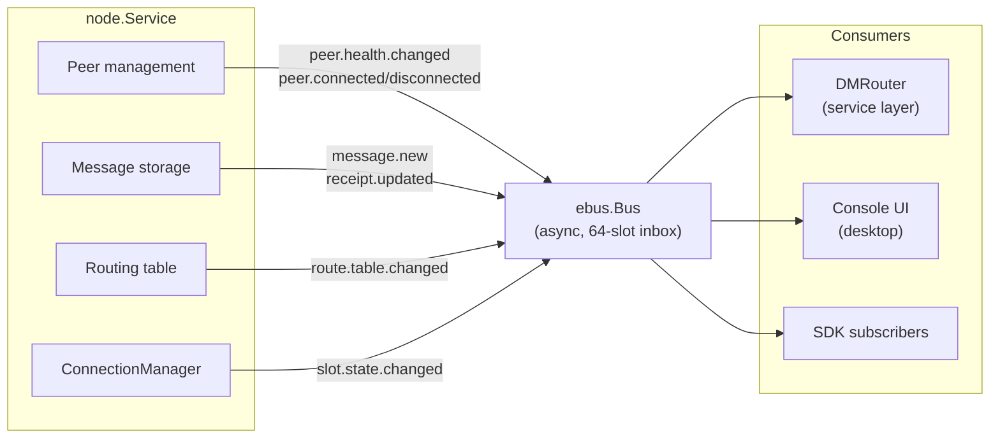
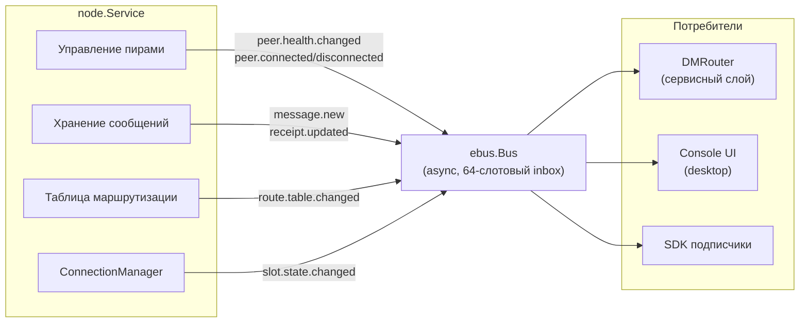

# CORSA Architecture

## English

### Overview

The repository contains the current Go-based CORSA stack:

- `corsa-desktop`: desktop app with an embedded local node
- `corsa-node`: standalone node process
- shared core packages for identity, transport, protocol, encryption, and UI-facing services

### Goals

- keep protocol and node logic independent from any UI toolkit
- let every desktop instance behave like a peer in the mesh
- support future Android/mobile work without rewriting the core
- keep cryptography, trust, and relay logic inside reusable core packages
- support distinct node roles for full relay nodes and client-only nodes

### Layout

- `cmd/corsa-desktop`: desktop entrypoint
- `cmd/corsa-node`: standalone node entrypoint
- `internal/app/desktop`: desktop composition, runtime, and Gio window
- `internal/app/node`: standalone node composition
- `internal/core/config`: environment-driven config and default paths
- `internal/core/identity`: `ed25519` identity, `X25519` box keys, key binding signatures
- `internal/core/directmsg`: encrypted and signed direct-message envelopes
- `internal/core/gazeta`: encrypted anonymous notice transport
- `internal/core/chatlog`: append-only file-backed chat message persistence (see [chatlog.md](chatlog.md)). Owned by `ChatlogGateway` (service layer), not by `node.Service`.
- `internal/core/node`: mesh node, trust store, peer sync, relay (see [mesh.md](mesh.md) for the full mesh network documentation). Does not own message persistence — delegates to a registered `MessageStore` handler (see [chatlog.md](chatlog.md)).
- `internal/core/service`: desktop-facing application service layer (see [dm_router.md](dm_router.md) for the DMRouter service layer). `DesktopClient` is the composition root; concrete work is delegated to `AppInfo` (config snapshot), `LocalRPCClient` (frame dispatch), `ChatlogGateway` (owns `chatlog.Store`), `MessageStoreAdapter` (satisfies `node.MessageStore`), `DMCrypto` (encrypt/decrypt/send/sync), and `NodeProber` (probe + read fetches + routing snapshot). New callers should depend on the narrowest sub-service instead of the full `DesktopClient` surface.
- `internal/core/protocol`: protocol models (see [protocol/](protocol/) for the full protocol specification)
- `internal/core/netcore`: transport core — owns the raw `net.Conn`, the writer goroutine and the framing loop; exposes the typed `netcore.Network` boundary (`SendFrame`, `SendFrameSync`, `Enumerate`, `Close`, `RemoteAddr`, all keyed by `domain.ConnID`) that `node.Service` goes through. See [protocol/network_core.md](protocol/network_core.md).
- `internal/core/transport`: p2p transport abstractions
- `internal/platform/mobile`: future mobile bindings
- see [debug.md](debug.md) for log levels and protocol tracing

### Network core boundary

`internal/core/netcore` owns the transport core. Production read-side and
send paths on `node.Service` go through the `netcore.Network` interface;
read walks over the registry receive a value-typed `connInfo` snapshot, not
a `*netcore.NetCore` pointer. A small lifecycle / handshake carve-out
remains internal to `node/conn_registry.go`: `coreForIDLocked` returns the
live `*netcore.NetCore` handle during handshake-time identity / address /
auth writes, and the registry helpers that create or tear down the
`(net.Conn, ConnID)` binding (`registerInboundConnLocked`,
`attachOutboundCoreLocked`, `unregisterConnLocked`) necessarily touch the
raw `net.Conn`. Outside that carve-out, direct `net.Conn` usage in
`internal/core/node` is confined to accept entry, pre-registration IP
policy, `enableTCPKeepAlive`, and the `connauth.AuthStore` implementation
pinned by an external interface.

The boundary is not aspirational: it is enforced automatically by
`make enforce-netcore-boundary` (see [protocol/network_core.md](protocol/network_core.md))
and the same job runs in CI. New `net.Conn`-first call sites inside
`internal/core/node`, or new `net` stdlib imports outside the whitelisted
carve-out files, fail the build.

### Runtime model

Node roles:

- `full`: relays mesh traffic, forwards direct messages and `Gazeta` notices
- `client`: syncs peers and contacts, stores local traffic, but does not forward mesh traffic
- current defaults:
  - `corsa-node` => `full`
  - `corsa-desktop` => `full`
  - future mobile/light client => `client`

Desktop mode:

1. load or create identity
2. load or create trust store
3. start embedded local node
4. connect to bootstrap peers
5. sync peers and contacts
6. render the local chat UI over the local node state

Standalone node mode:

1. load identity
2. load trust store
3. start TCP listener
4. sync peers and contacts
5. store and relay messages / notices

### Trust model

Current trust and discovery flow:

- fingerprint address is derived from the `ed25519` public key
- `boxkey` is signed by the same identity key
- peers verify `address + pubkey + boxkey + boxsig`
- the first valid contact set is pinned locally (TOFU)
- conflicting key rotations are ignored and recorded as trust conflicts

### Event bus (ebus)

`internal/core/ebus` provides a lightweight in-process pub/sub event bus that
decouples the node layer from consumers (DMRouter, console UI, SDK).

*Diagram — Event bus architecture*

Design principles:

- ebus carries only short delta events (state transitions, counters). No bulk
  data or heavy payloads.
- RPC remains for commands/queries (fetch messages, send messages, routing
  snapshots). RPC handlers may publish ebus events as side effects.
- Each subscriber gets a dedicated drain goroutine with a 64-slot buffered
  inbox. Publishers never block.
- Subscriptions are registered before startup so no events are missed.
- The node layer is fully autonomous — ebus is a notification mechanism, not
  a control channel.

Topics (defined in `internal/core/ebus/topics.go`): `peer.connected`,
`peer.disconnected`, `peer.health.changed`, `peer.pending.changed`,
`peer.traffic.updated`, `slot.state.changed`, `route.table.changed`,
`message.new`, `receipt.updated`, `message.sent`, `message.send.failed`,
`file.sent`, `file.send.failed`, `contact.added`, `contact.removed`,
`identity.added`, `aggregate.status.changed`, `version.policy.changed`.

#### Publisher-side no-op suppression with heartbeat resync

ebus subscribers (most importantly the Desktop `NodeStatusMonitor`) react to
every event by rebuilding a full snapshot and invalidating every window that
observes it. When a single upstream failure — e.g. an i/o timeout cascade
triggered by `cm_session_setup_failed` — fans out into dozens of peer-state
transitions that land on the same aggregate value, the burst of identical
events manifests as a frozen UI: the drain goroutines are busy, but every
rebuilt snapshot is byte-identical to the previous one.

To keep that class of storm off the wire, the two topics that carry full
content snapshots are gated at the publisher with a no-op filter paired
with a periodic heartbeat resync. The heartbeat is mandatory: ebus
`Publish` intentionally drops async deliveries when a subscriber inbox is
full (the publisher must never block), so pure content-based dedup would
leave any subscriber whose initial publish happened to be dropped
permanently stale. The heartbeat bounds that staleness to a known window.

- `version.policy.changed` — `recomputeVersionPolicyLocked` compares the new
  `VersionPolicySnapshot` to the previous one via direct struct equality
  (`==`, all fields are comparable). It publishes when the snapshot content
  changes, on the first recompute (bootstrap), or when
  `versionPolicyHeartbeatInterval` has elapsed since the last publish.
  The heartbeat interval is aligned with `versionPolicyRepairInterval`, so
  the existing bootstrap-loop repair tick doubles as the heartbeat driver
  and no extra scheduling is required.
- `aggregate.status.changed` — `publishAggregateStatusChangedLocked` is the
  single publish point for the topic. It compares against
  `lastPublishedAggregateStatus` (which tracks what subscribers actually
  saw, separately from `aggregateStatus` because init and orphan-eviction
  paths mutate the latter without publishing) using
  `AggregateStatusSnapshot.EqualContent`, which ignores the `ComputedAt`
  heartbeat. It publishes when content changes, on the first call, or when
  `aggregateStatusHeartbeatInterval` has elapsed. The 2 s `bootstrapLoop`
  ticker calls `refreshAggregateStatus()` which funnels through the same
  helper — the ticker is what makes the heartbeat observable. Mirroring
  `ComputedAt` into `status.CheckedAt` in `NodeStatusMonitor` then keeps
  the user-visible "last checked" timestamp moving on a quiet but healthy
  node, rather than freezing when the aggregate counters stop moving.
- `slot.state.changed` — emissions are NOT deduplicated at the publisher.
  ebus lossiness combined with publisher-side memoisation would
  permanently strand any subscriber whose single publish per slot state
  was dropped; the subscriber can never recover because no heartbeat is
  cheap enough to carry the full per-slot state map without coupling the
  publisher to the subscriber's lifecycle. Slot transitions are distinct
  events in a bounded state machine, so emitting them unconditionally
  preserves correctness. Any accidental duplication is absorbed by the
  downstream delta filter in `NodeStatusMonitor.applySlotStateDelta`.

The gate is a publisher concern, not a subscriber concern: filtering on the
subscriber side would still pay the per-event dispatch cost and the fan-out
to every drainer. Gating at the publisher — with a heartbeat to compensate
for lossy delivery — keeps ebus semantics honest: an observed event means
either a content change or a periodic resync.

### Optional timestamps on the snapshot boundary

Types that live on the read-only snapshot boundary (`NodeStatus`,
`PeerHealth`, `CaptureSession`, `DirectMessage`, `PendingMessage`) never
use `*time.Time` for optional timestamp fields. They use the value type
`domain.OptionalTime`, declared in `internal/core/domain/optional_time.go`.

Rationale:

- **Pointer snapshots are not deep copies.** Copying a struct that
  contains `*time.Time` aliases the pointee. A UI goroutine that reads
  the snapshot and a background goroutine that mutates the source see
  the same timestamp through shared memory, which silently breaks the
  snapshot contract.
- **`OptionalTime` is a value.** `struct { t time.Time; valid bool }`
  copies by value. A snapshot is a true deep copy — the UI cannot
  observe mutations from the write path.
- **Optionality is visible from the type.** `optional.Time` zero value
  means "no value", distinct from `time.Time{}` ("epoch"). The project
  rule "absence of a value must be visible from the type, not guessed
  from a zero value" is enforced structurally.

Ebus payloads (e.g. `ebus.PeerHealthDelta.LastConnectedAt`,
`ebus.CaptureSessionStarted.StartedAt`) keep `*time.Time` because the
nil case has a distinct semantic on a delta: "this delta does not
update this field". That meaning is lost if the field is a value type
with a zero-is-missing convention. Deltas cross the snapshot boundary
only through `NodeStatusMonitor.applyX(...)`, which converts incoming
pointers to `OptionalTime` via `domain.TimeFromPtr(...)` at the moment
of application. From that point onwards the state lives as values.

API surface on `domain.OptionalTime`:

- `TimeOf(t time.Time) OptionalTime` — constructor from a concrete time
- `TimeFromPtr(p *time.Time) OptionalTime` — copies the pointee
  (returns an invalid value when `p == nil`)
- `TimeFromNonZero(t time.Time) OptionalTime` — returns invalid when
  `t.IsZero()`, useful for wire-level `time.Time{}` inputs
- `Valid() bool` — `true` iff the value is set
- `Time() time.Time` — returns the underlying time (zero value when
  invalid)
- `Ptr() *time.Time` — allocates a fresh pointee on every call (safe
  to hand out to a ebus delta without aliasing state)
- `Equal`, `Before`, `After`, `Sub` — value-safe comparisons

### Recommended next steps

1. surface trust conflicts in the desktop UI
2. add signatures to `Gazeta` notices
3. move from line protocol to structured frames
4. ~~add persistent storage for message history~~ — done, see [chatlog.md](chatlog.md)
5. add mobile/light-client bindings over the same core

---

## Русский

### Обзор

Репозиторий сейчас содержит актуальный Go-стек CORSA:

- `corsa-desktop`: desktop-приложение со встроенной локальной нодой
- `corsa-node`: отдельный процесс ноды
- общие core-пакеты для identity, транспорта, протокола, шифрования и UI-сервисов

### Цели

- держать протокол и логику ноды независимыми от конкретного UI toolkit
- сделать так, чтобы каждый desktop-инстанс был полноценным peer в mesh
- оставить возможность для будущего Android/mobile клиента без переписывания core
- держать криптографию, trust и relay-логику в переиспользуемых пакетах
- поддерживать разные роли узла: полный relay-узел и client-only узел

### Структура

- `cmd/corsa-desktop`: точка входа desktop-приложения
- `cmd/corsa-node`: точка входа standalone-ноды
- `internal/app/desktop`: сборка desktop-приложения, runtime и Gio-окно
- `internal/app/node`: сборка standalone-ноды
- `internal/core/config`: конфиг из env и дефолтные пути
- `internal/core/identity`: identity на `ed25519`, `X25519` box keys, подписи привязки ключей
- `internal/core/directmsg`: зашифрованные и подписанные direct-message envelopes
- `internal/core/gazeta`: зашифрованный анонимный transport для notices
- `internal/core/chatlog`: append-only хранение истории сообщений на диске (см. [chatlog.md](chatlog.md)). Владеет `ChatlogGateway` (сервисный слой), а не `node.Service`.
- `internal/core/node`: mesh-нода, trust store, peer sync, relay (см. [mesh.md](mesh.md) для полной документации mesh-сети). Не владеет хранением сообщений — делегирует зарегистрированному обработчику `MessageStore` (см. [chatlog.md](chatlog.md)).
- `internal/core/service`: сервисный слой для desktop-клиента (см. [dm_router.md](dm_router.md) для сервисного слоя DMRouter). `DesktopClient` — composition root; реальная работа делегируется суб-сервисам: `AppInfo` (immutable snapshot конфигурации), `LocalRPCClient` (диспатч фреймов), `ChatlogGateway` (владеет `chatlog.Store`), `MessageStoreAdapter` (реализует `node.MessageStore`), `DMCrypto` (шифрование/дешифрование/отправка/синхронизация DM) и `NodeProber` (probe + read fetch + routing snapshot). Новые потребители должны зависеть от узкого суб-сервиса, а не от широкой поверхности `DesktopClient`.
- `internal/core/protocol`: модели протокола (см. [protocol/](protocol/) для полной спецификации протокола)
- `internal/core/netcore`: сетевое ядро — владеет raw `net.Conn`, writer-горутиной и циклом фреймирования; предоставляет типизированную границу `netcore.Network` (`SendFrame`, `SendFrameSync`, `Enumerate`, `Close`, `RemoteAddr`, все ключены `domain.ConnID`), через которую ходит `node.Service`. См. [protocol/network_core.md](protocol/network_core.md).
- `internal/core/transport`: p2p-абстракции транспорта
- `internal/platform/mobile`: будущие mobile bindings
- см. [debug.md](debug.md) для уровней логирования и трассировки протокола

### Граница сетевого ядра

`internal/core/netcore` владеет transport core. Production read-side и
send-пути `node.Service` идут через интерфейс `netcore.Network`;
read-обходы реестра получают value-типизированный снимок `connInfo`, а не
указатель `*netcore.NetCore`. Небольшой lifecycle / handshake carve-out
остаётся внутри `node/conn_registry.go`: `coreForIDLocked` возвращает
живой handle `*netcore.NetCore` на время handshake-time записей
identity / address / auth, а registry-хелперы, создающие или разрушающие
биндинг `(net.Conn, ConnID)` (`registerInboundConnLocked`,
`attachOutboundCoreLocked`, `unregisterConnLocked`), неизбежно трогают
raw `net.Conn`. За пределами этого carve-out'а прямое использование
`net.Conn` в `internal/core/node` ограничено accept entry,
pre-registration IP policy, `enableTCPKeepAlive` и реализацией
`connauth.AuthStore`, сигнатура которой диктуется внешним интерфейсом.

Граница не декларативная: она удерживается автоматически через
`make enforce-netcore-boundary` (см. [protocol/network_core.md](protocol/network_core.md)),
и тот же job крутится в CI. Новые `net.Conn`-first call-sites внутри
`internal/core/node` или новые импорты `net` из stdlib вне whitelist'а
carve-out файлов — это failed build.

### Модель запуска

Роли узла:

- `full`: ретранслирует mesh-трафик, direct messages и `Gazeta` notices
- `client`: синкает peers и contacts, хранит локальный трафик, но не форвардит mesh-трафик
- текущие значения по умолчанию:
  - `corsa-node` => `full`
  - `corsa-desktop` => `full`
  - будущий mobile/light client => `client`

В desktop-режиме:

1. загружается или создается identity
2. загружается или создается trust store
3. запускается встроенная локальная нода
4. нода подключается к bootstrap peers
5. нода синкает peers и contacts
6. UI показывает чат поверх состояния локальной ноды

В режиме standalone-ноды:

1. загружается identity
2. загружается trust store
3. поднимается TCP listener
4. нода синкает peers и contacts
5. нода хранит и ретранслирует сообщения / notices

### Trust model

Текущая схема доверия и discovery:

- fingerprint-адрес получается из `ed25519` public key
- `boxkey` подписывается тем же identity key
- peer проверяет связку `address + pubkey + boxkey + boxsig`
- первый валидный набор ключей pin-ится локально по модели TOFU
- конфликтующие замены ключей игнорируются и записываются как trust conflicts

### Шина событий (ebus)

`internal/core/ebus` предоставляет лёгкую in-process pub/sub шину событий,
отвязывающую слой ноды от потребителей (DMRouter, console UI, SDK).

*Диаграмма — Архитектура шины событий*

Принципы проектирования:

- ebus передаёт только короткие дельта-события (переходы состояний, счётчики).
  Никаких тяжёлых данных.
- RPC остаётся для команд/запросов (fetch сообщений, отправка сообщений,
  snapshot таблицы маршрутизации). RPC-обработчики могут публиковать
  ebus-события как side-эффект.
- Каждый подписчик получает выделенную drain-горутину с 64-слотовым
  буферизованным inbox. Издатели никогда не блокируются.
- Подписки регистрируются до startup, чтобы не потерять события.
- Слой ноды полностью автономен — ebus это механизм уведомлений,
  а не канал управления.

Топики (определены в `internal/core/ebus/topics.go`): `peer.connected`,
`peer.disconnected`, `peer.health.changed`, `peer.pending.changed`,
`peer.traffic.updated`, `slot.state.changed`, `route.table.changed`,
`message.new`, `receipt.updated`, `message.sent`, `message.send.failed`,
`file.sent`, `file.send.failed`, `contact.added`, `contact.removed`,
`identity.added`, `aggregate.status.changed`, `version.policy.changed`.

#### Подавление no-op публикаций на стороне издателя с heartbeat-пересинхронизацией

Подписчики ebus (в первую очередь Desktop `NodeStatusMonitor`) на каждое
событие перестраивают полный snapshot и инвалидируют все окна, которые его
наблюдают. Когда один входной сбой — например каскад i/o таймаутов после
`cm_session_setup_failed` — разливается в десятки переходов состояния пиров,
приводящих к одному и тому же агрегату, пакет идентичных событий
проявляется как зависший UI: drain-горутины заняты, но каждый
пересобранный snapshot побайтно совпадает с предыдущим.

Чтобы такой шторм не доходил до шины, два топика, которые переносят
полные content-snapshot'ы, защищены no-op гейтом на стороне издателя в
паре с периодическим heartbeat-пересинхроном. Heartbeat обязателен:
`Publish` в ebus намеренно сбрасывает async-доставку, если inbox
подписчика заполнен (издатель никогда не блокируется), поэтому чистый
content-based dedup оставил бы подписчика, у которого первая публикация
потерялась, навсегда устаревшим. Heartbeat ограничивает это устаревание
известным окном.

- `version.policy.changed` — `recomputeVersionPolicyLocked` сравнивает новый
  `VersionPolicySnapshot` с предыдущим напрямую через `==` (все поля
  comparable). Публикация происходит при изменении контента, на первом
  recompute (bootstrap) или когда с момента последней публикации прошло
  `versionPolicyHeartbeatInterval`. Интервал heartbeat выровнен с
  `versionPolicyRepairInterval`, поэтому существующий periodic-repair
  тик bootstrapLoop сразу служит драйвером heartbeat — отдельная
  планировка не нужна.
- `aggregate.status.changed` — `publishAggregateStatusChangedLocked` —
  единственная точка публикации этого топика. Сравнение идёт против
  `lastPublishedAggregateStatus` (который отражает то, что реально
  увидели подписчики, отдельно от `aggregateStatus`, потому что пути
  init и orphan-eviction мутируют последнее без публикации) через
  `AggregateStatusSnapshot.EqualContent`, игнорирующий heartbeat-поле
  `ComputedAt`. Публикация происходит при изменении контента, на
  первом вызове или когда прошло `aggregateStatusHeartbeatInterval`.
  2-секундный тикер `bootstrapLoop` вызывает `refreshAggregateStatus()`,
  который проходит через тот же helper — именно тикер делает heartbeat
  наблюдаемым. Перенос `ComputedAt` в `status.CheckedAt` в
  `NodeStatusMonitor` заодно удерживает пользовательский индикатор
  "last checked" в движении на тихой, но здоровой ноде — он не
  замирает, когда перестают двигаться счётчики агрегата.
- `slot.state.changed` — публикации НЕ дедуплицируются на стороне
  издателя. Потерявшая способность доставки ebus в сочетании с
  publisher-side memo навсегда оставила бы любого подписчика, чья
  единственная публикация по состоянию слота была сброшена; подписчик
  не сможет восстановиться, потому что дешёвого heartbeat, который
  несёт полную map per-slot состояний без привязки издателя к
  жизненному циклу подписчика, не существует. Переходы слотов — это
  различимые события в ограниченной state machine, поэтому безусловная
  публикация сохраняет корректность. Случайное дублирование поглощает
  downstream delta-фильтр в `NodeStatusMonitor.applySlotStateDelta`.

Гейт — ответственность издателя, а не подписчика: фильтрация на стороне
подписчика всё равно оплачивает диспатч события и fan-out по всем drain'ам.
Гейт на издателе — вместе с heartbeat, компенсирующим потерю доставки —
сохраняет честность семантики ebus: наблюдаемое событие означает либо
изменение контента, либо периодический ресинхрон.

### Опциональные timestamps на границе snapshot

Типы, живущие на границе read-only snapshot (`NodeStatus`, `PeerHealth`,
`CaptureSession`, `DirectMessage`, `PendingMessage`), никогда не
используют `*time.Time` для опциональных timestamp-полей. Используется
value-тип `domain.OptionalTime`, объявленный в
`internal/core/domain/optional_time.go`.

Почему так:

- **Pointer snapshot это не deep copy.** Копирование структуры с
  `*time.Time` aliases the pointee. UI-горутина, читающая snapshot, и
  фоновая горутина, мутирующая источник, видят одно и то же время
  через разделяемую память — snapshot-контракт молча нарушается.
- **`OptionalTime` это значение.** `struct { t time.Time; valid bool }`
  копируется по значению. Snapshot становится настоящим deep copy — UI
  не может наблюдать мутации write-пути.
- **Опциональность видна из типа.** Zero value `OptionalTime` означает
  "нет значения", это отличается от `time.Time{}` ("эпоха"). Правило
  проекта "отсутствие значения должно быть видно из типа, а не
  угадываться по пустому значению" закрывается структурно.

Ebus-пейлоады (например `ebus.PeerHealthDelta.LastConnectedAt`,
`ebus.CaptureSessionStarted.StartedAt`) оставляют `*time.Time`, потому
что на delta nil имеет отдельную семантику: "эта delta не обновляет
это поле". Этот смысл теряется, если поле становится value-типом
с конвенцией "zero = missing". Дельты попадают в snapshot-границу
только через `NodeStatusMonitor.applyX(...)`, где входящие указатели
преобразуются в `OptionalTime` через `domain.TimeFromPtr(...)` в
момент применения. Дальше состояние живёт только как значения.

API `domain.OptionalTime`:

- `TimeOf(t time.Time) OptionalTime` — конструктор из конкретного времени
- `TimeFromPtr(p *time.Time) OptionalTime` — копирует pointee
  (возвращает невалидное значение, если `p == nil`)
- `TimeFromNonZero(t time.Time) OptionalTime` — возвращает невалидное
  значение при `t.IsZero()`, полезно для wire-level `time.Time{}`
- `Valid() bool` — `true`, если значение установлено
- `Time() time.Time` — возвращает время (zero value, если невалидно)
- `Ptr() *time.Time` — аллоцирует свежий pointee на каждый вызов
  (безопасно отдавать ebus-дельте, aliasing невозможен)
- `Equal`, `Before`, `After`, `Sub` — value-safe сравнения

### Следующие шаги

1. показать trust conflicts в desktop UI
2. добавить подписи для `Gazeta` notices
3. перейти от line protocol к structured frames
4. ~~добавить персистентное хранение истории сообщений~~ — сделано, см. [chatlog.md](chatlog.md)
5. сделать mobile/light-client bindings поверх того же core
