# Chat Log Persistence

## English

### Overview

The `chatlog` package provides append-only, file-backed storage for chat messages.
The desktop client does **not** keep all conversations in memory. Messages are
written to JSONL files on disk as they arrive and read back on demand when the
UI switches to a conversation. Only lightweight metadata (message headers and
previews) is kept in memory for the sidebar.

### Architecture diagram

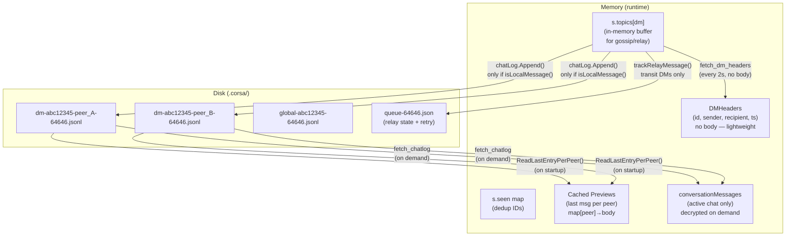

### What is stored where

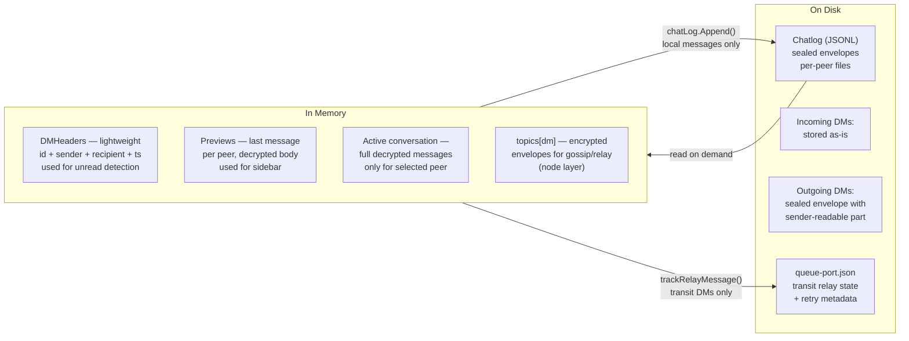

### Message arrival flow

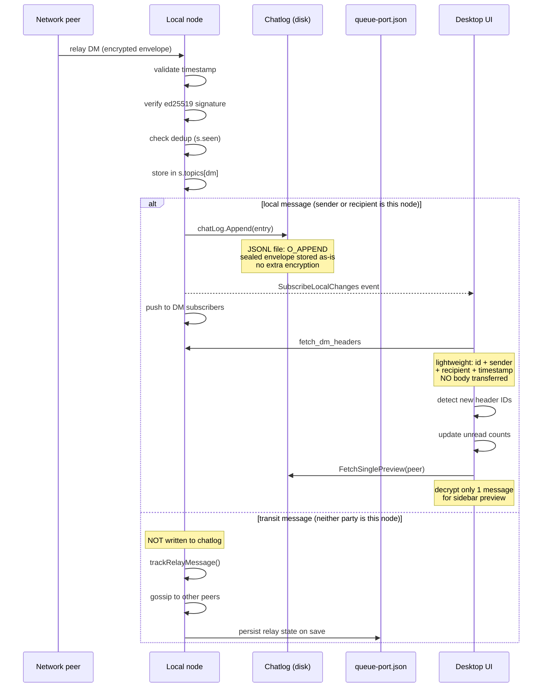

### Sending a message

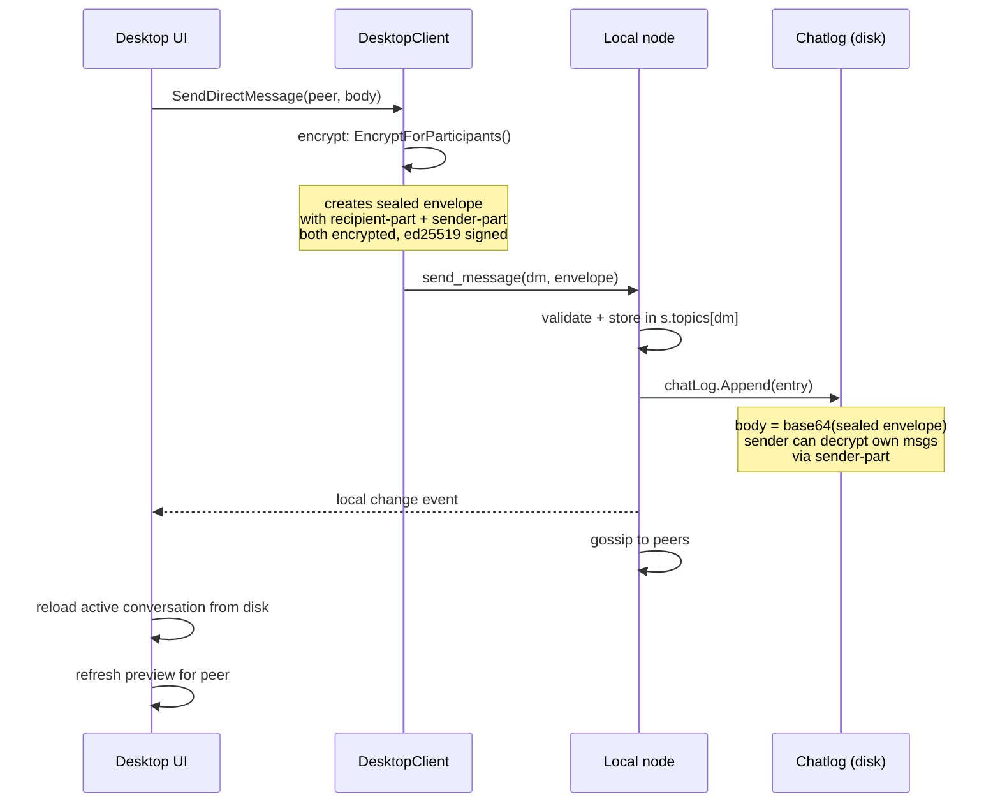

### Loading a conversation (on demand)

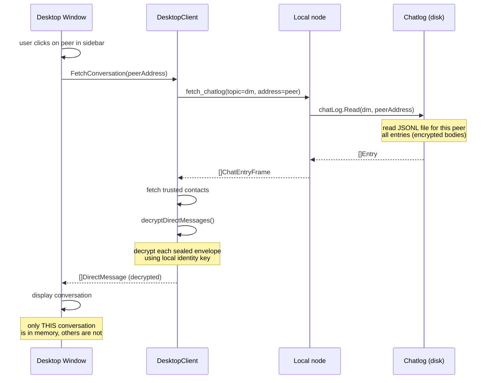

### Loading previews (on startup, with retry)

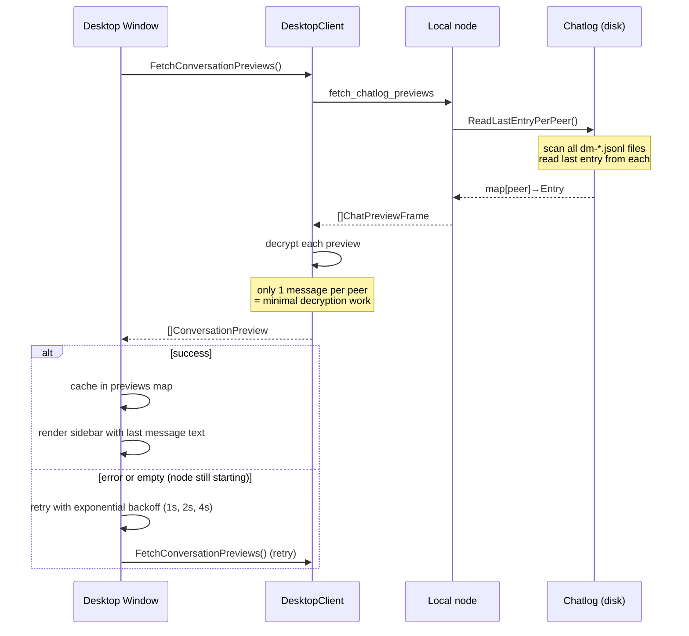

### File naming

Each conversation partner gets its own file in the chatlog directory
(defaults to `.corsa/`, configurable via `CORSA_CHATLOG_DIR`):

```
dm-<identity_short>-<peer_address>-<port>.jsonl   # DM with a specific peer
global-<identity_short>-<port>.jsonl               # broadcast / public messages
```

- `identity_short` — first 8 characters of the node's identity address (40-char hex SHA256 fingerprint)
- `peer_address` — full 40-char hex address of the conversation partner
- `port` — TCP listen port (same suffix used for identity, trust, queue, and peers files)

This naming scheme ensures:
- Multiple identities on the same machine don't collide
- Multiple node instances on different ports don't collide
- Each conversation is in its own file for independent access

### File format

Files use JSON Lines format — one JSON object per line:

```json
{"id":"550e8400-e29b-41d4-a716-446655440000","sender":"aabb...","recipient":"ccdd...","body":"<sealed_envelope_base64>","created_at":"2026-03-23T12:00:00.000Z","flag":"immutable"}
{"id":"660e8400-e29b-41d4-a716-446655440001","sender":"ccdd...","recipient":"aabb...","body":"<sealed_envelope_base64>","created_at":"2026-03-23T12:01:00.000Z","flag":"immutable"}
```

Each line is a `chatlog.Entry`:

| Field       | Type   | Description                                          |
|-------------|--------|------------------------------------------------------|
| `id`        | string | Message UUID                                         |
| `sender`    | string | Sender's identity address (40-char hex)              |
| `recipient` | string | Recipient's identity address or `*` for broadcast    |
| `body`      | string | Raw message body (sealed envelope for DMs, plaintext for global) |
| `created_at`| string | RFC3339Nano timestamp                                |
| `flag`      | string | Message flag (immutable, sender-delete, etc.)        |

### Body encoding

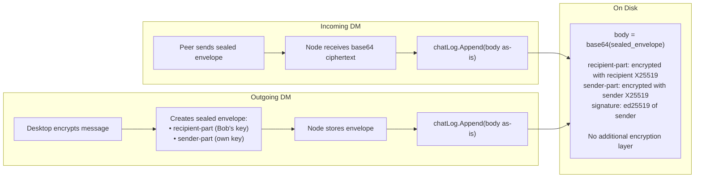

- **Incoming DMs**: stored as-is. The body is already a base64-encoded sealed envelope
  that can only be decrypted by the recipient's or sender's identity key via
  `directmsg.DecryptForIdentity()`.
- **Outgoing DMs**: the body is the same sealed envelope, which includes a sender-part
  encrypted with the sender's own box key — so the sender can always decrypt their own
  messages.
- **Global/broadcast messages**: stored as-is (plaintext body).

No additional encryption layer is applied. The sealed envelope itself provides
end-to-end encryption for DMs.

### Write flow

```
storeIncomingMessage()
  ├── validate timestamp and signatures
  ├── store in-memory (s.topics[topic])
  ├── if isLocalMessage():
  │     ├── chatLog.Append(topic, selfAddress, entry)
  │     │     └── open file O_APPEND → write JSON line → close
  │     ├── emitLocalChange() → notify UI
  │     └── push to DM subscribers + delivery receipt
  ├── gossip to peers (if routing, via shouldRouteStoredMessage)
  └── trackRelayMessage() (transit DMs only)
```

The append happens synchronously after the in-memory store, before gossip.
The chatlog directory is auto-created (`MkdirAll` with `0700`) if it does not exist.
File writes use `O_CREATE|O_APPEND|O_WRONLY` with `0600` permissions.
Errors are logged but do not fail the message store — the in-memory store
and network propagation always proceed.

**Transit messages are NOT written to chatlog.** When a full node relays a DM
where neither sender nor recipient is the local identity, the message is stored
only in-memory (`s.topics[dm]`) for gossip/relay purposes. Transit persistence
is handled separately via `queue-<port>.json` and the `relayRetry` mechanism.
This ensures the local chat history only contains conversations this node
actually participates in.

### Read flow

Desktop client uses three read strategies depending on context:

| Strategy                | When                          | What is read                    | Decryption |
|-------------------------|-------------------------------|---------------------------------|------------|
| `fetch_dm_headers`      | Every 2s poll                 | ID + sender + recipient + ts (local only) | None       |
| `fetch_chatlog_previews`| App startup (with retry)      | Last entry per conversation     | 1 msg/peer |
| `fetch_chatlog`         | User opens a conversation     | All entries for one peer        | Full       |

```
# Lightweight poll (every 2 seconds)
HandleLocalFrame("fetch_dm_headers")
  └── return message headers from s.topics[dm] — local only (sender/recipient = this node), no body, no disk I/O

# Preview load (on startup with retry + on new message)
HandleLocalFrame("fetch_chatlog_previews")
  ├── chatLog.ReadLastEntryPerPeer()
  │     └── scan all dm-*.jsonl files → read last line from each
  └── return []ChatPreviewFrame with encrypted bodies
# Startup: retries up to 4 times (backoff 1s→2s→4s) if node is not ready

# Full conversation load (on demand)
HandleLocalFrame("fetch_chatlog")
  ├── chatLog.Read(topic, peerAddress)   [or ReadLast with limit]
  │     └── open file → scan JSON lines → return []Entry
  └── convert to []ChatEntryFrame → return Frame
```

### Console commands

| Command                                    | Description                              |
|--------------------------------------------|------------------------------------------|
| `fetch_chatlog [topic] <peer_address>`     | Read chat history for a peer             |
| `fetch_chatlog_previews`                   | Last message for each conversation       |
| `fetch_dm_headers`                         | Lightweight DM headers (no body, local only — transit filtered out) |
| `fetch_conversations`                      | List all conversations with counts       |

### Config

| Environment Variable  | Config Field          | Default   | Description                  |
|-----------------------|-----------------------|-----------|------------------------------|
| `CORSA_CHATLOG_DIR`   | `Node.ChatLogDir`     | `.corsa`  | Directory for chatlog files (auto-created if missing) |

### Deduplication

`HasEntryID()` can check whether a message ID already exists in the file.
Currently, the in-memory `seen` map in the node service handles deduplication
before the chatlog append, so duplicate writes don't normally occur.

### Conversation listing

`ListConversations()` scans the chatlog directory for DM files matching the
current identity and port, reads each file to extract the last message timestamp
and total count, and returns results sorted by most recent message first.

### Memory optimization

The desktop client minimizes memory usage by following these principles:

1. **No bulk DM decryption in poll loop** — `ProbeNode()` fetches only lightweight
   `DMHeaders` (no message bodies) every 2 seconds.
2. **Previews loaded once** — on startup (with retry up to 4 attempts, exponential
   backoff), one message per conversation is decrypted for the sidebar; updated
   incrementally when new messages arrive.
3. **Deduplicated preview refresh** — when new headers arrive,
   `refreshPreviewForPeer()` is called once per unique peer, not once per message.
4. **Conversation loaded on demand** — full chat history is read from disk and
   decrypted only when the user switches to a specific peer.
5. **Only active conversation in memory** — switching to another peer replaces
   the previous conversation data.
6. **Transit messages excluded from chatlog** — DMs relayed through a full node
   (where neither party is local) are only stored in-memory for gossip; their
   persistence is handled by `queue-<port>.json`.
7. **Transit DMs filtered from `fetch_dm_headers`** — the poll loop returns only
   headers where the local node is sender or recipient; `seenIncoming` map
   records only local headers to avoid unbounded memory growth from transit traffic.

---

## Русский

### Обзор

Пакет `chatlog` обеспечивает append-only хранение сообщений на диске.
Desktop-клиент **не** хранит все чаты в памяти. Сообщения записываются
в JSONL-файлы по мере поступления и читаются обратно по запросу, когда
пользователь переключается на диалог. В памяти хранятся только легковесные
метаданные (заголовки сообщений и превью) для боковой панели.

### Диаграмма архитектуры

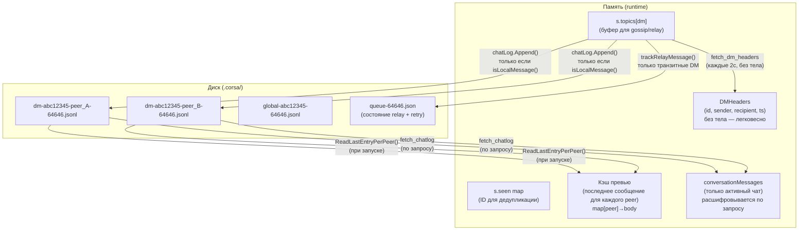

### Что где хранится

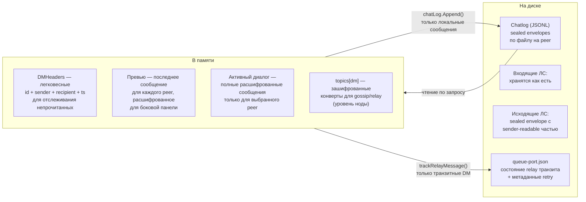

### Flow поступления сообщения

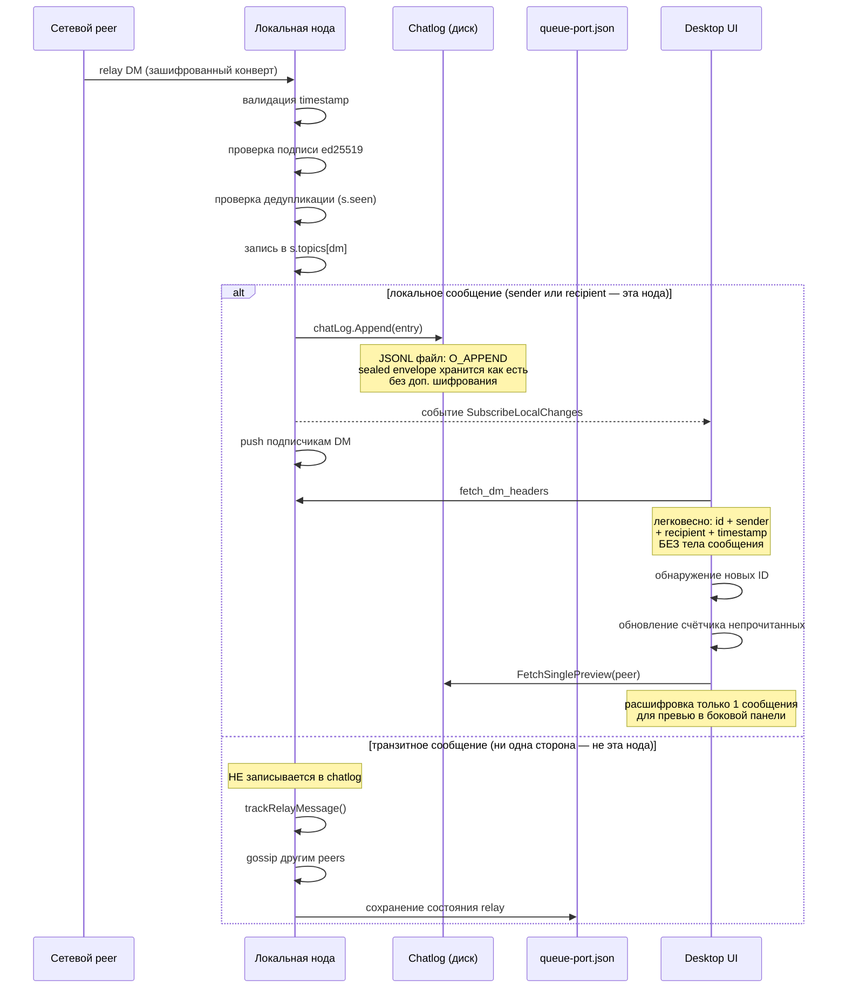

### Flow отправки сообщения

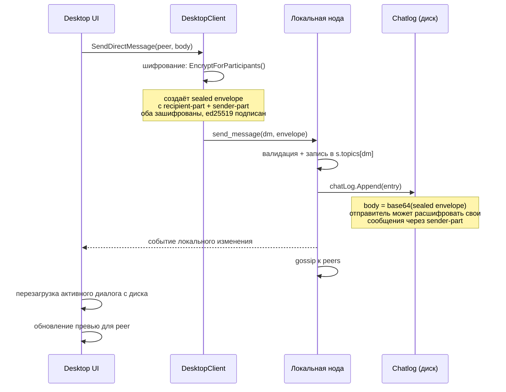

### Flow загрузки диалога (по запросу)

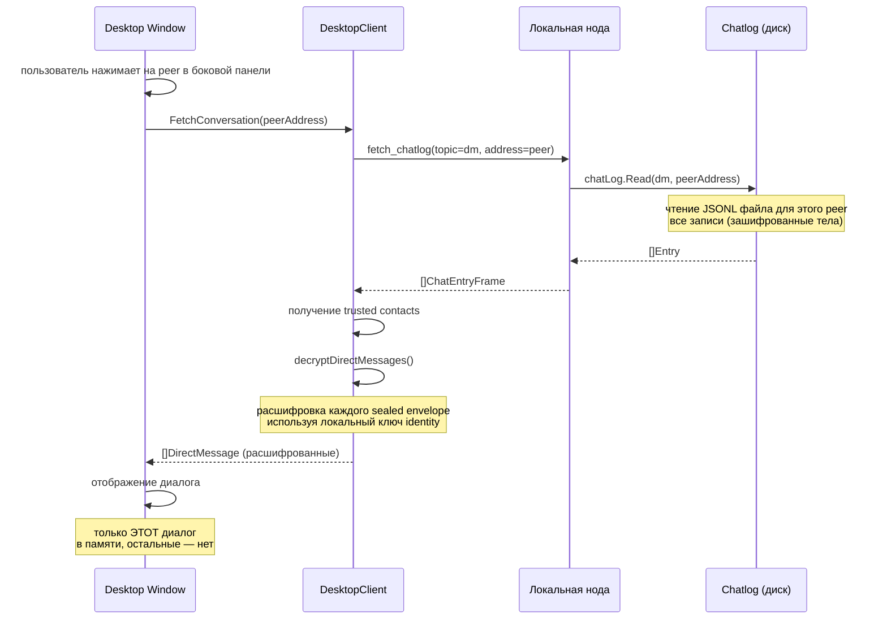

### Flow загрузки превью (при запуске, с retry)

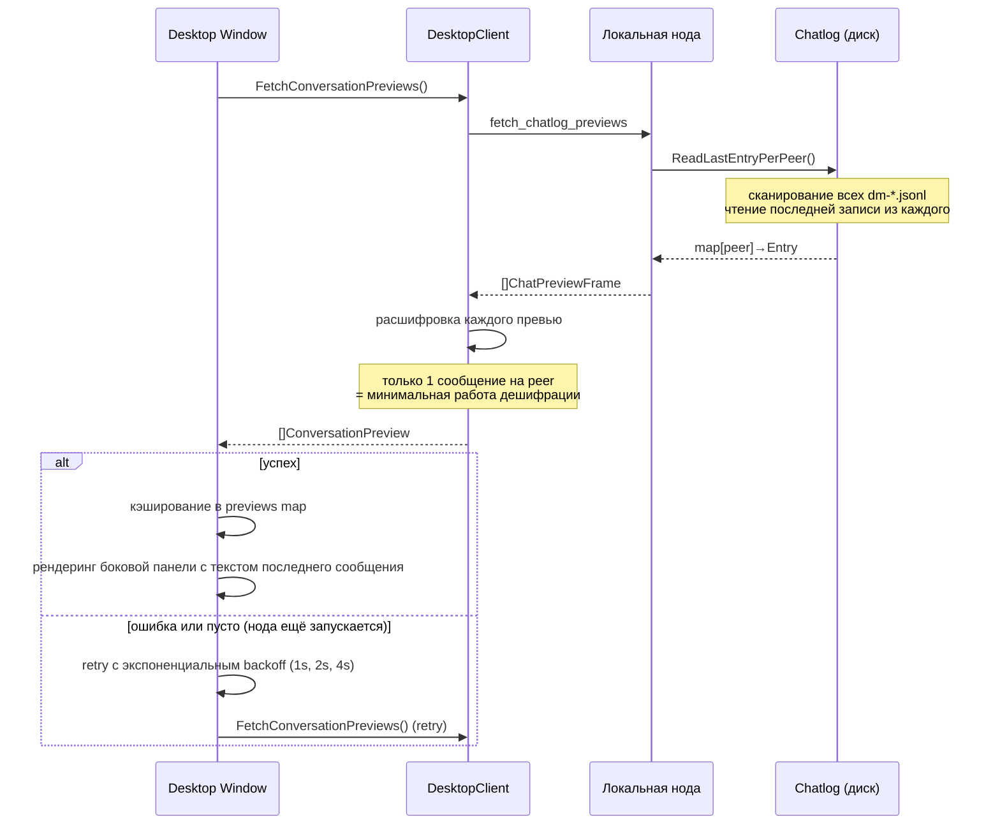

### Именование файлов

Каждый собеседник получает свой файл в директории chatlog
(по умолчанию `.corsa/`, настраивается через `CORSA_CHATLOG_DIR`):

```
dm-<identity_short>-<peer_address>-<port>.jsonl   # ЛС с конкретным собеседником
global-<identity_short>-<port>.jsonl               # broadcast / публичные сообщения
```

- `identity_short` — первые 8 символов адреса identity ноды (40-символьный hex SHA256 fingerprint)
- `peer_address` — полный 40-символьный hex адрес собеседника
- `port` — TCP порт (тот же суффикс, что для identity, trust, queue и peers файлов)

Эта схема гарантирует:
- Разные identity на одной машине не пересекаются
- Разные инстансы ноды на разных портах не пересекаются
- Каждый диалог в своём файле для независимого доступа

### Формат файла

Файлы используют JSON Lines — один JSON-объект на строку:

```json
{"id":"550e8400-...","sender":"aabb...","recipient":"ccdd...","body":"<sealed_envelope>","created_at":"2026-03-23T12:00:00.000Z","flag":"immutable"}
```

### Кодирование тела сообщения

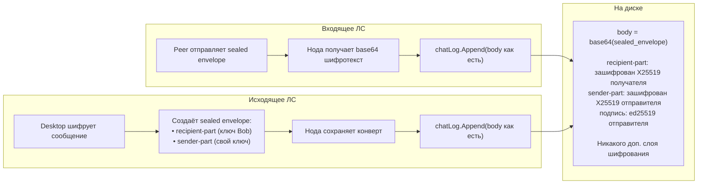

- **Входящие ЛС**: хранятся как есть. Body — это base64-encoded sealed envelope,
  который может быть расшифрован только ключом получателя или отправителя через
  `directmsg.DecryptForIdentity()`.
- **Исходящие ЛС**: тот же sealed envelope, который содержит sender-part,
  зашифрованный box-ключом отправителя — поэтому отправитель всегда может расшифровать
  свои сообщения.
- **Global/broadcast**: хранятся как есть (plaintext body).

Никакой дополнительный слой шифрования не применяется. Sealed envelope сам по себе
обеспечивает end-to-end шифрование для ЛС.

### Flow записи

```
storeIncomingMessage()
  ├── валидация timestamp и подписей
  ├── запись в память (s.topics[topic])
  ├── если isLocalMessage():
  │     ├── chatLog.Append(topic, selfAddress, entry)
  │     │     └── open O_APPEND → запись JSON-строки → close
  │     ├── emitLocalChange() → уведомление UI
  │     └── push подписчикам DM + delivery receipt
  ├── gossip к peers (если relay, через shouldRouteStoredMessage)
  └── trackRelayMessage() (только транзитные DM)
```

Append происходит синхронно после in-memory записи, до gossip.
Директория chatlog создаётся автоматически (`MkdirAll` с правами `0700`), если не существует.
Файл открывается с `O_CREATE|O_APPEND|O_WRONLY` и правами `0600`.
Ошибки логируются, но не блокируют сохранение сообщения.

**Транзитные сообщения НЕ записываются в chatlog.** Когда полная нода
пересылает ЛС, где ни отправитель, ни получатель не являются локальной
identity, сообщение хранится только в памяти (`s.topics[dm]`) для gossip/relay.
Персистентность транзита обеспечивается отдельно через `queue-<port>.json`
и механизм `relayRetry`. Это гарантирует, что локальная история чата содержит
только те диалоги, в которых эта нода реально участвует.

### Flow чтения

Стратегии чтения в зависимости от контекста:

| Стратегия                | Когда                             | Что читается                       | Дешифрация      |
|--------------------------|-----------------------------------|------------------------------------|-----------------|
| `fetch_dm_headers`       | Каждые 2с (poll)                  | ID + sender + recipient + ts (только локальные) | Нет             |
| `fetch_chatlog_previews` | При запуске (с retry)             | Последняя запись каждого диалога   | 1 сообщ./peer   |
| `fetch_chatlog`          | При открытии диалога              | Все записи для одного peer         | Полная          |

### Консольные команды

| Команда                                    | Описание                                   |
|--------------------------------------------|--------------------------------------------|
| `fetch_chatlog [topic] <peer_address>`     | Прочитать историю чата с peer              |
| `fetch_chatlog_previews`                   | Последнее сообщение для каждого диалога    |
| `fetch_dm_headers`                         | Легковесные заголовки DM (без тела, только локальные — транзитные отфильтрованы) |
| `fetch_conversations`                      | Список всех диалогов со счётчиками         |

### Конфигурация

| Переменная окружения  | Поле конфига         | По умолчанию | Описание                    |
|-----------------------|----------------------|--------------|-----------------------------|
| `CORSA_CHATLOG_DIR`   | `Node.ChatLogDir`    | `.corsa`     | Директория для chatlog файлов (создаётся автоматически) |

### Оптимизация памяти

Desktop-клиент минимизирует использование памяти, следуя этим принципам:

1. **Нет массовой расшифровки DM в цикле опроса** — `ProbeNode()` получает только
   легковесные `DMHeaders` (без тел сообщений) каждые 2 секунды.
2. **Превью загружаются один раз** — при запуске (с retry до 4 попыток, экспоненциальный
   backoff) расшифровывается по одному сообщению на диалог для боковой панели;
   обновляется инкрементально при поступлении новых.
3. **Дедупликация обновления превью** — при получении новых заголовков
   `refreshPreviewForPeer()` вызывается один раз на уникального собеседника, а не
   на каждое сообщение.
4. **Диалог загружается по запросу** — полная история читается с диска и расшифровывается
   только когда пользователь переключается на конкретного собеседника.
5. **Только активный диалог в памяти** — переключение на другого собеседника заменяет
   предыдущие данные диалога.
6. **Транзитные сообщения исключены из chatlog** — ЛС, пересылаемые через полную ноду
   (где ни одна из сторон не является локальной), хранятся только в памяти для gossip;
   их персистентность обеспечивается через `queue-<port>.json`.
7. **Транзитные DM отфильтрованы из `fetch_dm_headers`** — цикл опроса возвращает только
   заголовки, где локальная нода является отправителем или получателем; карта `seenIncoming`
   записывает только локальные заголовки, чтобы избежать неограниченного роста памяти от
   транзитного трафика.
