# Chat Log Persistence

## English

### Overview

The `chatlog` package provides SQLite-backed storage for chat messages.
The desktop client does **not** keep all conversations in memory. Messages are
written to a SQLite database as they arrive and read back on demand when the
UI switches to a conversation. Only lightweight metadata (message headers and
previews) is kept in memory for the sidebar.

### Modular layered architecture

See [dm_router.md](dm_router.md) for the full three-layer architecture documentation
(Network → DMRouter → UI), concurrency protection, and public API reference.

### Architecture diagram

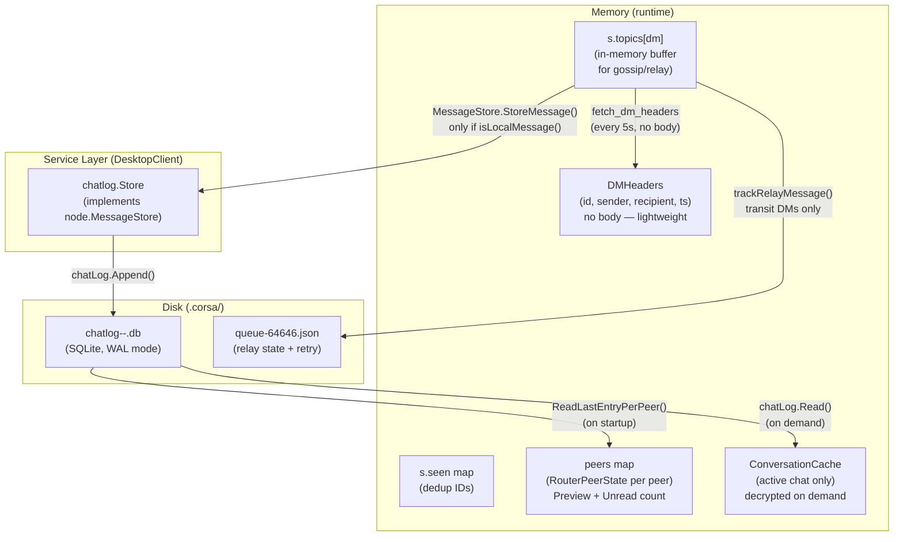

*Diagram 1 — Chatlog architecture overview*

### What is stored where

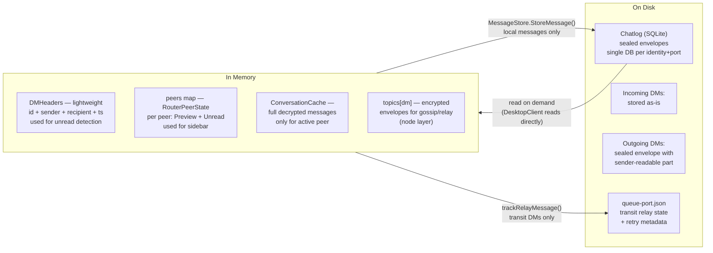

*Diagram 2 — In-memory vs on-disk message storage*

### Message arrival flow


*Diagram 3 — Message arrival and processing sequence*

### Sending a message

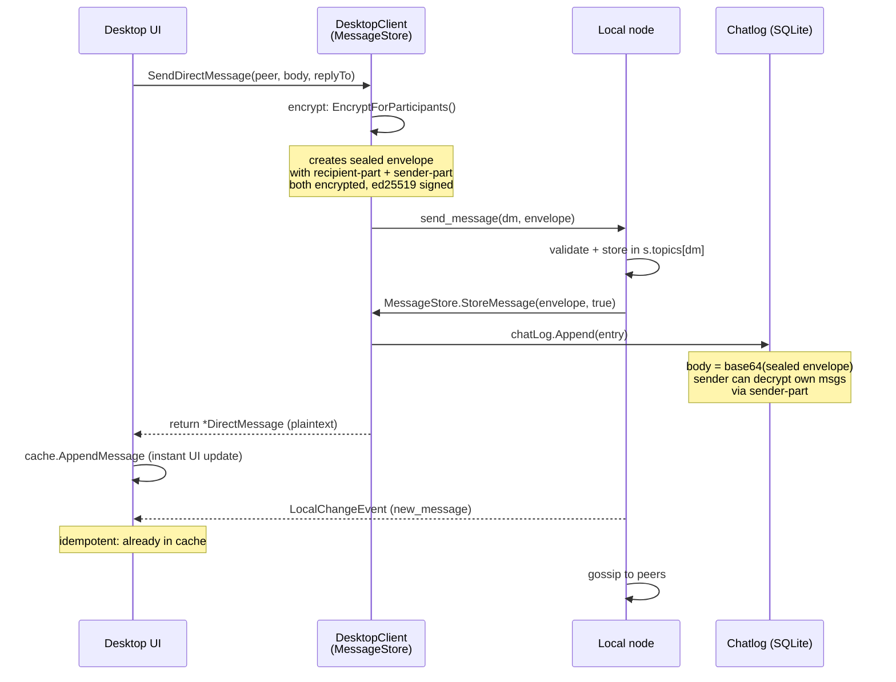

*Diagram 4 — Outgoing message encryption and persistence flow*

### Loading a conversation (on demand)

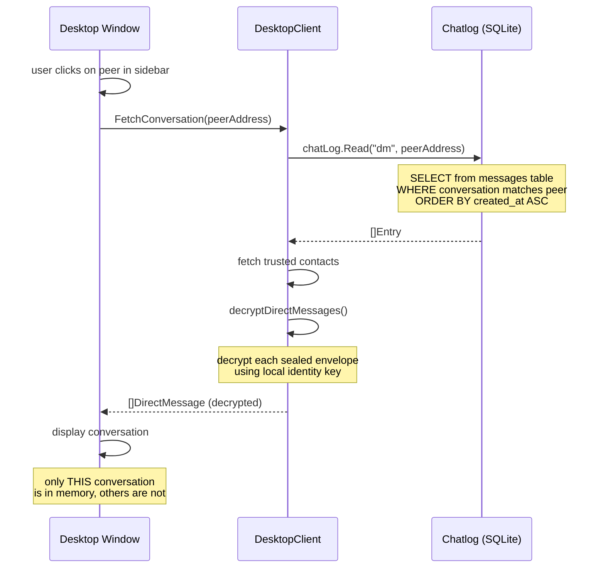

*Diagram 5 — Full conversation load on demand*

### Loading previews (on startup)

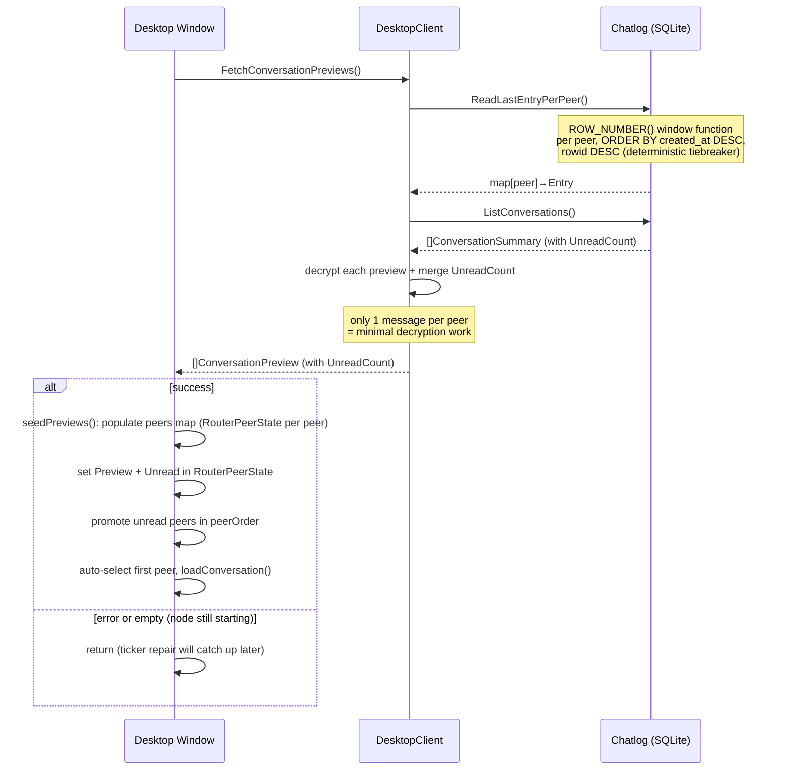

*Diagram 6 — Conversation preview loading at startup*

### Database naming

Each node identity+port combination gets its own SQLite database file in the
chatlog directory (defaults to `.corsa/`, configurable via `CORSA_CHATLOG_DIR`):

```
chatlog-<identity_short>-<port>.db
```

- `identity_short` — first 8 characters of the node's identity address (40-char hex SHA256 fingerprint)
- `port` — TCP listen port (same suffix used for identity, trust, queue, and peers files)

This naming scheme ensures:
- Multiple identities on the same machine don't collide
- Multiple node instances on different ports don't collide

### Database schema

The database uses a single `messages` table with CHECK constraints for enum fields:

```sql
CREATE TABLE IF NOT EXISTS messages (
    id              TEXT PRIMARY KEY,
    topic           TEXT NOT NULL DEFAULT 'dm' CHECK(topic IN ('dm','global')),
    sender          TEXT NOT NULL,
    recipient       TEXT NOT NULL,
    body            TEXT NOT NULL,
    flag            TEXT NOT NULL DEFAULT '' CHECK(flag IN ('','immutable','sender-delete','any-delete','auto-delete-ttl')),
    delivery_status TEXT NOT NULL DEFAULT 'sent' CHECK(delivery_status IN ('sent','delivered','seen')),
    ttl_seconds     INTEGER NOT NULL DEFAULT 0,
    metadata        TEXT NOT NULL DEFAULT '',
    created_at      TEXT NOT NULL,
    updated_at      TEXT NOT NULL DEFAULT ''
);
```

Indexes:
- `idx_messages_peer` — `(topic, sender, recipient, created_at)` for conversation queries
- `idx_messages_status` — `(recipient, delivery_status)` for unread counts
- `idx_messages_created` — `(created_at DESC)` for recent message queries
- `idx_messages_ttl` — partial index on `(flag, created_at) WHERE flag = 'auto-delete-ttl'` for TTL expiration queries

SQLite pragmas:
- `journal_mode=WAL` — Write-Ahead Logging for concurrent read access
- `busy_timeout=5000` — 5 second timeout for concurrent writes

The driver is `modernc.org/sqlite` — a pure Go SQLite implementation (no CGO
required), chosen for easy cross-compilation.

### Entry fields

The `messages` table has columns that map to `chatlog.Entry` fields, plus two
internal-only columns (`topic`, `updated_at`) that are not exposed through the
`Entry` struct or protocol frames.

| Column            | Type   | In `Entry`? | Description                                          |
|-------------------|--------|:-----------:|------------------------------------------------------|
| `id`              | string | yes         | Message UUID (primary key, dedup via INSERT OR IGNORE) |
| `topic`           | string | **no**      | `dm` or `global` (CHECK constraint). Query parameter — callers always pass it explicitly to `Read()`, `Append()`, etc. |
| `sender`          | string | yes         | Sender's identity address (40-char hex)              |
| `recipient`       | string | yes         | Recipient's identity address or `*` for broadcast    |
| `body`            | string | yes         | Raw message body (sealed envelope for DMs, plaintext for global) |
| `flag`            | string | yes         | Message flag (CHECK constraint, see below)            |
| `delivery_status` | string | yes         | `sent`, `delivered`, or `seen` (CHECK constraint)    |
| `ttl_seconds`     | int    | yes         | Auto-delete lifetime in seconds (0 = no TTL)         |
| `metadata`        | string | yes         | Arbitrary JSON for future extensibility (empty string = none) |
| `created_at`      | string | yes         | RFC3339Nano timestamp                                |
| `updated_at`      | string | **no**      | RFC3339Nano timestamp set by `UpdateStatus()`. Internal bookkeeping — not read back through `Entry` or protocol frames. |

#### Message status lifecycle

```
Outgoing DM:  sent → delivered → seen
Incoming DM:       delivered → seen   (starts at delivered, skips sent)
```

- **sent** — outgoing message created by this node (set on `chatLog.Append` when sender = self). Incoming messages **never** have this status because they are already delivered by the time we store them.
- **delivered** — message has reached its destination.
  - *Outgoing:* a delivery receipt was received from the recipient node (transition from `sent`).
  - *Incoming:* set immediately on `chatLog.Append` — if the local node is storing the message, it has already been delivered to us. This is the **initial** status for all incoming DMs.
- **seen** — recipient opened the conversation containing this message

#### Status lifecycle: detailed flow with SQL operations

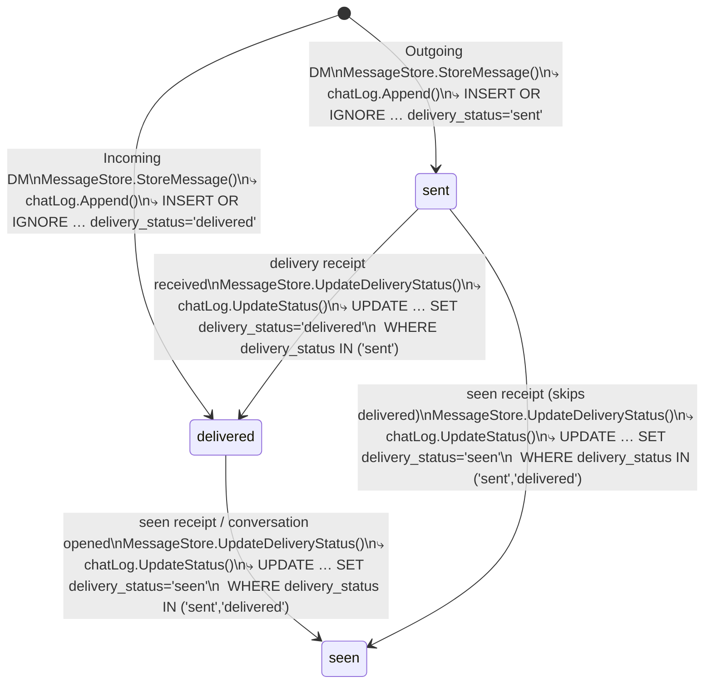

*Diagram 7 — Message delivery status state machine*

| Transition | Trigger | Code path | SQL |
|---|---|---|---|
| `[new]` → `sent` | User sends DM | `DesktopClient.SendDirectMessage()` → `storeIncomingMessage()` → `MessageStore.StoreMessage()` → `chatLog.Append()` | `INSERT OR IGNORE INTO messages (..., delivery_status) VALUES (..., 'sent')` |
| `[new]` → `delivered` | Incoming DM arrives | `storeIncomingMessage()` → `MessageStore.StoreMessage()` → `chatLog.Append()` | `INSERT OR IGNORE INTO messages (..., delivery_status) VALUES (..., 'delivered')` |
| `sent` → `delivered` | Delivery receipt from recipient | `storeDeliveryReceipt()` → `MessageStore.UpdateDeliveryStatus()` → `chatLog.UpdateStatus()` | `UPDATE messages SET delivery_status='delivered', updated_at=? WHERE id=? AND delivery_status IN ('sent')` |
| `delivered` → `seen` | Seen receipt / user opens conversation | `storeDeliveryReceipt()` → `MessageStore.UpdateDeliveryStatus()` → `chatLog.UpdateStatus()` | `UPDATE messages SET delivery_status='seen', updated_at=? WHERE id=? AND delivery_status IN ('sent','delivered')` |
| `seen` → `delivered` | Late receipt (rejected) | `MessageStore.UpdateDeliveryStatus()` → `chatLog.UpdateStatus()` — WHERE clause doesn't match | `UPDATE … WHERE delivery_status IN ('sent','delivered')` → 0 rows affected |

**Code references:**

- `chatLog.Append()` — `internal/core/chatlog/chatlog.go` (`Store.Append`)
- `chatLog.UpdateStatus()` — `internal/core/chatlog/chatlog.go` (`Store.UpdateStatus`, monotonic guard via `statusRank` map)
- `storeIncomingMessage()` — `internal/core/node/service.go` (calls `MessageStore.StoreMessage()` for local messages; sets `isOutgoing` flag for the handler)
- `storeDeliveryReceipt()` — `internal/core/node/service.go` (calls `MessageStore.UpdateDeliveryStatus()` before emitting `LocalChangeEvent`)
- `SendDirectMessage()` — `internal/core/service/desktop.go` (encrypts via `EncryptForParticipants`, sends to node)
- `handleEvent()` → `onReceiptUpdate()` — `internal/core/service/dm_router.go` (updates cache status in-place; reloads from SQLite if message missing)

Status transitions are **monotonic** — a status can only advance forward
(sent → delivered → seen). `UpdateStatus()` enforces this: an attempt to
regress (e.g. seen → delivered from a late-arriving receipt) is silently
ignored. This prevents duplicate or out-of-order network events from
corrupting the persisted status.

Status is the **source of truth** after restart. The desktop client reads
`delivery_status` from SQLite via `ChatEntryFrame.DeliveryStatus` and uses
it as the baseline. In-memory delivery receipts (from `fetch_delivery_receipts`)
are layered on top, but only if they advance the status further. This ensures
that statuses (delivered/seen) survive node restarts without depending on
volatile runtime data.

Unread messages are incoming DMs with `delivery_status != 'seen'`.

On startup, `DMRouter.initializeFromDB()` restores sidebar state from the chatlog:

- **Sidebar peers**: all chatlog conversation peers are added to the
  `peers` map (`RouterPeerState` entries), so they appear in the sidebar
  even if the peer is not in trusted/network contacts.
- **Unread badges**: `UnreadCount` from `ListConversations()` (SQL-level
  count of incoming DMs with `delivery_status != 'seen'`) is stored in
  `RouterPeerState.Unread`. Peers with unread messages are promoted to the
  front of `peerOrder`.
- **Auto-selection**: the first peer in `peerOrder` is auto-selected as
  `activePeer` (with `peerClicked = false`), and its conversation is loaded
  via `loadConversation()`.

`initializeFromDB()` runs once in a startup goroutine with retry (up to 3
attempts with linear backoff: 1s, 2s). If all attempts fail, the sidebar
starts empty and the 5-second ticker's `repairUnreadFromHeaders()` catches
up for new incoming messages as DMHeaders arrive. Historical read-only
conversations without new headers will not recover until the next app restart.

#### Message flags

| Flag               | Description                                   |
|--------------------|-----------------------------------------------|
| `` (empty)         | Default — no special behavior                 |
| `immutable`        | Nobody may delete the message                 |
| `sender-delete`    | Only the sender may delete it                 |
| `any-delete`       | Any participant may delete it                 |
| `auto-delete-ttl`  | Message is deleted automatically after `ttl_seconds` |

The `flag` column has a CHECK constraint enforcing these values.

### Message deletion

Two deletion methods are available:

- **`DeleteByID(messageID)`** — removes a single message by primary key. Returns true if found.
- **`DeleteExpired()`** — batch-removes all auto-delete-ttl messages whose lifetime has elapsed. Uses one SQL query:
  ```sql
  DELETE FROM messages
  WHERE flag = 'auto-delete-ttl'
    AND ttl_seconds > 0
    AND datetime(created_at) < datetime('now', '-' || ttl_seconds || ' seconds')
  ```
  The partial index `idx_messages_ttl` makes this efficient even with large tables.

  > **Status: not yet wired.** The `DeleteExpired()` method exists in
  > `chatlog.Store` but is not called by any runtime path. Currently the node
  > only cleans in-memory `s.topics`; persisted messages with
  > `auto-delete-ttl` survive restarts and continue appearing in
  > `FetchConversation()` / previews. Periodic SQLite cleanup will be added
  > in a future release.

### Metadata column

The `metadata` column stores arbitrary JSON for fields that don't have their own
column. This provides forward compatibility — new message properties can be stored
without schema migrations. Examples of future metadata:

- `{"edited": true, "edit_at": "2026-..."}` — edit history
- `{"reactions": {"👍": 2}}` — message reactions

When `metadata` is empty string, it means no extra data is present.

**Design note on `reply_to`:** reply threading is implemented via the `ReplyTo`
field inside `PlainMessage`, which is fully encrypted within the AES-GCM envelope.
The relay server and the local chatlog SQLite never see this value in plaintext.
The UI extracts `reply_to` after decryption. This is an intentional privacy
decision — the reply graph is not observable without the decryption key, even
with direct access to the SQLite file. `reply_to` is NOT duplicated into
the `metadata` column.

**Receive-side sanitization:** both the chatlog reload path (`decryptDirectMessages`)
and the live-event path (`DecryptIncomingMessage`) validate that a decrypted
`reply_to` references a message ID that exists within the same DM conversation.
If the referenced ID is missing — whether due to a malicious sender crafting a
cross-thread reference or a message that was deleted/expired — the `ReplyTo`
field is silently cleared. This preserves the invariant that `reply_to` always
resolves within the same thread, so the UI never encounters broken quote links.

### Integrity check and recovery

On startup, `NewStore()` runs `PRAGMA integrity_check` on the database file.
The result is classified into three categories:

- **`openOK`** — database is healthy, proceed normally.
- **`openCorrupt`** — `PRAGMA integrity_check` reported corruption. The
  corrupt file is renamed to `*.corrupt` (along with `-wal` and `-shm`
  sidecar files), a fresh database is created, and the node continues with
  an empty chat history.
- **`openError`** — transient I/O error (permission denied, disk full,
  locked file, etc.). The file is NOT renamed — it may be perfectly
  healthy. The node runs without persistence until the next restart.

This distinction prevents data loss: a temporary disk error no longer causes
a healthy database to be renamed and replaced.

### Graceful shutdown

Shutdown is split between the node layer and the service layer:

**Node layer** (`Service.Run()`, on `ctx.Done()`):

1. The TCP listener is closed — no new inbound connections are accepted.
2. `s.closeAllInboundConns()` forcibly closes every tracked inbound TCP
   connection so that `handleConn` goroutines unblock from their
   `ReadString` call and exit.
3. `s.connWg.Wait()` blocks until all active `handleConn` goroutines
   finish. This ensures in-flight `storeIncomingMessage` /
   `storeDeliveryReceipt` calls (which may call `MessageStore`) complete
   before shutdown proceeds.

**Service layer** (`DesktopClient.Close()`, called via `defer` in `app.go`):

4. `c.chatLog.Close()` performs the SQLite WAL checkpoint and releases
   file handles.

Without steps 2–3, a slow peer could still be calling `MessageStore` after
`Close()`, causing "database is closed" errors and potential data loss.
Without step 2, `connWg.Wait()` could block indefinitely if a peer keeps
its connection open (e.g. a persistent session from another node).

### Structured logging (zerolog)

The project uses [`rs/zerolog`](https://github.com/rs/zerolog) for structured
logging. All log output is JSON (for machine parsing) + human-friendly console
(for development). The `crashlog` package (`internal/core/crashlog`) provides
the initialization point:

1. **Dual output** — logs go to both stdout (via `zerolog.ConsoleWriter` with
   coloured human-friendly format) and `.corsa/corsa.log` (JSON lines). The
   log file is checked at startup and rotated if it exceeds 10 MB. Rotation
   does not happen during a running process — a long-lived session may exceed
   the threshold until the next restart.
2. **Startup logging** — application start time and log path are recorded on
   every launch, making it easy to correlate crashes with sessions.
3. **Panic recovery** — when a panic occurs, the stack trace is written to
   `.corsa/crash-<YYYYMMDD-HHMMSS>.log` before the process terminates.
   Up to 10 crash files are kept; older ones are automatically cleaned up.
   Recovery works in three layers:
   - `defer cleanup()` in `main()` catches panics in the main goroutine.
   - `defer crashlog.DeferRecover()` in the desktop UI goroutine
     (`Window.Run`) catches panics from the Gio event loop and
     background polling.
   - `defer crashlog.DeferRecover()` in node-side goroutines:
     `bootstrapLoop`, `handleConn`, `runPeerSession`, `readPeerSession`,
     `gossipMessage`, `pushToSubscriberSnapshot`, `pushReceiptToSubscribers`,
     `emitDeliveryReceipt`, `gossipReceipt`, `gossipNotice`,
     `sendMessageToPeer`, `sendNoticeToPeer`, `sendReceiptToPeer`,
     `writePushFrame`, `pushBacklogToSubscriber`. This ensures panics
     in any node goroutine produce crash files.
4. **Goroutine safety** — background goroutines in the DMRouter are wrapped
   in `safeHandleEvent()` and `safePollHealth()` which catch panics and log
   them via `log.Error()` instead of crashing the entire application.

**Log levels used:**

| Level   | Usage                                                       |
|---------|-------------------------------------------------------------|
| `Debug` | Routing attempts, subscription details, verbose tracing     |
| `Info`  | Normal operations: connections, message storage, state      |
| `Warn`  | Recoverable issues: peer rejected, NAT detected, retries   |
| `Error` | Failures: persistence errors, panics, crash reports         |
| `Fatal` | Unrecoverable: main() exit on startup failure               |

**Runtime fatal capture:** Go's `fatal: concurrent map read and map write` is
not a panic — it is a runtime `fatal` (SIGABRT) that `recover()` cannot catch.
To capture these, `crashlog.Setup()` redirects stderr (fd 2) to
`.corsa/stderr.log` via `syscall.Dup2` (Unix only) and calls
`debug.SetTraceback("all")` so that all goroutine stacks are dumped. After a
silent crash, check `.corsa/stderr.log` for the runtime error message and
stack trace. The proper fix for the root cause is mutex protection (see
"Concurrency protection" below).

Setup is done in `main()` of both `corsa-desktop` and `corsa-node`:

```go
import "github.com/rs/zerolog/log"

func main() {
    cleanup := crashlog.Setup()
    defer cleanup()
    log.Info().Msg("corsa-desktop starting")
    // ...
}
```

Structured log calls look like:
```go
log.Info().Str("topic", msg.Topic).Str("id", msg.ID).Msg("stored message")
log.Error().Err(err).Str("message_id", id).Msg("chatlog update status failed")
log.Warn().Str("address", ip).Int("score", score).Msg("blacklisted peer")
```

The log directory defaults to `.corsa/` (same as chatlog) and respects
`CORSA_CHATLOG_DIR`.

The log level defaults to `info` and can be changed via `CORSA_LOG_LEVEL`
environment variable. Supported values: `trace`, `debug`, `info`, `warn`,
`error`. Use `CORSA_LOG_LEVEL=debug` to enable routing/delivery tracing
(route attempts, subscriber details, relay retries).

### Body encoding

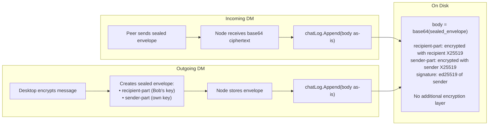

*Diagram 8 — Message body encoding and storage process*

- **Incoming DMs**: stored as-is. The body is already a base64-encoded sealed envelope
  that can only be decrypted by the recipient's or sender's identity key via
  `directmsg.DecryptForIdentity()`.
- **Outgoing DMs**: the body is the same sealed envelope, which includes a sender-part
  encrypted with the sender's own box key — so the sender can always decrypt their own
  messages.
- **Global/broadcast messages**: stored as-is (plaintext body).

No additional encryption layer is applied. The sealed envelope itself provides
end-to-end encryption for DMs.

### Write flow

```
storeIncomingMessage()
  ├── validate timestamp and signatures
  ├── store in-memory (s.topics[topic])
  ├── if isLocalMessage() && messageStore != nil:
  │     ├── messageStore.StoreMessage(envelope, isOutgoing)
  │     │     └── DesktopClient: chatLog.Append() → INSERT OR IGNORE
  │     ├── if StoreMessage returns true:
  │     │     ├── emitLocalChange() → notify UI
  │     │     └── push to DM subscribers + delivery receipt
  │     └── if StoreMessage returns false:
  │           └── emitLocalChange() skipped (failed persistence)
  ├── gossip to peers (if routing, via shouldRouteStoredMessage)
  └── trackRelayMessage() (transit DMs only)
```

The node delegates persistence to the registered `MessageStore` handler
(implemented by `DesktopClient`). The handler calls `chatLog.Append()`
synchronously. If `StoreMessage` returns false (persistence error),
`emitLocalChange()` is skipped to maintain the "DB first, then event" invariant.
Errors are logged by `DesktopClient` but do not fail the in-memory store
and network propagation — those always proceed.

**Relay-only nodes (`corsa-node`) have `messageStore = nil`.** Messages are
stored in-memory and relayed, but never persisted to SQLite.

**Transit messages are NOT persisted.** When a full node relays a DM
where neither sender nor recipient is the local identity, `MessageStore` is
not called. The message is stored only in-memory (`s.topics[dm]`) for
gossip/relay purposes. Transit persistence is handled separately via
`queue-<port>.json` and the `relayRetry` mechanism. This ensures the local
chat history only contains conversations this node actually participates in.

### Receipt write flow

```
storeDeliveryReceipt()
  ├── dedup check (seenReceipts)
  ├── store in-memory receipt (s.receipts[recipient])
  ├── clear pending/outbound/relay state
  ├── persistQueueState()
  ├── messageStore.UpdateDeliveryStatus(receipt)    ← DB FIRST
  │     └── DesktopClient: chatLog.UpdateStatus()
  │           └── UPDATE messages SET delivery_status=?, updated_at=?
  │                 WHERE id=? AND delivery_status IN (lower-rank statuses)
  └── emitLocalChange()                              ← event AFTER DB
```

**Critical ordering invariant:** `MessageStore.UpdateDeliveryStatus()` must
complete **before** `emitLocalChange()`. The desktop UI subscribes to local
change events and immediately re-reads the chatlog via `loadConversation()`.
If the event fires before the DB write, the UI sees stale `delivery_status`
(race condition). This matches the ordering in `storeIncomingMessage()`,
where `MessageStore.StoreMessage()` happens before `emitLocalChange()`.

**Failure guard:** if `UpdateDeliveryStatus` returns false (SQLite write
failed — disk full, database closed, corruption), `emitLocalChange()` is
**skipped**. Waking the UI after a failed write would cause it to re-read
stale data, violating the invariant above. The error is logged at `Error`
level by `DesktopClient` so the operator can investigate.

### Read flow

Desktop client uses three read strategies depending on context:

| Strategy                        | When                          | What is read                    | Decryption |
|---------------------------------|-------------------------------|---------------------------------|------------|
| `fetch_dm_headers` (via node)   | Every 5s poll                 | ID + sender + recipient + ts (local only) | None       |
| `FetchConversationPreviews()`   | App startup (with retry)      | Last entry per conversation     | 1 msg/peer |
| `FetchConversation()`           | User opens a conversation     | All entries for one peer        | Full       |

```
# Lightweight poll (every 5 seconds) — still goes through node
HandleLocalFrame("fetch_dm_headers")
  └── return message headers from s.topics[dm] — local only (sender/recipient = this node), no body, no disk I/O

# Preview load (on startup with retry + on new message) — DesktopClient reads chatlog directly
FetchConversationPreviews(ctx)
  ├── chatLog.ReadLastEntryPerPeerCtx(ctx)
  │     └── ROW_NUMBER() window per peer, ORDER BY created_at DESC, rowid DESC
  ├── chatLog.ListConversationsCtx(ctx)
  │     └── returns []ConversationSummary with UnreadCount
  └── decrypt each preview + merge UnreadCount
# Startup: retries up to 3 times (linear backoff 1s, 2s) if chatlog is not ready

# Full conversation load (on demand) — DesktopClient reads chatlog directly
FetchConversation(ctx, peerAddress)
  ├── chatLog.ReadCtx(ctx, "dm", peerAddress)
  │     └── SELECT from messages WHERE conversation matches → return []Entry
  └── decrypt via decryptDirectMessages()

# Single preview reload (after new message arrives)
FetchSinglePreview(ctx, peerAddress)
  ├── chatLog.ReadLastEntryCtx(ctx, "dm", peerAddress)
  │     └── SELECT … ORDER BY created_at DESC, rowid DESC LIMIT 1
  └── decrypt single preview
```

### Console commands

| Command                                    | Handler              | Description                              |
|--------------------------------------------|----------------------|------------------------------------------|
| `fetch_chatlog [topic] <peer_address>`     | DesktopClient        | Read chat history for a peer (reads chatlog directly) |
| `fetch_chatlog_previews`                   | DesktopClient        | Last message for each conversation (reads chatlog directly) |
| `fetch_dm_headers`                         | node.Service         | Lightweight DM headers (no body, local only — transit filtered out) |
| `fetch_conversations`                      | DesktopClient        | List all conversations with counts (reads chatlog directly) |

> **Refactored handlers:** `fetch_chatlog`, `fetch_chatlog_previews`, and
> `fetch_conversations` were removed from `node.HandleLocalFrame()` after the
> chatlog ownership was moved to `DesktopClient`. Console commands for these
> are now intercepted by `ExecuteConsoleCommand()` and handled directly by
> `DesktopClient` via `chatLog.ReadCtx()`, `chatLog.ReadLastEntryPerPeerCtx()`,
> and `chatLog.ListConversationsCtx()` — no node frame protocol round-trip needed.
>
> **Context-aware queries:** All chatlog `Store` readers have context-aware
> variants (`ReadCtx`, `ReadLastCtx`, `ListConversationsCtx`,
> `ReadLastEntryCtx`, `ReadLastEntryPerPeerCtx`) that use
> `db.QueryContext`/`db.QueryRowContext` to respect caller deadlines. The
> original methods delegate to `Ctx` variants with `context.Background()`.
> Desktop `Fetch*` methods pass through the caller's `ctx` so UI-imposed
> timeouts propagate all the way to SQLite I/O.

### Config

| Environment Variable  | Config Field          | Default   | Description                  |
|-----------------------|-----------------------|-----------|------------------------------|
| `CORSA_CHATLOG_DIR`   | `Node.ChatLogDir`     | `.corsa`  | Directory for chatlog files (auto-created if missing) |

### Deduplication

Messages are deduplicated by primary key (`id`). The `INSERT OR IGNORE`
statement ensures that re-appending a message with the same ID is silently
ignored. Additionally, the in-memory `seen` map in the node service handles
deduplication before the chatlog append, so duplicate writes don't normally occur.

### Conversation listing

`ListConversations()` queries the messages table, groups by conversation peer,
and returns results sorted with unread conversations first, then by most recent
message. The unread count is computed as `SUM(CASE WHEN sender != self AND
recipient = self AND delivery_status != 'seen' THEN 1 ELSE 0 END)`.

### Memory optimization

The desktop client minimizes memory usage by following these principles:

1. **No bulk DM decryption in poll loop** — `ProbeNode()` fetches only lightweight
   `DMHeaders` (no message bodies) every 5 seconds.
2. **Previews loaded once** — on startup via `initializeFromDB()`, one message
   per conversation is decrypted for the sidebar; updated incrementally when new
   messages arrive via `updateSidebarFromEvent()`.
3. **Deduplicated preview refresh** — when new headers arrive via repair path,
   `refreshPreviewForPeer()` is called once per unique peer, not once per message.
4. **Conversation loaded on demand** — full chat history is read from disk and
   decrypted only when the user switches to a specific peer.
5. **Only active conversation in memory** — switching to another peer replaces
   the previous conversation data via `ConversationCache.Load()`.
6. **Transit messages excluded from chatlog** — DMs relayed through a full node
   (where neither party is local) are only stored in-memory for gossip; their
   persistence is handled by `queue-<port>.json`.
7. **Transit DMs filtered from `fetch_dm_headers`** — the poll loop returns only
   headers where the local node is sender or recipient; `seenMessageIDs` map
   records only local headers to avoid unbounded memory growth from transit traffic.

---

## Русский

### Обзор

Пакет `chatlog` обеспечивает хранение сообщений в SQLite базе данных.
Desktop-клиент **не** хранит все чаты в памяти. Сообщения записываются
в SQLite БД по мере поступления и читаются обратно по запросу, когда
пользователь переключается на диалог. В памяти хранятся только легковесные
метаданные (заголовки сообщений и превью) для боковой панели.

### Модульная многослойная архитектура

См. [dm_router.md](dm_router.md) для полной документации трёхуровневой архитектуры
(Network → DMRouter → UI), защиты конкурентного доступа и справочника публичного API.

### Диаграмма архитектуры

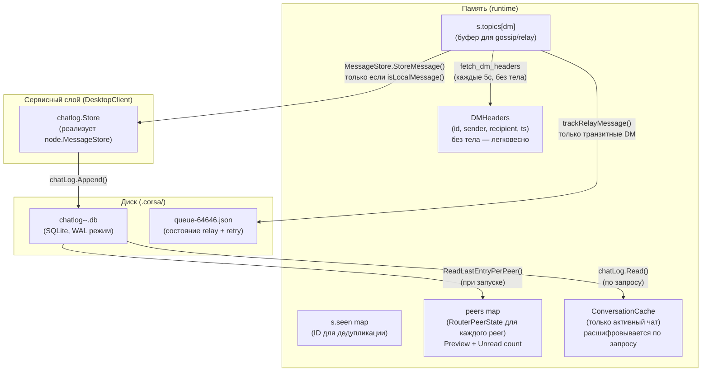

*Диаграмма 1 — Архитектура chatlog*

### Что где хранится

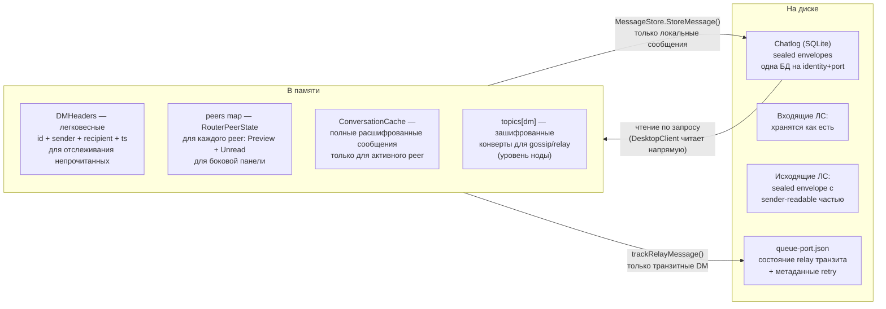

*Диаграмма 2 — Место хранения сообщений в памяти и на диске*

### Flow поступления сообщения

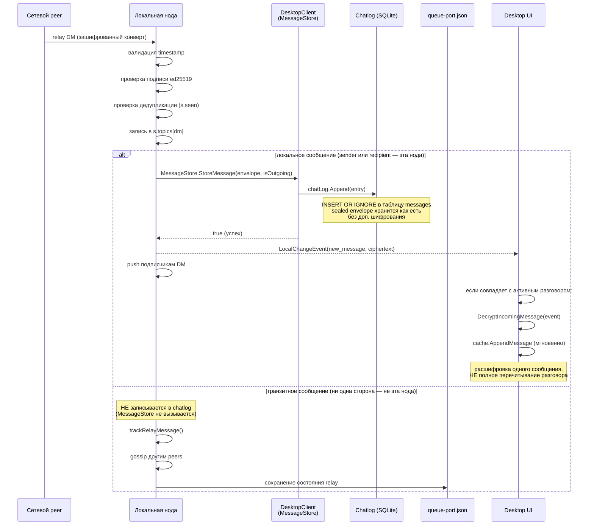

*Диаграмма 3 — Последовательность поступления и обработки сообщения*

### Flow отправки сообщения

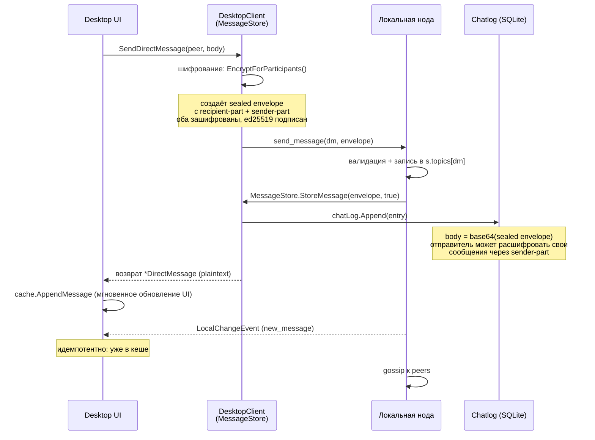

*Диаграмма 4 — Flow отправки сообщения и шифрования*

### Flow загрузки диалога (по запросу)

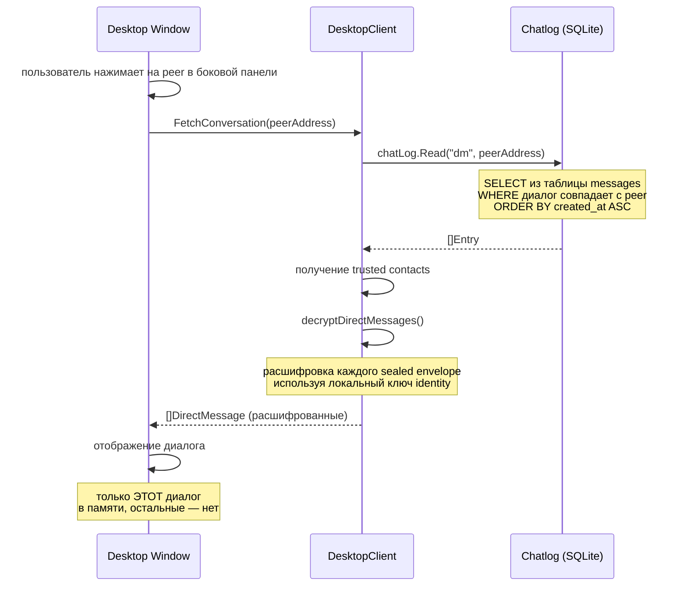

*Диаграмма 5 — Загрузка полного диалога по требованию*

### Flow загрузки превью (при запуске)

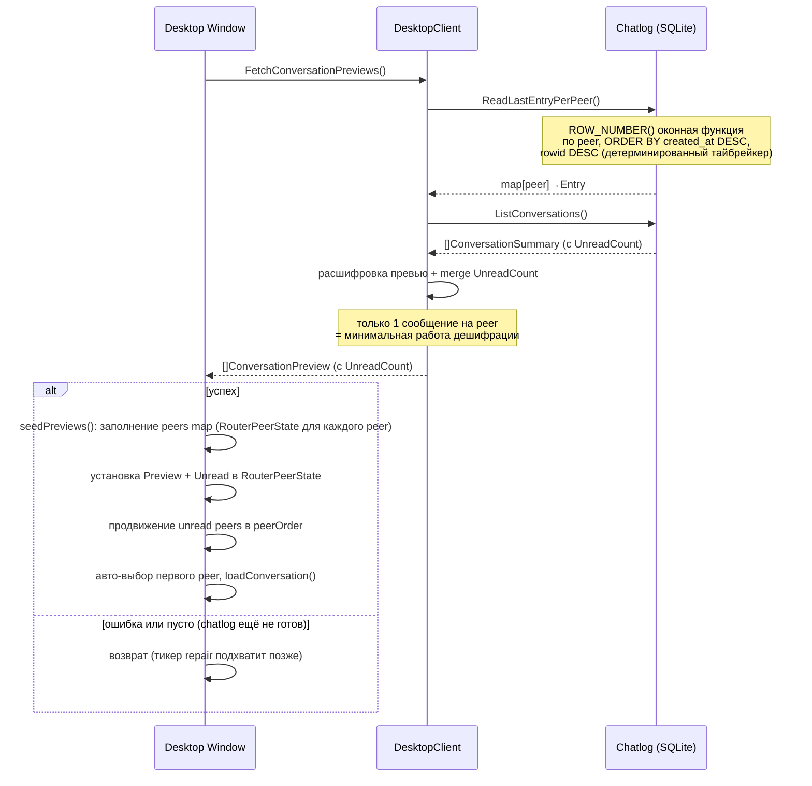

*Диаграмма 6 — Загрузка превью диалогов при запуске*

### Именование БД

Каждая комбинация identity+port получает свой файл SQLite БД в директории chatlog
(по умолчанию `.corsa/`, настраивается через `CORSA_CHATLOG_DIR`):

```
chatlog-<identity_short>-<port>.db
```

- `identity_short` — первые 8 символов адреса identity ноды (40-символьный hex SHA256 fingerprint)
- `port` — TCP порт (тот же суффикс, что для identity, trust, queue и peers файлов)

Эта схема гарантирует:
- Разные identity на одной машине не пересекаются
- Разные инстансы ноды на разных портах не пересекаются

### Схема БД

БД использует одну таблицу `messages` с CHECK-ограничениями для enum-полей:

```sql
CREATE TABLE IF NOT EXISTS messages (
    id              TEXT PRIMARY KEY,
    topic           TEXT NOT NULL DEFAULT 'dm' CHECK(topic IN ('dm','global')),
    sender          TEXT NOT NULL,
    recipient       TEXT NOT NULL,
    body            TEXT NOT NULL,
    flag            TEXT NOT NULL DEFAULT '' CHECK(flag IN ('','immutable','sender-delete','any-delete','auto-delete-ttl')),
    delivery_status TEXT NOT NULL DEFAULT 'sent' CHECK(delivery_status IN ('sent','delivered','seen')),
    ttl_seconds     INTEGER NOT NULL DEFAULT 0,
    metadata        TEXT NOT NULL DEFAULT '',
    created_at      TEXT NOT NULL,
    updated_at      TEXT NOT NULL DEFAULT ''
);
```

Индексы:
- `idx_messages_peer` — `(topic, sender, recipient, created_at)` для запросов диалогов
- `idx_messages_status` — `(recipient, delivery_status)` для подсчёта непрочитанных
- `idx_messages_created` — `(created_at DESC)` для запросов последних сообщений
- `idx_messages_ttl` — частичный индекс `(flag, created_at) WHERE flag = 'auto-delete-ttl'` для запросов истечения TTL

Прагмы SQLite:
- `journal_mode=WAL` — Write-Ahead Logging для параллельного чтения
- `busy_timeout=5000` — таймаут 5 секунд для конкурентных записей

Драйвер — `modernc.org/sqlite` — чистая Go-реализация SQLite (без CGO),
выбранная для простоты кросс-компиляции.

### Поля записи

Таблица `messages` содержит колонки, которые соответствуют полям `chatlog.Entry`,
плюс две внутренние колонки (`topic`, `updated_at`), которые не экспонируются
через структуру `Entry` и протокольные фреймы.

| Колонка           | Тип    | В `Entry`?  | Описание                                                      |
|-------------------|--------|:-----------:|---------------------------------------------------------------|
| `id`              | string | да          | UUID сообщения (первичный ключ, дедуп через INSERT OR IGNORE) |
| `topic`           | string | **нет**     | `dm` или `global` (CHECK ограничение). Параметр запроса — вызывающий код всегда передаёт его явно в `Read()`, `Append()` и т.д. |
| `sender`          | string | да          | Адрес отправителя (40-символьный hex)                         |
| `recipient`       | string | да          | Адрес получателя или `*` для broadcast                        |
| `body`            | string | да          | Тело сообщения (sealed envelope для DM, plaintext для global) |
| `flag`            | string | да          | Флаг сообщения (CHECK ограничение, см. ниже)                  |
| `delivery_status` | string | да          | `sent`, `delivered` или `seen` (CHECK ограничение)            |
| `ttl_seconds`     | int    | да          | Время жизни для авто-удаления в секундах (0 = без TTL)        |
| `metadata`        | string | да          | Произвольный JSON для будущей расширяемости (пустая строка = нет данных) |
| `created_at`      | string | да          | Временная метка RFC3339Nano                                   |
| `updated_at`      | string | **нет**     | Временная метка RFC3339Nano, устанавливаемая `UpdateStatus()`. Внутренняя бухгалтерия — не читается обратно через `Entry` или протокольные фреймы. |

#### Жизненный цикл статуса

```
Исходящий DM:  sent → delivered → seen
Входящий DM:        delivered → seen   (начинает с delivered, пропускает sent)
```

- **sent** — исходящее сообщение создано этой нодой (устанавливается при `chatLog.Append` когда sender = self). Входящие сообщения **никогда** не имеют этот статус, т.к. они уже доставлены к моменту сохранения.
- **delivered** — сообщение доставлено до адресата.
  - *Исходящие:* получен delivery receipt от ноды получателя (переход из `sent`).
  - *Входящие:* устанавливается сразу при `chatLog.Append` — если локальная нода сохраняет сообщение, оно уже доставлено нам. Это **начальный** статус для всех входящих DM.
- **seen** — получатель открыл диалог с этим сообщением

#### Жизненный цикл статуса: детальный flow с SQL-операциями


*Диаграмма 7 — Жизненный цикл статуса доставки сообщения*

| Переход | Триггер | Путь в коде | SQL |
|---|---|---|---|
| `[new]` → `sent` | Пользователь отправляет DM | `DesktopClient.SendDirectMessage()` → `storeIncomingMessage()` → `MessageStore.StoreMessage()` → `chatLog.Append()` | `INSERT OR IGNORE INTO messages (..., delivery_status) VALUES (..., 'sent')` |
| `[new]` → `delivered` | Поступает входящий DM | `storeIncomingMessage()` → `MessageStore.StoreMessage()` → `chatLog.Append()` | `INSERT OR IGNORE INTO messages (..., delivery_status) VALUES (..., 'delivered')` |
| `sent` → `delivered` | Delivery receipt от получателя | `storeDeliveryReceipt()` → `MessageStore.UpdateDeliveryStatus()` → `chatLog.UpdateStatus()` | `UPDATE messages SET delivery_status='delivered', updated_at=? WHERE id=? AND delivery_status IN ('sent')` |
| `delivered` → `seen` | Seen receipt / пользователь открыл диалог | `storeDeliveryReceipt()` → `MessageStore.UpdateDeliveryStatus()` → `chatLog.UpdateStatus()` | `UPDATE messages SET delivery_status='seen', updated_at=? WHERE id=? AND delivery_status IN ('sent','delivered')` |
| `seen` → `delivered` | Запоздавший receipt (отклоняется) | `MessageStore.UpdateDeliveryStatus()` → `chatLog.UpdateStatus()` — WHERE не совпадает | `UPDATE … WHERE delivery_status IN ('sent','delivered')` → 0 затронутых строк |

**Ссылки на код:**

- `chatLog.Append()` — `internal/core/chatlog/chatlog.go` (`Store.Append`)
- `chatLog.UpdateStatus()` — `internal/core/chatlog/chatlog.go` (`Store.UpdateStatus`, монотонная защита через map `statusRank`)
- `storeIncomingMessage()` — `internal/core/node/service.go` (вызывает `MessageStore.StoreMessage()` для локальных сообщений; устанавливает флаг `isOutgoing` для обработчика)
- `storeDeliveryReceipt()` — `internal/core/node/service.go` (вызывает `MessageStore.UpdateDeliveryStatus()` перед генерацией `LocalChangeEvent`)
- `SendDirectMessage()` — `internal/core/service/desktop.go` (шифрует через `EncryptForParticipants`, отправляет ноде)
- `handleEvent()` → `onReceiptUpdate()` — `internal/core/service/dm_router.go` (обновляет статус в кеше; перечитывает из SQLite если сообщение отсутствует)

Переходы статуса **монотонны** — статус может только продвигаться вперёд
(sent → delivered → seen). `UpdateStatus()` это обеспечивает: попытка
регрессии (напр. seen → delivered от запоздавшего receipt) тихо игнорируется.
Это предотвращает повреждение сохранённого статуса дублирующими или
неупорядоченными сетевыми событиями.

Статус — **источник истины** после рестарта. Desktop-клиент читает
`delivery_status` из SQLite через `ChatEntryFrame.DeliveryStatus` и использует
его как базовое значение. In-memory delivery receipts (из `fetch_delivery_receipts`)
накладываются поверх, но только если продвигают статус дальше. Это гарантирует,
что статусы (delivered/seen) переживают рестарт ноды без зависимости от
волатильных runtime-данных.

Непрочитанные — входящие DM со статусом `delivery_status != 'seen'`.

При запуске `DMRouter.initializeFromDB()` восстанавливает состояние боковой
панели из chatlog:

- **Peers в боковой панели**: все peers из chatlog добавляются в map `peers`
  (записи `RouterPeerState`), чтобы они появились в sidebar даже если peer
  не в trusted/network contacts.
- **Unread badges**: `UnreadCount` из `ListConversations()` (SQL-подсчёт
  входящих DM с `delivery_status != 'seen'`) сохраняется в
  `RouterPeerState.Unread`. Peers с непрочитанными продвигаются в начало
  `peerOrder`.
- **Авто-выбор**: первый peer в `peerOrder` авто-выбирается как `activePeer`
  (с `peerClicked = false`), и его диалог загружается через `loadConversation()`.

`initializeFromDB()` выполняется один раз в стартовой горутине с retry
(до 3 попыток с линейным backoff: 1с, 2с). Если все попытки неудачны,
sidebar остаётся пустым, а 5-секундный тикер через `repairUnreadFromHeaders()`
подхватывает данные для новых входящих сообщений по мере поступления DMHeaders.
Исторические read-only диалоги без новых headers не восстановятся до рестарта.

#### Флаги сообщений

| Флаг               | Описание                                               |
|--------------------|--------------------------------------------------------|
| `` (пусто)         | По умолчанию — нет особого поведения                   |
| `immutable`        | Никто не может удалить сообщение                       |
| `sender-delete`    | Только отправитель может удалить                       |
| `any-delete`       | Любой участник может удалить                           |
| `auto-delete-ttl`  | Сообщение удаляется автоматически после `ttl_seconds`  |

Столбец `flag` имеет CHECK ограничение, допускающее только эти значения.

### Удаление сообщений

Два метода удаления:

- **`DeleteByID(messageID)`** — удаляет одно сообщение по первичному ключу. Возвращает true если найдено.
- **`DeleteExpired()`** — пакетное удаление всех auto-delete-ttl сообщений, время жизни которых истекло. Один SQL-запрос:
  ```sql
  DELETE FROM messages
  WHERE flag = 'auto-delete-ttl'
    AND ttl_seconds > 0
    AND datetime(created_at) < datetime('now', '-' || ttl_seconds || ' seconds')
  ```
  Частичный индекс `idx_messages_ttl` делает это эффективным даже на больших таблицах.

  > **Статус: пока не подключено.** Метод `DeleteExpired()` реализован в
  > `chatlog.Store`, но ни один runtime-путь его не вызывает. Сейчас нода
  > чистит только in-memory `s.topics`; persisted сообщения с
  > `auto-delete-ttl` переживают рестарты и продолжают появляться в
  > `FetchConversation()` / превью. Периодическая очистка SQLite будет
  > добавлена в следующем релизе.

### Столбец metadata

Столбец `metadata` хранит произвольный JSON для полей, у которых нет собственной
колонки. Это обеспечивает совместимость вперёд — новые свойства сообщений можно
хранить без миграций схемы. Примеры будущих метаданных:

- `{"edited": true, "edit_at": "2026-..."}` — история редактирования
- `{"reactions": {"👍": 2}}` — реакции на сообщения

Пустая строка означает отсутствие дополнительных данных.

**Архитектурное решение по `reply_to`:** цепочки ответов реализованы через
поле `ReplyTo` внутри `PlainMessage`, которое полностью шифруется в AES-GCM
конверте. Relay-сервер и локальный chatlog SQLite никогда не видят это значение
в открытом виде. UI извлекает `reply_to` после расшифровки. Это осознанное
решение в пользу приватности — граф ответов не наблюдаем без ключа расшифровки,
даже при прямом доступе к файлу SQLite. `reply_to` НЕ дублируется в столбец
`metadata`.

**Санитизация на стороне получателя:** оба пути — загрузка из chatlog
(`decryptDirectMessages`) и обработка live-события (`DecryptIncomingMessage`) —
проверяют, что расшифрованный `reply_to` ссылается на ID сообщения, существующего
в той же DM-беседе. Если указанный ID отсутствует — будь то из-за злонамеренного
отправителя, создавшего кросс-тредовую ссылку, или из-за удалённого/просроченного
сообщения — поле `ReplyTo` молча очищается. Это поддерживает инвариант: `reply_to`
всегда разрешается внутри того же треда, и UI никогда не встретит битые ссылки
на цитаты.

### Проверка целостности и восстановление

При запуске `NewStore()` выполняет `PRAGMA integrity_check` на файле БД.
Результат классифицируется в три категории:

- **`openOK`** — БД здорова, продолжаем штатно.
- **`openCorrupt`** — `PRAGMA integrity_check` обнаружил повреждение.
  Файл переименовывается в `*.corrupt` (вместе с `-wal` и `-shm`),
  создаётся свежая БД, нода продолжает с пустой историей.
- **`openError`** — временная ошибка I/O (нет прав, диск полон, файл
  заблокирован и т.д.). Файл НЕ переименовывается — он может быть
  полностью здоровым. Нода работает без персистенции до следующего
  перезапуска.

Это разделение предотвращает потерю данных: временная ошибка диска больше
не приводит к переименованию и замене здоровой базы.

### Корректное завершение (graceful shutdown)

Завершение разделено между сетевым уровнем и сервисным уровнем:

**Сетевой уровень** (`Service.Run()`, при `ctx.Done()`):

1. TCP-листенер закрывается — новые входящие соединения не принимаются.
2. `s.closeAllInboundConns()` принудительно закрывает все отслеживаемые
   входящие TCP-соединения, чтобы горутины `handleConn` разблокировались
   из `ReadString` и завершились.
3. `s.connWg.Wait()` блокируется до завершения всех активных горутин
   `handleConn`. Это гарантирует, что незавершённые вызовы
   `storeIncomingMessage` / `storeDeliveryReceipt` (которые могут вызвать
   `MessageStore`) завершатся до продолжения shutdown.

**Сервисный уровень** (`DesktopClient.Close()`, вызывается через `defer` в `app.go`):

4. `c.chatLog.Close()` выполняет SQLite WAL checkpoint и освобождает
   файловые дескрипторы.

Без шагов 2–3 медленный peer мог бы ещё вызывать `MessageStore` после
`Close()`, вызывая ошибки «database is closed» и потенциальную потерю данных.
Без шага 2 `connWg.Wait()` мог бы блокироваться бесконечно, если peer
удерживает соединение открытым (например, персистентная сессия другой ноды).

### Структурированное логирование (zerolog)

Проект использует [`rs/zerolog`](https://github.com/rs/zerolog) для
структурированного логирования. Весь вывод идёт одновременно в JSON
(для машинного парсинга) и в человекочитаемую консоль (для разработки).
Пакет `crashlog` (`internal/core/crashlog`) — точка инициализации:

1. **Двойной вывод** — логи идут в stdout (через `zerolog.ConsoleWriter`
   с цветным человекочитаемым форматом) и в `.corsa/corsa.log` (JSON lines).
   Лог-файл проверяется при старте и ротируется, если превышает 10 МБ.
   Ротация во время работы процесса не выполняется — долгоживущая сессия
   может превысить порог до следующего перезапуска.
2. **Логирование старта** — при запуске записывается время старта и путь к
   лог-файлу, что помогает привязать краши к сессиям.
3. **Перехват паник** — при panic стек-трейс записывается в
   `.corsa/crash-<YYYYMMDD-HHMMSS>.log` до завершения процесса.
   Хранится до 10 файлов крэшей; старые автоматически удаляются.
   Перехват работает в три слоя:
   - `defer cleanup()` в `main()` ловит паники в главной горутине.
   - `defer crashlog.DeferRecover()` в горутине desktop UI
     (`Window.Run`) ловит паники из event loop Gio и фонового
     поллинга.
   - `defer crashlog.DeferRecover()` во всех горутинах ноды:
     `bootstrapLoop`, `handleConn`, `runPeerSession`, `readPeerSession`,
     `gossipMessage`, `pushToSubscriberSnapshot`, `pushReceiptToSubscribers`,
     `emitDeliveryReceipt`, `gossipReceipt`, `gossipNotice`,
     `sendMessageToPeer`, `sendNoticeToPeer`, `sendReceiptToPeer`,
     `writePushFrame`, `pushBacklogToSubscriber`. Паники в любой
     горутине ноды создают crash-файлы.
4. **Безопасность горутин** — фоновые горутины обёрнуты в
   `safeHandleEvent()` и `safePollHealth()`, которые ловят паники и логируют
   их через `log.Error()`, не роняя всё приложение.

**Уровни логов:**

| Уровень | Использование                                               |
|---------|-------------------------------------------------------------|
| `Debug` | Попытки роутинга, подписки, подробная трассировка           |
| `Info`  | Штатные операции: подключения, хранение, состояния          |
| `Warn`  | Восстановимые проблемы: отклонён peer, NAT, ретраи         |
| `Error` | Ошибки: персистенции, паники, крэш-отчёты                  |
| `Fatal` | Невосстановимые: выход main() при ошибке старта             |

**Перехват runtime fatal:** `fatal: concurrent map read and map write` в Go —
это не panic, а runtime `fatal` (SIGABRT), который `recover()` не может
перехватить. Для захвата таких ошибок `crashlog.Setup()` перенаправляет stderr
(fd 2) в `.corsa/stderr.log` через `syscall.Dup2` (только Unix) и вызывает
`debug.SetTraceback("all")`, чтобы дамп содержал стеки всех горутин. После
тихого краша проверяйте `.corsa/stderr.log` — там будет сообщение об ошибке
и стек-трейс. Корневое решение — защита mutex'ами (см. «Защита конкурентного
доступа» ниже).

Инициализация выполняется в `main()` обоих бинарников:

```go
import "github.com/rs/zerolog/log"

func main() {
    cleanup := crashlog.Setup()
    defer cleanup()
    log.Info().Msg("corsa-desktop starting")
    // ...
}
```

Примеры структурированных вызовов:
```go
log.Info().Str("topic", msg.Topic).Str("id", msg.ID).Msg("stored message")
log.Error().Err(err).Str("message_id", id).Msg("chatlog update status failed")
log.Warn().Str("address", ip).Int("score", score).Msg("blacklisted peer")
```

Директория логов — `.corsa/` (совпадает с chatlog), учитывает `CORSA_CHATLOG_DIR`.

Уровень логирования по умолчанию — `info`, меняется через переменную окружения
`CORSA_LOG_LEVEL`. Допустимые значения: `trace`, `debug`, `info`, `warn`,
`error`. Используйте `CORSA_LOG_LEVEL=debug` для включения трассировки
маршрутизации/доставки (попытки роутинга, подписчики, ретраи relay).

### Кодирование тела сообщения

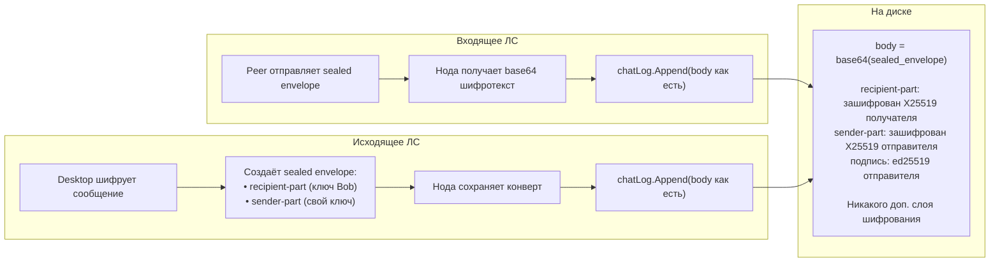

*Диаграмма 8 — Кодирование и сохранение тела сообщения*

- **Входящие ЛС**: хранятся как есть. Body — это base64-encoded sealed envelope,
  который может быть расшифрован только ключом получателя или отправителя через
  `directmsg.DecryptForIdentity()`.
- **Исходящие ЛС**: тот же sealed envelope, который содержит sender-part,
  зашифрованный box-ключом отправителя — поэтому отправитель всегда может расшифровать
  свои сообщения.
- **Global/broadcast**: хранятся как есть (plaintext body).

Никакой дополнительный слой шифрования не применяется. Sealed envelope сам по себе
обеспечивает end-to-end шифрование для ЛС.

### Flow записи

```
storeIncomingMessage()
  ├── валидация timestamp и подписей
  ├── запись в память (s.topics[topic])
  ├── если isLocalMessage() && messageStore != nil:
  │     ├── messageStore.StoreMessage(envelope, isOutgoing)
  │     │     └── DesktopClient: chatLog.Append() → INSERT OR IGNORE
  │     ├── если StoreMessage вернул true:
  │     │     ├── emitLocalChange() → уведомление UI
  │     │     └── push подписчикам DM + delivery receipt
  │     └── если StoreMessage вернул false:
  │           └── emitLocalChange() пропускается (ошибка персистенции)
  ├── gossip к peers (если relay, через shouldRouteStoredMessage)
  └── trackRelayMessage() (только транзитные DM)
```

Нода делегирует персистентность зарегистрированному обработчику `MessageStore`
(реализован `DesktopClient`). Обработчик вызывает `chatLog.Append()` синхронно.
Если `StoreMessage` вернул false (ошибка персистенции), `emitLocalChange()`
пропускается для поддержания инварианта «сначала БД, потом событие».
Ошибки логируются `DesktopClient`, но не блокируют in-memory хранение
и сетевое распространение — они продолжаются в любом случае.

**Relay-only ноды (`corsa-node`) имеют `messageStore = nil`.** Сообщения
хранятся в памяти и ретранслируются, но не записываются в SQLite.

**Транзитные сообщения НЕ персистируются.** Когда полная нода пересылает ЛС,
где ни отправитель, ни получатель не являются локальной identity, `MessageStore`
не вызывается. Сообщение хранится только в памяти (`s.topics[dm]`) для
gossip/relay. Персистентность транзита обеспечивается отдельно через
`queue-<port>.json` и механизм `relayRetry`. Это гарантирует, что локальная
история чата содержит только те диалоги, в которых эта нода реально участвует.

### Flow записи receipt

```
storeDeliveryReceipt()
  ├── проверка дедупликации (seenReceipts)
  ├── запись receipt в память (s.receipts[recipient])
  ├── очистка pending/outbound/relay state
  ├── persistQueueState()
  ├── messageStore.UpdateDeliveryStatus(receipt)    ← СНАЧАЛА БД
  │     └── DesktopClient: chatLog.UpdateStatus()
  │           └── UPDATE messages SET delivery_status=?, updated_at=?
  │                 WHERE id=? AND delivery_status IN (статусы ниже рангом)
  └── emitLocalChange()                              ← событие ПОСЛЕ БД
```

**Критический инвариант порядка:** `MessageStore.UpdateDeliveryStatus()` должен
завершиться **до** `emitLocalChange()`. Desktop UI подписывается на события
локальных изменений и немедленно перечитывает chatlog через `loadConversation()`.
Если событие отправляется до записи в БД, UI видит устаревший `delivery_status`
(гонка). Этот порядок соответствует `storeIncomingMessage()`, где
`MessageStore.StoreMessage()` происходит до `emitLocalChange()`.

**Защита при ошибке:** если `UpdateDeliveryStatus` вернул false (запись в SQLite
не удалась — диск полон, БД закрыта, повреждение), `emitLocalChange()`
**пропускается**. Пробуждение UI после неудачной записи привело бы к чтению
устаревших данных, нарушая инвариант выше. Ошибка логируется `DesktopClient`
на уровне `Error` для расследования.

### Flow чтения

Стратегии чтения в зависимости от контекста:

| Стратегия                          | Когда                             | Что читается                       | Дешифрация      |
|------------------------------------|-----------------------------------|------------------------------------|-----------------|
| `fetch_dm_headers` (через ноду)    | Каждые 5с (poll)                  | ID + sender + recipient + ts (только локальные) | Нет             |
| `FetchConversationPreviews()`      | При запуске (с retry)             | Последняя запись каждого диалога   | 1 сообщ./peer   |
| `FetchConversation()`              | При открытии диалога              | Все записи для одного peer         | Полная          |

### Консольные команды

| Команда                                    | Обработчик           | Описание                                   |
|--------------------------------------------|----------------------|--------------------------------------------|
| `fetch_chatlog [topic] <peer_address>`     | DesktopClient        | Прочитать историю чата с peer (читает chatlog напрямую) |
| `fetch_chatlog_previews`                   | DesktopClient        | Последнее сообщение для каждого диалога (читает chatlog напрямую) |
| `fetch_dm_headers`                         | node.Service         | Легковесные заголовки DM (без тела, только локальные — транзитные отфильтрованы) |
| `fetch_conversations`                      | DesktopClient        | Список всех диалогов со счётчиками (читает chatlog напрямую) |

> **Рефакторинг обработчиков:** `fetch_chatlog`, `fetch_chatlog_previews` и
> `fetch_conversations` удалены из `node.HandleLocalFrame()` после переноса
> владения chatlog в `DesktopClient`. Консольные команды для них теперь
> перехватываются в `ExecuteConsoleCommand()` и обрабатываются `DesktopClient`
> напрямую через `chatLog.ReadCtx()`, `chatLog.ReadLastEntryPerPeerCtx()` и
> `chatLog.ListConversationsCtx()` — без round-trip через фреймовый протокол ноды.
>
> **Context-aware запросы:** Все reader-методы `chatlog.Store` имеют
> context-aware варианты (`ReadCtx`, `ReadLastCtx`, `ListConversationsCtx`,
> `ReadLastEntryCtx`, `ReadLastEntryPerPeerCtx`), использующие
> `db.QueryContext`/`db.QueryRowContext` для соблюдения дедлайнов вызывающего.
> Оригинальные методы делегируют в `Ctx`-варианты с `context.Background()`.
> Desktop `Fetch*` методы пробрасывают `ctx` от вызывающего, поэтому
> таймауты UI распространяются до SQLite I/O.

### Конфигурация

| Переменная окружения  | Поле конфига         | По умолчанию | Описание                    |
|-----------------------|----------------------|--------------|-----------------------------|
| `CORSA_CHATLOG_DIR`   | `Node.ChatLogDir`    | `.corsa`     | Директория для chatlog файлов (создаётся автоматически) |

### Дедупликация

Сообщения дедуплицируются по первичному ключу (`id`). Оператор `INSERT OR IGNORE`
гарантирует, что повторная вставка сообщения с тем же ID будет тихо проигнорирована.
Кроме того, in-memory карта `seen` в сервисе ноды обрабатывает дедупликацию до
записи в chatlog, поэтому дублирующие записи обычно не возникают.

### Список диалогов

`ListConversations()` выполняет запрос к таблице messages, группирует по собеседнику
и возвращает результаты: сначала диалоги с непрочитанными, затем по времени последнего
сообщения. Количество непрочитанных вычисляется как `SUM(CASE WHEN sender != self AND
recipient = self AND delivery_status != 'seen' THEN 1 ELSE 0 END)`.

### Оптимизация памяти

Desktop-клиент минимизирует использование памяти, следуя этим принципам:

1. **Нет массовой расшифровки DM в цикле опроса** — `ProbeNode()` получает только
   легковесные `DMHeaders` (без тел сообщений) каждые 5 секунд.
2. **Превью загружаются один раз** — при запуске через `initializeFromDB()`,
   расшифровывается по одному сообщению на диалог для боковой панели;
   обновляется инкрементально через `updateSidebarFromEvent()`.
3. **Дедупликация обновления превью** — при получении новых заголовков через repair-путь
   `refreshPreviewForPeer()` вызывается один раз на уникального собеседника, а не
   на каждое сообщение.
4. **Диалог загружается по запросу** — полная история читается с диска и расшифровывается
   только когда пользователь переключается на конкретного собеседника.
5. **Только активный диалог в памяти** — переключение на другого собеседника заменяет
   предыдущие данные диалога через `ConversationCache.Load()`.
6. **Транзитные сообщения исключены из chatlog** — ЛС, пересылаемые через полную ноду
   (где ни одна из сторон не является локальной), хранятся только в памяти для gossip;
   их персистентность обеспечивается через `queue-<port>.json`.
7. **Транзитные DM отфильтрованы из `fetch_dm_headers`** — цикл опроса возвращает только
   заголовки, где локальная нода является отправителем или получателем; карта `seenMessageIDs`
   записывает только локальные заголовки, чтобы избежать неограниченного роста памяти от
   транзитного трафика.
