# Chat Log Persistence

## English

### Overview

The `chatlog` package provides SQLite-backed storage for chat messages.
The desktop client does **not** keep all conversations in memory. Messages are
written to a SQLite database as they arrive and read back on demand when the
UI switches to a conversation. Only lightweight metadata (message headers and
previews) is kept in memory for the sidebar.

### Modular layered architecture

See [dm_router.md](dm_router.md) for the full three-layer architecture documentation
(Network → DMRouter → UI), concurrency protection, and public API reference.

### Architecture diagram

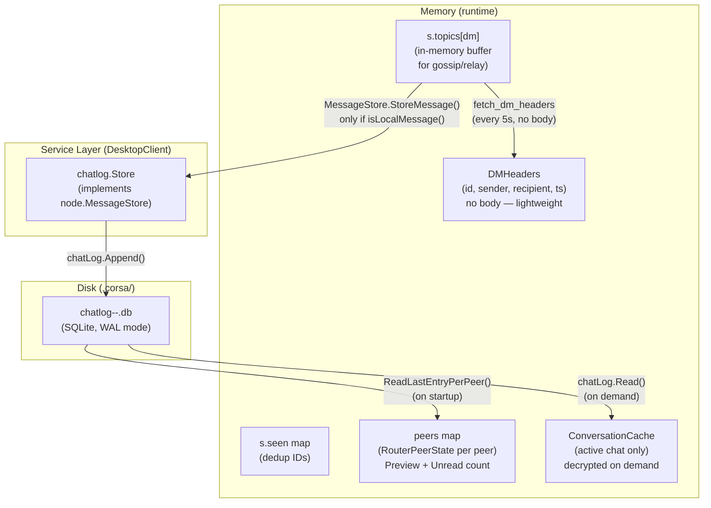
```mermaid
flowchart TB
    subgraph MEMORY["Memory (runtime)"]
        TOPICS["s.topics[dm]\n(in-memory buffer\nfor gossip/relay)"]
        SEEN["s.seen map\n(dedup IDs)"]
        HEADERS["DMHeaders\n(id, sender, recipient, ts)\nno body — lightweight"]
        PEERS["peers map\n(RouterPeerState per peer)\nPreview + Unread count"]
        CACHE["ConversationCache\n(active chat only)\ndecrypted on demand"]
    end

    subgraph SVC["Service Layer (DesktopClient)"]
        CHATLOG["chatlog.Store\n(implements node.MessageStore)"]
    end

    subgraph DISK["Disk (.corsa/)"]
        DB["chatlog-<identity_short>-<port>.db\n(SQLite, WAL mode)"]
    end

    TOPICS -->|"MessageStore.StoreMessage()\nonly if isLocalMessage()"| CHATLOG
    CHATLOG -->|"chatLog.Append()"| DB
    DB -->|"chatLog.Read()\n(on demand)"| CACHE
    DB -->|"ReadLastEntryPerPeer()\n(on startup)"| PEERS
    TOPICS -->|"fetch_dm_headers\n(every 5s, no body)"| HEADERS
```

*Diagram 1 — Chatlog architecture overview*

### What is stored where

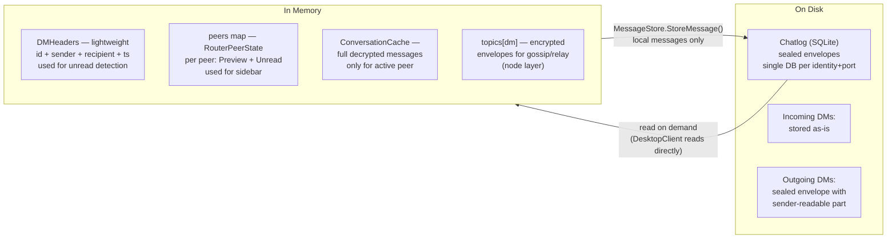
```mermaid
flowchart LR
    subgraph MEM["In Memory"]
        direction TB
        M1["DMHeaders — lightweight\nid + sender + recipient + ts\nused for unread detection"]
        M2["peers map — RouterPeerState\nper peer: Preview + Unread\nused for sidebar"]
        M3["ConversationCache —\nfull decrypted messages\nonly for active peer"]
        M4["topics[dm] — encrypted\nenvelopes for gossip/relay\n(node layer)"]
    end

    subgraph DSK["On Disk"]
        direction TB
        D1["Chatlog (SQLite)\nsealed envelopes\nsingle DB per identity+port"]
        D2["Incoming DMs:\nstored as-is"]
        D3["Outgoing DMs:\nsealed envelope with\nsender-readable part"]
    end

    MEM -->|"MessageStore.StoreMessage()\nlocal messages only"| D1
    D1 -->|"read on demand\n(DesktopClient reads directly)"| MEM
```

*Diagram 2 — In-memory vs on-disk message storage*

### Message arrival flow

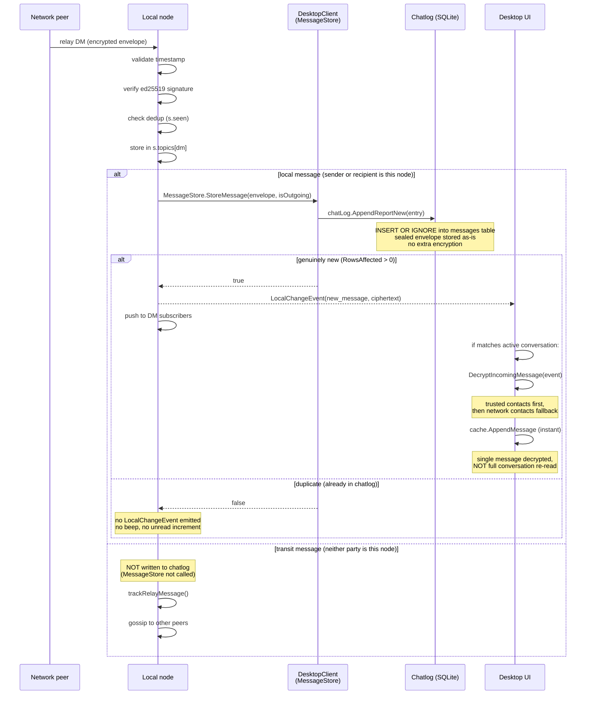
```mermaid
sequenceDiagram
    participant NET as Network peer
    participant NODE as Local node
    participant SVC as DesktopClient<br/>(MessageStore)
    participant LOG as Chatlog (SQLite)
    participant UI as Desktop UI

    NET->>NODE: relay DM (encrypted envelope)
    NODE->>NODE: validate timestamp
    NODE->>NODE: verify ed25519 signature
    NODE->>NODE: check dedup (s.seen)
    NODE->>NODE: store in s.topics[dm]
    alt local message (sender or recipient is this node)
        NODE->>SVC: MessageStore.StoreMessage(envelope, isOutgoing)
        SVC->>LOG: chatLog.AppendReportNew(entry)
        Note over LOG: INSERT OR IGNORE into messages table<br/>sealed envelope stored as-is<br/>no extra encryption
        alt genuinely new (RowsAffected > 0)
            SVC-->>NODE: true
            NODE-->>UI: LocalChangeEvent(new_message, ciphertext)
            NODE->>NODE: push to DM subscribers
            UI->>UI: if matches active conversation:
            UI->>UI:   DecryptIncomingMessage(event)
            Note over UI: trusted contacts first,<br/>then network contacts fallback
            UI->>UI:   cache.AppendMessage (instant)
            Note over UI: single message decrypted,<br/>NOT full conversation re-read
        else duplicate (already in chatlog)
            SVC-->>NODE: false
            Note over NODE: no LocalChangeEvent emitted<br/>no beep, no unread increment
        end
    else transit message (neither party is this node)
        Note over NODE: NOT written to chatlog<br/>(MessageStore not called)
        NODE->>NODE: trackRelayMessage()
        NODE->>NODE: gossip to other peers
    end
```

*Diagram 3 — Message arrival and processing sequence*

### Sending a message

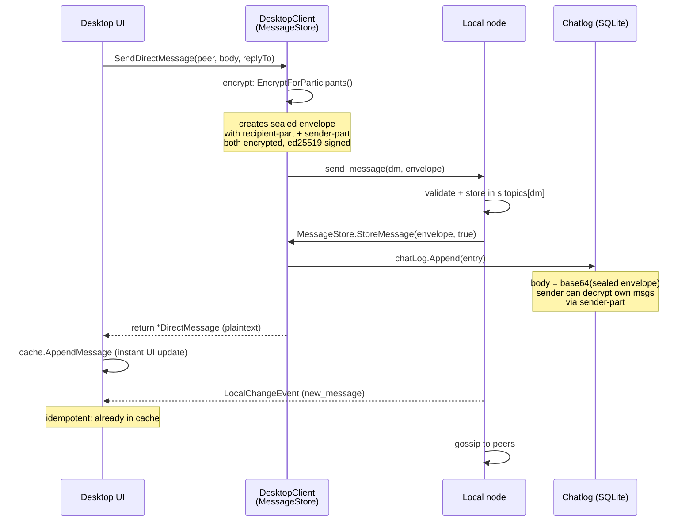
```mermaid
sequenceDiagram
    participant UI as Desktop UI
    participant SVC as DesktopClient<br/>(MessageStore)
    participant NODE as Local node
    participant LOG as Chatlog (SQLite)

    UI->>SVC: SendDirectMessage(peer, body, replyTo)
    SVC->>SVC: encrypt: EncryptForParticipants()
    Note over SVC: creates sealed envelope<br/>with recipient-part + sender-part<br/>both encrypted, ed25519 signed
    SVC->>NODE: send_message(dm, envelope)
    NODE->>NODE: validate + store in s.topics[dm]
    NODE->>SVC: MessageStore.StoreMessage(envelope, true)
    SVC->>LOG: chatLog.Append(entry)
    Note over LOG: body = base64(sealed envelope)<br/>sender can decrypt own msgs<br/>via sender-part
    SVC-->>UI: return *DirectMessage (plaintext)
    UI->>UI: cache.AppendMessage (instant UI update)
    NODE-->>UI: LocalChangeEvent (new_message)
    Note over UI: idempotent: already in cache
    NODE->>NODE: gossip to peers
```

*Diagram 4 — Outgoing message encryption and persistence flow*

### Loading a conversation (on demand)

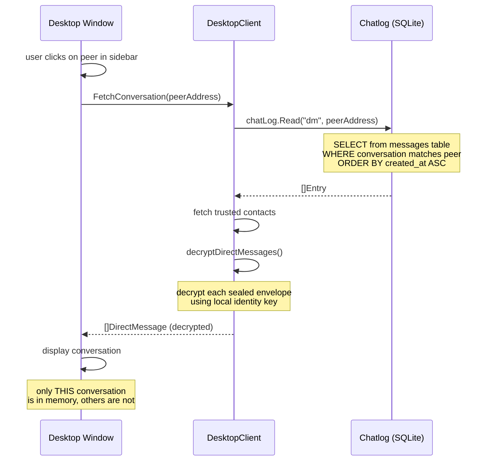
```mermaid
sequenceDiagram
    participant UI as Desktop Window
    participant SVC as DesktopClient
    participant LOG as Chatlog (SQLite)

    UI->>UI: user clicks on peer in sidebar
    UI->>SVC: FetchConversation(peerAddress)
    SVC->>LOG: chatLog.Read("dm", peerAddress)
    Note over LOG: SELECT from messages table<br/>WHERE conversation matches peer<br/>ORDER BY created_at ASC
    LOG-->>SVC: []Entry
    SVC->>SVC: fetch trusted contacts
    SVC->>SVC: decryptDirectMessages()
    Note over SVC: decrypt each sealed envelope<br/>using local identity key
    SVC-->>UI: []DirectMessage (decrypted)
    UI->>UI: display conversation
    Note over UI: only THIS conversation<br/>is in memory, others are not
```

*Diagram 5 — Full conversation load on demand*

### Loading previews (on startup)

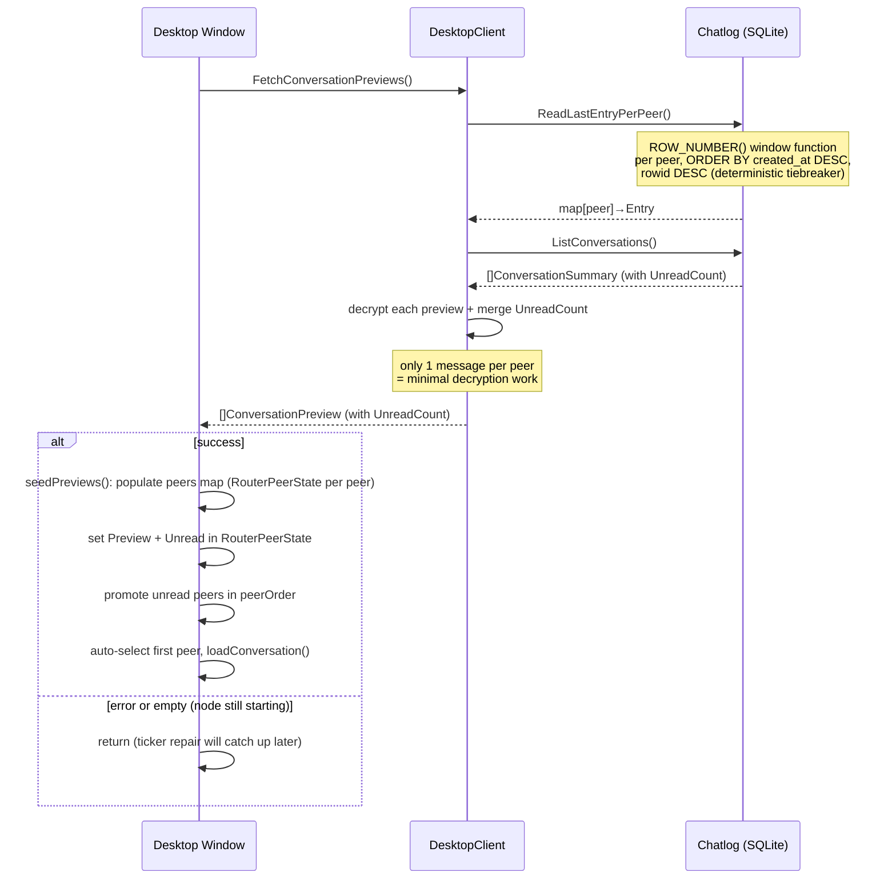
```mermaid
sequenceDiagram
    participant UI as Desktop Window
    participant SVC as DesktopClient
    participant LOG as Chatlog (SQLite)

    UI->>SVC: FetchConversationPreviews()
    SVC->>LOG: ReadLastEntryPerPeer()
    Note over LOG: ROW_NUMBER() window function<br/>per peer, ORDER BY created_at DESC,<br/>rowid DESC (deterministic tiebreaker)
    LOG-->>SVC: map[peer]→Entry
    SVC->>LOG: ListConversations()
    LOG-->>SVC: []ConversationSummary (with UnreadCount)
    SVC->>SVC: decrypt each preview + merge UnreadCount
    Note over SVC: only 1 message per peer<br/>= minimal decryption work
    SVC-->>UI: []ConversationPreview (with UnreadCount)
    alt success
        UI->>UI: seedPreviews(): populate peers map (RouterPeerState per peer)
        UI->>UI: set Preview + Unread in RouterPeerState
        UI->>UI: promote unread peers in peerOrder
        UI->>UI: auto-select first peer, loadConversation()
    else error or empty (node still starting)
        UI->>UI: return (ticker repair will catch up later)
    end
```

*Diagram 6 — Conversation preview loading at startup*

### Database naming

Chatlog does not own a database file of its own. It is one repository inside
the node's shared state database, which `internal/core/storage` opens once at
the composition root — see [storage.md](storage.md).

By default that database is still the historical chatlog file in the data
directory (defaults to `.corsa/`, configurable via `CORSA_CHATLOG_DIR`):

```
chatlog-<identity_short>-<port>.db
```

- `identity_short` — first 8 characters of the node's identity address (40-char hex SHA256 fingerprint)
- `port` — TCP listen port (same suffix used for identity, trust, queue, and peers files)

This naming scheme ensures:
- Multiple identities on the same machine don't collide
- Multiple node instances on different ports don't collide

The file name no longer decides which tables the file may hold, and
`CORSA_STATE_DB_PATH` overrides the location outright. The owner identity
recorded inside the database — the full address, not the eight-character
prefix — is what actually guards against opening somebody else's file.

### Database schema

The chatlog tables are created by the shared migration catalog
(`internal/core/storage/migrations`), not by this package: chatlog contains no
DDL at all. The statements below are reproduced from migrations `0002`–`0005`
for reference — the catalog is the source of truth, and a schema change is a
new migration there.

The main table is `messages`, with CHECK constraints for enum fields:

```sql
CREATE TABLE IF NOT EXISTS messages (
    id              TEXT PRIMARY KEY,
    topic           TEXT NOT NULL DEFAULT 'dm' CHECK(topic IN ('dm','global')),
    sender          TEXT NOT NULL,
    recipient       TEXT NOT NULL,
    body            TEXT NOT NULL,
    flag            TEXT NOT NULL DEFAULT '' CHECK(flag IN ('','immutable','sender-delete','any-delete','auto-delete-ttl')),
    delivery_status TEXT NOT NULL DEFAULT 'sent' CHECK(delivery_status IN ('sent','delivered','seen')),
    ttl_seconds     INTEGER NOT NULL DEFAULT 0,
    metadata        TEXT NOT NULL DEFAULT '',
    created_at      TEXT NOT NULL,
    updated_at      TEXT NOT NULL DEFAULT ''
);
```

Indexes:
- `idx_messages_peer` — `(topic, sender, recipient, created_at)` for conversation queries
- `idx_messages_status` — `(recipient, delivery_status)` for unread counts
- `idx_messages_created` — `(created_at DESC)` for recent message queries
- `idx_messages_ttl` — partial index on `(flag, created_at) WHERE flag = 'auto-delete-ttl'` for TTL expiration queries

Alongside `messages` the same catalog creates the delivery journals
(`seen_ack`, `delivery_failed`), the decrypt-recovery tables
(`decrypt_recovery_jobs`, `peer_established`, `decrypt_recovery_cycles`,
`decrypt_resend_intents`) and the delete-intent table
(`message_delete_intents`, migration `0005`):

```sql
CREATE TABLE IF NOT EXISTS message_delete_intents (
    message_id      TEXT PRIMARY KEY,
    peer            TEXT NOT NULL,
    created_at      TEXT NOT NULL,
    next_attempt_at TEXT NOT NULL,
    attempts        INTEGER NOT NULL DEFAULT 0,
    held            INTEGER NOT NULL DEFAULT 0,
    owed            INTEGER NOT NULL DEFAULT 1,
    refuse_until    TEXT NOT NULL DEFAULT ''
);
```

One row carries the two facts a deleted id needs, because they are two
facts about one message:

- **`owed`** — the peer still has to be asked. Cleared, not deleted, when
  their ack settles it.
- **`refuse_until`** — ignore a re-delivery of this id until then. A
  deletion removes the chatlog row AND clears the router's dedup gate for
  its id, which is exactly what lets a relay or inbox replay put the row
  straight back; the refusal is the answer. On disk rather than in memory
  alone because the replay window and a restart overlap.

They are independent on purpose. A request to a contact who never returns
is kept indefinitely while its refusal expires within the hour; a
receiver asked to delete a message it has not received yet gets a row
that owes nobody anything and only refuses (`peer` is empty there —
nobody is being asked, so there is no conversation to name). The row is
removed once it owes nothing and refuses nothing.

`held` says why a row is not due, when it is not. There is exactly one
reason: `HoldPeerAbsent` — the peer could not be asked at all, so a
reconnect pulls the row forward. Zero is not a park: the row is due, or
waiting out the backoff of an attempt that did go out, and resetting a
backoff would ask a peer whose transport reconnects every few seconds
once per handshake.

There is deliberately no park for "not classified yet". A wipe reads
`never_emitted` from the row it is deleting, inside the same transaction,
so a request for a message the peer cannot have is never written at all.
A parked one would have been a privacy rule with a timeout attached: any
stall past the timeout sends it.

A whole-conversation wipe writes N of these rows and nothing else: it is
N message deletions, so it needs no request of its own, no row-set table,
no answers table and no scheduler of its own. See
[dm-commands.md](dm-commands.md) §"Bulk wipe".

### Entry fields

The `messages` table has columns that map to `chatlog.Entry` fields, plus two
internal-only columns (`topic`, `updated_at`) that are not exposed through the
`Entry` struct or protocol frames.

| Column            | Type   | In `Entry`? | Description                                          |
|-------------------|--------|:-----------:|------------------------------------------------------|
| `id`              | string | yes         | Message UUID (primary key, dedup via INSERT OR IGNORE) |
| `topic`           | string | **no**      | `dm` or `global` (CHECK constraint). Query parameter — callers always pass it explicitly to `Read()`, `Append()`, etc. |
| `sender`          | string | yes         | Sender's identity address (40-char hex)              |
| `recipient`       | string | yes         | Recipient's identity address or `*` for broadcast    |
| `body`            | string | yes         | Raw message body (sealed envelope for DMs, plaintext for global) |
| `flag`            | string | yes         | Message flag (CHECK constraint, see below)            |
| `delivery_status` | string | yes         | `sent`, `delivered`, or `seen` (CHECK constraint)    |
| `ttl_seconds`     | int    | yes         | Auto-delete lifetime in seconds (0 = no TTL)         |
| `metadata`        | string | yes         | Arbitrary JSON for future extensibility (empty string = none) |
| `created_at`      | string | yes         | RFC3339Nano timestamp                                |
| `updated_at`      | string | **no**      | RFC3339Nano timestamp set by `UpdateStatus()`. Internal bookkeeping — not read back through `Entry` or protocol frames. |

#### Domain types in Store API

All exported `chatlog.Store` methods use typed parameters from `domain` package
instead of raw strings. This enforces compile-time distinction between
peer identities, message IDs, and other string-shaped values:

- **`domain.PeerIdentity`** — used for `selfAddress`, `peerAddress`, `identity` parameters (40-char Ed25519 hex fingerprint).
- **`domain.MessageID`** — used for `messageID`, `id` parameters (UUID v4 string).
- **`domain.PeerIdentity`** is also the constructor's own parameter: `NewStore(db storage.Executor, identity domain.PeerIdentity)` takes the owning identity and the shared state database — there is no `listenAddress` parameter, and the store no longer opens a file of its own.

Every method takes `context.Context` first: they reach SQLite through the
shared state database, and cancellation has to travel with the call. Method
signatures:

- `Append(ctx context.Context, topic string, selfAddress domain.PeerIdentity, entry Entry) error`
- `AppendReportNew(ctx context.Context, topic string, selfAddress domain.PeerIdentity, entry Entry) (bool, error)`
- `Read(ctx context.Context, topic string, peerAddress domain.PeerIdentity) ([]Entry, error)`
- `ReadLast(ctx context.Context, topic string, peerAddress domain.PeerIdentity, n int) ([]Entry, error)`
- `ReadLastEntry(ctx context.Context, topic string, peerAddress domain.PeerIdentity) (*Entry, error)`
- `UpdateStatus(ctx context.Context, topic string, peerAddress domain.PeerIdentity, messageID domain.MessageID, status string) (bool, error)`
- `HasEntryID(ctx context.Context, topic string, peerAddress domain.PeerIdentity, id domain.MessageID) bool`
- `HasEntryInConversation(ctx context.Context, peerAddress domain.PeerIdentity, id domain.MessageID) bool`
- `LookupEntryInConversation(ctx context.Context, peerAddress domain.PeerIdentity, id domain.MessageID) (bool, error)`
- `DeleteByID(ctx context.Context, messageID domain.MessageID) (bool, error)`
- `DeleteByPeer(ctx context.Context, identity domain.PeerIdentity) (int64, error)`

#### Message status lifecycle

```
Outgoing DM:  sent → delivered → seen
Incoming DM:       delivered → seen   (starts at delivered, skips sent)
```

- **sent** — outgoing message created by this node (set on `chatLog.Append` when sender = self). Incoming messages **never** have this status because they are already delivered by the time we store them.
- **delivered** — message has reached its destination.
  - *Outgoing:* a delivery receipt was received from the recipient node (transition from `sent`).
  - *Incoming:* set immediately on `chatLog.Append` — if the local node is storing the message, it has already been delivered to us. This is the **initial** status for all incoming DMs.
- **seen** — recipient opened the conversation containing this message

#### Status lifecycle: detailed flow with SQL operations

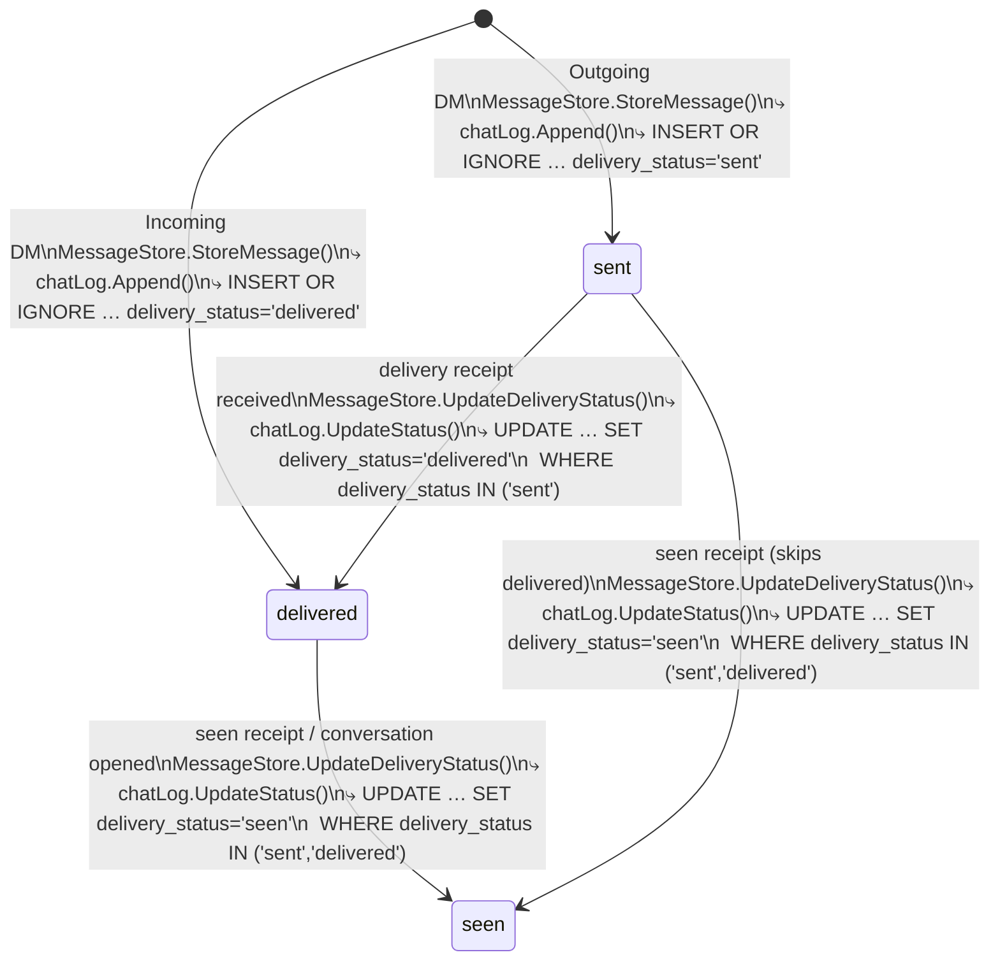
```mermaid
stateDiagram-v2
    [*] --> sent : Outgoing DM\nMessageStore.StoreMessage()\n⤷ chatLog.Append()\n⤷ INSERT OR IGNORE … delivery_status='sent'
    [*] --> delivered : Incoming DM\nMessageStore.StoreMessage()\n⤷ chatLog.Append()\n⤷ INSERT OR IGNORE … delivery_status='delivered'

    sent --> delivered : delivery receipt received\nMessageStore.UpdateDeliveryStatus()\n⤷ chatLog.UpdateStatus()\n⤷ UPDATE … SET delivery_status='delivered'\n  WHERE delivery_status IN ('sent')
    delivered --> seen : seen receipt / conversation opened\nMessageStore.UpdateDeliveryStatus()\n⤷ chatLog.UpdateStatus()\n⤷ UPDATE … SET delivery_status='seen'\n  WHERE delivery_status IN ('sent','delivered')
    sent --> seen : seen receipt (skips delivered)\nMessageStore.UpdateDeliveryStatus()\n⤷ chatLog.UpdateStatus()\n⤷ UPDATE … SET delivery_status='seen'\n  WHERE delivery_status IN ('sent','delivered')
```

*Diagram 7 — Message delivery status state machine*

| Transition | Trigger | Code path | SQL |
|---|---|---|---|
| `[new]` → `sent` | User sends DM | `DesktopClient.SendDirectMessage()` → `storeIncomingMessage()` → `MessageStore.StoreMessage()` → `chatLog.Append()` | `INSERT OR IGNORE INTO messages (..., delivery_status) VALUES (..., 'sent')` |
| `[new]` → `delivered` | Incoming DM arrives | `storeIncomingMessage()` → `MessageStore.StoreMessage()` → `chatLog.Append()` | `INSERT OR IGNORE INTO messages (..., delivery_status) VALUES (..., 'delivered')` |
| `sent` → `delivered` | Delivery receipt from recipient | `storeDeliveryReceipt()` → `MessageStore.UpdateDeliveryStatus()` → `chatLog.UpdateStatus()` | `UPDATE messages SET delivery_status='delivered', updated_at=? WHERE id=? AND delivery_status IN ('sent')` |
| `delivered` → `seen` | Seen receipt / user opens conversation | `storeDeliveryReceipt()` → `MessageStore.UpdateDeliveryStatus()` → `chatLog.UpdateStatus()` | `UPDATE messages SET delivery_status='seen', updated_at=? WHERE id=? AND delivery_status IN ('sent','delivered')` |
| `seen` → `delivered` | Late receipt (rejected) | `MessageStore.UpdateDeliveryStatus()` → `chatLog.UpdateStatus()` — WHERE clause doesn't match | `UPDATE … WHERE delivery_status IN ('sent','delivered')` → 0 rows affected |

**Code references:**

- `chatLog.Append()` — `internal/core/chatlog/chatlog.go` (`Store.Append`)
- `chatLog.UpdateStatus()` — `internal/core/chatlog/chatlog.go` (`Store.UpdateStatus`, monotonic guard via `statusRank` map)
- `storeIncomingMessage()` — `internal/core/node/service.go` (calls `MessageStore.StoreMessage()` for local messages; sets `isOutgoing` flag for the handler)
- `storeDeliveryReceipt()` — `internal/core/node/service.go` (calls `MessageStore.UpdateDeliveryStatus()` before emitting `LocalChangeEvent`)
- `SendDirectMessage()` — `internal/core/service/desktop.go` (encrypts via `EncryptForParticipants`, sends to node)
- `handleEvent()` → `onReceiptUpdate()` — `internal/core/service/dm_router.go` (updates cache status in-place; reloads from SQLite if message missing)

Status transitions are **monotonic** — a status can only advance forward
(sent → delivered → seen). `UpdateStatus()` enforces this: an attempt to
regress (e.g. seen → delivered from a late-arriving receipt) is silently
ignored. This prevents duplicate or out-of-order network events from
corrupting the persisted status.

Status is the **source of truth** after restart. The desktop client reads
`delivery_status` from SQLite via `ChatEntryFrame.DeliveryStatus` and uses
it as the baseline. In-memory delivery receipts (from `fetch_delivery_receipts`)
are layered on top, but only if they advance the status further. This ensures
that statuses (delivered/seen) survive node restarts without depending on
volatile runtime data.

Unread messages are incoming DMs with `delivery_status != 'seen'`.

On startup, `DMRouter.initializeFromDB()` restores sidebar state from the chatlog:

- **Sidebar peers**: all chatlog conversation peers are added to the
  `peers` map (`RouterPeerState` entries), so they appear in the sidebar
  even if the peer is not in trusted/network contacts.
- **Unread badges**: `UnreadCount` from `ListConversations()` (SQL-level
  count of incoming DMs with `delivery_status != 'seen'`) is stored in
  `RouterPeerState.Unread`. Peers with unread messages are promoted to the
  front of `peerOrder`.
- **Auto-selection**: the first peer in `peerOrder` is auto-selected as
  `activePeer` (with `peerClicked = false`), and its conversation is loaded
  via `loadConversation()`.

`initializeFromDB()` runs once in a startup goroutine with retry (up to 3
attempts with linear backoff: 1s, 2s). If all attempts fail, the sidebar
starts empty and the 5-second ticker's `repairUnreadFromHeaders()` catches
up for new incoming messages as DMHeaders arrive. Historical read-only
conversations without new headers will not recover until the next app restart.

#### Message flags

| Flag               | Description                                   |
|--------------------|-----------------------------------------------|
| `` (empty)         | Default — no special behavior                 |
| `immutable`        | Nobody may delete the message                 |
| `sender-delete`    | Only the sender may delete it                 |
| `any-delete`       | Any participant may delete it                 |
| `auto-delete-ttl`  | Message is deleted automatically after `ttl_seconds` |

The `flag` column has a CHECK constraint enforcing these values.

### Message deletion

Two deletion methods are available:

- **`DeleteByID(messageID domain.MessageID)`** — removes a single message by primary key, together with every per-message trace under the same id: its `seen_ack` and `delivery_failed` journal rows (migration 0003) and any resend intents keyed on it (migration 0004). Those rows are durable records that a message with this id existed and how its delivery went, so leaving them behind would keep exactly the metadata the deletion was for. Per-PEER state (`decrypt_recovery_jobs`, `peer_established`, `decrypt_recovery_cycles`) describes the conversation rather than the message and is untouched. All of it commits in one transaction, so a row can never outlive its journal entries or the reverse. Returns true if a message row was found.
- **`DeleteByPeer(identity)`** — the whole-conversation wipe: its messages, their journal rows, and the peer's pending delete intents, in one transaction. The intents go because their ids are the last rows naming an erased thread; the cost is that peer-side deletions scheduled earlier are abandoned.
- **`CheckpointWAL()`** — folds the write-ahead log back into the file and truncates it. `secure_delete` (see [storage.md](storage.md)) overwrites the freed page, but in WAL mode that overwrite is itself a log frame and the original bytes live in the `-wal` until a checkpoint retires them. Best-effort: a busy checkpoint is not a failed deletion. Called after every deletion commits — our own, the ones a peer asks us to perform, and the TTL sweep.
- **`DeleteExpired()`** — batch-removes all auto-delete-ttl messages whose lifetime has elapsed. Uses one SQL query:
  ```sql
  DELETE FROM messages
  WHERE flag = 'auto-delete-ttl'
    AND ttl_seconds > 0
    AND datetime(created_at) < datetime('now', '-' || ttl_seconds || ' seconds')
  ```
  The partial index `idx_messages_ttl` makes this efficient even with large tables.

  > **Status: not yet wired.** The `DeleteExpired()` method exists in
  > `chatlog.Store` but is not called by any runtime path. Currently the node
  > only cleans in-memory `s.topics`; persisted messages with
  > `auto-delete-ttl` survive restarts and continue appearing in
  > `FetchConversation()` / previews. Periodic SQLite cleanup will be added
  > in a future release.

#### Delete intents

Deleting one's own message removes the row immediately, whether or not
the recipient is reachable — a copy of something the user asked to
destroy must not survive on disk. What survives instead is the INTENT to
have the peer delete their copy, in `message_delete_intents`
(`delete_intents.go`):

- **`DeleteWithIntent(intent, tombstoneUntil)`** — the entry point:
  removes the message, records the intent, and plants the refusal of the
  id in ONE transaction. Separate commits leave a crash window with the
  local copy destroyed and nobody left to ask the peer — or with the row
  gone and its refusal not written, so the next relay retry hands the
  message straight back.
- **`DeleteMessageWithTombstone(id, until)`** — the same commit minus
  the intent, for a deletion that owes the peer nothing.
- **`DeleteMessages(ids, until)`** — a batch in ONE transaction,
  reporting which ids were actually there. The receiver of a
  conversation wipe deletes a thread this way: one commit per row meant
  one fsync per message, an order of magnitude more than the sender's
  side of the same wipe. All-or-nothing per batch, so a caller that hits
  an error can retry (delete is idempotent) or fall back to one at a
  time to isolate the row that fails.
- **`NoteDeleteIntent(intent)`** — records or re-arms one intent on its
  own (used by the recovery path, where there is no row to delete). A
  re-issue takes the new due time and attempt count but keeps the
  original `CreatedAt`, which the give-up deadline is measured from — so
  re-clicking cannot make an unanswered request immortal. The peer is
  never rewritten on conflict: a message id belongs to one conversation,
  and re-pointing a pending deletion at somebody else is the one thing
  that must not follow from a caller bug.
- **`DueDeleteIntents(now, limit)`** — the scheduler sweep: intents due
  now, oldest first, bounded by `limit` (a non-positive limit returns
  nothing, so an unbounded sweep is not reachable by accident).
- **`DeleteIntentByID(messageID)`** — used to check an inbound ack
  against the peer the request was actually addressed to.
- **`RecordDeleteIntentAttempt(messageID, nextAttemptAt)`** — charges one
  dispatch and moves the due time. A no-op if the ack already retired
  the intent.
- **`HoldDeleteIntent(messageID, until)`** — parks an intent (sets
  `held`) WITHOUT charging it, for a peer that cannot answer or has had
  its share of the sweep. What keeps one absent contact's backlog from
  starving the queue.
- **`ReviveDeleteIntentsForPeer(peer, now)`** — pulls a peer's PARKED
  intents forward when they come back, so the request goes out on the
  next tick instead of at the end of the parking interval. Rows waiting
  out a real backoff are left alone.
- **`DropDeleteIntent(messageID)`** — terminal removal, idempotent.
- **`DropDeleteIntentsForPeer(peer)`** — used when a peer's history goes
  wholesale; see `DeleteByPeer`.
- **`DeleteIntentCountsByPeer()`** — the per-conversation "N waiting for
  the peer to delete" number the chat header renders.

The row carries no body, no sender and no original timestamp: only the
addressing the request needs. That is the reason it is a separate table
rather than a blanked-out message row, which would leave a tombstone in
the conversation for anyone reading the database. The lifecycle and the
retry policy live in [dm-commands.md](dm-commands.md) §"Scheduled
deletion".

The whole-conversation wipe goes through the same table:

- **`DeleteConversationWithIntents(peer, scope, now, tombstoneUntil)`** —
  removes every deletable row of the thread and their per-message journal
  traces, writes ONE intent per message, and plants the refusal of every
  id it takes — in ONE transaction. Immutable rows stay: the flag is a
  promise no bulk gesture overrides. Returns the ids actually removed, so
  the caller can run what a database cannot: file-transfer cleanup and UI
  eviction. All-or-nothing by design — a wipe that cannot record what the
  peer owes us must leave the thread standing rather than erase it with
  nobody scheduled to ask.
- **`ConversationCandidateIDs(peer)`** — the same row set, read on its
  own. The caller marks those ids BEFORE the transaction takes them,
  because inside a transaction there is no moment at which anything could
  act on them, and the wipe deletes exactly the set that was read: a
  second read inside the transaction would destroy rows nobody marked and
  nobody will ask the peer for.

### Metadata column

The `metadata` column stores arbitrary JSON for fields that don't have their own
column. This provides forward compatibility — new message properties can be stored
without schema migrations. Examples of future metadata:

- `{"edited": true, "edit_at": "2026-..."}` — edit history
- `{"reactions": {"👍": 2}}` — message reactions

When `metadata` is empty string, it means no extra data is present.

**`never_emitted`** is the one mark the delivery path writes there. The node
tracks in memory whether an outgoing envelope has ever been handed to the wire,
and a deletion depends on the answer: only a message that PROVABLY never went
out may be dropped without asking the peer, because asking is how they would
learn an id they have never seen. That memory dies with the process, so the
mark carries it across a restart.

It is stored as the negative on purpose. Absence means emitted, which makes
every row written before the mark existed — and every ordinary send, where the
message goes out the moment it is stored — correct while carrying nothing at
all; the common path pays no write. A row is marked only when the send was
WITHHELD because the recipient was unreachable, and the mark is removed once
the message does go out. The removal is durable BEFORE the frame is written and
the mark may land after the hold it describes, because the two errors are not
equal: a lost mark costs the peer one id they cannot resolve, a stale one costs
the user a deletion that is never asked for.

That asymmetry decides two rules elsewhere. A frame is NOT written when the
removal fails — sending anyway would put the message on the peer while the
disk still claims it never left, and after a restart that claim is what makes
the deletion skip them; the message stays with the retry engine and the next
tick tries both halves again. And a conversation wipe reads the mark inside
its own transaction rather than asking the node afterwards, because the row
it is about to destroy is the last thing that still holds the answer — but
only while the node's deliveries for it are FROZEN — which both the
conversation wipe and the single-message delete now take before they
read. The mark says
what was true when it was written; without the freeze a message can go out
between the read and the delete, so a wipe that could not freeze makes no
classification at all and asks about everything. See dm-commands.md
§"Bulk wipe".

**Design note on `reply_to`:** reply threading is implemented via the `ReplyTo`
field inside `PlainMessage`, which is fully encrypted within the AES-GCM envelope.
The relay server and the local chatlog SQLite never see this value in plaintext.
The UI extracts `reply_to` after decryption. This is an intentional privacy
decision — the reply graph is not observable without the decryption key, even
with direct access to the SQLite file. `reply_to` is NOT duplicated into
the `metadata` column.

**Receive-side sanitization:** both the chatlog reload path (`decryptDirectMessages`)
and the live-event path (`DecryptIncomingMessage`) validate that a decrypted
`reply_to` references a message ID that exists within the same DM conversation.
If the referenced ID is missing — whether due to a malicious sender crafting a
cross-thread reference or a message that was deleted/expired — the `ReplyTo`
field is silently cleared. This preserves the invariant that `reply_to` always
resolves within the same thread, so the UI never encounters broken quote links.

Cleared on an ESTABLISHED absence, never on a failed lookup. The two are told
apart by `LookupEntryInConversation`: the bool-only form returned false for a
cancelled context and for an unhealthy database exactly as it did for a genuine
miss, so a valid quote was stripped and the caller was handed the edited
messages as a successful read. The reload path now fails the read instead —
history is not silently edited — while the live-event path, which builds one
message and has no error to return, KEEPS the reference and logs the failure. A
kept reference is what every renderer already tolerates; a dropped one is
invisible.

### Integrity and startup failures

Integrity checking is no longer a chatlog concern. `storage.Open` runs
`PRAGMA integrity_check` before writing anything, verifies the file's
`application_id` and owner identity, and migrates the schema to the version
this binary knows. Any failure aborts startup.

The old behaviour — rename a corrupt file to `*.corrupt` and continue with an
empty history — is deliberately gone. It was tolerable while the file held only
chat history; the same file now holds several kinds of state, so a silent
rebuild would be silent multi-subsystem data loss. The corrupt file is left
untouched and recovery from a backup is an explicit operation.

There is likewise no "running without persistence" mode: the repository is
built on an executor that is already open and migrated, so a store that
silently swallows writes cannot exist.

### Graceful shutdown

Shutdown is split between the node layer and the service layer:

**Node layer** (`Service.Run()`, on `ctx.Done()`):

1. The TCP listener is closed — no new inbound connections are accepted.
2. `s.closeAllInboundConns()` forcibly closes every tracked inbound TCP
   connection so that `handleConn` goroutines unblock from their
   `ReadString` call and exit.
3. `s.connWg.Wait()` blocks until all active `handleConn` goroutines
   finish. This ensures in-flight `storeIncomingMessage` /
   `storeDeliveryReceipt` calls (which may call `MessageStore`) complete
   before shutdown proceeds.

**Composition root** (`storage.Database.Close()`, called via `defer` in
`app.go` and from `Runtime.Close` in the SDK):

4. `Database.Close()` runs the SQLite WAL checkpoint and releases the file
   handles. It is idempotent and must be the last thing to run — neither
   `chatlog.Store` nor `ChatlogGateway` can close the database, because
   neither owns it.

Without steps 2–3, a slow peer could still be calling `MessageStore` after
the close, causing "database is closed" errors and potential data loss.
Without step 2, `connWg.Wait()` could block indefinitely if a peer keeps
its connection open (e.g. a persistent session from another node).

### Structured logging (zerolog)

The project uses [`rs/zerolog`](https://github.com/rs/zerolog) for structured
logging. The `crashlog` package (`internal/core/crashlog`) provides the
initialization point:

1. **Dual output** — logs go to both stdout (via `zerolog.ConsoleWriter` with
   coloured human-friendly format) and `.corsa/corsa.log`. The file uses a
   human-readable console-style format by default (unlike stdout, file
   timestamps include the date);
   `CORSA_LOG_FORMAT=json` switches it to raw JSON lines for machine parsing.
   At startup, if the file exceeds 10 MB it is shrunk in place to its last
   ~200 KB (line-aligned) — no rotated copies are created; legacy
   `corsa.log.<timestamp>` copies are deleted. The shrink does not happen
   during a running process — a long-lived session may exceed the threshold
   until the next restart. See [debug.md](debug.md) for details.
2. **Startup logging** — application start time and log path are recorded on
   every launch, making it easy to correlate crashes with sessions.
3. **Panic recovery** — when a panic occurs, the stack trace is written to
   `.corsa/crash-<YYYYMMDD-HHMMSS>.log` before the process terminates.
   Up to 10 crash files are kept; older ones are automatically cleaned up.
   Recovery works in three layers:
   - `defer cleanup()` in `main()` catches panics in the main goroutine.
   - `defer crashlog.DeferRecover()` in the desktop UI goroutine
     (`Window.Run`) catches panics from the Gio event loop and
     background polling.
   - `defer crashlog.DeferRecover()` in node-side goroutines:
     `bootstrapLoop`, `handleConn`, `runPeerSession`, `readPeerSession`,
     `gossipMessage`, `pushToSubscriberSnapshot`, `pushReceiptToSubscribers`,
     `emitDeliveryReceipt`, `gossipReceipt`, `gossipNotice`,
     `sendMessageToPeer`, `sendNoticeToPeer`, `sendReceiptToPeer`,
     `writePushFrame`, `pushBacklogToSubscriber`. This ensures panics
     in any node goroutine produce crash files.
4. **Goroutine safety** — background goroutines in the DMRouter are wrapped
   in `safeHandleEvent()` and `safePollHealth()` which catch panics and log
   them via `log.Error()` instead of crashing the entire application.

**Log levels used:**

| Level   | Usage                                                       |
|---------|-------------------------------------------------------------|
| `Debug` | Routing attempts, subscription details, verbose tracing     |
| `Info`  | Normal operations: connections, message storage, state      |
| `Warn`  | Recoverable issues: peer rejected, NAT detected, retries   |
| `Error` | Failures: persistence errors, panics, crash reports         |
| `Fatal` | Unrecoverable: main() exit on startup failure               |

**Runtime fatal capture:** Go's `fatal: concurrent map read and map write` is
not a panic — it is a runtime `fatal` (SIGABRT) that `recover()` cannot catch.
To capture these, `crashlog.Setup()` redirects stderr (fd 2) to
`.corsa/stderr.log` via `syscall.Dup2` (Unix only) and calls
`debug.SetTraceback("all")` so that all goroutine stacks are dumped. After a
silent crash, check `.corsa/stderr.log` for the runtime error message and
stack trace. The proper fix for the root cause is mutex protection (see
"Concurrency protection" below).

Setup is done in `main()` of both `corsa-desktop` and `corsa-node`:

```go
import "github.com/rs/zerolog/log"

func main() {
    cleanup := crashlog.Setup()
    defer cleanup()
    log.Info().Msg("corsa-desktop starting")
    // ...
}
```

Structured log calls look like:
```go
log.Info().Str("topic", msg.Topic).Str("id", msg.ID).Msg("stored message")
log.Error().Err(err).Str("message_id", id).Msg("chatlog update status failed")
log.Warn().Str("address", ip).Int("score", score).Msg("blacklisted peer")
```

The log directory defaults to `.corsa/` (same as chatlog) and respects
`CORSA_CHATLOG_DIR`.

The log level defaults to `info` and can be changed via `CORSA_LOG_LEVEL`
environment variable. Supported values: `trace`, `debug`, `info`, `warn`,
`error`. Use `CORSA_LOG_LEVEL=debug` to enable routing/delivery tracing
(route attempts, subscriber details, relay retries).

### Body encoding

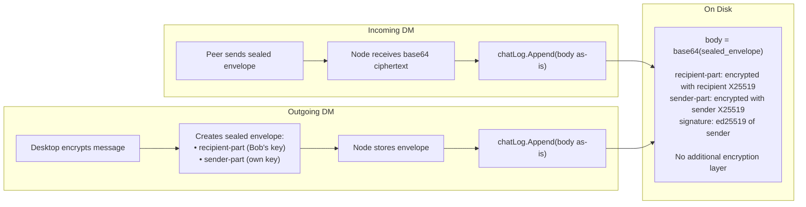
```mermaid
flowchart LR
    subgraph INCOMING["Incoming DM"]
        I1["Peer sends sealed envelope"] --> I2["Node receives base64 ciphertext"]
        I2 --> I3["chatLog.Append(body as-is)"]
    end

    subgraph OUTGOING["Outgoing DM"]
        O1["Desktop encrypts message"] --> O2["Creates sealed envelope:\n• recipient-part (Bob's key)\n• sender-part (own key)"]
        O2 --> O3["Node stores envelope"]
        O3 --> O4["chatLog.Append(body as-is)"]
    end

    subgraph ONDISK["On Disk"]
        D1["body = base64(sealed_envelope)\n\nrecipient-part: encrypted with recipient X25519\nsender-part: encrypted with sender X25519\nsignature: ed25519 of sender\n\nNo additional encryption layer"]
    end

    I3 --> D1
    O4 --> D1
```

*Diagram 8 — Message body encoding and storage process*

- **Incoming DMs**: stored as-is. The body is already a base64-encoded sealed envelope
  that can only be decrypted by the recipient's or sender's identity key via
  `directmsg.DecryptForIdentity()`.
- **Outgoing DMs**: the body is the same sealed envelope, which includes a sender-part
  encrypted with the sender's own box key — so the sender can always decrypt their own
  messages.
- **Global/broadcast messages**: stored as-is (plaintext body).

No additional encryption layer is applied. The sealed envelope itself provides
end-to-end encryption for DMs.

### Write flow

```
storeIncomingMessage()
  ├── validate timestamp and signatures
  ├── if isLocalMessage() && messageStore != nil:
  │     ├── messageStore.StoreMessage(envelope, isOutgoing) → StoreResult
  │     │     └── DesktopClient: chatLog.AppendReportNew() → INSERT OR IGNORE
  │     ├── StoreInserted:
  │     │     ├── add to s.topics (in-memory)
  │     │     ├── emitLocalChange() → notify UI
  │     │     └── delivery receipt + push to DM subscribers
  │     ├── StoreDuplicate:
  │     │     └── skip s.topics, skip event, skip delivery receipt
  │     │         (closes both event-path and DMHeaders header-path)
  │     └── StoreFailed:
  │           ├── add to s.topics (don't lose from network)
  │           └── skip event (stale data)
  ├── if !isLocal or messageStore == nil:
  │     └── add to s.topics unconditionally
  ├── gossip to peers (if routing, via shouldRouteStoredMessage)
  └── trackRelayMessage() (transit DMs only)
```

The node delegates persistence to the registered `MessageStore` handler
(implemented by `DesktopClient`). The handler calls `chatLog.AppendReportNew()`
synchronously and returns a `StoreResult` enum:

- **`StoreInserted`** — genuinely new message (INSERT affected rows > 0). Added to `s.topics`, UI event emitted, delivery receipt sent.
- **`StoreDuplicate`** — already in chatlog (INSERT OR IGNORE affected 0 rows). **Not** added to `s.topics`, event skipped, delivery receipt skipped. This is the durable deduplication layer: `s.seen` is ephemeral and does not survive process restarts, but the chatlog on disk is the source of truth. Keeping duplicates out of `s.topics` also prevents `fetchDMHeadersFrame()` from including them in DMHeaders, which would let `repairUnreadFromHeaders()` re-increment unread counts on the UI.
- **`StoreFailed`** — write error. Added to `s.topics` (message is not lost from the network) but event is skipped. Errors are logged by `DesktopClient`; network propagation always proceeds.

**Relay-only nodes (`corsa-node`) have `messageStore = nil`.** Messages are
stored in-memory and relayed, but never persisted to SQLite.

**Transit messages are NOT persisted.** When a full node relays a DM
where neither sender nor recipient is the local identity, `MessageStore` is
not called. The message is stored only in-memory (`s.topics[dm]`) for
gossip/relay purposes, so the local chat history only contains conversations
this node actually participates in. Transit relay state (`relayRetry`,
forward states, receipts) is likewise **in-memory only** — it is NOT written
to disk and does **not** survive a restart (see `docs/protocol/relay.md`
INV-8). A restarted relay re-learns paths and the sender retries end-to-end.

### Receipt write flow

```
storeDeliveryReceipt()
  ├── dedup check (seenReceipts)
  ├── store in-memory receipt (s.receipts[recipient])
  ├── clear pending/outbound/relay state
  ├── messageStore.UpdateDeliveryStatus(receipt)    ← DB FIRST
  │     └── DesktopClient: chatLog.UpdateStatus()
  │           └── UPDATE messages SET delivery_status=?, updated_at=?
  │                 WHERE id=? AND delivery_status IN (lower-rank statuses)
  └── emitLocalChange()                              ← event AFTER DB
```

**Critical ordering invariant:** `MessageStore.UpdateDeliveryStatus()` must
complete **before** `emitLocalChange()`. The desktop UI subscribes to local
change events and immediately re-reads the chatlog via `loadConversation()`.
If the event fires before the DB write, the UI sees stale `delivery_status`
(race condition). This matches the ordering in `storeIncomingMessage()`,
where `MessageStore.StoreMessage()` happens before `emitLocalChange()`.

**Failure guard:** if `UpdateDeliveryStatus` returns false (SQLite write
failed — disk full, database closed, corruption), `emitLocalChange()` is
**skipped**. Waking the UI after a failed write would cause it to re-read
stale data, violating the invariant above. The error is logged at `Error`
level by `DesktopClient` so the operator can investigate.

### Read flow

Desktop client uses three read strategies depending on context:

| Strategy                        | When                          | What is read                    | Decryption |
|---------------------------------|-------------------------------|---------------------------------|------------|
| `fetch_dm_headers` (via node)   | Every 5s poll                 | ID + sender + recipient + ts (local only) | None       |
| `FetchConversationPreviews()`   | App startup (with retry)      | Last entry per conversation     | 1 msg/peer |
| `FetchConversation()`           | User opens a conversation     | All entries for one peer        | Full       |

```
# Lightweight poll (every 5 seconds) — still goes through node
HandleLocalFrame("fetch_dm_headers")
  └── return message headers from s.topics[dm] — local only (sender/recipient = this node), no body, no disk I/O

# Preview load (on startup with retry + on new message) — DesktopClient reads chatlog directly
FetchConversationPreviews(ctx)
  ├── chatLog.ReadLastEntryPerPeer(ctx)
  │     └── ROW_NUMBER() window per peer, ORDER BY created_at DESC, rowid DESC
  ├── chatLog.ListConversations(ctx)
  │     └── returns []ConversationSummary with UnreadCount
  └── decrypt each preview + merge UnreadCount
# Startup: retries up to 3 times (linear backoff 1s, 2s) if chatlog is not ready

# Full conversation load (on demand) — DesktopClient reads chatlog directly
FetchConversation(ctx, peerAddress)
  ├── chatLog.Read(ctx, "dm", peerAddress)
  │     └── SELECT from messages WHERE conversation matches → return []Entry
  └── decrypt via decryptDirectMessages()

# Single preview reload (after new message arrives)
FetchSinglePreview(ctx, peerAddress)
  ├── chatLog.ReadLastEntry(ctx, "dm", peerAddress)
  │     └── SELECT … ORDER BY created_at DESC, rowid DESC LIMIT 1
  └── decrypt single preview
```

### Console commands

| Command                                    | Handler              | Description                              |
|--------------------------------------------|----------------------|------------------------------------------|
| `fetch_chatlog [topic] <peer_address>`     | DesktopClient        | Read chat history for a peer (reads chatlog directly) |
| `fetch_chatlog_previews`                   | DesktopClient        | Last message for each conversation (reads chatlog directly) |
| `fetch_dm_headers`                         | node.Service         | Lightweight DM headers (no body, local only — transit filtered out) |
| `fetch_conversations`                      | DesktopClient        | List all conversations with counts (reads chatlog directly) |

> **Refactored handlers:** `fetch_chatlog`, `fetch_chatlog_previews`, and
> `fetch_conversations` were removed from `node.HandleLocalFrame()` after the
> chatlog ownership was moved to `DesktopClient`. Console commands for these
> are now intercepted by `ExecuteConsoleCommand()` and handled directly by
> `DesktopClient` via `chatLog.Read()`, `chatLog.ReadLastEntryPerPeer()`,
> and `chatLog.ListConversations()` — no node frame protocol round-trip needed.
>
> **Context-aware queries:** EVERY `Store` method — readers, writes, delivery
> journals and the recovery transactions — takes a `context.Context` as its
> first argument and uses the `*Context` driver calls, so a caller's deadline
> reaches SQLite. There is no context-free variant of any of them, and
> `storage.Executor` does not offer one: two APIs for the same query with
> different cancellation is how a deadline gets lost. Desktop `Fetch*` methods
> pass the caller's `ctx` through.
>
> Two places have no caller context to pass and supply their own:
> `DMRouter.opContext()` hands UI actions and ebus handlers the router's
> lifetime context, so a shutdown aborts them; `MessageStoreAdapter` uses
> Background because the `node.MessageStore` callbacks carry no context, and
> those writes are protected by the shutdown order joining the node before the
> database closes rather than by cancellation.

### Config

| Environment Variable  | Config Field          | Default   | Description                  |
|-----------------------|-----------------------|-----------|------------------------------|
| `CORSA_CHATLOG_DIR`   | `Node.ChatLogDir`     | `.corsa`  | Directory for chatlog files (auto-created if missing) |

### Deduplication

Messages are deduplicated by primary key (`id`). The `INSERT OR IGNORE`
statement ensures that re-appending a message with the same ID is silently
ignored. Additionally, the in-memory `seen` map in the node service handles
deduplication before the chatlog append, so duplicate writes don't normally occur.

### Conversation listing

`ListConversations()` queries the messages table, groups by conversation peer,
and returns results sorted with unread conversations first, then by most recent
message. The unread count is computed as `SUM(CASE WHEN sender != self AND
recipient = self AND delivery_status != 'seen' THEN 1 ELSE 0 END)`.

### Memory optimization

The desktop client minimizes memory usage by following these principles:

1. **No bulk DM decryption in poll loop** — `ProbeNode()` fetches only lightweight
   `DMHeaders` (no message bodies) every 5 seconds.
2. **Previews loaded once** — on startup via `initializeFromDB()`, one message
   per conversation is decrypted for the sidebar; updated incrementally when new
   messages arrive via `updateSidebarFromEvent()`.
3. **Deduplicated preview refresh** — when new headers arrive via repair path,
   `refreshPreviewForPeer()` is called once per unique peer, not once per message.
4. **Conversation loaded on demand** — full chat history is read from disk and
   decrypted only when the user switches to a specific peer.
5. **Only active conversation in memory** — switching to another peer replaces
   the previous conversation data via `ConversationCache.Load()`.
6. **Transit messages excluded from chatlog** — DMs relayed through a full node
   (where neither party is local) are only stored in-memory for gossip; they are
   never persisted to disk — transit relay state is in-memory only and does not
   survive a restart (see `docs/protocol/relay.md` INV-8).
7. **Transit DMs filtered from `fetch_dm_headers`** — the poll loop returns only
   headers where the local node is sender or recipient; `seenMessageIDs` map
   records only local headers to avoid unbounded memory growth from transit traffic.

---

## Русский

### Обзор

Пакет `chatlog` обеспечивает хранение сообщений в SQLite базе данных.
Desktop-клиент **не** хранит все чаты в памяти. Сообщения записываются
в SQLite БД по мере поступления и читаются обратно по запросу, когда
пользователь переключается на диалог. В памяти хранятся только легковесные
метаданные (заголовки сообщений и превью) для боковой панели.

### Модульная многослойная архитектура

См. [dm_router.md](dm_router.md) для полной документации трёхуровневой архитектуры
(Network → DMRouter → UI), защиты конкурентного доступа и справочника публичного API.

### Диаграмма архитектуры

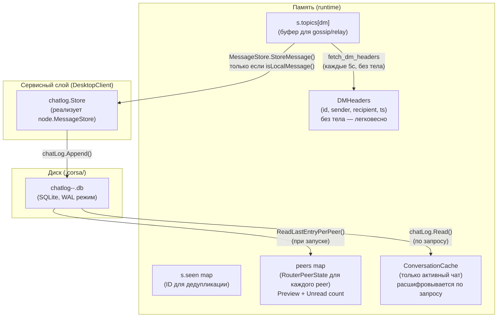
```mermaid
flowchart TB
    subgraph MEMORY["Память (runtime)"]
        TOPICS["s.topics[dm]\n(буфер для gossip/relay)"]
        SEEN["s.seen map\n(ID для дедупликации)"]
        HEADERS["DMHeaders\n(id, sender, recipient, ts)\nбез тела — легковесно"]
        PEERS["peers map\n(RouterPeerState для каждого peer)\nPreview + Unread count"]
        CACHE["ConversationCache\n(только активный чат)\nрасшифровывается по запросу"]
    end

    subgraph SVC["Сервисный слой (DesktopClient)"]
        CHATLOG["chatlog.Store\n(реализует node.MessageStore)"]
    end

    subgraph DISK["Диск (.corsa/)"]
        DB["chatlog-<identity_short>-<port>.db\n(SQLite, WAL режим)"]
    end

    TOPICS -->|"MessageStore.StoreMessage()\nтолько если isLocalMessage()"| CHATLOG
    CHATLOG -->|"chatLog.Append()"| DB
    DB -->|"chatLog.Read()\n(по запросу)"| CACHE
    DB -->|"ReadLastEntryPerPeer()\n(при запуске)"| PEERS
    TOPICS -->|"fetch_dm_headers\n(каждые 5с, без тела)"| HEADERS
```

*Диаграмма 1 — Архитектура chatlog*

### Что где хранится

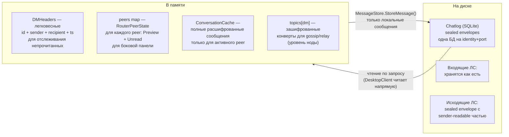
```mermaid
flowchart LR
    subgraph MEM["В памяти"]
        direction TB
        M1["DMHeaders — легковесные\nid + sender + recipient + ts\nдля отслеживания непрочитанных"]
        M2["peers map — RouterPeerState\nдля каждого peer: Preview + Unread\nдля боковой панели"]
        M3["ConversationCache —\nполные расшифрованные сообщения\nтолько для активного peer"]
        M4["topics[dm] — зашифрованные\nконверты для gossip/relay\n(уровень ноды)"]
    end

    subgraph DSK["На диске"]
        direction TB
        D1["Chatlog (SQLite)\nsealed envelopes\nодна БД на identity+port"]
        D2["Входящие ЛС:\nхранятся как есть"]
        D3["Исходящие ЛС:\nsealed envelope с\nsender-readable частью"]
    end

    MEM -->|"MessageStore.StoreMessage()\nтолько локальные сообщения"| D1
    D1 -->|"чтение по запросу\n(DesktopClient читает напрямую)"| MEM
```

*Диаграмма 2 — Место хранения сообщений в памяти и на диске*

### Flow поступления сообщения

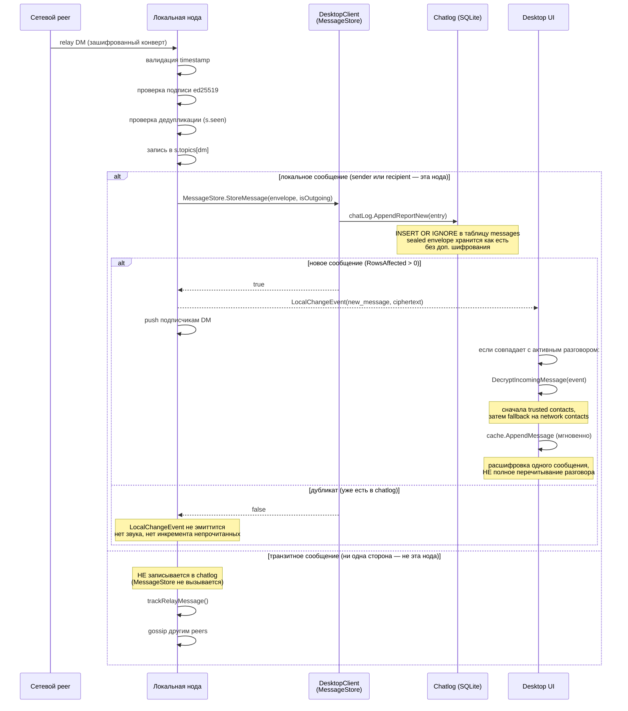
```mermaid
sequenceDiagram
    participant NET as Сетевой peer
    participant NODE as Локальная нода
    participant SVC as DesktopClient<br/>(MessageStore)
    participant LOG as Chatlog (SQLite)
    participant UI as Desktop UI

    NET->>NODE: relay DM (зашифрованный конверт)
    NODE->>NODE: валидация timestamp
    NODE->>NODE: проверка подписи ed25519
    NODE->>NODE: проверка дедупликации (s.seen)
    NODE->>NODE: запись в s.topics[dm]
    alt локальное сообщение (sender или recipient — эта нода)
        NODE->>SVC: MessageStore.StoreMessage(envelope, isOutgoing)
        SVC->>LOG: chatLog.AppendReportNew(entry)
        Note over LOG: INSERT OR IGNORE в таблицу messages<br/>sealed envelope хранится как есть<br/>без доп. шифрования
        alt новое сообщение (RowsAffected > 0)
            SVC-->>NODE: true
            NODE-->>UI: LocalChangeEvent(new_message, ciphertext)
            NODE->>NODE: push подписчикам DM
            UI->>UI: если совпадает с активным разговором:
            UI->>UI:   DecryptIncomingMessage(event)
            Note over UI: сначала trusted contacts,<br/>затем fallback на network contacts
            UI->>UI:   cache.AppendMessage (мгновенно)
            Note over UI: расшифровка одного сообщения,<br/>НЕ полное перечитывание разговора
        else дубликат (уже есть в chatlog)
            SVC-->>NODE: false
            Note over NODE: LocalChangeEvent не эмиттится<br/>нет звука, нет инкремента непрочитанных
        end
    else транзитное сообщение (ни одна сторона — не эта нода)
        Note over NODE: НЕ записывается в chatlog<br/>(MessageStore не вызывается)
        NODE->>NODE: trackRelayMessage()
        NODE->>NODE: gossip другим peers
    end
```

*Диаграмма 3 — Последовательность поступления и обработки сообщения*

### Flow отправки сообщения

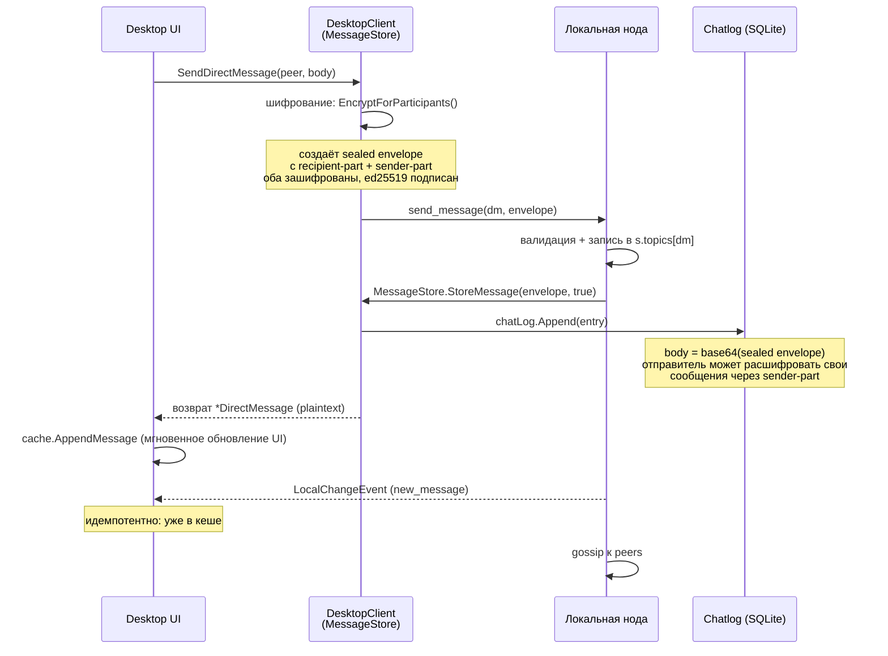
```mermaid
sequenceDiagram
    participant UI as Desktop UI
    participant SVC as DesktopClient<br/>(MessageStore)
    participant NODE as Локальная нода
    participant LOG as Chatlog (SQLite)

    UI->>SVC: SendDirectMessage(peer, body)
    SVC->>SVC: шифрование: EncryptForParticipants()
    Note over SVC: создаёт sealed envelope<br/>с recipient-part + sender-part<br/>оба зашифрованы, ed25519 подписан
    SVC->>NODE: send_message(dm, envelope)
    NODE->>NODE: валидация + запись в s.topics[dm]
    NODE->>SVC: MessageStore.StoreMessage(envelope, true)
    SVC->>LOG: chatLog.Append(entry)
    Note over LOG: body = base64(sealed envelope)<br/>отправитель может расшифровать свои<br/>сообщения через sender-part
    SVC-->>UI: возврат *DirectMessage (plaintext)
    UI->>UI: cache.AppendMessage (мгновенное обновление UI)
    NODE-->>UI: LocalChangeEvent (new_message)
    Note over UI: идемпотентно: уже в кеше
    NODE->>NODE: gossip к peers
```

*Диаграмма 4 — Flow отправки сообщения и шифрования*

### Flow загрузки диалога (по запросу)

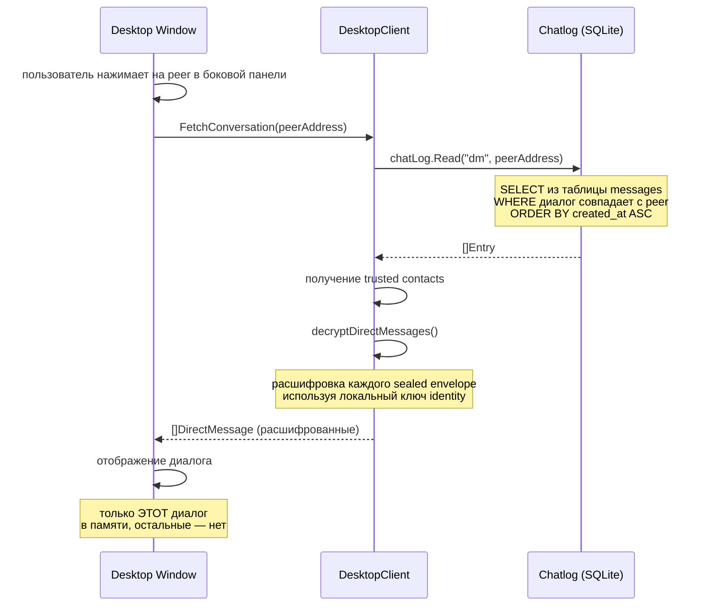
```mermaid
sequenceDiagram
    participant UI as Desktop Window
    participant SVC as DesktopClient
    participant LOG as Chatlog (SQLite)

    UI->>UI: пользователь нажимает на peer в боковой панели
    UI->>SVC: FetchConversation(peerAddress)
    SVC->>LOG: chatLog.Read("dm", peerAddress)
    Note over LOG: SELECT из таблицы messages<br/>WHERE диалог совпадает с peer<br/>ORDER BY created_at ASC
    LOG-->>SVC: []Entry
    SVC->>SVC: получение trusted contacts
    SVC->>SVC: decryptDirectMessages()
    Note over SVC: расшифровка каждого sealed envelope<br/>используя локальный ключ identity
    SVC-->>UI: []DirectMessage (расшифрованные)
    UI->>UI: отображение диалога
    Note over UI: только ЭТОТ диалог<br/>в памяти, остальные — нет
```

*Диаграмма 5 — Загрузка полного диалога по требованию*

### Flow загрузки превью (при запуске)

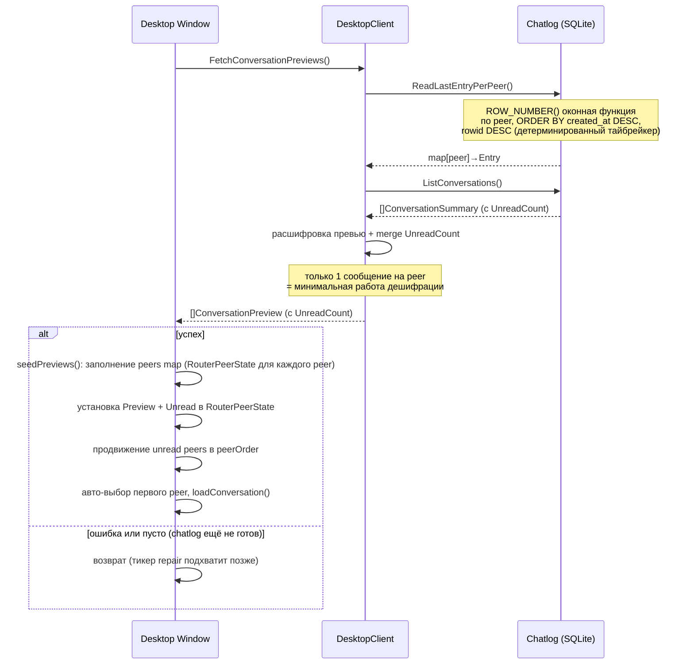
```mermaid
sequenceDiagram
    participant UI as Desktop Window
    participant SVC as DesktopClient
    participant LOG as Chatlog (SQLite)

    UI->>SVC: FetchConversationPreviews()
    SVC->>LOG: ReadLastEntryPerPeer()
    Note over LOG: ROW_NUMBER() оконная функция<br/>по peer, ORDER BY created_at DESC,<br/>rowid DESC (детерминированный тайбрейкер)
    LOG-->>SVC: map[peer]→Entry
    SVC->>LOG: ListConversations()
    LOG-->>SVC: []ConversationSummary (с UnreadCount)
    SVC->>SVC: расшифровка превью + merge UnreadCount
    Note over SVC: только 1 сообщение на peer<br/>= минимальная работа дешифрации
    SVC-->>UI: []ConversationPreview (с UnreadCount)
    alt успех
        UI->>UI: seedPreviews(): заполнение peers map (RouterPeerState для каждого peer)
        UI->>UI: установка Preview + Unread в RouterPeerState
        UI->>UI: продвижение unread peers в peerOrder
        UI->>UI: авто-выбор первого peer, loadConversation()
    else ошибка или пусто (chatlog ещё не готов)
        UI->>UI: возврат (тикер repair подхватит позже)
    end
```

*Диаграмма 6 — Загрузка превью диалогов при запуске*

### Именование БД

У chatlog нет собственного файла БД. Это один из repositories внутри общей базы
состояния ноды, которую `internal/core/storage` открывает один раз в
composition root — см. [storage.md](storage.md).

По умолчанию эта база — по-прежнему исторический файл chatlog в директории
данных (по умолчанию `.corsa/`, настраивается через `CORSA_CHATLOG_DIR`):

```
chatlog-<identity_short>-<port>.db
```

- `identity_short` — первые 8 символов адреса identity ноды (40-символьный hex SHA256 fingerprint)
- `port` — TCP порт (тот же суффикс, что для identity, trust, queue и peers файлов)

Эта схема гарантирует:
- Разные identity на одной машине не пересекаются
- Разные инстансы ноды на разных портах не пересекаются

Имя файла больше не определяет, какие таблицы в нём допустимы, а
`CORSA_STATE_DB_PATH` переопределяет расположение полностью. От открытия чужого
файла защищает записанная внутри базы identity владельца — полный адрес, а не
восьмисимвольный префикс.

### Схема БД

Таблицы chatlog создаются общим каталогом миграций
(`internal/core/storage/migrations`), а не этим пакетом: в chatlog нет DDL
вообще. Ниже приведена справочная копия из миграций `0002`–`0005` — источник
истины именно каталог, и изменение схемы делается новой миграцией там.

Основная таблица — `messages`, с CHECK-ограничениями для enum-полей:

```sql
CREATE TABLE IF NOT EXISTS messages (
    id              TEXT PRIMARY KEY,
    topic           TEXT NOT NULL DEFAULT 'dm' CHECK(topic IN ('dm','global')),
    sender          TEXT NOT NULL,
    recipient       TEXT NOT NULL,
    body            TEXT NOT NULL,
    flag            TEXT NOT NULL DEFAULT '' CHECK(flag IN ('','immutable','sender-delete','any-delete','auto-delete-ttl')),
    delivery_status TEXT NOT NULL DEFAULT 'sent' CHECK(delivery_status IN ('sent','delivered','seen')),
    ttl_seconds     INTEGER NOT NULL DEFAULT 0,
    metadata        TEXT NOT NULL DEFAULT '',
    created_at      TEXT NOT NULL,
    updated_at      TEXT NOT NULL DEFAULT ''
);
```

Индексы:
- `idx_messages_peer` — `(topic, sender, recipient, created_at)` для запросов диалогов
- `idx_messages_status` — `(recipient, delivery_status)` для подсчёта непрочитанных
- `idx_messages_created` — `(created_at DESC)` для запросов последних сообщений
- `idx_messages_ttl` — частичный индекс `(flag, created_at) WHERE flag = 'auto-delete-ttl'` для запросов истечения TTL

Рядом с `messages` тот же каталог создаёт журналы доставки (`seen_ack`,
`delivery_failed`), таблицы decrypt-recovery (`decrypt_recovery_jobs`,
`peer_established`, `decrypt_recovery_cycles`, `decrypt_resend_intents`) и
таблицу delete-intent-ов (`message_delete_intents`, миграция `0005`):

```sql
CREATE TABLE IF NOT EXISTS message_delete_intents (
    message_id      TEXT PRIMARY KEY,
    peer            TEXT NOT NULL,
    created_at      TEXT NOT NULL,
    next_attempt_at TEXT NOT NULL,
    attempts        INTEGER NOT NULL DEFAULT 0,
    held            INTEGER NOT NULL DEFAULT 0,
    owed            INTEGER NOT NULL DEFAULT 1,
    refuse_until    TEXT NOT NULL DEFAULT ''
);
```

Одна строка несёт два факта, которые нужны удалённому id, потому что это
два факта об одном сообщении:

- **`owed`** — пира ещё нужно попросить. При его ack сбрасывается, а не
  удаляется.
- **`refuse_until`** — игнорировать повторную доставку этого id до
  указанного момента. Удаление убирает строку chatlog И сбрасывает
  dedup-gate роутера по её id — ровно это позволяет replay через relay или
  inbox вставить строку обратно; отказ и есть ответ. На диске, а не только
  в памяти, потому что окно replay и рестарт пересекаются.

Они независимы намеренно. Запрос к контакту, который не возвращается,
хранится бессрочно, а его отказ истекает за час; получатель, которого
попросили удалить ещё не полученное сообщение, получает строку, которая
никому ничего не должна и только отказывает (`peer` там пуст — никого не
просят, значит и переписку называть нечем). Строка уходит, когда ничего
не должна и ни от чего не отказывается.

`held` говорит, ПОЧЕМУ строка не наступила, если не наступила. Причина
ровно одна: `HoldPeerAbsent` — пира вообще нельзя было спросить, и
возвращение пира подтягивает строку вперёд. Ноль — не парковка: строка
наступила либо ждёт backoff после реально ушедшей попытки, а сброс
backoff-а спрашивал бы пира, транспорт которого переподключается каждые
несколько секунд, по разу на хендшейк.

Парковки «ещё не классифицировано» намеренно нет. Очистка читает
`never_emitted` с той самой строки, которую удаляет, внутри той же
транзакции, поэтому запрос по сообщению, которого у пира быть не может,
не пишется вообще. Припаркованный был бы приватным правилом с
приделанным таймаутом: любое зависание дольше таймаута его отправляет.

Очистка всей переписки пишет N таких строк и ничего больше: это N
удалений сообщений, поэтому ей не нужны ни собственная заявка, ни таблица
наборов строк, ни таблица ответов, ни собственный планировщик. См.
[dm-commands.md](dm-commands.md) §«Массовая очистка».

### Поля записи

Таблица `messages` содержит колонки, которые соответствуют полям `chatlog.Entry`,
плюс две внутренние колонки (`topic`, `updated_at`), которые не экспонируются
через структуру `Entry` и протокольные фреймы.

| Колонка           | Тип    | В `Entry`?  | Описание                                                      |
|-------------------|--------|:-----------:|---------------------------------------------------------------|
| `id`              | string | да          | UUID сообщения (первичный ключ, дедуп через INSERT OR IGNORE) |
| `topic`           | string | **нет**     | `dm` или `global` (CHECK ограничение). Параметр запроса — вызывающий код всегда передаёт его явно в `Read()`, `Append()` и т.д. |
| `sender`          | string | да          | Адрес отправителя (40-символьный hex)                         |
| `recipient`       | string | да          | Адрес получателя или `*` для broadcast                        |
| `body`            | string | да          | Тело сообщения (sealed envelope для DM, plaintext для global) |
| `flag`            | string | да          | Флаг сообщения (CHECK ограничение, см. ниже)                  |
| `delivery_status` | string | да          | `sent`, `delivered` или `seen` (CHECK ограничение)            |
| `ttl_seconds`     | int    | да          | Время жизни для авто-удаления в секундах (0 = без TTL)        |
| `metadata`        | string | да          | Произвольный JSON для будущей расширяемости (пустая строка = нет данных) |
| `created_at`      | string | да          | Временная метка RFC3339Nano                                   |
| `updated_at`      | string | **нет**     | Временная метка RFC3339Nano, устанавливаемая `UpdateStatus()`. Внутренняя бухгалтерия — не читается обратно через `Entry` или протокольные фреймы. |

#### Доменные типы в API Store

Все экспортируемые методы `chatlog.Store` используют типизированные параметры
из пакета `domain` вместо сырых строк. Это обеспечивает компайл-тайм
разграничение между peer identity, message ID и другими строковыми значениями:

- **`domain.PeerIdentity`** — для параметров `selfAddress`, `peerAddress`, `identity` (40-символьный Ed25519 hex fingerprint).
- **`domain.MessageID`** — для параметров `messageID`, `id` (строка UUID v4).
- **`domain.PeerIdentity`** — это и параметр самого конструктора: `NewStore(db storage.Executor, identity domain.PeerIdentity)` принимает identity владельца и общую state-базу; параметра `listenAddress` нет, и store больше не открывает собственный файл.

Каждый метод принимает `context.Context` первым аргументом: они доходят до
SQLite через общую state-базу, и отмена обязана ехать вместе с вызовом.
Сигнатуры методов:

- `Append(ctx context.Context, topic string, selfAddress domain.PeerIdentity, entry Entry) error`
- `AppendReportNew(ctx context.Context, topic string, selfAddress domain.PeerIdentity, entry Entry) (bool, error)`
- `Read(ctx context.Context, topic string, peerAddress domain.PeerIdentity) ([]Entry, error)`
- `ReadLast(ctx context.Context, topic string, peerAddress domain.PeerIdentity, n int) ([]Entry, error)`
- `ReadLastEntry(ctx context.Context, topic string, peerAddress domain.PeerIdentity) (*Entry, error)`
- `UpdateStatus(ctx context.Context, topic string, peerAddress domain.PeerIdentity, messageID domain.MessageID, status string) (bool, error)`
- `HasEntryID(ctx context.Context, topic string, peerAddress domain.PeerIdentity, id domain.MessageID) bool`
- `HasEntryInConversation(ctx context.Context, peerAddress domain.PeerIdentity, id domain.MessageID) bool`
- `LookupEntryInConversation(ctx context.Context, peerAddress domain.PeerIdentity, id domain.MessageID) (bool, error)`
- `DeleteByID(ctx context.Context, messageID domain.MessageID) (bool, error)`
- `DeleteByPeer(ctx context.Context, identity domain.PeerIdentity) (int64, error)`

#### Жизненный цикл статуса

```
Исходящий DM:  sent → delivered → seen
Входящий DM:        delivered → seen   (начинает с delivered, пропускает sent)
```

- **sent** — исходящее сообщение создано этой нодой (устанавливается при `chatLog.Append` когда sender = self). Входящие сообщения **никогда** не имеют этот статус, т.к. они уже доставлены к моменту сохранения.
- **delivered** — сообщение доставлено до адресата.
  - *Исходящие:* получен delivery receipt от ноды получателя (переход из `sent`).
  - *Входящие:* устанавливается сразу при `chatLog.Append` — если локальная нода сохраняет сообщение, оно уже доставлено нам. Это **начальный** статус для всех входящих DM.
- **seen** — получатель открыл диалог с этим сообщением

#### Жизненный цикл статуса: детальный flow с SQL-операциями


```mermaid
stateDiagram-v2
    [*] --> sent : Исходящий DM\nMessageStore.StoreMessage()\n⤷ chatLog.Append()\n⤷ INSERT OR IGNORE … delivery_status='sent'
    [*] --> delivered : Входящий DM\nMessageStore.StoreMessage()\n⤷ chatLog.Append()\n⤷ INSERT OR IGNORE … delivery_status='delivered'

    sent --> delivered : получен delivery receipt\nMessageStore.UpdateDeliveryStatus()\n⤷ chatLog.UpdateStatus()\n⤷ UPDATE … SET delivery_status='delivered'\n  WHERE delivery_status IN ('sent')
    delivered --> seen : получен seen receipt / открыт диалог\nMessageStore.UpdateDeliveryStatus()\n⤷ chatLog.UpdateStatus()\n⤷ UPDATE … SET delivery_status='seen'\n  WHERE delivery_status IN ('sent','delivered')
    sent --> seen : seen receipt (минуя delivered)\nMessageStore.UpdateDeliveryStatus()\n⤷ chatLog.UpdateStatus()\n⤷ UPDATE … SET delivery_status='seen'\n  WHERE delivery_status IN ('sent','delivered')
```

*Диаграмма 7 — Жизненный цикл статуса доставки сообщения*

| Переход | Триггер | Путь в коде | SQL |
|---|---|---|---|
| `[new]` → `sent` | Пользователь отправляет DM | `DesktopClient.SendDirectMessage()` → `storeIncomingMessage()` → `MessageStore.StoreMessage()` → `chatLog.Append()` | `INSERT OR IGNORE INTO messages (..., delivery_status) VALUES (..., 'sent')` |
| `[new]` → `delivered` | Поступает входящий DM | `storeIncomingMessage()` → `MessageStore.StoreMessage()` → `chatLog.Append()` | `INSERT OR IGNORE INTO messages (..., delivery_status) VALUES (..., 'delivered')` |
| `sent` → `delivered` | Delivery receipt от получателя | `storeDeliveryReceipt()` → `MessageStore.UpdateDeliveryStatus()` → `chatLog.UpdateStatus()` | `UPDATE messages SET delivery_status='delivered', updated_at=? WHERE id=? AND delivery_status IN ('sent')` |
| `delivered` → `seen` | Seen receipt / пользователь открыл диалог | `storeDeliveryReceipt()` → `MessageStore.UpdateDeliveryStatus()` → `chatLog.UpdateStatus()` | `UPDATE messages SET delivery_status='seen', updated_at=? WHERE id=? AND delivery_status IN ('sent','delivered')` |
| `seen` → `delivered` | Запоздавший receipt (отклоняется) | `MessageStore.UpdateDeliveryStatus()` → `chatLog.UpdateStatus()` — WHERE не совпадает | `UPDATE … WHERE delivery_status IN ('sent','delivered')` → 0 затронутых строк |

**Ссылки на код:**

- `chatLog.Append()` — `internal/core/chatlog/chatlog.go` (`Store.Append`)
- `chatLog.UpdateStatus()` — `internal/core/chatlog/chatlog.go` (`Store.UpdateStatus`, монотонная защита через map `statusRank`)
- `storeIncomingMessage()` — `internal/core/node/service.go` (вызывает `MessageStore.StoreMessage()` для локальных сообщений; устанавливает флаг `isOutgoing` для обработчика)
- `storeDeliveryReceipt()` — `internal/core/node/service.go` (вызывает `MessageStore.UpdateDeliveryStatus()` перед генерацией `LocalChangeEvent`)
- `SendDirectMessage()` — `internal/core/service/desktop.go` (шифрует через `EncryptForParticipants`, отправляет ноде)
- `handleEvent()` → `onReceiptUpdate()` — `internal/core/service/dm_router.go` (обновляет статус в кеше; перечитывает из SQLite если сообщение отсутствует)

Переходы статуса **монотонны** — статус может только продвигаться вперёд
(sent → delivered → seen). `UpdateStatus()` это обеспечивает: попытка
регрессии (напр. seen → delivered от запоздавшего receipt) тихо игнорируется.
Это предотвращает повреждение сохранённого статуса дублирующими или
неупорядоченными сетевыми событиями.

Статус — **источник истины** после рестарта. Desktop-клиент читает
`delivery_status` из SQLite через `ChatEntryFrame.DeliveryStatus` и использует
его как базовое значение. In-memory delivery receipts (из `fetch_delivery_receipts`)
накладываются поверх, но только если продвигают статус дальше. Это гарантирует,
что статусы (delivered/seen) переживают рестарт ноды без зависимости от
волатильных runtime-данных.

Непрочитанные — входящие DM со статусом `delivery_status != 'seen'`.

При запуске `DMRouter.initializeFromDB()` восстанавливает состояние боковой
панели из chatlog:

- **Peers в боковой панели**: все peers из chatlog добавляются в map `peers`
  (записи `RouterPeerState`), чтобы они появились в sidebar даже если peer
  не в trusted/network contacts.
- **Unread badges**: `UnreadCount` из `ListConversations()` (SQL-подсчёт
  входящих DM с `delivery_status != 'seen'`) сохраняется в
  `RouterPeerState.Unread`. Peers с непрочитанными продвигаются в начало
  `peerOrder`.
- **Авто-выбор**: первый peer в `peerOrder` авто-выбирается как `activePeer`
  (с `peerClicked = false`), и его диалог загружается через `loadConversation()`.

`initializeFromDB()` выполняется один раз в стартовой горутине с retry
(до 3 попыток с линейным backoff: 1с, 2с). Если все попытки неудачны,
sidebar остаётся пустым, а 5-секундный тикер через `repairUnreadFromHeaders()`
подхватывает данные для новых входящих сообщений по мере поступления DMHeaders.
Исторические read-only диалоги без новых headers не восстановятся до рестарта.

#### Флаги сообщений

| Флаг               | Описание                                               |
|--------------------|--------------------------------------------------------|
| `` (пусто)         | По умолчанию — нет особого поведения                   |
| `immutable`        | Никто не может удалить сообщение                       |
| `sender-delete`    | Только отправитель может удалить                       |
| `any-delete`       | Любой участник может удалить                           |
| `auto-delete-ttl`  | Сообщение удаляется автоматически после `ttl_seconds`  |

Столбец `flag` имеет CHECK ограничение, допускающее только эти значения.

### Удаление сообщений

Два метода удаления:

- **`DeleteByID(messageID domain.MessageID)`** — удаляет одно сообщение по первичному ключу вместе со всеми per-message следами под тем же id: строками журналов `seen_ack` и `delivery_failed` (миграция 0003) и resend-intent-ами, ключёванными на него (миграция 0004). Эти строки — долговечная запись о том, что сообщение с таким id существовало и как прошла доставка, поэтому оставлять их — значит сохранять ровно ту метаинформацию, ради которой удаляли. Per-PEER состояние (`decrypt_recovery_jobs`, `peer_established`, `decrypt_recovery_cycles`) описывает переписку, а не сообщение, и не трогается. Всё это коммитится одной транзакцией, поэтому строка не может пережить свои журнальные записи и наоборот. Возвращает true, если строка сообщения найдена.
- **`DeleteByPeer(identity)`** — очистка всей переписки: её сообщения, их журнальные строки и ожидающие delete intent-ы этого пира, одной транзакцией. Intent-ы уходят, потому что их id — последние строки, называющие стёртую переписку; цена в том, что запланированные ранее удаления у пира отменяются.
- **`CheckpointWAL()`** — сворачивает write-ahead log обратно в файл и усекает его. `secure_delete` (см. [storage.md](storage.md)) перезаписывает освобождённую страницу, но в режиме WAL сама эта перезапись — тоже фрейм лога, и исходные байты живут в `-wal` до чекпойнта. Best-effort: busy — это не провал удаления. Вызывается после коммита каждого удаления — своего, выполненного по просьбе пира и TTL-свипа.
- **`DeleteExpired()`** — пакетное удаление всех auto-delete-ttl сообщений, время жизни которых истекло. Один SQL-запрос:
  ```sql
  DELETE FROM messages
  WHERE flag = 'auto-delete-ttl'
    AND ttl_seconds > 0
    AND datetime(created_at) < datetime('now', '-' || ttl_seconds || ' seconds')
  ```
  Частичный индекс `idx_messages_ttl` делает это эффективным даже на больших таблицах.

  > **Статус: пока не подключено.** Метод `DeleteExpired()` реализован в
  > `chatlog.Store`, но ни один runtime-путь его не вызывает. Сейчас нода
  > чистит только in-memory `s.topics`; persisted сообщения с
  > `auto-delete-ttl` переживают рестарты и продолжают появляться в
  > `FetchConversation()` / превью. Периодическая очистка SQLite будет
  > добавлена в следующем релизе.

#### Delete intents

Удаление собственного сообщения убирает строку сразу — достижим
получатель или нет: копия того, что пользователь попросил уничтожить, не
должна оставаться на диске. Вместо неё остаётся INTENT попросить пира
удалить свою копию — в `message_delete_intents` (`delete_intents.go`):

- **`DeleteWithIntent(intent, tombstoneUntil)`** — основная точка
  входа: удаляет сообщение, записывает intent и ставит отказ по id — в
  ОДНОЙ транзакции. Раздельные коммиты оставляют окно, в котором
  локальная копия уничтожена, а попросить пира уже некому, — или строки
  нет, а отказ по ней не записан, и ближайший relay-retry возвращает
  сообщение обратно.
- **`DeleteMessageWithTombstone(id, until)`** — тот же коммит без
  intent, для удаления, которое пиру ничего не должно.
- **`DeleteMessages(ids, until)`** — пачка в ОДНОЙ транзакции с
  отчётом, какие id реально были. Получатель очистки переписки удаляет
  тред именно так: коммит на строку означал fsync на сообщение — на
  порядок дороже стороны отправителя за ту же работу. Пачка «всё или
  ничего», поэтому вызывающий может повторить (удаление идемпотентно)
  или перейти на построчный режим, чтобы изолировать сбойную строку.
- **`NoteDeleteIntent(intent)`** — записывает или перевзводит intent сам
  по себе (нужно recovery-пути, где удалять нечего). Повторная выдача
  берёт новый срок и новый счётчик попыток, но сохраняет исходный
  `CreatedAt`, от которого отсчитывается дедлайн отказа, — поэтому
  повторные клики не делают неотвеченный запрос бессмертным. Пир при
  конфликте не переписывается: id сообщения принадлежит одной переписке,
  и перенаправление ожидающего удаления на другого — единственное, что
  из ошибки вызывающего следовать не должно.
- **`DueDeleteIntents(now, limit)`** — свип планировщика: наступившие
  intent-ы, старейшие первыми, не больше `limit` (неположительный limit
  возвращает пусто, поэтому безлимитный свип нельзя получить случайно).
- **`DeleteIntentByID(messageID)`** — проверка входящего ack против пира,
  которому запрос действительно адресовался.
- **`RecordDeleteIntentAttempt(messageID, nextAttemptAt)`** — списывает
  одну отправку и двигает срок. No-op, если ack уже снял intent.
- **`HoldDeleteIntent(messageID, until)`** — паркует intent (ставит
  `held`) БЕЗ списания попытки: для пира, который не может ответить, или
  уже исчерпавшего свою долю свипа. Именно это не даёт backlog-у одного
  отсутствующего контакта заблокировать очередь.
- **`ReviveDeleteIntentsForPeer(peer, now)`** — снимает парковку с
  ПРИПАРКОВАННЫХ intent-ов пира, когда он вернулся, чтобы запрос ушёл на
  ближайшем тике, а не в конце интервала парковки. Строки, ждущие
  честный backoff, не трогаются.
- **`DropDeleteIntent(messageID)`** — терминальное удаление, идемпотентно.
- **`DropDeleteIntentsForPeer(peer)`** — используется, когда история пира
  уходит целиком; см. `DeleteByPeer`.
- **`DeleteIntentCountsByPeer()`** — число «N ждут удаления у
  собеседника» для заголовка переписки.

В строке нет ни тела, ни отправителя, ни исходной метки времени — только
адресация, нужная запросу. Именно поэтому это отдельная таблица, а не
затёртая строка сообщения: та оставила бы надгробие прямо в переписке для
всякого, кто откроет базу. Жизненный цикл и политика retry —
в [dm-commands.md](dm-commands.md) §«Плановое удаление».

Очистка всей переписки идёт через ту же таблицу:

- **`DeleteConversationWithIntents(peer, scope, now, tombstoneUntil)`** —
  удаляет каждую удаляемую строку треда и их per-message журнальные следы,
  пишет ПО ОДНОМУ intent на сообщение и ставит отказ по каждому забранному
  id — ОДНОЙ транзакцией. Immutable-строки остаются: этот флаг — обещание,
  которое массовый жест не отменяет. Возвращает id, которые действительно
  удалены, чтобы вызывающий выполнил то, чего база не умеет: cleanup
  file-transfer и вытеснение из UI. «Всё или ничего» намеренно: очистка,
  которая не смогла записать долг пира, обязана оставить тред на месте, а
  не стереть его, не запланировав никого, кто спросит.
- **`ConversationCandidateIDs(peer)`** — тот же набор строк, прочитанный
  отдельно. Вызывающий помечает эти id ДО того, как их заберёт транзакция
  (внутри транзакции нет момента, в который на них можно среагировать), и
  очистка удаляет ровно прочитанный набор: второе чтение внутри транзакции
  уничтожило бы строки, которых никто не пометил и о которых никто не
  спросит пира.

### Столбец metadata

Столбец `metadata` хранит произвольный JSON для полей, у которых нет собственной
колонки. Это обеспечивает совместимость вперёд — новые свойства сообщений можно
хранить без миграций схемы. Примеры будущих метаданных:

- `{"edited": true, "edit_at": "2026-..."}` — история редактирования
- `{"reactions": {"👍": 2}}` — реакции на сообщения

Пустая строка означает отсутствие дополнительных данных.

**`never_emitted`** — единственная отметка, которую пишет туда путь доставки.
Узел держит в памяти, уходил ли исходящий конверт на провод, и от ответа
зависит удаление: без запроса к собеседнику можно снять только сообщение,
которое ДОКАЗУЕМО не уходило, потому что запрос — это и есть способ, которым
он узнал бы про id, которого никогда не видел. Память умирает вместе с
процессом, и отметка переносит ответ через перезапуск.

Хранится она нарочно как отрицание. Отсутствие значит «уходило», и потому
каждая строка, написанная до появления отметки, — как и любая обычная
отправка, где сообщение уходит в момент записи, — верна, не неся вообще
ничего: общий путь не платит записью. Отметка ставится только тогда, когда
отправку ПРИДЕРЖАЛИ из-за недоступности получателя, и снимается, когда
сообщение всё-таки уходит. Снятие обязано лечь на диск ДО записи фрейма, а
сама отметка может лечь после придержания, которое описывает: две ошибки не
равны — потерянная отметка стоит собеседнику одного нерезолвимого id, а
устаревшая стоит пользователю неотправленного запроса на удаление.

Из этой асимметрии следуют два правила в других местах. Фрейм НЕ пишется,
если снятие не удалось: отправить всё равно — значит положить сообщение
собеседнику, пока диск утверждает, что оно не уходило, а после перезапуска
именно это утверждение заставит удаление обойти его стороной; сообщение
остаётся у движка ретраев, и следующий тик пробует обе половины заново. И
очистка переписки читает отметку внутри собственной транзакции, а не
спрашивает узел после: строка, которую она вот-вот уничтожит, — последнее,
что ещё держит ответ, — но только пока доставки этого треда у узла
ЗАМОРОЖЕНЫ, — а заморозку теперь берут перед чтением и очистка
переписки, и удаление одного сообщения. Отметка говорит о том, что было верно в момент записи; без
заморозки сообщение успевает уйти между чтением и удалением, поэтому
очистка, которой не удалось заморозить, не классифицирует вовсе и
спрашивает про всё. См. dm-commands.md §«Массовая очистка».

**Архитектурное решение по `reply_to`:** цепочки ответов реализованы через
поле `ReplyTo` внутри `PlainMessage`, которое полностью шифруется в AES-GCM
конверте. Relay-сервер и локальный chatlog SQLite никогда не видят это значение
в открытом виде. UI извлекает `reply_to` после расшифровки. Это осознанное
решение в пользу приватности — граф ответов не наблюдаем без ключа расшифровки,
даже при прямом доступе к файлу SQLite. `reply_to` НЕ дублируется в столбец
`metadata`.

**Санитизация на стороне получателя:** оба пути — загрузка из chatlog
(`decryptDirectMessages`) и обработка live-события (`DecryptIncomingMessage`) —
проверяют, что расшифрованный `reply_to` ссылается на ID сообщения, существующего
в той же DM-беседе. Если указанный ID отсутствует — будь то из-за злонамеренного
отправителя, создавшего кросс-тредовую ссылку, или из-за удалённого/просроченного
сообщения — поле `ReplyTo` молча очищается. Это поддерживает инвариант: `reply_to`
всегда разрешается внутри того же треда, и UI никогда не встретит битые ссылки
на цитаты.

Очищается при УСТАНОВЛЕННОМ отсутствии и никогда — при неудавшемся поиске. Их
различает `LookupEntryInConversation`: форма с одним `bool` возвращала false и
для отменённого контекста, и для больной базы ровно так же, как для настоящего
промаха, поэтому корректная цитата исчезала, а вызывающий получал
отредактированные сообщения как успешное чтение. Путь перезагрузки истории
теперь возвращает ошибку — история не правится молча, — а путь live-события,
который строит одно сообщение и не имеет куда вернуть ошибку, СОХРАНЯЕТ ссылку
и пишет предупреждение в лог. Сохранённую ссылку любой рендерер и так обязан
переживать; потерянная не видна никому.

### Целостность и ошибки старта

Проверка целостности больше не относится к chatlog. `storage.Open` выполняет
`PRAGMA integrity_check` до любой записи, проверяет `application_id` файла и
identity владельца и мигрирует схему до версии, известной этому бинарю. Любая
ошибка останавливает запуск.

Прежнее поведение — переименовать повреждённый файл в `*.corrupt` и продолжить
с пустой историей — убрано намеренно. Оно было терпимо, пока в файле лежала
только история чата; теперь в том же файле несколько видов состояния, и тихая
пересборка означала бы тихую потерю данных сразу нескольких подсистем.
Повреждённый файл остаётся нетронутым, восстановление из бэкапа — явная
операция.

Режима «работа без персистенции» тоже нет: repository строится на executor-е,
который уже открыт и мигрирован, поэтому store, молча проглатывающий записи,
существовать не может.

### Корректное завершение (graceful shutdown)

Завершение разделено между сетевым уровнем и сервисным уровнем:

**Сетевой уровень** (`Service.Run()`, при `ctx.Done()`):

1. TCP-листенер закрывается — новые входящие соединения не принимаются.
2. `s.closeAllInboundConns()` принудительно закрывает все отслеживаемые
   входящие TCP-соединения, чтобы горутины `handleConn` разблокировались
   из `ReadString` и завершились.
3. `s.connWg.Wait()` блокируется до завершения всех активных горутин
   `handleConn`. Это гарантирует, что незавершённые вызовы
   `storeIncomingMessage` / `storeDeliveryReceipt` (которые могут вызвать
   `MessageStore`) завершатся до продолжения shutdown.

**Composition root** (`storage.Database.Close()`, вызывается через `defer` в
`app.go` и из `Runtime.Close` в SDK):

4. `Database.Close()` выполняет SQLite WAL checkpoint и освобождает файловые
   дескрипторы. Вызов идемпотентен и обязан быть последним: ни
   `chatlog.Store`, ни `ChatlogGateway` закрыть базу не могут — они ей не
   владеют.

Без шагов 2–3 медленный peer мог бы ещё вызывать `MessageStore` после
закрытия, вызывая ошибки «database is closed» и потенциальную потерю данных.
Без шага 2 `connWg.Wait()` мог бы блокироваться бесконечно, если peer
удерживает соединение открытым (например, персистентная сессия другой ноды).

### Структурированное логирование (zerolog)

Проект использует [`rs/zerolog`](https://github.com/rs/zerolog) для
структурированного логирования. Пакет `crashlog` (`internal/core/crashlog`) —
точка инициализации:

1. **Двойной вывод** — логи идут в stdout (через `zerolog.ConsoleWriter`
   с цветным человекочитаемым форматом) и в `.corsa/corsa.log`. Файл по
   умолчанию использует человекочитаемый console-формат (в отличие от
   stdout, timestamp в файле включает дату); `CORSA_LOG_FORMAT=json` переключает его на сырые JSON
   lines для машинного парсинга. На старте, если файл превышает 10 МБ, он
   обрезается на месте до последних ~200 КБ (по границе строки) —
   ротированные копии не создаются; устаревшие копии `corsa.log.<timestamp>`
   удаляются. Обрезка во время работы процесса не выполняется — долгоживущая
   сессия может превысить порог до следующего перезапуска. Подробности —
   в [debug.md](debug.md).
2. **Логирование старта** — при запуске записывается время старта и путь к
   лог-файлу, что помогает привязать краши к сессиям.
3. **Перехват паник** — при panic стек-трейс записывается в
   `.corsa/crash-<YYYYMMDD-HHMMSS>.log` до завершения процесса.
   Хранится до 10 файлов крэшей; старые автоматически удаляются.
   Перехват работает в три слоя:
   - `defer cleanup()` в `main()` ловит паники в главной горутине.
   - `defer crashlog.DeferRecover()` в горутине desktop UI
     (`Window.Run`) ловит паники из event loop Gio и фонового
     поллинга.
   - `defer crashlog.DeferRecover()` во всех горутинах ноды:
     `bootstrapLoop`, `handleConn`, `runPeerSession`, `readPeerSession`,
     `gossipMessage`, `pushToSubscriberSnapshot`, `pushReceiptToSubscribers`,
     `emitDeliveryReceipt`, `gossipReceipt`, `gossipNotice`,
     `sendMessageToPeer`, `sendNoticeToPeer`, `sendReceiptToPeer`,
     `writePushFrame`, `pushBacklogToSubscriber`. Паники в любой
     горутине ноды создают crash-файлы.
4. **Безопасность горутин** — фоновые горутины обёрнуты в
   `safeHandleEvent()` и `safePollHealth()`, которые ловят паники и логируют
   их через `log.Error()`, не роняя всё приложение.

**Уровни логов:**

| Уровень | Использование                                               |
|---------|-------------------------------------------------------------|
| `Debug` | Попытки роутинга, подписки, подробная трассировка           |
| `Info`  | Штатные операции: подключения, хранение, состояния          |
| `Warn`  | Восстановимые проблемы: отклонён peer, NAT, ретраи         |
| `Error` | Ошибки: персистенции, паники, крэш-отчёты                  |
| `Fatal` | Невосстановимые: выход main() при ошибке старта             |

**Перехват runtime fatal:** `fatal: concurrent map read and map write` в Go —
это не panic, а runtime `fatal` (SIGABRT), который `recover()` не может
перехватить. Для захвата таких ошибок `crashlog.Setup()` перенаправляет stderr
(fd 2) в `.corsa/stderr.log` через `syscall.Dup2` (только Unix) и вызывает
`debug.SetTraceback("all")`, чтобы дамп содержал стеки всех горутин. После
тихого краша проверяйте `.corsa/stderr.log` — там будет сообщение об ошибке
и стек-трейс. Корневое решение — защита mutex'ами (см. «Защита конкурентного
доступа» ниже).

Инициализация выполняется в `main()` обоих бинарников:

```go
import "github.com/rs/zerolog/log"

func main() {
    cleanup := crashlog.Setup()
    defer cleanup()
    log.Info().Msg("corsa-desktop starting")
    // ...
}
```

Примеры структурированных вызовов:
```go
log.Info().Str("topic", msg.Topic).Str("id", msg.ID).Msg("stored message")
log.Error().Err(err).Str("message_id", id).Msg("chatlog update status failed")
log.Warn().Str("address", ip).Int("score", score).Msg("blacklisted peer")
```

Директория логов — `.corsa/` (совпадает с chatlog), учитывает `CORSA_CHATLOG_DIR`.

Уровень логирования по умолчанию — `info`, меняется через переменную окружения
`CORSA_LOG_LEVEL`. Допустимые значения: `trace`, `debug`, `info`, `warn`,
`error`. Используйте `CORSA_LOG_LEVEL=debug` для включения трассировки
маршрутизации/доставки (попытки роутинга, подписчики, ретраи relay).

### Кодирование тела сообщения

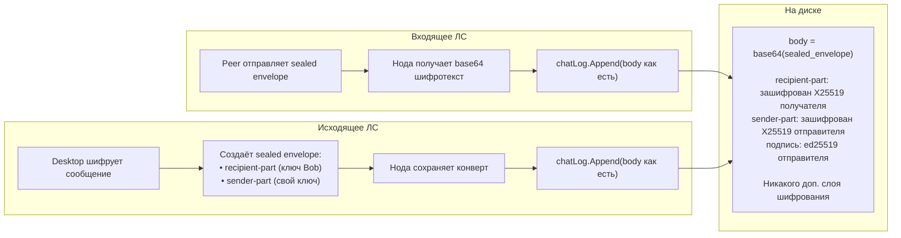
```mermaid
flowchart LR
    subgraph INCOMING["Входящее ЛС"]
        I1["Peer отправляет sealed envelope"] --> I2["Нода получает base64 шифротекст"]
        I2 --> I3["chatLog.Append(body как есть)"]
    end

    subgraph OUTGOING["Исходящее ЛС"]
        O1["Desktop шифрует сообщение"] --> O2["Создаёт sealed envelope:\n• recipient-part (ключ Bob)\n• sender-part (свой ключ)"]
        O2 --> O3["Нода сохраняет конверт"]
        O3 --> O4["chatLog.Append(body как есть)"]
    end

    subgraph ONDISK["На диске"]
        D1["body = base64(sealed_envelope)\n\nrecipient-part: зашифрован X25519 получателя\nsender-part: зашифрован X25519 отправителя\nподпись: ed25519 отправителя\n\nНикакого доп. слоя шифрования"]
    end

    I3 --> D1
    O4 --> D1
```

*Диаграмма 8 — Кодирование и сохранение тела сообщения*

- **Входящие ЛС**: хранятся как есть. Body — это base64-encoded sealed envelope,
  который может быть расшифрован только ключом получателя или отправителя через
  `directmsg.DecryptForIdentity()`.
- **Исходящие ЛС**: тот же sealed envelope, который содержит sender-part,
  зашифрованный box-ключом отправителя — поэтому отправитель всегда может расшифровать
  свои сообщения.
- **Global/broadcast**: хранятся как есть (plaintext body).

Никакой дополнительный слой шифрования не применяется. Sealed envelope сам по себе
обеспечивает end-to-end шифрование для ЛС.

### Flow записи

```
storeIncomingMessage()
  ├── валидация timestamp и подписей
  ├── если isLocalMessage() && messageStore != nil:
  │     ├── messageStore.StoreMessage(envelope, isOutgoing) → StoreResult
  │     │     └── DesktopClient: chatLog.AppendReportNew() → INSERT OR IGNORE
  │     ├── StoreInserted:
  │     │     ├── добавить в s.topics (в памяти)
  │     │     ├── emitLocalChange() → уведомление UI
  │     │     └── delivery receipt + push подписчикам DM
  │     ├── StoreDuplicate:
  │     │     └── пропустить s.topics, event, delivery receipt
  │     │         (закрывает оба пути: event-path и DMHeaders header-path)
  │     └── StoreFailed:
  │           ├── добавить в s.topics (не терять из сети)
  │           └── пропустить event (устаревшие данные)
  ├── если !isLocal или messageStore == nil:
  │     └── добавить в s.topics безусловно
  ├── gossip к peers (если relay, через shouldRouteStoredMessage)
  └── trackRelayMessage() (только транзитные DM)
```

Нода делегирует персистентность зарегистрированному обработчику `MessageStore`
(реализован `DesktopClient`). Обработчик вызывает `chatLog.AppendReportNew()`
синхронно и возвращает enum `StoreResult`:

- **`StoreInserted`** — реально новое сообщение (INSERT затронул строки > 0). Добавляется в `s.topics`, UI event эмитится, delivery receipt отправляется.
- **`StoreDuplicate`** — уже есть в chatlog (INSERT OR IGNORE затронул 0 строк). **Не** добавляется в `s.topics`, event пропускается, delivery receipt пропускается. Это надёжный слой дедупликации: `s.seen` эфемерна и не переживает рестарт процесса, но chatlog на диске — источник истины. Исключение дубликатов из `s.topics` также предотвращает попадание в DMHeaders через `fetchDMHeadersFrame()`, что не даёт `repairUnreadFromHeaders()` повторно инкрементить счётчик непрочитанных.
- **`StoreFailed`** — ошибка записи. Добавляется в `s.topics` (сообщение не теряется из сети), но event пропускается. Ошибки логируются `DesktopClient`; сетевое распространение продолжается в любом случае.

**Relay-only ноды (`corsa-node`) имеют `messageStore = nil`.** Сообщения
хранятся в памяти и ретранслируются, но не записываются в SQLite.

**Транзитные сообщения НЕ персистируются.** Когда полная нода пересылает ЛС,
где ни отправитель, ни получатель не являются локальной identity, `MessageStore`
не вызывается. Сообщение хранится только в памяти (`s.topics[dm]`) для
gossip/relay, поэтому локальная история чата содержит только те диалоги, в
которых эта нода реально участвует. Транзитное relay-состояние (`relayRetry`,
forward states, receipts) тоже **только в памяти** — на диск не пишется и
**не** переживает рестарт (см. `docs/protocol/relay.md` INV-8). Перезапущенный
relay переучивает пути, а отправитель ретраит end-to-end.

### Flow записи receipt

```
storeDeliveryReceipt()
  ├── проверка дедупликации (seenReceipts)
  ├── запись receipt в память (s.receipts[recipient])
  ├── очистка pending/outbound/relay state
  ├── messageStore.UpdateDeliveryStatus(receipt)    ← СНАЧАЛА БД
  │     └── DesktopClient: chatLog.UpdateStatus()
  │           └── UPDATE messages SET delivery_status=?, updated_at=?
  │                 WHERE id=? AND delivery_status IN (статусы ниже рангом)
  └── emitLocalChange()                              ← событие ПОСЛЕ БД
```

**Критический инвариант порядка:** `MessageStore.UpdateDeliveryStatus()` должен
завершиться **до** `emitLocalChange()`. Desktop UI подписывается на события
локальных изменений и немедленно перечитывает chatlog через `loadConversation()`.
Если событие отправляется до записи в БД, UI видит устаревший `delivery_status`
(гонка). Этот порядок соответствует `storeIncomingMessage()`, где
`MessageStore.StoreMessage()` происходит до `emitLocalChange()`.

**Защита при ошибке:** если `UpdateDeliveryStatus` вернул false (запись в SQLite
не удалась — диск полон, БД закрыта, повреждение), `emitLocalChange()`
**пропускается**. Пробуждение UI после неудачной записи привело бы к чтению
устаревших данных, нарушая инвариант выше. Ошибка логируется `DesktopClient`
на уровне `Error` для расследования.

### Flow чтения

Стратегии чтения в зависимости от контекста:

| Стратегия                          | Когда                             | Что читается                       | Дешифрация      |
|------------------------------------|-----------------------------------|------------------------------------|-----------------|
| `fetch_dm_headers` (через ноду)    | Каждые 5с (poll)                  | ID + sender + recipient + ts (только локальные) | Нет             |
| `FetchConversationPreviews()`      | При запуске (с retry)             | Последняя запись каждого диалога   | 1 сообщ./peer   |
| `FetchConversation()`              | При открытии диалога              | Все записи для одного peer         | Полная          |

### Консольные команды

| Команда                                    | Обработчик           | Описание                                   |
|--------------------------------------------|----------------------|--------------------------------------------|
| `fetch_chatlog [topic] <peer_address>`     | DesktopClient        | Прочитать историю чата с peer (читает chatlog напрямую) |
| `fetch_chatlog_previews`                   | DesktopClient        | Последнее сообщение для каждого диалога (читает chatlog напрямую) |
| `fetch_dm_headers`                         | node.Service         | Легковесные заголовки DM (без тела, только локальные — транзитные отфильтрованы) |
| `fetch_conversations`                      | DesktopClient        | Список всех диалогов со счётчиками (читает chatlog напрямую) |

> **Рефакторинг обработчиков:** `fetch_chatlog`, `fetch_chatlog_previews` и
> `fetch_conversations` удалены из `node.HandleLocalFrame()` после переноса
> владения chatlog в `DesktopClient`. Консольные команды для них теперь
> перехватываются в `ExecuteConsoleCommand()` и обрабатываются `DesktopClient`
> напрямую через `chatLog.Read()`, `chatLog.ReadLastEntryPerPeer()` и
> `chatLog.ListConversations()` — без round-trip через фреймовый протокол ноды.
>
> **Context-aware запросы:** КАЖДЫЙ метод `Store` — чтения, записи, журналы
> доставки и recovery-транзакции — принимает `context.Context` первым
> аргументом и использует `*Context`-вызовы драйвера, поэтому дедлайн
> вызывающего доходит до SQLite. Безконтекстного варианта нет ни у одного из
> них, и `storage.Executor` его не предоставляет: два API для одного запроса с
> разной отменой — это способ потерять дедлайн. Desktop `Fetch*` методы
> пробрасывают `ctx` вызывающего.
>
> Двум местам контекст брать неоткуда, и они дают свой:
> `DMRouter.opContext()` отдаёт UI-действиям и ebus-обработчикам контекст
> жизни роутера, чтобы shutdown их прерывал; `MessageStoreAdapter` использует
> Background, потому что колбэки `node.MessageStore` контекста не несут, а эти
> записи защищены порядком остановки — нода джойнится до закрытия базы, — а не
> отменой.

### Конфигурация

| Переменная окружения  | Поле конфига         | По умолчанию | Описание                    |
|-----------------------|----------------------|--------------|-----------------------------|
| `CORSA_CHATLOG_DIR`   | `Node.ChatLogDir`    | `.corsa`     | Директория для chatlog файлов (создаётся автоматически) |

### Дедупликация

Сообщения дедуплицируются по первичному ключу (`id`). Оператор `INSERT OR IGNORE`
гарантирует, что повторная вставка сообщения с тем же ID будет тихо проигнорирована.
Кроме того, in-memory карта `seen` в сервисе ноды обрабатывает дедупликацию до
записи в chatlog, поэтому дублирующие записи обычно не возникают.

### Список диалогов

`ListConversations()` выполняет запрос к таблице messages, группирует по собеседнику
и возвращает результаты: сначала диалоги с непрочитанными, затем по времени последнего
сообщения. Количество непрочитанных вычисляется как `SUM(CASE WHEN sender != self AND
recipient = self AND delivery_status != 'seen' THEN 1 ELSE 0 END)`.

### Оптимизация памяти

Desktop-клиент минимизирует использование памяти, следуя этим принципам:

1. **Нет массовой расшифровки DM в цикле опроса** — `ProbeNode()` получает только
   легковесные `DMHeaders` (без тел сообщений) каждые 5 секунд.
2. **Превью загружаются один раз** — при запуске через `initializeFromDB()`,
   расшифровывается по одному сообщению на диалог для боковой панели;
   обновляется инкрементально через `updateSidebarFromEvent()`.
3. **Дедупликация обновления превью** — при получении новых заголовков через repair-путь
   `refreshPreviewForPeer()` вызывается один раз на уникального собеседника, а не
   на каждое сообщение.
4. **Диалог загружается по запросу** — полная история читается с диска и расшифровывается
   только когда пользователь переключается на конкретного собеседника.
5. **Только активный диалог в памяти** — переключение на другого собеседника заменяет
   предыдущие данные диалога через `ConversationCache.Load()`.
6. **Транзитные сообщения исключены из chatlog** — ЛС, пересылаемые через полную ноду
   (где ни одна из сторон не является локальной), хранятся только в памяти для gossip;
   на диск они не пишутся — транзитное relay-состояние только в памяти и не
   переживает рестарт (см. `docs/protocol/relay.md` INV-8).
7. **Транзитные DM отфильтрованы из `fetch_dm_headers`** — цикл опроса возвращает только
   заголовки, где локальная нода является отправителем или получателем; карта `seenMessageIDs`
   записывает только локальные заголовки, чтобы избежать неограниченного роста памяти от
   транзитного трафика.
