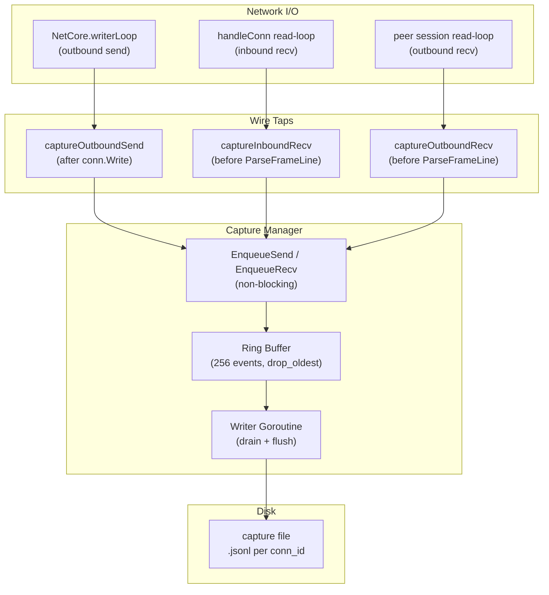
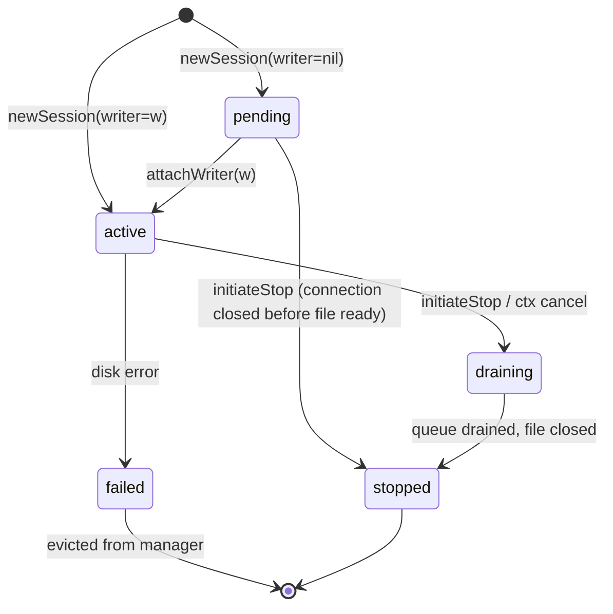
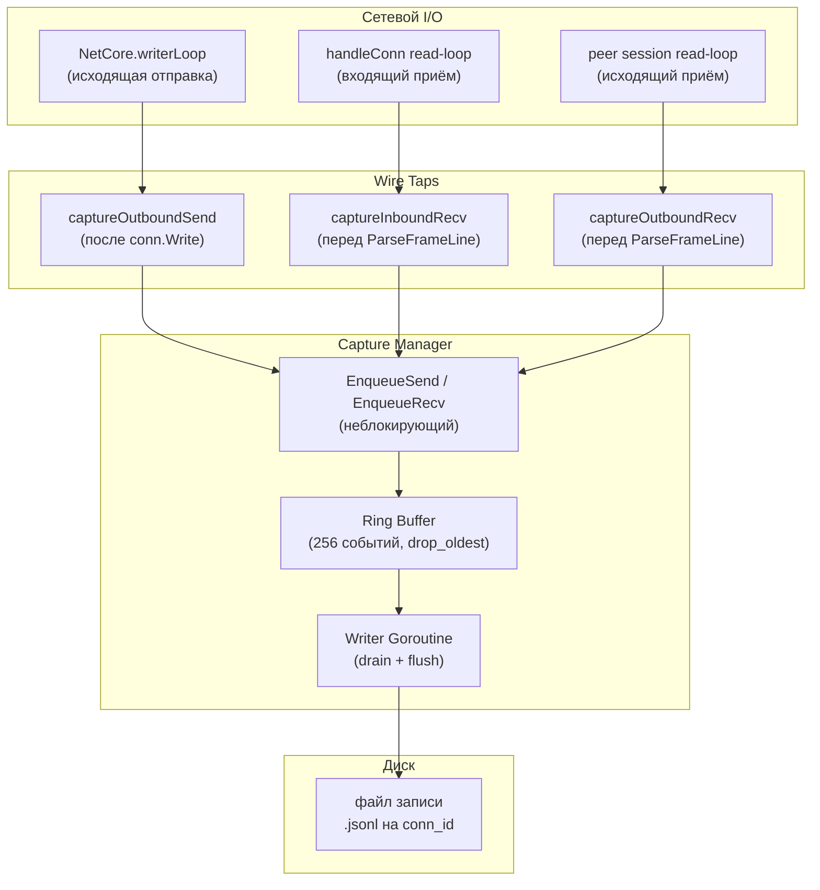
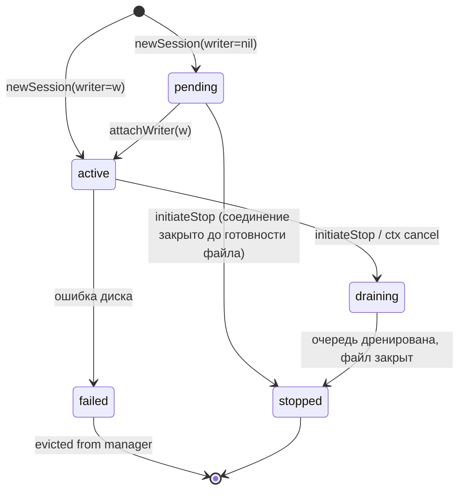

# Debugging

## English

### Log Levels

CORSA uses [zerolog](https://github.com/rs/zerolog) for structured logging. The log level is controlled by the `CORSA_LOG_LEVEL` environment variable.

| Level   | Value   | Description                                                    |
|---------|---------|----------------------------------------------------------------|
| `error` | highest | Only errors                                                    |
| `warn`  | default | Warnings and above (steady-state info chatter is suppressed)   |
| `info`  |         | Key lifecycle events (start, stop, peer connect/disconnect)    |
| `debug` |         | Network protocol traces (`json/tcp`), routing decisions        |
| `trace` | lowest  | Everything above + local RPC traces (`json/local`) from the UI |

The default sits at `warn` so a freshly started daemon does not flood the console with steady-state info chatter (peer-state transitions, announce cycles, push-message delivery). On a busy node those events run at several lines per second and drown out the warn/error events operators actually need. Raise the level explicitly when diagnosing a problem.

### Usage

```bash
# Default — warn level, only warnings and errors
./corsa

# Lifecycle visibility — peer connects, announce cycles, message delivery
CORSA_LOG_LEVEL=info ./corsa

# Network debugging — shows TCP protocol traces between peers
CORSA_LOG_LEVEL=debug ./corsa

# Full tracing — also shows local UI→Node RPC calls (fetch_messages, fetch_network_stats, etc.)
CORSA_LOG_LEVEL=trace ./corsa
```

### Protocol Traces

All protocol interactions are logged with `protocol_trace` message and the following fields:

| Field       | Description                                             |
|-------------|---------------------------------------------------------|
| `protocol`  | `json/tcp` (network) or `json/local` (UI RPC)          |
| `addr`      | Remote peer address or `local`                          |
| `direction` | `recv` (inbound) or `send` (outbound)                  |
| `command`   | Frame type (`hello`, `ping`, `fetch_messages`, etc.)    |
| `accepted`  | `true` if processed successfully, `false` on error      |

**Level separation:**

- `json/tcp` traces are logged at **debug** level — useful for diagnosing network issues between peers.
- `json/local` traces are logged at **trace** level — these are frequent UI polling requests (e.g. `fetch_network_stats` every second) that create noise at debug level.

### Log Output

Logs are written to `corsa.log` in the application data directory. Stderr is also captured to `stderr.log` for crash diagnostics.

### Peer Traffic Recording

For targeted diagnostics of specific peer connections, CORSA provides a built-in traffic capture feature that records the raw wire payload (JSON-line protocol and non-JSON traffic) to disk. The capture is implemented natively through the application's existing `net.Conn` read/write paths — no external packet capture tools (`pcap`, `libpcap`) are needed.

Traffic recording is started and stopped via console/RPC diagnostic commands (see [diagnostic.md](rpc/diagnostic.md) for the full command reference):

- `recordPeerTrafficByConnID conn_ids=41,42` — record specific connections
- `recordPeerTrafficByIP ips=203.0.113.10` — record by IP (auto-captures future reconnections)
- `recordAllPeerTraffic` — record everything
- `stopPeerTrafficRecording scope=all` — stop all recordings

Capture files are written to `<data_dir>/debug/traffic-captures/` with one `.jsonl` file per live `conn_id`.

#### Capture Architecture


*Diagram 1 — Peer traffic capture data flow.*

Three wire taps intercept traffic at the application layer. Outbound send is captured after the actual `conn.Write` (so the event carries the real send outcome). Inbound and outbound receive are captured before `ParseFrameLine` to preserve the raw wire payload, including malformed and non-JSON data. Events flow through a per-session ring buffer to a dedicated writer goroutine, ensuring that disk I/O never blocks the network path.

#### Session Lifecycle


*Diagram 2 — Capture session state machine.*

Sessions created by standing rules (`by_ip`, `all`) start in `pending` state — they accept events into the ring buffer immediately while the file is being opened asynchronously. Once the file is ready, `attachWriter` transitions to `active` and the writer goroutine begins draining. Explicit `start` commands create sessions directly in `active` state since the file is opened synchronously.

#### Desktop Console UI

When a capture is active, the Desktop Console shows a red recording dot on the peer card header and a recording info row with the scope, file path, start time, and dropped event count. A global "Stop all recording" banner appears at the top of the peers tab when any capture is running, dispatching `stopPeerTrafficRecording scope=all`.

Capture state is surfaced to the UI through `NodeStatus.CaptureSessions`, a map keyed by `domain.ConnID`. Active entries drive the dot / info row / banner; stopped entries linger for a TTL (60 seconds by default) so terminal diagnostics such as the writer error or the `DroppedEvents` count remain visible after the session ends. The map is completely independent of `PeerHealth`: capture-start never creates a peer row, and capture-stop never modifies one. See [ui.md](ui.md#console-window--traffic-recording-indicators) for the full UI wiring.

### Memory & CPU profiling (pprof)

When a node's memory or CPU looks wrong (steadily climbing RSS, sustained high CPU), two tools answer two different questions.

**Quick totals — `getResourceUsage` RPC.** Cheap, always available, safe to poll. Returns the process memory footprint and uptime in both machine and human form:

```bash
corsa-cli getResourceUsage
```
```json
{
  "mem_sys_bytes": 148859176,  "mem_sys_human": "141.96 MB",
  "mem_heap_alloc_bytes": 97664104, "mem_heap_alloc_human": "93.14 MB",
  "heap_inuse_human": "98.00 MB", "heap_idle_human": "40.00 MB",
  "heap_released_human": "30.00 MB", "gc_sys_human": "5.00 MB",
  "cgroup_mem_limit_human": "512.00 MB", "cgroup_mem_usage_human": "150.00 MB",
  "connection_count": 12,
  "uptime_seconds": 538, "uptime_human": "538 s",
  "sampled_at": "2026-06-06T06:07:54Z"
}
```

- `mem_sys_*` — total memory obtained from the OS (`runtime.MemStats.Sys`), the closest proxy for RSS / process footprint.
- `mem_heap_alloc_*` — **live (in-use) heap** — the figure that climbs steadily under a leak. Watch this across calls.
- `heap_idle_*` vs `heap_released_*` — reclaimed heap the runtime holds vs the part it returned to the OS; a large idle/small released gap explains why RSS stays high after a spike.
- `cgroup_mem_usage_*` / `cgroup_mem_limit_*` — memory + limit read from the root of the mounted cgroup hierarchy (`/proc/self/cgroup` is not resolved). Accurate for Docker/k8s private cgroup namespaces (the container's figures the OOM killer watches); on a bare host / systemd service it is a broad/root cgroup, **not** the process. `unlimited` off-cgroup.
- `connection_count` — live peer connections; a footprint that tracks this is working set, not a leak.

The same two figures are shown on the desktop console **Info** tab (Memory / Uptime rows), live-ticked once a second.

**Triage by trend, not by one reading.** A single sample never tells you whether there is a leak. On a large mesh (hundreds of nodes) a routing table, the per-peer announce snapshots, and the dedup caches legitimately add up to tens of MB. Sample `getResourceUsage` every 15 / 30 / 60 minutes:

- `mem_heap_alloc` plateaus (e.g. settles around 100–250 MB) → working set, not a leak.
- `mem_heap_alloc` climbs monotonically and never drops after GC → a real leak; profile it.

**Root cause — pprof heap/CPU profile.** `getResourceUsage` shows *how much*; pprof shows *what*. Go's standard `net/http/pprof` server is **off by default** and started only when `CORSA_PPROF_ADDR` is set. For safety it refuses to bind anything but a loopback address — the surface exposes process internals (heap, CPU, goroutine dumps) and must never face the network.

```bash
# Enable on the affected node only, during the investigation:
CORSA_PPROF_ADDR=127.0.0.1:6060 ./corsa-node

# Remote node — tunnel the loopback port over SSH first:
ssh -L 6060:127.0.0.1:6060 user@host

# What is using memory right now (live heap, ranked by type/function):
go tool pprof -top -inuse_space http://127.0.0.1:6060/debug/pprof/heap

# CPU profile over a 30s window (answers "why is CPU high"):
go tool pprof -top http://127.0.0.1:6060/debug/pprof/profile?seconds=30

# All goroutine stacks (leaked goroutines, blocked workers):
curl -s http://127.0.0.1:6060/debug/pprof/goroutine?debug=2 | less
```

`-inuse_space` ranks by live bytes (the leak view); add `-alloc_space` to see cumulative allocation churn (the GC-pressure view). For a visual call graph, drop the `-top` flag and run `go tool pprof -http=:8080 http://127.0.0.1:6060/debug/pprof/heap` to open the web UI.

**Unset `CORSA_PPROF_ADDR` once the investigation is done** — leave it off in production. A non-loopback value (`0.0.0.0:6060`, `:6060`, a public IP) is rejected at startup with an error rather than silently exposing the endpoint.

---

## Русский

### Уровни логирования

CORSA использует [zerolog](https://github.com/rs/zerolog) для структурированного логирования. Уровень управляется переменной окружения `CORSA_LOG_LEVEL`.

| Уровень | Значение     | Описание                                                                   |
|---------|--------------|----------------------------------------------------------------------------|
| `error` | наивысший    | Только ошибки                                                              |
| `warn`  | по умолчанию | Предупреждения и выше (фоновые info-сообщения подавлены)                   |
| `info`  |              | Ключевые события жизненного цикла (старт, стоп, подключение/отключение)    |
| `debug` |              | Трассировка сетевого протокола (`json/tcp`), решения маршрутизации          |
| `trace` | наименьший   | Всё выше + локальные RPC-трассировки (`json/local`) от UI                  |

По умолчанию демон стартует с `warn`, чтобы не заливать консоль фоновым info-шумом (переходы состояний пиров, циклы announce, доставка push-сообщений). На загруженной ноде такие события идут несколько строк в секунду и заглушают warn/error, на которые оператору реально нужно реагировать. Поднимайте уровень явно при диагностике проблем.

### Использование

```bash
# По умолчанию — уровень warn, только предупреждения и ошибки
./corsa

# Видимость жизненного цикла — подключения, циклы announce, доставка
CORSA_LOG_LEVEL=info ./corsa

# Отладка сети — показывает TCP-трассировки между пирами
CORSA_LOG_LEVEL=debug ./corsa

# Полная трассировка — также показывает локальные UI→Node RPC-вызовы (fetch_messages, fetch_network_stats и т.д.)
CORSA_LOG_LEVEL=trace ./corsa
```

### Трассировка протокола

Все взаимодействия протокола логируются с сообщением `protocol_trace` и следующими полями:

| Поле        | Описание                                                |
|-------------|---------------------------------------------------------|
| `protocol`  | `json/tcp` (сеть) или `json/local` (UI RPC)            |
| `addr`      | Адрес удалённого пира или `local`                       |
| `direction` | `recv` (входящий) или `send` (исходящий)                |
| `command`   | Тип фрейма (`hello`, `ping`, `fetch_messages` и т.д.)  |
| `accepted`  | `true` если обработан успешно, `false` при ошибке       |

**Разделение по уровням:**

- Трассировки `json/tcp` логируются на уровне **debug** — полезны для диагностики сетевых проблем между пирами.
- Трассировки `json/local` логируются на уровне **trace** — это частые polling-запросы от UI (например, `fetch_network_stats` каждую секунду), которые создают шум на уровне debug.

### Вывод логов

Логи записываются в `corsa.log` в директории данных приложения. Stderr также перенаправляется в `stderr.log` для диагностики падений.

### Запись peer-трафика

Для точечной диагностики конкретных peer-соединений CORSA предоставляет встроенную функцию записи трафика, которая записывает raw wire payload (JSON-line протокол и не-JSON трафик) на диск. Запись реализована нативно через существующие `net.Conn` read/write path'ы приложения — внешние инструменты захвата пакетов (`pcap`, `libpcap`) не нужны.

Запись запускается и останавливается через консольные/RPC диагностические команды (полная справка — [diagnostic.md](rpc/diagnostic.md)):

- `recordPeerTrafficByConnID conn_ids=41,42` — запись конкретных соединений
- `recordPeerTrafficByIP ips=203.0.113.10` — запись по IP (автоматически захватывает будущие reconnect'ы)
- `recordAllPeerTraffic` — запись всего
- `stopPeerTrafficRecording scope=all` — остановка всех записей

Файлы записи пишутся в `<data_dir>/debug/traffic-captures/` с отдельным `.jsonl` файлом на каждый live `conn_id`.

#### Архитектура записи


*Диаграмма 1 — Поток данных записи peer-трафика.*

Три wire tap'а перехватывают трафик на уровне приложения. Исходящая отправка записывается после реального `conn.Write` (поэтому событие несёт фактический outcome отправки). Входящий и исходящий приём записываются перед `ParseFrameLine`, чтобы сохранить raw wire payload, включая некорректные и не-JSON данные. События проходят через per-session ring buffer к выделенной writer goroutine, гарантируя что дисковый I/O никогда не блокирует сетевой путь.

#### Жизненный цикл сессии


*Диаграмма 2 — Машина состояний capture-сессии.*

Сессии, созданные по постоянным правилам (`by_ip`, `all`), начинаются в состоянии `pending` — они принимают события в ring buffer сразу, пока файл открывается асинхронно. Когда файл готов, `attachWriter` переводит в `active` и writer goroutine начинает дренирование. Явные `start` команды создают сессии сразу в состоянии `active`, так как файл открывается синхронно.

#### Desktop Console UI

Когда запись активна, Desktop Console показывает красную точку записи на заголовке peer-карточки и строку с информацией о записи: scope, путь к файлу, время старта и количество потерянных событий. Глобальный баннер "Stop all recording" появляется вверху вкладки peers при любой активной записи и отправляет `stopPeerTrafficRecording scope=all`.

Состояние записи отдаётся в UI через `NodeStatus.CaptureSessions` — карту по ключу `domain.ConnID`. Активные записи управляют точкой / строкой информации / баннером; остановленные записи живут TTL (по умолчанию 60 секунд), чтобы терминальная диагностика — ошибка writer'а, счётчик `DroppedEvents` — оставалась видимой после завершения сессии. Карта полностью независима от `PeerHealth`: capture-start никогда не создаёт peer-строку, а capture-stop никогда её не модифицирует. Полная схема UI-wiring — см. [ui.md](ui.md#окно-консоли--индикаторы-записи-трафика).

### Профилирование памяти и CPU (pprof)

Когда с памятью или CPU узла что-то не так (постоянно растущий RSS, устойчиво высокий CPU), есть два инструмента под два разных вопроса.

**Быстрые тоталы — RPC `getResourceUsage`.** Дёшево, всегда доступно, безопасно опрашивать. Отдаёт потребление памяти процессом и аптайм машинно и для человека:

```bash
corsa-cli getResourceUsage
```
```json
{
  "mem_sys_bytes": 148859176,  "mem_sys_human": "141.96 MB",
  "mem_heap_alloc_bytes": 97664104, "mem_heap_alloc_human": "93.14 MB",
  "heap_inuse_human": "98.00 MB", "heap_idle_human": "40.00 MB",
  "heap_released_human": "30.00 MB", "gc_sys_human": "5.00 MB",
  "cgroup_mem_limit_human": "512.00 MB", "cgroup_mem_usage_human": "150.00 MB",
  "connection_count": 12,
  "uptime_seconds": 538, "uptime_human": "538 s",
  "sampled_at": "2026-06-06T06:07:54Z"
}
```

- `mem_sys_*` — всего памяти, взятой у ОС (`runtime.MemStats.Sys`), ближайший к RSS / footprint процесса показатель.
- `mem_heap_alloc_*` — **живая (in-use) куча** — именно она монотонно растёт при утечке. Её и отслеживать между вызовами.
- `heap_idle_*` vs `heap_released_*` — reclaimed-куча, которую держит рантайм, против возвращённой ОС; большой зазор idle/released объясняет, почему RSS остаётся высоким после пика.
- `cgroup_mem_usage_*` / `cgroup_mem_limit_*` — память и лимит, прочитанные из корня смонтированной cgroup-иерархии (`/proc/self/cgroup` не резолвится). Точно для private cgroup namespace в Docker/k8s (цифры контейнера, за которыми следит OOM-killer); на голом хосте / systemd-сервисе это широкая / root cgroup, **а не** процесс. `unlimited` вне cgroup.
- `connection_count` — живые peer-соединения; footprint, растущий в такт с этим числом, — рабочий набор, а не утечка.

Те же две цифры показаны в десктоп-консоли на вкладке **Инфо** (строки Память / Аптайм), с обновлением раз в секунду.

**Диагностируй по тренду, а не по одному замеру.** Один сэмпл никогда не скажет, есть ли утечка. На большом меше (сотни нод) маршрутная таблица, announce-снапшоты по пирам и dedup-кэши законно дают десятки MB. Снимай `getResourceUsage` через 15 / 30 / 60 минут:

- `mem_heap_alloc` выходит на плато (например, ~100–250 MB) → рабочий набор, не утечка.
- `mem_heap_alloc` монотонно растёт и не падает после GC → реальная утечка; профилируй.

**Root cause — heap/CPU профиль pprof.** `getResourceUsage` показывает *сколько*; pprof показывает *что именно*. Стандартный для Go сервер `net/http/pprof` **по умолчанию выключен** и стартует только когда задан `CORSA_PPROF_ADDR`. Ради безопасности он отказывается биндиться куда-либо, кроме loopback-адреса — поверхность раскрывает внутренности процесса (heap, CPU, дампы горутин) и не должна смотреть в сеть.

```bash
# Включить только на проблемном узле, на время разбора:
CORSA_PPROF_ADDR=127.0.0.1:6060 ./corsa-node

# Удалённый узел — сначала проброс loopback-порта через SSH:
ssh -L 6060:127.0.0.1:6060 user@host

# Что прямо сейчас занимает память (живая куча, ранжировано по типу/функции):
go tool pprof -top -inuse_space http://127.0.0.1:6060/debug/pprof/heap

# CPU-профиль за окно 30с (отвечает на «почему высокий CPU»):
go tool pprof -top http://127.0.0.1:6060/debug/pprof/profile?seconds=30

# Все стеки горутин (утёкшие горутины, заблокированные воркеры):
curl -s http://127.0.0.1:6060/debug/pprof/goroutine?debug=2 | less
```

`-inuse_space` ранжирует по живым байтам (вид утечки); `-alloc_space` — по кумулятивным аллокациям (вид нагрузки на GC). Для визуального call-graph убери `-top` и запусти `go tool pprof -http=:8080 http://127.0.0.1:6060/debug/pprof/heap` — откроется веб-интерфейс.

**Сними `CORSA_PPROF_ADDR` после разбора** — в проде держи выключенным. Не-loopback значение (`0.0.0.0:6060`, `:6060`, публичный IP) отклоняется на старте с ошибкой, а не молча открывает endpoint.
