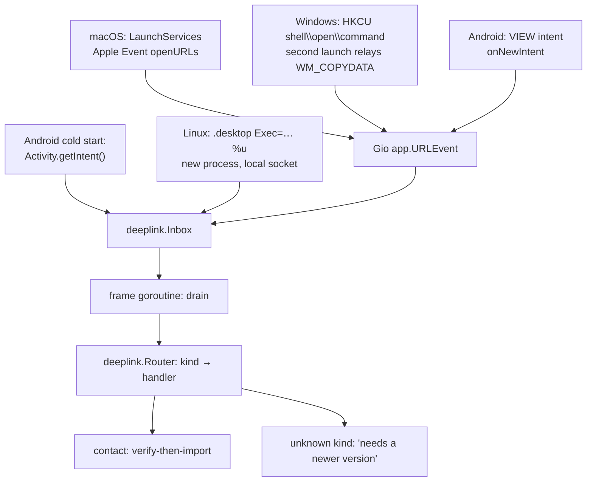
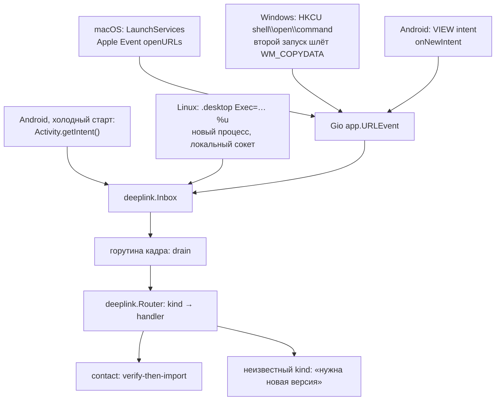

# CORSA deep links

## English

### 1. What this document covers

A **deep link** is a `corsa:` URI the operating system hands to the
application: a link clicked in a browser, tapped in another messenger,
opened from a file manager or typed into a shell. This document is the
contract for the whole family — the URI shape, how a link is routed to
the code that acts on it, and what each platform needs before it will
deliver one at all.

The contact link itself (its parameters, its verification) is specified
in [protocol/identity-lookup.md](protocol/identity-lookup.md) §9. Here it
is one member among others.

### 2. The URI family

One scheme, several members, told apart by the URI **target** —
everything between the scheme and the query:

```
corsa:<40-hex address>?<params>    → contact
corsa:<kind>/<payload>?<params>    → <kind>
```

| Form | Kind | Meaning |
| --- | --- | --- |
| `corsa:<40-hex>?v=1&net=…&pk=…&bk=…&bs=…` | `contact` | Import a peer with keys, fully offline |

The bare-address form predates the family and stays what it always was:
a 40-hex fingerprint cannot collide with a kind name, because every other
member carries its payload behind a slash. That slash is mandatory —
without it a **truncated** address (`corsa:ab12cd`) would silently become
a kind nobody ever defined, instead of being refused as malformed.

Kind names are lowercase ASCII letters, digits and `-`, compared
case-insensitively (URI schemes and our targets both are).

Bounds, before any decoding: the whole URI is at most 2048 bytes.

### 3. Routing inside the application

`internal/core/deeplink` does two things and no more:

- **Classify** names the member a URI belongs to. It is syntax only — it
  never validates a member's own format, because that would put two
  authorities on one format.
- **Router** maps kind → handler and hands the URI over **unmodified**.
  The handler is the member's own parser and effect: for `contact` that
  is `contactlink.Parse` followed by the same verify-then-import path a
  pasted link takes.

Adding a member is one entry in the table
(`internal/app/desktop/deeplink.go`) plus its handler. Delivery, the
inbox, the platform files and this document's platform sections do not
change.

A link whose kind has no handler in this build is reported as
"needs a newer version", never as malformed — the difference matters to
the person holding the link.

### 4. Delivery, platform by platform

The operating system delivers a link on a thread of its own choosing.
Every path ends in the same place: an inbox the frame goroutine drains,
which routes each URI and then raises the window, because a link is an
explicit action the user took somewhere else.

That thread queues the link and asks for a frame — and touches nothing
else. It must not invalidate the window itself: on macOS Gio runs its
wakeup inline when it is already on the main thread, which pumps the
event loop while holding the window's invalidation lock, and the layout
goroutine then waits for a thread that is waiting for it. The drain also
runs outside every modal gate: a link is not a control of the window that
an open viewer or console can cover.



*How a clicked corsa: link reaches the application on each platform.*

#### macOS

Declared in `packaging/macos/Info.plist` (`CFBundleURLTypes`).
LaunchServices registers the claim when it first sees the bundle — the
first launch of `Corsa.app`, or an explicit `lsregister -f Corsa.app`.
A raw executable (`go run`, `dist/corsa-desktop-darwin-*`) is **not** a
bundle and is never registered. Links reach the running instance as an
Apple Event; a link that starts the app is queued by the system until its
run loop comes up, so a slow start does not lose it.

LaunchServices delivers to the bundle it registered, which need not be
the instance that is running — during development it usually is not. So
a launch that finds this data directory already owned (the local socket
below) does **not** open a second node: it becomes a courier — no node,
no window — waits up to 5 s for the URL event, hands it to the owner over
the socket and exits. A launch from a terminal is exempt: two builds
against one data directory is a deliberate act, and the check is the
controlling terminal (`/dev/tty`), which Finder and LaunchServices never
give their children.

#### Windows

Declared by the build: `-X gioui.org/app.schemesURI=corsa`
(`APP_URL_SCHEMES` in the Makefile). Gio then writes
`HKCU\Software\Classes\corsa` at startup — per user, no installer and no
administrator. A clicked link starts a second process, which hands the
URI to the live window (`WM_COPYDATA`) and exits.

That relay also makes the app **single-instance on Windows**: a second
launch, with or without a link, exits as soon as it finds the first
window. Gio refuses to take the scheme over from another application that
already claims it.

#### Linux (X11 / Wayland)

Declared in `packaging/linux/corsa.desktop`:
`MimeType=x-scheme-handler/corsa;` and `Exec=corsa-desktop %u`. The entry
must be installed and indexed — `make install-desktop-linux` does both
(it runs `update-desktop-database`).

Neither X11 nor Wayland can deliver a URI **into** a running process:
`xdg-open` starts the Exec line again with the link appended. Two
processes on one data directory would be two nodes on one identity, so
the newcomer hands its link over a unix socket in the node data
directory (`deeplink.sock`, mode 0600) and exits. Details that matter in
practice:

- the socket is named after the node, not the directory —
  `deeplink-<port>.sock`, the same port suffix `identity-<port>.json` and
  the chat log carry — so two nodes started from one directory on
  different ports never take each other's links;
- the socket is claimed BEFORE the data directory is opened, so a launch
  racing this one finds a listener rather than starting a second node;
  links accepted before there is a window wait in the listener's queue,
  and reach it in the order they arrived;
- a launch that loses that race (the address was taken between its dial
  and its bind) forwards its link a second time instead of starting;
- once an owner is proven, a launch that is not from a terminal does not
  open the shared state at all — not even when the hand-over failed,
  because a malformed link is no reason for a second node on one
  identity;
- the owner closes the socket at the START of its shutdown, so a link
  arriving during the drain starts a fresh instance instead of being
  acknowledged by a process that is leaving;
- a socket file left behind by a crash is removed and rebound; a socket
  that still answers belongs to a live instance, which keeps the address;
- if nobody answers, the new process is the instance and acts on its own
  link;
- if somebody answers but the exchange fails, the new process starts
  normally rather than dropping the user's click;
- the socket path must stay under ~104 bytes (kernel limit on `sun_path`),
  which a very long `CORSA_DATA_DIR` can exceed — the listener then
  refuses to bind and says so, and links fall back to starting a new
  instance.

#### Android

Declared in `packaging/android/app/src/main/AndroidManifest.xml`: an
`intent-filter` with `VIEW` + `DEFAULT` + `BROWSABLE` and
`<data android:scheme="corsa"/>`. `BROWSABLE` is what lets a link tapped
in a browser reach the app at all.

The activity is `singleTask`, so a link tapped while the app runs arrives
as `onNewIntent` and Gio turns it into a URL event. The intent that
**starts** the app is read separately, from `Activity.getIntent()` over
JNI: Gio runs Go `main` in a goroutine and delivers that first URL event
only if the global event iterator is already installed, which on a cold
start is a race against our own startup. `getIntent()` has no such
window.

Reading it would make one tap arrive twice, so the read **consumes** the
intent — `setData(null)` — and Gio's own delivery of that launch then
finds nothing to deliver. The ordering is Gio's own: `onCreate` calls
`onNewIntent(getIntent())` only after `new GioView(this)` returns, and
that constructor blocks until this read has run. Nothing is suppressed
afterwards, so opening the same link again always works.

### 5. What the user sees

| Outcome | Status line |
| --- | --- |
| Contact imported | `Contact <fingerprint> imported — keys verified.` |
| Link is for another network | `This contact link is for a different network.` |
| Keys do not verify | `Contact link rejected: …` |
| Kind this build does not know | `This link needs a newer version of Corsa.` |
| Not a corsa: URI at all | `This link could not be opened: …` |

Nothing is imported without verification: a contact link is checked
(fingerprint, box binding) before it becomes a stored contact, exactly as
a pasted link is.

### 6. Checking it by hand

| Platform | Command |
| --- | --- |
| macOS | `open 'corsa:<address>?v=1&net=…'` |
| Windows | `start "" "corsa:<address>?v=1&net=…"` |
| Linux | `xdg-open 'corsa:<address>?v=1&net=…'` |
| Android | `adb shell am start -a android.intent.action.VIEW -d 'corsa:<address>?v=1&net=…'` |

Run each twice: once with the app closed (cold start) and once with it
running (delivery into the live instance). Both must end with the same
status line and no second process.

`make install-desktop-linux` is required on Linux before the first check;
on macOS the app must have been launched once from `Corsa.app`.

### 7. Limits

- iOS is not built, so its half of the plumbing (Gio has it) is unused.
- On Wayland a compositor may ignore the request to raise the window;
  the link is still imported.
- The local socket is reachable by the user who owns the data directory
  and nobody else. Everything it accepts is size-capped, classified
  before it is acted on, and verified by the member's own parser.

---

## Русский

### 1. О чём документ

**Диплинк** — это `corsa:`-URI, который операционная система передаёт
приложению: ссылка, нажатая в браузере, в другом мессенджере, открытая из
файлового менеджера или введённая в терминале. Здесь — контракт всего
семейства: форма URI, маршрутизация ссылки к коду, который на неё
реагирует, и то, что каждой платформе нужно, чтобы она вообще эту ссылку
доставила.

Сама контактная ссылка (параметры, верификация) описана в
[protocol/identity-lookup.md](protocol/identity-lookup.md) §9. Здесь она —
один из членов семейства.

### 2. Семейство URI

Одна схема, несколько членов; различаются по **цели** URI — всему, что
между схемой и запросом:

```
corsa:<40-hex адрес>?<параметры>   → contact
corsa:<kind>/<payload>?<параметры> → <kind>
```

| Форма | Kind | Смысл |
| --- | --- | --- |
| `corsa:<40-hex>?v=1&net=…&pk=…&bk=…&bs=…` | `contact` | Импорт пира с ключами, полностью офлайн |

Форма с голым адресом появилась раньше семейства и остаётся собой:
40-hex отпечаток не может столкнуться с именем kind, потому что любой
другой член несёт полезную нагрузку за слешем. Слеш обязателен — без него
**обрезанный** адрес (`corsa:ab12cd`) молча превратился бы в kind,
которого никто не определял, вместо честного отказа «malformed».

Имена kind — строчные латинские буквы, цифры и `-`; сравнение
регистронезависимое (как и у схемы).

Границы, до любого декодирования: весь URI не длиннее 2048 байт.

### 3. Маршрутизация внутри приложения

`internal/core/deeplink` делает ровно две вещи:

- **Classify** называет члена семейства, которому принадлежит URI. Это
  только синтаксис: формат конкретного члена он не проверяет, иначе у
  одного формата стало бы два хозяина.
- **Router** отображает kind → handler и передаёт URI **без изменений**.
  Handler — это парсер и эффект самого члена: для `contact` это
  `contactlink.Parse` и тот же путь verify-then-import, которым идёт
  вставленная из буфера ссылка.

Новый член — это одна запись в таблице
(`internal/app/desktop/deeplink.go`) и его handler. Доставка, inbox,
файлы упаковки и платформенные разделы этого документа не меняются.

Ссылка с kind, для которого в этой сборке нет handler-а, объявляется
«нужна более новая версия», а не «malformed» — для человека со ссылкой в
руках это разные новости.

### 4. Доставка по платформам

ОС доставляет ссылку в потоке, который выбирает сама. Все пути
заканчиваются одинаково: inbox, который разбирает горутина кадра; она
маршрутизирует URI и поднимает окно — ссылка это явное действие
пользователя, совершённое в другом месте.

Этот поток кладёт ссылку в очередь и просит кадр — и больше не трогает
ничего. Инвалидировать окно сам он не имеет права: на macOS Gio, уже
находясь на главном потоке, выполняет свой wakeup инлайн, а тот качает
цикл событий, удерживая lock инвалидации окна, — и горутина layout ждёт
поток, который ждёт её. Разбор очереди идёт и вне модальных окон: ссылка
не является контролом окна, который может перекрыть просмотрщик или
консоль.



*Как нажатая corsa:-ссылка доходит до приложения на каждой платформе.*

#### macOS

Объявляется в `packaging/macos/Info.plist` (`CFBundleURLTypes`).
LaunchServices регистрирует заявку, когда впервые видит бандл — при
первом запуске `Corsa.app` или через `lsregister -f Corsa.app`. Голый
исполняемый файл (`go run`, `dist/corsa-desktop-darwin-*`) бандлом не
является и не регистрируется никогда. До запущенного приложения ссылка
доходит как Apple Event; ссылку, которая приложение запускает, система
держит в очереди до старта его run loop — медленный старт её не теряет.

LaunchServices доставляет тому бандлу, который зарегистрировала, а это
не обязательно работающий экземпляр — при разработке обычно не он.
Поэтому запуск, обнаруживший, что директорией данных уже владеют
(локальный сокет ниже), второй узел не поднимает: он становится
курьером — без узла и без окна, — ждёт до 5 с URL-событие, отдаёт его
владельцу через сокет и завершается. Исключение — запуск из терминала:
две сборки на одной директории это осознанное действие, а признак —
управляющий терминал (`/dev/tty`), которого Finder и LaunchServices
своим потомкам не дают.

#### Windows

Объявляется сборкой: `-X gioui.org/app.schemesURI=corsa`
(`APP_URL_SCHEMES` в Makefile). Gio при старте пишет
`HKCU\Software\Classes\corsa` — для пользователя, без инсталлятора и без
администратора. Нажатая ссылка запускает второй процесс, тот передаёт URI
живому окну (`WM_COPYDATA`) и завершается.

Эта же передача делает приложение на Windows **однооконным**: второй
запуск, со ссылкой или без, завершается, как только находит первое окно.
Схему, уже занятую другим приложением, Gio не отбирает.

#### Linux (X11 / Wayland)

Объявляется в `packaging/linux/corsa.desktop`:
`MimeType=x-scheme-handler/corsa;` и `Exec=corsa-desktop %u`. Запись
должна быть установлена и проиндексирована — `make install-desktop-linux`
делает и то и другое (вызывает `update-desktop-database`).

Ни X11, ни Wayland не умеют доставлять URI **внутрь** работающего
процесса: `xdg-open` снова запускает строку Exec со ссылкой в аргументах.
Два процесса на одной директории данных — это два узла на одной identity,
поэтому новый процесс отдаёт ссылку через unix-сокет в директории данных
узла (`deeplink.sock`, права 0600) и завершается. Что важно на практике:

- сокет назван по узлу, а не по директории — `deeplink-<port>.sock`, тот
  же суффикс порта, что у `identity-<port>.json` и чат-лога, — поэтому два
  узла, поднятых из одной директории на разных портах, не перехватывают
  ссылки друг друга;
- сокет захватывается ДО открытия директории данных, поэтому запуск,
  идущий следом, находит слушателя, а не поднимает второй узел; ссылки,
  принятые до появления окна, ждут в очереди слушателя и приходят в том
  порядке, в котором пришли;
- запуск, проигравший эту гонку (адрес заняли между его dial и его bind),
  отдаёт ссылку повторно, а не стартует сам;
- как только владелец доказан, запуск не из терминала вообще не открывает
  общее состояние — даже если передача не удалась: кривая ссылка не повод
  поднимать второй узел на одной identity;
- владелец закрывает сокет В САМОМ НАЧАЛЕ своего shutdown, поэтому
  ссылка, пришедшая во время drain, запускает новый экземпляр, а не
  получает подтверждение от уходящего процесса;
- файл сокета, оставшийся после падения, удаляется и создаётся заново;
  сокет, который отвечает, принадлежит живому экземпляру, и адрес остаётся
  за ним;
- если никто не ответил — новый процесс и есть экземпляр, он сам
  обрабатывает свою ссылку;
- если ответили, но обмен не удался, новый процесс стартует обычным
  образом, а не теряет нажатие пользователя;
- путь сокета должен укладываться примерно в 104 байта (ограничение ядра
  на `sun_path`); очень длинный `CORSA_DATA_DIR` его превысит — тогда
  слушатель честно откажется стартовать, а ссылки будут запускать новый
  экземпляр.

#### Android

Объявляется в `packaging/android/app/src/main/AndroidManifest.xml`:
`intent-filter` с `VIEW` + `DEFAULT` + `BROWSABLE` и
`<data android:scheme="corsa"/>`. Именно `BROWSABLE` позволяет ссылке,
нажатой в браузере, вообще дойти до приложения.

Активити — `singleTask`, поэтому ссылка, нажатая при работающем
приложении, приходит как `onNewIntent`, и Gio превращает её в URL-событие.
Intent, который приложение **запускает**, читается отдельно — из
`Activity.getIntent()` через JNI: Gio запускает Go `main` в горутине и
доставляет то первое URL-событие только если итератор глобальных событий
уже установлен, а на холодном старте это гонка с нашим собственным
стартом. У `getIntent()` такого окна нет.

Чтение сделало бы из одного нажатия два прихода, поэтому оно **забирает**
intent — `setData(null)`, — и собственная доставка Gio для этого запуска
уже ничего не находит. Порядок гарантирован самим Gio: `onCreate` зовёт
`onNewIntent(getIntent())` только после возврата из `new GioView(this)`, а
этот конструктор блокируется, пока чтение не отработало. Ничего не
подавляется «на будущее», поэтому повторное открытие той же ссылки
работает всегда.

### 5. Что видит пользователь

| Исход | Строка статуса |
| --- | --- |
| Контакт импортирован | `Контакт <отпечаток> импортирован — ключи проверены.` |
| Ссылка из другой сети | `Эта ссылка контакта — для другой сети.` |
| Ключи не проверяются | `Ссылка контакта отклонена: …` |
| Kind, неизвестный сборке | `Для этой ссылки нужна более новая версия Corsa.` |
| Вообще не corsa:-URI | `Не удалось открыть ссылку: …` |

Без верификации не импортируется ничего: контактная ссылка проверяется
(отпечаток, привязка box-ключа) до того, как станет сохранённым
контактом, — ровно как вставленная из буфера.

### 6. Проверка руками

| Платформа | Команда |
| --- | --- |
| macOS | `open 'corsa:<адрес>?v=1&net=…'` |
| Windows | `start "" "corsa:<адрес>?v=1&net=…"` |
| Linux | `xdg-open 'corsa:<адрес>?v=1&net=…'` |
| Android | `adb shell am start -a android.intent.action.VIEW -d 'corsa:<адрес>?v=1&net=…'` |

Каждую — дважды: при закрытом приложении (холодный старт) и при
запущенном (доставка в живой экземпляр). Оба раза должна получиться одна
и та же строка статуса и ни одного лишнего процесса.

На Linux перед первой проверкой нужен `make install-desktop-linux`; на
macOS приложение должно быть хотя бы раз запущено из `Corsa.app`.

### 7. Ограничения

- iOS не собирается, поэтому его половина обвязки (в Gio она есть) не
  используется.
- На Wayland композитор может проигнорировать запрос на поднятие окна;
  ссылка при этом всё равно импортируется.
- Локальный сокет доступен только владельцу директории данных. Всё, что
  он принимает, ограничено по размеру, классифицируется до обработки и
  проверяется парсером самого члена семейства.
