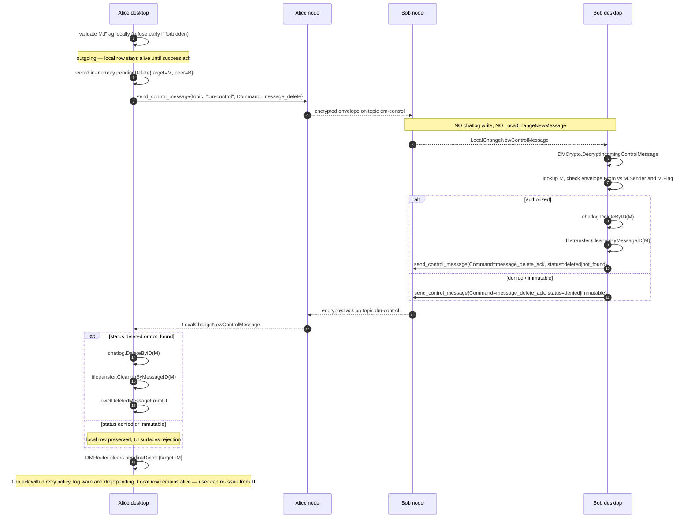
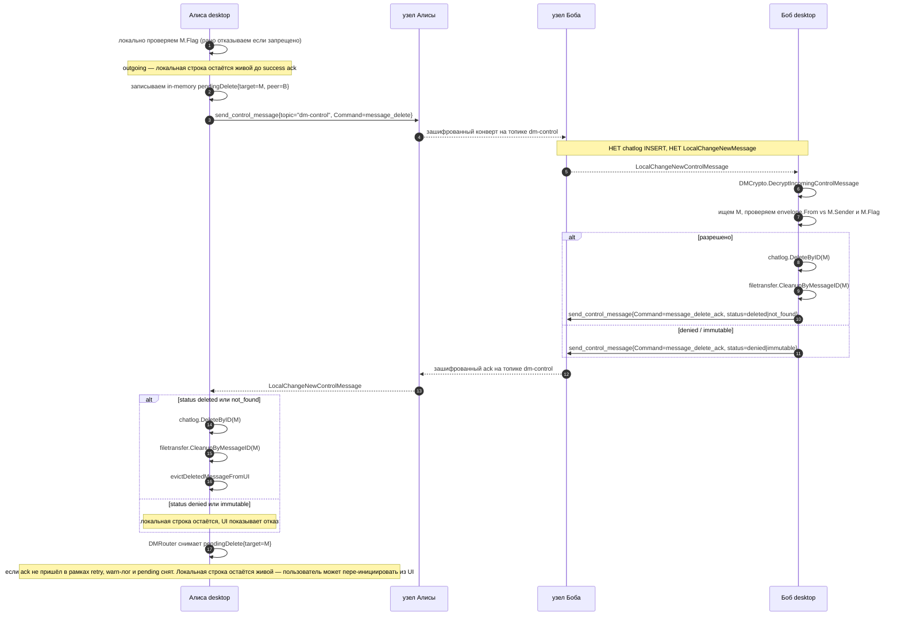

# CORSA DM commands

## English

### Overview

A DM command is typed metadata attached to an encrypted direct message.
Transit nodes see only the outer wire topic (`dm` or `dm-control`); command
dispatch happens after the recipient decrypts the envelope.

Two classes of DM are defined:

- **Data DMs** are recorded in chatlog and surface in the chat thread.
  - `file_announce` — pre-existing. Announces an outbound file transfer;
    the message is recorded in chatlog as a regular DM and additionally
    registers a file-transfer mapping on the receiver via
    `FileTransferBridge`.
- **Control DMs** are not recorded in chatlog and never surface in the
  chat thread. They travel on a dedicated wire topic so neither the
  sender's nor the recipient's node persists them, and neither side
  emits a `LocalChangeNewMessage` for them.
  - `message_delete` — new. Asks the recipient to remove a previously
    delivered data DM from their chatlog (and any state attached to it,
    such as receiver-side file-transfer mappings and downloaded blobs).
    The request is honoured **only if the target message's `MessageFlag`
    permits the deletion** for the requesting peer (see the
    Authorization section below for the full matrix); otherwise the
    receiver rejects the request with `message_delete_ack` (`denied` or
    `immutable`) and leaves the chatlog entry and all attached state
    intact.
  - `message_delete_ack` — new. The recipient's reply confirming how the
    `message_delete` was resolved. Also a control DM and not stored.

#### Reliability guarantees

The pair `message_delete` + `message_delete_ack` is designed so the
sender can know with certainty whether the deletion was received and
processed. The full mechanics are specified later in this document; the
guarantees the rest of the system can rely on are:

1. **The recipient must reply.** Every inbound `message_delete` produces
   a `message_delete_ack` (one of four terminal statuses), unless the
   payload itself is malformed or the signature fails — those are
   protocol-level errors and the sender retries. The recipient never
   silently drops a well-formed authenticated `message_delete`.
2. **Four explicit ack statuses.** The status is always one of
   `deleted`, `not_found`, `denied`, `immutable`. In particular,
   `not_found` is the documented response when the recipient does not
   have the target message at all (already deleted, never received,
   wrong ID) — this is reported back so the sender can stop retrying
   and surface the outcome to the UI.
3. **The sender retries until it gets an ack** or until the retry
   budget is exhausted (initial 30 s, exponential backoff ×2, cap 300 s,
   max 6 dispatches total — one initial plus five retries). Pending
   entries are kept **in memory only** in the current implementation;
   a process restart drops the in-flight retry queue.

   **Local deletion is gated on the ack** (pessimistic ordering).
   For an outgoing message, `chatlog.DeleteByID` and the file-transfer
   cleanup hook run inside `handleInboundMessageDeleteAck` only when
   the peer's ack is `deleted` or `not_found`; on `denied` /
   `immutable` / abandoned the local row stays so the user sees the
   rejection instead of a silent divergence. Incoming local-only
   deletes (the user removes their view of a peer's message) and
   recovery `!found` deletes are the only sender paths that mutate
   chatlog before / without a wire ack.

   JSON persistence rendezvous-ed alongside `transfers-*.json` is a
   tracked follow-up; until it lands the UI surfaces in-process
   budget exhaustion via `TopicMessageDeleteCompleted` with
   `Abandoned=true` but cannot signal an abandonment caused by
   restart. After a restart-driven abandonment the local row stays
   intact (because we never deleted it pre-ack) and the user can
   re-issue the delete from the UI.
4. **Idempotent on the recipient.** A duplicate `message_delete` after
   the row is already gone produces the same `not_found` ack as the
   first one. A duplicate request after a successful delete also
   produces `not_found`. The sender treats both `deleted` and
   `not_found` as success and clears the pending entry.

### Type model

`domain.DMCommand` is a typed string enumerating commands that may appear
inside `domain.OutgoingDM.Command`. It is separate from
`domain.FileAction`, which now narrowly identifies file-transfer protocol
frames (`chunk_request`, `chunk_response`, `file_downloaded`,
`file_downloaded_ack`) carried inside the `FileCommandFrame` wire format
— **not** DMs.

```
package domain

type DMCommand string

const (
    DMCommandFileAnnounce      DMCommand = "file_announce"
    DMCommandMessageDelete     DMCommand = "message_delete"
    DMCommandMessageDeleteAck  DMCommand = "message_delete_ack"
)

// Valid accepts the empty command (the regular text-DM case) plus the
// three named values. Empty must remain valid because callers that
// build a plain text OutgoingDM leave Command unset; rejecting it here
// would force every caller to special-case the empty string.
func (c DMCommand) Valid() bool {
    switch c {
    case "", DMCommandFileAnnounce, DMCommandMessageDelete, DMCommandMessageDeleteAck:
        return true
    default:
        return false
    }
}

// IsControl reports whether the command identifies a control DM
// (message_delete, message_delete_ack). The empty command and
// DMCommandFileAnnounce are data DMs, not control.
func (c DMCommand) IsControl() bool {
    switch c {
    case DMCommandMessageDelete, DMCommandMessageDeleteAck:
        return true
    default:
        return false
    }
}
```

`OutgoingDM.Command` switches type from `FileAction` to `DMCommand`.
`service.DirectMessage.Command` follows. The wire shape of the encrypted
plaintext (`directmsg.PlainMessage.Command string`) is unchanged — strings
on the wire, typed at the domain boundary.

Empty command remains the regular text-DM case; callers validate only
non-empty commands with `DMCommand.Valid()`.

`DMCommand.IsControl()` is the canonical predicate that splits data DMs
from control DMs. Send and receive code paths branch on this predicate,
not on string comparisons.

`domain.FileActionAnnounce` is removed: the announce action belongs to the
DM channel, not to the file-command channel. Existing call sites are
migrated to `DMCommandFileAnnounce`.

### Payloads

```
package domain

type MessageDeletePayload struct {
    TargetID MessageID `json:"target_id"`
}

type MessageDeleteStatus string

const (
    MessageDeleteStatusDeleted   MessageDeleteStatus = "deleted"   // row was present and is now gone
    MessageDeleteStatusNotFound  MessageDeleteStatus = "not_found" // no row for target_id; idempotent success
    MessageDeleteStatusDenied    MessageDeleteStatus = "denied"    // flag did not authorize this peer
    MessageDeleteStatusImmutable MessageDeleteStatus = "immutable" // flag forbids deletion outright
)

type MessageDeleteAckPayload struct {
    TargetID MessageID           `json:"target_id"`
    Status   MessageDeleteStatus `json:"status"`
}
```

Both payloads are encoded as JSON in the encrypted plaintext's
`command_data`. `Body` is empty for control DMs — control DMs travel on a
dedicated wire topic (see Send / Receive paths) and the body validation
that `DMCrypto.SendDirectMessage` performs for data DMs is bypassed by the
control path. The receiver's control handler discards `Body` regardless.

`MessageDeleteStatusDeleted` and `MessageDeleteStatusNotFound` are both
success outcomes from the protocol's perspective: the sender stops
retrying and **then** runs the post-ack DELETE path
(`chatlog.DeleteByID` + `OnMessageDeleted` + `evictDeletedMessageFromUI`)
inside `handleInboundMessageDeleteAck`. Pessimistic ordering means
local mutation happens HERE, not in `SendMessageDelete`.

`Denied` and `Immutable` are terminal failures: the sender stops
retrying and surfaces an error to the UI. There is nothing to roll
back — the outgoing local row was never deleted in the first place,
and the post-ack DELETE path simply does not run for these statuses.
The chat thread visibly diverges from the user's intent (they asked
the peer to delete, the peer refused), and that divergence stays
on screen so the user can decide what to do next.

### Authorization

Each chat message carries a `protocol.MessageFlag` recorded in
`chatlog.Entry.Flag`:

| Flag                | Who may delete on the wire                                    |
|---------------------|---------------------------------------------------------------|
| `immutable`         | Nobody. `message_delete` is rejected.                         |
| `sender-delete`     | Only the original sender of the target message.               |
| `any-delete`        | The original sender or recipient.                             |
| `auto-delete-ttl`   | Same as `sender-delete` until the TTL elapses, then expires.  |
| empty / unknown     | Treated as `sender-delete` (current default policy).          |

The receiver enforces this when an inbound `message_delete` arrives:

1. Resolve `M = chatlog.Get(target_id)`. If absent — log idempotent skip
   and reply with `message_delete_ack { status: "not_found" }`; no
   chatlog or file-transfer cleanup runs.
2. Read `M.Flag`.
3. If `immutable` — reply ack `immutable` with a warn log and skip.
4. If `sender-delete` (or empty) — require `from == M.Sender`. Otherwise
   reply ack `denied`.
5. If `any-delete` — require `from == M.Sender || from == M.Recipient`.
   Otherwise reply ack `denied`.
6. If `auto-delete-ttl` — same as `sender-delete`; the TTL itself is enforced
   independently by the chatlog's expiry sweeper.

`from` is the verified DM envelope sender (after signature check), not a
self-reported field inside the plaintext payload.

The local sender (UI) re-runs the same check before submitting the
`message_delete`: if the local-side flag forbids the action, the operation
is refused before any network traffic.

### Send path (control DM, sender side)

A control DM must not appear in the sender's chatlog or chat thread, and
must not produce a UI echo. The existing `DMCrypto.SendDirectMessage` is
the wrong tool: it routes through `node` Frame `send_message`, which
writes the outbound row to chatlog and emits `LocalChangeNewMessage` so
the sender's UI renders the message. Reusing it would surface
`message_delete` as a visible `[delete]` line in the sender's own chat.

The control path is a separate function and a separate node Frame:

```
package service

// DMCrypto.SendControlMessage encrypts a control DM and submits it on
// the dedicated control wire topic. It does not write to chatlog, does
// not return a DirectMessage echo, and does not invalidate the UI
// thread. Body is empty; Command must satisfy DMCommand.IsControl().
func (d *DMCrypto) SendControlMessage(
    ctx context.Context,
    to domain.PeerIdentity,
    cmd domain.DMCommand,
    payload string,
) (domain.MessageID, error)
```

Internally it calls `LocalRequestFrame` with the new Frame type
`send_control_message` and `Topic = "dm-control"`. The node's
`send_control_message` handler:

1. Verifies the topic is `dm-control` and the body is well-formed
   ciphertext.
2. Submits the encrypted envelope to mesh routing using the same path
   as `send_message`.
3. **Skips** the chatlog write that `send_message` performs.
4. **Skips** publishing `LocalChangeNewMessage`.
5. Returns `message_stored`-equivalent ack so the caller knows the wire
   handoff succeeded (this is **not** the recipient ack — see
   "Acknowledgement and retry" below).

The dedicated topic `dm-control` is visible to relays, the same way
`dm` and `gazeta` are visible. This is an intentional metadata leak:
relays can tell that a unit of traffic is a control DM (vs. a data DM).
The mitigation is volume — control DMs are rare, so the side-channel
signal is small. Hiding the distinction would require putting control
DMs on the same `dm` topic, which forces every node to write every
inbound DM to chatlog before it can be classified — that contradicts
the no-storage invariant.

### Receive path (control DM, recipient side)

Control DMs reuse the existing `storeIncomingMessage` entry point and
branch internally on `msg.Topic == TopicControlDM`. There is no
separate `storeIncomingControlMessage` function — the divergence is
expressed as gates inside the shared path so that the locking
discipline (`knowledgeMu` → `gossipMu` sequential, see
`docs/locking.md`) remains identical to the data-DM path and no new
cross-domain edge is introduced. The control-specific behaviour is:

1. `dispatchNetworkFrame` lands the inbound frame in
   `handleInboundPushMessage` / `handleRelayMessage` exactly like a
   data DM. The non-DM verifier gate exempts both `"dm"` and
   `TopicControlDM` (`protocol.IsDMTopic`), so the per-message
   signature verification in `storeIncomingMessage` (`VerifyEnvelope`)
   is the only authenticity gate.
2. Inside `storeIncomingMessage` the topic branch fires three
   divergences from the data-DM path:
   - the chatlog `messageStore.StoreMessage` call is skipped;
   - the `s.topics[msg.Topic] = append(...)` is skipped (control
     envelopes never enter `s.topics["dm-control"]`, which keeps
     `retryableRelayMessages` and `queueStateSnapshotLocked` from
     accumulating dead state);
   - the `LocalChangeNewMessage` / `emitLocalChange` block is
     replaced with a `LocalChangeNewControlMessage` publication on
     `ebus.TopicMessageControl`, and the publication only fires when
     `msg.Recipient == s.identity.Address` so the sender side does
     not receive its own outbound control DM as if it were inbound.
3. `DMCrypto.DecryptIncomingControlMessage` (a parallel of
   `DecryptIncomingMessage`) decrypts the envelope and returns
   `(domain.DMCommand, commandData string, sender, ok)`. If the inner
   command is not `IsControl()` the event is dropped — that closes the
   hole where a peer could try to inject a data command through the
   control wire.
4. `DMRouter` subscribes to `ebus.TopicMessageControl` and dispatches
   per `DMCommand`:
   - `message_delete` → `handleInboundMessageDelete`
   - `message_delete_ack` → `handleInboundMessageDeleteAck`
5. Unknown commands are logged at debug and dropped.

The chatlog is **never** touched on the inbound control path until the
authorization-passing branch of `handleInboundMessageDelete` calls
`Store.DeleteByID(target_id)`. There is no transient row, no transient
event, no UI flash.

Transit-only relays (control DM passes through this node, but the
recipient is somebody else and there is no direct peer / table route /
gossip-capable target) take the no-store fallback in
`handleRelayMessage` and return the empty status `""` upstream — the
data-DM "stored" fallback is **not** taken for control DMs because
their no-op store would still ack as if the relay succeeded. Sender's
`pendingDelete` retry then treats the attempt as a miss and tries
again.

### Acknowledgement and retry

A control DM is an unreliable wire send: relays may drop it, the peer
may be offline, the peer's process may have died between receiving and
processing. The sender therefore tracks pending `message_delete` and
retries until the recipient's `message_delete_ack` (any terminal status)
arrives.

```
type pendingDelete struct {
    target      domain.MessageID
    peer        domain.PeerIdentity
    sentAt      time.Time
    nextRetryAt time.Time
    attempt     int
}
```

Retry policy mirrors the file-transfer manager's chunk-request retry:

- Initial timeout 30 s.
- Exponential backoff (×2), capped at 300 s.
- Maximum **6 dispatches total** — one initial dispatch in
  `SendMessageDelete` plus up to 5 retries in `processDeleteRetryDue`.
  `recordAttempt` retires the pending entry the moment the 6th
  dispatch is recorded; there is no 7th send.
- On retire, a `warn` is logged with `target_id` and `peer`,
  `TopicMessageDeleteCompleted` is published with `Abandoned=true`,
  and **the local sender row stays alive**. Pessimistic ordering
  never deleted it pre-ack, so an abandoned delete simply means the
  peer never confirmed and the user can re-issue the request from the
  UI. The chat thread therefore visibly diverges from the user's
  intent until either the peer becomes reachable again (next manual
  retry) or the user removes the conversation entirely
  (DeletePeerHistory).

Pending entries live **in memory only** in the current implementation.
A process restart loses the in-flight retry queue. Because the local
row is kept until ack, restart leaves the user's chat thread intact —
the deletion simply never completed and can be re-issued. The UI
surfaces in-process budget exhaustion explicitly through
`TopicMessageDeleteCompleted` with `Abandoned=true`; **no equivalent
signal is emitted across a restart**, by design.

Adding JSON persistence rendezvous-ed at a path alongside
`transfers-*.json` is a tracked follow-up. Until it lands, callers
should treat sender-side delete delivery as best-effort across crash:
the local row stays alive (no rollback needed) but the wire request
may need to be re-issued by the user if a restart interrupts retry.

The recipient is fully idempotent: a duplicate `message_delete` after
the row has already been deleted produces the same `not_found` ack as
the first one. The sender treats `not_found` as success and clears the
pending entry. Stale acks (for a `target_id` that has no pending entry)
are dropped silently.

### Idempotency

`chatlog.Store.DeleteByID` returns `(false, nil)` when the row is absent.
The control handler maps this to `MessageDeleteStatusNotFound` and replies
with the corresponding ack. A peer who retries `message_delete` because
it never saw the previous ack will receive the ack again; no error is
ever raised back into the wire.

### Cleanup hooks

After `chatlog.Store.DeleteByID(M)` succeeds, the control handler invokes a
generic cleanup chain. For now there is one hook:

- `filetransfer.Manager.CleanupTransferByMessageID(domain.FileID(M.ID))` —
  if `M` was a `file_announce`, this drops the matching sender or receiver
  mapping, releases the transmit-blob ref count (sender side), and deletes
  any partial or completed blob in the download directory (receiver side).
  Idempotent: a no-op when there is no mapping for that ID.

Future DM types can register additional cleanup callbacks against this
chain; the chain is order-independent because each callback is scoped to
its own domain.

### Local-only deletion (UI scope)

The desktop file-tab "Delete" button covers two cases:

- **Outgoing** (we are the sender): pessimistic. Send
  `message_delete` to the peer; local chatlog row + file-transfer
  state are removed only when the peer's `message_delete_ack` carries
  `deleted` or `not_found`. On `denied` / `immutable` / abandoned the
  local row stays so the user sees the rejection.
- **Incoming** (peer is the sender): local cleanup only. We **do not**
  send `message_delete` to the peer for an incoming message — under the
  default `sender-delete` policy the peer would reject it anyway, and we
  do not own their outgoing record. Local chatlog DELETE +
  file-transfer cleanup + UI eviction run synchronously inside
  `SendMessageDelete`. If the message is `any-delete` we may
  optionally send the request; this is a future extension and is
  **not** implemented in this iteration.

### Bulk wipe (`conversation_delete`)

`conversation_delete` is the bulk counterpart of `message_delete`.
The sidebar context menu entry "Delete chat for everyone" wipes the
entire conversation with one peer on **both** sides in a single
control round-trip, without iterating per-row from the UI.

Wire-level:

- New control DM commands `DMCommandConversationDelete` and
  `DMCommandConversationDeleteAck`. Both travel on the same
  `dm-control` topic as `message_delete`. `IsControl()` returns true
  for both; they are not stored in chatlog and never appear in the
  chat thread.
- `ConversationDeletePayload` carries only a `RequestID` (UUID v4,
  typed as `ConversationDeleteRequestID` for domain typing). The
  conversation peer is derived from the verified envelope sender
  on the recipient side, so a forged payload cannot redirect the
  wipe to a different conversation. No row list, no scope, no
  cutoff — the wire payload stays compact regardless of chat
  history size, so the wipe is deliverable for arbitrarily large
  threads through the standard control-DM path
  (`node.maxRelayBodyBytes` is never at risk).

  Each side runs the wipe against its own FROZEN scope, NOT
  against current chatlog at apply time:

  - The receiver, on first contact for a `(peer, requestID)`,
    inside `handleInboundConversationDelete` /
    `processInboundConversationDeleteFreshGather`, gathers every
    non-immutable row currently in chatlog with the peer and
    pins that set in `inboundConvDeleteCache`. Every subsequent
    retry of the same requestID operates ONLY against that
    cached frozen set — partial-failure retries re-attempt only
    the cached survivors, lost-ack replays return the cached
    outcome without touching chatlog at all. Rows the peer
    authored after first contact are not in the frozen scope
    and stay on the receiver side.
  - The sender, inside `applyLocalConversationWipe` called
    from the ack handler, applies the same predicate
    constrained by an in-memory **local snapshot** taken at
    click time (`pendingConversationDelete.localKnownIDs`):
    a row whose id is NOT in the snapshot is OUTSIDE the
    sender's cleanup scope and stays on the sender side.
    Out-of-scope does NOT imply "the user never saw it" or
    "the peer kept it" — self-authored `sent` rows are
    visible in the user's own UI and are deliberately kept
    off the snapshot (see the inclusion rule below), and
    depending on delivery ordering the peer may still have
    wiped its copy of such a row. The snapshot's contract
    is local-only: it bounds what we will delete on THIS
    side after the peer confirms; it makes no symmetric
    promise about peer-side survival. The snapshot lives in
    pending only and never travels on the wire — the
    payload remains intent-only.

  Immutable rows are the universal carve-out and stay on both
  sides regardless of snapshot or frozen-scope membership.

  **Snapshot inclusion rule.** `snapshotLocalKnownConversationIDs`
  applies a delivery-aware filter so the snapshot describes only
  rows whose state the peer is also expected to know about:

  - Inbound rows (peer-authored): always included. The peer
    obviously has them — they are in the peer's first-contact
    gather scope and the receiver-side wipe will remove them.
  - Outbound rows (self-authored): included only when
    `chatlog.Entry.DeliveryStatus` is `delivered` (peer node
    ACK'd receipt) or `seen` (peer user opened the
    conversation). Outbound rows still in `sent` state — the
    local node accepted them but the peer node has not yet
    confirmed receipt — are EXCLUDED from the snapshot.
  - Immutable rows: skipped.

  The exclusion of `sent` outbound rows closes a hole the
  drain step alone cannot fix: `CompleteConversationDelete`
  drains in-flight `SendMessage` / `SendFileAnnounce`
  goroutines, but those goroutines return on LOCAL handoff
  (the local node's `send_message` reply), not on peer
  receipt. A row that's local-accepted-but-not-yet-delivered
  at click time is still in chatlog, and including it in
  `localKnownIDs` would mirror-wipe it on this side after
  the applied ack while the data DM was still in the
  outbound queue — when the data DM later reached the peer
  AFTER `conversation_delete` had already been processed
  there, the peer's gather would not include it (it arrived
  late), the peer would store it normally, and we would have
  a receiver-only row. By excluding `sent` outbound rows we
  always keep them on this side; the peer's outcome depends
  on delivery ordering:

  - Peer receives the data DM AFTER its first-contact gather
    for `conversation_delete` (the queue happens to deliver
    `conversation_delete` first, which is the typical case
    when both messages were enqueued before the click): the
    peer's frozen scope does not include the row, the peer
    stores it normally → both sides hold the row
    (symmetric).
  - Peer receives the data DM BEFORE its first-contact
    gather (the queue delivers the data DM ahead of
    `conversation_delete`): the peer's gather DOES include
    the row, the peer wipes it on its side, but the row
    stays on our side because it was never in
    `localKnownIDs` → asymmetric ORIGINATOR-only outcome.

  The asymmetric case mirrors the documented inbound
  late-delivery trade-off (peer-authored row that lands on
  our side after the click survives only on our side); both
  asymmetries leave the row alive on the originator of that
  row. The protocol's contract is "wipe the sender's
  peer-confirmed local snapshot, with documented
  out-of-scope asymmetries", NOT a user-saw / both-sides
  symmetry promise — visible self-authored `sent` rows are
  by design excluded from the snapshot, and the
  asymmetric cases are accepted by the design.

  Why the asymmetry: the receiver acts immediately on the
  wipe-arrival event, so its current chatlog snapshot IS the
  scope (anything that arrives after that processing is out of
  scope). The sender acts later (after the ack); without the
  in-memory snapshot the sender would delete rows that arrived
  in the meantime, leaving them gone on the sender's side while
  the peer kept them.

  **Outgoing barrier while pending.** While a wipe is in-flight
  for a peer, `DMRouter.SendMessage` and `SendFileAnnounce`
  refuse new sends with the typed `ErrConversationDeleteInflight`
  and the UI disables the composer (the synchronous gate is
  `IsConversationDeletePending`). This closes the race where a
  user-authored message would otherwise reach the peer's
  chatlog after the peer's wipe ran but before the sender's
  post-ack sweep — leaving a row gone on the receiver and
  present on the sender. The barrier lifts only when the pending
  entry is removed — on a success ack or on abandonment. A
  transient error ack keeps the pending entry alive and the retry
  loop running, so the barrier stays raised until the next
  definitive outcome.

  **Two-phase sender API.** The router exposes the wipe in two
  steps so the barrier closes synchronously with the user's click:
  `BeginConversationDelete(peer)` reserves the pending entry on
  the calling thread (no I/O) and returns the minted requestID;
  `CompleteConversationDelete(ctx, peer, requestID)` then runs
  the chatlog snapshot + initial wire dispatch and is safe to
  invoke from a background goroutine. The desktop UI calls Begin
  on the event-loop thread before launching the goroutine for
  Complete; without that split, the goroutine-start window would
  let a fast Enter / click slip past the barrier check and reach
  the peer ahead of `conversation_delete`. The convenience
  wrapper `SendConversationDelete(ctx, peer)` runs both phases
  inline and is reserved for tests / call sites that do not
  return to a UI event loop.

  Each pending entry carries a `prepared` flag that gates the
  retry loop. Begin installs the entry with `prepared=false`
  (synchronous barrier latch only — `IsConversationDeletePending`
  reports true and `SendMessage` / `SendFileAnnounce` reject
  immediately, but the retry-loop's `dueEntries` skips it).
  Complete's `attachLocalKnownIDs` call promotes the entry to
  `prepared=true` after the click-time snapshot is in place;
  only then does the retry loop become eligible to redispatch
  the wipe. This gate is load-bearing: if the retry loop saw
  unprepared entries it could fire a wipe whose eventual applied
  ack would call `applyLocalConversationWipe` with a `nil`
  `localKnownIDs` and silently report "wiped on both sides" while
  every local row stayed intact. As a watchdog against stranded
  reservations (e.g. caller crashes between Begin and the
  goroutine that runs Complete), the retry loop also reaps
  unprepared entries older than `convDeleteReservationTTL` and
  publishes an `Abandoned=true` outcome so the UI's status
  string transitions out of "dispatching…".

  Complete also waits for the per-peer **in-flight send drain**
  before snapshotting `localKnownIDs`. `SendMessage` and
  `SendFileAnnounce` go through a single atomic
  `convDeleteRetry.acquireSendIfNoPending(peer)` call on the
  synchronous thread: under the same mutex that guards the
  pending entry map, this either rejects the send (a wipe is
  already pending, return `ErrConversationDeleteInflight`) or
  increments a per-peer in-flight counter. The matching
  `releaseSend(peer)` runs in the send goroutine via `defer`
  once the local node's `send_message` reply lands. There is
  no separate has → Acquire → Begin race window — the atomic
  acquire collapses the check and the increment.
  `CompleteConversationDelete` resolves the drain via
  `inflightDrainedChan(peer)`, blocking on the returned
  channel inside a `context.WithTimeout(ctx, 10*time.Second)`
  until the counter reaches zero (chan closed) or the deadline
  elapses. **On drain timeout Complete does NOT snapshot** —
  proceeding would reopen exactly the divergence the barrier is
  meant to close. Instead it ROLLS BACK the reservation
  (lifting the outgoing barrier) and returns an error; the UI
  surfaces this through the generic "wipe failed" status path
  and the user can re-click once the in-flight sends settle.
  New sends started AFTER Begin observe the pending entry under
  the same mutex and bounce with `ErrConversationDeleteInflight`
  before incrementing the in-flight counter.

  Complete starts with a `claimForCompletion` step that refreshes
  the reservation's TTL anchor (`reservedAt = now`) before the
  snapshot runs. This closes the race where a slow goroutine
  startup or a snapshot near the TTL boundary would let the
  reaper drop the entry while Complete is still working. If the
  claim itself fails (the reaper had already pruned the entry
  before the goroutine reached us), Complete returns the typed
  `ErrConversationDeleteReservationLost`; the desktop UI checks
  `errors.Is` and suppresses its "wipe request sent" status,
  since no wire command went out under this requestID — the
  reaper's earlier `Abandoned=true` outcome is the correct
  user-facing message and the UI subscriber has already turned
  it into the localised "abandoned" status string.

  After Complete returns nil the desktop UI writes the "wipe
  request sent" status through `SetSendStatusIfCurrent` rather
  than `SetSendStatus`. The atomic compare-and-swap matches the
  expected "dispatching…" value the same handler had set just
  before launching the goroutine; if a fast peer ACK has already
  driven the subscriber to a terminal status (applied, abandoned,
  applied + LocalCleanupFailed), the live value no longer matches
  and the CAS is a no-op. Without this guard the goroutine could
  overwrite a terminal outcome with "waiting for peer" because
  the subscriber and the dispatch goroutine race on a plain
  string field.

  **Remaining late-delivery race (known trade-off).** A message
  the peer SENT before receiving the wipe but that was still in
  flight to the originator can land on the originator's side
  AFTER the wipe completes. The peer will already have wiped
  its outgoing copy at command-arrival; the originator now
  sees a row that the peer no longer has. The local-snapshot
  gate prevents the originator's post-ack sweep from deleting
  it (it was not in the click-time snapshot), so it stays
  visible on the originator's side as a single asymmetric row.
  The UI status string warns about this and recommends a
  single-message `message_delete` to reconcile. Tombstones (see
  below) cancel only the re-replay class (the SAME envelope
  arriving again after we deleted it). Closing the in-flight
  class fully requires either a delivery-queue cancellation
  hook on the peer side or a cutoff/timestamp on the wire —
  both tracked follow-ups.

  **Tombstones against late-replay resurrection.** After a
  successful wipe (both sender post-ack sweep AND receiver-side
  sweep) the removed ids are recorded in an in-memory tombstone
  set with a TTL of `wipeTombstoneTTL` (1 hour); each id is
  pre-marked inside the delete loop so a replay arriving in the
  window between `DeleteByID` and the post-loop bookkeeping is
  also caught. When `onNewMessage` fires for a re-delivered
  envelope (relay retry, network reorder, peer resend during the
  inbox-replay window), it consults the set first and silently
  re-DELETEs the row + evicts the active conversation cache
  before the new-message UI path runs. Without this guard a row
  the user just wiped would be silently re-inserted by
  `storeIncomingMessage`, because the original chatlog row is
  gone and the dedup gate (`seenMessageIDs`) was deliberately
  cleared as part of the wipe. The tombstone set is in-memory
  only; a process restart drops it. A persistent tombstone
  column on `chatlog.Entry` is a tracked follow-up. The
  tombstone is also reactive — node-level state
  (`s.topics["dm"]`, fetch_dm_headers, gossip) may still surface
  the wiped envelope through paths that bypass `onNewMessage`;
  pushing the tombstone gate down into the node admission path
  is a tracked follow-up.
- `ConversationDeleteAckPayload` echoes `RequestID` back and carries
  `Status` (`applied` / `error`) and `Deleted` (number of rows
  actually removed on the recipient side). The sender matches an
  inbound ack to its pending entry on (envelope sender, RequestID),
  not envelope sender alone — a late ack from an abandoned earlier
  wipe must NOT silently retire a fresh pending wipe to the same
  peer (otherwise the local sweep would run before the new wipe was
  applied on the recipient). The retry loop reuses the SAME
  RequestID across all dispatches of one request; a fresh
  SendConversationDelete mints a new one.

Authorization deliberately diverges from `message_delete`. The
receiver walks every chatlog row of the conversation with the
envelope sender and removes every non-immutable row regardless of
authorship. Reusing the per-row `authorizedToDelete` matrix would
refuse rows the requester did not author — under the default
`sender-delete` flag (which every regular DM carries) that means
half the thread survives on each side after a "wipe everything"
gesture, directly contradicting the user-visible promise of the
sidebar menu entry.

The bulk gesture is treated as mutual consent to forget the thread,
authorised by an explicit two-click UI confirmation, so it carries
stronger authority over peer-authored rows than a single
`message_delete` would. The only carve-out is `immutable`: those
rows stay on both sides because the flag is a hard "this row is part
of the permanent record" promise (e.g. for legal evidence or
tamper-evident logs) that bulk consent cannot override.

A narrower predicate runs locally on the sender side **after** the
peer's success ack lands (see `applyLocalConversationWipe`): the
sender deletes only the **intersection** of the current chatlog
with the click-time `localKnownIDs` snapshot captured in
`SendConversationDelete`. Rows OUTSIDE the snapshot — late inbound
from the peer, self-authored outbound rows still in
`DeliveryStatus="sent"` at click, or anything else the snapshot
filtered out — stay on this side; this is purely a LOCAL cleanup
scope contract. Whether such a row also survives on the receiver
depends on delivery ordering: a post-click outbound row can
reach the peer BEFORE the peer's first-contact gather and be
wiped there, leaving it alive only on the originator (the
documented originator-only asymmetry), or arrive AFTER and stay
on both sides. Immutable rows are skipped on both sides. The
asymmetric scoping closes the post-snapshot wipe-it-on-our-side
hole without making any symmetric peer-side promise.

Ordering on the sender side matches `message_delete`: **pessimistic**.
Local rows STAY in chatlog until the peer's
`conversation_delete_ack` arrives with status `applied`; the wipe
then runs inside `handleInboundConversationDeleteAck` and only then
mutates local state. A `error` / abandoned ack leaves the local
rows alive so the user can re-issue the request rather than discover
later that one side still holds the history. Abandonment surfaces
as `Abandoned=true` on `ebus.TopicConversationDeleteCompleted` so
the UI can warn the user that local rows are kept and the peer side
was not confirmed.

Per-row failure on the receiver side downgrades the ack: if even one
non-immutable row's `chatlog.DeleteByID` returns an error,
`sweepInboundDeleteScope` reports the row in `survivors` and the
inbound handler (`processInboundConversationDeleteFreshGather` or
`processInboundConversationDeleteReplay`) commits an `error` ack
instead of `applied`. The sender therefore does NOT mirror the wipe locally,
the retry loop schedules another attempt, and the next round picks
up the surviving rows (rows the previous attempt removed are gone —
`DeleteByID` is idempotent). This guarantees the
"delete on the recipient first, then mirror" contract: local rows
are wiped only when the peer is fully consistent.

**Receiver-side frozen scope per `(peer, requestID)`.** The
receiver pins the candidate set on FIRST apply and reuses it on
every retry — chatlog reads only happen on the first apply, never
on retries. Cache entries live in `inboundConvDeleteCache` keyed
by `(envelopeSender, requestID)`. TTL details are described
further down in this section ("Cache TTL is …"). The entry
carries the frozen `candidates` set, the current `survivors`
subset (rows whose `DeleteByID` failed in the most recent
attempt), `gatheredScope` (false for gather-failed tombstones,
true otherwise), the last reported `(status,
cumulativeDeleted)`, and the cache timestamp.

Behaviour:

- **First apply**: read CURRENT chatlog, capture every
  non-immutable id as `candidates`, sweep them once, cache
  `(candidates, survivors, status, deleted)`. Survivors are the
  candidates whose `DeleteByID` errored.
- **Lost-ack retry** (survivors empty): replay the cached
  `(status, deleted)` ack without touching chatlog at all.
- **Partial-failure retry** (survivors non-empty): re-attempt
  `DeleteByID` for each survivor; rows that succeed or are
  already-gone (idempotent `removed=false`) are dropped from
  survivors; rows that still error stay. The receiver's CURRENT
  chatlog is NEVER iterated again — rows the peer added between
  the first apply and the retry are NOT in `candidates` and are
  therefore NEVER swept.
- **Gather failure on first apply** (chatlog read error): a
  TOMBSTONE entry is cached with `gatheredScope=false` and
  `lastStatus=Error`. Future retries of the same `(peer,
  requestID)` short-circuit on the tombstone and reply Error/0
  WITHOUT attempting another gather — even if chatlog has
  recovered in the meantime. A recovered cold-gather would pick
  up rows that arrived after first-seen, expanding scope past
  the sender's `localKnownIDs` snapshot. Sender exhausts its
  retry budget on these Error replies and abandons; the user can
  re-issue with a fresh requestID once the backend is stable.
- **Fresh wipe** (different `requestID`): bypasses the cache and
  captures a brand-new candidate set, so a user re-clicking after
  a successful mirror is still honoured.

Cache TTL is `inboundConvDeleteCacheTTL` (30 minutes) —
comfortably above the sender's worst-case retry timeline
(~15 min). Beyond the active scope cache, a separate long-lived
MINIMAL-OUTCOME set `inboundConvDeleteSeen` (TTL
`inboundConvDeleteSeenTTL`, 1 year) carries each
`(peer, requestID)` plus the last
`(status, cumulativeDeleted)` recorded for it long after the
heavy scope data has been reaped. The lookup deliberately does
NOT lazy-delete past TTL — it returns three states (no entry,
fresh entry, expired-but-present entry); only the reaper purges
expired entries on its own cadence. An expired-but-present hit
is replayed CONSERVATIVELY as Error/0 so a long-suspended
sender (laptop sleep keeping a pending entry alive across the
TTL boundary) still gets refused a fresh cold-gather that would
silently widen scope past its localKnownIDs. `handleInboundConversationDelete`
consults the seen-set ONLY when the live cache reports a miss
(via `claimColdOrReplay` returning `inboundClaimCold`); a live
cache entry, including one with non-empty survivors waiting for
a partial-failure retry, ALWAYS wins. Without that ordering a
seen entry recorded by the first apply (`status=Error`,
`cumulativeDeleted=N`) would short-circuit the very retry that
is supposed to sweep the survivors and the request would be
forced into retry-budget abandonment despite having recoverable
work pending. On a confirmed cache miss the seen-set replays
its minimal outcome:

- **Status=Applied** → reply `(Applied, cumulativeDeleted)`.
  This is the load-bearing case: a sender retry that arrived
  after the active cache evicted (e.g. wall-clock-paused
  laptop) still gets the same successful ack the original
  apply would have replayed, so the sender's local mirror
  runs and the two sides converge.
- **Status=Error** → reply Error/0. This covers gather-failed
  tombstones and partial-failure outcomes whose survivor list
  has been lost; sender abandons or user re-issues with a
  fresh requestID. At the seen-set fallback layer the same
  requestID can no longer transition to Applied — the heavy
  scope is gone, there are no survivors to sweep, and a
  gather-failed tombstone is permanent by design.
  `cumulativeDeleted` is retained on the seen entry purely
  for diagnostics (it preserves the running total observed
  before the heavy scope was reaped); the wire ACK still
  carries `Deleted=0` on the Error replay to match the
  documented non-Applied wire contract.

Memory cost has two layers. The full payload (status,
cumulative, gathered, seenAt) lives in `entries` and is bounded
by the number of unique `(peer, requestID)` tuples seen in the
active retention window. `record` REFRESHES `seenAt = now` on
every call — including every commit from
`processInboundConversationDeleteFreshGather` /
`processInboundConversationDeleteReplay` AND every replay
emitted by `replyInboundConversationDeleteFromSeen` — so the
1-year TTL is measured from the last observed activity for
that `(peer, requestID)`, NOT from the genuine first contact.
Sustained sender retries against a known requestID extend the
entry so it cannot fall back into the cold-gather path
mid-stream; once retries stop and a year of silence elapses,
the reaper moves the key to a key-only `tombstones` map and
discards the payload. Tombstones are NEVER reaped (matching
the in-memory-only restart semantics of the rest of the
seen-set) and are returned by lookup as
"present-but-not-fresh" — the caller still refuses a fresh
cold-gather and replies Error/0. This closes the residual
"sender pending state outlives our seen TTL" hole flagged by
review (laptop sleep keeping a pending entry alive past the
seen TTL, then firing a final retry on resume): even after the
full payload is reaped, the key marker still recognises the
requestID and refuses scope widening. Memory cost of a
tombstone is just the key (~50 bytes); over a process lifetime
this remains negligible at any plausible user-driven wipe rate.

Without the frozen scope the retry path (lost-ack OR partial-
failure OR gather-failure-then-recover) would silently widen
the wipe past the sender's `localKnownIDs` snapshot and leave
the two histories divergent on the eventual `applied`.

**Known limitation: receiver process restart drops the cache.**
A sender retry that arrives after the receiver restarts misses
the cache and cold-gathers current chatlog; rows added after the
original first-contact would be swept on the receiver but absent
from the sender's snapshot. Closing this requires persisting the
per-`(peer, requestID)` scope alongside chatlog and is a tracked
follow-up. The shared `message_delete` pending state has the
same in-memory caveat.

Per-row failure on the SENDER side after a success ack arrives is a
separate failure mode: the peer is already consistent, retrying the
wire would not help. The `applyLocalConversationWipe` helper returns
`(deleted, ok)` and `ok=false` on chatlog read failure or any
per-row `DeleteByID` failure. The ack handler then publishes
`TopicConversationDeleteCompleted` with `Status=applied` (the peer
DID wipe its side) **and** `LocalCleanupFailed=true` so the UI can
warn the user that local rows survived the sweep instead of
promising "wiped on both sides".

Retry policy mirrors `message_delete` (initial 30 s, exponential
backoff ×2, cap 300 s, 6 dispatches total). State is keyed by peer
(one in-flight wipe per identity); a duplicate click while a wipe is
pending is a no-op — the cheap `has(peer)` check followed by atomic
`tryAdd` keeps the first request alive and returns nil to the caller,
so the original `requestID` and the original snapshot of locally-
known IDs both survive. The user sees the eventual outcome of the
first request via `TopicConversationDeleteCompleted`. Re-clicking
only takes effect after the first round-trip terminates (success ack
or abandoned). As with `message_delete`, the pending state is
in-memory only and a process restart drops the in-flight retry.

**Final-dispatch ACK grace.** When `recordAttemptIfMatch` bumps
the attempt counter to `convDeleteRetryMaxAttempt` it does NOT
remove the pending entry. Instead it sets `terminalAt = now`;
`dueEntries` then skips the entry (no further wire dispatches),
but the entry stays in the map for `convDeleteTerminalAckGrace`
(60 s) so a successful applied ACK to that final wire send can
still arrive and run the local mirror through the regular
`removeIfMatch` path. The retry loop's `pruneTerminalAckExpired`
sweep drops the entry — and publishes Abandoned — only if the
grace expires without an ACK. Without this grace, the final
wire dispatch could reach the peer, the peer would apply the
wipe and send applied, but the sender's pending entry would
already be gone — the ACK would be dropped by the requestID
guard and local history would survive the wipe even though
peer history was successfully cleared.

The receiver is idempotent under retry through the per-(peer,
requestID) cache and the long-lived seen-set (see "Receiver-side
frozen scope" above). A duplicate `conversation_delete` after a
successful first apply replays the cached
`(status, cumulativeDeleted)` ack — the same non-zero `Deleted`
count the original ack reported, NOT zero — without re-iterating
chatlog. A duplicate AFTER the active scope cache TTL expires is
NOT a cold path: `handleInboundConversationDelete` first
runs `claimColdOrReplay`, which (a) returns
`inboundClaimReplay` if a live cache entry still exists —
the live entry always wins over the seen-set so a
partial-failure retry still gets its survivors swept — or
(b) returns `inboundClaimCold` if the cache is empty/expired,
and ONLY THEN does the handler consult the seen-set inside
the cold branch. A seen-set hit there can resolve to one of
two states:

- **present-and-fresh** — full payload is still within the
  1-year TTL and replays the original outcome: for a prior
  successful apply, `(Applied, cumulativeDeleted)`; for a
  prior gather-failed tombstone or unresolved first contact,
  Error/0.
- **present-but-not-fresh** — either the full payload is past
  TTL but the reaper has not yet moved it to tombstones, OR
  the reaper has already discarded the payload and only the
  key remains in the tombstones map. Both sub-cases reply
  Error/0 CONSERVATIVELY and refuse a fresh cold-gather.

Only a TRUE seen-set MISS (no entry AND no tombstone for
this `(peer, requestID)`) cold-gathers current chatlog —
that is, only a genuinely never-seen requestID. A previously
known requestID whose full seen entry has been reaped past
TTL still resolves to present-but-not-fresh via the
tombstone marker, NOT to a true miss. The sender treats
`applied` (any `Deleted` count) as terminal success and runs
the local sweep; `error` is treated as transient and the
retry loop continues without touching local rows.

UI gating: the sidebar item renders as a non-clickable disabled pill
when the peer is offline (matches the file-card delete pill style).
The click handler re-checks `peerOnline` when the user opens the
confirm step AND when they click Yes — the peer may go offline
between those clicks, and pessimistic ordering would then leave the
user with both an unaltered local chat and an abandoned wire
attempt. The Yes-click guard surfaces a clear status-bar message
("peer went offline") instead of silently spending the retry
budget.

In-flight pending outbound DMs to the wiped peer are **not**
cancelled in this iteration. If a queued message later does land on
the peer, the user can remove it through the regular `message_delete`
flow. Adding a delivery-queue cancellation hook is a tracked
follow-up.

### Wire flow



*Diagram 1 — message_delete propagation with control topic and ack*

### Storage rules for control DMs

Control DMs are kept out of chatlog on **both** sides by routing them on
the dedicated `dm-control` topic. The two diversions are:

| Side    | Path that data DMs follow            | Diversion for control DMs                                     |
|---------|--------------------------------------|---------------------------------------------------------------|
| Sender  | `send_message` → write outbound row + `LocalChangeNewMessage` | `send_control_message` funnels through the same `storeMessageFrame` / `storeIncomingMessage`, which on `TopicControlDM` skips the row write, skips the `s.topics` append, and replaces the LocalChange branch with a recipient-only `LocalChangeNewControlMessage` (no event on the sender's own node) |
| Receiver| `dispatchNetworkFrame` → `storeIncomingMessage` → row + `LocalChangeNewMessage` | Same `storeIncomingMessage`, but on `TopicControlDM` it skips chatlog INSERT, skips `s.topics` append, and emits `LocalChangeNewControlMessage` on `ebus.TopicMessageControl` only when `msg.Recipient == s.identity.Address` |

Consequences:

1. A control DM never appears in any chat thread on either side.
2. There is no `LocalChangeNewMessage` for control DMs, so the regular
   UI message list is not invalidated by their arrival. The bubble for
   the deleted target row `M` is removed from the live conversation
   cache (`ConversationCache.RemoveMessage`) by the delete path itself
   — both `SendMessageDelete` (sender side) and `applyInboundDelete`
   (recipient side) call `evictDeletedMessageFromUI`, which drops the
   cache entry, refreshes the sidebar preview, and emits
   `UIEventMessagesUpdated` + `UIEventSidebarUpdated`. Terminal
   delivery outcomes (`deleted`, `not_found`, `denied`, `immutable`,
   `Abandoned`) are signalled separately via
   `ebus.TopicMessageDeleteCompleted` so callers / RPC clients can
   distinguish a real peer-side deletion from a peer rejection.
3. Receipts (`delivered`/`seen`) are not generated for control DMs.
   Reliability is provided by the application-level
   `message_delete_ack` instead, which carries semantic status the
   delivery receipt cannot express.
4. UI code paths that filter messages by `Command` see only data DMs:
   the file-tab list and the chat thread both query chatlog, and
   chatlog never contained a control DM.
5. Control envelopes also stay out of `node.Service.s.topics[...]`.
   Both `retryableRelayMessages` (the node-level retry loop) and
   `queueStateSnapshotLocked` (the JSON queue persister) read only
   `s.topics["dm"]`; storing control envelopes in
   `s.topics["dm-control"]` would create unread state that grows
   without bound and offers no real retry — the only path that
   actually retries control DMs is the application-level
   `pendingDelete` on the sender side, which terminates on either an
   ack from the peer or the in-process retry budget. The current
   implementation keeps `pendingDelete` in memory only; restart
   abandons in-flight retries (see §"Acknowledgement and retry").
   Routing/push fan-out is unaffected because `executeGossipTargets`
   and `sendTableDirectedRelay` send wire frames on the fly,
   independent of `s.topics`.
6. The node-level `relayRetry` tracker likewise rejects control DMs
   at its entry gate (`trackRelayMessage`). Same reasoning as #5:
   the retry loop only consults `s.topics["dm"]`, so a control entry
   in `relayRetry` would be a dead state burning the
   `maxRelayRetryEntries` quota until tombstone TTL.

### Failure modes

| Situation                                 | Receiver behaviour                                        | Sender behaviour                                       |
|-------------------------------------------|-----------------------------------------------------------|--------------------------------------------------------|
| Target ID not in chatlog                  | Reply ack `not_found`.                                    | Treats `not_found` as success; runs the post-ack DELETE path (no-op when nothing local) and clears pending entry.   |
| Envelope sender ≠ M.Sender (sender-delete)| Reply ack `denied`. Warn log with envelope sender.        | Surfaces error to UI; **leaves the local row intact**; clears pending entry.            |
| `M.Flag == immutable`                     | Reply ack `immutable`. Warn log.                          | Surfaces error to UI; **leaves the local row intact**; clears pending entry.            |
| Inbound control payload malformed JSON    | Drop. Debug log. No ack.                                  | Hits retry budget and gives up; local row remains.     |
| Inbound control DM signature invalid      | Drop in `DMCrypto.DecryptIncomingControlMessage`. No ack. | Hits retry budget and gives up; local row remains.     |
| File-transfer cleanup partially fails     | Errors logged; ack reports `deleted` (chatlog row is gone). | Treats `deleted` as success.                         |
| Peer offline                              | No ack arrives.                                           | Retries on the in-memory schedule (max 6 dispatches) until budget exhausted. |
| Application crashes during in-flight retry | n/a                                                      | `pendingDelete` is in-memory only; restart drops the in-flight retry. **Local row is intact** (pessimistic delete waits for ack), so the user can re-issue the delete from the UI. JSON persistence is a tracked follow-up. |
| Sender retry budget exhausted             | n/a                                                       | Drops pending entry, logs warn with `target_id` + peer, publishes `TopicMessageDeleteCompleted` with `Abandoned=true`. **Local row stays alive** so the user sees that the deletion did not converge. |

### Migration notes

`chatlog.Entry.Flag` already exists and is populated from the envelope on
arrival, so no schema change is needed. Existing rows whose `Flag` is
empty fall under the "treated as sender-delete" default and remain
deletable by the original sender. Operators who want a stricter policy
must wait for the planned per-thread default-flag setting (out of scope
for this iteration).

`message_delete` is **not** wire-compatible with peers that only
understand data DMs. Control DMs use `Topic == "dm-control"` and the
`send_control_message` frame, so old peers will not decode them as regular
`directmsg.PlainMessage` rows; they will reject or drop the unknown topic /
frame. Rollout must therefore gate outgoing control DMs on an explicit
peer capability or minimum protocol version. Until that capability exists,
the UI must fall back to local-only deletion for peers that do not advertise
support.

### Test plan

- Unit
  - `DMCommand.Valid()` and `IsControl()` partition known and unknown
    strings correctly.
  - `MessageDeletePayload` and `MessageDeleteAckPayload` JSON round-trip;
    `target_id` validation rejects malformed UUID v4.
  - Authorization matrix: every (flag × envelope sender × M.Sender ×
    M.Recipient) combination resolves to one of `deleted`, `not_found`,
    `denied`, `immutable` as documented.
- Send path
  - `DMCrypto.SendControlMessage` does **not** write a row to chatlog
    on the sender side and does **not** emit `LocalChangeNewMessage`.
  - The submitted Frame carries `Type == "send_control_message"` and
    `Topic == "dm-control"`.
- Receive path
  - `storeIncomingMessage` for `Topic == TopicControlDM` skips the
    chatlog INSERT, skips the `s.topics["dm-control"]` append, and
    publishes `LocalChangeNewControlMessage` on
    `ebus.TopicMessageControl` only when
    `msg.Recipient == s.identity.Address` (sender side stays silent).
  - `handleRelayMessage` no-next-hop fallback returns `""` for
    `TopicControlDM` instead of the data-DM `"stored"` status, so
    upstream does not believe a transit relay succeeded when the
    envelope was in fact dropped.
  - `DMRouter` dispatches by `DMCommand`; unknown commands are dropped
    at debug.
- DM router (control handlers)
  - Inbound `message_delete` from `M.Sender` under `sender-delete`
    deletes `M`, triggers cleanup, replies with ack `deleted`.
  - Local `DeleteDM` and authorized inbound `message_delete` invoke
    `evictDeletedMessageFromUI` which drops the bubble from
    `ConversationCache`, refreshes the sidebar preview from chatlog,
    and emits `UIEventMessagesUpdated` + `UIEventSidebarUpdated` so
    the active conversation re-renders without a manual reload.
  - Terminal outcomes (`deleted`, `not_found`, `denied`, `immutable`,
    `Abandoned=true`) are published exactly once via
    `ebus.TopicMessageDeleteCompleted`. **Only incoming local-only
    deletes** (the user removes a message they received from the peer)
    publish `Status=deleted` immediately and skip the wire send;
    absent local targets (`!found`) still enter the pending/send
    flow so a re-issued delete can heal the peer after a restart
    dropped the in-memory pendingDelete queue, and outgoing deletes
    follow the standard wire path.
  - Inbound `message_delete` from `M.Recipient` under `sender-delete`
    is denied; `M` remains; ack is `denied`.
  - Inbound `message_delete` for unknown `target_id` produces ack
    `not_found`.
  - Inbound `message_delete` for `immutable` `M` produces ack
    `immutable`.
  - Inbound `message_delete_ack` for an unknown pending entry is
    dropped silently (no panic, no log noise).
- Retry (in-memory only)
  - `pendingDelete` is added on send and cleared on ack. There is no
    JSON persistence in the current implementation; restart drops
    the retry queue. Persistence is a tracked follow-up.
  - Retry budget (6 dispatches total / 300 s cap) terminates the
    pending entry the moment the 6th dispatch is recorded, emits the
    documented warn log, publishes `TopicMessageDeleteCompleted` with
    `Abandoned=true`, and **leaves the outgoing local row alive**
    (pessimistic ordering never deleted it). The user can re-issue
    the delete from the UI.
- Filetransfer
  - `CleanupTransferByMessageID` drops the sender mapping, releases
    the ref, removes the orphaned blob in `transmit/`.
  - Same for the receiver mapping: removes the mapping and the
    partial/completed files in the download dir.
  - Idempotent: a second call returns no error and no panic.
- Integration (style of `internal/core/node/file_integration.go`)
  - `A` sends a file announce to `B`. `A` invokes `DeleteDM(B, fileID)`.
    Before the ack returns, `A`'s chatlog row is **still present** —
    pessimistic ordering keeps it until success. After the control
    round-trip and `message_delete_ack` (`deleted`), `A`'s row is
    removed inside `handleInboundMessageDeleteAck`; `B` has no record
    of `M` and no receiver mapping; `B`'s partial download is gone.
  - Denied path: `A` invokes `DeleteDM(B, fileID)` for a row whose
    `MessageFlag` does not authorize `A` for the peer (artificially —
    e.g. row Sender forged in test fixture). After ack `denied`,
    `A`'s chatlog row is **still present** and the
    `TopicMessageDeleteCompleted` outcome carries
    `Status=denied`, `Abandoned=false`.
  - Concurrent: `A` deletes while `B` is downloading. `B`'s download
    is cancelled cleanly; no orphan partial file remains; ack is
    `deleted`; `A`'s row is removed only after the ack lands.
  - Offline-then-online: `B` is unreachable when `A` deletes. `A`
    retries on the in-memory schedule; `A`'s row stays alive
    throughout. Once `B` reconnects, the control DM lands and the ack
    completes the round-trip.
  - Abandoned: peer never reachable for the full retry budget.
    `A`'s row stays alive after the 6th dispatch; outcome is
    `Abandoned=true`.

---

## Русский

### Обзор

DM-команда — это типизированная метаинформация внутри зашифрованного
прямого сообщения. Транзитные узлы видят только внешний wire-топик (`dm`
или `dm-control`); диспетчеризация команд происходит после расшифровки у
получателя.

Определены два класса DM:

- **Data DM** — пишутся в chatlog и видны в чат-потоке.
  - `file_announce` — существующая. Анонс исходящей файловой передачи;
    само сообщение пишется в chatlog как обычный DM и дополнительно
    регистрирует receiver-mapping в `FileTransferBridge`.
- **Control DM** — в chatlog не пишутся и в чат-потоке никогда не
  появляются. Едут на отдельном wire-топике, поэтому ни узел
  отправителя, ни узел получателя их не персистит, и ни одна сторона
  не публикует `LocalChangeNewMessage`.
  - `message_delete` — новая. Просит получателя удалить ранее
    доставленный data DM из своего chatlog (и связанное состояние —
    receiver-mapping, скачанные блобы). Запрос исполняется **только
    если `MessageFlag` целевого сообщения разрешает удаление**
    запрашивающему пиру (полная матрица — в разделе «Авторизация»);
    иначе получатель отклоняет запрос через `message_delete_ack`
    (`denied` или `immutable`) и оставляет запись в chatlog и связанное
    состояние нетронутыми.
  - `message_delete_ack` — новая. Ответ получателя с финальным
    статусом обработки `message_delete`. Тоже control DM, не пишется.

#### Гарантии надёжности

Пара `message_delete` + `message_delete_ack` спроектирована так, чтобы
отправитель достоверно знал, получена ли и обработана ли команда
удаления. Полная механика — ниже по документу; опорные гарантии для
остальной системы:

1. **Получатель обязан ответить.** Каждый входящий `message_delete`
   порождает `message_delete_ack` (один из четырёх терминальных
   статусов), кроме случаев невалидного payload или невалидной подписи
   — это протокольные ошибки, и отправитель ретраит. Корректно
   аутентифицированный `message_delete` никогда не дропается молча.
2. **Четыре явных статуса ack.** Статус всегда один из `deleted`,
   `not_found`, `denied`, `immutable`. В частности, `not_found` —
   задокументированный ответ когда у получателя целевого сообщения
   нет вообще (уже удалено, никогда не приходило, не тот ID); этот
   статус возвращается отправителю, чтобы тот прекратил retry и
   корректно отрисовал исход в UI.
3. **Отправитель ретраит до получения ack** или до исчерпания retry
   budget (стартовый таймаут 30 с, экспоненциальный backoff ×2,
   потолок 300 с, максимум 6 dispatch'ей суммарно — один initial
   плюс пять retry). Pending хранятся **только в памяти** в текущей
   реализации; рестарт процесса теряет очередь in-flight retry.

   **Локальное удаление гейтится по ack** (pessimistic ordering).
   Для исходящего сообщения `chatlog.DeleteByID` и cleanup-хук
   file-transfer выполняются внутри `handleInboundMessageDeleteAck`
   только когда ack от пира — `deleted` или `not_found`; при
   `denied` / `immutable` / abandoned локальная строка остаётся,
   чтобы пользователь видел отказ, а не молчаливое расхождение.
   Incoming local-only удаления (пользователь удаляет полученное
   сообщение) и recovery `!found` удаления — единственные
   sender-пути, которые мутируют chatlog до / без wire ack.

   JSON-persistence рядом с `transfers-*.json` — зафиксированный
   follow-up; до его реализации UI сигнализирует исчерпание
   in-process budget через `TopicMessageDeleteCompleted` с
   `Abandoned=true`, но не может сигнализировать abandonment,
   вызванный рестартом. После abandonment-через-рестарт локальная
   строка остаётся целой (потому что мы никогда не удаляли её
   до ack), и пользователь может пере-инициировать delete из UI.
4. **Идемпотентность на получателе.** Повторный `message_delete`
   после того, как строка уже удалена, выдаёт тот же `not_found` ack,
   что и первый. Повторный запрос после успешного удаления тоже
   возвращает `not_found`. Отправитель трактует и `deleted`, и
   `not_found` как успех и снимает pending.

### Типовая модель

`domain.DMCommand` — типизированная строка, перечисляющая команды,
которые могут появиться в `domain.OutgoingDM.Command`. Тип отделён от
`domain.FileAction`, который теперь идентифицирует только команды
file-transfer-протокола (`chunk_request`, `chunk_response`,
`file_downloaded`, `file_downloaded_ack`) внутри `FileCommandFrame` — не
внутри DM.

```
package domain

type DMCommand string

const (
    DMCommandFileAnnounce      DMCommand = "file_announce"
    DMCommandMessageDelete     DMCommand = "message_delete"
    DMCommandMessageDeleteAck  DMCommand = "message_delete_ack"
)

// Valid принимает пустую команду (обычный текстовый DM) плюс три
// именованные. Empty обязан остаться валидным: caller, который строит
// плейн-текстовый OutgoingDM, не выставляет Command — отклонять
// empty здесь означало бы заставлять каждого вызывающего
// спецкейсить пустую строку.
func (c DMCommand) Valid() bool {
    switch c {
    case "", DMCommandFileAnnounce, DMCommandMessageDelete, DMCommandMessageDeleteAck:
        return true
    default:
        return false
    }
}

// IsControl говорит, control ли это DM (message_delete,
// message_delete_ack). Пустая команда и DMCommandFileAnnounce — это
// data DM, не control.
func (c DMCommand) IsControl() bool {
    switch c {
    case DMCommandMessageDelete, DMCommandMessageDeleteAck:
        return true
    default:
        return false
    }
}
```

`OutgoingDM.Command` меняет тип с `FileAction` на `DMCommand`.
`service.DirectMessage.Command` — следом. Wire-форма plaintext
(`directmsg.PlainMessage.Command string`) не меняется — на проводе строки,
типизация на границе домена.

Пустая command остаётся обычным text-DM; call-сайты валидируют через
`DMCommand.Valid()` только непустые команды.

`DMCommand.IsControl()` — канонический предикат, отделяющий data DM от
control DM. Send и receive ветви разветвляются именно по нему, не по
сравнению строк.

`domain.FileActionAnnounce` удаляется: announce — это DM-канал, не
file-command-канал. Существующие call-сайты переключаются на
`DMCommandFileAnnounce`.

### Полезные нагрузки

```
package domain

type MessageDeletePayload struct {
    TargetID MessageID `json:"target_id"`
}

type MessageDeleteStatus string

const (
    MessageDeleteStatusDeleted   MessageDeleteStatus = "deleted"   // строка была и удалена
    MessageDeleteStatusNotFound  MessageDeleteStatus = "not_found" // строки нет; идемпотентный успех
    MessageDeleteStatusDenied    MessageDeleteStatus = "denied"    // флаг не разрешает этому пиру
    MessageDeleteStatusImmutable MessageDeleteStatus = "immutable" // флаг запрещает удаление в принципе
)

type MessageDeleteAckPayload struct {
    TargetID MessageID           `json:"target_id"`
    Status   MessageDeleteStatus `json:"status"`
}
```

Обе нагрузки кодируются JSON в `command_data` зашифрованного plaintext.
`Body` для control DM пустой — control DM едут на отдельном wire-топике
(см. Send / Receive paths), и проверка «body != empty», которую
`DMCrypto.SendDirectMessage` делает для data DM, в control-пути обходится.
Receiver-handler `Body` отбрасывает в любом случае.

`MessageDeleteStatusDeleted` и `MessageDeleteStatusNotFound` — оба
успешные исходы с точки зрения протокола: отправитель прекращает
retry, а **затем** выполняет post-ack DELETE-путь
(`chatlog.DeleteByID` + `OnMessageDeleted` + `evictDeletedMessageFromUI`)
внутри `handleInboundMessageDeleteAck`. Pessimistic ordering означает,
что локальная мутация происходит ИМЕННО здесь, а не в
`SendMessageDelete`.

`Denied` и `Immutable` — терминальные неудачи: отправитель прекращает
retry и поднимает ошибку в UI. Откатывать нечего — исходящая
локальная строка вообще не удалялась, и post-ack DELETE-путь для
этих статусов просто не запускается. Чат-нить визуально расходится
с интентом пользователя (он попросил удалить у пира, пир отказал), и
это расхождение остаётся на экране, чтобы пользователь решил, что
делать дальше.

### Авторизация

У каждого сообщения в chatlog есть `protocol.MessageFlag` в
`chatlog.Entry.Flag`:

| Флаг                | Кто вправе удалить по сети                                       |
|---------------------|------------------------------------------------------------------|
| `immutable`         | Никто. `message_delete` отклоняется.                             |
| `sender-delete`     | Только автор сообщения.                                          |
| `any-delete`        | Автор или получатель.                                            |
| `auto-delete-ttl`   | Как `sender-delete` до истечения TTL, далее автоматически.       |
| пусто / неизвестен  | Трактуется как `sender-delete` (текущий дефолт).                 |

Получатель применяет правило при входящем `message_delete`:

1. Найти `M = chatlog.Get(target_id)`. Если нет — идемпотентный no-op и
   ответить `message_delete_ack { status: "not_found" }`; chatlog и
   file-transfer cleanup не запускаются.
2. Прочитать `M.Flag`.
3. Если `immutable` — ответить ack `immutable` с warn-логом.
4. Если `sender-delete` (или пусто) — требуется `from == M.Sender`.
   Иначе ответить ack `denied`.
5. Если `any-delete` — требуется `from == M.Sender || from == M.Recipient`.
   Иначе ответить ack `denied`.
6. Если `auto-delete-ttl` — как `sender-delete`; сам TTL применяется
   независимо служебной задачей chatlog.

`from` — это проверенный отправитель из DM-конверта (после проверки
подписи), не самопровозглашаемое поле внутри plaintext.

Локальный отправитель (UI) выполняет ту же проверку перед отправкой
`message_delete`: если флаг локально запрещает действие, операция
отклоняется до сетевого вызова.

### Send-путь (control DM, sender-сторона)

Control DM не должен попасть в chatlog отправителя или в его чат-поток
и не должен породить UI-echo. Существующий `DMCrypto.SendDirectMessage`
для этого не подходит: он идёт через узловой Frame `send_message`,
который пишет outbound-строку в chatlog и эмитит
`LocalChangeNewMessage`, чтобы UI-отправителя отрисовал сообщение.
Переиспользование этого пути приведёт к тому, что `message_delete`
появится у отправителя видимой строкой `[delete]`.

Control-путь — отдельная функция и отдельный node Frame:

```
package service

// DMCrypto.SendControlMessage шифрует control DM и отправляет его на
// выделенном control-топике. Не пишет в chatlog, не возвращает echo и
// не инвалидирует UI-чат. Body пустой; Command обязан удовлетворять
// DMCommand.IsControl().
func (d *DMCrypto) SendControlMessage(
    ctx context.Context,
    to domain.PeerIdentity,
    cmd domain.DMCommand,
    payload string,
) (domain.MessageID, error)
```

Внутри он вызывает `LocalRequestFrame` с новым Frame.Type
`send_control_message` и `Topic = "dm-control"`. Узловой обработчик
`send_control_message`:

1. Проверяет, что топик `dm-control` и тело — корректный ciphertext.
2. Отдаёт зашифрованный конверт в mesh routing тем же путём, что и
   `send_message`.
3. **Пропускает** chatlog-INSERT, который делает `send_message`.
4. **Пропускает** публикацию `LocalChangeNewMessage`.
5. Возвращает аналог `message_stored`, чтобы caller знал, что
   wire-handoff удался (это **не** ack от получателя — см.
   «Подтверждение и retry» ниже).

Выделенный топик `dm-control` виден транзитным узлам — так же, как
видны `dm` и `gazeta`. Это сознательная утечка метаданных: транзит
может отличить control-DM от data-DM. Митигация — объёмом: control-DM
редкие, side-channel слабый. Скрытие отличия потребовало бы пускать
control-DM на топике `dm`, что вынудит каждый узел писать каждый
входящий DM в chatlog до классификации — это ломает инвариант
«не хранить».

### Receive-путь (control DM, recipient-сторона)

Control DM переиспользуют ту же точку входа `storeIncomingMessage` и
ветвятся внутри по `msg.Topic == TopicControlDM`. Отдельной функции
`storeIncomingControlMessage` нет — расхождения выражены гейтами
внутри общего пути, чтобы locking-дисциплина (`knowledgeMu` →
`gossipMu` sequential, см. `docs/locking.md`) осталась идентичной
data-DM и ни одного нового cross-domain edge не появилось.
Контрол-специфичное поведение:

1. `dispatchNetworkFrame` доставляет входящий frame в
   `handleInboundPushMessage` / `handleRelayMessage` ровно как для
   data DM. Non-DM verifier гейт exempts и `"dm"`, и
   `TopicControlDM` (`protocol.IsDMTopic`), поэтому единственный гейт
   аутентичности — per-message подпись в `storeIncomingMessage`
   (`VerifyEnvelope`).
2. Внутри `storeIncomingMessage` topic-ветка реализует три
   расхождения с data-DM:
   - chatlog `messageStore.StoreMessage` пропускается;
   - `s.topics[msg.Topic] = append(...)` пропускается (control
     envelopes никогда не попадают в `s.topics["dm-control"]` —
     `retryableRelayMessages` и `queueStateSnapshotLocked` не
     накапливают мёртвое состояние);
   - блок `LocalChangeNewMessage` / `emitLocalChange` заменён на
     публикацию `LocalChangeNewControlMessage` на
     `ebus.TopicMessageControl`, и эта публикация срабатывает
     **только** если `msg.Recipient == s.identity.Address` —
     отправитель не получает свой outbound control DM как inbound.
3. `DMCrypto.DecryptIncomingControlMessage` (параллель
   `DecryptIncomingMessage`) расшифровывает конверт и возвращает
   `(domain.DMCommand, commandData string, sender, ok)`. Если
   внутренняя команда не `IsControl()`, событие отбрасывается —
   это закрывает дыру, через которую пир мог бы попытаться
   протолкнуть data-команду через control-провод.
4. `DMRouter` подписан на `ebus.TopicMessageControl` и
   диспетчеризует по `DMCommand`:
   - `message_delete` → `handleInboundMessageDelete`
   - `message_delete_ack` → `handleInboundMessageDeleteAck`
5. Неизвестные команды логируются на debug и отбрасываются.

Chatlog **не** трогается на входящем control-пути до тех пор, пока
ветка авторизации в `handleInboundMessageDelete` не вызовет
`Store.DeleteByID(target_id)`. Никакой переходной строки, никакого
переходного события, никакого мигания UI.

Transit-only relay (control DM проходит через узел, но recipient — не
мы, и ни прямого peer, ни table route, ни gossip-target нет) уходит в
fallback в `handleRelayMessage` и возвращает пустой статус `""`
upstream — data-DM fallback `"stored"` для control DM **не**
выбирается, потому что store-операция для control — no-op, а ack
"stored" сделал бы вид, что relay удался. `pendingDelete` на стороне
отправителя обработает это как промах и переотправит.

### Подтверждение и retry

Control DM — ненадёжная wire-отправка: транзит может потерять, пир
может быть оффлайн, его процесс может упасть между приёмом и
обработкой. Поэтому отправитель отслеживает pending `message_delete` и
переотправляет, пока не придёт `message_delete_ack` (любой
терминальный статус).

```
type pendingDelete struct {
    target      domain.MessageID
    peer        domain.PeerIdentity
    sentAt      time.Time
    nextRetryAt time.Time
    attempt     int
}
```

Политика retry зеркалит chunk-request retry в file-transfer manager:

- Начальный таймаут 30 с.
- Экспоненциальный backoff (×2), потолок 300 с.
- Максимум **6 dispatch'ей суммарно** — один initial dispatch в
  `SendMessageDelete` плюс до 5 retry в `processDeleteRetryDue`.
  `recordAttempt` ретайрит pending-запись в момент когда 6-й
  dispatch учтён; седьмого send'а не происходит.
- После retire в лог пишется `warn` с `target_id` и `peer`,
  публикуется `TopicMessageDeleteCompleted` с `Abandoned=true`, и
  **локальная строка отправителя остаётся живой**. Pessimistic
  ordering никогда не удалял её до ack, так что abandoned delete
  означает «пир не подтвердил» — пользователь может пере-инициировать
  delete из UI. Чат-нить визуально расходится с интентом
  пользователя, пока пир либо не станет доступен (новая ручная
  попытка), либо пользователь не уберёт диалог целиком
  (DeletePeerHistory).

Pending живут **только в памяти** в текущей реализации. Рестарт
процесса теряет очередь in-flight retry. Поскольку локальная строка
держится до ack, рестарт оставляет чат-нить пользователя
нетронутой — удаление просто не завершилось и может быть пере-инициировано.
UI явно сигнализирует in-process исчерпание budget через
`TopicMessageDeleteCompleted` с `Abandoned=true`; **через рестарт
эквивалентного сигнала нет** — по дизайну.

Добавление JSON-persistence в файле рядом с `transfers-*.json` —
зафиксированный follow-up. До его реализации caller-ы должны
трактовать sender-side доставку delete как best-effort через креш:
локальная строка остаётся живой (rollback не требуется), но
wire-запрос, возможно, нужно будет повторно инициировать
пользователю, если рестарт прервал retry.

Получатель полностью идемпотентен: повторный `message_delete` после
того, как строка уже удалена, выдаёт тот же ack `not_found`, что и
первый. Отправитель трактует `not_found` как успех и снимает pending.
Stale-ack (для `target_id`, для которого нет pending) тихо
отбрасываются.

### Идемпотентность

`chatlog.Store.DeleteByID` возвращает `(false, nil)` если строки нет.
Control-handler маппит это в `MessageDeleteStatusNotFound` и шлёт
соответствующий ack. Пир, повторяющий `message_delete` потому что не
увидел предыдущий ack, получит ack снова; в провод никогда не уходит
ошибка.

### Cleanup-хуки

После успешного `chatlog.Store.DeleteByID(M)` control-handler вызывает
generic-цепочку cleanup. Сейчас один хук:

- `filetransfer.Manager.CleanupTransferByMessageID(domain.FileID(M.ID))` —
  если `M` был `file_announce`, удаляет соответствующий sender- или
  receiver-mapping, освобождает ref на блоб в `transmit/` (sender) и
  удаляет partial/completed в директории download (receiver).
  Идемпотентен: no-op если mapping-а нет.

Будущие DM-типы могут регистрировать дополнительные cleanup-callback-и в
эту цепочку; порядок неважен, потому что каждый callback скоупится в свой
домен.

### Локальное удаление (UI)

Кнопка «Удалить» во вкладке `file` покрывает два случая:

- **Исходящий** (мы — отправитель): pessimistic. Шлём `message_delete`
  пиру; локальная строка chatlog и file-transfer состояние удаляются
  **только** когда `message_delete_ack` от пира несёт `deleted` или
  `not_found`. При `denied` / `immutable` / abandoned локальная строка
  остаётся, чтобы пользователь видел отказ.
- **Входящий** (пир — отправитель): только локальный cleanup. Для
  входящих `message_delete` пиру **не шлём** — при дефолтном
  `sender-delete` он бы и так отклонил, и мы не владеем его исходящей
  записью. Локальный chatlog DELETE + file-transfer cleanup +
  UI eviction выполняются синхронно внутри `SendMessageDelete`. Для
  `any-delete` отправка возможна; это будущее расширение, в этой
  итерации не реализовано.

### Массовая очистка (`conversation_delete`)

`conversation_delete` — bulk-аналог `message_delete`. Пункт «Удалить
чат для всех» в контекстном меню сайдбара одним control round-trip
очищает всю переписку с одним пиром у **обоих** сторон, без
поэлементной итерации из UI.

Wire-уровень:

- Новые control DM команды `DMCommandConversationDelete` и
  `DMCommandConversationDeleteAck`. Обе ходят на том же топике
  `dm-control`, что и `message_delete`. `IsControl()` возвращает
  true для обеих; в chatlog не пишутся и в треде чата не
  показываются.
- `ConversationDeletePayload` несёт ТОЛЬКО `RequestID` (UUID v4,
  типизированный как `ConversationDeleteRequestID` ради доменной
  типизации). Peer переписки выводится из проверенного envelope
  sender, поэтому подделанный payload не может перенаправить
  очистку на другую переписку. Никакого row-list, scope или
  cutoff — wire payload остаётся компактным независимо от
  размера переписки, и wipe доставляется для произвольно больших
  тредов через стандартный control-DM путь
  (`node.maxRelayBodyBytes` никогда не под угрозой).

  Каждая сторона применяет wipe против своего ЗАМОРОЖЕННОГО
  scope, а НЕ против текущего chatlog в момент применения:

  - Получатель, при first contact для `(peer, requestID)`,
    внутри `handleInboundConversationDelete` /
    `processInboundConversationDeleteFreshGather` собирает каждую
    non-immutable строку, которая у него сейчас есть с peer'ом,
    и пинит этот set в `inboundConvDeleteCache`. Каждый
    последующий retry того же requestID работает ТОЛЬКО с
    замороженным scope — partial-failure retry'и пере-attempt'ят
    только cached survivors, lost-ack replay'и возвращают
    cached outcome не трогая chatlog вообще. Строки,
    написанные peer'ом ПОСЛЕ first contact, не входят в
    frozen scope и остаются у получателя.
  - Отправитель, внутри `applyLocalConversationWipe`,
    вызванного из ack-handler'а, применяет предикат с
    ограничением через in-memory **локальный snapshot**,
    снятый в момент клика
    (`pendingConversationDelete.localKnownIDs`): строка,
    чьего id нет в snapshot, ВНЕ scope sender-cleanup'а и
    остаётся на стороне отправителя. «Вне scope» НЕ означает
    «пользователь её не видел» или «peer её сохранил» —
    self-authored строки в статусе `sent` пользователю в его
    собственном UI видны и намеренно держатся вне snapshot
    (см. правило включения ниже), а в зависимости от порядка
    доставки peer может уже стереть свою копию такой строки.
    Контракт snapshot чисто локальный: ограничивает то, что
    МЫ удалим на ЭТОЙ стороне после подтверждения peer'а; не
    даёт симметричного обещания о peer-side survival.
    Snapshot живёт только в pending и никогда не передаётся
    по wire — payload остаётся intent-only.

  Immutable строки — универсальное исключение и остаются на
  обеих сторонах независимо от snapshot или frozen-scope.

  **Правило включения в snapshot.**
  `snapshotLocalKnownConversationIDs` применяет
  delivery-aware фильтр, чтобы snapshot описывал только те
  строки, состояние которых peer тоже знает:

  - Inbound (peer-authored): всегда включаются. Peer их сам
    написал — они в его first-contact gather scope, и его
    wipe их удалит.
  - Outbound (self-authored): включаются только при
    `chatlog.Entry.DeliveryStatus == "delivered"` (peer-нод
    подтвердил приём) или `"seen"` (пользователь peer'а
    открыл диалог). Outbound со статусом `"sent"` —
    локальный нод принял, но peer-нод не подтвердил приём —
    ИСКЛЮЧАЮТСЯ из snapshot.
  - Immutable строки пропускаются.

  Исключение `sent` outbound закрывает дыру, которую drain
  сам по себе закрыть не может: `CompleteConversationDelete`
  drain'ит in-flight goroutine'ы `SendMessage` /
  `SendFileAnnounce`, но эти goroutine'ы возвращаются на
  ЛОКАЛЬНЫЙ handoff (reply `send_message` от локального
  нода), а не на peer-receipt. Строка
  «локально принята, но ещё не доставлена» в момент клика
  всё равно лежит в chatlog, и её попадание в
  `localKnownIDs` привело бы к её удалению с этой стороны
  после applied ack, пока data DM ещё в outbound-очереди:
  когда data DM позже долетит до peer'а УЖЕ ПОСЛЕ того
  как там обработался `conversation_delete`, gather peer'а
  её не включит (она пришла поздно), peer её сохранит, а у
  нас её уже нет — receiver-only row. Исключая `sent`
  outbound из snapshot, мы ВСЕГДА оставляем такие строки на
  нашей стороне; исход у peer'а зависит от порядка
  доставки:

  - peer получает data DM ПОСЛЕ своего first-contact gather
    для `conversation_delete` (очередь доставила
    `conversation_delete` первым — типичный кейс, когда оба
    были в очереди до клика): frozen scope peer'а строку не
    включает, peer её сохраняет → обе стороны держат строку
    (симметрично).
  - peer получает data DM ДО своего first-contact gather
    (очередь доставила data DM раньше `conversation_delete`):
    gather peer'а строку ВКЛЮЧАЕТ, peer её удаляет, но у
    нас она остаётся, потому что её не было в `localKnownIDs`
    → asymmetric ORIGINATOR-only исход.

  Asymmetric кейс зеркалит документированный inbound
  late-delivery trade-off (peer-authored row, прилетевший к
  нам после клика, выживает только у нас); обе асимметрии
  оставляют строку живой у автора этой строки. Контракт
  протокола — «удалить peer-confirmed локальный snapshot
  отправителя, с документированными out-of-scope
  асимметриями», а НЕ user-saw / both-sides symmetry
  обещание — видимые self-authored `sent` строки by design
  исключены из snapshot, а asymmetric кейсы дизайном
  приняты.

  Почему асимметрия: получатель реагирует на момент прихода
  команды, поэтому его текущий снимок chatlog — это и есть
  scope (всё что придёт после обработки — вне scope). Отправитель
  действует позже (после ack); без in-memory snapshot он бы
  удалил строки, пришедшие в промежутке, оставив их пропавшими
  у себя при сохранении у peer'а.

  **Outgoing barrier во время pending.** Пока wipe in-flight
  для peer'а, `DMRouter.SendMessage` и `SendFileAnnounce`
  отказывают новым отправкам с типизированной
  `ErrConversationDeleteInflight`, а UI блокирует composer
  (синхронный gate — `IsConversationDeletePending`). Это
  закрывает race, где user-authored сообщение иначе могло бы
  попасть в chatlog peer'а после применения peer'ом wipe, но
  до post-ack sweep отправителя — оставляя строку удалённой у
  получателя и сохранённой у отправителя. Barrier снимается
  только когда pending entry удаляется — на success ack или на
  abandonment. Transient error ack оставляет pending entry живой
  и retry-loop работающим, так что barrier остаётся поднятым до
  следующего definitive outcome.

  **Двухфазное API отправителя.** Чтобы barrier закрывался
  синхронно с кликом пользователя, router отдаёт wipe двумя
  шагами: `BeginConversationDelete(peer)` резервирует pending
  entry на вызывающем потоке (без I/O) и возвращает minted
  requestID; `CompleteConversationDelete(ctx, peer, requestID)`
  затем выполняет chatlog snapshot + начальный wire dispatch и
  безопасен для запуска из background-горутины. Desktop UI
  вызывает Begin на event-loop потоке ДО запуска горутины с
  Complete; без этого split окно старта горутины давало бы
  быстрому Enter / клику просочиться мимо barrier-проверки и
  достичь peer'а раньше `conversation_delete`. Convenience-
  обёртка `SendConversationDelete(ctx, peer)` запускает обе
  фазы inline и нужна только для тестов и call sites, которые
  не возвращаются в UI event loop.

  Каждая pending entry несёт флаг `prepared`, который гейтит
  retry-loop. Begin ставит entry с `prepared=false` (только
  синхронный barrier latch — `IsConversationDeletePending`
  возвращает true, `SendMessage` / `SendFileAnnounce` отказывают
  немедленно, но `dueEntries` retry-loop'а её пропускает).
  Вызов `attachLocalKnownIDs` внутри Complete переводит entry в
  `prepared=true` после того, как click-time snapshot привязан;
  только после этого retry-loop становится eligible для повторной
  отправки wipe. Этот gate load-bearing: если бы retry-loop видел
  unprepared entries, он мог бы отправить wipe, чей итоговый
  applied ack вызвал бы `applyLocalConversationWipe` с `nil`
  `localKnownIDs` и тихо отрепортил «wiped on both sides», пока
  все локальные строки оставались целыми. Как watchdog против
  стрэндед-резерваций (например, caller крашится между Begin и
  goroutine с Complete), retry-loop также reaps unprepared
  entries старше `convDeleteReservationTTL` и публикует
  `Abandoned=true` outcome, чтобы UI-статус не залипал на
  «dispatching…».

  Complete также ждёт **drain'а in-flight sends** этого пира
  перед snapshot'ом `localKnownIDs`. `SendMessage` и
  `SendFileAnnounce` идут через единственный атомарный вызов
  `convDeleteRetry.acquireSendIfNoPending(peer)` на синхронном
  потоке: под тем же мьютексом, что и pending-entry map, он
  либо отклоняет send (wipe уже pending, возвращается
  `ErrConversationDeleteInflight`), либо инкрементирует
  per-peer in-flight счётчик. Парный `releaseSend(peer)`
  запускается в send-goroutine через `defer` после того, как
  local-нод вернул reply на `send_message`. Никакого отдельного
  has → Acquire → Begin race-окна нет — атомарный acquire
  схлопывает check и инкремент в одну операцию.
  `CompleteConversationDelete` дренит через
  `inflightDrainedChan(peer)`, блокируясь на возвращённом
  канале внутри `context.WithTimeout(ctx, 10*time.Second)` пока
  счётчик не достигнет нуля (chan закрылся) либо deadline не
  истечёт. **На drain timeout Complete НЕ делает snapshot** —
  proceeding открыло бы заново тот же divergence, который
  barrier закрывает. Вместо этого ОТКАТЫВАЕТ резервацию
  (поднимая outgoing barrier) и возвращает ошибку; UI
  surface'ит её через generic "wipe failed" статус-путь, и
  пользователь может кликнуть заново, когда in-flight sends
  устаканятся. Новые sends, начатые ПОСЛЕ Begin, видят pending
  entry под тем же мьютексом и отскакивают с
  `ErrConversationDeleteInflight` ещё до инкремента in-flight
  счётчика.

  Complete начинается с шага `claimForCompletion`, который
  рефрешит TTL-якорь резервации (`reservedAt = now`) до запуска
  snapshot. Это закрывает race, где медленный старт goroutine
  или snapshot близко к границе TTL дали бы reaper'у дропнуть
  entry, пока Complete ещё работает. Если сам claim провалился
  (reaper уже спрунил entry до того, как goroutine дошла), Complete
  возвращает типизированную `ErrConversationDeleteReservationLost`;
  desktop UI проверяет через `errors.Is` и подавляет «wipe request
  sent» статус, потому что под этим requestID реально ничего не
  было отправлено по проводу — раньше опубликованный reaper'ом
  `Abandoned=true` outcome является корректным сообщением для
  пользователя, и UI-подписчик уже перевёл его в локализованную
  «abandoned» строку.

  После того как Complete вернул nil, desktop UI пишет «wipe
  request sent» через `SetSendStatusIfCurrent`, а не через
  `SetSendStatus`. Атомарный compare-and-swap сверяется с
  ожидаемым «dispatching…», который тот же хендлер установил
  непосредственно перед запуском goroutine; если быстрый ACK
  пира уже привёл подписчика в терминальный статус (applied,
  abandoned, applied + LocalCleanupFailed), live-значение больше
  не совпадает с expected и CAS — no-op. Без этого guard'а
  goroutine мог бы перетереть терминальный outcome строкой
  «waiting for peer», потому что подписчик и dispatch-goroutine
  гонятся за один plain string field.

  **Оставшийся late-delivery race (известный trade-off).**
  Сообщение, которое peer ОТПРАВИЛ до получения wipe, но
  которое было ещё в полёте к инициатору, может приземлиться
  у инициатора ПОСЛЕ завершения wipe. У peer'а его outgoing
  копия уже удалена при обработке команды; у инициатора
  теперь появится строка, которой у peer'а уже нет.
  Local-snapshot gate не даёт post-ack sweep'у её удалить
  (её не было в click-time snapshot), поэтому она остаётся
  видимой у инициатора как одна асимметричная строка.
  UI-статус предупреждает об этом и рекомендует одиночный
  `message_delete` для согласования. Tombstones (см. ниже)
  отменяют только класс re-replay (тот же envelope, приходящий
  снова после удаления). Полное закрытие in-flight класса
  требует либо cancellation hook delivery-очереди на стороне
  peer'а, либо cutoff/timestamp на wire — оба tracked
  follow-up.

  **Tombstones против late-replay resurrection.** После успешного
  wipe (и sender post-ack sweep, и receiver-side sweep) удалённые
  ids записываются в in-memory tombstone-set с TTL
  `wipeTombstoneTTL` (1 час); каждый id pre-mark'ается внутри
  delete loop, чтобы replay в окне между `DeleteByID` и post-loop
  bookkeeping тоже был пойман. Когда `onNewMessage` срабатывает на
  re-delivered envelope (relay retry, network reorder, повторная
  отправка peer'ом во время inbox-replay window), он первым делом
  consult'ит tombstone-set и тихо re-DELETE'ит строку + evict'ит
  active conversation cache до того как сработает обычный
  new-message UI path. Без этой защиты только что стёртая строка
  была бы тихо re-inserted через `storeIncomingMessage`, потому
  что исходный chatlog row уже удалён, а dedup-gate
  (`seenMessageIDs`) намеренно очищен как часть wipe. Tombstone-set
  только in-memory; рестарт процесса его сбрасывает. Persistent
  tombstone column на `chatlog.Entry` — tracked follow-up.
  Tombstone reactive — node-level state (`s.topics["dm"]`,
  fetch_dm_headers, gossip) может всё ещё всплыть с wiped
  envelope через пути в обход `onNewMessage`; перенос tombstone
  gate в node admission path — tracked follow-up.
- `ConversationDeleteAckPayload` echo'ит `RequestID` обратно и
  несёт `Status` (`applied` / `error`) и `Deleted` (число строк,
  реально удалённых на стороне получателя). Отправитель матчит
  входящий ack к своему pending entry по (envelope sender,
  RequestID), а не только envelope sender — поздний ack от
  abandoned предыдущей очистки НЕ должен молча retire'ить свежую
  pending очистку к тому же peer (иначе локальный sweep запустится
  до того, как новая очистка применится на получателе). Retry-loop
  переиспользует ТОТ ЖЕ RequestID на всех dispatches одного
  запроса; новый SendConversationDelete генерирует новый.

Авторизация осознанно расходится с `message_delete`. Получатель
проходит каждую строку chatlog переписки с envelope sender и
удаляет каждую non-immutable строку независимо от авторства.
Переиспользование per-row матрицы `authorizedToDelete` отказало бы в
удалении строк, которых запрашивающий не автор — при дефолтном
`sender-delete` (с которым едут все обычные DM) это означало бы,
что половина переписки выживает на каждой стороне после жеста
«удалить всё», что прямо противоречит обещанию пункта меню в
сайдбаре.

Bulk-жест трактуется как взаимное согласие забыть переписку,
авторизованное явным двухкликовым подтверждением в UI, поэтому
имеет более сильную власть над строками, написанными пиром, чем
одиночный `message_delete`. Единственное исключение — `immutable`:
такие строки остаются на обеих сторонах, потому что флаг — это
жёсткое обещание «эта строка часть постоянной записи» (например,
для юридических доказательств или tamper-evident логов), которое
bulk consent не может переопределить.

На стороне отправителя локально проигрывается более узкий
предикат **после** прихода успешного ack (см.
`applyLocalConversationWipe`): отправитель удаляет только
**пересечение** текущего chatlog с click-time snapshot
`localKnownIDs`, захваченным в `SendConversationDelete`. Строки
ВНЕ snapshot — поздний inbound от пира, self-authored outbound
в `DeliveryStatus="sent"` на момент клика, или любое другое,
что snapshot отфильтровал — остаются на нашей стороне; это
чисто LOCAL cleanup scope контракт. Выживет ли такая строка
у получателя, зависит от порядка доставки: post-click outbound
может долететь до peer'а ДО его first-contact gather и быть
там стёртой, остаясь живой только у originator'а
(документированная originator-only асимметрия), либо прилететь
ПОСЛЕ и остаться у обеих сторон. Immutable-строки
пропускаются на обеих сторонах. Асимметричный scope закрывает
post-snapshot wipe-it-on-our-side hole, не давая никакого
симметричного peer-side обещания.

Порядок на стороне отправителя совпадает с `message_delete`:
**pessimistic**. Локальные строки ОСТАЮТСЯ в chatlog до тех пор,
пока не придёт `conversation_delete_ack` от пира со статусом
`applied`; только после этого внутри
`handleInboundConversationDeleteAck` запускается локальный sweep и
мутируется состояние. `error` / abandoned оставляют локальные
строки целыми, чтобы пользователь мог переотправить запрос, а не
обнаружить позже, что одна сторона всё ещё хранит историю.
Abandoned всплывает как `Abandoned=true` через
`ebus.TopicConversationDeleteCompleted`, чтобы UI предупредил
пользователя, что локальные строки сохранены и подтверждения от
пира не было.

Per-row отказ на стороне получателя downgrades ack: если хоть для
одной non-immutable строки `chatlog.DeleteByID` возвращает ошибку,
`sweepInboundDeleteScope` фиксирует строку в `survivors`, а
inbound-handler (`processInboundConversationDeleteFreshGather` или
`processInboundConversationDeleteReplay`) коммитит ack `error`,
а не `applied`. Отправитель в этом случае НЕ отзеркаливает wipe локально, retry-loop
планирует следующую попытку, и следующий раунд подхватывает
выжившие строки (уже удалённые гарантированно исчезли — `DeleteByID`
идемпотентен). Это гарантирует контракт «сначала удалить у
получателя, потом отзеркалить»: локальные строки удаляются только
когда пир полностью консистентен.

**Receiver-side замороженный scope по `(peer, requestID)`.**
Получатель фиксирует candidate-набор на ПЕРВОМ apply и
переиспользует его на каждом retry — chatlog читается только
на первом apply, никогда на retry. Cache-записи живут в
`inboundConvDeleteCache` под ключом `(envelopeSender, requestID)`.
TTL описан ниже в этом разделе («Cache TTL — …»). Запись несёт
замороженный `candidates`-набор, текущее подмножество
`survivors` (строки, на которых `DeleteByID` упал в самом
свежем attempt), `gatheredScope` (false для tombstone'ов
gather-failure, true в остальных случаях), последний
`(status, cumulativeDeleted)` и timestamp.

Поведение:

- **Первый apply**: чтение ТЕКУЩЕГО chatlog, захват каждого
  non-immutable id как `candidates`, проход по ним один раз,
  cache `(candidates, survivors, status, deleted)`. Survivors —
  это candidates, на которых `DeleteByID` упал.
- **Lost-ack retry** (survivors пуст): replay cached
  `(status, deleted)` ack без обращения к chatlog.
- **Partial-failure retry** (survivors не пуст): re-attempt
  `DeleteByID` для каждого survivor; строки, которые удалось
  удалить или которые уже отсутствуют (идемпотентный
  `removed=false`), удаляются из survivors; строки, на которых
  всё ещё error, остаются. ТЕКУЩИЙ chatlog получателя НИКОГДА
  не итерируется заново — строки, добавленные пиром между
  первым apply и retry, НЕ входят в `candidates` и поэтому
  НИКОГДА не проходят sweep.
- **Gather failure на первом apply** (ошибка чтения chatlog):
  кэшируется ТОМБСТОУН с `gatheredScope=false` и
  `lastStatus=Error`. Будущие retry того же `(peer, requestID)`
  short-circuit'ятся на томбстоуне и отвечают Error/0 БЕЗ
  попытки нового gather — даже если chatlog успел восстановиться.
  Восстановленный cold-gather подхватил бы строки, появившиеся
  после first-seen, расширяя scope за пределы `localKnownIDs`
  snapshot отправителя. Sender исчерпает retry budget на этих
  Error и abandon'ит; пользователь может re-issue с свежим
  requestID, когда backend стабилизируется.
- **Свежий wipe** (другой `requestID`): обходит cache и
  захватывает новый candidate-набор, так что пользователь,
  кликнувший повторно после успешного зеркала, будет всё ещё
  уважен.

Cache TTL — `inboundConvDeleteCacheTTL` (30 минут), комфортно
больше максимального retry-окна sender'а (~15 мин). За
пределами active scope cache работает отдельный долгоживущий
MINIMAL-OUTCOME сет `inboundConvDeleteSeen` (TTL
`inboundConvDeleteSeenTTL`, 1 год), который несёт каждый
`(peer, requestID)` плюс последний записанный для него
`(status, cumulativeDeleted)` надолго после того, как тяжёлые
данные scope'а уже реапнуты. Lookup намеренно НЕ lazy-delete'ит
после TTL — возвращает три состояния (нет записи / fresh
запись / expired-but-present); только reaper удаляет expired
записи на собственном cadence. Hit на expired-but-present
повторяется КОНСЕРВАТИВНО как Error/0 — это закрывает дыру,
когда долгий sender (laptop sleep, держащий pending entry
живым через TTL boundary) всё равно получает отказ в свежем
cold-gather, который иначе тихо расширил бы scope за пределы
его localKnownIDs. `handleInboundConversationDelete`
консультирует seen-set ТОЛЬКО при cache miss (когда
`claimColdOrReplay` возвращает `inboundClaimCold`); живая
cache-запись — даже с непустым survivors-сетом, ждущим
partial-failure retry — ВСЕГДА выигрывает. Без такого порядка
seen-запись от первого apply (`status=Error`,
`cumulativeDeleted=N`) короткозамыкала бы тот самый retry,
который должен сметнуть survivors, и request гарантированно
улетал бы в retry-budget abandonment, несмотря на recoverable
работу. На подтверждённом cache miss seen-set воспроизводит
свой minimal outcome:

- **Status=Applied** → ответ `(Applied, cumulativeDeleted)`.
  Это load-bearing случай: retry sender'а, прибывший после
  eviction active cache (например, wall-clock-paused
  ноутбук), всё равно получает тот же успешный ack, который
  повторил бы оригинальный apply, так что local mirror у
  sender'а запускается и обе стороны сходятся.
- **Status=Error** → ответ Error/0. Покрывает gather-failed
  tombstones и partial-failure outcomes, чей survivor-список
  утерян; sender abandon'ит или пользователь re-issue'ит с
  fresh requestID. На уровне seen-set fallback тот же requestID
  УЖЕ не может перейти в Applied — heavy scope ушёл, sweep'ить
  нечего, а gather-failed tombstone permanent by design.
  `cumulativeDeleted` сохраняется в seen-записи чисто для
  диагностики (это фотография running total на момент reap'а
  heavy scope); wire ACK на Error replay всё равно несёт
  `Deleted=0`, чтобы соответствовать документированному
  non-Applied wire-контракту.

Memory cost имеет два слоя. Полный payload (status,
cumulative, gathered, seenAt) живёт в `entries` и ограничен
числом уникальных `(peer, requestID)` в активном окне
retention. `record` ОБНОВЛЯЕТ `seenAt = now` на каждом
вызове — включая каждый commit из
`processInboundConversationDeleteFreshGather` /
`processInboundConversationDeleteReplay` И каждый replay из
`replyInboundConversationDeleteFromSeen` — то есть
1-летний TTL отсчитывается от последней наблюдённой
активности по этому `(peer, requestID)`, а НЕ от истинного
first contact. Длительный поток sender-retry'ев по известному
requestID растягивает entry и не даёт ей провалиться обратно
в cold-gather путь посреди серии retry'ев; когда retries
прекращаются и проходит год тишины, reaper переносит ключ в
key-only `tombstones` map и сбрасывает payload. Tombstones
НИКОГДА не reaped (соответствует in-memory-only restart
семантике остального seen-set), и lookup возвращает их как
"present-but-not-fresh" — caller всё равно отказывает в
свежем cold-gather и отвечает Error/0. Это закрывает
residual «sender pending state переживает наш seen TTL» дыру
из ревью (laptop sleep, держащий pending entry живым через
seen TTL boundary, потом firing финального retry на resume):
даже после reap'а полного payload, key-marker распознаёт
requestID и блокирует scope-widening. Memory cost tombstone'а
— это просто ключ (~50 байт); за процесс lifetime это
негligibly при любой реалистичной user-driven wipe rate.

Без замороженного scope retry-путь (lost-ack ИЛИ
partial-failure ИЛИ gather-failure-then-recover) тихо расширил
бы wipe за пределы `localKnownIDs` snapshot отправителя и
оставил бы истории расходящимися на финальном `applied`.

**Известное ограничение: рестарт процесса получателя дропает
cache.** Retry sender'а, пришедший после рестарта получателя,
промахивается мимо cache и cold-gather'ит текущий chatlog;
строки, добавленные после оригинального first-contact, будут
sweep'нуты у получателя, но отсутствуют в snapshot'е sender'а.
Закрытие требует персистенции per-`(peer, requestID)` scope
рядом с chatlog и является tracked follow-up. У `message_delete`
pending state та же in-memory оговорка.

Per-row отказ на стороне ОТПРАВИТЕЛЯ после прихода success ack — это
отдельный failure mode: пир уже консистентен, повторять wire
бесполезно. Хелпер `applyLocalConversationWipe` возвращает
`(deleted, ok)` и `ok=false` при провале chatlog read или любой
per-row `DeleteByID`. Ack-handler тогда публикует
`TopicConversationDeleteCompleted` со `Status=applied` (пир
ДЕЙСТВИТЕЛЬНО очистил свою сторону) **и** `LocalCleanupFailed=true`,
чтобы UI предупредил пользователя о выживших локальных строках
вместо обещания «очищено у обеих сторон».

Retry-политика повторяет `message_delete` (initial 30 s, экспонента
×2, cap 300 s, всего 6 dispatches). State ключевится по peer (одна
in-flight очистка на identity); повторный клик при pending-очистке —
no-op: cheap `has(peer)` check + атомарный `tryAdd` оставляют первый
запрос живым и возвращают nil вызывающему, так что и исходный
`requestID`, и исходный snapshot локально-известных IDs сохраняются.
Пользователь видит исход первого запроса через
`TopicConversationDeleteCompleted`. Повторный клик начнёт новую
очистку только после завершения первого round-trip (success ack или
abandoned). Как и у `message_delete`, pending-state только in-memory
и при рестарте процесса теряется.

**ACK grace для финального dispatch.** Когда `recordAttemptIfMatch`
бьёт attempt-счётчик до `convDeleteRetryMaxAttempt`, он НЕ
удаляет pending entry. Вместо этого ставит `terminalAt = now`;
`dueEntries` тогда пропускает entry (никаких больше wire
dispatches), но entry остаётся в map на
`convDeleteTerminalAckGrace` (60 s), чтобы успешный applied ACK
на этот финальный wire send всё ещё мог прийти и запустить
локальный mirror через обычный `removeIfMatch` путь.
`pruneTerminalAckExpired` retry-loop'а дропает entry — и
публикует Abandoned — только если grace истёк без ACK. Без
этого grace финальный wire dispatch мог бы достичь пира, пир
применил бы wipe и отправил applied, но sender's pending entry
уже бы исчез — ACK был бы отброшен requestID-guard'ом, и
локальная история пережила бы wipe даже при успешной очистке
у пира.

Получатель идемпотентен под retry через cache по
(peer, requestID) И долгоживущий seen-set (см. «Receiver-side
замороженный scope» выше). Дублирующий `conversation_delete`
после успешного первого apply повторяет cached
`(status, cumulativeDeleted)` ack — тот же ненулевой `Deleted`,
который отправил первый ack, НЕ ноль — без повторного прохода
по chatlog. Дублирующий ПОСЛЕ истечения active scope cache TTL
НЕ попадает в cold path: `handleInboundConversationDelete`
сначала запускает `claimColdOrReplay`, который (а) возвращает
`inboundClaimReplay`, если живой cache entry ещё есть —
живой entry ВСЕГДА выигрывает над seen-set, чтобы
partial-failure retry получил свой survivor sweep — либо
(б) возвращает `inboundClaimCold`, если кеш пуст/истёк, и
ТОЛЬКО ТОГДА handler консультирует seen-set внутри
cold-ветки. Hit в seen-set там может разрешиться в одно из
двух состояний:

- **present-and-fresh** — полный payload в пределах годового
  TTL и повторяет оригинальный outcome: для прежнего
  successful apply — `(applied, cumulativeDeleted)`; для
  прежнего gather-failed tombstone или нерешённого first
  contact — Error/0.
- **present-but-not-fresh** — либо payload истёк, но reaper
  ещё не перенёс его в tombstones, ЛИБО reaper уже сбросил
  payload и в tombstones-карте остался только ключ. Оба
  под-кейса отвечают Error/0 КОНСЕРВАТИВНО и отказывают
  свежему cold-gather.

Только НАСТОЯЩИЙ MISS у seen-set (нет ни entry, ни tombstone
для этого `(peer, requestID)`) делает cold-gather текущего
chatlog — то есть только по-настоящему never-seen
requestID. Ранее известный requestID, payload которого reaped
после TTL, всё равно резолвится в present-but-not-fresh
через tombstone-маркер, а НЕ в true miss. Отправитель
трактует `applied` (любой `Deleted`) как терминальный успех
и запускает локальный sweep; `error` считается transient и
retry-loop продолжается без мутации локальных строк.

UI-гейтинг: пункт сайдбара рендерится как неактивная серая pill,
когда пир оффлайн (визуально совпадает со стилем file-card delete
pill). Click-handler перепроверяет `peerOnline` и при открытии
confirm, и при нажатии Yes — пир может уйти оффлайн между этими
кликами, и pessimistic ordering тогда оставит пользователя с
неизменным локальным чатом и сожжённым retry-budget. Yes-click
guard всплывает явным сообщением в статус-баре («пир ушёл оффлайн»)
вместо тихой траты бюджета попыток.

In-flight pending outbound DM к очищаемому пиру в этой итерации
**не** отменяются. Если поставленное в очередь сообщение всё-таки
доставится позже, пользователь сможет удалить его обычным
`message_delete`. Хук отмены delivery-очереди — tracked follow-up.

### Сетевой поток



*Диаграмма 1 — Распространение message_delete с control-топиком и ack*

### Правила хранения control DM

Control DM не попадают в chatlog **на обеих сторонах** благодаря
маршрутизации на выделенном топике `dm-control`. Две диверсии:

| Сторона     | Путь data DM                                                     | Диверсия для control DM                                                                |
|-------------|------------------------------------------------------------------|----------------------------------------------------------------------------------------|
| Отправитель | `send_message` → INSERT outbound + `LocalChangeNewMessage`        | `send_control_message` идёт через тот же `storeMessageFrame` / `storeIncomingMessage`, и для `TopicControlDM` пропускает INSERT, пропускает append в `s.topics`, заменяет LocalChange-ветку на recipient-only `LocalChangeNewControlMessage` (на узле отправителя event'а нет) |
| Получатель  | `dispatchNetworkFrame` → `storeIncomingMessage` → INSERT + event | Тот же `storeIncomingMessage`, но для `TopicControlDM` пропускает chatlog INSERT, пропускает append в `s.topics`, и эмитит `LocalChangeNewControlMessage` на `ebus.TopicMessageControl` только когда `msg.Recipient == s.identity.Address` |

Следствия:

1. Control DM никогда не появляется в чат-потоке ни у одной стороны.
2. `LocalChangeNewMessage` для control DM нет, поэтому штатный UI
   message list не инвалидируется их приходом. Bubble удалённой целевой
   строки `M` снимается из живого кэша диалога
   (`ConversationCache.RemoveMessage`) самим delete-путём — обе ветки
   (`SendMessageDelete` на отправителе и `applyInboundDelete` на
   получателе) вызывают `evictDeletedMessageFromUI`, который снимает
   запись из cache, обновляет sidebar preview, и эмитит
   `UIEventMessagesUpdated` + `UIEventSidebarUpdated`. Терминальные
   статусы доставки (`deleted`, `not_found`, `denied`, `immutable`,
   `Abandoned`) сигналятся отдельно через
   `ebus.TopicMessageDeleteCompleted`, чтобы caller-ы / RPC-клиенты
   могли отличить реальное удаление у пира от его отказа.
3. Receipts (`delivered`/`seen`) для control DM не выписываются.
   Надёжность обеспечивается прикладным `message_delete_ack`, который
   несёт семантический статус, недоступный delivery-receipt.
4. UI-пути, фильтрующие сообщения по `Command`, видят только data DM:
   и file-таб, и чат-поток смотрят в chatlog, а chatlog никогда не
   содержал control DM.
5. Control envelopes также не попадают в `node.Service.s.topics[...]`.
   И `retryableRelayMessages` (node-level retry loop), и
   `queueStateSnapshotLocked` (JSON queue persister) читают только
   `s.topics["dm"]`; класть control envelopes в
   `s.topics["dm-control"]` создало бы непрочитанное состояние,
   которое растёт неограниченно и не даёт реального retry — единственный
   путь, реально ретраящий control DM, это application-level
   `pendingDelete` на стороне отправителя, который завершается либо по
   ack от пира, либо по исчерпанию in-process retry budget. Текущая
   реализация хранит `pendingDelete` только в памяти; рестарт прерывает
   in-flight retry (см. §"Подтверждение и retry").
   Routing/push fan-out не страдает: `executeGossipTargets` и
   `sendTableDirectedRelay` шлют wire-фреймы на лету, независимо от
   `s.topics`.
6. Node-level `relayRetry` tracker тоже отвергает control DM на
   входе (`trackRelayMessage`). По той же причине, что и #5: retry
   loop читает только `s.topics["dm"]`, и control-запись в
   `relayRetry` была бы мёртвым состоянием, которое жжёт квоту
   `maxRelayRetryEntries` до tombstone TTL.

### Сценарии отказа

| Ситуация                                  | Поведение получателя                                   | Поведение отправителя                                |
|-------------------------------------------|--------------------------------------------------------|------------------------------------------------------|
| Target ID отсутствует в chatlog           | Ack `not_found`.                                       | Трактует `not_found` как успех; запускает post-ack DELETE-путь (no-op когда локально пусто), снимает pending. |
| Envelope sender ≠ M.Sender (sender-delete)| Ack `denied`. Warn-лог с envelope sender.              | Поднимает ошибку в UI; **локальная строка остаётся целой**; снимает pending. |
| `M.Flag == immutable`                     | Ack `immutable`. Warn-лог.                             | Поднимает ошибку в UI; **локальная строка остаётся целой**; снимает pending. |
| Невалидный JSON в control-payload         | Отбросить. Debug-лог. Ack не шлём.                     | Исчерпывает retry budget, сдаётся; локальная строка остаётся. |
| Невалидная подпись control DM             | Отбросить в `DMCrypto.DecryptIncomingControlMessage`. Ack не шлём. | Исчерпывает retry budget, сдаётся; локальная строка остаётся. |
| Cleanup file transfer частично упал       | Логи; ack `deleted` (строки в chatlog уже нет).        | Трактует `deleted` как успех.                        |
| Пир оффлайн                               | Ack не приходит.                                       | Retry по in-memory расписанию (макс 6 dispatch) до исчерпания. |
| Креш приложения во время in-flight retry  | n/a                                                    | `pendingDelete` хранится только в памяти; рестарт теряет in-flight retry. **Локальная строка цела** (pessimistic delete ждёт ack), пользователь может пере-инициировать delete из UI. JSON-persistence — зафиксированный follow-up. |
| Исчерпание retry budget у отправителя     | n/a                                                    | Pending снимается, warn-лог с `target_id` и пиром, публикуется `TopicMessageDeleteCompleted` с `Abandoned=true`. **Локальная строка остаётся** — пользователь видит что удаление не сошлось у пира. |

### Замечания по миграции

`chatlog.Entry.Flag` уже существует и заполняется из конверта при
приёме — миграция схемы не нужна. Существующие строки с пустым `Flag`
попадают под дефолт "трактуется как sender-delete" и остаются
удаляемыми оригинальным отправителем. Оператор, желающий более жёсткой
политики, ждёт настройки per-thread default-flag (вне скоупа этой
итерации).

`message_delete` **не** совместим по wire с пирами, которые понимают
только data DM. Control DM используют `Topic == "dm-control"` и frame
`send_control_message`, поэтому старые пиры не декодируют их как обычные
`directmsg.PlainMessage`; они отклонят или отбросят неизвестный topic /
frame. Раскатку нужно гейтить явной peer capability или минимальной
версией протокола. Пока такой capability нет, UI должен откатываться на
local-only deletion для пиров без поддержки.

### План тестирования

- Unit
  - `DMCommand.Valid()` и `IsControl()` корректно разбивают известные и
    неизвестные строки.
  - `MessageDeletePayload` и `MessageDeleteAckPayload` JSON round-trip;
    валидация `target_id` отклоняет некорректный UUID v4.
  - Матрица авторизации: каждая комбинация (flag × envelope sender ×
    M.Sender × M.Recipient) разрешается в один из `deleted`,
    `not_found`, `denied`, `immutable` согласно документу.
- Send-путь
  - `DMCrypto.SendControlMessage` **не** пишет строку в chatlog у
    отправителя и **не** эмитит `LocalChangeNewMessage`.
  - Отдаваемый Frame несёт `Type == "send_control_message"` и
    `Topic == "dm-control"`.
- Receive-путь
  - `storeIncomingMessage` для `Topic == TopicControlDM` пропускает
    chatlog INSERT, пропускает append в `s.topics["dm-control"]`,
    и публикует `LocalChangeNewControlMessage` на
    `ebus.TopicMessageControl` только когда
    `msg.Recipient == s.identity.Address` (отправитель не получает
    event для своего же исходящего control DM).
  - Fallback `handleRelayMessage` без next-hop возвращает `""` для
    `TopicControlDM` вместо data-DM статуса `"stored"` — upstream не
    считает успешным relay, который на самом деле потерял envelope.
  - `DMRouter` диспетчеризует по `DMCommand`; неизвестные команды
    отбрасываются на debug.
- DM router (control-handlers)
  - Входящий `message_delete` от `M.Sender` под `sender-delete`
    удаляет `M`, триггерит cleanup, шлёт ack `deleted`.
  - Локальный `DeleteDM` и авторизованный входящий `message_delete`
    вызывают `evictDeletedMessageFromUI`, который снимает bubble из
    `ConversationCache`, обновляет sidebar preview из chatlog, и
    эмитит `UIEventMessagesUpdated` + `UIEventSidebarUpdated`, чтобы
    активный диалог перерисовался без ручного reload.
  - Терминальные исходы (`deleted`, `not_found`, `denied`,
    `immutable`, `Abandoned=true`) публикуются ровно один раз через
    `ebus.TopicMessageDeleteCompleted`. **Только incoming local-only
    удаления** (пользователь удаляет полученное от пира сообщение)
    публикуют `Status=deleted` сразу и пропускают wire-отправку;
    отсутствующие target-ы (`!found`) идут в pending/send путь,
    чтобы повторный delete после рестарта (in-memory pendingDelete
    был сброшен) смог дотянуться до пира; исходящие удаления —
    штатный wire-путь.
  - Входящий `message_delete` от `M.Recipient` под `sender-delete`
    отклоняется; `M` остаётся; ack `denied`.
  - Входящий `message_delete` для неизвестного `target_id` даёт ack
    `not_found`.
  - Входящий `message_delete` для `immutable` `M` даёт ack `immutable`.
  - Входящий `message_delete_ack` для несуществующего pending тихо
    отбрасывается (без паники, без шума в логе).
- Retry (только в памяти)
  - `pendingDelete` добавляется при отправке и снимается при ack.
    JSON-persistence в текущей реализации нет; рестарт сбрасывает
    очередь. Persistence — зафиксированный follow-up.
  - Retry budget (6 dispatch'ей суммарно / потолок 300 с) ретайрит
    pending-запись в момент учёта 6-го dispatch, пишет
    задокументированный warn-лог, публикует
    `TopicMessageDeleteCompleted` с `Abandoned=true`, и **оставляет
    исходящую локальную строку живой** (pessimistic ordering её и
    не удалял). Пользователь может пере-инициировать delete из UI.
- Filetransfer
  - `CleanupTransferByMessageID` снимает sender-mapping, освобождает
    ref, удаляет осиротевший блоб в `transmit/`.
  - То же для receiver-mapping: снимает mapping и
    partial/completed-файлы в download.
  - Идемпотентен: второй вызов без ошибки и паники.
- Integration (стиль `internal/core/node/file_integration.go`)
  - `A` посылает file announce `B`. `A` вызывает `DeleteDM(B, fileID)`.
    До прихода ack локальная строка `A` **остаётся на месте** —
    pessimistic ordering держит её до успеха. После control round-trip
    и `message_delete_ack` (`deleted`) строка `A` удаляется внутри
    `handleInboundMessageDeleteAck`; у `B` нет записи `M` и
    receiver-mapping; partial у `B` удалён.
  - Denied path: `A` вызывает `DeleteDM(B, fileID)` для строки,
    `MessageFlag` которой не авторизует `A` для пира (искусственно —
    например, Sender подделан в тестовом fixture). После ack `denied`
    локальная строка `A` **остаётся**, исход
    `TopicMessageDeleteCompleted` несёт `Status=denied`,
    `Abandoned=false`.
  - Concurrent: `A` удаляет пока `B` качает. Скачивание у `B` чисто
    отменяется; orphan partial не остаётся; ack `deleted`.
  - Offline-then-online: `B` недоступен, когда `A` удаляет. `A`
    переотправляет; как только `B` подключается, control DM
    долетает и ack замыкает round-trip.
