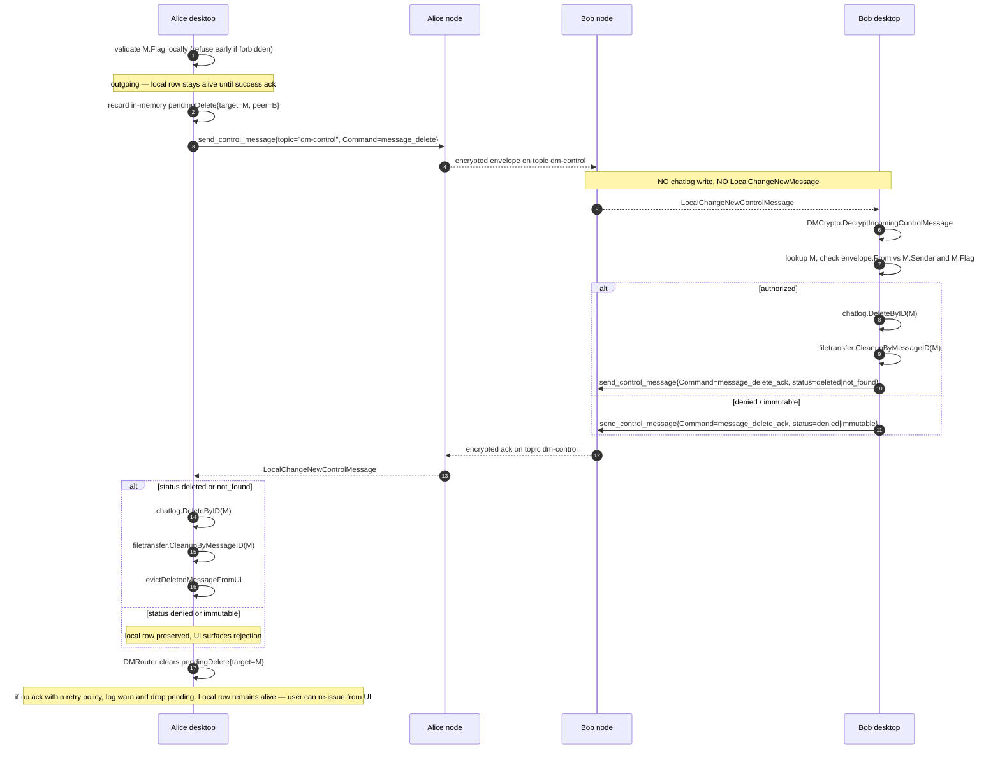
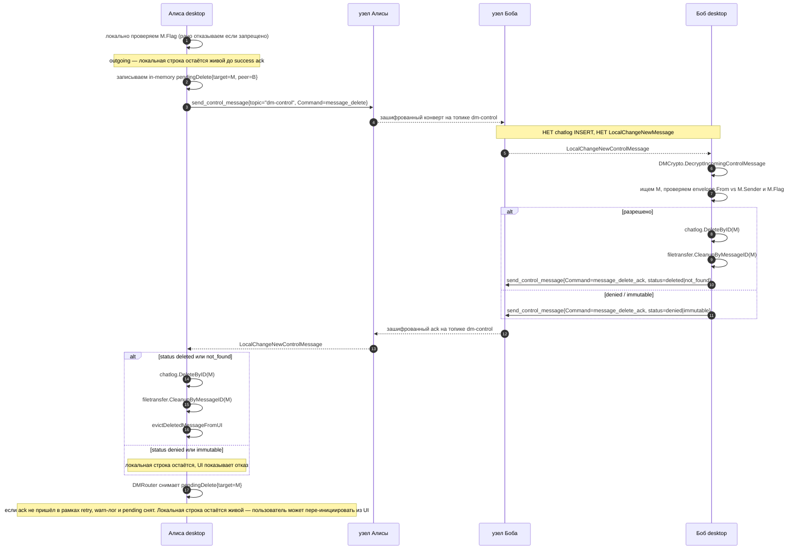

# CORSA DM commands

## English

### Overview

A DM command is typed metadata attached to an encrypted direct message.
Transit nodes see only the outer wire topic (`dm` or `dm-control`); command
dispatch happens after the recipient decrypts the envelope.

Two classes of DM are defined:

- **Data DMs** are recorded in chatlog and surface in the chat thread.
  - `file_announce` — pre-existing. Announces an outbound file transfer;
    the message is recorded in chatlog as a regular DM and additionally
    registers a file-transfer mapping on the receiver via
    `FileTransferBridge`.
- **Control DMs** are not recorded in chatlog and never surface in the
  chat thread. They travel on a dedicated wire topic so neither the
  sender's nor the recipient's node persists them, and neither side
  emits a `LocalChangeNewMessage` for them.
  - `message_delete` — new. Asks the recipient to remove a previously
    delivered data DM from their chatlog (and any state attached to it,
    such as receiver-side file-transfer mappings and downloaded blobs).
    The request is honoured **only if the target message's `MessageFlag`
    permits the deletion** for the requesting peer (see the
    Authorization section below for the full matrix); otherwise the
    receiver rejects the request with `message_delete_ack` (`denied` or
    `immutable`) and leaves the chatlog entry and all attached state
    intact.
  - `message_delete_ack` — new. The recipient's reply confirming how the
    `message_delete` was resolved. Also a control DM and not stored.

#### Reliability guarantees

The pair `message_delete` + `message_delete_ack` is designed so the
sender can know with certainty whether the deletion was received and
processed. The full mechanics are specified later in this document; the
guarantees the rest of the system can rely on are:

1. **The recipient must reply.** Every inbound `message_delete` produces
   a `message_delete_ack` (one of four terminal statuses), unless the
   payload itself is malformed or the signature fails — those are
   protocol-level errors and the sender retries. The recipient never
   silently drops a well-formed authenticated `message_delete`.
2. **Four explicit ack statuses.** The status is always one of
   `deleted`, `not_found`, `denied`, `immutable`. In particular,
   `not_found` is the documented response when the recipient does not
   have the target message at all (already deleted, never received,
   wrong ID) — this is reported back so the sender can stop retrying
   and surface the outcome to the UI.
3. **The sender retries until it gets an ack** or until the retry
   budget is exhausted (initial 30 s, exponential backoff ×2, cap 300 s,
   max 6 dispatches total — one initial plus five retries). Pending
   entries are kept **in memory only** in the current implementation;
   a process restart drops the in-flight retry queue.

   **Local deletion is gated on the ack** (pessimistic ordering).
   For an outgoing message, `chatlog.DeleteByID` and the file-transfer
   cleanup hook run inside `handleInboundMessageDeleteAck` only when
   the peer's ack is `deleted` or `not_found`; on `denied` /
   `immutable` / abandoned the local row stays so the user sees the
   rejection instead of a silent divergence. Incoming local-only
   deletes (the user removes their view of a peer's message) and
   recovery `!found` deletes are the only sender paths that mutate
   chatlog before / without a wire ack.

   JSON persistence rendezvous-ed alongside `transfers-*.json` is a
   tracked follow-up; until it lands the UI surfaces in-process
   budget exhaustion via `TopicMessageDeleteCompleted` with
   `Abandoned=true` but cannot signal an abandonment caused by
   restart. After a restart-driven abandonment the local row stays
   intact (because we never deleted it pre-ack) and the user can
   re-issue the delete from the UI.
4. **Idempotent on the recipient.** A duplicate `message_delete` after
   the row is already gone produces the same `not_found` ack as the
   first one. A duplicate request after a successful delete also
   produces `not_found`. The sender treats both `deleted` and
   `not_found` as success and clears the pending entry.

### Type model

`domain.DMCommand` is a typed string enumerating commands that may appear
inside `domain.OutgoingDM.Command`. It is separate from
`domain.FileAction`, which now narrowly identifies file-transfer protocol
frames (`chunk_request`, `chunk_response`, `file_downloaded`,
`file_downloaded_ack`) carried inside the `FileCommandFrame` wire format
— **not** DMs.

```
package domain

type DMCommand string

const (
    DMCommandFileAnnounce      DMCommand = "file_announce"
    DMCommandMessageDelete     DMCommand = "message_delete"
    DMCommandMessageDeleteAck  DMCommand = "message_delete_ack"
)

// Valid accepts the empty command (the regular text-DM case) plus the
// three named values. Empty must remain valid because callers that
// build a plain text OutgoingDM leave Command unset; rejecting it here
// would force every caller to special-case the empty string.
func (c DMCommand) Valid() bool {
    switch c {
    case "", DMCommandFileAnnounce, DMCommandMessageDelete, DMCommandMessageDeleteAck:
        return true
    default:
        return false
    }
}

// IsControl reports whether the command identifies a control DM
// (message_delete, message_delete_ack). The empty command and
// DMCommandFileAnnounce are data DMs, not control.
func (c DMCommand) IsControl() bool {
    switch c {
    case DMCommandMessageDelete, DMCommandMessageDeleteAck:
        return true
    default:
        return false
    }
}
```

`OutgoingDM.Command` switches type from `FileAction` to `DMCommand`.
`service.DirectMessage.Command` follows. The wire shape of the encrypted
plaintext (`directmsg.PlainMessage.Command string`) is unchanged — strings
on the wire, typed at the domain boundary.

Empty command remains the regular text-DM case; callers validate only
non-empty commands with `DMCommand.Valid()`.

`DMCommand.IsControl()` is the canonical predicate that splits data DMs
from control DMs. Send and receive code paths branch on this predicate,
not on string comparisons.

`domain.FileActionAnnounce` is removed: the announce action belongs to the
DM channel, not to the file-command channel. Existing call sites are
migrated to `DMCommandFileAnnounce`.

### Payloads

```
package domain

type MessageDeletePayload struct {
    TargetID MessageID `json:"target_id"`
}

type MessageDeleteStatus string

const (
    MessageDeleteStatusDeleted   MessageDeleteStatus = "deleted"   // row was present and is now gone
    MessageDeleteStatusNotFound  MessageDeleteStatus = "not_found" // no row for target_id; idempotent success
    MessageDeleteStatusDenied    MessageDeleteStatus = "denied"    // flag did not authorize this peer
    MessageDeleteStatusImmutable MessageDeleteStatus = "immutable" // flag forbids deletion outright
)

type MessageDeleteAckPayload struct {
    TargetID MessageID           `json:"target_id"`
    Status   MessageDeleteStatus `json:"status"`
}
```

Both payloads are encoded as JSON in the encrypted plaintext's
`command_data`. `Body` is empty for control DMs — control DMs travel on a
dedicated wire topic (see Send / Receive paths) and the body validation
that `DMCrypto.SendDirectMessage` performs for data DMs is bypassed by the
control path. The receiver's control handler discards `Body` regardless.

`MessageDeleteStatusDeleted` and `MessageDeleteStatusNotFound` are both
success outcomes from the protocol's perspective: the sender stops
retrying and **then** runs the post-ack DELETE path
(`chatlog.DeleteByID` + `OnMessageDeleted` + `evictDeletedMessageFromUI`)
inside `handleInboundMessageDeleteAck`. Pessimistic ordering means
local mutation happens HERE, not in `SendMessageDelete`.

`Denied` and `Immutable` are terminal failures: the sender stops
retrying and surfaces an error to the UI. There is nothing to roll
back — the outgoing local row was never deleted in the first place,
and the post-ack DELETE path simply does not run for these statuses.
The chat thread visibly diverges from the user's intent (they asked
the peer to delete, the peer refused), and that divergence stays
on screen so the user can decide what to do next.

### Authorization

Each chat message carries a `protocol.MessageFlag` recorded in
`chatlog.Entry.Flag`:

| Flag                | Who may delete on the wire                                    |
|---------------------|---------------------------------------------------------------|
| `immutable`         | Nobody. `message_delete` is rejected.                         |
| `sender-delete`     | Only the original sender of the target message.               |
| `any-delete`        | The original sender or recipient.                             |
| `auto-delete-ttl`   | Same as `sender-delete` until the TTL elapses, then expires.  |
| empty / unknown     | Treated as `sender-delete` (current default policy).          |

The receiver enforces this when an inbound `message_delete` arrives:

1. Resolve `M = chatlog.Get(target_id)`. If absent — log idempotent skip
   and reply with `message_delete_ack { status: "not_found" }`; no
   chatlog or file-transfer cleanup runs.
2. Read `M.Flag`.
3. If `immutable` — reply ack `immutable` with a warn log and skip.
4. If `sender-delete` (or empty) — require `from == M.Sender`. Otherwise
   reply ack `denied`.
5. If `any-delete` — require `from == M.Sender || from == M.Recipient`.
   Otherwise reply ack `denied`.
6. If `auto-delete-ttl` — same as `sender-delete`; the TTL itself is enforced
   independently by the chatlog's expiry sweeper.

`from` is the verified DM envelope sender (after signature check), not a
self-reported field inside the plaintext payload.

The local sender (UI) re-runs the same check before submitting the
`message_delete`: if the local-side flag forbids the action, the operation
is refused before any network traffic.

### Send path (control DM, sender side)

A control DM must not appear in the sender's chatlog or chat thread, and
must not produce a UI echo. The existing `DMCrypto.SendDirectMessage` is
the wrong tool: it routes through `node` Frame `send_message`, which
writes the outbound row to chatlog and emits `LocalChangeNewMessage` so
the sender's UI renders the message. Reusing it would surface
`message_delete` as a visible `[delete]` line in the sender's own chat.

The control path is a separate function and a separate node Frame:

```
package service

// DMCrypto.SendControlMessage encrypts a control DM and submits it on
// the dedicated control wire topic. It does not write to chatlog, does
// not return a DirectMessage echo, and does not invalidate the UI
// thread. Body is empty; Command must satisfy DMCommand.IsControl().
func (d *DMCrypto) SendControlMessage(
    ctx context.Context,
    to domain.PeerIdentity,
    cmd domain.DMCommand,
    payload string,
) (domain.MessageID, error)
```

Internally it calls `LocalRequestFrame` with the new Frame type
`send_control_message` and `Topic = "dm-control"`. The node's
`send_control_message` handler:

1. Verifies the topic is `dm-control` and the body is well-formed
   ciphertext.
2. Submits the encrypted envelope to mesh routing using the same path
   as `send_message`.
3. **Skips** the chatlog write that `send_message` performs.
4. **Skips** publishing `LocalChangeNewMessage`.
5. Returns `message_stored`-equivalent ack so the caller knows the wire
   handoff succeeded (this is **not** the recipient ack — see
   "Acknowledgement and retry" below).

The dedicated topic `dm-control` is visible to relays, the same way
`dm` and `gazeta` are visible. This is an intentional metadata leak:
relays can tell that a unit of traffic is a control DM (vs. a data DM).
The mitigation is volume — control DMs are rare, so the side-channel
signal is small. Hiding the distinction would require putting control
DMs on the same `dm` topic, which forces every node to write every
inbound DM to chatlog before it can be classified — that contradicts
the no-storage invariant.

### Receive path (control DM, recipient side)

Control DMs reuse the existing `storeIncomingMessage` entry point and
branch internally on `msg.Topic == TopicControlDM`. There is no
separate `storeIncomingControlMessage` function — the divergence is
expressed as gates inside the shared path so that the locking
discipline (`knowledgeMu` → `gossipMu` sequential, see
`docs/locking.md`) remains identical to the data-DM path and no new
cross-domain edge is introduced. The control-specific behaviour is:

1. `dispatchNetworkFrame` lands the inbound frame in
   `handleInboundPushMessage` / `handleRelayMessage` exactly like a
   data DM. The non-DM verifier gate exempts both `"dm"` and
   `TopicControlDM` (`protocol.IsDMTopic`), so the per-message
   signature verification in `storeIncomingMessage` (`VerifyEnvelope`)
   is the only authenticity gate.
2. Inside `storeIncomingMessage` the topic branch fires three
   divergences from the data-DM path:
   - the chatlog `messageStore.StoreMessage` call is skipped;
   - the `s.topics[msg.Topic] = append(...)` is skipped (control
     envelopes never enter `s.topics["dm-control"]`, which keeps
     `retryableRelayMessages` and `queueStateSnapshotLocked` from
     accumulating dead state);
   - the `LocalChangeNewMessage` / `emitLocalChange` block is
     replaced with a `LocalChangeNewControlMessage` publication on
     `ebus.TopicMessageControl`, and the publication only fires when
     `msg.Recipient == s.identity.Address` so the sender side does
     not receive its own outbound control DM as if it were inbound.
3. `DMCrypto.DecryptIncomingControlMessage` (a parallel of
   `DecryptIncomingMessage`) decrypts the envelope and returns
   `(domain.DMCommand, commandData string, sender, ok)`. If the inner
   command is not `IsControl()` the event is dropped — that closes the
   hole where a peer could try to inject a data command through the
   control wire.
4. `DMRouter` subscribes to `ebus.TopicMessageControl` and dispatches
   per `DMCommand`:
   - `message_delete` → `handleInboundMessageDelete`
   - `message_delete_ack` → `handleInboundMessageDeleteAck`
5. Unknown commands are logged at debug and dropped.

The chatlog is **never** touched on the inbound control path until the
authorization-passing branch of `handleInboundMessageDelete` calls
`Store.DeleteByID(target_id)`. There is no transient row, no transient
event, no UI flash.

Transit-only relays (control DM passes through this node, but the
recipient is somebody else and there is no direct peer / table route /
gossip-capable target) take the no-store fallback in
`handleRelayMessage` and return the empty status `""` upstream — the
data-DM "stored" fallback is **not** taken for control DMs because
their no-op store would still ack as if the relay succeeded. Sender's
`pendingDelete` retry then treats the attempt as a miss and tries
again.

### Acknowledgement and retry

A control DM is an unreliable wire send: relays may drop it, the peer
may be offline, the peer's process may have died between receiving and
processing. The sender therefore tracks pending `message_delete` and
retries until the recipient's `message_delete_ack` (any terminal status)
arrives.

```
type pendingDelete struct {
    target      domain.MessageID
    peer        domain.PeerIdentity
    sentAt      time.Time
    nextRetryAt time.Time
    attempt     int
}
```

Retry policy mirrors the file-transfer manager's chunk-request retry:

- Initial timeout 30 s.
- Exponential backoff (×2), capped at 300 s.
- Maximum **6 dispatches total** — one initial dispatch in
  `SendMessageDelete` plus up to 5 retries in `processDeleteRetryDue`.
  `recordAttempt` retires the pending entry the moment the 6th
  dispatch is recorded; there is no 7th send.
- On retire, a `warn` is logged with `target_id` and `peer`,
  `TopicMessageDeleteCompleted` is published with `Abandoned=true`,
  and **the local sender row stays alive**. Pessimistic ordering
  never deleted it pre-ack, so an abandoned delete simply means the
  peer never confirmed and the user can re-issue the request from the
  UI. The chat thread therefore visibly diverges from the user's
  intent until either the peer becomes reachable again (next manual
  retry) or the user removes the conversation entirely
  (DeletePeerHistory).

Pending entries live **in memory only** in the current implementation.
A process restart loses the in-flight retry queue. Because the local
row is kept until ack, restart leaves the user's chat thread intact —
the deletion simply never completed and can be re-issued. The UI
surfaces in-process budget exhaustion explicitly through
`TopicMessageDeleteCompleted` with `Abandoned=true`; **no equivalent
signal is emitted across a restart**, by design.

Adding JSON persistence rendezvous-ed at a path alongside
`transfers-*.json` is a tracked follow-up. Until it lands, callers
should treat sender-side delete delivery as best-effort across crash:
the local row stays alive (no rollback needed) but the wire request
may need to be re-issued by the user if a restart interrupts retry.

The recipient is fully idempotent: a duplicate `message_delete` after
the row has already been deleted produces the same `not_found` ack as
the first one. The sender treats `not_found` as success and clears the
pending entry. Stale acks (for a `target_id` that has no pending entry)
are dropped silently.

### Idempotency

`chatlog.Store.DeleteByID` returns `(false, nil)` when the row is absent.
The control handler maps this to `MessageDeleteStatusNotFound` and replies
with the corresponding ack. A peer who retries `message_delete` because
it never saw the previous ack will receive the ack again; no error is
ever raised back into the wire.

### Cleanup hooks

After `chatlog.Store.DeleteByID(M)` succeeds, the control handler invokes a
generic cleanup chain. For now there is one hook:

- `filetransfer.Manager.CleanupTransferByMessageID(domain.FileID(M.ID))` —
  if `M` was a `file_announce`, this drops the matching sender or receiver
  mapping, releases the transmit-blob ref count (sender side), and deletes
  any partial or completed blob in the download directory (receiver side).
  Idempotent: a no-op when there is no mapping for that ID.

Future DM types can register additional cleanup callbacks against this
chain; the chain is order-independent because each callback is scoped to
its own domain.

### Local-only deletion (UI scope)

The desktop file-tab "Delete" button covers two cases:

- **Outgoing** (we are the sender): pessimistic. Send
  `message_delete` to the peer; local chatlog row + file-transfer
  state are removed only when the peer's `message_delete_ack` carries
  `deleted` or `not_found`. On `denied` / `immutable` / abandoned the
  local row stays so the user sees the rejection.
- **Incoming** (peer is the sender): local cleanup only. We **do not**
  send `message_delete` to the peer for an incoming message — under the
  default `sender-delete` policy the peer would reject it anyway, and we
  do not own their outgoing record. Local chatlog DELETE +
  file-transfer cleanup + UI eviction run synchronously inside
  `SendMessageDelete`. If the message is `any-delete` we may
  optionally send the request; this is a future extension and is
  **not** implemented in this iteration.

### Wire flow



*Diagram 1 — message_delete propagation with control topic and ack*

### Storage rules for control DMs

Control DMs are kept out of chatlog on **both** sides by routing them on
the dedicated `dm-control` topic. The two diversions are:

| Side    | Path that data DMs follow            | Diversion for control DMs                                     |
|---------|--------------------------------------|---------------------------------------------------------------|
| Sender  | `send_message` → write outbound row + `LocalChangeNewMessage` | `send_control_message` funnels through the same `storeMessageFrame` / `storeIncomingMessage`, which on `TopicControlDM` skips the row write, skips the `s.topics` append, and replaces the LocalChange branch with a recipient-only `LocalChangeNewControlMessage` (no event on the sender's own node) |
| Receiver| `dispatchNetworkFrame` → `storeIncomingMessage` → row + `LocalChangeNewMessage` | Same `storeIncomingMessage`, but on `TopicControlDM` it skips chatlog INSERT, skips `s.topics` append, and emits `LocalChangeNewControlMessage` on `ebus.TopicMessageControl` only when `msg.Recipient == s.identity.Address` |

Consequences:

1. A control DM never appears in any chat thread on either side.
2. There is no `LocalChangeNewMessage` for control DMs, so the regular
   UI message list is not invalidated by their arrival. The bubble for
   the deleted target row `M` is removed from the live conversation
   cache (`ConversationCache.RemoveMessage`) by the delete path itself
   — both `SendMessageDelete` (sender side) and `applyInboundDelete`
   (recipient side) call `evictDeletedMessageFromUI`, which drops the
   cache entry, refreshes the sidebar preview, and emits
   `UIEventMessagesUpdated` + `UIEventSidebarUpdated`. Terminal
   delivery outcomes (`deleted`, `not_found`, `denied`, `immutable`,
   `Abandoned`) are signalled separately via
   `ebus.TopicMessageDeleteCompleted` so callers / RPC clients can
   distinguish a real peer-side deletion from a peer rejection.
3. Receipts (`delivered`/`seen`) are not generated for control DMs.
   Reliability is provided by the application-level
   `message_delete_ack` instead, which carries semantic status the
   delivery receipt cannot express.
4. UI code paths that filter messages by `Command` see only data DMs:
   the file-tab list and the chat thread both query chatlog, and
   chatlog never contained a control DM.
5. Control envelopes also stay out of `node.Service.s.topics[...]`.
   Both `retryableRelayMessages` (the node-level retry loop) and
   `queueStateSnapshotLocked` (the JSON queue persister) read only
   `s.topics["dm"]`; storing control envelopes in
   `s.topics["dm-control"]` would create unread state that grows
   without bound and offers no real retry — the only path that
   actually retries control DMs is the application-level
   `pendingDelete` on the sender side, which terminates on either an
   ack from the peer or the in-process retry budget. The current
   implementation keeps `pendingDelete` in memory only; restart
   abandons in-flight retries (see §"Acknowledgement and retry").
   Routing/push fan-out is unaffected because `executeGossipTargets`
   and `sendTableDirectedRelay` send wire frames on the fly,
   independent of `s.topics`.
6. The node-level `relayRetry` tracker likewise rejects control DMs
   at its entry gate (`trackRelayMessage`). Same reasoning as #5:
   the retry loop only consults `s.topics["dm"]`, so a control entry
   in `relayRetry` would be a dead state burning the
   `maxRelayRetryEntries` quota until tombstone TTL.

### Failure modes

| Situation                                 | Receiver behaviour                                        | Sender behaviour                                       |
|-------------------------------------------|-----------------------------------------------------------|--------------------------------------------------------|
| Target ID not in chatlog                  | Reply ack `not_found`.                                    | Treats `not_found` as success; runs the post-ack DELETE path (no-op when nothing local) and clears pending entry.   |
| Envelope sender ≠ M.Sender (sender-delete)| Reply ack `denied`. Warn log with envelope sender.        | Surfaces error to UI; **leaves the local row intact**; clears pending entry.            |
| `M.Flag == immutable`                     | Reply ack `immutable`. Warn log.                          | Surfaces error to UI; **leaves the local row intact**; clears pending entry.            |
| Inbound control payload malformed JSON    | Drop. Debug log. No ack.                                  | Hits retry budget and gives up; local row remains.     |
| Inbound control DM signature invalid      | Drop in `DMCrypto.DecryptIncomingControlMessage`. No ack. | Hits retry budget and gives up; local row remains.     |
| File-transfer cleanup partially fails     | Errors logged; ack reports `deleted` (chatlog row is gone). | Treats `deleted` as success.                         |
| Peer offline                              | No ack arrives.                                           | Retries on the in-memory schedule (max 6 dispatches) until budget exhausted. |
| Application crashes during in-flight retry | n/a                                                      | `pendingDelete` is in-memory only; restart drops the in-flight retry. **Local row is intact** (pessimistic delete waits for ack), so the user can re-issue the delete from the UI. JSON persistence is a tracked follow-up. |
| Sender retry budget exhausted             | n/a                                                       | Drops pending entry, logs warn with `target_id` + peer, publishes `TopicMessageDeleteCompleted` with `Abandoned=true`. **Local row stays alive** so the user sees that the deletion did not converge. |

### Migration notes

`chatlog.Entry.Flag` already exists and is populated from the envelope on
arrival, so no schema change is needed. Existing rows whose `Flag` is
empty fall under the "treated as sender-delete" default and remain
deletable by the original sender. Operators who want a stricter policy
must wait for the planned per-thread default-flag setting (out of scope
for this iteration).

`message_delete` is **not** wire-compatible with peers that only
understand data DMs. Control DMs use `Topic == "dm-control"` and the
`send_control_message` frame, so old peers will not decode them as regular
`directmsg.PlainMessage` rows; they will reject or drop the unknown topic /
frame. Rollout must therefore gate outgoing control DMs on an explicit
peer capability or minimum protocol version. Until that capability exists,
the UI must fall back to local-only deletion for peers that do not advertise
support.

### Test plan

- Unit
  - `DMCommand.Valid()` and `IsControl()` partition known and unknown
    strings correctly.
  - `MessageDeletePayload` and `MessageDeleteAckPayload` JSON round-trip;
    `target_id` validation rejects malformed UUID v4.
  - Authorization matrix: every (flag × envelope sender × M.Sender ×
    M.Recipient) combination resolves to one of `deleted`, `not_found`,
    `denied`, `immutable` as documented.
- Send path
  - `DMCrypto.SendControlMessage` does **not** write a row to chatlog
    on the sender side and does **not** emit `LocalChangeNewMessage`.
  - The submitted Frame carries `Type == "send_control_message"` and
    `Topic == "dm-control"`.
- Receive path
  - `storeIncomingMessage` for `Topic == TopicControlDM` skips the
    chatlog INSERT, skips the `s.topics["dm-control"]` append, and
    publishes `LocalChangeNewControlMessage` on
    `ebus.TopicMessageControl` only when
    `msg.Recipient == s.identity.Address` (sender side stays silent).
  - `handleRelayMessage` no-next-hop fallback returns `""` for
    `TopicControlDM` instead of the data-DM `"stored"` status, so
    upstream does not believe a transit relay succeeded when the
    envelope was in fact dropped.
  - `DMRouter` dispatches by `DMCommand`; unknown commands are dropped
    at debug.
- DM router (control handlers)
  - Inbound `message_delete` from `M.Sender` under `sender-delete`
    deletes `M`, triggers cleanup, replies with ack `deleted`.
  - Local `DeleteDM` and authorized inbound `message_delete` invoke
    `evictDeletedMessageFromUI` which drops the bubble from
    `ConversationCache`, refreshes the sidebar preview from chatlog,
    and emits `UIEventMessagesUpdated` + `UIEventSidebarUpdated` so
    the active conversation re-renders without a manual reload.
  - Terminal outcomes (`deleted`, `not_found`, `denied`, `immutable`,
    `Abandoned=true`) are published exactly once via
    `ebus.TopicMessageDeleteCompleted`. **Only incoming local-only
    deletes** (the user removes a message they received from the peer)
    publish `Status=deleted` immediately and skip the wire send;
    absent local targets (`!found`) still enter the pending/send
    flow so a re-issued delete can heal the peer after a restart
    dropped the in-memory pendingDelete queue, and outgoing deletes
    follow the standard wire path.
  - Inbound `message_delete` from `M.Recipient` under `sender-delete`
    is denied; `M` remains; ack is `denied`.
  - Inbound `message_delete` for unknown `target_id` produces ack
    `not_found`.
  - Inbound `message_delete` for `immutable` `M` produces ack
    `immutable`.
  - Inbound `message_delete_ack` for an unknown pending entry is
    dropped silently (no panic, no log noise).
- Retry (in-memory only)
  - `pendingDelete` is added on send and cleared on ack. There is no
    JSON persistence in the current implementation; restart drops
    the retry queue. Persistence is a tracked follow-up.
  - Retry budget (6 dispatches total / 300 s cap) terminates the
    pending entry the moment the 6th dispatch is recorded, emits the
    documented warn log, publishes `TopicMessageDeleteCompleted` with
    `Abandoned=true`, and **leaves the outgoing local row alive**
    (pessimistic ordering never deleted it). The user can re-issue
    the delete from the UI.
- Filetransfer
  - `CleanupTransferByMessageID` drops the sender mapping, releases
    the ref, removes the orphaned blob in `transmit/`.
  - Same for the receiver mapping: removes the mapping and the
    partial/completed files in the download dir.
  - Idempotent: a second call returns no error and no panic.
- Integration (style of `internal/core/node/file_integration.go`)
  - `A` sends a file announce to `B`. `A` invokes `DeleteDM(B, fileID)`.
    Before the ack returns, `A`'s chatlog row is **still present** —
    pessimistic ordering keeps it until success. After the control
    round-trip and `message_delete_ack` (`deleted`), `A`'s row is
    removed inside `handleInboundMessageDeleteAck`; `B` has no record
    of `M` and no receiver mapping; `B`'s partial download is gone.
  - Denied path: `A` invokes `DeleteDM(B, fileID)` for a row whose
    `MessageFlag` does not authorize `A` for the peer (artificially —
    e.g. row Sender forged in test fixture). After ack `denied`,
    `A`'s chatlog row is **still present** and the
    `TopicMessageDeleteCompleted` outcome carries
    `Status=denied`, `Abandoned=false`.
  - Concurrent: `A` deletes while `B` is downloading. `B`'s download
    is cancelled cleanly; no orphan partial file remains; ack is
    `deleted`; `A`'s row is removed only after the ack lands.
  - Offline-then-online: `B` is unreachable when `A` deletes. `A`
    retries on the in-memory schedule; `A`'s row stays alive
    throughout. Once `B` reconnects, the control DM lands and the ack
    completes the round-trip.
  - Abandoned: peer never reachable for the full retry budget.
    `A`'s row stays alive after the 6th dispatch; outcome is
    `Abandoned=true`.

---

## Русский

### Обзор

DM-команда — это типизированная метаинформация внутри зашифрованного
прямого сообщения. Транзитные узлы видят только внешний wire-топик (`dm`
или `dm-control`); диспетчеризация команд происходит после расшифровки у
получателя.

Определены два класса DM:

- **Data DM** — пишутся в chatlog и видны в чат-потоке.
  - `file_announce` — существующая. Анонс исходящей файловой передачи;
    само сообщение пишется в chatlog как обычный DM и дополнительно
    регистрирует receiver-mapping в `FileTransferBridge`.
- **Control DM** — в chatlog не пишутся и в чат-потоке никогда не
  появляются. Едут на отдельном wire-топике, поэтому ни узел
  отправителя, ни узел получателя их не персистит, и ни одна сторона
  не публикует `LocalChangeNewMessage`.
  - `message_delete` — новая. Просит получателя удалить ранее
    доставленный data DM из своего chatlog (и связанное состояние —
    receiver-mapping, скачанные блобы). Запрос исполняется **только
    если `MessageFlag` целевого сообщения разрешает удаление**
    запрашивающему пиру (полная матрица — в разделе «Авторизация»);
    иначе получатель отклоняет запрос через `message_delete_ack`
    (`denied` или `immutable`) и оставляет запись в chatlog и связанное
    состояние нетронутыми.
  - `message_delete_ack` — новая. Ответ получателя с финальным
    статусом обработки `message_delete`. Тоже control DM, не пишется.

#### Гарантии надёжности

Пара `message_delete` + `message_delete_ack` спроектирована так, чтобы
отправитель достоверно знал, получена ли и обработана ли команда
удаления. Полная механика — ниже по документу; опорные гарантии для
остальной системы:

1. **Получатель обязан ответить.** Каждый входящий `message_delete`
   порождает `message_delete_ack` (один из четырёх терминальных
   статусов), кроме случаев невалидного payload или невалидной подписи
   — это протокольные ошибки, и отправитель ретраит. Корректно
   аутентифицированный `message_delete` никогда не дропается молча.
2. **Четыре явных статуса ack.** Статус всегда один из `deleted`,
   `not_found`, `denied`, `immutable`. В частности, `not_found` —
   задокументированный ответ когда у получателя целевого сообщения
   нет вообще (уже удалено, никогда не приходило, не тот ID); этот
   статус возвращается отправителю, чтобы тот прекратил retry и
   корректно отрисовал исход в UI.
3. **Отправитель ретраит до получения ack** или до исчерпания retry
   budget (стартовый таймаут 30 с, экспоненциальный backoff ×2,
   потолок 300 с, максимум 6 dispatch'ей суммарно — один initial
   плюс пять retry). Pending хранятся **только в памяти** в текущей
   реализации; рестарт процесса теряет очередь in-flight retry.

   **Локальное удаление гейтится по ack** (pessimistic ordering).
   Для исходящего сообщения `chatlog.DeleteByID` и cleanup-хук
   file-transfer выполняются внутри `handleInboundMessageDeleteAck`
   только когда ack от пира — `deleted` или `not_found`; при
   `denied` / `immutable` / abandoned локальная строка остаётся,
   чтобы пользователь видел отказ, а не молчаливое расхождение.
   Incoming local-only удаления (пользователь удаляет полученное
   сообщение) и recovery `!found` удаления — единственные
   sender-пути, которые мутируют chatlog до / без wire ack.

   JSON-persistence рядом с `transfers-*.json` — зафиксированный
   follow-up; до его реализации UI сигнализирует исчерпание
   in-process budget через `TopicMessageDeleteCompleted` с
   `Abandoned=true`, но не может сигнализировать abandonment,
   вызванный рестартом. После abandonment-через-рестарт локальная
   строка остаётся целой (потому что мы никогда не удаляли её
   до ack), и пользователь может пере-инициировать delete из UI.
4. **Идемпотентность на получателе.** Повторный `message_delete`
   после того, как строка уже удалена, выдаёт тот же `not_found` ack,
   что и первый. Повторный запрос после успешного удаления тоже
   возвращает `not_found`. Отправитель трактует и `deleted`, и
   `not_found` как успех и снимает pending.

### Типовая модель

`domain.DMCommand` — типизированная строка, перечисляющая команды,
которые могут появиться в `domain.OutgoingDM.Command`. Тип отделён от
`domain.FileAction`, который теперь идентифицирует только команды
file-transfer-протокола (`chunk_request`, `chunk_response`,
`file_downloaded`, `file_downloaded_ack`) внутри `FileCommandFrame` — не
внутри DM.

```
package domain

type DMCommand string

const (
    DMCommandFileAnnounce      DMCommand = "file_announce"
    DMCommandMessageDelete     DMCommand = "message_delete"
    DMCommandMessageDeleteAck  DMCommand = "message_delete_ack"
)

// Valid принимает пустую команду (обычный текстовый DM) плюс три
// именованные. Empty обязан остаться валидным: caller, который строит
// плейн-текстовый OutgoingDM, не выставляет Command — отклонять
// empty здесь означало бы заставлять каждого вызывающего
// спецкейсить пустую строку.
func (c DMCommand) Valid() bool {
    switch c {
    case "", DMCommandFileAnnounce, DMCommandMessageDelete, DMCommandMessageDeleteAck:
        return true
    default:
        return false
    }
}

// IsControl говорит, control ли это DM (message_delete,
// message_delete_ack). Пустая команда и DMCommandFileAnnounce — это
// data DM, не control.
func (c DMCommand) IsControl() bool {
    switch c {
    case DMCommandMessageDelete, DMCommandMessageDeleteAck:
        return true
    default:
        return false
    }
}
```

`OutgoingDM.Command` меняет тип с `FileAction` на `DMCommand`.
`service.DirectMessage.Command` — следом. Wire-форма plaintext
(`directmsg.PlainMessage.Command string`) не меняется — на проводе строки,
типизация на границе домена.

Пустая command остаётся обычным text-DM; call-сайты валидируют через
`DMCommand.Valid()` только непустые команды.

`DMCommand.IsControl()` — канонический предикат, отделяющий data DM от
control DM. Send и receive ветви разветвляются именно по нему, не по
сравнению строк.

`domain.FileActionAnnounce` удаляется: announce — это DM-канал, не
file-command-канал. Существующие call-сайты переключаются на
`DMCommandFileAnnounce`.

### Полезные нагрузки

```
package domain

type MessageDeletePayload struct {
    TargetID MessageID `json:"target_id"`
}

type MessageDeleteStatus string

const (
    MessageDeleteStatusDeleted   MessageDeleteStatus = "deleted"   // строка была и удалена
    MessageDeleteStatusNotFound  MessageDeleteStatus = "not_found" // строки нет; идемпотентный успех
    MessageDeleteStatusDenied    MessageDeleteStatus = "denied"    // флаг не разрешает этому пиру
    MessageDeleteStatusImmutable MessageDeleteStatus = "immutable" // флаг запрещает удаление в принципе
)

type MessageDeleteAckPayload struct {
    TargetID MessageID           `json:"target_id"`
    Status   MessageDeleteStatus `json:"status"`
}
```

Обе нагрузки кодируются JSON в `command_data` зашифрованного plaintext.
`Body` для control DM пустой — control DM едут на отдельном wire-топике
(см. Send / Receive paths), и проверка «body != empty», которую
`DMCrypto.SendDirectMessage` делает для data DM, в control-пути обходится.
Receiver-handler `Body` отбрасывает в любом случае.

`MessageDeleteStatusDeleted` и `MessageDeleteStatusNotFound` — оба
успешные исходы с точки зрения протокола: отправитель прекращает
retry, а **затем** выполняет post-ack DELETE-путь
(`chatlog.DeleteByID` + `OnMessageDeleted` + `evictDeletedMessageFromUI`)
внутри `handleInboundMessageDeleteAck`. Pessimistic ordering означает,
что локальная мутация происходит ИМЕННО здесь, а не в
`SendMessageDelete`.

`Denied` и `Immutable` — терминальные неудачи: отправитель прекращает
retry и поднимает ошибку в UI. Откатывать нечего — исходящая
локальная строка вообще не удалялась, и post-ack DELETE-путь для
этих статусов просто не запускается. Чат-нить визуально расходится
с интентом пользователя (он попросил удалить у пира, пир отказал), и
это расхождение остаётся на экране, чтобы пользователь решил, что
делать дальше.

### Авторизация

У каждого сообщения в chatlog есть `protocol.MessageFlag` в
`chatlog.Entry.Flag`:

| Флаг                | Кто вправе удалить по сети                                       |
|---------------------|------------------------------------------------------------------|
| `immutable`         | Никто. `message_delete` отклоняется.                             |
| `sender-delete`     | Только автор сообщения.                                          |
| `any-delete`        | Автор или получатель.                                            |
| `auto-delete-ttl`   | Как `sender-delete` до истечения TTL, далее автоматически.       |
| пусто / неизвестен  | Трактуется как `sender-delete` (текущий дефолт).                 |

Получатель применяет правило при входящем `message_delete`:

1. Найти `M = chatlog.Get(target_id)`. Если нет — идемпотентный no-op и
   ответить `message_delete_ack { status: "not_found" }`; chatlog и
   file-transfer cleanup не запускаются.
2. Прочитать `M.Flag`.
3. Если `immutable` — ответить ack `immutable` с warn-логом.
4. Если `sender-delete` (или пусто) — требуется `from == M.Sender`.
   Иначе ответить ack `denied`.
5. Если `any-delete` — требуется `from == M.Sender || from == M.Recipient`.
   Иначе ответить ack `denied`.
6. Если `auto-delete-ttl` — как `sender-delete`; сам TTL применяется
   независимо служебной задачей chatlog.

`from` — это проверенный отправитель из DM-конверта (после проверки
подписи), не самопровозглашаемое поле внутри plaintext.

Локальный отправитель (UI) выполняет ту же проверку перед отправкой
`message_delete`: если флаг локально запрещает действие, операция
отклоняется до сетевого вызова.

### Send-путь (control DM, sender-сторона)

Control DM не должен попасть в chatlog отправителя или в его чат-поток
и не должен породить UI-echo. Существующий `DMCrypto.SendDirectMessage`
для этого не подходит: он идёт через узловой Frame `send_message`,
который пишет outbound-строку в chatlog и эмитит
`LocalChangeNewMessage`, чтобы UI-отправителя отрисовал сообщение.
Переиспользование этого пути приведёт к тому, что `message_delete`
появится у отправителя видимой строкой `[delete]`.

Control-путь — отдельная функция и отдельный node Frame:

```
package service

// DMCrypto.SendControlMessage шифрует control DM и отправляет его на
// выделенном control-топике. Не пишет в chatlog, не возвращает echo и
// не инвалидирует UI-чат. Body пустой; Command обязан удовлетворять
// DMCommand.IsControl().
func (d *DMCrypto) SendControlMessage(
    ctx context.Context,
    to domain.PeerIdentity,
    cmd domain.DMCommand,
    payload string,
) (domain.MessageID, error)
```

Внутри он вызывает `LocalRequestFrame` с новым Frame.Type
`send_control_message` и `Topic = "dm-control"`. Узловой обработчик
`send_control_message`:

1. Проверяет, что топик `dm-control` и тело — корректный ciphertext.
2. Отдаёт зашифрованный конверт в mesh routing тем же путём, что и
   `send_message`.
3. **Пропускает** chatlog-INSERT, который делает `send_message`.
4. **Пропускает** публикацию `LocalChangeNewMessage`.
5. Возвращает аналог `message_stored`, чтобы caller знал, что
   wire-handoff удался (это **не** ack от получателя — см.
   «Подтверждение и retry» ниже).

Выделенный топик `dm-control` виден транзитным узлам — так же, как
видны `dm` и `gazeta`. Это сознательная утечка метаданных: транзит
может отличить control-DM от data-DM. Митигация — объёмом: control-DM
редкие, side-channel слабый. Скрытие отличия потребовало бы пускать
control-DM на топике `dm`, что вынудит каждый узел писать каждый
входящий DM в chatlog до классификации — это ломает инвариант
«не хранить».

### Receive-путь (control DM, recipient-сторона)

Control DM переиспользуют ту же точку входа `storeIncomingMessage` и
ветвятся внутри по `msg.Topic == TopicControlDM`. Отдельной функции
`storeIncomingControlMessage` нет — расхождения выражены гейтами
внутри общего пути, чтобы locking-дисциплина (`knowledgeMu` →
`gossipMu` sequential, см. `docs/locking.md`) осталась идентичной
data-DM и ни одного нового cross-domain edge не появилось.
Контрол-специфичное поведение:

1. `dispatchNetworkFrame` доставляет входящий frame в
   `handleInboundPushMessage` / `handleRelayMessage` ровно как для
   data DM. Non-DM verifier гейт exempts и `"dm"`, и
   `TopicControlDM` (`protocol.IsDMTopic`), поэтому единственный гейт
   аутентичности — per-message подпись в `storeIncomingMessage`
   (`VerifyEnvelope`).
2. Внутри `storeIncomingMessage` topic-ветка реализует три
   расхождения с data-DM:
   - chatlog `messageStore.StoreMessage` пропускается;
   - `s.topics[msg.Topic] = append(...)` пропускается (control
     envelopes никогда не попадают в `s.topics["dm-control"]` —
     `retryableRelayMessages` и `queueStateSnapshotLocked` не
     накапливают мёртвое состояние);
   - блок `LocalChangeNewMessage` / `emitLocalChange` заменён на
     публикацию `LocalChangeNewControlMessage` на
     `ebus.TopicMessageControl`, и эта публикация срабатывает
     **только** если `msg.Recipient == s.identity.Address` —
     отправитель не получает свой outbound control DM как inbound.
3. `DMCrypto.DecryptIncomingControlMessage` (параллель
   `DecryptIncomingMessage`) расшифровывает конверт и возвращает
   `(domain.DMCommand, commandData string, sender, ok)`. Если
   внутренняя команда не `IsControl()`, событие отбрасывается —
   это закрывает дыру, через которую пир мог бы попытаться
   протолкнуть data-команду через control-провод.
4. `DMRouter` подписан на `ebus.TopicMessageControl` и
   диспетчеризует по `DMCommand`:
   - `message_delete` → `handleInboundMessageDelete`
   - `message_delete_ack` → `handleInboundMessageDeleteAck`
5. Неизвестные команды логируются на debug и отбрасываются.

Chatlog **не** трогается на входящем control-пути до тех пор, пока
ветка авторизации в `handleInboundMessageDelete` не вызовет
`Store.DeleteByID(target_id)`. Никакой переходной строки, никакого
переходного события, никакого мигания UI.

Transit-only relay (control DM проходит через узел, но recipient — не
мы, и ни прямого peer, ни table route, ни gossip-target нет) уходит в
fallback в `handleRelayMessage` и возвращает пустой статус `""`
upstream — data-DM fallback `"stored"` для control DM **не**
выбирается, потому что store-операция для control — no-op, а ack
"stored" сделал бы вид, что relay удался. `pendingDelete` на стороне
отправителя обработает это как промах и переотправит.

### Подтверждение и retry

Control DM — ненадёжная wire-отправка: транзит может потерять, пир
может быть оффлайн, его процесс может упасть между приёмом и
обработкой. Поэтому отправитель отслеживает pending `message_delete` и
переотправляет, пока не придёт `message_delete_ack` (любой
терминальный статус).

```
type pendingDelete struct {
    target      domain.MessageID
    peer        domain.PeerIdentity
    sentAt      time.Time
    nextRetryAt time.Time
    attempt     int
}
```

Политика retry зеркалит chunk-request retry в file-transfer manager:

- Начальный таймаут 30 с.
- Экспоненциальный backoff (×2), потолок 300 с.
- Максимум **6 dispatch'ей суммарно** — один initial dispatch в
  `SendMessageDelete` плюс до 5 retry в `processDeleteRetryDue`.
  `recordAttempt` ретайрит pending-запись в момент когда 6-й
  dispatch учтён; седьмого send'а не происходит.
- После retire в лог пишется `warn` с `target_id` и `peer`,
  публикуется `TopicMessageDeleteCompleted` с `Abandoned=true`, и
  **локальная строка отправителя остаётся живой**. Pessimistic
  ordering никогда не удалял её до ack, так что abandoned delete
  означает «пир не подтвердил» — пользователь может пере-инициировать
  delete из UI. Чат-нить визуально расходится с интентом
  пользователя, пока пир либо не станет доступен (новая ручная
  попытка), либо пользователь не уберёт диалог целиком
  (DeletePeerHistory).

Pending живут **только в памяти** в текущей реализации. Рестарт
процесса теряет очередь in-flight retry. Поскольку локальная строка
держится до ack, рестарт оставляет чат-нить пользователя
нетронутой — удаление просто не завершилось и может быть пере-инициировано.
UI явно сигнализирует in-process исчерпание budget через
`TopicMessageDeleteCompleted` с `Abandoned=true`; **через рестарт
эквивалентного сигнала нет** — по дизайну.

Добавление JSON-persistence в файле рядом с `transfers-*.json` —
зафиксированный follow-up. До его реализации caller-ы должны
трактовать sender-side доставку delete как best-effort через креш:
локальная строка остаётся живой (rollback не требуется), но
wire-запрос, возможно, нужно будет повторно инициировать
пользователю, если рестарт прервал retry.

Получатель полностью идемпотентен: повторный `message_delete` после
того, как строка уже удалена, выдаёт тот же ack `not_found`, что и
первый. Отправитель трактует `not_found` как успех и снимает pending.
Stale-ack (для `target_id`, для которого нет pending) тихо
отбрасываются.

### Идемпотентность

`chatlog.Store.DeleteByID` возвращает `(false, nil)` если строки нет.
Control-handler маппит это в `MessageDeleteStatusNotFound` и шлёт
соответствующий ack. Пир, повторяющий `message_delete` потому что не
увидел предыдущий ack, получит ack снова; в провод никогда не уходит
ошибка.

### Cleanup-хуки

После успешного `chatlog.Store.DeleteByID(M)` control-handler вызывает
generic-цепочку cleanup. Сейчас один хук:

- `filetransfer.Manager.CleanupTransferByMessageID(domain.FileID(M.ID))` —
  если `M` был `file_announce`, удаляет соответствующий sender- или
  receiver-mapping, освобождает ref на блоб в `transmit/` (sender) и
  удаляет partial/completed в директории download (receiver).
  Идемпотентен: no-op если mapping-а нет.

Будущие DM-типы могут регистрировать дополнительные cleanup-callback-и в
эту цепочку; порядок неважен, потому что каждый callback скоупится в свой
домен.

### Локальное удаление (UI)

Кнопка «Удалить» во вкладке `file` покрывает два случая:

- **Исходящий** (мы — отправитель): pessimistic. Шлём `message_delete`
  пиру; локальная строка chatlog и file-transfer состояние удаляются
  **только** когда `message_delete_ack` от пира несёт `deleted` или
  `not_found`. При `denied` / `immutable` / abandoned локальная строка
  остаётся, чтобы пользователь видел отказ.
- **Входящий** (пир — отправитель): только локальный cleanup. Для
  входящих `message_delete` пиру **не шлём** — при дефолтном
  `sender-delete` он бы и так отклонил, и мы не владеем его исходящей
  записью. Локальный chatlog DELETE + file-transfer cleanup +
  UI eviction выполняются синхронно внутри `SendMessageDelete`. Для
  `any-delete` отправка возможна; это будущее расширение, в этой
  итерации не реализовано.

### Сетевой поток



*Диаграмма 1 — Распространение message_delete с control-топиком и ack*

### Правила хранения control DM

Control DM не попадают в chatlog **на обеих сторонах** благодаря
маршрутизации на выделенном топике `dm-control`. Две диверсии:

| Сторона     | Путь data DM                                                     | Диверсия для control DM                                                                |
|-------------|------------------------------------------------------------------|----------------------------------------------------------------------------------------|
| Отправитель | `send_message` → INSERT outbound + `LocalChangeNewMessage`        | `send_control_message` идёт через тот же `storeMessageFrame` / `storeIncomingMessage`, и для `TopicControlDM` пропускает INSERT, пропускает append в `s.topics`, заменяет LocalChange-ветку на recipient-only `LocalChangeNewControlMessage` (на узле отправителя event'а нет) |
| Получатель  | `dispatchNetworkFrame` → `storeIncomingMessage` → INSERT + event | Тот же `storeIncomingMessage`, но для `TopicControlDM` пропускает chatlog INSERT, пропускает append в `s.topics`, и эмитит `LocalChangeNewControlMessage` на `ebus.TopicMessageControl` только когда `msg.Recipient == s.identity.Address` |

Следствия:

1. Control DM никогда не появляется в чат-потоке ни у одной стороны.
2. `LocalChangeNewMessage` для control DM нет, поэтому штатный UI
   message list не инвалидируется их приходом. Bubble удалённой целевой
   строки `M` снимается из живого кэша диалога
   (`ConversationCache.RemoveMessage`) самим delete-путём — обе ветки
   (`SendMessageDelete` на отправителе и `applyInboundDelete` на
   получателе) вызывают `evictDeletedMessageFromUI`, который снимает
   запись из cache, обновляет sidebar preview, и эмитит
   `UIEventMessagesUpdated` + `UIEventSidebarUpdated`. Терминальные
   статусы доставки (`deleted`, `not_found`, `denied`, `immutable`,
   `Abandoned`) сигналятся отдельно через
   `ebus.TopicMessageDeleteCompleted`, чтобы caller-ы / RPC-клиенты
   могли отличить реальное удаление у пира от его отказа.
3. Receipts (`delivered`/`seen`) для control DM не выписываются.
   Надёжность обеспечивается прикладным `message_delete_ack`, который
   несёт семантический статус, недоступный delivery-receipt.
4. UI-пути, фильтрующие сообщения по `Command`, видят только data DM:
   и file-таб, и чат-поток смотрят в chatlog, а chatlog никогда не
   содержал control DM.
5. Control envelopes также не попадают в `node.Service.s.topics[...]`.
   И `retryableRelayMessages` (node-level retry loop), и
   `queueStateSnapshotLocked` (JSON queue persister) читают только
   `s.topics["dm"]`; класть control envelopes в
   `s.topics["dm-control"]` создало бы непрочитанное состояние,
   которое растёт неограниченно и не даёт реального retry — единственный
   путь, реально ретраящий control DM, это application-level
   `pendingDelete` на стороне отправителя, который завершается либо по
   ack от пира, либо по исчерпанию in-process retry budget. Текущая
   реализация хранит `pendingDelete` только в памяти; рестарт прерывает
   in-flight retry (см. §"Подтверждение и retry").
   Routing/push fan-out не страдает: `executeGossipTargets` и
   `sendTableDirectedRelay` шлют wire-фреймы на лету, независимо от
   `s.topics`.
6. Node-level `relayRetry` tracker тоже отвергает control DM на
   входе (`trackRelayMessage`). По той же причине, что и #5: retry
   loop читает только `s.topics["dm"]`, и control-запись в
   `relayRetry` была бы мёртвым состоянием, которое жжёт квоту
   `maxRelayRetryEntries` до tombstone TTL.

### Сценарии отказа

| Ситуация                                  | Поведение получателя                                   | Поведение отправителя                                |
|-------------------------------------------|--------------------------------------------------------|------------------------------------------------------|
| Target ID отсутствует в chatlog           | Ack `not_found`.                                       | Трактует `not_found` как успех; запускает post-ack DELETE-путь (no-op когда локально пусто), снимает pending. |
| Envelope sender ≠ M.Sender (sender-delete)| Ack `denied`. Warn-лог с envelope sender.              | Поднимает ошибку в UI; **локальная строка остаётся целой**; снимает pending. |
| `M.Flag == immutable`                     | Ack `immutable`. Warn-лог.                             | Поднимает ошибку в UI; **локальная строка остаётся целой**; снимает pending. |
| Невалидный JSON в control-payload         | Отбросить. Debug-лог. Ack не шлём.                     | Исчерпывает retry budget, сдаётся; локальная строка остаётся. |
| Невалидная подпись control DM             | Отбросить в `DMCrypto.DecryptIncomingControlMessage`. Ack не шлём. | Исчерпывает retry budget, сдаётся; локальная строка остаётся. |
| Cleanup file transfer частично упал       | Логи; ack `deleted` (строки в chatlog уже нет).        | Трактует `deleted` как успех.                        |
| Пир оффлайн                               | Ack не приходит.                                       | Retry по in-memory расписанию (макс 6 dispatch) до исчерпания. |
| Креш приложения во время in-flight retry  | n/a                                                    | `pendingDelete` хранится только в памяти; рестарт теряет in-flight retry. **Локальная строка цела** (pessimistic delete ждёт ack), пользователь может пере-инициировать delete из UI. JSON-persistence — зафиксированный follow-up. |
| Исчерпание retry budget у отправителя     | n/a                                                    | Pending снимается, warn-лог с `target_id` и пиром, публикуется `TopicMessageDeleteCompleted` с `Abandoned=true`. **Локальная строка остаётся** — пользователь видит что удаление не сошлось у пира. |

### Замечания по миграции

`chatlog.Entry.Flag` уже существует и заполняется из конверта при
приёме — миграция схемы не нужна. Существующие строки с пустым `Flag`
попадают под дефолт "трактуется как sender-delete" и остаются
удаляемыми оригинальным отправителем. Оператор, желающий более жёсткой
политики, ждёт настройки per-thread default-flag (вне скоупа этой
итерации).

`message_delete` **не** совместим по wire с пирами, которые понимают
только data DM. Control DM используют `Topic == "dm-control"` и frame
`send_control_message`, поэтому старые пиры не декодируют их как обычные
`directmsg.PlainMessage`; они отклонят или отбросят неизвестный topic /
frame. Раскатку нужно гейтить явной peer capability или минимальной
версией протокола. Пока такой capability нет, UI должен откатываться на
local-only deletion для пиров без поддержки.

### План тестирования

- Unit
  - `DMCommand.Valid()` и `IsControl()` корректно разбивают известные и
    неизвестные строки.
  - `MessageDeletePayload` и `MessageDeleteAckPayload` JSON round-trip;
    валидация `target_id` отклоняет некорректный UUID v4.
  - Матрица авторизации: каждая комбинация (flag × envelope sender ×
    M.Sender × M.Recipient) разрешается в один из `deleted`,
    `not_found`, `denied`, `immutable` согласно документу.
- Send-путь
  - `DMCrypto.SendControlMessage` **не** пишет строку в chatlog у
    отправителя и **не** эмитит `LocalChangeNewMessage`.
  - Отдаваемый Frame несёт `Type == "send_control_message"` и
    `Topic == "dm-control"`.
- Receive-путь
  - `storeIncomingMessage` для `Topic == TopicControlDM` пропускает
    chatlog INSERT, пропускает append в `s.topics["dm-control"]`,
    и публикует `LocalChangeNewControlMessage` на
    `ebus.TopicMessageControl` только когда
    `msg.Recipient == s.identity.Address` (отправитель не получает
    event для своего же исходящего control DM).
  - Fallback `handleRelayMessage` без next-hop возвращает `""` для
    `TopicControlDM` вместо data-DM статуса `"stored"` — upstream не
    считает успешным relay, который на самом деле потерял envelope.
  - `DMRouter` диспетчеризует по `DMCommand`; неизвестные команды
    отбрасываются на debug.
- DM router (control-handlers)
  - Входящий `message_delete` от `M.Sender` под `sender-delete`
    удаляет `M`, триггерит cleanup, шлёт ack `deleted`.
  - Локальный `DeleteDM` и авторизованный входящий `message_delete`
    вызывают `evictDeletedMessageFromUI`, который снимает bubble из
    `ConversationCache`, обновляет sidebar preview из chatlog, и
    эмитит `UIEventMessagesUpdated` + `UIEventSidebarUpdated`, чтобы
    активный диалог перерисовался без ручного reload.
  - Терминальные исходы (`deleted`, `not_found`, `denied`,
    `immutable`, `Abandoned=true`) публикуются ровно один раз через
    `ebus.TopicMessageDeleteCompleted`. **Только incoming local-only
    удаления** (пользователь удаляет полученное от пира сообщение)
    публикуют `Status=deleted` сразу и пропускают wire-отправку;
    отсутствующие target-ы (`!found`) идут в pending/send путь,
    чтобы повторный delete после рестарта (in-memory pendingDelete
    был сброшен) смог дотянуться до пира; исходящие удаления —
    штатный wire-путь.
  - Входящий `message_delete` от `M.Recipient` под `sender-delete`
    отклоняется; `M` остаётся; ack `denied`.
  - Входящий `message_delete` для неизвестного `target_id` даёт ack
    `not_found`.
  - Входящий `message_delete` для `immutable` `M` даёт ack `immutable`.
  - Входящий `message_delete_ack` для несуществующего pending тихо
    отбрасывается (без паники, без шума в логе).
- Retry (только в памяти)
  - `pendingDelete` добавляется при отправке и снимается при ack.
    JSON-persistence в текущей реализации нет; рестарт сбрасывает
    очередь. Persistence — зафиксированный follow-up.
  - Retry budget (6 dispatch'ей суммарно / потолок 300 с) ретайрит
    pending-запись в момент учёта 6-го dispatch, пишет
    задокументированный warn-лог, публикует
    `TopicMessageDeleteCompleted` с `Abandoned=true`, и **оставляет
    исходящую локальную строку живой** (pessimistic ordering её и
    не удалял). Пользователь может пере-инициировать delete из UI.
- Filetransfer
  - `CleanupTransferByMessageID` снимает sender-mapping, освобождает
    ref, удаляет осиротевший блоб в `transmit/`.
  - То же для receiver-mapping: снимает mapping и
    partial/completed-файлы в download.
  - Идемпотентен: второй вызов без ошибки и паники.
- Integration (стиль `internal/core/node/file_integration.go`)
  - `A` посылает file announce `B`. `A` вызывает `DeleteDM(B, fileID)`.
    До прихода ack локальная строка `A` **остаётся на месте** —
    pessimistic ordering держит её до успеха. После control round-trip
    и `message_delete_ack` (`deleted`) строка `A` удаляется внутри
    `handleInboundMessageDeleteAck`; у `B` нет записи `M` и
    receiver-mapping; partial у `B` удалён.
  - Denied path: `A` вызывает `DeleteDM(B, fileID)` для строки,
    `MessageFlag` которой не авторизует `A` для пира (искусственно —
    например, Sender подделан в тестовом fixture). После ack `denied`
    локальная строка `A` **остаётся**, исход
    `TopicMessageDeleteCompleted` несёт `Status=denied`,
    `Abandoned=false`.
  - Concurrent: `A` удаляет пока `B` качает. Скачивание у `B` чисто
    отменяется; orphan partial не остаётся; ack `deleted`.
  - Offline-then-online: `B` недоступен, когда `A` удаляет. `A`
    переотправляет; как только `B` подключается, control DM
    долетает и ack замыкает round-trip.
