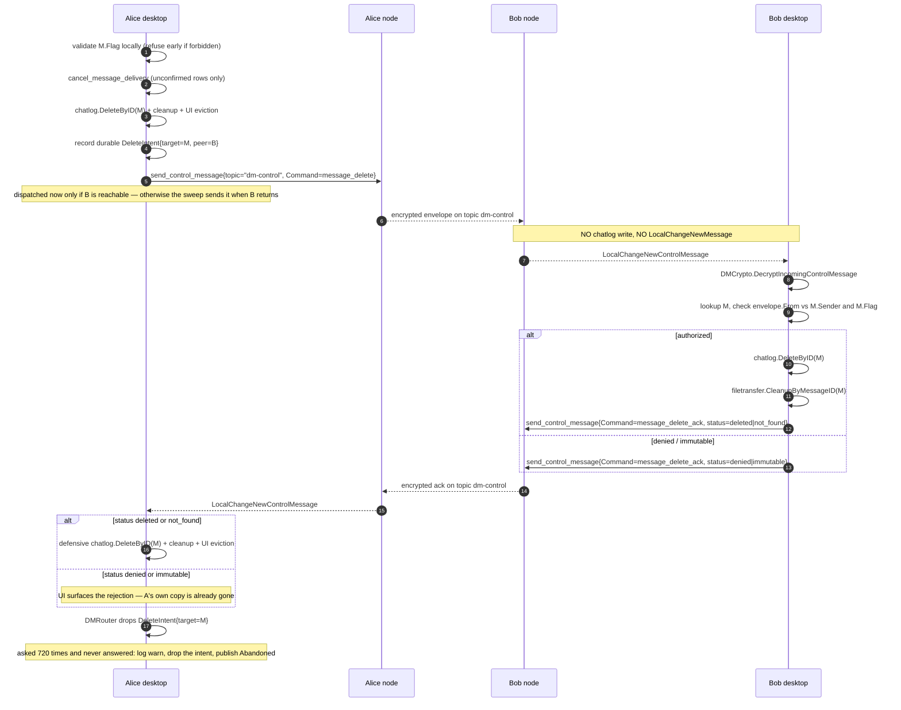
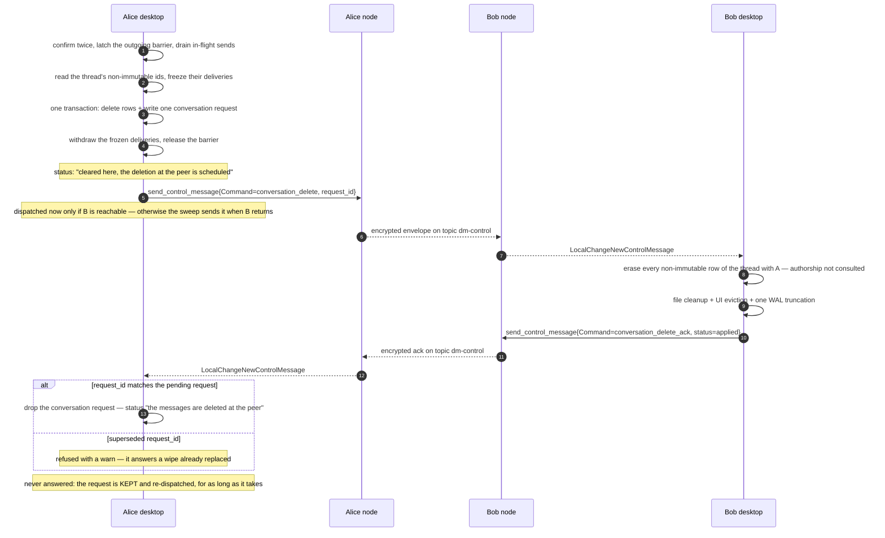
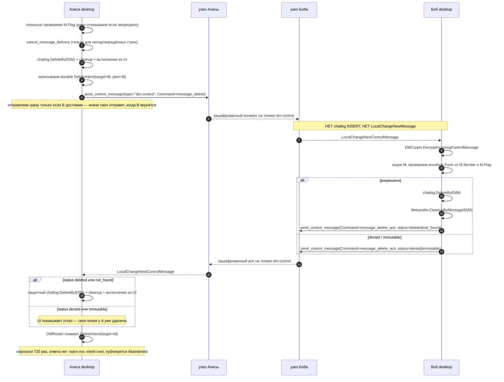
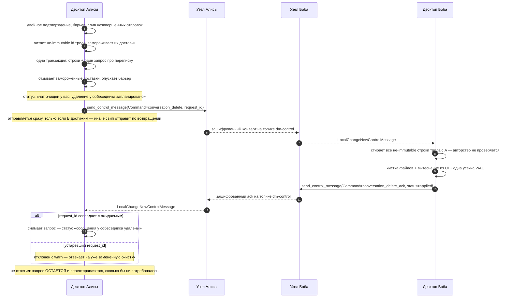

# CORSA DM commands

## English

### Overview

A DM command is typed metadata attached to an encrypted direct message.
Transit nodes see only the outer wire topic (`dm` or `dm-control`); command
dispatch happens after the recipient decrypts the envelope.

Two classes of DM are defined:

- **Data DMs** are recorded in chatlog and surface in the chat thread.
  - `file_announce` — pre-existing. Announces an outbound file transfer;
    the message is recorded in chatlog as a regular DM and additionally
    registers a file-transfer mapping on the receiver via
    `FileTransferBridge`.
- **Control DMs** are not recorded in chatlog and never surface in the
  chat thread. They travel on a dedicated wire topic so neither the
  sender's nor the recipient's node persists them, and neither side
  emits a `LocalChangeNewMessage` for them.
  - `message_delete` — new. Asks the recipient to remove a previously
    delivered data DM from their chatlog (and any state attached to it,
    such as receiver-side file-transfer mappings and downloaded blobs).
    The request is honoured **only if the target message's `MessageFlag`
    permits the deletion** for the requesting peer (see the
    Authorization section below for the full matrix); otherwise the
    receiver rejects the request with `message_delete_ack` (`denied` or
    `immutable`) and leaves the chatlog entry and all attached state
    intact.
  - `message_delete_ack` — new. The recipient's reply confirming how the
    `message_delete` was resolved. Also a control DM and not stored.

#### Reliability guarantees

The pair `message_delete` + `message_delete_ack` is designed so the
sender can know with certainty whether the deletion was received and
processed. The full mechanics are specified later in this document; the
guarantees the rest of the system can rely on are:

1. **The recipient must reply.** Every inbound `message_delete` produces
   a `message_delete_ack`, unless the payload itself is malformed or the
   signature fails — those are protocol-level errors and the sender
   retries. The recipient never silently drops a well-formed
   authenticated `message_delete`.
2. **Five explicit ack statuses.** The status is always one of
   `deleted`, `not_found`, `denied`, `immutable`, `error`. The first
   four are terminal. In particular, `not_found` is the documented
   response when the recipient does not have the target message at all
   (already deleted, never received, wrong ID) — this is reported back
   so the sender can stop retrying and surface the outcome to the UI.
   `error` is the one non-terminal answer: the recipient could not
   decide the request because its own chatlog was unavailable or the
   lookup/delete failed. It says nothing about whether the row is there,
   so the sender keeps the intent and asks again. Reporting `not_found`
   for such a fault would retire the intent over a transient database
   error and leave the message alive on one side with nobody left to
   ask.
3. **The sender re-issues the request until it gets an ack**, driven by
   a durable delete intent rather than an in-memory queue: an
   unreachable peer costs nothing and the schedule survives a restart.
   Only a spent attempt budget retires an intent — 720 unanswered
   dispatches, roughly a month of a peer that is reachable and keeps not
   answering. Time a peer spends unreachable costs nothing.

   **Local deletion is not gated on the ack.** `chatlog.DeleteByID`,
   the file-transfer cleanup hook and the UI eviction all run inside
   `SendMessageDelete`, before anything is sent — a message the user
   asked to destroy does not wait on somebody else's connectivity. The
   ack decides only the fate of the intent, and a `denied` /
   `immutable` answer is surfaced so the user knows their copy is gone
   while the peer's is not.

   JSON persistence rendezvous-ed alongside `transfers-*.json` is a
   tracked follow-up; until it lands the UI surfaces in-process
   budget exhaustion via `TopicMessageDeleteCompleted` with
   `Abandoned=true` but cannot signal an abandonment caused by
   restart. After a restart-driven abandonment the local row stays
   intact (because we never deleted it pre-ack) and the user can
   re-issue the delete from the UI.
4. **Idempotent on the recipient.** A duplicate `message_delete` after
   the row is already gone produces the same `not_found` ack as the
   first one. A duplicate request after a successful delete also
   produces `not_found`. The sender treats both `deleted` and
   `not_found` as success and clears the pending entry.

### Type model

`domain.DMCommand` is a typed string enumerating commands that may appear
inside `domain.OutgoingDM.Command`. It is separate from
`domain.FileAction`, which now narrowly identifies file-transfer protocol
frames (`chunk_request`, `chunk_response`, `file_downloaded`,
`file_downloaded_ack`) carried inside the `FileCommandFrame` wire format
— **not** DMs.

```
package domain

type DMCommand string

const (
    DMCommandFileAnnounce          DMCommand = "file_announce"
    DMCommandMessageDelete         DMCommand = "message_delete"
    DMCommandMessageDeleteAck      DMCommand = "message_delete_ack"
    DMCommandConversationDelete    DMCommand = "conversation_delete"
    DMCommandConversationDeleteAck DMCommand = "conversation_delete_ack"
)

// Valid accepts the empty command (the regular text-DM case) plus the
// named values. Empty must remain valid because callers that build a
// plain text OutgoingDM leave Command unset; rejecting it here would
// force every caller to special-case the empty string.
func (c DMCommand) Valid() bool { ... }

// IsControl reports whether the command identifies a control DM
// (message_delete, message_delete_ack, conversation_delete,
// conversation_delete_ack, decrypt_failed). The empty command and
// DMCommandFileAnnounce are data DMs, not control.
func (c DMCommand) IsControl() bool { ... }
```

`OutgoingDM.Command` switches type from `FileAction` to `DMCommand`.
`service.DirectMessage.Command` follows. The wire shape of the encrypted
plaintext (`directmsg.PlainMessage.Command string`) is unchanged — strings
on the wire, typed at the domain boundary.

Empty command remains the regular text-DM case; callers validate only
non-empty commands with `DMCommand.Valid()`.

`DMCommand.IsControl()` is the canonical predicate that splits data DMs
from control DMs. Send and receive code paths branch on this predicate,
not on string comparisons.

`domain.FileActionAnnounce` is removed: the announce action belongs to the
DM channel, not to the file-command channel. Existing call sites are
migrated to `DMCommandFileAnnounce`.

### Payloads

```
package domain

type MessageDeletePayload struct {
    TargetID MessageID `json:"target_id"`
}

type MessageDeleteStatus string

const (
    MessageDeleteStatusDeleted   MessageDeleteStatus = "deleted"   // row was present and is now gone
    MessageDeleteStatusNotFound  MessageDeleteStatus = "not_found" // no row for target_id; idempotent success
    MessageDeleteStatusDenied    MessageDeleteStatus = "denied"    // flag did not authorize this peer
    MessageDeleteStatusImmutable MessageDeleteStatus = "immutable" // flag forbids deletion outright
    MessageDeleteStatusError     MessageDeleteStatus = "error"     // recipient could not decide; NOT terminal
)

type MessageDeleteAckPayload struct {
    TargetID MessageID           `json:"target_id"`
    Status   MessageDeleteStatus `json:"status"`
}

// The whole-thread request names NO message: the ids of a conversation are
// the one thing a wipe must not put on the wire, both because some of them
// may never have reached the peer and because the request has to outlive
// the rows it came from.
type ConversationDeletePayload struct {
    // The id of the gesture, echoed by the ack. Nothing else: no moment,
    // no message ids.
    RequestID ConversationDeleteRequestID `json:"request_id"`
}

type ConversationDeleteStatus string

const (
    ConversationDeleteStatusApplied ConversationDeleteStatus = "applied" // peer erased what it held; terminal
    ConversationDeleteStatusError   ConversationDeleteStatus = "error"   // peer could not decide; NOT terminal
)

type ConversationDeleteAckPayload struct {
    RequestID ConversationDeleteRequestID `json:"request_id"`
    Status    ConversationDeleteStatus    `json:"status"`
    // No count. It carried one, and "I removed three" tells a requester who
    // held two that the other side had a message they never saw — the same
    // thing the request itself is built not to reveal.
}
```

There is no `denied` among the conversation statuses, and the absence is
the design: a per-message request can be refused because the message's own
flag reserves it to its author, while a thread wipe is not about any one
message. Refusing the ones the requester did not write is what used to
leave each side holding half a conversation the user believed was gone.

Both payloads are encoded as JSON in the encrypted plaintext's
`command_data`. `Body` is empty for control DMs — control DMs travel on a
dedicated wire topic (see Send / Receive paths) and the body validation
that `DMCrypto.SendDirectMessage` performs for data DMs is bypassed by the
control path. The receiver's control handler discards `Body` regardless.

`MessageDeleteStatusDeleted` and `MessageDeleteStatusNotFound` are both
success outcomes from the protocol's perspective: the two sides are now
consistent, so `handleInboundMessageDeleteAck` retires the intent. It
also re-runs `chatlog.DeleteByID` + `OnMessageDeleted` +
`evictDeletedMessageFromUI` defensively — the local row went at request
time, but a late relay echo can re-insert it, and the ack is the last
moment we are guaranteed to be looking at this id.

`Denied` and `Immutable` are terminal failures: asking again would get
the same answer, so the intent is retired too and the status is
surfaced to the UI. There is nothing to roll back — the user's own copy
is gone either way. What the user learns is that the peer kept theirs.

### Authorization

Each chat message carries a `protocol.MessageFlag` recorded in
`chatlog.Entry.Flag`:

| Flag                | Who may delete on the wire                                    |
|---------------------|---------------------------------------------------------------|
| `immutable`         | Nobody. `message_delete` is rejected.                         |
| `sender-delete`     | Only the original sender of the target message.               |
| `any-delete`        | The original sender or recipient.                             |
| `auto-delete-ttl`   | Same as `sender-delete` until the TTL elapses, then expires.  |
| empty / unknown     | Treated as `sender-delete`. Legacy only — see below.           |

The flag is stamped by the AUTHOR at send time and travels with the row,
so it is the author's own answer to "may my counterpart erase this from
their side too". `DMCrypto.SendDirectMessage` stamps `any-delete` on outgoing DMs
(`defaultOutgoingMessageFlag`): a conversation is shared, and a user
deleting a message from it expects it gone, not gone from their own
screen while the other copy stands.

`sender-delete` and the empty value are therefore LEGACY, not choices: the
flag has never been reachable from the interface, so a row carrying either
is one an older build stamped. Migration `0007_delete_policy_backfill`
rewrites them to `any-delete` for `topic = 'dm'`, leaving `immutable` and
`auto-delete-ttl` alone. Before that backfill, deleting a message the peer
had written came back `denied`, and clearing a thread erased only the
messages the requester had not written. `immutable` is the absolute end of that scale — the
"this row is part of the permanent record" promise (legal evidence,
tamper-evident logs) that not even the author can revoke.

The flag gates neither the local copy nor the request. Removing a row
from your own database is always yours to do, at any delivery status, and
asking the peer is always worth doing: the flag is what THEY consult when
the request arrives, and their answer comes back as an ack the user can
see. Deciding on their behalf that they would refuse only hides the
request — the message leaves the user's screen with nothing queued and
nothing said about the copy that remains.

The receiver enforces this when an inbound `message_delete` arrives:

1. Resolve `M = chatlog.Get(target_id)`. If absent — log idempotent skip
   and reply with `message_delete_ack { status: "not_found" }`; no
   chatlog or file-transfer cleanup runs.
2. Read `M.Flag`.
3. If `immutable` — reply ack `immutable` with a warn log and skip.
4. If `sender-delete` (or empty) — require `from == M.Sender`. Otherwise
   reply ack `denied`.
5. If `any-delete` — require `from == M.Sender || from == M.Recipient`.
   Otherwise reply ack `denied`.
6. If `auto-delete-ttl` — same as `sender-delete`; the TTL itself is enforced
   independently by the chatlog's expiry sweeper.

`from` is the verified DM envelope sender (after signature check), not a
self-reported field inside the plaintext payload.

The local sender (UI) re-runs the same check before submitting the
`message_delete`: an `immutable` target is refused before any network
traffic, and a target the flag does not let us reach is deleted locally
without one.

### Send path (control DM, sender side)

A control DM must not appear in the sender's chatlog or chat thread, and
must not produce a UI echo. The existing `DMCrypto.SendDirectMessage` is
the wrong tool: it routes through `node` Frame `send_message`, which
writes the outbound row to chatlog and emits `LocalChangeNewMessage` so
the sender's UI renders the message. Reusing it would surface
`message_delete` as a visible `[delete]` line in the sender's own chat.

The control path is a separate function and a separate node Frame:

```
package service

// DMCrypto.SendControlMessage encrypts a control DM and submits it on
// the dedicated control wire topic. It does not write to chatlog, does
// not return a DirectMessage echo, and does not invalidate the UI
// thread. Body is empty; Command must satisfy DMCommand.IsControl().
func (d *DMCrypto) SendControlMessage(
    ctx context.Context,
    to domain.PeerIdentity,
    cmd domain.DMCommand,
    payload string,
) (domain.MessageID, error)
```

Internally it calls `LocalRequestFrame` with the new Frame type
`send_control_message` and `Topic = "dm-control"`. The node's
`send_control_message` handler:

1. Verifies the topic is `dm-control` and the body is well-formed
   ciphertext.
2. Submits the encrypted envelope to mesh routing using the same path
   as `send_message`.
3. **Skips** the chatlog write that `send_message` performs.
4. **Skips** publishing `LocalChangeNewMessage`.
5. Returns `message_stored`-equivalent ack so the caller knows the wire
   handoff succeeded (this is **not** the recipient ack — see
   "Acknowledgement and retry" below).

The dedicated topic `dm-control` is visible to relays, the same way
`dm` and `gazeta` are visible. This is an intentional metadata leak:
relays can tell that a unit of traffic is a control DM (vs. a data DM).
The mitigation is volume — control DMs are rare, so the side-channel
signal is small. Hiding the distinction would require putting control
DMs on the same `dm` topic, which forces every node to write every
inbound DM to chatlog before it can be classified — that contradicts
the no-storage invariant.

### Receive path (control DM, recipient side)

Control DMs reuse the existing `storeIncomingMessage` entry point and
branch internally on `msg.Topic == TopicControlDM`. There is no
separate `storeIncomingControlMessage` function — the divergence is
expressed as gates inside the shared path so that the locking
discipline (`knowledgeMu` → `gossipMu` sequential, see
`docs/locking.md`) remains identical to the data-DM path and no new
cross-domain edge is introduced. The control-specific behaviour is:

1. `dispatchNetworkFrame` lands the inbound frame in
   `handleInboundPushMessage` / `handleRelayMessage` exactly like a
   data DM. The non-DM verifier gate exempts both `"dm"` and
   `TopicControlDM` (`protocol.IsDMTopic`), so the per-message
   signature verification in `storeIncomingMessage` (`VerifyEnvelope`)
   is the only authenticity gate.
2. Inside `storeIncomingMessage` the topic branch fires three
   divergences from the data-DM path:
   - the chatlog `messageStore.StoreMessage` call is skipped;
   - the `s.topics[msg.Topic] = append(...)` is skipped (control
     envelopes never enter `s.topics["dm-control"]`, which keeps
     `retryableRelayMessages` from accumulating dead state);
   - the `LocalChangeNewMessage` / `emitLocalChange` block is
     replaced with a `LocalChangeNewControlMessage` publication on
     `ebus.TopicMessageControl`, and the publication only fires when
     `msg.Recipient == s.identity.Address` so the sender side does
     not receive its own outbound control DM as if it were inbound.
3. `DMCrypto.DecryptIncomingControlMessage` (a parallel of
   `DecryptIncomingMessage`) decrypts the envelope and returns
   `(domain.DMCommand, commandData string, sender, ok)`. If the inner
   command is not `IsControl()` the event is dropped — that closes the
   hole where a peer could try to inject a data command through the
   control wire.
4. `DMRouter` subscribes to `ebus.TopicMessageControl` and dispatches
   per `DMCommand`:
   - `message_delete` → `handleInboundMessageDelete`
   - `message_delete_ack` → `handleInboundMessageDeleteAck`
5. Unknown commands are logged at debug and dropped.

The chatlog is **never** touched on the inbound control path until the
authorization-passing branch of `handleInboundMessageDelete` calls
`Store.DeleteByID(target_id)`. There is no transient row, no transient
event, no UI flash.

Transit-only relays (control DM passes through this node, but the
recipient is somebody else and there is no direct peer / table route /
gossip-capable target) take the no-store fallback in
`handleRelayMessage` and return the empty status `""` upstream — the
data-DM "stored" fallback is **not** taken for control DMs because
their no-op store would still ack as if the relay succeeded. The
sender's delete intent then treats the attempt as a miss and re-issues
it on its next due tick.

### Acknowledgement and retry

A control DM is an unreliable wire send: relays may drop it, the peer
may be offline, the peer's process may have died between receiving and
processing. The sender therefore keeps a durable **delete intent** per
outstanding request and re-issues it until the recipient's
`message_delete_ack` (any terminal status) arrives.

```
type DeleteIntent struct {
    MessageID     domain.MessageID
    Peer          domain.PeerIdentity
    CreatedAt     time.Time // the user's original request; the TTL clock
    NextAttemptAt time.Time // only moved by attempts that actually went out
    Attempts      int
}
```

The full policy — when a request is dispatched, what an unreachable peer
costs (nothing), the 30 s→1 h backoff and the attempt budget — is described
under "Scheduled deletion" below. Two properties are worth stating here,
because they are what a reader of the older, in-memory design would
expect to be different:

- The intent is a row in the shared state database, so a process restart
  resumes the retry exactly where it left off. There is no in-memory
  queue to lose.
- The local row is already gone before the first dispatch, so an
  unacknowledged request never leaves the user's own thread diverging
  from their intent. What an expired intent means is only that the
  *peer's* copy may still exist; `TopicMessageDeleteCompleted` with
  `Abandoned=true` is how the user is told.

The recipient is fully idempotent: a duplicate `message_delete` after
the row has already been deleted produces the same `not_found` ack as
the first one. The sender treats `not_found` as success and retires the
intent. Stale acks (for a `target_id` with no intent) are dropped
silently, and an ack whose envelope sender is not the peer the intent
was addressed to decides nothing.

### Idempotency

`chatlog.Store.DeleteByID` returns `(false, nil)` when the row is absent.
The control handler maps this to `MessageDeleteStatusNotFound` and replies
with the corresponding ack. A peer who retries `message_delete` because
it never saw the previous ack will receive the ack again; no error is
ever raised back into the wire.

### Cleanup hooks

After `chatlog.Store.DeleteByID(M)` succeeds, the control handler invokes a
generic cleanup chain. For now there is one hook:

- `filetransfer.Manager.CleanupTransferByMessageID(domain.FileID(M.ID))` —
  if `M` was a `file_announce`, this drops the matching sender or receiver
  mapping, releases the transmit-blob ref count (sender side), and deletes
  any partial or completed blob in the download directory (receiver side).
  Idempotent: a no-op when there is no mapping for that ID.

  Dropping the mapping and erasing the bytes are two different writes, and
  only the first one used to be durable — so an unlink that failed left the
  content of a deleted message on disk with nothing left that knew to look
  for it. What must still be erased is now recorded as a CLEANUP INTENT in
  the same persisted state that drops the mapping, cleared only when the
  files it names are actually gone, and retried by the transfer
  maintenance tick — including after a restart, which is the case an
  in-memory retry cannot cover. Retries go through
  `FileStore.PurgeUnreferenced`, which erases without touching a ref count
  and is therefore safe to repeat; the count itself drops exactly once, in
  `Release`. A blob another message still references is left alone and the
  intent is satisfied: the content is owed elsewhere.

Future DM types can register additional cleanup callbacks against this
chain; the chain is order-independent because each callback is scoped to
its own domain.

### Deleting the file without the message

The image viewer's delete button is NOT `message_delete`. It removes this
node's copy of the file and leaves the message where it is —
`filetransfer.Manager.DeleteLocalCopy(fileID)`, reached from the desktop
through `FileTransferBridge.DeleteLocalCopy`. Nothing is sent to the peer:
the user is emptying their own disk, not asking anybody to forget anything.

The mapping is what survives, and it is what makes the difference visible.
On the receiving side it goes back to `available`, so the attachment shows
without a preview and offers the download again — a re-download the protocol
can actually fulfil, because `senderCompleted` is re-servable and the sender
keeps its transmit blob. Resetting it is also what allows the erasure at all:
`pathOwnershipLocked` refuses to unlink a file some mapping still points at,
and until `CompletedPath` is cleared that mapping is this one.

**The sending side is refused** (`ErrOutgoingCopy`), and the viewer's delete
button is inert on an outgoing image. What this node holds for a file it SENT
is the transmit blob every re-download is served from; nothing can bring it
back, because there is no protocol for asking the recipient for your own file.
It is also shared BY CONTENT: two messages carrying the same picture reference
one file, so "deleting it for one of them" is either the other message losing
its attachment or — since the store keeps a file something still references —
no deletion at all, with the picture returning to the strip on the next
rebuild. Taking back an outgoing image is `message_delete`, which removes the
attachment with the message and drops the ref on the way.

The two receiver states it accepts are exactly the two in which a verified
file is on disk — `completed` and `waiting_ack`. From `waiting_ack` it also
abandons the `file_downloaded` this node still owed the sender: both that
send and the ack answering it are guarded on the state, so they become
no-ops, the sender reclaims its stalled serving slot on its own tick, and it
keeps the blob — which is what the re-download needs. `ErrNoLocalCopy` is the
answer when there was nothing on disk to remove; for the user that is the
same outcome as a delete.

Erasing goes through the same cleanup intent as every other deletion here:
the record of what must be gone is persisted before the first unlink is
attempted, and retried until the file is actually gone.

### Delete routes (UI scope)

A delete always removes the local copy immediately — reachable peer or
not. Keeping a message the user asked to destroy, because somebody else
happens to be offline, is the exposure the feature exists to end. What
varies is what has to happen on the way there.

`domain.MessageDeleteContext` classifies the request from three facts —
who authored the row, whether the flag lets us ask the peer at all, and
whether the recipient confirmed it (a `delivered` or `seen` receipt) —
and `DMRouter.SendMessageDelete` returns the route it took. Peer
reachability is deliberately **not** an input: it decides *when* the peer
is told, which the scheduler owns, never *whether* the local copy goes.

| Direction | Confirmed by peer | Envelope proven unsent | Route       | Local row | Peer side |
|-----------|-------------------|------------------------|-------------|-----------|-----------|
| incoming  | —                 | —                      | `scheduled` | removed   | scheduled |
| outgoing  | no                | yes                    | `recalled`  | removed   | nothing asked |
| outgoing  | no                | no                     | `withdraw`  | removed   | delivery cancelled, then scheduled |
| outgoing  | yes               | —                      | `scheduled` | removed   | scheduled |

- **`scheduled`** (incoming row): the local copy goes and the author is
  asked to drop theirs. Nothing of ours was ever in flight, so there is
  no delivery to cancel first.

  The row's flag does NOT decide whether we ask — it is the author's
  answer, delivered by their ack (`deleted` when they honoured it,
  `denied` when they had reserved the message to themselves). Reading the
  stored flag as "do not even ask" was a bug the user hit: every message
  received before the default changed carries `sender-delete`, and so
  does every message from a peer on an older build, so deleting one
  vanished from the screen with nothing queued, no indicator, and nothing
  said about the copy that remains.
- **`recalled`** (outgoing, never confirmed, and the cancellation proved
  the envelope never reached the wire): nobody has ever seen the message,
  so nothing is scheduled and the terminal outcome is published at once.
  Asking a peer to delete a message they never received would tell them
  one existed.
- **`withdraw`** (outgoing, never confirmed, emission not ruled out): the
  delivery may still be sitting in this node's own queues, so it is
  cancelled **first** (see below); only then is the row removed and the
  peer-side deletion scheduled. The schedule is kept because a copy can
  escape between the send and the cancellation, and `not_found` is a
  cheap answer for the case where it did not.
- **`scheduled`** (outgoing, confirmed): nothing left to cancel. The row
  goes and the peer-side deletion is scheduled.
- **`!found`** (the row is already gone — deleted earlier, expired by
  TTL): treated as an outgoing row with the caller-supplied peer, so a
  re-issued delete still converges the other side.

An `immutable` row is refused up front, with no state mutation at all.

### Scheduled deletion

The peer-side half of a deletion is a durable intent, not an in-memory
retry: one row in `message_delete_intents` (migration 0005) carrying the
peer identity, the message id and the scheduler's bookkeeping — no body,
no sender, no original timestamp. A blanked-out message row was the
alternative and was rejected: it leaves a tombstone in the conversation
for anyone reading the database, which is precisely what the deletion
was meant to prevent.

Lifecycle:

1. `SendMessageDelete` removes the local row and records the intent —
   **in one transaction** (`chatlog.DeleteWithIntent`; the local-only
   routes take plain `DeleteByID`). They are one invariant seen from both
   sides: the user's copy is gone, and somebody still owes us the peer's.
   Separate commits leave a crash window in which the copy is destroyed
   and nobody will ever ask the peer. The request is ALSO what refuses a
   replay of the same envelope — see §"Replay after a deletion" — and it
   needs no separate row to do it. When the peer is reachable the request
   also goes out immediately, which is an optimisation over waiting for
   the next sweep and nothing more.
2. `deleteRetryLoop` sweeps due intents every 5 s (`deleteRetryTickPeriod`).
   For each one:
   - `deleteIntentGiveUpAttempts` (720) dispatches made and unanswered
     — written off, with a warn log and a
     `TopicMessageDeleteCompleted` publication carrying `Abandoned=true`.
     The budget is spent in ATTEMPTS, not in days: a calendar deadline
     runs while the peer is unreachable, which is exactly the stretch
     the durable intent exists to survive, so it gives up on the case
     the feature was built for and reports "abandoned" about a peer
     nobody managed to ask. Attempts only accrue when the peer was there
     to be asked, and the backoff caps at an hour, so the budget is
     about a month of being ignored. The price is that a request to a
     contact who never returns is kept indefinitely: one row per
     deletion addressed to an absent identity, dropped with the rest of
     their history when the identity is removed. A re-issue does not
     refill the budget — attempts and `created_at` both survive it —
     because a budget a click can reset is one a user can make immortal
     without meaning to;
   - peer unreachable — **parked for `deleteIntentHoldInterval` (30 s),
     charging nothing**. No attempt, no backoff, no expiry pressure
     beyond the TTL clock. The park is a fairness device rather than a
     delay: due intents are read oldest-first under a limit, so a pile
     of them addressed to one absent contact left at the head of that
     queue would starve every other peer's deletions. The
     `peer.connected` subscription un-parks a peer's intents the moment
     they hand back, so the interval is only the ceiling for a peer that
     becomes routable without connecting to us directly. Parked rows are
     marked (`held`) so that the kick moves ONLY them: an
     intent waiting out the backoff of an attempt that actually went out
     is not parked, and resetting it would hand a peer whose application
     is dead — but whose transport reconnects every few seconds — one
     request per handshake instead of the exponential schedule;
   - peer already served `deleteIntentPerPeerPerSweep` (4) requests this
     sweep — parked to the next tick, also uncharged. A bulk deletion
     can leave hundreds of intents due at once, and firing them at one
     peer as fast as the sweep reads them is what its control-DM rate
     limiter would answer;
   - otherwise — dispatched, then the attempt is charged and the next
     due time set by `deleteIntentBackoff` (30 s doubling to a 1 h cap).
     A dispatch failure still charges the attempt: an attempt is one
     dispatch this node made, and a send that failed is exactly what the
     backoff exists for.
3. `handleInboundMessageDeleteAck` settles the intent. **Every** terminal
   status retires it — `deleted` / `not_found` because the peer is now
   consistent with us, `denied` / `immutable` because asking again will
   not change their answer. The status is published so the user learns
   their copy is gone while the peer's is not. `error` is the exception:
   the intent is kept and the schedule is left exactly as it is —
   nothing is published, because nothing finished. The ack is NOT
   charged as an attempt: the dispatch that provoked it already charged
   one and set the next due time, so charging again would count one
   exchange twice, stepping the backoff up per round-trip and burning
   the give-up budget at double rate. An ack is the answer to an
   attempt, not another attempt.

Because the intent lives in the shared state database, a restart resumes
exactly where it left off: the sweep reads the same rows, and the
scheduler has no in-memory state to lose.

Bounds: one sweep handles at most `deleteIntentSweepLimit` (64) intents,
so a large backlog cannot monopolise the scheduler goroutine or the
control path behind it.

Nothing caps how long a row can sit for a contact who never comes back,
and that is deliberate: the budget is spent in attempts, so a peer who is
simply absent never spends it. The cost is one row per deletion addressed
to an absent identity, and it goes with the rest of their history when
the identity is removed (`DeleteByPeer`, which takes every table naming
that peer). What that costs at rest is a park write per sweep, which is
why parking is batched into one statement and its interval is minutes
rather than seconds: an unbounded parked set turns a per-row park into a
permanent write floor on a device that has to sleep.

A removed identity abandons the peer-side deletions that were scheduled
and not yet acknowledged — the ids are the last rows naming an erased
conversation, and re-sending requests about it would carry exactly the
metadata the removal was for. Asking both sides to forget a thread while
keeping the contact is what the bulk wipe is for.

**Visibility.** The row is gone the moment the user clicks, so there is
no bubble left to hang a per-message indicator on. The conversation
header carries the count instead ("N waiting for the peer to delete",
from `DeleteIntentCountsByPeer`), which is the only lasting feedback a
request handed to an offline peer has; the status line is transient by
design and cannot serve that purpose.

The immediate outcomes carry their route (`MessageDeleteOutcome.Route`)
so the status line can tell them apart: a `recalled` message says the
message had not gone out and the peer never received it, while `local`
and the later peer acks read as a plain deletion. Without that, two
chats answer the same click with the same caption for different
outcomes and the user has no way to tell which they got.

### Cancelling a delivery that is still ours

A DM the recipient has never confirmed may still be in this node's own
delivery state rather than in the network: relays are forwarding-only
and nothing in the mesh stores a user message for an offline recipient
(`docs/protocol/relay.md` INV-3). Deleting such a message therefore has
to stop the delivery, or the peer would be handed a message the user has
already destroyed.

`node.Service.CancelOutgoingDelivery` empties every place that could
still put the envelope on the wire, in one cross-domain section
(`docs/locking.md`): the store-and-forward backlog (`s.topics`), the
queued per-peer frames, the sender-owned end-to-end retry
(`awaitingDelivered`), the relay-retry shadow and the outbound status
entry. It refuses a message this node did not author, so a local caller
cannot purge a transit envelope by guessing an id.

Ordering is load-bearing: the cancellation runs **before** the local row
is removed, so a delivery cannot hand the peer a message the user has
already destroyed. A cancellation that FAILS, however, does not stop the
deletion — "the node cannot be reached to cancel" is the same class of
outage the user is deleting around, and holding their copy hostage to it
is the behaviour this feature exists to end. The peer-side request stays
scheduled, so a message that does escape is still recalled.

What the cancellation guarantees is *no further delivery attempt*, not
"the peer never saw it" — unless it says so. It reports `never_emitted`
only when the sender-owned retry entry was still present and no frame
carrying the envelope had ever left this node
(`deliveryRetryEntry.Emitted`). That claim is what promotes the route
from `withdraw` to `recalled` and skips the peer-side request entirely.

`Emitted` is monotone, but not by virtue of the retry engine alone —
that was the hole this contract was written around. Emission has ONE
accounting point, `noteOwnEnvelopeEmitted`, and every path that can put
an origin envelope in front of a peer calls it:

- the live push at store time and at every retry tick;
- **the auth-time backlog replay** (`pushBacklogToSubscriber`), which
  serves `s.topics["dm"]` to a recipient that dials US. The backlog
  append is NOT gated on the reachability hold, so a message the
  scheduler is still holding is handed over in full the moment the
  recipient connects — with no attempt, no receipt and nothing the retry
  engine would notice. Missing this path meant a delete could take the
  `recalled` route for a message the peer had already collected: no
  intent recorded, their copy kept forever, nothing left to re-issue.

Gossip and relay emissions need no call of their own; they only run from
the origin send and the retry tick, which record the attempt themselves.
The mark is set BEFORE the write, so the answer errs towards "the peer
might have it": an over-cautious yes costs one control DM the peer
answers `not_found`, while a wrong no is silent and unrecoverable.

Outside that claim, a dispatch already in flight is on the wire, and a
peer that received the message earlier — with a receipt lost or never
sent — keeps its copy, which is why `withdraw` still schedules.

#### Replay after a deletion

A deleted id has to be refused for a while: a late echo of the envelope
from some relay's in-flight buffer would otherwise re-create the row the
delete was meant to leave gone. Nothing durable records that a deletion
happened, so the refusal is assembled from things that exist for other
reasons:

* **the task.** While the peer has not confirmed erasing their copy, the
  `message_delete_intents` row names the id, and a process that reloads
  its work list at startup (`OwedDeleteIntentMessageIDs`) recognises it
  for free. This is the only half that survives a restart, and it lives
  exactly as long as the job does.

  It is also the general rule: **the only thing this design may WRITE DOWN
  about a deleted message is WORK NOT YET DONE.** A request the peer has
  not answered qualifies; so does an attachment whose files would not
  unlink (`filetransfer.pendingCleanup`). Both describe a future action
  and both disappear the moment it happens. A refusal on disk qualified as
  neither — it described the past and was kept precisely because the past
  was over.

  The rule is about the DISK, and the in-memory window below is the stated
  exception: it holds plain message ids for as long as a replay is
  possible, which is longer than the deletion takes. It expires, and it
  does not survive the process — so it cannot be read by anyone holding the
  file, which is what the rule is for. Removing it would mean either a
  durable list of deleted ids or telling relays what to drop; both are
  worse, and both are described below.

  Its bound, stated exactly, is `maxWipeTombstones` PLUS the deletions this
  node still owes a peer. The cap governs what the process ACCUMULATES —
  the ids it deleted itself — and past it the oldest of those are evicted,
  which means a late copy of one of them can be stored again; that eviction
  is logged. The deletions still owed are exempt, because they are not
  accumulation: they are read from the work queue on disk, their number
  falls as the peers confirm (the list is re-read on the reaper's tick and
  kept equal to it), and they name exactly the messages a sender may still
  be re-sending — the ones the cap's own ordering rule says to keep last.

##### Why a refusal can be evicted before its horizon

This is rule 4 — nothing is written down — meeting a set that therefore has
to live in memory. The shape of the argument is the same as for the repeat
above: three properties, any two of which can hold.

* **M1 — the set is bounded.** It lives as long as the process and its
  size is chosen by the user (one wipe names a whole conversation), so
  without a cap it is an unbounded structure that grows with use. This
  codebase has shipped that leak twice already, in the ban maps and in
  `seenReceipts`.
* **M2 — nothing about a deleted message is written down.** A refusal
  that outlived the process would have to be on disk, and a durable list
  of deleted ids is the exact trace the whole design removes.
* **M3 — no refusal ends before its horizon**, so no late copy of a
  deleted message is ever stored again.

**M1 ∧ M2 ⇒ ¬M3.** M2 forces the set into memory, M1 caps it, and a
capped set past its cap must drop something that has not expired. The
order makes the loss the least-bad one available — the oldest go first,
and the oldest are the deletions whose senders are likeliest to have
stopped re-sending — but something goes.

**What the residual case actually needs:** more than `maxWipeTombstones`
deletions inside eight days on one node, AND a copy of one of the evicted
messages still undelivered at a relay, AND that relay delivering it after
the eviction. What the user sees is one old message reappearing in a
conversation they cleared; deleting it again is a working repair, and
nothing about it is silent — the eviction is logged.

**If M3 matters more, the lever is M1, and it is a number:**
`maxWipeTombstones` is a constant in one file, ~110 bytes an entry. Ten
times the cap is ten times the memory and ten times the protection.
Dropping M2 instead — a durable list — closes it completely and is the
thing this design exists not to do.
* **the answer.** A refused replay is reported as a DUPLICATE, and the
  node's duplicate branch answers the frame with `ack_delete` — the
  backlog-release signal (`shouldAckOnStoreResult`). The hop that pushed
  it drops the message from its backlog, and the original sender's retry
  loop has already ended on the delivery receipt. Answering stops a replay
  at its source; remembering would only stop it here.
* **the peer's own deletion.** When the request settles, the peer has
  erased their copy: there is nothing left to replay from, which is why
  the refusal can end with the task.
* **memory**, for the rest: `wipeTombstoneSet` holds what THIS process
  deleted, for `wipeTombstoneTTL` (8 days). The number used to be derived
  from the sender: their outbox re-injected anything undelivered from the
  last week, so past that nobody re-sent it. That horizon is gone — a
  delivery now ends when the recipient confirms it, when its author
  withdraws it, or when its own TTL expires — so the week is no longer a
  bound on how long a sender might keep trying. It bounds only what this
  process is willing to remember.

**What this leaves open, and why it stays open.** A relay may hold a copy
it never managed to deliver — so it never got our ack for it — of a message
we received by another path and then deleted. Delivered after a restart,
that copy comes back.

It is narrower than it sounds: under `CORSA_TRANSIT_FORWARD_ONCE` a relay
is a pure forwarder and holds nothing, and every copy that WAS delivered
released its hop on arrival. But it is real, and there are exactly two ways
to close it. One is a durable list of the ids this node deleted — the trace
the design exists to remove. The other is telling relays which ids to drop,
which hands a third party the fact we refuse to record about ourselves:
that this user deleted this message. Between a rare resurrection the user
can delete again and a deletion notice broadcast to strangers, this takes
the resurrection.

The window is WIDER than when that trade was made. It used to be bounded on
the other side too: a sender stopped re-sending after a week, so a copy
older than the memory TTL had nobody left to push it. Senders no longer
stop on a clock (`docs/protocol/message_delivery.md`), so a held copy can
in principle be pushed at any later time and the memory TTL no longer meets
it. The answer above still holds — the pushing hop is told DUPLICATE and
drops the copy, and the sender's own retry ends on the delivery receipt it
already has — but the fallback behind it is now shorter than the thing it
falls back from.

**The behaviour that follows, stated exactly.** A deleted message can be
re-created if a relay is still holding an undelivered copy AND our delivery
receipt for it never reached the sender AND either more than
`wipeTombstoneTTL` has passed or this process has restarted since the
deletion. The user deletes it again. It is visible rather than silent: the
message reappears in the thread, and nothing leaks anywhere. Each way of
preventing it costs more than it saves — a durable list of deleted ids is
the one trace a wipe could not remove, a "stop sending this id" frame hands
that fact to a third party and needs a protocol version, and re-bounding
the sender's retry by a clock brings back the bug it was removed to fix:
a recipient offline overnight losing messages nobody was told about.

Migration `0007_conversation_delete` removed the records earlier builds
kept (`message_delete_intents` rows with `owed = 0`, `reaction_refusals`,
and reactions held for a message that never came); the same trade applies
to reactions, where an offer for a message that is gone is now dropped
rather than written down, and its author's next re-offer applies it if the
message ever arrives.

The refusals are read once at startup into memory, and the inbound store
consults that memory rather than the database on every message — and only
for DM traffic. Every refusal names a chat row, and chat rows are `dm`, so
for any other topic the gate could only answer "not refused" or "cannot
tell". The second answer would be actively harmful there: an unreadable
refusal set would hold up everything this node stores, and a broadcast
topic has no sender-owned retry to fall back on, so a deferral on it is
not "the sender tries again" but a plain loss. The topic arrives from the
wire, so the check is also what stops a peer making our reception depend
on a table their messages have nothing to do with.

The gate covers OUTGOING DMs too, deliberately: an id can come from
outside (a file announce, a re-send), so a send could otherwise re-create
a message that was just deleted. What that costs is a refused send while
the refusals are unreadable, and the refusal has to say so — the reply
code travels out as a wrapped `protocol.ErrStoreDeferred`, and the UI
reads it as "not now" rather than the "unexpected send reply" every
refusal used to collapse into. Transience is the only thing about this
answer a caller needs, and it is the one thing the old wording lost.

The WORDING is the UI's, not the service's: the error is published on
`TopicMessageSendFailed`, the desktop subscriber recognises the sentinel
through the wrapping and writes `status.send_deferred` from the
catalogue, in the user's language like every other status of this
feature. The service keeps a generic English fallback line for runtimes
with no UI attached, and invents no sentence of its own. When the
startup read FAILS the set is marked unloaded, not empty: a memory miss
then proves nothing, and the store answers `StoreDeferred` instead of
storing on a guess. That is NOT a write error: the envelope stays out of
the runtime backlog and out of the dedup mark, no delivery receipt is
sent and the frame is not acked, so the message stays with the SENDER and
is re-sent. Answering "failed" instead would keep it in this node's memory
and still acknowledge it, which stops the sender retrying a message that
is on no disk anywhere — and a restart then loses it. Guessing "not
refused" is worse still: a replay would re-create a row the user deleted,
and no later reload of the refusals re-deletes it. Reload attempts are
throttled (`wipeTombstoneReloadFloor`), because a wedged database answers
each attempt only after its busy timeout and the reaper retries on its own
tick regardless; the throttle bounds what the inbound path PAYS, never
what it CONCLUDES.

**On disk.** A deletion that only removes the row from SQLite's logical
view protects against reading the database through SQL and nothing else.
The state database therefore runs with `secure_delete` on (freed pages
are overwritten, see [storage.md](storage.md)), and every deletion
follows the commit with a `wal_checkpoint(TRUNCATE)`: in WAL mode the
zeroing is itself a log frame, and the original bytes live in the `-wal`
file until a checkpoint retires them.

#### Why an outcome is reported before the log is truncated

This is rule 1 — the deletion is carried out and SAID to be done — held
against the physical erasure, which finishes later. The split is deliberate,
and its two halves are not symmetric:

* **the ack this node sends a PEER is withheld** until the log is clean.
  That answer will be re-asked — the peer's request stands until it is
  answered — so withholding costs a retry and nothing else, and a busy
  log therefore produces `error` rather than a claim of success.
* **the report to our OWN user is not.** The request has just been
  retired, so no sweep comes back, and a repeat of the peer's ack is
  dropped as unknown. Withholding it means the pending indicator
  disappears and "the messages are deleted" is never said — the outcome
  is not delayed, it is LOST. That is the rule the split rests on: *an
  answer that will be re-asked can be withheld; a report to our own user
  cannot.*

The local paths (our own deletion, both sides of a wipe) ignore the
result for the same reason: there is nobody to re-ask, and the physical
guarantee is held by the retrying checkpointer, which keeps trying until
it succeeds.

What that costs, stated plainly: between "deleted" appearing on screen
and the checkpoint succeeding, the original bytes can still be in the
`-wal` file. It is eventual, not immediate, and only when SQLite answers
`BUSY` — which needs a concurrent reader holding a transaction open past
`busy_timeout`. To make it immediate the report would have to wait on the
log, and the case above says what that costs instead.

**Every** deletion means both sides, deliberately: our own removals
(`removeLocalMessage`, the local conversation wipe), the deletions we
perform because a peer asked (`applyInboundDelete`,
`sweepInboundDeleteScope`) and the TTL sweep (`DeleteExpired`). The
peer-side one is the deletion this whole protocol exists to deliver;
retiring our own pages promptly and theirs whenever the log happened to
fill would put the weaker guarantee exactly where the stronger one was
promised.

**Residue.** `DeleteByID` removes the per-message rows the other
repositories keep under the same id — `seen_ack`, `delivery_failed`
(migration 0003) and the resend intents of migration 0004 — in the same
statement batch. Each of those is a durable record that a message with
this id existed and how its delivery went; leaving them behind keeps
precisely the metadata the deletion was for, and re-seeds retry
schedulers with ids that no longer resolve. Per-PEER state
(`decrypt_recovery_jobs`, `peer_established`, `decrypt_recovery_cycles`)
describes the conversation rather than the message and is untouched.

### Clearing a chat ("Delete chat for both sides")

A conversation wipe is ONE request about the conversation. It names no
messages at all, and everything else about it follows from that.

#### The rule

This is the whole behaviour, and it is deliberately this small:

1. **A command arrives — we delete — we say it is done.**
2. **It arrives again — we delete again and say it again.** Five arrivals,
   five wipes, five answers. Authority is the envelope: sealed to the
   recipient's key, its sender signed by theirs. Nothing else is checked.
3. **An answer for a request we have already retired is dropped.** Not an
   error, not a second report; the packet goes.
4. **Nothing is written down about having applied one.** No moment, no
   request id, no record of the wipe.
5. **Our own request is never written off** until the peer answers it.

Everything below follows from those five. Three of the consequences cost
something, and each has a section of its own saying what it costs:

* a repeat can take a message written after the click — §"Why a repeat can
  take a new message";
* the outcome reaches our user before the write-ahead log is truncated —
  §"Why an outcome is reported before the log is truncated";
* a refusal can be evicted before its horizon — §"Why a refusal can be
  evicted before its horizon".

None of the three can be removed without dropping one of the five rules
above, so a change that removes one has to name which rule it drops.

It was, for one release, N ordinary `message_delete` requests — one per id,
answered per id. That is what shipped broken. The receiver applies the
per-message rule to each of them, so under an author-only flag it honoured
the deletions of the messages the REQUESTER had not written and refused the
rest: the user watched their conversation disappear here while their own
half of it stood on the other side, and got one "the peer refused the
delete request" per surviving message. Worse, the split could not be
repaired — the ids went with the rows, and a settled request blanks the
peer it belonged to, so nothing was left that could ask again.

Naming no ids fixes all three:

* **authority** — the request is about the thread, so the receiver does not
  ask who wrote what. A wipe is a mutual forgetting, confirmed twice in the
  UI before it is sent;
* **privacy** — nothing tells the peer about a message that never reached
  them, without any per-row classification to get right;
* **repair** — the request can be made when the local thread is already
  empty, which is the only way an already-split conversation can be
  finished.

Immutable rows survive it, on both sides, as they survive everything else.

`CompleteConversationDelete`, under the outgoing barrier and after the
in-flight send drain:

1. reads the ids the wipe will take (`ConversationCandidateIDs` — every
   non-immutable row of the thread) and marks them against a late echo
   BEFORE they disappear: inside the transaction there is no moment at
   which anything could act on them;
2. FREEZES the node's deliveries for exactly those ids
   (`FreezeOutgoingDeliveriesTo`), so nothing can hand the peer a message
   the user is erasing. A freeze rather than the cancellation because it is
   reversible — see below. It is no longer load-bearing for WHAT the peer
   is told: the request carries no ids, so a freeze that fails costs the
   wipe nothing but the guarantee that no copy escapes mid-transaction;
3. deletes exactly those rows and writes ONE conversation request — **in
   one transaction**
   (`chatlog.DeleteConversationWithIntent`). Either the conversation is
   gone AND somebody is bound to ask the peer, or nothing happened and the
   user can click again; a half-applied wipe is the one outcome they cannot
   see. File-transfer cleanup and UI eviction run after the commit, on the
   ids the transaction actually removed;
4. ends the freeze. On commit that is the real withdrawal
   (`CancelOutgoingDeliveriesTo`, one pass, scoped to the ids it took), so a
   queued message cannot be handed over after the thread is gone — while an
   immutable row, which survives the wipe, keeps its delivery instead of
   being stranded in "sending" forever. On a transaction that FAILED it is a
   thaw: the rows are still here, the messages are still the user's, and
   cancelling them would have left pending messages that never arrive with a
   thread still on screen;
5. lets the barrier down — it exists to stop a send racing the wipe, and
   holding it until the peer answers would leave the user unable to write to
   that conversation for as long as the peer stays away.

An EMPTY thread still writes the request. That is the repair path, not a
corner case: a conversation an older build cleared here while the peer
refused the user's own messages has nothing left to name, and asking for
the conversation needs nothing to name.

Nothing is dispatched from there. The request is an ordinary row of the
delete scheduler, which owns it exactly as it owns a single deletion: it
paces per peer, parks while the peer is away, wakes on their connection,
charges an attempt per dispatch, and gives up after the same budget with an
Abandoned outcome. One request per peer at a time, enforced by a partial
unique index rather than by the scheduler remembering to check.

**The wipe CARRIES the per-message requests made before it.** Those rows
stay on disk and are not sent: the wipe asks the peer for everything they
ask for, so dispatching both puts two questions about the same rows on the
wire and gives the peer two chances to refuse one of them — a refusal the
user would read as "the peer would not delete it" about a chat they have
already cleared. They are not counted as "waiting" either, for the same
reason.

They are kept rather than deleted because the row is the only thing on this
disk that still names the deleted id, and naming it is what refuses a late
re-delivery across a restart (the in-memory window does not survive one, and
the wipe names no ids). They go in the same transaction that retires the
wipe, once the peer has answered it: the peer has erased their whole side by
then, so there is nothing left to re-deliver from.

A per-message deletion asked for AFTER the wipe keeps its own request. It
names a message that arrived once the peer had already been asked to erase
everything, so that wipe never asked about it. The two are told apart by
their own stamps, both written by this node's clock — there is no comparison
between machines here.

**On the receiving side** (`handleInboundConversationDelete`):

1. read the non-immutable rows of the thread with the envelope sender —
   authorship is NOT consulted;
2. erase them in one transaction
   (`DeleteConversationForPeerRequest`), and no request of our own: we owe
   the peer nothing for a deletion they asked for, and an intent written
   here would bounce the wipe back at them forever;
3. run the same side effects a local wipe runs — file cleanup, UI eviction,
   reaction reload, one WAL truncation for the whole thread;
4. reply `conversation_delete_ack { request_id, status }`.

`applied` is terminal and settles the request; `error` is not, and the
sweep asks again on the backoff already charged.

An `applied` the requester cannot ACT on does not settle it either. If
dropping the request fails, or — on the per-message path — if the defensive
local delete fails, nothing is published and the row stays: the peer has
answered, so the request is the only thing that would ever ask again, and
retiring it while the local copy may still be here leaves a message the
user destroyed with nobody left to remove it. The UI would also be in two
states at once — "the messages are deleted" beside a pending indicator that
keeps re-dispatching. An ack echoing a request
id other than the pending one is refused: it answers a wipe the user has
already replaced.

**The request carries no moment, and applying it is not idempotent —
deliberately.** It means "erase this conversation", and the receiver erases
whatever it holds when the request arrives. Five arrivals are five wipes and
five answers.

The alternative was tried and removed. A boundary — the moment the user
clicked — made a repeat harmless, and it cost a comparison between two
machines' clocks: the boundary came from the requester's clock, the rows it
was compared against were stamped by the receiver's. A peer running minutes
ahead kept the messages only it held; correcting for the difference turned a
delivery delay into a correction and erased what the peer wrote while the
request was in flight. Three designs, three ways to be wrong in one direction
or the other. What is left has no clock in it at all.

What the receiver DOES check is the envelope, and that is the whole of the
authorization: the body is sealed to the recipient's box key and the sender's
identity is signed with the sender's key, so a request that decrypts and
verifies came from the one peer this conversation is with. Authorship of the
individual rows is not consulted (that is the difference from
`message_delete`), no clock is consulted, and no memory of previous requests
is kept — the receiving side is completely stateless about wipes. A note
saying which conversation was erased and when is exactly the trace a deletion
exists to remove.

#### Why a repeat can take a new message

This follows from rules 2, 4 and 5 of §"The rule". **It is a consequence of
three requirements of which any two can be satisfied, not a defect in the
implementation** — which is why it is written out here rather than re-derived
each time it is noticed.

The behaviour: a message written between two arrivals of the same request is
taken by the second one. Sharpest form — the ack is lost, the requester writes
a new message M, the sweep re-dispatches, and the repeat erases M on the peer's
side while the requester keeps it.

The three requirements:

* **R1 — the request is never written off.** Otherwise the state it exists to
  prevent becomes reachable: erased here, still there at the peer, and nothing
  left that will ever ask again.
* **R2 — nothing on disk records that a wipe was applied.** A ledger of applied
  `request_id`s is precisely a note saying "a conversation was erased here, at
  this time", which is the trace a deletion exists to remove.
* **R3 — a repeat does not touch messages written after the click.**

**R1 ∧ R2 ⇒ ¬R3.** To satisfy R3 the receiver must separate "what existed when
the request was made" from "what was written since". It has three sources of
information and no others: the request, its own database, its own clock.

* The request cannot carry the SET. Naming ids is how a peer learns of messages
  that never reached them, and the request has to outlive the rows it came
  from — that is why it names none.
* The request cannot carry a usable MOMENT. The moment is in the requester's
  clock; the rows it would be compared against are stamped by the receiver's.
  Three designs were tried: the newest stamp the requester holds (leaves
  standing the message only the peer has — the copy still in a relay buffer);
  `max(stamp, click)` (leaves it standing when the peer's clock runs ahead);
  and a skew correction from the envelope (counts delivery delay as skew, so a
  request delivered after an offline peer returns erases everything they wrote
  meanwhile). Each is wrong in one direction or the other, and the errors are
  unbounded in the cases that matter.
* The receiver cannot remember having applied it — that is R2.
* The requester cannot stop asking — that is R1.

What remains is "erase what I hold now", and a repeat therefore takes what
arrived since. ∎

**The residual harm is bounded.** It needs a lost ack AND a message written in
the gap before the next sweep (5 s plus backoff). What it takes are messages in
a conversation the user has just asked to erase, and the requester's own copy of
that thread is empty on their screen.

**If R3 is the priority, one of R1 or R2 has to go**, and neither is free:

* drop R2 — the receiver remembers applied `request_id`s. Closes the case
  completely and durably, at the cost of a record that a deletion happened;
* drop R1 — the requester abandons the wipe once the conversation resumes.
  Keeps the disk clean, at the cost of a wipe the peer may never have received
  being dropped silently.

A fourth option would be the actual fix, and nobody has named one yet.

**The request is never written off.** A per-message deletion gives up after
its attempt budget and reports Abandoned; a wipe does not, because the
state it would leave behind — erased here, still there at the peer, and
nothing that will ever ask again — is the one this gesture may not produce.
The row is small, the backoff caps at an hour, and it goes when the contact
goes. The pending indicator stands until the peer confirms.

**The receiving side stops its own deliveries too.** Rows leaving the
database is half the job: a message of that thread still sitting in this
node's delivery queue would be handed over after the wipe and re-open, on
the requester's side, the conversation they just cleared. So the inbound
path freezes the scope, erases, and withdraws — the same three steps as a
local wipe, thawing instead if the transaction rolls back.

**The barrier** is the only thing this path schedules besides the request.
`BeginConversationDelete` latches it synchronously so a send cannot slip in
between the click and the wipe; `CompleteConversationDelete` releases it;
and a reservation whose owner never came back — a panic between the two, a
scheduling stall past `convDeleteReservationTTL` — is released by the
delete sweep, which publishes a failed outcome so the user is not left
looking at a conversation they cannot write to.

**The freeze has no TTL**, so every exit from a wipe ends it: on commit the
withdrawal takes over, on a rollback the thaw puts the messages back. A
withdrawal that fails AFTER the commit is not thawed — those messages are
not the user's any more — and not dropped either: it is owed, and the
delete sweep retries it until it succeeds.

**The status the sender sees.** Two events, not one: at click time "chat
cleared here; deletion of the messages at the peer is scheduled", and when
the request settles "the messages at the peer have been deleted". The
wording states what the mechanism does and never suggests the peer decides
anything: it does not consent, refuse or keep — it carries the deletion out
when it is next reachable. The lasting indicator is the conversation
header's "deletion at the peer is scheduled", which stands until that
happens.

**Messages that never went out** are no longer a case this path has to
reason about. The single-message route still keeps its `recalled` rule
(above): a message the node can prove never reached the wire is deleted
without telling the peer anything. A thread wipe reaches the same end by
carrying no ids at all.

**Late delivery limitation (unchanged).** A message the peer SENT before
receiving the request but that was still in flight lands afterwards and is
outside the wipe. The in-memory refusal set cancels the neighbouring class
— the SAME envelope re-delivered after being wiped, while this process
lives — but a brand-new in-flight message stays visible until the user
deletes it.

### Wire flow


```mermaid
sequenceDiagram
    autonumber
    participant A as Alice desktop
    participant NA as Alice node
    participant NB as Bob node
    participant B as Bob desktop
    A->>A: validate M.Flag locally (refuse early if forbidden)
    A->>A: cancel_message_delivery (unconfirmed rows only)
    A->>A: chatlog.DeleteByID(M) + cleanup + UI eviction
    A->>A: record durable DeleteIntent{target=M, peer=B}
    A->>NA: send_control_message{topic="dm-control", Command=message_delete}
    Note over A: dispatched now only if B is reachable — otherwise the sweep sends it when B returns
    NA-->>NB: encrypted envelope on topic dm-control
    Note over NB,B: NO chatlog write, NO LocalChangeNewMessage
    NB-->>B: LocalChangeNewControlMessage
    B->>B: DMCrypto.DecryptIncomingControlMessage
    B->>B: lookup M, check envelope.From vs M.Sender and M.Flag
    alt authorized
        B->>B: chatlog.DeleteByID(M)
        B->>B: filetransfer.CleanupByMessageID(M)
        B->>NB: send_control_message{Command=message_delete_ack, status=deleted|not_found}
    else denied / immutable
        B->>NB: send_control_message{Command=message_delete_ack, status=denied|immutable}
    end
    NB-->>NA: encrypted ack on topic dm-control
    NA-->>A: LocalChangeNewControlMessage
    alt status deleted or not_found
        A->>A: defensive chatlog.DeleteByID(M) + cleanup + UI eviction
    else status denied or immutable
        Note over A: UI surfaces the rejection — A's own copy is already gone
    end
    A->>A: DMRouter drops DeleteIntent{target=M}
    Note over A: asked 720 times and never answered: log warn, drop the intent, publish Abandoned
```

*Diagram 1 — message_delete propagation with control topic and ack*


```mermaid
sequenceDiagram
    autonumber
    participant A as Alice desktop
    participant NA as Alice node
    participant NB as Bob node
    participant B as Bob desktop
    A->>A: confirm twice, latch the outgoing barrier, drain in-flight sends
    A->>A: read the thread's non-immutable ids, freeze their deliveries
    A->>A: one transaction: delete rows + write one conversation request
    A->>A: withdraw the frozen deliveries, release the barrier
    Note over A: status: "cleared here, the deletion at the peer is scheduled"
    A->>NA: send_control_message{Command=conversation_delete, request_id}
    Note over A: dispatched now only if B is reachable — otherwise the sweep sends it when B returns
    NA-->>NB: encrypted envelope on topic dm-control
    NB-->>B: LocalChangeNewControlMessage
    B->>B: erase every non-immutable row of the thread with A — authorship not consulted
    B->>B: file cleanup + UI eviction + one WAL truncation
    B->>NB: send_control_message{Command=conversation_delete_ack, status=applied}
    NB-->>NA: encrypted ack on topic dm-control
    NA-->>A: LocalChangeNewControlMessage
    alt request_id matches the pending request
        A->>A: drop the conversation request — status "the messages are deleted at the peer"
    else superseded request_id
        Note over A: refused with a warn — it answers a wipe already replaced
    end
    Note over A: never answered: the request is KEPT and re-dispatched, for as long as it takes
```

*Diagram 2 — conversation_delete: one request for the whole thread, applied without consulting authorship*

### Storage rules for control DMs

Control DMs are kept out of chatlog on **both** sides by routing them on
the dedicated `dm-control` topic. The two diversions are:

| Side    | Path that data DMs follow            | Diversion for control DMs                                     |
|---------|--------------------------------------|---------------------------------------------------------------|
| Sender  | `send_message` → write outbound row + `LocalChangeNewMessage` | `send_control_message` funnels through the same `storeMessageFrame` / `storeIncomingMessage`, which on `TopicControlDM` skips the row write, skips the `s.topics` append, and replaces the LocalChange branch with a recipient-only `LocalChangeNewControlMessage` (no event on the sender's own node) |
| Receiver| `dispatchNetworkFrame` → `storeIncomingMessage` → row + `LocalChangeNewMessage` | Same `storeIncomingMessage`, but on `TopicControlDM` it skips chatlog INSERT, skips `s.topics` append, and emits `LocalChangeNewControlMessage` on `ebus.TopicMessageControl` only when `msg.Recipient == s.identity.Address` |

Consequences:

1. A control DM never appears in any chat thread on either side.
2. There is no `LocalChangeNewMessage` for control DMs, so the regular
   UI message list is not invalidated by their arrival. The bubble for
   the deleted target row `M` is removed from the live conversation
   cache (`ConversationCache.RemoveMessage`) by the delete path itself
   — both `SendMessageDelete` (sender side) and `applyInboundDelete`
   (recipient side) call `evictDeletedMessageFromUI`, which drops the
   cache entry, refreshes the sidebar preview, and emits
   `UIEventMessagesUpdated` + `UIEventSidebarUpdated`. Terminal
   delivery outcomes (`deleted`, `not_found`, `denied`, `immutable`,
   `Abandoned`) are signalled separately via
   `ebus.TopicMessageDeleteCompleted` so callers / RPC clients can
   distinguish a real peer-side deletion from a peer rejection.
3. Receipts (`delivered`/`seen`) are not generated for control DMs.
   Reliability is provided by the application-level
   `message_delete_ack` instead, which carries semantic status the
   delivery receipt cannot express.
4. UI code paths that filter messages by `Command` see only data DMs:
   the file-tab list and the chat thread both query chatlog, and
   chatlog never contained a control DM.
5. Control envelopes also stay out of `node.Service.s.topics[...]`.
   `retryableRelayMessages` (the node-level retry loop) reads only
   `s.topics["dm"]`; storing control envelopes in
   `s.topics["dm-control"]` would create unread state that grows
   without bound and offers no real retry — the only path that
   actually retries control DMs is the application-level delete
   intent on the sender side, which terminates on an ack from the
   peer or on its TTL. The intent is a row in the shared state
   database, so a restart resumes it (see §"Scheduled deletion").
   Routing/push fan-out is unaffected because `executeGossipTargets`
   and `sendTableDirectedRelay` send wire frames on the fly,
   independent of `s.topics`.
6. The node-level `relayRetry` tracker likewise rejects control DMs
   at its entry gate (`trackRelayMessage`). Same reasoning as #5:
   the retry loop only consults `s.topics["dm"]`, so a control entry
   in `relayRetry` would be a dead state burning the
   `maxRelayRetryEntries` quota until its own expiry.

### Failure modes

| Situation                                 | Receiver behaviour                                        | Sender behaviour                                       |
|-------------------------------------------|-----------------------------------------------------------|--------------------------------------------------------|
| Target ID not in chatlog                  | Reply ack `not_found`.                                    | Treats `not_found` as success; retires the intent.     |
| Envelope sender ≠ M.Sender (sender-delete)| Reply ack `denied`. Warn log with envelope sender.        | Surfaces the rejection to the UI and retires the intent — asking again cannot change the answer. The user's own copy is already gone. |
| `M.Flag == immutable`                     | Reply ack `immutable`. Warn log.                          | Same as `denied`: surfaced and retired.                |
| Inbound control payload malformed JSON    | Drop. Debug log. No ack.                                  | The intent stays due and is re-issued on the next sweep. |
| Inbound control DM signature invalid      | Drop in `DMCrypto.DecryptIncomingControlMessage`. No ack. | The intent stays due and is re-issued on the next sweep. |
| File-transfer cleanup partially fails     | Errors logged; ack reports `deleted` (chatlog row is gone). | Treats `deleted` as success.                         |
| Receiver's chatlog unavailable / lookup or DELETE fails | Reply ack `error`. Warn log. The row, if any, stays. | Keeps the intent, charges the attempt, re-issues on the backoff. Nothing is published — the deletion is still outstanding. |
| Peer offline                              | No ack arrives.                                           | The sweep skips the intent entirely — no attempt charged, no backoff — and dispatches within one tick of the peer becoming reachable. |
| Application crashes during in-flight retry | n/a                                                      | The intent is durable; the next start resumes the same schedule. The local row was already removed at request time, so nothing on this side is left half-done. |
| Peer never answers any of the 720 dispatches | n/a                                                    | The intent is written off: warn log with `target_id` + peer, `TopicMessageDeleteCompleted` with `Abandoned=true`. The user's copy is gone; the peer's may not be. |
| Peer has not been reachable once since the click | n/a                                                | The intent is kept past the TTL: nothing has been asked yet, so there is nothing to give up on. It goes out on the first tick after they return. |
| `conversation_delete` arrives and the thread is empty there | Erase nothing, reply ack `applied`. | Terminal: the two sides are consistent, the request is dropped. |
| `conversation_delete` arrives, receiver's chatlog unavailable or the transaction fails | Reply ack `error`. Warn log. The thread stays. | Keeps the request, re-issues on the backoff already charged. |
| `conversation_delete_ack` echoes a superseded `request_id` | n/a | Refused with a warn log: it answers a wipe the user has already replaced. The current request stays. |
| Peer never answers the wipe, for any number of attempts | n/a | The request STANDS. It is never written off: "erased here, still there, nobody will ask again" is the state a wipe may not end in. The pending indicator keeps saying the deletion at the peer is scheduled. |
| The same `conversation_delete` arrives twice (lost ack) | Erases whatever the thread holds now — usually nothing — and answers again. Nothing is recorded about having applied it. | Terminal on the ack; the repeat costs one round-trip. |

### Logging

**The deletion paths write nothing by default.** Not the ids, which have
been digests for a while (`internal/core/logid`) — the LINES. "message_delete
completed, 3 removed, 14:07:22" states that this user destroyed something,
how much of it and when, in a plain-text file that no checkpoint, no
`secure_delete` and no migration ever touches. Anonymising the identifiers
left the record standing; removing the lines is what the contract actually
asks for.

Set `CORSA_DELETION_DIAGNOSTICS` to any non-empty value to get them back,
digests and all, for a support case.

The rule for what is gated, since it is not obvious from the call sites:

* a line reporting that a deletion SUCCEEDED goes through `deletionLog()`.
  Nobody needs it in ordinary operation — the outcome the user cares about
  is on their screen;
* a line reporting a FAILURE stays at its normal level. Those describe a
  node that is not doing what it promised — a wipe that cannot be
  delivered, a checkpoint that will not run, a peer that keeps answering
  `error` — and a support case with no way to see them is worse for the
  user than the fact that something went wrong once.

### Migration notes

`chatlog.Entry.Flag` is populated from the envelope on arrival, and never
rewritten at runtime. ONE forward-only migration,
`0007_conversation_delete`, brings existing databases to the current model.
It is a single step because it is a single change — the wipe became a
request about the conversation, and everything the per-message model wrote
down stopped being something this node may keep — and the runner puts the
whole file in one transaction, so a database has all of it or none:

* it rewrites `sender-delete` and the empty flag
  to `any-delete` for `topic = 'dm'`, leaving `immutable` and
  `auto-delete-ttl` alone. Those values were never a choice — the flag has
  no UI, so a row carrying one is a row an older build stamped — and
  leaving them in place is what made a peer answer `denied` to the deletion
  of a message they had written. Its post-condition (`Migration.Invariant`)
  is that no direct message is left on an author-only policy;
* it adds `kind` and `request_id` to `message_delete_intents` plus a
  partial unique index on `peer` where `kind = 'conversation'`. A
  conversation request stores `NULL` in `message_id`: it names no message,
  and `kind` says so explicitly rather than leaving the scheduler to infer
  it from a null;
* it erases what earlier builds remembered ABOUT deletions — the refusal
  rows (`owed = 0`), the `refuse_until` stamps on the requests that remain,
  and all of `reaction_refusals` — see §"Replay after a deletion";
* it drops the reactions still waiting for a message this node does not
  have (`message_reactions` with `pending = 1`), which is the same trace in
  the reaction table.

Its post-condition (`Migration.Invariant`) asserts every one of those
claims, because only two of the statements declare a schema object and the
runner's own shape check would not notice the rest.

A peer that has not migrated keeps answering `denied` to deletions of
messages it wrote before the backfill — its copy carries the flag its build
stamped, and nothing on this side can change that. The conversation wipe
does not depend on the flag at all, so it repairs those threads for both
sides once BOTH ends run a build that understands `conversation_delete`.

`message_delete` and `conversation_delete` are **not** wire-compatible with
peers that only understand data DMs. Control DMs use `Topic == "dm-control"` and the
`send_control_message` frame, so old peers will not decode them as regular
`directmsg.PlainMessage` rows; they will reject or drop the unknown topic /
frame. Rollout must therefore gate outgoing control DMs on an explicit
peer capability or minimum protocol version. Until that capability exists,
the UI must fall back to local-only deletion for peers that do not advertise
support.

### Test plan

- Unit
  - `DMCommand.Valid()` and `IsControl()` partition known and unknown
    strings correctly.
  - `MessageDeletePayload` and `MessageDeleteAckPayload` JSON round-trip;
    `target_id` validation rejects malformed UUID v4.
  - Authorization matrix: every (flag × envelope sender × M.Sender ×
    M.Recipient) combination resolves to one of `deleted`, `not_found`,
    `denied`, `immutable` as documented.
- Send path
  - `DMCrypto.SendControlMessage` does **not** write a row to chatlog
    on the sender side and does **not** emit `LocalChangeNewMessage`.
  - The submitted Frame carries `Type == "send_control_message"` and
    `Topic == "dm-control"`.
- Receive path
  - `storeIncomingMessage` for `Topic == TopicControlDM` skips the
    chatlog INSERT, skips the `s.topics["dm-control"]` append, and
    publishes `LocalChangeNewControlMessage` on
    `ebus.TopicMessageControl` only when
    `msg.Recipient == s.identity.Address` (sender side stays silent).
  - `handleRelayMessage` no-next-hop fallback returns `""` for
    `TopicControlDM` instead of the data-DM `"stored"` status, so
    upstream does not believe a transit relay succeeded when the
    envelope was in fact dropped.
  - `DMRouter` dispatches by `DMCommand`; unknown commands are dropped
    at debug.
- DM router (control handlers)
  - Inbound `message_delete` from `M.Sender` under `sender-delete`
    deletes `M`, triggers cleanup, replies with ack `deleted`.
  - Local `DeleteDM` and authorized inbound `message_delete` invoke
    `evictDeletedMessageFromUI` which drops the bubble from
    `ConversationCache`, refreshes the sidebar preview from chatlog,
    and emits `UIEventMessagesUpdated` + `UIEventSidebarUpdated` so
    the active conversation re-renders without a manual reload.
  - Terminal outcomes (`deleted`, `not_found`, `denied`, `immutable`,
    `Abandoned=true`) are published exactly once via
    `ebus.TopicMessageDeleteCompleted`. **Only incoming local-only
    deletes** (the user removes a message they received from the peer)
    publish `Status=deleted` immediately and skip the wire send;
    outgoing deletes and absent local targets (`!found`) record an
    intent and publish when it settles.
  - Inbound `message_delete` from `M.Recipient` under `sender-delete`
    is denied; `M` remains; ack is `denied`.
  - Inbound `message_delete` for unknown `target_id` produces ack
    `not_found`.
  - Inbound `message_delete` for `immutable` `M` produces ack
    `immutable`.
  - Inbound `message_delete_ack` for an unknown intent is dropped
    silently (no panic, no log noise); one whose envelope sender is
    not the intent's peer leaves the intent scheduled.
- Delete scheduler (durable)
  - The intent is written before the first dispatch and survives a
    reopen of the database; the sweep resumes it.
  - An unreachable peer is skipped with nothing charged: attempts and
    the due time are unchanged, and the next sweep after the peer
    becomes reachable dispatches.
  - A reachable peer is dispatched to, the attempt is charged, and the
    next due time follows the 30 s→1 h backoff.
  - An intent older than the TTL is dropped with the documented warn
    log and a `TopicMessageDeleteCompleted` publication carrying
    `Abandoned=true`.
- Filetransfer
  - `CleanupTransferByMessageID` drops the sender mapping, releases
    the ref, removes the orphaned blob in `transmit/`.
  - Same for the receiver mapping: removes the mapping and the
    partial/completed files in the download dir.
  - Idempotent: a second call returns no error and no panic.
- Integration (style of `internal/core/node/file_integration.go`)
  - `A` sends a file announce to `B`. `A` invokes `DeleteDM(B, fileID)`.
    `A`'s chatlog row and transmit blob are gone before the call
    returns, and a delete intent for `B` is recorded. After the control
    round-trip and `message_delete_ack` (`deleted`), the intent is
    retired; `B` has no record of `M` and no receiver mapping; `B`'s
    partial download is gone.
  - Denied path: `A` invokes `DeleteDM(B, fileID)` for a row whose
    `MessageFlag` does not authorize `A` for the peer (artificially —
    e.g. row Sender forged in test fixture). After ack `denied`,
    `A`'s chatlog row is **still present** and the
    `TopicMessageDeleteCompleted` outcome carries
    `Status=denied`, `Abandoned=false`.
  - Concurrent: `A` deletes while `B` is downloading. `B`'s download
    is cancelled cleanly; no orphan partial file remains; ack is
    `deleted`; `A`'s row is removed only after the ack lands.
  - Offline-then-online: `B` is unreachable when `A` deletes. `A`'s
    row and its transmit blob are gone at once and the intent is
    parked; nothing is dispatched. Once `B` reconnects the intent is
    re-armed, the control DM lands and the ack retires it.
  - Abandoned: the peer never answers for the whole TTL. The intent
    expires with `Abandoned=true`; `A`'s row was never waiting on
    it.

---

## Русский

### Обзор

DM-команда — это типизированная метаинформация внутри зашифрованного
прямого сообщения. Транзитные узлы видят только внешний wire-топик (`dm`
или `dm-control`); диспетчеризация команд происходит после расшифровки у
получателя.

Определены два класса DM:

- **Data DM** — пишутся в chatlog и видны в чат-потоке.
  - `file_announce` — существующая. Анонс исходящей файловой передачи;
    само сообщение пишется в chatlog как обычный DM и дополнительно
    регистрирует receiver-mapping в `FileTransferBridge`.
- **Control DM** — в chatlog не пишутся и в чат-потоке никогда не
  появляются. Едут на отдельном wire-топике, поэтому ни узел
  отправителя, ни узел получателя их не персистит, и ни одна сторона
  не публикует `LocalChangeNewMessage`.
  - `message_delete` — новая. Просит получателя удалить ранее
    доставленный data DM из своего chatlog (и связанное состояние —
    receiver-mapping, скачанные блобы). Запрос исполняется **только
    если `MessageFlag` целевого сообщения разрешает удаление**
    запрашивающему пиру (полная матрица — в разделе «Авторизация»);
    иначе получатель отклоняет запрос через `message_delete_ack`
    (`denied` или `immutable`) и оставляет запись в chatlog и связанное
    состояние нетронутыми.
  - `message_delete_ack` — новая. Ответ получателя с финальным
    статусом обработки `message_delete`. Тоже control DM, не пишется.

#### Гарантии надёжности

Пара `message_delete` + `message_delete_ack` спроектирована так, чтобы
отправитель достоверно знал, получена ли и обработана ли команда
удаления. Полная механика — ниже по документу; опорные гарантии для
остальной системы:

1. **Получатель обязан ответить.** Каждый входящий `message_delete`
   порождает `message_delete_ack`, кроме случаев невалидного payload или
   невалидной подписи — это протокольные ошибки, и отправитель ретраит.
   Корректно аутентифицированный `message_delete` никогда не дропается
   молча.
2. **Пять явных статусов ack.** Статус всегда один из `deleted`,
   `not_found`, `denied`, `immutable`, `error`; первые четыре
   терминальны. В частности, `not_found` — задокументированный ответ
   когда у получателя целевого сообщения нет вообще (уже удалено,
   никогда не приходило, не тот ID); этот статус возвращается
   отправителю, чтобы тот прекратил retry и корректно отрисовал исход в
   UI. `error` — единственный нетерминальный ответ: получатель не смог
   принять решение, потому что его собственный chatlog был недоступен
   или упал lookup/delete. Он ничего не говорит о наличии строки,
   поэтому отправитель сохраняет intent и спрашивает снова. Отвечать на
   такой сбой `not_found` означало бы снять intent из-за временной
   ошибки БД и оставить сообщение живым на одной стороне, причём
   спросить об этом уже будет некому.
3. **Отправитель переотправляет запрос до получения ack**, и ведёт его
   durable delete intent, а не очередь в памяти: недостижимый пир не
   стоит ничего, а расписание переживает рестарт. Снять неотвеченный
   intent может только исчерпанный бюджет попыток — 720 неотвеченных
   отправок, примерно месяц достижимого пира, который не отвечает.
   Время, которое пир провёл недостижимым, не стоит ничего.

   **Локальное удаление по ack НЕ гейтится.** `chatlog.DeleteByID`,
   cleanup-хук file-transfer и вытеснение из UI выполняются внутри
   `SendMessageDelete`, ещё до какой-либо отправки: сообщение, которое
   пользователь попросил уничтожить, не ждёт чужой связности. Ack
   решает только судьбу intent-а, а ответ `denied` / `immutable`
   показывается пользователю, чтобы он знал: своей копии у него уже
   нет, а копия пира осталась.
4. **Идемпотентность на получателе.** Повторный `message_delete`
   после того, как строка уже удалена, выдаёт тот же `not_found` ack,
   что и первый. Повторный запрос после успешного удаления тоже
   возвращает `not_found`. Отправитель трактует и `deleted`, и
   `not_found` как успех и снимает pending.

### Типовая модель

`domain.DMCommand` — типизированная строка, перечисляющая команды,
которые могут появиться в `domain.OutgoingDM.Command`. Тип отделён от
`domain.FileAction`, который теперь идентифицирует только команды
file-transfer-протокола (`chunk_request`, `chunk_response`,
`file_downloaded`, `file_downloaded_ack`) внутри `FileCommandFrame` — не
внутри DM.

```
package domain

type DMCommand string

const (
    DMCommandFileAnnounce          DMCommand = "file_announce"
    DMCommandMessageDelete         DMCommand = "message_delete"
    DMCommandMessageDeleteAck      DMCommand = "message_delete_ack"
    DMCommandConversationDelete    DMCommand = "conversation_delete"
    DMCommandConversationDeleteAck DMCommand = "conversation_delete_ack"
)

// Valid принимает пустую команду (обычный текстовый DM) плюс
// именованные. Empty обязан остаться валидным: caller, который строит
// плейн-текстовый OutgoingDM, не выставляет Command — отклонять
// empty здесь означало бы заставлять каждого вызывающего
// спецкейсить пустую строку.
func (c DMCommand) Valid() bool {
    switch c {
    case "", DMCommandFileAnnounce, DMCommandMessageDelete, DMCommandMessageDeleteAck:
        return true
    default:
        return false
    }
}

// IsControl говорит, control ли это DM (message_delete,
// message_delete_ack). Пустая команда и DMCommandFileAnnounce — это
// data DM, не control.
func (c DMCommand) IsControl() bool {
    switch c {
    case DMCommandMessageDelete, DMCommandMessageDeleteAck:
        return true
    default:
        return false
    }
}
```

`OutgoingDM.Command` меняет тип с `FileAction` на `DMCommand`.
`service.DirectMessage.Command` — следом. Wire-форма plaintext
(`directmsg.PlainMessage.Command string`) не меняется — на проводе строки,
типизация на границе домена.

Пустая command остаётся обычным text-DM; call-сайты валидируют через
`DMCommand.Valid()` только непустые команды.

`DMCommand.IsControl()` — канонический предикат, отделяющий data DM от
control DM. Send и receive ветви разветвляются именно по нему, не по
сравнению строк.

`domain.FileActionAnnounce` удаляется: announce — это DM-канал, не
file-command-канал. Существующие call-сайты переключаются на
`DMCommandFileAnnounce`.

### Полезные нагрузки

```
package domain

type MessageDeletePayload struct {
    TargetID MessageID `json:"target_id"`
}

type MessageDeleteStatus string

const (
    MessageDeleteStatusDeleted   MessageDeleteStatus = "deleted"   // строка была и удалена
    MessageDeleteStatusNotFound  MessageDeleteStatus = "not_found" // строки нет; идемпотентный успех
    MessageDeleteStatusDenied    MessageDeleteStatus = "denied"    // флаг не разрешает этому пиру
    MessageDeleteStatusImmutable MessageDeleteStatus = "immutable" // флаг запрещает удаление в принципе
    MessageDeleteStatusError     MessageDeleteStatus = "error"     // получатель не смог решить; НЕ терминальный
)

type MessageDeleteAckPayload struct {
    TargetID MessageID           `json:"target_id"`
    Status   MessageDeleteStatus `json:"status"`
}

// Запрос на весь тред не называет НИ ОДНОГО сообщения: идентификаторы
// переписки — единственное, чего очистка не должна класть в сеть, и
// потому что часть из них могла не дойти до пира, и потому что запрос
// обязан пережить строки, из которых он родился.
type ConversationDeletePayload struct {
    // Идентификатор жеста, который эхом возвращает ack. Больше ничего:
    // ни момента, ни id сообщений.
    RequestID ConversationDeleteRequestID `json:"request_id"`
}

type ConversationDeleteStatus string

const (
    ConversationDeleteStatusApplied ConversationDeleteStatus = "applied" // пир стёр то, что держал; терминальный
    ConversationDeleteStatusError   ConversationDeleteStatus = "error"   // пир не смог решить; НЕ терминальный
)

type ConversationDeleteAckPayload struct {
    RequestID ConversationDeleteRequestID `json:"request_id"`
    Status    ConversationDeleteStatus    `json:"status"`
    // Счётчика нет. Он был, и «удалил три» сообщает тому, у кого было два,
    // что у собеседника было сообщение, которого он не видел, — ровно то,
    // чего сам запрос не раскрывает.
}
```

Среди статусов очистки нет `denied`, и это осознанно: поштучный запрос
можно отклонить, потому что флаг сообщения закрепляет его за автором, а
очистка треда — не про отдельное сообщение. Отказ по тем, которых
запрашивающий не писал, и есть то поведение, из-за которого у каждой
стороны оставалась половина переписки, которую пользователь считал
удалённой.

Обе нагрузки кодируются JSON в `command_data` зашифрованного plaintext.
`Body` для control DM пустой — control DM едут на отдельном wire-топике
(см. Send / Receive paths), и проверка «body != empty», которую
`DMCrypto.SendDirectMessage` делает для data DM, в control-пути обходится.
Receiver-handler `Body` отбрасывает в любом случае.

`MessageDeleteStatusDeleted` и `MessageDeleteStatusNotFound` — оба
успешные исходы с точки зрения протокола: отправитель прекращает
retry: стороны согласованы, поэтому `handleInboundMessageDeleteAck`
снимает intent. Он же на всякий случай повторяет `chatlog.DeleteByID` +
`OnMessageDeleted` + `evictDeletedMessageFromUI` — локальная строка
ушла ещё в момент запроса, но поздний echo от релея мог вставить её
обратно, а ack — последний момент, когда мы гарантированно смотрим на
этот id.

`Denied` и `Immutable` — терминальные неудачи: повторный вопрос дал бы
тот же ответ, поэтому intent тоже снимается, а статус поднимается в UI.
Откатывать нечего — своей копии у пользователя нет в любом случае. Он
узнаёт лишь то, что пир свою сохранил.

### Авторизация

У каждого сообщения в chatlog есть `protocol.MessageFlag` в
`chatlog.Entry.Flag`:

| Флаг                | Кто вправе удалить по сети                                       |
|---------------------|------------------------------------------------------------------|
| `immutable`         | Никто. `message_delete` отклоняется.                             |
| `sender-delete`     | Только автор сообщения.                                          |
| `any-delete`        | Автор или получатель.                                            |
| `auto-delete-ttl`   | Как `sender-delete` до истечения TTL, далее автоматически.       |
| пусто / неизвестен  | Трактуется как `sender-delete`. Только legacy — см. ниже.         |

Флаг штампует АВТОР в момент отправки, и он едет вместе со строкой —
это собственный ответ автора на вопрос «вправе ли собеседник стереть это
и у себя». `DMCrypto.SendDirectMessage` штампует на исходящих
`any-delete` (`defaultOutgoingMessageFlag`): переписка общая, и
пользователь, удаляющий из неё сообщение, ожидает, что его не станет, а
не что оно исчезнет только с его экрана.

Поэтому `sender-delete` и пустое значение — это LEGACY, а не выбор: флаг
никогда не был доступен из интерфейса, так что строка с любым из них —
строка, которую проштамповал старый билд. Миграция
`0007_delete_policy_backfill` переписывает их в `any-delete` для
`topic = 'dm'`, не трогая `immutable` и `auto-delete-ttl`. До этого
backfill-а удаление сообщения, написанного собеседником, возвращалось как
`denied`, а очистка треда стирала только те сообщения, которых
запрашивающий не писал.

`immutable` — абсолютный край этой шкалы: обещание «эта строка — часть
постоянной записи» (юридические доказательства, tamper-evident логи),
которое не отменяет даже автор.

Флаг не решает ни судьбу локальной копии, ни то, просить ли пира.
Убрать строку из своей базы можно всегда и при любом статусе доставки, а
просить пира стоит всегда: флаг — это то, что смотрит ОН, когда запрос
придёт, и его ответ возвращается ack-ом, который пользователь видит.
Решать за него, что он откажет, — значит просто спрятать запрос:
сообщение уходит с экрана, ничего не встаёт в очередь и об оставшейся
копии не сказано ничего.

Получатель применяет правило при входящем `message_delete`:

1. Найти `M = chatlog.Get(target_id)`. Если нет — идемпотентный no-op и
   ответить `message_delete_ack { status: "not_found" }`; chatlog и
   file-transfer cleanup не запускаются.
2. Прочитать `M.Flag`.
3. Если `immutable` — ответить ack `immutable` с warn-логом.
4. Если `sender-delete` (или пусто) — требуется `from == M.Sender`.
   Иначе ответить ack `denied`.
5. Если `any-delete` — требуется `from == M.Sender || from == M.Recipient`.
   Иначе ответить ack `denied`.
6. Если `auto-delete-ttl` — как `sender-delete`; сам TTL применяется
   независимо служебной задачей chatlog.

`from` — это проверенный отправитель из DM-конверта (после проверки
подписи), не самопровозглашаемое поле внутри plaintext.

Локальный отправитель (UI) выполняет ту же проверку перед отправкой
`message_delete`: `immutable` отклоняется до любого сетевого вызова, а
строка, до чужой копии которой флаг не даёт дотянуться, удаляется
локально без него.

### Send-путь (control DM, sender-сторона)

Control DM не должен попасть в chatlog отправителя или в его чат-поток
и не должен породить UI-echo. Существующий `DMCrypto.SendDirectMessage`
для этого не подходит: он идёт через узловой Frame `send_message`,
который пишет outbound-строку в chatlog и эмитит
`LocalChangeNewMessage`, чтобы UI-отправителя отрисовал сообщение.
Переиспользование этого пути приведёт к тому, что `message_delete`
появится у отправителя видимой строкой `[delete]`.

Control-путь — отдельная функция и отдельный node Frame:

```
package service

// DMCrypto.SendControlMessage шифрует control DM и отправляет его на
// выделенном control-топике. Не пишет в chatlog, не возвращает echo и
// не инвалидирует UI-чат. Body пустой; Command обязан удовлетворять
// DMCommand.IsControl().
func (d *DMCrypto) SendControlMessage(
    ctx context.Context,
    to domain.PeerIdentity,
    cmd domain.DMCommand,
    payload string,
) (domain.MessageID, error)
```

Внутри он вызывает `LocalRequestFrame` с новым Frame.Type
`send_control_message` и `Topic = "dm-control"`. Узловой обработчик
`send_control_message`:

1. Проверяет, что топик `dm-control` и тело — корректный ciphertext.
2. Отдаёт зашифрованный конверт в mesh routing тем же путём, что и
   `send_message`.
3. **Пропускает** chatlog-INSERT, который делает `send_message`.
4. **Пропускает** публикацию `LocalChangeNewMessage`.
5. Возвращает аналог `message_stored`, чтобы caller знал, что
   wire-handoff удался (это **не** ack от получателя — см.
   «Подтверждение и retry» ниже).

Выделенный топик `dm-control` виден транзитным узлам — так же, как
видны `dm` и `gazeta`. Это сознательная утечка метаданных: транзит
может отличить control-DM от data-DM. Митигация — объёмом: control-DM
редкие, side-channel слабый. Скрытие отличия потребовало бы пускать
control-DM на топике `dm`, что вынудит каждый узел писать каждый
входящий DM в chatlog до классификации — это ломает инвариант
«не хранить».

### Receive-путь (control DM, recipient-сторона)

Control DM переиспользуют ту же точку входа `storeIncomingMessage` и
ветвятся внутри по `msg.Topic == TopicControlDM`. Отдельной функции
`storeIncomingControlMessage` нет — расхождения выражены гейтами
внутри общего пути, чтобы locking-дисциплина (`knowledgeMu` →
`gossipMu` sequential, см. `docs/locking.md`) осталась идентичной
data-DM и ни одного нового cross-domain edge не появилось.
Контрол-специфичное поведение:

1. `dispatchNetworkFrame` доставляет входящий frame в
   `handleInboundPushMessage` / `handleRelayMessage` ровно как для
   data DM. Non-DM verifier гейт exempts и `"dm"`, и
   `TopicControlDM` (`protocol.IsDMTopic`), поэтому единственный гейт
   аутентичности — per-message подпись в `storeIncomingMessage`
   (`VerifyEnvelope`).
2. Внутри `storeIncomingMessage` topic-ветка реализует три
   расхождения с data-DM:
   - chatlog `messageStore.StoreMessage` пропускается;
   - `s.topics[msg.Topic] = append(...)` пропускается (control
     envelopes никогда не попадают в `s.topics["dm-control"]` —
     `retryableRelayMessages` не накапливает мёртвое состояние);
   - блок `LocalChangeNewMessage` / `emitLocalChange` заменён на
     публикацию `LocalChangeNewControlMessage` на
     `ebus.TopicMessageControl`, и эта публикация срабатывает
     **только** если `msg.Recipient == s.identity.Address` —
     отправитель не получает свой outbound control DM как inbound.
3. `DMCrypto.DecryptIncomingControlMessage` (параллель
   `DecryptIncomingMessage`) расшифровывает конверт и возвращает
   `(domain.DMCommand, commandData string, sender, ok)`. Если
   внутренняя команда не `IsControl()`, событие отбрасывается —
   это закрывает дыру, через которую пир мог бы попытаться
   протолкнуть data-команду через control-провод.
4. `DMRouter` подписан на `ebus.TopicMessageControl` и
   диспетчеризует по `DMCommand`:
   - `message_delete` → `handleInboundMessageDelete`
   - `message_delete_ack` → `handleInboundMessageDeleteAck`
5. Неизвестные команды логируются на debug и отбрасываются.

Chatlog **не** трогается на входящем control-пути до тех пор, пока
ветка авторизации в `handleInboundMessageDelete` не вызовет
`Store.DeleteByID(target_id)`. Никакой переходной строки, никакого
переходного события, никакого мигания UI.

Transit-only relay (control DM проходит через узел, но recipient — не
мы, и ни прямого peer, ни table route, ни gossip-target нет) уходит в
fallback в `handleRelayMessage` и возвращает пустой статус `""`
upstream — data-DM fallback `"stored"` для control DM **не**
выбирается, потому что store-операция для control — no-op, а ack
"stored" сделал бы вид, что relay удался. Delete intent на стороне
отправителя обработает это как промах и переотправит.

### Подтверждение и retry

Control DM — ненадёжная wire-отправка: транзит может потерять, пир
может быть оффлайн, его процесс может упасть между приёмом и
обработкой. Поэтому отправитель держит durable **delete intent** на
каждый незакрытый запрос и переотправляет его, пока не придёт
`message_delete_ack` (любой терминальный статус).

```
type DeleteIntent struct {
    MessageID     domain.MessageID
    Peer          domain.PeerIdentity
    CreatedAt     time.Time // первичный запрос пользователя; отсчёт TTL
    NextAttemptAt time.Time // сдвигают только реально ушедшие попытки
    Attempts      int
}
```

Полная политика — когда запрос отправляется, во что обходится
недостижимый пир (ни во что), backoff 30 с→1 ч и бюджет попыток —
описана ниже в разделе «Плановое удаление». Здесь стоит назвать два
свойства, потому что именно их читатель прежнего in-memory дизайна
ожидал бы иными:

- Intent — строка в общей state-базе, поэтому перезапуск процесса
  продолжает retry ровно с того же места. Терять в памяти нечего.
- Локальная строка исчезает ещё до первой отправки, поэтому
  неподтверждённый запрос никогда не оставляет собственный тред
  пользователя расходящимся с его интентом. Истёкший intent означает
  лишь то, что копия *пира* может ещё существовать; сообщает об этом
  `TopicMessageDeleteCompleted` с `Abandoned=true`.

Получатель полностью идемпотентен: повторный `message_delete` после
того, как строка уже удалена, выдаёт тот же ack `not_found`, что и
первый. Отправитель трактует `not_found` как успех и снимает intent.
Stale-ack (для `target_id` без intent-а) тихо отбрасываются, а ack, чей
envelope sender не совпадает с пиром из intent-а, не решает ничего.

### Идемпотентность

`chatlog.Store.DeleteByID` возвращает `(false, nil)` если строки нет.
Control-handler маппит это в `MessageDeleteStatusNotFound` и шлёт
соответствующий ack. Пир, повторяющий `message_delete` потому что не
увидел предыдущий ack, получит ack снова; в провод никогда не уходит
ошибка.

### Cleanup-хуки

После успешного `chatlog.Store.DeleteByID(M)` control-handler вызывает
generic-цепочку cleanup. Сейчас один хук:

- `filetransfer.Manager.CleanupTransferByMessageID(domain.FileID(M.ID))` —
  если `M` был `file_announce`, удаляет соответствующий sender- или
  receiver-mapping, освобождает ref на блоб в `transmit/` (sender) и
  удаляет partial/completed в директории download (receiver).
  Идемпотентен: no-op если mapping-а нет.

  Снятие mapping-а и стирание байтов — две разные записи, и долговечной
  была только первая: неудавшийся unlink оставлял содержимое удалённого
  сообщения на диске, и больше ничто не знало, что его надо искать. Теперь
  то, что осталось стереть, записывается как НАМЕРЕНИЕ ОЧИСТКИ в том же
  сохранённом состоянии, которое снимает mapping, снимается только когда
  названные им файлы действительно исчезли, и повторяется тиком
  обслуживания трансферов — в том числе после перезапуска, а этот случай
  ретрай в памяти не покрывает в принципе.

  Порядок в одном предложении: ничто не удаляется с диска, пока на диске
  нет записи о том, что должно быть удалено. Упавший persist оставляет и
  снятый mapping, и намерение в памяти и не трогает ни одного файла; тик
  обслуживания повторяет запись прежде, чем пробовать снова.

  Счётчик ссылок уменьшается в ТОМ ЖЕ захвате, который снимает mapping
  (`FileStore.DropRef`, только память), — тогда упавший persist не
  оставляет ничего рассогласованного: перезапуск пересобирает таблицу
  ссылок из восстановленных mapping-ов. Стирает
  `FileStore.PurgeUnreferenced`, который не трогает счётчик и потому
  безопасен для повторения; блоб, на который ссылается другое сообщение,
  остаётся на месте, и намерение считается выполненным — содержимое
  должно другому.

  Повторы разрежены (`cleanupRetryDelay`, от одного тика с удвоением до
  часа): некоторые препятствия не исчезают — read-only том, пропавшее
  устройство, — и намерение не бросают, его лишь спрашивают реже. Проход
  закрывает все намерения ОДНОЙ записью файла mapping-ов, потому что файл
  всё равно переписывается целиком.

Будущие DM-типы могут регистрировать дополнительные cleanup-callback-и в
эту цепочку; порядок неважен, потому что каждый callback скоупится в свой
домен.

### Удаление файла без сообщения

Кнопка удаления в просмотрщике изображений — это НЕ `message_delete`. Она
удаляет копию файла на этом узле и оставляет сообщение на месте:
`filetransfer.Manager.DeleteLocalCopy(fileID)`, доступный десктопу через
`FileTransferBridge.DeleteLocalCopy`. Собеседнику не отправляется ничего:
пользователь освобождает свой диск, а не просит кого-то что-то забыть.

Выживает mapping, и именно он делает разницу видимой. На приёмной стороне он
возвращается в `available`, так что вложение показывается без превью и снова
предлагает скачивание — которое протокол действительно может выполнить:
`senderCompleted` пере-раздаваем, и отправитель хранит свой transmit-блоб.
Этот сброс ещё и единственное, что вообще делает стирание возможным:
`pathOwnershipLocked` отказывается отвязывать файл, на который указывает
какой-то mapping, а пока `CompletedPath` не очищен, этот mapping — наш
собственный.

**Отправляющая сторона получает отказ** (`ErrOutgoingCopy`), а кнопка удаления
в просмотрщике на исходящем изображении неактивна. То, что узел хранит для
ОТПРАВЛЕННОГО файла, — это transmit-блоб, из которого обслуживается любое
повторное скачивание; вернуть его нельзя, потому что протокола «попросить у
получателя свой же файл» не существует. И он общий ПО СОДЕРЖИМОМУ: два
сообщения с одной и той же картинкой ссылаются на один файл, поэтому «удалить
его для одного из них» — это либо потеря вложения у другого сообщения, либо,
раз store не трогает файл, на который кто-то ссылается, отсутствие удаления
вообще, с возвратом картинки в полосу на следующей пересборке. Забрать
исходящее изображение обратно — это `message_delete`, который уносит вложение
вместе с сообщением и по дороге снимает ссылку.

Принимаются ровно два receiver-состояния, в которых проверенный файл лежит на
диске, — `completed` и `waiting_ack`. Из `waiting_ack` операция вдобавок
отказывается от `file_downloaded`, который узел ещё был должен отправителю:
и эта отправка, и отвечающий ей ack защищены проверкой состояния, поэтому
становятся no-op, отправитель освобождает зависший слот раздачи собственным
тиком и сохраняет блоб — а это то, что нужно повторному скачиванию.
`ErrNoLocalCopy` — ответ, когда на диске нечего было удалять; для
пользователя это тот же результат, что и удаление.

Стирание идёт через то же намерение очистки, что и любое другое удаление
здесь: запись о том, что должно исчезнуть, сохраняется до первой попытки
unlink и повторяется, пока файл действительно не исчезнет.

### Маршруты удаления (UI)

Удаление всегда убирает локальную копию сразу — достижим пир или нет.
Хранить сообщение, которое пользователь попросил уничтожить, только
потому что кто-то оффлайн, — ровно та угроза, ради которой функция и
делалась. Различается лишь то, что нужно сделать по пути.

`domain.MessageDeleteContext` классифицирует запрос по трём фактам — кто
автор строки, даёт ли флаг дотянуться до копии пира и подтвердил ли
получатель доставку (receipt `delivered` или `seen`), а
`DMRouter.SendMessageDelete` возвращает выбранный маршрут. Достижимость
пира намеренно **не** входит в классификацию: она решает, *когда* пира
попросят, — этим владеет планировщик, — но никогда не решает, *исчезнет
ли* локальная копия.

| Направление | Подтверждено пиром | Доказано, что не ушло | Маршрут     | Локальная строка | Сторона пира |
|-------------|--------------------|-----------------------|-------------|------------------|--------------|
| входящее    | —                  | —                     | `scheduled` | удалена          | запланировано |
| исходящее   | нет                | да                    | `recalled`  | удалена          | ничего не просим |
| исходящее   | нет                | нет                   | `withdraw`  | удалена          | доставка отменена, затем запланировано |
| исходящее   | да                 | —                     | `scheduled` | удалена          | запланировано |

- **`scheduled`** (входящая строка): локальная копия уходит, а автора
  просим удалить свою. Своего в полёте ничего не было, поэтому и
  отменять нечего.

  Флаг строки НЕ решает, спрашивать ли: это ответ автора, и приходит он
  его ack-ом (`deleted`, если он выполнил просьбу, `denied`, если
  оставил сообщение за собой). Трактовка сохранённого флага как «даже не
  спрашивай» и была багом, на который наткнулся пользователь: каждое
  сообщение, полученное до смены дефолта, несёт `sender-delete`, как и
  каждое сообщение от пира на старой сборке, — поэтому удаление такого
  просто исчезало с экрана: ни очереди, ни индикатора, ни слова об
  оставшейся копии.
- **`recalled`** (исходящая, не подтверждена, и отмена доказала, что
  конверт ни разу не попал на провод): сообщения не видел никто, поэтому
  ничего не планируется, а терминальный исход публикуется сразу. Просить
  пира удалить сообщение, которого он не получал, — значит сообщить ему,
  что оно было.
- **`withdraw`** (исходящая, не подтверждена, отправка не исключена):
  доставка может всё ещё лежать в очередях нашего собственного узла,
  поэтому она отменяется **первой** (см. ниже); только затем удаляется
  строка и планируется удаление у пира. План сохраняется, потому что
  копия могла уйти между отправкой и отменой, а `not_found` — дешёвый
  ответ для случая, когда не уходила.
- **`scheduled`** (исходящая, подтверждена): отменять нечего. Строка
  удаляется, удаление у пира планируется.
- **`!found`** (строки уже нет — удалена раньше, истёк TTL):
  обрабатывается как исходящая с peer-ом от вызывающего, чтобы повторно
  выданное удаление всё равно свело обе стороны.

Строка с флагом `immutable` отклоняется сразу, без единой мутации.

### Плановое удаление

Сторона пира — это durable intent, а не in-memory retry: одна строка в
`message_delete_intents` (миграция 0005) с identity пира, id сообщения и
служебными полями планировщика — без тела, без отправителя, без
исходной метки времени. Альтернатива «затереть тело в самой строке
сообщения» отвергнута: она оставляет надгробие прямо в переписке для
всякого, кто откроет базу, — то есть ровно то, что удаление и должно
устранить.

Жизненный цикл:

1. `SendMessageDelete` удаляет локальную строку и записывает intent —
   **одной транзакцией** (`chatlog.DeleteWithIntent`; чисто локальные
   маршруты берут обычный `DeleteByID`). Это один инвариант с двух
   сторон: копии пользователя нет, и кто-то всё ещё должен нам копию
   пира. Раздельные коммиты оставляют окно, в котором копия уничтожена,
   а попросить пира уже некому. Этот же запрос отклоняет повторную
   доставку конверта — см. §«Повторная доставка после удаления», —
   и отдельная строка для этого не нужна. Если пир достижим, запрос
   уходит сразу — это лишь оптимизация относительно ближайшего свипа.
2. `deleteRetryLoop` каждые 5 с (`deleteRetryTickPeriod`) обходит
   наступившие intent-ы. Для каждого:
   - `deleteIntentGiveUpAttempts` (720) сделанных и неотвеченных
     отправок — списывается с warn-логом и публикацией
     `TopicMessageDeleteCompleted` с `Abandoned=true`. Бюджет тратится
     в ПОПЫТКАХ, а не в днях: календарный дедлайн тикает, пока пир
     недостижим, — то есть ровно в тот период, ради переживания
     которого durable intent и существует, — и сдаётся на том самом
     случае, ради которого делалась функция, рапортуя «abandoned» о
     том, кого никто не смог спросить. Попытки начисляются только
     когда пира было у кого спросить, а backoff упирается в час,
     поэтому бюджет — это примерно месяц игнорирования. Цена: запрос к
     контакту, который никогда не вернётся, хранится бессрочно — одна
     строка на удаление, адресованное отсутствующей identity, и уходит
     вместе с остальной его историей при удалении контакта. Повторная
     выдача бюджет не пополняет — и попытки, и `created_at`
     переживают её, — потому что бюджет, который сбрасывается кликом,
     пользователь может сделать бесконечным не желая того;
   - пир недостижим — **паркуется на `deleteIntentHoldInterval` (30 с),
     ничего не списывая**. Ни попытки, ни backoff-а. Парковка — не
     задержка, а средство честности: наступившие intent-ы читаются
     старейшими первыми под лимитом, и куча таких к одному отсутствующему
     контакту в голове очереди заблокировала бы удаления всем остальным.
     Подписка на `peer.connected` снимает парковку в момент возвращения
     пира, поэтому интервал — лишь потолок для пира, который стал
     маршрутизируемым, но к нам не подключался. Припаркованные строки
     помечены (`held`), и кик двигает ТОЛЬКО их: intent,
     ждущий backoff после реально ушедшей попытки, не припаркован, и
     сброс его срока выдавал бы пиру с мёртвым приложением, но живым
     транспортом, по запросу на каждый хендшейк вместо экспоненциального
     расписания;
   - пир уже получил `deleteIntentPerPeerPerSweep` (4) запроса за этот
     свип — паркуется до следующего тика, тоже без списания. Массовое
     удаление оставляет сотни наступивших intent-ов, и выпустить их в
     одного пира со скоростью чтения свипа — это то, на что ответит его
     rate limiter для control DM;
   - иначе — отправка, затем списывается попытка и назначается следующий
     срок по `deleteIntentBackoff` (30 с с удвоением до потолка в 1 ч).
     Неудачная отправка тоже списывает попытку: попытка — это одна
     реально сделанная узлом отправка, а неудача — ровно тот случай,
     ради которого backoff и нужен.
3. `handleInboundMessageDeleteAck` закрывает intent. Его снимает **любой**
   терминальный статус: `deleted` / `not_found` — потому что пир теперь
   согласован с нами, `denied` / `immutable` — потому что повторный
   вопрос ответа не изменит. Статус публикуется, чтобы пользователь
   узнал: его копии нет, а копия пира осталась. Исключение — `error`:
   intent сохраняется, расписание остаётся ровно таким, каким было, и
   не публикуется ничего, потому что ничего не завершилось. Попытка на
   ack НЕ списывается: отправка, которая его вызвала, уже списала свою
   и назначила следующий срок, поэтому второе списание считало бы один
   обмен дважды — backoff рос бы на каждый round-trip, а бюджет
   сдачи выгорал бы вдвое быстрее. Ack — это ответ на попытку, а не
   ещё одна попытка.

Поскольку intent живёт в общей state-базе, перезапуск продолжает ровно с
того же места: свип читает те же строки, а собственного состояния в
памяти у планировщика нет.

Ограничения: один свип обрабатывает не более `deleteIntentSweepLimit`
(64) intent-ов, поэтому большой backlog не монополизирует горутину
планировщика и control-путь за ней.

Сколько строка может лежать для контакта, который не возвращается, не
ограничено ничем — и это осознанно: бюджет тратится в попытках, поэтому
просто отсутствующий пир его не тратит. Цена — одна строка на удаление,
адресованное отсутствующей identity, и уходит она вместе с остальной его
историей при удалении контакта (`DeleteByPeer` забирает все таблицы,
называющие этого пира). Цена в покое — запись парковки за свип, поэтому
парковка батчится в один statement, а её интервал измеряется минутами, а
не секундами: неограниченный припаркованный набор превращает построчную
парковку в постоянный пол по записям на устройстве, которому надо спать.

Удаление контакта отменяет запланированные, но не подтверждённые
удаления у пира: их id — последние строки, называющие стёртую переписку,
и переотправка запросов по ней несла бы ровно ту метаинформацию, ради
которой удаление и делалось. Попросить обе стороны забыть переписку,
сохранив контакт, — это массовая очистка.

**Видимость.** Строка исчезает в момент клика, поэтому вешать
индикатор на само сообщение больше не на что. Счётчик несёт заголовок
переписки («N ждут удаления у собеседника», из
`DeleteIntentCountsByPeer`) — это единственная долгоживущая обратная
связь для запроса, отданного оффлайн-пиру; строка статуса по своей
природе временная и эту роль выполнять не может.

Немедленные исходы несут свой маршрут (`MessageDeleteOutcome.Route`),
чтобы строка статуса их различала: `recalled` сообщает, что сообщение не
успело уйти и пир его не получал, а `local` и более поздние ack читаются
как обычное удаление. Без этого два чата отвечают на один и тот же клик
одинаковой надписью при разных исходах, и пользователь не может понять,
что именно произошло.

### Отмена доставки, которая ещё наша

DM, который получатель ни разу не подтвердил, может лежать в состоянии
доставки нашего собственного узла, а не в сети: релеи только форвардят,
и ничто в mesh не хранит пользовательское сообщение для оффлайн-получателя
(`docs/protocol/relay.md` INV-3). Поэтому удаление такого сообщения
обязано остановить доставку — иначе пиру вручат сообщение, которое
пользователь уже уничтожил.

`node.Service.CancelOutgoingDelivery` очищает всё, откуда конверт ещё
может уйти в сеть, одной кросс-доменной секцией (`docs/locking.md`):
store-and-forward backlog (`s.topics`), очереди кадров по пирам,
sender-owned end-to-end retry (`awaitingDelivered`), тень relay-retry и
запись outbound-статуса. Сообщение, автором которого узел не является,
отклоняется — локальный вызывающий не может вычистить транзитный конверт,
угадав id.

Порядок принципиален: отмена выполняется **до** удаления локальной
строки, чтобы доставка не вручила пиру сообщение, которое пользователь
уже уничтожил. Но неудача отмены удаление НЕ останавливает: «до узла не
достучаться, чтобы отменить» — это тот же класс сбоя, вокруг которого
пользователь и удаляет, и держать его копию в заложниках у этого сбоя —
ровно то поведение, которое фича устраняет. Запрос к пиру при этом
остаётся запланированным, поэтому ушедшее сообщение всё равно будет
отозвано.

Отмена гарантирует *отсутствие новых попыток доставки*, а не «пир ничего
не видел» — если только она прямо этого не говорит. `never_emitted`
возвращается лишь тогда, когда sender-owned retry-запись ещё была на
месте и ни один кадр с этим конвертом не покидал узел
(`deliveryRetryEntry.Emitted`). Именно это утверждение повышает маршрут
с `withdraw` до `recalled` и полностью снимает запрос к пиру.

`Emitted` монотонен, но не силами одного retry-движка — именно на этой
дыре и написан данный контракт. У эмиссии ОДНА точка учёта,
`noteOwnEnvelopeEmitted`, и её вызывает каждый путь, способный
показать пиру наш конверт:

- живой push при сохранении и на каждом retry-тике;
- **backlog-replay при авторизации** (`pushBacklogToSubscriber`), который
  отдаёт `s.topics["dm"]` получателю, подключившемуся К НАМ. Запись в
  backlog НЕ гейтится reachability-hold-ом, поэтому сообщение, которое
  планировщик всё ещё удерживает, отдаётся целиком в момент подключения
  получателя — без попытки, без квитанции и без чего-либо, что заметил
  бы retry-движок. Пропуск этого пути означал, что удаление могло уйти
  по маршруту `recalled` для сообщения, которое пир уже забрал: intent
  не создан, копия у него навсегда, повторить нечем.

Gossip и relay собственного вызова не требуют: они выполняются только из
origin-отправки и retry-тика, которые сами учитывают попытку. Отметка
ставится ДО записи, поэтому ответ смещён в сторону «у пира, возможно,
есть»: излишнее «да» стоит одного control DM, на который пир ответит
`not_found`, а ошибочное «нет» — тихий и невосстановимый отказ.

Вне этого утверждения уже начатая отправка находится на проводе, а пир,
получивший сообщение раньше (с потерянной или неотправленной
квитанцией), сохранит копию — поэтому `withdraw` планирует.

#### Повторная доставка после удаления

Удалённый id какое-то время нужно отклонять: иначе поздний echo конверта
из in-flight буфера какого-нибудь релея создаст заново строку, которой
удаление и должно было не оставить. Ничто на диске не хранит факта
удаления, поэтому отказ собирается из того, что существует по другим
причинам:

* **задание.** Пока пир не подтвердил, что стёр свою копию, строка
  `message_delete_intents` называет этот id, и процесс, перечитавший на
  старте свой список работ (`OwedDeleteIntentMessageIDs`), узнаёт его
  бесплатно. Это единственная половина, переживающая перезапуск, и живёт
  она ровно столько, сколько живёт задание.

  Это же и общее правило: **единственное, что этот дизайн вправе ЗАПИСАТЬ
  об удалённом сообщении, — НЕЗАКОНЧЕННАЯ РАБОТА.** Запрос, на который пир
  не ответил, подходит; подходит и вложение, файлы которого не удалось
  стереть (`filetransfer.pendingCleanup`). Оба описывают будущее действие и
  оба исчезают в момент, когда оно происходит. Отказ на диске не подходил
  ни под то, ни под другое: он описывал прошлое и хранился именно потому,
  что прошлое уже закончилось.

  Правило — про ДИСК, и описанное ниже окно в памяти есть явное
  исключение: оно держит открытые id столько, сколько возможен повтор, то
  есть дольше самого удаления. Оно истекает и не переживает процесс —
  значит недоступно тому, у кого есть файл, а правило именно про это.
  Убрать его — значит либо завести долговечный список удалённых id, либо
  сообщать релеям, что выбрасывать; оба варианта хуже, и оба описаны ниже.

  Его граница, если называть точно, — `maxWipeTombstones` ПЛЮС удаления,
  которые узел ещё должен пиру. Кап управляет тем, что процесс НАКАПЛИВАЕТ
  — id, которые он удалил сам, — и за капом вытесняются самые старые из
  них, а значит поздняя копия такого сообщения может быть сохранена снова;
  вытеснение логируется. Отказы по незакрытым удалениям исключены из капа,
  потому что это не накопление: они читаются с рабочей очереди на диске, их
  число падает по мере подтверждений от пиров (список перечитывается на тике
  реапера и держится равным ему), и они называют ровно те сообщения, которые
  отправитель ещё может переслать, — то есть те, которые собственное правило
  капа велит держать до последнего.

##### Почему отказ может быть вытеснен раньше своего горизонта

Это пункт 4 — ничего не записывается — против набора, который поэтому
вынужден жить в памяти. Форма рассуждения та же, что и про повтор выше: три
свойства, из которых одновременно выполнимы любые два.

* **M1 — набор ограничен.** Он живёт столько же, сколько процесс, а его размер
  выбирает пользователь (одна очистка называет целую переписку) — без капа это
  структура, растущая от использования. В этой кодовой базе такая утечка уже
  выезжала дважды: ban-карты и `seenReceipts`.
* **M2 — про удалённое сообщение ничего не записывается.** Отказ, переживающий
  процесс, обязан лежать на диске, а долговечный список удалённых id — ровно
  тот след, который весь дизайн и убирает.
* **M3 — ни один отказ не кончается раньше своего горизонта**, то есть поздняя
  копия удалённого сообщения не сохраняется никогда.

**M1 ∧ M2 ⇒ ¬M3.** M2 загоняет набор в память, M1 его ограничивает, а
ограниченный набор за пределом обязан выбросить что-то ещё не истёкшее.
Порядок делает потерю наименее плохой из доступных — первыми уходят самые
старые, а самые старые принадлежат удалениям, чьи отправители вероятнее всего
уже перестали слать, — но что-то уходит.

**Что нужно, чтобы остаточный случай сработал:** больше `maxWipeTombstones`
удалений за восемь суток на одном узле, И недоставленная копия одного из
вытесненных сообщений у релея, И доставка её после вытеснения. Пользователь
увидит одно старое сообщение, вернувшееся в очищенную переписку; удалить его
ещё раз — рабочее исправление, и молчанием это не сопровождается: вытеснение
пишется в лог.

**Если M3 важнее, рычаг — M1, и это число:** `maxWipeTombstones` — константа в
одном файле, ~110 байт на запись. Кап в десять раз больше — это в десять раз
больше памяти и в десять раз больше защиты. Снять вместо этого M2 (долговечный
список) закрывает случай полностью и является ровно тем, чего этот дизайн
делать не должен.
* **ответ.** Отклонённый повтор отдаётся как ДУБЛИКАТ, и ветка дубликата в
  узле отвечает на кадр `ack_delete` — сигналом освобождения бэклога
  (`shouldAckOnStoreResult`). Хоп, который его прислал, выбрасывает
  сообщение, а цикл ретраев отправителя давно закончился на receipt-е о
  доставке. Ответ останавливает повтор в источнике; память остановила бы
  его только здесь.
* **удаление у пира.** Когда запрос закрыт, копия пира стёрта: повторять
  больше нечего и неоткуда, поэтому отказ и может закончиться вместе с
  заданием.
* **память** — на всё остальное: `wipeTombstoneSet` держит то, что удалил
  ЭТОТ процесс, в течение `wipeTombstoneTTL` (8 суток). Раньше это число
  выводилось из отправителя: его outbox переинжектировал всё недоставленное
  за последнюю неделю, а дальше не переотправлял никто. Того горизонта
  больше нет — доставка теперь заканчивается подтверждением получателя,
  отзывом автора или собственным TTL сообщения, — поэтому неделя больше не
  ограничивает, сколько отправитель может пытаться. Она ограничивает только
  то, сколько готов помнить этот процесс.

**Что остаётся незакрытым и почему остаётся.** Релей может держать копию,
которую так и не смог нам доставить (а значит, и ack на неё не получал), —
копию сообщения, которое мы получили другим путём и потом удалили. Если он
доставит её после перезапуска процесса, сообщение вернётся.

Окно уже, чем кажется: при `CORSA_TRANSIT_FORWARD_ONCE` релей — чистый
форвардер и не держит ничего, а каждая ДОСТАВЛЕННАЯ копия освободила свой
хоп при получении. Но окно реально, и закрыть его можно ровно двумя
способами. Первый — долговечный список удалённых id, то есть тот самый
след, ради отсутствия которого всё и делается. Второй — сообщать релеям,
какие id выбросить, то есть отдать третьей стороне факт, который мы
отказываемся записывать даже про себя: что этот пользователь удалил это
сообщение. Между редким воскрешением, которое пользователь может удалить
ещё раз, и рассылкой уведомления об удалении посторонним выбрано первое.

Окно ШИРЕ, чем в момент, когда этот размен принимался. Раньше оно было
ограничено и с другой стороны: отправитель переставал переотправлять через
неделю, поэтому копию старше TTL памяти было уже некому пропихнуть.
Отправители больше не останавливаются по часам
(`docs/protocol/message_delivery.md`), так что удержанная копия в принципе
может быть отправлена в любой момент позже, и TTL памяти её уже не
встречает. Ответ выше по-прежнему работает — приславшему хопу отдаётся
ДУБЛИКАТ, и он выбрасывает копию, а цикл ретраев самого отправителя
заканчивается на уже полученном receipt-е, — но подстраховка позади него
теперь короче того, что она подстраховывает.

**Как из этого следует поведение, точно.** Удалённое сообщение может быть
создано заново, если релей всё ещё держит недоставленную копию И наш
delivery receipt по ней так и не дошёл до отправителя И либо прошло больше
`wipeTombstoneTTL`, либо процесс с момента удаления перезапускался.
Пользователь удаляет его ещё раз. Это видимо, а не тихо: сообщение снова
появляется в переписке, и никуда ничего не утекает. Каждый способ этого не
допустить стоит дороже, чем экономит: долговременный список удалённых id —
ровно тот след, который wipe не сможет убрать; кадр «не шли больше этот id»
отдаёт этот факт третьей стороне и требует версии протокола; а возврат
временной границы ретраям отправителя возвращает баг, ради которого её и
убрали, — получатель, ушедший в оффлайн на ночь, теряет сообщения, о
которых никому не сказали.

Миграция `0007_conversation_delete` убрала записи, которые вели прежние
билды (строки `message_delete_intents` с `owed = 0`, `reaction_refusals` и
висящие реакции `pending = 1`); тот же размен
принят и для реакций: предложение реакции на удалённое сообщение теперь
невидимо висит и вычищается свипом, а не отклоняется навсегда.

Отказы читаются один раз на старте в память, и входящий store спрашивает
именно память, а не базу, на каждом сообщении — и только для DM-трафика.
Любой отказ называет строку переписки, а строки переписки — это `dm`,
поэтому для прочих топиков гейт мог бы ответить лишь «не отказано» или «не
знаю». Второй ответ там вреден: нечитаемый набор отказов задержал бы всё,
что узел вообще сохраняет, а у широковещательного топика нет sender-owned
retry, так что отсрочка означает не «отправитель повторит», а обычную
потерю. Топик приходит с провода, поэтому проверка заодно не даёт пиру
поставить наш приём в зависимость от таблицы, к его сообщениям отношения
не имеющей.

Гейт намеренно накрывает и ИСХОДЯЩИЕ DM: id может прийти снаружи
(файловый анонс, повтор), поэтому отправка иначе способна воссоздать
только что удалённое сообщение. Плата за это — отказ в отправке, пока
набор отказов нечитаем, и отказ обязан об этом сказать: код ответа
доезжает наружу завёрнутым в `protocol.ErrStoreDeferred`, и UI читает его
как «не сейчас», а не как «unexpected send reply», в который прежде
схлопывался любой отказ. Транзиентность — единственное, что здесь нужно
знать вызывающему, и ровно её старая формулировка теряла.

ФОРМУЛИРОВКА принадлежит UI, а не сервису: ошибка публикуется в
`TopicMessageSendFailed`, desktop-подписчик узнаёт сентинел сквозь
обёртку и ставит `status.send_deferred` из каталога — на языке
пользователя, как и любой другой статус этой фичи. За сервисом остаётся
общая англоязычная строка-фолбэк для рантаймов без UI, и собственных
фраз он не сочиняет. Если стартовое чтение
ПРОВАЛИЛОСЬ, набор помечается незагруженным, а не пустым: промах по
памяти тогда ничего не доказывает, и входящий store отвечает
`StoreDeferred`, вместо того чтобы сохранять наугад. Это НЕ ошибка записи:
конверт не попадает ни в runtime-backlog, ни в отметку дедупликации,
квитанция о доставке не отправляется, фрейм не подтверждается — сообщение
остаётся у ОТПРАВИТЕЛЯ и будет прислано снова. Ответ «не удалось» вместо
этого оставил бы его в памяти узла и всё равно подтвердил бы приём, из-за
чего отправитель перестал бы повторять сообщение, которого нет ни на одном
диске, — а перезапуск потерял бы его. Догадка
«не отклонено» позволила бы реплею заново создать строку, которую
пользователь удалил, и никакая последующая перезагрузка отказов её уже не
удалит. Попытки перезагрузки разрежены (`wipeTombstoneReloadFloor`):
заклинившая база отвечает на каждую только после своего busy-таймаута, а
reaper всё равно ретраит своим тиком; троттлинг ограничивает то, что
входящий путь ПЛАТИТ, и никогда — то, что он ЗАКЛЮЧАЕТ.

**На диске.** Удаление, которое убирает строку только из логического
представления SQLite, защищает от чтения базы через SQL и больше ни от
чего. Поэтому state-база работает с включённым `secure_delete`
(освобождённые страницы перезаписываются, см. [storage.md](storage.md)),
а каждое удаление после коммита делает `wal_checkpoint(TRUNCATE)`: в
режиме WAL само обнуление — это тоже фрейм лога, и исходные байты живут
в файле `-wal` до чекпойнта.

#### Почему исход сообщается до усечения журнала

Это пункт 1 — удаление выполняется и о нём СООБЩАЕТСЯ — против физического
стирания, которое заканчивается позже. Разделение осознанное, и половины у
него не симметричны:

* **ack, который узел шлёт ПИРУ, придерживается** до чистого журнала. Этот
  ответ переспросят — запрос пира стоит, пока на него не ответят, — поэтому
  задержка стоит одного ретрая и больше ничего, и на грязном журнале
  отдаётся `error`, а не заявление об успехе;
* **отчёт СВОЕМУ пользователю — нет.** Запрос только что снят, значит свипа
  не будет, а повторный ack пира отбрасывается как неизвестный. Придержать
  его — значит, что индикатор ожидания исчезнет, а «сообщения удалены» не
  будет сказано никогда: исход не отложен, а ПОТЕРЯН. На этом и держится
  правило: *ответ, который переспросят, можно придержать; отчёт своему
  пользователю — нельзя.*

Локальные пути (собственное удаление, обе стороны очистки) игнорируют
результат по той же причине: переспрашивать некому, а физическую гарантию
держит повторяющий чекпойнтер — он не прекращает попытки, пока не выйдет.

Чего это стоит, прямым текстом: между появлением «удалено» на экране и
успешным чекпойнтом исходные байты могут ещё лежать в `-wal`. Это eventual,
а не immediate, и только когда SQLite ответил `BUSY` — для чего нужен
параллельный читатель, держащий транзакцию дольше `busy_timeout`. Чтобы
было immediate, отчёт пришлось бы ждать журнала, а чего стоит это —
написано выше.

**Каждое** — это намеренно обе стороны: наши собственные удаления
(`removeLocalMessage`, локальная очистка переписки), удаления, которые мы
выполняем по просьбе пира (`applyInboundDelete`,
`sweepInboundDeleteScope`), и TTL-свип (`DeleteExpired`). Удаление на
стороне получателя — это ровно то, ради доставки чего весь протокол и
существует; убирать свои страницы сразу, а его — когда лог наполнится,
значит поставить более слабую гарантию именно туда, где обещана более
сильная.

**Остаточные следы.** `DeleteByID` тем же батчем убирает per-message
строки, которые другие репозитории держат под тем же id: `seen_ack`,
`delivery_failed` (миграция 0003) и resend-intent-ы миграции 0004.
Каждая из них — долговечная запись о том, что сообщение с таким id
существовало и как прошла его доставка; оставить их — значит сохранить
ровно ту метаинформацию, ради которой удаляли, и заново засеять
retry-планировщики id-шниками, которые больше ни во что не
разрешаются. Per-PEER состояние (`decrypt_recovery_jobs`,
`peer_established`, `decrypt_recovery_cycles`) описывает переписку, а не
сообщение, и не трогается.

### Очистка чата («Удалить чат у обеих сторон»)

Очистка переписки — это ОДИН запрос про переписку. Он не называет ни
одного сообщения, и всё остальное следует из этого.

#### Правило

Это всё поведение целиком, и оно намеренно такое маленькое:

1. **Пришла команда — удаляем — сообщаем, что готово.**
2. **Пришла ещё раз — снова удаляем и снова сообщаем.** Пять приходов —
   пять очисток, пять ответов. Право — это конверт: запечатан ключом
   получателя, отправитель подписан своим. Больше ничего не проверяется.
3. **Ответ на задачу, которую мы уже сняли, дропаем.** Не ошибка, не
   второй отчёт — пакет просто уходит.
4. **Ничего о применении не записывается.** Ни момента, ни request id, ни
   отметки о том, что очистка была.
5. **Свой запрос не списывается** никогда, пока пир на него не ответил.

Всё, что ниже, следует из этих пяти пунктов. Три следствия чего-то стоят, и
у каждого свой раздел — чего именно:

* повтор может забрать сообщение, написанное после клика — §«Почему повтор
  может забрать новое сообщение»;
* исход доходит до нашего пользователя раньше, чем усечён журнал
  упреждающей записи, — §«Почему исход сообщается до усечения журнала»;
* отказ может быть вытеснен раньше своего горизонта — §«Почему отказ может
  быть вытеснен раньше своего горизонта».

Ни одно из трёх не убирается без отмены одного из пяти пунктов выше,
поэтому изменение, которое его убирает, обязано назвать, какой пункт
отменяет.

Один релиз она была N обычными `message_delete` — по запросу на каждый
id, с ответом на каждый. Именно это и уехало сломанным. Получатель
применяет к каждому поштучное правило, поэтому под author-only флагом он
honoured удаления тех сообщений, которых ЗАПРАШИВАЮЩИЙ не писал, и
отказывал по остальным: пользователь видел, как переписка исчезает у него,
пока его собственная половина оставалась у собеседника, и получал по
одному «Пир отказал в удалении сообщения» на каждое выжившее сообщение.
Хуже того, расхождение нельзя было починить — id уходили вместе со
строками, а закрытый запрос обнуляет пира, которому принадлежал, так что
переспросить было нечем.

Отсутствие id чинит все три проблемы:

* **полномочия** — запрос про тред, поэтому получатель не спрашивает, кто
  что писал. Очистка — взаимное забывание, которое пользователь
  подтверждает в интерфейсе дважды;
* **приватность** — пир ничего не узнаёт о сообщении, которое до него не
  дошло, и для этого не нужна построчная классификация, в которой можно
  ошибиться;
* **починка** — запрос можно сделать, когда локальный тред уже пуст, а это
  единственный способ доделать уже расщеплённую переписку.

`immutable`-строки переживают очистку с обеих сторон, как переживают всё
остальное.

`CompleteConversationDelete`, под исходящим барьером и после слива
незавершённых отправок:

1. читает id, которые заберёт очистка (`ConversationCandidateIDs` — все
   не-`immutable` строки треда), и метит их против позднего эха ДО того,
   как они исчезнут: внутри транзакции нет момента, в который с ними
   что-то можно было бы сделать;
2. ЗАМОРАЖИВАЕТ доставки узла ровно по этим id
   (`FreezeOutgoingDeliveriesTo`), чтобы ничто не отдало пиру сообщение,
   которое пользователь стирает. Заморозка, а не отмена, потому что она
   обратима — см. ниже. От неё больше не зависит, ЧТО скажут пиру: запрос
   не несёт id, поэтому неудавшаяся заморозка стоит очистке только
   гарантии, что копия не убежит посреди транзакции;
3. удаляет ровно эти строки и пишет ОДИН запрос про переписку —
   **в одной транзакции**
   (`chatlog.DeleteConversationWithIntent`). Либо переписки нет И
   кто-то обязан спросить пира, либо не произошло ничего и пользователь
   может нажать снова; наполовину применённая очистка — единственный исход,
   которого он не увидит. Очистка файлов и вытеснение из UI идут после
   коммита, по тем id, которые транзакция реально удалила;
4. заканчивает заморозку. На коммите это настоящий отзыв
   (`CancelOutgoingDeliveriesTo`, один проход, по забранным id), чтобы
   сообщение из очереди не отдали после того, как тред исчез — при этом
   `immutable`-строка, пережившая очистку, сохраняет свою доставку и не
   застревает в «отправляется» навсегда. На ОТКАТЕ транзакции это оттайка:
   строки на месте, сообщения по-прежнему пользовательские, и отмена
   оставила бы висящие сообщения, которые никогда не уйдут;
5. опускает барьер — он существует, чтобы отправка не обогнала очистку, а
   держать его до ответа пира значило бы запретить пользователю писать в
   этот чат на всё время его отсутствия.

ПУСТОЙ тред всё равно пишет запрос. Это путь починки, а не краевой случай:
переписке, которую старый билд стёр здесь, пока пир отказывал по
сообщениям самого пользователя, нечего называть — а запросу про переписку
и не нужно ничего называть.

Оттуда ничего не отправляется. Запрос — обычная строка планировщика
удалений, который владеет им ровно так же, как одиночным удалением: держит
темп по пиру, паркует, пока пир недоступен, будит на его подключении,
заряжает попытку на каждую отправку и сдаётся после того же бюджета с
исходом Abandoned. Один запрос на пира одновременно — это гарантирует
частичный уникальный индекс, а не память планировщика.

**Очистка НЕСЁТ поштучные запросы, сделанные до неё.** Эти строки остаются
на диске и не отправляются: очистка просит у пира всё, о чём просят они, и
отправка обоих кладёт на провод два вопроса про одни и те же строки и даёт
пиру два шанса отказать в одном из них — а отказ пользователь прочитает как
«собеседник не стал удалять» про чат, который он уже очистил. По той же
причине они не считаются и в «ждут удаления».

Их не удаляют, потому что строка — единственное на этом диске, что ещё
называет удалённый id, а назвать его — это и есть отказ поздней повторной
доставке после рестарта (окно в памяти рестарт не переживает, а очистка id
не называет). Они уходят той же транзакцией, которая снимает очистку, когда
пир на неё ответил: к этому моменту он стёр всю свою сторону, и повторять
доставку больше неоткуда.

Поштучное удаление, запрошенное ПОСЛЕ очистки, сохраняет свой запрос: оно
называет сообщение, пришедшее уже после того, как пира попросили стереть
всё, — про него та очистка не спрашивала. Различаются они по собственным
штампам, оба написаны часами этого узла: сравнения между машинами здесь нет.

**На принимающей стороне** (`handleInboundConversationDelete`):

1. прочитать не-`immutable` строки треда с отправителем конверта —
   авторство НЕ проверяется;
2. стереть их в одной транзакции
   (`DeleteConversationForPeerRequest`) и без собственного запроса: мы
   ничего не должны пиру за удаление, о котором он же и попросил, а intent
   здесь гонял бы очистку между сторонами бесконечно;
3. выполнить те же побочные эффекты, что и локальная очистка: чистка
   файлов, вытеснение из UI, перезагрузка реакций, одна усечка WAL на весь
   тред;
4. ответить `conversation_delete_ack { request_id, status }`.

`applied` терминален и закрывает запрос; `error` — нет, и свип спросит
снова на уже заряженном backoff-е. Ack с чужим `request_id` отклоняется:
он отвечает на очистку, которую пользователь уже заменил.

`applied`, которым запрашивающий не может ВОСПОЛЬЗОВАТЬСЯ, тоже ничего не
закрывает. Если снять запрос не удалось — или, на поштучном пути, не
удалось защитное локальное удаление, — не публикуется ничего и строка
остаётся: пир уже ответил, значит запрос — единственное, что когда-либо
спросит снова, и снять его, пока локальная копия, возможно, ещё здесь,
значит оставить уничтоженное пользователем сообщение без единого пути,
который его удалит. UI при этом оказался бы в двух состояниях сразу —
«сообщения удалены» рядом с индикатором запланированного удаления, который
продолжает переотправлять запрос.

**Запрос не несёт момента, и применение не идемпотентно — намеренно.** Он
значит «сотри эту переписку», и получатель стирает то, что держит на момент
прихода. Пять приходов — пять очисток и пять ответов.

Альтернативу пробовали и убрали. Граница — момент клика — делала повтор
безвредным и стоила сравнения часов двух машин: граница приходила из часов
запрашивающего, а строки, с которыми её сравнивали, проштампованы часами
получателя. Пир с часами вперёд сохранял сообщения, которые есть только у
него; поправка на разницу превращала задержку доставки в поправку и стирала
написанное пиром, пока запрос шёл. Три схемы, три способа ошибиться в одну
или другую сторону. В том, что осталось, часов нет вовсе.

Что получатель ПРОВЕРЯЕТ — это конверт, и в нём вся авторизация: тело
запечатано box-ключом получателя, а идентичность отправителя подписана его
ключом, поэтому запрос, который расшифровался и проверился, пришёл от того
единственного пира, с кем эта переписка. Авторство отдельных строк не
проверяется (в этом отличие от `message_delete`), часы не проверяются, память
о прошлых запросах не ведётся — принимающая сторона полностью безсостоянийна
относительно очисток. Запись о том, какую переписку стёрли и когда, — ровно
тот след, ради отсутствия которого удаление и существует.

#### Почему повтор может забрать новое сообщение

Это следует из пунктов 2, 4 и 5 §«Правило». **Это следствие трёх требований,
из которых одновременно выполнимы любые два, а не ошибка реализации** —
поэтому рассуждение записано здесь, а не выводится заново каждый раз.

Поведение: сообщение, написанное между двумя приходами одного и того же
запроса, заберёт второй. Самая острая форма — ack потерян, запрашивающий пишет
новое сообщение M, свип переотправляет запрос, и повтор стирает M у
собеседника, тогда как у запрашивающего оно остаётся.

Три требования:

* **R1 — запрос никогда не списывается.** Иначе достижимо состояние, ради
  недопущения которого он и существует: у меня стёрто, у собеседника нет, и
  спросить больше некому.
* **R2 — на диске не остаётся записи о том, что очистка применена.** Журнал
  применённых `request_id` — это ровно заметка «здесь стёрли переписку тогда-то»,
  то есть тот след, ради отсутствия которого удаление и делается.
* **R3 — повтор не трогает сообщения, написанные после клика.**

**R1 ∧ R2 ⇒ ¬R3.** Чтобы выполнить R3, получатель должен отделить «то, что
существовало в момент запроса» от «написанного с тех пор». Источников у него
ровно три: сам запрос, собственная база, собственные часы.

* Запрос не может нести НАБОР. Называть id — это способ рассказать пиру о
  сообщениях, которые до него не дошли, и запрос обязан пережить строки, из
  которых возник; поэтому он не называет ни одного.
* Запрос не может нести пригодный МОМЕНТ. Момент — в часах запрашивающего,
  строки, с которыми его сравнивать, проштампованы часами получателя. Пробовали
  три схемы: самый свежий штамп у запрашивающего (оставляет в живых сообщение,
  которое есть только у пира, — копию из буфера релея); `max(штамп, клик)`
  (оставляет его же, когда часы пира спешат); поправка на перекос из конверта
  (засчитывает задержку доставки как перекос, и запрос, доставленный после
  возвращения пира из офлайна, стирает всё, что тот написал за это время).
  Каждая ошибается в одну или другую сторону, и в значимых случаях ошибка не
  ограничена.
* Получатель не может помнить, что уже применил, — это R2.
* Запрашивающий не может перестать спрашивать — это R1.

Остаётся «стереть то, что держу сейчас», а значит повтор забирает пришедшее с
тех пор. ∎

**Остаточный вред ограничен.** Нужен потерянный ack И сообщение, написанное в
промежутке до следующего свипа (5 с плюс backoff). Забираются сообщения в
переписке, которую пользователь только что попросил стереть, и его собственная
копия этого треда у него на экране пуста.

**Если приоритет — R3, снимать придётся R1 или R2:**

* снять R2 — получатель помнит применённые `request_id`. Закрывает случай
  полностью и надёжно, ценой записи о том, что удаление состоялось;
* снять R1 — запрашивающий бросает очистку, когда переписка возобновилась.
  Диск остаётся чистым, ценой молча брошенной очистки, которую собеседник мог
  и не получить.

Четвёртый вариант и был бы настоящим фиксом; пока его никто не назвал.

**Запрос никогда не списывается.** Поштучное удаление сдаётся после своего
бюджета попыток и сообщает Abandoned; очистка — нет, потому что состояние,
которое она бы оставила (у нас стёрто, у собеседника нет, и спросить больше
некому), — ровно то, которого этот жест не имеет права допустить. Строка
маленькая, backoff упирается в час, и она уходит вместе с контактом.
Индикатор ожидания стоит, пока собеседник не подтвердит.

**Принимающая сторона останавливает и свои доставки.** Уход строк из базы —
половина дела: сообщение этого треда, оставшееся в очереди доставки узла,
уедет уже после очистки и заново откроет у запрашивающего переписку,
которую он только что очистил. Поэтому входящий путь замораживает scope,
стирает и отзывает — те же три шага, что и локальная очистка, с оттайкой
при откате транзакции.

**Что видит отправитель.** Два события, а не одно: в момент клика «чат
очищен у вас, удаление сообщений у собеседника запланировано», а при
закрытии запроса — «сообщения у собеседника удалены». Формулировки
описывают механику и нигде не намекают, что собеседник что-то решает: он не
соглашается, не отказывает и не «оставляет у себя» — он выполняет удаление,
когда окажется на связи. Долгоживущий индикатор — строка в шапке чата
«удаление у собеседника запланировано», которая стоит до этого момента.

**Барьер** — единственное, что этот путь планирует помимо запроса.
`BeginConversationDelete` защёлкивает его синхронно, чтобы отправка не
проскочила между кликом и очисткой; `CompleteConversationDelete` его
отпускает; а резервацию, к которой владелец не вернулся (паника между
двумя шагами, застрявшее планирование дольше `convDeleteReservationTTL`),
освобождает свип удалений, публикуя неуспешный исход, — чтобы пользователь
не остался перед чатом, в который не может писать.

**У заморозки нет TTL**, поэтому её завершает любой выход из очистки: на
коммите эстафету принимает отзыв, на откате — оттайка. Отзыв, упавший
ПОСЛЕ коммита, не оттаивают — эти сообщения уже не пользовательские — и не
выбрасывают: он owed, и свип удалений повторяет его до успеха.

**Сообщения, которые не уходили в сеть**, этому пути больше не нужно
разбирать. Маршрут одиночного удаления сохраняет своё правило `recalled`
(выше): сообщение, про которое узел может доказать, что оно не попало в
сеть, удаляется, ничего не сообщая пиру. Очистка треда приходит к тому же
результату, не неся id вовсе.

**Ограничение поздней доставки (без изменений).** Сообщение, которое пир
ОТПРАВИЛ до получения запроса и которое было в полёте, приходит после и
оказывается вне очистки. Набор отказов в памяти закрывает соседний класс —
ТОТ ЖЕ конверт, доставленный повторно после удаления, пока жив процесс, —
но новое сообщение в полёте останется на экране, пока пользователь не
удалит его.

### Сетевой поток


```mermaid
sequenceDiagram
    autonumber
    participant A as Алиса desktop
    participant NA as узел Алисы
    participant NB as узел Боба
    participant B as Боб desktop
    A->>A: локально проверяем M.Flag (рано отказываем если запрещено)
    A->>A: cancel_message_delivery (только для неподтверждённых строк)
    A->>A: chatlog.DeleteByID(M) + cleanup + вытеснение из UI
    A->>A: записываем durable DeleteIntent{target=M, peer=B}
    A->>NA: send_control_message{topic="dm-control", Command=message_delete}
    Note over A: отправляем сразу только если B достижим — иначе свип отправит, когда B вернётся
    NA-->>NB: зашифрованный конверт на топике dm-control
    Note over NB,B: НЕТ chatlog INSERT, НЕТ LocalChangeNewMessage
    NB-->>B: LocalChangeNewControlMessage
    B->>B: DMCrypto.DecryptIncomingControlMessage
    B->>B: ищем M, проверяем envelope.From vs M.Sender и M.Flag
    alt разрешено
        B->>B: chatlog.DeleteByID(M)
        B->>B: filetransfer.CleanupByMessageID(M)
        B->>NB: send_control_message{Command=message_delete_ack, status=deleted|not_found}
    else denied / immutable
        B->>NB: send_control_message{Command=message_delete_ack, status=denied|immutable}
    end
    NB-->>NA: зашифрованный ack на топике dm-control
    NA-->>A: LocalChangeNewControlMessage
    alt status deleted или not_found
        A->>A: защитный chatlog.DeleteByID(M) + cleanup + вытеснение из UI
    else status denied или immutable
        Note over A: UI показывает отказ — своя копия у A уже удалена
    end
    A->>A: DMRouter снимает DeleteIntent{target=M}
    Note over A: спросили 720 раз, ответа нет: warn-лог, intent снят, публикуется Abandoned
```

*Диаграмма 1 — Распространение message_delete с control-топиком и ack*


```mermaid
sequenceDiagram
    autonumber
    participant A as Десктоп Алисы
    participant NA as Узел Алисы
    participant NB as Узел Боба
    participant B as Десктоп Боба
    A->>A: двойное подтверждение, барьер, слив незавершённых отправок
    A->>A: читает не-immutable id треда, замораживает их доставки
    A->>A: одна транзакция: строки + один запрос про переписку
    A->>A: отзывает замороженные доставки, опускает барьер
    Note over A: статус: «чат очищен у вас, удаление у собеседника запланировано»
    A->>NA: send_control_message{Command=conversation_delete, request_id}
    Note over A: отправляется сразу, только если B достижим — иначе свип отправит по возвращении
    NA-->>NB: зашифрованный конверт на топике dm-control
    NB-->>B: LocalChangeNewControlMessage
    B->>B: стирает все не-immutable строки треда с A — авторство не проверяется
    B->>B: чистка файлов + вытеснение из UI + одна усечка WAL
    B->>NB: send_control_message{Command=conversation_delete_ack, status=applied}
    NB-->>NA: зашифрованный ack на топике dm-control
    NA-->>A: LocalChangeNewControlMessage
    alt request_id совпадает с ожидаемым
        A->>A: снимает запрос — статус «сообщения у собеседника удалены»
    else устаревший request_id
        Note over A: отклонён с warn — отвечает на уже заменённую очистку
    end
    Note over A: не ответил: запрос ОСТАЁТСЯ и переотправляется, сколько бы ни потребовалось
```

*Диаграмма 2 — conversation_delete: один запрос на весь тред, применяется без проверки авторства*

### Правила хранения control DM

Control DM не попадают в chatlog **на обеих сторонах** благодаря
маршрутизации на выделенном топике `dm-control`. Две диверсии:

| Сторона     | Путь data DM                                                     | Диверсия для control DM                                                                |
|-------------|------------------------------------------------------------------|----------------------------------------------------------------------------------------|
| Отправитель | `send_message` → INSERT outbound + `LocalChangeNewMessage`        | `send_control_message` идёт через тот же `storeMessageFrame` / `storeIncomingMessage`, и для `TopicControlDM` пропускает INSERT, пропускает append в `s.topics`, заменяет LocalChange-ветку на recipient-only `LocalChangeNewControlMessage` (на узле отправителя event'а нет) |
| Получатель  | `dispatchNetworkFrame` → `storeIncomingMessage` → INSERT + event | Тот же `storeIncomingMessage`, но для `TopicControlDM` пропускает chatlog INSERT, пропускает append в `s.topics`, и эмитит `LocalChangeNewControlMessage` на `ebus.TopicMessageControl` только когда `msg.Recipient == s.identity.Address` |

Следствия:

1. Control DM никогда не появляется в чат-потоке ни у одной стороны.
2. `LocalChangeNewMessage` для control DM нет, поэтому штатный UI
   message list не инвалидируется их приходом. Bubble удалённой целевой
   строки `M` снимается из живого кэша диалога
   (`ConversationCache.RemoveMessage`) самим delete-путём — обе ветки
   (`SendMessageDelete` на отправителе и `applyInboundDelete` на
   получателе) вызывают `evictDeletedMessageFromUI`, который снимает
   запись из cache, обновляет sidebar preview, и эмитит
   `UIEventMessagesUpdated` + `UIEventSidebarUpdated`. Терминальные
   статусы доставки (`deleted`, `not_found`, `denied`, `immutable`,
   `Abandoned`) сигналятся отдельно через
   `ebus.TopicMessageDeleteCompleted`, чтобы caller-ы / RPC-клиенты
   могли отличить реальное удаление у пира от его отказа.
3. Receipts (`delivered`/`seen`) для control DM не выписываются.
   Надёжность обеспечивается прикладным `message_delete_ack`, который
   несёт семантический статус, недоступный delivery-receipt.
4. UI-пути, фильтрующие сообщения по `Command`, видят только data DM:
   и file-таб, и чат-поток смотрят в chatlog, а chatlog никогда не
   содержал control DM.
5. Control envelopes также не попадают в `node.Service.s.topics[...]`.
   `retryableRelayMessages` (node-level retry loop) читает только
   `s.topics["dm"]`; класть control envelopes в
   `s.topics["dm-control"]` создало бы непрочитанное состояние,
   которое растёт неограниченно и не даёт реального retry — единственный
   путь, реально ретраящий control DM, это application-level delete
   intent на стороне отправителя, который завершается либо по ack от
   пира, либо по TTL. Intent — строка в общей state-базе, поэтому
   рестарт его продолжает (см. §«Плановое удаление»).
   Routing/push fan-out не страдает: `executeGossipTargets` и
   `sendTableDirectedRelay` шлют wire-фреймы на лету, независимо от
   `s.topics`.
6. Node-level `relayRetry` tracker тоже отвергает control DM на
   входе (`trackRelayMessage`). По той же причине, что и #5: retry
   loop читает только `s.topics["dm"]`, и control-запись в
   `relayRetry` была бы мёртвым состоянием, которое жжёт квоту
   `maxRelayRetryEntries` до собственного истечения.

### Сценарии отказа

| Ситуация                                  | Поведение получателя                                   | Поведение отправителя                                |
|-------------------------------------------|--------------------------------------------------------|------------------------------------------------------|
| Target ID отсутствует в chatlog           | Ack `not_found`.                                       | Трактует `not_found` как успех; снимает intent.       |
| Envelope sender ≠ M.Sender (sender-delete)| Ack `denied`. Warn-лог с envelope sender.              | Показывает отказ в UI и снимает intent — повторный вопрос ответа не изменит. Своей копии у пользователя уже нет. |
| `M.Flag == immutable`                     | Ack `immutable`. Warn-лог.                             | Как `denied`: показываем и снимаем intent.             |
| Невалидный JSON в control-payload         | Отбросить. Debug-лог. Ack не шлём.                     | Intent остаётся наступившим и переотправляется следующим свипом. |
| Невалидная подпись control DM             | Отбросить в `DMCrypto.DecryptIncomingControlMessage`. Ack не шлём. | Intent остаётся наступившим и переотправляется следующим свипом. |
| Cleanup file transfer частично упал       | Логи; ack `deleted` (строки в chatlog уже нет).        | Трактует `deleted` как успех.                        |
| chatlog получателя недоступен / упал lookup или DELETE | Ack `error`. Warn-лог. Строка, если была, остаётся. | Сохраняет intent, списывает попытку, переспрашивает по backoff. Ничего не публикуется — удаление не завершено. |
| Пир оффлайн                               | Ack не приходит.                                       | Свип полностью пропускает intent — попытка не списывается, backoff не растёт — и отправляет в течение одного тика после того, как пир станет достижим. |
| Креш приложения во время in-flight retry  | n/a                                                    | Intent durable; следующий старт продолжает то же расписание. Локальная строка удалена ещё в момент запроса, поэтому на этой стороне ничего не осталось наполовину сделанным. |
| Пир не ответил на все 720 отправок | n/a                                                       | Intent списывается: warn-лог с `target_id` и пиром, `TopicMessageDeleteCompleted` с `Abandoned=true`. Копии пользователя нет; копия пира, возможно, осталась. |
| Пир ни разу не был достижим с момента клика | n/a                                                  | Intent сохраняется и после TTL: спрашивать ещё не начинали, значит и сдаваться не от чего. Уйдёт на первом тике после его возвращения. |
| Пришёл `conversation_delete`, а тред там пуст | Ничего не стирает, отвечает ack `applied`. | Терминально: стороны согласованы, запрос снят. |
| Пришёл `conversation_delete`, но chatlog недоступен или транзакция упала | Ответ ack `error`, warn-лог. Тред остаётся. | Запрос сохраняется, повтор на уже заряженном backoff-е. |
| `conversation_delete_ack` с устаревшим `request_id` | n/a | Отклоняется с warn-логом: отвечает на очистку, которую пользователь уже заменил. Текущий запрос остаётся. |
| Пир не отвечает на очистку, сколько бы ни было попыток | n/a | Запрос ОСТАЁТСЯ. Он не списывается никогда: «у нас стёрто, у него нет, и спросить больше некому» — состояние, которым очистка не имеет права закончиться. Индикатор продолжает говорить, что удаление у собеседника запланировано. |
| Один и тот же `conversation_delete` пришёл дважды (потерян ack) | Стирает то, что в треде есть сейчас — обычно ничего — и отвечает снова. О факте применения не записывается ничего. | Терминально по ack; повтор стоит одного round-trip. |

### Логирование

**Пути удаления по умолчанию не пишут ничего.** Не идентификаторы — они уже
давно дайджесты (`internal/core/logid`), — а САМИ СТРОКИ. «message_delete
completed, удалено 3, 14:07:22» сообщает, что этот пользователь что-то
уничтожил, сколько именно и когда, в текстовом файле, которого не касается ни
чекпойнт, ни `secure_delete`, ни миграция. Обезличивание идентификаторов
оставляло запись на месте; контракт требует убрать строки.

`CORSA_DELETION_DIAGNOSTICS` с любым непустым значением возвращает их
обратно — с дайджестами — для разбора обращения в поддержку.

Правило, что именно закрыто, потому что по местам вызова оно не очевидно:

* строка о том, что удаление УДАЛОСЬ, идёт через `deletionLog()`. В обычной
  работе она никому не нужна — исход, который важен пользователю, у него на
  экране;
* строка об ОШИБКЕ остаётся на своём уровне. Она описывает узел, который не
  делает обещанного (очистка не доходит, чекпойнт не выполняется, пир
  отвечает `error`), и обращение в поддержку без возможности это увидеть
  хуже для пользователя, чем сам факт, что однажды что-то пошло не так.

### Замечания по миграции

`chatlog.Entry.Flag` заполняется из конверта при приёме и никогда не
переписывается в рантайме. Существующие базы приводят к текущей модели две
forward-only миграции:

* `0007_delete_policy_backfill` переписывает `sender-delete` и пустой флаг
  в `any-delete` для `topic = 'dm'`, не трогая `immutable` и
  `auto-delete-ttl`. Эти значения никогда не были выбором — у флага нет
  UI, значит строка с ним проштампована старым билдом, — и именно они
  заставляли пира отвечать `denied` на удаление написанного им сообщения.
  Постусловие (`Migration.Invariant`): ни одного DM не осталось на
  author-only политике;
* добавляет `kind` и `request_id` в `message_delete_intents` плюс частичный
  уникальный индекс по `peer` при `kind = 'conversation'`. Запрос про
  переписку кладёт в `message_id` `NULL`: он не называет сообщение, и `kind`
  говорит об этом явно, вместо того чтобы планировщик выводил смысл строки
  из NULL-а;
* стирает то, что прежние билды помнили О удалениях, — строки-отказы
  (`owed = 0`), штампы `refuse_until` на оставшихся запросах и всю
  `reaction_refusals`, см. §«Повторная доставка после удаления»;
* удаляет реакции, ждущие сообщения, которого у узла нет
  (`message_reactions` с `pending = 1`), — тот же след в таблице реакций.

Постусловие (`Migration.Invariant`) проверяет каждое из этих утверждений:
схемный объект объявляют лишь два statement-а из дюжины, остальное
собственная проверка формы у раннера не заметила бы.

Пир, который не мигрировал, продолжит отвечать `denied` на удаление
сообщений, написанных им до backfill-а: у его копии флаг того билда, и с
нашей стороны это не изменить. Очистка переписки от флага не зависит
вовсе, поэтому она чинит такие треды для обеих сторон, как только ОБА
конца понимают `conversation_delete`.

`message_delete` и `conversation_delete` **не** совместимы по wire с
пирами, которые понимают только data DM. Control DM используют `Topic == "dm-control"` и frame
`send_control_message`, поэтому старые пиры не декодируют их как обычные
`directmsg.PlainMessage`; они отклонят или отбросят неизвестный topic /
frame. Раскатку нужно гейтить явной peer capability или минимальной
версией протокола. Пока такой capability нет, UI должен откатываться на
local-only deletion для пиров без поддержки.

### План тестирования

- Unit
  - `DMCommand.Valid()` и `IsControl()` корректно разбивают известные и
    неизвестные строки.
  - `MessageDeletePayload` и `MessageDeleteAckPayload` JSON round-trip;
    валидация `target_id` отклоняет некорректный UUID v4.
  - Матрица авторизации: каждая комбинация (flag × envelope sender ×
    M.Sender × M.Recipient) разрешается в один из `deleted`,
    `not_found`, `denied`, `immutable` согласно документу.
- Send-путь
  - `DMCrypto.SendControlMessage` **не** пишет строку в chatlog у
    отправителя и **не** эмитит `LocalChangeNewMessage`.
  - Отдаваемый Frame несёт `Type == "send_control_message"` и
    `Topic == "dm-control"`.
- Receive-путь
  - `storeIncomingMessage` для `Topic == TopicControlDM` пропускает
    chatlog INSERT, пропускает append в `s.topics["dm-control"]`,
    и публикует `LocalChangeNewControlMessage` на
    `ebus.TopicMessageControl` только когда
    `msg.Recipient == s.identity.Address` (отправитель не получает
    event для своего же исходящего control DM).
  - Fallback `handleRelayMessage` без next-hop возвращает `""` для
    `TopicControlDM` вместо data-DM статуса `"stored"` — upstream не
    считает успешным relay, который на самом деле потерял envelope.
  - `DMRouter` диспетчеризует по `DMCommand`; неизвестные команды
    отбрасываются на debug.
- DM router (control-handlers)
  - Входящий `message_delete` от `M.Sender` под `sender-delete`
    удаляет `M`, триггерит cleanup, шлёт ack `deleted`.
  - Локальный `DeleteDM` и авторизованный входящий `message_delete`
    вызывают `evictDeletedMessageFromUI`, который снимает bubble из
    `ConversationCache`, обновляет sidebar preview из chatlog, и
    эмитит `UIEventMessagesUpdated` + `UIEventSidebarUpdated`, чтобы
    активный диалог перерисовался без ручного reload.
  - Терминальные исходы (`deleted`, `not_found`, `denied`,
    `immutable`, `Abandoned=true`) публикуются ровно один раз через
    `ebus.TopicMessageDeleteCompleted`. **Только incoming local-only
    удаления** (пользователь удаляет полученное от пира сообщение)
    публикуют `Status=deleted` сразу и пропускают wire-отправку;
    исходящие удаления и отсутствующие target-ы (`!found`) записывают
    intent и публикуют исход, когда он закрывается.
  - Входящий `message_delete` от `M.Recipient` под `sender-delete`
    отклоняется; `M` остаётся; ack `denied`.
  - Входящий `message_delete` для неизвестного `target_id` даёт ack
    `not_found`.
  - Входящий `message_delete` для `immutable` `M` даёт ack `immutable`.
  - Входящий `message_delete_ack` для несуществующего intent тихо
    отбрасывается (без паники, без шума в логе); ack, чей envelope
    sender не совпадает с пиром intent-а, оставляет intent в плане.
- Планировщик удаления (durable)
  - Intent записывается до первой отправки и переживает переоткрытие
    базы; свип его продолжает.
  - Недостижимый пир пропускается без списаний: попытки и срок не
    меняются, а первый же свип после появления пира отправляет запрос.
  - Достижимому пиру запрос уходит, попытка списывается, следующий
    срок ставится по backoff 30 с→1 ч.
  - Intent старше TTL снимается с задокументированным warn-логом и
    публикацией `TopicMessageDeleteCompleted` с `Abandoned=true`.
- Filetransfer
  - `CleanupTransferByMessageID` снимает sender-mapping, освобождает
    ref, удаляет осиротевший блоб в `transmit/`.
  - То же для receiver-mapping: снимает mapping и
    partial/completed-файлы в download.
  - Идемпотентен: второй вызов без ошибки и паники.
- Integration (стиль `internal/core/node/file_integration.go`)
  - `A` посылает file announce `B`. `A` вызывает `DeleteDM(B, fileID)`.
    Строка `A` и блоб в `transmit/` исчезают ещё до возврата вызова, а
    для `B` записывается delete intent. После control round-trip и
    `message_delete_ack` (`deleted`) intent снимается; у `B` нет записи
    `M` и receiver-mapping; partial у `B` удалён.
  - Denied path: `A` вызывает `DeleteDM(B, fileID)` для строки,
    `MessageFlag` которой не авторизует `A` для пира (искусственно —
    например, Sender подделан в тестовом fixture). После ack `denied`
    локальная строка `A` **остаётся**, исход
    `TopicMessageDeleteCompleted` несёт `Status=denied`,
    `Abandoned=false`.
  - Concurrent: `A` удаляет пока `B` качает. Скачивание у `B` чисто
    отменяется; orphan partial не остаётся; ack `deleted`.
  - Offline-then-online: `B` недоступен, когда `A` удаляет. `A`
    переотправляет; как только `B` подключается, control DM
    долетает и ack замыкает round-trip.
