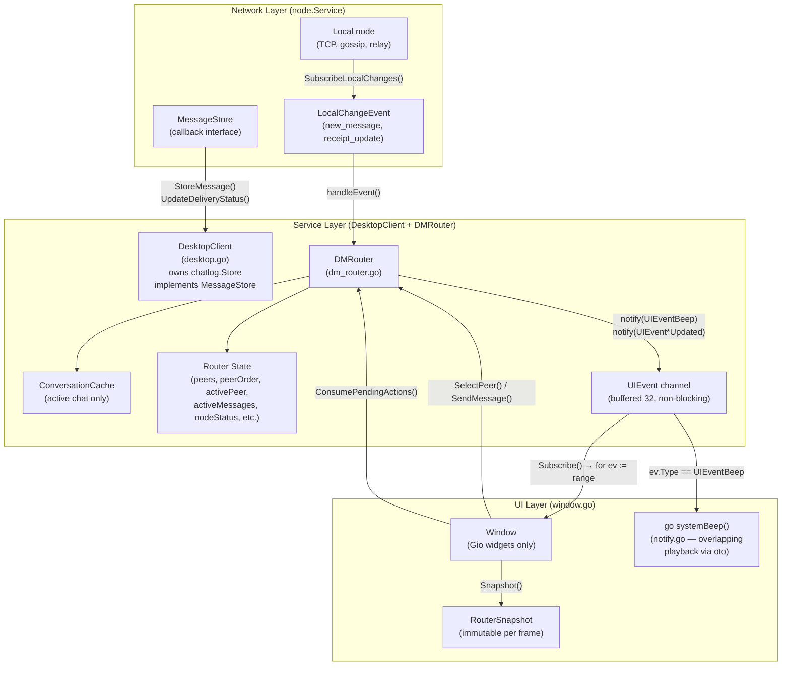
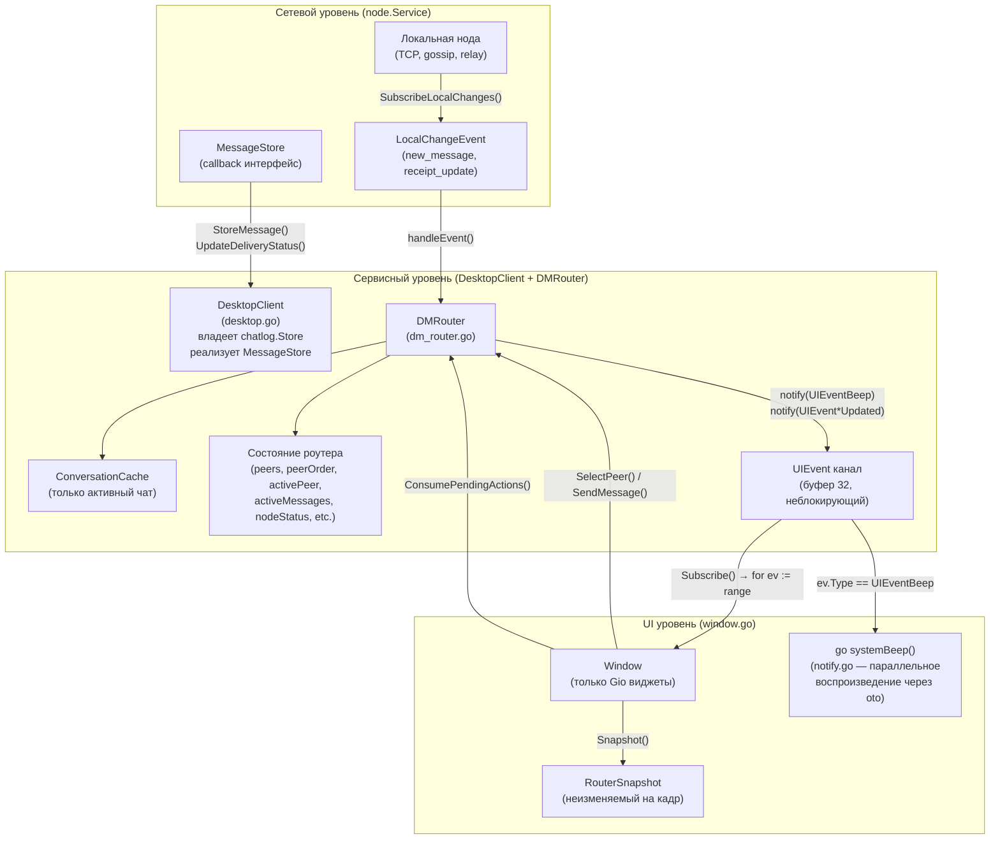

# DMRouter — Service Layer

## English

### Overview

The `DMRouter` is the central service layer between the network node and the desktop UI.
It owns all DM business logic: event routing, sidebar management, conversation cache,
health polling, mark-seen, and message sending. The UI communicates with it through
a small, well-defined public API.

Source: `internal/core/service/dm_router.go`

### Modular layered architecture

The desktop application follows a strict modular layered architecture
designed for clean separation of concerns and easy extensibility:

```mermaid
flowchart TB
    subgraph L1["Layer 1 — Network (node.Service)"]
        direction LR
        TCP["TCP connections\ngossip / relay"]
        MSTORE["MessageStore interface\n(delegates persistence\nto registered handler)"]
        EVENTS_OUT["LocalChangeEvent\nemitted on new messages\nand receipt updates"]
    end

    subgraph L2["Layer 2 — Service (DesktopClient + DMRouter)"]
        direction LR
        CHATLOG["chatlog.Store\n(SQLite, owned by\nDesktopClient)"]
        SUBSCRIBE["SubscribeLocalChanges()"]
        BUSINESS["Business logic:\n• event routing\n• sidebar management\n• conversation cache\n• health polling\n• mark-seen\n• message sending"]
        SNAPSHOT["Snapshot() → immutable\nRouterSnapshot"]
        API["Public API:\nSelectPeer() / SendMessage()\nSetSendStatus()"]
        UIEVENTS["UIEvent channel\n(buffered 32, non-blocking)\nincl. UIEventBeep"]
    end

    subgraph L3["Layer 3 — UI (Window)"]
        direction LR
        GIO["Gio widgets\n(pure rendering)"]
        FRAME["Per-frame:\nSnap → render → done"]
        BEEP["go systemBeep()\n(overlapping playback)"]
    end

    L1 --> L2
    L2 --> L3
    MSTORE -->|"StoreMessage()\nUpdateDeliveryStatus()"| CHATLOG
    UIEVENTS -->|"UIEventBeep"| BEEP

    style L1 fill:#1a2332
    style L2 fill:#1e3050
    style L3 fill:#22364a
```



*Diagram 1 — Modular layered architecture overview*

Each layer communicates with the next through a well-defined interface:

- **Network → Service**: `LocalChangeEvent` channel (events pushed by node) + `MessageStore` callback (node calls `StoreMessage`/`UpdateDeliveryStatus` on registered handler before emitting events)
- **Service → UI**: `UIEvent` channel (non-blocking notifications) + `Snapshot()` (read-only state copy)
- **UI → Service**: method calls (`SelectPeer`, `SendMessage`, `ConsumePendingActions`)

No layer reaches past its neighbor. The UI never touches `DesktopClient`
or SQLite directly. The router never manipulates Gio widgets.
Node does not own message persistence — it delegates to a `MessageStore` handler
registered by `DesktopClient` at construction time. Relay-only nodes
(`corsa-node`) leave `MessageStore` nil and relay messages without persisting them. This makes
it straightforward to add new features (group chats, file transfers, etc.)
by extending the router layer without touching the UI, or to swap the UI
framework entirely without modifying business logic.

### Three-layer architecture (Network → Service → UI)

The desktop application uses a clean three-layer architecture:



*Diagram 2 — Three-layer architecture with data flow*

**DesktopClient** (`internal/core/service/desktop.go`) owns `chatlog.Store`
(SQLite persistence) and implements `node.MessageStore`. At construction, it
registers itself with `node.Service` via `RegisterMessageStore()`. The node
calls `StoreMessage()` and `UpdateDeliveryStatus()` before emitting
`LocalChangeEvent`, maintaining the "DB first, then UI event" invariant.
`FetchConversation`, `FetchConversationPreviews`, `FetchSinglePreview`, and
`MarkConversationSeen` accept `context.Context` and propagate it through
`localRequestFrameCtx` — the context-aware variant of `localRequestFrame`.
In TCP mode, the context fully controls the dialer deadline. In embedded
mode, `ctx.Err()` is checked before and after `HandleLocalFrame` as a
best-effort gate (the synchronous handler itself cannot be interrupted).
Contact fetching is deduplicated via `fetchContactsForDecrypt(ctx, senders)`
(shared by all three Fetch methods), which skips the local identity address
when checking for missing senders to avoid spurious `fetch_contacts`
roundtrips on conversations with outgoing messages.

**DMRouter** (`internal/core/service/dm_router.go`) owns all DM business logic:
event routing, sidebar management, conversation cache, health polling, mark-seen,
message sending. The UI communicates with it through a small public API.

**Window** (`internal/app/desktop/window.go`) is a pure rendering layer. It has
no `sync.Mutex`, no direct access to `DesktopClient`, and no business logic.
At the start of each frame it calls `Snapshot()` to get an immutable copy of
router state, then renders from that snapshot.

### Public API

| Method | Direction | Description |
|---|---|---|
| `Subscribe()` | Router → UI | Returns `<-chan UIEvent` for change notifications |
| `Snapshot()` | UI → Router | Returns immutable `RouterSnapshot` under `RLock` |
| `ConsumePendingActions()` | UI → Router | Atomically reads and clears deferred widget mutations |
| `SelectPeer(id)` | UI → Router | User click: delegates to `selectPeerCore(id, true)`. Switches peer, clears stale messages, **optimistically clears unread badge** (with rollback) and emits `UIEventSidebarUpdated` synchronously, then loads conversation and sends seen in background. If `loadConversation` or `doMarkSeen` fails, the badge is **restored** via `restorePeerUnread`. Same-peer re-click: retries a failed load (cache mismatch) or retries `doMarkSeen` when `Unread > 0` (stuck badge after rollback). Same-peer with valid cache and `Unread == 0` is a no-op. |
| `AutoSelectPeer(id)` | UI → Router | Programmatic auto-select: delegates to `selectPeerCore(id, false)`. When the peer changes, behaves identically to `SelectPeer`: clears unread badge, loads conversation, sends seen receipts with rollback on failure. When the peer is the same (re-selection), it is a **true no-op** — no unread clear, no `doMarkSeen`, no UI events, no goroutines launched. This prevents redundant UI churn from programmatic re-selection. |
| `SendMessage(to, body)` | UI → Router | Encrypts and sends DM |
| `ActivePeer()` | UI → Router | Returns current active peer address |
| `MyAddress()` | UI → Router | Returns local identity address |
| `SetSendStatus(s)` | UI → Router | Updates send status text |
| `Start()` | UI → Router | Launches background goroutines (`runStartup`, `runEventListener`, health ticker) |

### Key types

```go
type RouterSnapshot struct {
    ActivePeer     domain.PeerIdentity
    PeerClicked    bool
    Peers          map[domain.PeerIdentity]*RouterPeerState
    PeerOrder      []domain.PeerIdentity
    ActiveMessages []DirectMessage
    CacheReady     bool       // true when cache is loaded for ActivePeer
    NodeStatus     NodeStatus
    SendStatus     string
    MyAddress      domain.PeerIdentity
}

type RouterPeerState struct {
    Preview ConversationPreview
    Unread  int
}

type PendingActions struct {
    ScrollToEnd   bool
    ClearEditor   bool
    ClearReply    bool
    RecipientText domain.PeerIdentity
}

type UIEventType int
const (
    UIEventMessagesUpdated UIEventType = iota + 1
    UIEventSidebarUpdated
    UIEventStatusUpdated
    UIEventBeep
)
```

### Concurrency protection

The DMRouter runs three background goroutines:

- **Event goroutine** — starts draining `SubscribeLocalChanges()` immediately
  to prevent the node's `emitLocalChange()` from dropping events (node-side
  channel has only 16 slots). Events arriving before `startupDone` closes are
  buffered in a local slice (capped at 256 entries to prevent memory spikes)
  and replayed after `initializeFromDB` completes. During replay,
  `replayingStartup` flag suppresses `Unread++` and `UIEventBeep` in
  `updateSidebarFromEvent` — because `seedPreviews()` already loaded the
  correct unread counts from SQL, replaying the same events would
  double-count. Between each replayed event, `bufferPendingLiveEvents()`
  non-blockingly reads any new live events from the channel into a temporary
  slice (capped at 256 entries, same as the startup buffer, to prevent
  unbounded memory growth from burst DMs during a slow replay), preventing
  the node-side 16-slot channel from overflowing during a large replay
  burst. Excess live events beyond the cap are consumed from the channel
  (preventing node-side overflow) but dropped, and a UI reload notification
  is sent so the repair-path picks them up. These live events are NOT
  processed under `replayingStartup` — they arrived after the SQL snapshot
  and represent genuinely new messages.  After replay completes,
  `replayingStartup` is explicitly reset to `false`, then the buffered live
  events are processed (triggering `Unread++` and `UIEventBeep` as
  expected), and finally the function enters the permanent live event loop
  (`for event := range events`). Notification sounds (`UIEventBeep`) are
  emitted for every incoming live message in `onNewMessage`.
- **Ticker goroutine** — waits for `startupDone` before the first tick,
  then calls `pollHealth()` every 5 seconds. The startup gate prevents
  `repairUnreadFromHeaders` from racing with the buffered-event replay
  and double-counting unread messages. Runs `ProbeNode` +
  `repairUnreadFromHeaders` — a lightweight health/repair path that catches
  dropped events and detects new messages from DMHeaders.
- **UI goroutine** — calls `Snapshot()`, `ConsumePendingActions()`,
  `SelectPeer()`, `SendMessage()` from the Gio event loop.

To prevent data races (which cause Go runtime fatals that are uncatchable):

1. `mu sync.RWMutex` (on DMRouter) — protects all shared router fields:
   `activePeer`, `peerClicked`, `peers`, `peerOrder`, `activeMessages`,
   `nodeStatus`, `seenMessageIDs`, `initialSynced`, `replayingStartup`,
   `sendStatus`, `pendingScrollToEnd`, `pendingClearEditor`,
   `pendingRecipientText`.

   Background goroutines acquire `mu.Lock()` for writes and `mu.RLock()` for
   reads. `Snapshot()` acquires `mu.RLock()` and returns a deep copy.

   **Identity normalization**: All public ingress points (`SelectPeer`,
   `AutoSelectPeer`, `SendMessage`, `RemovePeer`, `peerForMessage`,
   `repairUnreadFromHeaders`) normalize `PeerIdentity` via `normalizePeer()`
   (whitespace trim) before any map/slice access. This prevents
   whitespace-padded identities from creating duplicate keys in `peers` or
   `peerOrder`.

2. **Snapshot pattern** — the UI goroutine never reads router fields directly.
   Instead, `Snapshot()` takes a consistent point-in-time copy under a single
   `RLock`, returning an immutable `RouterSnapshot` struct. The UI reads only
   from this snapshot for the entire frame. This eliminates all lock contention
   in the rendering path.

3. **Widget safety via PendingActions** — Gio widgets (`widget.Editor`,
   `widget.List`, etc.) are NOT thread-safe. Background goroutines set
   deferred action flags (`pendingScrollToEnd`, `pendingClearEditor`,
   `pendingRecipientText`) under `mu`. The UI goroutine calls
   `ConsumePendingActions()` at the start of each frame, which atomically
   reads and clears these flags, then applies them to Gio widgets.

4. **Non-blocking UIEvent channel** — the router sends `UIEvent` values to a
   buffered channel (capacity 32) via `notify()`. If the channel is full,
   each overflowed event gets its own background retry goroutine with
   exponential backoff (50ms → 100ms → 200ms, 3 attempts). An atomic
   counter (`uiOverflowCount`) caps concurrent retry goroutines at 8 to
   prevent accumulation during sustained bursts; events beyond the cap are
   dropped with a warning. This per-event retry ensures distinct event
   types (e.g. `UIEventBeep`) are not silently lost when the channel
   overflows. The UI bridge goroutine calls `window.Invalidate()` for
   each event, triggering a new frame.

5. **Event-driven architecture** — the router logic is split into three clean
   paths:

   **Startup** (`initializeFromDB`): runs once asynchronously so the window
   appears immediately. Fetches conversation previews with retry (up to 3
   attempts with linear backoff) to handle transient DB/node failures.
   Calls `resetIdentityState()` to clear all identity-specific state, then
   `seedPreviews()` to populate the `peers` map (sorted: unread first by
   count desc, then by most recent timestamp). Delegates peer selection to
   `AutoSelectPeer()`, which handles the full lifecycle: optimistic unread
   clear, `loadConversation()`, `doMarkSeen()`, and rollback on failure.
   Before the call, `activePeer` is cleared so `selectPeerCore` always
   sees a peer switch and triggers a full load (important for reconnect
   when `activePeer` was already set). Finally runs an initial
   `pollHealth()` (via `defer`) so network contacts appear in the sidebar
   immediately rather than waiting for the first ticker cycle.

   Because `Start()` launches `initializeFromDB` and the event listener
   in parallel, `seedPreviews()` guards against the startup race: if the
   event-path already delivered fresher data for a peer (newer timestamp),
   `seedPreviews` skips that peer instead of overwriting with stale startup
   snapshot data.

   `resetIdentityState()` clears `peers`, `peerOrder`, `activePeer`,
   `peerClicked`, `activeMessages`, `seenMessageIDs`, `initialSynced`,
   `sendStatus`, `pendingScrollToEnd`, `pendingClearEditor`,
   `pendingRecipientText`. The `cache` (ConversationCache) is emptied via
   `Load("", nil)` rather than pointer replacement, because event goroutines
   hold a reference to the same cache object and call its methods concurrently.

   **Event handler** (`handleEvent` → `onNewMessage` / `onReceiptUpdate`):
   Active peer detection uses `isActivePeer()` (checks `r.activePeer`
   under lock), NOT `cache.MatchesPeer()`. This is critical because
   during a peer switch, `activePeer` is updated immediately by
   `selectPeerCore()`, but the cache is only updated after
   `loadConversation()` completes asynchronously.

   - New messages for the **active conversation** where the cache is
     loaded are decrypted inline via `DecryptIncomingMessage`, appended
     to `ConversationCache`, and `activeMessages` is refreshed.
     `RouterPeerState.Preview` is updated to reflect the new message.
     If inline decryption fails, `loadConversation` reloads the full
     history and `updatePreviewFromStore` refreshes the preview from
     SQLite. `doMarkSeen` is called for every incoming message — the
     chat is on screen and counts as read.
   - New messages for the **active conversation** where the cache is
     NOT yet loaded (mid-switch) decrypt the message inline via
     `DecryptIncomingMessage` and capture the resulting `*DirectMessage`.
     If decryption succeeds, `RouterPeerState.Preview` is updated
     immediately and the peer is promoted in `peerOrder`. A background
     `reloadAndRefreshPreview()` always runs. If the reload **succeeds**,
     `updatePreviewFromStore` refreshes the preview from SQLite for
     consistency. If the reload **fails** and a decrypted message was
     captured, the fallback path seeds the cache with that single
     message via `cache.Load()` and copies it into `activeMessages` —
     so the user sees the message in the open chat instead of a blank
     screen. Without this fallback, a transient chatlog failure during
     mid-switch would silently discard a successfully decrypted message.
   - **Sound notifications**: `UIEventBeep` is emitted for every incoming
     message (sender ≠ us) in `onNewMessage`, covering three code paths:
     (1) non-active peer, (2) active peer mid-switch (cache not yet loaded),
     (3) active peer with cache ready. The repair-path in
     `repairUnreadFromHeaders` emits `UIEventBeep` **only for non-active
     peers** — active peer messages are already visible on screen, so
     beeping on repair would produce duplicate notifications after a
     transient failure recovery.
   - New messages for **non-active chats** go through `updateSidebarFromEvent`,
     which decrypts the preview and updates `RouterPeerState.Preview` + `Unread`,
     promotes the peer in `peerOrder`. If decryption fails (contact keys not
     yet available), the router falls back to `updatePreviewFromStore` in a
     background goroutine, increments `Unread` for incoming messages, and
     promotes the peer in `peerOrder` — matching the behavior of the
     successful inline-decrypt path.
   - Receipt updates for the active peer update the cache in-place via
     `ConversationCache.UpdateStatus()`. If the cache hasn't loaded yet
     for the active peer, a `loadConversation()` is triggered. If the
     message is missing from cache, a full reload is also triggered.

   **Ticker** (`pollHealth`): runs `ProbeNode` + `repairUnreadFromHeaders`.
   `repairUnreadFromHeaders` scans DMHeaders for message IDs not yet seen in
   `seenMessageIDs`, increments unread counts for non-active incoming messages,
   and triggers `loadConversation` + `doMarkSeen` if the active chat has
   messages missing from cache. On the first sync (`initialSynced = false`),
   `Unread++` is skipped — `seedPreviews()` already set correct counts from
   SQL (`delivery_status != 'seen'`). DMHeaders don't carry delivery status,
   so incrementing on first sync would double-count every incoming message
   regardless of whether it's actually unread. To prevent double-counting
   with the event-path, `onNewMessage()` registers `event.MessageID` in
   `seenMessageIDs` up-front — before any other processing — so the
   repair-path skips messages already handled by the event-path.
   However, if a background fallback fails (e.g. `loadConversation` or
   `updatePreviewFromStore` returns `false`), the message ID is **evicted**
   from `seenMessageIDs` via `evictSeenMessages()` so that
   `repairUnreadFromHeaders` can rediscover it on the next health poll.
   Without this rollback, the dedup gate would permanently suppress the
   message. The same rollback applies to the repair-path itself:
   `refreshPreviewForPeer` evicts message IDs when `updatePreviewFromStore`
   fails, so the next repair cycle retries the preview refresh.
   The active peer is excluded from `refreshPreviewForPeer` — its preview
   is updated by the `loadConversation` + `updatePreviewFromStore` path.
   If `loadConversation` succeeds but `updatePreviewFromStore` fails,
   `seenMessageIDs` is **not** evicted — the messages are already in cache
   and visible on screen. Evicting would cause rediscovery and a spurious
   `UIEventBeep`. The stale preview will be updated on the next message or
   peer switch. `UIEventBeep` is only emitted for non-active peers —
   active peer messages are already visible so notification is unnecessary.
   All rollback logic is centralized in `evictSeenMessages()` and
   `reloadAndRefreshPreview()` to avoid duplication across paths.

   **Seen receipts** (`doMarkSeen`): `MarkConversationSeen` is triggered
   by both `SelectPeer` and `AutoSelectPeer` via `selectPeerCore`, and
   by `onNewMessage` for every incoming message in the active chat. The
   principle: if the chat is on screen, messages count as read. The unread
   badge is optimistically cleared; if `doMarkSeen` fails the badge is
   restored to its previous value.
   `doMarkSeen` first verifies that `activePeer` still matches
   `peerAddress` — if the user switched peers before the goroutine ran,
   `activeMessages` belong to the new peer and using them would send a
   vacuous `MarkConversationSeen` that succeeds without real receipts,
   falsely clearing unread for the old peer. On mismatch, `doMarkSeen`
   returns `false` so the caller restores the badge. It also requires
   non-empty `activeMessages` — if the conversation hasn't loaded yet,
   it returns `false`. `selectPeerCore` only calls `doMarkSeen` after
   `loadConversation()` succeeds.

6. **Stale-load protection** — `loadConversation()` re-checks `activePeer`
   after `FetchConversation` returns. If the user switched peers during the
   fetch, the result is discarded.

7. **Stale-message protection** — `selectPeerCore()` (shared by both
   `SelectPeer` and `AutoSelectPeer`) clears `activeMessages` to nil
   synchronously before launching the background `loadConversation()`,
   and emits `UIEventMessagesUpdated` synchronously when the peer changed
   so the UI re-renders with an empty message list in the same frame.

8. **Failed-load retry / stuck-badge recovery** — When the user re-clicks the
   already-selected peer, `selectPeerCore` (with `userClicked=true`) checks
   two conditions: (a) cache miss (`!cache.MatchesPeer()`) → retries
   `loadConversation` + `doMarkSeen`; (b) cache valid but `Unread > 0` (badge
   stuck after `restorePeerUnread` rollback) → retries `doMarkSeen` only.
   When cache is valid and `Unread == 0` the click is a no-op.
   `AutoSelectPeer` (`userClicked=false`) same-peer is always a true no-op.

9. **Panic-safe startup** — `runStartup()` uses two separate `defer`
   statements: `defer close(startupDone)` (registered first, runs last) and
   `defer recoverLog("initializeFromDB")` (registered second, runs first).
   Go's LIFO defer order ensures `recoverLog` catches the panic via `recover()`
   before `close(startupDone)` unblocks the event listener. Both must be
   top-level `defer` calls — wrapping them in a single `defer func() { ... }()`
   would make `recover()` a nested call, which does not catch panics in Go.
   Without this, a panic in `initializeFromDB` would permanently disable the
   entire event-driven layer for the session. `runStartup()` and
   `runEventListener()` are extracted as named methods (not anonymous
   goroutines) so that unit tests can call them directly against a controlled
   DMRouter without duplicating production logic.

### DeliveredAt after restart

After a node restart, in-memory delivery receipts are empty, but the SQLite
`delivery_status` column retains "delivered" or "seen" values. Without special
handling, `DeliveredAt` would be nil and the UI would not render status
checkmarks (✓/✓✓).

Fix: `decryptDirectMessages()` synthesizes `DeliveredAt` from the message
timestamp when `PersistedStatus` is "delivered" or "seen" but no in-memory
receipt exists. The rendering switch also explicitly handles "delivered" and
"seen" status strings so badges appear even if `DeliveredAt` is nil for any
reason.

When a real delivery receipt later arrives with the same status rank (e.g.
"delivered" → "delivered"), `ConversationCache.UpdateStatus()` allows the
update if it upgrades a nil/zero `DeliveredAt` to a real timestamp. This
replaces the synthetic value with the actual receipt time without requiring
a status rank advance.

---

## Русский

### Обзор

`DMRouter` — центральный сервисный слой между сетевой нодой и desktop UI.
Он владеет всей DM бизнес-логикой: маршрутизация событий, управление sidebar,
кеш диалогов, health polling, mark-seen, отправка сообщений. UI общается
с ним через небольшой, чётко определённый публичный API.

Исходник: `internal/core/service/dm_router.go`

### Модульная многослойная архитектура

Desktop-приложение следует строгой модульной многослойной архитектуре,
спроектированной для чистого разделения ответственности и лёгкой расширяемости:

```mermaid
flowchart TB
    subgraph L1["Слой 1 — Сеть (node.Service)"]
        direction LR
        TCP["TCP соединения\ngossip / relay"]
        MSTORE["Интерфейс MessageStore\n(делегирует персистентность\nзарегистрированному обработчику)"]
        EVENTS_OUT["LocalChangeEvent\nгенерируется при новых\nсообщениях и квитанциях"]
    end

    subgraph L2["Слой 2 — Сервис (DesktopClient + DMRouter)"]
        direction LR
        CHATLOG["chatlog.Store\n(SQLite, владеет\nDesktopClient)"]
        SUBSCRIBE["SubscribeLocalChanges()"]
        BUSINESS["Бизнес-логика:\n• маршрутизация событий\n• управление sidebar\n• кеш диалогов\n• health polling\n• mark-seen\n• отправка сообщений"]
        SNAPSHOT["Snapshot() → неизменяемый\nRouterSnapshot"]
        API["Публичный API:\nSelectPeer() / SendMessage()\nSetSendStatus()"]
        UIEVENTS["UIEvent канал\n(буфер 32, неблокирующий)\nвкл. UIEventBeep"]
    end

    subgraph L3["Слой 3 — UI (Window)"]
        direction LR
        GIO["Gio виджеты\n(чистый рендеринг)"]
        FRAME["Каждый кадр:\nSnap → рендер → готово"]
        BEEP["go systemBeep()\n(параллельное воспроизведение)"]
    end

    L1 --> L2
    L2 --> L3
    MSTORE -->|"StoreMessage()\nUpdateDeliveryStatus()"| CHATLOG
    UIEVENTS -->|"UIEventBeep"| BEEP

    style L1 fill:#1a2332
    style L2 fill:#1e3050
    style L3 fill:#22364a
```



*Диаграмма 1 — Обзор модульной многослойной архитектуры*

Каждый слой общается со следующим через чётко определённый интерфейс:

- **Сеть → Сервис**: канал `LocalChangeEvent` (события от ноды) + callback `MessageStore` (нода вызывает `StoreMessage`/`UpdateDeliveryStatus` на зарегистрированном обработчике перед генерацией событий)
- **Сервис → UI**: канал `UIEvent` (неблокирующие уведомления) + `Snapshot()` (read-only копия состояния)
- **UI → Сервис**: вызовы методов (`SelectPeer`, `SendMessage`, `ConsumePendingActions`)

Ни один слой не «перепрыгивает» через соседний. UI никогда не обращается к
`DesktopClient` или SQLite напрямую. Роутер никогда не манипулирует виджетами
Gio. Нода не владеет хранением сообщений — делегирует обработчику `MessageStore`,
зарегистрированному `DesktopClient` при создании. Relay-only ноды (`corsa-node`)
оставляют `MessageStore` = nil и ретранслируют сообщения без персистентности. Это позволяет легко добавлять новые функции (групповые чаты, передачу
файлов и др.) расширяя слой роутера без изменений UI, или полностью заменить
UI-фреймворк без модификации бизнес-логики.

### Трёхуровневая архитектура (Network → Service → UI)

Desktop-приложение использует трёхуровневую архитектуру:



*Диаграмма 2 — Трёхуровневая архитектура с потоком данных*

**DesktopClient** (`internal/core/service/desktop.go`) владеет `chatlog.Store`
(персистентность SQLite) и реализует `node.MessageStore`. При создании
регистрируется в `node.Service` через `RegisterMessageStore()`. Нода вызывает
`StoreMessage()` и `UpdateDeliveryStatus()` перед генерацией `LocalChangeEvent`,
сохраняя инвариант «сначала БД, потом UI-событие». `FetchConversation`,
`FetchConversationPreviews`, `FetchSinglePreview` и `MarkConversationSeen`
принимают `context.Context` и пробрасывают его через `localRequestFrameCtx` —
context-aware вариант `localRequestFrame`. В TCP-режиме context полностью
контролирует дедлайн dial. В embedded-режиме `ctx.Err()` проверяется до и
после `HandleLocalFrame` как best-effort gate (сам синхронный handler не
может быть прерван). Загрузка контактов дедуплицирована в хелпере
`fetchContactsForDecrypt(ctx, senders)` (общем для всех трёх Fetch-методов),
который исключает собственный адрес identity при проверке missing senders,
избегая лишних `fetch_contacts` roundtrip'ов на диалогах с исходящими
сообщениями.

**DMRouter** (`internal/core/service/dm_router.go`) владеет всей DM
бизнес-логикой: маршрутизация событий, управление sidebar, кеш диалогов,
health polling, mark-seen, отправка сообщений. UI общается с ним через
небольшой публичный API.

**Window** (`internal/app/desktop/window.go`) — чистый слой рендеринга.
Без `sync.Mutex`, без прямого доступа к `DesktopClient`, без бизнес-логики.
В начале каждого кадра вызывает `Snapshot()` для получения неизменяемой копии
состояния роутера, затем рендерит из этого снимка.

### Публичный API

| Метод | Направление | Описание |
|---|---|---|
| `Subscribe()` | Роутер → UI | Возвращает `<-chan UIEvent` для уведомлений об изменениях |
| `Snapshot()` | UI → Роутер | Возвращает неизменяемый `RouterSnapshot` под `RLock` |
| `ConsumePendingActions()` | UI → Роутер | Атомарно читает и очищает отложенные мутации виджетов |
| `SelectPeer(id)` | UI → Роутер | Клик пользователя: делегирует в `selectPeerCore(id, true)`. Переключает peer'а, чистит stale сообщения, **оптимистично сбрасывает unread-бейдж** (с откатом) и эмитит `UIEventSidebarUpdated` синхронно, затем в фоне загружает диалог и отправляет seen. Если `loadConversation` или `doMarkSeen` упадёт, бейдж **восстанавливается** через `restorePeerUnread`. Повторный клик по тому же peer'у: повторяет упавшую загрузку (cache miss) или повторяет `doMarkSeen` при `Unread > 0` (застрявший бейдж после отката). При валидном кеше и `Unread == 0` — no-op. |
| `AutoSelectPeer(id)` | UI → Роутер | Программный авто-выбор: делегирует в `selectPeerCore(id, false)`. При смене peer'а поведение идентично `SelectPeer`: сброс unread, загрузка диалога, seen-квитанции с откатом при ошибке. При повторном выборе того же peer'а — **полный no-op**: без сброса unread, без `doMarkSeen`, без UI-событий, без запуска горутин. Это предотвращает избыточные UI-обновления при программном переизбрании. |
| `SendMessage(to, body)` | UI → Роутер | Шифрует и отправляет DM |
| `ActivePeer()` | UI → Роутер | Возвращает адрес текущего активного peer'а |
| `MyAddress()` | UI → Роутер | Возвращает адрес локальной identity |
| `SetSendStatus(s)` | UI → Роутер | Обновляет текст статуса отправки |
| `Start()` | UI → Роутер | Запускает фоновые горутины (`runStartup`, `runEventListener`, health ticker) |

### Ключевые типы

```go
type RouterSnapshot struct {
    ActivePeer     domain.PeerIdentity
    PeerClicked    bool
    Peers          map[domain.PeerIdentity]*RouterPeerState
    PeerOrder      []domain.PeerIdentity
    ActiveMessages []DirectMessage
    CacheReady     bool       // true when cache is loaded for ActivePeer
    NodeStatus     NodeStatus
    SendStatus     string
    MyAddress      domain.PeerIdentity
}

type RouterPeerState struct {
    Preview ConversationPreview
    Unread  int
}

type PendingActions struct {
    ScrollToEnd   bool
    ClearEditor   bool
    ClearReply    bool
    RecipientText domain.PeerIdentity
}

type UIEventType int
const (
    UIEventMessagesUpdated UIEventType = iota + 1
    UIEventSidebarUpdated
    UIEventStatusUpdated
    UIEventBeep
)
```

### Защита конкурентного доступа

DMRouter запускает три фоновые горутины:

- **Event горутина** — начинает читать из `SubscribeLocalChanges()` сразу,
  чтобы предотвратить потерю событий в `emitLocalChange()` ноды (буфер
  канала ноды всего 16 слотов). События, пришедшие до закрытия `startupDone`,
  буферизуются в локальный слайс (лимит 256 записей для предотвращения
  memory spike) и воспроизводятся после завершения `initializeFromDB`.
  Во время replay флаг `replayingStartup` подавляет `Unread++` и
  `UIEventBeep` в `updateSidebarFromEvent` — т.к. `seedPreviews()` уже
  загрузил правильные unread-счётчики из SQL, повторное применение тех же
  событий привело бы к двойному учёту. Между каждым replayed event
  `bufferPendingLiveEvents()` неблокирующе читает новые live-события из
  канала во временный слайс (лимит 256 записей, как у startup буфера, для
  предотвращения неограниченного роста памяти при burst DM во время
  медленного replay), предотвращая переполнение 16-слотного канала ноды.
  События сверх лимита потребляются из канала (предотвращая overflow ноды),
  но отбрасываются, и отправляется уведомление UI reload, чтобы
  repair-path подхватил пропущенные. Эти live-события НЕ обрабатываются
  под `replayingStartup` — они пришли после SQL snapshot'а и являются
  реально новыми сообщениями. После завершения replay `replayingStartup`
  явно сбрасывается в `false`, затем буферизованные live-события
  обрабатываются (вызывая `Unread++` и `UIEventBeep` как положено), и
  наконец функция входит в постоянный live event loop (`for event := range
  events`). Звуковые уведомления (`UIEventBeep`) генерируются для каждого
  входящего live-сообщения в `onNewMessage`.
- **Ticker горутина** — ожидает `startupDone` перед первым тиком, затем
  вызывает `pollHealth()` каждые 5 секунд. Startup-gate предотвращает
  гонку `repairUnreadFromHeaders` с replay буферизованных событий и
  двойной учёт unread. Выполняет `ProbeNode` + `repairUnreadFromHeaders` —
  лёгкий health/repair путь, который подхватывает пропущенные события
  и обнаруживает новые сообщения из DMHeaders.
- **UI горутина** — вызывает `Snapshot()`, `ConsumePendingActions()`,
  `SelectPeer()`, `SendMessage()` из event loop Gio.

Для предотвращения гонок данных (которые вызывают фатальный крэш Go runtime):

1. `mu sync.RWMutex` (на DMRouter) — защищает все разделяемые поля роутера:
   `activePeer`, `peerClicked`, `peers`, `peerOrder`, `activeMessages`,
   `nodeStatus`, `seenMessageIDs`, `initialSynced`, `replayingStartup`,
   `sendStatus`, `pendingScrollToEnd`, `pendingClearEditor`,
   `pendingRecipientText`.

   Фоновые горутины берут `mu.Lock()` для записи и `mu.RLock()` для чтения.
   `Snapshot()` берёт `mu.RLock()` и возвращает глубокую копию.

   **Нормализация идентификаторов**: Все публичные точки входа (`SelectPeer`,
   `AutoSelectPeer`, `SendMessage`, `RemovePeer`, `peerForMessage`,
   `repairUnreadFromHeaders`) нормализуют `PeerIdentity` через
   `normalizePeer()` (trim пробелов) перед любым доступом к map/slice.
   Это предотвращает создание дублирующих ключей в `peers` или `peerOrder`
   из-за пробелов в идентификаторах.

2. **Паттерн Snapshot** — UI горутина никогда не читает поля роутера
   напрямую. `Snapshot()` создаёт консистентную копию под единым `RLock`,
   возвращая неизменяемый `RouterSnapshot`. UI читает только из этого
   снимка весь кадр. Это исключает всю конкуренцию за блокировки в пути
   рендеринга.

3. **Безопасность виджетов через PendingActions** — виджеты Gio НЕ
   потокобезопасны. Фоновые горутины устанавливают флаги отложенных
   действий под `mu`. UI горутина вызывает `ConsumePendingActions()` в
   начале каждого кадра, атомарно читая и очищая флаги, затем применяет
   их к виджетам Gio.

4. **Неблокирующий UIEvent канал** — роутер отправляет `UIEvent` в
   буферизированный канал (ёмкость 32) через `notify()`. При переполнении
   каждое событие получает собственную retry-горутину с экспоненциальным
   backoff (50мс → 100мс → 200мс, 3 попытки). Атомарный счётчик
   (`uiOverflowCount`) ограничивает количество одновременных retry-горутин
   до 8, предотвращая накопление при sustained bursts; события сверх лимита
   отбрасываются с предупреждением. Per-event retry гарантирует, что
   distinct event types (например, `UIEventBeep`) не теряются при
   переполнении канала. Bridge-горутина UI вызывает
   `window.Invalidate()` на каждое событие, запуская новый кадр.

5. **Event-driven архитектура** — логика роутера разделена на три пути:

   **Startup** (`initializeFromDB`): выполняется один раз асинхронно.
   Загружает превью с retry (до 3 попыток с линейным backoff) для
   обработки временных ошибок БД/ноды. Очищает состояние через
   `resetIdentityState()`, заполняет `peers` через `seedPreviews()`
   (сортировка: сначала непрочитанные по убыванию count, затем по
   времени последней активности). Делегирует выбор peer'а в
   `AutoSelectPeer()`, который выполняет полный цикл: оптимистичный
   сброс unread, `loadConversation()`, `doMarkSeen()` и rollback при
   ошибке. Перед вызовом `activePeer` сбрасывается, чтобы
   `selectPeerCore` всегда видел переключение peer'а и запускал
   полную загрузку (важно для reconnect, когда `activePeer` уже
   был установлен). В конце запускает начальный `pollHealth()` (через
   `defer`) чтобы сетевые контакты появились в sidebar сразу, а не
   после первого цикла тикера.

   Поскольку `Start()` запускает `initializeFromDB` и event listener
   параллельно, `seedPreviews()` защищает от startup race: если event-path
   уже доставил для peer'а более свежие данные (новый timestamp),
   `seedPreviews` пропускает этого peer'а, а не перезаписывает stale
   данными из стартового снимка.

   `resetIdentityState()` очищает `peers`, `peerOrder`, `activePeer`,
   `peerClicked`, `activeMessages`, `seenMessageIDs`, `initialSynced`,
   `sendStatus`, `pendingScrollToEnd`, `pendingClearEditor`,
   `pendingRecipientText`. `cache` (ConversationCache) очищается через
   `Load("", nil)`, а не заменой указателя, потому что event-горутины
   держат ссылку на тот же объект cache и вызывают его методы конкурентно.

   **Обработчик событий** (`handleEvent`):
   Определение активного peer'а использует `isActivePeer()` (проверяет
   `r.activePeer` под блокировкой), а НЕ `cache.MatchesPeer()`. Это
   критично, потому что при переключении peer'а `activePeer` обновляется
   сразу в `selectPeerCore()`, а cache — только после завершения
   асинхронного `loadConversation()`.

   - Новые сообщения для **активного разговора** с загруженным cache
     расшифровываются inline через `DecryptIncomingMessage`, добавляются
     в `ConversationCache`, и `activeMessages` обновляется.
     `RouterPeerState.Preview` обновляется для отражения нового
     сообщения. При неудачной inline-расшифровке `loadConversation`
     перезагружает историю, а `updatePreviewFromStore` обновляет превью
     из SQLite. `doMarkSeen` вызывается для каждого входящего
     сообщения — чат на экране = прочитан.
   - Новые сообщения для **активного разговора** с НЕзагруженным cache
     (в процессе переключения) расшифровываются inline через
     `DecryptIncomingMessage`, результат `*DirectMessage` сохраняется.
     При успешной расшифровке `RouterPeerState.Preview` обновляется
     немедленно, peer продвигается в `peerOrder`. Фоновый
     `reloadAndRefreshPreview()` запускается всегда. При **успешной**
     перезагрузке `updatePreviewFromStore` обновляет превью из SQLite
     для консистентности. При **неудачной** перезагрузке, если
     расшифрованное сообщение было сохранено, fallback-путь загружает
     его в cache через `cache.Load()` и копирует в `activeMessages` —
     пользователь видит сообщение в открытом чате вместо пустого экрана.
     Без этого fallback транзиентная ошибка chatlog при mid-switch
     молча теряла бы успешно расшифрованное сообщение.
   - Новые сообщения для **неактивных чатов** обновляют превью через
     `updateSidebarFromEvent` (`RouterPeerState.Preview` + `Unread`),
     продвигают peer'а в `peerOrder`. При неудачной расшифровке
     (ключи контакта ещё недоступны) роутер переходит к
     `updatePreviewFromStore` в фоновой goroutine, увеличивает
     `Unread` для входящих сообщений и продвигает peer'а в `peerOrder` —
     поведение идентично успешному inline-decrypt пути.
   - **Звуковые уведомления**: `UIEventBeep` эмитится для каждого входящего
     сообщения (sender ≠ мы) в `onNewMessage`, покрывая три code-path:
     (1) неактивный peer, (2) активный peer mid-switch (cache ещё не
     загружен), (3) активный peer с ready cache. Repair-path в
     `repairUnreadFromHeaders` эмитит `UIEventBeep` **только для
     неактивных peer'ов** — сообщения активного peer уже видны на экране,
     повторный beep при repair привёл бы к дублированию уведомления после
     восстановления от транзиентной ошибки.
   - Обновления квитанций для активного peer'а обновляют кеш in-place
     через `ConversationCache.UpdateStatus()`. Если cache ещё не загружен
     для активного peer'а — запускается `loadConversation()`. Если
     сообщение отсутствует в cache — также запускается полная перезагрузка.

   **Тикер** (`pollHealth`): `ProbeNode` + `repairUnreadFromHeaders`.
   `repairUnreadFromHeaders` сканирует DMHeaders на предмет ID сообщений,
   ещё не виденных в `seenMessageIDs`, увеличивает unread для неактивных
   входящих сообщений и запускает `loadConversation` + `doMarkSeen` если
   в активном чате есть сообщения, отсутствующие в cache. При первом sync
   (`initialSynced = false`) `Unread++` пропускается — `seedPreviews()`
   уже установила корректные счётчики из SQL (`delivery_status != 'seen'`).
   DMHeaders не содержат delivery status, поэтому инкремент при первом sync
   считал бы каждое входящее сообщение как непрочитанное. Для предотвращения
   двойного подсчёта с event-path `onNewMessage()` регистрирует
   `event.MessageID` в `seenMessageIDs` в самом начале — до любой другой
   обработки — так repair-path пропускает сообщения, уже обработанные
   event-path.
   Однако если фоновый fallback завершается неудачей (например,
   `loadConversation` или `updatePreviewFromStore` возвращает `false`),
   ID сообщения **удаляется** из `seenMessageIDs` через
   `evictSeenMessages()`, чтобы `repairUnreadFromHeaders` мог обнаружить
   его при следующем health poll. Без этого отката dedup-gate навсегда
   подавлял бы сообщение. Тот же откат применяется и к самому repair-path:
   `refreshPreviewForPeer` удаляет ID сообщений когда
   `updatePreviewFromStore` возвращает ошибку, так что следующий цикл
   repair повторит обновление preview.
   Активный peer исключён из `refreshPreviewForPeer` — его preview
   обновляется через `loadConversation` + `updatePreviewFromStore`.
   Если `loadConversation` прошёл, но `updatePreviewFromStore` не удался,
   `seenMessageIDs` **не откатывается** — сообщения уже в кеше и на
   экране. Откат привёл бы к повторному обнаружению и ложному
   `UIEventBeep`. Stale preview обновится при следующем сообщении или
   переключении peer. `UIEventBeep` эмитится только для неактивных
   peer'ов — сообщения активного peer уже видны, уведомление не нужно.
   Вся логика отката централизована в `evictSeenMessages()` и
   `reloadAndRefreshPreview()` для устранения дублирования.

   **Seen-квитанции** (`doMarkSeen`): вызывается из `SelectPeer` и
   `AutoSelectPeer` через `selectPeerCore`, а также из `onNewMessage`
   для каждого входящего сообщения в активном чате. Принцип: если чат
   на экране — сообщения считаются прочитанными. Бейдж сбрасывается
   оптимистично; при неудаче `doMarkSeen` восстанавливается.

   `doMarkSeen` сначала проверяет, что `activePeer` всё ещё совпадает
   с `peerAddress` — если пользователь успел переключиться на другой чат
   до выполнения горутины, `activeMessages` принадлежат новому peer'у и
   их использование привело бы к пустому `MarkConversationSeen` (который
   успешно завершается без реальных квитанций), ложно обнуляя unread
   старого peer'а. При несовпадении `doMarkSeen` возвращает `false`,
   чтобы вызывающий код восстановил бейдж. Также требуются непустые
   `activeMessages` — если диалог ещё не загрузился, возвращает `false`.
   `selectPeerCore` вызывает `doMarkSeen` только после успешного
   `loadConversation()`.

6. **Защита от stale-загрузки** — `loadConversation()` перепроверяет
   `activePeer` после возврата `FetchConversation`. Если пользователь
   переключил peer'а во время fetch, результат отбрасывается.

7. **Защита от stale-сообщений** — `selectPeerCore()` (общий для
   `SelectPeer` и `AutoSelectPeer`) синхронно очищает `activeMessages`
   в nil перед запуском фонового `loadConversation()` и эмитит
   `UIEventMessagesUpdated` синхронно при смене peer'а, чтобы UI
   перерисовался с пустым списком сообщений в том же фрейме.

8. **Повтор упавшей загрузки / восстановление застрявшего бейджа** — Когда
   пользователь повторно кликает по уже выбранному peer'у, `selectPeerCore`
   (с `userClicked=true`) проверяет два условия: (а) cache miss
   (`!cache.MatchesPeer()`) → повтор `loadConversation` + `doMarkSeen`;
   (б) cache валиден, но `Unread > 0` (бейдж застрял после отката
   `restorePeerUnread`) → повтор только `doMarkSeen`. При валидном кеше
   и `Unread == 0` клик — no-op. `AutoSelectPeer` (`userClicked=false`)
   при same-peer всегда полный no-op.

9. **Panic-safe startup** — `runStartup()` использует два отдельных `defer`:
   `defer close(startupDone)` (зарегистрирован первым, выполняется последним) и
   `defer recoverLog("initializeFromDB")` (зарегистрирован вторым, выполняется
   первым). LIFO-порядок defer в Go гарантирует, что `recoverLog` ловит panic
   через `recover()` до того, как `close(startupDone)` разблокирует event listener.
   Оба должны быть top-level `defer` вызовами — оборачивание их в одну
   `defer func() { ... }()` сделало бы `recover()` вложенным вызовом, который
   в Go не ловит panic. Без этого panic в `initializeFromDB` навсегда
   отключала бы весь event-driven слой на время сессии. `runStartup()` и
   `runEventListener()` вынесены в именованные методы (а не анонимные горутины),
   чтобы unit-тесты могли вызывать их напрямую на контролируемом DMRouter
   без дублирования production-логики.

### DeliveredAt после рестарта

После рестарта ноды in-memory receipts пусты, но столбец `delivery_status`
в SQLite сохраняет значения "delivered" или "seen". Без специальной обработки
`DeliveredAt` будет nil и UI не отрисует галочки статуса (✓/✓✓).

Решение: `decryptDirectMessages()` синтезирует `DeliveredAt` из timestamp
сообщения, когда `PersistedStatus` = "delivered" или "seen", но in-memory
receipt отсутствует. Рендеринг switch также явно обрабатывает строки статуса
"delivered" и "seen", чтобы бейджи отображались даже если `DeliveredAt` nil.

Когда позже приходит реальная delivery-квитанция с тем же рангом статуса
(например "delivered" → "delivered"), `ConversationCache.UpdateStatus()`
разрешает обновление, если оно заменяет nil/zero `DeliveredAt` на реальную
временную метку. Это заменяет синтетическое значение на фактическое время
доставки без необходимости повышения ранга статуса.
