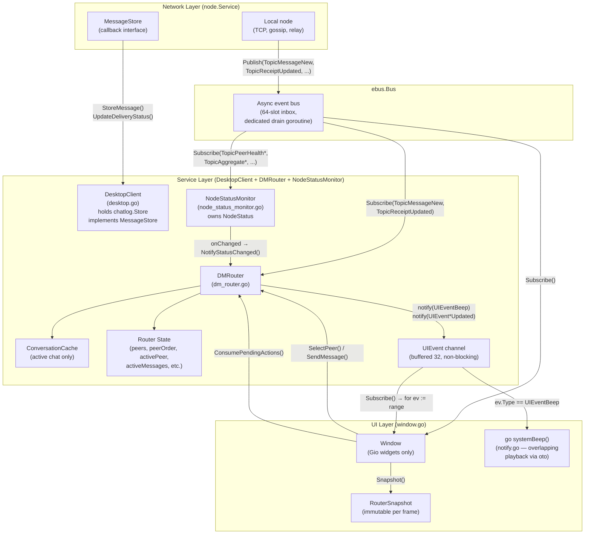
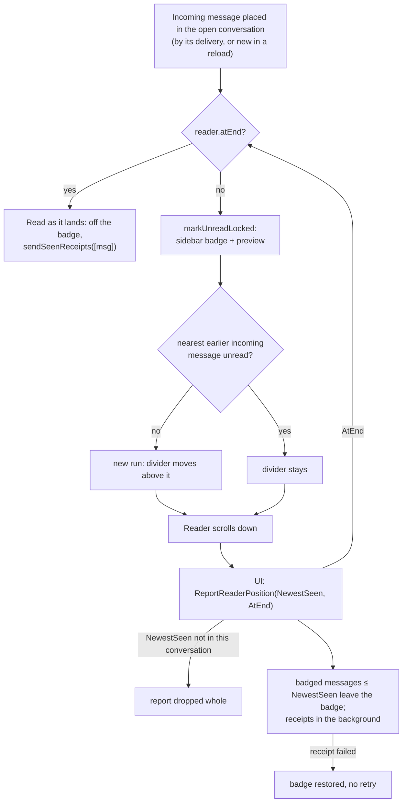
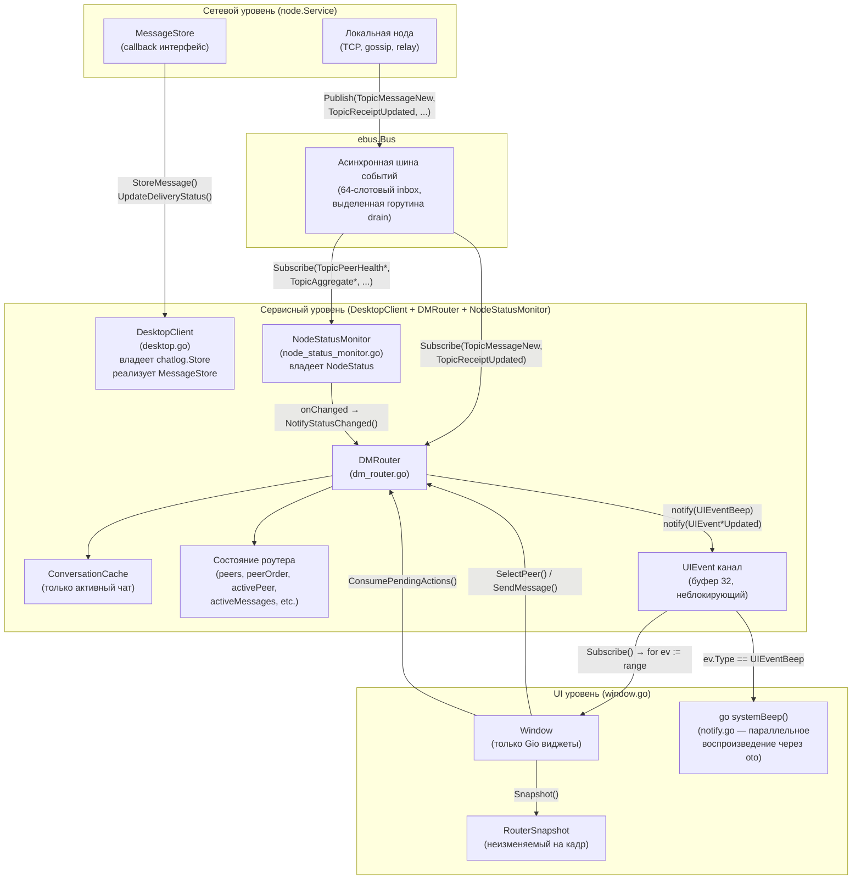
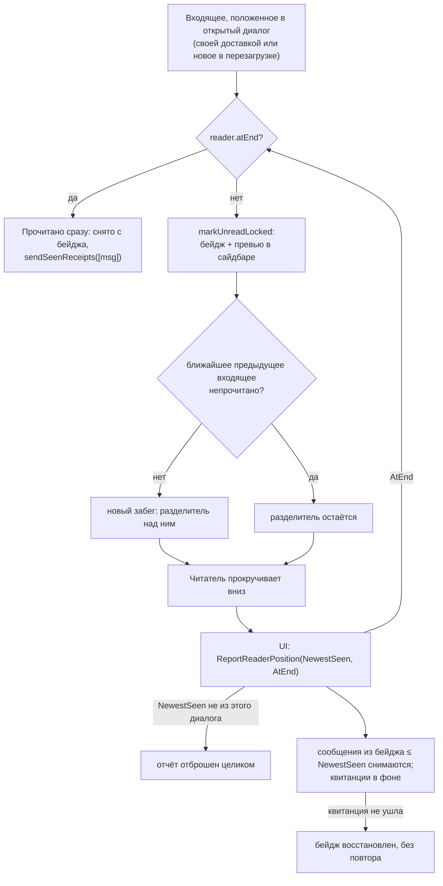

# DMRouter — Service Layer

## English

### Overview

The `DMRouter` is the central service layer between the network node and the desktop UI.
It owns all DM business logic: event routing, sidebar management, conversation cache,
health polling, mark-seen, and message sending. The UI communicates with it through
a small, well-defined public API.

Source: `internal/core/service/dm_router.go`

### Modular layered architecture

The desktop application follows a strict modular layered architecture
designed for clean separation of concerns and easy extensibility:


```mermaid
flowchart TB
    subgraph L1["Layer 1 — Network (node.Service)"]
        direction LR
        TCP["TCP connections\ngossip / relay"]
        MSTORE["MessageStore interface\n(delegates persistence\nto registered handler)"]
    end

    subgraph EBUS["Event Bus (ebus.Bus)"]
        direction LR
        TOPICS["Topics:\n• message.new\n• receipt.updated\n• peer.health.changed\n• slot.state.changed\n• peer.traffic.updated\n• route.table.changed\n• contact.added/removed\n• identity.added\n• aggregate.status.changed\n• version.policy.changed\n• message.sent / file.sent"]
    end

    subgraph L2["Layer 2 — Service (DesktopClient + DMRouter)"]
        direction LR
        CHATLOG["chatlog.Store\n(SQLite, owned by\nDesktopClient)"]
        BUSINESS["Business logic:\n• event routing\n• sidebar management\n• conversation cache\n• mark-seen\n• message sending"]
        SNAPSHOT["Snapshot() → immutable\nRouterSnapshot"]
        API["Public API:\nSelectPeer() / SendMessage()\nSetSendStatus()"]
        UIEVENTS["UIEvent channel\n(buffered 32, non-blocking)\nincl. UIEventBeep"]
    end

    subgraph L3["Layer 3 — UI (Window)"]
        direction LR
        GIO["Gio widgets\n(pure rendering)"]
        FRAME["Per-frame:\nSnap → render → done"]
        BEEP["go systemBeep()\n(overlapping playback)"]
    end

    L1 -->|"Publish()"| EBUS
    EBUS -->|"Subscribe()"| L2
    EBUS -->|"Subscribe()"| L3
    L2 --> L3
    MSTORE -->|"StoreMessage()\nUpdateDeliveryStatus()"| CHATLOG
    UIEVENTS -->|"UIEventBeep"| BEEP

    style L1 fill:#1a2332
    style EBUS fill:#2a1a33
    style L2 fill:#1e3050
    style L3 fill:#22364a
```

*Diagram 1 — Modular layered architecture overview*

Each layer communicates with the next through a well-defined interface:

- **Network → ebus**: node publishes short delta events (peer health, messages, receipts, routing changes) via `ebus.Bus.Publish()`
- **ebus → Service**: DMRouter subscribes to all relevant topics; handlers are async (64-slot inbox per subscriber, dedicated drain goroutine)
- **ebus → UI**: the console modal subscribes directly to peer health and aggregate status topics for real-time updates while it is open
- **Service → UI**: `UIEvent` channel (non-blocking notifications) + `Snapshot()` (read-only state copy)
- **UI → Service**: method calls (`SelectPeer`, `SendMessage`, `ConsumePendingActions`)
- **RPC** remains for commands/queries (fetch messages, send messages, get routing table). RPC handlers may publish ebus events as side effects

No layer reaches past its neighbor. The UI never touches `DesktopClient`
or SQLite directly. The router never manipulates Gio widgets.
Node does not own message persistence — it delegates to a `MessageStore` handler
registered by `DesktopClient` at construction time. Relay-only nodes
(`corsa-node`) leave `MessageStore` nil and relay messages without persisting them. This makes
it straightforward to add new features (group chats, file transfers, etc.)
by extending the router layer without touching the UI, or to swap the UI
framework entirely without modifying business logic.

### Three-layer architecture (Network → Service → UI)

The desktop application uses a clean three-layer architecture:


```mermaid
flowchart TB
    subgraph NET["Network Layer (node.Service)"]
        NODE["Local node\n(TCP, gossip, relay)"]
        MSTORE["MessageStore\n(callback interface)"]
    end

    subgraph EBUS["ebus.Bus"]
        EB["Async event bus\n(64-slot inbox,\ndedicated drain goroutine)"]
    end

    subgraph SVC["Service Layer (DesktopClient + DMRouter + NodeStatusMonitor)"]
        DC["DesktopClient\n(desktop.go)\nholds chatlog.Store\nimplements MessageStore"]
        DR["DMRouter\n(dm_router.go)"]
        NSM["NodeStatusMonitor\n(node_status_monitor.go)\nowns NodeStatus"]
        CACHE["ConversationCache\n(active chat only)"]
        STATE["Router State\n(peers, peerOrder, activePeer,\nactiveMessages, etc.)"]
        UIEVENTS["UIEvent channel\n(buffered 32, non-blocking)"]
    end

    subgraph UI["UI Layer (window.go)"]
        WIN["Window\n(Gio widgets only)"]
        SNAP["RouterSnapshot\n(immutable per frame)"]
        BEEP["go systemBeep()\n(notify.go — overlapping\nplayback via oto)"]
    end

    NODE -->|"Publish(TopicMessageNew,\nTopicReceiptUpdated, ...)"| EB
    EB -->|"Subscribe(TopicMessageNew,\nTopicReceiptUpdated)"| DR
    EB -->|"Subscribe(TopicPeerHealth*,\nTopicAggregate*, ...)"| NSM
    EB -->|"Subscribe()"| WIN
    NSM -->|"onChanged → NotifyStatusChanged()"| DR
    MSTORE -->|"StoreMessage()\nUpdateDeliveryStatus()"| DC
    DR --> CACHE
    DR --> STATE
    DR -->|"notify(UIEventBeep)\nnotify(UIEvent*Updated)"| UIEVENTS
    UIEVENTS -->|"Subscribe() → for ev := range"| WIN
    UIEVENTS -->|"ev.Type == UIEventBeep"| BEEP
    WIN -->|"Snapshot()"| SNAP
    WIN -->|"SelectPeer() / SendMessage()"| DR
    WIN -->|"ConsumePendingActions()"| DR
```

*Diagram 2 — Three-layer architecture with data flow*

**DesktopClient** (`internal/core/service/desktop.go`) is the composition
root for the desktop sub-services. It no longer holds the SQLite handle
itself; `ChatlogGateway` owns `chatlog.Store` and `MessageStoreAdapter`
satisfies `node.MessageStore`. At construction, `NewDesktopClient` wires
all sub-services (`AppInfo`, `LocalRPCClient`, `ChatlogGateway`,
`MessageStoreAdapter`, `DMCrypto`, `NodeProber`) and registers the
adapter with `node.Service` via `RegisterMessageStore()`. The node calls
`StoreMessage()` / `UpdateDeliveryStatus()` on the adapter before
publishing `TopicMessageNew` / `TopicReceiptUpdated` via ebus, maintaining
the "DB first, then event" invariant. Public `DesktopClient` methods are
thin delegators — callers that want a narrower dependency can reach
through the sub-service accessors (`DMCrypto()`, `NodeProber()`,
`ChatlogGateway()`, `RPC()`, `AppInfo()`).
`FetchConversation`, `FetchConversationPreviews`, `FetchSinglePreview`, and
`MarkConversationSeen` live on `DMCrypto` (exposed through the `DesktopClient`
delegators). They accept `context.Context` and propagate it through
`LocalRPCClient.LocalRequestFrameCtx` — the context-aware variant of
`LocalRequestFrame`. In TCP mode, the context fully controls the dialer
deadline. In embedded mode, `ctx.Err()` is checked before and after
`HandleLocalFrame` as a best-effort gate (the synchronous handler itself
cannot be interrupted). Contact fetching is deduplicated via
`DMCrypto.fetchContactsForDecrypt(ctx, senders)` (shared by all three
Fetch methods), which skips the local identity address when checking for
missing senders to avoid spurious `fetch_contacts` roundtrips on
conversations with outgoing messages.

**DMRouter** (`internal/core/service/dm_router.go`) owns DM business logic:
event routing, sidebar management, conversation cache, mark-seen, message
sending. Network-layer state aggregation (PeerHealth, AggregateStatus,
contacts, reachability) is delegated to **NodeStatusMonitor**
(`internal/core/service/node_status_monitor.go`), which DMRouter accesses
through the `NodeStatusProvider` interface. The UI communicates with DMRouter
through a small public API.

**Window** (`internal/app/desktop/window.go`) is a pure rendering layer. It has
no `sync.Mutex`, no direct access to `DesktopClient`, and no business logic.
At the start of each frame it calls `Snapshot()` to get an immutable copy of
router state, then renders from that snapshot.

### Public API

| Method | Direction | Description |
|---|---|---|
| `Subscribe()` | Router → UI | Returns `<-chan UIEvent` for change notifications |
| `Snapshot()` | UI → Router | Returns the immutable `RouterSnapshot` writers last stored (`atomic.Pointer`, lock-free: the UI goroutine never takes `mu`); only `CacheReady` is recomputed per call |
| `ConsumePendingActions()` | UI → Router | Atomically reads and clears deferred widget mutations |
| `SelectPeer(id)` | UI → Router | User click: delegates to `selectPeerCore(id, true)`. Switches peer, clears stale messages, **optimistically clears unread badge** (with rollback) and emits `UIEventSidebarUpdated` synchronously, then loads the conversation in background; the selection asks for the end of the conversation at once (`ScrollToEnd`), and the load that carries out the open sends the seen receipts on a background goroutine of its own (`readOpenedConversationInBackground`). If the load or the receipts fail, the badge is **restored** (`putBadgeBack`: `restorePeerUnread` + `repairBadgeFromStore`). Same-peer re-click: retries a failed load (cache mismatch), or, when `Unread > 0`, takes the reader to the end (`ScrollToEnd`) and reads the conversation (`doMarkSeen`) — either a badge stuck after a rollback, or messages that arrived below a reader scrolled further up. Same-peer with valid cache and `Unread == 0` is a no-op. |
| `ReportReaderPosition(id, pos)` | UI → Router | What the reader of the open conversation has on screen (`ReaderPosition`), reported by the UI after laying the conversation out, only when it changed. Marks read every badged message of that conversation at or before `pos.NewestSeen` (badge drops at once, receipts in the background, badge restored if they fail) and records `pos.AtEnd`, which decides whether the next arrival is read as it lands. A report that does not describe the open conversation — another peer, or a `NewestSeen` it does not hold — is dropped whole, `AtEnd` included. Only the state change runs on the caller's (UI) goroutine; the snapshot rebuild and the receipts run in the background. See [Reading the open conversation](#reading-the-open-conversation). |
| `AutoSelectPeer(id)` | UI → Router | Programmatic auto-select: delegates to `selectPeerCore(id, false)`. When the peer changes, behaves identically to `SelectPeer`: clears unread badge, loads conversation, sends seen receipts with rollback on failure. When the peer is the same (re-selection), it is a **true no-op** — no unread clear, no `doMarkSeen`, no UI events, no goroutines launched. This prevents redundant UI churn from programmatic re-selection. |
| `SendMessage(to, body)` | UI → Router | Encrypts and sends DM |
| `ActivePeer()` | UI → Router | Returns current active peer address |
| `MyAddress()` | UI → Router | Returns local identity address |
| `SetSendStatus(s)` | UI → Router | Updates send status text |
| `Start()` | UI → Router | Subscribes ebus events, launches `runStartup` goroutine |

### Key types

```go
type RouterSnapshot struct {
    ActivePeer     domain.PeerIdentity
    PeerClicked    bool
    Peers          map[domain.PeerIdentity]*RouterPeerState
    PeerOrder      []domain.PeerIdentity
    ActiveMessages []DirectMessage
    CacheReady     bool       // true when cache is loaded for ActivePeer
    UnreadMarker   UnreadMarker // where the "unread messages" divider goes
    NodeStatus     NodeStatus
    SendStatus     string
    MyAddress      domain.PeerIdentity
}

type RouterPeerState struct {
    Preview        ConversationPreview
    LastIncomingAt domain.OptionalTime // when the peer last wrote to us
    Unread         int
}

// What the reader of the open conversation has on screen.
type ReaderPosition struct {
    NewestSeen domain.MessageID // newest message on screen
    AtEnd      bool             // the end of the conversation is on screen
}

// FirstUnread() (domain.MessageID, bool) — the message the divider sits
// above, false when the open conversation has none.
type UnreadMarker struct{ /* unexported */ }

type PendingActions struct {
    // The router has taken the reader to the end (open, click on the open
    // conversation with unread waiting). The user's own send asks nothing
    // here: the composer shows the end at the press.
    ScrollToEnd     bool
    ComposerRestore []ComposerRestore
    RecipientText   domain.PeerIdentity
}

type UIEventType int
const (
    UIEventMessagesUpdated UIEventType = iota + 1
    UIEventSidebarUpdated
    UIEventStatusUpdated
    UIEventBeep
)
```

`LastIncomingAt` is the sidebar's chat-derived half of "last online": the
newest message this peer wrote. It lives only in memory — `seedHistoryEvidence`
recomputes it from the chatlog at startup (off the startup path, in its own
goroutine, retrying a failed read three times, and it publishes a snapshot
itself: `Snapshot()` serves a cache only `notify` rebuilds, and on the retry
path there is no later event to ride on — the same rule the post-delete retry
sweep follows),
every incoming message advances it, and the delete path recomputes it — because a durable copy would be a second
value to keep in step with the rows it comes from. It is not an observation
and ranks below anything the node saw itself. `Preview` and `LastIncomingAt`
answer different questions and are written by one helper,
`setPeerPreviewLocked`. `Preview` is the last row of the thread,
whoever wrote it; `LastIncomingAt` moves only when the peer is the sender, and
only forward, so out-of-order history (startup replay, a relayed message that
took the long way) cannot walk it backwards. Every path that learns of a new
message goes through that helper — assigning `Preview` alone would leave the
presence evidence behind on whichever path forgot it. The delete path is the
single exception and assigns `LastIncomingAt` directly: it recomputes the
value from SQL through `LastIncomingAtFor`, because the message that carried
the evidence may be the row the user just removed, and clears the field when
no incoming message survives.

`Preview`, `Unread` and `LastIncomingAt` are the peer state DERIVED from the
chatlog, and they are fed by two sources that cannot be ordered against each
other: a SQL read and the event stream. The database is AHEAD of the events —
a message is committed before the event announcing it is delivered — so the
same message reaches the sidebar twice, in either order. Rather than policing
that with versions, the merges are made idempotent, which removes the ordering
question instead of answering it:

- **Unread is a set of message ids**, not a counter. `RouterPeerState.Unread`
  is its size. Adding an id the set already holds changes nothing, so a
  message counted by both the startup read and its own event is one unread
  message. Reading (only the ids whose receipts were actually sent), deleting
  and the post-delete reconciliation remove ids. Two places re-derive the set
  from `delivery_status`, because the event stream carries no status and can
  therefore only ever add: the post-delete reconciliation, and the rebuild
  after a conversation failed to open (`repairBadgeFromStore`, where the
  rollback has only what was in memory to restore and a half-completed
  mark-seen may have left ids the database now calls read). Both keep the ids
  the database does not hold at all, and the rebuild also keeps whatever
  arrived while it was reading — additions move no counter, so its epoch
  check cannot see them. It keeps the
  badged ids the database does not hold AT ALL (`StoredMessageStatuses`): a header
  can badge a message before its row is written, and "absent from the unseen
  list" would otherwise read as "read" for an id nothing can re-add.
- **LastIncomingAt is a maximum** over the incoming timestamps, so a late
  reader can only lose.
- **Preview is ordered by ARRIVAL SEQUENCE, never by the timestamp.** The
  stamp on a message is the SENDER's clock, and the node accepts messages up
  to ten minutes into the future and arbitrarily far into the past, so
  comparing it dropped live messages from any peer whose clock disagreed with
  ours: a peer running behind wrote a message that read as older than the
  reply we had just sent, one running ahead was refused outright, and both
  left the badge counting a message the sidebar would not show. The ordering
  key is instead where the row landed in the local chatlog —
  `ConversationPreview.Seq`, the chatlog rowid, resolved once per message by
  `DMCrypto.messageSeq` and carried on `DirectMessage.Seq`. Every
  forward-moving path (the send echo, the live event, the startup seed, the
  post-message reconciliation) goes through one rule, `applyPreviewLocked`,
  which refuses a preview whose sequence is lower than the one on screen.
  "Whoever wrote last" cannot serve as that rule: the node releases its lock
  across the SQLite write and publishes afterwards, a send applies its own
  echo from its own goroutine, and the event bus delivers asynchronously — so
  the later WRITE is not the later MESSAGE. A sequence of zero means unknown
  (no store to ask, or the row is already gone), and the two unknowns are not
  the same case. An incoming preview that cannot be placed does NOT displace
  one that can — otherwise a send whose own row could not be located
  afterwards puts its older text back over a message that arrived while it was
  in flight, which is the original race with an extra step. Standing aside is
  only half an answer, though, because the message may well BE the newest one:
  the apply reports `applyPreviewUnplaceable` and the caller re-reads the
  conversation from the store (`repairPreviewFromStore`), which knows both
  which row is last and where it landed. Without that read a single failed
  lookup would leave the old text on the row until the next message, with the
  badge already counting the new one. The same read runs when the row is
  UNPLACED and the message is written onto it (`previewTakenUnplaced`): an
  unordered row is a defect wherever it came from, since the next arrival
  would win by nothing more than the moment it was applied and a slow answer
  holding a real sequence could walk in later and overwrite. And if that read
  fails too — the likely case, since it fails for the same reasons the
  sequence lookup did — the peer is QUEUED (`pendingPreviewRepair`) and swept
  by the retry tick the delete path already runs (`runRetrySweep`), a dozen
  attempts a few seconds apart before it gives up with a warning. The queue is
  not belt-and-braces: it is the only way back to such a row. `pollHealth`,
  whose header pass rediscovers messages through the dedup gate, is deferred
  from `initializeFromDB` and runs ONCE per process, and the network cannot
  re-announce the message either — a re-delivery is a duplicate the node
  stores and publishes nothing for. Reopening the dedup gate is therefore a
  hint for a later pass, never a retry. Every path that reads the preview from
  the store and fails queues the same way — the mid-switch reload
  (`reloadAndRefreshPreview`, whose cache fallback cannot place a row), the
  sidebar refresh after a repair pass (`refreshPreviewForPeer`), and the
  rebuild after a deletion moved under a message (`recoverFromStaleApply`) —
  because none of them has anything else that comes back. When NOTHING carries a sequence,
  there is no order to respect and the writer wins, as it did before the field
  existed. The sequence is resolved on a context stripped of the caller's
  cancellation: on the send path that context has already been spent on the
  RPC, and a deadline reached just as the node accepted the message would
  otherwise leave a SUCCESSFUL send unplaceable. The deletion does not go
  through the rule — it moves the preview backwards by definition and carries
  its own compare-and-set.
- **Our own sent message goes through the same guards**
  (`applyOwnSentMessage`). A send is slow enough for the conversation to be
  wiped underneath it, and the sequence cannot separate the echo of a deleted
  row from the row that replaced it: SQLite hands out `max(rowid)+1`, so a row
  deleted from the end of the table gives its number to the next insert, and
  the check accepts an equal sequence. What separates them is the history
  epoch — a deletion bumps it, and an apply holding the older one is stale by
  construction — which is why the send captures the whole `peerStamp` before
  its RPC rather than only the lifecycle generation.

Idempotent merges order ADDITIONS against each other and nothing else. A read
taken before something moved the peer BACKWARDS — a deletion, a mark-seen, an
optimistic clear, a removal — and applied after it puts back exactly what was
removed, and no rule about maxima or sets prevents that. So every peer carries
`backwardsEpoch`, bumped by each of those movers, and every chatlog-derived
write follows one rule: **capture the epoch before its own query, apply only
if it is unchanged.** A changed epoch means the answer describes a
conversation that no longer exists in that form, and the work is redone rather
than merged. Each read captures its own snapshot immediately before its own
query: two reads sharing one baseline would make the second refuse everything
the first one's retries allowed to change.

It is TWO counters, because the two kinds of backwards move are not the same.
`unread` counts what lowers only the BADGE — a mark-seen, the optimistic clear
when a conversation is opened — and `history` counts what removes ROWS: a
message deletion, a conversation wipe, a contact removal, an identity reset. A
history move bumps both; a mark-seen bumps only `unread`, because it cannot
make a last-incoming answer wrong. One counter for both would cost the feature
its most common case: the conversation that opens automatically at launch is
marked read while the startup scan is still running, so its contact — the
first row in the sidebar — would spend the whole session with no "last online"
line. The startup scan, `seedPreviews`, the post-delete reconciliation, the
header repair and the badge rebuild after a failed open all go through this
check; the
`peerGen` lifecycle generation answers the narrower question of whether the
contact still exists at all, and is captured before any slow step (a decrypt
RPC, a header scan) that would otherwise recreate its row — including the
side effects, not just the row: an inbound file announcement is registered
only after that check, and never speculatively-then-rolled-back, because a
rollback by message id cannot tell its own registration from an identical
one made by a newer generation and would take that one's downloaded file
with it. Every slow step carries the same pair — the
generation AND the history counter — as one `peerStamp`, because the two
answer different questions and a branch that checks half of it is a branch
that applies a message whose row is already gone. A step that ASKS the
database something and then acts on the answer takes its stamp BEFORE the
question and checks it at the commit: a fresh stamp would describe the wrong
moment.

The version check and the file registration cannot be one atomic step by
themselves — the check needs the router lock and the registration goes
through the file bridge, which a domain mutex may never be held across. They
are made atomic against DELETION instead, by a per-peer file barrier: every
path that cleans transfers up takes it, moves the history counter under it,
and only then cleans up, while a registration holds it from its check until
the mapping exists. A registration already in flight therefore either
finishes first or finds the moved counter and stands down. One deletion is
one move of that counter, and a cleanup that removed nothing does not move
it at all — an ack usually names a row deleted long ago, and every false move
marks a load or a decrypt that is perfectly current as stale.

Removing a contact holds that same barrier across its whole tail: the version
move, the transfer cleanup and the drop of the in-memory state. A
registration that was already waiting on it therefore resumes after the last
cleanup and finds both a new generation and no row — which is why the
registration checks the row's existence too, not only the stamp. The mutex
itself is never dropped when the contact is: a waiter already holds a pointer
to it, and replacing it on re-add would leave the old cleanup and the new
registration excluding nobody.

One more thing is needed while a removal runs, because no stamp can express
it: the removal bumps the counters itself, so a message arriving right after
that carries a stamp which MATCHES, and the apply would create the row again
— behind the removal, for the cleanup to leave orphaned.

That is the job of the **removal gate** (`removalGate`) — one object with two
doors. `tryEnsurePeerLocked` consults it before creating a sidebar row, and
the message store adapter consults it before writing an inbound DM, because
the store is the door the node's own writes go through: the node persists a
message BEFORE the router hears about it, so a message accepted mid-removal
would land in the database no matter what the router refuses afterwards, and
the next startup would rebuild the deleted conversation out of that row. The
store answers `StoreDeferred` — not stored and not dropped: the sender keeps
the message and re-delivers it once the removal is over, at which point it is
simply a new message to a conversation that no longer exists, and opens it
again as a message from any stranger would. This is a window, not a ban.

The store's door is a **lease**, not a check. Checking is not writing: a
store let through can be stopped for as long as the database takes, and a
removal that only read a flag would run both of its history deletes in that
gap, leaving the row behind them where nothing looks again. So the store
takes the lease (`admitWrite`) before anything else and holds it until its
row is committed, and `begin` does not return until every lease already
handed out for that conversation is back. After `begin` returns, the removal
knows two things it could not know from a flag: no write is in progress, and
no new one will be admitted. The router's row check needs no lease — it
decides and acts under one lock, with no I/O in between.

The gate goes up as the FIRST statement of `RemovePeer`, before the history
delete and before the file barrier: raised later, it would be open for
exactly the length of those waits, and that is the window a concurrent write
walks through. It is counted, not flagged, because two removals of the same
contact can overlap and the first to finish must not open the door under the
second. A write that was already past the store door when the gate went up is
covered by one last history sweep at the end of the removal — and if that
sweep FAILS, `RemovePeer` returns the error: the in-memory state is gone
either way and the UI is told either way, but reporting a contact as removed
while its history may still be on disk is the one answer this function must
not give.

Both the removal and the **conversation wipe** also STOP the reaction send queue
for the length of the delete (`HoldReactionSends`), before raising or while
holding the gate. The gate reaches writes and re-offers; it does not reach the
queue, which by then may already hold facts of this conversation resolved from
the record — and a pass that read them a moment earlier would hand its frame over
after the rows are gone, with the queue's own clearing afterwards only waiting
for a frame that has already left.

The **conversation wipe** raises the same gate, around its transaction and
around the drop of the reaction queue. Its own barrier (`convDeleteRetry`)
stops this node's own sends and says nothing to the paths that write the
conversation from the side: the reaction re-offer reads a page of the user's
facts and hands a COPY of them to the node's outbox, so a wipe landing between
those two steps deletes rows that are already on their way out again, and then
empties a queue the callback refills a moment later. `begin` waits for the
lease such a re-offer already holds and refuses new ones until the queue has
been dropped too. Incoming messages are deferred for that window exactly as
during a contact removal — and a message arriving after the wipe is outside it
on both sides in any case.

The two failures a removal can report are not the same failure, so callers
can tell them apart with `errors.Is(err, ErrHistorySweepFailed)`. The FIRST
history delete fails before anything is touched: the contact is still there,
and the caller must leave its own state alone. The FINAL sweep fails when the
contact is already out of the sidebar, the cache and the trust store, with
only its history in doubt: the caller has to finish its own cleanup — drafts,
attachments, aliases, picking the next conversation — and report the failure,
because stopping there would strand the composer state of a conversation the
user can no longer open and leave the deleted chat selected. Only the HISTORY half is
compared: marking a conversation read bumps the unread counter and removes
no rows, so comparing the whole pair would make opening a chat discard the
messages arriving into it and refuse its own file transfers.

A history conflict is not a reason to DROP the message. The counter is per
peer, so a deletion anywhere in the conversation looks exactly like the
deletion of the row being decrypted — and the message's id is already
through the dedup gate, so a wrong guess loses it for good. The conversation
is re-read from the database instead: the reconciliation restores the
preview and the last-online evidence, the badge is re-derived from
`delivery_status`, and the message either comes back with them or does not,
which is the distinction the counter could not make.

The same "the answer is older than the work" rule governs a message being
decrypted: which conversation is on screen is re-read after the decrypt
(against the selection AND the cache), because appending to a cache that
has since been loaded for someone else splices the message into the wrong
thread, and treating it as visible skips its badge for good.

Deletion is the single exception: it is the only step that legitimately moves
these values BACKWARDS, because the row they described is gone. It is
therefore the only path that needs ordering, and it gets it from a per-peer
refresh lock — two deletions in one conversation run in their own goroutines,
and the slower query must not land last with the older answer. Its reads are
all-or-nothing (half a read publishes a moment that never existed), and a
failed one is queued and retried by the delete sweep, because nothing else
re-reads a peer's history.

A reconciliation UPDATES a peer and never CREATES one. It runs asynchronously,
so the conversation may have been removed before it was scheduled; callers
that introduce a new one create the row themselves, synchronously with the
event that justifies it.

### Concurrency protection

The DMRouter runs two background goroutines:

- **Startup goroutine** (`runStartup`) — runs `initializeFromDB` to load
  previews, contacts, identities, and diagnostic fields from SQL. While
  startup is in progress, ebus events are buffered in `startupEventBuf`
  (capped at 256 entries to prevent memory spikes). After initialization,
  buffered events are replayed under `replayingStartup=true`, which
  suppresses the BEEP and nothing else: the badge is a set, so a message
  counted by both a SQL read and its own replayed event is one unread
  message, while suppressing the replay would lose the messages stored
  after the read was taken. Events that arrive during Phase 1 replay are
  re-buffered and processed as live in Phase 2 (`replayingStartup=false`),
  where the beep is no longer suppressed.
- **ebus subscriptions** — DMRouter subscribes only to DM-specific topics
  in `subscribeEvents()` before startup so no events are missed:
  - `TopicMessageNew` / `TopicReceiptUpdated` — new DMs and delivery
    receipt changes (buffered before startup, processed by `handleEvent`)
  - `TopicMessageSent`, `TopicMessageSendFailed` (send results, published
    by DMRouter itself after send operations complete)
  - `TopicFileSent`, `TopicFileSendFailed` (file send results)

  Network-layer ebus topics are handled by **NodeStatusMonitor**
  (`node_status_monitor.go`), which subscribes to:
  - `TopicPeerHealthChanged` (peer state/connected/score/ping/pong).
    PeerHealth rows are keyed by `(Address, ConnID)` composite key.
    `peerHealthFrames()` emits multiple rows for the same overlay address
    when several inbound connections exist, each distinguished by ConnID.
    The delta carries the outbound `ConnID` (0 when no outbound session)
    and the full set of active `InboundConnIDs` — this gives the monitor
    a complete view of the connection topology for reconciliation.

    `applyPeerHealthDelta` uses a 5-step reconciliation model:
    1. **Build expected ConnIDs** from delta (`ConnID` + `InboundConnIDs`).
    2. **Update existing rows**: outbound row gets full session-scoped write
       (`writeSession=true`); inbound rows receive address-level fields only
       (`writeSession=false`) — their ConnID and Direction are immutable
       row identifiers. A `ConnID=0` placeholder is promoted if the delta
       carries a specific outbound ConnID. When the delta carries live
       `InboundConnIDs` and `ConnID=0`, the placeholder is left untouched
       in step 2 — it will be pruned in step 5 and its address-level slot
       metadata (`SlotState`, `PendingCount`) migrated onto the surviving
       per-ConnID rows. Mutating the placeholder here would clobber those
       fields with the health delta's values before migration could
       capture them.
    3. **Create outbound row** if no matching row was found. For `ConnID=0`
       deltas (no outbound session), a new row is only created when no rows
       exist for the address or the peer is disconnected (the surviving
       address-level row after pruning).
    4. **Create inbound rows** for `InboundConnIDs` not yet present — these
       carry `Direction="inbound"` and address-level fields from the delta.
    5. **Prune dead connection rows** whose ConnID is no longer in the
       expected set. A `ConnID=0` "address row" is pruned when per-ConnID
       rows authoritatively represent the address (`expectedConnIDs`
       non-empty); it survives otherwise. Before the placeholder is
       dropped, its `SlotState` and `PendingCount` — which ride on
       `TopicSlotStateChanged` / `TopicPeerPendingChanged`, not on
       `PeerHealthDelta` — are migrated onto surviving per-ConnID rows
       where those fields are still empty, so a prior `applySlotStateDelta`
       value on an existing inbound row is never stomped. Pruning also
       fires on full disconnect (`!delta.Connected`) even when
       `expectedConnIDs` is empty — all per-ConnID rows are dead and the
       freshly-created `ConnID=0` row from step 3 carries the
       disconnected state.

    Session-scoped fields (Direction, ClientVersion, ClientBuild, ConnID,
    ProtocolVersion) are cleared unconditionally on disconnect deltas
    (`!delta.Connected`) and backfilled only when zero/empty on connect.

    During probe merge, `mergePeerHealth` indexes by `(Address, ConnID)`
    via the `peerHealthKey` struct, so multiple per-ConnID probe rows for
    the same overlay address are preserved, not collapsed. It uses
    `ebusHealthSeeded` and two-tier enrichment. Addresses that received at
    least one `applyPeerHealthDelta` are "seeded": state fields (Connected,
    Score, State, PendingCount, ConsecutiveFailures, LastError),
    session-scoped fields (Direction, ClientVersion, ClientBuild, ConnID,
    ProtocolVersion), slot-lifecycle fields (SlotState, SlotRetryCount,
    SlotGeneration, SlotConnectedAddr), and the full diagnostic block —
    ebus-authoritative after the switch to one-shot `FetchAndSeed()` —
    (BannedUntil, LastErrorCode, LastDisconnectCode,
    IncompatibleVersionAttempts, LastIncompatibleVersionAt,
    ObservedPeerVersion, ObservedPeerMinimumVersion, VersionLockoutActive)
    are all authoritative and never overwritten by probe. Zero/nil values
    are meaningful signals (disconnect clears session metadata, slot
    removal clears SlotState, `resetPeerHealthForRecoveryLocked` clears
    bans and diagnostics after successful recovery — every
    `PeerHealthDelta` carries the complete current diagnostic value, so a
    probe backfill would resurrect stale state that the node already
    cleared). Only truly persistent fields (PeerID, activity timestamps,
    traffic counters) are backfillable via
    `enrichPeerHealthIdentityFromProbe` — this handles the case where
    PeerID is resolved out-of-band after the first health delta.
    True placeholders (from `applySlotStateDelta`/`applyPeerPendingDelta`
    without a health delta) get full enrichment via
    `enrichPeerHealthFromProbe`, which does populate the diagnostic block
    from the probe because no ebus delta has claimed authority yet.
  - `TopicPeerPendingChanged` (per-peer pending queue depth; creates a
    minimal `PeerHealth` entry when the peer is not yet known so the count
    is not lost before the first health delta arrives). Address-level:
    updates ALL per-ConnID rows for the address.
  - `TopicPeerTrafficUpdated` (byte counters, ~2 s batch). Address-level:
    updates ALL per-ConnID rows for the address.
  - `TopicSlotStateChanged` (CM slot lifecycle). Address-level: updates
    ALL per-ConnID rows for the address.
  - `TopicAggregateStatusChanged`, `TopicVersionPolicyChanged`
  - `TopicContactAdded/Removed`, `TopicIdentityAdded`
  - `TopicRouteTableChanged` (route-based reachability tracking — on
    every routing table modification the monitor rebuilds `ReachableIDs`
    from `BuildReachableIDs()`, which reads the authoritative routing
    snapshot. This covers direct-peer add/remove, announcement acceptance,
    transit invalidation, and TTL expiry. The `routingTableTTLLoop`
    emits `TopicRouteTableChanged` with reason `"ttl_expired"` whenever
    `TickTTL()` removes one or more expired routes, ensuring the monitor
    learns about reachability changes even when no explicit routing
    mutation triggered them.)

  Each monitor handler updates `NodeStatus` under its own `mu` and calls
  the `onChanged` callback, which triggers `DMRouter.NotifyStatusChanged()`
  to rebuild the snapshot.
- **UI goroutine** — calls `Snapshot()`, `ConsumePendingActions()`,
  `SelectPeer()`, `SendMessage()`, `ReportReaderPosition()` from the Gio
  event loop.

To prevent data races (which cause Go runtime fatals that are uncatchable):

1. `mu sync.RWMutex` (on DMRouter) — protects all shared router fields:
   `activePeer`, `peerClicked`, `reader` (the open conversation's reader and
   its unread divider), `peers`, `peerOrder`, `activeMessages`,
   `seenMessageIDs`, `initialSynced`, `replayingStartup`,
   `sendStatus`, `pendingScrollToEnd`, `pendingClearEditor`,
   `pendingRecipientText`, and the four per-peer maps: `unreadIDs`
   (the badge sets), `peerGen` (lifecycle generations), `backwardsEpoch`
   (the two backwards-move counters, see below), `pendingDeleteReconcile` (the delete retry queue) and
   `peerRefreshMu` (the per-peer reconciliation locks — the MAP is guarded
   by `mu`, the mutexes in it are not). Note: `NodeStatus` is owned by
   `NodeStatusMonitor` (with its own `mu`), not by DMRouter.

   **Ordering rule**: a per-peer reconciliation lock from `peerRefreshMu` is
   held across SQL reads, so it must never be taken while `mu` is held.
   `peerRefreshLock` looks the mutex up under `mu`, releases `mu`, and only
   then locks it.

   Background goroutines acquire `mu.Lock()` for writes and `mu.RLock()` for
   reads. `Snapshot()` takes no lock: it returns the snapshot writers built
   under their `Lock` hold and stored in an `atomic.Pointer`.

   **Identity normalization**: All public ingress points (`SelectPeer`,
   `AutoSelectPeer`, `SendMessage`, `RemovePeer`, `peerForMessage`,
   `repairUnreadFromHeaders`) normalize `PeerIdentity` via `normalizePeer()`
   (whitespace trim) before any map/slice access. This prevents
   whitespace-padded identities from creating duplicate keys in `peers` or
   `peerOrder`.

2. **Snapshot pattern** — the UI goroutine never reads router fields directly.
   Instead, `Snapshot()` returns the consistent point-in-time copy the last
   writer built under `mu` and stored in an `atomic.Pointer` — an immutable
   `RouterSnapshot` struct, read without any lock. The UI reads only
   from this snapshot for the entire frame. This eliminates all lock contention
   in the rendering path.

3. **Widget safety via PendingActions** — Gio widgets (`widget.Editor`,
   `widget.List`, etc.) are NOT thread-safe. Background goroutines set
   deferred action flags (`pendingScrollToEnd`, `pendingClearEditor`,
   `pendingRecipientText`) under `mu`. The UI goroutine calls
   `ConsumePendingActions()` at the start of each frame, which atomically
   reads and clears these flags, then applies them to Gio widgets.

4. **Non-blocking UIEvent channel** — the router sends `UIEvent` values to a
   buffered channel (capacity 32) via `notify()`. If the channel is full,
   each overflowed event gets its own background retry goroutine with
   exponential backoff (50ms → 100ms → 200ms, 3 attempts). An atomic
   counter (`uiOverflowCount`) caps concurrent retry goroutines at 8 to
   prevent accumulation during sustained bursts; events beyond the cap are
   dropped with a warning. This per-event retry ensures distinct event
   types (e.g. `UIEventBeep`) are not silently lost when the channel
   overflows. The UI bridge goroutine calls `window.Invalidate()` for
   each event, triggering a new frame.

5. **Event-driven architecture** — the router logic is split into three clean
   paths:

   **Startup** (`initializeFromDB`): runs once asynchronously so the window
   appears immediately. Fetches conversation previews with retry (up to 3
   attempts with linear backoff) to handle transient DB/node failures.
   Calls `resetIdentityState()` to clear all identity-specific state, then
   `seedPreviews()` to populate the `peers` map (unread first by count desc;
   everything else keeps the order the store returned, which is newest
   arrival first). Delegates peer selection to
   `AutoSelectPeer()`, which handles the full lifecycle: optimistic unread
   clear, `loadConversation()`, `doMarkSeen()`, and rollback on failure.
   Before the call, `activePeer` is cleared so `selectPeerCore` always
   sees a peer switch and triggers a full load (important for reconnect
   when `activePeer` was already set). Finally runs an initial
   `pollHealth()` (via `defer`) so DMHeaders, DeliveryReceipts, and
   diagnostic fields are seeded. After startup, ebus events keep all
   UI-critical fields fresh without polling.

   Because ebus events arrive in parallel with `initializeFromDB`,
   `seedPreviews()` can meet a preview the event path has already written —
   and that one can be either NEWER than its own read (a message stored while
   the query ran) or OLDER (the startup replay re-delivers rows the database
   has held for days). It therefore cannot assume either way and goes through
   `applyPreviewLocked` like everything else: the arrival sequence decides. A
   peer whose preview the seed does not take also keeps its position in
   `peerOrder`, since the startup order is about the same stale answer.

   `resetIdentityState()` clears `peers`, `peerOrder`, `activePeer`,
   `peerClicked`, `reader`, `activeMessages`, `seenMessageIDs`, `initialSynced`,
   `sendStatus`, `pendingScrollToEnd`, `pendingClearEditor`,
   `pendingRecipientText`. The `cache` (ConversationCache) is emptied via
   `Load("", nil)` rather than pointer replacement, because event goroutines
   hold a reference to the same cache object and call its methods concurrently.

   **Event handler** (`handleEvent` → `onNewMessage` / `onReceiptUpdate`):
   Active peer detection uses `isActivePeer()` (checks `r.activePeer`
   under lock), NOT `cache.MatchesPeer()`. This is critical because
   during a peer switch, `activePeer` is updated immediately by
   `selectPeerCore()`, but the cache is only updated after
   `loadConversation()` completes asynchronously.

   - New messages for the **active conversation** where the cache is
     loaded are decrypted inline via `DecryptIncomingMessage`, placed in
     `ConversationCache` at their arrival sequence (`DirectMessage.Seq`,
     the chatlog rowid — NOT at the end, because the row is written
     outside the lock and announced after it, so two messages stored in
     one order can reach the cache in the other), and `activeMessages` is
     refreshed.
     `RouterPeerState.Preview` is updated to reflect the new message.
     If inline decryption fails, `loadConversation` reloads the full
     history and `updatePreviewFromStore` refreshes the preview from
     SQLite. Whether the incoming message is read is decided by the
     reader of the conversation (`admitArrivalLocked`, see
     [Reading the open conversation](#reading-the-open-conversation)):
     with the end on screen it is read as it lands and gets its own
     receipt; with the reader scrolled further up it is badged and left
     below them. No scroll is requested either way — the list keeps a
     reader at the end pinned there by itself. Messages that reach the
     conversation through a reload — whatever the reload was run for:
     a decrypt failure, a stale apply, a receipt, the header repair, the
     startup re-read — meet the reader inside `loadConversation`
     (`admitReloadedArrivalsLocked`), the same rule applied to everything
     the reload brought in.
   - New messages for the **active conversation** where the cache is
     NOT yet loaded (mid-switch) decrypt the message inline via
     `DecryptIncomingMessage` and capture the resulting `*DirectMessage`.
     If decryption succeeds, `RouterPeerState.Preview` is updated
     immediately and the peer is promoted in `peerOrder`. A background
     `reloadAndRefreshPreview()` always runs. If the reload **succeeds**,
     `updatePreviewFromStore` refreshes the preview from SQLite for
     consistency. If the reload **fails** and a decrypted message was
     captured, the fallback path seeds the cache with that single
     message via `cache.Load()` and copies it into `activeMessages` —
     so the user sees the message in the open chat instead of a blank
     screen. Without this fallback, a transient chatlog failure during
     mid-switch would silently discard a successfully decrypted message.
   - **Sound notifications**: `UIEventBeep` is emitted ONCE PER MESSAGE, not
     once per event. One `announce` value, computed at the top of
     `onNewMessage`, answers for all of its paths: the message is incoming
     (sender ≠ us), it is not a startup replay, and it has not been announced
     before. That last fact is recorded ON THE ID, in `messageGate.announced`,
     and it is the only thing the dedup gate's eviction does NOT reopen —
     reopening asks for the message to be TRIED again, not announced again.
     It means the sound QUESTION IS SETTLED, not that a sound was made:
     startup replay re-delivers old messages in silence, the first header sync
     claims ids it must not announce, and a deletion pins an id so
     re-deliveries are ignored. Recording only the ring left all of those
     looking unannounced, so the next event for one of them rang for a message
     the badge was already counting. Both paths that settle a message —
     `onNewMessage` and the header repair — go through
     `markMessageHandledLocked`, which closes the gate and settles the sound
     together, and both read the previous value before writing it.
     Neither of the two facts that used to answer this could: the gate itself
     is reopened on purpose by every path that fails to apply a message, and
     the badge is a set keyed by message id, which a repeat does not move and
     which the conversation ON SCREEN never raises at all. Between them they
     let one message ring twice with nothing to show for it. The paths reached
     are
     (1) non-active peer, (2) active peer mid-switch (cache not yet loaded),
     (3) active peer with cache ready. The repair-path in
     `repairUnreadFromHeaders` emits `UIEventBeep` **only for non-active
     peers** — active peer messages are already visible on screen, so
     beeping on repair would produce duplicate notifications after a
     transient failure recovery.
   - New messages for **non-active chats** go through `updateSidebarFromEvent`,
     which decrypts the preview and updates `RouterPeerState.Preview` + `Unread`,
     promotes the peer in `peerOrder`. If decryption fails (contact keys not
     yet available), the router falls back to `updatePreviewFromStore` in a
     background goroutine, increments `Unread` for incoming messages, and
     promotes the peer in `peerOrder` — matching the behavior of the
     successful inline-decrypt path.
   - Receipt updates for the active peer update the cache in-place via
     `ConversationCache.UpdateStatus()`. If the cache hasn't loaded yet
     for the active peer, a `loadConversation()` is triggered. If the
     message is missing from cache, a full reload is also triggered.

   **Startup `pollHealth`**: runs `ProbeNode` + `repairUnreadFromHeaders`.
   `repairUnreadFromHeaders` scans DMHeaders for message IDs not yet seen in
   `seenMessageIDs`, adds non-active incoming ones to the unread SET, and
   triggers `loadConversation` if the active chat has messages missing from
   cache; the active chat's new incoming messages then meet its reader inside
   that load (`admitReloadedArrivalsLocked`) — read if the end is on screen,
   badged if not. The
   "badge moved backwards mid-scan → rebuild from the database" escape hatch
   skips the open conversation only while its reader is at the end; a reader
   scrolled further up has the conversation rebuilt like any other. Since the badge became a set, no first-sync
   rule is needed against double counting — the same message from the SQL
   read and from a header is one member. What a header still cannot say is
   whether the message was already READ: DMHeaders carry no
   `delivery_status`, and the node's in-memory topic outlives a desktop
   session, so on the first sync a UI attaching to a running node is offered
   back every message of the previous session. On that sync only,
   `alreadyReadHeaderIDs` asks the database for the stored status of the
   candidate ids (`StoredMessageStatuses`) and suppresses exactly those it
   calls `seen`; a stored-but-unread id and an id the database does not hold
   at all are both badged from the header. That independence is deliberate —
   an earlier version deferred to the startup badge seed, and a seed that
   never ran left every stored message badgeless for the session. A failed
   read suppresses nothing: a badge too many clears by opening the
   conversation, a badge lost does not.
   Two more rules govern this path, both about work that outlives the
   answer it was based on. Which conversation is on screen is decided in
   phase 3, under the lock, and NOT during the scan: the header scan and
   the stored-status query both run outside the lock, and a message
   classified as visible after the user has left it loses its badge for
   good — its id passes the dedup gate either way, and this repair runs
   once per process.

   To prevent double-counting
   with the event-path, `onNewMessage()` registers `event.MessageID` in
   `seenMessageIDs` up-front — before any other processing — so the
   repair-path skips messages already handled by the event-path.
   However, if a background fallback fails (e.g. `loadConversation` or
   `updatePreviewFromStore` returns `false`), the message ID is **evicted**
   from `seenMessageIDs` via `evictSeenMessages()` so that
   `repairUnreadFromHeaders` can rediscover it on the next health poll.
   Without this rollback, the dedup gate would permanently suppress the
   message. The same rollback applies to the repair-path itself:
   `refreshPreviewForPeer` evicts message IDs when `updatePreviewFromStore`
   fails, so the next repair cycle retries the preview refresh.
   The active peer is excluded from `refreshPreviewForPeer` — its preview
   is updated by the `loadConversation` + `updatePreviewFromStore` path.
   If `loadConversation` succeeds but `updatePreviewFromStore` fails,
   `seenMessageIDs` is **not** evicted — the messages are already in cache
   and visible on screen. Evicting would cause rediscovery and a spurious
   `UIEventBeep`. The stale preview will be updated on the next message or
   peer switch. `UIEventBeep` is only emitted for non-active peers —
   active peer messages are already visible so notification is unnecessary.
   All rollback logic is centralized in `evictSeenMessages()` and
   `reloadAndRefreshPreview()` to avoid duplication across paths.

   **Seen receipts** (`doMarkSeen`): `MarkConversationSeen` for the whole
   conversation is sent by the open that `SelectPeer` and `AutoSelectPeer`
   start via `selectPeerCore` — an opened conversation is shown from its end,
   so everything in it is read. It is sent for the load that CARRIES OUT the
   open, on a tracked goroutine of its own (`readOpenedConversationInBackground`, see
   [Reading the open conversation](#reading-the-open-conversation)), and by
   nothing after it: `selectPeerCore` does not mark again once its load
   returns. Messages arriving into the conversation that is already open are
   NOT marked through `doMarkSeen`: they are read when the reader has seen
   them (`ReportReaderPosition`, `admitArrivalLocked` → `sendSeenReceipts`).
   The unread badge is optimistically cleared (in the same `r.mu` section
   that sets the open up); if the receipts fail the badge is restored to its
   previous value and rebuilt from the database (`repairBadgeFromStore`).
   `doMarkSeen` first verifies that `activePeer` still matches
   `peerAddress` — if the user switched peers before the goroutine ran,
   `activeMessages` belong to the new peer and using them would send a
   vacuous `MarkConversationSeen` that succeeds without real receipts,
   falsely clearing unread for the old peer. On mismatch, `doMarkSeen`
   returns `false` so the caller restores the badge. It also requires
   non-empty `activeMessages` — if the conversation hasn't loaded yet,
   it returns `false`. The open only reads after its load has succeeded.

6. **Stale-load protection** — `loadConversation()` re-checks `activePeer`
   after `FetchConversation` returns. If the user switched peers during the
   fetch, the result is discarded.

7. **Stale-message protection** — `selectPeerCore()` (shared by both
   `SelectPeer` and `AutoSelectPeer`) clears `activeMessages` to nil
   synchronously before launching the background `loadConversation()`,
   and emits `UIEventMessagesUpdated` synchronously when the peer changed
   so the UI re-renders with an empty message list in the same frame.

8. **Failed-load retry / stuck-badge recovery** — When the user re-clicks the
   already-selected peer, `selectPeerCore` (with `userClicked=true`) checks
   two conditions: (a) cache miss (`!cache.MatchesPeer()`) → retries
   `loadConversation`, which carries out the open and reads the
   conversation; (b) cache valid but `Unread > 0` (badge stuck after
   `restorePeerUnread` rollback, or messages that arrived below a reader
   scrolled further up) → the reader is taken to the end
   (`ScrollToEnd`, reader `atEnd`) and the conversation is read
   (`doMarkSeen`, `putBadgeBack` on failure): the click is
   the reader asking to go down to them, and marking them read without
   showing them would send receipts for messages still off screen.
   When cache is valid and `Unread == 0` the click is a no-op.
   `AutoSelectPeer` (`userClicked=false`) same-peer is always a true no-op.

9. **Panic-safe startup** — `runStartup()` uses two separate `defer`
   statements: `defer close(startupDone)` (registered first, runs last) and
   `defer recoverLog("initializeFromDB")` (registered second, runs first).
   Go's LIFO defer order ensures `recoverLog` catches the panic via `recover()`
   before `close(startupDone)` unblocks the event listener. Both must be
   top-level `defer` calls — wrapping them in a single `defer func() { ... }()`
   would make `recover()` a nested call, which does not catch panics in Go.
   Without this, a panic in `initializeFromDB` would permanently disable the
   entire event-driven layer for the session. `runStartup()` and
   `runEventListener()` are extracted as named methods (not anonymous
   goroutines) so that unit tests can call them directly against a controlled
   DMRouter without duplicating production logic.

### Reading the open conversation

A message is read when the reader has seen it on screen — not when its
conversation is selected. The two used to be the same claim, and stopped
being so the moment a conversation could be scrolled: a reader who has gone
up to look at last week is not looking at what arrives at the bottom.
Marking such an arrival read sent the peer a receipt for a message nobody
saw, and pulled the reader down to it.

The UI reports what is on screen (`ReportReaderPosition`) after laying the
conversation out, and only when it changed: the newest message on screen
(`NewestSeen`) and whether the end of the conversation is (`AtEnd`). The
router keeps this as `openReader` (guarded by `DMRouter.mu`, replaced whenever
`activePeer` changes, reset to `noReader()` on deselect, removal and identity
reset). A report is dropped WHOLE — `AtEnd` included — when it does not
describe the open conversation: another peer, or a `NewestSeen` the open
conversation does not hold (an empty one included). The snapshot the UI lays
out can carry the new selection over the previous conversation's messages,
and a position read off that screen says nothing about this one. The report
runs on the UI goroutine, so only the state change happens there; the
snapshot rebuild and the receipts run in the background, and a router that is
shutting down takes nothing off the badge at all.

The rules that follow from it:

- **Opening** a conversation is every selection that puts it on screen: the
  first one, a return to it after leaving (the cache may still hold it), a
  retry after a failed load. `selectPeerCore` marks the reader as waiting for
  its open (`openReader.awaitingOpenLoad`), clears the badge and asks for the
  end (`ScrollToEnd`) in the same `r.mu` section. The end is asked for at the
  selection, not only by the load: whatever puts the conversation on screen
  before the load lands — a receipt, an arrival or a deletion republishing a
  warm cache — must lay it out from the end, not wherever the previous
  conversation was scrolled (the UI also forgets the list position on a
  conversation switch, see `docs/ui.md`). The next successful load of that
  conversation carries the open out, whole and once
  (`showOpenedConversationLocked`): it asks for the end again, places the
  divider and, under the same `r.mu` hold that spends the open, takes the
  batch the open reads — the conversation as loaded, less what was read while
  the open waited (`openReader.readWhileOpening`: the seeded message, an
  arrival into the warm cache with the end on screen, a badged message a
  report at the end took — put back by a failed receipt or a rebuild; those
  have their receipts). After `r.mu` is released the batch is read on a tracked
  goroutine of its own (`readOpenedConversationInBackground` → `markBatchSeen`,
  through the same receipt seam and `opContext` as every other receipt): the
  RPC can take seconds, and the goroutine that ran the load may be the
  selection's (which publishes the conversation only after the load returns),
  an ebus subscriber's or startup's. On failure the badge it had at the open
  goes back and is rebuilt from the database (`putBadgeBack`); a router
  shutting down sends nothing and only puts the badge back. Whichever path ran
  that load: normally the selection's own, but when that one failed the next
  reload — a receipt, a decrypt failure, the header repair, the startup
  re-read — is what puts the conversation on screen, and nothing else would
  read it. `selectPeerCore` does not read the conversation again after its
  load. Whether the cache already held the peer is NOT the test — leaving a
  conversation keeps its cache warm, and coming back to it is an open all the
  same. Any other reload of the conversation on screen leaves the reader where
  they are — it runs because something arrived or left.
- **The seed.** When the opening load failed, the one message the event
  carried is put on screen so it is not blank (`seedOpeningConversation`). It
  shows the end and meets the reader like any arrival — with the end on
  screen it is read there and then (`admitArrivalLocked` → `sendSeenReceipts`)
  and recorded as read while opening. The open is NOT spent: one message is
  not the conversation. The UI lays the seeded message out from the end and
  reports `AtEnd`, which leaves the open waiting, so the load that later
  brings the conversation still carries it out — and its read leaves the
  seeded message out: one receipt for it, not two.
- **A report away from the end cancels a pending open**
  (`cancelPendingOpenLocked`). The first report comes from the first layout,
  not from the reader moving, and the open asked for the end at the
  selection — so a report AT the end is the open working, and leaves it to
  its load. A report with `AtEnd == false` is a reader who has scrolled the
  conversation the warm cache put on screen before its load landed: a load
  that succeeds later neither takes them to the end nor reads the
  conversation for them. The badge the selection cleared for the open goes
  back, to be read the way this reader reads: by what they scroll past.
- **An arrival with the end on screen** is read as it lands
  (`admitArrivalLocked` → `sendSeenReceipts` for that message alone), and is
  taken off the badge in the same step: a rebuild from the database may have
  put it there first, and a badge left behind would be read again — a second
  receipt — by the next report. No scroll is requested: Gio's list keeps a
  reader at the end pinned there.
- **An arrival with the reader further up** is badged like a message in any
  other conversation (`markUnreadLocked`), the sidebar shows the badge and the
  preview, and nothing moves. If the nearest incoming message before it is
  not unread (the user's own messages are skipped), it starts a new unread run
  and the divider moves to it (`unreadRunStartLocked`). The neighbour decides,
  not "is the badge empty": the badge can hold messages far above the reader
  — put back by a failed receipt or by a rebuild — and a message arriving
  below read ones starts a new run whatever is badged up there.
- **Every reload meets the reader with what it brought in.** A reload brings
  in everything written by then, not only the message it was run for, so it
  is `loadConversation` itself — one path, whatever the reload was run for:
  a decrypt failure, a stale apply, a receipt for a message the cache did not
  hold, the header repair, the startup re-read and its retries — that admits
  every incoming message that was not in the cache before it, unless the
  database already calls it seen (`admitReloadedArrivalsLocked`). The ids
  held before are taken under the same `r.mu` hold as `cache.Load`; the walk
  is oldest first, so the first new unread message is where a run starts and
  the rest continue it; the receipts go out after `r.mu` is released. A
  delivery that then finds its message already in the cache
  (`AppendForPeer` → `cacheAppendAlreadyHeld`), or an event stopped by the
  `HasMessage` check in `onNewMessage`, has nothing left to do — admitting it
  again would send a second receipt or badge a message already read.
- **Scrolling down** reads what comes into view: every badged message at or
  before `NewestSeen` leaves the badge at once and gets its receipt in the
  background (`confirmSeen`, bounded by `seenReceiptTimeout`).
- **A failed receipt puts the badge back** (`restoreUnseen`), because the
  database still calls those messages unread — and there it stays. A
  reader-position receipt is not retried on its own: a retry from the failure
  itself would be a loop with nothing to stop it. The badge clears at the
  next report that takes it — the reader scrolling — or at a click on the
  open conversation, which takes the reader to the end and marks it read.
  A failed read of the WHOLE conversation (the open, or that click) is
  different: it ends in a rebuild from the database, and the rebuild reads
  through the reader's position once more (next point) — one more receipt,
  not a loop, because that receipt is a reader-position one.
- **A rebuild of the badge from the database** (`repairBadgeFromStore`) can
  put back messages the reader has on screen right now; their position has
  not changed, so no report is coming. The router keeps the last reported
  `NewestSeen` and reads through it once more after a rebuild
  (`rereadThroughReaderPosition`). Only a rebuild asks. A rebuild that
  follows a failed read of the whole conversation (`putBadgeBack` →
  `repairBadgeFromStore`) therefore sends one more receipt for what the
  reader has on screen; a failure of THAT receipt only puts the badge back
  and rebuilds nothing, so it stops there.
- **Only the open conversation's cache reaches the screen.**
  `refreshActiveMessagesLocked` — the one place every path that republishes
  `activeMessages` goes through — publishes the cache only when it belongs to
  `activePeer`. The cache outlives the selection (leaving a conversation keeps
  it warm), so a deletion or a send landing in a conversation the user has
  left would otherwise put its messages under another conversation's header,
  and a report read off that screen would be checked against them.
- **A conversation left empty** (every message deleted, a wipe) has no list
  to scroll and no position to report, so `refreshActiveMessagesLocked` puts
  its reader back at the end and takes the divider away.
- **Clicking the open conversation** with unread messages waiting is the
  reader asking to go down to them: scroll to the end, mark read.
- **Sending** asks the router for nothing on screen. The composer shows the
  end the moment send is pressed, text or file (see `docs/ui.md`), because
  that is when the user acted; the router's own message lands when the send
  RPC answers (`SendMessage`, `SendFileAnnounce` → `placeOwnSentLocked`),
  which can be after the user has jumped to a quote or scrolled up — a later
  act that is theirs to keep. The list, still at the end, shows the message as
  it lands. A send that lands in a conversation the user has left goes into
  its warm cache and nowhere on screen. The only scroll request left
  (`PendingActions.ScrollToEnd`) is the router taking the reader to the end:
  an open, or a click on the open conversation.

**The divider** (`RouterSnapshot.UnreadMarker`, read live under `r.mu` like
`ActivePeer`) sits above the first message of the newest unread run. On open
it goes above the first message that was in the badge when the conversation
was opened (`openReader.unreadAtOpen`, spent with the open — the open clears
the badge before the messages are loaded, so this is the only record of where
it goes). It deliberately outlives the run it marks: it answers "where did I
stop reading", and a divider that followed the first still-unread message
would crawl down the screen as the reader scrolls through the run. It moves
only when a new run starts, and disappears when another conversation is
opened or the conversation is emptied.


```mermaid
flowchart TD
    A["Incoming message placed in the open conversation<br/>(by its delivery, or new in a reload)"] --> B{"reader.atEnd?"}
    B -->|yes| C["Read as it lands: off the badge,<br/>sendSeenReceipts([msg])"]
    B -->|no| D["markUnreadLocked:<br/>sidebar badge + preview"]
    D --> E{"nearest earlier incoming<br/>message unread?"}
    E -->|no| F["new run: divider moves above it"]
    E -->|yes| G["divider stays"]
    F --> H["Reader scrolls down"]
    G --> H
    H --> I["UI: ReportReaderPosition(NewestSeen, AtEnd)"]
    I -->|NewestSeen not in this conversation| X["report dropped whole"]
    I --> J["badged messages ≤ NewestSeen leave the badge;<br/>receipts in the background"]
    J -->|receipt failed| K["badge restored, no retry"]
    I -->|AtEnd| B
```

*Diagram 3 — Current read flow of the open conversation: an arrival is read only once the reader has it on screen*

### DeliveredAt after restart

After a node restart, in-memory delivery receipts are empty, but the SQLite
`delivery_status` column retains "delivered" or "seen" values. Without special
handling, `DeliveredAt` would be nil and the UI would not render status
checkmarks (✓/✓✓).

Fix: `decryptDirectMessages()` synthesizes `DeliveredAt` from the message
timestamp when `PersistedStatus` is "delivered" or "seen" but no in-memory
receipt exists. The rendering switch also explicitly handles "delivered" and
"seen" status strings so badges appear even if `DeliveredAt` is nil for any
reason.

When a real delivery receipt later arrives with the same status rank (e.g.
"delivered" → "delivered"), `ConversationCache.UpdateStatus()` allows the
update if it upgrades a nil/zero `DeliveredAt` to a real timestamp. This
replaces the synthetic value with the actual receipt time without requiring
a status rank advance.

### Whose clock the ✓✓ speaks with

A delivery receipt is stamped by the node that took delivery, and that node's
clock is not ours. A peer running a minute slow confirms a message the user
sent at 13:47 with "delivered at 13:46", and the badge under their own bubble
then reads as delivery preceding the send.

So a receipt carries two times. `DeliveredAt` is the remote claim: forwarded
verbatim by the relay and gossip builders, never rewritten, because it is
somebody else's statement. `ObservedAt` is this node's admission time, set at
the single door every receipt passes through (`storeDeliveryReceipt`), and it
is what the client draws. It reaches the client by two routes that have to
agree — the live receipt event (`receiptUpdateEvent`) and the backlog reply
(`fetch_delivery_receipts`, built by `localReceiptFrame`, the one builder that
fills `observed_at`) — because a reload must not change the time a badge shows.
A node that sends no `observed_at` leaves the remote claim in place, which is
what was displayed before.

---

## Русский

### Обзор

`DMRouter` — центральный сервисный слой между сетевой нодой и desktop UI.
Он владеет всей DM бизнес-логикой: маршрутизация событий, управление sidebar,
кеш диалогов, health polling, mark-seen, отправка сообщений. UI общается
с ним через небольшой, чётко определённый публичный API.

Исходник: `internal/core/service/dm_router.go`

### Модульная многослойная архитектура

Desktop-приложение следует строгой модульной многослойной архитектуре,
спроектированной для чистого разделения ответственности и лёгкой расширяемости:


```mermaid
flowchart TB
    subgraph L1["Слой 1 — Сеть (node.Service)"]
        direction LR
        TCP["TCP соединения\ngossip / relay"]
        MSTORE["Интерфейс MessageStore\n(делегирует персистентность\nзарегистрированному обработчику)"]
    end

    subgraph EBUS["Шина событий (ebus.Bus)"]
        direction LR
        TOPICS["Топики:\n• message.new\n• receipt.updated\n• peer.health.changed\n• slot.state.changed\n• peer.traffic.updated\n• route.table.changed\n• contact.added/removed\n• identity.added\n• aggregate.status.changed\n• version.policy.changed\n• message.sent / file.sent"]
    end

    subgraph L2["Слой 2 — Сервис (DesktopClient + DMRouter)"]
        direction LR
        CHATLOG["chatlog.Store\n(SQLite, владеет\nDesktopClient)"]
        BUSINESS["Бизнес-логика:\n• маршрутизация событий\n• управление sidebar\n• кеш диалогов\n• mark-seen\n• отправка сообщений"]
        SNAPSHOT["Snapshot() → неизменяемый\nRouterSnapshot"]
        API["Публичный API:\nSelectPeer() / SendMessage()\nSetSendStatus()"]
        UIEVENTS["UIEvent канал\n(буфер 32, неблокирующий)\nвкл. UIEventBeep"]
    end

    subgraph L3["Слой 3 — UI (Window)"]
        direction LR
        GIO["Gio виджеты\n(чистый рендеринг)"]
        FRAME["Каждый кадр:\nSnap → рендер → готово"]
        BEEP["go systemBeep()\n(параллельное воспроизведение)"]
    end

    L1 -->|"Publish()"| EBUS
    EBUS -->|"Subscribe()"| L2
    EBUS -->|"Subscribe()"| L3
    L2 --> L3
    MSTORE -->|"StoreMessage()\nUpdateDeliveryStatus()"| CHATLOG
    UIEVENTS -->|"UIEventBeep"| BEEP

    style L1 fill:#1a2332
    style EBUS fill:#2a1a33
    style L2 fill:#1e3050
    style L3 fill:#22364a
```

*Диаграмма 1 — Обзор модульной многослойной архитектуры*

Каждый слой общается со следующим через чётко определённый интерфейс:

- **Сеть → ebus**: нода публикует короткие дельта-события (health пиров, сообщения, квитанции, изменения роутинга) через `ebus.Bus.Publish()`
- **ebus → Сервис**: DMRouter подписывается на все релевантные топики; обработчики асинхронные (64-слотовый inbox на подписчика, выделенная drain-горутина)
- **ebus → UI**: консольное окно подписывается напрямую на топики health пиров и агрегатного статуса для обновлений в реальном времени
- **Сервис → UI**: канал `UIEvent` (неблокирующие уведомления) + `Snapshot()` (read-only копия состояния)
- **UI → Сервис**: вызовы методов (`SelectPeer`, `SendMessage`, `ConsumePendingActions`)
- **RPC** остаётся для команд/запросов (fetch сообщений, отправка сообщений, таблица роутинга). RPC-обработчики могут публиковать ebus-события как side-эффект

Ни один слой не «перепрыгивает» через соседний. UI никогда не обращается к
`DesktopClient` или SQLite напрямую. Роутер никогда не манипулирует виджетами
Gio. Нода не владеет хранением сообщений — делегирует обработчику `MessageStore`,
зарегистрированному `DesktopClient` при создании. Relay-only ноды (`corsa-node`)
оставляют `MessageStore` = nil и ретранслируют сообщения без персистентности. Это позволяет легко добавлять новые функции (групповые чаты, передачу
файлов и др.) расширяя слой роутера без изменений UI, или полностью заменить
UI-фреймворк без модификации бизнес-логики.

### Трёхуровневая архитектура (Network → Service → UI)

Desktop-приложение использует трёхуровневую архитектуру:


```mermaid
flowchart TB
    subgraph NET["Сетевой уровень (node.Service)"]
        NODE["Локальная нода\n(TCP, gossip, relay)"]
        MSTORE["MessageStore\n(callback интерфейс)"]
    end

    subgraph EBUS["ebus.Bus"]
        EB["Асинхронная шина событий\n(64-слотовый inbox,\nвыделенная горутина drain)"]
    end

    subgraph SVC["Сервисный уровень (DesktopClient + DMRouter + NodeStatusMonitor)"]
        DC["DesktopClient\n(desktop.go)\nвладеет chatlog.Store\nреализует MessageStore"]
        DR["DMRouter\n(dm_router.go)"]
        NSM["NodeStatusMonitor\n(node_status_monitor.go)\nвладеет NodeStatus"]
        CACHE["ConversationCache\n(только активный чат)"]
        STATE["Состояние роутера\n(peers, peerOrder, activePeer,\nactiveMessages, etc.)"]
        UIEVENTS["UIEvent канал\n(буфер 32, неблокирующий)"]
    end

    subgraph UI["UI уровень (window.go)"]
        WIN["Window\n(только Gio виджеты)"]
        SNAP["RouterSnapshot\n(неизменяемый на кадр)"]
        BEEP["go systemBeep()\n(notify.go — параллельное\nвоспроизведение через oto)"]
    end

    NODE -->|"Publish(TopicMessageNew,\nTopicReceiptUpdated, ...)"| EB
    EB -->|"Subscribe(TopicMessageNew,\nTopicReceiptUpdated)"| DR
    EB -->|"Subscribe(TopicPeerHealth*,\nTopicAggregate*, ...)"| NSM
    NSM -->|"onChanged → NotifyStatusChanged()"| DR
    MSTORE -->|"StoreMessage()\nUpdateDeliveryStatus()"| DC
    DR --> CACHE
    DR --> STATE
    DR -->|"notify(UIEventBeep)\nnotify(UIEvent*Updated)"| UIEVENTS
    UIEVENTS -->|"Subscribe() → for ev := range"| WIN
    UIEVENTS -->|"ev.Type == UIEventBeep"| BEEP
    WIN -->|"Snapshot()"| SNAP
    WIN -->|"SelectPeer() / SendMessage()"| DR
    WIN -->|"ConsumePendingActions()"| DR
```

*Диаграмма 2 — Трёхуровневая архитектура с потоком данных*

**DesktopClient** (`internal/core/service/desktop.go`) — composition root
desktop-овых суб-сервисов. Сам `chatlog.Store` больше не хранит;
владеет им `ChatlogGateway`, а `node.MessageStore` реализует
`MessageStoreAdapter`. При создании `NewDesktopClient` собирает все
суб-сервисы (`AppInfo`, `LocalRPCClient`, `ChatlogGateway`,
`MessageStoreAdapter`, `DMCrypto`, `NodeProber`) и регистрирует адаптер
в `node.Service` через `RegisterMessageStore()`. Нода вызывает
`StoreMessage()` / `UpdateDeliveryStatus()` на адаптере перед генерацией
`LocalChangeEvent`, сохраняя инвариант «сначала БД, потом UI-событие».
Публичные методы `DesktopClient` — тонкие делегаторы; новые потребители
должны пользоваться узкими суб-сервисами через акцессоры (`DMCrypto()`,
`NodeProber()`, `ChatlogGateway()`, `RPC()`, `AppInfo()`).
`FetchConversation`, `FetchConversationPreviews`, `FetchSinglePreview` и
`MarkConversationSeen` живут на `DMCrypto` (проброшены делегаторами на
`DesktopClient`). Они принимают `context.Context` и пробрасывают его
через `LocalRPCClient.LocalRequestFrameCtx` — context-aware вариант
`LocalRequestFrame`. В TCP-режиме context полностью контролирует дедлайн
dial. В embedded-режиме `ctx.Err()` проверяется до и после
`HandleLocalFrame` как best-effort gate (сам синхронный handler не может
быть прерван). Загрузка контактов дедуплицирована в хелпере
`DMCrypto.fetchContactsForDecrypt(ctx, senders)` (общем для всех трёх
Fetch-методов), который исключает собственный адрес identity при
проверке missing senders, избегая лишних `fetch_contacts` roundtrip'ов
на диалогах с исходящими сообщениями.

**DMRouter** (`internal/core/service/dm_router.go`) владеет DM бизнес-логикой:
маршрутизация событий, управление sidebar, кеш диалогов, mark-seen, отправка
сообщений. Агрегация сетевого состояния (PeerHealth, AggregateStatus,
контакты, достижимость) делегирована **NodeStatusMonitor**
(`internal/core/service/node_status_monitor.go`), к которому DMRouter обращается
через интерфейс `NodeStatusProvider`. UI общается с DMRouter через небольшой
публичный API.

**Window** (`internal/app/desktop/window.go`) — чистый слой рендеринга.
Без `sync.Mutex`, без прямого доступа к `DesktopClient`, без бизнес-логики.
В начале каждого кадра вызывает `Snapshot()` для получения неизменяемой копии
состояния роутера, затем рендерит из этого снимка.

### Публичный API

| Метод | Направление | Описание |
|---|---|---|
| `Subscribe()` | Роутер → UI | Возвращает `<-chan UIEvent` для уведомлений об изменениях |
| `Snapshot()` | UI → Роутер | Возвращает неизменяемый `RouterSnapshot`, последним сохранённый писателями (`atomic.Pointer`, без блокировок: UI-горутина никогда не берёт `mu`); на каждый вызов пересчитывается только `CacheReady` |
| `ConsumePendingActions()` | UI → Роутер | Атомарно читает и очищает отложенные мутации виджетов |
| `SelectPeer(id)` | UI → Роутер | Клик пользователя: делегирует в `selectPeerCore(id, true)`. Переключает peer'а, чистит stale сообщения, **оптимистично сбрасывает unread-бейдж** (с откатом) и эмитит `UIEventSidebarUpdated` синхронно, затем в фоне загружает диалог; выбор сразу просит конец диалога (`ScrollToEnd`), а seen-квитанции отправляет загрузка, которая выполняет открытие, — в отдельной фоновой горутине (`readOpenedConversationInBackground`). Если загрузка или квитанции упадут, бейдж **восстанавливается** (`putBadgeBack`: `restorePeerUnread` + `repairBadgeFromStore`). Повторный клик по тому же peer'у: повторяет упавшую загрузку (cache miss) или, при `Unread > 0`, ведёт читателя в конец (`ScrollToEnd`) и читает диалог (`doMarkSeen`) — это либо застрявший после отката бейдж, либо сообщения, пришедшие ниже читателя, прокрутившего вверх. При валидном кеше и `Unread == 0` — no-op. |
| `ReportReaderPosition(id, pos)` | UI → Роутер | Что читатель открытого диалога видит на экране (`ReaderPosition`); UI сообщает это после раскладки диалога и только при изменении. Помечает прочитанными все сообщения этого диалога из бейджа с индексом не выше `pos.NewestSeen` (бейдж снимается сразу, квитанции уходят в фоне, при ошибке бейдж восстанавливается) и запоминает `pos.AtEnd`, от которого зависит, будет ли следующее пришедшее сообщение прочитано сразу. Отчёт, который не описывает открытый диалог, — другой peer или `NewestSeen`, которого в нём нет, — отбрасывается целиком, вместе с `AtEnd`. На горутине вызывающего (UI) выполняется только изменение состояния; пересборка снапшота и квитанции идут в фоне. См. [Чтение открытого диалога](#чтение-открытого-диалога). |
| `AutoSelectPeer(id)` | UI → Роутер | Программный авто-выбор: делегирует в `selectPeerCore(id, false)`. При смене peer'а поведение идентично `SelectPeer`: сброс unread, загрузка диалога, seen-квитанции с откатом при ошибке. При повторном выборе того же peer'а — **полный no-op**: без сброса unread, без `doMarkSeen`, без UI-событий, без запуска горутин. Это предотвращает избыточные UI-обновления при программном переизбрании. |
| `SendMessage(to, body)` | UI → Роутер | Шифрует и отправляет DM |
| `ActivePeer()` | UI → Роутер | Возвращает адрес текущего активного peer'а |
| `MyAddress()` | UI → Роутер | Возвращает адрес локальной identity |
| `SetSendStatus(s)` | UI → Роутер | Обновляет текст статуса отправки |
| `Start()` | UI → Роутер | Регистрирует ebus-подписки, запускает горутину `runStartup` |

### Ключевые типы

```go
type RouterSnapshot struct {
    ActivePeer     domain.PeerIdentity
    PeerClicked    bool
    Peers          map[domain.PeerIdentity]*RouterPeerState
    PeerOrder      []domain.PeerIdentity
    ActiveMessages []DirectMessage
    CacheReady     bool       // true when cache is loaded for ActivePeer
    UnreadMarker   UnreadMarker // where the "unread messages" divider goes
    NodeStatus     NodeStatus
    SendStatus     string
    MyAddress      domain.PeerIdentity
}

type RouterPeerState struct {
    Preview        ConversationPreview
    LastIncomingAt domain.OptionalTime // when the peer last wrote to us
    Unread         int
}

// What the reader of the open conversation has on screen.
type ReaderPosition struct {
    NewestSeen domain.MessageID // newest message on screen
    AtEnd      bool             // the end of the conversation is on screen
}

// FirstUnread() (domain.MessageID, bool) — the message the divider sits
// above, false when the open conversation has none.
type UnreadMarker struct{ /* unexported */ }

type PendingActions struct {
    // Роутер увёл читателя в конец (открытие, клик по открытому диалогу с
    // ждущими непрочитанными). Своя отправка здесь ничего не просит:
    // композер показывает конец в момент нажатия.
    ScrollToEnd     bool
    ComposerRestore []ComposerRestore
    RecipientText   domain.PeerIdentity
}

type UIEventType int
const (
    UIEventMessagesUpdated UIEventType = iota + 1
    UIEventSidebarUpdated
    UIEventStatusUpdated
    UIEventBeep
)
```

`LastIncomingAt` — выведенная из переписки половина «последний раз онлайн»:
самое свежее написанное этим peer-ом сообщение. Оно живёт только в памяти —
`seedHistoryEvidence` пересчитывает его из chatlog при старте (вне стартового
пути, в своей горутине, с тремя попытками на неудачное чтение, и сам публикует
снапшот: `Snapshot()` отдаёт кэш, который перестраивает только `notify`, а на
пути ретраев позднего события, на котором можно было бы уехать, уже нет; тому
же правилу следует и sweep повторных сверок после удаления), каждое входящее двигает вперёд, путь
удаления пересчитывает заново, — потому что durable-копия
была бы вторым значением, которое надо согласовывать со строками, из которых
оно выведено. Наблюдением оно не является и стоит ниже всего, что нода видела
сама. `Preview` и `LastIncomingAt` отвечают на разные вопросы и пишутся одним
хелпером `setPeerPreviewLocked`. `Preview` — последняя строка треда, кто бы её
ни написал; `LastIncomingAt` двигается только когда отправитель — сам
собеседник, и только вперёд, поэтому история, пришедшая не по порядку (startup
replay, реле-сообщение, шедшее долгим путём), не уводит значение назад. Все
пути, узнающие о новом сообщении, идут через этот хелпер: присваивание одного
`Preview` оставило бы свидетельство присутствия позади на том пути, который о
нём забыл. Единственное исключение — путь удаления, который присваивает
`LastIncomingAt` напрямую: он пересчитывает значение из SQL через
`LastIncomingAtFor`, потому что подтверждавшим его сообщением могла быть
только что удалённая строка, и очищает поле, если входящих сообщений не
осталось.

`Preview`, `Unread` и `LastIncomingAt` — это состояние peer-а, ВЫВЕДЕННОЕ из
chatlog, и питают его два источника, которые невозможно упорядочить друг
относительно друга: SQL-чтение и поток событий. База ОПЕРЕЖАЕТ события —
сообщение коммитится раньше, чем доставляется извещающее о нём событие, — то
есть одно и то же сообщение приходит в сайдбар дважды и в любом порядке.
Вместо того чтобы сторожить это версиями, слияния сделаны идемпотентными: так
вопрос порядка исчезает, а не решается.

- **Unread — множество id сообщений**, а не счётчик; `RouterPeerState.Unread`
  это его размер. Добавление уже имеющегося id ничего не меняет, поэтому
  сообщение, посчитанное и стартовым чтением, и собственным событием, остаётся
  одним непрочитанным. Убирают id: чтение диалога (только те, по которым
  квитанции реально ушли), удаление и сверка после удаления. Пересчитывают
  множество из `delivery_status` два места — поток событий статуса не несёт и
  умеет только добавлять: сверка после удаления и перестройка после
  неудавшегося открытия диалога (`repairBadgeFromStore`, где откату нечего
  восстанавливать, кроме того, что было в памяти, а наполовину прошедший
  mark-seen мог оставить id, которые база уже считает прочитанными). Оба
  сохраняют id, которых база не держит вовсе, а перестройка — ещё и то, что
  пришло, пока она читала: добавления не двигают счётчик, и её проверка эпохи
  их не видит. При этом сверка сохраняет
  id, которых база не держит ВООБЩЕ (`StoredMessageStatuses`): header может
  забейджить сообщение раньше, чем запишется строка, а «нет в списке
  непрочитанных» иначе прочиталось бы как «прочитано» для id, который уже
  некому вернуть.
- **LastIncomingAt — максимум** по временам входящих, поэтому опоздавший
  читатель может только проиграть.
- **Preview упорядочен по работе, а не по timestamp.** Штамп сообщения — это
  часы ОТПРАВИТЕЛЯ, а нода принимает сообщения с датой до десяти минут вперёд
  и сколь угодно далеко назад, поэтому сравнение по нему выбрасывало из
  сайдбара живые сообщения любого peer'а, чьи часы расходятся с нашими: у
  отстающего сообщение читалось как более старое, чем только что отправленный
  нами ответ, у забегающего отвергалось целиком, и в обоих случаях бейдж
  считал сообщение, которого сайдбар не показывал. Вместо этого живой путь —
  только что сохранённое или только что отправленное сообщение — применяется
  Ключ порядка — куда строка легла в локальном chatlog:
  `ConversationPreview.Seq` (rowid), разрешаемый один раз на сообщение в
  `DMCrypto.messageSeq` и переносимый в `DirectMessage.Seq`. Все
  forward-пути (эхо отправки, живое событие, стартовый seed, сверка после
  сообщения) идут через одно правило `applyPreviewLocked`, которое отвергает
  превью с меньшей последовательностью, чем у стоящего на строке. «Кто записал
  последним» правилом быть не может: нода отпускает свой мьютекс на время
  записи в SQLite и публикует после, отправка применяет своё эхо из
  собственной горутины, ebus доставляет асинхронно — поэтому более поздняя
  ЗАПИСЬ не означает более позднее СООБЩЕНИЕ. Ноль означает «неизвестно» (нечего
  спросить или строка уже удалена), и эти два «неизвестно» — разные случаи.
  Входящее превью, которое невозможно разместить в порядке, НЕ вытесняет то,
  которое разместить можно: иначе отправка, чью собственную строку не удалось
  найти после успеха, возвращает свой более старый текст поверх сообщения,
  пришедшего пока она летела, — та же исходная гонка через лишний шаг. Цена
  просто отойти в сторону — половина ответа: сообщение вполне может БЫТЬ самым
  свежим. Применение возвращает `applyPreviewUnplaceable`, а вызывающий
  перечитывает диалог из хранилища (`repairPreviewFromStore`), которое знает и
  какая строка последняя, и куда она легла. Без этого чтения один сбой поиска
  оставил бы старый текст на строке до следующего сообщения, причём бейдж
  новое уже считал бы. То же чтение запускается, когда строка НЕУПОРЯДОЧЕНА и
  сообщение на неё записано (`previewTakenUnplaced`): неупорядоченная строка —
  дефект независимо от происхождения, потому что следующее прибытие выиграет у
  неё лишь моментом применения, а медленный ответ с настоящей
  последовательностью может прийти позже и перезаписать. Если и это чтение
  упало — а это вероятный случай, оно падает по тем же причинам, что и поиск
  последовательности, — peer ставится в очередь (`pendingPreviewRepair`), и её
  подметает тот же retry-тик, который уже гоняет путь удаления
  (`runRetrySweep`): дюжина попыток с интервалом в несколько секунд, потом
  warning. Очередь — не подстраховка, а единственная дорога обратно к такой
  строке: `pollHealth`, чей проход по заголовкам находит сообщения заново
  через dedup-набор, вызывается `defer`-ом из `initializeFromDB` РОВНО ОДИН
  РАЗ за процесс, а сеть повторно объявить сообщение не может — повторная
  доставка для ноды дубликат, она ничего не сохраняет и ничего не публикует.
  Поэтому возврат id в dedup-набор — подсказка будущему проходу, а не
  повтор. В очередь становится КАЖДЫЙ путь, который читал превью из хранилища
  и не смог: reload при переключении диалога (`reloadAndRefreshPreview`, чей
  фолбэк из кэша строку разместить не может), обновление сайдбара после
  repair-прохода (`refreshPreviewForPeer`) и перестройка после удаления,
  случившегося под сообщением (`recoverFromStaleApply`) — ни у одного из них
  нет другой дороги обратно. Когда последовательности нет НИ У КОГО,
  уважать нечего и побеждает записывающий, как было до появления поля.
  Последовательность читается на контексте, с которого снята отмена
  вызывающего: на пути отправки этот контекст уже потрачен на RPC, и дедлайн,
  наступивший ровно когда нода приняла сообщение, иначе оставил бы УСПЕШНУЮ
  отправку неразмещаемой.
  Удаление через это правило не идёт — оно двигает превью назад по
  определению и несёт собственный compare-and-set.
- **Собственное отправленное сообщение проходит те же проверки**
  (`applyOwnSentMessage`). Отправка достаточно медленная, чтобы диалог успели
  стереть под ней, а последовательность не отличает эхо удалённой строки от
  строки, занявшей её место: SQLite выдаёт `max(rowid)+1`, поэтому строка,
  удалённая с конца таблицы, отдаёт свой номер следующей вставке, а проверка
  принимает равную последовательность. Различает их history-эпоха — удаление
  её двигает, и применение со старой эпохой устарело по построению, — поэтому
  отправка снимает целый `peerStamp` до своего RPC, а не одну лишь
  lifecycle-генерацию.

Идемпотентные слияния упорядочивают между собой только ДОБАВЛЕНИЯ. Чтение,
снятое до того, как что-то сдвинуло peer-а НАЗАД — удаление, mark-seen,
оптимистичная очистка, удаление контакта, — и применённое после, возвращает
ровно то, что было убрано, и никакой максимум или множество этого не
предотвращают. Поэтому у каждого peer-а есть `backwardsEpoch`, который бампает
каждый такой движитель, и любая запись, выведенная из chatlog, следует одному
правилу: **снять эпоху перед СВОИМ запросом и применить, только если она не
изменилась.** Изменившаяся эпоха означает, что ответ описывает диалог,
которого в таком виде больше нет, и работу надо переделать, а не сливать.
Каждое чтение снимает свой снимок непосредственно перед своим запросом: один
базис на два чтения заставил бы второе отвергать всё, что первому позволили
изменить его же ретраи.

Счётчиков ДВА, потому что движения назад бывают двух разных родов. `unread`
считает то, что опускает только БЕЙДЖ — mark-seen, оптимистичную очистку при
открытии диалога, — а `history` считает то, что убирает СТРОКИ: удаление
сообщения, зачистку диалога, удаление контакта, сброс identity. Движение
history бампает оба; mark-seen бампает только `unread`, потому что сделать
ответ про last-incoming неверным оно не может. Один общий счётчик стоил бы
фиче самого частого случая: диалог, открывающийся при запуске автоматически,
помечается прочитанным, пока стартовый скан ещё идёт, — и его контакт, первая
строка сайдбара, всю сессию оставался бы без строки «последний раз онлайн».
Через эту проверку идут стартовый скан, `seedPreviews`, сверка после удаления,
ремонт по headers и восстановление бейджа после неудачного открытия;
поколение `peerGen` отвечает на более узкий
вопрос — существует ли контакт вообще — и снимается перед любым медленным
шагом (RPC расшифровки, скан headers), который иначе создал бы его строку
заново, — причём это касается и побочных эффектов, а не только строки:
входящее файловое объявление регистрируется только после этой проверки, а
удаление, успевшее пройти всё равно, компенсируется повторной очисткой
трансфера, потому что file bridge нельзя звать под замком роутера.

Поколение — ответ длиной в процесс, и после рестарта оно не значит ничего.
Проверка охватывает и побочные эффекты, а не только строку: входящее файловое
объявление регистрируется только после неё и никогда не «сначала
зарегистрируем, потом откатим» — откат по id сообщения не отличает свою
регистрацию от такой же, сделанной новым поколением, и утащил бы вместе с ней
уже скачанный файл. Каждый медленный шаг несёт одну и ту же пару —
поколение И счётчик history — как единый `peerStamp`: они отвечают на разные
вопросы, и ветка, проверяющая половину, применяет сообщение, строки которого
уже нет. Шаг, который СПРАШИВАЕТ базу и потом действует по ответу, снимает
stamp ДО вопроса и сверяет его на коммите: свежий stamp описывал бы уже
другой момент.

Проверку версии и регистрацию файла нельзя сделать одним атомарным шагом:
проверке нужен замок роутера, а регистрация идёт через file bridge, под
доменным мьютексом которого звать нельзя. Поэтому их делают атомарными
относительно УДАЛЕНИЯ — per-peer файловым барьером: каждый путь очистки
берёт его, двигает под ним счётчик history и только потом чистит, а
регистрация держит его от своей проверки до появления mapping. Регистрация,
уже летящая, либо успевает раньше, либо видит сдвинутый счётчик и отступает.
Одно удаление — одно движение счётчика, а очистка, которая ничего не удалила,
не двигает его вовсе: ack обычно называет строку, удалённую давно, и каждое
ложное движение помечает устаревшими совершенно актуальные загрузку или
расшифровку.

Удаление контакта держит тот же барьер на всём хвосте: движение версии,
очистка трансферов и сброс состояния в памяти. Регистрация, ждавшая барьер,
продолжится уже после последней очистки и найдёт и новое поколение, и
отсутствие строки — поэтому она проверяет и наличие строки, а не только
stamp. Сам мьютекс при удалении контакта не выбрасывается: указатель на него
уже держит ожидающий, и замена при повторном добавлении оставила бы старую
очистку и новую регистрацию без взаимного исключения.

Пока удаление идёт, нужна ещё одна вещь, которую stamp выразить не может:
удаление само двигает счётчики, поэтому сообщение, пришедшее сразу после,
несёт stamp, который СОВПАДАЕТ, — и apply создал бы строку заново, за спиной
удаления, чтобы очистка оставила её сиротой.

Этим занят **шлюз удаления** (`removalGate`) — один объект с двумя дверьми.
`tryEnsurePeerLocked` сверяется с ним перед созданием строки сайдбара, а
адаптер хранилища сообщений — перед записью входящего DM, потому что
хранилище и есть та дверь, через которую идут собственные записи ноды: нода
сохраняет сообщение РАНЬШЕ, чем о нём узнаёт роутер, поэтому сообщение,
принятое во время удаления, попадёт в базу независимо от того, что роутер
откажется делать потом, — и следующий запуск соберёт удалённый диалог из этой
строки. Хранилище отвечает `StoreDeferred` — не сохранено и не выброшено:
сообщение остаётся у отправителя, который доставит его повторно после
удаления, и тогда это просто новое сообщение в несуществующий диалог,
открывающее его так же, как сообщение любого незнакомца. Это окно, а не
запрет.

Дверь хранилища — это **аренда** (lease), а не проверка. Проверить не значит
записать: пропущенное хранилище может встать ровно на столько, сколько займёт
база, и удаление, прочитавшее лишь флаг, выполнит в этот промежуток оба
удаления истории, оставив строку позади них — там, куда больше никто не
смотрит. Поэтому хранилище берёт аренду (`admitWrite`) раньше всего
остального и держит её до коммита своей строки, а `begin` не возвращается,
пока не вернутся все выданные по этому диалогу аренды. После возврата `begin`
удаление знает то, чего флаг сказать не мог: ни одна запись не идёт и ни одна
новая допущена не будет. Проверке строки в роутере аренда не нужна — он
решает и действует под одним замком, без I/O между решением и действием.

Шлюз поднимается ПЕРВЫМ оператором `RemovePeer` — до удаления истории и до
файлового барьера: поднятый позже, он был бы открыт ровно на длину этих
ожиданий, а это и есть окно для параллельной записи. Он считающий, а не
флаг: два удаления одного контакта могут пересечься, и первое завершившееся
не вправе открыть дверь под вторым. Запись, успевшая пройти дверь хранилища
до подъёма шлюза, закрывается последней зачисткой истории в конце удаления —
и если эта зачистка ПАДАЕТ, `RemovePeer` возвращает ошибку: состояние в
памяти снято в любом случае и UI уведомляется в любом случае, но сообщить об
удалении контакта, чья история, возможно, осталась на диске, — единственный
ответ, который эта функция давать не должна.

И удаление контакта, и стирание беседы вдобавок ОСТАНАВЛИВАЮТ очередь отправки
реакций на время удаления (`HoldReactionSends`) — до подъёма шлюза или под ним.
Шлюз достаёт до записей и переанонса, но не до очереди, а та к этому моменту
может уже держать факты беседы, разрешённые по записи; проход, прочитавший их
мгновением раньше, отдал бы кадр уже после исчезновения строк, и последующая
очистка очереди дождалась бы лишь кадра, который давно ушёл.

**Стирание беседы** поднимает тот же шлюз — вокруг своей транзакции и вокруг
сброса очереди реакций. Собственный барьер стирания (`convDeleteRetry`)
останавливает только отправки этого узла и ничего не говорит путям, которые
пишут беседу сбоку: переанонс реакций читает страницу фактов пользователя и
отдаёт КОПИЮ в очередь ноды, поэтому стирание, попавшее между этими двумя
шагами, удаляет строки, которые уже снова в пути, а затем опустошает очередь,
которую колбэк через мгновение наполняет заново. `begin` дожидается аренды,
которую такой переанонс уже держит, и не пускает новые, пока не будет сброшена
и очередь. Входящие сообщения на это окно откладываются ровно так же, как при
удалении контакта, — а сообщение, пришедшее после стирания, и так лежит вне
него с обеих сторон.

Две ошибки, которые может вернуть удаление, — разные ошибки, и вызывающий
различает их через `errors.Is(err, ErrHistorySweepFailed)`. ПЕРВОЕ удаление
истории падает до того, как что-либо тронуто: контакт на месте, и вызывающий
обязан не трогать своё состояние. ФИНАЛЬНАЯ зачистка падает, когда контакта
уже нет ни в сайдбаре, ни в кэше, ни в trust store, и под вопросом только его
история: вызывающий обязан довести свою очистку — черновик, вложение, алиас,
выбор следующего диалога — и сообщить об ошибке, потому что остановка здесь
оставит состояние композера у диалога, который пользователь уже не может
открыть, и удалённый чат выбранным. Сверяется именно половина history: пометка диалога прочитанным
двигает счётчик unread и не убирает строк, поэтому сравнение всей пары
заставляло бы открытие чата выбрасывать приходящие в него сообщения и
отклонять его же файловые трансферы.

Конфликт по history — не повод ВЫБРОСИТЬ сообщение. Счётчик один на peer-а,
поэтому удаление любой строки диалога выглядит ровно как удаление той, что
сейчас расшифровывается, а id сообщения уже прошёл dedup-гейт: неверная
догадка теряет его насовсем. Вместо этого диалог перечитывается из базы:
сверка восстанавливает превью и свидетельство last-online, бейдж
пересчитывается из `delivery_status`, и сообщение либо возвращается вместе с
ними, либо нет — то самое различение, которого счётчик сделать не мог.

То же правило «ответ старше работы» действует и для расшифровываемого
сообщения: какой диалог на экране, перечитывается ПОСЛЕ расшифровки — и по
выбору, и по кэшу, — потому что добавление в кэш, уже загруженный для другого
собеседника, вклеивает сообщение в чужой тред, а признание его видимым
навсегда съедает его бейдж.

Единственное исключение — удаление: только оно законно двигает эти значения
НАЗАД, потому что описанной ими строки больше нет. Поэтому упорядочивание
нужно только ему, и оно получает его от per-peer refresh lock: два удаления в
одном диалоге работают каждый в своей горутине, и более медленный запрос не
должен приземлиться последним со старым ответом. Его чтения работают по
принципу «всё или ничего» (половина чтения публикует момент, которого не
было), а неудавшееся ставится в очередь и добивается delete-петлёй — историю
peer-а больше никто не перечитывает.

Пересчёт ОБНОВЛЯЕТ peer-а и никогда его не СОЗДАЁТ. Он работает асинхронно,
поэтому диалог мог быть удалён ещё до того, как его запланировали; вызывающие,
вводящие новый диалог, создают строку сами — синхронно с событием, которое её
оправдывает.

### Защита конкурентного доступа

DMRouter запускает две фоновые горутины:

- **Startup горутина** (`runStartup`) — запускает `initializeFromDB` для
  загрузки превью, контактов, identity и диагностических полей из SQL. Пока
  startup выполняется, ebus-события буферизуются в `startupEventBuf` (лимит
  256 записей для предотвращения memory spike). После инициализации
  буферизованные события воспроизводятся под `replayingStartup=true`, и это
  подавляет ТОЛЬКО звук: бейдж — множество, поэтому сообщение, посчитанное и
  SQL-чтением, и собственным повторным событием, остаётся одним непрочитанным,
  а подавление replay, наоборот, теряло бы сообщения, записанные после
  чтения. События, пришедшие во время Phase 1
  replay, ре-буферизуются и затем обрабатываются как live в Phase 2 (с
  `replayingStartup=false`), где звук больше не подавляется.
- **ebus подписки** — DMRouter подписывается только на DM-специфичные
  топики в `subscribeEvents()` до startup, чтобы не пропустить события:
  - `TopicMessageNew` / `TopicReceiptUpdated` — новые DM и изменения
    квитанций доставки (буферизуются до startup, обрабатываются `handleEvent`)
  - `TopicMessageSent`, `TopicMessageSendFailed` (результаты отправки,
    публикуются самим DMRouter после завершения операций)
  - `TopicFileSent`, `TopicFileSendFailed` (результаты отправки файлов)

  Сетевые ebus-топики обрабатываются **NodeStatusMonitor**
  (`node_status_monitor.go`), который подписывается на:
  - `TopicPeerHealthChanged` (состояние/connected/score/ping/pong пира).
    Строки PeerHealth индексируются по составному ключу `(Address, ConnID)`.
    `peerHealthFrames()` генерирует несколько строк для одного overlay-адреса
    при наличии нескольких входящих соединений, различаемых по ConnID.
    Дельта несёт исходящий `ConnID` (0 когда нет исходящей сессии)
    и полный набор активных `InboundConnIDs` — это даёт монитору
    полное представление о топологии соединений для реконсиляции.

    `applyPeerHealthDelta` использует 5-шаговую модель реконсиляции:
    1. **Построить expected ConnIDs** из дельты (`ConnID` + `InboundConnIDs`).
    2. **Обновить существующие строки**: исходящая строка получает полную
       запись session-scoped полей (`writeSession=true`); входящие строки
       получают только address-level поля (`writeSession=false`) — их
       ConnID и Direction являются неизменяемыми идентификаторами строки.
       Placeholder с `ConnID=0` промотируется если дельта несёт конкретный
       исходящий ConnID. Когда дельта несёт живые `InboundConnIDs` и
       `ConnID=0`, placeholder на шаге 2 не трогается — он будет удалён
       на шаге 5, а его address-level slot-метаданные (`SlotState`,
       `PendingCount`) мигрируют на выживающие per-ConnID строки.
       Мутация placeholder'а здесь затёрла бы эти поля значениями из
       health-дельты раньше, чем миграция смогла бы их захватить.
    3. **Создать исходящую строку** если совпадение не найдено. Для дельт
       с `ConnID=0` (нет исходящей сессии) новая строка создаётся только
       когда нет строк для адреса или пир отключён (выживающая
       address-level строка после pruning).
    4. **Создать входящие строки** для `InboundConnIDs` ещё не
       представленных — с `Direction="inbound"` и address-level полями из
       дельты.
    5. **Удалить мёртвые строки соединений** чей ConnID больше не в
       expected-наборе. Строка с `ConnID=0` (address-level) удаляется
       когда per-ConnID строки авторитетно представляют адрес
       (`expectedConnIDs` непуст); иначе выживает. Перед удалением
       placeholder'а его `SlotState` и `PendingCount` — приходящие через
       `TopicSlotStateChanged` / `TopicPeerPendingChanged`, а не через
       `PeerHealthDelta` — мигрируют на выживающие per-ConnID строки,
       где эти поля ещё пусты, чтобы ранее установленное
       `applySlotStateDelta` значение на существующей входящей строке
       не было затёрто. Pruning также срабатывает при полном отключении
       (`!delta.Connected`) даже когда `expectedConnIDs` пуст — все
       per-ConnID строки мертвы, а свежесозданная на шаге 3 строка
       `ConnID=0` несёт disconnected-состояние.

    Поля сессии (Direction, ClientVersion, ClientBuild, ConnID,
    ProtocolVersion) очищаются безусловно при disconnect-дельтах
    (`!delta.Connected`) и заполняются (backfill) только при нулевых/пустых
    значениях на connect.

    При merge с probe-снимком `mergePeerHealth`
    индексирует по `(Address, ConnID)` через структуру `peerHealthKey`,
    так что несколько per-ConnID probe-строк для одного overlay-адреса
    сохраняются, а не схлопываются. Используется `ebusHealthSeeded` и
    двухуровневое обогащение. Адреса, получившие хотя бы один
    `applyPeerHealthDelta`, считаются «seeded»: поля состояния (Connected,
    Score, State, PendingCount, ConsecutiveFailures, LastError), поля
    сессии (Direction, ClientVersion, ClientBuild, ConnID,
    ProtocolVersion), поля жизненного цикла слота (SlotState,
    SlotRetryCount, SlotGeneration, SlotConnectedAddr) и полный
    диагностический блок — ebus-авторитетный после перехода на
    однократный `FetchAndSeed()` — (BannedUntil, LastErrorCode,
    LastDisconnectCode, IncompatibleVersionAttempts,
    LastIncompatibleVersionAt, ObservedPeerVersion,
    ObservedPeerMinimumVersion, VersionLockoutActive) авторитетны и не
    перезаписываются probe. Нулевые/пустые значения являются значимыми
    сигналами (disconnect очищает метаданные сессии, удаление слота
    очищает SlotState, `resetPeerHealthForRecoveryLocked` очищает баны и
    диагностику после успешного восстановления — каждый
    `PeerHealthDelta` несёт полное текущее значение диагностических
    полей, поэтому backfill из probe воскресил бы состояние, которое нода
    уже очистила). Только действительно персистентные поля (PeerID,
    timestamp'ы активности, счётчики трафика) могут быть дополнены из
    probe через `enrichPeerHealthIdentityFromProbe` — это покрывает
    случай, когда PeerID разрешается вне потока после первого health
    delta. Настоящие placeholder'ы (из `applySlotStateDelta`/
    `applyPeerPendingDelta` без health delta) получают полное обогащение
    через `enrichPeerHealthFromProbe`, который заполняет диагностический
    блок из probe, потому что ни одна ebus-дельта ещё не заявила
    авторитет.
  - `TopicPeerPendingChanged` (глубина per-peer pending-очереди; создаёт
    минимальную запись `PeerHealth` если пир ещё не известен). Адресный
    уровень: обновляет ВСЕ per-ConnID строки для адреса.
  - `TopicPeerTrafficUpdated` (счётчики байт, батч ~2 с). Адресный
    уровень: обновляет ВСЕ per-ConnID строки для адреса.
  - `TopicSlotStateChanged` (жизненный цикл CM-слота). Адресный уровень:
    обновляет ВСЕ per-ConnID строки для адреса.
  - `TopicAggregateStatusChanged`, `TopicVersionPolicyChanged`
  - `TopicContactAdded/Removed`, `TopicIdentityAdded`
  - `TopicRouteTableChanged` (отслеживание достижимости на основе
    таблицы маршрутизации — при каждом изменении таблицы монитор
    перестраивает `ReachableIDs` из `BuildReachableIDs()`, читающего
    авторитетный снимок маршрутизации. Покрывает добавление/удаление
    direct-peer, принятие announcement, инвалидацию transit-маршрутов
    и истечение TTL. `routingTableTTLLoop` публикует
    `TopicRouteTableChanged` с reason `"ttl_expired"` всякий раз, когда
    `TickTTL()` удаляет хотя бы один истёкший маршрут, обеспечивая
    актуальность ReachableIDs даже без явных routing-мутаций.)

  Каждый обработчик монитора обновляет `NodeStatus` под своим `mu` и вызывает
  callback `onChanged`, который запускает `DMRouter.NotifyStatusChanged()`
  для пересборки snapshot.
- **UI горутина** — вызывает `Snapshot()`, `ConsumePendingActions()`,
  `SelectPeer()`, `SendMessage()`, `ReportReaderPosition()` из event loop
  Gio.

Для предотвращения гонок данных (которые вызывают фатальный крэш Go runtime):

1. `mu sync.RWMutex` (на DMRouter) — защищает все разделяемые поля роутера:
   `activePeer`, `peerClicked`, `reader` (читатель открытого диалога и его
   разделитель непрочитанных), `peers`, `peerOrder`, `activeMessages`,
   `seenMessageIDs`, `initialSynced`, `replayingStartup`,
   `sendStatus`, `pendingScrollToEnd`, `pendingClearEditor`,
   `pendingRecipientText`, а также per-peer карты: `unreadIDs` (множества
   бейджа), `peerGen` (поколения жизненного цикла), `backwardsEpoch` (два счётчика
   движений назад, см. ниже), `pendingDeleteReconcile` (очередь ретраев удаления) и
   `peerRefreshMu` (per-peer замки сверки — под `mu` защищена КАРТА, но не
   сами мьютексы в ней). Примечание: `NodeStatus` принадлежит
   `NodeStatusMonitor` (со своим `mu`), а не DMRouter.

   **Правило порядка**: per-peer замок сверки из `peerRefreshMu` удерживается
   через SQL-чтения, поэтому его нельзя брать под `mu`. `peerRefreshLock`
   находит мьютекс под `mu`, отпускает `mu` и только затем запирает его.

   Фоновые горутины берут `mu.Lock()` для записи и `mu.RLock()` для чтения.
   `Snapshot()` блокировок не берёт: он возвращает снимок, который писатели
   собрали под своим `Lock` и сохранили в `atomic.Pointer`.

   **Нормализация идентификаторов**: Все публичные точки входа (`SelectPeer`,
   `AutoSelectPeer`, `SendMessage`, `RemovePeer`, `peerForMessage`,
   `repairUnreadFromHeaders`) нормализуют `PeerIdentity` через
   `normalizePeer()` (trim пробелов) перед любым доступом к map/slice.
   Это предотвращает создание дублирующих ключей в `peers` или `peerOrder`
   из-за пробелов в идентификаторах.

2. **Паттерн Snapshot** — UI горутина никогда не читает поля роутера
   напрямую. `Snapshot()` возвращает консистентную копию, которую последний
   писатель собрал под `mu` и сохранил в `atomic.Pointer`, — неизменяемый
   `RouterSnapshot`, читаемый без блокировок. UI читает только из этого
   снимка весь кадр. Это исключает всю конкуренцию за блокировки в пути
   рендеринга.

3. **Безопасность виджетов через PendingActions** — виджеты Gio НЕ
   потокобезопасны. Фоновые горутины устанавливают флаги отложенных
   действий под `mu`. UI горутина вызывает `ConsumePendingActions()` в
   начале каждого кадра, атомарно читая и очищая флаги, затем применяет
   их к виджетам Gio.

4. **Неблокирующий UIEvent канал** — роутер отправляет `UIEvent` в
   буферизированный канал (ёмкость 32) через `notify()`. При переполнении
   каждое событие получает собственную retry-горутину с экспоненциальным
   backoff (50мс → 100мс → 200мс, 3 попытки). Атомарный счётчик
   (`uiOverflowCount`) ограничивает количество одновременных retry-горутин
   до 8, предотвращая накопление при sustained bursts; события сверх лимита
   отбрасываются с предупреждением. Per-event retry гарантирует, что
   distinct event types (например, `UIEventBeep`) не теряются при
   переполнении канала. Bridge-горутина UI вызывает
   `window.Invalidate()` на каждое событие, запуская новый кадр.

5. **Event-driven архитектура** — логика роутера разделена на три пути:

   **Startup** (`initializeFromDB`): выполняется один раз асинхронно.
   Загружает превью с retry (до 3 попыток с линейным backoff) для
   обработки временных ошибок БД/ноды. Очищает состояние через
   `resetIdentityState()`, заполняет `peers` через `seedPreviews()`
   (сначала непрочитанные по убыванию count; остальные сохраняют порядок,
   в котором их вернуло хранилище, — то есть по последнему прибытию).
   Делегирует выбор peer'а в
   `AutoSelectPeer()`, который выполняет полный цикл: оптимистичный
   сброс unread, `loadConversation()`, `doMarkSeen()` и rollback при
   ошибке. Перед вызовом `activePeer` сбрасывается, чтобы
   `selectPeerCore` всегда видел переключение peer'а и запускал
   полную загрузку (важно для reconnect, когда `activePeer` уже
   был установлен). В конце запускает начальный `pollHealth()` (через
   `defer`) для заполнения DMHeaders, DeliveryReceipts и диагностических
   полей. После запуска ebus-события поддерживают все критичные для UI
   поля актуальными без поллинга.

   Поскольку ebus-события приходят параллельно с `initializeFromDB`,
   `seedPreviews()` может встретить превью, уже записанное event-path'ом, —
   причём оно бывает и НОВЕЕ его собственного чтения (сообщение сохранилось,
   пока шёл запрос), и СТАРЕЕ (стартовый replay заново доставляет строки,
   которые база держит днями). Поэтому seed ничего не предполагает и идёт
   через `applyPreviewLocked`, как все: решает порядок прибытия. Peer, чьё
   превью seed не взял, сохраняет и свою позицию в `peerOrder` — стартовый
   порядок построен на том же устаревшем ответе.

   `resetIdentityState()` очищает `peers`, `peerOrder`, `activePeer`,
   `peerClicked`, `reader`, `activeMessages`, `seenMessageIDs`, `initialSynced`,
   `sendStatus`, `pendingScrollToEnd`, `pendingClearEditor`,
   `pendingRecipientText`. `cache` (ConversationCache) очищается через
   `Load("", nil)`, а не заменой указателя, потому что event-горутины
   держат ссылку на тот же объект cache и вызывают его методы конкурентно.

   **Обработчик событий** (`handleEvent`):
   Определение активного peer'а использует `isActivePeer()` (проверяет
   `r.activePeer` под блокировкой), а НЕ `cache.MatchesPeer()`. Это
   критично, потому что при переключении peer'а `activePeer` обновляется
   сразу в `selectPeerCore()`, а cache — только после завершения
   асинхронного `loadConversation()`.

   - Новые сообщения для **активного разговора** с загруженным cache
     расшифровываются inline через `DecryptIncomingMessage` и кладутся в
     `ConversationCache` на позицию своего порядка прибытия
     (`DirectMessage.Seq`, rowid чатлога), а НЕ в конец: строка пишется
     вне мьютекса и объявляется после, поэтому два сообщения, записанные
     в одном порядке, могут дойти до кэша в другом. После этого
     `activeMessages` обновляется.
     `RouterPeerState.Preview` обновляется для отражения нового
     сообщения. При неудачной inline-расшифровке `loadConversation`
     перезагружает историю, а `updatePreviewFromStore` обновляет превью
     из SQLite. Прочитано ли входящее сообщение, решает читатель диалога
     (`admitArrivalLocked`, см. [Чтение открытого диалога](#чтение-открытого-диалога)):
     если конец диалога на экране — оно прочитано сразу и получает свою
     квитанцию; если читатель прокрутил выше — оно уходит в бейдж и
     остаётся ниже него. Прокрутка не запрашивается ни в одном из случаев:
     список сам держит читателя в конце. Сообщения, попавшие в диалог через
     перезагрузку, — ради чего бы она ни шла: ошибка расшифровки,
     stale-apply, квитанция, ремонт по headers, стартовое перечитывание, —
     встречаются с читателем внутри `loadConversation`
     (`admitReloadedArrivalsLocked`): то же правило, применённое ко всему,
     что перезагрузка принесла.
   - Новые сообщения для **активного разговора** с НЕзагруженным cache
     (в процессе переключения) расшифровываются inline через
     `DecryptIncomingMessage`, результат `*DirectMessage` сохраняется.
     При успешной расшифровке `RouterPeerState.Preview` обновляется
     немедленно, peer продвигается в `peerOrder`. Фоновый
     `reloadAndRefreshPreview()` запускается всегда. При **успешной**
     перезагрузке `updatePreviewFromStore` обновляет превью из SQLite
     для консистентности. При **неудачной** перезагрузке, если
     расшифрованное сообщение было сохранено, fallback-путь загружает
     его в cache через `cache.Load()` и копирует в `activeMessages` —
     пользователь видит сообщение в открытом чате вместо пустого экрана.
     Без этого fallback транзиентная ошибка chatlog при mid-switch
     молча теряла бы успешно расшифрованное сообщение.
   - Новые сообщения для **неактивных чатов** обновляют превью через
     `updateSidebarFromEvent` (`RouterPeerState.Preview` + `Unread`),
     продвигают peer'а в `peerOrder`. При неудачной расшифровке
     (ключи контакта ещё недоступны) роутер переходит к
     `updatePreviewFromStore` в фоновой goroutine, увеличивает
     `Unread` для входящих сообщений и продвигает peer'а в `peerOrder` —
     поведение идентично успешному inline-decrypt пути.
   - **Звуковые уведомления**: `UIEventBeep` эмитится ОДИН РАЗ НА СООБЩЕНИЕ,
     а не на событие. Одно значение `announce`, вычисляемое в начале
     `onNewMessage`, отвечает за все его пути: сообщение входящее
     (sender ≠ мы), это не стартовый replay, и о нём ещё не объявляли. Этот
     последний факт записан НА САМОМ id — `messageGate.announced` — и он
     единственное, чего НЕ переоткрывает eviction dedup-набора: переоткрытие
     просит попробовать сообщение снова, а не объявить его снова. Он означает,
     что ВОПРОС СО ЗВУКОМ ЗАКРЫТ, а не что звук прозвучал: стартовый replay
     заново доставляет старые сообщения молча, первый header-синк забирает id,
     о которых объявлять нельзя, а удаление пиннит id, чтобы повторные
     доставки игнорировались. Если записывать только сам звонок, все они
     выглядят необъявленными, и следующее событие по такому id звенит — для
     сообщения, которое бейдж уже считает. Оба пути, закрывающих сообщение —
     `onNewMessage` и header repair, — идут через `markMessageHandledLocked`,
     который закрывает гейт и вопрос со звуком вместе, и оба читают прежнее
     значение до записи. Ни один из
     двух фактов, которыми это решалось раньше, ответить не мог: сам набор
     намеренно переоткрывает КАЖДЫЙ путь, не сумевший применить сообщение, а
     бейдж — множество по id, которое повтор не двигает и которое диалог НА
     ЭКРАНЕ не поднимает вовсе. Вдвоём они и позволяли одному сообщению
     прозвенеть дважды без единого следа на экране. Затрагиваемые пути: (1) неактивный peer, (2) активный peer mid-switch
     (cache ещё не загружен), (3) активный peer с ready cache. Repair-path в
     `repairUnreadFromHeaders` эмитит `UIEventBeep` **только для
     неактивных peer'ов** — сообщения активного peer уже видны на экране,
     повторный beep при repair привёл бы к дублированию уведомления после
     восстановления от транзиентной ошибки.
   - Обновления квитанций для активного peer'а обновляют кеш in-place
     через `ConversationCache.UpdateStatus()`. Если cache ещё не загружен
     для активного peer'а — запускается `loadConversation()`. Если
     сообщение отсутствует в cache — также запускается полная перезагрузка.

   **Стартовый `pollHealth`**: `ProbeNode` + `repairUnreadFromHeaders`.
   `repairUnreadFromHeaders` сканирует DMHeaders на предмет ID сообщений,
   ещё не виденных в `seenMessageIDs`, добавляет неактивные входящие в
   МНОЖЕСТВО непрочитанных и запускает `loadConversation`, если в активном
   чате есть сообщения, отсутствующие в cache; новые входящие активного чата
   затем встречаются с его читателем внутри этой загрузки
   (`admitReloadedArrivalsLocked`) — прочитаны, если конец на экране, и в
   бейдж, если нет. Аварийный выход
   «бейдж откатился назад во время сканирования → перестроить из базы»
   пропускает открытый диалог, только пока его читатель в конце; у читателя,
   прокрутившего выше, диалог перестраивается как любой другой. С тех пор как
   бейдж стал множеством, отдельное правило про первый sync не нужно: одно и
   то же сообщение из SQL-чтения и из header — один элемент. Чего header
   по-прежнему не может сказать — было ли сообщение ПРОЧИТАНО: DMHeaders не
   несут `delivery_status`, а in-memory топик ноды переживает сессию
   desktop-а, поэтому на первом синке UI, подключившийся к работающей ноде,
   получает назад все сообщения прошлой сессии. Только на этом синке
   `alreadyReadHeaderIDs` спрашивает у базы сохранённый статус кандидатов
   (`StoredMessageStatuses`) и гасит ровно те, которые она называет `seen`;
   id, сохранённый но непрочитанный, и id, которого база не держит вовсе,
   одинаково бейджатся из header. Независимость эта намеренная: прежняя
   версия полагалась на стартовый seed бейджей, и seed, который не отработал,
   оставлял все сохранённые сообщения без бейджа на всю сессию. Неудавшееся
   чтение не гасит ничего: лишний бейдж снимается открытием диалога,
   потерянный — нет. Ещё два правила на этом пути — оба про работу, которая переживает
   ответ, на котором была основана. Какой диалог на экране, решается в
   фазе 3 под замком, а НЕ во время скана: и скан headers, и запрос
   статусов идут вне замка, а сообщение, классифицированное как видимое
   после того, как пользователь ушёл из диалога, теряет бейдж навсегда —
   его id всё равно проходит dedup-гейт, а этот ремонт выполняется один
   раз за процесс.

   Для предотвращения
   двойного подсчёта с event-path `onNewMessage()` регистрирует
   `event.MessageID` в `seenMessageIDs` в самом начале — до любой другой
   обработки — так repair-path пропускает сообщения, уже обработанные
   event-path.
   Однако если фоновый fallback завершается неудачей (например,
   `loadConversation` или `updatePreviewFromStore` возвращает `false`),
   ID сообщения **удаляется** из `seenMessageIDs` через
   `evictSeenMessages()`, чтобы `repairUnreadFromHeaders` мог обнаружить
   его при следующем health poll. Без этого отката dedup-gate навсегда
   подавлял бы сообщение. Тот же откат применяется и к самому repair-path:
   `refreshPreviewForPeer` удаляет ID сообщений когда
   `updatePreviewFromStore` возвращает ошибку, так что следующий цикл
   repair повторит обновление preview.
   Активный peer исключён из `refreshPreviewForPeer` — его preview
   обновляется через `loadConversation` + `updatePreviewFromStore`.
   Если `loadConversation` прошёл, но `updatePreviewFromStore` не удался,
   `seenMessageIDs` **не откатывается** — сообщения уже в кеше и на
   экране. Откат привёл бы к повторному обнаружению и ложному
   `UIEventBeep`. Stale preview обновится при следующем сообщении или
   переключении peer. `UIEventBeep` эмитится только для неактивных
   peer'ов — сообщения активного peer уже видны, уведомление не нужно.
   Вся логика отката централизована в `evictSeenMessages()` и
   `reloadAndRefreshPreview()` для устранения дублирования.

   **Seen-квитанции** (`doMarkSeen`): `MarkConversationSeen` для всего
   диалога отправляет открытие, которое `SelectPeer` и `AutoSelectPeer`
   запускают через `selectPeerCore`, — открытый диалог показывается с конца,
   значит, всё в нём прочитано. Отправляется он для загрузки, которая
   ВЫПОЛНЯЕТ открытие, в отдельной отслеживаемой горутине
   (`readOpenedConversationInBackground`, см.
   [Чтение открытого диалога](#чтение-открытого-диалога)), и больше никто:
   `selectPeerCore` после возврата своей загрузки повторно не помечает.
   Сообщения, приходящие в уже открытый диалог, через `doMarkSeen` НЕ
   помечаются: они прочитаны, когда читатель их увидел
   (`ReportReaderPosition`, `admitArrivalLocked` → `sendSeenReceipts`).
   Бейдж сбрасывается оптимистично (в той же секции `r.mu`, где
   настраивается открытие); при неудаче квитанций он восстанавливается и
   перестраивается из базы (`repairBadgeFromStore`).

   `doMarkSeen` сначала проверяет, что `activePeer` всё ещё совпадает
   с `peerAddress` — если пользователь успел переключиться на другой чат
   до выполнения горутины, `activeMessages` принадлежат новому peer'у и
   их использование привело бы к пустому `MarkConversationSeen` (который
   успешно завершается без реальных квитанций), ложно обнуляя unread
   старого peer'а. При несовпадении `doMarkSeen` возвращает `false`,
   чтобы вызывающий код восстановил бейдж. Также требуются непустые
   `activeMessages` — если диалог ещё не загрузился, возвращает `false`.
   Открытие читает диалог только после успешной загрузки.

6. **Защита от stale-загрузки** — `loadConversation()` перепроверяет
   `activePeer` после возврата `FetchConversation`. Если пользователь
   переключил peer'а во время fetch, результат отбрасывается.

7. **Защита от stale-сообщений** — `selectPeerCore()` (общий для
   `SelectPeer` и `AutoSelectPeer`) синхронно очищает `activeMessages`
   в nil перед запуском фонового `loadConversation()` и эмитит
   `UIEventMessagesUpdated` синхронно при смене peer'а, чтобы UI
   перерисовался с пустым списком сообщений в том же фрейме.

8. **Повтор упавшей загрузки / восстановление застрявшего бейджа** — Когда
   пользователь повторно кликает по уже выбранному peer'у, `selectPeerCore`
   (с `userClicked=true`) проверяет два условия: (а) cache miss
   (`!cache.MatchesPeer()`) → повтор `loadConversation`, которая выполняет
   открытие и читает диалог; (б) cache валиден, но `Unread > 0` (бейдж
   застрял после отката `restorePeerUnread` или сообщения пришли ниже
   читателя, прокрутившего вверх) → читатель ведётся в конец
   (`ScrollToEnd`, `atEnd` у читателя) и диалог читается
   (`doMarkSeen`, при неудаче `putBadgeBack`): клик — это просьба читателя
   спуститься к ним, а пометить их прочитанными, не показав, значило бы
   отправить квитанции за сообщения, которых на экране нет. При валидном
   кеше и `Unread == 0` клик — no-op. `AutoSelectPeer` (`userClicked=false`)
   при same-peer всегда полный no-op.

9. **Panic-safe startup** — `runStartup()` использует два отдельных `defer`:
   `defer close(startupDone)` (зарегистрирован первым, выполняется последним) и
   `defer recoverLog("initializeFromDB")` (зарегистрирован вторым, выполняется
   первым). LIFO-порядок defer в Go гарантирует, что `recoverLog` ловит panic
   через `recover()` до того, как `close(startupDone)` разблокирует event listener.
   Оба должны быть top-level `defer` вызовами — оборачивание их в одну
   `defer func() { ... }()` сделало бы `recover()` вложенным вызовом, который
   в Go не ловит panic. Без этого panic в `initializeFromDB` навсегда
   отключала бы весь event-driven слой на время сессии. `runStartup()` и
   `runEventListener()` вынесены в именованные методы (а не анонимные горутины),
   чтобы unit-тесты могли вызывать их напрямую на контролируемом DMRouter
   без дублирования production-логики.

### Чтение открытого диалога

Сообщение прочитано, когда читатель видел его на экране, — а не когда выбран
его диалог. Раньше это было одно и то же утверждение, и перестало им быть, как
только диалог стало можно прокручивать: читатель, ушедший наверх смотреть
прошлую неделю, не смотрит на то, что приходит внизу. Пометка такого
сообщения прочитанным отправляла собеседнику квитанцию за сообщение, которого
никто не видел, и стаскивала читателя вниз к нему.

UI сообщает, что на экране (`ReportReaderPosition`), после раскладки диалога и
только при изменении: самое новое сообщение на экране (`NewestSeen`) и виден ли
конец диалога (`AtEnd`). Роутер хранит это как `openReader` (под
`DMRouter.mu`; заменяется при каждой смене `activePeer`, сбрасывается в
`noReader()` при снятии выбора, удалении контакта и сбросе identity). Отчёт
отбрасывается ЦЕЛИКОМ — вместе с `AtEnd`, — если он не описывает открытый
диалог: другой peer или `NewestSeen`, которого в открытом диалоге нет (в том
числе пустой). Снапшот, который раскладывает UI, может нести новый выбор
поверх сообщений предыдущего диалога, и позиция, снятая с такого экрана,
ничего не говорит об этом. Отчёт выполняется на UI-горутине, поэтому там
происходит только изменение состояния; пересборка снапшота и квитанции идут в
фоне, а роутер, который останавливается, вообще ничего не снимает с бейджа.

Правила, которые из этого следуют:

- **Открытие** диалога — это любой выбор, который выводит его на экран:
  первый, возврат после ухода (cache может всё ещё его держать), повтор после
  упавшей загрузки. `selectPeerCore` помечает читателя как ждущего открытия
  (`openReader.awaitingOpenLoad`), сбрасывает бейдж и просит конец
  (`ScrollToEnd`) в одной секции `r.mu`. Конец просится при выборе, а не
  только загрузкой: всё, что выводит диалог на экран до её прихода, —
  квитанция, входящее или удаление, републикующие тёплый cache, — должно
  разложить его с конца, а не там, где был прокручен предыдущий диалог (UI
  к тому же забывает позицию списка при смене диалога, см. `docs/ui.md`).
  Следующая успешная загрузка этого диалога выполняет открытие целиком и
  один раз (`showOpenedConversationLocked`): ещё раз просит конец, ставит
  разделитель и под тем же захватом `r.mu`, в котором расходуется открытие,
  снимает пачку, которую открытие прочтёт, — диалог в том виде, как его
  загрузили, за вычетом прочитанного, пока открытие ждало
  (`openReader.readWhileOpening`: засеянное сообщение, входящее в тёплый
  cache при конце на экране, сообщение из бейджа, которое забрал отчёт в
  конце, — возвращённое неудачной квитанцией или перестройкой; у них
  квитанции уже есть). После освобождения
  `r.mu` пачка читается в отдельной отслеживаемой горутине
  (`readOpenedConversationInBackground` → `markBatchSeen`, через тот же шов
  квитанций и `opContext`, что и все остальные квитанции): RPC может занять
  секунды, а горутина, запустившая загрузку, может быть горутиной выбора
  (которая публикует диалог только после возврата загрузки), подписчика ebus
  или старта. При неудаче возвращается бейдж, который был на момент
  открытия, и перестраивается из базы (`putBadgeBack`); роутер, который
  останавливается, ничего не отправляет и только возвращает бейдж. Какой бы
  путь эту загрузку ни запустил: обычно это собственная загрузка выбора, но
  если она упала, диалог выводит на экран следующая перезагрузка —
  квитанция, ошибка расшифровки, ремонт по headers, стартовое
  перечитывание, — и больше его никто не прочитает. `selectPeerCore` после
  своей загрузки диалог повторно не читает. Признак «cache уже держал
  peer'а» НЕ используется — уход из диалога оставляет его cache тёплым, а
  возврат в него — такое же открытие. Любая другая перезагрузка диалога на
  экране оставляет читателя на месте — она идёт потому, что что-то пришло
  или ушло.
- **Засев.** Если открывающая загрузка упала, одно пришедшее с событием
  сообщение выводится на экран, чтобы он не был пустым
  (`seedOpeningConversation`). Оно показывает конец и встречается с
  читателем как любое пришедшее: при конце на экране оно прочитано тут же
  (`admitArrivalLocked` → `sendSeenReceipts`) и записано как прочитанное во
  время открытия. Открытие при этом НЕ расходуется: одно сообщение — не
  диалог. UI раскладывает засеянное сообщение с конца и сообщает `AtEnd`,
  что оставляет открытие ждать, так что загрузка, которая позже принесёт
  диалог, всё равно его выполнит — и её прочтение засеянное сообщение
  пропустит: одна квитанция на него, а не две.
- **Отчёт не в конце отменяет ждущее открытие**
  (`cancelPendingOpenLocked`). Первый отчёт приходит от первой раскладки, а
  не оттого, что читатель сдвинулся, а открытие попросило конец ещё при
  выборе, — поэтому отчёт В конце означает, что открытие работает, и
  оставляет его загрузке. Отчёт с `AtEnd == false` — это читатель, который
  листает диалог, выведенный тёплым cache до прихода загрузки: загрузка,
  успевшая позже, не уводит его в конец и диалог за него не читает. Бейдж,
  который выбор сбросил ради открытия, возвращается, чтобы его прочитали
  так, как читает этот читатель: тем, что он пролистал.
- **Пришедшее при конце на экране** прочитано сразу (`admitArrivalLocked` →
  `sendSeenReceipts` только для этого сообщения) и тем же шагом снимается с
  бейджа: перестройка из базы могла положить его туда раньше, и оставленный
  бейдж прочитал бы следующий отчёт — вторая квитанция. Прокрутка не
  запрашивается: список Gio сам держит читателя в конце.
- **Пришедшее, когда читатель выше,** попадает в бейдж, как сообщение любого
  другого диалога (`markUnreadLocked`); в сайдбаре виден бейдж и превью,
  ничего не двигается. Если ближайшее входящее сообщение перед ним не
  непрочитанное (свои сообщения пропускаются), оно начинает новый «забег»
  непрочитанных, и разделитель переезжает на него (`unreadRunStartLocked`).
  Решает сосед, а не «пуст ли бейдж»: в бейдже могут лежать сообщения
  намного выше читателя — возвращённые неудачной квитанцией или
  перестройкой, — и сообщение, пришедшее ниже прочитанных, начинает новый
  «забег», что бы там наверху ни висело.
- **Каждая перезагрузка встречает читателя со всем, что принесла.**
  Перезагрузка приносит всё, что записано к этому моменту, а не только
  сообщение, ради которого её запускали, поэтому допускает их сама
  `loadConversation` — один путь, ради чего бы перезагрузка ни шла: ошибка
  расшифровки, stale-apply, квитанция по сообщению, которого не было в cache,
  ремонт по headers, стартовое перечитывание и его повторы. Она пропускает
  через читателя каждое входящее, которого не было в cache до неё, если база
  ещё не считает его просмотренным (`admitReloadedArrivalsLocked`). Id,
  бывшие в cache, снимаются под тем же захватом `r.mu`, что и `cache.Load`;
  обход идёт от старых к новым, так что первое новое непрочитанное — начало
  «забега», остальные его продолжают; квитанции уходят после освобождения
  `r.mu`. Доставке, которая затем находит своё сообщение уже в cache
  (`AppendForPeer` → `cacheAppendAlreadyHeld`), и событию, остановленному
  проверкой `HasMessage` в `onNewMessage`, делать уже нечего — повторный
  допуск отправил бы вторую квитанцию или поставил бейдж уже прочитанному.
- **Прокрутка вниз** читает то, что попало на экран: каждое сообщение из
  бейджа с индексом не выше `NewestSeen` сразу снимается с бейджа и получает
  квитанцию в фоне (`confirmSeen`, ограничено `seenReceiptTimeout`).
- **Неудачная квитанция возвращает бейдж** (`restoreUnseen`), потому что база
  по-прежнему считает эти сообщения непрочитанными, — и там он и остаётся.
  Квитанция по позиции читателя сама по себе не повторяется: повтор прямо из
  ошибки был бы петлёй, которую нечему остановить. Бейдж снимет следующий
  отчёт, который его заберёт, — читатель прокрутил, — или клик по открытому
  диалогу, который ведёт читателя в конец и помечает диалог прочитанным.
  Неудачное прочтение ВСЕГО диалога (открытие или этот клик) — другой
  случай: оно заканчивается перестройкой из базы, а перестройка ещё раз
  читает по позиции читателя (следующий пункт) — одна квитанция, а не петля,
  потому что это уже квитанция по позиции.
- **Перестройка бейджа из базы** (`repairBadgeFromStore`) может вернуть
  сообщения, которые читатель видит прямо сейчас; их позиция не менялась,
  значит, отчёта не будет. Роутер хранит последний сообщённый `NewestSeen` и
  после перестройки ещё раз читает по нему (`rereadThroughReaderPosition`).
  Спрашивает только перестройка. Поэтому перестройка после неудачного
  прочтения всего диалога (`putBadgeBack` →
  `repairBadgeFromStore`) отправляет ещё одну квитанцию за то, что читатель
  видит; неудача ЭТОЙ квитанции лишь возвращает бейдж и ничего не
  перестраивает, так что на этом всё и останавливается.
- **На экран попадает только cache открытого диалога.**
  `refreshActiveMessagesLocked` — единственное место, через которое проходит
  любая републикация `activeMessages`, — публикует cache, только если он
  принадлежит `activePeer`. Cache переживает выбор (уход из диалога
  оставляет его тёплым), и удаление или отправка, приземлившиеся в диалоге,
  из которого пользователь ушёл, иначе положили бы его сообщения под
  заголовок другого диалога, а отчёт, снятый с такого экрана, сверялся бы с
  ними.
- **Опустевший диалог** (удалены все сообщения, wipe) не имеет списка для
  прокрутки и позиции для отчёта, поэтому `refreshActiveMessagesLocked`
  возвращает читателя в конец и убирает разделитель.
- **Клик по открытому диалогу** с ждущими непрочитанными — это просьба
  читателя спуститься к ним: прокрутка в конец, пометка прочитанным.
- **Отправка** у роутера ничего на экране не просит. Композер показывает
  конец в момент нажатия «отправить», для текста и для файла (см.
  `docs/ui.md`), потому что именно тогда пользователь действовал; своё
  сообщение у роутера приземляется, когда ответил RPC отправки (`SendMessage`,
  `SendFileAnnounce` → `placeOwnSentLocked`), а это может быть уже после
  того, как пользователь прыгнул к цитате или прокрутил вверх, — более
  позднее действие, которое остаётся за ним. Список, всё ещё прижатый к
  концу, показывает сообщение, когда оно приземлится. Отправка,
  приземлившаяся в диалоге, из которого пользователь ушёл, ложится в его
  тёплый cache и на экран не попадает. Единственный оставшийся запрос
  прокрутки (`PendingActions.ScrollToEnd`) — роутер ведёт читателя в конец:
  открытие или клик по открытому диалогу.

**Разделитель** (`RouterSnapshot.UnreadMarker`, читается live под `r.mu`, как
`ActivePeer`) стоит над первым сообщением самого нового «забега»
непрочитанных. При открытии он ставится над первым сообщением, которое было в
бейдже в момент открытия (`openReader.unreadAtOpen`; расходуется вместе с
открытием — открытие сбрасывает бейдж до загрузки сообщений, поэтому это
единственная запись о том, где ему стоять). Он сознательно переживает
отмеченный «забег»: он отвечает на вопрос «где я остановился», и разделитель,
следующий за первым ещё-непрочитанным сообщением, полз бы по экрану, пока
читатель прокручивает «забег». Он переезжает только когда начинается новый
«забег» и исчезает при открытии другого диалога или когда диалог опустел.


```mermaid
flowchart TD
    A["Входящее, положенное в открытый диалог<br/>(своей доставкой или новое в перезагрузке)"] --> B{"reader.atEnd?"}
    B -->|да| C["Прочитано сразу: снято с бейджа,<br/>sendSeenReceipts([msg])"]
    B -->|нет| D["markUnreadLocked:<br/>бейдж + превью в сайдбаре"]
    D --> E{"ближайшее предыдущее входящее<br/>непрочитано?"}
    E -->|нет| F["новый забег: разделитель над ним"]
    E -->|да| G["разделитель остаётся"]
    F --> H["Читатель прокручивает вниз"]
    G --> H
    H --> I["UI: ReportReaderPosition(NewestSeen, AtEnd)"]
    I -->|NewestSeen не из этого диалога| X["отчёт отброшен целиком"]
    I --> J["сообщения из бейджа ≤ NewestSeen снимаются;<br/>квитанции в фоне"]
    J -->|квитанция не ушла| K["бейдж восстановлен, без повтора"]
    I -->|AtEnd| B
```

*Диаграмма 3 — Текущий поток чтения открытого диалога: пришедшее сообщение прочитано, только когда читатель увидел его на экране*

### DeliveredAt после рестарта

После рестарта ноды in-memory receipts пусты, но столбец `delivery_status`
в SQLite сохраняет значения "delivered" или "seen". Без специальной обработки
`DeliveredAt` будет nil и UI не отрисует галочки статуса (✓/✓✓).

Решение: `decryptDirectMessages()` синтезирует `DeliveredAt` из timestamp
сообщения, когда `PersistedStatus` = "delivered" или "seen", но in-memory
receipt отсутствует. Рендеринг switch также явно обрабатывает строки статуса
"delivered" и "seen", чтобы бейджи отображались даже если `DeliveredAt` nil.

Когда позже приходит реальная delivery-квитанция с тем же рангом статуса
(например "delivered" → "delivered"), `ConversationCache.UpdateStatus()`
разрешает обновление, если оно заменяет nil/zero `DeliveredAt` на реальную
временную метку. Это заменяет синтетическое значение на фактическое время
доставки без необходимости повышения ранга статуса.

### Чьими часами говорит ✓✓

Квитанцию о доставке штампует узел, который принял сообщение, и его часы —
не наши. Собеседник с часами, отстающими на минуту, подтверждает сообщение,
отправленное пользователем в 13:47, временем «доставлено в 13:46», и бейдж
под собственным пузырём читается как доставка раньше отправки.

Поэтому квитанция несёт два времени. `DeliveredAt` — чужое заявление:
пересылается relay- и gossip-конструкторами дословно и никогда не
переписывается, потому что это слова другого узла. `ObservedAt` — время
допуска на ЭТОМ узле, проставляется в единственной двери, через которую
проходит любая квитанция (`storeDeliveryReceipt`), и именно оно рисуется
клиенту. До клиента оно доходит двумя путями, которые обязаны совпадать, —
живым событием квитанции (`receiptUpdateEvent`) и ответом с бэклогом
(`fetch_delivery_receipts`, собирается в `localReceiptFrame`, единственном
конструкторе, который заполняет `observed_at`), — потому что перезагрузка не
должна менять время на бейдже. Узел, который `observed_at` не присылает,
оставляет в силе чужое заявление — ровно то, что показывалось раньше.
