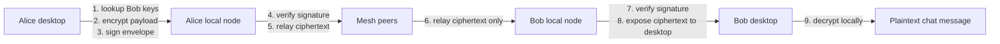

# CORSA Encryption

## English

### Overview

CORSA currently has two encrypted channels:

- `dm`: signed and encrypted direct messages
- `Gazeta`: encrypted TTL-based bulletin-board notices

### Key material

Each identity has:

- `ed25519` key pair for identity and signatures
- `X25519` key pair for encryption

Fingerprint address derivation:

1. take the `ed25519` public key
2. compute `sha256(pubkey)`
3. keep the first 20 bytes
4. encode as hex

### Direct messages

Direct messages are encrypted on the desktop before reaching the local node.

Visible to relays:

- sender address
- recipient address
- topic
- ciphertext length

Hidden from relays:

- plaintext body
- plaintext timestamp

### Direct-message flow



### Direct-message envelope

The ciphertext token wraps a signed envelope:

```json
{
  "version": "dm-v1",
  "from": "<sender-address>",
  "to": "<recipient-address>",
  "recipient": {
    "ephemeral": "...",
    "nonce": "...",
    "data": "..."
  },
  "sender": {
    "ephemeral": "...",
    "nonce": "...",
    "data": "..."
  },
  "signature": "..."
}
```

Important details:

- `recipient` holds the recipient-readable copy
- `sender` holds the sender-readable copy
- `signature` is produced by the sender's `ed25519` key

### Direct-message verification

Verification currently happens in two places:

1. node ingest:
   - verify sender `pubkey` matches sender fingerprint
   - verify `boxkey` binding signature
   - verify direct-message envelope signature
   - reject invalid `dm` before store/relay
2. desktop receive path:
   - verify sender key binding again
   - verify direct-message envelope signature
   - decrypt only after successful verification

### Contact trust model

Contacts are no longer accepted as raw network-advertised keys.

Current model:

1. self-authenticating identity:
   - fingerprint is derived from the `ed25519` public key
2. signed box-key advertisement:
   - a contact signs its `X25519` `boxkey` with its `ed25519` key
3. local TOFU pinning:
   - the first valid key set for an address is pinned locally
4. conflict rejection:
   - later key mismatches for the same address are ignored

Binding payload:

```text
"corsa-boxkey-v1|" + address + "|" + boxkey
```

Default trust store path:

```text
.corsa/trust-<port>.json
```

### Gazeta

`Gazeta` is a dead-drop / bulletin-board style encrypted channel.

Properties:

- encrypted payload
- TTL-based propagation
- any peer may fetch ciphertext notices
- only the intended recipient can decrypt the payload

### Gazeta flow

```mermaid
flowchart LR
    A["Sender desktop"] -->|"1. lookup recipient box key\n2. encrypt notice"| N1["Sender local node"]
    N1 -->|"3. PUBLISH_NOTICE"| M["Mesh peers"]
    M -->|"4. relay/store until TTL expires"| N2["Recipient local node"]
    N2 -->|"5. FETCH_NOTICES"| B["Recipient desktop"]
    B -->|"6. decrypt locally"| P["Readable notice"]
```



### Current limitations

- `Gazeta` payloads are encrypted but not signed yet
- trust is stronger than plain discovery, but still TOFU-based
- metadata remains visible in direct messages (`from`, `to`, `topic`)
- payload size still leaks approximate plaintext size

### Recommended next steps

1. add signatures to `Gazeta`
2. surface trust conflicts in the desktop UI
3. add explicit key-rotation approval flow

---

## Русский

### Обзор

Сейчас в CORSA есть два зашифрованных канала:

- `dm`: подписанные и зашифрованные direct messages
- `Gazeta`: зашифрованные TTL-based notices в стиле bulletin board

### Ключевой материал

У каждой identity есть:

- пара ключей `ed25519` для identity и подписей
- пара ключей `X25519` для шифрования

Как получается fingerprint-адрес:

1. берется `ed25519` public key
2. считается `sha256(pubkey)`
3. берутся первые 20 байт
4. кодируются в hex

### Direct messages

Direct messages шифруются на desktop-клиенте до того, как попадут в локальную ноду.

Что relay-узлы видят:

- адрес отправителя
- адрес получателя
- topic
- длину ciphertext

Что relay-узлы не видят:

- plaintext body
- plaintext timestamp

### Поток direct message


### Direct-message envelope

Ciphertext token содержит подписанный envelope:

```json
{
  "version": "dm-v1",
  "from": "<sender-address>",
  "to": "<recipient-address>",
  "recipient": {
    "ephemeral": "...",
    "nonce": "...",
    "data": "..."
  },
  "sender": {
    "ephemeral": "...",
    "nonce": "...",
    "data": "..."
  },
  "signature": "..."
}
```

Важные детали:

- `recipient` содержит копию, читаемую получателем
- `sender` содержит копию, читаемую отправителем
- `signature` создается `ed25519` ключом отправителя

### Проверка direct messages

Сейчас проверка идет в двух местах:

1. на входе в ноду:
   - проверяется, что `pubkey` отправителя соответствует его fingerprint
   - проверяется подпись привязки `boxkey`
   - проверяется подпись direct-message envelope
   - невалидный `dm` не сохраняется и не relay-ится
2. на desktop receive path:
   - снова проверяется привязка ключей отправителя
   - снова проверяется подпись envelope
   - расшифровка происходит только после успешной проверки

### Contact trust model

Contacts больше не принимаются как “сырые” network-advertised keys.

Текущая модель:

1. self-authenticating identity:
   - fingerprint получается из `ed25519` public key
2. signed box-key advertisement:
   - contact подписывает свой `X25519 boxkey` своим `ed25519` key
3. local TOFU pinning:
   - первый валидный набор ключей для адреса pin-ится локально
4. conflict rejection:
   - дальнейшая подмена ключей для того же адреса игнорируется

Payload привязки:

```text
"corsa-boxkey-v1|" + address + "|" + boxkey
```

Путь trust store по умолчанию:

```text
.corsa/trust-<port>.json
```

### Gazeta

`Gazeta` — это dead-drop / bulletin-board канал с шифрованием.

Свойства:

- зашифрованный payload
- TTL-based propagation
- любой peer может получить ciphertext notices
- расшифровать payload может только нужный получатель

### Поток Gazeta


### Текущие ограничения

- payloads в `Gazeta` зашифрованы, но пока не подписаны
- trust сильнее, чем plain discovery, но все еще основан на TOFU
- metadata в direct messages все еще видны (`from`, `to`, `topic`)
- размер ciphertext все еще выдает примерный размер plaintext

### Следующие шаги

1. добавить подписи в `Gazeta`
2. показать trust conflicts в desktop UI
3. добавить явный flow подтверждения key rotation
