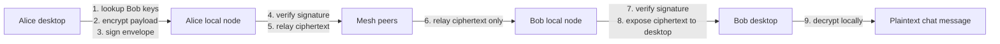

# CORSA Encryption

## English

### Overview

CORSA currently has two encrypted channels:

- `dm`: signed and encrypted direct messages
- `Gazeta`: encrypted TTL-based bulletin-board notices

### Key material

Each identity has:

- `ed25519` key pair for identity and signatures
- `X25519` key pair for encryption

Fingerprint address derivation:

1. take the `ed25519` public key
2. compute `sha256(pubkey)`
3. keep the first 20 bytes
4. encode as hex

#### Private keys never leave the process

Both private keys live in `identity.Identity`, and the type refuses every
generic way out of it — fail-closed, so the protection covers the call
nobody has written yet:

- `json.Marshal` of an `Identity` (or of any struct carrying one, by value
  or by pointer) returns `identity.ErrSecretSerialization`. The method has a
  VALUE receiver on purpose: a pointer receiver would leave
  `json.Marshal(value)` wide open, and the value form is what a struct field
  embeds by default. `json.Unmarshal` is closed the same way — a
  half-populated identity that looks restored and cannot sign is worse than
  a refusal.
- `String` / `GoString` / `Format` redact both keys, so EVERY format verb
  prints the address and nothing else. `Format` (a `fmt.Formatter`) is what
  makes that "every": `%v`, `%s`, `%q` and `%x` consult `Stringer` and `%#v`
  consults `GoStringer`, but `%d` consults neither — it falls through to
  fmt's reflective walk and renders the key as the decimal byte list
  `[85 86 162 …]`, which is exactly as usable as the Base64 form.
- Long-lived structs do not KEEP a secret where they do not need one:
  `sdk.Runtime` stores its config with the private key and RPC password
  cleared, because fmt calls no method on the way down through an unexported
  field and no redaction on the config could have helped there. Where a
  container must hold one — `rpc.Server` needs the password to authenticate —
  the container implements `Format` itself.
- Key material reaches disk through exactly one writer,
  `internal/core/secretfile`: a unique temp name, operations relative to a
  pinned directory handle rather than a path, `fsync` before the rename, and
  errors with the path stripped out. Opening a subdirectory additionally
  proves the directory it opened IS the entry it named — "inside the root" is
  not "where I meant", and a link `identity-backups` → `.` stays inside while
  redirecting every write onto the data directory's own files.
- The file is owner-only **at creation**, never by a step afterwards.
  Restricting after the create leaves a window in which the file exists under
  the parent directory's terms, and a handle another process obtained in that
  window keeps its access — a later DACL change does not revoke access already
  granted, and an unpredictable name does not help because file creation is an
  observable event. POSIX gets this from `O_EXCL` with mode 0600; Windows needs
  `NtCreateFile` with the security descriptor in `OBJECT_ATTRIBUTES`, applied
  atomically with the create and relative to the pinned directory handle. That
  code is isolated in `create_windows.go` and covered by DACL tests under a
  `windows` build tag, because compiling it proves only that the types line up.
- The signing key exists outside `identity.Identity` in exactly one place —
  `datagram.RoutedFrameBuilder`, which is handed the raw `ed25519.PrivateKey`
  so the signing path does not depend on the identity type. Identity's
  fail-closed methods protect nothing there, so the builder and its config
  redact themselves.
- Exactly ONE named function serialises key material: `identity.ExportBackup`,
  used by the local backup RPC (see
  [identity-lookup.md §5](protocol/identity-lookup.md)). Code that needs an
  identity on the wire builds the public projection it needs from
  `PublicKeyBase64` / `BoxPublicKeyBase64` / `Address`, which are public data
  by construction — an address IS the fingerprint of the signing key.

Secrets that live in configuration rather than in `Identity` —
`sdk.NodeConfig.PrivateKey`, `config.RPC.Password` — carry `json:"-"` and
are redacted by the containing struct's `String` / `GoString`.

Two kinds of test hold this up, because either alone is weak. The first
asserts the refusal (`errors.Is(err, ErrSecretSerialization)`). The second
renders the artifacts the node actually emits — the node-hello line, the
welcome frame, the signed self record, the node status, every read-only
local RPC reply — and scans them for both private keys in raw, Base64
(std/raw-std/URL/raw-URL), hex AND decimal-byte-list form. The decimal entry
is not padding: `%d` is the verb that skips `Stringer`, so it is the verb a
leak survives, and none of the other encodings match what it prints. The
scanner is proved non-inert by running the same scan against a real backup,
where it must find the keys.

### Direct messages

Direct messages are encrypted on the desktop before reaching the local node.

Encryption requires the recipient's `X25519` box key. A relay-only node
(headless `corsa-node` started without `CORSA_ACCEPT_DM=1`) does not
redistribute its box key through the contact plane (`fetch_contacts`),
so a sender whose node never handshaked with it directly usually cannot
compose the DM — the send fails client-side with "recipient box key is
unknown". The key does still travel in `hello`/`welcome` (session auth
requires all four identity fields), so peers that connected directly may
hold a cached copy; DMs encrypted with such a key are silently dropped
by the node's inbound gate. The box-key binding is signed by the
recipient's identity key, so a third party cannot publish a forged key
on the node's behalf. See `docs/protocol/messaging.md` "DM Opt-Out
(Relay-Only Nodes)".

Visible to relays:

- sender address
- recipient address
- topic
- ciphertext length

Hidden from relays:

- plaintext body
- plaintext timestamp

### Direct-message flow


```mermaid
flowchart LR
    A["Alice desktop"] -->|"1. lookup Bob keys\n2. encrypt payload\n3. sign envelope"| N1["Alice local node"]
    N1 -->|"4. verify signature\n5. relay ciphertext"| M["Mesh peers"]
    M -->|"6. relay ciphertext only"| N2["Bob local node"]
    N2 -->|"7. verify signature\n8. expose ciphertext to desktop"| B["Bob desktop"]
    B -->|"9. decrypt locally"| P["Plaintext chat message"]
```

*Diagram 1 — Direct message flow*

### Direct-message envelope

The ciphertext token wraps a signed envelope:

```json
{
  "version": "dm-v1",
  "from": "<sender-address>",
  "to": "<recipient-address>",
  "recipient": {
    "ephemeral": "...",
    "nonce": "...",
    "data": "..."
  },
  "sender": {
    "ephemeral": "...",
    "nonce": "...",
    "data": "..."
  },
  "signature": "..."
}
```

Important details:

- `recipient` holds the recipient-readable copy
- `sender` holds the sender-readable copy
- `signature` is produced by the sender's `ed25519` key

### Direct-message verification

Verification currently happens in two places:

1. node ingest:
   - verify sender `pubkey` matches sender fingerprint
   - verify `boxkey` binding signature
   - verify direct-message envelope signature
   - reject invalid `dm` before store/relay
2. desktop receive path:
   - verify sender key binding again
   - verify direct-message envelope signature
   - decrypt only after successful verification

### Liveness reciprocity token

A liveness probe (`presence.md`) carries a sealed claim proving the asker is a
contact of the target. It reuses the existing key material — no new key, no new
handshake — and adds one derivation:

- **Shared secret**: `X25519(sk_asker_box, pk_target_box)` — a STATIC-STATIC
  agreement between the two long-term box keys.

  This is NOT what direct-message sealing does. That path generates a fresh
  ephemeral key per message and agrees ephemeral-static, so each message has
  its own secret. The token deliberately does not: both sides must arrive at
  the same value with nothing sent between them, which only a static-static
  agreement allows.

  The consequence is stated rather than hidden: **tokens have no forward
  secrecy.** The two halves of that are not symmetric, and an earlier revision
  of this section got both of them wrong, so they are spelled out:

  - **Reading past traffic needs the TARGET's key, not either party's.** The
    claim travels sealed to the target with an ephemeral sender key, so the
    sender's own long-term key does not open a recording of it. Whoever later
    obtains the target's long-term box private key can open every claim ever
    addressed to that target, and therefore learn who was asking about them
    and when. Obtaining only the ASKER's key reveals nothing about a recording
    — the ephemeral half is gone — though it does allow forging tokens in that
    asker's name from then on.
  - **A leaked key forges tokens for EVERY future epoch, not just the current
    one.** The epoch is an input to the MAC, not a re-keying: the shared secret
    comes from long-term keys that do not rotate with it. So the bound the
    epochs give is on how long a CAPTURED token stays valid, and not at all on
    how long a captured KEY stays useful. Only replacing the box key ends that.

  What a compromise of the ASKER's key alone does not give is message content.
  A compromise of the TARGET's does, and the earlier sentence claiming
  otherwise was wrong: the ephemeral half of an ephemeral-static seal is the
  SENDER's, and its public part travels with the ciphertext, so the recipient's
  long-term private key reconstructs the shared secret of every message ever
  sealed to it. Ephemerality here protects against compromise of the sender's
  long-term key; it gives the recipient no forward secrecy at all. Anyone
  holding recorded traffic and, later, a recipient's box private key can read
  the recipient copies.
- **Key**: `HKDF-SHA256(ikm = shared, salt = net,
  info = "corsa-liveness-token-v1|" || net || asker || target)`, first 32 bytes.
- **Token**: `HMAC-SHA256(key, epoch_u64be || attempt_id)`, first 16 bytes;
  `epoch = floor(unix_seconds / 600)`, `attempt_id` is the 20-byte per-attempt
  label the probe frame carries in `src`.
- **Envelope**: the claim `{asker, epoch, token}` is sealed with the shared
  ecdh-gcm primitive under the label `"corsa-liveness-probe-v1|" || dst`.

**`attempt_id` inside the MAC is what makes a claim single-use**, and it is not
optional. Without it the sealed blob is a bearer credential for the whole epoch
window: every hop on the path holds the ciphertext, and any of them could put it
into a `get_identity` of its own under a fresh label and harvest proofs. With
it, one claim answers exactly one question. A verifier additionally remembers
answered `attempt_id`s for the length of the acceptance window, so the identical
request cannot simply be replayed unchanged.

Domain separation is deliberate and load-bearing. Distinct `info` strings keep
this key from ever colliding with another protocol's, so a token cannot be
replayed elsewhere. The network is inside both salt and `info` because the two
identities are the same principals on every network — without it, one captured
claim would be portable between networks.

The DM control plane is a DIFFERENT construction and not a sibling of this one:
it seals to the recipient's box key with an EPHEMERAL sender key
(`internal/crypto/ecdhgcm`) under the label
`"corsa-dm-control-v1|" || sender || recipient`, so its shared secret is fresh
per message and never equals the static-static output above. An earlier revision
of this section said the two shared an ECDH output; they do not, and reading
them as siblings would suggest a forward-secrecy property the token half does
not have.

The token is NOT an authorisation credential. It says "these two know each
other here, recently"; whether a request is permitted is decided by the target's
contact list, separately.

### Contact trust model

Contacts are no longer accepted as raw network-advertised keys.

Current model:

1. self-authenticating identity:
   - fingerprint is derived from the `ed25519` public key
2. signed box-key advertisement:
   - a contact signs its `X25519` `boxkey` with its `ed25519` key
3. local TOFU pinning:
   - the first valid key set for an address is pinned locally
4. conflict rejection:
   - later key mismatches for the same address are ignored

Binding payload:

```text
"corsa-boxkey-v1|" + address + "|" + boxkey
```

Default trust store path:

```text
.corsa/trust-<port>.json
```

### Gazeta

`Gazeta` is a dead-drop / bulletin-board style encrypted channel.

Properties:

- encrypted payload
- TTL-based propagation
- any peer may fetch ciphertext notices
- only the intended recipient can decrypt the payload

### Gazeta flow


```mermaid
flowchart LR
    A["Sender desktop"] -->|"1. lookup recipient box key\n2. encrypt notice"| N1["Sender local node"]
    N1 -->|"3. PUBLISH_NOTICE"| M["Mesh peers"]
    M -->|"4. relay/store until TTL expires"| N2["Recipient local node"]
    N2 -->|"5. FETCH_NOTICES"| B["Recipient desktop"]
    B -->|"6. decrypt locally"| P["Readable notice"]
```

*Diagram 2 — Gazeta bulletin board flow*

### Current limitations

- `Gazeta` payloads are encrypted but not signed yet
- trust is stronger than plain discovery, but still TOFU-based
- metadata remains visible in direct messages (`from`, `to`, `topic`)
- payload size still leaks approximate plaintext size

### Recommended next steps

1. add signatures to `Gazeta`
2. surface trust conflicts in the desktop UI
3. add explicit key-rotation approval flow

---

## Русский

### Обзор

Сейчас в CORSA есть два зашифрованных канала:

- `dm`: подписанные и зашифрованные direct messages
- `Gazeta`: зашифрованные TTL-based notices в стиле bulletin board

### Ключевой материал

У каждой identity есть:

- пара ключей `ed25519` для identity и подписей
- пара ключей `X25519` для шифрования

Как получается fingerprint-адрес:

1. берется `ed25519` public key
2. считается `sha256(pubkey)`
3. берутся первые 20 байт
4. кодируются в hex

#### Приватные ключи не покидают процесс

Оба приватных ключа лежат в `identity.Identity`, и тип закрывает все общие
пути наружу — fail-closed, чтобы защита покрывала и тот вызов, который ещё
не написан:

- `json.Marshal` от `Identity` (и от любой структуры, которая её несёт, по
  значению или по указателю) возвращает `identity.ErrSecretSerialization`.
  Receiver у метода — ЗНАЧЕНИЕ намеренно: pointer receiver оставил бы
  `json.Marshal(value)` открытым, а именно форма значения по умолчанию
  вкладывается полем структуры. `json.Unmarshal` закрыт так же:
  наполовину разобранная identity, которая выглядит восстановленной и не
  умеет подписывать, хуже отказа.
- `String` / `GoString` / `Format` редактируют оба ключа, поэтому КАЖДЫЙ
  форматный глагол печатает адрес и больше ничего. Именно `Format`
  (`fmt.Formatter`) делает это «каждый»: `%v`, `%s`, `%q` и `%x` спрашивают
  `Stringer`, `%#v` — `GoStringer`, а `%d` не спрашивает никого: он уходит в
  рефлексивный обход fmt и печатает ключ десятичным списком байт
  `[85 86 162 …]`, ровно настолько же пригодным, как Base64.
- Долгоживущие структуры не ХРАНЯТ секрет там, где он им не нужен:
  `sdk.Runtime` держит конфиг с очищенными приватным ключом и RPC-паролем,
  потому что через неэкспортируемое поле fmt не вызывает ни одного метода и
  никакое редактирование конфига там бы не помогло. Где контейнер обязан его
  держать — `rpc.Server` нужен пароль для аутентификации — контейнер сам
  реализует `Format`.
- Ключевой материал попадает на диск ровно одним писателем,
  `internal/core/secretfile`: уникальное имя temp, операции относительно
  закреплённого дескриптора каталога, а не по пути, `fsync` до rename и ошибки
  без пути. Открытие подкаталога дополнительно доказывает, что открытый
  каталог — это названная запись: «внутри root» не значит «там, где я хотел»,
  и ссылка `identity-backups` → `.` остаётся внутри, перенаправляя все записи
  на собственные файлы data-каталога.
- Файл становится owner-only **в момент создания**, а не отдельным шагом
  после. Ограничение после создания оставляет окно, в котором файл существует
  на условиях родительского каталога, и дескриптор, полученный чужим процессом
  в этом окне, сохраняет доступ: смена DACL уже выданный доступ не отзывает, а
  непредсказуемое имя не спасает — появление файла наблюдаемо. На POSIX это
  даёт `O_EXCL` с режимом 0600; на Windows нужен `NtCreateFile` с security
  descriptor в `OBJECT_ATTRIBUTES`, применяемый атомарно с созданием и
  относительно закреплённого дескриптора каталога. Этот код изолирован в
  `create_windows.go` и покрыт тестами DACL под build-тегом `windows`, потому
  что компиляция доказывает только совпадение типов.
- Ключ подписи живёт вне `identity.Identity` ровно в одном месте —
  `datagram.RoutedFrameBuilder`, которому передаётся сырой
  `ed25519.PrivateKey`, чтобы путь подписи не зависел от типа identity.
  Fail-closed методы Identity там не защищают ничего, поэтому билдер и его
  конфиг редактируют себя сами.
- Ключевой материал сериализует ровно ОДНА явно названная функция —
  `identity.ExportBackup`, используемая локальным backup-RPC (см.
  [identity-lookup.md §5](protocol/identity-lookup.md)). Код, которому нужна
  identity на проводе, собирает нужную ему публичную проекцию из
  `PublicKeyBase64` / `BoxPublicKeyBase64` / `Address` — это публичные
  данные по построению: адрес И ЕСТЬ отпечаток ключа подписи.

Секреты, живущие в конфигурации, а не в `Identity` —
`sdk.NodeConfig.PrivateKey`, `config.RPC.Password`, — помечены `json:"-"` и
редактируются `String` / `GoString` содержащей структуры.

Держат это два вида тестов, потому что каждый по отдельности слаб. Первый
проверяет отказ (`errors.Is(err, ErrSecretSerialization)`). Второй
рендерит артефакты, которые узел действительно выпускает — строку
node-hello, welcome-фрейм, подписанную self-запись, node status, каждый
read-only ответ локального RPC — и сканирует их на оба приватных ключа в
raw, Base64 (std/raw-std/URL/raw-URL), hex И десятичном списке байт.
Десятичная форма здесь не для полноты: `%d` — тот самый глагол, который
пропускает `Stringer`, то есть именно в нём утечка и выживает, а ни одна из
остальных кодировок его вывод не поймает. Неинертность сканера
доказывается тем же сканом по настоящему бэкапу, где он обязан ключи найти.

### Direct messages

Direct messages шифруются на desktop-клиенте до того, как попадут в локальную ноду.

Для шифрования нужен `X25519` box-ключ получателя. Relay-only нода
(headless `corsa-node`, запущенный без `CORSA_ACCEPT_DM=1`) не раздаёт
свой box-ключ через contact-плоскость (`fetch_contacts`), поэтому
отправитель, чья нода не делала с ней прямой handshake, обычно не может
составить DM — отправка падает на стороне клиента с ошибкой «recipient
box key is unknown». В `hello`/`welcome` ключ всё же передаётся (session
auth требует все четыре identity-поля), так что напрямую подключавшиеся
пиры могут иметь закэшированную копию; DM, зашифрованные таким ключом,
нода молча дропает входным гейтом. Привязка box-ключа подписана
identity-ключом получателя, так что третья сторона не может опубликовать
поддельный ключ от имени ноды. См. `docs/protocol/messaging.md`, раздел
«Отказ от приёма DM (relay-only ноды)».

Что relay-узлы видят:

- адрес отправителя
- адрес получателя
- topic
- длину ciphertext

Что relay-узлы не видят:

- plaintext body
- plaintext timestamp

### Поток direct message


```mermaid
flowchart LR
    A["Alice desktop"] -->|"1. lookup Bob keys\n2. encrypt payload\n3. sign envelope"| N1["Alice local node"]
    N1 -->|"4. verify signature\n5. relay ciphertext"| M["Mesh peers"]
    M -->|"6. relay ciphertext only"| N2["Bob local node"]
    N2 -->|"7. verify signature\n8. expose ciphertext to desktop"| B["Bob desktop"]
    B -->|"9. decrypt locally"| P["Plaintext chat message"]
```

*Диаграмма 1 — Поток direct message*

### Direct-message envelope

Ciphertext token содержит подписанный envelope:

```json
{
  "version": "dm-v1",
  "from": "<sender-address>",
  "to": "<recipient-address>",
  "recipient": {
    "ephemeral": "...",
    "nonce": "...",
    "data": "..."
  },
  "sender": {
    "ephemeral": "...",
    "nonce": "...",
    "data": "..."
  },
  "signature": "..."
}
```

Важные детали:

- `recipient` содержит копию, читаемую получателем
- `sender` содержит копию, читаемую отправителем
- `signature` создается `ed25519` ключом отправителя

### Проверка direct messages

Сейчас проверка идет в двух местах:

1. на входе в ноду:
   - проверяется, что `pubkey` отправителя соответствует его fingerprint
   - проверяется подпись привязки `boxkey`
   - проверяется подпись direct-message envelope
   - невалидный `dm` не сохраняется и не relay-ится
2. на desktop receive path:
   - снова проверяется привязка ключей отправителя
   - снова проверяется подпись envelope
   - расшифровка происходит только после успешной проверки

### Токен взаимности для liveness

Liveness-проба (`presence.md`) несёт запечатанную заявку, доказывающую, что
спрашивающий — контакт цели. Она переиспользует существующий ключевой материал
(нового ключа и нового рукопожатия нет) и добавляет один вывод:

- **Общий секрет**: `X25519(sk_asker_box, pk_target_box)` — СТАТИЧЕСКО-СТАТИЧЕСКОЕ
  согласование двух долговременных box-ключей.

  Это НЕ то, что делает запечатывание direct message: там на каждое сообщение
  генерируется свежий эфемерный ключ и согласование идёт эфемерно-статическое,
  поэтому у каждого сообщения свой секрет. Токен так не может: обе стороны
  обязаны прийти к одному значению, ничего друг другу не отправив, а это даёт
  только статическо-статическое согласование.

  Следствие называется прямо: **у токенов нет forward secrecy.** Две половины
  этого несимметричны, и прошлая редакция раздела ошибалась в обеих, поэтому
  они расписаны:

  - **Чтобы прочитать прошлый трафик, нужен ключ ЦЕЛИ, а не любой из сторон.**
    Заявка едет запечатанной на цель эфемерным ключом отправителя, поэтому
    собственный долговременный ключ отправителя записи не открывает. Тот, кто
    позже получит долговременный приватный box-ключ цели, откроет все заявки,
    когда-либо к ней адресованные, и узнает, кто и когда о ней спрашивал.
    Получение только ключа СПРАШИВАЮЩЕГО о записи не говорит ничего —
    эфемерной половины уже нет, — но позволяет с этого момента подделывать
    токены от его имени.
  - **Утёкший ключ подделывает токены на ЛЮБЫЕ будущие эпохи, а не только на
    текущую.** Эпоха — это вход MAC, а не смена ключа: общий секрет выведен из
    долговременных ключей, которые вместе с ней не меняются. Значит, эпохи
    ограничивают, как долго остаётся валидным ПЕРЕХВАЧЕННЫЙ токен, и никак не
    ограничивают, как долго полезен перехваченный КЛЮЧ. Это заканчивается
    только заменой box-ключа.

  Чего не даёт компрометация ключа СПРАШИВАЮЩЕГО — содержимого сообщений.
  Компрометация ключа ЦЕЛИ даёт, и прежняя формулировка об обратном была
  неверна: эфемерная половина в эфемерно-статическом запечатывании принадлежит
  ОТПРАВИТЕЛЮ, а её публичная часть едет вместе с шифротекстом, поэтому
  долговременный приватный ключ получателя восстанавливает общий секрет любого
  когда-либо запечатанного ему сообщения. Эфемерность здесь защищает от
  компрометации долговременного ключа отправителя; получателю она forward
  secrecy не даёт вовсе. Кто держит записанный трафик и позже получает
  box-ключ получателя — прочитает копии получателя.
- **Ключ**: `HKDF-SHA256(ikm = shared, salt = net,
  info = "corsa-liveness-token-v1|" || net || asker || target)`, первые 32 байта.
- **Токен**: `HMAC-SHA256(key, epoch_u64be || attempt_id)`, первые 16 байт;
  `epoch = floor(unix_seconds / 600)`, `attempt_id` — 20-байтная метка попытки,
  которую кадр пробы несёт в поле `src`.
- **Конверт**: заявка `{asker, epoch, token}` запечатывается общим примитивом
  ecdh-gcm под меткой `"corsa-liveness-probe-v1|" || dst`.

**`attempt_id` внутри MAC — это то, что делает заявку одноразовой**, и он не
опционален. Без него запечатанный блок является предъявительским полномочием на
всё окно эпох: шифротекст держит каждый хоп на пути, и любой из них может
вложить его в собственный `get_identity` под свежей меткой и собирать proof-ы.
С ним одна заявка отвечает ровно на один вопрос. Кроме того, проверяющий помнит
отвеченные `attempt_id` на длину окна приёма, поэтому идентичный запрос нельзя
просто повторить без изменений.

Разделение доменов здесь несущее, а не косметическое. Различные строки `info`
гарантируют, что этот ключ никогда не совпадёт с ключом другого протокола,
поэтому токен нельзя переиграть в другой протокол. Сеть входит и в salt, и в
`info`, потому что на любой сети это одни и те же принципалы: без неё одна
перехваченная заявка была бы переносима между сетями.

Управляющая плоскость DM — ДРУГАЯ конструкция, а не родственная этой: она
запечатывает на box-ключ получателя ЭФЕМЕРНЫМ ключом отправителя
(`internal/crypto/ecdhgcm`) под меткой
`"corsa-dm-control-v1|" || sender || recipient`, поэтому её общий секрет свежий
на каждое сообщение и никогда не равен статик-статик выводу выше. Прошлая
редакция этого раздела утверждала, что у них общий выход ECDH; это не так, и
чтение их как родственных подсказывало бы свойство forward secrecy, которого у
токена нет.

Токен НЕ является полномочием. Он говорит «эти двое знают друг друга здесь и
недавно»; допустим ли запрос, решает список контактов цели — отдельно.

### Contact trust model

Contacts больше не принимаются как “сырые” network-advertised keys.

Текущая модель:

1. self-authenticating identity:
   - fingerprint получается из `ed25519` public key
2. signed box-key advertisement:
   - contact подписывает свой `X25519 boxkey` своим `ed25519` key
3. local TOFU pinning:
   - первый валидный набор ключей для адреса pin-ится локально
4. conflict rejection:
   - дальнейшая подмена ключей для того же адреса игнорируется

Payload привязки:

```text
"corsa-boxkey-v1|" + address + "|" + boxkey
```

Путь trust store по умолчанию:

```text
.corsa/trust-<port>.json
```

### Gazeta

`Gazeta` — это dead-drop / bulletin-board канал с шифрованием.

Свойства:

- зашифрованный payload
- TTL-based propagation
- любой peer может получить ciphertext notices
- расшифровать payload может только нужный получатель

### Поток Gazeta


```mermaid
flowchart LR
    A["Sender desktop"] -->|"1. lookup recipient box key\n2. encrypt notice"| N1["Sender local node"]
    N1 -->|"3. PUBLISH_NOTICE"| M["Mesh peers"]
    M -->|"4. relay/store until TTL expires"| N2["Recipient local node"]
    N2 -->|"5. FETCH_NOTICES"| B["Recipient desktop"]
    B -->|"6. decrypt locally"| P["Readable notice"]
```

*Диаграмма 2 — Поток Gazeta*

### Текущие ограничения

- payloads в `Gazeta` зашифрованы, но пока не подписаны
- trust сильнее, чем plain discovery, но все еще основан на TOFU
- metadata в direct messages все еще видны (`from`, `to`, `topic`)
- размер ciphertext все еще выдает примерный размер plaintext

### Следующие шаги

1. добавить подписи в `Gazeta`
2. показать trust conflicts в desktop UI
3. добавить явный flow подтверждения key rotation
