# Mesh Network — Node Layer

## English

Related documentation:

- [architecture.md](architecture.md) — project layout and runtime model
- [protocol.md](protocol.md) — frame format and protocol version
- [encryption.md](encryption.md) — cryptographic primitives
- [dm_router.md](dm_router.md) — service layer on top of the mesh

Source: `internal/core/node/service.go`, `internal/core/node/peer_state.go`,
`internal/core/node/trust.go`, `internal/core/node/netgroup.go`,
`internal/core/transport/peer.go`

### Overview

CORSA forms a peer-to-peer mesh where every node — whether a standalone relay
(`corsa-node`) or an embedded desktop instance (`corsa-desktop`) — maintains
direct TCP connections to a subset of peers and gossips messages across the
network. There is no central server; the bootstrap peer is simply the first
node a newcomer connects to for initial discovery.

### Mesh topology

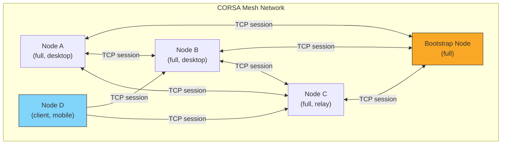
*Diagram 1 — Mesh topology with bootstrap and peer nodes*

### Peer discovery flow

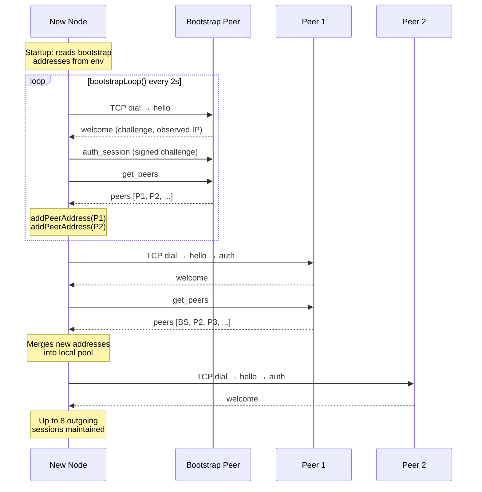
*Diagram 2 — Bootstrap and peer discovery sequence*

### Node roles

- **full** — relays DMs, delivery receipts, and Gazeta notices on behalf of
  the entire network. Both `corsa-node` and `corsa-desktop` default to this.
- **client** — syncs peers and contacts, stores only its own traffic, never
  forwards foreign messages. Future mobile/light clients will use this role.

### Peer discovery

Each node starts with a list of bootstrap addresses (from `CORSA_BOOTSTRAP_PEERS`
env var, default `65.108.204.190:64646`). On startup, `bootstrapLoop()` runs
every 2 seconds and:

1. **`ensurePeerSessions()`** — dials up to 8 outgoing peers, selected by
   score (highest first) from the known address pool.
2. **Peer exchange** — on connecting to any peer, the node sends `get_peers`
   and receives a `peers` frame. Discovered addresses are merged into the local
   pool via `addPeerAddress()`, making them available for future dials. This
   gives the network a gossip-style peer discovery mechanism.
3. **Stale peer eviction** — every 10 minutes, peers with score ≤ −20 and no
   successful connection in the last 24 hours are pruned. Bootstrap peers and
   currently connected peers are never evicted.
4. **Peer state persistence** — every 5 minutes, the address pool is saved to
   `peers-{port}.json`. On restart, persisted peers are merged with bootstrap
   peers so the node quickly reconnects to previously healthy peers.

### Peer scoring and dial priority

Each peer carries a reputation score in the range [−50, +100]:

- **+10** on successful TCP handshake (reset consecutive failures)
- **−5** on dial/protocol failure
- **−2** on clean disconnect

`peerDialCandidates()` sorts peers by score descending. If a peer fails once,
it is retried immediately. For ≥ 2 consecutive failures an exponential cooldown
applies: `min(30s × 2^(failures−2), 30 min)`. A successful connection resets
the counter.

Fallback port variants (e.g., `:64647` for `:64646`) inherit the primary
peer's reputation to prevent cooldown bypass.

### Connection lifecycle

**Outbound:**

1. `runPeerSession()` dials with 1.5 s timeout.
2. Client sends `hello` (identity, services, node type, reachable network
   groups, advertised listen address).
3. Server responds with `welcome` (protocol version, challenge nonce,
   observed address, server identity).
4. Client signs the challenge with `ed25519` and sends `auth_session`.
   Server verifies; invalid signatures accumulate ban points (1 000 points
   → 24-hour IP ban).
5. Session enters `servePeerSession()`: initial one-time sync
   (`get_peers`, `fetch_contacts`, flush pending frames), then
   steady-state with heartbeat pings every ~2 min and event-driven
   push frames only (no periodic polling).

**Inbound:**

1. `handleConn()` reads the peer's `hello` frame.
2. Sends `welcome` with a fresh challenge.
3. Waits for `auth_session` and verifies.
4. Commands are routed through `handlePeerSessionFrame()`.

### Connection handshake (detail)

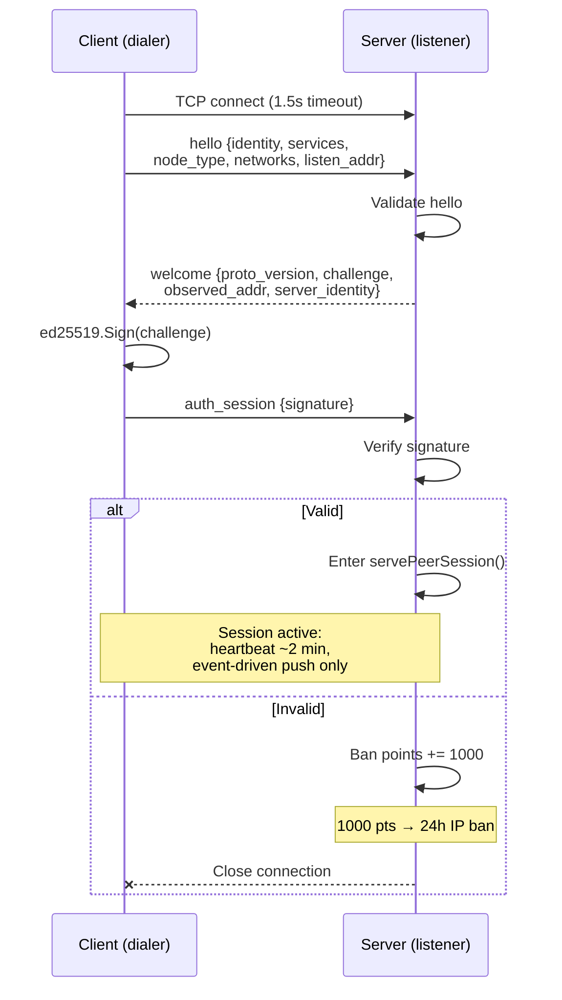
*Diagram 3 — TCP connection handshake and authentication*

### Peer session lifecycle (full flow)

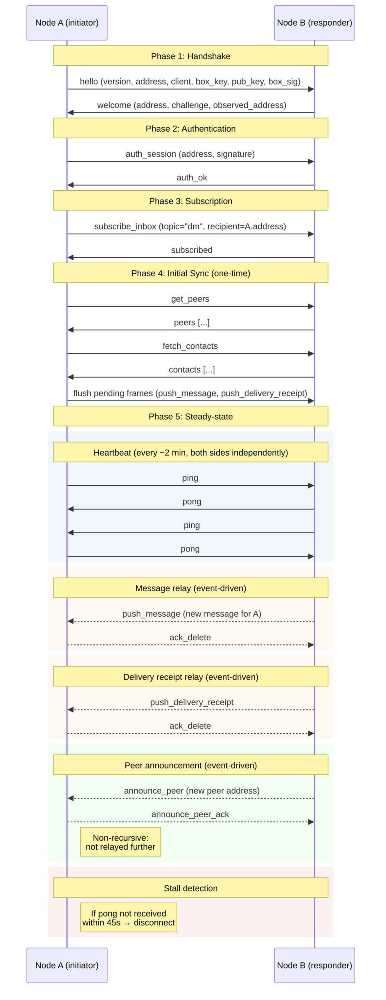
*Diagram 4 — Peer session lifecycle: handshake → auth → sync → steady-state*

### Health monitoring

- **Heartbeat** — both sides of a connection independently send pings
  every ~2 min (with jitter up to 15 s). Outbound sessions ping via
  `servePeerSession`; inbound connections ping via `inboundHeartbeat`.
  If no pong arrives within 45 s (`pongStallTimeout`), the peer is
  declared stalled and the connection is torn down. This bidirectional
  approach ensures each node has its own proof of liveness regardless of
  who initiated the TCP connection.
- **Initial sync** — on connect only: `get_peers`, `fetch_contacts`,
  flush pending frames. No periodic polling in steady-state.
- **Peer announcement** — when a new peer authenticates on an inbound
  connection, its advertised listen address is announced to all active
  outbound sessions via `announce_peer`. The frame includes the peer's
  `node_type` ("full" or "client") so recipients know what kind of peer
  is being offered. The announcement is non-recursive: recipients learn
  the address locally but do not relay it further.
  Local/private addresses are excluded. If the outbound send channel is
  full, the frame is queued via the pending mechanism and delivered after
  drain. If a frame with the same dedup key is already queued, its
  payload is **replaced** with the newer version so that metadata changes
  (e.g. `node_type`) are not lost while the queue is blocked.
  `node_type` is a **required** field: on the receiving side it is
  validated against known types (`isKnownNodeType`); frames with an
  unknown or empty `node_type` are silently ignored — the ack is still
  returned but the peer address is not learned. Local/private addresses
  (`NetGroupLocal`) are filtered in the `announce_peer` handler itself,
  but **not** in `addPeerAddress`/`promotePeerAddress` — those lower-level
  functions accept LAN peers so that dev/LAN meshes can discover 10.x /
  192.168.x nodes via direct hello/welcome and `get_peers`.
  Authenticated senders trigger promotion: the peer's cooldown is reset
  (via `resolveHealthAddress` so fallback-variant cooldown shares with
  the primary) and its `node_type` is updated, but it is **not** moved
  to the front
  of the dial list. Dial priority is managed locally — remote peers
  cannot influence it (trust-no-one policy). Only the local `add_peer`
  RPC command (explicit user action) prepends to the front.
  Unauthenticated senders can only add **new** peers; if the address is
  already known, its `node_type` is preserved to prevent an unauthenticated
  client from retagging a "full" peer as "client" and disrupting routing.
  Different ports on the same host are treated as distinct peers (multiple
  nodes may share an IP); the fallback-variant model handles same-host
  resolution at dial time, not at discovery time.
- **Connection liveness seeding** — `markPeerConnected` sets
  `LastUsefulReceiveAt = now` so that `computePeerStateLocked` does not
  immediately return "degraded" before any ping/pong exchange occurs.
- **Inbound health tracking** — when an inbound peer sends a `ping`,
  the handler calls `markPeerRead` to update `LastUsefulReceiveAt`. When
  the node's own heartbeat receives a `pong`, `LastPongAt` is updated.
  Either timestamp keeps the peer in `healthy` state.
- **Stall detection** — based on heartbeat response:
  - no useful traffic for ≥ 2 min (`heartbeatInterval`): _degraded_
  - no useful traffic for ≥ 2 min 45 s (`heartbeatInterval` + `pongStallTimeout`): _stalled_

Peer states: `healthy` → `degraded` → `stalled` → `reconnecting`.

**Aggregate network status** is derived from the number of _usable_ peers
(healthy + degraded). Stalled peers have a live TCP session but are excluded
from message routing, so they do not count as usable. Per-peer details are
shown in the breakdown line.

- `offline` — no known peers
- `reconnecting` — all peers are reconnecting, none connected
- `limited` — zero or one usable peer (stalled-only counts here too)
- `warning` — usable peers exist but less than half of total
- `healthy` — at least half of known peers are usable (2+)

### Message routing

**Direct messages:**

1. Desktop encrypts the message with the recipient's X25519 box key and
   sends `send_message` to the embedded local node.
2. The node validates the ed25519 signature, deduplicates, and stores it.
3. If the message is local (sender or recipient is this node),
   `MessageStore.StoreMessage()` is called (desktop persists to chatlog).
4. `gossipMessage()` fans the message out to the best 3 scored peers via
   `routingTargetsForMessage()`:
   - broadcast (`recipient="*"`): all full nodes
   - addressed: all full nodes + the specific recipient if client role
5. **Push and gossip are independent.** For addressed DMs the node takes
   an atomic snapshot of subscribers via `subscribersForRecipient()`
   (under `s.mu`). If the snapshot is non-empty, `pushToSubscriberSnapshot()`
   delivers instantly to locally connected recipients. Independently,
   `gossipMessage()` fans the message to relay peers ensuring mesh-wide
   propagation. Push is an optimization for latency; gossip guarantees
   the message reaches every relay so the recipient can retrieve it
   from any node it reconnects to.
6. The message is always persisted in `s.topics` before push/gossip, so
   even if a subscriber disconnects mid-write, the recipient can pick
   it up via backlog on the next `subscribe_inbox`.

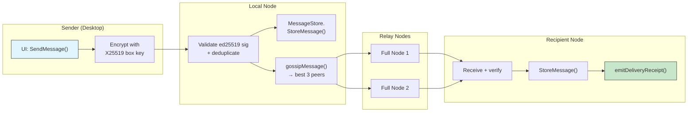
*Diagram 5 — Direct message routing and gossip*

**Delivery receipts:**

1. When a node receives a DM addressed to it, `emitDeliveryReceipt()` auto-
   generates a `"delivered"` receipt and stores it via `storeDeliveryReceipt()`.
2. The receipt is gossiped back toward the original sender.
3. `"seen"` receipts are sent when the active chat is on screen —
   both `SelectPeer` and `AutoSelectPeer` trigger `MarkConversationSeen()`.
4. Receipts persist to chatlog via `UpdateDeliveryStatus()` before the local
   change event is emitted, maintaining the "DB first, then event" invariant.

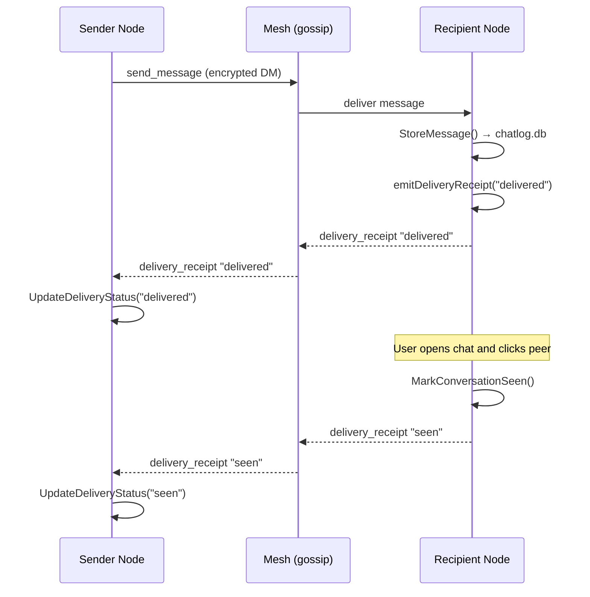
*Diagram 6 — Delivery receipt flow and status updates*

**Transit relay:**

Messages where neither sender nor recipient is this node are relayed:

- Stored in `relayRetry` with a 3-minute TTL.
- Persisted across restarts in `queue-{port}.json`.
- Retried on reconnect via `retryRelayDeliveries()`.

### Pending frame queue

Outbound frames that cannot be sent immediately are queued per peer address in
`pending[address]`. Each entry records the frame, queue time, and retry count.
On reconnect, `flushPendingPeerFrames()` drains the queue. The queue is
persisted in `queue-{port}.json` and survives restarts.

Legacy entries keyed by fallback-port addresses are migrated on load; entries
that cannot be resolved to a primary address move to the `"orphaned"` section.

### Network groups and NAT

Peers are classified into reachable network groups by `ClassifyAddress()`:

- **IPv4**, **IPv6**, **TorV3**, **TorV2**, **I2P**, **CJDNS**, **Local**,
  **Unknown**

The `hello` frame advertises the node's reachable groups (`"networks"` field).
Peer exchange filters discovered addresses by the intersection of reachable
groups — nodes that cannot reach a given network class will not receive
addresses for it.

**NAT detection:** Each peer reports the connecting node's observed IP in the
`welcome` frame. When ≥ 2 distinct peers report the same IP, the node accepts
it as its external address (consensus threshold). The address is informational
only — the node never auto-rewrites its advertise setting.

**Tor support:** Setting `CORSA_PROXY=127.0.0.1:9050` routes connections through
a SOCKS5 proxy, enabling `.onion` address resolution.

### Trust model (TOFU)

Implemented in `trustStore` (`trust.go`):

1. Fingerprint address = `hex(sha256(ed25519_pubkey)[:20])`.
2. Box-key binding: `ed25519.Sign(identity_key, "corsa-boxkey-v1|" + address + "|" + boxkey_base64)`.
3. On first valid contact exchange, the key set is pinned locally in
   `trust-{port}.json` (Trust On First Use).
4. Later conflicting keys for the same address are rejected and recorded in
   the `"conflicts"` section for manual review.

### Gazeta — TTL-based encrypted notices

A dead-drop / bulletin-board channel for encrypted notices:

1. The sender encrypts a notice with the recipient's X25519 box key using an
   ephemeral key + AES-GCM.
2. Sends `publish_notice { ttl_seconds, ciphertext }`.
3. The notice is gossiped to all full nodes.
4. Peers store the notice until its TTL expires, then purge it.
5. Recipients fetch via `fetch_notices` and decrypt with their identity key.

### Connection I/O architecture

Each inbound TCP connection is served by two goroutines: a **reader** (the
`handleConn` loop) and a dedicated **writer** (`connWriter`). They communicate
through a buffered channel, never sharing a mutex for socket I/O.

*Diagram — Per-connection reader/writer goroutine pair*

The design guarantees three properties:

1. **No blocking on write.** `writeJSONFrame`, `writePushFrame`, and most
   command responses serialise the frame into bytes, then push them into the
   channel. The call returns immediately regardless of the remote peer's read
   speed. Error-path responses use `writeJSONFrameSync` which waits for the
   writer goroutine to flush the frame to the socket before returning — this
   preserves the "response delivered before teardown" contract.
2. **Slow-peer eviction.** If the channel is full (128 pending frames), the
   connection is closed and the subscriber is removed. This prevents one slow
   peer from consuming memory or blocking other operations.
3. **Write deadline.** The writer goroutine sets a 30-second write deadline on
   every `conn.Write`. If the TCP send buffer stays full beyond that, the OS
   returns an error and the writer closes the connection.

#### Lifecycle

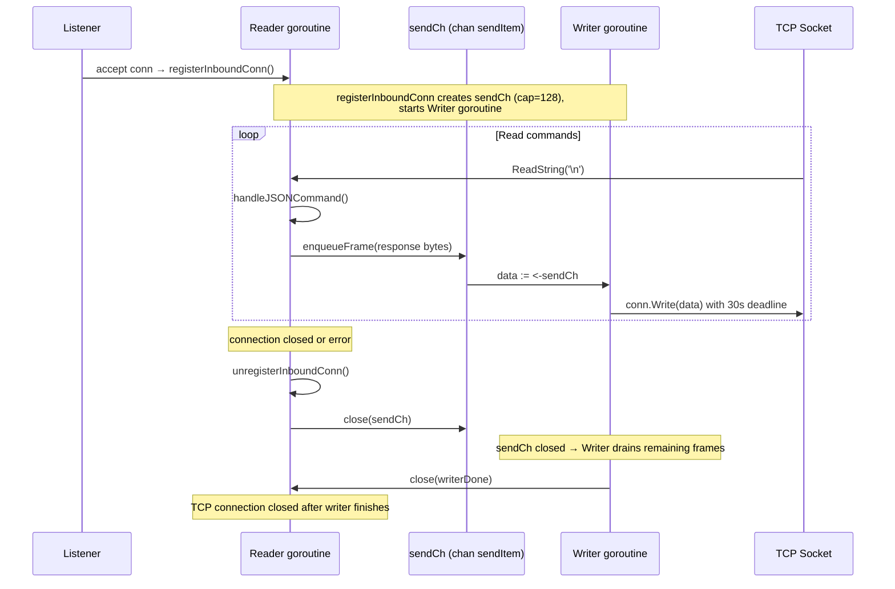
*Diagram — Inbound connection lifecycle*

#### Write path: all protocol commands

Every TCP write on an inbound connection goes through the same channel —
responses to commands, error responses, and asynchronous pushes alike. The
difference is how the caller interacts with the channel:

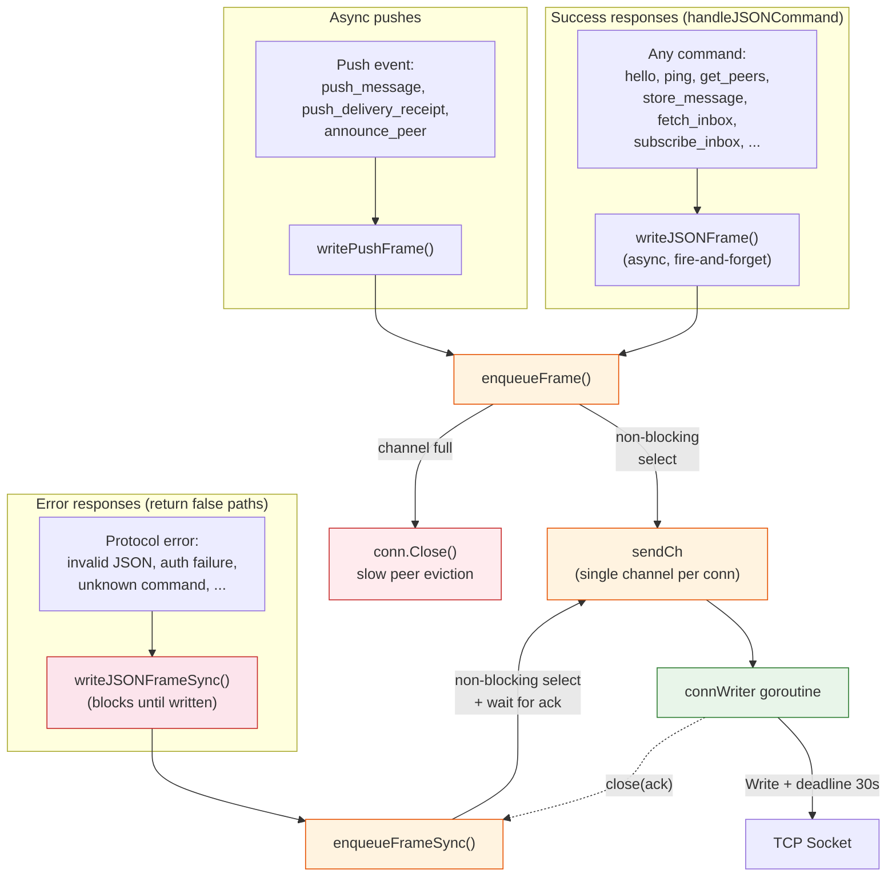
*Diagram — Single-writer guarantee for all protocol frames*

This guarantees that no two goroutines ever call `conn.Write` concurrently,
regardless of whether the write originates from a command response or an
asynchronous push.

#### Synchronous writes on error paths

When a command handler returns `false` (invalid JSON, authentication failure,
unknown command, etc.), the deferred cleanup in `handleConn` closes the TCP
connection. If the error frame were enqueued asynchronously, the TCP socket
would close before the writer goroutine could flush the frame — the client
would see EOF instead of the error.

`writeJSONFrameSync` solves this by attaching an `ack` channel to the send
item. The writer goroutine closes `ack` only after a successful `conn.Write`,
unblocking the caller. Only then does the command handler return `false`,
allowing the deferred cleanup to proceed.

If the writer goroutine has already exited (write error or slow-peer eviction
by another goroutine), `enqueueFrameSync` detects this via the `writerDone`
channel and returns `enqueueDropped` immediately instead of waiting for the
timeout. A 5-second timeout acts as a last-resort safety net for cases that
neither `ack` nor `writerDone` can cover.

#### Why not a per-connection mutex?

The previous implementation used a `sync.Mutex` per connection that was held
during `io.WriteString`. If the remote peer was slow or unresponsive, the mutex
was held indefinitely, which caused:

- The reader goroutine to block when sending a response (waiting for the
  mutex), freezing the entire read loop.
- Backlog replay goroutines to queue behind the mutex, cascading the stall.
- The peer to appear "hung" from the local node's perspective.

The channel-based approach decouples all callers from the actual socket I/O:
only the dedicated writer goroutine ever touches `conn.Write`, and it is the
only goroutine that blocks on a slow peer.

### Persistence summary

| File | Contents |
|---|---|
| `peers-{port}.json` | Known peer addresses, scores, metadata |
| `trust-{port}.json` | TOFU-pinned contacts and conflict log |
| `queue-{port}.json` | Pending outbound frames, relay retry state |
| `chatlog.db` (SQLite) | Message history, delivery status (desktop only) |

---

## Русский

Связанная документация:

- [architecture.md](architecture.md) — структура проекта и модель запуска
- [protocol.md](protocol.md) — формат фреймов и версия протокола
- [encryption.md](encryption.md) — криптографические примитивы
- [dm_router.md](dm_router.md) — сервисный слой поверх mesh

Исходники: `internal/core/node/service.go`, `internal/core/node/peer_state.go`,
`internal/core/node/trust.go`, `internal/core/node/netgroup.go`,
`internal/core/transport/peer.go`

### Обзор

CORSA формирует peer-to-peer mesh, в котором каждая нода — как standalone relay
(`corsa-node`), так и встроенный desktop-инстанс (`corsa-desktop`) —
поддерживает прямые TCP-соединения с подмножеством peer'ов и распространяет
сообщения по сети через gossip. Центрального сервера нет; bootstrap-peer — это
просто первая нода, к которой подключается новый участник для начального
обнаружения.

### Топология mesh-сети

*Диаграмма 1 — Топология mesh-сети с bootstrap и peer-нодами*

### Процесс обнаружения peer'ов

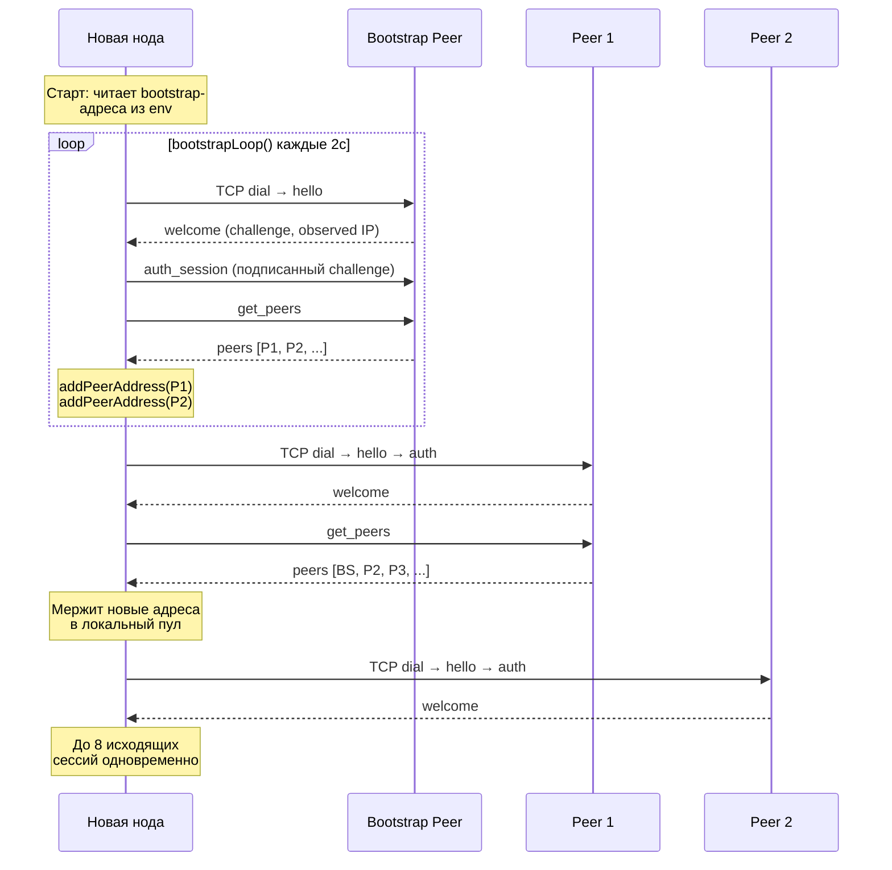
*Диаграмма 2 — Процесс bootstrap и обнаружения peer'ов*

### Роли нод

- **full** — ретранслирует DM, delivery receipts и Gazeta-notice от имени
  всей сети. Обе программы (`corsa-node` и `corsa-desktop`) по умолчанию
  используют эту роль.
- **client** — синхронизирует peer'ов и контакты, хранит только свой трафик,
  никогда не пересылает чужие сообщения. Будущие мобильные/лёгкие клиенты
  будут использовать эту роль.

### Обнаружение peer'ов

Каждая нода стартует со списком bootstrap-адресов (из `CORSA_BOOTSTRAP_PEERS`,
по умолчанию `65.108.204.190:64646`). При запуске `bootstrapLoop()` работает
каждые 2 секунды:

1. **`ensurePeerSessions()`** — устанавливает до 8 исходящих соединений,
   выбирая peer'ов по скору (наивысший первым).
2. **Обмен peer'ами** — при подключении к peer'у нода отправляет `get_peers`
   и получает фрейм `peers`. Обнаруженные адреса добавляются в локальный пул
   через `addPeerAddress()`, что создаёт gossip-механизм обнаружения.
3. **Вычищение устаревших peer'ов** — каждые 10 минут удаляются peer'ы со
   скором ≤ −20 и без успешных подключений за последние 24 часа. Bootstrap-
   и текущие peer'ы никогда не удаляются.
4. **Персистентность** — каждые 5 минут пул адресов сохраняется в
   `peers-{port}.json`. При перезапуске сохранённые peer'ы мержатся с
   bootstrap для быстрого переподключения.

### Скоринг и приоритет подключений

Каждый peer имеет скор репутации в диапазоне [−50, +100]:

- **+10** при успешном TCP-хендшейке (сброс счётчика ошибок)
- **−5** при ошибке подключения/протокола
- **−2** при штатном отключении

`peerDialCandidates()` сортирует peer'ов по убыванию скора. Первый сбой —
немедленная повторная попытка. При ≥ 2 последовательных ошибках —
экспоненциальное ожидание: `min(30с × 2^(ошибки−2), 30 мин)`. Успешное
подключение сбрасывает счётчик.

### Жизненный цикл соединения

**Исходящее:**

1. `runPeerSession()` подключается с таймаутом 1.5 с.
2. Клиент отправляет `hello` (identity, сервисы, тип ноды, доступные
   сетевые группы, объявленный listen-адрес).
3. Сервер отвечает `welcome` (версия протокола, challenge-nonce, наблюдаемый
   адрес, identity сервера).
4. Клиент подписывает challenge через `ed25519` и отправляет `auth_session`.
   Сервер проверяет; невалидные подписи накапливают ban-баллы (1 000 баллов
   → бан IP на 24 часа).
5. Сессия переходит в `servePeerSession()`: однократная начальная
   синхронизация (`get_peers`, `fetch_contacts`, flush pending фреймов),
   затем steady-state с heartbeat-пингами каждые ~2 мин и только
   event-driven push-фреймами (без периодического polling).

**Входящее:**

1. `handleConn()` читает `hello` peer'а.
2. Отправляет `welcome` со свежим challenge.
3. Ожидает `auth_session` и верифицирует.
4. Команды маршрутизируются через `handlePeerSessionFrame()`.

### Хендшейк соединения (подробнее)

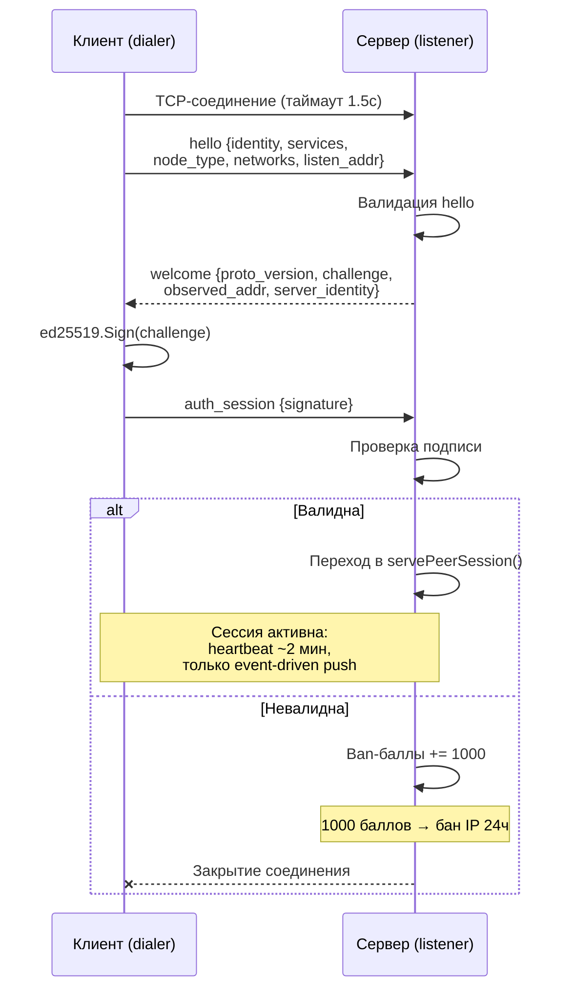
*Диаграмма 3 — TCP-хендшейк и аутентификация*

### Жизненный цикл peer-сессии (полный flow)

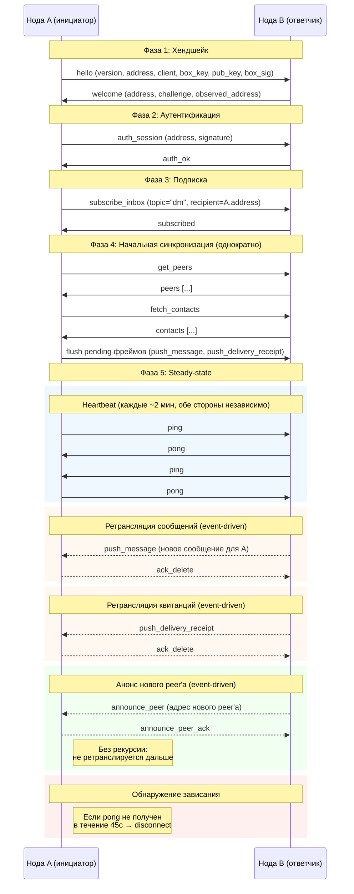
*Диаграмма 4 — Жизненный цикл peer-сессии: хендшейк → аутентификация → синхронизация → steady-state*

### Мониторинг здоровья

- **Heartbeat** — обе стороны соединения независимо шлют пинги каждые ~2 мин
  (с jitter до 15 с). Исходящие сессии пингуют через `servePeerSession`;
  входящие соединения — через `inboundHeartbeat`. Если pong не приходит
  в течение 45 с (`pongStallTimeout`), peer объявляется зависшим и
  соединение разрывается. Двусторонний подход гарантирует каждому узлу
  независимое подтверждение liveness, вне зависимости от того, кто
  инициировал TCP-соединение.
- **Начальная синхронизация** — только при подключении: `get_peers`,
  `fetch_contacts`, flush pending фреймов. В steady-state нет
  периодического polling.
- **Анонс peer'ов** — когда новый peer аутентифицируется через входящее
  соединение, его объявленный listen-адрес анонсируется всем активным
  исходящим сессиям через `announce_peer`. Фрейм включает `node_type`
  пира ("full" или "client"), чтобы получатели знали тип предлагаемого
  узла. Анонс нерекурсивный: получатели сохраняют адрес локально, но
  не ретранслируют дальше. Локальные/приватные адреса исключаются. Если
  канал отправки переполнен, фрейм ставится в pending-очередь и
  доставляется после освобождения. Если фрейм с таким же ключом
  дедупликации уже в очереди, его payload **заменяется** на новую
  версию, чтобы изменения метаданных (например, `node_type`) не
  терялись пока очередь заблокирована.
  `node_type` — **обязательное** поле:
  на принимающей стороне оно валидируется (`isKnownNodeType`); фреймы с
  неизвестным или пустым `node_type` молча игнорируются — ack
  возвращается, но адрес пира не сохраняется. Локальные/приватные адреса
  (`NetGroupLocal`) фильтруются в самом handler'е `announce_peer`, но
  **не** в `addPeerAddress`/`promotePeerAddress` — эти низкоуровневые
  функции принимают LAN-пиры, чтобы dev/LAN-меши могли обнаруживать
  10.x / 192.168.x узлы через прямые hello/welcome и `get_peers`.
  Аутентифицированные отправители вызывают промоцию пира: cooldown
  сбрасывается (через `resolveHealthAddress`, чтобы fallback-вариант
  разделял cooldown с primary) и `node_type` обновляется, но пир
  **не** перемещается
  в начало dial-списка. Приоритет dial управляется локально — удалённые
  пиры не могут на него влиять (политика «никому не доверять»). Только
  локальная RPC-команда `add_peer` (явное действие пользователя)
  добавляет пир в начало списка.
  Неаутентифицированные отправители могут только добавлять **новые** пиры;
  если адрес уже известен, его `node_type` сохраняется, чтобы
  неаутентифицированный клиент не мог перетегировать «full»-пир как
  «client» и нарушить маршрутизацию.
  Разные порты на одном хосте считаются разными пирами (на одном IP
  могут работать несколько нод); модель fallback-вариантов разрешает
  same-host коллизии на этапе dial, а не на этапе discovery.
- **Сид liveness при подключении** — `markPeerConnected` устанавливает
  `LastUsefulReceiveAt = now`, чтобы `computePeerStateLocked` не возвращал
  "degraded" до первого обмена ping/pong.
- **Трекинг здоровья inbound** — когда входящий пир шлёт `ping`, обработчик
  вызывает `markPeerRead` для обновления `LastUsefulReceiveAt`. Когда
  собственный heartbeat получает `pong`, обновляется `LastPongAt`. Любой
  из этих timestamp'ов поддерживает состояние `healthy`.
- **Обнаружение зависания** — на основе ответа heartbeat:
  - нет полезного трафика ≥ 2 мин (`heartbeatInterval`): _degraded_
  - нет полезного трафика ≥ 2 мин 45 с (`heartbeatInterval` + `pongStallTimeout`): _stalled_

Состояния peer'а: `healthy` → `degraded` → `stalled` → `reconnecting`.

**Агрегированный статус сети** определяется по количеству _пригодных_ пиров
(healthy + degraded). Stalled-пиры имеют живое TCP-соединение, но исключены
из маршрутизации сообщений, поэтому не считаются пригодными. Детали по
каждому пиру отображаются в breakdown-строке.

- `offline` — нет известных пиров
- `reconnecting` — все пиры переподключаются, ни один не подключён
- `limited` — ноль или один пригодный пир (stalled-only тоже попадает сюда)
- `warning` — есть пригодные пиры, но менее половины от общего числа
- `healthy` — как минимум половина известных пиров пригодна (2+)

### Маршрутизация сообщений

**Direct messages:**

1. Desktop шифрует сообщение X25519 box key получателя и отправляет
   `send_message` встроенной локальной ноде.
2. Нода проверяет ed25519 подпись, дедуплицирует, хранит.
3. Если сообщение локальное (sender или recipient — эта нода),
   вызывается `MessageStore.StoreMessage()` (desktop сохраняет в chatlog).
4. `gossipMessage()` рассылает сообщение лучшим 3 peer'ам через
   `routingTargetsForMessage()`:
   - broadcast (`recipient="*"`): все full-ноды
   - адресное: все full-ноды + конкретный получатель (если client)
5. **Push и gossip независимы.** Для адресных DM нода атомарно берёт
   snapshot подписчиков через `subscribersForRecipient()` (под `s.mu`).
   Если snapshot не пуст, `pushToSubscriberSnapshot()` мгновенно
   доставляет локально подключённым получателям. Независимо от этого,
   `gossipMessage()` рассылает сообщение relay-пирам, обеспечивая
   распространение по всей mesh-сети. Push — оптимизация для
   латентности; gossip гарантирует, что сообщение попадёт на каждый
   relay, и получатель сможет забрать его с любой ноды, к которой
   переподключится.
6. Сообщение всегда сохраняется в `s.topics` до push/gossip, поэтому
   даже если подписчик отключится во время записи, получатель заберёт
   его через backlog при следующем `subscribe_inbox`.

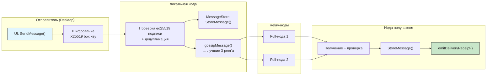
*Диаграмма 5 — Маршрутизация прямых сообщений и gossip*

**Delivery receipts:**

1. При получении адресованного DM `emitDeliveryReceipt()` автоматически
   генерирует квитанцию `"delivered"` и сохраняет через `storeDeliveryReceipt()`.
2. Квитанция распространяется обратно к отправителю.
3. Квитанции `"seen"` отправляются при вызове `MarkConversationSeen()` —
   когда активный чат на экране (`SelectPeer` и `AutoSelectPeer`).
4. Квитанции сохраняются в chatlog через `UpdateDeliveryStatus()` ДО генерации
   события, сохраняя инвариант «сначала БД, потом событие».

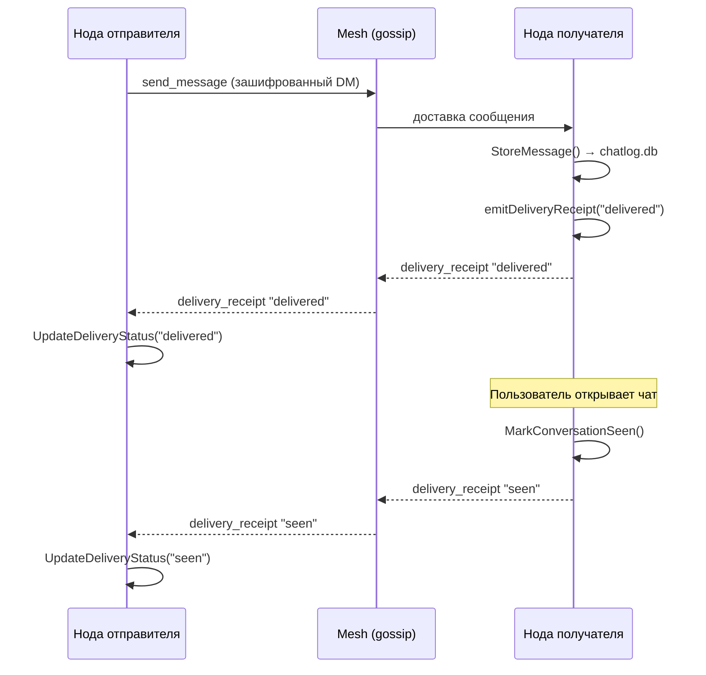
*Диаграмма 6 — Поток квитанций доставки и обновление статусов*

**Транзитный relay:**

Сообщения, где ни sender, ни recipient не являются этой нодой, ретранслируются:

- Хранятся в `relayRetry` с TTL 3 минуты.
- Персистятся в `queue-{port}.json` между рестартами.
- Повторяются при переподключении через `retryRelayDeliveries()`.

### Очередь pending-фреймов

Исходящие фреймы, которые не могут быть отправлены сразу, ставятся в очередь
по адресу peer'а в `pending[address]`. Каждая запись хранит фрейм, время
постановки и счётчик повторов. При переподключении `flushPendingPeerFrames()`
дренирует очередь. Очередь персистится в `queue-{port}.json` и переживает
рестарты.

Legacy-записи с ключами по fallback-портам мигрируются при загрузке;
неразрешимые записи перемещаются в секцию `"orphaned"`.

### Сетевые группы и NAT

Peer'ы классифицируются по доступным сетевым группам через `ClassifyAddress()`:

- **IPv4**, **IPv6**, **TorV3**, **TorV2**, **I2P**, **CJDNS**, **Local**,
  **Unknown**

Фрейм `hello` объявляет доступные группы ноды (`"networks"`). Обмен peer'ами
фильтрует обнаруженные адреса по пересечению доступных групп — ноды, которые
не могут достичь определённый класс сети, не получат адресов для него.

**NAT-обнаружение:** Каждый peer сообщает наблюдаемый IP подключающейся ноды
в `welcome`. Когда ≥ 2 различных peer'ов сообщают один и тот же IP, нода
принимает его как внешний адрес (порог консенсуса). Адрес информативный —
нода никогда не перезаписывает настройку advertise автоматически.

**Поддержка Tor:** Установка `CORSA_PROXY=127.0.0.1:9050` направляет
соединения через SOCKS5-прокси, обеспечивая резолв `.onion`-адресов.

### Trust model (TOFU)

Реализован в `trustStore` (`trust.go`):

1. Fingerprint-адрес = `hex(sha256(ed25519_pubkey)[:20])`.
2. Привязка box-key: `ed25519.Sign(identity_key, "corsa-boxkey-v1|" + address + "|" + boxkey_base64)`.
3. При первом валидном обмене контактами набор ключей pin-ится локально в
   `trust-{port}.json` (Trust On First Use).
4. Последующие конфликтующие ключи для того же адреса отклоняются и
   записываются в секцию `"conflicts"` для ручной проверки.

### Gazeta — зашифрованные notice с TTL

Канал типа dead-drop / bulletin-board для зашифрованных notice:

1. Отправитель шифрует notice X25519 box key получателя, используя
   эфемерный ключ + AES-GCM.
2. Отправляет `publish_notice { ttl_seconds, ciphertext }`.
3. Notice распространяется через gossip по всем full-нодам.
4. Peer'ы хранят notice до истечения TTL, затем удаляют.
5. Получатели запрашивают через `fetch_notices` и расшифровывают своим
   identity key.

### Архитектура I/O соединений

Каждое входящее TCP-соединение обслуживается двумя горутинами: **reader**
(`handleConn` цикл чтения) и выделенный **writer** (`connWriter`). Они
обмениваются данными через буферизованный канал, без мьютексов на сокетном I/O.

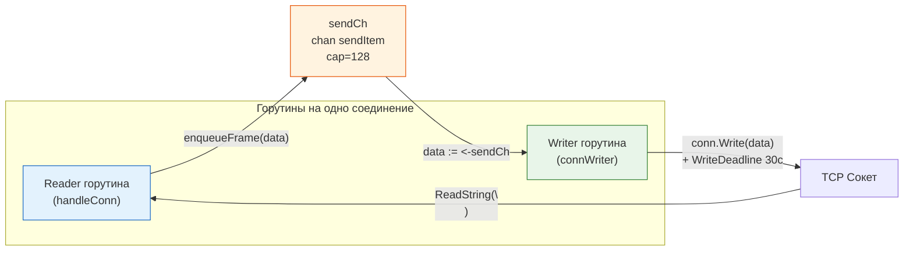
*Диаграмма — Пара горутин reader/writer на соединение*

Дизайн гарантирует три свойства:

1. **Нет блокировки на записи.** `writeJSONFrame`, `writePushFrame` и
   большинство ответов на команды сериализуют фрейм в байты и кладут их в
   канал. Вызов возвращается немедленно независимо от скорости чтения
   удалённого пира. Ответы на ошибки используют `writeJSONFrameSync`, который
   ждёт, пока writer горутина запишет фрейм на сокет, сохраняя контракт
   «ответ доставлен до разрыва соединения».
2. **Отключение медленных пиров.** Если канал заполнен (128 ожидающих фреймов),
   соединение закрывается и подписчик удаляется. Это предотвращает ситуацию,
   когда один медленный пир занимает память или блокирует другие операции.
3. **Таймаут записи.** Writer горутина устанавливает 30-секундный write deadline
   на каждый `conn.Write`. Если TCP send buffer остаётся заполненным дольше —
   ОС возвращает ошибку, и writer закрывает соединение.

#### Жизненный цикл

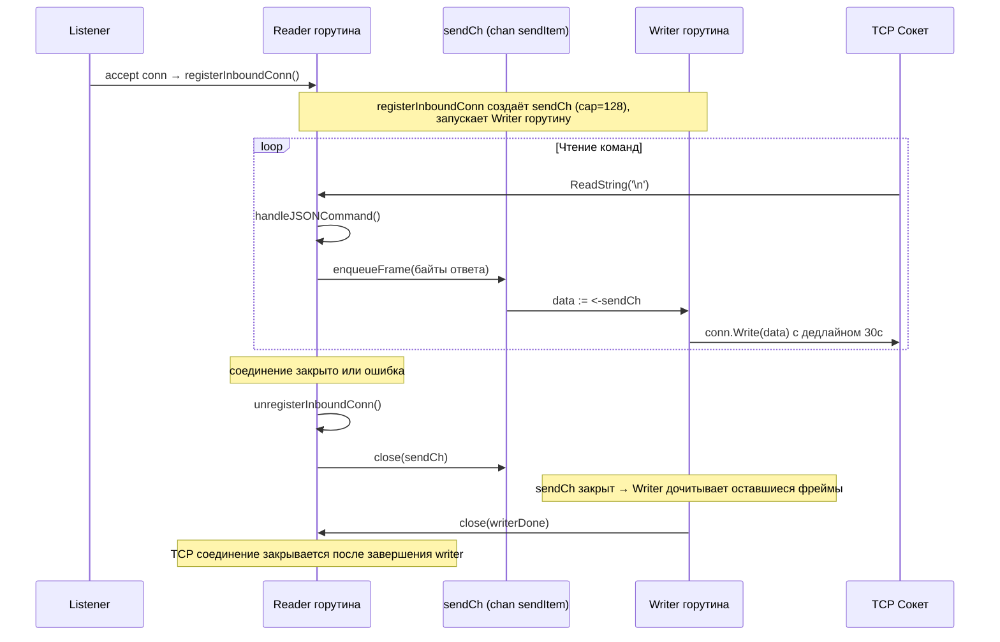
*Диаграмма — Жизненный цикл входящего соединения*

#### Путь записи: все команды протокола

Каждая TCP-запись на входящем соединении проходит через один и тот же канал —
ответы на команды, ошибки и асинхронные push-уведомления. Отличается только
способ взаимодействия вызывающего с каналом:

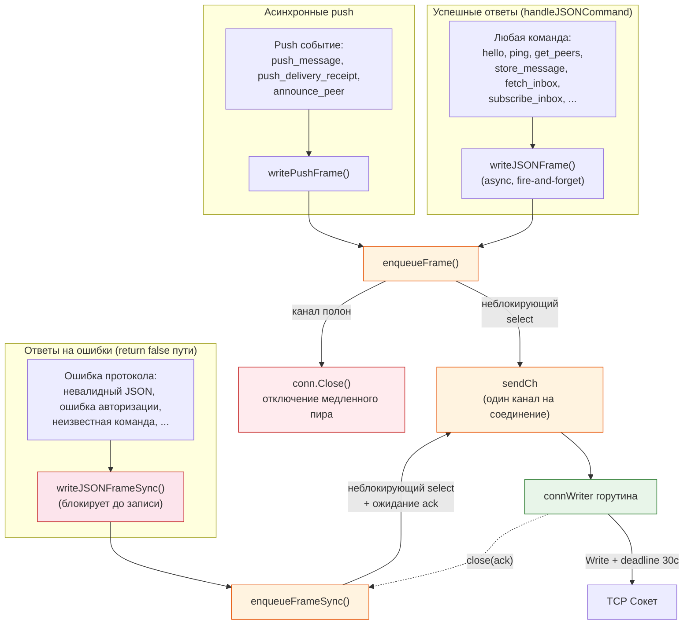
*Диаграмма — Гарантия единственного writer для всех фреймов протокола*

Это гарантирует, что никакие две горутины не вызывают `conn.Write`
одновременно, независимо от того, является ли запись ответом на команду или
асинхронным push-уведомлением.

#### Синхронная запись на error-path

Когда обработчик команды возвращает `false` (невалидный JSON, ошибка
авторизации, неизвестная команда и т.д.), отложенная очистка в `handleConn`
закрывает TCP-соединение. Если бы error-фрейм ставился в очередь асинхронно,
TCP-сокет закрылся бы до того, как writer горутина успела бы отправить фрейм —
клиент увидел бы EOF вместо ошибки.

`writeJSONFrameSync` решает эту проблему, добавляя канал `ack` к элементу
отправки. Writer горутина закрывает `ack` только после успешного `conn.Write`,
разблокируя вызывающего. Только после этого обработчик возвращает `false`,
позволяя отложенной очистке выполниться.

Если writer горутина уже завершилась (ошибка записи или отключение медленного
пира другой горутиной), `enqueueFrameSync` обнаруживает это через канал
`writerDone` и немедленно возвращает `enqueueDropped`, не дожидаясь таймаута.
5-секундный таймаут служит последним рубежом защиты для случаев, которые не
покрываются ни `ack`, ни `writerDone`.

#### Почему не мьютекс на соединение?

Предыдущая реализация использовала `sync.Mutex` на соединение, который
удерживался во время `io.WriteString`. Если удалённый пир был медленным или не
отвечал, мьютекс удерживался бесконечно, что приводило к:

- Reader горутина блокировалась при отправке ответа (ожидание мьютекса),
  замораживая весь цикл чтения.
- Горутины replay бэклога выстраивались в очередь за мьютексом, каскадируя
  зависание.
- Пир казался «подвисшим» с точки зрения локальной ноды.

Подход на каналах отвязывает всех вызывающих от реального сокетного I/O:
только выделенная writer горутина вызывает `conn.Write`, и только она
блокируется на медленном пире.

### Файлы персистентности

| Файл | Содержимое |
|---|---|
| `peers-{port}.json` | Известные адреса peer'ов, скоры, метаданные |
| `trust-{port}.json` | TOFU-pinned контакты и лог конфликтов |
| `queue-{port}.json` | Pending исходящие фреймы, состояние retry relay |
| `chatlog.db` (SQLite) | История сообщений, статусы доставки (только desktop) |
