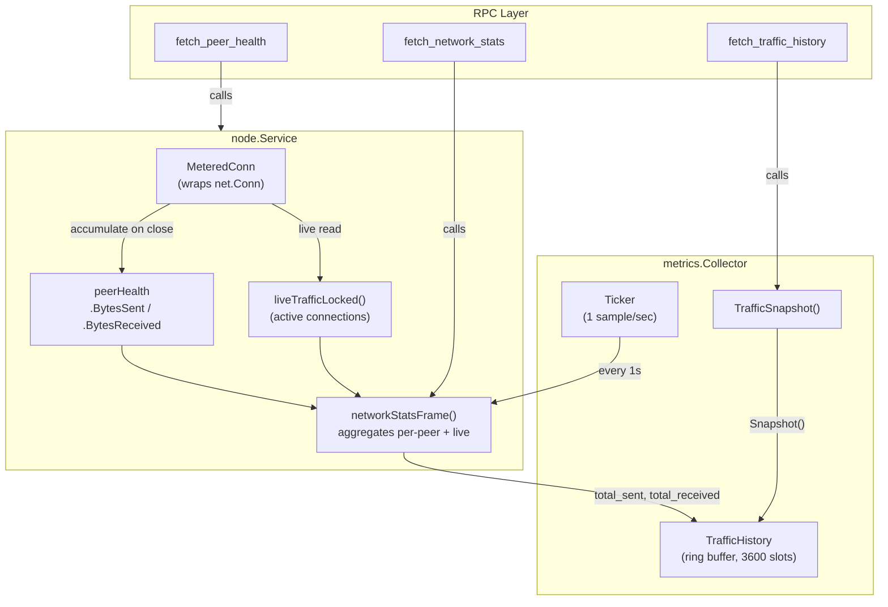
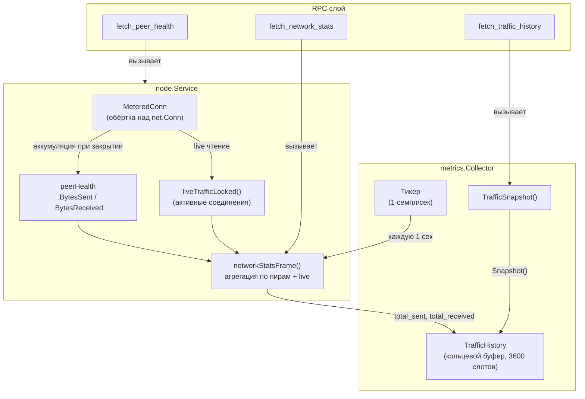

# Metrics Layer

## English

### Overview

The metrics layer (`internal/core/metrics/`) is a standalone data collection service that periodically samples node statistics and maintains rolling history buffers. It operates independently from the network service and accesses data through the `TrafficSource` interface.

### Architecture

*Metrics data collection flow*

### Data Flow

1. Every TCP connection (inbound and outbound) is wrapped in `MeteredConn`, which atomically counts bytes read/written
2. When a connection closes, its final byte counts are accumulated into the peer's `peerHealth.BytesSent` / `peerHealth.BytesReceived`
3. While connections are active, `liveTrafficLocked()` reads current counters directly from `MeteredConn` instances
4. `networkStatsFrame()` combines accumulated (closed sessions) and live (active sessions) traffic into a single response
5. The `metrics.Collector` calls `fetch_network_stats` every second and records the totals into a ring buffer (`TrafficHistory`)
6. RPC clients call `fetch_traffic_history` to get the full 1-hour rolling window

### TrafficHistory Ring Buffer

The ring buffer stores up to 3600 samples (1 hour at 1 sample/second). Each sample contains:

| Field | Description |
|---|---|
| `timestamp` | UTC time when the sample was recorded |
| `bytes_sent_ps` | Delta: bytes sent since the previous sample |
| `bytes_recv_ps` | Delta: bytes received since the previous sample |
| `total_sent` | Cumulative bytes sent at this moment |
| `total_received` | Cumulative bytes received at this moment |

When the buffer is full, new samples overwrite the oldest entries. `Snapshot()` returns samples in chronological order (oldest first).

#### Baseline seeding

Delta computation requires a baseline (`prevSent` / `prevRecv`). The baseline starts at zero and is updated on every `Record`. This default works when the collector starts together with the source — the first `Record` reports the bytes that flowed since startup.

When the collector attaches to a source whose counters are already non-zero, callers must invoke `Collector.Seed()` once before the first ticker tick. `Seed` reads current totals and sets them as baseline without recording a sample. Without `Seed`, the first sample would dump the entire pre-attach cumulative as a single-second spike.

`desktop`, `node`, and `sdk` runtimes call `Seed` between collector creation and the first `Run` tick so the bootstrap handshake traffic appears as a real per-second delta on the first chart bar instead of being lost (the previous skip-on-first behavior) or distorted (delta == totals).

### RPC Commands

| Command | Category | Description |
|---|---|---|
| `fetch_traffic_history` | metrics | Rolling 1-hour traffic history (per-second samples) |
| `fetch_network_stats` | network | Current aggregated traffic per peer and total |
| `fetch_peer_health` | network | Per-peer health including traffic counters |

### Desktop UI — Traffic Tab

The console window includes a Traffic tab that visualizes network activity in real time. On tab open, the full history is loaded from `fetch_traffic_history` (up to 3600 samples). While the tab is active, a 1-second ticker appends new samples via `fetch_network_stats`.

The graph contains three visual elements:

- **In bars (green)** — received bytes per second, drawn as vertical bars on the left side of each sample slot
- **Out bars (blue)** — sent bytes per second, drawn as vertical bars on the right side of each sample slot
- **Total line (yellow)** — sum of In + Out, drawn as a continuous line connecting all non-zero sample points. The line bridges zero-traffic gaps to maintain visual continuity across bar clusters

All samples are spread across the full graph width. The Y-axis auto-scales to the maximum total value (with 10% headroom) and displays 4 grid lines with value labels. Inside the graph (top-right corner), cumulative totals (Total In / Total Out) are shown as badges.

The metrics collector runs independently from the UI — it always samples data in the background. Opening the Traffic tab loads the existing history rather than starting from zero.

---

## Русский

### Обзор

Слой метрик (`internal/core/metrics/`) — это автономный сервис сбора данных, который периодически снимает статистику ноды и хранит её в кольцевых буферах. Он работает независимо от сетевого сервиса и обращается к данным через интерфейс `TrafficSource`.

### Архитектура

*Диаграмма сбора данных метрик*

### Поток данных

1. Каждое TCP-соединение (входящее и исходящее) оборачивается в `MeteredConn`, который атомарно считает прочитанные/записанные байты
2. При закрытии соединения финальные счётчики аккумулируются в `peerHealth.BytesSent` / `peerHealth.BytesReceived`
3. Пока соединения активны, `liveTrafficLocked()` читает текущие счётчики напрямую из экземпляров `MeteredConn`
4. `networkStatsFrame()` объединяет аккумулированный (закрытые сессии) и live (активные сессии) трафик в один ответ
5. `metrics.Collector` вызывает `fetch_network_stats` каждую секунду и записывает итоги в кольцевой буфер (`TrafficHistory`)
6. RPC-клиенты вызывают `fetch_traffic_history` для получения полного часового окна

### Кольцевой буфер TrafficHistory

Буфер хранит до 3600 семплов (1 час при 1 семпл/секунду). Каждый семпл содержит:

| Поле | Описание |
|---|---|
| `timestamp` | UTC-время записи семпла |
| `bytes_sent_ps` | Дельта: байты отправленные с предыдущего семпла |
| `bytes_recv_ps` | Дельта: байты полученные с предыдущего семпла |
| `total_sent` | Кумулятивные байты отправленные на этот момент |
| `total_received` | Кумулятивные байты полученные на этот момент |

Когда буфер заполнен, новые семплы перезаписывают самые старые. `Snapshot()` возвращает семплы в хронологическом порядке (от старых к новым).

#### Сидирование baseline

Расчёт дельты требует baseline (`prevSent` / `prevRecv`). Baseline начинается с нуля и обновляется при каждом `Record`. Этот вариант корректен когда коллектор стартует одновременно с источником — первый `Record` показывает байты, прошедшие с момента старта.

Когда коллектор подключается к источнику, в котором счётчики уже ненулевые, вызывающий обязан выполнить `Collector.Seed()` один раз до первого tick'а тикера. `Seed` читает текущие totals и записывает их как baseline без добавления семпла. Без `Seed` первый семпл сбросит весь pre-attach кумулятив одним выбросом за секунду.

Runtimes `desktop`, `node` и `sdk` вызывают `Seed` между созданием коллектора и первым `Run`-тиком, чтобы bootstrap-трафик handshake'ов появился реальной посекундной дельтой на первом баре графика, а не потерялся (старое поведение skip-on-first) и не исказился (delta == totals).

### RPC-команды

| Команда | Категория | Описание |
|---|---|---|
| `fetch_traffic_history` | metrics | Часовая история трафика (посекундные семплы) |
| `fetch_network_stats` | network | Текущий агрегированный трафик по пирам и общий |
| `fetch_peer_health` | network | Здоровье пиров включая счётчики трафика |

### Desktop UI — вкладка Traffic

Окно консоли содержит вкладку Traffic для визуализации сетевой активности в реальном времени. При открытии вкладки загружается полная история из `fetch_traffic_history` (до 3600 семплов). Пока вкладка активна, тикер раз в секунду добавляет новые семплы через `fetch_network_stats`.

График содержит три визуальных элемента:

- **Бары In (зелёные)** — полученные байты в секунду, рисуются как вертикальные столбцы слева в каждом слоте сэмпла
- **Бары Out (синие)** — отправленные байты в секунду, рисуются как вертикальные столбцы справа в каждом слоте сэмпла
- **Линия Total (жёлтая)** — сумма In + Out, рисуется как непрерывная линия, соединяющая все ненулевые точки. Линия перекрывает участки с нулевым трафиком для визуальной непрерывности между кластерами баров

Все семплы распределяются на всю ширину графика. Ось Y автоматически масштабируется до максимального значения total (с запасом 10%) и отображает 4 линии сетки с подписями значений. Внутри графика (правый верхний угол) показаны кумулятивные итоги (Всего вх / Всего исх) в виде бейджей.

Коллектор метрик работает независимо от UI — он всегда собирает данные в фоне. Открытие вкладки Traffic загружает существующую историю, а не начинает с нуля.
