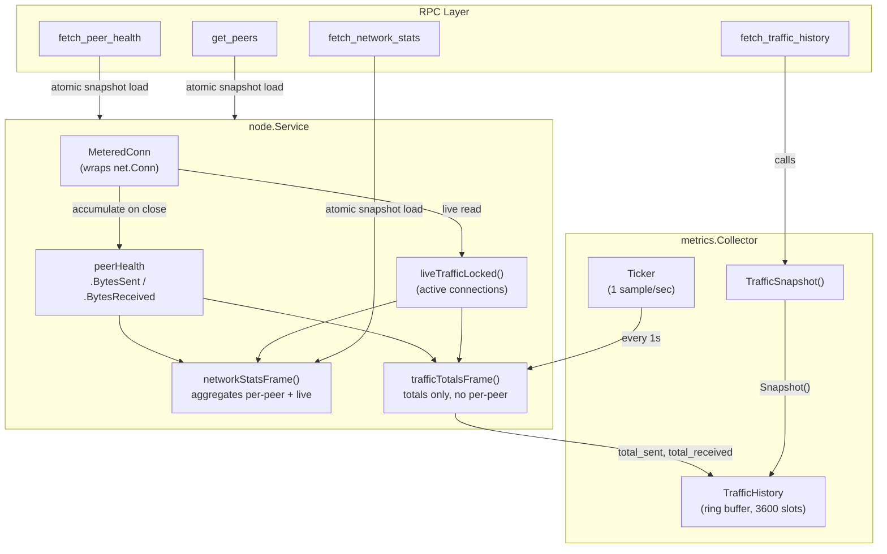
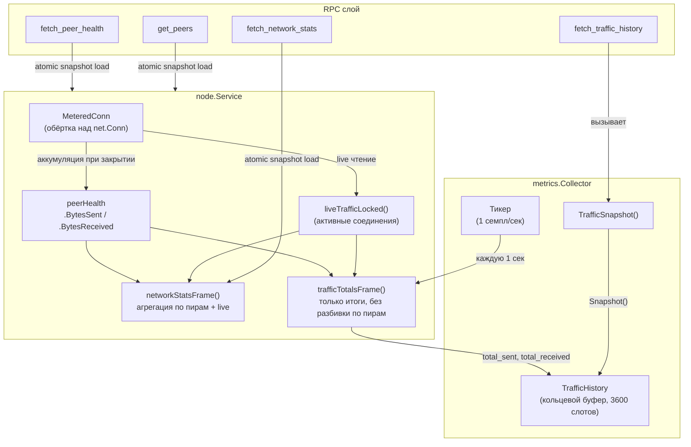

# Metrics Layer

## English

### Overview

The metrics layer (`internal/core/metrics/`) is a standalone data collection service that periodically samples node statistics and maintains rolling history buffers. It operates independently from the network service and accesses data through the `TrafficSource` interface.

### Architecture

*Metrics data collection flow*

### Data Flow

1. Every TCP connection (inbound and outbound) is wrapped in `MeteredConn`, which atomically counts bytes read/written
2. When a connection closes, its final byte counts are accumulated into the peer's `peerHealth.BytesSent` / `peerHealth.BytesReceived`
3. While connections are active, `liveTrafficLocked()` reads current counters directly from `MeteredConn` instances
4. The hot local RPCs (`fetch_network_stats`, `fetch_peer_health`, `get_peers`, plus `fetchRouteTable`/`fetchRouteSummary`/`fetchRouteLookup`) each return a pre-built snapshot via a single `atomic.Pointer` load — `networkStatsSnapshot`, `peerHealthSnapshot`, `peersExchangeSnapshot`, `cmSlotsSnapshot`, and `routingSnapshot` respectively. `cmSlotsSnapshot` caches `ConnectionManager.Slots()` so `peerHealthFrames` and `buildPeerExchangeResponse` never call `Slots()` on the RPC path — `Slots()` takes `cm.mu.RLock`, and Go's writer-preferring `sync.RWMutex` would otherwise serialise these RPC readers behind any queued CM-writer just like `s.mu` used to. `routingSnapshot` caches the routing snapshot for the same reason against `routing.Table.t.mu`: at scale building the view is expensive and a writer storm on the routing table (announce loop convergence, mass disconnect, hop_ack burst) would otherwise stall every routing-observability RPC and the file router's transit-forwarding callback (`HandleInbound`). The publisher builds it via `routing.Table.SnapshotIncremental` (copy-on-write under `t.mu.Lock`: reuses the unchanged route slices of the previous snapshot and re-copies only churned identities, plus a periodic full re-copy that only rides an already-dirty rebuild), so the per-publish cost is proportional to churn rather than a full deep copy of the whole table. The locally-originated file paths (`SendFileCommand`, `ExplainRoute`) and `isPeerReachable` deliberately bypass this cache and read the routing table per-destination via `routing.Table.Lookup(peer)` — they need immediate visibility of a route accepted moments before the call (cached-snapshot lag would surface as "isPeerReachable says yes, SendFile fails" for the ~1–1.5 s republish window — routingSnapshotMinInterval's 1 s floor plus the next refresh tick). Snapshots are primed **synchronously** by `primeHotReadSnapshots()` in `Run()` before the TCP listener opens, then refreshed every 500 ms by `hotReadsRefreshLoop` — the only path that takes `s.mu.RLock` (first three snapshots), `cm.mu.RLock` (fourth) or `routing.Table.t.mu.Lock` (fifth, gated by a dirty flag so an idle table skips the rebuild entirely) to read `health` / `peers` / `persistedMeta` / live counters / slot state / routing entries. The RPC handlers themselves never touch `s.mu`, `cm.mu` or `routing.Table.t.mu` and **do not fall back to a synchronous rebuild** on a snapshot miss — the previous fallback re-coupled the hot path to the very locks the snapshot infrastructure was meant to bypass. With the prime step in place, every hot-path handler observes a non-nil snapshot on its first load.
5. The `metrics.Collector` calls `fetch_traffic_totals` every second and records the totals into a ring buffer (`TrafficHistory`). This is a deliberately lightweight local frame: it sums only the cumulative sent/received `int64` totals (persisted `peerHealth` + live counters via `sumLiveTrafficLocked`, which walks inbound connections through the capability-free `forEachInboundConnIDLocked` iterator) and returns them in a `network_stats`-shaped reply with the per-peer fields left empty. Critically it does **not** stamp `networkStatsAccessNanos`, so the collector's once-a-second poll no longer pins the full `networkStatsSnapshot` rebuild-gate awake. The heavier `fetch_network_stats` (full per-peer breakdown, `knownPeers`/`connectedPeers`, sorted `peerTraffic`) is still served from the `atomic.Pointer` snapshot for the desktop UI, whose reader access re-arms the rebuild-gate only while a UI is actually polling — a headless node lets the gate idle out after `networkStatsRebuildIdleAfter`.
6. RPC clients call `fetch_traffic_history` to get the full 1-hour rolling window

Snapshot staleness is bounded by `networkStatsSnapshotInterval` (500 ms) for `networkStatsSnapshot`, `peerHealthSnapshot`, `peersExchangeSnapshot` and `cmSlotsSnapshot` — every state change a writer touches is reflected within one refresh tick. `routingSnapshot` is coalesced to at most one rebuild per `routingSnapshotMinInterval` (1 s), so its structural-change bound (route accepted, withdrawn, replaced; direct peer added/removed; flap burst arming hold-down; flap-state cleanup after a writer touched the table) is the 1 s floor plus the next refresh tick that crosses it (~500 ms) plus the publisher's `t.mu.Lock` acquisition — on the order of 1–1.5 s, and a wider bound applies to time-derived fields (`IsExpired`/`ttl_seconds` against `snap.TakenAt`, `FlapEntry.InHoldDown` flipping `true→false` on hold-down expiry): those advance on the wall clock without a writer event, so the dirty-flag publisher cannot observe them directly. `TickTTL` (every 10 s) converts those wall-clock transitions into writer events, which gives a worst-case lag of `TickTTL` interval + the structural publish bound (`routingSnapshotMinInterval` floor + a refresh tick, ~1–1.5 s) ≈ 11–11.5 s. See `docs/routing.md` "Snapshot freshness" for the full contract. Even if a writer holds `s.mu.Lock`, `cm.mu.Lock` or `routing.Table.t.mu.Lock` for many seconds, the RPCs keep serving the last successfully-built snapshot instead of blocking — clients prefer bounded-stale data over a frozen UI. The five rebuilds run in independent per-snapshot goroutines inside `hotReadsRefreshLoop`, each on its own 500 ms ticker. The fan-out isolates slow rebuilds (notably `peersExchangeSnapshot`, which re-acquires `s.mu.RLock` via `peerProvider.Candidates()` callbacks; `cmSlotsSnapshot`, which takes `cm.mu.RLock`; and `routingSnapshot`, which takes `routing.Table.t.mu.Lock` only when the dirty flag fires) so they do not delay the other snapshots' refreshes or widen their staleness windows.

### TrafficHistory Ring Buffer

The ring buffer stores up to 3600 samples (1 hour at 1 sample/second). Each sample contains:

| Field | Description |
|---|---|
| `timestamp` | UTC time when the sample was recorded |
| `bytes_sent_ps` | Delta: bytes sent since the previous sample |
| `bytes_recv_ps` | Delta: bytes received since the previous sample |
| `total_sent` | Cumulative bytes sent at this moment |
| `total_received` | Cumulative bytes received at this moment |

When the buffer is full, new samples overwrite the oldest entries. `Snapshot()` returns samples in chronological order (oldest first).

#### Baseline seeding

Delta computation requires a baseline (`prevSent` / `prevRecv`). The baseline starts at zero and is updated on every `Record`. This default works when the collector starts together with the source — the first `Record` reports the bytes that flowed since startup.

When the collector attaches to a source whose counters are already non-zero, callers must invoke `Collector.Seed()` once before the first ticker tick. `Seed` reads current totals and sets them as baseline without recording a sample. Without `Seed`, the first sample would dump the entire pre-attach cumulative as a single-second spike.

`desktop`, `node`, and `sdk` runtimes call `Seed` between collector creation and the first `Run` tick so the bootstrap handshake traffic appears as a real per-second delta on the first chart bar instead of being lost (the previous skip-on-first behavior) or distorted (delta == totals).

### RPC Commands

| Command | Category | Description |
|---|---|---|
| `fetch_traffic_history` | metrics | Rolling 1-hour traffic history (per-second samples) |
| `fetch_network_stats` | network | Current aggregated traffic per peer and total |
| `fetch_peer_health` | network | Per-peer health including traffic counters |

### Desktop UI — Traffic Tab

The console window includes a Traffic tab that visualizes network activity in real time. On tab open, the full history is loaded from `fetch_traffic_history` (up to 3600 samples). While the tab is active, a 1-second ticker appends new samples via `fetch_network_stats`.

The graph contains three visual elements:

- **In bars (green)** — received bytes per second, drawn as vertical bars on the left side of each sample slot
- **Out bars (blue)** — sent bytes per second, drawn as vertical bars on the right side of each sample slot
- **Total line (yellow)** — sum of In + Out, drawn as a continuous line connecting all non-zero sample points. The line bridges zero-traffic gaps to maintain visual continuity across bar clusters

All samples are spread across the full graph width. The Y-axis auto-scales to the maximum total value (with 10% headroom) and displays 4 grid lines with value labels. Inside the graph (top-right corner), cumulative totals (Total In / Total Out) are shown as badges.

The metrics collector runs independently from the UI — it always samples data in the background. Opening the Traffic tab loads the existing history rather than starting from zero.

---

## Русский

### Обзор

Слой метрик (`internal/core/metrics/`) — это автономный сервис сбора данных, который периодически снимает статистику ноды и хранит её в кольцевых буферах. Он работает независимо от сетевого сервиса и обращается к данным через интерфейс `TrafficSource`.

### Архитектура

*Диаграмма сбора данных метрик*

### Поток данных

1. Каждое TCP-соединение (входящее и исходящее) оборачивается в `MeteredConn`, который атомарно считает прочитанные/записанные байты
2. При закрытии соединения финальные счётчики аккумулируются в `peerHealth.BytesSent` / `peerHealth.BytesReceived`
3. Пока соединения активны, `liveTrafficLocked()` читает текущие счётчики напрямую из экземпляров `MeteredConn`
4. Hot local RPC (`fetch_network_stats`, `fetch_peer_health`, `get_peers`, плюс `fetchRouteTable`/`fetchRouteSummary`/`fetchRouteLookup`) отдают заранее подготовленный snapshot одним `atomic.Pointer`-load'ом — `networkStatsSnapshot`, `peerHealthSnapshot`, `peersExchangeSnapshot`, `cmSlotsSnapshot` и `routingSnapshot` соответственно. `cmSlotsSnapshot` кэширует `ConnectionManager.Slots()`, чтобы `peerHealthFrames` и `buildPeerExchangeResponse` не звали `Slots()` на RPC-пути — `Slots()` берёт `cm.mu.RLock`, и writer-preferring `sync.RWMutex` в Go иначе сериализовал бы этих RPC-читателей за любым queued CM-writer'ом ровно той же формы, что `s.mu` раньше. `routingSnapshot` кэширует routing snapshot по той же причине против `routing.Table.t.mu`: на масштабе построение вида дорогое, и writer-шторм на таблице маршрутизации (конвергенция announce-цикла, массовый disconnect, всплеск hop_ack) иначе стопорил бы каждый routing-observability RPC и transit-forward callback file router'а (`HandleInbound`). Publisher строит его через `routing.Table.SnapshotIncremental` (copy-on-write под `t.mu.Lock`: переиспользует неизменённые route-слайсы предыдущего снапшота и перекопирует только изменившиеся identity, плюс периодический full, который лишь подъезжает на уже-dirty rebuild), поэтому стоимость на publish пропорциональна churn'у, а не полной глубокой копии всей таблицы. Locally-originated пути файл-роутера (`SendFileCommand`, `ExplainRoute`) и `isPeerReachable` сознательно обходят этот кэш и читают таблицу per-destination через `routing.Table.Lookup(peer)` — им нужна немедленная видимость маршрута, принятого за моменты до вызова (cached-snapshot лаг проявился бы как «isPeerReachable говорит да, SendFile падает» в окне republish'а ~1–1.5 с — 1с-порог routingSnapshotMinInterval плюс ближайший refresh-тик). Snapshot'ы **синхронно** инициализируются в `Run()` вызовом `primeHotReadSnapshots()` ДО открытия TCP-listener'а, и далее пересобираются каждые 500 мс в `hotReadsRefreshLoop` — это единственный путь, который берёт `s.mu.RLock` (первые три snapshot'а), `cm.mu.RLock` (четвёртый) или `routing.Table.t.mu.Lock` (пятый, гейтится через dirty-флаг, поэтому idle-таблица пропускает rebuild целиком) для чтения `health` / `peers` / `persistedMeta` / live-счётчиков / slot state / routing entries. Сами RPC-handler'ы не касаются ни `s.mu`, ни `cm.mu`, ни `routing.Table.t.mu`, и **не делают синхронный rebuild на miss** — прежний fallback как раз возвращал hot-path обратно на те самые локи, от которых snapshot-инфраструктура должна была его отвязать. С prime-шагом каждый handler на первом же load'е видит непустой snapshot.
5. `metrics.Collector` вызывает `fetch_traffic_totals` каждую секунду и записывает итоги в кольцевой буфер (`TrafficHistory`). Это сознательно лёгкий локальный фрейм: он суммирует только кумулятивные итоги sent/received (`int64`) — persisted `peerHealth` + live-счётчики через `sumLiveTrafficLocked`, который обходит входящие соединения лёгким итератором `forEachInboundConnIDLocked` (без `core.Capabilities()`/`cloneCaps`) — и возвращает их в ответе формы `network_stats` с пустыми per-peer полями. Важно: он **не** штампует `networkStatsAccessNanos`, поэтому ежесекундный опрос коллектора больше не держит rebuild-gate полного `networkStatsSnapshot` вечно бодрствующим. Более тяжёлый `fetch_network_stats` (полная разбивка по пирам, `knownPeers`/`connectedPeers`, отсортированный `peerTraffic`) по-прежнему отдаётся из `atomic.Pointer`-snapshot для desktop UI, и его reader-access перевзводит gate только пока UI реально опрашивает — headless-нода даёт gate'у заснуть через `networkStatsRebuildIdleAfter`.
6. RPC-клиенты вызывают `fetch_traffic_history` для получения полного часового окна

Максимальная устаревшесть `networkStatsSnapshot`, `peerHealthSnapshot`, `peersExchangeSnapshot` и `cmSlotsSnapshot` ограничена `networkStatsSnapshotInterval` (500 мс) — любое изменение состояния, которое touch'ит writer, отражается в течение одного refresh-тика. `routingSnapshot` коалесится до не более одного rebuild'а на `routingSnapshotMinInterval` (1 с), поэтому его граница для структурных изменений (маршрут принят, отозван, заменён; добавлен/удалён direct peer; flap-burst, армирующий hold-down; flap-state cleanup после writer-touch'а) равна 1 с-порог плюс ближайший refresh-тик, пересекающий его (~500 ms), плюс захват `t.mu.Lock` publisher'ом — порядка 1–1.5 с, а более широкая граница действует для time-производных полей (`IsExpired`/`ttl_seconds` относительно `snap.TakenAt`, `FlapEntry.InHoldDown` flipping `true→false` на истечении hold-down): они двигаются по wall-clock без writer-события, поэтому dirty-флаг publisher их напрямую не видит. `TickTTL` (каждые 10 с) конвертирует эти wall-clock переходы в writer-события, что даёт worst-case lag `TickTTL` interval + структурная граница публикации (`routingSnapshotMinInterval` + refresh-тик, ~1–1.5 с) ≈ 11–11.5 с. Полный контракт — в `docs/routing.md` «Свежесть снапшота». Даже если writer держит `s.mu.Lock`, `cm.mu.Lock` или `routing.Table.t.mu.Lock` много секунд, RPC продолжает отдавать последний успешно построенный snapshot вместо того, чтобы блокироваться — клиент предпочитает bounded-stale данные замёрзшему UI. Пять rebuild'ов выполняются в независимых под-горутинах внутри `hotReadsRefreshLoop`, по одной на snapshot, каждая со своим 500 мс тикером. Fan-out изолирует медленные rebuild'ы (особенно `peersExchangeSnapshot`, который повторно берёт `s.mu.RLock` через callback'и `peerProvider.Candidates()`; `cmSlotsSnapshot`, который берёт `cm.mu.RLock`; и `routingSnapshot`, который берёт `routing.Table.t.mu.Lock` только при срабатывании dirty-флага), так что они не задерживают refresh остальных snapshot'ов и не расширяют их окна staleness.

### Кольцевой буфер TrafficHistory

Буфер хранит до 3600 семплов (1 час при 1 семпл/секунду). Каждый семпл содержит:

| Поле | Описание |
|---|---|
| `timestamp` | UTC-время записи семпла |
| `bytes_sent_ps` | Дельта: байты отправленные с предыдущего семпла |
| `bytes_recv_ps` | Дельта: байты полученные с предыдущего семпла |
| `total_sent` | Кумулятивные байты отправленные на этот момент |
| `total_received` | Кумулятивные байты полученные на этот момент |

Когда буфер заполнен, новые семплы перезаписывают самые старые. `Snapshot()` возвращает семплы в хронологическом порядке (от старых к новым).

#### Сидирование baseline

Расчёт дельты требует baseline (`prevSent` / `prevRecv`). Baseline начинается с нуля и обновляется при каждом `Record`. Этот вариант корректен когда коллектор стартует одновременно с источником — первый `Record` показывает байты, прошедшие с момента старта.

Когда коллектор подключается к источнику, в котором счётчики уже ненулевые, вызывающий обязан выполнить `Collector.Seed()` один раз до первого tick'а тикера. `Seed` читает текущие totals и записывает их как baseline без добавления семпла. Без `Seed` первый семпл сбросит весь pre-attach кумулятив одним выбросом за секунду.

Runtimes `desktop`, `node` и `sdk` вызывают `Seed` между созданием коллектора и первым `Run`-тиком, чтобы bootstrap-трафик handshake'ов появился реальной посекундной дельтой на первом баре графика, а не потерялся (старое поведение skip-on-first) и не исказился (delta == totals).

### RPC-команды

| Команда | Категория | Описание |
|---|---|---|
| `fetch_traffic_history` | metrics | Часовая история трафика (посекундные семплы) |
| `fetch_network_stats` | network | Текущий агрегированный трафик по пирам и общий |
| `fetch_peer_health` | network | Здоровье пиров включая счётчики трафика |

### Desktop UI — вкладка Traffic

Окно консоли содержит вкладку Traffic для визуализации сетевой активности в реальном времени. При открытии вкладки загружается полная история из `fetch_traffic_history` (до 3600 семплов). Пока вкладка активна, тикер раз в секунду добавляет новые семплы через `fetch_network_stats`.

График содержит три визуальных элемента:

- **Бары In (зелёные)** — полученные байты в секунду, рисуются как вертикальные столбцы слева в каждом слоте сэмпла
- **Бары Out (синие)** — отправленные байты в секунду, рисуются как вертикальные столбцы справа в каждом слоте сэмпла
- **Линия Total (жёлтая)** — сумма In + Out, рисуется как непрерывная линия, соединяющая все ненулевые точки. Линия перекрывает участки с нулевым трафиком для визуальной непрерывности между кластерами баров

Все семплы распределяются на всю ширину графика. Ось Y автоматически масштабируется до максимального значения total (с запасом 10%) и отображает 4 линии сетки с подписями значений. Внутри графика (правый верхний угол) показаны кумулятивные итоги (Всего вх / Всего исх) в виде бейджей.

Коллектор метрик работает независимо от UI — он всегда собирает данные в фоне. Открытие вкладки Traffic загружает существующую историю, а не начинает с нуля.
