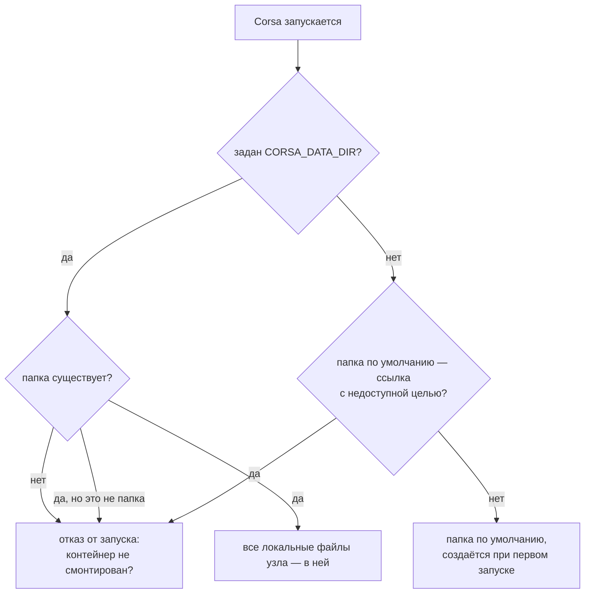

# Keeping Corsa data private on your computer

## English

Corsa encrypts messages on the wire, but your computer still holds
everything needed to read them: your identity keys, your contacts and
your message history. This page explains where that data lives and how to
keep it away from someone who gets hold of your disk — a stolen laptop, a
seized drive, a shared machine, a careless backup.

### What this protects against, and what it does not

Protects against:

- someone reading your disk while Corsa is not running and your encrypted
  volume is not mounted (theft, seizure, a repair shop, a backup copied
  elsewhere);
- another user account on the same computer.

Does **not** protect against:

- malware running under your account while the volume is mounted — to
  such a program the data is as readable as it is to Corsa;
- someone with your unlocked, logged-in session;
- copies the operating system made on its own (swap, hibernation, crash
  dumps, clipboard history) — see
  [Memory, swap and hibernation](#memory-swap-and-hibernation).

### Where Corsa keeps its data

| Platform | Default data directory |
|----------|------------------------|
| Windows  | `%APPDATA%\CorsaCore` (`C:\Users\<you>\AppData\Roaming\CorsaCore`) |
| macOS    | `~/Library/Application Support/CorsaCore` |
| Linux    | `~/.corsacore` |
| Android  | the app's private no-backup directory; nothing to do here — Android's file-based encryption covers it |

The directory contains, among other things:

- `identity-<port>.json` — your **private keys**, stored unencrypted. Anyone
  who copies this file can read your messages and speak as you;
- `chatlog-*.db` — message history. Direct-message bodies are stored
  sealed, but the key that opens them is in the identity file right next
  to them, and who wrote to whom and when is stored in the clear;
- contacts, trust pins, peer lists, identity backups, received files
  (`downloads/`), crash logs and short-lived working copies (`attach-tmp/`,
  `console-tmp/`).

Files you save yourself with the viewer's **Save** button go to the system
Downloads folder, outside the data directory — that is a separate, explicit
choice each time.

### Option 1 — encrypt the whole disk (recommended baseline)

BitLocker (Windows), FileVault (macOS) or LUKS (Linux) encrypt everything,
including swap, hibernation files and anything an application wrote
outside its own folder. If you do only one thing, do this.

### Option 2 — keep the data directory in an encrypted container (`CORSA_DATA_DIR`)

A container (VeraCrypt, an encrypted macOS disk image, LUKS, gocryptfs)
keeps Corsa's data unreadable whenever the container is not mounted, even
on a machine without full-disk encryption.

`CORSA_DATA_DIR` moves **every** node-local file to the directory you
name. Corsa never creates that directory itself: if it is missing — the
container is not mounted — Corsa refuses to start instead of creating a
fresh, unencrypted identity on the plain disk. On Windows it says so in a
message box; elsewhere the reason is printed to the terminal.

> Always point `CORSA_DATA_DIR` at a **subdirectory** inside the
> container, never at the mount point itself. On Linux and macOS an
> unmounted mount point is an ordinary empty folder, so Corsa could not
> tell it apart from a mounted, empty container. A subdirectory simply
> does not exist until the container is mounted.

Steps:

1. Quit Corsa.
2. Create and mount the container.
3. Create a directory inside it, e.g. `Z:\Corsa`, `~/vault/corsa` or
   `/Volumes/CorsaVault/corsa`.
4. Move **everything** from the default data directory into it.
5. Set the variable and start Corsa.

Windows (VeraCrypt mounted as `Z:`):

```bat
setx CORSA_DATA_DIR "Z:\Corsa"
```

`setx` stores the variable for your user; programs started after it —
including from the Start menu — see it.

Linux (container mounted at `~/vault`), in `~/.profile`, then log out and
back in:

```bash
export CORSA_DATA_DIR="$HOME/vault/corsa"
```

or only for the launcher: copy `corsa.desktop` to
`~/.local/share/applications/` under the same name — that file also
opens `corsa:` links — and set
`Exec=env CORSA_DATA_DIR=/home/<you>/vault/corsa corsa-desktop %u`.

macOS: apps started from Finder or from a clicked `corsa:` link do not
read shell variables, so use Option 3 below, which needs no variable.

The node (`corsa-node`) honours the same variable.

> Every way Corsa starts must see the variable — the Start menu, the
> launcher, and a `corsa:` link clicked in a browser, which the system
> answers by starting Corsa itself. A start without it uses the default
> directory and, finding nothing there, creates a new identity on the
> plain disk. Option 3 has no such gap: the link is on the disk, not in
> the environment.

Notes:

- `CORSA_CHATLOG_DIR` is **not** a substitute: it moves the history but
  leaves the identity keys in the default directory.
- Variables that name a single file (`CORSA_IDENTITY_PATH`,
  `CORSA_TRUST_STORE_PATH`, `CORSA_PEERS_PATH`, …) still win over
  `CORSA_DATA_DIR` when set. Leave them unset if you want everything in
  the container.

### Option 3 — a link from the default directory into the container

The default directory can be replaced with a link into the container.
Corsa keeps using its usual path and the operating system redirects it.
No variable is needed.

Windows (`/J` creates a junction and needs no administrator rights; `/D`
creates a symbolic link and needs administrator rights or Developer Mode):

```bat
mklink /J "%APPDATA%\CorsaCore" "Z:\CorsaCore"
```

Linux:

```bash
ln -s ~/vault/CorsaCore ~/.corsacore
```

macOS:

```bash
ln -s /Volumes/CorsaVault/CorsaCore ~/Library/Application\ Support/CorsaCore
```

Move the contents into the container **before** creating the link: the
link takes the place of the old folder, so the old folder must be gone.

If the container is not mounted, the link leads nowhere and Corsa refuses
to start, naming the link — it does not replace the link with a new,
unencrypted folder.

### After moving the data

Deleting the old folder does not erase it from the disk — on an SSD in
particular, the old blocks may survive for a long time. If the disk may
later end up in someone else's hands, only full-disk encryption covers
what was written before the move.

### Memory, swap and hibernation

While Corsa runs, your keys are in memory. The operating system can copy
memory to disk: into the swap/page file, into the hibernation file, or
into a crash dump. Tools exist that recover private keys from those
files. Corsa cannot reliably keep its memory off the disk by itself, so
this part is configured in the operating system.

Windows:

- encrypt the system drive with BitLocker — this covers `pagefile.sys`
  and `hiberfil.sys` as well;
- otherwise encrypt the page file: `fsutil behavior set EncryptPagingFile 1`
  (administrator, then reboot), or turn it off entirely in *System →
  Advanced system settings → Performance → Virtual memory* if you have
  enough RAM;
- turn hibernation off: `powercfg /hibernate off`;
- turn memory dumps off: *Startup and Recovery → Write debugging
  information: (none)*;
- turn clipboard history and cloud clipboard off (*Settings → System →
  Clipboard*) if you copy message text.

Linux:

- use encrypted swap (part of the LUKS setup in most installers) or no
  swap (`swapoff -a` and remove it from `/etc/fstab`); zram swap stays in
  RAM;
- do not hibernate without encrypted swap;
- turn core dumps off: `ulimit -c 0`, and `Storage=none` in
  `/etc/systemd/coredump.conf`.

macOS: swap is always encrypted; turn on FileVault so the hibernation
image and everything else on the disk is encrypted too.

### How Corsa chooses its data directory at startup

```mermaid
flowchart TD
    A[Corsa starts] --> B{CORSA_DATA_DIR set?}
    B -- yes --> C{directory exists?}
    C -- no --> X[refuse to start:<br/>container not mounted?]
    C -- "yes, but not a directory" --> X
    C -- yes --> D[use it for all node-local files]
    B -- no --> E{default directory is a link<br/>whose target is unreachable?}
    E -- yes --> X
    E -- no --> F[use the default directory,<br/>create it on first start]
```



*Data directory selection at startup: a configured directory is never created, a broken link is never replaced.*

---

## Русский

Corsa шифрует сообщения в сети, но на вашем компьютере всё равно лежит
всё, что нужно для их чтения: ключи identity, контакты и история
переписки. Здесь описано, где эти данные хранятся и как закрыть их от
того, кто получит доступ к вашему диску: украденный ноутбук, изъятый
накопитель, общий компьютер, неосторожный бэкап.

### От чего это защищает, а от чего нет

Защищает:

- от чтения диска, пока Corsa не запущена и зашифрованный том не
  смонтирован (кража, изъятие, сервисный центр, бэкап, скопированный
  куда-то ещё);
- от другой учётной записи на том же компьютере.

**Не** защищает:

- от вредоносной программы, запущенной под вашей учётной записью, пока
  том смонтирован: ей данные доступны так же, как самой Corsa;
- от того, кто сел за ваш разблокированный сеанс;
- от копий, которые операционная система делает сама (подкачка,
  гибернация, дампы памяти, история буфера обмена) — см.
  [Память, подкачка и гибернация](#память-подкачка-и-гибернация).

### Где Corsa хранит данные

| Платформа | Папка данных по умолчанию |
|-----------|---------------------------|
| Windows   | `%APPDATA%\CorsaCore` (`C:\Users\<вы>\AppData\Roaming\CorsaCore`) |
| macOS     | `~/Library/Application Support/CorsaCore` |
| Linux     | `~/.corsacore` |
| Android   | приватная no-backup папка приложения; ничего делать не нужно — её покрывает файловое шифрование Android |

В папке, помимо прочего, лежат:

- `identity-<port>.json` — ваши **приватные ключи**, в незашифрованном
  виде. Кто скопировал этот файл, может читать вашу переписку и писать от
  вашего имени;
- `chatlog-*.db` — история сообщений. Тела личных сообщений хранятся
  запечатанными, но ключ к ним лежит рядом, в файле identity, а кто, кому
  и когда писал, хранится открыто;
- контакты, закрепления доверия, списки пиров, резервные копии identity,
  полученные файлы (`downloads/`), crash-логи и короткоживущие рабочие
  копии (`attach-tmp/`, `console-tmp/`).

Файлы, которые вы сохраняете сами кнопкой **Сохранить** в просмотрщике,
попадают в системную папку «Загрузки», вне папки данных: это отдельный
явный выбор каждый раз.

### Вариант 1 — шифрование всего диска (рекомендуемый минимум)

BitLocker (Windows), FileVault (macOS) или LUKS (Linux) шифруют всё,
включая подкачку, файл гибернации и всё, что приложения записали за
пределами своих папок. Если делать что-то одно — делайте это.

### Вариант 2 — папка данных в зашифрованном контейнере (`CORSA_DATA_DIR`)

Контейнер (VeraCrypt, зашифрованный образ диска macOS, LUKS, gocryptfs)
делает данные Corsa нечитаемыми всё время, пока он не смонтирован, даже
на компьютере без шифрования всего диска.

`CORSA_DATA_DIR` переносит **все** локальные файлы узла в указанную
папку. Сама Corsa эту папку никогда не создаёт: если её нет (контейнер
не смонтирован), Corsa отказывается запускаться, а не создаёт новую
незашифрованную identity на открытом диске. На Windows об этом сообщает
окно с ошибкой, на остальных системах причина пишется в терминал.

> Указывайте в `CORSA_DATA_DIR` **подпапку** внутри контейнера, а не
> саму точку монтирования. На Linux и macOS несмонтированная точка
> монтирования — обычная пустая папка, и Corsa не отличит её от
> смонтированного пустого контейнера. Подпапки же просто нет, пока
> контейнер не смонтирован.

Порядок действий:

1. Закройте Corsa.
2. Создайте и смонтируйте контейнер.
3. Создайте в нём папку, например `Z:\Corsa`, `~/vault/corsa` или
   `/Volumes/CorsaVault/corsa`.
4. Перенесите в неё **всё** содержимое папки данных по умолчанию.
5. Задайте переменную и запустите Corsa.

Windows (VeraCrypt смонтирован как `Z:`):

```bat
setx CORSA_DATA_DIR "Z:\Corsa"
```

`setx` сохраняет переменную для пользователя; её видят все программы,
запущенные после этого, в том числе из меню «Пуск».

Linux (контейнер смонтирован в `~/vault`) — в `~/.profile`, затем выйти
из сеанса и войти снова:

```bash
export CORSA_DATA_DIR="$HOME/vault/corsa"
```

или только для ярлыка: скопируйте `corsa.desktop` в
`~/.local/share/applications/` под тем же именем — этот же файл
открывает ссылки `corsa:` — и укажите
`Exec=env CORSA_DATA_DIR=/home/<вы>/vault/corsa corsa-desktop %u`.

macOS: приложения, запущенные из Finder или по клику на ссылку
`corsa:`, не видят переменных оболочки, поэтому используйте вариант 3
ниже — ему переменная не нужна.

Узел (`corsa-node`) учитывает ту же переменную.

> Переменную должен видеть каждый способ запуска Corsa: меню «Пуск»,
> ярлык и ссылка `corsa:`, открытая в браузере, — на неё система
> отвечает тем, что сама запускает Corsa. Запуск без переменной
> использует папку по умолчанию и, не найдя там ничего, создаёт новую
> identity на открытом диске. У варианта 3 такой дыры нет: ссылка лежит
> на диске, а не в окружении.

Замечания:

- `CORSA_CHATLOG_DIR` **не** заменяет `CORSA_DATA_DIR`: он переносит
  историю, но оставляет ключи identity в папке по умолчанию.
- Переменные, задающие отдельный файл (`CORSA_IDENTITY_PATH`,
  `CORSA_TRUST_STORE_PATH`, `CORSA_PEERS_PATH`, …), если заданы, важнее
  `CORSA_DATA_DIR`. Не задавайте их, если хотите держать всё в
  контейнере.

### Вариант 3 — ссылка из папки по умолчанию в контейнер

Папку по умолчанию можно заменить ссылкой в контейнер. Corsa продолжает
обращаться по привычному пути, а операционная система перенаправляет её.
Переменная не нужна.

Windows (`/J` создаёт junction и не требует прав администратора; `/D`
создаёт символическую ссылку и требует прав администратора или режима
разработчика):

```bat
mklink /J "%APPDATA%\CorsaCore" "Z:\CorsaCore"
```

Linux:

```bash
ln -s ~/vault/CorsaCore ~/.corsacore
```

macOS:

```bash
ln -s /Volumes/CorsaVault/CorsaCore ~/Library/Application\ Support/CorsaCore
```

Перенесите содержимое в контейнер **до** создания ссылки: ссылка встаёт
на место старой папки, поэтому старой папки уже не должно быть.

Если контейнер не смонтирован, ссылка ведёт в никуда, и Corsa
отказывается запускаться, называя эту ссылку, — она не подменяет ссылку
новой незашифрованной папкой.

### После переноса данных

Удаление старой папки не стирает её с диска — особенно на SSD старые
блоки могут сохраняться долго. Если диск может позже попасть в чужие
руки, то, что было записано до переноса, закрывает только шифрование
всего диска.

### Память, подкачка и гибернация

Пока Corsa работает, ключи находятся в памяти. Операционная система может
скопировать память на диск: в файл подкачки, в файл гибернации или в
дамп памяти при сбое. Существуют инструменты, которые достают из таких
файлов приватные ключи. Сама Corsa не может надёжно удержать свою память
от записи на диск, поэтому эта часть настраивается в операционной
системе.

Windows:

- зашифруйте системный диск BitLocker-ом — это покрывает и `pagefile.sys`,
  и `hiberfil.sys`;
- иначе зашифруйте файл подкачки: `fsutil behavior set EncryptPagingFile 1`
  (от администратора, затем перезагрузка), или отключите его совсем в
  *Система → Дополнительные параметры системы → Быстродействие →
  Виртуальная память*, если памяти достаточно;
- отключите гибернацию: `powercfg /hibernate off`;
- отключите дампы памяти: *Загрузка и восстановление → Запись отладочной
  информации: (нет)*;
- отключите журнал буфера обмена и синхронизацию буфера (*Параметры →
  Система → Буфер обмена*), если копируете текст сообщений.

Linux:

- используйте зашифрованную подкачку (входит в настройку LUKS в
  большинстве установщиков) или откажитесь от неё (`swapoff -a` и
  убрать из `/etc/fstab`); подкачка в zram остаётся в памяти;
- не используйте гибернацию без зашифрованной подкачки;
- отключите core-дампы: `ulimit -c 0` и `Storage=none` в
  `/etc/systemd/coredump.conf`.

macOS: подкачка всегда шифруется; включите FileVault, чтобы образ
гибернации и всё остальное на диске тоже было зашифровано.

### Как Corsa выбирает папку данных при запуске



*Выбор папки данных при запуске: заданная папка никогда не создаётся, битая ссылка никогда не подменяется.*
