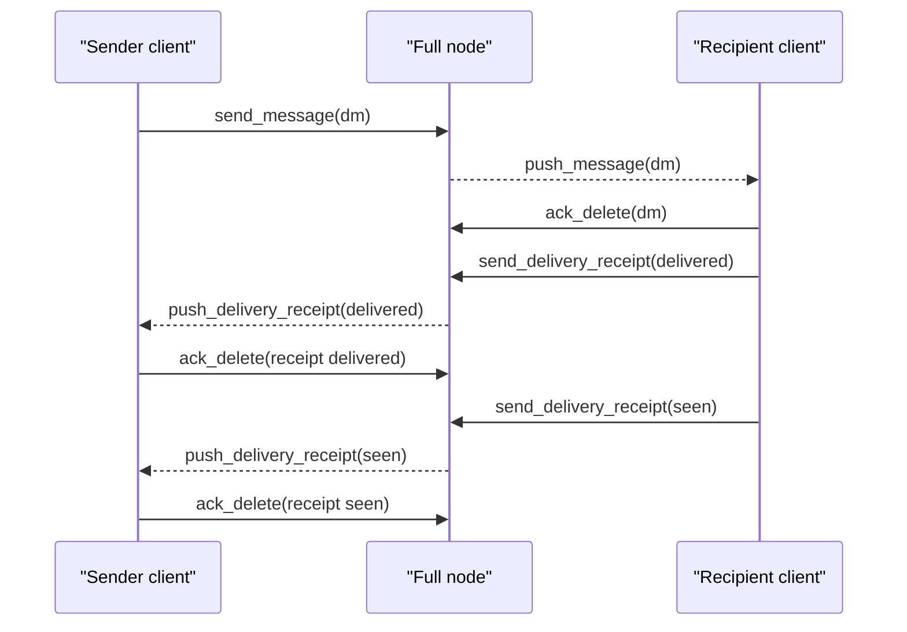
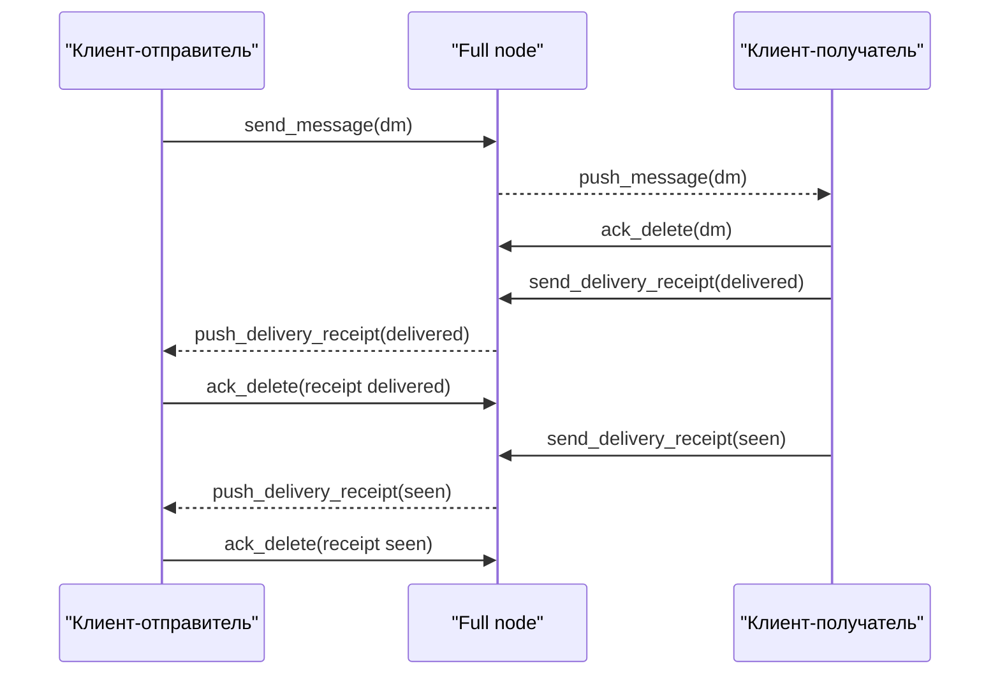

# CORSA Protocol

## English

Related crypto documentation:

- [encryption.md](encryption.md)

### Status

- version: `v8`
- stability: experimental
- transport: plain TCP
- framing: line-based UTF-8 terminated by `\n`
- primary frame format: JSON object per line
- identity: `ed25519`
- message encryption: `X25519 + AES-GCM`
- direct-message signatures: `ed25519`

### Network config

Relevant environment variables:

- `CORSA_LISTEN_ADDRESS`
- `CORSA_LISTENER`
- `CORSA_ADVERTISE_ADDRESS`
- `CORSA_BOOTSTRAP_PEER`
- `CORSA_BOOTSTRAP_PEERS`
- `CORSA_IDENTITY_PATH`
- `CORSA_TRUST_STORE_PATH`
- `CORSA_QUEUE_STATE_PATH`
- `CORSA_PEERS_PATH`
- `CORSA_PROXY`
- `CORSA_NODE_TYPE`
- `CORSA_MAX_OUTGOING_PEERS`
- `CORSA_MAX_INCOMING_PEERS`
- `CORSA_MAX_CLOCK_DRIFT_SECONDS`

Rules:

- `CORSA_BOOTSTRAP_PEERS` overrides `CORSA_BOOTSTRAP_PEER`
- default seed if nothing is set: `65.108.204.190:64646`
- `CORSA_NODE_TYPE=full` enables relay/forwarding
- `CORSA_NODE_TYPE=client` disables forwarding but keeps sync, inbox, and local storage
- `CORSA_LISTENER=1` forces the inbound listener on
- `CORSA_LISTENER=0` forces the inbound listener off
- by default `full` listens for inbound peers, while `client` runs without a listener
- `listener` only controls inbound reachability and does not change the relay role of the node
- even if a `client` node is reachable and accepts inbound connections, it must not be used as a relay for foreign traffic
- a `client` node still sends its own direct messages and delivery receipts upstream; the relay restriction applies only to third-party traffic
- default outbound peer-session cap: `8`
- `CORSA_MAX_INCOMING_PEERS=0` means no app-level inbound cap
- pending outgoing direct-message frames and relay-retry state are persisted to disk and survive node restarts
- default message clock drift: `600` seconds

### Peer address persistence

Peer addresses discovered via `get_peers` exchange and bootstrap are persisted locally in `peers-{port}.json` (default path: `.corsa/peers-{port}.json`, override: `CORSA_PEERS_PATH`). The file follows a reputation-based scoring model:

- each entry stores the peer address, node type, last connection/disconnection timestamps, consecutive failure count, source tag (`bootstrap`, `peer_exchange`, `persisted`), first-seen time (`added_at`), and a numeric score
- score increases on successful TCP handshake (+10) and decreases on failure (-5) or clean disconnect (-2), clamped to [-50, +100]
- stable metadata (`node_type`, `source`, `added_at`) loaded from the file is preserved across restart+flush cycles; only newly discovered peers derive these fields from runtime state
- the file is flushed every 5 minutes during the bootstrap loop and once on graceful shutdown; `Run` waits for the flush to complete before returning
- on restart, persisted peers are merged with bootstrap peers: bootstrap entries appear first, then persisted entries sorted by score descending; duplicates are skipped but their metadata is still used for health seeding
- the persisted list is capped at 500 entries; lowest-scoring entries are trimmed on save

### Peer dial prioritisation

Outgoing connection candidates are selected using score-based ordering instead of insertion order:

- `peerDialCandidates` sorts all eligible peers by score descending so that the healthiest peers are dialled first and degraded peers sink to the bottom
- a single connection failure does NOT trigger cooldown — the peer gets an immediate retry on the next bootstrap tick; starting from the second consecutive failure, exponential cooldown applies: `min(30s × 2^(failures−2), 30min)`; while the cooldown window is active (measured from `LastDisconnectedAt`), the peer is skipped
- a successful connection (`markPeerConnected`) resets `ConsecutiveFailures` to zero, immediately clearing any cooldown
- when a peer session ends (error or clean disconnect), the upstream slot is released immediately; the next `ensurePeerSessions` cycle (≤2 s) picks the best available candidate by score
- cooldown and score are evaluated against the primary peer address (the one stored in `s.peers`); fallback dial variants (e.g. same host with default port) inherit the primary's reputation so that cooldown cannot be bypassed by dialling an alternative port
- the pending outbound queue is also keyed by primary peer address, so frames queued while connected via a fallback variant are correctly flushed when any variant reconnects
- dial candidates with equal scores are sorted by insertion order (stable sort), preserving bootstrap-first priority

### Queue state migration

The queue-state file carries a `"version"` field (current: `1`).  When loading a file with `version < 1` (or no version field — legacy files written before canonicalisation), a one-time migration runs.  For each non-primary key in `"pending"`:

1. if the host maps to exactly one known primary — frames are moved to that primary key
2. if the host has no known primaries (unknown host) or maps to more than one primary (ambiguous) — the entry cannot be resolved automatically; it is moved to the `"orphaned"` section and a warning is logged

After migration the version is set to `1` and subsequent restarts skip the migration entirely.  This means entries written by the current code (already keyed by primary address) are never touched.

Orphaned frames are persisted across restarts in `"orphaned"`.  They are not loaded into the runtime pending queue, but remain on disk for manual recovery (e.g. editing the JSON to move them to the correct primary key).

### Stale peer eviction

In-memory peer lists are periodically pruned to remove stale entries.  Every 10 minutes the node scans all known peers and removes those that meet **both** criteria:

- score ≤ −20 (`peerEvictScoreThreshold`)
- no successful connection within the last 24 hours (`peerEvictStaleWindow`); if the peer was never connected, `added_at` is used as the reference timestamp

Eviction cleans up all associated state (health, peer type, version, persisted metadata).  Bootstrap peers and currently-connected peers are **never** evicted regardless of score.

### Mesh learning (peer re-sync via syncTicker)

`servePeerSession` runs a `syncTicker` that fires every 4 seconds.  Each tick calls `syncPeerSession`, which sends `get_peers` to the connected peer and merges newly discovered addresses into the local pool via `addPeerAddress`.  This ensures the mesh constantly learns about new nodes through its existing connections without requiring a separate re-sync goroutine.

### Onion address support

Peer addresses may be `.onion` hostnames (Tor hidden services). When `CORSA_PROXY` is set to a SOCKS5 proxy address (e.g. `127.0.0.1:9050`), the node routes all `.onion` peer connections through the proxy:

- only valid `.onion` addresses are accepted: Tor v3 (56 base32 characters) and v2 (16 base32 characters, deprecated); malformed `.onion` hostnames are rejected during `normalizePeerAddress`
- `.onion` addresses are accepted as-is in the advertised address field; standard IP-based validation and forbidden-IP checks are bypassed for `.onion` hosts
- the SOCKS5 handshake uses `ATYP=0x03` (domain name) so the proxy resolves the `.onion` address, not the local node
- if no `CORSA_PROXY` is configured, `.onion` peer addresses are stored but excluded from dial candidates to avoid constant failed connection attempts
- non-`.onion` addresses continue to use direct TCP connections regardless of proxy configuration

### Handshake

Primary JSON desktop request:

```json
{
  "type": "hello",
  "version": 2,
  "client": "desktop",
  "client_version": "<corsa-version-wire>",
  "client_build": 19
}
```

Fields:

- `type` — required; frame kind, here always `hello`
- `version` — required; sender protocol version
- `client` — required; caller kind such as `desktop` or `node`
- `client_version` — optional; app/client build version in wire form
- `client_build` — optional; monotonically increasing integer build number; peers compare this value to detect newer software releases

Primary JSON node-to-node request:

```json
{
  "type": "hello",
  "version": 2,
  "client": "node",
  "listener": "1",
  "listen": "<your-public-ip>:64646",
  "node_type": "full",
  "client_version": "<corsa-version-wire>",
  "client_build": 19,
  "services": [
    "identity",
    "contacts",
    "messages",
    "gazeta",
    "relay"
  ],
  "networks": ["ipv4", "ipv6", "torv3"],
  "address": "<fingerprint>",
  "pubkey": "<base64-ed25519-pubkey>",
  "boxkey": "<base64-x25519-pubkey>",
  "boxsig": "<base64url-ed25519-signature>"
}
```

Fields:

- `type` — required; frame kind, here `hello`
- `version` — required; sender protocol version
- `client` — required; caller kind, here `node`
- `listener` — optional; `"1"` if the node accepts inbound peer connections, `"0"` otherwise
- `listen` — optional; address this node advertises to peers
- when `listener="0"`, the node identity may still be known to the network, but it must not be used as a dialable peer endpoint
- `node_type` — optional; node role, currently `full` or `client`
- `client_version` — optional; node software version
- `client_build` — optional; monotonically increasing integer build number; peers compare this value to detect newer software releases
- `services` — optional; declared capabilities supported by the node
- `networks` — optional; self-declared list of reachable network groups (e.g. `["ipv4","ipv6","torv3"]`); the remote node validates the declaration against the advertised address — overlay claims are accepted only when the address confirms the overlay; when absent, reachability is inferred from the advertised address
- `address` — optional; node identity fingerprint
- `pubkey` — optional; base64 `ed25519` public key for identity/authenticity
- `boxkey` — optional; base64 `X25519` public key for encrypted traffic
- `boxsig` — optional; signature binding `boxkey` to the identity key

Response:

```json
{
  "type": "welcome",
  "version": 2,
  "minimum_protocol_version": 2,
  "node": "corsa",
  "network": "gazeta-devnet",
  "listener": "1",
  "listen": "<your-public-ip>:64646",
  "node_type": "full",
  "client_version": "<corsa-version-wire>",
  "client_build": 19,
  "services": [
    "identity",
    "contacts",
    "messages",
    "gazeta",
    "relay"
  ],
  "address": "<fingerprint>",
  "pubkey": "<base64-ed25519-pubkey>",
  "boxkey": "<base64-x25519-pubkey>",
  "boxsig": "<base64url-ed25519-signature>",
  "observed_address": "203.0.113.50"
}
```

Fields:

- `type` — required; frame kind, here `welcome`
- `version` — required; current protocol version supported by the responder
- `minimum_protocol_version` — required; minimum protocol version accepted by the responder
- `node` — required; server implementation name
- `network` — required; logical network name
- `listener` — optional; whether the responder currently exposes an inbound listener
- `listen` — optional; dialable peer endpoint only when `listener="1"`
- `node_type` — optional; responder role
- `client_version` — optional; responder software version
- `client_build` — optional; monotonically increasing integer build number; peers compare this value to detect newer software releases
- `services` — optional; responder capabilities
- `address` — optional; responder fingerprint identity
- `pubkey` — optional; responder identity key
- `boxkey` — optional; responder encryption key
- `boxsig` — optional; signature proving the encryption key belongs to the responder identity
- `observed_address` — optional; the IP address (without port) that the responder sees for the caller's TCP connection; used for NAT detection

Role rules:

- `full` nodes forward mesh traffic
- `client` nodes do not relay traffic onward
- a `client` node may still have `listener=1`, but that does not make it a relay node
- foreign traffic must not be deliberately routed through a `client`; the only exception is a direct message addressed to that client identity
- a `client` must still route its own direct messages and delivery receipts toward upstream/full peers
- desktop and standalone console node default to `full`
- future mobile/light clients should use `client`
- current Corsa version: see `internal/core/config.CorsaVersion`
- wire form used in handshake: see `internal/core/config.CorsaWireVersion`

Handshake compatibility rule:

- caller sends only its current `version` in `hello`
- responder rejects the handshake if caller `version` is lower than responder `minimum_protocol_version`
- reject reply uses `type=error`, `code=incompatible-protocol-version`, and includes responder `version` plus `minimum_protocol_version`
- all network peers are now expected to use protocol `v2`; responders reject any caller below `minimum_protocol_version`

Authenticated session upgrade for protocol `v2`:

- for `node` and `desktop` peers using protocol `v2`, the responder includes a random `challenge` in `welcome`
- the caller must answer with a signed `auth_session`
- the signature is made by the caller identity key over the payload `corsa-session-auth-v1|<challenge>|<address>`
- if the signature is valid, responder returns `auth_ok`
- if the signature is invalid, the connection is rejected
- invalid session signatures add `100` ban points to the remote IP
- once an IP reaches `1000` points, it is blacklisted for `24h`

Key verification in `hello`/`welcome`:

- when all key fields (`address`, `pubkey`, `boxkey`, `boxsig`) are present in a `hello` or `welcome` frame, the receiving node should verify the `boxkey` binding signature before storing the keys in memory
- if verification fails, the keys are discarded but the connection is not terminated; the peer identity (`address`) is still recorded
- when any key field is absent (e.g. an older node that does not advertise `boxkey`), the node should accept whatever fields are available for backward compatibility

Observed address (NAT detection):

- the `welcome` frame includes `observed_address` — the IP address (without ephemeral port) that the responder sees for the caller's inbound TCP connection
- the connecting node records `observed_address` keyed by peer identity (fingerprint), so the same node always contributes exactly one vote regardless of how many address aliases it has
- when at least 2 distinct peer identities report the same `observed_address` (consensus threshold), the node considers that its real public IP
- if the consensus IP differs from the configured `AdvertiseAddress` and the current advertise address is private/loopback, the node logs a NAT detection event
- observations are per-connection: when a peer disconnects, its observation is removed from the voting set
- private, loopback, link-local, and unspecified IPs are ignored as observed addresses
- the node never auto-rewrites `AdvertiseAddress` in the current implementation — NAT detection is informational only

Address groups (network reachability):

- every peer address is classified into a network group: `ipv4`, `ipv6`, `torv3`, `torv2`, `i2p`, `cjdns`, `local`, or `unknown`
- the classification follows Bitcoin Core's `CNetAddr::GetNetwork` approach — each address belongs to exactly one group
- a node computes which groups it can reach at startup: IPv4/IPv6 are always reachable; Tor and I2P require a SOCKS5 proxy (`CORSA_PROXY` env var); CJDNS uses its own tun interface and is not proxied — it is not currently reachable
- dial candidate selection skips addresses in unreachable groups — e.g. a clearnet node will not attempt to dial `.onion` or `.b32.i2p` addresses without a proxy
- nodes declare their reachable groups in the `hello` frame via the `"networks"` field (e.g. `["ipv4","ipv6","torv3"]`); the receiving node validates the declaration against the peer's advertised address — overlay groups (torv3, torv2, i2p, cjdns) are only accepted if the advertised address belongs to that overlay; clearnet groups (ipv4, ipv6) are always accepted; this prevents a clearnet peer from claiming overlay reachability to harvest `.onion` / `.i2p` addresses
- peer exchange (`get_peers` → `peers`) filters addresses by the validated intersection of declared and verifiable groups; if the peer did not send `"networks"`, reachability is inferred from its advertised address (not the TCP endpoint, which may differ for overlay peers); local/private addresses are never relayed
- the `network` field in `peers.json` records each peer's group for diagnostic purposes

Authenticated session request:

```json
{
  "type": "auth_session",
  "address": "<fingerprint>",
  "signature": "<base64url-ed25519-signature>"
}
```

Authenticated session success response:

```json
{
  "type": "auth_ok",
  "address": "<fingerprint>",
  "status": "ok"
}
```

### Peer sync

Request:

```json
{
  "type": "get_peers"
}
```

Response:

```json
{
  "type": "peers",
  "count": 2,
  "peers": [
    "65.108.204.190:64646",
    "<peer-address>"
  ]
}
```

Fields:

- `type` — required; frame kind, here `peers`
- `count` — required; number of peer addresses in `peers`
- `peers` — required; advertised peer endpoints

### Peer health

Request:

```json
{
  "type": "fetch_peer_health"
}
```

Response:

```json
{
  "type": "peer_health",
  "count": 1,
  "peer_health": [
    {
      "address": "65.108.204.190:64646",
      "state": "healthy",
      "connected": true,
      "pending_count": 0,
      "last_connected_at": "2026-03-20T09:10:11Z",
      "last_ping_at": "2026-03-20T09:11:00Z",
      "last_pong_at": "2026-03-20T09:11:00Z",
      "last_useful_send_at": "2026-03-20T09:10:58Z",
      "last_useful_receive_at": "2026-03-20T09:10:59Z",
      "consecutive_failures": 0
    }
  ]
}
```

Fields:

- `type` — required; frame kind, here `peer_health`
- `count` — required; number of peer health rows
- `peer_health` — required; per-peer health snapshots
- `peer_health[].address` — required; peer endpoint
- `peer_health[].client_version` — optional; peer software version string
- `peer_health[].client_build` — optional; peer build number; compare with own `ClientBuild` to detect newer releases
- `peer_health[].state` — required; `healthy`, `degraded`, `stalled`, or `reconnecting`
- `peer_health[].connected` — required; whether a live session currently exists
- `peer_health[].pending_count` — optional; number of queued outbound frames waiting for reconnect
- `peer_health[].last_connected_at` — optional; last successful session establishment time
- `peer_health[].last_disconnected_at` — optional; last disconnect time
- `peer_health[].last_ping_at` — optional; last heartbeat send time
- `peer_health[].last_pong_at` — optional; last heartbeat reply time
- `peer_health[].last_useful_send_at` — optional; last non-heartbeat outbound frame time
- `peer_health[].last_useful_receive_at` — optional; last non-heartbeat inbound frame time
- `peer_health[].consecutive_failures` — optional; reconnect failure streak
- `peer_health[].last_error` — optional; most recent session error
- `peer_health[].bytes_sent` — total bytes sent to this peer across all sessions
- `peer_health[].bytes_received` — total bytes received from this peer across all sessions
- `peer_health[].total_traffic` — sum of bytes_sent and bytes_received

### Network stats

Frame type: `network_stats`

Aggregated traffic statistics for the entire node. Combines cumulative counters from closed sessions with live byte counts from active MeteredConn instances.

- `network_stats.total_bytes_sent` — total bytes sent across all peers
- `network_stats.total_bytes_received` — total bytes received across all peers
- `network_stats.total_traffic` — sum of total_bytes_sent and total_bytes_received
- `network_stats.connected_peers` — number of currently connected peers
- `network_stats.known_peers` — total number of known peers (configured, connected, and previously seen — includes non-listener clients)
- `network_stats.peer_traffic[]` — per-peer traffic breakdown, sorted by total_traffic descending:
  - `address` — peer address
  - `bytes_sent` — bytes sent to this peer
  - `bytes_received` — bytes received from this peer
  - `total_traffic` — sum of bytes_sent and bytes_received
  - `connected` — whether the peer is currently connected

### Traffic history

Frame type: `traffic_history`

Rolling per-second traffic history collected by the metrics layer. The ring buffer holds up to 3600 samples (1 hour). Samples are returned in chronological order (oldest first).

- `traffic_history.interval_seconds` — sampling interval (always 1)
- `traffic_history.capacity` — maximum number of samples (3600)
- `traffic_history.count` — current number of recorded samples
- `traffic_history.samples[]` — array of traffic samples:
  - `timestamp` — ISO 8601 timestamp (UTC)
  - `bytes_sent_ps` — bytes sent delta since previous sample
  - `bytes_recv_ps` — bytes received delta since previous sample
  - `total_sent` — cumulative bytes sent at this moment
  - `total_received` — cumulative bytes received at this moment

Routing notes:

- direct messages and delivery receipts prefer active healthy sessions
- when a peer subscribes to `dm` inbox updates, the serving node should immediately push already stored backlog for that recipient on the same session
- if no suitable session exists, the frame is queued locally instead of fan-out dialing every known peer
- queued frames are retried after reconnect and dropped only after the local queue policy expires them
- queued local delivery state survives node restart via the persisted queue-state file
- full nodes may keep retrying stored direct messages for a bounded time even after the first routing miss
- the same bounded retry policy applies to delivery receipts, including both `delivered` and `seen`

### Pending messages

Request:

```json
{
  "type": "fetch_pending_messages",
  "topic": "dm"
}
```

Response:

```json
{
  "type": "pending_messages",
  "topic": "dm",
  "count": 2,
  "pending_messages": [
    {
      "id": "a1111111-2222-3333-4444-555555555555",
      "recipient": "<recipient-address>",
      "status": "retrying",
      "queued_at": "2026-03-20T10:00:00Z",
      "last_attempt_at": "2026-03-20T10:00:30Z",
      "retries": 2,
      "error": "retry queued delivery"
    },
    {
      "id": "b1111111-2222-3333-4444-555555555555",
      "recipient": "<recipient-address>",
      "status": "failed",
      "queued_at": "2026-03-20T10:01:00Z",
      "last_attempt_at": "2026-03-20T10:03:00Z",
      "retries": 5,
      "error": "max retries exceeded"
    }
  ],
  "pending_ids": [
    "a1111111-2222-3333-4444-555555555555",
    "b1111111-2222-3333-4444-555555555555"
  ]
}
```

Fields:

- `type` — required; frame kind, here `pending_messages`
- `topic` — required; message topic currently inspected, usually `dm`
- `count` — required; number of pending message ids
- `pending_messages` — required; item-level delivery state for locally tracked outbound direct messages
- `pending_messages[].id` — required; direct message UUID
- `pending_messages[].recipient` — optional; intended recipient identity
- `pending_messages[].status` — required; one of `queued`, `retrying`, `failed`, or `expired`
- `pending_messages[].queued_at` — optional; when the node first queued local delivery
- `pending_messages[].last_attempt_at` — optional; last flush/retry attempt time
- `pending_messages[].retries` — optional; retry count already spent
- `pending_messages[].error` — optional; latest queue/drop reason
- `pending_ids` — required; ids of locally queued outgoing messages still waiting for a usable route

Desktop/UI interpretation:

- outgoing `dm` with a matching `pending_messages[].status` should be shown as `queued`, `retrying`, `failed`, or `expired`
- outgoing `dm` without receipt and not present in `pending_messages` can be shown as `sent`
- once a delivery receipt arrives, UI should replace `queued` or `sent` with `delivered` or `seen`

### Contacts

Request:

```json
{
  "type": "fetch_contacts"
}
```

Response:

```json
{
  "type": "contacts",
  "count": 2,
  "contacts": [
    {
      "address": "<address1>",
      "boxkey": "<boxkey1>",
      "pubkey": "<pubkey1>",
      "boxsig": "<boxsig1>"
    },
    {
      "address": "<address2>",
      "boxkey": "<boxkey2>",
      "pubkey": "<pubkey2>",
      "boxsig": "<boxsig2>"
    }
  ]
}
```

Fields:

- `type` — required; frame kind, here `contacts`
- `count` — required; number of contact records
- `contacts` — required; array of known contact identities
- `contacts[].address` — required; fingerprint identity of the contact
- `contacts[].pubkey` — required; contact `ed25519` identity key
- `contacts[].boxkey` — required; contact `X25519` encryption key
- `contacts[].boxsig` — required; signature binding the contact encryption key to its identity key

Trust rules:

- `pubkey` must hash to the advertised fingerprint address
- `boxkey` must be signed by that identity key
- the first valid key set is pinned locally
- later conflicting keys are ignored
- contacts received via `fetch_contacts` during peer sync should be verified: when all key fields (`pubkey`, `boxkey`, `boxsig`) are present, the node must check the `boxkey` binding signature before storing; contacts with an invalid binding are discarded
- when a contact is missing `boxkey` or `boxsig` (e.g. from an older node), the node should still accept `address` and `pubkey` for backward compatibility; such partial contacts cannot be used for `dm` encryption but may appear in contact listings

### Direct messages

Primary JSON request:

```json
{
  "type": "send_message",
  "topic": "dm",
  "id": "550e8400-e29b-41d4-a716-446655440001",
  "address": "a1b2c3",
  "recipient": "d4e5f6",
  "flag": "sender-delete",
  "created_at": "2026-03-19T12:00:05Z",
  "ttl_seconds": 0,
  "body": "<ciphertext-token>"
}
```

Historical import request:

```json
{
  "type": "import_message",
  "topic": "dm",
  "id": "550e8400-e29b-41d4-a716-446655440001",
  "address": "a1b2c3",
  "recipient": "d4e5f6",
  "flag": "sender-delete",
  "created_at": "2026-03-19T12:00:05Z",
  "ttl_seconds": 0,
  "body": "<ciphertext-token>"
}
```

Fields:

- `type` — required; frame kind, here `send_message`
- `topic` — required; logical message channel such as `global` or `dm`
- `id` — required; UUID of the message
- `address` — required; sender fingerprint
- `recipient` — required; target fingerprint or `*` for broadcast
- `flag` — required; delete/retention rule for the message
- `created_at` — required; sender timestamp in RFC3339 UTC form
- `ttl_seconds` — optional; TTL used by `auto-delete-ttl`, otherwise `0`
- for `dm`, `ttl_seconds` may also be used as an optional delivery lifetime counted from `created_at`
- `body` — required; plaintext for public topics or ciphertext for `dm`

Import rules:

- `send_message` is for live traffic and enforces the configured clock drift window
- `import_message` is for historical sync and does not reject old/new timestamps
- `import_message` still validates direct-message signatures, deduplication, and retention flags
- when a live `dm` reaches the final recipient node, that node emits a delivery receipt back to the original sender

Responses:

```json
{
  "type": "message_stored",
  "topic": "dm",
  "count": 1,
  "id": "550e8400-e29b-41d4-a716-446655440001"
}
{
  "type": "message_known",
  "topic": "dm",
  "count": 1,
  "id": "550e8400-e29b-41d4-a716-446655440001"
}
{
  "type": "error",
  "code": "message-timestamp-out-of-range"
}
```

Delivery receipt request:

```json
{
  "type": "send_delivery_receipt",
  "id": "550e8400-e29b-41d4-a716-446655440001",
  "address": "d4e5f6",
  "recipient": "a1b2c3",
  "status": "delivered",
  "delivered_at": "2026-03-19T12:01:02Z"
}
```

Delivery receipt fetch request:

```json
{
  "type": "fetch_delivery_receipts",
  "recipient": "a1b2c3"
}
```

Delivery receipt fetch response:

```json
{
  "type": "delivery_receipts",
  "recipient": "a1b2c3",
  "count": 1,
  "receipts": [
    {
      "message_id": "550e8400-e29b-41d4-a716-446655440001",
      "sender": "d4e5f6",
      "recipient": "a1b2c3",
      "status": "delivered",
      "delivered_at": "2026-03-19T12:01:02Z"
    }
  ]
}
```

Message log request:

```json
{
  "type": "fetch_messages",
  "topic": "dm"
}
```

Response:

```json
{
  "type": "messages",
  "topic": "dm",
  "count": 1,
  "messages": [
    {
      "id": "<id>",
      "flag": "sender-delete",
      "created_at": "2026-03-19T12:00:05Z",
      "ttl_seconds": 0,
      "sender": "a1b2c3",
      "recipient": "d4e5f6",
      "body": "<ciphertext-token>"
    }
  ]
}
```

Fields:

- `type` — required; frame kind, here `messages`
- `topic` — required; requested topic
- `count` — required; number of returned messages
- `messages` — required; array of message objects
- `messages[].id` — required; UUID of the message
- `messages[].sender` — required; sender fingerprint
- `messages[].recipient` — required; recipient fingerprint or `*`
- `messages[].flag` — required; retention/delete rule
- `messages[].created_at` — required; original sender timestamp
- `messages[].ttl_seconds` — optional; auto-delete TTL if used
- `messages[].body` — required; message payload or ciphertext

Message UUID index request:

```json
{
  "type": "fetch_message_ids",
  "topic": "dm"
}
```

Response:

```json
{
  "type": "message_ids",
  "topic": "dm",
  "count": 2,
  "ids": [
    "uuid1",
    "uuid2"
  ]
}
```

Fields:

- `type` — required; frame kind, here `message_ids`
- `topic` — required; requested topic
- `count` — required; number of UUIDs in the list
- `ids` — required; list of message UUIDs only, for lightweight sync

Single message request:

```json
{
  "type": "fetch_message",
  "topic": "dm",
  "id": "uuid1"
}
```

Response:

```json
{
  "type": "message",
  "topic": "dm",
  "id": "uuid1",
  "item": {
    "id": "uuid1",
    "flag": "sender-delete",
    "created_at": "2026-03-19T12:00:05Z",
    "ttl_seconds": 0,
    "sender": "a1b2c3",
    "recipient": "d4e5f6",
    "body": "<ciphertext-token>"
  }
}
```

Fields:

- `type` — required; frame kind, here `message`
- `topic` — required; requested topic
- `id` — required; requested UUID
- `item` — optional; full message object for that UUID

Inbox request:

```json
{
  "type": "fetch_inbox",
  "topic": "dm",
  "recipient": "d4e5f6"
}
```

Response:

```json
{
  "type": "inbox",
  "topic": "dm",
  "recipient": "d4e5f6",
  "count": 1,
  "messages": [
    {
      "id": "<id>",
      "flag": "sender-delete",
      "created_at": "2026-03-19T12:00:05Z",
      "ttl_seconds": 0,
      "sender": "a1b2c3",
      "recipient": "d4e5f6",
      "body": "<ciphertext-token>"
    }
  ]
}
```

Fields:

- `type` — required; frame kind, here `inbox`
- `topic` — required; requested topic
- `recipient` — required; identity for which the inbox view was filtered
- `count` — required; number of visible messages
- `messages` — required; filtered message array readable by this inbox query

Notes:

- for `dm`, `<body>` is ciphertext
- messages outside the allowed clock drift are rejected and not forwarded
- `auto-delete-ttl` messages are removed after `ttl-seconds`
- direct messages are not rejected only because they are old; they expire only when `ttl_seconds > 0` and `created_at + ttl_seconds` is already in the past
- `fetch_message_ids` can be used as a lightweight direct-message index
- `fetch_message` can be used to load one DM by UUID
- `fetch_delivery_receipts` returns delivery acknowledgements for messages originally sent by `recipient`
- `send_delivery_receipt` is generated by the recipient side when a live `dm` reaches the final recipient node
- receipt `status` is currently either `delivered` or `seen`
- outbound `dm` and delivery receipts prefer established peer sessions
- if no usable peer session exists, outbound `dm` and receipts are queued and flushed after reconnect instead of immediate fan-out dialing
- full nodes may also keep retrying already stored `dm` and stored delivery receipts for a bounded time so they are not treated as lost after the first failed route

Realtime routing subscription:

Request:

```json
{
  "type": "subscribe_inbox",
  "topic": "dm",
  "recipient": "d4e5f6",
  "subscriber": "<subscriber-address>"
}
```

Response:

```json
{
  "type": "subscribed",
  "topic": "dm",
  "recipient": "d4e5f6",
  "subscriber": "<subscriber-address>",
  "status": "ok",
  "count": 1
}
```

Push frame:

```json
{
  "type": "push_message",
  "topic": "dm",
  "recipient": "d4e5f6",
  "item": {
    "id": "uuid1",
    "flag": "sender-delete",
    "created_at": "2026-03-19T12:00:05Z",
    "ttl_seconds": 0,
    "sender": "a1b2c3",
    "recipient": "d4e5f6",
    "body": "<ciphertext-token>"
  }
}
```

Push receipt frame:

```json
{
  "type": "push_delivery_receipt",
  "recipient": "a1b2c3",
  "receipt": {
    "message_id": "550e8400-e29b-41d4-a716-446655440001",
    "sender": "d4e5f6",
    "recipient": "a1b2c3",
    "status": "delivered",
    "delivered_at": "2026-03-19T12:01:02Z"
  }
}
```

Fields:

- `type` — required; `subscribe_inbox`, `subscribed`, `push_message`, or `push_delivery_receipt`
- `topic` — required; currently only `dm` is supported for push routing
- `recipient` — required; inbox owner that should receive pushed messages
- `subscriber` — optional in request, required in `subscribed`; subscriber label/address tracked by the full node
- `status` — optional; subscription state string, currently `ok`
- `count` — optional; active subscriber count for that recipient on the full node
- `item` — required in `push_message`; full message object being delivered over the live subscription
- `receipt` — required in `push_delivery_receipt`; delivery acknowledgement for one previously sent `dm`
- `receipt.status` — required in `push_delivery_receipt`; current acknowledgement state, `delivered` or `seen`

Routing rules:

- full nodes may keep a long-lived subscription for `client` nodes
- when a full node stores a new `dm`, it pushes the message to active subscribers for the recipient
- when the recipient node accepts a live `dm`, it creates a delivery receipt and routes it back toward the original sender
- when the recipient UI opens the chat, it may promote that receipt from `delivered` to `seen`
- on protocol `v2` authenticated sessions, the receiver must send a signed `ack_delete` after accepting `push_message` or `push_delivery_receipt`
- after a valid `ack_delete`, the serving full node removes the corresponding backlog item and stops re-sending it on future reconnects
- `client` nodes still keep polling/sync as a fallback, but can receive `dm` immediately over the subscribed session
- public topics such as `global` are still relayed by mesh gossip, not by inbox subscription
- all writes to a subscriber TCP connection are serialised by a per-connection mutex (`connWriteMu`); this prevents interleaved JSON when a response frame and a push frame target the same connection concurrently
- backlog replay (`pushBacklogToSubscriber`) starts only after the `subscribed` acknowledgement has been fully written to the connection

Backlog delete acknowledgement:

```json
{
  "type": "ack_delete",
  "address": "<fingerprint>",
  "ack_type": "dm",
  "id": "550e8400-e29b-41d4-a716-446655440001",
  "status": "",
  "signature": "<base64url-ed25519-signature>"
}
```

For receipt backlog deletion:

```json
{
  "type": "ack_delete",
  "address": "<fingerprint>",
  "ack_type": "receipt",
  "id": "550e8400-e29b-41d4-a716-446655440001",
  "status": "delivered",
  "signature": "<base64url-ed25519-signature>"
}
```

Ack rules:

- `ack_type` is either `dm` or `receipt`
- for `receipt`, `status` is part of the signed payload and must match the pushed receipt state
- signature payload is `corsa-ack-delete-v1|<address>|<ack_type>|<id>|<status>`
- only an authenticated `v2` session may send `ack_delete`
- if the signature is invalid, responder rejects the frame and adds ban score to the remote IP

Delivery flow:



*Diagram 1 — Message delivery flow*

Message flags:

- `immutable` — nobody may delete the message
- `sender-delete` — only the sender may delete it
- `any-delete` — any participant may delete it
- `auto-delete-ttl` — the message is deleted automatically using `ttl-seconds`
- nodes verify `dm` signatures before store/relay
- at ingest the node must verify the `ed25519` envelope signature; when the sender's `boxkey` and `boxsig` are known, it should also verify the `boxkey` binding signature before storing or relaying
- if the sender's `boxkey`/`boxsig` are not yet known (e.g. the sender joined via an older node), the envelope signature check alone is sufficient; the `dm` is still accepted
- desktops verify signatures again before decrypt/render

### Gazeta

Publish request:

```json
{
  "type": "publish_notice",
  "ttl_seconds": 30,
  "ciphertext": "<ciphertext-token>"
}
```

Fields:

- `type` — required; frame kind, here `publish_notice`
- `ttl_seconds` — required; notice lifetime in seconds
- `ciphertext` — required; encrypted Gazeta payload

Responses:

```json
{
  "type": "notice_stored",
  "id": "<notice-id>",
  "expires_at": 1234567890
}
{
  "type": "notice_known",
  "id": "<notice-id>",
  "expires_at": 1234567890
}
```

Fetch request:

```json
{
  "type": "fetch_notices"
}
```

Response:

```json
{
  "type": "notices",
  "count": 1,
  "notices": [
    {
      "id": "<id>",
      "expires_at": 1234567890,
      "ciphertext": "<ciphertext-token>"
    }
  ]
}
```

Fields:

- `type` — required; frame kind, here `notices`
- `count` — required; number of active notices
- `notices` — required; array of active encrypted notices
- `notices[].id` — required; notice identifier derived by the node
- `notices[].expires_at` — required; expiration time as Unix seconds
- `notices[].ciphertext` — required; encrypted notice payload

### Errors

Possible JSON error codes:

```json
{
  "type": "error",
  "code": "unknown-command"
}
{
  "type": "error",
  "code": "invalid-send-message"
}
{
  "type": "error",
  "code": "invalid-fetch-messages"
}
{
  "type": "error",
  "code": "invalid-fetch-message-ids"
}
{
  "type": "error",
  "code": "invalid-fetch-message"
}
{
  "type": "error",
  "code": "invalid-fetch-inbox"
}
{
  "type": "error",
  "code": "invalid-subscribe-inbox"
}
{
  "type": "error",
  "code": "invalid-publish-notice"
}
{
  "type": "error",
  "code": "unknown-sender-key"
}
{
  "type": "error",
  "code": "unknown-message-id"
}
{
  "type": "error",
  "code": "invalid-direct-message-signature"
}
{
  "type": "error",
  "code": "read"
}
```

Fields:

- `type` — required; frame kind, here `error`
- `code` — required; stable machine-readable error code
- `error` — optional; human-readable detail when available

### Current desktop flow

1. load/create identity
2. load/create trust store
3. start embedded local node
4. sync peers and contacts
5. fetch contacts
6. fetch topic traffic
7. fetch and decrypt readable direct messages
8. fetch Gazeta notices
9. for `client` nodes, keep an upstream `subscribe_inbox` session for realtime DM routing

---

## Русский

Связанная криптографическая документация:

- [encryption.md](encryption.md)

### Статус

- версия: `v8`
- стабильность: experimental
- транспорт: plain TCP
- фрейминг: line-based UTF-8 с окончанием `\n`
- основной формат кадра: JSON-объект на строку
- identity: `ed25519`
- шифрование сообщений: `X25519 + AES-GCM`
- подписи direct messages: `ed25519`

### Сетевой конфиг

Основные переменные окружения:

- `CORSA_LISTEN_ADDRESS`
- `CORSA_LISTENER`
- `CORSA_ADVERTISE_ADDRESS`
- `CORSA_BOOTSTRAP_PEER`
- `CORSA_BOOTSTRAP_PEERS`
- `CORSA_IDENTITY_PATH`
- `CORSA_TRUST_STORE_PATH`
- `CORSA_QUEUE_STATE_PATH`
- `CORSA_PEERS_PATH`
- `CORSA_PROXY`
- `CORSA_NODE_TYPE`
- `CORSA_MAX_OUTGOING_PEERS`
- `CORSA_MAX_INCOMING_PEERS`
- `CORSA_MAX_CLOCK_DRIFT_SECONDS`

Правила:

- `CORSA_BOOTSTRAP_PEERS` имеет приоритет над `CORSA_BOOTSTRAP_PEER`
- если ничего не задано, используется seed по умолчанию: `65.108.204.190:64646`
- `CORSA_NODE_TYPE=full` включает relay/forwarding
- `CORSA_NODE_TYPE=client` отключает forwarding, но оставляет sync, inbox и локальное хранение
- `CORSA_LISTENER=1` принудительно включает входящий listener
- `CORSA_LISTENER=0` принудительно выключает входящий listener
- по умолчанию `full` слушает входящие, а `client` работает без listener
- `listener` управляет только входящими соединениями, но не меняет relay-роль узла
- даже если `client` reachable и принимает входящие, его нельзя использовать как relay для чужого трафика
- при этом `client`-узел все равно отправляет свои собственные direct messages и delivery receipts вверх по upstream; ограничение относится только к чужому трафику
- outbound peer-session cap по умолчанию: `8`
- `CORSA_MAX_INCOMING_PEERS=0` означает отсутствие app-level лимита на входящие peer-соединения
- очередь исходящих direct-message кадров и состояние relay retry сохраняются на диск и переживают рестарт ноды
- допустимый drift времени сообщений по умолчанию: `600` секунд

### Персистенция адресов пиров

Адреса пиров, обнаруженные через обмен `get_peers` и bootstrap, сохраняются локально в `peers-{port}.json` (путь по умолчанию: `.corsa/peers-{port}.json`, переопределение: `CORSA_PEERS_PATH`). Файл использует репутационную модель scoring:

- каждая запись хранит адрес пира, тип ноды, временные метки последнего подключения/отключения, число последовательных ошибок, тег источника (`bootstrap`, `peer_exchange`, `persisted`), время первого обнаружения (`added_at`) и числовой score
- score увеличивается при успешном TCP-рукопожатии (+10) и уменьшается при ошибке (-5) или чистом отключении (-2), зажат в диапазоне [-50, +100]
- стабильные метаданные (`node_type`, `source`, `added_at`) загруженные из файла сохраняются через циклы restart+flush; только для вновь обнаруженных пиров эти поля вычисляются из runtime-состояния
- файл сбрасывается на диск каждые 5 минут в bootstrap loop и один раз при graceful shutdown; `Run` дожидается завершения flush перед возвратом
- при перезапуске персистированные пиры мержатся с bootstrap: записи bootstrap идут первыми, затем персистированные в порядке убывания score; дубликаты пропускаются, но их метаданные используются для инициализации health
- список ограничен 500 записями; записи с наименьшим score обрезаются при сохранении

### Приоритизация пиров при подключении

Кандидаты для исходящих соединений выбираются с score-based сортировкой вместо порядка вставки:

- `peerDialCandidates` сортирует всех доступных пиров по score по убыванию, чтобы самые здоровые пиры подключались первыми, а проблемные опускались вниз
- одна ошибка подключения НЕ включает cooldown — пир получает немедленную повторную попытку на следующем тике bootstrap; начиная со второй подряд ошибки действует экспоненциальный cooldown: `min(30с × 2^(failures−2), 30мин)`; пока окно cooldown активно (от момента `LastDisconnectedAt`), пир пропускается
- успешное подключение (`markPeerConnected`) сбрасывает `ConsecutiveFailures` в ноль, немедленно снимая cooldown
- при завершении пир-сессии (ошибка или чистое отключение) upstream-слот освобождается немедленно; следующий цикл `ensurePeerSessions` (≤2 с) выбирает лучшего кандидата по score
- cooldown и score вычисляются по основному адресу пира (тому, что хранится в `s.peers`); fallback-варианты (тот же хост с портом по умолчанию) наследуют репутацию основного, чтобы cooldown нельзя было обойти попыткой подключения на альтернативный порт
- очередь исходящих pending-фреймов также привязана к основному адресу пира, поэтому фреймы, поставленные в очередь через fallback-вариант, корректно отправляются при переподключении через любой вариант
- кандидаты для подключения с одинаковым score сортируются по порядку добавления (стабильная сортировка), сохраняя приоритет bootstrap-пиров

### Миграция queue state

Файл queue-state содержит поле `"version"` (текущая: `1`). При загрузке файла с `version < 1` (или без поля version — legacy-файлы, записанные до каноникализации) выполняется одноразовая миграция. Для каждого не-primary ключа в `"pending"`:

1. если host однозначно маппится на один known primary — фреймы переносятся на этот primary-ключ
2. если у host нет known primary (неизвестный хост) или host маппится на несколько primary (неоднозначный) — запись не может быть автоматически разрешена; она перемещается в секцию `"orphaned"` и логируется warning

После миграции version устанавливается в `1`, и последующие рестарты пропускают миграцию полностью. Это означает, что записи, сделанные текущей версией кода (уже ключеванные по primary-адресу), никогда не затрагиваются.

Orphaned фреймы сохраняются между рестартами в `"orphaned"`. Они не загружаются в runtime pending-очередь, но остаются на диске для ручного восстановления (например, редактированием JSON и переносом на правильный primary-ключ).

### Вытеснение устаревших пиров

Список пиров в памяти периодически очищается для удаления устаревших записей. Каждые 10 минут нода проверяет всех известных пиров и удаляет тех, кто удовлетворяет **обоим** критериям:

- score ≤ −20 (`peerEvictScoreThreshold`)
- не было успешного подключения за последние 24 часа (`peerEvictStaleWindow`); если пир никогда не подключался, используется `added_at` как точка отсчёта

При вытеснении очищается всё связанное состояние (health, тип пира, версия, персистированные метаданные). Bootstrap-пиры и подключённые в данный момент пиры **никогда** не удаляются вне зависимости от score.

### Обучение mesh-сети (re-sync через syncTicker)

`servePeerSession` запускает `syncTicker`, который срабатывает каждые 4 секунды. При каждом тике вызывается `syncPeerSession`, который отправляет `get_peers` подключённому пиру и добавляет новые адреса в локальный пул через `addPeerAddress`. Это обеспечивает постоянное обнаружение новых нод через существующие соединения без необходимости отдельной goroutine для re-sync.

### Поддержка onion-адресов

Адреса пиров могут быть `.onion` хостнеймами (Tor hidden services). При установке `CORSA_PROXY` в адрес SOCKS5 прокси (например `127.0.0.1:9050`) нода маршрутизирует все `.onion` соединения через прокси:

- принимаются только валидные `.onion` адреса: Tor v3 (56 символов base32) и v2 (16 символов base32, deprecated); некорректные `.onion` хостнеймы отклоняются при `normalizePeerAddress`
- `.onion` адреса принимаются как есть в advertised address; стандартная IP-валидация и проверки forbidden-IP не применяются к `.onion` хостам
- SOCKS5 рукопожатие использует `ATYP=0x03` (доменное имя), чтобы прокси разрешал `.onion` адрес, а не локальная нода
- если `CORSA_PROXY` не настроен, `.onion` адреса пиров сохраняются, но исключаются из кандидатов на подключение, чтобы избежать постоянных неудачных попыток
- non-`.onion` адреса продолжают использовать прямые TCP-соединения вне зависимости от настройки прокси

### Handshake

Основной JSON-запрос от desktop:

```json
{
  "type": "hello",
  "version": 2,
  "client": "desktop",
  "client_version": "<corsa-version-wire>",
  "client_build": 19
}
```

Поля:

- `type` — обязательное; тип кадра, здесь всегда `hello`
- `version` — обязательное; текущая версия протокола у отправителя
- `client` — обязательное; тип вызывающей стороны, например `desktop` или `node`
- `client_version` — опциональное; версия приложения в wire-форме
- `client_build` — опциональное; монотонно возрастающий целочисленный номер сборки; пиры сравнивают это значение для обнаружения новых версий ПО

Основной JSON-запрос node-to-node:

```json
{
  "type": "hello",
  "version": 2,
  "client": "node",
  "listener": "1",
  "listen": "<your-public-ip>:64646",
  "node_type": "full",
  "client_version": "<corsa-version-wire>",
  "client_build": 19,
  "services": [
    "identity",
    "contacts",
    "messages",
    "gazeta",
    "relay"
  ],
  "networks": ["ipv4", "ipv6", "torv3"],
  "address": "<fingerprint>",
  "pubkey": "<base64-ed25519-pubkey>",
  "boxkey": "<base64-x25519-pubkey>",
  "boxsig": "<base64url-ed25519-signature>"
}
```

Поля:

- `type` — обязательное; тип кадра, здесь `hello`
- `version` — обязательное; текущая версия протокола у отправителя
- `client` — обязательное; тип вызывающей стороны, здесь `node`
- `listener` — опциональное; `"1"` если узел принимает входящие peer-соединения, `"0"` если нет
- `listen` — опциональное; адрес, который узел рекламирует пирам
- при `listener="0"` identity узла может быть известен сети, но он не должен использоваться как dialable peer endpoint
- `node_type` — опциональное; роль узла, сейчас `full` или `client`
- `client_version` — опциональное; версия ПО узла
- `client_build` — опциональное; монотонно возрастающий целочисленный номер сборки; пиры сравнивают это значение для обнаружения новых версий ПО
- `services` — опциональное; список capabilities, которые поддерживает узел
- `networks` — опциональное; список доступных сетевых групп (например `["ipv4","ipv6","torv3"]`); удалённый узел валидирует декларацию по advertised-адресу — overlay-заявки принимаются только если адрес подтверждает overlay; при отсутствии достижимость выводится из advertised-адреса
- `address` — опциональное; fingerprint identity этого узла
- `pubkey` — опциональное; base64 `ed25519` identity key
- `boxkey` — опциональное; base64 `X25519` ключ для шифрования
- `boxsig` — опциональное; подпись, связывающая `boxkey` с identity key

Ответ:

```json
{
  "type": "welcome",
  "version": 2,
  "minimum_protocol_version": 2,
  "node": "corsa",
  "network": "gazeta-devnet",
  "listener": "1",
  "listen": "<your-public-ip>:64646",
  "node_type": "full",
  "client_version": "<corsa-version-wire>",
  "client_build": 19,
  "services": [
    "identity",
    "contacts",
    "messages",
    "gazeta",
    "relay"
  ],
  "address": "<fingerprint>",
  "pubkey": "<base64-ed25519-pubkey>",
  "boxkey": "<base64-x25519-pubkey>",
  "boxsig": "<base64url-ed25519-signature>",
  "observed_address": "203.0.113.50"
}
```

Поля:

- `type` — обязательное; тип кадра, здесь `welcome`
- `version` — обязательное; текущая версия протокола, которую поддерживает отвечающий узел
- `minimum_protocol_version` — обязательное; минимальная версия протокола, которую принимает отвечающий узел
- `node` — обязательное; имя серверной реализации
- `network` — обязательное; логическое имя сети
- `listener` — опциональное; флаг наличия входящего listener у отвечающего узла
- `listen` — опциональное; dialable peer endpoint только если `listener="1"`
- `node_type` — опциональное; роль отвечающего узла
- `client_version` — опциональное; версия ПО отвечающего узла
- `client_build` — опциональное; монотонно возрастающий целочисленный номер сборки; пиры сравнивают это значение для обнаружения новых версий ПО
- `services` — опциональное; capabilities отвечающего узла
- `address` — опциональное; fingerprint identity отвечающего узла
- `pubkey` — опциональное; identity key узла
- `boxkey` — опциональное; encryption key узла
- `boxsig` — опциональное; подпись, подтверждающая принадлежность encryption key этому identity
- `observed_address` — опциональное; IP-адрес (без порта) вызывающей стороны, видимый респондеру по TCP-соединению; используется для обнаружения NAT

Правила ролей:

- `full`-узлы форвардят mesh-трафик
- `client`-узлы не ретранслируют трафик дальше
- `client`-узел может иметь `listener=1`, но это не делает его relay-узлом
- чужой трафик не должен специально маршрутизироваться через `client`; исключение — direct message, адресованный самому этому client identity
- при этом `client` обязан маршрутизировать свои собственные direct messages и delivery receipts в сторону upstream/full peers
- `corsa-desktop` и `corsa-node` по умолчанию запускаются как `full`
- будущий mobile/light client должен использовать `client`
- текущая версия Corsa: см. `internal/core/config.CorsaVersion`
- wire-форма в handshake: см. `internal/core/config.CorsaWireVersion`

Правило совместимости handshake:

- вызывающая сторона отправляет в `hello` только свою текущую `version`
- отвечающий узел делает reject, если `version` вызывающей стороны ниже его `minimum_protocol_version`
- reject-ответ использует `type=error`, `code=incompatible-protocol-version` и содержит `version` плюс `minimum_protocol_version` отвечающего узла
- теперь все сетевые пиры должны использовать протокол `v2`; отвечающий узел отклоняет любую вызывающую сторону ниже `minimum_protocol_version`

Аутентифицированное повышение сессии для протокола `v2`:

- для `node` и `desktop` пиров на протоколе `v2` отвечающая сторона добавляет случайный `challenge` в `welcome`
- вызывающая сторона должна ответить подписанным `auth_session`
- подпись делается identity key вызывающей стороны по payload `corsa-session-auth-v1|<challenge>|<address>`
- если подпись валидна, отвечающая сторона возвращает `auth_ok`
- если подпись невалидна, соединение отвергается
- невалидная подпись сессии добавляет `100` ban points для удаленного IP
- после набора `1000` баллов IP попадает в blacklist на `24h`

Верификация ключей в `hello`/`welcome`:

- когда во фрейме `hello` или `welcome` присутствуют все ключевые поля (`address`, `pubkey`, `boxkey`, `boxsig`), принимающая нода должна проверить подпись привязки `boxkey` перед сохранением ключей в памяти
- если проверка не прошла, ключи отбрасываются, но соединение не разрывается; identity пира (`address`) по-прежнему фиксируется
- если какое-либо ключевое поле отсутствует (например, старая нода, не публикующая `boxkey`), нода должна принять доступные поля для обратной совместимости

Observed address (обнаружение NAT):

- фрейм `welcome` содержит поле `observed_address` — IP-адрес (без эфемерного порта), который отвечающий узел видит для входящего TCP-соединения вызывающей стороны
- подключающийся узел запоминает `observed_address` с привязкой к identity (fingerprint) пира, поэтому один и тот же узел всегда вносит ровно один голос, независимо от количества адресных алиасов
- когда минимум 2 различных peer identity сообщают один и тот же `observed_address` (порог консенсуса), узел считает его своим реальным публичным IP
- если консенсусный IP отличается от настроенного `AdvertiseAddress` и текущий advertise-адрес является приватным/loopback, узел логирует событие обнаружения NAT
- наблюдения привязаны к соединению: при отключении пира его наблюдение удаляется из набора голосов
- приватные, loopback, link-local и unspecified IP игнорируются как observed-адреса
- в текущей реализации узел не перезаписывает `AdvertiseAddress` автоматически — обнаружение NAT носит информационный характер

Группы адресов (сетевая достижимость):

- каждый адрес пира классифицируется в сетевую группу: `ipv4`, `ipv6`, `torv3`, `torv2`, `i2p`, `cjdns`, `local` или `unknown`
- классификация следует подходу Bitcoin Core `CNetAddr::GetNetwork` — каждый адрес принадлежит ровно одной группе
- при запуске нода вычисляет доступные группы: IPv4/IPv6 всегда доступны; Tor и I2P требуют SOCKS5-прокси (`CORSA_PROXY`); CJDNS использует собственный tun-интерфейс и через прокси не работает — пока не поддерживается
- при выборе кандидатов для подключения пропускаются адреса из недоступных групп — clearnet-нода не будет пытаться подключиться к `.onion` или `.b32.i2p` адресам без прокси
- ноды объявляют свои доступные группы в `hello`-фрейме через поле `"networks"` (например `["ipv4","ipv6","torv3"]`); принимающая нода валидирует декларацию по advertised-адресу пира — overlay-группы (torv3, torv2, i2p, cjdns) принимаются только если advertised-адрес принадлежит соответствующему overlay; clearnet-группы (ipv4, ipv6) принимаются всегда; это предотвращает получение `.onion`/`.i2p` адресов clearnet-пирами через ложную декларацию
- обмен пирами (`get_peers` → `peers`) фильтрует адреса по пересечению объявленных и верифицируемых групп; если пир не передал `"networks"`, достижимость выводится из его advertised-адреса (а не TCP-эндпоинта); локальные/приватные адреса никогда не передаются
- поле `network` в `peers.json` записывает группу каждого пира для диагностики

Запрос аутентификации сессии:

```json
{
  "type": "auth_session",
  "address": "<fingerprint>",
  "signature": "<base64url-ed25519-signature>"
}
```

Успешный ответ аутентификации:

```json
{
  "type": "auth_ok",
  "address": "<fingerprint>",
  "status": "ok"
}
```

### Peer sync

Запрос:

```json
{
  "type": "get_peers"
}
```

Ответ:

```json
{
  "type": "peers",
  "count": 2,
  "peers": [
    "65.108.204.190:64646",
    "<peer-address>"
  ]
}
```

Поля:

- `type` — обязательное; тип кадра, здесь `peers`
- `count` — обязательное; число адресов в `peers`
- `peers` — обязательное; список peer endpoints

### Состояние peer session

Запрос:

```json
{
  "type": "fetch_peer_health"
}
```

Ответ:

```json
{
  "type": "peer_health",
  "count": 1,
  "peer_health": [
    {
      "address": "65.108.204.190:64646",
      "state": "healthy",
      "connected": true,
      "pending_count": 0,
      "last_connected_at": "2026-03-20T09:10:11Z",
      "last_ping_at": "2026-03-20T09:11:00Z",
      "last_pong_at": "2026-03-20T09:11:00Z",
      "last_useful_send_at": "2026-03-20T09:10:58Z",
      "last_useful_receive_at": "2026-03-20T09:10:59Z",
      "consecutive_failures": 0
    }
  ]
}
```

Поля:

- `type` — обязательное; тип кадра, здесь `peer_health`
- `count` — обязательное; число строк состояния пиров
- `peer_health` — обязательное; snapshots состояния по каждому peer
- `peer_health[].address` — обязательное; endpoint пира
- `peer_health[].client_version` — опциональное; строковая версия ПО пира
- `peer_health[].client_build` — опциональное; номер сборки пира; сравнивается с собственным `ClientBuild` для обнаружения новых релизов
- `peer_health[].state` — обязательное; `healthy`, `degraded`, `stalled` или `reconnecting`
- `peer_health[].connected` — обязательное; есть ли сейчас живая session
- `peer_health[].pending_count` — опциональное; сколько outbound frames ждут восстановления session
- `peer_health[].last_connected_at` — опциональное; время последнего успешного подключения session
- `peer_health[].last_disconnected_at` — опциональное; время последнего разрыва
- `peer_health[].last_ping_at` — опциональное; время последнего heartbeat ping
- `peer_health[].last_pong_at` — опциональное; время последнего heartbeat pong
- `peer_health[].last_useful_send_at` — опциональное; время последнего не-heartbeat outbound frame
- `peer_health[].last_useful_receive_at` — опциональное; время последнего не-heartbeat inbound frame
- `peer_health[].consecutive_failures` — опциональное; длина текущей серии ошибок reconnect
- `peer_health[].last_error` — опциональное; последняя ошибка session
- `peer_health[].bytes_sent` — всего байт отправлено этому пиру за все сессии
- `peer_health[].bytes_received` — всего байт получено от этого пира за все сессии
- `peer_health[].total_traffic` — сумма bytes_sent и bytes_received

### Статистика сети

Тип фрейма: `network_stats`

Агрегированная статистика трафика для всей ноды. Объединяет кумулятивные счётчики закрытых сессий с live-счётчиками от активных MeteredConn.

- `network_stats.total_bytes_sent` — всего байт отправлено по всем пирам
- `network_stats.total_bytes_received` — всего байт получено от всех пиров
- `network_stats.total_traffic` — сумма total_bytes_sent и total_bytes_received
- `network_stats.connected_peers` — количество подключённых сейчас пиров
- `network_stats.known_peers` — общее количество известных пиров (настроенные, подключённые и ранее виденные — включая non-listener клиентов)
- `network_stats.peer_traffic[]` — трафик по каждому пиру, отсортированный по total_traffic по убыванию:
  - `address` — адрес пира
  - `bytes_sent` — байт отправлено этому пиру
  - `bytes_received` — байт получено от этого пира
  - `total_traffic` — сумма bytes_sent и bytes_received
  - `connected` — подключён ли пир сейчас

### История трафика

Тип фрейма: `traffic_history`

Посекундная история трафика, собираемая слоем метрик. Кольцевой буфер вмещает до 3600 семплов (1 час). Семплы возвращаются в хронологическом порядке (от старых к новым).

- `traffic_history.interval_seconds` — интервал сбора (всегда 1)
- `traffic_history.capacity` — максимальное количество семплов (3600)
- `traffic_history.count` — текущее количество записанных семплов
- `traffic_history.samples[]` — массив семплов трафика:
  - `timestamp` — ISO 8601 метка времени (UTC)
  - `bytes_sent_ps` — дельта байт отправленных с предыдущего семпла
  - `bytes_recv_ps` — дельта байт полученных с предыдущего семпла
  - `total_sent` — кумулятивные байты отправленные на этот момент
  - `total_received` — кумулятивные байты полученные на этот момент

Правила маршрутизации:

- direct messages и delivery receipts в первую очередь идут через активные healthy session
- когда peer подписывается на обновления `dm` inbox, обслуживающая нода должна сразу отпушить уже накопленный backlog для этого recipient в той же session
- если подходящей session нет, frame ставится в локальную очередь вместо fan-out dial по всем известным peer
- queued frames повторно отправляются после reconnect и удаляются только когда локальная queue policy считает их просроченными
- локальное состояние этой очереди сохраняется в queue-state файле и переживает рестарт ноды
- full node может еще некоторое время повторно пытаться доставить уже сохраненный `dm`, даже если первая попытка маршрутизации не удалась
- то же bounded retry-поведение применяется и к delivery receipt со статусами `delivered` и `seen`

### Ожидающие сообщения

Запрос:

```json
{
  "type": "fetch_pending_messages",
  "topic": "dm"
}
```

Ответ:

```json
{
  "type": "pending_messages",
  "topic": "dm",
  "count": 2,
  "pending_messages": [
    {
      "id": "a1111111-2222-3333-4444-555555555555",
      "recipient": "<recipient-address>",
      "status": "retrying",
      "queued_at": "2026-03-20T10:00:00Z",
      "last_attempt_at": "2026-03-20T10:00:30Z",
      "retries": 2,
      "error": "retry queued delivery"
    },
    {
      "id": "b1111111-2222-3333-4444-555555555555",
      "recipient": "<recipient-address>",
      "status": "failed",
      "queued_at": "2026-03-20T10:01:00Z",
      "last_attempt_at": "2026-03-20T10:03:00Z",
      "retries": 5,
      "error": "max retries exceeded"
    }
  ],
  "pending_ids": [
    "a1111111-2222-3333-4444-555555555555",
    "b1111111-2222-3333-4444-555555555555"
  ]
}
```

Поля:

- `type` — обязательное; тип кадра, здесь `pending_messages`
- `topic` — обязательное; topic, для которого сейчас запрошена очередь, обычно `dm`
- `count` — обязательное; число ожидающих message id
- `pending_messages` — обязательное; item-level состояние доставки для локально отслеживаемых исходящих direct message
- `pending_messages[].id` — обязательное; UUID direct message
- `pending_messages[].recipient` — опциональное; identity получателя
- `pending_messages[].status` — обязательное; одно из `queued`, `retrying`, `failed`, `expired`
- `pending_messages[].queued_at` — опциональное; когда нода впервые поставила локальную доставку в очередь
- `pending_messages[].last_attempt_at` — опциональное; время последней flush/retry попытки
- `pending_messages[].retries` — опциональное; сколько retry уже потрачено
- `pending_messages[].error` — опциональное; последняя причина queue/drop
- `pending_ids` — обязательное; ids исходящих сообщений, которые локально стоят в очереди и ждут пригодный route

Интерпретация в UI:

- исходящий `dm` с записью в `pending_messages` должен показываться как `queued`, `retrying`, `failed` или `expired`
- исходящий `dm` без receipt и без присутствия в `pending_messages` можно показывать как `sent`
- когда приходит delivery receipt, UI должен заменить `queued` или `sent` на `delivered` или `seen`

### Contacts

Запрос:

```json
{
  "type": "fetch_contacts"
}
```

Ответ:

```json
{
  "type": "contacts",
  "count": 2,
  "contacts": [
    {
      "address": "<address1>",
      "boxkey": "<boxkey1>",
      "pubkey": "<pubkey1>",
      "boxsig": "<boxsig1>"
    },
    {
      "address": "<address2>",
      "boxkey": "<boxkey2>",
      "pubkey": "<pubkey2>",
      "boxsig": "<boxsig2>"
    }
  ]
}
```

Поля:

- `type` — обязательное; тип кадра, здесь `contacts`
- `count` — обязательное; число contact records
- `contacts` — обязательное; массив известных identity
- `contacts[].address` — обязательное; fingerprint контакта
- `contacts[].pubkey` — обязательное; `ed25519` identity key контакта
- `contacts[].boxkey` — обязательное; `X25519` encryption key контакта
- `contacts[].boxsig` — обязательное; подпись, связывающая encryption key с identity key контакта

Правила доверия:

- `pubkey` должен хэшироваться в объявленный fingerprint-адрес
- `boxkey` должен быть подписан этим identity key
- первый валидный набор ключей pin-ится локально
- последующие конфликтующие ключи игнорируются
- контакты, полученные через `fetch_contacts` при peer sync, должны проверяться: если все ключевые поля (`pubkey`, `boxkey`, `boxsig`) присутствуют, нода обязана проверить подпись привязки `boxkey` перед сохранением; контакты с невалидной подписью отбрасываются
- если у контакта отсутствует `boxkey` или `boxsig` (например, от старой ноды), нода должна по-прежнему принять `address` и `pubkey` для обратной совместимости; такие частичные контакты не могут использоваться для `dm`-шифрования, но могут отображаться в списках контактов

### Direct messages

Основной JSON-запрос:

```json
{
  "type": "send_message",
  "topic": "dm",
  "id": "550e8400-e29b-41d4-a716-446655440001",
  "address": "a1b2c3",
  "recipient": "d4e5f6",
  "flag": "sender-delete",
  "created_at": "2026-03-19T12:00:05Z",
  "ttl_seconds": 0,
  "body": "<ciphertext-token>"
}
```

Запрос исторического импорта:

```json
{
  "type": "import_message",
  "topic": "dm",
  "id": "550e8400-e29b-41d4-a716-446655440001",
  "address": "a1b2c3",
  "recipient": "d4e5f6",
  "flag": "sender-delete",
  "created_at": "2026-03-19T12:00:05Z",
  "ttl_seconds": 0,
  "body": "<ciphertext-token>"
}
```

Поля:

- `type` — обязательное; тип кадра, здесь `send_message`
- `topic` — обязательное; логический канал сообщений, например `global` или `dm`
- `id` — обязательное; UUID сообщения
- `address` — обязательное; fingerprint отправителя
- `recipient` — обязательное; fingerprint получателя или `*` для broadcast
- `flag` — обязательное; правило удаления/хранения сообщения
- `created_at` — обязательное; timestamp отправителя в RFC3339 UTC
- `ttl_seconds` — опциональное; TTL для `auto-delete-ttl`, иначе `0`
- для `dm` поле `ttl_seconds` также может задавать опциональный срок доставки, считающийся от `created_at`
- `body` — обязательное; plaintext для публичных тем или ciphertext для `dm`

Правила импорта:

- `send_message` используется для live-трафика и проверяет допустимый clock drift
- `import_message` используется для синка истории и не отбрасывает старые/будущие timestamps
- `import_message` все равно проверяет подписи direct messages, дедупликацию и retention flags
- когда live `dm` доходит до конечной ноды получателя, эта нода формирует delivery receipt обратно исходному отправителю

Ответы:

```json
{
  "type": "message_stored",
  "topic": "dm",
  "count": 1,
  "id": "550e8400-e29b-41d4-a716-446655440001"
}
{
  "type": "message_known",
  "topic": "dm",
  "count": 1,
  "id": "550e8400-e29b-41d4-a716-446655440001"
}
{
  "type": "error",
  "code": "message-timestamp-out-of-range"
}
```

Запрос на запись delivery receipt:

```json
{
  "type": "send_delivery_receipt",
  "id": "550e8400-e29b-41d4-a716-446655440001",
  "address": "d4e5f6",
  "recipient": "a1b2c3",
  "status": "delivered",
  "delivered_at": "2026-03-19T12:01:02Z"
}
```

Запрос на чтение delivery receipt:

```json
{
  "type": "fetch_delivery_receipts",
  "recipient": "a1b2c3"
}
```

Ответ с delivery receipt:

```json
{
  "type": "delivery_receipts",
  "recipient": "a1b2c3",
  "count": 1,
  "receipts": [
    {
      "message_id": "550e8400-e29b-41d4-a716-446655440001",
      "sender": "d4e5f6",
      "recipient": "a1b2c3",
      "status": "delivered",
      "delivered_at": "2026-03-19T12:01:02Z"
    }
  ]
}
```

Запрос полного лога:

```json
{
  "type": "fetch_messages",
  "topic": "dm"
}
```

Ответ:

```json
{
  "type": "messages",
  "topic": "dm",
  "count": 1,
  "messages": [
    {
      "id": "<id>",
      "flag": "sender-delete",
      "created_at": "2026-03-19T12:00:05Z",
      "ttl_seconds": 0,
      "sender": "a1b2c3",
      "recipient": "d4e5f6",
      "body": "<ciphertext-token>"
    }
  ]
}
```

Поля:

- `type` — обязательное; тип кадра, здесь `messages`
- `topic` — обязательное; запрошенная тема
- `count` — обязательное; число возвращенных сообщений
- `messages` — обязательное; массив message objects
- `messages[].id` — обязательное; UUID сообщения
- `messages[].sender` — обязательное; fingerprint отправителя
- `messages[].recipient` — обязательное; fingerprint получателя или `*`
- `messages[].flag` — обязательное; правило удаления/хранения
- `messages[].created_at` — обязательное; исходный timestamp отправителя
- `messages[].ttl_seconds` — опциональное; TTL для автоудаления, если используется
- `messages[].body` — обязательное; payload сообщения или ciphertext

Запрос индекса UUID:

```json
{
  "type": "fetch_message_ids",
  "topic": "dm"
}
```

Ответ:

```json
{
  "type": "message_ids",
  "topic": "dm",
  "count": 2,
  "ids": [
    "uuid1",
    "uuid2"
  ]
}
```

Поля:

- `type` — обязательное; тип кадра, здесь `message_ids`
- `topic` — обязательное; запрошенная тема
- `count` — обязательное; число UUID в списке
- `ids` — обязательное; список UUID без полной загрузки сообщений

Запрос одного сообщения:

```json
{
  "type": "fetch_message",
  "topic": "dm",
  "id": "uuid1"
}
```

Ответ:

```json
{
  "type": "message",
  "topic": "dm",
  "id": "uuid1",
  "item": {
    "id": "uuid1",
    "flag": "sender-delete",
    "created_at": "2026-03-19T12:00:05Z",
    "ttl_seconds": 0,
    "sender": "a1b2c3",
    "recipient": "d4e5f6",
    "body": "<ciphertext-token>"
  }
}
```

Поля:

- `type` — обязательное; тип кадра, здесь `message`
- `topic` — обязательное; запрошенная тема
- `id` — обязательное; UUID, который запрашивали
- `item` — опциональное; полный объект сообщения для этого UUID

Запрос inbox:

```json
{
  "type": "fetch_inbox",
  "topic": "dm",
  "recipient": "d4e5f6"
}
```

Ответ:

```json
{
  "type": "inbox",
  "topic": "dm",
  "recipient": "d4e5f6",
  "count": 1,
  "messages": [
    {
      "id": "<id>",
      "flag": "sender-delete",
      "created_at": "2026-03-19T12:00:05Z",
      "ttl_seconds": 0,
      "sender": "a1b2c3",
      "recipient": "d4e5f6",
      "body": "<ciphertext-token>"
    }
  ]
}
```

Поля:

- `type` — обязательное; тип кадра, здесь `inbox`
- `topic` — обязательное; запрошенная тема
- `recipient` — обязательное; identity, для которой фильтруется inbox
- `count` — обязательное; число видимых сообщений
- `messages` — обязательное; отфильтрованный массив сообщений для этого inbox-запроса

Примечания:

- для `dm` поле `<body>` содержит ciphertext
- ноды проверяют подпись `dm` до хранения и relay
- при инжесте нода обязана проверить `ed25519`-подпись конверта; если `boxkey` и `boxsig` отправителя известны, нода также должна проверить подпись привязки `boxkey` перед сохранением или relay
- если `boxkey`/`boxsig` отправителя ещё неизвестны (например, отправитель пришёл через старую ноду), достаточно проверки подписи конверта; `dm` всё равно принимается
- desktop повторно проверяет подпись перед расшифровкой и показом
- сообщения вне допустимого time drift отклоняются и не форвардятся
- сообщения с `auto-delete-ttl` удаляются после `ttl-seconds`
- direct messages не отклоняются только из-за возраста; они считаются истекшими только если `ttl_seconds > 0` и момент `created_at + ttl_seconds` уже в прошлом
- `fetch_message_ids` можно использовать как легкий индекс direct messages
- `fetch_message` позволяет загрузить одно direct message по UUID
- `fetch_delivery_receipts` возвращает подтверждения доставки для сообщений, которые изначально отправил `recipient`
- `send_delivery_receipt` создается на стороне получателя, когда live `dm` реально достигает конечной ноды получателя
- поле receipt `status` сейчас принимает значения `delivered` или `seen`
- outbound `dm` и delivery receipts сначала пытаются идти по установленным peer sessions
- если пригодной session нет, outbound `dm` и receipts ставятся в очередь и отправляются после reconnect, а не веерным dial по всем адресам
- full node может также некоторое время повторно пробовать доставку уже сохраненных `dm` и уже сохраненных delivery receipts, чтобы не считать их потерянными после первой неудачной маршрутизации

Подписка на realtime routing:

Запрос:

```json
{
  "type": "subscribe_inbox",
  "topic": "dm",
  "recipient": "d4e5f6",
  "subscriber": "<subscriber-address>"
}
```

Ответ:

```json
{
  "type": "subscribed",
  "topic": "dm",
  "recipient": "d4e5f6",
  "subscriber": "<subscriber-address>",
  "status": "ok",
  "count": 1
}
```

Push-кадр:

```json
{
  "type": "push_message",
  "topic": "dm",
  "recipient": "d4e5f6",
  "item": {
    "id": "uuid1",
    "flag": "sender-delete",
    "created_at": "2026-03-19T12:00:05Z",
    "ttl_seconds": 0,
    "sender": "a1b2c3",
    "recipient": "d4e5f6",
    "body": "<ciphertext-token>"
  }
}
```

Push-кадр delivery receipt:

```json
{
  "type": "push_delivery_receipt",
  "recipient": "a1b2c3",
  "receipt": {
    "message_id": "550e8400-e29b-41d4-a716-446655440001",
    "sender": "d4e5f6",
    "recipient": "a1b2c3",
    "status": "delivered",
    "delivered_at": "2026-03-19T12:01:02Z"
  }
}
```

Поля:

- `type` — обязательное; `subscribe_inbox`, `subscribed`, `push_message` или `push_delivery_receipt`
- `topic` — обязательное; сейчас для push routing поддерживается только `dm`
- `recipient` — обязательное; владелец inbox, которому нужно доставлять pushed messages
- `subscriber` — опциональное в запросе и обязательное в `subscribed`; метка/адрес подписчика, который full node держит на живой сессии
- `status` — опциональное; строка состояния подписки, сейчас `ok`
- `count` — опциональное; число активных подписчиков для этого recipient на full node
- `item` — обязательное в `push_message`; полный объект сообщения, доставляемый по живой подписке
- `receipt` — обязательное в `push_delivery_receipt`; подтверждение доставки для ранее отправленного `dm`
- `receipt.status` — обязательное в `push_delivery_receipt`; текущее состояние подтверждения, `delivered` или `seen`

Правила маршрутизации:

- full node может держать длинную подписку для `client`-узлов
- когда full node сохраняет новое `dm`, она отправляет push всем активным подписчикам recipient
- когда нода получателя принимает live `dm`, она формирует delivery receipt и маршрутизирует его обратно исходному отправителю
- когда UI получателя открывает чат, этот receipt может быть повышен из `delivered` в `seen`
- на аутентифицированных `v2`-сессиях получатель обязан отправить подписанный `ack_delete` после приема `push_message` или `push_delivery_receipt`
- после валидного `ack_delete` обслуживающая full node удаляет соответствующий backlog item и перестает переотправлять его на будущих reconnect
- `client`-узлы все еще сохраняют polling/sync как fallback, но могут получать `dm` сразу по подписанной сессии
- публичные темы вроде `global` по-прежнему идут через mesh gossip, а не через inbox subscription
- все записи в TCP-соединение подписчика сериализуются per-connection мьютексом (`connWriteMu`); это предотвращает чередование JSON, когда ответный фрейм и push-фрейм одновременно пишутся в одно и то же соединение
- воспроизведение backlog (`pushBacklogToSubscriber`) начинается только после того, как подтверждение `subscribed` полностью записано в соединение

Подтверждение удаления backlog:

```json
{
  "type": "ack_delete",
  "address": "<fingerprint>",
  "ack_type": "dm",
  "id": "550e8400-e29b-41d4-a716-446655440001",
  "status": "",
  "signature": "<base64url-ed25519-signature>"
}
```

Для удаления backlog delivery receipt:

```json
{
  "type": "ack_delete",
  "address": "<fingerprint>",
  "ack_type": "receipt",
  "id": "550e8400-e29b-41d4-a716-446655440001",
  "status": "delivered",
  "signature": "<base64url-ed25519-signature>"
}
```

Правила `ack_delete`:

- `ack_type` бывает `dm` или `receipt`
- для `receipt` поле `status` входит в подписываемый payload и должно совпадать с pushed receipt
- payload подписи: `corsa-ack-delete-v1|<address>|<ack_type>|<id>|<status>`
- отправлять `ack_delete` может только аутентифицированная `v2`-сессия
- если подпись невалидна, отвечающая сторона отклоняет кадр и добавляет ban score удаленному IP

Схема доставки:



*Диаграмма 1 — Схема доставки сообщений*

Флаги сообщений:

- `immutable` — сообщение нельзя удалить никому
- `sender-delete` — удалить сообщение может только отправитель
- `any-delete` — удалить сообщение может любой участник
- `auto-delete-ttl` — сообщение автоматически удаляется по `ttl-seconds`

### Gazeta

Запрос публикации:

```json
{
  "type": "publish_notice",
  "ttl_seconds": 30,
  "ciphertext": "<ciphertext-token>"
}
```

Поля:

- `type` — обязательное; тип кадра, здесь `publish_notice`
- `ttl_seconds` — обязательное; время жизни объявления в секундах
- `ciphertext` — обязательное; зашифрованный payload Gazeta

Ответы:

```json
{
  "type": "notice_stored",
  "id": "<notice-id>",
  "expires_at": 1234567890
}
{
  "type": "notice_known",
  "id": "<notice-id>",
  "expires_at": 1234567890
}
```

Запрос получения:

```json
{
  "type": "fetch_notices"
}
```

Ответ:

```json
{
  "type": "notices",
  "count": 1,
  "notices": [
    {
      "id": "<id>",
      "expires_at": 1234567890,
      "ciphertext": "<ciphertext-token>"
    }
  ]
}
```

Поля:

- `type` — обязательное; тип кадра, здесь `notices`
- `count` — обязательное; число активных notices
- `notices` — обязательное; массив активных зашифрованных notices
- `notices[].id` — обязательное; идентификатор notice, вычисленный нодой
- `notices[].expires_at` — обязательное; время истечения в Unix seconds
- `notices[].ciphertext` — обязательное; зашифрованный payload notice

### Ошибки

Возможные JSON error codes:

```json
{
  "type": "error",
  "code": "unknown-command"
}
{
  "type": "error",
  "code": "invalid-send-message"
}
{
  "type": "error",
  "code": "invalid-fetch-messages"
}
{
  "type": "error",
  "code": "invalid-fetch-message-ids"
}
{
  "type": "error",
  "code": "invalid-fetch-message"
}
{
  "type": "error",
  "code": "invalid-fetch-inbox"
}
{
  "type": "error",
  "code": "invalid-subscribe-inbox"
}
{
  "type": "error",
  "code": "invalid-publish-notice"
}
{
  "type": "error",
  "code": "unknown-sender-key"
}
{
  "type": "error",
  "code": "unknown-message-id"
}
{
  "type": "error",
  "code": "invalid-direct-message-signature"
}
{
  "type": "error",
  "code": "read"
}
```

Поля:

- `type` — обязательное; тип кадра, здесь `error`
- `code` — обязательное; стабильный machine-readable код ошибки
- `error` — опциональное; человекочитаемое пояснение, если оно передается

### Текущий desktop flow

1. загрузка/создание identity
2. загрузка/создание trust store
3. запуск встроенной локальной ноды
4. синк peers и contacts
5. получение списка contacts
6. получение topic traffic
7. получение и локальная расшифровка direct messages
8. получение notices из Gazeta
9. для `client`-узлов удержание upstream `subscribe_inbox` сессии для realtime-маршрутизации `dm`
