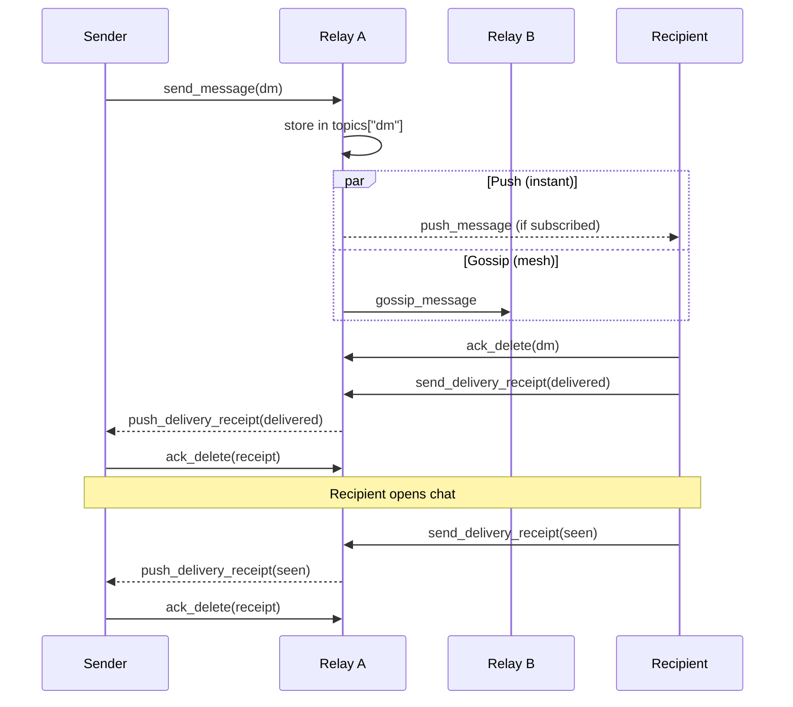
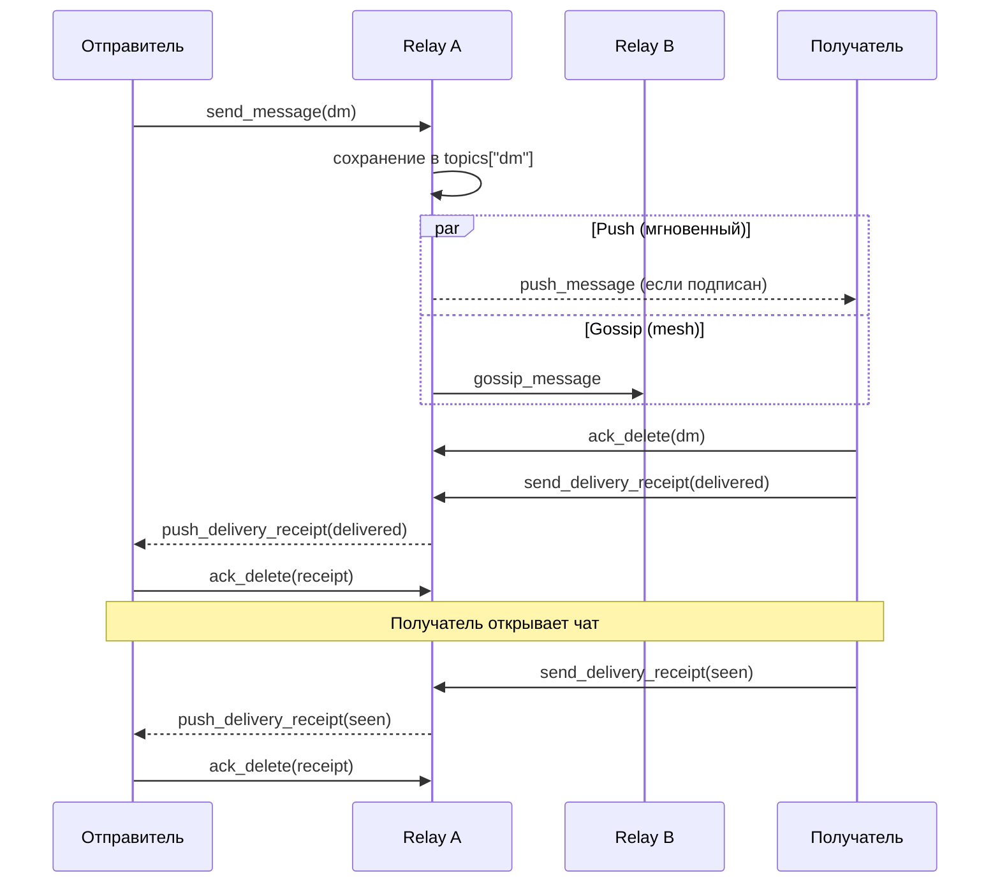

# CORSA Protocol

## English

### Status

- version: `v3` (minimum: `v2`)
- stability: experimental
- transport: plain TCP
- framing: line-based UTF-8 terminated by `\n`
- frame format: JSON object per line
- identity: `ed25519`
- message encryption: `X25519 + AES-GCM`
- direct-message signatures: `ed25519`

Related documentation:

- [encryption.md](../encryption.md) — cryptographic primitives
- [mesh.md](../mesh.md) — mesh network topology, peer scoring, gossip
- [debug.md](../debug.md) — log levels and protocol tracing

### Command index

Every frame carries a `type` field that determines the command. Commands are grouped by function below. Each link leads to a page with request/response format, field descriptions, validation rules, and sequence diagrams.

| Group | Commands | Description |
|---|---|---|
| [Handshake](handshake.md) | `hello`, `welcome`, `auth_session`, `auth_ok`, `ping`, `pong` | Connection lifecycle, authentication, heartbeat |
| [Messaging](messaging.md) | `send_message`, `import_message`, `fetch_messages`, `fetch_message`, `fetch_message_ids`, `fetch_inbox`, `fetch_pending_messages` | Store, retrieve, and track direct messages |
| [Realtime delivery](realtime.md) | `subscribe_inbox`, `subscribed`, `push_message`, `push_delivery_receipt`, `ack_delete`, `request_inbox` | Live push subscriptions, backlog replay, acknowledgement |
| [Delivery receipts](delivery.md) | `send_delivery_receipt`, `fetch_delivery_receipts` | Delivery and seen tracking |
| [Contacts](contacts.md) | `fetch_contacts`, `fetch_trusted_contacts`, `import_contacts`, `fetch_identities`, `fetch_dm_headers` | Identity management and contact exchange |
| [Peers](peers.md) | `get_peers`, `announce_peer`, `add_peer`, `fetch_peer_health`, `fetch_network_stats`, `fetch_traffic_history` | Peer discovery, health monitoring, network stats, traffic history |
| [Relay](relay.md) | `relay_message`, `relay_hop_ack`, `fetch_relay_status` | Hop-by-hop message forwarding (Iteration 1, capability-gated by `mesh_relay_v1`) |
| [Gazeta](gazeta.md) | `publish_notice`, `fetch_notices` | Anonymous encrypted notice board |
| [Errors](errors.md) | `error` | All error codes and their meaning |

### Handler scope

Not every command is available on every connection type:

| Command | Local (RPC/UI) | Remote (inbound peer) | Outbound peer session |
|---|---|---|---|
| `hello` / `welcome` | yes | yes | — |
| `auth_session` / `auth_ok` | — | yes | — |
| `ping` / `pong` | yes | yes | — |
| `send_message` | yes | yes | — |
| `import_message` | yes | yes | — |
| `fetch_messages` | yes | yes | — |
| `fetch_message` | yes | yes | — |
| `fetch_message_ids` | yes | yes | — |
| `fetch_inbox` | yes | yes | — |
| `fetch_pending_messages` | yes | yes | — |
| `subscribe_inbox` | — | yes | yes |
| `subscribed` | — | yes | — |
| `push_message` | — | yes | yes |
| `push_delivery_receipt` | — | yes | yes |
| `ack_delete` | — | yes | — |
| `request_inbox` | — | — | yes |
| `send_delivery_receipt` | yes | yes | — |
| `fetch_delivery_receipts` | yes | yes | — |
| `fetch_contacts` | yes | yes | — |
| `fetch_trusted_contacts` | yes | yes | — |
| `import_contacts` | yes | yes | — |
| `fetch_identities` | yes | yes | — |
| `fetch_dm_headers` | yes | — | — |
| `get_peers` | yes | yes | — |
| `announce_peer` | — | yes | yes |
| `add_peer` | yes | — | — |
| `fetch_peer_health` | yes | yes | — |
| `fetch_network_stats` | yes | yes | — |
| `fetch_traffic_history` | yes | — | — |
| `relay_message` | — | yes (capability-gated) | yes (capability-gated) |
| `relay_hop_ack` | — | yes (capability-gated) | yes (capability-gated) |
| `fetch_relay_status` | yes | — | — |
| `publish_notice` | yes | yes | — |
| `fetch_notices` | yes | yes | — |

### Network config

Environment variables:

- `CORSA_LISTEN_ADDRESS` — TCP listen address
- `CORSA_LISTENER` — `1` force listener on, `0` force off
- `CORSA_ADVERTISE_ADDRESS` — address advertised to peers
- `CORSA_BOOTSTRAP_PEER` — single bootstrap address
- `CORSA_BOOTSTRAP_PEERS` — comma-separated bootstrap list (overrides `CORSA_BOOTSTRAP_PEER`)
- `CORSA_IDENTITY_PATH` — path to identity key file
- `CORSA_TRUST_STORE_PATH` — path to trust store
- `CORSA_QUEUE_STATE_PATH` — path to pending queue state
- `CORSA_PEERS_PATH` — path to persisted peer list
- `CORSA_PROXY` — SOCKS5 proxy for Tor/overlay networks
- `CORSA_NODE_TYPE` — `full` (relay) or `client` (no relay)
- `CORSA_MAX_OUTGOING_PEERS` — outbound session cap (default: `8`)
- `CORSA_MAX_INCOMING_PEERS` — inbound cap (`0` = unlimited)
- `CORSA_MAX_CLOCK_DRIFT_SECONDS` — message timestamp tolerance (default: `600`)
- `CORSA_LOG_LEVEL` — log verbosity: `trace`, `debug`, `info`, `warn`, `error` (see [debug.md](../debug.md))

Defaults:

- seed peer: `65.108.204.190:64646`
- default port: `64646`
- `full` nodes listen for inbound peers; `client` nodes do not
- `listener` controls inbound reachability only, not the relay role
- pending outbound frames and relay-retry state survive restarts via queue-state file

### Message lifecycle (high-level)

*Message lifecycle — from send to seen*

Push and gossip are independent mechanisms that run in parallel. Push optimises latency for locally connected recipients. Gossip ensures every relay stores a copy so the recipient can retrieve the message from any node it reconnects to.

### Current desktop flow

1. load/create identity
2. load/create trust store
3. start embedded local node
4. sync peers and contacts
5. fetch contacts
6. fetch topic traffic
7. fetch and decrypt readable direct messages
8. fetch Gazeta notices
9. for `client` nodes, keep an upstream `subscribe_inbox` session for realtime DM routing

---

## Русский

### Статус

- версия: `v3` (минимум: `v2`)
- стабильность: experimental
- транспорт: plain TCP
- фрейминг: UTF-8 строки, разделённые `\n`
- формат кадра: JSON-объект на строку
- identity: `ed25519`
- шифрование сообщений: `X25519 + AES-GCM`
- подписи direct messages: `ed25519`

Связанная документация:

- [encryption.md](../encryption.md) — криптографические примитивы
- [mesh.md](../mesh.md) — топология mesh-сети, scoring пиров, gossip
- [debug.md](../debug.md) — уровни логирования и трассировка протокола

### Индекс команд

Каждый кадр содержит поле `type`, определяющее команду. Команды сгруппированы по назначению. Каждая ссылка ведёт на страницу с форматом запроса/ответа, описанием полей, правилами валидации и sequence-диаграммами.

| Группа | Команды | Описание |
|---|---|---|
| [Handshake](handshake.md) | `hello`, `welcome`, `auth_session`, `auth_ok`, `ping`, `pong` | Жизненный цикл соединения, аутентификация, heartbeat |
| [Сообщения](messaging.md) | `send_message`, `import_message`, `fetch_messages`, `fetch_message`, `fetch_message_ids`, `fetch_inbox`, `fetch_pending_messages` | Хранение, получение и отслеживание DM |
| [Realtime-доставка](realtime.md) | `subscribe_inbox`, `subscribed`, `push_message`, `push_delivery_receipt`, `ack_delete`, `request_inbox` | Live push-подписки, replay бэклога, подтверждения |
| [Delivery receipts](delivery.md) | `send_delivery_receipt`, `fetch_delivery_receipts` | Отслеживание доставки и просмотра |
| [Контакты](contacts.md) | `fetch_contacts`, `fetch_trusted_contacts`, `import_contacts`, `fetch_identities`, `fetch_dm_headers` | Управление identity и обмен контактами |
| [Пиры](peers.md) | `get_peers`, `announce_peer`, `add_peer`, `fetch_peer_health`, `fetch_network_stats`, `fetch_traffic_history` | Обнаружение пиров, мониторинг, статистика, история трафика |
| [Ретрансляция](relay.md) | `relay_message`, `relay_hop_ack`, `fetch_relay_status` | Пошаговая пересылка сообщений (Итерация 1, гейтинг по capability `mesh_relay_v1`) |
| [Gazeta](gazeta.md) | `publish_notice`, `fetch_notices` | Анонимная зашифрованная доска объявлений |
| [Ошибки](errors.md) | `error` | Все коды ошибок и их значение |

### Область видимости обработчиков

Не каждая команда доступна на каждом типе соединения:

| Команда | Локальный (RPC/UI) | Удалённый (входящий пир) | Исходящая peer session |
|---|---|---|---|
| `hello` / `welcome` | да | да | — |
| `auth_session` / `auth_ok` | — | да | — |
| `ping` / `pong` | да | да | — |
| `send_message` | да | да | — |
| `import_message` | да | да | — |
| `fetch_messages` | да | да | — |
| `fetch_message` | да | да | — |
| `fetch_message_ids` | да | да | — |
| `fetch_inbox` | да | да | — |
| `fetch_pending_messages` | да | да | — |
| `subscribe_inbox` | — | да | да |
| `subscribed` | — | да | — |
| `push_message` | — | да | да |
| `push_delivery_receipt` | — | да | да |
| `ack_delete` | — | да | — |
| `request_inbox` | — | — | да |
| `send_delivery_receipt` | да | да | — |
| `fetch_delivery_receipts` | да | да | — |
| `fetch_contacts` | да | да | — |
| `fetch_trusted_contacts` | да | да | — |
| `import_contacts` | да | да | — |
| `fetch_identities` | да | да | — |
| `fetch_dm_headers` | да | — | — |
| `get_peers` | да | да | — |
| `announce_peer` | — | да | да |
| `add_peer` | да | — | — |
| `fetch_peer_health` | да | да | — |
| `fetch_network_stats` | да | да | — |
| `fetch_traffic_history` | да | — | — |
| `relay_message` | — | да (capability-gated) | да (capability-gated) |
| `relay_hop_ack` | — | да (capability-gated) | да (capability-gated) |
| `fetch_relay_status` | да | — | — |
| `publish_notice` | да | да | — |
| `fetch_notices` | да | да | — |

### Сетевой конфиг

Переменные окружения:

- `CORSA_LISTEN_ADDRESS` — адрес TCP-листенера
- `CORSA_LISTENER` — `1` включить листенер, `0` выключить
- `CORSA_ADVERTISE_ADDRESS` — адрес, рекламируемый пирам
- `CORSA_BOOTSTRAP_PEER` — один bootstrap-адрес
- `CORSA_BOOTSTRAP_PEERS` — список через запятую (имеет приоритет над `CORSA_BOOTSTRAP_PEER`)
- `CORSA_IDENTITY_PATH` — путь к файлу identity key
- `CORSA_TRUST_STORE_PATH` — путь к trust store
- `CORSA_QUEUE_STATE_PATH` — путь к состоянию pending-очереди
- `CORSA_PEERS_PATH` — путь к персистированному списку пиров
- `CORSA_PROXY` — SOCKS5-прокси для Tor/overlay сетей
- `CORSA_NODE_TYPE` — `full` (relay) или `client` (без relay)
- `CORSA_MAX_OUTGOING_PEERS` — лимит исходящих сессий (по умолчанию: `8`)
- `CORSA_MAX_INCOMING_PEERS` — лимит входящих (`0` = без ограничений)
- `CORSA_MAX_CLOCK_DRIFT_SECONDS` — допустимое расхождение timestamp (по умолчанию: `600`)
- `CORSA_LOG_LEVEL` — уровень логирования: `trace`, `debug`, `info`, `warn`, `error` (см. [debug.md](../debug.md))

Значения по умолчанию:

- seed peer: `65.108.204.190:64646`
- порт по умолчанию: `64646`
- `full`-ноды слушают входящие; `client`-ноды — нет
- `listener` управляет только входящей доступностью, не relay-ролью
- pending-фреймы и relay-retry состояние переживают рестарт через queue-state файл

### Жизненный цикл сообщения (верхнеуровневый)

*Жизненный цикл сообщения — от отправки до прочтения*

Push и gossip — независимые механизмы, работающие параллельно. Push оптимизирует латентность для локально подключённых получателей. Gossip гарантирует, что каждый relay хранит копию, и получатель может забрать сообщение с любой ноды, к которой переподключится.

### Текущий desktop flow

1. загрузка/создание identity
2. загрузка/создание trust store
3. запуск встроенной локальной ноды
4. синк peers и contacts
5. получение списка contacts
6. получение topic traffic
7. получение и локальная расшифровка direct messages
8. получение notices из Gazeta
9. для `client`-узлов удержание upstream `subscribe_inbox` сессии для realtime-маршрутизации `dm`
