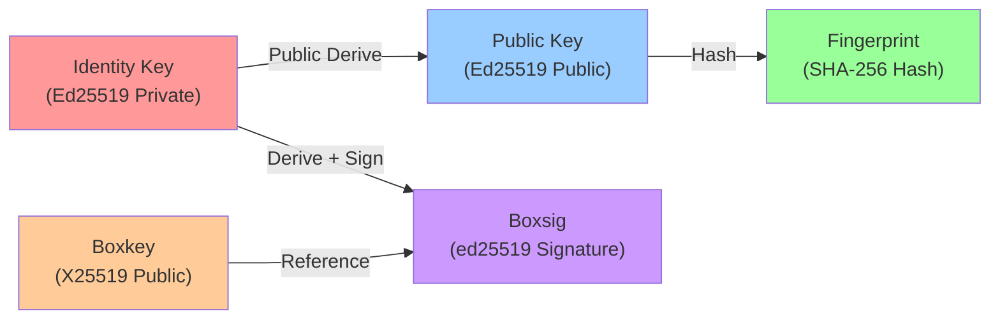
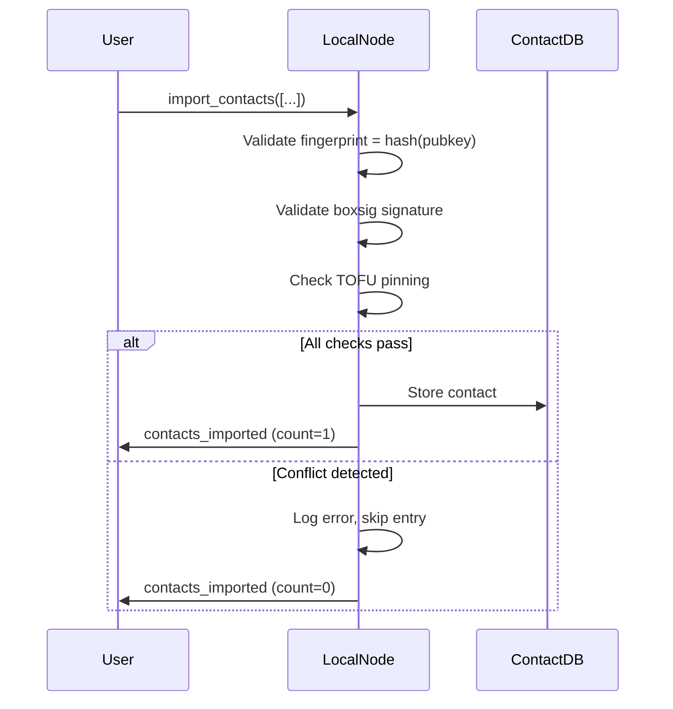

# Contacts & Identity Protocol

## Overview

The contacts protocol manages trusted peer identities and cryptographic key material. It supports discovery, import, and validation of contact information with trust-on-first-use (TOFU) pinning and cryptographic verification.

## Commands

### fetch_contacts

Retrieves all contacts known to the local node, including untrusted entries.

**Request Format:**
```json
{
  "type": "fetch_contacts"
}
```

**Response Format:**
```json
{
  "type": "contacts",
  "count": 2,
  "contacts": [
    {
      "address": "a1b2c3d4e5f6",
      "pubkey": "7e3f4a5b6c7d8e9f0a1b2c3d4e5f6a7b",
      "boxkey": "c0d1e2f3a4b5c6d7e8f9a0b1c2d3e4f5",
      "boxsig": "9f8e7d6c5b4a3f2e1d0c9b8a7f6e5d4c3b2a19f8e7d6c5b4a3f2e1d0c9b8a"
    },
    {
      "address": "x9y8z7w6v5u4",
      "pubkey": "1f2a3b4c5d6e7f8a9b0c1d2e3f4a5b6c",
      "boxkey": "a5b6c7d8e9f0a1b2c3d4e5f6a7b8c9d0",
      "boxsig": "8e7d6c5b4a3f2e1d0c9b8a7f6e5d4c3b2a19f8e7d6c5b4a3f2e1d0c9b"
    }
  ]
}
```

**Response Field Descriptions:**
| Field | Type | Description |
|-------|------|-------------|
| `type` | string | Fixed value: `"contacts"` |
| `count` | integer | Number of contacts in response |
| `contacts[].address` | string | SHA-256 fingerprint of the ed25519 public key (first 20 bytes, hex-encoded) |
| `contacts[].pubkey` | string | Base64-encoded ed25519 public key for message signing verification |
| `contacts[].boxkey` | string | Base64-encoded X25519 public key for encryption |
| `contacts[].boxsig` | string | Base64url-encoded ed25519 signature certifying the boxkey binding |

**Trust Validation Rules:**
1. **Fingerprint Derivation**: `address = hex(sha256(pubkey)[:20])` — first 20 bytes of the SHA-256 hash of the ed25519 public key
2. **Boxkey Binding Verification**: The `boxsig` must be a valid ed25519 signature by `pubkey` over the `boxkey` data
3. **TOFU Pinning**: First occurrence of a new address is pinned; subsequent different keys for the same address are rejected as conflicting
4. **Conflicting Keys**: If a contact with the same address presents a different pubkey/boxkey/boxsig, the new entry is ignored and an error is logged
5. **Store Only Trusted**: Only contacts that pass all validations are stored via `import_contacts`
6. **Backward Compatibility (Hello Frames)**: Key material learned from peer `hello` frames is stored even when partial — if `boxkey` or `boxsig` is absent (older nodes), the available fields (address, pubkey) are still accepted. Boxsig verification is only applied when all four fields are present

### fetch_trusted_contacts

Retrieves only verified and trusted contacts (subset of `fetch_contacts` where validation succeeded).

**Scope:** LOCAL ONLY — available through RPC HTTP and `handleLocalFrameDispatch`. Not available on the TCP data port; a remote peer sending this command receives `unknown_command`. For P2P contact sync between peers, use `fetch_contacts` instead.

**Request Format:**
```json
{
  "type": "fetch_trusted_contacts"
}
```

**Response Format:**
Same as `fetch_contacts`, but filtered to verified entries only.

### import_contacts

**Scope:** LOCAL ONLY — available through RPC HTTP and `handleLocalFrameDispatch`. Not available on the TCP data port.

Imports one or more contact entries into the local node.

**Request Format:**
```json
{
  "type": "import_contacts",
  "contacts": [
    {
      "address": "a1b2c3d4e5f6",
      "pubkey": "7e3f4a5b6c7d8e9f0a1b2c3d4e5f6a7b",
      "boxkey": "c0d1e2f3a4b5c6d7e8f9a0b1c2d3e4f5",
      "boxsig": "9f8e7d6c5b4a3f2e1d0c9b8a7f6e5d4c3b2a19f8e7d6c5b4a3f2e1d0c9b8a"
    }
  ]
}
```

**Request Field Descriptions:**
| Field | Type | Description |
|-------|------|-------------|
| `type` | string | Fixed value: `"import_contacts"` |
| `contacts` | array | Array of contact objects to import |
| `contacts[].address` | string | SHA-256 fingerprint (first 20 bytes, hex) |
| `contacts[].pubkey` | string | Base64-encoded ed25519 public key |
| `contacts[].boxkey` | string | Base64-encoded X25519 public key |
| `contacts[].boxsig` | string | Base64url-encoded boxkey binding signature |

**Response Format:**
```json
{
  "type": "contacts_imported",
  "count": 1
}
```

**Import Behavior:**
- Each contact is validated using the trust rules (fingerprint, boxsig verification, TOFU checking)
- Conflicting keys are skipped with error logging
- Only successfully validated contacts are stored
- The `count` field reflects how many contacts were successfully imported
- Duplicate imports (same address + key) are idempotent

### delete_trusted_contact

**Scope:** LOCAL ONLY — available through RPC HTTP and `handleLocalFrameDispatch`. Not available on the TCP data port.

Removes a contact from the trust store. Also drops all pending outbound messages addressed to the deleted contact and clears their outbound delivery tracking, so queued messages are never delivered after the user explicitly removes an identity.

**Request Format:**
```json
{
  "type": "delete_trusted_contact",
  "address": "<40-char hex fingerprint>"
}
```

**Response Format:**
```json
{
  "type": "ok",
  "address": "<deleted address>"
}
```

**Behavior:**
- Removes the contact from the persistent trust store
- Drops all `send_message` frames in the pending queue where `recipient == address`
- Removes corresponding `pendingKeys` dedup entries
- Clears `outbound` delivery tracking entries for the deleted recipient
- Persists updated queue state to disk
- Idempotent: returns `ok` even if the address was not in the trust store

### fetch_identities

**Scope:** LOCAL ONLY — available through RPC HTTP and `handleLocalFrameDispatch`. Not available on the TCP data port.

Retrieves the list of all known identity addresses. This includes the local node and every peer whose identity has been learned through contact exchange or direct connection.

**Request Format:**
```json
{
  "type": "fetch_identities"
}
```

**Response Format:**
```json
{
  "type": "identities",
  "count": 3,
  "identities": [
    "d4e5f6g7h8i9j0k1",
    "a1b2c3d4e5f6g7h8",
    "x9y8z7w6v5u4t3s2"
  ]
}
```

**Response Field Descriptions:**
| Field | Type | Description |
|-------|------|-------------|
| `type` | string | Fixed value: `"identities"` |
| `count` | integer | Number of known identities |
| `identities` | string[] | List of known identity fingerprints (from `s.known` map) |

**Implementation Notes:**
- Returns all addresses the node has ever learned about, not just the local identity
- Does not include key material — use `fetch_contacts` to get pubkey/boxkey/boxsig for specific addresses
- The list includes the node's own address plus addresses discovered via peer exchange and contact import

### fetch_dm_headers

Retrieves metadata-only view of direct messages without decrypting bodies.

**Request Format:**
```json
{
  "type": "fetch_dm_headers"
}
```

**Response Format:**
```json
{
  "type": "dm_headers",
  "count": 5,
  "dm_headers": [
    {
      "id": "550e8400-e29b-41d4-a716-446655440000",
      "sender": "a1b2c3d4e5f6",
      "recipient": "x9y8z7w6v5u4",
      "created_at": "2026-03-19T10:30:00Z"
    },
    {
      "id": "660f9511-f40c-52e5-b827-557766551111",
      "sender": "x9y8z7w6v5u4",
      "recipient": "a1b2c3d4e5f6",
      "created_at": "2026-03-19T10:32:15Z"
    }
  ]
}
```

**Response Field Descriptions:**
| Field | Type | Description |
|-------|------|-------------|
| `type` | string | Fixed value: `"dm_headers"` |
| `count` | integer | Number of DM headers |
| `dm_headers[].id` | uuid | Unique message identifier |
| `dm_headers[].sender` | fingerprint | Sender's address/fingerprint |
| `dm_headers[].recipient` | fingerprint | Recipient's address/fingerprint |
| `dm_headers[].created_at` | RFC3339 | Message creation timestamp (UTC) |

**Scope & Authorization:**
- This is a **LOCAL ONLY** command (not relayed or accessible via network)
- Returns only DM headers where the local node is either sender or recipient
- Provides metadata-only view suitable for building conversation lists in UI
- No message body or ciphertext is included in response
- Order follows internal storage order (not guaranteed to be sorted by timestamp)

## Cryptographic Architecture Diagram



**Diagram: Contact Cryptographic Material Relationships**

## Trust Flow Diagram



**Diagram: Contact Import & Validation Flow**

## Implementation Notes

1. **Fingerprint Verification**: Always recompute SHA-256(pubkey) and compare to address on import
2. **Boxkey Binding**: Before storing a contact, verify ed25519_verify(boxsig, pubkey, boxkey)
3. **TOFU Semantics**: Once a fingerprint is pinned to a key, reject any future claims of the same fingerprint with different keys
4. **Storage**: Trusted contacts are persisted in encrypted storage with the node's identity key
5. **Performance**: `fetch_dm_headers` is local-only and designed for fast UI sidebar population without decryption overhead

---

# Протокол Контактов и Идентификации

## Обзор

Протокол контактов управляет доверенными идентификациями одноранговых узлов и криптографическим материалом ключей. Он поддерживает обнаружение, импорт и проверку информации о контактах с привязкой доверия при первом использовании (TOFU) и криптографической проверкой.

## Команды

### fetch_contacts

Получает все контакты, известные локальному узлу, включая недоверенные записи.

**Формат запроса:**
```json
{
  "type": "fetch_contacts"
}
```

**Формат ответа:**
```json
{
  "type": "contacts",
  "count": 2,
  "contacts": [
    {
      "address": "a1b2c3d4e5f6",
      "pubkey": "7e3f4a5b6c7d8e9f0a1b2c3d4e5f6a7b",
      "boxkey": "c0d1e2f3a4b5c6d7e8f9a0b1c2d3e4f5",
      "boxsig": "9f8e7d6c5b4a3f2e1d0c9b8a7f6e5d4c3b2a19f8e7d6c5b4a3f2e1d0c9b8a"
    },
    {
      "address": "x9y8z7w6v5u4",
      "pubkey": "1f2a3b4c5d6e7f8a9b0c1d2e3f4a5b6c",
      "boxkey": "a5b6c7d8e9f0a1b2c3d4e5f6a7b8c9d0",
      "boxsig": "8e7d6c5b4a3f2e1d0c9b8a7f6e5d4c3b2a19f8e7d6c5b4a3f2e1d0c9b"
    }
  ]
}
```

**Описание полей ответа:**
| Поле | Тип | Описание |
|------|-----|---------|
| `type` | строка | Фиксированное значение: `"contacts"` |
| `count` | целое число | Количество контактов в ответе |
| `contacts[].address` | строка | SHA-256 fingerprint (первые 20 байт, hex) |
| `contacts[].pubkey` | строка | Base64-кодированный ed25519 открытый ключ |
| `contacts[].boxkey` | строка | Base64-кодированный X25519 открытый ключ для шифрования |
| `contacts[].boxsig` | строка | Base64url-кодированная подпись привязки boxkey |

**Правила валидации доверия:**
1. **Производная отпечатка**: `pubkey` должен хешироваться в отпечаток `address` с использованием SHA-256
2. **Проверка привязки Boxkey**: `boxsig` должна быть действительной подписью ed25519 по `pubkey` над данными `boxkey`
3. **Привязка TOFU**: Первое появление нового адреса закреплено; последующие разные ключи для того же адреса отклоняются как конфликтующие
4. **Конфликтующие ключи**: Если контакт с тем же адресом представляет другой pubkey/boxkey/boxsig, новая запись игнорируется и логируется ошибка
5. **Сохранение только доверенных**: Только контакты, прошедшие все проверки, сохраняются через `import_contacts`
6. **Обратная совместимость (Hello-кадры)**: Ключевой материал, полученный из `hello`-кадров пиров, сохраняется даже при неполных данных — если `boxkey` или `boxsig` отсутствуют (старые ноды), доступные поля (address, pubkey) всё равно принимаются. Верификация boxsig применяется только когда все четыре поля присутствуют

### fetch_trusted_contacts

Получает только проверенные и доверенные контакты (подмножество `fetch_contacts`, где валидация успешна).

**Область:** ТОЛЬКО ЛОКАЛЬНО — доступна через RPC HTTP и `handleLocalFrameDispatch`. Недоступна на TCP data port; удалённый пир получит `unknown_command`. Для P2P-синхронизации контактов между пирами используется `fetch_contacts`.

**Формат запроса:**
```json
{
  "type": "fetch_trusted_contacts"
}
```

**Формат ответа:**
Аналогичен `fetch_contacts`, но отфильтрован только проверенные записи.

### import_contacts

**Область:** ТОЛЬКО ЛОКАЛЬНО — доступна через RPC HTTP и `handleLocalFrameDispatch`. Недоступна на TCP data port.

Импортирует одну или несколько записей контактов в локальный узел.

**Формат запроса:**
```json
{
  "type": "import_contacts",
  "contacts": [
    {
      "address": "a1b2c3d4e5f6",
      "pubkey": "7e3f4a5b6c7d8e9f0a1b2c3d4e5f6a7b",
      "boxkey": "c0d1e2f3a4b5c6d7e8f9a0b1c2d3e4f5",
      "boxsig": "9f8e7d6c5b4a3f2e1d0c9b8a7f6e5d4c3b2a19f8e7d6c5b4a3f2e1d0c9b8a"
    }
  ]
}
```

**Описание полей запроса:**
| Поле | Тип | Описание |
|------|-----|---------|
| `type` | строка | Фиксированное значение: `"import_contacts"` |
| `contacts` | массив | Массив объектов контактов для импорта |
| `contacts[].address` | строка | SHA-256 fingerprint (первые 20 байт, hex) |
| `contacts[].pubkey` | строка | Base64-кодированный ed25519 открытый ключ |
| `contacts[].boxkey` | строка | Base64-кодированный X25519 открытый ключ |
| `contacts[].boxsig` | строка | Base64url-кодированная подпись привязки boxkey |

**Формат ответа:**
```json
{
  "type": "contacts_imported",
  "count": 1
}
```

**Поведение импорта:**
- Каждый контакт проверяется в соответствии с правилами доверия (отпечаток, проверка boxsig, проверка TOFU)
- Конфликтующие ключи пропускаются с логированием ошибки
- Сохраняются только успешно проверенные контакты
- Поле `count` отражает, сколько контактов было успешно импортировано
- Дублирующиеся импорты (тот же адрес + ключ) идемпотентны

### delete_trusted_contact

**Область:** ТОЛЬКО ЛОКАЛЬНО — доступна через RPC HTTP и `handleLocalFrameDispatch`. Недоступна на TCP data port.

Удаляет контакт из хранилища доверия. Также удаляет все ожидающие исходящие сообщения, адресованные удалённому контакту, и очищает трекинг доставки, чтобы поставленные в очередь сообщения не были доставлены после того, как пользователь явно удалил identity.

**Формат запроса:**
```json
{
  "type": "delete_trusted_contact",
  "address": "<40-символьный hex-отпечаток>"
}
```

**Формат ответа:**
```json
{
  "type": "ok",
  "address": "<удалённый адрес>"
}
```

**Поведение:**
- Удаляет контакт из постоянного хранилища доверия
- Удаляет все фреймы `send_message` в очереди ожидания, где `recipient == address`
- Удаляет соответствующие записи дедупликации `pendingKeys`
- Очищает записи трекинга доставки `outbound` для удалённого получателя
- Сохраняет обновлённое состояние очереди на диск
- Идемпотентен: возвращает `ok` даже если адрес не был в хранилище доверия

### fetch_identities

**Область:** ТОЛЬКО ЛОКАЛЬНО — доступна через RPC HTTP и `handleLocalFrameDispatch`. Недоступна на TCP data port.

Возвращает список всех известных identity-адресов. Включает локальную ноду и каждый пир, чей identity был получен через обмен контактами или прямое подключение.

**Формат запроса:**
```json
{
  "type": "fetch_identities"
}
```

**Формат ответа:**
```json
{
  "type": "identities",
  "count": 3,
  "identities": [
    "d4e5f6g7h8i9j0k1",
    "a1b2c3d4e5f6g7h8",
    "x9y8z7w6v5u4t3s2"
  ]
}
```

**Описание полей ответа:**
| Поле | Тип | Описание |
|------|-----|---------|
| `type` | строка | Фиксированное значение: `"identities"` |
| `count` | целое число | Количество известных identity |
| `identities` | string[] | Список известных identity fingerprints (из карты `s.known`) |

**Примечания реализации:**
- Возвращает все адреса, о которых нода когда-либо узнала, а не только локальный identity
- Не включает ключевой материал — используйте `fetch_contacts` для получения pubkey/boxkey/boxsig конкретных адресов
- Список включает собственный адрес ноды плюс адреса, обнаруженные через peer exchange и import contacts

### fetch_dm_headers

Получает метаданные прямых сообщений без расшифровки содержимого.

**Формат запроса:**
```json
{
  "type": "fetch_dm_headers"
}
```

**Формат ответа:**
```json
{
  "type": "dm_headers",
  "count": 5,
  "dm_headers": [
    {
      "id": "550e8400-e29b-41d4-a716-446655440000",
      "sender": "a1b2c3d4e5f6",
      "recipient": "x9y8z7w6v5u4",
      "created_at": "2026-03-19T10:30:00Z"
    },
    {
      "id": "660f9511-f40c-52e5-b827-557766551111",
      "sender": "x9y8z7w6v5u4",
      "recipient": "a1b2c3d4e5f6",
      "created_at": "2026-03-19T10:32:15Z"
    }
  ]
}
```

**Описание полей ответа:**
| Поле | Тип | Описание |
|------|-----|---------|
| `type` | строка | Фиксированное значение: `"dm_headers"` |
| `count` | целое число | Количество заголовков ПМ |
| `dm_headers[].id` | uuid | Уникальный идентификатор сообщения |
| `dm_headers[].sender` | отпечаток | Адрес/отпечаток отправителя |
| `dm_headers[].recipient` | отпечаток | Адрес/отпечаток получателя |
| `dm_headers[].created_at` | RFC3339 | Временная метка создания сообщения (UTC) |

**Область и авторизация:**
- Это команда **ТОЛЬКО ЛОКАЛЬНОГО** использования (не передается или не доступна по сети)
- Возвращает только заголовки ПМ, где локальный узел является отправителем или получателем
- Предоставляет представление только метаданных, подходящее для построения списков разговоров в пользовательском интерфейсе
- Содержимое сообщения или шифротекст не включаются в ответ
- Порядок следует внутреннему порядку хранения (сортировка по timestamp не гарантирована)

## Диаграмма криптографической архитектуры


**Диаграмма: Взаимосвязи криптографического материала контактов**

## Диаграмма потока доверия


**Диаграмма: Поток импорта и валидации контактов**

## Примечания реализации

1. **Проверка отпечатка**: Всегда перепроверяйте SHA-256(pubkey) и сравнивайте с адресом при импорте
2. **Привязка Boxkey**: Перед сохранением контакта проверьте ed25519_verify(boxsig, pubkey, boxkey)
3. **Семантика TOFU**: Когда отпечаток закреплен с ключом, отклоняйте любые будущие претензии одного и того же отпечатка с разными ключами
4. **Хранилище**: Доверенные контакты сохраняются в зашифрованном хранилище с ключом идентификации узла
5. **Производительность**: `fetch_dm_headers` работает только локально и предназначен для быстрого заполнения боковой панели пользовательского интерфейса без накладных расходов на расшифровку
