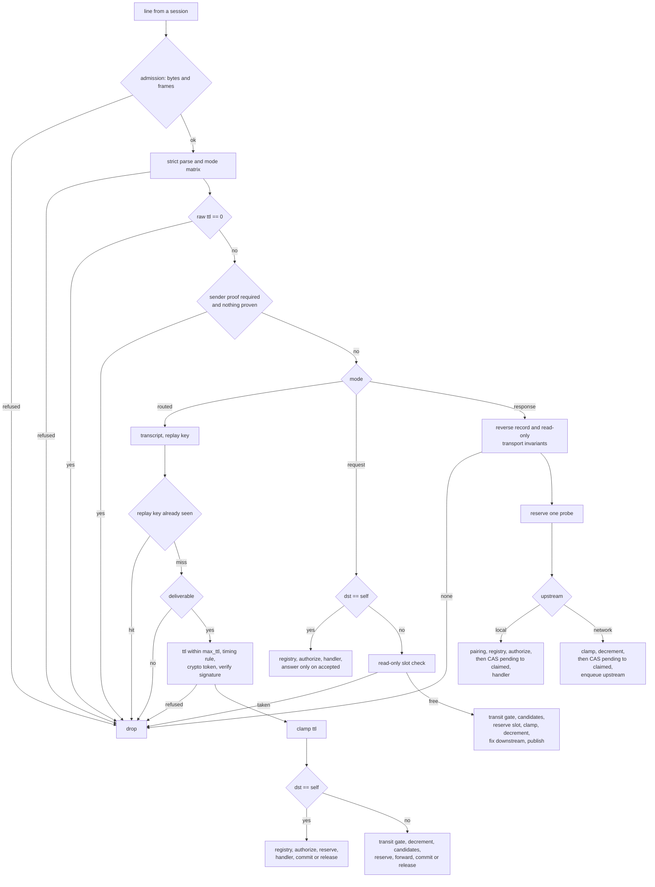
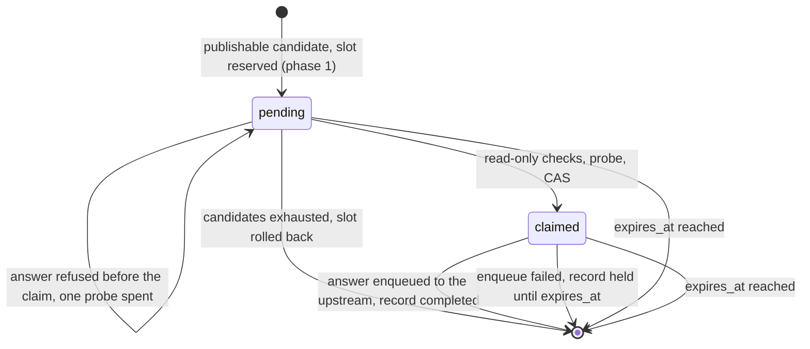
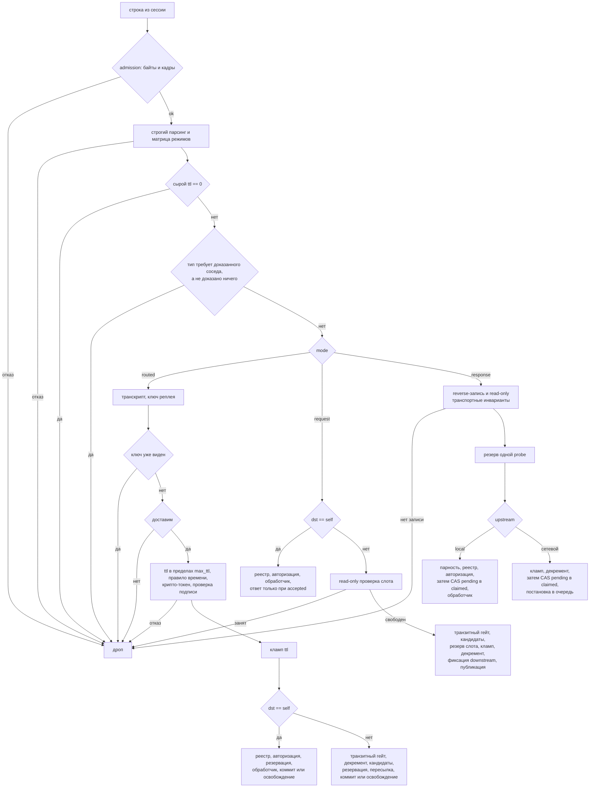
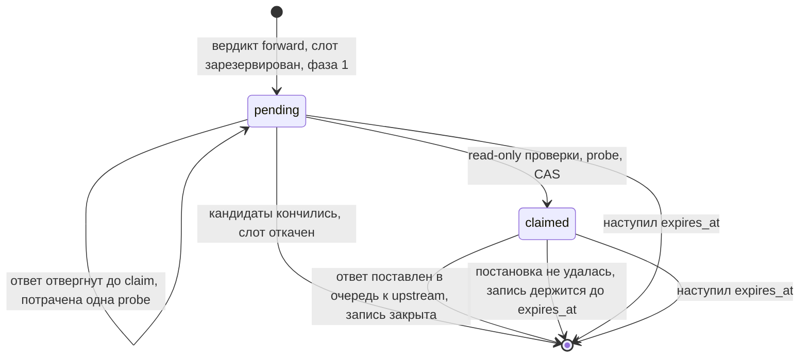

# Datagram Transport

## English

### 1. Purpose and scope

The datagram layer is a single **unguaranteed** transport for small protocol
messages. One wire command — `datagram` — carries every protocol built on top
of it, and the type of the protocol is a *field* (`dtype`), not a command name.

Two properties follow, and they are the whole point of the layer:

- **A transit node forwards a datagram whose `dtype` it has never heard of.**
  Everything transit needs — routing mode, traffic class, hop budget,
  addresses and, where it is mandatory, a self-contained signature — lives in
  the stable header. The type registry (§7) is knowledge of the *endpoint*
  alone, never a condition of forwarding.
- **The command name never changes; the version lives in `v` alone.** An older
  node always recognises the command, reads `v`, and drops an unknown version
  silently instead of answering `unknown_command` and tearing the connection
  down. This is a deliberate departure from the `route_query_v1` /
  `route_announce_v3` style, where a version bump creates a new command name
  and a new command name breaks an old peer.

Two caveats that are easy to lose:

- **"No network upgrade" applies to *optional* types.** A migration that
  *replaces* a working command must know whether the destination understands
  the new type; §6.1 describes the mechanisms for that.
- **The layer gives no delivery guarantee.** Reliability belongs to the owner
  of the artifact, exactly as it already does for delivery receipts. What the
  layer promises is *zero or more deliveries*, never *at least once* and never
  *exactly once*: a frame is dropped outright when no route is found, when an
  admission budget refuses it, when a queue is full or when a writer fails, and
  nothing here resends it — while a repeat is always possible, which is why
  every handler must be idempotent (§4.5). Retransmission and acknowledgement
  belong to the sender and the receiver of a type, never to the transport.

The layer is negotiated through two separate capabilities (§6):
`mesh_datagram_v1` (endpoint) and `mesh_datagram_transit_v1` (relay).

### 2. Frame format

```json
{
  "type": "datagram",
  "v": 2,
  "mode": "routed",
  "class": "control",
  "src": "bca44146541e3ee29972f3ebe3792a540dcf32af",
  "dst": "00f39d89f345eb1613bb2fa02ee883a214a6a697",
  "ttl": 10,
  "route_policy": "best",
  "dtype": "delivery_receipt",
  "payload": "<base64url of arbitrary bytes>",
  "auth": { "…": "§3" }
}
```

| Field | Type | Read by | Role |
|---|---|---|---|
| `type` | string | dispatch | always `"datagram"`, in every header version |
| `v` | 1…255 | transit | header version — the only place the layer is versioned. An unknown value is dropped **without forwarding** and without ban |
| `mode` | enum | transit | `routed` \| `request` \| `response` — how to route (§4). **Never derived from `dtype`** |
| `class` | enum | transit | `control` \| `bulk` — size ceiling, queue lane and budget share (§2.4, §5) |
| `src` | 40 lowercase hex | transit | `routed`: the signer; `request`: a **one-shot label** of the initiator and the key of the reverse state; `response`: the stored `dst` of the request (§2.2) |
| `dst` | 40 lowercase hex | transit | `routed`/`request`: the destination the route is built to; `response`: the echoed label (§2.2) |
| `ttl` | 0…255 | transit | remaining hops. Checked against `auth.max_ttl` on the **raw** value, then clamped, then decremented exactly once before forwarding (§4.2) |
| `route_policy` | enum | transit | `best` \| `explore` — candidate selection policy (§4.4). Mandatory for `routed` and `request`, **forbidden** for `response` |
| `dtype` | `[a-z0-9_]{1,64}` | endpoint | the protocol carried in the payload. **Transit never interprets it** |
| `payload` | base64url, unpadded | endpoint | arbitrary bytes. Whether they are JSON is the type's decision, not the layer's |
| `auth` | object | transit | self-contained signature carrying the public key (§3). **Mandatory** for `routed`, **forbidden** for `request` and `response` |

**The table above is the WHOLE header.** There is no optional field beside it,
and any key not listed here is a reject under a known `v` (§3.5). Header
version 1 carried two more — `req_caps` and `ext` — and §2.3 states why they are
gone and what replaced them.

Consequences worth stating explicitly:

- **`payload` is bytes, not JSON.** The file transport and a future DM carry
  ciphertext; wrapping it in JSON for uniformity would mean double encoding.
- **Canonical serialization.** A frame this build emits has a fixed key order
  (exactly the order of the table above), unpadded base64url, lowercase
  40-hex addresses, and absent optional fields omitted entirely. Every string
  a datagram can carry is drawn from an escape-free alphabet, so the encoder
  never escapes and the output is byte-stable.
- **A frame is one line.** The full line *including* its terminating newline
  must not exceed `MaxFrameLine` = 128 KiB, and this is enforced on **both**
  receive paths (the inbound command reader and the peer-session reader,
  whose own line budget is 8 MiB). Sender and receiver count the same
  quantity, so the boundary case cannot disagree by one byte.
- **The size check is an admission check: it runs before any parsing.** On the
  inbound path the command reader's own limit *is* `MaxFrameLine`, so an
  oversize line never reaches a parser. On the peer-session path — the wide
  one — the line is classified by a bounded scan for the `type` field, and the
  wide 8 MiB budget is an **entitlement that has to be earned**: a line past
  `MaxFrameLine` is refused unparsed unless the scan positively identified a
  type on a **closed allowlist**.
- **An oversize line that CLAIMED `datagram` does not cost the connection**, and
  the rule is one rule on both receive paths. The reader stops in the middle of
  the line, so the only name those bytes will ever have is the claim in their
  first bytes, and that claim is what decides: the bytes the node was made to
  read are billed to this plane's own §5 per-neighbour budget — narrower than
  the session's — the refusal is counted under its own reason,
  `frame_too_large`, and there is **no** rate-limit verdict, no session
  violation, no ban score and no tear-down. §4.1 keeps punishment for what a
  transit is obliged to check, and
  the neighbour that handed the line over is not the author of the frame inside
  it. To keep reading, the reader then discards the remainder of the line within
  a **resynchronisation window of one further `MaxFrameLine`** — derived, not
  chosen: the rule above caps a datagram at that size, so anything a conforming sender
  anywhere on the path could have produced is already in hand when the reader
  stops. Past that window the bytes are no longer an over-sized frame but an
  unterminated stream, which is the immediate neighbour's own transport
  behaviour and not a property of anything it relayed, so the connection ends
  exactly as it does for every other type. The claim buys nothing beyond this:
  it can make a refusal quieter and its budget narrower, never make a line be
  processed. With no datagram layer running, or with a neighbour that has no
  billable key (an unauthenticated inbound socket has proven no identity), it
  buys nothing at all, because a refusal nobody paid for would be the one free
  channel on the node. **For a line of any other type nothing changed:**
  `frame-too-large`, and the inbound reader ends the connection while the
  peer-session reader charges the bytes and records a violation.
- **The allowlist is the enumerated set, not its complement.** The rule used to
  cap a fixed strict set (the announce plane and `datagram`) and hand 8 MiB to
  *everything else*, which meant an authenticated peer could make the node
  decode a multi-megabyte line over and over simply by naming a type nobody had
  heard of. A budget bounds the work a neighbour may impose, so the set that
  BUYS the work is the one that must be enumerable. Today it holds exactly two
  names, and each is derived from a limit this node itself applies:
  - `contacts` — the `fetch_contacts` reply batches every known contact and is
    written through an unguarded marshal, so it passes 128 KiB at a few hundred
    contacts. Its SIZE is what buys the wide budget here; the crypto those bytes
    buy — one signature verification per array element — is metered separately
    (`docs/protocol/network_security.md` §5b), and the wire form is now trimmed
    to `maxContactsPerResponse` on the sending side so both ends agree on the
    ceiling;
  - `push_message` — the receive-side cap on the batched DM body IS
    `MaxFrameLine`, so a body at the largest size this node will accept
    necessarily produces a larger line. It reaches the wide reader in one
    direction only (a subscriber reading pushes off the session it dialled),
    which is why the inbound reader's own 128 KiB limit does not already cover
    it.

  Everything else is capped because the code caps it: the announce plane chunks
  to `MaxFrameLine`, the route-sync digest drops its version vector rather than
  exceed it, `peers` is trimmed to 64 entries, a relay body is at most 64 KiB, a
  file chunk is ~29 KiB on the wire, and every type that also arrives over the
  inbound TCP plane is already bound by that reader's limit. `messages` and
  `inbox` are deliberately absent: they are local/RPC replies that cannot arrive
  on this reader at all. **The residual risk is named rather than avoided** — an
  older peer sending a legitimately large reply of a forgotten type has that
  frame dropped instead of parsed. The refusal is logged with the type and the
  size, so the omission is diagnosable from one line and adding a name is a
  one-line change; the trade is deliberate, because dropping one frame of a
  forgotten type is recoverable while decoding 8 MiB on demand for any
  authenticated peer is not.
- **The scan must not be steerable, and an unresolvable line is refused
  outright.** A scan that took the first `"type"` it found anywhere in the line
  and a JSON decoder that takes the last TOP-LEVEL one are two readers with two
  answers, and the sender picks which one each gets:
  `{"type":"messages", …, "type":"datagram"}`,
  `{"item":{"type":"messages"},"type":"datagram"}` and `{"TYPE":"datagram"}`
  (the decoder accepts a case-insensitive key match) all showed the scan one
  type and the parser another. The classification therefore reads the **top
  level only**, and a line on which the two readers CAN disagree — a duplicate
  top-level `type`, an escaped key or value, a case-variant spelling, a
  non-string value — is **refused before it is parsed, at any size**. That is
  the rule that removes the residue instead of shrinking it: a line whose type
  cannot be resolved without parsing it cannot be routed before parsing it
  either, so parsing it at all would put the decode in front of the budget.
  Nothing legal is lost — every frame in this protocol is marshalled from a
  struct with one `type` tag, and §3.5 already rejects a duplicate key on a
  datagram outright. A line that names NO top-level type keeps the ordinary
  path: the decoder cannot get a dispatchable type out of it either, so it
  costs a bounded decode and the command plane keeps its `invalid-json` /
  `unknown-command` answers.
- **A datagram never reaches the universal parser, and neither does an
  unresolvable line.** Admission is charged "before any decoding", and the
  universal frame decoder is decoding: a line the classification identifies as
  a `datagram` is handed straight to the layer's ingress on both receive paths,
  so the neighbour's byte and frame budget is spent before anything is built
  from the bytes, and the strict parser of §3.5 gets the original line it needs
  anyway. An unresolvable line is dropped at the same point and **the neighbour
  is still charged for the bytes it made the node scan** — an unmetered refusal
  would be the cheapest and only free verdict this reader has. The same
  classification decides the exemption from the ordinary command rate limiter,
  so a line that merely looks like a datagram cannot escape both budgets at
  once. Because of this, the `datagram` case in each dispatch switch is now
  unreachable by construction: it survives as an assertion that logs an error
  and drops, never as a delivery path.
- **A datagram does not pay the command bucket, and exhausting its own budget
  is not punished.** The exemption from the per-connection command bucket is
  normative rather than an optimisation: that bucket guards the control plane,
  so exhausting it means abuse — `rate-limited`, ban score, tear-down. The
  datagram admission of §5 guards a neighbour's SHARE of the data plane, so
  exhausting it drops **the current frame and nothing else**: no `rate-limited`
  frame, no TCP tear-down, no ban score. The rule holds whatever the frame's
  `dtype`, class or payload — otherwise bulk and file traffic would inherit a
  30 cmd/s control-plane limit that was never meant for it. The same exemption,
  for the same reason, covers `file_command`.
  **The exemption is a SWAP, so it lasts exactly as long as the budget that
  replaces it has somebody to bill.** The §5 budget is charged per neighbour —
  on the identity proved on an accepted connection, on the address this node
  dialled on an outbound session — and on an accepted connection before
  `auth_ok` there is no such identity: the inbound dispatcher answers
  `auth_required` above the ingress, so the line is charged neither budget. Such
  a line therefore keeps paying the command bucket, and an unauthenticated
  socket cannot repeat it at line rate for free. A neighbour past `auth_ok`
  pays §5 and only §5, so nothing legitimate is billed twice.
- **The layer counts and parses the same bytes the wire carried.** The line
  handed to the strict parser is the line as read from the socket, whitespace
  outside the JSON included, on both receive paths. The per-neighbour byte
  budget (§5) is charged on those same bytes, so padding a frame with outside
  whitespace costs its sender exactly what it costs the wire. Frame types
  outside this plane keep being handed the whitespace-trimmed line, unchanged.

#### 2.1 Mode matrix

The combination of `mode` and `class` is a **closed contract** derivable from
the header alone; the type registry is not consulted.

| `mode` | Allowed `class` | `auth` | `route_policy` | Meaning |
|---|---|---|---|---|
| `routed` | `control`, `bulk` | **mandatory** | mandatory | one-way delivery towards `dst` |
| `request` | `control` only | **forbidden** | mandatory | a query with a return path |
| `response` | `control` only | **forbidden** | **forbidden** | an answer travelling on stored state |

Anything outside this table is refused; there is no "unspecified" cell.

`route_policy` is forbidden in `response` because an answer travels strictly
along stored state: it steers no route, it is covered by no signature (there
is none), and it takes no part in matching the record. A field that does
nothing yet passes validation is a future disagreement between
implementations.

**Why `auth` is mandatory for all of `routed`.** Binding the requirement to
`dtype` is impossible (§3.6), and binding it to `bulk` alone would let forged
control commands travel: honest transits would carry them all the way to the
destination, widening the DoS perimeter even if the endpoint later refuses
them. The rule `routed ⇒ auth` is readable from the header by any node.

**Why `auth` is forbidden in `request`/`response`.** In a request, `src` is not
the sender's address at all (§2.2) — it is a one-shot label, and a signature over
random bytes proves nothing about who chose them. A response carries the *logical
subject* in `src`, so a signature there would have to be a signature over a
transcript this plane does not define at all: there is no `av`, no `salt`, no
`time` and no replay key on the unsigned planes, and adding them would make the
answer plane a second copy of `routed` rather than a return path. What protects
these planes instead is the reverse state, the probe budget and the per-neighbour
limits (§4.3, §5). The plane also has no `bulk` class and no signature, so it is
useless as a reflection amplifier.

**There is no separate `correlation_id`.** The request's `src` *is* the
attempt identifier: 160 random bits, unique by the initiator's own care. It
is the key of the reverse state — carried in `src` on the way out and echoed
in `dst` on the way back. A second identifier for one attempt would sooner or
later disagree with the first.

#### 2.2 What `src` and `dst` mean in each mode

| `mode` | `src` | `dst` |
|---|---|---|
| `routed` | the **signer**, verifiable by any node | the recipient's address |
| `request` | a **one-shot label** of the initiator: 20 random bytes per attempt | the target's real address |
| `response` | the **request's `dst`** — the logical subject the question was addressed to | the **label from the request** |

The reverse-state invariants are read straight off this table:
`response.src == stored request.dst` and `response.dst == stored request.src`.
`src` names the **logical subject** of the answer — the address the question was
put to — and a transit node checks it as a consistency invariant, never as an
authenticity one: this plane carries no signature and no transcript to sign
(§2.1).

The label exists because an address is a fingerprint of a public key, and an
unsigned plaintext `src` would be just as visible to every transit as a
signed one. The initiator is invisible only if it is not in the header at
all. The boundaries of that property, stated honestly:

- **the immediate neighbour still knows as much about you as its direction
  proved** — on a connection it ACCEPTED that is your authenticated identity,
  and no scheme removes it; on a session it DIALLED nothing about you is proven
  at all, which is why nothing on that direction may be keyed on the name;
- **beyond the first hop** the chain sees only a random label that lives for
  one attempt and is not linkable to other attempts;
- **the target learns the initiator only if the initiator chose so** — through
  an optional signed pair inside the payload;
- **rate limiting is unaffected**: it is charged to the neighbour's typed
  admission key — a proven identity on an accepted connection, the host:port
  this node dialled on an outbound session — and never to `src`.

The price is explicit: an endpoint **must not** base authorization on the
`src` of a request. A type that needs an authentic sender puts a signature in
the payload. Likewise, a large answer to a `request` is not sent as a
`response`; it is sent as an ordinary `routed` `bulk` datagram to the
initiator's real address, which such a type must therefore learn from the
payload.

#### 2.3 Where extension lives: `dtype` and `payload`

**The envelope has no extension points, and that is the design.** Every field of
§2 is read by transit; nothing in the header is reserved for an endpoint
protocol. A new protocol is a new `dtype` name and new bytes in `payload`, and
neither of them changes the envelope, the transcript or the parser.

Header version 1 did carry two extension fields, and both were removed in v2:

- **`req_caps`** — a list of capability names every node on the path had to
  advertise. It was checked by **every** transit, and by the last hop as well, so
  a frame naming a capability a relay had never heard of was refused mid-path.
- **`ext`** — `{cap, v, data}`, profile data whose `cap` was forced into
  `req_caps`, plus a **tuple-gate** over the pair `(av, ext.v)` and a
  `(auth_profile, behavior_profile)` dispatch built on top of it.

They were removed because a path-wide requirement is exactly the mechanism by
which an old relay refuses a new endpoint protocol: a protocol released after a
node could not travel *through* that node, which is the opposite of what a stable
envelope is for. The name gate, the tuple-gate and the profile registry behind
them are gone with the fields.

What replaces them:

- **the endpoint gate over `dtype`** (§4.4, §6.1) — applied by the hop that hands
  the frame to its destination, and by nobody else. A transit still forwards a
  `dtype` it has never heard of;
- **the role gate over the two capabilities of §6** — a statement about what the
  PEER is on this plane (endpoint, relay), never about what the frame carries;
- **`payload`** — the bytes of the endpoint protocol, opaque to the layer, whose
  schema and version are the type's own business (§7).

Consequences that are now normative:

- **an unknown key in the header or in `auth` is a reject**, not an ignorable
  extension (§3.5). Under a *known* `v` the key set is closed;
- **extension goes through `v` and `av`**, and a version this build does not
  implement is dropped as an unknown version — silently, without forwarding and
  without ban (§2);
- **no node refuses somebody else's frame for a capability the SENDER named.**
  The only thing a node may refuse a transit frame for is its own role: it does
  not advertise `mesh_datagram_transit_v1` (§4.1 step 11).

A node still keeps, beside its typed capability set, a **validated raw set** of
the names a peer advertised (≤ 64 names, each `[a-z0-9_]` and ≤ 40 characters):
the role gate of §6 reads it, because a name this build does not know must still
be comparable by string. A breach of the bounds empties the **whole** raw set
rather than dropping one name — "drop one" and "drop the set" behave differently
in mixed implementations, and emptying is the deterministic choice. The session
is not torn down and the typed set is untouched.

#### 2.4 Traffic classes and sizes

The payload ceiling is measured in **decoded** bytes. Budgets and queues (§5)
are measured in the **serialized frame size**, because 64 KiB of payload
occupy ~86 KiB on the wire and charging them as 64 KiB would give away a
third of the link.

| `class` | Decoded payload cap | Full line on the wire (max) | Purpose |
|---|---|---|---|
| `control` | 4 KiB | ≈ 5.8 KiB | key lookups, receipts, acknowledgements, notices, control commands |
| `bulk` | 64 KiB | ≈ 86 KiB | file chunks, future DM bodies |

The fixed envelope of a signed frame is ≈ 460 bytes (both addresses, the
32-byte key, the 16-byte salt, the 64-byte signature and the JSON keys), and
the payload field is base64url, i.e. 4/3 of the decoded size.

**The class enumeration is closed in this header version.** A third class
would be a new wire format and a new version bump; growth therefore happens as
a *type* on top of `bulk` (fragmentation, if it is ever needed), not as a new
class. The ceilings were chosen with headroom for the known loads: today's
relayed DM body is ≈ 49 KiB of sealed envelope, which 64 KiB covers with room
to spare while the whole line stays far below `MaxFrameLine`.

**A file chunk fits without fragmentation**, with the arithmetic spelled out:

| Step | Size |
|---|---|
| raw chunk | 16 384 B |
| base64 inside the command's `data` field | 21 846 chars |
| the whole command JSON | ≈ 21 986 B |
| ciphertext: eph(32) + nonce(12) + JSON + GCM tag(16) | 22 046 B |
| `payload` on the wire = base64url(22 046 B) | ≈ 29 395 chars |

22 046 decoded bytes sit inside the `bulk` ceiling with a threefold margin.

A migration trap the layer cannot catch: an encryption helper that returns an
already-base64 string must be decoded **once** before the bytes are placed in
the payload. Embedding the string as bytes yields ≈ 39 194 characters, which
the layer would lawfully accept — it cannot distinguish "arbitrary bytes" from
"bytes that happen to be base64 text", and it should not try.

### 3. The authenticated plane

The transport itself gives only hop-by-hop authentication: the neighbour is
authenticated by the session, `src` is not. For the `routed` plane that is not
enough — the file transport verifies the sender at every transit hop, and a
layer without the same check would be a security regression.

#### 3.1 The `auth` block

```json
"auth": {
  "av": 1,
  "pubkey": "<base64url of 32 raw Ed25519 public-key bytes>",
  "salt":   "<base64url of 16 raw random bytes>",
  "max_ttl": 10,
  "time": 1780000000,
  "sig": "<base64url of 64 raw Ed25519 signature bytes>"
}
```

**The public key travels in the frame, and that is essential.** A transit relay
must not resolve `src` through its own trust store: two NAT clients relaying
through a public node that has neither of them in its contacts would otherwise
be unable to talk at all.

Two gates stay separate:

- **Authenticity is self-contained:** `Fingerprint(pubkey) == src` and
  `ed25519.Verify(pubkey, transcript, sig)`. Both are computable by **any**
  node from the frame bytes alone, with no peer state whatsoever.
  `Fingerprint(k) = hex(sha256(k)[0:20])`.
- **Authorization is the receiver's local policy** at `dst == self` (§7). An
  authentic frame from an untrusted `src` is dropped silently there, and that
  is not transit's business.

**There is no `nonce` field on the wire.** The anti-replay key is
`sha256(transcript)`, computable by anyone holding the frame. Carrying the
same 32 bytes separately would either allow them to be changed without
breaking the signature, or require a check that adds nothing to the signature.

**`salt` is 16 random bytes covered by the signature.** "An exact repeat is
always a replay" is too strong a rule: a legitimate retry may re-send the very
same sealed envelope, and without the salt the second attempt would be
indistinguishable from an attack. The salt makes one *signed network attempt*
unique. It is not an application-visible identifier and carries no retry
counter.

#### 3.2 The transcript

Plain concatenation is ambiguous: `dtype`, `class` and a variable-length
payload glued together admit a second field combination with the same bytes.
The transcript is domain-separated, versioned and **entirely
length-prefixed**.

```
lp(x) = uint32be(len(x)) || x            // len in BYTES

transcript =
    "corsa-datagram-auth-v1" || 0x00
 || lp(av)                   // 1 byte
 || lp(network_id)           // the protocol network name, UTF-8, no BOM
 || lp(v)                    // 1 byte
 || lp(mode)                 // "routed" | "request" | "response", ASCII lowercase
 || lp(class)                // "control" | "bulk"
 || lp(route_policy)         // "best" | "explore"
 || lp(src)                  // 20 DECODED bytes, not 40 hex characters
 || lp(dst)                  // 20 decoded bytes
 || lp(dtype)                // the name's bytes as they appear on the wire
 || lp(max_ttl)              // 1 byte
 || lp(time)                 // 8 bytes, int64 big-endian, two's complement
 || lp(salt)                 // 16 raw bytes
 || lp(pubkey)               // 32 raw bytes
 || lp(payload)              // DECODED payload bytes, not the field's text

replay_key = sha256(transcript)
sig        = ed25519(sk_src, transcript)
```

Encodings are pinned deliberately: wherever a value has a binary
representation, the **binary** form is signed, never its textual form on the
wire. An independent implementation that signed hex instead of bytes would
silently disagree with the reference.

The network id is a parameter of the transcript, not a constant of the wire
format: it binds a signed frame to one network, so a relay cannot re-bind it to
another.

**The transcript is closed, exactly like the header.** Header version 1 ended
with four more segments — `req_caps` joined by `0x1F`, `ext.cap`, `ext.v` and the
decoded `ext.data` — and they went with the fields (§2.3). That is why v1 and v2
are not interchangeable in either direction and had to be told apart by `v`, the
one field every reader consults before anything else: the same bytes signed under
the two versions produce two different transcripts and two different replay keys.

**Covered:** everything immutable. **Excluded:** `ttl` (it changes at every
hop) and `auth.sig` (a signature cannot sign itself). That closes four
concrete man-in-the-middle attacks that a shortened field set
(`{src, dst, max_ttl, time, dtype, class, payload}`) would let through:
re-labelling `routed` as `request` to move the frame into the unauthenticated
plane; re-binding the frame to another network; raising `max_ttl`; changing
`route_policy`.

`time` is a signed int64 in epoch seconds. The admissible range on reception is
the freshness window around the local clock (§3.4); negative and far-future
values are refused there.

#### 3.3 Mandatory test vector

An independent implementation must reproduce this byte for byte. The vector is
the golden fixture of this build
(`internal/core/protocol/testdata/datagram_vector_v2.json`): header `v = 2`,
base auth profile `av = 1`. Every segment of the transcript is exercised,
because the v2 transcript has no optional segments left — the four that were
optional belonged to `req_caps` and `ext` (§2.3).

Network id:

```
gazeta-devnet
```

Private key seed (32 bytes, hex) and the public key derived from it:

```
seed   = 000102030405060708090a0b0c0d0e0f101112131415161718191a1b1c1d1e1f
pubkey = 03a107bff3ce10be1d70dd18e74bc09967e4d6309ba50d5f1ddc8664125531b8
```

`src` is the fingerprint of that key: `hex(sha256(pubkey)[0:20])` =
`56475aa75463474c0285df5dbf2bcab73da65135`.

The frame in canonical form. It is **one line**: the block below is wrapped for
readability, and the actual frame is the concatenation of these lines with no
added whitespace and no line breaks, followed by a single terminating newline.

```json
{"type":"datagram","v":2,"mode":"routed","class":"control",
"src":"56475aa75463474c0285df5dbf2bcab73da65135",
"dst":"00f39d89f345eb1613bb2fa02ee883a214a6a697",
"ttl":10,"route_policy":"best","dtype":"delivery_receipt",
"payload":"EBESExQVFhcYGRobHB0eHw",
"auth":{"av":1,
"pubkey":"A6EHv_POEL4dcN0Y50vAmWfk1jCbpQ1fHdyGZBJVMbg",
"salt":"oKGio6SlpqeoqaqrrK2urw",
"max_ttl":10,"time":1780000000,
"sig":"Sfr2Hw9RmWy0DnmS33ow61vwZP4RMz3z1ummTq3ZQkLPA_si-_KWVCwG9q6xxZ1L9hg1ehr1Xw2WFFa6T37XCA"}}
```

The canonical line is 479 bytes of JSON plus one newline.

Decoded binary values in the frame:

| Field | Decoded bytes (hex) |
|---|---|
| `payload` | `101112131415161718191a1b1c1d1e1f` (16 B) |
| `auth.salt` | `a0a1a2a3a4a5a6a7a8a9aaabacadaeaf` (16 B) |
| `auth.pubkey` | `03a107bff3ce10be1d70dd18e74bc09967e4d6309ba50d5f1ddc8664125531b8` (32 B) |

The transcript is 240 bytes (480 hex characters; the lines below are one value
and are concatenated without separators):

```
636f7273612d646174616772616d2d617574682d76310000000001010000000d67617a65
74612d6465766e6574000000010200000006726f7574656400000007636f6e74726f6c00
000004626573740000001456475aa75463474c0285df5dbf2bcab73da651350000001400
f39d89f345eb1613bb2fa02ee883a214a6a6970000001064656c69766572795f72656365
697074000000010a00000008000000006a18a50000000010a0a1a2a3a4a5a6a7a8a9aaab
acadaeaf0000002003a107bff3ce10be1d70dd18e74bc09967e4d6309ba50d5f1ddc8664
125531b800000010101112131415161718191a1b1c1d1e1f
```

Segment by segment, so a mismatch can be localised:

| Segment | Hex |
|---|---|
| domain tag + `0x00` | `636f7273612d646174616772616d2d617574682d7631` `00` |
| `lp(av)` | `00000001` `01` |
| `lp(network_id)` | `0000000d` `67617a6574612d6465766e6574` |
| `lp(v)` | `00000001` `02` |
| `lp(mode)` | `00000006` `726f75746564` |
| `lp(class)` | `00000007` `636f6e74726f6c` |
| `lp(route_policy)` | `00000004` `62657374` |
| `lp(src)` | `00000014` `56475aa75463474c0285df5dbf2bcab73da65135` |
| `lp(dst)` | `00000014` `00f39d89f345eb1613bb2fa02ee883a214a6a697` |
| `lp(dtype)` | `00000010` `64656c69766572795f72656365697074` |
| `lp(max_ttl)` | `00000001` `0a` |
| `lp(time)` | `00000008` `000000006a18a500` |
| `lp(salt)` | `00000010` `a0a1a2a3a4a5a6a7a8a9aaabacadaeaf` |
| `lp(pubkey)` | `00000020` `03a107bff3ce10be1d70dd18e74bc09967e4d6309ba50d5f1ddc8664125531b8` |
| `lp(payload)` | `00000010` `101112131415161718191a1b1c1d1e1f` |

The domain tag is unchanged at `corsa-datagram-auth-v1`: it separates datagram
signing from every other corsa signing context, and it is not a version of the
header. The header version is the `lp(v)` segment, and it is what makes the v1
and v2 transcripts of the same fields differ.

Results:

```
sha256(transcript) = 3c02e70a010a6f190c02fc4aa951e776638b7fb16436228a2397ee1a2796f2a6
sig (base64url)    = Sfr2Hw9RmWy0DnmS33ow61vwZP4RMz3z1ummTq3ZQkLPA_si-_KWVCwG9q6xxZ1L9hg1ehr1Xw2WFFa6T37XCA
```

`sha256(transcript)` is the anti-replay key of this frame; `sig` is
`ed25519(seed, transcript)` and verifies against `pubkey`.

#### 3.4 Auth version `av = 1`

`av = 1` is the only auth version this build implements, and it names the whole
**temporal policy** together with the signature algorithm. There is no profile
object behind it and no seam a future `av` could plug a policy into: the timing
rule is a **pure function of the signed header and `now`**, because every node on
the path must compute the same answer or the same frame is alive at one relay and
dead at the next.

**A different `av` is an unknown version, not a malformed frame.** It is refused
in the same class as an unknown `v` — dropped without forwarding and **without
ban** — because a version this build never implemented is the extension mechanism
of §2 working as designed. It used to be admissible together with an `ext` naming
the profile that owned it, with `req_caps` keeping the frame away from nodes
without that profile; both are gone (§2.3), so nothing is left to keep an
unimplemented `av` out of a verifier that would check it as Ed25519, fail, and
charge ban points to the neighbour that merely relayed it.

Checks, in the order the pipeline performs them (§4.1):

1. **`ttl ≤ max_ttl` on the RAW incoming value**, before the local clamp and
   before the decrement. The order is mandatory: a hostile relay writing
   `ttl = 255` on a frame whose signer allowed 10 hops would otherwise be
   normalised into a lawful 10 by the clamp. The budget itself cannot be
   raised, because `max_ttl` is in the transcript.
2. **Validity window: `|now − time| ≤ 5 minutes`**, i.e. the interval
   `[time − 5 min, time + 5 min]`. This number is a **wire invariant**, not a
   local setting: divergent windows mean a frame one node accepts and its
   neighbour refuses. Both bounds are **inclusive for life** — at
   `now == valid_until` the frame is still alive, death is strictly past the
   bound.
3. **`Fingerprint(pubkey) == src`** — otherwise a drop with ban points.
4. **`ed25519.Verify(pubkey, transcript, sig)`** — otherwise a drop with ban
   points.
5. **Send deadline.** The frame may be handed to the writer until
   `min(time + 5 min − 1 min, now + queue_residence(class), valid_until − write_grace(class))`,
   where the one-minute `send_grace` bounds how late a frame may still be
   QUEUED and `queue_residence` is the per-class constant shared by the whole
   layer: **5 s for `control`, 30 s for `bulk`** (§4.3). The writer re-checks the
   final `send_until` immediately before the socket write and drops what is late;
   the queue checks the same value on admission, as an early sieve.
6. **Anti-replay.** The key is `sha256(transcript)` and the retention is
   `time + 5 min` — the upper bound of the validity interval and of the base
   replay window at once.

**The whole timing rule, in this exact order:**

```
freshness_end   = auth.time + 5 min          // the av = 1 window
base_window_end = auth.time + 5 min          // the layer's anti-replay window

valid_from  = auth.time − 5 min
valid_until = min(freshness_end, base_window_end)          // clamp FIRST

now < valid_from   -> drop `not_yet_valid` (a frame from the future)
now > valid_until  -> drop `stale`                         // equality is ALIVE

replay_until = min(max(freshness_end, valid_until), base_window_end)
send_until   = min(freshness_end − send_grace,
                   now + queue_residence(class),
                   valid_until − write_grace(class))
```

The order matters: clamping *after* the `now` check would admit a frame by one
boundary and run it by another. `replay_until` is never below `valid_until`,
because a node that accepted a frame for a day and kept its key for an hour would
let an exact copy through every hour forever — the salt does not help, since an
attacker replays the *old* frame with its *old* salt. `send_until` is lowered by
`write_grace(class)` (numerically equal to `queue_residence`) because starting a
write an instant before the boundary means a frame that is already dead: the
write itself takes time, and the layer reserves room for it.

**Everything is bounded by the base anti-replay window, and that is the price of
keeping no copy.** The node's only anti-replay state is the bounded in-memory
cache, so the window that cache holds a key for is also the window in which the
node may CARRY the frame: a longer validity would mean forwarding a copy the node
can no longer recognise as a repeat, and once the key had aged out every node on
the path would admit and forward the same frame again, once per window, for the
whole of its validity. The named consequence is that a frame still valid at its
destination is dropped as `stale` by a relay it reaches later than the base window
from `auth.time`. The two windows are equal today and are deliberately **two
constants**, so a future build may shorten one without touching the other.

**A frame whose `send_until` is already behind `now` is not queued at all**, and
that refusal is a refusal of the **send path only** (`send_window_expired`). It
ends a frame this node still has to write, and says nothing about one addressed
here: local delivery of an otherwise valid frame proceeds normally. It is counted
apart from `stale`, because the two say different things about the sender's clock,
and apart from `forward_failed`, which means backpressure at the next hop.

The guarantee is best-effort and stated precisely: the subtraction removes the
systematic error "the write began with no time to finish", but a successful
socket write means the bytes reached a TCP buffer, not that the neighbour read
and checked them. A late frame honestly dies at the neighbour's validity
check, as befits an unguaranteed layer.

#### 3.5 Strict header parsing

The header and the `auth` block are security-critical, so parsing rules here
are stricter than for payload schemas:

- **Duplicate JSON keys are a reject** — in the frame, in `auth` and in any
  nested object. Otherwise one parser could verify the signature over
  one spelling and route the other. Standard JSON decoders silently keep the
  last occurrence even with unknown-field rejection enabled, so a separate
  single-pass scan over the raw bytes is required. Keys are compared after the
  same normalisation the decoder applies, so an invalid UTF-8 byte and the
  U+FFFD it decodes to collide as one key.
- **Unknown fields in the header and in `auth` are a reject.** Extension goes
  through `v` and `av`, never through a field the receiver silently ignores;
  the envelope carries no key reserved for anybody else (§2.3). Payload schemas
  (§7) are the exact opposite — there unknown fields are ignored — and the
  asymmetry is deliberate.
  The closed key set is the key set of a **known** header version, and `v` is
  read before it is applied: `type` first (stable in every version), then `v`,
  and only then the keys of that version. A frame naming a version this build
  does not implement is dropped as an unknown version (§2) — silently, without
  ban — even when it also carries a field this build never heard of. The other
  order would bill the extension mechanism of §2 to the very nodes that use it,
  and to the honest relay in the middle. It is also what makes `req_caps` and
  `ext` unknown keys under `v = 2` while staying lawful keys under `v = 1`: the
  key set of a version this build does not implement is not ours to close.
- **The stable header is `type` and `v`, and nothing above them is read.** One
  forward pass over the raw bytes extracts exactly those two keys of the
  top-level object and judges nothing else; every rule a **version** owns runs
  below it. That is not only the closed key set — it is also the nesting bound
  and the type of every value. So a frame of a version this build does not
  implement is an **unknown version** (silent drop, no ban) even when its
  structure is deeper than this build's bound or its `mode` is an object where
  version 2 wants a string: judging tomorrow's schema by today's would price the
  extension mechanism as a stable-header violation and charge the ban points to
  the honest relay in the middle. The pass can only move a frame from "judged by
  this version's schema" to "dropped as an unknown version", never the other way.
  Two things it refuses on its own, because they are violations under **every**
  version: a **duplicate** top-level `type` or `v` — two readers would route two
  different frames — and a document broken in a way that hides `v` at all, which
  is the same verdict the strict parser would reach one step later. It carries an
  integer depth counter and no stack, so a `[[[[…` line makes it *count* rather
  than allocate; that is why it needs no depth limit of its own and must not
  borrow version 2's.
  The two keys are then read a **second** time out of the decoded field map. That
  is a divergence guard, not a leftover: if the raw pass and the JSON decoder
  ever read them differently, the frame is refused by the stricter of the two
  answers instead of being routed on one and validated by the other.
- **JSON nesting deeper than 4 levels is a reject — under header version 2.** A
  lawful frame reaches depth 2 (frame object → `auth` object); the slack keeps
  the bound from encoding the schema while still refusing to grow a scan stack
  from a hostile line. Like the closed key sets, the bound is applied only once
  `v` has matched this build, so it never decides the fate of a frame from a
  version this build never implemented.
- **Canonical encodings are mandatory:** `src`/`dst` are lowercase 40-hex
  (uppercase is refused rather than folded), and every binary field
  (`payload`, `auth.pubkey`, `auth.salt`, `auth.sig`) is
  **canonical unpadded base64url**. Two things are refused, for one reason:
  padding, and non-zero trailing bits in the last character. Without the second
  rule `…Hw` and `…Hx` decode to the same bytes, so one value would have two
  wire spellings — two different transcripts, and no way to say which of them
  was the signed one.
- **`v` and `auth.av` are JSON integers in 1…255** — exactly one byte
  in the transcript. Zero, negative, fractional and exponent forms are refused:
  `1`, `1.0` and `1e0` would each have to become one transcript byte, and
  letting two parsers choose differently is exactly the ambiguity this closes.
  `ttl` and `auth.max_ttl` are JSON integers in 0…255 (zero is a lawful "no
  hops left").
- Binary field lengths are fixed: `pubkey` 32 bytes, `salt` 16, `sig` 64.

None of this is achievable if a datagram arrives already decoded into a generic
frame type: a generic decoder collapses duplicate keys, drops unknown fields
and does not keep the original bytes. The datagram is therefore a
**raw-line-backed** frame type on **both** network directions — the strict
parser always sees the bytes as they arrived, and dispatch keys on the
top-level `type`, never on `dtype`.

#### 3.6 Why the signature requirement is bound to the mode

Through the type registry the requirement would be unenforceable: only an
endpoint knows the registry, so a base transit meeting a
type released a year later would not learn that the type owes a signature and
would forward it unsigned. Binding the requirement to `dtype` is a promise the
network cannot keep. The rule `routed ⇒ auth` is read from the header,
verified without a registry, and independent of when a type was released.

The layer does not encrypt: confidentiality of the content is the type's job.

#### 3.7 The boundary of the guarantee

"`mode` is protected by the signature" is true only *inside* the `routed`
plane. A hostile relay can instead **strip the `auth` block entirely**, set
`mode = request` and put an arbitrary label in `src`; the next node then sees a
formally correct unsigned datagram for which no signature check applies.

The practical effect is close to zero, and it is worth understanding why:

- **There is no way back into `routed`.** An unsigned frame in `routed` mode is
  dropped at the very first hop, so "demote and re-promote" is impossible.
- **An endpoint will not accept a type in the wrong mode.** The registry stores
  the admissible modes, so a receipt arriving as a `request` is refused before
  the handler.
- **The attacker could do the same without anybody else's frame.** The only
  real effect is making a chain allocate reverse state, which an ordinary
  self-made request does too — and that is what limits, not signatures, guard
  against.

Hence a rule for types, without exceptions: **one and the same meaning must
not be accepted both authenticated and unauthenticated.** A type that allowed
itself both `routed` and `request` for one action would open the demotion path
with its own hands. This build enforces the rule constructively: registering a
type that declares `routed` together with `request` or `response` is refused
(§7).

Final wording of the guarantee: everything that reaches a handler as `routed`
is authenticated end to end; everything that lost its `auth` never returns to
the `routed` plane and is never accepted by a type that declared `routed` only.

### 4. Routing

#### 4.1 The inbound pipeline

The order below is the contract, not an implementation detail: cheap checks
first, cryptography after the sieve, the anti-replay commit last. Three
invariants are the reason it is written out step by step:

- the replay key is committed only after the frame is proven **authentic** and
  **deliverable**;
- **a transit node runs no code of the protocol it is carrying.** It accepts the
  frame and passes it on exactly as it arrived — it does not read the payload,
  does not answer in the destination's name and cannot end somebody else's
  exchange;
- a node that has not declared itself a transit spends **no state at all** on
  somebody else's frames.

**Common part — all three modes:**

1. **Admission by bytes and frames, before any parsing.** The full wire line is
   charged against a key the RECEIVING node can defend (see §5). The
   cryptographic budget is *not* charged here: it is not yet known whether a
   verification will happen at all.

   The charge belongs to the OWNER of the receive path, above the conveyor, and
   it has to: two refusals never reach the conveyor at all — a connection whose
   handshake never negotiated the plane, and a line past `MaxFrameLine` — and a
   charge placed below them would make both of them free. The key the owner
   charged then TRAVELS WITH THE FRAME down to stage two, so both stages bill one
   bucket.
2. **Strict parsing and the mode matrix** (§3.5, §2.1), field bounds, and the
   class payload ceiling measured on decoded bytes.
3. **`ttl == 0` → drop**, on the raw value.

   **There is no second gate here, and its absence is normative.** A self-gate
   over `req_caps` used to stand between the parser and the ttl check, and it
   went with the field (§2.3): a node no longer judges somebody else's frame by
   names the SENDER wrote into the envelope. The only thing it may refuse a
   transit frame for is its own role, at step 11.

**Then the proof of the SENDER**, which has no number of its own because the
numbering of the routed fork starts at 5: a frame whose LOCAL delivery would
reach a type that DECLARED it requires a proven neighbour is refused when the
direction proved nothing about that neighbour — silently, without ban, under a
reason of its own (§5). It stands above the mode fork because all three planes
end at the same authorization hook of §7.

**Then the frame forks by mode.** One common conveyor is not enough: a
`response` has no route to its `dst` and must not have one, and a `request` is
addressed by `dst` but travels with an answer slot attached.

***`routed`:***

5. **The header view, the transcript and the replay key** — hashing, cheap next
   to a signature check.
6. **Anti-replay: presence only, no insertion.** Inserting before authenticity
   is proven would let an attacker poison the cache with a key copied out of a
   legitimate frame. A hit is a silent drop, always, on every plane.

   **The probe has two answers and there is no third.** The anti-replay memory
   is RAM for the freshness window, not storage: every operation of it is
   arithmetic over a map, a heap and a per-owner list under one mutex, so there
   is nothing here that can fail to be read and no "the cache did not answer"
   verdict to carry. A hit is a hit whether the record was already committed or
   is still HELD by a concurrent instance of the same frame, and it carries
   nothing beyond that: the record holds NO verdict about what the node did with
   the original, so nothing may be claimed about the frame's fate from it. The
   reservation dimension is the cache's own bookkeeping — whether a branch may
   still release the key — and it never reaches the receive path.
7. **Deliverability:** `dst == self`, or at least one viable candidate exists.
   A frame with nowhere to go must not be paid for with a signature check.
   **The sieve has no exceptions left**: the one that survived the durable cut
   belonged to a profile that could name a next hop the routing table does not
   know, and a stateless forwarder has no such memory.
8. **Cheap checks, then cryptography, in this order:** `ttl ≤ auth.max_ttl` on
   the raw value → the timing rule of §3.4 → `Fingerprint(pubkey) == src` →
   **charge one verification token** → `ed25519.Verify`. The token is charged
   immediately before the verification and nowhere earlier, so anything sieved
   out by the early replay check or by the cheap gates never spends one.

   Where the frame ends is settled **here** and not at the fork below, because
   one timing verdict depends on it: `send_window_expired` refuses the SEND path
   only, so it ends a frame this node still has to write and says nothing about
   one addressed here (§3.4).
9. **Clamp `ttl`** to 10 — after the sender's budget has been checked, so the
   clamp cannot hide an inflated value from that check.

   **There is no interceptor step**, and its absence is the design rather than a
   shortcut. It ran a type's hook over a frame in TRANSIT, and its verdicts were
   `drop` and `answer` — a relay ending somebody else's frame, or replying in the
   destination's name out of its own cache. Both make the relay a participant in
   a protocol it is not part of, with no way for either endpoint to tell that it
   happened.
10. **`dst == self`:** registry check of `mode` and `class` → authorization hook
    (§7) → **reserve the replay key** → handler. There is no decrement. Then, by
    the handler's outcome:

    | Handler outcome | The fate of the replay key |
    |---|---|
    | `accepted` | commit the key |
    | `rejected` | commit the key |
    | `failed` or panic | release the key |

    **The commit records no verdict**, and `accepted` and `rejected` therefore
    share a row. What the node DID with the frame is a fact about that one
    arrival and belongs to the counters of §10 and to the log; the anti-replay
    memory has exactly one reader — the presence probe of step 6 — and it drops
    the repeat identically on both. A record that carried the verdict would be
    offering a duplicate a decision it is not entitled to make.

    The three outcomes differ **only** in the fate of the replay key.
    `rejected` is a deliberate **permanent** refusal, so its key is committed
    and a repeat is dropped by the early presence check without a second
    verification and without a second handler call. `failed` is a fault after
    which a repeat makes sense, so the key is released; a refusal that might
    succeed later must be reported as `failed`, not `rejected`. A panic in a
    handler is the `failed` row.

    **The commit happens AFTER the handler, never before.** Commit first, crash
    next, and the frame stays undelivered for good; in the stated order a crash
    leaves an uncommitted reservation that dies with the process, so the sender's
    repeat is delivered again — and a handler is idempotent by contract (§4.5),
    which makes a duplicate strictly better than a loss. A commit that itself
    fails ends with `Release` on every row, which at worst costs one extra
    verification and one extra handler call on the repeat.
11. **`dst != self` — the transit gate** (the node must advertise
    `mesh_datagram_transit_v1`), then the single per-hop decrement, then the
    candidate list, then **reserve the replay key**, then the per-candidate walk,
    then commit the key on a successful enqueue or release it on refusal.

    A transited frame occupies **exactly one** piece of state on this node: its
    replay key. Nothing writes the frame anywhere, and no hook of its protocol
    runs.

**Where the reservation stands and why.** The reservation is the only thing
that holds state, so it sits immediately before the **first mutating
operation** and after **every** decision that must not occupy state: the
mode/class check, the authorization hook, the transit gate and the candidate
selection. Consequently `Release` is called on every failure that happens
**after** the reservation and only on such a failure — never for "no
candidates". The key is one per frame, and releasing it in those branches would
strip a reservation a concurrent instance of the same frame is holding.

***`request`:***

4. **`dst == self` → terminal handling**, bypassing everything routing: registry
   check → authorization hook → handler. The outcomes are the same three, but
   there is no anti-replay on this plane, so they differ only in the metric and
   the log. **An answer is admissible only on `accepted`**; `rejected` and
   `failed` are a silent drop with no answer, because answering on a refusal
   would disguise it as success. No reverse state is created — there is nowhere
   to return an answer except this very neighbour. The answer's own pairing is
   checked **here as well as on receipt** (§4.3), so a handler cannot kill its
   own exchange with a mispaired `dtype`.
5. **`dst != self`:** a read-only look at the slot keyed by the label; an
   occupied slot is a drop with no mutation and no ban (a repeat may be an
   honest loop).

   **A transit neither answers nor inspects the request.** Answering from a
   relay's own cache put a reply on the wire in the destination's name, which
   neither endpoint can tell from the real one, and dropping it there ended
   somebody else's exchange with no trace on either side.
6. **`forward`** — transit gate, then the candidates (none → silent drop), then
   the slot reservation, then the **explicit ttl clamp** and the decrement, then
   the per-candidate walk, which fixes the record's `downstream` before it
   publishes (§4.3). The clamp stands here in the conveyor rather than being
   implied: this plane has no `auth.max_ttl` to check a budget against, and
   without it an unsigned request with `ttl = 255` would travel twenty-five times
   further than the reverse state is sized for.

***`response`:***

4. **The record, by the label in the response's `dst`**, and every read-only
   TRANSPORT invariant (§4.3). Deliverability here is the existence of a live
   record with a live upstream, not a route to `dst`.
5. **Atomic reservation of one probe** from the record's budget — charged to the
   record just validated, never to whatever holds the label at that moment.
6. Fork by the kind of upstream:
   - **`upstream = local`** — the answer is ours, and the order is **local
     gates first, claim second**: the pairing check against the stored request
     `dtype`, the registry check of `mode`/`class`, the authorization hook, and
     only then the CAS `pending → claimed`, then the handler — no decrement, no
     enqueue. The order matters because a record has a single answer slot:
     claiming before the gates would let an answer of an unknown or forbidden
     type eat the only attempt while the real one is refused as "already
     claimed". A gate refusal leaves the record `pending`;
   - **a network upstream** — the same order for the same reason: **clamp the
     ttl and decrement first, claim second**, then enqueue to the upstream. The
     decrement pays for the hop about to be made, so an answer arriving with
     `ttl = 1` is not forwarded at all (§4.2 rule 4) — and a refusal decided
     before anything is sent must not eat the single answer slot, exactly as a
     gate refusal must not. The local branch has no hop to pay for and therefore
     no such refusal: a `ttl = 1` answer is delivered there normally.

   **The CAS is the last refusable step on both branches.** Every check that
   reads only the arriving frame and the stored record stands before it; what
   remains after it is the mutating step itself — the enqueue to the upstream or
   the local handler — and only those legitimately leave the record `claimed`.
   The pairing lives on the **local branch alone**: it is an opinion about an
   application protocol, and a relay holding a version-old opinion would drop the
   correct answer of a newer endpoint protocol.

**There is no `auth` stage on the request and response planes at all**, and
therefore no anti-replay: a replay key without a transcript does not exist.
What protects those planes is the reverse state, the probe budget and the
per-neighbour limits. The planes never touch each other: `request`/`response`
never read or write the routed replay cache, and `routed` never touches the
reverse state.

**The authorization hook runs in all three modes** on local delivery. Only its
neighbourhood differs: in `routed` it must finish before the reservation so a
refused frame occupies no slot; in the unsigned planes there is nothing to
commit and it is simply the last gate before the handler.

**Ban points** are charged only for violations of the stable header and of
`auth` — a malformed frame, a non-canonical encoding, a value out of bounds, a
matrix violation, `ttl > max_ttl`, a fingerprint mismatch, a bad signature. An
unknown header version (`v` or `av`), an unknown `dtype`, a refused
authorization and an unproven sender are **never** ban-worthy: the layer
explicitly allows an honest node to relay a type it cannot read, and an
unimplemented version is the extension mechanism working as designed.
**A line past `MaxFrameLine` is not ban-worthy either.** It is counted as
`frame_too_large` and dropped in silence, because it is a §2 verdict about the
**line** and not a statement its sender made about the frame: the neighbour that
handed the line over is not the author of what it relayed, nothing in the
envelope obliges it to have measured the frame the way this node does, and a
score there would hit exactly the honest baseline relays this plane depends on.
The frame is still refused — the limit is what protects the reader and is not
weakened — and §2 states what the refusal costs on each receive path.



**Inbound datagram pipeline in the current build — the three `mode` forks**

#### 4.2 The `ttl` life cycle

Each rule looks obvious alone; together they admit exactly one correct order.

1. **The zero check runs on the raw incoming value**, before anything else.
   Clamping first would resurrect a dead datagram.
2. **`ttl ≤ auth.max_ttl` also runs on the raw value**, before the clamp
   (`routed` only — the unsigned planes carry no budget to check against).
3. **The clamp to `defaultMaxHops = 10`** runs after both checks on the `routed`
   plane, and as an **explicit conveyor step immediately before the decrement**
   on the request and response planes. The value is a wire constant, not a local
   knob: the clamp, the initial `ttl` of an answer and the sizing of the
   reverse-state window all read it.
4. **The decrement happens exactly once, and only when forwarding somebody
   else's frame** — routed transit, request forward, handing a response to a
   network upstream. **The origin does not decrement:** a locally created frame
   leaves for its first hop with the full budget of 10. Local delivery
   (`dst == self`, or a response whose upstream is local) does not decrement
   either: there is no hop to pay for.
   A frame that arrives with `ttl = 1` is **not forwarded**: the decrement pays
   for the hop about to be made, and a frame leaving with `ttl = 0` would be
   dropped by the neighbour on the raw value anyway. Writing it would buy
   nothing and cost a socket write plus one frame of that neighbour's inbound
   budget — precisely where loops and long paths concentrate.
   On the response plane this refusal is decided **before the claim** (§4.3), so
   an answer that will not be forwarded leaves the record `pending` instead of
   holding its single answer slot until `expires_at`.
5. **A response starts at `ttl = 10`**, and the only node that produces one is
   the target itself. The return path is by construction
   no longer than the forward path, which was already bounded by 10, so the
   budget is provably sufficient and an answer cannot roam longer than the
   request that caused it.

#### 4.3 Reverse state

**`routed`** keeps no transit state at all and expects no answer.

**`request`** travels towards `dst` while every transit hop creates a reverse
record keyed by the **label** from `src`:

```
label (= request.src) -> { upstream_channel: <the channel it came in on> | local,
                           upstream_owner:   <the AdmissionKey billed>   | -,
                           downstream:       <the channel it left over>,
                           dst,
                           dtype,        // the dtype of the REQUEST, for pairing
                           state:        pending | claimed,
                           probes:       <budget of refused answers>,
                           expires_at }
```

Both ends of the record are CHANNELS, and the quota is keyed on neither of them.
`upstream_channel` answers "where does the answer go"; `upstream_owner` answers
"whose slot is this", and it is the arrival's `AdmissionKey` (§5) because a
channel dies with its connection while a record outlives it by up to
`reverse_state_ttl` — a quota keyed on the channel is a quota the neighbour
renews by reconnecting. Neither is derivable from the other: one neighbour on
two sessions is two return paths and ONE quota, while two neighbours presenting
one name are one name and TWO quotas. The presented name is kept beside them as
a log label and takes part in no comparison at all.

The record is created in **two phases**, because "create it after a successful
enqueue" contains a race: the moment the frame is published the writer may
already send it and receive a fast answer before the record exists, and the
answer would be dropped as unaddressed.

1. **Reserve after the candidate selection.** A request with nowhere to go needs
   no state at all, so the slot is taken atomically — in state `pending` — only
   once the frame is known to be publishable.
2. **An occupied slot is a drop; the record is never overwritten.** A repeated —
   possibly looped — request would otherwise re-point `downstream`, and the
   answer to the first forward would lose its way home. No ban is charged: a
   loop can be honest, and the initiator's retry arrives with a **fresh label**
   and takes its own slot.
3. **The downstream is fixed before publication.** The chosen candidate is
   written into the taken slot, and only then is the frame published. An answer
   cannot physically outrun the record.
4. **Rollback.** An enqueue this node could not confirm means the hand-over to
   that candidate did not complete — not that nothing left over it, since a
   queue answers about admission and a refusal read after the frame is in it can
   follow a completed write — so `downstream` is rewritten to the next candidate
   and step 3 repeats. Moving the record is right either way: a frame that DID
   leave is dropped as a duplicate at the next hop, while an answer to it would
   otherwise have no record to come back to. When candidates run out, the slot is
   released entirely.
5. **`upstream = local`** is a marker of our own request — the answer goes to a
   resolver inside the process, not into a session. It is a marker and never
   this node's own address, so the transit and the local path never mix in a
   comparison.

**`response`** is **not routed by `dst`**. A transit node finds the record by
the label in the response's `dst` and checks:

- the answer came back **over the CHANNEL the request left on** (`downstream`),
  not merely from a neighbour presenting the stored name: on a session this node
  dialled the name is whatever the remote wrote into its own welcome, so a name
  comparison handed the single unsigned answer slot of somebody else's exchange
  to any session willing to present the expected fingerprint. The channel is
  this node's own socket, and nobody can present themselves as one
- `response.src` equals the stored `request.dst` — a consistency check, not an
  authenticity one;
- the record is `pending` and not expired;
- `ttl > 0` (the common part of the pipeline already enforced this on the raw
  value, and the ttl **is** decremented on the way back too: corrupted or
  hostile state must not buy an infinite return trip). Towards a **network**
  upstream the stricter forwarding rule applies — `ttl ≥ 2`, because the
  decrement pays for the hop about to be made (§4.2 rule 4) — and it is checked
  **before the claim**, so an answer that will not be forwarded leaves the
  record `pending` instead of holding its only slot until `expires_at`. Towards
  a **local** upstream there is no hop to pay for and no such rule: `ttl = 1` is
  delivered;
- **pairing, on BOTH sides.** A node that forms an answer applies the same
  predicate to its own handler's output that a node receiving one applies to the
  wire: an answer whose type is registered here and does not declare
  `answers_to` the request's dtype is not emitted at all. Checking only on
  receipt let a mispaired handler kill the exchange in both directions —
  permanently and repeatably for that (type, node) pair — while the answering
  node logged it as answered. The "unknown type, no check" rule is the same on
  both sides: a node cannot be asked to know pairs it never registered.
- **pairing, where the answer's type is known locally.** The record stores the
  request's `dtype` because without it a formally valid answer of *another*
  protocol whose type this node happens to know would take the single claimed
  slot of somebody else's exchange. A type with a `response` mode declares which
  request `dtype`s it answers (§7), and a node that knows the type checks the
  stored `dtype` against that set **before the claim**. A node that does not
  know the type performs no pairing check and forwards as before — demanding
  knowledge of future pairs from an old transit is impossible, which is why the
  check is typed rather than transport-level.

**The claim is the last refusable step:**

```
read-only transport checks -> probe reservation
    -> network upstream: clamp + decrement -> CAS pending to claimed -> enqueue upstream
    -> local upstream:   pairing, registry, authorization -> CAS pending to claimed -> handler
```

A drop at any step before the CAS leaves the record `pending`, and the real
answer can still arrive. The rule that produces this order in full: **the CAS
is the last refusable step.** A check that reads only the arriving frame and
the stored record — the read-only invariants, the pairing, the local gates, the
ttl of the forwarding branch — belongs before it, because a refusal after it
holds the single answer slot until `expires_at` and loses the genuine answer.
Only the two mutating steps stay after the CAS, and their failure is the one
case where the record deliberately stays `claimed`.

Validation must not itself become an amplifier, so each record carries a
**probe budget** (starting value 4). It is reserved **atomically and before** the
expensive part: every candidate answer performs an increment-and-test, and only
the one that won a non-zero remainder enters that check. Without
atomicity several forged answers would each see a free budget and all of them
would reach the costly path — the limit would protect exactly the case that was
already safe. Only **refused** attempts spend budget: a successful `forward`
followed by a claim refunds its unit. Exhaustion does **not** free the slot; the
record stays `pending` until `expires_at`, it is only the expensive work that
nobody pays for any more.

**The budget is charged to the record the answer was validated against, not to
whatever holds its label at that moment.** The label is chosen by whoever sent
the request, so between the lookup of step 4 and the reservation of step 5 the
entry may have been rolled back, completed or expired and REPLACED by a fresh
exchange under the same label. Charging by label alone would take the new
exchange's budget for an answer belonging to the old one, and enough such
answers would leave a live exchange unable to pay for its own genuine reply —
the same ABA the CAS of step 6 already refuses. A reservation against a record
that is no longer the one under its label is therefore refused as its own
outcome and counted as its own reason (`reverse_record_stale`, §10): it spent
nothing, so counting it as an exhausted budget would show a live exchange
burning probes nobody took from it.

**The slot is freed only after a successful enqueue of the answer.** If the
enqueue fails the record stays `claimed` until `expires_at`: the answer is lost,
the initiator retries with a fresh label, and no second chance is granted — or
repeats could hammer the upstream for free.

**`expires_at` follows a formula rather than a guess.** A record must survive a
full round trip: up to 10 hops out and as many back, each costing at most its
class queue residence plus the write grace, plus processing at the target.

```
reverse_state_ttl = 2 x 10 x (queue_residence(control) + write_grace(control)) + target_budget
                  = 2 x 10 x (5 s + 5 s) + 10 s = 210 s   -> rounded up to 240 s
expires_at        = arrival + reverse_state_ttl
```

`queue_residence` is a **per-class constant shared by all three modes**:
`control` 5 s, `bulk` 30 s. `write_grace(class)` is the maximum duration of one
frame's socket write and is numerically equal to `queue_residence(class)`; a
write that does not finish inside it is aborted and the connection is torn down
as dead, because breaking off mid-frame corrupts a line protocol and there is
nothing to repair it with.

**The send deadline applies here too and is computed locally.** There is no wire
field for it and there cannot be one: the node forming an answer does not know
anybody else's `expires_at`, and the target's handler creates no record at all.
The rule is the same for everyone and needs no foreign state:
`deadline = arrival + queue_residence(control)` — the same 5 s the reverse
window is computed from. Taking 30 s here instead would make a ten-hop round
trip need more than 1200 s while the record lives 240 s.



**Reverse-state life cycle of one request label in the current build**

#### 4.4 The route scheduler

1. **The direct session first — but only after the role gate.** A live session
   is not enough: the peer must pass the same check as any other candidate —
   `mesh_datagram_v1`, plus `mesh_datagram_transit_v1` unless it *is* the
   destination. Both names describe what the PEER is on this plane; no gate here
   reads anything the frame carries except its `dtype`.

   **Plus a last-hop gate on the type, applied always, not only for "mandatory
   migrations".** If the peer we would hand the frame to *is* the destination,
   the `dtype` must belong to the set that peer declared; otherwise the send
   does not happen and the caller receives a refusal instead of a silent drop at
   the destination. The set is read by the rules of §6.1: the field IS
   the set, so a name it does not carry is refused, an explicitly empty set
   refuses every type, and an absent field — which declares nothing — refuses
   every type as well. This is the only place where "can the destination handle this type"
   is decided — `mesh_datagram_v1` says nothing about types (§6). The "only for mandatory migrations"
   condition is unimplementable: mandatoriness is a property of an application
   protocol, it is not in the signed header, and the last relay — unlike the
   initiator — cannot know whether a type replaces an older command. Checking
   always is simpler and also closes the race in which a destination downgraded
   after the initiator learned its record.

   A destination with a live direct session that fails this gate is a **hard
   stop**: relaying around it would only move the silent drop one hop further,
   and it would make the reachability probe disagree with the send.
2. Otherwise an **ordered candidate list** is built from the route resolver.
3. **Candidates are tried in order until one accepts the frame.** One candidate
   per hop would mean that an immediate local failure parks the frame until the
   application times out, even though a working second next hop was available at
   once.
4. **When candidates run out, the outcome depends on whose frame it is.** A
   transited frame is a **silent drop** — the layer is unguaranteed and recovery
   belongs to the originator. A locally created frame gets a **synchronous
   outcome**:

   | Outcome | Meaning |
   |---|---|
   | `queued(next_hop)` | the frame reached a next hop's queue; the hop is the one **actually** chosen, which need not be the first candidate |
   | `no_route` | there were no candidates: wait for a route, or fall back |
   | `rejected` | the frame was refused rather than lost — the role gate, the last-hop dtype gate, or the anti-replay cache refusing the reservation (the key is already taken, or there was no room for it); repeating the SAME frame without changed conditions is pointless in either case |
   | `failed` | an operation of this node failed — a frame that does not form a valid header, delivery header, transcript or request label; a send window the timing rule refuses; a candidate walk in which no admitted next hop's queue confirmed the frame. The first two happen before anything is offered to a queue. The third does **not** prove the frame stayed home: a queue answers about ADMISSION, and a refusal read once the frame is already in it can follow a completed write on a link that died afterwards. The SAME attempt is repeated with backoff anyway — not because nothing went out, but because the anti-replay cache of §5 drops the duplicate at the receiver. A transport fallback is **not** licensed here: it fires on `no_route \| rejected` and on nothing else |

   **A refused reservation is `rejected`, and that is not a coarser answer but
   the correct one.** Both refusals of the anti-replay cache are deterministic —
   the key is already taken, or the cache has no room for this neighbour (§5) —
   nothing was written, and repeating the same frame meets the same refusal, so
   `failed`, which promises that a backoff helps, would be a lie about it. It
   carries **none** of the policy reasons a gate names (`missing_capability`,
   `unsupported_dtype`), because no gate refused anything here: the capacity
   refusal carries the cache's own error instead, and the duplicate carries
   neither — it refused nothing, it found the key taken.

   `queued` means queued, not written: the writer may still drop the frame on
   `send_until`. The outcome is **finalised at the enqueue** — no later refusal
   rewrites a queued send into a rejection, because a caller's transport
   fallback fires on `no_route | rejected` under the assumption that nothing
   went out.

   **The fallback is licensed by those two outcomes and by nothing else.** They
   are the ones that say the layer has no way to carry this frame at all —
   there is no route, or a gate refuses the route there is — so another
   transport is a different answer to the same question. `failed` is not one of
   them: an operation of THIS node failed, the layer's own way is intact,
   and the answer is the same attempt again after a backoff. Reading `failed` as
   a licence to fall back is how the same ciphertext goes out twice — once here
   after the retry, once in a legacy envelope — and the contract says that
   duplicate does not exist.

   A local send also accepts an **`avoid_next_hop`** parameter (a local call
   argument, never on the wire): the named peer is excluded from this send
   **entirely, including the direct branch** — the exclusion is applied before
   direct-first, or a retry towards a destination with a live direct session
   would land in that same session again. It guarantees a different **first
   hop** and nothing more: two distinct first hops may converge downstream. If
   the only candidate is the excluded one, the send honestly answers `no_route`.

**The exact candidate order:**

1. **the role filter runs before the sort**, never as a penalty: a
   candidate must advertise `mesh_datagram_v1`, plus
   `mesh_datagram_transit_v1` unless it *is* the destination. There is no third
   check and no name taken from the frame (§2.3);
2. **exclusions:** the neighbour the frame came from (split-horizon), routes to
   self, the destination already offered the frame by the direct branch, and
   entries that are withdrawn, expired or whose peer has no sendable
   connection;
3. **deduplication by next hop**, choosing the better of two entries with the
   **same** comparator as the final sort — a different order here would let the
   dedup and the sort disagree about which route is best;
4. **sort:** `protocolVersion DESC → hops ASC → connectedAt ASC (zero last, as
   "unknown") → next hop lexicographic`.

**Candidate metadata describes one concrete connection, never an aggregate.**
The ranking keys — the version and `connectedAt` — are taken from the
connection the live send path would really try first, through the same helper
the send itself uses. Aggregating a peer's sockets (the highest version from
one, the oldest `connectedAt` from another) already produced a real bug in the
file router, where ranking promised an inbound path of a newer version while
the bytes left over an older outbound session. The liveness filter follows the
same rule: let the two sets diverge and there appear candidates one cannot send
into, and sends that were not in the plan.

**The connection it describes is the first one that could carry THIS frame.**
Resolving a peer to "the head of its connection list", without knowing the
frame, made the rule above true in one direction and false in the other: a peer
whose first connection failed a gate — no transit capability, no declared
`dtype` — was discarded whole, even though a second
connection of the same peer passed every gate and the write path was ready to
use it. A working route became unreachable, and the reachability probe and the
route plan agreed with the loss, because all three read the same frame-blind
answer. The resolution therefore takes the frame and returns the first
connection that passes its gates; when none of them passes it returns the first
live one, so the layer can still tell `rejected` (a gate refused) from
`no_route` (nothing is connected) — this section keeps those two apart, and
collapsing them would change what a caller does next.

**And the same gates apply to every fall-back socket of that peer, not only to
the head.** A peer may hold several live connections — an outbound session and
an accepted inbound one — and the send tries them in order until one queue
accepts (item 3 above). The gates of this section are applied per CONNECTION at
that moment, so a fall-back socket that does not advertise
`mesh_datagram_transit_v1` or (as the last hop) did not declare the `dtype` is
skipped, and the send reports a refusal instead
of leaving through it. Without that, judging a candidate by the head of its list
and then writing over whichever socket happened to accept would deliver exactly
the frames the role gate and the last-hop gate were there to stop —
through a connection more incapable than the one that was checked. The head is
also re-checked, because time passes between the plan and the write: a
connection that stopped passing is refused rather than used.

The `response` plane is outside this rule, and that is a property of the plane
rather than an exemption: a response has no candidate at all. Its next hop is
the `upstream` of the reverse-state record (§4.3), which never went through the
candidate filter, so there is no metadata for the sockets to agree with — and
demanding `mesh_datagram_transit_v1` from the neighbour a reply is owed to would
drop exactly the answers reverse state exists to deliver.

**Route expiry is judged against the current clock at selection time**, not
against the moment a cached snapshot was published: a snapshot republishes on a
dirty flag, so a finite-TTL route that quietly aged out between publications
still looks alive in it. At worst a still-live candidate is dropped and the next
republication brings it back; a frame never leaves through a route already dead
by the wall clock.

**Version normalisation is mandatory.** The handshake value is reported by the
peer itself and may claim v999, so ranking uses `min(reported, local)` while the
raw value is kept for diagnostics; a claim more than four versions above the
local build is logged as a probable misconfiguration or a traffic-capture
attempt. It is a cap, not a zeroing: zeroing neutralised the same attack but
broke staged rollout by pushing the single upgraded node behind every legacy
peer.

**Selection policy.** `best` is the strict comparator order. `explore` is a
**deterministic rotation** over the ranked list: the candidates are already
sorted, so the rotation only chooses where to start walking them. The starting
offset `HMAC(node_local_secret, dst) mod K` decorrelates that choice between
nodes, and the actual index is `(offset + counter) mod K`.

The counter comes from a bounded LRU keyed by `(dst, hash(dtype))`
(starting size 4096 entries). The key is wider than `dst` on purpose: a counter
keyed by address alone would be shifted by unrelated sends — transit frames to
the same destination and frames of other types, which have a different candidate
set — and two consecutive
retries of one transfer would land on the same first hop again. A miss seeds a
new entry from the node-wide counter, so a first send and a send after an
eviction are decorrelated rather than aligned. **The direct session is not part
of the rotation:** step 1 always tries it first, and the rotation acts on
routing-table candidates only.

The guarantee is stated without exaggeration: **for a key present in the LRU,
consecutive `explore` sends of that key walk the candidates round-robin,
provided two conditions hold at once** — no other send of the same key happened
in between, and the ordered candidate set did not change (membership, health,
order, `K`). Other sends of the same triple, **including transited frames**,
advance the epoch and the guarantee degrades to decorrelation; so do eviction
and concurrent sends. A sender that needs strict rotation of its own retries
under any parallel traffic must keep its own cursor — the layer does not
provide one. With `K = 1` the rotation degenerates, and that is honest: there is
no alternative to rotate to. "The same key" is now `(dst, dtype)` and nothing
else: the key used to fold in `req_caps`, which changed `K` per frame, and the
field is gone (§2.3).

The candidate source is a **resolver interface**, not today's routing table: a
distance-vector plane sits behind it now, another structure may sit behind it
later, and the layer will not notice. Freshness differs by origin: a locally
created send, the reachability probe and the route plan read the fresh
per-destination lookup, while a transited frame reads the coalesced snapshot.

**Two read-only surfaces are part of the layer's contract**, because artifact
owners build retries and diagnostics on them:

- **The reachability probe** answers "is there anybody to give the first hop
  to" for *this exact datagram*: it takes `dst` and `dtype`, and `dtype` is
  MANDATORY because the last-hop gate is decided by the type — an unset one is
  the empty name, which is in no declared set, so it would
  report every reachable destination as `unsupported_dtype`. Its guarantee is
  **one-way** and covers **both**
  negative send outcomes: "unreachable" means a send performed at the same
  moment over the same data would **not have been queued** — it would have
  answered `no_route` *or* a gate's `rejected`. A positive answer guarantees
  nothing: the probe is TOCTOU by construction. It reserves nothing, dials
  nothing, spends no cryptographic budget, and proves nothing about the remote
  endpoint's support for the type beyond what the last-hop gate gives for a
  direct peer. It deliberately does not accept `avoid_next_hop`, so its
  agreement with the send is scoped to sends without an exclusion.
- **The route plan** returns the ranked list a real send would build, with the
  direct session as element 0 whenever it passes the gates, read from the same
  fresh source. Under `explore` it deliberately shows the **comparator order**,
  not the future rotation — the counter mutates on a send, a read-only plan must
  neither move nor reserve it, and under concurrent sends "the next candidate"
  is not defined in advance. The plan reports this itself: only for `best` is
  element 0 promised to be the send's first candidate. **There is no frame the
  plan cannot describe:** the flag that used to say "this frame's profile may
  resolve its own next hops" went with the profiles — every frame the layer
  carries now takes the ordinary path.

**Both surfaces answer only about a datagram a real send could BUILD.** The
question they take is validated by the same rules the wire applies to a frame:
a destination and a well-formed `dtype`, plus a route policy the plan must be
given rather than have
guessed. A malformed question is REFUSED with an error and never answered with
`unreachable`, because those are opposite facts: one is about the network, the
other about the caller, and answering the second as the first sends an adapter
hunting a routing problem it does not have while quietly promising that a send
built the same way is possible — which the frame builder refuses. The
validation belongs to the layer and not to whichever adapter happens to be in
front of it: a query is built through a constructor that validates it, the
surfaces refuse anything that constructor did not produce, and the validated
list is frozen so it cannot be rewritten after the check.

The negative answer of the probe is **separable**, and that is a contract, not
a convenience. It carries the same rejection vocabulary a send would return:
`unsupported_dtype`, `missing_capability`, or the plain absence of a route.
§6.1 makes a negative live answer about SUPPORT cancel a cached `(dtype, caps)`
confirmation immediately, and a destination that is merely off the routing
table says nothing about support — collapsing the two into one boolean forces a
caller either to clear a good confirmation on every route flap or to leave the
rule unimplemented. The route plan reports the same distinction: an empty plan
says whether a gate or the topology emptied it.

**Building a routed frame is the layer's job too.** The local send takes a
frame already signed, so without a builder every migrating protocol would hold
the node's Ed25519 key and the network id and hand-write the same header
fields. The failure mode is silent: a `max_ttl` below `ttl`, or an auth version
this build does not implement, is dropped by the FIRST relay while the sender
sees a successful `queued`. The layer therefore exposes a **routed frame builder**
wired once with the network, the local identity, the signing key and the clock,
whose per-frame input is only what a protocol really decides — destination,
type, class, route policy and payload. Everything else is
fixed by the layer and is not offered as a parameter, the salt is drawn fresh
per frame (so one ciphertext may be resent without hitting anti-replay), and
the whole structural contract is validated synchronously at build time rather
than surfacing later as a retryable failure.

#### 4.5 Loops, duplicates and idempotency

Forwarding is unicast: at every hop the datagram goes to one candidate, so a
loop multiplies nothing — a single copy circulates until its `ttl` burns out.
The worst case costs `ttl` forwards, linearly. Two-node cycles are cut by the
"never return it to the neighbour it came from" rule.

The boundary is honestly qualified: **this holds for a network of honest
implementations.** `ttl` is deliberately unsigned (a transit must be able to
decrement it), so a hostile relay can restore `ttl = max_ttl` at every pass —
and rewrite anything at all on the unsigned planes. Cryptographic monotonicity
would buy nothing: the same relay can simply duplicate frames in any quantity.
Against a malicious relay the defences are the per-neighbour limits (§5), the
anti-replay cache and ban points for header violations; `ttl` bounds the cost of
**honest** loops, and that is exactly what is promised.

**The layer keeps no separate dedup by identifier.** It would not be needed for
loop safety, would not catch repeats and would not help against a flood of
unique frames — limits do that. The stored state is the reverse path for
`request`/`response` and the anti-replay cache for `routed`, both bounded by
windows.

Hence the requirement on types: **a handler must be idempotent.** What the layer
promises is *zero or more deliveries* — not *at least once* and not *exactly
once*. Zero, because a frame is dropped outright when no route is found, when an
admission budget refuses it, when a queue is full or when a writer fails, and
nothing here resends it. More than one, because a repeat arrives after a lost
commit, after a restart and after an honest loop. Retransmission and
acknowledgement are the business of the two endpoints of a type; the transport
takes no part in either.

### 5. Limits and queues

The principles are normative; the numbers below are **configurable starting
values**, chosen from the layer's own geometry (frame sizes, class ceilings,
the 240-second reverse window, the five-minute replay window) rather than from
telemetry that does not exist yet.

- **Budgets are counted on the serialized frame size**, including base64 and the
  `auth` block, never on the decoded payload. Otherwise `bulk` would be charged
  a third less than it occupies on the wire.
- **Per-neighbour admission is two-stage** (§4.1). Before parsing: a byte budget
  and a frame-rate budget. Later, immediately before the signature check: one
  fixed-price verification token. The split exists because before parsing it is
  unknown whether a verification will happen at all — the unsigned planes carry
  no signature, and a routed frame may be sieved out by the early replay check.
- **One budget per neighbour; classes divide it, they do not extend it.** The
  class is a field the sender writes, so a per-class budget would be a budget
  the sender can double by alternating the field.
- **`incoming_peer` is authenticated only on the direction whose handshake
  authenticated it.** The handshake proves the INITIATOR's identity to the
  RESPONDER, so on a session this node DIALLED the address in the `welcome` is a
  name the remote picked for itself — and a fingerprint is public, so a hook that
  trusted one would admit anybody willing to write it down. The layer therefore
  does not hand such a name to a type that depends on it, and does not hand it a
  blank one either. WHICH types depend on it is DECLARED and never inferred:
  a registration states `sender_proof`, and the value a registration that says
  nothing gets is `requires_proven_peer`. A frame that would reach the local
  handler of such a type is dropped BEFORE the handler, before anti-replay and
  before the verification budget, under a reason of its own — `unproven_sender`.
  Inferring the requirement from the presence of an authorization hook was
  wrong in both directions: a hook may read nothing about the neighbour, and a
  handler may read everything. A type that authenticates its sender by a
  signature INSIDE the payload declares `sender_proven_in_payload` and is served
  on every direction — which is what a node that only dials out depends on. Silent on
  the wire, no ban: naming yourself in your own `welcome` is what the handshake
  asks for. A type that DECLARED it needs no proof is unaffected — the absence
  of an authorization hook, on its own, guarantees nothing: the policy is
  stated by `sender_proof` alone, and its default is the strict one. So are the
  CHANNEL-relative uses of the same value — split horizon, the replay record's
  `exclude_via`, the neighbour an answer returns to — because they ask which
  CONNECTION a frame arrived on, not which node stands behind it.
- **The anti-replay cache is the ONLY per-frame state the layer keeps**, and it
  lives in memory. There is no durable store, no per-store quota to persist and
  nothing a restart has to recover: the cache starts empty and is correct from
  the first frame.
- **Everything is charged to a key the RECEIVER can defend**, never to `src`
  from the header and never to what the neighbour said about itself. `src`
  means nothing until a signature check that is itself paid for out of this
  budget. The key has two namespaces and they do not meet: on an ACCEPTED
  connection it is the identity the remote side proved by signing our challenge;
  on an OUTBOUND session it is the host:port THIS node dialled, because the
  challenge travels the other way there and the address in the `welcome` has
  exactly the standing of `src` — a claim. **Both stages are charged to that one
  key**, which is why it travels with the frame: keying stage two on the
  neighbour's claim let a dialled peer burn the verification tokens of any node
  whose fingerprint it named, and reset its own budget by reconnecting under a
  new name. A budget is therefore per (neighbour × direction), not per
  neighbour: the same peer on both directions holds two buckets, because the
  two are two different things the receiver can prove.
- **A weighted queue, not strict priority.** `control` is served before `bulk`
  *within its own share*, and `bulk` keeps a guaranteed minimum share of the
  dispatched bytes (a quarter to start with). Strict priority would mean that a
  permanent control stream stops file transfer completely, and a permanent
  control stream is cheap to produce. The share is a share of **bytes**, because
  a bulk frame is roughly sixteen control frames on the wire; counting frames
  would silently hand bulk a sixteenth of what it was promised.
- **Queue overflow refuses the newcomer and never evicts what is already
  queued**: a queued frame may already have a replay reservation or a fixed
  reverse downstream behind it, so dropping it would turn an answered "queued"
  into a loss nobody observed, while refusing the newcomer is a decision its own
  caller can still act on. A frame whose send deadline has already passed is
  refused on the way in and dropped on the way out; the writer checks it again
  before the socket write, and the redundancy is deliberate.
- **Reverse state** is bounded globally and per upstream, with eviction by
  fairness: when the table is full the victim is the oldest record of the
  upstream holding the most slots, not the oldest record overall — otherwise one
  noisy neighbour would push out everybody else's exchanges. Each record also
  carries the probe budget (§4.3).
- **The anti-replay cache** is bounded by the computed `replay_until` and by
  capacity; a key is committed only after authenticity **and** deliverability
  are proven. On overflow a routed frame from the **noisiest** neighbour is
  refused, and room for a quiet one is made by evicting a record of the noisy
  one — never a global flush.
- **Send deadlines exist in all three modes** and are checked by the writer
  immediately before the socket write. For `routed` the value is `send_until`
  from the timing rule of §3.4; for
  `request`/`response` it is the local `arrival + queue_residence(control)` =
  5 s. There is no wire field for it and there cannot be one.

Starting values in this build:

| Group | Value |
|---|---|
| per-neighbour bytes | 1 MiB/s sustained, 4 MiB burst |
| per-neighbour frames | 64/s sustained, 256 burst |
| per-neighbour verifications | 32/s sustained, 128 burst |
| tracked neighbour buckets | 4096, dropped after 1 minute of silence |
| queue weights | control 3 : bulk 1, quantum 16 KiB |
| queue depth | control 256 frames / 2 MiB, bulk 64 frames / 8 MiB |
| reverse state | 4096 records globally, 64 per upstream, probe budget 4 |
| base replay cache | 10 000 live entries |
| explore rotation counters | 4096 LRU entries |

The verification burst is deliberately **half** the frame burst: that is what
makes the cryptographic budget — not the byte or frame budget — the binding
constraint on a flood of small signed frames.

### 6. Versioning and a mixed network

Two separate capabilities:

- **`mesh_datagram_v1`** — the node understands the envelope and can be an
  **endpoint at the transport level**: it accepts datagrams addressed to it and
  sends its own, so it never answers `unknown_command` and never closes the
  connection over the frame. The name says nothing about TYPES: which `dtype`s
  the node can actually handle is stated by `dtypes` alone (§6.1). It is
  advertised **whenever the layer is enabled**, whatever the type registry
  holds.
- **`mesh_datagram_transit_v1`** — the node is willing to **forward other
  nodes'** datagrams. Advertised only by nodes that really do.

The split is principled: existing capabilities for relaying legacy messages or
for the current routing plane mean neither "I speak this envelope" nor "I will
carry it", and binding a new layer to a control plane that is meant to be
replaced would be wrong.

Rules:

- datagrams are sent only into sessions with `mesh_datagram_v1`: an older node
  does not have the command and would answer `unknown_command` and close. The
  requirement covers **every** candidate, a purely transit one included — which
  is why the name must mean the envelope and nothing more. Tying it to the
  presence of handlers paralyses the whole plane: a node with an empty type
  registry would fail the candidate filter even as a relay, and a network of
  such nodes could carry nobody's frame;
- a **transit** candidate must advertise `mesh_datagram_transit_v1`, and that is
  the whole requirement: **no gate reads a capability name the frame carries**,
  because the envelope carries none (§2.3);
- the **last hop** needs only `mesh_datagram_v1`, even if it does not forward —
  a client node must be able to receive what is addressed to it. That is a
  transport-level condition; whether the destination can **handle** a particular
  `dtype` is decided by the last-hop gate over its declared `dtypes` (§4.4,
  §6.1), which is the only place that question is ever answered, and it has no
  exception;
- the capability filter is applied **before** ranking, never as a penalty;
- no compatible candidate means a silent drop, never a send to an older peer;
- on the RECEIVE side the gate is answered by **the connection the frame arrived
  on**, never by a peer address. A capability set is fixed by the handshake of
  one session (§6.1), and a reconnect can register a replacement session for the
  same address while the previous one is still delivering, so resolving the
  address would judge an arriving frame by a set it was never sent under. Both
  directions of that mistake are refusals of the contract: a frame behind a
  capability the peer never declared on THIS connection must not be accepted,
  and a frame whose own connection did declare it must not be dropped;
- the endpoint/transit distinction survives any future protocol floor: it is a
  statement about role, not about version.

#### 6.1 Support for a specific type at the endpoint

`mesh_datagram_v1` means support for the **envelope**, not for any type, which
is why it is advertised whenever the layer is enabled (§6). The knowledge of
types is carried by `dtypes` and by nothing else. A base node with no handler
silently drops a type released later. For some types that
is exactly the intended behaviour; for others it is a lost artifact.

- **Optional types** — new functionality whose silent drop is a degradation, not
  a breakage. No negotiation is needed.
- **Mandatory migrations** — a replacement for a working command. A silent drop
  means a lost artifact, so the sender must be able to learn in advance whether
  the endpoint understands the type.

**There is no implied set, and nothing is inferred from silence.** An earlier
draft of this section reserved the absent `dtypes` field for a closed
baseline of `get_identity`, `post_identity`, `cached_identity` and
`push_identity`. That reading is **withdrawn**, before any of those types
shipped: it made every peer that advertises `mesh_datagram_v1` an endpoint
for four handlers no build implements, and the last-hop gate acted on that
promise. Unproven support equals no support, so an absent field declares
nothing.

**The field has three WIRE forms and two of them name the same set.** A
non-empty list is exactly itself; an explicitly empty array `[]` is the **empty
set** — "I understand the envelope, I have no handlers"; an absent field names
no type either. The empty form is still required as a distinct wire form,
because without it the state "envelope yes, types no" could only be reported by
withholding `mesh_datagram_v1` — giving up the transit role as well, which that
state does not touch — and because "it told us it handles nothing" and "it told
us nothing" are different facts about a peer, which the diagnostics report. A
list is read **literally in both directions**: a name it does not carry is
unsupported, whatever this build happens to implement itself.

**Mechanism 1 — per-type capability of a direct peer.** The set of supported
`dtype`s is declared in the handshake. It covers only immediate neighbours, but
that is where most exchanges live. The wire contract is closed, because for a
migration this is a question of correctness rather than optimisation:

- **an absent field declares no type.** Not "unknown", and nothing implied on
  the sender's behalf;
- **an explicitly empty array = the empty set:** the node understands the
  envelope and handles no type at all. That is what a build with an empty type
  registry declares, and it does not affect transit — forwarding never consults
  the registry (§7);
- **order is not significant and duplicates collapse** — it is a set, not a
  list;
- **bounds:** ≤ 64 names, each `[a-z0-9_]` and ≤ 64 characters;
- **a bounds breach does not tear the connection down:** the whole field is
  ignored and read as **absent**, hence as no declared type. Refusing a
  handshake over an extensible field would contradict the point of the layer,
  and degrading to "this peer is no endpoint" is the conservative direction;
- **the set is fixed for the lifetime of the session.** Changing it means a new
  build, hence a restart, hence new sessions;
- **an endpoint always emits the field**, in full, empty included: a node with
  no handlers emits `[]`, anything else is emitted whole. Only a node that does
  not speak the envelope emits nothing.

**Mechanism 2 — a `dtypes` list in the owner's identity record**, signed by the
owner: which types the node handles. It says the same thing the handshake field
says, for a node that is not a direct peer. This mechanism belongs to the
identity-record work and is **not implemented in this build** (§8); the rules
below are the contract it must satisfy when it lands.

**The record carries `dtypes` and nothing beside it.** It used to be a PAIR —
`dtypes` plus a `caps` list of profile capabilities — because `req_caps` made
path capabilities part of every send decision. Both the field and the profile
registry behind it are gone (§2.3), so there is one list, one meaning and one
freshness question. The two **role** names of §6 are not part of it either: they
are advertised whenever the plane is up, whatever the registry holds.

**Mechanism 3 — legacy fallback.** Until the destination has confirmed support
by one of the two mechanisms above, the old command is sent.

**A confirmation must have freshness, or the mechanism breaks on a
downgrade.** A signed record stays cryptographically valid after the node has
rolled back to a build without the type: a remote sender would keep reading the
stale record from disk and sending a datagram nobody there can handle — a silent
drop instead of a legacy fallback. Hence:

- **a live handshake always beats a record.** For a direct peer the handshake
  set is the single source of truth, and it is fresh by construction;
- **a negative live answer cancels a positive cached confirmation** immediately,
  not by TTL;
- **a mandatory migration to a remote target requires a fresh authoritative
  confirmation**, not any record lying on disk;
- **a confirmation has a limited lifetime** (a day, to start with), and any sign
  of non-delivery — an application-level timeout, a disconnect, a refusal —
  zeroes it at once. **The unit of confirmation is one `dtype` from one
  authoritative record**;
- **if a confirmation cannot be refreshed, the legacy command is used.** The
  default is conservative: unproven support equals no support.

**Retiring a legacy command is a correctness criterion, not a statistical one.**
Exactly two are admissible:

- **per recipient**: support of the type is confirmed for that specific
  destination, and legacy stops being the **default channel** for it. Two
  fallbacks must be told apart here: a confirmation removes the
  **capability fallback** — legacy may no longer be chosen because support is
  unproven — but it does not forbid the **transport fallback**, where a
  synchronous refusal of the datagram path (`no_route` or `rejected`) may take
  the same attempt into a legacy envelope while the legacy command still exists;
- **a new mandatory floor**: the type belongs to the kit of a version to which
  the minimum protocol version has been raised.

A telemetric support share is a signal that retirement can be *planned*, never a
criterion of its correctness: even 99.9% does not guarantee that this particular
recipient is inside it, and the price of the error is a lost artifact. A version
floor alone is not a criterion either — it cannot tell a base node of that
version from one with a new handler.

**A change of the declared types must be published.** A binary upgrade or
rollback changes the list, so the node re-issues its self-record with a new
sequence number and pushes it over live sessions. A sender relying on a stale
list sends a type the target has no handler for and gets a silent drop instead
of a legacy fallback, which is exactly the loss mechanism 3 exists to prevent.

### 7. The type registry

The registry is knowledge of the **endpoint alone**, never a condition of
forwarding. Transit does not look into it — it holds no hook a transited frame
could reach.

| Property | Meaning |
|---|---|
| `dtype` | the name, `[a-z0-9_]`, ≤ 64 characters, immutable after release |
| admissible modes | which `mode`s the type sends in and accepts on reception |
| admissible classes | a **set**; one type may legitimately use several |
| handler | the terminal receiver at `dst == self`; returns `accepted \| rejected \| failed`, and for a `request` type an answer as well (only together with `accepted`) |
| authorization hook | a read-only gate on reception at `dst == self` (below) |
| sender proof | whether local delivery of this type may happen on a direction that proved nothing about the neighbour. The **zero value is the strict one** (`requires_proven_peer`); a type that authenticates its sender inside the payload declares `sender_proven_in_payload` (§5) |
| paired requests | only for types with a `response` mode: the request `dtype`s this type answers, checked against the reverse record **before** the claim (§4.3) |
| payload schema | the format and version **inside** the payload, never in the type name |

**There is no interceptor entry, and there is no transit-side hook of any kind.**
A type is reached only where the frame ends.

Schema growth is **additive only**, and a receiver **ignores** unknown fields —
the exact opposite of the header, where they are a reject (§3.5). A change of
meaning is a new type.

Two things are deliberately **not** stored here: whether `auth` is mandatory (it
follows from `mode` and is identical for every type — storing it per type would
let the registry contradict the header, and transit has no registry anyway), and
the signature policy, which is `av` and nothing else (§3.4).

A registration is refused when it could never receive a lawful frame: no modes,
no classes, no handler, a mode none of whose declared classes the matrix admits,
a `response` type that declares no paired requests, pairing declared by a
non-`response` type, or a duplicate name. It is also refused when a type
declares **both** the authenticated plane (`routed`) and an unauthenticated one
(`request`/`response`) — one `dtype` is one meaning, and §3.7 forbids one
meaning in both planes. A protocol that genuinely needs both planes needs two
types.

**The authorization hook.**

```
Authorize(ctx, header, decoded_payload) -> accept | reject

ctx = {
  incoming_peer:  <the neighbour's identity as the session established it —
                   PROVEN on an accepted connection, merely PRESENTED on a
                   session this node dialled — or the local marker for a frame
                   created here>,
  local_identity: <our own address>,
}
```

The context carries **no** `delivery` marker. The hook runs only on local
delivery — transit calls neither it nor the handler — so a field able to state
exactly one value stated nothing, while remaining the seam through which transit
hooks would return. The day transit needs a hook, the context grows the field
together with the caller that fills it.

The context is mandatory rather than convenient: a type such as `push_identity`
is accepted only if the authenticated identity of the current session equals the
address inside the payload, and that check is impossible from the header alone —
`src` says who signed the frame, not which session it arrived through. Without
`incoming_peer` the check would have to move into the handler, i.e. **after**
the replay key is committed, and a refused frame would still occupy a slot in a
bounded cache.

- it runs **only** on local delivery, in all three modes. In `routed` it must
  finish **before** the reservation; in the unsigned planes there is nothing to
  commit and it is simply the last gate before the handler;
- **in `request`/`response` `header.src` is not authenticated** — it is a
  one-shot label, not a sender. A hook must not base a decision on it; an
  authentic sender, if a type needs one, arrives signed inside the payload, and
  the authenticated neighbour arrives as `incoming_peer`;
- it is read-only: no state, no header, no queue, no side effects;
- a hook that PANICS is a **reject**, behind the layer's crash boundary. This is the
  one conversion that needs no argument: the outcome's own zero value is already
  a reject, because a hook that returned nothing has not accepted anything and
  "accepted by omission" must never be inferred silently. A hook that crashed
  returned nothing;
- `reject` is a silent drop **without** committing the replay key, so an
  authentic but untrusted sender cannot evict other people's records from a
  bounded cache;
- a type without a hook is authorized trivially;
- **an unknown `dtype` never reaches the hook** and occupies no replay slot: it
  is refused at the registry step, silently, with a metric, on a live connection
  and without ban.

**On metadata visibility.** Splitting one protocol into many `dtype`s is not
always safe: today a relay cannot tell a chunk request from a chunk response,
because the action lies inside the ciphertext. A migration must preserve that —
one outward type, with the concrete action left in the encrypted payload.

**A class is not a type.** Small frames that steer the *progress* of a transfer
must not queue behind that transfer's own large answers, which is why the
registry stores a **set** of admissible classes: one type may be accepted both
as `control` and as `bulk`. Leakage barely grows — the size already reveals the
kind of packet — and the signature stays mandatory in both cases, since the
whole type travels `routed`.

### 8. Compatibility and status

**Wire-normative constants of this version** (a mismatch between two
implementations shows up as a frame one node accepts and its neighbour drops):
header `v = 2`; the mode/class matrix of §2.1; payload ceilings 4 KiB and
64 KiB; `MaxFrameLine` 128 KiB counted with the newline; hop budget and clamp
10; the transcript of §3.2; the freshness window of `av = 1` ±5 minutes; the
base replay window 5 minutes measured from `auth.time`; queue residence and
write grace 5 s (`control`) and 30 s (`bulk`); reverse-state lifetime 240 s;
the answer send deadline `arrival + 5 s`; the closed header key set of §2 and
the closed `auth` key set of §3.1; the bounds of `dtype` (≤ 64 characters), of a
declared `dtypes` set (≤ 64 names) and of a raw advertised capability set
(≤ 64 names, ≤ 40 characters); binary lengths 32/16/64 for key, salt and
signature; `v` and `av` in 1…255; JSON nesting depth ≤ 4.

**`v = 2` is not compatible with `v = 1` in either direction.** The v1 envelope
carried `req_caps` and `ext`, so the field set AND the signed transcript differ;
a v1 frame reaching a v2 node is dropped as an unknown version, silently and
without ban, and so is a v2 frame reaching a v1 node. The plane is behind a
feature flag and no v1 traffic exists in the network, which is why the bump is a
replacement rather than a migration. `config.ProtocolVersion` is **not** raised
by it: the envelope version lives in the frame's own `v` field, and the two
version lines are deliberately separate.

**Implemented in this build:**

- the wire format, the canonical serializer and the strict parser of §3.5,
  including the duplicate-key scan, on **both** network directions, with the
  datagram registered as a raw-line-backed frame type;
- the transcript, the replay-key derivation, signing and verification, and the
  golden test vector of §3.3;
- the inbound conveyor of §4.1 for all three modes, the ttl life cycle of §4.2,
  the reverse state of §4.3, the scheduler, the candidate order, the explore
  rotation, `avoid_next_hop`, the reachability probe and the route plan of §4.4,
  the type registry and the authorization hook of §7, the admission budgets, the
  weighted queue, the base replay cache and the caps of §5;
- the two capabilities of §6 and the three-valued `dtypes` handshake field of
  §6.1 — absent, explicitly empty, or an explicit list — including the raw
  advertised capability set the role gate reads;
- the timing rule of `av = 1` (§3.4).

**Behind a feature flag:** the whole plane is gated by
`CORSA_ENABLE_DATAGRAM_V1`, which is **on by default** — an unset, empty,
truthy or unrecognised value means on, and only an explicit `0` / `false` /
`no` / `off` turns it off. A node with the flag off advertises neither
capability, declares no `dtypes` and constructs no conveyor, so a peer never
sends it a datagram at all.

Advertising follows the flag and nothing else. `mesh_datagram_v1` is
advertised by every node with the layer wired, whatever its type registry holds,
because the name states only that the envelope is understood (§6);
`mesh_datagram_transit_v1` additionally requires a full node, since a client
node does not forward. What the registry decides is the `dtypes` field, not a
capability.

**No type ships yet, and the node says so with an empty `dtypes`.** With the flag on,
the plane is fully assembled — the conveyor is connected to the node ingress on
both network directions, the scheduler runs over the node's route and session
adapters, and the queue, the reverse table and the replay cache are swept on
their own schedules — but the **type registry is empty**. A datagram addressed
to this node therefore always ends as an unknown `dtype`: a silent drop on a
live connection, with a metric and without ban (§2). The layer's one anti-replay
memory is the in-memory cache; nothing else keeps a frame anywhere.

**The type set follows the registry; the capability follows the flag.** The
`dtypes` field is always derived from the real registry: an empty registry is
emitted as an explicitly empty array, anything else in full. So this build
advertises both capabilities of §6 and declares `"dtypes": []` — it relays other
nodes' frames, it accepts frames addressed to it at the transport level, and it
promises no handler it does not have. A peer reading that empty set keeps its
legacy fallback, and a send **to** this node is refused with
`rejected(unsupported_dtype)` for any type.

There is **no release invariant tied to a version**, and there is nothing left
for one to check: `dtypes` says the truth per node on every handshake, so no
future kit has to be inferred from a version number or from a capability name.
The check that used to stand here compared an empty registry against a
`ProtocolVersion` this build never claims — it could only ever pass — while the
set it named was the same implied baseline this section withdraws.

**Removed in this version, and not coming back in the envelope:** `req_caps`,
`ext` and the profile machinery they existed for — the tuple-gate, the
`(auth_profile, behavior_profile)` dispatch, the profile registry, durable
profile stores, the transit hooks, the type interceptor, the attempt machine and
path memory, recovery and the boot generation. A new endpoint protocol is a new
`dtype` and new `payload` bytes (§2.3).

**Not implemented today, and genuinely future work:** any auth version other
than `av = 1`; and the identity-record `dtypes` list with its freshness rules
(§6.1 mechanism 2), which depends on the identity-record work.

---

## Русский

### 1. Назначение и границы

Слой датаграмм — единый **негарантированный** транспорт для небольших
протокольных сообщений. Одна wire-команда `datagram` несёт любой протокол
поверх слоя, а тип протокола — это *поле* (`dtype`), а не имя команды.

Отсюда два свойства, ради которых слой и вводится:

- **транзитный узел пересылает датаграмму незнакомого ему `dtype`.** Всё, что
  нужно транзиту — режим маршрутизации, класс трафика, бюджет хопов, адреса и,
  где это обязательно, самодостаточная подпись, — лежит в стабильном
  заголовке. Реестр типов (§7) — знание *конечного узла*, а не
  условие пересылки;
- **имя команды неизменно, версия живёт только в `v`.** Старый узел всегда
  узнаёт команду, читает `v` и при незнакомой версии молча отбрасывает кадр
  вместо ответа `unknown_command` и разрыва соединения. Это осознанный отход от
  стиля `route_query_v1` / `route_announce_v3`, где повышение версии рождает
  новое имя команды, а новое имя ломает старого пира.

Две оговорки, которые легко потерять:

- **«без обновления сети» относится к *опциональным* типам.** Миграция,
  *заменяющая* работающую команду, обязана знать, понимает ли адресат новый
  тип; механизмы описаны в §6.1;
- **слой не даёт гарантий доставки.** Надёжность — забота владельца артефакта,
  ровно как это уже сделано для квитанций. Слой обещает *ноль или более
  доставок*, но никогда ни *не менее одного раза*, ни *ровно один раз*: кадр
  отбрасывается насовсем, если маршрут не найден, если его отверг
  admission-бюджет, если очередь переполнена или если отказала запись, и слой
  ничего не переотправляет, — а повтор возможен всегда, поэтому каждый
  обработчик обязан быть идемпотентным (§4.5). Переотправка и подтверждение —
  дело отправителя и получателя типа, но никогда не транспорта.

Слой согласуется двумя отдельными возможностями (§6): `mesh_datagram_v1`
(конечная точка) и `mesh_datagram_transit_v1` (транзит).

### 2. Формат кадра

```json
{
  "type": "datagram",
  "v": 2,
  "mode": "routed",
  "class": "control",
  "src": "bca44146541e3ee29972f3ebe3792a540dcf32af",
  "dst": "00f39d89f345eb1613bb2fa02ee883a214a6a697",
  "ttl": 10,
  "route_policy": "best",
  "dtype": "delivery_receipt",
  "payload": "<base64url произвольных байтов>",
  "auth": { "…": "§3" }
}
```

| Поле | Тип | Кто читает | Роль |
|---|---|---|---|
| `type` | строка | диспетчеризация | всегда `"datagram"`, в любой версии заголовка |
| `v` | 1…255 | транзит | версия заголовка — единственное место версии слоя. Незнакомое значение — дроп **без пересылки** и без ban |
| `mode` | enum | транзит | `routed` \| `request` \| `response` — как маршрутизировать (§4). **Никогда не выводится из `dtype`** |
| `class` | enum | транзит | `control` \| `bulk` — потолок размера, очередь и доля бюджета (§2.4, §5) |
| `src` | 40 hex в нижнем регистре | транзит | `routed`: подписант; `request`: **одноразовый ярлык** инициатора и ключ reverse-состояния; `response`: сохранённый `dst` запроса (§2.2) |
| `dst` | 40 hex в нижнем регистре | транзит | `routed`/`request`: адресат, по нему строится маршрут; `response`: эхо ярлыка (§2.2) |
| `ttl` | 0…255 | транзит | оставшиеся хопы. Проверка против `auth.max_ttl` — по **сырому** значению, затем кламп, затем ровно один декремент перед пересылкой (§4.2) |
| `route_policy` | enum | транзит | `best` \| `explore` — политика выбора кандидата (§4.4). Обязателен для `routed` и `request`, **запрещён** для `response` |
| `dtype` | `[a-z0-9_]{1,64}` | конечный узел | протокол внутри payload. **Транзит его не интерпретирует** |
| `payload` | base64url без паддинга | конечный узел | произвольные байты. JSON внутри — решение типа, а не слоя |
| `auth` | объект | транзит | самодостаточная подпись с публичным ключом (§3). **Обязателен** при `routed`, **запрещён** при `request` и `response` |

**Таблица выше — это ВЕСЬ заголовок.** Рядом с ней нет ни одного опционального
поля, и любой ключ, которого в ней нет, при известном `v` — это отказ (§3.5).
Версия заголовка 1 несла ещё два — `req_caps` и `ext`; §2.3 объясняет, почему
они убраны и что пришло им на смену.

Следствия, которые стоит назвать прямо:

- **`payload` — байты, а не JSON.** Файловый транспорт и будущий DM несут
  шифротекст; оборачивать его в JSON ради единообразия значило бы двойное
  кодирование.
- **Каноническая сериализация.** Кадр, который выпускает эта сборка, имеет
  фиксированный порядок ключей (ровно порядок таблицы выше), base64url без
  паддинга, адреса в 40 hex нижнего регистра, а отсутствующие опциональные
  поля не выводятся вовсе. Любая строка, которую может нести датаграмма, взята
  из алфавита без экранирования, поэтому кодировщик никогда не экранирует и
  вывод байт-стабилен.
- **Кадр — одна строка.** Полная строка *вместе* с завершающим переводом
  строки не должна превышать `MaxFrameLine` = 128 КиБ, и это проверяется на
  **обоих** приёмных путях (входящий командный ридер и цикл чтения peer-сессии,
  у которого собственный лимит строки 8 МиБ). Отправитель и получатель считают
  одну и ту же величину, поэтому граничный случай не может разойтись на байт.
- **Проверка размера — это admission: она идёт до всякого разбора.** На
  входящем пути собственный лимит командного ридера *и есть* `MaxFrameLine`,
  поэтому кадр сверх бюджета вообще не доходит до парсера. На пути peer-сессии
  — широком — строка классифицируется ограниченным сканом поля `type`, и широкий
  бюджет в 8 МиБ является **правом, которое надо заслужить**: строка сверх
  `MaxFrameLine` отвергается без разбора, если скан не опознал положительно тип
  из **закрытого allowlist'а**.
- **Строка сверх бюджета, назвавшая себя `datagram`, не стоит соединения**, и
  правило это — одно и то же на обоих приёмных путях. Ридер останавливается
  посреди строки, поэтому единственное имя, которое эти байты когда-либо
  получат, — заявка в их первых байтах, и решает именно она: байты, которые узел
  заставили прочитать, списываются с собственного §5-бюджета этой плоскости —
  более узкого, чем сессионный, — отказ считается под собственной причиной
  `frame_too_large`, и при этом **нет** вердикта rate-limit, нарушения на
  счётчике сессии, ban-очков и разрыва. §4.1 оставляет наказание за то, что
  транзит обязан проверять, а
  сосед, передавший строку, не является автором кадра внутри неё. Чтобы читать
  дальше, ридер отбрасывает остаток строки в **окне ресинхронизации размером ещё
  один `MaxFrameLine`** — величина выведена, а не выбрана: правило выше
  ограничивает датаграмму этим размером, поэтому всё, что мог произвести соответствующий
  спецификации отправитель где угодно на пути, уже прочитано к моменту
  остановки. За пределами окна байты — уже не переросший кадр, а незавершённый
  поток, то есть собственное транспортное поведение непосредственного соседа, а
  не свойство того, что он переслал, — и соединение закрывается ровно так же,
  как для любого другого типа. Больше заявка не покупает ничего: она делает
  отказ тише, а бюджет уже, но не превращает строку в обрабатываемую. Если
  плоскость датаграмм не поднята или у соседа нет оплачиваемого ключа
  (неаутентифицированный входящий сокет не доказал идентичность), заявка не даёт
  вообще ничего — отказ, за который никто не заплатил, был бы единственным
  бесплатным каналом на узле. **Для строки любого другого типа ничего не
  изменилось:** `frame-too-large`, причём входящий ридер закрывает соединение, а
  ридер peer-сессии списывает байты и записывает нарушение.
- **Allowlist — это перечисленное множество, а не его дополнение.** Раньше
  правило ограничивало фиксированный строгий набор (announce-плоскость и
  `datagram`), а 8 МиБ выдавало *всему остальному*, — то есть
  аутентифицированный пир мог многократно заставлять узел разбирать
  многомегабайтную строку, просто назвав тип, о котором никто не слышал. Бюджет
  ограничивает работу, которую сосед способен навязать, поэтому перечислимым
  обязано быть множество ПОЛУЧАТЕЛЕЙ работы. Сегодня в нём ровно два имени, и
  каждое выведено из лимита, который узел применяет сам:
  - `contacts` — ответ на `fetch_contacts` батчит все известные контакты и
    пишется незащищённым маршалом, поэтому проходит 128 КиБ на нескольких сотнях
    контактов. Широкий бюджет здесь покупает именно РАЗМЕР; криптография,
    которую эти байты покупают — по одной проверке подписи на элемент массива, —
    тарифицируется отдельно (`docs/protocol/network_security.md` §5b), а
    проводная форма теперь обрезается отправителем до `maxContactsPerResponse`,
    чтобы обе стороны сходились на одном потолке;
  - `push_message` — приёмный лимит на тело DM РАВЕН `MaxFrameLine`, поэтому
    тело максимального принимаемого размера неизбежно даёт строку больше него.
    До широкого ридера он доходит только в одну сторону (подписчик читает push
    по сессии, которую сам открыл), поэтому лимит входящего ридера его не
    покрывает.

  Всё остальное ограничено, потому что ограничено кодом: announce-плоскость
  чанкуется по `MaxFrameLine`, route-sync-дайджест выбрасывает вектор версий,
  лишь бы не превысить его, `peers` обрезается до 64 записей, тело релея — не
  более 64 КиБ, кусок файла — около 29 КиБ на проводе, а любой тип, приходящий
  ещё и по входящей TCP-плоскости, уже ограничен её ридером. `messages` и
  `inbox` отсутствуют сознательно: это локальные/RPC-ответы, которые на этот
  ридер попасть не могут вовсе. **Остаточный риск назван, а не обойдён**: старый
  пир, приславший легальный крупный ответ забытого типа, получит дроп вместо
  разбора. Отказ логируется с типом и размером, поэтому пропуск диагностируется
  по одной строке лога, а добавление имени — правка в одну строку; размен
  сознательный, потому что потерянный кадр забытого типа восстановим, а разбор
  8 МиБ по требованию любого аутентифицированного пира — нет.
- **Скан нельзя уводить, а неразрешимая строка отвергается сразу.** Скан,
  берущий первый попавшийся `"type"` где угодно в строке, и JSON-декодер,
  берущий последний ключ ВЕРХНЕГО УРОВНЯ, — это два читателя с двумя ответами, и
  отправитель выбирает, кому какой достанется: `{"type":"messages", …,
  "type":"datagram"}`, `{"item":{"type":"messages"},"type":"datagram"}` и
  `{"TYPE":"datagram"}` (декодер принимает совпадение ключа без учёта регистра)
  — все показывали скану один тип, а парсеру другой. Поэтому классификация
  читает **только верхний уровень**, а строка, на которой два читателя МОГУТ
  разойтись — дублированный `type` верхнего уровня, экранированный ключ или
  значение, регистровый вариант написания, нестроковое значение, — **отвергается
  до разбора, при любом размере**. Именно это правило убирает residue, а не
  уменьшает его: строку, тип которой нельзя разрешить без разбора, нельзя и
  направлять до разбора, а значит разбирать её вовсе — значит поставить декод
  перед бюджетом. Ничего легального при этом не теряется: каждый кадр протокола
  маршалится из структуры с одним тегом `type`, а §3.5 и так отвергает
  дублированный ключ на датаграмме. Строка, не называющая тип верхнего уровня
  вообще, идёт обычным путём: декодер тоже не извлечёт из неё диспетчеризуемый
  тип, поэтому она стоит ограниченного разбора, а командная плоскость сохраняет
  свои ответы `invalid-json` / `unknown-command`.
- **Ни датаграмма, ни неразрешимая строка не доходят до универсального
  парсера.** Admission списывается «до всякого разбора», а универсальный декодер
  кадра — это разбор: строка, однозначно опознанная как `datagram`, передаётся
  прямо в ingress слоя на обоих приёмных путях, поэтому байтовый и кадровый
  бюджет соседа тратится раньше, чем из байтов что-либо построено, а строгий
  парсер §3.5 всё равно получает исходную строку, которая ему и нужна.
  Неразрешимая строка дропается в той же точке, и **сосед всё равно платит за
  байты, которые заставил узел просканировать**, — неучтённый отказ был бы самым
  дешёвым и единственным бесплатным вердиктом этого ридера. Та же классификация
  решает и освобождение от обычного командного рейт-лимитера, поэтому строка,
  которая лишь похожа на датаграмму, не может ускользнуть от обоих бюджетов
  сразу. Как следствие, ветка `datagram` в обоих switch-ах диспетчера стала
  недостижимой по построению: она остаётся утверждением, которое логирует ошибку
  и дропает, а не путём доставки.
- **Датаграмма не платит командному ведру, а исчерпание её собственного бюджета
  не наказывается.** Освобождение от per-connection command bucket — норма, а не
  оптимизация: этот бюджет ограничивает control-plane, и его исчерпание означает
  злоупотребление (`rate-limited`, ban score, разрыв). Датаграммный admission §5
  ограничивает ДОЛЮ соседа в data-plane, поэтому его исчерпание отбрасывает
  **только текущий кадр**: ни `rate-limited`, ни разрыва TCP, ни ban score.
  Правило не зависит от `dtype`, класса и payload — иначе bulk- и файловый трафик
  унаследовал бы контрольный лимит в 30 команд/с, для него не предназначенный. То
  же освобождение и по той же причине действует для `file_command`.
  **Освобождение — это ОБМЕН, поэтому оно действует ровно до тех пор, пока
  замещающему бюджету есть с кого списывать.** Бюджет §5 списывается по соседу —
  по личности, доказанной на принятом соединении, и по адресу, который узел
  набрал сам, на исходящей сессии, — а на принятом соединении до `auth_ok` такой
  личности нет: входящий диспетчер отвечает `auth_required` выше ingress-а,
  поэтому строка не списывается ни с одного бюджета. Такая строка продолжает
  платить командному ведру, и неаутентифицированный сокет не может повторять её
  на скорости линии бесплатно. Сосед после `auth_ok` платит §5 и только §5,
  поэтому легальный трафик не платит дважды.
- **Слой считает и разбирает те же байты, что пришли с провода.** Строгому
  парсеру передаётся строка ровно в том виде, в каком она прочитана из сокета,
  вместе с пробелами вне JSON, — на обоих приёмных путях. Побайтовый бюджет
  соседа (§5) списывается по тем же байтам, поэтому добивка кадра внешними
  пробелами стоит отправителю ровно столько же, сколько стоит проводу. Типам
  кадров вне этой плоскости по-прежнему передаётся строка без внешних пробелов.

#### 2.1 Матрица режимов

Сочетание `mode` и `class` — **закрытый контракт**, целиком выводимый из
заголовка; реестр типов при проверке не нужен.

| `mode` | Допустимый `class` | `auth` | `route_policy` | Смысл |
|---|---|---|---|---|
| `routed` | `control`, `bulk` | **обязателен** | обязателен | односторонняя доставка по `dst` |
| `request` | только `control` | **запрещён** | обязателен | запрос с обратным путём |
| `response` | только `control` | **запрещён** | **запрещён** | ответ по сохранённому состоянию |

Любое сочетание вне таблицы отвергается; «неопределённых» клеток нет.

`route_policy` запрещён в `response` не для красоты: ответ идёт исключительно
по сохранённому состоянию, маршрутом не управляет, в подпись не входит (её там
нет) и в сопоставлении записи не участвует. Поле, которое ничего не делает, но
проходит валидацию, — это будущая неоднозначность между реализациями.

**Почему `auth` обязателен для всего `routed`.** Привязать обязательность к
`dtype` невозможно (§3.6), а привязать только к `bulk` — значит выпустить
подделанные control-команды на волю: честные транзиты донесут их до адресата, и
периметр DoS расширится, даже если конечный узел их потом отвергнет. Правило
`routed ⇒ auth` читается из заголовка любым узлом.

**Почему `auth` запрещён в `request`/`response`.** В запросе `src` вообще не
является адресом отправителя (§2.2) — это одноразовый ярлык, и подпись под
случайными байтами ничего не доказывает о том, кто их выбрал. В ответе `src`
несёт *логический субъект*, поэтому подпись там была бы подписью под
транскриптом, которого эта плоскость не определяет вовсе: здесь нет ни `av`, ни
`salt`, ни `time`, ни ключа реплея, а добавить их значило бы сделать плоскость
ответов второй копией `routed`, а не обратным путём. Вместо подписи эти
плоскости защищены reverse-состоянием, бюджетом проб и лимитами по соседям
(§4.3, §5). Плоскость без `bulk` и без подписи заведомо мала и для отражённого
усиления непригодна.

**Отдельного `correlation_id` нет.** `src` запроса *и есть* идентификатор
попытки: 160 случайных бит, уникальность — забота инициатора. Он же ключ
reverse-состояния: едет в `src` туда и возвращается в `dst` обратно. Второй
идентификатор той же попытки рано или поздно разъедется с первым.

#### 2.2 Что означают `src` и `dst` в каждом режиме

| `mode` | `src` | `dst` |
|---|---|---|
| `routed` | **подписант**, проверяемо любым узлом | адрес получателя |
| `request` | **одноразовый ярлык** инициатора: 20 случайных байт на попытку | настоящий адрес цели |
| `response` | **`dst` запроса** — логический субъект, кому был адресован вопрос | **ярлык из запроса** |

Инварианты reverse-состояния читаются прямо из этой таблицы:
`response.src == сохранённый request.dst` и
`response.dst == сохранённый request.src`. `src` называет **логический субъект**
ответа — адрес, которому был задан вопрос, — и транзит проверяет его как
инвариант согласованности, но никогда как аутентичность: в этой плоскости нет ни
подписи, ни транскрипта, который можно было бы подписать (§2.1).

Ярлык существует потому, что адрес есть отпечаток публичного ключа, и
неподписанный plaintext-`src` был бы виден каждому транзиту ровно так же, как
подписанный. Инициатор становится невидимым, только если его в заголовке нет
вовсе. Границы этого свойства формулируются честно:

- **непосредственный сосед знает о вас ровно столько, сколько доказало его
  направление** — на соединении, которое он ПРИНЯЛ, это ваша аутентифицированная
  identity, и никакая схема её не убирает; на сессии, которую он НАБРАЛ, о вас не
  доказано вообще ничего, и именно поэтому на том направлении ничто не ключуется
  по имени;
- **дальше первого хопа** цепочка видит только случайный ярлык, живущий одну
  попытку и не связываемый с другими попытками;
- **цель узнаёт инициатора, только если он сам захотел** — через опциональную
  подписанную пару внутри payload;
- **rate-limit не страдает**: он считается по типизированному ключу учёта
  соседа — доказанной identity на принятом соединении, набранному нами host:port
  на исходящей сессии — и никогда по `src`.

Плата явная: конечный узел **не может** строить авторизацию на `src` запроса.
Тип, которому нужен аутентичный отправитель, кладёт подпись в payload. Точно
так же большой ответ на `request` отправляется не как `response`, а как обычная
`routed`-датаграмма класса `bulk` на настоящий адрес инициатора — который такой
тип обязан узнать из payload.

#### 2.3 Где живёт расширяемость: `dtype` и `payload`

**У конверта нет точек расширения, и это и есть замысел.** Каждое поле §2 читает
транзит; ничто в заголовке не зарезервировано под протокол конечных узлов. Новый
протокол — это новое имя `dtype` и новые байты в `payload`, и ни то, ни другое не
меняет ни конверт, ни транскрипт, ни парсер.

Версия заголовка 1 действительно несла два расширяющих поля, и оба убраны в v2:

- **`req_caps`** — список имён возможностей, которые обязан рекламировать каждый
  узел на пути. Его проверял **каждый** транзит, и последний хоп тоже, поэтому
  кадр, назвавший возможность, о которой релей никогда не слышал, отвергался
  посреди пути;
- **`ext`** — `{cap, v, data}`, данные профиля, чей `cap` принудительно попадал в
  `req_caps`, плюс **tuple-gate** по паре `(av, ext.v)` и построенная над ним
  диспетчеризация `(auth_profile, behavior_profile)`.

Убраны они потому, что требование ко всему пути — это ровно тот механизм, которым
старый релей отказывает новому протоколу конечных узлов: протокол, выпущенный
позже узла, не мог пройти *через* этот узел, а это противоположность тому, ради
чего конверт делается стабильным. Вместе с полями ушли гейт по именам, tuple-gate
и стоявший за ними реестр профилей.

Что пришло им на смену:

- **гейт конечного узла по `dtype`** (§4.4, §6.1) — его применяет тот хоп, который
  отдаёт кадр адресату, и больше никто. Транзит по-прежнему пересылает `dtype`,
  о котором никогда не слышал;
- **ролевой гейт по двум возможностям §6** — утверждение о том, чем ПИР является
  в этой плоскости (конечная точка, релей), а не о том, что несёт кадр;
- **`payload`** — байты протокола конечных узлов, непрозрачные для слоя, чья
  схема и версия — дело самого типа (§7).

Следствия, которые теперь нормативны:

- **неизвестный ключ в заголовке или в `auth` — это отказ**, а не игнорируемое
  расширение (§3.5). При *известном* `v` набор ключей закрыт;
- **расширение идёт через `v` и `av`**, а версия, которую сборка не реализует,
  дропается как неизвестная версия — молча, без пересылки и без ban (§2);
- **ни один узел не отказывает чужому кадру из-за возможности, названной
  ОТПРАВИТЕЛЕМ.** Единственное, за что узел вправе отказать транзитному кадру, —
  его собственная роль: он не рекламирует `mesh_datagram_transit_v1`
  (§4.1, шаг 11).

Узел по-прежнему хранит рядом с типизированным набором возможностей
**валидированный сырой набор** объявленных пиром имён (≤ 64 имён, каждое
`[a-z0-9_]` длиной ≤ 40 символов): его читает ролевой гейт §6, потому что имя,
которого эта сборка не знает, всё равно должно быть сравнимо как строка.
Нарушение границ обнуляет **весь** сырой набор, а не отбрасывает одно имя: в
смешанных реализациях «отбросить одно» и «отбросить набор» дают разное поведение,
и обнуление — детерминированный выбор. Сессия при этом не рвётся, типизированный
набор не затрагивается.

#### 2.4 Классы трафика и размеры

Потолок payload считается по **декодированным** байтам. Бюджеты и очереди (§5),
наоборот, считаются по **сериализованному размеру кадра**: 64 КиБ payload
занимают на проводе ≈ 86 КиБ, и тарифицировать их как 64 КиБ значило бы отдать
треть канала бесплатно.

| `class` | Потолок decoded payload | Полная строка на проводе (макс.) | Назначение |
|---|---|---|---|
| `control` | 4 КиБ | ≈ 5.8 КиБ | запросы ключей, квитанции, подтверждения, нотисы, управляющие команды |
| `bulk` | 64 КиБ | ≈ 86 КиБ | куски файлов, будущие DM-тела |

Фиксированный конверт подписанного кадра — ≈ 460 байт (два адреса, 32-байтовый
ключ, 16-байтовый salt, 64-байтовая подпись и ключи JSON), а поле payload —
base64url, то есть 4/3 от декодированного размера.

**Перечисление классов закрыто в этой версии заголовка.** Третий класс был бы
новым wire-форматом и новым поднятием версии, поэтому рост идёт *типом* поверх
`bulk` (фрагментация, если она когда-нибудь понадобится), а не новым классом.
Потолки выбраны с запасом под известные нагрузки: сегодняшнее релейное DM-тело
— ≈ 49 КиБ запечатанного конверта, что 64 КиБ покрывают с запасом, а кадр
целиком остаётся заметно ниже `MaxFrameLine`.

**Кусок файла проходит без фрагментации** — с точным расчётом:

| Шаг | Размер |
|---|---|
| сырой кусок | 16 384 Б |
| base64 внутри поля `data` команды | 21 846 символов |
| JSON команды целиком | ≈ 21 986 Б |
| шифротекст: eph(32) + nonce(12) + JSON + GCM-tag(16) | 22 046 Б |
| `payload` на проводе = base64url(22 046 Б) | ≈ 29 395 символов |

22 046 декодированных байт укладываются в потолок `bulk` с запасом втрое.

Ловушка миграции, которую слой поймать не может: если шифрование возвращает уже
base64-строку, её нужно **один раз декодировать** перед укладкой в payload.
Вложенная как байты строка даёт ≈ 39 194 символа, и слой такой кадр законно
примет — отличить «произвольные байты» от «байтов, которые случайно являются
base64-текстом» транспорт не может и не должен.

### 3. Аутентифицированная плоскость

Сам транспорт даёт только hop-by-hop-аутентификацию: сосед аутентифицирован
сессией, `src` — нет. Для плоскости `routed` этого мало: файловый транспорт
проверяет отправителя на каждом транзитном хопе, и слой без такой же проверки
был бы регрессией безопасности.

#### 3.1 Блок `auth`

```json
"auth": {
  "av": 1,
  "pubkey": "<base64url 32 сырых байт ed25519-ключа>",
  "salt":   "<base64url 16 сырых случайных байт>",
  "max_ttl": 10,
  "time": 1780000000,
  "sig": "<base64url 64 сырых байт подписи ed25519>"
}
```

**Публичный ключ едет в кадре, и это принципиально.** Транзитный релей не имеет
права резолвить `src` через свой trust store: иначе два NAT-клиента, идущие
через публичный узел, у которого ни один из них не в контактах, вообще не смогли
бы общаться.

Два гейта остаются разделёнными:

- **Подлинность самодостаточна:** `Fingerprint(pubkey) == src` и
  `ed25519.Verify(pubkey, transcript, sig)`. Обе проверки выполнимы **любым**
  узлом по одним лишь байтам кадра, без какого-либо состояния о пирах.
  `Fingerprint(k) = hex(sha256(k)[0:20])`.
- **Авторизация — локальная политика получателя** при `dst == self` (§7).
  Аутентичный кадр от недоверенного `src` там молча дропается, и это не дело
  транзита.

**Поля `nonce` на проводе нет.** Ключ анти-реплея — `sha256(transcript)`,
вычислимый любым, у кого есть кадр. Передавать те же 32 байта отдельно значило
бы либо дать возможность менять их, не ломая подпись, либо требовать проверки,
которая ничего не добавляет к самой подписи.

**`salt` — 16 случайных байт, покрытых подписью.** «Точный повтор всегда
replay» — слишком сильное правило: легитимный ретрай может переотправить тот же
самый запечатанный конверт, и без salt вторая попытка была бы неотличима от
атаки. Salt делает уникальной конкретную *подписанную сетевую попытку*. Это не
видимый приложению идентификатор и не счётчик ретраев.

#### 3.2 Транскрипт

Простая конкатенация неоднозначна: `dtype`, `class` и payload переменной длины,
склеенные без разделителей, допускают вторую комбинацию полей с той же строкой.
Транскрипт домен-разделён, версионирован и **весь длиноразмечен**.

```
lp(x) = uint32be(len(x)) || x            // len — в БАЙТАХ

transcript =
    "corsa-datagram-auth-v1" || 0x00
 || lp(av)                   // 1 байт
 || lp(network_id)           // имя сети протокола, UTF-8, без BOM
 || lp(v)                    // 1 байт
 || lp(mode)                 // "routed" | "request" | "response", ASCII lowercase
 || lp(class)                // "control" | "bulk"
 || lp(route_policy)         // "best" | "explore"
 || lp(src)                  // 20 ДЕКОДИРОВАННЫХ байт, не 40 hex-символов
 || lp(dst)                  // 20 декодированных байт
 || lp(dtype)                // байты имени как на проводе
 || lp(max_ttl)              // 1 байт
 || lp(time)                 // 8 байт, int64 big-endian, two's complement
 || lp(salt)                 // 16 сырых байт
 || lp(pubkey)               // 32 сырых байта
 || lp(payload)              // ДЕКОДИРОВАННЫЕ байты payload, не текст поля

replay_key = sha256(transcript)
sig        = ed25519(sk_src, transcript)
```

Кодировки зафиксированы намеренно жёстко: везде, где значение имеет бинарное
представление, подписывается **бинарное**, а не его текстовая форма на проводе.
Независимая реализация, выбравшая hex вместо байтов, молча не совпала бы с
эталонной.

Идентификатор сети — параметр транскрипта, а не константа формата: он
привязывает подписанный кадр к одной сети, чтобы релей не мог перепривязать его
к другой.

**Транскрипт закрыт ровно так же, как заголовок.** В версии заголовка 1 за
`lp(pubkey)` шли ещё четыре сегмента — `req_caps`, склеенный через `0x1F`,
`ext.cap`, `ext.v` и декодированный `ext.data`, — и они ушли вместе с полями
(§2.3). Поэтому v1 и v2 несовместимы в обе стороны и различаются тем единственным
полем, которое любой читатель смотрит раньше всего остального: одни и те же поля,
подписанные под двумя версиями, дают два разных транскрипта и два разных ключа
реплея.

**Покрыто:** всё неизменяемое. **Не покрыто:** `ttl` (меняется на каждом хопе) и
`auth.sig` (подпись не подписывает саму себя). Это закрывает четыре конкретные
атаки посредника, которые при укороченном наборе
(`{src, dst, max_ttl, time, dtype, class, payload}`) прошли бы насквозь:
подменить `routed` на `request` и увести кадр в неаутентифицированную плоскость;
перепривязать датаграмму к другой сети; поднять `max_ttl`; сменить
`route_policy`.

`time` — знаковый int64 в epoch-секундах. Допустимый диапазон при приёме — окно
свежести вокруг локальных часов (§3.4); отрицательные и заведомо будущие
значения отбрасываются там же.

#### 3.3 Обязательный тест-вектор

Независимая реализация обязана воспроизвести его побайтово. Вектор —
эталонная фикстура этой сборки
(`internal/core/protocol/testdata/datagram_vector_v2.json`): заголовок `v = 2`,
базовая версия аутентификации `av = 1`. Задействован каждый сегмент транскрипта,
потому что в v2 опциональных сегментов не осталось: те четыре принадлежали
`req_caps` и `ext` (§2.3).

Идентификатор сети:

```
gazeta-devnet
```

Seed приватного ключа (32 байта, hex) и выведенный из него публичный ключ:

```
seed   = 000102030405060708090a0b0c0d0e0f101112131415161718191a1b1c1d1e1f
pubkey = 03a107bff3ce10be1d70dd18e74bc09967e4d6309ba50d5f1ddc8664125531b8
```

`src` — отпечаток этого ключа: `hex(sha256(pubkey)[0:20])` =
`56475aa75463474c0285df5dbf2bcab73da65135`.

Кадр в канонической форме. Это **одна строка**: блок ниже перенесён для
читаемости, реальный кадр — конкатенация этих строк без добавленных пробелов и
переводов строки, с одним завершающим переводом строки в конце.

```json
{"type":"datagram","v":2,"mode":"routed","class":"control",
"src":"56475aa75463474c0285df5dbf2bcab73da65135",
"dst":"00f39d89f345eb1613bb2fa02ee883a214a6a697",
"ttl":10,"route_policy":"best","dtype":"delivery_receipt",
"payload":"EBESExQVFhcYGRobHB0eHw",
"auth":{"av":1,
"pubkey":"A6EHv_POEL4dcN0Y50vAmWfk1jCbpQ1fHdyGZBJVMbg",
"salt":"oKGio6SlpqeoqaqrrK2urw",
"max_ttl":10,"time":1780000000,
"sig":"Sfr2Hw9RmWy0DnmS33ow61vwZP4RMz3z1ummTq3ZQkLPA_si-_KWVCwG9q6xxZ1L9hg1ehr1Xw2WFFa6T37XCA"}}
```

Каноническая строка — 479 байт JSON плюс один перевод строки.

Декодированные бинарные значения кадра:

| Поле | Декодированные байты (hex) |
|---|---|
| `payload` | `101112131415161718191a1b1c1d1e1f` (16 Б) |
| `auth.salt` | `a0a1a2a3a4a5a6a7a8a9aaabacadaeaf` (16 Б) |
| `auth.pubkey` | `03a107bff3ce10be1d70dd18e74bc09967e4d6309ba50d5f1ddc8664125531b8` (32 Б) |

Транскрипт — 240 байт (480 hex-символов; строки ниже это одно значение и
склеиваются без разделителей):

```
636f7273612d646174616772616d2d617574682d76310000000001010000000d67617a65
74612d6465766e6574000000010200000006726f7574656400000007636f6e74726f6c00
000004626573740000001456475aa75463474c0285df5dbf2bcab73da651350000001400
f39d89f345eb1613bb2fa02ee883a214a6a6970000001064656c69766572795f72656365
697074000000010a00000008000000006a18a50000000010a0a1a2a3a4a5a6a7a8a9aaab
acadaeaf0000002003a107bff3ce10be1d70dd18e74bc09967e4d6309ba50d5f1ddc8664
125531b800000010101112131415161718191a1b1c1d1e1f
```

Посегментно, чтобы расхождение можно было локализовать:

| Сегмент | Hex |
|---|---|
| доменный тег + `0x00` | `636f7273612d646174616772616d2d617574682d7631` `00` |
| `lp(av)` | `00000001` `01` |
| `lp(network_id)` | `0000000d` `67617a6574612d6465766e6574` |
| `lp(v)` | `00000001` `02` |
| `lp(mode)` | `00000006` `726f75746564` |
| `lp(class)` | `00000007` `636f6e74726f6c` |
| `lp(route_policy)` | `00000004` `62657374` |
| `lp(src)` | `00000014` `56475aa75463474c0285df5dbf2bcab73da65135` |
| `lp(dst)` | `00000014` `00f39d89f345eb1613bb2fa02ee883a214a6a697` |
| `lp(dtype)` | `00000010` `64656c69766572795f72656365697074` |
| `lp(max_ttl)` | `00000001` `0a` |
| `lp(time)` | `00000008` `000000006a18a500` |
| `lp(salt)` | `00000010` `a0a1a2a3a4a5a6a7a8a9aaabacadaeaf` |
| `lp(pubkey)` | `00000020` `03a107bff3ce10be1d70dd18e74bc09967e4d6309ba50d5f1ddc8664125531b8` |
| `lp(payload)` | `00000010` `101112131415161718191a1b1c1d1e1f` |

Доменный тег не изменился и остаётся `corsa-datagram-auth-v1`: он отделяет
подпись датаграммы от любого другого контекста подписи в corsa и версией
заголовка не является. Версия заголовка — это сегмент `lp(v)`, и именно он
разводит транскрипты v1 и v2 для одних и тех же полей.

Результаты:

```
sha256(transcript) = 3c02e70a010a6f190c02fc4aa951e776638b7fb16436228a2397ee1a2796f2a6
sig (base64url)    = Sfr2Hw9RmWy0DnmS33ow61vwZP4RMz3z1ummTq3ZQkLPA_si-_KWVCwG9q6xxZ1L9hg1ehr1Xw2WFFa6T37XCA
```

`sha256(transcript)` — анти-реплей-ключ этого кадра; `sig` —
`ed25519(seed, transcript)`, проверяется против `pubkey`.

#### 3.4 Версия аутентификации `av = 1`

`av = 1` — единственная версия аутентификации, которую реализует эта сборка, и
она называет всю **временную политику** вместе с алгоритмом подписи. За ней не
стоит объекта-профиля и нет шва, куда будущий `av` мог бы подставить свою
политику: правило времени — **чистая функция подписанного заголовка и `now`**,
потому что каждый узел на пути обязан посчитать один и тот же ответ, иначе один и
тот же кадр жив на одном релее и мёртв на следующем.

**Другой `av` — это неизвестная версия, а не битый кадр.** Он отвергается в том
же классе, что и неизвестный `v`: дроп без пересылки и **без ban**, потому что
версия, которой эта сборка никогда не реализовывала, — это работающий по замыслу
механизм расширения §2. Раньше такой `av` был допустим вместе с `ext`, называвшим
владевший им профиль, а `req_caps` держал кадр подальше от узлов без этого
профиля; обоих больше нет (§2.3), поэтому нереализованный `av` ничем не удержать
от верификатора, который проверит его как Ed25519, не сойдётся и запишет ban-очки
соседу, всего лишь передавшему кадр дальше.

Проверки в том порядке, в каком их выполняет конвейер (§4.1):

1. **`ttl ≤ max_ttl` по СЫРОМУ входящему значению**, до локального клампа и до
   декремента. Порядок обязателен: враждебный релей, поставивший `ttl = 255` на
   кадр, чей подписант разрешил 10 хопов, иначе получил бы законные 10 после
   клампа. Сам бюджет поднять нельзя — `max_ttl` в транскрипте.
2. **Окно валидности: `|now − time| ≤ 5 минут`**, то есть интервал
   `[time − 5 мин, time + 5 мин]`. Это число — **wire-инвариант**, а не
   локальная настройка: разошедшиеся окна означают кадр, принятый одним узлом и
   отвергнутый соседним. Обе границы **включительны для жизни**: при
   `now == valid_until` кадр ещё жив, смерть — строго по превышению.
3. **`Fingerprint(pubkey) == src`** — иначе дроп с ban-очками.
4. **`ed25519.Verify(pubkey, transcript, sig)`** — иначе дроп с ban-очками.
5. **Дедлайн отправки.** Кадр можно отдать writer'у до момента
   `min(time + 5 мин − 1 мин, now + queue_residence(class), valid_until − write_grace(class))`,
   где минутный `send_grace` ограничивает, насколько поздно кадр ещё можно
   ПОСТАВИТЬ в очередь, а `queue_residence` — константа класса, единая со всем
   слоем: **5 с для `control`, 30 с для `bulk`** (§4.3). Writer перепроверяет
   итоговый `send_until` непосредственно перед записью в сокет и дропает
   просроченное; очередь проверяет то же значение при постановке — как ранний
   отсев.
6. **Анти-реплей.** Ключ — `sha256(transcript)`, срок хранения — `time + 5 мин`,
   то есть одновременно верхняя граница интервала валидности и базового окна
   анти-реплея.

**Всё правило времени, ровно в этом порядке:**

```
freshness_end   = auth.time + 5 мин          // окно av = 1
base_window_end = auth.time + 5 мин          // окно анти-реплея слоя

valid_from  = auth.time − 5 мин
valid_until = min(freshness_end, base_window_end)          // кламп ПЕРВЫМ

now < valid_from   -> дроп `not_yet_valid` (кадр из будущего)
now > valid_until  -> дроп `stale`                         // равенство — ЖИВ

replay_until = min(max(freshness_end, valid_until), base_window_end)
send_until   = min(freshness_end − send_grace,
                   now + queue_residence(class),
                   valid_until − write_grace(class))
```

Порядок существенный: кламп *после* проверки `now` дал бы кадр, принятый по
одной границе и живущий по другой. `replay_until` никогда не ниже `valid_until`,
иначе узел, принимающий кадр сутки и хранящий ключ час, пропускал бы его точную
копию каждый час бесконечно — salt тут не помогает, потому что атакующий
переигрывает *старый* кадр со *старым* salt. `send_until`, наоборот, опускается
на `write_grace(class)` (численно равный `queue_residence`): «начать запись за
миг до границы» означает заведомо мёртвый кадр — сама запись занимает время, и
слой оставляет на неё место.

**Всё ограничено базовым окном анти-реплея, и это цена того, что копий не
хранится.** Единственное анти-реплейное состояние узла — ограниченный кэш в
памяти, поэтому окно, в течение которого кэш держит ключ, есть и окно, в течение
которого узел вправе НЕСТИ кадр: более длинная валидность означала бы пересылку
копии, которую узел уже не способен опознать как повтор, а после того как ключ
устареет, каждый узел на пути принял бы и переслал тот же кадр снова — раз за
окно, всю его валидность. Названное следствие: кадр, ещё валидный у адресата,
отбрасывается как `stale` тем релеем, до которого он доехал позже, чем через
базовое окно от `auth.time`. Сегодня оба окна равны и намеренно остаются **двумя
константами**, чтобы будущая сборка могла сократить одно, не трогая другое.

**Кадр, у которого `send_until` уже позади `now`, не ставится в очередь вовсе**,
и этот отказ — отказ **только пути отправки** (`send_window_expired`). Он
заканчивает кадр, который этому узлу ещё предстоит записать, и ничего не говорит
о кадре, адресованном сюда: локальная доставка валидного кадра идёт как обычно.
Он считается отдельно от `stale`, потому что эти два отказа говорят разное о
часах отправителя, и отдельно от `forward_failed`, который означает backpressure
на следующем хопе.

Гарантия best-effort и произносится точно: вычитание убирает системную ошибку
«начали запись без времени на неё», но успешный socket-write означает попадание
в TCP-буфер, а не чтение и проверку соседом. Опоздавший кадр честно умирает у
соседа на проверке валидности, как и положено негарантированному слою.

#### 3.5 Строгий парсинг заголовка

Заголовок и блок `auth` — security-критичная часть, поэтому правила парсинга
здесь строже, чем для схем payload:

- **дублирующиеся ключи JSON — reject**: в кадре, в `auth` и в любом
  вложенном объекте. Иначе один парсер проверил бы подпись по одной форме, а
  маршрутизировал другую. Стандартные JSON-декодеры молча оставляют последнее
  вхождение даже при запрете неизвестных полей, поэтому нужен отдельный
  однопроходный скан по сырым байтам. Ключи сравниваются после той же
  нормализации, которую применяет декодер, поэтому невалидный UTF-8-байт и
  U+FFFD, в который он декодируется, схлопываются в один ключ;
- **неизвестные поля в заголовке и в `auth` — reject.** Расширение идёт через
  `v` и `av`, а не через молча игнорируемое поле; в конверте нет ни одного
  ключа, зарезервированного под кого-то ещё (§2.3). Схемы payload (§7) устроены
  ровно наоборот — там неизвестные поля
  игнорируются, — и это различие намеренное. Закрытый набор ключей — это набор
  **известной** версии заголовка, и `v` читается до его применения: сначала
  `type` (стабилен в любой версии), затем `v`, и только потом ключи этой версии.
  Кадр, называющий версию, которую эта сборка не реализует, отбрасывается как
  неизвестная версия (§2) — молча и без ban — даже если он несёт поле, о котором
  сборка никогда не слышала. Обратный порядок выставлял бы счёт за механизм
  расширения §2 тем, кто им пользуется, и честному транзиту посередине. Это же
  делает `req_caps` и `ext` неизвестными ключами при `v = 2`, оставляя их
  законными при `v = 1`: набор ключей версии, которую сборка не реализует, — не
  нам его закрывать;
- **стабильный заголовок — это `type` и `v`, и выше них не читается ничего.**
  Один проход вперёд по сырым байтам достаёт ровно эти два ключа
  верхнеуровневого объекта и не судит ни о чём другом; всякое правило, которым
  владеет **версия**, работает ниже него. Это не только закрытый набор ключей —
  это ещё и предел вложенности, и тип каждого значения. Поэтому кадр версии,
  которой эта сборка не реализует, — **неизвестная версия** (молчаливый дроп, без
  ban), даже если его структура глубже нашего предела или его `mode` — объект
  там, где версия 2 ждёт строку: судить завтрашнюю схему по сегодняшней значило
  бы оценить механизм расширения как нарушение стабильного заголовка и выставить
  ban-очки честному транзиту посередине. Проход способен перевести кадр только
  из «судится по схеме этой версии» в «отброшен как неизвестная версия», и
  никогда наоборот. Две вещи он отвергает сам, потому что они являются нарушением
  в **любой** версии: **дубликат** верхнеуровневого `type` или `v` — два читателя
  маршрутизировали бы два разных кадра — и документ, сломанный так, что `v` в нём
  не найти вовсе, а это тот же вердикт, к которому строгий парсер пришёл бы
  шагом позже. У прохода счётчик глубины целым числом и никакого стека, поэтому
  строка `[[[[…` заставляет его *считать*, а не выделять память; отсюда же и то,
  что собственный предел глубины ему не нужен, а предел версии 2 занимать
  нельзя. Затем оба ключа читаются **второй** раз — уже из разобранной карты
  полей. Это страж расхождения, а не рудимент: если сырой проход и JSON-декодер
  когда-нибудь прочитают их по-разному, кадр будет отвергнут по более строгому
  из двух ответов, а не смаршрутизирован по одному и проверен по другому;
- **вложенность JSON глубже 4 уровней — reject, и это правило версии 2.**
  Законный кадр достигает глубины 2 (объект кадра → объект `auth`); запас не даёт
  пределу кодировать схему, но всё ещё не позволяет враждебной строке растить
  стек скана. Как и закрытые наборы ключей, предел применяется только после того,
  как `v` совпала с этой сборкой, и потому никогда не решает судьбу кадра версии,
  которую сборка не реализовывала;
- **канонические формы обязательны:** `src`/`dst` — 40 hex в нижнем регистре
  (верхний регистр отвергается, а не приводится), любое бинарное поле
  (`payload`, `auth.pubkey`, `auth.salt`, `auth.sig`) —
  **канонический base64url без паддинга**. Отвергается и паддинг, и ненулевые
  завершающие биты в последнем символе — по одной и той же причине: без второго
  правила `…Hw` и `…Hx` декодируются в одни и те же байты, то есть у одного
  значения появляются два wire-представления, два разных транскрипта и никакого
  способа сказать, какой из них был подписан;
- **`v` и `auth.av` — JSON-числа в диапазоне 1…255**, ровно один байт в
  транскрипте. Ноль, отрицательные, дробные и экспоненциальные формы
  отвергаются: `1`, `1.0` и `1e0` должны были бы стать одним и тем же байтом, и
  разный выбор у двух парсеров — ровно та неоднозначность, которую это
  закрывает. `ttl` и `auth.max_ttl` — JSON-числа в диапазоне 0…255 (ноль —
  законное «хопов не осталось»);
- длины бинарных полей фиксированы: `pubkey` 32 байта, `salt` 16, `sig` 64.

Ничего из этого невыполнимо, если датаграмма приходит уже разобранной в
универсальный тип кадра: универсальный декодер схлопывает дубликаты ключей,
отбрасывает неизвестные поля и не сохраняет исходные байты. Поэтому датаграмма —
**raw-line-backed** тип кадра на **обоих** сетевых направлениях: строгий парсер
всегда видит байты как они пришли, а диспетчеризация идёт по top-level `type`, а
не по `dtype`.

#### 3.6 Почему обязательность подписи привязана к режиму

Через реестр типов требование невыполнимо: реестр знает только конечный узел,
поэтому базовый транзит, встретив выпущенный через год тип, не
выяснит, что тому положена подпись, и перешлёт кадр неподписанным. Привязка
обязательности к `dtype` — обещание, которое сеть не может исполнить. Правило
`routed ⇒ auth` читается из заголовка, проверяется без реестра и не зависит от
того, когда выпущен тип.

Слой при этом не шифрует: конфиденциальность содержимого — задача типа.

#### 3.7 Граница гарантии

«`mode` защищён подписью» верно только *внутри* плоскости `routed`. Враждебный
релей может поступить иначе: **выбросить блок `auth` целиком**, поставить
`mode = request` и подставить произвольный ярлык в `src` — и следующий узел
увидит формально корректную неподписанную датаграмму, для которой проверка
подписи не выполняется вовсе.

Практический эффект близок к нулю, и важно понимать почему:

- **обратно в `routed` хода нет.** Неподписанный кадр в режиме `routed`
  дропается на первом же хопе, поэтому «разжаловать и снова повысить»
  невозможно;
- **конечный узел не примет тип в чужом режиме.** Реестр хранит допустимые
  режимы, поэтому квитанция, пришедшая как `request`, отвергается до
  обработчика;
- **то же самое атакующий мог сделать и без чужого кадра.** Единственный
  реальный эффект — заставить цепочку выделить reverse-состояние, а ровно это
  делает и обычный собственный запрос; от этого защищают лимиты, а не подпись.

Отсюда правило для типов, без исключений: **один и тот же смысл не должен
приниматься и в аутентифицированном, и в неаутентифицированном режиме.** Тип,
разрешивший себе и `routed`, и `request` для одного действия, своими руками
откроет путь к понижению. Эта сборка обеспечивает правило конструктивно:
регистрация типа, объявившего `routed` вместе с `request` или `response`,
отвергается (§7).

Итоговая формулировка гарантии: всё, что дошло до обработчика как `routed`,
аутентифицировано end-to-end; всё, что потеряло `auth`, никогда не вернётся в
плоскость `routed` и не будет принято типом, объявившим только `routed`.

### 4. Маршрутизация

#### 4.1 Конвейер обработки входящей датаграммы

Порядок ниже — это контракт, а не деталь реализации: дешёвые проверки первыми,
криптография после отсева, коммит анти-реплея последним. Три инварианта, ради
которых конвейер расписан по шагам:

- ключ реплея коммитится только после того, как доказано, что кадр **подлинный**
  и **доставим**;
- **транзитный узел не исполняет ни строчки кода того протокола, который
  несёт.** Он принимает кадр и передаёт его дальше ровно таким, каким тот
  пришёл: не читает payload, не отвечает от имени адресата и не может завершить
  чужой обмен;
- узел, не объявивший себя транзитом, не тратит на чужие кадры **ни строчки
  состояния**.

**Общая часть — все три режима:**

1. **Admission по байтам и кадрам — до всякого разбора.** Учитывается полная
   строка кадра, и списывается она с ключа, который может защитить ПРИНИМАЮЩИЙ
   узел (см. §5). Криптографический бюджет здесь **не** списывается: ещё
   неизвестно, дойдёт ли дело до проверки подписи вообще.

   Заряд принадлежит ВЛАДЕЛЬЦУ приёмного пути, выше конвейера, и иначе быть не
   может: два отказа до конвейера вообще не доходят — соединение, чьё
   рукопожатие не согласовало плоскость, и строка сверх `MaxFrameLine`, — а
   заряд ниже них сделал бы оба бесплатными. Ключ, которым заряжал владелец,
   дальше ЕДЕТ ВМЕСТЕ С КАДРОМ до стадии 2, поэтому обе стадии списываются с
   одной корзины.
2. **Строгий парсинг и матрица режимов** (§3.5, §2.1), границы полей и потолок
   класса по декодированным байтам.
3. **`ttl == 0` → дроп** по сырому значению.

   **Второго гейта здесь нет, и его отсутствие нормативно.** Между парсером и
   проверкой ttl стоял self-gate по `req_caps`, и он ушёл вместе с полем (§2.3):
   узел больше не судит чужой кадр по именам, которые в конверт записал
   ОТПРАВИТЕЛЬ. Единственное, за что он вправе отказать транзитному кадру, — его
   собственная роль, на шаге 11.

**Дальше — доказательство ОТПРАВИТЕЛЯ**, у которого нет своего номера, потому
что нумерация routed-ветки начинается с 5: кадр, чья ЛОКАЛЬНАЯ доставка дошла бы
до типа, ОБЪЯВИВШЕГО, что ему нужен доказанный сосед, отвергается, если
направление о соседе ничего не доказало — молча, без ban, с собственной причиной
(§5). Он стоит выше развилки, потому что все три плоскости заканчиваются одним и
тем же авторизационным хуком §7.

**Дальше — развилка по режиму.** Одного общего конвейера мало: у `response`
маршрута к `dst` нет и быть не должно, а `request` адресуется по `dst`, но едет
с прицепленным слотом ответа.

***`routed`:***

5. **Представление заголовка, транскрипт и ключ реплея** — хеширование, дешёвое
   по сравнению с проверкой подписи.
6. **Анти-реплей — только проверка наличия, без вставки.** Вставка до проверки
   подлинности позволила бы отравить кэш ключом, скопированным из легитимного
   кадра. Совпадение — молчаливый дроп, всегда и в любой плоскости.

   **У этой проверки два ответа, и третьего нет.** Анти-реплейная память — это
   RAM на окно свежести, а не хранилище: каждая её операция — арифметика над
   map, кучей и списком по владельцам под одним мьютексом, поэтому здесь нечему
   отказать в чтении и нет вердикта «кэш не ответил». Совпадение остаётся
   совпадением независимо от того, закоммичена запись или её ВСЁ ЕЩЁ ДЕРЖИТ
   параллельный экземпляр того же кадра, и ничего сверх этого оно не несёт: у
   записи НЕТ вердикта о том, что узел сделал с оригиналом, поэтому утверждать
   по ней что-либо о судьбе кадра нельзя. Измерение резервации — собственная
   бухгалтерия кэша (может ли ветка ещё освободить ключ), и до приёмного пути
   оно не доходит.
7. **Доставимость:** `dst == self` либо есть хотя бы один жизнеспособный
   кандидат. Кадр, которому некуда идти, не должен оплачиваться проверкой
   подписи. **Исключений у отсева не осталось**: то единственное, что пережило
   вырез durable, принадлежало профилю, умевшему назвать хоп, которого нет в
   таблице маршрутов, а у stateless-форвардера такой памяти нет.
8. **Дешёвые проверки, затем криптография, в таком порядке:**
   `ttl ≤ auth.max_ttl` по сырому значению → правило времени §3.4 →
   `Fingerprint(pubkey) == src` → **списание одного криптографического токена** →
   `ed25519.Verify`. Токен списывается непосредственно перед проверкой и нигде
   раньше, чтобы отсеянное ранней проверкой реплея и дешёвыми гейтами его не
   тратило.

   Где кадр закончится, решается **здесь**, а не на развилке ниже, потому что от
   этого зависит один из временных вердиктов: `send_window_expired` отказывает
   только пути ОТПРАВКИ, поэтому он заканчивает кадр, который узлу ещё предстоит
   записать, и ничего не говорит о кадре, адресованном сюда (§3.4).
9. **Кламп `ttl`** к 10 — после проверки бюджета отправителя, чтобы кламп не
   мог скрыть от этой проверки завышенное значение.

   **Шага с перехватчиком нет**, и это замысел, а не срезанный угол. Перехватчик
   запускал хук типа над кадром в ТРАНЗИТЕ, а вердиктами были `drop` и `answer` —
   релей, заканчивающий чужой кадр, либо отвечающий от имени адресата из
   собственного кэша. И то и другое делает релей участником протокола, частью
   которого он не является, причём ни один из конечных узлов не может об этом
   узнать.
10. **`dst == self`:** проверка `mode` и `class` по реестру → авторизационный
    хук (§7) → **резервация ключа реплея** → обработчик. Декремента нет. Дальше —
    по исходу обработчика:

    | Исход обработчика | Судьба ключа реплея |
    |---|---|
    | `accepted` | коммит ключа |
    | `rejected` | коммит ключа |
    | `failed` или паника | освобождение ключа |

    **Коммит не записывает вердикта**, поэтому `accepted` и `rejected` стоят в
    одной строке. То, что узел СДЕЛАЛ с кадром, — факт об одном этом приходе, и
    место ему в счётчиках §10 и в логе; у анти-реплейной памяти ровно один
    читатель — проверка наличия на шаге 6, — и повтор она дропает одинаково в
    обоих случаях. Запись, несущая вердикт, предлагала бы дубликату решение,
    принимать которое он не вправе.

    Три исхода различаются **только** судьбой ключа реплея. `rejected` — это
    обдуманный **постоянный** отказ, поэтому его ключ коммитится, и повтор
    дропается ранней проверкой наличия без второй проверки подписи и без второго
    вызова обработчика. `failed` — сбой, после которого повтор имеет смысл,
    поэтому ключ освобождается; отказ, который может пройти позже, обработчик
    обязан возвращать как `failed`, а не `rejected`. Паника обработчика — строка
    `failed`.

    **Коммит выполняется ПОСЛЕ обработчика, никогда до.** Закоммить сначала,
    упасть следом — и кадр останется недоставленным навсегда; в описанном порядке
    падение оставляет незакоммиченную резервацию, которая умирает вместе с
    процессом, поэтому повтор отправителя доставляется снова — а обработчик
    идемпотентен по контракту (§4.5), и дубликат строго лучше потери. Отказ
    самого коммита во всех строках заканчивается `Release`, что в худшем случае
    стоит одной лишней проверки подписи и одного лишнего вызова обработчика на
    повторе.
11. **`dst != self` — транзитный гейт** (узел обязан рекламировать
    `mesh_datagram_transit_v1`), затем единственный декремент, затем список
    кандидатов, затем **резервация ключа реплея**, затем перебор кандидатов,
    затем коммит ключа при успешной постановке в очередь либо его освобождение
    при отказе.

    Транзитный кадр занимает на узле **ровно одну** единицу состояния — свой ключ
    реплея. Никуда его не записывают, и ни один хук его протокола не работает.

**Где стоит резервация и почему.** Резервация — единственное, что удерживает
состояние, поэтому она стоит вплотную к **первой мутирующей операции** и после
**всех** решений, которые состояния занимать не должны: проверки `mode`/`class`,
авторизационного хука, транзитного гейта и выбора кандидатов. Следствие:
освобождение ключа выполняется на каждом отказе, случившемся **после**
резервации, и только на таком — никогда для «нет кандидатов». Ключ один на кадр,
и снятие в этих ветках сняло бы резервацию, которую в этот момент держит
параллельный экземпляр того же кадра.

***`request`:***

4. **`dst == self` → конечная обработка**, минуя всё маршрутное: проверка по
   реестру → авторизационный хук → обработчик. Исходы те же три, но анти-реплея
   в этой плоскости нет, поэтому различие исходов — только метрика и лог.
   **Ответ допустим только при `accepted`**; `rejected` и `failed` — молчаливый
   дроп без ответа, потому что ответ при отказе маскировал бы отказ под успех.
   Reverse-состояние не заводится: возвращать некуда, кроме этого соседа.
   Парность самого ответа проверяется **и здесь, а не только при приёме** (§4.3),
   чтобы обработчик не убил собственный обмен ответом с неподходящим `dtype`.
5. **`dst != self`:** read-only-проверка слота по ярлыку; занятый слот — дроп без
   мутации и без ban (повтор может быть честной петлёй).

   **Транзит не отвечает на запрос и не заглядывает в него.** Ответ из
   собственного кэша релея кладёт на провод реплику от имени адресата, которую ни
   один из конечных узлов не отличит от настоящей, а дроп там заканчивает чужой
   обмен, не оставляя следа ни на одной стороне.
6. **`forward`** — транзитный гейт, затем кандидаты (нет ни одного — молчаливый
   дроп), затем резерв слота, затем **явный кламп `ttl`** и декремент, затем
   перебор кандидатов, который фиксирует `downstream` записи до публикации
   (§4.3). Кламп стоит именно здесь, в конвейере, а не подразумевается: в этой
   плоскости нет `auth.max_ttl`, и без него неподписанный запрос с `ttl = 255`
   прошёл бы в двадцать пять раз больше хопов, чем рассчитано reverse-состояние.

***`response`:***

4. **Запись по ярлыку из `dst` ответа** и все read-only ТРАНСПОРТНЫЕ инварианты
   (§4.3). Доставимость здесь — существование живой записи с живым upstream, а не
   маршрут к `dst`.
5. **Атомарный резерв одной probe-попытки** из бюджета записи — списывается с той
   записи, которая только что провалидирована, а не с того, кто держит ярлык в
   этот момент.
6. Развилка по типу upstream:
   - **`upstream = local`** — ответ наш, и порядок такой: **сначала локальные
     гейты, потом claim**: проверка парности с сохранённым `dtype` запроса,
     проверка `mode`/`class` по реестру, авторизационный хук — и только затем CAS
     `pending → claimed` и обработчик, без декремента и без постановки в очередь.
     Порядок важен, потому что слот ответа один: займи его до гейтов — и ответ
     незнакомого или запрещённого типа съест единственную попытку, а настоящий
     будет отвергнут как «уже claimed». Отказ гейта оставляет запись в `pending`;
   - **сетевой upstream** — порядок тот же и по той же причине: **сначала кламп
     `ttl` и декремент, потом claim**, и только затем постановка в очередь к
     upstream. Декремент оплачивает хоп, который вот-вот будет сделан, поэтому
     ответ, пришедший с `ttl = 1`, не пересылается вовсе (§4.2, правило 4) — а
     отказ, принятый до того, как что-либо отправлено, не должен съедать
     единственный слот ответа ровно так же, как его не съедает отказ гейта. У
     локальной ветки оплачивать нечего, поэтому такого отказа там нет: ответ с
     `ttl = 1` доставляется как обычный.

   **CAS — последний шаг, на котором ещё возможен отказ, на обеих ветках.**
   Любая проверка, читающая только пришедший кадр и сохранённую запись, стоит до
   него; после него остаётся сам мутирующий шаг — постановка в очередь к
   upstream или локальный обработчик — и только он законно оставляет запись
   `claimed`. Парность живёт **только на локальной ветке**: это мнение о
   прикладном протоколе, и релей, чьё мнение отстало на версию, дропал бы
   правильный ответ более нового протокола конечных узлов.

**Стадии `auth` у `request` и `response` нет вовсе**, а значит нет и
анти-реплея: реплей-ключа без транскрипта не существует. Эти плоскости защищают
reverse-состояние, бюджет probe и лимиты по соседу. Плоскости не пересекаются:
`request`/`response` никогда не читают и не изменяют routed-кэш, а `routed` не
касается reverse-состояния.

**Авторизационный хук работает во всех трёх режимах** при локальной доставке.
Различается только соседство: в `routed` он обязан отработать до резервации,
чтобы отвергнутый кадр не занимал слот; в неподписанных плоскостях коммитить
нечего, и хук — просто последний гейт перед обработчиком.

**Ban-очки** начисляются только за нарушения стабильного заголовка и `auth` —
некорректный кадр, неканоническая кодировка, значение вне границ, нарушение
матрицы, `ttl > max_ttl`, несовпадение отпечатка, подделанная подпись.
Незнакомая версия заголовка (`v` или `av`), незнакомый `dtype`, отказ авторизации
и недоказанный отправитель ban **никогда** не начисляют: слой прямо разрешает
честному узлу пересылать тип, который он не умеет читать, а нереализованная
версия — это работающий по замыслу механизм расширения.
**Строка сверх `MaxFrameLine` тоже не ban-worthy.** Она считается как
`frame_too_large` и отбрасывается молча, потому что это вердикт §2 о
**строке**, а не утверждение, которое её отправитель сделал о кадре: сосед,
передавший строку, не автор того, что он переслал, ничто в конверте не обязывает
его измерять кадр так же, как это делает данный узел, а очки здесь били бы ровно
по честным базовым релеям, на которых эта плоскость держится. Кадр при этом
всё равно отвергается — предел защищает читателя и здесь не ослаблен, — а чего
стоит отказ на каждом приёмном пути, сказано в §2.



**Конвейер обработки входящей датаграммы в текущей сборке — три развилки по `mode`**

#### 4.2 Жизненный цикл `ttl`

Каждое правило по отдельности выглядит очевидным; вместе они дают ровно один
корректный порядок.

1. **Проверка нуля — по сырому входящему значению**, до всего остального. Кламп
   первым «воскресил» бы мёртвую датаграмму.
2. **`ttl ≤ auth.max_ttl` — тоже по сырому значению**, до клампа (только
   `routed`: у неподписанных плоскостей бюджета для сверки нет).
3. **Кламп к `defaultMaxHops = 10`** выполняется после обеих проверок в `routed`
   и как **явный шаг конвейера непосредственно перед декрементом** в плоскостях
   `request` и `response`. Значение — wire-константа, а не локальная настройка:
   от него зависят кламп, начальный `ttl` ответа и размер окна
   reverse-состояния.
4. **Декремент ровно один раз и только при пересылке чужого кадра** —
   транзитный `routed`, форвард `request`, передача `response` в сетевой
   upstream. **Исходный узел не декрементирует:** локально созданный кадр уходит
   первому хопу с полным бюджетом 10. При локальной доставке (`dst == self` либо
   ответ с локальным upstream) декремента тоже нет — хопа не будет.
   Кадр, пришедший с `ttl = 1`, **не пересылается**: декремент оплачивает хоп,
   который вот-вот будет сделан, а кадр, уходящий с `ttl = 0`, сосед всё равно
   обязан дропнуть по сырому значению. Запись такого кадра не даёт ничего и
   стоит socket-write плюс один кадр входящего бюджета соседа — ровно там, где
   концентрируются петли и длинные пути.
   На плоскости `response` этот отказ принимается **до claim** (§4.3): ответ,
   который всё равно не будет переслан, оставляет запись в `pending`, а не
   держит её единственный слот ответа до `expires_at`.
5. **Начальный `ttl` ответа — 10**, и единственный, кто его формирует, — сама
   цель. Обратный путь по построению не
   длиннее прямого, а прямой уже был ограничен десятью, поэтому запас
   гарантированно достаточен и одновременно не даёт ответу ходить дольше
   запроса.

#### 4.3 Reverse-состояние

**`routed`** не оставляет на транзите никакого состояния и ответа не ждёт.

**`request`** идёт по `dst`, а каждый транзитный хоп заводит reverse-запись,
ключом которой служит **ярлык** из `src`:

```
label (= request.src) -> { upstream_channel: <канал, по которому пришло> | local,
                           upstream_owner:   <AdmissionKey плательщика>  | -,
                           downstream:       <канал, по которому ушло>,
                           dst,
                           dtype,        // dtype ЗАПРОСА, для проверки парности
                           state:        pending | claimed,
                           probes:       <бюджет отвергнутых ответов>,
                           expires_at }
```

Оба конца записи — КАНАЛЫ, и квота не ключуется ни по одному из них.
`upstream_channel` отвечает на «куда вернуть ответ»; `upstream_owner` — на «чей
это слот», и это `AdmissionKey` прихода (§5), потому что канал живёт до закрытия
соединения, а запись переживает его на срок до `reverse_state_ttl`: квота по
каналу — это квота, которую сосед обновляет реконнектом. Одно из другого не
выводится: один сосед на двух сессиях — два обратных пути и ОДНА квота, а два
соседа, предъявивших одно имя, — одно имя и ДВЕ квоты. Предъявленное имя лежит
рядом как метка для логов и ни в одном сравнении не участвует.

Запись создаётся **двухфазно**, потому что «создать после успешной постановки в
очередь» содержит гонку: как только кадр опубликован, writer уже может отправить
его и получить быстрый ответ раньше, чем появится запись, — и ответ был бы
дропнут как безадресный.

1. **Резерв после выбора кандидатов.** Запросу, которому некуда идти, состояние
   не нужно вовсе, поэтому слот занимается атомарно — в состоянии `pending` —
   только когда уже известно, что кадр публикуем.
2. **Занятый слот — дроп, запись не перезаписывается.** Иначе повторный (в том
   числе закольцованный) запрос перенаправил бы `downstream`, и ответ на первую
   отправку потерял бы обратный путь. Ban не начисляется: петля может быть
   честной, а ретрай инициатора приходит со **свежим ярлыком** и занимает свой
   слот.
3. **`downstream` фиксируется до публикации.** Выбранный кандидат записывается в
   занятый слот, и только после этого кадр публикуется. Ответ физически не может
   опередить запись.
4. **Откат.** Неподтверждённая постановка в очередь означает, что передача этому
   кандидату не завершилась, — но не то, что по нему ничего не ушло: очередь
   отвечает о допуске, и отказ, прочитанный уже после того, как кадр в неё лёг,
   может следовать за состоявшейся записью. Поэтому `downstream` переписывается
   на следующего кандидата и шаг 3 повторяется. Переносить запись правильно в
   любом случае: кадр, который всё-таки ушёл, будет отброшен как дубликат на
   следующем хопе, а ответу на него иначе некуда было бы вернуться. Кандидаты
   кончились — слот освобождается целиком.
5. **`upstream = local`** — маркер собственного запроса: ответ уходит резолверу
   внутри процесса, а не в сессию. Это именно маркер, а не адрес себя, чтобы
   транзитный и локальный путь не смешивались ни в одном сравнении.

**`response`** **не маршрутизируется по `dst`**. Транзит находит запись по
ярлыку в `dst` ответа и проверяет:

- ответ вернулся **по тому КАНАЛУ, по которому ушёл запрос** (`downstream`), а не
  просто от соседа, предъявившего сохранённое имя: на сессии, которую набрал этот
  узел, имя — это то, что удалённая сторона написала себе в welcome, поэтому
  сравнение по имени отдавало единственный слот неподписанного ответа чужого
  обмена любой сессии, готовой предъявить нужный отпечаток. Канал — собственный
  сокет этого узла, и предъявить себя каналом нельзя;
- `response.src` совпадает с сохранённым `request.dst` — проверка
  согласованности, не подлинности;
- запись в состоянии `pending` и не истекла;
- `ttl > 0` (общая часть конвейера уже проверила это по сырому значению, и `ttl`
  **уменьшается** и на обратном пути: испорченное или враждебное состояние не
  должно давать бесконечный обратный ход). К **сетевому** upstream действует
  более строгое правило пересылки — `ttl ≥ 2`, потому что декремент оплачивает
  хоп, который вот-вот будет сделан (§4.2, правило 4), — и проверяется оно **до
  claim**: ответ, который всё равно не будет переслан, оставляет запись в
  `pending`, а не держит её единственный слот до `expires_at`. К **локальному**
  upstream оплачивать нечего и такого правила нет: `ttl = 1` доставляется;
- **парность проверяется НА ОБЕИХ сторонах.** Узел, формирующий ответ,
  применяет к выходу собственного обработчика тот же предикат, что узел,
  принимающий ответ, применяет к проводу: ответ, чей тип здесь зарегистрирован и
  не объявляет `answers_to` для `dtype` запроса, не отправляется вовсе. Проверка
  только на приёме позволяла непарному обработчику убить переписку в обе стороны
  — навсегда и воспроизводимо для этой пары (тип, узел), — тогда как отвечающий
  узел записывал в лог «отвечено». Правило «тип неизвестен — проверки нет»
  одинаково с обеих сторон: требовать от узла знания пар, которых он не
  регистрировал, нельзя;
- **парность типов — там, где тип ответа известен локально.** Запись хранит
  `dtype` запроса, потому что без него формально валидный ответ *другого*
  протокола, чей тип узел знает, занял бы единственный claimed-слот чужой
  переписки. Тип с режимом `response` объявляет, на какие request-`dtype` он
  отвечает (§7), и узел, знающий тип, сверяет сохранённый `dtype` с этим
  набором **до claim**. Узел, типа не знающий, парность не проверяет и форвардит
  как раньше: требовать знания будущих пар от старого транзита нельзя, поэтому
  проверка типовая, а не транспортная.

**Claim — последний шаг, на котором ещё возможен отказ:**

```
read-only транспортные проверки -> резерв probe
    -> сетевой upstream:  кламп + декремент -> CAS pending в claimed -> постановка к upstream
    -> локальный upstream: реестр, парность, авторизация -> CAS pending в claimed -> резолвер
```

Дроп на любом шаге до CAS оставляет запись в `pending`, и настоящий ответ ещё
может прийти. Правило, из которого этот порядок выводится целиком: **CAS —
последний шаг, на котором ещё возможен отказ.** Проверка, читающая только
пришедший кадр и сохранённую запись — read-only-инварианты, парность, локальные
гейты, `ttl` пересылающей ветки, — стоит до него, потому что отказ после него
держит единственный слот ответа до `expires_at` и теряет настоящий ответ. После
CAS остаются только два мутирующих шага, и их провал — единственный случай,
когда запись намеренно остаётся `claimed`.

Валидация не должна сама становиться усилителем, поэтому у записи есть **бюджет
probe** (стартовое значение 4). Он резервируется **атомарно и до** дорогой
части: каждая попытка ответа делает increment-and-test, и в эту проверку заходит
только та, что выиграла ненулевой остаток. Без атомарности несколько подложных
ответов одновременно увидели бы свободный бюджет и все прошли бы дальше — лимит
защищал бы ровно тот случай, который и так безопасен. Бюджет тратят только
**отвергнутые** попытки: успешный `forward` с последующим claim возвращает свою
единицу. Исчерпание бюджета **не** освобождает слот: запись остаётся `pending`
до `expires_at`, просто дорогую работу больше никто не оплачивает.

**Бюджет списывается с той записи, против которой ответ проверяли, а не с той,
что держит её ярлык в этот момент.** Ярлык выбирает отправитель запроса, поэтому
между поиском шага 4 и резервом шага 5 запись может быть откачена, завершена или
просрочена и ЗАМЕНЕНА свежим обменом под тем же ярлыком. Списание по одному лишь
ярлыку забрало бы бюджет нового обмена за ответ, принадлежащий старому, и
нескольких таких ответов хватит, чтобы живой обмен не смог оплатить собственный
настоящий ответ, — та же ABA, которую CAS шага 6 уже отвергает. Поэтому резерв
против записи, которая больше не является записью под своим ярлыком, отвергается
собственным исходом и считается собственной причиной (`reverse_record_stale`,
§10): он не потратил ничего, и счёт его как исчерпания бюджета показывал бы
живой обмен, сжигающий probes, которых у него никто не брал.

**Слот освобождается только после успешной постановки ответа в очередь.** Если
постановка не удалась, запись остаётся `claimed` до `expires_at`: ответ потерян,
инициатор ретраит со свежим ярлыком, второй шанс не выдаётся — иначе повторами
можно было бы бесплатно дожимать upstream.

**`expires_at` считается по формуле, а не берётся из головы.** Запись обязана
пережить полный круг: до 10 хопов туда и столько же обратно, на каждом — не
больше времени в очереди своего класса плюс write-грейс, плюс обработка у цели.

```
reverse_state_ttl = 2 x 10 x (queue_residence(control) + write_grace(control)) + бюджет_цели
                  = 2 x 10 x (5 с + 5 с) + 10 с = 210 с   -> округляется вверх до 240 с
expires_at        = момент_приёма + reverse_state_ttl
```

`queue_residence` — **константа класса, единая для всех трёх режимов**:
`control` 5 с, `bulk` 30 с. `write_grace(class)` — предельная длительность
записи одного кадра в сокет, численно равная `queue_residence(class)`; запись,
не уложившаяся в грейс, обрывается, а соединение рвётся как мёртвое, потому что
обрыв на середине кадра ломает line-протокол и чинить его нечем.

**Дедлайн отправки действует и здесь и вычисляется локально.** Wire-поля для
него нет и быть не может: узел, формирующий ответ, чужого `expires_at` не знает,
а обработчик цели записи вообще не
создают. Правило одинаковое для всех и знания чужого состояния не требует:
`дедлайн = момент_приёма + queue_residence(control)` — те же 5 секунд, из
которых посчитан `reverse_state_ttl`. Возьмись здесь 30 секунд, круг через
десять хопов туда и обратно занял бы больше 1200 секунд, а запись живёт 240.



**Жизненный цикл reverse-состояния одного ярлыка запроса в текущей сборке**

#### 4.4 Планировщик маршрута

1. **Прямая сессия первой — но только после ролевого гейта.** Живой сессии
   недостаточно: пир обязан пройти те же проверки, что и любой кандидат —
   `mesh_datagram_v1`, плюс `mesh_datagram_transit_v1`, если он не является
   адресатом. Оба имени описывают, чем ПИР является в этой плоскости; ни один
   гейт здесь не читает из кадра ничего, кроме `dtype`.

   **Плюс last-hop-гейт по типу, который применяется всегда, а не «для
   обязательных миграций».** Если пир, которому мы отправляем, и есть адресат,
   то `dtype` обязан входить в объявленный им набор `dtypes`; иначе отправка не
   производится, и вызывающий получает отказ вместо молчаливого дропа у
   адресата. Набор читается по правилам §6.1: поле И ЕСТЬ набор,
   поэтому имя, которого в нём нет, отвергается, явно пустой набор отвергает
   любой тип, а отсутствующее поле, которое не объявляет ничего, — тоже любой. Это единственное место, где
   решается, умеет ли адресат обработать тип: `mesh_datagram_v1` про типы не
   говорит ничего (§6). Условие «только для обязательных миграций»
   нереализуемо: обязательность — свойство прикладного протокола, её нет в
   подписанном заголовке, и последний релей, в отличие от инициатора, не знает,
   заменяет ли тип старую команду. Проверять всегда и проще, и заодно закрывает
   гонку, когда цель откатилась уже после того, как инициатор узнал её запись.

   Адресат с живой прямой сессией, не прошедший этот гейт, — **жёсткая
   остановка**: обход его релеем лишь передвинул бы молчаливый дроп на хоп
   дальше и заставил бы пробу достижимости разойтись с отправкой.
2. Иначе строится **упорядоченный список кандидатов** из резолвера маршрутов.
3. **Кандидаты пробуются по порядку до первой успешной постановки в очередь.**
   Один кандидат на хоп означал бы, что при мгновенной локальной неудаче кадр
   ждёт таймаута приложения, хотя рабочий второй next-hop был доступен сразу.
4. **Когда кандидаты кончились, исход зависит от того, чей это кадр.**
   Транзитный — **молчаливый дроп**: слой негарантированный, восстановление —
   забота отправителя. Локально созданный получает **синхронный исход**:

   | Исход | Смысл |
   |---|---|
   | `queued(next_hop)` | кадр попал в очередь next-hop; хоп — **фактически** выбранный, не обязательно первый кандидат |
   | `no_route` | кандидатов не было: ждать маршрута или уходить в fallback |
   | `rejected` | кадру отказали, а не потеряли его — ролевой гейт, last-hop-гейт по типу либо анти-реплейный кэш, отказавший в резервации (ключ уже занят или места для него нет); повторять ТОТ ЖЕ кадр без изменения условий бессмысленно в любом из случаев |
   | `failed` | операция самого узла отказала — кадр, из которого не собирается корректный заголовок, delivery-заголовок, транскрипт или ярлык запроса; окно отправки, в котором отказало правило времени; перебор кандидатов, в котором ни один допущенный next-hop не подтвердил приём кадра. Первые два случая происходят до того, как кадр вообще предложен какой-либо очереди. Третий **не** доказывает, что кадр не вышел: очередь отвечает о ДОПУСКЕ, и отказ, прочитанный уже после того, как кадр в неё лёг, может следовать за состоявшейся записью на линке, который умер после неё. ТА ЖЕ попытка всё равно повторяется с backoff — не потому, что ничего не вышло, а потому, что дубликат отбросит anti-replay кэш §5 на приёмной стороне. Транспортный fallback здесь **не** разрешён: он срабатывает на `no_route \| rejected` и больше ни на чём |

   **Отвергнутая резервация — это `rejected`, и это не более грубый ответ, а
   правильный.** Оба отказа анти-реплейного кэша детерминированы — ключ уже
   занят либо места для этого соседа нет (§5), — ничего при этом не записано, и
   повтор того же кадра встретит тот же отказ, поэтому `failed`, обещающий, что
   backoff поможет, соврал бы о нём. **Ни одной** из причин политики, которые
   называет гейт (`missing_capability`, `unsupported_dtype`), такой отказ не
   несёт: здесь ни один гейт ни в чём не отказывал. Отказ по ёмкости несёт
   вместо неё собственную ошибку кэша, а дубликат — ни того ни другого: он ни в
   чём не отказал, он застал ключ занятым.

   `queued` означает постановку в очередь, а не отправку: writer ещё может
   отбросить кадр по `send_until`. Исход **финализируется в момент постановки** —
   никакой более поздний отказ не переписывает его в отказ, потому что
   транспортный fallback вызывающего срабатывает ровно на `no_route | rejected`
   в предположении, что в сеть ничего не выходило.

   **Разрешают fallback ровно эти два исхода и никакие другие.** Именно они
   говорят, что слой не может нести кадр вообще: маршрута нет или гейт отказал
   в том, что есть, — и другой транспорт становится другим ответом на тот же
   вопрос. `failed` к ним не относится: отказала операция ЭТОГО узла,
   собственный путь слоя цел, и ответ — та же попытка после backoff. Читать
   `failed` как разрешение на fallback — это как один и тот же шифротекст уходит
   дважды: здесь после повтора и в легаси-конверте, — а контракт говорит, что
   такого дубликата не существует.

   Локальная отправка принимает также параметр **`avoid_next_hop`** (локальный
   аргумент вызова, в wire не выходит): указанный пир исключается из этой
   отправки **целиком, включая ветку прямой сессии** — исключение применяется до
   direct-first, иначе ретрай к адресату с живой прямой сессией снова уходил бы в
   неё же. Он гарантирует другой **первый хоп** и ничего больше: два разных
   первых узла могут дальше сойтись в один маршрут. Если единственный кандидат —
   исключённый, отправка честно возвращает `no_route`.

**Точный порядок кандидатов:**

1. **capability-фильтр — до сортировки**, а не как штраф: кандидат обязан
   объявлять `mesh_datagram_v1`, плюс `mesh_datagram_transit_v1`, если он *не*
   является адресатом. Третьей проверки нет, и ни одно имя из кадра не читается
   (§2.3);
2. **исключения:** сосед, от которого пришло (split-horizon), маршруты на себя,
   адресат, которому кадр уже предложила прямая ветка, а также записи отозванные,
   просроченные и те, у чьего пира нет пригодного для отправки соединения;
3. **дедуп по next-hop** — из двух записей на один next-hop лучшая выбирается
   **тем же** компаратором, что и финальная сортировка: другой порядок здесь
   развёл бы дедуп и сортировку в оценке «какая запись лучше»;
4. **сортировка:** `protocolVersion DESC → hops ASC → connectedAt ASC (нулевой
   последним, как «неизвестно») → next-hop лексикографически`.

**Метаданные кандидата описывают одно конкретное соединение, а не агрегат.**
Ключи ранжирования — версия и `connectedAt` — берутся с того соединения, которое
живой путь отправки реально попробует первым, и из того же хелпера, которым
пользуется сама отправка. Агрегирование по сокетам пира (максимум версии с
одного, старейший `connectedAt` с другого) уже ловило реальный баг в файловом
роутере, когда ранжирование обещало inbound-путь новой версии, а байты уходили по
outbound-сессии старой. Фильтр живости следует тому же правилу: разойдись эти
наборы — появились бы кандидаты, в которые нельзя отправить, и отправки, которых
не было в плане.

**И соединение, которое они описывают, — первое, способное понести именно этот
кадр.** Разрешение пира в «голову списка соединений», без знания кадра, делало
правило выше верным в одну сторону и неверным в другую: пир, у которого первое
соединение не прошло гейт — нет транзитной
возможности, не объявлен `dtype`, — отбрасывался целиком, хотя второе
соединение того же пира проходило все гейты и путь записи был готов им
воспользоваться. Рабочий маршрут становился недостижимым, а проба достижимости
и план маршрута соглашались с потерей, потому что все трое читали один и тот же
ответ, не зависящий от кадра. Поэтому разрешение принимает кадр и возвращает
первое соединение, проходящее его гейты; если не проходит ни одно — первое
живое, чтобы слой по-прежнему отличал `rejected` (отказал гейт) от `no_route`
(соединений нет): §4.4 держит эти два исхода порознь, и их слияние изменило бы
дальнейшие действия вызывающего.

**И те же гейты применяются к каждому резервному сокету этого пира, а не только
к голове списка.** У пира может быть несколько живых соединений — outbound-сессия
и принятое inbound-соединение, — и отправка перебирает их по порядку до первой
успешной постановки в очередь (пункт 3 выше). Гейты этого раздела применяются
per-СОЕДИНЕНИЕ в этот момент, поэтому резервный сокет, не объявивший
`mesh_datagram_transit_v1` или (как последний хоп)
не объявивший `dtype`, пропускается, и отправка возвращает отказ вместо ухода
через него. Иначе оценка кандидата по голове списка с последующей записью в тот
сокет, который случайно принял кадр, доставляла бы ровно те кадры, которые
ролевой гейт и last-hop-гейт и должны были остановить, — через
соединение, ещё менее способное, чем проверенное. Голова перепроверяется тоже:
между планом и записью проходит время, и переставшее проходить гейты соединение
отвергается, а не используется.

Плоскость `response` под это правило не подпадает, и это свойство плоскости, а не
исключение: у ответа кандидата нет вовсе. Его следующий хоп — `upstream`
reverse-записи (§4.3), который через фильтр кандидатов никогда не проходил, так
что согласовывать сокетам не с чем; а требовать `mesh_datagram_transit_v1` от
соседа, которому мы должны ответ, значило бы отбрасывать ровно те ответы, ради
которых reverse-состояние и существует.

**Просроченность маршрута оценивается по текущим часам в момент отбора**, а не
по моменту публикации снапшота: снапшот переиздаётся по dirty-флагу, поэтому
маршрут с конечным TTL, тихо истёкший между переизданиями, выглядит в нём живым.
В худшем случае отбрасывается ещё живой кандидат — следующее переиздание его
вернёт, — но кадр никогда не уходит в маршрут, уже мёртвый по часам.

**Нормализация версии обязательна.** Значение рукопожатия сообщает сам пир и
может объявить v999, поэтому для ранжирования используется
`min(reported, local)`, а сырое значение хранится отдельно для диагностики;
превышение локальной версии больше чем на четыре логируется как вероятный
misconfig или попытка захвата трафика. Это кап, а не обнуление: обнуление
закрывало ту же атаку, но ломало staged rollout, вытесняя единственный
обновлённый узел за всех легаси-пиров.

**Политика выбора.** `best` — строгий порядок компаратора. `explore` —
**детерминированная ротация** по ранжированному списку: кандидаты уже
отсортированы, поэтому ротация лишь выбирает точку старта обхода. Стартовое
смещение `HMAC(node_local_secret, dst) mod K` декоррелирует этот выбор между
узлами, а фактический индекс равен `(смещение + counter) mod K`.

`counter` берётся из ограниченного LRU по ключу `(dst, hash(dtype))`
(стартовый размер 4096 записей). Ключ шире одного `dst` намеренно: счётчик
только по адресу сдвигали бы посторонние отправки — транзитные кадры к тому же
адресату и кадры других типов, у которых другой набор
кандидатов и другое `K`, — и два последовательных ретрая одной передачи снова
получали бы тот же первый хоп. Промах засевает новую запись из общего счётчика
узла, поэтому первая отправка ключа и отправка после вытеснения декоррелированы,
а не выровнены. **Прямая сессия в ротацию не входит:** шаг 1 всегда пробует её
первой, ротация действует по кандидатам маршрутной таблицы.

Гарантия формулируется без преувеличения: **для ключа, присутствующего в LRU,
последовательные `explore`-отправки этого ключа перебирают кандидатов по кругу —
при двух условиях сразу**: между ними нет других отправок того же ключа, и
упорядоченный набор кандидатов не изменился (состав, здоровье, порядок, `K`).
Другие отправки той же тройки, **включая транзитные кадры**, сдвигают эпоху, и
гарантия деградирует до декорреляции; то же при вытеснении записи и конкурентных
отправках. Отправителю, которому нужна строгая ротация своих ретраев при любом
параллельном трафике, слой её не даёт — это его собственный курсор. При `K = 1`
ротация вырождается, и это честно: альтернативы нет.

Источник кандидатов — **интерфейс резолвера**, а не текущая таблица маршрутов:
сегодня за ним distance-vector, завтра другая структура, и слой этого не
заметит. Свежесть данных зависит от происхождения кадра: локальная отправка,
проба достижимости и план маршрута читают свежий per-destination lookup, а
транзитный кадр — кэшированный снапшот.

**Две read-only поверхности входят в контракт слоя**, потому что владельцы
артефактов строят на них ретраи и диагностику:

- **Проба достижимости** отвечает на вопрос «есть ли кому отдать первый хоп»
  для *этой конкретной датаграммы*: она принимает `dst` и `dtype`, причём
  `dtype` ОБЯЗАТЕЛЕН, потому что last-hop-гейт решается типом — незаданный тип
  это пустое имя, которого нет ни в одном объявленном наборе, так
  что любой достижимый адресат читался бы как `unsupported_dtype`. Её гарантия
  **односторонняя** и покрывает **оба** отрицательных
  исхода отправки: «недостижим» означает, что отправка, выполненная в тот же
  момент над теми же данными, **не была бы поставлена** — вернула бы `no_route`
  *либо* `rejected` гейта. Положительный ответ не гарантирует ничего: проба
  TOCTOU по построению. Она ничего не резервирует, не дозванивается, не тратит
  криптографический бюджет и не доказывает поддержку типа удалённым адресатом
  сверх того, что даёт last-hop-гейт для прямого пира. Она намеренно не
  принимает `avoid_next_hop`, поэтому её согласие с отправкой ограничено
  отправками без исключения.
- **План маршрута** возвращает ранжированный список, который построила бы
  реальная отправка, с прямой сессией первым элементом, когда та проходит гейты,
  и читает тот же свежий источник. При `explore` план намеренно показывает
  **порядок компаратора**, а не будущую ротацию: счётчик мутирует при отправке,
  read-only план не вправе ни двигать его, ни резервировать, а при конкурентных
  отправках «следующий кандидат» вообще не определён заранее. План сообщает об
  этом сам: только для `best` первый элемент обещан как первый кандидат отправки.
  **Кадра, который план не в состоянии описать, больше нет:** флаг «профиль
  этого кадра может сам разрешать next-hop» ушёл вместе с профилями — любой кадр,
  который несёт слой, идёт обычным путём.

**Обе поверхности отвечают только про такую датаграмму, которую реальная
отправка смогла бы ПОСТРОИТЬ.** Вопрос к ним валидируется теми же правилами,
которые провод применяет к кадру: адресат и корректный `dtype`, плюс политика
маршрута, которую плану обязаны назвать, а не дать угадать. Некорректный вопрос ОТВЕРГАЕТСЯ ошибкой и
никогда не отвечается «недостижимо», потому что это противоположные факты: одно —
про сеть, другое — про вызывающего, и ответить вторым как первым значит отправить
адаптер искать проблему маршрутизации, которой нет, попутно молча пообещав, что
отправка, собранная так же, возможна, — а сборщик кадров её отвергнет. Валидация
принадлежит слою, а не тому адаптеру, который сегодня стоит перед ним: запрос
строится конструктором, который его валидирует, поверхности отвергают всё, что не
этим конструктором создано, а проверенный список заморожен и не может быть
переписан после проверки.

Отрицательный ответ пробы **отделим**, и это контракт, а не удобство. Он несёт
тот же словарь отказов, что вернула бы отправка: `unsupported_dtype`,
`missing_capability` либо просто отсутствие маршрута. §6.1 требует, чтобы
отрицательный live-ответ о ПОДДЕРЖКЕ немедленно отменял кэшированное
подтверждение `dtype`, а адресат, которого просто нет в таблице
маршрутов, о поддержке не говорит ничего: склеивание двух исходов в одно булево
вынуждает вызывающего либо стирать хорошее подтверждение при каждом дребезге
маршрута, либо не реализовывать правило вовсе. План маршрута сообщает то же
различие: пустой план говорит, срезал ли кандидатов гейт или топология.

**Сборка routed-кадра — тоже работа слоя.** Локальная отправка принимает уже
подписанный кадр, поэтому без сборщика каждый мигрирующий протокол держал бы
ключ Ed25519 узла и `NetworkID` и руками собирал бы одни и те же поля
заголовка. Отказ при этом молчаливый: `max_ttl` ниже `ttl` или версия auth,
которую эта сборка не реализует, дропаются ПЕРВЫМ же релеем, а отправитель видит
успешный `queued`.
Поэтому слой предоставляет **сборщик routed-кадров**, сконфигурированный один
раз сетью, локальной идентичностью, подписывающим ключом и часами, а на каждый
кадр принимающий только то, что действительно решает протокол: адресат, тип,
класс, политику маршрута и payload. Всё остальное фиксировано
слоем и параметром не выносится, `salt` берётся свежий на каждый кадр (поэтому
один и тот же шифротекст можно переотправить, не попав в анти-реплей), а весь
структурный контракт проверяется синхронно в момент сборки, а не всплывает потом
как повторяемый отказ.

#### 4.5 Петли, дубликаты и идемпотентность

Пересылка юникастная: на каждом хопе датаграмма уходит одному кандидату, поэтому
петля ничего не размножает — крутится одна копия, пока не выгорит `ttl`. Худший
случай стоит `ttl` пересылок, линейно. Двухузловые циклы срезаются правилом «не
возвращать тому, от кого пришло».

Граница честно квалифицирована: **это действует для сети честных реализаций.**
`ttl` намеренно не подписан (транзит обязан уметь его декрементировать), поэтому
враждебный релей может на каждом проходе восстанавливать `ttl = max_ttl` — а в
неподписанных плоскостях переписывать что угодно. Криптографическая монотонность
здесь ничего бы не купила: тот же релей может просто дублировать кадры в
произвольном количестве. Против злонамеренного релея работают лимиты по соседу
(§5), анти-реплей и ban за нарушения заголовка; `ttl` ограничивает стоимость
**честных** петель, и ровно это обещается.

**Отдельного дедупа по идентификатору у слоя нет.** Он не нужен для безопасности
петель, не ловит повторы и не спасает от флуда уникальными кадрами — от этого
защищают лимиты. Хранимые состояния — reverse-путь для `request`/`response` и
анти-реплей-кэш для `routed`, оба ограничены окнами.

Отсюда требование к типам: **обработчик обязан быть идемпотентным.** Слой
обещает *ноль или более доставок* — ни *не менее одного раза*, ни *ровно один
раз*. Ноль — потому что кадр отбрасывается насовсем, если маршрут не найден,
если его отверг admission-бюджет, если очередь переполнена или если отказала
запись, и слой ничего не переотправляет. Больше одной — потому что повтор
приходит после потерянного коммита, после рестарта и после честной петли.
Переотправка и подтверждение — дело двух конечных точек типа; транспорт не
участвует ни в том, ни в другом.

### 5. Лимиты и очереди

Принципы нормативны; числа ниже — **настраиваемые стартовые значения**,
выбранные из геометрии самого слоя (размеры кадров, потолки классов,
240-секундное окно reverse-состояния, пятиминутное окно реплея), а не из
телеметрии, которой пока нет.

- **Бюджеты считаются по сериализованному размеру кадра**, включая base64 и блок
  `auth`, а не по декодированному payload. Иначе `bulk` тарифицировался бы на
  треть дешевле, чем занимает на проводе.
- **Admission на соседа двухстадийный** (§4.1). До разбора — байтовый бюджет и
  бюджет кадров в секунду. Позже, непосредственно перед проверкой подписи, —
  один криптографический токен фиксированной цены. Разделение существует потому,
  что до разбора неизвестно, дойдёт ли дело до проверки: неподписанные плоскости
  подписи не несут, а `routed` может отсеяться ранней проверкой реплея.
- **Бюджет один на соседа; классы его делят, а не расширяют.** Класс — поле,
  которое пишет отправитель, поэтому побуквенно классовый бюджет был бы
  бюджетом, который отправитель удваивает чередованием поля.
- **`incoming_peer` аутентифицирован только на том направлении, чьё рукопожатие
  его аутентифицировало.** Рукопожатие доказывает identity ИНИЦИАТОРА
  ОТВЕТЧИКУ, поэтому на сессии, которую этот узел НАБРАЛ, адрес из `welcome` —
  имя, выбранное удалённой стороной, а отпечаток публичен: хук, доверяющий ему,
  впустил бы любого, кто готов его вписать. Поэтому слой не передаёт такое имя
  §7-хуку авторизации и не передаёт вместо него пустое: кадр, который дошёл бы
  до локального обработчика типа, ЗАВИСЯЩЕГО от этого имени, дропается ДО
  обработчика, до анти-реплея и до бюджета проверок подписи, с собственной
  причиной — `unproven_sender`. КАКИЕ типы от него зависят — ОБЪЯВЛЯЕТСЯ, а не
  выводится: регистрация указывает `sender_proof`, и значение по умолчанию —
  `requires_proven_peer`. Вывод требования из наличия хука авторизации был
  неверен в обе стороны: хук может не читать о соседе ничего, а handler — читать
  всё. Тип, аутентифицирующий отправителя подписью ВНУТРИ payload, объявляет
  `sender_proven_in_payload` и обслуживается на всех направлениях — именно на это
  опирается узел, который только набирает исходящие. Молчаливо на проводе и без
  ban: называть себя в собственном `welcome` — это то, чего рукопожатие и
  требует. Тип, ОБЪЯВИВШИЙ, что доказанный сосед ему не нужен, не затронут — а
  вот отсутствие `Authorizer` само по себе не гарантирует ничего: политика
  задаётся только `sender_proof`, и умолчание у неё строгое. Не затронуты и
  КАНАЛЬНЫЕ употребления того же значения —
  split-horizon, `exclude_via` реплей-записи, сосед, которому возвращается
  ответ, — потому что они спрашивают, по какому СОЕДИНЕНИЮ пришёл кадр, а не
  какой узел за ним стоит.
- **Анти-реплейный кэш — ЕДИНСТВЕННОЕ состояние на кадр, которое держит
  слой**, и живёт оно в памяти.
  Durable-хранилища нет, персистить пер-хранилищную квоту нечего и восстанавливать
  после рестарта тоже: кэш стартует пустым и корректен с первого кадра.
- **Всё списывается с ключа, который может защитить ПРИНИМАЮЩИЙ**, а не с `src`
  из заголовка и не с того, что сосед о себе сообщил. `src` ничего не значит до
  проверки подписи, которая сама оплачивается из этого бюджета. У ключа два
  пространства имён, и они не пересекаются: на ПРИНЯТОМ соединении это identity,
  которую удалённая сторона доказала подписью нашего challenge; на ИСХОДЯЩЕЙ
  сессии — host:port, который набрал ЭТОТ узел, потому что challenge там идёт в
  обратную сторону и адрес из `welcome` имеет ровно тот же статус, что `src`, —
  это заявка. **Обе стадии списываются с этого одного ключа**, ради чего он и
  едет вместе с кадром: ключевание стадии 2 на заявке соседа позволяло набранному
  пиру сжигать verify-токены любого узла, чей фингерпринт он назвал, и обнулять
  собственный бюджет реконнектом под новым именем. Поэтому бюджет — на (сосед ×
  направление), а не на соседа: один и тот же пир на двух направлениях держит две
  корзины, потому что это две разные вещи, которые принимающий может доказать.
- **Взвешенная очередь, а не строгий приоритет.** `control` обслуживается раньше
  `bulk` *в пределах своей доли*, а за `bulk` закреплена гарантированная
  минимальная доля отправляемых байтов (стартово — четверть). Строгий приоритет
  означал бы, что постоянный control-поток полностью останавливает файловую
  передачу, а создать постоянный control-поток дёшево. Доля считается **в
  байтах**, потому что bulk-кадр на проводе примерно равен шестнадцати
  control-кадрам; счёт по кадрам молча выдал бы bulk шестнадцатую часть
  обещанного.
- **Переполнение очереди отказывает новичку и никогда не вытесняет уже
  поставленное**: за поставленным кадром может стоять резервация ключа реплея или
  зафиксированный reverse-downstream, поэтому его тихий сброс превратил бы уже
  отданный ответ «queued» в потерю, которую никто не наблюдал, тогда как отказ
  новичку — решение, на которое его вызывающий ещё может отреагировать. Кадр,
  чей дедлайн отправки уже прошёл, отвергается на входе и сбрасывается на
  выходе; writer проверяет дедлайн ещё раз перед записью в сокет, и эта
  избыточность намеренна.
- **Reverse-состояние** ограничено глобально и на соседа, вытеснение — по
  справедливости: при заполнении жертвой становится старейшая запись того
  upstream, который держит больше всего слотов, а не старейшая вообще — иначе
  один шумный сосед вытеснял бы чужие переписки. У каждой записи есть и бюджет
  probe (§4.3).
- **Анти-реплей-кэш** ограничен рассчитанным `replay_until` и объёмом; ключ
  коммитится только после доказанной подлинности **и** доставимости. При
  переполнении отказ получает routed-кадр от **самого шумного** соседа, а место
  для тихого освобождается вытеснением записи шумного — но не общим сбросом.
- **Дедлайны отправки есть во всех трёх режимах** и проверяются writer'ом
  непосредственно перед записью в сокет. Для `routed` значение даёт `SendUntil`
  правила времени §3.4; для `request`/`response` это локальное
  `момент_приёма + queue_residence(control)` = 5 с. Wire-поля для него нет и быть
  не может.

Стартовые значения в этой сборке:

| Группа | Значение |
|---|---|
| байты на соседа | 1 МиБ/с в среднем, всплеск 4 МиБ |
| кадры на соседа | 64/с в среднем, всплеск 256 |
| проверки подписи на соседа | 32/с в среднем, всплеск 128 |
| отслеживаемые бакеты соседей | 4096, удаляются после минуты молчания |
| веса очереди | control 3 : bulk 1, квант 16 КиБ |
| глубина очереди | control 256 кадров / 2 МиБ, bulk 64 кадра / 8 МиБ |
| reverse-состояние | 4096 записей глобально, 64 на upstream, бюджет probe 4 |
| базовый кэш реплея | 10 000 живых записей |
| счётчики ротации explore | 4096 записей LRU |

Всплеск проверок подписи намеренно **вдвое меньше** всплеска кадров: именно это
делает криптографический бюджет — а не байтовый и не кадровый — связывающим
ограничением при флуде мелкими подписанными кадрами.

### 6. Версионирование и смешанная сеть

Две отдельные возможности:

- **`mesh_datagram_v1`** — узел понимает конверт и умеет быть **конечной точкой
  на транспортном уровне**: принимает адресованные ему датаграммы и отправляет
  свои, то есть не ответит `unknown_command` и не порвёт соединение из-за
  кадра. О ТИПАХ имя не говорит ничего: какие `dtype` узел действительно умеет
  обработать, сообщает только `dtypes` (§6.1). Рекламируется **всегда**, когда
  слой включён, независимо от содержимого реестра типов.
- **`mesh_datagram_transit_v1`** — узел готов **пересылать чужие** датаграммы.
  Рекламируется только теми, кто действительно форвардит.

Разделение принципиально: существующие возможности для релея легаси-сообщений
или для нынешней маршрутной плоскости не означают ни «я понимаю этот конверт», ни
«я его понесу», а привязывать новый слой к контрольной плоскости, которую
планируется заменить, было бы неправильно.

Правила:

- датаграммы уходят только в сессии с `mesh_datagram_v1`: у старого узла команды
  нет, он ответил бы `unknown_command` и закрыл соединение. Требование
  распространяется на **любого** кандидата, включая чисто транзитного, — поэтому
  имя обязано означать понимание конверта и ничего сверх. Привязка к наличию
  обработчиков парализует плоскость целиком: узел с пустым реестром типов не
  прошёл бы фильтр кандидатов даже как релей, и в сети из таких узлов никто не
  смог бы нести ничей кадр;
- **транзитным** кандидатом может быть только пир с
  `mesh_datagram_transit_v1`, и это всё требование: **ни один гейт не читает имя
  возможности из кадра**, потому что конверт их не несёт (§2.3);
- **последнему хопу** достаточно `mesh_datagram_v1`, даже если он не форвардит:
  клиентская нода обязана уметь принять адресованное ей. Это условие
  транспортное; умеет ли адресат **обработать** конкретный `dtype`, решает
  last-hop-гейт по объявленному им набору `dtypes` (§4.4, §6.1) — единственное
  место, где этот вопрос вообще решается, и исключений у него нет;
- фильтр по возможностям применяется **до** ранжирования, а не как штраф;
- на стороне ПРИЁМА гейт отвечает **то соединение, по которому кадр пришёл**, а
  не адрес пира. Набор возможностей зафиксирован рукопожатием одной сессии
  (§6.1), а переподключение успевает зарегистрировать сессию-замену под тем же
  адресом, пока предыдущая ещё доставляет кадры, — поэтому разрешение по адресу
  судило бы пришедший кадр по набору, под которым его не отправляли. Ошибочны
  оба направления такой подмены: кадр за возможностью, которую пир не объявлял
  на ЭТОМ соединении, принимать нельзя, а кадр, чьё собственное соединение её
  объявило, нельзя дропать;
- нет совместимых кандидатов — молчаливый дроп, но никогда не отправка старому
  пиру;
- различие «конечная точка против транзита» переживает любое будущее повышение
  минимальной версии: это утверждение о роли, а не о версии.

#### 6.1 Поддержка конкретного типа конечным узлом

`mesh_datagram_v1` означает поддержку **конверта**, а не какого-либо типа, и
потому рекламируется всегда, когда слой включён (§6). Знание типов несёт только
`dtypes`. Базовый узел без обработчика молча дропнет тип, выпущенный позже. Для одних
типов это ровно то поведение, ради которого слой и вводится, для других —
потерянный артефакт.

- **Опциональные типы** — новая функциональность, чей молчаливый дроп даёт
  деградацию, а не поломку. Согласование не нужно.
- **Обязательные миграции** — замена работающей команды. Молчаливый дроп
  означает потерянный артефакт, поэтому отправитель обязан заранее узнать,
  понимает ли конечный узел тип.

**Подразумеваемого набора нет, и из молчания ничего не выводится.** Ранний
черновик этого раздела резервировал за отсутствующим полем `dtypes` закрытый
baseline-набор из `get_identity`, `post_identity`, `cached_identity` и
`push_identity`. Это чтение **снято** — до того, как хоть один из этих типов
вышел: оно делало любого пира с `mesh_datagram_v1` конечной точкой для
четырёх обработчиков, которых нет ни в одной сборке, и last-hop-гейт действовал
по этому обещанию. Недоказанная поддержка равна отсутствию поддержки, поэтому
отсутствующее поле не объявляет ничего.

**У поля три ФОРМЫ на проводе, и две из них называют один и тот же набор.**
Непустой список — ровно он сам; явный пустой массив `[]` — **пустое множество**,
то есть «конверт понимаю, обработчиков нет»; отсутствующее поле тоже не называет
ни одного типа. Пустая форма всё равно нужна как отдельная форма провода: без
неё состояние «конверт есть, типов нет» можно было бы сообщить только отказом
рекламировать `mesh_datagram_v1` — то есть отказом заодно и от транзита,
которого это состояние не касается, — и потому что «сказал, что не обрабатывает
ничего» и «не сказал ничего» — разные факты о пире, и диагностика их различает.
Список читается **буквально в обе стороны**: имени в нём нет — тип не поддержан,
что бы эта сборка ни умела сама.

**Механизм 1 — возможность на тип у прямого пира.** Набор поддерживаемых
`dtype` объявляется в рукопожатии. Он покрывает только непосредственных соседей,
но там живёт большинство обменов. Wire-контракт закрыт целиком, потому что для
миграции это вопрос корректности, а не оптимизации:

- **отсутствие поля не объявляет ни одного типа.** Не «неизвестно», и за
  отправителя ничего не домысливается;
- **явный пустой массив = пустое множество:** узел понимает конверт и не
  обрабатывает ни одного типа. Ровно это объявляет сборка с пустым реестром
  типов, и на транзит это не влияет — пересылка в реестр не заглядывает (§7);
- **порядок не значим, дубликаты схлопываются** — это множество, а не список;
- **границы:** ≤ 64 имён, каждое `[a-z0-9_]` длиной ≤ 64 символов;
- **нарушение границ не рвёт соединение:** поле целиком игнорируется и читается
  как **отсутствующее**, то есть не объявляющее ни одного типа. Разрыв
  рукопожатия из-за расширяемого поля противоречил бы самой идее слоя, а
  деградация к «этот пир не конечная точка» — консервативное направление;
- **набор фиксируется на время сессии.** Изменить его нельзя: смена набора
  означает новую сборку, то есть рестарт и новые сессии;
- **конечная точка всегда выводит поле** — целиком, включая пустое: узел без
  обработчиков выводит `[]`, всё остальное выводится полным списком. Ничего не
  выводит только узел, который не говорит на этом конверте.

**Механизм 2 — список `dtypes` в подписанной записи identity владельца**: какие
типы узел умеет обрабатывать. Он говорит то же, что поле рукопожатия, но про
узел, который не является прямым пиром. Этот механизм относится к работе над
записями identity и **в этой сборке не реализован** (§8); правила ниже —
контракт, которому он обязан удовлетворять, когда появится.

**Запись несёт `dtypes` и ничего рядом.** Раньше это была ПАРА — `dtypes` плюс
список `caps` профильных возможностей, — потому что `req_caps` делал возможности
пути частью каждого решения об отправке. И поля, и стоявшего за ним реестра
профилей больше нет (§2.3), поэтому список один, смысл один и вопрос свежести
один. Два **ролевых** имени из §6 в него тоже не входят: они рекламируются
всегда, когда плоскость поднята, независимо от содержимого реестра.

**Механизм 3 — legacy-fallback.** Пока адресат не подтвердил поддержку одним из
двух способов выше, отправляется старая команда.

**У подтверждения обязана быть свежесть, иначе механизм ломается откатом.**
Подписанная запись остаётся криптографически валидной после того, как узел
откатился на сборку без типа: удалённый отправитель продолжит читать старую
запись с диска и слать датаграмму, которую там уже некому обработать, —
молчаливый дроп вместо legacy-fallback. Отсюда:

- **live-рукопожатие всегда приоритетнее записи.** Для прямого пира набор из
  рукопожатия — единственный источник истины, и он свеж по построению;
- **отрицательный live-ответ отменяет положительное кэшированное
  подтверждение** немедленно, а не по TTL;
- **обязательная миграция к удалённой цели требует свежего authoritative-
  подтверждения**, а не любой записи, лежащей на диске;
- **у подтверждения ограниченный срок жизни** (стартовое значение — сутки), и
  любой признак недоставки — таймаут прикладного подтверждения, разрыв, отказ —
  обнуляет его немедленно. **Единица подтверждения — один `dtype` из одной
  authoritative-записи**;
- **не удалось обновить подтверждение — идёт легаси-команда.** Дефолт
  консервативный: недоказанная поддержка равна отсутствию поддержки.

**Критерий снятия легаси — корректностный, а не статистический.** Допустимы
ровно два:

- **per-recipient**: для конкретного адресата поддержка типа подтверждена, и
  легаси перестаёт быть для него **каналом по умолчанию**. Здесь важно различить
  два fallback'а: подтверждение снимает **capability-fallback** — нельзя
  выбирать легаси из-за недоказанной поддержки, — но не запрещает
  **транспортный fallback**: синхронный отказ датаграммного пути (`no_route`
  либо `rejected`) вправе увести ту же попытку в легаси-конверт, пока
  легаси-команда вообще существует в сети;
- **новый обязательный floor**: тип входит в комплект версии, до которой поднята
  минимальная версия протокола.

Телеметрическая доля поддержки — сигнал, что выпил можно *планировать*, но не
критерий его корректности: даже 99.9% не гарантируют, что конкретный адресат
входит в эти 99.9%, а цена ошибки — потерянный артефакт. Версионный floor сам по
себе тоже не критерий: он не отличает базовый узел этой версии от узла с новым
обработчиком.

**Смена объявленных типов обязана публиковаться.** Обновление или откат
бинарника меняет список, поэтому узел выпускает self-record с новым номером
последовательности и рассылает его по живым сессиям. Отправитель, полагающийся на
устаревший список, отправит тип, для которого у цели нет обработчика, и получит
молчаливый дроп вместо legacy-fallback — ровно ту потерю, ради предотвращения
которой существует механизм 3.

### 7. Реестр типов

Реестр — знание **только конечного узла**, а не условие пересылки. Транзит в
него не заглядывает: в нём нет ни одного хука, до которого мог бы добраться
транзитный кадр.

| Свойство | Значение |
|---|---|
| `dtype` | имя, `[a-z0-9_]`, ≤ 64 символов, неизменяемо после выпуска |
| допустимые режимы | какие `mode` тип использует при отправке и принимает при приёме |
| допустимые классы | **множество**; у одного типа их может быть несколько |
| обработчик | конечная функция приёма при `dst == self`; возвращает `accepted \| rejected \| failed`, а для типа с режимом `request` — ещё и ответ (только вместе с `accepted`) |
| авторизационный хук | read-only-гейт при приёме на `dst == self` (ниже) |
| доказательство отправителя | допустима ли локальная доставка этого типа на направлении, которое о соседе ничего не доказало. **Нулевое значение — строгое** (`requires_proven_peer`); тип, аутентифицирующий отправителя внутри payload, объявляет `sender_proven_in_payload` (§5) |
| парные запросы | только для типов с режимом `response`: допустимые `dtype` запроса, сверяются с reverse-записью **до** claim (§4.3) |
| схема payload | формат и версия **внутри** payload, а не в имени типа |

**Записи про перехватчик нет, как нет и любого хука на стороне транзита.** До
типа добираются только там, где кадр заканчивается.

Расширение схемы — **только аддитивными полями**, и получатель **игнорирует**
неизвестные поля — ровно наоборот, чем в заголовке, где они reject'ятся (§3.5).
Изменение семантики — новый тип.

Две вещи здесь намеренно **не** хранятся: обязательность `auth` (она выводится
из `mode` и одинакова для всех типов — хранение по типу позволило бы реестру
противоречить заголовку, а у транзита реестра всё равно нет) и политика подписи —
её задаёт `av`, и только он (§3.4).

Регистрация отвергается, если тип никогда не смог бы получить законный кадр: нет
режимов, нет классов, нет обработчика, режим, ни один из объявленных классов
которого матрица не допускает, тип с режимом `response` без объявленных парных
запросов, парность у типа без режима `response`, дублирующееся имя. Она
отвергается и тогда, когда тип объявляет **одновременно** аутентифицированную
плоскость (`routed`) и неаутентифицированную (`request`/`response`): один
`dtype` — это один смысл, а §3.7 запрещает один смысл в обеих плоскостях.
Протоколу, которому действительно нужны обе, нужны два типа.

**Авторизационный хук.**

```
Authorize(ctx, header, decoded_payload) -> accept | reject

ctx = {
  incoming_peer:  <identity соседа в том виде, в каком её установила сессия:
                   ДОКАЗАННАЯ на принятом соединении и лишь ПРЕДЪЯВЛЕННАЯ на
                   сессии, которую набрал этот узел, либо локальный маркер для
                   кадра, созданного здесь>,
  local_identity: <наш адрес>,
}
```

Маркера `delivery` в контексте **нет**. Хук вызывается только при локальной
доставке — транзит не зовёт ни его, ни обработчик, — поэтому поле, способное
сказать ровно одно значение, не говорило ничего, оставаясь при этом швом, через
который вернулись бы транзитные хуки. В день, когда транзиту понадобится хук,
поле появится в контексте вместе с вызывающим, который его заполняет.

Контекст обязателен, а не удобен: тип вроде `push_identity` принимается только
если аутентифицированная identity текущей сессии совпадает с адресом внутри
payload, а по одному заголовку эту проверку сделать нельзя — `src` говорит, кто
подписал кадр, а не через какую сессию он пришёл. Без `incoming_peer` проверку
пришлось бы делать в обработчике, то есть **после** коммита ключа реплея, и
отвергнутый кадр всё равно занимал бы слот в ограниченном кэше.

- хук вызывается **только** при локальной доставке, во всех трёх режимах. В
  `routed` он обязан отработать **до** резервации; в неподписанных плоскостях
  коммитить нечего, и он просто последний гейт перед обработчиком;
- **в `request`/`response` `header.src` не аутентифицирован** — это одноразовый
  ярлык, а не отправитель. Строить на нём решение хук не вправе; аутентичный
  отправитель, если он нужен типу, приходит подписанным внутри payload, а
  аутентифицированный сосед — как `incoming_peer`;
- хук read-only: ни состояния, ни заголовка, ни очереди, без побочных эффектов;
- хук, который ПАНИКУЕТ, — это **reject**, за crash-границей слоя. Это единственное
  превращение, которому не нужен отдельный аргумент: нулевое значение исхода и
  так является reject, потому что хук, ничего не вернувший, ничего и не принял, а
  «принято по умолчанию» выводить молча нельзя никогда. Упавший хук не вернул
  ничего;
- `reject` — молчаливый дроп **без** коммита ключа реплея, чтобы аутентичный, но
  недоверенный отправитель не вытеснял чужие записи из ограниченного кэша;
- тип без хука авторизуется тривиально;
- **незнакомый `dtype` до хука не доходит вовсе** и реплей-слот не занимает: он
  отбрасывается на шаге проверки реестра — молча, с метрикой, на живом соединении
  и без ban.

**О видимости метаданных.** Дробить один протокол на много `dtype` не всегда
безопасно: сегодня релей не видит, запрос куска перед ним или ответ, потому что
действие лежит внутри шифротекста. Миграция обязана это сохранить: снаружи один
тип, конкретное действие остаётся в зашифрованном payload.

**Класс — не то же самое, что тип.** Мелкие кадры, управляющие *прогрессом*
передачи, не должны стоять в очереди за собственными большими ответами этой же
передачи, поэтому реестр хранит **набор** допустимых классов: один тип может
приниматься и как `control`, и как `bulk`. Утечки это почти не добавляет —
размер и так практически выдаёт разновидность пакета, — а подпись обязательна в
обоих случаях, потому что весь тип едет в режиме `routed`.

### 8. Совместимость и статус

**Wire-нормативные константы этой версии** (расхождение двух реализаций
проявляется как кадр, который один узел принял, а сосед дропнул): версия
заголовка `v = 2`; матрица режимов и классов §2.1; потолки payload 4 КиБ и
64 КиБ; `MaxFrameLine` 128 КиБ с учётом перевода строки; бюджет хопов и кламп 10;
транскрипт §3.2; окно свежести профиля `av = 1` ±5 минут; базовое окно реплея
5 минут от `auth.time`; queue residence и write grace 5 с (`control`) и 30 с
(`bulk`); время жизни reverse-состояния 240 с; дедлайн отправки ответа
`момент_приёма + 5 с`; закрытый набор ключей заголовка §2 и закрытый набор
ключей `auth` §3.1; границы `dtype` (≤ 64 символов), объявленного набора
`dtypes` (≤ 64 имён) и сырого набора возможностей (≤ 64 имён, ≤ 40 символов);
длины бинарных полей 32/16/64 для ключа, salt и подписи; `v` и `av` в
диапазоне 1…255; глубина вложенности JSON ≤ 4.

**`v = 2` несовместим с `v = 1` в обе стороны.** Конверт v1 нёс `req_caps` и
`ext`, поэтому различаются и набор полей, И подписанный транскрипт; кадр v1,
пришедший на узел v2, дропается как неизвестная версия — молча и без ban, — и
ровно так же кадр v2 на узле v1. Плоскость закрыта фиче-флагом, и трафика v1 в
сети нет, поэтому подъём версии — замена, а не миграция. `config.ProtocolVersion`
при этом **не** поднимается: версия конверта живёт в собственном поле `v` кадра,
и две линии версионирования намеренно разведены.

**Реализовано в этой сборке:**

- формат кадра, канонический сериализатор и строгий парсер §3.5, включая скан
  дублирующихся ключей, на **обоих** сетевых направлениях, с регистрацией
  датаграммы как raw-line-backed типа кадра;
- транскрипт, вывод ключа реплея, подписывание и проверка подписи, а также
  эталонный тест-вектор §3.3;
- конвейер §4.1 для всех трёх режимов, жизненный цикл `ttl` §4.2,
  reverse-состояние §4.3, планировщик, порядок кандидатов, ротация `explore`,
  `avoid_next_hop`, проба достижимости и план маршрута §4.4, реестр типов и
  авторизационный хук §7, бюджеты admission, взвешенная очередь, базовый кэш
  реплея и лимиты §5;
- две возможности §6 и трёхзначное поле `dtypes` в рукопожатии §6.1 —
  отсутствует, явно пусто, явный список, — включая сырой набор объявленных
  возможностей, который читает ролевой гейт;
- правило времени `av = 1` (§3.4).

**За фиче-флагом:** вся плоскость закрыта флагом `CORSA_ENABLE_DATAGRAM_V1`,
который **включён по умолчанию**: неустановленное, пустое, истинное или
неузнанное значение означает «включено», и только явное `0` / `false` / `no` /
`off` выключает слой. Узел с выключенным флагом не рекламирует ни одной из двух
возможностей, не объявляет `dtypes` и не конструирует конвейер, поэтому
датаграмму ему просто никто не пришлёт.

Реклама следует за флагом и больше ни за чем. `mesh_datagram_v1` рекламирует
любой узел с собранным слоем, каким бы ни был его реестр типов, потому что имя
утверждает только понимание конверта (§6); `mesh_datagram_transit_v1`
дополнительно требует полного узла, поскольку клиентская нода не форвардит. От
реестра зависит поле `dtypes`, а не возможность.

**Ни одного типа ещё не выпущено, и узел сообщает это пустым `dtypes`.** При включённом флаге плоскость собрана
полностью: конвейер соединён с ingress узла на обоих сетевых направлениях,
планировщик работает поверх узловых адаптеров маршрутов и сессий, а очередь,
таблица reverse-состояния и кэш реплея подчищаются по собственным расписаниям —
но **реестр типов пуст**. Поэтому датаграмма, адресованная этому узлу, всегда
заканчивается незнакомым `dtype`: молчаливый дроп на живом соединении, с
метрикой и без ban (§2). Анти-реплейная память слоя одна, и это кэш в памяти;
больше кадр нигде и ничем не удерживается.

**Набор типов следует за реестром, возможность — за флагом.** Поле `dtypes`
всегда выводится из реального реестра: пустой реестр — явный пустой массив,
всё остальное — полный список. Поэтому эта сборка рекламирует обе возможности §6
и объявляет `"dtypes": []`: она носит чужие кадры, принимает адресованные ей на
транспортном уровне и не обещает ни одного обработчика, которого у неё нет.
Сосед, прочитавший пустое множество, сохраняет legacy-fallback, а отправка **на**
такой узел отвергается с `rejected(unsupported_dtype)` для любого типа.

**Инварианта выпуска, привязанного к версии, нет**, и проверять ему нечего:
`dtypes` говорит правду про каждый узел в каждом рукопожатии, поэтому будущий
комплект не нужно выводить ни из номера версии, ни из имени возможности.
Стоявшая здесь проверка сравнивала пустой реестр с `ProtocolVersion`, которую
эта сборка не заявляет, — пройти она могла только успешно, — а набор, который
она называла, и есть тот самый подразумеваемый baseline, снятый в этом разделе.

**Убрано в этой версии и в конверт не вернётся:** `req_caps`, `ext` и вся
профильная машинерия, ради которой они существовали, — tuple-gate,
диспетчеризация `(auth_profile, behavior_profile)`, реестр профилей,
durable-хранилища профилей, транзитные хуки, перехватчик типов, машина попыток и
память путей, восстановление и boot-поколение. Новый протокол конечных узлов —
это новый `dtype` и новые байты `payload` (§2.3).

**Не реализовано сегодня и действительно относится к будущей работе:** любая
версия аутентификации, кроме `av = 1`; а также список `dtypes` в записи identity
вместе с правилами свежести (§6.1, механизм 2), зависящий от работы над записями
identity.
