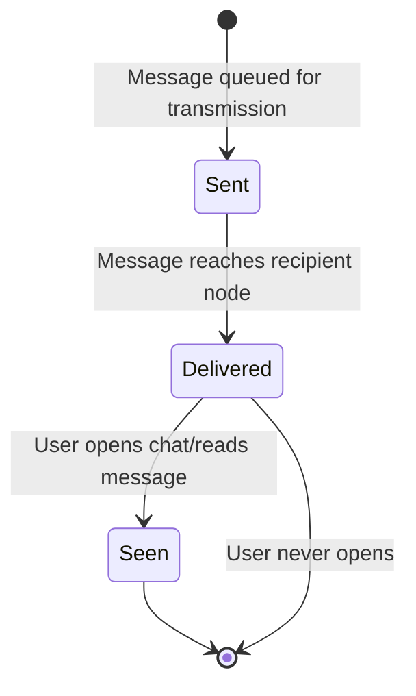
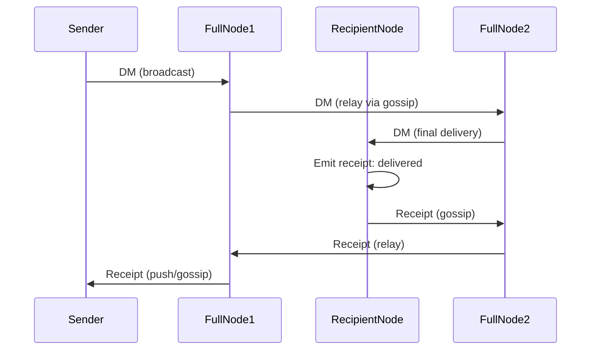

# Delivery Receipts Protocol

## Overview

Delivery receipts provide end-to-end confirmation that direct messages have reached their intended recipients and have been viewed. The protocol supports two confirmation states: `delivered` (message reached recipient node) and `seen` (recipient opened the message in chat).

## Commands

> **Transport scope:** All commands in this section are **LOCAL ONLY** — available through RPC HTTP and `handleLocalFrameDispatch`. Not available on the TCP data port; a remote peer receives `unknown_command`. For P2P receipt delivery between nodes, see the realtime path (`push_delivery_receipt` and `relay_delivery_receipt` P2P wire commands).

### send_delivery_receipt

Sends a delivery or read receipt back to the original message sender.

**Request Format:**
```json
{
  "type": "send_delivery_receipt",
  "id": "550e8400-e29b-41d4-a716-446655440000",
  "address": "a1b2c3d4e5f6",
  "recipient": "x9y8z7w6v5u4",
  "status": "delivered",
  "delivered_at": "2026-03-19T12:01:02Z"
}
```

**Field Descriptions:**
| Field | Type | Description |
|-------|------|-------------|
| `type` | string | Fixed value: `"send_delivery_receipt"` |
| `id` | uuid | Original message UUID that this receipt acknowledges |
| `address` | fingerprint | Fingerprint of the DM recipient (the node sending the receipt) |
| `recipient` | fingerprint | Fingerprint of the original DM sender (receipt target) |
| `status` | enum | `"delivered"` or `"seen"` |
| `delivered_at` | RFC3339 | Timestamp when the status was reached (UTC) |

**Status Values:**
- `delivered`: Message reached the final recipient node in the network
- `seen`: Recipient user opened the message in their chat application
- `seen_ack` (wire-only, v23): end-to-end confirmation the ORIGINAL message sender returns for a received `seen` receipt. Never sent through this local command, never persisted to chatlog, never surfaced to the UI — it exists solely to stop the seen-sender's retry loop.

**End-to-end reliability (sender-owned retry).** Relays are forwarding-only, so confirmations drive the retry engine on the node that owns each artefact:
- a locally-sent DM is re-sent (same MessageID; receivers dedupe silently and re-send `delivered`) until the recipient's `delivered`/`seen` receipt arrives;
- a locally-sent `seen` receipt is re-sent until the original sender's `seen_ack` arrives; the original sender answers every `seen` arrival — first or duplicate — with `seen_ack`. Unlike `delivered`/`seen` (which travel BACK along the reverse relay path), `seen_ack` is routed in the ORIGINAL message direction — on relays it follows the message's forward hop, not the receipt reverse path. Emission is version-gated: `seen_ack` is only sent to peers advertising protocol ≥ 23 (a pre-v23 binary would just reject the unknown status at parse time); the gate is removed once `MinimumProtocolVersion` reaches 23. `seen_ack` is never stored in the runtime receipt set — it cannot appear in `fetch_delivery_receipts` or the backlog replay. An incoming `seen_ack` is accepted only from the identity the seen receipt was addressed to (sender binding against the pending retry entry; spoofed acks are dropped without touching the dedupe state) and is rejected on the local `send_delivery_receipt` command — it is wire-only;
- `delivered` needs no own ack: the message retry re-triggers it on every duplicate.

Retries are exponential (30s → 1m → 2m → 5m → 11m capped; early intervals only help over a direct route — transit dedup absorbs re-emissions for up to ~10 min), capped by `CORSA_DELIVERY_RETRY_MAX_ATTEMPTS` (default 20) and bounded by the message `ttl_seconds` lifetime. On a desktop node both retry sets survive restarts: messages are reseeded from chatlog rows still in `sent`, and seen receipts from the chatlog `seen_ack` journal (seen rows whose confirmation has not been recorded; reseed scans the last 7 days). When the engine gives up (TTL expiry / attempts cap), the message is finalised: outbound state goes terminal (`expired`/`failed`, visible via `fetch_pending_messages`), the pending/relay retry state is cleared, and the abandonment is journaled (`delivery_failed`) so a restart does not reseed it — the chatlog row intentionally stays at `sent`, which is the truthful "never confirmed delivered" state.

**Response Format:**

New receipt:
```json
{
  "type": "receipt_stored",
  "recipient": "x9y8z7w6v5u4",
  "count": 1,
  "id": "550e8400-e29b-41d4-a716-446655440000"
}
```

Duplicate receipt:
```json
{
  "type": "receipt_known",
  "recipient": "x9y8z7w6v5u4",
  "count": 1,
  "id": "550e8400-e29b-41d4-a716-446655440000"
}
```

**Behavior:**
- Receipts are **automatically emitted** when a live DM reaches the final recipient node
- Full nodes **relay receipts** to the original sender via push notification or gossip
- The receipt references the original message by UUID for correlation
- Deduplication returns `receipt_known` for already-stored receipts

### fetch_delivery_receipts

Retrieves all delivery receipts for messages sent to a specific recipient.

**Request Format:**
```json
{
  "type": "fetch_delivery_receipts",
  "recipient": "a1b2c3d4e5f6"
}
```

**Field Descriptions:**
| Field | Type | Description |
|-------|------|-------------|
| `type` | string | Fixed value: `"fetch_delivery_receipts"` |
| `recipient` | fingerprint | Fingerprint of the recipient to fetch receipts for |

**Response Format:**
```json
{
  "type": "delivery_receipts",
  "recipient": "a1b2c3d4e5f6",
  "count": 3,
  "receipts": [
    {
      "message_id": "550e8400-e29b-41d4-a716-446655440000",
      "sender": "d4e5f6g7h8i9",
      "recipient": "a1b2c3d4e5f6",
      "status": "delivered",
      "delivered_at": "2026-03-19T12:01:02Z"
    },
    {
      "message_id": "660f9511-f40c-52e5-b827-557766551111",
      "sender": "d4e5f6g7h8i9",
      "recipient": "a1b2c3d4e5f6",
      "status": "seen",
      "delivered_at": "2026-03-19T12:05:15Z"
    }
  ]
}
```

**Response Field Descriptions:**
| Field | Type | Description |
|-------|------|-------------|
| `type` | string | Fixed value: `"delivery_receipts"` |
| `recipient` | fingerprint | Echo of the requested recipient |
| `count` | integer | Number of receipts in the response |
| `receipts[].message_id` | uuid | Original message UUID |
| `receipts[].sender` | fingerprint | Sender of the original message |
| `receipts[].recipient` | fingerprint | Recipient of the original message |
| `receipts[].status` | enum | `"delivered"` or `"seen"` |
| `receipts[].delivered_at` | RFC3339 | When the status was reached (UTC) |

## Message Lifecycle Diagram



**Diagram: Delivery Receipt Lifecycle**

## Network Relay Behavior

The following diagram shows how receipts flow through the network:



**Diagram: Receipt Network Flow**

## Implementation Notes

1. **Automatic Emission**: When a message with a valid signature arrives at a node where the recipient is local, a receipt is automatically generated with status `"delivered"`

2. **Timestamp Accuracy**: The `delivered_at` field is set by the node that emits the receipt, ensuring it reflects when the status was achieved locally

3. **Idempotency**: Duplicate receipts for the same message should be deduplicated by the receiving node

4. **Clock Drift**: Nodes must validate that `delivered_at` timestamps are within acceptable clock drift windows (see `message-timestamp-out-of-range` error)

5. **Privacy**: Receipts contain minimal identifying information; the message body is never included in a receipt

---

# Протокол Квитанций Доставки

## Обзор

Квитанции доставки предоставляют сквозное подтверждение того, что прямые сообщения достигли предполагаемых получателей и были просмотрены. Протокол поддерживает два состояния подтверждения: `delivered` (сообщение достигло узла получателя) и `seen` (получатель открыл сообщение в чате).

## Команды

> **Область транспорта:** Все команды в этом разделе доступны **ТОЛЬКО ЛОКАЛЬНО** — через RPC HTTP и `handleLocalFrameDispatch`. Недоступны на TCP data port; удалённый пир получит `unknown_command`. Для P2P-доставки квитанций между узлами см. realtime-путь (P2P wire-команда `push_delivery_receipt`).

### send_delivery_receipt

Отправляет квитанцию доставки или чтения обратно исходному отправителю сообщения.

**Формат запроса:**
```json
{
  "type": "send_delivery_receipt",
  "id": "550e8400-e29b-41d4-a716-446655440000",
  "address": "a1b2c3d4e5f6",
  "recipient": "x9y8z7w6v5u4",
  "status": "delivered",
  "delivered_at": "2026-03-19T12:01:02Z"
}
```

**Описание полей:**
| Поле | Тип | Описание |
|------|-----|---------|
| `type` | строка | Фиксированное значение: `"send_delivery_receipt"` |
| `id` | uuid | UUID исходного сообщения, которое эта квитанция подтверждает |
| `address` | отпечаток | Отпечаток получателя ПМ (узел, отправляющий квитанцию) |
| `recipient` | отпечаток | Отпечаток исходного отправителя ПМ (цель квитанции) |
| `status` | перечисление | `"delivered"` или `"seen"` |
| `delivered_at` | RFC3339 | Временная метка достижения статуса (UTC) |

**Значения статуса:**
- `delivered`: Сообщение достигло финального узла получателя в сети
- `seen`: Пользователь открыл сообщение в приложении чата
- `seen_ack` (только wire, v23): end-to-end подтверждение, которое ИСХОДНЫЙ отправитель сообщения возвращает на полученную `seen`-квитанцию. Через эту локальную команду не отправляется, в chatlog не персистится, в UI не показывается — существует только чтобы остановить ретраи отправителя seen-квитанции.

**End-to-end надёжность (retry на стороне владельца).** Relay-узлы только пересылают, поэтому подтверждения управляют retry-движком на узле-владельце артефакта:
- локально отправленный DM переотправляется (тем же MessageID; получатель молча дедупит и переотправляет `delivered`), пока не придёт `delivered`/`seen`-квитанция получателя;
- локально отправленная `seen`-квитанция переотправляется, пока не придёт `seen_ack` исходного отправителя; исходный отправитель отвечает `seen_ack` на каждый приход `seen` — первый или дубликат. В отличие от `delivered`/`seen` (идут НАЗАД по обратному relay-пути), `seen_ack` маршрутизируется в направлении ИСХОДНОГО сообщения — на relay-узлах он идёт по forward-хопу сообщения, а не по reverse-пути квитанций. Отправка гейтится версией: `seen_ack` уходит только пирам с protocol ≥ 23 (до-v23 бинарь лишь отбросил бы незнакомый статус на парсинге); гейт удаляется, когда `MinimumProtocolVersion` достигнет 23. `seen_ack` не сохраняется в runtime-наборе квитанций — он не может попасть в `fetch_delivery_receipts` или backlog replay. Входящий `seen_ack` принимается только от identity, которой была адресована seen-квитанция (привязка к ожидающей retry-записи; подделанные ack-и отбрасываются, не трогая dedupe-состояние), а локальная команда `send_delivery_receipt` его отклоняет — статус строго wire-only;
- `delivered` собственного ack-а не требует: ретраи сообщения сами переоткрывают его на каждом дубликате.

Ретраи экспоненциальные (30s → 1m → 2m → 5m → 11m с потолком; ранние интервалы полезны только при прямом маршруте — транзит-дедуп поглощает повторы до ~10 мин), ограничены `CORSA_DELIVERY_RETRY_MAX_ATTEMPTS` (по умолчанию 20) и временем жизни сообщения `ttl_seconds`. На desktop-ноде оба набора ретраев переживают рестарт: сообщения пересеиваются из строк chatlog со статусом `sent`, а seen-квитанции — из chatlog-журнала `seen_ack` (seen-строки без записанного подтверждения; пересев сканирует последние 7 дней). Когда движок сдаётся (истечение TTL / потолок попыток), сообщение финализируется: outbound-состояние становится терминальным (`expired`/`failed`, видно через `fetch_pending_messages`), pending/relay-retry состояние очищается, а отказ журналируется (`delivery_failed`), чтобы рестарт не пересеял его заново — строка chatlog намеренно остаётся в `sent`: это честное состояние «доставка не подтверждена».

**Формат ответа:**

Новая квитанция:
```json
{
  "type": "receipt_stored",
  "recipient": "x9y8z7w6v5u4",
  "count": 1,
  "id": "550e8400-e29b-41d4-a716-446655440000"
}
```

Дублирующая квитанция:
```json
{
  "type": "receipt_known",
  "recipient": "x9y8z7w6v5u4",
  "count": 1,
  "id": "550e8400-e29b-41d4-a716-446655440000"
}
```

**Поведение:**
- Квитанции **автоматически генерируются**, когда DM достигает финального узла получателя
- Полные ноды **передают квитанции** исходному отправителю через push или gossip
- Квитанция ссылается на исходное сообщение по UUID для корреляции
- Дедупликация возвращает `receipt_known` для уже сохранённых квитанций

### fetch_delivery_receipts

Получает все квитанции доставки сообщений, отправленных конкретному получателю.

**Формат запроса:**
```json
{
  "type": "fetch_delivery_receipts",
  "recipient": "a1b2c3d4e5f6"
}
```

**Описание полей:**
| Поле | Тип | Описание |
|------|-----|---------|
| `type` | строка | Фиксированное значение: `"fetch_delivery_receipts"` |
| `recipient` | отпечаток | Отпечаток получателя для выборки квитанций |

**Формат ответа:**
```json
{
  "type": "delivery_receipts",
  "recipient": "a1b2c3d4e5f6",
  "count": 3,
  "receipts": [
    {
      "message_id": "550e8400-e29b-41d4-a716-446655440000",
      "sender": "d4e5f6g7h8i9",
      "recipient": "a1b2c3d4e5f6",
      "status": "delivered",
      "delivered_at": "2026-03-19T12:01:02Z"
    },
    {
      "message_id": "660f9511-f40c-52e5-b827-557766551111",
      "sender": "d4e5f6g7h8i9",
      "recipient": "a1b2c3d4e5f6",
      "status": "seen",
      "delivered_at": "2026-03-19T12:05:15Z"
    }
  ]
}
```

**Описание полей ответа:**
| Поле | Тип | Описание |
|------|-----|---------|
| `type` | строка | Фиксированное значение: `"delivery_receipts"` |
| `recipient` | отпечаток | Эхо запрошенного получателя |
| `count` | целое число | Количество квитанций в ответе |
| `receipts[].message_id` | uuid | UUID исходного сообщения |
| `receipts[].sender` | отпечаток | Отправитель исходного сообщения |
| `receipts[].recipient` | отпечаток | Получатель исходного сообщения |
| `receipts[].status` | перечисление | `"delivered"` или `"seen"` |
| `receipts[].delivered_at` | RFC3339 | Когда был достигнут статус (UTC) |

## Диаграмма жизненного цикла сообщения


**Диаграмма: Жизненный цикл квитанции доставки**

## Поведение сетевой передачи

На следующей диаграмме показано, как квитанции проходят через сеть:


**Диаграмма: Поток квитанций в сети**

## Примечания реализации

1. **Автоматическая генерация**: Когда сообщение с корректной подписью прибывает на узел, где получатель локален, квитанция автоматически генерируется со статусом `"delivered"`

2. **Точность временной метки**: Поле `delivered_at` устанавливается узлом, генерирующим квитанцию, обеспечивая отражение момента достижения статуса локально

3. **Идемпотентность**: Дублирующиеся квитанции для одного и того же сообщения должны дедупликироваться принимающим узлом

4. **Сдвиг часов**: Узлы должны проверять, что временные метки `delivered_at` находятся в допустимых окнах сдвига часов (см. ошибка `message-timestamp-out-of-range`)

5. **Конфиденциальность**: Квитанции содержат минимум идентифицирующей информации; тело сообщения никогда не включается в квитанцию
