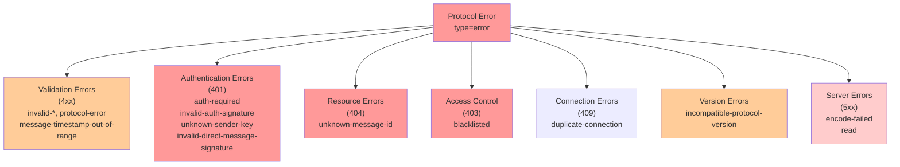

# Error Codes Reference

## Overview

This document defines all error codes returned by the protocol. Error responses follow a standard format with optional human-readable details. Each error code has a specific meaning and indicates a particular failure condition.

## Error Response Format

Standard error frame structure:

```json
{
  "type": "error",
  "code": "<error-code>",
  "error": "<optional human-readable detail>"
}
```

For `incompatible-protocol-version` errors, additional fields are included:

```json
{
  "type": "error",
  "code": "incompatible-protocol-version",
  "error": "client protocol version below minimum",
  "version": 1,
  "minimum_protocol_version": 2
}
```

A separate transport-control frame `connection_notice` carries advisory
close reasons that the responder wants the initiator to learn before the
socket goes away. It mirrors the error frame shape but adds `status` and
`details`:

```json
{
  "type": "connection_notice",
  "code": "observed-address-mismatch",
  "status": "closing",
  "error": "advertised address does not match observed remote address",
  "details": { "observed_address": "203.0.113.50" }
}
```

The initiator should treat `connection_notice` as informational: record
the `details`, then expect the socket to close. Status codes surfaced
through `connection_notice` are listed under "Connection Notice Codes"
below.

## Error Code Reference

| Code | When Returned | HTTP Analogy | Details |
|------|---------------|--------------|---------|
| `protocol-error` | Generic protocol violation not covered by specific codes | 400 Bad Request | Frame structure invalid, envelope malformed, or unclassified violation |
| `invalid-json` | Frame is not valid JSON | 400 Bad Request | Payload cannot be parsed as JSON; may be truncated or corrupted |
| `encode-failed` | Response serialization failed on server | 500 Internal Server Error | Server failed to encode response frame to JSON; internal state issue |
| `unknown-command` | Unrecognized or transport-mismatched frame type in `type` field | 400 Bad Request | Returned in two cases: (1) `type` field does not match any known command (e.g., `"foobar"`); (2) `type` is a known data-only command (e.g., `send_message`, `fetch_messages`) but was sent on the TCP data port, where only P2P wire commands are accepted (Stage 7 isolation). In both cases the server returns the same error code; clients should not distinguish the two by error text |
| `invalid-send-message` | Missing or invalid fields in `send_message` request | 400 Bad Request | Required fields missing, invalid fingerprints, invalid UUIDs, invalid signatures, or malformed envelope |
| `invalid-import-message` | Missing or invalid fields in `import_message` request | 400 Bad Request | Topic, sender, or ciphertext missing; signature verification failed |
| `invalid-fetch-messages` | Missing topic in `fetch_messages` request | 400 Bad Request | `topic` field not provided or invalid |
| `invalid-fetch-message-ids` | Missing topic in `fetch_message_ids` request | 400 Bad Request | `topic` field not provided or invalid |
| `invalid-fetch-message` | Missing topic or id in `fetch_message` request | 400 Bad Request | Either `topic` or `id` field missing or invalid |
| `invalid-fetch-inbox` | Missing topic or recipient in `fetch_inbox` request | 400 Bad Request | Either `topic` or `recipient` field missing or invalid |
| `invalid-send-delivery-receipt` | Missing or invalid fields in `send_delivery_receipt` request | 400 Bad Request | Required fields missing, invalid fingerprints, invalid status values, or malformed timestamp |
| `invalid-fetch-delivery-receipts` | Missing recipient in `fetch_delivery_receipts` request | 400 Bad Request | `recipient` field not provided or invalid |
| `invalid-subscribe-inbox` | Missing fields in `subscribe_inbox` request | 400 Bad Request | Required `topic` or `recipient` field missing or invalid |
| `invalid-publish-notice` | Missing ciphertext or ttl in `publish_notice` request | 400 Bad Request | Either `ciphertext` or `ttl_seconds` field missing; TTL may be out of acceptable range |
| `unknown-sender-key` | Sender address not found in trusted contacts | 401 Unauthorized | Message sender's fingerprint is not in the local contact database; cannot verify signature |
| `unknown-message-id` | Referenced message UUID does not exist | 404 Not Found | `fetch_message` references a message ID that doesn't exist locally |
| `invalid-direct-message-signature` | ed25519 envelope signature verification failed | 401 Unauthorized | Signature on the message envelope does not verify against sender's public key; may be tampered |
| `message-timestamp-out-of-range` | created_at is outside allowed clock drift window | 400 Bad Request | Message timestamp differs from current time by more than acceptable drift (typically ±15 minutes); clock skew or replay attack |
| `incompatible-protocol-version` | Caller protocol version below minimum | 400 Bad Request | Client version too old; includes `version` and `minimum_protocol_version` fields |
| `read` | TCP read error on the connection | 500 Internal Server Error | Network I/O error reading from socket; connection may be corrupted or closed unexpectedly |
| `frame-too-large` | Inbound frame line exceeds transport size limit | 413 Payload Too Large | A single inbound JSON command line exceeded `maxCommandLineBytes` (128 KiB) on the server's TCP reader. Connection is closed after this error. Standard protocol commands (including `relay_message` with a 64 KiB body) fit within this limit; oversized frames typically indicate a misbehaving or malicious client. Note: peer-session and handshake reads use a separate, larger limit (`maxResponseLineBytes`, 8 MiB) because response frames can contain multiple messages |
| `auth-required` | Command requires authenticated v2 session | 401 Unauthorized | Command can only be executed after successful v2 authentication; unauthenticated sessions cannot proceed |
| `invalid-auth-signature` | auth_session signature verification failed | 401 Unauthorized | Authentication request signature does not verify against known keys; may be invalid credentials or tampering |
| `blacklisted` | Remote IP has been banned (exceeded 1000 ban points) | 403 Forbidden | Source IP address has accumulated too many violations and is temporarily or permanently blocked |
| `invalid-ack-delete` | Invalid ack_delete frame or signature | 400 Bad Request | Acknowledgment deletion frame is malformed, missing fields, or signature verification failed |
| `duplicate-connection` | (Deprecated — no longer emitted) Inbound hello was previously rejected when an outbound session existed | 409 Conflict | Removed: rejecting the inbound side of a simultaneous dial prevented the initiator from gossiping to the responder, breaking one-way message propagation. Both connections now coexist; the routing layer deduplicates by identity |
| `rate-limited` | Command rate limit exceeded on inbound TCP connection | 429 Too Many Requests | Per-connection command rate limiter has been exhausted (burst: 100 commands, refill: 30/s). Connection is closed and the IP receives ban points. Legitimate peers never approach this limit; hitting it indicates a flood attack or misbehaving client |

## Error Code Categories

### Validation Errors (4xx)

These errors indicate the request itself is invalid:

- `invalid-json`
- `unknown-command`
- `invalid-send-message`
- `invalid-import-message`
- `invalid-fetch-messages`
- `invalid-fetch-message-ids`
- `invalid-fetch-message`
- `invalid-fetch-inbox`
- `invalid-send-delivery-receipt`
- `invalid-fetch-delivery-receipts`
- `invalid-subscribe-inbox`
- `invalid-publish-notice`
- `invalid-ack-delete`
- `message-timestamp-out-of-range`
- `protocol-error`
- `frame-too-large`

### Authentication Errors (401)

These errors indicate authentication or trust issues:

- `unknown-sender-key` - Sender not in contacts
- `invalid-direct-message-signature` - Signature verification failed
- `auth-required` - Must authenticate first
- `invalid-auth-signature` - Auth signature verification failed

### Resource Errors (404)

These errors indicate missing data:

- `unknown-message-id` - Referenced message doesn't exist

### Access Control Errors (403)

These errors indicate the request is blocked:

- `blacklisted` - IP address banned
- `rate-limited` - Command rate limit exceeded

### Connection Errors (409)

These errors indicate duplicate or conflicting connections:

- `duplicate-connection` - (Deprecated) Previously rejected inbound when outbound existed; now allowed

### Version Errors

These errors indicate compatibility issues:

- `incompatible-protocol-version` - Client version too old

### Server Errors (5xx)

These errors indicate internal server issues:

- `encode-failed` - Response serialization failed
- `read` - Network I/O error

### Connection Notice Codes

Delivered through the `connection_notice` frame type rather than
`type="error"`. They are advisory — the responder is going to close the
connection and wants the initiator to learn a machine-readable reason
first.

| Code | When Sent | Details |
|------|-----------|---------|
| `observed-address-mismatch` | **Deprecated at `ProtocolVersion=11`.** Historically emitted when an inbound `hello` advertised a world-reachable IP that did not match the observed TCP source. A `version=11` responder NEVER generates this code on its штатный (main) runtime path — advertise convergence is passive (see `handshake.md` → "Advertise Convergence"). The code is retained for receive-side parity with legacy `version=10` peers and a test-only downgrade-sweep helper; it is scheduled for full removal when `MinimumProtocolVersion` reaches `12`. A `version=11` initiator that still receives the frame from a legacy peer treats `details.observed_address` as a weak hint and only updates the runtime `trusted_self_advertise_ip` when no observed-IP consensus has been accumulated locally yet |
| `peer-banned` | Emitted on two independent tracks that differ by blast radius. Track 1 — **per-peer storm-suppression signal** — fires immediately on the first incompatible hello (inside the inbound `hello` handler, before teardown): the responder tells the initiator that THIS specific peer address is banned for the incompatibility window so the dialler-side gate stops fanning out reconnects, while compatible siblings behind a shared egress IP (NAT / VPN / Tor exit / multi-homed host) stay reachable. Track 2 — **transport-level IP blacklist** — fires on the session that tripped the IP-level accumulation inside the responder's `addBanScore` transition, after repeated abuse from the same IP. In both tracks the notice rides out on the still-open ConnID — the responder never opens a fresh socket just to deliver it. After a track-2 transition, subsequent raw reconnects from the blacklisted IP are closed silently; after a track-1 emission only this specific peer is suppressed on the dialler side | `details.until` (UTC RFC3339) is the wall-clock expiration of the ban. `details.reason` distinguishes the two tracks: `peer-ban` is emitted on first contact for per-peer incompatibility and MUST be scoped to the peer address, not the IP; `blacklisted` is emitted when the IP-wide threshold is crossed and applies to every peer behind that IP. Initiators MUST accept both values and record the window unchanged — a responder rollout does not require a concurrent client rollout, and scoping the persistence correctly (per peer vs per IP) is the initiator's responsibility based on `reason`. Each notice lands in exactly one of two tables — never both — driven by `reason`: `peer-ban` writes ONLY the per-peer record against the persisted peer entry so the dial gate skips THIS specific address while sibling peers behind the same egress IP stay dialable; `blacklisted` writes ONLY the IP-wide record keyed on the server IP extracted from the notice's peer address (host part of host:port), so every sibling PeerAddress behind that IP is suppressed by the dial gate — including peers discovered later via peer exchange. The IP-wide record is persisted separately from the per-peer record and survives restart so the retry storm the notice was designed to end cannot resume from disk. No sender-side mirror is written: the dial-gate check consults both tables on every candidate, so a record in either one is enough to suppress. A successful handshake to any peer on the affected IP later clears TWO scopes atomically: (1) the handshaking peer's own per-peer record (unconditional, regardless of reason — direct proof this address accepts us; a no-op when no row exists), and (2) the IP-wide record keyed on the canonical host of the dialled address (one sibling's success speaks for every sibling behind that egress). Both clears flush to disk together. Per-peer rows with `reason=peer-ban` on OTHER sibling addresses are intentionally NOT cleared by the IP-wide recovery: those are standalone responder decisions on specific addresses and a handshake with a sibling is not proof the responder has forgiven them. Because the two reasons live in two separate tables by construction, there is no mirror to fall out of sync and no third scope to maintain |

## Error Handling Guide

### Client Responsibilities

1. **Parse Error Codes**: Always check the `code` field to determine specific failure
2. **Retry Logic**: Implement exponential backoff for transient errors (`read`, `encode-failed`)
3. **Authentication**: After receiving `auth-required`, perform v2 authentication before retrying
4. **Validation**: Before sending requests, validate all required fields locally to avoid `invalid-*` errors
5. **Trust Checks**: After receiving `unknown-sender-key`, verify the sender's identity and import their contact if trusted
6. **Timestamp Sync**: If receiving `message-timestamp-out-of-range`, check system clock synchronization

### Common Error Scenarios

**Scenario 1: New peer, unknown sender**
```
Client sends DM from peer A whose pubkey is not yet imported
Server returns: unknown-sender-key (sender A's key not in contacts)
Action: Client must import peer A's contact (pubkey, boxkey, boxsig) first, then retry
```

**Scenario 2: Clock skew**
```
Client publishes message with created_at=2026-04-01T00:00:00Z
Current server time=2026-03-19T12:00:00Z (16 days difference)
Server returns: message-timestamp-out-of-range
Action: Synchronize system clock (NTP) and retry
```

**Scenario 3: Old client version**
```
Client sends hello with version=1
Server minimum_protocol_version=2
Server returns: incompatible-protocol-version (version=1, minimum_protocol_version=2)
Action: Upgrade client software to protocol version 2 or newer
```

**Scenario 4: Excessive requests from IP**
```
Client IP makes many invalid requests, accumulating ban points
After 1000 points, server returns: blacklisted
Action: Wait for ban cooldown period or change IP; review logs for attack patterns
```

**Scenario 5: Message not found**
```
Client calls: fetch_message(topic="news", id="uuid-not-stored")
Server returns: unknown-message-id
Action: Verify message was previously stored; may have expired or been deleted
```

**Scenario 6: Data command on TCP data port (transport mismatch)**
```
Client sends send_message over the TCP data port
Server returns: unknown-command (send_message is data-only, not a P2P wire command)
Action: Use the RPC HTTP endpoint for data-only commands; TCP data port
accepts only P2P wire commands (get_peers, fetch_contacts, push_message, etc.)
```

**Scenario 7: Simultaneous connection (duplicate — now allowed)**
```
Node A dials Node B (outbound A→B established)
Node B dials Node A (inbound to A with hello declaring B's address)
Node A detects outbound session to B already exists
Server returns: welcome (both connections coexist)
Note: Previously returned duplicate-connection error, but that broke
one-way gossip — the rejected side had no outbound and could not
forward messages. Both connections now coexist; routing deduplicates.
```

## Mermaid Diagram: Error Classification



**Diagram: Error Code Classification**

## Implementation Notes

1. **Error Details**: The optional `error` field should contain a brief human-readable explanation but should NOT leak sensitive information (e.g., internal paths, database state)

2. **Logging**: All error conditions should be logged on the server side for debugging and monitoring; client-side error details should be user-friendly

3. **Idempotency**: Some commands (like `send_message`) may need to be idempotent; returning the same error for duplicate requests is acceptable

4. **Rate Limiting**: Accumulation of errors (especially validation errors) from a single IP may trigger rate limiting and eventually `blacklisted` status

5. **Clock Drift**: The typical acceptable clock drift window is ±15 minutes; servers should allow configuration of this window

6. **Signature Verification**: Always verify signatures before processing message content; prefer failing early with `invalid-direct-message-signature`

7. **Duplicate Connection**: The `duplicate-connection` error is deprecated and no longer emitted. Both sides of a simultaneous dial are now accepted; the routing and health layers deduplicate by peer identity. Legacy clients that still handle this error should treat it as a no-op

---

# Справочник Кодов Ошибок

## Обзор

Этот документ определяет все коды ошибок, возвращаемые протоколом. Ответы об ошибках следуют стандартному формату с дополнительными деталями, понятными человеку. Каждый код ошибки имеет определенное значение и указывает на конкретное условие сбоя.

## Формат ответа об ошибке

Стандартная структура кадра об ошибке:

```json
{
  "type": "error",
  "code": "<код-ошибки>",
  "error": "<опциональная понятная деталь>"
}
```

Для ошибок `incompatible-protocol-version` включены дополнительные поля:

```json
{
  "type": "error",
  "code": "incompatible-protocol-version",
  "error": "client protocol version below minimum",
  "version": 1,
  "minimum_protocol_version": 2
}
```

Отдельный transport-control фрейм `connection_notice` передаёт
рекомендательные причины закрытия соединения, о которых ответчик хочет
сообщить инициатору до разрыва сокета. По форме совпадает с error, но
добавляет поля `status` и `details`:

```json
{
  "type": "connection_notice",
  "code": "observed-address-mismatch",
  "status": "closing",
  "error": "advertised address does not match observed remote address",
  "details": { "observed_address": "203.0.113.50" }
}
```

Инициатор должен рассматривать `connection_notice` как информационный:
записать `details`, затем ожидать закрытия сокета. Коды статусов,
передаваемые через `connection_notice`, перечислены ниже в секции
«Коды connection_notice».

## Справочник кодов ошибок

| Код | Когда возвращается | Аналогия HTTP | Детали |
|-----|---------------------|-----------------|--------|
| `protocol-error` | Общее нарушение протокола, не охватываемое конкретными кодами | 400 Bad Request | Структура кадра недействительна, конверт неправильно сформирован или неклассифицированное нарушение |
| `invalid-json` | Кадр не является действительным JSON | 400 Bad Request | Полезная нагрузка не может быть проанализирована как JSON; может быть усечена или повреждена |
| `encode-failed` | Сериализация ответа не удалась на сервере | 500 Internal Server Error | Сервер не смог закодировать кадр ответа в JSON; проблема внутреннего состояния |
| `unknown-command` | Неизвестный или несовместимый по транспорту тип кадра в поле `type` | 400 Bad Request | Возвращается в двух случаях: (1) поле `type` не соответствует ни одной известной команде (например, `"foobar"`); (2) `type` является известной data-only командой (например, `send_message`, `fetch_messages`), но отправлена на TCP data port, где принимаются только P2P wire-команды (изоляция Stage 7). В обоих случаях сервер возвращает один и тот же код ошибки; клиенты не должны различать эти два случая по тексту ошибки |
| `invalid-send-message` | Отсутствуют или неверные поля в запросе `send_message` | 400 Bad Request | Обязательные поля отсутствуют, неверные отпечатки, неверные UUID, неверные подписи или неправильно сформированный конверт |
| `invalid-import-message` | Отсутствуют или неверные поля в запросе `import_message` | 400 Bad Request | Тема, отправитель или шифротекст отсутствуют; проверка подписи не удалась |
| `invalid-fetch-messages` | Отсутствует тема в запросе `fetch_messages` | 400 Bad Request | Поле `topic` не предоставлено или неверно |
| `invalid-fetch-message-ids` | Отсутствует тема в запросе `fetch_message_ids` | 400 Bad Request | Поле `topic` не предоставлено или неверно |
| `invalid-fetch-message` | Отсутствует тема или id в запросе `fetch_message` | 400 Bad Request | Либо поле `topic`, либо `id` отсутствует или неверно |
| `invalid-fetch-inbox` | Отсутствует тема или получатель в запросе `fetch_inbox` | 400 Bad Request | Либо поле `topic`, либо `recipient` отсутствует или неверно |
| `invalid-send-delivery-receipt` | Отсутствуют или неверные поля в запросе `send_delivery_receipt` | 400 Bad Request | Обязательные поля отсутствуют, неверные отпечатки, неверные значения статуса или неправильная временная метка |
| `invalid-fetch-delivery-receipts` | Отсутствует получатель в запросе `fetch_delivery_receipts` | 400 Bad Request | Поле `recipient` не предоставлено или неверно |
| `invalid-subscribe-inbox` | Отсутствуют поля в запросе `subscribe_inbox` | 400 Bad Request | Обязательное поле `topic` или `recipient` отсутствует или неверно |
| `invalid-publish-notice` | Отсутствует шифротекст или ttl в запросе `publish_notice` | 400 Bad Request | Либо поле `ciphertext`, либо `ttl_seconds` отсутствует; TTL может быть вне приемлемого диапазона |
| `unknown-sender-key` | Адрес отправителя не найден в доверенных контактах | 401 Unauthorized | Отпечаток отправителя сообщения не находится в локальной базе данных контактов; не может проверить подпись |
| `unknown-message-id` | Ссылаемый UUID сообщения не существует | 404 Not Found | `fetch_message` ссылается на идентификатор сообщения, который не существует локально |
| `invalid-direct-message-signature` | Проверка подписи конверта ed25519 не удалась | 401 Unauthorized | Подпись на конверте сообщения не проверяется для открытого ключа отправителя; может быть подделана |
| `message-timestamp-out-of-range` | created_at находится вне допустимого окна сдвига часов | 400 Bad Request | Временная метка сообщения отличается от текущего времени более чем на приемлемый сдвиг (обычно ±15 минут); сдвиг часов или атака повтора |
| `incompatible-protocol-version` | Версия протокола вызывающей стороны ниже минимальной | 400 Bad Request | Версия клиента слишком старая; включает поля `version` и `minimum_protocol_version` |
| `read` | Ошибка чтения TCP на соединении | 500 Internal Server Error | Ошибка ввода-вывода сети при чтении из сокета; соединение может быть повреждено или неожиданно закрыто |
| `frame-too-large` | Входящая строка команды превышает транспортный лимит размера | 413 Payload Too Large | Одна входящая строка JSON-команды превысила `maxCommandLineBytes` (128 KiB) на TCP-ридере сервера. Соединение закрывается после этой ошибки. Стандартные команды протокола (включая `relay_message` с телом 64 KiB) укладываются в этот лимит; слишком большие кадры обычно указывают на некорректный или вредоносный клиент. Примечание: peer-session и handshake reads используют отдельный, больший лимит (`maxResponseLineBytes`, 8 MiB), поскольку ответы могут содержать множество сообщений |
| `auth-required` | Команда требует аутентифицированного сеанса v2 | 401 Unauthorized | Команда может быть выполнена только после успешной аутентификации v2; неаутентифицированные сеансы не могут продолжать |
| `invalid-auth-signature` | Проверка подписи auth_session не удалась | 401 Unauthorized | Подпись запроса аутентификации не проверяется для известных ключей; может быть неверные учетные данные или подделка |
| `blacklisted` | IP-адрес удаленного хоста был запрещен (превышены 1000 точек запрета) | 403 Forbidden | IP-адрес источника накопил слишком много нарушений и временно или постоянно заблокирован |
| `invalid-ack-delete` | Недействительный кадр ack_delete или подпись | 400 Bad Request | Кадр удаления подтверждения неправильно сформирован, отсутствуют поля или проверка подписи не удалась |
| `duplicate-connection` | (Устарел — больше не отправляется) Ранее входящий hello отклонялся при наличии outbound-сессии | 409 Conflict | Удалено: отклонение входящей стороны при одновременном подключении не позволяло инициатору передавать gossip-сообщения респондеру, нарушая однонаправленную доставку. Теперь оба соединения сосуществуют; маршрутизация дедуплицирует по identity |
| `rate-limited` | Превышен лимит скорости команд на входящем TCP-соединении | 429 Too Many Requests | Лимит команд на соединение исчерпан (пакет: 100 команд, пополнение: 30/с). Соединение закрывается, IP получает баллы бана. Легитимные пиры никогда не приближаются к этому лимиту; срабатывание указывает на flood-атаку или некорректный клиент |

## Категории кодов ошибок

### Ошибки валидации (4xx)

Эти ошибки указывают на то, что сам запрос неверен:

- `invalid-json`
- `unknown-command`
- `invalid-send-message`
- `invalid-import-message`
- `invalid-fetch-messages`
- `invalid-fetch-message-ids`
- `invalid-fetch-message`
- `invalid-fetch-inbox`
- `invalid-send-delivery-receipt`
- `invalid-fetch-delivery-receipts`
- `invalid-subscribe-inbox`
- `invalid-publish-notice`
- `invalid-ack-delete`
- `message-timestamp-out-of-range`
- `protocol-error`
- `frame-too-large`

### Ошибки аутентификации (401)

Эти ошибки указывают на проблемы аутентификации или доверия:

- `unknown-sender-key` - Отправитель не в контактах
- `invalid-direct-message-signature` - Проверка подписи не удалась
- `auth-required` - Должны сначала аутентифицироваться
- `invalid-auth-signature` - Проверка подписи аутентификации не удалась

### Ошибки ресурсов (404)

Эти ошибки указывают на отсутствие данных:

- `unknown-message-id` - Ссылаемое сообщение не существует

### Ошибки контроля доступа (403)

Эти ошибки указывают на блокировку запроса:

- `blacklisted` - IP-адрес запрещен
- `rate-limited` - Превышен лимит скорости команд

### Ошибки соединения (409)

Эти ошибки указывают на дублирующие или конфликтующие соединения:

- `duplicate-connection` - (Устарел) Ранее отклонял входящее соединение при наличии outbound-сессии; теперь разрешено

### Ошибки версии

Эти ошибки указывают на проблемы совместимости:

- `incompatible-protocol-version` - Версия клиента слишком старая

### Ошибки сервера (5xx)

Эти ошибки указывают на внутренние проблемы сервера:

- `encode-failed` - Сериализация ответа не удалась
- `read` - Ошибка ввода-вывода сети

### Коды connection_notice

Передаются через фрейм `connection_notice`, а не через `type="error"`.
Носят рекомендательный характер — ответчик собирается закрыть
соединение и хочет, чтобы инициатор узнал машинно-читаемую причину
заранее.

| Код | Когда отправляется | Детали |
|-----|---------------------|--------|
| `observed-address-mismatch` | **Deprecated с `ProtocolVersion=11`.** Исторически отправлялось, когда входящий `hello` объявлял world-reachable IP, не совпадающий с наблюдаемым TCP-источником. Ответчик `version=11` НИКОГДА не генерирует этот код в штатной runtime-ветке — advertise convergence теперь пассивный (см. `handshake.md` → «Согласование advertise-адреса»). Код сохранён ради receive-side паритета с legacy-пирами `version=10` и test-only downgrade-sweep хелпера; запланирован к полному удалению, когда `MinimumProtocolVersion` достигнет `12`. Инициатор `version=11`, всё ещё получивший этот фрейм от legacy-пира, трактует `details.observed_address` как слабую подсказку и обновляет runtime `trusted_self_advertise_ip` только если локально ещё не накопился observed-IP консенсус |
| `peer-banned` | Эмитится по двум независимым трекам, различающимся радиусом поражения. Трек 1 — **per-peer signal подавления шторма** — срабатывает немедленно на первой несовместимой hello (внутри обработчика входящего `hello`, до teardown): ответчик сообщает инициатору, что ИМЕННО ЭТОТ peer-адрес забанен на окно несовместимости, чтобы dialler-side gate перестал fan-outить реконнекты, тогда как совместимые siblings за общим egress IP (NAT / VPN / Tor exit / multi-homed host) остаются достижимыми. Трек 2 — **transport-level IP blacklist** — срабатывает на сессии, которая переключила IP-level накопление внутри транзита `addBanScore` у ответчика, после повторяющегося abuse с того же IP. В обоих треках уведомление уходит по ещё живому ConnID — ответчик не открывает новый сокет специально ради доставки. После перехода трек-2 последующие raw-переподключения с чёрного IP закрываются молча; после эмиссии трек-1 подавляется только этот конкретный peer на dialler-side | `details.until` (UTC RFC3339) — момент истечения бана по стенным часам. `details.reason` различает два трека: `peer-ban` эмитится на первом контакте для per-peer несовместимости и ДОЛЖЕН быть scoped к peer-адресу, а не к IP; `blacklisted` эмитится при пересечении IP-wide порога и применяется ко всем peer'ам за этим IP. Инициатор ДОЛЖЕН принимать оба значения и записывать окно без изменений — раскатка ответчика не требует одновременной раскатки клиентов, и корректный scoping персистенции (per peer vs per IP) — ответственность инициатора на основе `reason`. Каждое уведомление попадает ровно в одну из двух таблиц — никогда в обе — в зависимости от `reason`: `peer-ban` пишет ТОЛЬКО per-peer запись в persisted-мету пира, чтобы гейт дайлера пропускал ИМЕННО этот адрес, а sibling-пиры за тем же egress IP остаются дайлебельными; `blacklisted` пишет ТОЛЬКО IP-wide запись, ключённую на серверном IP, извлечённом из peer-адреса уведомления (host-часть host:port), чтобы каждый sibling-PeerAddress за этим IP подавлялся гейтом дайлера — включая пиров, обнаруженных позже через peer exchange. IP-wide запись персистится отдельно от per-peer записи и переживает рестарт, чтобы retry-storm, на остановку которого было рассчитано уведомление, не возобновился с диска. Зеркала на стороне sender не пишутся: проверка дайл-гейта на каждом кандидате консультирует обе таблицы, и записи в любой из них достаточно для подавления. Успешное рукопожатие с ЛЮБЫМ пиром на затронутом IP позже атомарно очищает ДВА scope: (1) собственную per-peer запись handshaking-пира (безусловно, независимо от reason — прямое доказательство, что этот адрес принимает нас; no-op, если записи нет), и (2) IP-wide запись, ключённую на каноническом host дайленного адреса (успех одного sibling говорит за всех siblings за этим egress). Обе очистки сбрасываются на диск вместе. Per-peer записи с `reason=peer-ban` на ДРУГИХ sibling-адресах намеренно НЕ очищаются IP-wide recovery: это автономные решения ответчика на конкретных адресах, и рукопожатие с sibling не доказывает, что ответчик их простил. Поскольку два reason-а живут в двух отдельных таблицах по конструкции, нет зеркала, которое могло бы рассинхронизироваться, и нет третьего scope, который надо было бы поддерживать |

## Руководство по обработке ошибок

### Ответственность клиента

1. **Анализировать коды ошибок**: Всегда проверяйте поле `code` для определения конкретного сбоя
2. **Логика повтора**: Реализуйте экспоненциальную задержку для преходящих ошибок (`read`, `encode-failed`)
3. **Аутентификация**: После получения `auth-required` выполните аутентификацию v2 перед повтором
4. **Валидация**: Перед отправкой запросов локально проверьте все обязательные поля, чтобы избежать ошибок `invalid-*`
5. **Проверки доверия**: После получения `unknown-sender-key` проверьте личность отправителя и импортируйте его контакт, если он доверенный
6. **Синхронизация времени**: При получении `message-timestamp-out-of-range` проверьте синхронизацию системных часов

### Типичные сценарии ошибок

**Сценарий 1: Новый узел, неизвестный отправитель**
```
Клиент отправляет DM от узла A, чей pubkey ещё не импортирован
Сервер возвращает: unknown-sender-key (ключ отправителя A не в контактах)
Действие: Клиент должен сначала импортировать контакт узла A (pubkey, boxkey, boxsig), затем повторить
```

**Сценарий 2: Сдвиг часов**
```
Клиент публикует сообщение с created_at=2026-04-01T00:00:00Z
Текущее время сервера=2026-03-19T12:00:00Z (разница 16 дней)
Сервер возвращает: message-timestamp-out-of-range
Действие: Синхронизируйте системные часы (NTP) и повторите попытку
```

**Сценарий 3: Старая версия клиента**
```
Клиент отправляет hello с version=1
minimum_protocol_version сервера=2
Сервер возвращает: incompatible-protocol-version (version=1, minimum_protocol_version=2)
Действие: Обновите программное обеспечение клиента до протокола версии 2 или новее
```

**Сценарий 4: Чрезмерные запросы с IP**
```
IP-адрес клиента делает много неверных запросов, накапливая точки запрета
После 1000 баллов сервер возвращает: blacklisted
Действие: Дождитесь периода охлаждения запрета или измените IP; просмотрите журналы для выявления закономерностей атак
```

**Сценарий 5: Сообщение не найдено**
```
Клиент вызывает: fetch_message(topic="news", id="uuid-not-stored")
Сервер возвращает: unknown-message-id
Действие: Проверьте, было ли сообщение ранее сохранено; может быть истекло или удалено
```

**Сценарий 6: Data-команда на TCP data port (несовпадение транспорта)**
```
Клиент отправляет send_message через TCP data port
Сервер возвращает: unknown-command (send_message — data-only команда, не P2P wire)
Действие: Используйте RPC HTTP endpoint для data-only команд; TCP data port
принимает только P2P wire-команды (get_peers, fetch_contacts, push_message и т.д.)
```

**Сценарий 7: Одновременное подключение (дубликат — теперь разрешено)**
```
Нода A подключается к ноде B (outbound A→B установлен)
Нода B подключается к ноде A (inbound к A с hello, объявляющим адрес B)
Нода A обнаруживает, что outbound-сессия к B уже существует
Сервер возвращает: welcome (оба соединения сосуществуют)
Примечание: Ранее возвращался duplicate-connection, но это
ломало одностороннюю доставку gossip — отклонённая сторона не
имела outbound-сессии и не могла пересылать сообщения.
Теперь оба соединения разрешены; маршрутизация дедуплицирует.
```

## Диаграмма Mermaid: Классификация ошибок


**Диаграмма: Классификация кодов ошибок**

## Примечания реализации

1. **Детали ошибки**: Дополнительное поле `error` должно содержать краткое объяснение, понятное человеку, но НЕ должно раскрывать конфиденциальную информацию (например, внутренние пути, состояние базы данных)

2. **Логирование**: Все условия ошибок должны регистрироваться на стороне сервера для отладки и мониторинга; детали ошибок на стороне клиента должны быть удобны для пользователя

3. **Идемпотентность**: Некоторые команды (такие как `send_message`) могут должны быть идемпотентными; возврат той же ошибки для дублирующихся запросов приемлем

4. **Ограничение скорости**: Накопление ошибок (особенно ошибок валидации) с одного IP-адреса может вызвать ограничение скорости и в конечном итоге статус `blacklisted`

5. **Сдвиг часов**: Типичное приемлемое окно сдвига часов составляет ±15 минут; серверы должны позволять конфигурацию этого окна

6. **Проверка подписи**: Всегда проверяйте подписи перед обработкой содержимого сообщения; предпочитайте ранний отказ с `invalid-direct-message-signature`

7. **Дублирующее соединение**: Ошибка `duplicate-connection` устарела и больше не отправляется. Обе стороны одновременного подключения теперь принимаются; уровень маршрутизации и здоровья дедуплицирует по identity пира. Устаревшие клиенты, обрабатывающие эту ошибку, должны трактовать её как no-op
