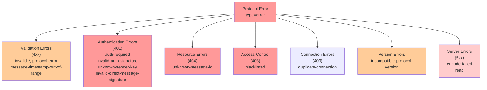

# Error Codes Reference

## Overview

This document defines all error codes returned by the protocol. Error responses follow a standard format with optional human-readable details. Each error code has a specific meaning and indicates a particular failure condition.

## Error Response Format

Standard error frame structure:

```json
{
  "type": "error",
  "code": "<error-code>",
  "error": "<optional human-readable detail>"
}
```

For `incompatible-protocol-version` errors, additional fields are included:

```json
{
  "type": "error",
  "code": "incompatible-protocol-version",
  "error": "client protocol version below minimum",
  "version": 1,
  "minimum_protocol_version": 2
}
```

## Error Code Reference

| Code | When Returned | HTTP Analogy | Details |
|------|---------------|--------------|---------|
| `protocol-error` | Generic protocol violation not covered by specific codes | 400 Bad Request | Frame structure invalid, envelope malformed, or unclassified violation |
| `invalid-json` | Frame is not valid JSON | 400 Bad Request | Payload cannot be parsed as JSON; may be truncated or corrupted |
| `encode-failed` | Response serialization failed on server | 500 Internal Server Error | Server failed to encode response frame to JSON; internal state issue |
| `unknown-command` | Unrecognized frame type in `type` field | 400 Bad Request | `type` field does not match any known command (e.g., `"foobar"`) |
| `invalid-send-message` | Missing or invalid fields in `send_message` request | 400 Bad Request | Required fields missing, invalid fingerprints, invalid UUIDs, invalid signatures, or malformed envelope |
| `invalid-import-message` | Missing or invalid fields in `import_message` request | 400 Bad Request | Topic, sender, or ciphertext missing; signature verification failed |
| `invalid-fetch-messages` | Missing topic in `fetch_messages` request | 400 Bad Request | `topic` field not provided or invalid |
| `invalid-fetch-message-ids` | Missing topic in `fetch_message_ids` request | 400 Bad Request | `topic` field not provided or invalid |
| `invalid-fetch-message` | Missing topic or id in `fetch_message` request | 400 Bad Request | Either `topic` or `id` field missing or invalid |
| `invalid-fetch-inbox` | Missing topic or recipient in `fetch_inbox` request | 400 Bad Request | Either `topic` or `recipient` field missing or invalid |
| `invalid-send-delivery-receipt` | Missing or invalid fields in `send_delivery_receipt` request | 400 Bad Request | Required fields missing, invalid fingerprints, invalid status values, or malformed timestamp |
| `invalid-fetch-delivery-receipts` | Missing recipient in `fetch_delivery_receipts` request | 400 Bad Request | `recipient` field not provided or invalid |
| `invalid-subscribe-inbox` | Missing fields in `subscribe_inbox` request | 400 Bad Request | Required `topic` or `recipient` field missing or invalid |
| `invalid-publish-notice` | Missing ciphertext or ttl in `publish_notice` request | 400 Bad Request | Either `ciphertext` or `ttl_seconds` field missing; TTL may be out of acceptable range |
| `unknown-sender-key` | Sender address not found in trusted contacts | 401 Unauthorized | Message sender's fingerprint is not in the local contact database; cannot verify signature |
| `unknown-message-id` | Referenced message UUID does not exist | 404 Not Found | `fetch_message` references a message ID that doesn't exist locally |
| `invalid-direct-message-signature` | ed25519 envelope signature verification failed | 401 Unauthorized | Signature on the message envelope does not verify against sender's public key; may be tampered |
| `message-timestamp-out-of-range` | created_at is outside allowed clock drift window | 400 Bad Request | Message timestamp differs from current time by more than acceptable drift (typically ±15 minutes); clock skew or replay attack |
| `incompatible-protocol-version` | Caller protocol version below minimum | 400 Bad Request | Client version too old; includes `version` and `minimum_protocol_version` fields |
| `read` | TCP read error on the connection | 500 Internal Server Error | Network I/O error reading from socket; connection may be corrupted or closed unexpectedly |
| `frame-too-large` | Inbound frame line exceeds transport size limit | 413 Payload Too Large | A single inbound JSON command line exceeded `maxCommandLineBytes` (128 KiB) on the server's TCP reader. Connection is closed after this error. Standard protocol commands (including `relay_message` with a 64 KiB body) fit within this limit; oversized frames typically indicate a misbehaving or malicious client. Note: peer-session and handshake reads use a separate, larger limit (`maxResponseLineBytes`, 8 MiB) because response frames can contain multiple messages |
| `auth-required` | Command requires authenticated v2 session | 401 Unauthorized | Command can only be executed after successful v2 authentication; unauthenticated sessions cannot proceed |
| `invalid-auth-signature` | auth_session signature verification failed | 401 Unauthorized | Authentication request signature does not verify against known keys; may be invalid credentials or tampering |
| `blacklisted` | Remote IP has been banned (exceeded 1000 ban points) | 403 Forbidden | Source IP address has accumulated too many violations and is temporarily or permanently blocked |
| `invalid-ack-delete` | Invalid ack_delete frame or signature | 400 Bad Request | Acknowledgment deletion frame is malformed, missing fields, or signature verification failed |
| `duplicate-connection` | Inbound hello rejected because outbound session already exists | 409 Conflict | Two nodes dialed each other simultaneously. The responder already holds an outbound session to the same overlay address, so the inbound connection is redundant. The initiator should not retry — the existing outbound session already covers this peer pair |

## Error Code Categories

### Validation Errors (4xx)

These errors indicate the request itself is invalid:

- `invalid-json`
- `unknown-command`
- `invalid-send-message`
- `invalid-import-message`
- `invalid-fetch-messages`
- `invalid-fetch-message-ids`
- `invalid-fetch-message`
- `invalid-fetch-inbox`
- `invalid-send-delivery-receipt`
- `invalid-fetch-delivery-receipts`
- `invalid-subscribe-inbox`
- `invalid-publish-notice`
- `invalid-ack-delete`
- `message-timestamp-out-of-range`
- `protocol-error`
- `frame-too-large`

### Authentication Errors (401)

These errors indicate authentication or trust issues:

- `unknown-sender-key` - Sender not in contacts
- `invalid-direct-message-signature` - Signature verification failed
- `auth-required` - Must authenticate first
- `invalid-auth-signature` - Auth signature verification failed

### Resource Errors (404)

These errors indicate missing data:

- `unknown-message-id` - Referenced message doesn't exist

### Access Control Errors (403)

These errors indicate the request is blocked:

- `blacklisted` - IP address banned

### Connection Errors (409)

These errors indicate duplicate or conflicting connections:

- `duplicate-connection` - Inbound rejected because outbound session already exists

### Version Errors

These errors indicate compatibility issues:

- `incompatible-protocol-version` - Client version too old

### Server Errors (5xx)

These errors indicate internal server issues:

- `encode-failed` - Response serialization failed
- `read` - Network I/O error

## Error Handling Guide

### Client Responsibilities

1. **Parse Error Codes**: Always check the `code` field to determine specific failure
2. **Retry Logic**: Implement exponential backoff for transient errors (`read`, `encode-failed`)
3. **Authentication**: After receiving `auth-required`, perform v2 authentication before retrying
4. **Validation**: Before sending requests, validate all required fields locally to avoid `invalid-*` errors
5. **Trust Checks**: After receiving `unknown-sender-key`, verify the sender's identity and import their contact if trusted
6. **Timestamp Sync**: If receiving `message-timestamp-out-of-range`, check system clock synchronization

### Common Error Scenarios

**Scenario 1: New peer, unknown sender**
```
Client sends DM from peer A whose pubkey is not yet imported
Server returns: unknown-sender-key (sender A's key not in contacts)
Action: Client must import peer A's contact (pubkey, boxkey, boxsig) first, then retry
```

**Scenario 2: Clock skew**
```
Client publishes message with created_at=2026-04-01T00:00:00Z
Current server time=2026-03-19T12:00:00Z (16 days difference)
Server returns: message-timestamp-out-of-range
Action: Synchronize system clock (NTP) and retry
```

**Scenario 3: Old client version**
```
Client sends hello with version=1
Server minimum_protocol_version=2
Server returns: incompatible-protocol-version (version=1, minimum_protocol_version=2)
Action: Upgrade client software to protocol version 2 or newer
```

**Scenario 4: Excessive requests from IP**
```
Client IP makes many invalid requests, accumulating ban points
After 1000 points, server returns: blacklisted
Action: Wait for ban cooldown period or change IP; review logs for attack patterns
```

**Scenario 5: Message not found**
```
Client calls: fetch_message(topic="news", id="uuid-not-stored")
Server returns: unknown-message-id
Action: Verify message was previously stored; may have expired or been deleted
```

**Scenario 6: Simultaneous connection (duplicate)**
```
Node A dials Node B (outbound A→B established)
Node B dials Node A (inbound to A with hello declaring B's address)
Node A detects outbound session to B already exists
Server returns: duplicate-connection
Action: No retry needed — the existing outbound session covers this peer pair
```

## Mermaid Diagram: Error Classification



**Diagram: Error Code Classification**

## Implementation Notes

1. **Error Details**: The optional `error` field should contain a brief human-readable explanation but should NOT leak sensitive information (e.g., internal paths, database state)

2. **Logging**: All error conditions should be logged on the server side for debugging and monitoring; client-side error details should be user-friendly

3. **Idempotency**: Some commands (like `send_message`) may need to be idempotent; returning the same error for duplicate requests is acceptable

4. **Rate Limiting**: Accumulation of errors (especially validation errors) from a single IP may trigger rate limiting and eventually `blacklisted` status

5. **Clock Drift**: The typical acceptable clock drift window is ±15 minutes; servers should allow configuration of this window

6. **Signature Verification**: Always verify signatures before processing message content; prefer failing early with `invalid-direct-message-signature`

7. **Duplicate Connection**: When receiving `duplicate-connection`, the initiator should not retry — the existing outbound session already covers this peer. This error is expected during simultaneous connection establishment and is not a failure condition

---

# Справочник Кодов Ошибок

## Обзор

Этот документ определяет все коды ошибок, возвращаемые протоколом. Ответы об ошибках следуют стандартному формату с дополнительными деталями, понятными человеку. Каждый код ошибки имеет определенное значение и указывает на конкретное условие сбоя.

## Формат ответа об ошибке

Стандартная структура кадра об ошибке:

```json
{
  "type": "error",
  "code": "<код-ошибки>",
  "error": "<опциональная понятная деталь>"
}
```

Для ошибок `incompatible-protocol-version` включены дополнительные поля:

```json
{
  "type": "error",
  "code": "incompatible-protocol-version",
  "error": "client protocol version below minimum",
  "version": 1,
  "minimum_protocol_version": 2
}
```

## Справочник кодов ошибок

| Код | Когда возвращается | Аналогия HTTP | Детали |
|-----|---------------------|-----------------|--------|
| `protocol-error` | Общее нарушение протокола, не охватываемое конкретными кодами | 400 Bad Request | Структура кадра недействительна, конверт неправильно сформирован или неклассифицированное нарушение |
| `invalid-json` | Кадр не является действительным JSON | 400 Bad Request | Полезная нагрузка не может быть проанализирована как JSON; может быть усечена или повреждена |
| `encode-failed` | Сериализация ответа не удалась на сервере | 500 Internal Server Error | Сервер не смог закодировать кадр ответа в JSON; проблема внутреннего состояния |
| `unknown-command` | Неизвестный тип кадра в поле `type` | 400 Bad Request | Поле `type` не соответствует ни одной известной команде (например, `"foobar"`) |
| `invalid-send-message` | Отсутствуют или неверные поля в запросе `send_message` | 400 Bad Request | Обязательные поля отсутствуют, неверные отпечатки, неверные UUID, неверные подписи или неправильно сформированный конверт |
| `invalid-import-message` | Отсутствуют или неверные поля в запросе `import_message` | 400 Bad Request | Тема, отправитель или шифротекст отсутствуют; проверка подписи не удалась |
| `invalid-fetch-messages` | Отсутствует тема в запросе `fetch_messages` | 400 Bad Request | Поле `topic` не предоставлено или неверно |
| `invalid-fetch-message-ids` | Отсутствует тема в запросе `fetch_message_ids` | 400 Bad Request | Поле `topic` не предоставлено или неверно |
| `invalid-fetch-message` | Отсутствует тема или id в запросе `fetch_message` | 400 Bad Request | Либо поле `topic`, либо `id` отсутствует или неверно |
| `invalid-fetch-inbox` | Отсутствует тема или получатель в запросе `fetch_inbox` | 400 Bad Request | Либо поле `topic`, либо `recipient` отсутствует или неверно |
| `invalid-send-delivery-receipt` | Отсутствуют или неверные поля в запросе `send_delivery_receipt` | 400 Bad Request | Обязательные поля отсутствуют, неверные отпечатки, неверные значения статуса или неправильная временная метка |
| `invalid-fetch-delivery-receipts` | Отсутствует получатель в запросе `fetch_delivery_receipts` | 400 Bad Request | Поле `recipient` не предоставлено или неверно |
| `invalid-subscribe-inbox` | Отсутствуют поля в запросе `subscribe_inbox` | 400 Bad Request | Обязательное поле `topic` или `recipient` отсутствует или неверно |
| `invalid-publish-notice` | Отсутствует шифротекст или ttl в запросе `publish_notice` | 400 Bad Request | Либо поле `ciphertext`, либо `ttl_seconds` отсутствует; TTL может быть вне приемлемого диапазона |
| `unknown-sender-key` | Адрес отправителя не найден в доверенных контактах | 401 Unauthorized | Отпечаток отправителя сообщения не находится в локальной базе данных контактов; не может проверить подпись |
| `unknown-message-id` | Ссылаемый UUID сообщения не существует | 404 Not Found | `fetch_message` ссылается на идентификатор сообщения, который не существует локально |
| `invalid-direct-message-signature` | Проверка подписи конверта ed25519 не удалась | 401 Unauthorized | Подпись на конверте сообщения не проверяется для открытого ключа отправителя; может быть подделана |
| `message-timestamp-out-of-range` | created_at находится вне допустимого окна сдвига часов | 400 Bad Request | Временная метка сообщения отличается от текущего времени более чем на приемлемый сдвиг (обычно ±15 минут); сдвиг часов или атака повтора |
| `incompatible-protocol-version` | Версия протокола вызывающей стороны ниже минимальной | 400 Bad Request | Версия клиента слишком старая; включает поля `version` и `minimum_protocol_version` |
| `read` | Ошибка чтения TCP на соединении | 500 Internal Server Error | Ошибка ввода-вывода сети при чтении из сокета; соединение может быть повреждено или неожиданно закрыто |
| `frame-too-large` | Входящая строка команды превышает транспортный лимит размера | 413 Payload Too Large | Одна входящая строка JSON-команды превысила `maxCommandLineBytes` (128 KiB) на TCP-ридере сервера. Соединение закрывается после этой ошибки. Стандартные команды протокола (включая `relay_message` с телом 64 KiB) укладываются в этот лимит; слишком большие кадры обычно указывают на некорректный или вредоносный клиент. Примечание: peer-session и handshake reads используют отдельный, больший лимит (`maxResponseLineBytes`, 8 MiB), поскольку ответы могут содержать множество сообщений |
| `auth-required` | Команда требует аутентифицированного сеанса v2 | 401 Unauthorized | Команда может быть выполнена только после успешной аутентификации v2; неаутентифицированные сеансы не могут продолжать |
| `invalid-auth-signature` | Проверка подписи auth_session не удалась | 401 Unauthorized | Подпись запроса аутентификации не проверяется для известных ключей; может быть неверные учетные данные или подделка |
| `blacklisted` | IP-адрес удаленного хоста был запрещен (превышены 1000 точек запрета) | 403 Forbidden | IP-адрес источника накопил слишком много нарушений и временно или постоянно заблокирован |
| `invalid-ack-delete` | Недействительный кадр ack_delete или подпись | 400 Bad Request | Кадр удаления подтверждения неправильно сформирован, отсутствуют поля или проверка подписи не удалась |
| `duplicate-connection` | Входящий hello отклонён, так как исходящая сессия к этому пиру уже существует | 409 Conflict | Два узла одновременно подключились друг к другу. Ответчик уже держит outbound-сессию к тому же overlay-адресу, поэтому входящее соединение избыточно. Инициатору не нужно повторять попытку — существующая outbound-сессия уже покрывает эту пару пиров |

## Категории кодов ошибок

### Ошибки валидации (4xx)

Эти ошибки указывают на то, что сам запрос неверен:

- `invalid-json`
- `unknown-command`
- `invalid-send-message`
- `invalid-import-message`
- `invalid-fetch-messages`
- `invalid-fetch-message-ids`
- `invalid-fetch-message`
- `invalid-fetch-inbox`
- `invalid-send-delivery-receipt`
- `invalid-fetch-delivery-receipts`
- `invalid-subscribe-inbox`
- `invalid-publish-notice`
- `invalid-ack-delete`
- `message-timestamp-out-of-range`
- `protocol-error`
- `frame-too-large`

### Ошибки аутентификации (401)

Эти ошибки указывают на проблемы аутентификации или доверия:

- `unknown-sender-key` - Отправитель не в контактах
- `invalid-direct-message-signature` - Проверка подписи не удалась
- `auth-required` - Должны сначала аутентифицироваться
- `invalid-auth-signature` - Проверка подписи аутентификации не удалась

### Ошибки ресурсов (404)

Эти ошибки указывают на отсутствие данных:

- `unknown-message-id` - Ссылаемое сообщение не существует

### Ошибки контроля доступа (403)

Эти ошибки указывают на блокировку запроса:

- `blacklisted` - IP-адрес запрещен

### Ошибки соединения (409)

Эти ошибки указывают на дублирующие или конфликтующие соединения:

- `duplicate-connection` - Входящее соединение отклонено, так как outbound-сессия уже существует

### Ошибки версии

Эти ошибки указывают на проблемы совместимости:

- `incompatible-protocol-version` - Версия клиента слишком старая

### Ошибки сервера (5xx)

Эти ошибки указывают на внутренние проблемы сервера:

- `encode-failed` - Сериализация ответа не удалась
- `read` - Ошибка ввода-вывода сети

## Руководство по обработке ошибок

### Ответственность клиента

1. **Анализировать коды ошибок**: Всегда проверяйте поле `code` для определения конкретного сбоя
2. **Логика повтора**: Реализуйте экспоненциальную задержку для преходящих ошибок (`read`, `encode-failed`)
3. **Аутентификация**: После получения `auth-required` выполните аутентификацию v2 перед повтором
4. **Валидация**: Перед отправкой запросов локально проверьте все обязательные поля, чтобы избежать ошибок `invalid-*`
5. **Проверки доверия**: После получения `unknown-sender-key` проверьте личность отправителя и импортируйте его контакт, если он доверенный
6. **Синхронизация времени**: При получении `message-timestamp-out-of-range` проверьте синхронизацию системных часов

### Типичные сценарии ошибок

**Сценарий 1: Новый узел, неизвестный отправитель**
```
Клиент отправляет DM от узла A, чей pubkey ещё не импортирован
Сервер возвращает: unknown-sender-key (ключ отправителя A не в контактах)
Действие: Клиент должен сначала импортировать контакт узла A (pubkey, boxkey, boxsig), затем повторить
```

**Сценарий 2: Сдвиг часов**
```
Клиент публикует сообщение с created_at=2026-04-01T00:00:00Z
Текущее время сервера=2026-03-19T12:00:00Z (разница 16 дней)
Сервер возвращает: message-timestamp-out-of-range
Действие: Синхронизируйте системные часы (NTP) и повторите попытку
```

**Сценарий 3: Старая версия клиента**
```
Клиент отправляет hello с version=1
minimum_protocol_version сервера=2
Сервер возвращает: incompatible-protocol-version (version=1, minimum_protocol_version=2)
Действие: Обновите программное обеспечение клиента до протокола версии 2 или новее
```

**Сценарий 4: Чрезмерные запросы с IP**
```
IP-адрес клиента делает много неверных запросов, накапливая точки запрета
После 1000 баллов сервер возвращает: blacklisted
Действие: Дождитесь периода охлаждения запрета или измените IP; просмотрите журналы для выявления закономерностей атак
```

**Сценарий 5: Сообщение не найдено**
```
Клиент вызывает: fetch_message(topic="news", id="uuid-not-stored")
Сервер возвращает: unknown-message-id
Действие: Проверьте, было ли сообщение ранее сохранено; может быть истекло или удалено
```

**Сценарий 6: Одновременное подключение (дубликат)**
```
Нода A подключается к ноде B (outbound A→B установлен)
Нода B подключается к ноде A (inbound к A с hello, объявляющим адрес B)
Нода A обнаруживает, что outbound-сессия к B уже существует
Сервер возвращает: duplicate-connection
Действие: Повторная попытка не требуется — существующая outbound-сессия уже покрывает эту пару пиров
```

## Диаграмма Mermaid: Классификация ошибок


**Диаграмма: Классификация кодов ошибок**

## Примечания реализации

1. **Детали ошибки**: Дополнительное поле `error` должно содержать краткое объяснение, понятное человеку, но НЕ должно раскрывать конфиденциальную информацию (например, внутренние пути, состояние базы данных)

2. **Логирование**: Все условия ошибок должны регистрироваться на стороне сервера для отладки и мониторинга; детали ошибок на стороне клиента должны быть удобны для пользователя

3. **Идемпотентность**: Некоторые команды (такие как `send_message`) могут должны быть идемпотентными; возврат той же ошибки для дублирующихся запросов приемлем

4. **Ограничение скорости**: Накопление ошибок (особенно ошибок валидации) с одного IP-адреса может вызвать ограничение скорости и в конечном итоге статус `blacklisted`

5. **Сдвиг часов**: Типичное приемлемое окно сдвига часов составляет ±15 минут; серверы должны позволять конфигурацию этого окна

6. **Проверка подписи**: Всегда проверяйте подписи перед обработкой содержимого сообщения; предпочитайте ранний отказ с `invalid-direct-message-signature`

7. **Дублирующее соединение**: При получении `duplicate-connection` инициатор не должен повторять попытку — существующая outbound-сессия уже покрывает этого пира. Эта ошибка ожидаема при одновременном установлении соединения и не является условием сбоя
