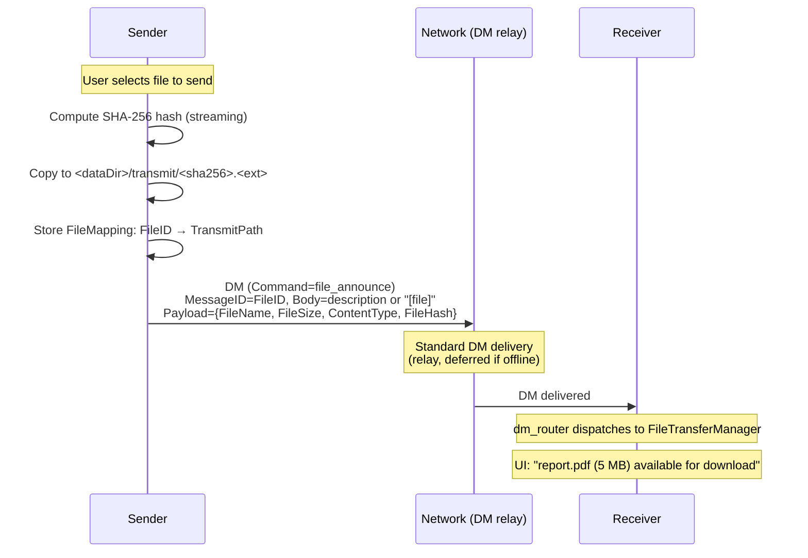
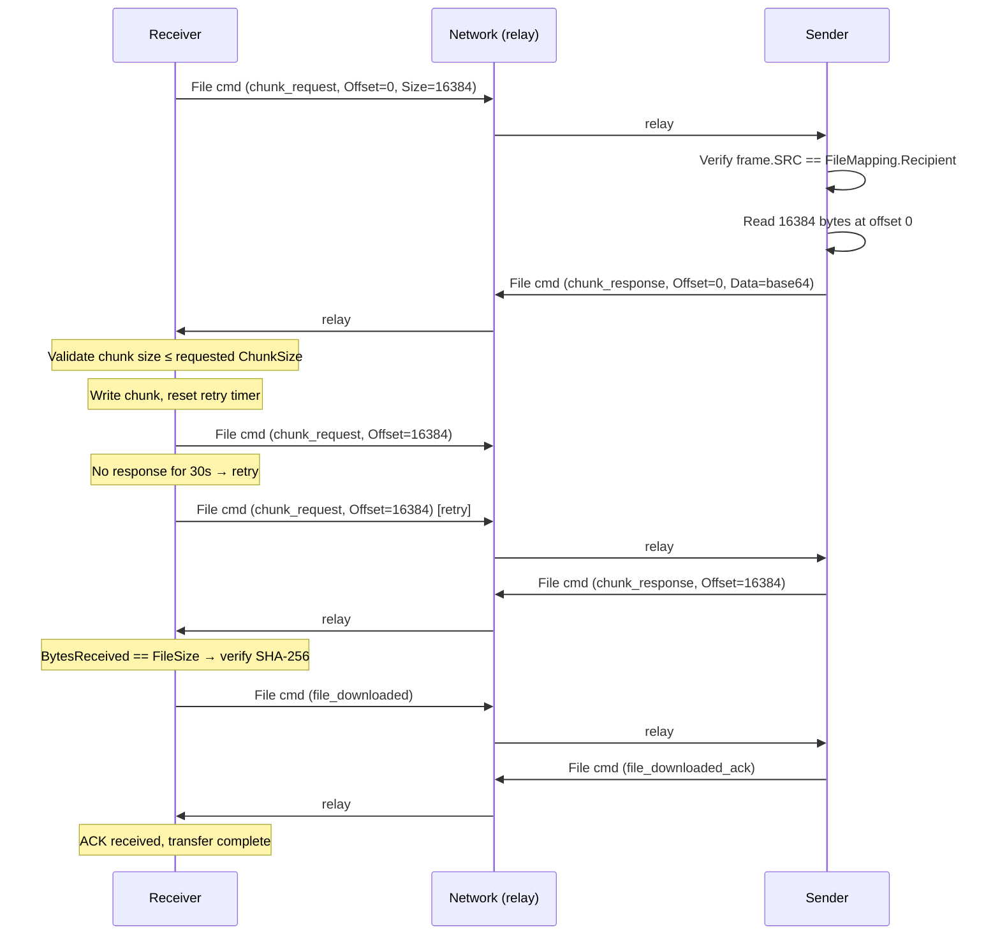
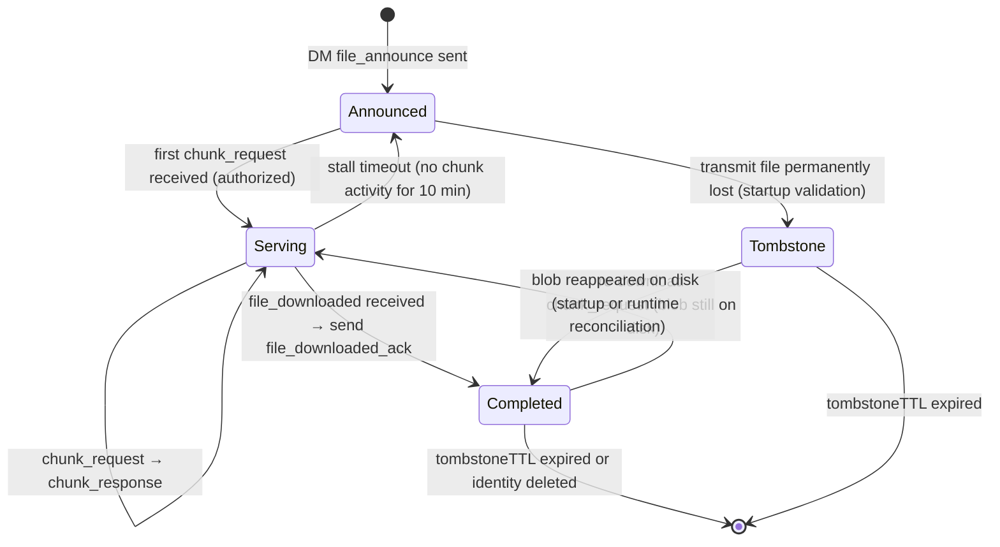
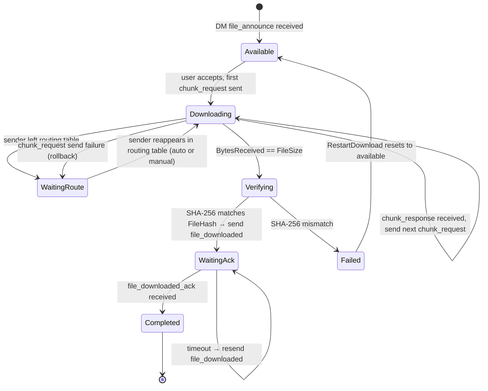
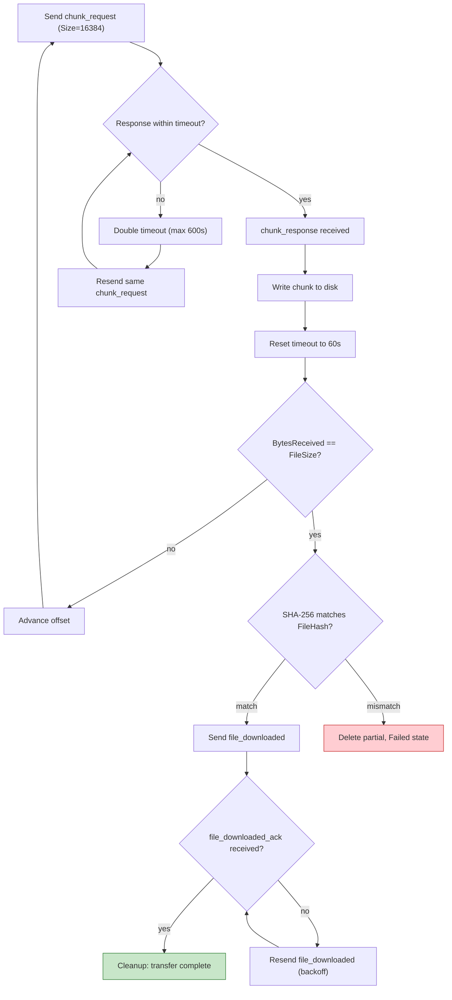
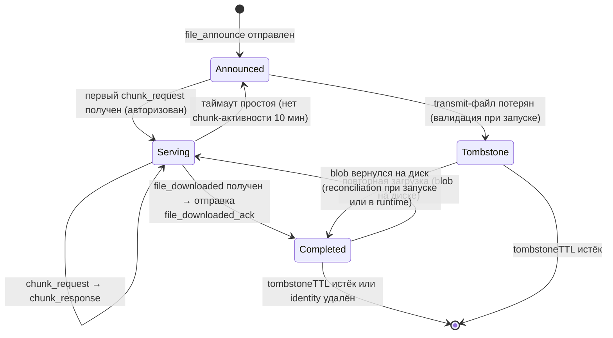
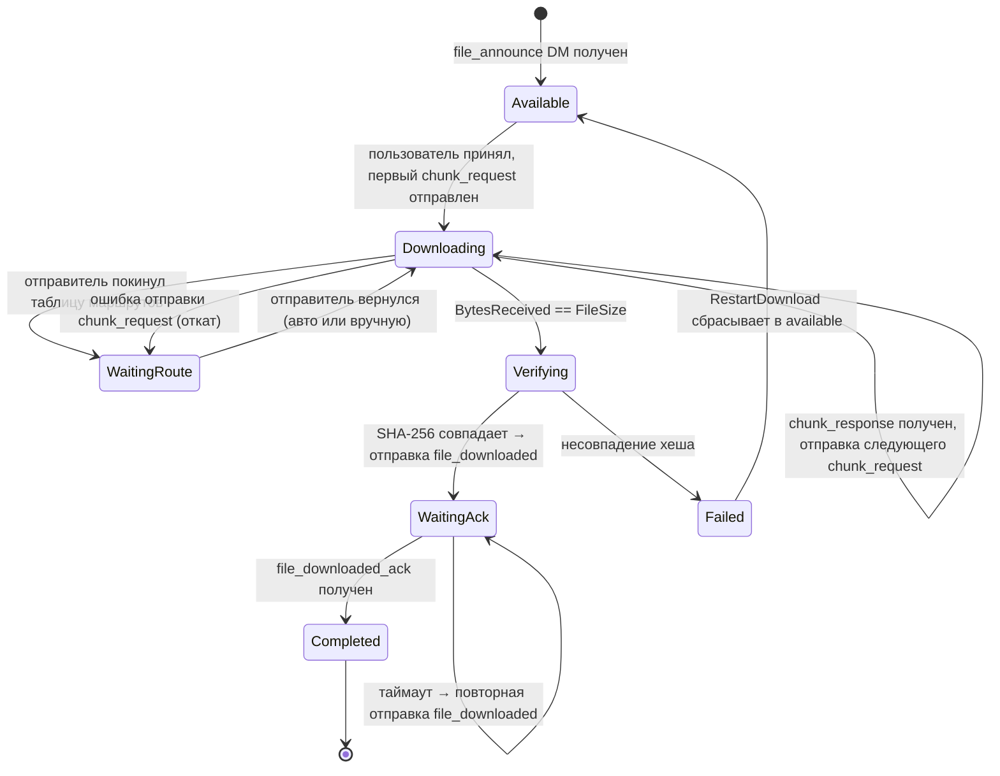
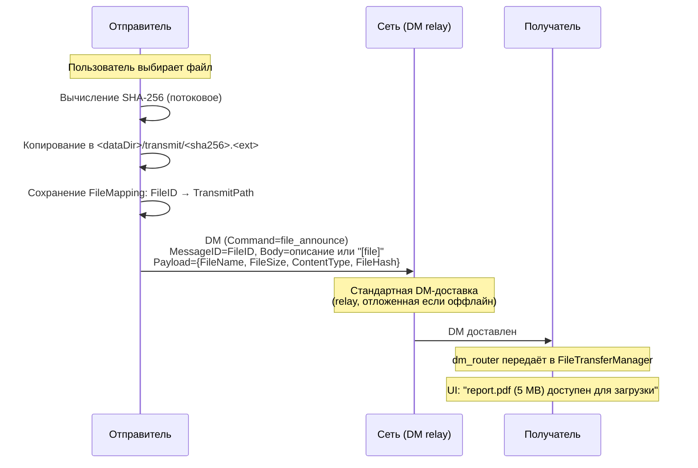
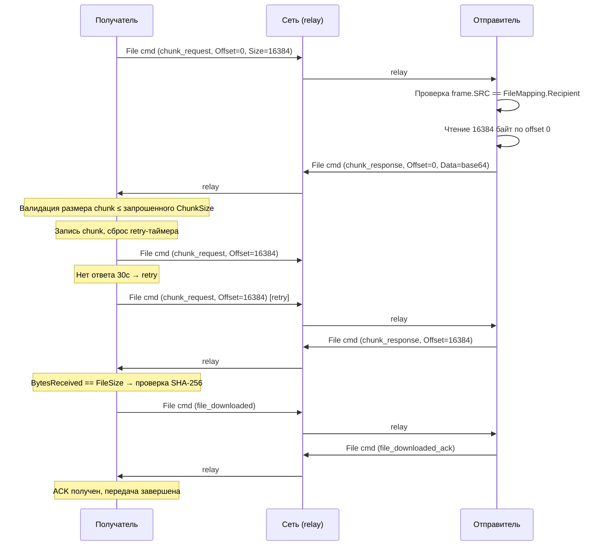
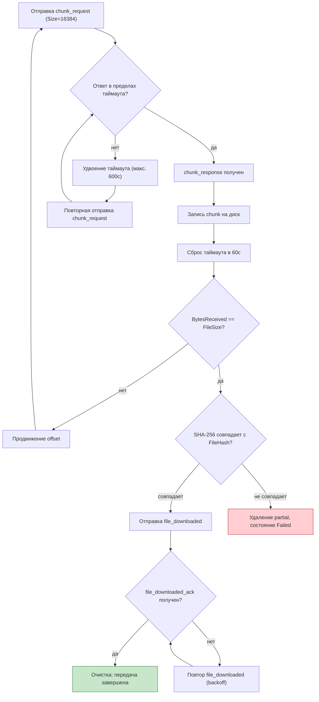

# File Transfer Protocol

## Overview

File transfer in Corsa uses a dual-channel architecture. The announcement
that a file is available travels through the standard DM pipeline (stored
in chatlog, delivery receipts, gossip fallback). All subsequent transfer
commands use a separate protocol frame (`FileCommandFrame`) with its own
best-route routing, independent of the DM subsystem.

Transit nodes see only cleartext routing headers (SRC, DST, TTL,
MaxTTL, timestamp, nonce, signature). The command type is inside the
encrypted payload — invisible to relays.

## Channels

| Aspect            | DM channel (`file_announce`)      | File command channel                                |
| ----------------- | --------------------------------- | --------------------------------------------------- |
| Wire format       | Sealed DM envelope (PlainMessage) | FileCommandFrame                                    |
| Stored in chatlog | Yes                               | No                                                  |
| Delivery receipts | Yes                               | No                                                  |
| Gossip fallback   | Yes                               | No                                                  |
| Pending queue     | Yes                               | No                                                  |
| Routing           | Standard DM relay                 | Best-route with `file_transfer_v1` capability check |

**DM channel** (topic=`"dm"`): only `file_announce`. This is a standard
DM message — stored in chatlog, delivery receipts, gossip fallback,
pending queue. It is the only user-visible artifact of a file transfer:
the chat bubble that says "Alice sent you a file."

**File command channel**: `chunk_request`, `chunk_response`,
`file_downloaded`, `file_downloaded_ack`. These are separate protocol
frames with their own wire format and routing semantics. A file command
is a first-class protocol command — the same kind as `hello`, `ping`,
or `pong` — not a variation of a DM.

## Capability Gating

File transfer requires the `file_transfer_v1` capability negotiated
during the hello/welcome handshake. Only peers advertising this
capability receive or relay FileCommandFrame traffic. The `file_announce`
DM is not gated because it uses the standard DM pipeline.

The capability gate is **strict** — the sender checks the recipient's
capability before sending any file command (DM or file command). Legacy
nodes never receive messages with `Command` fields. The
`json:"command,omitempty"` tag ensures the field is absent in normal
text DMs, so legacy nodes' JSON unmarshaling is unaffected.

## File command wire format

<table>
<tr>
  <th>SRC</th><th>DST</th><th>TTL</th><th>MaxTTL</th><th>Time</th><th>Nonce</th><th>Signature</th><th>Payload (encrypted)</th>
</tr>
<tr>
  <td colspan="7" style="text-align:center"><b>cleartext (visible to transit)</b></td>
  <td style="text-align:center"><b>end-to-end encrypted: {command, data} — only DST can read</b></td>
</tr>
</table>

- `SRC` — sender PeerIdentity (cleartext, visible to transit nodes)
- `DST` — recipient PeerIdentity (cleartext, visible to transit nodes)
- `TTL` — hop counter (cleartext, uint8, max 255). Decremented by 1 at
  each transit hop. When TTL reaches 0, the frame is silently dropped.
- `MaxTTL` — sender-set hop budget cap (cleartext, uint8). Set equal to
  TTL by the sender and included in the nonce hash. Relays decrement TTL
  but cannot change MaxTTL without invalidating the nonce → signature
  chain. Each processing node enforces TTL ≤ MaxTTL, preventing relay
  TTL inflation attacks.
- `Time` — unix seconds (cleartext, freshness check). Transit nodes drop
  frames with `|now - Time| > 5 min`.
- `Nonce` — hex-encoded SHA256 digest (cleartext, replay detection).
  `Nonce = hex(SHA256(SRC||DST||MaxTTL||Time||Payload))`. Transit nodes
  use FIFO cache to drop duplicate nonces.
- `Signature` — ed25519 signature (cleartext, sender authentication).
  `Signature = ed25519_sign(SRC_privkey, Nonce)`. Transit nodes verify
  before forwarding.
- `Payload` — serialized JSON encrypted end-to-end between SRC and DST.
  Contains `command` (FileAction) and command-specific fields (FileID,
  Offset, Data, etc.)

Transit nodes see **only** SRC, DST, TTL, MaxTTL, Time, Nonce, and
Signature. The command type is hidden inside the encrypted payload —
transit nodes cannot distinguish a chunk request from a download
confirmation or any other file operation.

## Commands

### file_announce (DM)

`file_announce` is **not** a new message type — it is a regular DM
(`send_dm`) that travels through the standard DM pipeline: sealed
envelope encryption, chatlog storage, delivery receipts, gossip
fallback, pending queue. The only difference is that the `PlainMessage`
struct inside the encrypted envelope carries two additional fields
(`command` and `command_data`) alongside the standard `body` and
`created_at`:

```
// Standard PlainMessage with file_announce extensions:
type PlainMessage struct {
    Body        string    `json:"body"`                    // standard: caption or "[file]"
    CreatedAt   time.Time `json:"created_at"`              // standard
    ReplyTo     string    `json:"reply_to,omitempty"`      // standard
    Command     string    `json:"command,omitempty"`       // NEW: "file_announce"
    CommandData string    `json:"command_data,omitempty"`  // NEW: JSON FileAnnouncePayload
}
```

When `dm_router` receives a DM with `Command = "file_announce"`, it
renders a file card in the chat UI instead of a plain text message.
The DM is stored in chatlog, counted as unread, and triggers
notifications — exactly like any other DM.

**FileAnnouncePayload** (JSON-encoded inside `command_data`):

```json
{
  "file_name": "document.pdf",
  "file_size": 1048576,
  "content_type": "application/pdf",
  "file_hash": "<hex-encoded SHA-256>"
}
```

The DM `body` field contains either a user-provided caption (e.g.
"Quarterly report, see page 3") or the sentinel `"[file]"` when no
description is given. Both satisfy existing non-empty body validation
in `node.Service.incomingMessageFromFrame()` and
`DesktopClient.SendDirectMessage()`.

**Wire example — file_announce with user description** (PlainMessage
JSON inside sealed envelope, after decryption):

```json
{
    "body": "Quarterly report, see page 3",
    "created_at": "2026-04-04T12:00:00Z",
    "command": "file_announce",
    "command_data": "{\"file_name\":\"report.pdf\",\"file_size\":5242880,\"content_type\":\"application/pdf\",\"file_hash\":\"a1b2c3...\"}"
}
```

**Wire example — file_announce without description** (sentinel):

```json
{
    "body": "[file]",
    "created_at": "2026-04-04T12:00:00Z",
    "command": "file_announce",
    "command_data": "{\"file_name\":\"report.pdf\",\"file_size\":5242880,\"content_type\":\"application/pdf\",\"file_hash\":\"a1b2c3...\"}"
}
```

**Key point:** from the network's perspective, `file_announce` is
indistinguishable from a normal DM. Transit nodes and the DM relay
pipeline treat it identically. Only the receiving `dm_router` reads
the `command` field to decide whether to render a file card or a text
message.

### FileCommandFrame (wire format)

All other commands use this frame format:

```json
{
  "type": "file_command",
  "src": "<sender PeerIdentity>",
  "dst": "<recipient PeerIdentity>",
  "ttl": 10,
  "max_ttl": 10,
  "time": 1712345678,
  "nonce": "<hex SHA-256(SRC||DST||MaxTTL||Time||Payload)>",
  "signature": "<hex ed25519(SRC_privkey, Nonce)>",
  "payload": "<base64 ECDH-encrypted JSON>"
}
```

### chunk_request

Sent by receiver to request a specific chunk.

```json
{
  "command": "chunk_request",
  "data": {
    "file_id": "<announce message ID>",
    "offset": 0,
    "size": 16384
  }
}
```

### chunk_response

Sent by sender with the requested chunk data.

```json
{
  "command": "chunk_response",
  "data": {
    "file_id": "<announce message ID>",
    "offset": 0,
    "data": "<base64-encoded chunk>"
  }
}
```

### file_downloaded

Sent by receiver after successful SHA-256 verification of the complete file.

```json
{
  "command": "file_downloaded",
  "data": {
    "file_id": "<announce message ID>"
  }
}
```

### file_downloaded_ack

Sender's acknowledgement, allowing receiver to stop resending.

```json
{
  "command": "file_downloaded_ack",
  "data": {
    "file_id": "<announce message ID>"
  }
}
```

**Command reference table:**

| Command               | Wire format       | Stored | Receipts | Router        | Payload content            | Description                                    |
| --------------------- | ----------------- | ------ | -------- | ------------- | -------------------------- | ---------------------------------------------- |
| `file_announce`       | DM (PlainMessage) | yes    | yes      | `dm_router`   | `FileAnnouncePayload`      | Sender announces a file available for download |
| `chunk_request`       | FileCommandFrame  | no     | no       | `file_router` | `ChunkRequestPayload`      | Receiver requests a file chunk                 |
| `chunk_response`      | FileCommandFrame  | no     | no       | `file_router` | `ChunkResponsePayload`     | Sender returns file data                       |
| `file_downloaded`     | FileCommandFrame  | no     | no       | `file_router` | `FileDownloadedPayload`    | Receiver confirms successful download          |
| `file_downloaded_ack` | FileCommandFrame  | no     | no       | `file_router` | `FileDownloadedAckPayload` | Sender acknowledges file_downloaded receipt    |

## Body field: user description and sentinel validation

`node.Service.incomingMessageFromFrame()` rejects DMs where
`msg.Body == ""`. `DesktopClient.SendDirectMessage()` also rejects empty
body. The `file_announce` DM `Body` contains either user-provided text
(a file description / caption) or the sentinel `"[file]"` when the
sender attaches a file without any description. Both satisfy existing
validation without code changes.

```
const FileDMBodySentinel = "[file]"
```

## Domain types

```
type FileID = MessageID

type FileAction string

const (
    FileActionAnnounce      FileAction = "file_announce"
    FileActionDownloaded    FileAction = "file_downloaded"
    FileActionDownloadedAck FileAction = "file_downloaded_ack"
    FileActionChunkReq      FileAction = "chunk_request"
    FileActionChunkResp     FileAction = "chunk_response"
)

type FileAnnouncePayload struct {
    FileName    string `json:"file_name"`
    FileSize    uint64 `json:"file_size"`
    ContentType string `json:"content_type"`
    FileHash    string `json:"file_hash"`
}

type ChunkRequestPayload struct {
    FileID MessageID `json:"file_id"`
    Offset uint64    `json:"offset"`
    Size   uint32    `json:"size"`
}

type ChunkResponsePayload struct {
    FileID MessageID `json:"file_id"`
    Offset uint64    `json:"offset"`
    Data   string    `json:"data"`
}

type FileDownloadedPayload struct {
    FileID MessageID `json:"file_id"`
}

type FileDownloadedAckPayload struct {
    FileID MessageID `json:"file_id"`
}

type FileCommandPayload struct {
    Command FileAction      `json:"command"`
    Data    json.RawMessage `json:"data"`
}
```

`FileID` equals the `MessageID` of the `file_announce` DM. `FileHash`
(SHA-256, hex-encoded) identifies the **content** for integrity
verification. `FileID` (UUID) identifies the **transfer event**. The
same file sent twice produces two FileIDs with the same FileHash.

## Routing and relay

### Routing pipeline

FileCommandFrame routing follows a strict pipeline (cheapest checks
first for DDoS resistance):

1. **Anti-replay check** (check-only): Nonce cache lookup (bounded LRU,
   10 000 entries, 5-minute TTL). O(1) map lookup, cheapest check.
   The nonce is **not** inserted at this step — only a presence check
   is performed. Inserting before authenticity verification would let
   a malicious relay pre-poison the cache with a nonce copied from a
   legitimate frame inside a forged wrapper, causing the real frame
   to be rejected as a replay.
2. **Deliverability check**: If DST ≠ self and no route to DST exists →
   silently drop. O(1) routing table lookup.
3. **Validation** (before any TTL mutation): Reject if TTL > MaxTTL
   or MaxTTL = 0 (inflation attack). Reject if
   |local_clock − Time| > 300 seconds (freshness). Recompute
   SHA-256(SRC||DST||MaxTTL||Time||Payload) and compare with frame
   nonce — mismatch → drop (tampered fields). MaxTTL is included in
   the hash so relays cannot inflate the hop budget without
   invalidating the nonce → signature chain. Validation MUST run on
   the raw incoming TTL: if DecrementTTL ran first, a malicious relay
   could set TTL = MaxTTL + 1 and the decrement would hide the
   violation.
4. **TTL decrement**: Decrement TTL by 1. If TTL = 0 before
   decrement → drop (hop budget exhausted, loop prevention).
5. **Signature**: ed25519_verify(SRC_pubkey, Nonce, Signature). If
   invalid → drop (forged frame).
6. **Atomic nonce commit** (`TryAdd`): atomically checks if the nonce
   is already cached and inserts it if not. Returns false if another
   goroutine committed the same nonce first (concurrent duplicate).
   Only performed after all authenticity checks (steps 3-5) have
   passed, ensuring forged frames never pollute the anti-replay state.
   The atomic check-and-insert closes the TOCTOU race between the
   early `Has` check (step 1) and the commit — exactly one concurrent
   delivery proceeds.
7. **Local delivery** (DST = self): Decrypt payload, dispatch to
   FileTransferManager.
8. **Relay restriction**: Only full nodes forward; client nodes drop
   DST ≠ self.
9. **Multi-route forwarding**: Collect all active routes to DST
   sorted by hop count (ascending), skip self-routes and
   expired/withdrawn entries. Try each next-hop in order until one
   succeeds. If all routes fail, silently drop.

If no active route exists, the frame is silently dropped. No retry
queue, no gossip fallback.

### Outbound delivery strategy (SendFileCommand)

When sending a file command to a remote peer, the outbound path
follows a strict fallback chain:

1. **Direct session**: Try to send to the destination peer directly.
   The session must have `file_transfer_v1` capability negotiated
   during handshake. Both outbound and inbound sessions are searched.
2. **Route table fallback**: If no direct session exists, look up
   routes to the destination in the routing table. For each active
   route sorted by hop count (ascending), try sending to the next-hop.
   Self-routes (where `next_hop == local_identity`) are skipped — they
   represent own direct-connection announcements and would cause a
   send-to-self loop.
3. **No route**: If the peer is not in the route table or all routes
   are expired/self/failed — log a warning and return an error.
   No silent drops on the send path.

### Response semantics: always OK, never error

When a node receives a file command and processes it locally (DST = self),
the response is always an acknowledgment — there are no error frames.
If the FileID is unknown or the node is overloaded, the command is
silently ignored. All error handling is application-level
(`FileTransferManager` uses timeouts and retries).

### Relay capability design

The endpoint `file_transfer_v1` capability is reused for transit
filtering — no separate `ft_relay_v1` is needed:

1. Every node that can forward a `FileCommandFrame` must also be able
   to receive one (validate TTL, signatures). The same capability covers
   both roles.
2. Each hop independently performs capability-aware forwarding: if hop N
   forwards to hop N+1, hop N+1 also checks `file_transfer_v1` on hop
   N+2. The constraint propagates hop-by-hop.
3. Only full nodes relay file commands. Client nodes process file commands
   addressed to them but never forward frames to other destinations.

## Frame authentication and anti-replay

### Nonce derivation

```
Nonce = hex(SHA256(SRC || DST || MaxTTL || Time || Payload))
```

The nonce binds all immutable frame fields into a single 32-byte digest.
Since `Payload` is included (the encrypted ciphertext, not plaintext),
different commands produce different nonces even within the same second.
`MaxTTL` is included so relays cannot inflate the hop budget without
invalidating the nonce → signature chain. `TTL` is excluded because it
is decremented at each hop — including it would invalidate the nonce
after the first forward.

### Signature

```
Signature = ed25519_sign(SRC_private_key, Nonce)
```

The signature covers SRC, DST, MaxTTL, Time, and Payload indirectly
through the nonce. Transit nodes verify it using SRC's public key.

### Nonce cache parameters

| Parameter   | Value     | Description                           |
| ----------- | --------- | ------------------------------------- |
| Max entries | 10,000    | LRU eviction when full                |
| Entry TTL   | 5 minutes | Entries older than 5 min auto-evicted |

### Why Payload is in the nonce hash

Without Payload, two different commands from the same SRC to the same DST
in the same second would produce identical nonces — the second would be
dropped as replay. Including the encrypted payload makes each frame's
nonce unique and prevents transit nodes from replacing the payload without
invalidating the nonce → signature chain.

### Why TTL is excluded from the nonce (but MaxTTL is included)

TTL is decremented at each hop. If it were included in the hash, the
nonce would change after the first forward, and all subsequent transit
nodes would fail the binding check. MaxTTL is set equal to TTL by the
sender and never changes in transit — including it in the nonce prevents
relay nodes from inflating TTL beyond the sender's original hop budget.
Each processing node enforces TTL ≤ MaxTTL.

## Ban scoring for invalid file commands

When a file command arrives with DST = self and the sender is a
**direct-connect peer** (not relayed), invalid requests increase the
peer's ban score:

- `chunk_request` with unknown FileID (no FileMapping, no tombstone)
- `chunk_request` where SRC ≠ FileMapping.Recipient (unauthorized)
- `chunk_request` with offset ≥ FileSize (out-of-range — rejected before ReadChunk to prevent zero-byte responses)
- `chunk_response` with unknown FileID (unsolicited data)
- `chunk_response` whose offset does not match the receiver's expected `NextOffset` (stale/duplicate — rejected before disk write to prevent partial file corruption)
- `chunk_response` whose decoded payload exceeds the requested `ChunkSize`
- `chunk_response` whose decoded payload is smaller than `ChunkSize` but does not complete the file (undersized non-final chunk — fail-fast instead of building a doomed transfer)
- `chunk_response` with zero-length payload before transfer is complete (livelock prevention)
- `file_downloaded` / `file_downloaded_ack` with unknown FileID
- Malformed payload (cannot decrypt or cannot unmarshal)
- Invalid signature or nonce binding from direct peer

Each invalid request adds +1. When ban score reaches the threshold
(default 10), the node disconnects the peer. Ban score decays over time
(-1 per 5 minutes). Only direct-connect peers are scored — relayed
commands do not increase ban score.

## File announce flow



**File announce flow**

## Pull-based transfer model

The receiver controls the download pace (stop-and-wait):

1. Receiver receives `file_announce` DM
2. Receiver sends `chunk_request` (offset=0, size=16KB)
3. Sender responds with `chunk_response`
4. Receiver writes chunk, sends next `chunk_request`
5. Repeat until all bytes received
6. Receiver verifies SHA-256 hash
7. Receiver sends `file_downloaded`
8. Sender acknowledges with `file_downloaded_ack`

One chunk in flight at a time — natural self-throttling without
additional rate limiting.

The receiver validates the `chunk_response` offset **before any disk
write**: if `resp.Offset != NextOffset`, the response is stale or
duplicated and is dropped without I/O. This prevents silent corruption
of the .part file by delayed or out-of-order chunks.

The receiver rejects any `chunk_response` whose decoded payload exceeds
the requested `ChunkSize`. This prevents memory/disk pressure from a
misbehaving or malicious sender.

Non-final chunks smaller than `ChunkSize` are rejected: if
`offset + len(chunk) < FileSize` and `len(chunk) < ChunkSize`, the
response is truncated. Accepting it would shift all subsequent offsets
and guarantee a hash mismatch at verification — rejecting early avoids
wasting bandwidth on a doomed transfer. The last chunk is exempt because
the sender clamps it to the remaining bytes.

Zero-length `chunk_response` frames are also rejected when the transfer
is not yet complete (`BytesReceived < FileSize`). An empty chunk at the
expected offset would leave `NextOffset` unchanged and refresh
`LastChunkAt`, creating a tight no-progress loop that defeats stall
detection.

The sender also validates requests before reading: `chunk_request` with
`Offset >= FileSize` is rejected immediately (no disk I/O, no state
transition to `senderServing`). When the offset is valid but the
requested chunk extends past EOF, the sender clamps the read size to
the remaining bytes (`FileSize - Offset`) so the response always
carries exactly the expected data.

## Download flow with retry



**Download flow with retry**

## Cryptographic authorization of chunk requests

Every `chunk_request` is a `FileCommandFrame` with encrypted payload.
`FileTransferManager` performs authorization before reading any file data:

1. `file_router` receives FileCommandFrame with DST = self
2. `file_router` decrypts payload, reads Command
3. `file_router` dispatches to FileTransferManager
4. FileTransferManager looks up FileMapping by FileID
5. If FileMapping not found → silently ignore
6. Verify frame.SRC == FileMapping.Recipient
7. If mismatch → silently ignore (unauthorized requester)
8. If match → proceed with command

Every `FileMapping` stores the `Recipient` identity. **All** file
commands referencing a FileID — not just `chunk_request` but also
`file_downloaded` — MUST verify that frame.SRC == FileMapping.Recipient.
Combined with ECDH payload encryption, this provides two layers of
protection: (1) cryptographic authentication, (2) authorization against
stored Recipient.

## Transfer state machines

### Sender-side states (per FileID)



**Sender state machine**

> **Planned (not yet implemented):** `TemporarilyUnavailable` state with
> grace period — see [roadmap](../roadmap.md#file-transfer-protocol).

### Receiver-side states (per FileID)



**Receiver state machine**

#### Restart failed download

When a receiver-side download ends in `Failed` (hash mismatch, persistent
network errors, etc.), the user can trigger `RestartDownload` which resets
the mapping to `Available` with zeroed progress, bumped generation, and
cleared partial path. The generation bump invalidates any in-flight
deferred actions from the old attempt. After restart the user initiates a
fresh download via `StartDownload`.

> **Planned (not yet implemented):** `Evicted` state with LRU eviction
> — see [roadmap](../roadmap.md#file-transfer-protocol).

## Retry and backoff strategy

All periodic maintenance runs from a single background loop (10-second
tick) that calls two functions: `tickSenderMappings` (one pass over
sender mappings) and `tickReceiverMappings` (one pass over receiver
mappings). Each function uses a switch on the mapping state to handle
every state-dependent rule in a single scan. This design ensures new
per-state rules cannot be silently missed and eliminates the class of
bugs where duplicate scans over the same map diverge in behavior.

`tickReceiverMappings` collects deferred I/O actions (chunk retries,
resume, cleanup) under the lock and executes them after the lock is
released. Each deferred action re-checks the mapping state via
`receiverStateIs` before performing destructive I/O or sending network
traffic: if `CancelDownload` or `CleanupPeerTransfers` changed or
removed the mapping in the gap between snapshot and execution, the
action is silently skipped.

### Handler structure: validate → I/O → commit

Both `HandleChunkRequest` (sender) and `HandleChunkResponse` (receiver)
follow a three-phase pattern to separate locked validation from
unlocked I/O:

1. **Validate (locked):** `validateChunkRequestLocked` /
   `validateChunkResponseLocked` — all guards (auth, state, offset,
   size, decode) run under the mutex. On success, captures immutable
   fields into a `chunkServePrep` / `chunkReceivePrep` struct and
   unlocks. On failure, unlocks and returns error.
2. **I/O (unlocked):** disk read/write and network send run without
   holding the lock.
3. **Commit (locked):** `commitChunkProgressLocked` re-validates the
   mapping (cancel/restart during unlock window) and advances progress.

This separation ensures that every new validation rule is added in one
place (the validate function), not scattered among manual `m.mu.Unlock()`
calls in the main handler body.

---

### Chunk request stall recovery

```
Stall detection interval:  10 seconds (tick)
Stall timeout:             30 seconds since last chunk received
Max chunk retries:         10
```

If no `chunk_response` arrives within 30 seconds of the last received
chunk, the stall detector re-sends the `chunk_request` for the current
offset. A successful response resets the retry counter to 0. After 10
consecutive stall retries the download transitions to `failed` and the
partial file is deleted.

Before retrying, the sender's reachability is checked: there must be a
direct session with `file_transfer_v1` capability, or an active route
whose next-hop has `file_transfer_v1`. Routes through next-hops without
file transfer support are ignored — they cannot carry file commands.
If the sender is unreachable, the retry is skipped entirely — no retry
budget is consumed.

### Stale serving slot reclamation

```
Detection interval:       10 seconds (tick, same as chunk stall)
Serving stall timeout:    10 minutes since last chunk served
Recovery transition:      senderServing → senderAnnounced
```

A sender transitions from `announced` to `serving` when the first
`chunk_request` arrives. If the receiver disappears (crash, disconnect,
network failure) without completing the transfer, the sender mapping
stays in `serving` indefinitely — permanently consuming one of the 16
concurrent serving slots.

Every 10 seconds the retry loop inspects all `senderServing` mappings.
If `LastServedAt` (the timestamp of the last successfully sent
`chunk_response`) is older than `senderServingStallTimeout` (10 min),
the mapping reverts to `senderAnnounced`. This frees the slot while
keeping the mapping alive so the receiver (or a new receiver) can
re-acquire it with a fresh `chunk_request`.

`LastServedAt` is persisted in the transfers JSON file, so the stall
timeout is correctly evaluated after a node restart.

---

### Resume transition (waiting_route → downloading)

All three resume paths (`StartDownload`, `ForceRetryChunk`,
`tickReceiverMappings`) share the same two-phase transition implemented
by `prepareResumeLocked` and `sendChunkWithRollback`:

1. **Partial file validation** (under lock): if `NextOffset > 0`, verify
   the `.part` file exists and is at least `NextOffset` bytes. If the
   file is missing or truncated, reset offset and byte counter to 0 and
   set `truncatePartial = true` in the snapshot. Additionally, if the
   `.part` file is larger than `FileSize`, the offset is also reset to 0
   — an oversized partial indicates corruption or tampering and cannot be
   trusted for resume.
2. **Snapshot capture**: record `prevState`, `prevOffset`,
   `prevBytesReceived` after the validation reset so rollback preserves
   the corrected values.
3. **State transition**: set `receiverDownloading`, reset `ChunkRetries`,
   update `LastChunkAt`. Persist via `saveMappingsLocked`.
4. **Truncate stale partial** (outside lock): if `truncatePartial` is
   set, remove the existing `.part` file. `writeChunkToFile` uses
   `WriteAt` which only overwrites the prefix — stale trailing bytes
   from a previous larger attempt would remain and cause hash
   verification to fail.
5. **Send** (outside lock): call `requestNextChunk`.
6. **Rollback on failure**: re-acquire lock, verify state is still
   `receiverDownloading` (guard against concurrent changes), restore
   snapshot values, persist.

This centralised logic eliminates the class of bugs where one path was
missing partial file validation or rollback.

### file_downloaded ack retry

```
Initial timeout:      60 seconds
Backoff multiplier:   2x
Maximum timeout:      600 seconds (10 minutes)
Max retries:          21
```

On timeout: resend same `file_downloaded`, double wait time.
On response: transfer completed.
Sender offline: the retry counter and backoff still advance on each
tick — only the actual send is skipped. This guarantees that the retry
budget drains even when the sender stays permanently offline, allowing
the receiver to transition to `completed` locally after exhausting all
retries (~3 hours worst case).



**Download loop with retry**

## Cancellation semantics

There is no `file_cancel` command in the current protocol. The file
command channel uses "always OK, never error" response semantics — an
explicit cancel would be the only error-like signal and would break
protocol uniformity.

Cancellation via delete-message DM (deleting `file_announce` triggers
file transfer cleanup) is planned for Iteration 6 (Message deletion
controls).

**Implicit cancellation (current behavior):**

- **Sender-side:** if the transmit file is permanently lost (detected
  during startup validation), the mapping transitions to tombstone. No
  protocol signal is sent — the receiver retries with exponential backoff
  until timeout.
- **Receiver-side:** the receiver can cancel in `downloading`,
  `verifying`, or `waiting_route` states (local decision). The sender's
  FileMapping remains active and will respond to future `chunk_request`s
  if the receiver resumes. Cancel is **not** permitted in `waiting_ack`:
  at that point the receiver has already sent `file_downloaded` and the
  sender may have transitioned to `completed` (releasing the transmit
  file). Resetting to `available` would advertise a re-download that
  the protocol cannot fulfill.
- **Tombstone handling:** when a `chunk_request` arrives for a
  tombstoned FileID, the sender checks whether the blob exists on disk.
  If the blob is present, the mapping is resurrected to completed and the
  chunk is served. If the blob is missing, the request is silently ignored.

## file_downloaded_ack — delivery confirmation

The file command channel is fire-and-forget with no delivery guarantees.
Without an acknowledgment, the receiver cannot know whether the sender
received `file_downloaded` and cleaned up the `FileMapping`.

**Flow:**

1. Receiver verifies SHA-256, transitions to `WaitingAck`, sends
   `file_downloaded`.
2. Sender receives `file_downloaded`, marks FileMapping as completed,
   sends `file_downloaded_ack`.
3. Receiver receives `file_downloaded_ack`, transitions to `Completed`.

**Retry:** the receiver resends `file_downloaded` with the same
exponential backoff (60s → 120s → ... → 600s max). Each resend is
idempotent — the sender responds with `file_downloaded_ack` regardless.

**Timeout:** if the receiver does not receive `file_downloaded_ack`
after the maximum backoff period, it transitions to `Completed` anyway
(local cleanup). The sender cleans up via tombstone TTL.

## Cleanup on identity deletion

When a user deletes a chat (identity), all file transfer mappings
associated with that peer are cleaned up:

**Sender mappings** (we sent files to the deleted peer):
- Active (non-completed) mappings: transmit file ref count is released.
  If no other mapping references the same hash, the transmit file is
  deleted from `<dataDir>/transmit/`.
- Completed/tombstone mappings: ref was already released during
  `HandleFileDownloaded`, so no double-release occurs.

**Receiver mappings** (we received files from the deleted peer):
- Completed downloads in `<downloadDir>/received/` are deleted.
- Partial downloads in `<downloadDir>/partial/` are deleted.

The cleanup is best-effort: file I/O errors are logged but do not
block identity deletion. The transfers JSON file is updated atomically
after removing the entries.

## Why no CRC-32

1. **AEAD covers integrity.** AES-GCM provides authenticated encryption.
   A CRC-32 outside the ciphertext could be forged; inside the
   ciphertext, it duplicates GCM's built-in integrity.
2. **End-to-end hash is sufficient.** The receiver verifies SHA-256 of
   the assembled file against FileHash from the announce.

## Encryption

File command payloads use ECDH (X25519) + AES-256-GCM encryption with a
domain-separated key derivation label (`corsa-file-cmd-v1`), distinct
from DM encryption (`corsa-dm-v1`).

Wire format: `ephemeral_pub(32) || nonce(12) || ciphertext(variable)`,
base64-encoded.

Only sealed for the recipient (one-directional), unlike DMs which are
dual-sealed. File commands are transient protocol traffic, not stored
messages.

## Chunk size derivation

`DefaultChunkSize` is derived from the relay admission limit
(`maxRelayBodyBytes = 65536`) and FileCommandFrame overhead:

```
Wire budget:           65536 bytes
Frame header:          ≈ 150 bytes
Encryption overhead:   ≈ 50 bytes
Available payload:     65536 − 200 = 65336 bytes
Base64 expansion:      4/3×
JSON overhead:         ≈ 150 bytes
Raw theoretical max:   ≈ 48852 bytes
Safety margin:         ÷ 3
DefaultChunkSize:      16384 bytes (16 KB)
```

16 KB provides headroom and aligns with common block sizes. The `Size`
field in `ChunkRequestPayload` allows smaller chunks for low-bandwidth
links.

## Sender-side persistent storage

### Transmit directory

When the user selects a file to send, it is copied into
`<dataDir>/transmit/` before the `file_announce` DM is sent. The copy is
named `<sha256hex>.<ext>`. This provides:

1. **Privacy.** TransmitPath stores a path inside `<dataDir>/transmit/`,
   never the original filesystem location.
2. **Deduplication.** If `<sha256hex>.<ext>` already exists, skip copy.
   Multiple transfers of the same content share one physical copy.
3. **Immutability.** The file is never modified after creation.

`SendFileAnnounce` calls `PrepareFileAnnounce` on `FileTransferManager`
which atomically validates the transmit file, checks the sender quota, and
returns a `SenderAnnounceToken`. The token reserves a pending sender slot
and a transmit-file reference. If preparation fails, the caller receives
an error immediately — RPC returns HTTP 500, desktop UI updates the send
status. On success, `dm_router` sends the DM asynchronously: on success
it calls `token.Commit(fileID, recipient)` to create the sender mapping;
on any failure the deferred `token.Rollback()` releases all reservations
and cleans up orphaned transmit blobs. This eliminates the class of bugs
where a failed DM send leaves ghost file cards or leaked transmit files.

The optional `onAsyncFailure` callback is invoked when the async goroutine
fails (PrepareAndSend error or peer-removed race). The desktop UI passes
`restoreAttach` which pushes the file path back into the composer so the
user can retry without re-picking the file. RPC callers pass nil.

### FileMapping

```
type FileMapping struct {
    FileID       MessageID
    TransmitPath string
    Recipient    PeerIdentity
    FileSize     uint64
    FileHash     [32]byte
    State        FileMappingState
    RefCount     int
    CreatedAt    time.Time
    DeletedAt    time.Time
}
```

TransmitPath is **never** exposed through RPC, wire protocol, or any
external interface.

### RefCount and transmit file lifecycle

Multiple FileMapping entries can reference the same physical file (same
SHA-256 hash, different FileID/Recipient). The transmit blob lives as
long as any non-tombstone mapping references it — this includes
completed transfers, because the file may be re-downloaded from the same
message (new device, retry, etc.). The blob is deleted only when:

- the identity/peer is removed (`CleanupPeerTransfers`), or
- the mapping expires after `tombstoneTTL` (30 days) in `tickSenderMappings`.

`HandleFileDownloaded` does NOT release the transmit file. The completed
mapping holds a ref so the sender can re-serve the file on subsequent
`chunk_request` messages (completed → serving transition).

### Tombstones

When a transfer is canceled or the transmit blob is found missing at
startup, the mapping transitions to a tombstone (retained 30 days). This
distinguishes "never heard of this FileID" from "known but unavailable".
Tombstones do not hold a reference to the transmit file.

**Filesystem as source of truth.** The physical presence of the blob on
disk — not the state field — determines whether a file can be served.
If a tombstoned mapping's blob reappears on disk (re-send of same
content, manual restore, etc.), the mapping is resurrected to completed:

- **At startup:** `loadMappings` checks every tombstone against the
  filesystem and resurrects those whose blob exists.
- **At runtime:** `validateChunkRequest` checks the filesystem when a
  `chunk_request` arrives for a tombstoned FileID. If the blob exists,
  the mapping is resurrected to completed (with `Acquire` to re-establish
  the ref), and the chunk is served immediately — no restart required.

### Startup validation

On app start, scan active mappings, verify transmit files exist:

1. If the specific transmit file is missing → transition to tombstone
   (genuine data loss).
2. If a tombstoned mapping's blob exists on disk → resurrect to completed.
3. `ValidateOnStartup` rebuilds ref counts from active mappings. No blob
   cleanup is performed — transmit blobs are deleted only when identity
   or message is removed.

> **Planned (not yet implemented):** `TemporarilyUnavailable` state with
> grace period (24 hours) for cases when `<dataDir>/transmit/` itself is
> temporarily inaccessible — see
> [roadmap](../roadmap.md#file-transfer-protocol).

### Transfer mappings persistence

Both sender and receiver file mappings are persisted to
`<dataDir>/transfers-<identity_short>-<port>.json` after every
state transition (same naming convention as chatlog). This ensures
transfer state survives node restarts — the receiver can resume a
partially completed download, and the sender can continue serving chunks
for announced files. Multiple node identities on the same machine
produce separate files without collisions.

**File format:**

```json
{
  "version": 1,
  "updated_at": "2026-04-05T12:00:00Z",
  "transfers": [
    {
      "file_id": "msg-uuid-123",
      "file_hash": "abc123...",
      "file_name": "photo.jpg",
      "file_size": 1024000,
      "content_type": "image/jpeg",
      "peer": "peer-identity-bob",
      "role": "sender",
      "state": "serving",
      "created_at": "2026-04-05T11:55:00Z",
      "bytes_served": 512000,
      "transmit_path": "<dataDir>/transmit/abc123.jpg"
    }
  ]
}
```

**Atomicity:** writes use temp-file + rename to prevent corruption on
crash mid-write. The file is rewritten in full on every state change.

**Startup:** `NewFileTransferManager` loads the persisted file, populates
in-memory sender/receiver maps, and passes active file hashes to
`fileStore.ValidateOnStartup()` to rebuild reference counts.
Receiver mappings with `ChunkSize == 0` (legacy
entries or entries persisted before the field was introduced) are
normalized to `DefaultChunkSize` during loading to prevent
`HandleChunkResponse` from rejecting every non-empty chunk as oversized.

**Crash recovery for `receiverVerifying`:** a crash between `os.Rename`
(moving `.part` → downloads) and persisting `receiverWaitingAck` leaves
the mapping stranded in `receiverVerifying`. On startup,
`reconcileVerifyingOnStartup` probes the filesystem to determine the
correct state: (1) if the completed file exists in the downloads
directory, promote to `receiverWaitingAck`; (2) if the `.part` file
exists, reset to `receiverWaitingRoute` at the partial file's size so
the retry loop can resume — if the `.part` file is larger than `FileSize`,
the offset is clamped to 0 to prevent resuming at an impossible position;
(3) if neither file exists, mark `failed`.

**Version check:** if the file version does not match the expected
version, the node starts with empty maps (fresh state). This prevents
subtle bugs from schema drift.

## Code structure

The file transfer subsystem is split into multiple files for maintainability:

| File | Responsibility |
| ---- | -------------- |
| `file_transfer.go` | Shared types (`FileTransferManager`, sender mapping, resource limits), sender-side operations (`HandleChunkRequest`, `HandleFileDownloaded`), sender tick, command dispatch, query/RPC snapshot methods, `CleanupPeerTransfers` |
| `file_transfer_receiver.go` | Receiver state machine, receiver file mapping, validated constructor (`newReceiverMapping`), invariant normalizer (`normalizeReceiverMapping`), all receiver operations (`RegisterFileReceive`, `StartDownload`, `HandleChunkResponse`, `CancelDownload`, `RestartDownload`, `ForceRetryChunk`), receiver tick with deferred action executor, `writeChunkToFile` |
| `file_transfer_persist.go` | On-disk JSON serialization/deserialization of transfer mappings, atomic write, crash recovery (`reconcileVerifyingOnStartup`) |
| `file_store.go` | Transmit file storage, ref-counting, SHA-256 hashing, symlink-safe open (`openNoFollow`), symlink verification (`verifyNotSymlink`, `verifyPartialIntegrity`, `verifyFileIdentity`) |

**Deferred action pattern:** the receiver tick collects actions under the
lock and executes them after unlock. Each `receiverTickAction` carries a
`requiredState` field and a `generation` counter — the dispatch loop checks
both against the current mapping before executing. The `generation` field
is a monotonic counter assigned by `RegisterFileReceive` and
`CancelDownload`; it prevents a stale cleanup action from one transfer
attempt from deleting the `.part` file of a newer attempt for the same
`fileID` (e.g. when `CleanupPeerTransfers` removes a failed mapping and
the same file is re-announced and re-downloaded). The same generation
guard protects `onDownloadComplete`: the verifier captures the generation
at entry and uses `removePartialIfOwned` (which calls `receiverStateIs`
with the captured generation) before deleting the `.part` file on any
error path. If the user cancels and restarts while verification is
running, the stale verifier's cleanup is skipped because the generation
no longer matches.

**Validated constructor:** `newReceiverMapping` enforces domain invariants
at creation time (e.g. `ChunkSize = DefaultChunkSize`).
`normalizeReceiverMapping` enforces the same invariants on deserialized
mappings, catching zero/invalid values that would cause runtime failures.

## Resource limits and quotas

| Limit                               | Value       |
| ----------------------------------- | ----------- |
| Default chunk size                  | 16 KB       |
| Max concurrent downloads (receiver) | 1           |
| Max concurrent serving (sender)     | 16          |
| Max file mappings per node          | 256         |
| Max partial download storage        | 1 GB        |
| Nonce cache size                    | 10,000      |
| Nonce TTL                           | 5 minutes   |
| Clock drift tolerance               | 5 minutes   |
| Tombstone TTL                       | 30 days     |
| Serving stall timeout               | 10 minutes  |
| Initial retry timeout               | 60 seconds  |
| Max retry timeout                   | 600 seconds |
| Retry backoff multiplier            | 2x          |

**MaxConcurrentServing — silent ignore.** When all serving slots are
occupied and a new `chunk_request` arrives, the sender silently ignores
it. The receiver retries via standard backoff.

**MaxFileMappings — reject on full, never evict active.** Active
mappings are never evicted. Only mappings in terminal states
(completed, canceled) are eligible for cleanup.

## Directory configuration

File transfer uses three directories derived from the node data directory.
The base data directory (`<dataDir>`) defaults to `.corsa` and follows
`CORSA_CHATLOG_DIR` when overridden.

| Variable             | Default               | Description                                  |
| -------------------- | --------------------- | -------------------------------------------- |
| `CORSA_CHATLOG_DIR`  | `.corsa`              | Base data directory for all node-local state |
| `CORSA_DOWNLOAD_DIR` | `<dataDir>/downloads` | Directory where received files are saved     |

Subdirectories created automatically:

| Path                      | Purpose                                        |
| ------------------------- | ---------------------------------------------- |
| `<dataDir>/transmit/`     | Content-addressed sender files (SHA-256 named) |
| `<downloadDir>/partial/`  | Receiver partial downloads                     |
| `<downloadDir>/received/` | Receiver completed downloads                   |

Transfer state is persisted in `<dataDir>/transfers-<short>-<port>.json`
alongside other per-node JSON files (identity, trust, queue, peers).

## File storage

Sender files are stored in `<dataDir>/transmit/<sha256>.<ext>` with
content-addressed naming for deduplication. Deduplication is keyed on
the content hash alone: if the same bytes are stored from sources with
different extensions (e.g. `.pdf` and `.txt`), only one physical copy
is kept and the first extension becomes canonical. Reference counting
tracks multiple recipients sharing the same physical file. When the
ref count reaches zero, all files matching `<hash>.*` are removed to
handle orphaned duplicates from earlier versions.

Receiver partial downloads are stored in
`<downloadDir>/partial/<file_id>.part`. Completed downloads are moved
to `<downloadDir>/received/<sha256>.<ext>`.

## Path traversal and injection protection

File names arrive from remote peers inside encrypted `file_announce`
payloads. A malicious sender could craft a file name containing path
traversal sequences (`../../../etc/cron.d/evil`) to write outside the
downloads directory, or inject glob wildcards into hash values to match
unintended files.

Defences are layered — each layer is independent, so a bypass of one
does not compromise the system:

1. **File name sanitisation** (`domain.SanitizeFileName`): applied at
   every network boundary where a file name enters the system. Decodes
   percent-encoded sequences iteratively (up to 3 rounds) before
   validation — `%2F`, `%2E`, `%5C`, `%00` and double-encoded variants
   like `%252F` are all resolved before `filepath.Base` runs. Guarantees
   no directory separators, no `..` sequences, no null bytes, valid
   UTF-8, and a maximum length of 255 bytes. Falls back to `"unnamed"`
   when nothing remains after sanitisation.

2. **Hash validation** (`domain.ValidateFileHash`): enforces exactly 64
   hex characters. Prevents glob injection (`*`, `?`, `[`) and path
   traversal through crafted hash values passed to `filepath.Glob`.

3. **Path containment** (`ensureWithinDir`): verifies that every
   resolved path stays within the expected directory (transmit or
   downloads) after symlink resolution. Used as a final guard even when
   the inputs are already sanitised.

4. **Persistence re-validation**: file names and completed paths loaded
   from the transfers JSON file are re-sanitised and re-validated on
   startup. A tampered JSON file cannot escape directory boundaries.

5. **Unicode bidi control stripping**: removes U+202E (RLO) and 14
   other bidirectional/zero-width characters that can trick users into
   misreading file extensions (`innocent\u202Eexe.txt` → visually
   `innocenttxt.exe`).

6. **Control character stripping**: removes ASCII C0 controls (except
   tab), DEL, and Unicode C1 controls. Prevents log injection via
   embedded newlines and ANSI terminal escape sequences.

7. **Windows reserved name protection**: prefixes device names (CON,
   NUL, PRN, AUX, COM1-COM9, LPT1-LPT9) with underscore. These names
   can cause hangs or access hardware devices on Windows regardless of
   extension.

8. **Symlink TOCTOU guard** (two layers):
   - **Kernel-level prevention (`O_NOFOLLOW`)**: `writeChunkToFile` opens
     the partial file via `openNoFollow`, which ORs `syscall.O_NOFOLLOW`
     into the open flags. The kernel rejects the open with `ELOOP` if the
     final path component is a symlink — preventing `O_CREATE` from
     following the symlink and creating a file at an attacker-chosen
     target. This closes the window where the old approach (plain
     `os.OpenFile` + post-open check) would create the target file before
     any user-space verification could run.
   - **User-space identity check (defense in depth)**: after the open,
     `verifyNotSymlink` runs `os.Lstat` (does not follow symlinks) and
     compares the result with `f.Stat()` (Fstat on the open fd) via
     `os.SameFile`. This catches TOCTOU races where the path is swapped
     to a symlink between open and write.
   Hash verification in `onDownloadComplete` uses `verifyPartialIntegrity`
   which opens the file once, performs the same Lstat+Fstat identity check
   on the open fd, and hashes from that fd — eliminating the TOCTOU window
   that would exist if the symlink check and hash computation used separate
   open calls. Before `os.Rename`, `verifyFileIdentity` re-checks that
   the file at the path has the same device+inode as the verified fd,
   closing the window between fd close and rename.

9. **Integer overflow guard**: `writeChunkToFile` checks for uint64
   wrap-around before computing `offset + len(data)` to prevent
   writing to unexpected file positions.

10. **Delete containment**: `CleanupPeerTransfers` and `CancelDownload`
    validate `completedPath` against the downloads directory before
    calling `os.Remove`, preventing a tampered persistence file from
    causing deletion of arbitrary files.

11. **Sender offset/size validation**: `HandleChunkRequest` rejects
    `Offset >= FileSize` before any disk I/O or state transition. Valid
    requests are clamped to `min(requestedSize, FileSize - Offset)` so
    the sender never reads beyond the announced file boundary or produces
    zero-byte responses from EOF.

12. **Post-verify state re-validation**: `onDownloadComplete` re-checks
    the mapping state after every operation that drops the mutex (hash
    verification, file rename). If the state is no longer
    `receiverVerifying` (e.g. the user cancelled during verification),
    the completion path aborts without transitioning to `waiting_ack`
    or sending `file_downloaded`. `markReceiverFailed` also accepts an
    expected-state parameter and skips the transition if the state has
    changed, preventing a cancelled transfer from being overwritten
    with `failed`.

Entry points where sanitisation is applied:

| Entry point                   | Protection                                     |
| ----------------------------- | ---------------------------------------------- |
| `RegisterFileReceive`         | `ValidateFileHash` + `SanitizeFileName`        |
| `completedDownloadPath`       | `SanitizeFileName` + `ensureWithinDir`         |
| `resolveExistingDownload`     | `SanitizeFileName`                             |
| `partialDownloadPath`         | `SanitizeFileName` on file ID                  |
| `resolvePath` (transmit)      | `ValidateFileHash` + `ensureWithinDir`         |
| `HasFile` / `Acquire`         | `ValidateFileHash`                             |
| `ValidateOnStartup`           | `ValidateFileHash` on persisted hash keys      |
| `loadMappings`                | `SanitizeFileName` + `ensureWithinDir`         |
| RPC `send_file_announce`      | `ValidateFileHash` on input hash               |

## Download flow (receiver UI)

When a `file_announce` DM arrives from a remote peer, the receiver-side
mapping is registered automatically during message decryption
(`DMRouter.tryRegisterFileReceive`). The mapping starts in `available`
state.

The file card in the chat shows a download button while the receiver
mapping is in `available` state. When the user clicks the button:

1. UI calls `DMRouter.StartFileDownload(fileID)` in a goroutine.
2. `StartFileDownload` → `DesktopClient` → `node.Service` →
   `FileTransferManager.StartDownload`.
3. `StartDownload` transitions the mapping to `downloading` and sends
   the first `chunk_request` to the sender.
4. The file card switches from the download button to a progress bar.
5. As `chunk_response` frames arrive, `BytesReceived` increases and the
   progress bar updates (UI schedules periodic redraws every 500ms while
   transfer is in progress via `op.InvalidateOp`).
6. On completion, the status label shows "completed" (green) or "failed"
   (red).

Receiver mapping registration is idempotent — loading the same
conversation from DB re-registers all `file_announce` messages without
side effects. This ensures mappings survive node restarts.

## Offline behavior and cleanup

**Receiver offline:** download state persisted on disk (offset, partial
file, FileID). On restart, resumes from last offset when sender appears.

**Sender offline:** receiver enters `WaitingRoute`, resumes when sender
becomes reachable (direct session or route via a `file_transfer_v1`
capable next-hop).

**Transmit file deleted while receiver offline:** on next
`chunk_request`, sender checks the filesystem. If the blob has
reappeared (re-send of same content), the tombstone is resurrected
and the chunk is served. If the blob is genuinely gone, the request
is silently ignored.

**Tombstone cleanup:** purged after 30 days. Completed mappings retain
their transmit blob ref for the duration of `tombstoneTTL` so the file
can be re-downloaded. Transmit files are deleted when the last ref is
released (identity deletion or tombstone TTL expiry).

**Transmit directory cleanup.** `ValidateOnStartup` does NOT delete any
blobs at startup — it only rebuilds ref counts. Transmit blobs are
deleted exclusively through identity removal (`CleanupPeerTransfers`)
or message removal (`RemoveSenderMapping`).

> **Planned (not yet implemented):** periodic hourly GC with 7-day age
> threshold for orphaned transmit files, and LRU eviction of partial
> downloads when `MaxPartialDownloadStorage` is exceeded — see
> [roadmap](../roadmap.md#file-transfer-protocol).

## RPC commands

| Command                | Description                               |
| ---------------------- | ----------------------------------------- |
| `fetch_file_transfers` | List active/pending transfers (terminal excluded) |
| `fetch_file_mapping`   | Show active/pending sender mappings (no TransmitPath) |
| `retry_file_chunk`     | Force retry current pending chunk request |

## File command channel — design rationale

File commands are a separate protocol with their own wire format and
routing semantics because the DM pipeline is designed for durable chat
messages. It includes chatlog storage, delivery receipts, gossip
fallback, persistent pending queue, outbound state tracking, and
`LocalChangeEvent` emission — all of which conflict with file transfer
transport:

1. **Chatlog storage.** Storing chunk data in chatlog is a scalability
   hazard.
2. **Double retry.** The DM pending queue retries independently of
   FileTransferManager's backoff timer.
3. **LocalChangeEvent leak.** Chunk data entering the event pipeline
   wastes memory.
4. **Outbound state pollution.** Chunk traffic pollutes diagnostics.
5. **Delivery receipt amplification.** Each chunk exchange would
   generate a receipt, doubling traffic.

**File command properties (architectural defaults):**

| Property          | File cmd                      | DM                |
| ----------------- | ----------------------------- | ----------------- |
| Wire format       | FileCommandFrame              | Sealed envelope   |
| Routing           | Best route + capability check | DM relay          |
| TTL               | uint8, hop counter            | None (time-based) |
| Anti-replay       | Nonce cache                   | MessageID dedup   |
| Chatlog           | Never                         | Always            |
| Delivery receipts | Never                         | Always            |
| Gossip fallback   | Never                         | Always (INV-3)    |
| Pending queue     | Never                         | Yes               |
| Retry             | Application layer             | Transport layer   |

**Write serialization.** File command frames are routed through the
unified `sendFrameToIdentity` dispatcher — the same write path used by
all protocol traffic — to prevent byte interleaving on shared TCP
sockets. `sendFrameToIdentity` resolves a `PeerIdentity` to either an
outbound session or an inbound connection, checks the required
capability, and enqueues the frame into the single-writer queue
(`session.sendCh` for outbound, `connWriter` for inbound). The
pre-serialized JSON line is carried via the `RawLine` field of
`protocol.Frame`, bypassing redundant re-marshaling. File commands never
call `conn.Write` directly.

**Relationship to INV-3.** File commands are not DMs. INV-3 ("every DM
has gossip fallback") continues to apply to all DMs including
`file_announce`. File commands have no gossip by design, not by
exception.

---

# Протокол передачи файлов

## Обзор

Передача файлов в Corsa использует двухканальную архитектуру. Анонс о
доступности файла отправляется через стандартный DM-конвейер (сохраняется
в chatlog, расписки доставки, gossip fallback). Все последующие команды
передачи используют отдельный протокольный фрейм (`FileCommandFrame`) с
собственной маршрутизацией best-route, независимой от подсистемы DM.

Транзитные ноды видят только открытые заголовки маршрутизации (SRC, DST,
TTL, MaxTTL, timestamp, nonce, signature). Тип команды находится внутри
зашифрованного payload — невидим для ретрансляторов.

## Каналы

| Аспект             | DM-канал (`file_announce`)             | Канал файловых команд                     |
| ------------------ | -------------------------------------- | ----------------------------------------- |
| Wire-формат        | Запечатанный DM-конверт (PlainMessage) | FileCommandFrame                          |
| Хранится в chatlog | Да                                     | Нет                                       |
| Расписки доставки  | Да                                     | Нет                                       |
| Gossip fallback    | Да                                     | Нет                                       |
| Pending queue      | Да                                     | Нет                                       |
| Маршрутизация      | Стандартный DM relay                   | Best-route с проверкой `file_transfer_v1` |

**Сериализация записи.** Фреймы файловых команд отправляются через
единый диспетчер `sendFrameToIdentity` — тот же путь записи, что и для
всего остального протокольного трафика — для предотвращения перемешивания
байтов на разделяемых TCP-сокетах. `sendFrameToIdentity` разрешает
`PeerIdentity` в исходящую сессию или входящее соединение, проверяет
требуемую capability и ставит фрейм в очередь единственного writer'а
(`session.sendCh` для исходящих, `connWriter` для входящих).
Предсериализованная JSON-строка передаётся через поле `RawLine`
структуры `protocol.Frame`, минуя повторную маршализацию. Файловые
команды никогда не вызывают `conn.Write` напрямую.

## Фильтрация по capability

Передача файлов требует capability `file_transfer_v1`, согласованной при
handshake hello/welcome. Только пиры, объявившие эту capability, получают
или ретранслируют трафик FileCommandFrame. DM `file_announce` не
фильтруется, так как использует стандартный DM-конвейер. Фильтрация
строгая — отправитель проверяет capability получателя перед отправкой.

## Wire-формат файловых команд

<table>
<tr>
  <th>SRC</th><th>DST</th><th>TTL</th><th>MaxTTL</th><th>Time</th><th>Nonce</th><th>Signature</th><th>Payload (encrypted)</th>
</tr>
<tr>
  <td colspan="7" style="text-align:center"><b>открытый текст (виден транзиту)</b></td>
  <td style="text-align:center"><b>зашифрован (end-to-end): {command, data} — только DST читает</b></td>
</tr>
</table>

Поля открытого текста: `src`, `dst` — идентификаторы маршрутизации;
`ttl` — счётчик хопов; `max_ttl` — лимит хопов, установленный
отправителем (включён в хеш nonce, защищён подписью — ретрансляторы
не могут увеличить TTL сверх бюджета отправителя); `time` — Unix-секунды
(проверка свежести); `nonce` — привязка неизменяемых полей;
`signature` — аутентификация отправителя.

Зашифрованный payload: `command` — тип действия; `data` — JSON,
специфичный для команды.

## Команды

**Справочник команд:**

| Команда               | Wire-формат           | Хранится | Расписки | Роутер        | Содержимое Payload         | Описание                                           |
| --------------------- | --------------------- | -------- | -------- | ------------- | -------------------------- | -------------------------------------------------- |
| `file_announce`       | **DM** (PlainMessage) | да       | да       | `dm_router`   | `FileAnnouncePayload`      | Отправитель анонсирует файл для скачивания         |
| `chunk_request`       | FileCommandFrame      | нет      | нет      | `file_router` | `ChunkRequestPayload`      | Получатель запрашивает чанк файла                  |
| `chunk_response`      | FileCommandFrame      | нет      | нет      | `file_router` | `ChunkResponsePayload`     | Отправитель возвращает данные файла                |
| `file_downloaded`     | FileCommandFrame      | нет      | нет      | `file_router` | `FileDownloadedPayload`    | Получатель подтверждает успешную загрузку          |
| `file_downloaded_ack` | FileCommandFrame      | нет      | нет      | `file_router` | `FileDownloadedAckPayload` | Отправитель подтверждает получение file_downloaded |

### file_announce (DM)

`file_announce` — это **не** новый тип сообщения, а обычный DM
(`send_dm`), который проходит через стандартный DM-конвейер: sealed
envelope шифрование, хранение в chatlog, расписки доставки, gossip
fallback, pending queue. Единственное отличие — структура `PlainMessage`
внутри зашифрованного конверта содержит два дополнительных поля
(`command` и `command_data`) помимо стандартных `body` и `created_at`.

Когда `dm_router` получает DM с `Command = "file_announce"`, он
отображает файловую карточку в UI вместо текстового сообщения. DM
сохраняется в chatlog, учитывается как непрочитанный и генерирует
уведомления — точно так же, как любой другой DM.

С точки зрения сети `file_announce` неотличим от обычного DM. Транзитные
ноды и DM relay конвейер обрабатывают его идентично.

Поле `body` содержит пользовательское описание (caption) или sentinel
`"[file]"` — оба удовлетворяют валидации непустого body.

### Файловые команды (payload внутри FileCommandFrame)

Все команды ниже передаются внутри зашифрованного `payload` фрейма
`FileCommandFrame`. Payload после расшифровки содержит JSON с полями
`command` и `data`. Транзитные ноды не видят содержимое — для них все
файловые команды неразличимы.

**chunk_request** — получатель запрашивает конкретный chunk:

```json
{
  "command": "chunk_request",
  "data": {
    "file_id": "<ID DM-сообщения file_announce>",
    "offset": 0,
    "size": 16384
  }
}
```

**chunk_response** — отправитель возвращает данные chunk:

```json
{
  "command": "chunk_response",
  "data": {
    "file_id": "<ID DM-сообщения file_announce>",
    "offset": 0,
    "data": "<base64-encoded chunk>"
  }
}
```

**file_downloaded** — получатель подтверждает успешную загрузку
(отправляется после SHA-256 верификации всего файла):

```json
{
  "command": "file_downloaded",
  "data": {
    "file_id": "<ID DM-сообщения file_announce>"
  }
}
```

**file_downloaded_ack** — отправитель подтверждает получение
file_downloaded (позволяет получателю прекратить повторную отправку):

```json
{
  "command": "file_downloaded_ack",
  "data": {
    "file_id": "<ID DM-сообщения file_announce>"
  }
}
```

## Маршрутизация и ретрансляция

Маршрутизация FileCommandFrame следует строгому конвейеру (дешёвые
проверки первыми для устойчивости к DDoS):

1. **Anti-replay проверка** (только чтение): поиск в nonce-кеше
   (ограниченный LRU, 10 000 записей, 5 мин TTL). O(1) — самая
   дешёвая проверка. Nonce **не вставляется** на этом шаге — только
   проверка наличия. Вставка до проверки подлинности позволила бы
   вредоносному relay отравить кеш nonce'ом из легитимного фрейма
   внутри поддельной обёртки, что привело бы к отклонению настоящего
   фрейма как replay.
2. **Доставляемость**: DST ≠ self и нет маршрута → отбросить.
   O(1) поиск в таблице маршрутов.
3. **Валидация** (до любой мутации TTL): Отклоняем если TTL > MaxTTL
   или MaxTTL = 0 (атака инфляции). Отклоняем если
   |local_clock − Time| > 300 секунд (свежесть). Пересчёт
   SHA-256(SRC||DST||MaxTTL||Time||Payload), сравнение с nonce
   фрейма — несовпадение → отбрасываем (подмена полей). MaxTTL
   включён в хеш, поэтому ретрансляторы не могут увеличить бюджет
   хопов без инвалидации цепочки nonce → signature. Валидация
   ОБЯЗАНА выполняться на входящем TTL без изменений: если
   DecrementTTL выполнить раньше, вредоносный relay может
   установить TTL = MaxTTL + 1 и декремент скроет нарушение.
4. **Декремент TTL**: Уменьшаем TTL на 1. Если TTL = 0 до
   декремента → отбрасываем (бюджет хопов исчерпан, предотвращение
   петель).
5. **Подпись**: ed25519_verify(SRC_pubkey, Nonce, Signature).
   Невалидная → отбрасываем.
6. **Атомарная фиксация nonce** (`TryAdd`): атомарно проверяет наличие
   nonce в кеше и вставляет, если отсутствует. Возвращает false, если
   другая горутина зафиксировала тот же nonce первой (конкурентный
   дубликат). Выполняется только после всех проверок подлинности
   (шаги 3-5), гарантируя что поддельные фреймы никогда не загрязнят
   anti-replay состояние. Атомарная проверка-и-вставка закрывает
   TOCTOU-гонку между ранней проверкой `Has` (шаг 1) и фиксацией —
   ровно одна конкурентная доставка проходит дальше.
7. **Локальная доставка** (DST = self): расшифровка payload, передача в
   FileTransferManager.
8. **Ограничение ретрансляции**: только full-ноды пересылают; клиентские
   ноды отбрасывают фреймы с DST ≠ self.
9. **Мульти-маршрутная пересылка**: собираем все активные маршруты до
   DST, сортируем по количеству хопов (по возрастанию), пропускаем
   self-маршруты и expired/withdrawn записи. Пробуем каждый next-hop
   по порядку, пока один не успешен. Если все маршруты исчерпаны —
   фрейм молча отбрасывается.

Если активных маршрутов нет, фрейм молча отбрасывается. Нет retry
queue, нет gossip fallback.

### Стратегия исходящей доставки (SendFileCommand)

При отправке файловой команды удалённому пиру исходящий путь следует
строгой цепочке fallback:

1. **Прямая сессия**: попытка отправки напрямую адресату. Сессия должна
   иметь `file_transfer_v1` capability, согласованную при handshake.
   Проверяются как исходящие, так и входящие сессии.
2. **Fallback на таблицу маршрутов**: если прямой сессии нет — поиск
   маршрутов к адресату. Для каждого активного маршрута, отсортированного
   по числу хопов (по возрастанию), попытка отправки на next-hop.
   Self-маршруты (`next_hop == local_identity`) пропускаются — они
   представляют собственные объявления прямого подключения и вызвали бы
   цикл отправки самому себе.
3. **Нет маршрута**: если пир отсутствует в таблице маршрутов или все
   маршруты истекли/self/failed — логирование warning и возврат ошибки.
   Никаких молчаливых потерь на пути отправки.

### Семантика ответов: всегда OK, никогда error

Когда нода получает файловую команду и обрабатывает её локально
(DST = self), ответ всегда является подтверждением — error-фреймов нет.
Если FileID неизвестен или нода перегружена, команда молча игнорируется.
Вся обработка ошибок на уровне приложения (`FileTransferManager`
использует тайм-ауты и retry).

### Дизайн relay capability

Endpoint capability `file_transfer_v1` переиспользуется для фильтрации
при транзите — отдельный `ft_relay_v1` не нужен:

1. Каждая нода, способная пересылать `FileCommandFrame`, должна также
   уметь принимать его (проверять TTL, подписи). Одна capability
   покрывает обе роли.
2. Каждый хоп независимо выполняет capability-aware forwarding: если
   хоп N пересылает на хоп N+1, хоп N+1 также проверяет
   `file_transfer_v1` на хопе N+2. Ограничение распространяется
   hop-by-hop.
3. Только full-ноды ретранслируют файловые команды. Клиентские ноды
   обрабатывают файловые команды, адресованные им, но никогда не
   пересылают фреймы другим адресатам.

## Аутентификация фреймов и anti-replay

Nonce = hex(SHA256(SRC||DST||MaxTTL||Time||Payload)) — привязывает все
неизменяемые поля. TTL исключён, так как уменьшается на каждом хопе.
MaxTTL включён — установлен отправителем равным TTL и не меняется при
транзите. Это не позволяет ретрансляторам увеличить бюджет хопов без
инвалидации цепочки nonce → signature. Каждая нода проверяет TTL ≤ MaxTTL.

Signature = ed25519(SRC_privkey, Nonce) — аутентифицирует отправителя.
Транзитные ноды проверяют перед пересылкой.

Кеш nonce: 10000 записей, 5 мин TTL, LRU-вытеснение.

## Шифрование

Payload файловых команд использует ECDH (X25519) + AES-256-GCM с
доменным ключом `corsa-file-cmd-v1`, отличным от DM-шифрования
(`corsa-dm-v1`). Шифруется только для получателя (одностороннее).

## Pull-модель передачи

Получатель контролирует скорость загрузки (stop-and-wait): один
chunk-запрос в полёте. Естественное самоограничение.

Получатель проверяет смещение `chunk_response` **до записи на диск**:
если `resp.Offset != NextOffset`, ответ является устаревшим или
дубликатом и отклоняется без I/O. Это предотвращает молчаливое
повреждение .part файла задержанными/дублированными chunk'ами.

Получатель отклоняет `chunk_response`, если декодированный payload
превышает запрошенный `ChunkSize`. Это предотвращает давление на
память/диск от некорректного или злонамеренного отправителя.

Неконечные chunk'и меньше `ChunkSize` также отклоняются: если
`offset + len(chunk) < FileSize` и `len(chunk) < ChunkSize`, ответ
обрезан. Приём такого chunk'а сдвинет все последующие offset'ы и
гарантирует несовпадение хеша при верификации — ранний отказ экономит
трафик. Последний chunk освобождён от проверки, так как отправитель
обрезает его до оставшихся байт.

`chunk_response` нулевой длины также отклоняется, если передача ещё
не завершена (`BytesReceived < FileSize`). Пустой чанк на ожидаемом
смещении оставил бы `NextOffset` без изменений и обновил `LastChunkAt`,
создавая плотный цикл без прогресса, обходящий детекцию зависания.

## Машины состояний

### Состояния отправителя



**Машина состояний отправителя**

> **Запланировано (не реализовано):** состояние `TemporarilyUnavailable`
> с grace period — см. [roadmap](../roadmap.ru.md#протокол-передачи-файлов).

### Состояния получателя



**Машина состояний получателя**

#### Перезапуск неудавшейся загрузки

Когда загрузка на стороне получателя завершается состоянием `Failed`
(несовпадение хеша, устойчивые сетевые ошибки и т.д.), пользователь может
вызвать `RestartDownload`, который сбрасывает маппинг в `Available` с
обнулённым прогрессом, увеличенным generation и очищенным partial path.
Увеличение generation инвалидирует все отложенные действия от предыдущей
попытки. После перезапуска пользователь инициирует новую загрузку через
`StartDownload`.

> **Запланировано (не реализовано):** состояние `Evicted` с LRU-вытеснением
> — см. [roadmap](../roadmap.ru.md#протокол-передачи-файлов).

### Персистентность маппингов

Маппинги отправителя и получателя сохраняются в
`<dataDir>/transfers-<identity_short>-<port>.json` после каждого
изменения состояния (JSON, атомарная запись через temp+rename).
Несколько identity ноды на одной машине создают отдельные файлы без
коллизий.

**Атомарность:** запись через temp-файл + rename для защиты от
повреждения при краше mid-write. Файл перезаписывается полностью при
каждом изменении состояния.

**Запуск:** `NewFileTransferManager` загружает файл, восстанавливает
in-memory maps и передаёт активные хеши в
`fileStore.ValidateOnStartup()` для пересчёта ref count.
Receiver-маппинги с `ChunkSize == 0` (legacy
записи или записи, созданные до появления поля) нормализуются в
`DefaultChunkSize` при загрузке, чтобы `HandleChunkResponse` не
отклонял каждый непустой chunk как oversized.

**Восстановление `receiverVerifying` после краша:** если процесс
завершился между `os.Rename` (перенос `.part` → downloads) и
сохранением `receiverWaitingAck`, маппинг остаётся в `receiverVerifying`.
При запуске `reconcileVerifyingOnStartup` проверяет файловую систему:
(1) если скачанный файл есть в downloads — переход в `waitingAck`;
(2) если `.part`-файл существует — сброс в `waitingRoute` с offset
равным размеру partial-файла для возобновления; если `.part`-файл больше
`FileSize` — offset ставится в 0 для предотвращения невозможного resume;
(3) если ни одного файла нет — переход в `failed`.

**Проверка версии:** если версия файла не совпадает с ожидаемой, нода
стартует с пустыми maps (чистое состояние). Это предотвращает баги
от дрифта схемы.

## Стратегия retry и backoff

### Структура обработчиков: validate → I/O → commit

`HandleChunkRequest` (отправитель) и `HandleChunkResponse` (получатель)
следуют трёхфазному паттерну, разделяющему заблокированную валидацию от
незаблокированного I/O:

1. **Валидация (под мьютексом):** `validateChunkRequestLocked` /
   `validateChunkResponseLocked` — все проверки (авторизация, состояние,
   offset, размер, декодирование) выполняются под мьютексом. При успехе
   копирует иммутабельные поля в struct и разблокирует. При ошибке —
   разблокирует и возвращает error.
2. **I/O (без мьютекса):** чтение/запись на диск и сетевая отправка
   выполняются без удержания блокировки.
3. **Коммит (под мьютексом):** `commitChunkProgressLocked` ре-валидирует
   маппинг (cancel/restart мог произойти во время unlock-окна) и
   продвигает прогресс.

Такое разделение гарантирует, что каждое новое правило валидации
добавляется в одном месте (функция validate), а не разбросано среди
ручных `m.mu.Unlock()` вызовов в теле обработчика.

### Восстановление при зависании chunk-запроса

```
Интервал обнаружения зависания:  10 секунд (tick)
Таймаут зависания:               30 секунд с момента последнего chunk
Макс. retry по chunk:            10
```

Если `chunk_response` не приходит в течение 30 секунд с момента
последнего полученного chunk, детектор зависания повторно отправляет
`chunk_request` для текущего offset. Успешный ответ сбрасывает счётчик
retry в 0. После 10 последовательных retry загрузка переходит в
состояние `failed`, частичный файл удаляется.

Перед retry проверяется доступность отправителя: должна существовать
прямая сессия с capability `file_transfer_v1`, либо активный маршрут,
чей next-hop имеет `file_transfer_v1`. Маршруты через next-hop без
поддержки передачи файлов игнорируются — они не могут доставить
файловые команды. Если отправитель недоступен — retry пропускается,
бюджет retry не расходуется.

### Переход возобновления (waiting_route → downloading)

Все три пути возобновления (`StartDownload`, `ForceRetryChunk`,
`tickReceiverMappings`) используют общую двухфазную логику, реализованную
в `prepareResumeLocked` и `sendChunkWithRollback`:

1. **Валидация частичного файла** (под блокировкой): если `NextOffset > 0`,
   проверяем что `.part`-файл существует и содержит не менее `NextOffset`
   байт. Если файл отсутствует или обрезан — сброс offset и счётчика
   байтов в 0, установка `truncatePartial = true` в снимке. Также если
   `.part`-файл больше `FileSize` — offset сбрасывается в 0: oversized
   partial указывает на повреждение или подмену и не может использоваться
   для возобновления.
2. **Захват снимка**: сохраняем `prevState`, `prevOffset`,
   `prevBytesReceived` после валидационного сброса, чтобы откат сохранял
   скорректированные значения.
3. **Переход состояния**: установка `receiverDownloading`, сброс
   `ChunkRetries`, обновление `LastChunkAt`. Сохранение через
   `saveMappingsLocked`.
4. **Удаление устаревшего .part** (вне блокировки): если `truncatePartial`
   установлен, удаляем существующий `.part`-файл. `writeChunkToFile`
   использует `WriteAt`, который перезаписывает только начало — хвост от
   предыдущей более длинной попытки остаётся на диске и вызовет ошибку
   верификации хеша.
5. **Отправка** (вне блокировки): вызов `requestNextChunk`.
6. **Откат при ошибке**: повторный захват блокировки, проверка что
   состояние всё ещё `receiverDownloading` (защита от параллельных
   изменений), восстановление значений из снимка, сохранение.

Централизованная логика устраняет класс багов, при которых один из путей
не имел валидации частичного файла или отката.

### Восстановление зависших слотов отправки

```
Интервал проверки:        10 секунд (тик, как у chunk stall)
Таймаут простоя:          10 минут с последней отправки чанка
Переход при восстановлении: senderServing → senderAnnounced
```

Отправитель переходит из `announced` в `serving` при получении первого
`chunk_request`. Если получатель пропадает (крэш, дисконнект, сетевой
сбой) без завершения трансфера, маппинг остаётся в `serving` навсегда —
занимая один из 16 слотов параллельной отправки.

Каждые 10 секунд retry loop проверяет все маппинги в `senderServing`.
Если `LastServedAt` (время последней успешной отправки `chunk_response`)
старше `senderServingStallTimeout` (10 мин), маппинг возвращается в
`senderAnnounced`. Это освобождает слот, сохраняя маппинг активным,
чтобы получатель (или новый получатель) мог возобновить трансфер новым
`chunk_request`.

`LastServedAt` сохраняется в JSON-файле трансферов, поэтому таймаут
корректно вычисляется после перезапуска ноды.

### Retry подтверждения file_downloaded

```
Начальный таймаут:        60 секунд
Множитель backoff:        2x
Максимальный таймаут:     600 секунд (10 минут)
Макс. retry:              21
```

По тайм-ауту: повторная отправка `file_downloaded`, удвоение времени
ожидания. По получению ответа: трансфер завершён. Потеря маршрута:
retry пропускается, пока отправитель недоступен.

## Структура кода

Подсистема передачи файлов разделена на несколько файлов для удобства сопровождения:

| Файл | Ответственность |
| ---- | --------------- |
| `file_transfer.go` | Общие типы (`FileTransferManager`, маппинг отправителя, лимиты ресурсов), операции отправителя (`HandleChunkRequest`, `HandleFileDownloaded`), тик отправителя, диспетчеризация команд, RPC-снимки, `CleanupPeerTransfers` |
| `file_transfer_receiver.go` | Машина состояний получателя, маппинг получателя, валидирующий конструктор (`newReceiverMapping`), нормализатор инвариантов (`normalizeReceiverMapping`), все операции получателя (`RegisterFileReceive`, `StartDownload`, `HandleChunkResponse`, `CancelDownload`, `ForceRetryChunk`), тик получателя с исполнителем отложенных действий, `writeChunkToFile` |
| `file_transfer_persist.go` | JSON-сериализация/десериализация маппингов на диск, атомарная запись, восстановление после краша (`reconcileVerifyingOnStartup`) |
| `file_store.go` | Хранилище transmit-файлов, подсчёт ссылок, SHA-256 хеширование, безопасное открытие без симлинков (`openNoFollow`), проверка симлинков (`verifyNotSymlink`, `verifyPartialIntegrity`, `verifyFileIdentity`) |

**Паттерн отложенных действий:** тик получателя собирает действия под
мьютексом и выполняет их после разблокировки. Каждый `receiverTickAction`
содержит поле `requiredState` и счётчик `generation` — цикл
диспетчеризации проверяет оба поля перед выполнением. Поле `generation` —
монотонный счётчик, назначаемый в `RegisterFileReceive` и
`CancelDownload`; он предотвращает ситуацию, когда устаревшее действие
очистки от предыдущей попытки удаляет `.part`-файл новой попытки для того
же `fileID` (например, когда `CleanupPeerTransfers` удаляет failed-маппинг
и тот же файл повторно объявляется и скачивается). Та же защита через
generation используется в `onDownloadComplete`: верификатор захватывает
generation при входе и использует `removePartialIfOwned` (который вызывает
`receiverStateIs` с захваченным generation) перед удалением `.part`-файла
на любом пути ошибки. Если пользователь отменяет и перезапускает загрузку
во время верификации, устаревший верификатор пропускает очистку, потому что
generation больше не совпадает.

**Валидирующий конструктор:** `newReceiverMapping` обеспечивает доменные
инварианты при создании (например, `ChunkSize = DefaultChunkSize`).
`normalizeReceiverMapping` обеспечивает те же инварианты для
десериализованных маппингов, отлавливая нулевые/невалидные значения.

## Ресурсные лимиты

| Лимит                              | Значение                 |
| ---------------------------------- | ------------------------ |
| Размер chunk                       | 16 KB                    |
| Параллельные загрузки (получатель) | 1                        |
| Параллельная раздача (отправитель) | 16                       |
| Макс. FileMapping на ноду          | 256                      |
| Макс. частичных загрузок           | 1 GB                     |
| Кеш nonce                          | 10000 записей, 5 мин TTL |
| TTL tombstone                      | 30 дней                  |
| Таймаут простоя serving            | 10 минут                 |
| Начальный таймаут retry            | 60 секунд                |
| Макс. таймаут retry                | 600 секунд               |

**MaxConcurrentServing — молчаливый отказ.** Когда все слоты раздачи
заняты и приходит новый `chunk_request`, отправитель молча игнорирует
запрос. Получатель повторит через стандартный backoff.

## Конфигурация директорий

Файловый трансфер использует три директории, производные от базовой
директории данных ноды. Базовая директория (`<dataDir>`) по умолчанию
`.corsa` и следует за `CORSA_CHATLOG_DIR` при переопределении.

| Переменная           | По умолчанию          | Описание                                    |
| -------------------- | --------------------- | ------------------------------------------- |
| `CORSA_CHATLOG_DIR`  | `.corsa`              | Базовая директория для всех данных ноды     |
| `CORSA_DOWNLOAD_DIR` | `<dataDir>/downloads` | Директория для сохранения полученных файлов |

Поддиректории создаются автоматически:

| Путь                      | Назначение                                             |
| ------------------------- | ------------------------------------------------------ |
| `<dataDir>/transmit/`     | Content-addressed файлы отправителя (имена по SHA-256) |
| `<downloadDir>/partial/`  | Частичные загрузки получателя                          |
| `<downloadDir>/received/` | Завершённые загрузки получателя                        |

Состояние трансферов хранится в `<dataDir>/transfers-<short>-<port>.json`
рядом с остальными per-node JSON-файлами (identity, trust, queue, peers).

## Хранение файлов

Файлы отправителя: `<dataDir>/transmit/<sha256>.<ext>` с content-addressed
именованием. Дедупликация по хешу контента: если одни и те же байты
сохраняются из источников с разными расширениями (например `.pdf` и
`.txt`), создаётся только одна физическая копия, а расширение первого
файла становится каноническим. Подсчёт ссылок (RefCount) отслеживает
нескольких получателей одного файла. При достижении нуля удаляются все
файлы `<hash>.*` для очистки возможных orphan-дубликатов.

Частичные загрузки: `<downloadDir>/partial/<file_id>.part`.
Завершённые: `<downloadDir>/received/<sha256>.<ext>`.

TransmitPath никогда не раскрывается через RPC или wire protocol.

`SendFileAnnounce` вызывает `PrepareFileAnnounce` на `FileTransferManager`,
который атомарно проверяет transmit-файл, квоту отправителя и возвращает
`SenderAnnounceToken`. Токен резервирует pending-слот отправителя и ссылку
на transmit-файл. При ошибке подготовки вызывающая сторона получает ошибку
немедленно — RPC возвращает HTTP 500, десктоп UI обновляет статус отправки.
При успехе `dm_router` отправляет DM асинхронно: при успехе вызывает
`token.Commit(fileID, recipient)` для создания sender-маппинга; при любой
ошибке отложенный `token.Rollback()` освобождает все резервации и удаляет
осиротевшие transmit-файлы. Это устраняет класс багов, при которых
неудачная отправка DM оставляла ghost-карточки файлов или утечку
transmit-файлов.

Опциональный callback `onAsyncFailure` вызывается при сбое асинхронной
горутины (ошибка PrepareAndSend или race с удалением пира). Desktop UI
передаёт `restoreAttach`, который возвращает путь файла обратно в composer,
чтобы пользователь мог повторить отправку без повторного выбора файла.
RPC-вызовы передают nil.

## Поток загрузки (UI получателя)

Когда `file_announce` DM приходит от удалённого пира, маппинг на
стороне получателя регистрируется автоматически при расшифровке
сообщения (`DMRouter.tryRegisterFileReceive`). Маппинг начинается в
состоянии `available`.

Карточка файла в чате показывает кнопку загрузки, пока маппинг
получателя в состоянии `available`. Когда пользователь нажимает кнопку:

1. UI вызывает `DMRouter.StartFileDownload(fileID)` в горутине.
2. `StartFileDownload` → `DesktopClient` → `node.Service` →
   `FileTransferManager.StartDownload`.
3. `StartDownload` переводит маппинг в `downloading` и отправляет
   первый `chunk_request` отправителю.
4. Карточка файла переключается с кнопки загрузки на progress bar.
5. По мере поступления `chunk_response` значение `BytesReceived`
   растёт и progress bar обновляется (UI планирует периодическую
   перерисовку каждые 500ms через `op.InvalidateOp`).
6. По завершении метка статуса показывает "completed" (зелёный) или
   "failed" (красный).

Регистрация маппинга получателя идемпотентна — загрузка той же
беседы из БД повторно регистрирует все `file_announce` сообщения
без побочных эффектов. Это гарантирует сохранение маппингов после
перезапуска ноды.

## Очистка при удалении identity

При удалении чата (identity) пользователем все маппинги файловых
трансферов, связанные с этим пиром, очищаются:

**Маппинги отправителя** (мы отправляли файлы удалённому пиру):
- Активные (незавершённые) маппинги: ref count transmit-файла
  освобождается. Если ни один другой маппинг не ссылается на тот же
  хеш, transmit-файл удаляется из `<dataDir>/transmit/`.
- Tombstone маппинги: ref уже был освобождён, double-release не происходит.
- Completed маппинги: ref освобождается при cleanup, blob удаляется
  если больше нет ссылок.

**Маппинги получателя** (мы получали файлы от удалённого пира):
- Завершённые загрузки в `<downloadDir>/received/` удаляются.
- Частичные загрузки в `<downloadDir>/partial/` удаляются.

Очистка best-effort: ошибки файлового I/O логируются, но не блокируют
удаление identity. Файл transfers JSON обновляется атомарно после
удаления записей.

## Семантика отмены

Явной команды `file_cancel` нет. Отмена через delete-message DM
(удаление `file_announce` запускает очистку) запланирована в Итерации 6.

**Текущее поведение:** потеря transmit-файла → tombstone (отправитель);
отмена загрузки допускается в состояниях `downloading`, `verifying`,
`waiting_route` — локальное решение получателя. Отмена **запрещена** в
`waiting_ack`: получатель уже отправил `file_downloaded`, отправитель
мог перейти в `completed` и освободить transmit-файл — повторное
скачивание невозможно. chunk_request для tombstone → проверка файловой
системы: если blob на диске — tombstone воскрешается в completed и
chunk отдаётся; если blob отсутствует — молча игнорируется.

## Оффлайн-поведение

Получатель офлайн: состояние сохранено на диске, возобновляется при
появлении отправителя. Отправитель оффлайн: получатель в WaitingRoute,
возобновляется при появлении прямой сессии или маршрута через next-hop
с capability `file_transfer_v1`.

**Жизненный цикл transmit-blob.** Blob живёт пока существует identity
или DM-сообщение с file_announce. `HandleFileDownloaded` НЕ удаляет blob —
completed-маппинг держит ref, чтобы файл можно было скачать повторно.
Blob удаляется только при удалении identity (`CleanupPeerTransfers`) или
по истечении `tombstoneTTL` (30 дней) в `tickSenderMappings`.

**Файловая система — источник истины.** Физическое наличие blob'а на диске
определяет, можно ли отдать файл, а не поле state маппинга. Tombstone-маппинг,
чей blob вернулся на диск (повторная отправка того же контента, ручное
восстановление), воскрешается в completed:
- **При запуске:** `loadMappings` проверяет каждый tombstone и воскрешает
  те, чей blob существует на диске.
- **В runtime:** `validateChunkRequest` проверяет файловую систему при
  получении `chunk_request` для tombstone-маппинга. Если blob есть — маппинг
  воскрешается (с `Acquire` для восстановления ref), chunk отдаётся сразу,
  без перезапуска.

**Очистка transmit-директории.** `ValidateOnStartup` НЕ удаляет blob'ы
при запуске — только пересчитывает ref counts. Transmit-blob'ы удаляются
исключительно при удалении identity (`CleanupPeerTransfers`) или
сообщения (`RemoveSenderMapping`).

> **Запланировано (не реализовано):** периодический hourly GC с 7-дневным
> порогом возраста orphan-файлов и LRU-вытеснение частичных загрузок при
> превышении `MaxPartialDownloadStorage` — см.
> [roadmap](../roadmap.ru.md#протокол-передачи-файлов).

## Ban scoring для невалидных файловых команд

Когда файловая команда приходит с DST = self и отправитель является
**direct-connect** пиром (не ретранслирован), невалидные запросы
увеличивают ban score пира:

- `chunk_request` с неизвестным FileID (нет FileMapping, нет tombstone)
- `chunk_request` где SRC ≠ FileMapping.Recipient (несанкционированный)
- `chunk_request` с offset ≥ FileSize (за пределами — отклоняется до ReadChunk)
- `chunk_response` с неизвестным FileID (незапрашиваемые данные)
- `chunk_response` чей offset не совпадает с ожидаемым `NextOffset` (устаревший/дубликат — отклоняется до записи на диск)
- `chunk_response` чей декодированный payload превышает запрошенный `ChunkSize`
- `chunk_response` чей декодированный payload меньше `ChunkSize`, но не завершает файл (неполный нефинальный chunk)
- `chunk_response` с payload нулевой длины до завершения передачи (предотвращение livelock)
- `file_downloaded` / `file_downloaded_ack` с неизвестным FileID
- Повреждённый payload (не удаётся расшифровать или десериализовать)
- Невалидная подпись или привязка nonce от direct-peer

Каждый невалидный запрос даёт +1. При достижении порога (по умолчанию 10)
нода отключает пир. Ban score затухает со временем (-1 каждые 5 минут).
Только direct-connect пиры подсчитываются — ретранслированные команды не
увеличивают ban score.

> **Примечание:** ban scoring задокументирован, но ещё не реализован —
> см. [roadmap](../roadmap.ru.md#протокол-передачи-файлов).

## Почему без CRC-32

1. **AEAD покрывает целостность.** AES-GCM обеспечивает аутентифицированное
   шифрование. CRC-32 вне шифротекста может быть подделан; внутри
   шифротекста дублирует встроенную проверку GCM.
2. **End-to-end хеш достаточен.** Получатель верифицирует SHA-256
   собранного файла против FileHash из announce.

## Вычисление размера chunk

`DefaultChunkSize` вычисляется из лимита relay admission
(`maxRelayBodyBytes = 65536`) и накладных расходов FileCommandFrame:

```
Wire budget:           65536 байт
Заголовок фрейма:      ≈ 150 байт
Overhead шифрования:   ≈ 50 байт
Доступный payload:     65536 − 200 = 65336 байт
Base64 расширение:     4/3×
JSON overhead:         ≈ 150 байт
Теоретический макс.:   ≈ 48852 байт
Запас прочности:       ÷ 3
DefaultChunkSize:      16384 байт (16 KB)
```

16 KB обеспечивает запас и выравнивается с типичными размерами блоков.
Поле `Size` в `ChunkRequestPayload` позволяет меньшие chunk для
низкоскоростных каналов.

## Поток объявления файла



**Поток объявления файла**

## Поток загрузки с retry



**Поток загрузки с retry**

## Цикл загрузки с retry



**Цикл загрузки с retry**

## Канал файловых команд — обоснование архитектуры

Файловые команды используют отдельный протокол с собственным wire-форматом
и семантикой маршрутизации, поскольку DM-конвейер предназначен для
долговременных сообщений чата. Он включает хранение в chatlog, расписки
доставки, gossip fallback, persistent pending queue, outbound state tracking
и эмиссию `LocalChangeEvent` — всё это конфликтует с транспортом передачи
файлов:

1. **Хранение в chatlog.** Хранение данных chunk'ов в chatlog —
   проблема масштабируемости.
2. **Двойной retry.** DM pending queue повторяет независимо от backoff
   таймера FileTransferManager.
3. **Утечка LocalChangeEvent.** Данные chunk'ов попадают в event pipeline,
   расходуя память.
4. **Загрязнение outbound state.** Chunk-трафик загрязняет диагностику.
5. **Амплификация расписок.** Каждый обмен chunk'ами генерировал бы
   расписку, удваивая трафик.

**Свойства файловых команд (архитектурные умолчания):**

| Свойство          | Файловая команда                | DM                 |
| ----------------- | ------------------------------- | ------------------ |
| Wire-формат       | FileCommandFrame                | Sealed envelope    |
| Маршрутизация     | Best route + capability проверка | DM relay           |
| TTL               | uint8, счётчик хопов            | Нет (time-based)   |
| Anti-replay       | Nonce-кеш                       | MessageID dedup    |
| Chatlog           | Никогда                         | Всегда             |
| Расписки доставки | Никогда                         | Всегда             |
| Gossip fallback   | Никогда                         | Всегда (INV-3)     |
| Pending queue     | Никогда                         | Да                 |
| Retry             | Уровень приложения              | Транспортный уровень |

**Связь с INV-3.** Файловые команды — не DM. INV-3 («каждый DM имеет
gossip fallback») продолжает действовать для всех DM, включая
`file_announce`. Файловые команды не имеют gossip по замыслу, не по
исключению.

## Валидация при запуске (отправитель)

При запуске приложения сканируются активные маппинги, проверяется
существование transmit-файлов:

1. Если конкретный transmit-файл отсутствует → переход в tombstone
   (потеря данных).
2. Если tombstone-маппинг имеет blob на диске → воскрешение в completed.
3. `ValidateOnStartup` пересчитывает ref counts из активных маппингов.
   Blob'ы НЕ удаляются — удаление только при удалении identity или
   сообщения.

> **Запланировано (не реализовано):** состояние `TemporarilyUnavailable`
> с grace period (24 часа) для случаев, когда `<dataDir>/transmit/`
> временно недоступна — см.
> [roadmap](../roadmap.ru.md#протокол-передачи-файлов).

## Криптографическая авторизация chunk-запросов

Каждый `chunk_request` — это `FileCommandFrame` с зашифрованным payload.
`FileTransferManager` выполняет авторизацию до чтения любых данных файла:

1. `file_router` получает FileCommandFrame с DST = self
2. `file_router` расшифровывает payload, читает Command
3. `file_router` передаёт в FileTransferManager
4. FileTransferManager ищет FileMapping по FileID
5. Если FileMapping не найден → молча игнорируется
6. Проверка: frame.SRC == FileMapping.Recipient
7. Если несовпадение → молча игнорируется (несанкционированный запрос)
8. Если совпадение → обработка команды

Каждый `FileMapping` хранит identity `Recipient`. **Все** файловые
команды, ссылающиеся на FileID — не только `chunk_request`, но и
`file_downloaded` — ОБЯЗАНЫ проверять frame.SRC == FileMapping.Recipient.
В сочетании с ECDH-шифрованием payload это обеспечивает два уровня защиты:
(1) криптографическую аутентификацию, (2) авторизацию против сохранённого
Recipient.

## file_downloaded_ack — подтверждение доставки

Канал файловых команд работает по принципу fire-and-forget без гарантий
доставки. Без подтверждения получатель не может знать, получил ли
отправитель `file_downloaded` и очистил ли `FileMapping`.

**Поток:**

1. Получатель верифицирует SHA-256, переходит в `WaitingAck`, отправляет
   `file_downloaded`.
2. Отправитель получает `file_downloaded`, отмечает FileMapping как
   completed, отправляет `file_downloaded_ack`.
3. Получатель получает `file_downloaded_ack`, переходит в `Completed`.

**Retry:** получатель повторяет `file_downloaded` с тем же экспоненциальным
backoff (60с → 120с → ... → 600с макс.). Каждая повторная отправка
идемпотентна — отправитель отвечает `file_downloaded_ack` в любом случае.

**Таймаут:** если получатель не получает `file_downloaded_ack` после
максимального backoff, он переходит в `Completed` локально (локальная
очистка). Отправитель очищается через tombstone TTL.

## RPC-команды

| Команда                | Описание                                            |
| ---------------------- | --------------------------------------------------- |
| `fetch_file_transfers` | Список активных/ожидающих трансферов (терминальные исключены) |
| `fetch_file_mapping`   | Показать активные/ожидающие маппинги отправителя (без TransmitPath) |
| `retry_file_chunk`     | Принудительный retry текущего ожидающего chunk-запроса |

## Защита от sender offset/size

`HandleChunkRequest` отклоняет `Offset >= FileSize` до любого дискового I/O
или перехода состояния. Валидные запросы ограничиваются до
`min(requestedSize, FileSize - Offset)`, чтобы отправитель никогда не читал
за пределами объявленного файла и не создавал пустые ответы от EOF.

## Ревалидация состояния после верификации

`onDownloadComplete` перепроверяет состояние маппинга после каждой операции,
отпускающей мьютекс (верификация хеша, переименование файла). Если
состояние больше не `receiverVerifying` (например, пользователь отменил
загрузку), путь завершения прерывается без перехода в `waiting_ack` и без
отправки `file_downloaded`. `markReceiverFailed` также принимает ожидаемое
состояние и пропускает переход, если состояние изменилось — это
предотвращает перезапись отменённого трансфера состоянием `failed`.

## Защита от обхода путей и инъекций

Имена файлов приходят от удалённых пиров внутри зашифрованных
`file_announce` payload'ов. Злоумышленник может передать имя файла с
последовательностями обхода пути (`../../../etc/cron.d/evil`), чтобы
записать файл за пределами каталога загрузок, или внедрить
glob-символы в хеш для совпадения с непредусмотренными файлами.

Защита многослойная — каждый слой независим, обход одного не
компрометирует систему:

1. **Санитизация имени файла** (`domain.SanitizeFileName`):
   применяется на каждой сетевой границе. Итеративно декодирует
   percent-encoded последовательности (до 3 раундов) перед валидацией —
   `%2F`, `%2E`, `%5C`, `%00` и варианты двойного кодирования (`%252F`)
   разрешаются до вызова `filepath.Base`. Гарантирует отсутствие
   разделителей каталогов, последовательностей `..`, нуль-байтов,
   валидный UTF-8 и максимальную длину 255 байт.

2. **Валидация хеша** (`domain.ValidateFileHash`): строго 64
   hex-символа. Предотвращает glob-инъекции и обход путей через
   подставные хеши.

3. **Контейнмент путей** (`ensureWithinDir`): проверяет, что
   разрешённый путь остаётся внутри ожидаемой директории после
   разрешения символических ссылок.

4. **Ревалидация при загрузке**: имена файлов и пути из transfers JSON
   повторно санитизируются при запуске. Подменённый JSON не позволит
   выйти за пределы директории.

5. **Удаление Unicode bidi-символов**: U+202E (RLO) и 14 других
   символов управления направлением текста, позволяющих визуально
   подменить расширение файла.

6. **Удаление управляющих символов**: ASCII C0 (кроме tab), DEL и
   Unicode C1. Предотвращает инъекцию в логи через переносы строк и
   ANSI escape-последовательности.

7. **Защита от зарезервированных имён Windows**: CON, NUL, PRN, AUX,
   COM1-COM9, LPT1-LPT9 получают префикс `_`. На Windows эти имена
   вызывают зависание независимо от расширения.

8. **Защита от symlink TOCTOU** (два уровня):
   - **Уровень ядра (`O_NOFOLLOW`)**: `writeChunkToFile` открывает
     partial-файл через `openNoFollow`, который добавляет
     `syscall.O_NOFOLLOW` к флагам open. Ядро отклоняет открытие с
     `ELOOP`, если последний компонент пути — символическая ссылка. Это
     предотвращает создание файла по цели симлинка через `O_CREATE` —
     закрывая окно, в котором старый подход (plain `os.OpenFile` +
     проверка после open) создавал целевой файл до любой проверки в
     user-space.
   - **Проверка identity в user-space (глубокая защита)**: после
     открытия `verifyNotSymlink` выполняет `os.Lstat` (не следует
     симлинкам) и сравнивает результат с `f.Stat()` (Fstat на открытом
     fd) через `os.SameFile`. Это ловит TOCTOU-подмену пути на симлинк
     между open и write.
   Верификация хеша в `onDownloadComplete` использует
   `verifyPartialIntegrity`, который открывает файл один раз, выполняет
   ту же проверку Lstat+Fstat identity на открытом fd и вычисляет хеш
   из этого же fd — устраняя TOCTOU-окно, которое существовало бы при
   отдельных open-вызовах для проверки симлинка и вычисления хеша.
   Перед `os.Rename` вызывается `verifyFileIdentity`, который повторно
   проверяет совпадение device+inode файла по пути с identity
   верифицированного fd — закрывая окно между закрытием fd и rename.

9. **Защита от переполнения uint64**: `writeChunkToFile` проверяет
   `offset + len(data)` на обёртывание перед записью.

10. **Контейнмент при удалении**: `CleanupPeerTransfers` и
    `CancelDownload` проверяют `completedPath` через `ensureWithinDir`
    перед вызовом `os.Remove`.

11. **Ревалидация состояния после верификации**: `onDownloadComplete`
    перепроверяет состояние маппинга после каждой операции, отпускающей
    мьютекс (верификация хеша, переименование файла). Если состояние
    больше не `receiverVerifying` (например, пользователь отменил
    загрузку), путь завершения прерывается без перехода в `waiting_ack`
    и без отправки `file_downloaded`. `markReceiverFailed` также
    принимает ожидаемое состояние и пропускает переход, если состояние
    изменилось.

## Точки входа санитизации

| Точка входа                   | Защита                                         |
| ----------------------------- | ---------------------------------------------- |
| `RegisterFileReceive`         | `ValidateFileHash` + `SanitizeFileName`        |
| `completedDownloadPath`       | `SanitizeFileName` + `ensureWithinDir`         |
| `resolveExistingDownload`     | `SanitizeFileName`                             |
| `partialDownloadPath`         | `SanitizeFileName` по file ID                  |
| `resolvePath` (transmit)      | `ValidateFileHash` + `ensureWithinDir`         |
| `HasFile` / `Acquire`         | `ValidateFileHash`                             |
| `ValidateOnStartup`           | `ValidateFileHash` по сохранённым ключам       |
| `loadMappings`                | `SanitizeFileName` + `ensureWithinDir`         |
| RPC `send_file_announce`      | `ValidateFileHash` на входном хеше             |
