# File Transfer Protocol

## Overview

File transfer in Corsa uses a dual-channel architecture. The announcement
that a file is available travels through the standard DM pipeline (stored
in chatlog, delivery receipts, gossip fallback). All subsequent transfer
commands use a separate protocol frame (`FileCommandFrame`) with its own
best-route routing, independent of the DM subsystem.

Transit nodes see only cleartext routing headers (SRC, DST, TTL,
MaxTTL, timestamp, nonce, signature). The command type is inside the
encrypted payload — invisible to relays.

## Channels

| Aspect            | DM channel (`file_announce`)      | File command channel                                |
| ----------------- | --------------------------------- | --------------------------------------------------- |
| Wire format       | Sealed DM envelope (PlainMessage) | FileCommandFrame                                    |
| Stored in chatlog | Yes                               | No                                                  |
| Delivery receipts | Yes                               | No                                                  |
| Gossip fallback   | Yes                               | No                                                  |
| Pending queue     | Yes                               | No                                                  |
| Routing           | Standard DM relay                 | Best-route with `file_transfer_v1` capability check |

**DM channel** (topic=`"dm"`): only `file_announce`. This is a standard
DM message — stored in chatlog, delivery receipts, gossip fallback,
pending queue. It is the only user-visible artifact of a file transfer:
the chat bubble that says "Alice sent you a file."

**File command channel**: `chunk_request`, `chunk_response`,
`file_downloaded`, `file_downloaded_ack`. These are separate protocol
frames with their own wire format and routing semantics. A file command
is a first-class protocol command — the same kind as `hello`, `ping`,
or `pong` — not a variation of a DM.

## Capability Gating

File transfer requires **two** independent gates that must both hold for
a peer to participate as sender, recipient, or relay:

1. **Capability negotiation** — `file_transfer_v1` is advertised in the
   hello/welcome handshake by both sides.
2. **Protocol version cutover** — the peer reports
   `protocol_version >= domain.FileCommandMinPeerProtocolVersion` (currently
   `12`). The capability alone is insufficient because v11 nodes also
   advertise `file_transfer_v1` but predate the self-contained
   authenticity wire format (`SrcPubKey`); a v2 frame routed through a
   v11 next-hop would be silently dropped on its missing-pubkey lookup.

Both gates apply on send and receive:

- **Send (Tier 1, direct session)** — `peerSendableConnectionsLocked` in
  `internal/core/node/service.go` filters peer sessions: a session
  without `file_transfer_v1` is skipped (capability), and a session
  whose `version < FileCommandMinPeerProtocolVersion` is skipped
  (protocol cutover). `peerSession.version` is the raw negotiated
  value from welcome/hello — there is no clamp at this layer, so
  `version == 0` (unknown / pre-handshake / capability-only) is
  rejected too.
- **Send (Tier 2, route-table fallback)** — `Router.collectRouteCandidates`
  in `internal/core/service/filerouter/router.go` skips next-hop
  candidates whose `meta.RawProtocolVersion < FileCommandMinPeerProtocolVersion`.
  `PeerRouteMeta` carries two version fields: `RawProtocolVersion`
  (the value the peer actually reported, used for eligibility) and
  `ProtocolVersion` (the normalized ranking key, capped at
  `config.ProtocolVersion` by the inflated-version defence in
  `trustedFileRouteVersion`). Filtering on RAW preserves the
  soft-demote invariant: a peer that reported
  `version > config.ProtocolVersion` keeps its actually-reported
  `RawProtocolVersion`, while its `ProtocolVersion` is capped at the
  local version so the inflation lie cannot win the
  protocolVersion-DESC primary key. Filtering on `ProtocolVersion`
  would collapse "newer (capped)" with "v=local" and lose the
  audit/eligibility signal — see
  `TestExplainFileRouteCapsInflatedVersionAtLocal` for the
  regression that pins this, and
  `TestFileTransferPeerRouteMetaCapsNewerVersionAtLocal` for the
  staged-rollout case that motivated replacing the earlier
  clamp-to-zero behaviour with the cap.
- **Receive (dispatch)** — the `file_command` branch of
  `dispatchNetworkFrame` (`service.go`) rejects the frame when the
  inbound connection lacks the capability, and additionally rejects
  when its protocol_version is below the cutover. Receive-side has
  no soft-demote carve-out: an unknown protocol_version on incoming
  traffic is rejected outright. The symmetric receive gate keeps the
  cutover honest: a v11 sender that never knew to emit `SrcPubKey`
  cannot deliver a frame to `file_router` and have it silently
  dropped on the missing-pubkey check.

Legacy v11 nodes therefore never participate in FileCommandFrame
traffic in either direction, even though they advertise
`file_transfer_v1`. The hard cutover is intentional and is documented
as a temporary bridge in
[`docs/file-transfer-pubkey-gate-minproto12-cleanup.md`](../file-transfer-pubkey-gate-minproto12-cleanup.md):
once `MinimumProtocolVersion` is officially raised to `12` the
protocol-version gate becomes redundant with the global protocol floor
and can be removed; until then it is the authoritative answer for
"why was this file_command frame dropped between two `file_transfer_v1`
peers".

The `file_announce` DM is **not** gated by either of these — it travels
through the standard DM pipeline, which has no capability check. The
`json:"command,omitempty"` tag ensures the `Command` field is absent in
normal text DMs, so legacy nodes' JSON unmarshaling is unaffected — the
announce is silently ignored.

## File command wire format

<table>
<tr>
  <th>SRC</th><th>DST</th><th>TTL</th><th>MaxTTL</th><th>Time</th><th>Nonce</th><th>Signature</th><th>Payload (encrypted)</th>
</tr>
<tr>
  <td colspan="7" style="text-align:center"><b>cleartext (visible to transit)</b></td>
  <td style="text-align:center"><b>end-to-end encrypted: {command, data} — only DST can read</b></td>
</tr>
</table>

- `SRC` — sender PeerIdentity (cleartext, visible to transit nodes)
- `DST` — recipient PeerIdentity (cleartext, visible to transit nodes)
- `TTL` — hop counter (cleartext, uint8, max 255). Decremented by 1 at
  each transit hop. When TTL reaches 0, the frame is silently dropped.
- `MaxTTL` — sender-set hop budget cap (cleartext, uint8). Set equal to
  TTL by the sender and included in the nonce hash. Relays decrement TTL
  but cannot change MaxTTL without invalidating the nonce → signature
  chain. Each processing node enforces TTL ≤ MaxTTL, preventing relay
  TTL inflation attacks.
- `Time` — unix seconds (cleartext, freshness check). Transit nodes drop
  frames with `|now - Time| > 5 min`.
- `Nonce` — hex-encoded SHA256 digest (cleartext, replay detection).
  `Nonce = hex(SHA256(SRC||DST||MaxTTL||Time||Payload))`. Transit nodes
  use FIFO cache to drop duplicate nonces.
- `Signature` — ed25519 signature (cleartext, sender authentication).
  `Signature = ed25519_sign(SRC_privkey, Nonce)`. Transit nodes verify
  before forwarding.
- `Payload` — serialized JSON encrypted end-to-end between SRC and DST.
  Contains `command` (FileAction) and command-specific fields (FileID,
  Offset, Data, etc.)

Transit nodes see **only** SRC, DST, TTL, MaxTTL, Time, Nonce, and
Signature. The command type is hidden inside the encrypted payload —
transit nodes cannot distinguish a chunk request from a download
confirmation or any other file operation.

## Commands

### file_announce (DM)

`file_announce` is **not** a new message type — it is a regular DM
(`send_dm`) that travels through the standard DM pipeline: sealed
envelope encryption, chatlog storage, delivery receipts, gossip
fallback, pending queue. The only difference is that the `PlainMessage`
struct inside the encrypted envelope carries two additional fields
(`command` and `command_data`) alongside the standard `body` and
`created_at`:

```
// Standard PlainMessage with file_announce extensions:
type PlainMessage struct {
    Body        string    `json:"body"`                    // standard: caption or "[file]"
    CreatedAt   time.Time `json:"created_at"`              // standard
    ReplyTo     string    `json:"reply_to,omitempty"`      // standard
    Command     string    `json:"command,omitempty"`       // NEW: "file_announce"
    CommandData string    `json:"command_data,omitempty"`  // NEW: JSON FileAnnouncePayload
}
```

When `dm_router` receives a DM with `Command = "file_announce"`, it
renders a file card in the chat UI instead of a plain text message.
The DM is stored in chatlog, counted as unread, and triggers
notifications — exactly like any other DM.

**FileAnnouncePayload** (JSON-encoded inside `command_data`):

```json
{
  "file_name": "document.pdf",
  "file_size": 1048576,
  "content_type": "application/pdf",
  "file_hash": "<hex-encoded SHA-256>"
}
```

The DM `body` field contains either a user-provided caption (e.g.
"Quarterly report, see page 3") or the sentinel `"[file]"` when no
description is given. Both satisfy existing non-empty body validation
in `node.Service.incomingMessageFromFrame()` and
`DesktopClient.SendDirectMessage()`.

**Wire example — file_announce with user description** (PlainMessage
JSON inside sealed envelope, after decryption):

```json
{
    "body": "Quarterly report, see page 3",
    "created_at": "2026-04-04T12:00:00Z",
    "command": "file_announce",
    "command_data": "{\"file_name\":\"report.pdf\",\"file_size\":5242880,\"content_type\":\"application/pdf\",\"file_hash\":\"a1b2c3...\"}"
}
```

**Wire example — file_announce without description** (sentinel):

```json
{
    "body": "[file]",
    "created_at": "2026-04-04T12:00:00Z",
    "command": "file_announce",
    "command_data": "{\"file_name\":\"report.pdf\",\"file_size\":5242880,\"content_type\":\"application/pdf\",\"file_hash\":\"a1b2c3...\"}"
}
```

**Key point:** from the network's perspective, `file_announce` is
indistinguishable from a normal DM. Transit nodes and the DM relay
pipeline treat it identically. Only the receiving `dm_router` reads
the `command` field to decide whether to render a file card or a text
message.

### FileCommandFrame (wire format)

All other commands use this frame format:

```json
{
  "type": "file_command",
  "src": "<sender PeerIdentity>",
  "src_pubkey": "<base64 ed25519 public key of SRC>",
  "dst": "<recipient PeerIdentity>",
  "ttl": 10,
  "max_ttl": 10,
  "time": 1712345678,
  "nonce": "<hex SHA-256(SRC||DST||MaxTTL||Time||Payload)>",
  "signature": "<hex ed25519(SRC_privkey, Nonce)>",
  "payload": "<base64 ECDH-encrypted JSON>"
}
```

`src_pubkey` is required: the receiver verifies
`identity.Fingerprint(src_pubkey) == src` and then verifies the
signature against `src_pubkey`. A frame without `src_pubkey` is dropped
at the missing-pubkey gate. There is no v1 fallback; see
"Authenticity vs authorization" below for the rationale and the
protocol-version 12 cutover.

### chunk_request

Sent by receiver to request a specific chunk.

```json
{
  "command": "chunk_request",
  "data": {
    "file_id": "<announce message ID>",
    "offset": 0,
    "size": 16384
  }
}
```

### chunk_response

Sent by sender with the requested chunk data.

```json
{
  "command": "chunk_response",
  "data": {
    "file_id": "<announce message ID>",
    "offset": 0,
    "data": "<base64-encoded chunk>"
  }
}
```

### file_downloaded

Sent by receiver after successful SHA-256 verification of the complete file.
`epoch` echoes the most recent sender `ServingEpoch` observed in a
`chunk_response` so the sender can reject stale replays from a prior
serving run of the same `file_id` (see **Serving epoch replay defense**
below). `epoch` is omitted when zero and then represents a legacy
pre-epoch receiver; the sender falls back to an un-gated accept path for
rolling-upgrade compatibility.

```json
{
  "command": "file_downloaded",
  "data": {
    "file_id": "<announce message ID>",
    "epoch": 42
  }
}
```

### file_downloaded_ack

Sender's acknowledgement, allowing receiver to stop resending. The sender
echoes the same `epoch` value it received, so the receiver can likewise
ignore a late ack from a prior run of the same `file_id` (e.g. a cancel
+ restart cycle that bound a new epoch).

```json
{
  "command": "file_downloaded_ack",
  "data": {
    "file_id": "<announce message ID>",
    "epoch": 42
  }
}
```

**Command reference table:**

| Command               | Wire format       | Stored | Receipts | Router        | Payload content            | Description                                    |
| --------------------- | ----------------- | ------ | -------- | ------------- | -------------------------- | ---------------------------------------------- |
| `file_announce`       | DM (PlainMessage) | yes    | yes      | `dm_router`   | `FileAnnouncePayload`      | Sender announces a file available for download |
| `chunk_request`       | FileCommandFrame  | no     | no       | `file_router` | `ChunkRequestPayload`      | Receiver requests a file chunk                 |
| `chunk_response`      | FileCommandFrame  | no     | no       | `file_router` | `ChunkResponsePayload`     | Sender returns file data                       |
| `file_downloaded`     | FileCommandFrame  | no     | no       | `file_router` | `FileDownloadedPayload`    | Receiver confirms successful download          |
| `file_downloaded_ack` | FileCommandFrame  | no     | no       | `file_router` | `FileDownloadedAckPayload` | Sender acknowledges file_downloaded receipt    |

## Body field: user description and sentinel validation

`node.Service.incomingMessageFromFrame()` rejects DMs where
`msg.Body == ""`. `DesktopClient.SendDirectMessage()` also rejects empty
body. The `file_announce` DM `Body` contains either user-provided text
(a file description / caption) or the sentinel `"[file]"` when the
sender attaches a file without any description. Both satisfy existing
validation without code changes.

```
const FileDMBodySentinel = "[file]"
```

## Domain types

```
type FileID = MessageID

type FileAction string

// FileAction identifies file-transfer protocol frames carried inside
// FileCommandFrame. The file announcement that opens a transfer is
// *not* a FileAction — it is a DM and uses DMCommandFileAnnounce
// (see docs/dm-commands.md).
const (
    FileActionDownloaded    FileAction = "file_downloaded"
    FileActionDownloadedAck FileAction = "file_downloaded_ack"
    FileActionChunkReq      FileAction = "chunk_request"
    FileActionChunkResp     FileAction = "chunk_response"
)

type FileAnnouncePayload struct {
    FileName    string `json:"file_name"`
    FileSize    uint64 `json:"file_size"`
    ContentType string `json:"content_type"`
    FileHash    string `json:"file_hash"`
}

type ChunkRequestPayload struct {
    FileID MessageID `json:"file_id"`
    Offset uint64    `json:"offset"`
    Size   uint32    `json:"size"`
}

type ChunkResponsePayload struct {
    FileID MessageID `json:"file_id"`
    Offset uint64    `json:"offset"`
    Data   string    `json:"data"`
    Epoch  uint64    `json:"epoch,omitempty"` // sender ServingEpoch; 0 = legacy/unset
}

type FileDownloadedPayload struct {
    FileID MessageID `json:"file_id"`
    Epoch  uint64    `json:"epoch,omitempty"` // echoed sender ServingEpoch; 0 = legacy/unset
}

type FileDownloadedAckPayload struct {
    FileID MessageID `json:"file_id"`
    Epoch  uint64    `json:"epoch,omitempty"` // echoed sender ServingEpoch; 0 = legacy/unset
}

type FileCommandPayload struct {
    Command FileAction      `json:"command"`
    Data    json.RawMessage `json:"data"`
}
```

`FileID` equals the `MessageID` of the `file_announce` DM. `FileHash`
(SHA-256, hex-encoded) identifies the **content** for integrity
verification. `FileID` (UUID) identifies the **transfer event**. The
same file sent twice produces two FileIDs with the same FileHash.

## Routing and relay

### Routing pipeline

FileCommandFrame routing follows a strict pipeline (cheapest checks
first for DDoS resistance):

1. **Anti-replay check** (check-only): Nonce cache lookup (bounded LRU,
   10 000 entries, 5-minute TTL). O(1) map lookup, cheapest check.
   The nonce is **not** inserted at this step — only a presence check
   is performed. Inserting before authenticity verification would let
   a malicious relay pre-poison the cache with a nonce copied from a
   legitimate frame inside a forged wrapper, causing the real frame
   to be rejected as a replay.
2. **Deliverability check**: If DST ≠ self and no route to DST exists →
   silently drop. O(1) routing table lookup.
3. **Validation** (before any TTL mutation): Reject if TTL > MaxTTL
   or MaxTTL = 0 (inflation attack). Reject if
   |local_clock − Time| > 300 seconds (freshness). Recompute
   SHA-256(SRC||DST||MaxTTL||Time||Payload) and compare with frame
   nonce — mismatch → drop (tampered fields). MaxTTL is included in
   the hash so relays cannot inflate the hop budget without
   invalidating the nonce → signature chain. Validation MUST run on
   the raw incoming TTL: if DecrementTTL ran first, a malicious relay
   could set TTL = MaxTTL + 1 and the decrement would hide the
   violation.
4. **TTL decrement**: Decrement TTL by 1. If TTL = 0 before
   decrement → drop (hop budget exhausted, loop prevention).
5. **Authenticity (self-contained)**: Decode `SrcPubKey`, recompute
   the identity fingerprint and compare with `SRC` (drop on mismatch),
   then `ed25519_verify(SrcPubKey, Nonce, Signature)`. If any step
   fails → drop (forged or malformed frame). The check is
   self-contained — it does not consult any peer state on this node,
   so a transit relay that has never seen `SRC` before can still
   decide whether the frame is forged.
6. **Local delivery** (DST = self): authorization first, then atomic
   nonce commit, then dispatch. `IsAuthorizedForLocalDelivery(SRC)`
   runs **before** `TryAdd`. After self-contained authenticity, any
   peer can produce a perfectly signed frame addressed to us using
   its own identity, so committing the nonce first would let an
   authentic-but-untrusted SRC burn slots in the bounded LRU and
   evict legitimate nonces from trusted peers. Only authorized local
   frames reach `TryAdd`; the trusted authorized winner of the
   atomic commit then dispatches the payload to FileTransferManager.
7. **Relay restriction**: Only full nodes forward; client nodes drop
   DST ≠ self. The check runs **before** the relay nonce commit so a
   client node cannot have its bounded LRU evicted by an attacker
   producing authentic transit frames at near-zero CPU cost — the
   symmetric defence to the auth-before-commit gate in step 6 above.
   The earlier `Has` check at step 1 still rejects genuine replays
   without consuming a slot, which is enough deduplication for a
   non-forwarder.
8. **Relay path: atomic nonce commit** (`TryAdd`): for transit
   frames (DST ≠ self) on a full node, the nonce is committed after
   authenticity but **without** an authorization gate — an
   authenticated frame in flight is part of the network's
   deduplication set regardless of our local trust policy, and
   committing it lets concurrent transit copies fold into a single
   forward. Returns false if another goroutine committed the same
   nonce first (concurrent duplicate). The atomic check-and-insert
   closes the TOCTOU race between the early `Has` check (step 1) and
   the commit — exactly one concurrent delivery proceeds.
9. **Multi-route forwarding (split-horizon)**: Collect all active
   routes to DST, skip self-routes, expired/withdrawn entries, **and
   the incoming neighbor** (the peer that just delivered the frame to
   this transit node). Excluding the incoming neighbor prevents the
   transit node from reflecting the frame straight back to the
   previous hop — without this split-horizon, a symmetric route would
   cause the two nodes to ping-pong the same frame until TTL expires,
   wasting bandwidth and adding latency. The remaining candidates are
   sorted by the keys listed under
   [Next-hop ranking](#next-hop-ranking) and tried in order until one
   succeeds. If all routes are excluded or fail, silently drop.

   The split-horizon filter is applied **before** the ranking — a
   higher-version or shorter-hop route still loses to exclusion if its
   next-hop is the peer that just delivered the frame.

If no active route exists, the frame is silently dropped. No retry
queue, no gossip fallback.

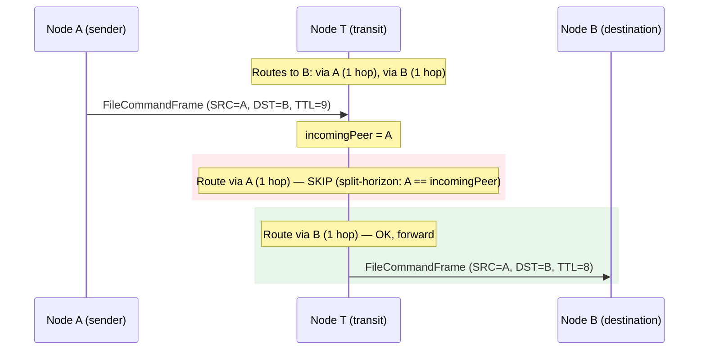

**Split-horizon forwarding — transit node excludes incoming neighbor**

### Outbound delivery strategy (SendFileCommand)

When sending a file command to a remote peer, the outbound path
follows a strict fallback chain:

1. **Direct session**: Try to send to the destination peer directly.
   The session must have `file_transfer_v1` capability negotiated
   during handshake. Both outbound and inbound sessions are searched.
2. **Route table fallback**: If the direct attempt failed, look up
   routes to the destination in the routing table. Routes are sorted
   by the keys listed under [Next-hop ranking](#next-hop-ranking) and
   the candidates are tried in order. Self-routes (where
   `next_hop == local_identity`) are skipped — they represent own
   direct-connection announcements and would cause a send-to-self
   loop. Routes whose `next_hop == dst` are also skipped — that exact
   socket was just attempted in step 1 and re-trying it through the
   fallback would be a wasted call. Routes whose next-hop has no
   usable file-capable session, or whose health probe reports the
   peer as stalled, are filtered out before ranking.
3. **No route**: If the peer is not in the route table or all routes
   are expired/self/failed — log a warning and return an error.
   No silent drops on the send path.

### Next-hop ranking

Once the candidate set has been filtered (split-horizon for transit,
self-route and unusable-peer skips for both transit and origin sends),
the file router orders the remaining next-hops by the keys below. Both
the transit forwarding path and the origin send path share this exact
ordering — there is one comparator and one source of truth.

| Priority | Key                | Direction | Why                                                                                                                                          |
| -------- | ------------------ | --------- | -------------------------------------------------------------------------------------------------------------------------------------------- |
| 1        | `protocol_version` | DESC      | A peer that speaks a higher version unlocks features the older path may silently drop, so prefer it even at the cost of an additional hop.   |
| 2        | `hops`             | ASC       | Among equal-version peers, fewer hops means fewer relays handling the bytes and a smaller blast radius if any single relay misbehaves.       |
| 3        | `connected_at`     | ASC       | Older `connected_at` means longer uptime; a session that has held up longer is empirically more stable than one we just dialed seconds ago.  |
| 4        | `next_hop`         | LEX       | Final deterministic tie-break so the selection is reproducible across reads of the same routing snapshot and across nodes with the same view. |

`protocol_version` and `connected_at` are derived from the same
per-peer snapshot inside the node layer. Both are read under a single
`peerMu` acquisition so the keys describe a consistent session
generation — they cannot disagree about which session they reference.

When multiple routes collapse to the same `next_hop` (the routing
table can carry several paths sharing a final hop), they are
deduplicated by `next_hop` and the best candidate per `next_hop` wins
under the same comparator. This guarantees that dedup and the final
sort always agree on which route is best.

Unknown timestamps (`connected_at == 0`) are sorted **after** known
ones at the same version and hop count, so a peer with a real uptime
always beats one without health data. After the cutover and the
inflated-version cap fix the ranking key is bounded above by
`config.ProtocolVersion` (newer peers are capped, not zeroed), so
`protocol_version == 0` no longer reaches the plan in steady state —
unknown / pre-handshake / capability-only peers are filtered earlier
by the eligibility gate, and inflated peers are capped at the local
version rather than clamped to zero.

After the `FileCommandMinPeerProtocolVersion` cutover, eligibility is
decided by `RawProtocolVersion` (the value the peer actually reported,
before any cap), not by the normalized `protocol_version` ranking
key. Candidates with `RawProtocolVersion < FileCommandMinPeerProtocolVersion`
— pre-handshake / capability-only / legacy peers — are filtered out
**before** they reach the route plan and never appear in
`explainFileRoute` output. Inflated peers (`RawProtocolVersion >
config.ProtocolVersion`) keep `RawProtocolVersion` at the actually-
reported value but their ranking key is capped at the local version,
so they tie with v=local peers on the primary key and the secondary
keys (hops, uptime) decide.

#### Inflated-version defence

A peer is allowed to advertise any `protocol_version` it likes during
handshake, but a value **higher than this build's
`config.ProtocolVersion`** cannot describe a protocol we actually run.
Such a claim is either a benign staged-rollout case (operator upgraded
the peer ahead of this node) or a deliberate traffic-capture attack
(advertise an impossibly-new version to win the `protocol_version`
DESC primary key and pull all file routes through the attacker's
next-hop).

The defence runs at the meta layer: when the node-side helper picks
the connection that backs a candidate, it caps the **ranking** value
(`PeerRouteMeta.ProtocolVersion`) at `config.ProtocolVersion` whenever
`peer_version > local_version`, while keeping the **eligibility**
value (`PeerRouteMeta.RawProtocolVersion`) at whatever the peer
actually reported. The cap collapses the inflation lie to the same
primary-key tier as a legitimate v=local peer — neither wins the DESC
sort on the lie alone — and the secondary keys (hops ASC, connected_at
ASC) decide which of the equal-version candidates is preferred.

Earlier behaviour clamped the ranking key to `0` instead of capping.
That solved the inflation-attack ranking but ALSO sorted every
legitimate upgraded peer (v=local+1) to the bottom of the plan,
breaking staged rollouts: a single node ahead of the fleet was
permanently starved of file traffic because every legacy v=local
peer outranked it on the primary key regardless of hops or uptime.
The cap removes the version bonus from the lie — an inflated peer
can no longer beat a legit v=local peer **on the primary key alone**
— but it does not push the inflated peer below v=local. After the
cap collapses the primary key, the secondary keys (hops, uptime)
decide normally, which means an inflated peer that also happens to
be one hop closer can still become `best`. That is intentional: the
goal is to remove the version bonus from a lie, not to penalise a
peer for being legitimately closer in the topology.

`RawProtocolVersion` stays internal: it is the eligibility key inside
`PeerRouteMeta`, not part of the diagnostic surface. The wire schema
of `explainFileRoute` deliberately serialises only the capped
`protocol_version`, so the diagnostic and the live send path can
never disagree on what was used for ranking. Operators who need to
distinguish "newer than this build" from "v=local" rely on the cap
log emitted by `trustedFileRouteVersion`, which records the original
reported value alongside the local version every time the cap fires.
The level of that log is gap-dependent: a small gap (the staged-
rollout shape) lands at DEBUG to avoid swamping the journal —
`trustedFileRouteVersion` runs from every PeerRouteMeta lookup, once
per route candidate per file command, and a single v=local+1
neighbour would otherwise emit a stream of identical WARNs. A larger
gap (suspicious / likely misconfig or attack) escalates to WARN —
see `inflationWarnGap` in the source for the cutoff. A future
raw-version field on the diagnostic surface (if ever added) would
have to land in both the wire schema and the cap-log contract
together — there is no parallel exposure today.

### Response semantics: always OK, never error

When a node receives a file command and processes it locally (DST = self),
the response is always an acknowledgment — there are no error frames.
If the FileID is unknown or the node is overloaded, the command is
silently ignored. All error handling is application-level
(`FileTransferManager` uses timeouts and retries).

### Diagnostic command: `explainFileRoute`

`explainFileRoute <identity>` returns the ranked next-hop plan the file
router would use when sending a file command to `<identity>`. It is a
read-only diagnostic — it never enqueues, dials, or mutates state — and
it is wired through the standard RPC table, so it shows up
automatically in the desktop console, `corsa-cli`, and any SDK that
walks the command list.

Split-horizon is **not** applied here: the question the command
answers is "where would my origin send actually go?", not "where would
I forward an inbound transit frame?". Pre-filtering still runs — self-
routes, withdrawn / expired entries and stalled next-hops are dropped
before ranking.

The output mirrors `SendFileCommand`'s **two-step** delivery strategy,
not just the route-table ranking:

1. **Direct-first.** If `dst` itself is reachable as a file-capable peer,
   it is promoted to the head of the plan as a synthetic candidate
   (`next_hop == dst`, `hops == 1`) and marked `best: true` —
   *unconditionally*, even when a relay route advertises a higher
   `protocol_version`. This matches the live send path: `SendFileCommand`
   tries the direct session first and never consults the routing table
   when that succeeds. The `protocol_version` and `connected_at` reported
   on the synthetic entry come from the same per-peer snapshot the
   router would see at send time.
2. **Route-table fall-back.** The remaining candidates are the ones
   `collectRouteCandidates` would surface, sorted by the keys documented
   under [Next-hop ranking](#next-hop-ranking) (protocol_version DESC →
   hops ASC → connected_at ASC → next_hop). If the routing table also
   carries an entry with `next_hop == dst`, it is deduplicated against
   the synthetic direct candidate so the same path is never listed
   twice.

In other words: `best: true` reflects what `SendFileCommand` would
actually do, not what the route-table ranking alone would suggest.
A higher-version relay only wins `best` when there is no usable direct
session.

Wire response (one entry per next-hop, in selection order):

```jsonc
[
  {
    "next_hop": "<peer identity>",
    "hops": 1,
    "protocol_version": 12,                  // normalized ranking key for this next-hop —
                                             // equal to the raw negotiated version for peers
                                             // at or below local; capped at config.ProtocolVersion
                                             // by the inflated-version defence when the peer
                                             // reported v > config.ProtocolVersion. The raw
                                             // negotiated value lives only inside the
                                             // eligibility layer (PeerRouteMeta.RawProtocolVersion)
                                             // and is not serialized. Pre-cutover
                                             // (< FileCommandMinPeerProtocolVersion) and unknown
                                             // peers are filtered out before the plan, so this
                                             // field is bounded below by FileCommandMinPeerProtocolVersion
                                             // and above by config.ProtocolVersion — see
                                             // [Inflated-version defence](#inflated-version-defence).
    "connected_at": "2025-01-01T12:34:56Z",  // omitted when unknown
    "uptime_seconds": 3600.5,                // 0 when connected_at omitted
    "best": true                             // true only on the first entry
  }
]
```

Empty array means no usable next-hop. `best: true` is set on the entry
the router would actually try first; subsequent entries are the fall-
back order. The flag is a convenience — the same information is
already encoded in array position, but having it explicit lets thin
renderers (one-line console summaries) avoid re-implementing the
ranking.

### Relay capability design

The endpoint `file_transfer_v1` capability is reused for transit
filtering — no separate `ft_relay_v1` is needed:

1. Every node that can forward a `FileCommandFrame` must also be able
   to receive one (validate TTL, signatures). The same capability covers
   both roles.
2. Each hop independently performs capability-aware forwarding: if hop N
   forwards to hop N+1, hop N+1 also checks `file_transfer_v1` on hop
   N+2. The constraint propagates hop-by-hop.
3. Only full nodes relay file commands. Client nodes process file commands
   addressed to them but never forward frames to other destinations.

## Frame authentication and anti-replay

### Nonce derivation

```
Nonce = hex(SHA256(SRC || DST || MaxTTL || Time || Payload))
```

The nonce binds all immutable frame fields into a single 32-byte digest.
Since `Payload` is included (the encrypted ciphertext, not plaintext),
different commands produce different nonces even within the same second.
`MaxTTL` is included so relays cannot inflate the hop budget without
invalidating the nonce → signature chain. `TTL` is excluded because it
is decremented at each hop — including it would invalidate the nonce
after the first forward.

### Signature

```
Signature = ed25519_sign(SRC_private_key, Nonce)
```

The signature covers SRC, DST, MaxTTL, Time, and Payload indirectly
through the nonce. Authenticity is verified using the public key
**embedded in the frame itself** (`SrcPubKey`); see the next subsection.

#### Authenticity (self-contained) vs authorization (trust)

The router enforces two independent gates with deliberately separate
purposes. They MUST NOT be conflated.

**Authenticity — data integrity, self-contained in the wire frame.**
Every `file_command` carries `SrcPubKey` (base64 Ed25519 public key)
alongside `SRC`. On every receive — both forward and local — the
router checks:

1. `identity.Fingerprint(SrcPubKey) == SRC` (the embedded pubkey
   matches the claimed SRC),
2. `ed25519.Verify(SrcPubKey, Nonce, Signature)` (the signature was
   produced by the holder of that pubkey).

A relay running this check needs **no peer state at all** — it can
verify the frame using only the wire bytes. This is what allows two
NAT-ed peers to exchange files through any public relay: the relay
does not need either side as a trusted contact, just a working route.

**Authorization — local trust policy, decoupled from authenticity.**
When `DST == self` the router additionally consults
`IsAuthorizedForLocalDelivery(SRC) bool`. The node-side implementation
checks the trust store: only explicitly trusted contacts may deposit
files into the local inbox. A perfectly authentic frame from an
untrusted SRC is silently dropped here, by design.

**Why these two are separate.** Earlier the router resolved SRC's
pubkey through the relay's trust store and used that resolution as
both the data-integrity gate AND the authorization gate. That was the
direct cause of the production symptom where two NAT-ed peers could
not exchange files through any public relay: no public node had either
side as a trusted contact, so the relay-verify lookup returned
"unknown sender public key" and dropped the frame. With the split,
trust-store membership only controls who can drop files into the
local inbox, not who can use a relay.

**No legacy v1 fallback.** Frames without `SrcPubKey` are dropped at
the missing-src_pubkey gate. file_transfer is already gated at
protocol-version 12 (peers below that do not exchange files
successfully — see "Capability Gating"), and the next-hop selection
in `collectRouteCandidates` prefers higher-version peers. By the time
a v2 router receives a `file_command`, the sender is a v2-or-newer
node that emits `SrcPubKey`. A frame arriving without it is either
malformed or forged; dropping is the correct outcome in both cases.

Boundary tests in `internal/core/service/filerouter/router_test.go`:
`TestRouter_RelayForwardsAuthenticatedFrameUntrustedSRC`,
`TestRouter_DropsFrameWhenSrcPubKeyFingerprintMismatch`,
`TestRouter_DropsFrameWhenSignatureInvalid`,
`TestRouter_LocalDeliveryRejectsUntrustedSRC`,
`TestRouter_LocalDeliveryAcceptsTrustedSRC`.

#### Аутентичность (self-contained) против авторизации (trust)

Роутер выставляет два независимых гейта с намеренно разными целями.
Их НЕЛЬЗЯ смешивать.

**Аутентичность — целостность данных, self-contained на проводе.**
Каждый `file_command` несёт `SrcPubKey` (base64 ed25519 public key)
рядом с `SRC`. На каждом приёме — и forward, и local — роутер
проверяет:

1. `identity.Fingerprint(SrcPubKey) == SRC` (вшитый pubkey
   соответствует заявленному SRC),
2. `ed25519.Verify(SrcPubKey, Nonce, Signature)` (подпись произведена
   владельцем этого pubkey).

Relay, выполняющий эту проверку, **не нуждается ни в каком peer
state** — он может верифицировать кадр только из wire-байтов. Это и
есть то, что позволяет двум NAT-ed peer'ам обмениваться файлами через
любой публичный relay: relay'ю не нужны ни одна из сторон в trust
store, только рабочий маршрут.

**Авторизация — локальная trust-политика, отделённая от
аутентичности.** Когда `DST == self`, роутер дополнительно
консультирует `IsAuthorizedForLocalDelivery(SRC) bool`. Node-side
реализация смотрит trust store: только явно доверенные контакты могут
складывать файлы в локальный inbox. Полностью аутентичный кадр от
недоверенного SRC тихо отбрасывается здесь — by design.

**Почему эти два гейта разделены.** Раньше роутер резолвил pubkey
SRC через trust store relay'я и использовал ту же резолюцию и как
data-integrity gate, и как authorization gate. Это было прямой
причиной production-симптома, при котором два NAT-ed peer'а не могли
обмениваться файлами через любой публичный relay: ни один публичный
узел не имел ни одну из сторон как trusted contact, так что
relay-verify lookup возвращал "unknown sender public key" и кадр
дропался. После разделения членство в trust store определяет только
кто может класть файлы в локальный inbox, не кто может использовать
relay.

**Нет legacy v1 fallback.** Кадры без `SrcPubKey` дропаются на
missing-src_pubkey-гейте. file_transfer уже ограничен
protocol-version 12 (peers ниже file-обменом не пользуются — см.
"Capability Gating"), а выбор next-hop в `collectRouteCandidates`
предпочитает peer'ов более высокой версии. К тому моменту, когда v2
router получает `file_command`, отправитель — v2-or-newer узел,
который отдаёт `SrcPubKey`. Кадр без него — malformed или
подделанный; дропать — правильный результат в обоих случаях.

Граничные тесты в `internal/core/service/filerouter/router_test.go`:
`TestRouter_RelayForwardsAuthenticatedFrameUntrustedSRC`,
`TestRouter_DropsFrameWhenSrcPubKeyFingerprintMismatch`,
`TestRouter_DropsFrameWhenSignatureInvalid`,
`TestRouter_LocalDeliveryRejectsUntrustedSRC`,
`TestRouter_LocalDeliveryAcceptsTrustedSRC`.

### Nonce cache parameters

| Parameter   | Value     | Description                           |
| ----------- | --------- | ------------------------------------- |
| Max entries | 10,000    | LRU eviction when full                |
| Entry TTL   | 5 minutes | Entries older than 5 min auto-evicted |

### Why Payload is in the nonce hash

Without Payload, two different commands from the same SRC to the same DST
in the same second would produce identical nonces — the second would be
dropped as replay. Including the encrypted payload makes each frame's
nonce unique and prevents transit nodes from replacing the payload without
invalidating the nonce → signature chain.

### Why TTL is excluded from the nonce (but MaxTTL is included)

TTL is decremented at each hop. If it were included in the hash, the
nonce would change after the first forward, and all subsequent transit
nodes would fail the binding check. MaxTTL is set equal to TTL by the
sender and never changes in transit — including it in the nonce prevents
relay nodes from inflating TTL beyond the sender's original hop budget.
Each processing node enforces TTL ≤ MaxTTL.

## Ban scoring for invalid file commands

When a file command arrives with DST = self and the sender is a
**direct-connect peer** (not relayed), invalid requests increase the
peer's ban score:

- `chunk_request` with unknown FileID (no FileMapping, no tombstone)
- `chunk_request` where SRC ≠ FileMapping.Recipient (unauthorized)
- `chunk_request` with offset ≥ FileSize (out-of-range — rejected before ReadChunk to prevent zero-byte responses)
- `chunk_response` with unknown FileID (unsolicited data)
- `chunk_response` whose offset does not match the receiver's expected `NextOffset` (stale/duplicate — rejected before disk write to prevent partial file corruption)
- `chunk_response` whose decoded payload exceeds the requested `ChunkSize`
- `chunk_response` whose decoded payload is smaller than `ChunkSize` but does not complete the file (undersized non-final chunk — fail-fast instead of building a doomed transfer)
- `chunk_response` with zero-length payload before transfer is complete (livelock prevention)
- `file_downloaded` / `file_downloaded_ack` with unknown FileID
- Malformed payload (cannot decrypt or cannot unmarshal)
- Invalid signature or nonce binding from direct peer

Each invalid request adds +1. When ban score reaches the threshold
(default 10), the node disconnects the peer. Ban score decays over time
(-1 per 5 minutes). Only direct-connect peers are scored — relayed
commands do not increase ban score.

## File announce flow

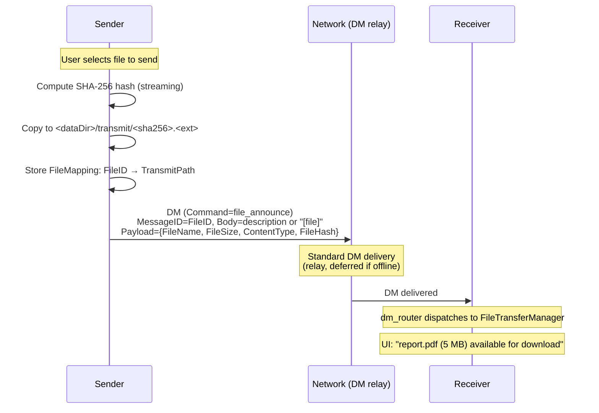

**File announce flow**

## Pull-based transfer model

The receiver controls the download pace (stop-and-wait):

1. Receiver receives `file_announce` DM
2. Receiver sends `chunk_request` (offset=0, size=16KB)
3. Sender responds with `chunk_response`
4. Receiver writes chunk, sends next `chunk_request`
5. Repeat until all bytes received
6. Receiver verifies SHA-256 hash
7. Receiver sends `file_downloaded`
8. Sender acknowledges with `file_downloaded_ack`

One chunk in flight at a time — natural self-throttling without
additional rate limiting.

The receiver validates the `chunk_response` offset **before any disk
write**: if `resp.Offset != NextOffset`, the response is stale or
duplicated and is dropped without I/O. This prevents silent corruption
of the .part file by delayed or out-of-order chunks.

The receiver rejects any `chunk_response` whose decoded payload exceeds
the requested `ChunkSize`. This prevents memory/disk pressure from a
misbehaving or malicious sender.

Non-final chunks smaller than `ChunkSize` are rejected: if
`offset + len(chunk) < FileSize` and `len(chunk) < ChunkSize`, the
response is truncated. Accepting it would shift all subsequent offsets
and guarantee a hash mismatch at verification — rejecting early avoids
wasting bandwidth on a doomed transfer. The last chunk is exempt because
the sender clamps it to the remaining bytes.

Zero-length `chunk_response` frames are also rejected when the transfer
is not yet complete (`BytesReceived < FileSize`). An empty chunk at the
expected offset would leave `NextOffset` unchanged and refresh
`LastChunkAt`, creating a tight no-progress loop that defeats stall
detection.

The sender also validates requests before reading: `chunk_request` with
`Offset >= FileSize` is rejected immediately (no disk I/O, no state
transition to `senderServing`). When the offset is valid but the
requested chunk extends past EOF, the sender clamps the read size to
the remaining bytes (`FileSize - Offset`) so the response always
carries exactly the expected data.

## Download flow with retry

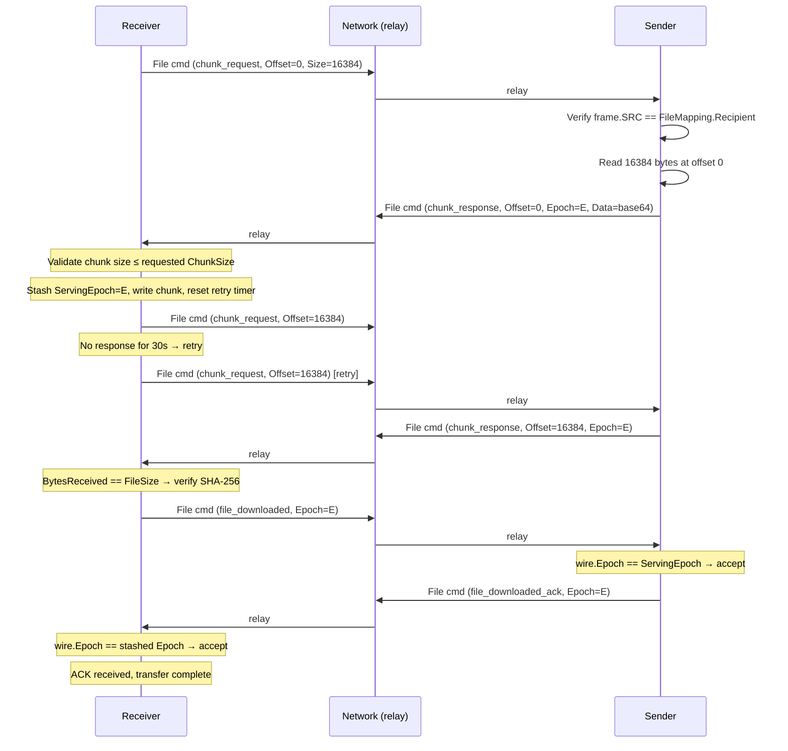

**Download flow with retry**

## Cryptographic authorization of chunk requests

Every `chunk_request` is a `FileCommandFrame` with encrypted payload.
`FileTransferManager` performs authorization before reading any file data:

1. `file_router` receives FileCommandFrame with DST = self
2. `file_router` decrypts payload, reads Command
3. `file_router` dispatches to FileTransferManager
4. FileTransferManager looks up FileMapping by FileID
5. If FileMapping not found → silently ignore
6. Verify frame.SRC == FileMapping.Recipient
7. If mismatch → silently ignore (unauthorized requester)
8. If match → proceed with command

Every `FileMapping` stores the `Recipient` identity. **All** file
commands referencing a FileID — not just `chunk_request` but also
`file_downloaded` — MUST verify that frame.SRC == FileMapping.Recipient.
Combined with ECDH payload encryption, this provides two layers of
protection: (1) cryptographic authentication, (2) authorization against
stored Recipient.

## Transfer state machines

### Sender-side states (per FileID)

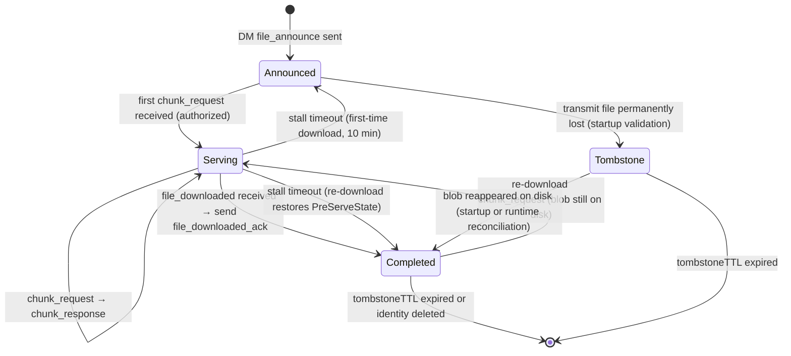

**Sender state machine**

> **Planned (not yet implemented):** `TemporarilyUnavailable` state with
> grace period — see [roadmap](../roadmap.md#file-transfer-protocol).

### Receiver-side states (per FileID)

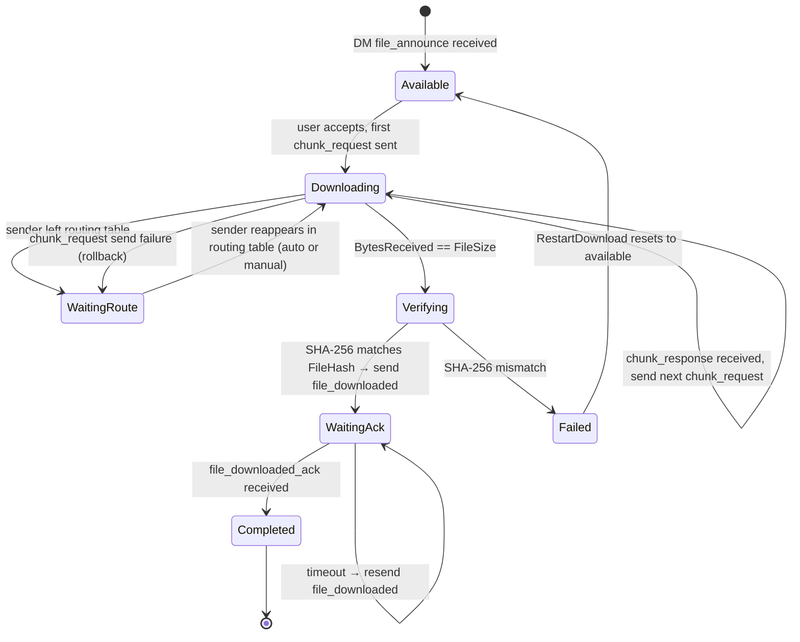

**Receiver state machine**

#### Restart failed download

When a receiver-side download ends in `Failed` (hash mismatch, persistent
network errors, etc.), the user can trigger `RestartDownload` which resets
the mapping to `Available` with zeroed progress, bumped generation, and
cleared partial path. The generation bump invalidates any in-flight
deferred actions from the old attempt. After restart the user initiates a
fresh download via `StartDownload`.

> **Planned (not yet implemented):** `Evicted` state with LRU eviction
> — see [roadmap](../roadmap.md#file-transfer-protocol).

#### Completion notification (`OnReceiverDownloadComplete` → `TopicFileDownloadCompleted`)

The `Verifying → WaitingAck` transition fires
`Manager.onReceiverDownloadComplete` exactly once with a
`ReceiverDownloadCompletedEvent` carrying `{FileID, Sender, FileName,
FileSize, ContentType}`. The callback runs after `m.mu` is released and
after `file_downloaded` has been dispatched, so subscribers observe a
durably stored file.

In production wiring (`node.Service.initFileTransfer`) the callback
publishes `ebus.TopicFileDownloadCompleted` with the typed
`FileDownloadCompletedResult`. The desktop UI subscribes from
`internal/app/desktop/window.go` and plays
`assets/download-done.mp3` so the user gets an audible cue when a
transfer finishes in the background, regardless of which tab is active.

The notification does **not** fire on:

- `WaitingAck → Completed` (sender's `file_downloaded_ack`) — the file
  is already on disk and was announced when entering `WaitingAck`.
- The retry-budget fallback at >20 unanswered `file_downloaded`
  retries, which forces the local mapping into `Completed` for
  cleanup. The file was already verified earlier and, by contract, the
  user has already heard the cue.
- Stale-generation or stale-pointer aborts inside
  `finalizeVerifiedDownload`, which return `false` before reaching the
  callback site.

## Retry and backoff strategy

All periodic maintenance runs from a single background loop (10-second
tick) that calls two functions: `tickSenderMappings` (one pass over
sender mappings) and `tickReceiverMappings` (one pass over receiver
mappings). Each function uses a switch on the mapping state to handle
every state-dependent rule in a single scan. This design ensures new
per-state rules cannot be silently missed and eliminates the class of
bugs where duplicate scans over the same map diverge in behavior.

`tickReceiverMappings` collects deferred I/O actions (chunk retries,
resume, cleanup) under the lock and executes them after the lock is
released. Each deferred action re-checks the mapping state via
`receiverStateIs` before performing destructive I/O or sending network
traffic: if `CancelDownload` or `CleanupPeerTransfers` changed or
removed the mapping in the gap between snapshot and execution, the
action is silently skipped.

### Handler structure: validate → I/O → commit

Both `HandleChunkRequest` (sender) and `HandleChunkResponse` (receiver)
follow a three-phase pattern to separate locked validation from
unlocked I/O:

1. **Validate (locked):** `validateChunkRequestLocked` /
   `validateChunkResponseLocked` — all guards (auth, state, offset,
   size, decode) run under the mutex. On success, captures immutable
   fields into a `chunkServePrep` / `chunkReceivePrep` struct and
   unlocks. On failure, unlocks and returns error.
2. **I/O (unlocked):** disk read/write and network send run without
   holding the lock.
3. **Commit (locked):** `commitChunkProgressLocked` re-validates the
   mapping (cancel/restart during unlock window) and advances progress.

This separation ensures that every new validation rule is added in one
place (the validate function), not scattered among manual `m.mu.Unlock()`
calls in the main handler body.

---

### Chunk request stall recovery

```
Stall detection interval:  10 seconds (tick)
Stall timeout:             30 seconds since last chunk received
Max chunk retries:         10
```

If no `chunk_response` arrives within 30 seconds of the last received
chunk, the stall detector re-sends the `chunk_request` for the current
offset. A successful response resets the retry counter to 0. After 10
consecutive stall retries the download transitions to `failed` and the
partial file is deleted.

Before retrying, the sender's reachability is checked: there must be a
direct session with `file_transfer_v1` capability, or an active route
whose next-hop has `file_transfer_v1`. Routes through next-hops without
file transfer support are ignored — they cannot carry file commands.
If the sender is unreachable, the retry is skipped entirely — no retry
budget is consumed.

### Stale serving slot reclamation

```
Detection interval:       10 seconds (tick, same as chunk stall)
Serving stall timeout:    10 minutes since last chunk served
Recovery transition:      senderServing → PreServeState (announced | completed)
```

A sender transitions into `serving` when an authorized `chunk_request`
arrives. The source state may be `announced` (first-time download) or
`completed` (re-download of an already-finished transfer, where the
transmit blob is retained on disk). If the receiver disappears (crash,
disconnect, network failure) without completing the transfer, the
sender mapping stays in `serving` indefinitely. There is no concurrent
serving cap, so the leak does not block other transfers, but it leaves
a `serving` mapping that observers and the persistence layer must keep
tracking until the stall timeout reclaims it.

Every 10 seconds the retry loop inspects all `senderServing` mappings.
If `LastServedAt` (the timestamp of the last successfully sent
`chunk_response`) is older than `senderServingStallTimeout` (10 min),
the mapping is reclaimed. Reclaim restores `PreServeState` — the state
captured by `validateChunkRequest` when it promoted the mapping into
`senderServing`. For a first-time download this is `senderAnnounced`;
for a re-download this is `senderCompleted`. An unconditional downgrade
to `senderAnnounced` would visibly change semantics for re-downloads:
the mapping would start counting against the live sender quota,
reappear in active snapshots and UI, and lose the fact that the
original transfer had already completed. After restoration
`PreServeState` is cleared — the next `chunk_request` re-captures the
correct origin under lock.

`PreServeState` is persisted in the transfers JSON file alongside
`LastServedAt` so both the stall timeout and the correct reclaim target
survive a node restart. An empty `PreServeState` on a loaded
`senderServing` mapping (e.g. from JSON written by a version before
this field existed) falls back to `senderAnnounced`, matching the prior
behaviour for first-time downloads.

`PreServeState` is cleared on every transition out of `senderServing`:
successful completion (`HandleFileDownloaded`), rollback after
chunk-send failure (`rollbackState` in `HandleChunkRequest`), and stall
reclaim. This keeps the field meaningful only for the duration of a
single serving run.

### Serving epoch replay defense

```
Field:       senderFileMapping.ServingEpoch  (persisted, monotonic uint64)
Wire:        ChunkResponsePayload.Epoch, FileDownloadedPayload.Epoch,
             FileDownloadedAckPayload.Epoch  (all json "epoch,omitempty")
Bump:        validateChunkRequest, only when prevState != senderServing
Gate:        HandleFileDownloaded   → reject if wire epoch != ServingEpoch
             HandleFileDownloadedAck → reject if wire epoch != receiver's
                                        stashed ServingEpoch
Legacy:      wire epoch == 0 skips the gate (rolling-upgrade compatibility)
```

A re-download reuses the original `FileID`: the same sender mapping
cycles `senderCompleted → senderServing → senderCompleted` without any
identity change. That means a delayed `file_downloaded` from the prior
completed run — buffered in a transit buffer, held across a reconnect,
or resent by a retry loop that missed its ack — is indistinguishable
from a legitimate completion of the current re-download when matched by
`FileID` alone. Accepting it would prematurely flip `senderServing` back
to `senderCompleted`, clear `PreServeState`, ack, and free the serving
slot while the actual re-download is still transferring bytes.

To close this ambiguity every serving run is tagged with a monotonic
`ServingEpoch`, bumped by `validateChunkRequest` on every genuine
transition from a non-serving state into `senderServing` (announced →
serving, completed → serving, tombstone-resurrected → completed →
serving). Continuations of the same run (chunk *N+1* of an in-flight
serving mapping) do **not** bump the counter — the epoch is a property
of the serving run, not of each chunk. Every outgoing `chunk_response`
stamps the current epoch, and the receiver stashes the most recent
observed value on its mapping. When the receiver verifies the file and
emits `file_downloaded`, it echoes that stashed epoch; the sender
accepts the message only when `wire.Epoch == mapping.ServingEpoch`.
Smaller values are the exact replay case this defense targets; larger
values indicate state corruption or a spoofed future epoch and are
dropped defensively.

`file_downloaded_ack` carries the same echoed epoch so the receiver's
`HandleFileDownloadedAck` can mirror the defense: a late ack from a
prior run of the same `FileID` (e.g. after a cancel + restart cycle
bound a new epoch) will not flip the current `receiverWaitingAck`
mapping to `receiverCompleted`.

`ServingEpoch` is persisted in the transfers JSON file for both sender
and receiver mappings so the counter remains strictly monotonic across
process restarts. Without persistence a post-restart re-download would
restart the counter at 0 and collide with stale `file_downloaded`
messages cached at the peer. On the receiver side `CancelDownload`
resets the stashed epoch so the next download learns a fresh value from
its first `chunk_response`.

**Backwards compatibility.** Both wire fields are `omitempty` and a
wire value of 0 is treated as "pre-epoch (legacy) client" on both
sides: the gate is skipped and the message is accepted as before.
Fully-upgraded deployments stamp non-zero epochs everywhere and gain
full replay protection. During a rolling upgrade a legacy receiver
still interoperates with an upgraded sender (it sends Epoch=0 and is
accepted) and vice versa.

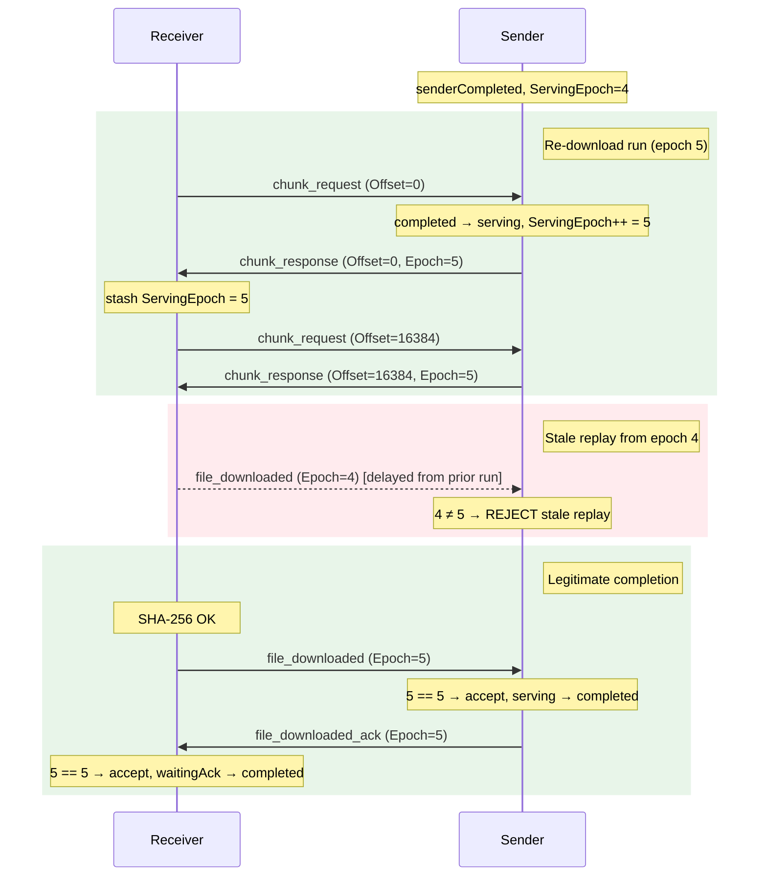

**Serving epoch replay defense — re-download with stale replay rejection**

---

### Resume transition (waiting_route → downloading)

All three resume paths (`StartDownload`, `ForceRetryChunk`,
`tickReceiverMappings`) share the same two-phase transition implemented
by `prepareResumeLocked` and `sendChunkWithRollback`:

1. **Partial file validation** (under lock): if `NextOffset > 0`, verify
   the `.part` file exists and is at least `NextOffset` bytes. If the
   file is missing or truncated, reset offset and byte counter to 0 and
   set `truncatePartial = true` in the snapshot. Additionally, if the
   `.part` file is larger than `FileSize`, the offset is also reset to 0
   — an oversized partial indicates corruption or tampering and cannot be
   trusted for resume.
2. **Snapshot capture**: record `prevState`, `prevOffset`,
   `prevBytesReceived` after the validation reset so rollback preserves
   the corrected values.
3. **State transition**: set `receiverDownloading`, reset `ChunkRetries`,
   update `LastChunkAt`. Persist via `saveMappingsLocked`.
4. **Truncate stale partial** (outside lock): if `truncatePartial` is
   set, remove the existing `.part` file. `writeChunkToFile` uses
   `WriteAt` which only overwrites the prefix — stale trailing bytes
   from a previous larger attempt would remain and cause hash
   verification to fail.
5. **Send** (outside lock): call `requestNextChunk`.
6. **Rollback on failure**: re-acquire lock, verify state is still
   `receiverDownloading` (guard against concurrent changes), restore
   snapshot values, persist.

This centralised logic eliminates the class of bugs where one path was
missing partial file validation or rollback.

### file_downloaded ack retry

```
Initial timeout:      60 seconds
Backoff multiplier:   2x
Maximum timeout:      600 seconds (10 minutes)
Max retries:          21
```

On timeout: resend same `file_downloaded`, double wait time.
On response: transfer completed.
Sender offline: the retry counter and backoff still advance on each
tick — only the actual send is skipped. This guarantees that the retry
budget drains even when the sender stays permanently offline, allowing
the receiver to transition to `completed` locally after exhausting all
retries (~3 hours worst case).

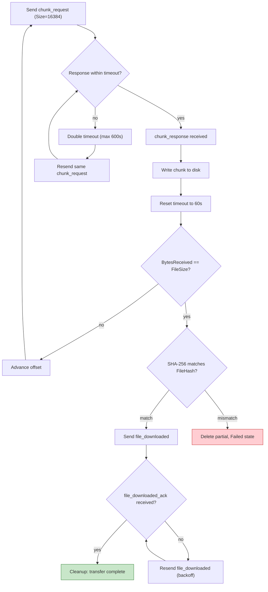

**Download loop with retry**

## Cancellation semantics

There is no `file_cancel` command in the current protocol. The file
command channel uses "always OK, never error" response semantics — an
explicit cancel would be the only error-like signal and would break
protocol uniformity.

Cancellation via delete-message DM (deleting `file_announce` triggers
file transfer cleanup) is planned for Iteration 6 (Message deletion
controls).

**Implicit cancellation (current behavior):**

- **Sender-side:** if the transmit file is permanently lost (detected
  during startup validation), the mapping transitions to tombstone. No
  protocol signal is sent — the receiver retries with exponential backoff
  until timeout.
- **Receiver-side:** the receiver can cancel in `downloading`,
  `verifying`, or `waiting_route` states (local decision). The sender's
  FileMapping remains active and will respond to future `chunk_request`s
  if the receiver resumes. Cancel is **not** permitted in `waiting_ack`:
  at that point the receiver has already sent `file_downloaded` and the
  sender may have transitioned to `completed`. Although the transmit blob
  is retained on disk in `completed` (for re-downloads), resetting to
  `available` would re-advertise the transfer while the sender's
  state machine has already left the serving run — a subsequent
  `chunk_request` would need to re-enter `serving` through the
  resurrection path, creating ambiguous epoch semantics.
- **Tombstone handling:** when a `chunk_request` arrives for a
  tombstoned FileID, the sender checks whether the blob exists on disk.
  If the blob is present, the mapping is resurrected to completed and the
  chunk is served. If the blob is missing, the request is silently ignored.

## file_downloaded_ack — delivery confirmation

The file command channel is fire-and-forget with no delivery guarantees.
Without an acknowledgment, the receiver cannot know whether the sender
received `file_downloaded` and cleaned up the `FileMapping`.

**Flow:**

1. Receiver verifies SHA-256, transitions to `WaitingAck`, sends
   `file_downloaded`.
2. Sender receives `file_downloaded`, marks FileMapping as completed,
   sends `file_downloaded_ack`.
3. Receiver receives `file_downloaded_ack`, transitions to `Completed`.

**Retry:** the receiver resends `file_downloaded` with the same
exponential backoff (60s → 120s → ... → 600s max). Each resend is
idempotent — the sender responds with `file_downloaded_ack` regardless.

**Timeout:** if the receiver does not receive `file_downloaded_ack`
after the maximum backoff period, it transitions to `Completed` anyway
(local cleanup). The sender cleans up via tombstone TTL.

## Cleanup on identity deletion

When a user deletes a chat (identity), all file transfer mappings
associated with that peer are cleaned up:

**Sender mappings** (we sent files to the deleted peer):
- Active (non-completed) mappings: transmit file ref count is released.
  If no other mapping references the same hash, the transmit file is
  deleted from `<dataDir>/transmit/`.
- Completed/tombstone mappings: ref was already released during
  `HandleFileDownloaded`, so no double-release occurs.

**Receiver mappings** (we received files from the deleted peer):
- Completed downloads in `<downloadDir>/received/` are deleted.
- Partial downloads in `<downloadDir>/partial/` are deleted.

The cleanup is best-effort: file I/O errors are logged but do not
block identity deletion. The transfers JSON file is updated atomically
after removing the entries.

## Why no CRC-32

1. **AEAD covers integrity.** AES-GCM provides authenticated encryption.
   A CRC-32 outside the ciphertext could be forged; inside the
   ciphertext, it duplicates GCM's built-in integrity.
2. **End-to-end hash is sufficient.** The receiver verifies SHA-256 of
   the assembled file against FileHash from the announce.

## Encryption

File command payloads use ECDH (X25519) + AES-256-GCM encryption with a
domain-separated key derivation label (`corsa-file-cmd-v1`), distinct
from DM encryption (`corsa-dm-v1`).

Wire format: `ephemeral_pub(32) || nonce(12) || ciphertext(variable)`,
base64-encoded.

Only sealed for the recipient (one-directional), unlike DMs which are
dual-sealed. File commands are transient protocol traffic, not stored
messages.

## Chunk size derivation

`DefaultChunkSize` is derived from the relay admission limit
(`maxRelayBodyBytes = 65536`) and FileCommandFrame overhead:

```
Wire budget:           65536 bytes
Frame header:          ≈ 150 bytes
Encryption overhead:   ≈ 50 bytes
Available payload:     65536 − 200 = 65336 bytes
Base64 expansion:      4/3×
JSON overhead:         ≈ 150 bytes
Raw theoretical max:   ≈ 48852 bytes
Safety margin:         ÷ 3
DefaultChunkSize:      16384 bytes (16 KB)
```

16 KB provides headroom and aligns with common block sizes. The `Size`
field in `ChunkRequestPayload` allows smaller chunks for low-bandwidth
links.

## Sender-side persistent storage

### Transmit directory

When the user selects a file to send, it is copied into
`<dataDir>/transmit/` before the `file_announce` DM is sent. The copy is
named `<sha256hex>.<ext>`. This provides:

1. **Privacy.** TransmitPath stores a path inside `<dataDir>/transmit/`,
   never the original filesystem location.
2. **Deduplication.** If `<sha256hex>.<ext>` already exists, skip copy.
   Multiple transfers of the same content share one physical copy.
3. **Immutability.** The file is never modified after creation.

`SendFileAnnounce` calls `PrepareFileAnnounce` on `FileTransferManager`
which atomically validates the transmit file, checks the sender quota, and
returns a `SenderAnnounceToken`. The token reserves a pending sender slot
and a transmit-file reference. If preparation fails, the caller receives
an error immediately — RPC returns HTTP 500, desktop UI updates the send
status. On success, `dm_router` sends the DM asynchronously: on success
it calls `token.Commit(fileID, recipient)` to create the sender mapping;
on any failure the deferred `token.Rollback()` releases all reservations
and cleans up orphaned transmit blobs. This eliminates the class of bugs
where a failed DM send leaves ghost file cards or leaked transmit files.

The optional `onAsyncFailure` callback is invoked when the async goroutine
fails (PrepareAndSend error or peer-removed race). The desktop UI passes
`restoreAttach` which pushes the file path back into the composer so the
user can retry without re-picking the file. RPC callers pass nil.

**Attach-generation guard on restore.** `restoreAttach` does not write
the composer state directly — it delivers a `pendingAttachMsg` over a
single-slot channel that the UI goroutine drains each frame. Every
transition of the composer attachment slot (new user pick, explicit
cancel) bumps a monotonic `attachGeneration` counter owned by the UI
goroutine. `triggerFileSend` captures the current generation as
`sendGen` before clearing the composer, and `restoreAttach` embeds
`sendGen` in the restore message. The drain applies a restore only when
`sendGen == attachGeneration` AND the composer slot is empty; otherwise
the user has already moved on (picked a different file, picked the same
file again, or cancelled) and the stale restore is dropped. Without
this guard, a late failure from an in-flight send could push the old
path back through the shared channel and overwrite a newer
user-selected attachment. Cross-send failure races are resolved inside
`restoreAttach`'s drain-and-replace dance: user picks always win the
channel slot, and between two competing restores the higher generation
wins.

### FileMapping

```
type FileMapping struct {
    FileID       MessageID
    TransmitPath string
    Recipient    PeerIdentity
    FileSize     uint64
    FileHash     [32]byte
    State        FileMappingState
    RefCount     int
    CreatedAt    time.Time
    DeletedAt    time.Time
}
```

TransmitPath is **never** exposed through RPC, wire protocol, or any
external interface.

### RefCount and transmit file lifecycle

Multiple FileMapping entries can reference the same physical file (same
SHA-256 hash, different FileID/Recipient). The transmit blob lives as
long as any non-tombstone mapping references it — this includes
completed transfers, because the file may be re-downloaded from the same
message (new device, retry, etc.). The blob is deleted only when:

- the identity/peer is removed (`CleanupPeerTransfers`), or
- a non-tombstone mapping expires after `tombstoneTTL` (30 days) in
  `tickSenderMappings`.

`HandleFileDownloaded` does NOT release the transmit file. The completed
mapping holds a ref so the sender can re-serve the file on subsequent
`chunk_request` messages (completed → serving transition).

**TTL release is state-gated.** Tombstones do not own a transmit ref by
construction: `RemoveSenderMapping` skips `Release` for tombstones and
load-time tombstones created for missing blobs are not added to
`activeHashes`. Therefore `tickSenderMappings` calls `store.Release(hash)`
only for expired `senderCompleted` mappings, never for `senderTombstone`.
Releasing a ref-less tombstone would decrement the ref count of another
live mapping that reintroduced the same hash (e.g. a re-send of the same
content), causing premature blob deletion.

### Tombstones

When a transfer is canceled or the transmit blob is found missing at
startup, the mapping transitions to a tombstone (retained 30 days). This
distinguishes "never heard of this FileID" from "known but unavailable".
Tombstones do not hold a reference to the transmit file.

**Filesystem as source of truth.** The physical presence of the blob on
disk — not the state field — determines whether a file can be served.
If a tombstoned mapping's blob reappears on disk (re-send of same
content, manual restore, etc.), the mapping is resurrected to completed.
`CompletedAt` is reset to the resurrection moment so the 30-day
`tombstoneTTL` in `tickSenderMappings` restarts fresh; without this an
old tombstone (completed weeks ago) would be purged on the very next
maintenance tick, defeating the resurrection path for older entries.

- **At startup:** `loadMappings` checks every tombstone against the
  filesystem and resurrects those whose blob exists. `CompletedAt` is
  set to `time.Now()`.
- **At runtime:** `validateChunkRequest` checks the filesystem when a
  `chunk_request` arrives for a tombstoned FileID. If the blob exists,
  the mapping is resurrected to completed (with `Acquire` to re-establish
  the ref), and the chunk is served immediately — no restart required.

### Startup validation

On app start, scan active mappings, verify transmit files exist:

1. If the specific transmit file is missing → transition to tombstone
   (genuine data loss).
2. If a tombstoned mapping's blob exists on disk → resurrect to completed.
3. `ValidateOnStartup` rebuilds ref counts from active mappings. No blob
   cleanup is performed — transmit blobs are deleted only when identity
   or message is removed.

> **Planned (not yet implemented):** `TemporarilyUnavailable` state with
> grace period (24 hours) for cases when `<dataDir>/transmit/` itself is
> temporarily inaccessible — see
> [roadmap](../roadmap.md#file-transfer-protocol).

### Transfer mappings persistence

Both sender and receiver file mappings are persisted to
`<dataDir>/transfers-<identity_short>-<port>.json` after every
state transition (same naming convention as chatlog). This ensures
transfer state survives node restarts — the receiver can resume a
partially completed download, and the sender can continue serving chunks
for announced files. Multiple node identities on the same machine
produce separate files without collisions.

**File format:**

```json
{
  "version": 1,
  "updated_at": "2026-04-05T12:00:00Z",
  "transfers": [
    {
      "file_id": "msg-uuid-123",
      "file_hash": "abc123...",
      "file_name": "photo.jpg",
      "file_size": 1024000,
      "content_type": "image/jpeg",
      "peer": "peer-identity-bob",
      "role": "sender",
      "state": "serving",
      "created_at": "2026-04-05T11:55:00Z",
      "bytes_served": 512000,
      "transmit_path": "<dataDir>/transmit/abc123.jpg"
    }
  ]
}
```

**Atomicity:** writes use temp-file + rename to prevent corruption on
crash mid-write. The file is rewritten in full on every state change.

**Startup:** `NewFileTransferManager` loads the persisted file, populates
in-memory sender/receiver maps, and passes active file hashes to
`fileStore.ValidateOnStartup()` to rebuild reference counts.
Receiver mappings with `ChunkSize == 0` (legacy
entries or entries persisted before the field was introduced) are
normalized to `DefaultChunkSize` during loading to prevent
`HandleChunkResponse` from rejecting every non-empty chunk as oversized.

**Crash recovery for `receiverVerifying`:** a crash between `os.Rename`
(moving `.part` → downloads) and persisting `receiverWaitingAck` leaves
the mapping stranded in `receiverVerifying`. On startup,
`reconcileVerifyingOnStartup` probes the filesystem to determine the
correct state: (1) if the completed file exists in the downloads
directory, promote to `receiverWaitingAck`; (2) if the `.part` file
exists, reset to `receiverWaitingRoute` at the partial file's size so
the retry loop can resume — if the `.part` file is larger than `FileSize`,
the offset is clamped to 0 to prevent resuming at an impossible position;
(3) if neither file exists, mark `failed`. Branches (2) and (3) also
zero any persisted `CompletedPath` — the reconcile has established that
no completed file exists on disk, so a stale path (e.g. one backfilled
unconditionally by earlier load code or left over from a prior attempt)
must not survive into later cleanup paths like `CleanupPeerTransfers`
where it could be treated as a real completed download and delete an
unrelated file in the downloads directory.

**Version check:** if the file version does not match the expected
version, the node starts with empty maps (fresh state). This prevents
subtle bugs from schema drift.

## Code structure

The file transfer subsystem is split into multiple files for maintainability:

| File | Responsibility |
| ---- | -------------- |
| `file_transfer.go` | Shared types (`FileTransferManager`, sender mapping, resource limits), sender-side operations (`HandleChunkRequest`, `HandleFileDownloaded`), sender tick, command dispatch, query/RPC snapshot methods, `CleanupPeerTransfers` |
| `file_transfer_receiver.go` | Receiver state machine, receiver file mapping, validated constructor (`newReceiverMapping`), invariant normalizer (`normalizeReceiverMapping`), all receiver operations (`RegisterFileReceive`, `StartDownload`, `HandleChunkResponse`, `CancelDownload`, `RestartDownload`, `ForceRetryChunk`), receiver tick with deferred action executor, `writeChunkToFile` |
| `file_transfer_persist.go` | On-disk JSON serialization/deserialization of transfer mappings, atomic write, crash recovery (`reconcileVerifyingOnStartup`) |
| `file_store.go` | Transmit file storage, ref-counting, SHA-256 hashing, symlink-safe open (`openNoFollow`), symlink verification (`verifyNotSymlink`, `verifyPartialIntegrity`, `verifyFileIdentity`) |

**Deferred action pattern:** the receiver tick collects actions under the
lock and executes them after unlock. Each `receiverTickAction` carries a
`requiredState` field and a `generation` counter — the dispatch loop checks
both against the current mapping before executing. The `generation` field
is a monotonic counter assigned by `RegisterFileReceive` and
`CancelDownload`; it prevents a stale cleanup action from one transfer
attempt from deleting the `.part` file of a newer attempt for the same
`fileID` (e.g. when `CleanupPeerTransfers` removes a failed mapping and
the same file is re-announced and re-downloaded). The same generation
guard protects `onDownloadComplete`: the verifier captures the generation
at entry and uses `removePartialIfOwned` (which calls `receiverStateIs`
with the captured generation) before deleting the `.part` file on any
error path. If the user cancels and restarts while verification is
running, the stale verifier's cleanup is skipped because the generation
no longer matches.

**Validated constructor:** `newReceiverMapping` enforces domain invariants
at creation time (e.g. `ChunkSize = DefaultChunkSize`).
`normalizeReceiverMapping` enforces the same invariants on deserialized
mappings, catching zero/invalid values that would cause runtime failures.

## Resource limits and quotas

| Limit                               | Value       |
| ----------------------------------- | ----------- |
| Default chunk size                  | 16 KB       |
| Max concurrent downloads (receiver) | unlimited   |
| Max concurrent serving (sender)     | unlimited   |
| Max file mappings per node          | 256         |
| Max partial download storage        | 1 GB        |
| Nonce cache size                    | 10,000      |
| Nonce TTL                           | 5 minutes   |
| Clock drift tolerance               | 5 minutes   |
| Tombstone TTL                       | 30 days     |
| Serving stall timeout               | 10 minutes  |
| Initial retry timeout               | 60 seconds  |
| Max retry timeout                   | 600 seconds |
| Retry backoff multiplier            | 2x          |

**No dedicated concurrency caps on transfer paths.** Neither the
receiver nor the sender enforce a numeric cap on simultaneous transfers
at the per-side level. A receiver may hold an arbitrary number of
`downloading` mappings; a sender accepts every authorised
`chunk_request` and promotes the mapping to `serving`. This keeps the
two sides symmetric — the receiver cannot outrun the sender on a
"silent drop" path, so chunk retry budgets are never spent against an
artificial bound.

**MaxFileMappings is the single active-mapping quota.** What remains is
one cap per node, applied uniformly to every transition that creates a
new active sender mapping:

- Fresh announces (handled by `PrepareFileAnnounce`): rejected when
  `activeSenderCountLocked() + pendingSenderSlots ≥ maxFileMappings`.
- Revivals from terminal states (`senderCompleted` or `senderTombstone`
  re-entering `senderServing` on an authorised `chunk_request`,
  validated in `validateChunkRequest`): rejected against the same
  expression, before any tombstone resurrection runs. This prevents a
  recipient from batch-reviving an unbounded number of old mappings —
  terminal mappings live for `tombstoneTTL` (30 days) and are excluded
  from `activeSenderCountLocked`, so the gate at announce time alone
  would not bound revival.
- Continuation (`serving → serving`, chunk N+1 of an in-flight run) and
  first-time download (`announced → serving`) skip the gate: the
  active count does not increase on those transitions.

Active mappings (`announced`, `serving`) are never evicted. Only
terminal mappings (`completed`, `canceled`/`tombstone`) are eligible for
cleanup, and only after `tombstoneTTL` elapses.

## Directory configuration

File transfer uses three directories derived from the node data directory.
The base data directory (`<dataDir>`) defaults to `.corsa` and follows
`CORSA_CHATLOG_DIR` when overridden.

| Variable             | Default               | Description                                  |
| -------------------- | --------------------- | -------------------------------------------- |
| `CORSA_CHATLOG_DIR`  | `.corsa`              | Base data directory for all node-local state |
| `CORSA_DOWNLOAD_DIR` | `<dataDir>/downloads` | Directory where received files are saved     |

Subdirectories created automatically:

| Path                      | Purpose                                        |
| ------------------------- | ---------------------------------------------- |
| `<dataDir>/transmit/`     | Content-addressed sender files (SHA-256 named) |
| `<downloadDir>/partial/`  | Receiver partial downloads                     |
| `<downloadDir>/received/` | Receiver completed downloads                   |

Transfer state is persisted in `<dataDir>/transfers-<short>-<port>.json`
alongside other per-node JSON files (identity, trust, queue, peers).

## File storage

Sender files are stored in `<dataDir>/transmit/<sha256>.<ext>` with
content-addressed naming for deduplication. Deduplication is keyed on
the content hash alone: if the same bytes are stored from sources with
different extensions (e.g. `.pdf` and `.txt`), only one physical copy
is kept and the first extension becomes canonical. Reference counting
tracks multiple recipients sharing the same physical file. When the
ref count reaches zero, all files matching `<hash>.*` are removed to
handle orphaned duplicates from earlier versions.

Receiver partial downloads are stored in
`<downloadDir>/partial/<file_id>.part`. Completed downloads are moved
to `<downloadDir>/received/<sha256>.<ext>`.

## Path traversal and injection protection

File names arrive from remote peers inside encrypted `file_announce`
payloads. A malicious sender could craft a file name containing path
traversal sequences (`../../../etc/cron.d/evil`) to write outside the
downloads directory, or inject glob wildcards into hash values to match
unintended files.

Defences are layered — each layer is independent, so a bypass of one
does not compromise the system:

1. **File name sanitisation** (`domain.SanitizeFileName`): applied at
   every network boundary where a file name enters the system. Decodes
   percent-encoded sequences iteratively (up to 3 rounds) before
   validation — `%2F`, `%2E`, `%5C`, `%00` and double-encoded variants
   like `%252F` are all resolved before `filepath.Base` runs. Guarantees
   no directory separators, no `..` sequences, no null bytes, valid
   UTF-8, and a maximum length of 255 bytes. Falls back to `"unnamed"`
   when nothing remains after sanitisation.

2. **Hash validation** (`domain.ValidateFileHash`): enforces exactly 64
   hex characters. Prevents glob injection (`*`, `?`, `[`) and path
   traversal through crafted hash values passed to `filepath.Glob`.

3. **Path containment** (`ensureWithinDir`): verifies that every
   resolved path stays within the expected directory (transmit or
   downloads) after symlink resolution. Used as a final guard even when
   the inputs are already sanitised.

4. **Persistence re-validation**: file names and completed paths loaded
   from the transfers JSON file are re-sanitised and re-validated on
   startup. A tampered JSON file cannot escape directory boundaries.

5. **Unicode bidi control stripping**: removes U+202E (RLO) and 14
   other bidirectional/zero-width characters that can trick users into
   misreading file extensions (`innocent\u202Eexe.txt` → visually
   `innocenttxt.exe`).

6. **Control character stripping**: removes ASCII C0 controls (except
   tab), DEL, and Unicode C1 controls. Prevents log injection via
   embedded newlines and ANSI terminal escape sequences.

7. **Windows reserved name protection**: prefixes device names (CON,
   NUL, PRN, AUX, COM1-COM9, LPT1-LPT9) with underscore. These names
   can cause hangs or access hardware devices on Windows regardless of
   extension.

8. **Symlink TOCTOU guard** (two layers):
   - **Kernel-level prevention (`O_NOFOLLOW`)**: `writeChunkToFile` opens
     the partial file via `openNoFollow`, which ORs `syscall.O_NOFOLLOW`
     into the open flags. The kernel rejects the open with `ELOOP` if the
     final path component is a symlink — preventing `O_CREATE` from
     following the symlink and creating a file at an attacker-chosen
     target. This closes the window where the old approach (plain
     `os.OpenFile` + post-open check) would create the target file before
     any user-space verification could run.
   - **User-space identity check (defense in depth)**: after the open,
     `verifyNotSymlink` runs `os.Lstat` (does not follow symlinks) and
     compares the result with `f.Stat()` (Fstat on the open fd) via
     `os.SameFile`. This catches TOCTOU races where the path is swapped
     to a symlink between open and write.
   Hash verification in `onDownloadComplete` uses `verifyPartialIntegrity`
   which opens the file once, performs the same Lstat+Fstat identity check
   on the open fd, and hashes from that fd — eliminating the TOCTOU window
   that would exist if the symlink check and hash computation used separate
   open calls. Before `os.Rename`, `verifyFileIdentity` re-checks that
   the file at the path has the same device+inode as the verified fd,
   closing the window between fd close and rename.

9. **Integer overflow guard**: `writeChunkToFile` checks for uint64
   wrap-around before computing `offset + len(data)` to prevent
   writing to unexpected file positions.

10. **Delete containment**: `CleanupPeerTransfers` and `CancelDownload`
    validate `completedPath` against the downloads directory before
    calling `os.Remove`, preventing a tampered persistence file from
    causing deletion of arbitrary files.

11. **Sender offset/size validation**: `HandleChunkRequest` rejects
    `Offset >= FileSize` before any disk I/O or state transition. Valid
    requests are clamped to `min(requestedSize, FileSize - Offset)` so
    the sender never reads beyond the announced file boundary or produces
    zero-byte responses from EOF.

12. **Post-verify state + generation re-validation**:
    `finalizeVerifiedDownload` (the tail of `onDownloadComplete`)
    re-checks both the mapping state AND the verifier's captured
    generation after every operation that drops the mutex (hash
    verification, file rename). State alone is insufficient: a
    concurrent `CancelDownload` resets the mapping to `available` and
    bumps `Generation`, the user may immediately restart the same
    `fileID`, and the new attempt can advance back to
    `receiverVerifying`. A stale verifier would then see the matching
    state and — without the generation guard — overwrite `CompletedPath`
    with its old blob, transition the new attempt to `waiting_ack`, and
    send `file_downloaded` for a file the user explicitly abandoned.
    The guard requires `mapping.State == receiverVerifying &&
    mapping.Generation == capturedGeneration`; on mismatch the stale
    verifier aborts and removes its renamed blob. `markReceiverFailed`
    applies the same state+generation check on the failure path.

    **File-identity cleanup on stale branch**: cancel+restart of the
    same `fileID` resolves to an identical `completedPath` because
    `FileName` and `FileHash` match. If a stale verifier reached the
    cleanup branch after a newer attempt had already renamed its own
    verified file into place, a path-only `os.Remove` would delete the
    new attempt's legitimate download. The fix passes `verifiedInfo`
    (the `os.FileInfo` captured by `verifyPartialIntegrity` via `Fstat`
    on the verified fd) into `finalizeVerifiedDownload`; because
    `os.Rename` preserves inode on POSIX, this identity matches the
    file the stale verifier placed at `completedPath`.
    `removeOwnedFileInDownloadDir` then uses `os.SameFile` to compare
    the current `Lstat` at `completedPath` with `verifiedInfo` and only
    unlinks when they match. If another attempt's atomic rename has
    replaced the inode, the stale verifier leaves the file alone. This
    ensures generation safety survives down to the filesystem layer
    and cannot be defeated by a path collision between attempts.

Entry points where sanitisation is applied:

| Entry point                   | Protection                                     |
| ----------------------------- | ---------------------------------------------- |
| `RegisterFileReceive`         | `ValidateFileHash` + `SanitizeFileName`        |
| `completedDownloadPath`       | `SanitizeFileName` + `ensureWithinDir`         |
| `resolveExistingDownload`     | `SanitizeFileName`                             |
| `partialDownloadPath`         | `SanitizeFileName` on file ID                  |
| `resolvePath` (transmit)      | `ValidateFileHash` + `ensureWithinDir`         |
| `HasFile` / `Acquire`         | `ValidateFileHash`                             |
| `ValidateOnStartup`           | `ValidateFileHash` on persisted hash keys      |
| `loadMappings`                | `SanitizeFileName` + `ensureWithinDir`         |
| RPC `send_file_announce`      | `ValidateFileHash` on input hash               |

## Download flow (receiver UI)

When a `file_announce` DM arrives from a remote peer, the receiver-side
mapping is registered automatically during message decryption
(`DMRouter.tryRegisterFileReceive`). The mapping starts in `available`
state.

The file card in the chat shows a download button while the receiver
mapping is in `available` state. When the user clicks the button:

1. UI calls `DMRouter.StartFileDownload(fileID)` in a goroutine.
2. `StartFileDownload` → `DesktopClient` → `node.Service` →
   `FileTransferManager.StartDownload`.
3. `StartDownload` transitions the mapping to `downloading` and sends
   the first `chunk_request` to the sender.
4. The file card switches from the download button to a progress bar.
5. As `chunk_response` frames arrive, `BytesReceived` increases and the
   progress bar updates (UI schedules periodic redraws every 500ms while
   transfer is in progress via `op.InvalidateOp`).
6. On completion, the status label shows "completed" (green) or "failed"
   (red).

Receiver mapping registration is idempotent — loading the same
conversation from DB re-registers all `file_announce` messages without
side effects. This ensures mappings survive node restarts.

## Offline behavior and cleanup

**Receiver offline:** download state persisted on disk (offset, partial
file, FileID). On restart, resumes from last offset when sender appears.

**Sender offline:** receiver enters `WaitingRoute`, resumes when sender
becomes reachable (direct session or route via a `file_transfer_v1`
capable next-hop).

**Transmit file deleted while receiver offline:** on next
`chunk_request`, sender checks the filesystem. If the blob has
reappeared (re-send of same content), the tombstone is resurrected
and the chunk is served. If the blob is genuinely gone, the request
is silently ignored.

**Tombstone cleanup:** purged after 30 days. Completed mappings retain
their transmit blob ref for the duration of `tombstoneTTL` so the file
can be re-downloaded. Transmit files are deleted when the last ref is
released (identity deletion or tombstone TTL expiry).

**Transmit directory cleanup.** `ValidateOnStartup` does NOT delete any
blobs at startup — it only rebuilds ref counts. Transmit blobs are
deleted exclusively through identity removal (`CleanupPeerTransfers`)
or message removal (`RemoveSenderMapping`).

> **Planned (not yet implemented):** periodic hourly GC with 7-day age
> threshold for orphaned transmit files, and LRU eviction of partial
> downloads when `MaxPartialDownloadStorage` is exceeded — see
> [roadmap](../roadmap.md#file-transfer-protocol).

## RPC commands

| Command                | Description                               |
| ---------------------- | ----------------------------------------- |
| `fetch_file_transfers` | List active/pending transfers (terminal excluded) |
| `fetch_file_mapping`   | Show active/pending sender mappings (no TransmitPath) |
| `retry_file_chunk`     | Force retry current pending chunk request |

## File command channel — design rationale

File commands are a separate protocol with their own wire format and
routing semantics because the DM pipeline is designed for durable chat
messages. It includes chatlog storage, delivery receipts, gossip
fallback, persistent pending queue, outbound state tracking, and
`LocalChangeEvent` emission — all of which conflict with file transfer
transport:

1. **Chatlog storage.** Storing chunk data in chatlog is a scalability
   hazard.
2. **Double retry.** The DM pending queue retries independently of
   FileTransferManager's backoff timer.
3. **LocalChangeEvent leak.** Chunk data entering the event pipeline
   wastes memory.
4. **Outbound state pollution.** Chunk traffic pollutes diagnostics.
5. **Delivery receipt amplification.** Each chunk exchange would
   generate a receipt, doubling traffic.

**File command properties (architectural defaults):**

| Property          | File cmd                      | DM                |
| ----------------- | ----------------------------- | ----------------- |
| Wire format       | FileCommandFrame              | Sealed envelope   |
| Routing           | Best route + capability check | DM relay          |
| TTL               | uint8, hop counter            | None (time-based) |
| Anti-replay       | Nonce cache                   | MessageID dedup   |
| Chatlog           | Never                         | Always            |
| Delivery receipts | Never                         | Always            |
| Gossip fallback   | Never                         | Always (INV-3)    |
| Pending queue     | Never                         | Yes               |
| Retry             | Application layer             | Transport layer   |

**Write serialization.** File command frames are routed through the
unified `sendFrameToIdentity` dispatcher — the same write path used by
all protocol traffic — to prevent byte interleaving on shared TCP
sockets. `sendFrameToIdentity` resolves a `PeerIdentity` to either an
outbound session or an inbound connection, checks the required
capability, and enqueues the frame into the single-writer queue
(`session.sendCh` for outbound, `connWriter` for inbound). The
pre-serialized JSON line is carried via the `RawLine` field of
`protocol.Frame`, bypassing redundant re-marshaling. File commands never
call `conn.Write` directly.

**Relationship to INV-3.** File commands are not DMs. INV-3 ("every DM
has gossip fallback") continues to apply to all DMs including
`file_announce`. File commands have no gossip by design, not by
exception.

---

# Протокол передачи файлов

## Обзор

Передача файлов в Corsa использует двухканальную архитектуру. Анонс о
доступности файла отправляется через стандартный DM-конвейер (сохраняется
в chatlog, расписки доставки, gossip fallback). Все последующие команды
передачи используют отдельный протокольный фрейм (`FileCommandFrame`) с
собственной маршрутизацией best-route, независимой от подсистемы DM.

Транзитные ноды видят только открытые заголовки маршрутизации (SRC, DST,
TTL, MaxTTL, timestamp, nonce, signature). Тип команды находится внутри
зашифрованного payload — невидим для ретрансляторов.

## Каналы

| Аспект             | DM-канал (`file_announce`)             | Канал файловых команд                     |
| ------------------ | -------------------------------------- | ----------------------------------------- |
| Wire-формат        | Запечатанный DM-конверт (PlainMessage) | FileCommandFrame                          |
| Хранится в chatlog | Да                                     | Нет                                       |
| Расписки доставки  | Да                                     | Нет                                       |
| Gossip fallback    | Да                                     | Нет                                       |
| Pending queue      | Да                                     | Нет                                       |
| Маршрутизация      | Стандартный DM relay                   | Best-route с проверкой `file_transfer_v1` |

**Сериализация записи.** Фреймы файловых команд отправляются через
единый диспетчер `sendFrameToIdentity` — тот же путь записи, что и для
всего остального протокольного трафика — для предотвращения перемешивания
байтов на разделяемых TCP-сокетах. `sendFrameToIdentity` разрешает
`PeerIdentity` в исходящую сессию или входящее соединение, проверяет
требуемую capability и ставит фрейм в очередь единственного writer'а
(`session.sendCh` для исходящих, `connWriter` для входящих).
Предсериализованная JSON-строка передаётся через поле `RawLine`
структуры `protocol.Frame`, минуя повторную маршализацию. Файловые
команды никогда не вызывают `conn.Write` напрямую.

## Фильтрация по capability

Передача файлов требует capability `file_transfer_v1`, согласованной при
handshake hello/welcome. Только пиры, объявившие эту capability, получают
или ретранслируют трафик FileCommandFrame. DM `file_announce` **не**
фильтруется — он идёт через стандартный DM-конвейер без проверки
capability.

Фильтрация распространяется только на **файловый командный канал**:
отправитель проверяет `file_transfer_v1` у получателя (или next-hop
маршрута) перед отправкой `chunk_request`, `chunk_response`,
`file_downloaded`, `file_downloaded_ack`. Legacy-ноды поэтому не видят
FileCommandFrame-трафик, но могут получить DM `file_announce`. Тег
`json:"command,omitempty"` гарантирует отсутствие поля `Command` в
обычных текстовых DM — announce молча игнорируется legacy-нодой.

## Wire-формат файловых команд

<table>
<tr>
  <th>SRC</th><th>DST</th><th>TTL</th><th>MaxTTL</th><th>Time</th><th>Nonce</th><th>Signature</th><th>Payload (encrypted)</th>
</tr>
<tr>
  <td colspan="7" style="text-align:center"><b>открытый текст (виден транзиту)</b></td>
  <td style="text-align:center"><b>зашифрован (end-to-end): {command, data} — только DST читает</b></td>
</tr>
</table>

Поля открытого текста: `src`, `dst` — идентификаторы маршрутизации;
`ttl` — счётчик хопов; `max_ttl` — лимит хопов, установленный
отправителем (включён в хеш nonce, защищён подписью — ретрансляторы
не могут увеличить TTL сверх бюджета отправителя); `time` — Unix-секунды
(проверка свежести); `nonce` — привязка неизменяемых полей;
`signature` — аутентификация отправителя.

Зашифрованный payload: `command` — тип действия; `data` — JSON,
специфичный для команды.

## Команды

**Справочник команд:**

| Команда               | Wire-формат           | Хранится | Расписки | Роутер        | Содержимое Payload         | Описание                                           |
| --------------------- | --------------------- | -------- | -------- | ------------- | -------------------------- | -------------------------------------------------- |
| `file_announce`       | **DM** (PlainMessage) | да       | да       | `dm_router`   | `FileAnnouncePayload`      | Отправитель анонсирует файл для скачивания         |
| `chunk_request`       | FileCommandFrame      | нет      | нет      | `file_router` | `ChunkRequestPayload`      | Получатель запрашивает чанк файла                  |
| `chunk_response`      | FileCommandFrame      | нет      | нет      | `file_router` | `ChunkResponsePayload`     | Отправитель возвращает данные файла                |
| `file_downloaded`     | FileCommandFrame      | нет      | нет      | `file_router` | `FileDownloadedPayload`    | Получатель подтверждает успешную загрузку          |
| `file_downloaded_ack` | FileCommandFrame      | нет      | нет      | `file_router` | `FileDownloadedAckPayload` | Отправитель подтверждает получение file_downloaded |

### file_announce (DM)

`file_announce` — это **не** новый тип сообщения, а обычный DM
(`send_dm`), который проходит через стандартный DM-конвейер: sealed
envelope шифрование, хранение в chatlog, расписки доставки, gossip
fallback, pending queue. Единственное отличие — структура `PlainMessage`
внутри зашифрованного конверта содержит два дополнительных поля
(`command` и `command_data`) помимо стандартных `body` и `created_at`.

Когда `dm_router` получает DM с `Command = "file_announce"`, он
отображает файловую карточку в UI вместо текстового сообщения. DM
сохраняется в chatlog, учитывается как непрочитанный и генерирует
уведомления — точно так же, как любой другой DM.

С точки зрения сети `file_announce` неотличим от обычного DM. Транзитные
ноды и DM relay конвейер обрабатывают его идентично.

Поле `body` содержит пользовательское описание (caption) или sentinel
`"[file]"` — оба удовлетворяют валидации непустого body.

### Файловые команды (payload внутри FileCommandFrame)

Все команды ниже передаются внутри зашифрованного `payload` фрейма
`FileCommandFrame`. Payload после расшифровки содержит JSON с полями
`command` и `data`. Транзитные ноды не видят содержимое — для них все
файловые команды неразличимы.

**chunk_request** — получатель запрашивает конкретный chunk:

```json
{
  "command": "chunk_request",
  "data": {
    "file_id": "<ID DM-сообщения file_announce>",
    "offset": 0,
    "size": 16384
  }
}
```

**chunk_response** — отправитель возвращает данные chunk:

```json
{
  "command": "chunk_response",
  "data": {
    "file_id": "<ID DM-сообщения file_announce>",
    "offset": 0,
    "data": "<base64-encoded chunk>"
  }
}
```

**file_downloaded** — получатель подтверждает успешную загрузку
(отправляется после SHA-256 верификации всего файла). Поле `epoch`
эхо-повторяет последний `ServingEpoch` отправителя, наблюдавшийся в
`chunk_response`, и позволяет отправителю отличать легитимное завершение
от отложенного replay предыдущего serving-run с тем же `file_id` (см.
**Защита от replay по serving epoch** ниже). При `epoch == 0` поле
опускается и трактуется как legacy получатель до появления эпох —
отправитель откатывается к не-защищённому пути для совместимости с
rolling-upgrade.

```json
{
  "command": "file_downloaded",
  "data": {
    "file_id": "<ID DM-сообщения file_announce>",
    "epoch": 42
  }
}
```

**file_downloaded_ack** — отправитель подтверждает получение
file_downloaded (позволяет получателю прекратить повторную отправку).
`file_downloaded_ack` эхо-повторяет то же значение `epoch`, которое он
получил, поэтому получатель тоже может отклонять устаревшие подтверждения
от предыдущих serving-runs (например, после cancel + restart, связавшего
новую эпоху):

```json
{
  "command": "file_downloaded_ack",
  "data": {
    "file_id": "<ID DM-сообщения file_announce>",
    "epoch": 42
  }
}
```

## Маршрутизация и ретрансляция

Маршрутизация FileCommandFrame следует строгому конвейеру (дешёвые
проверки первыми для устойчивости к DDoS):

1. **Anti-replay проверка** (только чтение): поиск в nonce-кеше
   (ограниченный LRU, 10 000 записей, 5 мин TTL). O(1) — самая
   дешёвая проверка. Nonce **не вставляется** на этом шаге — только
   проверка наличия. Вставка до проверки подлинности позволила бы
   вредоносному relay отравить кеш nonce'ом из легитимного фрейма
   внутри поддельной обёртки, что привело бы к отклонению настоящего
   фрейма как replay.
2. **Доставляемость**: DST ≠ self и нет маршрута → отбросить.
   O(1) поиск в таблице маршрутов.
3. **Валидация** (до любой мутации TTL): Отклоняем если TTL > MaxTTL
   или MaxTTL = 0 (атака инфляции). Отклоняем если
   |local_clock − Time| > 300 секунд (свежесть). Пересчёт
   SHA-256(SRC||DST||MaxTTL||Time||Payload), сравнение с nonce
   фрейма — несовпадение → отбрасываем (подмена полей). MaxTTL
   включён в хеш, поэтому ретрансляторы не могут увеличить бюджет
   хопов без инвалидации цепочки nonce → signature. Валидация
   ОБЯЗАНА выполняться на входящем TTL без изменений: если
   DecrementTTL выполнить раньше, вредоносный relay может
   установить TTL = MaxTTL + 1 и декремент скроет нарушение.
4. **Декремент TTL**: Уменьшаем TTL на 1. Если TTL = 0 до
   декремента → отбрасываем (бюджет хопов исчерпан, предотвращение
   петель).
5. **Подлинность (self-contained)**: декодируем `SrcPubKey`,
   пересчитываем identity fingerprint и сравниваем с `SRC` (несовпадение
   → отбрасываем), затем `ed25519_verify(SrcPubKey, Nonce, Signature)`.
   Любой провал → отбрасываем (подделка или искажённый фрейм). Проверка
   self-contained: она не обращается к peer-состоянию на этом узле,
   поэтому транзитный relay, никогда не видевший `SRC`, всё равно
   способен решить, подделан ли фрейм.
6. **Локальная доставка** (DST = self): сначала авторизация, затем
   атомарная фиксация nonce, затем dispatch.
   `IsAuthorizedForLocalDelivery(SRC)` выполняется **до** `TryAdd`.
   После self-contained подлинности любой пир может подписать
   корректный фрейм, адресованный нам, используя свою же идентичность;
   если сначала зафиксировать nonce, аутентичный-но-недоверенный SRC
   сжигает слоты ограниченного LRU и вытесняет легитимные nonce'ы от
   доверенных пиров. До `TryAdd` доходят только авторизованные
   локальные фреймы; авторизованный победитель атомарной фиксации
   передаёт payload в FileTransferManager.
7. **Ограничение ретрансляции**: только full-ноды пересылают;
   клиентские ноды отбрасывают фреймы с DST ≠ self. Проверка стоит
   **до** транзитной фиксации nonce, чтобы клиентский узел не мог
   потерять слоты ограниченного LRU из-за атакующего, который
   производит аутентичные транзитные фреймы почти бесплатно по CPU —
   симметричная защита к auth-before-commit гейту в шаге 6 выше.
   Ранняя проверка `Has` в шаге 1 продолжает отбрасывать реальные
   replay-атаки без коммита, и этой дедупликации достаточно узлу,
   который ничего не пересылает.
8. **Транзитный путь: атомарная фиксация nonce** (`TryAdd`): для
   транзитных фреймов (DST ≠ self) на full-ноде nonce фиксируется
   после проверки подлинности, но **без** authorization-гейта —
   аутентичный фрейм «в полёте» относится к глобальной дедупликации
   сети независимо от нашей локальной trust-политики, и его фиксация
   позволяет конкурентным транзитным копиям свернуться в одну
   пересылку. Возвращает false, если другая горутина зафиксировала
   тот же nonce первой (конкурентный дубликат). Атомарная
   проверка-и-вставка закрывает TOCTOU-гонку между ранней проверкой
   `Has` (шаг 1) и фиксацией — ровно одна конкурентная доставка
   проходит дальше.
9. **Мульти-маршрутная пересылка (split-horizon)**: собираем все
   активные маршруты до DST, пропускаем self-маршруты,
   expired/withdrawn записи **и входящего соседа** — пир, от которого
   транзитный узел только что получил этот фрейм. Исключение входящего
   соседа предотвращает отражение фрейма обратно к предыдущему хопу:
   без такого split-horizon симметричный маршрут заставил бы две ноды
   перекидывать один и тот же фрейм пока TTL не истечёт, расходуя
   полосу и увеличивая задержку. Оставшиеся кандидаты сортируются по
   ключам из раздела
   [Ранжирование next-hop](#ранжирование-next-hop)
   и пробуются по порядку, пока один не успешен. Если все маршруты
   исключены или исчерпаны — фрейм молча отбрасывается.

   Фильтр split-horizon применяется **до** ранжирования: даже маршрут с
   более новой версией протокола или меньшим числом хопов проигрывает
   исключению, если его next-hop — это пир, от которого только что
   пришёл фрейм.

Если активных маршрутов нет, фрейм молча отбрасывается. Нет retry
queue, нет gossip fallback.

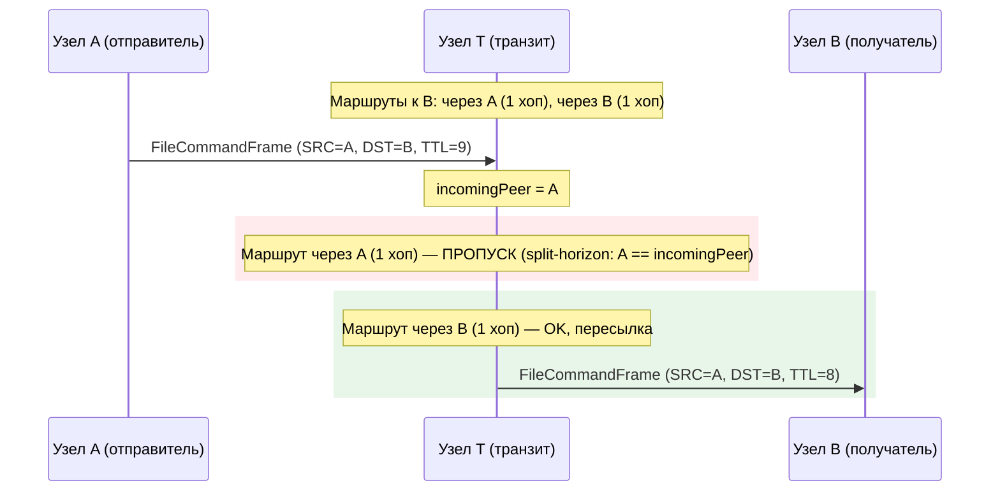

**Split-horizon пересылка — транзитный узел исключает входящего соседа**

### Стратегия исходящей доставки (SendFileCommand)

При отправке файловой команды удалённому пиру исходящий путь следует
строгой цепочке fallback:

1. **Прямая сессия**: попытка отправки напрямую адресату. Сессия должна
   иметь `file_transfer_v1` capability, согласованную при handshake.
   Проверяются как исходящие, так и входящие сессии.
2. **Fallback на таблицу маршрутов**: если прямая попытка провалилась —
   поиск маршрутов к адресату. Активные маршруты сортируются по ключам
   из раздела
   [Ранжирование next-hop](#ранжирование-next-hop),
   кандидаты пробуются по порядку. Self-маршруты
   (`next_hop == local_identity`) пропускаются — они представляют
   собственные объявления прямого подключения и вызвали бы цикл
   отправки самому себе. Маршруты с `next_hop == dst` тоже
   пропускаются — этот сокет уже пробовался в шаге 1, повторная
   попытка через fallback была бы потерянной операцией. Маршруты,
   у которых next-hop не имеет используемой file-capable сессии или
   health-проверка считает пир stalled, отфильтровываются ещё до
   ранжирования.
3. **Нет маршрута**: если пир отсутствует в таблице маршрутов или все
   маршруты истекли/self/failed — логирование warning и возврат ошибки.
   Никаких молчаливых потерь на пути отправки.

### Ранжирование next-hop

После того как множество кандидатов отфильтровано (split-horizon при
транзите, пропуск self-маршрутов и непригодных пиров и при транзите, и
при отправке от себя), file router сортирует оставшиеся next-hop по
ключам ниже. Транзитный путь и путь отправки от себя используют ровно
один и тот же компаратор — единый источник истины.

| Приоритет | Ключ               | Направление | Почему                                                                                                                                                  |
| --------- | ------------------ | ----------- | ------------------------------------------------------------------------------------------------------------------------------------------------------- |
| 1         | `protocol_version` | DESC        | Пир, говорящий на более новой версии, открывает фичи, которые более старый путь может молча уронить, поэтому предпочитаем его даже за счёт лишнего хопа. |
| 2         | `hops`             | ASC         | Среди пиров с равной версией меньше хопов означает меньше реле в обработке байтов и меньший blast-radius при некорректном поведении любого из них.        |
| 3         | `connected_at`     | ASC         | Более ранний `connected_at` означает больший uptime; сессия, продержавшаяся дольше, эмпирически стабильнее, чем только что поднятая.                    |
| 4         | `next_hop`         | LEX         | Финальный детерминированный тай-брейк, чтобы выбор был воспроизводим между чтениями одного и того же snapshot и между нодами с одной и той же view.       |

`protocol_version` и `connected_at` извлекаются из одного и того же
snapshot пира внутри node-слоя. Оба читаются под единым захватом
`peerMu`, поэтому ключи описывают одно и то же поколение сессий — они
не могут разъехаться в том, к какой сессии относятся.

Когда несколько маршрутов схлопываются в один и тот же `next_hop`
(таблица маршрутов может хранить несколько путей с общим финальным
хопом), они дедуплицируются по `next_hop`, и лучший кандидат на
`next_hop` побеждает по тому же компаратору. Это гарантирует, что
дедупликация и финальная сортировка всегда сходятся в выборе лучшего
маршрута.

Неизвестные временные метки (`connected_at == 0`) сортируются **после**
известных при равной версии и количестве хопов, чтобы пир с реальным
uptime всегда выигрывал у пира без health-данных. После cutover'а и
правки cap'а на завышенную версию ranking-ключ ограничен сверху
значением `config.ProtocolVersion` (более новые пиры теперь капятся,
а не обнуляются), поэтому `protocol_version == 0` в плане в обычном
режиме не появляется — unknown / pre-handshake / capability-only пиры
отфильтровываются eligibility-гейтом раньше, а inflated-пиры капятся
до локальной версии вместо clamp до нуля.

После cutover'а `FileCommandMinPeerProtocolVersion` пригодность
определяется `RawProtocolVersion` (значение, которое пир заявил до
любого cap'а), не нормализованным `protocol_version`-ranking-ключом.
Кандидаты с `RawProtocolVersion < FileCommandMinPeerProtocolVersion`
— pre-handshake / capability-only / legacy peers — отфильтровываются
**до** попадания в план маршрута и в выводе `explainFileRoute` не
появляются. Inflated-пиры (`RawProtocolVersion >
config.ProtocolVersion`) сохраняют `RawProtocolVersion` равным
заявленному значению, но их ranking-ключ капится на локальной
версии, поэтому они тайются с v=local пирами по primary key и
вторичные ключи (hops, uptime) решают.

#### Защита от завышенной версии

Пир имеет право заявить любой `protocol_version` в handshake, но
значение **выше нашей `config.ProtocolVersion`** не может описывать
протокол, на котором мы реально говорим. Такая заявка — это либо
benign staged-rollout (оператор обновил пира раньше этой ноды), либо
умышленный traffic-capture: «смотрите, я новее всех, гоните все файлы
через меня», и `protocol_version` DESC сразу вывел бы такого пира на
верх ранжирования.

Защита работает на meta-слое: когда node-side helper выбирает
соединение, лежащее под кандидатом, он капит **ранжирующее**
значение (`PeerRouteMeta.ProtocolVersion`) до `config.ProtocolVersion`,
если `peer_version > local_version`, а **eligibility**-значение
(`PeerRouteMeta.RawProtocolVersion`) сохраняет в том виде, в каком
пир его заявил. Cap схлопывает inflation-ложь в тот же primary-key
tier, что и легитимный v=local пир — никто не выигрывает DESC-сортировку
на лжи, — и вторичные ключи (hops ASC, connected_at ASC) решают, кто
из равноверсионных кандидатов предпочтительнее.

Раньше поведение клампило ranking-ключ в `0` вместо cap'а. Это решало
inflation-атаку на ранжирование, но ОДНОВРЕМЕННО загоняло каждого
легитимно обновлённого пира (v=local+1) в самый низ плана, ломая
staged rollouts: одна нода, ушедшая вперёд по версии, навсегда
лишалась файлового трафика, потому что любой legacy v=local пир
обходил её по primary key независимо от hops/uptime. Cap снимает
с лжи версионный бонус — заявка «я новее» больше не может выиграть
у легитимного v=local пира **по primary key**, — но при этом не
заталкивает inflated-пира ниже v=local. После того как cap схлопнул
primary key, вторичные ключи (hops, uptime) решают как обычно,
поэтому inflated-пир, оказавшийся ещё и ближе по hops, всё ещё
может стать `best`. Это сознательный компромисс: цель — убрать
версионный бонус с лжи, а не наказывать пира за то что он
действительно ближе по топологии.

`RawProtocolVersion` остаётся внутренним: это eligibility-ключ
внутри `PeerRouteMeta`, в diagnostic-выводе он не показывается.
Wire-схема `explainFileRoute` сознательно сериализует только
capped `protocol_version`, чтобы диагностика и живой send-путь не
могли разойтись в том, какое значение использовалось для ранжирования.
Различить «новее этого билда» от «v=local» оператор может через
cap-лог из `trustedFileRouteVersion`, который записывает
оригинально заявленное значение рядом с локальной версией каждый
раз, когда срабатывает cap. Уровень этого лога зависит от gap'а:
небольшой gap (форма staged rollout) логируется в DEBUG, чтобы не
заваливать журнал — `trustedFileRouteVersion` вызывается из каждого
PeerRouteMeta-lookup'а, по одному разу на каждого кандидата для
каждой файловой команды, и один v=local+1 сосед иначе бы выдавал
поток одинаковых WARN'ов. Большой gap (подозрительно / скорее всего
misconfig или атака) поднимает уровень до WARN — см. `inflationWarnGap`
в коде для порога. Если в будущем понадобится raw-версия в
diagnostic-surface, добавлять её придётся одновременно в wire-схему
и в cap-лог-контракт — параллельной экспозиции сегодня нет.

### Семантика ответов: всегда OK, никогда error

Когда нода получает файловую команду и обрабатывает её локально
(DST = self), ответ всегда является подтверждением — error-фреймов нет.
Если FileID неизвестен или нода перегружена, команда молча игнорируется.
Вся обработка ошибок на уровне приложения (`FileTransferManager`
использует тайм-ауты и retry).

### Диагностическая команда: `explainFileRoute`

`explainFileRoute <identity>` возвращает отранжированный план
next-hop, который file router использовал бы при отправке файловой
команды на `<identity>`. Это read-only диагностика — она ничего не
ставит в очередь, не дозванивается и не меняет состояние — и
прокинута через стандартный RPC-стек, поэтому автоматически появляется
в desktop-консоли, `corsa-cli` и любом SDK, который перебирает список
команд.

Split-horizon **не** применяется: команда отвечает на вопрос «куда
ушла бы моя отправка от себя?», а не «куда я бы переслал входящий
транзитный фрейм?». Предварительная фильтрация работает по-обычному —
self-маршруты, withdrawn/expired записи и stalled next-hop-ы
выкидываются до ранжирования.

Вывод зеркалит **двухшаговую** стратегию доставки `SendFileCommand`,
а не только ранжирование таблицы маршрутов:

1. **Direct-first.** Если сам `dst` пригоден как file-capable пир, он
   попадает в head плана как синтетический кандидат
   (`next_hop == dst`, `hops == 1`) и помечается `best: true` —
   *безусловно*, даже если у relay-маршрута объявлена более высокая
   `protocol_version`. Это совпадает с реальным путём отправки:
   `SendFileCommand` сначала пробует direct-сессию и не лезет в
   таблицу маршрутов, если она успешна. `protocol_version` и
   `connected_at` у синтетической записи берутся из того же
   per-peer snapshot, что увидел бы router в момент отправки.
2. **Fallback на таблицу маршрутов.** Оставшиеся кандидаты — те,
   которых вернул бы `collectRouteCandidates`, отсортированные по
   ключам из раздела
   [Ранжирование next-hop](#ранжирование-next-hop)
   (protocol_version DESC → hops ASC → connected_at ASC → next_hop).
   Если в таблице тоже есть запись с `next_hop == dst`, она
   дедуплицируется относительно синтетического direct-кандидата —
   один и тот же путь не показывается дважды.

Иначе говоря: `best: true` отражает то, что реально сделает
`SendFileCommand`, а не то, что подсказало бы только ранжирование
таблицы. Relay с более высокой версией становится `best` только
тогда, когда нет пригодной direct-сессии.

Ответ wire-формата (одна запись на next-hop, в порядке выбора):

```jsonc
[
  {
    "next_hop": "<peer identity>",
    "hops": 1,
    "protocol_version": 12,                  // нормализованный ranking-ключ next-hop'а —
                                             // для пиров на или ниже локальной версии
                                             // совпадает с raw negotiated; для пиров с
                                             // v > config.ProtocolVersion защита от завышенной
                                             // версии капит его до config.ProtocolVersion. Raw
                                             // negotiated значение остаётся только внутри
                                             // eligibility-слоя (PeerRouteMeta.RawProtocolVersion)
                                             // и наружу не сериализуется. Pre-cutover
                                             // (< FileCommandMinPeerProtocolVersion) и unknown
                                             // пиры отфильтрованы до попадания в план,
                                             // поэтому это поле всегда лежит в диапазоне
                                             // [FileCommandMinPeerProtocolVersion, config.ProtocolVersion]
                                             // — см.
                                             // [Защиты от завышенной версии](#защита-от-завышенной-версии).
    "connected_at": "2025-01-01T12:34:56Z",  // отсутствует, если неизвестен
    "uptime_seconds": 3600.5,                // 0, если connected_at отсутствует
    "best": true                             // true только у первой записи
  }
]
```

Пустой массив — нет пригодного next-hop. `best: true` стоит на той
записи, которую router попробовал бы первой; следующие записи — порядок
fallback. Флаг — это удобство: та же информация уже закодирована
позицией в массиве, но явный флаг позволяет тонким рендерам
(однострочные сводки в консоли) не дублировать логику ранжирования.

### Дизайн relay capability

Endpoint capability `file_transfer_v1` переиспользуется для фильтрации
при транзите — отдельный `ft_relay_v1` не нужен:

1. Каждая нода, способная пересылать `FileCommandFrame`, должна также
   уметь принимать его (проверять TTL, подписи). Одна capability
   покрывает обе роли.
2. Каждый хоп независимо выполняет capability-aware forwarding: если
   хоп N пересылает на хоп N+1, хоп N+1 также проверяет
   `file_transfer_v1` на хопе N+2. Ограничение распространяется
   hop-by-hop.
3. Только full-ноды ретранслируют файловые команды. Клиентские ноды
   обрабатывают файловые команды, адресованные им, но никогда не
   пересылают фреймы другим адресатам.

## Аутентификация фреймов и anti-replay

Nonce = hex(SHA256(SRC||DST||MaxTTL||Time||Payload)) — привязывает все
неизменяемые поля. TTL исключён, так как уменьшается на каждом хопе.
MaxTTL включён — установлен отправителем равным TTL и не меняется при
транзите. Это не позволяет ретрансляторам увеличить бюджет хопов без
инвалидации цепочки nonce → signature. Каждая нода проверяет TTL ≤ MaxTTL.

Signature = ed25519(SRC_privkey, Nonce) — аутентифицирует отправителя.
Транзитные ноды проверяют перед пересылкой.

Кеш nonce: 10000 записей, 5 мин TTL, LRU-вытеснение.

## Шифрование

Payload файловых команд использует ECDH (X25519) + AES-256-GCM с
доменным ключом `corsa-file-cmd-v1`, отличным от DM-шифрования
(`corsa-dm-v1`). Шифруется только для получателя (одностороннее).

## Pull-модель передачи

Получатель контролирует скорость загрузки (stop-and-wait): один
chunk-запрос в полёте. Естественное самоограничение.

Получатель проверяет смещение `chunk_response` **до записи на диск**:
если `resp.Offset != NextOffset`, ответ является устаревшим или
дубликатом и отклоняется без I/O. Это предотвращает молчаливое
повреждение .part файла задержанными/дублированными chunk'ами.

Получатель отклоняет `chunk_response`, если декодированный payload
превышает запрошенный `ChunkSize`. Это предотвращает давление на
память/диск от некорректного или злонамеренного отправителя.

Неконечные chunk'и меньше `ChunkSize` также отклоняются: если
`offset + len(chunk) < FileSize` и `len(chunk) < ChunkSize`, ответ
обрезан. Приём такого chunk'а сдвинет все последующие offset'ы и
гарантирует несовпадение хеша при верификации — ранний отказ экономит
трафик. Последний chunk освобождён от проверки, так как отправитель
обрезает его до оставшихся байт.

`chunk_response` нулевой длины также отклоняется, если передача ещё
не завершена (`BytesReceived < FileSize`). Пустой чанк на ожидаемом
смещении оставил бы `NextOffset` без изменений и обновил `LastChunkAt`,
создавая плотный цикл без прогресса, обходящий детекцию зависания.

## Машины состояний

### Состояния отправителя

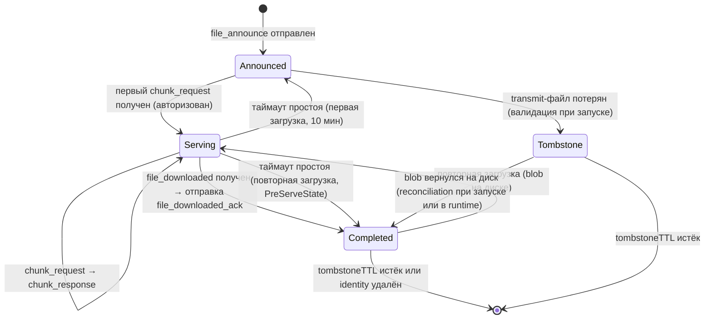

**Машина состояний отправителя**

> **Запланировано (не реализовано):** состояние `TemporarilyUnavailable`
> с grace period — см. [roadmap](../roadmap.ru.md#протокол-передачи-файлов).

### Состояния получателя

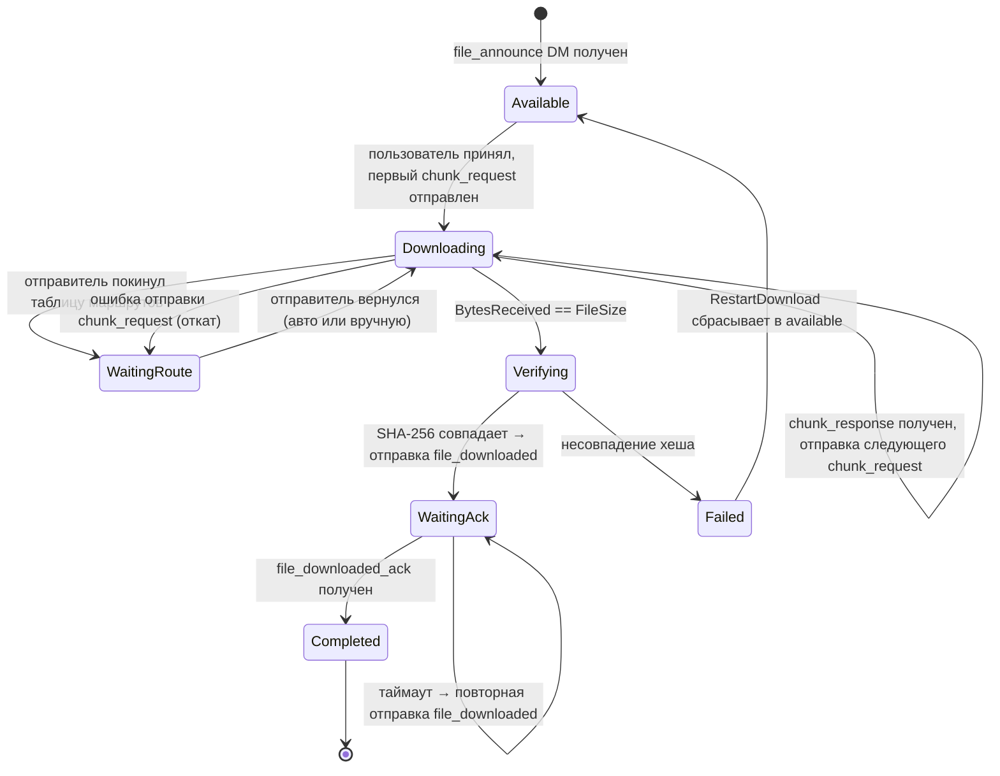

**Машина состояний получателя**

#### Перезапуск неудавшейся загрузки

Когда загрузка на стороне получателя завершается состоянием `Failed`
(несовпадение хеша, устойчивые сетевые ошибки и т.д.), пользователь может
вызвать `RestartDownload`, который сбрасывает маппинг в `Available` с
обнулённым прогрессом, увеличенным generation и очищенным partial path.
Увеличение generation инвалидирует все отложенные действия от предыдущей
попытки. После перезапуска пользователь инициирует новую загрузку через
`StartDownload`.

> **Запланировано (не реализовано):** состояние `Evicted` с LRU-вытеснением
> — см. [roadmap](../roadmap.ru.md#протокол-передачи-файлов).

#### Уведомление о завершении (`OnReceiverDownloadComplete` → `TopicFileDownloadCompleted`)

Переход `Verifying → WaitingAck` ровно один раз вызывает
`Manager.onReceiverDownloadComplete` с
`ReceiverDownloadCompletedEvent{FileID, Sender, FileName, FileSize,
ContentType}`. Колбэк выполняется ПОСЛЕ освобождения `m.mu` и ПОСЛЕ
отправки `file_downloaded`, поэтому подписчики видят файл, уже
надёжно сохранённый на диск.

В продакшен-сборке (`node.Service.initFileTransfer`) колбэк публикует
`ebus.TopicFileDownloadCompleted` с типизированным
`FileDownloadCompletedResult`. Десктоп UI подписывается из
`internal/app/desktop/window.go` и проигрывает
`assets/download-done.mp3`, чтобы пользователь получал звуковую
индикацию завершения загрузки независимо от того, на какой вкладке он
сейчас находится.

Уведомление **не** срабатывает в следующих случаях:

- `WaitingAck → Completed` (`file_downloaded_ack` отправителя) — файл
  уже на диске и был объявлен при входе в `WaitingAck`.
- Запасной путь по исчерпании retry-бюджета (>20 неподтверждённых
  ретрансляций `file_downloaded`), который локально переводит маппинг
  в `Completed` для целей очистки. Файл уже был верифицирован раньше,
  и звуковой сигнал по контракту уже отыграл.
- Аборты по устаревшему `Generation` или указателю внутри
  `finalizeVerifiedDownload`, возвращающего `false` ещё до точки
  вызова колбэка.

### Персистентность маппингов

Маппинги отправителя и получателя сохраняются в
`<dataDir>/transfers-<identity_short>-<port>.json` после каждого
изменения состояния (JSON, атомарная запись через temp+rename).
Несколько identity ноды на одной машине создают отдельные файлы без
коллизий.

**Атомарность:** запись через temp-файл + rename для защиты от
повреждения при краше mid-write. Файл перезаписывается полностью при
каждом изменении состояния.

**Запуск:** `NewFileTransferManager` загружает файл, восстанавливает
in-memory maps и передаёт активные хеши в
`fileStore.ValidateOnStartup()` для пересчёта ref count.
Receiver-маппинги с `ChunkSize == 0` (legacy
записи или записи, созданные до появления поля) нормализуются в
`DefaultChunkSize` при загрузке, чтобы `HandleChunkResponse` не
отклонял каждый непустой chunk как oversized.

**Восстановление `receiverVerifying` после краша:** если процесс
завершился между `os.Rename` (перенос `.part` → downloads) и
сохранением `receiverWaitingAck`, маппинг остаётся в `receiverVerifying`.
При запуске `reconcileVerifyingOnStartup` проверяет файловую систему:
(1) если скачанный файл есть в downloads — переход в `waitingAck`;
(2) если `.part`-файл существует — сброс в `waitingRoute` с offset
равным размеру partial-файла для возобновления; если `.part`-файл больше
`FileSize` — offset ставится в 0 для предотвращения невозможного resume;
(3) если ни одного файла нет — переход в `failed`. В ветках (2) и (3)
также обнуляется любой сохранённый `CompletedPath` — reconcile уже
установил, что завершённого файла на диске нет, поэтому устаревший путь
(например, безусловно заполненный старым кодом загрузки или оставшийся
от предыдущей попытки) не должен переживать восстановление и попадать в
позднейшие пути очистки (`CleanupPeerTransfers`), где он мог бы быть
принят за настоящий скачанный файл и удалить постороннее содержимое в
downloads.

**Проверка версии:** если версия файла не совпадает с ожидаемой, нода
стартует с пустыми maps (чистое состояние). Это предотвращает баги
от дрифта схемы.

## Стратегия retry и backoff

### Структура обработчиков: validate → I/O → commit

`HandleChunkRequest` (отправитель) и `HandleChunkResponse` (получатель)
следуют трёхфазному паттерну, разделяющему заблокированную валидацию от
незаблокированного I/O:

1. **Валидация (под мьютексом):** `validateChunkRequestLocked` /
   `validateChunkResponseLocked` — все проверки (авторизация, состояние,
   offset, размер, декодирование) выполняются под мьютексом. При успехе
   копирует иммутабельные поля в struct и разблокирует. При ошибке —
   разблокирует и возвращает error.
2. **I/O (без мьютекса):** чтение/запись на диск и сетевая отправка
   выполняются без удержания блокировки.
3. **Коммит (под мьютексом):** `commitChunkProgressLocked` ре-валидирует
   маппинг (cancel/restart мог произойти во время unlock-окна) и
   продвигает прогресс.

Такое разделение гарантирует, что каждое новое правило валидации
добавляется в одном месте (функция validate), а не разбросано среди
ручных `m.mu.Unlock()` вызовов в теле обработчика.

### Восстановление при зависании chunk-запроса

```
Интервал обнаружения зависания:  10 секунд (tick)
Таймаут зависания:               30 секунд с момента последнего chunk
Макс. retry по chunk:            10
```

Если `chunk_response` не приходит в течение 30 секунд с момента
последнего полученного chunk, детектор зависания повторно отправляет
`chunk_request` для текущего offset. Успешный ответ сбрасывает счётчик
retry в 0. После 10 последовательных retry загрузка переходит в
состояние `failed`, частичный файл удаляется.

Перед retry проверяется доступность отправителя: должна существовать
прямая сессия с capability `file_transfer_v1`, либо активный маршрут,
чей next-hop имеет `file_transfer_v1`. Маршруты через next-hop без
поддержки передачи файлов игнорируются — они не могут доставить
файловые команды. Если отправитель недоступен — retry пропускается,
бюджет retry не расходуется.

### Переход возобновления (waiting_route → downloading)

Все три пути возобновления (`StartDownload`, `ForceRetryChunk`,
`tickReceiverMappings`) используют общую двухфазную логику, реализованную
в `prepareResumeLocked` и `sendChunkWithRollback`:

1. **Валидация частичного файла** (под блокировкой): если `NextOffset > 0`,
   проверяем что `.part`-файл существует и содержит не менее `NextOffset`
   байт. Если файл отсутствует или обрезан — сброс offset и счётчика
   байтов в 0, установка `truncatePartial = true` в снимке. Также если
   `.part`-файл больше `FileSize` — offset сбрасывается в 0: oversized
   partial указывает на повреждение или подмену и не может использоваться
   для возобновления.
2. **Захват снимка**: сохраняем `prevState`, `prevOffset`,
   `prevBytesReceived` после валидационного сброса, чтобы откат сохранял
   скорректированные значения.
3. **Переход состояния**: установка `receiverDownloading`, сброс
   `ChunkRetries`, обновление `LastChunkAt`. Сохранение через
   `saveMappingsLocked`.
4. **Удаление устаревшего .part** (вне блокировки): если `truncatePartial`
   установлен, удаляем существующий `.part`-файл. `writeChunkToFile`
   использует `WriteAt`, который перезаписывает только начало — хвост от
   предыдущей более длинной попытки остаётся на диске и вызовет ошибку
   верификации хеша.
5. **Отправка** (вне блокировки): вызов `requestNextChunk`.
6. **Откат при ошибке**: повторный захват блокировки, проверка что
   состояние всё ещё `receiverDownloading` (защита от параллельных
   изменений), восстановление значений из снимка, сохранение.

Централизованная логика устраняет класс багов, при которых один из путей
не имел валидации частичного файла или отката.

### Восстановление зависших слотов отправки

```
Интервал проверки:        10 секунд (тик, как у chunk stall)
Таймаут простоя:          10 минут с последней отправки чанка
Переход при восстановлении: senderServing → PreServeState (announced | completed)
```

Отправитель переходит в `serving` при получении авторизованного
`chunk_request`. Источником может быть `announced` (первая загрузка)
или `completed` (повторная загрузка ранее завершённого трансфера, когда
transmit-blob сохранён на диске). Если получатель пропадает (крэш,
дисконнект, сетевой сбой) без завершения трансфера, маппинг остаётся в
`serving` навсегда. Лимита на параллельную раздачу нет, поэтому такая
утечка не блокирует другие трансферы, но оставляет `serving`-маппинг,
который наблюдатели и слой персистентности продолжают учитывать до
срабатывания stall-таймаута.

Каждые 10 секунд retry loop проверяет все маппинги в `senderServing`.
Если `LastServedAt` (время последней успешной отправки `chunk_response`)
старше `senderServingStallTimeout` (10 мин), слот возвращается к
`PreServeState` — состоянию, которое `validateChunkRequest` захватил
при переходе маппинга в `senderServing`. Для первой загрузки это
`senderAnnounced`; для повторной загрузки — `senderCompleted`.
Безусловный откат в `senderAnnounced` изменил бы семантику для
повторных загрузок: маппинг начал бы учитываться в квоте активных
отправок, появился бы в active snapshots и UI и потерял бы информацию
о том, что исходный трансфер уже был завершён. После восстановления
`PreServeState` очищается — следующий `chunk_request` повторно
захватит корректное исходное состояние под мьютексом.

`PreServeState` сохраняется в JSON-файле трансферов рядом с
`LastServedAt`, поэтому и таймаут простоя, и корректная цель
восстановления переживают перезапуск ноды. Пустой `PreServeState` у
загруженного `senderServing` маппинга (например, из JSON, записанного
более ранней версией без этого поля) откатывается в `senderAnnounced`,
сохраняя прежнее поведение для первичных загрузок.

`PreServeState` очищается при каждом переходе из `senderServing`:
успешное завершение (`HandleFileDownloaded`), откат после ошибки
отправки чанка (`rollbackState` в `HandleChunkRequest`) и реклейм по
таймауту. Поле остаётся значимым только в пределах одного serving-run.

### Защита от replay по serving epoch

```
Поле:     senderFileMapping.ServingEpoch  (persisted, монотонный uint64)
Wire:     ChunkResponsePayload.Epoch, FileDownloadedPayload.Epoch,
          FileDownloadedAckPayload.Epoch  (все json "epoch,omitempty")
Bump:     validateChunkRequest при переходе в senderServing (НЕ при продолжении)
Gate:     HandleFileDownloaded    → отклонить, если wire epoch != ServingEpoch
          HandleFileDownloadedAck → отклонить, если wire epoch != сохранённому
                                     получателем ServingEpoch
Legacy:   wire epoch == 0 пропускает gate (совместимость rolling-upgrade)
```

Протокол переиспользует `FileID` повторных загрузок — повторное скачивание
прокручивает маппинг отправителя через `senderCompleted → senderServing
→ senderCompleted` без изменения identity. Это значит, что отложенный
`file_downloaded` от предыдущего завершённого run неотличим от
легитимного завершения нового run по одному `FileID`: прежде он переводил
активный re-download обратно в `senderCompleted`, очищал `PreServeState`,
отправлял `file_downloaded_ack` и преждевременно освобождал serving-слот.

Каждый маппинг отправителя хранит монотонный счётчик `ServingEpoch`,
инкрементируемый в `validateChunkRequest` на каждом настоящем переходе
`(announced | completed) → serving`. Продолжения (следующие
`chunk_request` для того же serving маппинга) счётчик **не** увеличивают
— эпоха является свойством serving-run, а не отдельного чанка. Каждый
`chunk_response` штампует текущую эпоху, а получатель сохраняет самую
свежую наблюдаемую эпоху в `receiverFileMapping.ServingEpoch`. Когда
получатель отправляет `file_downloaded`, он эхо-повторяет сохранённую
эпоху; отправитель принимает сообщение только при
`wire.Epoch == mapping.ServingEpoch`. Устаревшие эпохи (`wire.Epoch <
mapping.ServingEpoch`) отклоняются как replay; бо́льшие значения
указывают на повреждение состояния или подделанную будущую эпоху и тоже
отклоняются.

`file_downloaded_ack` несёт ту же эхо-эпоху, поэтому
`HandleFileDownloadedAck` получателя зеркально применяет защиту: поздний
ack от предыдущего цикла отправителя (например, после cancel + restart,
связавшего новую эпоху) не переведёт текущий `receiverWaitingAck`
маппинг в `receiverCompleted`.

`ServingEpoch` сохраняется в JSON-файле трансферов и для sender, и для
receiver маппингов — без персистентности перезапуск ноды сбросил бы
счётчик на 0 и столкнулся бы с закэшированным у пира устаревшим
`file_downloaded`. `CancelDownload` получателя обнуляет сохранённую
эпоху, чтобы следующая загрузка училась свежему значению с первого
`chunk_response`.

Обратная совместимость: wire-значение 0 трактуется как «pre-epoch
(legacy) клиент» на обоих gate-ах, поэтому нода, обновившаяся раньше
своих пиров, продолжает принимать старый проводной формат без эпохи.
Полностью обновлённые развёртывания штампуют ненулевые эпохи везде и
получают полную защиту от replay без каких-либо ручных миграционных
шагов.

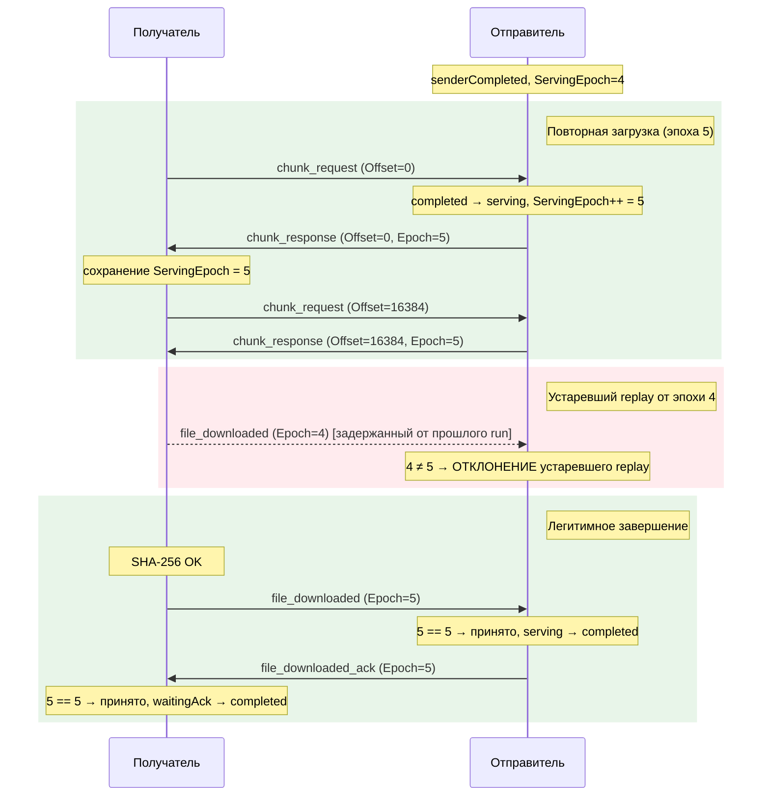

**Защита от replay по serving epoch — повторная загрузка с отклонением устаревшего replay**

### Retry подтверждения file_downloaded

```
Начальный таймаут:        60 секунд
Множитель backoff:        2x
Максимальный таймаут:     600 секунд (10 минут)
Макс. retry:              21
```

По тайм-ауту: повторная отправка `file_downloaded`, удвоение времени
ожидания. По получению ответа: трансфер завершён. Потеря маршрута:
retry пропускается, пока отправитель недоступен.

## Структура кода

Подсистема передачи файлов разделена на несколько файлов для удобства сопровождения:

| Файл | Ответственность |
| ---- | --------------- |
| `file_transfer.go` | Общие типы (`FileTransferManager`, маппинг отправителя, лимиты ресурсов), операции отправителя (`HandleChunkRequest`, `HandleFileDownloaded`), тик отправителя, диспетчеризация команд, RPC-снимки, `CleanupPeerTransfers` |
| `file_transfer_receiver.go` | Машина состояний получателя, маппинг получателя, валидирующий конструктор (`newReceiverMapping`), нормализатор инвариантов (`normalizeReceiverMapping`), все операции получателя (`RegisterFileReceive`, `StartDownload`, `HandleChunkResponse`, `CancelDownload`, `ForceRetryChunk`), тик получателя с исполнителем отложенных действий, `writeChunkToFile` |
| `file_transfer_persist.go` | JSON-сериализация/десериализация маппингов на диск, атомарная запись, восстановление после краша (`reconcileVerifyingOnStartup`) |
| `file_store.go` | Хранилище transmit-файлов, подсчёт ссылок, SHA-256 хеширование, безопасное открытие без симлинков (`openNoFollow`), проверка симлинков (`verifyNotSymlink`, `verifyPartialIntegrity`, `verifyFileIdentity`) |

**Паттерн отложенных действий:** тик получателя собирает действия под
мьютексом и выполняет их после разблокировки. Каждый `receiverTickAction`
содержит поле `requiredState` и счётчик `generation` — цикл
диспетчеризации проверяет оба поля перед выполнением. Поле `generation` —
монотонный счётчик, назначаемый в `RegisterFileReceive` и
`CancelDownload`; он предотвращает ситуацию, когда устаревшее действие
очистки от предыдущей попытки удаляет `.part`-файл новой попытки для того
же `fileID` (например, когда `CleanupPeerTransfers` удаляет failed-маппинг
и тот же файл повторно объявляется и скачивается). Та же защита через
generation используется в `onDownloadComplete`: верификатор захватывает
generation при входе и использует `removePartialIfOwned` (который вызывает
`receiverStateIs` с захваченным generation) перед удалением `.part`-файла
на любом пути ошибки. Если пользователь отменяет и перезапускает загрузку
во время верификации, устаревший верификатор пропускает очистку, потому что
generation больше не совпадает.

**Валидирующий конструктор:** `newReceiverMapping` обеспечивает доменные
инварианты при создании (например, `ChunkSize = DefaultChunkSize`).
`normalizeReceiverMapping` обеспечивает те же инварианты для
десериализованных маппингов, отлавливая нулевые/невалидные значения.

## Ресурсные лимиты

| Лимит                              | Значение                 |
| ---------------------------------- | ------------------------ |
| Размер chunk                       | 16 KB                    |
| Параллельные загрузки (получатель) | без лимита               |
| Параллельная раздача (отправитель) | без лимита               |
| Макс. FileMapping на ноду          | 256                      |
| Макс. частичных загрузок           | 1 GB                     |
| Кеш nonce                          | 10000 записей, 5 мин TTL |
| TTL tombstone                      | 30 дней                  |
| Таймаут простоя serving            | 10 минут                 |
| Начальный таймаут retry            | 60 секунд                |
| Макс. таймаут retry                | 600 секунд               |

**Нет выделенных лимитов на параллелизм трансферов.** Ни получатель,
ни отправитель не вводят отдельный числовой лимит на одновременные
трансферы для своей стороны. Получатель может держать произвольное
число маппингов в `downloading`; отправитель принимает каждый
авторизованный `chunk_request` и переводит маппинг в `serving`. Стороны
симметричны — получатель не может «обогнать» отправителя на пути
«silent drop», так что бюджет chunk retry не расходуется на
искусственный лимит.

**MaxFileMappings — единственная квота на активные маппинги.** Остаётся
один лимит на ноду, применяемый единообразно к каждому переходу,
создающему новый активный sender-маппинг:

- Свежие announce-ы (`PrepareFileAnnounce`): отказ при
  `activeSenderCountLocked() + pendingSenderSlots ≥ maxFileMappings`.
- Revival из terminal-состояний (`senderCompleted` или
  `senderTombstone` → `senderServing` по авторизованному
  `chunk_request`, проверка в `validateChunkRequest`): отказ по тому
  же выражению, до выполнения tombstone-resurrection. Это закрывает
  батчевое оживление старых маппингов получателем — terminal-маппинги
  живут `tombstoneTTL` (30 дней) и не учитываются в
  `activeSenderCountLocked`, поэтому только гейт на announce-времени
  revival не ограничивал.
- Continuation (`serving → serving`, chunk N+1 текущего run-а) и
  первая загрузка (`announced → serving`) гейт пропускают: активный
  счётчик на этих переходах не растёт.

Активные маппинги (`announced`, `serving`) никогда не вытесняются. Под
очистку попадают только terminal-маппинги (`completed`,
`canceled`/`tombstone`), и только после истечения `tombstoneTTL`.

## Конфигурация директорий

Файловый трансфер использует три директории, производные от базовой
директории данных ноды. Базовая директория (`<dataDir>`) по умолчанию
`.corsa` и следует за `CORSA_CHATLOG_DIR` при переопределении.

| Переменная           | По умолчанию          | Описание                                    |
| -------------------- | --------------------- | ------------------------------------------- |
| `CORSA_CHATLOG_DIR`  | `.corsa`              | Базовая директория для всех данных ноды     |
| `CORSA_DOWNLOAD_DIR` | `<dataDir>/downloads` | Директория для сохранения полученных файлов |

Поддиректории создаются автоматически:

| Путь                      | Назначение                                             |
| ------------------------- | ------------------------------------------------------ |
| `<dataDir>/transmit/`     | Content-addressed файлы отправителя (имена по SHA-256) |
| `<downloadDir>/partial/`  | Частичные загрузки получателя                          |
| `<downloadDir>/received/` | Завершённые загрузки получателя                        |

Состояние трансферов хранится в `<dataDir>/transfers-<short>-<port>.json`
рядом с остальными per-node JSON-файлами (identity, trust, queue, peers).

## Хранение файлов

Файлы отправителя: `<dataDir>/transmit/<sha256>.<ext>` с content-addressed
именованием. Дедупликация по хешу контента: если одни и те же байты
сохраняются из источников с разными расширениями (например `.pdf` и
`.txt`), создаётся только одна физическая копия, а расширение первого
файла становится каноническим. Подсчёт ссылок (RefCount) отслеживает
нескольких получателей одного файла. При достижении нуля удаляются все
файлы `<hash>.*` для очистки возможных orphan-дубликатов.

Частичные загрузки: `<downloadDir>/partial/<file_id>.part`.
Завершённые: `<downloadDir>/received/<sha256>.<ext>`.

TransmitPath никогда не раскрывается через RPC или wire protocol.

`SendFileAnnounce` вызывает `PrepareFileAnnounce` на `FileTransferManager`,
который атомарно проверяет transmit-файл, квоту отправителя и возвращает
`SenderAnnounceToken`. Токен резервирует pending-слот отправителя и ссылку
на transmit-файл. При ошибке подготовки вызывающая сторона получает ошибку
немедленно — RPC возвращает HTTP 500, десктоп UI обновляет статус отправки.
При успехе `dm_router` отправляет DM асинхронно: при успехе вызывает
`token.Commit(fileID, recipient)` для создания sender-маппинга; при любой
ошибке отложенный `token.Rollback()` освобождает все резервации и удаляет
осиротевшие transmit-файлы. Это устраняет класс багов, при которых
неудачная отправка DM оставляла ghost-карточки файлов или утечку
transmit-файлов.

Опциональный callback `onAsyncFailure` вызывается при сбое асинхронной
горутины (ошибка PrepareAndSend или race с удалением пира). Desktop UI
передаёт `restoreAttach`, который возвращает путь файла обратно в composer,
чтобы пользователь мог повторить отправку без повторного выбора файла.
RPC-вызовы передают nil.

**Attach-generation guard на restore.** `restoreAttach` не трогает
состояние composer напрямую — он доставляет `pendingAttachMsg` через
канал с одним слотом, который UI-горутина дрейнит каждый кадр. Каждый
переход состояния слота вложения (новый выбор файла, явная отмена)
инкрементирует монотонный счётчик `attachGeneration`, принадлежащий
UI-горутине. `triggerFileSend` захватывает текущее значение как
`sendGen` перед очисткой composer, а `restoreAttach` встраивает
`sendGen` в сообщение восстановления. Дрейн применяет restore только
если `sendGen == attachGeneration` И слот вложения пуст; иначе
пользователь уже двинулся дальше (выбрал другой файл, перевыбрал тот
же, отменил), и устаревший restore отбрасывается. Без этой защиты
поздний сбой in-flight отправки мог бы через общий канал вернуть старый
путь и перезаписать более свежее пользовательское вложение. Гонки между
отправками разрешаются в drain-and-replace логике `restoreAttach`:
пользовательский выбор всегда выигрывает слот канала, а между двумя
конкурирующими restore'ами побеждает более высокая generation.

## Поток загрузки (UI получателя)

Когда `file_announce` DM приходит от удалённого пира, маппинг на
стороне получателя регистрируется автоматически при расшифровке
сообщения (`DMRouter.tryRegisterFileReceive`). Маппинг начинается в
состоянии `available`.

Карточка файла в чате показывает кнопку загрузки, пока маппинг
получателя в состоянии `available`. Когда пользователь нажимает кнопку:

1. UI вызывает `DMRouter.StartFileDownload(fileID)` в горутине.
2. `StartFileDownload` → `DesktopClient` → `node.Service` →
   `FileTransferManager.StartDownload`.
3. `StartDownload` переводит маппинг в `downloading` и отправляет
   первый `chunk_request` отправителю.
4. Карточка файла переключается с кнопки загрузки на progress bar.
5. По мере поступления `chunk_response` значение `BytesReceived`
   растёт и progress bar обновляется (UI планирует периодическую
   перерисовку каждые 500ms через `op.InvalidateOp`).
6. По завершении метка статуса показывает "completed" (зелёный) или
   "failed" (красный).

Регистрация маппинга получателя идемпотентна — загрузка той же
беседы из БД повторно регистрирует все `file_announce` сообщения
без побочных эффектов. Это гарантирует сохранение маппингов после
перезапуска ноды.

## Очистка при удалении identity

При удалении чата (identity) пользователем все маппинги файловых
трансферов, связанные с этим пиром, очищаются:

**Маппинги отправителя** (мы отправляли файлы удалённому пиру):
- Активные (незавершённые) маппинги: ref count transmit-файла
  освобождается. Если ни один другой маппинг не ссылается на тот же
  хеш, transmit-файл удаляется из `<dataDir>/transmit/`.
- Tombstone маппинги: ref уже был освобождён, double-release не происходит.
- Completed маппинги: ref освобождается при cleanup, blob удаляется
  если больше нет ссылок.

**Маппинги получателя** (мы получали файлы от удалённого пира):
- Завершённые загрузки в `<downloadDir>/received/` удаляются.
- Частичные загрузки в `<downloadDir>/partial/` удаляются.

Очистка best-effort: ошибки файлового I/O логируются, но не блокируют
удаление identity. Файл transfers JSON обновляется атомарно после
удаления записей.

## Семантика отмены

Явной команды `file_cancel` нет. Отмена через delete-message DM
(удаление `file_announce` запускает очистку) запланирована в Итерации 6.

**Текущее поведение:** потеря transmit-файла → tombstone (отправитель);
отмена загрузки допускается в состояниях `downloading`, `verifying`,
`waiting_route` — локальное решение получателя. Отмена **запрещена** в
`waiting_ack`: получатель уже отправил `file_downloaded`, отправитель
мог перейти в `completed`. Хотя transmit-blob сохраняется на диске
в состоянии `completed` (для повторных скачиваний), сброс в `available`
заново рекламировал бы передачу, в то время как state machine
отправителя уже покинула serving run — последующий `chunk_request`
должен был бы входить в `serving` через путь воскрешения, создавая
неоднозначную семантику epoch. chunk_request для tombstone → проверка
файловой системы: если blob на диске — tombstone воскрешается в
completed и chunk отдаётся; если blob отсутствует — молча игнорируется.

## Оффлайн-поведение

Получатель офлайн: состояние сохранено на диске, возобновляется при
появлении отправителя. Отправитель оффлайн: получатель в WaitingRoute,
возобновляется при появлении прямой сессии или маршрута через next-hop
с capability `file_transfer_v1`.

**Жизненный цикл transmit-blob.** Blob живёт пока существует identity
или DM-сообщение с file_announce. `HandleFileDownloaded` НЕ удаляет blob —
completed-маппинг держит ref, чтобы файл можно было скачать повторно.
Blob удаляется только при удалении identity (`CleanupPeerTransfers`) или
по истечении `tombstoneTTL` (30 дней) в `tickSenderMappings` для
**non-tombstone** маппингов.

**TTL release зависит от состояния.** Tombstone-маппинги по построению
не владеют ref на transmit-blob: `RemoveSenderMapping` пропускает
`Release` для tombstone, а load-time tombstones для отсутствующих
blob'ов не добавляются в `activeHashes`. Поэтому `tickSenderMappings`
вызывает `store.Release(hash)` только для истёкших `senderCompleted`,
но никогда для `senderTombstone`. Release ref-less tombstone'а
декрементировал бы ref-count другого живого маппинга, заново
зарегистрировавшего тот же hash (например, повторная отправка того же
контента), что привело бы к преждевременному удалению blob'а.

**Файловая система — источник истины.** Физическое наличие blob'а на диске
определяет, можно ли отдать файл, а не поле state маппинга. Tombstone-маппинг,
чей blob вернулся на диск (повторная отправка того же контента, ручное
восстановление), воскрешается в completed. `CompletedAt` сбрасывается на
момент воскрешения, чтобы 30-дневный `tombstoneTTL` в `tickSenderMappings`
стартовал заново; без этого старый tombstone (completed недели назад) был бы
удалён на ближайшем maintenance-тике, обесценивая resurrection-путь для
давних записей.

- **При запуске:** `loadMappings` проверяет каждый tombstone и воскрешает
  те, чей blob существует на диске. `CompletedAt` устанавливается в
  `time.Now()`.
- **В runtime:** `validateChunkRequest` проверяет файловую систему при
  получении `chunk_request` для tombstone-маппинга. Если blob есть — маппинг
  воскрешается (с `Acquire` для восстановления ref), chunk отдаётся сразу,
  без перезапуска.

**Очистка transmit-директории.** `ValidateOnStartup` НЕ удаляет blob'ы
при запуске — только пересчитывает ref counts. Transmit-blob'ы удаляются
исключительно при удалении identity (`CleanupPeerTransfers`) или
сообщения (`RemoveSenderMapping`).

> **Запланировано (не реализовано):** периодический hourly GC с 7-дневным
> порогом возраста orphan-файлов и LRU-вытеснение частичных загрузок при
> превышении `MaxPartialDownloadStorage` — см.
> [roadmap](../roadmap.ru.md#протокол-передачи-файлов).

## Ban scoring для невалидных файловых команд

Когда файловая команда приходит с DST = self и отправитель является
**direct-connect** пиром (не ретранслирован), невалидные запросы
увеличивают ban score пира:

- `chunk_request` с неизвестным FileID (нет FileMapping, нет tombstone)
- `chunk_request` где SRC ≠ FileMapping.Recipient (несанкционированный)
- `chunk_request` с offset ≥ FileSize (за пределами — отклоняется до ReadChunk)
- `chunk_response` с неизвестным FileID (незапрашиваемые данные)
- `chunk_response` чей offset не совпадает с ожидаемым `NextOffset` (устаревший/дубликат — отклоняется до записи на диск)
- `chunk_response` чей декодированный payload превышает запрошенный `ChunkSize`
- `chunk_response` чей декодированный payload меньше `ChunkSize`, но не завершает файл (неполный нефинальный chunk)
- `chunk_response` с payload нулевой длины до завершения передачи (предотвращение livelock)
- `file_downloaded` / `file_downloaded_ack` с неизвестным FileID
- Повреждённый payload (не удаётся расшифровать или десериализовать)
- Невалидная подпись или привязка nonce от direct-peer

Каждый невалидный запрос даёт +1. При достижении порога (по умолчанию 10)
нода отключает пир. Ban score затухает со временем (-1 каждые 5 минут).
Только direct-connect пиры подсчитываются — ретранслированные команды не
увеличивают ban score.

> **Примечание:** ban scoring задокументирован, но ещё не реализован —
> см. [roadmap](../roadmap.ru.md#протокол-передачи-файлов).

## Почему без CRC-32

1. **AEAD покрывает целостность.** AES-GCM обеспечивает аутентифицированное
   шифрование. CRC-32 вне шифротекста может быть подделан; внутри
   шифротекста дублирует встроенную проверку GCM.
2. **End-to-end хеш достаточен.** Получатель верифицирует SHA-256
   собранного файла против FileHash из announce.

## Вычисление размера chunk

`DefaultChunkSize` вычисляется из лимита relay admission
(`maxRelayBodyBytes = 65536`) и накладных расходов FileCommandFrame:

```
Wire budget:           65536 байт
Заголовок фрейма:      ≈ 150 байт
Overhead шифрования:   ≈ 50 байт
Доступный payload:     65536 − 200 = 65336 байт
Base64 расширение:     4/3×
JSON overhead:         ≈ 150 байт
Теоретический макс.:   ≈ 48852 байт
Запас прочности:       ÷ 3
DefaultChunkSize:      16384 байт (16 KB)
```

16 KB обеспечивает запас и выравнивается с типичными размерами блоков.
Поле `Size` в `ChunkRequestPayload` позволяет меньшие chunk для
низкоскоростных каналов.

## Поток объявления файла

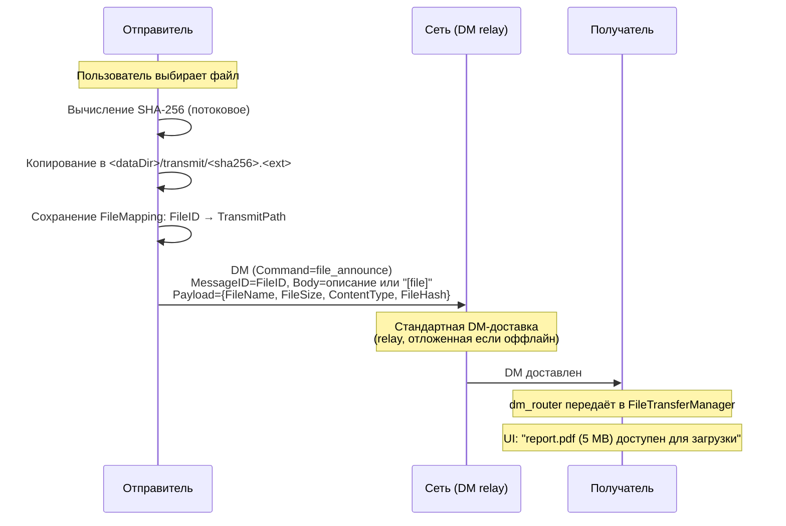

**Поток объявления файла**

## Поток загрузки с retry

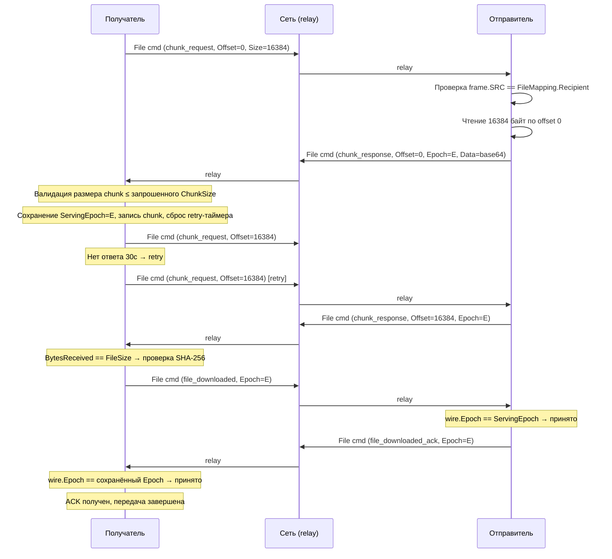

**Поток загрузки с retry**

## Цикл загрузки с retry

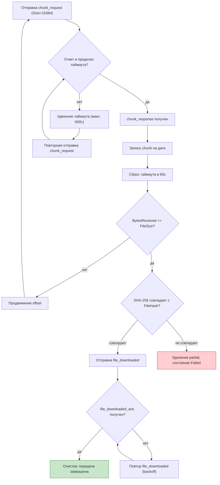

**Цикл загрузки с retry**

## Канал файловых команд — обоснование архитектуры

Файловые команды используют отдельный протокол с собственным wire-форматом
и семантикой маршрутизации, поскольку DM-конвейер предназначен для
долговременных сообщений чата. Он включает хранение в chatlog, расписки
доставки, gossip fallback, persistent pending queue, outbound state tracking
и эмиссию `LocalChangeEvent` — всё это конфликтует с транспортом передачи
файлов:

1. **Хранение в chatlog.** Хранение данных chunk'ов в chatlog —
   проблема масштабируемости.
2. **Двойной retry.** DM pending queue повторяет независимо от backoff
   таймера FileTransferManager.
3. **Утечка LocalChangeEvent.** Данные chunk'ов попадают в event pipeline,
   расходуя память.
4. **Загрязнение outbound state.** Chunk-трафик загрязняет диагностику.
5. **Амплификация расписок.** Каждый обмен chunk'ами генерировал бы
   расписку, удваивая трафик.

**Свойства файловых команд (архитектурные умолчания):**

| Свойство          | Файловая команда                | DM                 |
| ----------------- | ------------------------------- | ------------------ |
| Wire-формат       | FileCommandFrame                | Sealed envelope    |
| Маршрутизация     | Best route + capability проверка | DM relay           |
| TTL               | uint8, счётчик хопов            | Нет (time-based)   |
| Anti-replay       | Nonce-кеш                       | MessageID dedup    |
| Chatlog           | Никогда                         | Всегда             |
| Расписки доставки | Никогда                         | Всегда             |
| Gossip fallback   | Никогда                         | Всегда (INV-3)     |
| Pending queue     | Никогда                         | Да                 |
| Retry             | Уровень приложения              | Транспортный уровень |

**Связь с INV-3.** Файловые команды — не DM. INV-3 («каждый DM имеет
gossip fallback») продолжает действовать для всех DM, включая
`file_announce`. Файловые команды не имеют gossip по замыслу, не по
исключению.

## Валидация при запуске (отправитель)

При запуске приложения сканируются активные маппинги, проверяется
существование transmit-файлов:

1. Если конкретный transmit-файл отсутствует → переход в tombstone
   (потеря данных).
2. Если tombstone-маппинг имеет blob на диске → воскрешение в completed.
3. `ValidateOnStartup` пересчитывает ref counts из активных маппингов.
   Blob'ы НЕ удаляются — удаление только при удалении identity или
   сообщения.

> **Запланировано (не реализовано):** состояние `TemporarilyUnavailable`
> с grace period (24 часа) для случаев, когда `<dataDir>/transmit/`
> временно недоступна — см.
> [roadmap](../roadmap.ru.md#протокол-передачи-файлов).

## Криптографическая авторизация chunk-запросов

Каждый `chunk_request` — это `FileCommandFrame` с зашифрованным payload.
`FileTransferManager` выполняет авторизацию до чтения любых данных файла:

1. `file_router` получает FileCommandFrame с DST = self
2. `file_router` расшифровывает payload, читает Command
3. `file_router` передаёт в FileTransferManager
4. FileTransferManager ищет FileMapping по FileID
5. Если FileMapping не найден → молча игнорируется
6. Проверка: frame.SRC == FileMapping.Recipient
7. Если несовпадение → молча игнорируется (несанкционированный запрос)
8. Если совпадение → обработка команды

Каждый `FileMapping` хранит identity `Recipient`. **Все** файловые
команды, ссылающиеся на FileID — не только `chunk_request`, но и
`file_downloaded` — ОБЯЗАНЫ проверять frame.SRC == FileMapping.Recipient.
В сочетании с ECDH-шифрованием payload это обеспечивает два уровня защиты:
(1) криптографическую аутентификацию, (2) авторизацию против сохранённого
Recipient.

## file_downloaded_ack — подтверждение доставки

Канал файловых команд работает по принципу fire-and-forget без гарантий
доставки. Без подтверждения получатель не может знать, получил ли
отправитель `file_downloaded` и очистил ли `FileMapping`.

**Поток:**

1. Получатель верифицирует SHA-256, переходит в `WaitingAck`, отправляет
   `file_downloaded`.
2. Отправитель получает `file_downloaded`, отмечает FileMapping как
   completed, отправляет `file_downloaded_ack`.
3. Получатель получает `file_downloaded_ack`, переходит в `Completed`.

**Retry:** получатель повторяет `file_downloaded` с тем же экспоненциальным
backoff (60с → 120с → ... → 600с макс.). Каждая повторная отправка
идемпотентна — отправитель отвечает `file_downloaded_ack` в любом случае.

**Таймаут:** если получатель не получает `file_downloaded_ack` после
максимального backoff, он переходит в `Completed` локально (локальная
очистка). Отправитель очищается через tombstone TTL.

## RPC-команды

| Команда                | Описание                                            |
| ---------------------- | --------------------------------------------------- |
| `fetch_file_transfers` | Список активных/ожидающих трансферов (терминальные исключены) |
| `fetch_file_mapping`   | Показать активные/ожидающие маппинги отправителя (без TransmitPath) |
| `retry_file_chunk`     | Принудительный retry текущего ожидающего chunk-запроса |

## Защита от sender offset/size

`HandleChunkRequest` отклоняет `Offset >= FileSize` до любого дискового I/O
или перехода состояния. Валидные запросы ограничиваются до
`min(requestedSize, FileSize - Offset)`, чтобы отправитель никогда не читал
за пределами объявленного файла и не создавал пустые ответы от EOF.

## Ревалидация состояния после верификации

`onDownloadComplete` перепроверяет состояние маппинга после каждой операции,
отпускающей мьютекс (верификация хеша, переименование файла). Если
состояние больше не `receiverVerifying` (например, пользователь отменил
загрузку), путь завершения прерывается без перехода в `waiting_ack` и без
отправки `file_downloaded`. `markReceiverFailed` также принимает ожидаемое
состояние и пропускает переход, если состояние изменилось — это
предотвращает перезапись отменённого трансфера состоянием `failed`.

## Защита от обхода путей и инъекций

Имена файлов приходят от удалённых пиров внутри зашифрованных
`file_announce` payload'ов. Злоумышленник может передать имя файла с
последовательностями обхода пути (`../../../etc/cron.d/evil`), чтобы
записать файл за пределами каталога загрузок, или внедрить
glob-символы в хеш для совпадения с непредусмотренными файлами.

Защита многослойная — каждый слой независим, обход одного не
компрометирует систему:

1. **Санитизация имени файла** (`domain.SanitizeFileName`):
   применяется на каждой сетевой границе. Итеративно декодирует
   percent-encoded последовательности (до 3 раундов) перед валидацией —
   `%2F`, `%2E`, `%5C`, `%00` и варианты двойного кодирования (`%252F`)
   разрешаются до вызова `filepath.Base`. Гарантирует отсутствие
   разделителей каталогов, последовательностей `..`, нуль-байтов,
   валидный UTF-8 и максимальную длину 255 байт.

2. **Валидация хеша** (`domain.ValidateFileHash`): строго 64
   hex-символа. Предотвращает glob-инъекции и обход путей через
   подставные хеши.

3. **Контейнмент путей** (`ensureWithinDir`): проверяет, что
   разрешённый путь остаётся внутри ожидаемой директории после
   разрешения символических ссылок.

4. **Ревалидация при загрузке**: имена файлов и пути из transfers JSON
   повторно санитизируются при запуске. Подменённый JSON не позволит
   выйти за пределы директории.

5. **Удаление Unicode bidi-символов**: U+202E (RLO) и 14 других
   символов управления направлением текста, позволяющих визуально
   подменить расширение файла.

6. **Удаление управляющих символов**: ASCII C0 (кроме tab), DEL и
   Unicode C1. Предотвращает инъекцию в логи через переносы строк и
   ANSI escape-последовательности.

7. **Защита от зарезервированных имён Windows**: CON, NUL, PRN, AUX,
   COM1-COM9, LPT1-LPT9 получают префикс `_`. На Windows эти имена
   вызывают зависание независимо от расширения.

8. **Защита от symlink TOCTOU** (два уровня):
   - **Уровень ядра (`O_NOFOLLOW`)**: `writeChunkToFile` открывает
     partial-файл через `openNoFollow`, который добавляет
     `syscall.O_NOFOLLOW` к флагам open. Ядро отклоняет открытие с
     `ELOOP`, если последний компонент пути — символическая ссылка. Это
     предотвращает создание файла по цели симлинка через `O_CREATE` —
     закрывая окно, в котором старый подход (plain `os.OpenFile` +
     проверка после open) создавал целевой файл до любой проверки в
     user-space.
   - **Проверка identity в user-space (глубокая защита)**: после
     открытия `verifyNotSymlink` выполняет `os.Lstat` (не следует
     симлинкам) и сравнивает результат с `f.Stat()` (Fstat на открытом
     fd) через `os.SameFile`. Это ловит TOCTOU-подмену пути на симлинк
     между open и write.
   Верификация хеша в `onDownloadComplete` использует
   `verifyPartialIntegrity`, который открывает файл один раз, выполняет
   ту же проверку Lstat+Fstat identity на открытом fd и вычисляет хеш
   из этого же fd — устраняя TOCTOU-окно, которое существовало бы при
   отдельных open-вызовах для проверки симлинка и вычисления хеша.
   Перед `os.Rename` вызывается `verifyFileIdentity`, который повторно
   проверяет совпадение device+inode файла по пути с identity
   верифицированного fd — закрывая окно между закрытием fd и rename.

9. **Защита от переполнения uint64**: `writeChunkToFile` проверяет
   `offset + len(data)` на обёртывание перед записью.

10. **Контейнмент при удалении**: `CleanupPeerTransfers` и
    `CancelDownload` проверяют `completedPath` через `ensureWithinDir`
    перед вызовом `os.Remove`.

11. **Ревалидация состояния и generation после верификации**:
    `finalizeVerifiedDownload` (хвост `onDownloadComplete`) перепроверяет
    и состояние, и захваченную generation верификатора после каждой
    операции, отпускающей мьютекс (верификация хеша, переименование
    файла). Одной проверки состояния недостаточно: конкурентный
    `CancelDownload` сбрасывает маппинг в `available` и инкрементирует
    `Generation`, пользователь может тут же перезапустить тот же `fileID`,
    и новая попытка успеет дойти до `receiverVerifying`. Устаревший
    верификатор увидел бы совпадающее состояние и — без проверки
    generation — перезаписал бы `CompletedPath` старым blob'ом, перевёл
    новую попытку в `waiting_ack` и отправил бы `file_downloaded` за
    файл, который пользователь сознательно отменил. Охранное условие
    требует `mapping.State == receiverVerifying &&
    mapping.Generation == capturedGeneration`; при расхождении
    устаревший верификатор прерывает работу и удаляет переименованный
    blob. `markReceiverFailed` применяет ту же комбинированную проверку
    на failure-path.

    **Очистка по идентичности файла на stale-ветке**: cancel+restart
    того же `fileID` разрешается в идентичный `completedPath`, потому
    что совпадают `FileName` и `FileHash`. Если устаревший верификатор
    дойдёт до ветки очистки уже после того, как новая попытка
    переименовала собственный верифицированный файл в то же место,
    удаление по пути через `os.Remove` уничтожило бы легитимный файл
    новой попытки. Исправление передаёт `verifiedInfo` (`os.FileInfo`,
    захваченный `verifyPartialIntegrity` через `Fstat` на открытом fd)
    в `finalizeVerifiedDownload`; поскольку `os.Rename` на POSIX
    сохраняет inode, эта identity совпадает с файлом, который
    устаревший верификатор поместил в `completedPath`.
    `removeOwnedFileInDownloadDir` затем сравнивает текущий `Lstat`
    по `completedPath` с `verifiedInfo` через `os.SameFile` и удаляет
    файл только при совпадении. Если атомарный rename другой попытки
    заменил inode, устаревший верификатор оставляет файл нетронутым.
    Это обеспечивает, что generation-безопасность сохраняется до
    уровня файловой системы и не может быть нарушена коллизией путей
    между попытками.

## Точки входа санитизации

| Точка входа                   | Защита                                         |
| ----------------------------- | ---------------------------------------------- |
| `RegisterFileReceive`         | `ValidateFileHash` + `SanitizeFileName`        |
| `completedDownloadPath`       | `SanitizeFileName` + `ensureWithinDir`         |
| `resolveExistingDownload`     | `SanitizeFileName`                             |
| `partialDownloadPath`         | `SanitizeFileName` по file ID                  |
| `resolvePath` (transmit)      | `ValidateFileHash` + `ensureWithinDir`         |
| `HasFile` / `Acquire`         | `ValidateFileHash`                             |
| `ValidateOnStartup`           | `ValidateFileHash` по сохранённым ключам       |
| `loadMappings`                | `SanitizeFileName` + `ensureWithinDir`         |
| RPC `send_file_announce`      | `ValidateFileHash` на входном хеше             |
