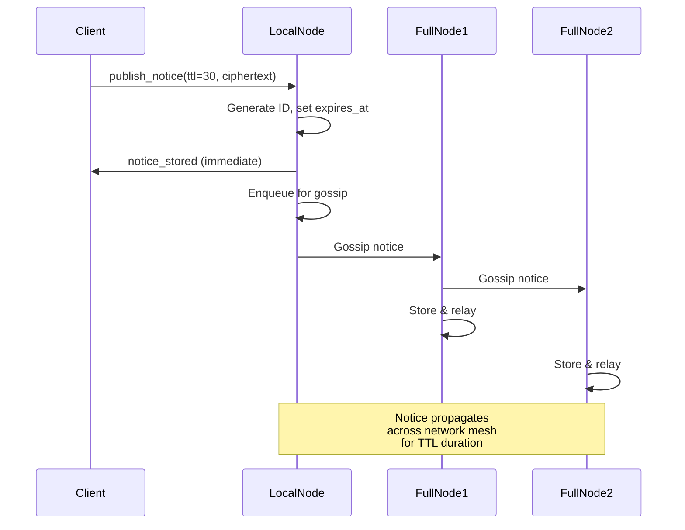
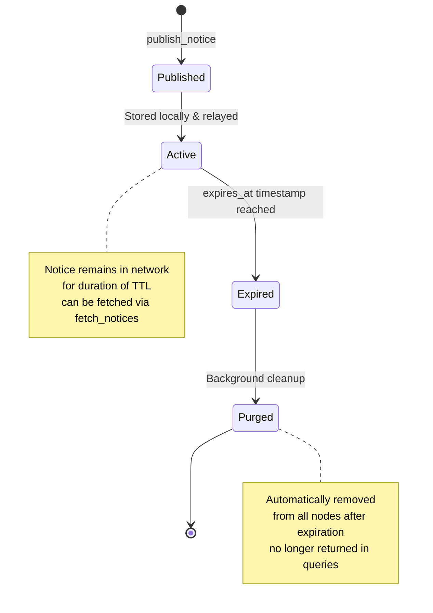

# Gazeta Protocol - Anonymous Notices

## Overview

Gazeta is an anonymous encrypted bulletin board system. Nodes publish encrypted notices with a time-to-live (TTL), which are relayed through the mesh network via gossip protocol and automatically expire. The system ensures privacy by allowing notices to be published without identifying information, with all content encrypted end-to-end.

## Commands

> **Transport scope:** All commands in this section are **LOCAL ONLY** — available through RPC HTTP and `handleLocalFrameDispatch`. Not available on the TCP data port; a remote peer receives `unknown_command`. Notices propagate between nodes via the gossip protocol, not through direct command invocation.

### publish_notice

Publishes an encrypted notice to the network with a specified TTL.

**Request Format:**
```json
{
  "type": "publish_notice",
  "ttl_seconds": 30,
  "ciphertext": "Sn2PniwzWh9unSxLeoePPFydG2qPLkx92aHzW8jg0qT5wePKaLjQ8uWnydG0bm-KAMLUbm-KAMLUbm-KAM"
}
```

**Request Field Descriptions:**
| Field | Type | Description |
|-------|------|-------------|
| `type` | string | Fixed value: `"publish_notice"` |
| `ttl_seconds` | integer | Time-to-live in seconds (e.g., 30-3600) |
| `ciphertext` | string | Encrypted notice content, opaque base64url blob (see encryption.md for encryption scheme) |

**Response Format (Success - New Notice):**
```json
{
  "type": "notice_stored",
  "id": "abc123def456ghi789jkl",
  "expires_at": 1711001400
}
```

**Response Format (Duplicate - Already Known):**
```json
{
  "type": "notice_known",
  "id": "abc123def456ghi789jkl",
  "expires_at": 1711001400
}
```

**Response Field Descriptions:**
| Field | Type | Description |
|-------|------|-------------|
| `type` | string | `"notice_stored"` (new) or `"notice_known"` (duplicate) |
| `id` | string | Unique notice identifier (derived from notice content hash) |
| `expires_at` | unix_timestamp | Unix timestamp when notice expires and is purged |

**Behavior:**
- Notice receives a unique ID based on its content hash
- `expires_at` is calculated as `current_time + ttl_seconds`
- If the same notice (same ciphertext) is published again, returns `"notice_known"` instead of creating duplicate
- Notice is immediately stored locally and enqueued for gossip relay to peers
- The client receives immediate confirmation before network propagation completes

### fetch_notices

Retrieves all currently active (non-expired) notices.

**Request Format:**
```json
{
  "type": "fetch_notices"
}
```

**Response Format:**
```json
{
  "type": "notices",
  "count": 3,
  "notices": [
    {
      "id": "abc123def456ghi789jkl",
      "expires_at": 1711001400,
      "ciphertext": "Sn2PniwzWh9unSxLeoePPFydG2qPLkx92aHzW8jg0qT5wePKaLjQ8uWnydG0bm-KAMLUbm-KAMLUbm-KAM"
    },
    {
      "id": "xyz789abc123def456ghi",
      "expires_at": 1711002100,
      "ciphertext": "ny5MfZofO1yODSpPnB46a4jQ8uWnydG0bm-KAMLUbm-KAMpKfY-eLDtaH26dLEt6h49c"
    },
    {
      "id": "jkl456xyz789abc123def",
      "expires_at": 1711003600,
      "ciphertext": "G05viAwt5G-KAMLUbm-KAMLUbm-KAMpKfY-eLDtaH26dLEt6h49c_dG2qPLkx92aHzW8jg0qT5weI"
    }
  ]
}
```

**Response Field Descriptions:**
| Field | Type | Description |
|-------|------|-------------|
| `type` | string | Fixed value: `"notices"` |
| `count` | integer | Number of active notices |
| `notices[].id` | string | Unique notice identifier |
| `notices[].expires_at` | unix_timestamp | Unix timestamp when notice expires |
| `notices[].ciphertext` | string | Full encrypted notice content (opaque base64url blob) |

**Behavior:**
- Returns only notices with `expires_at > current_time`
- Expired notices are automatically purged and not returned
- Notices are typically returned in order of descending `expires_at` (longest-living first)
- The response includes full ciphertext for decryption by the client
- Provides metadata for building notice feeds/bulletin boards in applications

## Network Relay & Gossip

Notices are propagated through the network using a gossip protocol:



**Diagram: Notice Publication & Gossip Flow**

## Expiration & Cleanup



**Diagram: Notice Lifecycle**

## Privacy & Security Properties

- **Sender Anonymity**: Publisher address is never embedded in notice; publishing is anonymous
- **Content Encryption**: All notice content must be encrypted before transmission (see encryption.md)
- **Ephemeral Storage**: Notices automatically expire and are purged; no permanent record
- **No Signatures**: Notices are not signed (no attribution), ensuring true anonymity
- **Mesh Propagation**: Gossip relay prevents centralized tracking of notice origin

## Implementation Notes

1. **ID Generation**: Notice ID is the first 16 bytes of SHA-256(ciphertext), base64url-encoded, ensuring deterministic, duplicate-proof IDs

2. **TTL Validation**: Typical valid ranges are 30-3600 seconds; excessively long TTLs may be rejected or capped by network policy

3. **Expiration Check**: Background task runs periodically to purge expired notices; `fetch_notices` filters based on `expires_at <= current_time`

4. **Gossip Deduplication**: Notices identified by ID are only relayed once per peer; the `"notice_known"` response prevents redundant transmission

5. **Storage**: Active notices are held in memory with periodic persistence to survive node restarts

6. **Bandwidth**: Large ciphertexts increase network gossip overhead; applications should optimize payload size

7. **Ordering**: Clients should not assume notices are returned in any particular order; use timestamps for ordering in the application

---

# Протокол Газета - Анонимные Уведомления

## Обзор

Газета - это система анонимной зашифрованной доски объявлений. Узлы публикуют зашифрованные уведомления с указанным временем жизни (TTL), которые передаются через сеть-сетку через протокол слухов и автоматически истекают. Система обеспечивает конфиденциальность, позволяя публиковать уведомления без идентификационной информации, при этом все содержимое шифруется сквозным образом.

## Команды

> **Область транспорта:** Все команды в этом разделе доступны **ТОЛЬКО ЛОКАЛЬНО** — через RPC HTTP и `handleLocalFrameDispatch`. Недоступны на TCP data port; удалённый пир получит `unknown_command`. Уведомления распространяются между узлами через gossip-протокол, а не через прямой вызов команд.

### publish_notice

Публикует зашифрованное уведомление в сеть с указанным TTL.

**Формат запроса:**
```json
{
  "type": "publish_notice",
  "ttl_seconds": 30,
  "ciphertext": "Sn2PniwzWh9unSxLeoePPFydG2qPLkx92aHzW8jg0qT5wePKaLjQ8uWnydG0bm-KAMLUbm-KAMLUbm-KAM"
}
```

**Описание полей запроса:**
| Поле | Тип | Описание |
|------|-----|---------|
| `type` | строка | Фиксированное значение: `"publish_notice"` |
| `ttl_seconds` | целое число | Время жизни в секундах (например, 30-3600) |
| `ciphertext` | строка | Зашифрованное содержимое уведомления, непрозрачный base64url blob (см. encryption.md для схемы шифрования) |

**Формат ответа (Успешно - новое уведомление):**
```json
{
  "type": "notice_stored",
  "id": "abc123def456ghi789jkl",
  "expires_at": 1711001400
}
```

**Формат ответа (Дубликат - уже известно):**
```json
{
  "type": "notice_known",
  "id": "abc123def456ghi789jkl",
  "expires_at": 1711001400
}
```

**Описание полей ответа:**
| Поле | Тип | Описание |
|------|-----|---------|
| `type` | строка | `"notice_stored"` (новое) или `"notice_known"` (дубликат) |
| `id` | строка | Уникальный идентификатор уведомления (производная от хеша содержимого уведомления) |
| `expires_at` | unix_timestamp | Временная метка Unix, когда уведомление истекает и очищается |

**Поведение:**
- Уведомление получает уникальный ID на основе хеша его содержимого
- `expires_at` вычисляется как `current_time + ttl_seconds`
- Если то же уведомление (тот же шифротекст) опубликовано снова, возвращает `"notice_known"` вместо создания дубликата
- Уведомление немедленно сохраняется локально и ставится в очередь для передачи слухов коллегам
- Клиент получает немедленное подтверждение до завершения распространения по сети

### fetch_notices

Получает все активные (невыпустившие) уведомления.

**Формат запроса:**
```json
{
  "type": "fetch_notices"
}
```

**Формат ответа:**
```json
{
  "type": "notices",
  "count": 3,
  "notices": [
    {
      "id": "abc123def456ghi789jkl",
      "expires_at": 1711001400,
      "ciphertext": "Sn2PniwzWh9unSxLeoePPFydG2qPLkx92aHzW8jg0qT5wePKaLjQ8uWnydG0bm-KAMLUbm-KAMLUbm-KAM"
    },
    {
      "id": "xyz789abc123def456ghi",
      "expires_at": 1711002100,
      "ciphertext": "ny5MfZofO1yODSpPnB46a4jQ8uWnydG0bm-KAMLUbm-KAMpKfY-eLDtaH26dLEt6h49c"
    },
    {
      "id": "jkl456xyz789abc123def",
      "expires_at": 1711003600,
      "ciphertext": "G05viAwt5G-KAMLUbm-KAMLUbm-KAMpKfY-eLDtaH26dLEt6h49c_dG2qPLkx92aHzW8jg0qT5weI"
    }
  ]
}
```

**Описание полей ответа:**
| Поле | Тип | Описание |
|------|-----|---------|
| `type` | строка | Фиксированное значение: `"notices"` |
| `count` | целое число | Количество активных уведомлений |
| `notices[].id` | строка | Уникальный идентификатор уведомления |
| `notices[].expires_at` | unix_timestamp | Временная метка Unix, когда уведомление истекает |
| `notices[].ciphertext` | строка | Полное зашифрованное содержимое уведомления (непрозрачный base64url blob) |

**Поведение:**
- Возвращает только уведомления с `expires_at > current_time`
- Истекшие уведомления автоматически очищаются и не возвращаются
- Уведомления обычно возвращаются в порядке убывания `expires_at` (долгоживущие первыми)
- Ответ включает полный шифротекст для расшифровки клиентом
- Предоставляет метаданные для создания каналов уведомлений/досок объявлений в приложениях

## Сетевая передача и слухи

Уведомления распространяются через сеть с использованием протокола слухов:


**Диаграмма: Поток публикации и слухов уведомлений**

## Истечение и очистка


**Диаграмма: Жизненный цикл уведомления**

## Свойства конфиденциальности и безопасности

- **Анонимность отправителя**: Адрес издателя никогда не встраивается в уведомление; публикация анонимна
- **Шифрование содержимого**: Все содержимое уведомления должно быть зашифровано перед передачей (см. encryption.md)
- **Эфемерное хранилище**: Уведомления автоматически истекают и очищаются; нет постоянной записи
- **Нет подписей**: Уведомления не подписаны (нет атрибуции), обеспечивая истинную анонимность
- **Распространение сетки**: Передача слухов предотвращает централизованное отслеживание источника уведомления

## Примечания реализации

1. **Генерация ID**: Идентификатор уведомления — первые 16 байт SHA-256(ciphertext), закодированные в base64url, обеспечивая детерминированные, защищённые от дублирования ID

2. **Валидация TTL**: Типичные допустимые диапазоны 30-3600 секунд; чрезмерно длинные TTL могут быть отклонены или ограничены политикой сети

3. **Проверка истечения**: Фоновая задача периодически запускается для очистки истекших уведомлений; `fetch_notices` фильтры на основе `expires_at <= current_time`

4. **Дедупликация слухов**: Уведомления, определенные по ID, передаются только один раз на одноранговой узел; ответ `"notice_known"` предотвращает избыточную передачу

5. **Хранилище**: Активные уведомления хранятся в памяти с периодической сохраняемостью для выживания после перезагрузки узла

6. **Пропускная способность**: Большие шифротексты увеличивают накладные расходы на распространение слухов в сети; приложения должны оптимизировать размер полезной нагрузки

7. **Упорядочение**: Клиенты не должны предполагать, что уведомления возвращаются в каком-либо конкретном порядке; используйте временные метки для упорядочения в приложении
