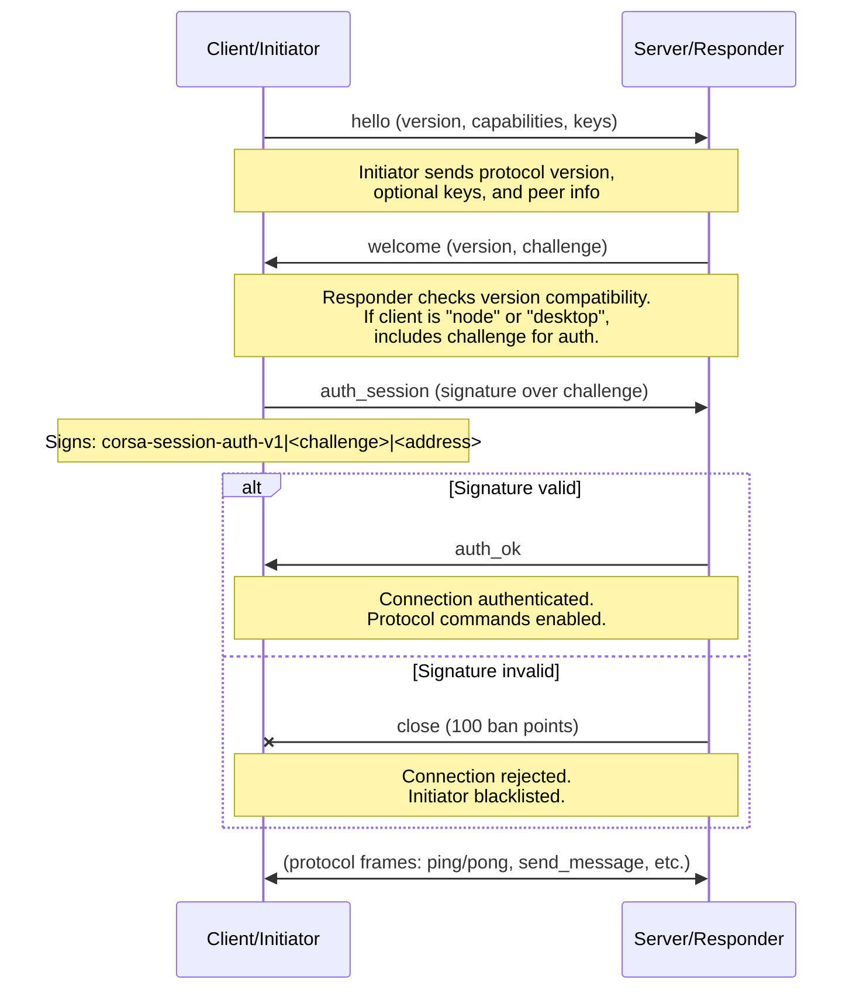
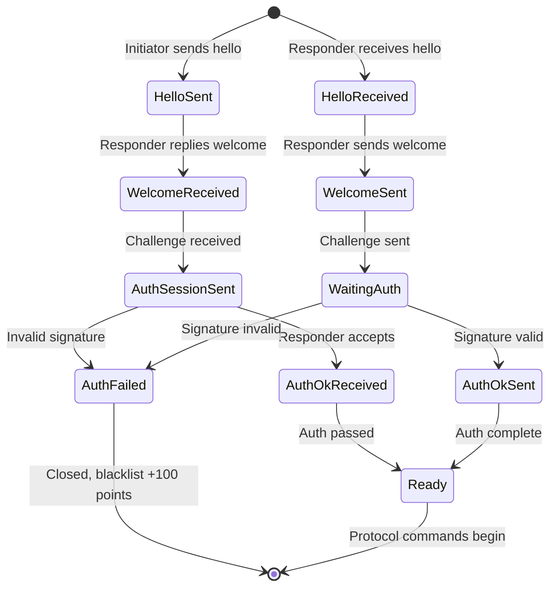
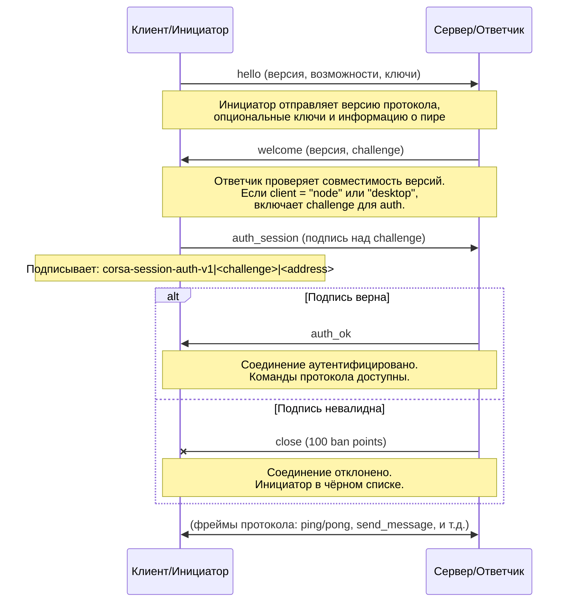
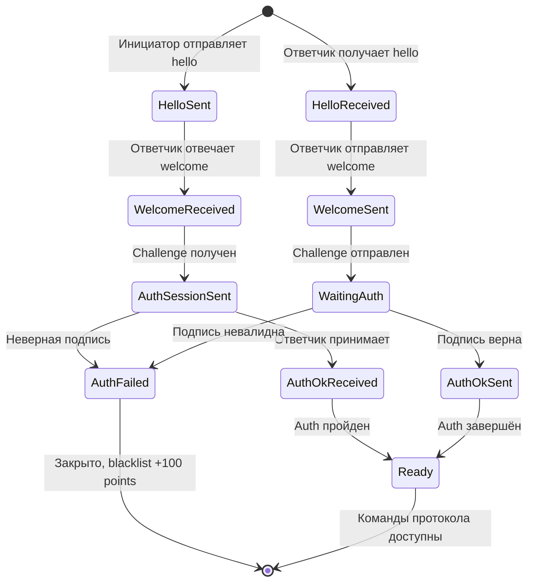

# CORSA Protocol Handshake

## English

### Overview

The handshake commands establish peer connections, negotiate protocol version compatibility, authenticate peers, and maintain liveness. All frames are plain JSON-over-TCP. Authentication confirms peer identity but does not change the transport layer.

**Commands:**
- `hello` — initiator announces capabilities and requests connection
- `welcome` — responder confirms compatibility and provides challenge (on mutual v2+)
- `auth_session` — initiator authenticates using challenge signature
- `auth_ok` — responder confirms authentication success
- `ping` / `pong` — heartbeat for liveness detection

### hello (initiator → responder)

#### Client request (desktop/CLI)

```json
{
  "type": "hello",
  "version": 3,
  "client": "desktop",
  "client_version": "<corsa-version-wire>",
  "client_build": 21
}
```

#### Node-to-node request (full relay or client node)

```json
{
  "type": "hello",
  "version": 3,
  "client": "node",
  "listener": "1",
  "listen": "<ip>:64646",
  "node_type": "full",
  "client_version": "<wire>",
  "client_build": 21,
  "services": ["identity", "contacts", "messages", "gazeta", "relay"],
  "networks": ["ipv4", "ipv6", "torv3"],
  "capabilities": ["mesh_relay_v1"],
  "address": "<fingerprint>",
  "pubkey": "<base64-ed25519>",
  "boxkey": "<base64-x25519>",
  "boxsig": "<base64url-ed25519>"
}
```

#### Field reference

| Field | Type | Required | Description |
|-------|------|----------|-------------|
| `type` | string | yes | Always `"hello"` |
| `version` | integer | yes | Sender's protocol version (e.g., 3). Responder rejects if `version < responder.minimum_protocol_version` |
| `minimum_protocol_version` | integer | no | Minimum protocol version sender accepts. Informational; nodes do not currently send or check this field in incoming `hello` frames |
| `client` | string | yes | Type: `"desktop"` (UI/CLI) or `"node"` (relay peer) |
| `listener` | string | optional | `"1"` if accepting inbound peers; `"0"` if not. Client nodes typically send `"0"` |
| `listen` | string | optional | Advertised listen address in form `<ip>:<port>`. Only meaningful if `listener="1"` |
| `node_type` | string | optional | `"full"` (relays mesh traffic) or `"client"` (no relay). Only for `client="node"` |
| `client_version` | string | optional | Version string (e.g., `"0.1.0"` or `"v1.2.3-wire"`) for logging and diagnostics |
| `client_build` | integer | optional | Monotonic build number for version tracking. Incremented on each release |
| `services` | array | optional | Capability list: `["identity", "contacts", "messages", "gazeta", "relay", ...]` |
| `networks` | array | optional | Reachable networks: `["ipv4", "ipv6", "torv3", "torv2", "i2p", "cjdns", "local"]`. Validated against `listen` address |
| `capabilities` | array | optional | Extended capability tokens for feature negotiation (e.g., `["mesh_relay_v1", "mesh_routing_v1"]`). Both peers advertise capabilities during handshake; the session uses the intersection. Nodes without this field are treated as having an empty capability set. See [Capability Negotiation](#capability-negotiation) |
| `address` | string | optional | Peer fingerprint (identity public key hash in hex). Required for mutual authentication on v2+ |
| `pubkey` | string | optional | Ed25519 public key in base64. Used for message signature verification |
| `boxkey` | string | optional | X25519 public key in base64. Used for message encryption |
| `boxsig` | string | optional | Ed25519 signature (base64url) of boxkey binding. Signature payload: `corsa-boxkey-v1|<address>|<boxkey-base64>` |

### welcome (responder → initiator)

```json
{
  "type": "welcome",
  "version": 3,
  "minimum_protocol_version": 2,
  "node": "corsa",
  "network": "gazeta-devnet",
  "challenge": "<random-string>",
  "listener": "1",
  "listen": "<ip>:64646",
  "node_type": "full",
  "client_version": "<wire>",
  "client_build": 21,
  "services": ["identity", "contacts", "messages", "gazeta", "relay"],
  "capabilities": ["mesh_relay_v1"],
  "address": "<fingerprint>",
  "pubkey": "<base64-ed25519>",
  "boxkey": "<base64-x25519>",
  "boxsig": "<base64url-ed25519>",
  "observed_address": "203.0.113.50"
}
```

#### Field reference

| Field | Type | Description |
|-------|------|-------------|
| `type` | string | Always `"welcome"` |
| `version` | integer | Responder's protocol version |
| `minimum_protocol_version` | integer | Minimum version responder accepts |
| `node` | string | Server implementation name (e.g., `"corsa"`, `"gossip"`) |
| `network` | string | Logical network identifier (e.g., `"gazeta-devnet"`, `"mainnet"`) |
| `challenge` | string | Random opaque string for authentication. **Included when the initiator's `client` is `"node"` or `"desktop"`** (i.e. always for peer and desktop connections) |
| `listener` | string | Same as in `hello` |
| `listen` | string | Same as in `hello` |
| `node_type` | string | Same as in `hello` |
| `client_version` | string | Same as in `hello` |
| `client_build` | integer | Same as in `hello` |
| `services` | array | Responder's capability list |
| `capabilities` | array | Responder's extended capability tokens. The session uses the intersection of initiator and responder capabilities. See [Capability Negotiation](#capability-negotiation) |
| `address` | string | Responder's fingerprint |
| `pubkey` | string | Responder's Ed25519 public key |
| `boxkey` | string | Responder's X25519 public key |
| `boxsig` | string | Signature of responder's boxkey binding |
| `observed_address` | string | Initiator's IP address (no port) as seen by responder. Used for NAT detection and peer discovery |

### auth_session (initiator → responder)

Sent only when responder included a `challenge` in `welcome`.

```json
{
  "type": "auth_session",
  "address": "<fingerprint>",
  "signature": "<base64url-ed25519>"
}
```

#### Field reference

| Field | Type | Description |
|-------|------|-------------|
| `type` | string | Always `"auth_session"` |
| `address` | string | Initiator's fingerprint |
| `signature` | string | Ed25519 signature (base64url) over payload: `corsa-session-auth-v1|<challenge>|<address>` where `<challenge>` is the value from `welcome` and `<address>` is the initiator's fingerprint |

#### Validation

- Signature is verified using initiator's public key from `hello`
- Invalid signature results in **100 ban points** (configurable)
- **1000 accumulated points = 24-hour blacklist** (prevents connection)
- On signature verification failure, connection is terminated immediately

### auth_ok (responder → initiator)

Sent after successful `auth_session` validation.

```json
{
  "type": "auth_ok",
  "address": "<fingerprint>",
  "status": "ok"
}
```

#### Field reference

| Field | Type | Description |
|-------|------|-------------|
| `type` | string | Always `"auth_ok"` |
| `address` | string | Responder's fingerprint |
| `status` | string | Status code: `"ok"` = authenticated, ready for protocol commands |

After `auth_ok`, the peer is authenticated and normal protocol commands can begin. The transport remains plain JSON-over-TCP; message content is encrypted end-to-end at the application layer (see encryption.md).

### ping / pong (either direction)

Heartbeat command sent every 2 minutes on idle connections.

#### ping request

```json
{
  "type": "ping"
}
```

#### pong response

```json
{
  "type": "pong",
  "node": "corsa",
  "network": "gazeta-devnet"
}
```

#### Field reference

| Field | Type | Description |
|-------|------|-------------|
| `type` | string | `"ping"` or `"pong"` |
| `node` | string (pong only) | Responder implementation name |
| `network` | string (pong only) | Logical network identifier |

Pong is used for liveness detection and network diagnostics. No authentication required.

---

## Handshake Sequence Diagram



*Handshake sequence: version negotiation, authentication, transition to protocol commands*

---

## Compatibility & Validation Rules

### Version Negotiation

- **Initiator sends** `version` in `hello`
- **Responder checks**: if `initiator.version < responder.minimum_protocol_version`, respond with `error` (code: `incompatible-protocol-version`) and close
- **Connection succeeds** if `responder.version >= initiator.minimum_protocol_version`

### Authentication (node and desktop connections)

When initiator's `client` is `"node"` or `"desktop"`:
- Responder includes `challenge` (random string, ~16–32 bytes, base64-encoded)
- Initiator responds with `auth_session` containing signature: `Ed25519(initiator_private_key, "corsa-session-auth-v1|<challenge>|<address>")`
- Responder verifies signature against initiator's `pubkey` from `hello`
- **On failure**: +100 ban points; **1000+ points** = 24-hour blacklist
- **On success**: respond with `auth_ok` and enable protocol commands

### Key Verification

When initiator sends `pubkey`, `boxkey`, and `boxsig`:

1. Verify `boxsig` is a valid Ed25519 signature over: `corsa-boxkey-v1|<address>|<boxkey-base64>`
2. If verification succeeds, store all three keys
3. If verification fails, **discard the keys but keep the connection** (backward compatibility)
4. If any fields are missing, accept connection as-is (for older peer versions)

### observed_address (NAT Detection)

- Responder includes initiator's IP (without port) as seen from responder's TCP socket
- Used to detect if initiator is behind NAT (e.g., local IP ≠ observed IP)
- **Consensus building**: compare across 2+ peer observations
- Informational only; does not affect connection logic

### Node Role Semantics

- **full node** (`node_type="full"`): relays mesh traffic, stores messages for gossip
- **client node** (`node_type="client"`): does not relay; sends own DMs and delivery receipts upstream only
- **listener=1** on a client: can accept inbound connections but still does not relay
- Desktop clients do not send `node_type` or `listener` fields (omitted from wire via `omitempty`)

### Address Groups (networks field)

Valid values for `networks` array:
- `ipv4` — reachable on IPv4
- `ipv6` — reachable on IPv6
- `torv3` — Tor v3 onion address
- `torv2` — Tor v2 onion address (deprecated)
- `i2p` — I2P address
- `cjdns` — cjdns address
- `local` — private/loopback only
- `unknown` — address type not recognized

The `networks` array is validated against the format of `listen`. For example, if `listen="192.168.1.100:64646"`, only `ipv4` and `local` are valid.

---

## Capability Negotiation

The `capabilities` field enables additive feature negotiation without incrementing `ProtocolVersion`. Each capability is a string token (e.g., `"mesh_relay_v1"`, `"mesh_routing_v1"`). Both peers advertise their supported capabilities during the handshake. The session uses only the intersection of both sets.

Capability tokens gate new frame types and behaviors. A peer must not send a capability-gated frame type unless the session has that capability in its negotiated set. This allows mixed-version networks: legacy nodes without the `capabilities` field are treated as having an empty set — they never receive unknown frame types.

Currently defined tokens: none (the mechanism is introduced but no capabilities are active yet). Future iterations will add tokens such as `"mesh_relay_v1"` for hop-by-hop relay and `"mesh_routing_v1"` for routing table announcements.

---

## Error Handling

On version mismatch:
```json
{
  "type": "error",
  "code": "incompatible-protocol-version",
  "message": "peer version 1 below minimum 2"
}
```

Version mismatch handling uses a graduated ban model: each incompatible-version attempt adds 250 to the transport-level ban score (threshold 1000, so 4 attempts from the same IP trigger a 24-hour blacklist). On the overlay level, the peer receives an accumulating ban score (`peerBanIncrementIncompatible` = 250, threshold 1000) and a **version lockout** is recorded in `peers.json` only when the version evidence is confirmed (remote `minimum_protocol_version` exceeds the local protocol version). Lockouts are bound to the peer's cryptographic identity when available; identity-less (address-only) lockouts expire after 7 days (`VersionLockoutMaxTTL`) to prevent stale entries from suppressing addresses that may later belong to a different peer. Identity-bound lockouts persist until the local node upgrades (protocol version or client build changes). The version evidence from the incompatible peer is also fed into the node's `VersionPolicyState` for update-available detection: when ≥3 distinct peer identities report incompatibility (or ≥2 peers advertise a higher `client_build`), the node signals `update_available` in `AggregateStatus`. The build metadata (`peerBuilds`, `peerVersions`) is session-scoped — populated during handshake, cleared on disconnect — so only currently connected peers contribute to the build signal. Ephemeral observations expire after 24 hours, but active persisted lockouts also contribute to `update_available` — the signal remains true as long as any lockout exists, preventing the UI from losing the update hint while the node remains partially locked out. The `add_peer` RPC command serves as the explicit operator override: it clears the version lockout, resets all incompatible-version diagnostics, and recomputes the version policy immediately.

On authentication failure:
```json
{
  "type": "error",
  "code": "auth_failed",
  "message": "invalid signature"
}
```

On simultaneous connection (both directions allowed):

When two nodes dial each other simultaneously, each ends up with both an inbound and an outbound TCP connection to the same peer. Previously the responder rejected the inbound with `duplicate-connection`, but this broke one-way gossip: the rejected side had no outbound session and could not forward messages. Both connections now coexist; the routing and health layers deduplicate by peer identity.

The `duplicate-connection` error code is deprecated and no longer emitted. Legacy clients should treat it as a no-op.

See [errors.md](errors.md) for full error reference.

---

## Address groups (network reachability)

- every peer address is classified into a network group: `ipv4`, `ipv6`, `torv3`, `torv2`, `i2p`, `cjdns`, `local`, or `unknown`
- the classification follows the `CNetAddr::GetNetwork` approach — each address belongs to exactly one group
- a node computes which groups it can reach at startup: IPv4/IPv6 are always reachable; Tor and I2P require a SOCKS5 proxy (`CORSA_PROXY` env var); CJDNS uses its own tun interface and is not proxied — it is not currently reachable
- dial candidate selection skips addresses in unreachable groups — e.g. a clearnet node will not attempt to dial `.onion` or `.b32.i2p` addresses without a proxy
- nodes declare their reachable groups in the `hello` frame via the `"networks"` field (e.g. `["ipv4","ipv6","torv3"]`); the receiving node validates the declaration against the peer's advertised address — overlay groups (torv3, torv2, i2p, cjdns) are only accepted if the advertised address belongs to that overlay; clearnet groups (ipv4, ipv6) are always accepted; this prevents a clearnet peer from claiming overlay reachability to harvest `.onion` / `.i2p` addresses
- peer exchange (`get_peers` → `peers`) filters addresses by the validated intersection of declared and verifiable groups; if the peer did not send `"networks"`, reachability is inferred from its advertised address (not the TCP endpoint, which may differ for overlay peers); local/private addresses are never relayed
- the `network` field in `peers.json` records each peer's group for diagnostic purposes

---

## State Machine



*Handshake state machine: from initial contact to protocol-ready state*

---

---

## Русский

### Обзор

Команды handshake устанавливают peer-соединения, согласуют совместимость версий протокола, аутентифицируют пиры и поддерживают liveness. Все фреймы передаются по plain JSON-over-TCP. Аутентификация подтверждает identity пира, но не изменяет транспортный уровень.

**Команды:**
- `hello` — инициатор объявляет возможности и запрашивает соединение
- `welcome` — ответчик подтверждает совместимость и предоставляет challenge (на v2+ обоюдно)
- `auth_session` — инициатор аутентифицируется через подпись challenge
- `auth_ok` — ответчик подтверждает успешную аутентификацию
- `ping` / `pong` — heartbeat для обнаружения живости соединения

### hello (инициатор → ответчик)

#### Запрос от клиента (desktop/CLI)

```json
{
  "type": "hello",
  "version": 3,
  "client": "desktop",
  "client_version": "<corsa-version-wire>",
  "client_build": 21
}
```

#### Запрос node-to-node (full relay или client node)

```json
{
  "type": "hello",
  "version": 3,
  "client": "node",
  "listener": "1",
  "listen": "<ip>:64646",
  "node_type": "full",
  "client_version": "<wire>",
  "client_build": 21,
  "services": ["identity", "contacts", "messages", "gazeta", "relay"],
  "networks": ["ipv4", "ipv6", "torv3"],
  "capabilities": ["mesh_relay_v1"],
  "address": "<fingerprint>",
  "pubkey": "<base64-ed25519>",
  "boxkey": "<base64-x25519>",
  "boxsig": "<base64url-ed25519>"
}
```

#### Справочник полей

| Поле | Тип | Обязательное | Описание |
|------|-----|-------------|----------|
| `type` | string | да | Всегда `"hello"` |
| `version` | integer | да | Версия протокола отправителя (например, 3). Ответчик отклоняет, если `version < responder.minimum_protocol_version` |
| `minimum_protocol_version` | integer | нет | Минимальная версия протокола, которую отправитель принимает (например, 2). Информационное; ноды не отправляют и не проверяют это поле во входящих `hello` фреймах |
| `client` | string | да | Тип: `"desktop"` (UI/CLI) или `"node"` (relay-пир) |
| `listener` | string | опционально | `"1"` если принимает входящие пиры; `"0"` если нет. Client-ноды обычно отправляют `"0"` |
| `listen` | string | опционально | Рекламируемый адрес прослушивания в виде `<ip>:<port>`. Смысл только если `listener="1"` |
| `node_type` | string | опционально | `"full"` (релирует трафик) или `"client"` (без relay). Только для `client="node"` |
| `client_version` | string | опционально | Строка версии (например, `"0.1.0"` или `"v1.2.3-wire"`) для логирования и диагностики |
| `client_build` | integer | опционально | Монотонный номер сборки для отслеживания версий. Увеличивается при каждом релизе |
| `services` | array | опционально | Список возможностей: `["identity", "contacts", "messages", "gazeta", "relay", ...]` |
| `networks` | array | опционально | Доступные сети: `["ipv4", "ipv6", "torv3", "torv2", "i2p", "cjdns", "local"]`. Валидируется против адреса `listen` |
| `capabilities` | array | опционально | Расширенные capability-токены для согласования функций (например, `["mesh_relay_v1", "mesh_routing_v1"]`). Оба пира объявляют capabilities при handshake; сессия использует пересечение. Ноды без этого поля считаются с пустым набором. См. [Согласование capabilities](#согласование-capabilities) |
| `address` | string | опционально | Fingerprint пира (хеш публичного ключа identity в hex). Требуется для взаимной аутентификации на v2+ |
| `pubkey` | string | опционально | Ed25519 публичный ключ в base64. Используется для проверки подписей сообщений |
| `boxkey` | string | опционально | X25519 публичный ключ в base64. Используется для шифрования сообщений |
| `boxsig` | string | опционально | Ed25519 подпись (base64url) связи boxkey. Полезная нагрузка подписи: `corsa-boxkey-v1|<address>|<boxkey-base64>` |

### welcome (ответчик → инициатор)

```json
{
  "type": "welcome",
  "version": 3,
  "minimum_protocol_version": 2,
  "node": "corsa",
  "network": "gazeta-devnet",
  "challenge": "<random-string>",
  "listener": "1",
  "listen": "<ip>:64646",
  "node_type": "full",
  "client_version": "<wire>",
  "client_build": 21,
  "services": ["identity", "contacts", "messages", "gazeta", "relay"],
  "capabilities": ["mesh_relay_v1"],
  "address": "<fingerprint>",
  "pubkey": "<base64-ed25519>",
  "boxkey": "<base64-x25519>",
  "boxsig": "<base64url-ed25519>",
  "observed_address": "203.0.113.50"
}
```

#### Справочник полей

| Поле | Тип | Описание |
|------|-----|----------|
| `type` | string | Всегда `"welcome"` |
| `version` | integer | Версия протокола ответчика |
| `minimum_protocol_version` | integer | Минимальная версия, которую ответчик принимает |
| `node` | string | Имя реализации сервера (например, `"corsa"`, `"gossip"`) |
| `network` | string | Идентификатор логической сети (например, `"gazeta-devnet"`, `"mainnet"`) |
| `challenge` | string | Случайная непрозрачная строка для аутентификации. **Включается когда `client` инициатора равен `"node"` или `"desktop"`** (т.е. всегда для peer- и desktop-соединений) |
| `listener` | string | Аналогично полю в `hello` |
| `listen` | string | Аналогично полю в `hello` |
| `node_type` | string | Аналогично полю в `hello` |
| `client_version` | string | Аналогично полю в `hello` |
| `client_build` | integer | Аналогично полю в `hello` |
| `services` | array | Список возможностей ответчика |
| `capabilities` | array | Расширенные capability-токены ответчика. Сессия использует пересечение capabilities инициатора и ответчика. См. [Согласование capabilities](#согласование-capabilities) |
| `address` | string | Fingerprint ответчика |
| `pubkey` | string | Ed25519 публичный ключ ответчика |
| `boxkey` | string | X25519 публичный ключ ответчика |
| `boxsig` | string | Подпись связи boxkey ответчика |
| `observed_address` | string | IP-адрес инициатора (без порта) как видит ответчик. Используется для обнаружения NAT и discovery пиров |

### auth_session (инициатор → ответчик)

Отправляется только когда ответчик включил `challenge` в `welcome`.

```json
{
  "type": "auth_session",
  "address": "<fingerprint>",
  "signature": "<base64url-ed25519>"
}
```

#### Справочник полей

| Поле | Тип | Описание |
|------|-----|----------|
| `type` | string | Всегда `"auth_session"` |
| `address` | string | Fingerprint инициатора |
| `signature` | string | Ed25519 подпись (base64url) над полезной нагрузкой: `corsa-session-auth-v1|<challenge>|<address>` где `<challenge>` — значение из `welcome`, а `<address>` — fingerprint инициатора |

#### Валидация

- Подпись проверяется с помощью публичного ключа инициатора из `hello`
- Неверная подпись результирует в **100 ban points** (настраиваемо)
- **1000 накопленных points = 24-часовой blacklist** (предотвращает соединение)
- При неудаче проверки подписи соединение закрывается немедленно

### auth_ok (ответчик → инициатор)

Отправляется после успешной валидации `auth_session`.

```json
{
  "type": "auth_ok",
  "address": "<fingerprint>",
  "status": "ok"
}
```

#### Справочник полей

| Поле | Тип | Описание |
|------|-----|----------|
| `type` | string | Всегда `"auth_ok"` |
| `address` | string | Fingerprint ответчика |
| `status` | string | Код статуса: `"ok"` = аутентифицирован, готов к командам протокола |

После `auth_ok` пир аутентифицирован и могут начаться обычные команды протокола. Транспорт остаётся plain JSON-over-TCP; содержимое сообщений шифруется сквозным образом на уровне приложения (см. encryption.md).

### ping / pong (любое направление)

Heartbeat-команда, отправляемая каждые 2 минуты на idle соединениях.

#### Запрос ping

```json
{
  "type": "ping"
}
```

#### Ответ pong

```json
{
  "type": "pong",
  "node": "corsa",
  "network": "gazeta-devnet"
}
```

#### Справочник полей

| Поле | Тип | Описание |
|------|-----|----------|
| `type` | string | `"ping"` или `"pong"` |
| `node` | string (только pong) | Имя реализации ответчика |
| `network` | string (только pong) | Идентификатор логической сети |

Pong используется для обнаружения живости и диагностики сети. Аутентификация не требуется.

---

## Диаграмма последовательности Handshake



*Последовательность handshake: согласование версий, аутентификация, переход к командам протокола*

---

## Правила совместимости и валидации

### Согласование версий

- **Инициатор отправляет** `version` в `hello`
- **Ответчик проверяет**: если `initiator.version < responder.minimum_protocol_version`, отвечает `error` (код: `incompatible-protocol-version`) и закрывает соединение
- **Соединение успешно** если `responder.version >= initiator.minimum_protocol_version`

### Аутентификация (node и desktop соединения)

Когда `client` инициатора равен `"node"` или `"desktop"`:
- Ответчик включает `challenge` (случайная строка, ~16–32 байта, base64-закодирована)
- Инициатор отвечает `auth_session` с подписью: `Ed25519(initiator_private_key, "corsa-session-auth-v1|<challenge>|<address>")`
- Ответчик проверяет подпись против `pubkey` инициатора из `hello`
- **При неудаче**: +100 ban points; **1000+ points** = 24-часовой blacklist
- **При успехе**: отвечает `auth_ok` и включает команды протокола

### Верификация ключей

Когда инициатор отправляет `pubkey`, `boxkey` и `boxsig`:

1. Проверить что `boxsig` — валидная Ed25519 подпись над: `corsa-boxkey-v1|<address>|<boxkey-base64>`
2. Если проверка успешна, сохранить все три ключа
3. Если проверка не удаётся, **отбросить ключи но сохранить соединение** (для обратной совместимости)
4. Если какие-то поля отсутствуют, принять соединение как-есть (для старых версий пиров)

### observed_address (обнаружение NAT)

- Ответчик включает IP инициатора (без порта) как видит сокет TCP ответчика
- Используется для обнаружения NAT (например, локальный IP ≠ наблюдаемый IP)
- **Построение консенсуса**: сравнивать через 2+ наблюдений пиров
- Только информационное; не влияет на логику соединения

### Семантика ролей ноды

- **full node** (`node_type="full"`): релирует трафик, хранит сообщения для gossip
- **client node** (`node_type="client"`): не релирует; отправляет только свои DM и delivery receipts upstream
- **listener=1** на client-ноде: может принимать входящие соединения но всё равно не релирует
- Desktop клиенты не отправляют поля `node_type` и `listener` (опущены из wire через `omitempty`)

### Группы адресов (поле networks)

Допустимые значения в массиве `networks`:
- `ipv4` — доступен на IPv4
- `ipv6` — доступен на IPv6
- `torv3` — Tor v3 onion адрес
- `torv2` — Tor v2 onion адрес (deprecated)
- `i2p` — I2P адрес
- `cjdns` — cjdns адрес
- `local` — только приватный/loopback
- `unknown` — тип адреса не распознан

Массив `networks` валидируется против формата `listen`. Например, если `listen="192.168.1.100:64646"`, только `ipv4` и `local` допустимы.

---

## Согласование capabilities

Поле `capabilities` позволяет аддитивное согласование функций без повышения `ProtocolVersion`. Каждая capability — строковый токен (например, `"mesh_relay_v1"`, `"mesh_routing_v1"`). Оба пира объявляют поддерживаемые capabilities при handshake. Сессия использует только пересечение обоих наборов.

Capability-токены гейтят новые типы фреймов и поведения. Пир не должен отправлять capability-gated тип фрейма, если в согласованном наборе сессии нет соответствующей capability. Это позволяет работать сетям со смешанными версиями: legacy-ноды без поля `capabilities` считаются с пустым набором — они никогда не получат неизвестные типы фреймов.

Текущие определённые токены: нет (механизм введён, но ни одна capability пока не активна). Будущие итерации добавят токены, такие как `"mesh_relay_v1"` для hop-by-hop relay и `"mesh_routing_v1"` для объявлений таблиц маршрутизации.

---

## Обработка ошибок

На несовместимость версии:
```json
{
  "type": "error",
  "code": "incompatible-protocol-version",
  "message": "peer version 1 below minimum 2"
}
```

Обработка несовместимости версий использует градуированную модель бана: каждая попытка с несовместимой версией добавляет 250 к transport-level бан-скору (порог 1000, т.е. 4 попытки с одного IP вызывают 24-часовой blacklist). На overlay-уровне peer получает накопительный бан (`peerBanIncrementIncompatible` = 250, порог 1000) и записывается **version lockout** в `peers.json` только при подтверждённых версионных данных (когда `minimum_protocol_version` удалённого peer'а превышает локальную версию протокола). Lockout'ы привязываются к криптографической identity peer'а при наличии; identity-less (только по адресу) lockout'ы истекают через 7 дней (`VersionLockoutMaxTTL`), чтобы устаревшие записи не блокировали адреса, которые позже могут принадлежать другому peer'у. Identity-bound lockout'ы сохраняются до обновления локальной ноды (изменение protocol version или client build). Версионные данные от несовместимого peer'а также передаются в `VersionPolicyState` ноды для обнаружения доступности обновлений: когда ≥3 уникальных peer identity сообщают о несовместимости (или ≥2 peer'а рекламируют более высокий `client_build`), нода сигнализирует `update_available` в `AggregateStatus`. Build-метаданные (`peerBuilds`, `peerVersions`) привязаны к сессии — заполняются во время handshake, очищаются при дисконнекте — поэтому только подключённые peer'ы влияют на build-сигнал. Эфемерные наблюдения истекают через 24 часа, но активные персистированные lockout'ы также вносят вклад в `update_available` — сигнал остаётся true, пока существует хотя бы один lockout, предотвращая потерю UI-подсказки об обновлении, пока нода остаётся частично заблокированной. RPC-команда `add_peer` является явным механизмом override оператора: она очищает version lockout, сбрасывает всю диагностику несовместимых версий и немедленно пересчитывает version policy.

На неудачу аутентификации:
```json
{
  "type": "error",
  "code": "auth_failed",
  "message": "invalid signature"
}
```

Одновременное подключение (оба направления разрешены):

Когда два узла одновременно подключаются друг к другу, каждый из них получает и inbound, и outbound TCP-соединение к одному и тому же пиру. Ранее ответчик отклонял inbound с кодом `duplicate-connection`, но это ломало однонаправленную доставку gossip: отклонённая сторона не имела outbound-сессии и не могла пересылать сообщения. Теперь оба соединения сосуществуют; уровни маршрутизации и здоровья дедуплицируют по identity пира.

Код ошибки `duplicate-connection` устарел и больше не отправляется. Устаревшие клиенты должны трактовать его как no-op.

См. [errors.md](errors.md) для полного справочника ошибок.

---

## Группы адресов (сетевая достижимость)

- каждый адрес пира классифицируется в сетевую группу: `ipv4`, `ipv6`, `torv3`, `torv2`, `i2p`, `cjdns`, `local` или `unknown`
- классификация следует подходу `CNetAddr::GetNetwork` — каждый адрес принадлежит ровно одной группе
- при запуске нода вычисляет доступные группы: IPv4/IPv6 всегда доступны; Tor и I2P требуют SOCKS5-прокси (`CORSA_PROXY`); CJDNS использует собственный tun-интерфейс и через прокси не работает — пока не поддерживается
- при выборе кандидатов для подключения пропускаются адреса из недоступных групп — clearnet-нода не будет пытаться подключиться к `.onion` или `.b32.i2p` адресам без прокси
- ноды объявляют свои доступные группы в `hello`-фрейме через поле `"networks"` (например `["ipv4","ipv6","torv3"]`); принимающая нода валидирует декларацию по advertised-адресу пира — overlay-группы (torv3, torv2, i2p, cjdns) принимаются только если advertised-адрес принадлежит соответствующему overlay; clearnet-группы (ipv4, ipv6) принимаются всегда; это предотвращает получение `.onion`/`.i2p` адресов clearnet-пирами через ложную декларацию
- обмен пирами (`get_peers` → `peers`) фильтрует адреса по пересечению объявленных и верифицируемых групп; если пир не передал `"networks"`, достижимость выводится из его advertised-адреса (а не TCP-эндпоинта); локальные/приватные адреса никогда не передаются
- поле `network` в `peers.json` записывает группу каждого пира для диагностики

---

## Машина состояний



*Машина состояний handshake: от начального контакта до готовности к командам протокола*
