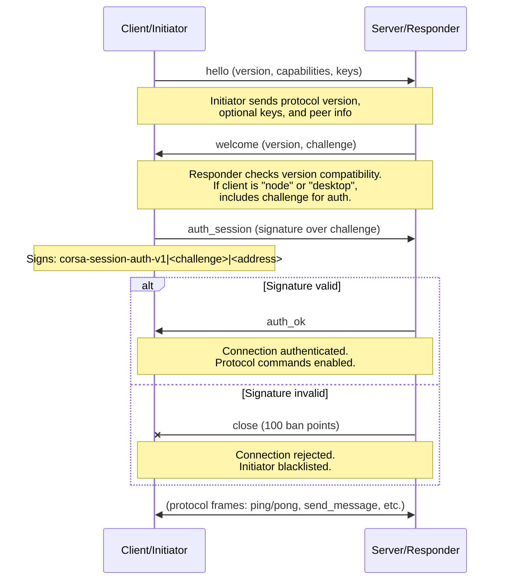
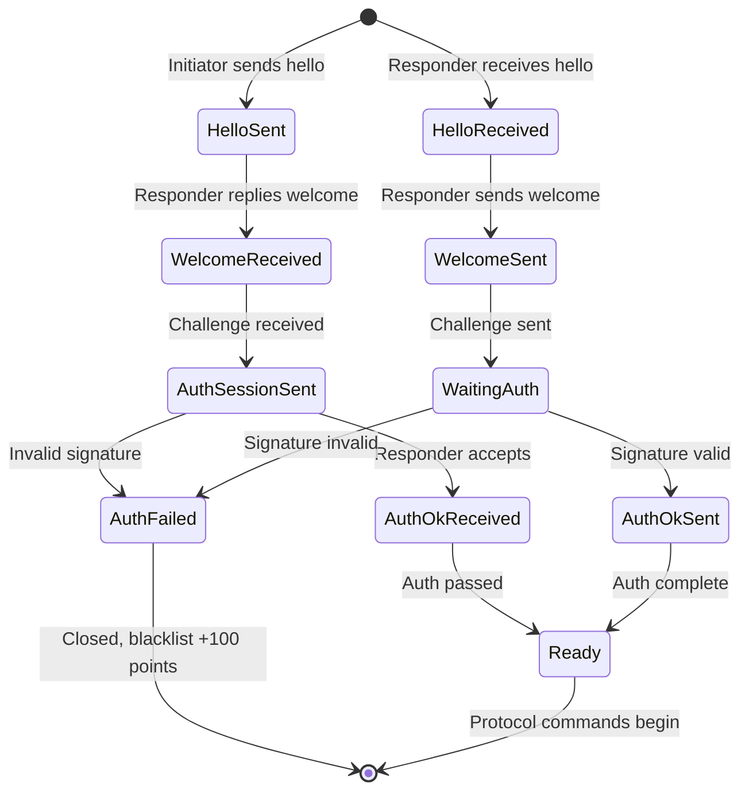
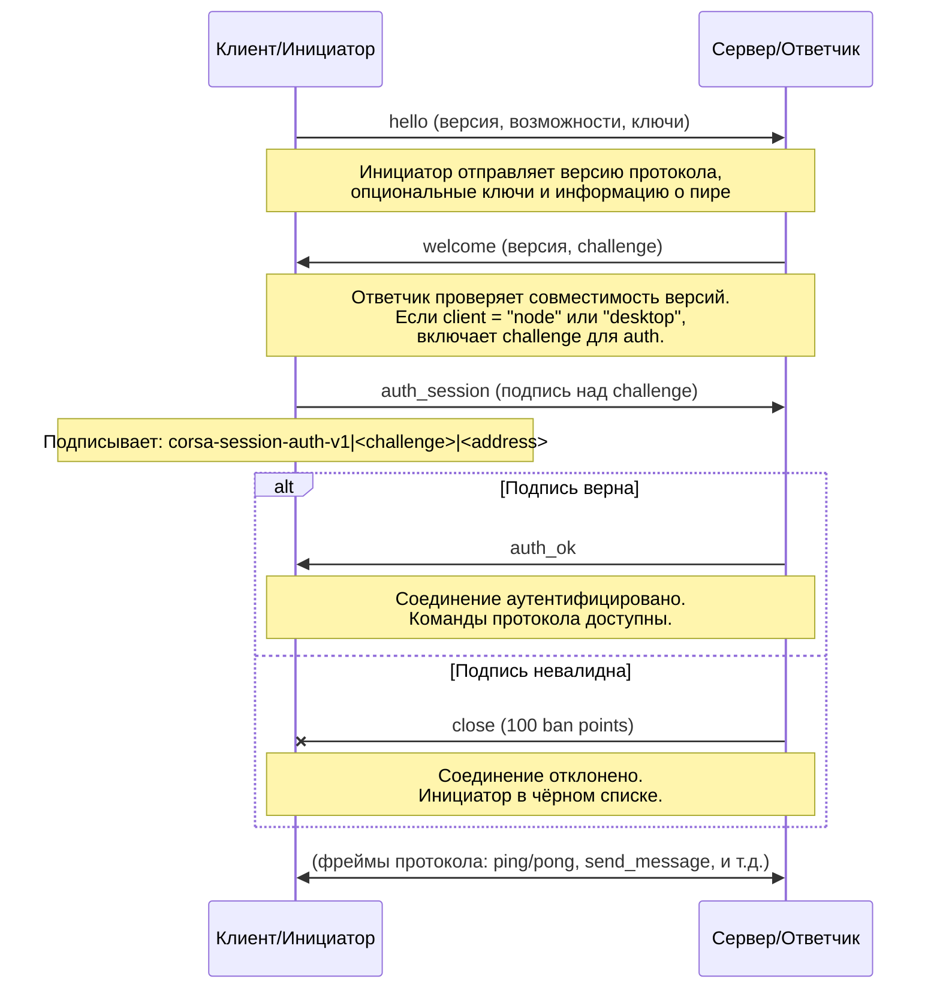
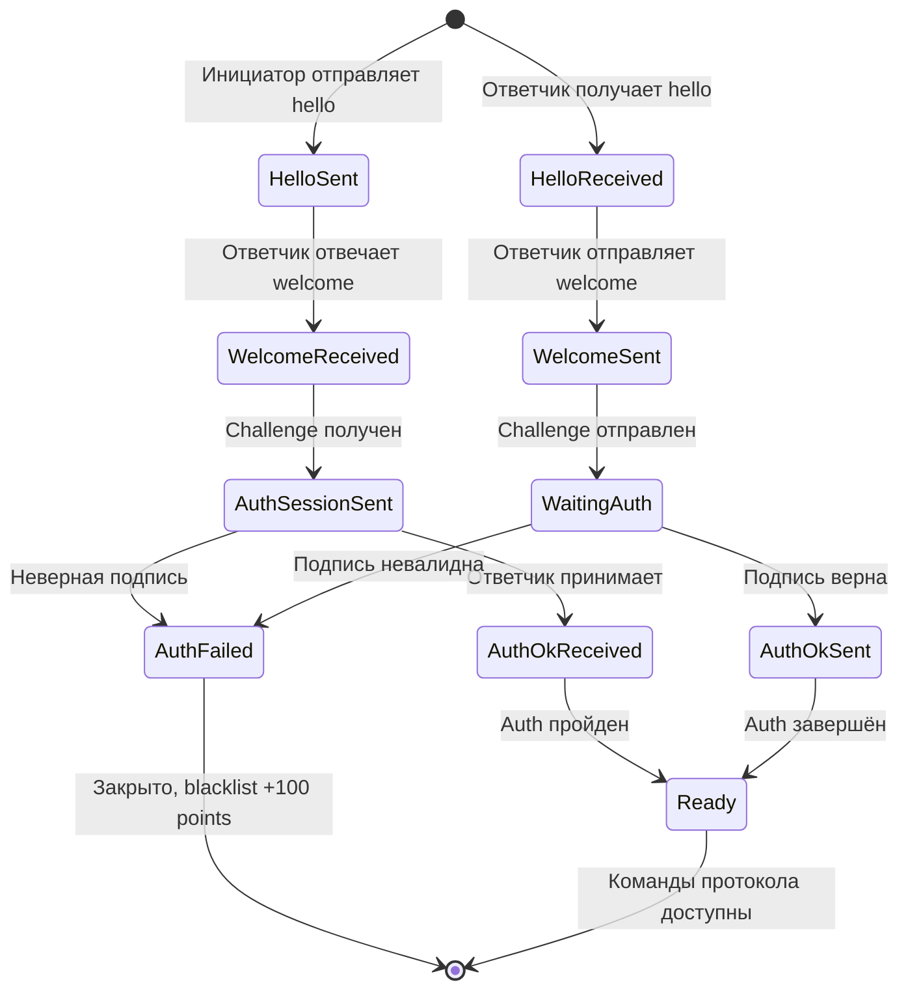

# CORSA Protocol Handshake

## English

### Overview

The handshake commands establish peer connections, negotiate protocol version compatibility, authenticate peers, and maintain liveness. All frames are plain JSON-over-TCP. Authentication confirms peer identity but does not change the transport layer.

**Commands:**
- `hello` — initiator announces capabilities and requests connection
- `welcome` — responder confirms compatibility and provides challenge (on mutual v2+)
- `auth_session` — initiator authenticates using challenge signature
- `auth_ok` — responder confirms authentication success
- `ping` / `pong` — heartbeat for liveness detection

### hello (initiator → responder)

#### Client request (desktop/CLI)

```json
{
  "type": "hello",
  "version": 3,
  "client": "desktop",
  "client_version": "<corsa-version-wire>",
  "client_build": 21
}
```

#### Node-to-node request (full relay or client node)

```json
{
  "type": "hello",
  "version": 3,
  "client": "node",
  "listener": "1",
  "listen": "<ip>:64646",
  "node_type": "full",
  "client_version": "<wire>",
  "client_build": 21,
  "services": ["identity", "contacts", "messages", "gazeta", "relay"],
  "networks": ["ipv4", "ipv6", "torv3"],
  "capabilities": ["mesh_relay_v1"],
  "address": "<fingerprint>",
  "pubkey": "<base64-ed25519>",
  "boxkey": "<base64-x25519>",
  "boxsig": "<base64url-ed25519>"
}
```

#### Field reference

| Field | Type | Required | Description |
|-------|------|----------|-------------|
| `type` | string | yes | Always `"hello"` |
| `version` | integer | yes | Sender's protocol version (e.g., 3). Responder rejects if `version < responder.minimum_protocol_version` |
| `minimum_protocol_version` | integer | no | Minimum protocol version sender accepts. Informational; nodes do not currently send or check this field in incoming `hello` frames |
| `client` | string | yes | Type: `"desktop"` (UI/CLI) or `"node"` (relay peer) |
| `listener` | string | optional | `"1"` if accepting inbound peers; `"0"` if not. Client nodes typically send `"0"` |
| `listen` | string | optional | Legacy advertised listen address in form `<ip>:<port>`. Receivers with `version ≥ 11` MUST NOT treat `listen.host` as a truth source for the peer's IP — the authoritative IP is the observed TCP `RemoteAddr`. The field is still generated for backward compatibility with `version=10` peers. Only meaningful if `listener="1"` |
| `advertise_port` | integer | optional | Self-reported listening port introduced in `ProtocolVersion=11`. JSON integer in the inclusive range `1..65535`. On the receive side this is the only authoritative source of the peer's listening port when building an announce candidate from the observed TCP IP; absent / out-of-range / non-integer wire values collapse to `config.DefaultPeerPort` (`64646`). The inbound TCP source port MUST NEVER be reused as a listening port |
| `node_type` | string | optional | `"full"` (relays mesh traffic) or `"client"` (no relay). Only for `client="node"` |
| `client_version` | string | optional | Version string (e.g., `"0.1.0"` or `"v1.2.3-wire"`) for logging and diagnostics |
| `client_build` | integer | optional | Monotonic build number for version tracking. Incremented on each release |
| `services` | array | optional | Capability list: `["identity", "contacts", "messages", "gazeta", "relay", ...]` |
| `networks` | array | optional | Reachable networks: `["ipv4", "ipv6", "torv3", "torv2", "i2p", "cjdns", "local"]`. Validated against `listen` address |
| `capabilities` | array | optional | Extended capability tokens for feature negotiation (e.g., `["mesh_relay_v1", "mesh_routing_v1", "mesh_routing_v2", "file_transfer_v1"]`). Both peers advertise capabilities during handshake; the session uses the intersection. Nodes without this field are treated as having an empty capability set. See [Capability Negotiation](#capability-negotiation) |
| `address` | string | optional | Peer fingerprint (identity public key hash in hex). Required for mutual authentication on v2+ |
| `pubkey` | string | optional | Ed25519 public key in base64. Used for message signature verification |
| `boxkey` | string | optional | X25519 public key in base64. Used for message encryption |
| `boxsig` | string | optional | Ed25519 signature (base64url) of boxkey binding. Signature payload: `corsa-boxkey-v1|<address>|<boxkey-base64>` |

### welcome (responder → initiator)

```json
{
  "type": "welcome",
  "version": 3,
  "minimum_protocol_version": 2,
  "node": "corsa",
  "network": "gazeta-devnet",
  "challenge": "<random-string>",
  "listener": "1",
  "listen": "<ip>:64646",
  "node_type": "full",
  "client_version": "<wire>",
  "client_build": 21,
  "services": ["identity", "contacts", "messages", "gazeta", "relay"],
  "capabilities": ["mesh_relay_v1"],
  "address": "<fingerprint>",
  "pubkey": "<base64-ed25519>",
  "boxkey": "<base64-x25519>",
  "boxsig": "<base64url-ed25519>",
  "observed_address": "203.0.113.50"
}
```

#### Field reference

| Field | Type | Description |
|-------|------|-------------|
| `type` | string | Always `"welcome"` |
| `version` | integer | Responder's protocol version |
| `minimum_protocol_version` | integer | Minimum version responder accepts |
| `node` | string | Server implementation name (e.g., `"corsa"`, `"gossip"`) |
| `network` | string | Logical network identifier (e.g., `"gazeta-devnet"`, `"mainnet"`) |
| `challenge` | string | Random opaque string for authentication. **Included when the initiator's `client` is `"node"` or `"desktop"`** (i.e. always for peer and desktop connections) |
| `listener` | string | Same as in `hello` |
| `listen` | string | Same as in `hello`. Legacy/compat field in `version ≥ 11` — not a truth source for the responder's IP |
| `advertise_port` | integer | Same as in `hello`. The responder's self-reported listening port. Introduced in `ProtocolVersion=11`; receivers fall back to `config.DefaultPeerPort` on absent / out-of-range / non-integer values |
| `node_type` | string | Same as in `hello` |
| `client_version` | string | Same as in `hello` |
| `client_build` | integer | Same as in `hello` |
| `services` | array | Responder's capability list |
| `capabilities` | array | Responder's extended capability tokens. The session uses the intersection of initiator and responder capabilities. See [Capability Negotiation](#capability-negotiation) |
| `address` | string | Responder's fingerprint |
| `pubkey` | string | Responder's Ed25519 public key |
| `boxkey` | string | Responder's X25519 public key |
| `boxsig` | string | Signature of responder's boxkey binding |
| `observed_address` | string | Initiator's IP address (no port) as seen by responder. Used for NAT detection and peer discovery |

### auth_session (initiator → responder)

Sent only when responder included a `challenge` in `welcome`.

```json
{
  "type": "auth_session",
  "address": "<fingerprint>",
  "signature": "<base64url-ed25519>"
}
```

#### Field reference

| Field | Type | Description |
|-------|------|-------------|
| `type` | string | Always `"auth_session"` |
| `address` | string | Initiator's fingerprint |
| `signature` | string | Ed25519 signature (base64url) over payload: `corsa-session-auth-v1|<challenge>|<address>` where `<challenge>` is the value from `welcome` and `<address>` is the initiator's fingerprint |

#### Validation

- Signature is verified using initiator's public key from `hello`
- Invalid signature results in **100 ban points** (configurable)
- **1000 accumulated points = 24-hour blacklist** (prevents connection)
- On signature verification failure, connection is terminated immediately

### auth_ok (responder → initiator)

Sent after successful `auth_session` validation.

```json
{
  "type": "auth_ok",
  "address": "<fingerprint>",
  "status": "ok"
}
```

#### Field reference

| Field | Type | Description |
|-------|------|-------------|
| `type` | string | Always `"auth_ok"` |
| `address` | string | Responder's fingerprint |
| `status` | string | Status code: `"ok"` = authenticated, ready for protocol commands |

After `auth_ok`, the peer is authenticated and normal protocol commands can begin. The transport remains plain JSON-over-TCP; message content is encrypted end-to-end at the application layer (see encryption.md).

### ping / pong (either direction)

Heartbeat command sent every 2 minutes on idle connections.

#### ping request

```json
{
  "type": "ping"
}
```

#### pong response

```json
{
  "type": "pong",
  "node": "corsa",
  "network": "gazeta-devnet"
}
```

#### Field reference

| Field | Type | Description |
|-------|------|-------------|
| `type` | string | `"ping"` or `"pong"` |
| `node` | string (pong only) | Responder implementation name |
| `network` | string (pong only) | Logical network identifier |

Pong is used for liveness detection and network diagnostics. No authentication required.

---

## Handshake Sequence Diagram



*Handshake sequence: version negotiation, authentication, transition to protocol commands*

---

## Compatibility & Validation Rules

### Version Negotiation

- **Initiator sends** `version` in `hello`
- **Responder checks**: if `initiator.version < responder.minimum_protocol_version`, respond with `error` (code: `incompatible-protocol-version`) and close
- **Connection succeeds** if `responder.version >= initiator.minimum_protocol_version`

### Authentication (node and desktop connections)

When initiator's `client` is `"node"` or `"desktop"`:
- Responder includes `challenge` (random string, ~16–32 bytes, base64-encoded)
- Initiator responds with `auth_session` containing signature: `Ed25519(initiator_private_key, "corsa-session-auth-v1|<challenge>|<address>")`
- Responder verifies signature against initiator's `pubkey` from `hello`
- **On failure**: +100 ban points; **1000+ points** = 24-hour blacklist
- **On success**: respond with `auth_ok` and enable protocol commands

### Key Verification

When initiator sends `pubkey`, `boxkey`, and `boxsig`:

1. Verify `boxsig` is a valid Ed25519 signature over: `corsa-boxkey-v1|<address>|<boxkey-base64>`
2. If verification succeeds, store all three keys
3. If verification fails, **discard the keys but keep the connection** (backward compatibility)
4. If any fields are missing, accept connection as-is (for older peer versions)

### observed_address (NAT Detection)

- Responder includes initiator's IP (without port) as seen from responder's TCP socket
- Used to detect if initiator is behind NAT (e.g., local IP ≠ observed IP)
- **Consensus building**: compare across 2+ peer observations
- Informational only; does not affect connection logic

### Advertise Convergence

Since `ProtocolVersion=11` the truth model for a peer's advertise
endpoint is passive learning from the inbound TCP `RemoteAddr`.
`hello.listen.host` is no longer an authoritative input. After a peer
sends `hello`, the responder derives the decision once from: (a) the
observed TCP IP, (b) the `listener` flag, and (c) the new
`advertise_port` field. The possible outcomes are:

- `non_listener` — peer explicitly declared `listener="0"`. Accepted as
  direct-only: known to this session, never announced to other peers.
- `legacy_direct` — no explicit `listener="1"` AND no usable `listen`
  (absent, wildcard bind, or structurally invalid host:port). Treated as
  direct-only for backward compatibility.
- `match` — observed IP is a world-routable IPv4/IPv6 address. Accepted
  as announceable. The persisted candidate is
  `<observed_ip>:<advertise_port>`, where `advertise_port` is the
  self-reported value from the hello frame if it falls inside the
  inclusive `1..65535` range, otherwise `config.DefaultPeerPort`
  (`64646`). The `listen.host` value is intentionally discarded —
  disagreement between `hello.listen.host` and the observed IP is NOT a
  reject trigger and NOT a mismatch event under `version ≥ 11`.
- `local_exception` — observed IP is non-routable
  (loopback/private/link-local/CGNAT/ULA) or cannot be parsed as IPv4 /
  IPv6. Accepted as direct-only; no announce candidate is written, ever.
  A non-routable observed IP must never leak into peer exchange.

The responder NEVER rejects on an advertise-mismatch basis under
`version ≥ 11` and NEVER emits a `connection_notice` with code
`observed-address-mismatch` on its штатный (main) runtime path. The
inbound source port on the TCP connection MUST NEVER be reused as a
listening port — candidates always pair the observed IP with
`advertise_port` (or the default fallback).

Outbound `hello.listen` is composed as follows:

| Component | Source (priority order, first non-empty wins) |
|-----------|-----------------------------------------------|
| host      | 1. observed-address consensus (≥2 peers agreeing on the same world-routable IP) / 2. legacy runtime override (weak hint, see below) / 3. host component of the deprecated `CORSA_ADVERTISE_ADDRESS` |
| port      | `CORSA_ADVERTISE_PORT` if valid (`1..65535`), else `config.DefaultPeerPort` (`64646`). The real local bind port is NEVER reused as the advertised port — operators frequently dial through NAT/port-forward where the two differ |

`hello.advertise_port` on the wire carries the same resolved
integer. Legacy peers running `version=10` ignore the field; they still
see the syntactically valid `hello.listen` pair as before.

#### Deprecated legacy behaviour (`version=10`)

The following legacy behaviours survive in the codebase only for
rollout safety and are strictly deprecated. A full removal is scheduled
for the next major floor when `MinimumProtocolVersion` reaches `12`.

- `world_mismatch` decision and the associated reject-with-notice branch
  — `version=10` responders compare observed IP against
  `hello.listen.host` and close the connection with
  `connection_notice{code="observed-address-mismatch"}` on disagreement.
  `version=11` never produces this decision in the штатный path; the
  enum constant lives on only to keep the test-only downgrade-sweep
  helper compilable and is treated as unreachable by runtime logic.
- `connection_notice{code="observed-address-mismatch"}` frame payload —
  a `version=11` node still parses the frame when received from a
  legacy peer, but handles it as an advisory weak hint (see below),
  never as an authoritative correction.
- `welcome.observed_address` — continues to be generated so `version=10`
  initiators keep their self-correction heuristic working. On receive
  the field is parsed for telemetry but does NOT on its own trigger an
  active reconnect cycle under `version ≥ 11`.

`handleObservedAddressMismatchNotice` compat rule: a `version=11` node
that receives the legacy notice from a `version=10` peer updates its
runtime `trusted_self_advertise_ip` only when it has not yet
accumulated an observed-IP consensus of its own. Once consensus exists,
the legacy notice cannot overwrite the stronger v11-derived endpoint;
the session is never broken, the persisted state is never downgraded,
and a hostile or buggy `version=10` peer cannot move the local truth
model by simply shouting a different IP.

Sticky-state rule: a peer that was once recorded as `announceable` stays
announceable until an explicit downgrade event (`world_mismatch` or
`local_exception` arriving after the previous `match`). A follow-up
`legacy_direct` or `non_listener` does not silently erase prior trust.

Observed-IP downgrade sweep: on `world_mismatch` the responder also
scans `persistedMeta` for any `announceable` entry whose
`trusted_advertise_ip` equals the current observed IP, or whose
persisted address host equals the observed IP. Each such entry is
demoted to `direct_only` in the same transaction as the incoming
peer's downgrade and the mismatch accounting —
`advertise_mismatch_count++` and
`forgivable_misadvertise_points += banIncrementAdvertiseMismatch` — is
charged on the surviving swept row. Without this, a peer that keeps
its real IP but rotates the claimed listen port would both preserve
its stale `announceable` row and dodge the persisted ranking penalty
that rollout 5 depends on. When the incoming `peer_address` coincides
with a row already charged by the sweep, the main switch skips its
own increment so a single `world_mismatch` event is billed exactly
once.

Peer exchange gate: only peers whose persisted `announce_state` is
`announceable` are relayed in `get_peers` responses. Peers tagged
`direct_only` or with an unset `announce_state` are never announced
outward — they represent a live connection permission, not a
third-party-reachable endpoint. Peers without any persisted row at all
(bootstrap / manual adds that have not yet been through a handshake)
fall through and are propagatable so the network can grow from an
empty state. For CM-managed active slots the gate is applied to
**both** the canonical slot address and the fallback-connected
address: the convergence writer may key the decision on either
(the canonical one if the first dial reached the configured
endpoint, the fallback if an alternate port variant won the dial
race), so checking only one key would let a `direct_only` peer leak
through whenever the other key happened to be empty.

Forgivable misadvertise repay: each `world_mismatch` charges two
counters — the peer-level `forgivable_misadvertise_points` bucket on
`persistedMeta` and the per-IP `s.bans[ip].Score` accumulated by
`addBanScore`. A later successful `auth_ok` from the same peer repays
up to `banIncrementAdvertiseMismatch` points in **both** places,
preventing an honest but flaky peer from permanently climbing toward
the transport-level ban threshold while its peer-level bucket decays
normally. The mirror refund clamps at zero — the repay can never push
`s.bans[ip].Score` below zero, and the cumulative repay can never
exceed what was originally charged for misadvertise. The refund looks
up `s.bans` under the verified TCP peer IP derived from the live
`conn.RemoteAddr()` — the exact key `addBanScore` used when charging
— NOT the host component of `peerAddress`. For DNS / manually-added
bootstrap peers `peerAddress` still carries an unresolved hostname,
so splitting it here would leave the IP-level ban score permanently
un-refunded while the peer-level bucket decayed: the exact divergence
the mirror refund was introduced to close.

Outbound-confirmed trust IP invariant: `trusted_advertise_ip` on a
peer row is always a canonical IPv4/IPv6 address — never a hostname.
The outbound-success writer (`recordOutboundConfirmed`) refuses any
call whose dialed-IP argument does not parse as a concrete IP literal,
and its caller derives that argument from `session.conn.RemoteAddr()`
(the live TCP endpoint after OS DNS resolution), not from
`session.address`, which for DNS or manually-added bootstrap peers
still carries the unresolved hostname. Storing a hostname here would
permanently break the observed-IP downgrade sweep: the sweep compares
`trusted_advertise_ip` byte-for-byte against canonical IPs extracted
from inbound TCP `RemoteAddr`s, so a hostname value would never match
and the stale `announceable` row would survive every subsequent
`world_mismatch` targeting the same peer. When no canonical IP can be
derived from the live connection, the write is skipped — the peer
remains untracked on the advertise-convergence layer rather than
learning bad trust from a partial observation.

Raw/bootstrap path convergence parity: outbound connections that do
not go through the managed-session state machine — the `push_notice`
TCP fallback used for bootstrap delivery in `sendNoticeToPeer`, and
the legacy fresh-dial path in `syncPeer` used for sender-key recovery
and forced refresh — share the same post-`auth_ok` convergence writer
as the managed path. All three call sites funnel through
`recordOutboundAuthSuccess(peerAddress, remoteAddr)`, which takes the
wrapper-form `host:port` string (managed: `session.netCore.RemoteAddr()`,
bootstrap `syncPeer`: the bootstrap `*netcore.NetCore.RemoteAddr()`,
raw `sendNoticeToPeer`: `conn.RemoteAddr().String()` inline, inside
the §4.4 carve-out), derives the canonical dialed IP and port, and
then performs the same `recordOutboundConfirmed` + misadvertise-repay
sequence. Keeping the signature text-only keeps the helper off the
§2.6.26 `net.Conn` carve-out — it is not a boundary translator, it
does not own the connection lifecycle, and it has no business
speaking `net.Conn` in its type. Without this shared hook, peers
reached only through the bootstrap fan-out or the sender-key recovery
fresh-dial would never receive `announce_state=announceable` or a
trusted advertise triple, so their state would diverge from the
managed path and the hostname / observed-IP sweep invariants above
would silently not apply there.

### Node Role Semantics

- **full node** (`node_type="full"`): relays mesh traffic, stores messages for gossip
- **client node** (`node_type="client"`): does not relay; sends own DMs and delivery receipts upstream only
- **listener=1** on a client: can accept inbound connections but still does not relay
- Desktop clients do not send `node_type` or `listener` fields (omitted from wire via `omitempty`)

### Address Groups (networks field)

Valid values for `networks` array:
- `ipv4` — reachable on IPv4
- `ipv6` — reachable on IPv6
- `torv3` — Tor v3 onion address
- `torv2` — Tor v2 onion address (deprecated)
- `i2p` — I2P address
- `cjdns` — cjdns address
- `local` — private/loopback only
- `unknown` — address type not recognized

The `networks` array is validated against the format of `listen`. For example, if `listen="192.168.1.100:64646"`, only `ipv4` and `local` are valid.

---

## Capability Negotiation

The `capabilities` field enables additive feature negotiation without incrementing `ProtocolVersion`. Each capability is a string token (e.g., `"mesh_relay_v1"`, `"mesh_routing_v1"`). Both peers advertise their supported capabilities during the handshake. The session uses only the intersection of both sets.

Capability tokens gate new frame types and behaviors. A peer must not send a capability-gated frame type unless the session has that capability in its negotiated set. This allows mixed-version networks: legacy nodes without the `capabilities` field are treated as having an empty set — they never receive unknown frame types.

Currently defined tokens:

- `"mesh_relay_v1"` — hop-by-hop relay via `relay_message` and `relay_delivery_receipt` frames.
- `"mesh_routing_v1"` — distance-vector routing via the legacy `announce_routes` frame.
- `"mesh_routing_v2"` — opt-in refinement of `mesh_routing_v1` that enables incremental delta updates as `routes_update` frames and the `request_resync` control frame. v2 is meaningful only alongside v1: a peer that advertises v2 without v1 is treated as v1-only, because the first sync (baseline) always travels as the legacy `announce_routes` frame and thus requires v1 on the receive side. Mode selection is driven by the per-cycle `AnnounceTarget.Capabilities` snapshot taken from the session selected by the announce loop; the persistent peer-state capability record is reconciled to that snapshot at the start of each per-peer goroutine, so the selection reads a single derived view of the chosen session's caps. See `docs/routing.md` "Persistent caps as a derived view of the chosen target" and "Announce delta mode selection" for the full contract.
- `"file_transfer_v1"` — gates file transfer commands (`FileCommandFrame` traffic). The out-of-band `file_announce` DM is not gated.

---

## Error Handling

On version mismatch:
```json
{
  "type": "error",
  "code": "incompatible-protocol-version",
  "message": "peer version 1 below minimum 2"
}
```

Version mismatch handling runs two independent ban tracks chosen for their blast radius. The **per-peer storm-suppression signal** fires immediately on the first incompatible hello: the responder emits `connection_notice{code=peer-banned, reason=peer-ban, until=now+peerBanIncompatible}` on the still-open ConnID before tearing the session down, and the dialler-side gate 6c.2 records THIS specific `PeerAddress` as banned through `recordRemoteBanLocked`, which suppresses subsequent dials against the same peer for the full 24-hour window. The notice is keyed to the peer, not to the IP, so compatible siblings behind a shared egress (NAT gateway, VPN exit, Tor exit, multi-homed host) stay reachable — a one-off protocol mismatch from one neighbour must not turn into a 24-hour outage for everybody on the same IP. The **transport-level IP blacklist** stays graduated as the safety net for sustained noise from the same IP: each incompatible hello adds `banIncrementIncompatibleVersion` = 250 to the remote IP's ban score, and only the 4th attempt crosses `banThreshold` = 1000, arming the 24-hour TCP-level block. When the threshold is crossed, `addBanScore` fires a second peer-banned notice with `reason=blacklisted` on the connection that tripped it and from then on `handleConn` silently drops every TCP attempt from that IP until the window elapses. The **overlay per-peer ban** runs in parallel: the peer receives an accumulating penalty (`peerBanIncrementIncompatible` = 250, threshold `peerBanThresholdIncompatible` = 1000, so four incompatible attempts are required), and a **version lockout** is recorded in `peers.json` only when the version evidence is confirmed (remote `minimum_protocol_version` exceeds the local protocol version). The graduated overlay track exists to protect known peers through rolling upgrades, where the local node might briefly be at a version the peer cannot interoperate with before both sides advance. Lockouts are bound to the peer's cryptographic identity when available; identity-less (address-only) lockouts expire after 7 days (`VersionLockoutMaxTTL`) to prevent stale entries from suppressing addresses that may later belong to a different peer. Identity-bound lockouts persist until the local node upgrades (protocol version or client build changes). The version evidence from the incompatible peer is also fed into the node's `VersionPolicyState` for update-available detection: when ≥3 distinct peer identities report incompatibility (or ≥2 peers advertise a higher `client_build`), the node signals `update_available` in `AggregateStatus`. The build metadata (`peerBuilds`, `peerVersions`) is session-scoped — populated during handshake, cleared on disconnect — so only currently connected peers contribute to the build signal. Ephemeral observations expire after 24 hours, but active persisted lockouts also contribute to `update_available` — the signal remains true as long as any lockout exists, preventing the UI from losing the update hint while the node remains partially locked out. The `add_peer` RPC command serves as the explicit operator override: it clears the version lockout, resets all incompatible-version diagnostics, and recomputes the version policy immediately.

**Recovery is two-scoped by construction.** Because `handlePeerBannedNotice` writes each notice into exactly one table — `reason=peer-ban` → per-peer `persistedMeta[address].RemoteBannedUntil`, `reason=blacklisted` → IP-wide `remoteBannedIPs[ip]` — there are no mirrors to unwind, and a successful outbound handshake (`recordOutboundAuthSuccess`) with any peer on a previously banned host only needs to clear the two scopes it can legitimately speak for, in a single `s.mu` write section followed by one `flushPeerState` so the recovery cannot be split by a crash or restart: (1) the handshaking peer's own per-peer `RemoteBannedUntil` record via `clearRemoteBanLocked` — unconditional, because the handshake itself is direct proof this address is accepting us again; a no-op when no row exists for this peer; (2) the IP-wide `remoteBannedIPs` entry via `clearRemoteIPBanLocked`, keyed on the canonical host derived from the dialled endpoint, so every sibling `PeerAddress` behind that egress IP is freed by the dial gate together with the host that carried the recovery — one sibling's success speaks for all siblings because `reason=blacklisted` is an IP-scoped decision. Per-peer rows with `reason=peer-ban` on OTHER sibling addresses are intentionally NOT touched by the IP-wide recovery: those are standalone responder decisions scoped to specific addresses, and a successful handshake on a sibling is not proof the responder has forgiven any other specific address. Either clear returning `true` triggers the shared `flushPeerState` so the on-disk snapshot matches the in-memory state before the next dial cycle. The dial gate (`isPeerRemoteBannedLocked`) consults both tables on every candidate, so a single record in either scope is enough to suppress — no sender-side mirror, no third clear path, no pair of tables that can drift out of sync.

On authentication failure:
```json
{
  "type": "error",
  "code": "auth_failed",
  "message": "invalid signature"
}
```

On simultaneous connection (both directions allowed):

When two nodes dial each other simultaneously, each ends up with both an inbound and an outbound TCP connection to the same peer. Previously the responder rejected the inbound with `duplicate-connection`, but this broke one-way gossip: the rejected side had no outbound session and could not forward messages. Both connections now coexist; the routing and health layers deduplicate by peer identity.

The `duplicate-connection` error code is deprecated and no longer emitted. Legacy clients should treat it as a no-op.

See [errors.md](errors.md) for full error reference.

---

## Address groups (network reachability)

- every peer address is classified into a network group: `ipv4`, `ipv6`, `torv3`, `torv2`, `i2p`, `cjdns`, `local`, or `unknown`
- the classification follows the `CNetAddr::GetNetwork` approach — each address belongs to exactly one group
- a node computes which groups it can reach at startup: IPv4/IPv6 are always reachable; Tor and I2P require a SOCKS5 proxy (`CORSA_PROXY` env var); CJDNS uses its own tun interface and is not proxied — it is not currently reachable
- dial candidate selection skips addresses in unreachable groups — e.g. a clearnet node will not attempt to dial `.onion` or `.b32.i2p` addresses without a proxy
- nodes declare their reachable groups in the `hello` frame via the `"networks"` field (e.g. `["ipv4","ipv6","torv3"]`); the receiving node validates the declaration against the peer's advertised address — overlay groups (torv3, torv2, i2p, cjdns) are only accepted if the advertised address belongs to that overlay; clearnet groups (ipv4, ipv6) are always accepted; this prevents a clearnet peer from claiming overlay reachability to harvest `.onion` / `.i2p` addresses
- peer exchange (`get_peers` → `peers`) filters addresses by the validated intersection of declared and verifiable groups; if the peer did not send `"networks"`, reachability is inferred from its advertised address (not the TCP endpoint, which may differ for overlay peers); local/private addresses are never relayed
- the `network` field in `peers.json` records each peer's group for diagnostic purposes

---

## State Machine



*Handshake state machine: from initial contact to protocol-ready state*

---

---

## Русский

### Обзор

Команды handshake устанавливают peer-соединения, согласуют совместимость версий протокола, аутентифицируют пиры и поддерживают liveness. Все фреймы передаются по plain JSON-over-TCP. Аутентификация подтверждает identity пира, но не изменяет транспортный уровень.

**Команды:**
- `hello` — инициатор объявляет возможности и запрашивает соединение
- `welcome` — ответчик подтверждает совместимость и предоставляет challenge (на v2+ обоюдно)
- `auth_session` — инициатор аутентифицируется через подпись challenge
- `auth_ok` — ответчик подтверждает успешную аутентификацию
- `ping` / `pong` — heartbeat для обнаружения живости соединения

### hello (инициатор → ответчик)

#### Запрос от клиента (desktop/CLI)

```json
{
  "type": "hello",
  "version": 3,
  "client": "desktop",
  "client_version": "<corsa-version-wire>",
  "client_build": 21
}
```

#### Запрос node-to-node (full relay или client node)

```json
{
  "type": "hello",
  "version": 3,
  "client": "node",
  "listener": "1",
  "listen": "<ip>:64646",
  "node_type": "full",
  "client_version": "<wire>",
  "client_build": 21,
  "services": ["identity", "contacts", "messages", "gazeta", "relay"],
  "networks": ["ipv4", "ipv6", "torv3"],
  "capabilities": ["mesh_relay_v1"],
  "address": "<fingerprint>",
  "pubkey": "<base64-ed25519>",
  "boxkey": "<base64-x25519>",
  "boxsig": "<base64url-ed25519>"
}
```

#### Справочник полей

| Поле | Тип | Обязательное | Описание |
|------|-----|-------------|----------|
| `type` | string | да | Всегда `"hello"` |
| `version` | integer | да | Версия протокола отправителя (например, 3). Ответчик отклоняет, если `version < responder.minimum_protocol_version` |
| `minimum_protocol_version` | integer | нет | Минимальная версия протокола, которую отправитель принимает (например, 2). Информационное; ноды не отправляют и не проверяют это поле во входящих `hello` фреймах |
| `client` | string | да | Тип: `"desktop"` (UI/CLI) или `"node"` (relay-пир) |
| `listener` | string | опционально | `"1"` если принимает входящие пиры; `"0"` если нет. Client-ноды обычно отправляют `"0"` |
| `listen` | string | опционально | Legacy-рекламируемый адрес прослушивания в виде `<ip>:<port>`. Получатели с `version ≥ 11` НЕ ДОЛЖНЫ использовать `listen.host` как источник истины для IP пира — авторитетным источником IP является наблюдаемый TCP `RemoteAddr`. Поле по-прежнему генерируется для обратной совместимости с пирами `version=10`. Смысл только если `listener="1"` |
| `advertise_port` | integer | опционально | Self-reported слушающий порт, введённый в `ProtocolVersion=11`. JSON-integer в диапазоне `1..65535` включительно. На приёмной стороне это единственный авторитетный источник listening-порта пира при построении announce-кандидата из observed TCP IP; отсутствующие / вне диапазона / нецелочисленные значения на проводе коллапсируются к `config.DefaultPeerPort` (`64646`). Входящий TCP source port НИКОГДА не должен переиспользоваться как listening-порт |
| `node_type` | string | опционально | `"full"` (релирует трафик) или `"client"` (без relay). Только для `client="node"` |
| `client_version` | string | опционально | Строка версии (например, `"0.1.0"` или `"v1.2.3-wire"`) для логирования и диагностики |
| `client_build` | integer | опционально | Монотонный номер сборки для отслеживания версий. Увеличивается при каждом релизе |
| `services` | array | опционально | Список возможностей: `["identity", "contacts", "messages", "gazeta", "relay", ...]` |
| `networks` | array | опционально | Доступные сети: `["ipv4", "ipv6", "torv3", "torv2", "i2p", "cjdns", "local"]`. Валидируется против адреса `listen` |
| `capabilities` | array | опционально | Расширенные capability-токены для согласования функций (например, `["mesh_relay_v1", "mesh_routing_v1", "mesh_routing_v2", "file_transfer_v1"]`). Оба пира объявляют capabilities при handshake; сессия использует пересечение. Ноды без этого поля считаются с пустым набором. См. [Согласование capabilities](#согласование-capabilities) |
| `address` | string | опционально | Fingerprint пира (хеш публичного ключа identity в hex). Требуется для взаимной аутентификации на v2+ |
| `pubkey` | string | опционально | Ed25519 публичный ключ в base64. Используется для проверки подписей сообщений |
| `boxkey` | string | опционально | X25519 публичный ключ в base64. Используется для шифрования сообщений |
| `boxsig` | string | опционально | Ed25519 подпись (base64url) связи boxkey. Полезная нагрузка подписи: `corsa-boxkey-v1|<address>|<boxkey-base64>` |

### welcome (ответчик → инициатор)

```json
{
  "type": "welcome",
  "version": 3,
  "minimum_protocol_version": 2,
  "node": "corsa",
  "network": "gazeta-devnet",
  "challenge": "<random-string>",
  "listener": "1",
  "listen": "<ip>:64646",
  "node_type": "full",
  "client_version": "<wire>",
  "client_build": 21,
  "services": ["identity", "contacts", "messages", "gazeta", "relay"],
  "capabilities": ["mesh_relay_v1"],
  "address": "<fingerprint>",
  "pubkey": "<base64-ed25519>",
  "boxkey": "<base64-x25519>",
  "boxsig": "<base64url-ed25519>",
  "observed_address": "203.0.113.50"
}
```

#### Справочник полей

| Поле | Тип | Описание |
|------|-----|----------|
| `type` | string | Всегда `"welcome"` |
| `version` | integer | Версия протокола ответчика |
| `minimum_protocol_version` | integer | Минимальная версия, которую ответчик принимает |
| `node` | string | Имя реализации сервера (например, `"corsa"`, `"gossip"`) |
| `network` | string | Идентификатор логической сети (например, `"gazeta-devnet"`, `"mainnet"`) |
| `challenge` | string | Случайная непрозрачная строка для аутентификации. **Включается когда `client` инициатора равен `"node"` или `"desktop"`** (т.е. всегда для peer- и desktop-соединений) |
| `listener` | string | Аналогично полю в `hello` |
| `listen` | string | Аналогично полю в `hello` |
| `advertise_port` | integer | Аналогично полю в `hello`. Self-reported слушающий порт ответчика. Введён в `ProtocolVersion=11`; получатели фолбэчат к `config.DefaultPeerPort` при отсутствии / значении вне диапазона / нецелочисленном значении |
| `node_type` | string | Аналогично полю в `hello` |
| `client_version` | string | Аналогично полю в `hello` |
| `client_build` | integer | Аналогично полю в `hello` |
| `services` | array | Список возможностей ответчика |
| `capabilities` | array | Расширенные capability-токены ответчика. Сессия использует пересечение capabilities инициатора и ответчика. См. [Согласование capabilities](#согласование-capabilities) |
| `address` | string | Fingerprint ответчика |
| `pubkey` | string | Ed25519 публичный ключ ответчика |
| `boxkey` | string | X25519 публичный ключ ответчика |
| `boxsig` | string | Подпись связи boxkey ответчика |
| `observed_address` | string | IP-адрес инициатора (без порта) как видит ответчик. Используется для обнаружения NAT и discovery пиров |

### auth_session (инициатор → ответчик)

Отправляется только когда ответчик включил `challenge` в `welcome`.

```json
{
  "type": "auth_session",
  "address": "<fingerprint>",
  "signature": "<base64url-ed25519>"
}
```

#### Справочник полей

| Поле | Тип | Описание |
|------|-----|----------|
| `type` | string | Всегда `"auth_session"` |
| `address` | string | Fingerprint инициатора |
| `signature` | string | Ed25519 подпись (base64url) над полезной нагрузкой: `corsa-session-auth-v1|<challenge>|<address>` где `<challenge>` — значение из `welcome`, а `<address>` — fingerprint инициатора |

#### Валидация

- Подпись проверяется с помощью публичного ключа инициатора из `hello`
- Неверная подпись результирует в **100 ban points** (настраиваемо)
- **1000 накопленных points = 24-часовой blacklist** (предотвращает соединение)
- При неудаче проверки подписи соединение закрывается немедленно

### auth_ok (ответчик → инициатор)

Отправляется после успешной валидации `auth_session`.

```json
{
  "type": "auth_ok",
  "address": "<fingerprint>",
  "status": "ok"
}
```

#### Справочник полей

| Поле | Тип | Описание |
|------|-----|----------|
| `type` | string | Всегда `"auth_ok"` |
| `address` | string | Fingerprint ответчика |
| `status` | string | Код статуса: `"ok"` = аутентифицирован, готов к командам протокола |

После `auth_ok` пир аутентифицирован и могут начаться обычные команды протокола. Транспорт остаётся plain JSON-over-TCP; содержимое сообщений шифруется сквозным образом на уровне приложения (см. encryption.md).

### ping / pong (любое направление)

Heartbeat-команда, отправляемая каждые 2 минуты на idle соединениях.

#### Запрос ping

```json
{
  "type": "ping"
}
```

#### Ответ pong

```json
{
  "type": "pong",
  "node": "corsa",
  "network": "gazeta-devnet"
}
```

#### Справочник полей

| Поле | Тип | Описание |
|------|-----|----------|
| `type` | string | `"ping"` или `"pong"` |
| `node` | string (только pong) | Имя реализации ответчика |
| `network` | string (только pong) | Идентификатор логической сети |

Pong используется для обнаружения живости и диагностики сети. Аутентификация не требуется.

---

## Диаграмма последовательности Handshake



*Последовательность handshake: согласование версий, аутентификация, переход к командам протокола*

---

## Правила совместимости и валидации

### Согласование версий

- **Инициатор отправляет** `version` в `hello`
- **Ответчик проверяет**: если `initiator.version < responder.minimum_protocol_version`, отвечает `error` (код: `incompatible-protocol-version`) и закрывает соединение
- **Соединение успешно** если `responder.version >= initiator.minimum_protocol_version`

### Аутентификация (node и desktop соединения)

Когда `client` инициатора равен `"node"` или `"desktop"`:
- Ответчик включает `challenge` (случайная строка, ~16–32 байта, base64-закодирована)
- Инициатор отвечает `auth_session` с подписью: `Ed25519(initiator_private_key, "corsa-session-auth-v1|<challenge>|<address>")`
- Ответчик проверяет подпись против `pubkey` инициатора из `hello`
- **При неудаче**: +100 ban points; **1000+ points** = 24-часовой blacklist
- **При успехе**: отвечает `auth_ok` и включает команды протокола

### Верификация ключей

Когда инициатор отправляет `pubkey`, `boxkey` и `boxsig`:

1. Проверить что `boxsig` — валидная Ed25519 подпись над: `corsa-boxkey-v1|<address>|<boxkey-base64>`
2. Если проверка успешна, сохранить все три ключа
3. Если проверка не удаётся, **отбросить ключи но сохранить соединение** (для обратной совместимости)
4. Если какие-то поля отсутствуют, принять соединение как-есть (для старых версий пиров)

### observed_address (обнаружение NAT)

- Ответчик включает IP инициатора (без порта) как видит сокет TCP ответчика
- Используется для обнаружения NAT (например, локальный IP ≠ наблюдаемый IP)
- **Построение консенсуса**: сравнивать через 2+ наблюдений пиров
- Только информационное; не влияет на логику соединения

### Согласование advertise-адреса

Начиная с `ProtocolVersion=11` модель истины для advertise-endpoint пира —
это пассивное обучение из входящего TCP `RemoteAddr`. `hello.listen.host`
больше НЕ является авторитетным входом. После получения `hello` ответчик
выводит решение один раз из: (a) наблюдаемого TCP IP, (b) флага
`listener` и (c) нового поля `advertise_port`. Возможные исходы:

- `non_listener` — пир явно объявил `listener="0"`. Принимается как
  direct-only: используется в рамках сессии, не анонсируется другим пирам.
- `legacy_direct` — нет явного `listener="1"` И нет пригодного `listen`
  (отсутствует, wildcard-bind или структурно невалидный host:port).
  Принимается как direct-only для обратной совместимости.
- `match` — наблюдаемый IP является world-routable IPv4/IPv6 адресом.
  Принимается как announceable. Персистируемый кандидат —
  `<observed_ip>:<advertise_port>`, где `advertise_port` — self-reported
  значение из hello-фрейма, если оно попадает в диапазон `1..65535`
  включительно, иначе `config.DefaultPeerPort` (`64646`). Значение
  `listen.host` целенаправленно отбрасывается — расхождение между
  `hello.listen.host` и observed IP НЕ является триггером отклонения и
  НЕ является mismatch-событием при `version ≥ 11`.
- `local_exception` — наблюдаемый IP non-routable
  (loopback/приватный/link-local/CGNAT/ULA) либо не парсится как IPv4 /
  IPv6. Принимается как direct-only; announce-кандидат не пишется
  никогда. Non-routable observed IP не должен утекать в peer exchange.

Ответчик НИКОГДА не отклоняет соединение по основанию advertise-mismatch
при `version ≥ 11` и НИКОГДА не отправляет `connection_notice` с кодом
`observed-address-mismatch` в штатной runtime-ветке. Входящий source-порт
TCP-соединения НИКОГДА не переиспользуется как listening-порт —
кандидаты всегда пара observed IP + `advertise_port` (либо default fallback).

Исходящий `hello.listen` формируется следующим образом:

| Компонент | Источник (порядок приоритета, побеждает первый непустой) |
|-----------|-----------------------------------------------------------|
| host      | 1. Консенсус observed-address (≥2 пира сходятся на одном world-routable IP) / 2. Legacy runtime override (слабая подсказка, см. ниже) / 3. Host-часть устаревшего `CORSA_ADVERTISE_ADDRESS` |
| port      | `CORSA_ADVERTISE_PORT` если валиден (`1..65535`), иначе `config.DefaultPeerPort` (`64646`). Реальный локальный bind-порт НИКОГДА не переиспользуется как advertised-порт — операторы регулярно dial через NAT/port-forward, где эти два порта различаются |

`hello.advertise_port` на проводе несёт то же разрешённое целочисленное
значение. Legacy-пиры на `version=10` игнорируют это поле; они
по-прежнему видят синтаксически валидную пару `hello.listen` как раньше.

#### Deprecated legacy-поведение (`version=10`)

Следующие legacy-поведения сохраняются в кодовой базе исключительно
ради безопасности rollout'а и строго deprecated. Полное удаление
запланировано к следующему мажорному floor'у, когда
`MinimumProtocolVersion` достигнет `12`.

- Решение `world_mismatch` и связанная с ним ветка reject-with-notice —
  ответчики `version=10` сравнивают observed IP с `hello.listen.host` и
  закрывают соединение через `connection_notice{code="observed-address-mismatch"}`
  при расхождении. `version=11` никогда не производит это решение в
  штатной ветке; enum-константа остаётся жить только ради
  компилируемости test-only downgrade-sweep хелпера и трактуется
  runtime-логикой как unreachable.
- `connection_notice{code="observed-address-mismatch"}` payload фрейма —
  нода `version=11` по-прежнему парсит фрейм, полученный от legacy-пира,
  но обрабатывает его как advisory weak hint (см. ниже), никогда не как
  авторитетную коррекцию.
- `welcome.observed_address` — продолжает генерироваться, чтобы
  инициаторы `version=10` сохраняли работающим свой self-correction
  эвристик. На приёме поле парсится для телеметрии, но само по себе НЕ
  триггерит активный reconnect-цикл при `version ≥ 11`.

Compat-правило `handleObservedAddressMismatchNotice`: нода `version=11`,
получившая legacy-notice от пира `version=10`, обновляет свой runtime
`trusted_self_advertise_ip` только когда ещё не накопила собственного
observed-IP консенсуса. Как только консенсус существует, legacy-notice
не может перезаписать более сильный v11-derived endpoint; сессия никогда
не ломается, персистентное состояние никогда не понижается, а
враждебный или забагованный пир `version=10` не может сдвинуть
локальную модель истины, просто прокричав другой IP.

Sticky-state правило: пир однажды записанный как `announceable` остаётся
announceable до явного события downgrade (`world_mismatch` или
`local_exception`, приходящие после `match`). Последующий `legacy_direct`
или `non_listener` не стирает прошлое доверие молча.

Сметание announceable по observed IP: на `world_mismatch` ответчик
дополнительно сканирует `persistedMeta` и ищет любые announceable-записи,
у которых `trusted_advertise_ip` равен текущему observed IP или host
персистентного адреса совпадает с observed IP. Каждая такая запись
демоутится до `direct_only` в той же транзакции, что и downgrade
входящего пира, и на выжившую строку начисляется mismatch-учёт:
`advertise_mismatch_count++` и
`forgivable_misadvertise_points += banIncrementAdvertiseMismatch`.
Без этого пир, сохраняющий свой реальный IP, но меняющий заявленный
listen-порт между сессиями, и сохранял бы устаревшую announceable-строку,
и уворачивался бы от rollout-5 ранжирующего штрафа. Если входящий
`peer_address` совпадает со строкой, которую sweep уже списал,
главный switch пропускает собственный инкремент — одно событие
`world_mismatch` должно списываться ровно один раз.

Фильтр peer exchange: в ответах `get_peers` релеятся только пиры, у
которых персистентное `announce_state` равно `announceable`. Пиры с
`direct_only` или с неустановленным `announce_state` никогда не
анонсируются наружу — они представляют разрешение на прямое
соединение, но не endpoint, достижимый третьей стороной. Пиры без
персистентной записи вообще (bootstrap / ручное добавление, которые
ещё не прошли handshake) проходят дальше и могут релеиться, чтобы
сеть могла расти с пустого состояния. Для активных CM-слотов фильтр
применяется к **обоим** ключам: канонический `slot.Address` и
fallback `slot.ConnectedAddress`. Convergence-писатель может положить
решение под любой из них (канонический, если первый dial попал в
настроенный endpoint; fallback, если выиграл альтернативный порт),
поэтому проверка только одного ключа даёт утечку direct_only-пира
всякий раз, когда второй ключ оказывается пустым.

Возврат forgivable misadvertise points: каждый `world_mismatch` заряжает
два счётчика — per-peer `forgivable_misadvertise_points` в
`persistedMeta` и per-IP `s.bans[ip].Score`, который накапливает
`addBanScore`. Последующий успешный `auth_ok` от того же пира
возвращает до `banIncrementAdvertiseMismatch` очков **в обоих** местах.
Это не даёт честному, но нестабильному пиру вечно расти к
transport-level ban-порогу, пока per-peer bucket корректно затухает.
Зеркальный возврат клампится в ноль — repay никогда не уводит
`s.bans[ip].Score` ниже нуля, а кумулятивный возврат никогда не
превышает изначально списанное за misadvertise. Зеркальный возврат
ищет запись в `s.bans` по верифицированному TCP IP-пира, полученному
из живого `conn.RemoteAddr()` — то же самое значение, под которым
`addBanScore` сохранял Score, — а НЕ по host-части `peerAddress`. Для
DNS / вручную добавленных bootstrap-пиров `peerAddress` по-прежнему
содержит неразрешённый hostname, поэтому расщепление его здесь
оставит IP-level ban score навсегда без рефанда, в то время как
per-peer bucket корректно затухает: ровно ту самую divergence,
которую зеркальный возврат и должен был закрыть.

Инвариант trusted IP для outbound-подтверждения: поле
`trusted_advertise_ip` в записи пира всегда содержит канонический
IPv4/IPv6 адрес — никогда hostname. Писатель успешного исходящего
соединения (`recordOutboundConfirmed`) отказывает любому вызову, в
котором аргумент dial-IP не парсится как конкретный IP-литерал, а его
caller берёт этот аргумент из `session.conn.RemoteAddr()` (живой
TCP-эндпоинт после резолва OS DNS), а не из `session.address`, где для
DNS- или вручную добавленных bootstrap-пиров по-прежнему лежит
неразрешённый hostname. Hostname, попавший в `trusted_advertise_ip`,
навсегда сломает observed-IP downgrade sweep: sweep побайтово
сравнивает `trusted_advertise_ip` с каноническими IP-ами из входящих
TCP `RemoteAddr`, поэтому значение-hostname никогда не совпадёт и
устаревшая строка `announceable` переживёт каждый следующий
`world_mismatch` по тому же пиру. Если из живого соединения
невозможно извлечь канонический IP — запись пропускается: пир
остаётся нетронутым на слое advertise-convergence, а не учит плохое
доверие по частичному наблюдению.

Паритет convergence для raw/bootstrap-пути: исходящие соединения,
которые не проходят через managed-session state machine — TCP
fallback для `push_notice`, используемый для доставки bootstrap в
`sendNoticeToPeer`, и legacy fresh-dial в `syncPeer`, используемый
для sender-key recovery и forced refresh, — используют тот же
пост-`auth_ok` convergence writer, что и managed-путь. Все три
call site сходятся в `recordOutboundAuthSuccess(peerAddress, remoteAddr)`,
который принимает wrapper-форму `host:port` (managed —
`session.netCore.RemoteAddr()`, bootstrap `syncPeer` — bootstrap
`*netcore.NetCore.RemoteAddr()`, raw `sendNoticeToPeer` —
`conn.RemoteAddr().String()` на месте, внутри §4.4 carve-out),
берёт канонический dial-IP и порт и выполняет ту же
последовательность `recordOutboundConfirmed` + repay forgivable
misadvertise. Строковая сигнатура держит helper вне §2.6.26
`net.Conn` carve-out'а: функция не рождает и не уничтожает
`(net.Conn, ConnID)` binding и не принимает решение до
регистрации — значит, и принимать `net.Conn` ей нечего. Без этого
общего хука пиры, достижимые только через bootstrap fan-out или
sender-key recovery fresh-dial, никогда не получили бы
`announce_state=announceable` или trusted advertise triple, и их
состояние разошлось бы с managed-путём — а инварианты hostname /
observed-IP sweep выше молча не применялись бы к этой ветке.

### Семантика ролей ноды

- **full node** (`node_type="full"`): релирует трафик, хранит сообщения для gossip
- **client node** (`node_type="client"`): не релирует; отправляет только свои DM и delivery receipts upstream
- **listener=1** на client-ноде: может принимать входящие соединения но всё равно не релирует
- Desktop клиенты не отправляют поля `node_type` и `listener` (опущены из wire через `omitempty`)

### Группы адресов (поле networks)

Допустимые значения в массиве `networks`:
- `ipv4` — доступен на IPv4
- `ipv6` — доступен на IPv6
- `torv3` — Tor v3 onion адрес
- `torv2` — Tor v2 onion адрес (deprecated)
- `i2p` — I2P адрес
- `cjdns` — cjdns адрес
- `local` — только приватный/loopback
- `unknown` — тип адреса не распознан

Массив `networks` валидируется против формата `listen`. Например, если `listen="192.168.1.100:64646"`, только `ipv4` и `local` допустимы.

---

## Согласование capabilities

Поле `capabilities` позволяет аддитивное согласование функций без повышения `ProtocolVersion`. Каждая capability — строковый токен (например, `"mesh_relay_v1"`, `"mesh_routing_v1"`, `"mesh_routing_v2"`, `"file_transfer_v1"`). Оба пира объявляют поддерживаемые capabilities при handshake. Сессия использует только пересечение обоих наборов.

Capability-токены гейтят новые типы фреймов и поведения. Пир не должен отправлять capability-gated тип фрейма, если в согласованном наборе сессии нет соответствующей capability. Это позволяет работать сетям со смешанными версиями: legacy-ноды без поля `capabilities` считаются с пустым набором — они никогда не получат неизвестные типы фреймов.

Текущие определённые токены:

- `"mesh_relay_v1"` — hop-by-hop relay через фреймы `relay_message` и `relay_delivery_receipt`.
- `"mesh_routing_v1"` — distance-vector routing через legacy-фрейм `announce_routes`.
- `"mesh_routing_v2"` — опциональное расширение `mesh_routing_v1`, включающее инкрементальные delta-обновления через фреймы `routes_update` и управляющий фрейм `request_resync`. v2 имеет смысл только вместе с v1: пир, который объявил v2 без v1, трактуется как v1-only, потому что первый sync (baseline) всегда идёт через legacy-фрейм `announce_routes` и, следовательно, требует v1 на приёмной стороне. Режим выбирается per-cycle снапшотом `AnnounceTarget.Capabilities`, взятым у сессии, которую выбрал announce loop; персистентная capability-запись peer-state реконсилируется к этому снапшоту в самом начале каждой per-peer goroutine, так что классификация читает единый derived-view caps выбранной сессии. Полный контракт см. в `docs/routing.md`: «Persistent caps как производная вьюха выбранного target-а» и «Выбор режима для announce delta».
- `"file_transfer_v1"` — гейт команд file transfer (трафик `FileCommandFrame`). Out-of-band DM `file_announce` не гейтится.

---

## Обработка ошибок

На несовместимость версии:
```json
{
  "type": "error",
  "code": "incompatible-protocol-version",
  "message": "peer version 1 below minimum 2"
}
```

Обработка несовместимости версий запускает два независимых трека бана, выбранных по радиусу поражения. **Per-peer signal подавления шторма** срабатывает немедленно на первой несовместимой hello: responder эмитит `connection_notice{code=peer-banned, reason=peer-ban, until=now+peerBanIncompatible}` по всё ещё открытому ConnID до закрытия сессии, а dialler-side gate 6c.2 через `recordRemoteBanLocked` записывает ИМЕННО ЭТОТ `PeerAddress` как забаненный, что подавляет последующие dial'ы в сторону того же peer'а на все 24 часа окна. Notice привязан к peer'у, а не к IP, поэтому совместимые siblings за общим egress'ом (NAT gateway, VPN exit, Tor exit, multi-homed host) остаются достижимы — разовый mismatch протокола от одного соседа не должен превращаться в 24-часовой outage для всех на том же IP. **Transport-level IP blacklist** остаётся градуированным как safety net для устойчивого шума с того же IP: каждая несовместимая hello добавляет `banIncrementIncompatibleVersion` = 250 к ban-скору удалённого IP, и только 4-я попытка пересекает `banThreshold` = 1000, армируя 24-часовую блокировку на TCP-уровне. При пересечении порога `addBanScore` эмитит второй peer-banned notice с `reason=blacklisted` по соединению, которое его триггернуло, и с этого момента `handleConn` молча дропает каждый TCP-attempt с этого IP до истечения окна. **Overlay per-peer ban** работает параллельно: peer получает накопительный штраф (`peerBanIncrementIncompatible` = 250, порог `peerBanThresholdIncompatible` = 1000, т.е. требуется четыре несовместимых попытки), а **version lockout** записывается в `peers.json` только при подтверждённых версионных данных (когда `minimum_protocol_version` удалённого peer'а превышает локальную версию протокола). Градуированный overlay-трек существует, чтобы защитить известных peer'ов во время rolling-обновления, когда локальная нода может кратковременно оказаться на версии, с которой peer не может взаимодействовать, пока обе стороны не догонятся. Lockout'ы привязываются к криптографической identity peer'а при наличии; identity-less (только по адресу) lockout'ы истекают через 7 дней (`VersionLockoutMaxTTL`), чтобы устаревшие записи не блокировали адреса, которые позже могут принадлежать другому peer'у. Identity-bound lockout'ы сохраняются до обновления локальной ноды (изменение protocol version или client build). Версионные данные от несовместимого peer'а также передаются в `VersionPolicyState` ноды для обнаружения доступности обновлений: когда ≥3 уникальных peer identity сообщают о несовместимости (или ≥2 peer'а рекламируют более высокий `client_build`), нода сигнализирует `update_available` в `AggregateStatus`. Build-метаданные (`peerBuilds`, `peerVersions`) привязаны к сессии — заполняются во время handshake, очищаются при дисконнекте — поэтому только подключённые peer'ы влияют на build-сигнал. Эфемерные наблюдения истекают через 24 часа, но активные персистированные lockout'ы также вносят вклад в `update_available` — сигнал остаётся true, пока существует хотя бы один lockout, предотвращая потерю UI-подсказки об обновлении, пока нода остаётся частично заблокированной. RPC-команда `add_peer` является явным механизмом override оператора: она очищает version lockout, сбрасывает всю диагностику несовместимых версий и немедленно пересчитывает version policy.

**Восстановление двух-scoped по конструкции.** Поскольку `handlePeerBannedNotice` пишет каждое уведомление ровно в одну таблицу — `reason=peer-ban` → per-peer `persistedMeta[address].RemoteBannedUntil`, `reason=blacklisted` → IP-wide `remoteBannedIPs[ip]` — нет зеркал, которые нужно было бы разматывать, и успешный исходящий handshake (`recordOutboundAuthSuccess`) с ЛЮБЫМ пиром на ранее забаненном host'е должен очистить только те два scope, за которые он может обоснованно говорить, под одним write-захватом `s.mu` и единственным `flushPeerState` после него, чтобы восстановление нельзя было разорвать крашем или рестартом: (1) собственную per-peer запись `RemoteBannedUntil` handshaking-пира через `clearRemoteBanLocked` — безусловно, потому что сам handshake является прямым доказательством, что этот адрес снова нас принимает; no-op, если записи для этого пира нет; (2) IP-wide запись `remoteBannedIPs` через `clearRemoteIPBanLocked`, ключённую на канонический host, выведенный из дозвонённого эндпоинта, так что каждый sibling-`PeerAddress` за этим egress IP освобождается гейтом дайлера вместе с хостом, принёсшим восстановление — успех одного sibling говорит за всех siblings, потому что `reason=blacklisted` — это IP-scoped решение. Per-peer записи с `reason=peer-ban` на ДРУГИХ sibling-адресах намеренно НЕ трогаются IP-wide recovery: это автономные решения ответчика, scoped к конкретным адресам, и успешный handshake с sibling не является доказательством, что ответчик простил какой-либо другой конкретный адрес. Любая из двух очисток, вернувшая `true`, триггерит общий `flushPeerState`, чтобы on-disk snapshot соответствовал in-memory состоянию до следующего dial-цикла. Гейт дайлера (`isPeerRemoteBannedLocked`) консультирует обе таблицы на каждом кандидате, поэтому одной записи в любом scope достаточно для подавления — никаких зеркал на стороне sender, никакого третьего пути очистки, никакой пары таблиц, которая могла бы рассинхронизироваться.

На неудачу аутентификации:
```json
{
  "type": "error",
  "code": "auth_failed",
  "message": "invalid signature"
}
```

Одновременное подключение (оба направления разрешены):

Когда два узла одновременно подключаются друг к другу, каждый из них получает и inbound, и outbound TCP-соединение к одному и тому же пиру. Ранее ответчик отклонял inbound с кодом `duplicate-connection`, но это ломало однонаправленную доставку gossip: отклонённая сторона не имела outbound-сессии и не могла пересылать сообщения. Теперь оба соединения сосуществуют; уровни маршрутизации и здоровья дедуплицируют по identity пира.

Код ошибки `duplicate-connection` устарел и больше не отправляется. Устаревшие клиенты должны трактовать его как no-op.

См. [errors.md](errors.md) для полного справочника ошибок.

---

## Группы адресов (сетевая достижимость)

- каждый адрес пира классифицируется в сетевую группу: `ipv4`, `ipv6`, `torv3`, `torv2`, `i2p`, `cjdns`, `local` или `unknown`
- классификация следует подходу `CNetAddr::GetNetwork` — каждый адрес принадлежит ровно одной группе
- при запуске нода вычисляет доступные группы: IPv4/IPv6 всегда доступны; Tor и I2P требуют SOCKS5-прокси (`CORSA_PROXY`); CJDNS использует собственный tun-интерфейс и через прокси не работает — пока не поддерживается
- при выборе кандидатов для подключения пропускаются адреса из недоступных групп — clearnet-нода не будет пытаться подключиться к `.onion` или `.b32.i2p` адресам без прокси
- ноды объявляют свои доступные группы в `hello`-фрейме через поле `"networks"` (например `["ipv4","ipv6","torv3"]`); принимающая нода валидирует декларацию по advertised-адресу пира — overlay-группы (torv3, torv2, i2p, cjdns) принимаются только если advertised-адрес принадлежит соответствующему overlay; clearnet-группы (ipv4, ipv6) принимаются всегда; это предотвращает получение `.onion`/`.i2p` адресов clearnet-пирами через ложную декларацию
- обмен пирами (`get_peers` → `peers`) фильтрует адреса по пересечению объявленных и верифицируемых групп; если пир не передал `"networks"`, достижимость выводится из его advertised-адреса (а не TCP-эндпоинта); локальные/приватные адреса никогда не передаются
- поле `network` в `peers.json` записывает группу каждого пира для диагностики

---

## Машина состояний



*Машина состояний handshake: от начального контакта до готовности к командам протокола*
