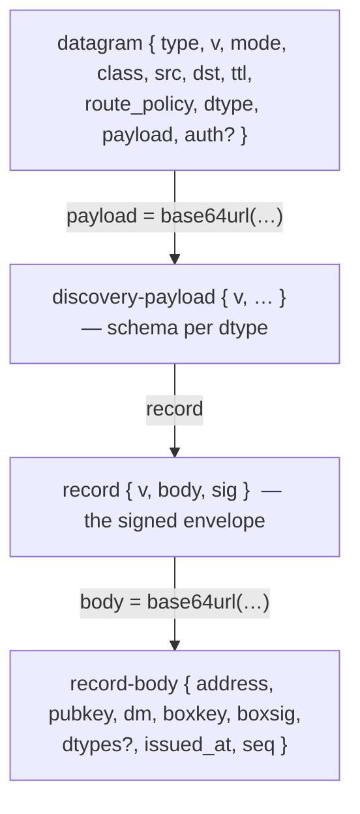
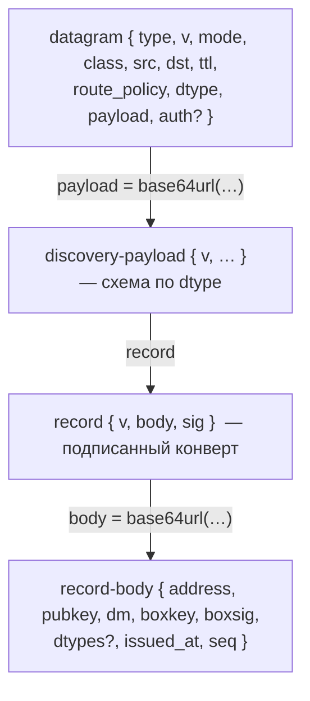

# Identity records and on-demand identity lookup

## English

### 1. Purpose and scope

This document is the normative specification of the **signed identity
record** — the self-certifying artifact through which a node publishes its
own key material — and of the discovery protocol built on top of the
datagram transport plane (`docs/protocol/datagram.md`).

Status of this revision: the record format, its verification, its merge
contract, its storage and the identity backup are **implemented**. The
discovery datagram types (`get_identity`, `post_identity`, `push_identity`)
are specified by the design note `../refactoring/done/identity-discovery-lookup.md`
and land in the next stage; their sections will be added here when they do.

Motivation, alternatives considered and the full design rationale live in
the design note. This document states only the contract.

### 2. The signed record

A record is a **self-record only**: created and signed by the owner of the
identity. No other node can manufacture one — it lacks the private key,
hence the signature, the `issued_at` and the `seq`. Legacy key triples
(hello/welcome handshakes, v27 DM envelopes, `fetch_contacts`) never enter
record storage; they keep feeding the contact plane as before. Both planes
meet in the DM send path, not in the stores.

Wire, disk and `corsa:`-link form — one and the same envelope:

```json
{
  "v": 1,
  "body": "base64url(body_bytes)",
  "sig": "base64url(ed25519(sk_owner, DOMAIN || body_bytes))"
}
```

`body_bytes` are the bytes of a JSON object, signed and transferred **as
is**; re-serialisation is forbidden anywhere on the path:

```json
{
  "address": "ab12…40hex",
  "pubkey": "base64 ed25519",
  "dm": true,
  "boxkey": "base64 x25519",
  "boxsig": "base64url sig(pubkey → boxkey binding)",
  "dtypes": ["get_identity", "post_identity"],
  "issued_at": 1780000000,
  "seq": 3
}
```

Rules:

- **The signature covers the body bytes verbatim.** No JSON canonicalisation
  exists or is needed: what is signed is what travels. This is the whole
  "new fields without a network upgrade" mechanism — a node stores and
  forwards `body` without understanding new fields, and the signature stays
  valid.
- **Domain separation:**
  `DOMAIN = "corsa-identity-record-v1" || 0x00 || uint16be(len(network_id)) || network_id(UTF-8)`.
  The signature binds a record to one protocol network; the same triple on
  another network verifies as a different statement and fails.
- **DM opt-out:** `dm: false` means the box fields are ABSENT. Their
  presence alongside `dm: false` invalidates the record; their absence
  alongside `dm: true` (or an absent `dm`) does too.
- **`dtypes` is the only optional list.** It declares the datagram types the
  owner handles (`docs/protocol/datagram.md` §6.1, mechanism 2). An absent
  field declares **no type** — exactly like an explicitly empty array, which
  additionally states "envelope yes, handlers no". There is no implied
  baseline. Wire contract: order insignificant, duplicates collapse, names
  `[a-z0-9_]` ≤ 64 chars, at most **8** elements counted before
  deduplication; a bounds breach drops the FIELD to its absent value, never
  the record. The handshake declaration always beats the record's.
- **Parsing:** duplicate JSON keys are a reject at every level (envelope and
  body). Unknown fields are ignored and their bytes preserved; the payload
  is never rebuilt.
- **Size caps, checked before everything else:** `body_bytes` ≤ **2048 B**
  (the authoritative budget — per-element maxima do not guarantee the total
  fits), the whole `{v, body, sig}` object ≤ **2900 B**.
- **Verification order:** caps → `sig` against the `pubkey` inside the body
  → address is the fingerprint of `pubkey` → dm branch (box binding checked
  iff `dm` is true) → `address` equals the identity the caller expected
  (the lookup `dst`, the authenticated session identity of a push, the
  address from a `corsa:` link). The expected identity is mandatory: a
  record verified "against nobody" could occupy any slot.
- Format is JSON; the whole wire already is.

Nesting levels of the discovery plane (names differ on purpose, so no two
levels share a "payload" or a "v"):



Four nesting levels of the discovery plane; transit reads only the outermost one

### 3. Seq and merging

`seq` is a pure monotonic counter, incremented on every change of the
record. Time lives only in `issued_at` and takes no part in merging.
Seq 0 is reserved for "no record stored"; the first issued record carries
seq 1.

Merge contract (identical for every store):

| incoming vs stored | outcome | effect |
|---|---|---|
| no stored record | `inserted` | store |
| higher seq | `replaced` | store supersedes |
| lower seq | `stale` | silent no-op (legal reorder) |
| equal seq, identical body bytes | `duplicate` | silent no-op |
| equal seq, different body bytes | `conflict` | keep stored, log; owner must issue a new seq |

Seq issuance is atomic and strictly ordered: **reserve seq → persist the
record atomically → only then publish**. A crash between publish and
persist would otherwise resurrect a different body under an already-seen
seq — a false conflict at every receiver.

Clock skew is never a reject: `issued_at` from the future is logged and the
record accepted — merging is by seq, and refusing would only cut off an
honest node with a wrong clock.

### 4. Who holds records

Transit holds nothing — it never opens the payload. Records live at three
kinds of nodes:

- **The owner** — the self-record, built at start, persistent seq. It is
  re-issued (seq+1) whenever the running build would state something
  different: key material, dm policy, or the declared `dtypes` set — a
  binary upgrade **or rollback** included. An unchanged build re-uses the
  stored record with no seq churn. The owner is the ONLY node entitled to
  answer a `get_identity` addressed to it.
- **Direct peers of the owner (session memory)** — via the initial
  `push_identity` of a session (next stage); for their own use only.
- **The interlocutor (disk)** — verified records of identities the node
  talks to: a trust-store category, keyed `(network_id, address)`, survives
  restart. The composite key is what keeps a record from another network
  out of the slot.

Disk storage is the trust store file (`trust-<port>.json`, schema version
2): record rows carry the `{v, body, sig}` triple verbatim plus the key
halves. A record accepted with a higher seq is also the **seq-gated
replacement** path for pinned contact keys: the owner's own signed word may
change what TOFU refuses to, and it clears the address's conflict marker.
A keyless (`dm: false`) record empties the contact's box fields. Deleting a
contact deletes its records. A legacy contacts-only file migrates in place
on first save; a torn record row is skipped with a log, never fatal.

### 5. Identity backup

The identity file keeps both private keys. The versioned **full backup**
carries both keys plus the record seq:

```json
{
  "version": 1,
  "private_key": "base64 ed25519",
  "box_private_key": "base64 x25519",
  "address": "40hex (integrity cross-check)",
  "record_seq": 3
}
```

Import restores both keys exactly; the address is re-derived and checked
against the stored one; `record_seq` is a FLOOR — the first record issued
after a restore starts above it. An unknown backup version is a typed
reject.

The user surface is the LOCAL-ONLY RPC pair `identity_backup` /
`identity_restore` (console commands `identityBackup <file>` /
`identityRestore <file>`): both frames carry a file path on the node's own
disk, and key material never crosses the RPC boundary in either direction
— the reply names only the path, the address and the seq. The backup
lands through a FRESH owner-only temp file (0600 via `O_EXCL`; on Windows
additionally an owner-only protected DACL, since NTFS ignores mode bits)
followed by an atomic rename: a pre-existing wider-mode target never sees
a single secret byte, and the renamed file keeps the temp's restricted
access whatever the old file's mode was. Restore replaces the identity FILE and answers
`restart_required` — the running node keeps its in-memory identity until
the app restarts. A restore input that is not a JSON object takes the
legacy bare-Ed25519 branch, and the reply then carries `box_key_derived`
with the §5 warning verbatim; a malformed or future-version JSON backup is
the typed reject, never silently retried as a legacy key.

The **legacy branch** — import from a bare Ed25519 private key — is
preserved: the address survives, but the box key is derived from the seed
and may differ from the randomly generated original. The restored value
carries an explicit flag (`BoxKeyDerived`) and the UI must warn: the
address is kept, the encryption key changes.

Identity and trust-store files are written via write-temp-then-rename: a
crash mid-write must never leave a truncated key file.

### 6. Discovery datagram types

Discovery owns no wire command: it registers three `dtype`s on the datagram
plane (`docs/protocol/datagram.md`) and describes only their payloads. All
three are declared in the handshake `dtypes` field and in the self-record.

| `dtype` | `mode` | `class` | payload cap | meaning |
|---|---|---|---|---|
| `get_identity` | `request` | `control` | 512 B | key lookup; `dst` is the identity sought, `src` is the one-shot attempt label |
| `post_identity` | `response` | `control` | 3276 B | the owner's answer over the reverse state; pairs with `get_identity` |
| `push_identity` | `routed`, `ttl = 1` | `control` | class cap | the sender's own record to a session peer; mandatory transport `auth` |

The `cached_identity` type does not exist and will not: the product
decision resolved its open question by dropping it. Its original mechanism —
an intermediate node answering from its own cache — died with the transit
interceptors, and the addressed endpoint-to-endpoint rebuild was judged not
worth a temporary subprotocol: an old-network transit already carries the
lookup to the addressee untouched, so the authoritative path works across
the mixed era as is, and the era itself is covered by the untouched
`fetch_contacts` epidemic and `corsa:` links until the bridge retires
behind a new mandatory protocol floor.

**Only the addressee answers.** Transit never opens the payload; a direct
peer of the target that holds the target's record from an initial push must
forward a `get_identity` addressed past it, never answer.

**`get_identity` payload** (`{v, required?, min_seq?, target_proof?,
requester?, requester_issued_at?, requester_sig?}`): `v` is mandatory and
strictly 1; an addressee that does not understand `v` or any name in
`required` stays SILENT — there is no refusal frame, silence is cured by the
initiator's retry. `min_seq` is checked by the initiator on the received
record, never by the answerer. Setting `target_proof` obliges the builder to
also list `"target_proof"` in `required`. The requester triple is opt-in and
all-or-nothing: a requester without a well-formed signature and issue time
drops the whole payload; the target rejects the signature outside ±5 minutes
and dedups attempt labels for the window's length.
`requester_sig = ed25519(sk, "corsa-lookup-requester-v1" || 0x00 ||
uint16be(len(net)) || net || attempt_id(20) || issued_at(u64be) ||
requester(20) || dst(20))` — addresses signed as raw bytes.

**`post_identity` payload** (`{v, record, target_proof?}`): the record is
mandatory and embeds as a plain JSON object.
`target_proof = ed25519(sk_target, "corsa-target-proof-v1" || 0x00 ||
uint16be(len(net)) || net || attempt_id(20) || sha256(request_payload_bytes)
|| sha256(record_body || record_sig))`. The proof binds the answer to one
attempt (no replay), one question (the hash of the very request bytes the
initiator stored for that attempt) and one record (no swap under a valid
proof). Only the initiator verifies it; an invalid proof costs the attempt
and earns no ban — the neighbour may be an honest transit of somebody
else's garbage. Byte-exact test vectors for both signatures are pinned in
`internal/core/protocol/identity_discovery_test.go`.

**`push_identity`** (`{v, record}`) rides the signed routed plane with
`ttl = 1`. Right after auth each side of a datagram-capable session sends
its record (the initial push); a peer that does not declare the plane or
the type is skipped silently, and an enqueue fault on a capable session
closes it — the reconnect handshake redistributes the record. Acceptance is
gated by the authorization hook BEFORE any replay slot is taken, at the
strongest level the direction offers: the verified frame signer must equal
the address inside the record, and the identity the session presents must
equal it too. Session auth is one-way (initiator → responder), so on a
dialled session the presented identity is the session's established claim
rather than a proof — refusing there would refuse the mandatory initial
push on half of every exchange; where the direction did prove the
neighbour, the check is exactly the design's session rule. Merge outcomes:
higher seq replaces, duplicate and stale are silent no-ops, a same-seq
conflict closes the session (the owner must bump seq), and a second
rate-limit breach (floor: one push per minute per session, keyed by
peer + connection so a reconnect's mandatory initial push never inherits
a previous session's violations) inside one window
closes it too. Records received from session peers are persisted in the
trust store — a superset of the design's session-memory model; the seq gate
and the §6.1 confirmation-freshness rules of the transport spec cover the
staleness this introduces.

**The initiator engine** (single-flight per target, cooldown 30 s after a
terminal): phase 1 sends at t = 0/1/4/12/32 s with a fresh 20-byte label
per attempt, then a 45 s final wait ends at t = 77 s in the
`interactive_timeout` progress flag; phase 2 retries on 30 s → 1 m → 2 m →
5 m → 11 m (ceiling), capped by `CORSA_IDENTITY_LOOKUP_BG_ATTEMPTS`
(default 20) and a 7-day task lifetime. Every attempt demands
`target_proof`. A network attempt leaves only when routing reaches the
target; a gated tick still kicks the rate-limited `route_query_v1`
machinery. The first send uses `route_policy: best`; retries switch to
`explore` and avoid the previous first hop. At most 5 attempt windows
(60 s each) are open per resolution; the global send-slot cap of 3 is held
only for the synchronous enqueue. Durable intents — rows
`(target, reason, created_at, attempts)` in `identity-intents-<port>.json`
(env: `CORSA_IDENTITY_INTENTS_PATH`) — carry refcount semantics: closing
one reason cancels nothing while others live, and phase 2 reseeds from
this table alone after a restart. A verified answer terminates the
resolution on merge outcomes inserted / replaced / duplicate; stale,
conflict and a record below `min_seq` keep it running.

**Legacy bridge.** `fetch_contacts` behaviour is unchanged; the wire
surface and its sync legs are marked deprecated
(`TODO(fetch-contacts-floor)`) and retire only when nothing is left to
bridge, per recipient or behind a new mandatory floor — never on a
telemetric share.

### 7. RPC and UI

The local RPC is synchronous and uninterruptible, so it never blocks on the
network: `resolve_identity {address}` starts (or joins — single-flight per
target) the lookup and returns `{resolution_id, state}` immediately. State
changes are published on `ebus` as `identity.resolution.changed`, carrying
the FULL four-axis state every time:

- **usable** — "keys applicable right now"; flipped by the first
  provisional source (epidemic, corsa: link), unblocks sending, terminates
  nothing;
- **lifecycle** — `pending → active → succeeded | cancelled | exhausted`,
  plus the progress flags `interactive_timeout` and `no_route`;
  `exhausted` with `usable=true` is a valid outcome;
- **authority** — `none → provisional → authoritative`; only the owner's
  signed record grants the last step;
- **dm_available** — `unknown | true | false`, from the record alone.

The lost-event insurance: the node retains the last state per resolution
(terminals for 60 s), and `resolve_identity_status {resolution_id}` reads
it. A terminal arms a 30 s cooldown that defers the next resolution's first
ATTEMPT — the operation itself opens immediately with a fresh id. The
console `resolveIdentity` command is the ONE place a synchronous wait is
allowed: it polls the status up to 8 s for a terminal or the usable flip.

UI: opening a chat with a keyless identity kicks `resolve_identity`; send
unblocks at `usable ∧ dm_available ≠ false`; a keyless send answers the
typed "keys not known yet" error and the composer keeps the draft. The
actionable states reach the status line: the interactive timeout with its
corsa:-link hint, no-route progress, success, exhaustion without keys and
an authoritative DM opt-out ("does not accept direct messages").

### 8. DM recovery after a key rotation

A rotated box key breaks a contact silently: the sender encrypts to a dead
key, the receiver sees nothing readable, and `delivered` fires before
decryption. The subsystem has three parts.

**Typed failure classes.** The dm-v1 decrypt distinguishes three sentinel
classes, and only one may start network recovery: `malformed` (broken
bytes/JSON/version) and `auth-failed` (address mismatch, bad signature)
prove nothing about who sent them — a notice would be spendable slander;
`sealed-unreadable` (envelope authenticated, neither sealed part opens) is
the CONFIRMED crypto-fail. All three decrypt surfaces — the live event,
the sidebar previews and the history load — report through ONE entry point
into the recovery manager; entry requires `recipient == self ∧ sender ≠
self`. A missing sender key is its own class: it kicks the key lookup and
the row re-decrypts locally on the next read, no notice. Local errors
(RPC, SQLite, IO) are ordinary retries, never recovery.

**Durable state.** Per-row marks live in the chatlog's `metadata` JSON
column (`decrypt_failed`, `decrypt_state: pending_notice → waiting_retry →
recovered | expired`, `superseded_by`, `retry_root_id`) — the store's
documented no-migration path; the per-peer job table
(`decrypt_recovery_jobs`) and the monotonic established facts
(`peer_established`) are new SQLite tables in the same database. Jobs are
per-peer (a key generation cannot be computed from an unreadable row),
carry the notice ladder (30 s → 11 m), park in `waiting_retry` for 24 h —
freeing their slot — and live at most 7 days. The seven-day clock is a
HARD deadline with an IMMUTABLE anchor: a durable per-peer cycle row,
created at the cycle's first confirmed failure (seeded from the rows' own
`decrypt_flagged_at`) and deleted only when the cycle truly ends — every
row recovered, or the deadline expired them all; the no-live-rows check
and the close are ONE transaction, so a fresh failure racing the close
keeps the anchor. Eviction never touches it, so a re-admitted orphan inherits the ORIGINAL clock; deriving from
the live rows instead would let a flood roll the clock forward by
recovering the oldest row before each eviction. Expiry reaches every live
row in one statement — not a workset-sized prefix — so neither eviction
churn nor flood volume can extend the network work past first-failure +
7 days. A restart resumes notice retries; it never restarts lookups.

**The exchange.** The receiver first refreshes the sender's keys through
the proof-bearing lookup — a notice encrypted to a stale key would vanish
silently. Both the notice and the sender's re-send are gated on a
consumable proof grant bound to THIS recovery's OWN lookup: each leg opens
(or joins) the resolution itself and remembers its id, only that
resolution's authoritative-successful completion opens the gate, and the
grant is consumed by the one action that asked — the next attempt asks the
network again instead of riding a result that may predate yet another
rotation. The gate is PER CONSUMER: the receiver-leg job and every
sender-leg retry root arm their own entry — under bilateral rotation both
may wait on the same resolution, and neither may ride a proof of the
other's older question. The completion must also prove a FRESH question:
the resolver numbers attempts with a monotonic generation counter (never
the wall clock — a clock step must not re-validate an old question or
wedge new ones), the arm reply carries the counter's current value as the
consumer's watermark, the terminal state names the generation of the
attempt whose proven answer closed the resolution, and a consumer's gate
opens only when that generation exceeds ITS OWN watermark — a joined
resolution may have asked its question before the decrypt failure
existed, and a proof of that question says nothing about the keys after
it. There is no freshness window and no credit for foreign completions:
an authoritative result some other flow obtained answered a question
asked BEFORE this failure, and provisional key knowledge — gossip, header
contacts, a `push_identity` from a third session — never opens the gate
at all, because it is exactly the kind of knowledge whose staleness
caused the failure. The gate does not depend on
the (deliberately lossy) event bus either: every scheduler pass re-polls
armed-but-ungranted proofs through `resolve_identity_status` and re-drives
every queued sender-side re-send, so a dropped event or a terminal landing
in the arming window costs one tick, never a stall. With the gate open the
receiver sends the `decrypt_failed {message_id}` control DM. The
sender validates the notice against ITS OWN chatlog row (`sender = self`,
`recipient =` the authenticated envelope sender; the re-send recipient is
NEVER taken from the notice), refreshes the target's keys, decrypts its
own sealed copy (plaintext exists nowhere on disk; a lost own box key
means manual fallback) and re-sends under a NEW message id with `retry_of`
inside the encrypted part — the old id sits in the receiver's dedup. The
sender-side terminal — the original's supersede link and the
replacement's chain stamp — commits in ONE transaction, and a failed
write is retried by the scheduler (the queue entry survives, no second
send) until it lands: a half-written or dropped terminal would return the
original to ordinary retry racing its own replacement and reset the chain
budget. A crash cannot lose the terminal either: the replacement id is
minted BEFORE the send and recorded in a durable resend intent (no
intent, no send), so the scheduler's reconciliation checks the one NAMED
row instead of searching — present, the terminal is written and the
intent settles; absent, the activation sweep RESTORES the sender task and
re-sends under the SAME pre-minted id, which the receiver's dedup absorbs
when the lost send actually left; an intent whose peer never resolves
ages out at the cycle lifetime. The intents ARE the sender-side bounded
backlog of the quota model: admission caps them at 3 per peer and shares
the global 200-slot bound with the established reservation (unknown peers
evicted first by LRU, an established intent never evicted for an unknown
newcomer, refusal only when every slot is established), a repeated notice
for an admitted root returns the CANONICAL intent — the stored id, never
a divergent fresh one — and ACTIVE re-sends draw on the same 20-slot
active pool as the receiver batch (queued re-sends occupy their slots
before the batch is sized), established first, unknown capped at half.
In-flight work is never an eviction victim — queued re-send roots AND
peers with a running notice attempt are protected, the protection
snapshot and the eviction are one serialized decision with every
activation, and each send attempt runs under a per-root CLAIM: a
concurrent expiry or cleanup is deferred until the claim drops, the
durable intent is re-checked inside the claim (a stale task whose root
was re-admitted under a fresh id retires without sending and without
touching the new incarnation's intent), so a replacement can never go
out without its crash insurance and never under a diverged id. The
seven-day age-out reaches only a re-send that was NEVER sent
(unreachable peer): one whose replacement already left owes a terminal
DEBT — moved out of the active pool entirely (pure DB retries hold no
network slot) and retried until it commits, never expired; a debt whose
original row no longer exists settles, since nothing is left to
supersede; after a restart an intent whose replacement row exists is
RESTORED as a debt through the same flow — never re-treated as a waiting
re-send that would re-prove and re-transmit an id already on the wire.
Every admission and every activation runs through one gate, and
candidates of BOTH legs are served in ONE order — every established
candidate ahead of any unknown one, and WITHIN each class both legs
interleaved least-recently-served (a never-served job ranks by its
admission time, the same clock the intents use), executed in exactly the
computed order, with a selected re-send not event-runnable until its
position comes — so unknown work of one leg can never outrank
established work of the other and a constant stream of due jobs cannot
starve older re-sends. An evicted row always names its peer, so the peer's lookup
reasons are released even when the row belonged to a crashed
predecessor nothing had restored yet. The chain budget counts by
`retry_root_id`, so fresh ids cannot reset it. The
receiver honours `retry_of` only for a row that is really flagged, from
the same authenticated author, addressed to itself and not yet superseded;
acceptance supersedes the original, collapses its unread count (the
replacement counts once) and closes the job when no flagged rows remain.
Acceptance — like the decrypted-incoming established fact — fires at the
DECRYPT chokepoint every read path shares (the live event, the history
load, the previews): a replacement landing in a background conversation,
or first read after a restart, closes recovery exactly like one in the
open chat. Those paths race each other, so the "still flagged, not yet
superseded" precondition is re-checked INSIDE the supersede transaction:
exactly one acceptance writes the link, the losers back off untouched.

**Quotas.** Active work is slot-limited (20 global) with at least half the
pool reserved for ESTABLISHED contacts; established is a strict, monotonic
per-peer fact set once by a qualifying event — the user's own outgoing
message, a successfully decrypted incoming DM, or a manual import — never
by a chatlog row or header contact alone, both of which exist before
decryption. The outgoing fact fires at the SendDirectMessage chokepoint
every send surface shares — composer, RPC, file transfer — and a
database that predates the fact table is backfilled at open from the
history's outgoing rows, so long-standing real contacts never start as
Sybil-evictable unknowns. A Sybil flood can occupy at most the unknown
half; a real contact's recovery starts within one scheduling pass. The pass serves
jobs least-recently-first, and a job that could not act (its proof grant
has not landed yet) still advances its served stamp — the head of the
queue rotates to the back instead of occupying its slot pass after pass
while the tail waits out the whole 7-day lifetime. Admission itself is
bounded too: receiver jobs and sender resend intents together stay under
200 — ONE shared backlog, not 200 per leg — with the reservation applied
there as well (unknown peers own at most half the backlog, rotating by
LRU at their share) and the per-peer bound counted across both tables
(one peer's job plus its intents never exceed 3 rows), enforced
transactionally at
report time — a report over the cap evicts the oldest NON-established job
to make room, and is refused outright when every slot is held by an
established contact, so unreadable-envelope floods cannot grow the job
table without bound. An eviction (like any job close) reports its victim,
whose recovery-typed lookup reasons are cancelled; the victim's row FLAGS
stay, and an orphan-reconciliation sweep at the start of every pass
re-admits flagged-but-jobless peers — necessary because the row flag
suppresses repeat reports, so no later report would retry the admission on
its own. The sweep admits into FREE slots only and never evicts: an
evicting sweep over a backlog fuller than the cap would rotate jobs in and
out every pass, resetting each victim's creation time and 7-day lifetime
and starving the whole table of attempts — only a fresh failure report may
displace an older unknown job.

### 9. corsa: links and QR

The offline channel for the original scenario — an identity handed over
outside the network:

```
corsa:<address>?v=1&net=<network_id>&pk=<b64url ed25519>&bk=<b64url x25519>&bs=<b64url boxsig>
```

Import is the same verify-then-import (fingerprint, box binding), fully
offline. `v` is mandatory and strictly 1 — an unknown version is a reject,
never read as v1; unknown parameters are ignored (additive growth). `net`
is mandatory with no legacy netless form: the triple itself is
network-neutral (the box signature does not cover the network), so the
parameter is an explicit label, not a cryptographic binding — a mismatch
with the node's network is a reject with a plain explanation. Parser
bounds: the whole URI ≤ 2 KiB before any decoding; the raw query is split
on `&` and `=` FIRST and names/values are percent-decoded separately (a
decoded `%26` must never become a separator); canonical duplicate names
are a reject. The link is ~230–260 bytes — QR version ~10–11 at level M,
an ECC choice about physical damage, not forgery: the signature catches
substitution but cannot repair scuffed modules. The QR encoder is
dependency-free (`internal/core/qrcode`, byte mode, level M, versions
1–14), pinned by an independent from-the-spec decoder in its tests.

UI: "Share contact" at the own profile renders the QR and copies the link;
a link pasted into the identity search or the composer imports the contact
at once — the composer never sends the keys as chat text. A bare 40-hex
keeps working through the lookup.

---

## Русский

### 1. Назначение и границы

Этот документ — нормативная спецификация **подписанной identity-записи** —
самосертифицируемого артефакта, которым узел публикует собственные ключи, —
и discovery-протокола поверх транспорта датаграмм
(`docs/protocol/datagram.md`).

Статус ревизии: формат записи, её верификация, merge-контракт, хранение и
backup identity **реализованы**. Типы датаграмм discovery (`get_identity`,
`post_identity`, `push_identity`) специфицированы рабочей заметкой
`../refactoring/done/identity-discovery-lookup.md` и приходят следующим этапом;
их разделы появятся здесь вместе с реализацией.

Мотивация, отвергнутые альтернативы и полное обоснование — в рабочей
заметке. Здесь — только контракт.

### 2. Подписанная запись

Запись — только **self-record**: создана и подписана владельцем identity.
Никакой другой узел изготовить её не может — нет приватного ключа, а значит
нет подписи, `issued_at` и `seq`. Легаси-тройки (hello/welcome, v27-конверты
DM, `fetch_contacts`) в record-хранилище не попадают — они, как и раньше,
питают контакт-плоскость. Обе плоскости сходятся в пути отправки DM, а не в
хранилищах.

Форма на проводе, на диске и в `corsa:`-ссылке — один и тот же конверт:

```json
{
  "v": 1,
  "body": "base64url(body_bytes)",
  "sig": "base64url(ed25519(sk_owner, DOMAIN || body_bytes))"
}
```

`body_bytes` — байты JSON-объекта, подписываются и передаются **как есть**,
ре-сериализация запрещена на всём пути:

```json
{
  "address": "ab12…40hex",
  "pubkey": "base64 ed25519",
  "dm": true,
  "boxkey": "base64 x25519",
  "boxsig": "base64url sig(pubkey → boxkey binding)",
  "dtypes": ["get_identity", "post_identity"],
  "issued_at": 1780000000,
  "seq": 3
}
```

Правила:

- **Подпись накрывает байты body как есть.** Канонизации JSON нет и она не
  нужна: подписанное равно переданному. Это и есть механика «новые поля без
  обновления сети»: узел хранит и пересылает `body`, не понимая новых полей,
  подпись остаётся валидной.
- **Domain separation:**
  `DOMAIN = "corsa-identity-record-v1" || 0x00 || uint16be(len(network_id)) || network_id(UTF-8)`.
  Подпись привязывает запись к одной протокольной сети; та же тройка в
  другой сети — другое утверждение, и подпись не сходится.
- **DM opt-out:** `dm: false` означает, что box-полей нет. Их присутствие
  при `dm: false` — невалидная запись; их отсутствие при `dm: true` — тоже.
- **`dtypes` — единственный необязательный список.** Он объявляет типы
  датаграмм, которые владелец принимает (`docs/protocol/datagram.md` §6.1,
  механизм 2). Отсутствие поля не объявляет **ни одного** типа — ровно как
  явный пустой массив, который дополнительно означает «конверт понимаю,
  обработчиков нет». Подразумеваемого baseline нет. Wire-контракт: порядок
  не значим, дубликаты схлопываются, имена `[a-z0-9_]` ≤ 64 символов, не
  более **8** элементов, считая по проводу до дедупликации; нарушение
  границ роняет ПОЛЕ к отсутствующему значению, а не запись. Рукопожатие
  всегда приоритетнее записи.
- **Парсинг:** дублирующиеся ключи JSON — reject на всех уровнях (конверт и
  body). Неизвестные поля игнорируются, байты сохраняются, payload не
  пересобирается.
- **Лимиты, проверяются до всего остального:** `body_bytes` ≤ **2048 Б**
  (авторитетный бюджет — поэлементные максимумы не гарантируют, что сумма
  влезет), объект `{v, body, sig}` целиком ≤ **2900 Б**.
- **Порядок верификации:** cap-ы → `sig` ключом `pubkey` из body → адрес
  есть отпечаток `pubkey` → ветвление по dm (binding проверяется только при
  `dm: true`) → `address` совпадает с ожидаемой identity (dst lookup-а,
  аутентифицированная identity сессии у push-а, адрес из `corsa:`-ссылки).
  Ожидаемая identity обязательна: запись, проверенная «ни против кого»,
  могла бы занять любой слот.
- Формат — JSON: весь wire уже JSON.

Уровни вложенности discovery-плоскости (имена различаются намеренно — ни на
каких двух уровнях нет второго «payload» или второго «v»):



Четыре уровня вложенности discovery-плоскости; транзит читает только внешний

### 3. Seq и слияние

`seq` — чистый монотонный счётчик, инкремент при каждом изменении записи.
Время живёт только в `issued_at` и в merge не участвует. Seq 0
зарезервирован за «записи нет»; первая выпущенная запись несёт seq 1.

Merge-контракт (одинаков для каждого хранилища):

| входящая против хранимой | исход | эффект |
|---|---|---|
| хранимой нет | `inserted` | сохранить |
| seq больше | `replaced` | хранимая замещается |
| seq меньше | `stale` | тихий no-op (законный реордер) |
| seq равен, байты body идентичны | `duplicate` | тихий no-op |
| seq равен, байты различаются | `conflict` | хранимая остаётся, лог; владелец обязан выпустить новый seq |

Выдача seq атомарна, порядок строгий: **зарезервировать seq → атомарно
персистнуть запись → только затем публиковать**. Иначе крах между
публикацией и записью воскресил бы после рестарта другой body под уже
виденным seq — ложный конфликт у каждого получателя.

Clock skew не является причиной отказа: `issued_at` из будущего логируется,
запись принимается — merge идёт по seq, а отказ отрезал бы честную ноду с
ушедшими часами.

### 4. Кто держит записи

Транзит не держит ничего — он не открывает payload. Записи живут у трёх
категорий узлов:

- **Владелец** — self-record, строится при старте, persistent seq.
  Перевыпускается (seq+1) всякий раз, когда работающая сборка заявила бы
  иное: ключи, dm-политика или объявленный набор `dtypes` — включая
  апгрейд **и откат** бинарника. Неизменная сборка переиспользует хранимую
  запись без churn-а seq. Владелец — ЕДИНСТВЕННЫЙ узел, вправе ответить на
  адресованный ему `get_identity`.
- **Прямые пиры владельца (память сессии)** — через initial `push_identity`
  сессии (следующий этап); только для собственного пользования.
- **Инициатор-собеседник (диск)** — верифицированные записи identity, с
  которыми есть диалог: категория trust store, ключ `(network_id, address)`,
  переживает рестарт. Составной ключ и есть то, что не пускает запись из
  другой сети в слот.

Дисковое хранилище — файл trust store (`trust-<port>.json`, версия схемы
2): строки записей несут тройку `{v, body, sig}` verbatim плюс половины
ключа. Запись, принятая с большим seq, — это одновременно и **seq-gated
замена** запиненных ключей контакта: собственное подписанное слово владельца
вправе менять то, в чём TOFU отказывает, и снимает конфликт-маркер адреса.
Keyless-запись (`dm: false`) очищает box-поля контакта. Удаление контакта
удаляет его записи. Легаси-файл (только контакты) мигрирует на месте при
первом сохранении; порванная строка записи пропускается с логом и не
фатальна.

### 5. Backup identity

Файл identity хранит оба приватных ключа. Versioned **full backup** несёт
оба ключа плюс seq записи:

```json
{
  "version": 1,
  "private_key": "base64 ed25519",
  "box_private_key": "base64 x25519",
  "address": "40hex (перекрёстная проверка целостности)",
  "record_seq": 3
}
```

Импорт восстанавливает оба ключа в точности; адрес выводится заново и
сверяется с сохранённым; `record_seq` — НИЖНЯЯ граница: первая запись после
восстановления выпускается выше неё. Неизвестная версия backup-а — типизированный
reject.

Пользовательская поверхность — ТОЛЬКО-ЛОКАЛЬНАЯ RPC-пара
`identity_backup` / `identity_restore` (консольные команды
`identityBackup <file>` / `identityRestore <file>`): оба фрейма несут путь
к файлу на диске самого узла, ключевой материал не пересекает границу RPC
ни в одну сторону — ответ называет только путь, адрес и seq. Backup
ложится через СВЕЖИЙ owner-only временный файл (0600 через `O_EXCL`; на
Windows дополнительно защищённый owner-only DACL — NTFS игнорирует
mode-биты) с последующим атомарным rename: существующий файл с более
широкими правами не видит ни одного секретного байта, а переименованный
файл сохраняет ограниченный доступ временного, каким бы ни был режим
старого. Restore заменяет ФАЙЛ identity и отвечает
`restart_required` — работающий узел держит in-memory identity до
перезапуска приложения. Вход restore, не являющийся JSON-объектом, идёт по
легаси-ветке голого Ed25519-ключа, и ответ тогда несёт `box_key_derived` с
предупреждением §5 дословно; порченый или будущей версии JSON-backup —
типизированный reject, а не тихая перепопытка как легаси-ключ.

**Легаси-ветка** — импорт из одного Ed25519-ключа — сохранена: адрес
переживает восстановление, но box-ключ деривируется из seed-а и может не
совпасть со случайно сгенерированным исходным. Восстановленное значение
несёт явный флаг (`BoxKeyDerived`), и UI обязан предупредить: адрес
сохранится, ключ шифрования сменится.

Файлы identity и trust store пишутся через write-temp-then-rename: крах
посреди записи не должен оставить усечённый файл ключей.

### 6. Типы датаграмм discovery

У discovery нет своей wire-команды: он регистрирует три `dtype` на плоскости
датаграмм (`docs/protocol/datagram.md`) и описывает только их payload-ы. Все
три объявляются в поле `dtypes` рукопожатия и в self-record.

| `dtype` | `mode` | `class` | cap payload | смысл |
|---|---|---|---|---|
| `get_identity` | `request` | `control` | 512 Б | запрос ключей; `dst` — искомая identity, `src` — одноразовый ярлык попытки |
| `post_identity` | `response` | `control` | 3276 Б | ответ владельца по reverse-состоянию; парный к `get_identity` |
| `push_identity` | `routed`, `ttl = 1` | `control` | cap класса | своя запись пиру сессии; обязательный транспортный `auth` |

Типа `cached_identity` нет и не будет: продуктовое решение закрыло его
открытый вопрос выпилом. Исходный механизм — ответ промежуточного узла из
собственного кэша — умер вместе с транзитными перехватчиками, а пересборка
адресным endpoint-to-endpoint запросом признана не стоящей временного
подпротокола: транзит старой сети и так доносит lookup до адресата не
глядя, поэтому authoritative-путь работает сквозь смешанную эру как есть, а
саму эру покрывают нетронутая эпидемика `fetch_contacts` и `corsa:`-ссылки
— до выпила моста за новым обязательным протокольным floor-ом.

**Отвечает только адресат.** Транзит не открывает payload; прямой пир цели,
держащий её запись от initial push, обязан переслать чужой `get_identity`,
а не ответить.

**Payload `get_identity`** (`{v, required?, min_seq?, target_proof?,
requester?, requester_issued_at?, requester_sig?}`): `v` обязателен и строго
1; адресат, не понимающий `v` или имя из `required`, обязан МОЛЧАТЬ —
фрейма отказа нет, тишина лечится ретраем инициатора. `min_seq` проверяет
инициатор по полученной записи, никогда не ответчик. Установка
`target_proof` обязывает билдера включить `"target_proof"` в `required`.
Тройка requester опциональна и неделима: requester без валидной подписи и
времени роняет весь payload; цель отвергает подпись вне окна ±5 минут и
держит дедуп ярлыков на длину окна.
`requester_sig = ed25519(sk, "corsa-lookup-requester-v1" || 0x00 ||
uint16be(len(net)) || net || attempt_id(20) || issued_at(u64be) ||
requester(20) || dst(20))` — адреса подписываются сырыми байтами.

**Payload `post_identity`** (`{v, record, target_proof?}`): запись
обязательна и вкладывается обычным JSON-объектом.
`target_proof = ed25519(sk_target, "corsa-target-proof-v1" || 0x00 ||
uint16be(len(net)) || net || attempt_id(20) || sha256(request_payload_bytes)
|| sha256(record_body || record_sig))`. Доказательство привязывает ответ к
одной попытке (нет реплея), одному вопросу (хеш тех самых байт запроса,
сохранённых инициатором для попытки) и одной записи (нет подмены под
валидным доказательством). Проверяет его только инициатор; невалидное
доказательство стоит одной попытки и не даёт ban — сосед мог быть честным
транзитом чужого мусора. Байт-точные тест-векторы обеих подписей закреплены
в `internal/core/protocol/identity_discovery_test.go`.

**`push_identity`** (`{v, record}`) едет по подписанной routed-плоскости с
`ttl = 1`. Сразу после auth каждая сторона datagram-способной сессии шлёт
свою запись (initial push); пир, не объявивший плоскость или тип,
пропускается молча, а ошибка enqueue на способной сессии закрывает её —
handshake реконнекта разнесёт запись заново. Приём гейтится авторизационным
хуком ДО занятия анти-реплей-слота, на сильнейшем уровне, который даёт
направление: верифицированный подписант кадра обязан совпасть с адресом
внутри записи, и предъявляемая сессией identity — тоже. Session-auth
односторонний (инициатор → ответчик), поэтому на набранной сессии
предъявленная identity — установленный клейм сессии, а не доказательство;
отказ там отверг бы обязательный initial push на половине каждого обмена; на
направлении с доказанным соседом проверка — ровно сессионное правило
дизайна. Исходы merge: больший seq замещает, duplicate и stale — тихие
no-op, конфликт одинакового seq закрывает сессию (владелец обязан бампнуть
seq), повторное нарушение rate-limit (пол: один push в минуту на сессию,
ключ — пир + соединение, чтобы обязательный initial push после реконнекта
не наследовал нарушения прошлой сессии) в одном окне — тоже закрытие. Записи от пиров сессий персистятся в trust
store — надмножество session-memory-модели дизайна; вносимую этим
несвежесть покрывают seq-гейт и правила свежести подтверждений §6.1
транспортной спеки.

**Движок инициатора** (single-flight на цель, cooldown 30 с после
терминала): фаза 1 шлёт на t = 0/1/4/12/32 с со свежим 20-байтовым ярлыком
на попытку, затем финальное ожидание 45 с завершается на t = 77 с
прогресс-флагом `interactive_timeout`; фаза 2 ретраит по 30 с → 1 м → 2 м →
5 м → 11 м (потолок), с капом `CORSA_IDENTITY_LOOKUP_BG_ATTEMPTS` (default
20) и жизнью задачи 7 дней. Каждая попытка требует `target_proof`. Сетевая
попытка уходит только при достижимой цели; загейченный тик всё равно пинает
rate-limited машинерию `route_query_v1`. Первая отправка идёт с
`route_policy: best`; ретраи переключаются на `explore` и избегают прошлого
первого хопа. Одновременно открыто не более 5 окон попыток (по 60 с);
глобальный cap отправок 3 держится только на время синхронного enqueue.
Durable-намерения — строки `(target, reason, created_at, attempts)` в
`identity-intents-<port>.json` (env: `CORSA_IDENTITY_INTENTS_PATH`) — несут
refcount-семантику: снятие одной причины ничего не отменяет, пока живы
другие, и фаза 2 после рестарта пересеивается только из этой таблицы.
Верифицированный ответ завершает resolution на исходах merge inserted /
replaced / duplicate; stale, conflict и запись ниже `min_seq` оставляют её
работать.

**Легаси-мост.** Поведение `fetch_contacts` не меняется; wire-поверхность и
sync-ноги помечены deprecated (`TODO(fetch-contacts-floor)`) и выпиливаются
только когда мостить станет некого — per-recipient либо за новым
обязательным floor, никогда по телеметрической доле.

### 7. RPC и UI

Локальный RPC синхронный и непрерываемый, поэтому на сеть он не блокируется
никогда: `resolve_identity {address}` запускает (или присоединяется —
single-flight на цель) lookup и немедленно возвращает `{resolution_id,
state}`. Смены состояния публикуются в `ebus` топиком
`identity.resolution.changed`, каждый раз с ПОЛНЫМ состоянием четырёх осей:

- **usable** — «ключи применимы прямо сейчас»; переключается первым же
  provisional-источником (эпидемика, corsa:-ссылка), разблокирует отправку,
  ничего не завершает;
- **lifecycle** — `pending → active → succeeded | cancelled | exhausted`,
  плюс прогресс-флаги `interactive_timeout` и `no_route`; `exhausted` при
  `usable=true` — валидный исход;
- **authority** — `none → provisional → authoritative`; последний шаг даёт
  только подписанная запись владельца;
- **dm_available** — `unknown | true | false`, только из записи.

Страховка от потерянного события: нода удерживает последнее состояние
resolution (терминалы 60 с), его читает `resolve_identity_status
{resolution_id}`. Терминал взводит cooldown 30 с, который откладывает
первую ПОПЫТКУ следующей resolution — сама операция открывается сразу со
свежим id. Консольная `resolveIdentity` — единственное место синхронного
ожидания: она опрашивает статус до 8 с до терминала или включения usable.

UI: открытие чата с keyless-identity пинает `resolve_identity`; отправка
разблокируется по `usable ∧ dm_available ≠ false`; keyless-отправка
получает типизированную ошибку «ключи ещё не получены», черновик остаётся в
композере. Действенные состояния доходят до статусной строки: interactive
timeout с подсказкой про corsa:-ссылку, прогресс no-route, успех,
исчерпание без ключей и authoritative-отказ от DM («не принимает личные
сообщения»).

### 8. DM-recovery при смене ключей

Смена box-ключа ломает контакт молча: отправитель шифрует на мёртвый ключ,
получатель не видит ничего читаемого, а `delivered` уходит до расшифровки.
Подсистема из трёх частей.

**Типизированные классы ошибок.** Расшифровка dm-v1 различает три
sentinel-класса, и лишь один запускает сетевой recovery: `malformed`
(битые байты/JSON/версия) и `auth-failed` (несовпадение адресов, плохая
подпись) не доказывают ничего об отправителе — notice был бы разменной
клеветой; `sealed-unreadable` (конверт аутентифицирован, ни одна
sealed-часть не открылась) — ПОДТВЕРЖДЁННЫЙ крипто-fail. Все три
поверхности расшифровки — live-событие, превью сайдбара, загрузка истории
— репортят через ОДНУ точку входа менеджера; вход только при
`recipient == self ∧ sender ≠ self`. Отсутствующий ключ отправителя — свой
класс: он пинает lookup, и строка расшифруется локально при следующем
чтении, без notice. Локальные ошибки (RPC, SQLite, IO) — обычный retry,
не recovery.

**Durable-состояние.** Построчные пометки живут в JSON-колонке `metadata`
чатлога (`decrypt_failed`, `decrypt_state: pending_notice → waiting_retry
→ recovered | expired`, `superseded_by`, `retry_root_id`) — штатный
безмиграционный путь хранилища; per-peer-таблица задач
(`decrypt_recovery_jobs`) и монотонные established-факты
(`peer_established`) — новые SQLite-таблицы той же базы. Задачи —
per-peer (поколение ключа из нечитаемой строки не вычислить), несут
notice-лесенку (30 с → 11 м), паркуются в `waiting_retry` на 24 ч —
освобождая слот — и живут не более 7 дней. Семидневные часы — ЖЁСТКИЙ
дедлайн с НЕИЗМЕНЯЕМЫМ якорем: durable per-peer строка цикла, создаваемая
при первом подтверждённом сбое цикла (сеется из `decrypt_flagged_at`
самих строк) и удаляемая только когда цикл действительно закончился —
все строки восстановлены либо дедлайн их истёк; проверка отсутствия живых
строк и закрытие — ОДНА транзакция, так что свежий сбой наперегонки с
закрытием сохраняет якорь. Вытеснение её не трогает,
поэтому повторно принятый orphan наследует ИСХОДНЫЕ часы; вывод из живых
строк позволил бы флуду катить часы вперёд, восстанавливая старейшую
строку перед каждым вытеснением. Истечение достигает каждой живой строки
одним statement-ом — не префиксом размера workset — так что ни ротация
вытеснений, ни объём флуда не продлевают сетевую работу дальше «первый
сбой + 7 дней». Рестарт продолжает notice-retry и никогда не
перезапускает lookup.

**Обмен.** Получатель сначала освежает ключи отправителя через lookup с
доказательством — notice, зашифрованный устаревшим ключом, пропал бы
молча. И notice, и повторная отправка гейтятся расходуемым proof-грантом,
привязанным к СОБСТВЕННОМУ lookup-у этого recovery: каждая нога сама
открывает (или присоединяется к) резолюции и запоминает её id, гейт
открывает только authoritative-успешное завершение именно этой резолюции,
и грант расходуется тем единственным действием, которое его запросило —
следующая попытка снова спрашивает сеть, а не едет на результате, который
мог опередить очередную ротацию. Гейт — ПО ПОТРЕБИТЕЛЯМ: задача
receiver-ноги и каждый retry-root sender-ноги взводят собственную запись —
при двусторонней ротации оба могут ждать одну резолюцию, и ни один не
вправе ехать на доказательстве более старого вопроса другого. Завершение
обязано доказывать и СВЕЖИЙ вопрос: резолвер нумерует попытки монотонным
счётчиком поколений (не wall-clock — скачок часов не должен ни
ревалидировать старый вопрос, ни заклинить новые), ответ на взвод несёт
текущее значение счётчика как watermark потребителя, терминальное
состояние называет поколение попытки, чей доказанный ответ закрыл
резолюцию, и гейт потребителя открывается только когда это поколение
превышает ЕГО СОБСТВЕННЫЙ watermark — резолюция, к которой
присоединились, могла задать вопрос до сбоя расшифровки, и доказательство
того вопроса ничего не говорит о ключах после него. Окна свежести нет,
чужие завершения не засчитываются: authoritative-результат другого потока
отвечал на вопрос, заданный ДО этого сбоя, а provisional-знание ключей —
gossip, контакты из заголовков, `push_identity` из третьей сессии — гейт
не открывает вовсе, потому что именно несвежесть такого знания и вызвала
сбой. От (намеренно lossy) шины событий гейт тоже не зависит: каждый
проход планировщика заново опрашивает взведённые, но не выданные
доказательства через `resolve_identity_status` и заново гонит все
отложенные повторные отправки sender-ноги, так что потерянное событие или
терминал, попавший в окно взвода, стоит один тик, а не вечный стоп. С
открытым гейтом получатель шлёт control-DM `decrypt_failed {message_id}`. Отправитель
валидирует notice по СВОЕЙ строке чатлога (`sender = self`, `recipient =`
аутентифицированный отправитель конверта; получатель повтора НИКОГДА не
берётся из notice), освежает ключи цели, расшифровывает собственную
sealed-копию (plaintext нигде не хранится; утрата своего box-ключа —
ручной fallback) и повторяет отправку НОВЫМ message id с `retry_of`
внутри шифруемой части — старый id сидит в дедупе получателя. Терминал
sender-стороны — supersede-ссылка оригинала и chain-штамп повтора —
коммитится ОДНОЙ транзакцией, а неудавшаяся запись повторяется
планировщиком (запись очереди живёт, второй отправки нет), пока не ляжет:
полузаписанный или брошенный терминал вернул бы оригинал в обычный retry
наперегонки с собственным повтором и сбросил бы бюджет цепочки. Падение
процесса терминал тоже не теряет: id повтора минтится ДО отправки и
записывается в durable resend-intent (нет intent-а — нет отправки),
поэтому реконсиляция планировщика проверяет одну ИМЕНОВАННУЮ строку, а не
ищет — есть строка: терминал дописан, intent закрыт; нет строки:
активационный свип ВОССТАНАВЛИВАЕТ задачу отправителя и повторяет
отправку под ТЕМ ЖЕ пред-минченным id, который дедуп получателя
поглощает, если потерянная отправка на самом деле ушла; intent, чей пир
так и не резолвится, стареет по сроку цикла. Intents И ЕСТЬ ограниченный
sender-backlog квотной модели: приём ограничивает их 3 на пира и общим
лимитом 200 слотов с established-резервированием (unknown вытесняются
первыми по LRU, established-intent никогда не вытесняется ради unknown,
отказ — только когда все слоты established), повторный notice по уже
принятому root-у возвращает КАНОНИЧЕСКИЙ intent — сохранённый id, а не
расходящийся свежий, — а АКТИВНЫЕ повторы берут из того же пула 20
активных слотов, что и receiver-batch (отложенные повторы занимают свои
слоты до расчёта размера batch-а): established первыми, unknown не больше
половины. In-flight работа никогда не жертва вытеснения — защищены и
root-ы отложенных повторов, И пиры с идущей notice-попыткой; снимок
защиты и вытеснение сериализованы с каждой активацией одним решением, а
каждая попытка отправки идёт под per-root CLAIM-ом: конкурентное
истечение или очистка откладываются до сброса claim-а, durable intent
перепроверяется внутри него (stale-задача, чей root переприняли под
свежим id, отступает без отправки и не трогая intent нового воплощения)
— повтор не может уйти ни без crash-страховки, ни под разошедшимся id.
Семидневное старение достаёт только НЕ отправленный повтор (недостижимый
пир); тот, чей повтор уже ушёл, должен терминал — ДОЛГ, вынесенный из
активного пула целиком (чистые DB-ретраи сетевой слот не держат) и
ретраящийся до коммита, никогда не истекающий; долг, чей оригинал
удалён, закрывается — замещать больше нечего; после рестарта intent, чей
replacement-строка существует, ВОССТАНАВЛИВАЕТСЯ долгом через тот же
поток — и никогда не трактуется как ожидающий повтор, который заново
доказывал бы и переотправлял уже ушедший id. Каждый приём и каждая
активация идут через один гейт, и кандидаты ОБЕИХ ног обслуживаются в
ЕДИНОМ порядке — каждый established-кандидат раньше любого unknown, а
ВНУТРИ класса обе ноги чередуются по least-recently-served и исполняются
ровно в вычисленном порядке, — так что unknown-работа одной ноги не
может обогнать established-работу другой, а постоянный поток due-jobs не
может заморить старые повторы (никогда не обслуженный job ранжируется
временем приёма — теми же часами, что и intents, — а выбранный повтор
не event-runnable, пока не подошла его позиция). Вытесняемая строка всегда называет своего
пира, поэтому lookup-reasons пира снимаются даже когда строка
принадлежала упавшему процессу и никем не была восстановлена. Бюджет
цепочки считается по `retry_root_id`, свежие id его не обнуляют.
Получатель принимает `retry_of` только для строки, которая действительно
флагнута, от того же аутентифицированного автора, адресована ему и ещё не
замещена; приём замещает оригинал, схлопывает его счётчик непрочитанных
(повтор считается один раз) и закрывает задачу, когда флагнутых строк не
осталось. Приём — как и established-факт расшифрованного входящего —
срабатывает в чекпойнте РАСШИФРОВКИ, общем для всех путей чтения (живое
событие, загрузка истории, превью): повтор, пришедший в фоновый чат или
прочитанный после рестарта, закрывает recovery так же, как в открытом.
Эти пути гоняются друг с другом, поэтому предикат «ещё флагнута и не
замещена» перепроверяется ВНУТРИ транзакции замещения: ссылку пишет ровно
один приём, проигравшие отступают, не тронув строк.

**Квоты.** Активная работа ограничена слотами (20 глобально), и не менее
половины пула зарезервировано за ESTABLISHED-контактами; established —
строгий монотонный факт per-peer, ставится один раз квалифицирующим
событием — своё исходящее сообщение, успешно расшифрованный входящий DM
или ручной импорт — и никогда строкой чатлога или контактом из заголовка:
оба появляются до расшифровки. Исходящий факт срабатывает в чекпойнте
SendDirectMessage, общем для всех поверхностей отправки — композер, RPC,
передача файлов, — а база, созданная до появления таблицы фактов,
засеивается при открытии из исходящих строк истории, так что давние
реальные контакты никогда не стартуют Sybil-вытесняемыми unknown-ами.
Sybil-флуд занимает максимум «неизвестную» половину; recovery реального
контакта стартует в пределах одного прохода планировщика. Проход обслуживает задачи в порядке «дольше всех не
обслуживалась — первой», и задача, которая не смогла действовать (её
proof-грант ещё не пришёл), всё равно продвигает свою отметку
обслуживания — голова очереди уходит в хвост, а не занимает слот проход
за проходом, пока хвост пережидает весь 7-дневный срок. Ограничен и сам
приём: receiver-задачи и sender-intents вместе не превышают 200 — ОДИН
общий backlog, а не 200 на ногу, — с тем же резервированием и там
(unknown-пиры владеют максимум половиной backlog-а, ротация по LRU в
пределах своей доли) и per-peer-границей через обе таблицы (job пира плюс
его intents — не более 3 строк), и лимит проверяется
транзакционно в момент report — репорт сверх лимита вытесняет самую
старую задачу НЕ-established-контакта, а когда все слоты заняты
established-контактами — отклоняется, поэтому флуд нечитаемыми конвертами
не растит таблицу задач неограниченно. Вытеснение (как и любое закрытие
задачи) сообщает жертву, и её lookup-reasons типа recovery отменяются;
ФЛАГИ строк жертвы остаются, и orphan-reconciliation-свип в начале
каждого прохода заново принимает флагнутых пиров без задачи — это
необходимо, потому что флаг строки подавляет повторные report-ы, и сам по
себе ни один поздний report приём бы не повторил. Свип принимает ТОЛЬКО в
свободные слоты и никогда не вытесняет: вытесняющий свип над backlog-ом
полнее лимита ротировал бы задачи туда-сюда каждый проход, сбрасывая
жертвам created_at и 7-дневный срок и лишая попыток всю таблицу — сдвинуть
более старую unknown-задачу может только свежий report о сбое.

### 9. corsa:-ссылки и QR

Офлайн-канал исходного сценария — identity, переданная вне сети:

```
corsa:<address>?v=1&net=<network_id>&pk=<b64url ed25519>&bk=<b64url x25519>&bs=<b64url boxsig>
```

Импорт — тот же verify-then-import (отпечаток, box-binding), полностью
офлайн. `v` обязателен и строго 1 — неизвестная версия отвергается и
никогда не читается как v1; неизвестные параметры игнорируются (аддитивный
рост). `net` обязателен, безсетевой легаси-формы нет: сама тройка
network-нейтральна (boxsig сеть не покрывает), поэтому параметр — явная
маркировка, а не криптографическая привязка; несовпадение с сетью узла —
reject с понятным объяснением. Границы парсера: URI целиком ≤ 2 КиБ до
любого декодирования; сырая query-строка СНАЧАЛА сплитится по `&` и `=`, и
только затем имена и значения декодируются по отдельности (декодированный
`%26` не должен стать разделителем); канонические дубли имён — reject.
Ссылка ~230–260 байт — QR версии ~10–11 на уровне M; выбор ECC — про
физическое повреждение кода, не про подделку: подпись ловит подмену, но не
восстанавливает затёртые модули. QR-энкодер — без зависимостей
(`internal/core/qrcode`, byte-mode, уровень M, версии 1–14), закреплён
независимым декодером-из-спеки в его тестах.

UI: «Поделиться контактом» у своего профиля рендерит QR и копирует ссылку;
ссылка, вставленная в поиск identity или композер, импортирует контакт
сразу — композер никогда не отправит ключи как текст сообщения. Голый
40-hex продолжает работать через lookup.
