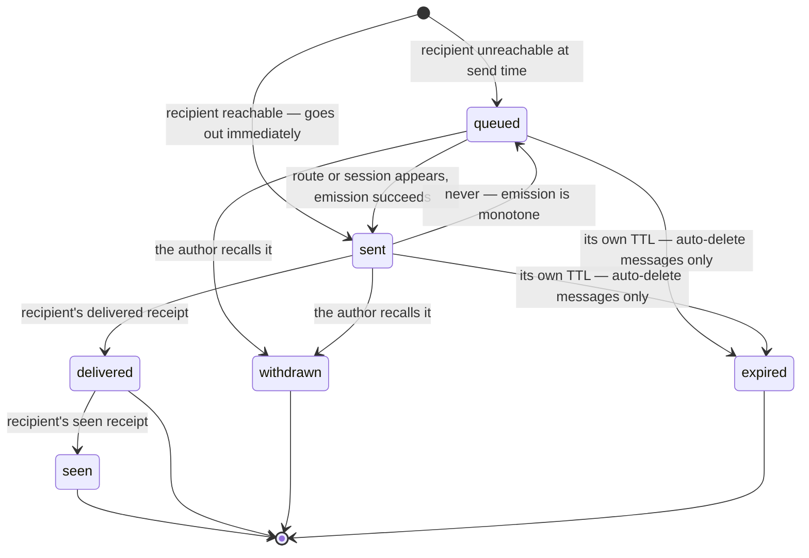
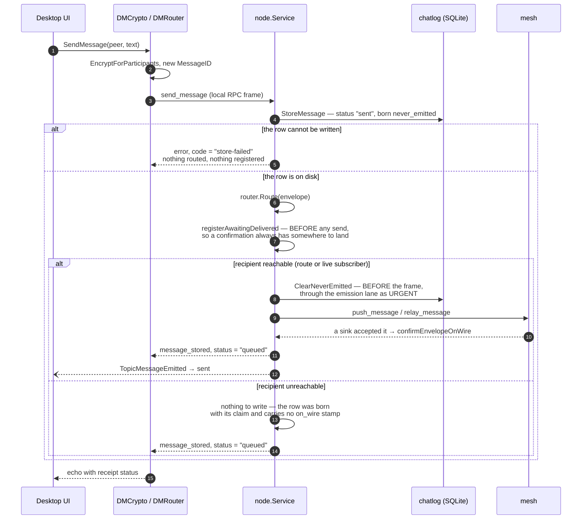
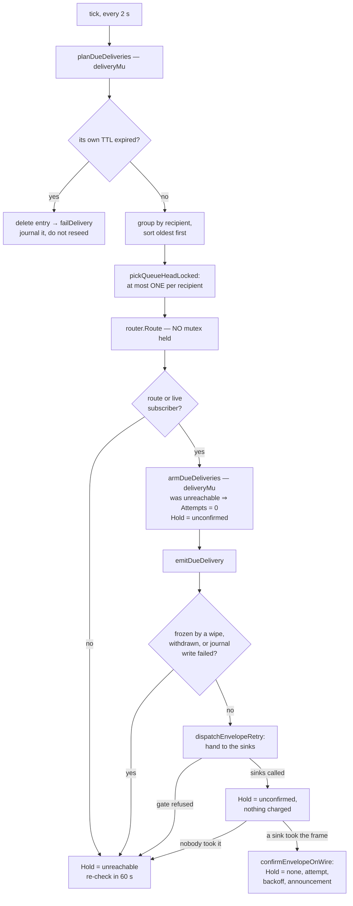
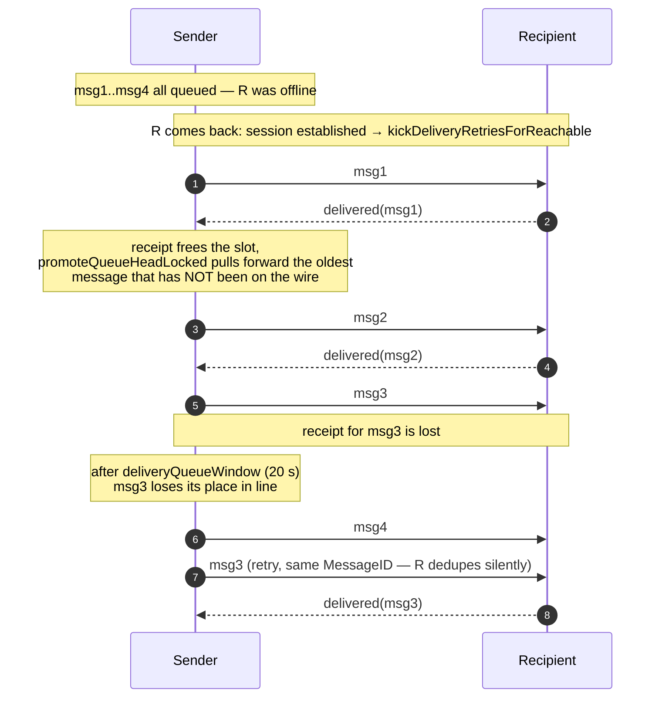
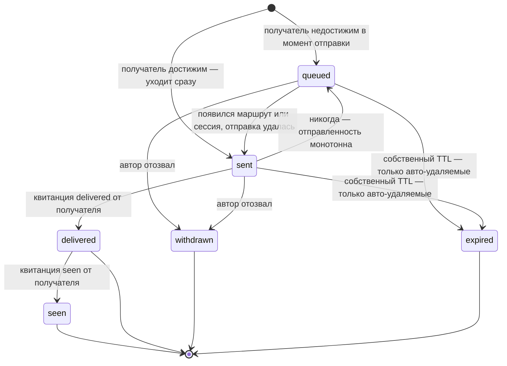
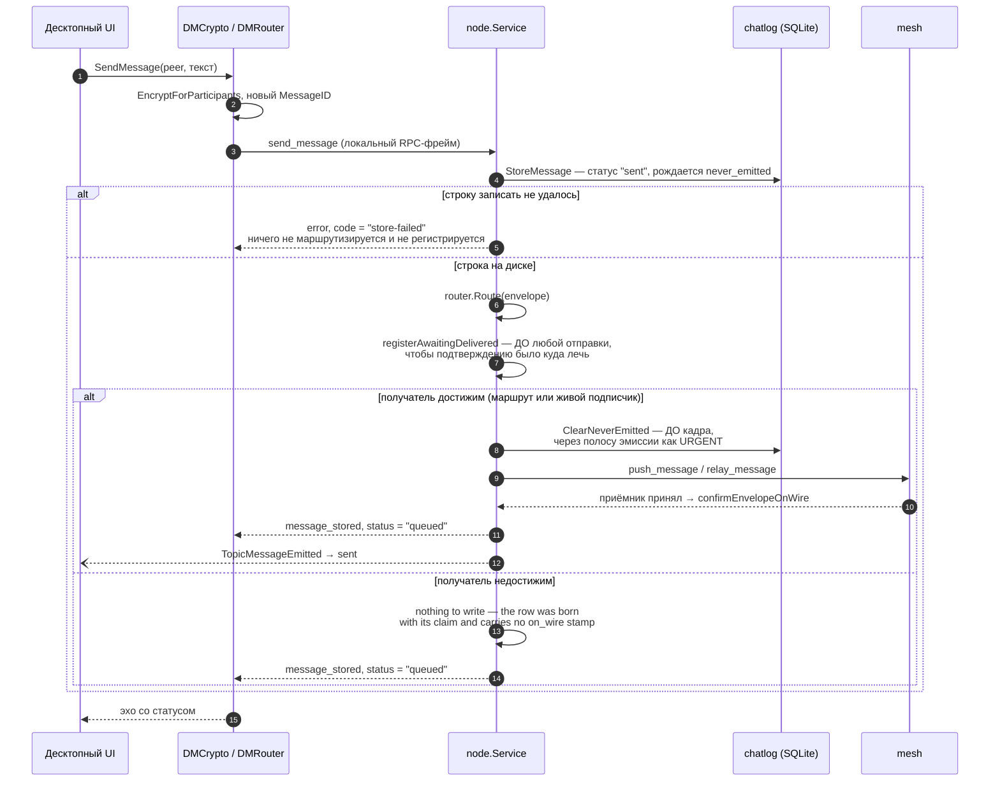
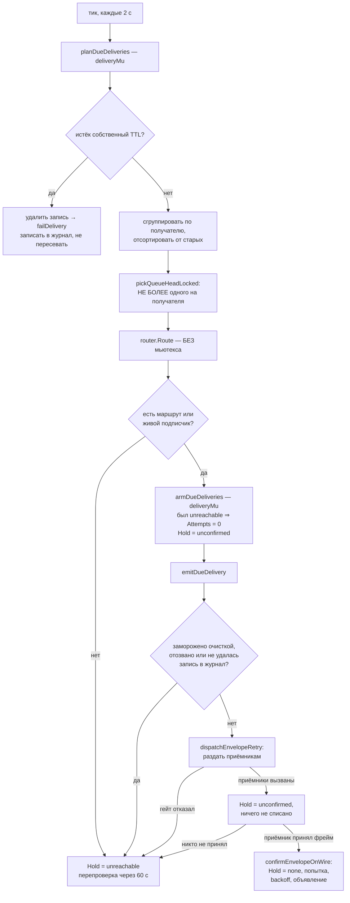
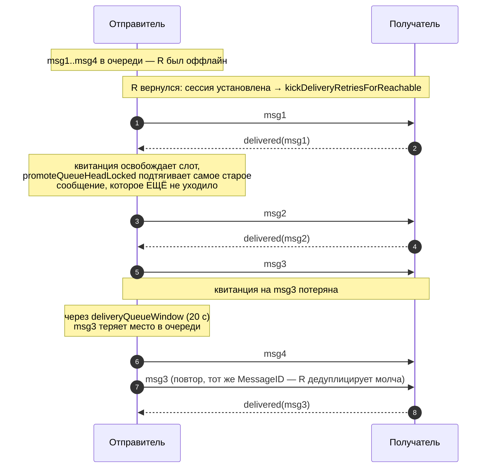

# Message Delivery Engine

> Companion documents: [messaging.md](messaging.md) (the `send_message` frame and its validation), [delivery.md](delivery.md) (the receipt frames), [relay.md](relay.md) (hop-by-hop forwarding), [realtime.md](realtime.md) (live push and the auth-time backlog).

## Overview

Nothing in the mesh stores user messages for an absent recipient. Relays are forwarding-only (`transit_retention.go`), and that decision is deliberate — a node that kept other people's messages would be a mailbox, with everything a mailbox implies for storage, retention and deniability. The consequence is the whole subject of this document: **delivery is owned by the sender**, from the moment the message is written until the recipient's node confirms it.

Three properties follow, and each answers a failure this engine used to have:

- **A message is never sent into the void.** When the recipient has no route and no live session, the message is HELD on the sender's node rather than blind-gossiped at the network in hope. This is the reachability gate (`CORSA_HOLD_DM_UNTIL_REACHABLE`, on by default).
- **The engine never gives up on its own.** A delivery ends in exactly three ways: the recipient confirms it, its author withdraws it, or its own TTL expires. There is no attempt cap and no age horizon for messages — running out of patience would be the node quietly deciding something the sender is never shown and cannot undo.
- **A returning recipient is served at once.** When someone who was unreachable becomes reachable, the waiting messages have their backoff reset to its first step, so a message that has been ready since yesterday goes out in seconds rather than after another eleven-minute timer. A message that DID reach the wire but whose receipt is overdue — measured against `deliveryQueueWindow`, the same twenty seconds the queue itself uses — is re-sent on their return too: a sink accepting the frame is not the recipient holding the message.
- **A message that has never been emitted is never overtaken by a newer one.** Per recipient the engine advances one message at a time, oldest first, and the next one leaves when the previous is confirmed. The guarantee is stated in terms of never-emitted messages on purpose — see [Ordering](#ordering) for why that is the line that matters, and for the one exception.

### Message states as the sender sees them

| State | Meaning | Where it lives |
|---|---|---|
| `queued` | Written locally, NOT known to be on the wire — no sink has confirmed taking it | the chatlog row is governed by `on_wire` and carries no stamp — see [Reading the two bits](#reading-the-two-bits) for what a row from an older release says; in memory the entry's hold answers the same question (`message_stored`'s `status`, the `message.new` event) |
| `sent` | On the wire, waiting for the recipient's confirmation | `delivery_status` in chatlog |
| `delivered` | The recipient's node has it | `delivery_status`, set by their `delivered` receipt |
| `seen` | The recipient opened the conversation | `delivery_status`, set by their `seen` receipt |

`queued` is a LOCAL state and never travels between nodes: no peer has anything to say about a message that never reached them. The chatlog persists only three statuses, because on the wire `queued` and `sent` are the same thing — the difference matters to the person who wrote the message, and to them it is the whole difference between "they have it" and "nobody has seen this yet".

**Diagram: Sender-side states of one outgoing direct message**

There is no state for "the node gave up". An ordinary DM carries `TTLSeconds=0`, so `expired` applies only to messages explicitly sent to auto-delete; `withdrawn` is `CancelOutgoingDelivery`, which the author asks for. `expired` is a terminal state of the RETRY ENGINE, not of the chatlog row: the row stays at `sent`, and a durable journal (`delivery_failed`) keeps a restart from resurrecting it.

The queued → sent transition is announced to the sender's own client (`ebus.TopicMessageEmitted`), because otherwise nothing would say it: the next event is the recipient's receipt, and a lost receipt would leave the sender believing a message was never sent while their counterpart is reading it.

Three rules keep that announcement honest, and each of them is a place the badge could otherwise outrun the wire:

- It is made by **the sink that accepted the frame**, never by the code that decided to try, and "accepted" means NetCore took it. A session's own `sendCh` is not that boundary: it is an in-process queue whose remainder is discarded when the session closes, so a relay enqueue is not a confirmation — the session's writer loop confirms when `SendTracked` returns `SendOK`, carrying the dispatch on the queue item so several sinks of one attempt charge it once. `confirmEnvelopeOnWire` is the single place any sink turns a write into "sent". It hands the stamp and the announcement to ONE background goroutine, in that order, and the announcement only happens if the stamp LANDED: off the writer loop, because the journal writes through SQLite where contention can park a statement for the whole busy timeout; stamp first and conditionally, because the event moves the conversation cache while a full reload reads the row — an event that runs before the write, or without it, lets the next reload put the badge back to `queued`, and no further event comes because the announcement is claimed once. A batch — the reconnect backlog replays a whole conversation — moves every entry in memory first and then pays for ONE journal write and one announcement.
- It is **not derived from the never-emitted claim**, which is conservative and turns false on the first attempt whether or not it went out. The badge has its own durable bit (`on_wire`) and its own in-memory flag (`deliveryRetryEntry.Announced`), so an attempt that failed to go out spends nothing and a later successful one still tells the sender.
- A local failure is **repaired locally**. Three things can leave a confirmed message half-recorded, and none of them is the network's fault: the journal refusing the stamp, the emission lane declining to queue it because enough stamps are already waiting, and the bus shedding the announcement when a subscriber's 64-slot inbox is full — which a reconnect replaying a whole conversation makes likely, because the announcements arrive as a burst. All three used to be retried only by the next NETWORK send, which put a message the peer had already taken back on the wire, and for a batch did so for the whole batch. `repairLocalDeliveryRecord` redoes only the bookkeeping, and it runs OFF the tick on a single-flight goroutine — it blocks on the journal, and a contended database would otherwise hold up the very messages a returning recipient is waiting for, plus everything else in the sequential bootstrap loop.

Bookkeeping does not get AHEAD of a pre-wire write, and keeping it that way takes a lane, because removing the ordering did not remove the contention. `ClearNeverEmitted` has to land before a frame goes out — including the first frame to a recipient who has just come back after a night offline, which is the same moment a reconnect is stamping the whole replayed conversation. SQLite takes one writer at a time and the connection pool is not clamped, so with no order of our own those two compete in the busy handler, where who goes next is decided by retry timing rather than by need.

`emissionLane` supplies the order, as a queue rather than a lock. Every journal write takes a turn in it, and three rules decide the turns. PRIORITY: a withdrawal is served before any bookkeeping, because bookkeeping records a frame already gone while a withdrawal is what a frame is waiting for. FIFO WITHIN A CLASS: turns are taken in arrival order, including by a writer that has just finished a turn and wants another — a mutex and a condition variable are not a queue, and "the next turn goes to the waiter" was true only by luck while re-entry competed for the same mutex. ONE STATEMENT PER TURN: a turn writes at most `maxIdsPerLaneWrite` ids and a writer with more goes to the BACK for the rest, so a backlog replay confirming a whole conversation cannot hold the lane for its whole call.

Coalescing sits on top: a withdrawal taking its turn absorbs the withdrawals queued behind it, up to one statement's worth, so several senders reconnecting at once cost one write rather than one each. The cap matters as much as the coalescing — an unbounded batch would re-create the defect the third rule removes, by tying a message typed a moment ago to a whole conversation's worth of ids. The price is shared fate: a failed statement fails every caller whose ids were in it, which errs towards withholding the frame and is retried on the next tick.

Stamps are additionally bounded by REFUSAL, which withdrawals cannot be: one the lane will not queue writes nothing and answers like a failed write, and that costs nothing because the repair pass re-derives the debt from state.

Two things are worth stating plainly about what this buys, so the next reader neither under- nor over-trusts it. Measured, the contention is small: with 64 goroutines writing full-conversation stamps in a loop, the worst pre-wire clear on the same database took under 3 ms, because these statements are short and the write lock changes hands quickly. The lane is not there to rescue a routine send. It is there because the cost of losing that race is asymmetric — a clear that runs out of `busy_timeout` WITHHOLDS the user's message — and that tail is reached not by stamps alone but by a stamp queued behind some other subsystem's long write, on a slow disk or a phone. Bounding the queue of waiting stamps is the second, unconditional gain: without it a reconnect backlog puts an unbounded number of goroutines on the database.

What the lane does not promise is a fast write. The database is shared with every other subsystem, so a statement inside the lane can still park on someone else's transaction, and no ordering of ours preempts that. Bounding it would mean clamping the connection pool for the whole database, which would serialise reads as well — a storage-layer decision, not a delivery one. Ordering still helps on top of the lane: the repair pass starts AFTER the tick has dispatched, single-flight, on its own goroutine.

There are THREE kinds of local debt, and only two of them live on the retry entry — which is why the pass cannot read the retry map alone. On the entry: the durable stamp and the announcement. The third is a shed event that OUTLIVES its entry, because a receipt DELETES the entry — if the emitted event and the receipt update are shed in the same burst, nothing is left to repeat and the conversation shows `queued` for a message the peer has already read, until the user reopens it. `publishRetryableLocalChange` keeps what the bus refused in a bounded map keyed by message id, drained by the same pass on the same backoff. Keying by id means a newer status REPLACES an older one, and only in that direction: `sent` → `delivered` → `seen` is a rank, a kept event is never overwritten by a lower one, and a republication that a newer status has already overtaken clears nothing. Without that, a pass working from a snapshot could publish `sent` and then delete a `delivered` that arrived while it was publishing, leaving the badge one step behind for good.

The fourth is not a debt at all any more, and that is what the commit rule bought. Handling a receipt ends three retries: the SENDER's, by deleting the retry entry; this node's suppression of the peer's next copy, by writing the dedup key; and the peer's own, by acking. All three used to be applied before the durable write that makes them true, and each had to be walked back by hand when the write failed — except the entry, which nothing walked back, so a refused write left the row at `sent` with nothing anywhere able to correct it.

A receipt's identity is ONE thing, `receiptIdentity{Recipient, MessageID, Status, Sender}`, and everything that has to decide "is this the same receipt" derives from it: the dedup key, the relay-retry key, the backlog filter, the pending-queue key, and the `ack_delete` frame. That list is the fix. Each of those used to answer the question for itself, and adding the author to one of them left the other four still spelling identity as a recipient+message+status triple — which is not an identity at all, because two peers can make a claim about one message. `ack_delete` was the sharp end: an ack names a receipt the peer holds, and applied to a triple it deleted every receipt that looked like that, the genuine one and its retry entry included. The forgery is refused at the end node, but the ack answering it is honest traffic and the relay is where it lands. `TestReceiptIdentityIsBuiltInOnePlace` and `TestEveryRelayRetryReceiptKeyComesFromTheIdentity` fail the build for an identity or a key assembled anywhere else — after seven hand-written spellings, "review will catch the next one" is not a plan.

The author travels in `Frame.ReceiptSender` and is INSIDE the signed payload (`corsa-ack-delete-v2`), so it cannot be swapped in flight. Which payload is signed follows the frame, not either side's guess: a frame carrying the field signs v2, one without it signs the exact v1 bytes older peers have always produced, and both signer and verifier go through the same function. Emission is gated on the peer advertising `ProtocolVersionReceiptSenderAck` (29) — an older verifier rebuilds the v1 payload and would score a signature it cannot reproduce as forgery, which costs ban points, not a warning. Until the floor reaches 29 an ack may arrive that cannot name its receipt, and then the rule is "delete only if unambiguous": one candidate goes, several are all KEPT. Keeping costs a duplicate push the peer discards; deleting the wrong one costs the delivery. The stamp is a VIEW of the frame for one session, never a rewrite of what is stored: the pending queue holds the full ack, and both the park and the failed-drain re-queue keep it that way. A downgraded copy in the queue would have thrown the author away permanently, and the peer that eventually drains it can be a current one — which then holds an ack that cannot say which receipt it means, keeps both contested receipts, and re-pushes them.

The dedup key is that identity written out: `recipient:messageID:status:sender`, produced by `receiptIdentity.dedupKey` and nowhere else. The sender belongs in it because a receipt is a CLAIM by whoever made it, and two claims about one message from two peers are two different facts. Keyed without the sender they were one, and the consequence was not merely a wrong count: anyone who learned a message id could send a receipt of their own and take the key, after which the real recipient's receipt was silently classed as a duplicate. The end node's sender binding cannot catch that, because on a RELAY nothing is addressed to this node — the genuine receipt is dropped a hop before any binding runs, and the sender waits out a retry interval, again for each repetition. `TestEveryDedupKeyComesFromTheOnePlaceThatSpellsIt` fails the build for a key written out by hand at a new site: the same expression stood at seven of them, and a site that kept the old spelling would insert under a key the eviction path could no longer delete.

The same identity settles the queued frames. A `relay_delivery_receipt` waiting in the pending queue IS a receipt in flight, and clearing those on a triple meant committing one receipt still discarded somebody else's — the last place where confirming the forgery-free path took the genuine one with it. `clearPendingReceiptLocked` takes the identity and compares the whole of it.

`finishReceipt` applies all three AFTER the write, so a refused write commits NOTHING: the sender keeps retrying the message, the recipient answers the re-send with a fresh receipt, and this node gets another attempt. That recovery is local. It does not lean on the peer's receipt queue, which is capped, expires after three minutes and does not survive their restart — an earlier version of this document claimed it did, and that claim was wrong.

"The peer is not told to forget it" is four separate things, each of which ends the receipt's life on their side: the `ack_delete` on an outbound peer session, the `ack_delete` on an inbound connection, the `seen_ack` that stops a reader's DURABLE retry (they journal it, so after their restart nothing re-sends), and the reply to the local `send_delivery_receipt` RPC, on which the client clears the unread mark. All four read `receiptOutcome.ackable`, and `TestEveryReceiptAckConsultsTheOutcome` fails the build for an ack that is not under such a condition — a list of blessed functions would have passed while the guard inside one of them was deleted.

The two debts on the entry are settled separately, because they fail differently. A journal write that succeeded never has to be redone, so the entry memoises it (`Stamped`); an announcement can be shed over and over, so it carries its own `AnnounceAfter` backoff. Keying both on "not announced" meant every shed event dragged another SQLite write with it, every two seconds, for as long as the subscriber stayed wedged. Both halves are taken OLDEST FIRST so a standing backlog drains in the order the user wrote it rather than re-rolling a random sample of the map each pass. The cap bounds one pass; the BACKOFF is what makes the passes converge — an inbox that is already full sheds every new event whatever the batch size, so "16 is less than 64" was never the argument.

Gossip is deliberately not one of the confirming sinks: it hands jobs to a bounded pool that sheds under load, and it is never the only sink for one of our own messages anyway — the reachability gate passed, so there is a route or a subscriber. And "accepted by the writer" is the furthest this node can see either way; an accepted frame can still be lost on the wire, which is what the receipt is for.

`message_known`, the answer to an idempotent re-send, carries the same status as `message_stored` would. A client treats it as success and reads the status off it.

The `queued` state is also carried on the `message.new` event, not derived by the client. Storing a locally-authored DM announces it to this node's own client, and that announcement races the synchronous reply to `send_message`; whichever reaches the conversation cache first decides the badge — so both say the same thing.

## The send path

**Diagram: What happens between pressing send and the first status the sender sees**

Three orderings in that diagram are load-bearing.

The chatlog row is written BEFORE the routing decision and in every branch that routes at all: a message the user typed exists whether or not the network is available, and losing it because nobody was reachable would be the worst failure this system could have. The corollary is the `store-failed` branch — if the row cannot be written, the message is not sent either. Routing it anyway put the message on the wire while its own author had no record of it: the RPC answered `message_stored`, the UI drew a bubble no reload would bring back, nothing reseeded it after a restart, and the recipient could end up holding a message the sender cannot see, quote, resend or recall. The rule is scoped to messages this node AUTHORED; a write failure on someone else's message still keeps it in the runtime, because dropping it would lose it from the network too, for a peer who has already done everything right.

The retry entry is registered BEFORE anything is sent, because the sinks confirm into it — a confirmation arriving before the entry existed would be lost, leaving a message that DID go out recorded as never confirmed, and a reachability kick landing in the same window would find nothing to wake.

And `ClearNeverEmitted` lands BEFORE the frame, never after it: a crash in between must read as "the peer may have it", or a later deletion would skip a peer who is holding the message. The cost of that ordering is a withdrawal standing for a frame the writer then refuses — see [Refusals](#refusals).

The reply says `queued` in BOTH branches, and that is not pessimism: at reply time the sinks are still working, so "queued" is the only answer that cannot turn out to have been a lie. It is answered by `Announced`, which is claimed only once the durable stamp has landed — a directed relay confirms synchronously, so the in-memory hold is already clear while the row still reads queued, and reading the hold here would put "sent" in the reply over a row that a reload then contradicts. `TopicMessageEmitted` moves it to `sent` when a sink confirms — the same event the held branch waits for, so there is one path rather than two.

## The retry tick

`bootstrapLoop` calls `retryDueDeliveries` every 2 seconds. The tick is a scheduler, not a sender: the pacing comes from each entry's own schedule, and the tick's job is to decide which single message per recipient may go out now.

**Diagram: One pass of the delivery retry tick**

Three things in that diagram are the corrections to the bug this engine had. Nothing is spent before the wire takes the frame — the last box is the only place the schedule advances. The "no route" branch loops back to a 60-second re-check rather than counting against anything, so a recipient offline overnight arrives to a queue that is intact. And the `armDueDeliveries` box resets the backoff when a held message finds its recipient back: `Held` means the last decision was "they are not there", so held-plus-reachable is exactly the moment they returned, and it cannot fire for a peer that never left.

`Attempts` is no longer a budget — it is only the index into `deliveryRetrySchedule`, and the eleven-minute cap at its tail is what paces re-emissions to a recipient who is reachable but silent.

### Refusals

Handing a frame to a writer is two steps, not one, and they point in opposite directions in time. `clearedToWrite` runs FIRST — it re-checks the freeze and the withdrawal, and withdraws the durable `never_emitted` claim — because a crash between the withdrawal and the write has to read as "the peer may have it". `confirmEnvelopeOnWire` runs AFTER, when a sink says it took the frame, and stamps `on_wire`.

Between those two the writer can refuse, and **a refusal writes nothing at all**. It does not have to: the row already says both of the things its two readers need. Its never-emitted claim came off at the gate, so a deletion asks the peer rather than skipping them; and no on-wire stamp was added, so the sender still reads the message as queued. There is no fact left to record — and therefore none that can be recorded wrongly.

That is the whole reason the bits are separate. Serving both readers from one flag meant putting the claim BACK on a refusal, which made it non-monotone, and a non-monotone flag under concurrent sinks needs a queue, a per-attempt stamp, a re-read and a correction. Six review rounds found six different interleavings in that machinery before it was replaced.

The transport's own answer is still classified, because two callers need it for a different purpose — deciding whether to try elsewhere, not what to write down. `SendStatus` answers about ADMISSION, not about the wire (`network_core.md`), and only half of the non-OK statuses is exact:

| Status | Proof? | Why |
|---|---|---|
| `SendBufferFull`, `SendMarshalError` | yes | refused at the door — the frame never entered the queue |
| `SendWriterDone`, `SendChanClosed` | no | the same gate read from two places; once the frame is queued it proves only that it will not be written FROM THE QUEUE |
| `SendTimeout`, `SendCtxCancelled` | no | a sync wait ended on something other than the ack, with the frame still queued behind a live writer |

The inbound writer reports sentinels instead (`sendErrorProvesNothingWasWritten`), split on the same line; `ErrUnknownConn` is exact for a stronger reason than the rest — there was no registered connection, so there was no queue to sit in.

### Reading the two bits

`on_wire` is read as a TRI-STATE, because a database predates it and an older release predates half of it:

| Row | Badge |
|---|---|
| `on_wire` present | believe it — `sent` when true, `queued` when false |
| absent, `never_emitted` present | `queued`. The previous release had one flag and set it for exactly the messages this node was HOLDING, so these are genuinely unsent — reporting them as sent after an upgrade is the reported bug, reintroduced by the migration |
| neither | leave the persisted status alone. The row says nothing about the wire, and reading that silence as "not sent" would re-badge a user's whole unreceipted history as `queued` |

An outgoing row is therefore born with BOTH keys — `never_emitted: true` and an explicit `on_wire: false` — so "governed and unconfirmed" is distinguishable from "predates all of it". In the view the field is named `AwaitingWire` rather than `OnWire`, so its zero value means "leave the status alone" instead of "queued".

### Sinks, and why there is no list of them any more

There used to be one, and keeping it correct was the problem. Five review rounds found the same defect five times — in the session queue, in the inbound-direct write, in the pending ring, in the gossip fan-out, in the online-trigger drain — never the same code twice, always the same bug: a frame carrying one of our messages reached a writer without passing the gate, so it could be handed to the recipient AFTER its author recalled it, with the deletion recording it as never emitted and scheduling no peer-side delete.

The cure is not a longer list. The delivery reference travels WITH the frame, and it is filled in at the two doors every outbound frame passes:

| Door | Fills the reference in | Gate and confirmation |
|---|---|---|
| `enqueueSessionSendItem` — everything that reaches a session queue | `withDeliveryRef`, from the frame | the serve loop, at dequeue and on `SendOK` |
| `writeDeliveryFrameToInbound` — the writes that go straight to an inbound connection | `deliveryRefForFrame`, from the frame | inline, before and after the write |

A producer that knows the dispatch — the retry tick, which fans one attempt out to several sinks — passes its own reference so one attempt is charged once. A producer that does not know is not required to: there is nothing left for it to forget. `outbound_delivery_gate.go` holds both, and a test walks the package's AST and fails when a new caller writes to an inbound connection outside that door.

Two identity rules sit underneath. `frameEnvelope` is the ONE reader of a message's identity, because it lives in two shapes on the wire — flat fields on the relay frames, a nested `Item` on `push_message` — and every place that open-coded the choice got a different subset right. `deliveryRefForFrame` then answers "is this ours": the message must have been authored here (transit passes through untouched) and the retry engine must still be waiting on it.

There is one more way a frame dies, with no writer involved at all: the session's own queue is discarded when the session is torn down (`discardSendQueue`). The retry tick withdraws the durable claim before it hands the envelope to the sinks, so a frame still sitting in that queue has a row saying the message left the machine and no writer that ever saw it. Unlike a refusal there is no status to classify — a discarded queue element provably never reached NetCore.

Gossip deserves one note. It is a real path to the wire, but the `queued → sent` transition does not wait on it: it hands jobs to a bounded pool that sheds under load, so it is never trusted as the only sink. What made it dangerous was the gate, not the confirmation.

### Ordering

Emissions are handed to background goroutines, so the order they reach the wire is the scheduler's, not ours; and Go map iteration is randomised per process, so there was no order to begin with. Both problems disappear once at most one message per recipient is in flight.

The guarantee the queue provides is precise, and it is narrower than "the backlog arrives in order":

> A message that has never been emitted is never overtaken by a newer one.

That is the line the reader perceives. Once a message has gone out, the recipient either has it or it is in transit, so a newer one passing it *on the sender's side* reorders nothing they will see — and letting it pass is what keeps one lost receipt from stalling everything behind it for the rest of an eleven-minute backoff. So `pickQueueHeadLocked` treats the two cases differently: a never-emitted message that is not due yet still holds its place in line, while an already-emitted one waiting out its backoff steps aside.

The one exception is a message frozen by a deletion. A freeze has no expiry of its own — it ends when the wipe commits or aborts — so a frozen message is skipped rather than allowed to hold the queue. A stuck freeze must cost its own message, never the whole conversation.

The same rule binds the OTHER half of the queue discipline, and reading it only into the pick is how it was broken: when a receipt frees the slot, `promoteQueueHeadLocked` pulls forward the oldest message that has NOT been on the wire, not simply the oldest one left. An already-emitted message is not waiting on that slot — its schedule measures its own dispatch — so promoting it re-sends a copy the recipient already has AND, because the re-send owns the slot for another queue window, delays the message that has never gone out at all.

**Diagram: Draining a backlog to a recipient who came back, including one lost receipt**

The window exists so that a lost receipt costs ONE message its place in line rather than freezing the conversation behind it. It must stay below the shortest retry interval (`deliveryRetrySchedule[0]`, 30 s), or a message that becomes due again would re-take the slot it just released and starve everything behind it; a test pins the inequality.

## Waking a held message

A held message does not wait for its poll. Every event that can make a recipient reachable calls `kickDeliveryRetriesForReachable`, which pulls the schedule of the matching held entries forward to now — never touching the attempt counter, so a kick can never, by itself, exhaust anything.

| Call site | Event |
|---|---|
| `service.go` (`handleAuthSession`, after `auth_ok`) | an inbound peer completed authentication |
| `peer_sessions.go` | an outbound session entered its main loop |
| `routing_announce.go` (drain) | a route announcement was accepted |
| `routing_announce.go` (`triggerDrainForExposed`) | backup routes became reachable |
| `routing_query.go` | a `route_query` answer produced a route |

The inbound one fires strictly AFTER `auth_ok` has been written, not in `trackInboundConnect` where the direct route is actually added: a retry tick woken there could put a `push_message` on the connection ahead of the handshake reply the peer is still waiting for. Same boundary, same reason, as the backlog replay.

Two races could otherwise swallow a wake-up, and both are closed:

- A kick landing between the origin send's reachability check and the registration that follows it finds nothing to wake. So a held entry is registered **already due** — the backoff schedule times a wait for a receipt, and a message that never reached the wire has no receipt coming.
- A kick landing between the retry tick's lock-free reachability sample and the moment it writes `Held` finds the entry not yet held, and therefore invisible. `armDueDeliveries` compares `lastReachabilityKickAt` against the start of its pass and keeps such an entry due instead of parking it for a poll interval.

Each kick re-checks reachability itself (`router.Route`), so a call site that reports an identity which is not actually a usable delivery target produces no re-arm and wastes nothing. `deliveryHoldPollInterval` (60 s) is the safety net underneath all of them — a local routing-table lookup, so a missed event costs a minute rather than an hour.

A kick wakes ONE state, `holdUnreachable`: those messages never left, so the recipient being there is the whole answer. It carries no cause and needs none — it re-measures for itself, so a call site reporting an identity that is not actually a usable delivery target changes nothing. Entries that were already dispatched are handled by the measurement rule below, not by the kick.

A message is re-sent when a recipient an earlier pass could NOT reach can be reached again. Reachability is measured once per recipient (`Service.measureRecipientReachability` → `recipientHasPath`: a live push subscriber, or a route whose next hop resolves to a session that may carry it — the same predicates the router's own decision is built from), the reading is kept until the next pass (`Service.recipientPassState`), and the two are compared. Unreachable before, reachable now — the entry goes out at once instead of the rest of its backoff, or, if a receipt for its last emission could still be in flight, at the moment that stops being true (`earliestRetry`, the queue window's end). Deferring rather than skipping matters: the transition is not stored anywhere, so an entry passed over while its receipt was young went back to waiting out the tail — eleven minutes after the person came back. For the same reason a shortened schedule is remembered (`deliveryRetryEntry.WokenSinceLastDispatch`): confirmations arrive late, and one for an attempt that STARTED BEFORE the wake-up rebuilds the backoff from its own dispatch. That answer is about the older attempt and says nothing about the recipient being back, so it may not push the shortened schedule out again — the acceleration is already spent and the recipient already reads as reachable, so nothing would shorten it a second time. The mark is an ORDER, not a timestamp: it is set by the wake-up and cleared by the dispatch that answers it — by WHOEVER dispatches (`noteDeliveryDispatched`), because the retry engine is not the only sender. The reconnect backlog replay puts the same message down the connection the peer has just opened without going through the engine's arm, and that copy answers the wake-up exactly as an armed retry would. The two run as separate goroutines off the same reconnect, in either order, so the replay says BOTH halves of what its send means (`noteReconnectDispatch`): per message, an outstanding wake-up has been acted on, so the confirmation may rebuild the backoff; and per recipient, the accelerated attempt this return was worth has been made, so a wake-up arriving next does nothing. One reconnect, one re-send, whichever goroutine wins. A wall clock cannot decide this at all, because the two cases it would have to separate — a confirmation from before the wake-up, and the confirmation of the accelerated attempt the same tick then makes — legitimately share an instant on a coarse clock. One writer, one reader, one mutex; the map is replaced wholesale by each pass, so it holds exactly the recipients that pass asked about and nothing has to sweep it.

The probe is deliberately NOT `router.Route`, though Route answers the same question: Route also DOES things — it builds the gossip fan-out by walking the peer domain, and fires an on-demand route query when the table holds nothing. Running that for every conversation with an unanswered message, every two seconds, would turn an offline backlog into a standing CPU and query load: the storm arriving through the measurement instead of through re-sends. The probe reads with plain `Lookup` for the same reason it avoids the query — the relay shaping hint is a rotation the SEND is entitled to consume, and a measurement must not spend it.

A recipient the pass did not measure is not a recipient that cannot be reached: a delivery registered between the reading and the plan that uses it is left alone rather than re-armed by an answer nobody asked for, and any such candidate is measured individually before anything is armed. The same holds for a delivery whose recipient the pass DID measure — a conversation that already had unconfirmed messages: the reading is per recipient, so each delivery carries its registration order (`deliveryRetryEntry.Seq`) and a reading carries the highest it saw (`seenUpTo`). A message written after that is not accelerated by a return that happened before it existed; its ordinary first step is already measured against a live peer. The reading is stored at the END of the pass and MERGED into what was there (`finishRecipientReading`), never replaced from the pass's own snapshot: it is not complete until those stragglers are measured, and the pass is not its only writer — a session event records what it observed at a moment nobody controls. A pass may therefore only replace what it read, and one thing it cannot read is a return that arrives while it is still working. Each record counts how many times that recipient has been observed HERE by something other than a pass (`recipientPassRecord.presence`, bumped by the session event and by the replay), the reading captures that count beside the measurement, and every spend is stamped with the count it was made at (`deliveryRetryEntry.AcceleratedAtPresence`). The absence still ends the visit — it was really measured, and a message the reconnect did not cover has earned its acceleration by it. What moves with the visit are the spends made AFTER the reading (`carryAccelerationsIntoNewVisitLocked`): the backlog replay sends down the connection the peer has only now opened and can only count that against the visit it can see, the one the commit is about to close. Left behind there, the stamp falls short of the counter, the message reads as never accelerated, and the next observation of the SAME return sends a second copy one queue window later. A count and not an instant, because on Windows the clock is coarse (0.5-15.6 ms) and the reading and the return can share one. A recipient nobody measured and nobody knew — a message written after the reading and not due yet — is stored as NO record rather than a zero one: an unobserved "unreachable" would read as a return on the next pass and re-send to a peer that never went anywhere.

The arm asks the same question one last time, about the pass's own gap. A candidate is chosen, the reading is completed, and only then is anything armed — and the replay can send in between, leaving the tick holding a message that has just gone out. So the arm compares the entry's confirmed-emission count against the one the plan recorded (`dueCandidate.attempts`) and drops a candidate somebody else has emitted since, leaving the entry exactly as the confirmation wrote it. This too is an order and not a clock reading: the confirming send happens after the tick's `now`, so its stamp lies in the tick's future, and a stamp this node cannot have made yet reads as long ago by design (`emissionStampNotInTheFuture`) — a queue-window test would wave the duplicate through. The same question is asked once more at the last boundary before the wire, because the arm releases the mutex and the frame is written a few statements later; the pre-wire claim — the one hold that already re-reads the freeze and the withdrawal — refuses a frame another sender is sending (`claimEnvelopeForDispatch`). A refusal for THAT reason writes nothing back: the entry belongs to the other sender now, and giving the schedule back would park a message that has just gone out. What both guards read is the CLAIM and not the confirmation (`deliveryRetryEntry.ClaimedAt`, stamped by `markEntryEmitted`), because the replay confirms nothing until its frames are written: it claims its whole batch up front, and a large backlog spends seconds in a state where every message in it is already on its way with an untouched Attempts and LastEmittedAt. A message is somebody else's while a claim was taken after this pass looked, or while the standing claim is younger than the queue window (`emissionInFlight`) — an order test and a window test, each covering what the other cannot: a claim taken during the pass, and one taken before it and still in flight. The rule binds BOTH senders, and which of them a caller is is a property of the call site, not of the message (`emissionSender`): the three places a send BEGINS — the retry tick, the reconnect backlog replay, the live push of a message just stored — stand down for a message another sender has in flight, while every writer downstream of a decision that already passed asks only about the freeze and the durable claim. Writers must not ask, because one send crosses this boundary again for each writer it hands the frame to (`clearedToWrite`): a rule that refused them refused a sender its own frame. The instant is read INSIDE the delivery section (`Service.deliveryNow`, after the mutex is held — waiting for it is time too, and on a busy node that wait can outlast the window), never taken from the pass's own `now`: that value is when the pass STARTED, and a pass serving many recipients through a slow journal can outlive the queue window — a claim stamped with it would be born already expired, and the next sender would read "nothing in flight" for a frame going out at that moment. It is a stamp and not a reservation on purpose. A reservation has to be released, and the paths that claim without ever confirming — a writer that refuses the frame, a sink that never answers — would leak one and silence that message for good, which is far worse than the duplicate this prevents. A stamp needs no release: it stops mattering one queue window later. For the same reason a stamp further ahead than that window is not evidence at all, so one corrected clock cannot hold a message back; the order half still covers the pass it was taken in.

Two passes two seconds apart cannot see a peer that drops and returns between them, and neither can a session count: an overlapping reconnect — the new session opening before the old one is torn down — never reaches zero, and a peer without relay capability is still a perfectly good recipient over its own push connection. So the second rule counts nothing and fires nothing. It CLAMPS: when a session with a recipient becomes usable, their unanswered messages are scheduled no later than the first step of the retry schedule (`wakeOverdueForReturningPeer`, beside the kick).

Clamping is what makes it safe on EVERY session event, and that is the point — every shape of return reaches the same place, so none has to be recognised. Two things bound it. It only ever moves a schedule earlier and never past the floor; and a message may be accelerated ONCE PER VISIT.

A visit is the stretch between two absences. Each recipient carries a visit counter (`recipientPassRecord.visit`), bumped when a pass measures a recipient it could previously reach as unreachable — the one observation that means "they went away". Each delivery carries the visit its acceleration was spent in (`deliveryRetryEntry.AcceleratedInVisit`), and every path that observes a return — the measured transition, a session becoming usable, a backlog replay that has already sent the message — spends it with the same compare-and-set. Repeats within a visit find the stamps equal and do nothing, so a backup session flapping beside a healthy primary cannot ride the cycle a per-event clamp would (emit, the emission rebuilds the backoff, the queue window makes the receipt overdue again, clamp again). An absence opens the next visit, and the next return is granted afresh.

The visit is spent even when the schedule needs no change. A message already due, or already scheduled sooner than the return would ask for, is going out at least as soon as the return wanted — so the return has been served, and counting it is what stops a second observation of the SAME reconnect from asking again once that send has rebuilt the backoff. Such a message is also marked as OWED that send (`WokenSinceLastDispatch`), for the same reason and in the same breath: with the visit already spent, a confirmation of an earlier dispatch writing the long backoff over its near-term attempt could not be undone by anything.

The arm clears that mark on the PROMISE of a send, and the promise can still be broken: a deletion freeze taken between the plan and the wire, a durable claim that will not withdraw, a route that vanished in the gap. Nothing reached the wire in any of them, so the wake-up is still unanswered, and the cancel path gives the mark back together with the schedule it displaced (`holdDeliveryRetry`). Only what was displaced is restored, never a bare mark, so an entry nobody woke stays unmarked. Without this a freeze was enough to lose the return outright: the schedule came back from the thaw, a late confirmation of the pre-return attempt rebuilt the long backoff over it, and the visit was already spent, so no further session event could shorten it again.

That counter replaced a set of flags each writer had to interpret for the others: was this reading stale, had somebody already spent the acceleration, which of two observations is newer. Every one of those questions produced a bug of its own, because a pass measures at one moment and applies its answer several steps later, while session events and replays land in between. A monotone bump and a compare-and-set COMMUTE — whatever order the writers run in, an absence earns exactly one accelerated attempt per message and no interleaving can lose it or double it.

Per message and not per recipient, because the sends that answer a reconnect do not always cover a whole conversation: the backlog replay writes what its in-memory topic snapshot holds and what the writer accepts, and after a sender restart the reseeded entries are awaiting receipts without being in that snapshot at all. One mark for the recipient meant the replay's partial cover spent it for everybody, and the messages it had missed — exactly the sent-but-unconfirmed ones this rule is for — stayed on the tail. It leaves the backoff index alone and touches only messages addressed TO the peer whose session arrived. A message emitted moments ago needs no special case here: the floor is a whole schedule step away, which outlasts the queue window, so a receipt that could still be in flight has run out of time before the attempt is made.

The instant re-send stays where it is earned: the tick's measured transition, a recipient this node could not reach and now can.

A next hop several hops away that flaps between two passes is still not seen, and that is deliberate. The recipient measures reachable at both ends of it, so nothing changed as far as this node can tell; through transit a faster re-send is absorbed by the relays' own dedup anyway (exact TTL 3 min, bloom 5-10 min — see the package comment). Everything finer than the recipient was tried and removed: a hold reason, an `UpdateRoute` status, snapshots compared around an event, a per-peer change counter bumped from eight call sites, the connection a sink took the frame on, the queue that died holding it. Each needed a fact owned by another component — routing, the peer domain, the transport — copied into the delivery entry by whichever sink got there first, and every copy went stale in its own way: a routing decision names a next hop before the entry can record it; the reconnect backlog replay sends outside the engine entirely; a batch replay stamps one time for writes made later; NetCore's lower queue discards silently, so the upper queue's report is only half the story.

The cost is one subscriber check plus one table lookup per conversation with an unanswered message, per pass, and nothing at all in routing: no call sites on route mutation, no counters, no map to keep bounded.

The whole rule stands down when `HoldDMUntilReachable` is off: nothing is measured, every recipient answers reachable, no transition can be seen, the returning-peer shortcut returns immediately, and the schedule is the legacy unconditional one — the same contract `resetBackoffOnReturn` and `kickDeliveryRetriesForReachable` keep.

The other two states are the correction to a rule that was reading the wrong thing. `holdNone` means a SINK accepted the frame — our own writer, or the next relay hop — and a sink is not the recipient: everything past that hop can still lose the envelope, and the only evidence it did not is the receipt. `holdUnconfirmed` means nobody took the frame at all, and it is the state a message written while the peer was away ends up in — leaving it out made the reconnect promise false in the case a person actually notices, where a fresh message goes out at once and the one written a minute earlier sits out a sixty-second poll. Neither state is evidence about the person, so on a reconnect both are re-sent once their receipt is overdue: `receiptOverdue`, measured against `deliveryQueueWindow`, because the only question is whether a receipt could still be in flight and past that window the queue has already given the slot away. That is NOT the header's `staleSendThreshold` (3 min): the header answers "should the user be told this has not arrived", which deserves patience, while this answers "could a receipt still be coming", which does not. The queue discipline caps the cost at one message per recipient per tick however often a flapping transport reconnects. Before this, such a message was left to the eleven-minute tail while newer messages to the same person went out in seconds — the reported "they came back online and two messages still say not delivered". The backoff index is deliberately NOT reset for these — one re-send now, then the ordinary schedule, so a peer whose transport flaps every few seconds cannot pull the same unanswered message back to the fast end.

This is also why a route being RE-confirmed cannot, by itself, wake anything already dispatched. Announce ingest and route-query answers feed `routing.RouteUnchanged` into the kick deliberately — a route already in the table can become usable the moment its peer answers — but that touches held messages only. Waking dispatched ones on a re-confirmation turned every periodic announcement into a re-send and a journal write, at announcement frequency, on a route that resolves but is dead in practice. Under the measurement rule a re-confirmation changes no reading, so it wakes nothing; what wakes a dispatched message is a recipient that could not be reached and now can.

Separately, a recipient who dials US gets their held messages through a different door: `pushBacklogToSubscriber` replays the node's in-memory `dm` backlog right after `auth_ok`, and that path is not gated on the hold. It is not a substitute for the retry engine — it is in-memory, so it does not survive a restart, and it only fires when we are the responder.

## Lifetime bounds

| Bound | Value | Applies to | Effect |
|---|---|---|---|
| `TTLSeconds` | 0 for ordinary DMs | messages with an auto-delete flag | abandoned as `expired` |
| `CancelOutgoingDelivery` | — | any message | withdrawn by its author |
| attempt cap | 20 attempts (`CORSA_DELIVERY_RETRY_MAX_ATTEMPTS`) | outgoing SEEN RECEIPTS only | the node stops asking for the `seen_ack` |
| `seenReseedHorizon` | 7 days | the startup reseed of seen receipts | older receipts are not picked up |

Messages appear in that table twice, and both entries are things somebody asked for. There is deliberately no row for age and none for a number of tries: waiting costs nothing on the wire, because the reachability gate emits nothing while the recipient is unreachable, and the startup reseed of undelivered messages scans with no horizon at all so a restart is not a way to give up either.

Seen receipts keep their cap because the far side repairs them: every arrival of a `seen` receipt makes the original sender answer with a `seen_ack`, so an abandoned one is re-triggered rather than lost.

The cost of this is real and accepted: `awaitingDelivered` holds one entry per undelivered message for as long as the process runs, and the startup scan reads every chatlog row still in `sent`.

## Accepted limitations

1. **Both parties must be up at the same time.** If the sender goes offline before the recipient returns, nothing in the mesh is holding the message on their behalf. This is the price of not being a mailbox, and it is a design decision rather than a gap — see [relay.md](relay.md) INV-3 and `transit_retention.go`.

2. **Backlog drain is paced by the tick.** One message per recipient per 2-second tick when receipts flow, one per `deliveryQueueWindow` when they do not. A thousand queued messages take roughly half an hour in the good case — accepted, because a backlog that size means the sender kept writing to someone whose messages were visibly not being delivered. A recipient who dials US instead gets the whole in-memory backlog at once through `pushBacklogToSubscriber`, which does not go through this queue.

3. **Undelivered messages accumulate.** One `awaitingDelivered` entry per undelivered message, for the lifetime of the process, and a startup scan over every chatlog row still in `sent`. This is the direct cost of having no horizon, and it is bounded in practice by the same thing the user sees: the number of messages showing no confirmation.

4. **An old message crossing transit arrives dated NOW, until the network floor reaches v30.** A relay below that version refuses a DM older than its own ceiling and answers nothing, so a transit message carries a fresh `created_at`. The date is normalised AT THE DOORS — the three ways a message enters this node — and every frame built afterwards copies it: `storeIncomingMessage` (admission: both `push_message` handlers and the relay fallback), `handleRelayMessage` (the relay fast path, which forwards before admission), and `dispatchEnvelopeRetry` (this node's own outbox). Three earlier designs decided it on the way OUT and each missed a path — the frame builders resolved the target from an address and an `inbound:<remote>` key did not match; the transport exits missed `writeFrameToInboundConnErr`, which serialises its own frame; "the start of the outgoing path" missed a transit `push_message`, which had entered by a door nobody had counted. Exits are open-ended, doors are few. The TTL is re-derived with the date (`legacyTransitStamp`), so the author's absolute DEADLINE is preserved rather than extended at every hop, and a message already past it is not re-dated at all. Threshold `legacyTransitRestampAfter` = 30 min, sized against the SMALLEST ceiling a pre-v30 node could be configured with rather than the default. Broadcast is excluded, and so is anything addressed to this node. A message this node AUTHORED keeps its real date in the chatlog and in the outbox entry, but the copy that goes out is re-dated like any other — that is the point of the measure. A recipient who already holds the message dedupes it by id and answers with the receipt the sender was waiting for; one who never received it sees the re-send date instead of the writing date, which is the price of reaching them at all on a mixed-version network. The whole measure is deleted when `MinimumProtocolVersion` reaches `ProtocolVersionNoTransitAgeCeiling` — `TODO(transit-age-restamp-removal)`, with a test that fails to remind us.

---

# Движок доставки сообщений

> Смежные документы: [messaging.md](messaging.md) (фрейм `send_message` и его валидация), [delivery.md](delivery.md) (фреймы квитанций), [relay.md](relay.md) (пересылка по хопам), [realtime.md](realtime.md) (живой push и backlog на auth).

## Обзор

Ничто в mesh-сети не хранит пользовательские сообщения за отсутствующего получателя. Транзитные узлы только пересылают (`transit_retention.go`), и это осознанное решение: узел, хранящий чужие сообщения, — это почтовый ящик, со всем, что почтовый ящик означает для хранения, ретенции и отрицаемости. Следствие и есть предмет этого документа: **за доставку отвечает отправитель** — с момента, когда сообщение написано, и до подтверждения от узла получателя.

Отсюда три свойства, и каждое закрывает конкретный отказ, который у этого движка был:

- **Сообщение никогда не уходит в пустоту.** Если у получателя нет ни маршрута, ни живой сессии, сообщение УДЕРЖИВАЕТСЯ на узле отправителя, а не рассылается вслепую в надежде. Это гейт достижимости (`CORSA_HOLD_DM_UNTIL_REACHABLE`, включён по умолчанию).
- **Движок сам не сдаётся.** Доставка заканчивается ровно тремя способами: получатель подтвердил, автор отозвал, истёк собственный TTL сообщения. Ни лимита попыток, ни горизонта по возрасту для сообщений нет — «кончилось терпение» было бы решением узла, о котором отправителю не сообщают и которое он не может отменить.
- **Вернувшемуся получателю отправляем сразу.** Когда недостижимый становится достижимым, у ждущих сообщений backoff сбрасывается на первую ступень: сообщение, готовое со вчера, уходит за секунды, а не после ещё одного одиннадцатиминутного таймера. Сообщение, которое до провода дошло, но чья квитанция просрочена — по `deliveryQueueWindow`, тем же двадцати секундам, которыми меряет сама очередь, — при их возвращении тоже переотправляется: кадр, принятый приёмником, — это не сообщение у получателя.
- **Ни разу не отправленное сообщение никогда не обгоняется более новым.** На каждого получателя движок двигает по одному сообщению, от старого к новому, и следующее уходит, когда подтверждено предыдущее. Гарантия сформулирована именно про неотправленные сообщения намеренно — почему это и есть значимая граница и какое из неё исключение, см. в разделе [Порядок](#порядок).

### Состояния сообщения глазами отправителя

| Состояние | Смысл | Где живёт |
|---|---|---|
| `queued` | Записано локально, НЕ известно, что в сети — ни один приёмник не подтвердил приём | у строки chatlog нет штампа `on_wire`; в памяти на тот же вопрос отвечает удержание записи (`status` в `message_stored`, событие `message.new`) |
| `sent` | Ушло в сеть, ждём подтверждения получателя | `delivery_status` в chatlog |
| `delivered` | Узел получателя принял сообщение | `delivery_status`, ставится по квитанции `delivered` |
| `seen` | Получатель открыл переписку | `delivery_status`, ставится по квитанции `seen` |

`queued` — ЛОКАЛЬНОЕ состояние, оно никогда не передаётся между узлами: пиру нечего сказать о сообщении, которое до него не дошло. Chatlog хранит только три статуса, потому что на проводе `queued` и `sent` — одно и то же; разница важна тому, кто написал сообщение, а для него это вся разница между «оно у них» и «этого ещё никто не видел».

**Диаграмма: состояния одного исходящего DM на стороне отправителя**

Состояния «узел сдался» тут нет. Обычный DM несёт `TTLSeconds=0`, поэтому `expired` относится только к сообщениям, явно отправленным с авто-удалением; `withdrawn` — это `CancelOutgoingDelivery`, о котором просит автор. `expired` — терминальное состояние ДВИЖКА РЕТРАЕВ, а не строки chatlog: строка остаётся в `sent`, а долговременный журнал (`delivery_failed`) не даёт перезапуску её воскресить.

Переход queued → sent объявляется собственному клиенту отправителя (`ebus.TopicMessageEmitted`), потому что иначе о нём никто не скажет: следующее событие — квитанция получателя, а потерянная квитанция оставила бы отправителя в уверенности, что сообщение не ушло, пока собеседник его читает.

Честность этого объявления держат три правила, и каждое закрывает место, где бейдж мог бы обогнать провод:

- Объявляет **приёмник, принявший фрейм**, а не код, который решил попробовать, — и «принял» значит «принял NetCore». Собственная очередь сессии `sendCh` этой границей не является: это внутрипроцессная очередь, чей остаток выбрасывается при закрытии сессии, поэтому relay-enqueue подтверждением не считается — подтверждает writer-цикл сессии, когда `SendTracked` вернул `SendOK`, а ссылка на отправку едет на элементе очереди, чтобы несколько приёмников одной попытки списали её один раз. `confirmEnvelopeOnWire` — единственное место, где приёмник превращает запись в «отправлено». Штамп и объявление он отдаёт ОДНОЙ фоновой горутине, именно в таком порядке, и объявление происходит, только если штамп ЛЁГ: вне writer-цикла, потому что журнал пишет через SQLite, где конкуренция может задержать statement на весь busy_timeout; сначала штамп и с условием, потому что событие двигает кэш переписки, а полная перезагрузка читает строку — событие, выполненное до записи или без неё, позволит следующей перезагрузке вернуть бейдж в `queued`, и следующего события уже не будет, потому что объявление берётся один раз. Пакет — реконнект переигрывает целую переписку — сначала двигает все записи в памяти, а затем платит за ОДНУ запись в журнал и одно объявление.
- Оно **не выводится из утверждения `never_emitted`**, которое консервативно и становится ложным на первой же попытке — независимо от того, ушло ли что-нибудь. У бейджа свой durable-бит (`on_wire`) и свой флаг в памяти (`deliveryRetryEntry.Announced`), поэтому неудавшаяся попытка ничего не тратит, а следующая удачная всё-таки сообщит отправителю.
- Локальный сбой **чинится локально**. Оставить подтверждённое сообщение записанным наполовину могут три вещи, и ни одна не вина сети: журнал, отказавший в штампе; полоса эмиссии, не принявшая штамп, потому что в ней уже ждёт достаточно других; и шина, сбросившая объявление при переполненном 64-слотовом inbox подписчика — что реконнект, переигрывающий целую переписку, делает вероятным, потому что объявления приходят пачкой. Раньше все три чинились только следующей СЕТЕВОЙ отправкой: сообщение, уже принятое пиром, снова уходило в сеть, а для пакета — весь пакет целиком. Вместо этого `repairLocalDeliveryRecord` переделывает только учёт и работает ВНЕ тика, на single-flight горутине: он блокируется на журнале, а занятая база иначе задержала бы ровно те сообщения, которых ждёт вернувшийся получатель, и весь остальной последовательный bootstrap-цикл.

Учёт не опережает pre-wire запись, и чтобы так и оставалось, нужна полоса: снятие порядка не сняло конкуренции. `ClearNeverEmitted` обязан лечь до того, как уйдёт кадр, — включая первый кадр получателю, который только что вернулся после ночи оффлайна, а это ровно тот момент, когда реконнект штампует всю переигрываемую переписку. SQLite пишет по одному writer'у за раз, а пул соединений не ограничен, поэтому без нашего собственного порядка эти двое соревнуются в busy-handler'е, где очередь решает тайминг ретраев, а не нужда.

Порядок задаёт `emissionLane` — очередь, а не лок. Каждая запись в журнал берёт в ней ход, и ходы решают три правила. ПРИОРИТЕТ: снятие обслуживается раньше любого учёта, потому что учёт записывает уже ушедший кадр, а снятия кадр ждёт. FIFO ВНУТРИ КЛАССА: ходы берутся в порядке прихода, в том числе тем, кто только что закончил ход и хочет следующий, — мьютекс с condition variable очередью не являются, и «следующий ход достаётся ждущему» было верно лишь по везению, пока повторный вход соревновался за тот же мьютекс. ОДИН STATEMENT НА ХОД: ход пишет не больше `maxIdsPerLaneWrite` id, а у кого осталось больше — уходит в КОНЕЦ очереди, поэтому backlog-реплей, подтверждающий целую переписку, не может удерживать полосу на весь свой вызов.

Поверх этого — коалесцирование: снятие, берущее ход, вбирает снятия, стоящие за ним, но не больше чем на один statement, так что несколько одновременно реконнектящихся отправителей стоят одной записи, а не одной на каждого. Ограничение здесь так же важно, как само коалесцирование: пачка без потолка воссоздала бы ровно тот дефект, который убирает третье правило, — привязала бы только что набранное сообщение к целой переписке. Цена — общая судьба: упавший statement роняет всех, чьи id в него попали, что склоняет к придерживанию кадра и повторяется следующим тиком.

Штампы вдобавок ограничены ОТКАЗОМ, которого снятиям нельзя: не поставленный полосой в очередь штамп не пишет ничего и отвечает как неудавшаяся запись, а это бесплатно — долг заново выводит проход-чинильщик.

Две вещи стоит сказать прямо, чтобы следующий читатель не переоценил и не недооценил выигрыш. По замеру конкуренция мала: при 64 горутинах, в цикле штампующих переписку целиком, худшее pre-wire снятие на той же базе уложилось в 3 мс — statement-ы короткие, и writer-лок меняет владельца быстро. Полоса нужна не для спасения рядовой отправки. Она нужна потому, что цена проигрыша в этой гонке асимметрична: снятие, исчерпавшее `busy_timeout`, ПРИДЕРЖИТ сообщение пользователя, — а в этот хвост попадают не из-за штампов самих по себе, а из-за штампа, вставшего за чужой длинной записью, на медленном диске или на телефоне. Второй выигрыш безусловный: без ограничения очереди реконнект-бэклог кладёт на базу неограниченное число горутин.

Чего полоса НЕ обещает — быстрой записи. База общая со всеми подсистемами, поэтому statement внутри полосы всё ещё может встать на чужой транзакции, и никакой наш порядок этого не прервёт. Ограничить это значило бы зажать пул соединений всей базы, а вместе с записями сериализовать и чтения — решение уровня storage, а не доставки. Порядок поверх полосы всё равно полезен: проход-чинильщик запускается ПОСЛЕ того, как тик разослал кадры, в single-flight, на собственной горутине.

Локальных долгов ТРИ, и на retry-записи живут только два — поэтому проходу и мало одной retry-карты. На записи: durable-штамп и объявление. Третий — сброшенное событие, которое ПЕРЕЖИВАЕТ свою запись, потому что receipt запись УДАЛЯЕТ: если в одном всплеске сброшены и emitted-событие, и receipt-обновление, повторять становится нечего, и переписка показывает `queued` для сообщения, которое собеседник уже прочитал, — пока пользователь её не переоткроет. `publishRetryableLocalChange` сохраняет отвергнутое шиной в ограниченной карте по ключу message id и разгребает тем же проходом с тем же backoff. Ключ по id означает, что более новый статус ЗАМЕНЯЕТ более старый — и только в эту сторону: `sent` → `delivered` → `seen` образуют ранг, сохранённое событие никогда не перезаписывается более низким, а републикация, которую уже обогнал более новый статус, ничего не удаляет. Иначе проход, работающий по снимку, опубликовал бы `sent` и удалил пришедший за время публикации `delivered`, навсегда оставив бейдж на шаг позади.

Четвёртый — уже вообще не долг, и это то, что дало правило коммита. Обработка квитанции заканчивает три ретрая: ОТПРАВИТЕЛЯ — удалением retry-записи; подавление следующей копии от пира на этом узле — записью dedup-ключа; и ретрай самого пира — подтверждением. Все три применялись ДО записи, которая делает их правдой, и каждый приходилось откатывать руками, когда запись падала, — кроме retry-записи, которую не откатывал никто, поэтому отказ записи оставлял строку в `sent`, и исправить её было уже нечем.

Идентичность квитанции — ОДНА сущность, `receiptIdentity{Recipient, MessageID, Status, Sender}`, и из неё выводится всё, что решает «та же это квитанция или нет»: dedup-ключ, ключ relay-retry, фильтр backlog'а, ключ очереди отложенных кадров и кадр `ack_delete`. Этот список и есть фикс. Раньше каждый из них отвечал на вопрос сам, поэтому добавление автора в один оставляло остальные четыре с прежней тройкой recipient+message+status — а это не идентичность вовсе, потому что об одном сообщении могут заявить два пира. Острым концом оказался `ack_delete`: ack называет квитанцию, которую пир держит, и применённый к тройке он удалял ВСЕ похожие — вместе с настоящей и её retry-записью. Подделку конечный узел отвергает, но ack на неё — честный трафик, и приземляется он на релее. `TestReceiptIdentityIsBuiltInOnePlace` и `TestEveryRelayRetryReceiptKeyComesFromTheIdentity` роняют сборку на идентичности или ключе, собранных где-то ещё: после семи рукописных написаний «ревью поймает следующее» планом не является.

Автор едет в `Frame.ReceiptSender` и входит В подписываемый payload (`corsa-ack-delete-v2`), поэтому подменить его на проводе нельзя. Какой payload подписан — определяет сам кадр, а не догадка одной стороны о версии другой: кадр с полем подписывает v2, кадр без поля — ровно те байты v1, что всегда производили старые пиры, и подписывающий с проверяющим идут через одну функцию. Отправка поля гейтится на объявленной пиром версии `ProtocolVersionReceiptSenderAck` (29): старый проверяющий соберёт payload v1 и посчитает невоспроизводимую подпись подделкой, а это ban-очки, а не предупреждение. Пока floor не дошёл до 29, ack может прийти без имени автора — тогда действует правило «удалять только при однозначности»: один кандидат удаляется, несколько СОХРАНЯЮТСЯ все. Сохранение стоит дубликата, который пир отбросит; удаление не той квитанции стоит доставки. Штамп — это ВЗГЛЯД на кадр со стороны одной сессии, а не переписывание того, что хранится: в очереди лежит полный ack, и это верно и для парковки кадра, и для возврата после неудачного слива. Пониженная копия в очереди выбросила бы автора навсегда, а слить её может уже текущий пир — и он получит ack, который не может назвать свою квитанцию, оставит обе спорные и продолжит их слать.

Dedup-ключ — это та же идентичность, выписанная строкой: `recipient:messageID:status:sender`, и производит её `receiptIdentity.dedupKey`, больше ничто. Sender входит в ключ потому, что квитанция — это УТВЕРЖДЕНИЕ того, кто её сделал, а два утверждения о одном сообщении от двух пиров — два разных факта. Без sender'а они были одним, и следствием был не просто неверный счёт: любой, кто узнал message id, мог послать свою квитанцию и занять ключ, после чего настоящая квитанция получателя молча считалась дубликатом. Проверка отправителя на конечном узле здесь не спасает: на РЕЛЕЕ этому узлу не адресовано ничего — настоящая квитанция отбрасывается хопом раньше, чем эта проверка вообще выполняется, и отправитель ждёт целый интервал ретрая, и так на каждое повторение. `TestEveryDedupKeyComesFromTheOnePlaceThatSpellsIt` роняет сборку на ключе, выписанном руками в новом месте: одно и то же выражение стояло в семи, и место, оставшееся со старым написанием, писало бы под ключом, который путь вытеснения уже не может удалить.

Та же идентичность решает и судьбу кадров в очереди. `relay_delivery_receipt`, ждущий в pending, — ЭТО квитанция в полёте, и очистка по тройке означала, что коммит одной квитанции всё равно выбрасывает чужую: последнее место, где подтверждение забирало с собой настоящую. `clearPendingReceiptLocked` принимает идентичность и сравнивает её целиком.

`finishReceipt` применяет все три ПОСЛЕ записи, поэтому отказавшая запись не коммитит НИЧЕГО: отправитель продолжает ретраить сообщение, получатель отвечает на повтор новой квитанцией, и у этого узла появляется ещё попытка. Это восстановление локальное. Оно не опирается на очередь квитанций пира — та ограничена по размеру, истекает через три минуты и не переживает его рестарт; более ранняя версия этого документа утверждала обратное, и это было неверно.

«Пиру не говорят забыть» — это четыре разные вещи, и каждая заканчивает жизнь квитанции на его стороне: `ack_delete` на исходящей peer-сессии, `ack_delete` на входящем соединении, `seen_ack`, останавливающий ДОЛГОВРЕМЕННЫЙ ретрай читателя (он его журналирует, поэтому после его рестарта повторов уже не будет), и ответ на локальный RPC `send_delivery_receipt`, по которому клиент снимает отметку непрочитанного. Все четыре читают `receiptOutcome.ackable`, а `TestEveryReceiptAckConsultsTheOutcome` роняет сборку на подтверждении, которое не стоит под таким условием: список «разрешённых функций» остался бы зелёным, если бы гейт внутри одной из них удалили.

Два долга на записи гасятся раздельно, потому что ломаются по-разному. Удавшаяся запись в журнал не нуждается в повторе никогда, поэтому запись её запоминает (`Stamped`); объявление может сбрасываться снова и снова, поэтому у него собственный backoff `AnnounceAfter`. Пока оба ключились на «не объявлено», каждое сброшенное событие тянуло за собой ещё одну запись в SQLite — каждые две секунды, пока подписчик заклинен. Обе половины берутся ОТ СТАРЫХ К НОВЫМ, чтобы накопившийся долг разгребался в порядке, в котором пользователь писал, а не пересэмплировался из map каждый проход. Кэп ограничивает один проход, а сходимость даёт именно BACKOFF: уже переполненный inbox сбрасывает любое новое событие независимо от размера пачки, так что «16 меньше 64» аргументом никогда не было.

Gossip намеренно не входит в число подтверждающих приёмников: он отдаёт задания в ограниченный пул, который под нагрузкой их сбрасывает, — и единственным приёмником НАШЕГО сообщения он всё равно не бывает, потому что гейт достижимости прошёл, а значит есть маршрут или подписчик. Да и «принято writer-ом» в любом случае предел видимости узла: принятый фрейм всё ещё может потеряться на проводе, ради чего и существует квитанция.

`message_known` — ответ на идемпотентный повтор — несёт тот же статус, что нёс бы `message_stored`: клиент считает его успехом и читает статус именно оттуда.

Состояние `queued` едет и на событии `message.new`, а не выводится клиентом. Сохранение локально написанного DM объявляется собственному клиенту узла, и это объявление состязается с синхронным ответом на `send_message`: чей результат первым дойдёт до кэша переписки, тот и решает бейдж, — поэтому оба говорят одно и то же.

## Путь отправки

**Диаграмма: что происходит между нажатием «отправить» и первым статусом, который видит отправитель**

Три порядка на этой диаграмме несущие.

Строка chatlog пишется ДО решения о маршрутизации и в каждой ветке, которая вообще маршрутизирует: набранное пользователем сообщение существует независимо от доступности сети, и потерять его из-за того, что никто не был доступен, — худший отказ, который эта система могла бы допустить. Следствие — ветка `store-failed`: если строку записать не удалось, сообщение и не отправляется. Маршрутизация вопреки этому выкладывала сообщение в сеть, пока у его собственного автора не было о нём никакой записи: RPC отвечал `message_stored`, UI рисовал пузырь, который не вернёт ни одна перезагрузка, после рестарта его ничто не пересевало, — а получатель мог остаться с сообщением, которое отправитель не видит, не может процитировать, переотправить или отозвать. Правило распространяется только на сообщения, АВТОРОМ которых является этот узел: чужое сообщение при отказе записи по-прежнему остаётся в рантайме, потому что выбросить его значило бы потерять его и из сети — для пира, который всё сделал правильно.

Запись ретраев регистрируется ДО любой отправки, потому что приёмники подтверждают именно в неё: подтверждение, пришедшее раньше записи, потерялось бы, и реально ушедшее сообщение осталось бы «неподтверждённым», а kick в том же окне не нашёл бы, что будить.

А `ClearNeverEmitted` ложится ДО кадра, а не после: крах между ними обязан читаться как «возможно, у пира это есть», иначе позднейшее удаление пропустит пира, который держит сообщение. Цена этого порядка — снятое утверждение для кадра, который writer потом отверг; см. [Отказы](#отказы).

Ответ говорит `queued` в ОБЕИХ ветках, и это не пессимизм: в момент ответа приёмники ещё работают, поэтому «в очереди» — единственное, что не может оказаться ложью задним числом. Отвечает на это `Announced`, который берётся только после того, как лёг durable-штамп: directed relay подтверждает синхронно, поэтому удержание в памяти уже снято, пока строка ещё читается как queued, — и чтение удержания здесь положило бы в ответ «sent» поверх строки, которой перезагрузка сразу возразит. `TopicMessageEmitted` переводит статус в `sent`, когда приёмник подтвердит, — то же самое событие, которого ждёт удержанная ветка, так что путь один, а не два.

## Тик ретраев

`bootstrapLoop` вызывает `retryDueDeliveries` каждые 2 секунды. Тик — планировщик, а не отправитель: темп задаёт расписание внутри каждой записи, а дело тика — решить, какое ОДНО сообщение на получателя может уйти сейчас.

**Диаграмма: один проход тика ретраев доставки**

Три вещи на этой диаграмме — это и есть исправление бага, который у движка был. Ничего не тратится до того, как провод принял фрейм: последний блок — единственное место, где двигается расписание. Ветка «нет маршрута» уходит на перепроверку через 60 секунд и ни к чему не приплюсовывается, — поэтому получатель, отсутствовавший всю ночь, утром застаёт очередь целой. И блок `armDueDeliveries` сбрасывает backoff, когда удержанное сообщение застаёт получателя вернувшимся: `Held` означает «в прошлый раз решили, что его нет», поэтому held-плюс-достижим — это ровно момент возвращения, и для пира, который никуда не уходил, оно сработать не может.

`Attempts` больше не бюджет — это только индекс в `deliveryRetrySchedule`, а одиннадцатиминутный потолок в его хвосте и есть то, что задаёт темп повторов достижимому, но молчащему получателю.

### Отказы

Передача кадра writer'у — это два шага, а не один, и во времени они направлены в разные стороны. `clearedToWrite` идёт ПЕРВЫМ: он перепроверяет заморозку и отзыв и снимает durable-утверждение `never_emitted`, — потому что крах между снятием и записью обязан читаться как «возможно, у пира это есть». `confirmEnvelopeOnWire` идёт ПОСЛЕ, когда приёмник сказал, что взял кадр, и ставит `on_wire`.

Между этими двумя шагами writer может отказать, и **отказ не пишет вообще ничего**. Ему и не нужно: строка уже говорит обе вещи, нужные её двум читателям. Утверждение `never_emitted` снято на гейте, поэтому удаление спросит пира, а не пропустит его; штамп `on_wire` не добавлен, поэтому отправитель по-прежнему видит `queued`. Записывать нечего — а значит, нечего и записать неверно.

Ровно ради этого биты и разделены. Обслуживать обоих читателей одним флагом значило ВОЗВРАЩАТЬ утверждение на отказе, то есть сделать флаг немонотонным, а немонотонный флаг под конкурентными приёмниками требует очереди, штампа попытки, перечитывания и коррекции. Шесть раундов ревью нашли в этой машинерии шесть разных переплетений, прежде чем её заменили.

Ответ транспорта по-прежнему классифицируется, но для другой цели: решить, пробовать ли иначе, а не что записать. `SendStatus` отвечает про ДОПУСК, а не про провод (`network_core.md`), и точна лишь половина не-OK статусов:

| Статус | Доказательство? | Почему |
|---|---|---|
| `SendBufferFull`, `SendMarshalError` | да | отказ на входе — кадр вообще не попал в очередь |
| `SendWriterDone`, `SendChanClosed` | нет | один и тот же гейт, прочитанный из двух мест; для уже поставленного в очередь кадра это доказывает лишь, что он не будет записан ИЗ ОЧЕРЕДИ |
| `SendTimeout`, `SendCtxCancelled` | нет | синхронное ожидание закончилось не на ack, кадр остался в очереди за живым writer'ом |

Входящий writer вместо статусов отдаёт сентинелы (`sendErrorProvesNothingWasWritten`), делятся они по той же границе; `ErrUnknownConn` точен по более сильной причине: зарегистрированного соединения не было, значит не было и очереди.

### Как читаются два бита

`on_wire` читается как ТРИ-состояние, потому что база данных старше этого бита, а предыдущий релиз старше его половины:

| Строка | Бейдж |
|---|---|
| `on_wire` присутствует | верить ему — `sent` при true, `queued` при false |
| отсутствует, есть `never_emitted` | `queued`. У прошлого релиза был один флаг, и он ставил его ровно для сообщений, которые узел УДЕРЖИВАЛ, — значит они действительно не отправлены, и показать их как sent после апгрейда значит вернуть исходный баг силами самой миграции |
| нет ни того, ни другого | не трогать сохранённый статус. Строка ничего не говорит о проводе, а прочитать это молчание как «не отправлено» значит перекрасить всю неполученную историю пользователя в `queued` |

Поэтому исходящая строка рождается с ОБОИМИ ключами — `never_emitted: true` и явным `on_wire: false`, — чтобы «под управлением бита и не подтверждено» отличалось от «старше всего этого». В структуре для UI поле называется `AwaitingWire`, а не `OnWire`, чтобы zero value значил «не трогать статус», а не «queued».

### Приёмники, и почему их списка больше нет

Список был, и проблемой было именно поддерживать его в актуальном состоянии. Пять раундов ревью нашли один и тот же дефект пять раз — в очереди сессии, в прямой записи во входящее, в pending-кольце, в веере gossip, в drain'е по онлайн-триггеру, — ни разу в одном и том же коде и всегда один и тот же баг: кадр с нашим сообщением доходил до writer'а, не пройдя гейт, и мог быть отдан получателю ПОСЛЕ того, как автор его отозвал, — а удаление записывало сообщение как неотправлявшееся и не планировало peer-side delete.

Лечение — не более длинный список. Ссылка на доставку едет ВМЕСТЕ с кадром и до-заполняется в двух дверях, через которые проходит любой исходящий кадр:

| Дверь | Заполняет ссылку | Гейт и подтверждение |
|---|---|---|
| `enqueueSessionSendItem` — всё, что попадает в очередь сессии | `withDeliveryRef`, из самого кадра | serve-цикл: при снятии с очереди и на `SendOK` |
| `writeDeliveryFrameToInbound` — записи напрямую во входящее соединение | `deliveryRefForFrame`, из самого кадра | инлайн, до и после записи |

Производитель, который знает отправку, — тик ретраев, раздающий одну попытку нескольким приёмникам, — передаёт свою ссылку, и одна попытка списывается один раз. Производитель, который её не знает, знать и не обязан: забывать ему больше нечего. Обе двери лежат в `outbound_delivery_gate.go`, а тест обходит AST пакета и падает, когда появляется новый вызывающий, пишущий во входящее соединение мимо этой двери.

Под этим лежат два правила идентичности. `frameEnvelope` — ЕДИНСТВЕННЫЙ читатель идентичности сообщения, потому что на проводе она живёт в двух формах (плоские поля у relay-кадров, вложенный `Item` у `push_message`), и каждое место, где выбор был написан руками, угадывало свой набор полей. `deliveryRefForFrame` затем отвечает на вопрос «наше ли это»: сообщение должно быть написано здесь (транзит проходит нетронутым), и движок ретраев должен всё ещё его ждать.

Есть ещё один способ погибнуть, вообще без writer'а: собственная очередь сессии выбрасывается при её разборке (`discardSendQueue`). Тик ретраев снимает durable-утверждение ДО того, как отдаёт конверт приёмникам, поэтому у кадра, оставшегося в этой очереди, строка утверждает, что сообщение ушло с машины, а видевшего его writer'а не было. В отличие от отказа классифицировать нечего: выброшенный элемент очереди заведомо не дошёл до NetCore.

Про gossip одна оговорка. Это реальный путь в сеть, но переход `queued → sent` его не ждёт: он отдаёт задания ограниченному пулу, который сбрасывает под нагрузкой, поэтому единственным приёмником его никогда не считают. Опасен он был гейтом, а не подтверждением.

### Порядок

Отправки уходят в фоновые горутины, поэтому порядок, в котором они достигают провода, задаёт планировщик, а не мы; а обход Go-карты рандомизирован на каждый процесс, так что порядка не было изначально. Обе проблемы исчезают, как только в полёте не больше одного сообщения на получателя.

Гарантия, которую даёт очередь, точна и уже, чем «хвост приходит по порядку»:

> Ни разу не отправленное сообщение никогда не обгоняется более новым.

Это та граница, которую воспринимает читатель. После того как сообщение ушло, копия либо уже у получателя, либо в пути, поэтому более новое, обогнавшее его *на стороне отправителя*, не переставляет ничего из того, что получатель увидит, — а разрешение обгонять как раз и не даёт одной потерянной квитанции застопорить всё, что за ней, до конца одиннадцатиминутного backoff-а. Поэтому `pickQueueHeadLocked` разбирает два случая по-разному: ни разу не отправленное сообщение держит своё место в очереди, даже когда ещё не наступил его срок, а уже отправленное, досиживающее backoff, уступает.

Единственное исключение — сообщение, замороженное удалением. У заморозки нет собственного срока: она заканчивается коммитом или откатом очистки, — поэтому замороженное сообщение пропускается, а не держит очередь. Залипшая заморозка должна стоить своего сообщения, но не всей переписки.

То же правило связывает и ВТОРУЮ половину очередной дисциплины, и прочтение его только в выборе — как раз то, чем оно было сломано: когда квитанция освобождает слот, `promoteQueueHeadLocked` подтягивает самое старое сообщение, которое ЕЩЁ не уходило, а не просто самое старое из оставшихся. Уже отправленное этого слота не ждёт — его расписание отмеряет его собственную отправку, — поэтому его продвижение переотправляет копию, которая у получателя уже есть, И, поскольку повтор снова занимает слот на целое окно, задерживает сообщение, не уходившее ни разу.

**Диаграмма: слив накопленной очереди вернувшемуся получателю, включая одну потерянную квитанцию**

Окно существует ради того, чтобы потерянная квитанция стоила места в очереди ОДНОМУ сообщению, а не замораживала всю переписку за ним. Оно обязано оставаться меньше кратчайшего интервала повтора (`deliveryRetrySchedule[0]`, 30 с), иначе сообщение, снова ставшее due, забирало бы обратно слот, который только что освободило, и морило бы голодом всё, что за ним; неравенство закреплено тестом.

## Как будят удержанное сообщение

Удержанное сообщение не ждёт своего опроса. Каждое событие, способное сделать получателя достижимым, вызывает `kickDeliveryRetriesForReachable`, который подтягивает расписание подходящих held-записей к «сейчас» — не трогая счётчик попыток, поэтому сам по себе kick ничего исчерпать не может.

| Точка вызова | Событие |
|---|---|
| `service.go` (`handleAuthSession`, после `auth_ok`) | входящий пир прошёл аутентификацию |
| `peer_sessions.go` | исходящая сессия вошла в главный цикл |
| `routing_announce.go` (drain) | принят анонс маршрута |
| `routing_announce.go` (`triggerDrainForExposed`) | стали доступны резервные маршруты |
| `routing_query.go` | ответ на `route_query` дал маршрут |

Входящий срабатывает строго ПОСЛЕ записи `auth_ok`, а не в `trackInboundConnect`, где прямой маршрут на самом деле и добавляется: разбуженный там тик мог бы положить `push_message` в соединение раньше ответа на рукопожатие, которого пир ещё ждёт. Та же граница и по той же причине, что и реплей backlog-а.

Две гонки могли бы проглотить сигнал пробуждения, обе закрыты:

- Kick, попавший между проверкой достижимости при первичной отправке и следующей за ней регистрацией, не находит, что будить. Поэтому удержанная запись регистрируется **уже наступившей**: расписание backoff-а отмеряет ожидание КВИТАНЦИИ, а у сообщения, не дошедшего до провода, никакой квитанции не будет.
- Kick, попавший между lock-free выборкой достижимости в тике и моментом записи `Held`, видит запись ещё не удержанной — то есть не видит её вовсе. `armDueDeliveries` сверяет `lastReachabilityKickAt` с началом своего прохода и оставляет такую запись наступившей, вместо того чтобы парковать её на интервал опроса.

Каждый kick сам перепроверяет достижимость (`router.Route`), поэтому точка вызова, сообщившая identity, которая на деле не является пригодной целью доставки, не порождает пробуждения и ничего не тратит. `deliveryHoldPollInterval` (60 с) — страховка под всем этим: это локальный просмотр таблицы маршрутов, поэтому пропущенное событие стоит минуты, а не часа.

Kick будит РОВНО ОДНО состояние — `holdUnreachable`: такие сообщения вообще не уходили, и появление получателя — исчерпывающий ответ. Причины он не несёт и она ему не нужна: он сам перепроверяет достижимость, поэтому точка вызова, назвавшая identity, которая на деле не является пригодной целью доставки, ничего не меняет. Уже отправленные записи ведёт правило измерения ниже, а не kick.

Сообщение переотправляется, когда получателя, до которого предыдущий проход дотянуться НЕ мог, снова можно достать. Достижимость измеряется один раз на получателя (`Service.measureRecipientReachability` → `recipientHasPath`: живой push-подписчик либо маршрут, чей next hop резолвится в сессию, способную его нести, — те же предикаты, из которых строится решение самого роутера), и показание сохраняется до следующего прохода, чтобы их можно было сравнить. Проба намеренно не `router.Route`, хотя Route отвечает на тот же вопрос: Route ещё и ДЕЛАЕТ — строит gossip-фанаут обходом peer-домена и запускает on-demand route query, когда в таблице пусто, — а гонять это для каждого разговора с неотвеченным сообщением каждые две секунды значит превратить оффлайн-бэклог в постоянную нагрузку на CPU и поток query. Таблицу проба читает обычным `Lookup` по той же причине: relay shaping hint — это ротация, которую вправе тратить отправка, а не измерение.

Проба намеренно НЕ `router.Route`, хотя Route отвечает на тот же вопрос: Route ещё и ДЕЛАЕТ — строит gossip-фанаут обходом peer-домена и запускает on-demand route query, когда в таблице ничего нет. Гонять это для каждого разговора с неотвеченным сообщением каждые две секунды значит превратить оффлайн-бэклог в постоянную нагрузку на CPU и в поток query: тот же шторм, только пришедший через измерение, а не через переотправки. Таблицу проба читает обычным `Lookup` по той же причине, по которой не трогает query: relay shaping hint — это ротация, которую вправе потратить ОТПРАВКА, а измерение тратить её не должно.

Получатель, которого проход не измерял, — это не получатель без пути: доставка, зарегистрированная между снимком и планом, который его использует, остаётся нетронутой, а не получает потерю, которой не было; такой кандидат домеряется отдельно до того, как что-либо будет взведено.

Правило — это ПЕРЕХОД, и обе его стороны измеряет один и тот же проход: тик один раз на получателя читает достижимость, сохраняет показание до следующего прохода (`Service.recipientPassState`) и сравнивает их. Был недостижим, достижим сейчас — запись уходит немедленно вместо остатка backoff-а, а если квитанция на её последнюю эмиссию ещё может быть в полёте, то в момент, когда это перестанет быть правдой (`earliestRetry`, конец окна очереди). Откладывать, а не пропускать — принципиально: переход нигде не хранится, поэтому запись, пропущенная из-за молодой квитанции, возвращалась к досиживанию хвоста, то есть к одиннадцати минутам после возвращения человека. По той же причине сокращённое расписание запоминается (`deliveryRetryEntry.WokenSinceLastDispatch`): подтверждения приходят с опозданием, и подтверждение попытки, НАЧАТОЙ ДО пробуждения, перестраивает backoff от своей отправки. Такой ответ относится к старой попытке и ничего не говорит о возвращении получателя, поэтому он не вправе снова отодвинуть сокращённое расписание: ускорение уже израсходовано, а получатель уже читается достижимым, и сократить второй раз будет нечему. Отметка — это ПОРЯДОК, а не время: её ставит пробуждение и снимает отправка, которая на него отвечает, — причём ЛЮБАЯ отправка (`noteDeliveryDispatched`), потому что движок ретрая не единственный отправитель. Реплей backlog-а при реконнекте кладёт то же сообщение в соединение, которое пир только что открыл, минуя арм движка, и эта копия отвечает на пробуждение ровно так же, как взведённый ретрай. Обе живут в отдельных горутинах одного реконнекта и выполняются в любом порядке, поэтому реплей сообщает ОБЕ половины смысла своей отправки (`noteReconnectDispatch`): по сообщению — незакрытое пробуждение отработано, значит подтверждение вправе перестроить backoff; по получателю — ускоренная попытка, которую стоило это возвращение, уже сделана, значит пришедшее следом пробуждение не делает ничего. Один реконнект — одна переотправка, какая бы горутина ни успела первой. Часы этот вопрос решить не могут в принципе: два случая, которые им пришлось бы различать (подтверждение до пробуждения и подтверждение ускоренной попытки того же тика), на огрублённых часах законно делят один момент. Один писатель, один читатель, один мьютекс; карта перезаписывается каждым проходом целиком, поэтому держит ровно тех получателей, которых он спрашивал, и подметать нечего.

Проба намеренно НЕ `router.Route`, хотя Route отвечает на тот же вопрос: Route ещё и ДЕЛАЕТ — строит gossip-фанаут обходом peer-домена и запускает on-demand route query, когда в таблице пусто. Гонять это для каждого разговора с неотвеченным сообщением каждые две секунды значит превратить оффлайн-бэклог в постоянную нагрузку на CPU и поток query: тот же шторм, только пришедший через измерение. Таблицу проба читает обычным `Lookup` по той же причине, по которой не трогает query: relay shaping hint — ротация, которую вправе тратить отправка, а не измерение.

Получатель, которого проход не измерял, — это не получатель, до которого нельзя дотянуться: доставка, зарегистрированная между показанием и планом, остаётся нетронутой, а такой кандидат домеряется отдельно до того, как что-либо будет взведено. То же верно и для доставки, чьего получателя проход измерял, — то есть для разговора, где уже были неподтверждённые сообщения: показание идёт ПО ПОЛУЧАТЕЛЮ, поэтому у каждой доставки есть её порядок регистрации (`deliveryRetryEntry.Seq`), а у показания — наибольший, который оно застало (`seenUpTo`). Сообщение, написанное позже, не ускоряется возвращением, случившимся до того, как оно появилось: его обычный первый шаг и так отмерен по живому пиру. Показание сохраняется В КОНЦЕ прохода и СЛИВАЕТСЯ с тем, что там было (`finishRecipientReading`), а не заменяет его снимком самого прохода: до домера оно не готово, и проход — не единственный писатель, потому что событие сессии записывает наблюдённое в момент, которым никто не управляет. Поэтому проход вправе заменить только то, что сам прочитал, а прочитать возвращение, пришедшее пока он работает, он не может. Каждая запись считает наблюдения «получатель здесь», сделанные не проходом (`recipientPassRecord.presence`; его увеличивают событие сессии и реплей), показание снимает это число вместе с измерением, и каждый расход помечается числом, при котором он сделан (`deliveryRetryEntry.AcceleratedAtPresence`). Отсутствие всё равно закрывает визит: оно действительно измерено, и сообщение, которое реконнект не покрыл, этим отсутствием ускорение заработало. Вместе с визитом переезжают только расходы, сделанные ПОСЛЕ показания (`carryAccelerationsIntoNewVisitLocked`): реплей отправляет в соединение, которое пир открыл только что, и засчитать это может лишь в тот визит, который видит, — тот самый, который коммит вот-вот закроет. Оставленная там отметка отстаёт от счётчика, сообщение читается как неускоренное, и следующее наблюдение ТОГО ЖЕ возвращения отправляет вторую копию через окно очереди. Именно счёт, а не момент: на Windows часы огрублены (0.5–15.6 мс), и показание с возвращением могут нести один момент. Получатель, которого никто не измерял и о котором ничего не известно (сообщение написано после показания и ещё не наступило), сохраняется как ОТСУТСТВИЕ записи, а не нулевая: ненаблюдённое «недостижим» на следующем проходе прочиталось бы как возвращение и отправило бы копию пиру, который никуда не уходил.

Тот же вопрос арм задаёт последний раз — уже про собственный зазор прохода. Кандидат выбран, показание дописано, и только потом что-то взводится, а реплей успевает отправить в промежутке, оставив тик с сообщением, которое только что ушло. Поэтому арм сверяет счётчик подтверждённых эмиссий записи с тем, что запомнил план (`dueCandidate.attempts`), и снимает кандидата, которого за это время отправил кто-то другой, оставляя запись ровно такой, какой её написало подтверждение. Это снова порядок, а не часы: подтверждающая отправка происходит ПОСЛЕ `now` этого тика, её штамп лежит в будущем тика, а штамп, который узел ещё не мог поставить, по построению читается как «давно» (`emissionStampNotInTheFuture`) — проверка по окну очереди пропустила бы дубликат. Тот же вопрос задаётся ещё раз на последней границе перед проводом: арм отпускает мьютекс, а кадр пишется несколькими операторами позже, и предпроводная заявка — тот самый единственный захват, который и так перечитывает заморозку и отзыв, — отказывает кадру, который сейчас отправляет кто-то другой (`claimEnvelopeForDispatch`). Отказ ИМЕННО по этой причине ничего не возвращает: запись теперь принадлежит другому отправителю, и возврат расписания припарковал бы сообщение, которое только что ушло. Оба стража читают ЗАЯВКУ, а не подтверждение (`deliveryRetryEntry.ClaimedAt`, ставится в `markEntryEmitted`), потому что реплей не подтверждает ничего, пока не запишет кадры: заявку он берёт на весь батч сразу, и большой бэклог проводит секунды в состоянии, где всё уже в пути, а `Attempts` и `LastEmittedAt` не тронуты. Сообщение считается чужим, если заявка взята после того, как этот проход посмотрел, ИЛИ если стоящая заявка моложе окна очереди (`emissionInFlight`) — проверка порядка и проверка окна, каждая закрывает то, чего не видит другая: заявку, взятую во время прохода, и заявку, взятую до него и всё ещё в полёте. Правило связывает ОБОИХ отправителей, и кем является вызывающий — свойство места вызова, а не сообщения (`emissionSender`): три места, где отправка НАЧИНАЕТСЯ (тик ретрая, реплей бэклога при реконнекте, живой push только что сохранённого сообщения), уступают сообщение, которое уже отправляет кто-то другой, а всякий writer ниже по течению уже принятого решения спрашивает только про заморозку и durable-заявку. Writer'ам спрашивать нельзя: одна отправка проходит эту границу заново для каждого writer'а, которому отдаёт кадр (`clearedToWrite`), и правило, отказывающее им, отказывало бы отправителю в его собственном кадре. Момент читается ВНУТРИ delivery-секции (`Service.deliveryNow`, уже под мьютексом: ожидание мьютекса — тоже время, и на нагруженном узле оно может пережить окно), а не берётся из `now` прохода: `now` — это когда проход НАЧАЛСЯ, а проход по многим получателям с медленным журналом может пережить окно очереди, и заявка с таким штампом рождается уже просроченной — следующий отправитель прочитает «ничего не летит» про кадр, который пишется прямо сейчас. Это штамп, а не резервация, и это осознанно. Резервацию надо освобождать, а пути, которые берут заявку и никогда не подтверждают (writer отказал в кадре, sink не ответил), утекли бы резервацией и замолчали сообщение навсегда — отказ куда хуже дубликата, который мы предотвращаем. Штампу освобождение не нужно: он перестаёт что-либо значить через окно очереди. По той же причине штамп дальше этого окна в будущем не является свидетельством вообще, поэтому одни сбитые часы не могут придержать сообщение; проход, в котором такая заявка взята, всё равно закрыт половиной про порядок.

Два прохода с интервалом в две секунды не видят пира, который ушёл и вернулся между ними, — и счётчик сессий этого тоже не видит: при НАЛОЖЕНИИ (новая сессия открылась раньше, чем разобрана старая) он не доходит до нуля, а пир без relay-capability всё равно остаётся полноценным получателем по собственному push-соединению. Поэтому второе правило ничего не считает и ничего не запускает мгновенно. Оно ОГРАНИЧИВАЕТ СВЕРХУ: когда сессия с получателем становится рабочей, его неотвеченные сообщения ставятся не позже первого шага расписания ретрая (`wakeOverdueForReturningPeer`, рядом с kick).

Именно ограничение делает безопасным срабатывание на КАЖДОМ событии сессии — и в этом весь смысл: любая форма возвращения приходит в одно и то же место, и распознавать её не нужно. Ограничивают его две вещи. Оно только приближает расписание и никогда не опускается ниже пола; и сообщение может быть ускорено ОДИН РАЗ ЗА ВИЗИТ.

Визит — это промежуток между двумя отсутствиями. У получателя есть счётчик визитов (`recipientPassRecord.visit`), который растёт, когда проход измеряет недостижимым того, до кого раньше дотягивался, — единственное наблюдение, означающее «он ушёл». У доставки хранится визит, в котором её ускорение было израсходовано (`deliveryRetryEntry.AcceleratedInVisit`), и каждый путь, наблюдающий возвращение — измеренный переход, ставшая рабочей сессия, реплей backlog-а, уже отправивший сообщение, — расходует его одним и тем же compare-and-set. Повторы внутри визита находят отметки равными и не делают ничего, поэтому резервная сессия, флапающая рядом с живой основной, не может кататься по циклу, который дал бы клампинг на каждое событие (отправили → эмиссия перестроила backoff → через окно очереди квитанция снова просрочена → снова клампинг). Отсутствие открывает следующий визит, и следующее возвращение выдаёт ускорение заново.

Визит расходуется и тогда, когда расписание менять не нужно. Сообщение, уже наступившее или уже запланированное раньше, чем попросило бы возвращение, уходит не позже, чем возвращение хотело, — значит возвращение обслужено, и учёт этого не даёт второму наблюдению ТОГО ЖЕ реконнекта попросить снова после того, как эта отправка перестроит backoff. Такое сообщение тем же движением помечается как ОЖИДАЮЩЕЕ этой отправки (`WokenSinceLastDispatch`), и по той же причине: визит уже потрачен, поэтому если подтверждение более ранней отправки запишет длинный backoff поверх близкой попытки, отменить это будет нечем.

Арм снимает эту отметку под ОБЕЩАНИЕ отправки, а обещание ещё может быть нарушено: заморозка удаления, взятая между планом и проводом, durable-заявка, которую не удалось снять, исчезнувший в промежутке маршрут. Ни в одном из случаев на провод ничего не ушло, то есть пробуждение так и не отработано, — поэтому путь отмены возвращает отметку вместе с расписанием, которое арм вытеснил (`holdDeliveryRetry`). Возвращается ровно вытесненное значение, а не голое «истина», поэтому запись, которую никто не будил, остаётся непомеченной. Без этого одной заморозки хватало, чтобы потерять возвращение целиком: расписание из thaw возвращалось, позднее подтверждение попытки до возвращения перестраивало поверх него длинный backoff, а визит был уже израсходован, и сократить расписание повторным событием сессии было нечем.

Этот счётчик заменил набор флагов, которые каждому писателю приходилось истолковывать за других: устарело ли показание, не израсходовал ли кто-то ускорение раньше, какое из двух наблюдений новее. Каждый такой вопрос порождал собственный баг, потому что проход измеряет в один момент, а применяет ответ через несколько шагов, и между ними успевают события сессий и реплеи. Монотонное увеличение и compare-and-set КОММУТИРУЮТ: в каком бы порядке ни выполнились писатели, отсутствие даёт ровно одну ускоренную попытку на сообщение, и никакое чередование не может её ни потерять, ни удвоить.

По сообщению, а не по получателю, потому что отправки, отвечающие на реконнект, не всегда покрывают весь разговор: реплей backlog-а пишет то, что держит его снимок топика и что принял writer, а после перезапуска отправителя восстановленные записи ждут квитанции, вообще не попадая в этот снимок. Одна отметка на получателя означала, что частичное покрытие реплея расходует её за всех, и пропущенные им сообщения — ровно те «отправленные, но неподтверждённые», ради которых правило и существует, — оставались на хвосте. Индекс backoff-а не трогается, затрагиваются только сообщения, адресованные пришедшему пиру. Сообщению, отправленному мгновение назад, отдельного случая здесь не нужно: пол отстоит на целый шаг расписания, а он длиннее окна очереди, поэтому квитанция, которая ещё могла быть в полёте, к моменту попытки уже просрочена.

Мгновенная переотправка остаётся там, где она заслужена: измеренный переход тика — получатель, до которого нельзя было дотянуться и теперь можно.

Следующий хоп в нескольких хопах, флапнувший между двумя проходами, по-прежнему не виден, и это осознанно. На обоих концах получатель измеряется достижимым, то есть с точки зрения узла ничего не изменилось; а через транзит ускоренная переотправка всё равно поглощается дедупом релеев (точный TTL 3 мин, bloom 5–10 мин — см. шапку модуля). Всё, что мельче получателя, было испробовано и удалено: причина удержания, статус `UpdateRoute`, снимки вокруг события, счётчик изменений на пира из восьми точек, соединение, на котором приёмник взял кадр, очередь, умершая с кадром на руках. Каждому нужен факт, которым владеет другой компонент — роутинг, peer-домен, транспорт, — скопированный в запись доставки тем sink-ом, кто успел первым, и каждая копия портилась по-своему: маршрутное решение называет next hop раньше, чем запись успевает его сохранить; реплей backlog-а отправляет вообще вне движка; батч-реплей ставит одно время на записи, сделанные позже; нижняя очередь NetCore выбрасывает кадры молча, поэтому отчёт верхней очереди — половина картины.

Цена — одна проверка подписчиков плюс один просмотр таблицы на разговор с неотвеченным сообщением за проход, и ноль работы в роутинге: ни точек вызова на мутации маршрутов, ни счётчиков, ни карты, которую надо удерживать ограниченной.

Всё правило целиком отключается, когда `HoldDMUntilReachable` выключен: ничего не измеряется, каждый получатель отвечает «достижим», перехода увидеть невозможно, ускоритель для вернувшегося пира выходит сразу, а расписание — старое безусловное. Тот же контракт держат `resetBackoffOnReturn` и `kickDeliveryRetriesForReachable`.

Остальные два состояния — это исправление правила, которое читало не то. `holdNone` означает, что кадр принял ПРИЁМНИК — наш собственный писатель или следующий релейный хоп, — а приёмник это не получатель: всё, что за этим хопом, по-прежнему может потерять конверт, и единственное свидетельство обратного — квитанция. `holdUnconfirmed` означает, что кадр не взял никто, и именно в это состояние попадает сообщение, написанное, пока пира не было, — исключать его значило делать обещание о реконнекте ложным ровно в том случае, который человек замечает: новое сообщение уходит сразу, а написанное минутой раньше досиживает шестидесятисекундный опрос. Ни одно из состояний не является свидетельством о человеке, поэтому при реконнекте переотправляются оба, как только квитанция просрочена: `receiptOverdue`, отмеряемая по `deliveryQueueWindow` — единственный вопрос здесь в том, может ли квитанция ещё быть в полёте, а за пределами окна очередь уже отдала слот. Это НЕ порог шапки `staleSendThreshold` (3 мин): шапка отвечает на вопрос «пора ли сказать пользователю, что не дошло», и там уместно терпение, а здесь — «может ли квитанция ещё прийти», и терпение неуместно. Дисциплина очереди ограничивает цену одним сообщением на получателя за тик, сколько бы раз ни переподключался флапающий транспорт. До этой правки такое сообщение оставалось на одиннадцатиминутном хвосте, пока более новые сообщения тому же человеку уходили за секунды, — это и есть сообщённый симптом «собеседник появился online, а два сообщения так и не доставлены». Индекс backoff-а для таких записей намеренно НЕ сбрасывается — одна переотправка сейчас и дальше обычное расписание, чтобы пир, чей транспорт переподключается каждые несколько секунд, не мог раз за разом возвращать одно и то же неотвеченное сообщение на быстрый конец шкалы.

По той же причине ПЕРЕподтверждение маршрута само по себе не будит уже отправленное. И приём announce, и ответы на route-query намеренно передают в kick `routing.RouteUnchanged` — маршрут, уже лежащий в таблице, может стать пригодным ровно в тот момент, когда пир ответил, — но касается это только удержанных сообщений. Пробуждение отправленных по переподтверждению превращало каждое периодическое объявление в переотправку и запись в журнал: с частотой объявлений, на маршруте, который резолвится, но фактически мёртв. При правиле измерения такой маршрут либо резолвится в пригодный next hop — тогда ничего не терялось и будить нечего, — либо нет, и тогда потеря уже записана.

Отдельно: получатель, который дозвонился ДО НАС, получает свои удержанные сообщения через другую дверь — `pushBacklogToSubscriber` реплеит in-memory backlog топика `dm` сразу после `auth_ok`, и этот путь гейтом удержания не закрыт. Заменой движку ретраев он не является: backlog живёт в памяти и не переживает перезапуск, а срабатывает только когда отвечающая сторона — мы.

## Границы жизни сообщения

| Граница | Значение | К чему применяется | Эффект |
|---|---|---|---|
| `TTLSeconds` | 0 для обычных DM | сообщения с флагом авто-удаления | брошено как `expired` |
| `CancelOutgoingDelivery` | — | любое сообщение | отозвано автором |
| лимит попыток | 20 (`CORSA_DELIVERY_RETRY_MAX_ATTEMPTS`) | только исходящие SEEN-КВИТАНЦИИ | узел перестаёт ждать `seen_ack` |
| `seenReseedHorizon` | 7 суток | стартовый пересев seen-квитанций | более старые не поднимаются |

Сообщения встречаются в этой таблице дважды, и оба раза это то, о чём кто-то попросил. Строки про возраст и про число попыток нет намеренно: ожидание ничего не стоит на проводе, потому что гейт достижимости не отправляет ничего, пока получатель недостижим, а стартовый пересев недоставленных сканирует вообще без горизонта — чтобы перезапуск тоже не был способом сдаться.

У seen-квитанций лимит остаётся, потому что их чинит дальняя сторона: каждое прибытие `seen` заставляет исходного отправителя ответить `seen_ack`, так что брошенная квитанция запускается заново, а не теряется.

Цена этого реальна и принята: `awaitingDelivered` держит по записи на каждое недоставленное сообщение всё время работы процесса, а стартовое сканирование читает все строки chatlog, оставшиеся в `sent`.

## Принятые ограничения

1. **Обе стороны должны быть в сети одновременно.** Если отправитель ушёл в оффлайн раньше, чем вернулся получатель, никто в сети не держит сообщение за него. Это цена отказа от почтового ящика, и это принятое решение, а не пробел, — см. [relay.md](relay.md) INV-3 и `transit_retention.go`.

2. **Скорость слива хвоста задаёт тик.** Одно сообщение на получателя за 2-секундный тик, когда квитанции ходят, и одно за `deliveryQueueWindow`, когда нет. Тысяча накопленных сообщений уходит примерно за полчаса в хорошем случае — это принято, потому что хвост такого размера означает, что отправитель продолжал писать человеку, чьи сообщения на глазах не доставлялись. Получателю, который дозвонился ДО НАС, весь in-memory backlog отдаётся разом через `pushBacklogToSubscriber`, мимо этой очереди.

3. **Недоставленные сообщения накапливаются.** По одной записи `awaitingDelivered` на каждое недоставленное сообщение на всё время работы процесса, плюс стартовое сканирование всех строк chatlog, оставшихся в `sent`. Это прямая цена отсутствия горизонта, и на практике её ограничивает ровно то же, что видит пользователь: количество сообщений без подтверждения.

4. **Старое сообщение, идущее транзитом, приходит с ТЕКУЩЕЙ датой — пока минимальная версия сети не дойдёт до 30.** Релей ниже этой версии отказывается нести DM старше своего потолка и не отвечает ничего, поэтому транзитное сообщение несёт свежий `created_at`. Дата нормализуется НА ДВЕРЯХ — в трёх местах, которыми сообщение входит в узел, — а каждый построенный дальше кадр её просто копирует: `storeIncomingMessage` (admission: оба обработчика `push_message` и релейный fallback), `handleRelayMessage` (быстрый релейный путь, форвардящий до admission) и `dispatchEnvelopeRetry` (собственный исходящий). Три предыдущие конструкции решали это НА ВЫХОДЕ, и каждая пропускала свой путь: билдеры кадров выясняли цель по адресу, а ключ `inbound:<remote>` не совпадал; транспортные выходы пропустили `writeFrameToInboundConnErr`, который сериализует кадр сам; «начало исходящего пути» пропустило транзитный `push_message`, вошедший дверью, которую никто не посчитал. Выходы открыты, дверей мало. TTL пересчитывается вместе с датой (`legacyTransitStamp`), поэтому абсолютный ДЕДЛАЙН автора сохраняется, а не продлевается на каждом хопе; сообщение, уже перешагнувшее дедлайн, не переставляется вовсе. Порог `legacyTransitRestampAfter` = 30 мин, взят относительно САМОГО МАЛЕНЬКОГО потолка, на который мог быть настроен узел до v30. Broadcast исключён, как и всё, что адресовано этому узлу. У сообщения, которое узел АВТОРСТВОВАЛ, настоящая дата остаётся в chatlog и в записи исходящего, но уходящая копия переставляется, как и любая другая, — в этом и смысл меры. Получатель, у которого сообщение уже есть, дедуплицирует его по идентификатору и отвечает той самой квитанцией, которую отправитель и ждал; тот, кто его не получал, увидит дату переотправки вместо даты написания — это цена того, чтобы вообще до него дойти в сети со смешанными версиями. Вся мера удаляется, когда `MinimumProtocolVersion` дойдёт до `ProtocolVersionNoTransitAgeCeiling` — `TODO(transit-age-restamp-removal)`, с тестом, который об этом напомнит падением.
