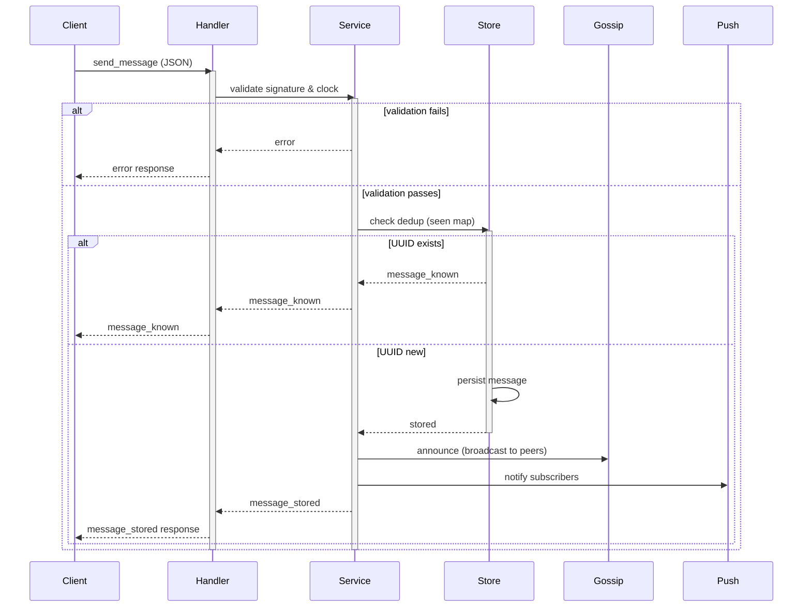

# Messaging Protocol

## Overview

The messaging system supports two topics: direct messages (`dm`) and global broadcasts (`global`). Messages are cryptographically signed, deduplicated, and support various deletion flags. Direct messages use TTL for expiry and require sender pubkey to be known (boxkey-binding is verified when available); global messages skip DM-specific validation and are treated as broadcasts.

### PlainMessage extensions

The encrypted DM body (`PlainMessage`) may carry optional `command` and `command_data` fields (`json:",omitempty"`). When `command` is set, the message is a protocol command rather than a regular text message. Currently one command is defined: `file_announce` (see [file_transfer.md](file_transfer.md) for details). The `body` field remains required for all DMs; for `file_announce` it contains either the user's description text or the sentinel `"[file]"` when no description is provided.

File transfer operations other than the announce use a separate protocol frame (`FileCommandFrame`) routed through `file_router`. See [file_transfer.md](file_transfer.md) for the full specification.

### Расширения PlainMessage

Зашифрованное тело DM (`PlainMessage`) может содержать необязательные поля `command` и `command_data` (`json:",omitempty"`). Когда `command` установлен, сообщение является протокольной командой, а не обычным текстом. Сейчас определена одна команда: `file_announce` (подробности в [file_transfer.md](file_transfer.md)). Поле `body` остаётся обязательным для всех DM; для `file_announce` оно содержит текст описания от пользователя или сентинел `"[file]"`, когда описание не предоставлено.

Все файловые операции, кроме анонса, используют отдельный протокольный фрейм (`FileCommandFrame`), маршрутизируемый через `file_router`. Полная спецификация — в [file_transfer.md](file_transfer.md).

## Commands

### send_message

Publish a new message to the network. The sender's signature is validated, and the message is deduplicated by UUID. Clock drift is checked against a configurable threshold (default 600 seconds).

**Request:**
```json
{
  "type": "send_message",
  "topic": "dm",
  "id": "550e8400-e29b-41d4-a716-446655440001",
  "address": "a1b2c3",
  "recipient": "d4e5f6",
  "flag": "sender-delete",
  "created_at": "2026-03-19T12:00:05Z",
  "ttl_seconds": 3600,
  "body": "<ciphertext>"
}
```

**Fields:**

| Field | Type | Required | Description |
|-------|------|----------|-------------|
| `type` | string | Yes | Always `"send_message"` |
| `topic` | string | Yes | Either `"dm"` or `"global"` |
| `id` | UUID v4 | Yes | Unique message identifier |
| `address` | string | Yes | Sender's fingerprint (public key hash) |
| `recipient` | string | Yes | Target fingerprint, or `"*"` for broadcast |
| `flag` | string | Yes | `"immutable"`, `"sender-delete"`, `"any-delete"`, or `"auto-delete-ttl"` |
| `created_at` | RFC3339 | Yes | Message timestamp (UTC) |
| `ttl_seconds` | int | Optional | TTL in seconds; 0 = no expiry. Also used as delivery lifetime for DM retries |
| `body` | string | Yes | Plaintext for public topics; ciphertext for DM |

**Validation:**

- Ed25519 envelope signature must be valid
- Boxkey binding signature verified when known
- Clock drift check: `|now - created_at| <= drift_threshold` (default 600s)
- Deduplication: reject if UUID already seen
- DM-specific validation: sender pubkey must be known; boxkey binding verified only when boxkey and boxsig are both available; global messages skip this check entirely

**Responses:**

| Response | Condition |
|----------|-----------|
| `message_stored` | New message accepted and stored |
| `message_known` | UUID already in seen map; silently accepted (idempotent) |
| `error` with code `message-timestamp-out-of-range` | Clock drift exceeded; message rejected |

**Side effects:**

- Message is persisted to storage
- Pushed to subscribers
- Gossiped to peers

---

### import_message

Import a message from historical sync (e.g., backfill from peer). Identical to `send_message` except:
- Clock drift check is **skipped** (old timestamps accepted)
- Signature validation still enforced
- Deduplication still enforced

**Request:**
```json
{
  "type": "import_message",
  "topic": "dm",
  "id": "550e8400-e29b-41d4-a716-446655440001",
  "address": "a1b2c3",
  "recipient": "d4e5f6",
  "flag": "sender-delete",
  "created_at": "2024-01-15T10:30:00Z",
  "ttl_seconds": 0,
  "body": "<ciphertext>"
}
```

**Responses:**

Same as `send_message` (minus `message-timestamp-out-of-range` error).

---

### fetch_messages

Retrieve all messages from a topic.

**Request:**
```json
{
  "type": "fetch_messages",
  "topic": "dm"
}
```

**Response:**
```json
{
  "type": "messages",
  "topic": "dm",
  "count": 3,
  "messages": [
    {
      "id": "550e8400-e29b-41d4-a716-446655440001",
      "flag": "sender-delete",
      "created_at": "2026-03-19T12:00:05Z",
      "ttl_seconds": 3600,
      "sender": "a1b2c3",
      "recipient": "d4e5f6",
      "body": "<ciphertext>"
    }
  ]
}
```

---

### fetch_message

Retrieve a single message by UUID.

**Request:**
```json
{
  "type": "fetch_message",
  "topic": "dm",
  "id": "550e8400-e29b-41d4-a716-446655440001"
}
```

**Response:**
```json
{
  "type": "message",
  "topic": "dm",
  "id": "550e8400-e29b-41d4-a716-446655440001",
  "item": {
    "id": "550e8400-e29b-41d4-a716-446655440001",
    "flag": "sender-delete",
    "created_at": "2026-03-19T12:00:05Z",
    "ttl_seconds": 3600,
    "sender": "a1b2c3",
    "recipient": "d4e5f6",
    "body": "<ciphertext>"
  }
}
```

---

### fetch_message_ids

Lightweight sync: retrieve only message UUIDs from a topic, no payloads.

**Request:**
```json
{
  "type": "fetch_message_ids",
  "topic": "dm"
}
```

**Response:**
```json
{
  "type": "message_ids",
  "topic": "dm",
  "count": 3,
  "ids": [
    "550e8400-e29b-41d4-a716-446655440001",
    "550e8400-e29b-41d4-a716-446655440002",
    "550e8400-e29b-41d4-a716-446655440003"
  ]
}
```

---

### fetch_inbox

Retrieve messages filtered by recipient (only readable by that recipient).

**Request:**
```json
{
  "type": "fetch_inbox",
  "topic": "dm",
  "recipient": "d4e5f6"
}
```

**Response:**
```json
{
  "type": "inbox",
  "topic": "dm",
  "recipient": "d4e5f6",
  "count": 2,
  "messages": [
    {
      "id": "550e8400-e29b-41d4-a716-446655440001",
      "flag": "sender-delete",
      "created_at": "2026-03-19T12:00:05Z",
      "ttl_seconds": 3600,
      "sender": "a1b2c3",
      "recipient": "d4e5f6",
      "body": "<ciphertext>"
    }
  ]
}
```

---

### fetch_pending_messages

Retrieve messages that are queued for delivery (not yet sent or delivery failed).

**Request:**
```json
{
  "type": "fetch_pending_messages",
  "topic": "dm"
}
```

**Response:**
```json
{
  "type": "pending_messages",
  "topic": "dm",
  "count": 2,
  "pending_messages": [
    {
      "id": "550e8400-e29b-41d4-a716-446655440001",
      "recipient": "d4e5f6",
      "status": "retrying",
      "queued_at": "2026-03-19T12:00:05Z",
      "last_attempt_at": "2026-03-19T12:05:05Z",
      "retries": 2,
      "error": "connection timeout"
    }
  ],
  "pending_ids": [
    "550e8400-e29b-41d4-a716-446655440001"
  ]
}
```

**Status values:**

| Status | Meaning |
|--------|---------|
| `queued` | Waiting for first delivery attempt |
| `retrying` | Delivery failed; scheduling retry |
| `failed` | Max retries exhausted |
| `expired` | TTL exceeded before delivery |

**UI Interpretation:**

- Pending message in response → show delivery status
- No pending entry + no delivery receipt → "sent"
- Receipt received → "delivered" or "seen"

---

## Message Flags

Deletion policies are enforced server-side:

| Flag | Behavior |
|------|----------|
| `immutable` | Nobody may delete; permanent storage |
| `sender-delete` | Only sender may delete this message |
| `any-delete` | Any participant (sender or recipient) may delete |
| `auto-delete-ttl` | Automatically deleted after `ttl_seconds` elapses |

---

## DM Expiry

**TTL-based expiry:**

Messages with `ttl_seconds > 0` are automatically deleted when:
```
created_at + ttl_seconds < now
```

**No TTL:**

Messages with `ttl_seconds = 0` never expire due to age alone. They persist until:
- Manually deleted (if flag permits)
- System cleanup (if applicable)

**TTL also as delivery lifetime:**

The `ttl_seconds` value also specifies how long the system will retry delivery. After expiry, the message is marked `expired` in pending queue.

---

## Flow Diagram



---

# Протокол обмена сообщениями

## Обзор

Система обмена сообщениями поддерживает два типа тем: прямые сообщения (`dm`) и глобальные трансляции (`global`). Сообщения криптографически подписаны, дедублицированы и поддерживают различные флаги удаления. Прямые сообщения используют TTL для истечения и требуют наличия pubkey отправителя (привязка boxkey проверяется при наличии); глобальные сообщения пропускают DM-специфичную валидацию и обрабатываются как broadcast.

## Команды

### send_message

Опубликовать новое сообщение в сеть. Подпись отправителя проверяется, сообщение дедублицируется по UUID. Проверяется смещение часов относительно настраиваемого порога (по умолчанию 600 секунд).

**Запрос:**
```json
{
  "type": "send_message",
  "topic": "dm",
  "id": "550e8400-e29b-41d4-a716-446655440001",
  "address": "a1b2c3",
  "recipient": "d4e5f6",
  "flag": "sender-delete",
  "created_at": "2026-03-19T12:00:05Z",
  "ttl_seconds": 3600,
  "body": "<ciphertext>"
}
```

**Поля:**

| Поле | Тип | Обязательно | Описание |
|------|-----|-------------|---------|
| `type` | string | Да | Всегда `"send_message"` |
| `topic` | string | Да | Либо `"dm"`, либо `"global"` |
| `id` | UUID v4 | Да | Уникальный идентификатор сообщения |
| `address` | string | Да | Отпечаток отправителя (хеш открытого ключа) |
| `recipient` | string | Да | Отпечаток получателя или `"*"` для трансляции |
| `flag` | string | Да | `"immutable"`, `"sender-delete"`, `"any-delete"` или `"auto-delete-ttl"` |
| `created_at` | RFC3339 | Да | Временная метка сообщения (UTC) |
| `ttl_seconds` | int | Опционально | TTL в секундах; 0 = без истечения. Также используется как время жизни доставки для повторов DM |
| `body` | string | Да | Открытый текст для публичных тем; зашифрованный текст для DM |

**Валидация:**

- Подпись Ed25519 конверта должна быть действительна
- Подпись привязки боксового ключа проверяется, если известна
- Проверка смещения часов: `|now - created_at| <= drift_threshold` (по умолчанию 600s)
- Дедубликация: отклонить, если UUID уже виден
- DM-специфичная валидация: pubkey отправителя должен быть известен; привязка boxkey проверяется только когда и boxkey, и boxsig доступны; глобальные сообщения полностью пропускают эту проверку

**Ответы:**

| Ответ | Условие |
|-------|---------|
| `message_stored` | Новое сообщение принято и сохранено |
| `message_known` | UUID уже в карте просмотренных; молча принято (идемпотентно) |
| `error` с кодом `message-timestamp-out-of-range` | Смещение часов превышено; сообщение отклонено |

**Побочные эффекты:**

- Сообщение сохраняется в хранилище
- Отправляется подписчикам
- Распространяется среди пиров

---

### import_message

Импортировать сообщение из исторической синхронизации (например, заполнение из пира). Идентично `send_message`, кроме:
- Проверка смещения часов **пропускается** (старые временные метки приняты)
- Проверка подписи все еще обязательна
- Дедубликация все еще обязательна

**Запрос:**
```json
{
  "type": "import_message",
  "topic": "dm",
  "id": "550e8400-e29b-41d4-a716-446655440001",
  "address": "a1b2c3",
  "recipient": "d4e5f6",
  "flag": "sender-delete",
  "created_at": "2024-01-15T10:30:00Z",
  "ttl_seconds": 0,
  "body": "<ciphertext>"
}
```

**Ответы:**

То же, что и `send_message` (без ошибки `message-timestamp-out-of-range`).

---

### fetch_messages

Получить все сообщения из темы.

**Запрос:**
```json
{
  "type": "fetch_messages",
  "topic": "dm"
}
```

**Ответ:**
```json
{
  "type": "messages",
  "topic": "dm",
  "count": 3,
  "messages": [
    {
      "id": "550e8400-e29b-41d4-a716-446655440001",
      "flag": "sender-delete",
      "created_at": "2026-03-19T12:00:05Z",
      "ttl_seconds": 3600,
      "sender": "a1b2c3",
      "recipient": "d4e5f6",
      "body": "<ciphertext>"
    }
  ]
}
```

---

### fetch_message

Получить одно сообщение по UUID.

**Запрос:**
```json
{
  "type": "fetch_message",
  "topic": "dm",
  "id": "550e8400-e29b-41d4-a716-446655440001"
}
```

**Ответ:**
```json
{
  "type": "message",
  "topic": "dm",
  "id": "550e8400-e29b-41d4-a716-446655440001",
  "item": {
    "id": "550e8400-e29b-41d4-a716-446655440001",
    "flag": "sender-delete",
    "created_at": "2026-03-19T12:00:05Z",
    "ttl_seconds": 3600,
    "sender": "a1b2c3",
    "recipient": "d4e5f6",
    "body": "<ciphertext>"
  }
}
```

---

### fetch_message_ids

Легкая синхронизация: получить только UUID сообщений из темы, без полезной нагрузки.

**Запрос:**
```json
{
  "type": "fetch_message_ids",
  "topic": "dm"
}
```

**Ответ:**
```json
{
  "type": "message_ids",
  "topic": "dm",
  "count": 3,
  "ids": [
    "550e8400-e29b-41d4-a716-446655440001",
    "550e8400-e29b-41d4-a716-446655440002",
    "550e8400-e29b-41d4-a716-446655440003"
  ]
}
```

---

### fetch_inbox

Получить сообщения, отфильтрованные по получателю (только читаемые для этого получателя).

**Запрос:**
```json
{
  "type": "fetch_inbox",
  "topic": "dm",
  "recipient": "d4e5f6"
}
```

**Ответ:**
```json
{
  "type": "inbox",
  "topic": "dm",
  "recipient": "d4e5f6",
  "count": 2,
  "messages": [
    {
      "id": "550e8400-e29b-41d4-a716-446655440001",
      "flag": "sender-delete",
      "created_at": "2026-03-19T12:00:05Z",
      "ttl_seconds": 3600,
      "sender": "a1b2c3",
      "recipient": "d4e5f6",
      "body": "<ciphertext>"
    }
  ]
}
```

---

### fetch_pending_messages

Получить сообщения, поставленные в очередь на доставку (еще не отправленные или доставка не удалась).

**Запрос:**
```json
{
  "type": "fetch_pending_messages",
  "topic": "dm"
}
```

**Ответ:**
```json
{
  "type": "pending_messages",
  "topic": "dm",
  "count": 2,
  "pending_messages": [
    {
      "id": "550e8400-e29b-41d4-a716-446655440001",
      "recipient": "d4e5f6",
      "status": "retrying",
      "queued_at": "2026-03-19T12:00:05Z",
      "last_attempt_at": "2026-03-19T12:05:05Z",
      "retries": 2,
      "error": "connection timeout"
    }
  ],
  "pending_ids": [
    "550e8400-e29b-41d4-a716-446655440001"
  ]
}
```

**Значения статуса:**

| Статус | Значение |
|--------|----------|
| `queued` | Ожидание первой попытки доставки |
| `retrying` | Доставка не удалась; планирование повтора |
| `failed` | Максимум повторов исчерпан |
| `expired` | TTL истек до доставки |

**Интерпретация UI:**

- Ожидающее сообщение в ответе → показать статус доставки
- Нет ожидающей записи + нет подтверждения доставки → "отправлено"
- Получено подтверждение → "доставлено" или "прочитано"

---

## Флаги сообщений

Политики удаления применяются на стороне сервера:

| Флаг | Поведение |
|------|-----------|
| `immutable` | Никто не может удалить; постоянное хранилище |
| `sender-delete` | Только отправитель может удалить это сообщение |
| `any-delete` | Любой участник (отправитель или получатель) может удалить |
| `auto-delete-ttl` | Автоматически удаляется после истечения `ttl_seconds` |

---

## Истечение DM

**Истечение на основе TTL:**

Сообщения с `ttl_seconds > 0` автоматически удаляются, когда:
```
created_at + ttl_seconds < now
```

**Без TTL:**

Сообщения с `ttl_seconds = 0` никогда не истекают из-за возраста. Они сохраняются до:
- Ручного удаления (если флаг позволяет)
- Очистки системы (если применимо)

**TTL также как время жизни доставки:**

Значение `ttl_seconds` также определяет, как долго система будет повторять попытки доставки. После истечения сообщение помечается как `expired` в очереди ожидания.

---

## Диаграмма потока


