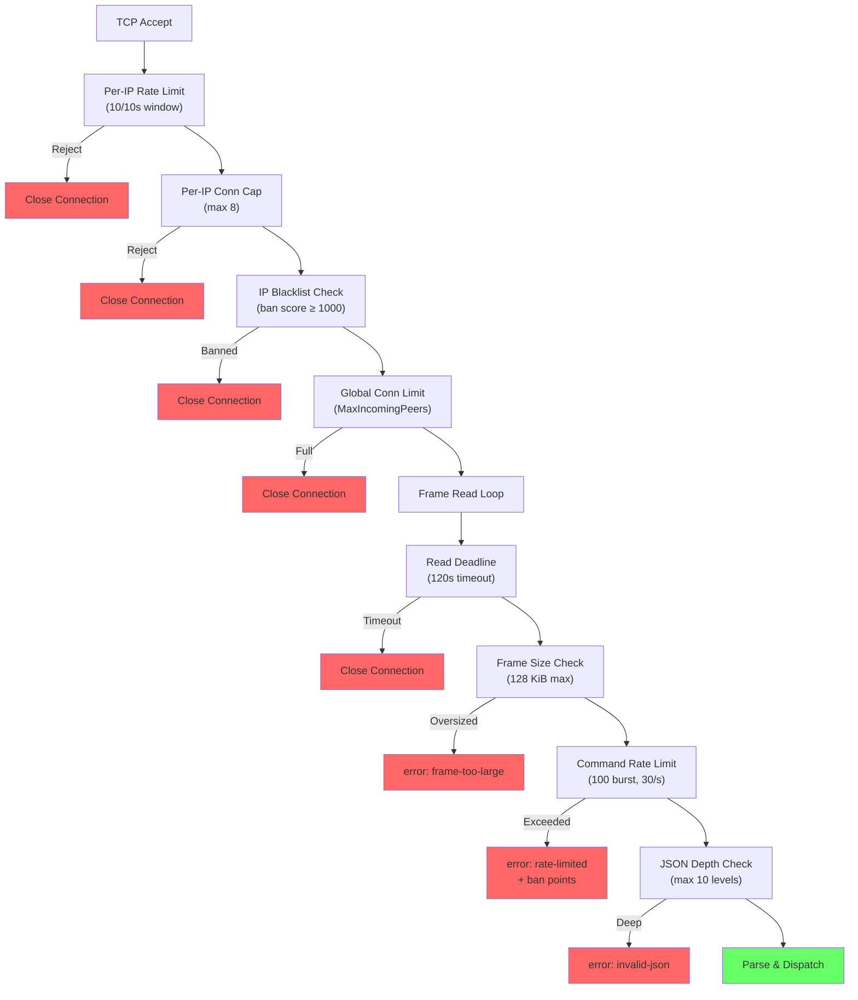
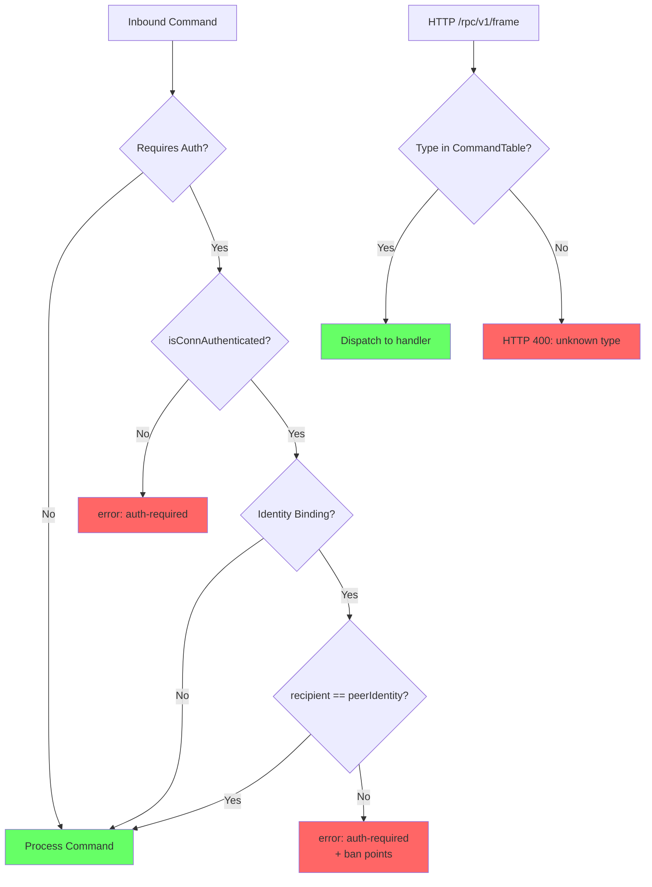
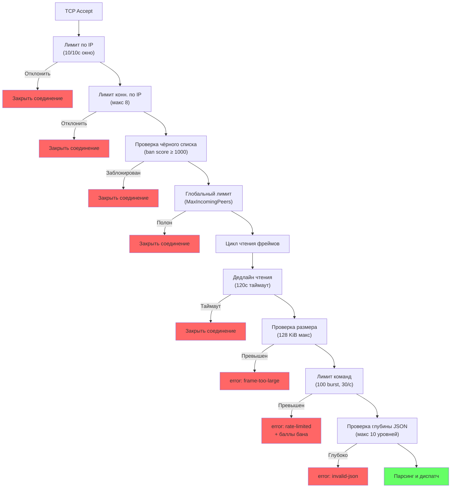

# Network Security — Transport Layer Hardening

## Overview

This document describes the defense-in-depth security measures protecting the CORSA node's TCP listener and HTTP RPC server against denial-of-service (DoS), resource exhaustion, and abuse attacks. These protections operate at the transport level, below the application protocol logic.

All limits are tuned for legitimate P2P node behavior: persistent connections with occasional heartbeats and command bursts. The thresholds are generous enough to avoid false positives while stopping automated attacks.

## Protection Layers

### 1. Per-IP Connection Rate Limiting

**File**: `internal/core/node/conn_limiter.go`

Every incoming TCP connection is checked against a per-IP sliding-window counter before any resources (goroutines, buffers, maps) are allocated. If an IP exceeds the configured rate, the connection is closed immediately at the accept level.

| Parameter | Value | Rationale |
|-----------|-------|-----------|
| `defaultConnRateLimit` | 10 connections/window | Legitimate peers maintain 1–2 persistent connections |
| `defaultConnRateWindow` | 10 seconds | Detects burst floods while tolerating reconnection storms |
| `maxConnPerIP` | 8 concurrent connections | Hard cap prevents slow-drip resource exhaustion |

### 2. Inbound Read Deadline (Slowloris Protection)

**File**: `internal/core/node/admission.go`, `internal/core/node/service.go`

Every frame read on an inbound connection has a deadline. If no complete frame arrives within the timeout, the connection is closed. This prevents Slowloris-style attacks where an attacker opens a connection and trickles data to hold the goroutine and connection slot indefinitely.

| Parameter | Value | Rationale |
|-----------|-------|-----------|
| `inboundReadTimeout` | 120 seconds | Peers heartbeat every 30s; 4 missed beats before disconnect |

### 3. Per-Connection Command Rate Limiting

**File**: `internal/core/node/conn_limiter.go`, `internal/core/node/service.go`

Each inbound TCP connection has a token-bucket rate limiter for command frames. This is separate from the relay rate limiter (which covers `relay_message` only). When the bucket is exhausted, the connection receives a `rate-limited` error and is closed, and the IP receives ban points.

| Parameter | Value | Rationale |
|-----------|-------|-----------|
| `cmdBurstPerConn` | 100 commands | Absorbs legitimate batch operations |
| `cmdRefillRate` | 30 commands/second | Well above normal peer behavior (~5/s sustained) |
| `banIncrementRateLimit` | 200 ban points | Signals intentional abuse; 5 violations → blacklist |

### 4. JSON Nesting Depth Limit

**File**: `internal/core/protocol/frame.go`

Before `json.Unmarshal`, every inbound frame is scanned for nesting depth. The scanner runs in O(n) with zero allocations, correctly handling strings and escape sequences. Frames exceeding the depth limit are rejected before any JSON parsing allocation occurs.

| Parameter | Value | Rationale |
|-----------|-------|-----------|
| `maxJSONDepth` | 10 levels | Frame struct has max depth 3; generous headroom without risk |

### 5. Transport Frame Size Limits

**File**: `internal/core/node/admission.go`

Two separate limits exist for different frame contexts:

| Limit | Value | Context |
|-------|-------|---------|
| `maxCommandLineBytes` | 128 KiB | Inbound TCP commands (handleConn) |
| `maxResponseLineBytes` | 8 MiB | Peer session and handshake response frames |
| `maxPeerCommandBodyBytes` | 128 KiB | Post-parse body check for peer session commands |
| `protocol.MaxFrameLine` | 128 KiB | Writer-side budget for command-plane writes |
| `protocol.MaxResponseLine` | 8 MiB | Writer-side budget for peer-session response writes |

The `readFrameLine` function enforces limits incrementally during the read, rejecting oversized frames before allocating the full buffer.

**Writer-side enforcement (`MarshalFrameLineWithLimit`).** `internal/core/protocol/frame.go` exports the contextual `MaxFrameLine = 128 KiB` and `MaxResponseLine = 8 MiB` constants and rejects any frame whose JSON-encoded wire line (including the trailing newline) exceeds the supplied budget with `ErrFrameTooLarge` (wrapped via `fmt.Errorf` so callers detect it through `errors.Is`). The constants are kept in lock-step with the receive-side `maxCommandLineBytes` and `maxResponseLineBytes` guards: a frame that the writer accepts MUST decode under the receiver's guard, byte-for-byte newline included. Two contextual writer paths apply:

- `writeFrameToInboundConn` (inbound TCP) calls `MarshalFrameLineWithLimit(frame, MaxFrameLine)` — receiver dispatches via `handleConn`'s 128 KiB command-plane reader.
- `peerSessionRequest` (outbound peer sessions) calls `MarshalFrameLineWithLimit(frame, MaxResponseLine)` — receiver dispatches via `readPeerSession`'s 8 MiB response-plane reader, which legally batches multi-message responses (contacts, messages, inbox).

The announce plane is special-cased to use `MaxFrameLine` regardless of which end opened the TCP connection, because the receiver dispatches announce frames through the inbound-style command-plane reader. The current announce-plane frame set is enumerated by `isAnnouncePlaneFrameType` in `internal/core/node/routing_announce.go` and covers `announce_routes` (legacy v1 full sync), `routes_update` (v2 delta), `request_resync` (v2 control), `route_announce_v3` (Phase 4 compact full / delta), and `route_poison_v1` (Phase 4 single-hop poison-reverse). The size-aware chunkers `chunkAnnounceEntriesBySize` (legacy + v2) and `chunkRouteAnnounceV3EntriesBySize` (v3) pack entries greedily into wire-safe chunks under the 128 KiB ceiling; the receive-side outbound peer-session reader (`readPeerSession`) drops any of these frame types that arrives larger than `MaxFrameLine` even though its own line buffer accepts up to `MaxResponseLine`. The fixed-size control frames in the set (`request_resync`, `route_poison_v1`) never approach the cap on their own — they are listed for the same enforcement so a buggy or hostile peer cannot pad them past 128 KiB to bypass the guard.

Callers treat `ErrFrameTooLarge` as a self-bug rather than a peer fault. Disconnecting the peer on a self-built oversize frame would only restart the same frame on the next session; instead the frame is dropped with an `outbound_frame_too_large_dropped` / `frame_inbound_too_large` / `announce_routes_entry_oversize_dropped` log line and the session continues. The upstream layer that built the frame is responsible for shrinking the payload before reaching the marshal step. Without this guard, a bug in any of those layers would cap-trip the receiver, the receiver would close the connection, the sender would mark the peer disconnected, both would redial, and the network would enter a reconnect storm.

The shared, unguarded `MarshalFrameLine` entry point still exists for generic infrastructure (`netcore.NetCore.Send` / `SendSync`) where the direction of the frame is unknown to the marshaller; in those paths the budget is enforced upstream by the caller that knows whether the frame is travelling on the command or response plane. The `RawLine` fast-path inside `MarshalFrameLine` is intentionally unchecked, but `MarshalFrameLineWithLimit` does enforce the budget against `RawLine` because that path still produces bytes that hit the same wire limits at the remote.

### 6. RPC HTTP Body Size Limit

**File**: `internal/core/rpc/server.go`

The Fiber HTTP server has an explicit body size limit configured. Without this, Fiber uses a default of 4 MiB. The explicit limit is set to 1 MiB, sufficient for all RPC commands.

| Parameter | Value | Rationale |
|-----------|-------|-----------|
| `rpcMaxBodyBytes` | 1 MiB | Largest RPC payload is send_dm (~87 KiB base64) |

### 7. RPC Auth Brute-Force Protection

**File**: `internal/core/rpc/server.go`

The HTTP Basic Authentication middleware tracks failed auth attempts per IP in a sliding window. After exceeding the threshold, the IP is temporarily locked out.

| Parameter | Value | Rationale |
|-----------|-------|-----------|
| `authMaxAttempts` | 10 failures/window | Generous for typos, blocks brute force |
| `authWindowDuration` | 5 minutes | Sliding window for counting failures |
| `authLockoutDuration` | 15 minutes | Cool-off period after lockout |

### 8. IP Ban Scoring

**File**: `internal/core/node/service.go`

Cumulative ban scoring with automatic blacklisting. Different violations carry different point values. Once an IP reaches 1000 points, it is blacklisted for 24 hours.

| Violation | Points | Effect |
|-----------|--------|--------|
| Invalid auth signature | 100 | 10 violations → blacklist |
| Incompatible protocol version | 1000 | Immediate blacklist |
| Command rate limit exceeded | 200 | 5 violations → blacklist |
| Blacklist duration | 24 hours | Per-IP cooldown |

### 9. Relay-Specific Limits

**File**: `internal/core/node/admission.go`, `internal/core/node/ratelimit.go`

| Limit | Value | Purpose |
|-------|-------|---------|
| `maxRelayBodyBytes` | 64 KiB | Caps sealed DM body size |
| `maxRelayStates` | 10,000 | Global cap on in-flight relay states |
| `maxRelayStatesPerPeer` | 500 | Per-peer cap on relay states |
| `relayBurstPerPeer` | 50 | Token bucket burst for relay fan-out |
| `relayRefillRate` | 20/s | Token bucket refill rate |

## Security Architecture Diagram

**Diagram: Transport Layer Security Pipeline**

## Protocol-Level Security

The transport-layer protections above stop resource exhaustion and abuse at the wire level. The following protections operate at the protocol (application) level, preventing identity spoofing and data leakage through the P2P command set.

### 10. Inbox Route Authentication & Identity Binding

**File**: `internal/core/node/service.go`

The inbox push route is registered exclusively at authentication time (`registerHelloRoute` inside `auth_session` handling) and is bound to the authenticated Ed25519 identity from the hello frame, verified by the `auth_session` signature. There is no subscription command on the wire (the legacy `subscribe_inbox` was removed at `MinimumProtocolVersion = 20`), so a peer structurally cannot request a route for another identity's inbox: the only inbox a connection can ever receive is the one whose private key signed the session challenge.

### 11. fetch_inbox Identity Binding

**File**: `internal/core/node/service.go`

The `fetch_inbox` command retrieves stored messages for a recipient. For authenticated remote peers, the requested recipient must match the peer's own identity. This prevents an authenticated peer from enumerating or downloading another identity's inbox contents.

Unauthenticated connections (e.g., local RPC via HandleLocalFrame) are not restricted by this check, since local access is trusted.

### 12. RPC Frame Type Whitelisting

**File**: `internal/core/rpc/server.go`

The `/rpc/v1/frame` HTTP endpoint accepts arbitrary frame types from local tools. Previously, unknown frame types were forwarded to `HandleLocalFrame`, which processes them as if they came from a trusted local source. This allowed HTTP clients (potentially remote if the RPC port was exposed) to inject network-level frames (`relay_message`, `push_message`) bypassing P2P authentication entirely.

Now, only frame types registered in `CommandTable` are accepted. Unknown types receive HTTP 400.

| Before | After |
|--------|-------|
| Unknown types → `HandleLocalFrame` (trusted path) | Unknown types → HTTP 400 "unknown frame type" |

### Protocol-Level Security Diagram

**Diagram: Protocol-Level Security Checks**

---

# Сетевая безопасность — Hardening транспортного уровня

## Обзор

Этот документ описывает многоуровневые меры безопасности, защищающие TCP-слушатель и HTTP RPC-сервер ноды CORSA от атак типа отказа в обслуживании (DoS), исчерпания ресурсов и злоупотреблений. Эти защиты работают на транспортном уровне, ниже логики прикладного протокола.

Все лимиты настроены под легитимное поведение P2P-нод: постоянные соединения с периодическими heartbeat-сигналами и пакетными командами. Пороговые значения достаточно щедрые, чтобы избежать ложных срабатываний, но при этом останавливают автоматизированные атаки.

## Уровни защиты

### 1. Ограничение скорости соединений по IP

**Файл**: `internal/core/node/conn_limiter.go`

Каждое входящее TCP-соединение проверяется по счётчику скользящего окна для данного IP до выделения каких-либо ресурсов (горутин, буферов, карт). Если IP превышает настроенный лимит, соединение закрывается немедленно на уровне accept.

| Параметр | Значение | Обоснование |
|----------|----------|-------------|
| `defaultConnRateLimit` | 10 соединений/окно | Легитимные пиры поддерживают 1–2 постоянных соединения |
| `defaultConnRateWindow` | 10 секунд | Обнаруживает пакетные flood-атаки при допуске штормов переподключения |
| `maxConnPerIP` | 8 одновременных | Жёсткий лимит предотвращает медленное исчерпание ресурсов |

### 2. Дедлайн чтения входящих соединений (защита от Slowloris)

**Файл**: `internal/core/node/admission.go`, `internal/core/node/service.go`

Каждое чтение фрейма на входящем соединении имеет таймаут. Если полный фрейм не получен в течение таймаута, соединение закрывается. Это предотвращает Slowloris-атаки, при которых атакующий открывает соединение и медленно отправляет данные, удерживая горутину и слот соединения бесконечно.

| Параметр | Значение | Обоснование |
|----------|----------|-------------|
| `inboundReadTimeout` | 120 секунд | Пиры шлют heartbeat каждые 30с; 4 пропущенных — отключение |

### 3. Ограничение скорости команд на соединение

**Файл**: `internal/core/node/conn_limiter.go`, `internal/core/node/service.go`

Каждое входящее TCP-соединение имеет token-bucket лимитер для командных фреймов. Это отдельно от лимитера relay (который покрывает только `relay_message`). При исчерпании бакета соединение получает ошибку `rate-limited` и закрывается, IP получает баллы бана.

| Параметр | Значение | Обоснование |
|----------|----------|-------------|
| `cmdBurstPerConn` | 100 команд | Поглощает легитимные пакетные операции |
| `cmdRefillRate` | 30 команд/секунду | Значительно выше нормального поведения пира (~5/с) |
| `banIncrementRateLimit` | 200 баллов бана | Сигнализирует преднамеренное злоупотребление; 5 нарушений → чёрный список |

### 4. Ограничение глубины вложенности JSON

**Файл**: `internal/core/protocol/frame.go`

Перед `json.Unmarshal` каждый входящий фрейм сканируется на глубину вложенности. Сканер работает за O(n) без аллокаций, корректно обрабатывая строки и escape-последовательности. Фреймы, превышающие лимит глубины, отклоняются до начала парсинга JSON.

| Параметр | Значение | Обоснование |
|----------|----------|-------------|
| `maxJSONDepth` | 10 уровней | Структура Frame имеет макс. глубину 3; щедрый запас без риска |

### 5. Лимиты размера транспортных фреймов

**Файл**: `internal/core/node/admission.go`

Два отдельных лимита для разных контекстов фреймов:

| Лимит | Значение | Контекст |
|-------|----------|----------|
| `maxCommandLineBytes` | 128 KiB | Входящие TCP-команды (handleConn) |
| `maxResponseLineBytes` | 8 MiB | Фреймы ответов peer-сессий и handshake |
| `maxPeerCommandBodyBytes` | 128 KiB | Проверка тела после парсинга для команд peer-сессий |
| `protocol.MaxFrameLine` | 128 KiB | Writer-side бюджет для команд-плоскости |
| `protocol.MaxResponseLine` | 8 MiB | Writer-side бюджет для peer-session response writes |

**Writer-side enforcement (`MarshalFrameLineWithLimit`).** `internal/core/protocol/frame.go` экспортирует контекстуальные константы `MaxFrameLine = 128 KiB` и `MaxResponseLine = 8 MiB` и отклоняет любой фрейм, чья JSON-сериализация (включая завершающий newline) превышает заданный бюджет, ошибкой `ErrFrameTooLarge` (обёрнута через `fmt.Errorf`, чтобы вызыватели ловили её через `errors.Is`). Константы держатся в синхронизации с приёмными `maxCommandLineBytes` и `maxResponseLineBytes`: фрейм, который writer пропустил, обязан декодироваться под guard'ом получателя — байт-в-байт, включая newline. Применяются два контекстуальных пути writer'а:

- `writeFrameToInboundConn` (inbound TCP) вызывает `MarshalFrameLineWithLimit(frame, MaxFrameLine)` — приёмник диспетчеризует через 128 KiB читатель команд `handleConn`.
- `peerSessionRequest` (outbound peer-сессии) вызывает `MarshalFrameLineWithLimit(frame, MaxResponseLine)` — приёмник диспетчеризует через 8 MiB читатель ответов `readPeerSession`, который легально батчит multi-message ответы (contacts, messages, inbox).

Announce-плоскость использует `MaxFrameLine` независимо от того, кто открыл TCP-соединение, потому что приёмник всегда диспетчеризует announce-фреймы через inbound-style command-plane reader. Текущий набор announce-плоскости перечислен в `isAnnouncePlaneFrameType` (`internal/core/node/routing_announce.go`) и покрывает `announce_routes` (legacy v1 full sync), `routes_update` (v2 delta), `request_resync` (v2 control), `route_announce_v3` (Phase 4 компактный full / delta) и `route_poison_v1` (Phase 4 single-hop poison-reverse). Size-aware чанкеры `chunkAnnounceEntriesBySize` (legacy + v2) и `chunkRouteAnnounceV3EntriesBySize` (v3) упаковывают записи жадно в чанки под потолком 128 KiB; receive-side reader outbound peer-сессии (`readPeerSession`) дропает любой из этих frame-типов, прибывший больше `MaxFrameLine`, даже несмотря на то, что его собственный line-буфер принимает до `MaxResponseLine`. Фиксированно-размерные control-фреймы из набора (`request_resync`, `route_poison_v1`) сами по себе никогда не подходят к лимиту — они перечислены тут для того же enforcement'а, чтобы buggy / hostile peer не мог padding'ом раздуть их за 128 KiB и обойти guard.

Вызыватели трактуют `ErrFrameTooLarge` как self-bug, а не как ошибку peer'а. Дисконнектить peer'а из-за нашего же oversize-фрейма было бы реконнект-петлёй: следующая сессия отправила бы тот же самый фрейм. Вместо этого фрейм сбрасывается с лог-строкой `outbound_frame_too_large_dropped` / `frame_inbound_too_large` / `announce_routes_entry_oversize_dropped`, сессия продолжает работу. Слой выше обязан уменьшить payload до маршала. Без этого guard'а баг в любом из этих слоёв привёл бы к закрытию соединения приёмником, переподключению отправителя и шторму reconnect'ов в сети.

Незащищённая точка входа `MarshalFrameLine` сохранена для общей инфраструктуры (`netcore.NetCore.Send` / `SendSync`), где направление фрейма неизвестно маршаллеру; в этих путях бюджет применяется выше по стеку вызывателем, который знает, на какой плоскости летит фрейм. Fast-path `RawLine` внутри `MarshalFrameLine` намеренно не проверяется на размер, но `MarshalFrameLineWithLimit` применяет бюджет и к `RawLine`, потому что эта точка входа всё равно производит байты, попадающие под тот же лимит на принимающей стороне.

### 6. Лимит размера тела HTTP RPC

**Файл**: `internal/core/rpc/server.go`

HTTP-сервер Fiber имеет явно настроенный лимит размера тела запроса — 1 MiB.

### 7. Защита от brute-force RPC-аутентификации

**Файл**: `internal/core/rpc/server.go`

Middleware HTTP Basic Auth отслеживает неудачные попытки аутентификации по IP в скользящем окне. При превышении порога IP временно блокируется.

| Параметр | Значение | Обоснование |
|----------|----------|-------------|
| `authMaxAttempts` | 10 неудач/окно | Щедро для опечаток, блокирует brute force |
| `authWindowDuration` | 5 минут | Скользящее окно для подсчёта неудач |
| `authLockoutDuration` | 15 минут | Период охлаждения после блокировки |

### 8. Скоринг банов по IP

**Файл**: `internal/core/node/service.go`

Кумулятивный скоринг банов с автоматическим внесением в чёрный список. Разные нарушения имеют разный вес. При достижении 1000 баллов IP блокируется на 24 часа.

| Нарушение | Баллы | Эффект |
|-----------|-------|--------|
| Неверная подпись аутентификации | 100 | 10 нарушений → чёрный список |
| Несовместимая версия протокола | 1000 | Немедленный чёрный список |
| Превышение лимита команд | 200 | 5 нарушений → чёрный список |
| Длительность блокировки | 24 часа | Охлаждение по IP |

### 9. Специфичные лимиты relay

**Файл**: `internal/core/node/admission.go`, `internal/core/node/ratelimit.go`

| Лимит | Значение | Назначение |
|-------|----------|------------|
| `maxRelayBodyBytes` | 64 KiB | Ограничение размера sealed DM body |
| `maxRelayStates` | 10 000 | Глобальный лимит in-flight relay-состояний |
| `maxRelayStatesPerPeer` | 500 | Лимит relay-состояний на пира |
| `relayBurstPerPeer` | 50 | Token bucket burst для relay fan-out |
| `relayRefillRate` | 20/с | Скорость пополнения token bucket |

## Диаграмма архитектуры безопасности

**Диаграмма: Конвейер безопасности транспортного уровня**

## Безопасность на уровне протокола

Защиты транспортного уровня, описанные выше, предотвращают исчерпание ресурсов и злоупотребления на уровне провода. Следующие защиты работают на уровне протокола (приложения), предотвращая подмену identity и утечку данных через набор P2P-команд.

### 10. Аутентификация и привязка identity для inbox-маршрута

**Файл**: `internal/core/node/service.go`

Push-маршрут inbox регистрируется исключительно в момент аутентификации (`registerHelloRoute` внутри обработки `auth_session`) и привязан к аутентифицированной Ed25519-identity из hello-фрейма, верифицированной подписью `auth_session`. Команды подписки на проводе нет (легаси `subscribe_inbox` удалена при `MinimumProtocolVersion = 20`), поэтому пир структурно не может запросить маршрут на чужой inbox: соединение может получать только тот inbox, чей приватный ключ подписал session challenge.

### 11. Привязка identity для fetch_inbox

**Файл**: `internal/core/node/service.go`

Команда `fetch_inbox` извлекает сохранённые сообщения для получателя. Для аутентифицированных удалённых пиров запрашиваемый получатель должен совпадать с собственным identity пира. Это предотвращает перечисление или скачивание содержимого inbox другого identity.

Неаутентифицированные соединения (например, локальный RPC через HandleLocalFrame) не ограничены этой проверкой, поскольку локальный доступ считается доверенным.

### 12. Белый список типов фреймов RPC

**Файл**: `internal/core/rpc/server.go`

HTTP-эндпоинт `/rpc/v1/frame` принимает произвольные типы фреймов от локальных инструментов. Ранее неизвестные типы пересылались в `HandleLocalFrame`, обрабатывавший их как пришедшие из доверенного локального источника. Это позволяло HTTP-клиентам (потенциально удалённым, если RPC-порт был открыт) инжектировать сетевые фреймы (`relay_message`, `push_message`), полностью обходя P2P-аутентификацию.

Теперь принимаются только типы фреймов, зарегистрированные в `CommandTable`. Неизвестные типы получают HTTP 400.

| До | После |
|----|-------|
| Неизвестные типы → `HandleLocalFrame` (доверенный путь) | Неизвестные типы → HTTP 400 "unknown frame type" |

### Диаграмма безопасности на уровне протокола

**Диаграмма: Проверки безопасности на уровне протокола**
