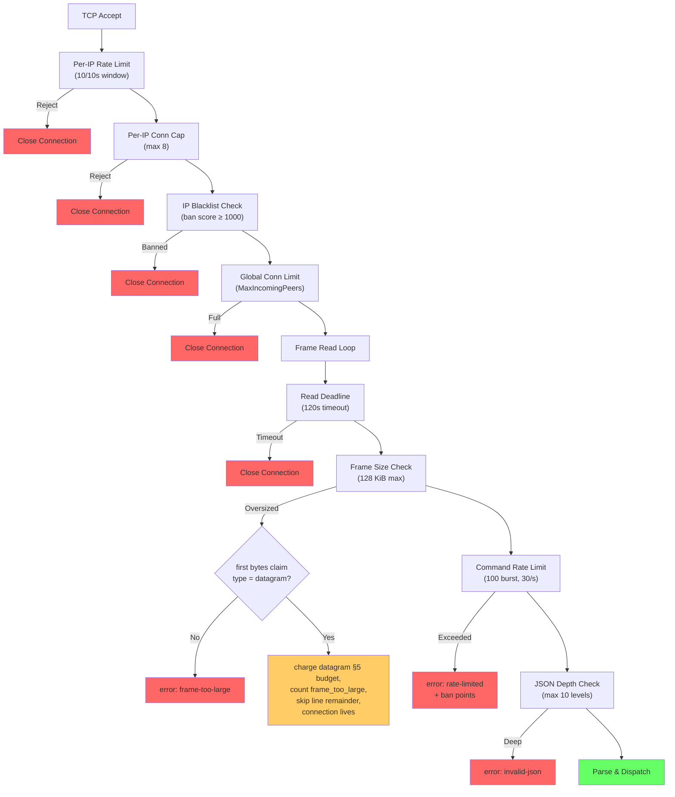
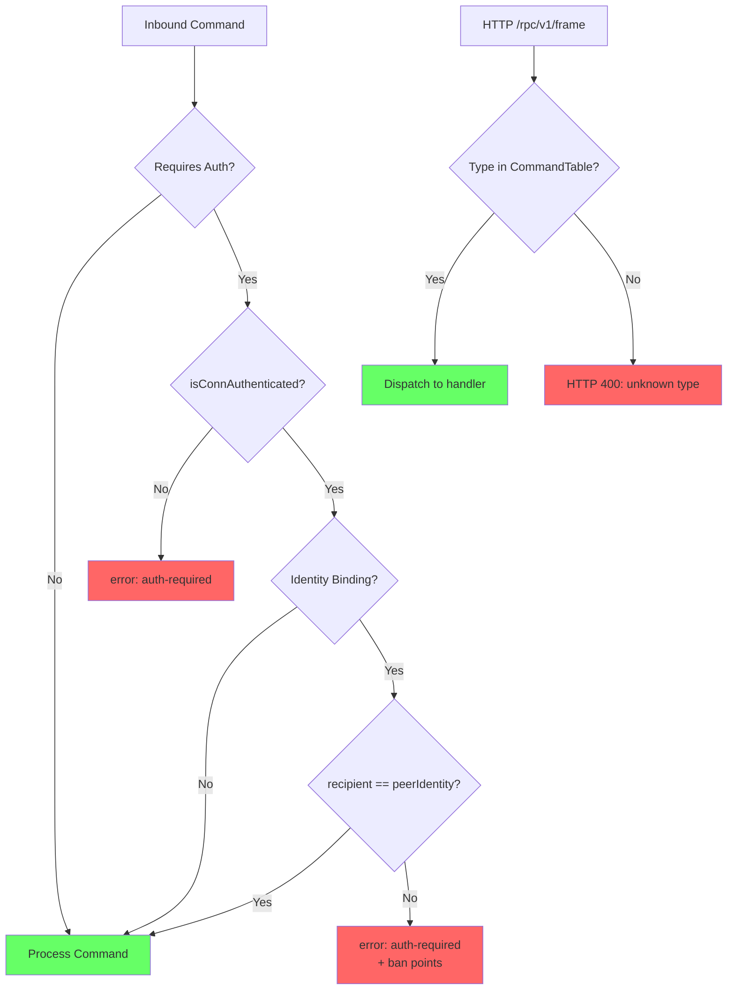
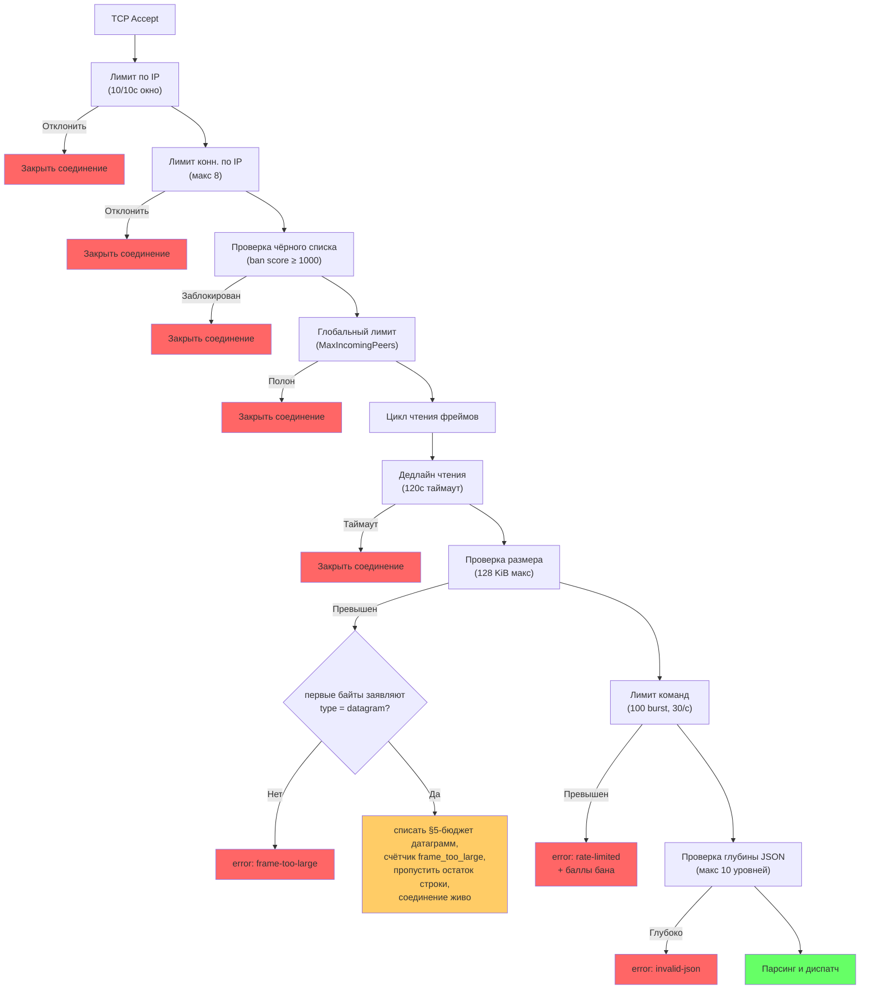

# Network Security — Transport Layer Hardening

## Overview

This document describes the defense-in-depth security measures protecting the CORSA node's TCP listener and HTTP RPC server against denial-of-service (DoS), resource exhaustion, and abuse attacks. These protections operate at the transport level, below the application protocol logic.

All limits are tuned for legitimate P2P node behavior: persistent connections with occasional heartbeats and command bursts. The thresholds are generous enough to avoid false positives while stopping automated attacks.

## Protection Layers

### 1. Per-IP Connection Rate Limiting

**File**: `internal/core/node/conn_limiter.go`

Every incoming TCP connection is checked against a per-IP sliding-window counter before any resources (goroutines, buffers, maps) are allocated. If an IP exceeds the configured rate, the connection is closed immediately at the accept level.

| Parameter | Value | Rationale |
|-----------|-------|-----------|
| `defaultConnRateLimit` | 10 connections/window | Legitimate peers maintain 1–2 persistent connections |
| `defaultConnRateWindow` | 10 seconds | Detects burst floods while tolerating reconnection storms |
| `maxConnPerIP` | 8 concurrent connections | Hard cap prevents slow-drip resource exhaustion |

### 2. Inbound Read Deadline (Slowloris Protection)

**File**: `internal/core/node/admission.go`, `internal/core/node/service.go`

Every frame read on an inbound connection has a deadline. If no complete frame arrives within the timeout, the connection is closed. This prevents Slowloris-style attacks where an attacker opens a connection and trickles data to hold the goroutine and connection slot indefinitely.

| Parameter | Value | Rationale |
|-----------|-------|-----------|
| `inboundReadTimeout` | 120 seconds | Peers heartbeat every 30s; 4 missed beats before disconnect |

### 3. Per-Connection Command Rate Limiting

**File**: `internal/core/node/conn_limiter.go`, `internal/core/node/service.go`

Each inbound TCP connection has a token-bucket rate limiter for command frames. This is separate from the relay rate limiter (which covers `relay_message` only). When the bucket is exhausted, the connection receives a `rate-limited` error and is closed, and the IP receives ban points.

| Parameter | Value | Rationale |
|-----------|-------|-----------|
| `cmdBurstPerConn` | 100 commands | Absorbs legitimate batch operations |
| `cmdRefillRate` | 30 commands/second | Well above normal peer behavior (~5/s sustained) |
| `banIncrementRateLimit` | 200 ban points | Signals intentional abuse; 5 violations → blacklist |

**Exempt classes, and how the exemption is decided.** Three classes skip the
bucket: `file_command` (the file data plane), the BULK announce frames
(`announce_routes` / `routes_update` / `route_announce_v3`), and `datagram`
while the datagram layer exists to charge its own per-neighbour budget. The
announce CONTROL frames (`request_resync`, `route_poison_v1`,
`route_poison_v2`) are deliberately NOT exempt. The exemption is decided from
the **top-level** `type` of the raw line (`classifyFrameLine`), never from the
first `"type"` the line happens to contain: those two answers differ on a
nested or a duplicated key, and it is the SENDER who chooses which reader gets
which — a line reading `{"a":{"type":"file_command"},"type":"ping"}` was exempt
by the first answer and executed as the second. The rule is therefore
**fail-closed**: a line that does not name its top-level type unambiguously
pays the limiter, and what it really was is decided by the dispatcher below.
The limiter runs **before authentication**, so a bypass here is exploitable by
any accepted socket.

**The exemption on this direction is decided from the TYPE alone**, and that is
narrower than it sounds only for `datagram`, which additionally requires a layer
to charge. `file_command` is gated on auth plus `file_transfer_v1` in
`dispatchNetworkFrame` — one step BELOW the limiter — so a socket that has proven
nothing still skips the bucket by naming the type unambiguously and is refused
only after the parse. The outbound peer-session reader is stricter about the same
plane (§5a): there the exemption additionally requires the negotiated capability
and a live file router.

**Exhausting a replacement budget is a SILENT DROP, never a tear-down.** This
is normative and it is where the two limiters differ in kind. The command
bucket is a control-plane defence: it protects the CPU a socket can spend on
commands, and blowing it is treated as abuse — `rate-limited`, ban points,
connection closed. The datagram admission of §5 is a data-plane budget: it
protects a neighbour's SHARE, and exceeding it means only that this frame is
not carried. So an exhausted datagram budget drops the current frame and
nothing else — no `rate-limited` frame, no TCP tear-down, no ban score — and
the neighbour learns of it by having paid. The rule is independent of the
frame's `dtype`, class and payload, which is what keeps bulk and file traffic
from inheriting a 30 cmd/s control-plane limit that was never meant for it.

**The charge comes before every refusal that depends on the frame.** A
neighbour is billable from connection state alone, so the budget is charged
first and the refusals follow: the role gate (the neighbour never advertised
the plane's capability), the size gate, the strict parser. A refusal placed above the charge is a refusal the sender gets for
free, and the cheapest verdict on the node then makes the most profitable
flood. The remaining exemptions on the old planes — `file_command` and the
bulk announce types — still refuse before their replacement budgets charge
anything; that gap is open and belongs to those planes.

### 4. JSON Nesting Depth Limit

**File**: `internal/core/protocol/frame.go`

Before `json.Unmarshal`, every inbound frame is scanned for nesting depth. The scanner runs in O(n) with zero allocations, correctly handling strings and escape sequences. Frames exceeding the depth limit are rejected before any JSON parsing allocation occurs.

| Parameter | Value | Rationale |
|-----------|-------|-----------|
| `maxJSONDepth` | 10 levels | Frame struct has max depth 3; generous headroom without risk |

### 5. Transport Frame Size Limits

**File**: `internal/core/node/admission.go`

Two separate limits exist for different frame contexts:

| Limit | Value | Context |
|-------|-------|---------|
| `maxCommandLineBytes` | 128 KiB | Inbound TCP commands (handleConn) |
| `maxResponseLineBytes` | 8 MiB | Peer session and handshake response frames |
| `maxPeerCommandBodyBytes` | 128 KiB | Post-parse body check for peer session commands |
| `protocol.MaxFrameLine` | 128 KiB | Writer-side budget for command-plane writes |
| `protocol.MaxResponseLine` | 8 MiB | Writer-side budget for peer-session response writes |

The `readFrameLine` function enforces limits incrementally during the read, rejecting oversized frames before allocating the full buffer.

**Writer-side enforcement (`MarshalFrameLineWithLimit`).** `internal/core/protocol/frame.go` exports the contextual `MaxFrameLine = 128 KiB` and `MaxResponseLine = 8 MiB` constants and rejects any frame whose JSON-encoded wire line (including the trailing newline) exceeds the supplied budget with `ErrFrameTooLarge` (wrapped via `fmt.Errorf` so callers detect it through `errors.Is`). The constants are kept in lock-step with the receive-side `maxCommandLineBytes` and `maxResponseLineBytes` guards: a frame that the writer accepts MUST decode under the receiver's guard, byte-for-byte newline included. Two contextual writer paths apply:

- `writeFrameToInboundConn` (inbound TCP) calls `MarshalFrameLineWithLimit(frame, MaxFrameLine)` — receiver dispatches via `handleConn`'s 128 KiB command-plane reader.
- `peerSessionRequest` (outbound peer sessions) calls `MarshalFrameLineWithLimit(frame, MaxResponseLine)` — receiver dispatches via `readPeerSession`'s 8 MiB response-plane reader, which legally batches multi-message responses (contacts, messages, inbox).

The announce plane is special-cased to use `MaxFrameLine` regardless of which end opened the TCP connection, because the receiver dispatches announce frames through the inbound-style command-plane reader. The current announce-plane frame set is enumerated by `isAnnouncePlaneFrameType` in `internal/core/node/routing_announce.go` and covers `announce_routes` (legacy v1 full sync), `routes_update` (v2 delta), `request_resync` (v2 control), `route_announce_v3` (Phase 4 compact full / delta), and `route_poison_v1` (Phase 4 single-hop poison-reverse). The size-aware chunkers `chunkAnnounceEntriesBySize` (legacy + v2) and `chunkRouteAnnounceV3EntriesBySize` (v3) pack entries greedily into wire-safe chunks under the 128 KiB ceiling; the receive-side outbound peer-session reader (`readPeerSession`) drops any of these frame types that arrives larger than `MaxFrameLine` even though its own line buffer accepts up to `MaxResponseLine`. The fixed-size control frames in the set (`request_resync`, `route_poison_v1`) never approach the cap on their own — they are listed for the same enforcement so a buggy or hostile peer cannot pad them past 128 KiB to bypass the guard.

Callers treat `ErrFrameTooLarge` as a self-bug rather than a peer fault. Disconnecting the peer on a self-built oversize frame would only restart the same frame on the next session; instead the frame is dropped with an `outbound_frame_too_large_dropped` / `frame_inbound_too_large` / `announce_routes_entry_oversize_dropped` log line and the session continues. The upstream layer that built the frame is responsible for shrinking the payload before reaching the marshal step. Without this guard, a bug in any of those layers would cap-trip the receiver, the receiver would close the connection, the sender would mark the peer disconnected, both would redial, and the network would enter a reconnect storm.

The shared, unguarded `MarshalFrameLine` entry point still exists for generic infrastructure (`netcore.NetCore.Send` / `SendSync`) where the direction of the frame is unknown to the marshaller; in those paths the budget is enforced upstream by the caller that knows whether the frame is travelling on the command or response plane. The `RawLine` fast-path inside `MarshalFrameLine` is intentionally unchecked, but `MarshalFrameLineWithLimit` does enforce the budget against `RawLine` because that path still produces bytes that hit the same wire limits at the remote.

### 5a. Response-Plane Per-Neighbour Admission (peer sessions)

**File**: `internal/core/node/peer_session_admission.go`

The outbound peer-session reader (`readPeerSession`) is the widest reader on the node: it accepts up to `maxResponseLineBytes` (8 MiB) per line, because two reply types legitimately need it. That width is metered per authenticated neighbour, and the metering is **protocol-observable** — a peer that exceeds it loses frames and, if it keeps going, the session.

**Where the budget sits relative to the read.** The reader stops at `protocol.MaxFrameLine` (128 KiB) — the budget every frame type is entitled to. Only at that boundary, and *before* the remainder of the line is pulled off the socket or copied, does it ask whether the line has earned more. Growing past 128 KiB requires all three of:

1. the line's first bytes name a type in `hasWideFrameLineBudget` (`contacts`, `push_message`) — `protocol.Frame` declares `type` first, so every frame a Corsa peer marshals names itself in its first few dozen bytes;
2. for a REPLY type (`contacts`), a matching request is outstanding on that session;
3. the neighbour's raw budget is not empty.

A line that fails any of them is refused, its remainder discarded without allocation, and the bytes read charged to the neighbour. The complete line then charges the shared budget **before** `protocol.ParseFrameLine` is reached.

**The inbound command reader stages its read too, and for the CLAIM rather than for an extension.** `readInboundCommandLine` runs the same staged read with `maxCommandLineBytes` (which *is* `protocol.MaxFrameLine`), and its entitlement callback always answers zero: no type is entitled to more than the strict budget on that reader. What the staging buys there is the type named in the line's first bytes — the only name an over-long line will ever have, since the rest of it is never read and nothing downstream will classify it. That claim is what lets the two readers apply ONE rule to an oversize `datagram` line (see below) instead of two.

| Budget | Value | Rationale |
|--------|-------|-----------|
| `peerSessionBytesPerSecond` / `peerSessionByteBurst` | 4 MiB/s, 16 MiB burst | Sized off the widest legitimate producer, the file-transfer chunk stream (16 KiB raw ≈ 29 KiB wire, stop-and-wait per transfer ≈ 1.5 MB/s on a 20 ms link), with room for concurrent transfers plus DM delivery and the announce plane on the same session. The burst is four seconds of the rate |
| `peerSessionFramesPerSecond` / `peerSessionFrameBurst` | 256/s, 1024 burst | An order of magnitude above the inbound command plane's `cmdRefillRate` (30/s), which this reader has no equivalent of. The burst swallows a connect-time full sync (chunked at `maxRoutesPerAnnounceFrame` = 100 routes per frame) with traffic continuing underneath it |
| `peerSessionPushBytesPerSecond` / `peerSessionPushByteBurst` | 512 KiB/s, 2 MiB burst | The separate sub-budget of unsolicited `push_message` — the only wide-budget type that arrives with no request behind it. ≈ 3 maximum-size DMs/s or ≈ 128 ordinary ones, against a sender whose push loop is ack-gated and ships one DM at a time. The burst is what bounds RESIDENT memory: it is the most a neighbour can pin in the 256-slot session inbox |
| `peerSessionViolationBudget` | 4 tolerated | Violations forgiven in the recent past; the next one ends the session. One violation must stay a dropped frame, because `hasWideFrameLineBudget` names the risk that a peer legitimately sends a large reply of a forgotten type |
| `peerSessionViolationDecayPerSecond` | 0.1 | Full forgiveness after 50 s of good behaviour, so the ledger means "violations in the recent past" and not "since the session opened" |

The sub-budgets **divide** the neighbour's budget and never extend it: a `push_message` charges both the shared byte bucket and the push bucket. Every bucket admits while it holds anything and may go into debt by at most one line, so a legitimate oversize frame is never cut in half by a bucket that is a few bytes short.

**Violations and teardown.** A violation is one of: a line past the strict budget that named no entitled type; a line whose type the pre-parse scan cannot resolve unambiguously; a line arriving with the neighbour's raw budget spent. Each is a silent per-frame drop with a `peer_session_admission_frame_dropped` warn. Past `peerSessionViolationBudget` the session is closed with an error wrapping `protocol.ErrRateLimited`, which `markPeerDisconnected` records as `rate-limited` in `LastDisconnectCode` and which `sessionCloseCauseFromError` attributes to the PEER, so the `disconnect_storm` quarantine accounts for it. The outbound direction has no `ConnID`-keyed ban surface (`addBanScore` keys on the IP of an accepted connection), so this ledger is the punishment model for this direction.

**One claim is carved out of the first case: `datagram`.** An oversize line whose first bytes name the datagram plane is refused by that plane's own size rule instead (`docs/protocol/datagram.md` §2, §4.1): the bytes go to its §5 per-neighbour budget — narrower than this one — the drop is counted as `frame_too_large`, and there is **no** violation on this ledger, no `rate-limited` and no teardown. A relay is not the author of the frame it forwards, and the punishment model here is for what a transit is obliged to check. The claim buys nothing else — the line is refused either way, so `{"type":"datagram",` moves a neighbour onto a stricter budget and nothing more — and it buys nothing at all when the datagram plane is not running or the neighbour has no billable key. To keep the session, the reader discards the remainder within one further `MaxFrameLine`; a line that has still not ended there is a stream rather than a frame, and the session ends as it always did.

**The file data plane is outside this budget entirely.** An ADMISSIBLE `file_command` charges neither the shared raw bucket nor the ledger — the same answer the inbound direction has given since the plane existed (`exemptFrameTypeFromCommandLimit`), and the two directions of one transfer disagreeing about it was a live defect: 4 MiB/s is ~144 chunk frames per second (16 KiB raw ≈ 29 KiB on the wire) and the file manager places no cap on how many transfers run at once, so ordinary use met an empty bucket, took a violation per chunk, and closed the session as `rate-limited` after five of them.

"Admissible" is three conditions and naming the type is none of them (`sessionFileCommandIsAdmissible`): the type is read from the **authoritative** top-level classification — the same answer `protocol.ParseFrameLine` gives the dispatch branch one gate later, never the pre-read claim; the session must have negotiated `file_transfer_v1`, which is the gate that decides whether the frame is processed at all, so a peer cannot buy an exemption for a frame this node will drop unread; and the node must have a file router to hand it to (no subsystem, no exemption — the same condition the datagram carve-out carries about its layer). The SIZE cap is untouched: `file_command` cannot buy the wide response budget, so a line past `MaxFrameLine` is still refused during the read, still charged and still scored. What is removed is the per-neighbour RATE, and the exposure is named rather than hidden — unlike the datagram plane the file plane has no §5 budget of its own to move the cost onto, so a neighbour that negotiated the capability can stream 128 KiB lines at line rate against the file router's own admission (nonce cache, TTL, signature). That is the exposure the accepted direction has always carried.

**Unsolicited replies.** `contacts` is refused at ANY size when no `fetch_contacts` is outstanding, before parsing. The outstanding request is registered by `peerSessionRequest` for the lifetime of the request, because the reader goroutine and the requester are different goroutines. This refusal is not scored: a reply to a request that timed out a moment ago is a slow peer, and its expensive form is already refused during the read.

### 5b. Contact-Reply Work Budget (the crypto stage)

**Files**: `internal/core/node/contact_verify_budget.go`, `internal/core/node/peer_session_admission.go`, `internal/core/node/peer_management.go`, `internal/core/node/service.go`

§5a meters what a neighbour makes this node READ. It does not meter what those bytes BUY, and for exactly one reply type the two diverge by four orders of magnitude: every element of a `contacts` array costs one `identity.VerifyBoxKeyBinding` — an Ed25519 verification, ~50 µs — and the array was walked in a bare loop with no bound at all.

The arithmetic is the finding. One serialised contact is ~265 bytes on the wire (a 40-character address, two 44-character base64 keys, an 86-character base64url signature and the JSON around them), so `protocol.MaxResponseLine` (8 MiB) admits ~31 600 elements — about 1.6 s of one core, for a reply to a `fetch_contacts` this node itself sent. The §5a byte burst (16 MiB) admits two of those back to back, and a reconnect starts a fresh session with a full budget. A byte budget cannot close this: the price of a byte is not constant across frame types, and raising the byte budget's precision to cover the most expensive one would starve the file-transfer stream it was derived from.

So the reply gets a second stage of its own, on the model the datagram layer already uses (`docs/refactoring/datagram-transport.md` §5): a **count cap read before the walk**, and a **work budget charged one token at a time, immediately before each signature check**.

| Limit | Value | Rationale |
|-------|-------|-----------|
| `maxContactsPerResponse` | 4096 entries | ~1 MiB on the wire, so the COUNT binds before the byte budget — which is the whole point. ~0.2 s of one core is the most one reply may cost. It is 64× `maxAnnouncePeers` (64), the cap the sibling reply `peers` already carries: `contacts` is legitimately a much larger set, but not an unbounded one |
| `contactVerifiesPerSecond` | 256/s | ~13 ms of one core per second per remote, ~26% of a core across twenty of them. Bounds a STREAM of replies, which one reply's cap cannot: this node asks for contacts once per session setup plus once per unknown-sender-key recovery pass |
| `contactVerifyBurst` | 4096 | Deliberately EQUAL to `maxContactsPerResponse`, not a multiple of the rate. A remote this node has not synced with recently meets a full bucket and immediately runs one full contact sync, so a smaller burst would leave an honest maximum-size reply half-verified — losing contacts silently instead of refusing them. Sixteen seconds to refill: demand here is a rare batch, not a stream |
| `maxTrackedContactVerifyRemotes` | 1024 buckets | The registry is a map keyed by peer attribution, which is a DoS surface of its own, so it is bounded — two orders of magnitude above the working set (a node holds tens of sessions; a recovery pass touches at most 1 + `senderKeySyncFanout`) at ~100 KB. What does not fit shares the tail bucket; nothing is evicted in debt |
| `contactVerifyIPv6PrefixBits` | /64 | The granularity an IPv6 endpoint is aggregated to before it becomes a key. A single IPv6 address is not an allocation — the customary customer assignment is a /64 with 2^64 free addresses inside it — so per-address keying would be one budget per free endpoint |
| `contactVerifySaturationWarnInterval` | 30 s | One `contact_verify_registry_saturated` line per interval, carrying the number of tail charges it speaks for. Matches `fireAndForgetDropWarnInterval`, the other per-event warn in this package |

**Order, and why it matters.** The count is read from `len()` **before the first element is touched**, so a reply past the cap costs ZERO verifications; refusing element by element would still let one reply buy a full budget's worth of crypto. The token is then charged **after** the structural completeness test and **immediately before** `VerifyBoxKeyBinding`: an incomplete entry never reaches a signature check, so it must not spend a token either, or an attacker would drain the budget with entries that are free to refuse and starve the entries behind them.

**Over the cap: refused whole, and scored.** The reply is refused rather than trimmed — `s.boxKeys` is a map, so the entries a trim would keep are chosen by Go's randomised iteration order, and importing an attacker-influenced random subset of a reply that already broke the contract is worse than importing none of it. The refusal charges one violation on the §5a ledger — the SAME ledger the wide-line refusals feed, so a peer cannot split its abuse across the two gates to stay under both — and past `peerSessionViolationBudget` the session is closed by `refuseOversizeContactsReply` itself, which does not delegate the teardown to the returned error: the callers of the contact sync are not the reader loop (`syncSenderKeys` logs and carries on by design). An exhausted work budget is NOT scored: it is reached only when this node asked for several syncs in quick succession, the verified prefix is kept, and the rest comes back on the next pass.

**The sending side has no count cap, and that is why the wire reply is built bounded.** The local `contacts` answer serialises every address in `s.boxKeys`, bounded only by `maxKnownIdentities` (50 000) plus the pinned trust store — there is no protocol-level limit on how many contacts a node may advertise. A receiver cap alone would therefore refuse every reply from an honest node that legitimately holds more than 4096 box keys. So `contactsFrameForNetwork` caps the WIRE reply at the same constant the receiver accepts, and only the wire reply: the local builder stays uncapped because it also answers the local RPC, where `dm_crypto` looks a recipient's box key up in the list and a cap would break key lookup for no security gain. The cap is spent DURING the walk, not on its result, and that is a budget statement rather than a formatting one. `fetch_contacts` is four bytes of intent; answering it by materialising all of `s.boxKeys` and then slicing the array to 4096 returned the correct bytes while charging the responder a full pass over its knowledge base plus two arrays sized by it, under `knowledgeMu.RLock` — a cheap remote request buying work proportional to the responder's state, which is the same amplification class §5b closes on the receiving side. The bounded walk stops at the cap, so the reply costs what the reply is: one array with room for 4096 entries and at most 4096 map reads. Which entries survive is still decided by Go's randomised map iteration, so successive fetches sample different subsets and a requester converges on the whole set over several passes. Making the bounded walk deterministic — sorting the addresses and keeping the first 4096 — was rejected: it costs the same and makes the tail of a large node's contact set permanently unreachable through this reply.

**One budget per remote, and it survives the connection.** The bucket is node-scoped (`contactVerifyRegistry` on `Service`) and BOTH importers charge it: the peer session (`syncContactsViaSession`) and the fresh recovery dial (`syncPeer`). Neither owns a budget of its own any more, and that is the whole point.

The fresh dial used to carry a non-refilling `singleReplyContactBudget` of `maxContactsPerResponse` per dial, on the argument that the connection carries exactly one reply and is then closed. The argument fails because the dial is not scheduled by this node's policy: `triggerSenderKeySyncAsync` starts a recovery pass in response to a DM frame whose `sender` fingerprint the SENDER writes, and the three gates around it — the per-sender single-flight, the per-hop slot and `maxConcurrentSenderKeySyncPasses` — bound CONCURRENCY only, releasing the moment a pass finishes. The per-sender cooldown is keyed on that same self-declared field, so varying it walks past the cooldown. A budget that is reset by opening a new connection, at a cadence the metered party chooses, is not a budget. The same reset existed on the session side for a different reason: `peerSessionAdmission`'s zero value is a full bucket, so a reconnect started a new one.

**What the bucket is keyed on: the endpoint, NOT the stated identity.** On this path the remote is not authenticated. Session auth runs in ONE direction — the responder issues the challenge and the INITIATOR signs it (`auth_session`, see `handshake.md`) — so on an outbound dial this node proves itself and learns nothing proven in return. `welcome.address` is a field the responder writes (which is why `learnIdentityFromWelcome` caches only key material that self-certifies), and `peerSession.peerIdentity` is that same unverified value; keying on either would let the remote choose its own budget key per connection, which is the finding one level up. The canonical IP the packets actually arrive from is the only attribution an outbound connection has that the remote cannot pick, and it is the attribution this node's ban surface already uses (`addBanScore`, `bannedIPSet`). Its cost is stated rather than hidden: distinct nodes behind ONE NAT address share one bucket. That is acceptable here — one full sync is one burst and it refills in sixteen seconds — and it would NOT be acceptable for the §5a byte budget, which is sized off a file-transfer stream those nodes would then have to share. **IPv4 is keyed per address; IPv6 is keyed per /64.** The key has to make minting an endpoint cost something, and the two families price it differently: an IPv4 address is a real allocation, while an IPv6 customer assignment is normally a /64 with 2^64 addresses inside it that cost nothing. Aggregating IPv6 to the /64 makes both families cost the same — a new allocation — and its collateral is the one already accepted for IPv4: two honest nodes that genuinely share a /64 (two machines on one home or hosting subnet) share one bucket, exactly as two nodes behind one NAT address do. A /64 is the narrowest boundary with that property; a /48 or /32 would merge unrelated customers of one ISP.

One carve-out: an overlay peer (`.onion`, `.b32.i2p`) is reached through the local SOCKS proxy, so its socket is shared by every overlay peer — those are keyed on the overlay NAME instead, which is also the stronger attribution, since a v3 onion name is the service's public key and the circuit terminates only at its holder. When no endpoint can be resolved at all (unit fixtures, a wrapper that has not published its endpoint), one shared `unattributed` bucket is used: an unattributable import must not be able to multiply itself by being unattributable in a new way.

**Bounded memory that cannot be traded for a reset.** The registry is capped at `maxTrackedContactVerifyRemotes`, and a bucket leaves it on exactly ONE condition: it has completely refilled. A full bucket is byte-for-byte the one a newcomer would be given, so forgetting it forgives nothing — and because tokens only reach the burst after `contactVerifyBurst / contactVerifiesPerSecond` seconds without a charge, that condition doubles as the idle sweep.

A bucket in debt is never dropped. Dropping "the least indebted debtor" was tried and is still a reset, just a slower one: the newcomer gets a full bucket, so cycling through more endpoints than the registry holds buys a fresh burst per endpoint, and inside a single IPv6 assignment there are 2^64 endpoints to cycle through. So when the registry is full and nothing can be released, the newcomer does not displace anybody — it charges the **tail bucket**.

**The tail bucket: what "everything else" costs.** One bucket, at one remote's rate and burst, shared by every endpoint that does not fit while the registry is saturated. It is never reset and never evicted. The statement it buys is checkable and small: *whatever the tail contains, it never costs more than one more neighbour.* The two alternatives were rejected explicitly — evicting a debtor is the reset above, and refusing outright converts a memory bound into a denial of service in which an attacker who can saturate the registry decides that no new neighbour may ever sync contacts.

Saturation is a backstop state, not an operating mode: it needs 1024 distinct endpoints to be in debt at the SAME moment, while debt decays at 256/s per bucket, and a bucket only goes into debt by answering a `fetch_contacts` this node sent — which the recovery gates cap at three concurrent passes of at most `1 + senderKeySyncFanout` endpoints. Entering it is logged (`contact_verify_registry_saturated`, one line per `contactVerifySaturationWarnInterval` carrying the count it speaks for) precisely so an operator finds out if that reasoning is ever wrong.

**Honest-peer cost.** A peer this node has not synced with in the last sixteen seconds meets a full bucket and its whole maximum-size reply is verified. A genuine network drop and reconnect costs nothing extra — the bucket is the remote's, not the connection's, and it kept refilling while the link was down. The one degradation an honest peer can suffer that is not its own doing is arriving while the registry is saturated: it then shares the tail bucket with whatever saturated it, so its first sync competes for one budget instead of owning one. It is degraded, never locked out, and it is promoted to its own bucket as soon as any tracked bucket refills — at most sixteen seconds of the attacker not spending. What an honest peer cannot do is answer more than one 4096-entry sync per sixteen seconds; a second sync inside that window is verified up to the tokens available and the remainder arrives on the next pass (`contactsFrameForNetwork` samples randomly, so successive passes converge), logged as `contact_verification_budget_exhausted` / `sync_peer_contact_verification_budget_exhausted` rather than dropped silently.

**Punishment, still, is the refusal.** There is no ledger to score against and no ban surface on an outbound dial (`addBanScore` keys on the IP of an ACCEPTED connection), so an exhausted budget is simply an unverified remainder; the count-cap violation on the session path keeps feeding the §5a ledger.

**Residual risk: what the reconnect still buys.** The verification budget no longer resets on a reconnect. The §5a RAW budgets (bytes, frames, push bytes) and the violation ledger still do — they live on `peerSessionAdmission`, which is per session — and that is a deliberate difference in kind, not an oversight. Their reset is bounded by a cadence this node owns: it is the DIALER, the redial is gated by peer score and backoff, an admission teardown wraps `protocol.ErrRateLimited` (attributed to the PEER by `sessionCloseCauseFromError`, accounted for by the `disconnect_storm` quarantine), and every reconnect costs the attacker a full handshake. The verification budget had no such gate — its reset was bought with a wire field — which is why it is the one that moved. Making the byte budget per-IP as well was rejected on the sizing argument above: it is derived from a file-transfer stream, and several honest nodes behind one NAT address would then share it.

The fresh recovery dial also still reads through `readSyncReply` with NO raw byte or frame budget at all — only the count cap, the verification bucket, the `syncReplySkipBudget` frame count and the `syncReplyDrainCap` / `syncRecoveryTimeout` wall clock. That is a pre-existing gap of §5a's shape rather than of this budget's, and it is named here rather than claimed away.

### 6. RPC HTTP Body Size Limit

**File**: `internal/core/rpc/server.go`

The Fiber HTTP server has an explicit body size limit configured. Without this, Fiber uses a default of 4 MiB. The explicit limit is set to 1 MiB, sufficient for all RPC commands.

| Parameter | Value | Rationale |
|-----------|-------|-----------|
| `rpcMaxBodyBytes` | 1 MiB | Largest RPC payload is send_dm (~87 KiB base64) |

### 7. RPC Auth Brute-Force Protection

**File**: `internal/core/rpc/server.go`

The HTTP Basic Authentication middleware tracks failed auth attempts per IP in a sliding window. After exceeding the threshold, the IP is temporarily locked out.

| Parameter | Value | Rationale |
|-----------|-------|-----------|
| `authMaxAttempts` | 10 failures/window | Generous for typos, blocks brute force |
| `authWindowDuration` | 5 minutes | Sliding window for counting failures |
| `authLockoutDuration` | 15 minutes | Cool-off period after lockout |

### 8. IP Ban Scoring

**File**: `internal/core/node/service.go`

Cumulative ban scoring with automatic blacklisting. Different violations carry different point values. Once an IP reaches 1000 points, it is blacklisted for 24 hours.

| Violation | Points | Effect |
|-----------|--------|--------|
| Invalid auth signature | 100 | 10 violations → blacklist |
| Incompatible protocol version | 1000 | Immediate blacklist |
| Command rate limit exceeded | 200 | 5 violations → blacklist |
| Blacklist duration | 24 hours | Per-IP cooldown |

### 9. Relay-Specific Limits

**File**: `internal/core/node/admission.go`, `internal/core/node/ratelimit.go`

| Limit | Value | Purpose |
|-------|-------|---------|
| `maxRelayBodyBytes` | 64 KiB | Caps sealed DM body size |
| `maxRelayStates` | 10,000 | Global cap on in-flight relay states |
| `maxRelayStatesPerPeer` | 500 | Per-peer cap on relay states |
| `relayBurstPerPeer` | 50 | Token bucket burst for relay fan-out |
| `relayRefillRate` | 20/s | Token bucket refill rate |

## Security Architecture Diagram

```mermaid
graph TB
    TCP["TCP Accept"] --> ConnRate["Per-IP Rate Limit<br/>(10/10s window)"]
    ConnRate -->|Reject| Drop1["Close Connection"]
    ConnRate --> IPCap["Per-IP Conn Cap<br/>(max 8)"]
    IPCap -->|Reject| Drop2["Close Connection"]
    IPCap --> Blacklist["IP Blacklist Check<br/>(ban score ≥ 1000)"]
    Blacklist -->|Banned| Drop3["Close Connection"]
    Blacklist --> GlobalCap["Global Conn Limit<br/>(MaxIncomingPeers)"]
    GlobalCap -->|Full| Drop4["Close Connection"]
    GlobalCap --> ReadLoop["Frame Read Loop"]
    ReadLoop --> Deadline["Read Deadline<br/>(120s timeout)"]
    Deadline -->|Timeout| Drop5["Close Connection"]
    Deadline --> SizeLimit["Frame Size Check<br/>(128 KiB max)"]
    SizeLimit -->|Oversized| Claim{"first bytes claim<br/>type = datagram?"}
    Claim -->|No| Drop6["error: frame-too-large"]
    Claim -->|Yes| DgDrop["charge datagram §5 budget,<br/>count frame_too_large,<br/>skip line remainder,<br/>connection lives"]
    SizeLimit --> CmdRate["Command Rate Limit<br/>(100 burst, 30/s)"]
    CmdRate -->|Exceeded| Drop7["error: rate-limited<br/>+ ban points"]
    CmdRate --> JSONDepth["JSON Depth Check<br/>(max 10 levels)"]
    JSONDepth -->|Deep| Drop8["error: invalid-json"]
    JSONDepth --> Parse["Parse & Dispatch"]

    style Drop1 fill:#ff6666
    style Drop2 fill:#ff6666
    style Drop3 fill:#ff6666
    style Drop4 fill:#ff6666
    style Drop5 fill:#ff6666
    style Drop6 fill:#ff6666
    style Drop7 fill:#ff6666
    style Drop8 fill:#ff6666
    style DgDrop fill:#ffcc66
    style Parse fill:#66ff66
```

**Diagram: Transport Layer Security Pipeline** (red ends the connection, amber drops one frame and keeps it)

## Protocol-Level Security

The transport-layer protections above stop resource exhaustion and abuse at the wire level. The following protections operate at the protocol (application) level, preventing identity spoofing and data leakage through the P2P command set.

### 10. Inbox Route Authentication & Identity Binding

**File**: `internal/core/node/service.go`

The inbox push route is registered exclusively at authentication time (`registerHelloRoute` inside `auth_session` handling) and is bound to the authenticated Ed25519 identity from the hello frame, verified by the `auth_session` signature. There is no subscription command on the wire (the legacy `subscribe_inbox` was removed at `MinimumProtocolVersion = 20`), so a peer structurally cannot request a route for another identity's inbox: the only inbox a connection can ever receive is the one whose private key signed the session challenge.

### 11. fetch_inbox Identity Binding

**File**: `internal/core/node/service.go`

The `fetch_inbox` command retrieves stored messages for a recipient. For authenticated remote peers, the requested recipient must match the peer's own identity. This prevents an authenticated peer from enumerating or downloading another identity's inbox contents.

Unauthenticated connections (e.g., local RPC via HandleLocalFrame) are not restricted by this check, since local access is trusted.

### 12. RPC Frame Type Whitelisting

**File**: `internal/core/rpc/server.go`

The `/rpc/v1/frame` HTTP endpoint accepts arbitrary frame types from local tools. Previously, unknown frame types were forwarded to `HandleLocalFrame`, which processes them as if they came from a trusted local source. This allowed HTTP clients (potentially remote if the RPC port was exposed) to inject network-level frames (`relay_message`, `push_message`) bypassing P2P authentication entirely.

Now, only frame types registered in `CommandTable` are accepted. Unknown types receive HTTP 400.

| Before | After |
|--------|-------|
| Unknown types → `HandleLocalFrame` (trusted path) | Unknown types → HTTP 400 "unknown frame type" |

### Protocol-Level Security Diagram

```mermaid
graph TB
    CMD["Inbound Command"] --> AuthCheck{"Requires Auth?"}
    AuthCheck -->|No| Process["Process Command"]
    AuthCheck -->|Yes| IsAuth{"isConnAuthenticated?"}
    IsAuth -->|No| Reject1["error: auth-required"]
    IsAuth -->|Yes| IDCheck{"Identity Binding?"}
    IDCheck -->|No| Process
    IDCheck -->|Yes| IDMatch{"recipient == peerIdentity?"}
    IDMatch -->|Yes| Process
    IDMatch -->|No| Reject2["error: auth-required<br/>+ ban points"]

    RPC["HTTP /rpc/v1/frame"] --> TypeCheck{"Type in CommandTable?"}
    TypeCheck -->|Yes| Dispatch["Dispatch to handler"]
    TypeCheck -->|No| Reject3["HTTP 400: unknown type"]

    style Reject1 fill:#ff6666
    style Reject2 fill:#ff6666
    style Reject3 fill:#ff6666
    style Process fill:#66ff66
    style Dispatch fill:#66ff66
```

**Diagram: Protocol-Level Security Checks**

---

# Сетевая безопасность — Hardening транспортного уровня

## Обзор

Этот документ описывает многоуровневые меры безопасности, защищающие TCP-слушатель и HTTP RPC-сервер ноды CORSA от атак типа отказа в обслуживании (DoS), исчерпания ресурсов и злоупотреблений. Эти защиты работают на транспортном уровне, ниже логики прикладного протокола.

Все лимиты настроены под легитимное поведение P2P-нод: постоянные соединения с периодическими heartbeat-сигналами и пакетными командами. Пороговые значения достаточно щедрые, чтобы избежать ложных срабатываний, но при этом останавливают автоматизированные атаки.

## Уровни защиты

### 1. Ограничение скорости соединений по IP

**Файл**: `internal/core/node/conn_limiter.go`

Каждое входящее TCP-соединение проверяется по счётчику скользящего окна для данного IP до выделения каких-либо ресурсов (горутин, буферов, карт). Если IP превышает настроенный лимит, соединение закрывается немедленно на уровне accept.

| Параметр | Значение | Обоснование |
|----------|----------|-------------|
| `defaultConnRateLimit` | 10 соединений/окно | Легитимные пиры поддерживают 1–2 постоянных соединения |
| `defaultConnRateWindow` | 10 секунд | Обнаруживает пакетные flood-атаки при допуске штормов переподключения |
| `maxConnPerIP` | 8 одновременных | Жёсткий лимит предотвращает медленное исчерпание ресурсов |

### 2. Дедлайн чтения входящих соединений (защита от Slowloris)

**Файл**: `internal/core/node/admission.go`, `internal/core/node/service.go`

Каждое чтение фрейма на входящем соединении имеет таймаут. Если полный фрейм не получен в течение таймаута, соединение закрывается. Это предотвращает Slowloris-атаки, при которых атакующий открывает соединение и медленно отправляет данные, удерживая горутину и слот соединения бесконечно.

| Параметр | Значение | Обоснование |
|----------|----------|-------------|
| `inboundReadTimeout` | 120 секунд | Пиры шлют heartbeat каждые 30с; 4 пропущенных — отключение |

### 3. Ограничение скорости команд на соединение

**Файл**: `internal/core/node/conn_limiter.go`, `internal/core/node/service.go`

Каждое входящее TCP-соединение имеет token-bucket лимитер для командных фреймов. Это отдельно от лимитера relay (который покрывает только `relay_message`). При исчерпании бакета соединение получает ошибку `rate-limited` и закрывается, IP получает баллы бана.

| Параметр | Значение | Обоснование |
|----------|----------|-------------|
| `cmdBurstPerConn` | 100 команд | Поглощает легитимные пакетные операции |
| `cmdRefillRate` | 30 команд/секунду | Значительно выше нормального поведения пира (~5/с) |
| `banIncrementRateLimit` | 200 баллов бана | Сигнализирует преднамеренное злоупотребление; 5 нарушений → чёрный список |

**Освобождённые классы и как принимается решение.** Ведро пропускают три
класса: `file_command` (плоскость данных файлов), BULK-кадры announce-плоскости
(`announce_routes` / `routes_update` / `route_announce_v3`) и `datagram`, пока
существует датаграммный слой со своим бюджетом на соседа. Control-кадры
announce-плоскости (`request_resync`, `route_poison_v1`, `route_poison_v2`)
сознательно НЕ освобождаются. Решение принимается по **верхнеуровневому** `type`
сырой строки (`classifyFrameLine`), а не по первому встреченному в ней
`"type"`: эти два ответа расходятся на вложенном или дублирующемся ключе, и
выбирает расхождение ОТПРАВИТЕЛЬ — строка `{"a":{"type":"file_command"},"type":"ping"}`
освобождалась по первому ответу и исполнялась по второму. Поэтому правило
**fail-closed**: строка, не назвавшая свой верхнеуровневый тип однозначно,
платит лимитеру, а чем она была на самом деле, решает диспетчер ниже. Лимитер
работает **до аутентификации**, поэтому обход здесь эксплуатируется любым
принятым сокетом.

**Освобождение на этом направлении решается по одному лишь ТИПУ**, и уже, чем
звучит, оно только для `datagram`, которому дополнительно нужен слой, куда
списать. `file_command` гейтится по auth плюс `file_transfer_v1` в
`dispatchNetworkFrame` — на шаг НИЖЕ лимитера, — так что сокет, ничего не
доказавший, всё равно минует ведро, однозначно назвав тип, и отвергается лишь
после разбора. Исходящий ридер peer-сессии строже к той же плоскости (§5a): там
освобождение дополнительно требует согласованной capability и живого файлового
роутера.

**Исчерпание замещающего бюджета — МОЛЧАЛИВЫЙ ДРОП, а не разрыв.** Это норма, и
именно здесь два лимитера различаются по природе. Командное ведро — защита
control-plane: оно ограничивает CPU, который сокет может потратить на команды, и
его исчерпание трактуется как злоупотребление — `rate-limited`, баллы бана,
закрытие соединения. Датаграммный admission §5 — бюджет data-plane: он
ограничивает ДОЛЮ соседа, и его превышение означает лишь то, что этот кадр не
понесут. Поэтому исчерпанный датаграммный бюджет отбрасывает текущий кадр и
больше ничего: ни кадра `rate-limited`, ни разрыва TCP, ни ban score, — а сосед
узнаёт об этом только тем, что заплатил. Правило не зависит от `dtype`, класса и
payload кадра, и именно это не даёт bulk- и файловому трафику унаследовать лимит
control-plane в 30 команд/с, который для него никогда не предназначался.

**Заряд идёт до любого отказа, который зависит от кадра.** Тарифицируемость
соседа определяется состоянием соединения, поэтому бюджет списывается первым, а
отказы идут следом: ролевой гейт (сосед не заявил возможность плоскости),
размерный гейт, строгий парсер. Отказ, поставленный выше
заряда, — это отказ, который отправитель получает даром, и тогда самый дешёвый
вердикт узла делает самый выгодный флуд. У оставшихся освобождений старых
плоскостей — `file_command` и bulk-announce — отказ по-прежнему происходит раньше,
чем их замещающие бюджеты хоть что-то спишут; эта дыра открыта и принадлежит им.

### 4. Ограничение глубины вложенности JSON

**Файл**: `internal/core/protocol/frame.go`

Перед `json.Unmarshal` каждый входящий фрейм сканируется на глубину вложенности. Сканер работает за O(n) без аллокаций, корректно обрабатывая строки и escape-последовательности. Фреймы, превышающие лимит глубины, отклоняются до начала парсинга JSON.

| Параметр | Значение | Обоснование |
|----------|----------|-------------|
| `maxJSONDepth` | 10 уровней | Структура Frame имеет макс. глубину 3; щедрый запас без риска |

### 5. Лимиты размера транспортных фреймов

**Файл**: `internal/core/node/admission.go`

Два отдельных лимита для разных контекстов фреймов:

| Лимит | Значение | Контекст |
|-------|----------|----------|
| `maxCommandLineBytes` | 128 KiB | Входящие TCP-команды (handleConn) |
| `maxResponseLineBytes` | 8 MiB | Фреймы ответов peer-сессий и handshake |
| `maxPeerCommandBodyBytes` | 128 KiB | Проверка тела после парсинга для команд peer-сессий |
| `protocol.MaxFrameLine` | 128 KiB | Writer-side бюджет для команд-плоскости |
| `protocol.MaxResponseLine` | 8 MiB | Writer-side бюджет для peer-session response writes |

**Writer-side enforcement (`MarshalFrameLineWithLimit`).** `internal/core/protocol/frame.go` экспортирует контекстуальные константы `MaxFrameLine = 128 KiB` и `MaxResponseLine = 8 MiB` и отклоняет любой фрейм, чья JSON-сериализация (включая завершающий newline) превышает заданный бюджет, ошибкой `ErrFrameTooLarge` (обёрнута через `fmt.Errorf`, чтобы вызыватели ловили её через `errors.Is`). Константы держатся в синхронизации с приёмными `maxCommandLineBytes` и `maxResponseLineBytes`: фрейм, который writer пропустил, обязан декодироваться под guard'ом получателя — байт-в-байт, включая newline. Применяются два контекстуальных пути writer'а:

- `writeFrameToInboundConn` (inbound TCP) вызывает `MarshalFrameLineWithLimit(frame, MaxFrameLine)` — приёмник диспетчеризует через 128 KiB читатель команд `handleConn`.
- `peerSessionRequest` (outbound peer-сессии) вызывает `MarshalFrameLineWithLimit(frame, MaxResponseLine)` — приёмник диспетчеризует через 8 MiB читатель ответов `readPeerSession`, который легально батчит multi-message ответы (contacts, messages, inbox).

Announce-плоскость использует `MaxFrameLine` независимо от того, кто открыл TCP-соединение, потому что приёмник всегда диспетчеризует announce-фреймы через inbound-style command-plane reader. Текущий набор announce-плоскости перечислен в `isAnnouncePlaneFrameType` (`internal/core/node/routing_announce.go`) и покрывает `announce_routes` (legacy v1 full sync), `routes_update` (v2 delta), `request_resync` (v2 control), `route_announce_v3` (Phase 4 компактный full / delta) и `route_poison_v1` (Phase 4 single-hop poison-reverse). Size-aware чанкеры `chunkAnnounceEntriesBySize` (legacy + v2) и `chunkRouteAnnounceV3EntriesBySize` (v3) упаковывают записи жадно в чанки под потолком 128 KiB; receive-side reader outbound peer-сессии (`readPeerSession`) дропает любой из этих frame-типов, прибывший больше `MaxFrameLine`, даже несмотря на то, что его собственный line-буфер принимает до `MaxResponseLine`. Фиксированно-размерные control-фреймы из набора (`request_resync`, `route_poison_v1`) сами по себе никогда не подходят к лимиту — они перечислены тут для того же enforcement'а, чтобы buggy / hostile peer не мог padding'ом раздуть их за 128 KiB и обойти guard.

Вызыватели трактуют `ErrFrameTooLarge` как self-bug, а не как ошибку peer'а. Дисконнектить peer'а из-за нашего же oversize-фрейма было бы реконнект-петлёй: следующая сессия отправила бы тот же самый фрейм. Вместо этого фрейм сбрасывается с лог-строкой `outbound_frame_too_large_dropped` / `frame_inbound_too_large` / `announce_routes_entry_oversize_dropped`, сессия продолжает работу. Слой выше обязан уменьшить payload до маршала. Без этого guard'а баг в любом из этих слоёв привёл бы к закрытию соединения приёмником, переподключению отправителя и шторму reconnect'ов в сети.

Незащищённая точка входа `MarshalFrameLine` сохранена для общей инфраструктуры (`netcore.NetCore.Send` / `SendSync`), где направление фрейма неизвестно маршаллеру; в этих путях бюджет применяется выше по стеку вызывателем, который знает, на какой плоскости летит фрейм. Fast-path `RawLine` внутри `MarshalFrameLine` намеренно не проверяется на размер, но `MarshalFrameLineWithLimit` применяет бюджет и к `RawLine`, потому что эта точка входа всё равно производит байты, попадающие под тот же лимит на принимающей стороне.

### 5a. Приём RESPONSE-плоскости на соседа (peer-сессии)

**Файл**: `internal/core/node/peer_session_admission.go`

Читатель исходящей peer-сессии (`readPeerSession`) — самый широкий читатель узла: он принимает до `maxResponseLineBytes` (8 MiB) на строку, потому что двум типам ответов это законно нужно. Эта ширина тарифицируется на аутентифицированного соседа, и тарификация **наблюдаема протокольно**: пир, вышедший за неё, теряет кадры, а при продолжении — сессию.

**Где стоит бюджет относительно чтения.** Читатель останавливается на `protocol.MaxFrameLine` (128 KiB) — бюджете, на который имеет право любой тип кадра. Только на этой границе и *до того*, как остаток строки снят с сокета и скопирован, он спрашивает, заработала ли строка больше. Рост за 128 KiB требует всех трёх условий:

1. первые байты строки называют тип из `hasWideFrameLineBudget` (`contacts`, `push_message`) — `protocol.Frame` объявляет `type` первым, поэтому любой кадр, который маршалит узел Corsa, называет себя в первых десятках байт;
2. для ОТВЕТНОГО типа (`contacts`) на этой сессии есть незакрытый запрос;
3. сырой бюджет соседа не пуст.

Строка, не прошедшая любое из условий, отвергается, её остаток отбрасывается без аллокации, а прочитанные байты списываются с соседа. Полная строка списывает общий бюджет **до** того, как дело дойдёт до `protocol.ParseFrameLine`.

**Входящий командный ридер тоже читает поэтапно — и ради ЗАЯВКИ, а не ради расширения.** `readInboundCommandLine` выполняет то же поэтапное чтение с `maxCommandLineBytes` (который *и есть* `protocol.MaxFrameLine`), а его колбэк права всегда отвечает нулём: на этом ридере ни один тип не имеет права больше строгого бюджета. Поэтапность там нужна ради типа, названного в первых байтах строки, — единственного имени, которое переросшая строка когда-либо получит, потому что остаток её не читается и классифицировать её ниже по потоку будет некому. Именно эта заявка позволяет двум ридерам применять ОДНО правило к переросшей строке `datagram` (см. ниже), а не два.

| Бюджет | Значение | Обоснование |
|--------|----------|-------------|
| `peerSessionBytesPerSecond` / `peerSessionByteBurst` | 4 MiB/с, всплеск 16 MiB | Размер взят от самого широкого легального производителя — потока чанков файловой передачи (16 KiB сырых ≈ 29 KiB на проводе, stop-and-wait на передачу ≈ 1.5 MB/с при RTT 20 мс) — с запасом на параллельные передачи плюс доставку DM и announce-плоскость в той же сессии. Всплеск — четыре секунды ставки |
| `peerSessionFramesPerSecond` / `peerSessionFrameBurst` | 256/с, всплеск 1024 | На порядок выше `cmdRefillRate` (30/с) входящей command-плоскости, аналога которого у этого читателя не было. Всплеск проглатывает connect-time full sync (чанкуется по `maxRoutesPerAnnounceFrame` = 100 маршрутов на кадр), не отбирая ничего у идущего под ним трафика |
| `peerSessionPushBytesPerSecond` / `peerSessionPushByteBurst` | 512 KiB/с, всплеск 2 MiB | Отдельный подбюджет незапрошенного `push_message` — единственного из широких типов, приходящего без запроса. ≈ 3 DM максимального размера в секунду или ≈ 128 обычных, при том что push-петля отправителя ack-gated и шлёт по одному DM за раз. Всплеск и есть граница РЕЗИДЕНТНОЙ памяти: это максимум, который сосед может удерживать в 256-слотовом инбоксе сессии |
| `peerSessionViolationBudget` | 4 прощаемых | Нарушений, прощаемых в недавнем прошлом; следующее закрывает сессию. Одно нарушение обязано оставаться дропом кадра, потому что `hasWideFrameLineBudget` прямо называет риск: пир законно шлёт большой ответ забытого типа |
| `peerSessionViolationDecayPerSecond` | 0.1 | Полное прощение за 50 с хорошего поведения, чтобы счётчик означал «нарушения в недавнем прошлом», а не «с момента открытия сессии» |

Подбюджеты **делят** бюджет соседа и никогда его не расширяют: `push_message` списывается и с общего байтового ведра, и с push-ведра. Каждое ведро пропускает, пока в нём что-то есть, и может уйти в долг не более чем на одну строку, поэтому легальный oversize-кадр никогда не режется пополам из-за ведра, которому не хватило пары байт.

**Нарушения и разрыв.** Нарушение — это одно из: строка сверх строгого бюджета, не назвавшая правомочный тип; строка, тип которой предразборное сканирование не может разрешить однозначно; строка, пришедшая при исчерпанном сыром бюджете соседа. Каждое — молчаливый дроп кадра с warn-ом `peer_session_admission_frame_dropped`. Сверх `peerSessionViolationBudget` сессия закрывается ошибкой, оборачивающей `protocol.ErrRateLimited`: `markPeerDisconnected` пишет её в `LastDisconnectCode` как `rate-limited`, а `sessionCloseCauseFromError` относит разрыв на ПИРА, так что карантин `disconnect_storm` его учитывает. У исходящего направления нет ban-поверхности по `ConnID` (`addBanScore` ключуется по IP принятого соединения), поэтому этот журнал и есть модель наказания для этого направления.

**Из первого случая вынесена ровно одна заявка — `datagram`.** Переросшая строка, первые байты которой называют плоскость датаграмм, отвергается собственным правилом размера этой плоскости (`docs/protocol/datagram.md` §2, §4.1): байты уходят на её §5-бюджет по соседу — более узкий, чем этот, — отказ считается как `frame_too_large`, и при этом **нет** ни нарушения в этом журнале, ни `rate-limited`, ни разрыва. Релей не автор кадра, который он пересылает, а модель наказания здесь — за то, что транзит обязан проверять. Больше заявка не покупает ничего: строка отвергается в любом случае, поэтому `{"type":"datagram",` переводит соседа на более строгий бюджет и не более того, — и не покупает вообще ничего, если плоскость датаграмм не поднята или у соседа нет оплачиваемого ключа. Чтобы сохранить сессию, ридер отбрасывает остаток в пределах ещё одного `MaxFrameLine`; строка, не кончившаяся и там, — уже поток, а не кадр, и сессия закрывается как раньше.

**Плоскость данных файлов вынесена из этого бюджета целиком.** ДОПУСТИМЫЙ `file_command` не списывается ни с общего сырого ведра, ни с журнала нарушений — тот же ответ, который входящее направление даёт с самого появления плоскости (`exemptFrameTypeFromCommandLimit`), и расхождение двух направлений одной передачи было живым дефектом: 4 МиБ/с — это ~144 chunk-кадра в секунду (16 КиБ сырых ≈ 29 КиБ на проводе), а файловый менеджер намеренно не ограничивает число параллельных передач, поэтому штатная работа встречала пустое ведро, получала нарушение на каждый чанк и после пятого закрывала сессию как `rate-limited`.

«Допустимый» — это три условия, и заявленный тип не входит ни в одно (`sessionFileCommandIsAdmissible`): тип берётся из **авторитетной** классификации верхнего уровня — того же ответа, который `protocol.ParseFrameLine` даст ветке диспетчеризации одним гейтом позже, и никогда из предчтенной заявки; сессия должна была согласовать `file_transfer_v1` — это и есть гейт, решающий, будет ли кадр обработан вообще, так что освобождение нельзя купить под кадр, который узел всё равно выбросит непрочитанным; и на узле должен быть файловый роутер, которому кадр передадут (нет подсистемы — нет освобождения; то же условие несёт и вынос датаграмм относительно своего слоя). Ограничение РАЗМЕРА не тронуто: `file_command` не может купить широкий response-бюджет, поэтому строка сверх `MaxFrameLine` по-прежнему отвергается прямо в чтении, по-прежнему списывается и по-прежнему штрафуется. Убрана именно per-neighbour СКОРОСТЬ, и риск назван, а не спрятан: в отличие от плоскости датаграмм у файловой плоскости нет собственного §5-бюджета, куда можно перенести цену, поэтому сосед, согласовавший capability, может гнать строки по 128 КиБ на скорости линии — против собственного приёма файлового роутера (кэш nonce, TTL, подпись). Ровно этот риск принятое направление несло всегда.

**Незапрошенные ответы.** `contacts` отвергается ЛЮБОГО размера, если `fetch_contacts` не в полёте, — до разбора. Незакрытый запрос регистрирует `peerSessionRequest` на время запроса, потому что горутина читателя и горутина запросчика разные. Это отвержение не штрафуется: ответ на запрос, истёкший мгновение назад, — признак медленного пира, а его дорогая форма уже отвергается прямо в чтении.

### 5b. Бюджет работы на ответ `contacts` (криптостадия)

**Файлы**: `internal/core/node/contact_verify_budget.go`, `internal/core/node/peer_session_admission.go`, `internal/core/node/peer_management.go`, `internal/core/node/service.go`

§5a тарифицирует то, что сосед заставляет узел ПРОЧИТАТЬ. Он не тарифицирует то, что эти байты ПОКУПАЮТ, а ровно для одного типа ответа эти две величины расходятся на четыре порядка: каждый элемент массива `contacts` стоит одного `identity.VerifyBoxKeyBinding` — проверки подписи Ed25519, ~50 мкс, — и массив обходился голым циклом вообще без предела.

Находка — в арифметике. Один сериализованный контакт — ~265 байт на проводе (адрес в 40 символов, два base64-ключа по 44 символа, base64url-подпись в 86 символов и JSON вокруг них), поэтому `protocol.MaxResponseLine` (8 MiB) пропускает ~31 600 элементов — около 1.6 с одного ядра, и это ответ на `fetch_contacts`, который узел отправил сам. Байтовый всплеск §5a (16 MiB) допускает два таких подряд, а реконнект начинает новую сессию с полным бюджетом. Байтовым бюджетом эту дыру не закрыть: цена байта не одинакова для разных типов кадров, а поднять точность байтового бюджета под самый дорогой тип — значит уморить поток файловой передачи, от которого этот бюджет и выведен.

Поэтому у ответа появляется собственная вторая стадия — по модели, которую уже применяет слой датаграмм (`docs/refactoring/datagram-transport.md` §5): **предел числа записей, читаемый до обхода**, и **бюджет работы, списываемый по одному токену непосредственно перед каждой проверкой подписи**.

| Лимит | Значение | Обоснование |
|-------|----------|-------------|
| `maxContactsPerResponse` | 4096 записей | ~1 MiB на проводе, поэтому связывает именно КОЛИЧЕСТВО, а не байтовый бюджет — в этом весь смысл. ~0.2 с одного ядра — максимум, во что может обойтись один ответ. Это 64× от `maxAnnouncePeers` (64) — предела, который уже несёт соседний ответ `peers`: `contacts` законно куда более широкое множество, но не бесконечное |
| `contactVerifiesPerSecond` | 256/с | ~13 мс одного ядра в секунду на удалённую точку, ~26% ядра на двадцати. Ограничивает ПОТОК ответов, чего предел одного ответа не может: узел просит контакты раз на установку сессии плюс раз на проход восстановления неизвестного ключа отправителя |
| `contactVerifyBurst` | 4096 | Сознательно РАВЕН `maxContactsPerResponse`, а не кратен ставке. Удалённая точка, с которой узел давно не синхронизировался, встречает полное ведро и сразу выполняет один полный contact sync, поэтому меньший всплеск оставил бы честный ответ максимального размера проверенным наполовину — тихая потеря контактов вместо отказа. Полное пополнение — 16 секунд: спрос здесь редкий пакетный, а не потоковый |
| `maxTrackedContactVerifyRemotes` | 1024 ведра | Реестр — карта, ключуемая атрибуцией пира, а это самостоятельная DoS-поверхность, поэтому она ограничена: два порядка запаса над рабочим множеством (узел держит десятки сессий, проход восстановления трогает максимум 1 + `senderKeySyncFanout`) при ~100 КБ. Всё, что не поместилось, делит хвостовое ведро; в долгу не вытесняется никто |
| `contactVerifyIPv6PrefixBits` | /64 | Граница, до которой агрегируется IPv6-точка перед тем, как стать ключом. Отдельный IPv6-адрес — не выделение: обычное клиентское назначение это /64, внутри которого 2^64 бесплатных адресов, поэтому ключ по адресу означал бы один бюджет на каждую бесплатную точку |
| `contactVerifySaturationWarnInterval` | 30 с | Одна строка `contact_verify_registry_saturated` на интервал, несущая число хвостовых списаний, за которые она говорит. Совпадает с `fireAndForgetDropWarnInterval` — вторым по-событийным warn-ом в этом пакете |

**Порядок, и почему он важен.** Количество читается из `len()` **до того, как тронут первый элемент**, поэтому ответ сверх предела стоит НУЛЯ проверок; отказ поэлементно всё равно позволил бы одному ответу выкупить целый бюджет криптографии. Токен же списывается **после** структурной проверки полноты и **непосредственно перед** `VerifyBoxKeyBinding`: неполная запись до проверки подписи не доходит, значит и токена тратить не должна — иначе атакующий выкачал бы бюджет записями, отказ по которым бесплатен, и заморил бы записи за ними.

**Сверх предела: отвергается целиком и штрафуется.** Ответ именно отвергается, а не обрезается: `s.boxKeys` — карта, поэтому оставшиеся после обрезки записи выбирает рандомизированный порядок обхода Go, и импортировать случайное, зависящее от атакующего подмножество ответа, который уже нарушил контракт, хуже, чем не импортировать ничего. Отказ списывает одно нарушение в журнал §5a — ТОТ ЖЕ журнал, который питают отказы по широким строкам, поэтому пир не может размазать злоупотребление по двум гейтам, оставаясь под обоими, — а сверх `peerSessionViolationBudget` сессию закрывает сам `refuseOversizeContactsReply`, не делегируя разрыв возвращённой ошибке: вызыватели contact sync — не петля читателя (`syncSenderKeys` по замыслу логирует и идёт дальше). Исчерпание бюджета работы НЕ штрафуется: до него доходит только узел, попросивший несколько синхронизаций подряд, проверенный префикс сохраняется, остальное приходит следующим проходом.

**У отправителя предела по количеству нет — поэтому проводной ответ строится ограниченным.** Локальный ответ `contacts` сериализует каждый адрес из `s.boxKeys`, ограниченного только `maxKnownIdentities` (50 000) плюс закреплённым trust store; протокольного предела на число рекламируемых контактов не существует. Один лишь приёмный предел поэтому отвергал бы каждый ответ честного узла, законно держащего больше 4096 box-ключей. Поэтому `contactsFrameForNetwork` ограничивает ПРОВОДНОЙ ответ той же константой, которую принимает получатель, и только проводной: локальный построитель остаётся без предела, потому что он же отвечает локальному RPC, где `dm_crypto` ищет в списке box-ключ получателя, и предел сломал бы поиск ключа без выигрыша в безопасности. Предел тратится ВО ВРЕМЯ обхода, а не на его результат, и это утверждение о бюджете, а не о форматировании. `fetch_contacts` — четыре байта намерения; ответ, который сначала материализует всю `s.boxKeys`, а потом режет массив до 4096, отдавал те же байты, но списывал с отвечающего полный проход по всей его базе знаний и два массива её размера — под `knowledgeMu.RLock`. Дешёвый удалённый запрос покупал работу, пропорциональную состоянию отвечающего, — тот же класс усиления, который §5b закрывает на приёмной стороне. Ограниченный обход останавливается на пределе, поэтому ответ стоит ровно того, чем он является: один массив на 4096 записей и не более 4096 чтений карты. Уцелевшие записи по-прежнему выбирает рандомизированный обход карты Go, поэтому последовательные запросы выбирают разные подмножества и запрашивающий сходится ко всему множеству за несколько проходов. Сделать ограниченный обход детерминированным — отсортировать адреса и оставить первые 4096 — отвергнуто: цена та же, а хвост контактов большого узла становится через этот ответ недостижимым навсегда.

**Одно ведро на удалённую точку, и оно переживает соединение.** Ведро живёт на узле (`contactVerifyRegistry` в `Service`), и списываются с него ОБА импортёра: peer-сессия (`syncContactsViaSession`) и свежий восстановительный дозвон (`syncPeer`). Собственного бюджета больше нет ни у одного из них — в этом весь смысл.

Свежий дозвон нёс непополняемый `singleReplyContactBudget` в `maxContactsPerResponse` на каждый дозвон — на том основании, что соединение несёт ровно один ответ и затем закрывается. Основание неверно, потому что дозвон планирует не политика этого узла: `triggerSenderKeySyncAsync` запускает проход восстановления в ответ на DM-кадр, чей fingerprint `sender` пишет ОТПРАВИТЕЛЬ, а три гейта вокруг — single-flight на отправителя, слот на хоп и `maxConcurrentSenderKeySyncPasses` — ограничивают ПАРАЛЛЕЛЬНОСТЬ и освобождаются в момент завершения прохода. Cooldown ключуется по тому же самодекларированному полю, поэтому его варьирование обходит cooldown. Бюджет, который сбрасывается открытием нового соединения с темпом, выбираемым тарифицируемой стороной, — это не бюджет. Тот же сброс был и на стороне сессии, но по другой причине: нулевое значение `peerSessionAdmission` — полное ведро, поэтому реконнект начинал новое.

**Чем ключуется ведро: точкой соединения, а НЕ заявленной identity.** На этом пути удалённая сторона НЕ аутентифицирована. Аутентификация сессии односторонняя — challenge выдаёт ответчик, а подписывает ИНИЦИАТОР (`auth_session`, см. `handshake.md`), — поэтому на исходящем дозвоне этот узел доказывает себя и не узнаёт в ответ ничего доказанного. `welcome.address` — поле, которое пишет ответчик (именно поэтому `learnIdentityFromWelcome` кэширует только самосертифицирующийся ключевой материал), а `peerSession.peerIdentity` — то же непроверенное значение; ключевание по любому из них позволило бы удалённой стороне самой выбирать ключ своего бюджета на каждое соединение — та же находка уровнем выше. Канонический IP, с которого реально приходят пакеты, — единственная атрибуция исходящего соединения, которую удалённая сторона выбрать не может, и именно её уже использует ban-поверхность узла (`addBanScore`, `bannedIPSet`). Цена названа, а не спрятана: разные узлы за ОДНИМ NAT-адресом делят одно ведро. Здесь это приемлемо — один полный sync это один всплеск, пополняемый за шестнадцать секунд, — и было бы НЕприемлемо для байтового бюджета §5a, выведенного из потока файловой передачи, который этим узлам пришлось бы делить. **IPv4 ключуется по адресу, IPv6 — по /64.** Ключ обязан делать выпуск новой точки хоть сколько-нибудь дорогим, а два семейства тарифицируют это по-разному: IPv4-адрес — реальное выделение, тогда как клиентское назначение IPv6 обычно /64 с 2^64 бесплатными адресами внутри. Агрегация IPv6 до /64 уравнивает цену — новое выделение, — а её издержка та же, что уже принята для IPv4: два честных узла, реально делящих /64 (две машины в одной домашней или хостинговой подсети), делят одно ведро ровно так же, как два узла за одним NAT-адресом. /64 — самая узкая граница с этим свойством; /48 или /32 склеили бы несвязанных клиентов одного провайдера.

Одно исключение: overlay-пир (`.onion`, `.b32.i2p`) достигается через локальный SOCKS-прокси, поэтому его сокет общий для всех overlay-пиров — такие ключуются по overlay-ИМЕНИ, и это ещё и более сильная атрибуция: имя onion v3 и есть публичный ключ сервиса, а цепочка завершается только у его владельца. Если точку соединения разрешить не удалось вовсе (юнит-фикстуры, обёртка, ещё не опубликовавшая endpoint), используется одно общее ведро `unattributed`: неатрибутируемый импорт не должен уметь умножать себя, становясь неатрибутируемым по-новому.

**Ограниченная память, которую нельзя обменять на сброс.** Реестр ограничен `maxTrackedContactVerifyRemotes`, и ведро покидает его ровно при ОДНОМ условии: оно полностью пополнилось. Полное ведро побайтово равно тому, что получил бы новичок, поэтому забыть его не прощает ничего, — а так как токены достигают всплеска лишь через `contactVerifyBurst / contactVerifiesPerSecond` секунд без списаний, это же условие работает и как подметание простаивающих записей.

Ведро в долгу не выбрасывается никогда. Вариант «вытеснять наименее задолжавшего должника» проверен и остаётся сбросом, просто более медленным: новичок получает полное ведро, поэтому перебор точек в количестве большем, чем вмещает реестр, покупает свежий всплеск на каждую точку, а внутри одного IPv6-назначения таких точек 2^64. Поэтому, когда реестр полон и освободить нечего, новичок никого не вытесняет — он списывается с **хвостового ведра**.

**Хвостовое ведро: во сколько обходится «всё остальное».** Одно ведро со ставкой и всплеском одного соседа, общее для всех точек, не поместившихся в насыщенный реестр. Оно никогда не сбрасывается и не вытесняется. Утверждение, которое оно покупает, проверяемо и мало: *что бы ни содержал хвост, он никогда не стоит больше чем ещё один сосед.* Две альтернативы отвергнуты явно — вытеснение должника это сброс выше, а прямой отказ превращает предел памяти в отказ в обслуживании, при котором атакующий, способный насытить реестр, решает, что ни один новый сосед никогда не синхронизирует контакты.

Насыщение — это подстраховочное состояние, а не режим работы: нужно, чтобы 1024 различные точки оказались в долгу ОДНОВРЕМЕННО, при том что долг тает со скоростью 256/с на ведро, а в долг ведро уходит только ответив на `fetch_contacts`, который узел сам и отправил, — а этих запросов гейты восстановления допускают три параллельных прохода максимум по `1 + senderKeySyncFanout` точек. Вход в это состояние логируется (`contact_verify_registry_saturated`, одна строка на `contactVerifySaturationWarnInterval` с числом списаний, за которые она говорит) именно для того, чтобы оператор узнал, если это рассуждение когда-нибудь окажется неверным.

**Цена для честного пира.** Пир, с которым узел не синхронизировался последние шестнадцать секунд, встречает полное ведро, и его ответ максимального размера проверяется целиком. Настоящий обрыв сети и реконнект не стоят ничего дополнительно: ведро принадлежит удалённой точке, а не соединению, и пополнялось, пока канал лежал. Единственная деградация честного пира не по его вине — прийти в момент, когда реестр насыщен: тогда он делит хвостовое ведро с тем, кто реестр насытил, и его первый синк конкурирует за один бюджет вместо того, чтобы владеть своим. Он деградирует, но не блокируется, и получает собственное ведро, как только пополнится любое отслеживаемое, — максимум шестнадцать секунд без трат атакующего. Честный пир не может лишь одного — отвечать больше чем одним синком на 4096 записей за шестнадцать секунд; второй синк в этом окне проверяется на доступные токены, а остаток приходит следующим проходом (`contactsFrameForNetwork` отдаёт случайную выборку, поэтому проходы сходятся), с записью `contact_verification_budget_exhausted` / `sync_peer_contact_verification_budget_exhausted`, а не молча.

**Наказание — по-прежнему сам отказ.** Журнала для штрафа и ban-поверхности у исходящего дозвона нет (`addBanScore` ключуется по IP ПРИНЯТОГО соединения), поэтому исчерпанный бюджет — это просто непроверенный остаток; нарушение предела количества на пути сессии продолжает питать журнал §5a.

**Остаточный риск: что реконнект всё ещё покупает.** Бюджет проверок реконнектом больше не сбрасывается. СЫРЫЕ бюджеты §5a (байты, кадры, push-байты) и журнал нарушений — сбрасываются: они живут в `peerSessionAdmission`, то есть в сессии. Это сознательное различие по существу, а не недосмотр. Их сброс ограничен темпом, которым владеет сам узел: звонит ОН, перезвон гейтится peer score и backoff-ом, разрыв по допуску оборачивает `protocol.ErrRateLimited` (относится `sessionCloseCauseFromError` на ПИРА и учитывается карантином `disconnect_storm`), и каждый реконнект стоит атакующему полного рукопожатия. У бюджета проверок такого гейта не было — его сброс покупался полем с провода, — поэтому переехал именно он. Сделать байтовый бюджет тоже пер-IP отвергнуто по приведённому выше аргументу о размерности: он выведен из потока файловой передачи, и несколько честных узлов за одним NAT-адресом делили бы его.

Свежий восстановительный дозвон по-прежнему читает через `readSyncReply` вообще БЕЗ сырого байтового и кадрового бюджета — только предел количества, ведро проверок, счётчик кадров `syncReplySkipBudget` и стенные часы `syncReplyDrainCap` / `syncRecoveryTimeout`. Это пробел формы §5a, а не этого бюджета, и здесь он назван, а не объявлен несуществующим.

### 6. Лимит размера тела HTTP RPC

**Файл**: `internal/core/rpc/server.go`

HTTP-сервер Fiber имеет явно настроенный лимит размера тела запроса — 1 MiB.

### 7. Защита от brute-force RPC-аутентификации

**Файл**: `internal/core/rpc/server.go`

Middleware HTTP Basic Auth отслеживает неудачные попытки аутентификации по IP в скользящем окне. При превышении порога IP временно блокируется.

| Параметр | Значение | Обоснование |
|----------|----------|-------------|
| `authMaxAttempts` | 10 неудач/окно | Щедро для опечаток, блокирует brute force |
| `authWindowDuration` | 5 минут | Скользящее окно для подсчёта неудач |
| `authLockoutDuration` | 15 минут | Период охлаждения после блокировки |

### 8. Скоринг банов по IP

**Файл**: `internal/core/node/service.go`

Кумулятивный скоринг банов с автоматическим внесением в чёрный список. Разные нарушения имеют разный вес. При достижении 1000 баллов IP блокируется на 24 часа.

| Нарушение | Баллы | Эффект |
|-----------|-------|--------|
| Неверная подпись аутентификации | 100 | 10 нарушений → чёрный список |
| Несовместимая версия протокола | 1000 | Немедленный чёрный список |
| Превышение лимита команд | 200 | 5 нарушений → чёрный список |
| Длительность блокировки | 24 часа | Охлаждение по IP |

### 9. Специфичные лимиты relay

**Файл**: `internal/core/node/admission.go`, `internal/core/node/ratelimit.go`

| Лимит | Значение | Назначение |
|-------|----------|------------|
| `maxRelayBodyBytes` | 64 KiB | Ограничение размера sealed DM body |
| `maxRelayStates` | 10 000 | Глобальный лимит in-flight relay-состояний |
| `maxRelayStatesPerPeer` | 500 | Лимит relay-состояний на пира |
| `relayBurstPerPeer` | 50 | Token bucket burst для relay fan-out |
| `relayRefillRate` | 20/с | Скорость пополнения token bucket |

## Диаграмма архитектуры безопасности

```mermaid
graph TB
    TCP["TCP Accept"] --> ConnRate["Лимит по IP<br/>(10/10с окно)"]
    ConnRate -->|Отклонить| Drop1["Закрыть соединение"]
    ConnRate --> IPCap["Лимит конн. по IP<br/>(макс 8)"]
    IPCap -->|Отклонить| Drop2["Закрыть соединение"]
    IPCap --> Blacklist["Проверка чёрного списка<br/>(ban score ≥ 1000)"]
    Blacklist -->|Заблокирован| Drop3["Закрыть соединение"]
    Blacklist --> GlobalCap["Глобальный лимит<br/>(MaxIncomingPeers)"]
    GlobalCap -->|Полон| Drop4["Закрыть соединение"]
    GlobalCap --> ReadLoop["Цикл чтения фреймов"]
    ReadLoop --> Deadline["Дедлайн чтения<br/>(120с таймаут)"]
    Deadline -->|Таймаут| Drop5["Закрыть соединение"]
    Deadline --> SizeLimit["Проверка размера<br/>(128 KiB макс)"]
    SizeLimit -->|Превышен| Claim{"первые байты заявляют<br/>type = datagram?"}
    Claim -->|Нет| Drop6["error: frame-too-large"]
    Claim -->|Да| DgDrop["списать §5-бюджет датаграмм,<br/>счётчик frame_too_large,<br/>пропустить остаток строки,<br/>соединение живо"]
    SizeLimit --> CmdRate["Лимит команд<br/>(100 burst, 30/с)"]
    CmdRate -->|Превышен| Drop7["error: rate-limited<br/>+ баллы бана"]
    CmdRate --> JSONDepth["Проверка глубины JSON<br/>(макс 10 уровней)"]
    JSONDepth -->|Глубоко| Drop8["error: invalid-json"]
    JSONDepth --> Parse["Парсинг и диспатч"]

    style Drop1 fill:#ff6666
    style Drop2 fill:#ff6666
    style Drop3 fill:#ff6666
    style Drop4 fill:#ff6666
    style Drop5 fill:#ff6666
    style Drop6 fill:#ff6666
    style Drop7 fill:#ff6666
    style Drop8 fill:#ff6666
    style DgDrop fill:#ffcc66
    style Parse fill:#66ff66
```

**Диаграмма: Конвейер безопасности транспортного уровня** (красный закрывает соединение, янтарный дропает один кадр и сохраняет его)

## Безопасность на уровне протокола

Защиты транспортного уровня, описанные выше, предотвращают исчерпание ресурсов и злоупотребления на уровне провода. Следующие защиты работают на уровне протокола (приложения), предотвращая подмену identity и утечку данных через набор P2P-команд.

### 10. Аутентификация и привязка identity для inbox-маршрута

**Файл**: `internal/core/node/service.go`

Push-маршрут inbox регистрируется исключительно в момент аутентификации (`registerHelloRoute` внутри обработки `auth_session`) и привязан к аутентифицированной Ed25519-identity из hello-фрейма, верифицированной подписью `auth_session`. Команды подписки на проводе нет (легаси `subscribe_inbox` удалена при `MinimumProtocolVersion = 20`), поэтому пир структурно не может запросить маршрут на чужой inbox: соединение может получать только тот inbox, чей приватный ключ подписал session challenge.

### 11. Привязка identity для fetch_inbox

**Файл**: `internal/core/node/service.go`

Команда `fetch_inbox` извлекает сохранённые сообщения для получателя. Для аутентифицированных удалённых пиров запрашиваемый получатель должен совпадать с собственным identity пира. Это предотвращает перечисление или скачивание содержимого inbox другого identity.

Неаутентифицированные соединения (например, локальный RPC через HandleLocalFrame) не ограничены этой проверкой, поскольку локальный доступ считается доверенным.

### 12. Белый список типов фреймов RPC

**Файл**: `internal/core/rpc/server.go`

HTTP-эндпоинт `/rpc/v1/frame` принимает произвольные типы фреймов от локальных инструментов. Ранее неизвестные типы пересылались в `HandleLocalFrame`, обрабатывавший их как пришедшие из доверенного локального источника. Это позволяло HTTP-клиентам (потенциально удалённым, если RPC-порт был открыт) инжектировать сетевые фреймы (`relay_message`, `push_message`), полностью обходя P2P-аутентификацию.

Теперь принимаются только типы фреймов, зарегистрированные в `CommandTable`. Неизвестные типы получают HTTP 400.

| До | После |
|----|-------|
| Неизвестные типы → `HandleLocalFrame` (доверенный путь) | Неизвестные типы → HTTP 400 "unknown frame type" |

### Диаграмма безопасности на уровне протокола

```mermaid
graph TB
    CMD["Входящая команда"] --> AuthCheck{"Требует аутент.?"}
    AuthCheck -->|Нет| Process["Обработать команду"]
    AuthCheck -->|Да| IsAuth{"isConnAuthenticated?"}
    IsAuth -->|Нет| Reject1["error: auth-required"]
    IsAuth -->|Да| IDCheck{"Привязка identity?"}
    IDCheck -->|Нет| Process
    IDCheck -->|Да| IDMatch{"recipient == peerIdentity?"}
    IDMatch -->|Да| Process
    IDMatch -->|Нет| Reject2["error: auth-required<br/>+ баллы бана"]

    RPC["HTTP /rpc/v1/frame"] --> TypeCheck{"Тип в CommandTable?"}
    TypeCheck -->|Да| Dispatch["Диспатч обработчику"]
    TypeCheck -->|Нет| Reject3["HTTP 400: unknown type"]

    style Reject1 fill:#ff6666
    style Reject2 fill:#ff6666
    style Reject3 fill:#ff6666
    style Process fill:#66ff66
    style Dispatch fill:#66ff66
```

**Диаграмма: Проверки безопасности на уровне протокола**
