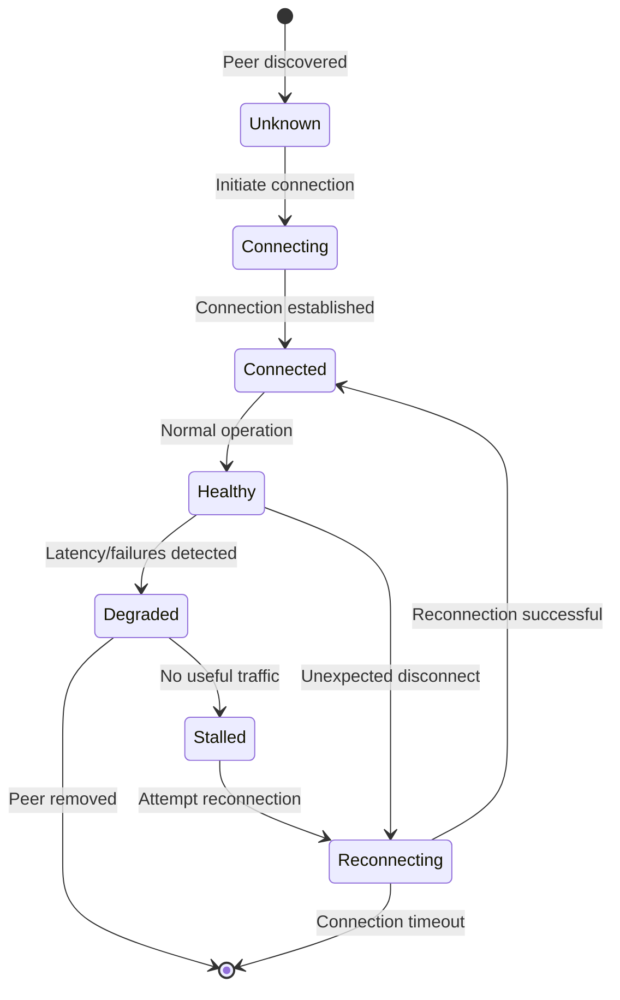
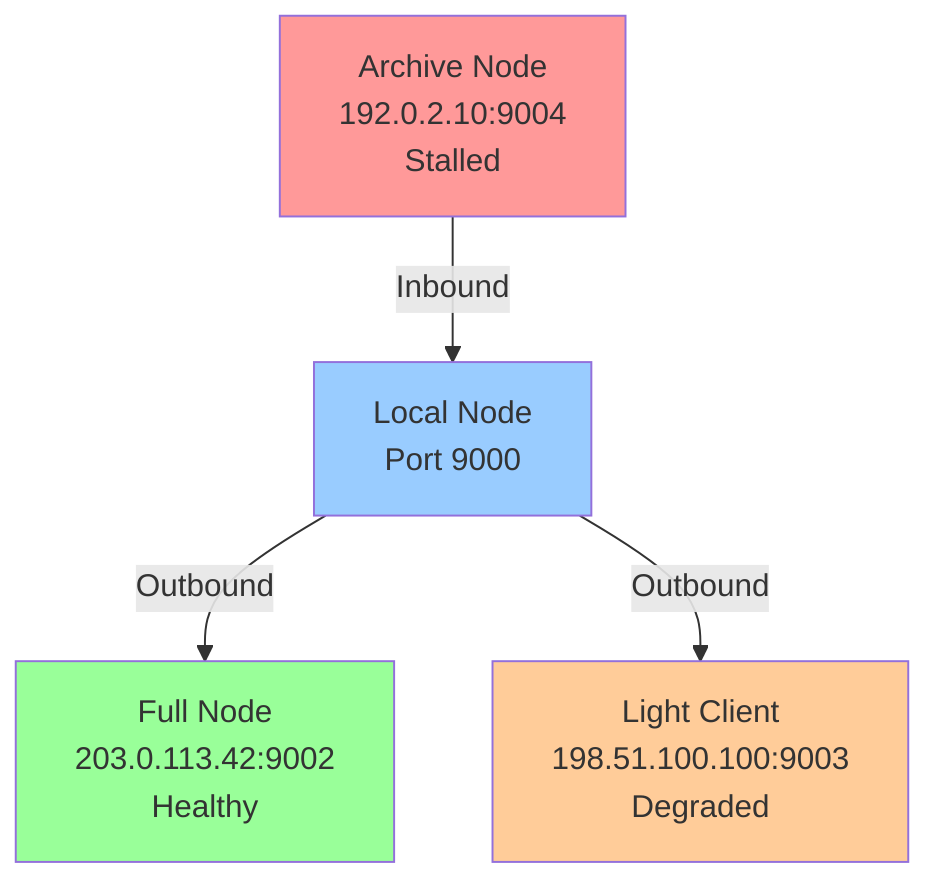

# Peer Discovery & Health Protocol

## Overview

The peers protocol manages peer discovery, network connectivity, and health monitoring. It supports dynamic peer announcement, manual peer addition, and continuous health metrics collection for network diagnostics.

## Commands

### get_peers

Retrieves the list of known peers filtered by reachable network groups.

**Request Format:**
```json
{
  "type": "get_peers"
}
```

**Response Format:**
```json
{
  "type": "peers",
  "count": 3,
  "peers": [
    "192.168.1.100:9000",
    "10.0.0.50:9001",
    "203.0.113.42:9002"
  ]
}
```

**Response Field Descriptions:**
| Field | Type | Description |
|-------|------|-------------|
| `type` | string | Fixed value: `"peers"` |
| `count` | integer | Number of peer addresses returned |
| `peers` | array | List of reachable peer addresses in "ip:port" format |

**Filtering Rules:**
- Peers are filtered by reachable network groups relative to the requester
- Local/private addresses (127.0.0.1, 10.0.0.0/8, 172.16.0.0/12, 192.168.0.0/16) are NEVER relayed to remote requesters
- Global/public addresses may be returned to any requester
- Link-local and loopback addresses are excluded

### announce_peer

Announces one or more peer addresses to the network, optionally promoting them in the peer list.

**Request Format:**
```json
{
  "type": "announce_peer",
  "peers": [
    "203.0.113.42:9002",
    "198.51.100.100:9003"
  ],
  "node_type": "full"
}
```

**Request Field Descriptions:**
| Field | Type | Description |
|-------|------|-------------|
| `type` | string | Fixed value: `"announce_peer"` |
| `peers` | array | List of peer addresses to announce |
| `node_type` | enum | Type of node: `"full"`, `"client"` |

**Valid Node Types:**
- `full`: Full node that relays mesh traffic
- `client`: Client node that does not relay third-party traffic

**Response Format:**
```json
{
  "type": "announce_peer_ack"
}
```

**Behavior:**
- Only valid node_types are accepted; invalid types are rejected with error
- **Authenticated requesters**: Can promote peers (move to front of peer list, reset cooldown)
- **Unauthenticated requesters**: Can learn about new peers but cannot promote existing ones
- Local addresses in the peer list are skipped/filtered out
- Response is sent immediately after validation

### add_peer

Manually adds one or more peer addresses to the local peer list (LOCAL ONLY).

**Request Format:**
```json
{
  "type": "add_peer",
  "peers": [
    "203.0.113.42:9002"
  ]
}
```

**Request Field Descriptions:**
| Field | Type | Description |
|-------|------|-------------|
| `type` | string | Fixed value: `"add_peer"` |
| `peers` | array | List of peer addresses to add |

**Success Response Format:**
```json
{
  "type": "ok",
  "peers": [
    "203.0.113.42:9002"
  ],
  "status": "peer 203.0.113.42:9002 added (network: ipv4)"
}
```

**Error Response Format:**
```json
{
  "type": "error",
  "error": "cannot add self as peer"
}
```

**Validation Rules:**
- Not self: Cannot add the node's own address as a peer
- Not forbidden IP: Rejects reserved/invalid IP ranges
- Reachable network group: Only allows peers in reachable network groups for the node
- Port validity: Port must be 1-65535

**Post-Addition Behavior:**
- Source marked as `"manual"` in peer metadata
- Cooldown timer is reset
- Peer is flushed immediately to persistent storage (survives node crash/restart)

**Scope:**
- This is a **LOCAL ONLY** command (not network-accessible)

### fetch_peer_health

Retrieves detailed health and connectivity information for all known peers.

**Request Format:**
```json
{
  "type": "fetch_peer_health"
}
```

**Response Format:**
```json
{
  "type": "peer_health",
  "count": 2,
  "peer_health": [
    {
      "address": "203.0.113.42:64646",
      "network": "ipv4",
      "direction": "outbound",
      "state": "healthy",
      "connected": true,
      "client_version": "0.21-alpha",
      "client_build": 21,
      "pending_count": 0,
      "score": 80,
      "last_connected_at": "2026-03-19T12:00:00Z",
      "last_ping_at": "2026-03-19T12:00:45Z",
      "last_pong_at": "2026-03-19T12:00:46Z",
      "last_useful_send_at": "2026-03-19T12:00:30Z",
      "last_useful_receive_at": "2026-03-19T12:00:35Z",
      "consecutive_failures": 0,
      "bytes_sent": 1024000,
      "bytes_received": 2048000,
      "total_traffic": 3072000
    },
    {
      "address": "198.51.100.100:64646",
      "network": "ipv4",
      "direction": "inbound",
      "state": "degraded",
      "connected": true,
      "client_version": "0.20-alpha",
      "client_build": 20,
      "pending_count": 5,
      "score": 45,
      "last_connected_at": "2026-03-19T11:45:00Z",
      "last_ping_at": "2026-03-19T12:00:15Z",
      "last_pong_at": "2026-03-19T12:00:20Z",
      "last_useful_send_at": "2026-03-19T11:59:00Z",
      "last_useful_receive_at": "2026-03-19T11:58:30Z",
      "consecutive_failures": 2,
      "last_error": "timeout",
      "bytes_sent": 512000,
      "bytes_received": 256000,
      "total_traffic": 768000
    }
  ]
}
```

**Response Field Descriptions:**
| Field | Type | Description |
|-------|------|-------------|
| `type` | string | Fixed value: `"peer_health"` |
| `count` | integer | Number of peers with health data |
| `peer_health[].address` | string | Peer IP:port address |
| `peer_health[].network` | string | Network group: `ipv4`, `ipv6`, `torv3`, `torv2`, `i2p`, `cjdns`, `local`, `unknown` |
| `peer_health[].direction` | enum | `"outbound"` (initiated by us) or `"inbound"` (peer initiated) |
| `peer_health[].state` | enum | `"healthy"`, `"degraded"`, `"stalled"`, `"reconnecting"` |
| `peer_health[].connected` | boolean | Currently connected state |
| `peer_health[].client_version` | string | Remote node software version |
| `peer_health[].client_build` | integer | Monotonic build number; compare with own build to detect newer releases |
| `peer_health[].pending_count` | integer | Number of pending outbound frames for this peer |
| `peer_health[].score` | integer | Reputation score, clamped to [-50, +100] |
| `peer_health[].last_connected_at` | RFC3339 | Last successful connection timestamp |
| `peer_health[].last_disconnected_at` | RFC3339 | Last disconnection timestamp |
| `peer_health[].last_ping_at` | RFC3339 | Last ping sent timestamp |
| `peer_health[].last_pong_at` | RFC3339 | Last pong received timestamp |
| `peer_health[].last_useful_send_at` | RFC3339 | Last non-heartbeat outbound frame |
| `peer_health[].last_useful_receive_at` | RFC3339 | Last non-heartbeat inbound frame |
| `peer_health[].consecutive_failures` | integer | Count of consecutive connection failures |
| `peer_health[].last_error` | string | Most recent session error |
| `peer_health[].bytes_sent` | integer | Total bytes sent to this peer across all sessions |
| `peer_health[].bytes_received` | integer | Total bytes received from this peer across all sessions |
| `peer_health[].total_traffic` | integer | Sum of bytes_sent and bytes_received |

**Health State Definitions:**
- `healthy`: Connected, recent successful pings/messages, no errors
- `degraded`: Connected but with elevated latency or occasional failures
- `stalled`: Connected but no useful messages recently
- `reconnecting`: Attempting to re-establish connection after failure

### fetch_network_stats

Retrieves aggregated network traffic statistics for the entire node.

**Request Format:**
```json
{
  "type": "fetch_network_stats"
}
```

**Response Format:**
```json
{
  "type": "network_stats",
  "total_bytes_sent": 10485760,
  "total_bytes_received": 20971520,
  "total_traffic": 31457280,
  "connected_peers": 5,
  "known_peers": 12,
  "peer_traffic": [
    {
      "address": "203.0.113.42:9002",
      "bytes_sent": 1024000,
      "bytes_received": 2048000,
      "total_traffic": 3072000,
      "connected": true
    },
    {
      "address": "198.51.100.100:9003",
      "bytes_sent": 512000,
      "bytes_received": 256000,
      "total_traffic": 768000,
      "connected": true
    }
  ]
}
```

**Response Field Descriptions:**
| Field | Type | Description |
|-------|------|-------------|
| `type` | string | Fixed value: `"network_stats"` |
| `total_bytes_sent` | integer | Total bytes sent across all peers (lifetime) |
| `total_bytes_received` | integer | Total bytes received across all peers (lifetime) |
| `total_traffic` | integer | Sum of sent and received bytes |
| `connected_peers` | integer | Count of currently connected peers |
| `known_peers` | integer | Count of all known peers (connected or not) |
| `peer_traffic[].address` | string | Individual peer IP:port |
| `peer_traffic[].bytes_sent` | integer | Bytes sent to this peer |
| `peer_traffic[].bytes_received` | integer | Bytes received from this peer |
| `peer_traffic[].total_traffic` | integer | Total traffic with this peer |
| `peer_traffic[].connected` | boolean | Current connection state |

### fetch_traffic_history

Retrieves rolling per-second traffic history collected by the metrics layer. The ring buffer holds up to 3600 samples (1 hour). Samples are returned in chronological order (oldest first).

**Request Format:**
```json
{
  "type": "fetch_traffic_history"
}
```

**Response Format:**
```json
{
  "type": "traffic_history",
  "traffic_history": {
    "interval_seconds": 1,
    "capacity": 3600,
    "count": 120,
    "samples": [
      {
        "timestamp": "2026-03-28T14:30:00Z",
        "bytes_sent_ps": 1024,
        "bytes_recv_ps": 2048,
        "total_sent": 102400,
        "total_received": 204800
      }
    ]
  }
}
```

**Response Field Descriptions:**
| Field | Type | Description |
|-------|------|-------------|
| `type` | string | Fixed value: `"traffic_history"` |
| `traffic_history.interval_seconds` | integer | Sampling interval (always 1) |
| `traffic_history.capacity` | integer | Maximum number of samples (3600) |
| `traffic_history.count` | integer | Current number of recorded samples |
| `traffic_history.samples[].timestamp` | RFC3339 | ISO 8601 timestamp (UTC) |
| `traffic_history.samples[].bytes_sent_ps` | integer | Bytes sent delta since previous sample |
| `traffic_history.samples[].bytes_recv_ps` | integer | Bytes received delta since previous sample |
| `traffic_history.samples[].total_sent` | integer | Cumulative bytes sent at this moment |
| `traffic_history.samples[].total_received` | integer | Cumulative bytes received at this moment |

## Peer address persistence

Peer addresses discovered via `get_peers` exchange and bootstrap are persisted locally in `peers-{port}.json` (default path: `.corsa/peers-{port}.json`, override: `CORSA_PEERS_PATH`). The file follows a reputation-based scoring model:

- each entry stores the peer address, node type, last connection/disconnection timestamps, consecutive failure count, source tag (`bootstrap`, `peer_exchange`, `persisted`), first-seen time (`added_at`), and a numeric score
- score increases on successful TCP handshake (+10) and decreases on failure (-5) or clean disconnect (-2), clamped to [-50, +100]
- stable metadata (`node_type`, `source`, `added_at`) loaded from the file is preserved across restart+flush cycles; only newly discovered peers derive these fields from runtime state
- the file is flushed every 5 minutes during the bootstrap loop and once on graceful shutdown; `Run` waits for the flush to complete before returning
- on restart, persisted peers are merged with bootstrap peers: bootstrap entries appear first, then persisted entries sorted by score descending; duplicates are skipped but their metadata is still used for health seeding
- the persisted list is capped at 500 entries; lowest-scoring entries are trimmed on save

## Peer dial prioritisation

Outgoing connection candidates are selected using score-based ordering instead of insertion order:

- `peerDialCandidates` sorts all eligible peers by score descending so that the healthiest peers are dialled first and degraded peers sink to the bottom
- a single connection failure does NOT trigger cooldown — the peer gets an immediate retry on the next bootstrap tick; starting from the second consecutive failure, exponential cooldown applies: `min(30s × 2^(failures−2), 30min)`; while the cooldown window is active (measured from `LastDisconnectedAt`), the peer is skipped
- a successful connection (`markPeerConnected`) resets `ConsecutiveFailures` to zero, immediately clearing any cooldown
- when a peer session ends (error or clean disconnect), the upstream slot is released immediately; the next `ensurePeerSessions` cycle (≤2 s) picks the best available candidate by score
- cooldown and score are evaluated against the primary peer address (the one stored in `s.peers`); fallback dial variants (e.g. same host with default port) inherit the primary's reputation so that cooldown cannot be bypassed by dialling an alternative port
- the pending outbound queue is also keyed by primary peer address, so frames queued while connected via a fallback variant are correctly flushed when any variant reconnects
- dial candidates with equal scores are sorted by insertion order (stable sort), preserving bootstrap-first priority
- **host deduplication**: if any active connection (outbound or inbound) already exists to a given host IP, all dial candidates with the same host are skipped; this maximises fault tolerance by spreading connections across distinct hosts rather than accumulating multiple connections to the same IP

## Queue state migration

The queue-state file carries a `"version"` field (current: `1`).  When loading a file with `version < 1` (or no version field — legacy files written before canonicalisation), a one-time migration runs.  For each non-primary key in `"pending"`:

1. if the host maps to exactly one known primary — frames are moved to that primary key
2. if the host has no known primaries (unknown host) or maps to more than one primary (ambiguous) — the entry cannot be resolved automatically; it is moved to the `"orphaned"` section and a warning is logged

After migration the version is set to `1` and subsequent restarts skip the migration entirely.  This means entries written by the current code (already keyed by primary address) are never touched.

Orphaned frames are persisted across restarts in `"orphaned"`.  They are not loaded into the runtime pending queue, but remain on disk for manual recovery (e.g. editing the JSON to move them to the correct primary key).

## Stale peer eviction

In-memory peer lists are periodically pruned to remove stale entries.  Every 10 minutes the node scans all known peers and removes those that meet **both** criteria:

- score ≤ −20 (`peerEvictScoreThreshold`)
- no successful connection within the last 24 hours (`peerEvictStaleWindow`); if the peer was never connected, `added_at` is used as the reference timestamp

Eviction cleans up all associated state (health, peer type, version, persisted metadata).  Bootstrap peers and currently-connected peers are **never** evicted regardless of score.

## Mesh learning (peer re-sync via syncTicker)

`servePeerSession` runs a `syncTicker` that fires every 4 seconds.  Each tick calls `syncPeerSession`, which sends `get_peers` to the connected peer and merges newly discovered addresses into the local pool via `addPeerAddress`.  This ensures the mesh constantly learns about new nodes through its existing connections without requiring a separate re-sync goroutine.

## Onion address support

Peer addresses may be `.onion` hostnames (Tor hidden services). When `CORSA_PROXY` is set to a SOCKS5 proxy address (e.g. `127.0.0.1:9050`), the node routes all `.onion` peer connections through the proxy:

- only valid `.onion` addresses are accepted: Tor v3 (56 base32 characters) and v2 (16 base32 characters, deprecated); malformed `.onion` hostnames are rejected during `normalizePeerAddress`
- `.onion` addresses are accepted as-is in the advertised address field; standard IP-based validation and forbidden-IP checks are bypassed for `.onion` hosts
- the SOCKS5 handshake uses `ATYP=0x03` (domain name) so the proxy resolves the `.onion` address, not the local node
- if no `CORSA_PROXY` is configured, `.onion` peer addresses are stored but excluded from dial candidates to avoid constant failed connection attempts
- non-`.onion` addresses continue to use direct TCP connections regardless of proxy configuration

## Peer State Lifecycle Diagram



**Diagram: Peer Connection State Lifecycle**

## Network Architecture Diagram



**Diagram: Peer Network Topology**

## Implementation Notes

1. **Network Group Filtering**: When responding to remote `get_peers` requests, filter addresses by network reachability (don't leak private IPs)

2. **Authenticated Promotion**: Peers announced by authenticated (v2 session) requesters can move to the front of the peer list and have their cooldown reset; unauthenticated peers cannot be promoted

3. **Persistent Manual Peers**: Peers added via `add_peer` are marked with source `"manual"` and flushed to disk immediately, surviving restarts

4. **Health Decay**: States transition from `healthy` → `degraded` → `stalled` based on timing thresholds for last successful messages/pings

5. **Error Accumulation**: `consecutive_failures` increments on each failed request and resets on successful message exchange

6. **Traffic Accounting**: `bytes_sent/received` are cumulative and never reset during a node lifetime (for session stats, subtract previous snapshots)

---

# Протокол Открытия Одноранговых Узлов и Здоровья

## Обзор

Протокол одноранговых узлов управляет открытием одноранговых узлов, сетевой подключаемостью и мониторингом здоровья. Он поддерживает динамическое объявление одноранговых узлов, ручное добавление одноранговых узлов и непрерывный сбор метрик здоровья для диагностики сети.

## Команды

### get_peers

Получает список известных одноранговых узлов, отфильтрованный по достижимым группам сетей.

**Формат запроса:**
```json
{
  "type": "get_peers"
}
```

**Формат ответа:**
```json
{
  "type": "peers",
  "count": 3,
  "peers": [
    "192.168.1.100:9000",
    "10.0.0.50:9001",
    "203.0.113.42:9002"
  ]
}
```

**Описание полей ответа:**
| Поле | Тип | Описание |
|------|-----|---------|
| `type` | строка | Фиксированное значение: `"peers"` |
| `count` | целое число | Количество возвращаемых адресов одноранговых узлов |
| `peers` | массив | Список достижимых адресов одноранговых узлов в формате "ip:port" |

**Правила фильтрации:**
- Одноранговые узлы фильтруются по достижимым группам сетей относительно запрашивающего
- Локальные/частные адреса (127.0.0.1, 10.0.0.0/8, 172.16.0.0/12, 192.168.0.0/16) НИКОГДА не передаются удаленным запрашивающим
- Глобальные/общедоступные адреса могут быть возвращены любому запрашивающему
- Адреса канального уровня и замыкания на себя исключены

### announce_peer

Объявляет один или несколько адресов одноранговых узлов сети, опционально повышая их в списке одноранговых узлов.

**Формат запроса:**
```json
{
  "type": "announce_peer",
  "peers": [
    "203.0.113.42:9002",
    "198.51.100.100:9003"
  ],
  "node_type": "full"
}
```

**Описание полей запроса:**
| Поле | Тип | Описание |
|------|-----|---------|
| `type` | строка | Фиксированное значение: `"announce_peer"` |
| `peers` | массив | Список адресов одноранговых узлов для объявления |
| `node_type` | перечисление | Тип узла: `"full"`, `"client"` |

**Допустимые типы узлов:**
- `full`: Полный узел, ретранслирующий mesh-трафик
- `client`: Клиентский узел, не ретранслирующий чужой трафик

**Формат ответа:**
```json
{
  "type": "announce_peer_ack"
}
```

**Поведение:**
- Принимаются только действительные node_types; недействительные типы отклоняются с ошибкой
- **Аутентифицированные запрашивающие**: Могут повышать одноранговые узлы (переместить на фронт списка одноранговых узлов, сбросить cooldown)
- **Неаутентифицированные запрашивающие**: Могут узнавать о новых одноранговых узлах, но не могут повышать существующие
- Локальные адреса в списке одноранговых узлов пропускаются/фильтруются
- Ответ отправляется немедленно после валидации

### add_peer

Вручную добавляет один или несколько адресов одноранговых узлов в локальный список одноранговых узлов (ТОЛЬКО ЛОКАЛЬНО).

**Формат запроса:**
```json
{
  "type": "add_peer",
  "peers": [
    "203.0.113.42:9002"
  ]
}
```

**Описание полей запроса:**
| Поле | Тип | Описание |
|------|-----|---------|
| `type` | строка | Фиксированное значение: `"add_peer"` |
| `peers` | массив | Список адресов одноранговых узлов для добавления |

**Формат успешного ответа:**
```json
{
  "type": "ok",
  "peers": [
    "203.0.113.42:9002"
  ],
  "status": "peer 203.0.113.42:9002 added (network: ipv4)"
}
```

**Формат ошибки ответа:**
```json
{
  "type": "error",
  "error": "cannot add self as peer"
}
```

**Правила валидации:**
- Не сам: Не может добавить собственный адрес узла как одноранговый узел
- Не запрещенный IP: Отклоняет зарезервированные/недопустимые диапазоны IP
- Достижимая группа сетей: Позволяет только одноранговые узлы в достижимых группах сетей для узла
- Допустимость портов: Порт должен быть 1-65535

**Поведение после добавления:**
- Источник отмечен как `"manual"` в метаданных одноранговых узлов
- Таймер cooldown сброшен
- Одноранговый узел немедленно загружен в постоянное хранилище (сохраняется при сбое/перезагрузке узла)

**Область:**
- Это команда **ТОЛЬКО ЛОКАЛЬНОГО** использования (не доступна через сеть)

### fetch_peer_health

Получает подробную информацию о здоровье и подключаемости для всех известных одноранговых узлов.

**Формат запроса:**
```json
{
  "type": "fetch_peer_health"
}
```

**Формат ответа:**
```json
{
  "type": "peer_health",
  "count": 2,
  "peer_health": [
    {
      "address": "203.0.113.42:64646",
      "network": "ipv4",
      "direction": "outbound",
      "state": "healthy",
      "connected": true,
      "client_version": "0.21-alpha",
      "client_build": 21,
      "pending_count": 0,
      "score": 80,
      "last_connected_at": "2026-03-19T12:00:00Z",
      "last_ping_at": "2026-03-19T12:00:45Z",
      "last_pong_at": "2026-03-19T12:00:46Z",
      "last_useful_send_at": "2026-03-19T12:00:30Z",
      "last_useful_receive_at": "2026-03-19T12:00:35Z",
      "consecutive_failures": 0,
      "bytes_sent": 1024000,
      "bytes_received": 2048000,
      "total_traffic": 3072000
    },
    {
      "address": "198.51.100.100:64646",
      "network": "ipv4",
      "direction": "inbound",
      "state": "degraded",
      "connected": true,
      "client_version": "0.20-alpha",
      "client_build": 20,
      "pending_count": 5,
      "score": 45,
      "last_connected_at": "2026-03-19T11:45:00Z",
      "last_ping_at": "2026-03-19T12:00:15Z",
      "last_pong_at": "2026-03-19T12:00:20Z",
      "last_useful_send_at": "2026-03-19T11:59:00Z",
      "last_useful_receive_at": "2026-03-19T11:58:30Z",
      "consecutive_failures": 2,
      "last_error": "timeout",
      "bytes_sent": 512000,
      "bytes_received": 256000,
      "total_traffic": 768000
    }
  ]
}
```

**Описание полей ответа:**
| Поле | Тип | Описание |
|------|-----|---------|
| `type` | строка | Фиксированное значение: `"peer_health"` |
| `count` | целое число | Количество одноранговых узлов с данными о здоровье |
| `peer_health[].address` | строка | Адрес однорангового узла IP:port |
| `peer_health[].network` | строка | Группа сети: `ipv4`, `ipv6`, `torv3`, `torv2`, `i2p`, `cjdns`, `local`, `unknown` |
| `peer_health[].direction` | перечисление | `"outbound"` (инициирован нами) или `"inbound"` (инициирован одноранговым узлом) |
| `peer_health[].state` | перечисление | `"healthy"`, `"degraded"`, `"stalled"`, `"reconnecting"` |
| `peer_health[].connected` | логическое значение | Текущее состояние подключения |
| `peer_health[].client_version` | строка | Версия программного обеспечения удалённого узла |
| `peer_health[].client_build` | целое число | Монотонный номер сборки; сравнение с собственным определяет наличие обновлений |
| `peer_health[].pending_count` | целое число | Количество ожидающих исходящих фреймов для этого узла |
| `peer_health[].score` | целое число | Оценка репутации, ограничена диапазоном [-50, +100] |
| `peer_health[].last_connected_at` | RFC3339 | Последняя успешная временная метка подключения |
| `peer_health[].last_disconnected_at` | RFC3339 | Последняя временная метка отключения |
| `peer_health[].last_ping_at` | RFC3339 | Последняя временная метка отправки пинга |
| `peer_health[].last_pong_at` | RFC3339 | Последняя временная метка получения понга |
| `peer_health[].last_useful_send_at` | RFC3339 | Последний не-heartbeat исходящий фрейм |
| `peer_health[].last_useful_receive_at` | RFC3339 | Последний не-heartbeat входящий фрейм |
| `peer_health[].consecutive_failures` | целое число | Количество последовательных неудачных подключений |
| `peer_health[].last_error` | строка | Последняя ошибка сессии |
| `peer_health[].bytes_sent` | целое число | Всего отправлено байт этому узлу за все сессии |
| `peer_health[].bytes_received` | целое число | Всего получено байт от этого узла за все сессии |
| `peer_health[].total_traffic` | целое число | Сумма bytes_sent и bytes_received |

**Определения состояния здоровья:**
- `healthy`: Подключено, недавние успешные пинги/сообщения, нет ошибок
- `degraded`: Подключено, но с повышенной латентностью или периодическими сбоями
- `stalled`: Подключено, но нет полезных сообщений в последнее время
- `reconnecting`: Попытка восстановления подключения после сбоя

### fetch_network_stats

Получает совокупную статистику сетевого трафика для всего узла.

**Формат запроса:**
```json
{
  "type": "fetch_network_stats"
}
```

**Формат ответа:**
```json
{
  "type": "network_stats",
  "total_bytes_sent": 10485760,
  "total_bytes_received": 20971520,
  "total_traffic": 31457280,
  "connected_peers": 5,
  "known_peers": 12,
  "peer_traffic": [
    {
      "address": "203.0.113.42:9002",
      "bytes_sent": 1024000,
      "bytes_received": 2048000,
      "total_traffic": 3072000,
      "connected": true
    },
    {
      "address": "198.51.100.100:9003",
      "bytes_sent": 512000,
      "bytes_received": 256000,
      "total_traffic": 768000,
      "connected": true
    }
  ]
}
```

**Описание полей ответа:**
| Поле | Тип | Описание |
|------|-----|---------|
| `type` | строка | Фиксированное значение: `"network_stats"` |
| `total_bytes_sent` | целое число | Всего отправлено байт через все одноранговые узлы (за жизненный цикл) |
| `total_bytes_received` | целое число | Всего получено байт через все одноранговые узлы (за жизненный цикл) |
| `total_traffic` | целое число | Сумма отправленных и полученных байт |
| `connected_peers` | целое число | Количество в данный момент подключенных одноранговых узлов |
| `known_peers` | целое число | Количество всех известных одноранговых узлов (подключено или нет) |
| `peer_traffic[].address` | строка | Индивидуальный адрес одноранговой узла IP:port |
| `peer_traffic[].bytes_sent` | целое число | Отправлено байт этому одноранговому узлу |
| `peer_traffic[].bytes_received` | целое число | Получено байт от этого одноранговой узла |
| `peer_traffic[].total_traffic` | целое число | Общий трафик с этим одноранговым узлом |
| `peer_traffic[].connected` | логическое значение | Текущее состояние подключения |

### fetch_traffic_history

Возвращает посекундную историю трафика, собираемую слоем метрик. Кольцевой буфер вмещает до 3600 семплов (1 час). Семплы возвращаются в хронологическом порядке (от старых к новым).

**Формат запроса:**
```json
{
  "type": "fetch_traffic_history"
}
```

**Формат ответа:**
```json
{
  "type": "traffic_history",
  "traffic_history": {
    "interval_seconds": 1,
    "capacity": 3600,
    "count": 120,
    "samples": [
      {
        "timestamp": "2026-03-28T14:30:00Z",
        "bytes_sent_ps": 1024,
        "bytes_recv_ps": 2048,
        "total_sent": 102400,
        "total_received": 204800
      }
    ]
  }
}
```

**Описание полей ответа:**
| Поле | Тип | Описание |
|------|-----|---------|
| `type` | строка | Фиксированное значение: `"traffic_history"` |
| `traffic_history.interval_seconds` | целое число | Интервал сбора (всегда 1) |
| `traffic_history.capacity` | целое число | Максимальное количество семплов (3600) |
| `traffic_history.count` | целое число | Текущее количество записанных семплов |
| `traffic_history.samples[].timestamp` | RFC3339 | Временная метка ISO 8601 (UTC) |
| `traffic_history.samples[].bytes_sent_ps` | целое число | Дельта байт отправленных с предыдущего семпла |
| `traffic_history.samples[].bytes_recv_ps` | целое число | Дельта байт полученных с предыдущего семпла |
| `traffic_history.samples[].total_sent` | целое число | Кумулятивные байты отправленные на этот момент |
| `traffic_history.samples[].total_received` | целое число | Кумулятивные байты полученные на этот момент |

## Персистенция адресов пиров

Адреса пиров, обнаруженные через обмен `get_peers` и bootstrap, сохраняются локально в `peers-{port}.json` (путь по умолчанию: `.corsa/peers-{port}.json`, переопределение: `CORSA_PEERS_PATH`). Файл использует репутационную модель scoring:

- каждая запись хранит адрес пира, тип ноды, временные метки последнего подключения/отключения, число последовательных ошибок, тег источника (`bootstrap`, `peer_exchange`, `persisted`), время первого обнаружения (`added_at`) и числовой score
- score увеличивается при успешном TCP-рукопожатии (+10) и уменьшается при ошибке (-5) или чистом отключении (-2), зажат в диапазоне [-50, +100]
- стабильные метаданные (`node_type`, `source`, `added_at`) загруженные из файла сохраняются через циклы restart+flush; только для вновь обнаруженных пиров эти поля вычисляются из runtime-состояния
- файл сбрасывается на диск каждые 5 минут в bootstrap loop и один раз при graceful shutdown; `Run` дожидается завершения flush перед возвратом
- при перезапуске персистированные пиры мержатся с bootstrap: записи bootstrap идут первыми, затем персистированные в порядке убывания score; дубликаты пропускаются, но их метаданные используются для инициализации health
- список ограничен 500 записями; записи с наименьшим score обрезаются при сохранении

## Приоритизация пиров при подключении

Кандидаты для исходящих соединений выбираются с score-based сортировкой вместо порядка вставки:

- `peerDialCandidates` сортирует всех доступных пиров по score по убыванию, чтобы самые здоровые пиры подключались первыми, а проблемные опускались вниз
- одна ошибка подключения НЕ включает cooldown — пир получает немедленную повторную попытку на следующем тике bootstrap; начиная со второй подряд ошибки действует экспоненциальный cooldown: `min(30с × 2^(failures−2), 30мин)`; пока окно cooldown активно (от момента `LastDisconnectedAt`), пир пропускается
- успешное подключение (`markPeerConnected`) сбрасывает `ConsecutiveFailures` в ноль, немедленно снимая cooldown
- при завершении пир-сессии (ошибка или чистое отключение) upstream-слот освобождается немедленно; следующий цикл `ensurePeerSessions` (≤2 с) выбирает лучшего кандидата по score
- cooldown и score вычисляются по основному адресу пира (тому, что хранится в `s.peers`); fallback-варианты (тот же хост с портом по умолчанию) наследуют репутацию основного, чтобы cooldown нельзя было обойти попыткой подключения на альтернативный порт
- очередь исходящих pending-фреймов также привязана к основному адресу пира, поэтому фреймы, поставленные в очередь через fallback-вариант, корректно отправляются при переподключении через любой вариант
- кандидаты для подключения с одинаковым score сортируются по порядку добавления (стабильная сортировка), сохраняя приоритет bootstrap-пиров
- **дедупликация по хосту**: если к данному IP-хосту уже есть активное соединение (исходящее или входящее), все кандидаты с тем же хостом пропускаются; это максимизирует отказоустойчивость за счёт распределения соединений по разным хостам, а не накопления нескольких соединений к одному IP

## Миграция queue state

Файл queue-state содержит поле `"version"` (текущая: `1`). При загрузке файла с `version < 1` (или без поля version — legacy-файлы, записанные до каноникализации) выполняется одноразовая миграция. Для каждого не-primary ключа в `"pending"`:

1. если host однозначно маппится на один known primary — фреймы переносятся на этот primary-ключ
2. если у host нет known primary (неизвестный хост) или host маппится на несколько primary (неоднозначный) — запись не может быть автоматически разрешена; она перемещается в секцию `"orphaned"` и логируется warning

После миграции version устанавливается в `1`, и последующие рестарты пропускают миграцию полностью. Это означает, что записи, сделанные текущей версией кода (уже ключеванные по primary-адресу), никогда не затрагиваются.

Orphaned фреймы сохраняются между рестартами в `"orphaned"`. Они не загружаются в runtime pending-очередь, но остаются на диске для ручного восстановления (например, редактированием JSON и переносом на правильный primary-ключ).

## Вытеснение устаревших пиров

Список пиров в памяти периодически очищается для удаления устаревших записей. Каждые 10 минут нода проверяет всех известных пиров и удаляет тех, кто удовлетворяет **обоим** критериям:

- score ≤ −20 (`peerEvictScoreThreshold`)
- не было успешного подключения за последние 24 часа (`peerEvictStaleWindow`); если пир никогда не подключался, используется `added_at` как точка отсчёта

При вытеснении очищается всё связанное состояние (health, тип пира, версия, персистированные метаданные). Bootstrap-пиры и подключённые в данный момент пиры **никогда** не удаляются вне зависимости от score.

## Обучение mesh-сети (re-sync через syncTicker)

`servePeerSession` запускает `syncTicker`, который срабатывает каждые 4 секунды. При каждом тике вызывается `syncPeerSession`, который отправляет `get_peers` подключённому пиру и добавляет новые адреса в локальный пул через `addPeerAddress`. Это обеспечивает постоянное обнаружение новых нод через существующие соединения без необходимости отдельной goroutine для re-sync.

## Поддержка onion-адресов

Адреса пиров могут быть `.onion` хостнеймами (Tor hidden services). При установке `CORSA_PROXY` в адрес SOCKS5 прокси (например `127.0.0.1:9050`) нода маршрутизирует все `.onion` соединения через прокси:

- принимаются только валидные `.onion` адреса: Tor v3 (56 символов base32) и v2 (16 символов base32, deprecated); некорректные `.onion` хостнеймы отклоняются при `normalizePeerAddress`
- `.onion` адреса принимаются как есть в advertised address; стандартная IP-валидация и проверки forbidden-IP не применяются к `.onion` хостам
- SOCKS5 рукопожатие использует `ATYP=0x03` (доменное имя), чтобы прокси разрешал `.onion` адрес, а не локальная нода
- если `CORSA_PROXY` не настроен, `.onion` адреса пиров сохраняются, но исключаются из кандидатов на подключение, чтобы избежать постоянных неудачных попыток
- non-`.onion` адреса продолжают использовать прямые TCP-соединения вне зависимости от настройки прокси

## Диаграмма жизненного цикла состояния одноранговых узлов


**Диаграмма: Жизненный цикл состояния подключения одноранговых узлов**

## Диаграмма архитектуры сети


**Диаграмма: Топология сети одноранговых узлов**

## Примечания реализации

1. **Фильтрация группы сетей**: При ответе на удаленные запросы `get_peers`, фильтруйте адреса по достижимости сети (не раскрывайте частные IP-адреса)

2. **Аутентифицированное повышение**: Одноранговые узлы, объявленные аутентифицированными (сеанс v2) запрашивающими, могут переместиться на фронт списка одноранговых узлов и иметь сброс их cooldown; неаутентифицированные одноранговые узлы не могут быть повышены

3. **Постоянные ручные одноранговые узлы**: Одноранговые узлы, добавленные через `add_peer`, отмечаются источником `"manual"` и немедленно загружаются на диск, пережившие перезагрузки

4. **Снижение здоровья**: Состояния переходят от `healthy` → `degraded` → `stalled` на основе временных пороговых значений для последних успешных сообщений/пингов

5. **Накопление ошибок**: `consecutive_failures` увеличивает с каждым неудачным запросом и сбрасывается при успешном обмене сообщениями

6. **Учет трафика**: `bytes_sent/received` кумулятивны и никогда не сбрасываются во время жизненного цикла узла (для статистики сеанса вычтите предыдущие снимки)
