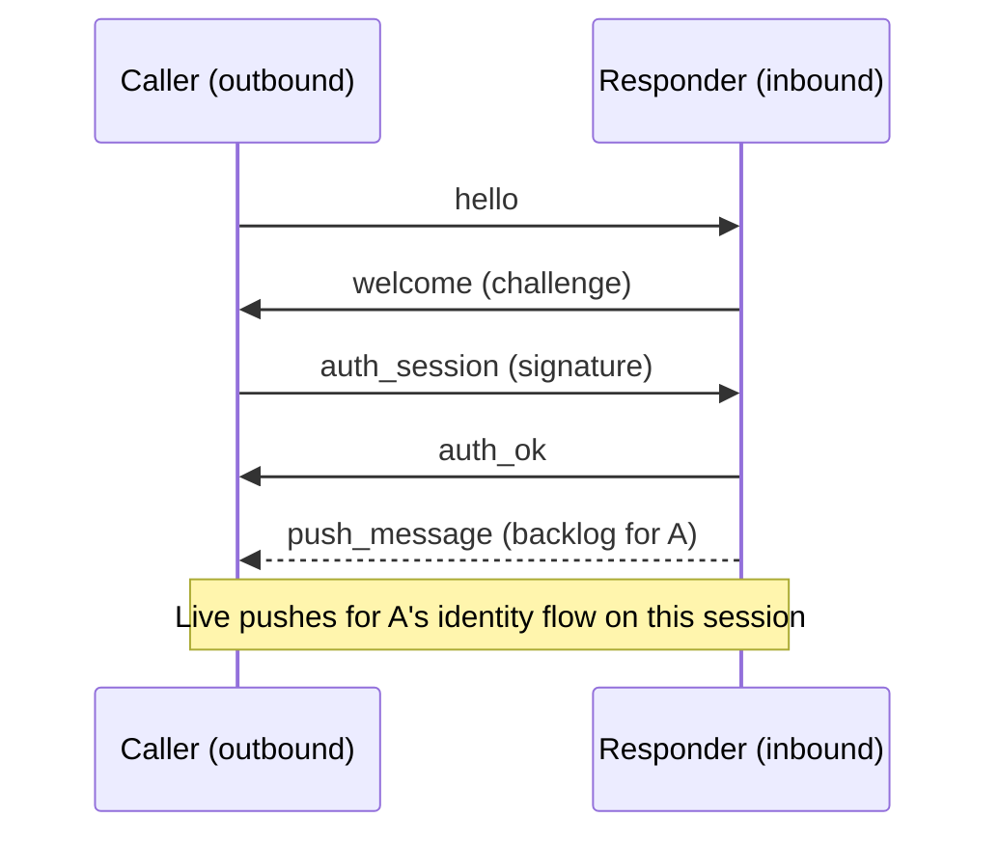
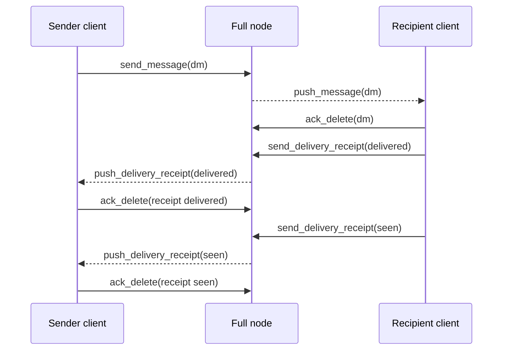
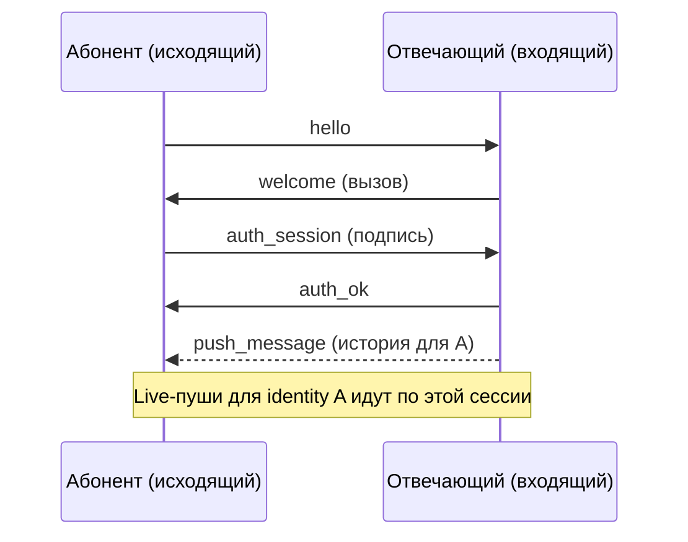
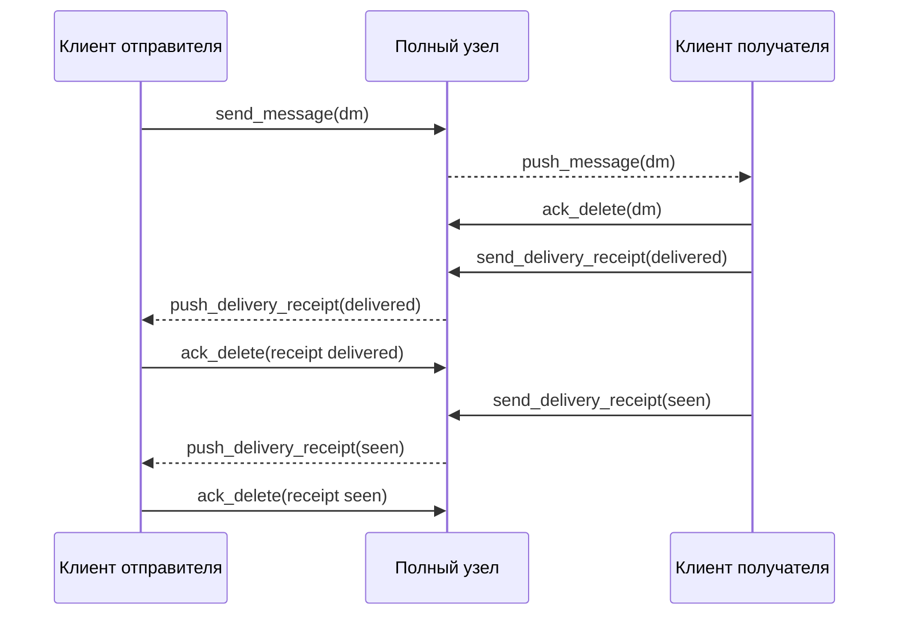

# Realtime Delivery System

## Overview

The realtime delivery system enables low-latency message and receipt delivery between peers in the Corsa network. The inbox subscription is folded into authentication: the responder registers the authenticated peer's inbox route and replays its backlog at `auth_ok` (`registerHelloRoute` + `pushBacklogToSubscriber`). There is no explicit subscription command on the wire — the legacy `subscribe_inbox`/`subscribed`/`request_inbox` exchange was removed when `MinimumProtocolVersion` reached 20.

## Core Concepts

### Subscription Model

The subscription is established at authentication time. When a node peer
completes `auth_session`, the responder installs a node-route subscriber for
the authenticated identity (`registerHelloRoute`) and replays the stored
backlog strictly after `auth_ok` is enqueued (`pushBacklogToSubscriber`).
Every node receives its own inbox over **its own** outbound (authenticating)
sessions; gossip guarantees mesh-wide propagation regardless.

**Key principles:**
- The subscription is bound to the authenticated identity — a peer can never
  subscribe to another identity's inbox because no subscription command exists
- Backlog replay is ordered strictly after `auth_ok` on the same connection
- Backlog replay is serialized per connection to ensure ordering
- Acknowledgements (ack_delete) remove items from backlog after delivery

History note: before ProtocolVersion 20 the subscription was an explicit
symmetric `subscribe_inbox`/`subscribed` exchange (with a `request_inbox`
pull-only predecessor). Those commands were removed from the wire protocol
entirely once `MinimumProtocolVersion` reached 20; peers below the floor are
rejected at handshake.

### Topics

- `dm` - Direct messages between peers
- Receipts are delivered via separate receipt backlog mechanism

### Backlog Guarantee

Messages and receipts are held in the node's **runtime backlog during node uptime** and replayed to subscribers when they (re)connect, covering a peer being temporarily offline. The replay covers only messages this node is a party to (its own sent DMs for a remote subscriber); transit envelopes are in-flight forwarding state, never replayed as a mailbox. Once a subscriber acknowledges receipt via `ack_delete`, the item is removed from the backlog.

This is **not a restart-durable guarantee for relay-only nodes**: the backlog and relay/queue state are in-memory and are **lost on process restart** (see *Pending frame queue* in `docs/mesh.md`). Durable, restart-surviving storage exists only where a `MessageStore` is present — i.e. the recipient's own messages on a node that stores them, and the desktop `chatlog.db`. For relay/transit traffic, recovery across a restart is sender-side end-to-end retry: the delivery retry scheduler re-sends until the delivered/seen receipt arrives and is reseeded from chatlog rows still in `sent` after a sender restart (see `docs/protocol/delivery.md`).

## Protocol Messages

### Inbox subscription at auth (no wire command)

There is no subscription request frame. The flow is:

1. **Caller connects and authenticates:** outbound peer sends `hello`,
   receives the `welcome` challenge, responds with the `auth_session`
   signature, receives `auth_ok`
2. **Responder auto-registers:** during `auth_session` handling the responder
   installs a node-route subscriber for the authenticated identity
   (`registerHelloRoute`)
3. **Backlog replay:** strictly after `auth_ok` is enqueued, the responder
   replays the stored backlog (`push_message` / `push_delivery_receipt`)
4. **Live streaming:** subsequent messages for the identity are pushed live



*Diagram: auth-time inbox subscription and backlog replay (current protocol).*

### push_message

**Format:**
```json
{
  "type": "push_message",
  "topic": "dm",
  "recipient": "<recipient-fingerprint>",
  "item": {
    "id": "550e8400-e29b-41d4-a716-446655440000",
    "flag": "sender-delete",
    "created_at": "2026-03-28T14:30:00Z",
    "ttl_seconds": 0,
    "sender": "<sender-fingerprint>",
    "recipient": "<recipient-fingerprint>",
    "body": "<ciphertext-base64url>"
  }
}
```

**Field descriptions:**
- `type` - Always "push_message"
- `topic` - The subscription topic (e.g., "dm")
- `recipient` - Address the message is being delivered to
- `item.id` - UUID of the message
- `item.flag` - Optional flag (e.g., "sender-delete" for messages marked for deletion by sender)
- `item.created_at` - ISO 8601 timestamp when message was created
- `item.ttl_seconds` - Time-to-live in seconds; 0 means indefinite
- `item.sender` - Fingerprint of message sender
- `item.recipient` - Fingerprint of message recipient
- `item.body` - End-to-end encrypted message content (base64url encoded)

**Sending triggers:**
- New message arrives at the serving node for a subscribed recipient
- During backlog replay to a newly subscribed peer

**Independence:** Push and gossip operate independently. Push optimizes for low-latency delivery to connected subscribers, while gossip ensures mesh-wide propagation and redundancy.

### push_delivery_receipt

**Format:**
```json
{
  "type": "push_delivery_receipt",
  "recipient": "<recipient-fingerprint>",
  "receipt": {
    "message_id": "550e8400-e29b-41d4-a716-446655440000",
    "sender": "<sender-fingerprint>",
    "recipient": "<recipient-fingerprint>",
    "status": "delivered",
    "delivered_at": "2026-03-28T14:30:15Z"
  }
}
```

**Field descriptions:**
- `type` - Always "push_delivery_receipt"
- `recipient` - Address the receipt is being delivered to (typically the sender of the original message)
- `receipt.message_id` - UUID of the message this receipt acknowledges
- `receipt.sender` - Fingerprint of the message recipient (who is sending this receipt)
- `receipt.recipient` - Fingerprint of the message sender (who will receive this receipt)
- `receipt.status` - Status string: `"delivered"`, `"seen"`, or `"seen_ack"` (v23: the original sender's end-to-end confirmation of a received `seen` receipt; never persisted to chatlog, never surfaced to the UI)
- `receipt.delivered_at` - ISO 8601 timestamp when status was recorded

**Delivery sources:**
- Backlog replay when a recipient confirms delivery
- Live delivery when a recipient sends a new delivery confirmation

### ack_delete

**DM backlog acknowledgement:**
```json
{
  "type": "ack_delete",
  "address": "<fingerprint>",
  "ack_type": "dm",
  "id": "550e8400-e29b-41d4-a716-446655440000",
  "status": "",
  "signature": "<base64url-ed25519-signature>"
}
```

**Receipt backlog acknowledgement:**
```json
{
  "type": "ack_delete",
  "address": "<fingerprint>",
  "ack_type": "receipt",
  "id": "550e8400-e29b-41d4-a716-446655440000",
  "status": "delivered",
  "signature": "<base64url-ed25519-signature>"
}
```

**Signature computation:**
```
payload = "corsa-ack-delete-v1|<address>|<ack_type>|<id>|<status>"
signature = ed25519_sign(payload, private_key)
```

**Field descriptions:**
- `address` - Fingerprint of the acknowledging peer
- `ack_type` - Type of item being acknowledged ("dm" or "receipt")
- `id` - UUID of the item being acknowledged
- `status` - Status field (empty for DM acks, "delivered"/"seen" for receipt acks)
- `signature` - Ed25519 signature over the canonical payload

**Rules:**
- Only valid in authenticated v2 sessions
- Invalid signature results in ban score increment
- After valid acknowledgement, the backlog item is removed and will not be resent
- Sender address must match the authenticated identity on the connection
- Sent via the normal outbound peer session (if available) or deferred until one is established; the item remains in the backlog and will be re-pushed on backlog replay if the ack has not yet been delivered

## Connection Management

### Write Serialization

All writes to a subscriber TCP connection are serialized by a per-connection mutex (`connWriteMu`):

1. The `auth_ok` reply is written first
2. Backlog replay begins **only after** `auth_ok` is fully enqueued
3. All messages and receipts from backlog are written sequentially
4. Live pushes are queued and written in order

This serialization ensures:
- Messages arrive in causal order
- Subscribers never observe backlog frames ahead of `auth_ok`
- No interleaving of messages from different backlog flushes or live updates

### Connection Lifecycle

1. **Authentication:** Peer authenticates via `auth_session` signature; the responder auto-registers the inbox route and replays the backlog at `auth_ok`
2. **Live streaming:** the authenticated peer receives live `push_message` and `push_delivery_receipt` updates; each node receives its own inbox over its own outbound (authenticating) session
3. **Acknowledgements:** Each peer sends `ack_delete` to confirm receipt and release backlog items

### Handshake reply: no-eviction contract

The replies that complete the session-setup handshake (`auth_ok`,
`peers`, `contacts`) travel through a dedicated send path
(`sendHandshakeReplyViaNetwork`) that intentionally weakens the
slow-peer eviction policy used by every other reply.

**Why a separate path:** during the initial seconds of a connection the
peer's writer queue is being drained by its own broadcast traffic —
most notably the initial `announce_routes` flush sent to every freshly
authenticated outbound peer. On a full-routing-table node this burst
can fill the 128-slot outbound channel within ~100-300ms. The regular
reply helper closes the connection on `ErrSendBufferFull` (the
documented slow-peer eviction signal), which means the next handshake
reply in line — almost always the `auth_ok` that the dialler is
waiting on — torpedoes the session before it ever reaches Active. The
dialler observes a bare `EOF` during session setup and emits
`cm_session_setup_failed`; combined with the default 2-4-8s retry
backoff, this fans out into a CPU-burning storm whenever a small set
of bootstrap nodes is the only candidate pool.

**Contract:**

1. **Async fast path.** `sendHandshakeReplyViaNetwork` first attempts a
   non-blocking `SendFrame`, exactly like the regular reply path. On
   any outcome other than `ErrSendBufferFull` the result is returned
   verbatim — the connection is never closed from this helper.
2. **Bounded blocking fallback.** Only when the async send returned
   `ErrSendBufferFull` does the helper fall back to `SendFrameSync`
   with an internal timeout cap (`handshakeReplyTimeout = 2s`). The
   blocking variant absorbs the transient broadcast burst; the timeout
   stops a permanently dead peer from parking the goroutine. If the
   blocking attempt also fails, the sentinel is returned without
   closing the connection.
3. **No eviction from this helper.** A wedged peer is still evicted —
   but by the heartbeat path (`inboundHeartbeat`), which is the
   documented owner of liveness-based eviction. The handshake-reply
   helper is deliberately silent on buffer pressure so a transient
   self-inflicted overload (peer broadcasts saturating its own writer)
   cannot kill a session that is otherwise healthy.

**Applies to:** `auth_ok` (replies to `auth_session`), `peers`
(replies to `get_peers`), `contacts` (replies to `fetch_contacts`).

**Does NOT apply to:** data-plane replies (`push_message`,
`push_delivery_receipt`, `relay_*`, `announce_*`). These keep the
original eviction-on-saturation contract — a peer that cannot keep up
with live traffic IS a slow peer and should be replaced.

**`auth_ok` half-auth window.** `auth_ok` is fired AFTER
`handleAuthSession` has already committed substantial local state:
`setConnAuthStateByID(Verified=true)`, hello learning, route
registration, mirroring identity into NetCore, and a background
`announcePeerToSessions` goroutine. Rolling those back on a failed
ack is intentionally NOT attempted — the cleanup graph is wide,
cross-domain (peer + ipState + gossip), and partially asynchronous
(separate goroutines already running).

Failure mode when the ack does not land:

1. **Dialler side: no same-session retry.**
   `authenticatePeerSession` waits for `auth_ok` via
   `peerSessionRequest` bounded by `peerRequestTimeout`
   (`peer_sessions.go::authenticatePeerSession`). It does NOT reissue
   `auth_session` on the same TCP socket — on timeout it returns an
   error that bubbles up to `openPeerSessionForCM`, which closes the
   connection and emits `DialFailed` to the ConnectionManager.
2. **CM-driven reconnect.** `DialFailed` cycles through
   `reconnectMaxRetries` with exponential backoff. Each retry opens
   a fresh TCP connection with a new `connID`. `handleAuthSession`
   runs from scratch on the new `connID` — the `Verified` fast-path
   applies only to repeat auth on the SAME `connID` and does not
   carry across reconnects, so every redial pays the full
   `auth_session` round-trip and re-fires the side-effect chain
   (route registration is idempotent at the routing-table layer;
   announce goroutine simply emits another announce; hello cache
   re-learns the same values).
3. **Local cleanup.** The previous session's `connID` still carries
   `Verified=true` and the side-effect chain (route entry, announce
   output, hello cache). `handleConn`'s defer
   (`clearConnAuth`, `removeSubscriberConnID`,
   `trackInboundDisconnect`) cleans those up when the peer finally
   drops the dead TCP socket or when our own read loop hits EOF.

Window bound: from ack-drop to `handleConn` defer firing. Usually
short because the dialler closes promptly on its own
`peerRequestTimeout`. Worst case is one inbound read deadline
(`120s` `inboundReadTimeout`) on the failing socket. If the outbound
buffer never drains, the heartbeat path (`inboundHeartbeat`) evicts
us on its own schedule. A failed `auth_ok` is logged at WARN with
`conn_id` for forensics.

## Message Delivery Flow

The complete delivery flow from sender to receiver includes message delivery followed by receipt tracking:



**Steps:**

1. **Send message:** Sender client sends a DM through the full node
2. **Push to recipient:** Full node pushes the message to subscribed recipient client
3. **Acknowledge delivery:** Recipient client acknowledges the message via `ack_delete(dm)`
4. **Send delivery receipt:** Recipient client sends delivery confirmation (status="delivered")
5. **Push receipt to sender:** Full node pushes the receipt to subscribed sender client
6. **Acknowledge receipt:** Sender client acknowledges the receipt via `ack_delete(receipt delivered)`
7. **Send seen receipt:** Recipient client sends seen confirmation (status="seen")
8. **Push seen to sender:** Full node pushes the seen receipt to subscribed sender client
9. **Acknowledge seen:** Sender client acknowledges the seen receipt via `ack_delete(receipt seen)`

**Guarantees (within node uptime):**
- Messages and receipts are retained in the runtime backlog until acknowledged (in-memory; not restart-durable for relay-only nodes — see *Backlog Guarantee*)
- If a peer disconnects, all unacknowledged items are replayed on reconnection
- Each ack removes an item from backlog, freeing memory
- Receipt tracking enables progressive confirmation (delivered → seen)

---

# Система доставки в реальном времени

## Обзор

Система доставки в реальном времени обеспечивает низколатентную доставку сообщений и подтверждений между узлами сети Corsa. Подписка на inbox свёрнута в аутентификацию: отвечающая сторона регистрирует inbox-маршрут аутентифицированного пира и реплеит его историю на `auth_ok` (`registerHelloRoute` + `pushBacklogToSubscriber`). Явной команды подписки на проводе нет — легаси-обмен `subscribe_inbox`/`subscribed`/`request_inbox` удалён, когда `MinimumProtocolVersion` достиг 20.

## Основные концепции

### Модель подписки

Подписка устанавливается в момент аутентификации. Когда node-пир завершает
`auth_session`, отвечающая сторона ставит node-route-подписчика для
аутентифицированной identity (`registerHelloRoute`) и реплеит сохранённую
историю строго после постановки `auth_ok` в writer
(`pushBacklogToSubscriber`). Каждый узел получает свой inbox через
**собственные** исходящие (аутентифицирующиеся) сессии; gossip в любом случае
гарантирует распространение по mesh.

**Ключевые принципы:**
- Подписка привязана к аутентифицированной identity — подписаться на чужой
  inbox невозможно, потому что команды подписки не существует
- Replay истории упорядочен строго после `auth_ok` на том же соединении
- Replay истории сериализуется на каждое соединение для обеспечения порядка
- Подтверждения (ack_delete) удаляют элементы из истории после доставки

Историческая справка: до ProtocolVersion 20 подписка была явным симметричным
обменом `subscribe_inbox`/`subscribed` (с pull-предшественником
`request_inbox`). Эти команды полностью удалены из wire-протокола, когда
`MinimumProtocolVersion` достиг 20; пиры ниже порога отклоняются на handshake.

### Топики

- `dm` - Прямые сообщения между узлами
- Подтверждения доставляются через отдельный механизм истории подтверждений

### Гарантия истории

Сообщения и подтверждения держатся в **runtime-бэклоге ноды на время её работы** и воспроизводятся подписчикам при их (пере)подключении — это покрывает случай, когда пир временно в оффлайне. Replay охватывает только сообщения, стороной которых является эта нода (её собственные отправленные DM для удалённого подписчика); транзитные конверты — in-flight-состояние пересылки и как mailbox никогда не реплеятся. После того как подписчик подтвердит получение через `ack_delete`, элемент удаляется из истории.

Это **не restart-durable гарантия для relay-only нод**: бэклог и relay/queue state живут в памяти и **теряются при рестарте процесса** (см. *Очередь pending-фреймов* в `docs/mesh.md`). Долговременное, переживающее рестарт хранилище есть только там, где присутствует `MessageStore` — то есть собственные сообщения получателя на ноде, которая их хранит, и desktop `chatlog.db`. Для relay/транзитного трафика восстановление после рестарта — это end-to-end retry на стороне отправителя: scheduler ретраев переотправляет до прихода delivered/seen-квитанции и после рестарта отправителя пересеивается из строк chatlog со статусом `sent` (см. `docs/protocol/delivery.md`).

## Протокольные сообщения

### Подписка на inbox на auth (без wire-команды)

Фрейма запроса подписки не существует. Поток такой:

1. **Абонент подключается и аутентифицируется:** исходящий узел шлёт `hello`,
   получает вызов `welcome`, отвечает подписью `auth_session`, получает
   `auth_ok`
2. **Отвечающая сторона авто-регистрирует:** при обработке `auth_session`
   ставится node-route-подписчик для аутентифицированной identity
   (`registerHelloRoute`)
3. **Replay истории:** строго после постановки `auth_ok` в writer отвечающая
   сторона реплеит сохранённую историю (`push_message` /
   `push_delivery_receipt`)
4. **Live-поток:** последующие сообщения для identity пушатся живьём



*Диаграмма: подписка на inbox на auth и replay истории (текущий протокол).*

### push_message

**Формат:**
```json
{
  "type": "push_message",
  "topic": "dm",
  "recipient": "<отпечаток-получателя>",
  "item": {
    "id": "550e8400-e29b-41d4-a716-446655440000",
    "flag": "sender-delete",
    "created_at": "2026-03-28T14:30:00Z",
    "ttl_seconds": 0,
    "sender": "<отпечаток-отправителя>",
    "recipient": "<отпечаток-получателя>",
    "body": "<шифротекст-base64url>"
  }
}
```

**Описание полей:**
- `type` - Всегда "push_message"
- `topic` - Топик подписки (например, "dm")
- `recipient` - Адрес получателя сообщения
- `item.id` - UUID сообщения
- `item.flag` - Дополнительный флаг (например, "sender-delete" для сообщений, помеченных на удаление)
- `item.created_at` - Временная метка ISO 8601, когда было создано сообщение
- `item.ttl_seconds` - Время жизни в секундах; 0 означает неограниченное время
- `item.sender` - Отпечаток отправителя сообщения
- `item.recipient` - Отпечаток получателя сообщения
- `item.body` - Зашифрованное сквозным шифрованием содержимое сообщения (base64url кодирование)

**Триггеры отправки:**
- Новое сообщение прибывает на обслуживающий узел для подписанного получателя
- Во время воспроизведения истории для вновь подписавшегося узла

**Независимость:** Push и gossip работают независимо. Push оптимизирует для низколатентной доставки подключенным подписчикам, в то время как gossip обеспечивает распространение по всей сети и избыточность.

### push_delivery_receipt

**Формат:**
```json
{
  "type": "push_delivery_receipt",
  "recipient": "<отпечаток-получателя>",
  "receipt": {
    "message_id": "550e8400-e29b-41d4-a716-446655440000",
    "sender": "<отпечаток-отправителя>",
    "recipient": "<отпечаток-получателя>",
    "status": "delivered",
    "delivered_at": "2026-03-28T14:30:15Z"
  }
}
```

**Описание полей:**
- `type` - Всегда "push_delivery_receipt"
- `recipient` - Адрес получателя подтверждения (обычно отправитель исходного сообщения)
- `receipt.message_id` - UUID сообщения, которое подтверждает это подтверждение
- `receipt.sender` - Отпечаток получателя сообщения (который отправляет это подтверждение)
- `receipt.recipient` - Отпечаток отправителя сообщения (который получит это подтверждение)
- `receipt.status` - Строка статуса: `"delivered"`, `"seen"` или `"seen_ack"` (v23: end-to-end подтверждение полученной `seen`-квитанции от исходного отправителя; не персистится в chatlog и не показывается в UI)
- `receipt.delivered_at` - Временная метка ISO 8601, когда был записан статус

**Источники доставки:**
- Воспроизведение истории, когда получатель подтверждает доставку
- Доставка в реальном времени, когда получатель отправляет новое подтверждение

### ack_delete

**Подтверждение истории сообщений:**
```json
{
  "type": "ack_delete",
  "address": "<отпечаток>",
  "ack_type": "dm",
  "id": "550e8400-e29b-41d4-a716-446655440000",
  "status": "",
  "signature": "<подпись-ed25519-base64url>"
}
```

**Подтверждение истории подтверждений:**
```json
{
  "type": "ack_delete",
  "address": "<отпечаток>",
  "ack_type": "receipt",
  "id": "550e8400-e29b-41d4-a716-446655440000",
  "status": "delivered",
  "signature": "<подпись-ed25519-base64url>"
}
```

**Вычисление подписи:**
```
payload = "corsa-ack-delete-v1|<address>|<ack_type>|<id>|<status>"
signature = ed25519_sign(payload, private_key)
```

**Описание полей:**
- `address` - Отпечаток подтверждающего узла
- `ack_type` - Тип подтверждаемого элемента ("dm" или "receipt")
- `id` - UUID подтверждаемого элемента
- `status` - Поле статуса (пусто для подтверждений сообщений, "delivered"/"seen" для подтверждений доставки)
- `signature` - Подпись Ed25519 над каноническим полезным грузом

**Правила:**
- Действительны только в аутентифицированных сеансах v2
- Неправильная подпись приводит к увеличению оценки запрета
- После корректного подтверждения элемент истории удаляется и не будет переправлен
- Адрес отправителя должен совпадать с аутентифицированной идентичностью на соединении
- Отправляется через нормальную исходящую peer-сессию (если доступна) или откладывается до её установления; элемент остаётся в бэклоге и будет повторно отправлен при воспроизведении бэклога, если ack ещё не был доставлен

## Управление соединением

### Сериализация записи

Все записи в TCP-соединение подписчика сериализуются с помощью мьютекса для каждого соединения (`connWriteMu`):

1. Ответ `auth_ok` записывается первым
2. Воспроизведение истории начинается **только после** постановки `auth_ok` в writer
3. Все сообщения и подтверждения из истории записываются последовательно
4. Прямые отправления ставятся в очередь и записываются по порядку

Эта сериализация гарантирует:
- Сообщения прибывают в причинном порядке
- Подписчики никогда не видят фреймы истории раньше `auth_ok`
- Нет чередования сообщений из разных воспроизведений истории или прямых обновлений

### Жизненный цикл соединения

1. **Аутентификация:** Узел аутентифицируется через подпись `auth_session`; отвечающая сторона авто-регистрирует inbox-маршрут и реплеит историю на `auth_ok`
2. **Потоковая передача в реальном времени:** аутентифицированный узел получает прямые обновления `push_message` и `push_delivery_receipt`; каждый узел получает свой inbox через собственную исходящую (аутентифицирующуюся) сессию
3. **Подтверждения:** Каждый узел отправляет `ack_delete` для подтверждения получения и освобождения элементов истории

### Handshake-ответ: контракт без eviction

Ответы, завершающие session-setup handshake (`auth_ok`, `peers`,
`contacts`), идут через отдельный send-путь
(`sendHandshakeReplyViaNetwork`), который намеренно ослабляет
политику slow-peer eviction, применяемую ко всем остальным ответам.

**Зачем отдельный путь.** В первые секунды соединения writer-очередь
пира забивается его же собственным broadcast-трафиком — прежде всего
начальным flush'ем `announce_routes`, отправляемым каждому свежее
аутентифицированному outbound-пиру. На full-routing-table-ноде этот
burst может заполнить 128-слотовый outbound-канал за ~100-300мс.
Обычный helper закрывает соединение на `ErrSendBufferFull` (штатный
сигнал slow-peer eviction), а это значит, что следующий handshake-
ответ в очереди — почти всегда `auth_ok`, которого ждёт дайлер —
торпедирует сессию ещё до того, как она перешла в Active. Дайлер
видит голый `EOF` во время session-setup и эмитит
`cm_session_setup_failed`; в сочетании с default 2-4-8с retry
backoff это раскручивается в CPU-storm, когда единственный набор
кандидатов — несколько bootstrap-нод.

**Контракт:**

1. **Async fast path.** `sendHandshakeReplyViaNetwork` сначала пробует
   неблокирующий `SendFrame`, ровно как обычный reply-путь. При любом
   исходе кроме `ErrSendBufferFull` результат возвращается как есть —
   соединение никогда не закрывается из этого хелпера.
2. **Ограниченный blocking fallback.** Только когда async-отправка
   вернула `ErrSendBufferFull`, хелпер падает в `SendFrameSync` с
   внутренним cap'ом таймаута (`handshakeReplyTimeout = 2s`).
   Блокирующий вариант абсорбирует кратковременный broadcast-burst;
   таймаут не даёт мёртвому пиру навсегда залипшить горутину. Если
   и блокирующая попытка не прошла — sentinel возвращается без
   закрытия соединения.
3. **Никакого eviction из этого хелпера.** Залипший пир всё равно
   будет эвиктнут — но через heartbeat-путь (`inboundHeartbeat`),
   который является штатным владельцем liveness-eviction. Handshake-
   reply хелпер сознательно молчит на buffer pressure, чтобы
   кратковременная самонаведённая перегрузка (пир сам забил свой
   writer broadcast'ом) не убила здоровую сессию.

**Применяется к:** `auth_ok` (ответ на `auth_session`), `peers`
(ответ на `get_peers`), `contacts` (ответ на `fetch_contacts`).

**НЕ применяется к:** ответам data-plane (`push_message`,
`push_delivery_receipt`, `relay_*`, `announce_*`). Они сохраняют
исходный контракт eviction-on-saturation — пир, который не
успевает за живым трафиком, ЯВЛЯЕТСЯ slow peer и должен быть
заменён.

**`auth_ok` half-auth window.** `auth_ok` отправляется ПОСЛЕ того как
`handleAuthSession` уже закоммитил существенное локальное
состояние: `setConnAuthStateByID(Verified=true)`, hello learning,
route registration, mirroring identity в NetCore, и фоновую
goroutine `announcePeerToSessions`. Откатывать всё это при failed
ack СОЗНАТЕЛЬНО НЕ делается — cleanup-граф широкий, cross-domain
(peer + ipState + gossip) и частично асинхронный (отдельные
горутины уже запущены).

Failure mode когда ack не доходит:

1. **Dialler side: нет same-session retry.**
   `authenticatePeerSession` ждёт `auth_ok` через
   `peerSessionRequest`, ограниченный `peerRequestTimeout`
   (`peer_sessions.go::authenticatePeerSession`). Он НЕ повторяет
   `auth_session` на том же TCP-сокете — на timeout возвращает
   error, который всплывает в `openPeerSessionForCM` и закрывает
   соединение, эмитя `DialFailed` в ConnectionManager.
2. **CM-driven reconnect.** `DialFailed` крутит
   `reconnectMaxRetries` циклов с exponential backoff. Каждый
   retry открывает свежий TCP с новым `connID`. `handleAuthSession`
   на новой стороне запускается с нуля — `Verified` fast-path
   применим только к повторному auth на ТОМ ЖЕ `connID` и не
   переносится через reconnect. Каждый redial платит полный
   `auth_session` round-trip и заново запускает side-effect chain
   (route registration idempotent на уровне routing-table;
   announce goroutine просто эмитит ещё один announce; hello
   cache переучивается на те же значения).
3. **Local cleanup.** Предыдущая сессия с тем же `connID` всё ещё
   несёт `Verified=true` и side-effect chain (route entry,
   announce output, hello cache). Defer в `handleConn`
   (`clearConnAuth`, `removeSubscriberConnID`,
   `trackInboundDisconnect`) очищает их когда peer окончательно
   закрывает мёртвый TCP, или когда наш read loop ловит EOF.

Window bound: от ack-drop до срабатывания defer в `handleConn`.
Обычно короткий — dialler закрывает promptly по своему
`peerRequestTimeout`. Worst case — один inbound read deadline
(`120s` `inboundReadTimeout`) на залипшем сокете. Если outbound
buffer никогда не дренируется, heartbeat-путь (`inboundHeartbeat`)
эвиктит нас по своему расписанию. Failed `auth_ok` логируется на
WARN с `conn_id` для forensics.

## Поток доставки сообщений

Полный поток доставки от отправителя к получателю включает доставку сообщения, за которой следит отслеживание подтверждений:



**Шаги:**

1. **Отправить сообщение:** Клиент отправителя отправляет прямое сообщение через полный узел
2. **Отправить получателю:** Полный узел отправляет сообщение подписанному клиенту получателя
3. **Подтвердить доставку:** Клиент получателя подтверждает сообщение через `ack_delete(dm)`
4. **Отправить подтверждение доставки:** Клиент получателя отправляет подтверждение доставки (status="delivered")
5. **Отправить подтверждение отправителю:** Полный узел отправляет подтверждение подписанному клиенту отправителя
6. **Подтвердить подтверждение:** Клиент отправителя подтверждает подтверждение через `ack_delete(receipt delivered)`
7. **Отправить подтверждение просмотра:** Клиент получателя отправляет подтверждение просмотра (status="seen")
8. **Отправить просмотр отправителю:** Полный узел отправляет подтверждение просмотра подписанному клиенту отправителя
9. **Подтвердить просмотр:** Клиент отправителя подтверждает подтверждение просмотра через `ack_delete(receipt seen)`

**Гарантии (в пределах работы ноды):**
- Сообщения и подтверждения удерживаются в runtime-бэклоге до момента их подтверждения (в памяти; не restart-durable для relay-only нод — см. *Гарантия истории*)
- При отключении узла все неподтвержденные элементы воспроизводятся при переподключении
- Каждое подтверждение удаляет элемент из истории, освобождая память
- Отслеживание подтверждений обеспечивает прогрессивное подтверждение (delivered → seen)
