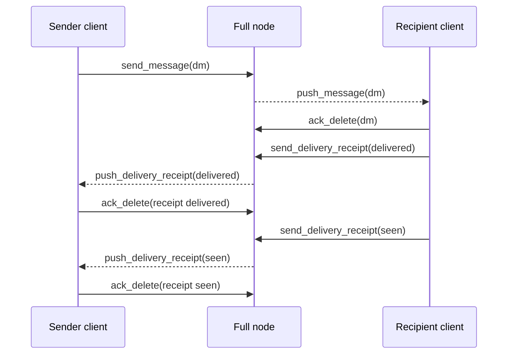
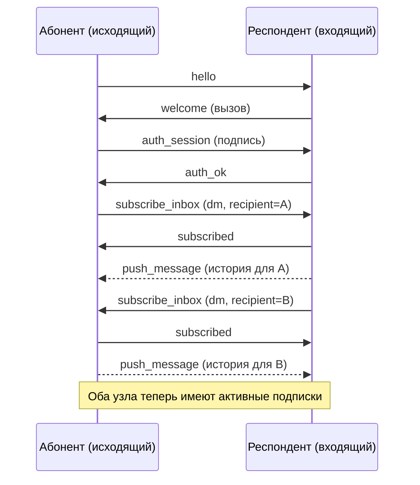
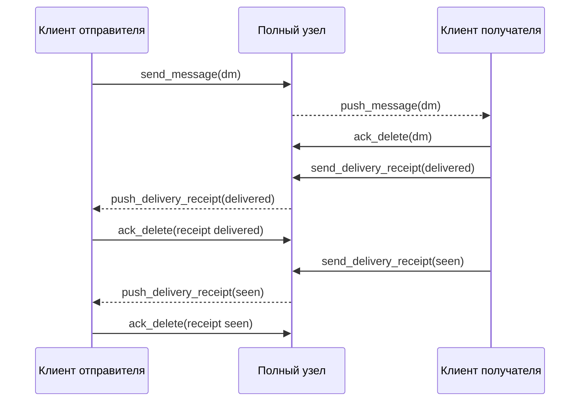

# Realtime Delivery System

## Overview

The realtime delivery system enables low-latency message and receipt delivery between peers in the Corsa network. Peers establish inbox subscriptions around authentication, allowing both sides to receive messages and delivery receipts in real-time while maintaining a backlog for offline scenarios. From **ProtocolVersion 20** a node↔node subscription is folded into authentication (registered + backlog-replayed at `auth_ok`); the explicit symmetric `subscribe_inbox` exchange described below is the legacy path for sub-v20 peers and client-role subscribers.

## Core Concepts

### Subscription Model

> **Scope.** The symmetric `subscribe_inbox` model described in this section is
> the **legacy path** — it is the active wire flow only for peers **below
> ProtocolVersion 20** and for **client-role (non-node) subscribers**. For
> **v20+ node↔node** sessions the subscription is folded into authentication
> (see the deprecation note below): after `auth_ok` the responder has already
> registered the initiator's inbox and replayed its backlog, with **no**
> `subscribe_inbox`/`subscribed` exchange and **no** reverse subscription.

After successful authentication (auth_ok), two legacy/client peers establish symmetric subscriptions to each other's inboxes. This bidirectional model lets messages and receipts flow in both directions, with backlog replay covering reconnects during node uptime (see *Backlog Guarantee* for the durability scope).

**Key principles (legacy <20 / client-role path):**
- Subscriptions are registered **after authentication**, not during it
- Both caller and responder send subscribe_inbox requests
- Each subscription triggers immediate backlog replay followed by live streaming
- Backlog replay is serialized per connection to ensure ordering
- Acknowledgements (ack_delete) remove items from backlog after delivery

> **DEPRECATION — ProtocolVersion 20.** The explicit `subscribe_inbox`
> round-trip between **node** peers is being retired because it is redundant
> with authentication: the `auth_session` already proves the initiator's
> identity, and a node responder installs the inbox subscription
> (`registerHelloRoute`) plus replays the backlog (`pushBacklogToSubscriber`)
> at auth time. From v20 on:
> - A v20+ **initiator** does **not** send `subscribe_inbox` to a peer that
>   advertises version ≥ 20; it still sends it to older peers.
> - A v20+ **responder** auto-subscribes the authenticated node identity and
>   replays its backlog at auth (gated on the peer being ≥ 20 to avoid a
>   double replay with older initiators that still send the frame).
> - The **reverse** `subscribe_inbox` (responder → initiator, direction #2
>   below) is consequently not exchanged between two v20 peers. This is
>   intentional: every node receives its own inbox over **its own** outbound
>   sessions (where it is the authenticating initiator), and gossip guarantees
>   mesh-wide propagation regardless — the reverse subscription was only a
>   latency/redundancy optimisation, never a delivery guarantee. NAT'd nodes
>   are always initiators, so they are unaffected.
> - `request_inbox` (the legacy pull-backlog command superseded by
>   `subscribe_inbox`) is likewise deprecated; current code never sends it.
>
> The `subscribe_inbox` / `request_inbox` handlers stay wired for backward
> compatibility and for client-role (non-node) subscribers, which the auth
> path does not cover. They will be removed once `MinimumProtocolVersion`
> reaches 20.

### Topics

- `dm` - Direct messages between peers
- Receipts are delivered via separate receipt backlog mechanism

### Backlog Guarantee

Messages and receipts are held in the node's **runtime backlog during node uptime** and replayed to subscribers when they (re)connect, covering a peer being temporarily offline. Once a subscriber acknowledges receipt via `ack_delete`, the item is removed from the backlog.

This is **not a restart-durable guarantee for relay-only nodes**: the backlog and relay/queue state are in-memory and are **lost on process restart** (the `queue-<port>.json` disk persistence was removed — see *Pending frame queue* in `docs/mesh.md`). Durable, restart-surviving storage exists only where a `MessageStore` is present — i.e. the recipient's own messages on a node that stores them, and the desktop `chatlog.db`. For relay/transit traffic, recovery across a restart is sender-side end-to-end retry; the forthcoming delivery-status layer will close the remaining gap.

## Protocol Messages

### subscribe_inbox

**Request:**
```json
{
  "type": "subscribe_inbox",
  "topic": "dm",
  "recipient": "<recipient-fingerprint>",
  "subscriber": "<subscriber-route-id>"
}
```

The `subscriber` field is an opaque route identifier used to key the subscription internally. It is **not** validated as a fingerprint. If omitted, the server substitutes the connection's remote address (`conn.RemoteAddr().String()`). For outbound (reverse) subscriptions the node sends its own Ed25519 identity (the same value as the `recipient` field) as the subscriber value, so each node has exactly one stable subscriber id across all sessions. Clients should treat this field as an opaque string and must not assume any particular format.

**Response:**
```json
{
  "type": "subscribed",
  "topic": "dm",
  "recipient": "<recipient-fingerprint>",
  "subscriber": "<subscriber-route-id>",
  "status": "ok",
  "count": 1
}
```

The response echoes the resolved `subscriber` value (which may differ from the request if the server substituted a default).

**Behavior:**
- Registers the subscriber as a live listener for future messages
- Immediately triggers backlog replay via `pushBacklogToSubscriber()`
- The `subscribed` acknowledgement is written before backlog replay begins
- Count field indicates the number of active subscribers currently registered for the recipient

**Triggering:**
- Called after `auth_ok` completes
- Initiated by the outbound peer first
- Inbound peer responds with `subscribe_inbox` after responding with `subscribed`

### Bidirectional Subscription Flow (legacy <20 / client-role)

> This symmetric exchange applies only to peers below ProtocolVersion 20 and to
> client-role subscribers. Two v20 nodes do NOT perform it — backlog and live
> push are established at auth (see the Scope note under *Subscription Model*).

The subscription exchange is symmetric to support low-latency delivery in both directions:

1. **Caller connects and authenticates:** Outbound peer sends `hello`, receives `welcome` challenge, responds with `auth_session` signature, receives `auth_ok`
2. **Caller subscribes:** Outbound peer sends `subscribe_inbox(dm, recipient=CallerId)` to receive messages sent to them
3. **Responder acknowledges:** Inbound peer responds with `subscribed`, triggers backlog replay to caller
4. **Responder subscribes:** After replying with first `subscribed`, inbound peer sends `subscribe_inbox(dm, recipient=ResponderId)` to receive messages sent to them
5. **Caller acknowledges:** Outbound peer responds with `subscribed`, triggers backlog replay to responder
6. **Both are now subscribed:** Live messages and receipts flow in both directions

**Important:** The reverse `subscribe_inbox` fires after the first `subscribed` response, not after `auth_ok`. This prevents short-lived connections (like contact-sync dials) from unnecessarily registering as live subscribers.


### push_message

**Format:**
```json
{
  "type": "push_message",
  "topic": "dm",
  "recipient": "<recipient-fingerprint>",
  "item": {
    "id": "550e8400-e29b-41d4-a716-446655440000",
    "flag": "sender-delete",
    "created_at": "2026-03-28T14:30:00Z",
    "ttl_seconds": 0,
    "sender": "<sender-fingerprint>",
    "recipient": "<recipient-fingerprint>",
    "body": "<ciphertext-base64url>"
  }
}
```

**Field descriptions:**
- `type` - Always "push_message"
- `topic` - The subscription topic (e.g., "dm")
- `recipient` - Address the message is being delivered to
- `item.id` - UUID of the message
- `item.flag` - Optional flag (e.g., "sender-delete" for messages marked for deletion by sender)
- `item.created_at` - ISO 8601 timestamp when message was created
- `item.ttl_seconds` - Time-to-live in seconds; 0 means indefinite
- `item.sender` - Fingerprint of message sender
- `item.recipient` - Fingerprint of message recipient
- `item.body` - End-to-end encrypted message content (base64url encoded)

**Sending triggers:**
- New message arrives at the serving node for a subscribed recipient
- During backlog replay to a newly subscribed peer

**Independence:** Push and gossip operate independently. Push optimizes for low-latency delivery to connected subscribers, while gossip ensures mesh-wide propagation and redundancy.

### push_delivery_receipt

**Format:**
```json
{
  "type": "push_delivery_receipt",
  "recipient": "<recipient-fingerprint>",
  "receipt": {
    "message_id": "550e8400-e29b-41d4-a716-446655440000",
    "sender": "<sender-fingerprint>",
    "recipient": "<recipient-fingerprint>",
    "status": "delivered",
    "delivered_at": "2026-03-28T14:30:15Z"
  }
}
```

**Field descriptions:**
- `type` - Always "push_delivery_receipt"
- `recipient` - Address the receipt is being delivered to (typically the sender of the original message)
- `receipt.message_id` - UUID of the message this receipt acknowledges
- `receipt.sender` - Fingerprint of the message recipient (who is sending this receipt)
- `receipt.recipient` - Fingerprint of the message sender (who will receive this receipt)
- `receipt.status` - Status string: `"delivered"` or `"seen"`
- `receipt.delivered_at` - ISO 8601 timestamp when status was recorded

**Delivery sources:**
- Backlog replay when a recipient confirms delivery
- Live delivery when a recipient sends a new delivery confirmation

### ack_delete

**DM backlog acknowledgement:**
```json
{
  "type": "ack_delete",
  "address": "<fingerprint>",
  "ack_type": "dm",
  "id": "550e8400-e29b-41d4-a716-446655440000",
  "status": "",
  "signature": "<base64url-ed25519-signature>"
}
```

**Receipt backlog acknowledgement:**
```json
{
  "type": "ack_delete",
  "address": "<fingerprint>",
  "ack_type": "receipt",
  "id": "550e8400-e29b-41d4-a716-446655440000",
  "status": "delivered",
  "signature": "<base64url-ed25519-signature>"
}
```

**Signature computation:**
```
payload = "corsa-ack-delete-v1|<address>|<ack_type>|<id>|<status>"
signature = ed25519_sign(payload, private_key)
```

**Field descriptions:**
- `address` - Fingerprint of the acknowledging peer
- `ack_type` - Type of item being acknowledged ("dm" or "receipt")
- `id` - UUID of the item being acknowledged
- `status` - Status field (empty for DM acks, "delivered"/"seen" for receipt acks)
- `signature` - Ed25519 signature over the canonical payload

**Rules:**
- Only valid in authenticated v2 sessions
- Invalid signature results in ban score increment
- After valid acknowledgement, the backlog item is removed and will not be resent
- Sender address must match the authenticated identity on the connection
- Sent via the normal outbound peer session (if available) or deferred until one is established; the item remains in the backlog and will be re-pushed on backlog replay if the ack has not yet been delivered

### request_inbox (Backward Compatibility)

**Format:**
```json
{
  "type": "request_inbox",
  "topic": "dm"
}
```

**Behavior:**
- Accepted from peers not yet updated to bidirectional `subscribe_inbox`
- Performs one-time backlog dump **without** registering a live subscriber
- Serves all stored messages via `push_message`
- Serves all stored receipts via `push_delivery_receipt`
- Does not set up a persistent subscription for future messages

**Migration path:** Peers should upgrade to `subscribe_inbox` to gain the benefits of live subscriptions and reduce unnecessary backlog replays.

## Connection Management

### Write Serialization

All writes to a subscriber TCP connection are serialized by a per-connection mutex (`connWriteMu`):

1. The `subscribed` acknowledgement is written first
2. Backlog replay begins **only after** the acknowledgement is fully written
3. All messages and receipts from backlog are written sequentially
4. Live pushes are queued and written in order

This serialization ensures:
- Messages arrive in causal order
- Subscribers never miss the subscription acknowledgement
- No interleaving of messages from different backlog flushes or live updates

### Connection Lifecycle

1. **Authentication:** Peer authenticates via `auth_session` signature
2. **First subscription** *(legacy <20 / client-role)*: authenticated peer sends `subscribe_inbox`, receives `subscribed` + backlog. **v20 node↔node:** skipped — the responder auto-registers the inbox and replays the backlog at `auth_ok` (no `subscribe_inbox`).
3. **Reverse subscription** *(legacy <20 / client-role)*: peer responds with own `subscribe_inbox`, receives `subscribed` + backlog. **v20 node↔node:** not performed — each node receives its own inbox over its own outbound (authenticating) session.
4. **Live streaming:** Both peers receive live `push_message` and `push_delivery_receipt` updates
5. **Acknowledgements:** Each peer sends `ack_delete` to confirm receipt and release backlog items

### Handshake reply: no-eviction contract

The replies that complete the session-setup handshake (`subscribed`,
`peers`, `contacts`, `auth_ok`) travel through a dedicated send path
(`sendHandshakeReplyViaNetwork`) that intentionally weakens the
slow-peer eviction policy used by every other reply.

**Why a separate path:** during the initial seconds of a connection the
peer's writer queue is being drained by its own broadcast traffic —
most notably the initial `announce_routes` flush sent to every freshly
authenticated outbound peer. On a full-routing-table node this burst
can fill the 128-slot outbound channel within ~100-300ms. The regular
reply helper closes the connection on `ErrSendBufferFull` (the
documented slow-peer eviction signal), which means the next handshake
reply in line — almost always the `subscribed` that the dialler is
waiting on — torpedoes the session before it ever reaches Active. The
dialler observes a bare `EOF` on `subscribe_inbox` and emits
`cm_session_setup_failed`; combined with the default 2-4-8s retry
backoff, this fans out into a CPU-burning storm whenever a small set
of bootstrap nodes is the only candidate pool.

**Contract:**

1. **Async fast path.** `sendHandshakeReplyViaNetwork` first attempts a
   non-blocking `SendFrame`, exactly like the regular reply path. On
   any outcome other than `ErrSendBufferFull` the result is returned
   verbatim — the connection is never closed from this helper.
2. **Bounded blocking fallback.** Only when the async send returned
   `ErrSendBufferFull` does the helper fall back to `SendFrameSync`
   with an internal timeout cap (`handshakeReplyTimeout = 2s`). The
   blocking variant absorbs the transient broadcast burst; the timeout
   stops a permanently dead peer from parking the goroutine. If the
   blocking attempt also fails, the sentinel is returned without
   closing the connection.
3. **No eviction from this helper.** A wedged peer is still evicted —
   but by the heartbeat path (`inboundHeartbeat`), which is the
   documented owner of liveness-based eviction. The handshake-reply
   helper is deliberately silent on buffer pressure so a transient
   self-inflicted overload (peer broadcasts saturating its own writer)
   cannot kill a session that is otherwise healthy.

**Applies to:** `auth_ok` (replies to `auth_session`), `peers`
(replies to `get_peers`), `contacts` (replies to `fetch_contacts`),
`subscribed` (replies to `subscribe_inbox`), and the **reverse
`subscribe_inbox`** the responder emits right after `subscribed`
(both frames travel the same outbound buffer; sending the reverse
through the regular helper would undo the protection on the very
next line of the handler).

**Does NOT apply to:** data-plane replies (`push_message`,
`push_delivery_receipt`, `relay_*`, `announce_*`). These keep the
original eviction-on-saturation contract — a peer that cannot keep up
with live traffic IS a slow peer and should be replaced.

**Subscriber rollback on failed ack.** The `subscribe_inbox` handler
registers the subscriber in `s.subs` BEFORE attempting to send the
`subscribed` ack — the order matters because `pushBacklogToSubscriber`
needs the subscriber entry to exist. With the regular eviction-based
helper the cleanup was automatic: a failed send closed the connection,
the `handleConn` defer ran `removeSubscriberConnID`, and the gossip
map stayed consistent. Under the no-eviction contract the connection
survives, so the handler must roll back the registration manually
when the ack does not land:

1. Call `sendHandshakeReplyViaNetwork` for the `subscribed` frame.
2. **On error** (timeout, unknown conn, drained writer): re-acquire
   `gossipMu`, call `removeSubscriberConnIDLocked(recipient, connID)`,
   then return without pushing the backlog or emitting the reverse
   `subscribe_inbox`. The connection itself is left alive — the
   heartbeat path will evict it if the peer is truly dead.
3. **On success**: schedule `pushBacklogToSubscriber` on the
   background pool, then emit the reverse `subscribe_inbox` through
   the same no-eviction helper.

Without step 2 the gossip map would accumulate phantom subscribers on
every wedged-buffer subscribe attempt — invisible until the connection
eventually died for an unrelated reason.

**`auth_ok` half-auth window.** Unlike `subscribed` (which has a
narrow rollback contract above), `auth_ok` is fired AFTER
`handleAuthSession` has already committed substantial local state:
`setConnAuthStateByID(Verified=true)`, hello learning, route
registration, mirroring identity into NetCore, and a background
`announcePeerToSessions` goroutine. Rolling those back on a failed
ack is intentionally NOT attempted — the cleanup graph is wide,
cross-domain (peer + ipState + gossip), and partially asynchronous
(separate goroutines already running).

Failure mode when the ack does not land:

1. **Dialler side: no same-session retry.**
   `authenticatePeerSession` waits for `auth_ok` via
   `peerSessionRequest` bounded by `peerRequestTimeout`
   (`peer_sessions.go::authenticatePeerSession`). It does NOT reissue
   `auth_session` on the same TCP socket — on timeout it returns an
   error that bubbles up to `openPeerSessionForCM`, which closes the
   connection and emits `DialFailed` to the ConnectionManager.
2. **CM-driven reconnect.** `DialFailed` cycles through
   `reconnectMaxRetries` with exponential backoff. Each retry opens
   a fresh TCP connection with a new `connID`. `handleAuthSession`
   runs from scratch on the new `connID` — the `Verified` fast-path
   applies only to repeat auth on the SAME `connID` and does not
   carry across reconnects, so every redial pays the full
   `auth_session` round-trip and re-fires the side-effect chain
   (route registration is idempotent at the routing-table layer;
   announce goroutine simply emits another announce; hello cache
   re-learns the same values).
3. **Local cleanup.** The previous session's `connID` still carries
   `Verified=true` and the side-effect chain (route entry, announce
   output, hello cache). `handleConn`'s defer
   (`clearConnAuth`, `removeSubscriberConnID`,
   `trackInboundDisconnect`) cleans those up when the peer finally
   drops the dead TCP socket or when our own read loop hits EOF.

Window bound: from ack-drop to `handleConn` defer firing. Usually
short because the dialler closes promptly on its own
`peerRequestTimeout`. Worst case is one inbound read deadline
(`120s` `inboundReadTimeout`) on the failing socket. If the outbound
buffer never drains, the heartbeat path (`inboundHeartbeat`) evicts
us on its own schedule. A failed `auth_ok` is logged at WARN with
`conn_id` for forensics.

## Message Delivery Flow

The complete delivery flow from sender to receiver includes message delivery followed by receipt tracking:



**Steps:**

1. **Send message:** Sender client sends a DM through the full node
2. **Push to recipient:** Full node pushes the message to subscribed recipient client
3. **Acknowledge delivery:** Recipient client acknowledges the message via `ack_delete(dm)`
4. **Send delivery receipt:** Recipient client sends delivery confirmation (status="delivered")
5. **Push receipt to sender:** Full node pushes the receipt to subscribed sender client
6. **Acknowledge receipt:** Sender client acknowledges the receipt via `ack_delete(receipt delivered)`
7. **Send seen receipt:** Recipient client sends seen confirmation (status="seen")
8. **Push seen to sender:** Full node pushes the seen receipt to subscribed sender client
9. **Acknowledge seen:** Sender client acknowledges the seen receipt via `ack_delete(receipt seen)`

**Guarantees (within node uptime):**
- Messages and receipts are retained in the runtime backlog until acknowledged (in-memory; not restart-durable for relay-only nodes — see *Backlog Guarantee*)
- If a peer disconnects, all unacknowledged items are replayed on reconnection
- Each ack removes an item from backlog, freeing memory
- Receipt tracking enables progressive confirmation (delivered → seen)

---

# Система доставки в реальном времени

## Обзор

Система доставки в реальном времени обеспечивает низколатентную доставку сообщений и подтверждений между узлами сети Corsa. Узлы устанавливают подписки на inbox вокруг аутентификации, позволяя обеим сторонам получать сообщения и подтверждения доставки в реальном времени с сохранением истории для оффлайн-сценариев. С **ProtocolVersion 20** подписка node↔node сворачивается в аутентификацию (регистрируется и реплеит историю на `auth_ok`); явный симметричный обмен `subscribe_inbox` ниже — легаси-путь для пиров ниже v20 и client-role подписчиков.

## Основные концепции

### Модель подписки

> **Область применения.** Симметричная модель `subscribe_inbox`, описанная в
> этом разделе, — **легаси-путь**: это активный wire-flow только для пиров
> **ниже ProtocolVersion 20** и для **client-role (не-node) подписчиков**. Для
> **v20+ node↔node** подписка сворачивается в аутентификацию (см.
> deprecation-блок ниже): после `auth_ok` отвечающая сторона уже зарегистрировала
> inbox инициатора и реплеила его историю — **без** обмена
> `subscribe_inbox`/`subscribed` и **без** обратной подписки.

После успешной аутентификации (auth_ok) два легаси/client-пира устанавливают симметричные подписки на входящие сообщения друг друга. Эта двусторонняя модель позволяет сообщениям и подтверждениям течь в обоих направлениях, а replay истории покрывает переподключения в пределах работы ноды (область durability — см. *Гарантия истории*).

**Ключевые принципы (легаси <20 / client-role путь):**
- Подписки регистрируются **после аутентификации**, не во время неё
- Оба узла отправляют запросы subscribe_inbox
- Каждая подписка запускает немедленное воспроизведение истории, за которым следует потоковая передача в реальном времени
- Воспроизведение истории сериализуется для каждого соединения для обеспечения порядка
- Подтверждения (ack_delete) удаляют элементы из истории после доставки

> **DEPRECATION — ProtocolVersion 20.** Явный round-trip `subscribe_inbox`
> между **node**-узлами выводится из обращения как избыточный с
> аутентификацией: `auth_session` уже доказывает identity инициатора, а
> отвечающая нода на auth ставит подписку (`registerHelloRoute`) и реплеит
> историю (`pushBacklogToSubscriber`). С v20:
> - v20+ **инициатор** НЕ шлёт `subscribe_inbox` пиру с версией ≥ 20; старым
>   пирам шлёт по-прежнему.
> - v20+ **отвечающая** сторона авто-подписывает аутентифицированную
>   node-identity и реплеит её историю на auth (с гейтом по версии пира ≥ 20,
>   чтобы не было двойного реплея со старыми инициаторами, которые ещё шлют
>   фрейм).
> - **Обратная** подписка (отвечающий → инициатор, направление #2) между двумя
>   v20-нодами поэтому не выполняется. Это намеренно: каждый узел получает свой
>   inbox через СОБСТВЕННЫЕ исходящие сессии (где он — аутентифицирующийся
>   инициатор), а gossip гарантирует распространение по mesh — обратная подписка
>   была лишь оптимизацией латентности, а не гарантией доставки. NAT-узлы всегда
>   инициаторы и не затронуты.
> - `request_inbox` (легаси pull-команда истории, вытесненная `subscribe_inbox`)
>   тоже deprecated; текущий код её никогда не шлёт.
>
> Хендлеры `subscribe_inbox` / `request_inbox` остаются ради обратной
> совместимости и client-role (не-node) подписчиков, которых auth-путь не
> покрывает. Будут удалены, когда `MinimumProtocolVersion` достигнет 20.

### Топики

- `dm` - Прямые сообщения между узлами
- Подтверждения доставляются через отдельный механизм истории подтверждений

### Гарантия истории

Сообщения и подтверждения держатся в **runtime-бэклоге ноды на время её работы** и воспроизводятся подписчикам при их (пере)подключении — это покрывает случай, когда пир временно в оффлайне. После того как подписчик подтвердит получение через `ack_delete`, элемент удаляется из истории.

Это **не restart-durable гарантия для relay-only нод**: бэклог и relay/queue state живут в памяти и **теряются при рестарте процесса** (дисковая персистентность `queue-<port>.json` удалена — см. *Очередь pending-фреймов* в `docs/mesh.md`). Долговременное, переживающее рестарт хранилище есть только там, где присутствует `MessageStore` — то есть собственные сообщения получателя на ноде, которая их хранит, и desktop `chatlog.db`. Для relay/транзитного трафика восстановление после рестарта — это end-to-end retry на стороне отправителя; будущий слой статусов доставки закроет оставшийся пробел.

## Протокольные сообщения

### subscribe_inbox

**Запрос:**
```json
{
  "type": "subscribe_inbox",
  "topic": "dm",
  "recipient": "<отпечаток-получателя>",
  "subscriber": "<идентификатор-маршрута>"
}
```

Поле `subscriber` — непрозрачный идентификатор маршрута, используемый для ключевания подписки. Оно **не** валидируется как fingerprint. Если не указано, сервер подставляет адрес соединения (`conn.RemoteAddr().String()`). Для исходящих (обратных) подписок нода отправляет свою Ed25519 identity (то же значение, что и в поле `recipient`) как subscriber, поэтому у каждой ноды ровно один стабильный subscriber id поверх всех сессий. Клиенты должны считать это поле непрозрачной строкой и не рассчитывать на конкретный формат.

**Ответ:**
```json
{
  "type": "subscribed",
  "topic": "dm",
  "recipient": "<отпечаток-получателя>",
  "subscriber": "<идентификатор-маршрута>",
  "status": "ok",
  "count": 1
}
```

В ответе возвращается разрешённое значение `subscriber` (которое может отличаться от запроса, если сервер подставил значение по умолчанию).

**Поведение:**
- Регистрирует подписчика как активного слушателя для будущих сообщений
- Немедленно запускает воспроизведение истории через `pushBacklogToSubscriber()`
- Подтверждение `subscribed` записывается перед началом воспроизведения истории
- Поле count указывает количество активных подписчиков, зарегистрированных для данного получателя

**Запуск:**
- Вызывается после завершения `auth_ok`
- Инициируется исходящим узлом первым
- Входящий узел отвечает через `subscribe_inbox` после ответа с `subscribed`

### Двусторонняя подписка (легаси <20 / client-role)

> Этот симметричный обмен применяется только к пирам ниже ProtocolVersion 20 и к
> client-role подписчикам. Две v20-ноды его НЕ выполняют — история и live-push
> устанавливаются на auth (см. блок «Область применения» в §Модель подписки).

Обмен подписками является симметричным для поддержки низколатентной доставки в обоих направлениях:

1. **Абонент подключается и аутентифицируется:** Исходящий узел отправляет `hello`, получает вызов `welcome`, отвечает подписью `auth_session`, получает `auth_ok`
2. **Абонент подписывается:** Исходящий узел отправляет `subscribe_inbox(dm, recipient=IdАбонента)` для получения сообщений, адресованных ему
3. **Респондент подтверждает:** Входящий узел отвечает `subscribed`, запускает воспроизведение истории для абонента
4. **Респондент подписывается:** После ответа с первым `subscribed`, входящий узел отправляет `subscribe_inbox(dm, recipient=IdРеспондента)` для получения сообщений, адресованных ему
5. **Абонент подтверждает:** Исходящий узел отвечает с `subscribed`, запускает воспроизведение истории для респондента
6. **Оба подписаны:** Сообщения и подтверждения в реальном времени текут в обоих направлениях

**Важно:** Обратный `subscribe_inbox` отправляется после первого ответа `subscribed`, не после `auth_ok`. Это предотвращает ненужную регистрацию коротких соединений (например, синхронизация контактов) как активных подписчиков.



### push_message

**Формат:**
```json
{
  "type": "push_message",
  "topic": "dm",
  "recipient": "<отпечаток-получателя>",
  "item": {
    "id": "550e8400-e29b-41d4-a716-446655440000",
    "flag": "sender-delete",
    "created_at": "2026-03-28T14:30:00Z",
    "ttl_seconds": 0,
    "sender": "<отпечаток-отправителя>",
    "recipient": "<отпечаток-получателя>",
    "body": "<шифротекст-base64url>"
  }
}
```

**Описание полей:**
- `type` - Всегда "push_message"
- `topic` - Топик подписки (например, "dm")
- `recipient` - Адрес получателя сообщения
- `item.id` - UUID сообщения
- `item.flag` - Дополнительный флаг (например, "sender-delete" для сообщений, помеченных на удаление)
- `item.created_at` - Временная метка ISO 8601, когда было создано сообщение
- `item.ttl_seconds` - Время жизни в секундах; 0 означает неограниченное время
- `item.sender` - Отпечаток отправителя сообщения
- `item.recipient` - Отпечаток получателя сообщения
- `item.body` - Зашифрованное сквозным шифрованием содержимое сообщения (base64url кодирование)

**Триггеры отправки:**
- Новое сообщение прибывает на обслуживающий узел для подписанного получателя
- Во время воспроизведения истории для вновь подписавшегося узла

**Независимость:** Push и gossip работают независимо. Push оптимизирует для низколатентной доставки подключенным подписчикам, в то время как gossip обеспечивает распространение по всей сети и избыточность.

### push_delivery_receipt

**Формат:**
```json
{
  "type": "push_delivery_receipt",
  "recipient": "<отпечаток-получателя>",
  "receipt": {
    "message_id": "550e8400-e29b-41d4-a716-446655440000",
    "sender": "<отпечаток-отправителя>",
    "recipient": "<отпечаток-получателя>",
    "status": "delivered",
    "delivered_at": "2026-03-28T14:30:15Z"
  }
}
```

**Описание полей:**
- `type` - Всегда "push_delivery_receipt"
- `recipient` - Адрес получателя подтверждения (обычно отправитель исходного сообщения)
- `receipt.message_id` - UUID сообщения, которое подтверждает это подтверждение
- `receipt.sender` - Отпечаток получателя сообщения (который отправляет это подтверждение)
- `receipt.recipient` - Отпечаток отправителя сообщения (который получит это подтверждение)
- `receipt.status` - Строка статуса: `"delivered"` или `"seen"`
- `receipt.delivered_at` - Временная метка ISO 8601, когда был записан статус

**Источники доставки:**
- Воспроизведение истории, когда получатель подтверждает доставку
- Доставка в реальном времени, когда получатель отправляет новое подтверждение

### ack_delete

**Подтверждение истории сообщений:**
```json
{
  "type": "ack_delete",
  "address": "<отпечаток>",
  "ack_type": "dm",
  "id": "550e8400-e29b-41d4-a716-446655440000",
  "status": "",
  "signature": "<подпись-ed25519-base64url>"
}
```

**Подтверждение истории подтверждений:**
```json
{
  "type": "ack_delete",
  "address": "<отпечаток>",
  "ack_type": "receipt",
  "id": "550e8400-e29b-41d4-a716-446655440000",
  "status": "delivered",
  "signature": "<подпись-ed25519-base64url>"
}
```

**Вычисление подписи:**
```
payload = "corsa-ack-delete-v1|<address>|<ack_type>|<id>|<status>"
signature = ed25519_sign(payload, private_key)
```

**Описание полей:**
- `address` - Отпечаток подтверждающего узла
- `ack_type` - Тип подтверждаемого элемента ("dm" или "receipt")
- `id` - UUID подтверждаемого элемента
- `status` - Поле статуса (пусто для подтверждений сообщений, "delivered"/"seen" для подтверждений доставки)
- `signature` - Подпись Ed25519 над каноническим полезным грузом

**Правила:**
- Действительны только в аутентифицированных сеансах v2
- Неправильная подпись приводит к увеличению оценки запрета
- После корректного подтверждения элемент истории удаляется и не будет переправлен
- Адрес отправителя должен совпадать с аутентифицированной идентичностью на соединении
- Отправляется через нормальную исходящую peer-сессию (если доступна) или откладывается до её установления; элемент остаётся в бэклоге и будет повторно отправлен при воспроизведении бэклога, если ack ещё не был доставлен

### request_inbox (обратная совместимость)

**Формат:**
```json
{
  "type": "request_inbox",
  "topic": "dm"
}
```

**Поведение:**
- Принимается от узлов, еще не обновленных на двусторонний `subscribe_inbox`
- Выполняет одноразовый дамп истории **без** регистрации активного подписчика
- Отправляет все сохраненные сообщения через `push_message`
- Отправляет все сохраненные подтверждения через `push_delivery_receipt`
- Не устанавливает постоянную подписку для будущих сообщений

**Путь миграции:** Узлы должны обновиться на `subscribe_inbox` для получения преимуществ активных подписок и уменьшения ненужных воспроизведений истории.

## Управление соединением

### Сериализация записи

Все записи в TCP-соединение подписчика сериализуются с помощью мьютекса для каждого соединения (`connWriteMu`):

1. Подтверждение `subscribed` записывается первым
2. Воспроизведение истории начинается **только после** полной записи подтверждения
3. Все сообщения и подтверждения из истории записываются последовательно
4. Прямые отправления ставятся в очередь и записываются по порядку

Эта сериализация гарантирует:
- Сообщения прибывают в причинном порядке
- Подписчики никогда не пропускают подтверждение подписки
- Нет чередования сообщений из разных воспроизведений истории или прямых обновлений

### Жизненный цикл соединения

1. **Аутентификация:** Узел аутентифицируется через подпись `auth_session`
2. **Первая подписка** *(легаси <20 / client-role)*: аутентифицированный узел отправляет `subscribe_inbox`, получает `subscribed` + историю. **v20 node↔node:** пропускается — отвечающая сторона авто-регистрирует inbox и реплеит историю на `auth_ok` (без `subscribe_inbox`).
3. **Обратная подписка** *(легаси <20 / client-role)*: узел отвечает собственным `subscribe_inbox`, получает `subscribed` + историю. **v20 node↔node:** не выполняется — каждый узел получает свой inbox через собственную исходящую (аутентифицирующуюся) сессию.
4. **Потоковая передача в реальном времени:** Оба узла получают прямые обновления `push_message` и `push_delivery_receipt`
5. **Подтверждения:** Каждый узел отправляет `ack_delete` для подтверждения получения и освобождения элементов истории

### Handshake-ответ: контракт без eviction

Ответы, завершающие session-setup handshake (`subscribed`, `peers`,
`contacts`, `auth_ok`), идут через отдельный send-путь
(`sendHandshakeReplyViaNetwork`), который намеренно ослабляет
политику slow-peer eviction, применяемую ко всем остальным ответам.

**Зачем отдельный путь.** В первые секунды соединения writer-очередь
пира забивается его же собственным broadcast-трафиком — прежде всего
начальным flush'ем `announce_routes`, отправляемым каждому свежее
аутентифицированному outbound-пиру. На full-routing-table-ноде этот
burst может заполнить 128-слотовый outbound-канал за ~100-300мс.
Обычный helper закрывает соединение на `ErrSendBufferFull` (штатный
сигнал slow-peer eviction), а это значит, что следующий handshake-
ответ в очереди — почти всегда `subscribed`, которого ждёт дайлер —
торпедирует сессию ещё до того, как она перешла в Active. Дайлер
видит голый `EOF` на `subscribe_inbox` и эмитит
`cm_session_setup_failed`; в сочетании с default 2-4-8с retry
backoff это раскручивается в CPU-storm, когда единственный набор
кандидатов — несколько bootstrap-нод.

**Контракт:**

1. **Async fast path.** `sendHandshakeReplyViaNetwork` сначала пробует
   неблокирующий `SendFrame`, ровно как обычный reply-путь. При любом
   исходе кроме `ErrSendBufferFull` результат возвращается как есть —
   соединение никогда не закрывается из этого хелпера.
2. **Ограниченный blocking fallback.** Только когда async-отправка
   вернула `ErrSendBufferFull`, хелпер падает в `SendFrameSync` с
   внутренним cap'ом таймаута (`handshakeReplyTimeout = 2s`).
   Блокирующий вариант абсорбирует кратковременный broadcast-burst;
   таймаут не даёт мёртвому пиру навсегда залипшить горутину. Если
   и блокирующая попытка не прошла — sentinel возвращается без
   закрытия соединения.
3. **Никакого eviction из этого хелпера.** Залипший пир всё равно
   будет эвиктнут — но через heartbeat-путь (`inboundHeartbeat`),
   который является штатным владельцем liveness-eviction. Handshake-
   reply хелпер сознательно молчит на buffer pressure, чтобы
   кратковременная самонаведённая перегрузка (пир сам забил свой
   writer broadcast'ом) не убила здоровую сессию.

**Применяется к:** `auth_ok` (ответ на `auth_session`), `peers`
(ответ на `get_peers`), `contacts` (ответ на `fetch_contacts`),
`subscribed` (ответ на `subscribe_inbox`), а также **обратному
`subscribe_inbox`**, который responder эмитит сразу после
`subscribed` (оба фрейма используют один outbound buffer; отправка
reverse через обычный helper отменит защиту на следующей же строке
обработчика).

**НЕ применяется к:** ответам data-plane (`push_message`,
`push_delivery_receipt`, `relay_*`, `announce_*`). Они сохраняют
исходный контракт eviction-on-saturation — пир, который не
успевает за живым трафиком, ЯВЛЯЕТСЯ slow peer и должен быть
заменён.

**Rollback подписчика при failed ack.** Обработчик `subscribe_inbox`
регистрирует подписчика в `s.subs` ДО отправки `subscribed` ack —
порядок важен, потому что `pushBacklogToSubscriber` ожидает что
запись подписчика уже есть. С обычным eviction-based helper'ом
cleanup был автоматическим: failed send закрывал соединение, defer
в `handleConn` вызывал `removeSubscriberConnID`, gossip map
оставался консистентным. С no-eviction контрактом соединение
выживает, поэтому handler обязан откатывать регистрацию вручную,
когда ack не доходит:

1. Вызвать `sendHandshakeReplyViaNetwork` для `subscribed`.
2. **При ошибке** (timeout, unknown conn, дренированный writer):
   взять `gossipMu`, вызвать
   `removeSubscriberConnIDLocked(recipient, connID)`, затем выйти
   не пушив backlog и не отправляя reverse `subscribe_inbox`. Само
   соединение остаётся живым — heartbeat-путь эвиктит его, если
   пир действительно мёртв.
3. **При успехе**: запланировать `pushBacklogToSubscriber` в
   background-пуле, затем эмитить reverse `subscribe_inbox` через
   тот же no-eviction helper.

Без шага 2 gossip map копил бы phantom-подписчиков на каждой
попытке subscribe с забитым буфером — невидимых до тех пор пока
соединение не умрёт по другой причине.

**`auth_ok` half-auth window.** В отличие от `subscribed` (с узким
rollback-контрактом выше), `auth_ok` отправляется ПОСЛЕ того как
`handleAuthSession` уже закоммитил существенное локальное
состояние: `setConnAuthStateByID(Verified=true)`, hello learning,
route registration, mirroring identity в NetCore, и фоновую
goroutine `announcePeerToSessions`. Откатывать всё это при failed
ack СОЗНАТЕЛЬНО НЕ делается — cleanup-граф широкий, cross-domain
(peer + ipState + gossip) и частично асинхронный (отдельные
горутины уже запущены).

Failure mode когда ack не доходит:

1. **Dialler side: нет same-session retry.**
   `authenticatePeerSession` ждёт `auth_ok` через
   `peerSessionRequest`, ограниченный `peerRequestTimeout`
   (`peer_sessions.go::authenticatePeerSession`). Он НЕ повторяет
   `auth_session` на том же TCP-сокете — на timeout возвращает
   error, который всплывает в `openPeerSessionForCM` и закрывает
   соединение, эмитя `DialFailed` в ConnectionManager.
2. **CM-driven reconnect.** `DialFailed` крутит
   `reconnectMaxRetries` циклов с exponential backoff. Каждый
   retry открывает свежий TCP с новым `connID`. `handleAuthSession`
   на новой стороне запускается с нуля — `Verified` fast-path
   применим только к повторному auth на ТОМ ЖЕ `connID` и не
   переносится через reconnect. Каждый redial платит полный
   `auth_session` round-trip и заново запускает side-effect chain
   (route registration idempotent на уровне routing-table;
   announce goroutine просто эмитит ещё один announce; hello
   cache переучивается на те же значения).
3. **Local cleanup.** Предыдущая сессия с тем же `connID` всё ещё
   несёт `Verified=true` и side-effect chain (route entry,
   announce output, hello cache). Defer в `handleConn`
   (`clearConnAuth`, `removeSubscriberConnID`,
   `trackInboundDisconnect`) очищает их когда peer окончательно
   закрывает мёртвый TCP, или когда наш read loop ловит EOF.

Window bound: от ack-drop до срабатывания defer в `handleConn`.
Обычно короткий — dialler закрывает promptly по своему
`peerRequestTimeout`. Worst case — один inbound read deadline
(`120s` `inboundReadTimeout`) на залипшем сокете. Если outbound
buffer никогда не дренируется, heartbeat-путь (`inboundHeartbeat`)
эвиктит нас по своему расписанию. Failed `auth_ok` логируется на
WARN с `conn_id` для forensics.

## Поток доставки сообщений

Полный поток доставки от отправителя к получателю включает доставку сообщения, за которой следит отслеживание подтверждений:



**Шаги:**

1. **Отправить сообщение:** Клиент отправителя отправляет прямое сообщение через полный узел
2. **Отправить получателю:** Полный узел отправляет сообщение подписанному клиенту получателя
3. **Подтвердить доставку:** Клиент получателя подтверждает сообщение через `ack_delete(dm)`
4. **Отправить подтверждение доставки:** Клиент получателя отправляет подтверждение доставки (status="delivered")
5. **Отправить подтверждение отправителю:** Полный узел отправляет подтверждение подписанному клиенту отправителя
6. **Подтвердить подтверждение:** Клиент отправителя подтверждает подтверждение через `ack_delete(receipt delivered)`
7. **Отправить подтверждение просмотра:** Клиент получателя отправляет подтверждение просмотра (status="seen")
8. **Отправить просмотр отправителю:** Полный узел отправляет подтверждение просмотра подписанному клиенту отправителя
9. **Подтвердить просмотр:** Клиент отправителя подтверждает подтверждение просмотра через `ack_delete(receipt seen)`

**Гарантии (в пределах работы ноды):**
- Сообщения и подтверждения удерживаются в runtime-бэклоге до момента их подтверждения (в памяти; не restart-durable для relay-only нод — см. *Гарантия истории*)
- При отключении узла все неподтвержденные элементы воспроизводятся при переподключении
- Каждое подтверждение удаляет элемент из истории, освобождая память
- Отслеживание подтверждений обеспечивает прогрессивное подтверждение (delivered → seen)
