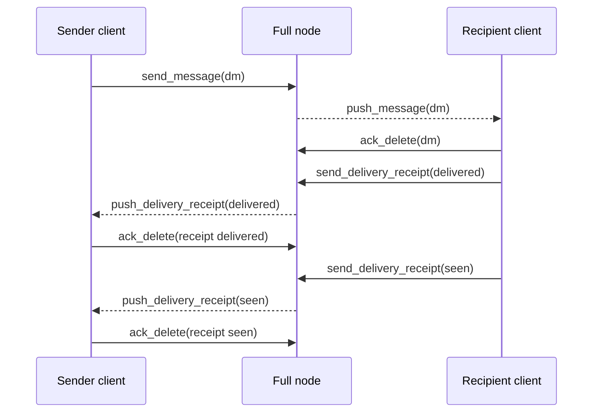
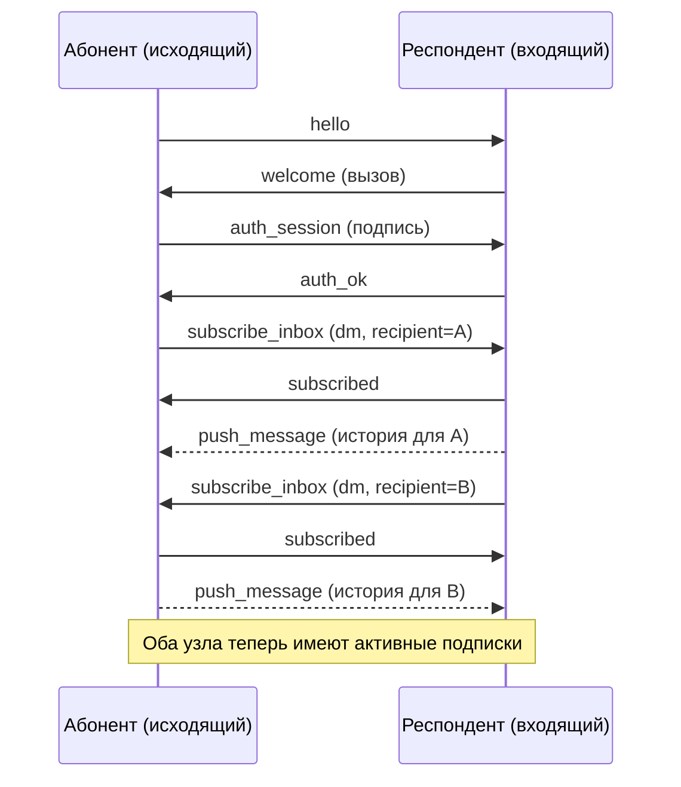
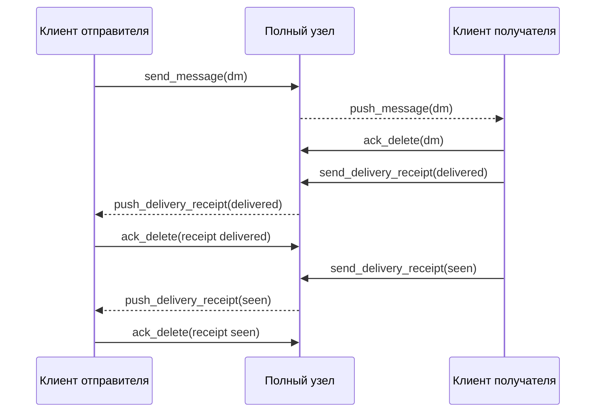

# Realtime Delivery System

## Overview

The realtime delivery system enables low-latency message and receipt delivery between peers in the Corsa network. Peers establish bidirectional subscriptions after authentication, allowing both sides to receive messages and delivery receipts in real-time while maintaining a backlog for offline scenarios.

## Core Concepts

### Subscription Model

After successful authentication (auth_ok), both peers establish symmetric subscriptions to each other's inboxes. This bidirectional model ensures that messages and receipts can flow in both directions with guaranteed delivery through backlog replay.

**Key principles:**
- Subscriptions are registered **after authentication**, not during it
- Both caller and responder send subscribe_inbox requests
- Each subscription triggers immediate backlog replay followed by live streaming
- Backlog replay is serialized per connection to ensure ordering
- Acknowledgements (ack_delete) remove items from backlog after delivery

### Topics

- `dm` - Direct messages between peers
- Receipts are delivered via separate receipt backlog mechanism

### Backlog Guarantee

Messages and receipts are persisted and replayed to subscribers, ensuring no data loss even if a peer is temporarily offline. Once a subscriber acknowledges receipt via `ack_delete`, the item is removed from the backlog.

## Protocol Messages

### subscribe_inbox

**Request:**
```json
{
  "type": "subscribe_inbox",
  "topic": "dm",
  "recipient": "<recipient-fingerprint>",
  "subscriber": "<subscriber-route-id>"
}
```

The `subscriber` field is an opaque route identifier used to key the subscription internally. It is **not** validated as a fingerprint. If omitted, the server substitutes the connection's remote address (`conn.RemoteAddr().String()`). For outbound (reverse) subscriptions the node sends its own `AdvertiseAddress` as the subscriber value. Clients should treat this field as an opaque string and must not assume fingerprint format.

**Response:**
```json
{
  "type": "subscribed",
  "topic": "dm",
  "recipient": "<recipient-fingerprint>",
  "subscriber": "<subscriber-route-id>",
  "status": "ok",
  "count": 1
}
```

The response echoes the resolved `subscriber` value (which may differ from the request if the server substituted a default).

**Behavior:**
- Registers the subscriber as a live listener for future messages
- Immediately triggers backlog replay via `pushBacklogToSubscriber()`
- The `subscribed` acknowledgement is written before backlog replay begins
- Count field indicates the number of active subscribers currently registered for the recipient

**Triggering:**
- Called after `auth_ok` completes
- Initiated by the outbound peer first
- Inbound peer responds with `subscribe_inbox` after responding with `subscribed`

### Bidirectional Subscription Flow

The subscription exchange is symmetric to support low-latency delivery in both directions:

1. **Caller connects and authenticates:** Outbound peer sends `hello`, receives `welcome` challenge, responds with `auth_session` signature, receives `auth_ok`
2. **Caller subscribes:** Outbound peer sends `subscribe_inbox(dm, recipient=CallerId)` to receive messages sent to them
3. **Responder acknowledges:** Inbound peer responds with `subscribed`, triggers backlog replay to caller
4. **Responder subscribes:** After replying with first `subscribed`, inbound peer sends `subscribe_inbox(dm, recipient=ResponderId)` to receive messages sent to them
5. **Caller acknowledges:** Outbound peer responds with `subscribed`, triggers backlog replay to responder
6. **Both are now subscribed:** Live messages and receipts flow in both directions

**Important:** The reverse `subscribe_inbox` fires after the first `subscribed` response, not after `auth_ok`. This prevents short-lived connections (like contact-sync dials) from unnecessarily registering as live subscribers.


### push_message

**Format:**
```json
{
  "type": "push_message",
  "topic": "dm",
  "recipient": "<recipient-fingerprint>",
  "item": {
    "id": "550e8400-e29b-41d4-a716-446655440000",
    "flag": "sender-delete",
    "created_at": "2026-03-28T14:30:00Z",
    "ttl_seconds": 0,
    "sender": "<sender-fingerprint>",
    "recipient": "<recipient-fingerprint>",
    "body": "<ciphertext-base64url>"
  }
}
```

**Field descriptions:**
- `type` - Always "push_message"
- `topic` - The subscription topic (e.g., "dm")
- `recipient` - Address the message is being delivered to
- `item.id` - UUID of the message
- `item.flag` - Optional flag (e.g., "sender-delete" for messages marked for deletion by sender)
- `item.created_at` - ISO 8601 timestamp when message was created
- `item.ttl_seconds` - Time-to-live in seconds; 0 means indefinite
- `item.sender` - Fingerprint of message sender
- `item.recipient` - Fingerprint of message recipient
- `item.body` - End-to-end encrypted message content (base64url encoded)

**Sending triggers:**
- New message arrives at the serving node for a subscribed recipient
- During backlog replay to a newly subscribed peer

**Independence:** Push and gossip operate independently. Push optimizes for low-latency delivery to connected subscribers, while gossip ensures mesh-wide propagation and redundancy.

### push_delivery_receipt

**Format:**
```json
{
  "type": "push_delivery_receipt",
  "recipient": "<recipient-fingerprint>",
  "receipt": {
    "message_id": "550e8400-e29b-41d4-a716-446655440000",
    "sender": "<sender-fingerprint>",
    "recipient": "<recipient-fingerprint>",
    "status": "delivered",
    "delivered_at": "2026-03-28T14:30:15Z"
  }
}
```

**Field descriptions:**
- `type` - Always "push_delivery_receipt"
- `recipient` - Address the receipt is being delivered to (typically the sender of the original message)
- `receipt.message_id` - UUID of the message this receipt acknowledges
- `receipt.sender` - Fingerprint of the message recipient (who is sending this receipt)
- `receipt.recipient` - Fingerprint of the message sender (who will receive this receipt)
- `receipt.status` - Status string: `"delivered"` or `"seen"`
- `receipt.delivered_at` - ISO 8601 timestamp when status was recorded

**Delivery sources:**
- Backlog replay when a recipient confirms delivery
- Live delivery when a recipient sends a new delivery confirmation

### ack_delete

**DM backlog acknowledgement:**
```json
{
  "type": "ack_delete",
  "address": "<fingerprint>",
  "ack_type": "dm",
  "id": "550e8400-e29b-41d4-a716-446655440000",
  "status": "",
  "signature": "<base64url-ed25519-signature>"
}
```

**Receipt backlog acknowledgement:**
```json
{
  "type": "ack_delete",
  "address": "<fingerprint>",
  "ack_type": "receipt",
  "id": "550e8400-e29b-41d4-a716-446655440000",
  "status": "delivered",
  "signature": "<base64url-ed25519-signature>"
}
```

**Signature computation:**
```
payload = "corsa-ack-delete-v1|<address>|<ack_type>|<id>|<status>"
signature = ed25519_sign(payload, private_key)
```

**Field descriptions:**
- `address` - Fingerprint of the acknowledging peer
- `ack_type` - Type of item being acknowledged ("dm" or "receipt")
- `id` - UUID of the item being acknowledged
- `status` - Status field (empty for DM acks, "delivered"/"seen" for receipt acks)
- `signature` - Ed25519 signature over the canonical payload

**Rules:**
- Only valid in authenticated v2 sessions
- Invalid signature results in ban score increment
- After valid acknowledgement, the backlog item is removed and will not be resent
- Sender address must match the authenticated identity on the connection
- Sent via the normal outbound peer session (if available) or deferred until one is established; the item remains in the backlog and will be re-pushed on backlog replay if the ack has not yet been delivered

### request_inbox (Backward Compatibility)

**Format:**
```json
{
  "type": "request_inbox",
  "topic": "dm"
}
```

**Behavior:**
- Accepted from peers not yet updated to bidirectional `subscribe_inbox`
- Performs one-time backlog dump **without** registering a live subscriber
- Serves all stored messages via `push_message`
- Serves all stored receipts via `push_delivery_receipt`
- Does not set up a persistent subscription for future messages

**Migration path:** Peers should upgrade to `subscribe_inbox` to gain the benefits of live subscriptions and reduce unnecessary backlog replays.

## Connection Management

### Write Serialization

All writes to a subscriber TCP connection are serialized by a per-connection mutex (`connWriteMu`):

1. The `subscribed` acknowledgement is written first
2. Backlog replay begins **only after** the acknowledgement is fully written
3. All messages and receipts from backlog are written sequentially
4. Live pushes are queued and written in order

This serialization ensures:
- Messages arrive in causal order
- Subscribers never miss the subscription acknowledgement
- No interleaving of messages from different backlog flushes or live updates

### Connection Lifecycle

1. **Authentication:** Peer authenticates via `auth_session` signature
2. **First subscription:** Authenticated peer sends `subscribe_inbox`, receives `subscribed` + backlog
3. **Reverse subscription:** Peer responds with own `subscribe_inbox`, receives `subscribed` + backlog
4. **Live streaming:** Both peers receive live `push_message` and `push_delivery_receipt` updates
5. **Acknowledgements:** Each peer sends `ack_delete` to confirm receipt and release backlog items

## Message Delivery Flow

The complete delivery flow from sender to receiver includes message delivery followed by receipt tracking:



**Steps:**

1. **Send message:** Sender client sends a DM through the full node
2. **Push to recipient:** Full node pushes the message to subscribed recipient client
3. **Acknowledge delivery:** Recipient client acknowledges the message via `ack_delete(dm)`
4. **Send delivery receipt:** Recipient client sends delivery confirmation (status="delivered")
5. **Push receipt to sender:** Full node pushes the receipt to subscribed sender client
6. **Acknowledge receipt:** Sender client acknowledges the receipt via `ack_delete(receipt delivered)`
7. **Send seen receipt:** Recipient client sends seen confirmation (status="seen")
8. **Push seen to sender:** Full node pushes the seen receipt to subscribed sender client
9. **Acknowledge seen:** Sender client acknowledges the seen receipt via `ack_delete(receipt seen)`

**Guarantees:**
- Messages and receipts are persisted until acknowledged
- If a peer disconnects, all unacknowledged items are replayed on reconnection
- Each ack removes an item from backlog, freeing storage
- Receipt tracking enables progressive confirmation (delivered → seen)

---

# Система доставки в реальном времени

## Обзор

Система доставки в реальном времени обеспечивает низколатентную доставку сообщений и подтверждений между узлами сети Corsa. Узлы устанавливают двусторонние подписки после аутентификации, позволяя обеим сторонам получать сообщения и подтверждения доставки в реальном времени с сохранением истории для оффлайн-сценариев.

## Основные концепции

### Модель подписки

После успешной аутентификации (auth_ok) оба узла устанавливают симметричные подписки на входящие сообщения друг друга. Эта двусторонняя модель гарантирует, что сообщения и подтверждения могут течь в обоих направлениях с гарантированной доставкой через механизм истории.

**Ключевые принципы:**
- Подписки регистрируются **после аутентификации**, не во время неё
- Оба узла отправляют запросы subscribe_inbox
- Каждая подписка запускает немедленное воспроизведение истории, за которым следует потоковая передача в реальном времени
- Воспроизведение истории сериализуется для каждого соединения для обеспечения порядка
- Подтверждения (ack_delete) удаляют элементы из истории после доставки

### Топики

- `dm` - Прямые сообщения между узлами
- Подтверждения доставляются через отдельный механизм истории подтверждений

### Гарантия истории

Сообщения и подтверждения сохраняются и воспроизводятся для подписчиков, обеспечивая отсутствие потери данных, даже если узел временно находится в оффлайне. После того как подписчик подтвердит получение через `ack_delete`, элемент удаляется из истории.

## Протокольные сообщения

### subscribe_inbox

**Запрос:**
```json
{
  "type": "subscribe_inbox",
  "topic": "dm",
  "recipient": "<отпечаток-получателя>",
  "subscriber": "<идентификатор-маршрута>"
}
```

Поле `subscriber` — непрозрачный идентификатор маршрута, используемый для ключевания подписки. Оно **не** валидируется как fingerprint. Если не указано, сервер подставляет адрес соединения (`conn.RemoteAddr().String()`). Для исходящих (обратных) подписок нода отправляет свой `AdvertiseAddress` как значение subscriber. Клиенты должны считать это поле непрозрачной строкой и не рассчитывать на формат fingerprint.

**Ответ:**
```json
{
  "type": "subscribed",
  "topic": "dm",
  "recipient": "<отпечаток-получателя>",
  "subscriber": "<идентификатор-маршрута>",
  "status": "ok",
  "count": 1
}
```

В ответе возвращается разрешённое значение `subscriber` (которое может отличаться от запроса, если сервер подставил значение по умолчанию).

**Поведение:**
- Регистрирует подписчика как активного слушателя для будущих сообщений
- Немедленно запускает воспроизведение истории через `pushBacklogToSubscriber()`
- Подтверждение `subscribed` записывается перед началом воспроизведения истории
- Поле count указывает количество активных подписчиков, зарегистрированных для данного получателя

**Запуск:**
- Вызывается после завершения `auth_ok`
- Инициируется исходящим узлом первым
- Входящий узел отвечает через `subscribe_inbox` после ответа с `subscribed`

### Двусторонняя подписка

Обмен подписками является симметричным для поддержки низколатентной доставки в обоих направлениях:

1. **Абонент подключается и аутентифицируется:** Исходящий узел отправляет `hello`, получает вызов `welcome`, отвечает подписью `auth_session`, получает `auth_ok`
2. **Абонент подписывается:** Исходящий узел отправляет `subscribe_inbox(dm, recipient=IdАбонента)` для получения сообщений, адресованных ему
3. **Респондент подтверждает:** Входящий узел отвечает `subscribed`, запускает воспроизведение истории для абонента
4. **Респондент подписывается:** После ответа с первым `subscribed`, входящий узел отправляет `subscribe_inbox(dm, recipient=IdРеспондента)` для получения сообщений, адресованных ему
5. **Абонент подтверждает:** Исходящий узел отвечает с `subscribed`, запускает воспроизведение истории для респондента
6. **Оба подписаны:** Сообщения и подтверждения в реальном времени текут в обоих направлениях

**Важно:** Обратный `subscribe_inbox` отправляется после первого ответа `subscribed`, не после `auth_ok`. Это предотвращает ненужную регистрацию коротких соединений (например, синхронизация контактов) как активных подписчиков.



### push_message

**Формат:**
```json
{
  "type": "push_message",
  "topic": "dm",
  "recipient": "<отпечаток-получателя>",
  "item": {
    "id": "550e8400-e29b-41d4-a716-446655440000",
    "flag": "sender-delete",
    "created_at": "2026-03-28T14:30:00Z",
    "ttl_seconds": 0,
    "sender": "<отпечаток-отправителя>",
    "recipient": "<отпечаток-получателя>",
    "body": "<шифротекст-base64url>"
  }
}
```

**Описание полей:**
- `type` - Всегда "push_message"
- `topic` - Топик подписки (например, "dm")
- `recipient` - Адрес получателя сообщения
- `item.id` - UUID сообщения
- `item.flag` - Дополнительный флаг (например, "sender-delete" для сообщений, помеченных на удаление)
- `item.created_at` - Временная метка ISO 8601, когда было создано сообщение
- `item.ttl_seconds` - Время жизни в секундах; 0 означает неограниченное время
- `item.sender` - Отпечаток отправителя сообщения
- `item.recipient` - Отпечаток получателя сообщения
- `item.body` - Зашифрованное сквозным шифрованием содержимое сообщения (base64url кодирование)

**Триггеры отправки:**
- Новое сообщение прибывает на обслуживающий узел для подписанного получателя
- Во время воспроизведения истории для вновь подписавшегося узла

**Независимость:** Push и gossip работают независимо. Push оптимизирует для низколатентной доставки подключенным подписчикам, в то время как gossip обеспечивает распространение по всей сети и избыточность.

### push_delivery_receipt

**Формат:**
```json
{
  "type": "push_delivery_receipt",
  "recipient": "<отпечаток-получателя>",
  "receipt": {
    "message_id": "550e8400-e29b-41d4-a716-446655440000",
    "sender": "<отпечаток-отправителя>",
    "recipient": "<отпечаток-получателя>",
    "status": "delivered",
    "delivered_at": "2026-03-28T14:30:15Z"
  }
}
```

**Описание полей:**
- `type` - Всегда "push_delivery_receipt"
- `recipient` - Адрес получателя подтверждения (обычно отправитель исходного сообщения)
- `receipt.message_id` - UUID сообщения, которое подтверждает это подтверждение
- `receipt.sender` - Отпечаток получателя сообщения (который отправляет это подтверждение)
- `receipt.recipient` - Отпечаток отправителя сообщения (который получит это подтверждение)
- `receipt.status` - Строка статуса: `"delivered"` или `"seen"`
- `receipt.delivered_at` - Временная метка ISO 8601, когда был записан статус

**Источники доставки:**
- Воспроизведение истории, когда получатель подтверждает доставку
- Доставка в реальном времени, когда получатель отправляет новое подтверждение

### ack_delete

**Подтверждение истории сообщений:**
```json
{
  "type": "ack_delete",
  "address": "<отпечаток>",
  "ack_type": "dm",
  "id": "550e8400-e29b-41d4-a716-446655440000",
  "status": "",
  "signature": "<подпись-ed25519-base64url>"
}
```

**Подтверждение истории подтверждений:**
```json
{
  "type": "ack_delete",
  "address": "<отпечаток>",
  "ack_type": "receipt",
  "id": "550e8400-e29b-41d4-a716-446655440000",
  "status": "delivered",
  "signature": "<подпись-ed25519-base64url>"
}
```

**Вычисление подписи:**
```
payload = "corsa-ack-delete-v1|<address>|<ack_type>|<id>|<status>"
signature = ed25519_sign(payload, private_key)
```

**Описание полей:**
- `address` - Отпечаток подтверждающего узла
- `ack_type` - Тип подтверждаемого элемента ("dm" или "receipt")
- `id` - UUID подтверждаемого элемента
- `status` - Поле статуса (пусто для подтверждений сообщений, "delivered"/"seen" для подтверждений доставки)
- `signature` - Подпись Ed25519 над каноническим полезным грузом

**Правила:**
- Действительны только в аутентифицированных сеансах v2
- Неправильная подпись приводит к увеличению оценки запрета
- После корректного подтверждения элемент истории удаляется и не будет переправлен
- Адрес отправителя должен совпадать с аутентифицированной идентичностью на соединении
- Отправляется через нормальную исходящую peer-сессию (если доступна) или откладывается до её установления; элемент остаётся в бэклоге и будет повторно отправлен при воспроизведении бэклога, если ack ещё не был доставлен

### request_inbox (обратная совместимость)

**Формат:**
```json
{
  "type": "request_inbox",
  "topic": "dm"
}
```

**Поведение:**
- Принимается от узлов, еще не обновленных на двусторонний `subscribe_inbox`
- Выполняет одноразовый дамп истории **без** регистрации активного подписчика
- Отправляет все сохраненные сообщения через `push_message`
- Отправляет все сохраненные подтверждения через `push_delivery_receipt`
- Не устанавливает постоянную подписку для будущих сообщений

**Путь миграции:** Узлы должны обновиться на `subscribe_inbox` для получения преимуществ активных подписок и уменьшения ненужных воспроизведений истории.

## Управление соединением

### Сериализация записи

Все записи в TCP-соединение подписчика сериализуются с помощью мьютекса для каждого соединения (`connWriteMu`):

1. Подтверждение `subscribed` записывается первым
2. Воспроизведение истории начинается **только после** полной записи подтверждения
3. Все сообщения и подтверждения из истории записываются последовательно
4. Прямые отправления ставятся в очередь и записываются по порядку

Эта сериализация гарантирует:
- Сообщения прибывают в причинном порядке
- Подписчики никогда не пропускают подтверждение подписки
- Нет чередования сообщений из разных воспроизведений истории или прямых обновлений

### Жизненный цикл соединения

1. **Аутентификация:** Узел аутентифицируется через подпись `auth_session`
2. **Первая подписка:** Аутентифицированный узел отправляет `subscribe_inbox`, получает `subscribed` + историю
3. **Обратная подписка:** Узел отвечает собственным `subscribe_inbox`, получает `subscribed` + историю
4. **Потоковая передача в реальном времени:** Оба узла получают прямые обновления `push_message` и `push_delivery_receipt`
5. **Подтверждения:** Каждый узел отправляет `ack_delete` для подтверждения получения и освобождения элементов истории

## Поток доставки сообщений

Полный поток доставки от отправителя к получателю включает доставку сообщения, за которой следит отслеживание подтверждений:



**Шаги:**

1. **Отправить сообщение:** Клиент отправителя отправляет прямое сообщение через полный узел
2. **Отправить получателю:** Полный узел отправляет сообщение подписанному клиенту получателя
3. **Подтвердить доставку:** Клиент получателя подтверждает сообщение через `ack_delete(dm)`
4. **Отправить подтверждение доставки:** Клиент получателя отправляет подтверждение доставки (status="delivered")
5. **Отправить подтверждение отправителю:** Полный узел отправляет подтверждение подписанному клиенту отправителя
6. **Подтвердить подтверждение:** Клиент отправителя подтверждает подтверждение через `ack_delete(receipt delivered)`
7. **Отправить подтверждение просмотра:** Клиент получателя отправляет подтверждение просмотра (status="seen")
8. **Отправить просмотр отправителю:** Полный узел отправляет подтверждение просмотра подписанному клиенту отправителя
9. **Подтвердить просмотр:** Клиент отправителя подтверждает подтверждение просмотра через `ack_delete(receipt seen)`

**Гарантии:**
- Сообщения и подтверждения сохраняются до момента их подтверждения
- При отключении узла все неподтвержденные элементы воспроизводятся при переподключении
- Каждое подтверждение удаляет элемент из истории, освобождая хранилище
- Отслеживание подтверждений обеспечивает прогрессивное подтверждение (delivered → seen)
