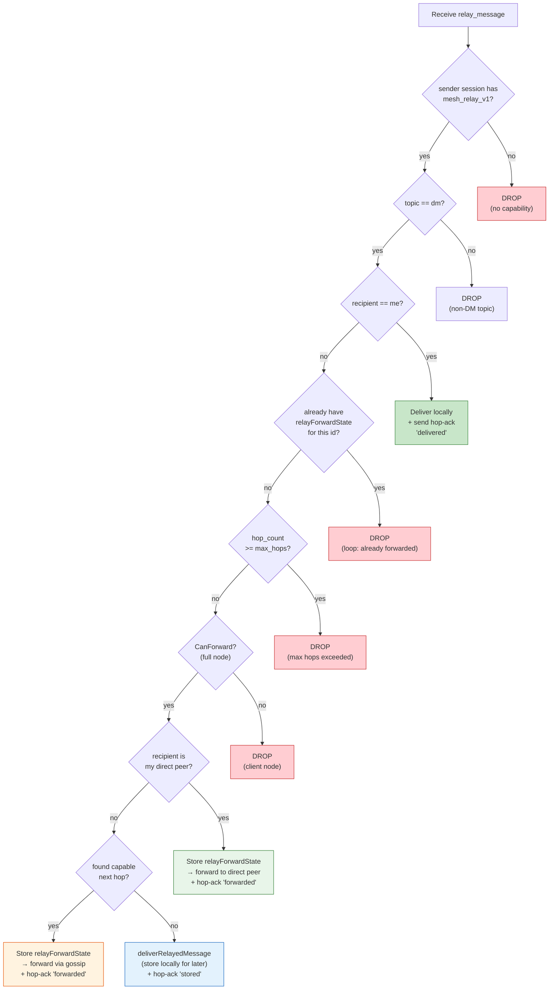
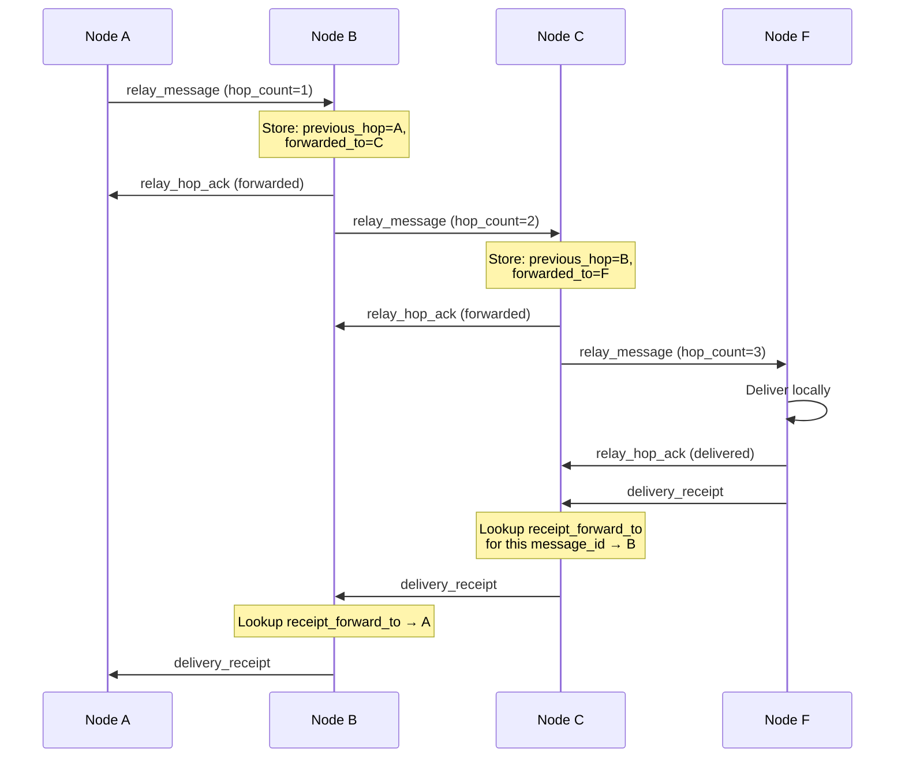
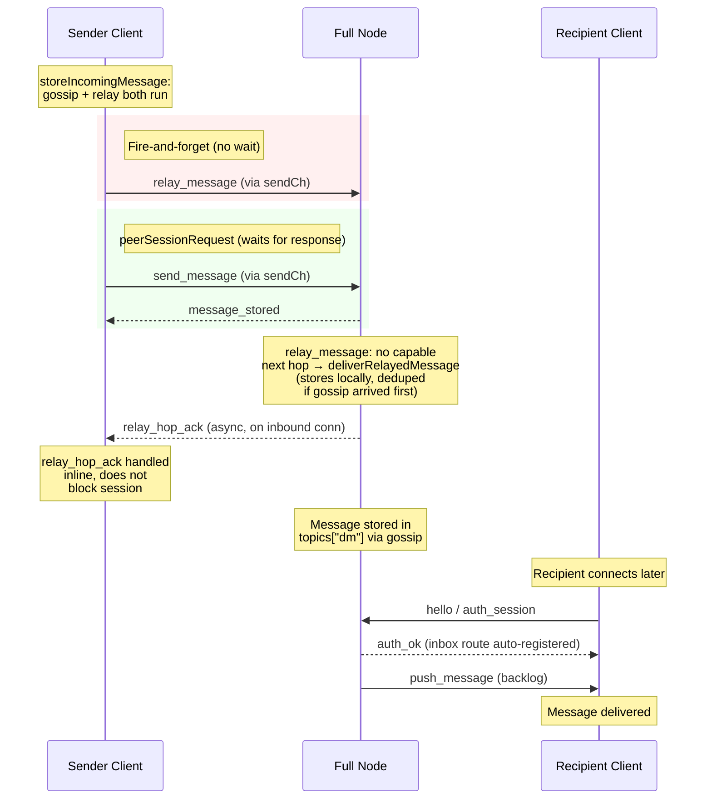
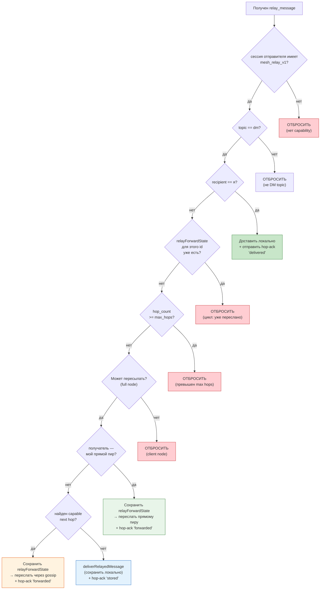
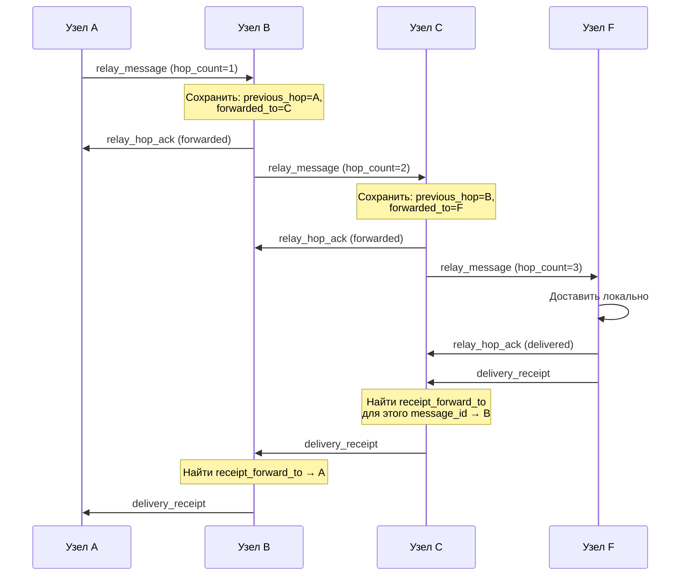
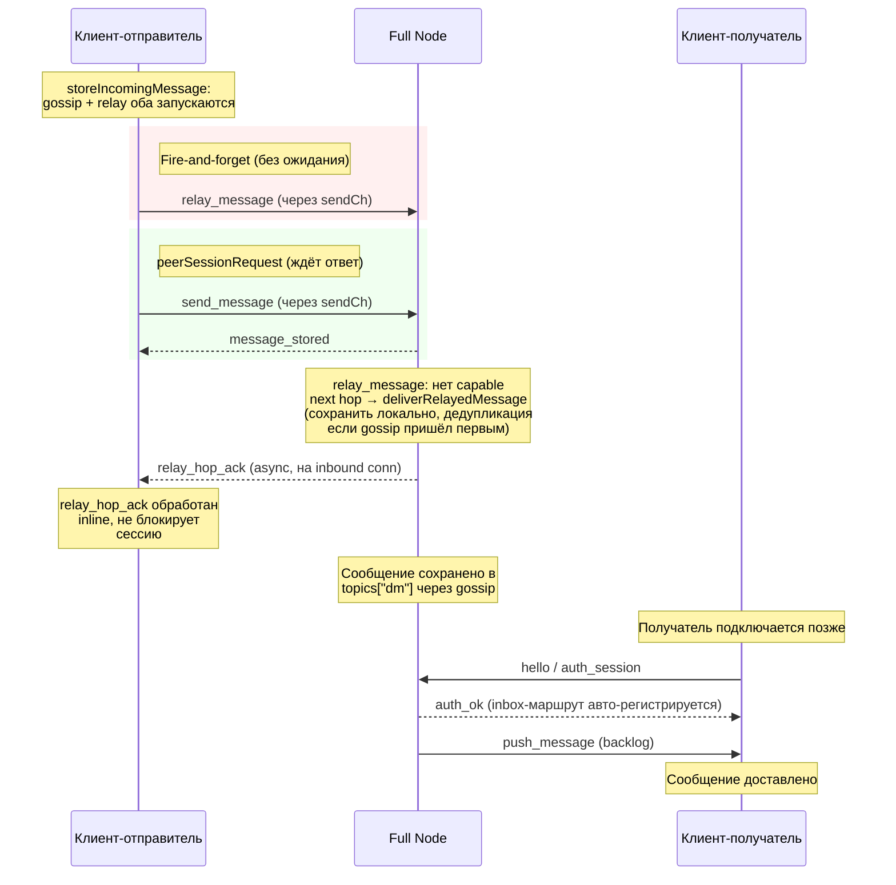

# Relay Protocol (Iteration 1 — Hop-by-hop relay)

## English

### Overview

The relay protocol enables hop-by-hop message forwarding through intermediate nodes. When node A wants to send a DM to node F but none of A's direct peers know F, the message can traverse multiple intermediate nodes (A→B→C→D→E→F) until it reaches the recipient.

The relay subsystem is gated by the `mesh_relay_v1` capability negotiated during handshake. Nodes without this capability continue to use the existing gossip-based delivery. Legacy peers never receive `relay_message` or `relay_hop_ack` frames.

**Scope:** The relay protocol handles DM delivery only (`topic == "dm"`). File transfer operations use a separate `FileCommandFrame` protocol with its own routing through `file_router` (capability `file_transfer_v1`). FileCommandFrame uses best-route forwarding with hop TTL, ed25519 authentication, and nonce-based anti-replay. See [file_transfer.md](file_transfer.md) for the full specification.

### Commands

#### relay_message (peer → peer)

Hop-by-hop relay frame. Sent only to peers with `mesh_relay_v1` capability.

**Frame:**
```json
{
  "type": "relay_message",
  "id": "550e8400-e29b-41d4-a716-446655440001",
  "address": "origin_sender_fingerprint",
  "recipient": "final_recipient_fingerprint",
  "topic": "dm",
  "body": "<ciphertext>",
  "flag": "sender-delete",
  "created_at": "2026-03-29T12:00:00Z",
  "ttl_seconds": 3600,
  "hop_count": 3,
  "max_hops": 10,
  "previous_hop": "10.0.0.5:64646"
}
```

**Fields:**

| Field | Type | Required | Description |
|-------|------|----------|-------------|
| `type` | string | Yes | Always `"relay_message"` |
| `id` | UUID v4 | Yes | Original message ID (used for deduplication) |
| `address` | string | Yes | Original sender's fingerprint |
| `recipient` | string | Yes | Final recipient's fingerprint |
| `topic` | string | Yes | Message topic (e.g., `"dm"`) |
| `body` | string | Yes | Encrypted message payload |
| `flag` | string | Yes | Message flag (same as `send_message`) |
| `created_at` | RFC3339 | Yes | Original message timestamp |
| `ttl_seconds` | int | Optional | TTL from original message |
| `hop_count` | int | Yes | Number of hops traversed so far (incremented at each node) |
| `max_hops` | int | Yes | Maximum allowed hops (default: 10). Message dropped when `hop_count >= max_hops` |
| `previous_hop` | string | Yes | Address of the node that sent this relay frame |

**Capability gate:** `relay_message` is only sent to peers whose session has `"mesh_relay_v1"` in the negotiated capability set. For peers without the capability, the node falls back to `send_message` + gossip.

**Sender semantics:** `relay_message` and `relay_hop_ack` are fire-and-forget on the wire. The sender writes the frame without waiting for a synchronous response. The receiver may send a `relay_hop_ack` asynchronously but the sender must not block the session waiting for it. This prevents a 12-second stall when the receiver has no outbound session to ack through.

**Processing on intermediate node:**

1. **Capability check** — sender must have `mesh_relay_v1`. Drop if not.
2. **Topic check** — relay is a DM-only mechanism. If `topic != "dm"`, drop silently.
3. **Am I the recipient?** — If `recipient == my_address`, deliver locally and send `relay_hop_ack` with status `"delivered"`.
4. **Dedupe** — If `relayForwardState` exists for this `id`, drop silently (prevents broadcast storms).
5. **Max hops** — If `hop_count >= max_hops`, drop.
6. **Can forward?** — Client nodes cannot relay. Drop if not a full node.
7. **Direct peer?** — If recipient identity has active sessions, try each capable session until one accepts the frame. This handles reconnects and address changes where the same identity appears under multiple addresses.
8. **Gossip fallback** — Forward to top-scored capable peers (excluding the sender).
9. **No capable peers?** — If no relay target found, admit the message via `deliverRelayedMessage` into the in-flight forwarding buffer so `retryRelayDeliveries` can re-attempt within the transit window. Send `relay_hop_ack` with status `"stored"`.
10. **Store state** — Save `relayForwardState` with `previous_hop` and `forwarded_to`.
11. **Ack** — Send `relay_hop_ack` with status `"forwarded"` back to previous hop.


*Diagram — Relay message processing on an intermediate node*

---

#### relay_hop_ack (peer → peer)

Hop-by-hop acknowledgement. Sent back to `previous_hop` after successfully forwarding or delivering a relay message.

**Frame:**
```json
{
  "type": "relay_hop_ack",
  "id": "550e8400-e29b-41d4-a716-446655440001",
  "status": "forwarded"
}
```

**Fields:**

| Field | Type | Required | Description |
|-------|------|----------|-------------|
| `type` | string | Yes | Always `"relay_hop_ack"` |
| `id` | string | Yes | Message ID being acknowledged |
| `status` | string | Yes | One of exactly three values: `"forwarded"` (relayed to next hop), `"delivered"` (delivered to final recipient), or `"stored"` (stored locally, no capable next hop — waiting for recipient or better route). No other status values are valid. |

---

#### fetch_relay_status (RPC command)

Returns diagnostic information about the relay subsystem.

**Request:**
```json
{
  "type": "fetch_relay_status"
}
```

**Response:**
```json
{
  "type": "relay_status",
  "status": "ok",
  "count": 5,
  "limit": 3
}
```

**Fields:**

| Field | Type | Description |
|-------|------|-------------|
| `type` | string | Always `"relay_status"` |
| `status` | string | `"ok"` — relay subsystem is operational |
| `count` | int | Number of active relay forward states (messages currently being relayed through this node) |
| `limit` | int | Number of unique connected peers (both inbound and outbound) with `mesh_relay_v1` capability |

---

### Privacy model

No single message frame reveals the full traversal path. Each intermediate node stores only local forwarding state:

```go
type relayForwardState struct {
    MessageID        string // original message UUID
    PreviousHop      string // who sent this relay to me
    ReceiptForwardTo string // = PreviousHop (where to send receipt back)
    ForwardedTo      string // who I forwarded to
    HopCount         int    // incremented on each hop
    RemainingTTL     int    // seconds until cleanup (decremented by ticker)
}
```

State is cleaned up when `RemainingTTL` reaches 0 (default: 180 seconds). Uses numeric counters, not wall-clock timestamps.

### Delivery receipt return path

When the final recipient generates a `delivered`/`seen` receipt, each intermediate node looks up `ReceiptForwardTo` by message ID and sends the receipt one hop back toward the original sender. The direction is status-dependent: the `seen_ack` confirmation (v23) travels the OPPOSITE way — in the original message direction — so intermediate nodes forward it via the message's `ForwardedTo` hop instead (`relayHopForReceipt` resolves the hop per status). If the resolved hop is unavailable or lacks capability, fallback to gossip receipt delivery.


*Diagram — Hop-by-hop ack and receipt return via local state*

### Coexistence with legacy nodes

| Sender | Receiver | Behavior |
|--------|----------|----------|
| New | New | `relay_message` with hop-by-hop forwarding |
| New | Legacy | Falls back to `send_message` + gossip |
| Legacy | New | `send_message` processed normally, no relay |
| Legacy | Legacy | Unchanged behavior |

Mixed relay chain: if an intermediate node lacks `mesh_relay_v1`, the relaying node falls back to gossip for that hop.

### Iteration 1 invariants

**INV-1: Relays are forwarding-only — offline delivery is the sender's job.** Relay is an optimization on top of gossip. If neither path can deliver a DM right now (recipient offline), the intermediate full node holds the envelope only as the in-flight buffer of its own forwarding operation (`transitInFlightWindow`, see `transit_retention.go`) and retries via `retryRelayDeliveries` within that window. Transit envelopes are NOT a mailbox: they are never served through fetch/backlog surfaces and are swept when the window closes. Recovery beyond the window is the SENDER's end-to-end retry.

**INV-2: Intermediate full node buffers transit DMs in-flight only.** When `handleRelayMessage` on a full node finds no capable next hop, it calls `deliverRelayedMessage(frame)` which runs `storeIncomingMessage(msg, false)`. This admits the message into `topics["dm"]` as in-flight forwarding state (bounded by the transit caps) so `retryRelayDeliveries` can re-attempt sends while the window is open, and live push reaches a recipient with an active route. The node responds with `relay_hop_ack` status `"stored"` (meaning "buffered for forwarding retry", not "stored durably"). The envelope is never replayed from backlog to a reconnecting recipient — that surface is local-only.

**INV-1/INV-2 exception — forward-once relays (opt-in, `CORSA_TRANSIT_FORWARD_ONCE`).** When enabled, a relay does NOT buffer transit DMs at all: `storeIncomingMessage` forwards the frame in a single pass (the usual gossip + relay sends — deduped at the receiver; forward-once bounds buffering/re-gossip over TIME, not the per-pass frame count) and neither appends it to `topics["dm"]` nor registers a `relayRetry` entry — so `retryRelayDeliveries` has nothing to re-emit and the in-flight buffer disappears. This removes the transit gossip-storm at its source; durability falls entirely on the SENDER's receipt-driven retry (`awaitingDelivered`, cleared only by a `delivered`/`seen` receipt — NOT by `relay_hop_ack` or `ack_delete`). Semantics note: in this mode `storeIncomingMessage` still returns `stored=true` and the node still emits `ack_delete` / a `"stored"` hop-ack, which here mean "ACCEPTED / already seen (dedup), stop pushing me this id" — NOT "buffered for retry". That is safe because the previous hop's `ack_delete`/hop-ack only releases its own relay backlog, while the origin's `awaitingDelivered` retry is receipt-driven and independent, so it keeps redelivering until the recipient confirms (bounded by TTL / attempts cap, the online-overlap model). A dedicated "forwarded-not-buffered" wire status would make this explicit but requires protocol-version negotiation (future work). Default OFF; the legacy in-flight buffer (INV-1/INV-2) applies until enabled.

The relay-retry contour (`trackRelayMessage` / `retryableRelayMessages` / `retryRelayDeliveries`) operates on **transit** envelopes only (neither sender nor recipient is this node). An **origin-authored** DM (sender is this node) is never tracked or re-gossiped through this contour — its re-send is owned exclusively by the sender-owned delivery engine (`registerAwaitingDelivered` → `retryDueDeliveries` → `dispatchEnvelopeRetry`), which is finite (TTL / attempts cap) and terminalizes durably. Tracking origin DMs in the relay-retry contour previously re-gossiped them indefinitely: each mesh echo re-armed the `relayRetryTTL` window long past the sender-owned cap, which surfaced as multi-day re-circulation of a node's own undelivered DMs. The same rule is enforced on the FAST relay path: `handleRelayMessage` drops a received `relay_message` whose origin sender is this node (an echo of our own DM, recipient ≠ self) before any forward — the fast path forwards before `storeIncomingMessage`, so it cannot rely on the store-path `originEcho` guard.

**INV-3: Gossip always runs unconditionally.** `storeIncomingMessage` always executes `executeGossipTargets` regardless of whether relay succeeds or fails. This means every DM has at least two independent delivery paths: gossip and relay. Gossip provides the baseline propagation path; relay provides faster multi-hop traversal. Neither path stores transit envelopes beyond the in-flight window — durable recovery is the sender's end-to-end retry.

**INV-3 exception — reachability-gated origin sends (default ON, `CORSA_HOLD_DM_UNTIL_REACHABLE`).** For messages THIS node authored (sender == self) the invariant is narrowed: the origin first send and every sender-owned retry emit only when the recipient is REACHABLE — a directed route (`RelayNextHop`) exists or the recipient is a directly connected subscriber. An unreachable recipient is HELD in `awaitingDelivered` (no blind gossip into the void) and delivered when a route or connection appears — `kickDeliveryRetriesForReachable`, fired from the announce/connect drain, re-arms held entries immediately. TRANSIT forwarding (sender != self) is NOT affected — blind gossip remains the unconditional propagation mechanism for other people's messages. The hold is bounded by the message TTL and the attempts cap. This is the cure for the blind-gossip storm to offline/long-gone recipients (months-old undelivered DMs re-flooding the mesh). Enabled by default; `CORSA_HOLD_DM_UNTIL_REACHABLE` set to a falsey value is a kill-switch that restores the legacy unconditional blind-gossip baseline. Trade-off: a recipient that is online but whose route has not yet propagated to this node is delivered only once its announce arrives (no blind discovery), instead of immediately via flood.

**INV-3 exception 2 — transit age ceiling (default ON, `CORSA_ENVELOPE_RETENTION`).** A TRANSIT DM (neither party is this node) whose age exceeds the transit `MaxAge` (default 24h, `CORSA_TRANSIT_MAX_AGE_HOURS`) is neither admitted nor re-propagated, and is swept from `s.topics` by cleanup. Crucially the age is anchored on the IMMUTABLE sender `CreatedAt`, NOT on the local `StoredAt`. A `CreatedAt` more than the clock-skew tolerance into the future is treated as AGED (bogus — a message cannot legitimately originate in the future, so it buys no lifetime); within tolerance it counts as fresh; a past-dated one only shortens life. The legacy `transitInFlightWindow` was anchored on `StoredAt`, which `storeIncomingMessage` re-stamps on every admission — so after the rotating bloom forgot an id (5–10 min) a re-injected transit DM reset its window and circulated the mesh forever (the transit gossip storm; months-old DMs re-flooding a settled network). The `StoredAt` window still bounds the SHORT forwarding operation; the `CreatedAt` ceiling is the re-injection-proof global cap. Broadcast/global topics — which previously had NO age bound at all — are bounded by `BroadcastMaxAge` (default 24h, `CORSA_BROADCAST_MAX_AGE_HOURS`) the same way. This matches the "online-overlap" delivery model: there is no durable long-offline delivery; a recipient gone longer than the ceiling is served, if ever, by the sender's own finite retry, not by the mesh acting as a permanent mailbox. Classification and policy live in `envelope_retention.go`. Kill-switch: `CORSA_ENVELOPE_RETENTION` falsey restores the legacy no-ceiling behaviour.

Formally: an intermediate relay node forwards immediately and keeps the envelope only for its own forwarding retries. If both relay and gossip carry the same message, deduplication via `seen[messageID]` prevents double delivery.

**INV-4: Client nodes must not act as intermediate relay hops.** A client node may be a sender (origin) or a final recipient of a relay chain, but never an intermediate transit hop. When `handleRelayMessage` receives a `relay_message` not addressed to itself on a client node (`CanForward() == false`), the frame is silently dropped. This is a protocol safety invariant, not just an implementation detail — client nodes lack the connectivity and uptime to provide reliable forwarding.

**INV-5: Exactly one `relay_hop_ack` per relay_message, with a semantic status.** For each `relay_message` that is not silently dropped, the receiver sends exactly one `relay_hop_ack` with one of the documented statuses: `"forwarded"`, `"delivered"`, or `"stored"`. There is no generic `"ack"` status. Dropped messages (dedupe, max hops, client node, rejected by `storeIncomingMessage`) produce no ack. The ack is written directly on the inbound connection by the receiver — it does not traverse a separate outbound session.

**INV-6: Final recipient stores relay state for receipt reverse path.** When `handleRelayMessage` delivers a message locally (recipient == self), it stores a `relayForwardState` with `ReceiptForwardTo = senderAddress` (transport address of the previous hop). This enables `handleRelayReceipt` to route the delivery receipt back through the hop-by-hop chain instead of falling back to gossip. Without this state, the final recipient has no reverse-path metadata and receipts can only reach the origin via gossip.

**INV-7: Hop-ack status reflects actual delivery outcome.** `handleRelayMessage` returns `"delivered"` or `"stored"` only when `deliverRelayedMessage` succeeds (i.e. `storeIncomingMessage` accepts the message). If the payload is rejected (unknown sender key, invalid signature, parse error), `handleRelayMessage` returns `""` — no ack is sent. This prevents the previous hop from believing the message was delivered when it was actually discarded.

**INV-8: Relay/queue state is in-memory only.** Relay state, pending frames, dedupe records and delivery receipts live in RAM only and do **not** survive a process restart. Pending frames are bounded by an in-memory per-peer ring (`CORSA_PENDING_RING_SIZE`, evict-oldest) rather than a disk-backed queue. The rationale: with network growth a persisted queue file becomes the dominant allocation-churn / memory source, and the relay's in-flight forwarding buffer is only required for the node's UPTIME, not across restarts — a restarted relay re-learns paths, and durable recovery is the sender's end-to-end retry. The legacy disk persistence has been deleted entirely; the runtime neither reads nor writes any queue-state file. **Operator-facing consequence:** undelivered DMs held on an intermediate relay are lost if that relay restarts; the sender remains responsible for end-to-end retry until acknowledged.

**INV-8: Relay/queue state хранится только в памяти.** Relay state, pending-фреймы, записи дедупликации и delivery receipts живут только в RAM и **не** переживают перезапуск процесса. Pending-фреймы ограничены in-memory пер-пировым кольцом (`CORSA_PENDING_RING_SIZE`, evict-oldest), а не диск-backed очередью. Причина: с ростом сети персистируемый файл очереди становится основным источником allocation-churn / памяти, а in-flight-буфер пересылки нужен только на время UPTIME ноды, а не между рестартами — перезапущенный relay переучивает пути, а долговременное восстановление — end-to-end retry отправителя. Legacy-персист полностью удалён; рантайм не читает и не пишет никакой файл состояния очереди. **Для оператора:** недоставленные DM, лежащие на промежуточном relay, теряются при его рестарте; отправитель отвечает за end-to-end retry до подтверждения.

**INV-9: Relay frames require an authenticated session.** `relay_message` and `relay_hop_ack` on inbound TCP connections are gated by `isConnAuthenticated(conn)`. A peer that has not completed the `auth_session` handshake (challenge-response signature verification) cannot send relay frames, even if it advertises `mesh_relay_v1` in its hello. Without this gate, any unauthenticated client could inject hop-by-hop relay traffic or spoof `previous_hop` addresses by simply claiming the capability in an unauthenticated hello. Outbound peer sessions (`dispatchPeerSessionFrame`) are inherently authenticated by the session establishment process and do not need this additional check.

**INV-10: Relay is a DM-class mechanism.** Only DM-class frames — `topic="dm"` (data DMs) and `topic="dm-control"` (control DMs) — are eligible for relay forwarding; `handleRelayMessage` drops anything else (`protocol.IsDMTopic`) at entry before any further processing. Control DMs follow the same point-to-point routing/relay semantics as data DMs (see `docs/dm-commands.md`); this invariant only excludes broadcast / global-topic frames, whose delivery semantics differ.

**INV-11: The relay hop resolves to empty at a receipt's destination.** For `delivered`/`seen` the origin sender is the final destination: its `ReceiptForwardTo` is empty, so `handleRelayReceipt` returns false and propagation stops. Symmetrically, `seen_ack` terminates at the final recipient's node, where no further `ForwardedTo` hop exists. An empty hop from `relayHopForReceipt` always means "the chain ends here", preventing infinite receipt forwarding loops.

### Gossip and relay coexistence

Gossip (`send_message` + `executeGossipTargets`) is the baseline delivery mechanism. It always runs unconditionally and provides mesh-wide propagation, push delivery to connected clients, and in-flight relay retries within the transit window. Offline delivery beyond the window is the sender's end-to-end retry.

Relay (`relay_message` + `tryRelayToCapableFullNodes`) is an additional optimization that fires on top of gossip for DMs. It targets only full-node peers with `mesh_relay_v1` capability. Client nodes are never relay targets because they cannot forward (`CanForward=false`). Relay provides faster multi-hop traversal for recipients unreachable by direct gossip.

Receivers dedupe via `seen[messageID]`: if gossip arrives before relay (or vice versa), the second copy is silently dropped. This makes the overlap safe — both paths run independently.

### Fire-and-forget session semantics

`relay_message` and `relay_hop_ack` use fire-and-forget write semantics in `servePeerSession`. Unlike `send_message` (which always generates a synchronous `message_stored` response), `relay_message` is processed asynchronously on the receiving end and may not produce a response on the same inbound connection.

Without fire-and-forget, a relay_message enqueued to `session.sendCh` would go through `peerSessionRequest`, which blocks the sender's peer session for up to `peerRequestTimeout` (12 seconds) waiting for a response that never arrives. This stalls the entire session, preventing subsequent `send_message` frames (gossip) from being delivered.

The fix: `isFireAndForgetFrame` identifies relay frames. `servePeerSession` writes them directly without entering `peerSessionRequest`. Async `relay_hop_ack` frames arriving later are processed inline by `peerSessionRequest` (listed in the inline handler set) and by `servePeerSession` via `dispatchPeerSessionFrame`.


*Diagram — Fire-and-forget relay with gossip baseline delivery*

### In-flight buffering on intermediate full node

When `handleRelayMessage` on an intermediate full node finds no capable next hop (e.g., the only connected peer is the sender client), the message is admitted via `deliverRelayedMessage` into `topics["dm"]` as in-flight forwarding state. `retryRelayDeliveries` re-attempts delivery while the transit window is open; if the recipient connects within that window, the retry reaches it through the routing table / live push. The relay does NOT replay transit envelopes from backlog — past the window, recovery is the sender's end-to-end retry.

```mermaid
sequenceDiagram
    participant SC as Sender Client
    participant FN as Full Node
    participant RC as Recipient Client (offline)

    SC->>FN: relay_message
    Note over FN: handleRelayMessage:<br/>no capable next hop<br/>→ deliverRelayedMessage<br/>→ topics["dm"] (in-flight buffer)
    FN-->>SC: relay_hop_ack (stored)

    Note over RC: Recipient connects within<br/>the transit window
    RC->>FN: hello / auth_session
    FN-->>RC: auth_ok (inbox route auto-registered)
    FN->>RC: relay retry delivers via live route
    Note over FN: Past the window the envelope is swept;<br/>recovery = sender end-to-end retry
```
*Diagram — In-flight forwarding buffer when no capable relay peers are available*

### Notification boundaries (Iteration 1)

Iteration 1 defines clear boundaries for which notifications traverse the relay path and which do not.

**In scope — `delivered` receipt:**
The `delivered` receipt travels back along the reverse relay path via `ReceiptForwardTo` stored in each node's `relayForwardState`. Each intermediate node looks up `ReceiptForwardTo` by message ID and forwards the receipt one hop back toward the original sender. If the previous hop is unavailable, the node falls back to gossip receipt delivery.

**Out of scope — `read` and application-level statuses:**
Application-level statuses such as `read`, `typing`, `seen`, and similar are not part of the hop-by-hop relay in Iteration 1. These statuses require a separate design because they are generated asynchronously (potentially hours after delivery), by which time the `relayForwardState` on intermediate nodes may already be cleaned up (TTL = 180s). Future iterations may introduce a dedicated notification relay or piggyback these statuses on existing gossip paths.

```
┌─────────────────────────────────────────────────────────┐
│                Iteration 1 relay scope                  │
│                                                         │
│  relay_message ──────────────────────→  forward path    │
│  relay_hop_ack ──────────────────────→  per-hop ack     │
│  delivery_receipt ───────────────────→  reverse path    │
│                                                         │
│  ─ ─ ─ ─ ─ ─ ─ ─ ─ ─ ─ ─ ─ ─ ─ ─ ─ ─ ─ ─ ─ ─ ─ ─   │
│  read, typing, seen ─────────────────→  OUT OF SCOPE    │
│  (require separate design in future iterations)         │
└─────────────────────────────────────────────────────────┘
```

### Admission control

Relay frames pass through a centralized admission pipeline before reaching the relay processing logic. The admission control is implemented in `admission.go` and enforces the following checks at both transport entry points (inbound TCP and peer sessions):

**Capability gate (INV-9):** The sender must have `mesh_relay_v1` in its negotiated capability set. Inbound TCP connections additionally require a completed authentication handshake — unauthenticated connections cannot send relay frames even if they advertise the capability.

**Body size limit:** Relay frames whose `body` field exceeds `maxRelayBodyBytes` (64 KiB) are dropped at admission. The check uses `len(frame.Body)` — the parsed body — rather than the raw wire size, because the parsed frame is the common currency across both transport paths (inbound TCP and peer sessions). This prevents oversized payloads from propagating through the relay chain and exhausting memory on intermediate nodes. The limit is enforced before any relay state is allocated.

**Relay receive pipeline:**

```
receive → authenticate (inbound TCP only) → admitRelayFrame → handleRelayMessage → ack
```

The `admitRelayFrame` function centralizes the capability check and frame size validation, replacing inline checks that were previously duplicated between `dispatchNetworkFrame` and `dispatchPeerSessionFrame`. The authentication check remains transport-specific because inbound TCP connections and peer sessions use different authentication mechanisms.

### Capacity limits and backpressure

The relay subsystem enforces hard capacity limits to prevent unbounded growth under flood conditions. Capacity constants are defined in `admission.go`; per-peer rate-limit constants are in `ratelimit.go`.

**Relay forward state store** (`relayStateStore`): bounded to `maxRelayStates` (10 000) entries globally and `maxRelayStatesPerPeer` (500) per previous-hop transport address. When either limit is reached, `tryReserve` returns false — the relay message is silently dropped, same as a dedupe. Per-peer counters are maintained via the `perPeer` map and decremented on release and TTL expiry.

**Relay retry queue** (`relayRetry`): bounded to `maxRelayRetryEntries` (5 000). New tracking entries are rejected when full. Existing entries still expire via `relayRetryTTL` (3 minutes).

**Pending frame queue** (`pending`): bounded to `maxPendingFramesPerPeer` (200) per peer address and `maxPendingFramesTotal` (2 000) globally. When either limit is reached, `queuePeerFrame` returns false.

**Per-peer rate limiting** (`relayRateLimiter`): a token bucket per peer address limits relay fan-out to `relayBurstPerPeer` (50) with a sustained rate of `relayRefillRate` (20 tokens/s). Applied in `relayViaGossip` and `tryRelayToCapableFullNodes`. Stale buckets are cleaned up every 5 minutes from the bootstrap loop.

### Timeout centralization

All handshake and session timeouts are defined as named constants in `admission.go`: `dialTimeout` (2 s), `handshakeTimeout` (2 s), `syncHandshakeTimeout` (1.5 s), `sessionWriteTimeout` (3 s). Every transport path references these constants instead of inline literals.

### Source

- `internal/core/node/relay.go` — relay logic, state store, forwarding
- `internal/core/node/admission.go` — relay admission control, invariant documentation, frame validation, capacity limits, timeout constants
- `internal/core/node/ratelimit.go` — per-peer token bucket rate limiter
- `internal/core/node/capabilities.go` — capability negotiation
- `internal/core/protocol/frame.go` — frame fields (`HopCount`, `MaxHops`, `PreviousHop`)
- `internal/core/node/relay_test.go` — unit and integration tests, capacity limit tests
- `internal/core/node/admission_test.go` — admission control, invariant contract, and constant value tests
- `internal/core/node/ratelimit_test.go` — rate limiter tests

---

## Русский

### Обзор

Протокол ретрансляции обеспечивает пошаговую пересылку сообщений через промежуточные узлы. Когда узел A хочет отправить DM узлу F, но ни один из прямых пиров A не знает F, сообщение может пройти через несколько промежуточных узлов (A→B→C→D→E→F) пока не достигнет получателя.

Подсистема ретрансляции управляется capability `mesh_relay_v1`, согласованным при рукопожатии. Узлы без этой capability продолжают использовать существующую gossip-доставку. Legacy-пиры никогда не получают фреймы `relay_message` или `relay_hop_ack`.

**Область применения:** Протокол ретрансляции обрабатывает только DM-доставку (`topic == "dm"`). Файловые операции используют отдельный протокол `FileCommandFrame` с собственной маршрутизацией через `file_router` (capability `file_transfer_v1`). FileCommandFrame использует best-route пересылку с hop TTL, ed25519-аутентификацией и nonce-основанной anti-replay защитой. Полная спецификация — в [file_transfer.md](file_transfer.md).

### Команды

#### relay_message (пир → пир)

Фрейм пошаговой ретрансляции. Отправляется только пирам с capability `mesh_relay_v1`.

**Фрейм:**
```json
{
  "type": "relay_message",
  "id": "550e8400-e29b-41d4-a716-446655440001",
  "address": "origin_sender_fingerprint",
  "recipient": "final_recipient_fingerprint",
  "topic": "dm",
  "body": "<ciphertext>",
  "flag": "sender-delete",
  "created_at": "2026-03-29T12:00:00Z",
  "ttl_seconds": 3600,
  "hop_count": 3,
  "max_hops": 10,
  "previous_hop": "10.0.0.5:64646"
}
```

**Поля:**

| Поле | Тип | Обязательное | Описание |
|------|-----|-------------|----------|
| `type` | string | Да | Всегда `"relay_message"` |
| `id` | UUID v4 | Да | Исходный ID сообщения (для дедупликации) |
| `address` | string | Да | Fingerprint исходного отправителя |
| `recipient` | string | Да | Fingerprint конечного получателя |
| `topic` | string | Да | Топик сообщения (например, `"dm"`) |
| `body` | string | Да | Зашифрованное тело сообщения |
| `flag` | string | Да | Флаг сообщения (аналогично `send_message`) |
| `created_at` | RFC3339 | Да | Временная метка исходного сообщения |
| `ttl_seconds` | int | Нет | TTL из исходного сообщения |
| `hop_count` | int | Да | Количество уже пройденных хопов (увеличивается на каждом узле) |
| `max_hops` | int | Да | Максимально допустимое количество хопов (по умолчанию: 10). Сообщение отбрасывается при `hop_count >= max_hops` |
| `previous_hop` | string | Да | Адрес узла, который отправил этот relay-фрейм |

**Гейт capability:** `relay_message` отправляется только пирам, у которых в согласованном наборе capabilities есть `"mesh_relay_v1"`. Для пиров без capability узел использует `send_message` + gossip.

**Семантика отправки:** `relay_message` и `relay_hop_ack` — fire-and-forget на проводе. Отправитель записывает фрейм без ожидания синхронного ответа. Получатель может отправить `relay_hop_ack` асинхронно, но отправитель не должен блокировать сессию в ожидании — это предотвращает 12-секундный stall при отсутствии обратной outbound-сессии.

**Логика обработки на промежуточном узле:**

1. **Проверка capability** — отправитель должен иметь `mesh_relay_v1`. Иначе — отбросить.
2. **Проверка topic** — relay работает только для DM. Если `topic != "dm"` — отбросить молча.
3. **Я получатель?** — Если `recipient == мой_адрес`, доставить локально + отправить `relay_hop_ack` со статусом `"delivered"`.
4. **Дедупликация** — Если `relayForwardState` для этого `id` уже существует — отбросить молча (защита от broadcast storm).
5. **Максимум хопов** — Если `hop_count >= max_hops` — отбросить.
6. **Может пересылать?** — Client-ноды не могут ретранслировать. Отбросить если не full node.
7. **Прямой пир?** — Если identity получателя имеет активные сессии, перебрать каждую capable-сессию до первой успешной отправки. Это учитывает реконнекты и смену адресов, когда один identity имеет несколько адресов.
8. **Gossip-фоллбэк** — Переслать топ-пирам с capability (исключая отправителя).
9. **Нет доступных пиров?** — Если relay-цель не найдена, принять сообщение через `deliverRelayedMessage` в in-flight-буфер пересылки, чтобы `retryRelayDeliveries` мог повторять отправку в пределах транзитного окна. Отправить `relay_hop_ack` со статусом `"stored"`.
10. **Сохранить состояние** — Записать `relayForwardState` с `previous_hop` и `forwarded_to`.
11. **Подтверждение** — Отправить `relay_hop_ack` со статусом `"forwarded"` обратно на предыдущий хоп.


*Диаграмма — Обработка relay_message на промежуточном узле*

---

#### relay_hop_ack (пир → пир)

Пошаговое подтверждение. Отправляется обратно на `previous_hop` после успешной пересылки или доставки.

**Фрейм:**
```json
{
  "type": "relay_hop_ack",
  "id": "550e8400-e29b-41d4-a716-446655440001",
  "status": "forwarded"
}
```

**Поля:**

| Поле | Тип | Обязательное | Описание |
|------|-----|-------------|----------|
| `type` | string | Да | Всегда `"relay_hop_ack"` |
| `id` | string | Да | ID подтверждаемого сообщения |
| `status` | string | Да | Одно из трёх значений: `"forwarded"` (переслано на следующий хоп), `"delivered"` (доставлено конечному получателю) или `"stored"` (сохранено локально, нет capable next hop — ожидание получателя или лучшего маршрута). Другие значения невалидны. |

---

#### fetch_relay_status (RPC-команда)

Возвращает диагностическую информацию о подсистеме ретрансляции.

**Запрос:**
```json
{
  "type": "fetch_relay_status"
}
```

**Ответ:**
```json
{
  "type": "relay_status",
  "status": "ok",
  "count": 5,
  "limit": 3
}
```

**Поля:**

| Поле | Тип | Описание |
|------|-----|----------|
| `type` | string | Всегда `"relay_status"` |
| `status` | string | `"ok"` — подсистема работает |
| `count` | int | Количество активных relay forward states (сообщений, ретранслируемых через этот узел) |
| `limit` | int | Количество уникальных подключённых пиров (входящих и исходящих) с capability `mesh_relay_v1` |

### Модель приватности

Ни один фрейм не раскрывает полный путь прохождения. Каждый промежуточный узел хранит только локальное состояние пересылки:

```go
type relayForwardState struct {
    MessageID        string // исходный UUID сообщения
    PreviousHop      string // кто отправил этот relay мне
    ReceiptForwardTo string // = PreviousHop (куда отправить receipt обратно)
    ForwardedTo      string // кому я переслал
    HopCount         int    // увеличивается на каждом хопе
    RemainingTTL     int    // секунды до очистки (уменьшается тикером)
}
```

Состояние автоматически очищается когда `RemainingTTL` достигает 0 (по умолчанию: 180 секунд). Используются числовые счётчики, не wall-clock timestamps.

### Обратный путь delivery receipt

При генерации `delivered`/`seen`-квитанции конечным получателем каждый промежуточный узел ищет `ReceiptForwardTo` по ID сообщения и отправляет квитанцию на один хоп назад к исходному отправителю. Направление зависит от статуса: подтверждение `seen_ack` (v23) идёт в ОБРАТНУЮ сторону — в направлении исходного сообщения — поэтому промежуточные узлы пересылают его по хопу `ForwardedTo` сообщения (`relayHopForReceipt` разрешает хоп по статусу). При недоступности разрешённого хопа или отсутствии capability — фоллбэк на gossip-доставку квитанции.


*Диаграмма — Пошаговый ack и возврат receipt через локальное состояние*

### Сосуществование с legacy-узлами

| Отправитель | Получатель | Поведение |
|-------------|------------|-----------|
| Новый | Новый | `relay_message` с пошаговой пересылкой |
| Новый | Legacy | Фоллбэк на `send_message` + gossip |
| Legacy | Новый | `send_message` обрабатывается нормально |
| Legacy | Legacy | Без изменений |

Смешанная relay-цепочка: если промежуточный узел не имеет `mesh_relay_v1`, ретранслирующий узел использует gossip-фоллбэк для этого хопа.

### Инварианты Iteration 1

**INV-1: Relay — только пересылка; offline-доставка — обязанность отправителя.** Relay — это оптимизация поверх gossip. Если ни один путь не может доставить DM прямо сейчас (получатель офлайн), промежуточный full node держит конверт только как in-flight-буфер собственной операции пересылки (`transitInFlightWindow`, см. `transit_retention.go`) и повторяет отправку через `retryRelayDeliveries` в пределах окна. Транзитные конверты — НЕ mailbox: они не отдаются через fetch/backlog-поверхности и выметаются по закрытии окна. Восстановление за пределами окна — end-to-end retry ОТПРАВИТЕЛЯ.

**INV-2: Промежуточный full node буферизует транзитные DM только in-flight.** Когда `handleRelayMessage` на full node не находит capable next hop, он вызывает `deliverRelayedMessage(frame)`, который выполняет `storeIncomingMessage(msg, false)`. Сообщение принимается в `topics["dm"]` как in-flight-состояние пересылки (ограничено транзитными капами): `retryRelayDeliveries` повторяет отправку, пока окно открыто, а live push доходит до получателя с активным маршрутом. Узел отвечает `relay_hop_ack` со статусом `"stored"` (в смысле «забуферизовано для повторов пересылки», а не «сохранено надолго»). Конверт никогда не реплеится из backlog переподключившемуся получателю — эта поверхность только для локальных сообщений.

**Исключение INV-1/INV-2 — forward-once релеи (опт-ин, `CORSA_TRANSIT_FORWARD_ONCE`).** Когда включено, релей вообще НЕ буферизует транзитные DM: `storeIncomingMessage` форвардит фрейм за один проход (обычные gossip + relay отправки — с дедупом у получателя; forward-once ограничивает буферизацию/ре-госсип во ВРЕМЕНИ, а не число фреймов за проход) и НЕ кладёт его в `topics["dm"]` и НЕ ставит запись `relayRetry` — поэтому `retryRelayDeliveries` нечего переотправлять, in-flight буфер исчезает. Это убирает транзитный gossip-шторм в корне; durability целиком на receipt-driven ретрае ОТПРАВИТЕЛЯ (`awaitingDelivered`, снимается только delivered/seen-квитанцией, а НЕ `relay_hop_ack`/`ack_delete`). Семантика: в этом режиме `storeIncomingMessage` по-прежнему возвращает `stored=true`, и узел шлёт `ack_delete` / hop-ack `"stored"` — здесь это значит «ПРИНЯТО / уже видел (dedup), не пушь мне этот id», а НЕ «забуферизовано для повторов». Это безопасно: `ack_delete`/hop-ack предыдущего хопа освобождает только его собственный relay-backlog, тогда как `awaitingDelivered` отправителя receipt-driven и независим — он продолжает переотправку до подтверждения получателем (в пределах TTL / потолка попыток, модель online-overlap). Отдельный wire-статус «forwarded-not-buffered» сделал бы это явным, но требует версионного гейта протокола (будущая работа). По умолчанию ВЫКЛ; пока не включено — действует легаси in-flight буфер (INV-1/INV-2).

Контур relay-повторов (`trackRelayMessage` / `retryableRelayMessages` / `retryRelayDeliveries`) работает **только с транзитными** конвертами (ни sender, ни recipient не равны этому узлу). **Origin**-сообщение (sender — этот узел) никогда не трекается и не пере-госсипится через этот контур — его переотправкой владеет исключительно sender-owned движок доставки (`registerAwaitingDelivered` → `retryDueDeliveries` → `dispatchEnvelopeRetry`), финитный (TTL / потолок попыток) и терминализующийся durable. Раньше трекинг origin-DM в relay-контуре пере-госсипил их бесконечно: каждое эхо из mesh пере-армливало окно `relayRetryTTL` далеко за пределами sender-owned потолка, что проявлялось как многодневная переотправка собственных недоставленных DM узла. То же правило на БЫСТРОМ relay-пути: `handleRelayMessage` дропает полученный `relay_message`, чей origin sender — этот узел (эхо нашего DM, recipient ≠ self), до любого форварда — fast-path форвардит ДО `storeIncomingMessage`, поэтому не может полагаться на store-path `originEcho` guard.

**INV-3: Gossip всегда запускается безусловно.** `storeIncomingMessage` всегда выполняет `executeGossipTargets` независимо от успеха или неудачи relay. Каждый DM имеет минимум два независимых пути доставки: gossip и relay. Gossip обеспечивает базовый путь распространения; relay обеспечивает быстрое многохоповое прохождение. Ни один из путей не хранит транзитные конверты дольше in-flight-окна — долговременное восстановление лежит на end-to-end retry отправителя.

**INV-3 исключение — отправка origin по достижимости (по умолчанию ВКЛ, `CORSA_HOLD_DM_UNTIL_REACHABLE`).** Для сообщений, автором которых является ЭТОТ узел (sender == self), инвариант сужается: первая отправка origin и каждый sender-owned ретрай эмитят, только когда получатель ДОСТИЖИМ — есть directed-маршрут (`RelayNextHop`) или прямой подписчик-коннект. Недостижимый получатель УДЕРЖИВАЕТСЯ в `awaitingDelivered` (без blind-gossip в пустоту) и доставляется при появлении маршрута/коннекта — `kickDeliveryRetriesForReachable` (из announce/connect drain) немедленно пере-армливает удержанные записи. ТРАНЗИТНАЯ пересылка (sender != self) НЕ затрагивается — blind-gossip остаётся безусловным механизмом распространения чужих сообщений. Удержание ограничено TTL сообщения и потолком попыток. Это лекарство от blind-gossip-шторма к офлайн/исчезнувшим получателям (месячные недоставленные DM, заново заливающие mesh). Включено по умолчанию; `CORSA_HOLD_DM_UNTIL_REACHABLE` в falsey — kill-switch, возвращающий легаси безусловный blind-gossip. Компромисс: получатель, который онлайн, но чей маршрут до нас ещё не дошёл, доставляется только по приходу его анонса (без blind-discovery), а не мгновенно через flood.

**INV-3 исключение 2 — возрастной потолок транзита (по умолчанию ВКЛ, `CORSA_ENVELOPE_RETENTION`).** ТРАНЗИТНЫЙ DM (ни одна сторона не этот узел) старше транзитного `MaxAge` (по умолчанию 24ч, `CORSA_TRANSIT_MAX_AGE_HOURS`) не принимается и не ре-пропагируется, а вычищается из `s.topics` при cleanup. Ключевое: возраст якорится на НЕИЗМЕНЯЕМОМ `CreatedAt` отправителя, а НЕ на локальном `StoredAt`. `CreatedAt` более чем на допуск часового дрейфа в будущем считается AGED (фальшивка — сообщение не может легитимно прийти из будущего, поэтому жизни не покупает); в пределах допуска — свежим; прошлым — только укоротить жизнь. Легаси `transitInFlightWindow` якорился на `StoredAt`, который `storeIncomingMessage` переставляет на каждом admission — поэтому после того как ротационный bloom забывал id (5–10 мин), ре-инжектнутый транзитный DM сбрасывал окно и кружил по mesh вечно (транзитный gossip-шторм; месячные DM заливают устаканившуюся сеть). `StoredAt`-окно по-прежнему ограничивает КОРОТКУЮ операцию пересылки; `CreatedAt`-потолок — глобальный кап, неперезапускаемый ре-инжектом. Broadcast/global-топики — у которых раньше НЕ было возрастного бавунда вообще — ограничены `BroadcastMaxAge` (по умолчанию 24ч, `CORSA_BROADCAST_MAX_AGE_HOURS`) так же. Это соответствует модели «online-overlap»: долгой offline-доставки нет; получатель, отсутствовавший дольше потолка, обслуживается (если вообще) собственным финитным ретраем отправителя, а не mesh-ом в роли вечного mailbox. Классификация и политика — в `envelope_retention.go`. Kill-switch: `CORSA_ENVELOPE_RETENTION` в falsey возвращает легаси-поведение без потолка.

Формально: промежуточный relay-узел пересылает немедленно и держит конверт только для собственных повторов пересылки. Если и relay, и gossip несут одно и то же сообщение, дедупликация через `seen[messageID]` предотвращает двойную доставку.

**INV-4: Client-ноды не могут быть промежуточными relay-хопами.** Client-нода может быть отправителем (origin) или конечным получателем relay-цепочки, но никогда — промежуточным транзитным хопом. Когда `handleRelayMessage` получает `relay_message`, не адресованный себе, на client-ноде (`CanForward() == false`), фрейм молча отбрасывается. Это инвариант безопасности протокола, а не просто деталь реализации — client-ноды не имеют достаточной связности и аптайма для надёжной пересылки.

**INV-5: Ровно один `relay_hop_ack` на каждый `relay_message`, с семантическим статусом.** На каждый `relay_message`, который не был молча отброшен, получатель отправляет ровно один `relay_hop_ack` с одним из документированных статусов: `"forwarded"`, `"delivered"` или `"stored"`. Статуса `"ack"` не существует. Отброшенные сообщения (дедупликация, max hops, client node, отклонённые `storeIncomingMessage`) не генерируют ack. Ack записывается напрямую на inbound-соединение получателем — он не проходит через отдельную outbound-сессию.

**INV-6: Конечный получатель сохраняет relay state для обратного пути receipt.** Когда `handleRelayMessage` доставляет сообщение локально (recipient == self), он сохраняет `relayForwardState` с `ReceiptForwardTo = senderAddress` (транспортный адрес предыдущего хопа). Это позволяет `handleRelayReceipt` маршрутизировать delivery receipt обратно по hop-by-hop цепочке вместо fallback на gossip. Без этого состояния конечный получатель не имеет метаданных обратного пути и receipt может достичь origin только через gossip.

**INV-7: Статус hop-ack отражает фактический результат доставки.** `handleRelayMessage` возвращает `"delivered"` или `"stored"` только когда `deliverRelayedMessage` успешно завершается (т.е. `storeIncomingMessage` принимает сообщение). Если payload отклонён (неизвестный ключ отправителя, невалидная подпись, ошибка парсинга), `handleRelayMessage` возвращает `""` — ack не отправляется. Это предотвращает ситуацию, когда предыдущий хоп считает сообщение доставленным, хотя оно было отброшено.

**INV-8: Relay/queue state хранится только в памяти.** Relay state, pending-фреймы, записи дедупликации и delivery receipts живут только в RAM и **не** переживают рестарт процесса. Pending-фреймы ограничены in-memory пер-пировым кольцом (`CORSA_PENDING_RING_SIZE`, evict-oldest), а не диск-backed очередью. Причина: с ростом сети персистируемый файл очереди становится основным источником allocation-churn / памяти, а in-flight-буфер пересылки нужен только на время UPTIME ноды, а не между рестартами — перезапущенный relay переучивает пути, а долговременное восстановление — end-to-end retry отправителя. Legacy-персист полностью удалён; рантайм не читает и не пишет никакой файл состояния очереди. **Для оператора:** недоставленные DM, лежащие на промежуточном relay, теряются при его рестарте; отправитель отвечает за end-to-end retry до подтверждения.

**INV-9: Relay-фреймы требуют аутентифицированную сессию.** `relay_message` и `relay_hop_ack` на inbound TCP-соединениях гейтятся через `isConnAuthenticated(conn)`. Пир, не прошедший `auth_session` handshake (верификация подписи challenge-response), не может отправлять relay-фреймы, даже если заявил `mesh_relay_v1` в hello. Без этого гейта любой неаутентифицированный клиент мог инжектить hop-by-hop relay-трафик или подделывать `previous_hop` адреса, просто заявив capability в неаутентифицированном hello. Outbound peer sessions (`dispatchPeerSessionFrame`) аутентифицированы самим процессом установки сессии и не требуют этой дополнительной проверки.

**INV-10: Relay — механизм для DM-класса.** К relay-пересылке допускаются только фреймы DM-класса — `topic="dm"` (data DM) и `topic="dm-control"` (control DM); всё остальное `handleRelayMessage` отбрасывает на входе (`protocol.IsDMTopic`). Control DM следуют той же point-to-point routing/relay семантике, что и data DM (см. `docs/dm-commands.md`); инвариант исключает только broadcast / global-topic фреймы с другой семантикой доставки.

**INV-11: Relay-хоп квитанции разрешается в пустоту на её конечной точке.** Для `delivered`/`seen` конечная точка — узел исходного отправителя: его `ReceiptForwardTo` пуст, `handleRelayReceipt` возвращает false и пересылка останавливается. Симметрично, `seen_ack` завершается на узле конечного получателя, где нет дальнейшего хопа `ForwardedTo`. Пустой хоп из `relayHopForReceipt` всегда означает «цепочка закончилась здесь», предотвращая бесконечную пересылку квитанций.

### Сосуществование gossip и relay

Gossip (`send_message` + `executeGossipTargets`) — базовый механизм доставки. Запускается безусловно и обеспечивает распространение по mesh, push-доставку подключённым клиентам и in-flight relay-повторы в пределах транзитного окна. Offline-доставка за пределами окна — end-to-end retry отправителя.

Relay (`relay_message` + `tryRelayToCapableFullNodes`) — дополнительная оптимизация поверх gossip для DM. Нацелен только на full-node пиров с capability `mesh_relay_v1`. Client-ноды не являются relay-целями (не могут форвардить, `CanForward=false`). Relay обеспечивает более быстрое многохоповое прохождение к получателям, недостижимым прямым gossip.

Получатели дедуплицируют через `seen[messageID]`: если gossip приходит раньше relay (или наоборот), вторая копия молча отбрасывается. Это делает перекрытие безопасным — оба пути работают независимо.

### Fire-and-forget семантика сессии

`relay_message` и `relay_hop_ack` используют fire-and-forget запись в `servePeerSession`. В отличие от `send_message` (который всегда генерирует синхронный `message_stored`), `relay_message` обрабатывается асинхронно на принимающей стороне и может не генерировать ответ на том же inbound-соединении.

Без fire-and-forget `relay_message`, поставленный в `session.sendCh`, проходил бы через `peerSessionRequest`, который блокирует сессию отправителя на `peerRequestTimeout` (12 секунд) в ожидании ответа, который никогда не придёт. Это парализует всю сессию, не давая последующим `send_message` (gossip) быть отправленными.

Решение: `isFireAndForgetFrame` определяет relay-фреймы. `servePeerSession` записывает их напрямую, минуя `peerSessionRequest`. Асинхронные `relay_hop_ack` обрабатываются inline в `peerSessionRequest` (включены в список inline-обработчиков) и через `dispatchPeerSessionFrame` в `servePeerSession`.


*Диаграмма — Fire-and-forget relay с базовой gossip-доставкой*

### In-flight-буферизация на промежуточном full node

Когда `handleRelayMessage` на промежуточном full node не находит capable next hop (например, единственный подключённый пир — это отправитель-клиент), сообщение принимается через `deliverRelayedMessage` в `topics["dm"]` как in-flight-состояние пересылки. `retryRelayDeliveries` повторяет доставку, пока открыто транзитное окно; если получатель подключится в этом окне, повтор дойдёт до него через таблицу маршрутизации / live push. Relay НЕ реплеит транзитные конверты из backlog — за пределами окна восстановление лежит на end-to-end retry отправителя.

```mermaid
sequenceDiagram
    participant SC as Клиент-отправитель
    participant FN as Full Node
    participant RC as Клиент-получатель (офлайн)

    SC->>FN: relay_message
    Note over FN: handleRelayMessage:<br/>нет capable next hop<br/>→ deliverRelayedMessage<br/>→ topics["dm"] (in-flight-буфер)
    FN-->>SC: relay_hop_ack (stored)

    Note over RC: Получатель подключается<br/>в пределах транзитного окна
    RC->>FN: hello / auth_session
    FN-->>RC: auth_ok (inbox-маршрут авто-регистрируется)
    FN->>RC: relay retry доставляет по live-маршруту
    Note over FN: За пределами окна конверт выметается;<br/>восстановление = end-to-end retry отправителя
```
*Диаграмма — In-flight-буфер пересылки при отсутствии capable relay-пиров*

### Границы нотификаций (Iteration 1)

Iteration 1 определяет чёткие границы: какие нотификации проходят через relay-путь, а какие — нет.

**В скоупе — `delivered` receipt:**
Квитанция `delivered` проходит обратно по reverse relay path через `ReceiptForwardTo`, сохранённый в `relayForwardState` каждого узла. Каждый промежуточный узел ищет `ReceiptForwardTo` по ID сообщения и пересылает квитанцию на один хоп назад к исходному отправителю. Если предыдущий хоп недоступен — фоллбэк на gossip-доставку квитанции.

**Вне скоупа — `read` и прикладные статусы:**
Прикладные статусы (`read`, `typing`, `seen` и подобные) не входят в hop-by-hop relay в Iteration 1. Эти статусы требуют отдельного дизайна, потому что генерируются асинхронно (потенциально через часы после доставки), к этому моменту `relayForwardState` на промежуточных узлах уже очищен (TTL = 180с). Будущие итерации могут ввести отдельный notification relay или использовать существующие gossip-пути для этих статусов.

```
┌─────────────────────────────────────────────────────────┐
│              Скоуп relay в Iteration 1                   │
│                                                         │
│  relay_message ──────────────────────→  forward path    │
│  relay_hop_ack ──────────────────────→  per-hop ack     │
│  delivery_receipt ───────────────────→  reverse path    │
│                                                         │
│  ─ ─ ─ ─ ─ ─ ─ ─ ─ ─ ─ ─ ─ ─ ─ ─ ─ ─ ─ ─ ─ ─ ─ ─   │
│  read, typing, seen ─────────────────→  ВНЕ СКОУПА     │
│  (требуют отдельного дизайна в будущих итерациях)       │
└─────────────────────────────────────────────────────────┘
```

### Контроль допуска (admission control)

Relay-фреймы проходят через централизованный pipeline допуска перед попаданием в логику обработки. Контроль допуска реализован в `admission.go` и проверяет следующие условия на обоих транспортных точках входа (inbound TCP и peer sessions):

**Проверка capability (INV-9):** Отправитель должен иметь `mesh_relay_v1` в согласованном наборе capabilities. Inbound TCP-соединения дополнительно требуют завершённую аутентификацию — неаутентифицированные соединения не могут отправлять relay-фреймы даже при наличии capability.

**Лимит размера body:** Relay-фреймы, чьё поле `body` превышает `maxRelayBodyBytes` (64 КиБ), отбрасываются на этапе допуска. Проверка использует `len(frame.Body)` — распарсенное тело — вместо сырого размера на проводе, потому что распарсенный фрейм является общим форматом на обоих транспортных путях (inbound TCP и peer sessions). Это предотвращает распространение слишком больших payload через цепочку ретрансляции и исчерпание памяти на промежуточных узлах. Лимит проверяется до выделения любого relay-состояния.

**Pipeline обработки relay:**

```
получение → аутентификация (только inbound TCP) → admitRelayFrame → handleRelayMessage → ack
```

Функция `admitRelayFrame` централизует проверку capability и валидацию размера фрейма, заменяя inline-проверки, которые ранее дублировались между `dispatchNetworkFrame` и `dispatchPeerSessionFrame`. Проверка аутентификации остаётся специфичной для транспорта, так как inbound TCP и peer sessions используют разные механизмы аутентификации.

### Лимиты ёмкости и backpressure

Relay-подсистема устанавливает жёсткие лимиты ёмкости для предотвращения неограниченного роста при flood-атаках. Константы ёмкости определены в `admission.go`; константы per-peer rate-limit — в `ratelimit.go`.

**Хранилище relay forward state** (`relayStateStore`): ограничено `maxRelayStates` (10 000) записей глобально и `maxRelayStatesPerPeer` (500) на каждый PreviousHop транспортный адрес. При достижении лимита `tryReserve` возвращает false — relay-сообщение тихо отбрасывается, как при дедупликации. Per-peer счётчики поддерживаются через `perPeer` map и декрементируются при release и истечении TTL.

**Очередь relay retry** (`relayRetry`): ограничена `maxRelayRetryEntries` (5 000). Новые tracking-записи отклоняются при заполнении. Существующие записи продолжают истекать через `relayRetryTTL` (3 минуты).

**Очередь pending frame** (`pending`): ограничена `maxPendingFramesPerPeer` (200) на каждый адрес пира и `maxPendingFramesTotal` (2 000) глобально. При достижении лимита `queuePeerFrame` возвращает false.

**Per-peer rate limiting** (`relayRateLimiter`): token bucket на каждый адрес пира ограничивает relay fan-out до `relayBurstPerPeer` (50) с устойчивой скоростью `relayRefillRate` (20 токенов/с). Применяется в `relayViaGossip` и `tryRelayToCapableFullNodes`. Устаревшие bucket'ы очищаются каждые 5 минут из bootstrap loop.

### Централизация таймаутов

Все таймауты handshake и сессий определены как именованные константы в `admission.go`: `dialTimeout` (2 с), `handshakeTimeout` (2 с), `syncHandshakeTimeout` (1.5 с), `sessionWriteTimeout` (3 с). Каждый транспортный путь ссылается на эти константы вместо inline-литералов.

### Исходный код

- `internal/core/node/relay.go` — логика ретрансляции, хранилище состояний, пересылка
- `internal/core/node/admission.go` — контроль допуска, документация инвариантов, валидация фреймов, лимиты ёмкости, константы таймаутов
- `internal/core/node/ratelimit.go` — per-peer token bucket rate limiter
- `internal/core/node/capabilities.go` — согласование capabilities
- `internal/core/protocol/frame.go` — поля фрейма (`HopCount`, `MaxHops`, `PreviousHop`)
- `internal/core/node/relay_test.go` — юнит- и интеграционные тесты, тесты лимитов ёмкости
- `internal/core/node/admission_test.go` — тесты контроля допуска, контрактов инвариантов и значений констант
- `internal/core/node/ratelimit_test.go` — тесты rate limiter
