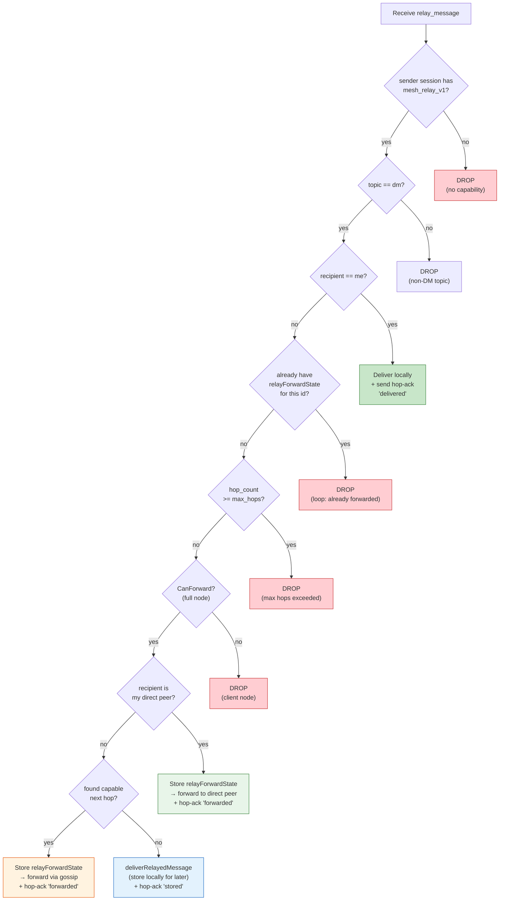
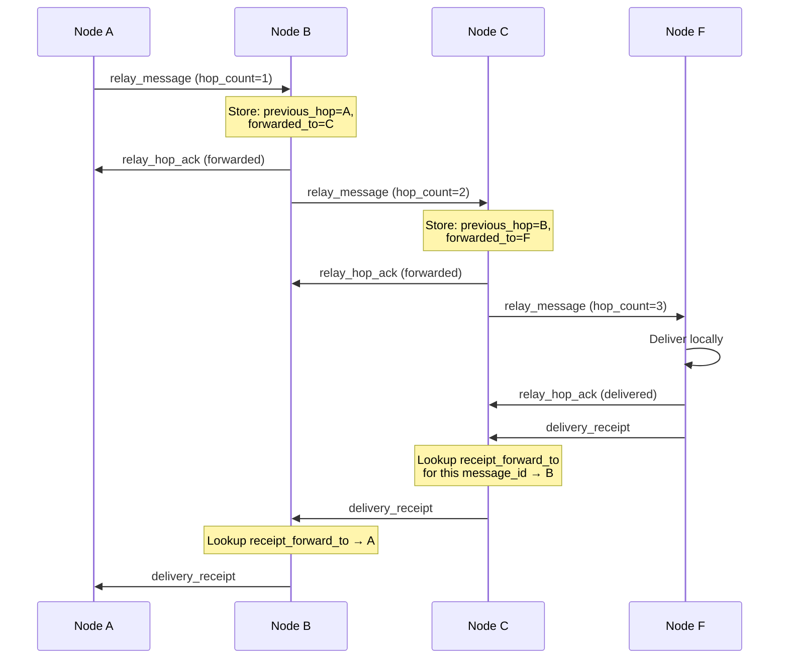
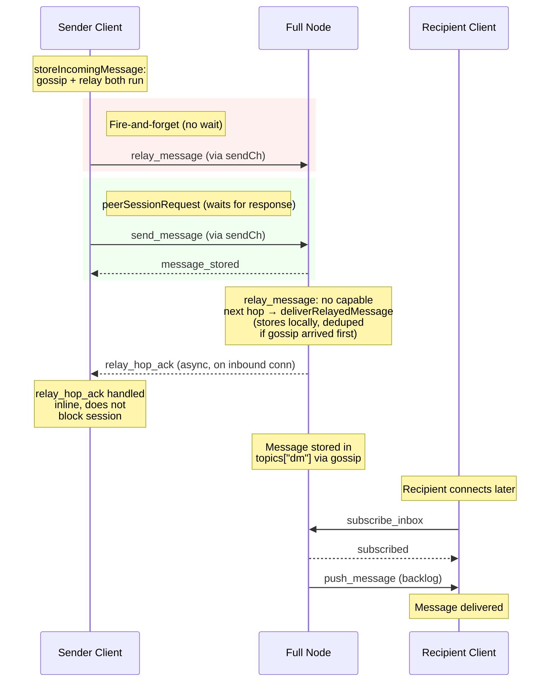
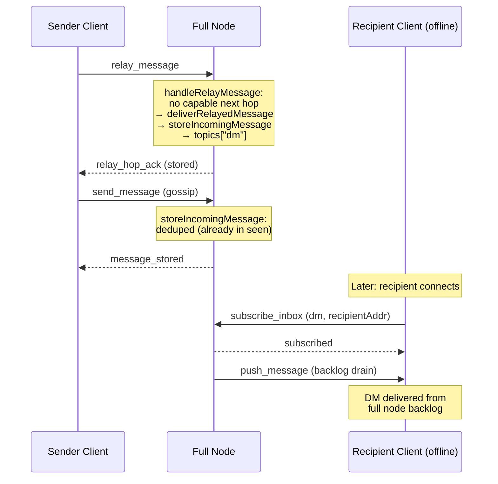
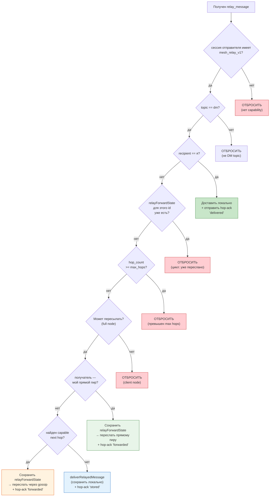
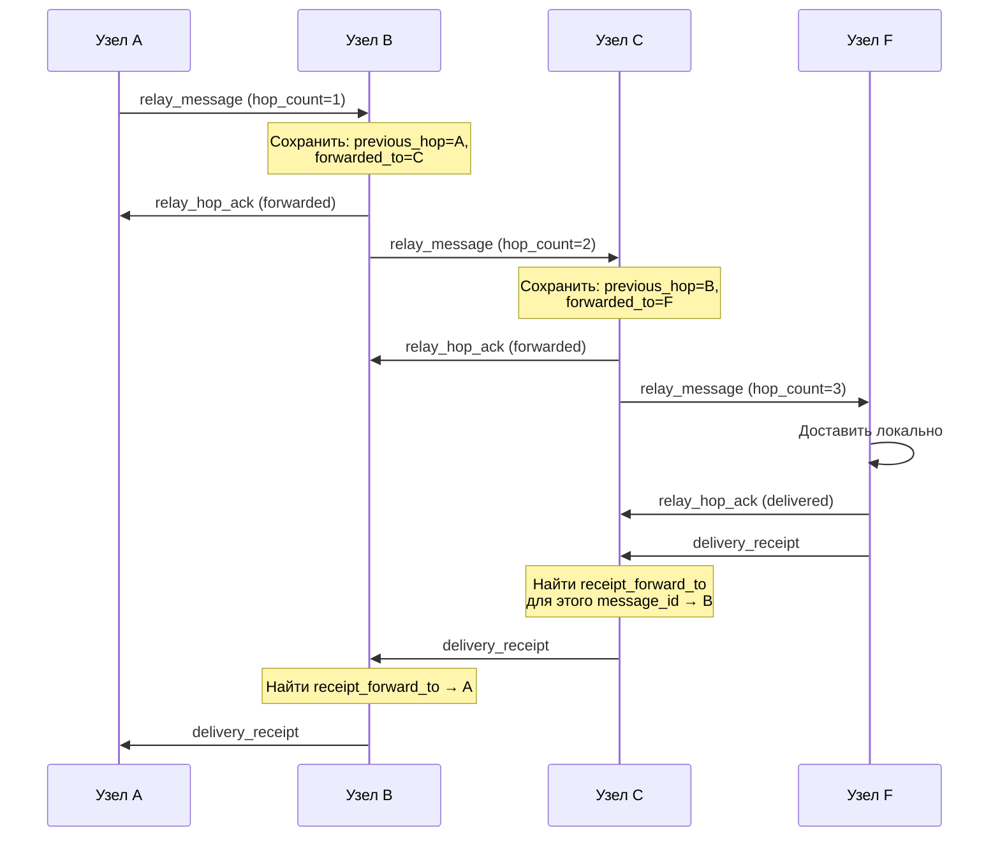
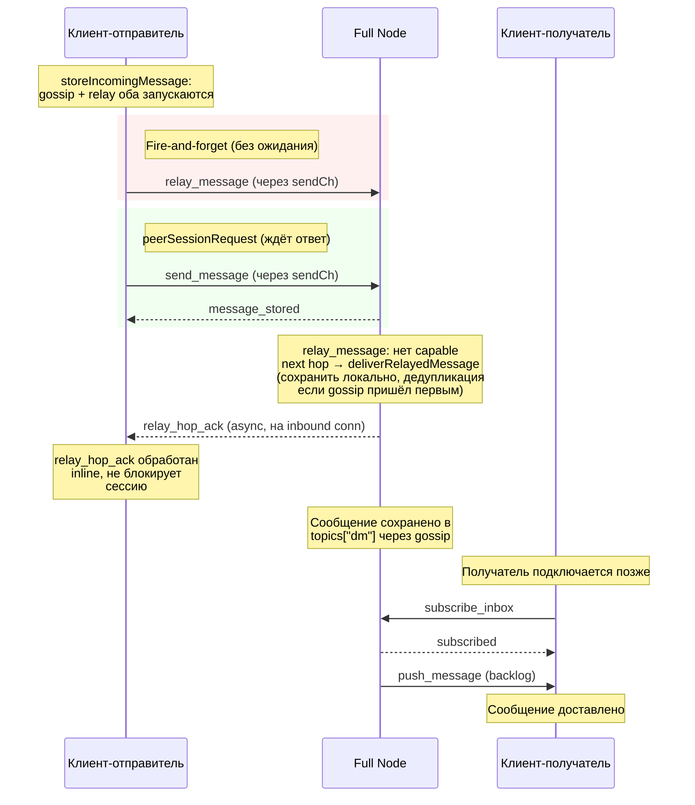
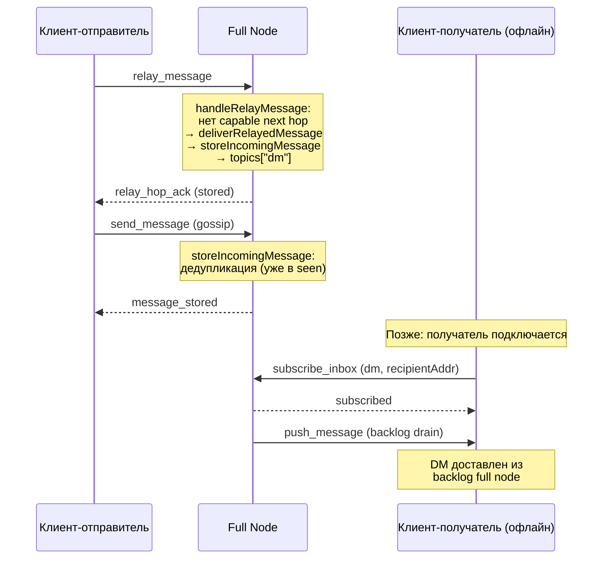

# Relay Protocol (Iteration 1 — Hop-by-hop relay)

## English

### Overview

The relay protocol enables hop-by-hop message forwarding through intermediate nodes. When node A wants to send a DM to node F but none of A's direct peers know F, the message can traverse multiple intermediate nodes (A→B→C→D→E→F) until it reaches the recipient.

The relay subsystem is gated by the `mesh_relay_v1` capability negotiated during handshake. Nodes without this capability continue to use the existing gossip-based delivery. Legacy peers never receive `relay_message` or `relay_hop_ack` frames.

### Commands

#### relay_message (peer → peer)

Hop-by-hop relay frame. Sent only to peers with `mesh_relay_v1` capability.

**Frame:**
```json
{
  "type": "relay_message",
  "id": "550e8400-e29b-41d4-a716-446655440001",
  "address": "origin_sender_fingerprint",
  "recipient": "final_recipient_fingerprint",
  "topic": "dm",
  "body": "<ciphertext>",
  "flag": "sender-delete",
  "created_at": "2026-03-29T12:00:00Z",
  "ttl_seconds": 3600,
  "hop_count": 3,
  "max_hops": 10,
  "previous_hop": "10.0.0.5:64646"
}
```

**Fields:**

| Field | Type | Required | Description |
|-------|------|----------|-------------|
| `type` | string | Yes | Always `"relay_message"` |
| `id` | UUID v4 | Yes | Original message ID (used for deduplication) |
| `address` | string | Yes | Original sender's fingerprint |
| `recipient` | string | Yes | Final recipient's fingerprint |
| `topic` | string | Yes | Message topic (e.g., `"dm"`) |
| `body` | string | Yes | Encrypted message payload |
| `flag` | string | Yes | Message flag (same as `send_message`) |
| `created_at` | RFC3339 | Yes | Original message timestamp |
| `ttl_seconds` | int | Optional | TTL from original message |
| `hop_count` | int | Yes | Number of hops traversed so far (incremented at each node) |
| `max_hops` | int | Yes | Maximum allowed hops (default: 10). Message dropped when `hop_count >= max_hops` |
| `previous_hop` | string | Yes | Address of the node that sent this relay frame |

**Capability gate:** `relay_message` is only sent to peers whose session has `"mesh_relay_v1"` in the negotiated capability set. For peers without the capability, the node falls back to `send_message` + gossip.

**Sender semantics:** `relay_message` and `relay_hop_ack` are fire-and-forget on the wire. The sender writes the frame without waiting for a synchronous response. The receiver may send a `relay_hop_ack` asynchronously but the sender must not block the session waiting for it. This prevents a 12-second stall when the receiver has no outbound session to ack through.

**Processing on intermediate node:**

1. **Capability check** — sender must have `mesh_relay_v1`. Drop if not.
2. **Topic check** — relay is a DM-only mechanism. If `topic != "dm"`, drop silently.
3. **Am I the recipient?** — If `recipient == my_address`, deliver locally and send `relay_hop_ack` with status `"delivered"`.
4. **Dedupe** — If `relayForwardState` exists for this `id`, drop silently (prevents broadcast storms).
5. **Max hops** — If `hop_count >= max_hops`, drop.
6. **Can forward?** — Client nodes cannot relay. Drop if not a full node.
7. **Direct peer?** — If recipient identity has active sessions, try each capable session until one accepts the frame. This handles reconnects and address changes where the same identity appears under multiple addresses.
8. **Gossip fallback** — Forward to top-scored capable peers (excluding the sender).
9. **No capable peers?** — If no relay target found, store the message locally via `deliverRelayedMessage` for later delivery via `pushBacklogToSubscriber` or `retryRelayDeliveries`. Send `relay_hop_ack` with status `"stored"`.
10. **Store state** — Save `relayForwardState` with `previous_hop` and `forwarded_to`.
11. **Ack** — Send `relay_hop_ack` with status `"forwarded"` back to previous hop.


*Diagram — Relay message processing on an intermediate node*

---

#### relay_hop_ack (peer → peer)

Hop-by-hop acknowledgement. Sent back to `previous_hop` after successfully forwarding or delivering a relay message.

**Frame:**
```json
{
  "type": "relay_hop_ack",
  "id": "550e8400-e29b-41d4-a716-446655440001",
  "status": "forwarded"
}
```

**Fields:**

| Field | Type | Required | Description |
|-------|------|----------|-------------|
| `type` | string | Yes | Always `"relay_hop_ack"` |
| `id` | string | Yes | Message ID being acknowledged |
| `status` | string | Yes | One of exactly three values: `"forwarded"` (relayed to next hop), `"delivered"` (delivered to final recipient), or `"stored"` (stored locally, no capable next hop — waiting for recipient or better route). No other status values are valid. |

---

#### fetch_relay_status (RPC command)

Returns diagnostic information about the relay subsystem.

**Request:**
```json
{
  "type": "fetch_relay_status"
}
```

**Response:**
```json
{
  "type": "relay_status",
  "status": "ok",
  "count": 5,
  "limit": 3
}
```

**Fields:**

| Field | Type | Description |
|-------|------|-------------|
| `type` | string | Always `"relay_status"` |
| `status` | string | `"ok"` — relay subsystem is operational |
| `count` | int | Number of active relay forward states (messages currently being relayed through this node) |
| `limit` | int | Number of unique connected peers (both inbound and outbound) with `mesh_relay_v1` capability |

---

### Privacy model

No single message frame reveals the full traversal path. Each intermediate node stores only local forwarding state:

```go
type relayForwardState struct {
    MessageID        string // original message UUID
    PreviousHop      string // who sent this relay to me
    ReceiptForwardTo string // = PreviousHop (where to send receipt back)
    ForwardedTo      string // who I forwarded to
    HopCount         int    // incremented on each hop
    RemainingTTL     int    // seconds until cleanup (decremented by ticker)
}
```

State is cleaned up when `RemainingTTL` reaches 0 (default: 180 seconds). Uses numeric counters, not wall-clock timestamps.

### Delivery receipt return path

When the final recipient generates a delivery receipt, each intermediate node looks up `ReceiptForwardTo` by message ID and sends the receipt one hop back. If the previous hop is unavailable or lacks capability, fallback to gossip receipt delivery.


*Diagram — Hop-by-hop ack and receipt return via local state*

### Coexistence with legacy nodes

| Sender | Receiver | Behavior |
|--------|----------|----------|
| New | New | `relay_message` with hop-by-hop forwarding |
| New | Legacy | Falls back to `send_message` + gossip |
| Legacy | New | `send_message` processed normally, no relay |
| Legacy | Legacy | Unchanged behavior |

Mixed relay chain: if an intermediate node lacks `mesh_relay_v1`, the relaying node falls back to gossip for that hop.

### Iteration 1 invariants

**INV-1: Relay must not break store-and-forward for offline recipients.** Relay is an optimization on top of gossip. If the relay path cannot deliver a DM (recipient offline, no capable next hop), the message must still be stored on the intermediate full node and delivered later when the recipient connects. A relay failure must never cause a message to be silently lost.

**INV-2: Intermediate full node stores transit DMs received via `relay_message`.** When `handleRelayMessage` on a full node finds no capable next hop, it calls `deliverRelayedMessage(frame)` which runs `storeIncomingMessage(msg, false)`. This writes the message into `topics["dm"]` under the recipient's fingerprint. The message is then delivered via `pushBacklogToSubscriber` when the recipient connects, or retried via `retryRelayDeliveries`. The node responds with `relay_hop_ack` status `"stored"`.

**INV-3: Gossip always runs unconditionally.** `storeIncomingMessage` always executes `executeGossipTargets` regardless of whether relay succeeds or fails. This means every DM has at least two independent delivery paths: gossip and relay. Gossip provides the baseline store-and-forward guarantee; relay provides faster multi-hop traversal.

Formally: an intermediate relay node may forward immediately, but must still preserve backlog semantics for later recipient retrieval. If both relay and gossip store the same message, deduplication via `seen[messageID]` prevents double delivery.

**INV-4: Client nodes must not act as intermediate relay hops.** A client node may be a sender (origin) or a final recipient of a relay chain, but never an intermediate transit hop. When `handleRelayMessage` receives a `relay_message` not addressed to itself on a client node (`CanForward() == false`), the frame is silently dropped. This is a protocol safety invariant, not just an implementation detail — client nodes lack the connectivity and uptime to provide reliable forwarding.

**INV-5: Exactly one `relay_hop_ack` per relay_message, with a semantic status.** For each `relay_message` that is not silently dropped, the receiver sends exactly one `relay_hop_ack` with one of the documented statuses: `"forwarded"`, `"delivered"`, or `"stored"`. There is no generic `"ack"` status. Dropped messages (dedupe, max hops, client node, rejected by `storeIncomingMessage`) produce no ack. The ack is written directly on the inbound connection by the receiver — it does not traverse a separate outbound session.

**INV-6: Final recipient stores relay state for receipt reverse path.** When `handleRelayMessage` delivers a message locally (recipient == self), it stores a `relayForwardState` with `ReceiptForwardTo = senderAddress` (transport address of the previous hop). This enables `handleRelayReceipt` to route the delivery receipt back through the hop-by-hop chain instead of falling back to gossip. Without this state, the final recipient has no reverse-path metadata and receipts can only reach the origin via gossip.

**INV-7: Hop-ack status reflects actual delivery outcome.** `handleRelayMessage` returns `"delivered"` or `"stored"` only when `deliverRelayedMessage` succeeds (i.e. `storeIncomingMessage` accepts the message). If the payload is rejected (unknown sender key, invalid signature, parse error), `handleRelayMessage` returns `""` — no ack is sent. This prevents the previous hop from believing the message was delivered when it was actually discarded.

**INV-8: Relay state mutations are durably persisted.** Every call to `relayStates.store()` in `handleRelayMessage` and `sendRelayMessage` is followed by `persistRelayState()`, which snapshots the full queue state (including relay forward states) to disk. The TTL ticker also persists after evicting expired entries. This ensures recently learned relay paths and dedupe records survive a restart.

**INV-9: Relay frames require an authenticated session.** `relay_message` and `relay_hop_ack` on inbound TCP connections are gated by `isConnAuthenticated(conn)`. A peer that has not completed the `auth_session` handshake (challenge-response signature verification) cannot send relay frames, even if it advertises `mesh_relay_v1` in its hello. Without this gate, any unauthenticated client could inject hop-by-hop relay traffic or spoof `previous_hop` addresses by simply claiming the capability in an unauthenticated hello. Outbound peer sessions (`handlePeerSessionFrame`) are inherently authenticated by the session establishment process and do not need this additional check.

### Gossip and relay coexistence

Gossip (`send_message` + `executeGossipTargets`) is the baseline delivery mechanism. It always runs unconditionally and provides store-and-forward guarantees, push delivery to connected clients, backlog drain on reconnect, and relay retry for offline recipients.

Relay (`relay_message` + `tryRelayToCapableFullNodes`) is an additional optimization that fires on top of gossip for DMs. It targets only full-node peers with `mesh_relay_v1` capability. Client nodes are never relay targets because they cannot forward (`CanForward=false`). Relay provides faster multi-hop traversal for recipients unreachable by direct gossip.

Receivers dedupe via `seen[messageID]`: if gossip arrives before relay (or vice versa), the second copy is silently dropped. This makes the overlap safe — both paths run independently.

### Fire-and-forget session semantics

`relay_message` and `relay_hop_ack` use fire-and-forget write semantics in `servePeerSession`. Unlike `send_message` (which always generates a synchronous `message_stored` response), `relay_message` is processed asynchronously on the receiving end and may not produce a response on the same inbound connection.

Without fire-and-forget, a relay_message enqueued to `session.sendCh` would go through `peerSessionRequest`, which blocks the sender's peer session for up to `peerRequestTimeout` (12 seconds) waiting for a response that never arrives. This stalls the entire session, preventing subsequent `send_message` frames (gossip) from being delivered.

The fix: `isFireAndForgetFrame` identifies relay frames. `servePeerSession` writes them directly without entering `peerSessionRequest`. Async `relay_hop_ack` frames arriving later are processed inline by `peerSessionRequest` (listed in the inline handler set) and by `servePeerSession` via `handlePeerSessionFrame`.


*Diagram — Fire-and-forget relay with gossip baseline delivery*

### Store-and-forward on intermediate full node

When `handleRelayMessage` on an intermediate full node finds no capable next hop (e.g., the only connected peer is the sender client), the message is stored locally via `deliverRelayedMessage`. This preserves store-and-forward semantics: the message remains in `topics["dm"]` and will be delivered via `pushBacklogToSubscriber` when the recipient connects, or retried via `retryRelayDeliveries`.


*Diagram — Store-and-forward when no capable relay peers available*

### Notification boundaries (Iteration 1)

Iteration 1 defines clear boundaries for which notifications traverse the relay path and which do not.

**In scope — `delivered` receipt:**
The `delivered` receipt travels back along the reverse relay path via `ReceiptForwardTo` stored in each node's `relayForwardState`. Each intermediate node looks up `ReceiptForwardTo` by message ID and forwards the receipt one hop back toward the original sender. If the previous hop is unavailable, the node falls back to gossip receipt delivery.

**Out of scope — `read` and application-level statuses:**
Application-level statuses such as `read`, `typing`, `seen`, and similar are not part of the hop-by-hop relay in Iteration 1. These statuses require a separate design because they are generated asynchronously (potentially hours after delivery), by which time the `relayForwardState` on intermediate nodes may already be cleaned up (TTL = 180s). Future iterations may introduce a dedicated notification relay or piggyback these statuses on existing gossip paths.

```
┌─────────────────────────────────────────────────────────┐
│                Iteration 1 relay scope                  │
│                                                         │
│  relay_message ──────────────────────→  forward path    │
│  relay_hop_ack ──────────────────────→  per-hop ack     │
│  delivery_receipt ───────────────────→  reverse path    │
│                                                         │
│  ─ ─ ─ ─ ─ ─ ─ ─ ─ ─ ─ ─ ─ ─ ─ ─ ─ ─ ─ ─ ─ ─ ─ ─   │
│  read, typing, seen ─────────────────→  OUT OF SCOPE    │
│  (require separate design in future iterations)         │
└─────────────────────────────────────────────────────────┘
```

### Source

- `internal/core/node/relay.go` — relay logic, state store, forwarding
- `internal/core/node/capabilities.go` — capability negotiation
- `internal/core/protocol/frame.go` — frame fields (`HopCount`, `MaxHops`, `PreviousHop`)
- `internal/core/node/relay_test.go` — unit tests

---

## Русский

### Обзор

Протокол ретрансляции обеспечивает пошаговую пересылку сообщений через промежуточные узлы. Когда узел A хочет отправить DM узлу F, но ни один из прямых пиров A не знает F, сообщение может пройти через несколько промежуточных узлов (A→B→C→D→E→F) пока не достигнет получателя.

Подсистема ретрансляции управляется capability `mesh_relay_v1`, согласованным при рукопожатии. Узлы без этой capability продолжают использовать существующую gossip-доставку. Legacy-пиры никогда не получают фреймы `relay_message` или `relay_hop_ack`.

### Команды

#### relay_message (пир → пир)

Фрейм пошаговой ретрансляции. Отправляется только пирам с capability `mesh_relay_v1`.

**Фрейм:**
```json
{
  "type": "relay_message",
  "id": "550e8400-e29b-41d4-a716-446655440001",
  "address": "origin_sender_fingerprint",
  "recipient": "final_recipient_fingerprint",
  "topic": "dm",
  "body": "<ciphertext>",
  "flag": "sender-delete",
  "created_at": "2026-03-29T12:00:00Z",
  "ttl_seconds": 3600,
  "hop_count": 3,
  "max_hops": 10,
  "previous_hop": "10.0.0.5:64646"
}
```

**Поля:**

| Поле | Тип | Обязательное | Описание |
|------|-----|-------------|----------|
| `type` | string | Да | Всегда `"relay_message"` |
| `id` | UUID v4 | Да | Исходный ID сообщения (для дедупликации) |
| `address` | string | Да | Fingerprint исходного отправителя |
| `recipient` | string | Да | Fingerprint конечного получателя |
| `topic` | string | Да | Топик сообщения (например, `"dm"`) |
| `body` | string | Да | Зашифрованное тело сообщения |
| `flag` | string | Да | Флаг сообщения (аналогично `send_message`) |
| `created_at` | RFC3339 | Да | Временная метка исходного сообщения |
| `ttl_seconds` | int | Нет | TTL из исходного сообщения |
| `hop_count` | int | Да | Количество уже пройденных хопов (увеличивается на каждом узле) |
| `max_hops` | int | Да | Максимально допустимое количество хопов (по умолчанию: 10). Сообщение отбрасывается при `hop_count >= max_hops` |
| `previous_hop` | string | Да | Адрес узла, который отправил этот relay-фрейм |

**Гейт capability:** `relay_message` отправляется только пирам, у которых в согласованном наборе capabilities есть `"mesh_relay_v1"`. Для пиров без capability узел использует `send_message` + gossip.

**Семантика отправки:** `relay_message` и `relay_hop_ack` — fire-and-forget на проводе. Отправитель записывает фрейм без ожидания синхронного ответа. Получатель может отправить `relay_hop_ack` асинхронно, но отправитель не должен блокировать сессию в ожидании — это предотвращает 12-секундный stall при отсутствии обратной outbound-сессии.

**Логика обработки на промежуточном узле:**

1. **Проверка capability** — отправитель должен иметь `mesh_relay_v1`. Иначе — отбросить.
2. **Проверка topic** — relay работает только для DM. Если `topic != "dm"` — отбросить молча.
3. **Я получатель?** — Если `recipient == мой_адрес`, доставить локально + отправить `relay_hop_ack` со статусом `"delivered"`.
4. **Дедупликация** — Если `relayForwardState` для этого `id` уже существует — отбросить молча (защита от broadcast storm).
5. **Максимум хопов** — Если `hop_count >= max_hops` — отбросить.
6. **Может пересылать?** — Client-ноды не могут ретранслировать. Отбросить если не full node.
7. **Прямой пир?** — Если identity получателя имеет активные сессии, перебрать каждую capable-сессию до первой успешной отправки. Это учитывает реконнекты и смену адресов, когда один identity имеет несколько адресов.
8. **Gossip-фоллбэк** — Переслать топ-пирам с capability (исключая отправителя).
9. **Нет доступных пиров?** — Если relay-цель не найдена, сохранить сообщение локально через `deliverRelayedMessage` для последующей доставки через `pushBacklogToSubscriber` или `retryRelayDeliveries`. Отправить `relay_hop_ack` со статусом `"stored"`.
10. **Сохранить состояние** — Записать `relayForwardState` с `previous_hop` и `forwarded_to`.
11. **Подтверждение** — Отправить `relay_hop_ack` со статусом `"forwarded"` обратно на предыдущий хоп.


*Диаграмма — Обработка relay_message на промежуточном узле*

---

#### relay_hop_ack (пир → пир)

Пошаговое подтверждение. Отправляется обратно на `previous_hop` после успешной пересылки или доставки.

**Фрейм:**
```json
{
  "type": "relay_hop_ack",
  "id": "550e8400-e29b-41d4-a716-446655440001",
  "status": "forwarded"
}
```

**Поля:**

| Поле | Тип | Обязательное | Описание |
|------|-----|-------------|----------|
| `type` | string | Да | Всегда `"relay_hop_ack"` |
| `id` | string | Да | ID подтверждаемого сообщения |
| `status` | string | Да | Одно из трёх значений: `"forwarded"` (переслано на следующий хоп), `"delivered"` (доставлено конечному получателю) или `"stored"` (сохранено локально, нет capable next hop — ожидание получателя или лучшего маршрута). Другие значения невалидны. |

---

#### fetch_relay_status (RPC-команда)

Возвращает диагностическую информацию о подсистеме ретрансляции.

**Запрос:**
```json
{
  "type": "fetch_relay_status"
}
```

**Ответ:**
```json
{
  "type": "relay_status",
  "status": "ok",
  "count": 5,
  "limit": 3
}
```

**Поля:**

| Поле | Тип | Описание |
|------|-----|----------|
| `type` | string | Всегда `"relay_status"` |
| `status` | string | `"ok"` — подсистема работает |
| `count` | int | Количество активных relay forward states (сообщений, ретранслируемых через этот узел) |
| `limit` | int | Количество уникальных подключённых пиров (входящих и исходящих) с capability `mesh_relay_v1` |

### Модель приватности

Ни один фрейм не раскрывает полный путь прохождения. Каждый промежуточный узел хранит только локальное состояние пересылки:

```go
type relayForwardState struct {
    MessageID        string // исходный UUID сообщения
    PreviousHop      string // кто отправил этот relay мне
    ReceiptForwardTo string // = PreviousHop (куда отправить receipt обратно)
    ForwardedTo      string // кому я переслал
    HopCount         int    // увеличивается на каждом хопе
    RemainingTTL     int    // секунды до очистки (уменьшается тикером)
}
```

Состояние автоматически очищается когда `RemainingTTL` достигает 0 (по умолчанию: 180 секунд). Используются числовые счётчики, не wall-clock timestamps.

### Обратный путь delivery receipt

При генерации delivery receipt конечным получателем каждый промежуточный узел ищет `ReceiptForwardTo` по ID сообщения и отправляет receipt на один хоп назад. При недоступности предыдущего хопа или отсутствии capability — фоллбэк на gossip-доставку receipt.


*Диаграмма — Пошаговый ack и возврат receipt через локальное состояние*

### Сосуществование с legacy-узлами

| Отправитель | Получатель | Поведение |
|-------------|------------|-----------|
| Новый | Новый | `relay_message` с пошаговой пересылкой |
| Новый | Legacy | Фоллбэк на `send_message` + gossip |
| Legacy | Новый | `send_message` обрабатывается нормально |
| Legacy | Legacy | Без изменений |

Смешанная relay-цепочка: если промежуточный узел не имеет `mesh_relay_v1`, ретранслирующий узел использует gossip-фоллбэк для этого хопа.

### Инварианты Iteration 1

**INV-1: Relay не должен нарушать store-and-forward для офлайн-получателей.** Relay — это оптимизация поверх gossip. Если relay-путь не может доставить DM (получатель офлайн, нет capable next hop), сообщение обязано быть сохранено на промежуточном full node и доставлено позже при подключении получателя. Сбой relay не должен приводить к молчаливой потере сообщения.

**INV-2: Промежуточный full node хранит транзитные DM, полученные через `relay_message`.** Когда `handleRelayMessage` на full node не находит capable next hop, он вызывает `deliverRelayedMessage(frame)`, который выполняет `storeIncomingMessage(msg, false)`. Сообщение записывается в `topics["dm"]` под fingerprint получателя. Доставка происходит через `pushBacklogToSubscriber` при подключении получателя или через `retryRelayDeliveries`. Узел отвечает `relay_hop_ack` со статусом `"stored"`.

**INV-3: Gossip всегда запускается безусловно.** `storeIncomingMessage` всегда выполняет `executeGossipTargets` независимо от успеха или неудачи relay. Каждый DM имеет минимум два независимых пути доставки: gossip и relay. Gossip обеспечивает базовую гарантию store-and-forward; relay обеспечивает быстрое многохоповое прохождение.

Формально: промежуточный relay-узел может переслать сообщение немедленно, но обязан сохранить backlog-семантику для последующего получения адресатом. Если и relay, и gossip сохранили одно и то же сообщение, дедупликация через `seen[messageID]` предотвращает двойную доставку.

**INV-4: Client-ноды не могут быть промежуточными relay-хопами.** Client-нода может быть отправителем (origin) или конечным получателем relay-цепочки, но никогда — промежуточным транзитным хопом. Когда `handleRelayMessage` получает `relay_message`, не адресованный себе, на client-ноде (`CanForward() == false`), фрейм молча отбрасывается. Это инвариант безопасности протокола, а не просто деталь реализации — client-ноды не имеют достаточной связности и аптайма для надёжной пересылки.

**INV-5: Ровно один `relay_hop_ack` на каждый `relay_message`, с семантическим статусом.** На каждый `relay_message`, который не был молча отброшен, получатель отправляет ровно один `relay_hop_ack` с одним из документированных статусов: `"forwarded"`, `"delivered"` или `"stored"`. Статуса `"ack"` не существует. Отброшенные сообщения (дедупликация, max hops, client node, отклонённые `storeIncomingMessage`) не генерируют ack. Ack записывается напрямую на inbound-соединение получателем — он не проходит через отдельную outbound-сессию.

**INV-6: Конечный получатель сохраняет relay state для обратного пути receipt.** Когда `handleRelayMessage` доставляет сообщение локально (recipient == self), он сохраняет `relayForwardState` с `ReceiptForwardTo = senderAddress` (транспортный адрес предыдущего хопа). Это позволяет `handleRelayReceipt` маршрутизировать delivery receipt обратно по hop-by-hop цепочке вместо fallback на gossip. Без этого состояния конечный получатель не имеет метаданных обратного пути и receipt может достичь origin только через gossip.

**INV-7: Статус hop-ack отражает фактический результат доставки.** `handleRelayMessage` возвращает `"delivered"` или `"stored"` только когда `deliverRelayedMessage` успешно завершается (т.е. `storeIncomingMessage` принимает сообщение). Если payload отклонён (неизвестный ключ отправителя, невалидная подпись, ошибка парсинга), `handleRelayMessage` возвращает `""` — ack не отправляется. Это предотвращает ситуацию, когда предыдущий хоп считает сообщение доставленным, хотя оно было отброшено.

**INV-8: Мутации relay state дурабельно персистятся.** Каждый вызов `relayStates.store()` в `handleRelayMessage` и `sendRelayMessage` сопровождается `persistRelayState()`, который снимает snapshot полного queue state (включая relay forward states) на диск. TTL-тикер также персистит после удаления просроченных записей. Это гарантирует, что недавно изученные relay-пути и записи дедупликации переживают рестарт.

**INV-9: Relay-фреймы требуют аутентифицированную сессию.** `relay_message` и `relay_hop_ack` на inbound TCP-соединениях гейтятся через `isConnAuthenticated(conn)`. Пир, не прошедший `auth_session` handshake (верификация подписи challenge-response), не может отправлять relay-фреймы, даже если заявил `mesh_relay_v1` в hello. Без этого гейта любой неаутентифицированный клиент мог инжектить hop-by-hop relay-трафик или подделывать `previous_hop` адреса, просто заявив capability в неаутентифицированном hello. Outbound peer sessions (`handlePeerSessionFrame`) аутентифицированы самим процессом установки сессии и не требуют этой дополнительной проверки.

### Сосуществование gossip и relay

Gossip (`send_message` + `executeGossipTargets`) — базовый механизм доставки. Запускается безусловно и гарантирует store-and-forward для транзитных DM, push-доставку подключённым клиентам, drain backlog при переподключении и relay retry для офлайн-получателей.

Relay (`relay_message` + `tryRelayToCapableFullNodes`) — дополнительная оптимизация поверх gossip для DM. Нацелен только на full-node пиров с capability `mesh_relay_v1`. Client-ноды не являются relay-целями (не могут форвардить, `CanForward=false`). Relay обеспечивает более быстрое многохоповое прохождение к получателям, недостижимым прямым gossip.

Получатели дедуплицируют через `seen[messageID]`: если gossip приходит раньше relay (или наоборот), вторая копия молча отбрасывается. Это делает перекрытие безопасным — оба пути работают независимо.

### Fire-and-forget семантика сессии

`relay_message` и `relay_hop_ack` используют fire-and-forget запись в `servePeerSession`. В отличие от `send_message` (который всегда генерирует синхронный `message_stored`), `relay_message` обрабатывается асинхронно на принимающей стороне и может не генерировать ответ на том же inbound-соединении.

Без fire-and-forget `relay_message`, поставленный в `session.sendCh`, проходил бы через `peerSessionRequest`, который блокирует сессию отправителя на `peerRequestTimeout` (12 секунд) в ожидании ответа, который никогда не придёт. Это парализует всю сессию, не давая последующим `send_message` (gossip) быть отправленными.

Решение: `isFireAndForgetFrame` определяет relay-фреймы. `servePeerSession` записывает их напрямую, минуя `peerSessionRequest`. Асинхронные `relay_hop_ack` обрабатываются inline в `peerSessionRequest` (включены в список inline-обработчиков) и через `handlePeerSessionFrame` в `servePeerSession`.


*Диаграмма — Fire-and-forget relay с базовой gossip-доставкой*

### Store-and-forward на промежуточном full node

Когда `handleRelayMessage` на промежуточном full node не находит capable next hop (например, единственный подключённый пир — это отправитель-клиент), сообщение сохраняется локально через `deliverRelayedMessage`. Это сохраняет store-and-forward семантику: сообщение остаётся в `topics["dm"]` и будет доставлено через `pushBacklogToSubscriber` при подключении получателя, или повторно через `retryRelayDeliveries`.


*Диаграмма — Store-and-forward при отсутствии capable relay-пиров*

### Границы нотификаций (Iteration 1)

Iteration 1 определяет чёткие границы: какие нотификации проходят через relay-путь, а какие — нет.

**В скоупе — `delivered` receipt:**
Квитанция `delivered` проходит обратно по reverse relay path через `ReceiptForwardTo`, сохранённый в `relayForwardState` каждого узла. Каждый промежуточный узел ищет `ReceiptForwardTo` по ID сообщения и пересылает квитанцию на один хоп назад к исходному отправителю. Если предыдущий хоп недоступен — фоллбэк на gossip-доставку квитанции.

**Вне скоупа — `read` и прикладные статусы:**
Прикладные статусы (`read`, `typing`, `seen` и подобные) не входят в hop-by-hop relay в Iteration 1. Эти статусы требуют отдельного дизайна, потому что генерируются асинхронно (потенциально через часы после доставки), к этому моменту `relayForwardState` на промежуточных узлах уже очищен (TTL = 180с). Будущие итерации могут ввести отдельный notification relay или использовать существующие gossip-пути для этих статусов.

```
┌─────────────────────────────────────────────────────────┐
│              Скоуп relay в Iteration 1                   │
│                                                         │
│  relay_message ──────────────────────→  forward path    │
│  relay_hop_ack ──────────────────────→  per-hop ack     │
│  delivery_receipt ───────────────────→  reverse path    │
│                                                         │
│  ─ ─ ─ ─ ─ ─ ─ ─ ─ ─ ─ ─ ─ ─ ─ ─ ─ ─ ─ ─ ─ ─ ─ ─   │
│  read, typing, seen ─────────────────→  ВНЕ СКОУПА     │
│  (требуют отдельного дизайна в будущих итерациях)       │
└─────────────────────────────────────────────────────────┘
```

### Исходный код

- `internal/core/node/relay.go` — логика ретрансляции, хранилище состояний, пересылка
- `internal/core/node/capabilities.go` — согласование capabilities
- `internal/core/protocol/frame.go` — поля фрейма (`HopCount`, `MaxHops`, `PreviousHop`)
- `internal/core/node/relay_test.go` — юнит-тесты
