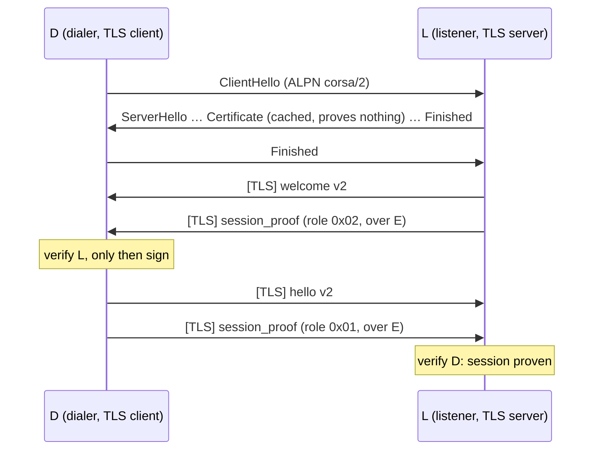
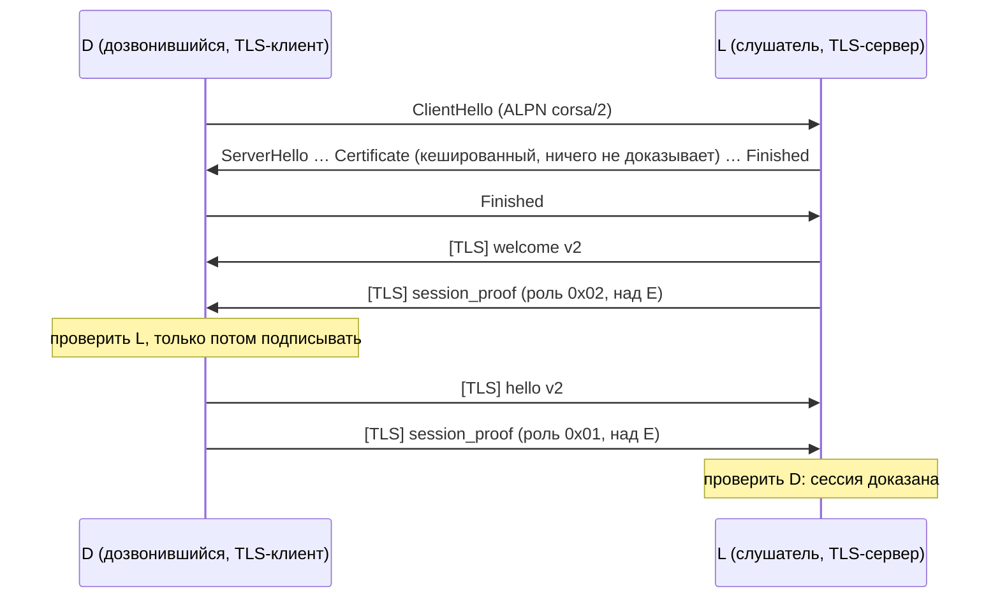

# CORSA Secure Session v2

## English

### Status

**Nodes use v2.** From protocol version 31 two new nodes connect over v2, and a new node and an old one over v1, in either direction:

- **accepting:** a first byte `0x16` makes the connection v2: the handshake runs before the connection is registered, and the peer's `hello` is applied only once its proof verified. Any other first byte is a v1 connection, as before;
- **dialling** — every path that opens a connection to a node (the connection manager's long-lived sessions, the one-shot `syncPeer` recovery dial and the `sendNoticeToPeer` fallback): v2 first. A peer that answers with a v1 line (first byte `{`) is an old node: the address is marked as v1 for 24 hours and dialled again over v1. A TLS alert, other bytes, a timeout or a reset are v2 failures and never lead to v1.

### Downgrade protection

A v1 answer can be forged by whoever stands on the path, so a node remembers what proved v2 and refuses v1 for it — across restarts:

| What | Kept | Effect |
|---|---|---|
| an **identity** that proved itself over v2 (either direction) | for good | a v1 `hello` naming it is refused on accept, a v1 `welcome` naming it is refused on dial — before anything is signed; checked again at `auth_session` and right after an outbound v1 session is registered. A v1 connection naming it that was open before the proof is **closed at the proof**, and what such connections wrote into the routing table before it is forgotten (see below) |
| an **endpoint** this node dialled and reached over a **contact** of this node | for good (protected) — never lowered or removed automatically | a v1 answer from it, naming any identity, is a downgrade: the dial fails instead of falling back |
| any other **endpoint** this node dialled and reached over v2 | 30 days from the last v2 session on it | the same, until the binding expires |

Only the user makes an identity a contact, so an attacker cannot obtain a protected binding for his own identity. An ordinary binding that expired lets v1 back in on that endpoint — for an identity that is not pinned; the pin of the identity that proved v2 there still holds.

**At the moment of a proof** (`onIdentityProvenV2`, after the pin is on disk and before the v2 connection is registered) every v1 connection that names the identity is closed: such a connection proved nothing, and leaving it open would leave it a path to the identity and a voice on its routing plane — also after the identity's last v2 session closes, since the pin keeps refusing its reconnects. While an identity has a live v2 connection, a v1 connection naming it is refused too. Routing input a v1 connection wrote in the identity's name before the proof — claims, withdrawals with an arbitrary SeqNo, cooldowns, flaps, the v3 epoch — is forgotten locally at the same moment, without a wire withdrawal, unless a live v2 connection of the identity already vouches for its routes; the v2 session's connect-time full sync repopulates them (docs/protocol/network_security.md §13). An old device running under an identity that has proved v2 elsewhere is therefore cut off from this node — the same consequence the pin already had for its new connections.

A session counts only once the protection it earns is on disk: if the store cannot be written, the v2 session is not established — the peer reconnects, and the write is retried, including any earlier change that never reached the disk.

The state lives in `secure-sessions-<port>.json` next to the peers file (`CORSA_SECURE_SESSION_STORE_PATH` overrides it), written atomically and owner-only. A store file that exists but cannot be read makes every peer protected: v1 is refused, v2 keeps working, and the file is left for the operator.

**A full store** — 20 000 identities, 16 384 endpoints. Existing protection is guaranteed and never dropped to make room; pinning a NEW identity is not promised. A v2 session of an identity that is not pinned yet, whose mandatory pin therefore cannot be stored, is **not established**: it fails with the explicit error `pin_store_full`, in either direction, and the dialler does **not** fall back to v1 in that attempt. Identities pinned earlier keep connecting as before, across reconnects and restarts. The refusal is logged (`secure_session_refused_pin_store_full`) and counted in `fetchRouteSummary.secure_sessions` ([rpc/routing.md](../rpc/routing.md)). An endpoint that is not bound at the endpoint bound is refused and logged; the session's identity pin still protects it. **The limit, stated plainly:** refusing the new v2 session does not by itself remove the v1 risk for an identity that is not pinned — until it has a pin, v1 connections naming it (an impostor's included) are not refused; the refusal only keeps an unprotected session from passing for a protected one.

**What v2 fixes.** The v1 proof signs `corsa-session-auth-v1|<challenge>|<own address>`. That names neither the verifier nor the connection, so a man in the middle M that holds a connection to X and one to B hands B's challenge to X, carries X's signature to B, and B takes M for X. Adding the verifier's identity to the signature would not help: M simply calls itself B. And even an honest v1 handshake leaves every later frame unprotected. v2 binds the identity proof to a protected channel instead.

**What v2 does not claim.** A node keeps accepting v1 from builds that do not speak v2 (legacy compatibility), so the v1 weakness remains for those connections. v2 protects a connection only when both ends use it.

### Transition from v1

The session mode of a build follows from its version constants alone (`sessionv2.ModeFor`, `config.ProtocolVersionSecureSession = 31`):

| Constants | Mode | Behaviour |
|---|---|---|
| `ProtocolVersion < 31` | `legacy_only` | v1 only — builds before v31 |
| `ProtocolVersion ≥ 31`, `MinimumProtocolVersion < 31` | `transition` — **this build** | v2 first; v1 only with a peer that answered with a v1 line and is not protected (see "Downgrade protection"); any other v2 failure does not fall back to v1 |
| `MinimumProtocolVersion ≥ 31` | `v2_only` | the listener closes what is not TLS, the dialer never probes and never goes legacy |

The downgrade to legacy is a temporary allowance of the transition. Raising `MinimumProtocolVersion` to 31 closes the relay hole for the whole network. It is closed by switching the legacy **path** off, not by checking a version number: the version in a v1 `hello` is unsigned, and a man in the middle would simply write 31 into it.

A build cannot select a mode its accept and dial paths do not implement: `TestTheConfiguredSessionModeIsWired` fails on such a version bump. `legacy_only` and `transition` are wired; `v2_only` waits for the legacy path to be removed.

### Scheme

TLS 1.3 from the Go standard library carries the session. TLS provides the traffic keys of each direction, key confirmation (`Finished`), unique AEAD nonces and record integrity. Identity is proven separately, by an Ed25519 signature over the TLS exporter of this very connection. The TLS certificate proves nothing.

```
E    = TLS-Exporter("EXPORTER-corsa-session-v2", context = empty, 32)
P    = DOMAIN("corsa-session-v2-proof") ‖ role ‖ E      role: 0x01 dialer, 0x02 listener
DOMAIN(tag) = tag ‖ 0x00 ‖ uint16be(len(network)) ‖ network
sig  = Ed25519_identity(P)
frame: {"type":"session_proof","signature":"<86 characters of unpadded base64url>"}
```

A man in the middle runs two TLS sessions and therefore holds two different `E`. A proof made over one never verifies over the other. The network name in `DOMAIN` keeps a proof from one network valid on another. The role byte, taken from the local TLS side and never from a frame, keeps a proof from being reflected back to the end that made it.

### Handshake



*The v2 handshake: TLS 1.3, then the listener proves, then the dialer. Used by nodes from protocol version 31.*

The listener proves first. The dialer verifies it before it signs anything, so a dialer never hands a signature to a listener that has not proven itself.

The `hello` and `welcome` of v2 carry `address`, `pubkey`, `boxkey`, `boxsig` and `network`, and **no** `challenge` or `signature`. The sender fills the identity fields from its identity, never from caller input. Neither frame is signed. Their integrity comes from TLS and from the mandatory proof over `E`.

### Verification

The receiver closes the connection on the first failure:

1. the intro is the expected frame (`welcome` from the listener, `hello` from the dialer);
2. it has no v1 `challenge` or `signature`;
3. it has every identity field;
4. it is for this node's network;
5. its key passes `identity.ParsePublicKey`: wrong length, the 14 small-order encodings and a non-canonical `y` are refused. Without this check the neutral key `01 00…00` with the signature (R = neutral, S = 0) would verify for every message and forge the proof as well as the box binding;
6. the key's fingerprint equals `address`;
7. `boxkey` is bound by `boxsig` (`identity.VerifyBoxKeyBinding`);
8. the next frame is a strictly parsed `session_proof`: exactly `type` and `signature`, an 86-character unpadded base64url encoding of 64 bytes. Any other frame before the proof closes the connection;
9. the signature verifies over `P` built from **this** connection's `E` and the **peer's** role;
10. the peer is not this node;
11. when the caller dialled a named identity ("to X"), the proven identity is X. An address dial expects nobody and accepts whoever proved itself.

Nothing about the peer is applied anywhere before step 9 passes: the intro is held as a local value and handed out only inside the `ProvenSession`. `ProvenSession` has unexported fields, is returned only by `Dial` and `Accept`, and its zero value refuses every question (`ErrZeroSession`).

| Refusal | Meaning |
|---|---|
| `ErrNotV2` | not TLS 1.3 with ALPN `corsa/2` on both sides |
| `ErrIntro` | intro malformed, a field missing, wrong network, a key refused (wraps the `identity` error), the box key not bound |
| `ErrProofFrame` | the frame after the intro is not a strict `session_proof` |
| `ErrProofInvalid` | the proof does not verify for this session and this role |
| `ErrSelfConnection` | the peer is this node |
| `ErrPeerMismatch` | a dial "to X" reached somebody else |

All refusals are errors of the handshake. A v2 failure never falls back to v1 on its own.

### TLS parameters

| Parameter | Value |
|---|---|
| versions | TLS 1.3 only |
| ALPN | `corsa/2`, checked explicitly on both sides |
| server certificate | self-signed Ed25519, cached and rotated every hour, served through `GetCertificate`; never stored in `tls.Config.Certificates` |
| client certificate, SNI | none |
| verification of the server certificate | skipped by design: identity is proven by `session_proof`. Allowed in `sessionv2` only (guard test) |
| resumption, tickets, 0-RTT | off (`SessionTicketsDisabled`, no `ClientSessionCache`; Go has no 0-RTT) |
| `KeyLogWriter` | none |
| `DynamicRecordSizingDisabled` | on, so the record count below is an exact upper bound |

### Time limits

| Phase | Limit |
|---|---|
| TLS handshake complete | 5 s |
| the peer's intro and proof | 3 s |
| a cancelled context | stops the handshake at once |

### Key rotation

Go never initiates TLS `KeyUpdate`. Each end counts its own records as `writes + bytes / 16384`. At 2^24 the write is refused with `ErrRotationDue`, and the caller re-establishes the session. The count is never reset: when the peer requests `KeyUpdate`, Go also rotates our write key without telling us, so counting on is the conservative choice — at worst the reconnect comes early.

### Secrets

- **Certificate key.** It lives only in `CertificateSource`. `json.Marshal` and `json.Unmarshal` of the source fail with `identity.ErrSecretSerialization`. Every `fmt` verb, `%d` included, prints a redacted form. A guard test scans that output for the key in raw, base64, base64url, hex and decimal form.
- **Where TLS secrets may sit.** No other struct in the tree keeps a `tls.Certificate` or a `tls.Config` in a field (guard test).
- **Traffic keys and `E`.** Traffic keys stay inside `crypto/tls`. `E` is neither logged nor returned.

### Vectors

Listener seed `01…20`, dialer seed `21…40`, `E = 55…74`, network `gazeta-devnet`.

```
P_L (71 B) = 636f7273612d73657373696f6e2d76322d70726f6f6600000d67617a6574612d6465766e65740255565758595a5b5c5d5e5f606162636465666768696a6b6c6d6e6f7071727374
sig L      = 74e805b8cf5ef320a547f1511ec1468f0694bd2a8719444db76aca4512adef006f8be1d5429b9fe913cb9d7a7e641208a9de09e3c480f19df2c8d9de831e680a
{"type":"session_proof","signature":"dOgFuM9e8yClR_FRHsFGjwaUvSqHGURNt2rKRRKt7wBvi-HVQpuf6RPLnXp-ZBIIqd4J48SA8Z3yyNnegx5oCg"}
P_D (71 B) = 636f7273612d73657373696f6e2d76322d70726f6f6600000d67617a6574612d6465766e65740155565758595a5b5c5d5e5f606162636465666768696a6b6c6d6e6f7071727374
sig D      = 914a3f9ae1cf2b98e50fd76ece8d65eb528a0d497b94e56deb1dd12c89cb612e9d8eff853a45fde89b34ec940b1450fac3059f8b09bf7dc29dcdae556d9a200f
{"type":"session_proof","signature":"kUo_muHPK5jlD9duzo1l61KKDUl7lOVt6x3RLInLYS6djv-FOkX96Js07JQLFFD6wwWfiwm_fcKdza5VbZogDw"}
```

Each of these must verify `false`:

- N1 — another `E`;
- N2 — the proof reflected to its maker;
- N3 — the role byte swapped;
- N4 — another key;
- N5 — a v1 `auth_session` signature presented as a proof;
- the same proof on another network.

### Tests

`internal/core/sessionv2` pins:

- **The vectors.**
- **The relay attack, both legs:**
  - M carries B's proof to X: X refuses and signs nothing;
  - M carries X's proof to B: B refuses. The same relay under v1 verifies, and the test shows it.
- **The dialer's refusals:**
  - forged small-order key;
  - a missing field;
  - v1 fields in a v2 intro;
  - another network;
  - a wrong frame type;
  - a frame before the proof;
  - reflection;
  - a proof over another exporter;
  - key-compromise impersonation;
  - self-connection;
  - an unexpected identity.
- **The transport:**
  - no ALPN on either side;
  - an altered record;
  - a replayed record;
  - the record budget;
  - the zero `ProvenSession`;
  - a cancelled handshake.
- **Guards:** TLS parameters, certificate caching and rotation, secret leakage.

---

## Русский

### Статус

**Узлы используют v2.** С версии протокола 31 два новых узла соединяются по v2, а со старым узлом — по v1, в обе стороны:

- **приём:** первый байт `0x16` — соединение v2: рукопожатие идёт до регистрации соединения, и `hello` собеседника применяется только после проверки его доказательства. Любой другой первый байт — соединение v1, как раньше;
- **дозвон** — все пути, открывающие соединение с узлом (долгоживущие сессии менеджера соединений, разовый дозвон восстановления `syncPeer`, запасной путь `sendNoticeToPeer`): сначала v2. Если собеседник ответил строкой v1 (первый байт `{`), это старый узел: адрес помечается как v1 на 24 часа, и дозвон повторяется по v1. TLS alert, другие байты, таймаут или сброс — неудачи v2, и к v1 они не ведут никогда.

### Защита от понижения

Ответ v1 может подделать тот, кто стоит на пути, поэтому узел помнит, что доказало v2, и отказывает таким в v1 — в том числе после перезапуска:

| Что | Хранится | Действие |
|---|---|---|
| **identity**, доказавшая себя по v2 (в любую сторону) | бессрочно | v1-`hello` с ней отвергается на приёме, v1-`welcome` с ней — на дозвоне, до того как что-либо подписано; повторная проверка — на `auth_session` и сразу после регистрации исходящей v1-сессии. v1-соединение с ней, открытое до доказательства, **закрывается в момент доказательства**, а то, что такие соединения записали в таблицу маршрутов раньше, забывается (см. ниже) |
| **адрес**, на котором наш дозвон получил v2 от **контакта** этого узла | бессрочно (protected) — автоматически не понижается и не удаляется | ответ v1 с него, с любой identity, — попытка понижения: дозвон отказывает, а не откатывается |
| любой другой **адрес**, на котором наш дозвон получил v2 | 30 суток с последней сессии v2 на нём | то же, пока привязка не истекла |

Контактом identity делает только пользователь, поэтому атакующий не может получить защищённую привязку для своей identity. Истёкшая обычная привязка снова допускает v1 на этом адресе — для незакреплённой identity; закрепление identity, доказавшей там v2, продолжает действовать.

**В момент доказательства** (`onIdentityProvenV2`, после записи pin на диск и до регистрации v2-соединения) закрывается каждое v1-соединение, называющее эту identity: такое соединение ничего не доказало, и, оставшись открытым, оно осталось бы путём к identity и голосом в её маршрутной плоскости — и после закрытия её последней v2-сессии тоже, ведь pin продолжает отвергать его переподключения. Пока у identity есть живое v2-соединение, v1-соединение с ней тоже отвергается. Маршрутный вход, записанный v1-соединением от имени identity до доказательства, — claim-ы, отзывы с произвольным SeqNo, cooldown, flap, v3 epoch — в тот же момент забывается локально, без отзыва на проводе, если только живое v2-соединение identity уже не подтверждает её маршруты; их заново заполняет полная синхронизация v2-сессии при подключении (docs/protocol/network_security.md §13). Старое устройство под identity, доказавшей v2 в другом месте, поэтому отрезается от этого узла — то же следствие, что pin уже имел для его новых соединений.

Сессия считается установленной только после того, как заработанная ею защита записана на диск: если хранилище не записывается, сессия v2 не устанавливается — собеседник переподключается, и запись повторяется, включая любое прежнее изменение, не дошедшее до диска.

Состояние лежит в `secure-sessions-<port>.json` рядом с файлом пиров (переопределяется `CORSA_SECURE_SESSION_STORE_PATH`) и пишется атомарно, только для владельца. Файл, который есть, но не читается, делает защищёнными всех: v1 отвергается, v2 работает, а файл остаётся оператору.

**Заполненное хранилище** — 20 000 identity, 16 384 адреса. Сохранность существующей защиты гарантируется, ради места она не удаляется никогда; закрепление НОВОЙ identity не обещается. Сессия v2 ещё не закреплённой identity, чей обязательный pin поэтому не сохранить, **не устанавливается**: она завершается явной ошибкой `pin_store_full` в любом направлении, и дозвонившийся **не** откатывается на v1 в этой попытке. Ранее закреплённые identity подключаются как прежде — и после переподключения, и после перезапуска. Отказ пишется в журнал (`secure_session_refused_pin_store_full`) и считается в `fetchRouteSummary.secure_sessions` ([rpc/routing.md](../rpc/routing.md)). Адрес, не привязанный из-за предела адресов, отклоняется с записью в журнал; его защищает pin identity сессии. **Ограничение, прямо:** отказ новой v2-сессии сам по себе не устраняет риск v1 для незакреплённой identity — пока у неё нет pin, v1-соединения с ней (в том числе самозванца) не отвергаются; отказ лишь не выдаёт незащищённую сессию за защищённую.

**Что исправляет v2.** Доказательство v1 подписывает `corsa-session-auth-v1|<challenge>|<свой адрес>`. В нём не названы ни проверяющий, ни соединение. Поэтому посредник M с соединениями к X и к B передаёт challenge от B узлу X, несёт подпись X узлу B, и B принимает M за X. Добавить в подпись identity проверяющего не помогает: M просто назовётся B. К тому же даже честное рукопожатие v1 оставляет все последующие кадры незащищёнными. v2 вместо этого привязывает доказательство identity к защищённому каналу.

**Чего v2 не утверждает.** Узел продолжает принимать v1 от сборок, не умеющих v2 (legacy-совместимость), и для таких соединений слабость v1 остаётся. v2 защищает соединение, только когда его используют обе стороны.

### Переход с v1

Режим сессии сборки выводится только из её констант версий (`sessionv2.ModeFor`, `config.ProtocolVersionSecureSession = 31`):

| Константы | Режим | Поведение |
|---|---|---|
| `ProtocolVersion < 31` | `legacy_only` | только v1 — сборки до v31 |
| `ProtocolVersion ≥ 31`, `MinimumProtocolVersion < 31` | `transition` — **эта сборка** | сначала v2; v1 — только с собеседником, ответившим строкой v1 и не защищённым (см. «Защита от понижения»); другая неудача v2 на v1 не откатывается |
| `MinimumProtocolVersion ≥ 31` | `v2_only` | слушатель закрывает всё, что не TLS; дозвонившийся не делает пробу и не уходит в legacy |

Понижение до legacy — временное допущение переходного периода. Подъём `MinimumProtocolVersion` до 31 закрывает дыру с пересылкой для всей сети. Закрывает её выключение legacy-**пути**, а не проверка номера версии: версия в `hello` v1 не подписана, и посредник просто впишет туда 31.

Сборка не может выбрать режим, который её пути приёма и дозвона не реализуют: на таком подъёме версии падает `TestTheConfiguredSessionModeIsWired`. Реализованы `legacy_only` и `transition`; `v2_only` ждёт удаления legacy-пути.

### Схема

Сессию несёт TLS 1.3 из стандартной библиотеки Go. TLS даёт ключи каждого направления, подтверждение ключей (`Finished`), уникальные AEAD-nonce и целостность записей. Identity доказывается отдельно — подписью Ed25519 над TLS-экспортёром именно этого соединения. Сертификат TLS ничего не доказывает.

```
E    = TLS-Exporter("EXPORTER-corsa-session-v2", context = пусто, 32)
P    = DOMAIN("corsa-session-v2-proof") ‖ role ‖ E      role: 0x01 дозвонившийся, 0x02 слушатель
DOMAIN(tag) = tag ‖ 0x00 ‖ uint16be(len(network)) ‖ network
sig  = Ed25519_identity(P)
кадр: {"type":"session_proof","signature":"<86 символов base64url без дополнения>"}
```

Посредник ведёт две TLS-сессии и поэтому держит два разных `E`. Доказательство над одним никогда не проверится над другим. Имя сети в `DOMAIN` не даёт доказательству одной сети действовать в другой. Байт роли берётся из локальной стороны TLS, а не из кадра, поэтому доказательство нельзя отразить обратно его автору.

### Рукопожатие



*Рукопожатие v2: TLS 1.3, затем доказывает слушатель, затем дозвонившийся. Узлы используют его с версии протокола 31.*

Слушатель доказывает себя первым. Дозвонившийся проверяет его, прежде чем что-либо подписать, поэтому подпись никогда не уходит слушателю, который себя не доказал.

`hello` и `welcome` в v2 несут `address`, `pubkey`, `boxkey`, `boxsig` и `network` и **не** несут `challenge` и `signature`. Отправитель заполняет поля identity из своей identity, а не из данных вызывающего. Ни один из этих кадров не подписывается: их целостность дают TLS и обязательное доказательство над `E`.

### Проверка

Получатель закрывает соединение при первой же неудаче:

1. вступительный кадр — ожидаемый: `welcome` от слушателя, `hello` от дозвонившегося;
2. в нём нет полей v1 `challenge` и `signature`;
3. в нём есть все поля identity;
4. он для сети этого узла;
5. ключ проходит `identity.ParsePublicKey`: неверная длина, 14 кодировок малого порядка и неканонический `y` отвергаются. Без этой проверки нейтральный ключ `01 00…00` с подписью (R = нейтральный, S = 0) проходил бы проверку для любого сообщения и подделывал бы и доказательство, и привязку box-ключа;
6. отпечаток ключа равен `address`;
7. `boxkey` привязан подписью `boxsig` (`identity.VerifyBoxKeyBinding`);
8. следующий кадр — строго разобранный `session_proof`: ровно `type` и `signature`, 86 символов base64url без дополнения, 64 байта. Любой другой кадр до доказательства закрывает соединение;
9. подпись проверяется над `P` из `E` **этого** соединения и роли **собеседника**;
10. собеседник — не сам этот узел;
11. если вызывающий звонил по имени («к X»), доказана именно X. Адресный дозвон никого не ожидает и принимает того, кто себя доказал.

До прохождения шага 9 ничего о собеседнике никуда не применяется: вступительный кадр хранится локальным значением и выдаётся только внутри `ProvenSession`. У `ProvenSession` неэкспортируемые поля, её возвращают только `Dial` и `Accept`, а нулевое значение отказывает на любой вопрос (`ErrZeroSession`).

| Отказ | Смысл |
|---|---|
| `ErrNotV2` | не TLS 1.3 с ALPN `corsa/2` с обеих сторон |
| `ErrIntro` | вступительный кадр испорчен, нет поля, чужая сеть, ключ отвергнут (оборачивает ошибку `identity`), box-ключ не привязан |
| `ErrProofFrame` | кадр после вступительного — не строгий `session_proof` |
| `ErrProofInvalid` | доказательство не проверяется для этой сессии и этой роли |
| `ErrSelfConnection` | собеседник — этот же узел |
| `ErrPeerMismatch` | дозвон «к X» попал к кому-то другому |

Все отказы — ошибки рукопожатия. Неудача v2 сама по себе никогда не переходит на v1.

### Параметры TLS

| Параметр | Значение |
|---|---|
| версии | только TLS 1.3 |
| ALPN | `corsa/2`, явно проверяется обеими сторонами |
| сертификат сервера | самоподписанный Ed25519, кешируется и ротируется раз в час, отдаётся через `GetCertificate`; в `tls.Config.Certificates` не кладётся |
| клиентский сертификат, SNI | нет |
| проверка сертификата сервера | пропускается намеренно: identity доказывает `session_proof`. Разрешено только в `sessionv2` (тест-сторож) |
| возобновление, тикеты, 0-RTT | выключены (`SessionTicketsDisabled`, нет `ClientSessionCache`; в Go 0-RTT нет) |
| `KeyLogWriter` | нет |
| `DynamicRecordSizingDisabled` | включено, поэтому счёт записей ниже — точная верхняя оценка |

### Сроки

| Фаза | Срок |
|---|---|
| рукопожатие TLS завершено | 5 с |
| вступительный кадр и доказательство собеседника | 3 с |
| отменённый контекст | останавливает рукопожатие сразу |

### Ротация ключей

Go никогда не инициирует TLS `KeyUpdate`. Каждая сторона считает свои записи как `вызовы Write + байты / 16384`. На 2^24 запись отклоняется с `ErrRotationDue`, и вызывающий заново устанавливает сессию. Счётчик не сбрасывается: если собеседник запросит `KeyUpdate`, Go обновит и наш ключ записи, но не сообщит об этом. Продолжать счёт — консервативный выбор: в худшем случае переподключение произойдёт раньше нужного.

### Секреты

- **Ключ сертификата.** Живёт только в `CertificateSource`. `json.Marshal` и `json.Unmarshal` источника возвращают `identity.ErrSecretSerialization`. Любой глагол `fmt`, включая `%d`, печатает отредактированную форму. Тест-сторож ищет ключ в этом выводе в сыром виде, base64, base64url, hex и десятичной форме.
- **Где могут лежать секреты TLS.** Ни одна другая структура в дереве не хранит `tls.Certificate` или `tls.Config` в поле (тест-сторож).
- **Ключи трафика и `E`.** Ключи трафика остаются внутри `crypto/tls`. `E` не логируется и наружу не отдаётся.

### Векторы

Seed слушателя `01…20`, seed дозвонившегося `21…40`, `E = 55…74`, сеть `gazeta-devnet`.

```
P_L (71 B) = 636f7273612d73657373696f6e2d76322d70726f6f6600000d67617a6574612d6465766e65740255565758595a5b5c5d5e5f606162636465666768696a6b6c6d6e6f7071727374
sig L      = 74e805b8cf5ef320a547f1511ec1468f0694bd2a8719444db76aca4512adef006f8be1d5429b9fe913cb9d7a7e641208a9de09e3c480f19df2c8d9de831e680a
{"type":"session_proof","signature":"dOgFuM9e8yClR_FRHsFGjwaUvSqHGURNt2rKRRKt7wBvi-HVQpuf6RPLnXp-ZBIIqd4J48SA8Z3yyNnegx5oCg"}
P_D (71 B) = 636f7273612d73657373696f6e2d76322d70726f6f6600000d67617a6574612d6465766e65740155565758595a5b5c5d5e5f606162636465666768696a6b6c6d6e6f7071727374
sig D      = 914a3f9ae1cf2b98e50fd76ece8d65eb528a0d497b94e56deb1dd12c89cb612e9d8eff853a45fde89b34ec940b1450fac3059f8b09bf7dc29dcdae556d9a200f
{"type":"session_proof","signature":"kUo_muHPK5jlD9duzo1l61KKDUl7lOVt6x3RLInLYS6djv-FOkX96Js07JQLFFD6wwWfiwm_fcKdza5VbZogDw"}
```


Каждый из этих случаев обязан давать `false`:

- N1 — другой `E`;
- N2 — доказательство, отражённое его автору;
- N3 — подменённый байт роли;
- N4 — чужой ключ;
- N5 — подпись v1 `auth_session` в роли доказательства;
- то же доказательство в другой сети.

### Тесты

`internal/core/sessionv2` закрепляет:

- **Векторы.**
- **Атаку пересылкой, обе ноги:**
  - M несёт доказательство B узлу X: X отказывает и ничего не подписывает;
  - M несёт доказательство X узлу B: B отказывает. Та же пересылка под v1 проходит проверку, и тест это показывает.
- **Отказы дозвонившегося:**
  - поддельный ключ малого порядка;
  - отсутствующее поле;
  - поля v1 во вступительном кадре v2;
  - чужая сеть;
  - неверный тип кадра;
  - кадр до доказательства;
  - отражение;
  - доказательство над другим экспортёром;
  - выдача себя за другого при скомпрометированном ключе;
  - самоподключение;
  - не та identity.
- **Транспорт:**
  - нет ALPN с любой стороны;
  - изменённая запись;
  - повторённая запись;
  - бюджет записей;
  - нулевая `ProvenSession`;
  - отменённое рукопожатие.
- **Сторожа:** параметры TLS, кеширование и ротация сертификата, утечка секретов.
