# Corsa DEX Messenger — Roadmap

Related documentation:

- [mesh.md](mesh.md) — mesh network layer (topology, peer discovery, scoring, handshake, message routing, I/O, persistence)
- [protocol/relay.md](protocol/relay.md) — relay protocol (hop-by-hop relay, capability gating, capacity limits)
- [protocol/peers.md](protocol/peers.md) — peer management protocol
- [protocol/messaging.md](protocol/messaging.md) — message send/store protocol

Source: `internal/core/node/relay.go`, `internal/core/node/ratelimit.go`,
`internal/core/node/capabilities.go`, `internal/core/node/admission.go`
Source (planned): `internal/core/routing/` (routing module),
`internal/core/rpc/routing_commands.go` (routing RPC commands)

Quick links:

- [Current state](#current-state)
- [Design principles](#design-principles)
- [Protocol versioning policy](#protocol-versioning-policy)
- [Iteration 1 — Routing table](#iter-1)
  - [Pending work before route health](#pending-work-before-route-health)
  - [Route health, probes, and RTT scoring](#route-health-probes-and-rtt-scoring)
- [Iteration 2 — Reliability, reputation, and multi-path](#iter-2)
- [Iteration 3 — Optimization and scaling](#iter-3)
- [Iteration 4 — Structured overlay (DHT)](#iter-4)
- [Iteration 5 — Local names](#iter-5)
- [Iteration 6 — Message deletion](#iter-6)
- [Iteration 7 — Android app](#iter-7)
- [Iteration 8 — Second-layer encryption](#iter-8)
- [Iteration 9 — DPI bypass](#iter-9)
- [Iteration 10 — Google WSS fallback](#iter-10)
- [Iteration 11 — SOCKS5 tunnel](#iter-11)
- [Iteration 12 — Group chats](#iter-12)
- [Iteration 13 — Onion DM](#iter-13)
  - [13.1 — Onion wrapping for DM envelope](#iter-13-1)
  - [13.2 — Onion receipts](#iter-13-2)
  - [13.3 — Ephemeral keys and forward secrecy](#iter-13-3)
  - [13.4 — Path selection and circuit diversity](#iter-13-4)
  - [13.5 — Traffic analysis resistance](#iter-13-5)
- [Iteration 14 — Global names](#iter-14)
- [Iteration 15 — Gazeta extensions](#iter-15)
- [Iteration 16 — iOS app](#iter-16)
- [Iteration 17 — BLE last mile](#iter-17)
  - [17.1 — BLE transport and peer discovery](#iter-17-1)
  - [17.2 — BLE fragmentation and MTU adaptation](#iter-17-2)
  - [17.3 — BLE deduplication and relay](#iter-17-3)
  - [17.4 — BLE rate limiting and QoS](#iter-17-4)
- [Iteration 18 — Meshtastic last mile](#iter-18)
  - [18.1 — Meshtastic transport bridge](#iter-18-1)
  - [18.2 — Radio-aware fragmentation and pacing](#iter-18-2)
  - [18.3 — Radio mesh relay and deduplication](#iter-18-3)
- [Iteration 19 — Custom encryption builder](#iter-19)
- [Iteration 20 — Voice calls](#iter-20)
- [Iteration 21 — File transfer](#iter-21)
- [Iteration 22 — LAN discovery](#iter-22)
- [Iteration 23 — NAT traversal and hole punching](#iter-23)
- [Iteration 24 — Congestion control and QoS](#iter-24)
- [Key architectural decisions](#key-architectural-decisions-rationale)

### Current state

Three delivery mechanisms are implemented and work together:

**Hop-by-hop relay** (`mesh_relay_v1` capability). A message from node A can traverse intermediate nodes (A→B→C→D→E→F) to reach a recipient that none of A's direct peers know. Capacity limits, per-peer rate limiting, dedupe, and delivery receipts via the relay return path are all in place. Protocol details: [`relay.md`](protocol/relay.md).

**Distance-vector routing table** (`mesh_routing_v1` capability). Each node maintains a table of which identities are reachable through which neighbors. When a route is known, relay forwards messages along the shortest table-directed path instead of broadcasting. Route announcements, withdrawals, flap dampening, trust hierarchy (direct > hop_ack > announcement), and split horizon are all in place. RPC observability commands (`fetch_route_table`, `fetch_route_summary`, `fetch_route_lookup`) expose routing state for monitoring and debugging. Full details: [`routing.md`](routing.md).

**Gossip fallback**. When no table route is known for a recipient, the node falls back to gossip broadcast — forwarding the message to all connected peers. This ensures delivery even when routing information is incomplete or during convergence after topology changes.

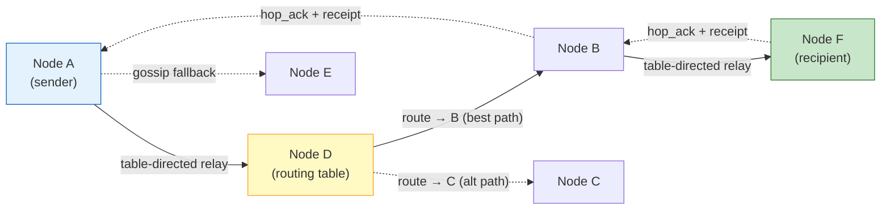
*Diagram — Table-directed relay with gossip fallback (implemented)*

**What is still missing:** anti-flooding measures for announcements (frame size limits, fairness rotation, pacing/jitter, per-peer rate limiting), full integration tests for multi-node convergence scenarios, and forward-compatible relay for future onion routing. These are tracked in [Pending work before route health](#pending-work-before-route-health).

### Design principles

1. **Each iteration produces a working network.** No iteration breaks the
   previous one. Rollback is possible at any point via feature flags /
   capabilities negotiation.
2. **Gossip remains the fallback.** Routing table is a hint, not the only
   path. If a route is unknown or stale, the node falls back to current
   gossip behavior.
3. **Backward compatibility from day one.** Capability negotiation is
   introduced in iteration 0 and gates every new frame type. Nodes
   without mesh routing support continue to work in the same network.
   Legacy peers never receive unknown frame types.
4. **Privacy over performance.** No node should know the full network
   topology. Only distance vectors (identity + hop count), not the
   complete map. Message payloads never carry the full traversed path;
   intermediate nodes store only local forwarding state
   (`previous_hop` / `receipt_forward_to`) keyed by message ID.
5. **Preserve existing delivery paths.** The current push-to-subscriber
   and direct-peer delivery already works. New routing must not regress
   it. The routing abstraction produces a multi-strategy decision, not
   just a flat address list.

### Hostile-Internet Guardrails

The network should be designed as if abuse and DDoS are the normal case,
not an edge case. At the same time, protection must not become a trap for
honest nodes. Cross-cutting rules:

1. **Bounded resource usage everywhere.** Every inbound frame, queue,
   table, handshake state, and retry mechanism must have explicit limits
   on memory, CPU, bandwidth, and lifetime.
2. **Soft degradation instead of hard failure.** Under overload, a node
   should first reduce priority, lower fan-out, enable backpressure, and
   use fallback paths rather than stop delivering messages entirely.
3. **Distrust unauthenticated input.** Before handshake completion, a peer
   must not gain access to expensive CPU/memory work, large quotas, or
   influence over routing/reputation.
4. **Local observations beat external claims.** A node should not ban,
   penalize, or reroute purely because another participant said so.
5. **Adaptive defenses, not always-on friction.** Proof-of-work, hard
   challenges, and aggressive quotas are acceptable only as under-attack
   modes, so normal delivery and weak/mobile clients are not harmed.
6. **No irreversible punishments from weak signals.** Cooldown,
   quarantine, traffic shaping, and expiry are safer than permanent bans.
7. **Protection must be verified with overload tests.** Every anti-abuse
   mechanism should have a test showing that the network degrades in a
   controlled way under attack and does not lock itself out for honest
   peers.

### Protocol versioning policy

New frame types and behaviors are introduced via `capabilities`
negotiation (additive changes). The existing `ProtocolVersion` and
`MinimumProtocolVersion` in `config.go` are bumped only when mandatory
semantics of existing behavior change. The rule: if a legacy node can
safely ignore the new feature, it is capability-gated and does not
require a protocol bump. If a legacy node would misinterpret the new
behavior, the protocol version must be raised.

**Progress:**

- [ ] For each new frame type, classify: capability-gated additive change or mandatory protocol change
- [ ] Introduce new additive features only via `capabilities`, without raising `MinimumProtocolVersion`
- [ ] If mandatory semantics of existing behavior change, raise `ProtocolVersion`
- [ ] Before raising `MinimumProtocolVersion`, complete a dual-stack compatibility period
- [ ] Add mixed-version integration test: old node <-> new node
- [ ] Add rejection test: node with version below `MinimumProtocolVersion` is rejected
- [ ] Update `protocol.md` after each protocol bump
- [ ] Update `config.ProtocolVersion` and `config.MinimumProtocolVersion` only in a dedicated commit/PR after passing compatibility checklist

<a id="iter-1"></a>
### Iteration 1 — Routing table (distance vector with withdrawals)

**Goal:** each node knows which identities are reachable through which
neighbors. Routes are treated as **hints**, not as the single source of
truth — gossip fallback is always available.

**Problem after iteration 1:** relay works, but the node does not know
**where** to relay. The gossip fallback from iteration 1 is blind. If a
node has 8 peers, the message goes to 3 random ones instead of the one
correct one.

**Capability gate:** `announce_routes` and `withdraw_routes` are only
exchanged with peers that have `"mesh_routing_v1"` in their capability
set (from iteration 0).

**Routing module** (`internal/core/routing/`):

Routing logic is extracted into a dedicated package, separate from
`internal/core/node/`. The `node` package is already large (~90 fields
in `Service`). A standalone routing module provides clean boundaries,
independent unit testing, and minimizes refactoring when routing
evolves across iterations 2–4.

```
internal/core/routing/
  types.go            — RouteEntry (with Origin), Snapshot (exported types)
  table.go            — Table (route storage, lookup, TTL, split horizon)
  announce.go         — announce/withdraw protocol + periodic loop

internal/core/node/
  routing.go          — Router interface + GossipRouter (existing)
  table_router.go     — TableRouter adapter (delegates to routing.Table)
```

Files added in [Iteration 1.5](#iter-1-5): `routing/health.go`,
`routing/probe.go`, `routing/score.go`, `routing/query.go`.

The `routing` package exposes a `Table` type with a clean API:
`Lookup()`, `UpdateRoute()`, `WithdrawRoute()`, `Announceable()`,
`Snapshot()`. The `node.Service` holds a `*routing.Table` and passes
events (peer connect/disconnect, hop_ack, session close) through
explicit method calls — no hidden coupling.

The `Router` interface remains in the `node` package (it depends on
`protocol.Envelope`). A new `TableRouter` implementation wraps
`routing.Table` and implements `Router.Route()` by delegating to
`Table.Lookup()` and falling back to gossip when no route is found.

**RPC access** (`internal/core/rpc/routing_commands.go`):

Routing data is exposed via the existing `CommandTable` through a `RoutingProvider` interface with two methods: `RoutingSnapshot()` (immutable point-in-time table copy) and `PeerTransport(peerIdentity)` (live transport address resolution). When the provider is nil (legacy node without routing), all routing commands return 503 and are hidden from help.

RPC commands (category `"routing"`):

| Command | Description | Usage |
|---|---|---|
| `fetch_route_table` | Full table snapshot with structured `next_hop` object | — |
| `fetch_route_summary` | Entry counts, reachable identities, flap state | — |
| `fetch_route_lookup` | Active routes for a destination, sorted by preference | `<identity>` |
| `fetch_route_health` | Health states per (identity, origin, nextHop) triple | — (Iter 1.5) |

Full field-level specification: [`rpc/routing.md`](rpc/routing.md). Implementation details: [`routing.md`](routing.md).

**Table structure:**

```go
type RouteEntry struct {
    Identity  string      // target identity (Ed25519 fingerprint)
    Origin    string      // who originated this route (directly connected to Identity)
    NextHop   string      // peer identity we learned this from (not transport address)
    Hops      int         // distance (1 = direct peer, 16 = HopsInfinity/withdrawn)
    SeqNo     uint64      // monotonic per-Origin, only Origin may advance
    Source    RouteSource // RouteSourceDirect | RouteSourceAnnouncement | RouteSourceHopAck
    ExpiresAt time.Time   // absolute expiry; derived from defaultTTL at insert time
}

type Table struct {
    mu               sync.RWMutex
    routes           map[string][]RouteEntry // identity → routes
    localOrigin      string                  // this node's Ed25519 fingerprint
    seqCounters      map[string]uint64       // next SeqNo per destination
    defaultTTL       time.Duration           // default route lifetime (120s)
    penalizedTTL     time.Duration           // TTL for flapping peers (30s)
    flapState        map[string]*peerFlapState
    flapWindow       time.Duration           // disconnect counting window (120s)
    flapThreshold    int                     // disconnects before hold-down (3)
    holdDownDuration time.Duration           // hold-down period (30s)
}

func (t *Table) Lookup(identity string) []RouteEntry
func (t *Table) AddDirectPeer(peerIdentity string) (AddDirectPeerResult, error)
func (t *Table) RemoveDirectPeer(peerIdentity string) (RemoveDirectPeerResult, error)
func (t *Table) InvalidateTransitRoutes(peerIdentity string) int
func (t *Table) UpdateRoute(entry RouteEntry) (bool, error)
func (t *Table) WithdrawRoute(identity, origin, nextHop string, seqNo uint64) bool
func (t *Table) Announceable(excludeVia string) []RouteEntry
func (t *Table) AnnounceTo(excludeVia string) []AnnounceEntry
func (t *Table) Snapshot() Snapshot
func (t *Table) TickTTL()      // removes expired (ExpiresAt elapsed) and withdrawn (Hops >= 16) entries
func (t *Table) Size() int     // total entries including withdrawn
func (t *Table) ActiveSize() int // non-withdrawn, non-expired entries only
func (t *Table) FlapSnapshot() []FlapEntry
```

**Why NextHop is a peer identity, not a transport address:** a single
peer identity can have multiple transport sessions (inbound + outbound,
fallback port, reconnect). Storing a transport address would lose
working sessions. The routing table operates at identity level; session
selection for the actual send is delegated to `node.Service`, which
already iterates sessions by peer identity.

**Key difference from previous version:** route entries have an `Origin`
field and a `SeqNo` that is strictly per-origin. Only the node that
originally announced the identity (the one directly connected to it)
may advance the `SeqNo`. Intermediate nodes forward the route with the
same `(Origin, SeqNo)` — they never increment or fabricate a new seq
for someone else's route. This prevents seq-space hijacking where an
intermediate node could override legitimate withdrawals.

This enables:

- **Withdrawals** — the origin node explicitly withdraws a route by
  sending a higher `SeqNo` with `hops=infinity` (16). Receivers
  immediately invalidate the stale entry instead of waiting for TTL
  expiry. Because only the origin controls the seq, no intermediate
  node can accidentally or maliciously cancel the withdrawal.
- **Triggered updates** — when a route changes (peer connects/disconnects),
  an immediate announce of just that change is sent, without waiting for
  the 30-second periodic cycle.

**How the table is populated:**

1. **Direct peers** — on peer connect, their identity is added as
   `hops=1, source="direct"`. On disconnect — removed, and a
   **withdrawal** is immediately triggered to all neighbors.

   **Why hops=1, not 0:** a direct connection still traverses one
   network link. Using `hops=1` keeps the metric consistent: every
   hop adds 1, and the metric is additive across the path. With
   `hops=0` for direct, a two-hop route would show `hops=1`, which
   is confusing. The value `hops=1` means "identity reachable through
   one link" and `hops=16` remains infinity (withdrawal).

2. **Route announcements** — frame type `announce_routes`:

```json
{
  "type": "announce_routes",
  "routes": [
    {"identity": "alice_addr", "origin": "charlie_addr", "hops": 1, "seq": 42},
    {"identity": "carol_addr", "origin": "bob_addr",     "hops": 2, "seq": 17},
    {"identity": "dave_addr",  "origin": "dave_addr",    "hops": 16, "seq": 18}
  ]
}
```

**Extensibility for onion (Iteration 13.1):** when a node supports
`onion_relay_v1`, it adds optional fields to each route entry in its
own announcements (origin == self):

```json
{
  "identity": "alice_addr", "origin": "self_addr", "hops": 1, "seq": 42,
  "box_key": "<base64 X25519 public key>",
  "box_key_binding_sig": "<base64 ed25519 signature of 'corsa-boxkey-v1|identity|box_key'>"
}
```

These fields are **optional** and **ignored** by nodes that do not
support `onion_relay_v1`. Nodes without onion capability omit them;
nodes with onion capability use them to build onion paths (see
Iteration 13.1 trust model for transit box keys). The binding signature
prevents key substitution by intermediate relayers: each hop in the
announcement chain can verify that the box key was genuinely published
by its origin. Nodes that relay an announcement with box-key fields
preserve them as-is (they are part of the route entry, same as `seq`).

`hops=1` = direct peer, `hops=2` = one intermediate hop, `hops=16` =
infinity (withdrawal). The table deduplicates and compares updates by
the composite key `(identity, origin, nextHop)`:

- **Same origin, same nextHop:** accept only if `seq` is strictly
  higher than the stored entry. This is the normal per-origin
  sequence ordering.
- **Different origin, same nextHop:** these are independent route
  lineages. Both entries coexist. If neighbor B first advertises
  `(F, origin=C, seq=5)` and later `(F, origin=D, seq=1)`, the
  second is a new lineage, not a stale update — it must not be
  rejected by comparing against C's seq.
- **Same origin, different nextHop:** these are alternative paths
  from the same origin. Both are stored; `Lookup()` ranks them.

Every 30 seconds a node sends the full table to peers (periodic refresh).
Between cycles, **triggered updates** send only changes immediately.

3. **Hop-ack confirmation** — when a `relay_hop_ack` is received for a
   message to identity X, the node looks up which route triple it used
   to send that message (tracked locally by `message_id`). Only that
   specific `(identity, origin, nextHop)` triple is promoted to
   `source="hop_ack"`. The wire-level `relay_hop_ack` itself carries
   only `message_id` — origin is resolved locally, not transmitted.
   This means a hop_ack for `(X, origin=C, via B)` does not promote
   `(X, origin=D, via B)` even though both go through B, and does not
   promote `(Y, origin=C, via B)` even for the same origin — each
   triple is independently confirmed. This is more reliable than
   end-to-end delivery receipts, which can travel via gossip and prove
   nothing about the chosen path.

**Trust hierarchy for route sources:** not all route information is
equally trustworthy. The table enforces a strict priority when multiple
sources report the same `(identity, origin, nextHop)` triple:

1. **`direct`** — the identity is locally connected. Always wins.
   Cannot be overridden by announcement or hop_ack.
2. **`hop_ack`** — confirmed by actual message delivery for this
   specific `(identity, origin, nextHop)` triple (origin resolved
   locally from the message's routing decision). Stronger than passive
   announcements because it proves this particular path works. Does
   not extend to other triples through the same next_hop.
3. **`announcement`** — received via `announce_routes` from a neighbor.
   Lowest trust. Any peer can claim any route; without verification
   the claim is just a hint.

When `UpdateRoute()` receives a new entry, it checks the existing
entry's `Source` for the same `(identity, origin, nextHop)` triple.
A lower-trust source cannot override a higher-trust one within the
same lineage. If a peer announces a route that was already confirmed
by `hop_ack`, the announcement is accepted only if its `SeqNo` is
strictly higher (indicating a genuine topology change from the origin).

**Different origins are independent lineages.** If neighbor B reports
`(F, origin=C, seq=5)` and then `(F, origin=D, seq=1)`, these are
separate entries. The second is not compared against C's seq — it has
its own lineage. Both may coexist in the table.

Additionally, routes learned from peers with **unstable sessions**
(3 or more disconnects within the last 10 minutes) receive a shorter
numeric TTL: `RemainingTTL=30` instead of the default `120`. This
prevents flapping peers from polluting the table with routes that
constantly appear and disappear.

**Split horizon** (loop protection): when node B announces routes to
node A, it **omits** routes that it learned through A. These routes are
simply not included in the announcement — no fake `hops=16` is sent.
This avoids the seq-space conflict: sending a withdrawal with `hops=16`
for someone else's route would require fabricating a `SeqNo` that the
origin node never produced, violating the per-origin seq invariant.
Split horizon is simpler, safe, and does not create false withdrawal
entries that could propagate and confuse other nodes.

**Protection against route poisoning:** `announce_routes` remains an
advisory mechanism, not a source of truth. A neighbor can lie about
reachability, so receivers apply strict acceptance rules:

1. **Never trust an announcement more than direct/hop_ack.**
   `announcement` must not override `direct`, and must not displace an
   already confirmed `hop_ack` route without a fresher `SeqNo`.
2. **Accept only physically plausible updates.** A neighbor may advertise
   a route only with `hops >= 1`, and forwarding must increase the metric
   by exactly 1. If a peer suddenly advertises an anomalously large set of
   identities or sharply improves a metric without a new `SeqNo`, the
   update is rejected or assigned a reduced TTL.
3. **Bind learned routes to the specific session and neighbor identity.**
   When the session closes, all routes learned from it are invalidated
   immediately regardless of `RemainingTTL`.
4. **Do not make the table a single point of failure.** Even a suspicious
   or stale route must not break delivery: on doubt, the node lowers the
   route's priority and falls back to gossip rather than trusting it to
   completion.

In the future this can be strengthened with a capability such as
`mesh_attested_links_v1`, where adjacencies or path segments are backed by
signatures. But iteration 2 should remain fully functional without a
cryptographically attested map of the whole network.

**Table is a hint, not the truth:** if the routing table suggests a
next_hop, the node tries it first. If the next_hop session is not
active or the capability is missing, the node falls back to gossip
immediately. The table never blocks delivery.

**Route lifetime is tied to session lifetime.** All routes learned
from a peer (both direct and announced) are invalidated when the
session to that peer closes. On session close, the node:

1. Removes the direct peer entry for that identity. Since this node
   **is** the origin for its own direct-peer routes, it legitimately
   sends a triggered withdrawal (`hops=16` with its own incremented
   `SeqNo`) to all neighbors.
2. Removes all transit routes where `NextHop == disconnected_peer`
   from the **local table only**. These routes are not withdrawn on
   the wire — the node is not the origin and must not fabricate
   a withdrawal with someone else's `SeqNo`.
3. **Stops announcing** the removed transit routes. Because the node
   uses split horizon and the routes are no longer in its table,
   they naturally disappear from subsequent periodic announces.
   Neighbors detect the absence and let the routes expire via TTL
   (at most 120 seconds, or faster if the actual origin sends a
   real withdrawal).

This is the correct behavior under per-origin `SeqNo`: only the
origin may emit a withdrawal. An intermediate node that loses its
upstream session can only (a) locally invalidate, (b) stop
re-advertising, and (c) rely on TTL expiry at downstream peers.
The practical convergence impact is small: the origin will typically
detect the same partition and emit its own withdrawal. If the origin
is unreachable, downstream nodes still converge within one TTL window
(120s default, 30s for flapping peers).

On reconnect, the peer must re-announce its routes from scratch.
This prevents stale routes from persisting across identity changes
or network partitions. If a peer reconnects with a **different
identity** (different Ed25519 public key), the old identity's direct
route is withdrawn (the node is the origin for that route) and the
new identity is added as a fresh entry.

**Route selection with the table:**

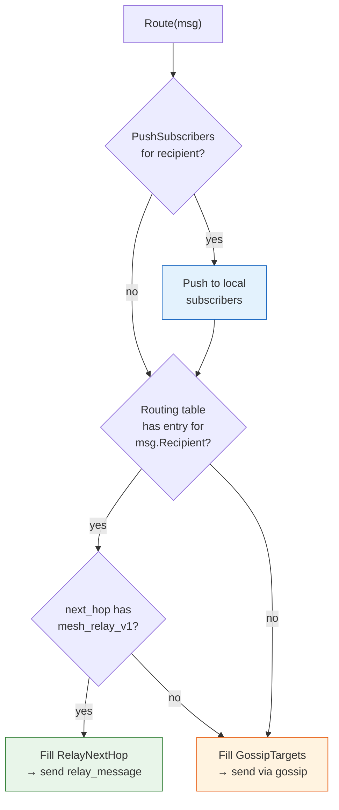
*Diagram — Full routing decision: push + table lookup + gossip fallback*

**Withdrawal and triggered update flow:**

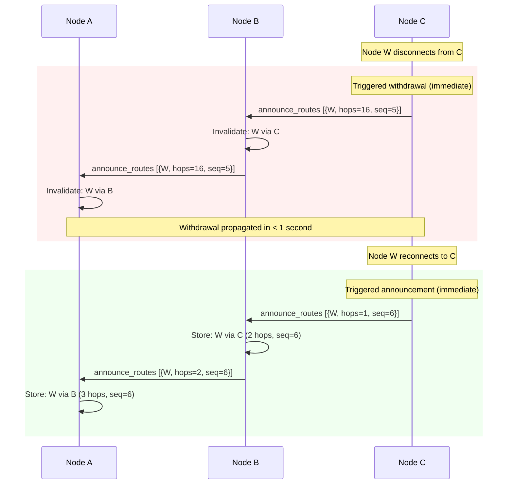
*Diagram — Fast withdrawal and re-announcement via triggered updates*

**Announce cycle (periodic + triggered):**


*Diagram — Route announcement convergence with split horizon*

**Announcement size limit with fairness rotation:** each
`announce_routes` frame carries at most 100 route entries to bound
frame size. When the table exceeds 100 entries, the node applies a
fair selection strategy:

1. **Direct peers always included** — routes with `source="direct"`
   are never omitted, as they are the most valuable and typically
   few (limited by max connections).
2. **Remaining slots filled by rotation** — non-direct routes are
   sorted by hops (closest first) and then rotated using a per-peer
   offset that advances each cycle. This ensures all routes are
   eventually announced to every peer, not just the closest ones.
3. **Periodic full sync** — every 5th cycle (every 2.5 minutes), the
   node sends a full table dump split across multiple frames if needed.
   This handles edge cases where rotation misses routes during topology
   changes.

**Route selection with hop count (MVP):**

In the core iteration, routes are ranked by hop count and trust source
only. Composite scoring with RTT, health states, and probes is added in
Iteration 1.5. The simple metric is sufficient for the first working
routing table: `direct` routes are preferred, then `hop_ack`-confirmed,
then lowest-hop-count `announcement`.

```go
func (t *Table) Lookup(identity string) []RouteEntry {
    // 1. Filter: exclude withdrawn (hops=16)
    // 2. Sort: source priority (direct > hop_ack > announcement),
    //    then by hops ascending
    // 3. Return sorted slice (caller uses first entry as RelayNextHop)
}
```

**Done when:** a message from A to F goes via the shortest path, not
random nodes. When a node disconnects, withdrawal propagates within
seconds. Logs show `route_via_table` instead of `route_via_gossip`.
The table converges within 1-2 announce cycles (30-60 seconds).
On reconnect, the peer re-announces its full table (no incremental
sync in this iteration).

**Out of scope: global discovery.** Distance vector gives each node
knowledge only via its neighbors. There is no mechanism to find an
arbitrary identity if no neighbor has advertised a route to it. This is
a fundamental DV boundary, not a defect. Global "find any user in the
network" requires a separate discovery/query layer — see
[Iteration 4 — Structured overlay (DHT)](#iter-4) for the planned
approach. The routing table is not the place for global search.

**Completed:** model invariants, minimal vertical slice (table routing, announcements, withdrawals, hop_ack, gossip fallback), RPC observability (`fetch_route_table`, `fetch_route_summary`, `fetch_route_lookup`). Full documentation: [`routing.md`](routing.md), [`rpc/routing.md`](rpc/routing.md).

#### Pending work before route health

**From base routing (Phase 1.2):**

- [ ] Handle identity change on reconnect: withdraw old identity, add new
- [ ] Integration test: kill the only table-routed next-hop mid-delivery, verify message arrives via gossip within 5s
- [ ] Integration test: peer with 2 TCP sessions, kill one — route stays, delivery uninterrupted
- [ ] Integration test: 5 nodes, verify shortest path selection
- [ ] Integration test: disconnect node, verify withdrawal propagation < 5s
- [ ] Integration test: reconnect with different identity, verify old routes withdrawn
- [ ] Integration test: reconnect always triggers full table sync (no stale cached routes)
- [ ] Integration test: rapid disconnect/reconnect cycle (3 nodes in triangle) — verify no routing loop or count-to-infinity; table converges within 2 announce cycles

**Fairness, anti-poisoning, rate limiting:**

- [ ] Limit announcements to max 100 routes per announce frame, with fairness rotation
- [ ] Implement fairness rotation for announcement size limit (direct always included, offset rotation)
- [ ] Implement periodic full sync every 5th cycle (split across multiple frames if needed)
- [ ] Add anti-poisoning acceptance rules: `announcement` advisory-only, cannot override fresher `direct`/`hop_ack`
- [ ] Reject or deprioritize anomalous route announcements (implausible `hops`, sudden identity spikes, no fresh `SeqNo`)
- [ ] Rate-limit `announce_routes` / `withdrawal` per peer so triggered updates cannot become a routing flood
- [ ] Add quotas for how many new identities and route entries one peer may introduce per time window
- [ ] Add jitter / pacing for periodic full sync so nodes do not synchronize bandwidth spikes
- [ ] Add `route_via_table` / `route_via_gossip` log markers
- [ ] Write unit tests for announcement fairness rotation
- [ ] Write unit tests for anti-poisoning announcement acceptance rules
- [ ] Integration test: malicious peer advertises false routes, delivery degrades at most to gossip fallback
- [ ] Integration test: route-update flood does not evict honest peers or trigger a full-sync storm

**Release / compatibility:**

- [ ] Without routing table, network continues delivery via gossip fallback

---

<a id="iter-1-5"></a>
#### Route health, probes, and RTT scoring

**Goal:** improve route selection quality beyond simple hop count.
Add active health tracking per `(identity, origin, nextHop)` triple, lightweight
probes to verify reachability, RTT estimation from TCP sessions, and
a composite route score that combines all signals. Also adds targeted
route queries for fast recovery after next-hop failure.

**Depends on:** base routing table (announcements, withdrawals, RPC observability — all implemented and tested).

**Capability gate:** `route_probe` and `route_query` are new wire-level
frame types that Iteration 1 nodes do not understand. A node running
only Iteration 1 may legitimately advertise `mesh_routing_v1` without
knowing these frames. Sending them under the same capability breaks
mixed-version compatibility within the same capability bucket.

New capabilities introduced in this iteration:

- **`mesh_route_probe_v1`** — gates `route_probe` / `route_probe_ack`
  frame exchange. Only sent to peers that advertise this capability.
- **`mesh_route_query_v1`** — gates `route_query` / `route_query_response`
  frame exchange. Only sent to peers that advertise this capability.

Health tracking and composite scoring are internal (no new wire frames)
and do not require a separate capability. A node with only
`mesh_routing_v1` continues to work — it receives announcements and
withdrawals normally, and its routes are ranked by hop count instead
of composite score.

**New files** (extend routing module):

```
internal/core/routing/
  health.go           — RouteHealthState, health state machine transitions
  probe.go            — route_probe sender/handler
  score.go            — CompositeScore, RTT estimation (EWMA)
  query.go            — route_query / route_query_response
```

##### 1.5a. Next-hop health state machine

Each `(identity, origin, nextHop)` triple is independently tracked with
an explicit health state — matching the routing table's dedup key. A
`hop_ack` for message to identity X via next-hop B for origin C only
affects the health of route `(X, origin=C, via B)` — not all routes
through B, and not routes to X from a different origin through the same
B. Transport-level liveness (TCP session alive) is tracked separately
by `node.Service`.

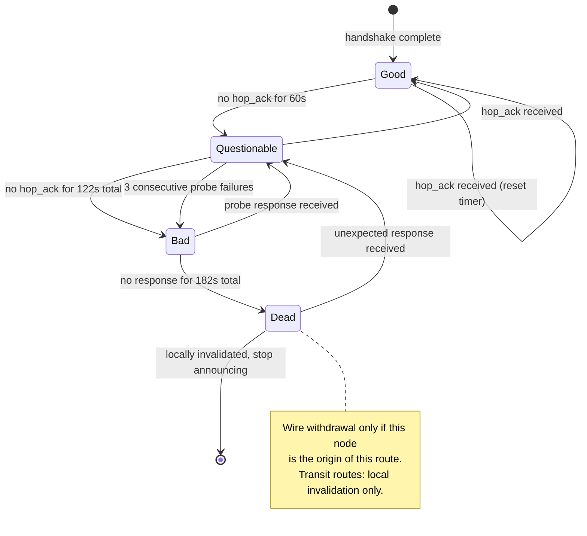
*Diagram — Route health state machine (per identity-origin-nextHop triple)*

```go
type RouteHealth uint8

const (
    HealthGood         RouteHealth = iota // responding, route fully trusted
    HealthQuestionable                     // no recent confirmation, probing
    HealthBad                              // unresponsive, route deprioritized
    HealthDead                             // timed out, locally invalidated (wire withdrawal only if own-origin)
)

// RouteHealthState tracks health per (identity, origin, nextHop) triple,
// matching the routing table's dedup key.
type RouteHealthState struct {
    Identity        string        // target identity
    Origin          string        // who originated this route (matches RouteEntry.Origin)
    NextHop         string        // peer identity of next hop
    Health          RouteHealth
    LastHopAck      time.Time     // last hop_ack for THIS identity via THIS next-hop
    LastProbe       time.Time     // last probe sent for this pair
    ProbeFailures   int           // consecutive probe failures
    RTT             time.Duration // estimated RTT (EWMA) for this path
    TransitionAt    time.Time     // when current health state was entered
}
```

| State | Condition | Route behavior |
|---|---|---|
| **Good** | `hop_ack` received within 60s for this (identity, origin, nextHop) triple | Route used normally, full TTL |
| **Questionable** | No `hop_ack` for 60–122s for this triple | Route deprioritized, probes sent every 15s |
| **Bad** | No response for 122s or 3 probe failures | Route excluded from selection, gossip used instead |
| **Dead** | No response for 182s | Route locally invalidated, stop announcing. Wire withdrawal sent only if this node is the origin; transit routes are silently dropped and converge via TTL expiry or origin's own withdrawal. |

Routes with `Bad` or `Dead` health are not selected by `Lookup()` unless
no other route exists (last resort before gossip fallback).

##### 1.5b. Route probe mechanism

A lightweight probe verifies that a specific next-hop can actually
forward traffic to the claimed identity, without waiting for real
message traffic to generate a `hop_ack`.

```json
{
  "type": "route_probe",
  "probe_id": 12345678,
  "target_identity": "alice_addr"
}
```

```json
{
  "type": "route_probe_ack",
  "probe_id": 12345678,
  "reachable": true,
  "rtt_ms": 45
}
```

**Probe rules:**

- Probes are sent for `(identity, origin, nextHop)` triples in `Questionable` state every 15 seconds.
- A `route_probe_ack` with `reachable=true` transitions the specific triple
  back to `Good` and updates the RTT estimate for that triple.
- A `route_probe_ack` with `reachable=false` keeps the triple in
  `Questionable` (the next-hop is alive but can't reach the target).
- No response within 5 seconds counts as a probe failure.
- Probes are also sent when a new announced route is first received
  from a previously unknown next-hop (verify before trusting).

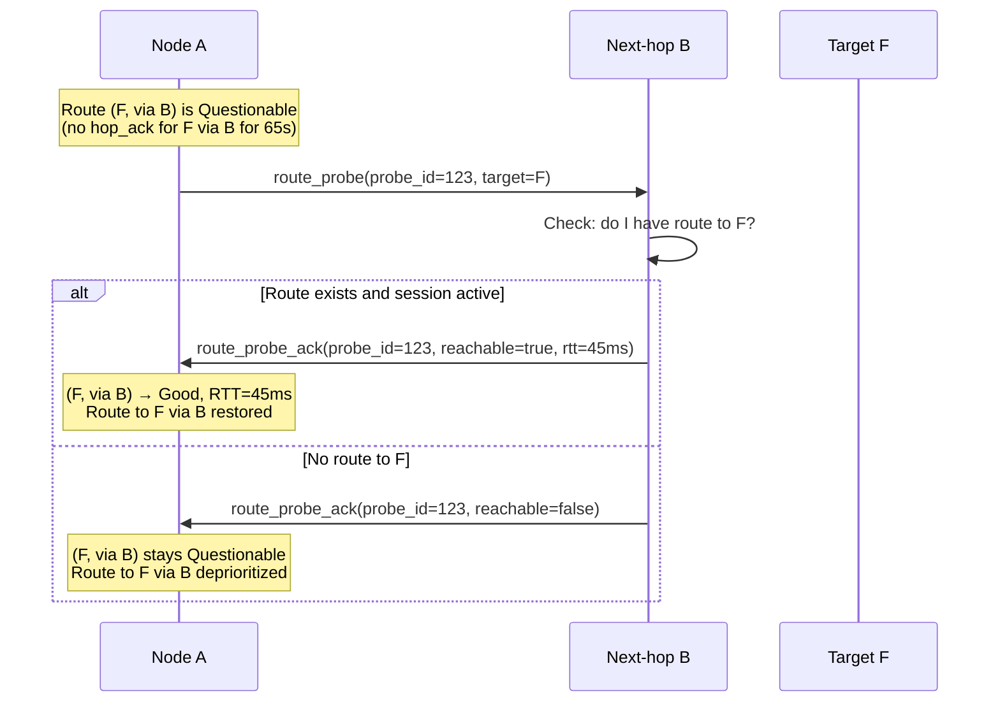
*Diagram — Route probe and health recovery*

##### 1.5c. RTT-weighted composite route score

Pure hop-count metrics can choose a 2-hop path through a congested
transcontinental relay over a 3-hop local mesh path. Adding RTT
estimation produces better routing decisions.

RTT is estimated per `(identity, origin, nextHop)` triple using an Exponentially
Weighted Moving Average (EWMA) from transport-layer TCP session timing.
Since each peer connection uses a TCP session, RTT is available "for
free" by measuring the time between sending data and receiving the
`hop_ack` response. On Linux, `tcp_info` from `getsockopt` provides
kernel-level RTT estimates. The probe mechanism (section 1.5b) also
contributes RTT samples when probes are answered:

```go
func (s *RouteHealthState) UpdateRTT(sample time.Duration) {
    const alpha = 0.3 // smoothing factor — higher = more responsive
    if s.RTT == 0 {
        s.RTT = sample
    } else {
        s.RTT = time.Duration(float64(s.RTT)*(1-alpha) + float64(sample)*alpha)
    }
}
```

The composite route score combines hops, RTT, and health:

```go
func (e RouteEntry) CompositeScore(health *RouteHealthState) float64 {
    // Base score: penalize distance
    score := 100.0 - float64(e.Hops)*10.0

    // Bonus for low latency (max +30 for RTT < 20ms)
    if health != nil && health.RTT > 0 {
        rttMs := float64(health.RTT.Milliseconds())
        if rttMs < 20 {
            score += 30.0
        } else if rttMs < 100 {
            score += 20.0 * (100.0 - rttMs) / 80.0
        }
        // RTT > 100ms: no bonus
    }

    // Health penalty
    if health != nil {
        switch health.Health {
        case HealthGood:
            // no penalty
        case HealthQuestionable:
            score -= 20.0
        case HealthBad:
            score -= 50.0
        case HealthDead:
            score = -1.0 // excluded from selection
        }
    }

    // Trust bonus
    switch e.Source {
    case "direct":
        score += 20.0
    case "hop_ack":
        score += 10.0
    case "announcement":
        // no bonus
    }

    return score
}
```

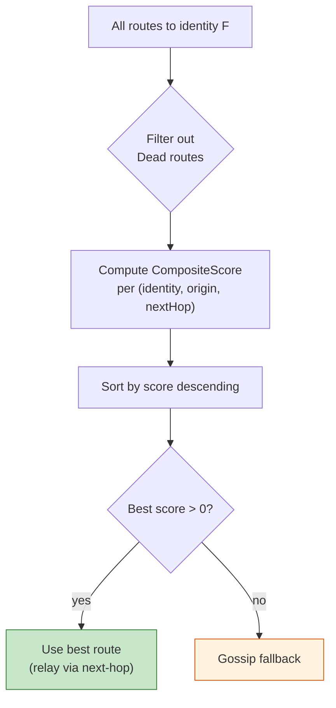
*Diagram — Route selection using composite score*

##### 1.5d. Targeted route query

When a route to a target identity is `Bad` or all known routes are
exhausted, the node can ask its connected peers for better routes using
a targeted query. This accelerates convergence without waiting for the
next periodic announce cycle.

**`route_query`** — ask a specific peer if they know a route:

```json
{
  "type": "route_query",
  "query_id": 87654321,
  "target_identity": "alice_addr"
}
```

**`route_query_response`** — peer responds with their best knowledge:

```json
{
  "type": "route_query_response",
  "query_id": 87654321,
  "routes": [
    {"identity": "alice_addr", "hops": 1, "seq": 55}
  ]
}
```

**Rules:**

- `route_query` is sent only to directly connected peers.
- At most 3 queries per target identity per 30 seconds (rate limited).
- Responses are treated as `source="announcement"` entries (same trust).
- A node does not forward `route_query` — it is single-hop only (no
  recursive flood).
- Primary use case: fast route recovery after a route goes `Bad`.

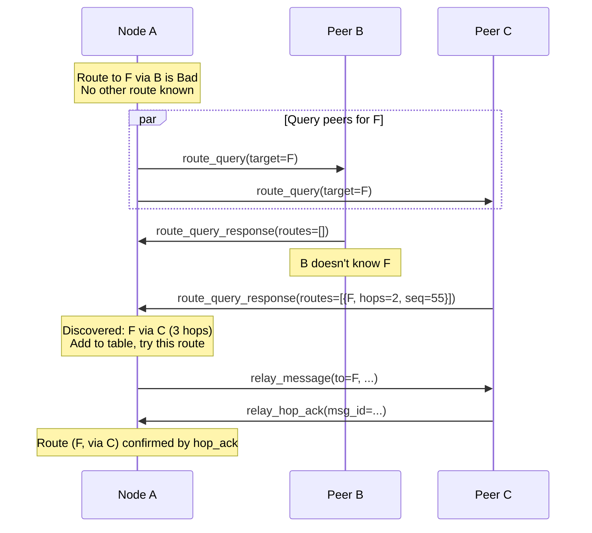
*Diagram — Targeted route query after route failure*

**Done when:** routes through congested or slow links are deprioritized
based on RTT. Health state transitions are logged. Route queries
discover alternative paths within seconds after a route goes Bad.
Probes verify new announced routes before trusting with high-priority
traffic.

**Progress:**

- [ ] Create `routing/health.go` with `RouteHealthState` and state machine (per identity-origin-nextHop triple)
- [ ] Implement health transitions: 60s → Questionable, 122s → Bad, 182s → Dead (per triple)
- [ ] Implement Dead state: local invalidation + stop announcing; wire withdrawal only if this node is the origin
- [ ] Implement automatic transition back: hop_ack or probe_ack → Good (scoped to specific triple)
- [ ] Integrate health tracking into `Table.Lookup()`: exclude Dead, deprioritize Bad
- [ ] Define `route_probe` / `route_probe_ack` frame types
- [ ] Create `routing/probe.go` — probe sender: every 15s to Questionable triples
- [ ] Implement probe handler: check local routes, respond with reachability + RTT
- [ ] Send probe to new next-hops on first announcement (verify before trust)
- [ ] Create `routing/score.go` with `UpdateRTT()` EWMA (alpha=0.3) from hop_ack and probe_ack
- [ ] Implement `CompositeScore()`: hops × 10 + RTT bonus + health penalty + trust bonus
- [ ] Replace hop-count sort in `Table.Lookup()` with `CompositeScore` ranking
- [ ] Define `route_query` / `route_query_response` frame types
- [ ] Create `routing/query.go` — targeted query sender after route failure
- [ ] Rate-limit queries: max 3 per identity per 30 seconds
- [ ] Implement query handler: respond with best known routes for queried identity
- [ ] Add `fetch_route_health` RPC command (health states per identity-origin-nextHop triple)
- [ ] Write unit tests for health state transitions (Good → Questionable → Bad → Dead → recovery)
- [ ] Write unit tests for health scoping (hop_ack for (X, origin=C, via B) does not affect (X, origin=D, via B) or (Y, origin=C, via B))
- [ ] Write unit tests for Dead state: transit route locally invalidated (no wire withdrawal), own-origin route emits wire withdrawal
- [ ] Write unit tests for probe send/receive cycle and health recovery
- [ ] Write unit tests for RTT EWMA calculation with varying samples
- [ ] Write unit tests for CompositeScore ranking (low-RTT 3-hop beats high-RTT 2-hop)
- [ ] Write unit tests for route_query/response (single-hop, rate-limited)
- [ ] Integration test: high-RTT direct peer deprioritized vs low-RTT 2-hop route
- [ ] Integration test: next-hop route goes Bad → node discovers alternative via route_query → recovered
- [ ] Integration test: probe verifies new announced route before high-priority traffic uses it

**Release / Compatibility:**

- [ ] `route_probe` / `route_probe_ack` sent only to peers with `mesh_route_probe_v1`
- [ ] `route_query` / `route_query_response` sent only to peers with `mesh_route_query_v1`
- [ ] Nodes without iteration 1.5 still work — they use hop-count-only routing from iteration 1
- [ ] CompositeScore gracefully handles nil health state (falls back to hop-count-only)
- [ ] Mixed-version test: 1.5 node does not send probe/query frames to 1.0-only peer
- [ ] Confirmed: iteration 1.5 is additive; new capabilities are optional, no protocol bump required

<a id="iter-2"></a>
### Iteration 2 — Reliability, reputation, multi-path, and incremental sync

**Goal:** multiple routes per identity, automatic failover based on
hop-by-hop ack success rate, protection against black-hole nodes.
Also adds incremental sync via table digest for efficient reconnection.

Note: capability negotiation and announcement size limits are already
handled in iterations 0 and 1 respectively. Health tracking, probes,
and composite scoring are handled in iteration 1.5. This iteration
focuses on reliability, multi-path failover, and sync optimization.

**2.0. Incremental sync via table digest:**

When a peer reconnects, both sides can skip the full table dump by
exchanging a compact table digest first. This requires a **route
cache** that survives session close — unlike iteration 1 where all
routes from a peer are invalidated immediately on disconnect.

The route cache stores a read-only snapshot of what the peer last
announced, with a separate expiry (e.g., 5 minutes). On reconnect
within the cache window, the digest is compared and only deltas are
exchanged. If the cache has expired or the digest misses, full sync
occurs (same as iteration 1).

**`route_sync_digest`** — sent immediately after handshake to a known peer:

```json
{
  "type": "route_sync_digest",
  "table_hash": "sha256_of_sorted_identity_seq_pairs",
  "entry_count": 47,
  "max_seq": 142
}
```

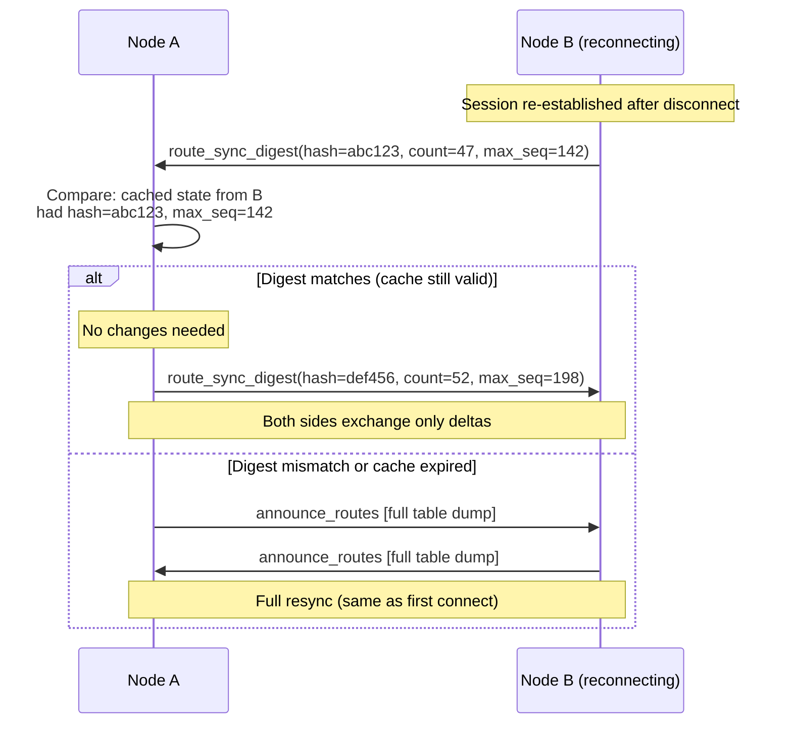
*Diagram — Incremental sync via table digest on reconnect*

**3a. Multiple routes and failover:**

The table already stores multiple routes per identity (from iteration 2).
This iteration adds active route selection and failover. When a
`relay_hop_ack` is not received within 10 seconds from the primary
next_hop, the node retries via the second-best route. If that also fails,
gossip fallback is used.

```
Identity "F":
  route 1: via peer_C, 2 hops, reliability 0.95  ← primary
  route 2: via peer_D, 3 hops, reliability 0.80  ← fallback
  route 3: gossip                                  ← last resort
```

**3b. Route reputation based on hop-by-hop ack:**

The reputation of a route is measured by the success rate of
`relay_hop_ack` responses, not by end-to-end delivery receipts. This is
critical because a delivery receipt can arrive via gossip even when the
chosen next_hop dropped the message.

**Protection against false penalties:** penalties must not be transferable
across the network. Otherwise an attacker can not only poison routing, but
also falsely bury honest nodes through slander. Therefore, in this
iteration reputation is strictly **local**:

1. **Penalize only locally observed behavior.** A node penalizes a
   next_hop only for its own observed `relay_hop_ack` timeout, locally
   observed failover, and repeated delivery failures through that next_hop.
2. **Third-party complaints are not evidence.** No inbound frames, route
   announcements, or negative claims such as "peer X is bad" should
   directly change `ReliabilityScore`.
3. **Penalty is soft and reversible.** The route is first deprioritized or
   placed into cooldown/quarantine, not permanently banned.
4. **The score applies to the route, not absolute guilt.** If the path via
   `nextHop=A` often fails, that is a reason to lower `route_score`, not a
   reason to globally classify identity A as malicious for the whole
   network.

**Why receipt path failures reinforce this choice:** the hop-by-hop
receipt return path (from iteration 1) can partially fail — for example,
node C delivers to F and sends receipt back toward A, but node B is
temporarily offline. If scoring used end-to-end receipt arrival, A
would penalize the forward path (A→B→C) for a failure that happened
on the **return** path (C→B→A). Since `relay_hop_ack` is sent
immediately by the direct next_hop before any further forwarding, it
is immune to downstream or return-path failures. This is the strongest
argument for hop-ack-only scoring.

```go
type RouteEntry struct {
    // ... existing fields from iteration 2
    HopAckAttempts   int
    HopAckSuccesses  int
    ReliabilityScore float64  // successes / attempts (0.0 to 1.0)
}
```

When `relay_hop_ack` is received → `HopAckSuccesses++`.
When 10s passes without `relay_hop_ack` → `HopAckAttempts++` only
(no success). Score is recalculated.

If `ReliabilityScore` drops below 0.3 after at least 5 attempts, the
route is deprioritized (but not removed — it may recover).

**3c. Composite route selection:**

Routes are ranked by a locally computed `RouteScore`:
`ReliabilityScore * 100 - Hops * 10`. A longer but reliable route beats a
shorter but flaky one.

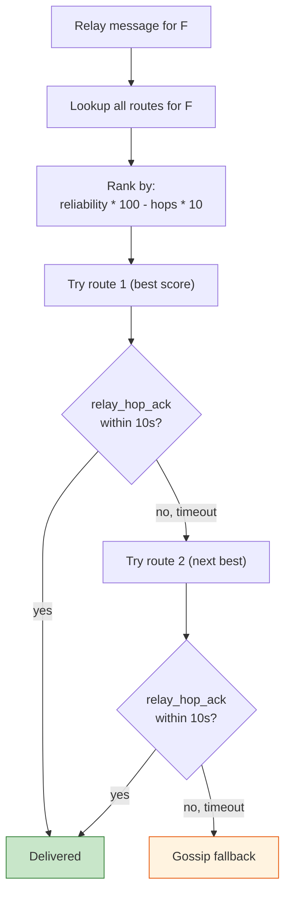
*Diagram — Multi-path failover with hop-ack based reputation*

**3d. Multi-path and blast-radius reduction:**

The node should not blindly trust a single "best" route, especially when
that route is new or has only recently recovered from cooldown. For an
identity with multiple routes, selection should be multi-path:

- a stable primary gets most of the traffic;
- a secondary stays warm and is used periodically to verify liveness;
- new or suspicious routes get only a small traffic share until they build
  local success history.

This reduces the impact of route poisoning and black-hole attacks: an
attacker does not receive the entire flow immediately even after a
successful route announcement.

**3e. Black-hole detection:**

A node that consistently claims routes via `announce_routes` but never
returns `relay_hop_ack` is a suspected black hole. After 5 consecutive
failures through that next_hop (across different messages), the node logs
a warning and adds a 2-minute penalty cooldown during which that
next_hop is skipped for new messages (existing retries continue).

**Done when:** when node C in chain A-B-C-D-E-F disconnects, the message
is automatically rerouted via an alternative path within 10-20 seconds
(hop-ack timeout + retry). A black-hole node is detected and deprioritized
after 5 messages.

**Progress:**

- [ ] Store multiple routes per identity in `PeerAwarenessTable` (may already exist from iteration 2)
- [ ] Add `HopAckAttempts`, `HopAckSuccesses`, `ReliabilityScore` to `RouteEntry`
- [ ] Track hop-ack success/failure per `(identity, origin, nextHop)` triple
- [ ] Implement 10s hop-ack timeout → mark attempt as failed
- [ ] Implement composite route ranking: `reliability * 100 - hops * 10`
- [ ] Keep penalties local: do not accept external claims about "bad" peers as input to `ReliabilityScore`
- [ ] Implement automatic failover: try next route on hop-ack timeout
- [ ] Implement multi-path traffic shaping: new/suspicious routes get only partial traffic until they build history
- [ ] Implement gossip fallback as last resort
- [ ] Implement black-hole detection: 5 consecutive failures → 2-min cooldown
- [ ] Add slow-start trust for new peers: a fresh next-hop cannot immediately receive all traffic
- [ ] Cap the maximum influence of a single peer on route selection so one node cannot attract the whole flow
- [ ] Add decay/recovery for reputation and cooldown expiry so defenses do not create eternal bans
- [ ] Log warning on suspected black-hole node
- [ ] Write unit tests for reputation scoring
- [ ] Write unit tests for protection against false penalties (external negative signal does not change score)
- [ ] Write unit tests for failover logic (primary fails → secondary → gossip)
- [ ] Write unit tests for progressive rollout on new/suspicious routes
- [ ] Write unit tests for black-hole detection and cooldown
- [ ] Integration test: disconnect middle node, verify rerouting within 20s
- [ ] Integration test: black-hole node (accepts relay, never acks), verify detection
- [ ] Integration test: attacker attempts to force false reputation decay of an honest peer; score does not enter permanent penalty
- [ ] Implement ingress suppression: exclude the arrival link from relay candidate set for each relayed message — prevents back-routing and reduces unnecessary relay load
- [ ] Implement per-peer handshake rate budget: cap handshake initiation attempts to `max_handshake_attempts_per_peer` (default 3 per 60 s) to prevent resource exhaustion by rapid reconnect/handshake loops
- [ ] Unit test: ingress link excluded from relay candidates for relayed message
- [ ] Unit test: handshake rate budget exhausted → further attempts deferred until window expires

**Release / Compatibility:**

- [ ] Failover and reputation affect route selection only, not base compatibility
- [ ] Without `relay_hop_ack`, network degrades to gossip fallback, not breakage
- [ ] Mixed-version test: node with reputation/failover works with node without these improvements
- [ ] Black-hole mitigation does not cause false full ban without fallback path
- [ ] Confirmed: iteration 3 does not require raising `MinimumProtocolVersion`

<a id="iter-3"></a>
### Iteration 3 — Optimization and scaling

**Goal:** pure optimization for network growth to hundreds of nodes.
No new protocol semantics — only efficiency improvements.

Note: triggered updates and withdrawals are already in iteration 2.
This iteration focuses on reducing bandwidth and improving data
structures.

**4a. Incremental route announcements:**

The 30-second periodic cycle currently sends the full table. Replace
with delta-only: track which routes changed since the last announce
to each peer, and send only the diff. The full table is sent only on
initial sync (new peer session). `SeqNo` from iteration 2 makes this
straightforward — each peer tracks the last `SeqNo` it sent per route.

**4b. Bloom filter for seen messages:**

Currently `s.seen[string(msg.ID)]` is a map that grows indefinitely
(cleaned only by TTL). Replace with a rotating Bloom filter — two
filters, every 5 minutes the current becomes old, the old is deleted.
False negatives are impossible (a seen message is always detected).
False positives are acceptable at < 0.1% rate.

**4c. Latency-aware route metric:**

Add RTT measurement to each peer session (from ping/pong). The route
metric becomes: `reliability * 100 - hops * 10 - avg_rtt_ms / 10`.
This allows choosing not just the shortest or most reliable path, but
the fastest one.

**4d. Announce compression:**

For networks with 100+ identities, route announcements can be large.
Use delta encoding (only changed routes) and, if needed, gzip
compression of the announce frame payload.

**4e. Overload mode and anti-DoS operation:**

When a node detects overload by CPU, memory, handshake count, or queue
length, it should enter a degradable overload mode:

- lower gossip fan-out and the frequency of non-critical announce cycles;
- compress / defer non-urgent sync work;
- prioritize already authenticated peers and active sessions;
- enable stricter admission limits only for the duration of the attack.

An optional adaptive challenge (for example, lightweight proof-of-work or a
stronger handshake challenge) is acceptable only as an emergency mode and
must not become a mandatory requirement for normal network operation.

**Done when:** a network of 50 nodes converges within 2 minutes. Route
announcement traffic does not exceed 5% of total traffic. Bloom filter
does not produce false negatives.

**Progress:**

- [ ] Implement incremental route announcements (delta since last announce per peer)
- [ ] Track per-peer last-sent `SeqNo` for each route
- [ ] Full table sync only on new peer session establishment
- [ ] Replace `s.seen` map with rotating Bloom filter (2 filters, 5 min rotation)
- [ ] Add RTT measurement to peer sessions (from ping/pong round-trip)
- [ ] Add latency component to composite route metric
- [ ] Implement announce compression for large route tables
- [ ] Implement overload mode: adaptive backpressure, lower gossip fan-out, prioritize authenticated peers
- [ ] Enforce hard limits for concurrent handshakes, frame decode budget, and queue growth budget
- [ ] Protect against compression/decompression bombs and oversized frame payloads
- [ ] Measure route announcement traffic as percentage of total
- [ ] Write benchmarks for Bloom filter false positive rate
- [ ] Write benchmarks for routing table operations at 100+ entries
- [ ] Load test: 50 node simulation, measure convergence time
- [ ] Load test: measure bandwidth savings from delta announcements
- [ ] Load test: handshake/relay flood, verify controlled degradation without stopping honest traffic
- [ ] Implement adaptive relay aggressiveness based on node degree: nodes with degree > `high_degree_threshold` (default 15) reduce gossip fanout ratio to dampen broadcast storms in dense clusters; low-degree nodes relay at full aggressiveness to ensure connectivity
- [ ] Implement density-aware announce intervals: `announce_interval_dense` (default 60 s, when peer count > threshold) vs `announce_interval_sparse` (default 30 s) — adapts announcement frequency to network size, reducing overhead in large networks
- [ ] Implement signed route announcements (capability `mesh_attested_links_v1`): Ed25519 signature covering `identity_fingerprint || box_public_key || timestamp || route_table_hash` — prevents route announcement spoofing without the signing key; unsigned announcements still accepted from nodes without the capability (backward compatible)
- [ ] Unit test: high-degree node reduces fanout ratio; low-degree node relays at full rate
- [ ] Unit test: dense announce interval applied when peer count > threshold
- [ ] Unit test: signed announcement with wrong key rejected; unsigned announcement still accepted when capability absent
- [ ] Load test: 100-node dense cluster with adaptive fanout vs without — measure message amplification reduction

**Release / Compatibility:**

- [ ] Delta announcements are compatible with full periodic sync
- [ ] On optimization incompatibility/error, full sync fallback is used
- [ ] Bloom filter does not produce false negatives for mandatory delivery logic
- [ ] Mixed-version test: node with delta sync works with node on full sync
- [ ] Confirmed: iteration 4 does not require raising `MinimumProtocolVersion`

<a id="iter-4"></a>
### Iteration 4 (future) — Structured overlay (DHT)

**Goal:** scaling to thousands of nodes.

When `PeerAwarenessTable` grows to 500+ entries, transition to a
Kademlia-like DHT. The routing table contains O(log n) entries instead of
O(n). Lookup in O(log n) hops.

This is **not needed now**, but the architecture of iterations 0-4 prepares
for it: the `Router` interface remains, only the implementation inside
changes.

**Progress:**

- [ ] Research Kademlia XOR-metric routing for identity-based addressing
- [ ] Design k-bucket structure for O(log n) routing table
- [ ] Define DHT lookup protocol (iterative vs recursive)
- [ ] Implement `DHTRouter` behind `Router` interface (same contract as `TableRouter`)
- [ ] Implement migration path from `PeerAwarenessTable` to DHT
- [ ] Implement Sybil resistance mechanisms
- [ ] Investigate adaptive admission under attack: optional puzzles / stake / invitation mode without an always-on barrier
- [ ] Benchmarks: DHT lookup latency at 1000+ nodes
- [ ] Integration test: mixed network with `TableRouter` and `DHTRouter` nodes coexisting
- [ ] Integration test: fallback to gossip on failed DHT lookup (unreachable key range)
- [ ] Integration test: churn of 20-50 nodes with delivery rate verification (target: >95% within 30s)
- [ ] Integration test: live migration and rollback between `TableRouter` and `DHTRouter` implementations
- [ ] Security test: Sybil/eclipse simulation — verify that a single cluster cannot fully capture lookup for any identity

**Release / Compatibility:**

- [ ] Determine: DHT is an optional router backend or mandatory network behavior
- [ ] If DHT is optional: mixed-version network (`TableRouter` + `DHTRouter`) passes integration tests
- [ ] If DHT is mandatory: raise `ProtocolVersion`
- [ ] If DHT is mandatory: document dual-stack rollout period
- [ ] If DHT is mandatory: after dual-stack period, raise `MinimumProtocolVersion`
- [ ] Add rollback test: `DHTRouter` → legacy/`TableRouter`
- [ ] Add mixed-version migration test: old/new routing backends coexist

### Iteration dependency graph

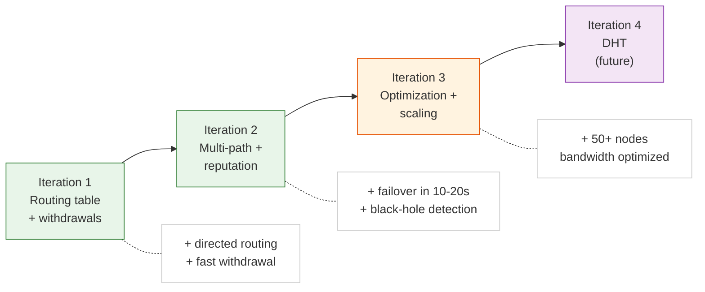
*Diagram — Iteration dependency and incremental delivery*

### Product iterations after mesh

These iterations continue the roadmap after the mesh foundation is stable.
They are ordered by practical delivery value for product growth, privacy, and
hostile-network resilience.

<a id="iter-5"></a>
### Iteration 5 — Local names for identities

**Goal:** let the user assign a human-readable local label to each identity.

**Why now:** cheapest UX win before broader user growth.

**Done when:** the desktop shows local aliases everywhere identity fingerprints
are shown, while preserving the real identity as the canonical underlying key.

<a id="iter-6"></a>
### Iteration 6 — Message deletion controls

**Goal:** add dialog/message deletion behavior with explicit flags and policy.

**Why now:** expected mainstream UX before mobile multiplies sync complexity.

**Done when:** users can delete local history, request two-sided deletion where
allowed, and see when a message is protected from deletion by policy flags.

<a id="iter-7"></a>
### Iteration 7 — Android app

**Goal:** ship the first mobile client on Android.

**Dependency:** comes after A1-A2 so mobile is not built on obviously rough
chat UX.

**Done when:** Android can run as a light client with identity, contacts,
direct messaging, and reliable sync with desktop/full nodes.

<a id="iter-8"></a>
### Iteration 8 — Second-layer encryption and key exchange

**Goal:** add optional contact-level payload encryption on top of network
transport encryption.

**Constraint:** this should be an audited/extensible envelope model such as
PGP-compatible or external-module based, not custom cryptography.

**Done when:** each contact can have an additional public/private key pair,
public-key exchange is visible in UI, and messages can be wrapped in a second
verified encryption layer.

<a id="iter-9"></a>
### Iteration 9 — DPI bypass

**Goal:** improve reachability in hostile networks where traffic is throttled,
classified, or blocked.

**Dependency:** easier to validate after routing and privacy behavior are better
understood.

**Done when:** the transport layer supports at least one obfuscation strategy
that measurably improves connectivity in filtered environments.

<a id="iter-10"></a>
### Iteration 10 — Backup channels via Google WSS

**Goal:** add fallback transport for networks where direct connections are
unreliable or blocked.

**Positioning:** this is part of the broader hostile-network resilience story,
not a standalone headline.

**Done when:** a node can fall back to WSS relay/bootstrap transport without
breaking existing identity, delivery, or capability semantics.

<a id="iter-11"></a>
### Iteration 11 — SOCKS5 tunnel between identities

**Goal:** allow identity-to-identity private tunneling, not only chat delivery.

**Dependency:** strongest after privacy and resilient transport exist.

**Done when:** two identities can establish a SOCKS5-backed routed channel with
clear permissions, lifecycle controls, and bandwidth limits.

<a id="iter-12"></a>
### Iteration 12 — Group chats

**Goal:** enable multi-party conversations where a message sent once is
delivered to all group members, with consistent group membership visible to
every participant.

**Dependency:** requires stable DM delivery (Iteration 1–2) and identity
model (A1). Benefits from onion delivery (A9) for private group signaling
but does not hard-depend on it — initial version works over regular relay.

**Key constraints:**

- **No central server.** Group state (membership list, group key) is
  replicated across members via the mesh, not stored on a coordinator.
- **Membership changes are signed.** Adding or removing a member requires a
  membership-change message signed by a member with admin role. Every member
  independently validates the signature before updating local group state.
- **Pairwise encryption, not a group-wide shared key.** Group messages
  are encrypted per-recipient using the existing pairwise session keys
  from DM delivery (Iterations 1–2). The sender encrypts the same
  plaintext N times (once per member) and sends N individual
  `relay_message` frames. There is **no** group-wide symmetric key and
  **no** key-agreement round among members. This avoids: (a) synchronous
  key-agreement in a decentralized mesh; (b) a single compromised member
  decrypting all traffic with a shared key; (c) complex group-key
  rotation on every membership change. Forward secrecy for removed members
  is automatic: once a member is removed, no new pairwise session is
  established, so it cannot decrypt future messages.
- **Delivery model:** the sender encrypts once per member using the
  pairwise session key, then fans out via mesh relay (one `relay_message`
  per member). Receipt semantics: per-member delivery receipts, aggregated
  in the UI as "delivered to N of M".
- **Ordering:** causal ordering via vector clocks or Lamport timestamps
  (not total order). Members may see messages in slightly different order
  during partitions; the UI sorts by causal timestamp.
- **Offline members:** messages are stored-and-forwarded. When a member
  comes online, it syncs missed messages from any reachable group member
  (same as DM pending delivery). If the member was removed while offline,
  it receives the removal message and stops decrypting new traffic.
- **Group roles and moderation:** four hierarchical roles — founder
  (creator, full admin privileges), moderator (promoted by founder, can
  kick users and set observer role), user (default, can communicate),
  observer (demoted, can only read). Founder can set peer limits, toggle
  privacy state, and modify shared group settings. Role changes are signed
  by the initiator and broadcast to all members; each member validates
  signatures against the moderator list before applying.
- **Shared state integrity:** group metadata (name, peer limit, privacy
  state, voice state, moderator list hash) is signed by the founder using
  the group signature key. This allows new joiners to verify the shared
  state cryptographically even when the founder is offline. Version
  counter prevents rollback to older state.
- **Group types — public and private:** public groups can be joined by
  anyone who knows the group ID (discoverable via DHT in the future).
  Private groups require a friend invite to join. The type is toggleable
  by the founder.
- **Pairwise session key rotation:** each pair of peers in a group uses
  ephemeral session keys (the same mechanism as DM sessions). Session keys
  are rotated periodically for forward secrecy. This reuses the proven DM
  key rotation without introducing group-specific crypto.
- **State sync protocol:** peers piggyback sync metadata (peer count,
  peer list checksum, shared state version, sanctions version, topic
  version) onto periodic pings. If versions differ, a targeted sync
  request is sent to the peer with newer data. This is lightweight and
  self-repairing.

**Done when:** a group of N identities can exchange messages with consistent
membership, pairwise session key rotation, and delivery receipts — all
operating over the existing mesh relay without a central server.

<a id="iter-13"></a>
### Iteration 13 — Onion delivery for DMs

**Goal:** hide path metadata in multi-hop DM delivery. Onion is an opt-in
transport wrapper around the existing sealed DM envelope — not a replacement.
The DM format stays the same; onion only changes how the message travels
through the network.

**Core idea:** when a sender enables onion mode, the standard sealed DM
envelope is wrapped in N layers of encryption (one per hop). Each intermediate
node peels one layer and learns only its next hop. The final recipient unwraps
the last layer and receives an ordinary sealed DM envelope (unchanged).
The fact of onion delivery is determined by the processing pipeline, not
by a flag inside the envelope. Receipts also travel back through an
onion route.

**Dependency:** strictly after stable mesh (Iterations 1–4) and intentionally
after SOCKS5 (A7). Mesh answers "does the message get there?"; onion answers
"how much can intermediate nodes learn about the path?". BLE last mile (A13)
and iOS (A12) follow onion, as onion is the privacy foundation.

**Done when:** all five sub-iterations below are complete.

#### Onion encapsulation (sender side)

The sender wraps the sealed DM envelope layer by layer, starting from the
final recipient and working outward to the first hop. Each layer is encrypted
to the corresponding hop's public key.

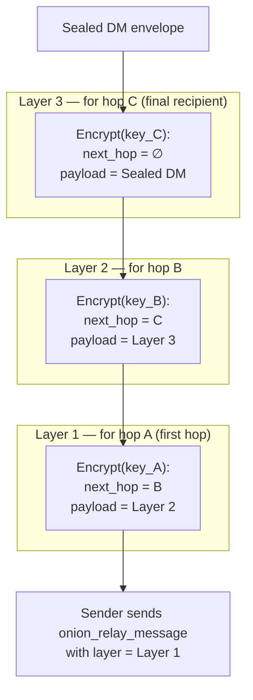
*Diagram — Onion encapsulation: sender wraps DM in N layers*

#### Hop-by-hop peeling

Each intermediate node decrypts its layer, learns only the next hop, and
forwards the inner blob. The final recipient decrypts the last layer and
gets the original DM.

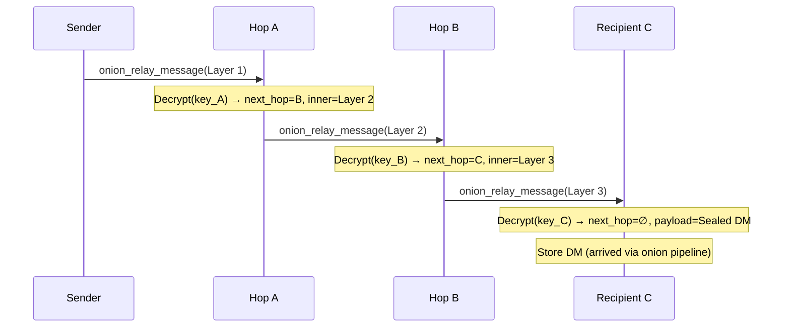
*Diagram — Hop-by-hop onion peeling*

#### Full onion DM + receipt flow

The DM travels forward through an onion route. The recipient determines
onion delivery via the processing pipeline and builds an independent
onion route back for receipts.

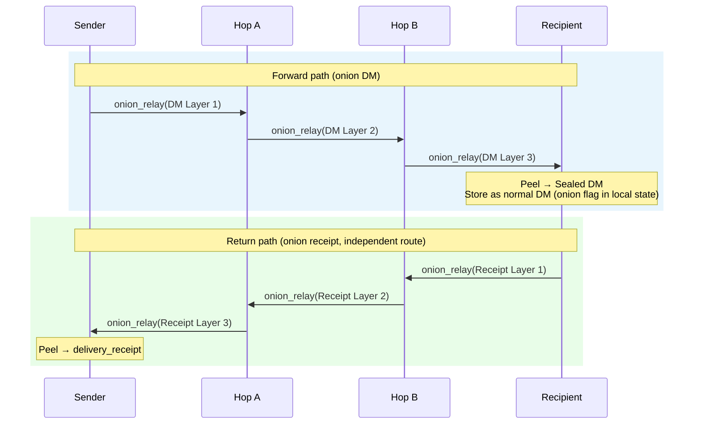
*Diagram — Full onion DM delivery and receipt return flow*

<a id="iter-13-1"></a>
#### 13.1 — Onion wrapping for DM envelope

**Goal:** no intermediate hop sees the recipient address or DM content.

**How it works:** the sender knows a path from the routing table (Iteration 1)
and the public box key of each node on that path. The sender takes the sealed
DM envelope and wraps it in N encryption layers — one per hop, innermost layer
for the final recipient, outermost for the first hop. Each hop decrypts its
layer, discovers only "forward to address X" plus an opaque blob, and relays.
The final hop decrypts the last layer (`is_final: true`) and gets the original
sealed DM envelope unchanged.

**New frame type — `onion_relay_message`:**

```json
{
  "type": "onion_relay_message",
  "layer": "encrypted_base64"
}
```

The frame is intentionally minimal — all routing info is inside the encrypted
layer. The frame has **no** global `onion_id`: a stable UUID visible to all
hops would become a correlation marker — two compromised hops could link the
same packet simply by matching `onion_id`, without decrypting any content.
Instead, deduplication is hop-local: each hop computes
`dedupe_tag = HMAC(node_key, layer_ciphertext)[:16]` — the tag is unique for
a given (hop, encrypted layer) pair and useless to an outside observer because
`node_key` differs on each hop.

Each decrypted layer yields:

```json
{
  "next_hop": "identity_fingerprint_or_empty",
  "layer": "encrypted_base64_or_dm_envelope"
}
```

When `next_hop` is empty the node is the final recipient; `layer` contains the
sealed DM envelope.

**Addressing in `next_hop` — identity, not session address:** the
`next_hop` field contains the node's identity fingerprint, not a transport
session address. Reason: the current mesh/relay already knows that session
addresses are unstable (reconnect, address change — see
`tryForwardToDirectPeer` in relay.go). When forwarding, the onion hop
resolves `identity fingerprint → active session`, iterating sessions the
same way relay forwarding does. If no session is found, the frame is
placed in a retry queue (analogous to relay backlog) with TTL. This makes
the onion circuit resilient to reconnects of intermediate hops.

**Recovery model priority (retry-queue vs circuit rebuild):** two recovery
mechanisms interact at the forwarding hop:

1. **Retry queue (hop-level, short):** when identity → session resolve
   fails, the frame enters a per-identity retry queue with
   `onion_retry_ttl` (default 15 s). The hop expects the next-hop node to
   reconnect within this window (transient disconnect, address change).
2. **Circuit rebuild (sender-level, long):** the sender expects a hop-ack
   within `onion_hop_ack_timeout` (default 10 s from Iteration 2). If the
   ack does not arrive, the sender marks the circuit as failed and rebuilds
   through alternative nodes (13.4).

**Responsibility boundary (who owns what):**

| Responsibility | Owner | Scope |
|---|---|---|
| Local retry on transient disconnect | Each intermediate hop | Per-frame, per-next-hop identity; hop has no knowledge of the full circuit or the origin sender |
| hop-ack timeout detection | Origin sender | End-to-end per-circuit; sender tracks expected hop-ack for each sent message |
| Circuit rebuild decision | Origin sender | Chooses new path via 13.4 path selection; intermediate hops are never notified of rebuild — they simply stop receiving frames for the old circuit |
| Retry queue eviction | Each intermediate hop | TTL-based (`onion_retry_ttl`); hop drops silently, no upstream signal |

An intermediate hop **never** initiates circuit rebuild — it has no sender
context, no knowledge of total_hops, and no way to signal the origin. The
origin sender **never** observes the retry queue — it only sees hop-ack
presence or absence.

**Ordering:** the retry queue fires first — it is the hop's local fast path
for transient disconnects. If the retry TTL expires without delivery, the
frame is dropped silently; the sender independently detects the failure via
missing hop-ack and triggers circuit rebuild.
Invariant: `onion_retry_ttl < onion_hop_ack_timeout` to
guarantee that hop-level retry resolves or fails before the sender gives up.

**Capability gate:** `onion_relay_v1`. Nodes without the capability never
receive `onion_relay_message`.

**Key distribution:** nodes publish their box public key via routing
announcements (Iteration 1) — this is the primary and only mechanism in
13.1. The `announce_routes` frame carries optional `box_key` and
`box_key_binding_sig` fields per route entry (defined in Iteration 1,
see "Extensibility for onion" section). Nodes with `onion_relay_v1`
populate these fields in their own-origin announcements; nodes without
the capability omit them. A separate `onion_key_announce` frame is
**not** introduced: it would complicate the capability model, increase
announce frame size, and create desynchronization between routing state
and key state. If onion key rotation at a different frequency is needed
in the future, `onion_key_announce` can be added as a separate
sub-iteration with its own capability gate, coexistence matrix, and
migration plan.

**Implementation dependency:** onion path construction requires that
Iteration 1 `announce_routes` is deployed with the optional box-key
fields. An Iteration 1 implementation that does not preserve unknown
fields during relay will strip box keys from announcements and break
onion key distribution. The relay rule is: unknown fields in a route
entry MUST be preserved when re-announcing (forward-compatible relay).

**Trust model for transit box keys (non-contact hops):**
the current contact trust model (see `docs/encryption.md`, Contact trust
model) is TOFU-pinning for **contacts**: identity ↔ boxkey is bound on
first exchange, conflicts are rejected. But onion hops are transit nodes
that the sender does not contact directly. A different model applies:

1. **Key source:** the transit box key comes from a routing announcement
   (Iteration 1). The announcement is signed by the node's ed25519 key —
   identity is self-authenticating.
2. **Validation:** the announcement recipient verifies: (a) ed25519
   signature of the announcement; (b) binding signature of the box key —
   format `corsa-boxkey-v1|address|boxkey_base64`, signed by the identity
   key (same format as `boxKeyBindingPayload` in
   `internal/core/identity/identity.go`). Both signatures are required.
3. **Versioning and anti-replay:** the binding payload includes the format
   string `corsa-boxkey-v1`, which ties the signature to a specific
   version. To protect against replay of an old announcement with a
   revoked key, a monotonic sequence number from the routing announcement
   (Iteration 1) is used: each new announcement has seq > previous.
   A transit key is accepted only if seq in the announcement >= seq in the
   cache. Announcements with seq < cached seq are dropped (downgrade
   protection).
4. **Caching:** the transit key is cached in `routingTable` alongside the
   routing entry together with the seq number. TTL matches the routing
   entry TTL. When a new announcement arrives with a different box key and
   seq >= cached seq, the key is updated (not rejected, unlike contacts).
   This is acceptable: a transit hop is not a trusted contact, its key
   may rotate.
5. **Conflict/rotation:** when assembling an onion path, the key with the
   highest seq number is used. The old cache entry is overwritten.
6. **Missing key:** if a routing entry does not contain a box key (node
   does not publish one), the node is excluded from path selection as
   non-capable.

**Onion marker — not part of the DM envelope:** `onion: true` does
**not** live inside `sealedEnvelope`. The DM envelope (`dm-v1`) signs a
fixed set of fields `{version, from, to, recipient, sender}` via
`marshalUnsignedEnvelope`, and changing this contract for a transport
hint is not acceptable: any field inside the envelope either must be
included in the signature (which would make it `dm-v2`) or gives an
intermediate/final node the ability to alter transport provenance without
breaking the signature.

Instead, the onion marker is conveyed **outside** the envelope, inside
the final decrypted onion layer. When a hop peels the last layer
(`is_final: true`), the plaintext contains the sealed DM envelope **as
is** (unmodified). The fact of onion delivery is determined by the
processing pipeline itself: the message arrived via
`onion_relay_message` → peel → `is_final`. The recipient client knows
the DM came through onion because it went through the onion processing
pipeline, not because of a flag in the envelope.

For receipts (13.2): the recipient marks in local state that the DM
arrived via onion, and sends the receipt through an onion route. The
marker is stored in the local `messageStore`, not in a protocol frame.

**What does not change (protocol / wire format):** `sealedEnvelope`,
`marshalUnsignedEnvelope`, signature, `dm-v1` wire format, UI rendering.
The onion layer is fully peeled before the message enters the existing
DM pipeline.

**What changes (local message metadata):** `messageStore` gains a new
field `arrived_via_onion: bool`. It is populated by the onion processing
pipeline on final peel and is used for: (a) deciding whether to send
the receipt via onion (13.2); (b) displaying a privacy indicator in the
UI (optional). This is a **local storage contract** change, not a wire
protocol change.

**Privacy mode:** the sender selects one of two modes per conversation:

- `best_effort_onion` (default) — if an onion path is unavailable (too
  few capable nodes or all paths are down), the message is sent via
  regular relay with a warning to the client. Delivery takes priority
  over privacy.
- `require_onion` — if an onion path is unavailable, the message is
  **not** sent; the client receives an `onion_path_unavailable` error.
  Privacy takes priority over delivery.

Without this distinction the implementation will inevitably reduce onion
to "tried and fell back", which defeats the privacy guarantee. The mode
is stored in conversation settings and passed to `buildOnionLayers` /
fallback logic.

**Coexistence matrix — onion-capable vs legacy:**

| Sender | All hops on path | Behavior |
|---|---|---|
| onion-capable | All `onion_relay_v1` | Full onion path. Each hop peels its layer. |
| onion-capable | Legacy hop in the middle | Onion path is **not built** through this route. Path selection (13.4) looks for an alternative path using only capable nodes. If no alternative exists → behavior is determined by privacy mode. |
| onion-capable | Legacy recipient | Onion impossible: recipient cannot peel layers. Fallback to regular relay (in `best_effort_onion`) or error (in `require_onion`). |
| legacy | Any | Regular relay/gossip. Onion not involved. |

Mixed chain: unlike mesh relay (where a legacy hop in the middle can be
bypassed via gossip fallback), onion **requires** capability on every hop
in the path. A layer cannot be "skipped" — if a hop cannot decrypt its
layer, the chain breaks. Therefore path selection must build paths
exclusively from `onion_relay_v1` nodes.

**Behavior when a hop is lost after circuit assembly:** if an intermediate
hop goes offline after the sender has assembled the onion path, the
message is not delivered. The sender detects this via missing hop-ack
(timeout) and rebuilds the circuit through other nodes. This is not a
protocol error — it is expected behavior in a dynamic network.

- [ ] `buildOnionLayers(path []NodeInfo, sealedEnvelope) → []byte`
- [ ] `peelOnionLayer(myKey, frame) → (nextHop, innerLayer)`
- [ ] `onion_relay_message` frame handler
- [ ] `onion_relay_v1` capability gate
- [ ] Box key publication in routing announcements
- [ ] Onion marker NOT in DM envelope; determined by processing pipeline (`is_final` in onion layer)
- [ ] `next_hop` addressed by identity fingerprint; resolve identity → active session on forward
- [ ] Transit box key validation from routing announcement (ed25519 signature + binding signature `corsa-boxkey-v1`)
- [ ] Transit key anti-replay: monotonic seq number; accept only seq >= cached seq (downgrade protection)
- [ ] Transit key cache in routing table with seq number; update on new announcement (no TOFU rejection)
- [ ] Privacy mode: `best_effort_onion` (default) and `require_onion`; stored in conversation settings
- [ ] Fallback to regular relay only in `best_effort_onion`; `onion_path_unavailable` error in `require_onion`
- [ ] Path selection: build paths only from `onion_relay_v1` nodes (no legacy hops)
- [ ] Circuit rebuild on hop loss (hop-ack timeout → rebuild through other nodes)
- [ ] `max_onion_hops` config limit (default 10); drop frame if layer count exceeds it
- [ ] Inbound onion frame size hard limit (reject before decryption to bound CPU; guardrail 1)
- [ ] Per-peer rate limit for `onion_relay_message` (token bucket; guardrail 1)
- [ ] Hop-local dedupe: `dedupe_tag = HMAC(node_key, layer_ciphertext)[:16]`; map with TTL (same pattern as `relayForwardState`; replay prevention without global ID)
- [ ] Drop and log invalid/undecryptable layers; do not forward garbage (guardrail 3)
- [ ] Unit tests: wrap / peel / deliver / fallback
- [ ] Unit test: frame exceeding `max_onion_hops` is dropped
- [ ] Unit test: oversized onion frame is rejected before decryption
- [ ] Unit test: invalid layer (bad ciphertext) is dropped, not forwarded
- [ ] Unit test: `require_onion` blocks send when no onion path available
- [ ] Unit test: `best_effort_onion` falls back to relay with warning
- [ ] Unit test: path with legacy hop in the middle is rejected by path selection
- [ ] Unit test: circuit rebuild when intermediate hop is lost
- [ ] Unit test: DM envelope unchanged by onion transport (no `onion` field in envelope)
- [ ] Unit test: transit key with seq < cached seq is rejected (downgrade protection)
- [ ] Unit test: next_hop resolve — identity with multiple sessions, one active
- [ ] Unit test: dedupe_tag is unique across hops for the same layer ciphertext
- [ ] Unit test: transit box key is updated on new announcement (not rejected as conflict)
- [ ] Integration test: mixed network — onion-capable sender, partially legacy network
- [ ] Negative local-state test: old node upgraded to onion-capable reads message store entries created before onion metadata existed (`arrived_via_onion` absent) — must treat as non-onion, no crash
- [ ] Update `docs/protocol/relay.md` (new `onion_relay_message` frame, capability gate)
- [ ] Update `docs/encryption.md` (transit key trust model, `arrived_via_onion` in messageStore, privacy mode)
- [ ] Update `docs/protocol/delivery.md` (onion receipt flow, `require_onion` receipt suppression)

**Release / Compatibility for 13.1:**

- [ ] `onion_relay_message` sent only to peers with `onion_relay_v1`
- [ ] Legacy peer never receives `onion_relay_message`
- [ ] Box key published only via routing announcements (no separate frame)
- [ ] Mixed-version test: onion-capable → legacy uses regular relay
- [ ] Mixed-version test: legacy → onion-capable does not involve onion
- [ ] Confirm: 13.1 does not require raising `MinimumProtocolVersion`

<a id="iter-13-2"></a>
#### 13.2 — Onion receipts

**Goal:** delivery and read receipts for onion DMs also travel through onion
routes, so no intermediate node can correlate a receipt back to the original
message path.

**Problem after 13.1:** the DM itself is hidden, but receipts go through
regular relay or gossip — leaking that "node F just sent a delivery receipt
to node A", which re-exposes the communication pair.

**How it works:** when the recipient determines that the DM arrived via onion
(through the onion processing pipeline, see 13.1), it builds its own onion
route back to the sender (the recipient knows the sender's address from the
sealed envelope). The receipt uses the existing `send_delivery_receipt` format
(see `docs/protocol/delivery.md`) with status `delivered` or `seen`. This
receipt is wrapped in onion layers and sent as `onion_relay_message`. The
original sender peels the layers and gets a standard `send_delivery_receipt`.

**Protocol alignment:** the roadmap uses `send_delivery_receipt` with
`status: "delivered"` / `status: "seen"` — this is the only receipt model
in the protocol. Separate `delivery_receipt` / `read_receipt` types do not
exist.

**Key difference from 13.1:** the recipient builds the return path
independently — it does not know the forward path used by the sender. This is
intentional: the return path should be different for better privacy.

**Invariant: receipt absence ≠ delivery failure.** In `require_onion` mode
the receipt is suppressed when no onion return path exists. The sender
**cannot** distinguish "receipt privacy-suppressed" from "receipt delayed"
or "message lost". Therefore the DM lifecycle must treat a missing receipt
under `require_onion` as **unknown** — not as **failed**. The UI shows
"receipt pending / unknown" indefinitely; the message is never automatically
moved to a failed state. Only an explicit user-initiated retry may re-send.
Without this invariant, `require_onion` visually degrades to a broken
delivery experience — privacy mode looks like a bug.

- [ ] Recipient-side onion path construction for receipts
- [ ] Onion receipt determined by processing pipeline (no `onion: true` marker in receipt frame)
- [ ] Receipt fallback: respects conversation privacy mode (`best_effort_onion` → regular relay with warning; `require_onion` → receipt not sent)
- [ ] UX caveat for `require_onion`: sender cannot distinguish "receipt privacy-suppressed" from "receipt not yet produced"; UI must display as "receipt pending / unknown", not as delivery failure
- [ ] One receipt per DM; deduplicate by `(message_id, receipt_type)` to prevent amplification
- [ ] Rate limit outbound onion receipts per conversation (guardrail 1)
- [ ] Unit tests: onion receipt round-trip
- [ ] Unit test: duplicate receipt for the same DM is dropped
- [ ] Update `docs/protocol/relay.md` (onion receipt relay)
- [ ] Update `docs/protocol/delivery.md` (receipt via onion, privacy mode suppression)

**Release / Compatibility for 13.2:**

- [ ] Mixed-version test: sender onion-capable, all hops capable, recipient onion-capable — receipt returns via onion
- [ ] Mixed-version test: sender onion-capable, recipient legacy (no `onion_relay_v1`) — sender receives receipt via regular relay (recipient cannot build onion return path)
- [ ] Mixed-version test: sender legacy, recipient onion-capable — recipient receives DM via regular relay, sends receipt via regular relay (no onion context)
- [ ] Confirm: 13.2 does not require raising `MinimumProtocolVersion`

<a id="iter-13-3"></a>
#### 13.3 — Ephemeral keys and forward secrecy

**Goal:** compromise of a node's long-term box key does not reveal the content
of past onion messages that transited through it.

**Problem after 13.1–13.2:** onion layers are encrypted to long-lived box
keys. If a key leaks, an attacker with stored traffic can decrypt all layers
that used that key.

**Design decision: one ephemeral key pair per message (shared across hops),
not per-hop.** The sender generates one X25519 pair `(e, E)` per onion
message. For each hop i with long-term public key `H_i`, it computes
`shared_secret_i = DH(e, H_i)`. From `shared_secret_i` the symmetric
layer key for hop i is derived. The ephemeral public key `E` is the same
across all layers of one packet.

The alternative — per-message-per-hop (fresh pair per layer) — provides
better compartmentalization but doubles overhead (32 bytes per hop extra)
and complicates reasoning: with N hops the header grows by N×32 bytes.
With the chosen design, compartmentalization is ensured because
`shared_secret_i` is unique per hop (different `H_i`), and compromise of
`H_j` does not reveal `shared_secret_i` for i ≠ j.

**Invariant: `E` is an ephemeral instance key, not a stable identifier.**
`E` simultaneously serves as: (a) the DH public key for shared secret
derivation (13.3); (b) an input to `replay_key` computation (invariant 4);
(c) the reassembly group key for chunked messages (13.5). This is
intentional — all three uses are scoped to a single onion send invocation.
`E` is **not** a conversation ID, message ID, or stable per-contact key.
Each call to `buildOnionLayers` generates a fresh `E`; a retry of the
same application-level message produces a different `E` and therefore a
different replay_key domain and a separate reassembly group. Code that
caches or indexes by `E` beyond the scope of a single receive/reassembly
pipeline is a bug.

**Cryptographic scheme (onion layer, locked before implementation):**

```
For each hop i (from N-1 to 0, inner-to-outer):

  shared_secret_i = X25519(e, H_i)
  layer_key_i     = HKDF-SHA256(shared_secret_i, salt="corsa-onion-v1", info=hop_index_bytes)
  nonce_i         = HKDF-SHA256(shared_secret_i, salt="corsa-onion-nonce-v1", info=hop_index_bytes)[:24]

  plaintext_i = {
    "next_hop":      identity_fingerprint_or_empty,
    "hop_index":     i,
    "total_hops":    N,           // allows hop to verify position
    "chunk_seq":     0,           // sequence number for chunked messages (13.5)
    "chunk_total":   1,           // total chunks (1 = single message)
    "is_final":      (i == N-1),  // final layer flag
    "layer":         encrypted_inner_layer_or_dm_envelope
  }

  AAD_i = E || hop_index_bytes   // authenticated additional data: ephemeral pubkey + hop index

  ciphertext_i = XChaCha20-Poly1305.Seal(layer_key_i, nonce_i, plaintext_i, AAD_i)
```

**What goes into AEAD Authenticated Data (AAD):** `E || hop_index_bytes`.
The ephemeral pubkey in AAD ensures the ciphertext is bound to a specific
DH exchange. Hop index in AAD prevents reordering layers between positions
in the chain. `next_hop`, `chunk_seq`, `is_final` are protected by the
ciphertext (not AAD): they must be hidden from an outside observer.

**Post-decrypt validation (mandatory checks after decryption):**
successful AEAD decryption confirms plaintext integrity but not semantic
correctness. The hop **must** perform the following checks after decrypt,
before any forwarding/delivery:

1. `hop_index` — must match the hop's expected position in the chain
   (if the hop knows its position). Mismatch → DROP.
2. `total_hops` — must be >= 1 and <= `max_onion_hops`. Out of range →
   DROP.
3. `hop_index < total_hops` — hop_index must be strictly less than
   total_hops. Violation → DROP. (AAD protects hop_index, but total_hops
   resides inside plaintext and is verified only here.)
4. `is_final` consistency — `is_final` must be `true` if and only if
   `hop_index == total_hops - 1`. Mismatch → DROP. This binds two fields
   that individually may be valid but together are logically inconsistent.
5. `is_final` ↔ `next_hop` — if `is_final == true`, `next_hop` must be
   empty. If `is_final == false`, `next_hop` must be a non-empty identity
   fingerprint. Contradiction → DROP.
6. `chunk_seq` — must be >= 0 and < `chunk_total`. Out of range → DROP.
7. `chunk_total` — must be >= 1 and <= `max_chunks_per_message`. Out of
   range → DROP.
8. `next_hop` (if non-empty) — must be a valid identity fingerprint
   (correct length, non-zero). Invalid → DROP.
9. `layer` (if not `is_final`) — must be non-empty. Empty inner layer
   on non-final → DROP.

All DROPs are logged (without revealing plaintext content).

**Onion crypto — independent layer, not DM crypto:** current DMs use
X25519 + AES-256-GCM with random nonce (see
`internal/core/directmsg/message.go`, `sealForPublicKey`). The onion layer
uses X25519 + HKDF-SHA256 + XChaCha20-Poly1305 with derived nonce. These
are **two different cryptographic contracts**, versioned separately:

- DM envelope: `dm-v1` — protects message content (end-to-end).
- Onion layer: `onion-v1` — protects routing metadata (hop-by-hop).

These contracts do not depend on each other. The DM envelope is encrypted
before onion wrapping and decrypted after all onion layers are peeled.
Changing onion crypto (e.g., switching the AEAD algorithm) does not affect
DM crypto, and vice versa. The capability gate `onion_relay_v1` implies
`onion-v1` crypto. A future `onion_relay_v2` may change algorithms without
modifying `dm-v1`.

**Minimum invariants (locked before implementation):**

1. **One ephemeral X25519 pair per onion message (builder-side
   invariant).** The sender generates a fresh pair `(e, E)`. `E` is the
   same across all layers of one packet. Batch reuse between messages is
   prohibited. This is a **builder invariant** (`buildOnionLayers`), not
   a network-level reject: intermediate hops do not store `E` history and
   cannot detect reuse. Security is ensured because reusing `E` with
   different plaintexts produces correlatable ciphertexts and potentially
   breaks nonce uniqueness (same `shared_secret_i` → same `nonce_i`).
   Tests verify builder-side enforcement.
2. **AEAD nonce uniqueness.** The nonce is derived via HKDF from
   `shared_secret_i` (unique per hop) and hop index. Nonce collision
   within one message is impossible (different `H_i` → different
   `shared_secret_i`). Between messages — impossible (different `e`).
3. **AAD integrity.** `AAD = E || hop_index_bytes`. Prevents layer
   reordering and ephemeral key substitution.
4. **Replay detection key.** Each hop computes:
   `replay_key = SHA-256(E || nonce_i || AEAD_tag_i)[:16]`.
   This is a unique identifier for a specific layer at a specific hop.
   `E` binds to the message, `nonce_i` — to the position, `AEAD_tag` —
   to the ciphertext. The replay cache stores `replay_key` (not raw
   nonce). For chunked messages (13.5): each chunk has a separate
   `chunk_seq` inside plaintext and a separate AEAD tag, so the replay
   key is unique per chunk.
**Two-phase replay protection (dedupe_tag vs replay_key):**
   hop-local `dedupe_tag` (13.1) and `replay_key` (invariant 4 above) are
   **not duplicate** mechanisms but two stages of a single pipeline, checked
   in strict order:

   | Phase | Identifier | Computed | When checked | Protects against |
   |-------|-----------|----------|--------------|------------------|
   | 1 — pre-decrypt | `dedupe_tag = HMAC(node_key, layer_ciphertext)[:16]` | before decryption | on frame arrival | network duplicates (identical ciphertext from different neighbors) |
   | 2 — post-decrypt | `replay_key = SHA-256(E \|\| nonce_i \|\| AEAD_tag_i)[:16]` | after decryption | after AEAD.Open | cryptographic replay (identical plaintext in different ciphertext container) |

   Phase 1 is a cheap hot-path: HMAC over raw bytes without AEAD, cuts
   >99% of duplicates under normal conditions. Phase 2 is a cold-path
   for the case where an attacker re-wrapped an onion frame with the same
   content but different outer ciphertext (e.g., different padding).
   `dedupe_tag` would pass such a frame (different ciphertext → different
   HMAC), but `replay_key` catches it (same `E`, `nonce_i`, `AEAD_tag_i`).

   **State isolation:** `dedupe_tag` is stored in `onionCircuitState` (TTL =
   `max_relay_ttl`), `replay_key` in a separate bounded replay cache
   (`max_seen_replays`). Both are hop-local, not global.

5. **Replay cache TTL/bounds.** Bounded LRU, TTL = `max_relay_ttl`
   (180 seconds), `max_seen_replays` = 100,000 entries. On overflow —
   evict oldest.
6. **Shared secret destruction.** The hop zeroes `shared_secret_i` from
   memory immediately after computing `layer_key_i` and `nonce_i`. No
   exceptions.

- [ ] One ephemeral X25519 pair per message; `E` in the header of each layer
- [ ] HKDF-SHA256: `shared_secret_i` → `layer_key_i` (salt `corsa-onion-v1`, info = hop_index)
- [ ] HKDF-SHA256: `shared_secret_i` → `nonce_i` (salt `corsa-onion-nonce-v1`, info = hop_index, truncate to 24 bytes)
- [ ] XChaCha20-Poly1305: AEAD with `AAD = E || hop_index_bytes`
- [ ] Layer plaintext: `next_hop`, `hop_index`, `total_hops`, `chunk_seq`, `chunk_total`, `is_final`, `layer`
- [ ] Post-decrypt validation: implement all 9 mandatory checks (see numbered list above) in exact order; each check is a hard DROP + LOG on failure
- [ ] Post-decrypt validation: no check may be skipped or reordered — checks 1–5 protect routing semantics, checks 6–7 protect chunking semantics, checks 8–9 protect forwarding integrity
- [ ] Unit test: post-decrypt validation — `hop_index >= total_hops` → DROP (check 3)
- [ ] Unit test: post-decrypt validation — `is_final: true` with `hop_index != total_hops - 1` → DROP (check 4)
- [ ] Unit test: post-decrypt validation — `is_final: true` with non-empty `next_hop` → DROP (check 5)
- [ ] Unit test: post-decrypt validation — `chunk_seq` >= `chunk_total` → DROP (check 6)
- [ ] Unit test: post-decrypt validation — `next_hop` invalid fingerprint format → DROP (check 8)
- [ ] Unit test: post-decrypt validation — non-final layer with empty `layer` → DROP (check 9)
- [ ] Hop: destroy `shared_secret_i` after computing key and nonce (zero memory)
- [ ] Replay key: `SHA-256(E || nonce_i || AEAD_tag_i)[:16]`; store in replay cache
- [ ] Replay cache: bounded LRU, `max_seen_replays=100000`, TTL=`max_relay_ttl`
- [ ] Reject onion layers with invalid ephemeral public key (not on X25519 curve or zero; guardrail 3)
- [ ] Onion crypto versioned as `onion-v1`, independent of `dm-v1`
- [ ] Unit tests: forward secrecy verification (old key cannot decrypt)
- [ ] Unit test: replayed onion with same replay_key is rejected
- [ ] Unit test: replay_key cache evicts correctly under pressure
- [ ] Unit test: `buildOnionLayers` generates unique `E` per invocation (builder-side invariant, not network reject)
- [ ] Unit test: nonce derivation is unique for different hop indices with same ephemeral key
- [ ] Unit test: AAD mismatch (substituted E or hop_index) → AEAD fail
- [ ] Unit test: layer reordering (swap hop_index) → AEAD fail
- [ ] Unit test: onion crypto and DM crypto use different algorithms/keys
- [ ] Negative local-state test: node restarts with empty replay cache — replayed onion from before restart may be accepted once (acceptable), but must not corrupt state or cause crash; verify cache rebuilds correctly
- [ ] Update `docs/protocol/relay.md` (onion layer crypto, ephemeral key lifecycle)
- [ ] Update `docs/encryption.md` (onion-v1 scheme, difference from dm-v1)

**Release / Compatibility for 13.3:**

- [ ] Mixed-version test: sender with `onion-v1` crypto, all hops with `onion-v1` — full onion round-trip with forward secrecy
- [ ] Mixed-version test: sender with `onion-v1`, intermediate hop without `onion_relay_v1` — path selection bypasses that hop (not a crypto failure, but capability gate from 13.1)
- [ ] Mixed-version test: sender legacy → onion-capable hops — onion not engaged, regular relay
- [ ] `onion-v1` crypto versioned separately from `dm-v1`; changing one does not affect the other
- [ ] Confirm: 13.3 does not require raising `MinimumProtocolVersion`

<a id="iter-13-4"></a>
#### 13.4 — Path selection and circuit diversity

**Goal:** the sender does not always use the same onion path, so a single
compromised hop cannot build a statistical profile of who talks to whom.

**Problem after 13.1–13.3:** if the routing table consistently returns the
same shortest path, every onion message between A and F goes through the same
nodes. A compromised node on that path sees a repeating pattern.

**Onion path selection ≠ advisory routing (critical difference from relay):**
for regular relay the routing table is a hint: a false next_hop is harmless
because gossip fallback delivers the message anyway. For onion a false
next_hop is a security breach: an attacker who poisons the routing table can
systematically route traffic through their hop. Therefore onion path
selection uses **only locally confirmed routes**: routes where the node has
personally observed successful hop-acks (Iteration 2, `ReliabilityScore`).

**Trust tier for onion path selection:**

| Tier | Definition | Allowed in onion path? |
|---|---|---|
| confirmed | `ReliabilityScore >= 0.5` after >= 5 hop-ack observations | Yes |
| probationary | New route without enough history, or `0.3 <= score < 0.5` | No — until promoted to confirmed |
| degraded | `score < 0.3` or cooldown after black-hole detection | No |
| advisory-only | Route from a third-party announcement, no local observations | No |

A route that has been used for mesh relay and accumulated hop-ack history
can be used for onion. A route known only from an announcement cannot. This
is consistent with Iteration 1's principle: "the table is a hint, not the
truth". For relay a "hint" is safe; for onion a "hint" is not enough.

**Bootstrap tradeoff (explicit consequence):** in a new or small network
onion may remain practically unavailable for an extended period while
regular relay "warms up" the confirmed route graph. Reaching confirmed
tier requires >= 5 hop-ack observations per route, which under average
traffic may take minutes to hours. This is a **deliberate tradeoff**:
safety (prohibiting unverified routes) is more important than fast onion
bootstrap. In small networks with < 3 confirmed capable nodes, onion
activates graceful degradation (below). Operators should not expect
instant onion availability on first deployment.

**Explicit dependency: onion path selection requires mesh relay history.**
Onion does not have its own route discovery — it consumes the
`ReliabilityScore` and hop-ack history accumulated by ordinary mesh relay
(Iterations 1–3). A network where no regular relay traffic has flowed has
zero confirmed routes and therefore zero eligible onion paths. This is a
design dependency, not a side effect: onion intentionally piggybacks on
relay observations to avoid introducing a separate probing mechanism that
would be an additional traffic fingerprint. Rollout implication: mesh relay
must be active and carrying traffic before onion becomes usable.

**How it works:**

- **Minimum path length (3 hops):** even if a direct path to the
  recipient exists. Additional hops are chosen from confirmed routes
  through which a **confirmed path onward to the recipient exists**.
  The sender does not insert a random capable node "into nowhere": each
  intermediate hop must have a confirmed route to the next hop in the
  chain. Path construction is a traversal of the confirmed route graph
  from sender to recipient requiring >= 3 hops. If the confirmed route
  graph contains no path of length >= 3 — graceful degradation (below).
- **Privacy-weighted path selection (not raw ReliabilityScore):**
  for relay routing the goal is delivery, and `RouteScore` = reliability
  × 100 − hops × 10 optimizes exactly that. For onion the goal is
  privacy, and raw reliability weighting converges on one "best" path,
  killing diversity. Onion uses a separate `OnionPathScore`:
  - eligible: only confirmed routes (tier above);
  - weighting: `1.0 / (1.0 + RouteScore_delta)` — the closer a score
    is to the best, the higher the weight, but the gap is dampened; all
    confirmed paths receive meaningful share;
  - hard cap: the same **path** (ordered tuple of hop identities) cannot be
    used for > 30% of all onion messages within a rotation period.
    **Terminology:** *path* = ordered tuple of hop identities
    (e.g. `[B, C, D]`); *circuit* = a concrete instantiation of a path with
    specific ephemeral keys. One path can spawn many circuits. The 30% hard
    cap counts by **path**, not by circuit: two circuits sharing the same
    tuple `[B, C, D]` accumulate into a single quota. Metric:
    `uses_of_path / total_onion_sends` within the current rotation period;
  - circuit rotation: even if path selection returns the same ordered tuple
    of hops, the circuit rotates on timer (new ephemeral keys). Circuit
    rotation **does not reset** the path counter — otherwise the hard cap
    becomes meaningless.
  - **Window semantics for the 30% cap:** the counter is a **per-recipient
    sliding window** of the last `onion_path_reuse_window` sends (default
    100). Each send records the path tuple used; when the window is full the
    oldest entry is evicted. The cap is checked as
    `count(path_tuple, window) / len(window) > 0.30`. Per-recipient scope
    prevents a high-traffic conversation from consuming another
    conversation's diversity budget. A global counter would allow a single
    chatty peer to mask path convergence with other peers. Per-conversation
    would be equivalent in 1-to-1 DM but is left as a future refinement for
    group contexts. The window is in-memory only; on restart it is empty and
    all paths start with equal quota.
- **Circuit rotation:** the sender changes the onion path every 10
  minutes or after 50 messages (whichever comes first). On rotation — a
  new random selection from confirmed paths.
- **Guard node:** the first hop is kept stable for longer (guard period:
  30 minutes) to avoid creating a fingerprint through frequent
  entry-point changes. **Invariant:** the guard is chosen only from
  confirmed hops with `ReliabilityScore >= 0.7` (above the threshold
  for regular onion hops). The guard **immediately** loses its status
  on: (a) session closure (session invalidation from Iteration 1);
  (b) `ReliabilityScore` dropping below 0.5; (c) black-hole detection
  cooldown. A stale guard is impossible: route lifetime is tied to
  session lifetime. A new guard is selected from remaining confirmed
  hops with score >= 0.7.
- **Graceful degradation:** if confirmed capable nodes < 3:
  2 hops — with warning, 1 hop — with warning, 0 hops — behavior
  determined by privacy mode (`best_effort_onion` → regular relay,
  `require_onion` → error).

- [ ] Onion path selection: only confirmed routes (`ReliabilityScore >= 0.5`, >= 5 observations)
- [ ] Prohibit advisory-only and probationary routes in onion paths
- [ ] Path construction as confirmed route graph traversal (no random hop insertion)
- [ ] Privacy-weighted scoring: `OnionPathScore` with dampened delta, not raw `RouteScore`
- [ ] Hard cap 30% on reuse of same ordered tuple of hop identities (path) within rotation period
- [ ] Minimum path length (3 hops from confirmed routes)
- [ ] Maximum path length cap (7 hops) to bound latency and resource cost
- [ ] Circuit rotation timer (10 min or 50 messages)
- [ ] Guard node: selected from confirmed with score >= 0.7; immediate status loss on session close / score drop / cooldown
- [ ] Guard period: 30 minutes (longer than normal rotation)
- [ ] Bounded circuit cache per recipient (guardrail 1); evict stale circuits on rotation
- [ ] Graceful degradation for small networks (< 3 confirmed capable nodes)
- [ ] Mode transition test: network grows from 2 → 3 confirmed hops → onion activates; then one hop drops back to 2 → graceful degradation re-engages. Verify: path builder invalidates cached paths on confirmed-count change; conversation privacy mode does not cache stale "onion available" decision beyond one rotation period; no message stuck in "waiting for onion path" after downgrade
- [ ] Do not penalize hops that fail during circuit rotation; use cooldown, not ban (guardrail 6)
- [ ] Unit tests: path diversity, rotation, guard stability
- [ ] Unit test: advisory-only route rejected for onion path
- [ ] Unit test: probationary route not allowed in onion path
- [ ] Unit test: guard loses status on session close
- [ ] Unit test: hard cap on reuse of same path ordered tuple
- [ ] Unit test: path exceeding max length cap is rejected
- [ ] Unit test: circuit cache does not grow unbounded
- [ ] Unit test: padding to 3 hops via confirmed graph — no dead ends
- [ ] Update `docs/protocol/relay.md` (path selection algorithm, guard node rules, circuit diversity)
- [ ] Update `docs/encryption.md` (OnionPathScore trust-tier interaction, guard invariants)
- [ ] Update `docs/protocol/delivery.md` (path selection impact on delivery latency, bootstrap tradeoff)

<a id="iter-13-5"></a>
#### 13.5 — Traffic analysis resistance

**Goal:** make it harder to correlate sender and recipient by observing
message size and timing at intermediate hops.

**Problem after 13.1–13.4:** an observer sees "node A sent 512 bytes at
12:00:01, node F received ~512 bytes at 12:00:03" — correlation by size and
timing is straightforward even though the route is encrypted.

**How it works:**

- **Fixed-size onion cells:** all `onion_relay_message` frames are padded to a
  uniform size. Short messages are padded up; long messages are split into
  fixed-size cells.
- **Cell-count padding (decision rule):** fixed cell size alone is not enough:
  an observer still sees the **number of cells** in a message, which is a
  strong correlation signal. To mitigate: before splitting into cells, the
  payload is padded to one of fixed buckets: 1 cell, 2 cells, 4 cells,
  8 cells, 16 cells. Messages larger than 16 cells are split into 16-cell
  chunks (each chunk sent as an independent onion packet with a sequence
  number inside the encrypted layer). The bucket is rounded up: a 3-cell
  message is padded to 4. This limits leakage to log2(cells) bits instead
  of the exact size.
- **Chunk reassembly contract (receiver):** when a message is split into
  multiple 16-cell chunks, each chunk is an independent onion packet with
  `chunk_seq` and `chunk_total` fields inside the encrypted layer. The
  receiver assembles chunks according to the following rules:
  - **Reassembly group key = onion message instance:** the chunk group
    is identified by ephemeral pubkey `E`. Since each invocation of
    `buildOnionLayers` generates a new `E`, an application-level retry
    (resending the message) creates a **new** reassembly group. Partial
    chunks from the previous attempt do not continue assembly — they are
    cleaned up by the reassembly timeout. This is correct behavior: a
    retry produces an entirely new set of onion packets with a new `E`.
  - `chunk_total` is fixed by the first received chunk for a given group
    (`E`). If a subsequent chunk arrives with a different `chunk_total`,
    it is rejected.
  - **Reassembly timeout:** if not all chunks are received within
    `max_chunk_reassembly_timeout` (default 30 seconds), partial state is
    deleted. The message is considered undelivered.
  - **Bounded reassembly state:** at most `max_pending_chunk_groups`
    (default 100) chunk groups can be in assembly simultaneously. On
    overflow — evict the oldest incomplete group (LRU).
  - **Duplicate chunk:** a repeated chunk with the same `chunk_seq` for
    the same `E` is rejected (idempotent, no error).
  - **E-reuse is a protocol violation.** If a chunk arrives whose `E`
    matches a **completed** reassembly group (i.e., the group was already
    fully assembled and delivered), the receiver drops the chunk and logs
    the event. If a second reassembly group is opened with the same `E`
    as an existing in-progress group, the **later** group is dropped
    wholesale — the first-seen group wins. Rationale: a legitimate sender
    always generates a fresh `E` per `buildOnionLayers` invocation; reuse
    of `E` indicates either replay or implementation error. Accepting it
    would corrupt the replay_key domain and violate the "E = unique
    instance key" invariant (see 13.3).
  - **Missing middle chunk:** when the reassembly timeout expires with an
    incomplete set of chunks, the entire group is deleted. The sender can
    retry the full message (application-level retry).
  - **User-visible outcome on partial loss:** an incomplete chunk group
    **does not** enter `storeIncomingMessage`, **does not** generate a
    delivered receipt, and **is not** visible in the UI as a partial
    message. From the receiver's and DM lifecycle perspective the message
    does not exist. The sender detects loss via missing delivery receipt
    (timeout) and may retry (new `E` → new reassembly group).
  - **Ordering:** chunks may arrive in any order; the receiver assembles
    by `chunk_seq` (0-indexed, up to `chunk_total - 1`).
  - **Maximum chunks per message:** `chunk_total` cannot exceed
    `max_chunks_per_message` (default 64). A chunk with `chunk_total` >
    the limit is rejected.
  - **Non-persistence invariant:** both the chunk reassembly state and the
    replay cache (13.3) are **in-memory only** and explicitly not persisted
    to disk. On restart both are empty. Consequences: (1) a chunk group
    that was partially received before restart is lost — the sender detects
    this via missing delivery receipt and retries with a new `E`; (2) a
    replayed onion from before restart may pass replay_key check once
    (acceptable — but the duplicate **must not** create a second visible DM
    in the UI; the existing `message_id` deduplication in `storeIncomingMessage`
    catches it, and at most one extra delivery receipt is produced, which is
    idempotent); (3) the E-reuse defense still applies after
    restart because a restarted node has no completed-group history for that
    `E` — the first group wins, which is correct.
- **Timing jitter:** each hop adds a small random delay (configurable range,
  default 10–100 ms) before forwarding, breaking timing correlation.
- **Jitter and reputation scoring (alignment with Iteration 2–3):**
  onion jitter intentionally increases hop latency. If hop-ack timeout and
  `ReliabilityScore` from Iteration 2 account for RTT (via Iteration 3c
  metric: `reliability * 100 − hops * 10 − avg_rtt_ms / 10`), then
  honest onion paths will appear less reliable simply due to jitter.
  Solution: **onion relay frames are excluded from RTT/latency metrics.**
  `avg_rtt_ms` is computed only from regular `relay_message` + hop-ack.
  `ReliabilityScore` for onion hops accounts only for success/failure
  (hop-ack received / not received), without penalty for increased RTT.
  This prevents privacy mode from deprivileging itself.
- **Cover traffic (optional):** nodes periodically send dummy onion messages
  to random destinations, making real traffic indistinguishable from noise.

- [ ] Fixed-size onion cell format
- [ ] Cell-count padding: bucket sizes 1/2/4/8/16 cells; pad payload to nearest bucket up
- [ ] Chunking: messages > 16 cells → independent 16-cell chunks with sequence number in encrypted layer
- [ ] Chunk reassembly: receiver assembles chunks by `E` + `chunk_seq`; `chunk_total` fixed by first chunk
- [ ] Reassembly timeout: `max_chunk_reassembly_timeout` = 30s; incomplete groups deleted
- [ ] Bounded reassembly state: `max_pending_chunk_groups` = 100; LRU eviction on overflow
- [ ] `max_chunks_per_message` = 64; chunk with `chunk_total` > limit rejected
- [ ] Unit test: chunk reassembly — all chunks delivered in random order → correct assembly
- [ ] Unit test: chunk reassembly timeout — incomplete chunk set → group deleted after timeout
- [ ] Unit test: duplicate chunk_seq → idempotent rejection without error
- [ ] Unit test: chunk_total mismatch → chunk rejected
- [ ] Per-hop timing jitter (default 10–100 ms)
- [ ] Exclude onion relay from RTT/latency metrics in Iteration 2–3; hop-ack success/failure only
- [ ] Cover traffic generation (optional, off by default; guardrail 5 — adaptive, not always-on)
- [ ] Cover traffic budget: bounded bandwidth and CPU per node; auto-disable under overload
- [ ] Interaction with Iteration 3 overload mode (see priority hierarchy below)
- [ ] Implement onion relay queue as a separate bounded structure (`max_onion_queue_depth` = 1000); canonical name: **onion relay queue** (not "onion queue") to distinguish from the per-hop retry queue
- [ ] Unit test: onion relay queue depth reaches `max_onion_queue_depth` → cover traffic disabled, jitter zeroed (threshold 1)
- [ ] Unit test: onion relay queue still growing after threshold 1 → load shedding with proportional drop probability (threshold 2)
- [ ] Unit tests: cell size uniformity, bucket padding correctness
- [ ] Unit test: cell-count leak — two messages in same bucket indistinguishable by cell count
- [ ] Unit test: cover traffic auto-disables under overload
- [ ] Unit test: onion jitter does not affect `avg_rtt_ms` in reliability scoring
- [ ] Unit test: onion jitter does not degrade `ReliabilityScore` of hops — hop-ack arriving within `onion_hop_ack_timeout` counts as success regardless of jitter-inflated RTT; regression guard between Iteration 2 reputation and onion mode
- [ ] Overload test: `onion_relay_message` flood does not cause unbounded memory/CPU growth (guardrail 7)
- [ ] Overload test: onion flood degrades gracefully — regular relay/gossip DMs still delivered (guardrail 2)
- [ ] Negative local-state test: node restarts with incomplete chunk groups in memory — all partial reassembly state is lost; new chunks for the same `E` after restart must start a fresh group (not crash or corrupt)
- [ ] Update `docs/protocol/relay.md` (cell padding, cover traffic, jitter parameters)
- [ ] Update `docs/encryption.md` (cell-count bucket padding impact on ciphertext size)
- [ ] Update `docs/protocol/delivery.md` (cover traffic interaction with delivery pipeline, overload priority)

#### Operational Limits for the Onion subsystem

Following the same pattern as mesh relay (Iteration 1: bounded relay state,
backpressure, per-peer rate limits), the onion subsystem requires explicit
limits to prevent self-DoS.

**Onion cell / frame limits:**

| Parameter | Default value | Where checked |
|---|---|---|
| `max_onion_cell_size` | 1024 bytes (fixed cell size from 13.5) | Inbound: before decryption |
| `max_onion_frame_size` | 65536 bytes (before split into cells) | Inbound: before decryption |
| `max_onion_hops` | 10 | Inbound: after first peel (hop_count) |
| `max_onion_path_length` | 7 (outbound) | Outbound: path selection (13.4) |
| `min_onion_path_length` | 3 (outbound) | Outbound: path selection (13.4) |
| `onion_path_reuse_window` | 100 (per recipient) | Sender: sliding window for 30% path reuse cap (13.4) |
| `max_chunk_reassembly_timeout` | 30 seconds | Receiver: on first chunk of a group |
| `max_pending_chunk_groups` | 100 | Receiver: LRU eviction on overflow |
| `max_chunks_per_message` | 64 | Receiver: before starting reassembly |

**Bounded onion retry queue (per hop):**

| Parameter | Default value | Where checked |
|---|---|---|
| `max_onion_retry_queue_size` | 500 frames | Hop: on enqueue of undeliverable frame |
| `onion_retry_ttl` | 15 seconds | Hop: per-frame TTL, expired items evicted by ticker |
| `max_onion_retry_per_identity` | 50 frames | Hop: per-next-hop identity cap within the queue |

Eviction policy: when the queue is full, the oldest frame (by `CreatedAt`)
is evicted first (LRU). Per-identity cap prevents a single unreachable
next-hop from consuming the entire queue. The retry queue is in-memory only;
on restart it is empty (all pending frames are lost — the sender detects
via missing hop-ack and rebuilds).

**Bounded circuit state (per hop):**

```go
type onionCircuitState struct {
    DedupeTag    string // HMAC(node_key, layer_ciphertext)[:16], hop-local
    PreviousHop  string // who sent it (identity fingerprint; delivery via session resolve at send time)
    ForwardedTo  string // who it was forwarded to (identity fingerprint; delivery via session resolve at send time)
    RemainingTTL int    // seconds until cleanup (decremented by ticker)
    CreatedAt    int64  // monotonic timestamp for LRU ordering
}
```

`PreviousHop` and `ForwardedTo` store **identity fingerprint**, not
session address. When actually forwarding a frame, the hop performs
`identity → active session` resolve (see 13.1, "Addressing in next_hop"),
analogous to relay forwarding. Circuit state is bound to identity for
reconnect resilience; transport send uses session resolution at send time.

Limits: `max_onion_circuits_per_peer` (default 1000),
`max_onion_circuits_total` (default 50,000). On overflow — evict oldest.
TTL = `max_relay_ttl` (180 seconds).

**Bounded replay cache:**

`max_seen_replays` = 100,000 entries, TTL = 180 seconds. LRU eviction on
overflow. Cache key is `replay_key = SHA-256(E || nonce_i ||
AEAD_tag_i)[:16]` (see 13.3, invariant 4). Cache is not persisted — it
starts empty on restart (acceptable: ephemeral key per message guarantees
that replay after restart requires knowledge of the new ephemeral secret).

**Cover traffic budget:**

`max_cover_traffic_bandwidth_pct` = 5% of current node throughput.
`max_cover_traffic_cpu_pct` = 2% of CPU. On exceeding either threshold —
auto-disable cover traffic until the next evaluation period (60 seconds).

**Overload behavior (alignment with Iteration 3):**

Iteration 3e defines a global overload mode: reduce gossip fan-out, defer
non-critical sync, prioritize authenticated peers. Onion must fit into this
model, not conflict with it. Unified priority hierarchy under overload:

| Priority | Traffic category | Action under overload |
|---|---|---|
| 1 (highest) | Authenticated relay/gossip DM | Never dropped due to onion load |
| 2 | Routing announcements / hop-ack | Frequency reduced (Iteration 3e) but not blocked |
| 3 | Onion delivery receipts | Same load-shedding as level 4 but with higher dequeue priority; receipts are delivery-semantics traffic (confirming message arrival) and losing them triggers unnecessary sender retries |
| 4 | Onion relay — DM payload | Load shedding with probability proportional to excess |
| 5 | Onion cover traffic | Disabled first |
| 6 (lowest) | Non-critical sync / delta announces | Deferred (Iteration 3e) |

Onion subsystem degradation order:

1. Threshold 1: onion relay queue > `max_onion_queue_depth` (1000).
   → Disable cover traffic, reduce jitter range to 0.
2. Threshold 2 (queue continues growing): drop new `onion_relay_message`
   with probability proportional to the excess (load shedding).
3. Global overload (Iteration 3e active): onion already in load shedding
   mode; additionally onion relay queue depth is reduced to
   `max_onion_queue_depth / 2` to yield resources to relay/gossip.

Queues are separate: onion relay queue and relay/gossip queue are independent
structures. Load shedding in the onion relay queue does not affect relay/gossip,
and vice versa. Iteration 3e's global overload mode controls the ratio by
reducing onion relay queue depth, not by directly dropping onion from the relay
pipeline.

**Inbound processing flow (per hop):**

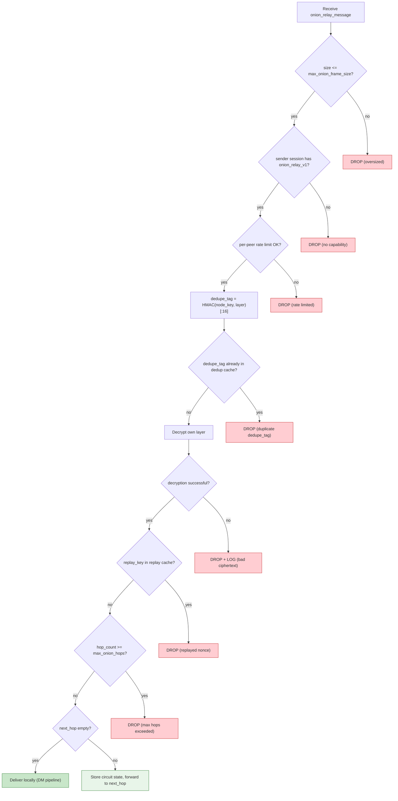
*Diagram — Inbound processing flow for onion frame*

#### Integration tests for A9 (cross-sub-iteration)

Following the same pattern as mesh relay integration tests:

- [ ] Mixed network: 6 nodes, 3 onion-capable + 3 legacy; onion DM between capable nodes, legacy unaffected
- [ ] Hop loss mid-circuit: 5 nodes, hop B goes offline after first message; second message → circuit rebuild → delivery via alternative path
- [ ] Path rebuild: sender assembles circuit, one hop goes down; verify new circuit uses different nodes
- [ ] Privacy downgrade policy: `require_onion` + no capable hops → message is **not** sent (no relay fallback)
- [ ] Full round-trip: onion DM → onion delivery receipt → onion read receipt; verify no intermediate hop sees sender/recipient pair
- [ ] Overload: flood `onion_relay_message` at one hop; verify regular relay/gossip DMs continue to be delivered
- [ ] Forward secrecy end-to-end: intercept traffic, leak long-term key of a hop, attempt decryption → fail
- [ ] Replay: re-send previously intercepted onion frame → dropped on replay check

#### Onion iteration dependency graph

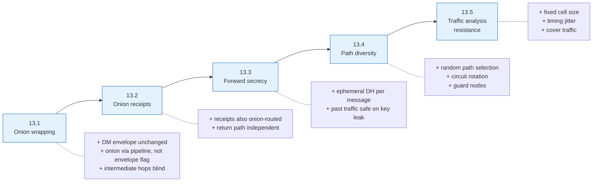
*Diagram — Onion sub-iterations (A9)*

#### Hostile-Internet Guardrails applied to A9

| Guardrail | Where enforced in A9 |
|---|---|
| 1. Bounded resource usage | 13.1: frame size limit, per-peer rate limit, onion dedup TTL, max hops. 13.2: receipt dedup, outbound rate limit. 13.3: replay cache bounded. 13.4: circuit cache bounded. |
| 2. Soft degradation | 13.1: fallback to regular relay (`best_effort_onion`) or error (`require_onion`). 13.2: receipts via regular relay with warning (`best_effort_onion`) or not sent (`require_onion`). 13.4: graceful degradation for small networks. 13.5: under overload, disable cover traffic and shrink jitter first. |
| 3. Distrust unauthenticated | 13.1: capability gate, drop invalid layers. 13.3: reject unknown/expired ephemeral keys. |
| 4. Local observations | A9.4: guard node and path selection based on local routing table and local reputation scores. |
| 5. Adaptive defenses | A9.5: cover traffic optional, off by default; timing jitter configurable, not mandatory. |
| 6. No irreversible punishments | A9.4: failed hops get cooldown, not permanent ban. |
| 7. Overload tests | A9.5: onion flood test (memory/CPU), graceful degradation test (honest traffic survives). |
| 8. Local-state semantics | A9.1: `arrived_via_onion` provenance bit stored only in local messageStore metadata — never in envelope, frame, or receipt. A9.3: replay cache and chunk reassembly state are in-memory only, not persisted. A9.5: non-persistence invariant documented with restart consequences. Privacy-relevant metadata never leaks through the wire protocol. |

*Table — Guardrail coverage across onion sub-iterations*

**Cross-sub-iteration integration tests:**

These tests exercise the interaction of multiple onion sub-iterations
simultaneously — the most realistic (and hardest to debug) failure modes:

- [ ] Integration test: mixed network + chunked onion message + receipt path under overload. Scenario: sender sends a chunked message (13.5) via a 3-hop onion path (13.4) where the network enters Iteration 3e global overload mid-delivery. Verify: chunks that passed before overload are assembled; chunks dropped by load shedding cause the group to timeout; receipt (13.2) follows its own independent path; sender detects partial failure via missing delivery receipt and retries with new `E`. This test covers the 13.2 + 13.4 + 13.5 + global overload interaction.

<a id="iter-14"></a>
### Iteration 14 — Global names instead of raw identity

**Goal:** introduce a global naming layer so users can find and recognize peers
without memorizing fingerprints.

**Dependency:** follows A1 because local naming UX should exist first.

**Done when:** a user can publish, resolve, and verify a global name bound to
an identity with conflict handling and ownership proof.

<a id="iter-15"></a>
### Iteration 15 — Gazeta protocol extensions

**Goal:** expand the anonymous/broadcast protocol where it creates clear product
value beyond direct messaging.

**Why later:** useful, but easier to define once the main anonymous/broadcast
story is sharper.

**Done when:** the protocol gains clearly specified extensions with documented
use-cases and compatibility rules.

<a id="iter-16"></a>
### Iteration 16 — iOS app

**Goal:** ship the second mobile client on iOS.

**Dependency:** should follow Android so mobile UX and sync assumptions are
already validated.

**Done when:** iOS reaches parity with the scoped Android light-client feature
set that is practical on the chosen framework.

<a id="iter-17"></a>
### Iteration 17 — BLE last mile

**Goal:** add a short-range local transport so that nearby devices can exchange
CORSA messages over Bluetooth Low Energy without internet connectivity. BLE
operates as an additional transport behind the existing transport abstraction —
identity, encryption, and routing semantics remain unchanged.

**Dependency:** follows mobile (A12) because the mobile transport abstraction
must be proven before adding a second mobile-specific transport. Also
benefits from the relay subsystem (Iteration 1) and routing table
(Iteration 1) for multi-hop BLE mesh paths.

**Done when:** all four sub-iterations below are complete.

**Wire encoding: compact binary, not JSON.** The main TCP transport uses
JSON-encoded frames (`announce_routes`, `nat_ping_request`, etc.). BLE
bandwidth is 1–2 orders of magnitude lower — JSON overhead (keys, quotes,
braces) is unacceptable. All BLE wire frames use a **compact binary TLV
encoding**: fixed-size fields where possible, varint-encoded lengths, no
field names on the wire. The TLV schema maps 1:1 to the same logical
frame types used by the TCP transport (ANNOUNCE, route data, DM relay),
so the routing and delivery layers see identical semantics — only the
serialization differs. The same applies to Meshtastic (Iteration 18),
which inherits BLE's compact encoding with even tighter constraints.

#### BLE transport model

A BLE node operates in two roles simultaneously: **Central** (scans for and
connects to nearby peers) and **Peripheral** (advertises and accepts
connections from incoming centrals). This dual-role design allows every device
to both discover peers and be discoverable, forming a symmetric local mesh.

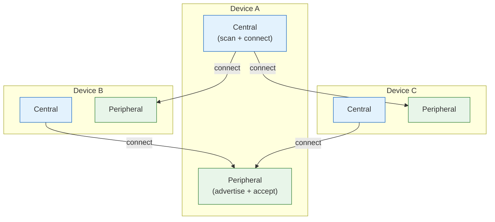
*Diagram — Dual BLE role model: every device is simultaneously Central and Peripheral*

#### BLE topology discovery

Peers discover each other via **ANNOUNCE** messages broadcast over BLE. Each
ANNOUNCE carries a TLV-encoded neighbor list so that every node builds a local
view of the BLE mesh topology.

**Neighbor-list TLV format:**

| Field | Size | Description |
|-------|------|-------------|
| type | 1 byte | `0x04` — neighbor list |
| length | 1 byte | total bytes in value field |
| value | 8 × N bytes | concatenated 8-byte identity fingerprints of known neighbors |

**Edge validation rule:** a link A↔B is considered valid only when both A
claims B as a neighbor **and** B claims A as a neighbor (bidirectional
confirmation), and both claims are fresh (within `ble_announce_freshness`,
default 60 seconds). Unidirectional or stale claims are ignored — this
prevents topology spoofing.

**Route computation:** BFS over the confirmed bidirectional graph yields the
shortest multi-hop path. If a valid route exists within `ble_max_hops`
(default 4), BLE source routing is used; otherwise the message falls back to
flood relay.

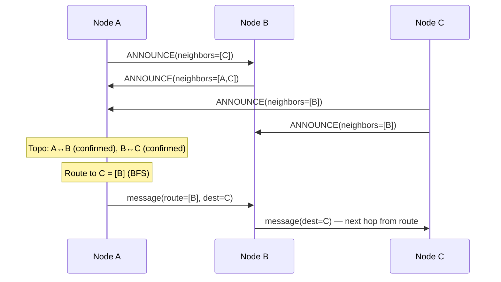
*Diagram — BLE topology discovery and source-routed delivery*

<a id="iter-17-1"></a>
#### 17.1 — BLE transport and peer discovery

**Goal:** establish BLE as a working transport: scan, advertise, connect,
exchange CORSA frames, discover peers via ANNOUNCE.

**How it works:** the BLE transport implements the common transport interface
(`isPeerConnected()`, `isPeerReachable()`, `send()`). A single maintenance
timer (default 5 seconds) handles peer connectivity checks, stale topology
pruning, write queue drains, and relay buffer flushing.

**Peer reachability model:** a BLE peer is reachable if it has an active
connection **or** recent activity within a freshness window (default 300 s
for handshake-verified peers, 30 s for unverified). This two-tier freshness
prevents routing through nodes that disappeared without explicit disconnect.

**ANNOUNCE throttling:** announce interval adapts to mesh density —
`ble_announce_interval_dense` (default 30 s, when peer count >
`ble_high_degree_threshold`) vs `ble_announce_interval_sparse` (default 10 s).
Recent incoming traffic can trigger a shorter nudge interval to accelerate
topology convergence.

**Signed ANNOUNCE binding:** every ANNOUNCE carries a signature covering
`identity_fingerprint || noise_public_key || ed25519_public_key || nickname ||
timestamp`. This binds the announced identity to the cryptographic keys and
prevents spoofing without the signing key.

**Progress:**

- [ ] Implement dual-role BLE service (Central + Peripheral)
- [ ] Implement ANNOUNCE broadcast with TLV neighbor list
- [ ] Implement signed ANNOUNCE binding (Ed25519 signature)
- [ ] Implement bidirectional edge validation in topology tracker
- [ ] Implement BFS route computation over confirmed graph
- [ ] Implement source routing with flood fallback
- [ ] Implement peer freshness with two-tier reachability (verified/unverified)
- [ ] Implement adaptive announce throttling (dense vs sparse)
- [ ] Implement single maintenance timer for pruning/drain/flush
- [ ] Unit test: unidirectional claim rejected, bidirectional claim accepted
- [ ] Unit test: stale announce (> freshness threshold) pruned
- [ ] Unit test: BFS route correct for diamond topology
- [ ] Unit test: source route with flood fallback when no route
- [ ] Unit test: signed ANNOUNCE with wrong key rejected
- [ ] Update `docs/protocol/relay.md` (BLE transport registration, ANNOUNCE TLV format)
- [ ] Update `docs/encryption.md` (ANNOUNCE binding signature scheme)
- [ ] Update `docs/protocol/delivery.md` (BLE reachability model, transport selection)

**Release / Compatibility for 17.1:**

BLE transport is additive — nodes without BLE support are unaffected. BLE
presence is gated behind a capability flag (`ble_transport`). Existing
WebSocket and relay paths remain the primary transport.

<a id="iter-17-2"></a>
#### 17.2 — BLE fragmentation and MTU adaptation

**Goal:** reliably deliver CORSA frames that exceed the BLE link MTU via
per-link fragmentation and reassembly.

**Problem:** BLE MTU is typically 23–517 bytes depending on negotiated ATT
MTU. CORSA frames (especially onion-wrapped DMs, file transfers) commonly
exceed this. Without fragmentation, large messages are silently dropped.

**Fragmentation model:** when a frame exceeds the effective chunk size for a
given link, it is split into numbered fragments. Each fragment is a
self-contained BLE packet carrying reassembly metadata.

**Effective chunk size:** `chunk_size = max(ble_min_chunk, link_mtu -
fragment_overhead)`. Fragment overhead = 13 (header) + 8 (sender) + 8
(recipient) + 5 (fragment metadata: original_type 1b + total_fragments 2b BE
+ fragment_index 2b BE) = 34 bytes. Default link MTU = 469 bytes, yielding
chunk_size = 435 bytes. `ble_min_chunk` = 64 bytes — hard floor.

**For broadcasts:** the effective chunk size is `min(link_mtu) - overhead`
across all connected links, ensuring every peer can receive each fragment.

**Fragment packet structure:**

| Field | Size | Description |
|-------|------|-------------|
| original_type | 1 byte | message type of the original packet |
| total_fragments | 2 bytes BE | total number of fragments |
| fragment_index | 2 bytes BE | 0-based index of this fragment |
| chunk_data | variable | fragment payload |

The fragment preserves the original packet's sender, recipient, signature,
route, and TTL.

**Reassembly algorithm:** fragments are keyed by `(sender, timestamp)`.
Each key maps to a sparse index → data map. When all indices are present,
fragments are sorted, concatenated, decoded as the original type, and the
reassembly slot is cleaned up.

**Resource limits:**

| Parameter | Default | Purpose |
|-----------|---------|---------|
| `ble_max_inflight_assemblies` | 50 | cap on concurrent reassembly slots |
| `ble_fragment_assembly_timeout` | 30 s | timeout for incomplete assemblies |
| `ble_per_stream_timeout` | 30 s | per-sender stream timeout |
| memory estimate per slot | ~10.4 KB | bounded memory consumption |

On overflow: reject new assemblies and garbage-collect the oldest incomplete
slots. Missing fragments after timeout → drop the entire message.

**Fragment staggering:** fragments are not sent back-to-back. A delay of
`ble_fragment_stagger_ms` (default 15 ms) between fragments balances
timeliness against peripheral buffer pressure.

**Error handling:** missing fragments → timeout → drop; out-of-order →
sparse map handles natively; duplicates → idempotent overwrite; assembly
exhaustion → reject new + cleanup oldest.

**Progress:**

- [ ] Implement per-link MTU negotiation and chunk size computation
- [ ] Implement fragment split (respecting min chunk floor)
- [ ] Implement broadcast chunk size (min across all links)
- [ ] Implement sparse-index reassembly with (sender, timestamp) keying
- [ ] Implement assembly timeout and max-inflight-assemblies cap
- [ ] Implement fragment staggering with configurable delay
- [ ] Implement route inheritance for v2 fragments
- [ ] Unit test: frame exactly at MTU → no fragmentation
- [ ] Unit test: frame at MTU+1 → 2 fragments, correct reassembly
- [ ] Unit test: out-of-order fragments → correct reassembly
- [ ] Unit test: duplicate fragment → idempotent (no corruption)
- [ ] Unit test: assembly timeout → slot cleaned up
- [ ] Unit test: max-inflight exceeded → oldest evicted
- [ ] Unit test: broadcast chunk size = min(link_mtu) across links
- [ ] Overload test: fragment flood does not cause unbounded memory growth
- [ ] Update `docs/protocol/relay.md` (fragment packet format, reassembly contract)
- [ ] Update `docs/protocol/delivery.md` (fragment priority, staggering parameters)

<a id="iter-17-3"></a>
#### 17.3 — BLE deduplication and relay

**Goal:** prevent message amplification in the BLE mesh while ensuring
reliable multi-hop delivery.

**Problem:** BLE mesh is inherently dense at short range — the same message
can arrive from multiple peers via different paths. Without deduplication and
controlled relay, a single broadcast in a 10-node cluster becomes a flood of
O(N²) retransmissions.

**Deduplication identity:** composite key
`"{sender_hex}-{timestamp_ms}-{message_type}"`. This is deterministic — any
node receiving the same original message computes the same dedup ID.

**Bloom filter cache:** a compact probabilistic cache with bounded memory.
False positives cause occasional message drops (acceptable for gossip
semantics); false negatives are impossible (no duplicate amplification).
The filter is cleared on panic/reset.

**Self-broadcast pre-marking:** before broadcasting a message, the node marks
its own dedup ID in the filter. This prevents the message from being processed
a second time if it echoes back through the mesh.

**Ingress suppression:** for each message, the node records which link it
arrived from (`ingress_by_message[dedup_id] = ingress_link`). When relaying,
the ingress link is excluded from the relay candidate set — the message is
never sent back the way it came.

**Deterministic K-of-N fanout:** to prevent storms in dense meshes, broadcast
messages use a deterministic subset of relay candidates. The dedup ID is used
as a seed to pick K out of N eligible links. Special cases:

| Message type | Fanout strategy |
|--------------|-----------------|
| ANNOUNCE | all links (full flood) |
| REQUEST_SYNC | all links |
| broadcast MESSAGE | K-of-N subset (seed = dedup_id) |
| directed/routed | all relevant links |
| routed fragments | inherit parent routing behavior |

**Adaptive relay aggressiveness:** nodes with degree > `ble_high_degree_threshold`
(default 8) reduce K/N ratio to dampen storms. Low-degree nodes relay at
full aggressiveness to ensure connectivity.

**TTL enforcement:** each relay decrements TTL before forwarding. Packets
arriving with TTL = 0 are not relayed. Default TTL = `ble_message_ttl`
(default 3).

**Gossip sync protocol (GCS):** for eventual consistency, nodes periodically
exchange compact Golomb-Coded Set (GCS) filters representing their seen-message
sets. A node receiving a GCS filter can determine which messages the peer is
missing and retransmit them.

| Parameter | Default | Purpose |
|-----------|---------|---------|
| `ble_sync_seen_capacity` | 10,000 | max entries in seen-message set |
| `ble_gcs_max_bytes` | 4,096 | max GCS filter size |
| `ble_gcs_target_fpr` | 0.01 | target false positive rate |
| `ble_sync_cadence_text` | 10 s | sync interval for text messages |
| `ble_sync_cadence_fragment` | 30 s | sync interval for fragments |
| `ble_sync_cadence_file` | 60 s | sync interval for file transfers |

**Progress:**

- [ ] Implement Bloom filter dedup cache with bounded memory
- [ ] Implement composite dedup ID generation
- [ ] Implement self-broadcast pre-marking
- [ ] Implement ingress suppression (exclude arrival link from relay set)
- [ ] Implement deterministic K-of-N fanout (seeded by dedup ID)
- [ ] Implement adaptive relay aggressiveness (density-aware K/N ratio)
- [ ] Implement TTL enforcement on relay
- [ ] Implement GCS-based gossip sync protocol
- [ ] Implement per-type sync cadence (text > fragments > file transfers)
- [ ] Unit test: self-broadcast pre-marked → echo not re-processed
- [ ] Unit test: ingress link excluded from relay candidates
- [ ] Unit test: K-of-N fanout deterministic for same dedup ID
- [ ] Unit test: high-degree node reduces relay aggressiveness
- [ ] Unit test: TTL=0 → not relayed
- [ ] Unit test: GCS round-trip encodes/decodes correctly
- [ ] Overload test: 20-node cluster broadcast does not amplify beyond O(N·K)
- [ ] Update `docs/protocol/relay.md` (BLE dedup model, fanout strategy, GCS sync)
- [ ] Update `docs/encryption.md` (Bloom filter parameterization, dedup ID composition)

<a id="iter-17-4"></a>
#### 17.4 — BLE rate limiting and QoS

**Goal:** prevent any single peer, message type, or traffic pattern from
starving others on the constrained BLE transport.

**Problem:** BLE bandwidth is 1–2 orders of magnitude below WebSocket. Without
explicit QoS, a single file transfer or fragment flood can block all DM
delivery for other peers.

**Outbound priority scheduling:** every BLE write is assigned a priority
class. When the peripheral is busy, writes are enqueued by priority; when the
peripheral becomes ready, the highest-priority write is dequeued first.

**Priority hierarchy (descending):**

| Priority | Traffic class | Rationale |
|----------|---------------|-----------|
| 1 (highest) | control frames (ANNOUNCE, handshake) | topology and session setup |
| 2 | fragments (by total_fragments ascending) | smaller fragment groups first |
| 3 | DM / receipt | user-facing latency-sensitive |
| 4 | file transfer | bulk, latency-tolerant |
| 5 (lowest) | gossip sync, low-priority | best-effort background |

Within priority 2, fragment groups with fewer total fragments are sent first —
a 2-fragment message completes ahead of a 16-fragment file.

**Per-peripheral write backpressure:** each connected peripheral has an
independent write queue. If the peripheral signals "not ready" (buffer full),
writes accumulate in the priority queue. When the "ready" callback fires, the
highest-priority pending write is sent. This prevents one slow peripheral from
blocking writes to others.

**Fragment pacing:** fragments are staggered with
`ble_fragment_stagger_ms` (default 15 ms) between sends. This balances
delivery timeliness against peripheral buffer saturation.

**Transfer concurrency limiting:** at most `ble_max_concurrent_transfers`
(default 3) large fragmented transfers (file transfers) may be in-flight
simultaneously. Additional transfers are queued and dequeued on completion.
This prevents bulk transfers from monopolizing the BLE link.

**Announce rate limiting:** subscription-level rate limiting tracks per-peer
`last_announce_time`, attempt count, and backoff interval. This prevents
enumeration attacks (an adversary rapidly requesting ANNOUNCEs to map the
mesh) and limits announce storms in dense networks.

**Adaptive scanning:** the BLE scanner adjusts duty cycle based on mesh
conditions:

| Condition | Scan behavior |
|-----------|---------------|
| isolated (0 peers) | aggressive scan, long windows |
| sparse (1–3 peers) | normal duty cycle |
| dense (> threshold) | reduced scan, save battery |
| recent activity | short nudge scan for convergence |
| low battery | minimal scan, longest intervals |

**Store-and-forward outbox:** when a peer is not currently reachable over BLE,
messages are queued in a per-peer outbox. Limits: `ble_outbox_max_per_peer`
(default 100 messages), `ble_outbox_ttl` (default 24 h), FIFO eviction on
overflow. When the peer becomes reachable, the outbox is flushed.

**Operational limits summary:**

| Parameter | Default | Purpose |
|-----------|---------|---------|
| `ble_high_degree_threshold` | 8 | above this, reduce relay/announce aggressiveness |
| `ble_max_concurrent_transfers` | 3 | cap on simultaneous bulk transfers |
| `ble_outbox_max_per_peer` | 100 | per-peer store-and-forward cap |
| `ble_outbox_ttl` | 86,400 s | outbox message lifetime |
| `ble_connection_budget` | 7 | max simultaneous BLE connections |
| `ble_connect_timeout` | 10 s | connection attempt timeout (with backoff) |
| `ble_maintenance_interval` | 5 s | periodic maintenance timer |
| `ble_dynamic_rssi_threshold` | -75 dBm | minimum signal strength for connection |

**Progress:**

- [ ] Implement priority queue with 5-level hierarchy
- [ ] Implement per-peripheral write backpressure (independent queues)
- [ ] Implement fragment pacing with configurable stagger delay
- [ ] Implement transfer concurrency limiter
- [ ] Implement announce rate limiting (per-peer backoff)
- [ ] Implement adaptive scanning (density/battery/activity-aware)
- [ ] Implement store-and-forward outbox with TTL and FIFO eviction
- [ ] Implement connection budget enforcement
- [ ] Unit test: priority ordering — control > fragment > DM > file > gossip
- [ ] Unit test: small fragment group dequeued before large fragment group
- [ ] Unit test: peripheral not-ready → write queued, ready → dequeued by priority
- [ ] Unit test: concurrent transfer cap → excess queued, dequeued on completion
- [ ] Unit test: outbox flush triggered on peer reachability change
- [ ] Unit test: outbox TTL expiry → stale messages evicted
- [ ] Unit test: adaptive scan duty cycle adjusts to peer count
- [ ] Overload test: file transfer flood does not block DM delivery
- [ ] Overload test: announce storm does not exhaust CPU/memory
- [ ] Update `docs/protocol/relay.md` (BLE QoS priority hierarchy, backpressure model)
- [ ] Update `docs/encryption.md` (handshake rate limiting parameters)
- [ ] Update `docs/protocol/delivery.md` (BLE outbox, transfer concurrency, scan adaptation)

**Panic mode (BLE-specific):** on panic trigger, the BLE subsystem clears all
pending write queues, relay buffers, dedup state, store-and-forward outboxes,
fragment assembly slots, and topology state. Noise sessions are wiped. The
BLE service is rebuilt from scratch with a fresh identity. This ensures no
local BLE state survives an emergency wipe. What survives: OS-level BLE
bonding (outside app control), remote peers' cached topology entries (expire
naturally via freshness TTL).

<a id="iter-18"></a>
### Iteration 18 — Meshtastic last mile

**Goal:** integrate a radio-based last-mile path via Meshtastic LoRa hardware,
enabling CORSA message delivery in off-grid, field, or infrastructure-denied
environments. Meshtastic operates as a transport bridge — it carries CORSA
frames over LoRa radio without altering identity, encryption, or routing
semantics above the transport layer.

**Dependency:** follows BLE (A13) because Meshtastic shares the constrained-
transport challenges (fragmentation, QoS, dedup) already solved for BLE, and
the transport abstraction must support both. Radio-specific adaptations build
on the BLE transport patterns.

**Done when:** all three sub-iterations below are complete.

**Wire encoding: compact binary (inherited from BLE).** Meshtastic
bandwidth is 1–10 kbit/s — even more constrained than BLE. All CORSA
frames bridged over Meshtastic use the same **compact binary TLV
encoding** defined for BLE (Iteration 17). JSON is never sent over the
radio link. The Meshtastic transport bridge serializes CORSA frames into
`DATA_APP` packets using this compact format; the receiving bridge
deserializes back into standard CORSA frames for the routing layer.

#### Why Meshtastic

Meshtastic devices form LoRa mesh networks at 868/915 MHz with range of 1–10+
km depending on terrain and antenna. They communicate via Bluetooth or serial
with a companion device (phone/laptop). CORSA uses the Meshtastic device as a
radio modem — the companion device runs the CORSA node and bridges frames to
the LoRa mesh through the Meshtastic serial/BLE API.

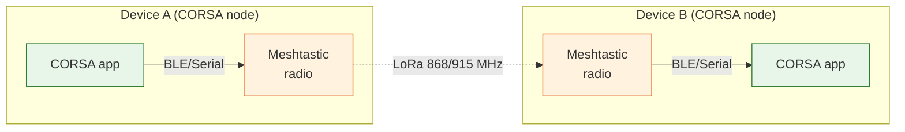
*Diagram — Meshtastic as a radio transport bridge for CORSA*

#### Radio constraints vs BLE

| Property | BLE (A13) | Meshtastic (A14) |
|----------|-----------|------------------|
| Range | 10–100 m | 1–10+ km |
| MTU | 469 bytes (typical) | 237 bytes (max LoRa payload) |
| Bandwidth | ~1 Mbit/s | ~1–10 kbit/s |
| Latency | 5–50 ms | 500 ms – 5 s per hop |
| Duty cycle | unrestricted | regulatory limit (1–10% in EU) |
| Power | mW range | 100 mW – 1 W |
| Topology | dense local mesh | sparse long-range mesh |

These constraints mean Meshtastic reuses BLE patterns (fragmentation, QoS,
dedup) but with tighter limits and different tuning.

<a id="iter-18-1"></a>
#### 18.1 — Meshtastic transport bridge

**Goal:** establish the Meshtastic serial/BLE API as a working CORSA
transport: send frames, receive frames, discover radio-reachable peers.

**How it works:** the Meshtastic transport implements the same transport
interface as BLE (`isPeerConnected()`, `isPeerReachable()`, `send()`). The
CORSA node communicates with the local Meshtastic device via its protobuf
serial API. Outbound CORSA frames are serialized into Meshtastic
`DATA_APP` packets on a dedicated port number; inbound packets on that port
are deserialized back into CORSA frames.

**Peer discovery:** Meshtastic provides its own node discovery via
`NodeInfo` messages. The CORSA transport maps Meshtastic node IDs to CORSA
identity fingerprints using an ANNOUNCE exchange over the radio channel.
The mapping is cached with the same freshness model as BLE (two-tier:
verified / unverified).

**Channel isolation:** CORSA traffic uses a dedicated Meshtastic channel
(configurable `meshtastic_channel_index`, default 1) separate from the
default Meshtastic chat channel. This prevents CORSA frames from appearing
as garbled text in the Meshtastic app and isolates CORSA traffic from
non-CORSA Meshtastic users.

**Progress:**

- [ ] Implement Meshtastic serial/BLE API client (protobuf)
- [ ] Implement CORSA frame serialization into `DATA_APP` packets
- [ ] Implement dedicated channel isolation (`meshtastic_channel_index`)
- [ ] Implement peer discovery via NodeInfo → ANNOUNCE mapping
- [ ] Implement transport interface (isPeerConnected, isPeerReachable, send)
- [ ] Implement Meshtastic node ID → CORSA fingerprint cache
- [ ] Unit test: CORSA frame round-trips through Meshtastic serialization
- [ ] Unit test: channel isolation — CORSA frames only on configured channel
- [ ] Unit test: peer discovery maps Meshtastic nodeID to CORSA fingerprint
- [ ] Integration test: two CORSA nodes exchange DM via Meshtastic bridge
- [ ] Update `docs/protocol/relay.md` (Meshtastic transport registration, channel config)
- [ ] Update `docs/protocol/delivery.md` (Meshtastic reachability model)

<a id="iter-18-2"></a>
#### 18.2 — Radio-aware fragmentation and pacing

**Goal:** deliver frames exceeding the LoRa MTU (237 bytes) reliably, with
pacing that respects regulatory duty cycle limits.

**Problem:** Meshtastic max payload is 237 bytes — roughly half of BLE. A
typical DM frame (with onion wrapping) easily exceeds this. Additionally,
LoRa operates under regulatory duty cycle limits (1% in EU 868 MHz, 10% in
US 915 MHz) — sending too many fragments too fast violates regulations and
causes packet loss.

**Fragmentation:** reuses the 17.2 fragmentation model with radio-specific
parameters:

| Parameter | BLE (A13) | Meshtastic (A14) |
|-----------|-----------|------------------|
| default MTU | 469 bytes | 237 bytes |
| min chunk size | 64 bytes | 32 bytes |
| fragment overhead | 34 bytes | 34 bytes |
| effective chunk | 435 bytes | 203 bytes |
| max inflight assemblies | 50 | 20 |
| assembly timeout | 30 s | 120 s |

**Duty-cycle-aware pacing:** instead of BLE's fixed stagger delay, Meshtastic
fragments are paced based on the remaining duty cycle budget. The transport
tracks cumulative airtime and pauses transmission when approaching the duty
cycle ceiling. Configuration: `meshtastic_duty_cycle_limit` (default 0.1 for
US, 0.01 for EU), `meshtastic_airtime_window` (default 3600 s).

**Airtime estimation:** each fragment's airtime is estimated from payload
size, spreading factor, and bandwidth: `airtime_ms ≈ preamble_ms +
(payload_bytes × 8 / bitrate)`. The transport maintains a sliding window of
cumulative airtime and blocks sends when `cumulative_airtime /
airtime_window > duty_cycle_limit`.

**Fragment priority:** same 5-level priority hierarchy as 17.4, but with
an additional rule: when duty cycle budget is low (< 20% remaining), only
priority 1–2 (control + fragments for in-progress assemblies) are sent;
lower priorities are deferred until the budget recovers.

**Progress:**

- [ ] Implement radio MTU detection and chunk size computation
- [ ] Implement duty-cycle-aware pacing with airtime tracking
- [ ] Implement airtime estimation (SF/BW-aware)
- [ ] Implement duty-cycle budget gating (priority cutoff at low budget)
- [ ] Implement extended assembly timeout for radio latency
- [ ] Unit test: frame at 237 bytes → no fragmentation
- [ ] Unit test: frame at 238 bytes → 2 fragments, correct reassembly
- [ ] Unit test: duty cycle exceeded → send blocked until budget recovers
- [ ] Unit test: low budget → only priority 1–2 sent
- [ ] Unit test: assembly timeout 120s honored (not 30s BLE default)
- [ ] Overload test: fragment flood respects duty cycle limit
- [ ] Update `docs/protocol/relay.md` (radio fragmentation parameters, duty cycle pacing)
- [ ] Update `docs/protocol/delivery.md` (Meshtastic QoS, airtime budget)

<a id="iter-18-3"></a>
#### 18.3 — Radio mesh relay and deduplication

**Goal:** enable multi-hop message relay over the LoRa mesh while preventing
amplification in the low-bandwidth radio environment.

**Problem:** LoRa bandwidth is ~1000× lower than BLE. A broadcast storm that
is merely annoying on BLE becomes fatal on LoRa — a single amplification loop
can saturate the channel for minutes and violate duty cycle regulations.

**Deduplication:** reuses the 17.3 Bloom filter + ingress suppression model.
The dedup cache is sized smaller for radio: `meshtastic_dedup_capacity`
(default 2,000 entries) with TTL = 300 s (longer than BLE, because radio
messages propagate slower).

**Relay fanout:** in the radio context, K-of-N fanout is more aggressive —
default K = 1 for broadcasts (single-relay gossip). Only ANNOUNCE and
directed messages use full fanout. This is necessary because each radio
retransmission consumes shared airtime.

| Message type | Radio fanout | BLE fanout |
|--------------|-------------|------------|
| ANNOUNCE | all | all |
| directed | all relevant | all relevant |
| broadcast MESSAGE | K=1 (single relay) | K-of-N subset |
| gossip sync | suppressed | K-of-N |

**Gossip sync suppression:** GCS-based gossip sync (17.3) is **disabled** on
the Meshtastic transport by default. The airtime cost of exchanging GCS
filters outweighs the benefit at LoRa data rates. Instead, missing messages
are detected via delivery receipts and retransmitted on demand.

**TTL:** `meshtastic_message_ttl` (default 2). Lower than BLE because each
radio hop is expensive; messages that need more hops should use the internet-
connected mesh instead.

**Bridge relay:** when a CORSA node has both BLE and Meshtastic transports
active, it can bridge between them. A message arriving via LoRa can be
relayed onto BLE (and vice versa) if the routing table indicates the
destination is reachable on the other transport. Bridge relay follows the
standard transport selection logic — no special-case code.

**Progress:**

- [ ] Implement radio-specific Bloom filter dedup (smaller capacity, longer TTL)
- [ ] Implement K=1 single-relay gossip for radio broadcasts
- [ ] Implement gossip sync suppression flag for Meshtastic transport
- [ ] Implement radio TTL enforcement (default 2)
- [ ] Implement BLE↔Meshtastic bridge relay via transport selection
- [ ] Unit test: radio dedup prevents amplification on retransmit
- [ ] Unit test: K=1 fanout — broadcast relayed to exactly 1 peer
- [ ] Unit test: gossip sync disabled on Meshtastic by default
- [ ] Unit test: bridge relay — LoRa→BLE and BLE→LoRa paths work
- [ ] Unit test: radio TTL=0 → not relayed
- [ ] Overload test: radio broadcast storm bounded by K=1 + TTL=2
- [ ] Integration test: 3-node chain A(BLE)→B(BLE+LoRa)→C(LoRa) delivers DM
- [ ] Update `docs/protocol/relay.md` (radio relay rules, bridge relay, gossip suppression)
- [ ] Update `docs/encryption.md` (Bloom filter sizing for radio)
- [ ] Update `docs/protocol/delivery.md` (Meshtastic TTL, bridge transport selection)

<a id="iter-19"></a>
### Iteration 19 — Custom encryption builder

**Goal:** keep any custom "brick-based" encryption workflow strictly isolated as
an experimental laboratory feature.

**Constraint:** this must never replace audited cryptography or be marketed as
stronger than reviewed encryption.

**Done when:** if implemented at all, it is clearly marked unsafe/experimental,
disabled by default, and separated from the main security claims of the
product.

<a id="iter-20"></a>
### Iteration 20 — Voice calls

**Goal:** enable real-time voice communication between identities over the mesh
network, with end-to-end encryption and onion routing where available.

**Dependency:** requires stable onion delivery (A9) for private call setup and
signaling. Requires reliable relay (Iterations 1–3) for media transport.

**Transport restriction:** voice calls operate exclusively over TCP/IP mesh
connections. BLE (A13) and Meshtastic LoRa (A14) transports are explicitly
excluded — their bandwidth and latency characteristics are incompatible with
real-time audio requirements.

**Signaling protocol (MSI — Media Session Information):**

Call setup and teardown use dedicated capability-gated frame types, not
ordinary DM payloads. This is critical for mixed-version safety: a peer
without `voice_call_v1` must never receive signaling frames (it would
not know how to parse them and might surface them as opaque user content
or reject the connection).

Signaling frame types (all gated by `voice_call_v1`):

- `call_request` — initiate a call (contains session_id, codec list)
- `call_accept` — accept an incoming call (contains selected codec)
- `call_reject` — reject or cancel a call (contains reason code)
- `call_end` — terminate an active call
- `call_ringing` — signal that the callee's device is ringing
- `call_hold` / `call_resume` — hold/resume an active call

These frames are sent through the existing lossless delivery pipeline
(same transport as DM, but with distinct `type` field), optionally
wrapped in onion (Iteration 13) for privacy. A peer receiving an
unknown frame type drops it silently per the existing unknown-frame
handling rule — but the capability gate ensures this case does not
arise in normal operation.

The signaling channel carries no media — only session control. Each
signaling frame includes a `session_id` and monotonic `seq` to prevent
replay and allow multi-call multiplexing.

**Media transport — lossy channel:**

Audio packets are sent over a lossy channel where timely delivery takes
priority over reliability. Lost packets are concealed by the codec, not
retransmitted. The lossy channel uses a separate packet type from
lossless DM delivery:

- **Priority bypass:** media packets bypass congestion control when the
  send queue is saturated. This prevents file transfers or bulk messages
  from starving the audio stream — a caller should never hear silence
  because a file upload is in progress.
- **Jitter buffer:** the receiver maintains a jitter buffer (default
  60–200 ms adaptive) to smooth packet arrival variance. Buffer depth
  adapts to observed network jitter.
- **Codec negotiation:** during call setup, peers exchange supported
  codecs and select the best common option. Initial codec set: Opus
  (primary, variable bitrate 6–128 kbit/s, 20 ms frames) with fallback
  to a lower-bitrate mode for constrained links. Codec selection is
  extensible via capability negotiation.

**Congestion-aware quality adaptation:**

The call monitors RTT and packet loss per media session. When loss exceeds
a threshold (e.g. 5%), the sender reduces bitrate or switches to a
lower-quality codec preset. When conditions improve, quality ramps back
up. This is independent of the general congestion control — it is
per-call quality management.

**Group voice (future extension):**

Group voice calls relay lossy audio to a reduced set of peers (2 instead
of all) to contain bandwidth. Each peer re-relays to its own neighbors,
forming a low-fanout distribution tree. Active speaker detection can
further reduce traffic by transmitting only the dominant speaker's audio
at full rate.

**Done when:** two identities can establish a voice call with end-to-end
encryption, the call setup is signaled through onion routes (if available),
media packets are relayed with bounded latency, and the protocol degrades
gracefully when network conditions are insufficient.

**Progress:**

- [ ] Design MSI signaling protocol (call_request/call_accept/call_reject/call_end/call_ringing/call_hold/call_resume)
- [ ] Define signaling frame types in `protocol/frame.go` (distinct `type` field, not DM payload)
- [ ] Gate all signaling frames on `voice_call_v1` capability — never send to peers without it
- [ ] Implement signaling over existing lossless delivery pipeline (same transport, distinct frame types)
- [ ] Implement lossy packet type for media transport
- [ ] Implement priority bypass: media packets skip congestion control queue
- [ ] Implement jitter buffer (adaptive 60–200 ms)
- [ ] Implement Opus codec integration (variable bitrate, 20 ms frames)
- [ ] Implement codec negotiation during call setup
- [ ] Implement congestion-aware quality adaptation (bitrate reduction on loss)
- [ ] Implement call state machine (idle → ringing → active → ended)
- [ ] Integrate onion wrapping for signaling (optional, uses privacy mode from 13.1)
- [ ] Add `voice_call_v1` capability gate
- [ ] Unit test: signaling frames never sent to peers without `voice_call_v1`
- [ ] Unit test: peer without `voice_call_v1` never receives call_request (capability gate)
- [ ] Unit test: call setup and teardown state machine
- [ ] Unit test: media packet priority over bulk traffic
- [ ] Unit test: jitter buffer smoothing under variable delay
- [ ] Unit test: codec negotiation selects best common codec
- [ ] Unit test: quality adaptation reduces bitrate on packet loss
- [ ] Integration test: voice call through 3-hop relay path
- [ ] Integration test: file transfer during active call does not degrade audio
- [ ] Update `docs/protocol/relay.md` (lossy media channel, priority bypass)

<a id="iter-21"></a>
### Iteration 21 — File transfer

**Goal:** enable peer-to-peer file transfer between identities with resume
support, progress tracking, and flow control.

**Dependency:** requires stable DM delivery (Iterations 1–2). Benefits from
congestion control (Iteration 24) for bandwidth management but works without
it using a simpler rate-limiting approach.

**Capability gate:** `file_transfer_v1`. Nodes without the capability never
receive file transfer frames.

**New files:**

```
internal/core/node/
  file_transfer.go        — FileTransferManager, transfer state machine
  file_transfer_state.go  — per-peer transfer registry (256 slots per direction)
```

#### 21a. Frame types

**`file_send_request`** — initiates a new transfer:

```json
{
  "type": "file_send_request",
  "file_number": 0,
  "file_type": 0,
  "file_size": 1048576,
  "file_id": "base64_32_bytes",
  "filename": "photo.jpg"
}
```

| Field | Type | Description |
|---|---|---|
| `file_number` | `uint8` | 0–255, chosen by sender, unique per direction per peer |
| `file_type` | `uint32` | 0 = normal file, 1 = avatar, extensible |
| `file_size` | `uint64` | Total size in bytes; `UINT64_MAX` = unknown/streaming |
| `file_id` | `[32]byte` | Content hash for dedup/resume (e.g. SHA-256 of file) |
| `filename` | `string` | Optional, max 255 bytes UTF-8 |

**`file_control`** — manages an active transfer:

```json
{
  "type": "file_control",
  "send_receive": 0,
  "file_number": 0,
  "control_type": 0,
  "seek_position": 0
}
```

| Field | Type | Description |
|---|---|---|
| `send_receive` | `uint8` | 0 = targets file being sent, 1 = targets file being received |
| `file_number` | `uint8` | Identifies the transfer |
| `control_type` | `uint8` | 0 = accept/unpause, 1 = pause, 2 = kill, 3 = seek |
| `seek_position` | `uint64` | Only present when `control_type` = 3 (seek); byte offset |

**`file_data`** — carries a chunk of file content:

```json
{
  "type": "file_data",
  "file_number": 0,
  "data": "base64_chunk"
}
```

| Field | Type | Description |
|---|---|---|
| `file_number` | `uint8` | Identifies the transfer |
| `data` | `[]byte` | 0–1371 bytes; chunk < max size signals transfer completion for unknown-size files |

#### 21b. Transfer state machine

Each file transfer (identified by `(peer, direction, file_number)`) goes
through these states:

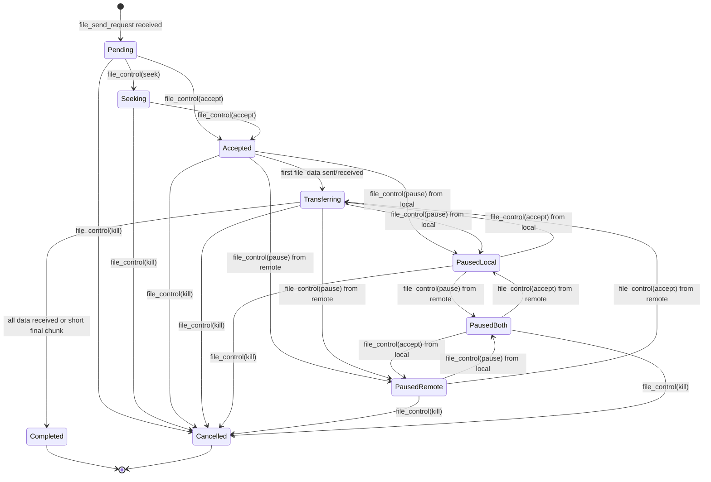
*Diagram — File transfer state machine with bidirectional pause*

**Key invariant:** when a side pauses, only that side can unpause. If both
pause, both must unpause before data flows again.

#### 21c. Transfer initiation and resume flow

```mermaid
sequenceDiagram
    participant S as Sender
    participant R as Receiver

    S->>R: file_send_request(file_number=0, type=0, size=1048576, file_id=SHA256, name="photo.jpg")
    Note over R: Check local storage by file_id<br/>Found partial: 524288 bytes received

    R->>S: file_control(send_receive=1, file_number=0, control_type=3, seek=524288)
    Note over S: Seek to byte 524288

    R->>S: file_control(send_receive=1, file_number=0, control_type=0)
    Note over S: Transfer accepted, start sending from offset 524288

    loop Until all data sent
        S->>R: file_data(file_number=0, data=[1371 bytes])
    end

    S->>R: file_data(file_number=0, data=[remaining bytes, < 1371])
    Note over R: Chunk < max size OR total == file_size<br/>Transfer complete

    Note over S: Transport layer confirms last chunk acked<br/>Transfer complete, file_number=0 free for reuse
```
*Diagram — File transfer with seek/resume after partial download*

#### 21d. Concurrent transfers and file number management

```
Peer A → Peer B (outgoing):  file_numbers 0–255 (chosen by A)
Peer B → Peer A (outgoing):  file_numbers 0–255 (chosen by B)
                              ─────────────────────────────────
                              Total: 512 concurrent transfers per peer pair
```

The `send_receive` field in `file_control` distinguishes direction. When
`send_receive=0`, the control targets a file being **sent** by the sender of
the control. When `send_receive=1`, it targets a file being **received**.

**File number lifecycle:** a file number is occupied from `file_send_request`
until `Completed` or `Cancelled`. On completion or cancellation, the number
is immediately freed for reuse. If the peer goes offline, all file numbers
are freed.

```go
type FileTransferRegistry struct {
    mu       sync.RWMutex
    outgoing [256]*FileTransfer // files we are sending
    incoming [256]*FileTransfer // files we are receiving
}

type FileTransfer struct {
    FileNumber   uint8
    FileType     uint32
    FileSize     uint64           // UINT64_MAX = unknown
    FileID       [32]byte
    Filename     string
    State        FileTransferState
    BytesSent    uint64           // sender tracks
    BytesRecvd   uint64           // receiver tracks
    SeekPosition uint64           // from seek control
    PausedLocal  bool
    PausedRemote bool
    CreatedAt    time.Time
}
```

#### 21e. Completion detection

Two rules determine when a transfer is complete:

1. **Known size:** `BytesRecvd == FileSize` → transfer complete. Any extra
   data beyond `FileSize` is discarded.
2. **Unknown size** (`FileSize == UINT64_MAX`): a `file_data` chunk with
   `len(data) < max_chunk_size` (1371 bytes) signals completion. A 0-length
   chunk completes a 0-byte file.

**Critical invariant for unknown-size transfers:** all non-final chunks
MUST be exactly `max_chunk_size` (1371 bytes). A sender MUST NOT emit a
shorter chunk for pacing, flow control, or any other reason before the
final chunk. If the sender needs to throttle throughput, it adjusts the
inter-chunk delay, not the chunk size. This invariant is what makes
`len(data) < max_chunk_size` a reliable end-of-stream signal. Violating
it terminates the transfer prematurely on the receiver side.

```mermaid
flowchart TD
    RECV["Receive file_data chunk"]
    KNOWN{"FileSize known?"}
    CHECK_SIZE{"BytesRecvd == FileSize?"}
    CHECK_SHORT{"len(data) < 1371?"}
    ADD["BytesRecvd += len(data)"]
    COMPLETE["Transfer COMPLETE<br/>free file_number"]
    CONTINUE["Continue receiving"]

    RECV --> ADD --> KNOWN
    KNOWN -->|yes| CHECK_SIZE
    KNOWN -->|no, UINT64_MAX| CHECK_SHORT
    CHECK_SIZE -->|yes| COMPLETE
    CHECK_SIZE -->|no| CONTINUE
    CHECK_SHORT -->|yes| COMPLETE
    CHECK_SHORT -->|no| CONTINUE

    style COMPLETE fill:#c8e6c9,stroke:#2e7d32
```
*Diagram — Completion detection: known vs unknown file size*

The sender confirms completion when the transport layer acknowledges the
last `file_data` chunk (using the lossless delivery tracking from
`net_crypto` / mesh relay).

#### 21f. Avatar transfer optimization

Avatar transfers (file_type=1) use the `file_id` as the content hash
(SHA-256 of the avatar image). Before sending avatar data:

1. Sender sends `file_send_request` with type=1 and file_id=SHA256(avatar).
2. Receiver checks local avatar cache by file_id.
3. If already cached → receiver sends `file_control(kill)` immediately
   (no data transfer needed).
4. If not cached → normal accept/transfer flow.

This avoids redundant avatar transfers on every reconnect.

#### 21g. Interaction with message delivery

File data is classified as **bulk** traffic (see Iteration 24). This means:

- When congestion control is active (Iteration 24), file data yields
  bandwidth to signaling and real-time packets.
- Without Iteration 24, a simple token bucket rate limiter is used:
  `max_file_data_rate` (default 100 chunks/sec per peer). This prevents
  file transfers from monopolizing the connection.
- DM messages are always sent as lossless priority traffic and are never
  blocked by file transfers.

```mermaid
flowchart LR
    DM["DM messages<br/>(lossless, priority)"]
    FILE["File data<br/>(bulk, rate-limited)"]
    VOICE["Voice packets<br/>(lossy, bypass)"]
    QUEUE["Send queue"]
    LINK["Network link"]

    DM -->|always sent| QUEUE
    VOICE -->|bypass queue| LINK
    FILE -->|rate-limited| QUEUE
    QUEUE --> LINK

    style DM fill:#e3f2fd,stroke:#1565c0
    style VOICE fill:#fff3e0,stroke:#e65100
    style FILE fill:#f5f5f5,stroke:#9e9e9e
```
*Diagram — Traffic priority: DM > voice (bypass) > file data (rate-limited)*

#### 21h. Offline behavior and cleanup

When a peer session closes:

1. All active transfers (both incoming and outgoing) are moved to `Cancelled`.
2. All 256 file numbers per direction are freed.
3. Partial received data is **retained** on disk, indexed by `file_id`.
4. On reconnect, the sender re-initiates transfers. The receiver detects
   partial data via `file_id` and sends a seek to resume.

The protocol does not persist transfer state across restarts. This keeps
the implementation simple — resume relies entirely on the `file_id` and
the receiver's local storage.

**Done when:** two identities can send files with progress indication,
resume interrupted transfers, and manage concurrent transfers without
starving the message channel.

**Progress:**

- [ ] Define `file_send_request` frame type (file number, type, size, file_id, filename)
- [ ] Define `file_control` frame type (accept, pause, kill, seek)
- [ ] Define `file_data` frame type (file number, data chunk)
- [ ] Implement `FileTransferRegistry` with 256-slot arrays per direction
- [ ] Implement `FileTransfer` state machine (pending → seeking → accepted → transferring → paused → completed/cancelled)
- [ ] Implement bidirectional pause (local/remote/both)
- [ ] Implement seek/resume support using file ID and local partial storage
- [ ] Implement completion detection (size match or short final chunk)
- [ ] Implement file number lifecycle (free on complete/cancel/disconnect)
- [ ] Implement avatar transfer optimization (check file_id hash before accepting)
- [ ] Implement token bucket rate limiter for file data (`max_file_data_rate` default 100 chunks/sec)
- [ ] Add `file_transfer_v1` capability gate
- [ ] Cleanup all transfers on peer disconnect
- [ ] Retain partial received data on disk indexed by file_id for resume
- [ ] Unit test: concurrent file transfers (multiple files in parallel, independent file numbers)
- [ ] Unit test: seek/resume after reconnect (partial data detected by file_id)
- [ ] Unit test: pause by both sides, unpause by one — transfer stays paused
- [ ] Unit test: pause by both sides, unpause by both — transfer resumes
- [ ] Unit test: unknown-size transfer with short final chunk → complete
- [ ] Unit test: known-size transfer, excess data beyond file_size → discarded
- [ ] Unit test: 0-byte file transfer (single 0-length chunk)
- [ ] Unit test: unknown-size transfer — non-final chunks MUST be exactly max_chunk_size (1371); short chunk terminates
- [ ] Unit test: unknown-size transfer — sender pacing via inter-chunk delay, NOT via shorter chunks
- [ ] Unit test: transfer cleanup on peer disconnect (all file numbers freed)
- [ ] Unit test: avatar with matching file_id → immediate kill, no data transfer
- [ ] Unit test: file_number reuse after completion
- [ ] Unit test: rate limiter prevents file data from starving DM delivery
- [ ] Integration test: large file transfer with interruption and resume
- [ ] Integration test: file transfer does not block DM delivery under load
- [ ] Integration test: 10 concurrent file transfers between same peer pair
- [ ] Update `docs/protocol/messaging.md` (file transfer frames, state machine, capability gate)

**Release / Compatibility:**

- [ ] `file_send_request` / `file_control` / `file_data` sent only to peers with `file_transfer_v1`
- [ ] Legacy peers never receive file transfer frames
- [ ] Mixed-version test: file-capable node works alongside node without file support
- [ ] Confirmed: Iteration 21 does not require raising `MinimumProtocolVersion`

<a id="iter-22"></a>
### Iteration 22 — LAN discovery

**Goal:** automatically discover and connect to peers on the same local
network without relying on bootstrap nodes or internet connectivity.

**Dependency:** independent of other product iterations. Can be implemented
at any point after stable peer connection (Iteration 0).

**Why:** this is the cheapest connectivity win — two friends on the same
WiFi or LAN segment should find each other in seconds. Direct LAN
connections are also the fastest path, with sub-millisecond RTT, and
should be prioritized over relay.

**Capability:** `lan_discovery_v1` (informational, not a hard gate — the
discovery packet itself is pre-auth and does not require capability
negotiation).

**New file:**

```
internal/core/node/
  lan_discovery.go  — LAN discovery sender/listener, address classification
```

#### 22a. Discovery packet format

The discovery packet is minimal — no encryption, no signature. It is a
trigger for handshake initiation, not a trust mechanism.

```
LAN Discovery Packet (UDP broadcast/multicast)
┌─────────┬────────────────┬──────────────────┐
│ 1 byte  │ 32 bytes       │ 32 bytes         │
│ version │ identity       │ box public key   │
│ (0x01)  │ fingerprint    │                  │
└─────────┴────────────────┴──────────────────┘
Total: 65 bytes
```

| Field | Length | Description |
|---|---|---|
| `version` | 1 | Protocol version of discovery packet (0x01) |
| `identity_fingerprint` | 32 | Ed25519 public key fingerprint of the sender |
| `box_public_key` | 32 | X25519 box key for handshake initiation |

The version byte allows future extension without breaking older clients.

#### 22b. Discovery flow

```mermaid
sequenceDiagram
    participant A as Node A
    participant LAN as LAN (broadcast)
    participant B as Node B

    loop Every 10 seconds
        A->>LAN: UDP broadcast (identity + box key)
    end

    Note over B: Receives broadcast from A's IP

    B->>B: Is A already a connected peer?
    alt Already connected
        Note over B: Ignore (no action)
    else Not connected
        B->>B: Is A's identity in contact list?
        alt Unknown identity
            Note over B: Silently ignore (identity privacy)
        else Known contact
            B->>A: Initiate standard handshake (hello)
            A->>B: welcome + auth_session
            B->>A: auth_ok
            Note over A,B: Peer connection established via LAN
            Note over A,B: Mark connection as LAN transport
        end
    end
```
*Diagram — LAN discovery: broadcast triggers authenticated handshake*

**Security invariant:** a discovery packet is **never** sufficient to add
a peer. The full handshake (from `docs/protocol/handshake.md`) must
complete before any peer state is modified. This prevents spoofed
broadcast packets from injecting fake peers.

**Identity privacy limitation:** a hostile LAN peer can broadcast a fake
discovery packet and induce listeners to initiate the standard handshake.
The handshake reveals the listener's identity to the attacker (even though
the attacker is ultimately rejected if not in the contact list). This
means discovery broadcasts **do reveal which identities are present on
the network** to any LAN observer who can trigger handshake attempts.

**Mitigation policy — LAN handshake allowlist:** a node MUST NOT initiate
a LAN handshake for every discovery packet it receives. Instead, it only
initiates a handshake if the `identity_fingerprint` in the discovery
packet matches a known contact (friend list or pending request). Unknown
identities are silently ignored. This ensures that a spoofed discovery
from an unknown identity does not cause the listener to reveal itself.

#### 22c. Address classification and routing priority

```go
func IsLANAddress(ip net.IP) bool {
    // RFC1918 private ranges
    // 10.0.0.0/8
    // 172.16.0.0/12
    // 192.168.0.0/16
    // IPv6 link-local fe80::/10
    // IPv6 unique local fc00::/7
    // Loopback 127.0.0.0/8, ::1
}
```

When a peer is reachable via multiple paths (LAN direct, WAN relay, mesh
relay), the routing decision incorporates transport type:

```mermaid
flowchart TD
    MSG["Route message to identity X"]
    LAN{"LAN direct<br/>connection to X?"}
    DIRECT{"WAN direct<br/>connection to X?"}
    TABLE{"Routing table<br/>entry for X?"}
    GOSSIP["Gossip fallback"]

    LAN_SEND["Send via LAN<br/>(lowest latency)"]
    DIRECT_SEND["Send via WAN direct"]
    RELAY_SEND["Send via relay"]

    MSG --> LAN
    LAN -->|yes| LAN_SEND
    LAN -->|no| DIRECT
    DIRECT -->|yes| DIRECT_SEND
    DIRECT -->|no| TABLE
    TABLE -->|yes| RELAY_SEND
    TABLE -->|no| GOSSIP

    style LAN_SEND fill:#c8e6c9,stroke:#2e7d32
    style DIRECT_SEND fill:#e3f2fd,stroke:#1565c0
    style RELAY_SEND fill:#fff3e0,stroke:#e65100
    style GOSSIP fill:#f5f5f5,stroke:#9e9e9e
```
*Diagram — Routing priority: LAN > WAN direct > relay > gossip*

#### 22d. Broadcast targets

| Protocol | Target address | Scope |
|---|---|---|
| IPv4 | Interface broadcast (e.g. `192.168.1.255`) | Local subnet |
| IPv4 | Global broadcast (`255.255.255.255`) | All local interfaces |
| IPv6 | Multicast `FF02::1` (all-nodes link-local) | Link-local scope |

The node sends to **all three** targets to maximize coverage across
different network configurations. The designated port (default 33445) is
configurable via `lan_discovery_port` in config.

#### 22e. Rate limiting and anti-amplification

- **Inbound:** at most `max_lan_discovery_per_second` (default 10)
  discovery packets processed per second. Excess packets are silently
  dropped.
- **Outbound handshake:** at most `max_lan_handshake_per_minute` (default
  20) handshake initiations triggered by discovery per minute. Prevents
  a flood of discovery packets from causing a handshake storm.
- **Deduplication:** if a handshake to the same identity fingerprint is
  already in progress or was attempted within the last 30 seconds, the
  discovery packet is ignored.

**Done when:** two nodes on the same LAN discover each other within 20
seconds, establish a direct connection, and messages prefer the LAN path
over relay.

**Progress:**

- [ ] Implement LAN discovery packet format (version + identity fingerprint + box public key, 65 bytes)
- [ ] Implement periodic broadcast/multicast sender (IPv4 broadcast + IPv6 multicast `FF02::1`)
- [ ] Implement discovery packet listener on designated port
- [ ] On receive: check identity against contact list → ignore unknown identities (allowlist policy)
- [ ] On receive: check if already connected → if not, initiate authenticated handshake
- [ ] Implement `IsLANAddress()` — classify RFC1918, link-local, unique-local, loopback
- [ ] Implement LAN address priority in `Router.Route()` — LAN > WAN direct > relay > gossip
- [ ] Mark connections established via LAN discovery with transport type `lan`
- [ ] Configurable broadcast interval (`lan_discovery_interval`, default 10 seconds)
- [ ] Configurable discovery port (`lan_discovery_port`, default 33445)
- [ ] Add `lan_discovery_v1` capability (informational)
- [ ] Implement inbound rate limit (`max_lan_discovery_per_second`, default 10)
- [ ] Implement outbound handshake rate limit (`max_lan_handshake_per_minute`, default 20)
- [ ] Implement handshake deduplication (ignore if same identity attempted within 30s)
- [ ] Unit test: discovery packet serialize/deserialize round-trip (65 bytes)
- [ ] Unit test: `IsLANAddress` correctly classifies RFC1918, fe80::/10, fc00::/7, loopback
- [ ] Unit test: `IsLANAddress` rejects public IPs
- [ ] Unit test: discovery from unknown identity → silently ignored (no handshake initiated)
- [ ] Unit test: discovery from known contact → handshake initiated
- [ ] Unit test: spoofed discovery packet does not add peer without completed handshake
- [ ] Unit test: duplicate discovery from same identity within 30s → ignored
- [ ] Unit test: LAN path preferred over relay in `Router.Route()` for same identity
- [ ] Unit test: inbound rate limit drops excess discovery packets
- [ ] Integration test: two nodes on same subnet discover each other < 20s
- [ ] Integration test: LAN discovery + relay coexistence (LAN preferred, relay fallback)
- [ ] Integration test: LAN discovery + BLE running simultaneously (no conflict)

**Release / Compatibility:**

- [ ] LAN discovery is additive; nodes without it simply don't broadcast
- [ ] Discovery packet version byte allows future protocol extension
- [ ] Mixed-version test: LAN-capable node coexists with node without LAN discovery
- [ ] Confirmed: Iteration 22 does not require raising `MinimumProtocolVersion`

<a id="iter-23"></a>
### Iteration 23 — NAT traversal and hole punching

**Goal:** establish direct UDP connections between peers behind NATs,
reducing relay dependency and improving latency for voice calls and
real-time communication.

**Dependency:** benefits voice calls (Iteration 20) significantly. Works
independently at the transport layer.

**Why:** most consumer devices are behind NATs. Without hole punching,
all traffic must go through relay nodes, adding latency and relay load.
Direct connections are critical for real-time media quality.

**Capability gate:** `nat_traversal_v1`. Exchange of NAT info and
coordination frames requires both peers to support this capability.

**New files:**

```
internal/core/node/
  nat_discovery.go   — external address collection, NAT type detection
  hole_punch.go      — hole punch state machine, port prediction
```

#### 23a. NAT classification

NAT behavior has two independent dimensions (RFC 4787):

- **Mapping behavior** — how the NAT assigns external ports. Observable by
  comparing the external IP:port reported by different peers.
- **Filtering behavior** — which inbound packets the NAT forwards. This
  determines hole-punch difficulty but **cannot be inferred from port
  observations alone**. It requires active probing (a second source IP
  sending to the same mapped address).

Port observations tell us the mapping type. The filtering type is
determined by an active probe during hole-punch coordination (see 23c).

```mermaid
flowchart TD
    PEERS["Collect external IP:port<br/>from 4+ relay/DHT peers"]
    SAME_IP{"All report<br/>same IP?"}
    SAME_PORT{"All report<br/>same port?"}
    EIM["Endpoint-Independent Mapping<br/>(stable port)"]
    EDM["Endpoint-Dependent Mapping<br/>(port changes per dest)"]
    MULTI["Multiple IPs<br/>Multi-homed or recently changed"]

    PEERS --> SAME_IP
    SAME_IP -->|no| MULTI
    SAME_IP -->|yes| SAME_PORT
    SAME_PORT -->|yes, identical| EIM
    SAME_PORT -->|no| EDM

    style EIM fill:#c8e6c9,stroke:#2e7d32
    style EDM fill:#ffcdd2,stroke:#c62828
```
*Diagram — NAT mapping classification from external address observations*

The mapping type constrains which hole-punch strategies are viable:

| Mapping type | Filtering type | Hole punch difficulty |
|---|---|---|
| Endpoint-Independent (EIM) | Endpoint-Independent (full cone) | Trivial — direct ping to known port |
| Endpoint-Independent (EIM) | Address-Dependent (restricted cone) | Medium — mutual ping needed |
| Endpoint-Independent (EIM) | Address+Port-Dependent (port-restricted) | Medium — mutual ping to correct port |
| Endpoint-Dependent (EDM) | Any (symmetric NAT) | Hard — port prediction |

Filtering type is probed during hole-punch coordination: peer A asks
relay R to send a packet to A's mapped address from a different relay IP.
If A receives it, filtering is Endpoint-Independent. If not, filtering
is at least Address-Dependent. This probe is best-effort — when no
second relay IP is available, the node assumes Address-Dependent
filtering (conservative fallback that still allows mutual punch).

#### 23b. External address discovery

Each node collects external address observations from peers it communicates
with. When a peer receives a packet from a node, the source IP:port visible
to the peer is the node's external address (as seen from that peer's
vantage point).

```go
type ExternalAddressCollector struct {
    mu           sync.RWMutex
    observations []AddressObservation  // last 16 observations
    mapping      NATMapping            // EIM, EDM, unknown
    filtering    NATFiltering          // EIF, ADF, APDF, unknown (probed)
    externalAddr net.UDPAddr           // most common observed address
}

type AddressObservation struct {
    ExternalIP   net.IP
    ExternalPort uint16
    ObservedBy   string    // identity of the peer that reported this
    ObservedAt   time.Time
}
```

The node maintains the last 16 observations from different peers. When
at least 4 observations are available, **mapping** classification runs:

- All same IP **and identical port** → **Endpoint-Independent Mapping (EIM)**
- Same IP, any port variation (including small offsets like ±1–3) →
  **Endpoint-Dependent Mapping (EDM)**. Small offsets do not prove EIM:
  sequential or port-preserving NATs can produce near-identical ports
  while still allocating a new mapping per destination.
- Different IPs → multi-homed, use most common IP

Mapping alone does not determine hole-punch difficulty. The **filtering**
type is probed separately during hole-punch coordination (see 23c) and
defaults to Address-Dependent when probing is not possible.

#### 23c. Hole punch coordination protocol

Before hole punching, both peers must confirm they are online, know each
other's external address, and are actively trying to connect. This
coordination happens via the existing relay/mesh channel.

**`nat_ping_request`** — sent via relay to check if friend is ready:

```json
{
  "type": "nat_ping_request",
  "ping_id": 12345678,
  "external_addr": "203.0.113.5:41234",
  "mapping": "EIM",
  "filtering": "address_dependent",
  "observed_ports": [41234, 41236, 41238]
}
```

**`nat_ping_response`** — confirms readiness and shares own external info:

```json
{
  "type": "nat_ping_response",
  "ping_id": 12345678,
  "external_addr": "198.51.100.10:52100",
  "mapping": "EIM",
  "filtering": "endpoint_independent",
  "observed_ports": [52100]
}
```

#### 23d. Hole punch flow

```mermaid
sequenceDiagram
    participant A as Peer A (EIM + addr-dependent)
    participant R as Relay
    participant B as Peer B (EIM + endpoint-independent)

    Note over A: Mapping: EIM, Filtering: addr-dependent<br/>External: 203.0.113.5:41234

    A->>R: nat_ping_request (via relay)
    R->>B: nat_ping_request (forwarded)
    Note over B: Mapping: EIM, Filtering: endpoint-independent<br/>External: 198.51.100.10:52100

    B->>R: nat_ping_response (via relay)
    R->>A: nat_ping_response (forwarded)

    Note over A,B: Both peers have each other's external address<br/>Both start hole punching

    rect rgb(240, 255, 240)
        Note over A,B: Simultaneous UDP ping exchange
        A->>B: UDP ping to 198.51.100.10:52100
        B->>A: UDP ping to 203.0.113.5:41234
        Note over A: B's packet arrives → NAT mapping created
        A->>B: UDP pong
        B->>A: UDP pong
        Note over A,B: Direct UDP connection established!
    end

    Note over A,B: Switch traffic from relay to direct UDP
```
*Diagram — Hole punch coordination and execution for cone/restricted NATs*

#### 23e. Symmetric NAT port prediction

```mermaid
flowchart TD
    PORTS["Observed ports from peers:<br/>41234, 41236, 41238, 41240"]
    ANALYZE["Detect pattern:<br/>step = 2 (sequential)"]
    PREDICT["Predicted next port: 41242"]
    PROBE["Probe ports in expanding radius:<br/>41242, 41244, 41240, 41246, 41238..."]
    EXTRA["After 5 rounds: also try<br/>ports 1024, 1025, 1026..."]
    SUCCESS{"Ping response<br/>received?"}
    DIRECT["Direct connection!"]
    RELAY["Fallback to relay"]

    PORTS --> ANALYZE --> PREDICT --> PROBE
    PROBE --> SUCCESS
    SUCCESS -->|yes| DIRECT
    SUCCESS -->|no, 48 ports tried| EXTRA
    EXTRA --> SUCCESS
    SUCCESS -->|no, timeout 30s| RELAY

    style DIRECT fill:#c8e6c9,stroke:#2e7d32
    style RELAY fill:#fff3e0,stroke:#e65100
```
*Diagram — Symmetric NAT port prediction with expanding probe*

**Port prediction algorithm:**

1. Sort observed external ports by observation time.
2. Compute differences between consecutive ports.
3. If differences are consistent (e.g. all +2), predict next port by
   extrapolating the pattern.
4. Probe 48 ports per round (every 3 seconds): predicted port ± expanding
   radius.
5. After 5 rounds without success, additionally probe ports starting from
   1024 (48 per round).
6. Maximum hole punch duration: 30 seconds. Then fall back to relay.

**Rate limiting:** at most 48 probe packets per 3 seconds per hole punch
attempt. This prevents DoS-ing the NAT with too many mappings.

#### 23f. Connection upgrade from relay to direct

When a direct UDP connection is established via hole punching, the node
does not immediately drop the relay path. Instead:

1. Direct path is marked as **primary** for this peer.
2. Relay path remains as **fallback**.
3. If the direct path fails (3 consecutive keepalive failures), traffic
   seamlessly falls back to relay.
4. Hole punching retries every 5 minutes while using relay, in case NAT
   state changes (e.g. user moves to a different network).

```mermaid
stateDiagram-v2
    [*] --> RelayOnly: initial connection

    RelayOnly --> HolePunching: nat_ping exchange successful
    HolePunching --> DirectPrimary: UDP ping response received
    HolePunching --> RelayOnly: timeout (30s)

    DirectPrimary --> RelayFallback: 3 keepalive failures
    RelayFallback --> HolePunching: periodic retry (5 min)
    DirectPrimary --> DirectPrimary: keepalive OK
```
*Diagram — Connection state: relay-only → hole punch → direct with relay fallback*

**Done when:** peers behind EIM NATs (regardless of filtering type)
establish direct connections via mutual punch. EDM (symmetric) NAT peers
attempt hole punching with port prediction and fall back to relay
gracefully.

**Progress:**

- [ ] Implement `ExternalAddressCollector` — collect observations from 16+ peers
- [ ] Implement NAT mapping detection from observations (EIM / EDM / multi-homed)
- [ ] Implement filtering probe during hole-punch coordination (send from second relay IP)
- [ ] Implement `nat_ping_request` and `nat_ping_response` frame types (with mapping + filtering fields)
- [ ] Implement NAT ping coordination via relay (exchange external addresses)
- [ ] Implement hole punch for EIM + endpoint-independent filtering (direct ping to known port)
- [ ] Implement hole punch for EIM + address/port-dependent filtering (mutual simultaneous ping)
- [ ] Implement symmetric NAT port prediction (sequential pattern detection)
- [ ] Implement expanding port probe (48 ports per 3s round, ± radius)
- [ ] Implement port-from-1024 fallback after 5 rounds without success
- [ ] Implement hole punch timeout (30s) and relay fallback
- [ ] Implement periodic hole punch retry (every 5 min while on relay)
- [ ] Implement connection upgrade: direct as primary, relay as fallback
- [ ] Implement keepalive monitoring on direct path (3 failures → fallback)
- [ ] Add `nat_traversal_v1` capability gate
- [ ] Rate-limit hole punch probes: max 48 per 3 seconds
- [ ] Rate-limit NAT ping: max 1 exchange per peer per 30 seconds
- [ ] Unit test: external address collection from multiple peers
- [ ] Unit test: NAT mapping detection — same port → EIM, divergent → EDM
- [ ] Unit test: filtering probe — response received → EIF, no response → ADF
- [ ] Unit test: port prediction with step=2 pattern
- [ ] Unit test: port prediction with no pattern → ports from 1024
- [ ] Unit test: hole punch state machine (relay → punching → direct → fallback)
- [ ] Unit test: timeout (30s) → clean fallback to relay
- [ ] Unit test: keepalive failure on direct → automatic relay fallback
- [ ] Unit test: rate limit on probe packets
- [ ] Integration test: two EIM peers establish direct connection (mutual punch)
- [ ] Integration test: EIM + EDM → direct for EIM side, port prediction for EDM
- [ ] Integration test: hole punch reduces voice call RTT vs relay-only path
- [ ] Integration test: direct path fails mid-call → seamless relay fallback

**Release / Compatibility:**

- [ ] NAT traversal is additive; nodes without it use relay as before
- [ ] `nat_ping_request/response` sent only to peers with `nat_traversal_v1`
- [ ] Mixed-version test: NAT-capable node works alongside node without NAT traversal
- [ ] Confirmed: Iteration 23 does not require raising `MinimumProtocolVersion`

<a id="iter-24"></a>
### Iteration 24 — Congestion control and QoS

**Goal:** adapt sending rate to network capacity, prevent link saturation,
and prioritize real-time traffic over bulk transfers.

**Dependency:** benefits file transfer (Iteration 21) and voice calls
(Iteration 20). Works at the transport layer.

**Why:** without congestion control, a large file transfer can saturate the
link and cause packet loss for all traffic. Voice calls require guaranteed
minimum bandwidth even when the link is busy.

#### 24a. Per-connection congestion state

Each peer connection maintains independent congestion tracking. A congested
link to peer A does not throttle traffic to peer B.

```go
type CongestionState struct {
    mu sync.RWMutex

    // Send queue tracking
    SendQueueSize      int       // current number of frames in send queue
    SendQueueSnapshot  int       // queue size 1.2 seconds ago
    SnapshotTime       time.Time // when snapshot was taken

    // Rate estimation
    FramesSentWindow  int       // frames sent in the last 1.2s
    CurrentSendRate    float64   // estimated frames/sec the link can handle
    MinSendRate        float64   // floor: never go below this (default 8.0)

    // AIMD state
    LastCongestionEvent time.Time // when the last congestion event occurred
    CongestionCooldown  time.Duration // 2 seconds — no increase during cooldown

    // Sliding window
    WindowDuration     time.Duration // 1.2 seconds
    WindowStart        time.Time

    // Per-class counters
    SignalingSent       uint64
    RealTimeSent        uint64
    BulkSent            uint64
    BulkDropped         uint64 // frames held back by congestion control
}

type CongestionConfig struct {
    MinSendRate         float64       // default 8.0 frames/sec
    WindowDuration      time.Duration // default 1.2s
    CooldownDuration    time.Duration // default 2s
    IncreaseMultiplier  float64       // default 1.25 (slow increase)
    DecreaseFactor      float64       // default 0.5 (fast decrease)
}
```

Each `PeerConnection` embeds a `CongestionState`. When a new connection is
established, congestion state is initialized with `MinSendRate` and the
sliding window starts from the current time.

#### 24b. AIMD rate adaptation algorithm

The algorithm estimates link capacity by observing the send queue over a
sliding window:

```mermaid
flowchart TD
    A[Every tick: sample send queue] --> B{Window elapsed?<br/>1.2 seconds}
    B -- No --> A
    B -- Yes --> C[queue_delta = current_queue - snapshot_queue]
    C --> D[effective_sent = frames_sent_in_window - queue_delta]
    D --> E[estimated_rate = effective_sent / window_duration]
    E --> F{estimated_rate < min_rate?}
    F -- Yes --> G[estimated_rate = min_rate<br/>8 frames/sec]
    F -- No --> H{Congestion event<br/>in last 2 seconds?}
    G --> H
    H -- Yes --> I[send_rate = estimated_rate<br/>FAST DECREASE]
    H -- No --> J[send_rate = estimated_rate × 1.25<br/>SLOW INCREASE]
    I --> K[Save snapshot, reset window]
    J --> K
    K --> A

    style I fill:#ffcdd2,stroke:#c62828
    style J fill:#c8e6c9,stroke:#2e7d32
    style G fill:#fff9c4,stroke:#f57f17
```
*Diagram — AIMD rate adaptation cycle*

A **congestion event** is defined as: the TCP send queue size is growing
between windows (queue_delta > 0), meaning the application is writing
frames faster than the TCP connection can drain them. When detected, the
algorithm records the timestamp and switches to decrease mode for the
next 2 seconds.

```go
func (cs *CongestionState) UpdateRate(now time.Time) {
    cs.mu.Lock()
    defer cs.mu.Unlock()

    elapsed := now.Sub(cs.WindowStart)
    if elapsed < cs.WindowDuration {
        return
    }

    queueDelta := cs.SendQueueSize - cs.SendQueueSnapshot
    effectiveSent := cs.FramesSentWindow - queueDelta
    estimatedRate := float64(effectiveSent) / elapsed.Seconds()

    if estimatedRate < cs.MinSendRate {
        estimatedRate = cs.MinSendRate
    }

    if now.Sub(cs.LastCongestionEvent) < cs.CongestionCooldown {
        // Fast decrease: use estimated rate as-is (already lower)
        cs.CurrentSendRate = estimatedRate
    } else {
        // Slow increase: multiply by 1.25
        cs.CurrentSendRate = estimatedRate * 1.25
    }

    // Reset window
    cs.SendQueueSnapshot = cs.SendQueueSize
    cs.FramesSentWindow = 0
    cs.WindowStart = now
}

func (cs *CongestionState) RecordCongestionEvent(now time.Time) {
    cs.mu.Lock()
    defer cs.mu.Unlock()
    cs.LastCongestionEvent = now
}
```

#### 24c. Priority classes and packet classification

Three traffic classes determine how packets interact with congestion control:

```mermaid
flowchart LR
    subgraph Input["Incoming packets to send"]
        P1[Handshake]
        P2[Keepalive]
        P3[Route update]
        P4[Call control]
        P5[Voice frame]
        P6[Video frame]
        P7[DM message]
        P8[File data chunk]
        P9[Route announcement]
    end

    subgraph Classify["Classifier"]
        C1[Priority class?]
    end

    subgraph Classes["Traffic classes"]
        S["🔴 Signaling<br/>ALWAYS SENT"]
        RT["🟡 Real-time<br/>BYPASS QUEUE"]
        BK["🟢 Bulk<br/>CONGESTION CONTROLLED"]
    end

    P1 --> C1
    P2 --> C1
    P3 --> C1
    P4 --> C1
    P5 --> C1
    P6 --> C1
    P7 --> C1
    P8 --> C1
    P9 --> C1

    C1 --> S
    C1 --> RT
    C1 --> BK

    style S fill:#ffcdd2,stroke:#c62828
    style RT fill:#fff9c4,stroke:#f57f17
    style BK fill:#c8e6c9,stroke:#2e7d32
```
*Diagram — Packet classification into priority classes*

| Priority class | Data IDs | Behavior | Examples |
|---|---|---|---|
| **Signaling** (highest) | Handshake, keepalive, routing control, call signaling | Always sent immediately. Never queued or throttled. Not counted toward congestion budget. | `handshake`, `keepalive`, `route_withdrawal`, `call_request`, `call_accept` |
| **Real-time** (high) | Voice frames, video frames | Bypass congestion queue. Sent even when link is congested. Counted toward congestion metrics but never held back. | `voice_frame`, `video_frame` |
| **Bulk** (normal) | Messages, file data, route announcements, sync | Subject to congestion control. Queued and rate-limited. Yields bandwidth to higher classes. | `dm_message`, `file_data`, `route_announce`, `group_sync` |

```go
type PriorityClass uint8

const (
    PrioritySignaling PriorityClass = iota // 0 — highest
    PriorityRealTime                        // 1
    PriorityBulk                            // 2 — lowest
)

func ClassifyPacket(dataID uint8) PriorityClass {
    switch {
    case isSignalingPacket(dataID):
        return PrioritySignaling
    case isRealTimePacket(dataID):
        return PriorityRealTime
    default:
        return PriorityBulk
    }
}
```

#### 24d. Priority queue architecture

The send path uses a three-tier queue. Signaling and real-time packets
bypass the congestion gate entirely:

```mermaid
flowchart TD
    PKT[Packet to send] --> CLS{Classify}

    CLS -- Signaling --> SQ[Signaling queue<br/>unbounded, immediate]
    CLS -- Real-time --> RTQ[Real-time queue<br/>bounded, bypass gate]
    CLS -- Bulk --> BQ[Bulk queue<br/>bounded, gated]

    SQ --> MUX[Multiplexer]
    RTQ --> MUX
    BQ --> GATE{Congestion<br/>gate open?}
    GATE -- Yes --> MUX
    GATE -- No --> HOLD[Hold in queue<br/>until next tick]
    HOLD --> GATE

    MUX --> SEND[TCP session write]

    SEND --> TRACK[Update CongestionState<br/>FramesSentWindow++<br/>per-class counter++]

    style SQ fill:#ffcdd2,stroke:#c62828
    style RTQ fill:#fff9c4,stroke:#f57f17
    style BQ fill:#c8e6c9,stroke:#2e7d32
    style GATE fill:#e1bee7,stroke:#7b1fa2
```
*Diagram — Three-tier priority send queue*

```go
type PrioritySendQueue struct {
    mu sync.Mutex

    signaling chan []byte // unbounded (use buffered channel with large cap)
    realtime  chan []byte // bounded, e.g. 64 packets
    bulk      chan []byte // bounded, e.g. 512 packets

    congestion *CongestionState
}

func (q *PrioritySendQueue) Enqueue(pkt []byte, class PriorityClass) error {
    switch class {
    case PrioritySignaling:
        q.signaling <- pkt // never blocks in practice
        return nil
    case PriorityRealTime:
        select {
        case q.realtime <- pkt:
            return nil
        default:
            return ErrRealTimeQueueFull // drop oldest or newest
        }
    case PriorityBulk:
        select {
        case q.bulk <- pkt:
            return nil
        default:
            return ErrBulkQueueFull
        }
    }
    return nil
}

// Drain writes frames to the TCP session respecting priority order.
// Called on each send tick. The session parameter is the peer's
// TCP connection writer (not a datagram socket — the protocol uses
// persistent TCP sessions for all frame delivery).
func (q *PrioritySendQueue) Drain(session FrameWriter) int {
    sent := 0

    // 1. Always drain signaling first (all of them)
    for {
        select {
        case frame := <-q.signaling:
            session.WriteFrame(frame)
            sent++
        default:
            goto drainRealtime
        }
    }

drainRealtime:
    // 2. Drain real-time (all of them, bypass congestion)
    for {
        select {
        case frame := <-q.realtime:
            session.WriteFrame(frame)
            sent++
        default:
            goto drainBulk
        }
    }

drainBulk:
    // 3. Drain bulk only if congestion allows
    budget := q.congestion.BulkBudget()
    for i := 0; i < budget; i++ {
        select {
        case frame := <-q.bulk:
            session.WriteFrame(frame)
            sent++
        default:
            return sent
        }
    }

    return sent
}
```

#### 24e. Congestion detection and RTT estimation

Round-trip time is estimated from the existing TCP session. Two sources
contribute RTT samples:

1. **`hop_ack` timing** — when a `relay_hop_ack` is received, the RTT is
   the time between sending the relayed message and receiving the ack.
   This is already tracked per `(identity, origin, nextHop)` triple
   (see Iteration 1.5).
2. **`tcp_info` from `getsockopt`** — on Linux, the kernel exposes
   smoothed RTT estimates for TCP connections. This is available "for
   free" without any additional wire-level mechanism.

Note: the protocol uses persistent TCP sessions, not UDP datagrams.
Congestion control operates at the logical frame level — throttling
how many frames per second are written to the TCP session. TCP itself
handles reliability and retransmission; the congestion controller's
job is to prevent the application-level send queue from growing
unboundedly and to fairly allocate bandwidth between traffic classes.

```mermaid
sequenceDiagram
    participant A as Peer A
    participant B as Peer B

    A->>B: relay_message(to=F, msg_id=42) (t=0ms)
    A->>B: file_data(file_number=1, chunk) (t=5ms)
    A->>B: relay_message(to=G, msg_id=43) (t=10ms)

    B->>A: relay_hop_ack(msg_id=42)
    Note over A: RTT sample = now - send_time(msg_id=42)

    Note over A: Send queue growing<br/>(TCP write buffer filling)
    Note over A: Congestion event:<br/>reduce bulk send rate

    A->>A: Throttle file_data to<br/>BulkBudget() per tick
    Note over A: Signaling + real-time<br/>still bypass throttle
```
*Diagram — RTT estimation from hop_ack and congestion response*

```go
type RTTEstimator struct {
    mu      sync.RWMutex
    samples []time.Duration
    minRTT  time.Duration
    avgRTT  time.Duration
}

func (r *RTTEstimator) RecordSample(rtt time.Duration) {
    r.mu.Lock()
    defer r.mu.Unlock()

    r.samples = append(r.samples, rtt)
    if len(r.samples) > 64 {
        r.samples = r.samples[1:] // sliding window of 64 samples
    }

    r.minRTT = r.samples[0]
    var sum time.Duration
    for _, s := range r.samples {
        sum += s
        if s < r.minRTT {
            r.minRTT = s
        }
    }
    r.avgRTT = sum / time.Duration(len(r.samples))
}
```

The RTT estimate feeds into rate adaptation: if the send queue is growing
(TCP write buffer backing up), the congestion controller reduces the bulk
frame rate. Since TCP handles retransmission at the transport layer, the
application-level congestion controller focuses on preventing queue
buildup rather than managing individual frame retransmissions.

#### 24f. Backpressure and relay integration

When a relay node experiences congestion, it signals upstream through
existing mechanisms (Iteration 3 overload mode):

```mermaid
stateDiagram-v2
    [*] --> Normal
    Normal --> Pressured: queue > 75% capacity
    Pressured --> Congested: queue > 90% capacity
    Congested --> Pressured: queue drops < 85%
    Pressured --> Normal: queue drops < 50%
    Congested --> Normal: queue drops < 50%

    state Normal {
        [*] --> FullFanout
        FullFanout: Gossip fan-out = configured max
        FullFanout: All sync tasks active
        FullFanout: Bulk rate = CurrentSendRate
    }

    state Pressured {
        [*] --> ReducedFanout
        ReducedFanout: Gossip fan-out halved
        ReducedFanout: Defer non-urgent sync
        ReducedFanout: Bulk rate = CurrentSendRate × 0.75
    }

    state Congested {
        [*] --> MinimalFanout
        MinimalFanout: Gossip fan-out = 1
        MinimalFanout: All sync deferred
        MinimalFanout: Bulk rate = MinSendRate
        MinimalFanout: Real-time still bypasses
    }
```
*Diagram — Relay node congestion state machine*

| State | Queue fill | Gossip fan-out | Sync | Bulk rate |
|---|---|---|---|---|
| **Normal** | < 75% | Configured max | Active | `CurrentSendRate` |
| **Pressured** | 75–90% | Halved | Non-urgent deferred | `CurrentSendRate × 0.75` |
| **Congested** | > 90% | 1 (minimum) | All deferred | `MinSendRate` |

In all states, signaling and real-time packets are never deferred.

#### 24g. Interaction between congestion control and file transfer

File transfer (Iteration 21) is the primary consumer of bulk bandwidth.
The congestion controller ensures file data does not starve other traffic:

```mermaid
flowchart TD
    FT[File transfer engine<br/>generates file_data chunks] --> BQ[Bulk queue]
    DM[DM message] --> CLS{Classify}
    VC[Voice frame] --> CLS
    KA[Keepalive] --> CLS

    CLS -- Signaling --> SQ[Signaling queue]
    CLS -- Real-time --> RTQ[Real-time queue]
    CLS -- Bulk --> BQ

    SQ --> OUT[Network output]
    RTQ --> OUT
    BQ --> CG{Congestion<br/>gate}
    CG -- Open --> OUT
    CG -- Closed --> WAIT[Backpressure to<br/>file transfer engine]

    WAIT --> PAUSE[file_control: pause<br/>if queue full for > 5s]

    style FT fill:#e3f2fd,stroke:#1565c0
    style VC fill:#fff9c4,stroke:#f57f17
    style WAIT fill:#ffcdd2,stroke:#c62828
```
*Diagram — File transfer interaction with congestion control*

When the bulk queue is consistently full (for more than 5 seconds), the
congestion controller sends a backpressure signal to the file transfer
engine, which may auto-pause lower-priority transfers to allow DM messages
to flow.

**Done when:** a file transfer saturates available bandwidth without causing
packet loss for concurrent voice calls. Real-time traffic maintains bounded
latency even under bulk load.

**Progress:**

- [ ] Define `CongestionState` struct with sliding window tracking
- [ ] Define `CongestionConfig` with tunable parameters (min rate, window, cooldown, multipliers)
- [ ] Implement `UpdateRate()` — AIMD rate adaptation per window tick
- [ ] Implement `RecordCongestionEvent()` — timestamp tracking for decrease mode
- [ ] Implement `BulkBudget()` — calculate how many bulk frames may be sent this tick
- [ ] Define `PriorityClass` enum: Signaling, RealTime, Bulk
- [ ] Implement `ClassifyPacket()` — map data IDs to priority classes
- [ ] Implement `PrioritySendQueue` with three-tier channel architecture
- [ ] Implement `Enqueue()` — route frames to correct queue by priority
- [ ] Implement `Drain()` — send signaling first, then real-time, then bulk within budget
- [ ] Implement `RTTEstimator` — sliding window min/avg RTT from acknowledgments
- [ ] Integrate RTT into rate adaptation (use hop_ack timing and tcp_info for RTT samples)
- [ ] Implement per-connection `CongestionState` initialization on handshake
- [ ] Implement relay backpressure states: Normal → Pressured → Congested
- [ ] Implement gossip fan-out reduction under Pressured/Congested states
- [ ] Implement bulk rate scaling under Pressured (×0.75) and Congested (min)
- [ ] Implement file transfer backpressure: auto-pause transfers when bulk queue full > 5s
- [ ] Add `congestion_control_v1` capability (informational — see Release/Compatibility)
- [ ] Configurable minimum send rate (`min_send_rate`, default 8 frames/sec)
- [ ] Configurable congestion window (`congestion_window`, default 1.2 seconds)
- [ ] Configurable cooldown duration (`congestion_cooldown`, default 2 seconds)
- [ ] Unit test: `UpdateRate()` increases rate by 1.25× when no congestion for > 2s
- [ ] Unit test: `UpdateRate()` holds rate at estimated when congestion event within 2s
- [ ] Unit test: `UpdateRate()` never drops below `MinSendRate`
- [ ] Unit test: `ClassifyPacket()` correctly maps all known data IDs
- [ ] Unit test: signaling packets always sent regardless of congestion state
- [ ] Unit test: real-time packets bypass congestion gate
- [ ] Unit test: bulk packets held when `BulkBudget()` returns 0
- [ ] Unit test: per-connection independence — peer A congested, peer B unaffected
- [ ] Unit test: RTT estimator produces stable min/avg from noisy samples
- [ ] Unit test: relay transitions Normal → Pressured → Congested at correct thresholds
- [ ] Unit test: relay fan-out reduction under Pressured and Congested states
- [ ] Unit test: file transfer auto-pause triggered after 5s of full bulk queue
- [ ] Integration test: file transfer + voice call — voice maintains < 50ms jitter
- [ ] Integration test: link saturation → AIMD adaptation → rate recovery within 10s
- [ ] Integration test: three concurrent file transfers + DM — DMs delivered within 2s
- [ ] Integration test: relay under load — Pressured mode reduces gossip without dropping signaling
- [ ] Update `docs/protocol/relay.md` (congestion control, priority classes, backpressure)
- [ ] Update `docs/protocol/messaging.md` (packet classification table)

**Release / Compatibility:**

- [ ] Congestion control is internal to each node; no protocol-level changes required for peers
- [ ] Priority classification is backward compatible — old nodes treat all packets equally
- [ ] `congestion_control_v1` capability is **informational only** — it signals that the node
      implements local congestion control but does not gate any wire behavior. Peers do not
      change their sending strategy based on this flag. It exists purely for diagnostics
      (e.g., `fetch_routing_stats` can report whether a peer is congestion-aware) and for
      future iterations that may introduce cooperative congestion signaling
- [ ] Mixed-version test: congestion-aware node coexists with node without congestion control
- [ ] Confirmed: Iteration 24 does not require raising `MinimumProtocolVersion`

### Product iteration dependency graph

```mermaid
graph LR
    A1["A1<br/>Local names"] --> A2["A2<br/>Message deletion"]
    A2 --> A3["A3<br/>Android"]
    A3 --> A4["A4<br/>Second-layer encryption"]
    A4 --> A5["A5<br/>DPI bypass"]
    A5 --> A6["A6<br/>Google WSS fallback"]
    A6 --> A7["A7<br/>SOCKS5 tunnel"]
    A7 --> A8["A8<br/>Group chats"]
    A8 --> A9_1["A9.1<br/>Onion wrapping"]
    A9_1 --> A9_2["A9.2<br/>Onion receipts"]
    A9_2 --> A9_3["A9.3<br/>Forward secrecy"]
    A9_3 --> A9_4["A9.4<br/>Path diversity"]
    A9_4 --> A9_5["A9.5<br/>Traffic analysis"]
    A9_5 --> A10["A10<br/>Global names"]
    A10 --> A11["A11<br/>Gazeta extensions"]
    A11 --> A12["A12<br/>iOS"]
    A12 --> A17_1["17.1<br/>BLE transport"]
    A17_1 --> A17_2["17.2<br/>BLE fragmentation"]
    A17_2 --> A17_3["17.3<br/>BLE dedup/relay"]
    A17_3 --> A17_4["17.4<br/>BLE QoS"]
    A17_4 --> A18_1["18.1<br/>Meshtastic bridge"]
    A18_1 --> A18_2["18.2<br/>Radio fragmentation"]
    A18_2 --> A18_3["18.3<br/>Radio relay"]
    A18_3 --> A15["A15<br/>Custom encryption builder"]
    A15 --> A20["A20<br/>Congestion + QoS"]
    A20 --> A16["A16<br/>Voice calls"]
    A8 --> A17["A17<br/>File transfer"]
    A3 --> A18["A18<br/>LAN discovery"]
    A16 --> A19["A19<br/>NAT traversal"]

    style A1 fill:#e8f5e9,stroke:#2e7d32
    style A10 fill:#e8f5e9,stroke:#2e7d32
    style A2 fill:#e8f5e9,stroke:#2e7d32
    style A3 fill:#e8f5e9,stroke:#2e7d32
    style A4 fill:#fff3e0,stroke:#e65100
    style A5 fill:#fff3e0,stroke:#e65100
    style A6 fill:#fff3e0,stroke:#e65100
    style A7 fill:#fff3e0,stroke:#e65100
    style A11 fill:#fff3e0,stroke:#e65100
    style A12 fill:#f3e5f5,stroke:#7b1fa2
    style A9_1 fill:#e3f2fd,stroke:#1565c0
    style A9_2 fill:#e3f2fd,stroke:#1565c0
    style A9_3 fill:#e3f2fd,stroke:#1565c0
    style A9_4 fill:#e3f2fd,stroke:#1565c0
    style A9_5 fill:#e3f2fd,stroke:#1565c0
    style A14_1 fill:#fff3e0,stroke:#e65100
    style A14_2 fill:#fff3e0,stroke:#e65100
    style A14_3 fill:#fff3e0,stroke:#e65100
    style A8 fill:#e8f5e9,stroke:#2e7d32
    style A15 fill:#ffebee,stroke:#c62828
    style A16 fill:#fff3e0,stroke:#e65100
    style A17 fill:#e8f5e9,stroke:#2e7d32
    style A18 fill:#e8f5e9,stroke:#2e7d32
    style A19 fill:#fff3e0,stroke:#e65100
    style A20 fill:#fff3e0,stroke:#e65100
```
*Diagram — Product iterations after mesh (including file transfer, LAN discovery, NAT traversal, and congestion control)*

### Key architectural decisions (rationale)

| Decision | Rationale |
|---|---|
| Capabilities in iteration 0, not later | Every new frame type must be gated from day one. Legacy nodes must never receive unknown frames. |
| `RoutingDecision` instead of `[]RoutingTarget` | Preserves existing push-to-subscriber and gossip paths. New routing is additive, not a replacement. |
| Per-node forwarding state, not `visited` list in payload | Privacy: no message reveals the full path. Each node stores only `previous_hop` + `forwarded_to` locally. |
| `relay_hop_ack` instead of end-to-end receipt for reputation | End-to-end receipts can travel via gossip. Only hop-ack proves the specific next_hop actually received the message. |
| Relay dedupe by `message_id` (drop even from different neighbor) | Without strict dedupe, gossip fallback + 3-min retry can re-inject the same relay from multiple peers, causing exponential multiplication. |
| Coexistence matrix for `send_message` / `relay_message` | Mixed networks are inevitable during rollout. Explicit rules prevent ambiguity: new→old falls back to gossip, table hints work even in partial upgrades. |
| `hops=1` for direct, not `hops=0` | Every hop adds 1. Consistent additive metric: 2-hop route shows hops=2, not hops=1. Eliminates confusion about what 0 means. |
| Trust hierarchy: direct > hop_ack > announcement | Anyone can announce any route. Direct connection is provable, hop_ack is verified by delivery, announcement is unverified claim. |
| Route lifetime tied to session lifetime | TTL-only expiry leaves stale routes for up to 2 min after disconnect. Session binding gives immediate invalidation + triggered withdrawal. |
| Announcement fairness rotation, not just closest-by-hops | Pure closest-by-hops biases toward nearby identities. Rotation ensures distant identities are eventually propagated to all peers. |
| Withdrawals + triggered updates in iteration 1 | Without them, failover cannot meet its 10-20s target. Periodic-only announcements leave stale routes for up to 5 minutes. |
| Table as hint, gossip as fallback | The routing table is an optimization. If it's wrong, delivery still works via gossip. No single point of failure. |
| Pairwise session keys in groups, not group-wide shared key | Group-wide shared key enables MITM and makes private messages impossible. Pairwise keys (per peer pair) prevent any group member from impersonating another. |
| LAN discovery requires authenticated handshake, not blind trust | A broadcast packet can be spoofed. The discovery packet is only a trigger — actual peer addition requires completing a standard handshake. |
| Priority bypass for real-time media packets | Without priority bypass, a file transfer or sync burst can starve voice packets. Real-time traffic must never wait in the bulk queue. |
| NAT traversal as optional overlay, relay as guaranteed fallback | Hole punching improves latency but is not guaranteed (symmetric NATs). The protocol must work without direct connections — relay is always available. |
| File transfer resume via file ID, not filename | Filenames can change or collide. A 32-byte file ID (typically a hash) uniquely identifies the content for resume and dedup across restarts. |
| Per-origin SeqNo with `(identity, origin, nextHop)` dedup key | Only the origin may advance SeqNo. Intermediate nodes forward (origin, seq) unchanged. Dedup key includes origin so that different lineages for the same identity coexist — changing origin through the same neighbor is a new lineage, not a stale update. |
| Split horizon, not poisoned reverse with fake infinity | Sending hops=16 for someone else's route requires fabricating a SeqNo the origin never produced, violating per-origin seq invariant. Split horizon simply omits routes — simpler, safer, no false withdrawals. |
| On session close: wire withdrawal only for own-origin routes, local-only invalidation for transit | An intermediate node cannot emit a withdrawal for a transit route it doesn't own (would require fabricating origin's SeqNo). Instead it locally drops the route and stops advertising it; downstream peers converge via TTL expiry or origin's own withdrawal. |
| `hop_ack` scoped to (identity, origin, nextHop) triple, not per-next_hop globally | The wire-level `relay_hop_ack` carries only `message_id`; origin is resolved locally from the routing decision that sent the message. A hop_ack for `(X, origin=C, via B)` does not promote `(X, origin=D, via B)` or `(Y, origin=C, via B)`. Per-triple scoping prevents a single delivery success from inflating trust for unrelated route entries. |
| NextHop stores peer identity (Ed25519 fingerprint), not transport address | One peer identity can have multiple TCP sessions (inbound, outbound, fallback port). Transport address in the routing table would lose working sessions. Identity-level routing delegates session selection to the existing transport layer. |
| Iteration 1 always full sync on reconnect, digest sync deferred to iteration 2 | Session close invalidates all routes from that peer. On reconnect the table is empty for that peer — there is nothing to compare a digest against. Digest sync requires a separate route cache with its own lifetime model, which is iteration 2 scope. |
| Health, probes, RTT, and route_query in iteration 1.5, not in core iteration 1 | Iteration 1 core must be minimal and correct: announce, withdraw, split horizon, simple hop-count ranking. Adding health tracking, probes, and composite scoring to the same iteration risks coupling unverified complexity with the foundational routing model. |
| Separate capabilities `mesh_route_probe_v1` / `mesh_route_query_v1` for iteration 1.5 frames | `route_probe` and `route_query` are new wire-level frame types. An iteration 1 node advertising `mesh_routing_v1` doesn't know them. Reusing the same capability would break mixed-version peers within the same capability bucket. |
| Explicit health states (Good/Questionable/Bad/Dead) per (identity, origin, nextHop) triple, not per-next_hop | Binary alive/dead at the next-hop level misses nuance. Per-triple tracking means route (F, origin=C, via B) has independent health from (F, origin=D, via B) — matching the routing table's dedup key. Four states enable graduated response. |
| Dead state = local invalidation + stop announcing, not wire withdrawal for all routes | Same principle as session close: only the origin may emit a wire withdrawal (requires valid SeqNo). Transit Dead routes are silently dropped; downstream converges via TTL expiry or origin's own withdrawal. |
| Composite route score (hops + RTT + health + trust), not hop-count only | Pure hop-count picks a 2-hop transcontinental relay over a 3-hop local mesh. Adding RTT and health produces routing decisions that reflect actual network quality. |
| Route probes verify new routes before trusting them | An announced route is just a claim. A probe forces the next-hop to confirm reachability, preventing the node from routing real traffic through an unverified path. |
| Single-hop route_query, not recursive flood | Asking all direct peers for a target is safe and bounded. Recursive queries would create exponential flooding. Single-hop queries are sufficient because peers already have multi-hop table knowledge. |
| Routing in a separate `internal/core/routing/` package, not inside `node` | The `node.Service` already has ~90 fields. Routing table, health tracking, probes, sync, and queries form a cohesive domain. Extraction gives clean boundaries, independent unit tests, and minimal refactoring when routing evolves across iterations 2–4. One-way dependency: `node` → `routing`. |
| RPC `RoutingProvider` interface for routing data access | Routing data lives in memory and on disk. Exposing it through RPC (same pattern as `MetricsProvider`, `ChatlogProvider`) lets the desktop UI, CLI, and monitoring inspect routes, health states, and convergence stats without coupling to `node` internals. |

---

Русская версия / Russian version: [roadmap.ru.md](roadmap.ru.md)
