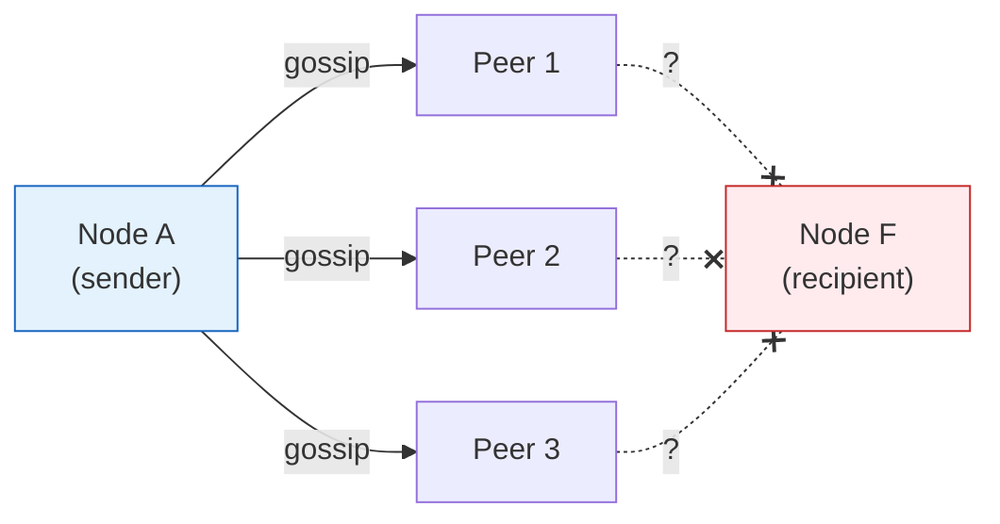
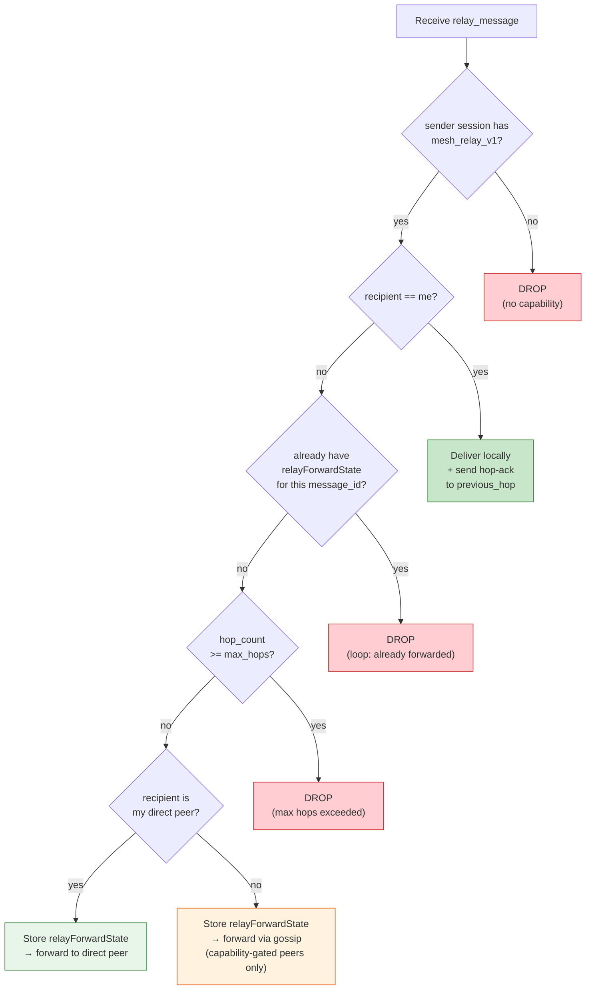
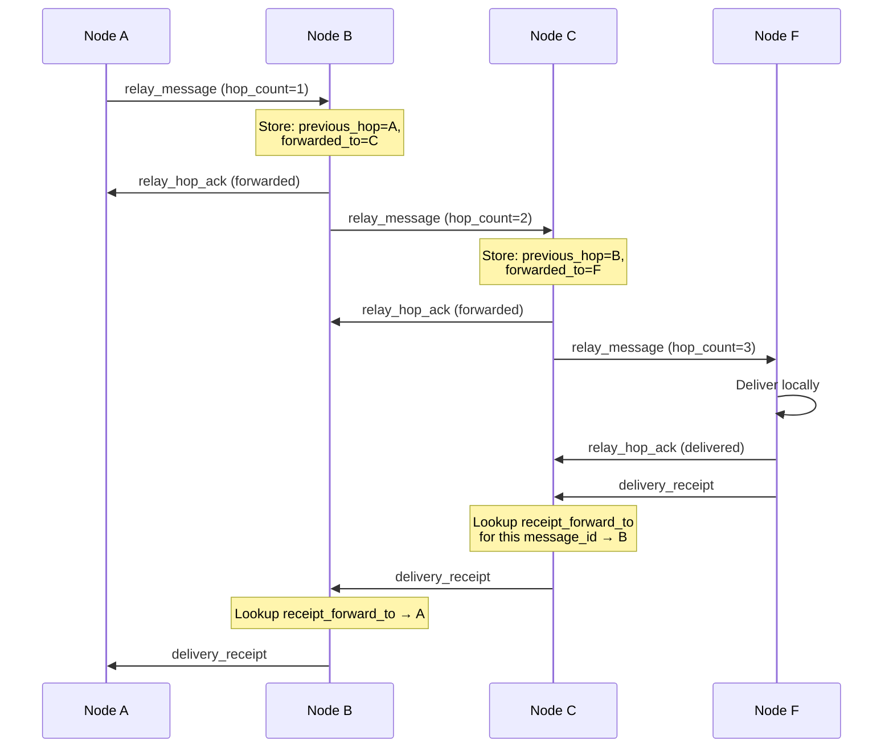
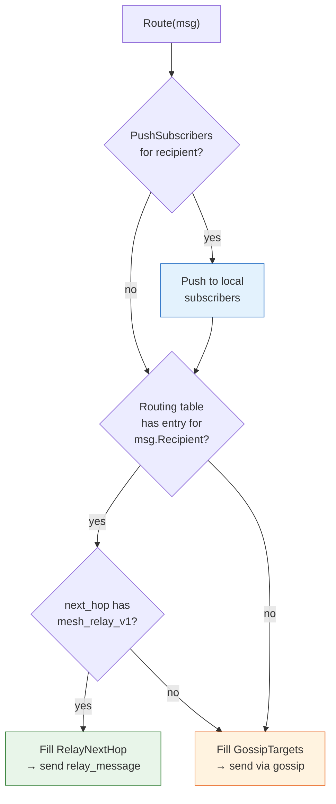
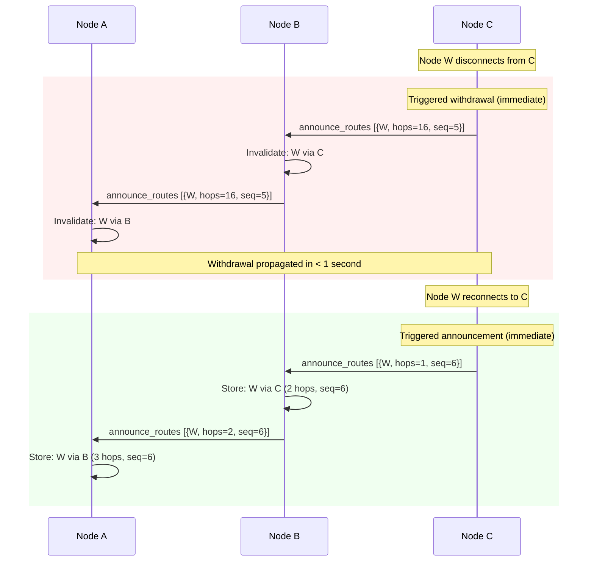
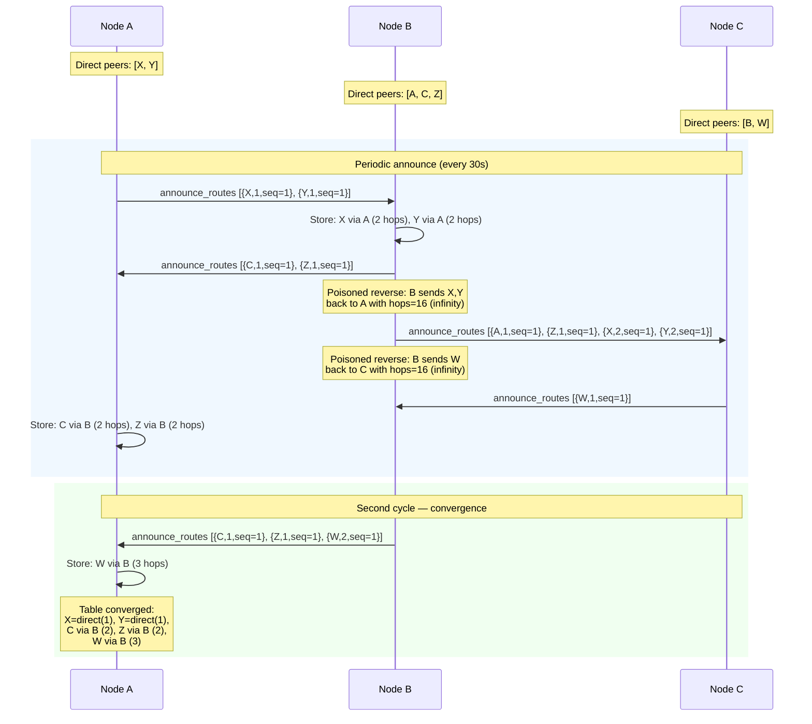
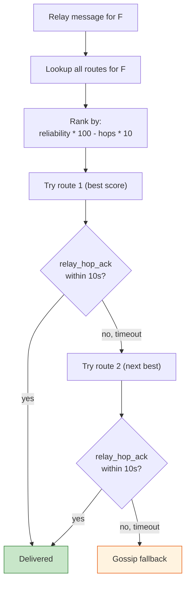
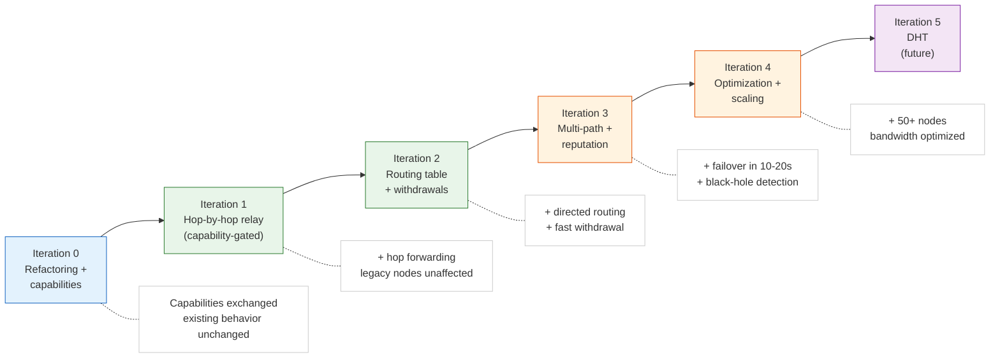

# Mesh Routing Roadmap

Related documentation:

- [mesh.md](mesh.md) — current mesh network layer (topology, peer discovery, scoring, handshake, message routing, I/O, persistence)
- [protocol/peers.md](protocol/peers.md) — peer management protocol
- [protocol/messaging.md](protocol/messaging.md) — message send/store protocol

Source (planned): `internal/core/node/routing.go`, `internal/core/node/routing_table.go`,
`internal/core/node/relay.go`, `internal/core/node/route_announce.go`

### Current problem

`gossipMessage()` sends the message to the top 3 peers by score and **hopes** it
will arrive. There is no understanding of "who is where": no routing table, no
hop-by-hop forwarding. If the recipient is not directly connected to one of those
3 peers, the message is lost after a 3-minute retry window.


*Diagram — Current blind gossip: no knowledge of path to recipient*

### Design principles

1. **Each iteration produces a working network.** No iteration breaks the
   previous one. Rollback is possible at any point via feature flags /
   capabilities negotiation.
2. **Gossip remains the fallback.** Routing table is a hint, not the only
   path. If a route is unknown or stale, the node falls back to current
   gossip behavior.
3. **Backward compatibility from day one.** Capability negotiation is
   introduced in iteration 0 and gates every new frame type. Nodes
   without mesh routing support continue to work in the same network.
   Legacy peers never receive unknown frame types.
4. **Privacy over performance.** No node should know the full network
   topology. Only distance vectors (identity + hop count), not the
   complete map. Message payloads never carry the full traversed path;
   intermediate nodes store only local forwarding state
   (`previous_hop` / `receipt_forward_to`) keyed by message ID.
5. **Preserve existing delivery paths.** The current push-to-subscriber
   and direct-peer delivery already works. New routing must not regress
   it. The routing abstraction produces a multi-strategy decision, not
   just a flat address list.

### Protocol versioning policy

New frame types and behaviors are introduced via `capabilities`
negotiation (additive changes). The existing `ProtocolVersion` and
`MinimumProtocolVersion` in `config.go` are bumped only when mandatory
semantics of existing behavior change. The rule: if a legacy node can
safely ignore the new feature, it is capability-gated and does not
require a protocol bump. If a legacy node would misinterpret the new
behavior, the protocol version must be raised.

**Progress:**

- [ ] For each new frame type, classify: capability-gated additive change or mandatory protocol change
- [ ] Introduce new additive features only via `capabilities`, without raising `MinimumProtocolVersion`
- [ ] If mandatory semantics of existing behavior change, raise `ProtocolVersion`
- [ ] Before raising `MinimumProtocolVersion`, complete a dual-stack compatibility period
- [ ] Add mixed-version integration test: old node <-> new node
- [ ] Add rejection test: node with version below `MinimumProtocolVersion` is rejected
- [ ] Update `protocol.md` after each protocol bump
- [ ] Update `config.ProtocolVersion` and `config.MinimumProtocolVersion` only in a dedicated commit/PR after passing compatibility checklist

### Iteration 0 — Foundation refactoring + capabilities

**Goal:** extract routing abstractions from `service.go` without changing
behavior, and introduce the capability negotiation mechanism that gates
all future frame types.

**What changes:**

1. Extract routing logic into a separate interface. Currently
   `routingTargetsForMessage()` and `gossipMessage()` live in a 5200+
   line file. Isolation is needed for future iterations.

2. Add `capabilities` field to the `hello` frame. Each capability is a
   string token (e.g. `"mesh_relay_v1"`, `"mesh_routing_v1"`). Both
   peers advertise their capabilities during handshake; the intersection
   determines what extended frame types may be used on that session.

3. The routing abstraction is not a flat address list. The current code
   already has two independent delivery mechanisms: push-to-subscriber
   (for locally connected recipients) and gossip (for mesh-wide
   propagation). The interface must preserve both.

**New files:**

```
internal/core/node/
  routing.go          — Router interface + current GossipRouter implementation
  relay.go            — RelayService interface (empty, placeholder for iteration 1)
```

**RoutingDecision (not a flat address list):**

```go
type RoutingDecision struct {
    PushSubscribers []SubscriberTarget  // existing push path (unchanged)
    DirectPeers     []string            // peers where recipient is directly connected
    RelayNextHop    *string             // from routing table (nil = not known)
    GossipTargets   []string            // fallback: top N scored peers
}

type Router interface {
    Route(msg protocol.Envelope) RoutingDecision
}
```

The current implementation (`GossipRouter`) wraps existing logic:
`subscribersForRecipient()` → `PushSubscribers`,
`routingTargetsForMessage()` → `GossipTargets`.
`DirectPeers` and `RelayNextHop` are empty in this iteration.
Network behavior **does not change**.

**Capabilities in hello frame:**

```json
{
  "type": "hello",
  "capabilities": ["mesh_relay_v1"],
  ...
}
```

The `welcome` response echoes the server's capabilities. The session
stores the intersection. No new frame types are introduced in this
iteration, so the capability list may be empty. The mechanism itself
is what matters.

**Done when:** all existing tests pass, messages deliver as before,
capabilities are exchanged in hello/welcome but have no effect yet.

**Progress:**

- [ ] Add `Capabilities []string` field to `protocol.Frame`
- [ ] Send capabilities in `hello` frame
- [ ] Echo capabilities in `welcome` frame
- [ ] Store per-session capability intersection in `peerSession`
- [ ] Add helper `sessionHasCapability(address, cap) bool`
- [ ] Create `routing.go` with `Router` interface and `RoutingDecision` struct
- [ ] Implement `GossipRouter` wrapping existing delivery logic
- [ ] Map `PushSubscribers` to existing `subscribersForRecipient()` path
- [ ] Map `GossipTargets` to existing `routingTargetsForMessage()` path
- [ ] Create `relay.go` with empty `RelayService` interface
- [ ] Inject `Router` into `Service` via constructor
- [ ] All existing tests pass without modification
- [ ] Verify capabilities are exchanged in integration test (2 nodes)

**Release / Compatibility:**

- [ ] Capability negotiation added but network behavior unchanged
- [ ] All existing tests pass with no semantic changes
- [ ] Mixed-version test: node without `capabilities` field works with new node
- [ ] Confirmed: iteration 0 does not require raising `ProtocolVersion`
- [ ] Confirmed: iteration 0 does not require raising `MinimumProtocolVersion`

### Iteration 1 — Hop-by-hop relay (capability-gated)

**Goal:** messages can traverse intermediate nodes, not just direct
neighbors. Legacy peers are never sent unknown frame types.

**Problem:** when node A sends a DM to F, `sendMessageToPeer()` sends
`send_message` to the 3 best peers. If none of them know F, the message
is stuck for 3 minutes of retry and dies.

**Capability gate:** `relay_message` is only sent to peers whose session
has `"mesh_relay_v1"` in the negotiated capability set. For peers without
the capability, the node falls back to the existing `send_message` +
gossip path. This means a mixed network (new + legacy nodes) works from
day one.

**New frame type — `relay_message`:**

```json
{
  "type": "relay_message",
  "message_id": "uuid",
  "sender": "origin_address",
  "recipient": "final_recipient_address",
  "payload": "encrypted_base64",
  "hop_count": 3,
  "max_hops": 10,
  "previous_hop": "addr_of_sender_to_me"
}
```

**Privacy-preserving forwarding state:** the frame does **not** carry
a `visited` list or `return_path`. Instead, each intermediate node
stores local state keyed by `message_id`:

```go
type relayForwardState struct {
    MessageID        string
    PreviousHop      string // who sent this relay to me
    ReceiptForwardTo string // = PreviousHop (where to send receipt back)
    ForwardedTo      string // who I forwarded to (for loop detection)
    HopCount         int    // incremented on each hop
    RemainingTTL     int    // seconds until cleanup (set from max_relay_ttl on creation, decremented by ticker)
}
```

This way no single message reveals the full path. Each node knows
only its own `previous_hop` and `forwarded_to`. Loop detection uses
the combination of `message_id` + local state: if a node already has
a `relayForwardState` for this `message_id`, it drops the duplicate.

**Relay dedupe rule:** the `message_id` is the sole deduplicate key for
transit relay. When a node receives a `relay_message` with a `message_id`
it has already seen (i.e. `relayForwardState` exists), it silently drops
the message — even if it arrived from a different neighbor than the
original. This prevents broadcast storms in topologies with multiple
paths: without dedupe, a single relay could multiply exponentially
because the gossip fallback and the existing 3-minute retry can re-inject
the same `message_id` from different peers. The dedupe state is cleaned
up together with `relayForwardState` when `RemainingTTL` reaches 0
(default: 180 seconds = 3 minutes, decremented by a 1-second ticker).

**Processing logic on an intermediate node:**


*Diagram — Relay message processing on an intermediate node*

**Hop-by-hop acknowledgement:** when a node successfully forwards a
relay message (or delivers it locally), it sends a `relay_hop_ack`
back to `previous_hop`. This proves the **next hop** received the
message, not just that it eventually arrived at the destination.

```json
{
  "type": "relay_hop_ack",
  "message_id": "uuid",
  "status": "forwarded"
}
```

**Delivery receipt return path:** when the final recipient generates a
delivery receipt, each intermediate node looks up `receipt_forward_to`
by `message_id` and sends the receipt one hop back. If the hop is
unavailable, fallback to gossip receipt (current behavior). No full
path is ever stored in the receipt payload.


*Diagram — Hop-by-hop ack and receipt return via local state*

**Coexistence matrix — `send_message` vs `relay_message`:**

The network may contain both new nodes (with `mesh_relay_v1`) and
legacy nodes (without it). The interaction rules are:

| Sender | Receiver | Behavior |
|---|---|---|
| New | New | `relay_message` with routing table hints. Relay chain uses `relay_message` + `relay_hop_ack`. |
| New | Legacy | Sender detects missing capability → falls back to `send_message` + gossip (existing path). Legacy node is never sent `relay_message`. |
| Legacy | New | New node receives `send_message` (existing frame) and processes it normally. No relay or routing table involved. |
| Legacy | Legacy | Fully current behavior, nothing changes. |

Mixed relay chain: if a relay chain A→B→C→D has a legacy node in the
middle (e.g. C is legacy), B cannot forward `relay_message` to C.
Instead, B falls back to gossip for that hop. The routing table hint
does not require that every hop on the path supports `mesh_relay_v1`.
The hint suggests the best next_hop; if that next_hop lacks the
capability, the node uses gossip to reach further. This means table
hints improve delivery even in partially upgraded networks — they
narrow the gossip fan-out to the direction of the recipient.

**Existing paths are untouched:** `send_message`, `push_message`,
`subscribe_inbox` all continue to work exactly as before. For legacy
peers without `mesh_relay_v1`, the node uses the existing gossip path.
The `RoutingDecision` from iteration 0 fills `RelayNextHop` only for
capable peers; for all others, `GossipTargets` is used.

**Changes to existing code:**

- `handleCommand()` / `handlePeerSessionFrame()` — add `"relay_message"`
  and `"relay_hop_ack"` cases, gated by capability check
- `storeIncomingMessage()` — no changes; relay calls the same function
  for local delivery
- `retryRelayDeliveries()` — extend to handle relay messages
- New: `relayForwardState` map with numeric TTL cleanup
  (`RemainingTTL=180`, decremented every second)

**TTL design — numeric, not wall-clock:** all TTL values in the relay
subsystem are numeric counters, not timestamps. This eliminates
dependence on synchronized clocks between nodes. The `relay_message`
frame does not carry `originated_at` — relay lifetime is controlled
entirely by `hop_count` / `max_hops` (network TTL) and
`relayForwardState.RemainingTTL` (local state cleanup). Two
independent guards:

1. **Hop TTL** (`max_hops`): protects the network. Each hop
   increments `hop_count`; when `hop_count >= max_hops`, the message
   is dropped. No clocks involved.
2. **State TTL** (`RemainingTTL`): protects local memory. Each node
   decrements the counter every second; when it reaches 0, the
   `relayForwardState` is deleted. Uses a local ticker, not wall
   clock comparison.

**Done when:** a message from A to F traverses the chain A→B→C→D→E→F
even when A does not know F directly. Legacy nodes in the same network
continue to work via gossip. No message carries a full path. Test:
start 4 nodes in a chain, send DM from first to last; separately test
with one legacy node in the middle.

**Progress:**

- [ ] Define `relay_message` frame type in `protocol/frame.go`
- [ ] Define `relay_hop_ack` frame type in `protocol/frame.go`
- [ ] Add `hop_count`, `max_hops`, `previous_hop` fields to relay frame
- [ ] Implement `relayForwardState` map with TTL-based cleanup
- [ ] Gate `relay_message` sending on `sessionHasCapability("mesh_relay_v1")`
- [ ] Add `relay_message` handler in `handleCommand()` / `handlePeerSessionFrame()`
- [ ] Implement relay dedupe: drop `relay_message` if `relayForwardState` exists for `message_id` (even from different neighbor)
- [ ] Implement loop detection via existing `relayForwardState` for message_id
- [ ] Implement max hops check (drop if exceeded, default 10)
- [ ] Implement direct peer forwarding (recipient is direct peer → forward)
- [ ] Implement gossip fallback for capable peers (recipient unknown → forward)
- [ ] Implement hop-by-hop ack (`relay_hop_ack`) back to `previous_hop`
- [ ] Implement receipt return via local `receipt_forward_to` lookup
- [ ] Implement receipt fallback to gossip when previous_hop is unavailable
- [ ] Extend `retryRelayDeliveries()` for relay messages
- [ ] Persist relay forward state in `queue-{port}.json`
- [ ] Write unit tests for relay processing logic
- [ ] Write unit tests for capability gating (legacy peer gets gossip, not relay)
- [ ] Integration test: 4 nodes in chain, DM from first to last
- [ ] Integration test: mixed network with one legacy node
- [ ] Integration test: verify relay dedupe (same message_id from two neighbors → only one forward)
- [ ] Integration test: mixed chain with legacy node in middle (new→legacy→new fallback to gossip)

**Release / Compatibility:**

- [ ] `relay_message` is sent only to peers with `mesh_relay_v1`
- [ ] Legacy peer never receives `relay_message`
- [ ] If peer lacks `mesh_relay_v1`, the existing delivery path is used
- [ ] Mixed-version test: new → old uses legacy path
- [ ] Mixed-version test: old → new continues to work without relay
- [ ] Confirmed: iteration 1 does not require raising `MinimumProtocolVersion`

### Iteration 2 — Routing table (distance vector with withdrawals)

**Goal:** each node knows which identities are reachable through which
neighbors. Routes are treated as **hints**, not as the single source of
truth — gossip fallback is always available.

**Problem after iteration 1:** relay works, but the node does not know
**where** to relay. The gossip fallback from iteration 1 is blind. If a
node has 8 peers, the message goes to 3 random ones instead of the one
correct one.

**Capability gate:** `announce_routes` and `withdraw_routes` are only
exchanged with peers that have `"mesh_routing_v1"` in their capability
set (from iteration 0).

**New file:**

```
internal/core/node/
  routing_table.go    — PeerAwarenessTable
  route_announce.go   — announce/withdraw protocol + periodic loop
```

**Table structure:**

```go
type RouteEntry struct {
    Identity     string // recipient address
    NextHop      string // through which peer
    Hops         int    // distance (1 = direct peer, 16 = infinity/withdrawn)
    SeqNo        uint64 // monotonic per-origin, higher = newer
    RemainingTTL int    // seconds until expiry (default 120, decremented by ticker)
    Source       string // "direct" | "announcement" | "hop_ack"
}

type PeerAwarenessTable struct {
    mu             sync.RWMutex
    routes         map[string][]RouteEntry // identity → possible routes
    defaultTTL     int                     // default TTL in seconds (120)
    flappingTTL    int                     // TTL for flapping peers (30)
}

func (t *PeerAwarenessTable) Lookup(identity string) []RouteEntry
func (t *PeerAwarenessTable) AddDirectPeer(identity, peerAddr string)
func (t *PeerAwarenessTable) RemoveDirectPeer(identity string)
func (t *PeerAwarenessTable) UpdateRoute(entry RouteEntry)
func (t *PeerAwarenessTable) WithdrawRoute(identity, nextHop string, seqNo uint64)
func (t *PeerAwarenessTable) Announceable(excludeVia string) []RouteEntry
func (t *PeerAwarenessTable) TickTTL()       // decrement all RemainingTTL, remove entries at 0
```

**Key difference from previous version:** route entries have a `SeqNo`
(monotonically increasing per origin node). This enables:

- **Withdrawals** — a node can explicitly withdraw a route by sending a
  higher `SeqNo` with `hops=infinity` (16). Receivers immediately
  invalidate the stale entry instead of waiting for TTL expiry.
- **Triggered updates** — when a route changes (peer connects/disconnects),
  an immediate announce of just that change is sent, without waiting for
  the 30-second periodic cycle.

**How the table is populated:**

1. **Direct peers** — on peer connect, their identity is added as
   `hops=1, source="direct"`. On disconnect — removed, and a
   **withdrawal** is immediately triggered to all neighbors.

   **Why hops=1, not 0:** a direct connection still traverses one
   network link. Using `hops=1` keeps the metric consistent: every
   hop adds 1, and the metric is additive across the path. With
   `hops=0` for direct, a two-hop route would show `hops=1`, which
   is confusing. The value `hops=1` means "identity reachable through
   one link" and `hops=16` remains infinity (withdrawal).

2. **Route announcements** — frame type `announce_routes`:

```json
{
  "type": "announce_routes",
  "routes": [
    {"identity": "alice_addr", "hops": 1, "seq": 42},
    {"identity": "carol_addr", "hops": 2, "seq": 17},
    {"identity": "dave_addr",  "hops": 16, "seq": 18}
  ]
}
```

`hops=1` = direct peer, `hops=2` = one intermediate hop, `hops=16` =
infinity (withdrawal). The table only accepts updates with `seq` higher
than the currently stored `SeqNo` for the same `(identity, nextHop)` pair.

Every 30 seconds a node sends the full table to peers (periodic refresh).
Between cycles, **triggered updates** send only changes immediately.

3. **Hop-ack confirmation** — when a `relay_hop_ack` is received from a
   next_hop for a specific message, the route through that next_hop is
   confirmed (`source="hop_ack"`). This is the most reliable source
   because it proves the **specific next hop** received the message, not
   just that it arrived somewhere. (Unlike end-to-end delivery receipts,
   which can travel via gossip and prove nothing about the chosen path.)

**Trust hierarchy for route sources:** not all route information is
equally trustworthy. The table enforces a strict priority when multiple
sources report the same `(identity, nextHop)` pair:

1. **`direct`** — the identity is locally connected. Always wins.
   Cannot be overridden by announcement or hop_ack.
2. **`hop_ack`** — confirmed by actual message delivery through that
   next_hop. Stronger than passive announcements because it proves
   the path works.
3. **`announcement`** — received via `announce_routes` from a neighbor.
   Lowest trust. Any peer can claim any route; without verification
   the claim is just a hint.

When `UpdateRoute()` receives a new entry, it checks the existing
entry's `Source`. A lower-trust source cannot override a higher-trust
one for the same `(identity, nextHop)`. If a peer announces a route
that was already confirmed by `hop_ack`, the announcement is accepted
only if its `SeqNo` is strictly higher (indicating a genuine topology
change).

Additionally, routes learned from peers with **unstable sessions**
(3 or more disconnects within the last 10 minutes) receive a shorter
numeric TTL: `RemainingTTL=30` instead of the default `120`. This
prevents flapping peers from polluting the table with routes that
constantly appear and disappear.

**Poisoned reverse** (loop protection): when node B announces routes to
node A, it **does not announce** routes that it learned through A. Routes
learned from A are announced to A with `hops=16` (infinity). This is a
classic defense from RIP/BGP.

**Table is a hint, not the truth:** if the routing table suggests a
next_hop, the node tries it first. If the next_hop session is not
active or the capability is missing, the node falls back to gossip
immediately. The table never blocks delivery.

**Route lifetime is tied to session lifetime.** All routes learned
from a peer (both direct and announced) are invalidated when the
session to that peer closes. On session close, the node:

1. Removes the direct peer entry for that identity.
2. Removes all routes where `NextHop == disconnected_peer`.
3. Sends triggered withdrawals (hops=16) for all removed routes.

On reconnect, the peer must re-announce its routes from scratch.
This prevents stale routes from persisting across identity changes
or network partitions. If a peer reconnects with a **different
identity** (different Ed25519 public key), the old identity's direct
route is withdrawn and the new identity is added as a fresh entry.

This is stricter than waiting for `RemainingTTL` to reach 0 but
safer: a disconnected peer's routes are immediately invalidated
rather than lingering for up to 120 seconds.

**Route selection with the table:**


*Diagram — Full routing decision: push + table lookup + gossip fallback*

**Withdrawal and triggered update flow:**


*Diagram — Fast withdrawal and re-announcement via triggered updates*

**Announce cycle (periodic + triggered):**


*Diagram — Route announcement convergence with poisoned reverse*

**Announcement size limit with fairness rotation:** each
`announce_routes` frame carries at most 100 route entries to bound
frame size. When the table exceeds 100 entries, the node applies a
fair selection strategy:

1. **Direct peers always included** — routes with `source="direct"`
   are never omitted, as they are the most valuable and typically
   few (limited by max connections).
2. **Remaining slots filled by rotation** — non-direct routes are
   sorted by hops (closest first) and then rotated using a per-peer
   offset that advances each cycle. This ensures all routes are
   eventually announced to every peer, not just the closest ones.
3. **Periodic full sync** — every 5th cycle (every 2.5 minutes), the
   node sends a full table dump split across multiple frames if needed.
   This handles edge cases where rotation misses routes during topology
   changes.

**Done when:** a message from A to F goes via the shortest path, not
random nodes. When a node disconnects, withdrawal propagates within
seconds. Logs show `route_via_table` instead of `route_via_gossip`.
The table converges within 1-2 announce cycles (30-60 seconds).

**Progress:**

- [ ] Create `routing_table.go` with `PeerAwarenessTable` struct
- [ ] Implement `Lookup()`, `AddDirectPeer()`, `RemoveDirectPeer()`
- [ ] Implement `UpdateRoute()` with `SeqNo` comparison (reject older)
- [ ] Implement `WithdrawRoute()` — set `hops=16` (infinity) to invalidate
- [ ] Implement `Announceable(excludeVia)` with poisoned reverse
- [ ] Implement `TickTTL()` — decrement `RemainingTTL` every second, remove entries at 0 (default 120s, flapping peers 30s)
- [ ] Define `announce_routes` frame type in `protocol/frame.go` (with `seq` field)
- [ ] Gate `announce_routes` on `sessionHasCapability("mesh_routing_v1")`
- [ ] Create `route_announce.go` — periodic announce loop (every 30s)
- [ ] Implement triggered updates: immediate announce on peer connect/disconnect
- [ ] Implement triggered withdrawal: immediate `hops=16` on peer disconnect
- [ ] Handle incoming `announce_routes` — update table with +1 hop
- [ ] Handle incoming withdrawals (`hops=16`) — invalidate route immediately
- [ ] Integrate `PeerAwarenessTable` into `Router.Route()` — fill `RelayNextHop`
- [ ] Confirm routes via `relay_hop_ack` (`source="hop_ack"`)
- [ ] Limit announcements to max 100 routes per announce frame, with fairness rotation (see below)
- [ ] Add direct peer tracking on connect/disconnect events
- [ ] Implement trust hierarchy in `UpdateRoute()`: direct > hop_ack > announcement
- [ ] Implement shorter TTL (30s) for routes from flapping peers (3+ disconnects in 10 min)
- [ ] Implement route-session binding: invalidate all routes from peer on session close
- [ ] Implement triggered withdrawal on session close for all removed routes
- [ ] Handle identity change on reconnect: withdraw old identity, add new
- [ ] Implement fairness rotation for announcement size limit (direct always included, offset rotation)
- [ ] Implement periodic full sync every 5th cycle (split across multiple frames if needed)
- [ ] Add `route_via_table` / `route_via_gossip` log markers
- [ ] Write unit tests for routing table operations
- [ ] Write unit tests for poisoned reverse logic
- [ ] Write unit tests for SeqNo ordering and withdrawal
- [ ] Write unit tests for triggered update generation
- [ ] Write unit tests for trust hierarchy (direct overrides announcement, hop_ack overrides announcement)
- [ ] Write unit tests for route-session binding (all routes removed on disconnect)
- [ ] Write unit tests for announcement fairness rotation
- [ ] Integration test: 5 nodes, verify shortest path selection
- [ ] Integration test: disconnect node, verify withdrawal propagation < 5s
- [ ] Integration test: reconnect with different identity, verify old routes withdrawn

**Release / Compatibility:**

- [ ] `announce_routes` / withdrawal sent only to peers with `mesh_routing_v1`
- [ ] Without routing table, network continues delivery via gossip fallback
- [ ] Mixed-version test: routing-capable node works alongside legacy node
- [ ] Triggered withdrawal does not break legacy peers
- [ ] Confirmed: iteration 2 remains additive, no protocol bump required
- [ ] Confirmed: iteration 2 does not require raising `MinimumProtocolVersion`

### Iteration 3 — Reliability, reputation, and multi-path

**Goal:** multiple routes per identity, automatic failover based on
hop-by-hop ack success rate, protection against black-hole nodes.

Note: capability negotiation and announcement size limits are already
handled in iterations 0 and 2 respectively. This iteration focuses
purely on reliability.

**3a. Multiple routes and failover:**

The table already stores multiple routes per identity (from iteration 2).
This iteration adds active route selection and failover. When a
`relay_hop_ack` is not received within 10 seconds from the primary
next_hop, the node retries via the second-best route. If that also fails,
gossip fallback is used.

```
Identity "F":
  route 1: via peer_C, 2 hops, reliability 0.95  ← primary
  route 2: via peer_D, 3 hops, reliability 0.80  ← fallback
  route 3: gossip                                  ← last resort
```

**3b. Route reputation based on hop-by-hop ack:**

The reputation of a route is measured by the success rate of
`relay_hop_ack` responses, not by end-to-end delivery receipts. This is
critical because a delivery receipt can arrive via gossip even when the
chosen next_hop dropped the message.

**Why receipt path failures reinforce this choice:** the hop-by-hop
receipt return path (from iteration 1) can partially fail — for example,
node C delivers to F and sends receipt back toward A, but node B is
temporarily offline. If scoring used end-to-end receipt arrival, A
would penalize the forward path (A→B→C) for a failure that happened
on the **return** path (C→B→A). Since `relay_hop_ack` is sent
immediately by the direct next_hop before any further forwarding, it
is immune to downstream or return-path failures. This is the strongest
argument for hop-ack-only scoring.

```go
type RouteEntry struct {
    // ... existing fields from iteration 2
    HopAckAttempts   int
    HopAckSuccesses  int
    ReliabilityScore float64  // successes / attempts (0.0 to 1.0)
}
```

When `relay_hop_ack` is received → `HopAckSuccesses++`.
When 10s passes without `relay_hop_ack` → `HopAckAttempts++` only
(no success). Score is recalculated.

If `ReliabilityScore` drops below 0.3 after at least 5 attempts, the
route is deprioritized (but not removed — it may recover).

**3c. Composite route selection:**

Routes are ranked by: `ReliabilityScore * 100 - Hops * 10`. A longer but
reliable route beats a shorter but flaky one.


*Diagram — Multi-path failover with hop-ack based reputation*

**3d. Black-hole detection:**

A node that consistently claims routes via `announce_routes` but never
returns `relay_hop_ack` is a suspected black hole. After 5 consecutive
failures through that next_hop (across different messages), the node logs
a warning and adds a 2-minute penalty cooldown during which that
next_hop is skipped for new messages (existing retries continue).

**Done when:** when node C in chain A-B-C-D-E-F disconnects, the message
is automatically rerouted via an alternative path within 10-20 seconds
(hop-ack timeout + retry). A black-hole node is detected and deprioritized
after 5 messages.

**Progress:**

- [ ] Store multiple routes per identity in `PeerAwarenessTable` (may already exist from iteration 2)
- [ ] Add `HopAckAttempts`, `HopAckSuccesses`, `ReliabilityScore` to `RouteEntry`
- [ ] Track hop-ack success/failure per `(identity, nextHop)` pair
- [ ] Implement 10s hop-ack timeout → mark attempt as failed
- [ ] Implement composite route ranking: `reliability * 100 - hops * 10`
- [ ] Implement automatic failover: try next route on hop-ack timeout
- [ ] Implement gossip fallback as last resort
- [ ] Implement black-hole detection: 5 consecutive failures → 2-min cooldown
- [ ] Log warning on suspected black-hole node
- [ ] Write unit tests for reputation scoring
- [ ] Write unit tests for failover logic (primary fails → secondary → gossip)
- [ ] Write unit tests for black-hole detection and cooldown
- [ ] Integration test: disconnect middle node, verify rerouting within 20s
- [ ] Integration test: black-hole node (accepts relay, never acks), verify detection

**Release / Compatibility:**

- [ ] Failover and reputation affect route selection only, not base compatibility
- [ ] Without `relay_hop_ack`, network degrades to gossip fallback, not breakage
- [ ] Mixed-version test: node with reputation/failover works with node without these improvements
- [ ] Black-hole mitigation does not cause false full ban without fallback path
- [ ] Confirmed: iteration 3 does not require raising `MinimumProtocolVersion`

### Iteration 4 — Optimization and scaling

**Goal:** pure optimization for network growth to hundreds of nodes.
No new protocol semantics — only efficiency improvements.

Note: triggered updates and withdrawals are already in iteration 2.
This iteration focuses on reducing bandwidth and improving data
structures.

**4a. Incremental route announcements:**

The 30-second periodic cycle currently sends the full table. Replace
with delta-only: track which routes changed since the last announce
to each peer, and send only the diff. The full table is sent only on
initial sync (new peer session). `SeqNo` from iteration 2 makes this
straightforward — each peer tracks the last `SeqNo` it sent per route.

**4b. Bloom filter for seen messages:**

Currently `s.seen[string(msg.ID)]` is a map that grows indefinitely
(cleaned only by TTL). Replace with a rotating Bloom filter — two
filters, every 5 minutes the current becomes old, the old is deleted.
False negatives are impossible (a seen message is always detected).
False positives are acceptable at < 0.1% rate.

**4c. Latency-aware route metric:**

Add RTT measurement to each peer session (from ping/pong). The route
metric becomes: `reliability * 100 - hops * 10 - avg_rtt_ms / 10`.
This allows choosing not just the shortest or most reliable path, but
the fastest one.

**4d. Announce compression:**

For networks with 100+ identities, route announcements can be large.
Use delta encoding (only changed routes) and, if needed, gzip
compression of the announce frame payload.

**Done when:** a network of 50 nodes converges within 2 minutes. Route
announcement traffic does not exceed 5% of total traffic. Bloom filter
does not produce false negatives.

**Progress:**

- [ ] Implement incremental route announcements (delta since last announce per peer)
- [ ] Track per-peer last-sent `SeqNo` for each route
- [ ] Full table sync only on new peer session establishment
- [ ] Replace `s.seen` map with rotating Bloom filter (2 filters, 5 min rotation)
- [ ] Add RTT measurement to peer sessions (from ping/pong round-trip)
- [ ] Add latency component to composite route metric
- [ ] Implement announce compression for large route tables
- [ ] Measure route announcement traffic as percentage of total
- [ ] Write benchmarks for Bloom filter false positive rate
- [ ] Write benchmarks for routing table operations at 100+ entries
- [ ] Load test: 50 node simulation, measure convergence time
- [ ] Load test: measure bandwidth savings from delta announcements

**Release / Compatibility:**

- [ ] Delta announcements are compatible with full periodic sync
- [ ] On optimization incompatibility/error, full sync fallback is used
- [ ] Bloom filter does not produce false negatives for mandatory delivery logic
- [ ] Mixed-version test: node with delta sync works with node on full sync
- [ ] Confirmed: iteration 4 does not require raising `MinimumProtocolVersion`

### Iteration 5 (future) — Structured overlay (DHT)

**Goal:** scaling to thousands of nodes.

When `PeerAwarenessTable` grows to 500+ entries, transition to a
Kademlia-like DHT. The routing table contains O(log n) entries instead of
O(n). Lookup in O(log n) hops.

This is **not needed now**, but the architecture of iterations 0-4 prepares
for it: the `Router` interface remains, only the implementation inside
changes.

**Progress:**

- [ ] Research Kademlia XOR-metric routing for identity-based addressing
- [ ] Design k-bucket structure for O(log n) routing table
- [ ] Define DHT lookup protocol (iterative vs recursive)
- [ ] Implement `DHTRouter` behind `Router` interface (same contract as `TableRouter`)
- [ ] Implement migration path from `PeerAwarenessTable` to DHT
- [ ] Implement Sybil resistance mechanisms
- [ ] Benchmarks: DHT lookup latency at 1000+ nodes
- [ ] Integration test: mixed network with `TableRouter` and `DHTRouter` nodes coexisting
- [ ] Integration test: fallback to gossip on failed DHT lookup (unreachable key range)
- [ ] Integration test: churn of 20-50 nodes with delivery rate verification (target: >95% within 30s)
- [ ] Integration test: live migration and rollback between `TableRouter` and `DHTRouter` implementations
- [ ] Security test: Sybil/eclipse simulation — verify that a single cluster cannot fully capture lookup for any identity

**Release / Compatibility:**

- [ ] Determine: DHT is an optional router backend or mandatory network behavior
- [ ] If DHT is optional: mixed-version network (`TableRouter` + `DHTRouter`) passes integration tests
- [ ] If DHT is mandatory: raise `ProtocolVersion`
- [ ] If DHT is mandatory: document dual-stack rollout period
- [ ] If DHT is mandatory: after dual-stack period, raise `MinimumProtocolVersion`
- [ ] Add rollback test: `DHTRouter` → legacy/`TableRouter`
- [ ] Add mixed-version migration test: old/new routing backends coexist

### Iteration dependency graph


*Diagram — Iteration dependency and incremental delivery*

### Key architectural decisions (rationale)

| Decision | Rationale |
|---|---|
| Capabilities in iteration 0, not later | Every new frame type must be gated from day one. Legacy nodes must never receive unknown frames. |
| `RoutingDecision` instead of `[]RoutingTarget` | Preserves existing push-to-subscriber and gossip paths. New routing is additive, not a replacement. |
| Per-node forwarding state, not `visited` list in payload | Privacy: no message reveals the full path. Each node stores only `previous_hop` + `forwarded_to` locally. |
| `relay_hop_ack` instead of end-to-end receipt for reputation | End-to-end receipts can travel via gossip. Only hop-ack proves the specific next_hop actually received the message. |
| Relay dedupe by `message_id` (drop even from different neighbor) | Without strict dedupe, gossip fallback + 3-min retry can re-inject the same relay from multiple peers, causing exponential multiplication. |
| Coexistence matrix for `send_message` / `relay_message` | Mixed networks are inevitable during rollout. Explicit rules prevent ambiguity: new→old falls back to gossip, table hints work even in partial upgrades. |
| `hops=1` for direct, not `hops=0` | Every hop adds 1. Consistent additive metric: 2-hop route shows hops=2, not hops=1. Eliminates confusion about what 0 means. |
| Trust hierarchy: direct > hop_ack > announcement | Anyone can announce any route. Direct connection is provable, hop_ack is verified by delivery, announcement is unverified claim. |
| Route lifetime tied to session lifetime | TTL-only expiry leaves stale routes for up to 2 min after disconnect. Session binding gives immediate invalidation + triggered withdrawal. |
| Announcement fairness rotation, not just closest-by-hops | Pure closest-by-hops biases toward nearby identities. Rotation ensures distant identities are eventually propagated to all peers. |
| Withdrawals + triggered updates in iteration 2 | Without them, failover in iteration 3 cannot meet its 10-20s target. Periodic-only announcements leave stale routes for up to 5 minutes. |
| Table as hint, gossip as fallback | The routing table is an optimization. If it's wrong, delivery still works via gossip. No single point of failure. |

---

Русская версия / Russian version: [roadmap.ru.md](roadmap.ru.md)
