# Corsa DEX Messenger — Дорожная карта

> Каноническая (English) версия: [roadmap.md](roadmap.md)

Связанная документация:

- [mesh.md](mesh.md) — mesh-слой (топология, peer discovery, скоринг, handshake, маршрутизация сообщений, I/O, персистенция)
- [protocol/relay.md](protocol/relay.md) — протокол relay (hop-by-hop relay, capability gating, лимиты ёмкости)
- [protocol/peers.md](protocol/peers.md) — протокол управления peer'ами
- [protocol/messaging.md](protocol/messaging.md) — протокол отправки/хранения сообщений

Исходники: `internal/core/node/relay.go`, `internal/core/node/ratelimit.go`,
`internal/core/node/capabilities.go`, `internal/core/node/admission.go`
Исходники (планируемые): `internal/core/routing/` (модуль маршрутизации),
`internal/core/rpc/routing_commands.go` (RPC-команды маршрутизации)

Быстрые ссылки:

- [Текущее состояние](#текущее-состояние)
- [Принципы проектирования](#принципы-проектирования)
- [Политика версионирования протокола](#политика-версионирования-протокола)
- [Итерация 1 — Таблица маршрутов](#iter-1)
  - [Незавершённые задачи перед здоровьем маршрутов](#незавершённые-задачи-перед-здоровьем-маршрутов)
  - [Здоровье маршрутов, probe'ы и RTT-скоринг](#здоровье-маршрутов-probeы-и-rtt-скоринг)
- [Итерация 2 — Надёжность, репутация, multi-path и инкрементальная синхронизация](#iter-2)
- [Итерация 3 — Оптимизация и масштабирование](#iter-3)
- [Итерация 4 — Структурированный overlay (DHT)](#iter-4)
- [Итерация 5 — Локальные имена](#iter-5)
- [Итерация 6 — Удаление сообщений](#iter-6)
- [Итерация 7 — Android-приложение](#iter-7)
- [Итерация 8 — Второй слой шифрования](#iter-8)
- [Итерация 9 — Обход DPI](#iter-9)
- [Итерация 10 — Google WSS fallback](#iter-10)
- [Итерация 11 — SOCKS5-туннель](#iter-11)
- [Итерация 12 — Групповые чаты](#iter-12)
- [Итерация 13 — Onion DM](#iter-13)
  - [13.1 — Onion-обёртка DM envelope](#iter-13-1)
  - [13.2 — Onion-квитанции](#iter-13-2)
  - [13.3 — Эфемерные ключи и прямая секретность](#iter-13-3)
  - [13.4 — Выбор пути и ротация цепочек](#iter-13-4)
  - [13.5 — Защита от анализа трафика](#iter-13-5)
- [Итерация 14 — Глобальные имена](#iter-14)
- [Итерация 15 — Расширения Gazeta](#iter-15)
- [Итерация 16 — iOS-приложение](#iter-16)
- [Итерация 17 — BLE last mile](#iter-17)
  - [17.1 — BLE-транспорт и обнаружение пиров](#iter-17-1)
  - [17.2 — BLE-фрагментация и адаптация к MTU](#iter-17-2)
  - [17.3 — BLE-дедупликация и relay](#iter-17-3)
  - [17.4 — BLE rate limiting и QoS](#iter-17-4)
- [Итерация 18 — Meshtastic last mile](#iter-18)
  - [18.1 — Meshtastic transport bridge](#iter-18-1)
  - [18.2 — Radio-aware фрагментация и pacing](#iter-18-2)
  - [18.3 — Radio mesh relay и дедупликация](#iter-18-3)
- [Итерация 19 — Конструктор шифрования](#iter-19)
- [Итерация 20 — Голосовые звонки](#iter-20)
- [Итерация 21 — Передача файлов](#iter-21)
- [Итерация 22 — Обнаружение в локальной сети](#iter-22)
- [Итерация 23 — NAT traversal и hole punching](#iter-23)
- [Итерация 24 — Управление перегрузками и QoS](#iter-24)
- [Ключевые архитектурные решения](#ключевые-архитектурные-решения-обоснование)

### Текущее состояние

Три механизма доставки реализованы и работают совместно:

**Hop-by-hop relay** (capability `mesh_relay_v1`). Сообщение от ноды A может пройти через промежуточные ноды (A→B→C→D→E→F) до получателя, которого не знает ни один прямой peer A. Лимиты ёмкости, per-peer rate limiting, дедупликация и delivery receipts через обратный relay-путь — всё на месте. Детали протокола: [`relay.md`](protocol/relay.md).

**Таблица маршрутов (distance vector)** (capability `mesh_routing_v1`). Каждая нода ведёт таблицу: какие identity доступны через каких соседей. Когда маршрут известен, relay пересылает сообщения по кратчайшему табличному пути вместо широковещательной рассылки. Периодические анонсы, triggered updates при connect/disconnect, подтверждения hop_ack, flap dampening, trust hierarchy (direct > hop_ack > announcement) и split horizon — всё реализовано. RPC-команды для наблюдаемости (`fetch_route_table`, `fetch_route_summary`, `fetch_route_lookup`) дают доступ к состоянию маршрутизации. Подробности: [`routing.md`](routing.md).

**Gossip fallback**. Когда табличный маршрут к получателю неизвестен, нода переключается на gossip broadcast — рассылает сообщение всем подключённым пирам. Это гарантирует доставку даже при неполной маршрутной информации или в процессе конвергенции после изменения топологии.

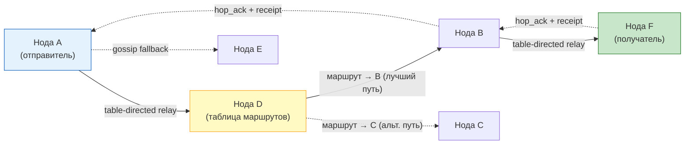
```mermaid
graph LR
    A["Нода A<br/>(отправитель)"] -->|table-directed relay| D["Нода D<br/>(таблица маршрутов)"]
    D -->|"маршрут → B (лучший путь)"| B["Нода B"]
    D -.->|"маршрут → C (альт. путь)"| C["Нода C"]
    B -->|table-directed relay| F["Нода F<br/>(получатель)"]
    F -.->|hop_ack + receipt| B -.->|hop_ack + receipt| A
    A -.->|gossip fallback| E["Нода E"]

    style A fill:#e3f2fd,stroke:#1565c0
    style D fill:#fff9c4,stroke:#f9a825
    style F fill:#c8e6c9,stroke:#2e7d32
```
*Диаграмма — Table-directed relay с gossip fallback (реализовано)*

**Что ещё не сделано:** anti-flooding меры для анонсов (frame size limits,
fairness rotation, pacing/jitter, per-peer rate limiting), полные
интеграционные тесты для multi-node convergence сценариев и
forward-compatible relay для будущего onion routing. Отслеживается
в разделе [Незавершённые задачи перед здоровьем маршрутов](#незавершённые-задачи-перед-здоровьем-маршрутов).

### Принципы проектирования

1. **Каждая итерация производит рабочую сеть.** Ни одна итерация не ломает
   предыдущую. Откат возможен в любой момент через feature flags / negotiation
   capabilities.
2. **Gossip остаётся fallback'ом.** Таблица маршрутов — это подсказка, а не
   единственный путь. Если маршрут неизвестен или устарел, нода откатывается
   к текущему gossip-поведению.
3. **Обратная совместимость с первого дня.** Согласование capabilities
   вводится в итерации 0 и гейтит каждый новый тип фрейма. Ноды без поддержки
   mesh routing продолжают работать в той же сети. Legacy-peer'ы никогда не
   получают неизвестные типы фреймов.
4. **Приватность важнее производительности.** Ни одна нода не должна знать
   полную топологию сети. Только distance vectors (identity + количество
   хопов), а не полная карта. Payload сообщений никогда не содержит полный
   пройденный путь; промежуточные ноды хранят только локальное forwarding-
   состояние (`previous_hop` / `receipt_forward_to`) по message ID.
5. **Сохранение существующих путей доставки.** Текущие push-to-subscriber и
   direct-peer доставка уже работают. Новая маршрутизация не должна их
   ухудшать. Абстракция маршрутизации выдаёт мульти-стратегийное решение, а не
   просто плоский список адресов.

### Hostile-Internet Guardrails

Сеть нужно проектировать так, как будто abuse и DDoS — нормальное состояние,
а не редкое исключение. При этом защита не должна превращаться в ловушку для
честных нод. Сквозные правила:

1. **Bounded resource usage везде.** Любой входящий фрейм, очередь, таблица,
   handshake-state и retry-механизм должны иметь явные лимиты по памяти,
   CPU, bandwidth и времени жизни.
2. **Мягкая деградация вместо жёсткой поломки.** При перегрузке нода сначала
   снижает приоритет, уменьшает fan-out, включает backpressure и fallback, а
   не перестаёт доставлять сообщения полностью.
3. **Недоверие к unauthenticated input.** До завершения handshake peer не
   должен получать дорогие по CPU/памяти операции, большие квоты или влияние
   на routing/reputation.
4. **Локальные наблюдения сильнее внешних заявлений.** Нода не должна банить,
   штрафовать или перестраивать таблицу только потому, что так сказал другой
   участник сети.
5. **Адаптивная защита, а не always-on friction.** Proof-of-work, жёсткие
   challenge'и и агрессивные квоты допустимы только как режим под атакой,
   чтобы не ухудшать обычную доставку и не ломать мобильные/слабые клиенты.
6. **Нет необратимых punishments по слабым сигналам.** Cooldown, quarantine,
   traffic shaping и expiry безопаснее, чем перманентный ban.
7. **Защита проверяется overload-тестами.** Любой anti-abuse механизм должен
   иметь тест: сеть под атакой деградирует контролируемо и не запирает сама
   себя для честных peer'ов.

### Политика версионирования протокола

Новые типы фреймов и поведения вводятся через согласование `capabilities`
(аддитивные изменения). Существующие `ProtocolVersion` и
`MinimumProtocolVersion` в `config.go` повышаются только при изменении
обязательной семантики существующего поведения. Правило: если legacy-нода
может безопасно игнорировать новую функцию — она гейтится через capability
и не требует повышения версии протокола. Если legacy-нода неправильно
интерпретирует новое поведение — версию протокола нужно повысить.

**Прогресс:**

- [ ] Для каждого нового типа фрейма указать: capability-gated аддитивное изменение или обязательное изменение протокола
- [ ] Новые аддитивные возможности вводить только через `capabilities`, без повышения `MinimumProtocolVersion`
- [ ] Если меняется обязательная семантика существующего поведения, повысить `ProtocolVersion`
- [ ] Перед повышением `MinimumProtocolVersion` пройти dual-stack период совместимости
- [ ] Добавить mixed-version интеграционный тест: old node <-> new node
- [ ] Добавить rejection тест: нода с версией ниже `MinimumProtocolVersion` отклоняется
- [ ] Обновить `protocol.md` после каждого повышения версии протокола
- [ ] Обновлять `config.ProtocolVersion` и `config.MinimumProtocolVersion` только отдельным коммитом/PR после прохождения compatibility checklist

<a id="iter-1"></a>
### Итерация 1 — Таблица маршрутов (distance vector с withdrawal)

**Цель:** каждая нода знает, какие identity доступны через каких соседей.
Маршруты — это **подсказки**, а не единственный источник истины. Gossip
fallback всегда доступен.

**Проблема после итерации 1:** relay работает, но нода не знает, **куда**
пересылать. Gossip fallback из итерации 1 — слепой. Если у ноды 8 peer'ов,
сообщение уходит 3 случайным вместо одного правильного.

**Ограничение по capabilities:** `announce_routes` и `withdraw_routes` обмениваются
только с peer'ами, у которых есть `"mesh_routing_v1"` в наборе capabilities
(из итерации 0).

**Модуль маршрутизации** (`internal/core/routing/`):

Логика маршрутизации выделена в отдельный пакет, отделённый от
`internal/core/node/`. Пакет `node` уже перегружен (~90 полей
в `Service`). Самостоятельный модуль маршрутизации обеспечивает чёткие
границы, независимое unit-тестирование и минимизирует рефакторинг при
развитии маршрутизации в итерациях 2–4.

```
internal/core/routing/
  types.go            — RouteEntry (с полем Origin), Snapshot (экспортируемые типы)
  table.go            — Table (хранение маршрутов, lookup, TTL, split horizon)
  announce.go         — протокол announce/withdraw + периодический цикл

internal/core/node/
  routing.go          — интерфейс Router + GossipRouter (существующий)
  table_router.go     — адаптер TableRouter (делегирует в routing.Table)
```

Файлы, добавляемые в [Итерации 1.5](#iter-1-5): routing/health.go, routing/probe.go, routing/score.go, routing/query.go.

Пакет `routing` экспортирует тип `Table` с чистым API:
`Lookup()`, `UpdateRoute()`, `WithdrawRoute()`, `Announceable()`,
`Snapshot()`. `node.Service` хранит `*routing.Table` и передаёт события
(connect/disconnect peer'а, hop_ack, закрытие сессии) через явные вызовы
методов — без скрытой связности.

Интерфейс `Router` остаётся в пакете `node` (он зависит от
`protocol.Envelope`). Новая реализация `TableRouter` оборачивает
`routing.Table` и реализует `Router.Route()`, делегируя в
`Table.Lookup()` и откатываясь на gossip при отсутствии маршрута.

**RPC-доступ** (`internal/core/rpc/routing_commands.go`):

Данные маршрутизации предоставляются через существующую `CommandTable` посредством интерфейса `RoutingProvider` с двумя методами: `RoutingSnapshot()` (иммутабельная point-in-time копия таблицы) и `PeerTransport(peerIdentity)` (разрешение живого транспортного адреса). Когда провайдер nil (legacy-нода без маршрутизации), все routing-команды возвращают 503 и скрыты из help.

RPC-команды (категория `"routing"`):

| Команда | Описание | Использование |
|---|---|---|
| `fetch_route_table` | Полный снапшот таблицы со структурированным объектом `next_hop` | — |
| `fetch_route_summary` | Счётчики записей, доступные identity, flap state | — |
| `fetch_route_lookup` | Активные маршруты для destination, отсортированные по предпочтению | `<identity>` |
| `fetch_route_health` | Состояния здоровья per (identity, origin, nextHop) triple | — (Итер 1.5) |

Полная спецификация полей: [`rpc/routing.md`](rpc/routing.md). Детали реализации: [`routing.md`](routing.md).

**Структура таблицы:**

```go
type RouteEntry struct {
    Identity  string      // identity назначения (Ed25519 fingerprint)
    Origin    string      // кто изначально объявил маршрут (прямо подключён к Identity)
    NextHop   string      // peer identity, от которого узнали маршрут (не transport-адрес)
    Hops      int         // расстояние (1 = прямой peer, 16 = HopsInfinity/withdrawn)
    SeqNo     uint64      // монотонный per-Origin, только Origin может продвинуть
    Source    RouteSource // RouteSourceDirect | RouteSourceAnnouncement | RouteSourceHopAck
    ExpiresAt time.Time   // абсолютное время истечения; вычисляется из defaultTTL при вставке
}

type Table struct {
    mu               sync.RWMutex
    routes           map[string][]RouteEntry // identity → маршруты
    localOrigin      string                  // Ed25519 fingerprint этой ноды
    seqCounters      map[string]uint64       // следующий SeqNo per destination
    defaultTTL       time.Duration           // время жизни маршрута (120s)
    penalizedTTL     time.Duration           // TTL для flapping-пиров (30s)
    flapState        map[string]*peerFlapState
    flapWindow       time.Duration           // окно подсчёта отключений (120s)
    flapThreshold    int                     // отключений до hold-down (3)
    holdDownDuration time.Duration           // период hold-down (30s)
}

func (t *Table) Lookup(identity string) []RouteEntry
func (t *Table) AddDirectPeer(peerIdentity string) (AddDirectPeerResult, error)
func (t *Table) RemoveDirectPeer(peerIdentity string) (RemoveDirectPeerResult, error)
func (t *Table) InvalidateTransitRoutes(peerIdentity string) int
func (t *Table) UpdateRoute(entry RouteEntry) (bool, error)
func (t *Table) WithdrawRoute(identity, origin, nextHop string, seqNo uint64) bool
func (t *Table) Announceable(excludeVia string) []RouteEntry
func (t *Table) AnnounceTo(excludeVia string) []AnnounceEntry
func (t *Table) Snapshot() Snapshot
func (t *Table) TickTTL()      // удаляет expired (ExpiresAt истёк) и withdrawn (Hops >= 16) записи
func (t *Table) Size() int     // все записи, включая withdrawn
func (t *Table) ActiveSize() int // только активные (не withdrawn, не expired)
func (t *Table) FlapSnapshot() []FlapEntry
```

**Почему NextHop — это peer identity, а не transport-адрес:** один peer identity
может иметь несколько transport-сессий (inbound + outbound, fallback port, reconnect).
Хранение transport-адреса потеряло бы рабочие сессии. Таблица маршрутов работает
на уровне identity; выбор сессии для фактической отправки делегируется в
`node.Service`, которая уже перебирает сессии по peer identity.

**Ключевое отличие от предыдущей версии:** записи маршрутов имеют поле `Origin`
и `SeqNo`, который строго per-origin. Только нода, которая оригинально анонсировала
identity (та, что прямо подключена к нему), может продвинуть `SeqNo`. Промежуточные
ноды пересылают маршрут с тем же `(Origin, SeqNo)` — они никогда не инкрементируют
и не фабрикуют новый seq для маршрута кого-то другого. Это предотвращает
hijacking seq-пространства, где промежуточная нода могла бы переопределить
легитимные withdrawals.

- **Withdrawal** — нода может явно отозвать маршрут, отправив более высокий
  `SeqNo` с `hops=infinity` (16). Получатели немедленно инвалидируют
  устаревшую запись, не дожидаясь истечения TTL.
- **Triggered updates** — при изменении маршрута (peer подключился/отключился)
  немедленный анонс только этого изменения, без ожидания 30-секундного
  периодического цикла.

**Как заполняется таблица:**

1. **Прямые peer'ы** — при подключении peer'а его identity добавляется как
   `hops=1, source="direct"`. При отключении — удаляется, и немедленно
   инициируется **withdrawal** всем соседям.

   **Почему hops=1, а не 0:** прямое соединение всё равно проходит через
   одно сетевое звено. Использование `hops=1` делает метрику
   последовательной: каждый хоп добавляет 1, метрика аддитивна на всём
   пути. При `hops=0` для прямого соединения двуххоповый маршрут
   показывал бы `hops=1`, что сбивает с толку. Значение `hops=1` означает
   «identity доступен через одно звено», а `hops=16` остаётся infinity
   (withdrawal).

2. **Анонсы маршрутов** — тип фрейма `announce_routes`:

```json
{
  "type": "announce_routes",
  "routes": [
    {"identity": "alice_addr", "origin": "charlie_addr", "hops": 1, "seq": 42},
    {"identity": "carol_addr", "origin": "bob_addr",     "hops": 2, "seq": 17},
    {"identity": "dave_addr",  "origin": "dave_addr",    "hops": 16, "seq": 18}
  ]
}
```

**Расширяемость для onion (Итерация 13.1):** когда нода поддерживает
`onion_relay_v1`, она добавляет опциональные поля в каждую route entry
своих собственных анонсов (origin == self):

```json
{
  "identity": "alice_addr", "origin": "self_addr", "hops": 1, "seq": 42,
  "box_key": "<base64 X25519 public key>",
  "box_key_binding_sig": "<base64 ed25519-подпись 'corsa-boxkey-v1|identity|box_key'>"
}
```

Эти поля **опциональны** и **игнорируются** нодами, которые не
поддерживают `onion_relay_v1`. Ноды без onion capability их пропускают;
ноды с onion capability используют их для построения onion-путей (см.
Итерация 13.1, trust model для transit box keys). Binding-подпись
предотвращает подмену ключа промежуточными relay: каждый хоп в цепочке
анонсов может проверить, что box key действительно опубликован origin'ом.
Ноды, которые ретранслируют анонс с box-key полями, сохраняют их как есть
(они часть route entry, как и `seq`).

`hops=1` = прямой peer, `hops=2` = один промежуточный хоп, `hops=16` =
infinity (withdrawal). Таблица дедуплицирует и сравнивает обновления по
составному ключу `(identity, origin, nextHop)`:

- **Один и тот же origin, один и тот же nextHop:** принимают только если `seq`
  строго выше, чем хранимая запись. Это нормальное per-origin упорядочение seq.
- **Разные origin'ы, один и тот же nextHop:** это независимые route lineage'и.
  Обе записи coexist. Если сосед B сначала анонсирует `(F, origin=C, seq=5)`,
  а потом `(F, origin=D, seq=1)`, второе — это новый lineage, а не устаревшее
  обновление — его нельзя отвергнуть, сравнивая с seq от C.
- **Один и тот же origin, разные nextHop'ы:** это альтернативные пути от одного
  origin. Обе хранятся; `Lookup()` их ранжирует.

Каждые 30 секунд нода отправляет полную таблицу peer'ам (периодический
refresh). Между циклами **triggered updates** отправляют только изменения
немедленно.

3. **Hop-ack confirmation** — когда `relay_hop_ack` получен для
   сообщения к identity X, нода находит, какой конкретный route triple
   она использовала для отправки (отслеживается локально по `message_id`).
   Только этот конкретный `(identity, origin, nextHop)` triple продвигается
   до `source="hop_ack"`. Wire-level `relay_hop_ack` несёт только
   `message_id` — origin разрешается локально, не передаётся.
   Это значит, что hop_ack для `(X, origin=C, via B)` не продвигает
   `(X, origin=D, via B)` даже через тот же B, и не продвигает
   `(Y, origin=C, via B)` даже для того же origin — каждый triple
   подтверждается независимо. Это надёжнее end-to-end delivery receipts,
   которые могут идти через gossip и ничего не доказывают о выбранном пути.

**Иерархия доверия к источникам маршрутов:** не вся информация о маршрутах
одинаково надёжна. Таблица применяет строгий приоритет, когда несколько
источников сообщают о том же триплете `(identity, origin, nextHop)`:

1. **`direct`** — the identity is locally connected. Always wins.
   Cannot be overridden by announcement or hop_ack.
2. **`hop_ack`** — confirmed by actual message delivery for this
   specific `(identity, origin, nextHop)` triple (origin resolved
   locally from the message's routing decision). Stronger than passive
   announcements because it proves this particular path works. Does
   not extend to other triples through the same next_hop.
3. **`announcement`** — received via `announce_routes` from a neighbor.
   Lowest trust. Any peer can claim any route; without verification
   the claim is just a hint.

При вызове `UpdateRoute()` с новой записью проверяется `Source`
существующей записи. Источник с меньшим доверием не может переопределить
источник с большим доверием для того же триплета `(identity, origin, nextHop)`.
Если peer анонсирует маршрут, который уже подтверждён через `hop_ack`, анонс
принимается только если его `SeqNo` строго выше (указывая на реальное
изменение топологии в рамках одного lineage).

**Разные origin'ы — это независимые lineage'и.** Если сосед B сообщает
`(F, origin=C, seq=5)`, а потом `(F, origin=D, seq=1)`, это отдельные записи.
Вторая не сравнивается с seq от C — у неё свой lineage. Обе могут
coexist в таблице.

Дополнительно, маршруты от peer'ов с **нестабильными сессиями** (3 и
более отключений за последние 10 минут) получают сокращённый числовой
TTL: `RemainingTTL=30` вместо стандартных `120`. Это не даёт flapping
peer'ам засорять таблицу маршрутами, которые постоянно появляются и
исчезают.

**Split horizon** (защита от циклов): когда нода B анонсирует маршруты ноде A,
она **просто omit'ит** маршруты, полученные через A. Эти маршруты не включаются
в анонс — никакой фиктивный `hops=16` не отправляется. Это избегает конфликта
seq-пространства: отправка withdrawal с `hops=16` для маршрута кого-то другого
потребовала бы фабрикации `SeqNo`, который origin-нода никогда не производила,
нарушая per-origin seq-инвариант. Split horizon проще, безопаснее и не создаёт
фиктивных withdrawal-записей, которые могли бы распространяться и confuse других нод.

**Защита от route poisoning:** `announce_routes` остаётся advisory-механизмом,
а не источником истины. Сосед может соврать о достижимости identity, поэтому
получатель применяет строгие правила приёма:

1. **Никогда не доверять анонсу больше, чем direct/hop_ack.** `announcement`
   не может переопределить `direct` и не должен вытеснять уже подтверждённый
   `hop_ack`-маршрут без более свежего `SeqNo`.
2. **Принимать только "физически правдоподобные" обновления.** Сосед может
   рекламировать маршрут только с `hops >= 1`, а при ретрансляции метрика
   увеличивается ровно на 1. Если peer внезапно рекламирует аномально большой
   набор identity или резко улучшает метрику без нового `SeqNo`, обновление
   отклоняется или получает пониженный TTL.
3. **Связывать все learned routes с конкретной сессией и identity соседа.**
   При закрытии сессии все маршруты, полученные от неё, немедленно
   инвалидируются независимо от `RemainingTTL`.
4. **Не делать таблицу единственной точкой отказа.** Даже подозрительный или
   устаревший маршрут не должен ломать доставку: при сомнении нода понижает
   приоритет маршрута и уходит в gossip fallback, а не "верит до конца".

В будущем поверх этого можно добавить capability вроде
`mesh_attested_links_v1`, где соседства или path-segments подтверждаются
подписями. Но Iteration 1 должна оставаться работоспособной и без
криптографической карты всей сети.

**Таблица — подсказка, не истина:** если таблица предлагает next_hop, нода
пробует его первым. Если сессия с next_hop не активна или capability
отсутствует — немедленный fallback на gossip. Таблица никогда не блокирует
доставку.

**Время жизни маршрута привязано к времени жизни сессии.** Все маршруты,
полученные от peer'а (как direct, так и анонсированные), инвалидируются
при закрытии сессии с этим peer'ом. При закрытии сессии нода:

1. Удаляет запись direct peer для этого identity. Так как эта нода
   **является** origin'ом для своих собственных direct-peer маршрутов, она
   законно отправляет triggered withdrawal (`hops=16` с собственным
   incremented `SeqNo`) всем соседям.
2. Удаляет все transit маршруты, где `NextHop == отключившийся_peer`,
   из **локальной таблицы только**. Эти маршруты не отзываются на wire —
   нода не является origin'ом и не должна фабриковать withdrawal с чужим `SeqNo`.
3. **Прекращает анонсировать** удалённые transit маршруты. Так как нода
   использует split horizon и маршруты больше не в таблице, они естественно
   исчезают из последующих периодических анонсов. Соседи обнаруживают
   отсутствие и дают маршрутам истечь через TTL (максимум 120 секунд, или
   быстрее если реальный origin отправит withdrawal).

Это правильное поведение под per-origin `SeqNo`: только origin может
отправлять withdrawal. Промежуточная нода, потерявшая upstream-сессию, может
только (a) локально инвалидировать, (b) прекратить re-advertising, и (c)
полагаться на TTL expiry у downstream peers. Практический impact convergence
мал: обычно origin обнаружит то же разделение и отправит собственный
withdrawal. Если origin недостижим, downstream ноды всё равно сходятся за
один TTL window (120s по умолчанию, 30s для flapping peer'ов).

При переподключении peer должен заново анонсировать свои маршруты из scratch.
Это не даёт устаревшим маршрутам сохраняться через смену identity или
сетевые разделения. Если peer переподключается с **другим identity**
(другой Ed25519 публичный ключ), маршрут старого identity отзывается,
а новый identity добавляется как новая запись.

**Выбор маршрута с таблицей:**

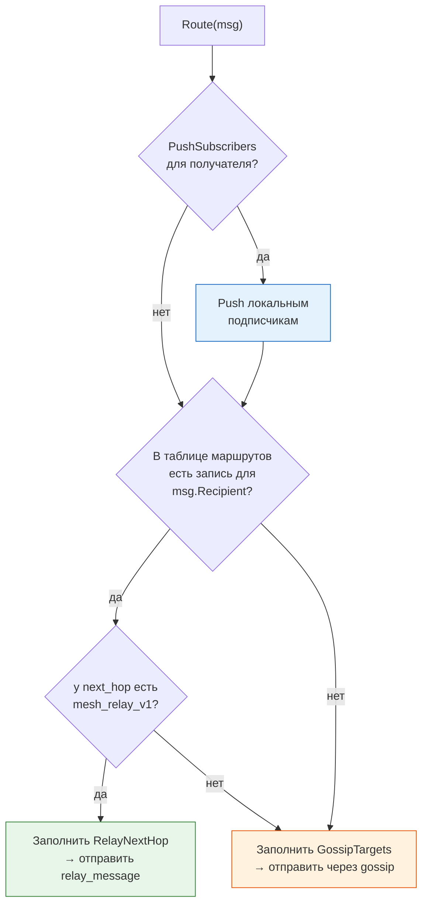
```mermaid
flowchart TD
    MSG["Route(msg)"]
    PUSH{"PushSubscribers<br/>для получателя?"}
    PUSH_Y["Push локальным<br/>подписчикам"]
    LOOKUP{"В таблице маршрутов<br/>есть запись для<br/>msg.Recipient?"}
    CAP{"у next_hop есть<br/>mesh_relay_v1?"}
    RELAY["Заполнить RelayNextHop<br/>→ отправить relay_message"]
    GOSSIP["Заполнить GossipTargets<br/>→ отправить через gossip"]

    MSG --> PUSH
    PUSH -->|да| PUSH_Y
    PUSH -->|нет| LOOKUP
    PUSH_Y --> LOOKUP
    LOOKUP -->|да| CAP
    CAP -->|да| RELAY
    CAP -->|нет| GOSSIP
    LOOKUP -->|нет| GOSSIP

    style PUSH_Y fill:#e3f2fd,stroke:#1565c0
    style RELAY fill:#e8f5e9,stroke:#2e7d32
    style GOSSIP fill:#fff3e0,stroke:#e65100
```
*Диаграмма — Полное решение о маршрутизации: push + lookup таблицы + gossip fallback*

**Withdrawal и triggered update:**

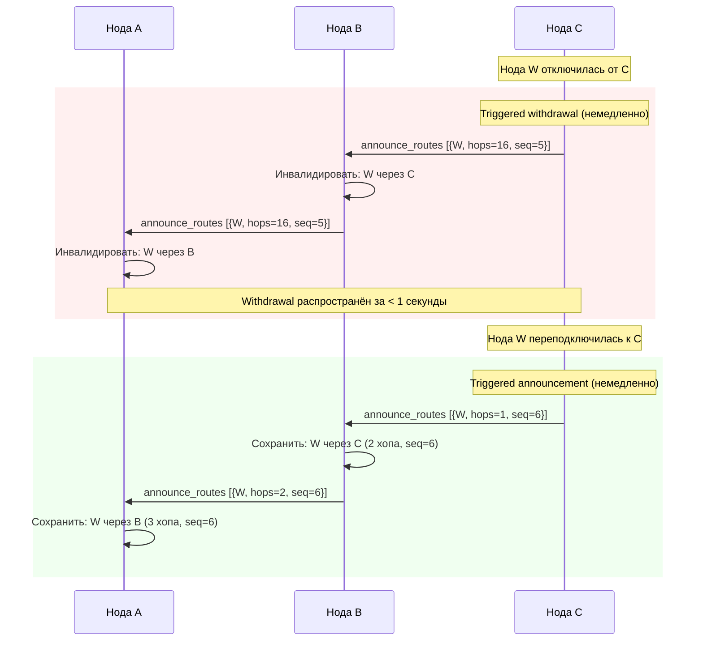
```mermaid
sequenceDiagram
    participant A as Нода A
    participant B as Нода B
    participant C as Нода C

    Note over C: Нода W отключилась от C

    rect rgb(255, 240, 240)
        Note over C: Triggered withdrawal (немедленно)
        C->>B: announce_routes [{W, hops=16, seq=5}]
        B->>B: Инвалидировать: W через C
        B->>A: announce_routes [{W, hops=16, seq=5}]
        A->>A: Инвалидировать: W через B
        Note over A,C: Withdrawal распространён за < 1 секунды
    end

    Note over C: Нода W переподключилась к C

    rect rgb(240, 255, 240)
        Note over C: Triggered announcement (немедленно)
        C->>B: announce_routes [{W, hops=1, seq=6}]
        B->>B: Сохранить: W через C (2 хопа, seq=6)
        B->>A: announce_routes [{W, hops=2, seq=6}]
        A->>A: Сохранить: W через B (3 хопа, seq=6)
    end
```
*Диаграмма — Быстрый withdrawal и повторный анонс через triggered updates*

**Ограничение размера анонсов с ротацией для fairness:** каждый
фрейм `announce_routes` содержит максимум 100 записей маршрутов для
ограничения размера фрейма. Когда таблица превышает 100 записей, нода
применяет справедливую стратегию выбора:

1. **Прямые peer'ы всегда включены** — маршруты с `source="direct"`
   никогда не пропускаются, так как они самые ценные и обычно
   немногочисленны (ограничены max connections).
2. **Остальные слоты заполняются ротацией** — non-direct маршруты
   сортируются по хопам (ближайшие первыми) и затем ротируются через
   per-peer offset, который продвигается каждый цикл. Это гарантирует,
   что все маршруты со временем анонсируются каждому peer'у, а не только
   ближайшие.
3. **Периодическая полная синхронизация** — каждый 5-й цикл (каждые
   2.5 минуты) нода отправляет полный дамп таблицы, при необходимости
   разбитый на несколько фреймов. Это обрабатывает граничные случаи,
   когда ротация пропускает маршруты во время изменений топологии.

**Route selection with hop count (MVP):**

В базовой итерации маршруты ранжируются только по числу хопов и
источнику доверия. Композитный скоринг с RTT, состояниями здоровья
и probe'ами добавляется в Итерации 1.5. Простая метрика достаточна
для первой рабочей таблицы маршрутов: `direct` маршруты
предпочтительнее, затем подтверждённые `hop_ack`, затем
`announcement` с наименьшим числом хопов.

```go
func (t *Table) Lookup(identity string) []RouteEntry {
    // 1. Filter: exclude withdrawn (hops=16)
    // 2. Sort: source priority (direct > hop_ack > announcement),
    //    then by hops ascending
    // 3. Return sorted slice (caller uses first entry as RelayNextHop)
}
```

**Готово когда:** сообщение от A к F идёт по кратчайшему пути, а не
через случайные ноды. При отключении ноды withdrawal распространяется
за секунды. В логах видно `route_via_table` вместо `route_via_gossip`.
Таблица сходится за 1-2 цикла анонсов (30-60 секунд). При
переподключении peer заново анонсирует полную таблицу (без
инкрементальной синхронизации в этой итерации).

**За пределами scope: глобальный discovery.** Distance vector даёт
каждой ноде знание только через её соседей. Нет механизма найти
произвольную identity, если ни один сосед не анонсировал маршрут к ней.
Это фундаментальная граница DV-подхода, а не дефект. Глобальный «найти
любого пользователя в сети» требует отдельного discovery/query слоя —
см. [Iteration 4 — Structured overlay (DHT)](#iter-4). Routing table —
не то место для глобального поиска.

**Progress:**

**Выполнено:** инварианты модели, минимальный вертикальный slice (table routing, анонсы, withdrawals, hop_ack, gossip fallback), RPC-наблюдаемость (`fetch_route_table`, `fetch_route_summary`, `fetch_route_lookup`). Полная документация: [`routing.md`](routing.md), [`rpc/routing.md`](rpc/routing.md).

#### Перевод UI и DMRouter слоя на `domain.PeerIdentity`

Sidebar и связанные функции (`snapRecipients`, `mergeRecipientOrder`, `ensureSelectedRecipient`, `layoutContactsCard`, `searchKnownIdentities`, `recipientsToChildren`) передают адреса identity как `[]string`. Ключ `recipientButtons` и текст `recipientEditor` тоже используют сырой `string`. То же касается ключа `DMRouter.peers` и `RouterSnapshot.Peers` / `PeerOrder`.

Необходимо использовать `domain.PeerIdentity` для compile-time защиты от смешивания адресов identity с другими строковыми значениями (транспортные адреса, пользовательский ввод, алиасы и т.д.).

- [ ] Ключ `DMRouter.peers`: `map[string]*RouterPeerState` → `map[domain.PeerIdentity]*RouterPeerState`
- [ ] `RouterSnapshot.Peers`: `map[string]*RouterPeerState` → `map[domain.PeerIdentity]*RouterPeerState`
- [ ] `RouterSnapshot.PeerOrder`: `[]string` → `[]domain.PeerIdentity`
- [ ] `snapRecipients() []string` → `[]domain.PeerIdentity`
- [ ] Типы параметров `mergeRecipientOrder`, `ensureSelectedRecipient`, `searchKnownIdentities`, `recipientsToChildren`
- [ ] `recipientButtons map[string]*widget.Clickable` → `map[domain.PeerIdentity]*widget.Clickable`
- [ ] Типы параметров `layoutRecipientButton`, `layoutContactsCard`
- [ ] Обновить все места, которые итерируют или индексируют эти структуры
- [ ] Обновить dm_router_test.go и window_test.go

#### Незавершённые задачи перед здоровьем маршрутов

**Дисциплина типизации:** убирать cast'ы из доменных типов в `string` на core-path'ах (например, `string(senderAddress)` там, где callee должен принимать `PeerAddress`). Внутри `node`, `routing`, `relay`, `health`, `queue` и state-management кода такие преобразования должны оставаться только для логирования, protocol serialization, config parsing и UI/RPC boundary.

**Из базовой маршрутизации (Фаза 1.2):**

- [ ] Сохранять неизвестные поля в route entries при ре-анонсировании (forward-compatible relay для onion box keys)
- [ ] Обработка смены identity при реконнекте: отозвать старый identity, добавить новый
- [ ] Integration test: убить единственный table-routed next-hop во время доставки, убедиться что сообщение приходит через gossip за 5s
- [ ] Integration test: peer с 2 TCP-сессиями, убить одну — маршрут остаётся, доставка не прерывается
- [ ] Integration test: 5 узлов, проверить выбор кратчайшего пути
- [ ] Integration test: отключить узел, проверить propagation withdrawal < 5s
- [ ] Integration test: реконнект с другим identity, проверить withdrawal старых маршрутов
- [ ] Mixed-version test: routing-capable узел работает рядом с legacy узлом
- [ ] Triggered withdrawal не ломает legacy peers
- [ ] Integration test: реконнект всегда вызывает full table sync (нет stale cached routes)
- [ ] Integration test: быстрый disconnect/reconnect цикл (3 узла в треугольнике) — нет routing loop или count-to-infinity; таблица сходится за 2 announce цикла

**Fairness, anti-poisoning, rate limiting:**

- [ ] Ограничить анонсы до max 100 маршрутов на announce frame, с fairness rotation
- [ ] Реализовать fairness rotation для лимита размера анонса (direct всегда включены, offset rotation для остальных)
- [ ] Реализовать periodic full sync каждый 5-й цикл (разбить на несколько фреймов при необходимости)
- [ ] Реализовать trust hierarchy в `UpdateRoute()`: direct > hop_ack > announcement (per identity-origin-nextHop triple)
- [ ] Реализовать короткий TTL (30s) для маршрутов от flapping peers (3+ disconnects за 10 мин)
- [ ] Добавить anti-poisoning правила: `announcement` advisory-only, не может переопределить свежий `direct`/`hop_ack`
- [ ] Отклонять или деприоритизировать аномальные route announcements (неправдоподобный `hops`, внезапные всплески identity, нет свежего `SeqNo`)
- [ ] Rate-limit `announce_routes` / `withdrawal` per peer чтобы triggered updates не стали routing flood
- [ ] Добавить квоты на количество новых identity и route entries от одного peer за временное окно
- [ ] Добавить jitter / pacing для periodic full sync чтобы узлы не синхронизировали bandwidth spikes
- [ ] Добавить `route_via_table` / `route_via_gossip` log markers
- [ ] Написать unit-тесты для trust hierarchy (direct > hop_ack > announcement, per-identity-per-nexthop)
- [ ] Написать unit-тесты для announcement fairness rotation
- [ ] Написать unit-тесты для anti-poisoning правил приёма анонсов
- [ ] Integration test: вредоносный peer анонсирует ложные маршруты, доставка деградирует максимум до gossip fallback
- [ ] Integration test: route-update flood не вытесняет честных peers и не вызывает full-sync storm

**Release / compatibility:**

- [ ] `announce_routes` / withdrawal отправляется только peers с `mesh_routing_v1`
- [ ] Без routing table сеть продолжает доставку через gossip fallback

**Чеклист готовности к route health:**

- [ ] переименовать неоднозначные поля вроде `address` в `listenAddress`, `transportAddress` или `identity` по фактической семантике
- [ ] внедрить `KnownPeer`, `PeerSessionRef`, `InboundPeerRef` как embedded типы в runtime-структурах для устранения дублирования полей

---

<a id="iter-1-5"></a>
#### Здоровье маршрутов, probe'ы и RTT-скоринг

**Цель:** улучшить качество выбора маршрутов за пределы простого hop count.
Добавить активный health tracking для `(identity, origin, nextHop)` троек, лёгкие
probe'ы для верификации reachability, оценку RTT из TCP-сессий и композитный
score маршрута, который объединяет все сигналы. Также добавляет целевые
route query'и для быстрого восстановления после сбоя next-hop.

**Зависит от:** базовая таблица маршрутов (анонсы, withdrawals, RPC-наблюдаемость — всё реализовано и протестировано).

**Ограничение по capabilities:** `route_probe` и `route_query` — это
новые wire-level типы фреймов, которые ноды Итерации 1 не понимают.
Нода, работающая только на Итерации 1, может законно объявлять
`mesh_routing_v1`, не зная этих фреймов. Отправка их под тем же
capability ломает mixed-version совместимость.

Новые capabilities, вводимые в этой итерации:

- **`mesh_route_probe_v1`** — гейтит обмен `route_probe` /
  `route_probe_ack`. Отправляется только peer'ам с этим capability.
- **`mesh_route_query_v1`** — гейтит обмен `route_query` /
  `route_query_response`. Отправляется только peer'ам с этим capability.

Трекинг здоровья и композитный скоринг — внутренние (без новых
wire-фреймов) и не требуют отдельного capability. Нода с только
`mesh_routing_v1` продолжает работать — получает анонсы и withdrawal
нормально, маршруты ранжируются по hop count вместо композитного score.

**Новые файлы** (расширение модуля маршрутизации):

```
internal/core/routing/
  health.go           — RouteHealthState, health state machine transitions
  probe.go            — route_probe sender/handler
  score.go            — CompositeScore, RTT estimation (EWMA)
  query.go            — route_query / route_query_response
```

##### 1.5a. Next-hop health state machine

Каждая тройка `(identity, origin, nextHop)` отслеживается независимо
с явным health-состоянием — совпадая с ключом дедупликации таблицы
маршрутов. Hop-ack для сообщения к identity X через next-hop B от
origin C влияет только на здоровье маршрута `(X, origin=C, via B)` —
не на все маршруты через B, и не на маршруты к X от другого origin через
тот же B. Transport-level liveness (TCP-сессия живая) отслеживается
отдельно через `node.Service`.

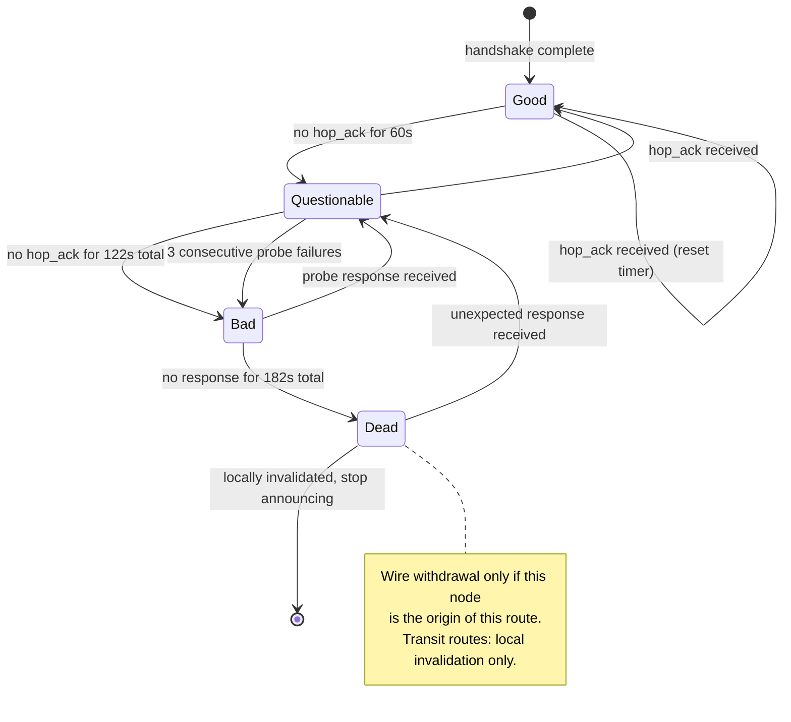
```mermaid
stateDiagram-v2
    [*] --> Good: handshake complete

    Good --> Questionable: no hop_ack for 60s
    Good --> Good: hop_ack received (reset timer)

    Questionable --> Good: hop_ack received
    Questionable --> Bad: no hop_ack for 122s total
    Questionable --> Bad: 3 consecutive probe failures

    Bad --> Questionable: probe response received
    Bad --> Dead: no response for 182s total

    Dead --> [*]: locally invalidated, stop announcing
    Dead --> Questionable: unexpected response received

    note right of Dead
        Wire withdrawal only if this node
        is the origin of this route.
        Transit routes: local invalidation only.
    end note
```
*Диаграмма — Route health state machine (per identity-origin-nextHop triple)*

```go
type RouteHealth uint8

const (
    HealthGood         RouteHealth = iota // responding, route fully trusted
    HealthQuestionable                     // no recent confirmation, probing
    HealthBad                              // unresponsive, route deprioritized
    HealthDead                             // timed out, locally invalidated (wire withdrawal only if own-origin)
)

// RouteHealthState tracks health per (identity, origin, nextHop) triple,
// matching the routing table's dedup key.
type RouteHealthState struct {
    Identity        string        // target identity
    Origin          string        // who originated this route (matches RouteEntry.Origin)
    NextHop         string        // peer identity of next hop
    Health          RouteHealth
    LastHopAck      time.Time     // last hop_ack for THIS identity via THIS next-hop
    LastProbe       time.Time     // last probe sent for this pair
    ProbeFailures   int           // consecutive probe failures
    RTT             time.Duration // estimated RTT (EWMA) for this path
    TransitionAt    time.Time     // when current health state was entered
}
```

| State | Condition | Route behavior |
|---|---|---|
| **Good** | `hop_ack` received within 60s for this (identity, origin, nextHop) triple | Route used normally, full TTL |
| **Questionable** | No `hop_ack` for 60–122s for this triple | Route deprioritized, probes sent every 15s |
| **Bad** | No response for 122s or 3 probe failures | Route excluded from selection, gossip used instead |
| **Dead** | No response for 182s | Route locally invalidated, stop announcing. Wire withdrawal sent only if this node is the origin; transit routes are silently dropped and converge via TTL expiry or origin's own withdrawal. |

Маршруты с `Bad` или `Dead` health не выбираются в `Lookup()`, если не осталось
других маршрутов (последний рубеж перед gossip fallback).

##### 1.5b. Route probe mechanism

Лёгкий probe проверяет, что конкретный next-hop может реально переслать
трафик к заявленному identity, без ожидания реального трафика для
генерации `hop_ack`.

```json
{
  "type": "route_probe",
  "probe_id": 12345678,
  "target_identity": "alice_addr"
}
```

```json
{
  "type": "route_probe_ack",
  "probe_id": 12345678,
  "reachable": true,
  "rtt_ms": 45
}
```

**Probe rules:**

- Probes are sent for `(identity, origin, nextHop)` triples in `Questionable` state every 15 seconds.
- A `route_probe_ack` with `reachable=true` transitions the specific triple
  back to `Good` and updates the RTT estimate for that triple.
- A `route_probe_ack` with `reachable=false` keeps the triple in
  `Questionable` (the next-hop is alive but can't reach the target).
- No response within 5 seconds counts as a probe failure.
- Probes are also sent when a new announced route is first received
  from a previously unknown next-hop (verify before trusting).

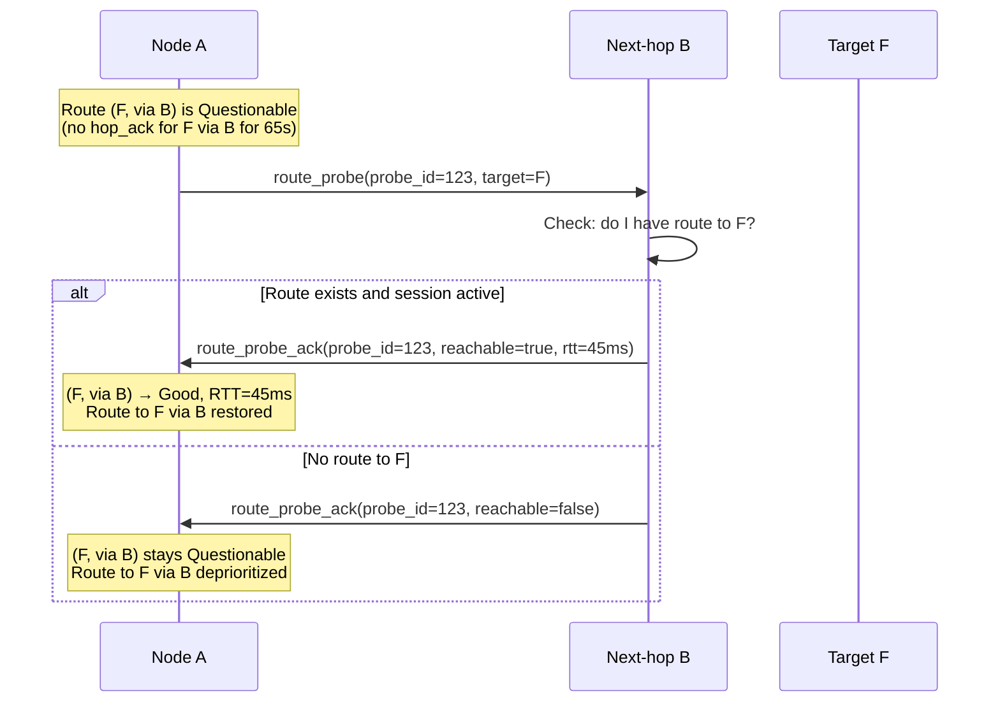
```mermaid
sequenceDiagram
    participant A as Node A
    participant B as Next-hop B
    participant F as Target F

    Note over A: Route (F, via B) is Questionable<br/>(no hop_ack for F via B for 65s)

    A->>B: route_probe(probe_id=123, target=F)
    B->>B: Check: do I have route to F?
    alt Route exists and session active
        B->>A: route_probe_ack(probe_id=123, reachable=true, rtt=45ms)
        Note over A: (F, via B) → Good, RTT=45ms<br/>Route to F via B restored
    else No route to F
        B->>A: route_probe_ack(probe_id=123, reachable=false)
        Note over A: (F, via B) stays Questionable<br/>Route to F via B deprioritized
    end
```
*Diagram — Route probe and health recovery*

##### 1.5c. RTT-weighted composite route score

Чисто hop-count метрика может выбрать 2-хоповый путь через перегруженный
трансконтинентальный relay вместо 3-хопового локального mesh-пути. Добавление
оценки RTT даёт лучшие решения маршрутизации.

RTT оценивается через Exponentially Weighted Moving Average (EWMA) из тайминга
TCP-сессии транспортного уровня. Поскольку каждое соединение с peer'ом
использует TCP-сессию, RTT доступен «бесплатно» через замер времени между
отправкой данных и получением ответа `hop_ack`. На Linux `tcp_info` через
`getsockopt` предоставляет оценки RTT на уровне ядра. Механизм probe (раздел
1.5b) также вносит сэмплы RTT при получении ответов:

```go
func (s *RouteHealthState) UpdateRTT(sample time.Duration) {
    const alpha = 0.3 // smoothing factor — higher = more responsive
    if s.RTT == 0 {
        s.RTT = sample
    } else {
        s.RTT = time.Duration(float64(s.RTT)*(1-alpha) + float64(sample)*alpha)
    }
}
```

Композитный score маршрута объединяет hops, RTT и health:

```go
func (e RouteEntry) CompositeScore(health *RouteHealthState) float64 {
    // Base score: penalize distance
    score := 100.0 - float64(e.Hops)*10.0

    // Bonus for low latency (max +30 for RTT < 20ms)
    if health != nil && health.RTT > 0 {
        rttMs := float64(health.RTT.Milliseconds())
        if rttMs < 20 {
            score += 30.0
        } else if rttMs < 100 {
            score += 20.0 * (100.0 - rttMs) / 80.0
        }
        // RTT > 100ms: no bonus
    }

    // Health penalty
    if health != nil {
        switch health.Health {
        case HealthGood:
            // no penalty
        case HealthQuestionable:
            score -= 20.0
        case HealthBad:
            score -= 50.0
        case HealthDead:
            score = -1.0 // excluded from selection
        }
    }

    // Trust bonus
    switch e.Source {
    case "direct":
        score += 20.0
    case "hop_ack":
        score += 10.0
    case "announcement":
        // no bonus
    }

    return score
}
```

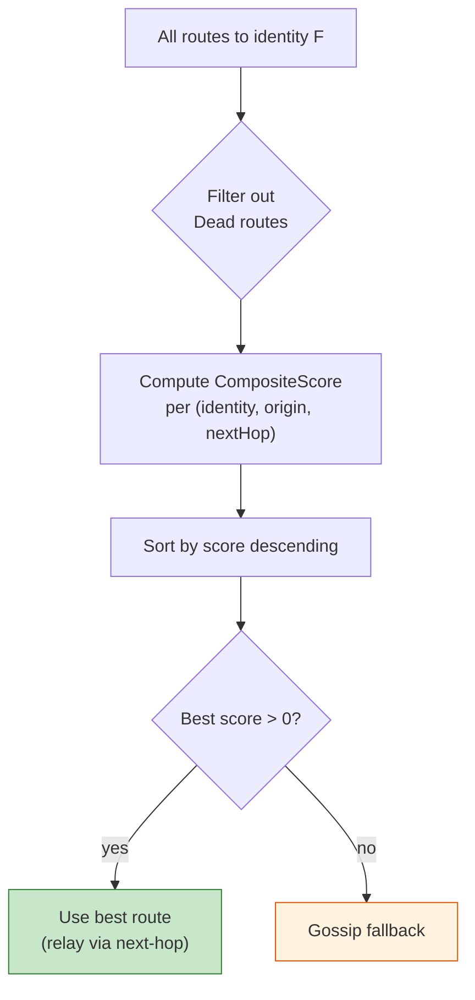
```mermaid
flowchart TD
    ROUTES["All routes to identity F"]
    FILTER{"Filter out<br/>Dead routes"}
    SCORE["Compute CompositeScore<br/>per (identity, origin, nextHop)"]
    SORT["Sort by score descending"]
    BEST{"Best score > 0?"}
    USE["Use best route<br/>(relay via next-hop)"]
    GOSSIP["Gossip fallback"]

    ROUTES --> FILTER --> SCORE --> SORT --> BEST
    BEST -->|yes| USE
    BEST -->|no| GOSSIP

    style USE fill:#c8e6c9,stroke:#2e7d32
    style GOSSIP fill:#fff3e0,stroke:#e65100
```
*Diagram — Route selection using composite score*

##### 1.5d. Targeted route query

Когда маршрут к целевому identity — `Bad` или все известные маршруты
исчерпаны, нода может попросить у подключённых peer'ов лучшие маршруты
через целевой запрос. Это ускоряет сходимость без ожидания следующего
периодического цикла announce.

**`route_query`** — спросить конкретного peer'а о маршруте:

```json
{
  "type": "route_query",
  "query_id": 87654321,
  "target_identity": "alice_addr"
}
```

**`route_query_response`** — peer отвечает со своим лучшим знанием:

```json
{
  "type": "route_query_response",
  "query_id": 87654321,
  "routes": [
    {"identity": "alice_addr", "hops": 1, "seq": 55}
  ]
}
```

**Rules:**

- `route_query` is sent only to directly connected peers.
- At most 3 queries per target identity per 30 seconds (rate limited).
- Responses are treated as `source="announcement"` entries (same trust).
- A node does not forward `route_query` — it is single-hop only (no
  recursive flood).
- Primary use case: fast route recovery after a route goes `Bad`.

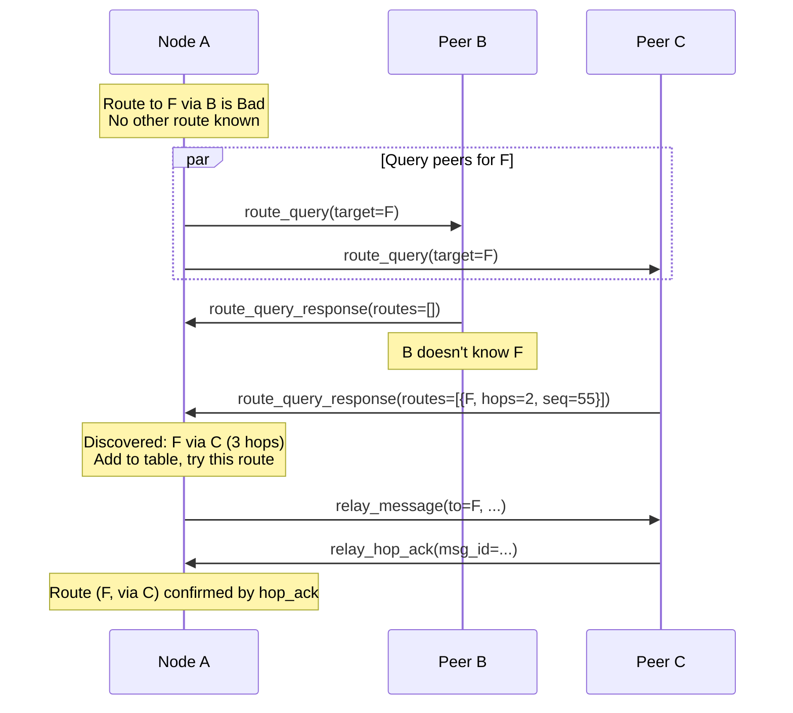
```mermaid
sequenceDiagram
    participant A as Node A
    participant B as Peer B
    participant C as Peer C

    Note over A: Route to F via B is Bad<br/>No other route known

    par Query peers for F
        A->>B: route_query(target=F)
        A->>C: route_query(target=F)
    end

    B->>A: route_query_response(routes=[])
    Note over B: B doesn't know F

    C->>A: route_query_response(routes=[{F, hops=2, seq=55}])
    Note over A: Discovered: F via C (3 hops)<br/>Add to table, try this route

    A->>C: relay_message(to=F, ...)
    C->>A: relay_hop_ack(msg_id=...)
    Note over A: Route (F, via C) confirmed by hop_ack
```
*Diagram — Targeted route query after route failure*

**Done when:** маршруты через перегруженные или медленные каналы депривилегируются
на основе RTT. Health-переходы логируются. Route query'и обнаруживают
альтернативные пути в течение секунд после перехода маршрута в `Bad`. Probe'ы
верифицируют новые анонсированные маршруты перед использованием для
high-priority трафика.

**Progress:**

- [ ] Create `routing/health.go` with `RouteHealthState` and state machine (per identity-origin-nextHop triple)
- [ ] Implement health transitions: 60s → Questionable, 122s → Bad, 182s → Dead (per triple)
- [ ] Implement Dead state: local invalidation + stop announcing; wire withdrawal only if this node is the origin
- [ ] Implement automatic transition back: hop_ack or probe_ack → Good (scoped to specific triple)
- [ ] Integrate health tracking into `Table.Lookup()`: exclude Dead, deprioritize Bad
- [ ] Define `route_probe` / `route_probe_ack` frame types
- [ ] Create `routing/probe.go` — probe sender: every 15s to Questionable triples
- [ ] Implement probe handler: check local routes, respond with reachability + RTT
- [ ] Send probe to new next-hops on first announcement (verify before trust)
- [ ] Create `routing/score.go` with `UpdateRTT()` EWMA (alpha=0.3) from hop_ack and probe_ack
- [ ] Implement `CompositeScore()`: hops × 10 + RTT bonus + health penalty + trust bonus
- [ ] Replace hop-count sort in `Table.Lookup()` with `CompositeScore` ranking
- [ ] Define `route_query` / `route_query_response` frame types
- [ ] Create `routing/query.go` — targeted query sender after route failure
- [ ] Rate-limit queries: max 3 per identity per 30 seconds
- [ ] Implement query handler: respond with best known routes for queried identity
- [ ] Add `fetch_route_health` RPC command (health states per identity-origin-nextHop triple)
- [ ] Write unit tests for health state transitions (Good → Questionable → Bad → Dead → recovery)
- [ ] Write unit tests for health scoping (hop_ack for (X, origin=C, via B) does not affect (X, origin=D, via B) or (Y, origin=C, via B))
- [ ] Write unit tests for Dead state: transit route locally invalidated (no wire withdrawal), own-origin route emits wire withdrawal
- [ ] Write unit tests for probe send/receive cycle and health recovery
- [ ] Write unit tests for RTT EWMA calculation with varying samples
- [ ] Write unit tests for CompositeScore ranking (low-RTT 3-hop beats high-RTT 2-hop)
- [ ] Write unit tests for route_query/response (single-hop, rate-limited)
- [ ] Integration test: high-RTT direct peer deprioritized vs low-RTT 2-hop route
- [ ] Integration test: next-hop route goes Bad → node discovers alternative via route_query → recovered
- [ ] Integration test: probe verifies new announced route before high-priority traffic uses it

**Release / Compatibility:**

- [ ] `route_probe` / `route_probe_ack` sent only to peers with `mesh_route_probe_v1`
- [ ] `route_query` / `route_query_response` sent only to peers with `mesh_route_query_v1`
- [ ] Nodes without iteration 1.5 still work — they use hop-count-only routing from iteration 1
- [ ] CompositeScore gracefully handles nil health state (falls back to hop-count-only)
- [ ] Mixed-version test: 1.5 node does not send probe/query frames to 1.0-only peer
- [ ] Confirmed: iteration 1.5 is additive; new capabilities are optional, no protocol bump required

<a id="iter-2"></a>
### Итерация 2 — Надёжность, репутация, multi-path и инкрементальная синхронизация

**Цель:** несколько маршрутов на identity, автоматический failover на основе
success rate hop-by-hop ack, защита от black-hole нод. Также добавляет
инкрементальную синхронизацию через таблицу-digest для эффективного
переподключения.

Примечание: согласование capabilities и ограничение размера анонсов уже
обработаны в итерациях 0 и 1 соответственно. Health tracking, probe'ы и
composite scoring обработаны в итерации 1.5. Эта итерация фокусируется на
надёжности, multi-path failover и оптимизации синхронизации.

**2.0. Инкрементальная синхронизация через таблицу-digest:**

Когда peer переподключается, обе стороны могут пропустить полный дамп
таблицы, обменявшись компактным таблица-digest первым. Это требует
**route cache**, который сохраняется после закрытия сессии — в отличие
от итерации 1, где все маршруты от peer'а инвалидируются немедленно
при отключении.

Route cache хранит read-only snapshot того, что peer последний раз
анонсировал, с отдельным expiry (напр., 5 минут). При переподключении
в окне cache, digest сравнивается и обмениваются только deltas. Если
cache истёк или digest не совпадает, происходит полная синхронизация
(такая же как в итерации 1).

**`route_sync_digest`** — отправляется немедленно после handshake известному peer'у:

```json
{
  "type": "route_sync_digest",
  "table_hash": "sha256_of_sorted_identity_seq_pairs",
  "entry_count": 47,
  "max_seq": 142
}
```

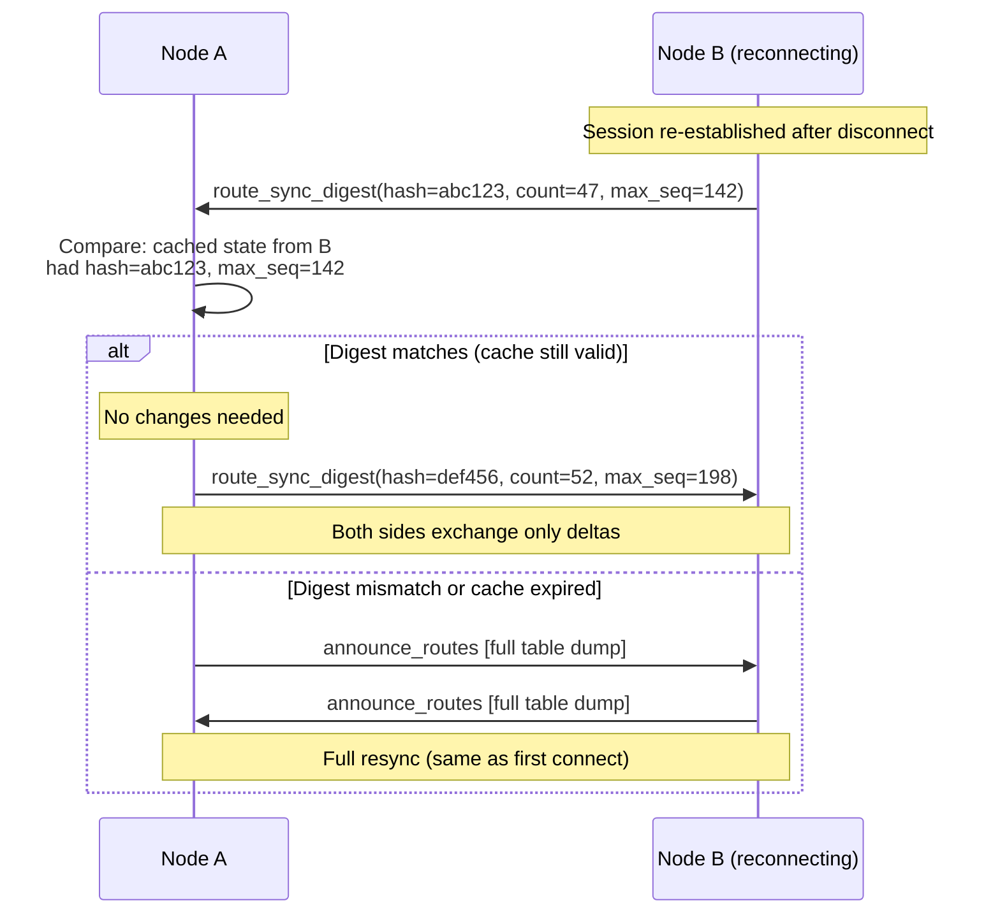
```mermaid
sequenceDiagram
    participant A as Node A
    participant B as Node B (reconnecting)

    Note over B: Session re-established after disconnect

    B->>A: route_sync_digest(hash=abc123, count=47, max_seq=142)
    A->>A: Compare: cached state from B<br/>had hash=abc123, max_seq=142

    alt Digest matches (cache still valid)
        Note over A: No changes needed
        A->>B: route_sync_digest(hash=def456, count=52, max_seq=198)
        Note over A,B: Both sides exchange only deltas
    else Digest mismatch or cache expired
        A->>B: announce_routes [full table dump]
        B->>A: announce_routes [full table dump]
        Note over A,B: Full resync (same as first connect)
    end
```
*Диаграмма — Incremental sync via table digest on reconnect*

**3a. Множественные маршруты и failover:**

Таблица уже хранит несколько маршрутов на identity (из итерации 2). Эта
итерация добавляет активный выбор маршрута и failover. Когда `relay_hop_ack`
не получен в течение 10 секунд от primary next_hop, нода повторяет через
второй лучший маршрут. Если и тот не работает — gossip fallback.

```
Identity "F":
  маршрут 1: через peer_C, 2 хопа, reliability 0.95  ← primary
  маршрут 2: через peer_D, 3 хопа, reliability 0.80  ← fallback
  маршрут 3: gossip                                    ← последний рубеж
```

**3b. Репутация маршрутов на основе hop-by-hop ack:**

Репутация маршрута измеряется по success rate ответов `relay_hop_ack`, а не
по end-to-end delivery receipt. Это критично, потому что delivery receipt
может дойти через gossip, даже когда выбранный next_hop дропнул сообщение.

**Защита от ложных penalty:** penalty не должны быть переносимыми по сети.
Иначе злоумышленник сможет не только отравлять таблицу маршрутов, но и
ложно топить честные ноды через клевету. Поэтому репутация в этой итерации —
строго **локальная**:

1. **Штраф только за локально наблюдаемое поведение.** Нода штрафует next_hop
   только за собственный timeout `relay_hop_ack`, локально наблюдаемый failover
   и повторяемые сбои доставки через этот next_hop.
2. **Чужие жалобы не считаются доказательством.** Никакие входящие фреймы,
   route-анонсы или негативные заявления вида "peer X плохой" не должны
   напрямую менять `ReliabilityScore`.
3. **Penalty мягкий и обратимый.** Сначала маршрут депривилегируется или
   попадает в cooldown/quarantine, а не получает перманентный ban.
4. **Оценка относится к маршруту, а не к абсолютной "вине".** Если путь
   через `nextHop=A` часто ломается, это повод понизить `route_score`, но не
   повод объявить identity A глобально злонамеренной для всей сети.

**Почему сбои обратного пути receipt подкрепляют этот выбор:**
hop-by-hop обратный путь receipt (из итерации 1) может частично сломаться —
например, нода C доставляет F и отправляет receipt обратно к A, но нода B
временно недоступна. Если бы скоринг использовал прибытие end-to-end
receipt, A штрафовала бы прямой путь (A→B→C) за сбой, произошедший на
**обратном** пути (C→B→A). Поскольку `relay_hop_ack` отправляется
немедленно прямым next_hop до любой дальнейшей пересылки, он невосприимчив
к сбоям downstream или обратного пути. Это сильнейший аргумент в пользу
скоринга только по hop-ack.

```go
type RouteEntry struct {
    // ... существующие поля из итерации 2
    HopAckAttempts   int
    HopAckSuccesses  int
    ReliabilityScore float64  // successes / attempts (0.0 до 1.0)
}
```

При получении `relay_hop_ack` → `HopAckSuccesses++`.
При истечении 10с без `relay_hop_ack` → `HopAckAttempts++` (без success).
Score пересчитывается.

Если `ReliabilityScore` падает ниже 0.3 после минимум 5 попыток, маршрут
депривилегируется (но не удаляется — может восстановиться).

**3c. Составной выбор маршрутов:**

Маршруты ранжируются по локально вычисленному `RouteScore`:
`ReliabilityScore * 100 - Hops * 10`. Длинный но надёжный маршрут
побеждает короткий но нестабильный.

**3d. Multi-path и ограничение blast radius:**

Нода не должна безоговорочно доверять единственному "лучшему" маршруту,
особенно если он новый или недавно восстановился после cooldown. Для
identity с несколькими маршрутами выбор должен быть много-путевым:

- стабильный primary получает основной трафик;
- secondary держится тёплым и периодически используется для проверки
  жизнеспособности;
- новые или сомнительные маршруты получают только небольшую долю трафика,
  пока не накопят локальную историю успеха.

Это уменьшает эффект route poisoning и black-hole атак: злоумышленник не
получает весь поток сразу даже после успешного route announcement.

**3e. Обнаружение black-hole:**

Нода, которая постоянно заявляет маршруты через `announce_routes`, но никогда
не возвращает `relay_hop_ack` — подозреваемая black hole. После 5 подряд
неудач через этот next_hop (по разным сообщениям), нода логирует предупреждение
и добавляет 2-минутный штрафной cooldown, в течение которого этот next_hop
пропускается для новых сообщений.

**Готово когда:** при отключении ноды C из цепочки A-B-C-D-E-F сообщение
автоматически перенаправляется через альтернативный путь за 10-20 секунд
(таймаут hop-ack + retry). Black-hole нода обнаруживается и депривилегируется
после 5 сообщений.

**Прогресс:**

- [ ] Хранить несколько маршрутов на identity в `PeerAwarenessTable` (может уже быть из итерации 2)
- [ ] Добавить `HopAckAttempts`, `HopAckSuccesses`, `ReliabilityScore` в `RouteEntry`
- [ ] Трекать success/failure hop-ack по тройке `(identity, origin, nextHop)`
- [ ] Реализовать 10с таймаут hop-ack → отметить попытку как неудачную
- [ ] Реализовать составное ранжирование маршрутов: `reliability * 100 - hops * 10`
- [ ] Держать penalty локальными: не принимать внешние claims о "плохих" peer'ах как вход в `ReliabilityScore`
- [ ] Реализовать автоматический failover: попробовать следующий маршрут при таймауте hop-ack
- [ ] Реализовать multi-path traffic shaping: новый/сомнительный маршрут получает только часть трафика до накопления истории
- [ ] Реализовать gossip fallback как последний рубеж
- [ ] Реализовать обнаружение black-hole: 5 подряд неудач → 2-мин cooldown
- [ ] Добавить slow-start trust для новых peer'ов: новый next-hop не может сразу получить весь трафик
- [ ] Ограничить максимальное влияние одного peer'а на route selection, чтобы одна нода не перетягивала поток целиком
- [ ] Добавить decay/recovery для reputation и cooldown expiry, чтобы защита не делала вечных банов
- [ ] Логировать предупреждение при подозрении на black-hole ноду
- [ ] Написать unit-тесты для скоринга репутации
- [ ] Написать unit-тесты для защиты от ложных penalty (внешний negative signal не меняет score)
- [ ] Написать unit-тесты для логики failover (primary fails → secondary → gossip)
- [ ] Написать unit-тесты для progressive rollout на новые/сомнительные маршруты
- [ ] Написать unit-тесты для обнаружения black-hole и cooldown
- [ ] Интеграционный тест: отключение средней ноды, проверка перемаршрутизации за 20с
- [ ] Интеграционный тест: black-hole нода (принимает relay, никогда не ack'ает), проверка обнаружения
- [ ] Интеграционный тест: attacker пытается вызвать ложную деградацию репутации честного peer'а, score не уходит в permanent penalty
- [ ] Реализовать ingress suppression: исключать arrival-линк из набора relay-кандидатов для каждого ретранслируемого сообщения — предотвращает обратную маршрутизацию и снижает ненужную relay-нагрузку
- [ ] Реализовать per-peer handshake rate budget: лимит попыток инициации handshake до `max_handshake_attempts_per_peer` (по умолчанию 3 за 60 с) для предотвращения исчерпания ресурсов быстрыми reconnect/handshake циклами
- [ ] Unit-тест: ingress-линк исключён из relay-кандидатов для ретранслированного сообщения
- [ ] Unit-тест: handshake rate budget исчерпан → дальнейшие попытки отложены до истечения окна

**Release / Compatibility:**

- [ ] Failover и репутация влияют только на выбор маршрута, а не на базовую совместимость
- [ ] При отсутствии `relay_hop_ack` сеть деградирует до gossip fallback, а не ломается
- [ ] Mixed-version тест: нода с reputation/failover работает с нодой без этих улучшений
- [ ] Black-hole mitigation не приводит к ложному полному ban без fallback path
- [ ] Подтверждено: итерация 2 не требует повышения `MinimumProtocolVersion`

<a id="iter-3"></a>
### Итерация 3 — Оптимизация и масштабирование

**Цель:** чистая оптимизация для роста сети до сотен нод. Никаких новых
протокольных семантик — только улучшения эффективности.

Примечание: triggered updates и withdrawal уже в итерации 2. Эта итерация
фокусируется на снижении bandwidth и улучшении структур данных.

**4a. Инкрементальные анонсы маршрутов:**

30-секундный периодический цикл сейчас отправляет полную таблицу. Заменить на
delta-only: трекать, какие маршруты изменились с последнего анонса каждому
peer'у, и отправлять только diff. Полная таблица отправляется только при
начальной синхронизации (новая peer-сессия). `SeqNo` из итерации 2 упрощает
задачу — каждый peer трекает последний отправленный `SeqNo` по маршруту.

**4b. Bloom filter для seen-сообщений:**

Сейчас `s.seen[string(msg.ID)]` — это map, который растёт бесконечно
(чистится только по TTL). Заменить на ротируемый Bloom filter — два фильтра,
каждые 5 минут текущий становится старым, старый удаляется. Ложные отрицания
невозможны (seen-сообщение всегда обнаруживается). Ложные срабатывания
допустимы при rate < 0.1%.

**4c. Метрика маршрутов с учётом латентности:**

Добавить измерение RTT в каждую peer-сессию (из ping/pong). Метрика маршрута
становится: `reliability * 100 - hops * 10 - avg_rtt_ms / 10`. Это позволяет
выбирать не просто кратчайший или надёжный путь, а самый быстрый.

**4d. Сжатие анонсов:**

Для сетей с 100+ identity анонсы маршрутов могут быть большими. Использовать
delta-кодирование (только изменённые маршруты) и, при необходимости,
gzip-сжатие payload анонса.

**4e. Overload mode и анти-DoS эксплуатация:**

Когда нода видит перегрузку по CPU, памяти, числу handshake'ов или длине
очередей, она должна входить в degradable overload mode:

- снижать gossip fan-out и частоту не-критичных announce-циклов;
- сжимать / откладывать non-urgent sync;
- отдавать приоритет уже аутентифицированным peer'ам и активным сессиям;
- включать более жёсткие admission limits только на время атаки.

Опциональный adaptive challenge (например, лёгкий proof-of-work или
повышенный handshake challenge) допустим только как аварийный режим и не
должен становиться обязательным для обычной работы сети.

**Готово когда:** сеть из 50 нод сходится за 2 минуты. Трафик анонсов
маршрутов не превышает 5% от общего трафика. Bloom filter не даёт ложных
пропусков.

**Прогресс:**

- [ ] Реализовать инкрементальные анонсы маршрутов (дельта с последнего анонса per peer)
- [ ] Трекинг per-peer последнего отправленного `SeqNo` для каждого маршрута
- [ ] Полная синхронизация таблицы только при установлении новой peer-сессии
- [ ] Заменить `s.seen` map на ротируемый Bloom filter (2 фильтра, ротация 5 мин)
- [ ] Добавить измерение RTT в peer-сессии (из ping/pong round-trip)
- [ ] Добавить компонент латентности в составную метрику маршрутов
- [ ] Реализовать сжатие анонсов для больших таблиц маршрутов
- [ ] Реализовать overload mode: adaptive backpressure, снижение gossip fan-out, приоритизация authenticated peer'ов
- [ ] Ввести жёсткие лимиты на concurrent handshakes, frame decode budget и queue growth budget
- [ ] Защититься от compression/decompression bomb и oversized frame payload
- [ ] Измерить трафик анонсов маршрутов как процент от общего
- [ ] Написать бенчмарки для false positive rate Bloom filter
- [ ] Написать бенчмарки для операций таблицы маршрутов при 100+ записях
- [ ] Нагрузочный тест: симуляция 50 нод, измерение времени сходимости
- [ ] Нагрузочный тест: измерение экономии bandwidth от delta-анонсов
- [ ] Нагрузочный тест: handshake/relay flood, проверка controlled degradation без остановки честного трафика
- [ ] Реализовать адаптивную агрессивность relay на основе степени ноды: ноды со степенью > `high_degree_threshold` (по умолчанию 15) снижают gossip fanout ratio для гашения broadcast-штормов в плотных кластерах; ноды с малой степенью relay-ят на полной агрессивности для обеспечения связности
- [ ] Реализовать density-aware интервалы announce: `announce_interval_dense` (по умолчанию 60 с, когда число пиров > порога) vs `announce_interval_sparse` (по умолчанию 30 с) — адаптирует частоту объявлений к размеру сети, снижая overhead в крупных сетях
- [ ] Реализовать подписанные route announcements (capability `mesh_attested_links_v1`): Ed25519-подпись, покрывающая `identity_fingerprint || box_public_key || timestamp || route_table_hash` — предотвращает спуфинг route announcement без signing key; неподписанные announcements продолжают приниматься от нод без capability (обратная совместимость)
- [ ] Unit-тест: high-degree нода снижает fanout ratio; low-degree relay-ит на полной скорости
- [ ] Unit-тест: dense announce interval применяется при числе пиров > порога
- [ ] Unit-тест: подписанный announcement с неправильным ключом отклонён; неподписанный принимается при отсутствии capability
- [ ] Нагрузочный тест: плотный кластер 100 нод с adaptive fanout vs без — измерение снижения message amplification

**Release / Compatibility:**

- [ ] Delta-announcements совместимы с полным periodic sync
- [ ] При несовместимости/ошибке оптимизаций используется full sync fallback
- [ ] Bloom filter не создаёт false negatives для обязательной логики доставки
- [ ] Mixed-version тест: нода с delta sync работает с нодой на full sync
- [ ] Подтверждено: итерация 3 не требует повышения `MinimumProtocolVersion`

<a id="iter-4"></a>
### Итерация 4 (будущее) — Структурированный overlay (DHT)

**Цель:** масштабирование до тысяч нод.

Когда `PeerAwarenessTable` вырастет до 500+ записей, переход на
Kademlia-подобный DHT. Таблица маршрутов содержит O(log n) записей вместо
O(n). Lookup за O(log n) хопов.

Это **не нужно сейчас**, но архитектура итераций 0-4 готовит к этому:
интерфейс `Router` остаётся, изменится только реализация внутри.

**Прогресс:**

- [ ] Исследовать Kademlia XOR-метрику для маршрутизации по identity
- [ ] Спроектировать структуру k-bucket для O(log n) таблицы маршрутов
- [ ] Определить протокол DHT lookup (итеративный vs рекурсивный)
- [ ] Реализовать `DHTRouter` за интерфейсом `Router` (тот же контракт, что у `TableRouter`)
- [ ] Реализовать путь миграции с `PeerAwarenessTable` на DHT
- [ ] Реализовать механизмы защиты от Sybil-атак
- [ ] Исследовать adaptive admission under attack: optional puzzles / stake / invitation mode без обязательного always-on барьера
- [ ] Бенчмарки: латентность DHT lookup при 1000+ нодах
- [ ] Интеграционный тест: смешанная сеть с нодами `TableRouter` и `DHTRouter` одновременно
- [ ] Интеграционный тест: fallback на gossip при неуспешном DHT lookup (недоступный диапазон ключей)
- [ ] Интеграционный тест: churn 20-50 нод с проверкой delivery rate (цель: >95% за 30с)
- [ ] Интеграционный тест: живая миграция и rollback между реализациями `TableRouter` и `DHTRouter`
- [ ] Security-тест: Sybil/eclipse симуляция — проверка, что один кластер не может полностью перехватить lookup для любого identity

**Release / Compatibility:**

- [ ] Определено: DHT — опциональный router backend или обязательное поведение сети
- [ ] Если DHT опциональный: mixed-version сеть (`TableRouter` + `DHTRouter`) проходит интеграционные тесты
- [ ] Если DHT обязательный: повышен `ProtocolVersion`
- [ ] Если DHT обязательный: задокументирован dual-stack rollout период
- [ ] Если DHT обязательный: после dual-stack периода повышен `MinimumProtocolVersion`
- [ ] Добавлен rollback тест: `DHTRouter` → legacy/`TableRouter`
- [ ] Добавлен mixed-version migration тест: старые/новые routing backends сосуществуют

### Граф зависимостей итераций

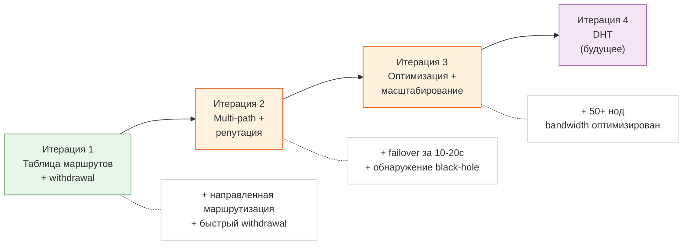
```mermaid
graph LR
    I1["Итерация 1<br/>Таблица маршрутов<br/>+ withdrawal"]
    I2["Итерация 2<br/>Multi-path +<br/>репутация"]
    I3["Итерация 3<br/>Оптимизация +<br/>масштабирование"]
    I4["Итерация 4<br/>DHT<br/>(будущее)"]

    I1 --> I2 --> I3 --> I4

    I1 -.- W1["+ направленная маршрутизация<br/>+ быстрый withdrawal"]
    I2 -.- W2["+ failover за 10-20с<br/>+ обнаружение black-hole"]
    I3 -.- W3["+ 50+ нод<br/>bandwidth оптимизирован"]

    style I1 fill:#e8f5e9,stroke:#2e7d32
    style I2 fill:#fff3e0,stroke:#e65100
    style I3 fill:#fff3e0,stroke:#e65100
    style I4 fill:#f3e5f5,stroke:#7b1fa2
    style W1 fill:#ffffff,stroke:#ccc
    style W2 fill:#ffffff,stroke:#ccc
    style W3 fill:#ffffff,stroke:#ccc
```
*Диаграмма — Зависимости итераций и инкрементальная поставка*

### Продуктовые итерации после mesh

Эти итерации продолжают roadmap после стабилизации mesh-основания. Порядок
ниже отражает практическую ценность для роста продукта, приватности и
устойчивости в hostile-network сценариях.

<a id="iter-5"></a>
### Итерация 5 — Локальные имена для identity

**Цель:** дать пользователю человекочитаемую локальную метку для каждой
identity.

**Почему сейчас:** самый дешёвый UX-win до более широкого роста аудитории.

**Готово когда:** desktop показывает локальные alias во всех ключевых местах,
но canonical-идентификатором остаётся реальный identity/fingerprint.

<a id="iter-6"></a>
### Итерация 6 — Управление удалением сообщений

**Цель:** добавить поведение удаления диалогов и отдельных сообщений с явными
флагами и политиками.

**Почему сейчас:** это ожидаемая mainstream-функция до того, как mobile
усложнит синхронизацию состояния.

**Готово когда:** пользователь может удалить локальную историю, запросить
двустороннее удаление там, где это разрешено, и видеть, когда сообщение
защищено от удаления policy-флагами.

<a id="iter-7"></a>
### Итерация 7 — Android-приложение

**Цель:** выпустить первый mobile-клиент на Android.

**Зависимость:** идёт после A1-A2, чтобы mobile не строился на сыром chat UX.

**Готово когда:** Android может работать как light client с identity,
контактами, direct messaging и надёжной синхронизацией с desktop/full node.

<a id="iter-8"></a>
### Итерация 8 — Второй слой шифрования и обмен ключами

**Цель:** добавить опциональное contact-level payload encryption поверх
текущего transport encryption.

**Ограничение:** это должен быть audited/extensible envelope подход, например
PGP-compatible или внешний модуль, а не самодельная криптография.

**Готово когда:** у контакта может быть дополнительная пара ключей, обмен
публичными ключами виден в UI, а сообщения можно завернуть во второй
проверяемый слой шифрования.

<a id="iter-9"></a>
### Итерация 9 — Обход DPI

**Цель:** улучшить доступность в hostile networks, где трафик режется,
классифицируется или блокируется.

**Зависимость:** проще валидировать после того, как поведение маршрутизации и
privacy-слоя уже лучше понятно.

**Готово когда:** transport layer поддерживает хотя бы одну стратегию
обфускации, которая измеримо улучшает связность в фильтруемых сетях.

<a id="iter-10"></a>
### Итерация 10 — Резервные каналы через Google WSS

**Цель:** добавить fallback transport для сетей, где прямые соединения
нестабильны или заблокированы.

**Позиционирование:** это часть общей hostile-network resilience story, а не
отдельная headline-фича.

**Готово когда:** нода может откатиться на WSS relay/bootstrap transport без
поломки существующей identity-, delivery- и capability-семантики.

<a id="iter-11"></a>
### Итерация 11 — SOCKS5-туннель между identity

**Цель:** дать identity-to-identity private tunneling, а не только доставку
чата.

**Зависимость:** наиболее убедительно после privacy и resilient transport.

**Готово когда:** две identity могут поднять SOCKS5-backed routed channel с
понятными разрешениями, управлением жизненным циклом и лимитами bandwidth.

<a id="iter-12"></a>
### Итерация 12 — Групповые чаты

**Цель:** обеспечить многосторонние беседы, в которых сообщение, отправленное
один раз, доставляется всем участникам группы, а состав группы виден каждому
участнику одинаково.

**Зависимость:** требует стабильной DM-доставки (Итерации 1–3) и модели
identity (A1). Выигрывает от onion delivery (A9) для приватной групповой
сигнализации, но жёстко от него не зависит — начальная версия работает через
обычный relay.

**Ключевые ограничения:**

- **Без центрального сервера.** Состояние группы (список участников, групповой
  ключ) реплицируется среди участников через mesh, а не хранится на
  координаторе.
- **Изменения состава подписаны.** Добавление или удаление участника требует
  membership-change сообщения, подписанного участником с ролью admin. Каждый
  участник независимо проверяет подпись перед обновлением локального состояния
  группы.
- **Попарное шифрование, не group-wide shared key.** Групповые сообщения
  шифруются per-recipient с использованием существующих попарных session
  keys из DM-доставки (Итерации 1–2). Отправитель шифрует один и тот же
  plaintext N раз (по одному на каждого участника) и отправляет N
  отдельных `relay_message` фреймов. Group-wide симметричного ключа **нет**,
  раунда key-agreement **нет**. Это позволяет избежать: (a) синхронного
  key-agreement в децентрализованном mesh; (b) расшифровки всего трафика
  одним скомпрометированным участником через общий ключ; (c) сложной
  ротации группового ключа при каждом изменении состава. Forward secrecy
  для удалённых участников автоматическая: после удаления новая попарная
  сессия не устанавливается, поэтому будущие сообщения не расшифровываются.
- **Модель доставки:** отправитель шифрует по одному разу на каждого
  участника через попарный session key, затем рассылает через mesh relay
  (один `relay_message` на участника). Семантика квитанций: per-member
  delivery receipts, в UI агрегируются как «доставлено N из M».
- **Порядок:** каузальный порядок через vector clocks или Lamport timestamps
  (не total order). Участники могут видеть сообщения в немного разном порядке
  при партициях; UI сортирует по каузальному timestamp.
- **Оффлайн-участники:** сообщения хранятся и пересылаются (store-and-forward).
  Когда участник появляется онлайн, он синхронизирует пропущенные сообщения от
  любого доступного члена группы (аналогично pending delivery для DM). Если
  участник был удалён, пока был оффлайн, он получает сообщение об удалении и
  прекращает расшифровывать новый трафик.
- **Роли и модерация:** четыре иерархических роли — основатель (создатель, полные
  admin-привилегии), модератор (назначается основателем, может кикать пользователей
  и устанавливать роль observer), пользователь (по умолчанию, может общаться),
  наблюдатель (понижен, может только читать). Основатель может устанавливать
  лимит участников, переключать privacy state и изменять общие настройки группы.
  Изменения ролей подписываются инициатором и рассылаются всем участникам; каждый
  участник проверяет подпись по списку модераторов перед применением.
- **Целостность shared state:** метаданные группы (имя, лимит участников, privacy
  state, voice state, хеш списка модераторов) подписаны основателем с
  использованием группового ключа подписи. Это позволяет новым участникам
  криптографически верифицировать shared state даже когда основатель оффлайн.
  Счётчик версий предотвращает откат к более старому состоянию.
- **Типы групп — публичные и приватные:** в публичные группы может вступить
  любой, кто знает group ID (в будущем — через DHT). Приватные группы требуют
  приглашения от друга. Тип переключается основателем.
- **Ротация попарных session key:** каждая пара пиров в группе использует
  эфемерные session keys (тот же механизм, что и DM-сессии). Session keys
  ротируются периодически для forward secrecy. Это переиспользует проверенную
  DM-ротацию ключей без введения группо-специфичной криптографии.
- **Протокол синхронизации состояния:** пиры передают метаданные синхронизации
  (количество пиров, checksum списка, версия shared state, версия sanctions,
  версия топика) в периодических пингах. При различии версий отправляется
  адресный sync request пиру с более свежими данными. Механизм лёгкий и
  самовосстанавливающийся.

**Готово когда:** группа из N identity может обмениваться сообщениями с
консистентным составом, попарной ротацией session key и delivery receipts —
всё работает поверх существующего mesh relay без центрального сервера.

<a id="iter-13"></a>
### Итерация 13 — Onion-доставка DM

**Цель:** скрыть path-метаданные в многохоповой доставке DM. Onion — это
opt-in транспортная обёртка поверх существующего sealed DM envelope, а не
замена. Формат DM остаётся тем же; onion меняет только способ доставки
сообщения через сеть.

**Ключевая идея:** когда отправитель включает onion-режим, стандартный sealed
DM envelope оборачивается в N слоёв шифрования (по одному на хоп). Каждый
промежуточный узел снимает один слой и узнаёт только адрес следующего хопа.
Финальный получатель снимает последний слой и получает обычный sealed DM
envelope (без изменений). Факт onion-доставки определяется processing
pipeline, а не флагом внутри envelope. Квитанции также идут обратно через
onion-маршрут.

**Зависимость:** строго после стабильного mesh (Итерации 1–4) и SOCKS5
(A7). Mesh отвечает на вопрос "доходит ли сообщение?", а onion — "сколько
о пути знают промежуточные узлы?". BLE last mile (A13) и iOS (A12) идут
после onion, так как onion — фундамент приватности.

**Готово когда:** все пять под-итераций ниже завершены.

#### Onion-инкапсуляция (сторона отправителя)

Отправитель оборачивает sealed DM envelope слой за слоем, начиная от
финального получателя и двигаясь наружу к первому хопу. Каждый слой
зашифрован публичным ключом соответствующего хопа.

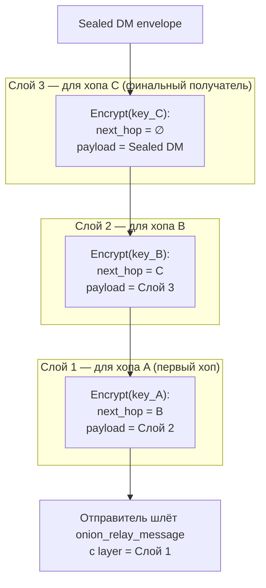
```mermaid
graph TB
    DM["Sealed DM envelope"]

    subgraph "Слой 3 — для хопа C (финальный получатель)"
        L3["Encrypt(key_C):<br/>next_hop = ∅<br/>payload = Sealed DM"]
    end

    subgraph "Слой 2 — для хопа B"
        L2["Encrypt(key_B):<br/>next_hop = C<br/>payload = Слой 3"]
    end

    subgraph "Слой 1 — для хопа A (первый хоп)"
        L1["Encrypt(key_A):<br/>next_hop = B<br/>payload = Слой 2"]
    end

    DM --> L3 --> L2 --> L1

    SEND["Отправитель шлёт onion_relay_message<br/>с layer = Слой 1"]
    L1 --> SEND
```
*Диаграмма — Onion-инкапсуляция: отправитель оборачивает DM в N слоёв*

#### Послойное снятие (hop-by-hop peeling)

Каждый промежуточный узел расшифровывает свой слой, узнаёт только следующий
хоп и пересылает внутренний blob. Финальный получатель расшифровывает
последний слой и получает оригинальный DM.

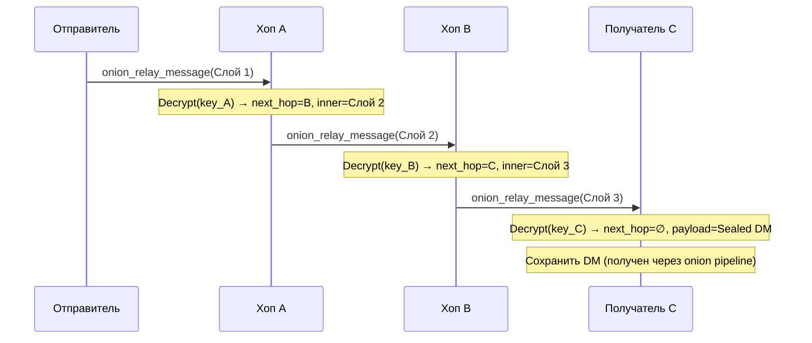
```mermaid
sequenceDiagram
    participant S as Отправитель
    participant A as Хоп A
    participant B as Хоп B
    participant C as Получатель C

    S->>A: onion_relay_message(Слой 1)
    Note over A: Decrypt(key_A) → next_hop=B, inner=Слой 2
    A->>B: onion_relay_message(Слой 2)
    Note over B: Decrypt(key_B) → next_hop=C, inner=Слой 3
    B->>C: onion_relay_message(Слой 3)
    Note over C: Decrypt(key_C) → next_hop=∅, payload=Sealed DM
    Note over C: Сохранить DM (получен через onion pipeline)
```
*Диаграмма — Послойное снятие onion*

#### Полный flow: onion DM + квитанция

DM идёт вперёд через onion-маршрут. Получатель определяет onion-доставку
через processing pipeline и
строит независимый onion-маршрут обратно для квитанций.

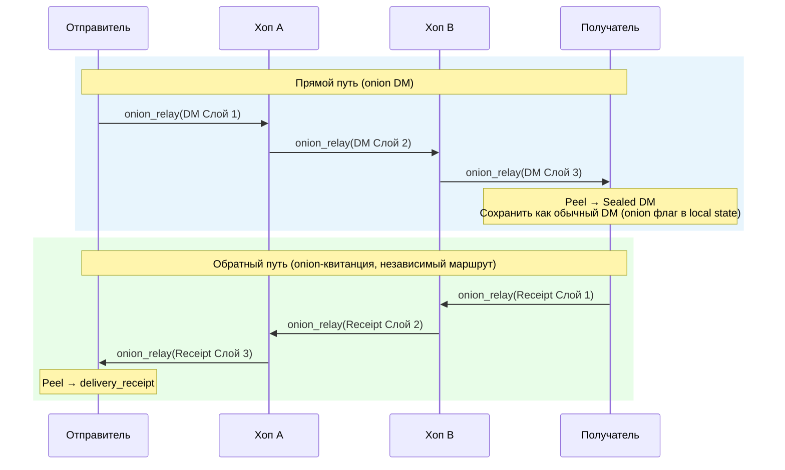
```mermaid
sequenceDiagram
    participant S as Отправитель
    participant A as Хоп A
    participant B as Хоп B
    participant C as Получатель

    rect rgb(232, 245, 253)
        Note over S,C: Прямой путь (onion DM)
        S->>A: onion_relay(DM Слой 1)
        A->>B: onion_relay(DM Слой 2)
        B->>C: onion_relay(DM Слой 3)
        Note over C: Peel → Sealed DM<br/>Сохранить как обычный DM (onion флаг в local state)
    end

    rect rgb(232, 253, 232)
        Note over S,C: Обратный путь (onion-квитанция, независимый маршрут)
        C->>B: onion_relay(Receipt Слой 1)
        B->>A: onion_relay(Receipt Слой 2)
        A->>S: onion_relay(Receipt Слой 3)
        Note over S: Peel → delivery_receipt
    end
```
*Диаграмма — Полный flow доставки onion DM и возврата квитанции*

<a id="iter-13-1"></a>
#### 13.1 — Onion-обёртка DM envelope

**Цель:** ни один промежуточный хоп не видит адрес получателя или содержимое
DM.

**Как это работает:** отправитель знает путь из routing table (Итерация 1) и
публичный box-ключ каждого узла на пути. Он берёт sealed DM envelope и
оборачивает его в N слоёв шифрования — внутренний слой для финального
получателя, внешний для первого хопа. Каждый хоп расшифровывает свой слой,
видит только "переслать на адрес X" + непрозрачный blob, и передаёт дальше.
Финальный хоп расшифровывает последний слой (`is_final: true`) и получает
оригинальный sealed DM envelope без изменений.

**Новый тип фрейма — `onion_relay_message`:**

```json
{
  "type": "onion_relay_message",
  "layer": "encrypted_base64"
}
```

Фрейм намеренно минимальный — вся маршрутная информация внутри
зашифрованного слоя. В фрейме **нет** глобального `onion_id`: стабильный
UUID, видимый всем хопам, стал бы корреляционным маркером — два
скомпрометированных хопа смогли бы сопоставить один и тот же пакет просто
по совпадению `onion_id`, даже не расшифровывая содержимое. Вместо этого
дедупликация работает hop-locally: каждый хоп вычисляет
`dedupe_tag = HMAC(node_key, layer_ciphertext)[:16]` — тег уникален для
конкретной пары (хоп, зашифрованный слой) и бесполезен для внешнего
наблюдателя, потому что `node_key` различается на каждом хопе.

Каждый расшифрованный слой содержит:

```json
{
  "next_hop": "identity_fingerprint_or_empty",
  "layer": "encrypted_base64_or_dm_envelope"
}
```

Когда `next_hop` пуст — узел является финальным получателем; `layer` содержит
sealed DM envelope.

**Адресация в `next_hop` — identity, не session address:** поле
`next_hop` содержит identity fingerprint узла, а не транспортный session
address. Причина: текущий mesh/relay уже знает, что session address
нестабилен (reconnect, address change — см. `tryForwardToDirectPeer` в
relay.go). Onion-хоп при пересылке выполняет resolve:
`identity fingerprint → активная сессия`, перебирая сессии так же, как
это делает relay forwarding. Если ни одна сессия не найдена (нет активного
соединения с next-hop нодой в данный момент) — фрейм помещается в
per-identity retry queue (аналогично relay backlog) с TTL
`onion_retry_ttl`. Retry происходит автоматически при появлении новой
сессии с этим identity. Это делает onion-circuit устойчивым к reconnect
промежуточных хопов.

**Приоритет recovery-моделей (retry-queue vs circuit rebuild):** два
механизма восстановления взаимодействуют на уровне forwarding-хопа:

1. **Retry queue (hop-level, короткий):** когда resolve identity → session
   не удаётся, фрейм попадает в per-identity retry queue с
   `onion_retry_ttl` (по умолчанию 15 с). Хоп ожидает, что next-hop нода
   переподключится в этом окне (transient disconnect, смена адреса).
2. **Circuit rebuild (sender-level, длинный):** отправитель ожидает
   hop-ack в пределах `onion_hop_ack_timeout` (по умолчанию 10 с,
   Итерация 2). Если ack не приходит, отправитель помечает circuit как
   failed и перестраивает через другие ноды (A9.4).

**Граница ответственности (кто за что отвечает):**

| Ответственность | Владелец | Область |
|---|---|---|
| Локальный retry при transient disconnect | Каждый промежуточный хоп | Per-frame, per-next-hop identity; хоп не знает полный circuit и origin sender |
| Обнаружение hop-ack timeout | Origin sender (отправитель) | End-to-end per-circuit; отправитель отслеживает ожидаемый hop-ack для каждого отправленного сообщения |
| Решение о circuit rebuild | Origin sender (отправитель) | Выбирает новый путь через A9.4 path selection; промежуточные хопы не уведомляются о rebuild — они просто перестают получать фреймы старого circuit |
| Eviction из retry queue | Каждый промежуточный хоп | TTL-based (`onion_retry_ttl`); хоп дропает молча, без сигнала upstream |

Промежуточный хоп **никогда** не инициирует circuit rebuild — у него нет
контекста отправителя, нет знания total_hops и нет способа сигнализировать
origin. Origin sender **никогда** не наблюдает retry queue — он видит
только presence или absence hop-ack.

**Порядок:** retry queue срабатывает первым — это локальный fast path хопа
для transient disconnects. Если retry TTL истекает без доставки, фрейм
молча дропается; отправитель независимо обнаруживает failure через
отсутствие hop-ack и запускает circuit rebuild.
Инвариант: `onion_retry_ttl < onion_hop_ack_timeout`, чтобы hop-level
retry разрешился или упал до того, как отправитель сдастся.

**Capability gate:** `onion_relay_v1`. Узлы без этой capability никогда не
получат `onion_relay_message`.

**Распространение ключей:** узлы публикуют свой box public key через
routing announcements (Итерация 1) — это основной и единственный механизм
в A9.1. Фрейм `announce_routes` несёт опциональные поля `box_key` и
`box_key_binding_sig` в каждой route entry (определены в Итерации 1,
см. секцию «Расширяемость для onion»). Ноды с `onion_relay_v1` заполняют
эти поля в своих own-origin анонсах; ноды без capability их пропускают.
Отдельный фрейм `onion_key_announce` **не** вводится: он усложнит
capability-модель, увеличит размер announce-кадров и создаст
рассинхронизацию между routing state и key state. Если в будущем
потребуется ротация onion-ключей с другой частотой, `onion_key_announce`
может быть добавлен как отдельная под-итерация с собственным capability
gate, coexistence matrix и миграционным планом.

**Зависимость реализации:** построение onion-путей требует, чтобы
Итерация 1 `announce_routes` была развёрнута с опциональными box-key
полями. Реализация Итерации 1, которая не сохраняет неизвестные поля
при ретрансляции, удалит box keys из анонсов и сломает распространение
onion-ключей. Правило relay: неизвестные поля в route entry ДОЛЖНЫ
сохраняться при повторном анонсировании (forward-compatible relay).

**Trust-модель для transit box keys (не-контактных хопов):**
текущая contact trust model (см. `docs/encryption.md`, Contact trust
model) — это TOFU-pinning для **контактов**: identity ↔ boxkey
привязывается при первом обмене, конфликты отклоняются. Но onion-хопы —
это транзитные узлы, с которыми отправитель не контактирует напрямую.
Для них действует другая модель:

1. **Источник ключа:** transit box key приходит из routing announcement
   (Итерация 1). Announcement подписан ed25519-ключом узла — identity
   self-authenticating.
2. **Валидация:** получатель announcement проверяет: (a) ed25519-подпись
   announcement; (b) binding signature box key — формат
   `corsa-boxkey-v1|address|boxkey_base64`, подписанный identity key
   (тот же формат, что `boxKeyBindingPayload` в
   `internal/core/identity/identity.go`). Обе подписи обязательны.
3. **Версионирование и anti-replay:** binding payload включает формат
   `corsa-boxkey-v1`, который привязывает подпись к конкретной версии.
   Для защиты от replay старого announcement с отозванным ключом
   используется monotonic sequence number в routing announcement
   (Итерация 1): каждый новый announcement имеет seq > предыдущего.
   Transit key принимается только если seq в announcement >= seq в
   кеше. Announcement с seq < cached seq дропается (downgrade
   protection).
4. **Кеширование:** transit key кешируется в `routingTable` рядом с
   routing entry вместе с seq number. TTL совпадает с TTL routing
   entry. При получении нового announcement с другим box key и
   seq >= cached seq — ключ обновляется (не отклоняется, как для
   контактов). Это допустимо: transit hop не является доверенным
   контактом, его ключ может ротироваться.
5. **Конфликт/ротация:** при сборке onion-пути используется ключ с
   наибольшим seq number. Старый кеш перезаписывается.
6. **Отсутствие ключа:** если routing entry не содержит box key (узел
   не публикует его), узел исключается из path selection как
   non-capable.

**Onion-маркер — не часть DM envelope:** `onion: true` **не** живёт
внутри `sealedEnvelope`. DM envelope (`dm-v1`) подписывает фиксированный
набор полей `{version, from, to, recipient, sender}` через
`marshalUnsignedEnvelope`, и менять этот контракт для transport hint
нельзя: любое поле внутри envelope либо должно входить в подпись (тогда
это уже `dm-v2`), либо даёт возможность intermediate/final node подменить
transport provenance без нарушения подписи.

Вместо этого onion-маркер передаётся **вне** envelope, внутри
финального расшифрованного onion-слоя. Когда хоп снимает последний слой
(`is_final: true`), plaintext содержит sealed DM envelope **как есть**
(без модификации). Факт onion-доставки определяется самим фактом
получения через `onion_relay_message` → peel → `is_final`. Клиент
получателя знает, что DM пришёл через onion, потому что он прошёл через
onion processing pipeline, а не потому что в envelope стоит флаг.

Для квитанций (A9.2): получатель помечает в локальном state, что DM
пришёл через onion, и отправляет квитанцию через onion-маршрут. Маркер
хранится в локальном `messageStore`, не в протокольном фрейме.

**Что не меняется (protocol / wire format):** `sealedEnvelope`,
`marshalUnsignedEnvelope`, подпись, `dm-v1` wire format, UI rendering.
Onion-слой полностью снимается до того, как сообщение попадает в
существующий DM pipeline.

**Что меняется (local message metadata):** `messageStore` получает новое
поле `arrived_via_onion: bool`. Оно заполняется onion processing
pipeline при финальном peel и используется для: (a) решения отправлять
ли квитанцию через onion (A9.2); (b) отображения индикатора приватности
в UI (опционально). Это изменение **локального storage contract**, не
wire protocol.

**Режим приватности (privacy mode):** отправитель выбирает один из двух
режимов для каждого диалога:

- `best_effort_onion` (по умолчанию) — если onion-путь недоступен (мало
  capable узлов или все пути упали), сообщение отправляется через обычный
  relay с предупреждением клиенту. Доставка приоритетнее приватности.
- `require_onion` — если onion-путь недоступен, сообщение **не**
  отправляется; клиент получает ошибку `onion_path_unavailable`.
  Приватность приоритетнее доставки.

Без этого разделения реализация неизбежно сведёт onion к "попробовали
и откатились", что обесценивает privacy гарантию. Режим хранится в
настройках диалога и передаётся в `buildOnionLayers` / fallback-логику.

**Матрица сосуществования — onion-capable vs legacy:**

| Отправитель | Все hops на пути | Поведение |
|---|---|---|
| onion-capable | Все `onion_relay_v1` | Полный onion-путь. Каждый хоп снимает свой слой. |
| onion-capable | Есть legacy-хоп посередине | Onion-путь **не строится** через этот маршрут. Path selection (A9.4) ищет альтернативный путь из только capable узлов. Если альтернативы нет → поведение определяется privacy mode. |
| onion-capable | Получатель legacy | Onion невозможен: получатель не умеет снимать слои. Fallback на обычный relay (в `best_effort_onion`) или ошибка (в `require_onion`). |
| legacy | Любой | Обычный relay/gossip. Onion не задействован. |

Смешанная цепочка: в отличие от mesh relay (где legacy-хоп посередине
может быть обойдён через gossip fallback), onion **требует** capability
на каждом хопе пути. Слой невозможно "перепрыгнуть" — если хоп не может
расшифровать свой слой, цепочка разрывается. Поэтому path selection
должен строить путь исключительно из `onion_relay_v1` узлов.

**Поведение при потере хопа после сборки circuit:** если промежуточный
хоп уходит offline после того, как отправитель собрал onion-путь,
сообщение не доставляется. Отправитель обнаруживает это через отсутствие
hop-ack (таймаут) и перестраивает circuit через другие узлы. Это не
ошибка протокола — это ожидаемое поведение в динамической сети.

- [ ] `buildOnionLayers(path []NodeInfo, sealedEnvelope) → []byte`
- [ ] `peelOnionLayer(myKey, frame) → (nextHop, innerLayer)`
- [ ] Обработчик фрейма `onion_relay_message`
- [ ] Capability gate `onion_relay_v1`
- [ ] Публикация box-ключей в routing announcements
- [ ] Onion-маркер через processing pipeline (не поле в DM envelope): `is_final` в onion-слое + локальный state
- [ ] `next_hop` адресуется по identity fingerprint; resolve identity → active session при пересылке
- [ ] Валидация transit box key из routing announcement (ed25519 signature + binding signature)
- [ ] Кеш transit keys в routing table; обновление при новом announcement (без TOFU rejection)
- [ ] Privacy mode: `best_effort_onion` (по умолчанию) и `require_onion`; хранение в настройках диалога
- [ ] Fallback на обычный relay только в `best_effort_onion`; ошибка `onion_path_unavailable` в `require_onion`
- [ ] Path selection: строить путь только из `onion_relay_v1` узлов (без legacy hops)
- [ ] Circuit rebuild при потере хопа (таймаут hop-ack → перестроить через другие узлы)
- [ ] Лимит `max_onion_hops` (по умолчанию 10); дропать фрейм при превышении
- [ ] Жёсткий лимит размера входящего onion-фрейма (отклонить до расшифровки, ограничить CPU; guardrail 1)
- [ ] Per-peer rate limit для `onion_relay_message` (token bucket; guardrail 1)
- [ ] Hop-local dedupe: `dedupe_tag = HMAC(node_key, layer_ciphertext)[:16]`; карта с TTL (по аналогии с `relayForwardState`; защита от replay без глобального ID)
- [ ] Дропать и логировать невалидные/нерасшифровываемые слои; не пересылать мусор (guardrail 3)
- [ ] Unit-тесты: wrap / peel / deliver / fallback
- [ ] Unit-тест: фрейм, превышающий `max_onion_hops`, дропается
- [ ] Unit-тест: oversized onion-фрейм отклоняется до расшифровки
- [ ] Unit-тест: невалидный слой (плохой ciphertext) дропается, не пересылается
- [ ] Unit-тест: `require_onion` блокирует отправку при отсутствии onion-пути
- [ ] Unit-тест: `best_effort_onion` откатывается на relay с предупреждением
- [ ] Unit-тест: путь с legacy-хопом посередине отклоняется path selection
- [ ] Unit-тест: circuit rebuild при потере промежуточного хопа
- [ ] Unit-тест: DM envelope не содержит onion-маркера; подпись не затрагивается
- [ ] Unit-тест: next_hop resolve — identity с несколькими сессиями, одна активная
- [ ] Unit-тест: dedupe_tag уникален для разных хопов при одном и том же layer ciphertext
- [ ] Unit-тест: transit box key обновляется при новом announcement (не отклоняется как конфликт)
- [ ] Интеграционный тест: mixed-network — onion-capable отправитель, частично legacy сеть
- [ ] Негативный тест local-state: старая нода, обновлённая до onion-capable, читает записи message store, созданные до появления onion-метаданных (`arrived_via_onion` отсутствует) — должна обработать как non-onion, без паники
- [ ] Обновить `docs/protocol/relay.md` (новый фрейм `onion_relay_message`, capability gate)
- [ ] Обновить `docs/encryption.md` (transit key trust model, `arrived_via_onion` в messageStore, privacy mode)
- [ ] Обновить `docs/protocol/delivery.md` (onion receipt flow, `require_onion` receipt suppression)

**Release / Compatibility для A9.1:**

- [ ] `onion_relay_message` отправляется только peer'ам с `onion_relay_v1`
- [ ] Legacy peer никогда не получает `onion_relay_message`
- [ ] Box-ключ публикуется только через routing announcements (не отдельный фрейм)
- [ ] Mixed-version тест: onion-capable → legacy использует обычный relay
- [ ] Mixed-version тест: legacy → onion-capable не затрагивает onion
- [ ] Подтвердить: A9.1 не требует повышения `MinimumProtocolVersion`

<a id="iter-13-2"></a>
#### 13.2 — Onion-квитанции

**Цель:** квитанции доставки и прочтения для onion DM тоже идут через
onion-маршруты, чтобы промежуточный узел не мог связать квитанцию с исходным
путём сообщения.

**Проблема после A9.1:** сам DM скрыт, но квитанции идут через обычный relay
или gossip — раскрывая что "узел F только что отправил delivery receipt узлу
A", что повторно выдаёт пару общения.

**Как это работает:** когда получатель определяет, что DM пришёл через onion
(через onion processing pipeline, см. A9.1), он строит собственный
onion-маршрут обратно к отправителю (адрес отправителя известен из sealed
envelope). Квитанция использует существующий формат `send_delivery_receipt`
(см. `docs/protocol/delivery.md`) со статусом `delivered` или `seen`. Эта
квитанция оборачивается в onion-слои и отправляется как
`onion_relay_message`. Исходный отправитель снимает слои и получает
стандартную `send_delivery_receipt`.

**Выравнивание с протоколом:** roadmap использует термины
`send_delivery_receipt` с `status: "delivered"` / `status: "seen"` — это
единственная модель квитанций в протоколе. Отдельных типов
`delivery_receipt` / `read_receipt` не существует.

**Ключевое отличие от A9.1:** получатель строит обратный путь независимо —
он не знает forward path, использованный отправителем. Это намеренно: обратный
путь должен быть другим для лучшей приватности.

**Инвариант: отсутствие квитанции ≠ сбой доставки.** В режиме
`require_onion` квитанция подавляется, если onion обратный путь недоступен.
Отправитель **не может** отличить «квитанция подавлена из-за privacy» от
«квитанция задерживается» или «сообщение потеряно». Поэтому жизненный цикл
DM должен трактовать отсутствие квитанции при `require_onion` как
**unknown** — не как **failed**. UI показывает «receipt pending / unknown»
бессрочно; сообщение никогда не переводится автоматически в состояние failed.
Только явный повтор по инициативе пользователя может переотправить. Без этого
инварианта `require_onion` визуально деградирует до сломанного UX доставки —
privacy mode выглядит как баг.

- [ ] Построение onion-пути получателем для квитанций
- [ ] Onion-квитанция определяется processing pipeline (без маркера `onion: true` в фрейме)
- [ ] Fallback квитанций: подчиняется privacy mode диалога (`best_effort_onion` → обычный relay с предупреждением; `require_onion` → квитанция не отправляется)
- [ ] UX-оговорка для `require_onion`: отправитель не может отличить "квитанция подавлена из-за privacy" от "квитанция ещё не получена"; UI должен отображать это как "receipt pending / unknown", не как delivery failure
- [ ] Одна квитанция на DM; дедупликация по `(message_id, receipt_type)` для предотвращения amplification
- [ ] Rate limit исходящих onion-квитанций на диалог (guardrail 1)
- [ ] Unit-тесты: round-trip onion-квитанции
- [ ] Unit-тест: дубликат квитанции для того же DM дропается
- [ ] Обновить `docs/protocol/relay.md` (onion receipt relay)
- [ ] Обновить `docs/protocol/delivery.md` (receipt via onion, privacy mode suppression)

**Release / Compatibility для A9.2:**

- [ ] Mixed-version тест: sender onion-capable, все хопы capable, recipient onion-capable — квитанция возвращается через onion
- [ ] Mixed-version тест: sender onion-capable, recipient legacy (без `onion_relay_v1`) — sender получает квитанцию через обычный relay (recipient не может построить onion-путь обратно)
- [ ] Mixed-version тест: sender legacy, recipient onion-capable — recipient получает DM через обычный relay, отправляет квитанцию через обычный relay (нет onion-контекста)
- [ ] Подтвердить: A9.2 не требует повышения `MinimumProtocolVersion`

<a id="iter-13-3"></a>
#### 13.3 — Эфемерные ключи и прямая секретность

**Цель:** компрометация долгоживущего box-ключа узла не раскрывает содержимое
ранее прошедших через него onion-сообщений.

**Проблема после A9.1–A9.2:** onion-слои зашифрованы на долгоживущие
box-ключи. Если ключ утечёт, атакующий с сохранённым трафиком может
расшифровать все слои, использовавшие этот ключ.

**Дизайн-решение: одна ephemeral ключевая пара на сообщение (shared
across hops), не per-hop.** Отправитель генерирует одну X25519 пару `(e,
E)` на onion-сообщение. Для каждого хопа i с long-term public key `H_i`
вычисляется `shared_secret_i = DH(e, H_i)`. Из `shared_secret_i`
выводится симметричный ключ слоя i. Ephemeral public key `E` одинаков
во всех слоях одного пакета.

Альтернатива — per-message-per-hop (новая пара на каждый слой) — даёт
лучшую compartmentalization, но удваивает overhead (32 байта на hop
дополнительно) и усложняет reasoning: при N хопах заголовок растёт на
N×32 байт. При выбранном дизайне compartmentalization обеспечивается
тем, что `shared_secret_i` уникален для каждого хопа (разные `H_i`), и
компрометация `H_j` не раскрывает `shared_secret_i` для i ≠ j.

**Инвариант: `E` — ephemeral instance key, не стабильный идентификатор.**
`E` одновременно используется как: (a) DH public key для derivation
shared secret (A9.3); (b) вход в вычисление `replay_key` (инвариант 4);
(c) ключ группы пересборки для chunked messages (A9.5). Это намеренно —
все три использования ограничены одним вызовом onion send. `E` — **не**
conversation ID, message ID или стабильный per-contact ключ. Каждый
вызов `buildOnionLayers` генерирует свежий `E`; retry того же
application-level сообщения порождает другой `E` и, следовательно,
другой домен replay_key и отдельную группу пересборки. Код, кеширующий
или индексирующий по `E` за пределами scope одного receive/reassembly
pipeline — это баг.

**Криптографическая схема (onion layer, зафиксирована до реализации):**

```
Для каждого хопа i (от N-1 до 0, inner-to-outer):

  shared_secret_i = X25519(e, H_i)
  layer_key_i     = HKDF-SHA256(shared_secret_i, salt="corsa-onion-v1", info=hop_index_bytes)
  nonce_i         = HKDF-SHA256(shared_secret_i, salt="corsa-onion-nonce-v1", info=hop_index_bytes)[:24]

  plaintext_i = {
    "next_hop":      identity_fingerprint_or_empty,
    "hop_index":     i,
    "total_hops":    N,           // позволяет хопу проверить позицию
    "chunk_seq":     0,           // sequence number для chunked messages (A9.5)
    "chunk_total":   1,           // total chunks (1 = single message)
    "is_final":      (i == N-1),  // флаг финального слоя
    "layer":         encrypted_inner_layer_or_dm_envelope
  }

  AAD_i = E || hop_index_bytes   // authenticated additional data: ephemeral pubkey + hop index

  ciphertext_i = XChaCha20-Poly1305.Seal(layer_key_i, nonce_i, plaintext_i, AAD_i)
```

**Что входит в AEAD Authenticated Data (AAD):** `E || hop_index_bytes`.
Ephemeral pubkey в AAD гарантирует, что ciphertext привязан к конкретному
DH exchange. Hop index в AAD предотвращает перестановку слоёв между
позициями в цепочке. `next_hop`, `chunk_seq`, `is_final` защищены
ciphertext'ом (не AAD): они должны быть скрыты от внешнего наблюдателя.

**Post-decrypt validation (обязательные проверки после расшифровки):**
успешная расшифровка AEAD подтверждает целостность plaintext, но не
семантическую корректность полей. Хоп **обязан** выполнить следующие
проверки после decrypt, до любого forwarding/delivery:

1. `hop_index` — должен совпадать с ожидаемой позицией хопа в цепочке
   (если хоп знает свою позицию). Несовпадение → DROP.
2. `total_hops` — должен быть >= 1 и <= `max_onion_hops`. Значение
   вне диапазона → DROP.
3. `hop_index < total_hops` — hop_index обязан быть строго меньше
   total_hops. Нарушение → DROP. (AAD защищает hop_index, но total_hops
   лежит внутри plaintext и проверяется только здесь.)
4. `is_final` consistency — `is_final` обязан быть `true` тогда и
   только тогда, когда `hop_index == total_hops - 1`. Несоответствие →
   DROP. Это связывает два поля, которые по отдельности могут быть
   валидны, но вместе — логически несовместимы.
5. `is_final` ↔ `next_hop` — если `is_final == true`, `next_hop` обязан
   быть пустым. Если `is_final == false`, `next_hop` обязан быть непустым
   identity fingerprint. Противоречие → DROP.
6. `chunk_seq` — должен быть >= 0 и < `chunk_total`. Вне диапазона →
   DROP.
7. `chunk_total` — должен быть >= 1 и <= `max_chunks_per_message`.
   Вне диапазона → DROP.
8. `next_hop` (если непустой) — должен быть валидным identity
   fingerprint (correct length, non-zero). Невалидный → DROP.
9. `layer` (если не `is_final`) — должен быть непустым. Пустой inner
   layer при non-final → DROP.

Все DROP сопровождаются логированием (без раскрытия plaintext содержимого).

**Onion crypto — независимый layer, не DM crypto:** текущие DM используют
X25519 + AES-256-GCM с random nonce (см.
`internal/core/directmsg/message.go`, `sealForPublicKey`). Onion layer
использует X25519 + HKDF-SHA256 + XChaCha20-Poly1305 с derived nonce.
Это **два разных криптографических контракта**, версионированных
раздельно:

- DM envelope: `dm-v1` — защищает содержимое сообщения (end-to-end).
- Onion layer: `onion-v1` — защищает маршрутные метаданные (hop-by-hop).

Эти контракты не зависят друг от друга. DM envelope зашифрован до
onion-обёртки и расшифровывается после полного снятия onion-слоёв.
Изменение onion crypto (например, смена AEAD алгоритма) не затрагивает
DM crypto, и наоборот. Capability gate `onion_relay_v1` подразумевает
`onion-v1` crypto. Будущий `onion_relay_v2` может сменить алгоритмы
без изменения `dm-v1`.

**Минимальные инварианты (зафиксированы до реализации):**

1. **Одна ephemeral X25519 пара на onion-сообщение (builder-side
   invariant).** Отправитель генерирует свежую пару `(e, E)`. `E`
   одинаков для всех слоёв одного пакета. Batch reuse между сообщениями
   запрещён. Это **инвариант builder'а** (`buildOnionLayers`), а не
   network-level reject: промежуточные хопы не хранят историю `E` и не
   могут детектировать reuse. Безопасность обеспечивается тем, что reuse
   `E` при разных plaintext'ах делает correlatable ciphertext'ы и
   потенциально нарушает nonce uniqueness (одинаковый `shared_secret_i`
   → одинаковый `nonce_i`). Тест проверяет builder-side enforcement.
2. **AEAD nonce uniqueness.** Nonce выводится через HKDF из
   `shared_secret_i` (уникального для каждого хопа) и hop index.
   Коллизия nonce внутри одного сообщения невозможна (разные `H_i` →
   разные `shared_secret_i`). Между сообщениями — невозможна (разные
   `e`).
3. **AAD integrity.** `AAD = E || hop_index_bytes`. Защищает от
   перестановки слоёв и подмены ephemeral key.
4. **Replay detection key.** Каждый хоп вычисляет:
   `replay_key = SHA-256(E || nonce_i || AEAD_tag_i)[:16]`.
   Это уникальный идентификатор конкретного слоя для конкретного хопа.
   `E` привязывает к сообщению, `nonce_i` — к позиции, `AEAD_tag` —
   к ciphertext. Replay cache хранит `replay_key` (не raw nonce).
   Для chunked сообщений (A9.5): каждый chunk имеет отдельный
   `chunk_seq` внутри plaintext и отдельный AEAD tag, поэтому replay
   key уникален для каждого chunk.
**Двухфазная защита от повторов (dedupe_tag vs replay_key):**
   hop-local `dedupe_tag` (A9.1) и `replay_key` (инвариант 4 выше) —
   **не дублирующие** механизмы, а два этапа одного pipeline, срабатывающие
   в строгом порядке:

   | Фаза | Идентификатор | Вычисляется | Когда проверяется | Что защищает |
   |------|---------------|-------------|-------------------|--------------|
   | 1 — pre-decrypt | `dedupe_tag = HMAC(node_key, layer_ciphertext)[:16]` | до расшифровки | сразу при получении фрейма | от сетевых дублей (одинаковый ciphertext от разных соседей) |
   | 2 — post-decrypt | `replay_key = SHA-256(E \|\| nonce_i \|\| AEAD_tag_i)[:16]` | после расшифровки | после AEAD.Open | от криптографических replay (идентичный plaintext в разном ciphertext-контейнере) |

   Фаза 1 — дешёвый hot-path: HMAC вычисляется над raw bytes без AEAD,
   отсекает >99% дублей в нормальных условиях. Фаза 2 — cold-path
   на случай, если attacker пересобрал onion frame с тем же содержимым, но
   другим outer ciphertext (например, другой padding). `dedupe_tag` пропустит
   такой фрейм (другой ciphertext → другой HMAC), но `replay_key` отловит
   (те же `E`, `nonce_i`, `AEAD_tag_i`).

   **State isolation:** `dedupe_tag` хранится в `onionCircuitState` (TTL =
   `max_relay_ttl`), `replay_key` — в отдельном bounded replay cache
   (`max_seen_replays`). Оба — hop-local, не глобальные.

5. **Replay cache TTL/bounds.** Bounded LRU, TTL = `max_relay_ttl`
   (180 секунд), `max_seen_replays` = 100 000 записей. При
   переполнении — вытеснение старейших.
6. **Уничтожение shared secret.** Хоп обнуляет `shared_secret_i` из
   памяти сразу после вычисления `layer_key_i` и `nonce_i`. Без
   исключений.

- [ ] Одна ephemeral X25519 пара на сообщение; `E` в заголовке каждого слоя
- [ ] HKDF-SHA256: `shared_secret_i` → `layer_key_i` (salt `corsa-onion-v1`, info = hop_index)
- [ ] HKDF-SHA256: `shared_secret_i` → `nonce_i` (salt `corsa-onion-nonce-v1`, info = hop_index, truncate to 24 bytes)
- [ ] XChaCha20-Poly1305: AEAD с `AAD = E || hop_index_bytes`
- [ ] Plaintext слоя: `next_hop`, `hop_index`, `total_hops`, `chunk_seq`, `chunk_total`, `is_final`, `layer`
- [ ] Post-decrypt validation: реализовать все 9 обязательных проверок (см. нумерованный список выше) в точном порядке; каждая проверка — hard DROP + LOG при сбое
- [ ] Post-decrypt validation: ни одна проверка не может быть пропущена или переупорядочена — проверки 1–5 защищают routing-семантику, проверки 6–7 защищают chunking-семантику, проверки 8–9 защищают целостность forwarding
- [ ] Unit-тест: post-decrypt validation — `hop_index >= total_hops` → DROP (проверка 3)
- [ ] Unit-тест: post-decrypt validation — `is_final: true` с `hop_index != total_hops - 1` → DROP (проверка 4)
- [ ] Unit-тест: post-decrypt validation — `is_final: true` с непустым `next_hop` → DROP (проверка 5)
- [ ] Unit-тест: post-decrypt validation — `chunk_seq` >= `chunk_total` → DROP (проверка 6)
- [ ] Unit-тест: post-decrypt validation — невалидный формат fingerprint `next_hop` → DROP (проверка 8)
- [ ] Unit-тест: post-decrypt validation — non-final layer с пустым `layer` → DROP (проверка 9)
- [ ] Хоп: уничтожение `shared_secret_i` после вычисления ключа и nonce (обнуление памяти)
- [ ] Replay key: `SHA-256(E || nonce_i || AEAD_tag_i)[:16]`; хранить в replay cache
- [ ] Replay cache: bounded LRU, `max_seen_replays=100000`, TTL=`max_relay_ttl`
- [ ] Отклонять onion-слои с невалидным ephemeral public key (не на кривой X25519 или нулевой; guardrail 3)
- [ ] Onion crypto версионируется как `onion-v1`, независимо от `dm-v1`
- [ ] Unit-тесты: проверка forward secrecy (старый ключ не расшифровывает)
- [ ] Unit-тест: replayed onion с тем же replay_key отклоняется
- [ ] Unit-тест: кеш replay_key корректно вытесняет записи под нагрузкой
- [ ] Unit-тест: `buildOnionLayers` генерирует уникальный `E` для каждого вызова (builder-side invariant, не network reject)
- [ ] Unit-тест: nonce derivation уникален для разных hop index
- [ ] Unit-тест: AAD mismatch (подмена E или hop_index) → AEAD fail
- [ ] Unit-тест: перестановка слоёв (swap hop_index) → AEAD fail
- [ ] Unit-тест: onion crypto и DM crypto используют разные алгоритмы/ключи
- [ ] Негативный тест local-state: нода перезапускается с пустым replay cache — replay onion от предыдущей сессии может быть принят однократно (допустимо), но не должен повредить состояние или вызвать панику; проверить корректное восстановление кеша
- [ ] Обновить `docs/protocol/relay.md` (onion layer crypto, ephemeral key lifecycle)
- [ ] Обновить `docs/encryption.md` (onion-v1 scheme, отличие от dm-v1)

**Release / Compatibility для A9.3:**

- [ ] Mixed-version тест: sender с `onion-v1` crypto, все хопы с `onion-v1` — полный onion round-trip с forward secrecy
- [ ] Mixed-version тест: sender с `onion-v1`, промежуточный хоп без `onion_relay_v1` — path selection обходит этот хоп (не crypto failure, а capability gate из A9.1)
- [ ] Mixed-version тест: sender legacy → onion-capable хопы — onion не задействован, обычный relay
- [ ] `onion-v1` crypto версионируется отдельно от `dm-v1`; смена одного не влияет на другой
- [ ] Подтвердить: A9.3 не требует повышения `MinimumProtocolVersion`

<a id="iter-13-4"></a>
#### 13.4 — Выбор пути и ротация цепочек

**Цель:** отправитель не использует один и тот же onion-путь постоянно, чтобы
скомпрометированный хоп не мог построить статистический профиль того, кто с
кем общается.

**Проблема после A9.1–A9.3:** если routing table стабильно возвращает один
кратчайший путь, каждое onion-сообщение между A и F идёт через одни и те же
узлы. Скомпрометированный узел на этом пути видит повторяющийся паттерн.

**Onion path selection ≠ advisory routing (критическое отличие от relay):**
для обычного relay routing table — подсказка: ложный next_hop безобиден,
потому что gossip fallback всё равно доставит сообщение. Для onion ложный
next_hop — это security breach: атакующий, отравивший routing table, может
систематически тащить трафик через свой хоп. Поэтому onion path selection
использует **только locally confirmed маршруты**: маршруты, по которым
нода лично наблюдала успешные hop-ack'и (Итерация 2, `ReliabilityScore`).

**Trust tier для onion path selection:**

| Tier | Определение | Допускается в onion path? |
|---|---|---|
| confirmed | `ReliabilityScore >= 0.5` после >= 5 hop-ack observations | Да |
| probationary | Новый маршрут без достаточной истории, или `0.3 <= score < 0.5` | Нет — пока не станет confirmed |
| degraded | `score < 0.3` или cooldown после black-hole detection | Нет |
| advisory-only | Маршрут из чужого announcement, без локальных наблюдений | Нет |

Маршрут, прошедший через mesh relay и накопивший hop-ack историю, может
быть использован для onion. Маршрут, о котором нода знает только из
announcement, — не может. Это согласовано с принципом Итерации 2:
"таблица — подсказка, не истина". Для relay "подсказка" безопасна; для
onion "подсказка" недостаточна.

**Bootstrap tradeoff (явное следствие):** в новой или малой сети onion
может долго оставаться практически недоступным, пока обычный relay не
"прогреет" граф confirmed маршрутов. Для перехода confirmed tier нужно
>= 5 hop-ack observations по каждому маршруту, что при среднем трафике
может занять минуты–часы. Это **сознательный компромисс**: safety
(запрет непроверенных маршрутов) важнее быстрого onion bootstrap. В
малых сетях с < 3 confirmed capable nodes onion активирует graceful
degradation (ниже). Операторы не должны ожидать instant onion
availability при первом развёртывании.

**Явная зависимость: выбор onion-пути требует истории mesh relay.**
Onion не имеет собственного механизма обнаружения маршрутов — он потребляет
`ReliabilityScore` и историю hop-ack, накопленные обычным mesh relay
(Итерации 1–3). Сеть, в которой не было обычного relay-трафика, имеет
ноль подтверждённых маршрутов и, следовательно, ноль допустимых onion-путей.
Это проектная зависимость, а не побочный эффект: onion намеренно опирается
на наблюдения relay, чтобы не вводить отдельный механизм зондирования,
который стал бы дополнительным отпечатком трафика. Следствие для развёртывания:
mesh relay должен быть активен и пропускать трафик до того, как onion
станет пригоден к использованию.

**Как это работает:**

- **Минимальная длина пути (3 хопа):** даже если прямой путь к
  получателю существует. Дополнительные хопы выбираются из confirmed
  маршрутов, через которые **существует подтверждённый путь далее к
  получателю**. Отправитель не вставляет случайный capable узел
  "в никуда": каждый промежуточный hop должен иметь confirmed route к
  следующему hop в цепочке. Построение пути — это обход графа confirmed
  маршрутов от отправителя к получателю с требованием >= 3 хопов.
  Если граф confirmed маршрутов не содержит пути длиной >= 3 — graceful
  degradation (ниже).
- **Privacy-weighted path selection (не чистый ReliabilityScore):**
  для relay routing goal — доставка, и `RouteScore` = reliability ×
  100 − hops × 10 оптимизирует именно это. Для onion goal — privacy, и
  чистый reliability weight тянет к одному "лучшему" пути, убивая
  diversity. Onion использует отдельный `OnionPathScore`:
  - eligible: только confirmed маршруты (tier выше);
  - weighting: `1.0 / (1.0 + RouteScore_delta)` — чем ближе score к
    лучшему, тем выше вес, но разрыв нивелируется; все confirmed пути
    получают заметную долю;
  - hard cap: один и тот же **path** (ordered tuple of hop identities) не может
    использоваться > 30% от всех onion-сообщений за период ротации.
    **Терминология:** *path* = ordered tuple hop identities
    (например `[B, C, D]`); *circuit* = конкретная инстанциация path с
    конкретными ephemeral keys. Один path может порождать множество
    circuits. Hard cap 30% считается по **path**, не по circuit: два
    circuit с одним и тем же tuple `[B, C, D]` суммируются в одну квоту.
    Метрика: `uses_of_path / total_onion_sends` за текущий период ротации;
  - circuit rotation: даже если path selection вернул тот же ordered tuple
    хопов, circuit ротируется по таймеру (новые ephemeral keys). Ротация
    circuit **не сбрасывает** счётчик path — иначе hard cap теряет смысл.
  - **Семантика окна для 30% cap:** счётчик — **per-recipient sliding
    window** из последних `onion_path_reuse_window` отправок (по умолчанию
    100). Каждая отправка записывает использованный path tuple; при
    заполнении окна старейшая запись вытесняется. Cap проверяется как
    `count(path_tuple, window) / len(window) > 0.30`. Per-recipient scope
    не позволяет одному активному диалогу исчерпать diversity budget
    других. Глобальный счётчик позволил бы одному chatty peer маскировать
    path convergence с остальными. Per-conversation эквивалентен в 1-to-1
    DM, но оставлен как будущее уточнение для групповых контекстов. Окно
    хранится только в памяти; при рестарте оно пусто и все пути стартуют
    с равной квотой.
- **Ротация цепочек:** отправитель меняет onion-путь каждые 10 минут
  или после 50 сообщений (что наступит раньше). При ротации — новый
  random выбор из confirmed paths.
- **Guard node:** первый хоп удерживается стабильным дольше (период
  guard: 30 минут), чтобы не создавать fingerprint частой сменой точки
  входа. **Инвариант:** guard выбирается только из confirmed хопов с
  `ReliabilityScore >= 0.7` (выше порога для обычных onion hops).
  Guard **немедленно** теряет статус при: (a) закрытии сессии с ним
  (session invalidation из Итерации 2); (b) падении `ReliabilityScore`
  ниже 0.5; (c) black-hole detection cooldown. Stale guard невозможен:
  route lifetime привязан к session lifetime. Новый guard выбирается из
  оставшихся confirmed хопов с score >= 0.7.
- **Graceful degradation:** если confirmed capable узлов < 3:
  2 хопа — с предупреждением, 1 хоп — с предупреждением, 0 хопов —
  поведение определяется privacy mode (`best_effort_onion` → обычный
  relay, `require_onion` → ошибка).

- [ ] Onion path selection: только confirmed маршруты (`ReliabilityScore >= 0.5`, >= 5 наблюдений)
- [ ] Запретить advisory-only и probationary маршруты в onion path
- [ ] Построение пути как обход графа confirmed маршрутов (не случайная вставка хопов)
- [ ] Privacy-weighted scoring: `OnionPathScore` с нивелированием delta, не чистый `RouteScore`
- [ ] Hard cap 30% на повторное использование одного ordered tuple hop identities (path) за период ротации
- [ ] Минимальная длина пути (3 хопа из confirmed маршрутов)
- [ ] Верхний лимит длины пути (7 хопов) для ограничения латентности и ресурсов
- [ ] Таймер ротации цепочек (10 мин или 50 сообщений)
- [ ] Guard node: выбор из confirmed с score >= 0.7; немедленная потеря статуса при session close / score drop / cooldown
- [ ] Guard period: 30 минут (дольше обычной ротации)
- [ ] Ограниченный кеш цепочек на получателя (guardrail 1); вытеснение устаревших при ротации
- [ ] Graceful degradation для малых сетей (< 3 confirmed capable nodes)
- [ ] Тест перехода режимов: сеть растёт с 2 → 3 confirmed хопов → onion активируется; затем один хоп уходит, снова 2 → graceful degradation включается заново. Проверить: path builder инвалидирует закешированные пути при изменении confirmed-count; privacy mode диалога не кеширует устаревшее решение «onion доступен» дольше одного периода ротации; ни одно сообщение не зависает в «waiting for onion path» после downgrade
- [ ] Не штрафовать хопы, упавшие при ротации цепочки; использовать cooldown, не ban (guardrail 6)
- [ ] Unit-тесты: разнообразие путей, ротация, стабильность guard
- [ ] Unit-тест: advisory-only маршрут отклоняется для onion path
- [ ] Unit-тест: probationary маршрут не допускается в onion path
- [ ] Unit-тест: guard теряет статус при session close
- [ ] Unit-тест: hard cap на reuse одного path (ordered tuple, не set)
- [ ] Unit-тест: путь, превышающий максимальную длину, отклоняется
- [ ] Unit-тест: кеш цепочек не растёт без ограничений
- [ ] Unit-тест: padding до 3 хопов через граф confirmed — нет тупиков
- [ ] Обновить `docs/protocol/relay.md` (алгоритм выбора пути, правила guard-нод, circuit diversity)
- [ ] Обновить `docs/encryption.md` (взаимодействие OnionPathScore с trust-tier, guard-инварианты)
- [ ] Обновить `docs/protocol/delivery.md` (влияние path selection на задержку доставки, bootstrap tradeoff)

<a id="iter-13-5"></a>
#### 13.5 — Защита от анализа трафика

**Цель:** затруднить корреляцию отправителя и получателя по размеру сообщений
и таймингу на промежуточных хопах.

**Проблема после A9.1–A9.4:** наблюдатель видит "узел A отправил 512 байт в
12:00:01, узел F получил ~512 байт в 12:00:03" — корреляция по размеру и
времени тривиальна, даже если маршрут зашифрован.

**Как это работает:**

- **Fixed-size onion cells:** все фреймы `onion_relay_message` дополняются до
  единого размера. Короткие сообщения дополняются; длинные разбиваются на
  ячейки фиксированного размера.
- **Cell-count padding (decision rule):** одного fixed cell size недостаточно:
  наблюдатель всё ещё видит **число ячеек** в сообщении, и это сильная
  корреляция. Для устранения: payload перед разбиением на cells дополняется
  до одного из фиксированных bucket'ов: 1 cell, 2 cells, 4 cells, 8 cells,
  16 cells. Сообщения крупнее 16 cells разбиваются на 16-cell chunks
  (каждый chunk отправляется как независимый onion-пакет с sequence number
  внутри зашифрованного слоя). Bucket подбирается вверх: сообщение в 3 cells
  дополняется до 4. Это ограничивает утечку до log2(cells) бит вместо
  точного размера.
- **Chunk reassembly contract (получатель):** когда сообщение разбито на
  несколько 16-cell chunks, каждый chunk — независимый onion-пакет с полями
  `chunk_seq` и `chunk_total` внутри зашифрованного слоя. Получатель собирает
  chunks по следующим правилам:
  - **Reassembly group key = onion message instance:** группа chunks
    идентифицируется по ephemeral pubkey `E`. Поскольку каждый вызов
    `buildOnionLayers` генерирует новый `E`, application-level retry
    (повторная отправка сообщения) создаёт **новую** reassembly group.
    Partial chunks от предыдущей попытки не продолжают сборку — они
    удалятся по reassembly timeout. Это корректное поведение: retry
    создаёт полностью новый набор onion-пакетов с новым `E`.
  - `chunk_total` фиксируется по первому полученному chunk данной группы
    (`E`). Если последующий chunk приходит с другим `chunk_total` — он
    отклоняется.
  - **Reassembly timeout:** если не все chunks получены в течение
    `max_chunk_reassembly_timeout` (по умолчанию 30 секунд), частичное
    состояние удаляется. Сообщение считается недоставленным.
  - **Bounded reassembly state:** одновременно может находиться в сборке не
    более `max_pending_chunk_groups` (по умолчанию 100) групп chunks.
    При превышении — вытеснение старейшей неполной группы (LRU).
  - **Duplicate chunk:** повторный chunk с тем же `chunk_seq` для того же `E`
    — отклоняется (idempotent, без ошибки).
  - **Повторное использование E — нарушение протокола.** Если приходит chunk,
    чей `E` совпадает с **завершённой** группой reassembly (т.е. группа уже
    полностью собрана и доставлена), получатель отбрасывает chunk и логирует
    событие. Если вторая группа reassembly открывается с тем же `E`, что и
    уже существующая незавершённая группа, **поздняя** группа отбрасывается
    целиком — побеждает первая увиденная группа. Обоснование: легитимный
    отправитель всегда генерирует свежий `E` при каждом вызове
    `buildOnionLayers`; повторное использование `E` указывает на replay
    или ошибку реализации. Принятие нарушило бы домен replay_key и
    инвариант «E = уникальный ключ экземпляра» (см. A9.3).
  - **Missing middle chunk:** при истечении reassembly timeout с неполным
    набором chunks — вся группа удаляется. Отправитель может повторить
    отправку целиком (application-level retry).
  - **User-visible outcome при частичной потере:** неполная группа chunks
    **не попадает** в `storeIncomingMessage`, **не генерирует** delivered
    receipt и **не видна** в UI как частичное сообщение. С точки зрения
    получателя и DM lifecycle — сообщение не существует. Отправитель
    обнаруживает потерю через отсутствие delivery receipt (таймаут) и
    может повторить отправку (новый `E` → новая группа).
  - **Ordering:** chunks могут приходить в произвольном порядке; получатель
    собирает по `chunk_seq` (0-indexed, до `chunk_total - 1`).
  - **Maximum chunks per message:** `chunk_total` не может превышать
    `max_chunks_per_message` (по умолчанию 64). Chunk с `chunk_total` >
    лимита — отклоняется.
  - **Инвариант непостоянства:** и chunk reassembly state, и replay cache
    (A9.3) хранятся **только в памяти** и явно не персистируются на диск.
    При рестарте оба пусты. Последствия: (1) группа chunks, частично
    полученная до рестарта, теряется — отправитель обнаруживает это через
    отсутствие delivery receipt и ретраит с новым `E`; (2) replayed onion
    от предыдущей сессии может пройти replay_key проверку однократно
    (допустимо — но дубликат **не должен** создавать второе видимое DM
    в UI; существующая дедупликация по `message_id` в `storeIncomingMessage`
    его отсечёт, и максимум порождается одна лишняя delivery receipt,
    которая идемпотентна); (3) E-reuse defense по-прежнему работает после
    рестарта, потому что перезапущенная нода не имеет completed-group
    истории для этого `E` — побеждает первая группа, что корректно.
- **Timing jitter:** каждый хоп добавляет небольшую случайную задержку
  (настраиваемый диапазон, по умолчанию 10–100 мс) перед пересылкой,
  разрывая корреляцию по времени.
- **Jitter и reputation scoring (согласование с Итерацией 3–4):**
  onion jitter намеренно увеличивает latency на hop. Если hop-ack timeout
  и `ReliabilityScore` из Итерации 3 учитывают RTT (через метрику
  Итерации 4c: `reliability * 100 − hops * 10 − avg_rtt_ms / 10`), то
  honest onion paths будут выглядеть менее надёжными просто из-за jitter.
  Решение: **onion relay frames исключаются из RTT/latency метрик.**
  `avg_rtt_ms` считается только по обычным `relay_message` + hop-ack.
  `ReliabilityScore` для onion hops учитывает только success/failure
  (hop-ack получен / не получен), без penalty за увеличенный RTT. Таким
  образом privacy mode не депривилегирует сам себя.
- **Cover traffic (опционально):** узлы периодически отправляют фиктивные
  onion-сообщения на случайные адреса, делая реальный трафик неотличимым от
  шума.

- [ ] Формат onion-ячеек фиксированного размера
- [ ] Cell-count padding: bucket sizes 1/2/4/8/16 cells; pad payload до ближайшего bucket вверх
- [ ] Chunking: сообщения > 16 cells → независимые 16-cell chunks с sequence number в encrypted layer
- [ ] Chunk reassembly: получатель собирает chunks по `E` + `chunk_seq`; `chunk_total` фиксируется по первому chunk
- [ ] Reassembly timeout: `max_chunk_reassembly_timeout` = 30s; неполные группы удаляются
- [ ] Bounded reassembly state: `max_pending_chunk_groups` = 100; LRU eviction при превышении
- [ ] `max_chunks_per_message` = 64; chunk с `chunk_total` > лимита отклоняется
- [ ] Unit-тест: chunk reassembly — все chunks доставлены в случайном порядке → корректная сборка
- [ ] Unit-тест: chunk reassembly timeout — неполный набор chunks → группа удалена после timeout
- [ ] Unit-тест: duplicate chunk_seq → idempotent отклонение без ошибки
- [ ] Unit-тест: chunk_total mismatch → chunk отклонён
- [ ] Timing jitter на каждом хопе (по умолчанию 10–100 мс)
- [ ] Исключить onion relay из RTT/latency метрик Итерации 3–4; hop-ack success/failure only
- [ ] Генерация cover traffic (опционально, выключено по умолчанию; guardrail 5 — адаптивно, не always-on)
- [ ] Бюджет cover traffic: ограниченная bandwidth и CPU на ноду; автоотключение при перегрузке
- [ ] Взаимодействие с overload mode Итерации 4 (см. иерархию приоритетов ниже)
- [ ] Реализовать onion relay queue как отдельную bounded-структуру (`max_onion_queue_depth` = 1000); каноническое название: **onion relay queue** (не «onion queue»), чтобы отличать от per-hop retry queue
- [ ] Unit-тест: глубина onion relay queue достигает `max_onion_queue_depth` → cover traffic отключается, jitter обнуляется (порог 1)
- [ ] Unit-тест: onion relay queue продолжает расти после порога 1 → load shedding с пропорциональной вероятностью дропа (порог 2)
- [ ] Unit-тесты: единообразие размера ячеек, bucket padding корректен
- [ ] Unit-тест: cell-count leak — два сообщения в одном bucket неразличимы по числу cells
- [ ] Unit-тест: cover traffic автоотключается при перегрузке
- [ ] Unit-тест: onion jitter не влияет на `avg_rtt_ms` в reliability scoring
- [ ] Unit-тест: onion jitter не деградирует `ReliabilityScore` хопов — hop-ack, пришедший в пределах `onion_hop_ack_timeout`, считается успешным независимо от jitter-раздутого RTT; regression guard между Итерацией 3 reputation и onion mode
- [ ] Overload-тест: flood `onion_relay_message` не вызывает неограниченный рост памяти/CPU (guardrail 7)
- [ ] Overload-тест: onion flood деградирует контролируемо — обычные relay/gossip DM продолжают доставляться (guardrail 2)
- [ ] Негативный тест local-state: нода перезапускается с незавершёнными chunk-группами в памяти — всё частичное reassembly-состояние теряется; новые chunks для того же `E` после рестарта должны начать свежую группу (без паники и повреждения данных)
- [ ] Обновить `docs/protocol/relay.md` (cell padding, cover traffic, jitter-параметры)
- [ ] Обновить `docs/encryption.md` (влияние cell-count bucket padding на размер шифротекста)
- [ ] Обновить `docs/protocol/delivery.md` (взаимодействие cover traffic с delivery pipeline, overload priority)

#### Operational Limits для Onion-подсистемы

По аналогии с mesh relay (Итерация 1: bounded relay state, backpressure,
per-peer rate limits), onion-подсистема требует явных лимитов для
предотвращения self-DoS.

**Onion cell / frame limits:**

| Параметр | Значение по умолчанию | Где проверяется |
|---|---|---|
| `max_onion_cell_size` | 1024 байт (фиксированный размер ячейки A9.5) | Inbound: до расшифровки |
| `max_onion_frame_size` | 65536 байт (до split на cells) | Inbound: до расшифровки |
| `max_onion_hops` | 10 | Inbound: после первого peel (hop_count) |
| `max_onion_path_length` | 7 (outbound) | Outbound: path selection (A9.4) |
| `min_onion_path_length` | 3 (outbound) | Outbound: path selection (A9.4) |
| `onion_path_reuse_window` | 100 (per recipient) | Sender: sliding window для 30% path reuse cap (A9.4) |
| `max_chunk_reassembly_timeout` | 30 секунд | Receiver: при получении первого chunk группы |
| `max_pending_chunk_groups` | 100 | Receiver: LRU eviction при превышении |
| `max_chunks_per_message` | 64 | Receiver: до начала reassembly |

**Bounded onion retry queue (на каждом хопе):**

| Параметр | Значение по умолчанию | Где проверяется |
|---|---|---|
| `max_onion_retry_queue_size` | 500 фреймов | Хоп: при постановке в очередь недоставимого фрейма |
| `onion_retry_ttl` | 15 секунд | Хоп: per-frame TTL, просроченные записи вытесняются тикером |
| `max_onion_retry_per_identity` | 50 фреймов | Хоп: лимит per-next-hop identity внутри очереди |

Политика вытеснения: при заполнении очереди вытесняется старейший фрейм
(по `CreatedAt`, LRU). Per-identity cap не позволяет одному недоступному
next-hop потребить всю очередь. Retry queue хранится только в памяти; при
рестарте она пуста (все pending-фреймы теряются — отправитель обнаруживает
через отсутствие hop-ack и перестраивает circuit).

**Bounded circuit state (на каждом хопе):**

```go
type onionCircuitState struct {
    DedupeTag    string // HMAC(node_key, layer_ciphertext)[:16], hop-local
    PreviousHop  string // от кого получен (identity fingerprint; delivery через session resolve at send time)
    ForwardedTo  string // кому переслан (identity fingerprint; delivery через session resolve at send time)
    RemainingTTL int    // секунд до очистки (декрементируется тикером)
    CreatedAt    int64  // monotonic timestamp для ordering в LRU
}
```

`PreviousHop` и `ForwardedTo` хранят **identity fingerprint**, не
session address. При фактической пересылке фрейма хоп выполняет
`identity → active session` resolve (см. A9.1, "Адресация в next_hop"),
аналогично relay forwarding. Circuit state привязан к identity для
устойчивости к reconnect; transport send использует session resolution
at send time.

Лимиты: `max_onion_circuits_per_peer` (по умолчанию 1000),
`max_onion_circuits_total` (по умолчанию 50 000). При превышении —
вытеснение старейших. TTL = `max_relay_ttl` (180 секунд).

**Bounded replay cache:**

`max_seen_replays` = 100 000 записей, TTL = 180 секунд. LRU eviction при
переполнении. Ключ кеша — `replay_key = SHA-256(E || nonce_i ||
AEAD_tag_i)[:16]` (см. A9.3, инвариант 4). Кеш не персистится — при
рестарте он пуст (допустимо: ephemeral key per message гарантирует, что
replay после рестарта потребует знания нового ephemeral secret).

**Cover traffic budget:**

`max_cover_traffic_bandwidth_pct` = 5% от текущего throughput узла.
`max_cover_traffic_cpu_pct` = 2% от CPU. При превышении любого —
автоотключение cover traffic до следующего периода оценки (60 секунд).

**Overload behavior (согласование с Итерацией 4):**

Итерация 3e определяет глобальный overload mode: снижение gossip fan-out,
отложение non-critical sync, приоритет аутентифицированных peer'ов. Onion
должен вписаться в эту модель, а не конфликтовать с ней. Единая иерархия
приоритетов при перегрузке:

| Приоритет | Категория трафика | Действие при overload |
|---|---|---|
| 1 (высший) | Authenticated relay/gossip DM | Никогда не дропается из-за onion load |
| 2 | Routing announcements / hop-ack | Частота снижается (Итерация 3e), но не блокируется |
| 3 | Onion delivery receipts | Тот же load-shedding что у уровня 4, но с более высоким приоритетом dequeue; receipts — это трафик delivery-семантики (подтверждение доставки), их потеря вызывает ненужные retry отправителя |
| 4 | Onion relay — DM payload | Load shedding с вероятностью, пропорциональной превышению |
| 5 | Onion cover traffic | Отключается первым |
| 6 (низший) | Non-critical sync / delta announces | Откладывается (Итерация 3e) |

Порядок деградации onion-подсистемы:

1. Порог 1: onion relay queue > `max_onion_queue_depth` (1000).
   → Отключить cover traffic, уменьшить jitter range до 0.
2. Порог 2 (queue продолжает расти): дропать новые `onion_relay_message`
   с вероятностью, пропорциональной превышению (load shedding).
3. Глобальный overload (Итерация 3e активна): onion уже в режиме
   load shedding; дополнительно onion relay queue depth уменьшается
   до `max_onion_queue_depth / 2`, чтобы отдать ресурсы relay/gossip.

Очереди разделены: onion relay queue и relay/gossip queue — независимые
структуры. Load shedding в onion relay queue не затрагивает relay/gossip,
и наоборот. Глобальный overload mode Итерации 4e контролирует
соотношение через уменьшение onion relay queue depth, не через прямой
дроп onion из relay pipeline.

**Inbound processing flow (на каждом хопе):**

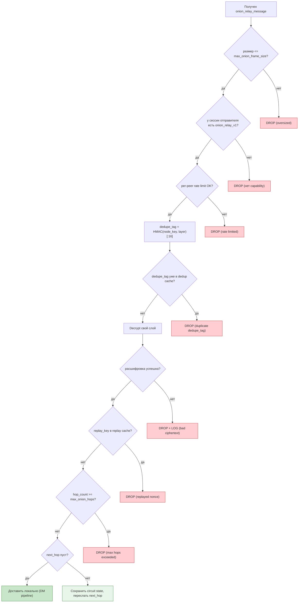
```mermaid
flowchart TD
    RCV["Получен onion_relay_message"]
    SIZE{"размер <= max_onion_frame_size?"}
    CAP{"у сессии отправителя есть onion_relay_v1?"}
    RATE{"per-peer rate limit OK?"}
    TAG["dedupe_tag = HMAC(node_key, layer)[:16]"]
    DEDUP{"dedupe_tag уже в dedup cache?"}
    DECRYPT["Decrypt свой слой"]
    VALID{"расшифровка успешна?"}
    REPLAY{"replay_key в replay cache?"}
    HOPS{"hop_count >= max_onion_hops?"}
    NEXT{"next_hop пуст?"}

    DROP_SIZE["DROP (oversized)"]
    DROP_CAP["DROP (нет capability)"]
    DROP_RATE["DROP (rate limited)"]
    DROP_DUP["DROP (duplicate dedupe_tag)"]
    DROP_INVALID["DROP + LOG (bad ciphertext)"]
    DROP_REPLAY["DROP (replayed nonce)"]
    DROP_HOPS["DROP (max hops exceeded)"]
    DELIVER["Доставить локально (DM pipeline)"]
    FORWARD["Сохранить circuit state, переслать next_hop"]

    RCV --> SIZE
    SIZE -->|нет| DROP_SIZE
    SIZE -->|да| CAP
    CAP -->|нет| DROP_CAP
    CAP -->|да| RATE
    RATE -->|нет| DROP_RATE
    RATE -->|да| TAG
    TAG --> DEDUP
    DEDUP -->|да| DROP_DUP
    DEDUP -->|нет| DECRYPT
    DECRYPT --> VALID
    VALID -->|нет| DROP_INVALID
    VALID -->|да| REPLAY
    REPLAY -->|да| DROP_REPLAY
    REPLAY -->|нет| HOPS
    HOPS -->|да| DROP_HOPS
    HOPS -->|нет| NEXT
    NEXT -->|да| DELIVER
    NEXT -->|нет| FORWARD

    style DELIVER fill:#c8e6c9,stroke:#2e7d32
    style FORWARD fill:#e8f5e9,stroke:#2e7d32
    style DROP_SIZE fill:#ffcdd2,stroke:#c62828
    style DROP_CAP fill:#ffcdd2,stroke:#c62828
    style DROP_RATE fill:#ffcdd2,stroke:#c62828
    style DROP_DUP fill:#ffcdd2,stroke:#c62828
    style DROP_INVALID fill:#ffcdd2,stroke:#c62828
    style DROP_REPLAY fill:#ffcdd2,stroke:#c62828
    style DROP_HOPS fill:#ffcdd2,stroke:#c62828
```
*Диаграмма — Inbound processing flow для onion-фрейма*

#### Интеграционные тесты для 13 (cross-sub-iteration)

По аналогии с mesh relay integration tests:

- [ ] Mixed network: 6 узлов, 3 onion-capable + 3 legacy; onion DM между capable узлами, legacy не затронуты
- [ ] Hop loss mid-circuit: 5 узлов, хоп B уходит offline после первого сообщения; второе сообщение → circuit rebuild → доставка через альтернативный путь
- [ ] Path rebuild: отправитель собирает circuit, один хоп уходит; проверить что новый circuit использует другие узлы
- [ ] Privacy downgrade policy: `require_onion` + нет capable хопов → сообщение **не** отправляется (не откатывается на relay)
- [ ] Full round-trip: onion DM → onion delivery receipt → onion read receipt; проверить что ни один промежуточный хоп не видит sender/recipient pair
- [ ] Overload: flood `onion_relay_message` на один хоп; проверить что обычные relay/gossip DM продолжают доставляться
- [ ] Forward secrecy end-to-end: перехватить трафик, утечь long-term key хопа, попытаться расшифровать → fail
- [ ] Replay: переслать ранее перехваченный onion-фрейм → дропается на replay check

#### Граф зависимостей onion под-итераций

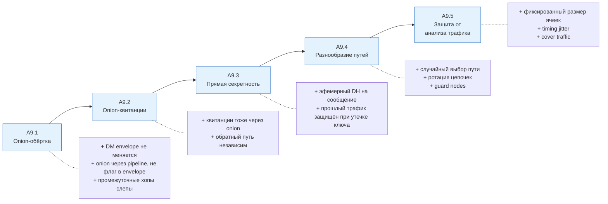
```mermaid
graph LR
    O1["A9.1<br/>Onion-обёртка"]
    O2["A9.2<br/>Onion-квитанции"]
    O3["A9.3<br/>Прямая секретность"]
    O4["A9.4<br/>Разнообразие путей"]
    O5["A9.5<br/>Защита от<br/>анализа трафика"]

    O1 --> O2 --> O3 --> O4 --> O5

    O1 -.- W1["+ DM envelope не меняется<br/>+ onion через pipeline, не флаг в envelope<br/>+ промежуточные хопы слепы"]
    O2 -.- W2["+ квитанции тоже через onion<br/>+ обратный путь независим"]
    O3 -.- W3["+ эфемерный DH на сообщение<br/>+ прошлый трафик защищён при утечке ключа"]
    O4 -.- W4["+ случайный выбор пути<br/>+ ротация цепочек<br/>+ guard nodes"]
    O5 -.- W5["+ фиксированный размер ячеек<br/>+ timing jitter<br/>+ cover traffic"]

    style O1 fill:#e3f2fd,stroke:#1565c0
    style O2 fill:#e3f2fd,stroke:#1565c0
    style O3 fill:#e3f2fd,stroke:#1565c0
    style O4 fill:#e3f2fd,stroke:#1565c0
    style O5 fill:#e3f2fd,stroke:#1565c0
```
*Диаграмма — Под-итерации Onion (A9)*

#### Hostile-Internet Guardrails в применении к 13

| Guardrail | Где применяется в A9 |
|---|---|
| 1. Bounded resource usage | A9.1: лимит размера фрейма, per-peer rate limit, dedup с TTL, max hops. A9.2: dedup квитанций, rate limit. A9.3: bounded replay cache. A9.4: bounded кеш цепочек. |
| 2. Мягкая деградация | A9.1: fallback на обычный relay (`best_effort_onion`) или ошибка (`require_onion`). A9.2: квитанции через обычный relay с предупреждением (`best_effort_onion`) или не отправляются (`require_onion`). A9.4: graceful degradation для малых сетей. A9.5: при перегрузке отключить cover traffic и уменьшить jitter. |
| 3. Недоверие к unauthenticated | A9.1: capability gate, дроп невалидных слоёв. A9.3: отклонение неизвестных/просроченных ephemeral key. |
| 4. Локальные наблюдения | A9.4: guard node и выбор пути по локальной routing table и локальным reputation scores. |
| 5. Адаптивная защита | A9.5: cover traffic опционален, выключен по умолчанию; timing jitter настраиваемый, не обязательный. |
| 6. Нет необратимых punishments | A9.4: упавшие хопы получают cooldown, не перманентный ban. |
| 7. Overload-тесты | A9.5: тест onion flood (память/CPU), тест graceful degradation (честный трафик выживает). |
| 8. Local-state семантика | A9.1: бит provenance `arrived_via_onion` хранится только в локальных метаданных messageStore — никогда в envelope, фрейме или квитанции. A9.3: replay cache и chunk reassembly state хранятся только в памяти, не персистируются. A9.5: инвариант непостоянства задокументирован с последствиями рестарта. Privacy-чувствительные метаданные никогда не утекают через wire protocol. |

*Таблица — Покрытие guardrails по onion под-итерациям*

**Кросс-под-итерационные интеграционные тесты:**

Эти тесты проверяют взаимодействие нескольких onion под-итераций
одновременно — самые реалистичные (и самые сложные для отладки) сценарии
отказов:

- [ ] Интеграционный тест: mixed network + chunked onion message + receipt path при overload. Сценарий: отправитель шлёт chunked сообщение (A9.5) через 3-hop onion path (A9.4), а сеть переходит в Итерацию 4e global overload в процессе доставки. Проверить: chunks, прошедшие до overload, собираются; chunks, дропнутые load shedding, вызывают timeout группы; receipt (A9.2) идёт по собственному независимому пути; отправитель обнаруживает partial failure через отсутствие delivery receipt и ретраит с новым `E`. Тест покрывает взаимодействие A9.2 + A9.4 + A9.5 + global overload.

<a id="iter-14"></a>
### Итерация 14 — Глобальные имена вместо raw identity

**Цель:** ввести глобальный naming layer, чтобы пользователей можно было
узнавать и искать без запоминания fingerprint.

**Зависимость:** идёт после A1, потому что локальный naming UX должен уже
существовать.

**Готово когда:** пользователь может опубликовать, разрешить и проверить
глобальное имя, связанное с identity, с политикой конфликтов и подтверждением
владения.

<a id="iter-15"></a>
### Итерация 15 — Расширения протокола Gazeta

**Цель:** расширить anonymous/broadcast protocol там, где это даёт ясную
продуктовую ценность помимо direct messaging.

**Почему позже:** это полезно, но формулируется проще после прояснения общего
anonymous/broadcast story.

**Готово когда:** протокол получает чётко описанные расширения с
задокументированными use-case'ами и compatibility rules.

<a id="iter-16"></a>
### Итерация 16 — iOS-приложение

**Цель:** выпустить второй mobile-клиент на iOS.

**Зависимость:** должно идти после Android, чтобы mobile UX и sync-решения уже
были подтверждены.

**Готово когда:** iOS достигает паритета с тем scoped Android light-client
feature set, который реалистичен на выбранном фреймворке.

<a id="iter-17"></a>
### Итерация 17 — BLE last mile

**Цель:** добавить short-range local transport, чтобы соседние устройства могли
обмениваться CORSA-сообщениями по Bluetooth Low Energy без интернет-соединения.
BLE работает как дополнительный транспорт за существующей transport abstraction —
identity, шифрование и маршрутизация не меняются.

**Зависимость:** идёт после mobile (A12), потому что mobile transport
abstraction должна быть проверена до добавления второго mobile-транспорта.
Также выигрывает от relay-подсистемы (Итерация 1) и таблицы маршрутов
(Итерация 1) для multi-hop BLE-путей.

**Готово когда:** все четыре подитерации ниже завершены.

**Wire-кодирование: компактный бинарный формат, не JSON.** Основной
TCP-транспорт использует JSON-кодированные фреймы (`announce_routes`,
`nat_ping_request` и т.д.). Пропускная способность BLE на 1–2 порядка
ниже — overhead JSON (ключи, кавычки, скобки) неприемлем. Все BLE
wire-фреймы используют **компактное бинарное TLV-кодирование**: поля
фиксированного размера где возможно, varint-кодированные длины, без имён
полей на проводе. TLV-схема 1:1 маппится на те же логические типы
фреймов, что и TCP-транспорт (ANNOUNCE, route data, DM relay), поэтому
слои маршрутизации и доставки видят идентичную семантику — различается
только сериализация. То же касается Meshtastic (Итерация 18), который
наследует компактное кодирование BLE с ещё более жёсткими ограничениями.

#### BLE-модель транспорта

BLE-нода работает в двух ролях одновременно: **Central** (сканирует и
подключается к ближайшим пирам) и **Peripheral** (объявляет себя и принимает
входящие подключения). Эта двухролевая модель позволяет каждому устройству
одновременно обнаруживать пиров и быть обнаруживаемым, формируя симметричный
локальный mesh.

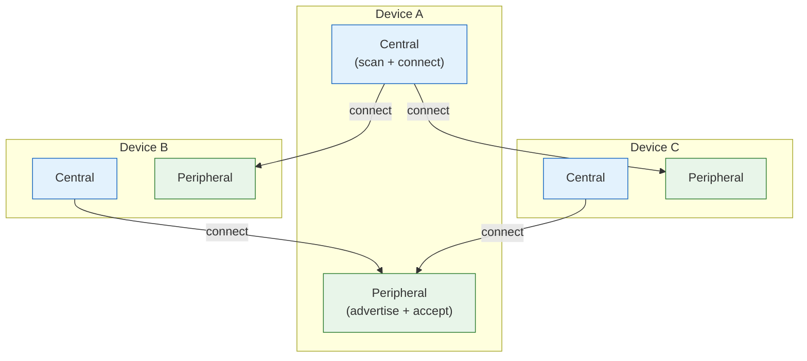
```mermaid
graph TB
    subgraph "Device A"
        CA["Central<br/>(scan + connect)"]
        PA["Peripheral<br/>(advertise + accept)"]
    end

    subgraph "Device B"
        CB["Central"]
        PB["Peripheral"]
    end

    subgraph "Device C"
        CC["Central"]
        PC["Peripheral"]
    end

    CA -->|connect| PB
    CB -->|connect| PA
    CC -->|connect| PA
    CA -->|connect| PC

    style CA fill:#e3f2fd,stroke:#1565c0
    style PA fill:#e8f5e9,stroke:#2e7d32
    style CB fill:#e3f2fd,stroke:#1565c0
    style PB fill:#e8f5e9,stroke:#2e7d32
    style CC fill:#e3f2fd,stroke:#1565c0
    style PC fill:#e8f5e9,stroke:#2e7d32
```
*Диаграмма — Двухролевая BLE-модель: каждое устройство одновременно Central и Peripheral*

#### Обнаружение BLE-топологии

Пиры обнаруживают друг друга через **ANNOUNCE**-сообщения, рассылаемые по BLE.
Каждый ANNOUNCE несёт TLV-кодированный список соседей, чтобы каждая нода строила
локальное представление BLE mesh-топологии.

**Формат TLV списка соседей:**

| Поле | Размер | Описание |
|------|--------|----------|
| type | 1 байт | `0x04` — список соседей |
| length | 1 байт | общий размер value в байтах |
| value | 8 × N байт | конкатенация 8-байтовых identity fingerprint известных соседей |

**Правило валидации рёбер:** связь A↔B считается валидной только когда A
заявляет B как соседа **и** B заявляет A как соседа (двусторонняя
подтверждённость), и оба заявления свежие (в пределах `ble_announce_freshness`,
по умолчанию 60 секунд). Односторонние или устаревшие заявления
игнорируются — это предотвращает спуфинг топологии.

**Вычисление маршрутов:** BFS по подтверждённому двустороннему графу даёт
кратчайший multi-hop путь. Если валидный маршрут существует в пределах
`ble_max_hops` (по умолчанию 4), используется BLE source routing; иначе
сообщение откатывается на flood relay.

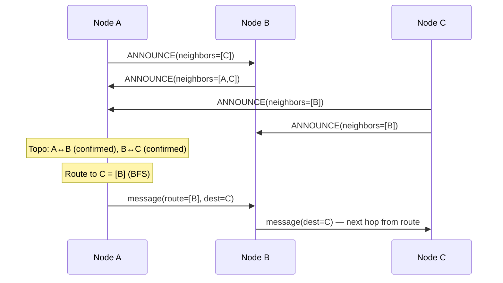
```mermaid
sequenceDiagram
    participant A as Node A
    participant B as Node B
    participant C as Node C

    A->>B: ANNOUNCE(neighbors=[C])
    B->>A: ANNOUNCE(neighbors=[A,C])
    C->>A: ANNOUNCE(neighbors=[B])
    C->>B: ANNOUNCE(neighbors=[B])

    Note over A: Topo: A↔B (confirmed), B↔C (confirmed)
    Note over A: Route to C = [B] (BFS)

    A->>B: message(route=[B], dest=C)
    B->>C: message(dest=C) — next hop from route
```
*Диаграмма — Обнаружение BLE-топологии и source-routed доставка*

<a id="iter-17-1"></a>
#### 17.1 — BLE-транспорт и обнаружение пиров

**Цель:** установить BLE как рабочий транспорт: сканирование, объявление,
подключение, обмен CORSA-фреймами, обнаружение пиров через ANNOUNCE.

**Как работает:** BLE-транспорт реализует общий транспортный интерфейс
(`isPeerConnected()`, `isPeerReachable()`, `send()`). Единый таймер
обслуживания (по умолчанию 5 секунд) обрабатывает проверку связности пиров,
очистку устаревшей топологии, дренаж очередей записи и сброс relay-буферов.

**Модель достижимости пиров:** BLE-пир считается достижимым при активном
соединении **или** недавней активности в пределах окна свежести (по умолчанию
300 с для подтверждённых handshake пиров, 30 с для неподтверждённых).
Двухуровневая свежесть предотвращает маршрутизацию через ноды, исчезнувшие
без явного disconnect.

**Throttling ANNOUNCE:** интервал announce адаптируется к плотности mesh —
`ble_announce_interval_dense` (по умолчанию 30 с, когда число пиров >
`ble_high_degree_threshold`) vs `ble_announce_interval_sparse` (по умолчанию
10 с). Недавний входящий трафик может запустить более короткий nudge-интервал
для ускорения конвергенции топологии.

**Подписанный ANNOUNCE binding:** каждый ANNOUNCE несёт подпись, покрывающую
`identity_fingerprint || noise_public_key || ed25519_public_key || nickname ||
timestamp`. Это привязывает объявленную identity к криптографическим ключам и
предотвращает спуфинг без signing key.

**Прогресс:**

- [ ] Реализовать двухролевой BLE-сервис (Central + Peripheral)
- [ ] Реализовать broadcast ANNOUNCE с TLV-списком соседей
- [ ] Реализовать подписанный ANNOUNCE binding (Ed25519-подпись)
- [ ] Реализовать двустороннюю валидацию рёбер в трекере топологии
- [ ] Реализовать BFS-вычисление маршрутов по подтверждённому графу
- [ ] Реализовать source routing с flood fallback
- [ ] Реализовать свежесть пиров с двухуровневой достижимостью (verified/unverified)
- [ ] Реализовать адаптивный throttling announce (dense vs sparse)
- [ ] Реализовать единый таймер обслуживания для pruning/drain/flush
- [ ] Unit-тест: одностороннее заявление отклонено, двустороннее принято
- [ ] Unit-тест: устаревший announce (> порога свежести) очищен
- [ ] Unit-тест: BFS-маршрут корректен для ромбовидной топологии
- [ ] Unit-тест: source route с flood fallback при отсутствии маршрута
- [ ] Unit-тест: подписанный ANNOUNCE с неправильным ключом отклонён
- [ ] Обновить `docs/protocol/relay.md` (регистрация BLE-транспорта, формат TLV ANNOUNCE)
- [ ] Обновить `docs/encryption.md` (схема подписи ANNOUNCE binding)
- [ ] Обновить `docs/protocol/delivery.md` (модель достижимости BLE, выбор транспорта)

**Release / Совместимость для A13.1:**

BLE-транспорт аддитивен — ноды без поддержки BLE не затрагиваются. Наличие BLE
гейтится за capability-флагом (`ble_transport`). Существующие WebSocket и
relay-пути остаются основным транспортом.

<a id="iter-17-2"></a>
#### 17.2 — BLE-фрагментация и адаптация к MTU

**Цель:** надёжно доставлять CORSA-фреймы, превышающие BLE link MTU, через
per-link фрагментацию и пересборку.

**Проблема:** BLE MTU обычно 23–517 байт в зависимости от согласованного ATT
MTU. CORSA-фреймы (особенно onion-wrapped DM, файловые передачи) обычно
превышают это. Без фрагментации большие сообщения молча отбрасываются.

**Модель фрагментации:** когда фрейм превышает эффективный размер чанка для
данного линка, он разбивается на пронумерованные фрагменты. Каждый фрагмент —
самодостаточный BLE-пакет с метаданными для пересборки.

**Эффективный размер чанка:** `chunk_size = max(ble_min_chunk, link_mtu -
fragment_overhead)`. Fragment overhead = 13 (заголовок) + 8 (отправитель) + 8
(получатель) + 5 (метаданные фрагмента: original_type 1б + total_fragments
2б BE + fragment_index 2б BE) = 34 байта. MTU линка по умолчанию = 469 байт,
даёт chunk_size = 435 байт. `ble_min_chunk` = 64 байта — жёсткий минимум.

**Для broadcast:** эффективный размер чанка = `min(link_mtu) - overhead`
по всем подключённым линкам, чтобы каждый пир мог принять каждый фрагмент.

**Структура пакета фрагмента:**

| Поле | Размер | Описание |
|------|--------|----------|
| original_type | 1 байт | тип сообщения исходного пакета |
| total_fragments | 2 байта BE | общее количество фрагментов |
| fragment_index | 2 байта BE | 0-based индекс фрагмента |
| chunk_data | переменный | полезная нагрузка фрагмента |

Фрагмент сохраняет sender, recipient, signature, route и TTL исходного пакета.

**Алгоритм пересборки:** фрагменты ключируются по `(sender, timestamp)`.
Каждый ключ отображается на разреженную карту index → data. Когда все индексы
присутствуют, фрагменты сортируются, конкатенируются, декодируются как исходный
тип, и слот пересборки очищается.

**Лимиты ресурсов:**

| Параметр | Значение | Назначение |
|----------|----------|------------|
| `ble_max_inflight_assemblies` | 50 | лимит одновременных слотов пересборки |
| `ble_fragment_assembly_timeout` | 30 с | таймаут незавершённых пересборок |
| `ble_per_stream_timeout` | 30 с | таймаут на поток от отправителя |
| оценка памяти на слот | ~10.4 КБ | ограниченное потребление памяти |

При переполнении: отклонить новые пересборки и собрать мусор из старейших
незавершённых слотов. Недостающие фрагменты после таймаута → сбросить всё
сообщение.

**Задержка между фрагментами:** фрагменты не отправляются подряд. Задержка
`ble_fragment_stagger_ms` (по умолчанию 15 мс) между фрагментами балансирует
своевременность и давление на буфер peripheral.

**Обработка ошибок:** недостающие фрагменты → таймаут → сброс; внеочередные →
разреженная карта обрабатывает нативно; дубликаты → идемпотентная перезапись;
исчерпание слотов → отклонить новые + очистить старейшие.

**Прогресс:**

- [ ] Реализовать per-link MTU negotiation и вычисление chunk size
- [ ] Реализовать разбиение на фрагменты (с учётом min chunk floor)
- [ ] Реализовать broadcast chunk size (min по всем линкам)
- [ ] Реализовать sparse-index пересборку с ключом (sender, timestamp)
- [ ] Реализовать assembly timeout и max-inflight-assemblies cap
- [ ] Реализовать задержку между фрагментами с настраиваемым интервалом
- [ ] Реализовать наследование маршрута для v2 фрагментов
- [ ] Unit-тест: фрейм ровно в MTU → нет фрагментации
- [ ] Unit-тест: фрейм MTU+1 → 2 фрагмента, корректная пересборка
- [ ] Unit-тест: внеочередные фрагменты → корректная пересборка
- [ ] Unit-тест: дублирующий фрагмент → идемпотентно (без повреждений)
- [ ] Unit-тест: assembly timeout → слот очищен
- [ ] Unit-тест: max-inflight превышен → старейший вытеснен
- [ ] Unit-тест: broadcast chunk size = min(link_mtu) по линкам
- [ ] Overload-тест: fragment flood не вызывает неограниченный рост памяти
- [ ] Обновить `docs/protocol/relay.md` (формат пакета фрагмента, контракт пересборки)
- [ ] Обновить `docs/protocol/delivery.md` (приоритет фрагментов, параметры задержки)

<a id="iter-17-3"></a>
#### 17.3 — BLE-дедупликация и relay

**Цель:** предотвратить амплификацию сообщений в BLE mesh, обеспечивая надёжную
multi-hop доставку.

**Проблема:** BLE mesh по своей природе плотен на коротких расстояниях — одно и
то же сообщение может прийти от нескольких пиров по разным путям. Без
дедупликации и контролируемого relay один broadcast в кластере из 10 нод
становится flood из O(N²) ретрансляций.

**Идентификатор дедупликации:** составной ключ
`"{sender_hex}-{timestamp_ms}-{message_type}"`. Детерминистичен — любая нода,
получившая то же оригинальное сообщение, вычисляет тот же dedup ID.

**Bloom-filter кеш:** компактный вероятностный кеш с ограниченной памятью.
Ложноположительные срабатывания иногда приводят к потере сообщений (допустимо
для gossip-семантики); ложноотрицательные невозможны (нет амплификации
дубликатов). Фильтр очищается при panic/reset.

**Предварительная пометка self-broadcast:** перед broadcast сообщения нода
помечает свой dedup ID в фильтре. Это предотвращает повторную обработку
сообщения, если оно вернётся через mesh.

**Ingress suppression:** для каждого сообщения нода запоминает, по какому линку
оно пришло (`ingress_by_message[dedup_id] = ingress_link`). При relay
ingress-линк исключается из набора кандидатов — сообщение никогда не
отправляется обратно тем путём, откуда пришло.

**Детерминистический K-of-N fanout:** для предотвращения штормов в плотных mesh
broadcast-сообщения используют детерминированное подмножество relay-кандидатов.
Dedup ID используется как seed для выбора K из N элигибильных линков. Особые
случаи:

| Тип сообщения | Стратегия fanout |
|---------------|-----------------|
| ANNOUNCE | все линки (полный flood) |
| REQUEST_SYNC | все линки |
| broadcast MESSAGE | K-of-N подмножество (seed = dedup_id) |
| directed/routed | все релевантные линки |
| routed fragments | наследуют поведение родителя |

**Адаптивная агрессивность relay:** ноды со степенью > `ble_high_degree_threshold`
(по умолчанию 8) снижают соотношение K/N для гашения штормов. Ноды с малой
степенью relay-ят на полной агрессивности для обеспечения связности.

**Контроль TTL:** каждый relay декрементирует TTL перед пересылкой. Пакеты,
пришедшие с TTL = 0, не ретранслируются. TTL по умолчанию = `ble_message_ttl`
(по умолчанию 3).

**Протокол gossip sync (GCS):** для eventual consistency ноды периодически
обмениваются компактными Golomb-Coded Set (GCS) фильтрами, представляющими их
множества увиденных сообщений. Нода, получившая GCS-фильтр, определяет, какие
сообщения пропущены у пира, и ретранслирует их.

| Параметр | Значение | Назначение |
|----------|----------|------------|
| `ble_sync_seen_capacity` | 10 000 | макс. записей в seen-множестве |
| `ble_gcs_max_bytes` | 4 096 | макс. размер GCS-фильтра |
| `ble_gcs_target_fpr` | 0.01 | целевая вероятность ложноположительных |
| `ble_sync_cadence_text` | 10 с | интервал sync для текстовых сообщений |
| `ble_sync_cadence_fragment` | 30 с | интервал sync для фрагментов |
| `ble_sync_cadence_file` | 60 с | интервал sync для файловых передач |

**Прогресс:**

- [ ] Реализовать Bloom-filter dedup-кеш с ограниченной памятью
- [ ] Реализовать генерацию составного dedup ID
- [ ] Реализовать предварительную пометку self-broadcast
- [ ] Реализовать ingress suppression (исключение arrival-линка из relay set)
- [ ] Реализовать детерминистический K-of-N fanout (seeded by dedup ID)
- [ ] Реализовать адаптивную агрессивность relay (density-aware K/N ratio)
- [ ] Реализовать контроль TTL при relay
- [ ] Реализовать GCS-based gossip sync протокол
- [ ] Реализовать per-type sync cadence (text > fragments > file transfers)
- [ ] Unit-тест: self-broadcast pre-marked → echo не переобрабатывается
- [ ] Unit-тест: ingress-линк исключён из relay-кандидатов
- [ ] Unit-тест: K-of-N fanout детерминистичен для одного dedup ID
- [ ] Unit-тест: high-degree нода снижает агрессивность relay
- [ ] Unit-тест: TTL=0 → не ретранслируется
- [ ] Unit-тест: GCS round-trip encode/decode корректен
- [ ] Overload-тест: broadcast в кластере 20 нод не амплифицируется выше O(N·K)
- [ ] Обновить `docs/protocol/relay.md` (BLE dedup-модель, стратегия fanout, GCS sync)
- [ ] Обновить `docs/encryption.md` (параметризация Bloom-фильтра, состав dedup ID)

<a id="iter-17-4"></a>
#### 17.4 — BLE rate limiting и QoS

**Цель:** предотвратить ситуацию, когда один пир, тип сообщения или паттерн
трафика голодает остальных на ограниченном BLE-транспорте.

**Проблема:** пропускная способность BLE на 1–2 порядка ниже WebSocket. Без
явного QoS одна файловая передача или fragment flood может заблокировать доставку
DM для всех остальных пиров.

**Приоритетное планирование исходящего трафика:** каждая BLE-запись получает
класс приоритета. Когда peripheral занят, записи ставятся в очередь по
приоритету; когда peripheral готов, извлекается запись с наивысшим приоритетом.

**Иерархия приоритетов (по убыванию):**

| Приоритет | Класс трафика | Обоснование |
|-----------|---------------|-------------|
| 1 (высший) | управляющие фреймы (ANNOUNCE, handshake) | топология и setup сессий |
| 2 | фрагменты (по total_fragments по возрастанию) | меньшие группы фрагментов первыми |
| 3 | DM / receipt | пользовательский, чувствительный к задержке |
| 4 | файловые передачи | bulk, толерантный к задержке |
| 5 (низший) | gossip sync, low-priority | best-effort фон |

В приоритете 2 группы фрагментов с меньшим total fragments отправляются первыми —
сообщение из 2 фрагментов завершается раньше файла из 16 фрагментов.

**Per-peripheral backpressure записи:** каждый подключённый peripheral имеет
независимую очередь записи. Если peripheral сигнализирует «не готов» (буфер
полон), записи накапливаются в приоритетной очереди. По callback «готов»
отправляется запись с наивысшим приоритетом. Это предотвращает блокировку
записей к другим peripheral из-за одного медленного.

**Задержка фрагментов:** фрагменты отправляются с задержкой
`ble_fragment_stagger_ms` (по умолчанию 15 мс). Это балансирует своевременность
доставки и насыщение буфера peripheral.

**Лимит параллельных передач:** одновременно могут быть в процессе не более
`ble_max_concurrent_transfers` (по умолчанию 3) крупных фрагментированных
передач (файловые). Дополнительные передачи ставятся в очередь и извлекаются
по завершении. Это предотвращает монополизацию BLE-линка bulk-передачами.

**Rate limiting ANNOUNCE:** rate limiting на уровне подписок отслеживает per-peer
`last_announce_time`, счётчик попыток и backoff-интервал. Это предотвращает
атаки перечисления (adversary быстро запрашивает ANNOUNCE для картирования mesh)
и ограничивает announce-штормы в плотных сетях.

**Адаптивное сканирование:** BLE-сканер регулирует duty cycle в зависимости от
условий mesh:

| Условие | Поведение сканирования |
|---------|----------------------|
| изолирован (0 пиров) | агрессивное сканирование, длинные окна |
| разреженный (1–3 пира) | нормальный duty cycle |
| плотный (> порога) | сниженное сканирование, экономия батареи |
| недавняя активность | короткое nudge-сканирование для конвергенции |
| низкий заряд | минимальное сканирование, длиннейшие интервалы |

**Store-and-forward outbox:** когда пир не достижим по BLE, сообщения ставятся
в per-peer outbox. Лимиты: `ble_outbox_max_per_peer` (по умолчанию 100
сообщений), `ble_outbox_ttl` (по умолчанию 24 ч), FIFO-вытеснение при
переполнении. Когда пир становится достижим, outbox сбрасывается.

**Сводка операционных лимитов:**

| Параметр | Значение | Назначение |
|----------|----------|------------|
| `ble_high_degree_threshold` | 8 | выше этого — снижать агрессивность relay/announce |
| `ble_max_concurrent_transfers` | 3 | лимит одновременных bulk-передач |
| `ble_outbox_max_per_peer` | 100 | per-peer store-and-forward лимит |
| `ble_outbox_ttl` | 86 400 с | время жизни сообщений в outbox |
| `ble_connection_budget` | 7 | макс. одновременных BLE-соединений |
| `ble_connect_timeout` | 10 с | таймаут попытки соединения (с backoff) |
| `ble_maintenance_interval` | 5 с | периодический таймер обслуживания |
| `ble_dynamic_rssi_threshold` | -75 dBm | минимальная сила сигнала для соединения |

**Прогресс:**

- [ ] Реализовать приоритетную очередь с 5-уровневой иерархией
- [ ] Реализовать per-peripheral backpressure записи (независимые очереди)
- [ ] Реализовать задержку фрагментов с настраиваемым stagger delay
- [ ] Реализовать лимитер параллельных передач
- [ ] Реализовать rate limiting announce (per-peer backoff)
- [ ] Реализовать адаптивное сканирование (density/battery/activity-aware)
- [ ] Реализовать store-and-forward outbox с TTL и FIFO-вытеснением
- [ ] Реализовать enforcement бюджета соединений
- [ ] Unit-тест: порядок приоритетов — control > fragment > DM > file > gossip
- [ ] Unit-тест: малая группа фрагментов извлекается раньше большой
- [ ] Unit-тест: peripheral not-ready → запись в очереди, ready → извлечена по приоритету
- [ ] Unit-тест: лимит параллельных передач → избыток в очереди, извлекается по завершении
- [ ] Unit-тест: flush outbox по изменению достижимости пира
- [ ] Unit-тест: истечение TTL outbox → устаревшие сообщения вытеснены
- [ ] Unit-тест: adaptive scan duty cycle регулируется по числу пиров
- [ ] Overload-тест: file transfer flood не блокирует доставку DM
- [ ] Overload-тест: announce storm не исчерпывает CPU/память
- [ ] Обновить `docs/protocol/relay.md` (BLE QoS иерархия приоритетов, модель backpressure)
- [ ] Обновить `docs/encryption.md` (параметры rate limiting handshake)
- [ ] Обновить `docs/protocol/delivery.md` (BLE outbox, параллельность передач, адаптация scan)

**Panic mode (BLE-специфичный):** по триггеру panic BLE-подсистема очищает все
pending write queues, relay buffers, dedup state, store-and-forward outboxes,
слоты пересборки фрагментов и состояние топологии. Noise-сессии стираются.
BLE-сервис пересобирается с нуля с новой identity. Это гарантирует, что
никакое локальное BLE-состояние не переживёт аварийную очистку. Что выживает:
OS-level BLE bonding (вне контроля приложения), кешированные записи топологии
на удалённых пирах (истекают естественно по freshness TTL).

<a id="iter-18"></a>
### Итерация 18 — Meshtastic last mile

**Цель:** интегрировать radio-based last-mile path через Meshtastic LoRa
оборудование, обеспечивая доставку CORSA-сообщений в off-grid, полевых или
infrastructure-denied средах. Meshtastic работает как transport bridge —
переносит CORSA-фреймы по LoRa-радио без изменения identity, шифрования или
маршрутизации выше транспортного уровня.

**Зависимость:** идёт после BLE (A13), потому что Meshtastic разделяет задачи
constrained-transport (фрагментация, QoS, dedup), уже решённые для BLE, а
transport abstraction должна поддерживать оба. Radio-специфичные адаптации
строятся на паттернах BLE-транспорта.

**Готово когда:** все три подитерации ниже завершены.

**Wire-кодирование: компактный бинарный формат (унаследован от BLE).**
Пропускная способность Meshtastic 1–10 кбит/с — ещё более ограничена, чем
BLE. Все CORSA-фреймы, передаваемые через Meshtastic, используют то же
**компактное бинарное TLV-кодирование**, определённое для BLE (Итерация 17).
JSON никогда не отправляется по радиоканалу. Meshtastic transport bridge
сериализует CORSA-фреймы в `DATA_APP` пакеты в этом компактном формате;
принимающий bridge десериализует обратно в стандартные CORSA-фреймы для слоя
маршрутизации.

#### Почему Meshtastic

Meshtastic-устройства формируют LoRa mesh-сети на 868/915 МГц с дальностью
1–10+ км в зависимости от рельефа и антенны. Они соединяются через Bluetooth
или serial с companion-устройством (телефон/ноутбук). CORSA использует
Meshtastic-устройство как радиомодем — companion запускает CORSA-ноду и мостит
фреймы в LoRa mesh через Meshtastic serial/BLE API.

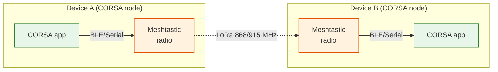
```mermaid
graph LR
    subgraph "Device A (CORSA node)"
        APP_A["CORSA app"]
        MT_A["Meshtastic<br/>radio"]
    end

    subgraph "Device B (CORSA node)"
        APP_B["CORSA app"]
        MT_B["Meshtastic<br/>radio"]
    end

    APP_A -->|BLE/Serial| MT_A
    MT_A -.->|LoRa 868/915 MHz| MT_B
    MT_B -->|BLE/Serial| APP_B

    style APP_A fill:#e8f5e9,stroke:#2e7d32
    style APP_B fill:#e8f5e9,stroke:#2e7d32
    style MT_A fill:#fff3e0,stroke:#e65100
    style MT_B fill:#fff3e0,stroke:#e65100
```
*Диаграмма — Meshtastic как radio transport bridge для CORSA*

#### Ограничения радио vs BLE

| Свойство | BLE (A13) | Meshtastic (A14) |
|----------|-----------|------------------|
| Дальность | 10–100 м | 1–10+ км |
| MTU | 469 байт (типично) | 237 байт (макс. LoRa payload) |
| Пропускная способность | ~1 Мбит/с | ~1–10 кбит/с |
| Задержка | 5–50 мс | 500 мс – 5 с на хоп |
| Duty cycle | без ограничений | регуляторный лимит (1–10% в ЕС) |
| Мощность | мВт диапазон | 100 мВт – 1 Вт |
| Топология | плотный локальный mesh | разреженный long-range mesh |

Эти ограничения означают, что Meshtastic переиспользует паттерны BLE
(фрагментация, QoS, dedup), но с более жёсткими лимитами и другой настройкой.

<a id="iter-18-1"></a>
#### 18.1 — Meshtastic transport bridge

**Цель:** установить Meshtastic serial/BLE API как рабочий CORSA-транспорт:
отправка фреймов, приём фреймов, обнаружение radio-достижимых пиров.

**Как работает:** Meshtastic-транспорт реализует тот же транспортный интерфейс,
что и BLE (`isPeerConnected()`, `isPeerReachable()`, `send()`). CORSA-нода
взаимодействует с локальным Meshtastic-устройством через его protobuf serial
API. Исходящие CORSA-фреймы сериализуются в Meshtastic `DATA_APP` пакеты на
выделенном номере порта; входящие пакеты на этом порту десериализуются обратно
в CORSA-фреймы.

**Обнаружение пиров:** Meshtastic предоставляет собственное обнаружение нод
через `NodeInfo`-сообщения. CORSA-транспорт маппит Meshtastic node ID на CORSA
identity fingerprint через обмен ANNOUNCE по радиоканалу. Маппинг кешируется
с той же моделью свежести, что и BLE (двухуровневый: verified / unverified).

**Изоляция каналов:** CORSA-трафик использует выделенный Meshtastic-канал
(настраиваемый `meshtastic_channel_index`, по умолчанию 1), отдельный от
default Meshtastic chat channel. Это предотвращает отображение CORSA-фреймов
как garbled text в Meshtastic-приложении и изолирует CORSA-трафик от
не-CORSA Meshtastic-пользователей.

**Прогресс:**

- [ ] Реализовать клиент Meshtastic serial/BLE API (protobuf)
- [ ] Реализовать сериализацию CORSA-фреймов в `DATA_APP` пакеты
- [ ] Реализовать изоляцию каналов (`meshtastic_channel_index`)
- [ ] Реализовать обнаружение пиров через NodeInfo → ANNOUNCE маппинг
- [ ] Реализовать транспортный интерфейс (isPeerConnected, isPeerReachable, send)
- [ ] Реализовать кеш Meshtastic node ID → CORSA fingerprint
- [ ] Unit-тест: CORSA-фрейм round-trip через Meshtastic-сериализацию
- [ ] Unit-тест: изоляция каналов — CORSA-фреймы только на настроенном канале
- [ ] Unit-тест: обнаружение пиров маппит Meshtastic nodeID на CORSA fingerprint
- [ ] Интеграционный тест: две CORSA-ноды обмениваются DM через Meshtastic bridge
- [ ] Обновить `docs/protocol/relay.md` (регистрация Meshtastic-транспорта, конфигурация каналов)
- [ ] Обновить `docs/protocol/delivery.md` (модель достижимости Meshtastic)

<a id="iter-18-2"></a>
#### 18.2 — Radio-aware фрагментация и pacing

**Цель:** доставлять фреймы, превышающие LoRa MTU (237 байт), надёжно, с
pacing, уважающим регуляторные лимиты duty cycle.

**Проблема:** максимальный payload Meshtastic — 237 байт, примерно половина BLE.
Типичный DM-фрейм (с onion wrapping) легко превышает это. Кроме того, LoRa
работает под регуляторными ограничениями duty cycle (1% в EU 868 МГц, 10% в US
915 МГц) — слишком быстрая отправка фрагментов нарушает регуляции и вызывает
потерю пакетов.

**Фрагментация:** переиспользует модель A13.2 с radio-специфичными параметрами:

| Параметр | BLE (A13) | Meshtastic (A14) |
|----------|-----------|------------------|
| MTU по умолчанию | 469 байт | 237 байт |
| мин. размер чанка | 64 байта | 32 байта |
| overhead фрагмента | 34 байта | 34 байта |
| эффективный чанк | 435 байт | 203 байта |
| макс. inflight assemblies | 50 | 20 |
| таймаут пересборки | 30 с | 120 с |

**Duty-cycle-aware pacing:** вместо фиксированной BLE-задержки, Meshtastic-
фрагменты пейсятся на основе оставшегося duty cycle бюджета. Транспорт
отслеживает кумулятивный airtime и приостанавливает передачу при приближении к
потолку duty cycle. Конфигурация: `meshtastic_duty_cycle_limit` (по умолчанию
0.1 для US, 0.01 для EU), `meshtastic_airtime_window` (по умолчанию 3600 с).

**Оценка airtime:** airtime каждого фрагмента оценивается по размеру payload,
spreading factor и bandwidth: `airtime_ms ≈ preamble_ms + (payload_bytes × 8 /
bitrate)`. Транспорт поддерживает скользящее окно кумулятивного airtime и
блокирует отправку когда `cumulative_airtime / airtime_window > duty_cycle_limit`.

**Приоритет фрагментов:** та же 5-уровневая иерархия приоритетов как A13.4, но
с дополнительным правилом: когда бюджет duty cycle низкий (< 20% остатка),
отправляются только приоритеты 1–2 (control + фрагменты для текущих пересборок);
низшие приоритеты откладываются до восстановления бюджета.

**Прогресс:**

- [ ] Реализовать определение radio MTU и вычисление chunk size
- [ ] Реализовать duty-cycle-aware pacing с отслеживанием airtime
- [ ] Реализовать оценку airtime (SF/BW-aware)
- [ ] Реализовать gating по duty-cycle бюджету (cutoff приоритетов при низком бюджете)
- [ ] Реализовать увеличенный assembly timeout для radio-задержки
- [ ] Unit-тест: фрейм 237 байт → нет фрагментации
- [ ] Unit-тест: фрейм 238 байт → 2 фрагмента, корректная пересборка
- [ ] Unit-тест: duty cycle превышен → отправка заблокирована до восстановления бюджета
- [ ] Unit-тест: низкий бюджет → отправляются только приоритеты 1–2
- [ ] Unit-тест: assembly timeout 120 с соблюдается (не 30 с BLE default)
- [ ] Overload-тест: fragment flood соблюдает duty cycle limit
- [ ] Обновить `docs/protocol/relay.md` (параметры radio-фрагментации, duty cycle pacing)
- [ ] Обновить `docs/protocol/delivery.md` (Meshtastic QoS, airtime budget)

<a id="iter-18-3"></a>
#### 18.3 — Radio mesh relay и дедупликация

**Цель:** обеспечить multi-hop relay сообщений по LoRa mesh, предотвращая
амплификацию в low-bandwidth radio-среде.

**Проблема:** пропускная способность LoRa ~1000× ниже BLE. Broadcast storm,
который на BLE просто раздражает, на LoRa становится фатальным — один цикл
амплификации может насытить канал на минуты и нарушить регуляции duty cycle.

**Дедупликация:** переиспользует модель Bloom filter + ingress suppression из
A13.3. Dedup-кеш уменьшен для радио: `meshtastic_dedup_capacity`
(по умолчанию 2 000 записей) с TTL = 300 с (длиннее BLE, потому что
radio-сообщения распространяются медленнее).

**Relay fanout:** в radio-контексте K-of-N fanout более агрессивен — K = 1 по
умолчанию для broadcast (single-relay gossip). Только ANNOUNCE и directed
сообщения используют полный fanout. Это необходимо, потому что каждая radio-
ретрансляция потребляет общий airtime.

| Тип сообщения | Radio fanout | BLE fanout |
|---------------|-------------|------------|
| ANNOUNCE | все | все |
| directed | все релевантные | все релевантные |
| broadcast MESSAGE | K=1 (single relay) | K-of-N подмножество |
| gossip sync | подавлен | K-of-N |

**Подавление gossip sync:** GCS-based gossip sync (A13.3) **отключён** на
Meshtastic-транспорте по умолчанию. Стоимость airtime обмена GCS-фильтрами
перевешивает выгоду на скоростях LoRa. Вместо этого пропущенные сообщения
определяются через delivery receipts и ретранслируются по запросу.

**TTL:** `meshtastic_message_ttl` (по умолчанию 2). Ниже BLE, потому что каждый
radio hop дорогой; сообщения, требующие больше хопов, должны использовать
интернет-подключённый mesh.

**Bridge relay:** когда CORSA-нода имеет активные BLE и Meshtastic транспорты,
она может мостить между ними. Сообщение, пришедшее по LoRa, может быть
ретранслировано на BLE (и наоборот), если таблица маршрутов указывает, что
назначение достижимо на другом транспорте. Bridge relay следует стандартной
логике выбора транспорта — без special-case кода.

**Прогресс:**

- [ ] Реализовать radio-специфичный Bloom filter dedup (меньший capacity, длиннее TTL)
- [ ] Реализовать K=1 single-relay gossip для radio broadcast
- [ ] Реализовать флаг подавления gossip sync для Meshtastic-транспорта
- [ ] Реализовать radio TTL enforcement (по умолчанию 2)
- [ ] Реализовать BLE↔Meshtastic bridge relay через выбор транспорта
- [ ] Unit-тест: radio dedup предотвращает амплификацию при ретрансляции
- [ ] Unit-тест: K=1 fanout — broadcast ретранслируется ровно 1 пиру
- [ ] Unit-тест: gossip sync отключён на Meshtastic по умолчанию
- [ ] Unit-тест: bridge relay — LoRa→BLE и BLE→LoRa пути работают
- [ ] Unit-тест: radio TTL=0 → не ретранслируется
- [ ] Overload-тест: radio broadcast storm ограничен K=1 + TTL=2
- [ ] Интеграционный тест: цепочка 3 ноды A(BLE)→B(BLE+LoRa)→C(LoRa) доставляет DM
- [ ] Обновить `docs/protocol/relay.md` (radio relay правила, bridge relay, подавление gossip)
- [ ] Обновить `docs/encryption.md` (размер Bloom-фильтра для радио)
- [ ] Обновить `docs/protocol/delivery.md` (Meshtastic TTL, bridge transport selection)

<a id="iter-19"></a>
### Итерация 19 — Конструктор кастомного шифрования

**Цель:** оставить любой brick-based encryption workflow строго как
экспериментальную лабораторную функцию.

**Ограничение:** это никогда не должно заменять audited crypto или продаваться
как более сильная защита, чем reviewed encryption.

**Готово когда:** если функция вообще реализована, она чётко помечена как
unsafe/experimental, выключена по умолчанию и отделена от основных security
claims продукта.

<a id="iter-20"></a>
### Итерация 20 — Голосовые звонки

**Цель:** обеспечить real-time голосовую связь между identity через mesh-сеть
со сквозным шифрованием и onion-маршрутизацией (при наличии).

**Зависимость:** требует стабильного onion delivery (A9) для приватной
сигнализации и установки вызова. Требует надёжного relay (Итерации 1–3)
для транспорта медиа.

**Ограничение транспорта:** голосовые звонки работают исключительно через
TCP/IP mesh-соединения. BLE (A13) и Meshtastic LoRa (A14) транспорты
явно исключены — их пропускная способность и характеристики задержки
несовместимы с требованиями real-time аудио.

**Протокол сигнализации (MSI — Media Session Information):**

Установка и завершение вызова используют выделенные capability-gated типы
фреймов, а не обычные DM-payload. Это критично для mixed-version безопасности:
пир без `voice_call_v1` никогда не должен получать сигнальные фреймы (он не
сможет их распарсить и может показать как непонятный пользовательский контент
или разорвать соединение).

Типы сигнальных фреймов (все gated по `voice_call_v1`):

- `call_request` — инициация вызова (содержит session_id, список кодеков)
- `call_accept` — принятие входящего вызова (содержит выбранный кодек)
- `call_reject` — отклонение или отмена вызова (содержит код причины)
- `call_end` — завершение активного вызова
- `call_ringing` — сигнал, что устройство вызываемого звонит
- `call_hold` / `call_resume` — удержание/возобновление активного вызова

Эти фреймы отправляются через существующий lossless delivery pipeline (тот же
транспорт что и DM, но с отдельным полем `type`), опционально обёрнутые в onion
(Итерация 13) для приватности. Пир, получивший неизвестный тип фрейма, тихо
отбрасывает его по существующему правилу обработки неизвестных фреймов — но
capability gate гарантирует, что этот случай не возникнет в нормальной работе.

Сигнальный канал не несёт медиа — только управление сессией. Каждый сигнальный
фрейм содержит `session_id` и монотонный `seq` для предотвращения replay и
мультиплексирования нескольких вызовов.

**Медиа-транспорт — lossy-канал:**

Аудио-пакеты отправляются через lossy-канал, где своевременная доставка важнее
надёжности. Потерянные пакеты маскируются кодеком, а не ретранслируются.

- **Priority bypass:** медиа-пакеты обходят контроль перегрузки при заполнении
  очереди отправки. Это предотвращает ситуацию, когда передача файлов или
  массовые сообщения «голодят» аудиопоток.
- **Jitter buffer:** приёмник поддерживает jitter buffer (по умолчанию 60–200 мс,
  адаптивный) для сглаживания вариации задержки прибытия пакетов.
- **Согласование кодеков:** при установке вызова пиры обмениваются списками
  поддерживаемых кодеков и выбирают лучший общий. Начальный набор: Opus
  (основной, переменный битрейт 6–128 кбит/с, фреймы 20 мс) с fallback на
  режим пониженного битрейта для ограниченных каналов.

**Адаптация качества с учётом перегрузки:**

Вызов мониторит RTT и потерю пакетов для каждой медиа-сессии. При потерях выше
порога (например, 5%) отправитель снижает битрейт или переключается на кодек с
более низким качеством. При улучшении условий качество плавно возвращается.

**Групповое голосовое общение (расширение на будущее):**

Групповые голосовые вызовы транслируют lossy-аудио ограниченному числу пиров
(2 вместо всех) для контроля пропускной способности. Каждый пир ретранслирует
соседям, формируя дерево распределения с низким fan-out. Определение активного
говорящего может дополнительно снизить трафик.

**Готово когда:** две identity могут установить голосовой вызов со сквозным
шифрованием, сигнализация вызова идёт через onion-маршруты (если доступны),
медиа-пакеты ретранслируются с ограниченной задержкой, и протокол
деградирует gracefully при недостаточных сетевых условиях.

**Прогресс:**

- [ ] Спроектировать протокол сигнализации MSI (call_request/call_accept/call_reject/call_end/call_ringing/call_hold/call_resume)
- [ ] Определить типы сигнальных фреймов в `protocol/frame.go` (отдельное поле `type`, не DM payload)
- [ ] Гейтить все сигнальные фреймы по capability `voice_call_v1` — никогда не отправлять пирам без неё
- [ ] Реализовать сигнализацию через существующий lossless delivery pipeline (тот же транспорт, отдельные типы фреймов)
- [ ] Реализовать lossy-тип пакетов для медиа-транспорта
- [ ] Реализовать priority bypass: медиа-пакеты обходят очередь congestion control
- [ ] Реализовать jitter buffer (адаптивный 60–200 мс)
- [ ] Реализовать интеграцию кодека Opus (переменный битрейт, фреймы 20 мс)
- [ ] Реализовать согласование кодеков при установке вызова
- [ ] Реализовать адаптацию качества с учётом перегрузки (снижение битрейта при потерях)
- [ ] Реализовать state machine вызова (idle → ringing → active → ended)
- [ ] Интегрировать onion-обёртку для сигнализации (опционально, через privacy mode из 13.1)
- [ ] Добавить capability gate `voice_call_v1`
- [ ] Unit-тест: сигнальные фреймы никогда не отправляются пирам без `voice_call_v1`
- [ ] Unit-тест: пир без `voice_call_v1` никогда не получает call_request (capability gate)
- [ ] Unit-тест: state machine установки и завершения вызова
- [ ] Unit-тест: приоритет медиа-пакетов над bulk-трафиком
- [ ] Unit-тест: jitter buffer сглаживает при переменной задержке
- [ ] Unit-тест: согласование кодеков выбирает лучший общий кодек
- [ ] Unit-тест: адаптация качества снижает битрейт при потере пакетов
- [ ] Интеграционный тест: голосовой вызов через 3-хоповый relay path
- [ ] Интеграционный тест: передача файлов во время вызова не деградирует аудио
- [ ] Обновить `docs/protocol/relay.md` (lossy-медиаканал, priority bypass)

<a id="iter-21"></a>
### Итерация 21 — Передача файлов

**Цель:** обеспечить peer-to-peer передачу файлов между identity с поддержкой
докачки, отслеживанием прогресса и управлением потоком.

**Зависимость:** требует стабильной DM-доставки (Итерации 1–2). Выигрывает от
congestion control (Итерация 24) для управления пропускной способностью, но
работает и без него через простое rate-limiting.

#### 21a. Типы фреймов

**`file_send_request`** — инициация новой передачи:

```json
{
  "type": "file_send_request",
  "file_number": 0,
  "file_type": 0,
  "file_size": 1048576,
  "file_id": "base64_32_bytes",
  "filename": "photo.jpg"
}
```

| Поле | Тип | Описание |
|---|---|---|
| `file_number` | `uint8` | 0–255, выбирается отправителем, уникален по направлению на пира |
| `file_type` | `uint32` | 0 = обычный файл, 1 = аватар, расширяемо |
| `file_size` | `uint64` | Размер в байтах; `UINT64_MAX` = неизвестный/стриминг |
| `file_id` | `[32]byte` | Хеш контента для дедупликации/докачки (напр. SHA-256 файла) |
| `filename` | `string` | Опционально, макс. 255 байт UTF-8 |

**`file_control`** — управление активной передачей:

```json
{
  "type": "file_control",
  "send_receive": 0,
  "file_number": 0,
  "control_type": 0,
  "seek_position": 0
}
```

| Поле | Тип | Описание |
|---|---|---|
| `send_receive` | `uint8` | 0 = целевой файл отправляется, 1 = целевой файл принимается |
| `file_number` | `uint8` | Идентифицирует передачу |
| `control_type` | `uint8` | 0 = принять/возобновить, 1 = пауза, 2 = отмена, 3 = seek |
| `seek_position` | `uint64` | Только при `control_type` = 3 (seek); смещение в байтах |

**`file_data`** — чанк файлового контента:

```json
{
  "type": "file_data",
  "file_number": 0,
  "data": "base64_chunk"
}
```

| Поле | Тип | Описание |
|---|---|---|
| `file_number` | `uint8` | Идентифицирует передачу |
| `data` | `[]byte` | 0–1371 байт; чанк < макс. размера сигнализирует завершение для файлов неизвестного размера |

#### 21b. State machine передачи файлов

Каждая передача (идентифицируется по `(peer, direction, file_number)`)
проходит следующие состояния:

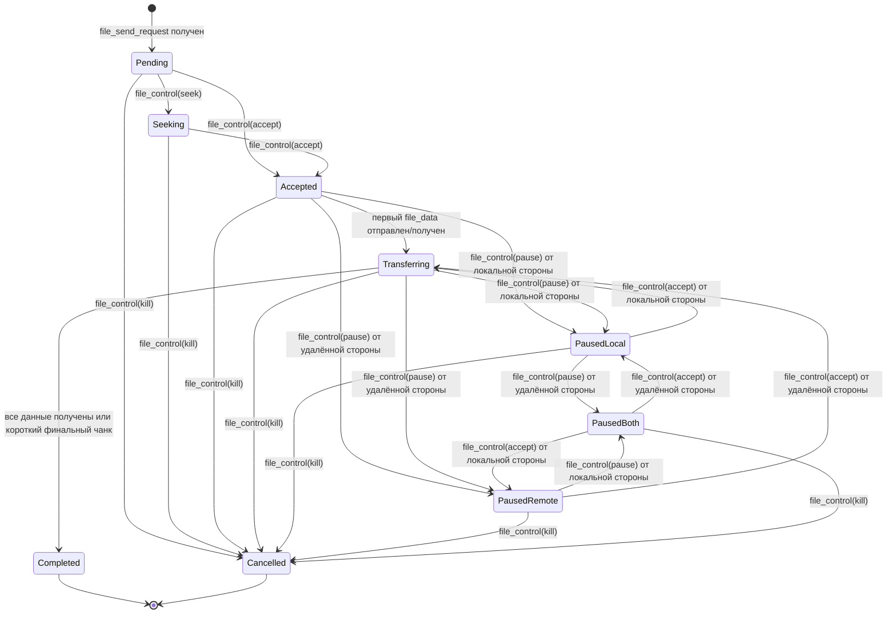
```mermaid
stateDiagram-v2
    [*] --> Pending: file_send_request получен

    Pending --> Accepted: file_control(accept)
    Pending --> Seeking: file_control(seek)
    Pending --> Cancelled: file_control(kill)

    Seeking --> Accepted: file_control(accept)
    Seeking --> Cancelled: file_control(kill)

    Accepted --> Transferring: первый file_data отправлен/получен
    Accepted --> PausedLocal: file_control(pause) от локальной стороны
    Accepted --> PausedRemote: file_control(pause) от удалённой стороны
    Accepted --> Cancelled: file_control(kill)

    Transferring --> PausedLocal: file_control(pause) от локальной стороны
    Transferring --> PausedRemote: file_control(pause) от удалённой стороны
    Transferring --> Completed: все данные получены или короткий финальный чанк
    Transferring --> Cancelled: file_control(kill)

    PausedLocal --> PausedBoth: file_control(pause) от удалённой стороны
    PausedLocal --> Transferring: file_control(accept) от локальной стороны
    PausedLocal --> Cancelled: file_control(kill)

    PausedRemote --> PausedBoth: file_control(pause) от локальной стороны
    PausedRemote --> Transferring: file_control(accept) от удалённой стороны
    PausedRemote --> Cancelled: file_control(kill)

    PausedBoth --> PausedRemote: file_control(accept) от локальной стороны
    PausedBoth --> PausedLocal: file_control(accept) от удалённой стороны
    PausedBoth --> Cancelled: file_control(kill)

    Completed --> [*]
    Cancelled --> [*]
```
*Диаграмма — State machine передачи файлов с двунаправленной паузой*

**Ключевой инвариант:** когда сторона ставит на паузу, только эта сторона может
снять паузу. Если обе поставили на паузу, обе должны снять паузу для
возобновления передачи данных.

#### 21c. Инициация и докачка передачи

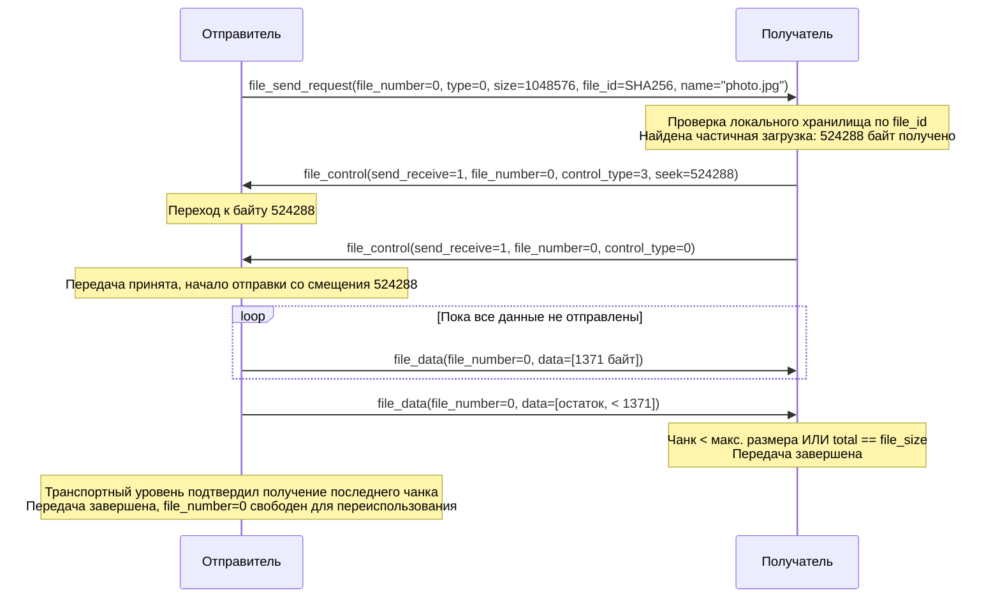
```mermaid
sequenceDiagram
    participant S as Отправитель
    participant R as Получатель

    S->>R: file_send_request(file_number=0, type=0, size=1048576, file_id=SHA256, name="photo.jpg")
    Note over R: Проверка локального хранилища по file_id<br/>Найдена частичная загрузка: 524288 байт получено

    R->>S: file_control(send_receive=1, file_number=0, control_type=3, seek=524288)
    Note over S: Переход к байту 524288

    R->>S: file_control(send_receive=1, file_number=0, control_type=0)
    Note over S: Передача принята, начало отправки со смещения 524288

    loop Пока все данные не отправлены
        S->>R: file_data(file_number=0, data=[1371 байт])
    end

    S->>R: file_data(file_number=0, data=[остаток, < 1371])
    Note over R: Чанк < макс. размера ИЛИ total == file_size<br/>Передача завершена

    Note over S: Транспортный уровень подтвердил получение последнего чанка<br/>Передача завершена, file_number=0 свободен для переиспользования
```
*Диаграмма — Передача файла с seek/resume после частичной загрузки*

#### 21d. Параллельные передачи и управление номерами файлов

```
Peer A → Peer B (исходящие):  file_numbers 0–255 (выбираются A)
Peer B → Peer A (исходящие):  file_numbers 0–255 (выбираются B)
                              ─────────────────────────────────
                              Итого: 512 параллельных передач на пару пиров
```

Поле `send_receive` в `file_control` определяет направление. Когда
`send_receive=0`, контрол нацелен на файл, **отправляемый** отправителем
контрола. Когда `send_receive=1`, нацелен на **принимаемый** файл.

**Жизненный цикл номера файла:** номер занят от `file_send_request`
до `Completed` или `Cancelled`. При завершении или отмене номер
немедленно освобождается для переиспользования. При отключении пира все
номера освобождаются.

```go
type FileTransferRegistry struct {
    mu       sync.RWMutex
    outgoing [256]*FileTransfer // файлы, которые мы отправляем
    incoming [256]*FileTransfer // файлы, которые мы получаем
}

type FileTransfer struct {
    FileNumber   uint8
    FileType     uint32
    FileSize     uint64           // UINT64_MAX = неизвестный
    FileID       [32]byte
    Filename     string
    State        FileTransferState
    BytesSent    uint64           // отслеживает отправитель
    BytesRecvd   uint64           // отслеживает получатель
    SeekPosition uint64           // из seek-команды
    PausedLocal  bool
    PausedRemote bool
    CreatedAt    time.Time
}
```

#### 21e. Определение завершения

Два правила определяют завершение передачи:

1. **Известный размер:** `BytesRecvd == FileSize` → передача завершена.
   Любые данные сверх `FileSize` отбрасываются.
2. **Неизвестный размер** (`FileSize == UINT64_MAX`): чанк `file_data` с
   `len(data) < max_chunk_size` (1371 байт) сигнализирует завершение.
   Чанк нулевой длины завершает файл нулевого размера.

**Критический инвариант для передач неизвестного размера:** все не-финальные
чанки ОБЯЗАНЫ быть ровно `max_chunk_size` (1371 байт). Отправитель НЕ ДОЛЖЕН
отправлять укороченный чанк для pacing, flow control или любой другой причины
до финального чанка. Если отправителю нужно ограничить пропускную способность,
он регулирует межчанковый интервал, а не размер чанка. Этот инвариант — то, что
делает `len(data) < max_chunk_size` надёжным сигналом конца потока. Нарушение
инварианта преждевременно завершит передачу на стороне получателя.

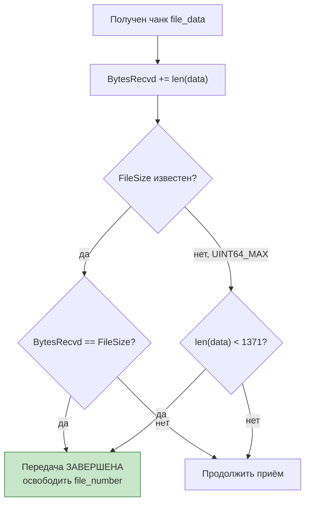
```mermaid
flowchart TD
    RECV["Получен чанк file_data"]
    KNOWN{"FileSize известен?"}
    CHECK_SIZE{"BytesRecvd == FileSize?"}
    CHECK_SHORT{"len(data) < 1371?"}
    ADD["BytesRecvd += len(data)"]
    COMPLETE["Передача ЗАВЕРШЕНА<br/>освободить file_number"]
    CONTINUE["Продолжить приём"]

    RECV --> ADD --> KNOWN
    KNOWN -->|да| CHECK_SIZE
    KNOWN -->|нет, UINT64_MAX| CHECK_SHORT
    CHECK_SIZE -->|да| COMPLETE
    CHECK_SIZE -->|нет| CONTINUE
    CHECK_SHORT -->|да| COMPLETE
    CHECK_SHORT -->|нет| CONTINUE

    style COMPLETE fill:#c8e6c9,stroke:#2e7d32
```
*Диаграмма — Определение завершения: известный vs неизвестный размер файла*

Отправитель подтверждает завершение когда транспортный уровень подтвердит
получение последнего чанка `file_data` (через механизм lossless-доставки
mesh relay).

#### 21f. Оптимизация передачи аватаров

Передачи аватаров (file_type=1) используют `file_id` как хеш контента
(SHA-256 изображения аватара). Перед отправкой данных аватара:

1. Отправитель шлёт `file_send_request` с type=1 и file_id=SHA256(avatar).
2. Получатель проверяет локальный кеш аватаров по file_id.
3. Если уже в кеше → получатель немедленно шлёт `file_control(kill)`
   (передача данных не нужна).
4. Если не в кеше → обычный поток accept/transfer.

Это предотвращает избыточные передачи аватаров при каждом переподключении.

#### 21g. Взаимодействие с доставкой сообщений

Данные файлов классифицируются как **bulk**-трафик (см. Итерация 24):

- При активном congestion control (Итерация 24) данные файлов уступают
  пропускную способность сигнальным и real-time пакетам.
- Без Итерации 24 используется простой token bucket rate limiter:
  `max_file_data_rate` (по умолчанию 100 чанков/сек на пира). Это
  предотвращает монополизацию соединения файловыми передачами.
- DM-сообщения всегда отправляются как lossless priority-трафик и никогда
  не блокируются файловыми передачами.

```mermaid
flowchart LR
    DM["DM-сообщения<br/>(lossless, приоритет)"]
    FILE["Данные файлов<br/>(bulk, rate-limited)"]
    VOICE["Голосовые пакеты<br/>(lossy, bypass)"]
    QUEUE["Очередь отправки"]
    LINK["Сетевой канал"]

    DM -->|всегда отправляются| QUEUE
    VOICE -->|обходят очередь| LINK
    FILE -->|rate-limited| QUEUE
    QUEUE --> LINK

    style DM fill:#e3f2fd,stroke:#1565c0
    style VOICE fill:#fff3e0,stroke:#e65100
    style FILE fill:#f5f5f5,stroke:#9e9e9e
```
*Диаграмма — Приоритет трафика: DM > голос (bypass) > данные файлов (rate-limited)*

#### 21h. Поведение при оффлайне и очистка

При закрытии сессии пира:

1. Все активные передачи (входящие и исходящие) переводятся в `Cancelled`.
2. Все 256 номеров файлов по каждому направлению освобождаются.
3. Частично полученные данные **сохраняются** на диске, индексированные по `file_id`.
4. При переподключении отправитель заново инициирует передачи. Получатель
   обнаруживает частичные данные по `file_id` и шлёт seek для докачки.

Протокол не сохраняет состояние передач между перезапусками. Это упрощает
реализацию — докачка полностью зависит от `file_id` и локального хранилища
получателя.

**Готово когда:** две identity могут передавать файлы с индикацией прогресса,
возобновлять прерванные передачи и управлять параллельными передачами без
голодания канала сообщений.

**Прогресс:**

- [ ] Определить тип фрейма `file_send_request` (номер файла, тип, размер, file_id, имя файла)
- [ ] Определить тип фрейма `file_control` (accept, pause, kill, seek)
- [ ] Определить тип фрейма `file_data` (номер файла, чанк данных)
- [ ] Реализовать `FileTransferRegistry` с массивами на 256 слотов по направлению
- [ ] Реализовать state machine `FileTransfer` (pending → seeking → accepted → transferring → paused → completed/cancelled)
- [ ] Реализовать двунаправленную паузу (local/remote/both)
- [ ] Реализовать seek/resume через file ID и локальное частичное хранилище
- [ ] Реализовать определение завершения (совпадение размера или короткий финальный чанк)
- [ ] Реализовать жизненный цикл номера файла (освобождение при complete/cancel/disconnect)
- [ ] Реализовать оптимизацию передачи аватаров (проверка хеша file_id перед принятием)
- [ ] Реализовать token bucket rate limiter для file data (`max_file_data_rate` по умолчанию 100 чанков/сек)
- [ ] Добавить capability gate `file_transfer_v1`
- [ ] Очистка всех передач при отключении пира
- [ ] Сохранение частично полученных данных на диске с индексацией по file_id для докачки
- [ ] Unit-тест: параллельные передачи файлов (несколько файлов параллельно, независимые номера)
- [ ] Unit-тест: seek/resume после переподключения (частичные данные обнаружены по file_id)
- [ ] Unit-тест: pause обеими сторонами, unpause одной — передача остаётся на паузе
- [ ] Unit-тест: pause обеими сторонами, unpause обеими — передача возобновляется
- [ ] Unit-тест: передача неизвестного размера с коротким финальным чанком → complete
- [ ] Unit-тест: передача известного размера, данные сверх file_size → отбрасываются
- [ ] Unit-тест: передача файла нулевого размера (один чанк нулевой длины)
- [ ] Unit-тест: неизвестный размер — не-финальные чанки ОБЯЗАНЫ быть ровно max_chunk_size (1371); короткий чанк завершает
- [ ] Unit-тест: неизвестный размер — pacing отправителя через межчанковый интервал, НЕ через укороченные чанки
- [ ] Unit-тест: очистка передач при отключении пира (все номера файлов освобождены)
- [ ] Unit-тест: аватар с совпадающим file_id → немедленный kill, без передачи данных
- [ ] Unit-тест: переиспользование file_number после завершения
- [ ] Unit-тест: rate limiter предотвращает голодание DM доставки данными файлов
- [ ] Интеграционный тест: передача большого файла с прерыванием и докачкой
- [ ] Интеграционный тест: передача файла не блокирует доставку DM под нагрузкой
- [ ] Интеграционный тест: 10 параллельных передач файлов между одной парой пиров
- [ ] Обновить `docs/protocol/messaging.md` (фреймы передачи файлов, state machine, capability gate)

**Релиз / Совместимость:**

- [ ] `file_send_request` / `file_control` / `file_data` отправляются только пирам с `file_transfer_v1`
- [ ] Legacy-пиры никогда не получают фреймы передачи файлов
- [ ] Тест смешанных версий: нода с поддержкой файлов работает рядом с нодой без поддержки
- [ ] Подтверждено: Итерация 21 не требует повышения `MinimumProtocolVersion`

<a id="iter-22"></a>
### Итерация 22 — Обнаружение в локальной сети

**Цель:** автоматически находить и подключаться к пирам в той же локальной сети
без зависимости от bootstrap-нод или интернет-соединения.

**Зависимость:** независима от других продуктовых итераций. Может быть
реализована в любой момент после стабильного соединения пиров (Итерация 0).

**Зачем:** самый дешёвый выигрыш в connectivity — два друга в одной WiFi или
LAN-сегменте должны находить друг друга за секунды. Прямые LAN-соединения также
самые быстрые, с суб-миллисекундным RTT, и должны быть приоритетнее relay.

**Capability:** `lan_discovery_v1` (информационный, не hard gate — сам
discovery-пакет до аутентификации и не требует согласования capabilities).

**Новый файл:**

```
internal/core/node/
  lan_discovery.go  — LAN discovery отправитель/слушатель, классификация адресов
```

#### 22a. Формат discovery-пакета

Discovery-пакет минимален — без шифрования, без подписи. Он является
триггером для инициации handshake, а не механизмом доверия.

```
LAN Discovery Packet (UDP broadcast/multicast)
┌─────────┬────────────────┬──────────────────┐
│ 1 байт  │ 32 байта       │ 32 байта         │
│ version │ identity       │ box public key   │
│ (0x01)  │ fingerprint    │                  │
└─────────┴────────────────┴──────────────────┘
Итого: 65 байт
```

| Поле | Длина | Описание |
|---|---|---|
| `version` | 1 | Версия протокола discovery-пакета (0x01) |
| `identity_fingerprint` | 32 | Отпечаток Ed25519 публичного ключа отправителя |
| `box_public_key` | 32 | X25519 box-ключ для инициации handshake |

Байт версии позволяет расширять протокол в будущем без поломки старых клиентов.

#### 22b. Поток обнаружения

```mermaid
sequenceDiagram
    participant A as Нода A
    participant LAN as LAN (broadcast)
    participant B as Нода B

    loop Каждые 10 секунд
        A->>LAN: UDP broadcast (identity + box key)
    end

    Note over B: Получен broadcast от IP ноды A

    B->>B: Нода A уже подключена?
    alt Уже подключена
        Note over B: Игнорировать (без действий)
    else Не подключена
        B->>B: Identity A в списке контактов?
        alt Неизвестный identity
            Note over B: Молча игнорировать (приватность identity)
        else Известный контакт
            B->>A: Инициировать стандартный handshake (hello)
            A->>B: welcome + auth_session
            B->>A: auth_ok
            Note over A,B: Пир-соединение установлено через LAN
            Note over A,B: Пометить соединение как LAN-транспорт
        end
    end
```
*Диаграмма — LAN discovery: broadcast запускает аутентифицированный handshake*

**Инвариант безопасности:** discovery-пакет **никогда** не достаточен для
добавления пира. Полный handshake (из `docs/protocol/handshake.md`) должен
завершиться до модификации состояния пира. Это предотвращает инъекцию
фейковых пиров через поддельные broadcast-пакеты.

**Ограничение приватности identity:** враждебный LAN-пир может отправить
поддельный discovery-пакет и спровоцировать слушателей инициировать
стандартный handshake. Handshake раскрывает identity слушателя атакующему
(даже если атакующий в итоге отклоняется, если его нет в списке контактов).
Это означает, что discovery broadcast **раскрывает, какие identity
присутствуют в сети**, любому наблюдателю LAN, который может вызвать
попытки handshake.

**Политика смягчения — allowlist для LAN handshake:** нода НЕ ДОЛЖНА
инициировать LAN handshake на каждый discovery-пакет. Вместо этого она
инициирует handshake только если `identity_fingerprint` в discovery-пакете
совпадает с известным контактом (список друзей или ожидающий запрос).
Неизвестные identity молча игнорируются. Это гарантирует, что поддельный
discovery от неизвестного identity не заставит слушателя раскрыть себя.

#### 22c. Классификация адресов и приоритет маршрутизации

```go
func IsLANAddress(ip net.IP) bool {
    // RFC1918 приватные диапазоны
    // 10.0.0.0/8
    // 172.16.0.0/12
    // 192.168.0.0/16
    // IPv6 link-local fe80::/10
    // IPv6 unique local fc00::/7
    // Loopback 127.0.0.0/8, ::1
}
```

Когда пир доступен через несколько путей (LAN прямой, WAN relay, mesh relay),
решение маршрутизации учитывает тип транспорта:

```mermaid
flowchart TD
    MSG["Маршрутизация сообщения к identity X"]
    LAN{"LAN прямое<br/>соединение к X?"}
    DIRECT{"WAN прямое<br/>соединение к X?"}
    TABLE{"Запись в таблице<br/>маршрутизации для X?"}
    GOSSIP["Gossip fallback"]

    LAN_SEND["Отправить через LAN<br/>(минимальная задержка)"]
    DIRECT_SEND["Отправить через WAN прямой"]
    RELAY_SEND["Отправить через relay"]

    MSG --> LAN
    LAN -->|да| LAN_SEND
    LAN -->|нет| DIRECT
    DIRECT -->|да| DIRECT_SEND
    DIRECT -->|нет| TABLE
    TABLE -->|да| RELAY_SEND
    TABLE -->|нет| GOSSIP

    style LAN_SEND fill:#c8e6c9,stroke:#2e7d32
    style DIRECT_SEND fill:#e3f2fd,stroke:#1565c0
    style RELAY_SEND fill:#fff3e0,stroke:#e65100
    style GOSSIP fill:#f5f5f5,stroke:#9e9e9e
```
*Диаграмма — Приоритет маршрутизации: LAN > WAN прямой > relay > gossip*

#### 22d. Цели broadcast

| Протокол | Целевой адрес | Область |
|---|---|---|
| IPv4 | Broadcast интерфейса (напр. `192.168.1.255`) | Локальная подсеть |
| IPv4 | Глобальный broadcast (`255.255.255.255`) | Все локальные интерфейсы |
| IPv6 | Multicast `FF02::1` (all-nodes link-local) | Link-local область |

Нода отправляет на **все три** цели для максимального покрытия разных
сетевых конфигураций. Назначенный порт (по умолчанию 33445) настраивается
через `lan_discovery_port` в конфиге.

#### 22e. Rate limiting и защита от усиления

- **Входящие:** максимум `max_lan_discovery_per_second` (по умолчанию 10)
  discovery-пакетов обрабатывается в секунду. Избыточные пакеты молча
  отбрасываются.
- **Исходящие handshake:** максимум `max_lan_handshake_per_minute` (по умолчанию
  20) инициаций handshake, вызванных discovery, в минуту. Предотвращает
  шторм handshake от потока discovery-пакетов.
- **Дедупликация:** если handshake с тем же identity fingerprint уже выполняется
  или был предпринят в течение последних 30 секунд, discovery-пакет
  игнорируется.

**Готово когда:** две ноды в одном LAN обнаруживают друг друга за 20 секунд,
устанавливают прямое соединение, и сообщения предпочитают LAN-путь вместо relay.

**Прогресс:**

- [ ] Реализовать формат LAN discovery пакета (version + identity fingerprint + box public key, 65 байт)
- [ ] Реализовать периодический broadcast/multicast отправитель (IPv4 broadcast + IPv6 multicast `FF02::1`)
- [ ] Реализовать слушатель discovery-пакетов на назначенном порту
- [ ] При получении: проверить identity по списку контактов → игнорировать неизвестные identity (allowlist-политика)
- [ ] При получении: проверить подключён ли уже → если нет, инициировать аутентифицированный handshake
- [ ] Реализовать `IsLANAddress()` — классификация RFC1918, link-local, unique-local, loopback
- [ ] Реализовать приоритет LAN-адреса в `Router.Route()` — LAN > WAN прямой > relay > gossip
- [ ] Пометить соединения через LAN discovery типом транспорта `lan`
- [ ] Настраиваемый интервал broadcast (`lan_discovery_interval`, по умолчанию 10 секунд)
- [ ] Настраиваемый порт discovery (`lan_discovery_port`, по умолчанию 33445)
- [ ] Добавить capability `lan_discovery_v1` (информационный)
- [ ] Реализовать входящий rate limit (`max_lan_discovery_per_second`, по умолчанию 10)
- [ ] Реализовать исходящий rate limit handshake (`max_lan_handshake_per_minute`, по умолчанию 20)
- [ ] Реализовать дедупликацию handshake (игнорировать если тот же identity в последние 30с)
- [ ] Unit-тест: сериализация/десериализация discovery-пакета round-trip (65 байт)
- [ ] Unit-тест: `IsLANAddress` корректно классифицирует RFC1918, fe80::/10, fc00::/7, loopback
- [ ] Unit-тест: `IsLANAddress` отвергает публичные IP
- [ ] Unit-тест: discovery от неизвестного identity → молча игнорируется (handshake не инициирован)
- [ ] Unit-тест: discovery от известного контакта → handshake инициирован
- [ ] Unit-тест: поддельный discovery-пакет не добавляет пира без завершённого handshake
- [ ] Unit-тест: дублирующий discovery от того же identity в течение 30с → игнорируется
- [ ] Unit-тест: LAN-путь предпочтён relay в `Router.Route()` для того же identity
- [ ] Unit-тест: входящий rate limit отбрасывает избыточные discovery-пакеты
- [ ] Интеграционный тест: две ноды в одной подсети обнаруживают друг друга < 20с
- [ ] Интеграционный тест: LAN discovery + relay сосуществование (LAN приоритетнее, relay fallback)
- [ ] Интеграционный тест: LAN discovery + BLE работают одновременно (без конфликтов)

**Релиз / Совместимость:**

- [ ] LAN discovery аддитивен; ноды без него просто не рассылают broadcast
- [ ] Байт версии discovery-пакета позволяет расширять протокол в будущем
- [ ] Тест смешанных версий: LAN-capable нода сосуществует с нодой без LAN discovery
- [ ] Подтверждено: Итерация 22 не требует повышения `MinimumProtocolVersion`

<a id="iter-23"></a>
### Итерация 23 — NAT traversal и hole punching

**Цель:** устанавливать прямые UDP-соединения между пирами за NAT, снижая
зависимость от relay и улучшая задержку для голосовых вызовов и real-time
коммуникации.

**Зависимость:** значительно улучшает голосовые вызовы (Итерация 20).
Работает независимо на транспортном уровне.

**Зачем:** большинство потребительских устройств находятся за NAT. Без hole
punching весь трафик должен идти через relay-ноды, добавляя задержку и нагрузку.
Прямые соединения критичны для качества real-time медиа.

**Capability gate:** `nat_traversal_v1`. Обмен NAT-информацией и фреймами
координации требует поддержки этой capability обоими пирами.

**Новые файлы:**

```
internal/core/node/
  nat_discovery.go   — сбор внешних адресов, определение типа NAT
  hole_punch.go      — state machine hole punch, предсказание портов
```

#### 23a. Классификация NAT

Поведение NAT имеет два независимых измерения (RFC 4787):

- **Mapping behavior** — как NAT назначает внешние порты. Наблюдаемо по
  сравнению внешних IP:port, сообщённых разными пирами.
- **Filtering behavior** — какие входящие пакеты NAT пропускает. Определяет
  сложность hole punch, но **не может быть определено только по наблюдениям
  портов**. Требует активного зондирования (второй source IP отправляет
  пакет на тот же mapped-адрес).

Наблюдения портов определяют тип mapping. Тип filtering определяется
активным probe во время координации hole punch (см. 23c).

```mermaid
flowchart TD
    PEERS["Собрать внешний IP:port<br/>от 4+ relay/DHT пиров"]
    SAME_IP{"Все сообщают<br/>тот же IP?"}
    SAME_PORT{"Все сообщают<br/>тот же порт?"}
    EIM["Endpoint-Independent Mapping<br/>(стабильный порт)"]
    EDM["Endpoint-Dependent Mapping<br/>(порт меняется по dest)"]
    MULTI["Разные IP<br/>Multi-homed или недавно сменился"]

    PEERS --> SAME_IP
    SAME_IP -->|нет| MULTI
    SAME_IP -->|да| SAME_PORT
    SAME_PORT -->|да, идентичный| EIM
    SAME_PORT -->|нет| EDM

    style EIM fill:#c8e6c9,stroke:#2e7d32
    style EDM fill:#ffcdd2,stroke:#c62828
```
*Диаграмма — Классификация NAT mapping по наблюдениям внешних адресов*

Тип mapping определяет, какие стратегии hole punch возможны:

| Тип mapping | Тип filtering | Сложность hole punch |
|---|---|---|
| Endpoint-Independent (EIM) | Endpoint-Independent (full cone) | Тривиально — прямой ping на известный порт |
| Endpoint-Independent (EIM) | Address-Dependent (restricted cone) | Средне — нужен взаимный ping |
| Endpoint-Independent (EIM) | Address+Port-Dependent (port-restricted) | Средне — взаимный ping на правильный порт |
| Endpoint-Dependent (EDM) | Любой (symmetric NAT) | Сложно — предсказание портов |

Тип filtering зондируется во время координации hole punch: пир A
просит relay R отправить пакет на mapped-адрес A с другого IP relay.
Если A получает — filtering Endpoint-Independent. Если нет — filtering
как минимум Address-Dependent. Probe делается по возможности — когда
второй IP relay недоступен, нода предполагает Address-Dependent
filtering (консервативный fallback, который всё равно позволяет
взаимный punch).

#### 23b. Обнаружение внешнего адреса

Каждая нода собирает наблюдения внешнего адреса от пиров, с которыми
общается. Когда пир получает пакет от ноды, исходный IP:port, видимый
пиру — это внешний адрес ноды (с точки зрения этого пира).

```go
type ExternalAddressCollector struct {
    mu           sync.RWMutex
    observations []AddressObservation  // последние 16 наблюдений
    mapping      NATMapping            // EIM, EDM, unknown
    filtering    NATFiltering          // EIF, ADF, APDF, unknown (зондируется)
    externalAddr net.UDPAddr           // наиболее частый наблюдаемый адрес
}

type AddressObservation struct {
    ExternalIP   net.IP
    ExternalPort uint16
    ObservedBy   string    // identity пира, который сообщил
    ObservedAt   time.Time
}
```

Нода хранит последние 16 наблюдений от разных пиров. Когда доступно
минимум 4 наблюдения, запускается классификация **mapping**:

- Все тот же IP **и идентичный порт** → **Endpoint-Independent Mapping (EIM)**
- Тот же IP, любое отклонение порта (включая малые смещения ±1–3) →
  **Endpoint-Dependent Mapping (EDM)**. Малые смещения не доказывают EIM:
  sequential или port-preserving NAT может давать почти идентичные порты,
  при этом создавая новый mapping на каждый destination.
- Разные IP → multi-homed, используется наиболее частый IP

Mapping сам по себе не определяет сложность hole punch. Тип **filtering**
зондируется отдельно во время координации hole punch (см. 23c) и по
умолчанию принимается Address-Dependent, когда зондирование невозможно.

#### 23c. Протокол координации hole punch

Перед hole punching оба пира должны подтвердить что онлайн, знать
внешние адреса друг друга и активно пытаться подключиться. Координация
происходит через существующий relay/mesh-канал.

**`nat_ping_request`** — отправляется через relay для проверки готовности:

```json
{
  "type": "nat_ping_request",
  "ping_id": 12345678,
  "external_addr": "203.0.113.5:41234",
  "mapping": "EIM",
  "filtering": "address_dependent",
  "observed_ports": [41234, 41236, 41238]
}
```

**`nat_ping_response`** — подтверждает готовность и передаёт свою информацию:

```json
{
  "type": "nat_ping_response",
  "ping_id": 12345678,
  "external_addr": "198.51.100.10:52100",
  "mapping": "EIM",
  "filtering": "endpoint_independent",
  "observed_ports": [52100]
}
```

#### 23d. Поток hole punch

```mermaid
sequenceDiagram
    participant A as Пир A (EIM + addr-dependent)
    participant R as Relay
    participant B as Пир B (EIM + endpoint-independent)

    Note over A: Mapping: EIM, Filtering: addr-dependent<br/>Внешний: 203.0.113.5:41234

    A->>R: nat_ping_request (через relay)
    R->>B: nat_ping_request (переслан)
    Note over B: Mapping: EIM, Filtering: endpoint-independent<br/>Внешний: 198.51.100.10:52100

    B->>R: nat_ping_response (через relay)
    R->>A: nat_ping_response (переслан)

    Note over A,B: Оба пира имеют внешние адреса друг друга<br/>Оба начинают hole punching

    rect rgb(240, 255, 240)
        Note over A,B: Одновременный обмен UDP ping
        A->>B: UDP ping на 198.51.100.10:52100
        B->>A: UDP ping на 203.0.113.5:41234
        Note over A: Пакет от B пришёл → NAT mapping создан
        A->>B: UDP pong
        B->>A: UDP pong
        Note over A,B: Прямое UDP соединение установлено!
    end

    Note over A,B: Переключение трафика с relay на прямой UDP
```
*Диаграмма — Координация и выполнение hole punch для cone/restricted NAT*

#### 23e. Предсказание портов symmetric NAT

```mermaid
flowchart TD
    PORTS["Наблюдаемые порты от пиров:<br/>41234, 41236, 41238, 41240"]
    ANALYZE["Обнаружение паттерна:<br/>шаг = 2 (последовательный)"]
    PREDICT["Предсказанный следующий порт: 41242"]
    PROBE["Проба портов в расширяющемся радиусе:<br/>41242, 41244, 41240, 41246, 41238..."]
    EXTRA["После 5 раундов: также пробовать<br/>порты 1024, 1025, 1026..."]
    SUCCESS{"Получен ответ<br/>на ping?"}
    DIRECT["Прямое соединение!"]
    RELAY["Fallback на relay"]

    PORTS --> ANALYZE --> PREDICT --> PROBE
    PROBE --> SUCCESS
    SUCCESS -->|да| DIRECT
    SUCCESS -->|нет, 48 портов опробовано| EXTRA
    EXTRA --> SUCCESS
    SUCCESS -->|нет, таймаут 30с| RELAY

    style DIRECT fill:#c8e6c9,stroke:#2e7d32
    style RELAY fill:#fff3e0,stroke:#e65100
```
*Диаграмма — Предсказание портов symmetric NAT с расширяющейся пробой*

**Алгоритм предсказания портов:**

1. Отсортировать наблюдаемые внешние порты по времени наблюдения.
2. Вычислить разницы между последовательными портами.
3. Если разницы постоянны (напр. все +2), предсказать следующий порт
   экстраполяцией паттерна.
4. Пробовать 48 портов за раунд (каждые 3 секунды): предсказанный порт ±
   расширяющийся радиус.
5. После 5 раундов без успеха дополнительно пробовать порты начиная с
   1024 (48 за раунд).
6. Максимальная длительность hole punch: 30 секунд. Затем fallback на relay.

**Rate limiting:** максимум 48 проб-пакетов за 3 секунды на попытку hole punch.
Это предотвращает DoS на NAT чрезмерным количеством mappings.

#### 23f. Апгрейд соединения с relay на прямое

Когда прямое UDP-соединение установлено через hole punching, нода не
отбрасывает relay-путь немедленно. Вместо этого:

1. Прямой путь помечается как **основной** для этого пира.
2. Relay-путь остаётся как **fallback**.
3. Если прямой путь падает (3 последовательных сбоя keepalive), трафик
   бесшовно переключается на relay.
4. Hole punching повторяется каждые 5 минут при использовании relay, на
   случай изменения состояния NAT (напр. пользователь перешёл на другую сеть).

```mermaid
stateDiagram-v2
    [*] --> RelayOnly: начальное соединение

    RelayOnly --> HolePunching: обмен nat_ping успешен
    HolePunching --> DirectPrimary: получен ответ UDP ping
    HolePunching --> RelayOnly: таймаут (30с)

    DirectPrimary --> RelayFallback: 3 сбоя keepalive
    RelayFallback --> HolePunching: периодическая повторная попытка (5 мин)
    DirectPrimary --> DirectPrimary: keepalive OK
```
*Диаграмма — Состояние соединения: relay-only → hole punch → прямое с relay fallback*

**Готово когда:** пиры за EIM NAT (независимо от типа filtering)
устанавливают прямые соединения через взаимный punch. EDM (symmetric) NAT
пиры пытаются hole punching с предсказанием портов и gracefully откатываются
на relay.

**Прогресс:**

- [ ] Реализовать `ExternalAddressCollector` — сбор наблюдений от 16+ пиров
- [ ] Реализовать определение NAT mapping из наблюдений (EIM / EDM / multi-homed)
- [ ] Реализовать filtering probe при координации hole punch (отправка со второго IP relay)
- [ ] Реализовать типы фреймов `nat_ping_request` и `nat_ping_response` (с полями mapping + filtering)
- [ ] Реализовать координацию NAT ping через relay (обмен внешними адресами)
- [ ] Реализовать hole punch для EIM + endpoint-independent filtering (прямой ping на известный порт)
- [ ] Реализовать hole punch для EIM + address/port-dependent filtering (взаимный одновременный ping)
- [ ] Реализовать предсказание портов symmetric NAT (обнаружение последовательного паттерна)
- [ ] Реализовать расширяющуюся пробу портов (48 портов за 3с раунд, ± радиус)
- [ ] Реализовать fallback портов от 1024 после 5 раундов без успеха
- [ ] Реализовать таймаут hole punch (30с) и relay fallback
- [ ] Реализовать периодическую повторную попытку hole punch (каждые 5 мин на relay)
- [ ] Реализовать апгрейд соединения: прямое как основное, relay как fallback
- [ ] Реализовать мониторинг keepalive на прямом пути (3 сбоя → fallback)
- [ ] Добавить capability gate `nat_traversal_v1`
- [ ] Rate-limit проб hole punch: макс. 48 за 3 секунды
- [ ] Rate-limit NAT ping: макс. 1 обмен на пира за 30 секунд
- [ ] Unit-тест: сбор внешнего адреса от нескольких пиров
- [ ] Unit-тест: определение NAT mapping — тот же порт → EIM, расходящиеся → EDM
- [ ] Unit-тест: filtering probe — ответ получен → EIF, нет ответа → ADF
- [ ] Unit-тест: предсказание порта с паттерном step=2
- [ ] Unit-тест: предсказание порта без паттерна → порты от 1024
- [ ] Unit-тест: state machine hole punch (relay → punching → direct → fallback)
- [ ] Unit-тест: таймаут (30с) → чистый fallback на relay
- [ ] Unit-тест: сбой keepalive на прямом → автоматический relay fallback
- [ ] Unit-тест: rate limit на проб-пакеты
- [ ] Интеграционный тест: два EIM пира устанавливают прямое соединение (взаимный punch)
- [ ] Интеграционный тест: EIM + EDM → прямое для EIM стороны, предсказание портов для EDM
- [ ] Интеграционный тест: hole punch снижает RTT голосового вызова vs relay-only путь
- [ ] Интеграционный тест: прямой путь падает посреди вызова → бесшовный relay fallback

**Релиз / Совместимость:**

- [ ] NAT traversal аддитивен; ноды без него используют relay как прежде
- [ ] `nat_ping_request/response` отправляются только пирам с `nat_traversal_v1`
- [ ] Тест смешанных версий: NAT-capable нода работает рядом с нодой без NAT traversal
- [ ] Подтверждено: Итерация 23 не требует повышения `MinimumProtocolVersion`

<a id="iter-24"></a>
### Итерация 24 — Управление перегрузками и QoS

**Цель:** адаптировать скорость отправки к пропускной способности сети, предотвращать
насыщение каналов и приоритизировать real-time трафик над bulk-передачами.

**Зависимость:** улучшает передачу файлов (Итерация 21) и голосовые вызовы
(Итерация 20). Работает на транспортном уровне.

**Зачем:** без congestion control передача большого файла может насытить канал и
вызвать потерю пакетов для всего трафика. Голосовые вызовы требуют гарантированной
минимальной пропускной способности даже при загруженном канале.

#### 24a. Per-connection состояние перегрузки

Каждое соединение с пиром ведёт независимое отслеживание перегрузки.
Перегруженный канал к пиру A не дросселирует трафик к пиру B.

```go
type CongestionState struct {
    mu sync.RWMutex

    // Отслеживание очереди отправки
    SendQueueSize      int       // текущее количество фреймов в очереди
    SendQueueSnapshot  int       // размер очереди 1.2 секунды назад
    SnapshotTime       time.Time // когда сделан снимок

    // Оценка скорости
    FramesSentWindow  int       // фреймов отправлено за последние 1.2с
    CurrentSendRate    float64   // оценка фреймов/сек, которые канал может пропустить
    MinSendRate        float64   // пол: никогда ниже этого (по умолчанию 8.0)

    // Состояние AIMD
    LastCongestionEvent time.Time // когда произошло последнее событие перегрузки
    CongestionCooldown  time.Duration // 2 секунды — без увеличения в cooldown

    // Скользящее окно
    WindowDuration     time.Duration // 1.2 секунды
    WindowStart        time.Time

    // Счётчики по классам
    SignalingSent       uint64
    RealTimeSent        uint64
    BulkSent            uint64
    BulkDropped         uint64 // фреймы, задержанные congestion control
}

type CongestionConfig struct {
    MinSendRate         float64       // по умолчанию 8.0 фреймов/сек
    WindowDuration      time.Duration // по умолчанию 1.2с
    CooldownDuration    time.Duration // по умолчанию 2с
    IncreaseMultiplier  float64       // по умолчанию 1.25 (медленное увеличение)
    DecreaseFactor      float64       // по умолчанию 0.5 (быстрое снижение)
}
```

Каждый `PeerConnection` содержит `CongestionState`. При установке нового
соединения состояние инициализируется с `MinSendRate`, и скользящее окно
начинается от текущего времени.

#### 24b. Алгоритм адаптации скорости AIMD

Алгоритм оценивает пропускную способность канала наблюдая за очередью
отправки через скользящее окно:

```mermaid
flowchart TD
    A[Каждый тик: замер очереди] --> B{Окно истекло?<br/>1.2 секунды}
    B -- Нет --> A
    B -- Да --> C[queue_delta = текущая_очередь - снимок_очереди]
    C --> D[effective_sent = фреймов_в_окне - queue_delta]
    D --> E[estimated_rate = effective_sent / window_duration]
    E --> F{estimated_rate < min_rate?}
    F -- Да --> G[estimated_rate = min_rate<br/>8 фреймов/сек]
    F -- Нет --> H{Событие перегрузки<br/>за последние 2 секунды?}
    G --> H
    H -- Да --> I[send_rate = estimated_rate<br/>БЫСТРОЕ СНИЖЕНИЕ]
    H -- Нет --> J[send_rate = estimated_rate × 1.25<br/>МЕДЛЕННОЕ УВЕЛИЧЕНИЕ]
    I --> K[Сохранить снимок, сбросить окно]
    J --> K
    K --> A

    style I fill:#ffcdd2,stroke:#c62828
    style J fill:#c8e6c9,stroke:#2e7d32
    style G fill:#fff9c4,stroke:#f57f17
```
*Диаграмма — Цикл адаптации скорости AIMD*

**Событие перегрузки** определяется как: размер TCP-очереди отправки растёт
между окнами (queue_delta > 0), что означает, что приложение записывает
фреймы быстрее, чем TCP-соединение может их отправить. При обнаружении
алгоритм записывает метку времени и переключается в режим снижения на
следующие 2 секунды.

```go
func (cs *CongestionState) UpdateRate(now time.Time) {
    cs.mu.Lock()
    defer cs.mu.Unlock()

    elapsed := now.Sub(cs.WindowStart)
    if elapsed < cs.WindowDuration {
        return
    }

    queueDelta := cs.SendQueueSize - cs.SendQueueSnapshot
    effectiveSent := cs.FramesSentWindow - queueDelta
    estimatedRate := float64(effectiveSent) / elapsed.Seconds()

    if estimatedRate < cs.MinSendRate {
        estimatedRate = cs.MinSendRate
    }

    if now.Sub(cs.LastCongestionEvent) < cs.CongestionCooldown {
        // Быстрое снижение: использовать оценённую скорость как есть (уже ниже)
        cs.CurrentSendRate = estimatedRate
    } else {
        // Медленное увеличение: умножить на 1.25
        cs.CurrentSendRate = estimatedRate * 1.25
    }

    // Сброс окна
    cs.SendQueueSnapshot = cs.SendQueueSize
    cs.FramesSentWindow = 0
    cs.WindowStart = now
}

func (cs *CongestionState) RecordCongestionEvent(now time.Time) {
    cs.mu.Lock()
    defer cs.mu.Unlock()
    cs.LastCongestionEvent = now
}
```

#### 24c. Классы приоритета и классификация пакетов

Три класса трафика определяют взаимодействие пакетов с congestion control:

```mermaid
flowchart LR
    subgraph Input["Входящие пакеты на отправку"]
        P1[Handshake]
        P2[Keepalive]
        P3[Route update]
        P4[Call control]
        P5[Голосовой фрейм]
        P6[Видео фрейм]
        P7[DM сообщение]
        P8[Чанк файла]
        P9[Анонс маршрута]
    end

    subgraph Classify["Классификатор"]
        C1[Класс приоритета?]
    end

    subgraph Classes["Классы трафика"]
        S["Сигнализация<br/>ВСЕГДА ОТПРАВЛЯЕТСЯ"]
        RT["Real-time<br/>ОБХОДИТ ОЧЕРЕДЬ"]
        BK["Bulk<br/>CONGESTION CONTROLLED"]
    end

    P1 --> C1
    P2 --> C1
    P3 --> C1
    P4 --> C1
    P5 --> C1
    P6 --> C1
    P7 --> C1
    P8 --> C1
    P9 --> C1

    C1 --> S
    C1 --> RT
    C1 --> BK

    style S fill:#ffcdd2,stroke:#c62828
    style RT fill:#fff9c4,stroke:#f57f17
    style BK fill:#c8e6c9,stroke:#2e7d32
```
*Диаграмма — Классификация пакетов по классам приоритета*

| Класс приоритета | Data ID | Поведение | Примеры |
|---|---|---|---|
| **Сигнализация** (наивысший) | Handshake, keepalive, управление маршрутами, сигнализация вызовов | Всегда отправляется немедленно. Никогда не ставится в очередь. Не учитывается в бюджете перегрузки. | `handshake`, `keepalive`, `route_withdrawal`, `call_request`, `call_accept` |
| **Real-time** (высокий) | Голосовые фреймы, видео фреймы | Обходят очередь перегрузки. Отправляются даже при перегрузке канала. Учитываются в метриках, но никогда не задерживаются. | `voice_frame`, `video_frame` |
| **Bulk** (обычный) | Сообщения, данные файлов, анонсы маршрутов, синхронизация | Подчиняются congestion control. Ставятся в очередь и rate-limited. Уступают bandwidth высшим классам. | `dm_message`, `file_data`, `route_announce`, `group_sync` |

```go
type PriorityClass uint8

const (
    PrioritySignaling PriorityClass = iota // 0 — наивысший
    PriorityRealTime                        // 1
    PriorityBulk                            // 2 — низший
)

func ClassifyPacket(dataID uint8) PriorityClass {
    switch {
    case isSignalingPacket(dataID):
        return PrioritySignaling
    case isRealTimePacket(dataID):
        return PriorityRealTime
    default:
        return PriorityBulk
    }
}
```

#### 24d. Архитектура приоритетной очереди

Путь отправки использует трёхуровневую очередь. Сигнальные и real-time
пакеты полностью обходят шлюз перегрузки:

```mermaid
flowchart TD
    PKT[Пакет на отправку] --> CLS{Классификация}

    CLS -- Сигнализация --> SQ[Очередь сигнализации<br/>без ограничений, немедленно]
    CLS -- Real-time --> RTQ[Очередь real-time<br/>ограничена, обходит шлюз]
    CLS -- Bulk --> BQ[Очередь bulk<br/>ограничена, через шлюз]

    SQ --> MUX[Мультиплексор]
    RTQ --> MUX
    BQ --> GATE{Шлюз перегрузки<br/>открыт?}
    GATE -- Да --> MUX
    GATE -- Нет --> HOLD[Удержать в очереди<br/>до следующего тика]
    HOLD --> GATE

    MUX --> SEND[TCP session write]

    SEND --> TRACK[Обновить CongestionState<br/>FramesSentWindow++<br/>счётчик класса++]

    style SQ fill:#ffcdd2,stroke:#c62828
    style RTQ fill:#fff9c4,stroke:#f57f17
    style BQ fill:#c8e6c9,stroke:#2e7d32
    style GATE fill:#e1bee7,stroke:#7b1fa2
```
*Диаграмма — Трёхуровневая приоритетная очередь отправки*

```go
type PrioritySendQueue struct {
    mu sync.Mutex

    signaling chan []byte // без ограничений (buffered channel с большой ёмкостью)
    realtime  chan []byte // ограничена, напр. 64 пакета
    bulk      chan []byte // ограничена, напр. 512 пакетов

    congestion *CongestionState
}

func (q *PrioritySendQueue) Enqueue(pkt []byte, class PriorityClass) error {
    switch class {
    case PrioritySignaling:
        q.signaling <- pkt // на практике никогда не блокируется
        return nil
    case PriorityRealTime:
        select {
        case q.realtime <- pkt:
            return nil
        default:
            return ErrRealTimeQueueFull // отбросить старый или новый
        }
    case PriorityBulk:
        select {
        case q.bulk <- pkt:
            return nil
        default:
            return ErrBulkQueueFull
        }
    }
    return nil
}

// Drain записывает фреймы в TCP-сессию с учётом приоритета.
// Вызывается на каждом тике отправки. Параметр session — это
// writer TCP-соединения пира (не datagram-сокет — протокол
// использует постоянные TCP-сессии для доставки всех фреймов).
func (q *PrioritySendQueue) Drain(session FrameWriter) int {
    sent := 0

    // 1. Всегда сначала отправить все сигнальные
    for {
        select {
        case frame := <-q.signaling:
            session.WriteFrame(frame)
            sent++
        default:
            goto drainRealtime
        }
    }

drainRealtime:
    // 2. Отправить все real-time (обход congestion)
    for {
        select {
        case frame := <-q.realtime:
            session.WriteFrame(frame)
            sent++
        default:
            goto drainBulk
        }
    }

drainBulk:
    // 3. Отправить bulk только если congestion позволяет
    budget := q.congestion.BulkBudget()
    for i := 0; i < budget; i++ {
        select {
        case frame := <-q.bulk:
            session.WriteFrame(frame)
            sent++
        default:
            return sent
        }
    }

    return sent
}
```

#### 24e. Обнаружение перегрузки и оценка RTT

Round-trip time оценивается из существующей TCP-сессии. Два источника
дают сэмплы RTT:

1. **Тайминг `hop_ack`** — когда получен `relay_hop_ack`, RTT равен
   времени между отправкой relay-сообщения и получением ack.
   Это уже отслеживается per `(identity, origin, nextHop)` triple
   (см. Итерацию 1.5).
2. **`tcp_info` из `getsockopt`** — на Linux ядро предоставляет
   сглаженные оценки RTT для TCP-соединений. Это доступно «бесплатно»
   без дополнительных wire-level механизмов.

Примечание: протокол использует постоянные TCP-сессии, не UDP-датаграммы.
Congestion control работает на уровне логических фреймов — регулируя
количество фреймов в секунду, записываемых в TCP-сессию. TCP сам
обеспечивает надёжность и повторную передачу; задача congestion controller'а
— предотвращать неограниченный рост очереди отправки и справедливо
распределять полосу между классами трафика.

```mermaid
sequenceDiagram
    participant A as Пир A
    participant B as Пир B

    A->>B: relay_message(to=F, msg_id=42) (t=0мс)
    A->>B: file_data(file_number=1, chunk) (t=5мс)
    A->>B: relay_message(to=G, msg_id=43) (t=10мс)

    B->>A: relay_hop_ack(msg_id=42)
    Note over A: RTT сэмпл = now - send_time(msg_id=42)

    Note over A: Очередь отправки растёт<br/>(TCP write buffer заполняется)
    Note over A: Событие перегрузки:<br/>снижение bulk send rate

    A->>A: Ограничить file_data до<br/>BulkBudget() за тик
    Note over A: Сигнализация + real-time<br/>обходят ограничение
```
*Диаграмма — Оценка RTT из hop_ack и реакция на перегрузку*

```go
type RTTEstimator struct {
    mu      sync.RWMutex
    samples []time.Duration
    minRTT  time.Duration
    avgRTT  time.Duration
}

func (r *RTTEstimator) RecordSample(rtt time.Duration) {
    r.mu.Lock()
    defer r.mu.Unlock()

    r.samples = append(r.samples, rtt)
    if len(r.samples) > 64 {
        r.samples = r.samples[1:] // скользящее окно из 64 сэмплов
    }

    r.minRTT = r.samples[0]
    var sum time.Duration
    for _, s := range r.samples {
        sum += s
        if s < r.minRTT {
            r.minRTT = s
        }
    }
    r.avgRTT = sum / time.Duration(len(r.samples))
}
```

Оценка RTT влияет на адаптацию скорости: если очередь отправки растёт
(TCP write buffer заполняется), congestion controller снижает скорость
bulk-фреймов. Поскольку TCP обеспечивает повторную передачу на транспортном
уровне, congestion controller приложения фокусируется на предотвращении
роста очереди, а не на управлении повторной передачей отдельных фреймов.

#### 24f. Backpressure и интеграция с relay

Когда relay-нода испытывает перегрузку, она сигнализирует вверх по цепочке
через существующие механизмы (overload mode Итерации 3):

```mermaid
stateDiagram-v2
    [*] --> Normal
    Normal --> Pressured: очередь > 75% ёмкости
    Pressured --> Congested: очередь > 90% ёмкости
    Congested --> Pressured: очередь < 85%
    Pressured --> Normal: очередь < 50%
    Congested --> Normal: очередь < 50%

    state Normal {
        [*] --> FullFanout
        FullFanout: Gossip fan-out = настроенный максимум
        FullFanout: Все задачи синхронизации активны
        FullFanout: Bulk rate = CurrentSendRate
    }

    state Pressured {
        [*] --> ReducedFanout
        ReducedFanout: Gossip fan-out уменьшен вдвое
        ReducedFanout: Несрочная синхронизация отложена
        ReducedFanout: Bulk rate = CurrentSendRate × 0.75
    }

    state Congested {
        [*] --> MinimalFanout
        MinimalFanout: Gossip fan-out = 1
        MinimalFanout: Вся синхронизация отложена
        MinimalFanout: Bulk rate = MinSendRate
        MinimalFanout: Real-time по-прежнему обходит
    }
```
*Диаграмма — State machine перегрузки relay-ноды*

| Состояние | Заполнение очереди | Gossip fan-out | Синхронизация | Bulk rate |
|---|---|---|---|---|
| **Normal** | < 75% | Настроенный максимум | Активна | `CurrentSendRate` |
| **Pressured** | 75–90% | Уменьшен вдвое | Несрочная отложена | `CurrentSendRate × 0.75` |
| **Congested** | > 90% | 1 (минимум) | Вся отложена | `MinSendRate` |

Во всех состояниях сигнальные и real-time пакеты никогда не откладываются.

#### 24g. Взаимодействие congestion control и передачи файлов

Передача файлов (Итерация 21) — основной потребитель bulk-bandwidth.
Контроллер перегрузки гарантирует, что данные файлов не голодают остальной трафик:

```mermaid
flowchart TD
    FT[Движок передачи файлов<br/>генерирует чанки file_data] --> BQ[Очередь bulk]
    DM[DM сообщение] --> CLS{Классификация}
    VC[Голосовой фрейм] --> CLS
    KA[Keepalive] --> CLS

    CLS -- Сигнализация --> SQ[Очередь сигнализации]
    CLS -- Real-time --> RTQ[Очередь real-time]
    CLS -- Bulk --> BQ

    SQ --> OUT[Сетевой выход]
    RTQ --> OUT
    BQ --> CG{Шлюз<br/>перегрузки}
    CG -- Открыт --> OUT
    CG -- Закрыт --> WAIT[Backpressure к<br/>движку передачи файлов]

    WAIT --> PAUSE[file_control: pause<br/>если очередь полна > 5с]

    style FT fill:#e3f2fd,stroke:#1565c0
    style VC fill:#fff9c4,stroke:#f57f17
    style WAIT fill:#ffcdd2,stroke:#c62828
```
*Диаграмма — Взаимодействие передачи файлов с congestion control*

Когда bulk-очередь постоянно полна (более 5 секунд), контроллер перегрузки
отправляет сигнал backpressure движку передачи файлов, который может
автоматически приостановить низкоприоритетные передачи для пропуска DM-сообщений.

**Готово когда:** передача файлов потребляет доступную пропускную способность без
потери пакетов для параллельных голосовых вызовов. Real-time трафик сохраняет
ограниченную задержку даже при bulk-нагрузке.

**Прогресс:**

- [ ] Определить структуру `CongestionState` с отслеживанием скользящего окна
- [ ] Определить `CongestionConfig` с настраиваемыми параметрами (min rate, окно, cooldown, множители)
- [ ] Реализовать `UpdateRate()` — адаптация скорости AIMD по тику окна
- [ ] Реализовать `RecordCongestionEvent()` — отслеживание меток времени для режима снижения
- [ ] Реализовать `BulkBudget()` — расчёт количества bulk-фреймов для текущего тика
- [ ] Определить enum `PriorityClass`: Signaling, RealTime, Bulk
- [ ] Реализовать `ClassifyPacket()` — маппинг data ID на классы приоритета
- [ ] Реализовать `PrioritySendQueue` с трёхуровневой архитектурой каналов
- [ ] Реализовать `Enqueue()` — маршрутизация пакетов в правильную очередь по приоритету
- [ ] Реализовать `Drain()` — отправка: сигнализация первой, затем real-time, затем bulk в рамках бюджета
- [ ] Реализовать `RTTEstimator` — скользящее окно min/avg RTT из подтверждений
- [ ] Интегрировать RTT в адаптацию скорости (использовать тайминг hop_ack и tcp_info для RTT сэмплов)
- [ ] Реализовать per-connection инициализацию `CongestionState` при handshake
- [ ] Реализовать состояния backpressure relay: Normal → Pressured → Congested
- [ ] Реализовать снижение gossip fan-out в состояниях Pressured/Congested
- [ ] Реализовать масштабирование bulk rate: Pressured (×0.75) и Congested (min)
- [ ] Реализовать backpressure передачи файлов: авто-пауза при полной bulk-очереди > 5с
- [ ] Добавить capability `congestion_control_v1` (информационный — см. Релиз/Совместимость)
- [ ] Настраиваемая минимальная скорость (`min_send_rate`, по умолчанию 8 фреймов/сек)
- [ ] Настраиваемое окно перегрузки (`congestion_window`, по умолчанию 1.2 секунды)
- [ ] Настраиваемая длительность cooldown (`congestion_cooldown`, по умолчанию 2 секунды)
- [ ] Unit-тест: `UpdateRate()` увеличивает скорость на 1.25× при отсутствии перегрузки > 2с
- [ ] Unit-тест: `UpdateRate()` удерживает скорость на оценённом уровне при перегрузке в последние 2с
- [ ] Unit-тест: `UpdateRate()` никогда не опускается ниже `MinSendRate`
- [ ] Unit-тест: `ClassifyPacket()` корректно маппит все известные data ID
- [ ] Unit-тест: сигнальные пакеты всегда отправляются независимо от состояния перегрузки
- [ ] Unit-тест: real-time пакеты обходят шлюз перегрузки
- [ ] Unit-тест: bulk-фреймы задерживаются при `BulkBudget()` = 0
- [ ] Unit-тест: per-connection независимость — пир A перегружен, пир B не затронут
- [ ] Unit-тест: RTT estimator даёт стабильные min/avg из зашумлённых сэмплов
- [ ] Unit-тест: relay переходит Normal → Pressured → Congested на правильных порогах
- [ ] Unit-тест: снижение fan-out relay в состояниях Pressured и Congested
- [ ] Unit-тест: авто-пауза передачи файлов срабатывает после 5с полной bulk-очереди
- [ ] Интеграционный тест: передача файла + голосовой вызов — голос < 50мс джиттер
- [ ] Интеграционный тест: насыщение канала → адаптация AIMD → восстановление скорости за 10с
- [ ] Интеграционный тест: три параллельные передачи файлов + DM — DM доставляются за 2с
- [ ] Интеграционный тест: relay под нагрузкой — Pressured режим снижает gossip без потери сигнализации
- [ ] Обновить `docs/protocol/relay.md` (congestion control, классы приоритета, backpressure)
- [ ] Обновить `docs/protocol/messaging.md` (таблица классификации пакетов)

**Релиз / Совместимость:**

- [ ] Congestion control внутренний для каждой ноды; изменений протокола для пиров не требуется
- [ ] Классификация по приоритету обратно совместима — старые ноды обрабатывают все пакеты одинаково
- [ ] Capability `congestion_control_v1` **только информационный** — сигнализирует, что нода
      реализует локальный congestion control, но не гейтит wire-поведение. Пиры не меняют
      свою стратегию отправки на основе этого флага. Существует исключительно для диагностики
      (например, `fetch_routing_stats` может сообщить, congestion-aware ли пир) и для будущих
      итераций, которые могут ввести кооперативную congestion-сигнализацию
- [ ] Тест смешанных версий: нода с congestion control сосуществует с нодой без него
- [ ] Подтверждено: Итерация 24 не требует повышения `MinimumProtocolVersion`

### Граф зависимостей продуктовых итераций

```mermaid
graph LR
    A1["A1<br/>Локальные имена"] --> A2["A2<br/>Удаление сообщений"]
    A2 --> A3["A3<br/>Android"]
    A3 --> A4["A4<br/>Второй слой шифрования"]
    A4 --> A5["A5<br/>Обход DPI"]
    A5 --> A6["A6<br/>Google WSS fallback"]
    A6 --> A7["A7<br/>SOCKS5-туннель"]
    A7 --> A8["A8<br/>Групповые чаты"]
    A8 --> A9_1["A9.1<br/>Onion-обёртка"]
    A9_1 --> A9_2["A9.2<br/>Onion-квитанции"]
    A9_2 --> A9_3["A9.3<br/>Прямая секретность"]
    A9_3 --> A9_4["A9.4<br/>Разнообразие путей"]
    A9_4 --> A9_5["A9.5<br/>Анализ трафика"]
    A9_5 --> A10["A10<br/>Глобальные имена"]
    A10 --> A11["A11<br/>Расширения Gazeta"]
    A11 --> A12["A12<br/>iOS"]
    A12 --> A13_1["A13.1<br/>BLE-транспорт"]
    A13_1 --> A13_2["A13.2<br/>BLE-фрагментация"]
    A13_2 --> A13_3["A13.3<br/>BLE dedup/relay"]
    A13_3 --> A13_4["A13.4<br/>BLE QoS"]
    A13_4 --> A14_1["A14.1<br/>Meshtastic bridge"]
    A14_1 --> A14_2["A14.2<br/>Radio-фрагментация"]
    A14_2 --> A14_3["A14.3<br/>Radio relay"]
    A14_3 --> A15["A15<br/>Конструктор шифрования"]
    A15 --> A20["A20<br/>Перегрузки + QoS"]
    A20 --> A16["A16<br/>Голосовые звонки"]
    A8 --> A17["A17<br/>Передача файлов"]
    A3 --> A18["A18<br/>LAN discovery"]
    A16 --> A19["A19<br/>NAT traversal"]

    style A1 fill:#e8f5e9,stroke:#2e7d32
    style A10 fill:#e8f5e9,stroke:#2e7d32
    style A2 fill:#e8f5e9,stroke:#2e7d32
    style A3 fill:#e8f5e9,stroke:#2e7d32
    style A4 fill:#fff3e0,stroke:#e65100
    style A5 fill:#fff3e0,stroke:#e65100
    style A6 fill:#fff3e0,stroke:#e65100
    style A7 fill:#fff3e0,stroke:#e65100
    style A11 fill:#fff3e0,stroke:#e65100
    style A12 fill:#f3e5f5,stroke:#7b1fa2
    style A9_1 fill:#e3f2fd,stroke:#1565c0
    style A9_2 fill:#e3f2fd,stroke:#1565c0
    style A9_3 fill:#e3f2fd,stroke:#1565c0
    style A9_4 fill:#e3f2fd,stroke:#1565c0
    style A9_5 fill:#e3f2fd,stroke:#1565c0
    style A14_1 fill:#fff3e0,stroke:#e65100
    style A14_2 fill:#fff3e0,stroke:#e65100
    style A14_3 fill:#fff3e0,stroke:#e65100
    style A8 fill:#e8f5e9,stroke:#2e7d32
    style A15 fill:#ffebee,stroke:#c62828
    style A16 fill:#fff3e0,stroke:#e65100
    style A17 fill:#e8f5e9,stroke:#2e7d32
    style A18 fill:#e8f5e9,stroke:#2e7d32
    style A19 fill:#fff3e0,stroke:#e65100
    style A20 fill:#fff3e0,stroke:#e65100
```
*Диаграмма — Продуктовые итерации после mesh (включая передачу файлов, LAN discovery, NAT traversal и congestion control)*

### Ключевые архитектурные решения (обоснование)

| Решение | Обоснование |
|---|---|
| Capabilities в итерации 0, а не позже | Каждый новый тип фрейма должен быть загейчен с первого дня. Legacy-ноды никогда не должны получать неизвестные фреймы. |
| `RoutingDecision` вместо `[]RoutingTarget` | Сохраняет существующие push-to-subscriber и gossip пути. Новая маршрутизация — дополнение, не замена. |
| Локальное forwarding-состояние per-node, а не `visited` список в payload | Приватность: ни одно сообщение не раскрывает полный путь. Каждая нода хранит только `previous_hop` + `forwarded_to` локально. |
| `relay_hop_ack` вместо end-to-end receipt для репутации | End-to-end receipt может дойти через gossip. Только hop-ack доказывает, что конкретный next_hop действительно получил сообщение. |
| Дедупликация relay по `message_id` (drop даже от другого соседа) | Без строгой дедупликации gossip fallback + 3-мин retry могут переинжектить тот же relay от нескольких peer'ов, вызывая экспоненциальное умножение. |
| Матрица сосуществования для `send_message` / `relay_message` | Смешанные сети неизбежны при выкатке. Явные правила предотвращают неоднозначность: new→old делает fallback на gossip, подсказки таблицы работают даже в частично обновлённых сетях. |
| `hops=1` для direct, а не `hops=0` | Каждый хоп добавляет 1. Последовательная аддитивная метрика: 2-хоповый маршрут показывает hops=2, не hops=1. Убирает путаницу с тем, что означает 0. |
| Иерархия доверия: direct > hop_ack > announcement | Любой может анонсировать любой маршрут. Прямое подключение доказуемо, hop_ack верифицирован доставкой, announcement — непроверенное заявление. |
| Время жизни маршрута привязано к времени жизни сессии | TTL-only expiry оставляет устаревшие маршруты до 2 мин после disconnect. Привязка к сессии даёт немедленную инвалидацию + triggered withdrawal. |
| Ротация fairness анонсов, а не только ближайшие по хопам | Чистая сортировка по хопам смещена к ближним identity. Ротация гарантирует, что далёкие identity со временем распространяются всем peer'ам. |
| Withdrawal + triggered updates в итерации 1 | Без них failover не может достичь целевых 10-20с. Periodic-only анонсы оставляют устаревшие маршруты до 5 минут. |
| Таблица как подсказка, gossip как fallback | Таблица маршрутов — оптимизация. Если она ошибается, доставка всё равно работает через gossip. Нет единой точки отказа. |
| Попарные session keys в группах, а не group-wide shared key | Group-wide shared key позволяет MITM и делает приватные сообщения невозможными. Попарные ключи (per peer pair) предотвращают имперсонацию одного участника другим. |
| LAN discovery требует аутентифицированного handshake, а не слепого доверия | Broadcast-пакет можно подделать. Discovery-пакет — только триггер; фактическое добавление пира требует завершения стандартного handshake. |
| Priority bypass для real-time медиа-пакетов | Без priority bypass передача файлов или sync burst может «голодить» голосовые пакеты. Real-time трафик никогда не должен ждать в bulk-очереди. |
| NAT traversal как опциональный overlay, relay как гарантированный fallback | Hole punching улучшает задержку, но не гарантирован (symmetric NAT). Протокол должен работать без прямых соединений — relay всегда доступен. |
| Resume передачи файлов через file ID, а не имя файла | Имена файлов могут меняться или конфликтовать. 32-байтовый file ID (обычно хеш) уникально идентифицирует контент для resume и dedup при перезапусках. |
| `hop_ack` scoped к (identity, origin, nextHop) triple, а не per-next_hop глобально | Wire-level `relay_hop_ack` несёт только `message_id`; origin разрешается локально из routing decision, которым отправлялось сообщение. Hop_ack для `(X, origin=C, via B)` не продвигает `(X, origin=D, via B)` или `(Y, origin=C, via B)`. Per-triple scoping предотвращает раздувание доверия к не связанным route entries. |
| Per-origin SeqNo с ключом дедупликации `(identity, origin, nextHop)` | Только origin может продвигать SeqNo. Промежуточные ноды форвардят (origin, seq) без изменений. Ключ дедупликации включает origin, чтобы разные lineage'и для одного identity сосуществовали — смена origin через одного соседа — это новый lineage, не устаревшее обновление. |
| При закрытии сессии: wire withdrawal только для own-origin маршрутов, local-only инвалидация для transit | Промежуточная нода не может отправлять withdrawal для transit маршрута, который она не owns (потребовала бы фабрикации origin's SeqNo). Вместо этого она локально дропает маршрут и прекращает его анонсировать; downstream ноды сходятся через TTL expiry или собственный withdrawal origin'а. |
| Явные состояния здоровья (Good/Questionable/Bad/Dead) per (identity, origin, nextHop) тройка, а не per-next_hop | Бинарное здоровье на уровне next-hop не видит нюансов. Per-triple трекинг означает, что маршрут (F, origin=C, via B) имеет независимое здоровье от (F, origin=D, via B) — совпадая с ключом дедупликации таблицы. Четыре состояния позволяют градуированный ответ. |
| Dead = локальная инвалидация + прекращение анонса, а не wire withdrawal для всех маршрутов | Тот же принцип, что и при закрытии сессии: только origin может отправить wire withdrawal (требуется валидный SeqNo). Transit Dead маршруты тихо удаляются; downstream сходится через TTL expiry или собственный withdrawal origin'а. |
| Композитный score маршрута (hops + RTT + здоровье + доверие), а не только hop-count | Чистый hop-count выбирает 2-хоповый трансконтинентальный relay вместо 3-хопового локального mesh. Добавление RTT и здоровья даёт решения, отражающие реальное качество сети. |
| Отдельные capabilities `mesh_route_probe_v1` / `mesh_route_query_v1` для фреймов итерации 1.5 | `route_probe` и `route_query` — это новые wire-level типы фреймов. Нода итерации 1, объявляющая `mesh_routing_v1`, их не знает. Переиспользование того же capability сломает mixed-version peer'ов в одном capability bucket'е. |
| Route probe проверяет новые маршруты перед доверием | Анонсированный маршрут — просто заявление. Probe заставляет next-hop подтвердить достижимость, не давая направлять реальный трафик через непроверенный путь. |
| Инкрементальная синхронизация через дайджест таблицы, полная синхронизация как fallback | Краткое мобильное переподключение не должно запускать полный дамп таблицы. Дайджесты позволяют пропустить ресинхронизацию при неизменной топологии, откатываясь на полную синхронизацию только при необходимости. |
| Одноходовый route_query, а не рекурсивный flood | Запрос всех прямых peer'ов о цели — безопасен и ограничен. Рекурсивные запросы создали бы экспоненциальный flood. Одноходовые запросы достаточны, потому что peer'ы уже имеют многоходовое знание таблицы. |
| Маршрутизация в отдельном пакете `internal/core/routing/`, а не внутри `node` | `node.Service` уже имеет ~90 полей. Таблица маршрутов, трекинг здоровья, probe'ы, синхронизация и запросы формируют связную доменную область. Выделение даёт чёткие границы, независимые unit-тесты и минимум рефакторинга при развитии маршрутизации в итерациях 2–4. Одностороння зависимость: `node` → `routing`. |
| RPC-интерфейс `RoutingProvider` для доступа к данным маршрутизации | Данные маршрутизации живут в памяти и на диске. Предоставление через RPC (тот же паттерн, что `MetricsProvider`, `ChatlogProvider`) позволяет desktop UI, CLI и мониторингу инспектировать маршруты, состояния здоровья и статистику сходимости без связности с внутренностями `node`. |
