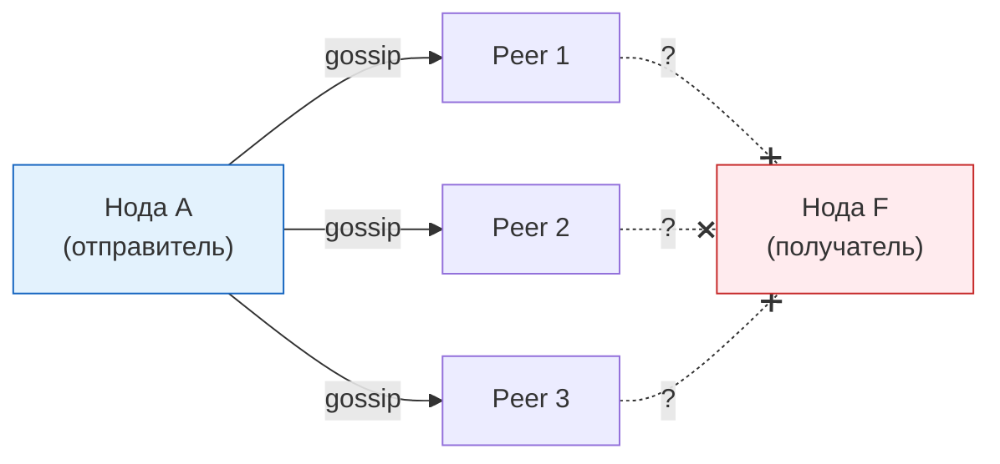
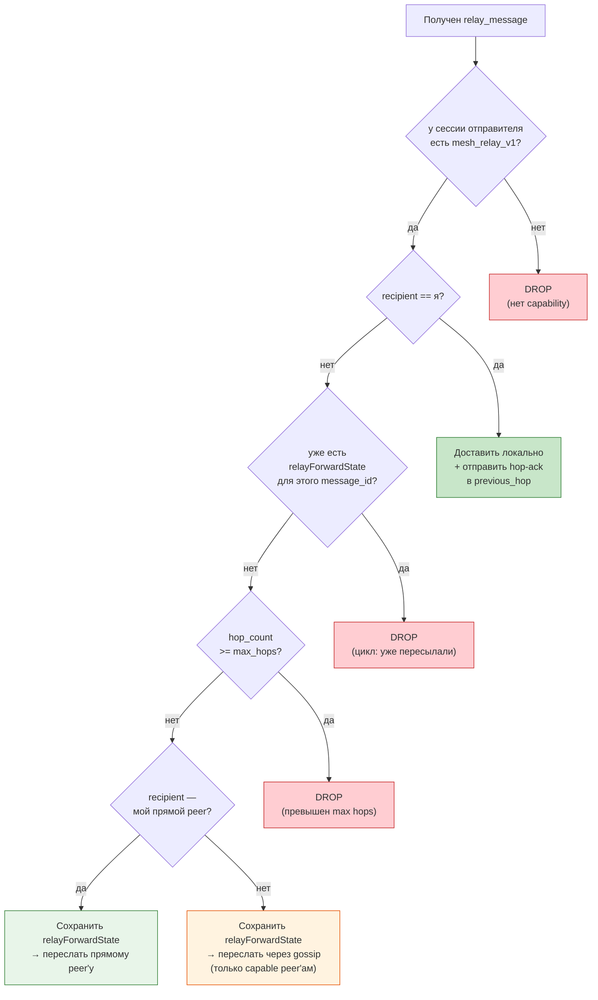
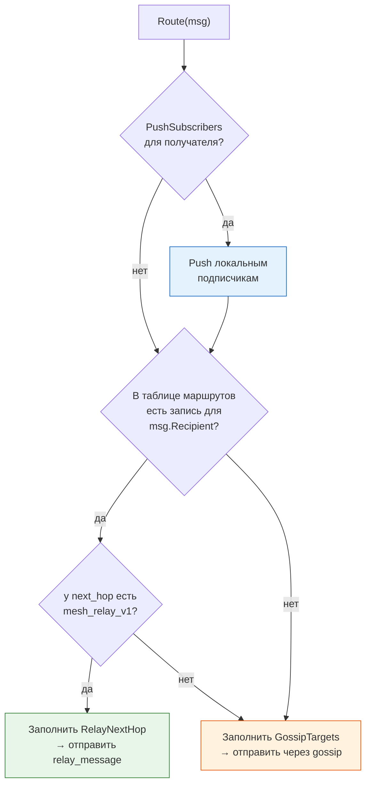
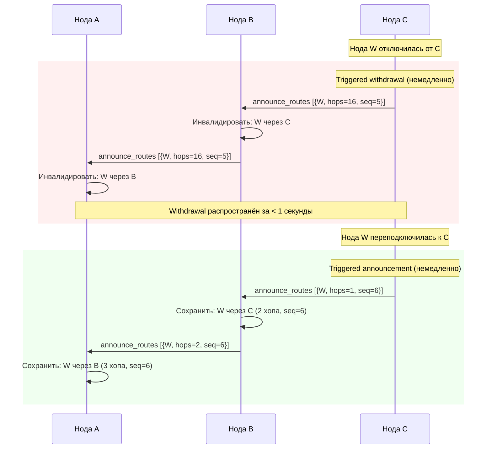
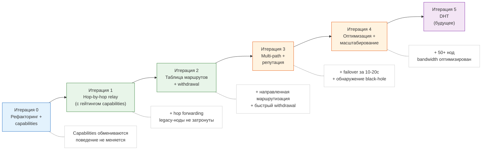

# Дорожная карта маршрутизации Mesh

> Каноническая (English) версия: [roadmap.md](roadmap.md)

Связанная документация:

- [mesh.md](mesh.md) — текущий mesh-слой (топология, peer discovery, скоринг, handshake, маршрутизация сообщений, I/O, персистенция)
- [roadmap.md](roadmap.md) — canonical English version
- [protocol/peers.md](protocol/peers.md) — протокол управления peer'ами
- [protocol/messaging.md](protocol/messaging.md) — протокол отправки/хранения сообщений

Исходники (планируемые): `internal/core/node/routing.go`, `internal/core/node/routing_table.go`,
`internal/core/node/relay.go`, `internal/core/node/route_announce.go`

### Текущая проблема

`gossipMessage()` отправляет сообщение топ-3 peer'ам по скору и **надеется**,
что оно дойдёт. Нет понимания «кто где»: нет таблицы маршрутов, нет hop-by-hop
пересылки. Если получатель не подключён напрямую к одному из этих 3 peer'ов,
сообщение теряется после 3-минутного окна retry.


*Диаграмма — Текущий слепой gossip: нет знания о пути к получателю*

### Принципы проектирования

1. **Каждая итерация производит рабочую сеть.** Ни одна итерация не ломает
   предыдущую. Откат возможен в любой момент через feature flags / negotiation
   capabilities.
2. **Gossip остаётся fallback'ом.** Таблица маршрутов — это подсказка, а не
   единственный путь. Если маршрут неизвестен или устарел, нода откатывается
   к текущему gossip-поведению.
3. **Обратная совместимость с первого дня.** Согласование capabilities
   вводится в итерации 0 и гейтит каждый новый тип фрейма. Ноды без поддержки
   mesh routing продолжают работать в той же сети. Legacy-peer'ы никогда не
   получают неизвестные типы фреймов.
4. **Приватность важнее производительности.** Ни одна нода не должна знать
   полную топологию сети. Только distance vectors (identity + количество
   хопов), а не полная карта. Payload сообщений никогда не содержит полный
   пройденный путь; промежуточные ноды хранят только локальное forwarding-
   состояние (`previous_hop` / `receipt_forward_to`) по message ID.
5. **Сохранение существующих путей доставки.** Текущие push-to-subscriber и
   direct-peer доставка уже работают. Новая маршрутизация не должна их
   ухудшать. Абстракция маршрутизации выдаёт мульти-стратегийное решение, а не
   просто плоский список адресов.

### Политика версионирования протокола

Новые типы фреймов и поведения вводятся через согласование `capabilities`
(аддитивные изменения). Существующие `ProtocolVersion` и
`MinimumProtocolVersion` в `config.go` повышаются только при изменении
обязательной семантики существующего поведения. Правило: если legacy-нода
может безопасно игнорировать новую функцию — она гейтится через capability
и не требует повышения версии протокола. Если legacy-нода неправильно
интерпретирует новое поведение — версию протокола нужно повысить.

**Прогресс:**

- [ ] Для каждого нового типа фрейма указать: capability-gated аддитивное изменение или обязательное изменение протокола
- [ ] Новые аддитивные возможности вводить только через `capabilities`, без повышения `MinimumProtocolVersion`
- [ ] Если меняется обязательная семантика существующего поведения, повысить `ProtocolVersion`
- [ ] Перед повышением `MinimumProtocolVersion` пройти dual-stack период совместимости
- [ ] Добавить mixed-version интеграционный тест: old node <-> new node
- [ ] Добавить rejection тест: нода с версией ниже `MinimumProtocolVersion` отклоняется
- [ ] Обновить `protocol.md` после каждого повышения версии протокола
- [ ] Обновлять `config.ProtocolVersion` и `config.MinimumProtocolVersion` только отдельным коммитом/PR после прохождения compatibility checklist

### Итерация 0 — Рефакторинг фундамента + capabilities

**Цель:** выделить абстракции маршрутизации из `service.go` без изменения
поведения и ввести механизм согласования capabilities, который будет гейтить
все новые типы фреймов.

**Что меняется:**

1. Логика маршрутизации выносится в отдельный интерфейс. Сейчас
   `routingTargetsForMessage()` и `gossipMessage()` живут в файле на 5200+
   строк. Нужна изоляция для будущих итераций.

2. В `hello` фрейм добавляется поле `capabilities`. Каждая capability —
   строковый токен (например `"mesh_relay_v1"`, `"mesh_routing_v1"`). Оба
   peer'а объявляют свои capabilities при хендшейке; пересечение определяет,
   какие расширенные типы фреймов могут использоваться в сессии.

3. Абстракция маршрутизации — не плоский список адресов. В текущем коде уже
   есть два независимых механизма доставки: push-to-subscriber (для локально
   подключённых получателей) и gossip (для распространения по mesh). Интерфейс
   должен сохранить оба.

**Новые файлы:**

```
internal/core/node/
  routing.go          — интерфейс Router + текущая реализация GossipRouter
  relay.go            — интерфейс RelayService (пустой, заготовка для итерации 1)
```

**RoutingDecision (не плоский список адресов):**

```go
type RoutingDecision struct {
    PushSubscribers []SubscriberTarget  // существующий push-путь (без изменений)
    DirectPeers     []string            // peer'ы, к которым получатель подключён напрямую
    RelayNextHop    *string             // из таблицы маршрутов (nil = неизвестен)
    GossipTargets   []string            // fallback: топ N peer'ов по скору
}

type Router interface {
    Route(msg protocol.Envelope) RoutingDecision
}
```

Текущая реализация (`GossipRouter`) оборачивает существующую логику:
`subscribersForRecipient()` → `PushSubscribers`,
`routingTargetsForMessage()` → `GossipTargets`.
`DirectPeers` и `RelayNextHop` пусты в этой итерации.
Поведение сети **не меняется**.

**Capabilities в hello фрейме:**

```json
{
  "type": "hello",
  "capabilities": ["mesh_relay_v1"],
  ...
}
```

`welcome` ответ содержит capabilities сервера. Сессия хранит пересечение.
В этой итерации новые типы фреймов не вводятся, поэтому список capabilities
может быть пустым. Важен сам механизм.

**Готово когда:** все существующие тесты проходят, сообщения доставляются
как раньше, capabilities обмениваются в hello/welcome, но пока ни на что
не влияют.

**Прогресс:**

- [ ] Добавить поле `Capabilities []string` в `protocol.Frame`
- [ ] Отправлять capabilities в `hello` фрейме
- [ ] Эхо capabilities в `welcome` фрейме
- [ ] Хранить пересечение capabilities по сессии в `peerSession`
- [ ] Добавить хелпер `sessionHasCapability(address, cap) bool`
- [ ] Создать `routing.go` с интерфейсом `Router` и структурой `RoutingDecision`
- [ ] Реализовать `GossipRouter`, оборачивающий существующую логику доставки
- [ ] Маппинг `PushSubscribers` на существующий `subscribersForRecipient()` путь
- [ ] Маппинг `GossipTargets` на существующий `routingTargetsForMessage()` путь
- [ ] Создать `relay.go` с пустым интерфейсом `RelayService`
- [ ] Внедрить `Router` в `Service` через конструктор
- [ ] Все существующие тесты проходят без изменений
- [ ] Проверить обмен capabilities в интеграционном тесте (2 ноды)

**Release / Compatibility:**

- [ ] Согласование capabilities добавлено, но поведение сети не изменено
- [ ] Все существующие тесты проходят без изменения семантики
- [ ] Mixed-version тест: нода без поля `capabilities` работает с новой нодой
- [ ] Подтверждено: итерация 0 не требует повышения `ProtocolVersion`
- [ ] Подтверждено: итерация 0 не требует повышения `MinimumProtocolVersion`

### Итерация 1 — Hop-by-hop relay (с гейтингом capabilities)

**Цель:** сообщения могут проходить через промежуточные ноды, а не только до
прямых соседей. Legacy-peer'ы никогда не получают неизвестные типы фреймов.

**Проблема:** когда нода A отправляет DM для F, `sendMessageToPeer()` шлёт
`send_message` трём лучшим peer'ам. Если ни один из них не знает F — сообщение
застряло на 3 минуты retry и умирает.

**Гейтинг capabilities:** `relay_message` отправляется только peer'ам,
у которых в согласованных capabilities есть `"mesh_relay_v1"`. Для peer'ов
без этой capability нода использует существующий `send_message` + gossip путь.
Смешанная сеть (новые + legacy-ноды) работает с первого дня.

**Новый тип фрейма — `relay_message`:**

```json
{
  "type": "relay_message",
  "message_id": "uuid",
  "sender": "адрес_отправителя",
  "recipient": "адрес_конечного_получателя",
  "payload": "зашифрованное_base64",
  "hop_count": 3,
  "max_hops": 10,
  "previous_hop": "адрес_отправившего_мне"
}
```

**Приватно-безопасное forwarding-состояние:** фрейм **не** содержит список
`visited` или `return_path`. Вместо этого каждая промежуточная нода хранит
локальное состояние по `message_id`:

```go
type relayForwardState struct {
    MessageID        string
    PreviousHop      string // кто отправил этот relay мне
    ReceiptForwardTo string // = PreviousHop (куда слать receipt обратно)
    ForwardedTo      string // кому я переслал (для обнаружения циклов)
    HopCount         int    // инкрементируется на каждом хопе
    RemainingTTL     int    // секунд до очистки (из max_relay_ttl при создании, декрементируется тикером)
}
```

Таким образом ни одно сообщение не раскрывает полный путь. Каждая нода знает
только свои `previous_hop` и `forwarded_to`. Обнаружение циклов использует
комбинацию `message_id` + локальное состояние: если у ноды уже есть
`relayForwardState` для этого `message_id`, она отбрасывает дубликат.

**Правило дедупликации relay:** `message_id` — единственный ключ
дедупликации для транзитного relay. Когда нода получает `relay_message`
с `message_id`, который она уже видела (т.е. `relayForwardState`
существует), она молча отбрасывает сообщение — даже если оно пришло от
другого соседа. Это предотвращает широковещательные штормы в топологиях
с несколькими путями: без дедупликации один relay может умножиться
экспоненциально, потому что gossip fallback и существующий 3-минутный
retry могут заново инжектить тот же `message_id` от разных peer'ов.
Состояние дедупликации чистится вместе с `relayForwardState` когда
`RemainingTTL` достигает 0 (по умолчанию: 180 секунд = 3 минуты,
декрементируется тикером каждую секунду).

**Логика обработки на промежуточной ноде:**


*Диаграмма — Обработка relay-сообщения на промежуточной ноде*

**Hop-by-hop подтверждение:** когда нода успешно пересылает relay-сообщение
(или доставляет локально), она отправляет `relay_hop_ack` обратно в
`previous_hop`. Это доказывает, что **конкретный next hop** получил
сообщение, а не просто что оно когда-то дошло до получателя.

```json
{
  "type": "relay_hop_ack",
  "message_id": "uuid",
  "status": "forwarded"
}
```

**Обратный путь delivery receipt:** когда конечный получатель генерирует
delivery receipt, каждая промежуточная нода находит `receipt_forward_to`
по `message_id` и отправляет receipt на один хоп назад. Если хоп
недоступен — fallback на gossip receipt (текущее поведение). Полный путь
никогда не хранится в payload receipt'а.

**Матрица сосуществования — `send_message` vs `relay_message`:**

В сети могут быть как новые ноды (с `mesh_relay_v1`), так и legacy-ноды
(без него). Правила взаимодействия:

| Отправитель | Получатель | Поведение |
|---|---|---|
| Новый | Новый | `relay_message` с подсказками таблицы маршрутов. Relay-цепочка использует `relay_message` + `relay_hop_ack`. |
| Новый | Legacy | Отправитель видит отсутствие capability → fallback на `send_message` + gossip (существующий путь). Legacy-нода никогда не получает `relay_message`. |
| Legacy | Новый | Новая нода получает `send_message` (существующий фрейм) и обрабатывает его нормально. Relay и таблица маршрутов не задействованы. |
| Legacy | Legacy | Полностью текущее поведение, ничего не меняется. |

Смешанная relay-цепочка: если в цепочке A→B→C→D есть legacy-нода
посередине (например C — legacy), B не может переслать `relay_message`
в C. Вместо этого B делает fallback на gossip для этого хопа. Подсказка
таблицы маршрутов не требует, чтобы каждый хоп на пути поддерживал
`mesh_relay_v1`. Подсказка указывает лучший next_hop; если у того нет
capability, нода использует gossip для дальнейшей доставки. Это означает,
что подсказки таблицы улучшают доставку даже в частично обновлённых
сетях — они сужают gossip fan-out в направлении получателя.

**Существующие пути не затрагиваются:** `send_message`, `push_message`,
`subscribe_inbox` продолжают работать точно как раньше. Для legacy-peer'ов
без `mesh_relay_v1` нода использует существующий gossip-путь.
`RoutingDecision` из итерации 0 заполняет `RelayNextHop` только для
capable peer'ов; для всех остальных используется `GossipTargets`.

**Изменения в существующем коде:**

- `handleCommand()` / `handlePeerSessionFrame()` — добавить case
  `"relay_message"` и `"relay_hop_ack"`, с проверкой capability
- `storeIncomingMessage()` — без изменений; relay вызывает ту же функцию
  для локальной доставки
- `retryRelayDeliveries()` — расширить для обработки relay-сообщений
- Новое: map `relayForwardState` с числовой TTL-очисткой
  (`RemainingTTL=180`, декрементируется каждую секунду)

**Дизайн TTL — числовой, не wall-clock:** все TTL-значения в relay-подсистеме
— числовые счётчики, не временные метки. Это устраняет зависимость от
синхронизированных часов между нодами. Фрейм `relay_message` не содержит
`originated_at` — время жизни relay контролируется исключительно через
`hop_count` / `max_hops` (сетевой TTL) и `relayForwardState.RemainingTTL`
(очистка локального состояния). Два независимых предохранителя:

1. **Hop TTL** (`max_hops`): защищает сеть. Каждый хоп инкрементирует
   `hop_count`; когда `hop_count >= max_hops`, сообщение дропается.
   Часы не задействованы.
2. **State TTL** (`RemainingTTL`): защищает локальную память. Каждая
   нода декрементирует счётчик каждую секунду; когда он достигает 0,
   `relayForwardState` удаляется. Используется локальный тикер, не
   сравнение wall clock.

**Готово когда:** сообщение от A до F проходит через цепочку A→B→C→D→E→F,
даже если A не знает F напрямую. Legacy-ноды в той же сети продолжают
работать через gossip. Ни одно сообщение не содержит полный путь. Тест:
4 ноды цепочкой, DM от первой к последней; отдельно тест с одной
legacy-нодой посередине.

**Прогресс:**

- [ ] Определить тип фрейма `relay_message` в `protocol/frame.go`
- [ ] Определить тип фрейма `relay_hop_ack` в `protocol/frame.go`
- [ ] Добавить поля `hop_count`, `max_hops`, `previous_hop` в relay-фрейм
- [ ] Реализовать map `relayForwardState` с TTL-очисткой
- [ ] Гейтить отправку `relay_message` через `sessionHasCapability("mesh_relay_v1")`
- [ ] Добавить обработчик `relay_message` в `handleCommand()` / `handlePeerSessionFrame()`
- [ ] Реализовать дедупликацию relay: drop `relay_message` если `relayForwardState` существует для `message_id` (даже от другого соседа)
- [ ] Реализовать обнаружение циклов через существующий `relayForwardState` для message_id
- [ ] Реализовать проверку max hops (drop если превышен, по умолчанию 10)
- [ ] Реализовать пересылку прямому peer'у (recipient — прямой peer → forward)
- [ ] Реализовать gossip fallback для capable peer'ов (recipient неизвестен → переслать)
- [ ] Реализовать hop-by-hop ack (`relay_hop_ack`) обратно в `previous_hop`
- [ ] Реализовать возврат receipt через локальный lookup `receipt_forward_to`
- [ ] Реализовать fallback receipt на gossip когда previous_hop недоступен
- [ ] Расширить `retryRelayDeliveries()` для relay-сообщений
- [ ] Персистить relay forward state в `queue-{port}.json`
- [ ] Написать unit-тесты для логики обработки relay
- [ ] Написать unit-тесты для гейтинга capabilities (legacy peer получает gossip, не relay)
- [ ] Интеграционный тест: 4 ноды цепочкой, DM от первой к последней
- [ ] Интеграционный тест: смешанная сеть с одной legacy-нодой
- [ ] Интеграционный тест: проверка дедупликации relay (тот же message_id от двух соседей → только одна пересылка)
- [ ] Интеграционный тест: смешанная цепочка с legacy-нодой посередине (new→legacy→new fallback на gossip)

**Release / Compatibility:**

- [ ] `relay_message` отправляется только peer'ам с `mesh_relay_v1`
- [ ] Legacy peer никогда не получает `relay_message`
- [ ] Если у peer нет `mesh_relay_v1`, используется старый путь доставки
- [ ] Mixed-version тест: new → old использует legacy path
- [ ] Mixed-version тест: old → new продолжает работать без relay
- [ ] Подтверждено: итерация 1 не требует повышения `MinimumProtocolVersion`

### Итерация 2 — Таблица маршрутов (distance vector с withdrawal)

**Цель:** каждая нода знает, какие identity доступны через каких соседей.
Маршруты — это **подсказки**, а не единственный источник истины. Gossip
fallback всегда доступен.

**Проблема после итерации 1:** relay работает, но нода не знает, **куда**
пересылать. Gossip fallback из итерации 1 — слепой. Если у ноды 8 peer'ов,
сообщение уходит 3 случайным вместо одного правильного.

**Гейтинг capabilities:** `announce_routes` и `withdraw_routes` обмениваются
только с peer'ами, у которых есть `"mesh_routing_v1"` в наборе capabilities
(из итерации 0).

**Новые файлы:**

```
internal/core/node/
  routing_table.go    — PeerAwarenessTable
  route_announce.go   — протокол announce/withdraw + периодический цикл
```

**Структура таблицы:**

```go
type RouteEntry struct {
    Identity     string // адрес получателя
    NextHop      string // через какого peer'а доступен
    Hops         int    // расстояние (1 = прямой peer, 16 = infinity/withdrawn)
    SeqNo        uint64 // монотонный per-origin, больше = новее
    RemainingTTL int    // секунд до истечения (по умолчанию 120, декрементируется тикером)
    Source       string // "direct" | "announcement" | "hop_ack"
}

type PeerAwarenessTable struct {
    mu          sync.RWMutex
    routes      map[string][]RouteEntry // identity → возможные маршруты
    defaultTTL  int                     // TTL по умолчанию в секундах (120)
    flappingTTL int                     // TTL для flapping peer'ов (30)
}

func (t *PeerAwarenessTable) Lookup(identity string) []RouteEntry
func (t *PeerAwarenessTable) AddDirectPeer(identity, peerAddr string)
func (t *PeerAwarenessTable) RemoveDirectPeer(identity string)
func (t *PeerAwarenessTable) UpdateRoute(entry RouteEntry)
func (t *PeerAwarenessTable) WithdrawRoute(identity, nextHop string, seqNo uint64)
func (t *PeerAwarenessTable) Announceable(excludeVia string) []RouteEntry
func (t *PeerAwarenessTable) TickTTL()       // декрементировать все RemainingTTL, удалить записи с 0
```

**Ключевое отличие от предыдущей версии:** записи маршрутов имеют `SeqNo`
(монотонно возрастающий per-origin нода). Это позволяет:

- **Withdrawal** — нода может явно отозвать маршрут, отправив более высокий
  `SeqNo` с `hops=infinity` (16). Получатели немедленно инвалидируют
  устаревшую запись, не дожидаясь истечения TTL.
- **Triggered updates** — при изменении маршрута (peer подключился/отключился)
  немедленный анонс только этого изменения, без ожидания 30-секундного
  периодического цикла.

**Как заполняется таблица:**

1. **Прямые peer'ы** — при подключении peer'а его identity добавляется как
   `hops=1, source="direct"`. При отключении — удаляется, и немедленно
   инициируется **withdrawal** всем соседям.

   **Почему hops=1, а не 0:** прямое соединение всё равно проходит через
   одно сетевое звено. Использование `hops=1` делает метрику
   последовательной: каждый хоп добавляет 1, метрика аддитивна на всём
   пути. При `hops=0` для прямого соединения двуххоповый маршрут
   показывал бы `hops=1`, что сбивает с толку. Значение `hops=1` означает
   «identity доступен через одно звено», а `hops=16` остаётся infinity
   (withdrawal).

2. **Анонсы маршрутов** — тип фрейма `announce_routes`:

```json
{
  "type": "announce_routes",
  "routes": [
    {"identity": "alice_addr", "hops": 1, "seq": 42},
    {"identity": "carol_addr", "hops": 2, "seq": 17},
    {"identity": "dave_addr",  "hops": 16, "seq": 18}
  ]
}
```

`hops=1` = прямой peer, `hops=2` = один промежуточный хоп, `hops=16` =
infinity (withdrawal). Таблица принимает обновления только с `seq` выше
текущего `SeqNo` для той же пары `(identity, nextHop)`.

Каждые 30 секунд нода отправляет полную таблицу peer'ам (периодический
refresh). Между циклами **triggered updates** отправляют только изменения
немедленно.

3. **Подтверждение hop-ack'ом** — при получении `relay_hop_ack` от next_hop
   для конкретного сообщения, маршрут через этот next_hop подтверждается
   (`source="hop_ack"`). Это самый надёжный источник, потому что доказывает,
   что **конкретный next hop** получил сообщение, а не просто что оно
   куда-то дошло.

**Иерархия доверия к источникам маршрутов:** не вся информация о маршрутах
одинаково надёжна. Таблица применяет строгий приоритет, когда несколько
источников сообщают о той же паре `(identity, nextHop)`:

1. **`direct`** — identity подключён локально. Всегда побеждает.
   Не может быть переопределён announcement или hop_ack.
2. **`hop_ack`** — подтверждён реальной доставкой сообщения через
   этот next_hop. Сильнее пассивных анонсов, потому что доказывает,
   что путь работает.
3. **`announcement`** — получен через `announce_routes` от соседа.
   Минимальное доверие. Любой peer может заявить любой маршрут; без
   верификации заявка — просто подсказка.

При вызове `UpdateRoute()` с новой записью проверяется `Source`
существующей записи. Источник с меньшим доверием не может переопределить
источник с большим доверием для той же пары `(identity, nextHop)`. Если
peer анонсирует маршрут, который уже подтверждён через `hop_ack`, анонс
принимается только если его `SeqNo` строго выше (указывая на реальное
изменение топологии).

Дополнительно, маршруты от peer'ов с **нестабильными сессиями** (3 и
более отключений за последние 10 минут) получают сокращённый числовой
TTL: `RemainingTTL=30` вместо стандартных `120`. Это не даёт flapping
peer'ам засорять таблицу маршрутами, которые постоянно появляются и
исчезают.

**Poisoned reverse** (защита от циклов): когда нода B анонсирует маршруты
ноде A, она **не анонсирует** маршруты, полученные через A. Маршруты,
полученные от A, анонсируются обратно A с `hops=16` (infinity). Классическая
защита из RIP/BGP.

**Таблица — подсказка, не истина:** если таблица предлагает next_hop, нода
пробует его первым. Если сессия с next_hop не активна или capability
отсутствует — немедленный fallback на gossip. Таблица никогда не блокирует
доставку.

**Время жизни маршрута привязано к времени жизни сессии.** Все маршруты,
полученные от peer'а (как direct, так и анонсированные), инвалидируются
при закрытии сессии с этим peer'ом. При закрытии сессии нода:

1. Удаляет запись direct peer для этого identity.
2. Удаляет все маршруты, где `NextHop == отключившийся_peer`.
3. Отправляет triggered withdrawal (hops=16) для всех удалённых маршрутов.

При переподключении peer должен заново анонсировать свои маршруты.
Это не даёт устаревшим маршрутам сохраняться через смену identity или
сетевые разделения. Если peer переподключается с **другим identity**
(другой Ed25519 публичный ключ), маршрут старого identity отзывается,
а новый identity добавляется как новая запись.

Это строже, чем ожидание обнуления `RemainingTTL`, но безопаснее:
маршруты отключённого peer'а немедленно инвалидируются, а не висят
до 120 секунд.

**Выбор маршрута с таблицей:**


*Диаграмма — Полное решение о маршрутизации: push + lookup таблицы + gossip fallback*

**Withdrawal и triggered update:**


*Диаграмма — Быстрый withdrawal и повторный анонс через triggered updates*

**Ограничение размера анонсов с ротацией для fairness:** каждый
фрейм `announce_routes` содержит максимум 100 записей маршрутов для
ограничения размера фрейма. Когда таблица превышает 100 записей, нода
применяет справедливую стратегию выбора:

1. **Прямые peer'ы всегда включены** — маршруты с `source="direct"`
   никогда не пропускаются, так как они самые ценные и обычно
   немногочисленны (ограничены max connections).
2. **Остальные слоты заполняются ротацией** — non-direct маршруты
   сортируются по хопам (ближайшие первыми) и затем ротируются через
   per-peer offset, который продвигается каждый цикл. Это гарантирует,
   что все маршруты со временем анонсируются каждому peer'у, а не только
   ближайшие.
3. **Периодическая полная синхронизация** — каждый 5-й цикл (каждые
   2.5 минуты) нода отправляет полный дамп таблицы, при необходимости
   разбитый на несколько фреймов. Это обрабатывает граничные случаи,
   когда ротация пропускает маршруты во время изменений топологии.

**Готово когда:** сообщение от A до F идёт по кратчайшему пути, а не через
случайные ноды. При отключении ноды withdrawal распространяется за секунды.
В логах видно `route_via_table` вместо `route_via_gossip`. Таблица сходится
за 1-2 цикла анонсов (30-60 секунд).

**Прогресс:**

- [ ] Создать `routing_table.go` со структурой `PeerAwarenessTable`
- [ ] Реализовать `Lookup()`, `AddDirectPeer()`, `RemoveDirectPeer()`
- [ ] Реализовать `UpdateRoute()` со сравнением `SeqNo` (отклонять устаревшие)
- [ ] Реализовать `WithdrawRoute()` — установить `hops=16` (infinity) для инвалидации
- [ ] Реализовать `Announceable(excludeVia)` с poisoned reverse
- [ ] Реализовать `TickTTL()` — декрементировать `RemainingTTL` каждую секунду, удалять записи с 0 (по умолчанию 120с, flapping peer'ы 30с)
- [ ] Определить тип фрейма `announce_routes` в `protocol/frame.go` (с полем `seq`)
- [ ] Гейтить `announce_routes` через `sessionHasCapability("mesh_routing_v1")`
- [ ] Создать `route_announce.go` — периодический цикл анонсов (каждые 30с)
- [ ] Реализовать triggered updates: немедленный анонс при connect/disconnect peer'а
- [ ] Реализовать triggered withdrawal: немедленный `hops=16` при disconnect peer'а
- [ ] Обработать входящие `announce_routes` — обновить таблицу с +1 хоп
- [ ] Обработать входящие withdrawal (`hops=16`) — немедленно инвалидировать маршрут
- [ ] Интегрировать `PeerAwarenessTable` в `Router.Route()` — заполнить `RelayNextHop`
- [ ] Подтверждать маршруты через `relay_hop_ack` (`source="hop_ack"`)
- [ ] Ограничить анонсы максимум 100 маршрутами на фрейм, с ротацией fairness (см. выше)
- [ ] Добавить трекинг прямых peer'ов при connect/disconnect
- [ ] Реализовать иерархию доверия в `UpdateRoute()`: direct > hop_ack > announcement
- [ ] Реализовать сокращённый TTL (30с) для маршрутов от flapping peer'ов (3+ отключений за 10 мин)
- [ ] Реализовать привязку маршрутов к сессии: инвалидировать все маршруты от peer'а при закрытии сессии
- [ ] Реализовать triggered withdrawal при закрытии сессии для всех удалённых маршрутов
- [ ] Обработать смену identity при переподключении: отозвать старый identity, добавить новый
- [ ] Реализовать ротацию fairness для ограничения размера анонсов (direct всегда включены, offset ротация)
- [ ] Реализовать периодическую полную синхронизацию каждый 5-й цикл (разбивка на несколько фреймов при необходимости)
- [ ] Добавить маркеры `route_via_table` / `route_via_gossip` в логи
- [ ] Написать unit-тесты для операций таблицы маршрутов
- [ ] Написать unit-тесты для логики poisoned reverse
- [ ] Написать unit-тесты для упорядочения SeqNo и withdrawal
- [ ] Написать unit-тесты для генерации triggered updates
- [ ] Написать unit-тесты для иерархии доверия (direct переопределяет announcement, hop_ack переопределяет announcement)
- [ ] Написать unit-тесты для привязки маршрутов к сессии (все маршруты удалены при disconnect)
- [ ] Написать unit-тесты для ротации fairness анонсов
- [ ] Интеграционный тест: 5 нод, проверка выбора кратчайшего пути
- [ ] Интеграционный тест: отключение ноды, проверка распространения withdrawal < 5с
- [ ] Интеграционный тест: переподключение с другим identity, проверка отзыва старых маршрутов

**Release / Compatibility:**

- [ ] `announce_routes` / withdrawal идут только peer'ам с `mesh_routing_v1`
- [ ] При отсутствии таблицы маршрутов сеть продолжает доставку через gossip fallback
- [ ] Mixed-version тест: routing-capable нода работает рядом с legacy-нодой
- [ ] Triggered withdrawal не ломает legacy peer'ов
- [ ] Подтверждено: итерация 2 остаётся аддитивной, protocol bump не требуется
- [ ] Подтверждено: итерация 2 не требует повышения `MinimumProtocolVersion`

### Итерация 3 — Надёжность, репутация и multi-path

**Цель:** несколько маршрутов на identity, автоматический failover на основе
success rate hop-by-hop ack, защита от black-hole нод.

Примечание: согласование capabilities и ограничение размера анонсов уже
обработаны в итерациях 0 и 2 соответственно. Эта итерация фокусируется
исключительно на надёжности.

**3a. Множественные маршруты и failover:**

Таблица уже хранит несколько маршрутов на identity (из итерации 2). Эта
итерация добавляет активный выбор маршрута и failover. Когда `relay_hop_ack`
не получен в течение 10 секунд от primary next_hop, нода повторяет через
второй лучший маршрут. Если и тот не работает — gossip fallback.

```
Identity "F":
  маршрут 1: через peer_C, 2 хопа, reliability 0.95  ← primary
  маршрут 2: через peer_D, 3 хопа, reliability 0.80  ← fallback
  маршрут 3: gossip                                    ← последний рубеж
```

**3b. Репутация маршрутов на основе hop-by-hop ack:**

Репутация маршрута измеряется по success rate ответов `relay_hop_ack`, а не
по end-to-end delivery receipt. Это критично, потому что delivery receipt
может дойти через gossip, даже когда выбранный next_hop дропнул сообщение.

**Почему сбои обратного пути receipt подкрепляют этот выбор:**
hop-by-hop обратный путь receipt (из итерации 1) может частично сломаться —
например, нода C доставляет F и отправляет receipt обратно к A, но нода B
временно недоступна. Если бы скоринг использовал прибытие end-to-end
receipt, A штрафовала бы прямой путь (A→B→C) за сбой, произошедший на
**обратном** пути (C→B→A). Поскольку `relay_hop_ack` отправляется
немедленно прямым next_hop до любой дальнейшей пересылки, он невосприимчив
к сбоям downstream или обратного пути. Это сильнейший аргумент в пользу
скоринга только по hop-ack.

```go
type RouteEntry struct {
    // ... существующие поля из итерации 2
    HopAckAttempts   int
    HopAckSuccesses  int
    ReliabilityScore float64  // successes / attempts (0.0 до 1.0)
}
```

При получении `relay_hop_ack` → `HopAckSuccesses++`.
При истечении 10с без `relay_hop_ack` → `HopAckAttempts++` (без success).
Score пересчитывается.

Если `ReliabilityScore` падает ниже 0.3 после минимум 5 попыток, маршрут
депривилегируется (но не удаляется — может восстановиться).

**3c. Составной выбор маршрутов:**

Маршруты ранжируются по: `ReliabilityScore * 100 - Hops * 10`. Длинный но
надёжный маршрут побеждает короткий но нестабильный.

**3d. Обнаружение black-hole:**

Нода, которая постоянно заявляет маршруты через `announce_routes`, но никогда
не возвращает `relay_hop_ack` — подозреваемая black hole. После 5 подряд
неудач через этот next_hop (по разным сообщениям), нода логирует предупреждение
и добавляет 2-минутный штрафной cooldown, в течение которого этот next_hop
пропускается для новых сообщений.

**Готово когда:** при отключении ноды C из цепочки A-B-C-D-E-F сообщение
автоматически перенаправляется через альтернативный путь за 10-20 секунд
(таймаут hop-ack + retry). Black-hole нода обнаруживается и депривилегируется
после 5 сообщений.

**Прогресс:**

- [ ] Хранить несколько маршрутов на identity в `PeerAwarenessTable` (может уже быть из итерации 2)
- [ ] Добавить `HopAckAttempts`, `HopAckSuccesses`, `ReliabilityScore` в `RouteEntry`
- [ ] Трекать success/failure hop-ack по паре `(identity, nextHop)`
- [ ] Реализовать 10с таймаут hop-ack → отметить попытку как неудачную
- [ ] Реализовать составное ранжирование маршрутов: `reliability * 100 - hops * 10`
- [ ] Реализовать автоматический failover: попробовать следующий маршрут при таймауте hop-ack
- [ ] Реализовать gossip fallback как последний рубеж
- [ ] Реализовать обнаружение black-hole: 5 подряд неудач → 2-мин cooldown
- [ ] Логировать предупреждение при подозрении на black-hole ноду
- [ ] Написать unit-тесты для скоринга репутации
- [ ] Написать unit-тесты для логики failover (primary fails → secondary → gossip)
- [ ] Написать unit-тесты для обнаружения black-hole и cooldown
- [ ] Интеграционный тест: отключение средней ноды, проверка перемаршрутизации за 20с
- [ ] Интеграционный тест: black-hole нода (принимает relay, никогда не ack'ает), проверка обнаружения

**Release / Compatibility:**

- [ ] Failover и репутация влияют только на выбор маршрута, а не на базовую совместимость
- [ ] При отсутствии `relay_hop_ack` сеть деградирует до gossip fallback, а не ломается
- [ ] Mixed-version тест: нода с reputation/failover работает с нодой без этих улучшений
- [ ] Black-hole mitigation не приводит к ложному полному ban без fallback path
- [ ] Подтверждено: итерация 3 не требует повышения `MinimumProtocolVersion`

### Итерация 4 — Оптимизация и масштабирование

**Цель:** чистая оптимизация для роста сети до сотен нод. Никаких новых
протокольных семантик — только улучшения эффективности.

Примечание: triggered updates и withdrawal уже в итерации 2. Эта итерация
фокусируется на снижении bandwidth и улучшении структур данных.

**4a. Инкрементальные анонсы маршрутов:**

30-секундный периодический цикл сейчас отправляет полную таблицу. Заменить на
delta-only: трекать, какие маршруты изменились с последнего анонса каждому
peer'у, и отправлять только diff. Полная таблица отправляется только при
начальной синхронизации (новая peer-сессия). `SeqNo` из итерации 2 упрощает
задачу — каждый peer трекает последний отправленный `SeqNo` по маршруту.

**4b. Bloom filter для seen-сообщений:**

Сейчас `s.seen[string(msg.ID)]` — это map, который растёт бесконечно
(чистится только по TTL). Заменить на ротируемый Bloom filter — два фильтра,
каждые 5 минут текущий становится старым, старый удаляется. Ложные отрицания
невозможны (seen-сообщение всегда обнаруживается). Ложные срабатывания
допустимы при rate < 0.1%.

**4c. Метрика маршрутов с учётом латентности:**

Добавить измерение RTT в каждую peer-сессию (из ping/pong). Метрика маршрута
становится: `reliability * 100 - hops * 10 - avg_rtt_ms / 10`. Это позволяет
выбирать не просто кратчайший или надёжный путь, а самый быстрый.

**4d. Сжатие анонсов:**

Для сетей с 100+ identity анонсы маршрутов могут быть большими. Использовать
delta-кодирование (только изменённые маршруты) и, при необходимости,
gzip-сжатие payload анонса.

**Готово когда:** сеть из 50 нод сходится за 2 минуты. Трафик анонсов
маршрутов не превышает 5% от общего трафика. Bloom filter не даёт ложных
пропусков.

**Прогресс:**

- [ ] Реализовать инкрементальные анонсы маршрутов (дельта с последнего анонса per peer)
- [ ] Трекинг per-peer последнего отправленного `SeqNo` для каждого маршрута
- [ ] Полная синхронизация таблицы только при установлении новой peer-сессии
- [ ] Заменить `s.seen` map на ротируемый Bloom filter (2 фильтра, ротация 5 мин)
- [ ] Добавить измерение RTT в peer-сессии (из ping/pong round-trip)
- [ ] Добавить компонент латентности в составную метрику маршрутов
- [ ] Реализовать сжатие анонсов для больших таблиц маршрутов
- [ ] Измерить трафик анонсов маршрутов как процент от общего
- [ ] Написать бенчмарки для false positive rate Bloom filter
- [ ] Написать бенчмарки для операций таблицы маршрутов при 100+ записях
- [ ] Нагрузочный тест: симуляция 50 нод, измерение времени сходимости
- [ ] Нагрузочный тест: измерение экономии bandwidth от delta-анонсов

**Release / Compatibility:**

- [ ] Delta-announcements совместимы с полным periodic sync
- [ ] При несовместимости/ошибке оптимизаций используется full sync fallback
- [ ] Bloom filter не создаёт false negatives для обязательной логики доставки
- [ ] Mixed-version тест: нода с delta sync работает с нодой на full sync
- [ ] Подтверждено: итерация 4 не требует повышения `MinimumProtocolVersion`

### Итерация 5 (будущее) — Структурированный overlay (DHT)

**Цель:** масштабирование до тысяч нод.

Когда `PeerAwarenessTable` вырастет до 500+ записей, переход на
Kademlia-подобный DHT. Таблица маршрутов содержит O(log n) записей вместо
O(n). Lookup за O(log n) хопов.

Это **не нужно сейчас**, но архитектура итераций 0-4 готовит к этому:
интерфейс `Router` остаётся, изменится только реализация внутри.

**Прогресс:**

- [ ] Исследовать Kademlia XOR-метрику для маршрутизации по identity
- [ ] Спроектировать структуру k-bucket для O(log n) таблицы маршрутов
- [ ] Определить протокол DHT lookup (итеративный vs рекурсивный)
- [ ] Реализовать `DHTRouter` за интерфейсом `Router` (тот же контракт, что у `TableRouter`)
- [ ] Реализовать путь миграции с `PeerAwarenessTable` на DHT
- [ ] Реализовать механизмы защиты от Sybil-атак
- [ ] Бенчмарки: латентность DHT lookup при 1000+ нодах
- [ ] Интеграционный тест: смешанная сеть с нодами `TableRouter` и `DHTRouter` одновременно
- [ ] Интеграционный тест: fallback на gossip при неуспешном DHT lookup (недоступный диапазон ключей)
- [ ] Интеграционный тест: churn 20-50 нод с проверкой delivery rate (цель: >95% за 30с)
- [ ] Интеграционный тест: живая миграция и rollback между реализациями `TableRouter` и `DHTRouter`
- [ ] Security-тест: Sybil/eclipse симуляция — проверка, что один кластер не может полностью перехватить lookup для любого identity

**Release / Compatibility:**

- [ ] Определено: DHT — опциональный router backend или обязательное поведение сети
- [ ] Если DHT опциональный: mixed-version сеть (`TableRouter` + `DHTRouter`) проходит интеграционные тесты
- [ ] Если DHT обязательный: повышен `ProtocolVersion`
- [ ] Если DHT обязательный: задокументирован dual-stack rollout период
- [ ] Если DHT обязательный: после dual-stack периода повышен `MinimumProtocolVersion`
- [ ] Добавлен rollback тест: `DHTRouter` → legacy/`TableRouter`
- [ ] Добавлен mixed-version migration тест: старые/новые routing backends сосуществуют

### Граф зависимостей итераций


*Диаграмма — Зависимости итераций и инкрементальная поставка*

### Ключевые архитектурные решения (обоснование)

| Решение | Обоснование |
|---|---|
| Capabilities в итерации 0, а не позже | Каждый новый тип фрейма должен быть загейчен с первого дня. Legacy-ноды никогда не должны получать неизвестные фреймы. |
| `RoutingDecision` вместо `[]RoutingTarget` | Сохраняет существующие push-to-subscriber и gossip пути. Новая маршрутизация — дополнение, не замена. |
| Локальное forwarding-состояние per-node, а не `visited` список в payload | Приватность: ни одно сообщение не раскрывает полный путь. Каждая нода хранит только `previous_hop` + `forwarded_to` локально. |
| `relay_hop_ack` вместо end-to-end receipt для репутации | End-to-end receipt может дойти через gossip. Только hop-ack доказывает, что конкретный next_hop действительно получил сообщение. |
| Дедупликация relay по `message_id` (drop даже от другого соседа) | Без строгой дедупликации gossip fallback + 3-мин retry могут переинжектить тот же relay от нескольких peer'ов, вызывая экспоненциальное умножение. |
| Матрица сосуществования для `send_message` / `relay_message` | Смешанные сети неизбежны при выкатке. Явные правила предотвращают неоднозначность: new→old делает fallback на gossip, подсказки таблицы работают даже в частично обновлённых сетях. |
| `hops=1` для direct, а не `hops=0` | Каждый хоп добавляет 1. Последовательная аддитивная метрика: 2-хоповый маршрут показывает hops=2, не hops=1. Убирает путаницу с тем, что означает 0. |
| Иерархия доверия: direct > hop_ack > announcement | Любой может анонсировать любой маршрут. Прямое подключение доказуемо, hop_ack верифицирован доставкой, announcement — непроверенное заявление. |
| Время жизни маршрута привязано к времени жизни сессии | TTL-only expiry оставляет устаревшие маршруты до 2 мин после disconnect. Привязка к сессии даёт немедленную инвалидацию + triggered withdrawal. |
| Ротация fairness анонсов, а не только ближайшие по хопам | Чистая сортировка по хопам смещена к ближним identity. Ротация гарантирует, что далёкие identity со временем распространяются всем peer'ам. |
| Withdrawal + triggered updates в итерации 2 | Без них failover в итерации 3 не может достичь целевых 10-20с. Periodic-only анонсы оставляют устаревшие маршруты до 5 минут. |
| Таблица как подсказка, gossip как fallback | Таблица маршрутов — оптимизация. Если она ошибается, доставка всё равно работает через gossip. Нет единой точки отказа. |
