# Routing Table — Distance Vector with Withdrawals

Related documentation:

- [mesh.md](mesh.md) — network layer overview
- [roadmap.md](roadmap.md) — full iteration plan
- [protocol.md](protocol.md) — wire protocol

Source: `internal/core/domain/peer.go`, `internal/core/routing/types.go`, `internal/core/routing/table.go`, `internal/core/routing/announce.go`, `internal/core/routing/announce_builder.go`, `internal/core/routing/announce_state.go`, `internal/core/node/table_router.go`, `internal/core/node/routing_integration.go`, `internal/core/node/routing_provider.go`, `internal/core/rpc/routing_commands.go`

### Overview

The routing package implements a distance-vector routing table for the CORSA mesh network. It replaces blind gossip delivery with directed forwarding based on hop-count metrics. Gossip remains the fallback when no route is known.

### Type safety: PeerIdentity and PeerAddress

`domain.PeerIdentity` (Ed25519 fingerprint, 40-char lowercase hex) and `domain.PeerAddress` (transport host:port) are defined types based on `string` (`internal/core/domain/peer.go`). They enforce compile-time distinction between routing identities and transport addresses, preventing the class of bugs where one is passed where the other is expected. The routing package re-exports both as type aliases (`routing.PeerIdentity = domain.PeerIdentity`) so callers need only import `routing`. All `RouteEntry` fields (`Identity`, `Origin`, `NextHop`), `AnnounceEntry` fields, `Snapshot` map keys, and `Table` function signatures use `PeerIdentity`. Transport-level maps (`sessions`, `health`, `pending`) and peer lifecycle functions use `PeerAddress`. Wire protocol `Frame` fields remain `string`; casts happen at the boundary between wire format and internal typed code.

**Безопасность типов: PeerIdentity и PeerAddress.** `domain.PeerIdentity` (отпечаток Ed25519, 40 символов hex) и `domain.PeerAddress` (транспортный host:port) — определённые типы на основе `string` (`internal/core/domain/peer.go`). Они обеспечивают различие на этапе компиляции между идентификаторами маршрутизации и транспортными адресами, предотвращая класс ошибок, когда один передаётся вместо другого. Пакет routing реэкспортирует оба как алиасы типов. Все поля `RouteEntry`, `AnnounceEntry`, ключи `Snapshot` и сигнатуры функций `Table` используют `PeerIdentity`. Транспортные карты (`sessions`, `health`, `pending`) и функции жизненного цикла используют `PeerAddress`. Поля протокола `Frame` остаются `string`; приведение происходит на границе между wire-форматом и внутренним типизированным кодом.

### Core types

`RouteEntry` represents a single route in the table. Each entry is uniquely identified by the triple `(Identity, Origin, NextHop)` — the destination, who originated the advertisement, and the peer we learned it from. Two entries sharing the same triple are the same route at different points in time; the one with the higher `SeqNo` wins.

`AnnounceEntry` is the wire-safe projection of `RouteEntry`. It contains only the four fields transmitted in `announce_routes` frames (Identity, Origin, Hops, SeqNo). Produced by `RouteEntry.ToAnnounceEntry()` or `Table.AnnounceTo()`. The wire carries the sender's local hop count as-is — the receiver adds +1 when inserting into its own table (receive path).

`Table` is the thread-safe local storage for routes. It owns this node's identity (`localOrigin`) and a monotonic SeqNo counter per destination (`seqCounters`). Public operations: `AddDirectPeer`, `RemoveDirectPeer`, `UpdateRoute`, `WithdrawRoute`, `RefreshDirectPeers`, `TickTTL`, `Announceable`, `AnnounceTo`, `Lookup`, and `Snapshot`.

`Snapshot` is an immutable point-in-time copy of the full table, safe to read without locks.

`AddDirectPeerResult` describes the outcome of a peer connect: the `RouteEntry` created or refreshed, and a `Penalized` flag indicating whether flap detection applied a shortened TTL.

`RemoveDirectPeerResult` describes the outcome of a peer disconnect: wire-ready `[]AnnounceEntry` withdrawals (SeqNo already incremented, Hops=16) for own-origin direct routes, plus a count of transit routes silently invalidated locally, plus `ExposedBackups []PeerIdentity` — identities where invalidation revealed a surviving non-withdrawn backup route (used by `onPeerSessionClosed` to trigger drain).

`RouteUpdateStatus` is the three-valued outcome of `UpdateRoute`: `RouteAccepted` (new or improved route inserted), `RouteUnchanged` (existing alive route reconfirmed — same SeqNo, same or worse trust/hops, not expired), `RouteRejected` (tombstone block, stale SeqNo, or expired unchanged). Callers use this to distinguish new routing events from benign reconfirmations: `handleAnnounceRoutes` drains pending on both `RouteAccepted` and `RouteUnchanged`, and logs three separate counters (accepted, unchanged, rejected) instead of the previous two (accepted, rejected).

`RouteUpdateStatus` — трёхзначный результат `UpdateRoute`: `RouteAccepted` (новый или улучшенный маршрут вставлен), `RouteUnchanged` (существующий живой маршрут подтверждён — тот же SeqNo, те же или худшие trust/hops, не истёкший), `RouteRejected` (блокировка tombstone, устаревший SeqNo, или истёкший unchanged). Вызывающий код использует это для разделения новых routing-событий и штатных подтверждений: `handleAnnounceRoutes` дрейнит pending и при `RouteAccepted`, и при `RouteUnchanged`, и логирует три отдельных счётчика (accepted, unchanged, rejected) вместо прежних двух (accepted, rejected).

`AnnounceSnapshot` is a canonical, aggregated, peer-specific view of route entries ready for wire transmission. After full aggregation each `(Identity, Origin)` pair appears at most once. Entries are sorted deterministically by `(Identity, Origin)` so that equality comparison between two snapshots is stable and independent of table iteration order. Produced by `BuildAnnounceSnapshot` (`routing/announce_builder.go`). A nil `*AnnounceSnapshot` represents "no snapshot sent yet" (empty state) and is semantically different from a snapshot with zero entries.

`AnnouncePeerState` holds per-peer announce send state: the last successfully sent snapshot, timestamps for full sync attempts/successes and delta sends, a `needsFullResync` flag, and disconnect tracking for eviction. All mutable fields are accessed exclusively through thread-safe methods (`View()`, `RecordFullSyncAttempt()`, `RecordFullSyncSuccess()`, `RecordDeltaSendSuccess()`). Direct field access from outside the package is forbidden. Owned by `AnnounceStateRegistry`.

`AnnounceStateRegistry` manages per-peer `AnnouncePeerState` instances. Thread-safe for concurrent access from the announce loop and session lifecycle callbacks. Provides `GetOrCreate`, `MarkDisconnected`, `MarkReconnected`, `EvictStale`, `MarkInvalid`, and `Cleanup`. Disconnected state is evicted after `2 * flapWindow`. The clock source is injectable for tests.

`AnnounceSnapshot` — каноническое, агрегированное, peer-specific представление записей маршрутов, готовое к передаче. После полной агрегации каждая пара `(Identity, Origin)` присутствует не более одного раза. Записи отсортированы детерминированно по `(Identity, Origin)`. Создаётся через `BuildAnnounceSnapshot` (`routing/announce_builder.go`). Nil `*AnnounceSnapshot` означает «ни один snapshot ещё не отправлен» и семантически отличается от snapshot с нулём записей.

`AnnouncePeerState` — per-peer состояние отправки анонсов: последний успешно отправленный snapshot, timestamps попыток/успехов full sync и delta send, флаг `needsFullResync`, отслеживание disconnect для eviction. Все мутабельные поля доступны только через потокобезопасные методы (`View()`, `RecordFullSyncAttempt()`, `RecordFullSyncSuccess()`, `RecordDeltaSendSuccess()`). Владелец — `AnnounceStateRegistry`.

`AnnounceStateRegistry` — реестр per-peer `AnnouncePeerState`. Потокобезопасный для одновременного доступа из цикла анонсов и колбэков жизненного цикла сессий. Предоставляет `GetOrCreate`, `MarkDisconnected`, `MarkReconnected`, `EvictStale`, `MarkInvalid` и `Cleanup`. Disconnected-состояние удаляется через `2 * flapWindow`. Источник времени внедряется для тестов.

### Key invariants

**Origin-aware SeqNo.** Sequence numbers are scoped per `(Identity, Origin)` pair. Only the origin node may advance the SeqNo. A route with a higher SeqNo unconditionally replaces one with a lower SeqNo for the same triple. For own-origin routes, the `Table` owns the monotonic counter (`seqCounters`) and advances it automatically in `AddDirectPeer` and `RemoveDirectPeer`. This ensures SeqNo discipline is enforced at the data structure level, not delegated to the caller.

**Dedup key.** The triple `(Identity, Origin, NextHop)` uniquely identifies a route lineage. Different origins or different next-hops produce independent entries.

**Split horizon.** When building an announcement for peer A, routes where `NextHop == A` are omitted. No fake `hops=16` withdrawal is sent — that would violate the per-origin SeqNo invariant.

**Withdrawal semantics.** A withdrawal sets `Hops = 16` (infinity) and requires strictly `SeqNo > old.SeqNo`. On the wire, only the origin may send a withdrawal. On peer disconnect, `RemoveDirectPeer` withdraws own-origin direct routes (returned as wire-ready `[]AnnounceEntry` with SeqNo already incremented) and silently invalidates transit routes locally. Transit nodes do not emit wire withdrawals for routes they did not originate. Own-origin tombstones remain in the table for `defaultTTL` (120s) and are included in `AnnounceTo` output so that the announce delta mechanism retries withdrawal delivery to peers where the immediate send failed. Transit tombstones are excluded from `AnnounceTo` — only the origin may emit wire withdrawals.

**Семантика отзыва.** Отзыв устанавливает `Hops = 16` (бесконечность) и требует строго `SeqNo > old.SeqNo`. На проводе только origin может отправить withdrawal. При отключении peer'а `RemoveDirectPeer` отзывает own-origin direct routes (возвращаемые как wire-ready `[]AnnounceEntry` с уже инкрементированным SeqNo) и молча инвалидирует transit routes локально. Transit-узлы не отправляют wire withdrawals для маршрутов, которые они не порождали. Own-origin tombstones остаются в таблице на `defaultTTL` (120s) и включаются в вывод `AnnounceTo`, чтобы механизм announce delta повторил доставку withdrawal peer'ам, где немедленная отправка не прошла. Transit tombstones исключаются из `AnnounceTo` — только origin имеет право отправлять wire withdrawals.

**Announce frame is not a destructive snapshot.** A single `announce_routes` frame is **not** a complete authoritative snapshot of the sender's entire routing table. The absence of a route entry in a particular `announce_routes` frame does **not** imply withdrawal and does **not** mean implicit deletion. A receiver must not remove previously learned routes solely because they are missing from the latest announce frame. Withdrawal is expressed exclusively through an explicit route entry with `hops >= HopsInfinity`, which only the origin has the right to send. This invariant is critical for the correctness of partial (delta) announcements: a sender may legitimately send only changed entries in an `announce_routes` frame, and the receiver must continue to use previously learned routes that were not included in the update.

**Announce-кадр не является деструктивным снимком.** Один кадр `announce_routes` **не является** полным авторитетным снимком всей таблицы маршрутизации отправителя. Отсутствие записи маршрута в конкретном кадре `announce_routes` **не означает** withdrawal и **не означает** неявного удаления. Получатель не должен удалять ранее изученные маршруты только потому, что они отсутствуют в последнем announce-кадре. Withdrawal выражается исключительно через явную запись маршрута с `hops >= HopsInfinity`, которую имеет право отправлять только origin. Этот инвариант критически важен для корректности частичных (delta) анонсов: отправитель может законно отправить только изменившиеся записи в кадре `announce_routes`, а получатель должен продолжать использовать ранее изученные маршруты, не включённые в обновление.

**Self-route (local identity).** When `localOrigin` is configured, `Lookup()` and `Snapshot()` synthesize a local route entry for the node's own identity (`Hops=0`, `Source=RouteSourceLocal`). This route is not stored in the table — it is injected on read. It never expires, is never withdrawn, and is never included in announcements (`AnnounceTo`/`Announceable`). Peers discover this node via their own direct routes. The self-route ensures that a node can always resolve itself in the routing table without requiring an external peer session. `Snapshot().TotalEntries` and `Snapshot().ActiveEntries` do not count the synthetic self-route — these counters describe persisted table state and stay consistent with `ActiveSize()`. `reachableFromSnapshot`, `reachableIDsFrame`, and `fetch_route_summary` exclude `RouteSourceLocal` entries because reachability is about remote peers, not the node itself. `UpdateRoute` rejects `RouteSourceLocal` with `ErrLocalSourceReserved` — this source is purely synthetic and must never be persisted.

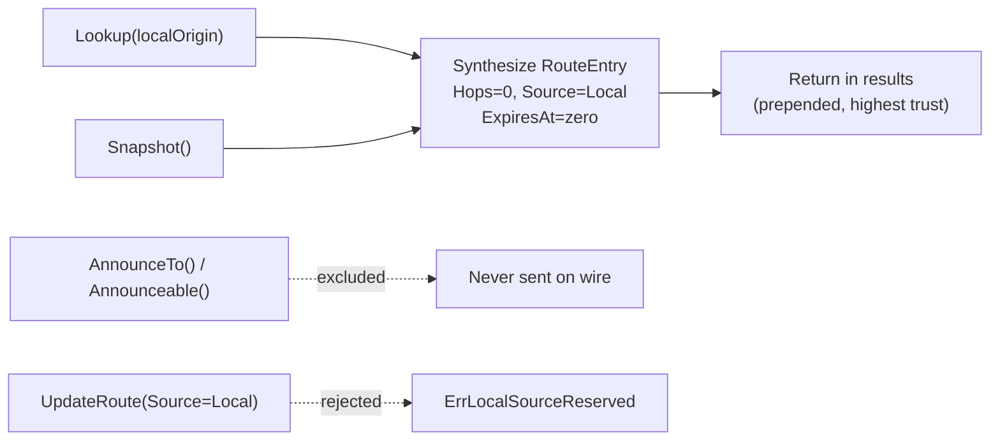
```mermaid
flowchart LR
    A["Lookup(localOrigin)"] --> B["Synthesize RouteEntry\nHops=0, Source=Local\nExpiresAt=zero"]
    B --> C["Return in results\n(prepended, highest trust)"]
    D["Snapshot()"] --> B
    E["AnnounceTo() / Announceable()"] -.->|"excluded"| F["Never sent on wire"]
    G["UpdateRoute(Source=Local)"] -.->|"rejected"| H["ErrLocalSourceReserved"]
```
*Diagram — Self-route: synthetic, read-only, never stored or announced*

**Собственный маршрут (локальная идентичность).** Когда `localOrigin` настроен, `Lookup()` и `Snapshot()` синтезируют локальный маршрут для собственной идентичности ноды (`Hops=0`, `Source=RouteSourceLocal`). Этот маршрут не хранится в таблице — он инжектируется при чтении. Он никогда не истекает, никогда не отзывается и никогда не включается в анонсы (`AnnounceTo`/`Announceable`). Пиры обнаруживают эту ноду через свои собственные прямые маршруты. Собственный маршрут гарантирует, что нода всегда может разрешить саму себя в таблице маршрутизации без внешней пир-сессии. `Snapshot().TotalEntries` и `Snapshot().ActiveEntries` не считают синтетический self-route — эти счётчики описывают персистированное состояние таблицы и согласованы с `ActiveSize()`. `reachableFromSnapshot`, `reachableIDsFrame` и `fetch_route_summary` исключают записи `RouteSourceLocal`, поскольку достижимость касается удалённых пиров, а не самой ноды. `UpdateRoute` отклоняет `RouteSourceLocal` с `ErrLocalSourceReserved` — этот источник чисто синтетический и не должен персистироваться.

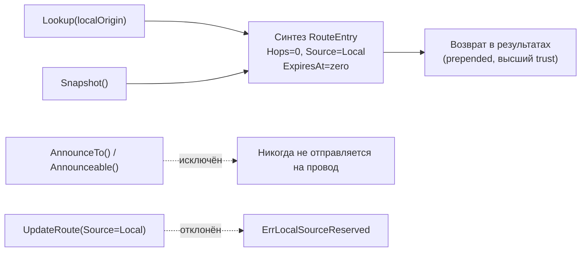
```mermaid
flowchart LR
    A["Lookup(localOrigin)"] --> B["Синтез RouteEntry\nHops=0, Source=Local\nExpiresAt=zero"]
    B --> C["Возврат в результатах\n(prepended, высший trust)"]
    D["Snapshot()"] --> B
    E["AnnounceTo() / Announceable()"] -.->|"исключён"| F["Никогда не отправляется на провод"]
    G["UpdateRoute(Source=Local)"] -.->|"отклонён"| H["ErrLocalSourceReserved"]
```
*Диаграмма — Self-route: синтетический, read-only, никогда не хранится и не анонсируется*

**Trust hierarchy.** Per triple, `local > direct > hop_ack > announcement`. The `local` source (TrustRank=3) is reserved for the synthetic self-route and is never stored in the table. At the same SeqNo, a higher-trust source replaces a lower-trust one. Confirming one triple via hop_ack does not affect other triples, even those sharing the same NextHop.

**Иерархия доверия.** На тройку: `local > direct > hop_ack > announcement`. Источник `local` (TrustRank=3) зарезервирован для синтетического собственного маршрута и никогда не хранится в таблице. При одинаковом SeqNo источник с более высоким доверием заменяет источник с более низким.

**Route selection order.** `Lookup()` sorts by source priority first (local > direct > hop_ack > announcement), then by hops ascending within the same source tier. This means a 3-hop direct route is preferred over a 1-hop announcement — source trust outweighs hop count.

**TTL expiry.** Learned routes (from announcements and hop_ack) carry an `ExpiresAt` timestamp (default 120s from insertion). `TickTTL()` removes expired entries and returns a slice of identities where the expiry exposed a surviving non-withdrawn backup route — `routingTableTTLLoop` uses this to trigger `drainPendingForIdentities` for immediate delivery via the backup. Learned routes are refreshed naturally when the neighbor re-announces them. When a same-SeqNo re-announcement arrives for an expired entry, `UpdateRoute` accepts it as a valid refresh — the origin has not changed the route, it is simply re-confirming it.

**Direct route lifecycle.** Own-origin direct routes use `ExpiresAt=zero` (never expire by time). Their lifetime is managed entirely by the session lifecycle: `AddDirectPeer` creates them on socket connect, `RemoveDirectPeer` withdraws them on socket close. This is event-driven — no periodic TTL refresh is needed. `RemoveDirectPeer` sets `Hops=HopsInfinity` and `ExpiresAt=now+defaultTTL` on the withdrawn entry, creating a tombstone that `TickTTL` cleans up after the default TTL window. This design eliminates a class of race conditions where `TickTTL` could permanently delete an active direct route between `RefreshDirectPeers` cycles, making a connected peer invisible to the routing table.

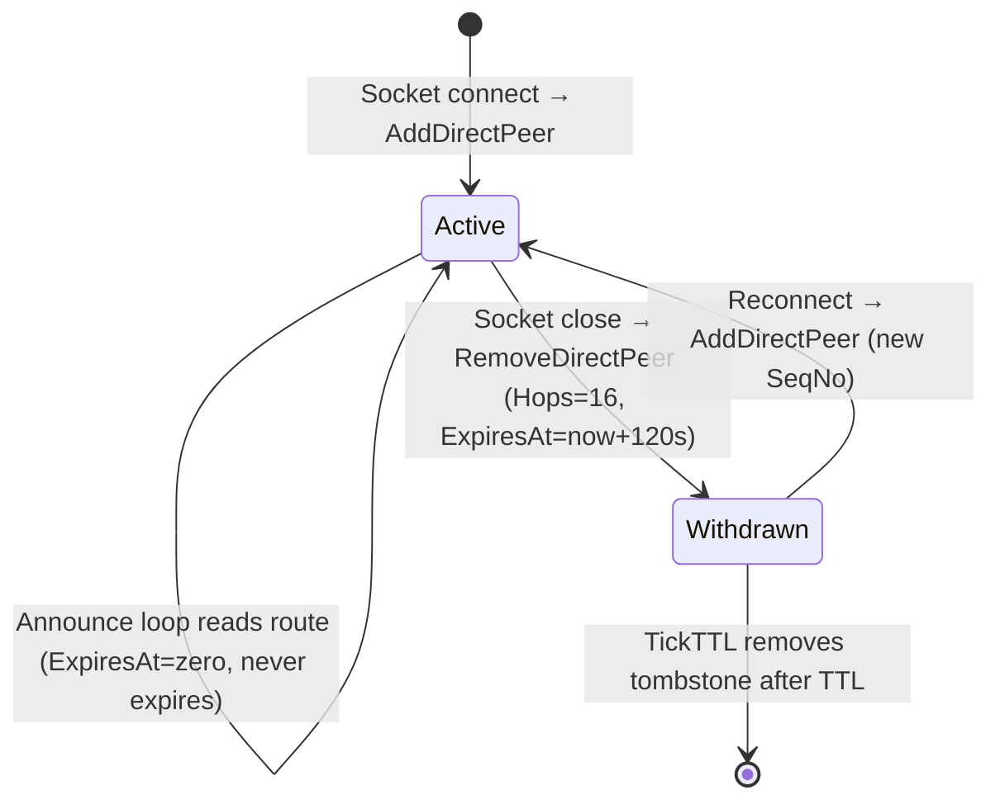
```mermaid
stateDiagram-v2
    [*] --> Active: Socket connect → AddDirectPeer
    Active --> Active: Announce loop reads route (ExpiresAt=zero, never expires)
    Active --> Withdrawn: Socket close → RemoveDirectPeer (Hops=16, ExpiresAt=now+120s)
    Withdrawn --> [*]: TickTTL removes tombstone after TTL
    Withdrawn --> Active: Reconnect → AddDirectPeer (new SeqNo)
```
*Diagram — Direct route lifecycle: event-driven, no TTL expiry*

**NextHop is peer identity.** Routing operates at identity level, not transport addresses. A single peer identity may have multiple concurrent TCP sessions; session selection happens later in `node.Service` via the identity-to-session(s) index that resolves identities to active connections.

**Entry validation.** `RouteEntry.Validate()` enforces structural invariants at insert time: Identity, Origin, and NextHop must be non-empty; Hops must be in range [1, 16] for stored routes. Source-specific rules: direct routes (`RouteSourceDirect`) must have `Hops=1` and `NextHop == Identity` (directly connected neighbor); local routes (`RouteSourceLocal`) must have `Hops=0`. Malformed entries are rejected by `UpdateRoute` before acquiring locks or touching table state. `UpdateRoute` additionally rejects `RouteSourceLocal` entries with `ErrLocalSourceReserved` — this source is purely synthetic and must never be persisted, preventing any caller from injecting a zero-hop highest-trust route for an arbitrary identity. `UpdateRoute` also enforces an origin guard for direct routes: when `localOrigin` is configured, a `RouteSourceDirect` entry whose `Origin != localOrigin` is rejected with `ErrDirectForeignOrigin`. This prevents callers from injecting impossible direct routes for foreign origins that would outrank all announcement/hop_ack routes in `Lookup` and never be eligible for own-origin withdrawal handling on disconnect.

**Валидация записей.** `RouteEntry.Validate()` проверяет структурные инварианты при вставке: Identity, Origin и NextHop не должны быть пустыми; Hops в диапазоне [1, 16] для хранимых маршрутов. Правила по источникам: direct-маршруты (`RouteSourceDirect`) должны иметь `Hops=1` и `NextHop == Identity`; локальные (`RouteSourceLocal`) — `Hops=0`. `UpdateRoute` дополнительно отклоняет `RouteSourceLocal` записи с ошибкой `ErrLocalSourceReserved` — этот источник чисто синтетический и не должен персистироваться. `UpdateRoute` также проверяет origin guard для direct-маршрутов: `RouteSourceDirect` с `Origin != localOrigin` отклоняется с `ErrDirectForeignOrigin`.

**Wire projection boundary.** The boundary between table-model and wire-format is explicit: `AnnounceTo(excludeVia)` returns `[]AnnounceEntry` with split horizon applied. The wire carries the sender's local hop count — no +1 is applied on the sender side; the receiver adds +1 when inserting into its own table . `RemoveDirectPeer` returns wire-ready `[]AnnounceEntry` withdrawals with SeqNo already incremented. Callers building `announce_routes` frames use `AnnounceTo` or `RemoveDirectPeer` results directly — no manual arithmetic is needed.

**SeqNo counter consistency.** When `UpdateRoute` accepts an own-origin entry (where `Origin == localOrigin`), it synchronizes the monotonic counter: `seqCounters[identity] = max(counter, entry.SeqNo)`. This ensures that tables pre-populated via `UpdateRoute` (e.g., restored from a snapshot or received via full sync) do not cause subsequent `AddDirectPeer`/`RemoveDirectPeer` to emit a stale SeqNo.

### Integration

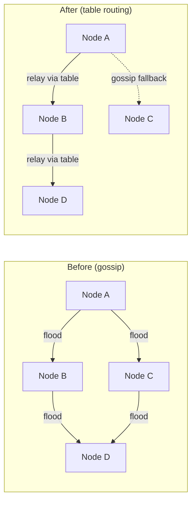
```mermaid
flowchart LR
    subgraph Before["Before (gossip)"]
        A1[Node A] -->|flood| B1[Node B]
        A1 -->|flood| C1[Node C]
        B1 -->|flood| D1[Node D]
        C1 -->|flood| D1
    end

    subgraph After["After (table routing)"]
        A2[Node A] -->|relay via table| B2[Node B]
        B2 -->|relay via table| D2[Node D]
        A2 -.->|gossip fallback| C2[Node C]
    end
```
*Diagram — Message delivery: gossip flood vs table-directed relay*

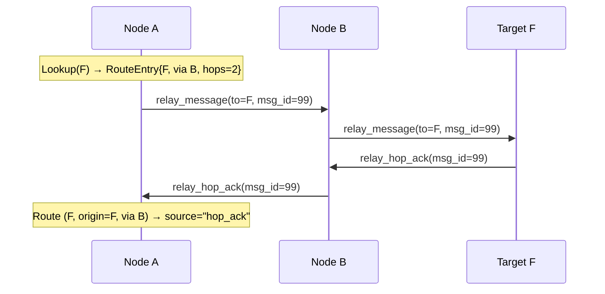
```mermaid
sequenceDiagram
    participant A as Node A
    participant B as Node B
    participant F as Target F

    Note over A: Lookup(F) → RouteEntry{F, via B, hops=2}
    A->>B: relay_message(to=F, msg_id=99)
    B->>F: relay_message(to=F, msg_id=99)
    F->>B: relay_hop_ack(msg_id=99)
    B->>A: relay_hop_ack(msg_id=99)
    Note over A: Route (F, origin=F, via B) → source="hop_ack"
```
*Diagram — Table-directed relay with hop_ack confirmation*

**Convergence.** The announce loop (`routing/announce.go`) runs periodic announcements every 30 seconds and supports triggered updates on connect/disconnect events. The loop uses per-peer announce state (`routing/announce_state.go`) to track what was last sent to each peer. On each cycle, raw route entries from `Table.AnnounceTo(peer)` are aggregated into a canonical peer-specific snapshot (`routing/announce_builder.go`): wire-duplicate entries are removed, for each `(Identity, Origin)` lineage only the best entry (max SeqNo, min Hops, deterministic Extra tie-break) is kept, and entries are sorted by `(Identity, Origin)`. If the snapshot is unchanged from the last send, no frame is emitted (no-op suppression). If only a subset changed, only the delta entries are sent in an `announce_routes` frame. A forced full sync is performed on new peer connect and periodically every 10 announce intervals (~5 minutes). If the peer-specific snapshot is empty at full-sync time (e.g. split horizon filtered all routes when announcing back to a single-route peer), the full-sync baseline is recorded as successful without sending a wire frame — the peer learns nothing new, and subsequent cycles use the delta path normally (empty-baseline). Forced full sync attempts are rate-limited by `MinForcedFullSyncInterval` (equal to the announce interval, default 30s) to prevent flooding when a peer is repeatedly marked `NeedsFullResync`; however, this rate limit is bypassed for peers that have never successfully received any data (`LastSentSnapshot == nil`) — a failed first attempt must not block retry. Incoming `announce_routes` frames are processed by `handleAnnounceRoutes` in `node/routing_integration.go` — each route gets +1 hop on the receiver side. Withdrawals (hops=16) are applied via `Table.WithdrawRoute`, but only from the origin sender (`Origin == senderIdentity`). When `WithdrawRoute` receives a withdrawal for an unseen (identity, origin, nextHop) triple, it creates a tombstone entry (hops=HopsInfinity) with the withdrawal's SeqNo. This prevents a delayed older announcement from resurrecting a withdrawn lineage — the tombstone's SeqNo blocks any stale update for the same triple. Tombstones expire via normal TTL. The `mesh_routing_v1` capability is now advertised during handshake. The announce loop covers both outbound sessions and inbound-only connections. Target discovery via `routingCapablePeers()` requires both `mesh_routing_v1` and `mesh_relay_v1` — a routing-only peer (no relay) is excluded because routes through it would create non-deliverable paths.

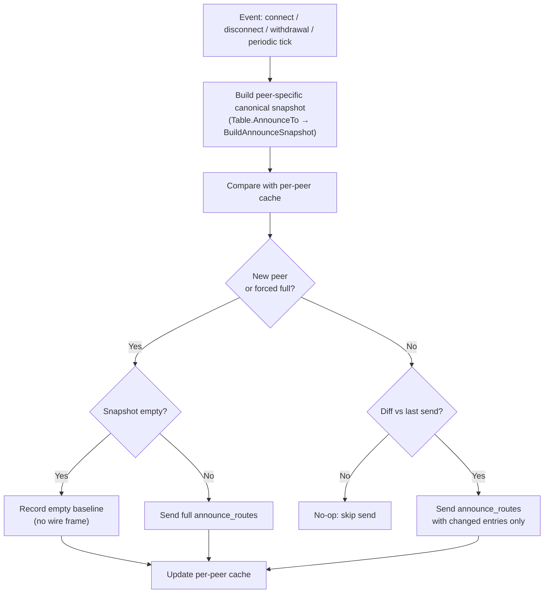
```mermaid
flowchart TD
    A["Event: connect / disconnect / withdrawal / periodic tick"] --> B["Build peer-specific canonical snapshot\n(Table.AnnounceTo → BuildAnnounceSnapshot)"]
    B --> C["Compare with per-peer cache"]
    C --> D{"New peer\nor forced full?"}
    D -- "Yes" --> E0{"Snapshot empty?"}
    E0 -- "Yes" --> E1["Record empty baseline\n(no wire frame)"]
    E0 -- "No" --> E["Send full announce_routes"]
    D -- "No" --> F{"Diff vs last send?"}
    F -- "No" --> G["No-op: skip send"]
    F -- "Yes" --> H["Send announce_routes\nwith changed entries only"]
    E1 --> I["Update per-peer cache"]
    E --> I
    H --> I
```
*Diagram — Announce loop: per-peer send decision / Диаграмма — Цикл анонсов: решение об отправке per-peer*

**Extra invariant in aggregation.** `Extra` (opaque `json.RawMessage`) MUST be identical for all table entries sharing the same `(Identity, Origin, SeqNo)` lineage. The origin node sets `Extra` once per SeqNo; every relay forwards it unchanged. If `BuildAnnounceSnapshot` detects differing `Extra` values for the same lineage during Stage 2 aggregation, it logs a warning (`announce_aggregation_extra_mismatch`) and falls back to deterministic tie-break (larger canonical `Extra` wins). Such divergence indicates relay data corruption or protocol version mismatch and requires investigation.

**Инвариант Extra при агрегации.** `Extra` (опаковый `json.RawMessage`) ДОЛЖЕН быть идентичным для всех записей таблицы с одинаковым lineage `(Identity, Origin, SeqNo)`. Origin-нода устанавливает `Extra` один раз для каждого SeqNo; каждый relay пересылает его без изменений. Если `BuildAnnounceSnapshot` обнаруживает расхождение `Extra` для одного lineage при агрегации Stage 2, логируется предупреждение (`announce_aggregation_extra_mismatch`) и применяется детерминированный tie-break (побеждает больший канонический `Extra`). Такое расхождение указывает на повреждение данных relay или несовместимость версий протокола и требует расследования.

**Конвергенция.** Цикл анонсов (`routing/announce.go`) выполняет периодические анонсы каждые 30 секунд и поддерживает triggered-обновления при подключении/отключении. Цикл использует per-peer состояние анонсов (`routing/announce_state.go`) для отслеживания того, что было отправлено каждому peer'у. На каждом цикле raw-записи маршрутов из `Table.AnnounceTo(peer)` агрегируются в канонический peer-specific snapshot (`routing/announce_builder.go`): wire-дубликаты удаляются, для каждого lineage `(Identity, Origin)` сохраняется только лучшая запись (max SeqNo, min Hops, детерминированный tie-break по Extra), записи сортируются по `(Identity, Origin)`. Если snapshot не изменился по сравнению с последней отправкой, кадр не отправляется (no-op suppression). Если изменилась только часть, отправляются только delta-записи в кадре `announce_routes`. Принудительная полная синхронизация выполняется при подключении нового peer'а и периодически каждые 10 интервалов анонса (~5 минут). Если peer-specific snapshot пуст на момент full sync (например, split horizon отфильтровал все маршруты при анонсе обратно single-route peer'у), baseline записывается как успешный без отправки wire-кадра — peer не узнаёт ничего нового, а последующие циклы используют delta path как обычно (empty-baseline). Попытки forced full sync ограничены `MinForcedFullSyncInterval` (равен интервалу анонса, по умолчанию 30s) для предотвращения flood при повторном `NeedsFullResync`; однако rate limit обходится для peer'ов, которые никогда успешно не получали данных (`LastSentSnapshot == nil`) — неудачная первая попытка не должна блокировать retry.

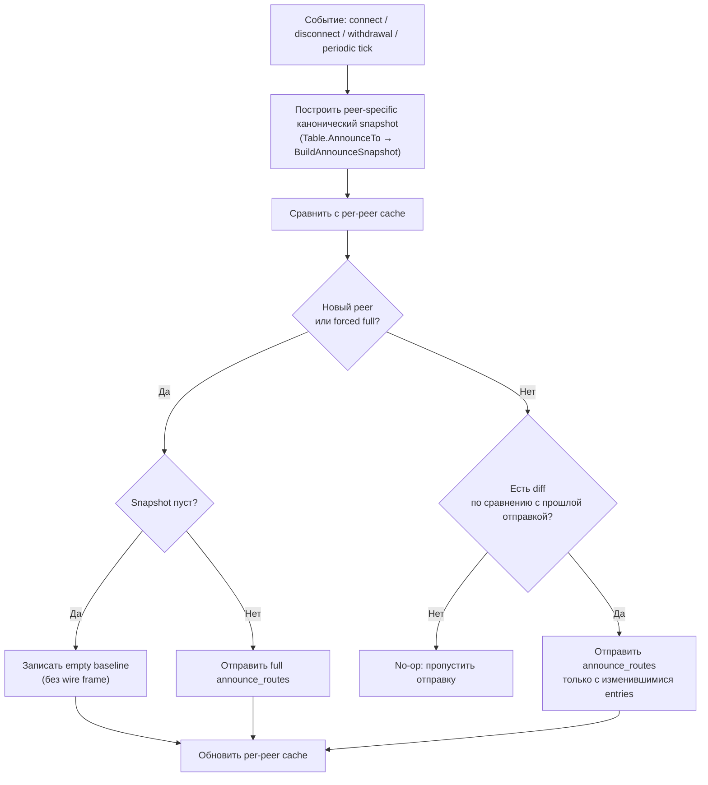
```mermaid
flowchart TD
    A["Событие: connect / disconnect / withdrawal / periodic tick"] --> B["Построить peer-specific канонический snapshot\n(Table.AnnounceTo → BuildAnnounceSnapshot)"]
    B --> C["Сравнить с per-peer cache"]
    C --> D{"Новый peer\nили forced full?"}
    D -- "Да" --> E0{"Snapshot пуст?"}
    E0 -- "Да" --> E1["Записать empty baseline\n(без wire frame)"]
    E0 -- "Нет" --> E["Отправить full announce_routes"]
    D -- "Нет" --> F{"Есть diff\nпо сравнению с прошлой отправкой?"}
    F -- "Нет" --> G["No-op: пропустить отправку"]
    F -- "Да" --> H["Отправить announce_routes\nтолько с изменившимися entries"]
    E1 --> I["Обновить per-peer cache"]
    E --> I
    H --> I
```
*Диаграмма — Цикл анонсов: решение об отправке per-peer*

**Receive-path validation.** `handleAnnounceRoutes` enforces three safety invariants before accepting any wire announcement: (1) **Sender identity validation** — the sender identity must be a valid 40-char lowercase hex fingerprint (`identity.IsValidAddress`). For inbound connections, the identity is read from `connPeerHello.identity` (the hello frame's `Address` field), not from `connPeerHello.address` (the listen address used for health tracking). This distinction is critical for NATed peers that advertise a non-routable listen address (e.g. `127.0.0.1:64646`) — using the listen address as routing identity would cause all announcements from such peers to be rejected as malformed. For outbound sessions, the identity is read from `session.peerIdentity` (set from the welcome frame). (2) **Own-origin rejection** — announcements where `Origin == localIdentity` from a foreign sender are silently dropped. Only this node may originate routes under its own identity; accepting a forged own-origin entry would let a neighbor poison the monotonic SeqNo counter via `syncSeqCounterLocked`. (3) **Transit withdrawal rejection** — wire withdrawals (`hops >= 16`) where `Origin != senderIdentity` are silently dropped. Only the origin may emit a wire withdrawal; transit nodes must invalidate locally and stop advertising. All three guards are enforced before `UpdateRoute`/`WithdrawRoute` to prevent malformed data from reaching the table.

**Direct-route capability gate.** `onPeerSessionEstablished(peerIdentity, hasRelayCap)` accepts a `hasRelayCap` flag that controls whether `AddDirectPeer` is called. A direct route in the distance-vector table advertises that this node can relay DMs to the destination. If the peer cannot accept `relay_message` frames (legacy or gossip-only node), the route would be non-deliverable — other routing-capable nodes would learn a path that silently fails at the last hop. The outbound call site passes `sessionHasCapability(address, capMeshRelayV1)`. The inbound call site passes `connHasCapability(conn, capMeshRelayV1)`. Peers without `mesh_relay_v1` still connect and exchange gossip normally but are never advertised as direct destinations in the routing table.

**Multi-session identity with dual counters.** `node.Service` maintains two per-identity counters: `identitySessions` (total active sessions) and `identityRelaySessions` (relay-capable sessions only). `AddDirectPeer()` is called on the `identityRelaySessions` 0→1 transition (first relay-capable session). `RemoveDirectPeer()` is called on the `identityRelaySessions` 1→0 transition (last relay-capable session closes). This means a non-relay first session does not block a later relay session from creating the direct route, and closing the last relay session withdraws the route even if legacy sessions remain. `onPeerSessionClosed(peerIdentity, hasRelayCap)` mirrors the `hasRelayCap` flag to keep both counters balanced. Total session count cleanup happens independently.

**Full-table sync on connect.** Both outbound and inbound connection paths send an immediate full-table sync (`routingTable.AnnounceTo(peerIdentity)`) to the newly connected peer. This ensures symmetric initial convergence regardless of connection direction. The sync is gated on both `mesh_routing_v1` and `mesh_relay_v1` capabilities — matching the steady-state announce loop contract. A routing-only peer (mesh_routing_v1 without mesh_relay_v1) would learn routes it cannot deliver on the data plane, so it is excluded from connect-time sync as well. The outbound path checks `sessionHasCapability(address, capMeshRoutingV1) && sessionHasCapability(address, capMeshRelayV1)` in `establishPeerSession`. The inbound path checks `connHasCapability(conn, capMeshRoutingV1) && connHasCapability(conn, capMeshRelayV1)` in `trackInboundConnect`. Both paths pass the peer's Ed25519 identity fingerprint (`peerIdentity`) to `AnnounceTo` — not the transport or listen address. This is critical for NATed inbound peers whose listen address (e.g. `127.0.0.1:64646`) differs from their identity fingerprint; passing the transport address would break split horizon filtering. Legacy peers without either capability are silently skipped. Split horizon is applied — routes learned from the connecting peer are excluded. If the resulting peer-specific snapshot is empty (e.g. the only route is the peer's own direct route, excluded by split horizon), the full-sync baseline is recorded without sending a wire frame (empty-baseline); subsequent announce cycles use the delta path normally. If the send fails (session queue full, connection lost between handshake and sync), a warning is logged (`routing_outbound_full_sync_failed` or `routing_inbound_full_sync_failed`). The peer will still receive the table on the next periodic announce cycle.

**Flap dampening.** The routing table tracks per-peer disconnect frequency to prevent link flaps from churning routes and flooding the network with announcements. Each `RemoveDirectPeer` call records a withdrawal timestamp. When a peer accumulates `flapThreshold` (default 3) disconnects within `flapWindow` (default 120s), it enters hold-down state for `holdDownDuration` (default 30s). During hold-down, `AddDirectPeer` still creates the route (connectivity is preserved), but the `AddDirectPeerResult.Penalized` flag signals to the caller that the triggered announce should be suppressed — the route will be picked up by the next periodic announce cycle, reducing announcement churn. Direct routes themselves have no TTL (see Direct route lifecycle above), so flap dampening affects only the announce timing, not route expiry. `TickTTL` cleans up stale flap state once both hold-down and the flap window have expired. All thresholds are configurable via `WithFlapWindow`, `WithFlapThreshold`, `WithHoldDownDuration`, and `WithPenalizedTTL` options.

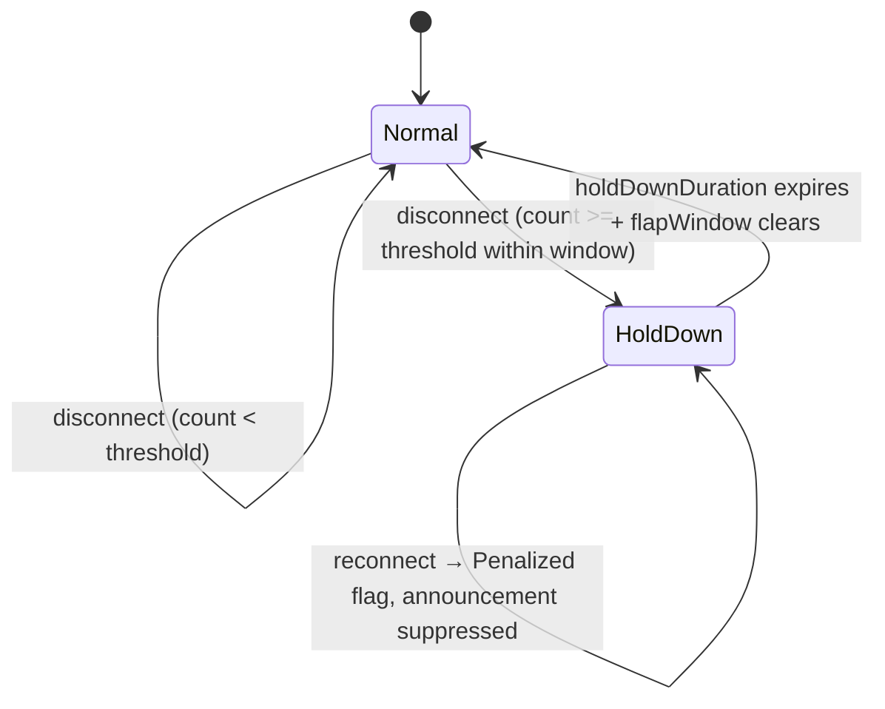
```mermaid
stateDiagram-v2
    [*] --> Normal
    Normal --> Normal: disconnect (count < threshold)
    Normal --> HoldDown: disconnect (count >= threshold within window)
    HoldDown --> HoldDown: reconnect → Penalized flag, announcement suppressed
    HoldDown --> Normal: holdDownDuration expires + flapWindow clears
```
*Diagram — Peer flap detection state machine*

**Outgoing DM delivery decision.** When `storeIncomingMessage` routes a DM, `TableRouter.Route()` returns a `RoutingDecision` containing `RelayNextHop` (identity), `RelayNextHopAddress` (validated transport address or `"inbound:"` key), and `RelayNextHopHops` (hop count from the route). The send path (`sendTableDirectedRelay`) uses the pre-validated address directly — no re-resolution — to avoid selecting a different session for the same identity with weaker capabilities. If the validated address is empty (retry path), re-resolution uses `resolveRouteNextHopAddress` with the original hop role: destination (hops=1) requires only `mesh_relay_v1`; transit (hops>1) requires both `mesh_relay_v1` and `mesh_routing_v1`. If re-resolution or send fails, gossip fallback triggers. Both outbound sessions and inbound-only connections are usable as relay next-hops. Relay state persistence (`relayForwardState`) is checked on both outbound and inbound paths — if the store is rejected (duplicate message ID or capacity limit), the send is treated as a failure (returns false) and a warning is logged (`relay_state_store_failed_outbound` / `relay_state_store_failed_inbound`). This ensures the caller sees the delivery as failed and can fall back to gossip rather than silently losing hop_ack and receipt routing context.

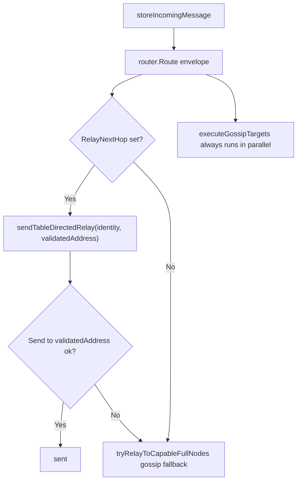
```mermaid
flowchart TD
    A[storeIncomingMessage] --> B[router.Route envelope]
    B --> C{RelayNextHop set?}
    C -- Yes --> D["sendTableDirectedRelay(identity, validatedAddress)"]
    D --> E{Send to validatedAddress ok?}
    E -- Yes --> Z[sent]
    E -- No --> G[tryRelayToCapableFullNodes gossip fallback]
    C -- No --> G
    B --> H[executeGossipTargets always runs in parallel]
```
*Diagram — Outgoing DM delivery decision: table route vs gossip*

**Intermediate relay hop delivery decision.** When `handleRelayMessage` processes a transit relay, it tries three strategies in order: direct peer (recipient locally connected), routing table lookup (`tryForwardViaRoutingTable`), and blind gossip (`relayViaGossip`). If all fail, the message is stored locally and gossip handles delivery. When `tryForwardViaRoutingTable` selects a route, it returns a `tableForwardResult` containing both the transport address and the route's `Origin` field. The `RouteOrigin` is persisted in `relayForwardState` so that `confirmRouteViaHopAck` at this intermediate node can scope hop_ack confirmation to the exact `(Identity, Origin, NextHop)` triple — matching the origin-node behavior.

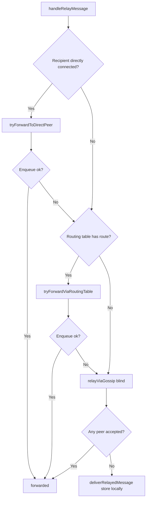
```mermaid
flowchart TD
    A[handleRelayMessage] --> B{Recipient directly connected?}
    B -- Yes --> C[tryForwardToDirectPeer]
    C --> D{Enqueue ok?}
    D -- Yes --> Z[forwarded]
    D -- No --> E{Routing table has route?}
    B -- No --> E
    E -- Yes --> F[tryForwardViaRoutingTable]
    F --> G{Enqueue ok?}
    G -- Yes --> Z
    G -- No --> H[relayViaGossip blind]
    E -- No --> H
    H --> I{Any peer accepted?}
    I -- Yes --> Z
    I -- No --> J[deliverRelayedMessage store locally]
```
*Diagram — Intermediate relay hop: direct peer → table route → gossip*

**Gossip fallback contract (release-blocking).** `TableRouter` in `node/table_router.go` implements the `Router` interface. It consults the routing table for a directed next-hop; if no usable route or session exists, delivery degrades to gossip transparently. Fallback triggers: `Lookup()` returns empty, `RelayNextHop` identity has no active session, `RelayNextHop` peer lacks required capabilities (relay-only for destinations, both relay+routing for transit hops). `GossipTargets` are always populated in every `RoutingDecision`. The same fallback applies at every level: origin node (`sendTableDirectedRelay`), intermediate hop (`tryForwardViaRoutingTable`), and `TableRouter.Route()`.

**Gossip target selection: session + pending peer merge.** `routingTargetsFiltered` in `node/routing_integration.go` builds the gossip target list from two sources: (1) active outbound sessions with healthy connections (scored by health, capped at 3), and (2) known peers without active sessions that can be reached via the pending queue (`queuePeerFrame` → `flushPendingPeerFrames` on session establishment). When scored session targets exist, remaining fanout slots (up to 3 total) are filled with non-session peers. When no sessions exist at all (bootstrap), all matching peers are returned uncapped. **Fallback-port deduplication:** when a session connects via a fallback port (e.g. `host:64646` instead of canonical `host:7777`), both the session key and the canonical address (resolved via `dialOrigin`) are marked in `sessionSeen`, preventing the same physical host from appearing both as an active session target and as a pending peer — which would waste a fanout slot on a duplicate. This merge prevents a timing hole where a message arriving before all sessions are established gets gossipped only to the sender (the only active session) and never reaches forward peers — `seen[ID]` dedup then permanently blocks re-gossip on subsequent attempts. Non-session peers receive their frames via `sendMessageToPeer`, which attempts delivery in three tiers: (1) outbound session via `enqueuePeerFrame`; (2) direct write to an authenticated inbound connection via `inboundConnForAddressLocked` — this covers the common case where the peer has connected to us (inbound) but we have no outbound session (CM slot full); (3) `queuePeerFrame`, which buffers the frame in the pending queue for deferred delivery. The inbound direct path (`mode="inbound_direct"` in gossip_message_attempt log) is the primary fix for the timing hole where a peer's inbound connection is already authenticated before the gossip frame arrives — writing directly avoids the queue entirely. Three drain triggers exist for already-queued frames: (1) outbound session establishment calls `flushPendingPeerFrames`, which sends all pending frames via the session's `sendCh`; (2) inbound connection authentication calls `flushPendingFireAndForget` in `trackInboundConnect`, which writes fire-and-forget frames (`push_message`, `push_notice`) directly to the inbound TCP connection; (3) route events trigger `drainPendingForIdentities` for `send_message` frames. The inbound drain in `trackInboundConnect` handles the reverse timing: frame queued before inbound connection authenticates. Only fire-and-forget frames are safe to write on the inbound conn because they don't expect a response that would interleave with the peer's request/reply dispatch loop. Request/reply frames (send_message, relay_message) must wait for an outbound session.

**Event-driven pending queue drain.** When a route to a destination identity becomes usable — either a direct peer connecting (`servePeerSession` startup), a transit route learned via `announce_routes` (`handleAnnounceRoutes`), a reconnected peer re-announcing the same unchanged routing table (`handleAnnounceRoutes` with `RouteUnchanged` status), a route withdrawal that exposes a surviving backup route (`WithdrawRoute` followed by a `Lookup` check), a TTL expiry that removes a higher-priority route and exposes a surviving backup (`TickTTL` returning exposed identities in `routingTableTTLLoop`), or a local peer disconnect that invalidates routes through the departing next-hop but exposes a backup via a different next-hop (`RemoveDirectPeer` / `InvalidateTransitRoutes` returning `ExposedBackups` in `onPeerSessionClosed`) — the node immediately scans its pending queue for own outbound `send_message` frames targeting that identity and attempts to deliver them via the newly available route. This is an event-driven optimization that eliminates two latency sources: waiting for the original target peer to reconnect (`flushPendingPeerFrames`), and waiting for the 2-second relay retry loop to fire. The drain goroutine is launched from `servePeerSession` (not `onPeerSessionEstablished`) to ensure `inboxCh` is actively being read — launching it earlier creates `s.mu.Lock()` contention that delays session establishment and can cause `inboxCh` overflow under concurrent load. Only `send_message` is drained — other frame types are not route-recoverable: `relay_message` and `announce_peer` are other peers' traffic handled by the relay retry loop and peer session flush; `relay_delivery_receipt` is delivered via the `relayStates` hop chain (`lookupReceiptForwardTo`), not via the routing table, so a new route to the receipt's Recipient does not create a delivery path for it. The `drainPendingForIdentities` function in `routing_integration.go` uses an extract-attempt-return pattern: matching frames are atomically removed from the pending queue under the lock (preventing concurrent drain goroutines from processing the same frame twice), delivery is attempted outside the lock via `sendRelayToAddress` (which returns a definitive success/failure signal), and frames that fail delivery are merged back into their original positions in the pending queue using index-based reconstruction — the extraction phase records each frame's `origIdx` and per-address metadata (`origLen`, `extractedPos`), and the return phase walks through the original position range interleaving kept and returning frames so that `flushPendingPeerFrames` — which delivers in slice order — maintains exact DM delivery ordering across recipients sharing the same peer address after route churn. Frames added by other goroutines during the unlocked delivery window are appended at the end. The retry counter is only incremented when a real delivery attempt was made (route existed, address resolved, `sendRelayToAddress` was called) — when no usable route exists (`RelayNextHop == nil` or address unresolvable), the frame is returned to the pending queue without burning retry budget and without any outbound state transition — the `Status` stays `"queued"` and `LastAttemptAt` is not updated, preserving the semantic that `"retrying"` in outbound state means a real network handoff was attempted. The frame waits for future drain cycles triggered by subsequent routing events. When `maxPendingFrameRetries` is reached after real failures, the frame is marked terminal instead of being returned — matching the retry contract of `flushPendingPeerFrames`. Expired frames are detected and marked terminal during the scan. All outbound state changes (terminal, retrying, cleared) are collected as deferred actions during the delivery loop and applied under the lock together with the pending queue return in a single persist — no intermediate writes to `queue-*.json` occur during the drain. This eliminates the crash-loss window that would exist if `markOutboundTerminal`, `markOutboundRetrying`, or `clearOutboundQueued` persisted mid-loop while extracted frames are absent from `s.pending`. When `handleAnnounceRoutes` processes a single announce, both accepted (new/improved) and unchanged (reconfirmed alive) identities are batched into a single drain set. Rejected routes (stale SeqNo, tombstone-blocked) do not participate in drain. The `announce_routes_processed` log emits three counters — `accepted`, `unchanged`, `rejected` — so operators can distinguish new routing events from benign reconfirmations. This three-state classification uses `RouteUpdateStatus` (`RouteAccepted`, `RouteUnchanged`, `RouteRejected`) returned by `UpdateRoute`.


```mermaid
flowchart TD
    A[Route event: identity reachable] --> B{Event source}
    B -- "servePeerSession startup<br/>(direct peer connected)" --> C[Trigger drain]
    B -- "handleAnnounceRoutes<br/>(transit route learned or reconfirmed)" --> D[Collect drain identities]
    B -- "WithdrawRoute<br/>(backup route exposed)" --> W{"Lookup: backup exists?"}
    W -- Yes --> D
    W -- No --> Z[No drain needed]
    B -- "routingTableTTLLoop<br/>(TTL expiry exposes backup)" --> T{"TickTTL: exposed identities?"}
    T -- Yes --> D
    T -- No --> Z
    B -- "onPeerSessionClosed<br/>(local disconnect)" --> P2{"ExposedBackups?"}
    P2 -- Yes --> D
    P2 -- No --> Z
    D --> C
    C --> E["drainPendingForIdentities(identities)"]
    E --> F["Lock: extract send_message frames from s.pending"]
    F --> G{Frame expired?}
    G -- Yes --> H["deferred: markOutboundTerminalLocked"]
    G -- No --> I["router.Route(envelope)"]
    I --> J{RelayNextHop + address resolved?}
    J -- Yes --> K["sendRelayToAddress(address, envelope)"]
    K --> M{Delivery confirmed?}
    M -- Yes --> N["deferred: clearOutboundQueuedLocked"]
    M -- No --> P["Retries++ (real attempt)"]
    P --> PA{Retries >= max?}
    PA -- Yes --> Q["deferred: markOutboundTerminalLocked"]
    PA -- No --> R["deferred: markOutboundRetryingLocked + return to pending"]
    J -- "No (no route)" --> NR["Return to pending without incrementing Retries"]
    H & N & Q & R & NR --> S["Lock: merge failed at original positions + apply deferred → single persist"]
```
*Diagram — Event-driven pending queue drain on route discovery*

**Route confirmation via hop_ack.** When a `relay_hop_ack` with status "delivered" or "forwarded" is received, the routing table promotes the route through the ack sender to `source=hop_ack` via `confirmRouteViaHopAck`. The ack sender's transport address (`senderAddress` in `handleRelayHopAck`) is the provably correct next-hop — even under gossip fan-out where multiple peers received the relay_message but only one actually delivered it. The peer identity is resolved from the transport address and matched against routing table entries. For table-directed relays, the `RouteOrigin` stored in `relayForwardState` scopes the confirmation to the exact `(Identity, Origin, NextHop)` triple that carried the message — different origins sharing the same NextHop are not affected. `RouteOrigin` is persisted at every hop in the relay chain: at the origin node (via `sendRelayMessageWithOrigin` / `sendRelayToAddress`), and at intermediate hops (via `tryForwardViaRoutingTable` returning `tableForwardResult` with `RouteOrigin`). For gossip-originated relays where no specific triple was chosen (`RouteOrigin` is empty), the first matching NextHop in Lookup order is promoted. Both outbound and inbound relay paths persist `relayForwardState`, ensuring behavioral equivalence regardless of connection direction.

**Announce_routes relay gate (routing-only peers).** A peer that negotiates `mesh_routing_v1` but not `mesh_relay_v1` can participate in the control plane (receive and send route announcements) but cannot carry data-plane traffic (`relay_message`). Accepting routes from such peers would create entries pointing to a next-hop that silently drops relayed messages. To prevent this control-plane/data-plane mismatch, both inbound and outbound `announce_routes` dispatch paths enforce a relay gate: inbound frames from connections without `mesh_relay_v1` are silently rejected (`connHasCapability(conn, capMeshRelayV1)` in the `announce_routes` handler), and the outbound announce loop skips sessions without `mesh_relay_v1` (`sessionHasCapability(address, capMeshRelayV1)` in the announce sender). This gate operates independently of `mesh_routing_v1` — a peer must have both capabilities to participate in route exchange.

**Transit route invalidation for routing-only peers.** When the last total session of a routing-only peer (no relay-capable sessions were ever active) closes, `onPeerSessionClosed` calls `Table.InvalidateTransitRoutes(peerIdentity)` as a defense-in-depth measure. This method marks all transit routes (non-direct, hops < 16) where `NextHop == peerIdentity` as withdrawn (hops=16) without incrementing SeqNo (local-only invalidation — no wire withdrawal is generated). Direct routes are skipped because their lifecycle is governed by `RemoveDirectPeer`. When at least one route is invalidated, `announceLoop.TriggerUpdate()` fires an immediate announce cycle so neighbors learn the stale routes are withdrawn without waiting for the next periodic cycle (up to 30s). Under normal operation, the announce_routes relay gate prevents routes from routing-only peers from entering the table. `InvalidateTransitRoutes` guards against edge cases: routes learned before capability was fully negotiated, or stale entries from a previous relay-capable session of the same identity. The method returns the count of invalidated routes for logging.

**Disconnect withdrawal fan-out (parallel contract).** When a direct peer's last relay-capable session closes, `onPeerSessionClosed` in `node/routing_integration.go` has to deliver the own-origin wire withdrawals returned by `RemoveDirectPeer.Withdrawals` to every remaining routing-capable peer **immediately** — the announce loop would otherwise delay withdrawal delivery up to one periodic cycle (30s). The fan-out is implemented by the dedicated helper `fanoutAnnounceRoutes(ctx, targets []routing.AnnounceTarget, withdrawals []routing.AnnounceEntry) (sent, dropped int)`. Its contract: (1) **one goroutine per target** — every peer is handled by its own goroutine so a single stuck inbound socket does not serialise delivery to the rest; (2) **per-peer bound = `syncFlushTimeout`** — inside each goroutine `SendAnnounceRoutes → writeFrameToInbound → sendFrameBytesViaNetworkSync` is bounded by the netcore sync-flush timeout (default 5s) regardless of the other peers; (3) **wall-clock bound = `syncFlushTimeout` of the slowest peer**, never `N × syncFlushTimeout` — this is the property that prevents peer-cleanup from starving the 1s metrics collector and the 2s `bootstrapLoop` under a writer-preferring `sync.RWMutex`; (4) **shared cancellation** — `ctx` is `s.runCtx`, so shutdown short-circuits every goroutine at the top of its body and counts it as dropped; (5) **no shared state** — goroutines share only two `atomic.Int32` counters, no `Service` map is mutated; `SendAnnounceRoutes` takes its own short `s.mu.RLock` inside `writeFrameToInbound` and releases it before the blocking send; (6) **`crashlog.DeferRecover()` per goroutine** — one panicking target does not leave a WaitGroup hung or take down the cleanup goroutine; (7) **observability** — the outer `routing_direct_peer_removed` log line exposes `fanout_sent` and `fanout_dropped`, so a `sent ≪ dropped` divergence is a direct signal of stuck inbound sockets (e.g. NAT hairpin half-dead TCP) without stack traces. Regression coverage: `TestOnPeerSessionClosed_FanoutIsParallel`, `TestOnPeerSessionClosed_FanoutRespectsRunCtx`, `TestOnPeerSessionClosed_NoPanicOnZeroPeers`, `TestOnPeerSessionClosed_CollectsSentAndDroppedCounters` in `node/routing_integration_fanout_test.go`.

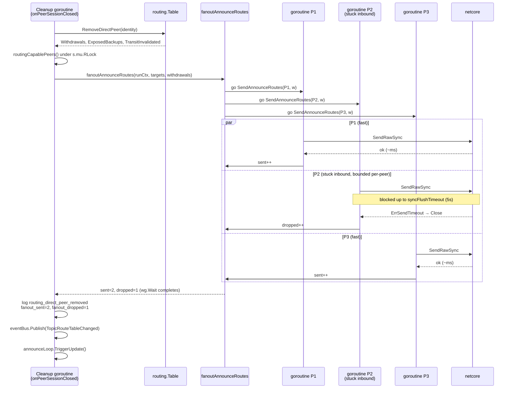
```mermaid
sequenceDiagram
    participant CL as Cleanup goroutine<br/>(onPeerSessionClosed)
    participant RT as routing.Table
    participant FO as fanoutAnnounceRoutes
    participant G1 as goroutine P1
    participant G2 as goroutine P2<br/>(stuck inbound)
    participant G3 as goroutine P3
    participant N as netcore

    CL->>RT: RemoveDirectPeer(identity)
    RT-->>CL: Withdrawals, ExposedBackups, TransitInvalidated
    CL->>CL: routingCapablePeers() under s.mu.RLock
    CL->>FO: fanoutAnnounceRoutes(runCtx, targets, withdrawals)
    FO->>G1: go SendAnnounceRoutes(P1, w)
    FO->>G2: go SendAnnounceRoutes(P2, w)
    FO->>G3: go SendAnnounceRoutes(P3, w)
    par P1 (fast)
        G1->>N: SendRawSync
        N-->>G1: ok (~ms)
        G1->>FO: sent++
    and P2 (stuck inbound, bounded per-peer)
        G2->>N: SendRawSync
        Note over G2,N: blocked up to syncFlushTimeout (5s)
        N-->>G2: ErrSendTimeout → Close
        G2->>FO: dropped++
    and P3 (fast)
        G3->>N: SendRawSync
        N-->>G3: ok (~ms)
        G3->>FO: sent++
    end
    FO-->>CL: sent=2, dropped=1 (wg.Wait completes)
    CL->>CL: log routing_direct_peer_removed<br/>fanout_sent=2, fanout_dropped=1
    CL->>CL: eventBus.Publish(TopicRouteTableChanged)
    CL->>CL: announceLoop.TriggerUpdate()
```
*Diagram — Parallel disconnect fan-out: one goroutine per target, wall-clock bounded by the slowest peer*

**TTL policy delegation.** Received announcements leave `ExpiresAt` as zero when constructing the `RouteEntry` in `handleAnnounceRoutes`. `Table.UpdateRoute` fills it using the table's own configured `clock` and `defaultTTL`. This ensures that all routes (direct via `AddDirectPeer`, learned via announcements) follow the same TTL policy, and tables created with `WithDefaultTTL` or `WithClock` behave consistently across all route sources.

### RPC observability

Three RPC commands expose routing table state for monitoring and debugging. They follow the same provider-injection pattern as metrics and chatlog commands — when `RoutingProvider` is nil, commands return 503 (unavailable) and are hidden from help output. Full field-level specification: [`rpc/routing.md`](rpc/routing.md).

**`fetch_route_table`** — Returns the full routing table snapshot. Each entry includes identity, origin, `next_hop` object (identity + live transport address/network), hops, seq_no, source (direct/hop_ack/announcement), withdrawn/expired flags, and remaining TTL. The `next_hop.address` and `next_hop.network` fields are live best-effort metadata queried after the snapshot — routing fields are atomic within `snapshot_at`. Response also includes total/active entry counts and snapshot timestamp. Sorted by (identity, origin, next_hop.identity, source).

**`fetch_route_summary`** — Returns a compact overview with `snapshot_at` timestamp, total/active/withdrawn entry counts, number of reachable identities, direct peer count, and the current flap detection state (per-peer withdrawal count, hold-down status). Flap state sorted by peer_identity. The `snapshot_at` field matches the same point-in-time semantics as `fetch_route_table` and `fetch_route_lookup`.

**`fetch_route_lookup <identity>`** — Returns active routes (withdrawn and expired filtered out) for a specific destination identity, sorted by preference (source priority desc, hops asc, then origin/next_hop/seq_no for determinism). Useful for diagnosing why a particular peer is or is not reachable via table routing.

The `RoutingProvider` interface (`rpc/provider.go`) has two methods: `RoutingSnapshot()` returns an immutable point-in-time copy of the routing table, and `PeerTransport(peerIdentity)` resolves a peer identity to its current transport address and network type. All three commands use `RoutingSnapshot()` for atomic data; `fetch_route_table` additionally calls `PeerTransport()` to enrich `next_hop` with live transport info. Console positional argument mapping is configured: `fetch_route_table` and `fetch_route_summary` take no arguments; `fetch_route_lookup` takes a single `<identity>` positional argument.

**Protocol version validation (outbound + inbound).** Both directions enforce `config.MinimumProtocolVersion`. On the *outbound* path, the welcome frame's version is checked; incompatible peers are rejected with log `outbound_peer_protocol_too_old`, receive a `peerScoreOldProtocol` (-50) score penalty, and an accumulating overlay-level ban score (`peerBanIncrementIncompatible` = 250) is applied via `penalizeOldProtocolPeer`. The ConnectionManager dial path (`openPeerSessionForCM`) returns an `incompatibleProtocolError` that carries confirmed version evidence (peer version, peer minimum, and client version from the welcome frame); `onCMDialFailed` extracts this evidence via `errors.As` and passes protocol versions to `penalizeOldProtocolPeer` so the reporter set and persisted lockout receive the same evidence as the legacy dial path. The client version string is pre-populated into `s.peerVersions[address]` before `penalizeOldProtocolPeer` runs, so `setVersionLockoutLocked` writes the complete `ObservedClientVersion` into the persisted lockout. The same pre-population is applied in the legacy outbound path and the inbound rejection path — on all three failure paths, the handshake frame is the only source of the client version since `learnIdentityFromWelcome`/`addPeerVersion` only runs on the success path. Without the structured error, the CM path would call `penalizeOldProtocolPeer(address, 0, 0)`, which correctly applies ban scoring but would skip the reporter set and lockout due to the zero-evidence guard. Verified by `TestCMDialFailed_PropagatesVersionEvidence`, `TestCMDialFailed_ZeroEvidence_NoReporterOrLockout`, and `TestCMDialFailed_PersistsObservedClientVersion`. A single failed attempt does not trigger a full ban — the overlay ban threshold is 1000, requiring 4 consecutive attempts before the peer is banned for `peerBanIncompatible` (24 hours). This graduated approach avoids permanently blacklisting peers that experience transient version mismatches during rolling upgrades. The version evidence (peer's protocol version and minimum version from the welcome frame) is recorded as a **version lockout** in `peerEntry.VersionLockout` and persisted to `peers.json`, but only when the evidence is confirmed — the remote `minimum_protocol_version` must exceed the local protocol version. Lockouts are bound to the peer's cryptographic identity when available; identity-less (address-only) lockouts expire after 7 days (`VersionLockoutMaxTTL`) to prevent stale entries from suppressing addresses reassigned to a different peer. Identity-bound lockouts persist until the local node's version changes (protocol version or client build increases), at which point stale lockouts are cleared automatically on startup via `clearStaleVersionLockoutsLocked`. A locked-out peer is skipped by `peerDialCandidates` regardless of lockout type. On the *inbound* path, the hello frame's version is checked; incompatible clients receive an error frame with `ErrCodeIncompatibleProtocol` and two independent ban tracks fire with distinct blast radii. The **per-peer storm-suppression signal** is emitted immediately: before the session is torn down, `emitPeerBannedNoticeByID(connID, now+peerBanIncompatible, PeerBannedReasonPeerBan)` delivers `connection_notice{code=peer-banned, reason=peer-ban}` on the still-open ConnID. The dialler-side gate 6c.2 routes the notice by `details.reason`: on `peer-ban` it calls `recordRemoteBanLocked` to suppress THIS specific `PeerAddress` only, leaving compatible siblings behind a shared egress (NAT gateway, VPN exit, Tor exit, multi-homed host) reachable. On `blacklisted` it additionally calls `recordRemoteIPBanLocked` on the server IP extracted from the notice's peer address, so every sibling `PeerAddress` behind that IP — including peers discovered later via peer exchange — is gated until the window elapses. Either path keeps `cm_session_setup_failed` out of the ebus. The **transport-level IP blacklist** stays graduated as the safety net for sustained noise from the same IP: `addBanScore(connID, banIncrementIncompatibleVersion)` adds 250 to the remote IP's ban score per attempt, and only the 4th attempt crosses `banThreshold` = 1000, arming the 24-hour TCP-level block. When the threshold is crossed, `addBanScore` fires a second peer-banned notice with `reason=blacklisted` on the connection that tripped it, and from then on `handleConn` silently drops every TCP attempt from that IP until the window elapses. The inbound path also calls `penalizeOldProtocolPeer` for overlay-level ban scoring; the overlay per-peer track stays graduated (4 attempts to `peerBanThresholdIncompatible` = 1000), giving known peers a rolling-upgrade window on the persisted side. However, the reporter observation and version lockout are only recorded when the direction is confirmed — the remote peer's `minimum_protocol_version` must exceed the local protocol version (see "Direction invariant" below). Each confirmed incompatible-version observation is recorded in the node-owned **VersionPolicyState**, which aggregates reports from distinct peer identities. When ≥3 distinct peers report incompatibility (or ≥2 peers advertise a higher `client_build`), the node signals `update_available` in its `AggregateStatus` — the Desktop UI reads this pre-computed flag rather than computing it locally. Ephemeral observations expire after 24 hours, reporters are deduplicated by `PeerIdentity` (empty-identity observations are ignored). Active persisted lockouts also contribute to `update_available`, ensuring the signal remains true as long as any lockout exists — the UI does not lose the update hint while the node remains partially locked out. The version policy snapshot is recomputed twice within the confirmed-incompatible path in `penalizeOldProtocolPeer`: once by `recordIncompatibleObservationLocked` (before the lockout exists) and once after `setVersionLockoutLocked` (so the lockout's contribution to `update_available` is immediately visible). Without the second recompute, the snapshot would remain stale until the next unrelated event. Verified by `TestPenalize_SnapshotIncludesLockoutSignal`.

**Remote-ban recovery (two-scope).** Each `connection_notice{code=peer-banned}` lands in exactly one table — never both — driven by `details.reason`: `peer-ban` writes only the per-peer `persistedMeta[address].RemoteBannedUntil` via `recordRemoteBanLocked`; `blacklisted` writes only the IP-wide `Service.remoteBannedIPs` via `recordRemoteIPBanLocked`. The dial-gate check `isPeerRemoteBannedLocked` consults both tables on every candidate, so a record in either scope is enough to suppress — no sender-side mirror is written. A successful outbound handshake (`recordOutboundAuthSuccess`) therefore needs to clear only the two scopes it can legitimately speak for, in a single `s.mu` write section followed by one `flushPeerState` so the recovery cannot be split by a crash or restart: (1) the handshaking peer's own per-peer `RemoteBannedUntil` via `clearRemoteBanLocked` — unconditional, because the handshake itself is direct proof this address is accepting us again; a no-op when no row exists; (2) the IP-wide `remoteBannedIPs` entry via `clearRemoteIPBanLocked`, keyed on the canonical host of the dialled endpoint, so every sibling `PeerAddress` behind that egress IP is freed by the dial gate together with the host that carried the recovery — one sibling's success speaks for all siblings because `reason=blacklisted` is an IP-scoped decision. Per-peer rows with `reason=peer-ban` on OTHER sibling addresses are intentionally NOT touched by the IP-wide recovery: those are standalone responder decisions scoped to specific addresses, and a handshake with one sibling is not proof the responder has forgiven a peer-specific ban on another address. Either clear returning `true` triggers the shared `flushPeerState` so the on-disk snapshot matches the in-memory state before the next dial cycle. Verified by `TestRecordOutboundAuthSuccess_ClearsRemoteIPBan`, `TestRecordOutboundAuthSuccess_ClearsRemoteIPBanFreesSiblings`, and `TestRecordOutboundAuthSuccess_PreservesPeerBanSiblingRows`.

**Counter ownership boundary.** Two independent counters track incompatible-version events and they are NOT projections of each other. `peerHealth.IncompatibleVersionAttempts` is the per-address cumulative counter used for overlay ban scoring — each attempt adds `peerBanIncrementIncompatible` to the overlay penalty, and the ban fires when the cumulative penalty reaches `peerBanThresholdIncompatible`. `versionPolicyState.incompatibleReporters` is the per-identity dedup set used for the `update_available` signal — it counts distinct peer identities that reported incompatibility within the 24-hour observation window. The per-address counter survives indefinitely (cleared only by operator `add_peer`); the per-identity set is subject to observation TTL expiry. Both are mutated under `Service.mu` by `penalizeOldProtocolPeer`, but they serve different consumers (ban scoring vs update signal) and have different lifecycles.

**Safety invariant: no evidence, no lockout.** A persisted version lockout is set only when confirmed version evidence exists — the remote peer's `minimum_protocol_version` must strictly exceed the local `config.ProtocolVersion`. When version evidence is absent (peerMinimum = 0, e.g. from a bare error code without a welcome frame) or does not confirm incompatibility (peerMinimum ≤ local), no lockout is created. This prevents the connection manager from permanently suppressing a peer based on a transient or unverifiable error. The safety invariant is verified by negative tests (`TestVersionLockout_NoEvidenceNoLockout_ZeroMinimum`, `TestVersionLockout_NoEvidenceNoLockout_MinimumBelowLocal`) and a positive test (`TestVersionLockout_EvidenceConfirmed_LockoutSet`).

**Direction invariant: inbound old peers do not feed the upgrade signal.** The `update_available` signal and the `incompatibleReporters` dedup set must only reflect the "they think we're old" direction — i.e., when a remote peer's `minimum_protocol_version` exceeds our local `config.ProtocolVersion`. When we reject an old inbound peer because *their* version is below *our* minimum, this is the opposite direction: the remote peer is outdated, not us. `penalizeOldProtocolPeer` applies ban scoring (health counters, score penalty, ban escalation) unconditionally for both directions, but the `recordIncompatibleObservationLocked` call and the `setVersionLockoutLocked` call are guarded by `peerMinimum > config.ProtocolVersion`. Without this guard, a cluster of old peers connecting inbound could incorrectly trigger the "you need to upgrade" CTA for the local operator. The invariant is verified by `TestInboundOldPeer_DoesNotFeedReporterSet` (4 old inbound peers with peerMinimum ≤ local → reporter count stays 0, update_available stays false) and `TestInboundOldPeer_ZeroMinimum_NoReporter` (peerMinimum = 0 with known identity → reporter count stays 0).

**Multi-address lockout propagation.** Version incompatibility is a property of a peer's software version, not of a specific network endpoint. When `setVersionLockoutLocked` records a lockout for an address that has a known `PeerIdentity`, it propagates the same lockout to all other addresses in `persistedMeta` that map to the same identity via `peerIDs`. A sibling address receives the propagated lockout when it either has no active lockout, or the new evidence is stronger (higher `ObservedMinimumProtocolVersion`) or fresher (newer `LockedAt` timestamp). Without the refresh path, already-active sibling entries would keep stale data forever — skewing diagnostics like `ObservedClientVersion` and `MaxObservedPeerVersion` for any logic or UI that inspects the propagated lockout contents. This prevents `peerDialCandidates` from re-dialing the same incompatible peer via an alternative address — a futile attempt that wastes resources and risks remote-side ban escalation. Propagation only occurs for identity-bound lockouts; address-only lockouts (no known identity) cannot be safely propagated because two addresses without identity may belong to different peers. The existing per-address lockout check (`isPeerVersionLockedOutLocked`) remains the filter in `peerDialCandidates` — propagation ensures every address for the identity has a lockout entry, so the per-address check correctly suppresses all of them. Verified by `TestVersionLockout_PropagatedByIdentity` (3 addresses, 2 with same identity: lockout set on one propagates to the other, third address with different identity unaffected), `TestVersionLockout_NoIdentity_NoPropagation` (no identity: lockout does not propagate), `TestVersionLockout_SiblingRefreshedWithStrongerEvidence` (higher minimum refreshes already-active sibling), and `TestVersionLockout_SiblingRefreshedWithFresherTimestamp` (newer timestamp refreshes sibling's client version).

**Build signal lifecycle.** The `peerBuilds` and `peerVersions` maps are session-scoped: populated during the handshake (welcome/hello frame processing), and cleared on disconnect (`markPeerDisconnected`). This ensures that only currently connected peers contribute to the build-based update signal — a disconnected peer's stale build number does not keep `update_available` artificially raised. Entries are also deleted during stale-peer eviction. Reconnection repopulates both maps from the fresh handshake frame.

**Compatible observation lifecycle.** A successful handshake (`markPeerConnected`, called for both outbound and inbound connections) is definitive proof that the peer is compatible. It clears all stale incompatible-version evidence for that specific peer: `IncompatibleVersionAttempts` is reset to 0, `LastIncompatibleVersionAt` is zeroed, `ObservedPeerVersion` and `ObservedPeerMinimumVersion` are zeroed, the peer is removed from the `incompatibleReporters` dedup set, and any active persisted `VersionLockout` is cleared. Lockout clearing is identity-wide: because `setVersionLockoutLocked` propagates lockouts to all addresses sharing the same `PeerIdentity`, `markPeerConnected` mirrors this by clearing the lockout from all sibling addresses of the same identity — not just the address that completed the handshake. All failure-related health fields are reset via `resetPeerHealthForRecoveryLocked` — a single helper that is the sole source of truth for the recovery field set. The helper clears: error strings (`LastError`, `LastErrorCode`, `LastDisconnectCode`), version evidence (`IncompatibleVersionAttempts`, `LastIncompatibleVersionAt`, `ObservedPeerVersion`, `ObservedPeerMinimumVersion`), dial-suppression state (`ConsecutiveFailures`, `LastDisconnectedAt`, `BannedUntil`), and score repair (negative scores are floored to 0). The same helper is used for both the direct address and sibling addresses, along with the IP-wide ban for each sibling's IP (handled by the caller). Score flooring neutralises stale `peerScoreOldProtocol` penalties that would otherwise keep siblings eviction-eligible (`peerEvictScoreThreshold = -20`) even after the identity has proven compatibility; the floor is applied before any connect bonus so that peers with legitimately positive scores are not inflated. `LastError` is especially important because `rankPeerHealth` subtracts `len(health.LastError)` from the peer ranking score — a stale error string on a sibling address depresses its ranking even after the identity has proven compatibility. Without full field clearing, siblings would retain stale failure state that keeps them out of candidate selection (ban filtering, exponential cooldown), depresses peer ranking, and shows misleading diagnostics in `fetchPeerHealth`. Without identity-wide clearing, sibling addresses would remain locked out despite the peer having proven compatibility via another endpoint, continuing to suppress dial candidates and incorrectly contributing to the `update_available` signal. The version policy is then recomputed so the signal immediately reflects the reduced evidence. This is the counterpart to the incompatible observation flow — together they form a closed lifecycle: incompatible evidence accumulates via `penalizeOldProtocolPeer`, and compatible evidence clears it via `markPeerConnected`. The compatible observation only affects the connecting peer's identity — evidence for other identities is untouched. Verified by `TestCompatibleObservation_ClearsReporterAndLockout` (single peer: full cleanup after successful handshake), `TestCompatibleObservation_OnlyAffectsConnectingPeer` (one peer cleared, others retained), `TestCompatibleObservation_ClearsLockoutAcrossIdentity` (handshake on one address clears lockout for all addresses of the same identity, leaves other identities untouched), `TestCompatibleObservation_ClearsSiblingHealthDiagnostics` (handshake on one address resets per-address health diagnostics for sibling addresses of the same identity, leaves other identities untouched), and `TestCompatibleObservation_ClearsSiblingBansAndCooldowns` (handshake on one address resets ban/cooldown fields and IP-wide bans for all sibling addresses of the same identity across different IPs, leaves other identities untouched), and `TestCompatibleObservation_RepairsStaleScorePenalties` (handshake on one address floors negative scores to 0 for sibling addresses of the same identity, applies connect bonus to direct address, leaves other identities' scores unchanged).

**Ban clearing and operator override.** A successful handshake also clears `BannedUntil` and the IP-wide ban — if the peer completed the handshake, it is compatible. The `add_peer` RPC command is the explicit operator override mechanism: it clears `BannedUntil`, resets all incompatible-version diagnostics (`IncompatibleVersionAttempts`, `LastErrorCode`, `LastDisconnectCode`, observed version fields), removes any persisted version lockout (`VersionLockout`) from the peer's metadata, and removes the peer's identity from the `incompatibleReporters` dedup set. The override is fully identity-wide: if the target address has a known `PeerIdentity`, all sibling addresses sharing that identity also have their lockouts cleared and their health fully reset via `resetPeerHealthForRecoveryLocked` (error strings, version evidence, dial-suppression state, negative score floor to 0), along with the IP-wide ban for each sibling's IP. Score flooring on override mirrors the handshake path — it neutralises stale `peerScoreOldProtocol` penalties without inflating peers with positive scores, ensuring operator-overridden siblings are no longer eviction-eligible. This mirrors the identity-wide clearing in `markPeerConnected` and the identity-wide propagation in `setVersionLockoutLocked`. Without identity-wide clearing, a manual retry of one address would leave sibling addresses suppressed by stale cooldown and ban data even though the operator explicitly wanted the peer re-dialed, keeping it out of normal candidate selection on its other addresses. The version policy is recomputed immediately so neither the lockout nor the reporter contributes to `update_available`. If the peer is already known, `add_peer` moves it to the front of the dial queue and responds with "already known, moved to front" instead of adding a duplicate. Network announcements do not clear `BannedUntil`; third-party gossip may add a candidate address, but compatibility remains proven only by direct handshake. Verified by `TestAddPeer_ClearsVersionLockout` (single address), `TestAddPeer_ClearsLockoutAcrossIdentity` (identity-wide: 3 addresses, 2 sharing identity), `TestAddPeer_ClearsReporterForIdentity` (reporter count decremented), `TestAddPeerFrame_ClearsLockoutAcrossIdentity` (end-to-end: identity-wide lockout clearing, health diagnostic reset, and reporter removal through the actual command path), and `TestAddPeerFrame_ClearsSiblingBansAndCooldowns` (end-to-end: sibling ban/cooldown/IP-ban clearing across different IPs through the actual `addPeerFrame` handler, different identities untouched), and `TestAddPeerFrame_RepairsStaleScorePenalties` (end-to-end: negative score flooring and connect bonus through the actual `addPeerFrame` handler, sibling scores floored to 0, different identities' scores unchanged).

**Outbound reject visibility.** A rejected outbound dial — where the remote welcome frame indicates a version below `MinimumProtocolVersion` — is fully visible in the `PeerHealthFrame` snapshot even though no lasting connection or session exists. The mechanism: `penalizeOldProtocolPeer` calls `ensurePeerHealthLocked(address)` which creates or retrieves the `peerHealth` entry in the address-keyed `s.health` map. Health entries are not session-scoped — they persist in memory across failed dial attempts, surviving until the peer is evicted. After `penalizeOldProtocolPeer` returns, the health entry contains: `LastErrorCode` = `incompatible-protocol-version`, `LastError` = `"protocol version too old"`, `IncompatibleVersionAttempts` (incremented), `LastIncompatibleVersionAt` (timestamp), `ObservedPeerVersion` and `ObservedPeerMinimumVersion` (version evidence from the welcome frame), and `VersionLockoutActive` = true (when the lockout was set). `peerHealthFrames()` iterates all entries in `s.health` and emits a `PeerHealthFrame` row per address, regardless of connection state — disconnected and never-connected peers appear in the snapshot with all diagnostic fields populated. Additionally, `penalizeOldProtocolPeer` clears any previously stored `LastDisconnectCode` — a pre-handshake reject supersedes prior post-handshake disconnect codes so the snapshot is unambiguous. When the CM path carries `ClientVersion` from the welcome frame, `onCMDialFailed` pre-populates `peerVersions` so that `ClientVersion` also appears in the snapshot. The Desktop UI receives these fields via `fetch_peer_health` and can display the rejection reason, attempt count, and lockout status without any additional computation. The full operator-visible contract — including `LastErrorCode`, `LastDisconnectCode` (empty), `ClientVersion`, `ObservedPeerVersion`, `ObservedPeerMinimumVersion`, `VersionLockoutActive`, `Score`, `ConsecutiveFailures`, and `PeerID` — is verified end-to-end by `TestOutboundIncompatibleReject_HealthSnapshotComplete`, which calls `peerHealthFrames()` after an outbound incompatible reject and asserts every diagnostic field in the returned `PeerHealthFrame`.

**Diagnostic code lifecycle.** Two machine-readable error code fields serve different diagnostic purposes. `LastErrorCode` captures the protocol error from the most recent *pre-handshake* rejection (e.g. `incompatible-protocol-version`), set by `penalizeOldProtocolPeer`. It survives across failed reconnect attempts but is cleared on successful reconnect (`markPeerConnected`) and by operator override (`add_peer`). `LastDisconnectCode` captures the protocol error that caused the most recent *post-handshake* socket teardown (e.g. `frame-too-large`, `rate-limited`). It is empty when the disconnect was clean (err == nil), non-protocol (network timeout, EOF), or when the error maps to the generic `protocol-error` sentinel. It is cleared on clean disconnect, on successful reconnect, by operator override, and by `penalizeOldProtocolPeer` — a pre-handshake incompatible reject supersedes any prior post-handshake disconnect code because the latest failure event is a connection-level rejection, not a session teardown, and keeping both would create a mixed diagnostic snapshot that misrepresents the peer's current state. Both fields are exposed in `PeerHealthFrame` as `last_error_code` and `last_disconnect_code`. All recovery-path field resets (successful reconnect, operator override) are centralised in `resetPeerHealthForRecoveryLocked` to eliminate field-by-field duplication and prevent future drift when new health fields are added. Verified by `TestPenalizeOldProtocol_ClearsStaleLastDisconnectCode` (pre-handshake reject clears previously stored `LastDisconnectCode`, sets `LastErrorCode` and `LastError`).

**Version-detail refresh under lockout.** A locked-out peer is suppressed by `peerDialCandidates`, so the local node will not initiate outbound connections to it. This raises the question of how version evidence gets refreshed if the peer upgrades. The answer is the inbound path: a locked-out peer can still dial us. When an inbound connection arrives, the hello frame carries the peer's current protocol version and minimum version. If the peer is still incompatible, `penalizeOldProtocolPeer` updates the `peerHealth` observed-version fields and refreshes the lockout snapshot with fresh evidence. If the peer has upgraded and is now compatible, the inbound handshake succeeds — `markPeerConnected` triggers a compatible observation (see above), clearing the lockout, reporter evidence, and all incompatible-version diagnostics, and the peer re-enters normal rotation. When the *local* node upgrades, `clearStaleVersionLockoutsLocked` runs on startup and clears all lockouts whose `LockedAtLocalVersion` fingerprint no longer matches, re-enabling outbound dials to previously locked-out peers. The combination of inbound-path refresh and startup lockout clearing ensures that version lockouts are self-healing in both directions — remote upgrade and local upgrade — without requiring any explicit polling or probe mechanism.

**Build-based policy runtime scope.** The `peerBuilds` and `peerVersions` maps are intentionally session-scoped and not persisted to `peers.json`. The `max_observed_peer_build` field in `VersionPolicySnapshot` is a runtime-only diagnostic: it reflects the highest `client_build` seen from currently connected peers and resets to zero on node restart. This is correct behavior — stale build data from a previous session should not influence the `update_available` signal, because the build landscape may have changed (peers upgraded, new peers appeared). After restart, the build signal stays `false` until peers reconnect and complete handshake, at which point `peerBuilds` is repopulated from fresh hello/welcome frames. The persisted `VersionLockout` already captures the protocol-level incompatibility evidence that must survive restarts; build metadata is supplementary and does not require persistence.

**Restart durability scoping.** The `update_available` signal's durability across restarts is achieved exclusively through persisted version lockouts, not through the reporter dedup set. The `incompatibleReporters` set (which drives the "≥3 distinct peers" threshold) is runtime-only: it resets to zero on restart and repopulates only as peers reconnect and fail handshake. However, `recomputeVersionPolicyLocked` independently checks all persisted lockouts in `peers.json` — if any `VersionLockout.IsActiveAt(now)` returns true, the `lockoutSignal` fires and `update_available` remains `true` regardless of the reporter count. This means: before restart, the signal may come from reporters, lockouts, or both; after restart, it comes from lockouts alone until peers reconnect. The `incompatible_version_reporters` count may drop to zero after restart even though `update_available` is still `true` — the `update_reason` will be `incompatible_version_reporters` (lockout-sourced), not `peer_build_newer`. This is consistent: the reporter count is a supplementary diagnostic, not the sole source of truth for the signal. `MaxObservedPeerVersion` also survives restarts through the same lockout path — each active lockout contributes its `ObservedProtocolVersion` to the maximum.

**Version diagnostic persistence.** The machine-readable version diagnostic fields (`LastErrorCode`, `LastDisconnectCode`, `IncompatibleVersionAttempts`, `LastIncompatibleVersionAt`, `ObservedPeerVersion`, `ObservedPeerMinimumVersion`) are persisted alongside the legacy health fields (`ConsecutiveFailures`, `LastError`, `Score`, `BannedUntil`) in `peers.json` via `peerEntry`. `buildPeerEntriesLocked` copies all diagnostic fields from the in-memory `peerHealth` entry into the `peerEntry` during flush, and the restore path in `Service` initialization hydrates them back. Without this persistence, a restart would drop the operator-visible evidence that created the lockout — the lockout itself survives through `VersionLockout`, but `peerHealthFrames()` would return an empty diagnostic snapshot with no `LastErrorCode`, no attempt count, and no observed version evidence. Additionally, `peerHealthFrames()` sources `ClientVersion` from the session-scoped `peerVersions` map, which is empty on startup. The restore path seeds `peerVersions` from `VersionLockout.ObservedClientVersion` for each persisted peer with an active lockout, so the operator-visible client version string survives restarts without requiring a reconnection. When a peer reconnects successfully, the handshake repopulates `peerVersions` from the fresh welcome/hello frame, overriding the persisted value. The round-trip is verified by `TestVersionDiagnostics_PersistRoundTrip` (JSON marshal/unmarshal of `peerEntry` preserves all 6 diagnostic fields), `TestVersionDiagnostics_BuildAndRestoreRoundTrip` (full in-memory cycle: `penalizeOldProtocolPeer` → `buildPeerEntriesLocked` → marshal → unmarshal → hydrate → assert all fields match pre-flush state), `TestClientVersion_SurvivesRestartViaLockout` (CM path with `ClientVersion` → flush → restore → `peerVersions` repopulated from lockout), and `TestVersionDiagnostics_DiskRestartRoundTrip` (end-to-end on-disk restart: `penalizeOldProtocolPeer` → `flushPeerState()` → real `NewService` reload from `PeersStatePath` → `peerHealthFrames()` asserts all diagnostic fields including `LastErrorCode`, `LastDisconnectCode`, `IncompatibleVersionAttempts`, `ObservedPeerVersion`, `ObservedPeerMinimumVersion`, `ClientVersion`, `VersionLockoutActive`, `Score`, `ConsecutiveFailures`, and `LastError` survive the disk round-trip).

**Lockout-aware peer list trimming.** The persisted peer list is capped at `maxPersistedPeers` (500) entries to bound disk and memory footprint. `trimPeerEntries` sorts entries by score descending and truncates the tail. Without special handling, a peer with an active `VersionLockout` and a low score (e.g. `peerScoreOldProtocol = -50`) would fall into the trimmed tail. After restart the lockout entry disappears, the peer re-enters the dial candidate pool, the node wastes a connection attempt, and the incompatible-version evidence that justified the lockout is lost. To prevent this, `trimPeerEntries` partitions entries into two buckets before applying the top-N cutoff: entries with an active `VersionLockout` (`IsActive() == true`) are unconditionally retained, and the remaining budget (`maxPersistedPeers - len(locked)`) is filled from the highest-scored non-lockout entries. This mirrors the separate persistence bucket for IP-wide bans (`bannedIPs` section in `peerStateFile`) — both represent durable suppression decisions that must not be silently discarded by a size cap. In the extreme edge case where locked entries alone exceed the budget (500+ distinct incompatible peers), all locked entries are kept and no non-lockout entries are persisted — this is operationally implausible but handled for correctness. Verified by `TestTrimPeerEntries_ProtectsActiveLockouts` (locked peer with worst score survives trim while normal bad-score peer is dropped, total remains `maxPersistedPeers`) and `TestTrimPeerEntries_NoLockout_BehaviorUnchanged` (without lockouts, trim produces exactly `maxPersistedPeers` entries as before).

**Lockout-aware eviction.** The in-memory eviction sweep (`evictStalePeers`) runs every `peerEvictInterval` (10 min) and deletes peers whose score is at or below `peerEvictScoreThreshold` (-20) and whose last successful connection (or `AddedAt`, if never connected) exceeds `peerEvictStaleWindow` (24 h). Without a lockout guard, a confirmed incompatible peer — which accumulates `peerScoreOldProtocol = -50` and by definition never completes a handshake — would be evicted from `s.health`, `s.persistedMeta`, `s.peerVersions`, and `s.peerIDs` before the next `flushPeerState` writes to disk. This destroys the `VersionLockout` in memory, making the peer immediately dialable again and losing the incompatible-version evidence. The guard mirrors the existing bootstrap and connected-peer exemptions: before applying the score threshold, `evictStalePeers` checks whether `persistedMeta[address].VersionLockout.IsActive()` and skips eviction if true. Combined with the `trimPeerEntries` lockout-aware partitioning (which protects the on-disk path), this ensures a version lockout survives both the runtime eviction sweep and the persistence trim. Verified by `TestEvictStalePeers_ProtectsActiveVersionLockout` (locked peer with worst score and 48 h staleness survives eviction, normal peer with same score is evicted, lockout and health data remain intact).

**Periodic reporter TTL repair.** The version policy snapshot is recomputed on each observation event (compatible or incompatible) and on each operator override (`add_peer`). However, reporter observations that age past the 24-hour TTL are only expired during a recompute — if no new events arrive, stale reporters could keep `update_available` artificially raised. To bound the staleness window, `maybeRecomputeVersionPolicyPeriodic` runs as part of `refreshAggregateStatusLocked` on the 2-second `bootstrapLoop` ticker but is throttled to at most one actual recompute per 60 seconds (`versionPolicyRepairInterval`). This means expired reporters are cleaned within 60 seconds of crossing the 24-hour TTL boundary, regardless of event traffic. The 60-second cadence is a deliberate trade-off: well below the 24-hour TTL (making the repair lag negligible) while keeping overhead trivial on the fast ticker. The periodic path is a pure repair mechanism — it does not create `versionPolicyState` if none exists (no-op when there are no observations to expire). Verified by `TestPeriodicRepair_ExpiresStaleReporters`, `TestPeriodicRepair_ThrottledByInterval`, and `TestPeriodicRepair_NilPolicyIsNoOp`.

**`max_observed_peer_version` semantics.** This field reports the highest protocol version seen from peers that are incompatible with us. It is computed from two sources during `recomputeVersionPolicyLocked`: (1) the `PeerVersion` field from each runtime incompatible-reporter observation in the 24-hour dedup set, and (2) the `ObservedProtocolVersion` field from each active persisted lockout. The lockout scan walks all entries in `persistedMeta` without early exit, ensuring the true maximum is found regardless of map iteration order. The maximum across both sources is reported. After restart, only source (2) contributes until peers reconnect and repopulate the reporter set. The field is zero when no incompatible evidence exists (neither runtime observations nor persisted lockouts). It is informational — no business logic branches on this value; its consumer is the Desktop UI, which may display it alongside the update prompt to help operators understand how far behind the local version is. Verified by `TestMaxObservedPeerVersion_ScansAllActiveLockouts` (three active lockouts with different observed versions → maximum correctly reported).

**Identity-based routing resolution.** All inbound routing functions (`routingCapablePeers`, `resolveNextHopAddress`, `resolveRelayAddress`, `resolvePeerIdentity`) match on `connPeerHello.identity` (the Ed25519 fingerprint from the hello frame), not on `connPeerHello.address` (the listen address used for health tracking). This ensures NATed peers with non-routable listen addresses are correctly resolved as announce targets, relay destinations, and routing identities. The `countCapablePeers` diagnostic function also deduplicates by identity (`session.peerIdentity` for outbound, `info.identity` for inbound) — a single peer appearing via both an outbound session and an inbound connection is counted once.

**Connection ID.** Every TCP connection — both outbound (`peerSession.connID`) and inbound (`connPeerHello.connID`) — receives a monotonically increasing `connID` from `Service.connIDCounter`. The ID is exposed in `fetch_peer_health` via `PeerHealthFrame.ConnID` and propagated through the desktop layer (`PeerHealth.ConnID`, `ConsolePeerStatus.ConnID`). This allows UI and diagnostics to distinguish multiple sessions to the same peer address (e.g. an outbound session and an inbound connection from the same host, or rapid reconnect cycles). When multiple inbound connections exist for the same overlay address, `peerHealthFrames` emits a separate `PeerHealthFrame` row per connection, each with its own `ConnID`. If an outbound session also exists for that address, it is emitted as an additional row. This means `fetch_peer_health` may return more rows than the number of unique peer addresses.

**Per-connection inbound staleness.** Inbound connection eviction (`evictStaleInboundConns`) uses per-connection `lastActivity` timestamps instead of shared health state. Each `connPeerHello` tracks when the last frame was received on that specific TCP connection. A connection is evicted when `now - lastActivity >= heartbeatInterval + pongStallTimeout`. The per-connection approach prevents NATed peers that advertise the same listen address from being evicted due to an unrelated outbound session going stale — a scenario that occurred when multiple peers (or an outbound session to self) shared the same resolved health key. The same per-connection staleness check is applied in `connectedHostsLocked` to exclude zombie sockets from the connected hosts set.

**Periodic outbound fill.** The `ConnectionManager` event loop is event-driven: `fill()` runs on bootstrap completion, slot events (dial failed after max retries, active session lost), and hint events (`InboundClosed`, `NewPeersDiscovered`). Without a periodic trigger, the CM can get stuck at zero (or below target) outbound slots indefinitely if all candidates are in exponential cooldown at bootstrap — `fill()` returns 0 candidates, no slots are created, no slot events fire, and `fill()` is never called again. A periodic fill ticker (`periodicFillInterval = 30 s`) ensures newly-eligible peers (cooldown expired, ban expired) are picked up within 30 seconds regardless of event traffic. The ticker fires in the event loop `select` alongside slot/hint events, and is suppressed before bootstrap completes (peer list not yet loaded). The 30-second cadence is a deliberate trade-off: well below the shortest non-trivial cooldown (`peerCooldownBase = 30 s` for 1 failure) and the cooldown cap (`peerCooldownMax = 30 min`), so the retry lag after cooldown expiry is bounded at one tick. `fill()` itself is cheap when at capacity (early return on `freeSlots <= 0`) or when no candidates pass filtering. The interval is injectable via `ConnectionManagerConfig.FillInterval` for testing. Verified by `TestCM_PeriodicFill_RetriesAfterCooldownExpiry` (all peers in cooldown at bootstrap → 0 slots → cooldown cleared → periodic tick → slots created) and `TestCM_PeriodicFill_SuppressedBeforeBootstrap` (ticker fires but fill() is suppressed until bootstrap completes).

**Transit-aware relay receipt handling.** Both receipt ingress paths — `handleInboundRelayDeliveryReceipt` (raw inbound TCP) and the `relay_delivery_receipt` branch of `dispatchPeerSessionFrame` (authenticated outbound sessions) — apply the same three-path logic: (1) **local delivery** — the receipt's `Recipient` matches the node's identity or an active subscriber → stored via `storeDeliveryReceipt`; (2) **transit forwarding** — the `Recipient` is non-local but `relayStates.lookupReceiptForwardTo` returns a next hop for the message ID → the receipt is forwarded one hop back via `handleRelayReceipt` without local storage; (3) **gossip fallback** — neither local nor relay path exists, or `handleRelayReceipt` returns false (send failure / stale state) → the receipt is broadcast via `gossipReceipt` to routing targets so it can still reach the original sender through alternative paths. This gossip fallback is consistent with the contract documented in `handleRelayReceipt` ("caller is responsible for gossip fallback") and the pattern in `retryRelayDeliveries`. No ban scoring is applied at this handler level — neither for legitimate transit traffic nor for malformed frames (consistent with `push_delivery_receipt` and other receipt handlers where parse failures are silently dropped). Previously, the handler applied `banIncrementInvalidSig` (100 points) to any non-local receipt, which blacklisted compatible peers participating in multi-hop relay chains (10 forwarded receipts × 100 ban points = threshold 1000 → permanent ban). All four transit receipt tests assert `len(svc.bans) == 0` to prevent reintroduction of ban scoring. The session path is the primary production path — authenticated peers exchange all application frames through sessions, not raw TCP. Transit receipts are deduplicated via a two-layer scheme to prevent gossip fanout loops without permanently suppressing transiently unroutable receipts. Layer 1: `isTransitReceiptSeen` (read-only check at handler entry) drops receipts whose dedupe key (`recipient:messageID:status`) was already recorded by a prior successful delivery — prevents redundant relay/gossip processing. Layer 2: `markTransitReceiptSeen` (write) is called only AFTER confirmed delivery — after `handleRelayReceipt` returns true (relay chain forwarded), or inside `gossipTransitReceipt` after at least one `sendReceiptToPeer` succeeds. If no routing targets exist (node transiently isolated), or if targets exist but every `sendReceiptToPeer` fails (all sendCh channels full, all sessions stalled), the receipt is NOT marked — allowing a later arrival to retry after routes or send capacity recover. `gossipTransitReceipt` iterates targets synchronously (`sendReceiptToPeer` is an in-memory channel/queue write, not network I/O) and marks only on confirmed acceptance. Two simultaneous arrivals of the same receipt can both send before either marks, producing a one-time wire duplicate to each target — acceptable because the receiving node's `isTransitReceiptSeen` check will suppress re-processing, and the duplicate is self-limiting (not a loop). The shared `seenReceipts` key namespace (same format as `storeDeliveryReceipt`) ensures that a receipt seen via local delivery is also suppressed on the transit path and vice versa. Verified by `TestRelayDeliveryReceiptForwardsTransitReceipt` and `TestSessionRelayDeliveryReceiptForwardsTransitReceipt` (transit receipt forwarded via inbound and session paths respectively, ban map empty), `TestRelayDeliveryReceiptGossipsFallbackForUnrelatedRecipient` and `TestSessionRelayDeliveryReceiptGossipsFallbackForUnknown` (gossip fallback on both paths, ban map empty), `TestRelayDeliveryReceiptDedupeGossipInbound` and `TestSessionRelayDeliveryReceiptDedupeGossip` (duplicate transit receipt not re-gossiped), `TestRelayDeliveryReceiptDedupeForwardInbound` and `TestSessionRelayDeliveryReceiptDedupeForward` (duplicate transit receipt not re-forwarded), `TestRelayDeliveryReceiptRetryAfterNoTargetsInbound` and `TestSessionRelayDeliveryReceiptRetryAfterNoTargets` (receipt not marked on first no-target arrival, successfully gossiped on second arrival after route recovery), `TestRelayDeliveryReceiptRetryAfterAllSendsFail` (targets exist but all sendCh full and pending queues saturated, receipt not marked, retry succeeds after capacity recovers — tests the shared `gossipTransitReceipt` helper directly, covering both inbound and session paths; dispatcher wiring is independently pinned by the gossip fallback tests above).

**Target-aware aggregate network status.** The `computeAggregateStatusLocked` function derives the aggregate network status using the outbound peer target (`EffectiveMaxOutgoingPeers`, default 8) as the reference for healthy connectivity. The status thresholds are: **Offline** — no peers known; **Reconnecting** — peers known but none connected; **Limited** — 0 or 1 usable peer, or usable count below `target/2` (minimum viable connectivity); **Warning** — usable count at or above `target/2` but below `target`, or more than half of connected peers are stalled; **Healthy** — usable peers meet or exceed target. Previously, any 2 usable peers triggered Healthy regardless of target, which misled operators into believing the node had full connectivity with only 25% of intended peers. The target is read from `s.cfg.EffectiveMaxOutgoingPeers()` so nodes with custom `MaxOutgoingPeers` configuration get correct status reporting.

### Known limitations

**Full integration tests (pending).** Unit tests cover individual components. Integration tests for 5-node shortest path selection, withdrawal propagation timing, reconnect with different identity, and rapid disconnect/reconnect loop convergence are pending and should be completed before real-world rollout.

**Announcement flooding (pending).** `AnnounceTo()` exists but has no limit on routes per frame (roadmap specifies max 100), no fairness rotation, no pacing/jitter, and no per-peer rate limiting. A node with a large table could overwhelm peers with oversized frames. All anti-flooding measures (frame size limit, rotation fairness, periodic full sync, rate limits, quotas, jitter) must be implemented before real-world rollout with untrusted peers.

**Routing loops (Iteration 1 risk).** Split horizon and withdrawal semantics reduce simple loop scenarios. However, the current design has no path vector, no poisoned reverse, and hop-limit applies to message relay TTL, not to DV convergence. For the Iteration 1 MVP, split horizon + withdrawal + flap dampening is considered the minimum viable loop prevention. Flap dampening (hold-down timer) prevents rapid disconnect/reannounce sequences from creating convergence oscillations. If integration tests  reveal loopy behavior, a fix must land in Iteration 1, not be deferred. Potential further mitigations: triggered withdrawal propagation latency bounds, or path recording in a future iteration.

**No global lookup.** Distance vector gives each node knowledge only about destinations reachable via its neighbors. There is no mechanism to discover an arbitrary identity in the network if no neighbor has advertised a route to it. This is not a defect — it is the fundamental boundary of the DV approach. If "find any user in the network" is needed, it requires a separate discovery/query layer (e.g., DHT in Iteration 4, or a dedicated lookup service). The routing table is not the right place for global search, and no patch to it will solve the problem.

### Wire format

The `announce_routes` frame carries a list of route entries. Only fields needed for convergence are transmitted on the wire; TTL and Source are derived locally.

```json
{
  "type": "announce_routes",
  "routes": [
    {"identity": "alice_fp", "origin": "bob_fp", "hops": 1, "seq": 42},
    {"identity": "carol_fp", "origin": "dave_fp", "hops": 16, "seq": 18}
  ]
}
```

A withdrawal is simply a route with `hops: 16` and an incremented `seq`.

### Capability gating

The `mesh_routing_v1` capability is advertised during the handshake. Only peers with this capability in their negotiated set will receive `announce_routes` frames. Legacy peers continue to function via gossip without disruption.

Capability requirements for a table-directed relay next-hop depend on the role of the next-hop peer:

- **Destination (hops=1):** The next-hop IS the final recipient. Only `mesh_relay_v1` is required — the peer must accept `relay_message` frames but does not need to forward further.
- **Transit (hops>1):** The next-hop must forward the message onward using its own routing table. Both `mesh_relay_v1` (accept relay) and `mesh_routing_v1` (table-directed forwarding) are required.

A directly connected relay-only peer (no `mesh_routing_v1`) is still usable as a destination via table-directed delivery. Requiring both capabilities for all next-hops would drop direct delivery to relay-only peers and unnecessarily degrade to blind gossip. `resolveRouteNextHopAddress` in `routing_integration.go` enforces this distinction.

### Queue-state persistence contract

Every routing-driven mutation of in-memory state that must survive a restart — `trackRelayMessage`, `trackRelayReceipt`, `noteRelayAttempt`, `queuePeerFrame`, outbound status transitions, route-drain outbound cleanup — signals persistence via `s.queuePersist.MarkDirty()` after releasing `s.mu`. The call is lock-free, allocation-free and never blocks the caller. A single background goroutine owned by `queueStatePersister` (`internal/core/node/queue_state_persister.go`) observes the wake signal, debounces for 200 ms so bursts collapse into a single write, takes an `s.mu.RLock` snapshot via `queueStateSnapshotLocked`, and writes the file atomically through `saveQueueState` (temp-file + rename).

The contract is strict:

- **Hot-path mutation sites must not call `queueStateSnapshotLocked` or `saveQueueState` directly.** They must call `MarkDirty` only. The persister is the sole writer.
- **The snapshot runs under `RLock`, never `Lock`.** Reader traffic on `s.mu` (e.g. `SubscriberCount`, `routingSnapshotLocked` call sites) is not blocked by a queued writer during a reconnect storm. The writer-preference behaviour of `sync.RWMutex` on Go 1.26 would otherwise serialise readers behind any pending snapshot. The three Desktop hot RPC ticks — `fetch_network_stats`, `fetch_peer_health`, `get_peers` — are decoupled from `s.mu` entirely via four independent atomic-pointer snapshots (`networkStatsSnapshot`, `peerHealthSnapshot`, `peersExchangeSnapshot`, `cmSlotsSnapshot`) refreshed by a shared `hotReadsRefreshLoop`. The fourth snapshot caches `ConnectionManager.Slots()` — without it the hot RPC handlers would still block on `cm.mu.RLock` under slot churn, which is the same writer-preferring starvation shape as `s.mu`. Each snapshot is rebuilt by its own goroutine with its own ticker, so a slow rebuild in one path (notably `peers_exchange`, whose refresh calls `peerProvider.Candidates()` and re-acquires `s.mu.RLock` via callbacks, and `cm_slots`, which takes `cm.mu.RLock`) does not delay the others.
- **Save errors re-arm the dirty flag and the wake channel** so the next loop iteration retries. Every non-nil error from `saveQueueState` wraps `ErrQueuePersistFailed`; callers must use `errors.Is(err, ErrQueuePersistFailed)` rather than substring matching.
- **Graceful shutdown flushes once** before returning. `Run` observes ctx cancellation, calls `finalFlush` and exits. Tests that need the on-disk file current inline use `queuePersist.FlushSync()`.

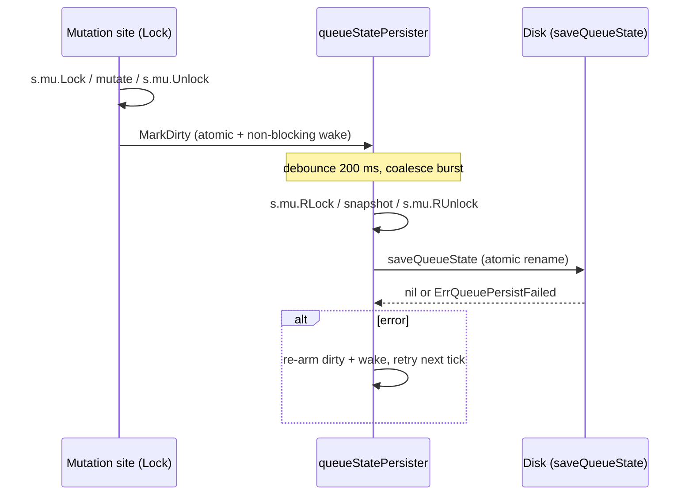
```mermaid
sequenceDiagram
    participant M as Mutation site (Lock)
    participant P as queueStatePersister
    participant D as Disk (saveQueueState)
    M->>M: s.mu.Lock / mutate / s.mu.Unlock
    M->>P: MarkDirty (atomic + non-blocking wake)
    Note over P: debounce 200 ms, coalesce burst
    P->>P: s.mu.RLock / snapshot / s.mu.RUnlock
    P->>D: saveQueueState (atomic rename)
    D-->>P: nil or ErrQueuePersistFailed
    alt error
        P->>P: re-arm dirty + wake, retry next tick
    end
```

*Diagram: Queue-state persist flow*

### Package layout

```
internal/core/routing/
    types.go                    — RouteEntry, AnnounceEntry, RouteTriple, Snapshot, RouteSource
    table.go                    — Table with all CRUD, query, disconnect, and wire-projection operations
    announce.go                 — AnnounceLoop: periodic (30s) + triggered announce_routes sender
    announce_builder.go         — BuildAnnounceSnapshot: 3-stage aggregation, AnnounceSnapshot, ComputeDelta
    announce_state.go           — AnnouncePeerState, AnnounceStateRegistry: per-peer send state lifecycle
    types_test.go               — unit tests for type invariants, validation, wire projection
    table_test.go               — unit tests for table operations and invariants
    announce_test.go            — unit tests for announce loop, triggered updates, split horizon
    announce_builder_test.go    — unit tests for aggregation, snapshot equality, delta, Extra normalization
    announce_state_test.go      — unit tests for per-peer state lifecycle, View/Record methods
    announce_loop_cache_test.go — integration tests for noop suppression, delta-only, failed send retry,
                                  rate limiting, reconnect forced full sync, withdrawal retry via delta

internal/core/node/
    table_router.go              — TableRouter: routing table lookup with gossip fallback
    routing_integration.go       — Service integration: announce_routes handling, session tracking,
                                   hop_ack confirmation, TTL loop, PeerSender implementation,
                                   connect-time full sync with empty-baseline support
    routing_provider.go          — RoutingProvider implementation on node.Service
    table_router_test.go         — unit tests for TableRouter
    routing_integration_test.go  — unit tests for routing integration

internal/core/rpc/
    routing_commands.go          — RegisterRoutingCommands: fetch_route_table, fetch_route_summary, fetch_route_lookup
    handler_routing_test.go      — unit tests for routing RPC commands
```

---

# Таблица маршрутизации — Distance Vector с Withdrawal

Связанная документация:

- [mesh.md](mesh.md) — обзор сетевого уровня
- [roadmap.md](roadmap.md) — полный план итераций
- [protocol.md](protocol.md) — протокол передачи данных

Исходники: `internal/core/routing/types.go`, `internal/core/routing/table.go`, `internal/core/routing/announce.go`, `internal/core/node/table_router.go`, `internal/core/node/routing_integration.go`, `internal/core/node/routing_provider.go`, `internal/core/rpc/routing_commands.go`

### Обзор

Пакет routing реализует таблицу маршрутизации на основе distance-vector для mesh-сети CORSA. Заменяет слепую gossip-доставку на направленную пересылку по метрике количества хопов. Gossip остаётся fallback, когда маршрут неизвестен.

### Основные типы

`RouteEntry` — единичный маршрут в таблице. Каждая запись уникально идентифицируется тройкой `(Identity, Origin, NextHop)` — получатель, кто изначально объявил маршрут, и peer, от которого мы его узнали. Две записи с одинаковой тройкой — один и тот же маршрут в разное время; побеждает запись с большим `SeqNo`.

`AnnounceEntry` — проекция `RouteEntry` для передачи по проводу. Содержит только четыре поля из `announce_routes` фреймов (Identity, Origin, Hops, SeqNo). Создаётся через `RouteEntry.ToAnnounceEntry()` или `Table.AnnounceTo()`. На провод уходит локальное значение hops отправителя как есть — получатель делает +1 при вставке в свою таблицу (receive path).

`Table` — потокобезопасное локальное хранилище маршрутов. Владеет identity ноды (`localOrigin`) и монотонным счётчиком SeqNo по каждому destination (`seqCounters`). Публичные операции: `AddDirectPeer`, `RemoveDirectPeer`, `UpdateRoute`, `WithdrawRoute`, `RefreshDirectPeers`, `TickTTL`, `Announceable`, `AnnounceTo`, `Lookup` и `Snapshot`.

`Snapshot` — иммутабельная копия таблицы на момент времени, безопасная для чтения без блокировок.

`AddDirectPeerResult` — результат подключения peer'а: `RouteEntry`, созданный или обновлённый, и флаг `Penalized`, указывающий, что flap detection применил укороченный TTL.

`RemoveDirectPeerResult` — результат отключения peer'а: wire-ready `[]AnnounceEntry` withdrawals (SeqNo уже инкрементирован, Hops=16) для own-origin direct-маршрутов, плюс количество transit-маршрутов, молча инвалидированных локально, плюс `ExposedBackups []PeerIdentity` — identity, у которых инвалидация обнажила выживший не-withdrawn backup route (используется `onPeerSessionClosed` для запуска дрейна).

`AnnounceSnapshot` — каноническое, агрегированное, peer-specific представление записей маршрутов, готовое к передаче. После полной агрегации каждая пара `(Identity, Origin)` присутствует не более одного раза. Записи отсортированы детерминированно по `(Identity, Origin)`. Создаётся через `BuildAnnounceSnapshot` (`routing/announce_builder.go`). Nil `*AnnounceSnapshot` означает «ни один snapshot ещё не отправлен» и семантически отличается от snapshot с нулём записей.

`AnnouncePeerState` — per-peer состояние отправки анонсов: последний успешно отправленный snapshot, timestamps попыток/успехов full sync и delta send, флаг `needsFullResync`, отслеживание disconnect для eviction. Все мутабельные поля доступны только через потокобезопасные методы (`View()`, `RecordFullSyncAttempt()`, `RecordFullSyncSuccess()`, `RecordDeltaSendSuccess()`). Владелец — `AnnounceStateRegistry`.

`AnnounceStateRegistry` — реестр per-peer `AnnouncePeerState`. Потокобезопасный для одновременного доступа из цикла анонсов и колбэков жизненного цикла сессий. Предоставляет `GetOrCreate`, `MarkDisconnected`, `MarkReconnected`, `EvictStale`, `MarkInvalid` и `Cleanup`. Disconnected-состояние удаляется через `2 * flapWindow`. Источник времени внедряется для тестов.

### Ключевые инварианты

**Origin-aware SeqNo.** Порядковые номера ограничены парой `(Identity, Origin)`. Только origin-нода может увеличивать SeqNo. Маршрут с большим SeqNo безусловно заменяет маршрут с меньшим для той же тройки. Для own-origin маршрутов `Table` владеет монотонным счётчиком (`seqCounters`) и автоматически инкрементирует его в `AddDirectPeer` и `RemoveDirectPeer`. Дисциплина SeqNo обеспечивается на уровне структуры данных, а не делегируется вызывающему коду.

**Ключ дедупликации.** Тройка `(Identity, Origin, NextHop)` уникально идентифицирует линию маршрута. Разные origin или разные NextHop создают независимые записи.

**Split horizon.** При формировании анонса для peer A маршруты с `NextHop == A` пропускаются. Фиктивный `hops=16` withdrawal не отправляется — это нарушило бы инвариант per-origin SeqNo.

**Семантика withdrawal.** Отзыв маршрута устанавливает `Hops = 16` (бесконечность) и требует строго `SeqNo > old.SeqNo`. На проводе только origin может отправить withdrawal. При отключении peer'а `RemoveDirectPeer` отзывает own-origin direct-маршруты (возвращаются как wire-ready `[]AnnounceEntry` с уже инкрементированным SeqNo) и молча инвалидирует transit-маршруты локально. Транзитные ноды не генерируют wire-withdrawal для чужих маршрутов.

**Иерархия доверия.** Для каждой тройки: `direct > hop_ack > announcement`. При одинаковом SeqNo источник с более высоким доверием заменяет менее доверенный. Подтверждение одной тройки через hop_ack не влияет на другие тройки, даже при общем NextHop.

**Порядок выбора маршрута.** `Lookup()` сортирует по приоритету source (direct > hop_ack > announcement), затем по hops ascending в пределах одного уровня source. Direct-маршрут с 3 хопами предпочитается announcement с 1 хопом — доверие к источнику важнее количества хопов.

**Истечение TTL.** Learned-маршруты (из анонсов и hop_ack) имеют `ExpiresAt` (по умолчанию 120с с момента вставки). `TickTTL()` удаляет истёкшие записи и возвращает слайс identity, у которых истечение обнажило выживший не-withdrawn backup route — `routingTableTTLLoop` использует это для запуска `drainPendingForIdentities` и немедленной доставки через backup. Learned-маршруты обновляются естественным образом при переанонсировании соседом. Когда переанонс с тем же SeqNo приходит для expired записи, `UpdateRoute` принимает его как валидное обновление — origin не менял маршрут, а просто переподтверждает его.

**Жизненный цикл direct-маршрутов.** Own-origin direct-маршруты используют `ExpiresAt=zero` (никогда не истекают по времени). Их жизненный цикл полностью управляется сессией: `AddDirectPeer` создаёт при подключении сокета, `RemoveDirectPeer` отзывает при закрытии сокета. Это event-driven подход — периодическое обновление TTL не требуется. `RemoveDirectPeer` устанавливает `Hops=HopsInfinity` и `ExpiresAt=now+defaultTTL` на отозванной записи, создавая tombstone, который `TickTTL` уберёт после стандартного TTL. Такой дизайн устраняет класс гонок, при которых `TickTTL` мог безвозвратно удалить активный direct-маршрут между циклами `RefreshDirectPeers`, делая подключённый peer невидимым для таблицы маршрутизации.

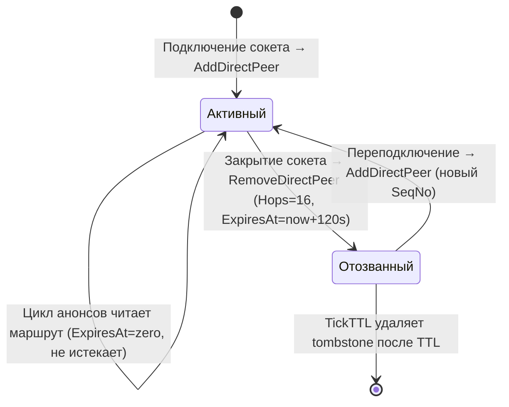
```mermaid
stateDiagram-v2
    [*] --> Активный: Подключение сокета → AddDirectPeer
    Активный --> Активный: Цикл анонсов читает маршрут (ExpiresAt=zero, не истекает)
    Активный --> Отозванный: Закрытие сокета → RemoveDirectPeer (Hops=16, ExpiresAt=now+120s)
    Отозванный --> [*]: TickTTL удаляет tombstone после TTL
    Отозванный --> Активный: Переподключение → AddDirectPeer (новый SeqNo)
```
*Диаграмма — Жизненный цикл direct-маршрута: event-driven, без истечения TTL*

**NextHop — это identity peer'a.** Маршрутизация работает на уровне identity, а не транспортных адресов. Один peer identity может иметь несколько параллельных TCP-сессий; выбор сессии происходит позже в `node.Service` через индекс identity→session(s) для резолва identity в активные соединения.

**Валидация записей.** `RouteEntry.Validate()` проверяет структурные инварианты при вставке: Identity, Origin и NextHop не должны быть пустыми; Hops в диапазоне [1, 16]. Source-specific правила: direct-маршруты (`RouteSourceDirect`) должны иметь `Hops=1` и `NextHop == Identity` (непосредственный сосед). Невалидные записи отклоняются в `UpdateRoute` до захвата блокировок. Дополнительно, `UpdateRoute` проверяет origin для direct-маршрутов: когда `localOrigin` сконфигурирован, запись `RouteSourceDirect` с `Origin != localOrigin` отклоняется с `ErrDirectForeignOrigin`. Это предотвращает инъекцию невозможных direct-маршрутов с чужим origin, которые превосходили бы все announcement/hop_ack маршруты в `Lookup` и никогда не попадали бы под own-origin withdrawal при disconnect.

**Граница wire-проекции.** Граница между table-моделью и wire-форматом явная: `AnnounceTo(excludeVia)` возвращает `[]AnnounceEntry` с applied split horizon. На провод уходит локальное значение hops — +1 не применяется на стороне отправителя; получатель делает +1 при вставке в свою таблицу . `RemoveDirectPeer` возвращает wire-ready `[]AnnounceEntry` withdrawals с уже инкрементированным SeqNo. Caller'ы, формирующие `announce_routes` фреймы, используют `AnnounceTo` или результаты `RemoveDirectPeer` напрямую — ручная арифметика не нужна.

**Консистентность счётчика SeqNo.** Когда `UpdateRoute` принимает own-origin запись (где `Origin == localOrigin`), он синхронизирует монотонный счётчик: `seqCounters[identity] = max(counter, entry.SeqNo)`. Это гарантирует, что таблицы, предзаполненные через `UpdateRoute` (например, восстановленные из snapshot или полученные через full sync), не приведут к тому, что следующий `AddDirectPeer`/`RemoveDirectPeer` выдаст устаревший SeqNo.

### Интеграция

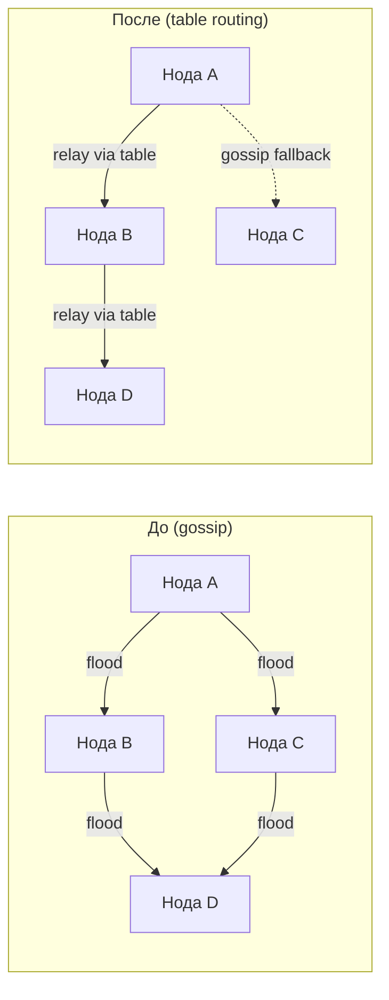
```mermaid
flowchart LR
    subgraph Before["До (gossip)"]
        A1[Нода A] -->|flood| B1[Нода B]
        A1 -->|flood| C1[Нода C]
        B1 -->|flood| D1[Нода D]
        C1 -->|flood| D1
    end

    subgraph After["После (table routing)"]
        A2[Нода A] -->|relay via table| B2[Нода B]
        B2 -->|relay via table| D2[Нода D]
        A2 -.->|gossip fallback| C2[Нода C]
    end
```
*Диаграмма — Доставка сообщений: gossip flood vs table-directed relay*

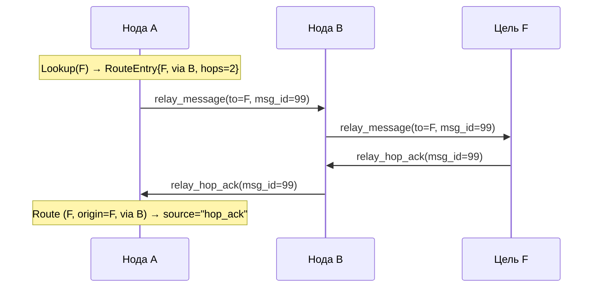
```mermaid
sequenceDiagram
    participant A as Нода A
    participant B as Нода B
    participant F as Цель F

    Note over A: Lookup(F) → RouteEntry{F, via B, hops=2}
    A->>B: relay_message(to=F, msg_id=99)
    B->>F: relay_message(to=F, msg_id=99)
    F->>B: relay_hop_ack(msg_id=99)
    B->>A: relay_hop_ack(msg_id=99)
    Note over A: Route (F, origin=F, via B) → source="hop_ack"
```
*Диаграмма — Table-directed relay с подтверждением hop_ack*

**Сходимость.** Цикл анонсов (`routing/announce.go`) выполняет периодические анонсы каждые 30 секунд и поддерживает triggered updates при connect/disconnect событиях. Входящие `announce_routes` фреймы обрабатываются `handleAnnounceRoutes` в `node/routing_integration.go` — каждый маршрут получает +1 хоп на стороне получателя. Withdrawals (hops=16) применяются через `Table.WithdrawRoute`, но только от origin-отправителя (`Origin == senderIdentity`). Когда `WithdrawRoute` получает withdrawal для невиданной тройки (identity, origin, nextHop), он создаёт tombstone-запись (hops=HopsInfinity) с SeqNo из withdrawal. Это предотвращает воскрешение отозванного lineage задержанным старым анонсом — SeqNo tombstone блокирует любое устаревшее обновление для той же тройки. Tombstone'ы истекают через стандартный TTL. Capability `mesh_routing_v1` теперь рекламируется при handshake. Цикл анонсов охватывает как outbound-сессии, так и inbound-only соединения. Обнаружение целей через `routingCapablePeers()` требует наличия обеих capability: `mesh_routing_v1` и `mesh_relay_v1` — routing-only peer (без relay) исключается, поскольку маршруты через него создавали бы недоставляемые пути.

**Валидация receive-path.** `handleAnnounceRoutes` обеспечивает три инварианта безопасности перед принятием любого wire-анонса: (1) **Валидация identity отправителя** — identity отправителя должна быть валидным 40-символьным lowercase hex fingerprint (`identity.IsValidAddress`). Для inbound-соединений identity берётся из `connPeerHello.identity` (поле `Address` hello-фрейма), а не из `connPeerHello.address` (listen-адрес для health-трекинга). Это различие критично для NATed peer'ов, которые рекламируют нероутабельный listen-адрес (например, `127.0.0.1:64646`) — использование listen-адреса как routing identity привело бы к отклонению всех анонсов от таких peer'ов как malformed. Для outbound-сессий identity берётся из `session.peerIdentity` (устанавливается из welcome-фрейма). (2) **Отклонение own-origin** — анонсы с `Origin == localIdentity` от чужого отправителя молча отбрасываются. Только эта нода может порождать маршруты под своей identity; принятие поддельной own-origin записи позволило бы соседу отравить монотонный счётчик SeqNo через `syncSeqCounterLocked`. (3) **Отклонение transit withdrawal** — wire withdrawals (`hops >= 16`) где `Origin != senderIdentity` молча отбрасываются. Только origin может генерировать wire withdrawal; transit-ноды должны инвалидировать локально и прекращать рекламировать маршрут. Все три проверки выполняются до `UpdateRoute`/`WithdrawRoute`, чтобы некорректные данные не попадали в таблицу.

**Гейт capability для прямых маршрутов.** `onPeerSessionEstablished(peerIdentity, hasRelayCap)` принимает флаг `hasRelayCap`, контролирующий вызов `AddDirectPeer`. Прямой маршрут в distance-vector таблице объявляет, что эта нода может ретранслировать DM до назначения. Если peer не может принимать фреймы `relay_message` (legacy или gossip-only нода), маршрут будет недоставляемым — другие routing-capable ноды узнают путь, который молча сбоит на последнем хопе. Outbound вызов передаёт `sessionHasCapability(address, capMeshRelayV1)`. Inbound вызов передаёт `connHasCapability(conn, capMeshRelayV1)`. Peer'ы без `mesh_relay_v1` по-прежнему подключаются и обмениваются gossip нормально, но никогда не рекламируются как direct destinations в routing table.

**Multi-session identity с двойными счётчиками.** `node.Service` ведёт два per-identity счётчика: `identitySessions` (всего активных сессий) и `identityRelaySessions` (только relay-capable сессий). `AddDirectPeer()` вызывается при переходе `identityRelaySessions` 0→1 (первая relay-capable сессия). `RemoveDirectPeer()` вызывается при переходе `identityRelaySessions` 1→0 (последняя relay-capable сессия закрывается). Это означает, что non-relay первая сессия не блокирует создание direct route более поздней relay сессией, и закрытие последней relay сессии отзывает маршрут, даже если legacy сессии остаются. `onPeerSessionClosed(peerIdentity, hasRelayCap)` зеркально использует флаг `hasRelayCap` для поддержания баланса обоих счётчиков. Очистка total session count происходит независимо.

**Полная синхронизация таблицы при подключении.** Как outbound, так и inbound пути подключения отправляют немедленную полную синхронизацию таблицы (`routingTable.AnnounceTo(peerIdentity)`) новому подключённому peer'у. Это обеспечивает симметричную начальную сходимость независимо от направления подключения. Синхронизация закрыта гейтом обеих capability: `mesh_routing_v1` и `mesh_relay_v1` — в соответствии с контрактом цикла анонсов. Routing-only peer (mesh_routing_v1 без mesh_relay_v1) получил бы маршруты, которые он не может доставить на data plane, поэтому исключается из connect-time синхронизации. Outbound-путь проверяет `sessionHasCapability(address, capMeshRoutingV1) && sessionHasCapability(address, capMeshRelayV1)` в `establishPeerSession`. Inbound-путь проверяет `connHasCapability(conn, capMeshRoutingV1) && connHasCapability(conn, capMeshRelayV1)` в `trackInboundConnect`. Оба пути передают Ed25519 identity fingerprint peer'а (`peerIdentity`) в `AnnounceTo` — не transport/listen адрес. Это критично для NATed inbound peer'ов, чей listen-адрес (например, `127.0.0.1:64646`) отличается от fingerprint'а; передача transport-адреса сломала бы фильтрацию split horizon. Legacy peer'ы без любой из capability пропускаются без ошибки. Применяется split horizon — маршруты, полученные от подключающегося peer'a, исключаются. Если результирующий peer-specific snapshot пуст (например, единственный маршрут — это direct route самого peer'а, исключённый split horizon), baseline записывается без отправки wire-кадра (empty-baseline); последующие циклы анонсов используют delta path как обычно. Если отправка не удалась (очередь сессии переполнена, соединение потеряно между handshake и sync), записывается предупреждение (`routing_outbound_full_sync_failed` или `routing_inbound_full_sync_failed`). Peer всё равно получит таблицу в следующем периодическом цикле анонсов.

**Демпфирование flap'ов.** Routing table отслеживает частоту отключений per-peer для предотвращения спама маршрутами при нестабильных линках. Каждый вызов `RemoveDirectPeer` записывает timestamp отключения. Когда peer накапливает `flapThreshold` (по умолчанию 3) отключений в пределах `flapWindow` (по умолчанию 120с), он переходит в состояние hold-down на `holdDownDuration` (по умолчанию 30с). В режиме hold-down `AddDirectPeer` по-прежнему создаёт маршрут (связность сохраняется), но флаг `AddDirectPeerResult.Penalized` сигнализирует caller'у, что triggered announce должен быть подавлен — маршрут будет подхвачен следующим периодическим циклом анонсов, снижая спам анонсами. Direct-маршруты не имеют TTL (см. Жизненный цикл direct-маршрутов выше), поэтому демпфирование flap'ов влияет только на тайминг анонсов, а не на истечение маршрутов. `TickTTL` очищает устаревшее flap-состояние после истечения и hold-down, и flap window. Все пороги настраиваются через опции `WithFlapWindow`, `WithFlapThreshold`, `WithHoldDownDuration` и `WithPenalizedTTL`.

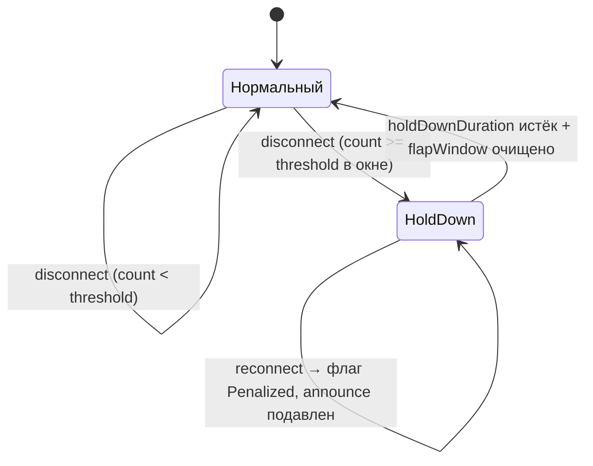
```mermaid
stateDiagram-v2
    [*] --> Нормальный
    Нормальный --> Нормальный: disconnect (count < threshold)
    Нормальный --> HoldDown: disconnect (count >= threshold в окне)
    HoldDown --> HoldDown: reconnect → флаг Penalized, announce подавлен
    HoldDown --> Нормальный: holdDownDuration истёк + flapWindow очищено
```
*Диаграмма — Конечный автомат обнаружения flap'ов*

**Решение о доставке исходящего DM.** Когда `storeIncomingMessage` маршрутизирует DM, `TableRouter.Route()` возвращает `RoutingDecision`, содержащий `RelayNextHop` (identity), `RelayNextHopAddress` (валидированный транспортный адрес или `"inbound:"` ключ) и `RelayNextHopHops` (количество хопов из маршрута). Send path (`sendTableDirectedRelay`) использует предвалидированный адрес напрямую — без повторного резолва — чтобы избежать выбора другой сессии того же peer'а с более слабым набором capability. Если предвалидированный адрес пуст (путь повтора), повторный резолв использует `resolveRouteNextHopAddress` с оригинальной ролью хопа: destination (hops=1) требует только `mesh_relay_v1`; transit (hops>1) требует оба — `mesh_relay_v1` и `mesh_routing_v1`. Если повторный резолв или отправка не удались — срабатывает gossip fallback. Как outbound-сессии, так и inbound-only соединения пригодны как relay next-hop. Персистенция relay state (`relayForwardState`) проверяется на обоих путях (outbound и inbound) — если store отклоняет запись (дублирование message ID или превышение лимита), отправка считается неудачной (возвращается false) и записывается предупреждение (`relay_state_store_failed_outbound` / `relay_state_store_failed_inbound`). Это гарантирует, что caller видит доставку как неудачную и может откатиться к gossip, а не молча терять контекст hop_ack и маршрутизации receipt'ов.

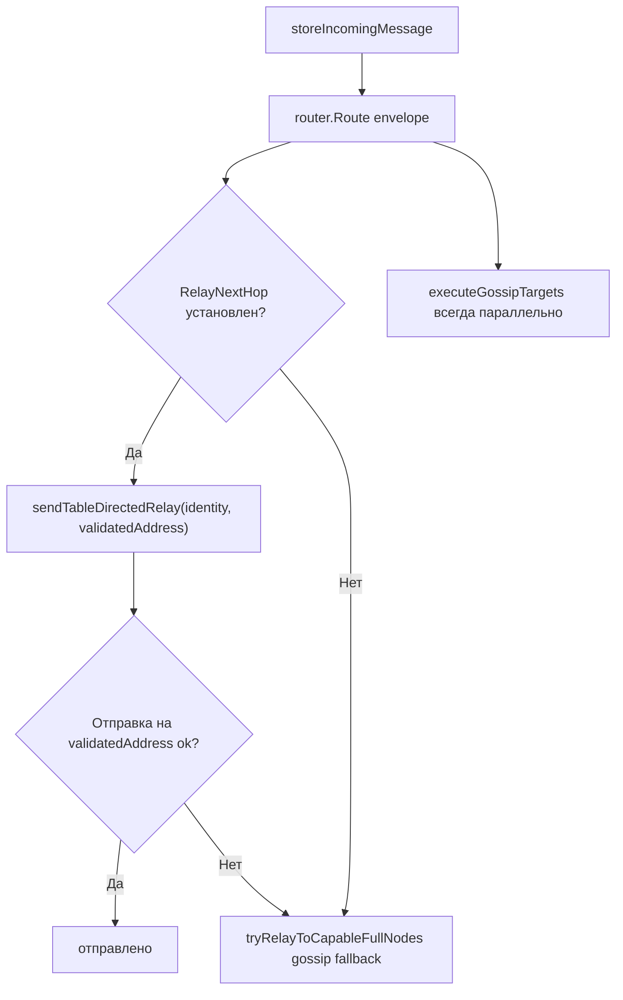
```mermaid
flowchart TD
    A[storeIncomingMessage] --> B[router.Route envelope]
    B --> C{RelayNextHop установлен?}
    C -- Да --> D["sendTableDirectedRelay(identity, validatedAddress)"]
    D --> E{Отправка на validatedAddress ok?}
    E -- Да --> Z[отправлено]
    E -- Нет --> G[tryRelayToCapableFullNodes gossip fallback]
    C -- Нет --> G
    B --> H[executeGossipTargets всегда параллельно]
```
*Диаграмма — Решение о доставке исходящего DM: table route vs gossip*

**Решение о доставке на промежуточном relay hop.** Когда `handleRelayMessage` обрабатывает транзитный relay, он пробует три стратегии по порядку: прямой peer (получатель подключён локально), lookup в routing table (`tryForwardViaRoutingTable`), и blind gossip (`relayViaGossip`). Если все не сработали — сообщение сохраняется локально, gossip берёт на себя доставку. Когда `tryForwardViaRoutingTable` выбирает маршрут, он возвращает `tableForwardResult`, содержащий транспортный адрес и поле `Origin` маршрута. `RouteOrigin` сохраняется в `relayForwardState`, чтобы `confirmRouteViaHopAck` на этом промежуточном узле мог ограничить подтверждение hop_ack точной тройкой `(Identity, Origin, NextHop)` — аналогично поведению на origin-ноде.

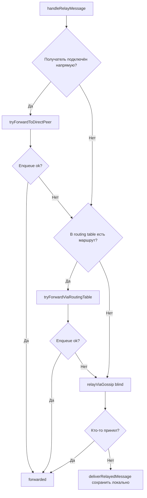
```mermaid
flowchart TD
    A[handleRelayMessage] --> B{Получатель подключён напрямую?}
    B -- Да --> C[tryForwardToDirectPeer]
    C --> D{Enqueue ok?}
    D -- Да --> Z[forwarded]
    D -- Нет --> E{В routing table есть маршрут?}
    B -- Нет --> E
    E -- Да --> F[tryForwardViaRoutingTable]
    F --> G{Enqueue ok?}
    G -- Да --> Z
    G -- Нет --> H[relayViaGossip blind]
    E -- Нет --> H
    H --> I{Кто-то принял?}
    I -- Да --> Z
    I -- Нет --> J[deliverRelayedMessage сохранить локально]
```
*Диаграмма — Промежуточный relay hop: прямой peer → table route → gossip*

**Контракт gossip fallback (release-blocking).** `TableRouter` в `node/table_router.go` реализует интерфейс `Router`. Он обращается к routing table за направленным next-hop; если нет пригодного маршрута или сессии — доставка деградирует в gossip прозрачно. Триггеры fallback: `Lookup()` возвращает пустой результат, identity `RelayNextHop` не имеет активной сессии, peer `RelayNextHop` не имеет требуемых capability (relay-only для destinations, оба relay+routing для transit hops). `GossipTargets` всегда заполняются в каждом `RoutingDecision`. Тот же fallback работает на каждом уровне: origin-нода (`sendTableDirectedRelay`), промежуточный hop (`tryForwardViaRoutingTable`) и `TableRouter.Route()`.

**Выбор gossip-целей: merge сессий и pending-peer'ов.** `routingTargetsFiltered` в `node/routing_integration.go` строит список gossip-целей из двух источников: (1) активные outbound-сессии со здоровыми соединениями (ранжированы по health, лимит 3), и (2) известные peer'ы без активных сессий, достижимые через pending queue (`queuePeerFrame` → `flushPendingPeerFrames` при установлении сессии). Когда scored session targets существуют, оставшиеся слоты fanout (до 3 суммарно) заполняются non-session peer'ами. Когда сессий нет вообще (bootstrap-сценарий), все matching peer'ы возвращаются без лимита. **Дедупликация fallback-порта:** когда сессия подключена через fallback-порт (например `host:64646` вместо канонического `host:7777`), и ключ сессии, и канонический адрес (разрешённый через `dialOrigin`) помечаются в `sessionSeen`, предотвращая появление одного физического хоста и как active session target, и как pending peer — что тратило бы fanout-слот на дубликат. Этот merge предотвращает timing hole, при которой сообщение, пришедшее до установления всех сессий, gossip'ится только обратно к отправителю (единственная активная сессия) и никогда не достигает forward-peer'ов — после чего dedup `seen[ID]` навсегда блокирует повторный gossip при последующих попытках. Non-session peer'ы получают свои фреймы через `sendMessageToPeer`, который пытается доставку в три уровня: (1) outbound-сессия через `enqueuePeerFrame`; (2) прямая запись в аутентифицированное inbound-соединение через `inboundConnForAddressLocked` — покрывает типичный случай, когда peer уже подключился к нам (inbound), но outbound-сессия отсутствует (CM-слот заполнен); (3) `queuePeerFrame`, буферизующий фрейм в pending queue для отложенной доставки. Inbound direct path (`mode="inbound_direct"` в логе gossip_message_attempt) — основное исправление timing hole, при которой inbound-соединение peer'а уже аутентифицировано к моменту прихода gossip-фрейма — прямая запись полностью обходит очередь. Для уже поставленных в очередь фреймов существуют три триггера дрейна: (1) установление outbound-сессии вызывает `flushPendingPeerFrames`, отправляющий все pending-фреймы через `sendCh` сессии; (2) аутентификация inbound-соединения вызывает `flushPendingFireAndForget` в `trackInboundConnect`, записывающий fire-and-forget фреймы (`push_message`, `push_notice`) напрямую в inbound TCP-соединение; (3) routing events запускают `drainPendingForIdentities` для `send_message` фреймов. Inbound-дрейн в `trackInboundConnect` покрывает обратный тайминг: фрейм поставлен в очередь до аутентификации inbound-соединения. Только fire-and-forget фреймы безопасны для записи на inbound conn, поскольку не ожидают ответа, который мог бы перемешаться с request/reply dispatch loop peer'а. Request/reply фреймы (send_message, relay_message) должны ждать outbound-сессии.

**Event-driven дрейн pending queue.** Когда маршрут до целевого identity становится доступным — будь то подключение прямого peer'а (старт `servePeerSession`), изучение транзитного маршрута через `announce_routes` (`handleAnnounceRoutes`), переподключившийся peer переанонсирующий ту же неизменённую routing table (`handleAnnounceRoutes` со статусом `RouteUnchanged`), withdrawal маршрута, обнажающий выживший backup route (`WithdrawRoute` с последующей проверкой `Lookup`), истечение TTL маршрута, обнажающее выживший backup (`TickTTL` возвращает exposed identities в `routingTableTTLLoop`), или локальный disconnect peer'а, инвалидирующий маршруты через ушедший next-hop, но обнажающий backup через другой next-hop (`RemoveDirectPeer` / `InvalidateTransitRoutes` возвращают `ExposedBackups` в `onPeerSessionClosed`) — нода немедленно сканирует свою pending queue на наличие собственных исходящих `send_message` фреймов, адресованных этому identity, и пытается доставить их через вновь доступный маршрут. Это event-driven оптимизация, которая устраняет два источника задержки: ожидание переподключения исходного peer'а (`flushPendingPeerFrames`) и ожидание срабатывания relay retry loop (каждые 2 секунды). Drain goroutine запускается из `servePeerSession` (не из `onPeerSessionEstablished`), чтобы `inboxCh` уже активно читался — запуск раньше создаёт `s.mu.Lock()` contention, который задерживает установление сессии и может вызвать overflow `inboxCh` под конкурентной нагрузкой. Дрейнится только `send_message` — остальные типы фреймов не восстанавливаются через routing table: `relay_message` и `announce_peer` — чужой трафик, обрабатываемый relay retry loop и peer session flush; `relay_delivery_receipt` доставляется через hop-цепочку `relayStates` (`lookupReceiptForwardTo`), а не через routing table, поэтому новый маршрут до Recipient receipt'а не создаёт для него путь доставки. Функция `drainPendingForIdentities` в `routing_integration.go` использует паттерн extract-attempt-return: matching-фреймы атомарно извлекаются из pending queue под блокировкой (что исключает повторную обработку одного фрейма конкурентными goroutine), доставка выполняется вне блокировки через `sendRelayToAddress` (возвращающий определённый сигнал успеха/неудачи), а фреймы с неудавшейся доставкой возвращаются на свои исходные позиции в pending queue с помощью index-based реконструкции — фаза извлечения записывает `origIdx` каждого фрейма и метаданные per-address (`origLen`, `extractedPos`), а фаза возврата проходит по диапазону исходных позиций, чередуя kept- и returning-фреймы, чтобы `flushPendingPeerFrames` — доставляющий в порядке слайса — сохранял точный порядок доставки DM между recipient'ами, разделяющими один peer address, после route churn. Фреймы, добавленные другими goroutine во время разблокированного окна доставки, дописываются в конец. Счётчик retry инкрементируется только когда была реальная попытка доставки (маршрут существовал, адрес разрешён, `sendRelayToAddress` был вызван) — когда пригодного маршрута нет (`RelayNextHop == nil` или адрес неразрешим), фрейм возвращается в pending queue без траты retry-бюджета и без перехода outbound-состояния — `Status` остаётся `"queued"`, а `LastAttemptAt` не обновляется, сохраняя семантику, что `"retrying"` в outbound-состоянии означает реальную попытку сетевого handoff. Фрейм ожидает будущих drain-циклов, запускаемых последующими routing-событиями. При достижении `maxPendingFrameRetries` после реальных неудач фрейм помечается терминальным вместо возврата — соответствуя retry-контракту `flushPendingPeerFrames`. Истёкшие фреймы обнаруживаются и помечаются терминальными во время сканирования. Все изменения outbound-состояния (terminal, retrying, cleared) собираются как отложенные действия в цикле доставки и применяются под блокировкой вместе с возвратом в pending queue одним persist'ом — ни одной промежуточной записи в `queue-*.json` не происходит во время дрейна. Это устраняет crash-loss window, которое возникло бы, если бы `markOutboundTerminal`, `markOutboundRetrying` или `clearOutboundQueued` persist'или посреди цикла, когда извлечённые фреймы отсутствуют в `s.pending`. Когда `handleAnnounceRoutes` обрабатывает один announce, и принятые (новые/улучшенные), и неизменённые (подтверждённые живые) identity батчируются в один drain-набор. Отклонённые маршруты (устаревший SeqNo, заблокированные tombstone) не участвуют в дрейне. Лог `announce_routes_processed` выдаёт три счётчика — `accepted`, `unchanged`, `rejected` — чтобы операторы могли отличить новые routing-события от штатных подтверждений. Эта трёхстатусная классификация использует `RouteUpdateStatus` (`RouteAccepted`, `RouteUnchanged`, `RouteRejected`), возвращаемый `UpdateRoute`.

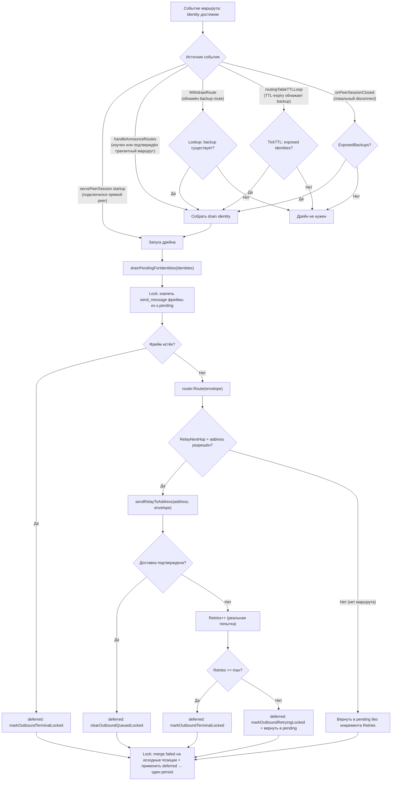
```mermaid
flowchart TD
    A["Событие маршрута: identity достижим"] --> B{Источник события}
    B -- "servePeerSession startup<br/>(подключился прямой peer)" --> C[Запуск дрейна]
    B -- "handleAnnounceRoutes<br/>(изучен или подтверждён транзитный маршрут)" --> D[Собрать drain identity]
    B -- "WithdrawRoute<br/>(обнажён backup route)" --> W{"Lookup: backup существует?"}
    W -- Да --> D
    W -- Нет --> Z[Дрейн не нужен]
    B -- "routingTableTTLLoop<br/>(TTL-expiry обнажает backup)" --> T{"TickTTL: exposed identities?"}
    T -- Да --> D
    T -- Нет --> Z
    B -- "onPeerSessionClosed<br/>(локальный disconnect)" --> P2{"ExposedBackups?"}
    P2 -- Да --> D
    P2 -- Нет --> Z
    D --> C
    C --> E["drainPendingForIdentities(identities)"]
    E --> F["Lock: извлечь send_message фреймы из s.pending"]
    F --> G{Фрейм истёк?}
    G -- Да --> H["deferred: markOutboundTerminalLocked"]
    G -- Нет --> I["router.Route(envelope)"]
    I --> J{"RelayNextHop + address разрешён?"}
    J -- Да --> K["sendRelayToAddress(address, envelope)"]
    K --> M{Доставка подтверждена?}
    M -- Да --> N["deferred: clearOutboundQueuedLocked"]
    M -- Нет --> P["Retries++ (реальная попытка)"]
    P --> PA{"Retries >= max?"}
    PA -- Да --> Q["deferred: markOutboundTerminalLocked"]
    PA -- Нет --> R["deferred: markOutboundRetryingLocked + вернуть в pending"]
    J -- "Нет (нет маршрута)" --> NR["Вернуть в pending без инкремента Retries"]
    H & N & Q & R & NR --> S["Lock: merge failed на исходные позиции + применить deferred → один persist"]
```
*Диаграмма — Event-driven дрейн pending queue при обнаружении маршрута*

**Подтверждение маршрута через hop_ack.** При получении `relay_hop_ack` со статусом "delivered" или "forwarded", routing table промоутит маршрут через отправителя ack в `source=hop_ack` через `confirmRouteViaHopAck`. Транспортный адрес отправителя ack (`senderAddress` в `handleRelayHopAck`) — это достоверно правильный next-hop, даже при gossip fan-out, когда несколько peer'ов получили relay_message, но только один реально доставил. Identity peer'а резолвится из транспортного адреса и сопоставляется с записями routing table. Для table-directed relay `RouteOrigin`, сохранённый в `relayForwardState`, ограничивает подтверждение точной тройкой `(Identity, Origin, NextHop)`, которая доставляла сообщение — другие origin'ы с тем же NextHop не затрагиваются. `RouteOrigin` сохраняется на каждом хопе relay-цепочки: на origin-ноде (через `sendRelayMessageWithOrigin` / `sendRelayToAddress`) и на промежуточных хопах (через `tryForwardViaRoutingTable`, возвращающий `tableForwardResult` с `RouteOrigin`). Для gossip-originated relay (без конкретной тройки, `RouteOrigin` пуст) промоутится первый matching NextHop в порядке Lookup. Оба пути relay (outbound и inbound) сохраняют `relayForwardState`, обеспечивая поведенческую эквивалентность независимо от направления соединения.

**Делегирование TTL-политики.** Полученные анонсы оставляют `ExpiresAt` нулевым при формировании `RouteEntry` в `handleAnnounceRoutes`. `Table.UpdateRoute` заполняет его, используя собственные `clock` и `defaultTTL` таблицы. Это гарантирует, что все маршруты (direct через `AddDirectPeer`, learned через announcements) следуют одной TTL-политике, и таблицы, созданные с `WithDefaultTTL` или `WithClock`, ведут себя консистентно для всех источников маршрутов.

**Гейт relay для announce_routes (routing-only peer'ы).** Peer, который согласовал `mesh_routing_v1`, но не `mesh_relay_v1`, может участвовать в control plane (получать и отправлять анонсы маршрутов), но не может нести трафик data plane (`relay_message`). Принятие маршрутов от таких peer'ов создало бы записи, указывающие на next-hop, который молча отбрасывает ретранслируемые сообщения. Для предотвращения рассогласования control-plane/data-plane оба пути диспатча `announce_routes` (inbound и outbound) применяют relay-гейт: входящие фреймы от соединений без `mesh_relay_v1` молча отклоняются (`connHasCapability(conn, capMeshRelayV1)` в обработчике `announce_routes`), а цикл исходящих анонсов пропускает сессии без `mesh_relay_v1` (`sessionHasCapability(address, capMeshRelayV1)` в отправителе анонсов). Этот гейт работает независимо от `mesh_routing_v1` — peer должен иметь обе capability для участия в обмене маршрутами.

**Инвалидация транзитных маршрутов для routing-only peer'ов.** Когда закрывается последняя общая сессия routing-only peer'a (relay-capable сессии никогда не были активны), `onPeerSessionClosed` вызывает `Table.InvalidateTransitRoutes(peerIdentity)` как защитную меру (defense-in-depth). Метод помечает все транзитные маршруты (не-direct, hops < 16) с `NextHop == peerIdentity` как отозванные (hops=16) без инкрементации SeqNo (только локальная инвалидация — wire withdrawal не генерируется). Direct-маршруты пропускаются, поскольку их жизненный цикл управляется через `RemoveDirectPeer`. Когда хотя бы один маршрут инвалидирован, `announceLoop.TriggerUpdate()` запускает немедленный цикл анонсов, чтобы соседи узнали об отозванных маршрутах без ожидания следующего периодического цикла (до 30с). При нормальной работе relay-гейт announce_routes предотвращает попадание маршрутов от routing-only peer'ов в таблицу. `InvalidateTransitRoutes` защищает от пограничных случаев: маршруты, усвоенные до полного согласования capability, или устаревшие записи от предыдущей relay-capable сессии того же identity. Метод возвращает количество инвалидированных маршрутов для логирования.

**Параллельный fan-out withdrawal'ов при disconnect.** Когда закрывается последняя relay-capable сессия direct peer'а, `onPeerSessionClosed` в `node/routing_integration.go` обязан доставить own-origin wire-withdrawal'ы из `RemoveDirectPeer.Withdrawals` каждому routing-capable peer'у немедленно — иначе announce-цикл задержит доставку до следующего периодического прохода (до 30s). Fan-out реализован в dedicated helper'е `fanoutAnnounceRoutes(ctx, targets, withdrawals) (sent, dropped int)`. Контракт: (1) одна goroutine на target, один залипший inbound socket не сериализует доставку остальным; (2) per-peer bound = `syncFlushTimeout` (по умолчанию 5s) из `SendAnnounceRoutes → writeFrameToInbound → sendFrameBytesViaNetworkSync`; (3) wall-clock bound = `syncFlushTimeout` самого медленного peer'а, а не `N × syncFlushTimeout` — это свойство не даёт peer-cleanup'у душить 1s metrics collector и 2s `bootstrapLoop` под writer-preferring `sync.RWMutex`; (4) общая отмена через `s.runCtx`, при shutdown'е горутины делают ранний exit и инкрементят `dropped`; (5) shared state = только два `atomic.Int32`-счётчика, `Service`-карты не мутируются; `writeFrameToInbound` сам берёт короткий `s.mu.RLock` и отпускает его до блокирующей отправки; (6) `crashlog.DeferRecover()` в каждой горутине, паника одного target'а не оставит WaitGroup повисшим; (7) лог `routing_direct_peer_removed` содержит поля `fanout_sent`/`fanout_dropped`, расхождение `sent ≪ dropped` — прямой сигнал о залипших inbound сокетах (NAT-hairpin half-dead TCP) без stack trace'ов. Регрессионные тесты: `TestOnPeerSessionClosed_FanoutIsParallel`, `TestOnPeerSessionClosed_FanoutRespectsRunCtx`, `TestOnPeerSessionClosed_NoPanicOnZeroPeers`, `TestOnPeerSessionClosed_CollectsSentAndDroppedCounters` в `node/routing_integration_fanout_test.go`.

```mermaid
sequenceDiagram
    participant CL as Cleanup goroutine<br/>(onPeerSessionClosed)
    participant RT as routing.Table
    participant FO as fanoutAnnounceRoutes
    participant G1 as goroutine P1
    participant G2 as goroutine P2<br/>(залипший inbound)
    participant G3 as goroutine P3
    participant N as netcore

    CL->>RT: RemoveDirectPeer(identity)
    RT-->>CL: Withdrawals, ExposedBackups, TransitInvalidated
    CL->>CL: routingCapablePeers() под s.mu.RLock
    CL->>FO: fanoutAnnounceRoutes(runCtx, targets, withdrawals)
    FO->>G1: go SendAnnounceRoutes(P1, w)
    FO->>G2: go SendAnnounceRoutes(P2, w)
    FO->>G3: go SendAnnounceRoutes(P3, w)
    par P1 (быстрый)
        G1->>N: SendRawSync
        N-->>G1: ok (~ms)
        G1->>FO: sent++
    and P2 (залипший inbound, ограничен per-peer)
        G2->>N: SendRawSync
        Note over G2,N: блокируется до syncFlushTimeout (5s)
        N-->>G2: ErrSendTimeout → Close
        G2->>FO: dropped++
    and P3 (быстрый)
        G3->>N: SendRawSync
        N-->>G3: ok (~ms)
        G3->>FO: sent++
    end
    FO-->>CL: sent=2, dropped=1 (wg.Wait завершается)
    CL->>CL: лог routing_direct_peer_removed<br/>fanout_sent=2, fanout_dropped=1
    CL->>CL: eventBus.Publish(TopicRouteTableChanged)
    CL->>CL: announceLoop.TriggerUpdate()
```
*Диаграмма — Параллельный disconnect fan-out: одна goroutine на target, wall-clock ограничен самым медленным peer'ом*

### RPC-наблюдаемость

Три RPC-команды открывают состояние routing table для мониторинга и отладки. Они следуют тому же паттерну provider-injection, что и метрики и chatlog — когда `RoutingProvider` равен nil, команды возвращают 503 (unavailable) и скрыты из help. Полная спецификация полей: [`rpc/routing.md`](rpc/routing.md).

**`fetch_route_table`** — Возвращает полный снапшот routing table. Каждая запись включает identity, origin, объект `next_hop` (identity + живой транспортный адрес/сеть), hops, seq_no, source (direct/hop_ack/announcement), флаги withdrawn/expired и оставшийся TTL. Поля `next_hop.address` и `next_hop.network` — живые best-effort метаданные, запрашиваемые после снапшота; поля маршрутизации атомарны в рамках `snapshot_at`. Ответ также содержит total/active счётчики и timestamp снапшота. Сортировка по (identity, origin, next_hop.identity, source).

**`fetch_route_summary`** — Возвращает компактный обзор: total/active/withdrawn количество записей, число доступных identity, количество direct peer'ов, timestamp снапшота (`snapshot_at`) и текущее состояние flap detection (per-peer количество withdrawal, статус hold-down). Flap state отсортирован по peer_identity.

**`fetch_route_lookup <identity>`** — Возвращает активные маршруты (withdrawn и expired отфильтрованы) для конкретного destination identity, отсортированные по предпочтению (source priority desc, hops asc, затем origin/next_hop/seq_no для детерминизма). Полезна для диагностики, почему конкретный peer доступен или недоступен через table routing.

Интерфейс `RoutingProvider` (`rpc/provider.go`) содержит два метода: `RoutingSnapshot()` возвращает иммутабельную point-in-time копию таблицы маршрутов, `PeerTransport(peerIdentity)` разрешает identity peer'а в текущий транспортный адрес и тип сети. Все три команды используют `RoutingSnapshot()` для атомарных данных; `fetch_route_table` дополнительно вызывает `PeerTransport()` для обогащения `next_hop` живой транспортной информацией. Console positional argument mapping настроен: `fetch_route_table` и `fetch_route_summary` без аргументов; `fetch_route_lookup` принимает один позиционный аргумент `<identity>`.

**Валидация версии протокола (outbound + inbound).** Оба направления проверяют `config.MinimumProtocolVersion`. На *outbound*-пути проверяется версия из welcome-фрейма; несовместимые peer'ы отклоняются с логом `outbound_peer_protocol_too_old`, получают штраф `peerScoreOldProtocol` (-50) и накопительный overlay-бан (`peerBanIncrementIncompatible` = 250) через `penalizeOldProtocolPeer`. Путь дозвона через ConnectionManager (`openPeerSessionForCM`) возвращает `incompatibleProtocolError` — структурированную ошибку, содержащую подтверждённые версионные данные (peer version, peer minimum и client version из welcome-фрейма); `onCMDialFailed` извлекает эти данные через `errors.As` и передаёт protocol version'ы в `penalizeOldProtocolPeer`, чтобы reporter set и персистированный lockout получили те же данные, что и legacy-путь дозвона. Строка client version предварительно записывается в `s.peerVersions[address]` до вызова `penalizeOldProtocolPeer`, чтобы `setVersionLockoutLocked` записал полное значение `ObservedClientVersion` в персистированный lockout. Та же предварительная запись применяется в legacy outbound-пути и в inbound rejection-пути — на всех трёх путях отказа handshake-фрейм является единственным источником client version, поскольку `learnIdentityFromWelcome`/`addPeerVersion` выполняются только на пути успеха. Без структурированной ошибки CM-путь вызывал бы `penalizeOldProtocolPeer(address, 0, 0)`, что корректно применяет ban scoring, но пропускает reporter set и lockout из-за guard'а на нулевые данные. Покрыто тестами `TestCMDialFailed_PropagatesVersionEvidence`, `TestCMDialFailed_ZeroEvidence_NoReporterOrLockout` и `TestCMDialFailed_PersistsObservedClientVersion`. Одна неудачная попытка не вызывает полного бана — overlay-порог равен 1000, требуется 4 последовательных попытки для бана на `peerBanIncompatible` (24 часа). Такой градуированный подход предотвращает перманентное блокирование peer'ов при кратковременном несовпадении версий во время rolling-обновлений. Версионные данные (версия протокола и минимальная версия peer'а из welcome-фрейма) записываются как **version lockout** в `peerEntry.VersionLockout` и персистятся в `peers.json`, но только при подтверждённых данных — `minimum_protocol_version` удалённого peer'а должен превышать локальную версию протокола. Lockout'ы привязываются к криптографической identity peer'а при наличии; identity-less (только по адресу) lockout'ы истекают через 7 дней (`VersionLockoutMaxTTL`), чтобы устаревшие записи не блокировали адреса, переназначенные другому peer'у. Identity-bound lockout'ы сохраняются до изменения локальной версии ноды (увеличения protocol version или client build), после чего устаревшие lockout'ы автоматически очищаются при запуске через `clearStaleVersionLockoutsLocked`. Заблокированный peer пропускается `peerDialCandidates` вне зависимости от типа lockout'а. На *inbound*-пути проверяется версия из hello-фрейма; несовместимым клиентам отправляется error-фрейм с `ErrCodeIncompatibleProtocol`, и два независимых трека бана срабатывают с разным радиусом поражения. **Per-peer signal подавления шторма** эмитится немедленно: до teardown сессии `emitPeerBannedNoticeByID(connID, now+peerBanIncompatible, PeerBannedReasonPeerBan)` доставляет `connection_notice{code=peer-banned, reason=peer-ban}` по всё ещё открытому ConnID. Dialler-side gate 6c.2 через `recordRemoteBanLocked` записывает ИМЕННО ЭТОТ `PeerAddress` и подавляет последующие dial'ы в сторону того же peer'а на все 24 часа окна, что удерживает `cm_session_setup_failed` вне ebus. Notice привязан к peer'у, а не к IP, поэтому совместимые siblings за общим egress'ом (NAT gateway, VPN exit, Tor exit, multi-homed host) остаются достижимы — разовый mismatch протокола от одного соседа не превращается в 24-часовой outage для всех на том же IP. **Transport-level IP blacklist** остаётся градуированным как safety net для устойчивого шума с того же IP: `addBanScore(connID, banIncrementIncompatibleVersion)` добавляет 250 к ban-скору удалённого IP за попытку, и только 4-я попытка пересекает `banThreshold` = 1000, армируя 24-часовую блокировку на TCP-уровне. При пересечении порога `addBanScore` эмитит второй peer-banned notice с `reason=blacklisted` по соединению, которое его триггернуло, и с этого момента `handleConn` молча дропает каждый TCP-attempt с этого IP до истечения окна. Inbound-путь также вызывает `penalizeOldProtocolPeer` для overlay-level ban scoring; overlay per-peer трек остаётся градуированным (4 попытки до `peerBanThresholdIncompatible` = 1000), давая известным peer'ам окно rolling-обновления на персистированной стороне. Однако наблюдение для reporter set и version lockout записываются только при подтверждённом направлении — `minimum_protocol_version` удалённого peer'а должен превышать локальную версию протокола (см. «Инвариант направления» ниже). Каждое подтверждённое наблюдение несовместимой версии записывается в node-owned **VersionPolicyState**, который агрегирует отчёты от отдельных peer identity. Когда ≥3 уникальных peer'а сообщают о несовместимости (или ≥2 peer'а рекламируют более высокий `client_build`), нода сигнализирует `update_available` в своём `AggregateStatus` — Desktop UI читает этот предвычисленный флаг, а не вычисляет его локально. Эфемерные наблюдения истекают через 24 часа, репортёры дедуплицируются по `PeerIdentity` (наблюдения с пустым identity игнорируются). Активные персистированные lockout'ы также вносят вклад в `update_available`, гарантируя что сигнал остаётся true, пока существует хотя бы один lockout — UI не теряет подсказку об обновлении, пока нода остаётся частично заблокированной. Снапшот version policy пересчитывается дважды в подтверждённом пути несовместимости `penalizeOldProtocolPeer`: один раз в `recordIncompatibleObservationLocked` (до записи lockout) и второй раз после `setVersionLockoutLocked` (чтобы вклад lockout'а в `update_available` был виден немедленно). Без второго пересчёта снапшот оставался бы устаревшим до следующего несвязанного события. Покрыто тестом `TestPenalize_SnapshotIncludesLockoutSignal`.

**Восстановление remote-ban (два scope).** Каждое `connection_notice{code=peer-banned}` попадает ровно в одну таблицу — никогда в обе — в зависимости от `details.reason`: `peer-ban` пишет только per-peer запись `persistedMeta[address].RemoteBannedUntil` через `recordRemoteBanLocked`; `blacklisted` пишет только IP-wide запись `Service.remoteBannedIPs` через `recordRemoteIPBanLocked`. Проверка дайл-гейта `isPeerRemoteBannedLocked` консультирует обе таблицы на каждом кандидате, поэтому записи в любом scope достаточно для подавления — никаких зеркал на стороне sender не пишется. Поэтому успешный исходящий handshake (`recordOutboundAuthSuccess`) очищает только те два scope, за которые он может обоснованно говорить, под одним write-захватом `s.mu` и единственным `flushPeerState` после него, чтобы восстановление нельзя было разорвать крашем или рестартом: (1) собственную per-peer запись `RemoteBannedUntil` handshaking-пира через `clearRemoteBanLocked` — безусловно, потому что сам handshake является прямым доказательством, что этот адрес снова нас принимает; no-op, если записи нет; (2) IP-wide запись `remoteBannedIPs` через `clearRemoteIPBanLocked`, ключённую на канонический host дозвонённого эндпоинта, так что каждый sibling-`PeerAddress` за этим egress IP освобождается гейтом дайлера вместе с хостом, принёсшим восстановление — успех одного sibling говорит за всех siblings, потому что `reason=blacklisted` — это IP-scoped решение. Per-peer записи с `reason=peer-ban` на ДРУГИХ sibling-адресах намеренно НЕ трогаются IP-wide recovery: это автономные решения ответчика, scoped к конкретным адресам, и handshake с одним sibling не является доказательством, что ответчик простил peer-specific ban на другом адресе. Любая из двух очисток, вернувшая `true`, триггерит общий `flushPeerState`, чтобы on-disk snapshot соответствовал in-memory состоянию до следующего dial-цикла. Покрыто тестами `TestRecordOutboundAuthSuccess_ClearsRemoteIPBan`, `TestRecordOutboundAuthSuccess_ClearsRemoteIPBanFreesSiblings` и `TestRecordOutboundAuthSuccess_PreservesPeerBanSiblingRows`.

**Граница владения счётчиками.** Два независимых счётчика отслеживают события несовместимых версий и НЕ являются проекциями друг друга. `peerHealth.IncompatibleVersionAttempts` — per-address кумулятивный счётчик для overlay ban scoring: каждая попытка добавляет `peerBanIncrementIncompatible` к overlay-штрафу, бан срабатывает при достижении `peerBanThresholdIncompatible`. `versionPolicyState.incompatibleReporters` — per-identity dedup-набор для сигнала `update_available`: подсчитывает уникальные peer identity, сообщившие о несовместимости в рамках 24-часового окна наблюдений. Per-address счётчик живёт бессрочно (очищается только оператором через `add_peer`); per-identity набор подвержен истечению TTL наблюдений. Оба мутируются под `Service.mu` через `penalizeOldProtocolPeer`, но обслуживают разных потребителей (ban scoring vs update signal) и имеют разные жизненные циклы.

**Инвариант безопасности: нет данных — нет lockout.** Персистированный version lockout устанавливается только при наличии подтверждённых версионных данных — `minimum_protocol_version` удалённого peer'а должен строго превышать локальный `config.ProtocolVersion`. Когда версионные данные отсутствуют (peerMinimum = 0, напр. от bare error code без welcome-фрейма) или не подтверждают несовместимость (peerMinimum ≤ локальный), lockout не создаётся. Это предотвращает перманентное подавление peer'а connection manager'ом на основе транзиентной или неверифицируемой ошибки. Инвариант безопасности покрыт негативными тестами (`TestVersionLockout_NoEvidenceNoLockout_ZeroMinimum`, `TestVersionLockout_NoEvidenceNoLockout_MinimumBelowLocal`) и позитивным тестом (`TestVersionLockout_EvidenceConfirmed_LockoutSet`).

**Инвариант направления: inbound old peer'ы не влияют на upgrade-сигнал.** Сигнал `update_available` и dedup-набор `incompatibleReporters` должны отражать только направление «они считают нас устаревшими» — т.е. когда `minimum_protocol_version` удалённого peer'а превышает наш локальный `config.ProtocolVersion`. Когда мы отклоняем старый inbound peer, потому что *его* версия ниже *нашего* минимума — это противоположное направление: устарел удалённый peer, а не мы. `penalizeOldProtocolPeer` применяет ban scoring (health-счётчики, штраф score, эскалация бана) безусловно для обоих направлений, но вызовы `recordIncompatibleObservationLocked` и `setVersionLockoutLocked` защищены условием `peerMinimum > config.ProtocolVersion`. Без этой защиты кластер старых peer'ов, подключающихся inbound, мог бы ошибочно вызвать CTA «вам нужно обновиться» для локального оператора. Инвариант покрыт тестами `TestInboundOldPeer_DoesNotFeedReporterSet` (4 старых inbound peer'а с peerMinimum ≤ локальный → reporter count остаётся 0, update_available остаётся false) и `TestInboundOldPeer_ZeroMinimum_NoReporter` (peerMinimum = 0 с известной identity → reporter count остаётся 0).

**Распространение lockout по identity для multi-address peer'ов.** Несовместимость версий — свойство программного обеспечения peer'а, а не конкретного сетевого endpoint'а. Когда `setVersionLockoutLocked` записывает lockout для адреса с известной `PeerIdentity`, он распространяет тот же lockout на все другие адреса в `persistedMeta`, которые привязаны к той же identity через `peerIDs`. Sibling-адрес получает распространённый lockout, если: (а) у него нет активного lockout'а, или (б) новые данные сильнее (выше `ObservedMinimumProtocolVersion`) или свежее (более новая метка `LockedAt`). Без пути обновления уже-активные sibling-записи навсегда сохраняли бы устаревшие данные — искажая диагностику вроде `ObservedClientVersion` и `MaxObservedPeerVersion` для любой логики или UI, которые проверяют содержимое распространённого lockout'а. Это предотвращает повторный дозвон `peerDialCandidates` к тому же несовместимому peer'у через альтернативный адрес — бесполезная попытка, которая тратит ресурсы и повышает риск бан-эскалации на стороне удалённого peer'а. Распространение происходит только для identity-bound lockout'ов; address-only lockout'ы (без identity) не могут быть безопасно распространены, поскольку два адреса без identity могут принадлежать разным peer'ам. Существующая per-address проверка lockout'а (`isPeerVersionLockedOutLocked`) остаётся фильтром в `peerDialCandidates` — распространение гарантирует, что каждый адрес для identity имеет запись lockout, поэтому per-address проверка корректно подавляет все из них. Покрыто тестами `TestVersionLockout_PropagatedByIdentity` (3 адреса, 2 с одной identity: lockout установлен на одном, распространяется на другой, третий адрес с другой identity не затронут), `TestVersionLockout_NoIdentity_NoPropagation` (без identity: lockout не распространяется), `TestVersionLockout_SiblingRefreshedWithStrongerEvidence` (более высокий minimum обновляет уже-активный sibling) и `TestVersionLockout_SiblingRefreshedWithFresherTimestamp` (более новая метка обновляет client version sibling'а).

**Жизненный цикл build-сигнала.** Карты `peerBuilds` и `peerVersions` привязаны к сессии: заполняются во время handshake (обработка welcome/hello-фрейма) и очищаются при дисконнекте (`markPeerDisconnected`). Это гарантирует, что только подключённые peer'ы влияют на build-based update signal — устаревший build-номер отключённого peer'а не удерживает `update_available` искусственно. Записи также удаляются при eviction устаревших peer'ов. При переподключении обе карты заполняются заново из свежего handshake-фрейма.

**Жизненный цикл совместимого наблюдения.** Успешный handshake (`markPeerConnected`, вызывается для outbound и inbound соединений) является окончательным доказательством совместимости peer'а. Он очищает все устаревшие данные о несовместимости для этого конкретного peer'а: `IncompatibleVersionAttempts` обнуляется, `LastIncompatibleVersionAt` зануляется, `ObservedPeerVersion` и `ObservedPeerMinimumVersion` зануляются, peer удаляется из dedup-набора `incompatibleReporters`, и активный персистированный `VersionLockout` очищается. Очистка lockout'а действует на уровне identity: поскольку `setVersionLockoutLocked` распространяет lockout'ы на все адреса одной и той же `PeerIdentity`, `markPeerConnected` зеркалит это поведение, очищая lockout со всех sibling-адресов той же identity — не только с адреса, завершившего handshake. Все failure-related health-поля обнуляются через `resetPeerHealthForRecoveryLocked` — единый хелпер, являющийся единственным источником истины для набора полей восстановления. Хелпер очищает: строки ошибок (`LastError`, `LastErrorCode`, `LastDisconnectCode`), версионные данные (`IncompatibleVersionAttempts`, `LastIncompatibleVersionAt`, `ObservedPeerVersion`, `ObservedPeerMinimumVersion`), состояние подавления дозвона (`ConsecutiveFailures`, `LastDisconnectedAt`, `BannedUntil`) и восстановление score (отрицательные score'ы поднимаются до 0). Один и тот же хелпер используется как для прямого адреса, так и для sibling-адресов, вместе с IP-wide баном для IP каждого sibling'а (обрабатывается вызывающим кодом). Подъём score нейтрализует устаревшие штрафы `peerScoreOldProtocol`, которые иначе удерживали бы sibling'ов в зоне eviction (`peerEvictScoreThreshold = -20`) даже после доказанной совместимости identity; подъём применяется до бонуса подключения, чтобы peer'ы с законно положительными score'ами не были искусственно завышены. `LastError` особенно важен, потому что `rankPeerHealth` вычитает `len(health.LastError)` из рейтинга peer'а — устаревшая строка ошибки на sibling-адресе понижает его рейтинг даже после того, как identity доказала совместимость. Без полной очистки полей sibling'и сохраняли бы устаревшее per-address состояние отказов, удерживающее их вне candidate selection (ban-фильтрация, экспоненциальный cooldown), понижающее peer ranking и показывающее ложную диагностику в `fetchPeerHealth`. Без identity-wide очистки sibling-адреса оставались бы заблокированными, несмотря на доказанную совместимость через другой endpoint, продолжая подавлять dial-кандидатов и некорректно вносить вклад в сигнал `update_available`. Version policy пересчитывается немедленно, чтобы сигнал отразил уменьшение доказательной базы. Это парный процесс к потоку несовместимых наблюдений — вместе они формируют замкнутый жизненный цикл: данные о несовместимости накапливаются через `penalizeOldProtocolPeer`, а данные о совместимости очищают их через `markPeerConnected`. Совместимое наблюдение затрагивает только identity подключающегося peer'а — данные peer'ов с другой identity не изменяются. Покрыто тестами `TestCompatibleObservation_ClearsReporterAndLockout` (полная очистка одного peer'а после успешного handshake), `TestCompatibleObservation_OnlyAffectsConnectingPeer` (один peer очищен, остальные сохранены), `TestCompatibleObservation_ClearsLockoutAcrossIdentity` (handshake на одном адресе очищает lockout для всех адресов той же identity, оставляя другие identity нетронутыми), `TestCompatibleObservation_ClearsSiblingHealthDiagnostics` (handshake на одном адресе обнуляет per-address health-диагностику для sibling-адресов той же identity, оставляя другие identity нетронутыми) и `TestCompatibleObservation_ClearsSiblingBansAndCooldowns` (handshake на одном адресе обнуляет ban/cooldown поля и IP-wide баны для всех sibling-адресов той же identity на разных IP, оставляя другие identity нетронутыми) и `TestCompatibleObservation_RepairsStaleScorePenalties` (handshake на одном адресе поднимает отрицательные score'ы до 0 для sibling-адресов той же identity, применяет бонус подключения к прямому адресу, score'ы peer'ов с другой identity не изменяются).

**Снятие бана и operator override.** Успешный handshake также сбрасывает `BannedUntil` и IP-wide бан — если peer завершил handshake, он совместим. RPC-команда `add_peer` является явным механизмом override оператора: она сбрасывает `BannedUntil`, обнуляет всю диагностику несовместимых версий (`IncompatibleVersionAttempts`, `LastErrorCode`, `LastDisconnectCode`, поля наблюдаемых версий), удаляет персистированный version lockout (`VersionLockout`) из метаданных peer'а и удаляет identity peer'а из dedup-набора `incompatibleReporters`. Override действует полностью на уровне identity: если целевой адрес имеет известную `PeerIdentity`, все sibling-адреса той же identity также получают очистку lockout'а и полный сброс health через `resetPeerHealthForRecoveryLocked` (строки ошибок, версионные данные, состояние подавления дозвона, подъём отрицательных score'ов до 0), вместе с IP-wide баном для IP каждого sibling'а. Подъём score при override зеркалирует путь handshake — нейтрализует устаревшие штрафы `peerScoreOldProtocol` без завышения peer'ов с положительными score'ами, гарантируя, что override-sibling'и больше не подлежат eviction. Это зеркалирует identity-wide очистку в `markPeerConnected` и identity-wide распространение в `setVersionLockoutLocked`. Без identity-wide очистки ручной retry одного адреса оставил бы sibling-адреса подавленными устаревшими cooldown и ban данными, несмотря на явное желание оператора перезвонить peer'у, удерживая его вне нормального candidate selection на других адресах. Version policy пересчитывается немедленно, чтобы ни lockout, ни reporter больше не влияли на `update_available`. Если peer уже известен, `add_peer` перемещает его в начало очереди дозвона и отвечает «already known, moved to front» вместо добавления дубликата. Сетевые announce-сообщения `BannedUntil` не очищают: сторонний gossip может добавить адрес в кандидаты, но совместимость подтверждается только прямым handshake. Покрыто тестами `TestAddPeer_ClearsVersionLockout` (один адрес), `TestAddPeer_ClearsLockoutAcrossIdentity` (identity-wide: 3 адреса, 2 с одной identity), `TestAddPeer_ClearsReporterForIdentity` (уменьшение счётчика репортёров), `TestAddPeerFrame_ClearsLockoutAcrossIdentity` (сквозной: identity-wide очистка lockout'ов, сброс health-диагностики и удаление reporter'а через настоящий command path) и `TestAddPeerFrame_ClearsSiblingBansAndCooldowns` (сквозной: очистка ban/cooldown/IP-ban sibling'ов на разных IP через реальный обработчик `addPeerFrame`, peer'ы с другой identity не затронуты) и `TestAddPeerFrame_RepairsStaleScorePenalties` (сквозной: подъём отрицательных score'ов и бонус подключения через реальный обработчик `addPeerFrame`, score'ы sibling'ов поднимаются до 0, score'ы peer'ов с другой identity не изменяются).

**Видимость outbound-отказа.** Отклонённый outbound-дозвон — когда remote welcome-фрейм указывает версию ниже `MinimumProtocolVersion` — полностью виден в снапшоте `PeerHealthFrame`, несмотря на отсутствие установленного соединения или сессии. Механизм: `penalizeOldProtocolPeer` вызывает `ensurePeerHealthLocked(address)`, который создаёт или получает запись `peerHealth` в address-keyed карте `s.health`. Health-записи не привязаны к сессии — они сохраняются в памяти между неудачными попытками дозвона до eviction peer'а. После возврата из `penalizeOldProtocolPeer` health-запись содержит: `LastErrorCode` = `incompatible-protocol-version`, `LastError` = `"protocol version too old"`, `IncompatibleVersionAttempts` (увеличен), `LastIncompatibleVersionAt` (временная метка), `ObservedPeerVersion` и `ObservedPeerMinimumVersion` (версионные данные из welcome-фрейма), и `VersionLockoutActive` = true (когда lockout установлен). `peerHealthFrames()` итерирует все записи в `s.health` и генерирует строку `PeerHealthFrame` для каждого адреса вне зависимости от состояния соединения — disconnected и ни разу не подключённые peer'ы присутствуют в снапшоте со всеми заполненными диагностическими полями. Кроме того, `penalizeOldProtocolPeer` очищает любой ранее сохранённый `LastDisconnectCode` — pre-handshake отказ вытесняет прошлые post-handshake disconnect code'ы, чтобы снапшот был однозначным. Когда CM-путь несёт `ClientVersion` из welcome-фрейма, `onCMDialFailed` предварительно заполняет `peerVersions`, чтобы `ClientVersion` также появлялся в снапшоте. Desktop UI получает эти поля через `fetch_peer_health` и может отображать причину отказа, счётчик попыток и статус lockout'а без дополнительных вычислений. Полный операторский контракт — включая `LastErrorCode`, `LastDisconnectCode` (пустой), `ClientVersion`, `ObservedPeerVersion`, `ObservedPeerMinimumVersion`, `VersionLockoutActive`, `Score`, `ConsecutiveFailures` и `PeerID` — верифицируется сквозным тестом `TestOutboundIncompatibleReject_HealthSnapshotComplete`, который вызывает `peerHealthFrames()` после outbound incompatible reject и проверяет каждое диагностическое поле в возвращённом `PeerHealthFrame`.

**Жизненный цикл диагностических кодов.** Два машиночитаемых поля ошибок служат разным диагностическим целям. `LastErrorCode` фиксирует ошибку протокола при последнем отказе *до handshake* (напр. `incompatible-protocol-version`), устанавливается через `penalizeOldProtocolPeer`. Переживает неудачные переподключения, но очищается при успешном reconnect (`markPeerConnected`) и оператором (`add_peer`). `LastDisconnectCode` фиксирует ошибку протокола, вызвавшую последний разрыв соединения *после handshake* (напр. `frame-too-large`, `rate-limited`). Пустое, когда disconnect был чистым (err == nil), не-протокольным (таймаут сети, EOF) или когда ошибка отображается на обобщённый sentinel `protocol-error`. Очищается при чистом disconnect, при успешном reconnect, оператором и через `penalizeOldProtocolPeer` — pre-handshake отказ по несовместимости вытесняет любой ранее сохранённый post-handshake disconnect code, поскольку последнее событие сбоя — это отказ на уровне соединения, а не разрыв сессии, и сохранение обоих создало бы смешанный диагностический снапшот, искажающий текущее состояние peer'а. Оба поля доступны в `PeerHealthFrame` как `last_error_code` и `last_disconnect_code`. Все сбросы полей на путях восстановления (успешный reconnect, operator override) централизованы в `resetPeerHealthForRecoveryLocked`, что устраняет поле-за-полем дублирование и предотвращает рассогласование при добавлении новых health-полей. Покрыто тестом `TestPenalizeOldProtocol_ClearsStaleLastDisconnectCode` (pre-handshake отказ очищает ранее сохранённый `LastDisconnectCode`, устанавливает `LastErrorCode` и `LastError`).

**Обновление версионных данных при lockout.** Заблокированный peer подавляется `peerDialCandidates`, поэтому локальная нода не будет инициировать outbound-соединения к нему. Возникает вопрос: как обновляются версионные данные, если peer обновился. Ответ — inbound-путь: заблокированный peer по-прежнему может подключиться к нам. При входящем соединении hello-фрейм содержит текущую версию протокола и минимальную версию peer'а. Если peer всё ещё несовместим, `penalizeOldProtocolPeer` обновляет observed-version поля в `peerHealth` и обновляет lockout-снапшот свежими данными. Если peer обновился и теперь совместим, inbound-handshake завершается успешно — `markPeerConnected` запускает совместимое наблюдение (см. выше), очищая lockout, данные reporter'а и всю диагностику несовместимых версий, peer возвращается в нормальную ротацию. Когда обновляется *локальная* нода, `clearStaleVersionLockoutsLocked` выполняется при запуске и очищает все lockout'ы, чей `LockedAtLocalVersion` fingerprint больше не совпадает, разрешая outbound-дозвон к ранее заблокированным peer'ам. Комбинация обновления через inbound-путь и очистки lockout'ов при запуске гарантирует, что version lockout'ы самовосстанавливаются в обоих направлениях — при обновлении удалённого peer'а и при обновлении локальной ноды — без необходимости явного polling или probe-механизма.

**Runtime-область build-based policy.** Карты `peerBuilds` и `peerVersions` намеренно привязаны к сессии и не персистятся в `peers.json`. Поле `max_observed_peer_build` в `VersionPolicySnapshot` — runtime-only диагностика: отражает наибольший `client_build`, полученный от текущих подключённых peer'ов, и сбрасывается в ноль при перезапуске ноды. Это корректное поведение — устаревшие build-данные предыдущей сессии не должны влиять на сигнал `update_available`, поскольку ландшафт build'ов мог измениться (peer'ы обновились, появились новые). После перезапуска build-сигнал остаётся `false`, пока peer'ы не переподключатся и не завершат handshake, после чего `peerBuilds` заполняется из свежих hello/welcome-фреймов. Персистированный `VersionLockout` уже фиксирует данные о несовместимости на уровне протокола, которые должны пережить перезапуск; build-метаданные — дополнительная информация, не требующая персистенции.

**Область персистенции при перезапуске.** Устойчивость сигнала `update_available` между перезапусками обеспечивается исключительно через персистированные version lockout'ы, а не через dedup-набор репортёров. Набор `incompatibleReporters` (который обеспечивает порог «≥3 уникальных peer'а») — runtime-only: обнуляется при перезапуске и заполняется заново только по мере переподключения peer'ов и неудачных handshake. Однако `recomputeVersionPolicyLocked` независимо проверяет все персистированные lockout'ы в `peers.json` — если хотя бы один `VersionLockout.IsActiveAt(now)` возвращает true, срабатывает `lockoutSignal` и `update_available` остаётся `true` вне зависимости от количества репортёров. Это означает: до перезапуска сигнал может поступать от репортёров, lockout'ов или обоих; после перезапуска — только от lockout'ов, пока peer'ы не переподключатся. Счётчик `incompatible_version_reporters` может упасть до нуля после перезапуска, даже если `update_available` по-прежнему `true` — `update_reason` будет `incompatible_version_reporters` (от lockout'а), а не `peer_build_newer`. Это согласовано: счётчик репортёров — дополнительная диагностика, а не единственный источник истины для сигнала. `MaxObservedPeerVersion` также переживает перезапуски через тот же lockout-путь — каждый активный lockout вносит свой `ObservedProtocolVersion` в максимум.

**Персистенция версионной диагностики.** Машиночитаемые поля версионной диагностики (`LastErrorCode`, `LastDisconnectCode`, `IncompatibleVersionAttempts`, `LastIncompatibleVersionAt`, `ObservedPeerVersion`, `ObservedPeerMinimumVersion`) персистируются наряду с legacy health-полями (`ConsecutiveFailures`, `LastError`, `Score`, `BannedUntil`) в `peers.json` через `peerEntry`. `buildPeerEntriesLocked` копирует все диагностические поля из in-memory записи `peerHealth` в `peerEntry` при flush, а путь восстановления при инициализации `Service` гидрирует их обратно. Без этой персистенции перезапуск терял бы операторские данные, создавшие lockout — сам lockout переживает перезапуск через `VersionLockout`, но `peerHealthFrames()` возвращал бы пустой диагностический снапшот без `LastErrorCode`, без счётчика попыток и без наблюдаемых версий. Кроме того, `peerHealthFrames()` берёт `ClientVersion` из session-scoped карты `peerVersions`, которая пуста при запуске. Путь восстановления заполняет `peerVersions` из `VersionLockout.ObservedClientVersion` для каждого персистированного peer'а с активным lockout'ом, чтобы операторская строка client version переживала перезапуски без необходимости переподключения. При успешном reconnect peer'а handshake заполняет `peerVersions` из свежего welcome/hello-фрейма, перекрывая персистированное значение. Round-trip покрыт тестами `TestVersionDiagnostics_PersistRoundTrip` (JSON marshal/unmarshal `peerEntry` сохраняет все 6 диагностических полей), `TestVersionDiagnostics_BuildAndRestoreRoundTrip` (полный in-memory цикл: `penalizeOldProtocolPeer` → `buildPeerEntriesLocked` → marshal → unmarshal → гидрация → все поля совпадают с pre-flush состоянием) и `TestClientVersion_SurvivesRestartViaLockout` (CM-путь с `ClientVersion` → flush → restore → `peerVersions` заполняется из lockout'а) и `TestVersionDiagnostics_DiskRestartRoundTrip` (сквозной on-disk перезапуск: `penalizeOldProtocolPeer` → `flushPeerState()` → реальный `NewService` reload из `PeersStatePath` → `peerHealthFrames()` проверяет все диагностические поля, включая `LastErrorCode`, `LastDisconnectCode`, `IncompatibleVersionAttempts`, `ObservedPeerVersion`, `ObservedPeerMinimumVersion`, `ClientVersion`, `VersionLockoutActive`, `Score`, `ConsecutiveFailures` и `LastError`, пережившие дисковый round-trip).

**Lockout-aware обрезка списка peer'ов.** Персистированный список peer'ов ограничен `maxPersistedPeers` (500) записями для контроля объёма на диске и в памяти. `trimPeerEntries` сортирует записи по score по убыванию и обрезает хвост. Без специальной обработки peer с активным `VersionLockout` и низким score (напр. `peerScoreOldProtocol = -50`) попадал бы в обрезаемый хвост. После перезапуска запись lockout'а исчезала бы, peer возвращался в пул dial-кандидатов, нода тратила бы попытку подключения, а данные о несовместимости, обосновавшие lockout, терялись бы. Для предотвращения этого `trimPeerEntries` разделяет записи на два бакета перед применением top-N отсечки: записи с активным `VersionLockout` (`IsActive() == true`) удерживаются безусловно, а оставшийся бюджет (`maxPersistedPeers - len(locked)`) заполняется записями с наивысшим score без lockout'а. Это зеркалирует отдельный бакет для IP-wide банов (секция `bannedIPs` в `peerStateFile`) — оба представляют дurable-решения о подавлении, которые не должны молча отбрасываться размерным лимитом. В крайнем edge case, когда locked-записи сами по себе превышают бюджет (500+ уникальных несовместимых peer'ов), все locked-записи сохраняются, а non-lockout записи не персистируются — операционно это невероятно, но обработано для корректности. Покрыто тестами `TestTrimPeerEntries_ProtectsActiveLockouts` (locked peer с худшим score переживает обрезку, в то время как обычный peer с плохим score отбрасывается, итог = `maxPersistedPeers`) и `TestTrimPeerEntries_NoLockout_BehaviorUnchanged` (без lockout'ов обрезка даёт ровно `maxPersistedPeers` записей, как и раньше).

**Lockout-aware eviction.** In-memory eviction sweep (`evictStalePeers`) запускается каждые `peerEvictInterval` (10 мин) и удаляет peer'ов, чей score ≤ `peerEvictScoreThreshold` (-20) и чьё последнее успешное подключение (или `AddedAt`, если подключения не было) превышает `peerEvictStaleWindow` (24 ч). Без lockout-guard'а подтверждённо несовместимый peer — у которого накапливается `peerScoreOldProtocol = -50` и который по определению не завершает handshake — был бы удалён из `s.health`, `s.persistedMeta`, `s.peerVersions` и `s.peerIDs` до следующего `flushPeerState` на диск. Это уничтожает `VersionLockout` в памяти, делая peer немедленно dialable и теряя данные о несовместимости. Guard зеркалирует существующие исключения для bootstrap и подключённых peer'ов: перед применением порога score `evictStalePeers` проверяет `persistedMeta[address].VersionLockout.IsActive()` и пропускает eviction при true. В сочетании с lockout-aware партиционированием в `trimPeerEntries` (которое защищает дисковый путь) это гарантирует, что version lockout переживает как runtime eviction sweep, так и persistence trim. Покрыто тестом `TestEvictStalePeers_ProtectsActiveVersionLockout` (locked peer с худшим score и 48 ч staleness переживает eviction, обычный peer с тем же score удаляется, lockout и health данные остаются нетронутыми).

**Периодическая очистка TTL репортёров.** Снапшот version policy пересчитывается при каждом событии наблюдения (совместимом или несовместимом) и при каждом операторском override (`add_peer`). Однако наблюдения репортёров, вышедшие за пределы 24-часового TTL, удаляются только при пересчёте — если новые события не поступают, устаревшие репортёры могут удерживать `update_available` искусственно. Для ограничения окна устаревания `maybeRecomputeVersionPolicyPeriodic` вызывается в составе `refreshAggregateStatusLocked` на 2-секундном тикере `bootstrapLoop`, но ограничен максимум одним фактическим пересчётом за 60 секунд (`versionPolicyRepairInterval`). Это означает, что истёкшие репортёры очищаются в течение 60 секунд после пересечения 24-часовой границы TTL, вне зависимости от потока событий. 60-секундный интервал — осознанный компромисс: значительно ниже 24-часового TTL (отставание пренебрежимо мало), при этом накладные расходы на быстром тикере тривиальны. Периодический путь — чистый ремонтный механизм: он не создаёт `versionPolicyState` при отсутствии (no-op, если нечего очищать). Покрыто тестами `TestPeriodicRepair_ExpiresStaleReporters`, `TestPeriodicRepair_ThrottledByInterval` и `TestPeriodicRepair_NilPolicyIsNoOp`.

**Семантика `max_observed_peer_version`.** Это поле сообщает наибольшую версию протокола, полученную от peer'ов, несовместимых с нами. Вычисляется из двух источников в `recomputeVersionPolicyLocked`: (1) поле `PeerVersion` каждого runtime-наблюдения несовместимости в 24-часовом dedup-наборе, и (2) поле `ObservedProtocolVersion` каждого активного персистированного lockout'а. Сканирование lockout'ов проходит по всем записям в `persistedMeta` без раннего выхода, гарантируя нахождение истинного максимума вне зависимости от порядка итерации map'а. Сообщается максимум по обоим источникам. После перезапуска только источник (2) вносит вклад, пока peer'ы не переподключатся и не заполнят dedup-набор заново. Поле равно нулю, когда нет данных о несовместимости (ни runtime-наблюдений, ни персистированных lockout'ов). Поле информационное — никакая бизнес-логика не ветвится по этому значению; его потребитель — Desktop UI, который может отображать его рядом с подсказкой об обновлении, чтобы оператор понимал, насколько локальная версия отстаёт. Покрыто тестом `TestMaxObservedPeerVersion_ScansAllActiveLockouts` (три активных lockout'а с различными наблюдёнными версиями → максимум корректно определяется).

**Разрешение маршрутов по identity.** Все inbound-функции маршрутизации (`routingCapablePeers`, `resolveNextHopAddress`, `resolveRelayAddress`, `resolvePeerIdentity`) сопоставляют по `connPeerHello.identity` (Ed25519 fingerprint из hello-фрейма), а не по `connPeerHello.address` (listen-адрес для health-трекинга). Это гарантирует, что NATed peer'ы с нероутабельными listen-адресами корректно разрешаются как цели анонсов, relay-назначения и routing identity. Диагностическая функция `countCapablePeers` также дедуплицирует по identity (`session.peerIdentity` для outbound, `info.identity` для inbound) — один peer, присутствующий через outbound-сессию и inbound-соединение одновременно, считается один раз.

**Connection ID.** Каждому TCP-соединению — outbound (`peerSession.connID`) и inbound (`connPeerHello.connID`) — присваивается монотонно возрастающий `connID` из `Service.connIDCounter`. ID доступен в `fetch_peer_health` через `PeerHealthFrame.ConnID` и проброшен через desktop-слой (`PeerHealth.ConnID`, `ConsolePeerStatus.ConnID`). Это позволяет UI и диагностике различать несколько сессий к одному и тому же peer-адресу (например, outbound-сессия и inbound-соединение от одного хоста, или быстрые циклы переподключения). Когда для одного overlay-адреса существует несколько inbound-соединений, `peerHealthFrames` генерирует отдельную строку `PeerHealthFrame` для каждого соединения со своим `ConnID`. Если для этого адреса также существует outbound-сессия, она выводится как дополнительная строка. Это означает, что `fetch_peer_health` может вернуть больше строк, чем уникальных peer-адресов.

**Per-connection staleness для inbound.** Eviction inbound-соединений (`evictStaleInboundConns`) использует per-connection таймстемпы `lastActivity` вместо общего health state. Каждый `connPeerHello` отслеживает когда последний фрейм был получен на конкретном TCP-соединении. Соединение выселяется, если `now - lastActivity >= heartbeatInterval + pongStallTimeout`. Per-connection подход предотвращает выселение NATed peer'ов, которые анонсируют один и тот же listen-адрес, из-за того что несвязанная outbound-сессия стала stale — сценарий, который возникал когда несколько peer'ов (или outbound-сессия к самому себе) разделяли один и тот же resolved health key. Та же per-connection проверка staleness применяется в `connectedHostsLocked` для исключения zombie-сокетов из набора подключённых хостов.

**Периодическое заполнение outbound-слотов.** Event loop `ConnectionManager` является event-driven: `fill()` запускается при завершении bootstrap, slot events (dial failed после максимума ретраев, потеря активной сессии) и hint events (`InboundClosed`, `NewPeersDiscovered`). Без периодического триггера CM может застрять на нуле (или ниже целевого количества) outbound-слотов навсегда, если все кандидаты находятся в экспоненциальном cooldown при bootstrap — `fill()` возвращает 0 кандидатов, слоты не создаются, slot events не возникают, и `fill()` больше никогда не вызывается. Периодический fill-тикер (`periodicFillInterval = 30 с`) гарантирует, что вновь доступные peer'ы (cooldown истёк, бан истёк) подхватываются в течение 30 секунд вне зависимости от потока событий. Тикер срабатывает в event loop `select` наряду со slot/hint событиями и подавляется до завершения bootstrap (список peer'ов ещё не загружен). 30-секундный интервал — осознанный компромисс: значительно ниже кратчайшего нетривиального cooldown (`peerCooldownBase = 30 с` при 1 failure) и cap'а cooldown (`peerCooldownMax = 30 мин`), поэтому задержка retry после истечения cooldown ограничена одним тиком. `fill()` дешёв при полной загрузке (ранний выход при `freeSlots <= 0`) или при отсутствии прошедших фильтрацию кандидатов. Интервал инъектируется через `ConnectionManagerConfig.FillInterval` для тестирования. Покрыто тестами `TestCM_PeriodicFill_RetriesAfterCooldownExpiry` (все peer'ы в cooldown при bootstrap → 0 слотов → cooldown снят → периодический тик → слоты созданы) и `TestCM_PeriodicFill_SuppressedBeforeBootstrap` (тикер срабатывает, но fill() подавляется до завершения bootstrap).

**Transit-aware обработка relay receipt.** Оба пути приёма receipt — `handleInboundRelayDeliveryReceipt` (raw inbound TCP) и ветка `relay_delivery_receipt` в `dispatchPeerSessionFrame` (аутентифицированные outbound-сессии) — применяют одну и ту же трёхпутевую логику: (1) **локальная доставка** — `Recipient` совпадает с identity ноды или активным subscriber → сохраняется через `storeDeliveryReceipt`; (2) **транзитная пересылка** — `Recipient` не локальный, но `relayStates.lookupReceiptForwardTo` возвращает next hop для данного message ID → receipt пересылается на один хоп назад через `handleRelayReceipt` без локального сохранения; (3) **gossip fallback** — ни локального пути, ни relay-маршрута нет, или `handleRelayReceipt` возвращает false (ошибка отправки / устаревший state) → receipt рассылается через `gossipReceipt` на routing targets, чтобы он мог достичь оригинального отправителя через альтернативные пути. Gossip fallback соответствует контракту `handleRelayReceipt` («вызывающая сторона отвечает за gossip fallback») и паттерну в `retryRelayDeliveries`. Ban scoring на уровне этого handler'а не применяется — ни к легитимному транзитному трафику, ни к malformed фреймам (консистентно с `push_delivery_receipt` и другими receipt handler'ами, где ошибки парсинга — silent drop). Ранее handler применял `banIncrementInvalidSig` (100 points) к любому нелокальному receipt, что приводило к бану совместимых peer'ов в multi-hop relay-цепочках (10 пересланных receipt'ов × 100 ban points = порог 1000 → перманентный бан). Все четыре теста транзитных receipt'ов проверяют `len(svc.bans) == 0` для предотвращения повторного введения ban scoring. Session path — основной production-путь: аутентифицированные peer'ы обмениваются всеми application-фреймами через сессии, а не через raw TCP. Транзитные receipt'ы дедуплицируются двухуровневой схемой, предотвращающей gossip fanout loops без перманентного подавления временно недоставляемых receipt'ов. Уровень 1: `isTransitReceiptSeen` (read-only проверка на входе handler'а) отбрасывает receipt'ы, чей dedupe-ключ (`recipient:messageID:status`) уже был записан при предыдущей успешной доставке — предотвращает избыточную relay/gossip обработку. Уровень 2: `markTransitReceiptSeen` (запись) вызывается только ПОСЛЕ подтверждения доставки — после того как `handleRelayReceipt` вернул true (relay chain forwarded), или внутри `gossipTransitReceipt` после того как хотя бы один `sendReceiptToPeer` завершился успешно. Если routing targets отсутствуют (нода временно изолирована), или если targets есть, но каждый `sendReceiptToPeer` провалился (все sendCh каналы заполнены, все сессии stalled), receipt НЕ маркируется — позволяя повторному прибытию выполнить retry после восстановления маршрутов или пропускной способности каналов. `gossipTransitReceipt` итерирует targets синхронно (`sendReceiptToPeer` — это in-memory запись в channel/queue, не сетевой I/O) и маркирует только при подтверждённом приёме. Два одновременных прибытия одного и того же receipt'а могут оба отправить до маркировки, создавая одноразовый дубликат на проводе к каждому target'у — это допустимо, так как `isTransitReceiptSeen` на принимающей стороне подавит повторную обработку, а дубликат самоограничен (не петля). Общее пространство ключей `seenReceipts` (тот же формат, что и в `storeDeliveryReceipt`) гарантирует, что receipt, обработанный через локальную доставку, также подавляется на транзитном пути и наоборот. Покрыто тестами `TestRelayDeliveryReceiptForwardsTransitReceipt` и `TestSessionRelayDeliveryReceiptForwardsTransitReceipt` (транзитный receipt пересылается через inbound и session пути, ban map пуст), `TestRelayDeliveryReceiptGossipsFallbackForUnrelatedRecipient` и `TestSessionRelayDeliveryReceiptGossipsFallbackForUnknown` (gossip fallback на обоих путях, ban map пуст), `TestRelayDeliveryReceiptDedupeGossipInbound` и `TestSessionRelayDeliveryReceiptDedupeGossip` (дубликат транзитного receipt'а не переотправляется через gossip), `TestRelayDeliveryReceiptDedupeForwardInbound` и `TestSessionRelayDeliveryReceiptDedupeForward` (дубликат транзитного receipt'а не пересылается повторно через relay chain), `TestRelayDeliveryReceiptRetryAfterNoTargetsInbound` и `TestSessionRelayDeliveryReceiptRetryAfterNoTargets` (receipt не маркируется при первом прибытии без targets, успешно gossip'ится при втором прибытии после восстановления маршрутов), `TestRelayDeliveryReceiptRetryAfterAllSendsFail` (targets есть, но все sendCh заполнены и pending queues насыщены, receipt не маркируется, retry успешен после восстановления пропускной способности — тестирует shared helper `gossipTransitReceipt` напрямую, покрывая оба пути; wiring dispatcher'ов покрыт gossip fallback тестами выше).

**Target-aware агрегатный статус сети.** Функция `computeAggregateStatusLocked` вычисляет агрегатный статус сети, используя outbound peer target (`EffectiveMaxOutgoingPeers`, по умолчанию 8) как эталон здоровой связности. Пороги статусов: **Offline** — нет известных peer'ов; **Reconnecting** — peer'ы известны, но ни один не подключён; **Limited** — 0 или 1 usable peer, или количество usable ниже `target/2` (минимальная жизнеспособная связность); **Warning** — количество usable на уровне или выше `target/2`, но ниже `target`, или более половины connected peer'ов в stalled; **Healthy** — usable peer'ы достигают или превышают target. Ранее любые 2 usable peer'а вызывали Healthy вне зависимости от target, что вводило операторов в заблуждение — нода сообщала о полной связности при наличии лишь 25% целевых peer'ов. Target читается из `s.cfg.EffectiveMaxOutgoingPeers()`, поэтому ноды с пользовательской конфигурацией `MaxOutgoingPeers` получают корректный статус.

### Известные ограничения

**Полные интеграционные тесты (ожидают).** Юнит-тесты покрывают отдельные компоненты. Интеграционные тесты для выбора кратчайшего пути на 5 нодах, таймингов распространения withdrawal, переподключения с другой identity и сходимости при быстрых циклах disconnect/reconnect ожидают завершения и должны быть выполнены до реального rollout.

**Спам анонсами (ожидает).** `AnnounceTo()` существует, но нет лимита маршрутов на фрейм (roadmap ожидает max 100), нет fairness rotation, нет pacing/jitter и нет per-peer rate limiting. Нода с большой таблицей может перегрузить peer'ов огромными фреймами. Все anti-flooding меры (лимит размера фрейма, rotation fairness, periodic full sync, rate limits, quotas, jitter) должны быть реализованы до реального rollout с недоверенными peer'ами.

**Петли маршрутизации (риск Iteration 1).** Split horizon и семантика withdrawal снижают риск простых loop-сценариев. Но в текущем дизайне нет path vector, нет poisoned reverse, и hop-limit относится к relay TTL сообщений, а не к DV convergence. Для MVP Iteration 1 split horizon + withdrawal + демпфирование flap'ов считаются минимальной защитой от петель. Демпфирование (hold-down timer) предотвращает создание осцилляций конвергенции быстрыми последовательностями disconnect/reannounce. Если интеграционные тесты  выявят loopy поведение — фикс должен войти в Iteration 1, а не откладываться. Возможные дополнительные меры: ограничение латентности распространения triggered withdrawal или path recording в будущей итерации.

**Нет глобального поиска.** Distance vector даёт каждой ноде знание только о destination'ах, достижимых через её соседей. Нет механизма обнаружить произвольную identity в сети, если ни один сосед не анонсировал маршрут к ней. Это не дефект — это фундаментальная граница DV-подхода. Если нужен «найти любого пользователя в сети», требуется отдельный discovery/query слой (например, DHT в Iteration 4 или выделенный lookup-сервис). Routing table — не то место для глобального поиска, и никакая латка в ней эту задачу не решит.

### Формат на проводе

Фрейм `announce_routes` содержит список записей маршрутов. На проводе передаются только поля, необходимые для конвергенции; TTL и Source определяются локально.

```json
{
  "type": "announce_routes",
  "routes": [
    {"identity": "alice_fp", "origin": "bob_fp", "hops": 1, "seq": 42},
    {"identity": "carol_fp", "origin": "dave_fp", "hops": 16, "seq": 18}
  ]
}
```

Withdrawal — это просто маршрут с `hops: 16` и увеличенным `seq`.

### Гейтинг по capability

Capability `mesh_routing_v1` рекламируется при handshake. Только peer'ы с этой capability в согласованном наборе будут получать фреймы `announce_routes`. Устаревшие peer'ы продолжают работать через gossip без нарушений.

Требования к capability для table-directed relay next-hop зависят от роли peer'а:

- **Destination (hops=1):** Next-hop — конечный получатель. Нужен только `mesh_relay_v1` — peer должен принимать `relay_message` фреймы, но не обязан пересылать дальше.
- **Transit (hops>1):** Next-hop должен переслать сообщение дальше по своей routing table. Нужны обе capability: `mesh_relay_v1` (принять relay) и `mesh_routing_v1` (переслать по таблице).

Непосредственно подключённый relay-only peer (без `mesh_routing_v1`) остаётся пригодным как destination через table-directed delivery. Требование обеих capability для всех next-hop привело бы к потере direct-delivery path для relay-only peer'ов и ненужной деградации в blind gossip. `resolveRouteNextHopAddress` в `routing_integration.go` обеспечивает это различие.

### Контракт персистентности queue-state

Любая мутация in-memory состояния, которое должно пережить рестарт — `trackRelayMessage`, `trackRelayReceipt`, `noteRelayAttempt`, `queuePeerFrame`, переходы статуса outbound, очистка outbound после route drain — сигнализирует о необходимости записи через `s.queuePersist.MarkDirty()` после освобождения `s.mu`. Вызов lock-free, не аллоцирует и никогда не блокирует caller'а. Одна background-горутина, принадлежащая `queueStatePersister` (`internal/core/node/queue_state_persister.go`), наблюдает wake-сигнал, делает debounce 200 мс чтобы пачка вызовов слилась в одну запись, снимает snapshot под `s.mu.RLock` через `queueStateSnapshotLocked`, и атомарно пишет файл через `saveQueueState` (temp-file + rename).

Контракт жёсткий:

- **Mutation sites на hot path не должны вызывать `queueStateSnapshotLocked` или `saveQueueState` напрямую.** Только `MarkDirty`. Persister — единственный writer.
- **Snapshot выполняется под `RLock`, никогда под `Lock`.** Reader-трафик на `s.mu` (например, `SubscriberCount`, `routingSnapshotLocked` call sites) не блокируется очередью writer'ов во время reconnect-шторма. Writer-preference поведение `sync.RWMutex` в Go 1.26 иначе сериализовало бы читателей за любым ожидающим snapshot'ом. Три горячих Desktop RPC-тикера — `fetch_network_stats`, `fetch_peer_health`, `get_peers` — полностью отвязаны от `s.mu` через четыре независимых atomic-pointer snapshot'а (`networkStatsSnapshot`, `peerHealthSnapshot`, `peersExchangeSnapshot`, `cmSlotsSnapshot`), обновляемых общим `hotReadsRefreshLoop`. Четвёртый snapshot кэширует `ConnectionManager.Slots()` — без него горячие RPC-хендлеры продолжали бы блокироваться на `cm.mu.RLock` при слот-чарне, что имеет ту же форму writer-preferring starvation, что и `s.mu`. Каждый snapshot перестраивается отдельной горутиной с отдельным тикером, так что медленный rebuild в одном пути (в частности, `peers_exchange`, чей refresh вызывает `peerProvider.Candidates()` и повторно берёт `s.mu.RLock` через callback'и, и `cm_slots`, который берёт `cm.mu.RLock`) не задерживает другие.
- **Ошибка сохранения перезарядит dirty-флаг и wake-канал**, так что следующая итерация loop'а повторит попытку. Любая non-nil ошибка из `saveQueueState` оборачивает `ErrQueuePersistFailed`; caller'ы обязаны использовать `errors.Is(err, ErrQueuePersistFailed)` а не сравнивать строки.
- **Graceful shutdown делает один финальный flush** перед возвратом. `Run` наблюдает отмену ctx, вызывает `finalFlush` и выходит. Тесты, которым нужен актуальный on-disk файл inline, используют `queuePersist.FlushSync()`.

```mermaid
sequenceDiagram
    participant M as Mutation site (Lock)
    participant P as queueStatePersister
    participant D as Диск (saveQueueState)
    M->>M: s.mu.Lock / мутация / s.mu.Unlock
    M->>P: MarkDirty (atomic + non-blocking wake)
    Note over P: debounce 200 мс, коалесцирование burst'а
    P->>P: s.mu.RLock / snapshot / s.mu.RUnlock
    P->>D: saveQueueState (atomic rename)
    D-->>P: nil или ErrQueuePersistFailed
    alt ошибка
        P->>P: re-arm dirty + wake, retry на следующем тике
    end
```

*Диаграмма: Поток персистентности queue-state*

### Структура пакетов

```
internal/core/routing/
    types.go                    — RouteEntry, AnnounceEntry, RouteTriple, Snapshot, RouteSource
    table.go                    — Table со всеми CRUD, query, disconnect и wire-projection операциями
    announce.go                 — AnnounceLoop: периодический (30с) + triggered отправитель announce_routes
    announce_builder.go         — BuildAnnounceSnapshot: 3-ступенчатая агрегация, AnnounceSnapshot, ComputeDelta
    announce_state.go           — AnnouncePeerState, AnnounceStateRegistry: per-peer состояние отправки
    types_test.go               — юнит-тесты инвариантов типов, валидации, wire-проекции
    table_test.go               — юнит-тесты операций таблицы и инвариантов
    announce_test.go            — юнит-тесты цикла анонсов, triggered updates, split horizon
    announce_builder_test.go    — юнит-тесты агрегации, snapshot equality, delta, нормализация Extra
    announce_state_test.go      — юнит-тесты жизненного цикла per-peer state, методов View/Record
    announce_loop_cache_test.go — интеграционные тесты: noop suppression, delta-only, retry после ошибки,
                                  rate limiting, forced full sync после reconnect, retry withdrawal через delta

internal/core/node/
    table_router.go              — TableRouter: lookup в routing table с gossip fallback
    routing_integration.go       — Интеграция с Service: обработка announce_routes, трекинг сессий,
                                   подтверждение hop_ack, TTL loop, реализация PeerSender,
                                   connect-time full sync с поддержкой empty-baseline
    routing_provider.go          — Реализация RoutingProvider на node.Service
    table_router_test.go         — юнит-тесты TableRouter
    routing_integration_test.go  — юнит-тесты интеграции маршрутизации

internal/core/rpc/
    routing_commands.go          — RegisterRoutingCommands: fetch_route_table, fetch_route_summary, fetch_route_lookup
    handler_routing_test.go      — юнит-тесты RPC-команд маршрутизации

internal/core/service/
    node_prober.go               — NodeProber.BuildReachableIDs: populates NodeStatus.ReachableIDs via direct RoutingSnapshot() call
    desktop.go                   — DesktopClient.BuildReachableIDs: thin delegator to NodeProber
    desktop_test.go              — unit tests for BuildReachableIDs (nil node, empty table, empty list)

internal/app/desktop/
    window.go                    — layoutReachableIndicator: renders green/gray dot per contact based on ReachableIDs
```

### UI reachability indicator

The desktop sidebar uses the routing table to display a per-contact reachability indicator. During each `ProbeNode` cycle, `NodeProber.BuildReachableIDs()` (delegated from `DesktopClient.BuildReachableIDs()`) builds a set of all identities with at least one live route. It calls `node.Service.RoutingSnapshot()` directly via the embedded node. The reachable set covers all identities in the routing table — not just those from `fetch_identities` — so sidebar peers that entered via chatlog or DM headers also get correct status. The result is stored in `NodeStatus.ReachableIDs map[PeerIdentity]bool` and flows through `RouterSnapshot.NodeStatus` to the UI, where `layoutReachableIndicator` draws a green (reachable) or gray (unreachable) dot next to the contact name.

**Индикатор достижимости в UI.** Sidebar десктопного приложения использует routing table для отображения индикатора достижимости каждого контакта. При каждом цикле `ProbeNode` метод `NodeProber.BuildReachableIDs()` (делегация из `DesktopClient.BuildReachableIDs()`) строит набор всех identity с живым маршрутом. Используется прямой вызов `node.Service.RoutingSnapshot()` через embedded node. Набор покрывает все identity из routing table, а не только из `fetch_identities`, поэтому sidebar peers из chatlog или DM headers тоже получают корректный статус. Результат сохраняется в `NodeStatus.ReachableIDs map[PeerIdentity]bool` и поступает через `RouterSnapshot.NodeStatus` в UI, где `layoutReachableIndicator` рисует зелёную (достижим) или серую (недоступен) точку рядом с именем контакта.
