# Routing Table — Distance Vector with Withdrawals

Related documentation:

- [mesh.md](mesh.md) — network layer overview
- [roadmap.md](roadmap.md) — full iteration plan
- [protocol.md](protocol.md) — wire protocol

Source: `internal/core/domain/peer.go`, `internal/core/routing/types.go`, `internal/core/routing/table.go`, `internal/core/routing/announce.go`, `internal/core/node/table_router.go`, `internal/core/node/routing_integration.go`, `internal/core/node/routing_provider.go`, `internal/core/rpc/routing_commands.go`

### Overview

The routing package implements a distance-vector routing table for the CORSA mesh network. It replaces blind gossip delivery with directed forwarding based on hop-count metrics. Gossip remains the fallback when no route is known.

### Type safety: PeerIdentity and PeerAddress

`domain.PeerIdentity` (Ed25519 fingerprint, 40-char lowercase hex) and `domain.PeerAddress` (transport host:port) are defined types based on `string` (`internal/core/domain/peer.go`). They enforce compile-time distinction between routing identities and transport addresses, preventing the class of bugs where one is passed where the other is expected. The routing package re-exports both as type aliases (`routing.PeerIdentity = domain.PeerIdentity`) so callers need only import `routing`. All `RouteEntry` fields (`Identity`, `Origin`, `NextHop`), `AnnounceEntry` fields, `Snapshot` map keys, and `Table` function signatures use `PeerIdentity`. Transport-level maps (`sessions`, `health`, `pending`) and peer lifecycle functions use `PeerAddress`. Wire protocol `Frame` fields remain `string`; casts happen at the boundary between wire format and internal typed code.

**Безопасность типов: PeerIdentity и PeerAddress.** `domain.PeerIdentity` (отпечаток Ed25519, 40 символов hex) и `domain.PeerAddress` (транспортный host:port) — определённые типы на основе `string` (`internal/core/domain/peer.go`). Они обеспечивают различие на этапе компиляции между идентификаторами маршрутизации и транспортными адресами, предотвращая класс ошибок, когда один передаётся вместо другого. Пакет routing реэкспортирует оба как алиасы типов. Все поля `RouteEntry`, `AnnounceEntry`, ключи `Snapshot` и сигнатуры функций `Table` используют `PeerIdentity`. Транспортные карты (`sessions`, `health`, `pending`) и функции жизненного цикла используют `PeerAddress`. Поля протокола `Frame` остаются `string`; приведение происходит на границе между wire-форматом и внутренним типизированным кодом.

### Core types

`RouteEntry` represents a single route in the table. Each entry is uniquely identified by the triple `(Identity, Origin, NextHop)` — the destination, who originated the advertisement, and the peer we learned it from. Two entries sharing the same triple are the same route at different points in time; the one with the higher `SeqNo` wins.

`AnnounceEntry` is the wire-safe projection of `RouteEntry`. It contains only the four fields transmitted in `announce_routes` frames (Identity, Origin, Hops, SeqNo). Produced by `RouteEntry.ToAnnounceEntry()` or `Table.AnnounceTo()`. The wire carries the sender's local hop count as-is — the receiver adds +1 when inserting into its own table (receive path).

`Table` is the thread-safe local storage for routes. It owns this node's identity (`localOrigin`) and a monotonic SeqNo counter per destination (`seqCounters`). Public operations: `AddDirectPeer`, `RemoveDirectPeer`, `UpdateRoute`, `WithdrawRoute`, `RefreshDirectPeers`, `TickTTL`, `Announceable`, `AnnounceTo`, `Lookup`, and `Snapshot`.

`Snapshot` is an immutable point-in-time copy of the full table, safe to read without locks.

`AddDirectPeerResult` describes the outcome of a peer connect: the `RouteEntry` created or refreshed, and a `Penalized` flag indicating whether flap detection applied a shortened TTL.

`RemoveDirectPeerResult` describes the outcome of a peer disconnect: wire-ready `[]AnnounceEntry` withdrawals (SeqNo already incremented, Hops=16) for own-origin direct routes, plus a count of transit routes silently invalidated locally, plus `ExposedBackups []PeerIdentity` — identities where invalidation revealed a surviving non-withdrawn backup route (used by `onPeerSessionClosed` to trigger drain).

`RouteUpdateStatus` is the three-valued outcome of `UpdateRoute`: `RouteAccepted` (new or improved route inserted), `RouteUnchanged` (existing alive route reconfirmed — same SeqNo, same or worse trust/hops, not expired), `RouteRejected` (tombstone block, stale SeqNo, or expired unchanged). Callers use this to distinguish new routing events from benign reconfirmations: `handleAnnounceRoutes` drains pending on both `RouteAccepted` and `RouteUnchanged`, and logs three separate counters (accepted, unchanged, rejected) instead of the previous two (accepted, rejected).

`RouteUpdateStatus` — трёхзначный результат `UpdateRoute`: `RouteAccepted` (новый или улучшенный маршрут вставлен), `RouteUnchanged` (существующий живой маршрут подтверждён — тот же SeqNo, те же или худшие trust/hops, не истёкший), `RouteRejected` (блокировка tombstone, устаревший SeqNo, или истёкший unchanged). Вызывающий код использует это для разделения новых routing-событий и штатных подтверждений: `handleAnnounceRoutes` дрейнит pending и при `RouteAccepted`, и при `RouteUnchanged`, и логирует три отдельных счётчика (accepted, unchanged, rejected) вместо прежних двух (accepted, rejected).

### Key invariants

**Origin-aware SeqNo.** Sequence numbers are scoped per `(Identity, Origin)` pair. Only the origin node may advance the SeqNo. A route with a higher SeqNo unconditionally replaces one with a lower SeqNo for the same triple. For own-origin routes, the `Table` owns the monotonic counter (`seqCounters`) and advances it automatically in `AddDirectPeer` and `RemoveDirectPeer`. This ensures SeqNo discipline is enforced at the data structure level, not delegated to the caller.

**Dedup key.** The triple `(Identity, Origin, NextHop)` uniquely identifies a route lineage. Different origins or different next-hops produce independent entries.

**Split horizon.** When building an announcement for peer A, routes where `NextHop == A` are omitted. No fake `hops=16` withdrawal is sent — that would violate the per-origin SeqNo invariant.

**Withdrawal semantics.** A withdrawal sets `Hops = 16` (infinity) and requires strictly `SeqNo > old.SeqNo`. On the wire, only the origin may send a withdrawal. On peer disconnect, `RemoveDirectPeer` withdraws own-origin direct routes (returned as wire-ready `[]AnnounceEntry` with SeqNo already incremented) and silently invalidates transit routes locally. Transit nodes do not emit wire withdrawals for routes they did not originate.

**Trust hierarchy.** Per triple, `direct > hop_ack > announcement`. At the same SeqNo, a higher-trust source replaces a lower-trust one. Confirming one triple via hop_ack does not affect other triples, even those sharing the same NextHop.

**Route selection order.** `Lookup()` sorts by source priority first (direct > hop_ack > announcement), then by hops ascending within the same source tier. This means a 3-hop direct route is preferred over a 1-hop announcement — source trust outweighs hop count.

**TTL expiry.** Each entry carries an `ExpiresAt` timestamp (default 120s from insertion). `TickTTL()` removes expired entries and returns a slice of identities where the expiry exposed a surviving non-withdrawn backup route — `routingTableTTLLoop` uses this to trigger `drainPendingForIdentities` for immediate delivery via the backup. Flapping peers receive a shortened TTL — see flap dampening below. Own-origin direct routes are refreshed by `RefreshDirectPeers()` on every announce cycle (every 30s), preventing them from expiring while the peer session is still alive. Learned routes are refreshed naturally when the neighbor re-announces them.

**NextHop is peer identity.** Routing operates at identity level, not transport addresses. A single peer identity may have multiple concurrent TCP sessions; session selection happens later in `node.Service` via the identity-to-session(s) index that resolves identities to active connections.

**Entry validation.** `RouteEntry.Validate()` enforces structural invariants at insert time: Identity, Origin, and NextHop must be non-empty; Hops must be in range [1, 16]. Source-specific rules: direct routes (`RouteSourceDirect`) must have `Hops=1` and `NextHop == Identity` (directly connected neighbor). Malformed entries are rejected by `UpdateRoute` before acquiring locks or touching table state. Additionally, `UpdateRoute` enforces an origin guard for direct routes: when `localOrigin` is configured, a `RouteSourceDirect` entry whose `Origin != localOrigin` is rejected with `ErrDirectForeignOrigin`. This prevents callers from injecting impossible direct routes for foreign origins that would outrank all announcement/hop_ack routes in `Lookup` and never be eligible for own-origin withdrawal handling on disconnect.

**Wire projection boundary.** The boundary between table-model and wire-format is explicit: `AnnounceTo(excludeVia)` returns `[]AnnounceEntry` with split horizon applied. The wire carries the sender's local hop count — no +1 is applied on the sender side; the receiver adds +1 when inserting into its own table . `RemoveDirectPeer` returns wire-ready `[]AnnounceEntry` withdrawals with SeqNo already incremented. Callers building `announce_routes` frames use `AnnounceTo` or `RemoveDirectPeer` results directly — no manual arithmetic is needed.

**SeqNo counter consistency.** When `UpdateRoute` accepts an own-origin entry (where `Origin == localOrigin`), it synchronizes the monotonic counter: `seqCounters[identity] = max(counter, entry.SeqNo)`. This ensures that tables pre-populated via `UpdateRoute` (e.g., restored from a snapshot or received via full sync) do not cause subsequent `AddDirectPeer`/`RemoveDirectPeer` to emit a stale SeqNo.

### Integration

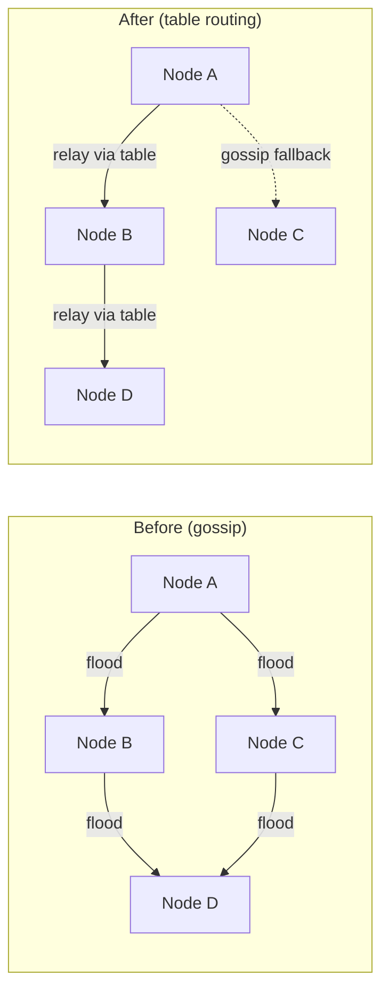
*Diagram — Message delivery: gossip flood vs table-directed relay*

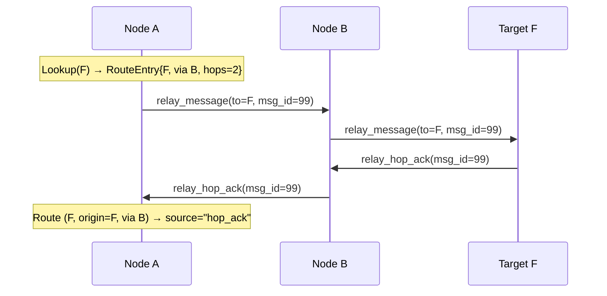
*Diagram — Table-directed relay with hop_ack confirmation*

**Convergence.** The announce loop (`routing/announce.go`) runs periodic announcements every 30 seconds and supports triggered updates on connect/disconnect events. Incoming `announce_routes` frames are processed by `handleAnnounceRoutes` in `node/routing_integration.go` — each route gets +1 hop on the receiver side. Withdrawals (hops=16) are applied via `Table.WithdrawRoute`, but only from the origin sender (`Origin == senderIdentity`). When `WithdrawRoute` receives a withdrawal for an unseen (identity, origin, nextHop) triple, it creates a tombstone entry (hops=HopsInfinity) with the withdrawal's SeqNo. This prevents a delayed older announcement from resurrecting a withdrawn lineage — the tombstone's SeqNo blocks any stale update for the same triple. Tombstones expire via normal TTL. The `mesh_routing_v1` capability is now advertised during handshake. The announce loop covers both outbound sessions and inbound-only connections. Target discovery via `routingCapablePeers()` requires both `mesh_routing_v1` and `mesh_relay_v1` — a routing-only peer (no relay) is excluded because routes through it would create non-deliverable paths.

**Receive-path validation.** `handleAnnounceRoutes` enforces three safety invariants before accepting any wire announcement: (1) **Sender identity validation** — the sender identity must be a valid 40-char lowercase hex fingerprint (`identity.IsValidAddress`). For inbound connections, the identity is read from `connPeerHello.identity` (the hello frame's `Address` field), not from `connPeerHello.address` (the listen address used for health tracking). This distinction is critical for NATed peers that advertise a non-routable listen address (e.g. `127.0.0.1:64646`) — using the listen address as routing identity would cause all announcements from such peers to be rejected as malformed. For outbound sessions, the identity is read from `session.peerIdentity` (set from the welcome frame). (2) **Own-origin rejection** — announcements where `Origin == localIdentity` from a foreign sender are silently dropped. Only this node may originate routes under its own identity; accepting a forged own-origin entry would let a neighbor poison the monotonic SeqNo counter via `syncSeqCounterLocked`. (3) **Transit withdrawal rejection** — wire withdrawals (`hops >= 16`) where `Origin != senderIdentity` are silently dropped. Only the origin may emit a wire withdrawal; transit nodes must invalidate locally and stop advertising. All three guards are enforced before `UpdateRoute`/`WithdrawRoute` to prevent malformed data from reaching the table.

**Direct-route capability gate.** `onPeerSessionEstablished(peerIdentity, hasRelayCap)` accepts a `hasRelayCap` flag that controls whether `AddDirectPeer` is called. A direct route in the distance-vector table advertises that this node can relay DMs to the destination. If the peer cannot accept `relay_message` frames (legacy or gossip-only node), the route would be non-deliverable — other routing-capable nodes would learn a path that silently fails at the last hop. The outbound call site passes `sessionHasCapability(address, capMeshRelayV1)`. The inbound call site passes `connHasCapability(conn, capMeshRelayV1)`. Peers without `mesh_relay_v1` still connect and exchange gossip normally but are never advertised as direct destinations in the routing table.

**Multi-session identity with dual counters.** `node.Service` maintains two per-identity counters: `identitySessions` (total active sessions) and `identityRelaySessions` (relay-capable sessions only). `AddDirectPeer()` is called on the `identityRelaySessions` 0→1 transition (first relay-capable session). `RemoveDirectPeer()` is called on the `identityRelaySessions` 1→0 transition (last relay-capable session closes). This means a non-relay first session does not block a later relay session from creating the direct route, and closing the last relay session withdraws the route even if legacy sessions remain. `onPeerSessionClosed(peerIdentity, hasRelayCap)` mirrors the `hasRelayCap` flag to keep both counters balanced. Total session count cleanup happens independently.

**Full-table sync on connect.** Both outbound and inbound connection paths send an immediate full-table sync (`routingTable.AnnounceTo(peerIdentity)`) to the newly connected peer. This ensures symmetric initial convergence regardless of connection direction. The sync is gated on both `mesh_routing_v1` and `mesh_relay_v1` capabilities — matching the steady-state announce loop contract. A routing-only peer (mesh_routing_v1 without mesh_relay_v1) would learn routes it cannot deliver on the data plane, so it is excluded from connect-time sync as well. The outbound path checks `sessionHasCapability(address, capMeshRoutingV1) && sessionHasCapability(address, capMeshRelayV1)` in `establishPeerSession`. The inbound path checks `connHasCapability(conn, capMeshRoutingV1) && connHasCapability(conn, capMeshRelayV1)` in `trackInboundConnect`. Both paths pass the peer's Ed25519 identity fingerprint (`peerIdentity`) to `AnnounceTo` — not the transport or listen address. This is critical for NATed inbound peers whose listen address (e.g. `127.0.0.1:64646`) differs from their identity fingerprint; passing the transport address would break split horizon filtering. Legacy peers without either capability are silently skipped. Split horizon is applied — routes learned from the connecting peer are excluded. If the send fails (session queue full, connection lost between handshake and sync), a warning is logged (`routing_outbound_full_sync_failed` or `routing_inbound_full_sync_failed`). The peer will still receive the table on the next periodic announce cycle.

**Flap dampening.** The routing table tracks per-peer disconnect frequency to prevent link flaps from churning routes and flooding the network with announcements. Each `RemoveDirectPeer` call records a withdrawal timestamp. When a peer accumulates `flapThreshold` (default 3) disconnects within `flapWindow` (default 120s), it enters hold-down state for `holdDownDuration` (default 30s). During hold-down, `AddDirectPeer` still creates the route (connectivity is preserved), but applies `penalizedTTL` (default 30s) instead of `defaultTTL` (120s). The `AddDirectPeerResult.Penalized` flag signals to the caller that the triggered announce should be suppressed — the route will be picked up by the next periodic announce cycle, reducing announcement churn. `TickTTL` cleans up stale flap state once both hold-down and the flap window have expired. All thresholds are configurable via `WithFlapWindow`, `WithFlapThreshold`, `WithHoldDownDuration`, and `WithPenalizedTTL` options.

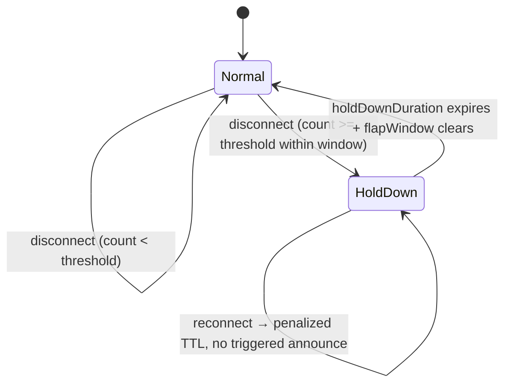
*Diagram — Peer flap detection state machine*

**Outgoing DM delivery decision.** When `storeIncomingMessage` routes a DM, `TableRouter.Route()` returns a `RoutingDecision` containing `RelayNextHop` (identity), `RelayNextHopAddress` (validated transport address or `"inbound:"` key), and `RelayNextHopHops` (hop count from the route). The send path (`sendTableDirectedRelay`) uses the pre-validated address directly — no re-resolution — to avoid selecting a different session for the same identity with weaker capabilities. If the validated address is empty (retry path), re-resolution uses `resolveRouteNextHopAddress` with the original hop role: destination (hops=1) requires only `mesh_relay_v1`; transit (hops>1) requires both `mesh_relay_v1` and `mesh_routing_v1`. If re-resolution or send fails, gossip fallback triggers. Both outbound sessions and inbound-only connections are usable as relay next-hops. Relay state persistence (`relayForwardState`) is checked on both outbound and inbound paths — if the store is rejected (duplicate message ID or capacity limit), the send is treated as a failure (returns false) and a warning is logged (`relay_state_store_failed_outbound` / `relay_state_store_failed_inbound`). This ensures the caller sees the delivery as failed and can fall back to gossip rather than silently losing hop_ack and receipt routing context.

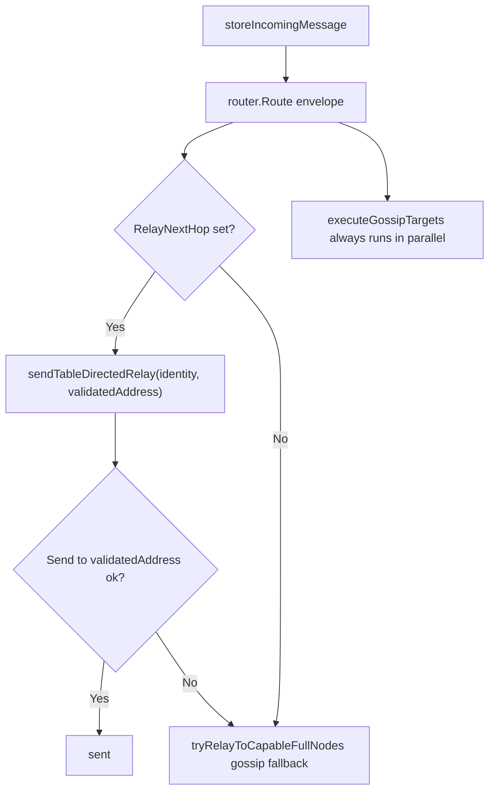
*Diagram — Outgoing DM delivery decision: table route vs gossip*

**Intermediate relay hop delivery decision.** When `handleRelayMessage` processes a transit relay, it tries three strategies in order: direct peer (recipient locally connected), routing table lookup (`tryForwardViaRoutingTable`), and blind gossip (`relayViaGossip`). If all fail, the message is stored locally and gossip handles delivery. When `tryForwardViaRoutingTable` selects a route, it returns a `tableForwardResult` containing both the transport address and the route's `Origin` field. The `RouteOrigin` is persisted in `relayForwardState` so that `confirmRouteViaHopAck` at this intermediate node can scope hop_ack confirmation to the exact `(Identity, Origin, NextHop)` triple — matching the origin-node behavior.

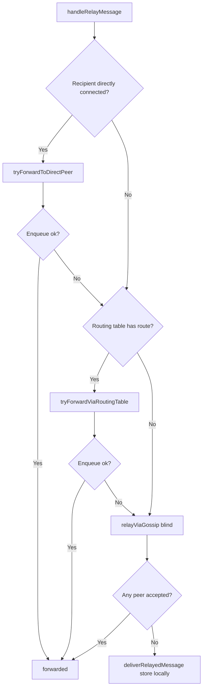
*Diagram — Intermediate relay hop: direct peer → table route → gossip*

**Gossip fallback contract (release-blocking).** `TableRouter` in `node/table_router.go` implements the `Router` interface. It consults the routing table for a directed next-hop; if no usable route or session exists, delivery degrades to gossip transparently. Fallback triggers: `Lookup()` returns empty, `RelayNextHop` identity has no active session, `RelayNextHop` peer lacks required capabilities (relay-only for destinations, both relay+routing for transit hops). `GossipTargets` are always populated in every `RoutingDecision`. The same fallback applies at every level: origin node (`sendTableDirectedRelay`), intermediate hop (`tryForwardViaRoutingTable`), and `TableRouter.Route()`.

**Event-driven pending queue drain.** When a route to a destination identity becomes usable — either a direct peer connecting (`servePeerSession` startup), a transit route learned via `announce_routes` (`handleAnnounceRoutes`), a reconnected peer re-announcing the same unchanged routing table (`handleAnnounceRoutes` with `RouteUnchanged` status), a route withdrawal that exposes a surviving backup route (`WithdrawRoute` followed by a `Lookup` check), a TTL expiry that removes a higher-priority route and exposes a surviving backup (`TickTTL` returning exposed identities in `routingTableTTLLoop`), or a local peer disconnect that invalidates routes through the departing next-hop but exposes a backup via a different next-hop (`RemoveDirectPeer` / `InvalidateTransitRoutes` returning `ExposedBackups` in `onPeerSessionClosed`) — the node immediately scans its pending queue for own outbound `send_message` frames targeting that identity and attempts to deliver them via the newly available route. This is an event-driven optimization that eliminates two latency sources: waiting for the original target peer to reconnect (`flushPendingPeerFrames`), and waiting for the 2-second relay retry loop to fire. The drain goroutine is launched from `servePeerSession` (not `onPeerSessionEstablished`) to ensure `inboxCh` is actively being read — launching it earlier creates `s.mu.Lock()` contention that delays session establishment and can cause `inboxCh` overflow under concurrent load. Only `send_message` is drained — other frame types are not route-recoverable: `relay_message` and `announce_peer` are other peers' traffic handled by the relay retry loop and peer session flush; `send_delivery_receipt` is delivered via the `relayStates` hop chain (`lookupReceiptForwardTo`), not via the routing table, so a new route to the receipt's Recipient does not create a delivery path for it. The `drainPendingForIdentities` function in `routing_integration.go` uses an extract-attempt-return pattern: matching frames are atomically removed from the pending queue under the lock (preventing concurrent drain goroutines from processing the same frame twice), delivery is attempted outside the lock via `sendRelayToAddress` (which returns a definitive success/failure signal), and frames that fail delivery are merged back into their original positions in the pending queue using index-based reconstruction — the extraction phase records each frame's `origIdx` and per-address metadata (`origLen`, `extractedPos`), and the return phase walks through the original position range interleaving kept and returning frames so that `flushPendingPeerFrames` — which delivers in slice order — maintains exact DM delivery ordering across recipients sharing the same peer address after route churn. Frames added by other goroutines during the unlocked delivery window are appended at the end. The retry counter is only incremented when a real delivery attempt was made (route existed, address resolved, `sendRelayToAddress` was called) — when no usable route exists (`RelayNextHop == nil` or address unresolvable), the frame is returned to the pending queue without burning retry budget and without any outbound state transition — the `Status` stays `"queued"` and `LastAttemptAt` is not updated, preserving the semantic that `"retrying"` in outbound state means a real network handoff was attempted. The frame waits for future drain cycles triggered by subsequent routing events. When `maxPendingFrameRetries` is reached after real failures, the frame is marked terminal instead of being returned — matching the retry contract of `flushPendingPeerFrames`. Expired frames are detected and marked terminal during the scan. All outbound state changes (terminal, retrying, cleared) are collected as deferred actions during the delivery loop and applied under the lock together with the pending queue return in a single persist — no intermediate writes to `queue-*.json` occur during the drain. This eliminates the crash-loss window that would exist if `markOutboundTerminal`, `markOutboundRetrying`, or `clearOutboundQueued` persisted mid-loop while extracted frames are absent from `s.pending`. When `handleAnnounceRoutes` processes a single announce, both accepted (new/improved) and unchanged (reconfirmed alive) identities are batched into a single drain set. Rejected routes (stale SeqNo, tombstone-blocked) do not participate in drain. The `announce_routes_processed` log emits three counters — `accepted`, `unchanged`, `rejected` — so operators can distinguish new routing events from benign reconfirmations. This three-state classification uses `RouteUpdateStatus` (`RouteAccepted`, `RouteUnchanged`, `RouteRejected`) returned by `UpdateRoute`.


*Diagram — Event-driven pending queue drain on route discovery*

**Route confirmation via hop_ack.** When a `relay_hop_ack` with status "delivered" or "forwarded" is received, the routing table promotes the route through the ack sender to `source=hop_ack` via `confirmRouteViaHopAck`. The ack sender's transport address (`senderAddress` in `handleRelayHopAck`) is the provably correct next-hop — even under gossip fan-out where multiple peers received the relay_message but only one actually delivered it. The peer identity is resolved from the transport address and matched against routing table entries. For table-directed relays, the `RouteOrigin` stored in `relayForwardState` scopes the confirmation to the exact `(Identity, Origin, NextHop)` triple that carried the message — different origins sharing the same NextHop are not affected. `RouteOrigin` is persisted at every hop in the relay chain: at the origin node (via `sendRelayMessageWithOrigin` / `sendRelayToAddress`), and at intermediate hops (via `tryForwardViaRoutingTable` returning `tableForwardResult` with `RouteOrigin`). For gossip-originated relays where no specific triple was chosen (`RouteOrigin` is empty), the first matching NextHop in Lookup order is promoted. Both outbound and inbound relay paths persist `relayForwardState`, ensuring behavioral equivalence regardless of connection direction.

**Announce_routes relay gate (routing-only peers).** A peer that negotiates `mesh_routing_v1` but not `mesh_relay_v1` can participate in the control plane (receive and send route announcements) but cannot carry data-plane traffic (`relay_message`). Accepting routes from such peers would create entries pointing to a next-hop that silently drops relayed messages. To prevent this control-plane/data-plane mismatch, both inbound and outbound `announce_routes` dispatch paths enforce a relay gate: inbound frames from connections without `mesh_relay_v1` are silently rejected (`connHasCapability(conn, capMeshRelayV1)` in the `announce_routes` handler), and the outbound announce loop skips sessions without `mesh_relay_v1` (`sessionHasCapability(address, capMeshRelayV1)` in the announce sender). This gate operates independently of `mesh_routing_v1` — a peer must have both capabilities to participate in route exchange.

**Transit route invalidation for routing-only peers.** When the last total session of a routing-only peer (no relay-capable sessions were ever active) closes, `onPeerSessionClosed` calls `Table.InvalidateTransitRoutes(peerIdentity)` as a defense-in-depth measure. This method marks all transit routes (non-direct, hops < 16) where `NextHop == peerIdentity` as withdrawn (hops=16) without incrementing SeqNo (local-only invalidation — no wire withdrawal is generated). Direct routes are skipped because their lifecycle is governed by `RemoveDirectPeer`. When at least one route is invalidated, `announceLoop.TriggerUpdate()` fires an immediate announce cycle so neighbors learn the stale routes are withdrawn without waiting for the next periodic cycle (up to 30s). Under normal operation, the announce_routes relay gate prevents routes from routing-only peers from entering the table. `InvalidateTransitRoutes` guards against edge cases: routes learned before capability was fully negotiated, or stale entries from a previous relay-capable session of the same identity. The method returns the count of invalidated routes for logging.

**TTL policy delegation.** Received announcements leave `ExpiresAt` as zero when constructing the `RouteEntry` in `handleAnnounceRoutes`. `Table.UpdateRoute` fills it using the table's own configured `clock` and `defaultTTL`. This ensures that all routes (direct via `AddDirectPeer`, learned via announcements) follow the same TTL policy, and tables created with `WithDefaultTTL` or `WithClock` behave consistently across all route sources.

### RPC observability

Three RPC commands expose routing table state for monitoring and debugging. They follow the same provider-injection pattern as metrics and chatlog commands — when `RoutingProvider` is nil, commands return 503 (unavailable) and are hidden from help output. Full field-level specification: [`rpc/routing.md`](rpc/routing.md).

**`fetch_route_table`** — Returns the full routing table snapshot. Each entry includes identity, origin, `next_hop` object (identity + live transport address/network), hops, seq_no, source (direct/hop_ack/announcement), withdrawn/expired flags, and remaining TTL. The `next_hop.address` and `next_hop.network` fields are live best-effort metadata queried after the snapshot — routing fields are atomic within `snapshot_at`. Response also includes total/active entry counts and snapshot timestamp. Sorted by (identity, origin, next_hop.identity, source).

**`fetch_route_summary`** — Returns a compact overview with `snapshot_at` timestamp, total/active/withdrawn entry counts, number of reachable identities, direct peer count, and the current flap detection state (per-peer withdrawal count, hold-down status). Flap state sorted by peer_identity. The `snapshot_at` field matches the same point-in-time semantics as `fetch_route_table` and `fetch_route_lookup`.

**`fetch_route_lookup <identity>`** — Returns active routes (withdrawn and expired filtered out) for a specific destination identity, sorted by preference (source priority desc, hops asc, then origin/next_hop/seq_no for determinism). Useful for diagnosing why a particular peer is or is not reachable via table routing.

The `RoutingProvider` interface (`rpc/provider.go`) has two methods: `RoutingSnapshot()` returns an immutable point-in-time copy of the routing table, and `PeerTransport(peerIdentity)` resolves a peer identity to its current transport address and network type. All three commands use `RoutingSnapshot()` for atomic data; `fetch_route_table` additionally calls `PeerTransport()` to enrich `next_hop` with live transport info. Console positional argument mapping is configured: `fetch_route_table` and `fetch_route_summary` take no arguments; `fetch_route_lookup` takes a single `<identity>` positional argument.

**Protocol version validation (outbound + inbound).** Both directions enforce `config.MinimumProtocolVersion`. On the *outbound* path, the welcome frame's version is checked; incompatible peers are rejected with log `outbound_peer_protocol_too_old`, receive a `peerScoreOldProtocol` (-50) score penalty, and are temporarily banned for `peerBanIncompatible` (24 hours). The ban is stored in `peerHealth.BannedUntil` and persisted to `peers.json` so it survives restarts; on load, expired bans are discarded. While the ban is active, `peerDialCandidates` skips the peer entirely; the `runPeerSession` goroutine also exits immediately via `errIncompatibleProtocol` instead of retrying every 2 seconds. After the ban expires the peer is re-tried — it may have upgraded. On the *inbound* path, the hello frame's version is checked; incompatible clients receive an error frame with `ErrCodeIncompatibleProtocol` and the remote IP is immediately blacklisted for 24 hours via `addBanScore(conn, banIncrementIncompatibleVersion)` (increment = 1000 ≥ threshold = 1000, so a single attempt triggers the ban). The current connection stays open (the async error frame must be flushed by `connWriter` first), but the client cannot do anything useful — hello was rejected, no welcome was sent. Subsequent TCP connections from the same IP are rejected at `handleConn` before any frame exchange. Additionally, the inbound path now also calls `penalizeOldProtocolPeer`, which sets `peerHealth.BannedUntil` on the overlay level — symmetric with the outbound path. This ensures the peer is excluded from `peerDialCandidates` even if the IP blacklist expires or the peer reconnects from a different IP.

**Ban clearing.** A successful outbound handshake (`markPeerConnected`) clears `BannedUntil` — if the peer completed the handshake, it is compatible. The `add_peer` RPC command also clears `BannedUntil` to allow manual override by the operator. If the peer is already known, `add_peer` moves it to the front of the dial queue and responds with "already known, moved to front" instead of adding a duplicate. `promotePeerAddress` (called from authenticated `announce_peer`) also clears `BannedUntil` — if a third party announces the peer, it is likely reachable and compatible.

**Identity-based routing resolution.** All inbound routing functions (`routingCapablePeers`, `resolveNextHopAddress`, `resolveRelayAddress`, `resolvePeerIdentity`) match on `connPeerHello.identity` (the Ed25519 fingerprint from the hello frame), not on `connPeerHello.address` (the listen address used for health tracking). This ensures NATed peers with non-routable listen addresses are correctly resolved as announce targets, relay destinations, and routing identities. The `countCapablePeers` diagnostic function also deduplicates by identity (`session.peerIdentity` for outbound, `info.identity` for inbound) — a single peer appearing via both an outbound session and an inbound connection is counted once.

**Connection ID.** Every TCP connection — both outbound (`peerSession.connID`) and inbound (`connPeerHello.connID`) — receives a monotonically increasing `connID` from `Service.connIDCounter`. The ID is exposed in `fetch_peer_health` via `PeerHealthFrame.ConnID` and propagated through the desktop layer (`PeerHealth.ConnID`, `ConsolePeerStatus.ConnID`). This allows UI and diagnostics to distinguish multiple sessions to the same peer address (e.g. an outbound session and an inbound connection from the same host, or rapid reconnect cycles). When multiple inbound connections exist for the same overlay address, `peerHealthFrames` emits a separate `PeerHealthFrame` row per connection, each with its own `ConnID`. If an outbound session also exists for that address, it is emitted as an additional row. This means `fetch_peer_health` may return more rows than the number of unique peer addresses.

**Per-connection inbound staleness.** Inbound connection eviction (`evictStaleInboundConns`) uses per-connection `lastActivity` timestamps instead of shared health state. Each `connPeerHello` tracks when the last frame was received on that specific TCP connection. A connection is evicted when `now - lastActivity >= heartbeatInterval + pongStallTimeout`. The per-connection approach prevents NATed peers that advertise the same listen address from being evicted due to an unrelated outbound session going stale — a scenario that occurred when multiple peers (or an outbound session to self) shared the same resolved health key. The same per-connection staleness check is applied in `connectedHostsLocked` to exclude zombie sockets from the connected hosts set.

### Known limitations

**Full integration tests (pending).** Unit tests cover individual components. Integration tests for 5-node shortest path selection, withdrawal propagation timing, reconnect with different identity, and rapid disconnect/reconnect loop convergence are pending and should be completed before real-world rollout.

**Announcement flooding (pending).** `AnnounceTo()` exists but has no limit on routes per frame (roadmap specifies max 100), no fairness rotation, no pacing/jitter, and no per-peer rate limiting. A node with a large table could overwhelm peers with oversized frames. All anti-flooding measures (frame size limit, rotation fairness, periodic full sync, rate limits, quotas, jitter) must be implemented before real-world rollout with untrusted peers.

**Routing loops (Iteration 1 risk).** Split horizon and withdrawal semantics reduce simple loop scenarios. However, the current design has no path vector, no poisoned reverse, and hop-limit applies to message relay TTL, not to DV convergence. For the Iteration 1 MVP, split horizon + withdrawal + flap dampening is considered the minimum viable loop prevention. Flap dampening (hold-down timer) prevents rapid disconnect/reannounce sequences from creating convergence oscillations. If integration tests  reveal loopy behavior, a fix must land in Iteration 1, not be deferred. Potential further mitigations: triggered withdrawal propagation latency bounds, or path recording in a future iteration.

**No global lookup.** Distance vector gives each node knowledge only about destinations reachable via its neighbors. There is no mechanism to discover an arbitrary identity in the network if no neighbor has advertised a route to it. This is not a defect — it is the fundamental boundary of the DV approach. If "find any user in the network" is needed, it requires a separate discovery/query layer (e.g., DHT in Iteration 4, or a dedicated lookup service). The routing table is not the right place for global search, and no patch to it will solve the problem.

### Wire format

The `announce_routes` frame carries a list of route entries. Only fields needed for convergence are transmitted on the wire; TTL and Source are derived locally.

```json
{
  "type": "announce_routes",
  "routes": [
    {"identity": "alice_fp", "origin": "bob_fp", "hops": 1, "seq": 42},
    {"identity": "carol_fp", "origin": "dave_fp", "hops": 16, "seq": 18}
  ]
}
```

A withdrawal is simply a route with `hops: 16` and an incremented `seq`.

### Capability gating

The `mesh_routing_v1` capability is advertised during the handshake. Only peers with this capability in their negotiated set will receive `announce_routes` frames. Legacy peers continue to function via gossip without disruption.

Capability requirements for a table-directed relay next-hop depend on the role of the next-hop peer:

- **Destination (hops=1):** The next-hop IS the final recipient. Only `mesh_relay_v1` is required — the peer must accept `relay_message` frames but does not need to forward further.
- **Transit (hops>1):** The next-hop must forward the message onward using its own routing table. Both `mesh_relay_v1` (accept relay) and `mesh_routing_v1` (table-directed forwarding) are required.

A directly connected relay-only peer (no `mesh_routing_v1`) is still usable as a destination via table-directed delivery. Requiring both capabilities for all next-hops would drop direct delivery to relay-only peers and unnecessarily degrade to blind gossip. `resolveRouteNextHopAddress` in `routing_integration.go` enforces this distinction.

### Package layout

```
internal/core/routing/
    types.go          — RouteEntry, AnnounceEntry, RouteTriple, Snapshot, RouteSource
    table.go          — Table with all CRUD, query, disconnect, and wire-projection operations
    announce.go       — AnnounceLoop: periodic (30s) + triggered announce_routes sender
    types_test.go     — unit tests for type invariants, validation, wire projection
    table_test.go     — unit tests for table operations and invariants
    announce_test.go  — unit tests for announce loop, triggered updates, split horizon

internal/core/node/
    table_router.go              — TableRouter: routing table lookup with gossip fallback
    routing_integration.go       — Service integration: announce_routes handling, session tracking,
                                   hop_ack confirmation, TTL loop, PeerSender implementation
    routing_provider.go          — RoutingProvider implementation on node.Service
    table_router_test.go         — unit tests for TableRouter
    routing_integration_test.go  — unit tests for routing integration

internal/core/rpc/
    routing_commands.go          — RegisterRoutingCommands: fetch_route_table, fetch_route_summary, fetch_route_lookup
    handler_routing_test.go      — unit tests for routing RPC commands
```

---

# Таблица маршрутизации — Distance Vector с Withdrawal

Связанная документация:

- [mesh.md](mesh.md) — обзор сетевого уровня
- [roadmap.md](roadmap.md) — полный план итераций
- [protocol.md](protocol.md) — протокол передачи данных

Исходники: `internal/core/routing/types.go`, `internal/core/routing/table.go`, `internal/core/routing/announce.go`, `internal/core/node/table_router.go`, `internal/core/node/routing_integration.go`, `internal/core/node/routing_provider.go`, `internal/core/rpc/routing_commands.go`

### Обзор

Пакет routing реализует таблицу маршрутизации на основе distance-vector для mesh-сети CORSA. Заменяет слепую gossip-доставку на направленную пересылку по метрике количества хопов. Gossip остаётся fallback, когда маршрут неизвестен.

### Основные типы

`RouteEntry` — единичный маршрут в таблице. Каждая запись уникально идентифицируется тройкой `(Identity, Origin, NextHop)` — получатель, кто изначально объявил маршрут, и peer, от которого мы его узнали. Две записи с одинаковой тройкой — один и тот же маршрут в разное время; побеждает запись с большим `SeqNo`.

`AnnounceEntry` — проекция `RouteEntry` для передачи по проводу. Содержит только четыре поля из `announce_routes` фреймов (Identity, Origin, Hops, SeqNo). Создаётся через `RouteEntry.ToAnnounceEntry()` или `Table.AnnounceTo()`. На провод уходит локальное значение hops отправителя как есть — получатель делает +1 при вставке в свою таблицу (receive path).

`Table` — потокобезопасное локальное хранилище маршрутов. Владеет identity ноды (`localOrigin`) и монотонным счётчиком SeqNo по каждому destination (`seqCounters`). Публичные операции: `AddDirectPeer`, `RemoveDirectPeer`, `UpdateRoute`, `WithdrawRoute`, `RefreshDirectPeers`, `TickTTL`, `Announceable`, `AnnounceTo`, `Lookup` и `Snapshot`.

`Snapshot` — иммутабельная копия таблицы на момент времени, безопасная для чтения без блокировок.

`AddDirectPeerResult` — результат подключения peer'а: `RouteEntry`, созданный или обновлённый, и флаг `Penalized`, указывающий, что flap detection применил укороченный TTL.

`RemoveDirectPeerResult` — результат отключения peer'а: wire-ready `[]AnnounceEntry` withdrawals (SeqNo уже инкрементирован, Hops=16) для own-origin direct-маршрутов, плюс количество transit-маршрутов, молча инвалидированных локально, плюс `ExposedBackups []PeerIdentity` — identity, у которых инвалидация обнажила выживший не-withdrawn backup route (используется `onPeerSessionClosed` для запуска дрейна).

### Ключевые инварианты

**Origin-aware SeqNo.** Порядковые номера ограничены парой `(Identity, Origin)`. Только origin-нода может увеличивать SeqNo. Маршрут с большим SeqNo безусловно заменяет маршрут с меньшим для той же тройки. Для own-origin маршрутов `Table` владеет монотонным счётчиком (`seqCounters`) и автоматически инкрементирует его в `AddDirectPeer` и `RemoveDirectPeer`. Дисциплина SeqNo обеспечивается на уровне структуры данных, а не делегируется вызывающему коду.

**Ключ дедупликации.** Тройка `(Identity, Origin, NextHop)` уникально идентифицирует линию маршрута. Разные origin или разные NextHop создают независимые записи.

**Split horizon.** При формировании анонса для peer A маршруты с `NextHop == A` пропускаются. Фиктивный `hops=16` withdrawal не отправляется — это нарушило бы инвариант per-origin SeqNo.

**Семантика withdrawal.** Отзыв маршрута устанавливает `Hops = 16` (бесконечность) и требует строго `SeqNo > old.SeqNo`. На проводе только origin может отправить withdrawal. При отключении peer'а `RemoveDirectPeer` отзывает own-origin direct-маршруты (возвращаются как wire-ready `[]AnnounceEntry` с уже инкрементированным SeqNo) и молча инвалидирует transit-маршруты локально. Транзитные ноды не генерируют wire-withdrawal для чужих маршрутов.

**Иерархия доверия.** Для каждой тройки: `direct > hop_ack > announcement`. При одинаковом SeqNo источник с более высоким доверием заменяет менее доверенный. Подтверждение одной тройки через hop_ack не влияет на другие тройки, даже при общем NextHop.

**Порядок выбора маршрута.** `Lookup()` сортирует по приоритету source (direct > hop_ack > announcement), затем по hops ascending в пределах одного уровня source. Direct-маршрут с 3 хопами предпочитается announcement с 1 хопом — доверие к источнику важнее количества хопов.

**Истечение TTL.** Каждая запись имеет `ExpiresAt` (по умолчанию 120с с момента вставки). `TickTTL()` удаляет истёкшие записи и возвращает слайс identity, у которых истечение обнажило выживший не-withdrawn backup route — `routingTableTTLLoop` использует это для запуска `drainPendingForIdentities` и немедленной доставки через backup. Нестабильные peer'ы получают укороченный TTL — см. демпфирование flap'ов ниже. Own-origin direct-маршруты обновляются через `RefreshDirectPeers()` на каждом цикле анонсов (каждые 30с), предотвращая их истечение пока сессия с peer'ом жива. Learned-маршруты обновляются естественным образом при переанонсировании соседом.

**NextHop — это identity peer'a.** Маршрутизация работает на уровне identity, а не транспортных адресов. Один peer identity может иметь несколько параллельных TCP-сессий; выбор сессии происходит позже в `node.Service` через индекс identity→session(s) для резолва identity в активные соединения.

**Валидация записей.** `RouteEntry.Validate()` проверяет структурные инварианты при вставке: Identity, Origin и NextHop не должны быть пустыми; Hops в диапазоне [1, 16]. Source-specific правила: direct-маршруты (`RouteSourceDirect`) должны иметь `Hops=1` и `NextHop == Identity` (непосредственный сосед). Невалидные записи отклоняются в `UpdateRoute` до захвата блокировок. Дополнительно, `UpdateRoute` проверяет origin для direct-маршрутов: когда `localOrigin` сконфигурирован, запись `RouteSourceDirect` с `Origin != localOrigin` отклоняется с `ErrDirectForeignOrigin`. Это предотвращает инъекцию невозможных direct-маршрутов с чужим origin, которые превосходили бы все announcement/hop_ack маршруты в `Lookup` и никогда не попадали бы под own-origin withdrawal при disconnect.

**Граница wire-проекции.** Граница между table-моделью и wire-форматом явная: `AnnounceTo(excludeVia)` возвращает `[]AnnounceEntry` с applied split horizon. На провод уходит локальное значение hops — +1 не применяется на стороне отправителя; получатель делает +1 при вставке в свою таблицу . `RemoveDirectPeer` возвращает wire-ready `[]AnnounceEntry` withdrawals с уже инкрементированным SeqNo. Caller'ы, формирующие `announce_routes` фреймы, используют `AnnounceTo` или результаты `RemoveDirectPeer` напрямую — ручная арифметика не нужна.

**Консистентность счётчика SeqNo.** Когда `UpdateRoute` принимает own-origin запись (где `Origin == localOrigin`), он синхронизирует монотонный счётчик: `seqCounters[identity] = max(counter, entry.SeqNo)`. Это гарантирует, что таблицы, предзаполненные через `UpdateRoute` (например, восстановленные из snapshot или полученные через full sync), не приведут к тому, что следующий `AddDirectPeer`/`RemoveDirectPeer` выдаст устаревший SeqNo.

### Интеграция

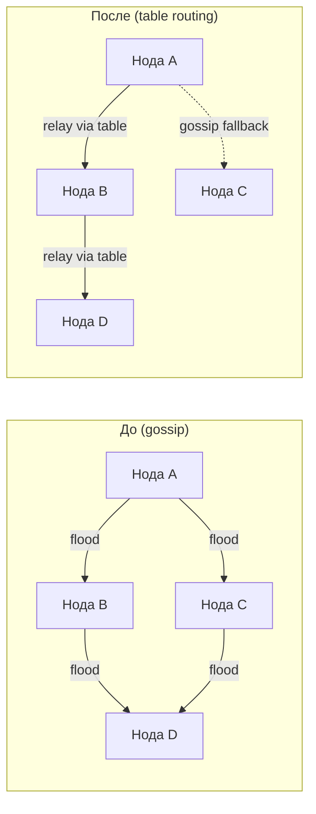
*Диаграмма — Доставка сообщений: gossip flood vs table-directed relay*

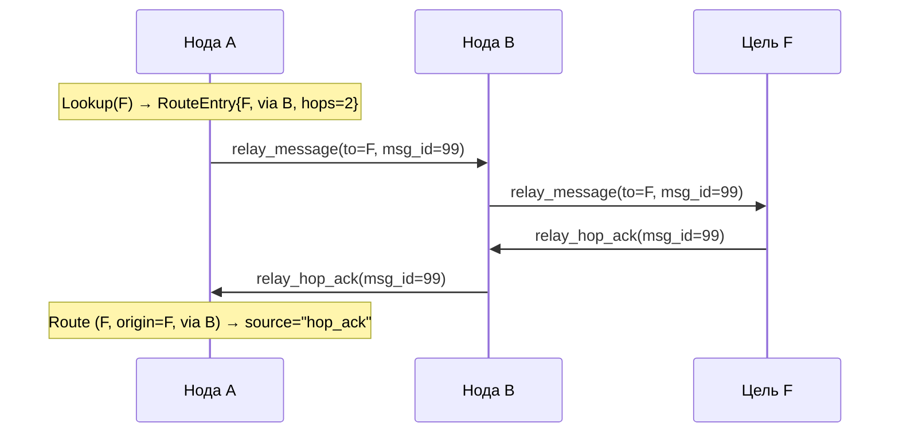
*Диаграмма — Table-directed relay с подтверждением hop_ack*

**Сходимость.** Цикл анонсов (`routing/announce.go`) выполняет периодические анонсы каждые 30 секунд и поддерживает triggered updates при connect/disconnect событиях. Входящие `announce_routes` фреймы обрабатываются `handleAnnounceRoutes` в `node/routing_integration.go` — каждый маршрут получает +1 хоп на стороне получателя. Withdrawals (hops=16) применяются через `Table.WithdrawRoute`, но только от origin-отправителя (`Origin == senderIdentity`). Когда `WithdrawRoute` получает withdrawal для невиданной тройки (identity, origin, nextHop), он создаёт tombstone-запись (hops=HopsInfinity) с SeqNo из withdrawal. Это предотвращает воскрешение отозванного lineage задержанным старым анонсом — SeqNo tombstone блокирует любое устаревшее обновление для той же тройки. Tombstone'ы истекают через стандартный TTL. Capability `mesh_routing_v1` теперь рекламируется при handshake. Цикл анонсов охватывает как outbound-сессии, так и inbound-only соединения. Обнаружение целей через `routingCapablePeers()` требует наличия обеих capability: `mesh_routing_v1` и `mesh_relay_v1` — routing-only peer (без relay) исключается, поскольку маршруты через него создавали бы недоставляемые пути.

**Валидация receive-path.** `handleAnnounceRoutes` обеспечивает три инварианта безопасности перед принятием любого wire-анонса: (1) **Валидация identity отправителя** — identity отправителя должна быть валидным 40-символьным lowercase hex fingerprint (`identity.IsValidAddress`). Для inbound-соединений identity берётся из `connPeerHello.identity` (поле `Address` hello-фрейма), а не из `connPeerHello.address` (listen-адрес для health-трекинга). Это различие критично для NATed peer'ов, которые рекламируют нероутабельный listen-адрес (например, `127.0.0.1:64646`) — использование listen-адреса как routing identity привело бы к отклонению всех анонсов от таких peer'ов как malformed. Для outbound-сессий identity берётся из `session.peerIdentity` (устанавливается из welcome-фрейма). (2) **Отклонение own-origin** — анонсы с `Origin == localIdentity` от чужого отправителя молча отбрасываются. Только эта нода может порождать маршруты под своей identity; принятие поддельной own-origin записи позволило бы соседу отравить монотонный счётчик SeqNo через `syncSeqCounterLocked`. (3) **Отклонение transit withdrawal** — wire withdrawals (`hops >= 16`) где `Origin != senderIdentity` молча отбрасываются. Только origin может генерировать wire withdrawal; transit-ноды должны инвалидировать локально и прекращать рекламировать маршрут. Все три проверки выполняются до `UpdateRoute`/`WithdrawRoute`, чтобы некорректные данные не попадали в таблицу.

**Гейт capability для прямых маршрутов.** `onPeerSessionEstablished(peerIdentity, hasRelayCap)` принимает флаг `hasRelayCap`, контролирующий вызов `AddDirectPeer`. Прямой маршрут в distance-vector таблице объявляет, что эта нода может ретранслировать DM до назначения. Если peer не может принимать фреймы `relay_message` (legacy или gossip-only нода), маршрут будет недоставляемым — другие routing-capable ноды узнают путь, который молча сбоит на последнем хопе. Outbound вызов передаёт `sessionHasCapability(address, capMeshRelayV1)`. Inbound вызов передаёт `connHasCapability(conn, capMeshRelayV1)`. Peer'ы без `mesh_relay_v1` по-прежнему подключаются и обмениваются gossip нормально, но никогда не рекламируются как direct destinations в routing table.

**Multi-session identity с двойными счётчиками.** `node.Service` ведёт два per-identity счётчика: `identitySessions` (всего активных сессий) и `identityRelaySessions` (только relay-capable сессий). `AddDirectPeer()` вызывается при переходе `identityRelaySessions` 0→1 (первая relay-capable сессия). `RemoveDirectPeer()` вызывается при переходе `identityRelaySessions` 1→0 (последняя relay-capable сессия закрывается). Это означает, что non-relay первая сессия не блокирует создание direct route более поздней relay сессией, и закрытие последней relay сессии отзывает маршрут, даже если legacy сессии остаются. `onPeerSessionClosed(peerIdentity, hasRelayCap)` зеркально использует флаг `hasRelayCap` для поддержания баланса обоих счётчиков. Очистка total session count происходит независимо.

**Полная синхронизация таблицы при подключении.** Как outbound, так и inbound пути подключения отправляют немедленную полную синхронизацию таблицы (`routingTable.AnnounceTo(peerIdentity)`) новому подключённому peer'у. Это обеспечивает симметричную начальную сходимость независимо от направления подключения. Синхронизация закрыта гейтом обеих capability: `mesh_routing_v1` и `mesh_relay_v1` — в соответствии с контрактом цикла анонсов. Routing-only peer (mesh_routing_v1 без mesh_relay_v1) получил бы маршруты, которые он не может доставить на data plane, поэтому исключается из connect-time синхронизации. Outbound-путь проверяет `sessionHasCapability(address, capMeshRoutingV1) && sessionHasCapability(address, capMeshRelayV1)` в `establishPeerSession`. Inbound-путь проверяет `connHasCapability(conn, capMeshRoutingV1) && connHasCapability(conn, capMeshRelayV1)` в `trackInboundConnect`. Оба пути передают Ed25519 identity fingerprint peer'а (`peerIdentity`) в `AnnounceTo` — не transport/listen адрес. Это критично для NATed inbound peer'ов, чей listen-адрес (например, `127.0.0.1:64646`) отличается от fingerprint'а; передача transport-адреса сломала бы фильтрацию split horizon. Legacy peer'ы без любой из capability пропускаются без ошибки. Применяется split horizon — маршруты, полученные от подключающегося peer'a, исключаются. Если отправка не удалась (очередь сессии переполнена, соединение потеряно между handshake и sync), записывается предупреждение (`routing_outbound_full_sync_failed` или `routing_inbound_full_sync_failed`). Peer всё равно получит таблицу в следующем периодическом цикле анонсов.

**Демпфирование flap'ов.** Routing table отслеживает частоту отключений per-peer для предотвращения спама маршрутами при нестабильных линках. Каждый вызов `RemoveDirectPeer` записывает timestamp отключения. Когда peer накапливает `flapThreshold` (по умолчанию 3) отключений в пределах `flapWindow` (по умолчанию 120с), он переходит в состояние hold-down на `holdDownDuration` (по умолчанию 30с). В режиме hold-down `AddDirectPeer` по-прежнему создаёт маршрут (связность сохраняется), но применяет `penalizedTTL` (по умолчанию 30с) вместо `defaultTTL` (120с). Флаг `AddDirectPeerResult.Penalized` сигнализирует caller'у, что triggered announce должен быть подавлен — маршрут будет подхвачен следующим периодическим циклом анонсов, снижая спам анонсами. `TickTTL` очищает устаревшее flap-состояние после истечения и hold-down, и flap window. Все пороги настраиваются через опции `WithFlapWindow`, `WithFlapThreshold`, `WithHoldDownDuration` и `WithPenalizedTTL`.

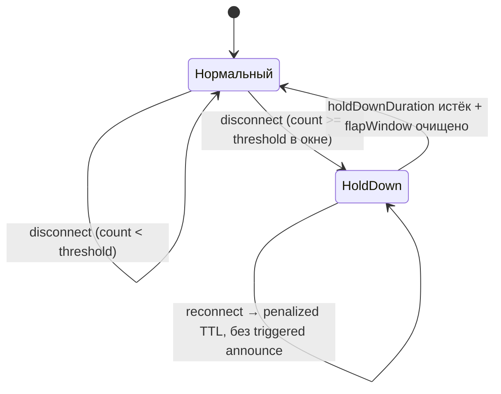
*Диаграмма — Конечный автомат обнаружения flap'ов*

**Решение о доставке исходящего DM.** Когда `storeIncomingMessage` маршрутизирует DM, `TableRouter.Route()` возвращает `RoutingDecision`, содержащий `RelayNextHop` (identity), `RelayNextHopAddress` (валидированный транспортный адрес или `"inbound:"` ключ) и `RelayNextHopHops` (количество хопов из маршрута). Send path (`sendTableDirectedRelay`) использует предвалидированный адрес напрямую — без повторного резолва — чтобы избежать выбора другой сессии того же peer'а с более слабым набором capability. Если предвалидированный адрес пуст (путь повтора), повторный резолв использует `resolveRouteNextHopAddress` с оригинальной ролью хопа: destination (hops=1) требует только `mesh_relay_v1`; transit (hops>1) требует оба — `mesh_relay_v1` и `mesh_routing_v1`. Если повторный резолв или отправка не удались — срабатывает gossip fallback. Как outbound-сессии, так и inbound-only соединения пригодны как relay next-hop. Персистенция relay state (`relayForwardState`) проверяется на обоих путях (outbound и inbound) — если store отклоняет запись (дублирование message ID или превышение лимита), отправка считается неудачной (возвращается false) и записывается предупреждение (`relay_state_store_failed_outbound` / `relay_state_store_failed_inbound`). Это гарантирует, что caller видит доставку как неудачную и может откатиться к gossip, а не молча терять контекст hop_ack и маршрутизации receipt'ов.

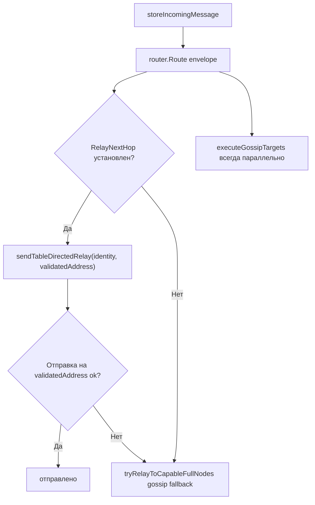
*Диаграмма — Решение о доставке исходящего DM: table route vs gossip*

**Решение о доставке на промежуточном relay hop.** Когда `handleRelayMessage` обрабатывает транзитный relay, он пробует три стратегии по порядку: прямой peer (получатель подключён локально), lookup в routing table (`tryForwardViaRoutingTable`), и blind gossip (`relayViaGossip`). Если все не сработали — сообщение сохраняется локально, gossip берёт на себя доставку. Когда `tryForwardViaRoutingTable` выбирает маршрут, он возвращает `tableForwardResult`, содержащий транспортный адрес и поле `Origin` маршрута. `RouteOrigin` сохраняется в `relayForwardState`, чтобы `confirmRouteViaHopAck` на этом промежуточном узле мог ограничить подтверждение hop_ack точной тройкой `(Identity, Origin, NextHop)` — аналогично поведению на origin-ноде.

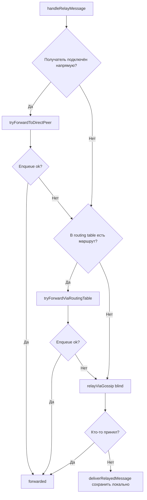
*Диаграмма — Промежуточный relay hop: прямой peer → table route → gossip*

**Контракт gossip fallback (release-blocking).** `TableRouter` в `node/table_router.go` реализует интерфейс `Router`. Он обращается к routing table за направленным next-hop; если нет пригодного маршрута или сессии — доставка деградирует в gossip прозрачно. Триггеры fallback: `Lookup()` возвращает пустой результат, identity `RelayNextHop` не имеет активной сессии, peer `RelayNextHop` не имеет требуемых capability (relay-only для destinations, оба relay+routing для transit hops). `GossipTargets` всегда заполняются в каждом `RoutingDecision`. Тот же fallback работает на каждом уровне: origin-нода (`sendTableDirectedRelay`), промежуточный hop (`tryForwardViaRoutingTable`) и `TableRouter.Route()`.

**Event-driven дрейн pending queue.** Когда маршрут до целевого identity становится доступным — будь то подключение прямого peer'а (старт `servePeerSession`), изучение транзитного маршрута через `announce_routes` (`handleAnnounceRoutes`), переподключившийся peer переанонсирующий ту же неизменённую routing table (`handleAnnounceRoutes` со статусом `RouteUnchanged`), withdrawal маршрута, обнажающий выживший backup route (`WithdrawRoute` с последующей проверкой `Lookup`), истечение TTL маршрута, обнажающее выживший backup (`TickTTL` возвращает exposed identities в `routingTableTTLLoop`), или локальный disconnect peer'а, инвалидирующий маршруты через ушедший next-hop, но обнажающий backup через другой next-hop (`RemoveDirectPeer` / `InvalidateTransitRoutes` возвращают `ExposedBackups` в `onPeerSessionClosed`) — нода немедленно сканирует свою pending queue на наличие собственных исходящих `send_message` фреймов, адресованных этому identity, и пытается доставить их через вновь доступный маршрут. Это event-driven оптимизация, которая устраняет два источника задержки: ожидание переподключения исходного peer'а (`flushPendingPeerFrames`) и ожидание срабатывания relay retry loop (каждые 2 секунды). Drain goroutine запускается из `servePeerSession` (не из `onPeerSessionEstablished`), чтобы `inboxCh` уже активно читался — запуск раньше создаёт `s.mu.Lock()` contention, который задерживает установление сессии и может вызвать overflow `inboxCh` под конкурентной нагрузкой. Дрейнится только `send_message` — остальные типы фреймов не восстанавливаются через routing table: `relay_message` и `announce_peer` — чужой трафик, обрабатываемый relay retry loop и peer session flush; `send_delivery_receipt` доставляется через hop-цепочку `relayStates` (`lookupReceiptForwardTo`), а не через routing table, поэтому новый маршрут до Recipient receipt'а не создаёт для него путь доставки. Функция `drainPendingForIdentities` в `routing_integration.go` использует паттерн extract-attempt-return: matching-фреймы атомарно извлекаются из pending queue под блокировкой (что исключает повторную обработку одного фрейма конкурентными goroutine), доставка выполняется вне блокировки через `sendRelayToAddress` (возвращающий определённый сигнал успеха/неудачи), а фреймы с неудавшейся доставкой возвращаются на свои исходные позиции в pending queue с помощью index-based реконструкции — фаза извлечения записывает `origIdx` каждого фрейма и метаданные per-address (`origLen`, `extractedPos`), а фаза возврата проходит по диапазону исходных позиций, чередуя kept- и returning-фреймы, чтобы `flushPendingPeerFrames` — доставляющий в порядке слайса — сохранял точный порядок доставки DM между recipient'ами, разделяющими один peer address, после route churn. Фреймы, добавленные другими goroutine во время разблокированного окна доставки, дописываются в конец. Счётчик retry инкрементируется только когда была реальная попытка доставки (маршрут существовал, адрес разрешён, `sendRelayToAddress` был вызван) — когда пригодного маршрута нет (`RelayNextHop == nil` или адрес неразрешим), фрейм возвращается в pending queue без траты retry-бюджета и без перехода outbound-состояния — `Status` остаётся `"queued"`, а `LastAttemptAt` не обновляется, сохраняя семантику, что `"retrying"` в outbound-состоянии означает реальную попытку сетевого handoff. Фрейм ожидает будущих drain-циклов, запускаемых последующими routing-событиями. При достижении `maxPendingFrameRetries` после реальных неудач фрейм помечается терминальным вместо возврата — соответствуя retry-контракту `flushPendingPeerFrames`. Истёкшие фреймы обнаруживаются и помечаются терминальными во время сканирования. Все изменения outbound-состояния (terminal, retrying, cleared) собираются как отложенные действия в цикле доставки и применяются под блокировкой вместе с возвратом в pending queue одним persist'ом — ни одной промежуточной записи в `queue-*.json` не происходит во время дрейна. Это устраняет crash-loss window, которое возникло бы, если бы `markOutboundTerminal`, `markOutboundRetrying` или `clearOutboundQueued` persist'или посреди цикла, когда извлечённые фреймы отсутствуют в `s.pending`. Когда `handleAnnounceRoutes` обрабатывает один announce, и принятые (новые/улучшенные), и неизменённые (подтверждённые живые) identity батчируются в один drain-набор. Отклонённые маршруты (устаревший SeqNo, заблокированные tombstone) не участвуют в дрейне. Лог `announce_routes_processed` выдаёт три счётчика — `accepted`, `unchanged`, `rejected` — чтобы операторы могли отличить новые routing-события от штатных подтверждений. Эта трёхстатусная классификация использует `RouteUpdateStatus` (`RouteAccepted`, `RouteUnchanged`, `RouteRejected`), возвращаемый `UpdateRoute`.

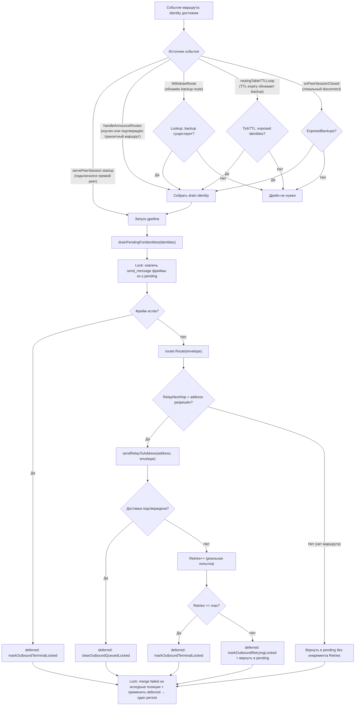
*Диаграмма — Event-driven дрейн pending queue при обнаружении маршрута*

**Подтверждение маршрута через hop_ack.** При получении `relay_hop_ack` со статусом "delivered" или "forwarded", routing table промоутит маршрут через отправителя ack в `source=hop_ack` через `confirmRouteViaHopAck`. Транспортный адрес отправителя ack (`senderAddress` в `handleRelayHopAck`) — это достоверно правильный next-hop, даже при gossip fan-out, когда несколько peer'ов получили relay_message, но только один реально доставил. Identity peer'а резолвится из транспортного адреса и сопоставляется с записями routing table. Для table-directed relay `RouteOrigin`, сохранённый в `relayForwardState`, ограничивает подтверждение точной тройкой `(Identity, Origin, NextHop)`, которая доставляла сообщение — другие origin'ы с тем же NextHop не затрагиваются. `RouteOrigin` сохраняется на каждом хопе relay-цепочки: на origin-ноде (через `sendRelayMessageWithOrigin` / `sendRelayToAddress`) и на промежуточных хопах (через `tryForwardViaRoutingTable`, возвращающий `tableForwardResult` с `RouteOrigin`). Для gossip-originated relay (без конкретной тройки, `RouteOrigin` пуст) промоутится первый matching NextHop в порядке Lookup. Оба пути relay (outbound и inbound) сохраняют `relayForwardState`, обеспечивая поведенческую эквивалентность независимо от направления соединения.

**Делегирование TTL-политики.** Полученные анонсы оставляют `ExpiresAt` нулевым при формировании `RouteEntry` в `handleAnnounceRoutes`. `Table.UpdateRoute` заполняет его, используя собственные `clock` и `defaultTTL` таблицы. Это гарантирует, что все маршруты (direct через `AddDirectPeer`, learned через announcements) следуют одной TTL-политике, и таблицы, созданные с `WithDefaultTTL` или `WithClock`, ведут себя консистентно для всех источников маршрутов.

**Гейт relay для announce_routes (routing-only peer'ы).** Peer, который согласовал `mesh_routing_v1`, но не `mesh_relay_v1`, может участвовать в control plane (получать и отправлять анонсы маршрутов), но не может нести трафик data plane (`relay_message`). Принятие маршрутов от таких peer'ов создало бы записи, указывающие на next-hop, который молча отбрасывает ретранслируемые сообщения. Для предотвращения рассогласования control-plane/data-plane оба пути диспатча `announce_routes` (inbound и outbound) применяют relay-гейт: входящие фреймы от соединений без `mesh_relay_v1` молча отклоняются (`connHasCapability(conn, capMeshRelayV1)` в обработчике `announce_routes`), а цикл исходящих анонсов пропускает сессии без `mesh_relay_v1` (`sessionHasCapability(address, capMeshRelayV1)` в отправителе анонсов). Этот гейт работает независимо от `mesh_routing_v1` — peer должен иметь обе capability для участия в обмене маршрутами.

**Инвалидация транзитных маршрутов для routing-only peer'ов.** Когда закрывается последняя общая сессия routing-only peer'a (relay-capable сессии никогда не были активны), `onPeerSessionClosed` вызывает `Table.InvalidateTransitRoutes(peerIdentity)` как защитную меру (defense-in-depth). Метод помечает все транзитные маршруты (не-direct, hops < 16) с `NextHop == peerIdentity` как отозванные (hops=16) без инкрементации SeqNo (только локальная инвалидация — wire withdrawal не генерируется). Direct-маршруты пропускаются, поскольку их жизненный цикл управляется через `RemoveDirectPeer`. Когда хотя бы один маршрут инвалидирован, `announceLoop.TriggerUpdate()` запускает немедленный цикл анонсов, чтобы соседи узнали об отозванных маршрутах без ожидания следующего периодического цикла (до 30с). При нормальной работе relay-гейт announce_routes предотвращает попадание маршрутов от routing-only peer'ов в таблицу. `InvalidateTransitRoutes` защищает от пограничных случаев: маршруты, усвоенные до полного согласования capability, или устаревшие записи от предыдущей relay-capable сессии того же identity. Метод возвращает количество инвалидированных маршрутов для логирования.

### RPC-наблюдаемость

Три RPC-команды открывают состояние routing table для мониторинга и отладки. Они следуют тому же паттерну provider-injection, что и метрики и chatlog — когда `RoutingProvider` равен nil, команды возвращают 503 (unavailable) и скрыты из help. Полная спецификация полей: [`rpc/routing.md`](rpc/routing.md).

**`fetch_route_table`** — Возвращает полный снапшот routing table. Каждая запись включает identity, origin, объект `next_hop` (identity + живой транспортный адрес/сеть), hops, seq_no, source (direct/hop_ack/announcement), флаги withdrawn/expired и оставшийся TTL. Поля `next_hop.address` и `next_hop.network` — живые best-effort метаданные, запрашиваемые после снапшота; поля маршрутизации атомарны в рамках `snapshot_at`. Ответ также содержит total/active счётчики и timestamp снапшота. Сортировка по (identity, origin, next_hop.identity, source).

**`fetch_route_summary`** — Возвращает компактный обзор: total/active/withdrawn количество записей, число доступных identity, количество direct peer'ов, timestamp снапшота (`snapshot_at`) и текущее состояние flap detection (per-peer количество withdrawal, статус hold-down). Flap state отсортирован по peer_identity.

**`fetch_route_lookup <identity>`** — Возвращает активные маршруты (withdrawn и expired отфильтрованы) для конкретного destination identity, отсортированные по предпочтению (source priority desc, hops asc, затем origin/next_hop/seq_no для детерминизма). Полезна для диагностики, почему конкретный peer доступен или недоступен через table routing.

Интерфейс `RoutingProvider` (`rpc/provider.go`) содержит два метода: `RoutingSnapshot()` возвращает иммутабельную point-in-time копию таблицы маршрутов, `PeerTransport(peerIdentity)` разрешает identity peer'а в текущий транспортный адрес и тип сети. Все три команды используют `RoutingSnapshot()` для атомарных данных; `fetch_route_table` дополнительно вызывает `PeerTransport()` для обогащения `next_hop` живой транспортной информацией. Console positional argument mapping настроен: `fetch_route_table` и `fetch_route_summary` без аргументов; `fetch_route_lookup` принимает один позиционный аргумент `<identity>`.

**Валидация версии протокола (outbound + inbound).** Оба направления проверяют `config.MinimumProtocolVersion`. На *outbound*-пути проверяется версия из welcome-фрейма; несовместимые peer'ы отклоняются с логом `outbound_peer_protocol_too_old`, получают штраф `peerScoreOldProtocol` (-50) и временный бан на `peerBanIncompatible` (24 часа). Бан хранится в `peerHealth.BannedUntil` и персистится в `peers.json`, переживая рестарт; при загрузке истёкшие баны отбрасываются. Пока бан активен, `peerDialCandidates` полностью пропускает peer; горутина `runPeerSession` также немедленно завершается через `errIncompatibleProtocol` вместо повтора каждые 2 секунды. После истечения бана peer пробуется снова — возможно, он обновился. На *inbound*-пути проверяется версия из hello-фрейма; несовместимым клиентам отправляется error-фрейм с `ErrCodeIncompatibleProtocol`, а IP удалённой стороны немедленно попадает в blacklist на 24 часа через `addBanScore(conn, banIncrementIncompatibleVersion)` (инкремент = 1000 ≥ порог = 1000, одна попытка вызывает бан). Текущее соединение остаётся открытым (async error-фрейм должен быть сброшен `connWriter`), но клиент не может сделать ничего полезного — hello отклонён, welcome не отправлен. Последующие TCP-соединения с этого IP отклоняются в `handleConn` до обмена фреймами. Кроме того, inbound-путь теперь также вызывает `penalizeOldProtocolPeer`, который устанавливает `peerHealth.BannedUntil` на overlay-уровне — симметрично с outbound-путём. Это гарантирует, что peer будет исключён из `peerDialCandidates`, даже если IP blacklist истечёт или peer переподключится с другого IP.

**Снятие бана.** Успешный outbound-handshake (`markPeerConnected`) сбрасывает `BannedUntil` — если peer завершил handshake, он совместим. RPC-команда `add_peer` также сбрасывает `BannedUntil` для ручного override оператором. Если peer уже известен, `add_peer` перемещает его в начало очереди дозвона и отвечает «already known, moved to front» вместо добавления дубликата. `promotePeerAddress` (вызывается из аутентифицированного `announce_peer`) также сбрасывает `BannedUntil` — если третья сторона анонсирует peer, он вероятно доступен и совместим.

**Разрешение маршрутов по identity.** Все inbound-функции маршрутизации (`routingCapablePeers`, `resolveNextHopAddress`, `resolveRelayAddress`, `resolvePeerIdentity`) сопоставляют по `connPeerHello.identity` (Ed25519 fingerprint из hello-фрейма), а не по `connPeerHello.address` (listen-адрес для health-трекинга). Это гарантирует, что NATed peer'ы с нероутабельными listen-адресами корректно разрешаются как цели анонсов, relay-назначения и routing identity. Диагностическая функция `countCapablePeers` также дедуплицирует по identity (`session.peerIdentity` для outbound, `info.identity` для inbound) — один peer, присутствующий через outbound-сессию и inbound-соединение одновременно, считается один раз.

**Connection ID.** Каждому TCP-соединению — outbound (`peerSession.connID`) и inbound (`connPeerHello.connID`) — присваивается монотонно возрастающий `connID` из `Service.connIDCounter`. ID доступен в `fetch_peer_health` через `PeerHealthFrame.ConnID` и проброшен через desktop-слой (`PeerHealth.ConnID`, `ConsolePeerStatus.ConnID`). Это позволяет UI и диагностике различать несколько сессий к одному и тому же peer-адресу (например, outbound-сессия и inbound-соединение от одного хоста, или быстрые циклы переподключения). Когда для одного overlay-адреса существует несколько inbound-соединений, `peerHealthFrames` генерирует отдельную строку `PeerHealthFrame` для каждого соединения со своим `ConnID`. Если для этого адреса также существует outbound-сессия, она выводится как дополнительная строка. Это означает, что `fetch_peer_health` может вернуть больше строк, чем уникальных peer-адресов.

**Per-connection staleness для inbound.** Eviction inbound-соединений (`evictStaleInboundConns`) использует per-connection таймстемпы `lastActivity` вместо общего health state. Каждый `connPeerHello` отслеживает когда последний фрейм был получен на конкретном TCP-соединении. Соединение выселяется, если `now - lastActivity >= heartbeatInterval + pongStallTimeout`. Per-connection подход предотвращает выселение NATed peer'ов, которые анонсируют один и тот же listen-адрес, из-за того что несвязанная outbound-сессия стала stale — сценарий, который возникал когда несколько peer'ов (или outbound-сессия к самому себе) разделяли один и тот же resolved health key. Та же per-connection проверка staleness применяется в `connectedHostsLocked` для исключения zombie-сокетов из набора подключённых хостов.

### Известные ограничения

**Полные интеграционные тесты (ожидают).** Юнит-тесты покрывают отдельные компоненты. Интеграционные тесты для выбора кратчайшего пути на 5 нодах, таймингов распространения withdrawal, переподключения с другой identity и сходимости при быстрых циклах disconnect/reconnect ожидают завершения и должны быть выполнены до реального rollout.

**Спам анонсами (ожидает).** `AnnounceTo()` существует, но нет лимита маршрутов на фрейм (roadmap ожидает max 100), нет fairness rotation, нет pacing/jitter и нет per-peer rate limiting. Нода с большой таблицей может перегрузить peer'ов огромными фреймами. Все anti-flooding меры (лимит размера фрейма, rotation fairness, periodic full sync, rate limits, quotas, jitter) должны быть реализованы до реального rollout с недоверенными peer'ами.

**Петли маршрутизации (риск Iteration 1).** Split horizon и семантика withdrawal снижают риск простых loop-сценариев. Но в текущем дизайне нет path vector, нет poisoned reverse, и hop-limit относится к relay TTL сообщений, а не к DV convergence. Для MVP Iteration 1 split horizon + withdrawal + демпфирование flap'ов считаются минимальной защитой от петель. Демпфирование (hold-down timer) предотвращает создание осцилляций конвергенции быстрыми последовательностями disconnect/reannounce. Если интеграционные тесты  выявят loopy поведение — фикс должен войти в Iteration 1, а не откладываться. Возможные дополнительные меры: ограничение латентности распространения triggered withdrawal или path recording в будущей итерации.

**Нет глобального поиска.** Distance vector даёт каждой ноде знание только о destination'ах, достижимых через её соседей. Нет механизма обнаружить произвольную identity в сети, если ни один сосед не анонсировал маршрут к ней. Это не дефект — это фундаментальная граница DV-подхода. Если нужен «найти любого пользователя в сети», требуется отдельный discovery/query слой (например, DHT в Iteration 4 или выделенный lookup-сервис). Routing table — не то место для глобального поиска, и никакая латка в ней эту задачу не решит.

### Формат на проводе

Фрейм `announce_routes` содержит список записей маршрутов. На проводе передаются только поля, необходимые для конвергенции; TTL и Source определяются локально.

```json
{
  "type": "announce_routes",
  "routes": [
    {"identity": "alice_fp", "origin": "bob_fp", "hops": 1, "seq": 42},
    {"identity": "carol_fp", "origin": "dave_fp", "hops": 16, "seq": 18}
  ]
}
```

Withdrawal — это просто маршрут с `hops: 16` и увеличенным `seq`.

### Гейтинг по capability

Capability `mesh_routing_v1` рекламируется при handshake. Только peer'ы с этой capability в согласованном наборе будут получать фреймы `announce_routes`. Устаревшие peer'ы продолжают работать через gossip без нарушений.

Требования к capability для table-directed relay next-hop зависят от роли peer'а:

- **Destination (hops=1):** Next-hop — конечный получатель. Нужен только `mesh_relay_v1` — peer должен принимать `relay_message` фреймы, но не обязан пересылать дальше.
- **Transit (hops>1):** Next-hop должен переслать сообщение дальше по своей routing table. Нужны обе capability: `mesh_relay_v1` (принять relay) и `mesh_routing_v1` (переслать по таблице).

Непосредственно подключённый relay-only peer (без `mesh_routing_v1`) остаётся пригодным как destination через table-directed delivery. Требование обеих capability для всех next-hop привело бы к потере direct-delivery path для relay-only peer'ов и ненужной деградации в blind gossip. `resolveRouteNextHopAddress` в `routing_integration.go` обеспечивает это различие.

### Структура пакетов

```
internal/core/routing/
    types.go          — RouteEntry, AnnounceEntry, RouteTriple, Snapshot, RouteSource
    table.go          — Table со всеми CRUD, query, disconnect и wire-projection операциями
    announce.go       — AnnounceLoop: периодический (30с) + triggered отправитель announce_routes
    types_test.go     — юнит-тесты инвариантов типов, валидации, wire-проекции
    table_test.go     — юнит-тесты операций таблицы и инвариантов
    announce_test.go  — юнит-тесты цикла анонсов, triggered updates, split horizon

internal/core/node/
    table_router.go              — TableRouter: lookup в routing table с gossip fallback
    routing_integration.go       — Интеграция с Service: обработка announce_routes, трекинг сессий,
                                   подтверждение hop_ack, TTL loop, реализация PeerSender
    routing_provider.go          — Реализация RoutingProvider на node.Service
    table_router_test.go         — юнит-тесты TableRouter
    routing_integration_test.go  — юнит-тесты интеграции маршрутизации

internal/core/rpc/
    routing_commands.go          — RegisterRoutingCommands: fetch_route_table, fetch_route_summary, fetch_route_lookup
    handler_routing_test.go      — юнит-тесты RPC-команд маршрутизации
```
