# Routing Table — Distance Vector with Withdrawals

Related documentation:

- [mesh.md](mesh.md) — network layer overview
- [roadmap.md](roadmap.md) — full iteration plan
- [protocol.md](protocol.md) — wire protocol

Source: `internal/core/domain/peer.go`, `internal/core/routing/types.go`, `internal/core/routing/table.go`, `internal/core/routing/announce.go`, `internal/core/routing/announce_builder.go`, `internal/core/routing/announce_state.go`, `internal/core/node/table_router.go`, `internal/core/node/routing_announce.go`, `internal/core/node/routing_relay.go`, `internal/core/node/routing_resolver.go`, `internal/core/node/routing_session.go`, `internal/core/node/routing_hop_ack.go`, `internal/core/node/routing_drain.go`, `internal/core/node/routing_provider.go`, `internal/core/rpc/routing_commands.go`

### Overview

The routing package implements a distance-vector routing table for the CORSA mesh network. It replaces blind gossip delivery with directed forwarding based on hop-count metrics. Gossip remains the fallback when no route is known.

### Type safety: PeerIdentity and PeerAddress

`domain.PeerIdentity` (Ed25519 fingerprint, 40-char lowercase hex) and `domain.PeerAddress` (transport host:port) are defined types based on `string` (`internal/core/domain/peer.go`). They enforce compile-time distinction between routing identities and transport addresses, preventing the class of bugs where one is passed where the other is expected. The routing package re-exports both as type aliases (`routing.PeerIdentity = domain.PeerIdentity`) so callers need only import `routing`. All `RouteEntry` fields (`Identity`, `Origin`, `NextHop`), `AnnounceEntry` fields, `Snapshot` map keys, and `Table` function signatures use `PeerIdentity`. Transport-level maps (`sessions`, `health`, `pending`) and peer lifecycle functions use `PeerAddress`. Wire protocol `Frame` fields remain `string`; casts happen at the boundary between wire format and internal typed code.

**Безопасность типов: PeerIdentity и PeerAddress.** `domain.PeerIdentity` (отпечаток Ed25519, 40 символов hex) и `domain.PeerAddress` (транспортный host:port) — определённые типы на основе `string` (`internal/core/domain/peer.go`). Они обеспечивают различие на этапе компиляции между идентификаторами маршрутизации и транспортными адресами, предотвращая класс ошибок, когда один передаётся вместо другого. Пакет routing реэкспортирует оба как алиасы типов. Все поля `RouteEntry`, `AnnounceEntry`, ключи `Snapshot` и сигнатуры функций `Table` используют `PeerIdentity`. Транспортные карты (`sessions`, `health`, `pending`) и функции жизненного цикла используют `PeerAddress`. Поля протокола `Frame` остаются `string`; приведение происходит на границе между wire-форматом и внутренним типизированным кодом.

### Core types

`RouteEntry` is the **boundary value** carried across the public Table API (`UpdateRoute` argument, `Lookup` return, wire ingest projection). Pre-Phase-1 the entry shape doubled as the in-storage dedup key under the triple `(Identity, Origin, NextHop)`. Post-Phase-1 storage moved to per-`(Identity, Uplink)` `UplinkClaim` (see "Storage model" subsection below); `RouteEntry` retains the legacy field set on the boundary so existing callers and the wire projection stay unchanged, but the **dedup key on storage is now `(Identity, Uplink)` only** — the `Origin` field on a `RouteEntry` returned from `Lookup` is a synthesised marker (`localOrigin` or, fallback, the destination `Identity` itself), not the original wire-frame Origin. The original wire-frame Origin is preserved internally as `UplinkClaim.LastIngressOrigin` / `SeenOriginSeqs` for mixed-version interop admission rules and never re-emitted as-is on the wire.

`AnnounceEntry` is the wire-safe projection of `RouteEntry`. It contains only the four fields transmitted in `announce_routes` frames (Identity, Origin, Hops, SeqNo). Produced by `RouteEntry.ToAnnounceEntry()` or `Table.AnnounceTo()`. The wire carries the sender's local hop count as-is — the receiver adds +1 when inserting into its own table (receive path).

`Table` is the thread-safe local storage for routes. It owns this node's identity (`localOrigin`) and a monotonic SeqNo counter per destination (`seqCounters`). Public operations: `AddDirectPeer`, `RemoveDirectPeer`, `UpdateRoute`, `WithdrawRoute`, `RefreshDirectPeers`, `TickTTL`, `Announceable`, `AnnounceTo`, `Lookup`, and `Snapshot`.

`Snapshot` is an immutable point-in-time copy of the full table, safe to read without locks.

`AddDirectPeerResult` describes the outcome of a peer connect: the `RouteEntry` created or refreshed, and a `Penalized` flag indicating whether flap detection applied a shortened TTL.

`RemoveDirectPeerResult` describes the outcome of a peer disconnect: wire-ready `[]AnnounceEntry` withdrawals (SeqNo already incremented, Hops=16) for own-origin direct routes, plus a count of transit routes silently invalidated locally, plus `ExposedBackups []PeerIdentity` — identities where invalidation revealed a surviving non-withdrawn backup route (used by `onPeerSessionClosed` to trigger drain).

`RouteUpdateStatus` is the three-valued outcome of `UpdateRoute`: `RouteAccepted` (new or improved route inserted), `RouteUnchanged` (existing alive route reconfirmed — same SeqNo, same or worse trust/hops, not expired), `RouteRejected` (tombstone block, stale SeqNo, or expired unchanged). Callers use this to distinguish new routing events from benign reconfirmations: `handleAnnounceRoutes` drains pending on both `RouteAccepted` and `RouteUnchanged`, and logs three separate counters (accepted, unchanged, rejected) instead of the previous two (accepted, rejected).

`RouteUpdateStatus` — трёхзначный результат `UpdateRoute`: `RouteAccepted` (новый или улучшенный маршрут вставлен), `RouteUnchanged` (существующий живой маршрут подтверждён — тот же SeqNo, те же или худшие trust/hops, не истёкший), `RouteRejected` (блокировка tombstone, устаревший SeqNo, или истёкший unchanged). Вызывающий код использует это для разделения новых routing-событий и штатных подтверждений: `handleAnnounceRoutes` дрейнит pending и при `RouteAccepted`, и при `RouteUnchanged`, и логирует три отдельных счётчика (accepted, unchanged, rejected) вместо прежних двух (accepted, rejected).

`AnnounceSnapshot` is a canonical, aggregated, peer-specific view of route entries ready for wire transmission. The wire-shape contract has two distinct layers — see `internal/core/routing/announce_builder.go`'s AnnounceSnapshot doc-comment for the full split. The production layer (`routeStore.AnnounceProjectionFor`) enforces per-Identity live-winner collapse AND live-vs-tombstone exclusivity: at most ONE live winner per Identity, with own-direct tombstones suppressed when a live alternative exists (see "Live-vs-tombstone exclusivity on the wire" in Key invariants below). When no live winner exists for an Identity, the tombstone IS emitted so receivers evict promptly. The structural layer (`BuildAnnounceSnapshot` itself) does NOT re-enforce exclusivity — synthetic test fixtures bypassing AnnounceProjectionFor may feed both a live entry and a tombstone for the same Identity, and ComputeDelta keys on `(Identity, IsWithdrawn)` so both slots can coexist for synthetic input. Entries are sorted deterministically by `(Identity, Hops, Origin)` — Identity ascending, live winner (Hops ≤ 15) before any tombstone (Hops = 16) within an Identity group, Origin lex tie-break. A nil `*AnnounceSnapshot` represents "no snapshot sent yet" (empty state) and is semantically different from a snapshot with zero entries.

**Per-Identity aggregation (Phase 0.x hot-fix, 2026-05; Phase 1 storage swap finalised, 2026-Q3).** Field-data analysis of a 100-node mesh routes.json snapshot showed 12.7× wire amplification: 6072 stored RouteEntry rows, 1440 `(Identity, Origin)` buckets, but only 113 reachable identities. The hot-fix added per-Identity live-winner collapse (after the legacy per-`(Identity, Origin)` aggregation stage that has since been removed): picks min `Hops`, then higher `SeqNo`, then deterministic `Extra` byte order, then deterministic `Origin` lexicographic tie-break. Phase 1 then completed the receive-side half: storage migrated to per-`(Identity, Uplink)` `UplinkClaim` shape (Origin dropped from the dedup key — see "Storage model" subsection below for the full contract), so the on-table redundancy also collapsed from 7.6× back to baseline. **Live-vs-tombstone wire exclusivity:** when a live winner exists for an Identity, own-direct tombstones for that Identity are SUPPRESSED on the wire (the live emit already overrides any prior receiver state, and emitting a trailing tombstone via the outbound SeqNo synthesiser would assign it a strictly greater SeqNo than the live winner and flip the receiver to withdrawn). Tombstones DO emit when no live alternative exists — the receiver still needs the dead signal so they evict instead of waiting on TTL. Outbound wire volume per cycle drops ~12.7× in the typical case (no tombstones); on disconnect events one extra entry per affected Identity rides along WHEN no live backup exists. Backward compat: legacy peers continue to receive `(Identity, Origin, Hops, SeqNo)` frames with `Origin = localOrigin` (sender-originated semantic — matches their per-`(Identity, Origin, NextHop)` triple shape on storage); our contribution to their storage drops from N entries per `(Identity, Origin)` lineage to (1 live winner OR 1 tombstone) per Identity, and the SeqNo timeline they observe is the synthesised per-`(Identity, sender)` shape from the outbound SeqNo helpers.

`AnnouncePeerState` holds per-peer announce send state: the last successfully sent snapshot, timestamps for full sync attempts/successes and delta sends, a `needsFullResync` flag, and disconnect tracking for eviction. All mutable fields are accessed exclusively through thread-safe methods (`View()`, `RecordFullSyncAttempt()`, `RecordFullSyncSuccess()`, `RecordDeltaSendSuccess()`). Direct field access from outside the package is forbidden. Owned by `AnnounceStateRegistry`.

`AnnounceStateRegistry` manages per-peer `AnnouncePeerState` instances. Thread-safe for concurrent access from the announce loop and session lifecycle callbacks. Provides `GetOrCreate`, `MarkDisconnected`, `MarkReconnected`, `EvictStale`, `MarkInvalid`, and `Cleanup`. Disconnected state is evicted after `2 * flapWindow`. The clock source is injectable for tests.

`AnnounceSnapshot` — каноническое, агрегированное, peer-specific представление записей маршрутов, готовое к передаче. Wire-shape контракт имеет два слоя — см. AnnounceSnapshot doc-comment в `internal/core/routing/announce_builder.go` для полного split'а. Production слой (`routeStore.AnnounceProjectionFor`) enforce'ит per-Identity live-winner collapse И live-vs-tombstone exclusivity: максимум ОДИН live winner per Identity, с own-direct tombstones suppress'енными когда live альтернатива есть (см. "Live-vs-tombstone exclusivity на проводе" в Ключевых инвариантах ниже). Когда live winner для Identity отсутствует — tombstone эмитится, чтобы receivers evict'ились promptly. Структурный слой (`BuildAnnounceSnapshot` сам) НЕ re-enforce'ит exclusivity — синтетические test fixtures, обходящие AnnounceProjectionFor, могут передать и live entry и tombstone для одной Identity, а ComputeDelta keys на `(Identity, IsWithdrawn)`, поэтому оба слота могут coexist для synthetic input. Записи отсортированы детерминированно по `(Identity, Hops, Origin)` — Identity ASC, live winner (Hops ≤ 15) перед tombstone (Hops = 16) внутри Identity-группы, Origin lex tie-break. Nil `*AnnounceSnapshot` означает «ни один snapshot ещё не отправлен» и семантически отличается от snapshot с нулём записей.

**Per-Identity агрегация (Phase 0.x hot-fix, 2026-05; Phase 1 storage swap финализирован, 2026-Q3).** Field-data анализ 100-нодной mesh routes.json snapshot'и показал 12.7× wire amplification: 6072 stored RouteEntry строк, 1440 `(Identity, Origin)` bucket'ов, но только 113 reachable identity'ев. Hot-fix добавил per-Identity live-winner collapse (после legacy per-`(Identity, Origin)` aggregation stage, который с тех пор удалён): выбирает min `Hops`, затем higher `SeqNo`, затем deterministic `Extra` byte order, затем deterministic `Origin` lexicographic tie-break. Phase 1 затем завершил receive-side половину: storage мигрирован на per-`(Identity, Uplink)` `UplinkClaim` shape (Origin dropped из dedup key — см. "Модель хранения" подсекцию ниже для полного контракта), поэтому on-table redundancy тоже схлопнулся с 7.6× к baseline. **Live-vs-tombstone wire exclusivity:** при наличии live winner для Identity, own-direct tombstones для этой Identity SUPPRESS'ятся на проводе (live emit уже override'ит любое prior receiver state, а emit'нувшийся trailing tombstone через outbound SeqNo synthesiser получил бы строго более высокий SeqNo чем live winner и flip'нул бы receiver в withdrawn). Tombstones DO эмитятся когда live альтернативы нет — receiver всё ещё нуждается в dead signal чтобы evict вместо ожидания TTL. Outbound wire volume per cycle падает в ~12.7× в typical case (без tombstones); на disconnect events одна дополнительная запись per affected Identity ride'ится рядом КОГДА no live backup exists. Backward compat: legacy peer'ы продолжают получать `(Identity, Origin, Hops, SeqNo)` кадры с `Origin = localOrigin` (sender-originated semantic — соответствует их per-`(Identity, Origin, NextHop)` triple shape на storage); наш вклад в их storage drops с N записей per `(Identity, Origin)` lineage до (1 live winner OR 1 tombstone) per Identity, и SeqNo timeline который они наблюдают — синтезированный per-`(Identity, sender)` shape из outbound SeqNo helpers.

`AnnouncePeerState` — per-peer состояние отправки анонсов: последний успешно отправленный snapshot, timestamps попыток/успехов full sync и delta send, флаг `needsFullResync`, отслеживание disconnect для eviction. Все мутабельные поля доступны только через потокобезопасные методы (`View()`, `RecordFullSyncAttempt()`, `RecordFullSyncSuccess()`, `RecordDeltaSendSuccess()`). Владелец — `AnnounceStateRegistry`.

`AnnounceStateRegistry` — реестр per-peer `AnnouncePeerState`. Потокобезопасный для одновременного доступа из цикла анонсов и колбэков жизненного цикла сессий. Предоставляет `GetOrCreate`, `MarkDisconnected`, `MarkReconnected`, `EvictStale`, `MarkInvalid` и `Cleanup`. Disconnected-состояние удаляется через `2 * flapWindow`. Источник времени внедряется для тестов.

### Storage model

Internal storage lives in `routing.routeStore` (`internal/core/routing/route_store.go`) and is **per-`(Identity, Uplink)` `UplinkClaim`**, where `Uplink` is the direct-peer identity that announced the claim to us:

```go
type UplinkClaim struct {
    Uplink            PeerIdentity              // direct peer who told us this claim
    Hops              uint8                     // their announced hops + 1
    SeqNo             uint64                    // upstream wire SeqNo
    Source            RouteSource               // direct / hop_ack / announcement
    UpdatedAt         time.Time
    ExpiresAt         time.Time                 // zero for direct
    Withdrawn         bool
    Extra             json.RawMessage           // forward-compat wire metadata
    LastIngressOrigin PeerIdentity              // sticky wire-frame Origin (mixed-version)
    SeenOriginSeqs    map[PeerIdentity]uint64   // per-Origin high-water (lazy)
    AttestedSig       []byte                    // reserved для Phase 4 (mesh_attested_links_v1)
}
```

`LastIngressOrigin` и `SeenOriginSeqs` поддерживают mixed-version interop admission rules — см. "Mixed-version interop" под Key invariants ниже для full contract. Storage держит за-Identity bucket с до `MaxNextHopsPerOrigin` LIVE claims (knob name kept ради operator stability; semantic post-A1 — K live UplinkClaims per Identity). Withdrawn claims (tombstones) живут вне K-counted slots и bypass cap entirely — SeqNo-resurrection guard не evict'ится под cap pressure.

The boundary `RouteEntry` is synthesised on demand by `toRouteEntry` (in `uplink_claim.go`): it takes a stored `UplinkClaim` plus the destination `Identity` plus the table's `localOrigin` and produces a wire-shaped value with `Origin = localOrigin` (or fallback to `Identity` when `localOrigin` is empty). This synthesis is what lets the public Table API stay source-compatible with pre-Phase-1 callers while storage internals migrated.

### Key invariants

**Per-Identity SeqNo monotonicity.** Sequence numbers are managed at two scopes:

- *Own-origin advance counter*: `seqCounters[Identity]` is the monotonic counter for routes this node originates (direct peers). It advances automatically in `AddDirectPeer` / `RemoveDirectPeer` / `InvalidateAllVia` and is synced forward by `UpdateRoute` ONLY when the accepted entry has `Source == RouteSourceDirect` AND `Origin == localOrigin` (see "SeqNo counter consistency" below — the Source gate prevents synthesised `Origin == localOrigin` on hop_ack-promotion paths from poisoning the counter with foreign SeqNo values).
- *Per-`(Identity, sender)` wire timeline*: every outbound wire emit (live winner, own-direct tombstone passthrough, broadcast withdrawal) gets its SeqNo synthesised through `routeStore.nextOutboundSeqLockedPerPeer` / `nextOutboundSeqLockedBroadcast`. The helpers maintain a per-`(Identity, content-sig)` cache plus three watermarks (`outboundMax`, `outboundBroadcastMax[Identity]`, `outboundPeerMax[(Identity, peer)]`) so the receiver observes a strictly monotonic SeqNo on each `(Identity, sender)` pair regardless of which uplink's `claim.SeqNo` contributed the content. The watermarks defend against two A→B→A flavours — broadcast-driven (own-direct fanout crossing a per-peer cache) and per-peer winner-switch (alternate-uplink preference shift advancing a single peer past the cached value). Both are pinned by `TestAnnounceTo_*` regression suites in `announce_builder_test.go`.

**Dedup key.** The pair `(Identity, Uplink)` uniquely identifies a stored `UplinkClaim`. Different uplinks for the same destination Identity produce independent claims (multipath). The legacy boundary RouteEntry shape carries an `Origin` field, but post-Phase-1 it is NOT part of the dedup key — only `(Identity, NextHop=Uplink)` is consulted by `routeStore.findByUplinkLocked`.

**Live-vs-tombstone exclusivity on the wire.** When a live winner exists for an Identity, own-direct tombstones for the same Identity are SUPPRESSED on the wire by `AnnounceProjectionFor` (storage retains the tombstone for the local SeqNo-resurrection guard). Emitting both would let `nextOutboundSeqLockedPerPeer` assign the tombstone a strictly greater SeqNo than the live winner (peerMax advances on the live emit), and the receiver's monotonic-SeqNo timeline would converge on the tombstone — dropping the Identity even though we just offered a backup uplink. Tombstones DO emit when no live alternative exists.

**Mixed-version interop admission rules.** Pre-A1 transits use per-Origin SeqNo counters and shift their per-Identity winner between Origin lineages per cycle. Post-A1 storage applies five admission rules in fixed order inside `ApplyUpdate` to keep the legacy stream interop intact:

1. Pre-check guard rejects cross-Origin updates whose incoming Origin has a recorded `SeenOriginSeqs` high-water at or above `entry.SeqNo` (stale-replay on the Origin's own timeline).
2. HopAck override preserves the stored `LastIngressOrigin` / `SeenOriginSeqs` when the entry came from `confirmRouteViaHopAck` (synthetic `Origin == localOrigin` from `Lookup`, not a wire observation).
3. Cross-Origin live-vs-tombstone at equal SeqNo promotes the live entry through the same cap-aware `AdmitNew` detach+readmit used in the SeqNo > old branch.
4. Standard SeqNo branches (>, ==, <) — the stale-SeqNo branch additionally admits a cross-Origin update when it strictly improves on hops, trust, or replaces a tombstone (cross-Origin lineage shift).
5. Reconfirmation TTL refresh gate is hops-only (`incoming.Hops == old.Hops`), NOT source-equality — so a wire re-announce after a HopAck promotion still refreshes TTL.

All five rules are dormant for A1-to-A1 traffic (post-A1 senders emit `Origin = localOrigin` constant across cycles, so cross-Origin gates never fire).

**Split horizon.** When building an announcement for peer A, claims where `Uplink == A` are omitted. No fake `hops=16` withdrawal is sent — that would violate the receiver's SeqNo monotonicity invariant.

**Withdrawal semantics.** A withdrawal sets `Hops = 16` (infinity) and requires strictly `SeqNo > old.SeqNo`. On the wire, only the origin may send a withdrawal. On peer disconnect, `RemoveDirectPeer` withdraws own-origin direct routes (returned as wire-ready `[]AnnounceEntry` with SeqNo already incremented) and silently invalidates transit routes locally. Transit nodes do not emit wire withdrawals for routes they did not originate. Own-origin tombstones remain in the table for `defaultTTL` (120s) and are included in `AnnounceTo` output **only when no live alternative exists for the same Identity** — when a live winner is present, the live-vs-tombstone exclusivity rule (round 5l, see "Per-Identity aggregation" above) SUPPRESSES the tombstone emit to avoid the ordering hazard where `nextOutboundSeqLockedPerPeer` would assign the trailing tombstone a strictly greater SeqNo than the live winner and flip the receiver to withdrawn. The announce-delta retry path therefore covers tombstone redelivery only in the no-live-alternative case; whenever a live alternate exists, the live entry's emit already supersedes any prior receiver-side state. Transit tombstones are excluded from `AnnounceTo` regardless — only the origin may emit wire withdrawals.

**Семантика отзыва.** Отзыв устанавливает `Hops = 16` (бесконечность) и требует строго `SeqNo > old.SeqNo`. На проводе только origin может отправить withdrawal. При отключении peer'а `RemoveDirectPeer` отзывает own-origin direct routes (возвращаемые как wire-ready `[]AnnounceEntry` с уже инкрементированным SeqNo) и молча инвалидирует transit routes локально. Transit-узлы не отправляют wire withdrawals для маршрутов, которые они не порождали. Own-origin tombstones остаются в таблице на `defaultTTL` (120s) и включаются в вывод `AnnounceTo` **только когда для той же Identity нет live alternative** — при наличии live winner правило live-vs-tombstone exclusivity (round 5l, см. "Per-Identity агрегация" выше) SUPPRESS'ит tombstone-emit, чтобы избежать ordering hazard'а: `nextOutboundSeqLockedPerPeer` присвоил бы trailing tombstone строго более высокий SeqNo, чем live winner, и flip'нул бы receiver в withdrawn. Поэтому announce-delta retry для tombstones срабатывает только в no-live-alternative случае; пока live alternate существует, его emit уже override'ит любое prior receiver-side состояние. Transit tombstones исключаются из `AnnounceTo` независимо — только origin имеет право отправлять wire withdrawals.

**Announce frame is not a destructive snapshot.** A single `announce_routes` frame is **not** a complete authoritative snapshot of the sender's entire routing table. The absence of a route entry in a particular `announce_routes` frame does **not** imply withdrawal and does **not** mean implicit deletion. A receiver must not remove previously learned routes solely because they are missing from the latest announce frame. Withdrawal is expressed exclusively through an explicit route entry with `hops >= HopsInfinity`, which only the origin has the right to send. This invariant is critical for the correctness of partial (delta) announcements: a sender may legitimately send only changed entries in an `announce_routes` frame, and the receiver must continue to use previously learned routes that were not included in the update.

**Announce-кадр не является деструктивным снимком.** Один кадр `announce_routes` **не является** полным авторитетным снимком всей таблицы маршрутизации отправителя. Отсутствие записи маршрута в конкретном кадре `announce_routes` **не означает** withdrawal и **не означает** неявного удаления. Получатель не должен удалять ранее изученные маршруты только потому, что они отсутствуют в последнем announce-кадре. Withdrawal выражается исключительно через явную запись маршрута с `hops >= HopsInfinity`, которую имеет право отправлять только origin. Этот инвариант критически важен для корректности частичных (delta) анонсов: отправитель может законно отправить только изменившиеся записи в кадре `announce_routes`, а получатель должен продолжать использовать ранее изученные маршруты, не включённые в обновление.

**First-sync wire-frame invariant.** The first full-sync that follows routing-capable session establishment MUST leave the sender as a self-contained baseline frame — either the legacy `announce_routes` wire frame via `PeerSender.SendAnnounceRoutes` (for v1/v2 peers), or the compact `route_announce_v3` frame with `kind="full"` via `PeerSender.SendRouteAnnounceV3` (for peers that advertise the v3 triplet `mesh_routing_v1` + `mesh_routing_v3` + `mesh_relay_v1`). A v3 `kind="full"` frame is self-contained by design — it carries the sender's complete view of the peer's routes plus the table epoch needed for the receiver's epoch-watermark gate (see `docs/protocol/route_announce_v3.md` "Epoch handling") — so it qualifies as a valid baseline on the same footing as the legacy frame. The v2 `routes_update` frame (`PeerSender.SendRoutesUpdate`) and the v3 `kind="delta"` frame are BOTH permitted ONLY for later incremental cycles of a peer that has already received its first matching baseline successfully AND has the corresponding upgrade capability negotiated. Rationale: a delta frame (v2 or v3) carries an incremental update computed against a baseline the peer already has; a fresh session has no baseline, so a delta would arrive unanchored and the receiver either drops it or enters a split-world state vs the sender. Mixed-version networks MUST never observe `routes_update` nor `route_announce_v3 kind="delta"` on a fresh session on the wire — only `announce_routes` or `route_announce_v3 kind="full"`.

Code call sites implementing the invariant:

- `sendConnectTimeFullSync` in `internal/core/node/routing_announce.go` — shared core for inbound (`sendFullTableSyncToInbound`) and outbound (`sendOutboundFullTableSync`) connect-time full-table sync. Picks `Service.SendRouteAnnounceV3` with `kind="full"` when the peer advertises the v3 triplet (v1 + v3 + relay); otherwise falls back to `Service.SendAnnounceRoutes`. NEVER `SendRoutesUpdate` and NEVER `kind="delta"` — both are deltas and would arrive against no baseline. Short-circuits on an empty snapshot by recording a baseline without sending any wire frame (empty-baseline, see "Announce frame is not a destructive snapshot" above and the `empty-baseline` branch of the convergence flow below).
- `sendFullAnnounce` in `internal/core/routing/announce.go` — forced-full / periodic-forced-full path in `AnnounceLoop`. Wire-send is delegated to one of two single-call-site helpers: `sendV3Full` (the only in-package call site for `PeerSender.SendRouteAnnounceV3` with `kind="full"`, fired when the peer negotiated the v3 triplet) or `sendLegacyFull` (the only in-package call site for `PeerSender.SendAnnounceRoutes` for full sync, fired for v1/v2 peers). Any future branch picking `SendRoutesUpdate` or `kind="delta"` here MUST NOT be introduced — the helper names, their doc-comments, and the guard tests below are independent review tripwires.

Runtime protection is anchored by guard tests: `TestAnnounceLoop_ForcedFull_UsesLegacySender_NonEmptySnapshot` (`internal/core/routing/announce_invariant_test.go`) fails the test immediately if `SendRoutesUpdate` is ever called on the forced-full path; `TestConnectTimeFullSync_UsesLegacySender_NonEmptySnapshot` and `TestConnectTimeFullSync_EmptySnapshot_NoWireFrame` (`internal/core/node/routing_integration_connect_sync_test.go`) observe the actual wire frame via `net.Pipe` and assert legacy vs v2 explicitly. A regression that swaps the first-sync wire frame surfaces there before reaching CI on a real peer.

Empty-baseline note: when the peer-specific snapshot is empty after split-horizon filtering, both call sites record a full-sync baseline without sending any wire frame. This empty-baseline behaviour is orthogonal to the first-sync wire-frame invariant (which is about which frame to use when one IS sent) — guard tests for the invariant deliberately seed at least one route so the wire-level assertion has something to compare against; empty-baseline is its own contract and has a dedicated regression test.

Empty-baseline + delta receive-gate interaction. Empty-baseline records `RecordFullSyncSuccess` locally but emits no wire frame, so the peer never observes any baseline arrival in the new session and the peer-side gate (`AnnouncePeerState.hasReceivedBaseline` on the receiver) stays false. To keep the symmetric receive gate honest, every `AnnouncePeerState` carries TWO per-peer wire-baseline-sent flags, one per upgraded delta generation: `wireBaselineSentToPeer` mirrors the v2 receive gate (set by `MarkWireBaselineSent` after a successful `SendAnnounceRoutes` in `sendConnectTimeFullSync`, `sendLegacyFull`, `sendIncrementalAnnounce`, or `fanoutAnnounceRoutes`), and `wireBaselineV3SentToPeer` mirrors the v3 receive gate (set by `MarkWireBaselineV3Sent` after a successful `route_announce_v3 kind="full"` in `sendConnectTimeFullSync` or `sendV3Full`). While the matching flag is false, `AnnounceLoop.announceToAllPeers` overrides the corresponding delta classification (`deltaModeV2` or `deltaModeV3`) down to legacy `deltaModeV1` — the very first observable wire frame in a session is therefore always a self-contained baseline (legacy `announce_routes` if no upgraded baseline has shipped, or the corresponding `kind="full"` if it has). Both flags reset on every session boundary (`MarkDisconnected` / `MarkReconnected`). Without the override, an empty connect-time baseline followed by a non-empty cycle would emit a delta against a peer whose receive gate is still closed; the peer drops the frame and emits `request_resync`, costing one wasted round-trip per session for every empty-then-non-empty progression. The downgrades are observable in the cycle log lines as `announce_v2_downgraded_no_wire_baseline` and `announce_v3_downgraded_no_wire_baseline` respectively.

**Инвариант первого sync-кадра.** Первый full-sync после установления routing-capable session ОБЯЗАН уходить от отправителя как self-contained baseline-кадр — либо legacy wire-frame `announce_routes` через `PeerSender.SendAnnounceRoutes` (для v1/v2 peer'ов), либо компактный `route_announce_v3` с `kind="full"` через `PeerSender.SendRouteAnnounceV3` (для peer'ов, рекламирующих v3-triplet `mesh_routing_v1` + `mesh_routing_v3` + `mesh_relay_v1`). v3-кадр `kind="full"` self-contained by design — он несёт полный view маршрутов peer'а плюс table epoch, необходимый для epoch-watermark gate получателя (см. `docs/protocol/route_announce_v3.md` "Epoch handling"), — поэтому он квалифицируется как valid baseline наравне с legacy-кадром. V2-кадр `routes_update` (`PeerSender.SendRoutesUpdate`) и v3 `kind="delta"` ОБА допустимы ТОЛЬКО для последующих incremental-циклов peer'а, который уже успешно получил соответствующий baseline И с которым согласован соответствующий upgrade-capability. Причина: delta-кадр (v2 или v3) несёт incremental-обновление, рассчитанное относительно baseline, которого у fresh session ещё нет; в отсутствие baseline delta приходит «в воздух», получатель либо отбрасывает его, либо входит в расщеплённое состояние с отправителем. Mixed-version сеть в принципе не должна видеть на fresh session ни `routes_update`, ни `route_announce_v3 kind="delta"` — только `announce_routes` или `route_announce_v3 kind="full"`.

Code call-sites, реализующие инвариант:

- `sendConnectTimeFullSync` в `internal/core/node/routing_announce.go` — общий core для inbound (`sendFullTableSyncToInbound`) и outbound (`sendOutboundFullTableSync`) connect-time full-table sync. Выбирает `Service.SendRouteAnnounceV3` с `kind="full"`, когда peer advertise'ит v3-triplet (v1 + v3 + relay); иначе fallback на `Service.SendAnnounceRoutes`. НИКОГДА `SendRoutesUpdate` И НИКОГДА `kind="delta"` — оба delta-кадры и пришли бы к peer'у без baseline. Замыкает ветку пустого snapshot-а на запись baseline без отправки wire-кадра (семантика empty-baseline описана в разделе «Announce-кадр не является деструктивным снимком» выше и в ветке `empty-baseline` диаграммы convergence ниже).
- `sendFullAnnounce` в `internal/core/routing/announce.go` — forced-full / periodic-forced-full путь в `AnnounceLoop`. Отправка wire-кадра делегируется одному из двух single-call-site helper'ов: `sendV3Full` (единственная в пакете точка вызова `PeerSender.SendRouteAnnounceV3` с `kind="full"`, срабатывает когда peer negotiated v3-triplet) или `sendLegacyFull` (единственная в пакете точка вызова `PeerSender.SendAnnounceRoutes` для full sync, срабатывает для v1/v2 peer'ов). Любая будущая ветка, выбирающая `SendRoutesUpdate` или `kind="delta"`, не должна появляться здесь — имена helper'ов, их doc-комментарии и guard-тесты ниже — независимые review-тревоги.

Runtime-защита опирается на guard-тесты: `TestAnnounceLoop_ForcedFull_UsesLegacySender_NonEmptySnapshot` (`internal/core/routing/announce_invariant_test.go`) валит тест сразу, если на forced-full пути когда-либо вызывается `SendRoutesUpdate`; `TestConnectTimeFullSync_UsesLegacySender_NonEmptySnapshot` и `TestConnectTimeFullSync_EmptySnapshot_NoWireFrame` (`internal/core/node/routing_integration_connect_sync_test.go`) наблюдают реальный wire-кадр через `net.Pipe` и явно проверяют legacy vs v2. Регрессия, подменяющая wire-кадр первого sync-а, всплывает здесь раньше, чем доезжает до CI на живом peer-е.

Про empty-baseline: когда peer-specific snapshot после split-horizon пустой, оба call-site записывают full-sync baseline без отправки wire-кадра. Это поведение ортогонально first-sync-инварианту (он — о том, какой кадр использовать, если кадр всё-таки отправляется) — guard-тесты для инварианта сознательно сажают в таблицу хотя бы один маршрут, чтобы wire-level assertion было с чем сравнивать; empty-baseline — отдельный контракт с собственным regression-тестом.

Взаимодействие empty-baseline и delta receive-gate. Empty-baseline пишет `RecordFullSyncSuccess` локально, но не отправляет ни одного wire-кадра, так что peer в новой сессии не видит ни одного baseline-кадра и peer-side гейт (`AnnouncePeerState.hasReceivedBaseline` на receiver'е) остаётся false. Чтобы симметричный receive-gate работал честно, в каждом `AnnouncePeerState` хранится ДВА per-peer wire-baseline-sent флага, по одному на upgraded delta-generation: `wireBaselineSentToPeer` — зеркало v2-receive-gate (ставит `MarkWireBaselineSent` после успешного `SendAnnounceRoutes` в `sendConnectTimeFullSync`, `sendLegacyFull`, `sendIncrementalAnnounce` и `fanoutAnnounceRoutes`), а `wireBaselineV3SentToPeer` — зеркало v3-receive-gate (ставит `MarkWireBaselineV3Sent` после успешного `route_announce_v3 kind="full"` в `sendConnectTimeFullSync` или `sendV3Full`). Пока соответствующий флаг false, `AnnounceLoop.announceToAllPeers` принудительно понижает соответствующую delta-классификацию (`deltaModeV2` или `deltaModeV3`) до legacy `deltaModeV1` — первый наблюдаемый wire-кадр в сессии всегда self-contained baseline (legacy `announce_routes`, если upgraded baseline ещё не отгружен, либо соответствующий `kind="full"`, если отгружен). Оба флага сбрасываются на каждой границе сессии (`MarkDisconnected` / `MarkReconnected`). Без override-а пустой connect-time baseline с последующим непустым циклом отправил бы delta peer-у с закрытым receive-gate; peer дропнет кадр и пришлёт `request_resync`, стоимость — один лишний round-trip на сессию для каждой комбинации «пусто → не пусто». Downgrade'ы видны в cycle-лог-строках как `announce_v2_downgraded_no_wire_baseline` и `announce_v3_downgraded_no_wire_baseline` соответственно.

**Self-route (local identity).** When `localOrigin` is configured, `Lookup()` and `Snapshot()` synthesize a local route entry for the node's own identity (`Hops=0`, `Source=RouteSourceLocal`). This route is not stored in the table — it is injected on read. It never expires, is never withdrawn, and is never included in announcements (`AnnounceTo`/`Announceable`). Peers discover this node via their own direct routes. The self-route ensures that a node can always resolve itself in the routing table without requiring an external peer session. `Snapshot().TotalEntries` and `Snapshot().ActiveEntries` do not count the synthetic self-route — these counters describe persisted table state and stay consistent with `ActiveSize()`. `reachableFromSnapshot`, `reachableIDsFrame`, and `fetch_route_summary` exclude `RouteSourceLocal` entries because reachability is about remote peers, not the node itself. `UpdateRoute` rejects `RouteSourceLocal` with `ErrLocalSourceReserved` — this source is purely synthetic and must never be persisted.

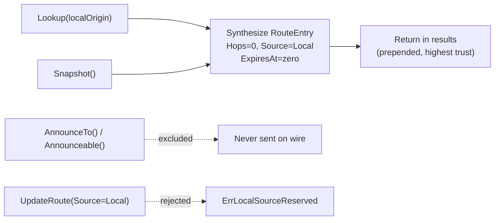
```mermaid
flowchart LR
    A["Lookup(localOrigin)"] --> B["Synthesize RouteEntry\nHops=0, Source=Local\nExpiresAt=zero"]
    B --> C["Return in results\n(prepended, highest trust)"]
    D["Snapshot()"] --> B
    E["AnnounceTo() / Announceable()"] -.->|"excluded"| F["Never sent on wire"]
    G["UpdateRoute(Source=Local)"] -.->|"rejected"| H["ErrLocalSourceReserved"]
```
*Diagram — Self-route: synthetic, read-only, never stored or announced*

**Собственный маршрут (локальная идентичность).** Когда `localOrigin` настроен, `Lookup()` и `Snapshot()` синтезируют локальный маршрут для собственной идентичности ноды (`Hops=0`, `Source=RouteSourceLocal`). Этот маршрут не хранится в таблице — он инжектируется при чтении. Он никогда не истекает, никогда не отзывается и никогда не включается в анонсы (`AnnounceTo`/`Announceable`). Пиры обнаруживают эту ноду через свои собственные прямые маршруты. Собственный маршрут гарантирует, что нода всегда может разрешить саму себя в таблице маршрутизации без внешней пир-сессии. `Snapshot().TotalEntries` и `Snapshot().ActiveEntries` не считают синтетический self-route — эти счётчики описывают персистированное состояние таблицы и согласованы с `ActiveSize()`. `reachableFromSnapshot`, `reachableIDsFrame` и `fetch_route_summary` исключают записи `RouteSourceLocal`, поскольку достижимость касается удалённых пиров, а не самой ноды. `UpdateRoute` отклоняет `RouteSourceLocal` с `ErrLocalSourceReserved` — этот источник чисто синтетический и не должен персистироваться.

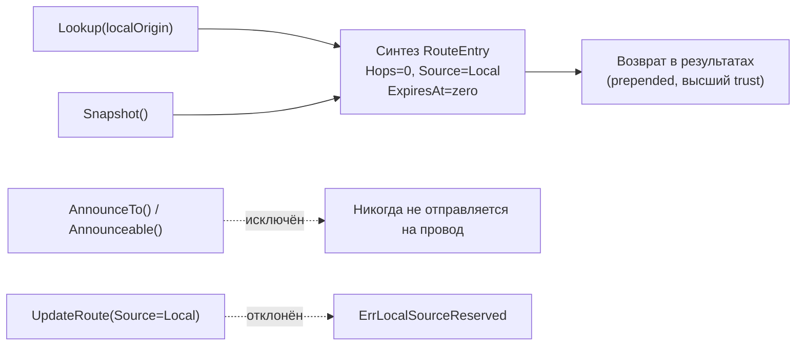
```mermaid
flowchart LR
    A["Lookup(localOrigin)"] --> B["Синтез RouteEntry\nHops=0, Source=Local\nExpiresAt=zero"]
    B --> C["Возврат в результатах\n(prepended, высший trust)"]
    D["Snapshot()"] --> B
    E["AnnounceTo() / Announceable()"] -.->|"исключён"| F["Никогда не отправляется на провод"]
    G["UpdateRoute(Source=Local)"] -.->|"отклонён"| H["ErrLocalSourceReserved"]
```
*Диаграмма — Self-route: синтетический, read-only, никогда не хранится и не анонсируется*

**Trust hierarchy.** Per triple, `local > direct > hop_ack > announcement`. The `local` source (TrustRank=3) is reserved for the synthetic self-route and is never stored in the table. At the same SeqNo, a higher-trust source replaces a lower-trust one. Confirming one triple via hop_ack does not affect other triples, even those sharing the same NextHop.

**Иерархия доверия.** На тройку: `local > direct > hop_ack > announcement`. Источник `local` (TrustRank=3) зарезервирован для синтетического собственного маршрута и никогда не хранится в таблице. При одинаковом SeqNo источник с более высоким доверием заменяет источник с более низким.

**Route selection order.** `Lookup()` ranks routes by the Phase 2 `CompositeScore` (base hop-count term + source-trust bonus + RTT bonus + health penalty — see "Route health and composite scoring" below and `docs/protocol/route_health.md` for the formula). Source trust still nudges the ranking via the bonus (local/direct +20, hop_ack +10, announcement 0), so for equal hops/health/RTT a higher-trust source wins; but unlike the pre-Phase-2 sort, source trust no longer dominates hop count unconditionally — a Good 1-hop announcement can outscore a Bad 3-hop direct. `HealthDead` claims are filtered before ranking, with one exemption: `RouteSourceDirect` (own-origin) claims stay selectable even when Dead and are scored with a `Bad`-equivalent penalty, because Direct lifecycle is session-driven rather than health-driven.

**TTL expiry.** Learned routes (from announcements and hop_ack) carry an `ExpiresAt` timestamp (default 120s from insertion). `TickTTL()` removes expired entries and returns a slice of identities where the expiry exposed a surviving non-withdrawn backup route — `routingTableTTLLoop` uses this to trigger `drainPendingForIdentities` for immediate delivery via the backup. Learned routes are refreshed naturally when the neighbor re-announces them. When a same-SeqNo re-announcement arrives for an expired entry, `UpdateRoute` accepts it as a valid refresh — the origin has not changed the route, it is simply re-confirming it. When a same-SeqNo same-source same-hops re-announcement arrives for an *alive* learned entry — an exact reconfirmation — `UpdateRoute` returns `RouteUnchanged` and extends `ExpiresAt` to `now + defaultTTL`. The wire-level reconfirmation renews the lifetime even though no field a delta consumer cares about has changed. Without this refresh, no-op suppression on the send side would let learned routes age out between forced full syncs (see "Refresh interval invariant" below). A *weaker* incoming entry — same SeqNo but worse hops or lower trust — also returns `RouteUnchanged` but must NOT extend ExpiresAt: the old entry is the better path and the receiver wants to keep it, but allowing the optimistic earlier hops=N entry to be refreshed by a hops=N+1 reapplication would freeze it indefinitely and block natural TTL-driven reconvergence onto the actually-current path when the origin does not bump SeqNo. Direct routes are also exempt from this refresh: their `ExpiresAt` is zero by design (see "Direct route lifecycle" below) and overwriting it would convert a never-expiring entry into a 120s-ageing one — `IsExpired` returns false for zero, so an alive direct route would otherwise reach this branch alongside learned ones.

**Direct route lifecycle.** Own-origin direct routes use `ExpiresAt=zero` (never expire by time). Their lifetime is managed entirely by the session lifecycle: `AddDirectPeer` creates them on socket connect, `RemoveDirectPeer` withdraws them on socket close. This is event-driven — no periodic TTL refresh is needed. `RemoveDirectPeer` sets `Hops=HopsInfinity` and `ExpiresAt=now+defaultTTL` on the withdrawn entry, creating a tombstone that `TickTTL` cleans up after the default TTL window. This design eliminates a class of race conditions where `TickTTL` could permanently delete an active direct route between `RefreshDirectPeers` cycles, making a connected peer invisible to the routing table. `UpdateRoute` enforces the zero-`ExpiresAt` invariant at primary normalization: any `RouteSourceDirect` entry that arrives there — through a state restore, a defensive re-application, or the explicit Direct-via-`UpdateRoute` test paths — has its `ExpiresAt` forced to zero before insertion regardless of what the caller supplied, so no caller can accidentally land an active direct entry with a finite TTL that `TickTTL` would later evict.

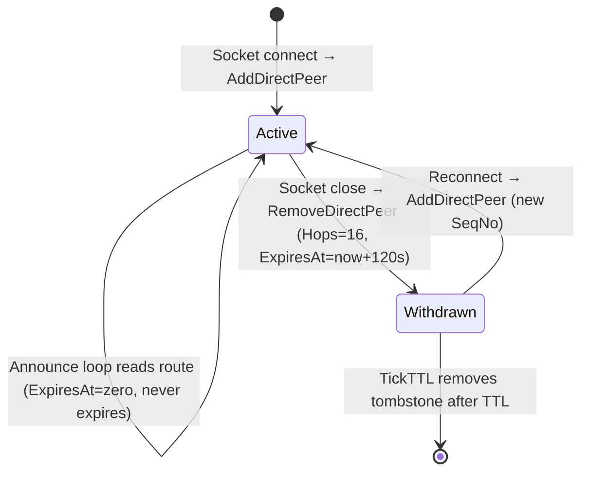
```mermaid
stateDiagram-v2
    [*] --> Active: Socket connect → AddDirectPeer
    Active --> Active: Announce loop reads route (ExpiresAt=zero, never expires)
    Active --> Withdrawn: Socket close → RemoveDirectPeer (Hops=16, ExpiresAt=now+120s)
    Withdrawn --> [*]: TickTTL removes tombstone after TTL
    Withdrawn --> Active: Reconnect → AddDirectPeer (new SeqNo)
```
*Diagram — Direct route lifecycle: event-driven, no TTL expiry*

**Refresh interval invariant.** Learned routes on neighbors carry a `defaultTTL` lifetime (120s). The send side suppresses wire emission when the per-peer delta is empty (see `announce_cycle_complete` log line: `announce_skipped_noop`), so the only mechanism that renews TTL on an unchanged lineage is the periodic forced full sync, which fires every `EffectiveForcedFullSyncInterval(AnnounceInterval)`. The bound is:

```
EffectiveForcedFullSyncInterval(AnnounceInterval) <= DefaultTTL / 2
```

`EffectiveForcedFullSyncInterval(AnnounceInterval) = min(ForcedFullSyncMultiplier × AnnounceInterval, DefaultTTL/2)` — the cap is enforced inside the helper itself, so any operator-configured `AnnounceInterval` (via `CORSA_ANNOUNCE_INTERVAL_SECONDS`) yields a forced-full-sync cadence ≤ TTL/2. At the default values (`multiplier=2`, `interval=30s`, `TTL=120s`) the inequality is tight: forced full sync fires every 60s = TTL/2 = exactly when half the TTL has elapsed, so a single dropped or late-arriving sync still leaves the next attempt before the lifetime ends. For shorter operator-configured intervals (e.g. 10s → forced cadence 20s) the cadence is below TTL/2 by a wider margin; for `AnnounceInterval ≥ TTL/2` the cap clamps to TTL/2.

The Run loop tick period is chosen by `chooseTickInterval(AnnounceInterval, EffectiveForcedFullSyncInterval(AnnounceInterval))` so the tick is a divisor of the cap — forced-full deadlines therefore land exactly on a tick rather than "deadline + up to one tick" later. Without that, an operator setting `AnnounceInterval=45s` would tick at 45s, observe the 60s deadline only at the 90s wake, and stretch the actual cadence past TTL/2. See the helper's doc-comment in `internal/core/routing/announce.go` for the gcd-based algorithm and the busy-loop floor that protects against non-second-aligned inputs.

Forced-full retry rate-limit window is clamped to `min(MinForcedFullSyncInterval, EffectiveForcedFullSyncInterval(AnnounceInterval))` so it never exceeds the projected cadence — without the clamp, an operator setting a short interval (e.g. 10s, forced cadence 20s) would have the second forced attempt blocked by the fixed 30s rate-limit window and the actual cadence would silently stretch to 30s, contradicting the helper's projection. Default 30s interval is unaffected (clamp is a no-op when `forcedFullSyncInterval ≥ 30s`).

The invariant is enforced by two pieces of machinery, both of which must hold for the contract to be intact:

- send-side cadence — guarded by a small bench of unit tests in `internal/core/routing/announce_test.go` and `internal/core/routing/announce_invariant_test.go`:
    - `TestRoutingConstants_RefreshIntervalInvariant` — pins the default-constants compile-time inequality `ForcedFullSyncMultiplier × DefaultAnnounceInterval ≤ DefaultTTL/2` so a change to any of the three constants without rechecking is caught.
    - `TestEffectiveForcedFullSyncInterval_CappedAtTTLHalf` — pins the cap inside the helper itself for ANY operator-configured AnnounceInterval (`min(2 × interval, DefaultTTL/2)`), so an operator setting a value above TTL/2 cannot push the cadence past the freshness boundary.
    - `TestAnnounceLoop_TickInterval_DividesBothCadences` — pins that `chooseTickInterval` returns a tick that divides both the operator interval AND the forced cap, so forced-full deadlines land EXACTLY on a tick rather than "deadline + up to one tick" later.
    - `TestAnnounceLoop_TickInterval_BusyLoopGuard` — pins the 1-second floor on production cadences so non-second-aligned operator inputs (e.g. `59s + 1ns`) cannot collapse `gcd` to a sub-second value and turn `time.NewTicker` into a busy loop.
    - `TestAnnounceLoop_ForcedFullRateLimit_ClampedToForcedFullCap` — pins the round 15.6 clamp `min(MinForcedFullSyncInterval, EffectiveForcedFullSyncInterval(AnnounceInterval))` so the rate-limit window cannot stretch the actual forced-full cadence past the helper's projection.
    - `TestAnnounceLoop_TriggerDoesNotDelayForcedFullDeadline` — pins the round 15.9 P1 fix: the `triggerCh` handler in `AnnounceLoop.Run` MUST NOT call `ticker.Reset(tickInterval)`. With triggers arriving slightly faster than the natural tick (e.g. connect/disconnect storms during a churn event), each Reset would push the next periodic wake forward, the forced-full deadline check would only catch a deadline at the next trigger past the cap, and the actual forced-full gap would silently exceed `EffectiveForcedFullSyncInterval(AnnounceInterval)`. The test drives `AnnounceInterval=200ms` (cap=400ms) with triggers every 180ms and asserts the wire-send gap stays within `cap + 50ms` jitter tolerance — the bug shape produces ~540ms gaps and fails cleanly.
- receive-side TTL extension — `UpdateRoute`'s `RouteUnchanged` branch (`internal/core/routing/table.go`) refreshes `ExpiresAt` on alive learned entries only when the incoming entry is an exact reconfirmation (same source AND same hops), leaves weaker re-applications (worse hops, lower trust) without a TTL bump so reconvergence still works, and leaves direct-route entries with their `ExpiresAt=zero` untouched. The same file's primary normalization step forces `ExpiresAt=zero` for every `RouteSourceDirect` insert/replace so a direct entry can never reach the table with a finite TTL through any UpdateRoute path. Guarded by `TestUpdateRouteRefreshesTTLOnUnchangedLiveRoute`, `TestUpdateRouteUnchangedWorseHopsDoesNotRefreshTTL`, `TestUpdateRouteDirectInsertPreservesZeroExpiry`, `TestUpdateRouteUnchangedDirectRoutePreservesZeroExpiry` (all in `internal/core/routing/table_test.go`), and the end-to-end `TestAnnounceLoop_ForcedFullSync_RefreshesLearnedRouteBeforeExpiry` (`internal/core/routing/announce_ttl_refresh_test.go`).

Removing any of the send-side guards or the receive-side TTL extension regresses the "best route flaps" symptom: learned `hops=N` routes through a hub disappear for up to `DefaultTTL - EffectiveForcedFullSyncInterval(AnnounceInterval)` per cycle (at the default 30s interval that's 60s; for shorter operator-configured intervals it shrinks proportionally), the local `Lookup` rotates onto longer transit paths, and the visible best-route field oscillates between optimal and degraded values until the next full sync repopulates the optimal lineage.

**Operator tuning — announce interval and overload gate.** Two config knobs let densely-connected receivers shed CPU without violating the freshness invariant:

- `CORSA_ANNOUNCE_INTERVAL_SECONDS` (`config.Node.AnnounceInterval`). Overrides the periodic delta-cycle period. Default unset → `routing.DefaultAnnounceInterval` (30s). Operators of densely-connected nodes (>10 direct peers) may raise to 45-60s to halve the per-peer delta-computation CPU. The forced-full-sync cadence is independently capped at `DefaultTTL/2` by `routing.EffectiveForcedFullSyncInterval` regardless of the configured interval, so the freshness invariant above ALWAYS holds. Setting `AnnounceInterval = DefaultTTL/2` collapses every tick into a forced full sync (no in-between deltas), which is appropriate when the sender is CPU-bound by delta computation across many peers; the trade-off is that state propagation latency loses the mid-cycle delta granularity.
- `CORSA_OVERLOAD_GOROUTINE_THRESHOLD` (`config.Node.OverloadGoroutineThreshold`). When set to a positive integer, the announce loop consults a goroutine-count proxy (`runtime.NumGoroutine()`) at the start of each cycle. If goroutines exceed the threshold, delta sends to peers that don't owe a forced full sync this round are suppressed; forced-full-sync still fires on its TTL/2 schedule so receivers never see stale routes. Disabled by default (zero threshold). A reasonable starting value for hub nodes is observed `NumGoroutine` under normal load × 2-3 — typically 5000-10000 for a densely-connected node. The cumulative engaged-cycle counter is surfaced through `fetchRouteSummary` under the `overload.engaged_cycles` field (see `docs/rpc/routing.md`) so operators can see whether backpressure is firing in production without attaching a debugger. Goroutine count is a proxy because each inbound frame spawns at least one goroutine; sustained backlog produces visible pile-up. The proxy may be replaced with explicit per-peer inbox length aggregation in a future iteration.

**NextHop is peer identity.** Routing operates at identity level, not transport addresses. A single peer identity may have multiple concurrent TCP sessions; session selection happens later in `node.Service` via the identity-to-session(s) index that resolves identities to active connections.

**Entry validation.** `RouteEntry.Validate()` enforces structural invariants at insert time: Identity, Origin, and NextHop must be non-empty; Hops must be in range [1, 16] for stored routes. Source-specific rules: direct routes (`RouteSourceDirect`) must have `Hops=1` and `NextHop == Identity` (directly connected neighbor); local routes (`RouteSourceLocal`) must have `Hops=0`. Malformed entries are rejected by `UpdateRoute` before acquiring locks or touching table state. `UpdateRoute` additionally rejects `RouteSourceLocal` entries with `ErrLocalSourceReserved` — this source is purely synthetic and must never be persisted, preventing any caller from injecting a zero-hop highest-trust route for an arbitrary identity. `UpdateRoute` also enforces an origin guard for direct routes: when `localOrigin` is configured, a `RouteSourceDirect` entry whose `Origin != localOrigin` is rejected with `ErrDirectForeignOrigin`. This prevents callers from injecting impossible direct routes for foreign origins that would outrank all announcement/hop_ack routes in `Lookup` and never be eligible for own-origin withdrawal handling on disconnect.

**Валидация записей.** `RouteEntry.Validate()` проверяет структурные инварианты при вставке: Identity, Origin и NextHop не должны быть пустыми; Hops в диапазоне [1, 16] для хранимых маршрутов. Правила по источникам: direct-маршруты (`RouteSourceDirect`) должны иметь `Hops=1` и `NextHop == Identity`; локальные (`RouteSourceLocal`) — `Hops=0`. `UpdateRoute` дополнительно отклоняет `RouteSourceLocal` записи с ошибкой `ErrLocalSourceReserved` — этот источник чисто синтетический и не должен персистироваться. `UpdateRoute` также проверяет origin guard для direct-маршрутов: `RouteSourceDirect` с `Origin != localOrigin` отклоняется с `ErrDirectForeignOrigin`.

**Wire projection boundary.** The boundary between table-model and wire-format is explicit: `AnnounceTo(excludeVia)` returns `[]AnnounceEntry` with split horizon applied. The wire carries the sender's local hop count — no +1 is applied on the sender side; the receiver adds +1 when inserting into its own table . `RemoveDirectPeer` returns wire-ready `[]AnnounceEntry` withdrawals with SeqNo already incremented. Callers building `announce_routes` frames use `AnnounceTo` or `RemoveDirectPeer` results directly — no manual arithmetic is needed.

**SeqNo counter consistency.** When `UpdateRoute` accepts an own-direct entry (`Source == RouteSourceDirect` AND `Origin == localOrigin`), it synchronizes the monotonic counter: `seqCounters[identity] = max(counter, entry.SeqNo)`. This ensures that tables pre-populated via `UpdateRoute` (e.g., restored from a snapshot or received via full sync) do not cause subsequent `AddDirectPeer`/`RemoveDirectPeer` to emit a stale SeqNo. The `Source == RouteSourceDirect` gate is critical post-Phase-1: the `toRouteEntry` synthesiser sets `Origin = localOrigin` on EVERY claim returned from `Lookup` (regardless of underlying claim source), so hop_ack-promotion paths (where `confirmRouteViaHopAck` reads via `Lookup` and resubmits with `Source = RouteSourceHopAck`) carry foreign SeqNo values under a `localOrigin` Origin. Without the Source gate those foreign SeqNos would poison our own-direct counter and the next own-direct withdrawal would emit a stale SeqNo that legacy receivers reject.

### Integration

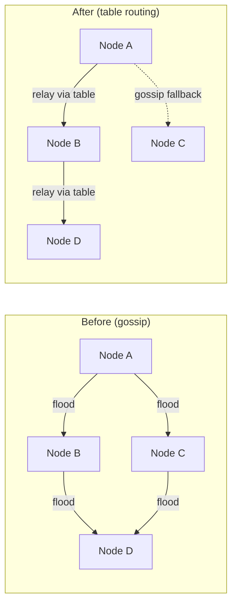
```mermaid
flowchart LR
    subgraph Before["Before (gossip)"]
        A1[Node A] -->|flood| B1[Node B]
        A1 -->|flood| C1[Node C]
        B1 -->|flood| D1[Node D]
        C1 -->|flood| D1
    end

    subgraph After["After (table routing)"]
        A2[Node A] -->|relay via table| B2[Node B]
        B2 -->|relay via table| D2[Node D]
        A2 -.->|gossip fallback| C2[Node C]
    end
```
*Diagram — Message delivery: gossip flood vs table-directed relay*

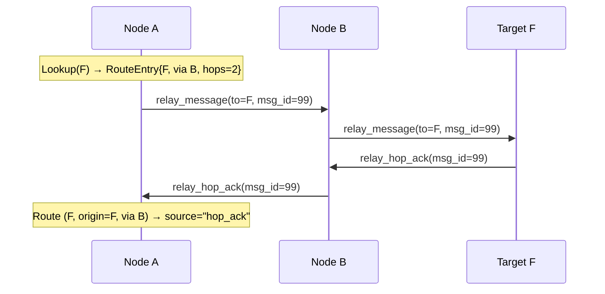
```mermaid
sequenceDiagram
    participant A as Node A
    participant B as Node B
    participant F as Target F

    Note over A: Lookup(F) → RouteEntry{F, via B, hops=2}
    A->>B: relay_message(to=F, msg_id=99)
    B->>F: relay_message(to=F, msg_id=99)
    F->>B: relay_hop_ack(msg_id=99)
    B->>A: relay_hop_ack(msg_id=99)
    Note over A: Route (F, origin=F, via B) → source="hop_ack"
```
*Diagram — Table-directed relay with hop_ack confirmation*

**Convergence.** The announce loop (`routing/announce.go`) runs periodic announcements at the operator-configured cadence (`AnnounceInterval`, default 30 seconds, override via `CORSA_ANNOUNCE_INTERVAL_SECONDS`) and supports triggered updates on connect/disconnect events. The loop uses per-peer announce state (`routing/announce_state.go`) to track what was last sent to each peer. On each cycle, raw route entries from `Table.AnnounceTo(peer)` are aggregated into a canonical peer-specific snapshot. Post-Phase-1 the heavy lifting happens in `routeStore.AnnounceProjectionFor` upstream of the snapshot builder: it does the per-Identity live-winner collapse inline (min Hops → higher SeqNo → verified-sig tie-break (Round-26: `AttestedSigVerified=true` beats unsigned, mirrors `scoreSignedBonus` in `Lookup`/`AnnounceTargetFor`) → Extra tie-break → Uplink lex), enforces live-vs-tombstone exclusivity (live winner emitted alone; tombstone emitted only when no live alternative exists), and synthesises the outbound wire SeqNo through `nextOutboundSeqLockedPerPeer` / `nextOutboundSeqLockedBroadcast` (see Key invariants → "Per-Identity SeqNo monotonicity"). `BuildAnnounceSnapshot` then runs as a thin defensive pass on the projection output: exact-duplicate removal, per-`(Identity, Origin, SeqNo, Withdrawn)` collapse (defends against synthetic test-fixture inputs that bypass AnnounceProjectionFor), and per-Identity tombstone collapse so that synthetic multi-tombstone snapshots produce stable deltas. The legacy pre-A1 per-`(Identity, Origin)` max-SeqNo stage was removed in Phase 1 — `Origin = localOrigin` is constant across all post-A1 emits, so the stage had become destructive (would collapse the live winner and an own-direct tombstone for the same Identity into a single slot by SeqNo race). The result is sorted by `(Identity, Hops, Origin)` — Identity ascending, live winner before any tombstone within an Identity group, Origin lex tie-break. If the snapshot is unchanged from the last send, no frame is emitted (no-op suppression). If only a subset changed, only the delta entries are sent in an `announce_routes` frame. A forced full sync is performed on new peer connect and periodically every `EffectiveForcedFullSyncInterval(AnnounceInterval)` (= `min(ForcedFullSyncMultiplier × AnnounceInterval, DefaultTTL/2)` — at default 30s interval that is 60s; for shorter operator intervals it is `2 × AnnounceInterval`; for longer ones it clamps at TTL/2 = 60s). The cadence is bound by the **Refresh interval invariant** below: forced cadence ≤ DefaultTTL/2. Without that bound, learned routes on neighbors silently expire between cycles because no-op suppression skips wire emission for unchanged snapshots. If the peer-specific snapshot is empty at full-sync time (e.g. split horizon filtered all routes when announcing back to a single-route peer), the full-sync baseline is recorded as successful without sending a wire frame — the peer learns nothing new, and subsequent cycles use the delta path normally (empty-baseline). Forced full sync attempts are rate-limited by `min(MinForcedFullSyncInterval, EffectiveForcedFullSyncInterval(AnnounceInterval))` to prevent flooding when a peer is repeatedly marked `NeedsFullResync` — the clamp ensures the rate-limit window never stretches the actual cadence past the projected one (e.g. for `AnnounceInterval=10s`, rate-limit clamps from the fixed 30s constant down to 20s = forced cadence). The rate limit is bypassed for peers that have never successfully received any data (`LastSentSnapshot == nil`) — a failed first attempt must not block retry. Incoming `announce_routes` frames are processed by `handleAnnounceRoutes` in `node/routing_announce.go` — each route gets +1 hop on the receiver side. Withdrawals (hops=16) are applied via `Table.WithdrawRoute`, but only from the origin sender (`Origin == senderIdentity`). When `WithdrawRoute` receives a withdrawal for an unseen `(Identity, Uplink=NextHop)` pair, it creates a tombstone entry (hops=HopsInfinity) with the withdrawal's SeqNo. This prevents a delayed older announcement from resurrecting a withdrawn lineage — the tombstone's SeqNo blocks any stale update for the same `(Identity, Uplink)` pair. The withdrawal frame's `Origin` is preserved on the public `WithdrawRoute` API for backward compat with pre-A1 callers but is stored only as `LastIngressOrigin` lineage metadata on the tombstone (post-Phase-A storage keys per-`(Identity, Uplink)` — see "Storage model" above; the legacy three-tuple triple is gone from the dedup key). Tombstones expire via normal TTL. **Tombstones are independent of `MaxNextHopsPerOrigin`:** they are appended unconditionally and excluded from the cap counter, so a saturated bucket of K live routes still admits new tombstones (the cap protects only the K live slots). This is a deliberate design trade-off — see "RIB compaction" — that keeps the SeqNo resurrection guard intact under cap pressure. The `mesh_routing_v1` capability is now advertised during handshake. The announce loop covers both outbound sessions and inbound-only connections. Target discovery via `routingCapablePeers()` requires both `mesh_routing_v1` and `mesh_relay_v1` — a routing-only peer (no relay) is excluded because routes through it would create non-deliverable paths.

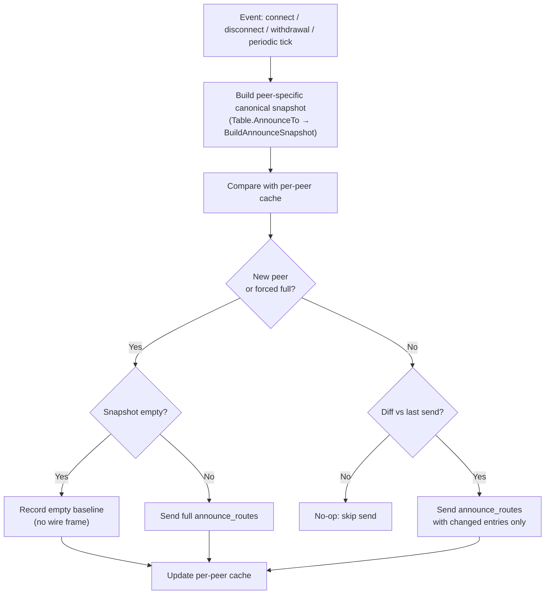
```mermaid
flowchart TD
    A["Event: connect / disconnect / withdrawal / periodic tick"] --> B["Build peer-specific canonical snapshot\n(Table.AnnounceTo → BuildAnnounceSnapshot)"]
    B --> C["Compare with per-peer cache"]
    C --> D{"New peer\nor forced full?"}
    D -- "Yes" --> E0{"Snapshot empty?"}
    E0 -- "Yes" --> E1["Record empty baseline\n(no wire frame)"]
    E0 -- "No" --> E["Send full announce_routes"]
    D -- "No" --> F{"Diff vs last send?"}
    F -- "No" --> G["No-op: skip send"]
    F -- "Yes" --> H["Send announce_routes\nwith changed entries only"]
    E1 --> I["Update per-peer cache"]
    E --> I
    H --> I
```
*Diagram — Announce loop: per-peer send decision / Диаграмма — Цикл анонсов: решение об отправке per-peer*

**Extra invariant in aggregation.** `Extra` (opaque `json.RawMessage`) MUST be identical for all table entries sharing the same `(Identity, Origin, SeqNo)` lineage. The origin node sets `Extra` once per SeqNo; every relay forwards it unchanged. If `BuildAnnounceSnapshot` detects differing `Extra` values for the same lineage during Stage 2 aggregation, it logs a warning (`announce_aggregation_extra_mismatch`) and falls back to deterministic tie-break (larger canonical `Extra` wins). Such divergence indicates relay data corruption or protocol version mismatch and requires investigation.

**Инвариант Extra при агрегации.** `Extra` (опаковый `json.RawMessage`) ДОЛЖЕН быть идентичным для всех записей таблицы с одинаковым lineage `(Identity, Origin, SeqNo)`. Origin-нода устанавливает `Extra` один раз для каждого SeqNo; каждый relay пересылает его без изменений. Если `BuildAnnounceSnapshot` обнаруживает расхождение `Extra` для одного lineage при агрегации Stage 2, логируется предупреждение (`announce_aggregation_extra_mismatch`) и применяется детерминированный tie-break (побеждает больший канонический `Extra`). Такое расхождение указывает на повреждение данных relay или несовместимость версий протокола и требует расследования.

**Конвергенция.** Цикл анонсов (`routing/announce.go`) выполняет периодические анонсы с operator-configured cadence (`AnnounceInterval`, по умолчанию 30 секунд, override через `CORSA_ANNOUNCE_INTERVAL_SECONDS`) и поддерживает triggered-обновления при подключении/отключении. Цикл использует per-peer состояние анонсов (`routing/announce_state.go`) для отслеживания того, что было отправлено каждому peer'у. На каждом цикле raw-записи маршрутов из `Table.AnnounceTo(peer)` агрегируются в канонический peer-specific snapshot. Post-Phase-1 тяжёлая работа происходит upstream — в `routeStore.AnnounceProjectionFor`: он делает per-Identity live-winner collapse inline (min Hops → higher SeqNo → verified-sig tie-break (Round-26: `AttestedSigVerified=true` побеждает unsigned, mirror'ит `scoreSignedBonus` в `Lookup`/`AnnounceTargetFor`) → Extra tie-break → Uplink lex), enforce'ит live-vs-tombstone exclusivity (live winner эмитится один; tombstone эмитится только когда live alternative нет) и синтезирует outbound wire SeqNo через `nextOutboundSeqLockedPerPeer` / `nextOutboundSeqLockedBroadcast` (см. Ключевые инварианты → "Per-Identity SeqNo monotonicity"). `BuildAnnounceSnapshot` (`routing/announce_builder.go`) затем работает как тонкий defensive pass над projection output: exact-duplicate removal, per-`(Identity, Origin, SeqNo, Withdrawn)` collapse (защита от synthetic test-fixture inputs, обходящих AnnounceProjectionFor) и per-Identity tombstone collapse, чтобы synthetic multi-tombstone snapshots давали стабильные delta. Legacy pre-A1 per-`(Identity, Origin)` max-SeqNo stage была удалена в Phase 1 — `Origin = localOrigin` константа на всех post-A1 emit'ах, поэтому stage стала destructive (collapse'нула бы live winner и own-direct tombstone одной Identity в один slot по SeqNo race). Результат сортируется по `(Identity, Hops, Origin)` — Identity ASC, live winner перед любым tombstone внутри Identity-группы, Origin lex tie-break. Если snapshot не изменился по сравнению с последней отправкой, кадр не отправляется (no-op suppression). Если изменилась только часть, отправляются только delta-записи в кадре `announce_routes`. Принудительная полная синхронизация выполняется при подключении нового peer'а и периодически каждые `EffectiveForcedFullSyncInterval(AnnounceInterval)` (= `min(ForcedFullSyncMultiplier × AnnounceInterval, DefaultTTL/2)` — при default 30s interval это 60s; для коротких operator-интервалов это `2 × AnnounceInterval`; для длинных clamp'ится до TTL/2 = 60s). Каденс ограничен **инвариантом интервала refresh** ниже: forced cadence ≤ DefaultTTL/2. Без этого ограничения learned-маршруты у соседей тихо истекают между циклами — no-op suppression пропускает отправку для unchanged snapshot. Если peer-specific snapshot пуст на момент full sync (например, split horizon отфильтровал все маршруты при анонсе обратно single-route peer'у), baseline записывается как успешный без отправки wire-кадра — peer не узнаёт ничего нового, а последующие циклы используют delta path как обычно (empty-baseline). Попытки forced full sync ограничены `min(MinForcedFullSyncInterval, EffectiveForcedFullSyncInterval(AnnounceInterval))` для предотвращения flood при повторном `NeedsFullResync` — clamp гарантирует, что rate-limit window никогда не растягивает actual cadence за projected (например, для `AnnounceInterval=10s` rate-limit clamp'ится с fixed 30s константы до 20s = forced cadence). Rate limit обходится для peer'ов, которые никогда успешно не получали данных (`LastSentSnapshot == nil`) — неудачная первая попытка не должна блокировать retry.

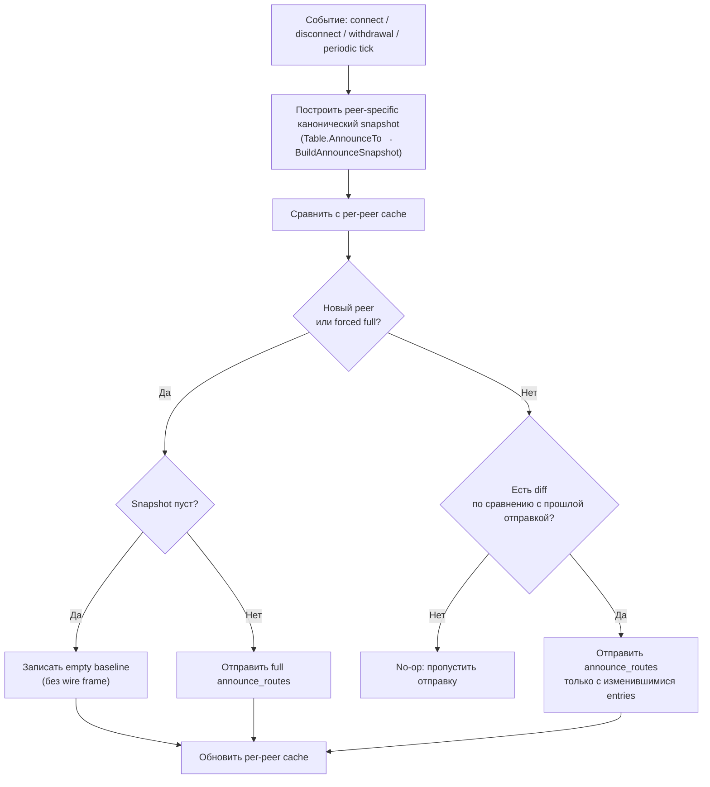
```mermaid
flowchart TD
    A["Событие: connect / disconnect / withdrawal / periodic tick"] --> B["Построить peer-specific канонический snapshot\n(Table.AnnounceTo → BuildAnnounceSnapshot)"]
    B --> C["Сравнить с per-peer cache"]
    C --> D{"Новый peer\nили forced full?"}
    D -- "Да" --> E0{"Snapshot пуст?"}
    E0 -- "Да" --> E1["Записать empty baseline\n(без wire frame)"]
    E0 -- "Нет" --> E["Отправить full announce_routes"]
    D -- "Нет" --> F{"Есть diff\nпо сравнению с прошлой отправкой?"}
    F -- "Нет" --> G["No-op: пропустить отправку"]
    F -- "Да" --> H["Отправить announce_routes\nтолько с изменившимися entries"]
    E1 --> I["Обновить per-peer cache"]
    E --> I
    H --> I
```
*Диаграмма — Цикл анонсов: решение об отправке per-peer*

**Receive-path validation.** `handleAnnounceRoutes` enforces three safety invariants before accepting any wire announcement: (1) **Sender identity validation** — the sender identity must be a valid 40-char lowercase hex fingerprint (`identity.IsValidAddress`). For inbound connections, the identity is read from `connPeerHello.identity` (the hello frame's `Address` field), not from `connPeerHello.address` (the listen address used for health tracking). This distinction is critical for NATed peers that advertise a non-routable listen address (e.g. `127.0.0.1:64646`) — using the listen address as routing identity would cause all announcements from such peers to be rejected as malformed. For outbound sessions, the identity is read from `session.peerIdentity` (set from the welcome frame). (2) **Own-origin rejection** — announcements where `Origin == localIdentity` from a foreign sender are silently dropped. Only this node may originate routes under its own identity; accepting a forged own-origin entry would let a neighbor poison the monotonic SeqNo counter via `syncSeqCounterLocked`. (3) **Transit withdrawal rejection** — wire withdrawals (`hops >= 16`) where `Origin != senderIdentity` are silently dropped. Only the origin may emit a wire withdrawal; transit nodes must invalidate locally and stop advertising. All three guards are enforced before `UpdateRoute`/`WithdrawRoute` to prevent malformed data from reaching the table.

**Direct-route capability gate.** `onPeerSessionEstablished(peerIdentity, caps)` takes the peer's full negotiated capability set and flattens it internally to a `hasRelayCap := sessionHasCap(caps, domain.CapMeshRelayV1)` local decision that controls whether `AddDirectPeer` is called. A direct route in the distance-vector table advertises that this node can relay DMs to the destination. If the peer cannot accept `relay_message` frames (legacy or gossip-only node), the route would be non-deliverable — other routing-capable nodes would learn a path that silently fails at the last hop. The outbound call site passes the session's `capabilities` slice directly. The inbound call site resolves the per-connection capability snapshot via `connCapabilitiesForID(id)`. Peers without `mesh_relay_v1` still connect and exchange gossip normally but are never advertised as direct destinations in the routing table. The full capability list is also forwarded to `AnnounceStateRegistry.MarkReconnected` so the announce plane can make mode decisions without a second `peerMu` round-trip — the registry takes a defensive copy internally, so callers may pass session-owned slices unchanged.

**Multi-session identity with dual counters.** `node.Service` maintains two per-identity counters: `identitySessions` (total active sessions) and `identityRelaySessions` (relay-capable sessions only). `AddDirectPeer()` is called on the `identityRelaySessions` 0→1 transition (first relay-capable session). `RemoveDirectPeer()` is called on the `identityRelaySessions` 1→0 transition (last relay-capable session closes). This means a non-relay first session does not block a later relay session from creating the direct route, and closing the last relay session withdraws the route even if legacy sessions remain. `onPeerSessionClosed(peerIdentity, caps)` receives the same capability set that was passed to the matching `onPeerSessionEstablished` call so both counters stay balanced on every transition. Total session count cleanup happens independently.

**Persistent caps as a derived view of the chosen target.** `AnnouncePeerState.capabilities` is the persistent capability snapshot consulted by `classifyDeltaMode` at delta-mode selection. It is reconciled to the per-cycle `AnnounceTarget.Capabilities` at the very start of each per-peer goroutine in `AnnounceLoop.announceToAllPeers` via `AnnounceStateRegistry.UpdateCapabilities`. This is the single source of truth: the persistent snapshot is a derived view of the same session `routingCapablePeers` actually picked this cycle. No lifecycle-hook variant updates persistent caps on session establishment or close — `MarkReconnected` writes the initial snapshot for a fresh peer but additional routing-capable sessions, relay-only sessions, and non-relay sessions all leave the snapshot unchanged at the lifecycle-hook level. Why no hook variant works: `routingCapablePeers` dedupes overlapping sessions for one identity by map iteration order, so two cycles can pick different sessions when overlapping routing-capable sessions for the same peer have different negotiated caps; a partial close (the session that previously refreshed the snapshot disappears while an older routing-capable session remains) leaves the persistent caps describing a session that is no longer the target; a relay-only session (no `mesh_routing_v1`) is counted in `identityRelaySessions` but cannot be picked by `routingCapablePeers` as a target, so its caps must not poison the persistent snapshot — the older routing-capable session would still be selected and `classifyDeltaMode` would read mismatched sources. Cycle-time reconciliation sidesteps every one of these races: the cycle reads the same caps twice (once via target, once via persistent snapshot just synced from target), so `classifyDeltaMode` always sees agreeing inputs in production. The divergence path in `classifyDeltaMode` remains as a defensive net but is unreachable from the loop while the cycle-time sync stands; if a future call site introduces a second writer to `AnnouncePeerState.capabilities` or routes around the cycle sync, `MarkInvalid` + legacy delta on the current cycle is the safe fallback. `UpdateCapabilities` is intentionally narrow: it touches only the capability slice and never resets `hasReceivedBaseline`, `wireBaselineSentToPeer`, or `needsFullResync` — caps are an identity-level property reflected from active sessions; they must not influence baseline-gate state, which tracks wire-history with the peer identity in the current session window.

**Persistent caps как производная вьюха выбранного target-а.** `AnnouncePeerState.capabilities` — persistent capability-снимок, который читает `classifyDeltaMode` при выборе delta-mode. Он реконсилируется с per-cycle `AnnounceTarget.Capabilities` в самом начале каждой per-peer goroutine в `AnnounceLoop.announceToAllPeers` через `AnnounceStateRegistry.UpdateCapabilities`. Это единственный источник истины: persistent-снимок — derived-view той же сессии, которую `routingCapablePeers` фактически выбрал в этом цикле. Никакой lifecycle-hook не обновляет persistent caps на установке/закрытии сессии — `MarkReconnected` пишет первоначальный снимок для нового peer-а, но дополнительные routing-capable сессии, relay-only сессии и не-relay сессии все оставляют снимок неизменным на уровне lifecycle-hook-ов. Почему ни один hook-вариант не работает: `routingCapablePeers` дедуплицирует overlapping-сессии одной identity по порядку итерации мапы, поэтому два цикла могут выбрать разные сессии, когда overlapping routing-capable сессии того же peer-а имеют разные согласованные caps; partial close (сессия, которая раньше обновила снимок, исчезает, а другая routing-capable остаётся) оставляет persistent caps описывающими сессию, которая больше не target; relay-only сессия (без `mesh_routing_v1`) учитывается в `identityRelaySessions`, но `routingCapablePeers` её не выбирает как target, поэтому её caps не должны отравлять persistent-снимок — иначе старая routing-capable сессия всё равно будет выбрана target-ом и `classifyDeltaMode` прочитает рассогласованные источники. Cycle-time реконсиляция обходит все эти гонки: цикл читает одни и те же caps дважды (один раз через target, второй — через persistent-снимок, только что синхронизированный из target-а), поэтому `classifyDeltaMode` в продакшене всегда видит согласованные входы. Divergence-путь в `classifyDeltaMode` остаётся как defensive net, но недостижим из цикла пока стоит cycle-time sync; если будущий call site введёт второго писателя в `AnnouncePeerState.capabilities` или обойдёт cycle sync, `MarkInvalid` + legacy delta в текущем цикле — безопасный fallback. `UpdateCapabilities` намеренно узкий: трогает только capability-slice и никогда не сбрасывает `hasReceivedBaseline`, `wireBaselineSentToPeer` или `needsFullResync` — caps это identity-level свойство, отражённое из активных сессий; они не должны влиять на baseline-gate-стейт, который трекает wire-историю с peer-identity в текущем session-окне.

**Full-table sync on connect.** Both outbound and inbound connection paths send an immediate full-table sync (`routingTable.AnnounceTo(peerIdentity)`) to the newly connected peer. This ensures symmetric initial convergence regardless of connection direction. The sync is gated on both `mesh_routing_v1` and `mesh_relay_v1` capabilities — matching the steady-state announce loop contract. A routing-only peer (mesh_routing_v1 without mesh_relay_v1) would learn routes it cannot deliver on the data plane, so it is excluded from connect-time sync as well. The outbound path checks `sessionHasCapability(address, capMeshRoutingV1) && sessionHasCapability(address, capMeshRelayV1)` in `establishPeerSession`. The inbound path checks `connHasCapability(conn, capMeshRoutingV1) && connHasCapability(conn, capMeshRelayV1)` in `trackInboundConnect`. Both paths pass the peer's Ed25519 identity fingerprint (`peerIdentity`) to `AnnounceTo` — not the transport or listen address. This is critical for NATed inbound peers whose listen address (e.g. `127.0.0.1:64646`) differs from their identity fingerprint; passing the transport address would break split horizon filtering. Legacy peers without either capability are silently skipped. Split horizon is applied — routes learned from the connecting peer are excluded. If the resulting peer-specific snapshot is empty (e.g. the only route is the peer's own direct route, excluded by split horizon), the full-sync baseline is recorded without sending a wire frame (empty-baseline); subsequent announce cycles use the delta path normally. If the send fails (session queue full, connection lost between handshake and sync), a warning is logged (`routing_outbound_full_sync_failed` or `routing_inbound_full_sync_failed`). The peer will still receive the table on the next periodic announce cycle.

**Flap dampening.** The routing table tracks per-peer disconnect frequency to prevent link flaps from churning routes and flooding the network with announcements. Each `RemoveDirectPeer` call records a withdrawal timestamp. When a peer accumulates `flapThreshold` (default 3) disconnects within `flapWindow` (default 120s), it enters hold-down state for `holdDownDuration` (default 30s). During hold-down, `AddDirectPeer` still creates the route (connectivity is preserved), but the `AddDirectPeerResult.Penalized` flag signals to the caller that the triggered announce should be suppressed — the route will be picked up by the next periodic announce cycle, reducing announcement churn. Direct routes themselves have no TTL (see Direct route lifecycle above), so flap dampening affects only the announce timing, not route expiry. `TickTTL` cleans up stale flap state once both hold-down and the flap window have expired. All thresholds are configurable via `WithFlapWindow`, `WithFlapThreshold`, `WithHoldDownDuration`, and `WithPenalizedTTL` options.

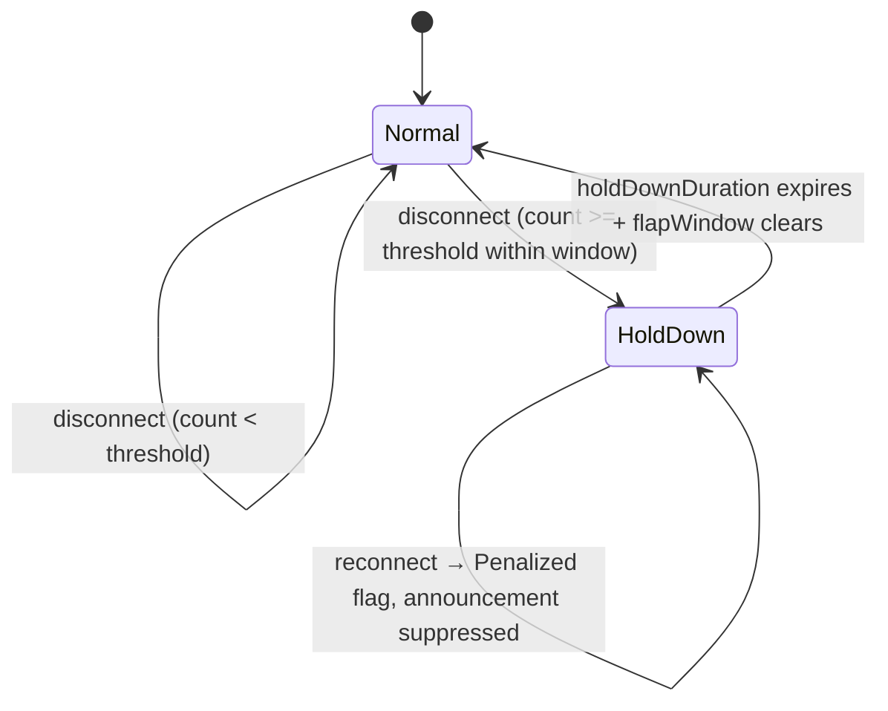
```mermaid
stateDiagram-v2
    [*] --> Normal
    Normal --> Normal: disconnect (count < threshold)
    Normal --> HoldDown: disconnect (count >= threshold within window)
    HoldDown --> HoldDown: reconnect → Penalized flag, announcement suppressed
    HoldDown --> Normal: holdDownDuration expires + flapWindow clears
```
*Diagram — Peer flap detection state machine*

**Outgoing DM delivery decision.** When `storeIncomingMessage` routes a DM, `TableRouter.Route()` returns a `RoutingDecision` containing `RelayNextHop` (identity), `RelayNextHopAddress` (validated transport address or `"inbound:"` key), and `RelayNextHopHops` (hop count from the route). The send path (`sendTableDirectedRelay`) uses the pre-validated address directly — no re-resolution — to avoid selecting a different session for the same identity with weaker capabilities. If the validated address is empty (retry path), re-resolution uses `resolveRouteNextHopAddress` with the original hop role: destination (hops=1) requires only `mesh_relay_v1`; transit (hops>1) requires both `mesh_relay_v1` and `mesh_routing_v1`. If re-resolution or send fails, gossip fallback triggers. Both outbound sessions and inbound-only connections are usable as relay next-hops. Relay state persistence (`relayForwardState`) is checked on both outbound and inbound paths — if the store is rejected (duplicate message ID or capacity limit), the send is treated as a failure (returns false) and a warning is logged (`relay_state_store_failed_outbound` / `relay_state_store_failed_inbound`). This ensures the caller sees the delivery as failed and can fall back to gossip rather than silently losing hop_ack and receipt routing context.

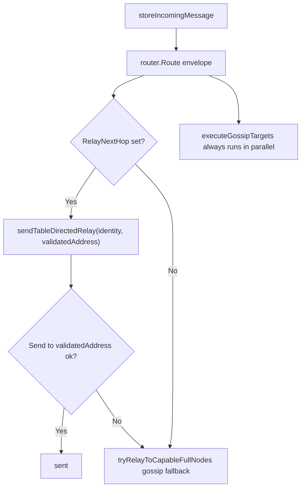
```mermaid
flowchart TD
    A[storeIncomingMessage] --> B[router.Route envelope]
    B --> C{RelayNextHop set?}
    C -- Yes --> D["sendTableDirectedRelay(identity, validatedAddress)"]
    D --> E{Send to validatedAddress ok?}
    E -- Yes --> Z[sent]
    E -- No --> G[tryRelayToCapableFullNodes gossip fallback]
    C -- No --> G
    B --> H[executeGossipTargets always runs in parallel]
```
*Diagram — Outgoing DM delivery decision: table route vs gossip*

**Intermediate relay hop delivery decision.** When `handleRelayMessage` processes a transit relay, it tries three strategies in order: direct peer (recipient locally connected), routing table lookup (`tryForwardViaRoutingTable`), and blind gossip (`relayViaGossip`). If all fail, the message is stored locally and gossip handles delivery. When `tryForwardViaRoutingTable` selects a route, it returns a `tableForwardResult` containing both the transport address and the route's synthesised `Origin` field (post-Phase-1 always `localOrigin` or, in fallback, the destination Identity — `Origin` was dropped from the storage dedup key). The `RouteOrigin` is persisted in `relayForwardState` for caller-stability only — `confirmRouteViaHopAck` at this intermediate node IGNORES the field post-Phase-1 and scopes hop_ack confirmation to the `(Identity, NextHop)` pair.

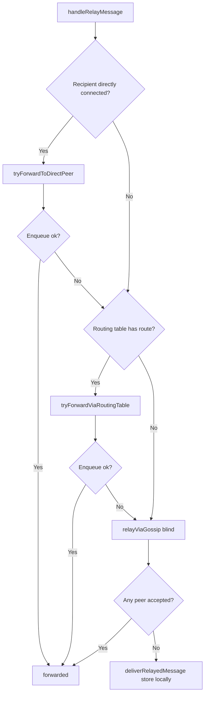
```mermaid
flowchart TD
    A[handleRelayMessage] --> B{Recipient directly connected?}
    B -- Yes --> C[tryForwardToDirectPeer]
    C --> D{Enqueue ok?}
    D -- Yes --> Z[forwarded]
    D -- No --> E{Routing table has route?}
    B -- No --> E
    E -- Yes --> F[tryForwardViaRoutingTable]
    F --> G{Enqueue ok?}
    G -- Yes --> Z
    G -- No --> H[relayViaGossip blind]
    E -- No --> H
    H --> I{Any peer accepted?}
    I -- Yes --> Z
    I -- No --> J[deliverRelayedMessage store locally]
```
*Diagram — Intermediate relay hop: direct peer → table route → gossip*

**Gossip fallback contract (release-blocking).** `TableRouter` in `node/table_router.go` implements the `Router` interface. It consults the routing table for a directed next-hop; if no usable route or session exists, delivery degrades to gossip transparently. Fallback triggers: `Lookup()` returns empty, `RelayNextHop` identity has no active session, `RelayNextHop` peer lacks required capabilities (relay-only for destinations, both relay+routing for transit hops). `GossipTargets` are always populated in every `RoutingDecision`. The same fallback applies at every level: origin node (`sendTableDirectedRelay`), intermediate hop (`tryForwardViaRoutingTable`), and `TableRouter.Route()`.

**Gossip target selection: session + pending peer merge.** `routingTargetsFiltered` in `node/routing_relay.go` builds the gossip target list from two sources: (1) active outbound sessions with healthy connections (scored by health, capped at 3), and (2) known peers without active sessions that can be reached via the pending queue (`queuePeerFrame` → `flushPendingPeerFrames` on session establishment). When scored session targets exist, remaining fanout slots (up to 3 total) are filled with non-session peers. When no sessions exist at all (bootstrap), all matching peers are returned uncapped. **Fallback-port deduplication:** when a session connects via a fallback port (e.g. `host:64646` instead of canonical `host:7777`), both the session key and the canonical address (resolved via `dialOrigin`) are marked in `sessionSeen`, preventing the same physical host from appearing both as an active session target and as a pending peer — which would waste a fanout slot on a duplicate. This merge prevents a timing hole where a message arriving before all sessions are established gets gossipped only to the sender (the only active session) and never reaches forward peers — `seen[ID]` dedup then permanently blocks re-gossip on subsequent attempts. Non-session peers receive their frames via `sendMessageToPeer`, which attempts delivery in three tiers: (1) outbound session via `enqueuePeerFrame`; (2) direct write to an authenticated inbound connection via `inboundConnForAddressLocked` — this covers the common case where the peer has connected to us (inbound) but we have no outbound session (CM slot full); (3) `queuePeerFrame`, which buffers the frame in the pending queue for deferred delivery. The inbound direct path (`mode="inbound_direct"` in gossip_message_attempt log) is the primary fix for the timing hole where a peer's inbound connection is already authenticated before the gossip frame arrives — writing directly avoids the queue entirely. Three drain triggers exist for already-queued frames: (1) outbound session establishment calls `flushPendingPeerFrames`, which sends all pending frames via the session's `sendCh`; (2) inbound connection authentication calls `flushPendingFireAndForget` in `trackInboundConnect`, which writes fire-and-forget frames (`push_message`, `push_notice`) directly to the inbound TCP connection; (3) route events trigger `drainPendingForIdentities` for `send_message` frames. The inbound drain in `trackInboundConnect` handles the reverse timing: frame queued before inbound connection authenticates. Only fire-and-forget frames are safe to write on the inbound conn because they don't expect a response that would interleave with the peer's request/reply dispatch loop. Request/reply frames (send_message, relay_message) must wait for an outbound session.

**Event-driven pending queue drain.** When a route to a destination identity becomes usable — either a direct peer connecting (`servePeerSession` startup), a transit route learned via `announce_routes` (`handleAnnounceRoutes`), a reconnected peer re-announcing the same unchanged routing table (`handleAnnounceRoutes` with `RouteUnchanged` status), a route withdrawal that exposes a surviving backup route (`WithdrawRoute` followed by a `Lookup` check), a TTL expiry that removes a higher-priority route and exposes a surviving backup (`TickTTL` returning exposed identities in `routingTableTTLLoop`), or a local peer disconnect that invalidates routes through the departing next-hop but exposes a backup via a different next-hop (`RemoveDirectPeer` / `InvalidateTransitRoutes` returning `ExposedBackups` in `onPeerSessionClosed`) — the node immediately scans its pending queue for own outbound `send_message` frames targeting that identity and attempts to deliver them via the newly available route. This is an event-driven optimization that eliminates two latency sources: waiting for the original target peer to reconnect (`flushPendingPeerFrames`), and waiting for the 2-second relay retry loop to fire. The drain goroutine is launched from `servePeerSession` (not `onPeerSessionEstablished`) to ensure `inboxCh` is actively being read — launching it earlier creates `s.mu.Lock()` contention that delays session establishment and can cause `inboxCh` overflow under concurrent load. Only `send_message` is drained — other frame types are not route-recoverable: `relay_message` and `announce_peer` are other peers' traffic handled by the relay retry loop and peer session flush; `relay_delivery_receipt` is delivered via the `relayStates` hop chain (`lookupReceiptForwardTo`), not via the routing table, so a new route to the receipt's Recipient does not create a delivery path for it. The `drainPendingForIdentities` function in `node/routing_drain.go` uses an extract-attempt-return pattern: matching frames are atomically removed from the pending queue under the lock (preventing concurrent drain goroutines from processing the same frame twice), delivery is attempted outside the lock via `sendRelayToAddress` (which returns a definitive success/failure signal), and frames that fail delivery are merged back into their original positions in the pending queue using index-based reconstruction — the extraction phase records each frame's `origIdx` and per-address metadata (`origLen`, `extractedPos`), and the return phase walks through the original position range interleaving kept and returning frames so that `flushPendingPeerFrames` — which delivers in slice order — maintains exact DM delivery ordering across recipients sharing the same peer address after route churn. Frames added by other goroutines during the unlocked delivery window are appended at the end. The retry counter is only incremented when a real delivery attempt was made (route existed, address resolved, `sendRelayToAddress` was called) — when no usable route exists (`RelayNextHop == nil` or address unresolvable), the frame is returned to the pending queue without burning retry budget and without any outbound state transition — the `Status` stays `"queued"` and `LastAttemptAt` is not updated, preserving the semantic that `"retrying"` in outbound state means a real network handoff was attempted. The frame waits for future drain cycles triggered by subsequent routing events. When `maxPendingFrameRetries` is reached after real failures, the frame is marked terminal instead of being returned — matching the retry contract of `flushPendingPeerFrames`. Expired frames are detected and marked terminal during the scan. All outbound state changes (terminal, retrying, cleared) are collected as deferred actions during the delivery loop and applied under the lock together with the pending queue return as one atomic in-memory update — so a concurrent reader never observes outbound state mutated while the extracted frames are absent from `s.pending`. (Queue-state is **in-memory only** now — disk persistence was removed — so there is no on-disk write to batch and no crash recovery here: a crash/restart loses pending state and the sender retries end-to-end. The batching is purely about cross-goroutine consistency.) When `handleAnnounceRoutes` processes a single announce, both accepted (new/improved) and unchanged (reconfirmed alive) identities are batched into a single drain set. Rejected routes (stale SeqNo, tombstone-blocked) do not participate in drain. The `announce_routes_processed` log emits three counters — `accepted`, `unchanged`, `rejected` — so operators can distinguish new routing events from benign reconfirmations. This three-state classification uses `RouteUpdateStatus` (`RouteAccepted`, `RouteUnchanged`, `RouteRejected`) returned by `UpdateRoute`.

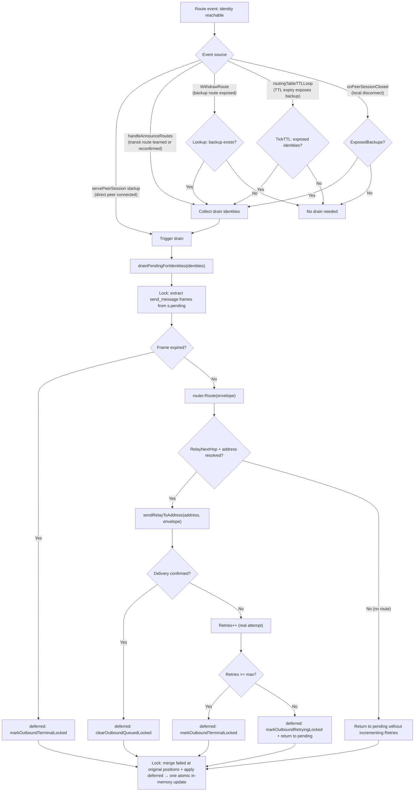
```mermaid
flowchart TD
    A[Route event: identity reachable] --> B{Event source}
    B -- "servePeerSession startup<br/>(direct peer connected)" --> C[Trigger drain]
    B -- "handleAnnounceRoutes<br/>(transit route learned or reconfirmed)" --> D[Collect drain identities]
    B -- "WithdrawRoute<br/>(backup route exposed)" --> W{"Lookup: backup exists?"}
    W -- Yes --> D
    W -- No --> Z[No drain needed]
    B -- "routingTableTTLLoop<br/>(TTL expiry exposes backup)" --> T{"TickTTL: exposed identities?"}
    T -- Yes --> D
    T -- No --> Z
    B -- "onPeerSessionClosed<br/>(local disconnect)" --> P2{"ExposedBackups?"}
    P2 -- Yes --> D
    P2 -- No --> Z
    D --> C
    C --> E["drainPendingForIdentities(identities)"]
    E --> F["Lock: extract send_message frames from s.pending"]
    F --> G{Frame expired?}
    G -- Yes --> H["deferred: markOutboundTerminalLocked"]
    G -- No --> I["router.Route(envelope)"]
    I --> J{RelayNextHop + address resolved?}
    J -- Yes --> K["sendRelayToAddress(address, envelope)"]
    K --> M{Delivery confirmed?}
    M -- Yes --> N["deferred: clearOutboundQueuedLocked"]
    M -- No --> P["Retries++ (real attempt)"]
    P --> PA{Retries >= max?}
    PA -- Yes --> Q["deferred: markOutboundTerminalLocked"]
    PA -- No --> R["deferred: markOutboundRetryingLocked + return to pending"]
    J -- "No (no route)" --> NR["Return to pending without incrementing Retries"]
    H & N & Q & R & NR --> S["Lock: merge failed at original positions + apply deferred → one atomic in-memory update"]
```
*Diagram — Event-driven pending queue drain on route discovery*

**Route confirmation via hop_ack.** When a `relay_hop_ack` with status "delivered" or "forwarded" is received, the routing table promotes the route through the ack sender to `source=hop_ack` via `confirmRouteViaHopAck`. The ack sender's transport address (`senderAddress` in `handleRelayHopAck`) is the provably correct next-hop — even under gossip fan-out where multiple peers received the relay_message but only one actually delivered it. The peer identity is resolved from the transport address and matched against routing table entries. For table-directed relays, the `RouteOrigin` stored in `relayForwardState` is still threaded into `confirmRouteViaHopAck` by signature but post-Phase-1 is IGNORED — storage is no longer keyed on Origin, and the confirmation matches the claim on `(Identity, NextHop)` only. The parameter is retained on the signature for caller-stability (the relay-side plumbing continues to plumb it through `tableForwardResult`) but does not influence promotion outcome. `RouteOrigin` is persisted at every hop in the relay chain: at the origin node (via `sendRelayMessageWithOrigin` / `sendRelayToAddress`), and at intermediate hops (via `tryForwardViaRoutingTable` returning `tableForwardResult` with `RouteOrigin`). For gossip-originated relays where no specific triple was chosen (`RouteOrigin` is empty), the first matching NextHop in Lookup order is promoted. Both outbound and inbound relay paths persist `relayForwardState`, ensuring behavioral equivalence regardless of connection direction.

**Announce_routes relay gate (routing-only peers).** A peer that negotiates `mesh_routing_v1` but not `mesh_relay_v1` can participate in the control plane (receive and send route announcements) but cannot carry data-plane traffic (`relay_message`). Accepting routes from such peers would create entries pointing to a next-hop that silently drops relayed messages. To prevent this control-plane/data-plane mismatch, both inbound and outbound `announce_routes` dispatch paths enforce a relay gate: inbound frames from connections without `mesh_relay_v1` are silently rejected (`connHasCapability(conn, capMeshRelayV1)` in the `announce_routes` handler), and the outbound announce loop skips sessions without `mesh_relay_v1` (`sessionHasCapability(address, capMeshRelayV1)` in the announce sender). This gate operates independently of `mesh_routing_v1` — a peer must have both capabilities to participate in route exchange.

**Transit route invalidation for routing-only peers.** When the last total session of a routing-only peer (no relay-capable sessions were ever active) closes, `onPeerSessionClosed` calls `Table.InvalidateTransitRoutes(peerIdentity)` as a defense-in-depth measure. This method marks all transit routes (non-direct, hops < 16) where `NextHop == peerIdentity` as withdrawn (hops=16) without incrementing SeqNo (local-only invalidation — no wire withdrawal is generated). Direct routes are skipped because their lifecycle is governed by `RemoveDirectPeer`. When at least one route is invalidated, `announceLoop.TriggerUpdate()` fires an immediate announce cycle so neighbors learn the stale routes are withdrawn without waiting for the next periodic cycle (up to 30s). Under normal operation, the announce_routes relay gate prevents routes from routing-only peers from entering the table. `InvalidateTransitRoutes` guards against edge cases: routes learned before capability was fully negotiated, or stale entries from a previous relay-capable session of the same identity. The method returns the count of invalidated routes for logging.

**Disconnect withdrawal fan-out (parallel contract).** When a direct peer's last relay-capable session closes, `onPeerSessionClosed` in `node/routing_session.go` has to deliver the own-origin wire withdrawals returned by `RemoveDirectPeer.Withdrawals` to every remaining routing-capable peer **immediately** — the announce loop would otherwise delay withdrawal delivery up to one periodic cycle (30s). The fan-out is implemented by the dedicated helper `fanoutAnnounceRoutes(ctx, targets []routing.AnnounceTarget, withdrawals []routing.AnnounceEntry) (sent, dropped int)` in `node/routing_announce.go`. Its contract: (1) **one goroutine per target** — every peer is handled by its own goroutine so a single stuck inbound socket does not serialise delivery to the rest; (2) **per-peer bound = `syncFlushTimeout`** — inside each goroutine `SendAnnounceRoutes(ctx, …) → writeFrameToInbound(ctx, …) → sendFrameBytesViaNetworkSync(ctx, …) → networkBridge.SendFrameSync(ctx, …) → NetCore.SendRawSyncCtx(ctx, …)` threads the caller ctx end-to-end, and the write-path is bounded by the netcore sync-flush timeout (default 5s) regardless of the other peers; (3) **wall-clock bound = `syncFlushTimeout` of the slowest peer**, never `N × syncFlushTimeout` — this is the property that prevents peer-cleanup from starving the 1s metrics collector and the 2s `bootstrapLoop` under a writer-preferring `sync.RWMutex`; (4) **shared cancellation** — the fanout call site in `onPeerSessionClosed` passes `s.runCtx`, so shutdown short-circuits every goroutine at the top of its body and counts it as dropped; that same `ctx` is now observed *inside* the netcore sync send (via `SendRawSyncCtx`), so cancellation aborts an in-flight flush instead of silently waiting out the full 5s `syncFlushTimeout`; (5) **no shared state** — goroutines share only two `atomic.Int32` counters, no `Service` map is mutated; `SendAnnounceRoutes` takes its own short `s.mu.RLock` inside `writeFrameToInbound` and releases it before the blocking send; (6) **`crashlog.DeferRecover()` per goroutine** — one panicking target does not leave a WaitGroup hung or take down the cleanup goroutine; (7) **observability** — the outer `routing_direct_peer_removed` log line exposes `fanout_sent` and `fanout_dropped`, so a `sent ≪ dropped` divergence is a direct signal of stuck inbound sockets (e.g. NAT hairpin half-dead TCP) without stack traces. Regression coverage: `TestOnPeerSessionClosed_FanoutIsParallel`, `TestOnPeerSessionClosed_FanoutRespectsRunCtx`, `TestOnPeerSessionClosed_NoPanicOnZeroPeers`, `TestOnPeerSessionClosed_CollectsSentAndDroppedCounters` in `node/routing_integration_fanout_test.go`.

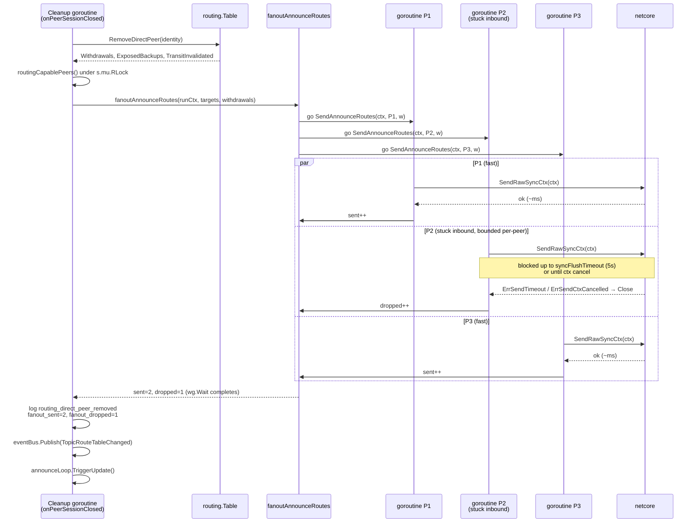
```mermaid
sequenceDiagram
    participant CL as Cleanup goroutine<br/>(onPeerSessionClosed)
    participant RT as routing.Table
    participant FO as fanoutAnnounceRoutes
    participant G1 as goroutine P1
    participant G2 as goroutine P2<br/>(stuck inbound)
    participant G3 as goroutine P3
    participant N as netcore

    CL->>RT: RemoveDirectPeer(identity)
    RT-->>CL: Withdrawals, ExposedBackups, TransitInvalidated
    CL->>CL: routingCapablePeers() under s.mu.RLock
    CL->>FO: fanoutAnnounceRoutes(runCtx, targets, withdrawals)
    FO->>G1: go SendAnnounceRoutes(ctx, P1, w)
    FO->>G2: go SendAnnounceRoutes(ctx, P2, w)
    FO->>G3: go SendAnnounceRoutes(ctx, P3, w)
    par P1 (fast)
        G1->>N: SendRawSyncCtx(ctx)
        N-->>G1: ok (~ms)
        G1->>FO: sent++
    and P2 (stuck inbound, bounded per-peer)
        G2->>N: SendRawSyncCtx(ctx)
        Note over G2,N: blocked up to syncFlushTimeout (5s)<br/>or until ctx cancel
        N-->>G2: ErrSendTimeout / ErrSendCtxCancelled → Close
        G2->>FO: dropped++
    and P3 (fast)
        G3->>N: SendRawSyncCtx(ctx)
        N-->>G3: ok (~ms)
        G3->>FO: sent++
    end
    FO-->>CL: sent=2, dropped=1 (wg.Wait completes)
    CL->>CL: log routing_direct_peer_removed<br/>fanout_sent=2, fanout_dropped=1
    CL->>CL: eventBus.Publish(TopicRouteTableChanged)
    CL->>CL: announceLoop.TriggerUpdate()
```
*Diagram — Parallel disconnect fan-out: one goroutine per target, wall-clock bounded by the slowest peer*

**TTL policy delegation.** Received announcements leave `ExpiresAt` as zero when constructing the `RouteEntry` in `handleAnnounceRoutes`. `Table.UpdateRoute` fills it using the table's own configured `clock` and `defaultTTL`. This ensures that all routes (direct via `AddDirectPeer`, learned via announcements) follow the same TTL policy, and tables created with `WithDefaultTTL` or `WithClock` behave consistently across all route sources.

### RPC observability

Three RPC commands expose routing table state for monitoring and debugging. They follow the same provider-injection pattern as metrics and chatlog commands — when `RoutingProvider` is nil, commands return 503 (unavailable) and are hidden from help output. Full field-level specification: [`rpc/routing.md`](rpc/routing.md).

**`fetch_route_table`** — Returns the full routing table snapshot. Each entry includes identity, origin, `next_hop` object (identity + live transport address/network), hops, seq_no, source (direct/hop_ack/announcement), withdrawn/expired flags, and remaining TTL. The `next_hop.address` and `next_hop.network` fields are live best-effort metadata queried after the snapshot — routing fields are atomic within `snapshot_at`. Response also includes total/active entry counts and snapshot timestamp. Sorted by (identity, origin, next_hop.identity, source).

**`fetch_route_summary`** — Returns a compact overview with `snapshot_at` timestamp, total/active/withdrawn entry counts, number of reachable identities, direct peer count, and the current flap detection state (per-peer withdrawal count, hold-down status). Flap state sorted by peer_identity. The `snapshot_at` field matches the same point-in-time semantics as `fetch_route_table` and `fetch_route_lookup`.

**`fetch_route_lookup <identity>`** — Returns selectable routes for a specific destination identity, ranked by the Phase 2 `CompositeScore` (hops + source-trust bonus + RTT bonus + health penalty — the same ranking the relay path applies via `routing.Table.Lookup`). Withdrawn / expired entries are filtered, and `HealthDead` transit claims are dropped; `RouteSourceDirect` claims are exempt from the Dead filter and scored with a `Bad`-equivalent penalty so they stay selectable as last resort. Deterministic tie-break: origin asc, next_hop asc, seq_no desc. Full contract in [`rpc/routing.md`](rpc/routing.md). Useful for diagnosing why a particular peer is or is not reachable via table routing.

The `RoutingProvider` interface (`rpc/provider.go`) has two methods: `RoutingSnapshot()` returns an immutable point-in-time copy of the routing table, and `PeerTransport(peerIdentity)` resolves a peer identity to its current transport address and network type. All three commands use `RoutingSnapshot()` for atomic data; `fetch_route_table` additionally calls `PeerTransport()` to enrich `next_hop` with live transport info. Console positional argument mapping is configured: `fetch_route_table` and `fetch_route_summary` take no arguments; `fetch_route_lookup` takes a single `<identity>` positional argument.

**Protocol version validation (outbound + inbound).** Both directions enforce `config.MinimumProtocolVersion`. On the *outbound* path, the welcome frame's version is checked; incompatible peers are rejected with log `outbound_peer_protocol_too_old`, receive a `peerScoreOldProtocol` (-50) score penalty, and an accumulating overlay-level ban score (`peerBanIncrementIncompatible` = 250) is applied via `penalizeOldProtocolPeer`. The ConnectionManager dial path (`openPeerSessionForCM`) returns an `incompatibleProtocolError` that carries confirmed version evidence (peer version, peer minimum, and client version from the welcome frame); `onCMDialFailed` extracts this evidence via `errors.As` and passes protocol versions to `penalizeOldProtocolPeer` so the reporter set and persisted lockout receive the same evidence as the legacy dial path. The client version string is pre-populated into `s.peerVersions[address]` before `penalizeOldProtocolPeer` runs, so `setVersionLockoutLocked` writes the complete `ObservedClientVersion` into the persisted lockout. The same pre-population is applied in the legacy outbound path and the inbound rejection path — on all three failure paths, the handshake frame is the only source of the client version since `learnIdentityFromWelcome`/`addPeerVersion` only runs on the success path. Without the structured error, the CM path would call `penalizeOldProtocolPeer(address, 0, 0)`, which correctly applies ban scoring but would skip the reporter set and lockout due to the zero-evidence guard. Verified by `TestCMDialFailed_PropagatesVersionEvidence`, `TestCMDialFailed_ZeroEvidence_NoReporterOrLockout`, and `TestCMDialFailed_PersistsObservedClientVersion`. A single failed attempt does not trigger a full ban — the overlay ban threshold is 1000, requiring 4 consecutive attempts before the peer is banned for `peerBanIncompatible` (24 hours). This graduated approach avoids permanently blacklisting peers that experience transient version mismatches during rolling upgrades. The version evidence (peer's protocol version and minimum version from the welcome frame) is recorded as a **version lockout** in `peerEntry.VersionLockout` and persisted to `peers.json`, but only when the evidence is confirmed — the remote `minimum_protocol_version` must exceed the local protocol version. Lockouts are bound to the peer's cryptographic identity when available; identity-less (address-only) lockouts expire after 7 days (`VersionLockoutMaxTTL`) to prevent stale entries from suppressing addresses reassigned to a different peer. Identity-bound lockouts persist until the local node's version changes (protocol version or client build increases), at which point stale lockouts are cleared automatically on startup via `clearStaleVersionLockoutsLocked`. A locked-out peer is skipped by `peerDialCandidates` regardless of lockout type. On the *inbound* path, the hello frame's version is checked; incompatible clients receive an error frame with `ErrCodeIncompatibleProtocol` and two independent ban tracks fire with distinct blast radii. The **per-peer storm-suppression signal** is emitted immediately: before the session is torn down, `emitPeerBannedNoticeByID(connID, now+peerBanIncompatible, PeerBannedReasonPeerBan)` delivers `connection_notice{code=peer-banned, reason=peer-ban}` on the still-open ConnID. The dialler-side gate 6c.2 routes the notice by `details.reason`: on `peer-ban` it calls `recordRemoteBanLocked` to suppress THIS specific `PeerAddress` only, leaving compatible siblings behind a shared egress (NAT gateway, VPN exit, Tor exit, multi-homed host) reachable. On `blacklisted` it suppresses the offending `PeerAddress` per-peer (`recordRemoteBanLocked`) AND accumulates the offender toward an IP-wide escalation (`noteRemoteIPOffenderLocked`); the IP-wide gate (`recordRemoteIPBanLocked`, which suppresses every sibling behind that egress including peers discovered later via peer exchange) engages ONLY once `ipWideRemoteBanMinOffenders` distinct, non-expired peers behind the same server IP have independently sent `blacklisted` — a single notice no longer undials innocent NAT/VPN/Tor-exit siblings. Either path keeps `cm_session_setup_failed` out of the ebus. The **transport-level IP blacklist** stays graduated as the safety net for sustained noise from the same IP: `addBanScore(connID, banIncrementIncompatibleVersion)` adds 250 to the remote IP's ban score per attempt, and only the 4th attempt crosses `banThreshold` = 1000, arming the 24-hour TCP-level block. When the threshold is crossed, `addBanScore` fires a second peer-banned notice with `reason=blacklisted` on the connection that tripped it, and from then on `handleConn` silently drops every TCP attempt from that IP until the window elapses. The inbound path also calls `penalizeOldProtocolPeer` for overlay-level ban scoring; the overlay per-peer track stays graduated (4 attempts to `peerBanThresholdIncompatible` = 1000), giving known peers a rolling-upgrade window on the persisted side. However, the reporter observation and version lockout are only recorded when the direction is confirmed — the remote peer's `minimum_protocol_version` must exceed the local protocol version (see "Direction invariant" below). Each confirmed incompatible-version observation is recorded in the node-owned **VersionPolicyState**, which aggregates reports from distinct peer identities. When ≥3 distinct peers report incompatibility (or ≥2 peers advertise a higher `client_build`), the node signals `update_available` in its `AggregateStatus` — the Desktop UI reads this pre-computed flag rather than computing it locally. Ephemeral observations expire after 24 hours, reporters are deduplicated by `PeerIdentity` (empty-identity observations are ignored). Active persisted lockouts also contribute to `update_available`, ensuring the signal remains true as long as any lockout exists — the UI does not lose the update hint while the node remains partially locked out. The version policy snapshot is recomputed twice within the confirmed-incompatible path in `penalizeOldProtocolPeer`: once by `recordIncompatibleObservationLocked` (before the lockout exists) and once after `setVersionLockoutLocked` (so the lockout's contribution to `update_available` is immediately visible). Without the second recompute, the snapshot would remain stale until the next unrelated event. Verified by `TestPenalize_SnapshotIncludesLockoutSignal`.

**Remote-ban recovery (two-scope).** `connection_notice{code=peer-banned}` is routed by `details.reason`. `peer-ban` writes only the per-peer `persistedMeta[address].RemoteBannedUntil` via `recordRemoteBanLocked`. `blacklisted` writes the per-peer offender row too AND records the offender (with its expiry) in the in-memory `Service.remoteIPBanOffenders` set; the IP-wide `Service.remoteBannedIPs` entry is only written via `recordRemoteIPBanLocked` once at least `ipWideRemoteBanMinOffenders` distinct, non-expired offenders behind the same egress IP have accumulated — and the recorded IP-wide horizon is the `ipWideRemoteBanMinOffenders`-th largest live offender expiry (so the IP-wide ban lapses the moment fewer than that many offenders remain, never inheriting a single long-lived notice's window). The dial-gate check `isPeerRemoteBannedLocked` consults the per-peer table and the IP-wide table on every candidate, so a record in either scope is enough to suppress. `remoteIPBanOffenders` is volatile (never persisted): the count is a transient escalation signal, and a restored active IP-wide ban already carries its own `Until`. A successful outbound handshake (`recordOutboundAuthSuccess`) therefore needs to clear only the two scopes it can legitimately speak for, in a single `peerMu` write section (with `ipStateMu` nested for the IP-wide clear) followed by one `flushPeerState` so the recovery cannot be split by a crash or restart: (1) the handshaking peer's own per-peer `RemoteBannedUntil` via `clearRemoteBanLocked` — unconditional, because the handshake itself is direct proof this address is accepting us again; a no-op when no row exists; (2) the IP-wide `remoteBannedIPs` entry via `clearRemoteIPBanLocked`, keyed on the canonical host of the dialled endpoint, so every sibling `PeerAddress` behind that egress IP is freed by the dial gate together with the host that carried the recovery — one sibling's success speaks for all siblings because `reason=blacklisted` is an IP-scoped decision. Per-peer rows with `reason=peer-ban` on OTHER sibling addresses are intentionally NOT touched by the IP-wide recovery: those are standalone responder decisions scoped to specific addresses, and a handshake with one sibling is not proof the responder has forgiven a peer-specific ban on another address. Either clear returning `true` triggers the shared `flushPeerState` so the on-disk snapshot matches the in-memory state before the next dial cycle. Verified by `TestRecordOutboundAuthSuccess_ClearsRemoteIPBan`, `TestRecordOutboundAuthSuccess_ClearsRemoteIPBanFreesSiblings`, and `TestRecordOutboundAuthSuccess_PreservesPeerBanSiblingRows`.

**Counter ownership boundary.** Two independent counters track incompatible-version events and they are NOT projections of each other. `peerHealth.IncompatibleVersionAttempts` is the per-address cumulative counter used for overlay ban scoring — each attempt adds `peerBanIncrementIncompatible` to the overlay penalty, and the ban fires when the cumulative penalty reaches `peerBanThresholdIncompatible`. `versionPolicyState.incompatibleReporters` is the per-identity dedup set used for the `update_available` signal — it counts distinct peer identities that reported incompatibility within the 24-hour observation window. The per-address counter survives indefinitely (cleared only by operator `add_peer`); the per-identity set is subject to observation TTL expiry. Both are mutated by `penalizeOldProtocolPeer` under `peerMu` (the peer-domain lock), with `ipStateMu` / `statusMu` / `deliveryMu` nested only in the specific sub-sections that touch those domains; they serve different consumers (ban scoring vs update signal) and have different lifecycles.

**Safety invariant: no evidence, no lockout.** A persisted version lockout is set only when confirmed version evidence exists — the remote peer's `minimum_protocol_version` must strictly exceed the local `config.ProtocolVersion`. When version evidence is absent (peerMinimum = 0, e.g. from a bare error code without a welcome frame) or does not confirm incompatibility (peerMinimum ≤ local), no lockout is created. This prevents the connection manager from permanently suppressing a peer based on a transient or unverifiable error. The safety invariant is verified by negative tests (`TestVersionLockout_NoEvidenceNoLockout_ZeroMinimum`, `TestVersionLockout_NoEvidenceNoLockout_MinimumBelowLocal`) and a positive test (`TestVersionLockout_EvidenceConfirmed_LockoutSet`).

**Direction invariant: inbound old peers do not feed the upgrade signal.** The `update_available` signal and the `incompatibleReporters` dedup set must only reflect the "they think we're old" direction — i.e., when a remote peer's `minimum_protocol_version` exceeds our local `config.ProtocolVersion`. When we reject an old inbound peer because *their* version is below *our* minimum, this is the opposite direction: the remote peer is outdated, not us. `penalizeOldProtocolPeer` applies ban scoring (health counters, score penalty, ban escalation) unconditionally for both directions, but the `recordIncompatibleObservationLocked` call and the `setVersionLockoutLocked` call are guarded by `peerMinimum > config.ProtocolVersion`. Without this guard, a cluster of old peers connecting inbound could incorrectly trigger the "you need to upgrade" CTA for the local operator. The invariant is verified by `TestInboundOldPeer_DoesNotFeedReporterSet` (4 old inbound peers with peerMinimum ≤ local → reporter count stays 0, update_available stays false) and `TestInboundOldPeer_ZeroMinimum_NoReporter` (peerMinimum = 0 with known identity → reporter count stays 0).

**Multi-address lockout propagation.** Version incompatibility is a property of a peer's software version, not of a specific network endpoint. When `setVersionLockoutLocked` records a lockout for an address that has a known `PeerIdentity`, it propagates the same lockout to all other addresses in `persistedMeta` that map to the same identity via `peerIDs`. A sibling address receives the propagated lockout when it either has no active lockout, or the new evidence is stronger (higher `ObservedMinimumProtocolVersion`) or fresher (newer `LockedAt` timestamp). Without the refresh path, already-active sibling entries would keep stale data forever — skewing diagnostics like `ObservedClientVersion` and `MaxObservedPeerVersion` for any logic or UI that inspects the propagated lockout contents. This prevents `peerDialCandidates` from re-dialing the same incompatible peer via an alternative address — a futile attempt that wastes resources and risks remote-side ban escalation. Propagation only occurs for identity-bound lockouts; address-only lockouts (no known identity) cannot be safely propagated because two addresses without identity may belong to different peers. The existing per-address lockout check (`isPeerVersionLockedOutLocked`) remains the filter in `peerDialCandidates` — propagation ensures every address for the identity has a lockout entry, so the per-address check correctly suppresses all of them. Verified by `TestVersionLockout_PropagatedByIdentity` (3 addresses, 2 with same identity: lockout set on one propagates to the other, third address with different identity unaffected), `TestVersionLockout_NoIdentity_NoPropagation` (no identity: lockout does not propagate), `TestVersionLockout_SiblingRefreshedWithStrongerEvidence` (higher minimum refreshes already-active sibling), and `TestVersionLockout_SiblingRefreshedWithFresherTimestamp` (newer timestamp refreshes sibling's client version).

**Build signal lifecycle.** The `peerBuilds` and `peerVersions` maps are session-scoped: populated during the handshake (welcome/hello frame processing), and cleared on disconnect (`markPeerDisconnected`). This ensures that only currently connected peers contribute to the build-based update signal — a disconnected peer's stale build number does not keep `update_available` artificially raised. Entries are also deleted during stale-peer eviction. Reconnection repopulates both maps from the fresh handshake frame.

**Compatible observation lifecycle.** A successful handshake (`markPeerConnected`, called for both outbound and inbound connections) is definitive proof that the peer is compatible. It clears all stale incompatible-version evidence for that specific peer: `IncompatibleVersionAttempts` is reset to 0, `LastIncompatibleVersionAt` is zeroed, `ObservedPeerVersion` and `ObservedPeerMinimumVersion` are zeroed, the peer is removed from the `incompatibleReporters` dedup set, and any active persisted `VersionLockout` is cleared. Lockout clearing is identity-wide: because `setVersionLockoutLocked` propagates lockouts to all addresses sharing the same `PeerIdentity`, `markPeerConnected` mirrors this by clearing the lockout from all sibling addresses of the same identity — not just the address that completed the handshake. All failure-related health fields are reset via `resetPeerHealthForRecoveryLocked` — a single helper that is the sole source of truth for the recovery field set. The helper clears: error strings (`LastError`, `LastErrorCode`, `LastDisconnectCode`), version evidence (`IncompatibleVersionAttempts`, `LastIncompatibleVersionAt`, `ObservedPeerVersion`, `ObservedPeerMinimumVersion`), dial-suppression state (`ConsecutiveFailures`, `LastDisconnectedAt`, `BannedUntil`), and score repair (negative scores are floored to 0). The same helper is used for both the direct address and sibling addresses, along with the IP-wide ban for each sibling's IP (handled by the caller). Score flooring neutralises stale `peerScoreOldProtocol` penalties that would otherwise keep siblings eviction-eligible (`peerEvictScoreThreshold = -20`) even after the identity has proven compatibility; the floor is applied before any connect bonus so that peers with legitimately positive scores are not inflated. `LastError` is especially important because `rankPeerHealth` subtracts `len(health.LastError)` from the peer ranking score — a stale error string on a sibling address depresses its ranking even after the identity has proven compatibility. Without full field clearing, siblings would retain stale failure state that keeps them out of candidate selection (ban filtering, exponential cooldown), depresses peer ranking, and shows misleading diagnostics in `fetchPeerHealth`. Without identity-wide clearing, sibling addresses would remain locked out despite the peer having proven compatibility via another endpoint, continuing to suppress dial candidates and incorrectly contributing to the `update_available` signal. The version policy is then recomputed so the signal immediately reflects the reduced evidence. This is the counterpart to the incompatible observation flow — together they form a closed lifecycle: incompatible evidence accumulates via `penalizeOldProtocolPeer`, and compatible evidence clears it via `markPeerConnected`. The compatible observation only affects the connecting peer's identity — evidence for other identities is untouched. Verified by `TestCompatibleObservation_ClearsReporterAndLockout` (single peer: full cleanup after successful handshake), `TestCompatibleObservation_OnlyAffectsConnectingPeer` (one peer cleared, others retained), `TestCompatibleObservation_ClearsLockoutAcrossIdentity` (handshake on one address clears lockout for all addresses of the same identity, leaves other identities untouched), `TestCompatibleObservation_ClearsSiblingHealthDiagnostics` (handshake on one address resets per-address health diagnostics for sibling addresses of the same identity, leaves other identities untouched), and `TestCompatibleObservation_ClearsSiblingBansAndCooldowns` (handshake on one address resets ban/cooldown fields and IP-wide bans for all sibling addresses of the same identity across different IPs, leaves other identities untouched), and `TestCompatibleObservation_RepairsStaleScorePenalties` (handshake on one address floors negative scores to 0 for sibling addresses of the same identity, applies connect bonus to direct address, leaves other identities' scores unchanged).

**Ban clearing and operator override.** A successful handshake also clears `BannedUntil` and the IP-wide ban — if the peer completed the handshake, it is compatible. The `add_peer` RPC command is the explicit operator override mechanism: it clears `BannedUntil`, resets all incompatible-version diagnostics (`IncompatibleVersionAttempts`, `LastErrorCode`, `LastDisconnectCode`, observed version fields), removes any persisted version lockout (`VersionLockout`) from the peer's metadata, and removes the peer's identity from the `incompatibleReporters` dedup set. The override is fully identity-wide: if the target address has a known `PeerIdentity`, all sibling addresses sharing that identity also have their lockouts cleared and their health fully reset via `resetPeerHealthForRecoveryLocked` (error strings, version evidence, dial-suppression state, negative score floor to 0), along with the IP-wide ban for each sibling's IP. Score flooring on override mirrors the handshake path — it neutralises stale `peerScoreOldProtocol` penalties without inflating peers with positive scores, ensuring operator-overridden siblings are no longer eviction-eligible. This mirrors the identity-wide clearing in `markPeerConnected` and the identity-wide propagation in `setVersionLockoutLocked`. Without identity-wide clearing, a manual retry of one address would leave sibling addresses suppressed by stale cooldown and ban data even though the operator explicitly wanted the peer re-dialed, keeping it out of normal candidate selection on its other addresses. The version policy is recomputed immediately so neither the lockout nor the reporter contributes to `update_available`. If the peer is already known, `add_peer` moves it to the front of the dial queue and responds with "already known, moved to front" instead of adding a duplicate. Network announcements do not clear `BannedUntil`; third-party gossip may add a candidate address, but compatibility remains proven only by direct handshake. Verified by `TestAddPeer_ClearsVersionLockout` (single address), `TestAddPeer_ClearsLockoutAcrossIdentity` (identity-wide: 3 addresses, 2 sharing identity), `TestAddPeer_ClearsReporterForIdentity` (reporter count decremented), `TestAddPeerFrame_ClearsLockoutAcrossIdentity` (end-to-end: identity-wide lockout clearing, health diagnostic reset, and reporter removal through the actual command path), and `TestAddPeerFrame_ClearsSiblingBansAndCooldowns` (end-to-end: sibling ban/cooldown/IP-ban clearing across different IPs through the actual `addPeerFrame` handler, different identities untouched), and `TestAddPeerFrame_RepairsStaleScorePenalties` (end-to-end: negative score flooring and connect bonus through the actual `addPeerFrame` handler, sibling scores floored to 0, different identities' scores unchanged).

**Outbound reject visibility.** A rejected outbound dial — where the remote welcome frame indicates a version below `MinimumProtocolVersion` — is fully visible in the `PeerHealthFrame` snapshot even though no lasting connection or session exists. The mechanism: `penalizeOldProtocolPeer` calls `ensurePeerHealthLocked(address)` which creates or retrieves the `peerHealth` entry in the address-keyed `s.health` map. Health entries are not session-scoped — they persist in memory across failed dial attempts, surviving until the peer is evicted. After `penalizeOldProtocolPeer` returns, the health entry contains: `LastErrorCode` = `incompatible-protocol-version`, `LastError` = `"protocol version too old"`, `IncompatibleVersionAttempts` (incremented), `LastIncompatibleVersionAt` (timestamp), `ObservedPeerVersion` and `ObservedPeerMinimumVersion` (version evidence from the welcome frame), and `VersionLockoutActive` = true (when the lockout was set). `peerHealthFrames()` iterates all entries in `s.health` and emits a `PeerHealthFrame` row per address, regardless of connection state — disconnected and never-connected peers appear in the snapshot with all diagnostic fields populated. Additionally, `penalizeOldProtocolPeer` clears any previously stored `LastDisconnectCode` — a pre-handshake reject supersedes prior post-handshake disconnect codes so the snapshot is unambiguous. When the CM path carries `ClientVersion` from the welcome frame, `onCMDialFailed` pre-populates `peerVersions` so that `ClientVersion` also appears in the snapshot. The Desktop UI receives these fields via `fetch_peer_health` and can display the rejection reason, attempt count, and lockout status without any additional computation. The full operator-visible contract — including `LastErrorCode`, `LastDisconnectCode` (empty), `ClientVersion`, `ObservedPeerVersion`, `ObservedPeerMinimumVersion`, `VersionLockoutActive`, `Score`, `ConsecutiveFailures`, and `PeerID` — is verified end-to-end by `TestOutboundIncompatibleReject_HealthSnapshotComplete`, which calls `peerHealthFrames()` after an outbound incompatible reject and asserts every diagnostic field in the returned `PeerHealthFrame`.

**Diagnostic code lifecycle.** Two machine-readable error code fields serve different diagnostic purposes. `LastErrorCode` captures the protocol error from the most recent *pre-handshake* rejection (e.g. `incompatible-protocol-version`), set by `penalizeOldProtocolPeer`. It survives across failed reconnect attempts but is cleared on successful reconnect (`markPeerConnected`) and by operator override (`add_peer`). `LastDisconnectCode` captures the protocol error that caused the most recent *post-handshake* socket teardown (e.g. `frame-too-large`, `rate-limited`). It is empty when the disconnect was clean (err == nil), non-protocol (network timeout, EOF), or when the error maps to the generic `protocol-error` sentinel. It is cleared on clean disconnect, on successful reconnect, by operator override, and by `penalizeOldProtocolPeer` — a pre-handshake incompatible reject supersedes any prior post-handshake disconnect code because the latest failure event is a connection-level rejection, not a session teardown, and keeping both would create a mixed diagnostic snapshot that misrepresents the peer's current state. Both fields are exposed in `PeerHealthFrame` as `last_error_code` and `last_disconnect_code`. All recovery-path field resets (successful reconnect, operator override) are centralised in `resetPeerHealthForRecoveryLocked` to eliminate field-by-field duplication and prevent future drift when new health fields are added. Verified by `TestPenalizeOldProtocol_ClearsStaleLastDisconnectCode` (pre-handshake reject clears previously stored `LastDisconnectCode`, sets `LastErrorCode` and `LastError`).

**Version-detail refresh under lockout.** A locked-out peer is suppressed by `peerDialCandidates`, so the local node will not initiate outbound connections to it. This raises the question of how version evidence gets refreshed if the peer upgrades. The answer is the inbound path: a locked-out peer can still dial us. When an inbound connection arrives, the hello frame carries the peer's current protocol version and minimum version. If the peer is still incompatible, `penalizeOldProtocolPeer` updates the `peerHealth` observed-version fields and refreshes the lockout snapshot with fresh evidence. If the peer has upgraded and is now compatible, the inbound handshake succeeds — `markPeerConnected` triggers a compatible observation (see above), clearing the lockout, reporter evidence, and all incompatible-version diagnostics, and the peer re-enters normal rotation. When the *local* node upgrades, `clearStaleVersionLockoutsLocked` runs on startup and clears all lockouts whose `LockedAtLocalVersion` fingerprint no longer matches, re-enabling outbound dials to previously locked-out peers. The combination of inbound-path refresh and startup lockout clearing ensures that version lockouts are self-healing in both directions — remote upgrade and local upgrade — without requiring any explicit polling or probe mechanism.

**Build-based policy runtime scope.** The `peerBuilds` and `peerVersions` maps are intentionally session-scoped and not persisted to `peers.json`. The `max_observed_peer_build` field in `VersionPolicySnapshot` is a runtime-only diagnostic: it reflects the highest `client_build` seen from currently connected peers and resets to zero on node restart. This is correct behavior — stale build data from a previous session should not influence the `update_available` signal, because the build landscape may have changed (peers upgraded, new peers appeared). After restart, the build signal stays `false` until peers reconnect and complete handshake, at which point `peerBuilds` is repopulated from fresh hello/welcome frames. The persisted `VersionLockout` already captures the protocol-level incompatibility evidence that must survive restarts; build metadata is supplementary and does not require persistence.

**Restart durability scoping.** The `update_available` signal's durability across restarts is achieved exclusively through persisted version lockouts, not through the reporter dedup set. The `incompatibleReporters` set (which drives the "≥3 distinct peers" threshold) is runtime-only: it resets to zero on restart and repopulates only as peers reconnect and fail handshake. However, `recomputeVersionPolicyLocked` independently checks all persisted lockouts in `peers.json` — if any `VersionLockout.IsActiveAt(now)` returns true, the `lockoutSignal` fires and `update_available` remains `true` regardless of the reporter count. This means: before restart, the signal may come from reporters, lockouts, or both; after restart, it comes from lockouts alone until peers reconnect. The `incompatible_version_reporters` count may drop to zero after restart even though `update_available` is still `true` — the `update_reason` will be `incompatible_version_reporters` (lockout-sourced), not `peer_build_newer`. This is consistent: the reporter count is a supplementary diagnostic, not the sole source of truth for the signal. `MaxObservedPeerVersion` also survives restarts through the same lockout path — each active lockout contributes its `ObservedProtocolVersion` to the maximum.

**Version diagnostic persistence.** The machine-readable version diagnostic fields (`LastErrorCode`, `LastDisconnectCode`, `IncompatibleVersionAttempts`, `LastIncompatibleVersionAt`, `ObservedPeerVersion`, `ObservedPeerMinimumVersion`) are persisted alongside the legacy health fields (`ConsecutiveFailures`, `LastError`, `Score`, `BannedUntil`) in `peers.json` via `peerEntry`. `buildPeerEntriesLocked` copies all diagnostic fields from the in-memory `peerHealth` entry into the `peerEntry` during flush, and the restore path in `Service` initialization hydrates them back. Without this persistence, a restart would drop the operator-visible evidence that created the lockout — the lockout itself survives through `VersionLockout`, but `peerHealthFrames()` would return an empty diagnostic snapshot with no `LastErrorCode`, no attempt count, and no observed version evidence. Additionally, `peerHealthFrames()` sources `ClientVersion` from the session-scoped `peerVersions` map, which is empty on startup. The restore path seeds `peerVersions` from `VersionLockout.ObservedClientVersion` for each persisted peer with an active lockout, so the operator-visible client version string survives restarts without requiring a reconnection. When a peer reconnects successfully, the handshake repopulates `peerVersions` from the fresh welcome/hello frame, overriding the persisted value. The round-trip is verified by `TestVersionDiagnostics_PersistRoundTrip` (JSON marshal/unmarshal of `peerEntry` preserves all 6 diagnostic fields), `TestVersionDiagnostics_BuildAndRestoreRoundTrip` (full in-memory cycle: `penalizeOldProtocolPeer` → `buildPeerEntriesLocked` → marshal → unmarshal → hydrate → assert all fields match pre-flush state), `TestClientVersion_SurvivesRestartViaLockout` (CM path with `ClientVersion` → flush → restore → `peerVersions` repopulated from lockout), and `TestVersionDiagnostics_DiskRestartRoundTrip` (end-to-end on-disk restart: `penalizeOldProtocolPeer` → `flushPeerState()` → real `NewService` reload from `PeersStatePath` → `peerHealthFrames()` asserts all diagnostic fields including `LastErrorCode`, `LastDisconnectCode`, `IncompatibleVersionAttempts`, `ObservedPeerVersion`, `ObservedPeerMinimumVersion`, `ClientVersion`, `VersionLockoutActive`, `Score`, `ConsecutiveFailures`, and `LastError` survive the disk round-trip).

**Lockout-aware peer list trimming.** The persisted peer list is capped at `maxPersistedPeers` (500) entries to bound disk and memory footprint. `trimPeerEntries` sorts entries by score descending and truncates the tail. Without special handling, a peer with an active `VersionLockout` and a low score (e.g. `peerScoreOldProtocol = -50`) would fall into the trimmed tail. After restart the lockout entry disappears, the peer re-enters the dial candidate pool, the node wastes a connection attempt, and the incompatible-version evidence that justified the lockout is lost. To prevent this, `trimPeerEntries` partitions entries into two buckets before applying the top-N cutoff: entries with an active `VersionLockout` (`IsActive() == true`) are unconditionally retained, and the remaining budget (`maxPersistedPeers - len(locked)`) is filled from the highest-scored non-lockout entries. This mirrors the separate persistence bucket for IP-wide bans (`bannedIPs` section in `peerStateFile`) — both represent durable suppression decisions that must not be silently discarded by a size cap. In the extreme edge case where locked entries alone exceed the budget (500+ distinct incompatible peers), all locked entries are kept and no non-lockout entries are persisted — this is operationally implausible but handled for correctness. Verified by `TestTrimPeerEntries_ProtectsActiveLockouts` (locked peer with worst score survives trim while normal bad-score peer is dropped, total remains `maxPersistedPeers`) and `TestTrimPeerEntries_NoLockout_BehaviorUnchanged` (without lockouts, trim produces exactly `maxPersistedPeers` entries as before).

**Lockout-aware eviction.** The in-memory eviction sweep (`evictStalePeers`) runs every `peerEvictInterval` (10 min) and deletes peers whose score is at or below `peerEvictScoreThreshold` (-20) and whose last successful connection (or `AddedAt`, if never connected) exceeds `peerEvictStaleWindow` (24 h). Without a lockout guard, a confirmed incompatible peer — which accumulates `peerScoreOldProtocol = -50` and by definition never completes a handshake — would be evicted from `s.health`, `s.persistedMeta`, `s.peerVersions`, and `s.peerIDs` before the next `flushPeerState` writes to disk. This destroys the `VersionLockout` in memory, making the peer immediately dialable again and losing the incompatible-version evidence. The guard mirrors the existing bootstrap and connected-peer exemptions: before applying the score threshold, `evictStalePeers` checks whether `persistedMeta[address].VersionLockout.IsActive()` and skips eviction if true. Combined with the `trimPeerEntries` lockout-aware partitioning (which protects the on-disk path), this ensures a version lockout survives both the runtime eviction sweep and the persistence trim. Verified by `TestEvictStalePeers_ProtectsActiveVersionLockout` (locked peer with worst score and 48 h staleness survives eviction, normal peer with same score is evicted, lockout and health data remain intact).

**Periodic reporter TTL repair.** The version policy snapshot is recomputed on each observation event (compatible or incompatible) and on each operator override (`add_peer`). However, reporter observations that age past the 24-hour TTL are only expired during a recompute — if no new events arrive, stale reporters could keep `update_available` artificially raised. To bound the staleness window, `maybeRecomputeVersionPolicyPeriodic` runs as part of `refreshAggregateStatusLocked` on the 2-second `bootstrapLoop` ticker but is throttled to at most one actual recompute per 60 seconds (`versionPolicyRepairInterval`). This means expired reporters are cleaned within 60 seconds of crossing the 24-hour TTL boundary, regardless of event traffic. The 60-second cadence is a deliberate trade-off: well below the 24-hour TTL (making the repair lag negligible) while keeping overhead trivial on the fast ticker. The periodic path is a pure repair mechanism — it does not create `versionPolicyState` if none exists (no-op when there are no observations to expire). Verified by `TestPeriodicRepair_ExpiresStaleReporters`, `TestPeriodicRepair_ThrottledByInterval`, and `TestPeriodicRepair_NilPolicyIsNoOp`.

**`max_observed_peer_version` semantics.** This field reports the highest protocol version seen from peers that are incompatible with us. It is computed from two sources during `recomputeVersionPolicyLocked`: (1) the `PeerVersion` field from each runtime incompatible-reporter observation in the 24-hour dedup set, and (2) the `ObservedProtocolVersion` field from each active persisted lockout. The lockout scan walks all entries in `persistedMeta` without early exit, ensuring the true maximum is found regardless of map iteration order. The maximum across both sources is reported. After restart, only source (2) contributes until peers reconnect and repopulate the reporter set. The field is zero when no incompatible evidence exists (neither runtime observations nor persisted lockouts). It is informational — no business logic branches on this value; its consumer is the Desktop UI, which may display it alongside the update prompt to help operators understand how far behind the local version is. Verified by `TestMaxObservedPeerVersion_ScansAllActiveLockouts` (three active lockouts with different observed versions → maximum correctly reported).

**Identity-based routing resolution.** All inbound routing functions (`routingCapablePeers`, `resolveNextHopAddress`, `resolveRelayAddress`, `resolvePeerIdentity`) match on `connPeerHello.identity` (the Ed25519 fingerprint from the hello frame), not on `connPeerHello.address` (the listen address used for health tracking). This ensures NATed peers with non-routable listen addresses are correctly resolved as announce targets, relay destinations, and routing identities. The `countCapablePeers` diagnostic function also deduplicates by identity (`session.peerIdentity` for outbound, `info.identity` for inbound) — a single peer appearing via both an outbound session and an inbound connection is counted once.

**Connection ID.** Every TCP connection — both outbound (`peerSession.connID`) and inbound (`connPeerHello.connID`) — receives a monotonically increasing `connID` from `Service.connIDCounter`. The ID is exposed in `fetch_peer_health` via `PeerHealthFrame.ConnID` and propagated through the desktop layer (`PeerHealth.ConnID`, `ConsolePeerStatus.ConnID`). This allows UI and diagnostics to distinguish multiple sessions to the same peer address (e.g. an outbound session and an inbound connection from the same host, or rapid reconnect cycles). When multiple inbound connections exist for the same overlay address, `peerHealthFrames` emits a separate `PeerHealthFrame` row per connection, each with its own `ConnID`. If an outbound session also exists for that address, it is emitted as an additional row. This means `fetch_peer_health` may return more rows than the number of unique peer addresses.

**Per-connection inbound staleness.** Inbound connection eviction (`evictStaleInboundConns`) uses per-connection `lastActivity` timestamps instead of shared health state. Each `connPeerHello` tracks when the last frame was received on that specific TCP connection. A connection is evicted when `now - lastActivity >= heartbeatInterval + pongStallTimeout`. The per-connection approach prevents NATed peers that advertise the same listen address from being evicted due to an unrelated outbound session going stale — a scenario that occurred when multiple peers (or an outbound session to self) shared the same resolved health key. The same per-connection staleness check is applied in `connectedHostsLocked` to exclude zombie sockets from the connected hosts set.

**Periodic outbound fill.** The `ConnectionManager` event loop is event-driven: `fill()` runs on bootstrap completion, slot events (dial failed after max retries, active session lost), and hint events (`InboundClosed`, `NewPeersDiscovered`). Without a periodic trigger, the CM can get stuck at zero (or below target) outbound slots indefinitely if all candidates are in exponential cooldown at bootstrap — `fill()` returns 0 candidates, no slots are created, no slot events fire, and `fill()` is never called again. A periodic fill ticker (`periodicFillInterval = 30 s`) ensures newly-eligible peers (cooldown expired, ban expired) are picked up within 30 seconds regardless of event traffic. The ticker fires in the event loop `select` alongside slot/hint events, and is suppressed before bootstrap completes (peer list not yet loaded). The 30-second cadence is a deliberate trade-off: well below the shortest non-trivial cooldown (`peerCooldownBase = 30 s` for 1 failure) and the cooldown cap (`peerCooldownMax = 30 min`), so the retry lag after cooldown expiry is bounded at one tick. `fill()` itself is cheap when at capacity (early return on `freeSlots <= 0`) or when no candidates pass filtering. The interval is injectable via `ConnectionManagerConfig.FillInterval` for testing. Verified by `TestCM_PeriodicFill_RetriesAfterCooldownExpiry` (all peers in cooldown at bootstrap → 0 slots → cooldown cleared → periodic tick → slots created) and `TestCM_PeriodicFill_SuppressedBeforeBootstrap` (ticker fires but fill() is suppressed until bootstrap completes).

**Transit-aware relay receipt handling.** Both receipt ingress paths — `handleInboundRelayDeliveryReceipt` (raw inbound TCP) and the `relay_delivery_receipt` branch of `dispatchPeerSessionFrame` (authenticated outbound sessions) — apply the same three-path logic: (1) **local delivery** — the receipt's `Recipient` matches the node's identity or an active subscriber → stored via `storeDeliveryReceipt`; (2) **transit forwarding** — the `Recipient` is non-local but `relayStates.lookupReceiptForwardTo` returns a next hop for the message ID → the receipt is forwarded one hop back via `handleRelayReceipt` without local storage; (3) **gossip fallback** — neither local nor relay path exists, or `handleRelayReceipt` returns false (send failure / stale state) → the receipt is broadcast via `gossipReceipt` to routing targets so it can still reach the original sender through alternative paths. This gossip fallback is consistent with the contract documented in `handleRelayReceipt` ("caller is responsible for gossip fallback") and the pattern in `retryRelayDeliveries`. No ban scoring is applied at this handler level — neither for legitimate transit traffic nor for malformed frames (consistent with `push_delivery_receipt` and other receipt handlers where parse failures are silently dropped). Previously, the handler applied `banIncrementInvalidSig` (100 points) to any non-local receipt, which blacklisted compatible peers participating in multi-hop relay chains (10 forwarded receipts × 100 ban points = threshold 1000 → permanent ban). All four transit receipt tests assert `len(svc.bans) == 0` to prevent reintroduction of ban scoring. The session path is the primary production path — authenticated peers exchange all application frames through sessions, not raw TCP. Transit receipts are deduplicated via a two-layer scheme to prevent gossip fanout loops without permanently suppressing transiently unroutable receipts. Layer 1: `isTransitReceiptSeen` (read-only check at handler entry) drops receipts whose dedupe key (`recipient:messageID:status`) was already recorded by a prior successful delivery — prevents redundant relay/gossip processing. Layer 2: `markTransitReceiptSeen` (write) is called only AFTER confirmed delivery — after `handleRelayReceipt` returns true (relay chain forwarded), or inside `gossipTransitReceipt` after at least one `sendReceiptToPeer` succeeds. If no routing targets exist (node transiently isolated), or if targets exist but every `sendReceiptToPeer` fails (all sendCh channels full, all sessions stalled), the receipt is NOT marked — allowing a later arrival to retry after routes or send capacity recover. `gossipTransitReceipt` iterates targets synchronously (`sendReceiptToPeer` is an in-memory channel/queue write, not network I/O) and marks only on confirmed acceptance. Two simultaneous arrivals of the same receipt can both send before either marks, producing a one-time wire duplicate to each target — acceptable because the receiving node's `isTransitReceiptSeen` check will suppress re-processing, and the duplicate is self-limiting (not a loop). The shared `seenReceipts` key namespace (same format as `storeDeliveryReceipt`) ensures that a receipt seen via local delivery is also suppressed on the transit path and vice versa. Verified by `TestRelayDeliveryReceiptForwardsTransitReceipt` and `TestSessionRelayDeliveryReceiptForwardsTransitReceipt` (transit receipt forwarded via inbound and session paths respectively, ban map empty), `TestRelayDeliveryReceiptGossipsFallbackForUnrelatedRecipient` and `TestSessionRelayDeliveryReceiptGossipsFallbackForUnknown` (gossip fallback on both paths, ban map empty), `TestRelayDeliveryReceiptDedupeGossipInbound` and `TestSessionRelayDeliveryReceiptDedupeGossip` (duplicate transit receipt not re-gossiped), `TestRelayDeliveryReceiptDedupeForwardInbound` and `TestSessionRelayDeliveryReceiptDedupeForward` (duplicate transit receipt not re-forwarded), `TestRelayDeliveryReceiptRetryAfterNoTargetsInbound` and `TestSessionRelayDeliveryReceiptRetryAfterNoTargets` (receipt not marked on first no-target arrival, successfully gossiped on second arrival after route recovery), `TestRelayDeliveryReceiptRetryAfterAllSendsFail` (targets exist but all sendCh full and pending queues saturated, receipt not marked, retry succeeds after capacity recovers — tests the shared `gossipTransitReceipt` helper directly, covering both inbound and session paths; dispatcher wiring is independently pinned by the gossip fallback tests above).

**Target-aware aggregate network status.** The `computeAggregateStatusLocked` function derives the aggregate network status using the outbound peer target (`EffectiveMaxOutgoingPeers`, default 8) as the reference for healthy connectivity. The status thresholds are: **Offline** — no peers known; **Reconnecting** — peers known but none connected; **Limited** — 0 or 1 usable peer, or usable count below `target/2` (minimum viable connectivity); **Warning** — usable count at or above `target/2` but below `target`, or more than half of connected peers are stalled; **Healthy** — usable peers meet or exceed target. Previously, any 2 usable peers triggered Healthy regardless of target, which misled operators into believing the node had full connectivity with only 25% of intended peers. The target is read from `s.cfg.EffectiveMaxOutgoingPeers()` so nodes with custom `MaxOutgoingPeers` configuration get correct status reporting.

### RIB compaction (MaxNextHopsPerOrigin cap)

Post-Phase-1 the local routing table caps the number of LIVE `UplinkClaim` rows per Identity (rule 0 below excludes withdrawal tombstones from the count, so the bucket may briefly hold up to `K` live rows alongside one or more recently-withdrawn tombstones until `TickTTL` reclaims them). Without a cap, a node that learns the same destination from N distinct neighbours stores N entries — one per `Uplink` — and the table grows O(destinations × neighbours). On a 1000-node mesh that is hundreds of thousands of entries even before the time-derived overhead from the snapshot publisher and `fetchRouteTable` enrichment kicks in. The knob name (`MaxNextHopsPerOrigin`, env var `CORSA_MAX_NEXT_HOPS_PER_ORIGIN`) is kept for operator-facing stability — its semantic shifted from "per `(Identity, Origin)` bucket" pre-A1 to "per Identity bucket" post-A1, since `Origin` was dropped from the dedup key (see "Storage model" above).

**Configuration.** The cap is set via `routing.WithMaxNextHopsPerOrigin(n)` on the `Table` constructor and surfaces at the configuration layer as `config.Node.MaxNextHopsPerOrigin`, which the loader reads from `CORSA_MAX_NEXT_HOPS_PER_ORIGIN` and threads through to the Table option when the Service is constructed. Two distinct defaults apply at different layers: the bare `Table` constructor defaults to `0` (cap disabled) so unit tests and direct-Table callers observe the pre-cap behaviour deterministically, while the production-Service path through `config.Default()` defaults to `routing.DefaultMaxNextHopsPerOrigin = 4` (primary + 1 backup + 1 spare for probing + 1 inertial slot — see the constant's docstring for the trade-off rationale). Setting `CORSA_MAX_NEXT_HOPS_PER_ORIGIN=0` explicitly disables the cap as a first-class operator opt-out: every accepted entry is stored, the table grows unbounded, and the K-cap counters (`accepted`, `accepted_replaced`, `rejected_full`, `rejected_all_protected`) stay at zero. The other counters in the `cap_admission` JSON envelope (`seqno_flap_holdowns` from Phase 1 P2, `fast_invalidations` from Phase 1 P3, and `bad_hops_holdowns` from the bad-hops hysteresis layered on top of P3) are gated by INDEPENDENT knobs (`CORSA_MAX_SEQNO_ADVANCE_PER_WINDOW` / `CORSA_SEQNO_ADVANCE_WINDOW_SECONDS` / `CORSA_MAX_SANE_HOPS`; the hysteresis additionally honours the test/embedding opt-out `WithMaxBadHopsPerWindow(0)` and is transitively silenced together with P3 when `CORSA_MAX_SANE_HOPS=0`) — disabling the K-cap does NOT silence them, and disabling any P2/P3/hysteresis knob does NOT silence the K-cap counters. Each policy has its own kill switch; see the per-counter doc-comments on `RouteCapStats` and the `docs/rpc/routing.md` `cap_admission.*` field rows. The first rollout release shipped the config-layer default at `0` as well, so existing deployments observed pre-cap behaviour exactly during the soak period; the second release flipped the config-layer default to `4`, which the loader picks up automatically when the env var is unset.

**Admission policy** (in `ApplyUpdate` for the `idx<0` path — a `(Identity, Uplink)` pair that does not yet exist):

0. **Withdrawn rows are excluded from the cap counter and eviction search.** A row with `IsWithdrawn() == true` is a SeqNo-resurrection-guard metadata marker, not a routing slot — it neither competes with live entries for the K cap slots nor gets displaced to make room for one. Tombstones live "outside" the K-live slots; they are bound by `defaultTTL` rather than `K`, and are reclaimed by `TickTTL`. Rules 1–4 below operate on the LIVE (non-withdrawn) subset of the bucket.
1. If the per-Identity bucket holds fewer than the cap LIVE entries, append unconditionally → `AdmissionAccepted`.
2. Otherwise pick the worst evictable LIVE entry. The eviction key is **`(live > dead) → lowest TrustRank → highest Hops → earliest ExpiresAt`**, evaluated in this order — liveness is the FIRST tier, not a side-note. The "dead" tier here covers expired-but-not-withdrawn rows (`IsExpired(now) == true && !IsWithdrawn()`): a fully-live row dominates a stale-but-still-routing row regardless of trust, which keeps a bucket of K stale hop_acks from blocking a fresh announcement (without the liveness tier the dead hop_acks would dominate on trust alone and `Lookup`, which filters expired rows on the read side, would still return zero usable routes). Withdrawn rows are NOT in this comparison — they were excluded by rule 0. Direct (`RouteSourceDirect`) entries are NEVER evictable: a direct route corresponds to a live socket and only `RemoveDirectPeer` may release it. `RouteSourceLocal` claims are never persisted (synthetic self-route is injected at read time), so they don't appear in the eviction pool by construction.
3. If every live entry in the bucket is direct, the cap cannot evict anyone → `AdmissionRejectedAllProtected`, drop the new entry. The bucket is keyed by Identity and a direct route by construction has `Uplink == Identity`, so a single bucket can hold at most ONE direct entry (the row that represents the live session to that specific destination peer). Hitting this branch therefore means "the protected direct slot in this bucket is taken and a non-direct candidate for a different uplink arrived" — which in practice can only happen at very small K (most commonly K=1, where the bucket has exactly one slot and the direct row owns it) or in synthetic / test / direct-restore scenarios. Operators seeing a non-zero counter with K≥2 should investigate fixture state rather than fan-out sizing — direct routes do not stack across Identity buckets, so "cap smaller than direct-peer fan-out" is not the right framing.
4. Otherwise compare the incoming entry against the worst evictable candidate using the strict-better FLOOR key — **`(live > dead) → highest TrustRank → lowest Hops`**. The floor is intentionally narrower than the eviction key in step 2: `ExpiresAt` participates only in step 2 (picking the eviction victim, where the row closest to expiry is the cheapest to drop because TickTTL would reclaim it soon anyway) and is deliberately **NOT** in the floor. Every re-announce arrives with `ExpiresAt = now + defaultTTL`, strictly later than any existing entry's, so an `ExpiresAt`-inclusive floor would let any equal-trust + equal-hops re-announce displace a stable incumbent on each cycle and thrash the best-K winners (a 90%+ eviction rate symptom in dense meshes). The floor therefore admits only on a real improvement (live > expired, higher trust, or strictly fewer hops); equal-on-all-three means incumbent wins and the candidate is dropped → `AdmissionRejectedFull`. If the floor passes, overwrite the worst slot in place → `AdmissionAcceptedReplaced`.

The strict-better floor is what protects a stable best-K from churn: an attacker (or a flaky peer) flooding the bucket with progressively worse routes cannot displace the existing winners, and a benign re-announce flood with no real improvement leaves the bucket alone.

**Wire-format invariant.** The cap is a local ingestion policy that does NOT change the wire schema — `AnnounceProjectionFor` collapses storage down to (at most one live winner per `Identity` inline; tombstone suppressed when a live alternative exists — see "Live-vs-tombstone exclusivity on the wire" in Key invariants above) regardless of how many `Uplink` rows the table happened to keep, and the wire frame layout is identical with or without the cap. A mixed-version mesh (capped receiver, uncapped sender, or vice versa) therefore converges without any wire-level coordination: every node applies its own cap to the inbound stream and stores at most `K` LIVE (non-tombstone) entries per Identity. Withdrawal tombstones (`IsWithdrawn() == true`) bypass the cap and live alongside the K live slots; they are bound by `defaultTTL` (≈120 s) rather than `K`. This keeps the SeqNo resurrection guard intact: a delayed lower-SeqNo announcement for `(Identity, Uplink)` always finds the tombstone via the existing idx≥0 path in `ApplyUpdate` regardless of cap pressure.

The wire **content**, however, can differ between a capped and a cap-disabled node when the cap drops a row that `AnnounceProjectionFor` would have selected as the announce winner. The cap eviction key is `(live > dead) → trust → hops → expiry`, but `AnnounceProjectionFor`'s live-winner collapse picks min `Hops` within the live claims (Source is not part of the wire-winner ranking). With `K=1` and a bucket that holds one `hop_ack` at `Hops=7` plus one `announcement` at `Hops=2`, the cap retains the `hop_ack` (higher trust) and the node announces `Hops=7`; an uncapped node would have kept both rows and announced `Hops=2` (lower hops wins on the wire). This is the explicit trade-off the cap makes — confidence (trust tier) over hop count for routing decisions, mirroring `Lookup`'s ordering, even at the cost of announcing a longer-but-confirmed path. The wire frame is still well-formed and converges; receivers see at most one live entry per `Identity` from each capped neighbour, apply per-Identity cap admission to incoming entries, and merge them as usual.

**Multipath, hop_ack promotion and ExposedBackups.** All three behaviours that depend on multiple `Uplink` rows continue to work under the cap, because the cap retains up to `K` candidates per Identity rather than collapsing to a single best path:

- `Lookup(identity)` returns up to `K` candidates sorted by the existing trust+hops contract — the relay path's failover loop still has alternatives to try.
- A `RouteEntry` with `Source=hop_ack` for a `NextHop` not yet in the bucket — when constructed by a caller that has authentic `Origin` and `SeqNo` metadata — displaces the worst announcement under the trust-tier rule (announcement < hop_ack), so promotions land regardless of whether the bucket is saturated with weaker tier entries. **Caveat:** the relay-plane `confirmRouteViaHopAck` path (`internal/core/node/routing_hop_ack.go`) does NOT synthesise such an entry — a `relay_hop_ack` frame carries only `(recipient, next-hop)`, neither `Origin` nor `SeqNo` are on the wire, and forging them would corrupt ranking input that split-horizon and withdrawal authority depend on. If the original triple was evicted from the bucket between the relay send and the hop_ack arrival, `confirmRouteViaHopAck` falls through with the `route_hop_ack_no_matching_route` log marker; the bucket is re-populated by subsequent announcement traffic through the normal admission rules. Cap admission via hop_ack is therefore exercised by callers that already have the full lineage (e.g. a hypothetical `route_query` response handler with authentic Origin/SeqNo metadata); the wire-only `relay_hop_ack` path stays out of cap admission by design.
- `RemoveDirectPeer.ExposedBackups` walks the surviving non-withdrawn routes and reports the destination as exposed if any of them are alive. The cap reduces the maximum number of survivors, but the boolean signal — "is at least one backup alive?" — is unaffected.

**Liveness pre-tier in eviction.** The cap eviction order is `(live > dead) → trust → hops → expiry`, with liveness as the FIRST tier. The pre-tier covers ONLY expired-but-not-withdrawn rows (`Hops < HopsInfinity` with `ExpiresAt` in the past): they are still cap-counted, and an expired hop_ack is "worse" than any live candidate regardless of trust. Withdrawn rows (`Hops = HopsInfinity`) are NOT in this comparison at all — rule 0 of the admission policy excludes them from both `bucketCount` and the eviction-search, so the cap never tries to evict a tombstone or trade it against a live candidate (see "Wire-format invariant" above for why tombstones live outside the K-counted slots). Without the live-vs-expired pre-tier, a bucket of K expired hop_acks would dominate a fresh announcement on trust alone (`hop_ack > announcement`), the announcement would be rejected as "worse than worst", and `Lookup` — which filters expired/withdrawn entries on the read side — would still return zero usable routes for the bucket until `TickTTL` reclaimed the rows. The pre-tier makes the cap drop those expired-but-not-withdrawn rows at admission time and absorb the new live entry, restoring the bucket to a usable state without waiting for `TickTTL`.

**Observability — `RouteCapStats`.** `Table.CapStats()` exposes monotonic counters for each `RouteAdmissionDecision`:

- `Accepted` — admitted into a bucket with room. Sourced exclusively from announce / hop_ack ingestion (`routeStore.AdmitNew` via `UpdateRoute`); `AddDirectPeer` deliberately does NOT bump this counter on a below-K direct registration.
- `AcceptedReplaced` — admitted by displacing the worst evictable candidate. Both announce / hop_ack ingestion (incoming row strictly better than the worst evictable) AND direct registration on a saturated bucket (direct admission cannot be rejected, so the cap evicts to make room) contribute here.
- `RejectedFull` — bucket saturated and incoming was not strictly better. Announce / hop_ack only — direct registration never lands here.
- `RejectedAllProtected` — bucket saturated with only direct/local entries. Announce / hop_ack only.

The four K-cap counters are published as part of `routing.Snapshot.CapStats` and surfaced in `fetchRouteSummary` under the `cap_admission` JSON object (key name kept for operator-facing stability — see `docs/rpc/routing.md` for the field-level semantic notes). The same JSON envelope also carries three counters belonging to independent policies: `seqno_flap_holdowns` (Phase 1 P2 — gated by `CORSA_MAX_SEQNO_ADVANCE_PER_WINDOW` + `CORSA_SEQNO_ADVANCE_WINDOW_SECONDS`), `fast_invalidations` (Phase 1 P3 — gated by `CORSA_MAX_SANE_HOPS`), and `bad_hops_holdowns` (bad-hops hysteresis — a recidivism hold-down on top of P3 that mutes per-event tombstone churn for Identities exceeding the fast-invalidation budget; reachable only when P3 itself is enabled, ENABLED by default with no env var, test/embedding opt-out via `WithMaxBadHopsPerWindow(0)`); those three are NOT silenced when the K-cap is disabled, and the K-cap counters are NOT silenced when any P2/P3/hysteresis knob is disabled — see the per-counter rows in `docs/rpc/routing.md` for the per-policy kill switches. Operators monitor `AcceptedReplaced / (Accepted + AcceptedReplaced)` as the cap eviction rate. The metric reflects cap pressure on announce / hop_ack traffic primarily — `Accepted` is reserved for that surface — with the small caveat that direct registrations against saturated buckets bump the numerator but not the denominator. On nodes with frequent direct reconnects against full buckets the rate slightly over-reads, but that is itself a form of cap pressure (a reconnect that would have appended a K+1 row without the cap). `RejectedAllProtected` is a sanity counter, not a fan-out diagnostic: a single Identity bucket can hold at most one direct entry (`Uplink` must equal the destination `Identity` for a direct claim), so the counter only advances when the protected slot in a specific Identity bucket is occupied by a direct claim and the cap leaves no other slot for the incoming non-direct candidate. With `K=1` that condition is normal — the direct row already filled the only slot — and the counter is effectively "K=1 was too tight for this destination". With `K≥2` it usually points at a test or direct-restore edge case rather than at fan-out sizing.

### Snapshot freshness

`Service.RoutingSnapshot()` (the `RoutingProvider` implementation consumed by `fetchRouteTable`, `fetchRouteSummary`, `fetchRouteLookup`, the desktop reachability indicator and the file router's per-decision `RouteSnap` callback) reads a cached `routing.Snapshot` published by the hot-reads refresher — the same infrastructure that backs `fetch_network_stats`, `fetch_peer_health`, `get_peers` and the ConnectionManager slots view. The publisher rebuilds the snapshot only when `routing.Table.ConsumeDirty()` returns true (some writer mutated the table since the previous publish), and the rebuild itself is the only place where `routing.Table.t.mu.RLock` is acquired. RPC handlers and the file router callback perform a single `atomic.Pointer.Load` and never block on the routing-table mutex.

Two distinct staleness bounds apply to the cached path:

- **Structural changes** (route accepted, withdrawn, replaced; direct peer added/removed; flap burst arming hold-down; flap-state cleanup after a writer touched the table) are reflected within one refresh interval (currently 500 ms, shared with the other hot snapshots) plus the time the publisher needs to acquire `t.mu.RLock`. The dirty-flag economy keeps the publisher cheap on a stable network: as long as no writer (`UpdateRoute` accepted path, `WithdrawRoute` success, `AddDirectPeer` for new or reactivated routes, `RemoveDirectPeer`, `InvalidateTransitRoutes` with non-zero invalidations, `TickTTL` with real expiry or flap-state mutation, `RecordSuccessfulRouteAdd` with real reset) flagged the table, the publisher's tick is a no-op CAS check. Idempotent paths (re-add of an already-active direct peer, same-SeqNo announcements with worse hops or weaker source, no-op `TickTTL` ticks) deliberately leave the flag clean.
- **Time-derived state** (`IsExpired`, `ttl_seconds`, `FlapEntry.InHoldDown`) is bounded loosely. The dirty-flag publisher only republishes when a writer touches the table, and the wall-clock timestamps that drive these fields move forward without any writer event:
  - A finite-TTL route silently ages out — no writer until `TickTTL` (every 10 s) rewrites the entry. `IsExpired(snap.TakenAt)` therefore stays false in the cached snapshot until `TickTTL` runs and republishes; worst-case lag for "route aged out" equals the `TickTTL` interval (≈10 s) plus one refresh tick (≈500 ms).
  - `fs.holdDownUntil` elapses — same shape: hold-down expiry is not a writer event. `TickTTL` clears `fs.holdDownUntil` when it observes the deadline has passed and marks the table dirty so the next refresh publishes `InHoldDown=false`. The flip from `InHoldDown=true` to `false` is therefore visible within `TickTTL` interval (≈10 s) + one refresh tick (≈500 ms), not within a single refresh tick. Hold-down arming is a writer event (the disconnect that crossed the flap threshold) and is reflected within the structural bound.

  Both `Snapshot` and `FlapSnapshot` normalize `FlapEntry.HoldDownUntil` to zero whenever `InHoldDown` is false, so consumers never see a non-zero past timestamp paired with `InHoldDown=false` even if `TickTTL` has not yet cleared `fs.holdDownUntil`.

  Time-derived bounds are acceptable for UI dashboards (operator sees a stale TTL number or a stale "in hold-down" indicator for a few seconds) but unacceptable for routing decisions that gate user-initiated actions; those paths must use a fresher view.

Under writer pressure on `t.mu` the publisher itself may stall, but every consumer continues to serve the previously published snapshot — the same starvation-resistance invariant that decoupled `fetch_network_stats` from `s.peerMu` writers in phase 1.

**Direct routing-table reads — `routing.Table.Lookup` and `routing.Table.Snapshot`.** Code that needs strictly fresh state calls the underlying table directly; that path is not exposed over RPC. Two shapes are used:

- `routing.Table.Lookup(peer)` — per-destination O(K) slice scan over only the routes for one identity (typically 1–10 entries), filtering withdrawn and expired against the table's own clock. Three production consumers share this fresh oracle:
  - `file_integration.isPeerReachable` — gates user-initiated file transfers and `file_announce` ingestion. A route added microseconds before the call (e.g. just-completed handshake) must be visible immediately, otherwise the UI flashes "peer unreachable" for half a second after a successful connect. The same callback is dispatched by the periodic `FileTransferManager` tick for every active transfer under `m.mu`, so paying full-table snapshot cost per call would be O(transfers × routes) under the file-transfer lock — `Lookup` keeps the cost flat. The function still respects the lock discipline: the peer-domain probe (direct-session check, file-capable peer set, localID) runs under a short `s.peerMu.RLock` that is released BEFORE `Lookup` is called, so the two reads are sequential, not nested.
  - `filerouter.Router.SendFileCommand` (locally-originated send path) — wired through `RouterConfig.RouteLookup`, the same fresh oracle. A route accepted right before the user clicks "send file" must be visible immediately on the very next pipeline step. Without the fresh path the user would observe a 0–500 ms window where `isPeerReachable` reports the destination as reachable but `SendFileCommand` returns "no route to <dst>" because the cached snapshot has not yet republished after the dirty-flag CAS.
  - `filerouter.Router.ExplainRoute` (diagnostic surface) — uses the same `RouteLookup` so the planner output mirrors what the live `SendFileCommand` would actually do. If the diagnostic and the live send read different sources, an operator staring at `explainFileRoute` output during the cached snapshot's republish window would see a path the live send cannot use (or vice versa).
- `routing.Table.Snapshot()` — full deep copy of the routing table under `t.mu.RLock`. Used by integration tests in `internal/core/node` and `internal/core/routing` that mutate the table and immediately verify the result. Production code should prefer `Lookup` whenever the question is "what does the table say about peer X right now"; only call `Snapshot` when the consumer genuinely needs the full table, and never on a hot per-decision path.

The `RouteSnap` callback handed to the file router still uses the cached path, but only for the **transit** forwarding inside `HandleInbound`: an in-flight frame already carries its own metadata, the router consults the table on every relay decision, and paying full snapshot cost per call would dominate transit latency. The router's transit decision is best-effort: TTL, split-horizon and capability filters are applied during candidate collection (`collectRouteCandidates`) before the send attempt; the send loop itself only calls `sessionSend` and does not re-read the table on the socket-write path. The locally-originated counterpart (`collectFreshRouteCandidates`) feeds the same filter+rank kernel from `RouteLookup`, so transit and locally-originated paths agree on the comparator/dedup contract for any given input set — they only differ in where the per-destination route slice comes from.

**Caveat — `fetchRouteTable` next-hop enrichment.** `Service.RoutingSnapshot()` itself is fully lock-free, but the `routeTableHandler` that consumes it additionally calls `RoutingProvider.PeerTransport` for every distinct next-hop identity to enrich the response with `next_hop.address` and `next_hop.network`. The current `Service.PeerTransport` takes `s.peerMu.RLock` to walk `peerIDs` / `health` / `sessions`. A peer-domain writer storm can therefore still delay `fetchRouteTable`, even though the routing-table mutex is no longer on the critical path. `fetchRouteSummary` and `fetchRouteLookup` do not call `PeerTransport` and remain fully lock-free. Migrating `PeerTransport` onto a cached peer-transport view is tracked separately and is out of scope for this phase.

### Known limitations

**Full integration tests (pending).** Unit tests cover individual components. Integration tests for 5-node shortest path selection, withdrawal propagation timing, reconnect with different identity, and rapid disconnect/reconnect loop convergence are pending and should be completed before real-world rollout.

**Announcement frame size cap (implemented).** `SendAnnounceRoutes` and `SendRoutesUpdate` paginate their payload through `chunkAnnounceEntriesBySize` so each emitted `announce_routes` / `routes_update` frame is independently size-checked against `protocol.MaxFrameLine = 128 KiB` (the writer-side budget mirrored on the receive side by `maxCommandLineBytes`). The chunker greedily packs entries into a chunk and pre-marshals the candidate frame after each addition; when the candidate would cross the budget, the chunk is flushed and the new entry starts a fresh chunk. Oversize inputs are therefore split into ordered consecutive frames; the receive side merges them into the same logical update without any wire-format change, since each frame is independently valid. Single entries whose own marshaled form already exceeds the budget (e.g. an entry carrying an oversized `Extra` blob) are reported via the chunker's `skipped` return and dropped with the `announce_routes_entry_oversize_dropped` metric — the remaining entries still ship. Without this cap, a node with a large table could push a single oversize frame, the receiver's line-size guard would close the connection with `frame-too-large`, the sender would mark the peer disconnected and immediately redial, and both sides would enter a reconnect storm. Pacing/jitter and per-peer rate limiting remain as separate items.

**Routing loops (Iteration 1 risk).** Split horizon and withdrawal semantics reduce simple loop scenarios. However, the current design has no path vector, no poisoned reverse, and hop-limit applies to message relay TTL, not to DV convergence. For the Iteration 1 MVP, split horizon + withdrawal + flap dampening is considered the minimum viable loop prevention. Flap dampening (hold-down timer) prevents rapid disconnect/reannounce sequences from creating convergence oscillations. If integration tests  reveal loopy behavior, a fix must land in Iteration 1, not be deferred. Potential further mitigations: triggered withdrawal propagation latency bounds, or path recording in a future iteration.

**No global lookup.** Distance vector gives each node knowledge only about destinations reachable via its neighbors. There is no mechanism to discover an arbitrary identity in the network if no neighbor has advertised a route to it. This is not a defect — it is the fundamental boundary of the DV approach. If "find any user in the network" is needed, it requires a separate discovery/query layer (e.g., DHT in Iteration 4, or a dedicated lookup service). The routing table is not the right place for global search, and no patch to it will solve the problem.

### Wire format

The `announce_routes` frame is the legacy v1 announce-plane frame. It carries a list of route entries; only fields needed for convergence are transmitted on the wire. TTL and Source are derived locally.

```json
{
  "type": "announce_routes",
  "routes": [
    {"identity": "alice_fp", "origin": "bob_fp", "hops": 1, "seq": 42},
    {"identity": "carol_fp", "origin": "dave_fp", "hops": 16, "seq": 18}
  ]
}
```

A withdrawal is simply a route with `hops: 16` and an incremented `seq`.

The `routes_update` frame is the v2 delta frame. Its payload shape is identical to `announce_routes` — same `routes` array, same entry fields — but its `type` is `routes_update`. Semantically the difference is strict: `routes_update` carries ONLY entries that have changed since the receiver's baseline, and it is NEVER sent as the first sync after session establishment. Each entry's rules (`hops=16` + new `seq` = withdrawal, origin-only wire withdrawal, etc.) match the legacy frame exactly. A receiver that applied the delta without a baseline would be unable to distinguish "peer has no other routes" from "peer has routes it didn't include this time", so the sender MUST first establish a self-contained baseline (`announce_routes` for v1/v2 peers or `route_announce_v3` with `kind="full"` for v3-triplet peers — see First-sync wire-frame invariant).

The `request_resync` frame is a v2 control frame with no payload. It is emitted by a receiver when a delta (`routes_update` or `route_announce_v3` with `kind="delta"`) arrives before any baseline for the current session — an unanchored delta. On arrival it triggers `AnnounceStateRegistry.MarkInvalid(peer)` plus `AnnounceLoop.TriggerUpdate()`, so the next cycle's forced-full branch re-delivers the baseline in whichever format the peer can accept (legacy `announce_routes` for v1/v2 peers, or `route_announce_v3` with `kind="full"` for v3-triplet peers — `sendFullAnnounce` dispatches between `sendLegacyFull` and `sendV3Full` based on the peer's negotiated cap set, per the first-sync invariant). The frame has no `routes` field; its mere arrival is the signal.

```json
{"type": "request_resync"}
```

### Capability gating

The `mesh_routing_v1` capability is advertised during the handshake. Only peers with this capability in their negotiated set will receive `announce_routes` frames. Legacy peers continue to function via gossip without disruption.

The `mesh_routing_v2` capability is an opt-in refinement on top of `mesh_routing_v1`. A peer negotiates v2 to declare that it understands `routes_update` (v2 delta) and `request_resync` (v2 control). v2 picks up only on the FULL v2 triplet `mesh_routing_v1` + `mesh_routing_v2` + `mesh_relay_v1` (see `classifyDeltaMode` / `hasCapV2Triplet` in `internal/core/routing/announce.go`). Relay is part of the triplet because the send-side dispatch in `dispatchAnnouncePlaneFrameWithCaps` gates `SendRoutesUpdate` on it — a relay-less v2 classification would route to a sender that refuses the frame with no legacy fallback (Round-21 alignment, mirror of the v3 triplet for `route_announce_v3`). v1 is the floor: a peer that advertises `mesh_routing_v2` without `mesh_routing_v1` is treated as v1-only, because the first-sync invariant (`announce_routes` baseline, or `route_announce_v3 kind="full"` for v3-triplet peers) is gated on v1 and a peer that cannot receive a baseline cannot consume a delta. Mode selection for the delta path is driven by the per-cycle `AnnounceTarget.Capabilities` from the session selected by the announce loop; the persistent `AnnouncePeerState.capabilities` record is reconciled to that snapshot at cycle start (see "Announce delta mode selection" below). No persistent `Mode` field is stored on `AnnouncePeerState`.

Phase 2 introduces two additional capabilities, both advertised by default:

- `mesh_route_probe_v1` — gates the `route_probe_v1` / `route_probe_ack_v1` pair (active reachability probes). Probes are scheduled every `HealthProbeInterval` (30 s) for `(Identity, Uplink)` pairs in the `Questionable` health state. Verify-before-trust for a previously unseen uplink is implemented by seeding the freshly admitted pair as `Questionable` so the next 30 s probe tick picks it up; there is no immediate one-shot probe at admission time. Each tick emits at most `maxProbesPerTick` probes; when a node holds more `Questionable` pairs than that, the excess are deferred to later ticks and converge via the passive hop-ack timeline (122 s) instead of the active path — so the ~90 s active-detection figure holds only while the live `Questionable` set is within the per-tick budget.
- `mesh_route_query_v1` — gates the `route_query_v1` / `route_query_response_v1` pair (on-demand single-hop route lookup). Used for fast recovery when all known uplinks for a target identity transition to `Bad` or `Dead`. Per-target rate limit: three emissions per 30 s sliding window. Fan-out targets must advertise the FULL triplet `mesh_route_query_v1 + mesh_relay_v1 + mesh_routing_v1` — a `mesh_route_query_v1`-only peer cannot serve as a transit next-hop for the ingested response, so the sender filters candidates accordingly (`peersWithRouteQueryCap` in `internal/core/node/routing_query_sender.go`).

Mixed-version interop. Phase 2 capabilities are independent and additive at the wire layer, but the local health-store side-effects of route admission run unconditionally on the receiver for LEARNED claims: every accepted learned `(Identity, Uplink)` claim is seeded as `Questionable` in `RouteHealthState` regardless of the announcing peer's capability set, and the passive idle timeline (`Good` → `Questionable` → `Bad` → `Dead`) ages every entry. Direct (own-origin, `Identity == Uplink`) claims are the exception: `AddDirectPeer` seeds them as `HealthGood` because the session-establishment handshake is the proof of liveness, and `TickHealth` skips Direct pairs entirely because their lifecycle is session-bound (`AddDirectPeer` / `RemoveDirectPeer`) rather than traffic-driven. A quiet direct peer therefore stays `Good` for the lifetime of the session even without organic hop_ack traffic; operators should not expect a healthy direct peer to decay through the passive timeline. A `mesh_routing_v1`-only peer therefore still produces health entries on our side; what it skips is active probe traffic (no `mesh_route_probe_v1` → `peerSendableConnectionsLocked` filters the session out before `sendProbe` reaches `Register` — see `internal/core/node/routing_probe_loop.go::sendProbe` for the capability gate) and the query fan-out (no `mesh_route_query_v1` → not eligible as fan-out target, see `peersWithRouteQueryCap` in `internal/core/node/routing_query_sender.go`). `Lookup` still ranks routes by `CompositeScore`, so a never-probed learned pair stays at `Questionable` and ranks below confirmed alternatives — the same way as any other `Questionable` pair. Full protocol details live in `docs/protocol/route_health.md`.

### Route health and composite scoring

Phase 2 of the cluster-mesh plan enriches `routing.Table.Lookup` with active quality signals: per-`(Identity, Uplink)` health state, RTT EWMA, and a single composite-score ranking function that replaces the legacy by-hops sort. The signals are local — the zero-trust budget forbids trusting RTT or health attestations from remote peers (RTT is always measured from the sender's own probe round-trip; health labels never travel on the wire). Full wire-protocol contract and state-machine transitions live in `docs/protocol/route_health.md`; this section summarises the routing-side surface.

`RouteHealthState` lives in `routing.Table` under `t.mu` (see `docs/locking.md` "Cluster-mesh Phase 2 — routing.Table.mu ownership of RouteHealthState"). The pair `(Identity, Uplink)` is the storage key — the same key the post-Phase-1 `UplinkClaim` storage uses, so health entries naturally co-evolve with their underlying claims. The state machine drives four levels:

| State | Trigger to enter | Lookup semantic |
|---|---|---|
| `Good` | `relay_hop_ack` received OR `route_probe_ack_v1(reachable=true)` arrived | Full composite score, no penalty. |
| `Questionable` | hop-ack idle > 60 s | Penalty `scoreHealthQPenalty` (−250); probe scheduled every 30 s (at most `maxProbesPerTick` per tick — excess pairs converge via the passive 122 s path). Strict-tier ordering keeps every Questionable below every Good. |
| `Bad` | hop-ack idle > 122 s OR 3 consecutive probe failures | Penalty `scoreHealthBadPenalty` (−500); selectable only as last resort. Strict-tier ordering keeps every Bad below every Questionable (and therefore every Good). The TableRouter relay path treats "selected Bad" as the recovery trigger for `route_query_v1`. |
| `Dead` | hop-ack idle > 182 s | Excluded from Lookup AND from announce projection. Exception for `RouteSourceDirect`: Direct (own-origin) claims are session-bound, kept selectable with the `Bad`-equivalent penalty (`scoreHealthBadPenalty`) instead of the excluded sentinel — see `docs/protocol/route_health.md`. |

The active (probe-driven) and passive (hop-ack-driven) timelines are asymmetric on purpose: active checks should detect failure faster than passive observation (~90 s vs ~122 s for the `Bad` transition).

RTT is tracked as an exponentially weighted moving average with α=0.3. The primary sample source is the active probe round-trip (sender-measured at `route_probe_v1` send → `route_probe_ack_v1` receive via `probeRegistry.Resolve`). `Table.MarkHopAck` / `Table.ConfirmHopAck` accept a non-zero `rtt` argument for future plumbing, but the production hop-ack receive path in `internal/core/node/routing_hop_ack.go::confirmRouteViaHopAck` currently passes `rtt=0` because the original relay send timestamp is not threaded through the relay pipeline; `rtt=0` preserves the prior EWMA value untouched, so the field never carries a forged sample. The responder's `rtt_ms` payload is informational only — the sender ALWAYS uses its own measured round-trip for ranking, in line with the zero-trust budget.

`CompositeScore(hops, source, health)` is the unified ranking function. Higher is better. The formula:

```
score = 100 − hops × 10
      + rttBonus(health.RTT)         // +30 at RTT ≤ 20 ms, linear taper to 0 at 100 ms
      + healthPenalty(health.Health) // 0/−250/−500 for Good/Questionable/Bad; sentinel −1 for Dead (strict-tier ordering)
      + sourceBonus(source)          // +20 Direct/Local, +10 HopAck, 0 Announcement
```

`Lookup` filters out `Dead` claims and sorts the rest by descending score. Phase 3 extended the formula with the reliability term documented in "Reputation, multi-path failover, and black-hole cooldown" below; it folds into the same `CompositeScore` additively.

Nil-health safe: when a pair has no health entry yet (cold-start), the formula skips the RTT and health terms and falls back to `base + sourceBonus`. This reproduces the pre-Phase-2 `isBetter` ordering modulo trust-tier ties, keeping backward-compatibility for callers that have not yet observed any health-driving traffic.

### Reputation, multi-path failover, and black-hole cooldown

Phase 3 of the cluster-mesh plan layers a local hop-ack reputation surface on top of the Phase 2 health-state machine. Same key (`(Identity, Uplink)`), same lock (`routing.Table.t.mu`), same trust budget (zero-trust — third-party complaints are NEVER accepted as reputation evidence; only observations made by this node count). Wire-protocol contract and the engineering decisions behind the constants live in `docs/cluster-mesh/phase-3-multipath-reputation.md`; this section summarises the routing-side surface.

**Reputation primitives.** Each `RouteHealthState` carries five reputation fields next to the Phase 2 health-state machine:

- `HopAckAttempts` / `HopAckSuccesses` — raw counters that survive past process restart only in memory (reputation is NOT persisted; Phase 3 §4.9 decision #6).
- `ReliabilityScore` — EWMA of binary hop-ack outcomes (α=0.2). Cold-start: the first observation seeds the score directly. Below `ReliabilityWarmupSamples=3` attempts the score is ignored by `CompositeScore` to avoid letting a single observation flip ranking.
- `ConsecutiveFailures` — current failure streak; reset on any organic success.
- `CooldownUntil` — non-zero deadline of an armed black-hole cooldown (see below).

`CompositeScore` adds a `reliabilityBonus` term of `±ReliabilityBonusMax` (±20) symmetric around `ReliabilityScore=0.5`. The magnitude is sized below the health-tier penalty (`scoreHealthQPenalty=250`) so the strict-tier ordering `Good ≻ Questionable ≻ Bad` survives any reliability extreme — release-blocking invariant pinned by `TestCompositeScore_ReliabilityBonusPreservesStrictTier_*`.

**Multi-path failover.** When a forwarded `relay_message` does not produce a `relay_hop_ack` within `defaultHopAckBudgetSeconds=10`, the relay state store fires `Service.onRelayHopAckTimeout`. The handler records the failure via `routing.Table.MarkHopFailure` AND attempts to re-send the same wire frame through the highest-ranked alternative uplink (skipping the failed peer, the previous-hop sender, and any address already in `AbandonedForwardedTo`). Bounded by `MaxFailoverRetries=1` so the worst-case per-message latency stays at `~2 × defaultHopAckBudgetSeconds` before gossip fallback / periodic `retryRelayDeliveries` takes over. The original frame is stashed on `relayForwardState.FrameLine` at forward time so any hop in the relay chain can retry, not just the origin.

**Multi-path traffic shaping.** `Table.LookupForRelay(identity, hint)` wraps the plain `Lookup` and occasionally rotates the top-ranked candidate onto an alternative when the favourite is under-observed (warmup: `HopAckAttempts < ReliabilityShapingMinAttempts=10`) or has just exited cooldown (`LastCooldownClearedAt` within `ShapingRecentCooldownWindow=1min`). The rotation fires roughly one in `ShapingProbeRatio=4` calls and is skipped whenever no acceptable alternative exists. An acceptable alternative must be neither a shaping candidate itself (swapping one warmup for another defers nothing) nor a Bad/Dead pair: `Lookup` keeps fully-observed `HealthBad` pairs (merely low-scored) and Direct `HealthDead` pairs (direct exemption), so `LookupForRelay` applies its own tier gate (`isShapingAlternativeAcceptable` — Good/Questionable only) to avoid diverting traffic from a merely-warming Good candidate onto a known-worse path. The goal is to accelerate sample accrual, not to redistribute traffic among uniformly under-observed or unhealthy paths. The hint is a monotonic per-`Service` counter (`Service.nextRelayShapingHint()`) so the rotation cadence stays deterministic across concurrent relay forwards.

**Black-hole cooldown.** After `BlackHoleThreshold=5` consecutive hop-ack failures the apply method arms `CooldownUntil = now + BlackHoleCooldown` (2 minutes). The Lookup, AnnounceTo, AnnounceTargetFor, and Announceable paths all suppress claims with an active cooldown — same suppression as `HealthDead` but auto-clearing once the deadline elapses (via `Table.TickHealth.applyCooldownExpiryLocked`). Unlike the `HealthDead` filter the cooldown gate has NO Direct exemption: a Direct pair that reliably misses hop-acks IS a black hole regardless of the session being alive, and suppressing it from Lookup matches the empirical signal reputation already recorded. Pinned by `TestBlackHole_DirectClaimNotExempt`.

**Incremental sync via table digest.** The `route_sync_digest_v1` / `route_sync_summary_v1` wire pair (gated by `mesh_route_sync_v1`, see `docs/protocol/route_sync.md` for the full contract) lets a peer that reconnects within `SessionDigestCacheTTL=5min` short-circuit the reconnect forced full sync when both sides agree their `(Identity, MaxSeqNo)` views match. The reconnect full sync is the path this targets: on reconnect the session hook arms a short pending suppression window (`MarkPeerDigestPending`) before its `TriggerUpdate`, so the immediate cycle holds off until the summary lands; a match extends it for one forced-full cadence via `MarkPeerDigestMatched`, a mismatch clears it via `ClearPeerDigestSuppression`. The suppression window length is owned by the announce loop (`EffectiveForcedFullSyncInterval`), not the wire handler. The digest is a local hint — a mismatched (or absent) reply only loses one forced-full-sync window, and the announce plane remains the authoritative source of routing state. The gate suppresses a SOFT (session-boundary / reconnect) resync — `view.ResyncIsHard == false` — but never the first-ever initial sync (`LastSentSnapshot == nil`) nor a HARD resync (`request_resync` / consistency-loss `MarkInvalid`, `ResyncIsHard == true`).

**RPC observability.** `fetchRouteReputation` surfaces the reputation fields as a structured snapshot — same shape conventions as `fetchRouteHealth` so a UI can join the two by `(identity, uplink)`. Pure read; never triggers a probe, digest, MarkHopFailure, or any other side effect. See `docs/rpc/routing.md` for the wire schema.

Capability requirements for a table-directed relay next-hop depend on the role of the next-hop peer:

- **Destination (hops=1):** The next-hop IS the final recipient. Only `mesh_relay_v1` is required — the peer must accept `relay_message` frames but does not need to forward further.
- **Transit (hops>1):** The next-hop must forward the message onward using its own routing table. Both `mesh_relay_v1` (accept relay) and `mesh_routing_v1` (table-directed forwarding) are required.

A directly connected relay-only peer (no `mesh_routing_v1`) is still usable as a destination via table-directed delivery. Requiring both capabilities for all next-hops would drop direct delivery to relay-only peers and unnecessarily degrade to blind gossip. `resolveRouteNextHopAddress` in `node/routing_relay.go` enforces this distinction.

### Announce delta mode selection

For each routing-capable peer, every announce cycle derives the delta wire frame at cycle start. The classifier reads two capability snapshots that are reconciled at cycle entry:

- **`AnnounceTarget.Capabilities`** — per-cycle immutable snapshot captured by `routingCapablePeers` under the same `s.peerMu.RLock` that produced `Address` and `Identity`. This reflects what the session `routingCapablePeers` selected as the announce target reports at this cycle's tick.
- **`AnnouncePeerState.capabilities`** — persistent per-peer record. Reconciled to the target snapshot at the start of every per-peer goroutine via `AnnounceStateRegistry.UpdateCapabilities`. After the sync the persistent record is a derived view of the same session selected as `AnnounceTarget`.

Reconciling at cycle start makes `classifyDeltaMode` read two agreeing snapshots in production: by the time the function runs, the persistent record has just been overwritten with the target caps. The two-input shape is preserved as a defensive net — see "Persistent caps as a derived view of the chosen target" above for the divergence-path rationale.

Classification rules (implemented in `classifyDeltaMode`, `internal/core/routing/announce.go`):

- both inputs contain the FULL v2 triplet `mesh_routing_v1` + `mesh_routing_v2` + `mesh_relay_v1` → **v2 delta** via `SendRoutesUpdate` (`routes_update` wire frame). Relay is part of the triplet because the send-side dispatch in `dispatchAnnouncePlaneFrameWithCaps` gates `SendRoutesUpdate` on the same triplet — a relay-less v2 classification would route to a sender that refuses the frame with no legacy fallback (Round-21 alignment, mirror of the v3 triplet for `route_announce_v3`);
- neither input contains the full triplet (missing v2, missing v1, OR missing relay) → **v1 delta** via `SendAnnounceRoutes` (`announce_routes` wire frame);
- inputs disagree on v2 → **divergence**: `MarkInvalid(peer)` + legacy delta for this cycle; next cycle runs forced-full through `SendAnnounceRoutes`. With cycle-time reconciliation in place this branch is unreachable from the loop and serves only as a defensive fallback for any future code path that bypasses `UpdateCapabilities`.

Forced-full and connect-time paths are NOT subject to this delta-mode classification. They always emit a self-contained baseline frame — `SendAnnounceRoutes` for v1/v2 peers, or `SendRouteAnnounceV3` with `kind="full"` for peers that negotiated the v3 triplet. Neither path ever picks a delta frame (`SendRoutesUpdate` or `kind="delta"`), because a delta cannot bootstrap a session. See the First-sync wire-frame invariant for the full contract; the v3 baseline branch lives in `sendV3Full` (`internal/core/routing/announce.go`) and the connect-time v3 branch in `sendConnectTimeFullSync` (`internal/core/node/routing_announce.go`).

**Send-time capability gate with captured-handle dispatch.** Mode classification runs against the per-cycle `AnnounceTarget` snapshot. Between that snapshot and the actual write inside `SendRoutesUpdate` / `SendRequestResync`, the underlying session at the announce address can close and be replaced by a session that does NOT hold the gate the receive dispatcher requires (or be torn down outright). Putting v2 wire bytes on such a narrower session is a protocol violation: the receiver rejects the frame and may ban the sender. The send path closes the race via `Service.dispatchAnnouncePlaneFrameWithCaps`, which captures the live transport handle (sendCh for outbound sessions, ConnID for inbound conns) under the same `peerMu` RLock as the cap validation, then writes to the captured handle outside the lock. Capturing the handle — not just the cap snapshot — is the load-bearing piece: ConnID is monotonic and never reused, so a replacement inbound conn at the same `remoteAddr` has its own fresh ConnID and never receives our bytes; outbound `peerSession.sendCh` is owned by exactly one session, so a replacement session at the same address has its own sendCh that we never touch. `peerMu` is released before any blocking I/O, matching the CLAUDE.md prohibition on holding domain mutexes across network I/O.

The cap predicate each v2 sender enforces matches its receive-dispatcher contract:
- `SendRoutesUpdate` requires `mesh_routing_v1` AND `mesh_routing_v2` AND `mesh_relay_v1` — the same gate `routingCapablePeers` uses to pick `AnnounceTarget` candidates (v1+relay) plus the v2 capability the announce loop additionally requires for the v2 path. Both inbound (`service.go`) and session (`peer_management.go`) dispatchers gate `routes_update` on the same triple, so a narrower replacement session — v2 alone, or v1+v2 without relay — would have its `routes_update` rejected on receive anyway, and the send gate stops it earlier.
- `SendRequestResync` requires `mesh_routing_v2` only. The receive dispatchers gate `request_resync` on v2 alone (it carries no payload, just signals "clear my announce state"); widening the send gate to v1+v2+relay would have the sender skip a recovery control frame that the receiver would still accept, leaving v2-only sessions permanently desynced.

On gate failure or capture miss the senders return false; the caller's per-peer announce cache stays untouched, so the next cycle re-classifies on the current session and either takes the v1 path or skips the peer entirely. Legacy `SendAnnounceRoutes` does NOT have a symmetric capture-write helper today: the same race exists in principle, but routing-capable peers always advertise `mesh_routing_v1` (the gate `routingCapablePeers` enforces), and the legacy frame is also what the first-sync invariant uses for forced-full / connect-time / divergence-fallback paths whose wider scope of mock test fixtures complicates a uniform check; if a regression triggers the v1-side race in production, the symmetric capture-and-write belongs next to the v2 senders.

### Baseline gate on v2 receive

A delta frame (v2 `routes_update` OR v3 `route_announce_v3` with `kind="delta"`) is a diff against the self-contained baseline delivered for the current session. Both receive-side handlers (`handleRoutesUpdate` and the delta branch of `handleRouteAnnounceV3`) enforce this through the same per-peer flag `AnnouncePeerState.hasReceivedBaseline`:

- on session establishment / reconnect, the flag is cleared by `MarkReconnected`;
- EITHER a legacy `announce_routes` arrival OR a `route_announce_v3` arrival with `kind="full"` sets the flag via `MarkBaselineReceived` (the legacy path runs through `applyAnnounceEntries`; the v3 full path sets it inside `handleRouteAnnounceV3` after the epoch / cap checks);
- a delta arrival (`routes_update` or `kind="delta"`) checks the flag: if unset, the receiver emits `request_resync` to the peer and drops the delta without touching the routing table; if set, the delta is applied entry-by-entry through the same `applyAnnounceEntries` core used by the baseline path.

The baseline flag is an explicit `bool` rather than a derived "do we have any entries from this peer" check: the flag is set strictly by an actual baseline-frame arrival, including an arrival with an empty entry payload — `applyAnnounceEntries` runs to completion regardless of `len(wireRoutes)`, so if an empty `announce_routes` (or an empty v3 `kind="full"`) frame is ever received it still flips `hasReceivedBaseline` via `MarkBaselineReceived` before returning. This matters for forward compatibility with peers that ship an empty baseline as an empty wire frame; without explicit flag tracking, deriving the baseline from "do we have entries" would force every subsequent delta from such a peer into a resync cycle. In this build the local send-side empty-baseline short-circuit emits NO wire frame at all (it records a local successful baseline via `RecordFullSyncSuccess` and returns without calling the wire sender), so a peer talking to this build never observes anything from us in that case and its `hasReceivedBaseline` stays false. That asymmetry is exactly why `wireBaselineSentToPeer` (v2) and `wireBaselineV3SentToPeer` (v3) exist on the send side: each stays false through its respective no-wire empty-baseline path so the next non-empty cycle is forced onto legacy `announce_routes` to actually establish a baseline on the wire — see "Empty-baseline + delta receive-gate interaction" above.

Duplicate baseline arrivals are harmless: the flag is already set and is simply re-set on each baseline-frame arrival (legacy `announce_routes` or v3 `kind="full"`).

### Phase 4 — Compact wire frames, attested links, poison-reverse

Phase 4 (shipped 2026-05) ships a compact announce wire frame, signed announcements, an explicit single-hop poison-reverse signal, and three local-only safety primitives. Every wire-protocol addition is additive and gated behind a single flag (`CORSA_ENABLE_MESH_ROUTING_V3`). After the soak period this flag now defaults to **on**; operators can opt out with `CORSA_ENABLE_MESH_ROUTING_V3=0` (or `false`/`no`/`off`) to drop the node back to the legacy v1/v2 wire path. Negotiation stays backward compatible either way — v3 frames are only sent to peers that also advertise the capability.

Wire-protocol additions (capability-gated, opt-in via the flag above):

- **`mesh_routing_v3` + `route_announce_v3`** — compact announce frame that drops the redundant `Origin` field (the receiver derives the uplink from the sending session, so `Origin` carries no routing-relevant information after the Phase 1 per-uplink storage refactor). A single frame type carries both full sync and delta via the `kind` discriminator, and a local `epoch` counter lets a receiver detect a peer table reset and force a fresh baseline. Full wire contract — `docs/protocol/route_announce_v3.md`.
- **`mesh_attested_links_v1`** — Ed25519 attestation on each `route_announce_v3` entry, signed by the destination identity's key over canonical bytes `(identity || extra)`. Hops, epoch, AND seq_no are ALL deliberately excluded so multi-hop transit verification stays correct: every per-emitter wire field (hops by receiver `+1`; epoch by sender's local table-generation counter; seq_no by transit-side outbound SeqNo synthesis that can advance past the origin's native value) would break the moment a transit node re-emits a signed entry with a restamped value. Trust ladder: verified (sig present and ed25519-verified locally) > unverified (sig present, destination pubkey unknown, OR attested-links cap not negotiated on this session) ≡ unsigned. Receive-side verification is gated on the per-session `mesh_attested_links_v1` negotiation: without the cap the sig bytes are forwarded through storage (so a downstream peer with the cap can still verify) but treated as informational locally — no entry drop on invalid, no trust bonus on success. `CompositeScore` adds a small `scoreSignedBonus = 5.0` tie-break for verified-signed claims, strictly within-tier (never rescues a Bad/Questionable pair against a Good alternative). **Production advertise is currently OFF**: `localCapabilities` does NOT include this cap, because the emit path (`route_store.AnnounceProjectionFor`) never produces an entry with `Identity == localIdentity` (the self-route is synthesised in `Lookup`/`Snapshot` but not stored), so the signer would have no input. Phase 5 anchor publication adds the self-attestation entry stream and re-enables the advertise the same day. Full wire contract — `docs/protocol/attested_links.md`.
- **`mesh_poison_reverse_v1` + `route_poison_v1`** — explicit single-hop signal a transit node sends to its direct neighbours when its uplink to an identity is lost (or its path goes dead, or a loop is detected). The receiver invalidates ONLY the `claims[identity][sender]` slot (not other uplinks, not the origin's claim — origin authority remains governed by per-Identity SeqNo monotonicity). Replaces the implicit hops=N+1 oscillation a count-to-infinity scenario produces, collapsing the bad path in one announce cycle instead of waiting TTL. Production emit hook is wired on session-close (`uplink_lost` trigger); health-dead and loop-detected triggers are incremental enhancements.

Local-only safety primitives (active by default, no wire change):

- **Rotating Bloom dedup for `s.seen`** — two filters with a 5-minute rotation cap memory regardless of message volume, trading the legacy map's perfect recall for a < 0.1% false-positive rate (0.046% at 10k keys per filter, 0.32% at 20k). Honest trade-off: a Bloom false positive at the `storeIncomingMessage` gate drops a NEW message silently — it is not "harmless dedup of an already-delivered message". The downstream effect depends on path: gossip-fanned messages still reach the recipient via any neighbour whose filter does not collide on the same id (FP events across nodes are statistically independent, so end-to-end loss rounds to zero across realistic fan-out); transit relays inject another copy through gossip as well; ONLY the direct `push_message` peer-to-peer DM path has no recovery channel — a Bloom FP there is real loss, owned by the sender-side delivery-receipt + retry layer rather than the dedup layer. False negatives are bounded by the rotation window: a key Add'd at *t* survives until at least *t* + rotation and at most *t* + 2·rotation. The downstream `MessageStore` is idempotent by `msg.ID`, so a false-negative duplicate is collapsed there without surfacing a duplicate to the user. See `internal/core/node/bloom_dedup.go` for the full discussion.
- **Per-peer announce rate limit** — token bucket per `PeerIdentity` on all received announce-plane frames (`announce_routes`, `routes_update`, `route_announce_v3`, `request_resync`, `route_poison_v1`), budgeted by ROUTE ENTRY COUNT (Round-10 fix: announce frames charge `max(1, len(entries))` tokens, control frames charge 1) and sized for legitimate chunked full-sync traffic (~10 000 route burst, 200 routes/s refill — full burst replenishes in ~50 s). Shared across wire generations so a peer cannot dodge the throttle by flipping wire generations OR by switching from announce frames to poison flood (poison tokens are charged BEFORE the base64+ed25519 verify and `Table.InvalidateUplinkClaim` mutation). The earlier per-frame budget (30-frame burst) silently truncated chunked full-syncs past ~3 000 routes — sender thought delivery succeeded and updated baseline/cache, receiver dropped the rest without feedback until the next forced-full cadence; the route-count budget makes the bound match the actual per-entry work and lets a legitimate full-sync clear in one burst. Defence against DoS from a flooding peer. See `internal/core/node/announce_ratelimit.go`.
- **100-route per-frame cap** — hard cap on the number of route entries any single announce-plane frame can carry (`maxRoutesPerAnnounceFrame = 100`), independent of the existing `MaxFrameLine` byte budget. Bounds per-frame receive work. Enforced on BOTH ends of the wire: the send-side chunkers (`chunkAnnounceEntriesBySize`, `chunkRouteAnnounceV3EntriesBySize`) split larger snapshots into ≤100-entry frames, and the receive-side handlers (`handleAnnounceRoutes`, `handleRoutesUpdate`, `handleRouteAnnounceV3`) drop the WHOLE frame when a remote peer (buggy or hostile) packs more entries than the cap allows — partial truncation would let a peer silently hide entries past the cap and would mask the misbehaviour, so the entire frame is rejected with a structured log line and the next periodic announce cycle re-syncs cleanly.

Anti-poisoning admission rule (Phase 4 §3.6): a draft "Announcement cannot override fresh Direct/HopAck" rule was investigated and found to be subsumed by the Phase 1 per-(Identity, Uplink) storage refactor — cross-uplink poisoning is structurally impossible after the refactor, and same-uplink "downgrades" are the legitimate forced-full-sync TTL refresh path documented elsewhere in this file. No code change landed for §3.6; the finding is recorded inline in `route_store_mutation.go` and `anti_poison_test.go`.

### Queue-state persistence contract (DEPRECATED — disk persistence removed)

> **Status:** queue-state disk persistence is **removed**. The contract below
> describes the now-DORMANT mechanism, retained for a few releases before full
> deletion. At runtime nothing is written to `queue-<port>.json`: the background
> persister is constructed but its `Run` goroutine is **never started**, so
> `s.queuePersist.MarkDirty()` only sets a flag and a non-blocking wake on a
> channel with no consumer — a complete no-op. The file is **deleted on
> startup** (a one-shot migration loads any pre-upgrade file once — trimming
> each peer queue to `CORSA_PENDING_RING_SIZE` — then removes it). Pending
> frames are now bounded by an in-memory per-peer ring (evict-oldest); relay
> state, receipts and outbound status live in RAM only and **do not survive a
> restart**. Rationale: the persisted JSON file was the dominant
> allocation-churn / memory source at scale, and store-and-forward is only
> required for the node's uptime — a restarted relay re-learns paths and
> senders retry end-to-end. See `docs/protocol/relay.md` INV-8.

Historically, every routing-driven mutation that had to survive a restart — `trackRelayMessage`, `trackRelayReceipt`, `noteRelayAttempt`, `queuePeerFrame`, outbound status transitions, route-drain outbound cleanup — signalled persistence via `s.queuePersist.MarkDirty()` after releasing `s.mu`. A single background goroutine owned by `queueStatePersister` (`internal/core/node/queue_state_persister.go`) observed the wake signal, debounced for 200 ms, took an `s.mu.RLock` snapshot via `queueStateSnapshotLocked`, and wrote the file atomically through `saveQueueState` (temp-file + rename). **None of this runs anymore** — the `MarkDirty` calls remain at the mutation sites only so the mechanism can be re-enabled or cleanly deleted later.

The historical contract (no longer in force):

- **Hot-path mutation sites must not call `queueStateSnapshotLocked` or `saveQueueState` directly.** They call `MarkDirty` only. (Still true structurally, but `MarkDirty` is now a no-op.)
- **The snapshot ran under `RLock`, never `Lock`.** This decoupling still matters for the live read paths: the Desktop hot RPC ticks — `fetch_network_stats`, `fetch_peer_health`, `get_peers`, `fetchRouteTable`/`fetchRouteSummary`/`fetchRouteLookup` — are decoupled from `s.mu` and `routing.Table.t.mu` entirely via five independent atomic-pointer snapshots (`networkStatsSnapshot`, `peerHealthSnapshot`, `peersExchangeSnapshot`, `cmSlotsSnapshot`, `routingSnapshot`) refreshed by a shared `hotReadsRefreshLoop`. The cmSlots snapshot caches `ConnectionManager.Slots()`; the routing snapshot caches `routing.Table.Snapshot()` gated by a dirty flag so an idle node skips the rebuild. Each snapshot is rebuilt by its own goroutine with its own ticker so a slow rebuild in one path does not delay the others.
- **Save errors re-armed the dirty flag and the wake channel** so the next loop iteration retried. (No writes occur now, so this path is inert; `ErrQueuePersistFailed` / `errors.Is` remain only for the dormant `saveQueueState`.)
- **Graceful shutdown flushed once** before returning. (No longer wired — `Run` is not started, so there is no `finalFlush` on shutdown; `FlushSync` remains for the unit tests that exercise the dormant persister directly.)

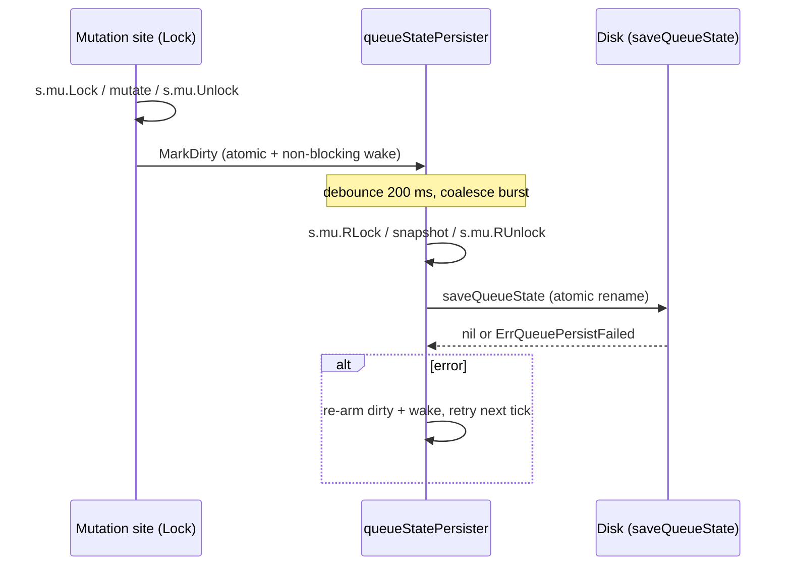
```mermaid
sequenceDiagram
    participant M as Mutation site (Lock)
    participant P as queueStatePersister
    participant D as Disk (saveQueueState)
    M->>M: s.mu.Lock / mutate / s.mu.Unlock
    M->>P: MarkDirty (atomic + non-blocking wake)
    Note over P: debounce 200 ms, coalesce burst
    P->>P: s.mu.RLock / snapshot / s.mu.RUnlock
    P->>D: saveQueueState (atomic rename)
    D-->>P: nil or ErrQueuePersistFailed
    alt error
        P->>P: re-arm dirty + wake, retry next tick
    end
```

*Diagram: Queue-state persist flow (DORMANT — the persister `Run` goroutine is no longer started; shown for the retained-but-deprecated mechanism only).*

### Package layout

```
internal/core/routing/
    types.go                    — RouteEntry, AnnounceEntry, RouteTriple, Snapshot, RouteSource
    table.go                    — Table with all CRUD, query, disconnect, and wire-projection operations
    announce.go                 — AnnounceLoop: periodic (30s) + triggered announce sender;
                                  PeerSender interface with four wire-frame methods —
                                  SendAnnounceRoutes (legacy announce_routes; used for
                                  connect-time / forced full sync on v1/v2 peers and for v1
                                  delta), SendRoutesUpdate (v2 routes_update delta; used only
                                  when both sides negotiated mesh_routing_v1 AND
                                  mesh_routing_v2 and the per-cycle classification agrees —
                                  never for first sync), SendRouteAnnounceV3 (Phase 4 compact
                                  route_announce_v3; carries kind="full" for connect-time /
                                  forced full sync on v3-triplet peers and kind="delta" for
                                  the v3 delta path), SendRequestResync (v2 request_resync
                                  control frame emitted by the receive side when ANY delta —
                                  v2 routes_update or v3 kind="delta" — arrives before any
                                  baseline); AnnounceLoop reconciles AnnouncePeerState.capabilities
                                  to the per-cycle AnnounceTarget caps via UpdateCapabilities
                                  at the start of every per-peer goroutine so classifyDeltaMode
                                  reads two agreeing snapshots in production; the divergence
                                  outcome stays as a defensive fallback for any future caller
                                  that bypasses the cycle-time sync
    announce_builder.go         — BuildAnnounceSnapshot: 4-stage aggregation (incl. per-Identity hot-fix), AnnounceSnapshot, ComputeDelta
    announce_state.go           — AnnouncePeerState, AnnounceStateRegistry: per-peer send state lifecycle
    types_test.go               — unit tests for type invariants, validation, wire projection
    table_test.go               — unit tests for table operations and invariants
    announce_test.go            — unit tests for announce loop, triggered updates, split horizon
    announce_builder_test.go    — unit tests for aggregation, snapshot equality, delta, Extra normalization
    announce_state_test.go      — unit tests for per-peer state lifecycle, View/Record methods
    announce_loop_cache_test.go — integration tests for noop suppression, delta-only, failed send retry,
                                  rate limiting, reconnect forced full sync, withdrawal retry via delta
    announce_wire_frame_test.go — guard tests pinning the first-sync wire-frame invariant: full
                                  sync and connect-time go through a self-contained baseline
                                  frame (SendAnnounceRoutes for v1/v2 peers, SendRouteAnnounceV3
                                  with kind="full" for v3-triplet peers; never a delta); v2
                                  delta path exercises SendRoutesUpdate only when both sources
                                  agree on the full v2 triplet (v1+v2+relay) and the v2 baseline
                                  has shipped; v3 delta path exercises SendRouteAnnounceV3 with
                                  kind="delta" only when the full v3 triplet (v1+v3+relay) is
                                  negotiated AND the v3 baseline has shipped; divergence falls
                                  back to SendAnnounceRoutes and marks state invalid for the
                                  next cycle

internal/core/node/
    table_router.go              — TableRouter: routing table lookup with gossip fallback
    routing_announce.go          — announce-plane wire path: TTL loop; sender implementations on
                                   node.Service for all five announce-plane wire frames
                                   (SendAnnounceRoutes, SendRoutesUpdate, SendRequestResync,
                                   SendRouteAnnounceV3 — Phase 4 compact full/delta carrying
                                   AttestedSig per entry, and SendRoutePoison — Phase 4
                                   single-hop poison-reverse) built via buildAnnounceFrame /
                                   buildRouteAnnounceV3Frame / MarshalRoutePoisonFrame and
                                   dispatched through two complementary helpers — legacy
                                   sendAnnouncePlaneFrame (for SendAnnounceRoutes; honours the
                                   "inbound:" prefix via writeFrameToInbound vs enqueuePeerFrame)
                                   and dispatchAnnouncePlaneFrameWithCaps (for SendRoutesUpdate,
                                   SendRequestResync, SendRouteAnnounceV3 and SendRoutePoison;
                                   captures sendCh / ConnID together with capability validation
                                   under one peerMu RLock so a session-replacement race between
                                   cap check and write cannot route the frame to a narrower
                                   transport at the same address); the captured ConnID path
                                   reuses writeFrameToInboundConn extracted from writeFrameToInbound;
                                   connect-time + periodic full sync via sendConnectTimeFullSync
                                   (dispatches to SendRouteAnnounceV3 kind="full" for v3-triplet
                                   peers, otherwise SendAnnounceRoutes — neither delta);
                                   handleAnnounceRoutes and handleRoutesUpdate both funnel into the
                                   shared applyAnnounceEntries receive core (announceReceiveLegacy
                                   sets baseline, announceReceiveV2 requires baseline);
                                   handleRequestResync does MarkInvalid + TriggerUpdate so next
                                   cycle re-delivers baseline; fanoutAnnounceRoutes,
                                   triggerDrainForExposed, routingCapablePeers discovery
    routing_relay.go             — relay-plane forwarding: table-directed relay, sendFrameToAddress,
                                   sendTableDirectedRelay / sendRelayToAddress, next-hop address
                                   resolution, gossip target computation (routingTargets*,
                                   routingTargetsFiltered, executeGossipTargets), sendMessageToPeer /
                                   gossipNotice / sendNoticeToPeer (§4.4 bootstrap handshake edges —
                                   this file is the §2.9 net-import carve-out for raw writes)
    routing_resolver.go          — identity↔address resolution: resolveRoutableAddress /
                                   resolveRelayAddress / resolvePeerIdentity, capability predicates
                                   (sessionHasCap, sessionHasBothCaps), inbound-conn-key helpers
                                   (inboundConnKeyForID / inboundConnKeyFromInfo)
    routing_session.go           — session lifecycle hooks for routing: onPeerSessionEstablished /
                                   onPeerSessionClosed (direct-peer registration, disconnect
                                   withdrawal fan-out), inboundPeerIdentity, per-peer announce
                                   state registry reset on connect/disconnect
    routing_hop_ack.go           — confirmRouteViaHopAck: hop_ack-driven route confirmation
    routing_drain.go             — event-driven pending queue drain: recipientFromPendingFrame,
                                   drainPendingForIdentities (extract-attempt-return pattern),
                                   drainSendMessage
    routing_provider.go          — RoutingProvider implementation on node.Service
    table_router_test.go         — unit tests for TableRouter
    routing_integration_test.go  — integration tests covering routing_announce / routing_relay /
                                   routing_resolver / routing_session / routing_hop_ack /
                                   routing_drain (file kept historical for test-file stability;
                                   private-method assertions remain same-package)

internal/core/rpc/
    routing_commands.go          — RegisterRoutingCommands: fetch_route_table, fetch_route_summary, fetch_route_lookup
    handler_routing_test.go      — unit tests for routing RPC commands
```

---

# Таблица маршрутизации — Distance Vector с Withdrawal

Связанная документация:

- [mesh.md](mesh.md) — обзор сетевого уровня
- [roadmap.md](roadmap.md) — полный план итераций
- [protocol.md](protocol.md) — протокол передачи данных

Исходники: `internal/core/routing/types.go`, `internal/core/routing/table.go`, `internal/core/routing/announce.go`, `internal/core/node/table_router.go`, `internal/core/node/routing_announce.go`, `internal/core/node/routing_relay.go`, `internal/core/node/routing_resolver.go`, `internal/core/node/routing_session.go`, `internal/core/node/routing_hop_ack.go`, `internal/core/node/routing_drain.go`, `internal/core/node/routing_provider.go`, `internal/core/rpc/routing_commands.go`

### Обзор

Пакет routing реализует таблицу маршрутизации на основе distance-vector для mesh-сети CORSA. Заменяет слепую gossip-доставку на направленную пересылку по метрике количества хопов. Gossip остаётся fallback, когда маршрут неизвестен.

### Основные типы

`RouteEntry` — это **boundary value**, передаваемое через публичный API Table (`UpdateRoute` аргумент, `Lookup` возврат, wire ingest projection). До Phase 1 shape entry одновременно был in-storage dedup key под тройкой `(Identity, Origin, NextHop)`. Post-Phase-1 storage переехал на per-`(Identity, Uplink)` `UplinkClaim` (см. подсекцию "Модель хранения" ниже); `RouteEntry` сохраняет legacy field set на boundary'е, чтобы existing callers и wire projection не менялись, но **dedup key на storage теперь только `(Identity, Uplink)`** — поле `Origin` в `RouteEntry`, возвращённое из `Lookup`, — синтезированный маркер (`localOrigin` или fallback на destination `Identity`), не оригинальный wire-frame Origin. Оригинальный wire-frame Origin сохраняется внутренне как `UplinkClaim.LastIngressOrigin` / `SeenOriginSeqs` для mixed-version interop admission rules и никогда не re-эмитится as-is на проводе.

`AnnounceEntry` — проекция `RouteEntry` для передачи по проводу. Содержит только четыре поля из `announce_routes` фреймов (Identity, Origin, Hops, SeqNo). Создаётся через `RouteEntry.ToAnnounceEntry()` или `Table.AnnounceTo()`. На провод уходит локальное значение hops отправителя как есть — получатель делает +1 при вставке в свою таблицу (receive path).

`Table` — потокобезопасное локальное хранилище маршрутов. Владеет identity ноды (`localOrigin`) и монотонным счётчиком SeqNo по каждому destination (`seqCounters`). Публичные операции: `AddDirectPeer`, `RemoveDirectPeer`, `UpdateRoute`, `WithdrawRoute`, `RefreshDirectPeers`, `TickTTL`, `Announceable`, `AnnounceTo`, `Lookup` и `Snapshot`.

`Snapshot` — иммутабельная копия таблицы на момент времени, безопасная для чтения без блокировок.

`AddDirectPeerResult` — результат подключения peer'а: `RouteEntry`, созданный или обновлённый, и флаг `Penalized`, указывающий, что flap detection применил укороченный TTL.

`RemoveDirectPeerResult` — результат отключения peer'а: wire-ready `[]AnnounceEntry` withdrawals (SeqNo уже инкрементирован, Hops=16) для own-origin direct-маршрутов, плюс количество transit-маршрутов, молча инвалидированных локально, плюс `ExposedBackups []PeerIdentity` — identity, у которых инвалидация обнажила выживший не-withdrawn backup route (используется `onPeerSessionClosed` для запуска дрейна).

`AnnounceSnapshot` — каноническое, агрегированное, peer-specific представление записей маршрутов, готовое к передаче. Wire-shape контракт имеет два слоя — см. AnnounceSnapshot doc-comment в `internal/core/routing/announce_builder.go` для полного split'а. Production слой (`routeStore.AnnounceProjectionFor`) enforce'ит per-Identity live-winner collapse И live-vs-tombstone exclusivity: максимум ОДИН live winner per Identity, с own-direct tombstones suppress'енными когда live альтернатива есть (см. "Live-vs-tombstone exclusivity на проводе" в Ключевых инвариантах ниже). Когда live winner для Identity отсутствует — tombstone эмитится, чтобы receivers evict'ились promptly. Структурный слой (`BuildAnnounceSnapshot` сам) НЕ re-enforce'ит exclusivity — синтетические test fixtures, обходящие AnnounceProjectionFor, могут передать и live entry и tombstone для одной Identity, а ComputeDelta keys на `(Identity, IsWithdrawn)`, поэтому оба слота могут coexist для synthetic input. Записи отсортированы детерминированно по `(Identity, Hops, Origin)` — Identity ASC, live winner (Hops ≤ 15) перед tombstone (Hops = 16) внутри Identity-группы, Origin lex tie-break. Nil `*AnnounceSnapshot` означает «ни один snapshot ещё не отправлен» и семантически отличается от snapshot с нулём записей.

**Per-Identity агрегация (Phase 0.x hot-fix, 2026-05; Phase 1 storage swap финализирован, 2026-Q3).** Field-data анализ 100-нодной mesh routes.json snapshot'и показал 12.7× wire amplification: 6072 stored RouteEntry строк, 1440 `(Identity, Origin)` bucket'ов, но только 113 reachable identity'ев. Hot-fix добавил per-Identity live-winner collapse (после legacy per-`(Identity, Origin)` aggregation stage, который с тех пор удалён): выбирает min `Hops`, затем higher `SeqNo`, затем deterministic `Extra` byte order, затем deterministic `Origin` lexicographic tie-break. Phase 1 затем завершил receive-side половину: storage мигрирован на per-`(Identity, Uplink)` `UplinkClaim` shape (Origin dropped из dedup key — см. "Модель хранения" подсекцию ниже для полного контракта), поэтому on-table redundancy тоже схлопнулся с 7.6× к baseline. **Live-vs-tombstone wire exclusivity:** при наличии live winner для Identity, own-direct tombstones для этой Identity SUPPRESS'ятся на проводе (live emit уже override'ит любое prior receiver state, а emit'нувшийся trailing tombstone через outbound SeqNo synthesiser получил бы строго более высокий SeqNo чем live winner и flip'нул бы receiver в withdrawn). Tombstones DO эмитятся когда live альтернативы нет — receiver всё ещё нуждается в dead signal чтобы evict вместо ожидания TTL. Outbound wire volume per cycle падает в ~12.7× в typical case (без tombstones); на disconnect events одна дополнительная запись per affected Identity ride'ится рядом КОГДА no live backup exists. Backward compat: legacy peer'ы продолжают получать `(Identity, Origin, Hops, SeqNo)` кадры с `Origin = localOrigin` (sender-originated semantic — соответствует их per-`(Identity, Origin, NextHop)` triple shape на storage); наш вклад в их storage drops с N записей per `(Identity, Origin)` lineage до (1 live winner OR 1 tombstone) per Identity, и SeqNo timeline который они наблюдают — синтезированный per-`(Identity, sender)` shape из outbound SeqNo helpers.

`AnnouncePeerState` — per-peer состояние отправки анонсов: последний успешно отправленный snapshot, timestamps попыток/успехов full sync и delta send, флаг `needsFullResync`, отслеживание disconnect для eviction. Все мутабельные поля доступны только через потокобезопасные методы (`View()`, `RecordFullSyncAttempt()`, `RecordFullSyncSuccess()`, `RecordDeltaSendSuccess()`). Владелец — `AnnounceStateRegistry`.

`AnnounceStateRegistry` — реестр per-peer `AnnouncePeerState`. Потокобезопасный для одновременного доступа из цикла анонсов и колбэков жизненного цикла сессий. Предоставляет `GetOrCreate`, `MarkDisconnected`, `MarkReconnected`, `EvictStale`, `MarkInvalid` и `Cleanup`. Disconnected-состояние удаляется через `2 * flapWindow`. Источник времени внедряется для тестов.

### Модель хранения

Внутреннее хранилище живёт в `routing.routeStore` (`internal/core/routing/route_store.go`) и хранит **per-`(Identity, Uplink)` `UplinkClaim`**, где `Uplink` — identity того direct peer'а, который анонсировал нам claim:

```go
type UplinkClaim struct {
    Uplink            PeerIdentity              // direct peer who told us this claim
    Hops              uint8                     // their announced hops + 1
    SeqNo             uint64                    // upstream wire SeqNo
    Source            RouteSource               // direct / hop_ack / announcement
    UpdatedAt         time.Time
    ExpiresAt         time.Time                 // zero for direct
    Withdrawn         bool
    Extra             json.RawMessage           // forward-compat wire metadata
    LastIngressOrigin PeerIdentity              // sticky wire-frame Origin (mixed-version)
    SeenOriginSeqs    map[PeerIdentity]uint64   // per-Origin high-water (lazy)
    AttestedSig       []byte                    // reserved для Phase 4 (mesh_attested_links_v1)
}
```

`LastIngressOrigin` и `SeenOriginSeqs` поддерживают mixed-version interop admission rules — см. "Mixed-version interop" под Ключевыми инвариантами ниже для full contract. Storage держит per-Identity bucket с до `MaxNextHopsPerOrigin` LIVE claims (имя knob сохранено ради operator stability; semantic post-A1 — K live UplinkClaims per Identity). Withdrawn claims (tombstones) живут вне K-counted slots и bypass cap entirely — SeqNo-resurrection guard не evict'ится под cap pressure.

Boundary `RouteEntry` синтезируется on demand через `toRouteEntry` (в `uplink_claim.go`): берёт хранимый `UplinkClaim` плюс destination `Identity` плюс table's `localOrigin` и производит wire-shaped значение с `Origin = localOrigin` (или fallback на `Identity` если `localOrigin` пустой). Этот синтез позволяет public Table API оставаться source-compatible с pre-Phase-1 callers, пока storage internals мигрировали.

### Ключевые инварианты

**Per-Identity SeqNo monotonicity.** Sequence numbers managed на двух уровнях:

- *Own-origin advance counter*: `seqCounters[Identity]` — монотонный счётчик для маршрутов, которые эта нода originates (direct peers). Он автоматически advance'ит в `AddDirectPeer` / `RemoveDirectPeer` / `InvalidateAllVia` и синхронизируется вперёд через `UpdateRoute` ТОЛЬКО когда accepted entry имеет `Source == RouteSourceDirect` И `Origin == localOrigin` (см. "Согласованность счётчика SeqNo" ниже — Source gate предотвращает poisoning счётчика из синтезированного `Origin == localOrigin` на hop_ack-promotion paths foreign SeqNo значениями).
- *Per-`(Identity, sender)` wire timeline*: каждый outbound wire emit (live winner, own-direct tombstone passthrough, broadcast withdrawal) получает свой SeqNo через `routeStore.nextOutboundSeqLockedPerPeer` / `nextOutboundSeqLockedBroadcast`. Helpers поддерживают per-`(Identity, content-sig)` кэш плюс три watermark'а (`outboundMax`, `outboundBroadcastMax[Identity]`, `outboundPeerMax[(Identity, peer)]`), поэтому receiver наблюдает strictly монотонный SeqNo на каждой паре `(Identity, sender)` независимо от того, какой `claim.SeqNo` upstream'а контрибутил content. Watermark'и закрывают два A→B→A flavour'а — broadcast-driven (own-direct fanout пересекающий per-peer cache) и per-peer winner-switch (alternate-uplink preference shift, advancing single peer past cached value). Оба запинены `TestAnnounceTo_*` regression suite'ами в `announce_builder_test.go`.

**Ключ дедупликации.** Пара `(Identity, Uplink)` уникально идентифицирует хранимый `UplinkClaim`. Разные uplink'и для одной destination Identity создают независимые claim'ы (multipath). Legacy boundary RouteEntry shape несёт поле `Origin`, но post-Phase-1 оно НЕ входит в dedup key — только `(Identity, NextHop=Uplink)` консультируется через `routeStore.findByUplinkLocked`.

**Live-vs-tombstone exclusivity на проводе.** При наличии live winner для Identity, own-direct tombstones для этой Identity SUPPRESS'ятся на проводе в `AnnounceProjectionFor` (storage retain'ит tombstone для локального SeqNo-resurrection guard'а). Emit'ив оба, `nextOutboundSeqLockedPerPeer` назначил бы tombstone'у строго больший SeqNo чем live winner'у (peerMax advance'ится на live emit), и receiver-side монотонный SeqNo timeline сошёлся бы на tombstone'е — drop'нув Identity, хотя мы только что предложили backup uplink. Tombstones ДА эмитятся когда live альтернативы нет.

**Mixed-version interop admission rules.** Pre-A1 transits используют per-Origin SeqNo counters и shift'ят свой per-Identity winner между Origin lineages per cycle. Post-A1 storage применяет пять admission rules в фиксированном порядке внутри `ApplyUpdate`, чтобы держать legacy stream interop intact:

1. Pre-check guard отклоняет cross-Origin updates, чей incoming Origin имеет recorded `SeenOriginSeqs` high-water at-or-above `entry.SeqNo` (stale-replay на own timeline этого Origin'а).
2. HopAck override preserve'ит хранимый `LastIngressOrigin` / `SeenOriginSeqs` когда entry пришла из `confirmRouteViaHopAck` (synthetic `Origin == localOrigin` из `Lookup`, не wire observation).
3. Cross-Origin live-vs-tombstone at equal SeqNo promote'ит live entry через тот же cap-aware `AdmitNew` detach+readmit, что используется в SeqNo > old branch'е.
4. Standard SeqNo branches (>, ==, <) — stale-SeqNo branch дополнительно admit'ит cross-Origin update когда он strictly improves on hops, trust, или replace'ит tombstone (cross-Origin lineage shift).
5. Reconfirmation TTL refresh gate — hops-only (`incoming.Hops == old.Hops`), НЕ source-equality — поэтому wire re-announce после HopAck promotion всё равно refresh'ит TTL.

Все пять правил dormant для A1-to-A1 traffic (post-A1 senders emit `Origin = localOrigin` constant across cycles, поэтому cross-Origin gates никогда не fire'ят).

**Split horizon.** При формировании анонса для peer A claims с `Uplink == A` пропускаются. Фиктивный `hops=16` withdrawal не отправляется — это нарушило бы receiver-side инвариант монотонности SeqNo.

**Семантика withdrawal.** Отзыв маршрута устанавливает `Hops = 16` (бесконечность) и требует строго `SeqNo > old.SeqNo`. На проводе только origin может отправить withdrawal. При отключении peer'а `RemoveDirectPeer` отзывает own-origin direct-маршруты (возвращаются как wire-ready `[]AnnounceEntry` с уже инкрементированным SeqNo) и молча инвалидирует transit-маршруты локально. Транзитные ноды не генерируют wire-withdrawal для чужих маршрутов.

**Иерархия доверия.** Для каждой тройки: `direct > hop_ack > announcement`. При одинаковом SeqNo источник с более высоким доверием заменяет менее доверенный. Подтверждение одной тройки через hop_ack не влияет на другие тройки, даже при общем NextHop.

**Порядок выбора маршрута.** `Lookup()` ранжирует маршруты через Phase 2 `CompositeScore` (базовый hop-count term + source-trust бонус + RTT бонус + health penalty — формула в секции «Здоровье маршрутов и composite scoring» ниже и в `docs/protocol/route_health.md`). Source trust по-прежнему влияет через бонус (local/direct +20, hop_ack +10, announcement 0), поэтому при равных hops/health/RTT источник с большим доверием выигрывает; но в отличие от pre-Phase-2 sort'а, source trust больше не доминирует над hop count безусловно — Good 1-хоповый announcement может обогнать Bad 3-хоповый direct. `HealthDead` claims фильтруются до ранжирования с одним исключением: `RouteSourceDirect` (own-origin) claims остаются selectable даже при Dead и оцениваются с `Bad`-equivalent penalty, потому что lifecycle direct'ов session-driven, а не health-driven.

**Истечение TTL.** Learned-маршруты (из анонсов и hop_ack) имеют `ExpiresAt` (по умолчанию 120с с момента вставки). `TickTTL()` удаляет истёкшие записи и возвращает слайс identity, у которых истечение обнажило выживший не-withdrawn backup route — `routingTableTTLLoop` использует это для запуска `drainPendingForIdentities` и немедленной доставки через backup. Learned-маршруты обновляются естественным образом при переанонсировании соседом. Когда переанонс с тем же SeqNo приходит для expired записи, `UpdateRoute` принимает его как валидное обновление — origin не менял маршрут, а просто переподтверждает его. Когда переанонс с теми же SeqNo, source и hops приходит для *живой* learned-записи — точное переподтверждение — `UpdateRoute` возвращает `RouteUnchanged` и продлевает `ExpiresAt` до `now + defaultTTL`. Wire-level переподтверждение продлевает время жизни, даже если ни одно поле, важное для delta-consumer, не изменилось. Без этого продления no-op suppression на стороне отправителя дала бы learned-маршрутам истечь между forced full sync (см. «Инвариант интервала refresh» ниже). Запись *хуже* — тот же SeqNo, но больше hops или ниже trust — тоже возвращает `RouteUnchanged`, но `ExpiresAt` НЕ продлевается: старая запись — это лучший путь, и получатель хочет её сохранить, но позволить hops=N+1 переанонсу продлевать оптимистичную старую hops=N означало бы заморозить её навсегда и заблокировать natural TTL-driven reconvergence на актуально-текущий путь, когда origin не двигает SeqNo. Direct-маршруты также исключены из этого продления: их `ExpiresAt=zero` по дизайну (см. «Жизненный цикл direct-маршрутов» ниже), и перезапись этого нуля превратила бы never-expiring запись в 120-секундную — `IsExpired` для нуля возвращает false, так что без явного исключения живой direct-маршрут попадал бы в эту ветку наравне с learned.

**Жизненный цикл direct-маршрутов.** Own-origin direct-маршруты используют `ExpiresAt=zero` (никогда не истекают по времени). Их жизненный цикл полностью управляется сессией: `AddDirectPeer` создаёт при подключении сокета, `RemoveDirectPeer` отзывает при закрытии сокета. Это event-driven подход — периодическое обновление TTL не требуется. `RemoveDirectPeer` устанавливает `Hops=HopsInfinity` и `ExpiresAt=now+defaultTTL` на отозванной записи, создавая tombstone, который `TickTTL` уберёт после стандартного TTL. Такой дизайн устраняет класс гонок, при которых `TickTTL` мог безвозвратно удалить активный direct-маршрут между циклами `RefreshDirectPeers`, делая подключённый peer невидимым для таблицы маршрутизации. `UpdateRoute` обеспечивает инвариант нулевого `ExpiresAt` на этапе первичной нормализации: любая `RouteSourceDirect` запись, попавшая туда — через restore состояния, defensive re-application или явные тесты Direct-via-`UpdateRoute` — получает принудительный `ExpiresAt=zero` перед вставкой, независимо от того, что передал caller, так что никто не может случайно положить активный direct с конечным TTL, который потом удалит `TickTTL`.

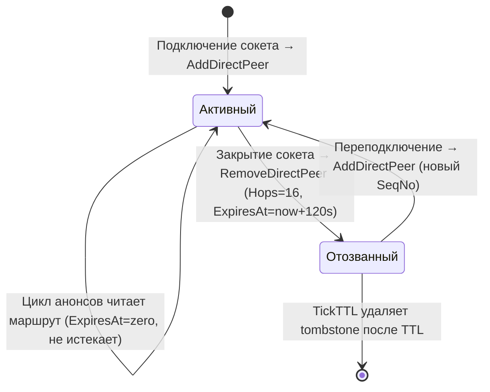
```mermaid
stateDiagram-v2
    [*] --> Активный: Подключение сокета → AddDirectPeer
    Активный --> Активный: Цикл анонсов читает маршрут (ExpiresAt=zero, не истекает)
    Активный --> Отозванный: Закрытие сокета → RemoveDirectPeer (Hops=16, ExpiresAt=now+120s)
    Отозванный --> [*]: TickTTL удаляет tombstone после TTL
    Отозванный --> Активный: Переподключение → AddDirectPeer (новый SeqNo)
```
*Диаграмма — Жизненный цикл direct-маршрута: event-driven, без истечения TTL*

**Инвариант интервала refresh.** Learned-маршруты у соседей имеют время жизни `defaultTTL` (120с). Send-side подавляет отправку wire-кадра, когда per-peer delta пустая (см. лог-строку `announce_cycle_complete`: поле `announce_skipped_noop`), поэтому единственный механизм, который продлевает TTL для неизменной lineage — периодический forced full sync, срабатывающий каждые `EffectiveForcedFullSyncInterval(AnnounceInterval)`. Граница инварианта:

```
EffectiveForcedFullSyncInterval(AnnounceInterval) <= DefaultTTL / 2
```

`EffectiveForcedFullSyncInterval(AnnounceInterval) = min(ForcedFullSyncMultiplier × AnnounceInterval, DefaultTTL/2)` — cap enforced внутри самой helper'ы, поэтому любой operator-configured `AnnounceInterval` (через `CORSA_ANNOUNCE_INTERVAL_SECONDS`) даёт forced-full-sync cadence ≤ TTL/2. При значениях по умолчанию (`multiplier=2`, `interval=30s`, `TTL=120s`) неравенство на границе: forced full sync срабатывает каждые 60с = TTL/2 = ровно половина TTL, так что один пропущенный или задержавшийся sync ещё успевает доехать до истечения. Для коротких operator-configured интервалов (например, 10с → forced cadence 20с) cadence ниже TTL/2 с большим запасом; для `AnnounceInterval ≥ TTL/2` cap clamp'ится до TTL/2.

Run-loop tick period выбирается через `chooseTickInterval(AnnounceInterval, EffectiveForcedFullSyncInterval(AnnounceInterval))` так, чтобы tick делил cap нацело — forced-full deadline'ы поэтому ложатся точно на tick boundary, а не «deadline + до одного tick'а». Без этого operator с `AnnounceInterval=45с` имел бы tick'и на 45с, видел 60с deadline только на 90с wake'е, и actual cadence stretched бы за TTL/2. Подробности gcd-based алгоритма и busy-loop floor (защита от non-second-aligned input'ов) — в doc-комментарии helper'ы в `internal/core/routing/announce.go`.

Forced-full retry rate-limit window clamp'ится до `min(MinForcedFullSyncInterval, EffectiveForcedFullSyncInterval(AnnounceInterval))` — он никогда не превышает projected cadence. Без clamp'а operator с коротким интервалом (например, 10с, forced cadence 20с) имел бы second forced attempt блокированный fixed 30с rate-limit window, и actual cadence silently stretched бы до 30с, contradicting helper's projection. Default 30с interval не affected'ится (clamp — no-op когда `forcedFullSyncInterval ≥ 30с`).

Инвариант поддерживается двумя механизмами, оба должны выполняться:

- send-side каденс — охранен набором unit-тестов в `internal/core/routing/announce_test.go` и `internal/core/routing/announce_invariant_test.go`:
    - `TestRoutingConstants_RefreshIntervalInvariant` — пинит default-constants compile-time неравенство `ForcedFullSyncMultiplier × DefaultAnnounceInterval ≤ DefaultTTL/2`, так что изменение любой из трёх констант без перепроверки ловится.
    - `TestEffectiveForcedFullSyncInterval_CappedAtTTLHalf` — пинит cap внутри самой helper'ы для ЛЮБОГО operator-configured AnnounceInterval'а (`min(2 × interval, DefaultTTL/2)`), оператор не может поставить значение выше TTL/2 и нарушить freshness boundary.
    - `TestAnnounceLoop_TickInterval_DividesBothCadences` — пинит, что `chooseTickInterval` возвращает tick, делящий и operator interval, и forced cap нацело, поэтому forced-full deadline'ы ложатся ТОЧНО на tick boundary, а не «deadline + до одного tick'а».
    - `TestAnnounceLoop_TickInterval_BusyLoopGuard` — пинит 1-секундный floor для production-кадансов, чтобы non-second-aligned input'ы (например, `59s + 1ns`) не collapse'или `gcd` до sub-second значения и не превращали `time.NewTicker` в busy-loop.
    - `TestAnnounceLoop_ForcedFullRateLimit_ClampedToForcedFullCap` — пинит round 15.6 clamp `min(MinForcedFullSyncInterval, EffectiveForcedFullSyncInterval(AnnounceInterval))`, так что rate-limit window не растягивает actual forced cadence за projection helper'ы.
    - `TestAnnounceLoop_TriggerDoesNotDelayForcedFullDeadline` — пинит round 15.9 P1-фикс: trigger-обработчик в `AnnounceLoop.Run` НЕ ДОЛЖЕН делать `ticker.Reset(tickInterval)`. При триггерах, прибывающих чуть быстрее natural tick'а (например, connect/disconnect storm при churn-событиях), каждый Reset двигал бы next periodic wake вперёд, forced-full deadline check ловил бы deadline только на ближайшем trigger'е за cap'ом, и actual forced-full gap silently превышал бы `EffectiveForcedFullSyncInterval(AnnounceInterval)`. Test driv'ит `AnnounceInterval=200ms` (cap=400ms) с триггерами каждые 180ms и assertion'ит, что gap между wire-send'ами остаётся в пределах `cap + 50ms` tolerance'а — bug shape даёт ~540ms gap'ы и fail'ит cleanly.
- receive-side продление TTL — ветка `RouteUnchanged` в `UpdateRoute` (`internal/core/routing/table.go`) продлевает `ExpiresAt` на живых learned-записях только при точном переподтверждении (тот же source И те же hops), оставляет более слабые reapply (хуже hops, ниже trust) без bump'а TTL, чтобы reconvergence продолжал работать, и оставляет direct-маршруты с их `ExpiresAt=zero` нетронутыми. Первичная нормализация в том же файле принудительно ставит `ExpiresAt=zero` для каждой `RouteSourceDirect` записи на insert/replace, так что direct-маршрут не может попасть в таблицу с конечным TTL ни через один путь UpdateRoute. Охранена `TestUpdateRouteRefreshesTTLOnUnchangedLiveRoute`, `TestUpdateRouteUnchangedWorseHopsDoesNotRefreshTTL`, `TestUpdateRouteDirectInsertPreservesZeroExpiry`, `TestUpdateRouteUnchangedDirectRoutePreservesZeroExpiry` (все в `internal/core/routing/table_test.go`) и end-to-end-тестом `TestAnnounceLoop_ForcedFullSync_RefreshesLearnedRouteBeforeExpiry` (`internal/core/routing/announce_ttl_refresh_test.go`).

Удаление любого из send-side охранов или receive-side TTL extension возвращает симптом «лучший маршрут пляшет»: learned `hops=N`-маршруты через hub исчезают на до `DefaultTTL - EffectiveForcedFullSyncInterval(AnnounceInterval)` за цикл (при default 30с interval это 60с; для коротких operator-configured интервалов сжимается пропорционально), локальный `Lookup` переключается на более длинные transit-пути, и наблюдаемое поле best route колеблется между оптимальным и деградированным значениями, пока следующий full sync не вернёт оптимальную lineage.

**Operator tuning — интервал announce и overload gate.** Два config-knob'а позволяют densely-connected receiver'ам сбрасывать CPU без нарушения freshness-инварианта:

- `CORSA_ANNOUNCE_INTERVAL_SECONDS` (`config.Node.AnnounceInterval`). Переопределяет периодичность delta-цикла. По умолчанию (env unset) — `routing.DefaultAnnounceInterval` (30 с). Операторы densely-connected нод (>10 direct peer'ов) могут поднять до 45-60 с, чтобы сократить per-peer стоимость delta-вычислений вдвое. Forced-full-sync cadence независимо capped на `DefaultTTL/2` через `routing.EffectiveForcedFullSyncInterval` независимо от конфигурируемого interval'а, поэтому freshness invariant выше ВСЕГДА держится. Установка `AnnounceInterval = DefaultTTL/2` превращает каждый tick в forced full sync (без in-between deltas) — это подходит, когда sender CPU-bound на delta-вычислениях по многим peer'ам; trade-off — потеря mid-cycle delta granularity.
- `CORSA_OVERLOAD_GOROUTINE_THRESHOLD` (`config.Node.OverloadGoroutineThreshold`). При положительном значении announce loop консультируется с goroutine-count прокси (`runtime.NumGoroutine()`) в начале каждого cycle'а. Если goroutines превышают threshold, delta-send'ы к peer'ам, которым в этом cycle'е не нужен forced full sync, suppress'ятся; forced-full-sync продолжает срабатывать по своему TTL/2 расписанию, поэтому receiver'ы никогда не видят stale routes. По умолчанию выключено (zero threshold). Разумная стартовая величина для hub-нод — observed `NumGoroutine` под нормальной нагрузкой × 2-3 — обычно 5000-10000 для densely-connected ноды. Cumulative engaged-cycle counter surface'ится через `fetchRouteSummary` в поле `overload.engaged_cycles` (см. `docs/rpc/routing.md`) — оператор видит, firing'ует ли backpressure в production, без attach'а debugger'а. Goroutine count — это прокси потому что каждый inbound frame порождает хотя бы одну goroutine; sustained backlog даёт видимый pile-up. Прокси может быть заменён на explicit aggregation длин per-peer inbox'ов в будущей итерации.

**NextHop — это identity peer'a.** Маршрутизация работает на уровне identity, а не транспортных адресов. Один peer identity может иметь несколько параллельных TCP-сессий; выбор сессии происходит позже в `node.Service` через индекс identity→session(s) для резолва identity в активные соединения.

**Валидация записей.** `RouteEntry.Validate()` проверяет структурные инварианты при вставке: Identity, Origin и NextHop не должны быть пустыми; Hops в диапазоне [1, 16]. Source-specific правила: direct-маршруты (`RouteSourceDirect`) должны иметь `Hops=1` и `NextHop == Identity` (непосредственный сосед). Невалидные записи отклоняются в `UpdateRoute` до захвата блокировок. Дополнительно, `UpdateRoute` проверяет origin для direct-маршрутов: когда `localOrigin` сконфигурирован, запись `RouteSourceDirect` с `Origin != localOrigin` отклоняется с `ErrDirectForeignOrigin`. Это предотвращает инъекцию невозможных direct-маршрутов с чужим origin, которые превосходили бы все announcement/hop_ack маршруты в `Lookup` и никогда не попадали бы под own-origin withdrawal при disconnect.

**Граница wire-проекции.** Граница между table-моделью и wire-форматом явная: `AnnounceTo(excludeVia)` возвращает `[]AnnounceEntry` с applied split horizon. На провод уходит локальное значение hops — +1 не применяется на стороне отправителя; получатель делает +1 при вставке в свою таблицу . `RemoveDirectPeer` возвращает wire-ready `[]AnnounceEntry` withdrawals с уже инкрементированным SeqNo. Caller'ы, формирующие `announce_routes` фреймы, используют `AnnounceTo` или результаты `RemoveDirectPeer` напрямую — ручная арифметика не нужна.

**Консистентность счётчика SeqNo.** Когда `UpdateRoute` принимает own-direct запись (`Source == RouteSourceDirect` И `Origin == localOrigin`), он синхронизирует монотонный счётчик: `seqCounters[identity] = max(counter, entry.SeqNo)`. Это гарантирует, что таблицы, предзаполненные через `UpdateRoute` (например, восстановленные из snapshot или полученные через full sync), не приведут к тому, что следующий `AddDirectPeer`/`RemoveDirectPeer` выдаст устаревший SeqNo. Gate `Source == RouteSourceDirect` критичен post-Phase-1: synthesiser `toRouteEntry` ставит `Origin = localOrigin` на КАЖДОМ claim, возвращаемом из `Lookup` (независимо от underlying claim source), поэтому hop_ack-promotion paths (где `confirmRouteViaHopAck` читает через `Lookup` и resubmit'ит с `Source = RouteSourceHopAck`) несут foreign SeqNo values под `localOrigin` Origin'ом. Без Source gate'а эти foreign SeqNo poison'или бы наш own-direct counter и следующий own-direct withdrawal выдал бы stale SeqNo, который legacy receivers reject'нут.

### Интеграция

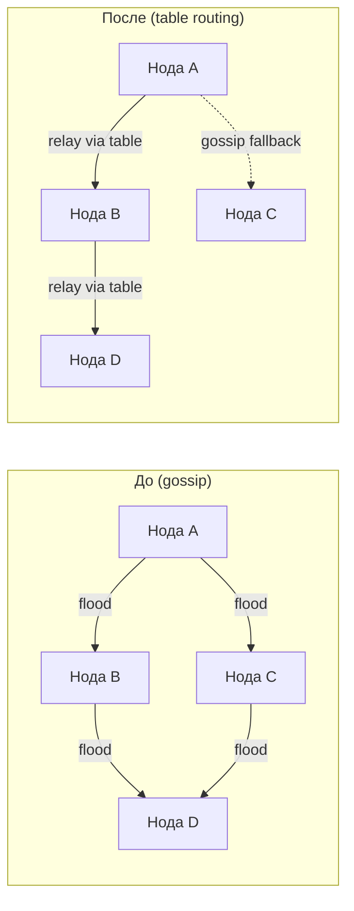
```mermaid
flowchart LR
    subgraph Before["До (gossip)"]
        A1[Нода A] -->|flood| B1[Нода B]
        A1 -->|flood| C1[Нода C]
        B1 -->|flood| D1[Нода D]
        C1 -->|flood| D1
    end

    subgraph After["После (table routing)"]
        A2[Нода A] -->|relay via table| B2[Нода B]
        B2 -->|relay via table| D2[Нода D]
        A2 -.->|gossip fallback| C2[Нода C]
    end
```
*Диаграмма — Доставка сообщений: gossip flood vs table-directed relay*

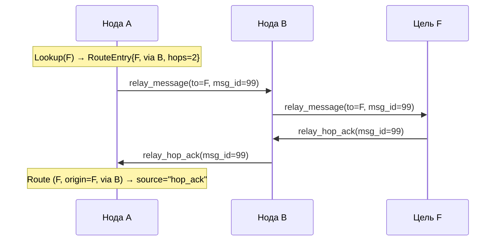
```mermaid
sequenceDiagram
    participant A as Нода A
    participant B as Нода B
    participant F as Цель F

    Note over A: Lookup(F) → RouteEntry{F, via B, hops=2}
    A->>B: relay_message(to=F, msg_id=99)
    B->>F: relay_message(to=F, msg_id=99)
    F->>B: relay_hop_ack(msg_id=99)
    B->>A: relay_hop_ack(msg_id=99)
    Note over A: Route (F, origin=F, via B) → source="hop_ack"
```
*Диаграмма — Table-directed relay с подтверждением hop_ack*

**Сходимость.** Цикл анонсов (`routing/announce.go`) выполняет периодические анонсы с operator-configured cadence (`AnnounceInterval`, по умолчанию 30 секунд, override через `CORSA_ANNOUNCE_INTERVAL_SECONDS`) и поддерживает triggered updates при connect/disconnect событиях. На каждом цикле raw-записи маршрутов из `Table.AnnounceTo(peer)` агрегируются в peer-specific snapshot. Post-Phase-1 тяжёлая работа происходит в `routeStore.AnnounceProjectionFor` upstream (per-Identity live-winner collapse inline + live-vs-tombstone exclusivity + outbound wire SeqNo synthesis); `BuildAnnounceSnapshot` затем работает как defensive pass над projection output (exact-duplicate removal + per-`(Identity, Origin, SeqNo, Withdrawn)` collapse для synthetic test fixtures + per-Identity tombstone collapse). Legacy pre-A1 per-`(Identity, Origin)` max-SeqNo stage удалена. Результат сортируется по `(Identity, Hops, Origin)`. Полное описание stages — в верхнем параграфе «Конвергенция» английской секции этого документа и в doc-comment'е `BuildAnnounceSnapshot` (`internal/core/routing/announce_builder.go`). Входящие `announce_routes` фреймы обрабатываются `handleAnnounceRoutes` в `node/routing_announce.go` — каждый маршрут получает +1 хоп на стороне получателя. Withdrawals (hops=16) применяются через `Table.WithdrawRoute`, но только от origin-отправителя (`Origin == senderIdentity`). Когда `WithdrawRoute` получает withdrawal для неувиденной пары `(Identity, Uplink=NextHop)`, он создаёт tombstone-запись (hops=HopsInfinity) с SeqNo из withdrawal. Это предотвращает воскрешение отозванного lineage задержанным старым анонсом — SeqNo tombstone блокирует любое устаревшее обновление для той же пары `(Identity, Uplink)`. `Origin` из withdrawal-фрейма сохранён в публичном API `WithdrawRoute` ради backward compat с pre-A1 caller'ами, но хранится только как `LastIngressOrigin` lineage metadata на tombstone'е (post-Phase-A storage ключуется per-`(Identity, Uplink)` — см. "Модель хранения" выше; legacy three-tuple triple отсутствует в dedup key). Tombstone'ы истекают через стандартный TTL. **Tombstone'ы независимы от `MaxNextHopsPerOrigin`:** они append'ятся безусловно и исключаются из cap-counter'а, поэтому насыщенный bucket из K live маршрутов всё равно admit'ит новые tombstone'ы (cap защищает только K live слотов). Это сознательный design trade-off — см. «Уплотнение RIB» — который сохраняет SeqNo resurrection guard работоспособным под cap pressure. Capability `mesh_routing_v1` теперь рекламируется при handshake. Цикл анонсов охватывает как outbound-сессии, так и inbound-only соединения. Обнаружение целей через `routingCapablePeers()` требует наличия обеих capability: `mesh_routing_v1` и `mesh_relay_v1` — routing-only peer (без relay) исключается, поскольку маршруты через него создавали бы недоставляемые пути.

**Валидация receive-path.** `handleAnnounceRoutes` обеспечивает три инварианта безопасности перед принятием любого wire-анонса: (1) **Валидация identity отправителя** — identity отправителя должна быть валидным 40-символьным lowercase hex fingerprint (`identity.IsValidAddress`). Для inbound-соединений identity берётся из `connPeerHello.identity` (поле `Address` hello-фрейма), а не из `connPeerHello.address` (listen-адрес для health-трекинга). Это различие критично для NATed peer'ов, которые рекламируют нероутабельный listen-адрес (например, `127.0.0.1:64646`) — использование listen-адреса как routing identity привело бы к отклонению всех анонсов от таких peer'ов как malformed. Для outbound-сессий identity берётся из `session.peerIdentity` (устанавливается из welcome-фрейма). (2) **Отклонение own-origin** — анонсы с `Origin == localIdentity` от чужого отправителя молча отбрасываются. Только эта нода может порождать маршруты под своей identity; принятие поддельной own-origin записи позволило бы соседу отравить монотонный счётчик SeqNo через `syncSeqCounterLocked`. (3) **Отклонение transit withdrawal** — wire withdrawals (`hops >= 16`) где `Origin != senderIdentity` молча отбрасываются. Только origin может генерировать wire withdrawal; transit-ноды должны инвалидировать локально и прекращать рекламировать маршрут. Все три проверки выполняются до `UpdateRoute`/`WithdrawRoute`, чтобы некорректные данные не попадали в таблицу.

**Гейт capability для прямых маршрутов.** `onPeerSessionEstablished(peerIdentity, caps)` принимает полный набор согласованных capabilities peer'а и локально разворачивает его до `hasRelayCap := sessionHasCap(caps, domain.CapMeshRelayV1)`; этот флаг контролирует вызов `AddDirectPeer`. Прямой маршрут в distance-vector таблице объявляет, что эта нода может ретранслировать DM до назначения. Если peer не может принимать фреймы `relay_message` (legacy или gossip-only нода), маршрут будет недоставляемым — другие routing-capable ноды узнают путь, который молча сбоит на последнем хопе. Outbound вызов передаёт `session.capabilities` напрямую. Inbound вызов получает per-connection снапшот через `connCapabilitiesForID(id)`. Peer'ы без `mesh_relay_v1` по-прежнему подключаются и обмениваются gossip нормально, но никогда не рекламируются как direct destinations в routing table. Тот же полный список capabilities передаётся в `AnnounceStateRegistry.MarkReconnected`, чтобы announce-плоскость могла принимать mode-решения без повторного захода под `peerMu` — registry делает defensive copy внутри себя, поэтому caller может передавать session-owned слайс без собственного копирования.

**Multi-session identity с двойными счётчиками.** `node.Service` ведёт два per-identity счётчика: `identitySessions` (всего активных сессий) и `identityRelaySessions` (только relay-capable сессий). `AddDirectPeer()` вызывается при переходе `identityRelaySessions` 0→1 (первая relay-capable сессия). `RemoveDirectPeer()` вызывается при переходе `identityRelaySessions` 1→0 (последняя relay-capable сессия закрывается). Это означает, что non-relay первая сессия не блокирует создание direct route более поздней relay сессией, и закрытие последней relay сессии отзывает маршрут, даже если legacy сессии остаются. `onPeerSessionClosed(peerIdentity, caps)` принимает тот же набор capabilities, который был передан в парный вызов `onPeerSessionEstablished`, что сохраняет баланс обоих счётчиков на каждом переходе. Очистка total session count происходит независимо.

**Полная синхронизация таблицы при подключении.** Как outbound, так и inbound пути подключения отправляют немедленную полную синхронизацию таблицы (`routingTable.AnnounceTo(peerIdentity)`) новому подключённому peer'у. Это обеспечивает симметричную начальную сходимость независимо от направления подключения. Синхронизация закрыта гейтом обеих capability: `mesh_routing_v1` и `mesh_relay_v1` — в соответствии с контрактом цикла анонсов. Routing-only peer (mesh_routing_v1 без mesh_relay_v1) получил бы маршруты, которые он не может доставить на data plane, поэтому исключается из connect-time синхронизации. Outbound-путь проверяет `sessionHasCapability(address, capMeshRoutingV1) && sessionHasCapability(address, capMeshRelayV1)` в `establishPeerSession`. Inbound-путь проверяет `connHasCapability(conn, capMeshRoutingV1) && connHasCapability(conn, capMeshRelayV1)` в `trackInboundConnect`. Оба пути передают Ed25519 identity fingerprint peer'а (`peerIdentity`) в `AnnounceTo` — не transport/listen адрес. Это критично для NATed inbound peer'ов, чей listen-адрес (например, `127.0.0.1:64646`) отличается от fingerprint'а; передача transport-адреса сломала бы фильтрацию split horizon. Legacy peer'ы без любой из capability пропускаются без ошибки. Применяется split horizon — маршруты, полученные от подключающегося peer'a, исключаются. Если результирующий peer-specific snapshot пуст (например, единственный маршрут — это direct route самого peer'а, исключённый split horizon), baseline записывается без отправки wire-кадра (empty-baseline); последующие циклы анонсов используют delta path как обычно. Если отправка не удалась (очередь сессии переполнена, соединение потеряно между handshake и sync), записывается предупреждение (`routing_outbound_full_sync_failed` или `routing_inbound_full_sync_failed`). Peer всё равно получит таблицу в следующем периодическом цикле анонсов.

**Демпфирование flap'ов.** Routing table отслеживает частоту отключений per-peer для предотвращения спама маршрутами при нестабильных линках. Каждый вызов `RemoveDirectPeer` записывает timestamp отключения. Когда peer накапливает `flapThreshold` (по умолчанию 3) отключений в пределах `flapWindow` (по умолчанию 120с), он переходит в состояние hold-down на `holdDownDuration` (по умолчанию 30с). В режиме hold-down `AddDirectPeer` по-прежнему создаёт маршрут (связность сохраняется), но флаг `AddDirectPeerResult.Penalized` сигнализирует caller'у, что triggered announce должен быть подавлен — маршрут будет подхвачен следующим периодическим циклом анонсов, снижая спам анонсами. Direct-маршруты не имеют TTL (см. Жизненный цикл direct-маршрутов выше), поэтому демпфирование flap'ов влияет только на тайминг анонсов, а не на истечение маршрутов. `TickTTL` очищает устаревшее flap-состояние после истечения и hold-down, и flap window. Все пороги настраиваются через опции `WithFlapWindow`, `WithFlapThreshold`, `WithHoldDownDuration` и `WithPenalizedTTL`.

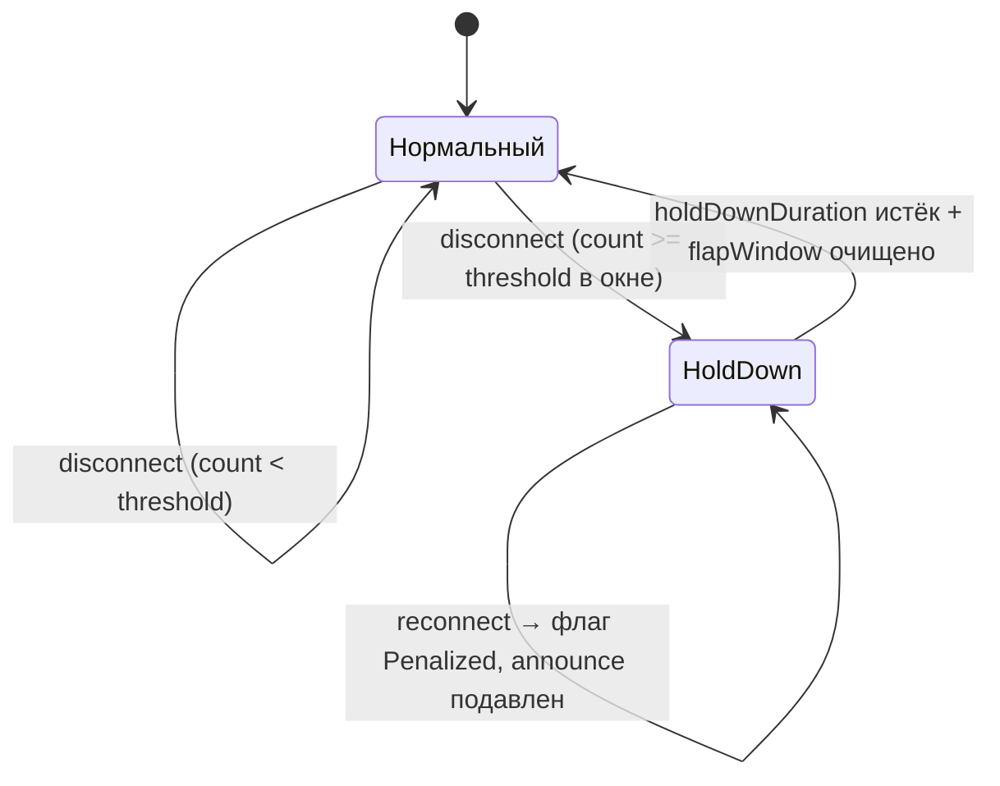
```mermaid
stateDiagram-v2
    [*] --> Нормальный
    Нормальный --> Нормальный: disconnect (count < threshold)
    Нормальный --> HoldDown: disconnect (count >= threshold в окне)
    HoldDown --> HoldDown: reconnect → флаг Penalized, announce подавлен
    HoldDown --> Нормальный: holdDownDuration истёк + flapWindow очищено
```
*Диаграмма — Конечный автомат обнаружения flap'ов*

**Решение о доставке исходящего DM.** Когда `storeIncomingMessage` маршрутизирует DM, `TableRouter.Route()` возвращает `RoutingDecision`, содержащий `RelayNextHop` (identity), `RelayNextHopAddress` (валидированный транспортный адрес или `"inbound:"` ключ) и `RelayNextHopHops` (количество хопов из маршрута). Send path (`sendTableDirectedRelay`) использует предвалидированный адрес напрямую — без повторного резолва — чтобы избежать выбора другой сессии того же peer'а с более слабым набором capability. Если предвалидированный адрес пуст (путь повтора), повторный резолв использует `resolveRouteNextHopAddress` с оригинальной ролью хопа: destination (hops=1) требует только `mesh_relay_v1`; transit (hops>1) требует оба — `mesh_relay_v1` и `mesh_routing_v1`. Если повторный резолв или отправка не удались — срабатывает gossip fallback. Как outbound-сессии, так и inbound-only соединения пригодны как relay next-hop. Персистенция relay state (`relayForwardState`) проверяется на обоих путях (outbound и inbound) — если store отклоняет запись (дублирование message ID или превышение лимита), отправка считается неудачной (возвращается false) и записывается предупреждение (`relay_state_store_failed_outbound` / `relay_state_store_failed_inbound`). Это гарантирует, что caller видит доставку как неудачную и может откатиться к gossip, а не молча терять контекст hop_ack и маршрутизации receipt'ов.

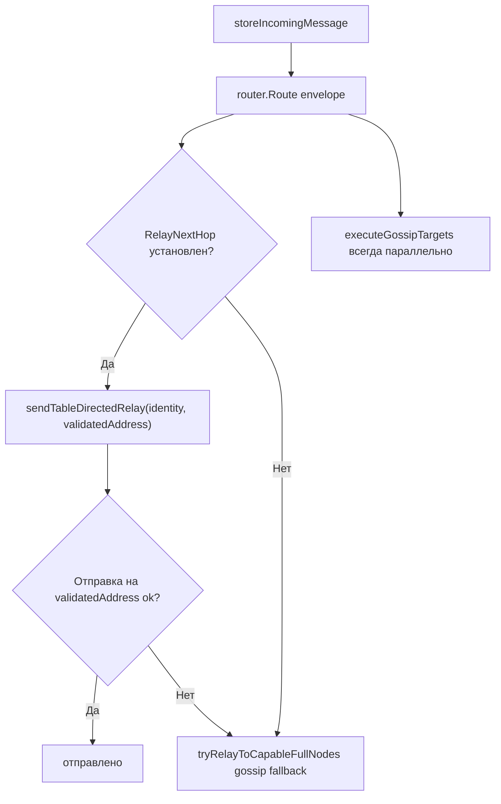
```mermaid
flowchart TD
    A[storeIncomingMessage] --> B[router.Route envelope]
    B --> C{RelayNextHop установлен?}
    C -- Да --> D["sendTableDirectedRelay(identity, validatedAddress)"]
    D --> E{Отправка на validatedAddress ok?}
    E -- Да --> Z[отправлено]
    E -- Нет --> G[tryRelayToCapableFullNodes gossip fallback]
    C -- Нет --> G
    B --> H[executeGossipTargets всегда параллельно]
```
*Диаграмма — Решение о доставке исходящего DM: table route vs gossip*

**Решение о доставке на промежуточном relay hop.** Когда `handleRelayMessage` обрабатывает транзитный relay, он пробует три стратегии по порядку: прямой peer (получатель подключён локально), lookup в routing table (`tryForwardViaRoutingTable`), и blind gossip (`relayViaGossip`). Если все не сработали — сообщение сохраняется локально, gossip берёт на себя доставку. Когда `tryForwardViaRoutingTable` выбирает маршрут, он возвращает `tableForwardResult`, содержащий транспортный адрес и синтезированное поле `Origin` маршрута (post-Phase-1 всегда `localOrigin` или, в fallback'е, destination Identity — `Origin` был dropped из storage dedup key). `RouteOrigin` сохраняется в `relayForwardState` только ради caller-stability — `confirmRouteViaHopAck` на этом промежуточном узле post-Phase-1 IGNORE'ит поле и ограничивает hop_ack confirmation парой `(Identity, NextHop)`.

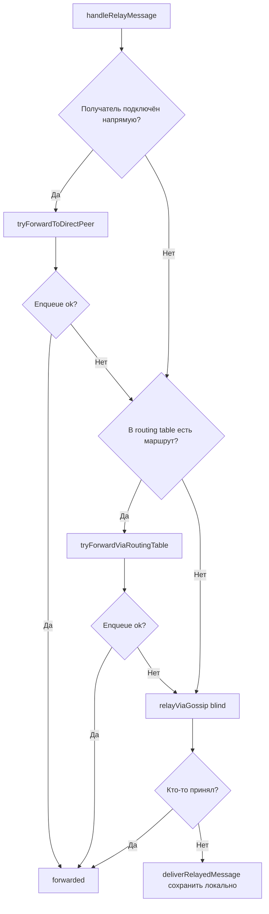
```mermaid
flowchart TD
    A[handleRelayMessage] --> B{Получатель подключён напрямую?}
    B -- Да --> C[tryForwardToDirectPeer]
    C --> D{Enqueue ok?}
    D -- Да --> Z[forwarded]
    D -- Нет --> E{В routing table есть маршрут?}
    B -- Нет --> E
    E -- Да --> F[tryForwardViaRoutingTable]
    F --> G{Enqueue ok?}
    G -- Да --> Z
    G -- Нет --> H[relayViaGossip blind]
    E -- Нет --> H
    H --> I{Кто-то принял?}
    I -- Да --> Z
    I -- Нет --> J[deliverRelayedMessage сохранить локально]
```
*Диаграмма — Промежуточный relay hop: прямой peer → table route → gossip*

**Контракт gossip fallback (release-blocking).** `TableRouter` в `node/table_router.go` реализует интерфейс `Router`. Он обращается к routing table за направленным next-hop; если нет пригодного маршрута или сессии — доставка деградирует в gossip прозрачно. Триггеры fallback: `Lookup()` возвращает пустой результат, identity `RelayNextHop` не имеет активной сессии, peer `RelayNextHop` не имеет требуемых capability (relay-only для destinations, оба relay+routing для transit hops). `GossipTargets` всегда заполняются в каждом `RoutingDecision`. Тот же fallback работает на каждом уровне: origin-нода (`sendTableDirectedRelay`), промежуточный hop (`tryForwardViaRoutingTable`) и `TableRouter.Route()`.

**Выбор gossip-целей: merge сессий и pending-peer'ов.** `routingTargetsFiltered` в `node/routing_relay.go` строит список gossip-целей из двух источников: (1) активные outbound-сессии со здоровыми соединениями (ранжированы по health, лимит 3), и (2) известные peer'ы без активных сессий, достижимые через pending queue (`queuePeerFrame` → `flushPendingPeerFrames` при установлении сессии). Когда scored session targets существуют, оставшиеся слоты fanout (до 3 суммарно) заполняются non-session peer'ами. Когда сессий нет вообще (bootstrap-сценарий), все matching peer'ы возвращаются без лимита. **Дедупликация fallback-порта:** когда сессия подключена через fallback-порт (например `host:64646` вместо канонического `host:7777`), и ключ сессии, и канонический адрес (разрешённый через `dialOrigin`) помечаются в `sessionSeen`, предотвращая появление одного физического хоста и как active session target, и как pending peer — что тратило бы fanout-слот на дубликат. Этот merge предотвращает timing hole, при которой сообщение, пришедшее до установления всех сессий, gossip'ится только обратно к отправителю (единственная активная сессия) и никогда не достигает forward-peer'ов — после чего dedup `seen[ID]` навсегда блокирует повторный gossip при последующих попытках. Non-session peer'ы получают свои фреймы через `sendMessageToPeer`, который пытается доставку в три уровня: (1) outbound-сессия через `enqueuePeerFrame`; (2) прямая запись в аутентифицированное inbound-соединение через `inboundConnForAddressLocked` — покрывает типичный случай, когда peer уже подключился к нам (inbound), но outbound-сессия отсутствует (CM-слот заполнен); (3) `queuePeerFrame`, буферизующий фрейм в pending queue для отложенной доставки. Inbound direct path (`mode="inbound_direct"` в логе gossip_message_attempt) — основное исправление timing hole, при которой inbound-соединение peer'а уже аутентифицировано к моменту прихода gossip-фрейма — прямая запись полностью обходит очередь. Для уже поставленных в очередь фреймов существуют три триггера дрейна: (1) установление outbound-сессии вызывает `flushPendingPeerFrames`, отправляющий все pending-фреймы через `sendCh` сессии; (2) аутентификация inbound-соединения вызывает `flushPendingFireAndForget` в `trackInboundConnect`, записывающий fire-and-forget фреймы (`push_message`, `push_notice`) напрямую в inbound TCP-соединение; (3) routing events запускают `drainPendingForIdentities` для `send_message` фреймов. Inbound-дрейн в `trackInboundConnect` покрывает обратный тайминг: фрейм поставлен в очередь до аутентификации inbound-соединения. Только fire-and-forget фреймы безопасны для записи на inbound conn, поскольку не ожидают ответа, который мог бы перемешаться с request/reply dispatch loop peer'а. Request/reply фреймы (send_message, relay_message) должны ждать outbound-сессии.

**Event-driven дрейн pending queue.** Когда маршрут до целевого identity становится доступным — будь то подключение прямого peer'а (старт `servePeerSession`), изучение транзитного маршрута через `announce_routes` (`handleAnnounceRoutes`), переподключившийся peer переанонсирующий ту же неизменённую routing table (`handleAnnounceRoutes` со статусом `RouteUnchanged`), withdrawal маршрута, обнажающий выживший backup route (`WithdrawRoute` с последующей проверкой `Lookup`), истечение TTL маршрута, обнажающее выживший backup (`TickTTL` возвращает exposed identities в `routingTableTTLLoop`), или локальный disconnect peer'а, инвалидирующий маршруты через ушедший next-hop, но обнажающий backup через другой next-hop (`RemoveDirectPeer` / `InvalidateTransitRoutes` возвращают `ExposedBackups` в `onPeerSessionClosed`) — нода немедленно сканирует свою pending queue на наличие собственных исходящих `send_message` фреймов, адресованных этому identity, и пытается доставить их через вновь доступный маршрут. Это event-driven оптимизация, которая устраняет два источника задержки: ожидание переподключения исходного peer'а (`flushPendingPeerFrames`) и ожидание срабатывания relay retry loop (каждые 2 секунды). Drain goroutine запускается из `servePeerSession` (не из `onPeerSessionEstablished`), чтобы `inboxCh` уже активно читался — запуск раньше создаёт `s.mu.Lock()` contention, который задерживает установление сессии и может вызвать overflow `inboxCh` под конкурентной нагрузкой. Дрейнится только `send_message` — остальные типы фреймов не восстанавливаются через routing table: `relay_message` и `announce_peer` — чужой трафик, обрабатываемый relay retry loop и peer session flush; `relay_delivery_receipt` доставляется через hop-цепочку `relayStates` (`lookupReceiptForwardTo`), а не через routing table, поэтому новый маршрут до Recipient receipt'а не создаёт для него путь доставки. Функция `drainPendingForIdentities` в `node/routing_drain.go` использует паттерн extract-attempt-return: matching-фреймы атомарно извлекаются из pending queue под блокировкой (что исключает повторную обработку одного фрейма конкурентными goroutine), доставка выполняется вне блокировки через `sendRelayToAddress` (возвращающий определённый сигнал успеха/неудачи), а фреймы с неудавшейся доставкой возвращаются на свои исходные позиции в pending queue с помощью index-based реконструкции — фаза извлечения записывает `origIdx` каждого фрейма и метаданные per-address (`origLen`, `extractedPos`), а фаза возврата проходит по диапазону исходных позиций, чередуя kept- и returning-фреймы, чтобы `flushPendingPeerFrames` — доставляющий в порядке слайса — сохранял точный порядок доставки DM между recipient'ами, разделяющими один peer address, после route churn. Фреймы, добавленные другими goroutine во время разблокированного окна доставки, дописываются в конец. Счётчик retry инкрементируется только когда была реальная попытка доставки (маршрут существовал, адрес разрешён, `sendRelayToAddress` был вызван) — когда пригодного маршрута нет (`RelayNextHop == nil` или адрес неразрешим), фрейм возвращается в pending queue без траты retry-бюджета и без перехода outbound-состояния — `Status` остаётся `"queued"`, а `LastAttemptAt` не обновляется, сохраняя семантику, что `"retrying"` в outbound-состоянии означает реальную попытку сетевого handoff. Фрейм ожидает будущих drain-циклов, запускаемых последующими routing-событиями. При достижении `maxPendingFrameRetries` после реальных неудач фрейм помечается терминальным вместо возврата — соответствуя retry-контракту `flushPendingPeerFrames`. Истёкшие фреймы обнаруживаются и помечаются терминальными во время сканирования. Все изменения outbound-состояния (terminal, retrying, cleared) собираются как отложенные действия в цикле доставки и применяются под блокировкой вместе с возвратом в pending queue одним атомарным in-memory апдейтом — так конкурентный читатель никогда не видит outbound-состояние изменённым, пока извлечённые фреймы отсутствуют в `s.pending`. (Queue-state теперь **только в памяти** — дисковый персист убран — поэтому ни записи на диск для батчинга, ни crash-recovery здесь нет: краш/рестарт теряет pending-состояние, а отправитель ретраит end-to-end. Батчинг нужен лишь для межгорутинной консистентности.) Когда `handleAnnounceRoutes` обрабатывает один announce, и принятые (новые/улучшенные), и неизменённые (подтверждённые живые) identity батчируются в один drain-набор. Отклонённые маршруты (устаревший SeqNo, заблокированные tombstone) не участвуют в дрейне. Лог `announce_routes_processed` выдаёт три счётчика — `accepted`, `unchanged`, `rejected` — чтобы операторы могли отличить новые routing-события от штатных подтверждений. Эта трёхстатусная классификация использует `RouteUpdateStatus` (`RouteAccepted`, `RouteUnchanged`, `RouteRejected`), возвращаемый `UpdateRoute`.

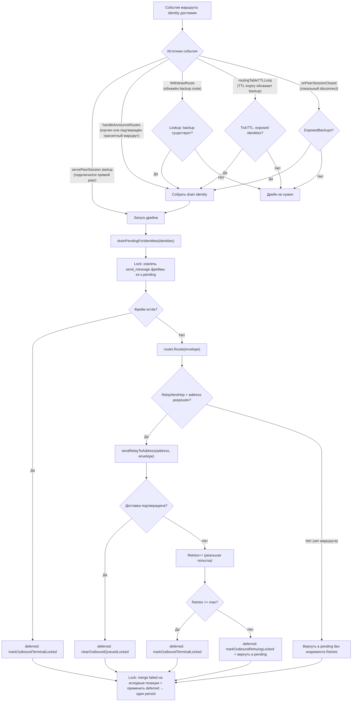
```mermaid
flowchart TD
    A["Событие маршрута: identity достижим"] --> B{Источник события}
    B -- "servePeerSession startup<br/>(подключился прямой peer)" --> C[Запуск дрейна]
    B -- "handleAnnounceRoutes<br/>(изучен или подтверждён транзитный маршрут)" --> D[Собрать drain identity]
    B -- "WithdrawRoute<br/>(обнажён backup route)" --> W{"Lookup: backup существует?"}
    W -- Да --> D
    W -- Нет --> Z[Дрейн не нужен]
    B -- "routingTableTTLLoop<br/>(TTL-expiry обнажает backup)" --> T{"TickTTL: exposed identities?"}
    T -- Да --> D
    T -- Нет --> Z
    B -- "onPeerSessionClosed<br/>(локальный disconnect)" --> P2{"ExposedBackups?"}
    P2 -- Да --> D
    P2 -- Нет --> Z
    D --> C
    C --> E["drainPendingForIdentities(identities)"]
    E --> F["Lock: извлечь send_message фреймы из s.pending"]
    F --> G{Фрейм истёк?}
    G -- Да --> H["deferred: markOutboundTerminalLocked"]
    G -- Нет --> I["router.Route(envelope)"]
    I --> J{"RelayNextHop + address разрешён?"}
    J -- Да --> K["sendRelayToAddress(address, envelope)"]
    K --> M{Доставка подтверждена?}
    M -- Да --> N["deferred: clearOutboundQueuedLocked"]
    M -- Нет --> P["Retries++ (реальная попытка)"]
    P --> PA{"Retries >= max?"}
    PA -- Да --> Q["deferred: markOutboundTerminalLocked"]
    PA -- Нет --> R["deferred: markOutboundRetryingLocked + вернуть в pending"]
    J -- "Нет (нет маршрута)" --> NR["Вернуть в pending без инкремента Retries"]
    H & N & Q & R & NR --> S["Lock: merge failed на исходные позиции + применить deferred → один persist"]
```
*Диаграмма — Event-driven дрейн pending queue при обнаружении маршрута*

**Подтверждение маршрута через hop_ack.** При получении `relay_hop_ack` со статусом "delivered" или "forwarded", routing table промоутит маршрут через отправителя ack в `source=hop_ack` через `confirmRouteViaHopAck`. Транспортный адрес отправителя ack (`senderAddress` в `handleRelayHopAck`) — это достоверно правильный next-hop, даже при gossip fan-out, когда несколько peer'ов получили relay_message, но только один реально доставил. Identity peer'а резолвится из транспортного адреса и сопоставляется с записями routing table. Для table-directed relay `RouteOrigin`, сохранённый в `relayForwardState`, по signature всё ещё передаётся в `confirmRouteViaHopAck` но post-Phase-1 IGNORED — storage больше не keyed по Origin, и подтверждение находит claim по `(Identity, NextHop)` only. Параметр оставлен на signature ради caller-stability (relay-side plumbing продолжает прокидывать его через `tableForwardResult`), но не влияет на promotion outcome. `RouteOrigin` сохраняется на каждом хопе relay-цепочки: на origin-ноде (через `sendRelayMessageWithOrigin` / `sendRelayToAddress`) и на промежуточных хопах (через `tryForwardViaRoutingTable`, возвращающий `tableForwardResult` с `RouteOrigin`). Для gossip-originated relay (без конкретной тройки, `RouteOrigin` пуст) промоутится первый matching NextHop в порядке Lookup. Оба пути relay (outbound и inbound) сохраняют `relayForwardState`, обеспечивая поведенческую эквивалентность независимо от направления соединения.

**Делегирование TTL-политики.** Полученные анонсы оставляют `ExpiresAt` нулевым при формировании `RouteEntry` в `handleAnnounceRoutes`. `Table.UpdateRoute` заполняет его, используя собственные `clock` и `defaultTTL` таблицы. Это гарантирует, что все маршруты (direct через `AddDirectPeer`, learned через announcements) следуют одной TTL-политике, и таблицы, созданные с `WithDefaultTTL` или `WithClock`, ведут себя консистентно для всех источников маршрутов.

**Гейт relay для announce_routes (routing-only peer'ы).** Peer, который согласовал `mesh_routing_v1`, но не `mesh_relay_v1`, может участвовать в control plane (получать и отправлять анонсы маршрутов), но не может нести трафик data plane (`relay_message`). Принятие маршрутов от таких peer'ов создало бы записи, указывающие на next-hop, который молча отбрасывает ретранслируемые сообщения. Для предотвращения рассогласования control-plane/data-plane оба пути диспатча `announce_routes` (inbound и outbound) применяют relay-гейт: входящие фреймы от соединений без `mesh_relay_v1` молча отклоняются (`connHasCapability(conn, capMeshRelayV1)` в обработчике `announce_routes`), а цикл исходящих анонсов пропускает сессии без `mesh_relay_v1` (`sessionHasCapability(address, capMeshRelayV1)` в отправителе анонсов). Этот гейт работает независимо от `mesh_routing_v1` — peer должен иметь обе capability для участия в обмене маршрутами.

**Инвалидация транзитных маршрутов для routing-only peer'ов.** Когда закрывается последняя общая сессия routing-only peer'a (relay-capable сессии никогда не были активны), `onPeerSessionClosed` вызывает `Table.InvalidateTransitRoutes(peerIdentity)` как защитную меру (defense-in-depth). Метод помечает все транзитные маршруты (не-direct, hops < 16) с `NextHop == peerIdentity` как отозванные (hops=16) без инкрементации SeqNo (только локальная инвалидация — wire withdrawal не генерируется). Direct-маршруты пропускаются, поскольку их жизненный цикл управляется через `RemoveDirectPeer`. Когда хотя бы один маршрут инвалидирован, `announceLoop.TriggerUpdate()` запускает немедленный цикл анонсов, чтобы соседи узнали об отозванных маршрутах без ожидания следующего периодического цикла (до 30с). При нормальной работе relay-гейт announce_routes предотвращает попадание маршрутов от routing-only peer'ов в таблицу. `InvalidateTransitRoutes` защищает от пограничных случаев: маршруты, усвоенные до полного согласования capability, или устаревшие записи от предыдущей relay-capable сессии того же identity. Метод возвращает количество инвалидированных маршрутов для логирования.

**Параллельный fan-out withdrawal'ов при disconnect.** Когда закрывается последняя relay-capable сессия direct peer'а, `onPeerSessionClosed` в `node/routing_session.go` обязан доставить own-origin wire-withdrawal'ы из `RemoveDirectPeer.Withdrawals` каждому routing-capable peer'у немедленно — иначе announce-цикл задержит доставку до следующего периодического прохода (до 30s). Fan-out реализован в dedicated helper'е `fanoutAnnounceRoutes(ctx, targets, withdrawals) (sent, dropped int)` в `node/routing_announce.go`. Контракт: (1) одна goroutine на target, один залипший inbound socket не сериализует доставку остальным; (2) per-peer bound = `syncFlushTimeout` (по умолчанию 5s); цепочка `SendAnnounceRoutes(ctx, …) → writeFrameToInbound(ctx, …) → sendFrameBytesViaNetworkSync(ctx, …) → networkBridge.SendFrameSync(ctx, …) → NetCore.SendRawSyncCtx(ctx, …)` прокидывает caller'ский `ctx` end-to-end; (3) wall-clock bound = `syncFlushTimeout` самого медленного peer'а, а не `N × syncFlushTimeout` — это свойство не даёт peer-cleanup'у душить 1s metrics collector и 2s `bootstrapLoop` под writer-preferring `sync.RWMutex`; (4) общая отмена: call site `onPeerSessionClosed` передаёт `s.runCtx`, при shutdown'е горутины делают ранний exit и инкрементят `dropped`; этот же `ctx` теперь наблюдается *внутри* sync-отправки netcore (через `SendRawSyncCtx`), так что отмена прерывает in-flight flush вместо того чтобы молча ждать все 5s `syncFlushTimeout`; (5) shared state = только два `atomic.Int32`-счётчика, `Service`-карты не мутируются; `writeFrameToInbound` сам берёт короткий `s.mu.RLock` и отпускает его до блокирующей отправки; (6) `crashlog.DeferRecover()` в каждой горутине, паника одного target'а не оставит WaitGroup повисшим; (7) лог `routing_direct_peer_removed` содержит поля `fanout_sent`/`fanout_dropped`, расхождение `sent ≪ dropped` — прямой сигнал о залипших inbound сокетах (NAT-hairpin half-dead TCP) без stack trace'ов. Регрессионные тесты: `TestOnPeerSessionClosed_FanoutIsParallel`, `TestOnPeerSessionClosed_FanoutRespectsRunCtx`, `TestOnPeerSessionClosed_NoPanicOnZeroPeers`, `TestOnPeerSessionClosed_CollectsSentAndDroppedCounters` в `node/routing_integration_fanout_test.go`.

```mermaid
sequenceDiagram
    participant CL as Cleanup goroutine<br/>(onPeerSessionClosed)
    participant RT as routing.Table
    participant FO as fanoutAnnounceRoutes
    participant G1 as goroutine P1
    participant G2 as goroutine P2<br/>(залипший inbound)
    participant G3 as goroutine P3
    participant N as netcore

    CL->>RT: RemoveDirectPeer(identity)
    RT-->>CL: Withdrawals, ExposedBackups, TransitInvalidated
    CL->>CL: routingCapablePeers() под s.mu.RLock
    CL->>FO: fanoutAnnounceRoutes(runCtx, targets, withdrawals)
    FO->>G1: go SendAnnounceRoutes(ctx, P1, w)
    FO->>G2: go SendAnnounceRoutes(ctx, P2, w)
    FO->>G3: go SendAnnounceRoutes(ctx, P3, w)
    par P1 (быстрый)
        G1->>N: SendRawSyncCtx(ctx)
        N-->>G1: ok (~ms)
        G1->>FO: sent++
    and P2 (залипший inbound, ограничен per-peer)
        G2->>N: SendRawSyncCtx(ctx)
        Note over G2,N: блокируется до syncFlushTimeout (5s)<br/>или до ctx cancel
        N-->>G2: ErrSendTimeout / ErrSendCtxCancelled → Close
        G2->>FO: dropped++
    and P3 (быстрый)
        G3->>N: SendRawSyncCtx(ctx)
        N-->>G3: ok (~ms)
        G3->>FO: sent++
    end
    FO-->>CL: sent=2, dropped=1 (wg.Wait завершается)
    CL->>CL: лог routing_direct_peer_removed<br/>fanout_sent=2, fanout_dropped=1
    CL->>CL: eventBus.Publish(TopicRouteTableChanged)
    CL->>CL: announceLoop.TriggerUpdate()
```
*Диаграмма — Параллельный disconnect fan-out: одна goroutine на target, wall-clock ограничен самым медленным peer'ом*

### RPC-наблюдаемость

Три RPC-команды открывают состояние routing table для мониторинга и отладки. Они следуют тому же паттерну provider-injection, что и метрики и chatlog — когда `RoutingProvider` равен nil, команды возвращают 503 (unavailable) и скрыты из help. Полная спецификация полей: [`rpc/routing.md`](rpc/routing.md).

**`fetch_route_table`** — Возвращает полный снапшот routing table. Каждая запись включает identity, origin, объект `next_hop` (identity + живой транспортный адрес/сеть), hops, seq_no, source (direct/hop_ack/announcement), флаги withdrawn/expired и оставшийся TTL. Поля `next_hop.address` и `next_hop.network` — живые best-effort метаданные, запрашиваемые после снапшота; поля маршрутизации атомарны в рамках `snapshot_at`. Ответ также содержит total/active счётчики и timestamp снапшота. Сортировка по (identity, origin, next_hop.identity, source).

**`fetch_route_summary`** — Возвращает компактный обзор: total/active/withdrawn количество записей, число доступных identity, количество direct peer'ов, timestamp снапшота (`snapshot_at`) и текущее состояние flap detection (per-peer количество withdrawal, статус hold-down). Flap state отсортирован по peer_identity.

**`fetch_route_lookup <identity>`** — Возвращает selectable маршруты для конкретного destination identity, ранжированные по Phase 2 `CompositeScore` (hops + source-trust bonus + RTT bonus + health penalty — тот же ranking, что relay path применяет через `routing.Table.Lookup`). Withdrawn / expired записи фильтруются, `HealthDead` transit claims дропаются; `RouteSourceDirect` claims exempt от Dead-фильтра и оцениваются с `Bad`-equivalent penalty, оставаясь selectable как last resort. Детерминистичный tie-break: origin asc, next_hop asc, seq_no desc. Полный контракт — в [`rpc/routing.md`](rpc/routing.md). Полезна для диагностики, почему конкретный peer доступен или недоступен через table routing.

Интерфейс `RoutingProvider` (`rpc/provider.go`) содержит два метода: `RoutingSnapshot()` возвращает иммутабельную point-in-time копию таблицы маршрутов, `PeerTransport(peerIdentity)` разрешает identity peer'а в текущий транспортный адрес и тип сети. Все три команды используют `RoutingSnapshot()` для атомарных данных; `fetch_route_table` дополнительно вызывает `PeerTransport()` для обогащения `next_hop` живой транспортной информацией. Console positional argument mapping настроен: `fetch_route_table` и `fetch_route_summary` без аргументов; `fetch_route_lookup` принимает один позиционный аргумент `<identity>`.

**Валидация версии протокола (outbound + inbound).** Оба направления проверяют `config.MinimumProtocolVersion`. На *outbound*-пути проверяется версия из welcome-фрейма; несовместимые peer'ы отклоняются с логом `outbound_peer_protocol_too_old`, получают штраф `peerScoreOldProtocol` (-50) и накопительный overlay-бан (`peerBanIncrementIncompatible` = 250) через `penalizeOldProtocolPeer`. Путь дозвона через ConnectionManager (`openPeerSessionForCM`) возвращает `incompatibleProtocolError` — структурированную ошибку, содержащую подтверждённые версионные данные (peer version, peer minimum и client version из welcome-фрейма); `onCMDialFailed` извлекает эти данные через `errors.As` и передаёт protocol version'ы в `penalizeOldProtocolPeer`, чтобы reporter set и персистированный lockout получили те же данные, что и legacy-путь дозвона. Строка client version предварительно записывается в `s.peerVersions[address]` до вызова `penalizeOldProtocolPeer`, чтобы `setVersionLockoutLocked` записал полное значение `ObservedClientVersion` в персистированный lockout. Та же предварительная запись применяется в legacy outbound-пути и в inbound rejection-пути — на всех трёх путях отказа handshake-фрейм является единственным источником client version, поскольку `learnIdentityFromWelcome`/`addPeerVersion` выполняются только на пути успеха. Без структурированной ошибки CM-путь вызывал бы `penalizeOldProtocolPeer(address, 0, 0)`, что корректно применяет ban scoring, но пропускает reporter set и lockout из-за guard'а на нулевые данные. Покрыто тестами `TestCMDialFailed_PropagatesVersionEvidence`, `TestCMDialFailed_ZeroEvidence_NoReporterOrLockout` и `TestCMDialFailed_PersistsObservedClientVersion`. Одна неудачная попытка не вызывает полного бана — overlay-порог равен 1000, требуется 4 последовательных попытки для бана на `peerBanIncompatible` (24 часа). Такой градуированный подход предотвращает перманентное блокирование peer'ов при кратковременном несовпадении версий во время rolling-обновлений. Версионные данные (версия протокола и минимальная версия peer'а из welcome-фрейма) записываются как **version lockout** в `peerEntry.VersionLockout` и персистятся в `peers.json`, но только при подтверждённых данных — `minimum_protocol_version` удалённого peer'а должен превышать локальную версию протокола. Lockout'ы привязываются к криптографической identity peer'а при наличии; identity-less (только по адресу) lockout'ы истекают через 7 дней (`VersionLockoutMaxTTL`), чтобы устаревшие записи не блокировали адреса, переназначенные другому peer'у. Identity-bound lockout'ы сохраняются до изменения локальной версии ноды (увеличения protocol version или client build), после чего устаревшие lockout'ы автоматически очищаются при запуске через `clearStaleVersionLockoutsLocked`. Заблокированный peer пропускается `peerDialCandidates` вне зависимости от типа lockout'а. На *inbound*-пути проверяется версия из hello-фрейма; несовместимым клиентам отправляется error-фрейм с `ErrCodeIncompatibleProtocol`, и два независимых трека бана срабатывают с разным радиусом поражения. **Per-peer signal подавления шторма** эмитится немедленно: до teardown сессии `emitPeerBannedNoticeByID(connID, now+peerBanIncompatible, PeerBannedReasonPeerBan)` доставляет `connection_notice{code=peer-banned, reason=peer-ban}` по всё ещё открытому ConnID. Dialler-side gate 6c.2 через `recordRemoteBanLocked` записывает ИМЕННО ЭТОТ `PeerAddress` и подавляет последующие dial'ы в сторону того же peer'а на все 24 часа окна, что удерживает `cm_session_setup_failed` вне ebus. Notice привязан к peer'у, а не к IP, поэтому совместимые siblings за общим egress'ом (NAT gateway, VPN exit, Tor exit, multi-homed host) остаются достижимы — разовый mismatch протокола от одного соседа не превращается в 24-часовой outage для всех на том же IP. **Transport-level IP blacklist** остаётся градуированным как safety net для устойчивого шума с того же IP: `addBanScore(connID, banIncrementIncompatibleVersion)` добавляет 250 к ban-скору удалённого IP за попытку, и только 4-я попытка пересекает `banThreshold` = 1000, армируя 24-часовую блокировку на TCP-уровне. При пересечении порога `addBanScore` эмитит второй peer-banned notice с `reason=blacklisted` по соединению, которое его триггернуло, и с этого момента `handleConn` молча дропает каждый TCP-attempt с этого IP до истечения окна. Inbound-путь также вызывает `penalizeOldProtocolPeer` для overlay-level ban scoring; overlay per-peer трек остаётся градуированным (4 попытки до `peerBanThresholdIncompatible` = 1000), давая известным peer'ам окно rolling-обновления на персистированной стороне. Однако наблюдение для reporter set и version lockout записываются только при подтверждённом направлении — `minimum_protocol_version` удалённого peer'а должен превышать локальную версию протокола (см. «Инвариант направления» ниже). Каждое подтверждённое наблюдение несовместимой версии записывается в node-owned **VersionPolicyState**, который агрегирует отчёты от отдельных peer identity. Когда ≥3 уникальных peer'а сообщают о несовместимости (или ≥2 peer'а рекламируют более высокий `client_build`), нода сигнализирует `update_available` в своём `AggregateStatus` — Desktop UI читает этот предвычисленный флаг, а не вычисляет его локально. Эфемерные наблюдения истекают через 24 часа, репортёры дедуплицируются по `PeerIdentity` (наблюдения с пустым identity игнорируются). Активные персистированные lockout'ы также вносят вклад в `update_available`, гарантируя что сигнал остаётся true, пока существует хотя бы один lockout — UI не теряет подсказку об обновлении, пока нода остаётся частично заблокированной. Снапшот version policy пересчитывается дважды в подтверждённом пути несовместимости `penalizeOldProtocolPeer`: один раз в `recordIncompatibleObservationLocked` (до записи lockout) и второй раз после `setVersionLockoutLocked` (чтобы вклад lockout'а в `update_available` был виден немедленно). Без второго пересчёта снапшот оставался бы устаревшим до следующего несвязанного события. Покрыто тестом `TestPenalize_SnapshotIncludesLockoutSignal`.

**Восстановление remote-ban (два scope).** `connection_notice{code=peer-banned}` маршрутизируется по `details.reason`. `peer-ban` пишет только per-peer запись `persistedMeta[address].RemoteBannedUntil` через `recordRemoteBanLocked`. `blacklisted` пишет per-peer запись offender'а И добавляет offender'а (с его сроком истечения) в in-memory набор `Service.remoteIPBanOffenders`; IP-wide запись `Service.remoteBannedIPs` через `recordRemoteIPBanLocked` появляется только после накопления ≥ `ipWideRemoteBanMinOffenders` различных, непросроченных offender'ов за тем же egress IP, причём записанный IP-wide горизонт — это `ipWideRemoteBanMinOffenders`-я по величине дата истечения среди живых offender'ов (так IP-wide бан спадает, как только живых становится меньше порога, и никогда не наследует окно одного долгоживущего notice). Проверка дайл-гейта `isPeerRemoteBannedLocked` консультирует per-peer и IP-wide таблицы на каждом кандидате, поэтому записи в любом scope достаточно для подавления. `remoteIPBanOffenders` волатилен (не персистится): счётчик — транзиентный сигнал эскалации, а восстановленный активный IP-wide бан уже несёт собственный `Until`. Поэтому успешный исходящий handshake (`recordOutboundAuthSuccess`) очищает только те два scope, за которые он может обоснованно говорить, под одним write-захватом `peerMu` (с вложенным `ipStateMu` для IP-wide очистки) и единственным `flushPeerState` после него, чтобы восстановление нельзя было разорвать крашем или рестартом: (1) собственную per-peer запись `RemoteBannedUntil` handshaking-пира через `clearRemoteBanLocked` — безусловно, потому что сам handshake является прямым доказательством, что этот адрес снова нас принимает; no-op, если записи нет; (2) IP-wide запись `remoteBannedIPs` через `clearRemoteIPBanLocked`, ключённую на канонический host дозвонённого эндпоинта, так что каждый sibling-`PeerAddress` за этим egress IP освобождается гейтом дайлера вместе с хостом, принёсшим восстановление — успех одного sibling говорит за всех siblings, потому что `reason=blacklisted` — это IP-scoped решение. Per-peer записи с `reason=peer-ban` на ДРУГИХ sibling-адресах намеренно НЕ трогаются IP-wide recovery: это автономные решения ответчика, scoped к конкретным адресам, и handshake с одним sibling не является доказательством, что ответчик простил peer-specific ban на другом адресе. Любая из двух очисток, вернувшая `true`, триггерит общий `flushPeerState`, чтобы on-disk snapshot соответствовал in-memory состоянию до следующего dial-цикла. Покрыто тестами `TestRecordOutboundAuthSuccess_ClearsRemoteIPBan`, `TestRecordOutboundAuthSuccess_ClearsRemoteIPBanFreesSiblings` и `TestRecordOutboundAuthSuccess_PreservesPeerBanSiblingRows`.

**Граница владения счётчиками.** Два независимых счётчика отслеживают события несовместимых версий и НЕ являются проекциями друг друга. `peerHealth.IncompatibleVersionAttempts` — per-address кумулятивный счётчик для overlay ban scoring: каждая попытка добавляет `peerBanIncrementIncompatible` к overlay-штрафу, бан срабатывает при достижении `peerBanThresholdIncompatible`. `versionPolicyState.incompatibleReporters` — per-identity dedup-набор для сигнала `update_available`: подсчитывает уникальные peer identity, сообщившие о несовместимости в рамках 24-часового окна наблюдений. Per-address счётчик живёт бессрочно (очищается только оператором через `add_peer`); per-identity набор подвержен истечению TTL наблюдений. Оба мутируются `penalizeOldProtocolPeer` под `peerMu` (peer-доменный лок), с вложенными `ipStateMu` / `statusMu` / `deliveryMu` только в тех участках, что трогают эти домены; обслуживают разных потребителей (ban scoring vs update signal) и имеют разные жизненные циклы.

**Инвариант безопасности: нет данных — нет lockout.** Персистированный version lockout устанавливается только при наличии подтверждённых версионных данных — `minimum_protocol_version` удалённого peer'а должен строго превышать локальный `config.ProtocolVersion`. Когда версионные данные отсутствуют (peerMinimum = 0, напр. от bare error code без welcome-фрейма) или не подтверждают несовместимость (peerMinimum ≤ локальный), lockout не создаётся. Это предотвращает перманентное подавление peer'а connection manager'ом на основе транзиентной или неверифицируемой ошибки. Инвариант безопасности покрыт негативными тестами (`TestVersionLockout_NoEvidenceNoLockout_ZeroMinimum`, `TestVersionLockout_NoEvidenceNoLockout_MinimumBelowLocal`) и позитивным тестом (`TestVersionLockout_EvidenceConfirmed_LockoutSet`).

**Инвариант направления: inbound old peer'ы не влияют на upgrade-сигнал.** Сигнал `update_available` и dedup-набор `incompatibleReporters` должны отражать только направление «они считают нас устаревшими» — т.е. когда `minimum_protocol_version` удалённого peer'а превышает наш локальный `config.ProtocolVersion`. Когда мы отклоняем старый inbound peer, потому что *его* версия ниже *нашего* минимума — это противоположное направление: устарел удалённый peer, а не мы. `penalizeOldProtocolPeer` применяет ban scoring (health-счётчики, штраф score, эскалация бана) безусловно для обоих направлений, но вызовы `recordIncompatibleObservationLocked` и `setVersionLockoutLocked` защищены условием `peerMinimum > config.ProtocolVersion`. Без этой защиты кластер старых peer'ов, подключающихся inbound, мог бы ошибочно вызвать CTA «вам нужно обновиться» для локального оператора. Инвариант покрыт тестами `TestInboundOldPeer_DoesNotFeedReporterSet` (4 старых inbound peer'а с peerMinimum ≤ локальный → reporter count остаётся 0, update_available остаётся false) и `TestInboundOldPeer_ZeroMinimum_NoReporter` (peerMinimum = 0 с известной identity → reporter count остаётся 0).

**Распространение lockout по identity для multi-address peer'ов.** Несовместимость версий — свойство программного обеспечения peer'а, а не конкретного сетевого endpoint'а. Когда `setVersionLockoutLocked` записывает lockout для адреса с известной `PeerIdentity`, он распространяет тот же lockout на все другие адреса в `persistedMeta`, которые привязаны к той же identity через `peerIDs`. Sibling-адрес получает распространённый lockout, если: (а) у него нет активного lockout'а, или (б) новые данные сильнее (выше `ObservedMinimumProtocolVersion`) или свежее (более новая метка `LockedAt`). Без пути обновления уже-активные sibling-записи навсегда сохраняли бы устаревшие данные — искажая диагностику вроде `ObservedClientVersion` и `MaxObservedPeerVersion` для любой логики или UI, которые проверяют содержимое распространённого lockout'а. Это предотвращает повторный дозвон `peerDialCandidates` к тому же несовместимому peer'у через альтернативный адрес — бесполезная попытка, которая тратит ресурсы и повышает риск бан-эскалации на стороне удалённого peer'а. Распространение происходит только для identity-bound lockout'ов; address-only lockout'ы (без identity) не могут быть безопасно распространены, поскольку два адреса без identity могут принадлежать разным peer'ам. Существующая per-address проверка lockout'а (`isPeerVersionLockedOutLocked`) остаётся фильтром в `peerDialCandidates` — распространение гарантирует, что каждый адрес для identity имеет запись lockout, поэтому per-address проверка корректно подавляет все из них. Покрыто тестами `TestVersionLockout_PropagatedByIdentity` (3 адреса, 2 с одной identity: lockout установлен на одном, распространяется на другой, третий адрес с другой identity не затронут), `TestVersionLockout_NoIdentity_NoPropagation` (без identity: lockout не распространяется), `TestVersionLockout_SiblingRefreshedWithStrongerEvidence` (более высокий minimum обновляет уже-активный sibling) и `TestVersionLockout_SiblingRefreshedWithFresherTimestamp` (более новая метка обновляет client version sibling'а).

**Жизненный цикл build-сигнала.** Карты `peerBuilds` и `peerVersions` привязаны к сессии: заполняются во время handshake (обработка welcome/hello-фрейма) и очищаются при дисконнекте (`markPeerDisconnected`). Это гарантирует, что только подключённые peer'ы влияют на build-based update signal — устаревший build-номер отключённого peer'а не удерживает `update_available` искусственно. Записи также удаляются при eviction устаревших peer'ов. При переподключении обе карты заполняются заново из свежего handshake-фрейма.

**Жизненный цикл совместимого наблюдения.** Успешный handshake (`markPeerConnected`, вызывается для outbound и inbound соединений) является окончательным доказательством совместимости peer'а. Он очищает все устаревшие данные о несовместимости для этого конкретного peer'а: `IncompatibleVersionAttempts` обнуляется, `LastIncompatibleVersionAt` зануляется, `ObservedPeerVersion` и `ObservedPeerMinimumVersion` зануляются, peer удаляется из dedup-набора `incompatibleReporters`, и активный персистированный `VersionLockout` очищается. Очистка lockout'а действует на уровне identity: поскольку `setVersionLockoutLocked` распространяет lockout'ы на все адреса одной и той же `PeerIdentity`, `markPeerConnected` зеркалит это поведение, очищая lockout со всех sibling-адресов той же identity — не только с адреса, завершившего handshake. Все failure-related health-поля обнуляются через `resetPeerHealthForRecoveryLocked` — единый хелпер, являющийся единственным источником истины для набора полей восстановления. Хелпер очищает: строки ошибок (`LastError`, `LastErrorCode`, `LastDisconnectCode`), версионные данные (`IncompatibleVersionAttempts`, `LastIncompatibleVersionAt`, `ObservedPeerVersion`, `ObservedPeerMinimumVersion`), состояние подавления дозвона (`ConsecutiveFailures`, `LastDisconnectedAt`, `BannedUntil`) и восстановление score (отрицательные score'ы поднимаются до 0). Один и тот же хелпер используется как для прямого адреса, так и для sibling-адресов, вместе с IP-wide баном для IP каждого sibling'а (обрабатывается вызывающим кодом). Подъём score нейтрализует устаревшие штрафы `peerScoreOldProtocol`, которые иначе удерживали бы sibling'ов в зоне eviction (`peerEvictScoreThreshold = -20`) даже после доказанной совместимости identity; подъём применяется до бонуса подключения, чтобы peer'ы с законно положительными score'ами не были искусственно завышены. `LastError` особенно важен, потому что `rankPeerHealth` вычитает `len(health.LastError)` из рейтинга peer'а — устаревшая строка ошибки на sibling-адресе понижает его рейтинг даже после того, как identity доказала совместимость. Без полной очистки полей sibling'и сохраняли бы устаревшее per-address состояние отказов, удерживающее их вне candidate selection (ban-фильтрация, экспоненциальный cooldown), понижающее peer ranking и показывающее ложную диагностику в `fetchPeerHealth`. Без identity-wide очистки sibling-адреса оставались бы заблокированными, несмотря на доказанную совместимость через другой endpoint, продолжая подавлять dial-кандидатов и некорректно вносить вклад в сигнал `update_available`. Version policy пересчитывается немедленно, чтобы сигнал отразил уменьшение доказательной базы. Это парный процесс к потоку несовместимых наблюдений — вместе они формируют замкнутый жизненный цикл: данные о несовместимости накапливаются через `penalizeOldProtocolPeer`, а данные о совместимости очищают их через `markPeerConnected`. Совместимое наблюдение затрагивает только identity подключающегося peer'а — данные peer'ов с другой identity не изменяются. Покрыто тестами `TestCompatibleObservation_ClearsReporterAndLockout` (полная очистка одного peer'а после успешного handshake), `TestCompatibleObservation_OnlyAffectsConnectingPeer` (один peer очищен, остальные сохранены), `TestCompatibleObservation_ClearsLockoutAcrossIdentity` (handshake на одном адресе очищает lockout для всех адресов той же identity, оставляя другие identity нетронутыми), `TestCompatibleObservation_ClearsSiblingHealthDiagnostics` (handshake на одном адресе обнуляет per-address health-диагностику для sibling-адресов той же identity, оставляя другие identity нетронутыми) и `TestCompatibleObservation_ClearsSiblingBansAndCooldowns` (handshake на одном адресе обнуляет ban/cooldown поля и IP-wide баны для всех sibling-адресов той же identity на разных IP, оставляя другие identity нетронутыми) и `TestCompatibleObservation_RepairsStaleScorePenalties` (handshake на одном адресе поднимает отрицательные score'ы до 0 для sibling-адресов той же identity, применяет бонус подключения к прямому адресу, score'ы peer'ов с другой identity не изменяются).

**Снятие бана и operator override.** Успешный handshake также сбрасывает `BannedUntil` и IP-wide бан — если peer завершил handshake, он совместим. RPC-команда `add_peer` является явным механизмом override оператора: она сбрасывает `BannedUntil`, обнуляет всю диагностику несовместимых версий (`IncompatibleVersionAttempts`, `LastErrorCode`, `LastDisconnectCode`, поля наблюдаемых версий), удаляет персистированный version lockout (`VersionLockout`) из метаданных peer'а и удаляет identity peer'а из dedup-набора `incompatibleReporters`. Override действует полностью на уровне identity: если целевой адрес имеет известную `PeerIdentity`, все sibling-адреса той же identity также получают очистку lockout'а и полный сброс health через `resetPeerHealthForRecoveryLocked` (строки ошибок, версионные данные, состояние подавления дозвона, подъём отрицательных score'ов до 0), вместе с IP-wide баном для IP каждого sibling'а. Подъём score при override зеркалирует путь handshake — нейтрализует устаревшие штрафы `peerScoreOldProtocol` без завышения peer'ов с положительными score'ами, гарантируя, что override-sibling'и больше не подлежат eviction. Это зеркалирует identity-wide очистку в `markPeerConnected` и identity-wide распространение в `setVersionLockoutLocked`. Без identity-wide очистки ручной retry одного адреса оставил бы sibling-адреса подавленными устаревшими cooldown и ban данными, несмотря на явное желание оператора перезвонить peer'у, удерживая его вне нормального candidate selection на других адресах. Version policy пересчитывается немедленно, чтобы ни lockout, ни reporter больше не влияли на `update_available`. Если peer уже известен, `add_peer` перемещает его в начало очереди дозвона и отвечает «already known, moved to front» вместо добавления дубликата. Сетевые announce-сообщения `BannedUntil` не очищают: сторонний gossip может добавить адрес в кандидаты, но совместимость подтверждается только прямым handshake. Покрыто тестами `TestAddPeer_ClearsVersionLockout` (один адрес), `TestAddPeer_ClearsLockoutAcrossIdentity` (identity-wide: 3 адреса, 2 с одной identity), `TestAddPeer_ClearsReporterForIdentity` (уменьшение счётчика репортёров), `TestAddPeerFrame_ClearsLockoutAcrossIdentity` (сквозной: identity-wide очистка lockout'ов, сброс health-диагностики и удаление reporter'а через настоящий command path) и `TestAddPeerFrame_ClearsSiblingBansAndCooldowns` (сквозной: очистка ban/cooldown/IP-ban sibling'ов на разных IP через реальный обработчик `addPeerFrame`, peer'ы с другой identity не затронуты) и `TestAddPeerFrame_RepairsStaleScorePenalties` (сквозной: подъём отрицательных score'ов и бонус подключения через реальный обработчик `addPeerFrame`, score'ы sibling'ов поднимаются до 0, score'ы peer'ов с другой identity не изменяются).

**Видимость outbound-отказа.** Отклонённый outbound-дозвон — когда remote welcome-фрейм указывает версию ниже `MinimumProtocolVersion` — полностью виден в снапшоте `PeerHealthFrame`, несмотря на отсутствие установленного соединения или сессии. Механизм: `penalizeOldProtocolPeer` вызывает `ensurePeerHealthLocked(address)`, который создаёт или получает запись `peerHealth` в address-keyed карте `s.health`. Health-записи не привязаны к сессии — они сохраняются в памяти между неудачными попытками дозвона до eviction peer'а. После возврата из `penalizeOldProtocolPeer` health-запись содержит: `LastErrorCode` = `incompatible-protocol-version`, `LastError` = `"protocol version too old"`, `IncompatibleVersionAttempts` (увеличен), `LastIncompatibleVersionAt` (временная метка), `ObservedPeerVersion` и `ObservedPeerMinimumVersion` (версионные данные из welcome-фрейма), и `VersionLockoutActive` = true (когда lockout установлен). `peerHealthFrames()` итерирует все записи в `s.health` и генерирует строку `PeerHealthFrame` для каждого адреса вне зависимости от состояния соединения — disconnected и ни разу не подключённые peer'ы присутствуют в снапшоте со всеми заполненными диагностическими полями. Кроме того, `penalizeOldProtocolPeer` очищает любой ранее сохранённый `LastDisconnectCode` — pre-handshake отказ вытесняет прошлые post-handshake disconnect code'ы, чтобы снапшот был однозначным. Когда CM-путь несёт `ClientVersion` из welcome-фрейма, `onCMDialFailed` предварительно заполняет `peerVersions`, чтобы `ClientVersion` также появлялся в снапшоте. Desktop UI получает эти поля через `fetch_peer_health` и может отображать причину отказа, счётчик попыток и статус lockout'а без дополнительных вычислений. Полный операторский контракт — включая `LastErrorCode`, `LastDisconnectCode` (пустой), `ClientVersion`, `ObservedPeerVersion`, `ObservedPeerMinimumVersion`, `VersionLockoutActive`, `Score`, `ConsecutiveFailures` и `PeerID` — верифицируется сквозным тестом `TestOutboundIncompatibleReject_HealthSnapshotComplete`, который вызывает `peerHealthFrames()` после outbound incompatible reject и проверяет каждое диагностическое поле в возвращённом `PeerHealthFrame`.

**Жизненный цикл диагностических кодов.** Два машиночитаемых поля ошибок служат разным диагностическим целям. `LastErrorCode` фиксирует ошибку протокола при последнем отказе *до handshake* (напр. `incompatible-protocol-version`), устанавливается через `penalizeOldProtocolPeer`. Переживает неудачные переподключения, но очищается при успешном reconnect (`markPeerConnected`) и оператором (`add_peer`). `LastDisconnectCode` фиксирует ошибку протокола, вызвавшую последний разрыв соединения *после handshake* (напр. `frame-too-large`, `rate-limited`). Пустое, когда disconnect был чистым (err == nil), не-протокольным (таймаут сети, EOF) или когда ошибка отображается на обобщённый sentinel `protocol-error`. Очищается при чистом disconnect, при успешном reconnect, оператором и через `penalizeOldProtocolPeer` — pre-handshake отказ по несовместимости вытесняет любой ранее сохранённый post-handshake disconnect code, поскольку последнее событие сбоя — это отказ на уровне соединения, а не разрыв сессии, и сохранение обоих создало бы смешанный диагностический снапшот, искажающий текущее состояние peer'а. Оба поля доступны в `PeerHealthFrame` как `last_error_code` и `last_disconnect_code`. Все сбросы полей на путях восстановления (успешный reconnect, operator override) централизованы в `resetPeerHealthForRecoveryLocked`, что устраняет поле-за-полем дублирование и предотвращает рассогласование при добавлении новых health-полей. Покрыто тестом `TestPenalizeOldProtocol_ClearsStaleLastDisconnectCode` (pre-handshake отказ очищает ранее сохранённый `LastDisconnectCode`, устанавливает `LastErrorCode` и `LastError`).

**Обновление версионных данных при lockout.** Заблокированный peer подавляется `peerDialCandidates`, поэтому локальная нода не будет инициировать outbound-соединения к нему. Возникает вопрос: как обновляются версионные данные, если peer обновился. Ответ — inbound-путь: заблокированный peer по-прежнему может подключиться к нам. При входящем соединении hello-фрейм содержит текущую версию протокола и минимальную версию peer'а. Если peer всё ещё несовместим, `penalizeOldProtocolPeer` обновляет observed-version поля в `peerHealth` и обновляет lockout-снапшот свежими данными. Если peer обновился и теперь совместим, inbound-handshake завершается успешно — `markPeerConnected` запускает совместимое наблюдение (см. выше), очищая lockout, данные reporter'а и всю диагностику несовместимых версий, peer возвращается в нормальную ротацию. Когда обновляется *локальная* нода, `clearStaleVersionLockoutsLocked` выполняется при запуске и очищает все lockout'ы, чей `LockedAtLocalVersion` fingerprint больше не совпадает, разрешая outbound-дозвон к ранее заблокированным peer'ам. Комбинация обновления через inbound-путь и очистки lockout'ов при запуске гарантирует, что version lockout'ы самовосстанавливаются в обоих направлениях — при обновлении удалённого peer'а и при обновлении локальной ноды — без необходимости явного polling или probe-механизма.

**Runtime-область build-based policy.** Карты `peerBuilds` и `peerVersions` намеренно привязаны к сессии и не персистятся в `peers.json`. Поле `max_observed_peer_build` в `VersionPolicySnapshot` — runtime-only диагностика: отражает наибольший `client_build`, полученный от текущих подключённых peer'ов, и сбрасывается в ноль при перезапуске ноды. Это корректное поведение — устаревшие build-данные предыдущей сессии не должны влиять на сигнал `update_available`, поскольку ландшафт build'ов мог измениться (peer'ы обновились, появились новые). После перезапуска build-сигнал остаётся `false`, пока peer'ы не переподключатся и не завершат handshake, после чего `peerBuilds` заполняется из свежих hello/welcome-фреймов. Персистированный `VersionLockout` уже фиксирует данные о несовместимости на уровне протокола, которые должны пережить перезапуск; build-метаданные — дополнительная информация, не требующая персистенции.

**Область персистенции при перезапуске.** Устойчивость сигнала `update_available` между перезапусками обеспечивается исключительно через персистированные version lockout'ы, а не через dedup-набор репортёров. Набор `incompatibleReporters` (который обеспечивает порог «≥3 уникальных peer'а») — runtime-only: обнуляется при перезапуске и заполняется заново только по мере переподключения peer'ов и неудачных handshake. Однако `recomputeVersionPolicyLocked` независимо проверяет все персистированные lockout'ы в `peers.json` — если хотя бы один `VersionLockout.IsActiveAt(now)` возвращает true, срабатывает `lockoutSignal` и `update_available` остаётся `true` вне зависимости от количества репортёров. Это означает: до перезапуска сигнал может поступать от репортёров, lockout'ов или обоих; после перезапуска — только от lockout'ов, пока peer'ы не переподключатся. Счётчик `incompatible_version_reporters` может упасть до нуля после перезапуска, даже если `update_available` по-прежнему `true` — `update_reason` будет `incompatible_version_reporters` (от lockout'а), а не `peer_build_newer`. Это согласовано: счётчик репортёров — дополнительная диагностика, а не единственный источник истины для сигнала. `MaxObservedPeerVersion` также переживает перезапуски через тот же lockout-путь — каждый активный lockout вносит свой `ObservedProtocolVersion` в максимум.

**Персистенция версионной диагностики.** Машиночитаемые поля версионной диагностики (`LastErrorCode`, `LastDisconnectCode`, `IncompatibleVersionAttempts`, `LastIncompatibleVersionAt`, `ObservedPeerVersion`, `ObservedPeerMinimumVersion`) персистируются наряду с legacy health-полями (`ConsecutiveFailures`, `LastError`, `Score`, `BannedUntil`) в `peers.json` через `peerEntry`. `buildPeerEntriesLocked` копирует все диагностические поля из in-memory записи `peerHealth` в `peerEntry` при flush, а путь восстановления при инициализации `Service` гидрирует их обратно. Без этой персистенции перезапуск терял бы операторские данные, создавшие lockout — сам lockout переживает перезапуск через `VersionLockout`, но `peerHealthFrames()` возвращал бы пустой диагностический снапшот без `LastErrorCode`, без счётчика попыток и без наблюдаемых версий. Кроме того, `peerHealthFrames()` берёт `ClientVersion` из session-scoped карты `peerVersions`, которая пуста при запуске. Путь восстановления заполняет `peerVersions` из `VersionLockout.ObservedClientVersion` для каждого персистированного peer'а с активным lockout'ом, чтобы операторская строка client version переживала перезапуски без необходимости переподключения. При успешном reconnect peer'а handshake заполняет `peerVersions` из свежего welcome/hello-фрейма, перекрывая персистированное значение. Round-trip покрыт тестами `TestVersionDiagnostics_PersistRoundTrip` (JSON marshal/unmarshal `peerEntry` сохраняет все 6 диагностических полей), `TestVersionDiagnostics_BuildAndRestoreRoundTrip` (полный in-memory цикл: `penalizeOldProtocolPeer` → `buildPeerEntriesLocked` → marshal → unmarshal → гидрация → все поля совпадают с pre-flush состоянием) и `TestClientVersion_SurvivesRestartViaLockout` (CM-путь с `ClientVersion` → flush → restore → `peerVersions` заполняется из lockout'а) и `TestVersionDiagnostics_DiskRestartRoundTrip` (сквозной on-disk перезапуск: `penalizeOldProtocolPeer` → `flushPeerState()` → реальный `NewService` reload из `PeersStatePath` → `peerHealthFrames()` проверяет все диагностические поля, включая `LastErrorCode`, `LastDisconnectCode`, `IncompatibleVersionAttempts`, `ObservedPeerVersion`, `ObservedPeerMinimumVersion`, `ClientVersion`, `VersionLockoutActive`, `Score`, `ConsecutiveFailures` и `LastError`, пережившие дисковый round-trip).

**Lockout-aware обрезка списка peer'ов.** Персистированный список peer'ов ограничен `maxPersistedPeers` (500) записями для контроля объёма на диске и в памяти. `trimPeerEntries` сортирует записи по score по убыванию и обрезает хвост. Без специальной обработки peer с активным `VersionLockout` и низким score (напр. `peerScoreOldProtocol = -50`) попадал бы в обрезаемый хвост. После перезапуска запись lockout'а исчезала бы, peer возвращался в пул dial-кандидатов, нода тратила бы попытку подключения, а данные о несовместимости, обосновавшие lockout, терялись бы. Для предотвращения этого `trimPeerEntries` разделяет записи на два бакета перед применением top-N отсечки: записи с активным `VersionLockout` (`IsActive() == true`) удерживаются безусловно, а оставшийся бюджет (`maxPersistedPeers - len(locked)`) заполняется записями с наивысшим score без lockout'а. Это зеркалирует отдельный бакет для IP-wide банов (секция `bannedIPs` в `peerStateFile`) — оба представляют дurable-решения о подавлении, которые не должны молча отбрасываться размерным лимитом. В крайнем edge case, когда locked-записи сами по себе превышают бюджет (500+ уникальных несовместимых peer'ов), все locked-записи сохраняются, а non-lockout записи не персистируются — операционно это невероятно, но обработано для корректности. Покрыто тестами `TestTrimPeerEntries_ProtectsActiveLockouts` (locked peer с худшим score переживает обрезку, в то время как обычный peer с плохим score отбрасывается, итог = `maxPersistedPeers`) и `TestTrimPeerEntries_NoLockout_BehaviorUnchanged` (без lockout'ов обрезка даёт ровно `maxPersistedPeers` записей, как и раньше).

**Lockout-aware eviction.** In-memory eviction sweep (`evictStalePeers`) запускается каждые `peerEvictInterval` (10 мин) и удаляет peer'ов, чей score ≤ `peerEvictScoreThreshold` (-20) и чьё последнее успешное подключение (или `AddedAt`, если подключения не было) превышает `peerEvictStaleWindow` (24 ч). Без lockout-guard'а подтверждённо несовместимый peer — у которого накапливается `peerScoreOldProtocol = -50` и который по определению не завершает handshake — был бы удалён из `s.health`, `s.persistedMeta`, `s.peerVersions` и `s.peerIDs` до следующего `flushPeerState` на диск. Это уничтожает `VersionLockout` в памяти, делая peer немедленно dialable и теряя данные о несовместимости. Guard зеркалирует существующие исключения для bootstrap и подключённых peer'ов: перед применением порога score `evictStalePeers` проверяет `persistedMeta[address].VersionLockout.IsActive()` и пропускает eviction при true. В сочетании с lockout-aware партиционированием в `trimPeerEntries` (которое защищает дисковый путь) это гарантирует, что version lockout переживает как runtime eviction sweep, так и persistence trim. Покрыто тестом `TestEvictStalePeers_ProtectsActiveVersionLockout` (locked peer с худшим score и 48 ч staleness переживает eviction, обычный peer с тем же score удаляется, lockout и health данные остаются нетронутыми).

**Периодическая очистка TTL репортёров.** Снапшот version policy пересчитывается при каждом событии наблюдения (совместимом или несовместимом) и при каждом операторском override (`add_peer`). Однако наблюдения репортёров, вышедшие за пределы 24-часового TTL, удаляются только при пересчёте — если новые события не поступают, устаревшие репортёры могут удерживать `update_available` искусственно. Для ограничения окна устаревания `maybeRecomputeVersionPolicyPeriodic` вызывается в составе `refreshAggregateStatusLocked` на 2-секундном тикере `bootstrapLoop`, но ограничен максимум одним фактическим пересчётом за 60 секунд (`versionPolicyRepairInterval`). Это означает, что истёкшие репортёры очищаются в течение 60 секунд после пересечения 24-часовой границы TTL, вне зависимости от потока событий. 60-секундный интервал — осознанный компромисс: значительно ниже 24-часового TTL (отставание пренебрежимо мало), при этом накладные расходы на быстром тикере тривиальны. Периодический путь — чистый ремонтный механизм: он не создаёт `versionPolicyState` при отсутствии (no-op, если нечего очищать). Покрыто тестами `TestPeriodicRepair_ExpiresStaleReporters`, `TestPeriodicRepair_ThrottledByInterval` и `TestPeriodicRepair_NilPolicyIsNoOp`.

**Семантика `max_observed_peer_version`.** Это поле сообщает наибольшую версию протокола, полученную от peer'ов, несовместимых с нами. Вычисляется из двух источников в `recomputeVersionPolicyLocked`: (1) поле `PeerVersion` каждого runtime-наблюдения несовместимости в 24-часовом dedup-наборе, и (2) поле `ObservedProtocolVersion` каждого активного персистированного lockout'а. Сканирование lockout'ов проходит по всем записям в `persistedMeta` без раннего выхода, гарантируя нахождение истинного максимума вне зависимости от порядка итерации map'а. Сообщается максимум по обоим источникам. После перезапуска только источник (2) вносит вклад, пока peer'ы не переподключатся и не заполнят dedup-набор заново. Поле равно нулю, когда нет данных о несовместимости (ни runtime-наблюдений, ни персистированных lockout'ов). Поле информационное — никакая бизнес-логика не ветвится по этому значению; его потребитель — Desktop UI, который может отображать его рядом с подсказкой об обновлении, чтобы оператор понимал, насколько локальная версия отстаёт. Покрыто тестом `TestMaxObservedPeerVersion_ScansAllActiveLockouts` (три активных lockout'а с различными наблюдёнными версиями → максимум корректно определяется).

**Разрешение маршрутов по identity.** Все inbound-функции маршрутизации (`routingCapablePeers`, `resolveNextHopAddress`, `resolveRelayAddress`, `resolvePeerIdentity`) сопоставляют по `connPeerHello.identity` (Ed25519 fingerprint из hello-фрейма), а не по `connPeerHello.address` (listen-адрес для health-трекинга). Это гарантирует, что NATed peer'ы с нероутабельными listen-адресами корректно разрешаются как цели анонсов, relay-назначения и routing identity. Диагностическая функция `countCapablePeers` также дедуплицирует по identity (`session.peerIdentity` для outbound, `info.identity` для inbound) — один peer, присутствующий через outbound-сессию и inbound-соединение одновременно, считается один раз.

**Connection ID.** Каждому TCP-соединению — outbound (`peerSession.connID`) и inbound (`connPeerHello.connID`) — присваивается монотонно возрастающий `connID` из `Service.connIDCounter`. ID доступен в `fetch_peer_health` через `PeerHealthFrame.ConnID` и проброшен через desktop-слой (`PeerHealth.ConnID`, `ConsolePeerStatus.ConnID`). Это позволяет UI и диагностике различать несколько сессий к одному и тому же peer-адресу (например, outbound-сессия и inbound-соединение от одного хоста, или быстрые циклы переподключения). Когда для одного overlay-адреса существует несколько inbound-соединений, `peerHealthFrames` генерирует отдельную строку `PeerHealthFrame` для каждого соединения со своим `ConnID`. Если для этого адреса также существует outbound-сессия, она выводится как дополнительная строка. Это означает, что `fetch_peer_health` может вернуть больше строк, чем уникальных peer-адресов.

**Per-connection staleness для inbound.** Eviction inbound-соединений (`evictStaleInboundConns`) использует per-connection таймстемпы `lastActivity` вместо общего health state. Каждый `connPeerHello` отслеживает когда последний фрейм был получен на конкретном TCP-соединении. Соединение выселяется, если `now - lastActivity >= heartbeatInterval + pongStallTimeout`. Per-connection подход предотвращает выселение NATed peer'ов, которые анонсируют один и тот же listen-адрес, из-за того что несвязанная outbound-сессия стала stale — сценарий, который возникал когда несколько peer'ов (или outbound-сессия к самому себе) разделяли один и тот же resolved health key. Та же per-connection проверка staleness применяется в `connectedHostsLocked` для исключения zombie-сокетов из набора подключённых хостов.

**Периодическое заполнение outbound-слотов.** Event loop `ConnectionManager` является event-driven: `fill()` запускается при завершении bootstrap, slot events (dial failed после максимума ретраев, потеря активной сессии) и hint events (`InboundClosed`, `NewPeersDiscovered`). Без периодического триггера CM может застрять на нуле (или ниже целевого количества) outbound-слотов навсегда, если все кандидаты находятся в экспоненциальном cooldown при bootstrap — `fill()` возвращает 0 кандидатов, слоты не создаются, slot events не возникают, и `fill()` больше никогда не вызывается. Периодический fill-тикер (`periodicFillInterval = 30 с`) гарантирует, что вновь доступные peer'ы (cooldown истёк, бан истёк) подхватываются в течение 30 секунд вне зависимости от потока событий. Тикер срабатывает в event loop `select` наряду со slot/hint событиями и подавляется до завершения bootstrap (список peer'ов ещё не загружен). 30-секундный интервал — осознанный компромисс: значительно ниже кратчайшего нетривиального cooldown (`peerCooldownBase = 30 с` при 1 failure) и cap'а cooldown (`peerCooldownMax = 30 мин`), поэтому задержка retry после истечения cooldown ограничена одним тиком. `fill()` дешёв при полной загрузке (ранний выход при `freeSlots <= 0`) или при отсутствии прошедших фильтрацию кандидатов. Интервал инъектируется через `ConnectionManagerConfig.FillInterval` для тестирования. Покрыто тестами `TestCM_PeriodicFill_RetriesAfterCooldownExpiry` (все peer'ы в cooldown при bootstrap → 0 слотов → cooldown снят → периодический тик → слоты созданы) и `TestCM_PeriodicFill_SuppressedBeforeBootstrap` (тикер срабатывает, но fill() подавляется до завершения bootstrap).

**Transit-aware обработка relay receipt.** Оба пути приёма receipt — `handleInboundRelayDeliveryReceipt` (raw inbound TCP) и ветка `relay_delivery_receipt` в `dispatchPeerSessionFrame` (аутентифицированные outbound-сессии) — применяют одну и ту же трёхпутевую логику: (1) **локальная доставка** — `Recipient` совпадает с identity ноды или активным subscriber → сохраняется через `storeDeliveryReceipt`; (2) **транзитная пересылка** — `Recipient` не локальный, но `relayStates.lookupReceiptForwardTo` возвращает next hop для данного message ID → receipt пересылается на один хоп назад через `handleRelayReceipt` без локального сохранения; (3) **gossip fallback** — ни локального пути, ни relay-маршрута нет, или `handleRelayReceipt` возвращает false (ошибка отправки / устаревший state) → receipt рассылается через `gossipReceipt` на routing targets, чтобы он мог достичь оригинального отправителя через альтернативные пути. Gossip fallback соответствует контракту `handleRelayReceipt` («вызывающая сторона отвечает за gossip fallback») и паттерну в `retryRelayDeliveries`. Ban scoring на уровне этого handler'а не применяется — ни к легитимному транзитному трафику, ни к malformed фреймам (консистентно с `push_delivery_receipt` и другими receipt handler'ами, где ошибки парсинга — silent drop). Ранее handler применял `banIncrementInvalidSig` (100 points) к любому нелокальному receipt, что приводило к бану совместимых peer'ов в multi-hop relay-цепочках (10 пересланных receipt'ов × 100 ban points = порог 1000 → перманентный бан). Все четыре теста транзитных receipt'ов проверяют `len(svc.bans) == 0` для предотвращения повторного введения ban scoring. Session path — основной production-путь: аутентифицированные peer'ы обмениваются всеми application-фреймами через сессии, а не через raw TCP. Транзитные receipt'ы дедуплицируются двухуровневой схемой, предотвращающей gossip fanout loops без перманентного подавления временно недоставляемых receipt'ов. Уровень 1: `isTransitReceiptSeen` (read-only проверка на входе handler'а) отбрасывает receipt'ы, чей dedupe-ключ (`recipient:messageID:status`) уже был записан при предыдущей успешной доставке — предотвращает избыточную relay/gossip обработку. Уровень 2: `markTransitReceiptSeen` (запись) вызывается только ПОСЛЕ подтверждения доставки — после того как `handleRelayReceipt` вернул true (relay chain forwarded), или внутри `gossipTransitReceipt` после того как хотя бы один `sendReceiptToPeer` завершился успешно. Если routing targets отсутствуют (нода временно изолирована), или если targets есть, но каждый `sendReceiptToPeer` провалился (все sendCh каналы заполнены, все сессии stalled), receipt НЕ маркируется — позволяя повторному прибытию выполнить retry после восстановления маршрутов или пропускной способности каналов. `gossipTransitReceipt` итерирует targets синхронно (`sendReceiptToPeer` — это in-memory запись в channel/queue, не сетевой I/O) и маркирует только при подтверждённом приёме. Два одновременных прибытия одного и того же receipt'а могут оба отправить до маркировки, создавая одноразовый дубликат на проводе к каждому target'у — это допустимо, так как `isTransitReceiptSeen` на принимающей стороне подавит повторную обработку, а дубликат самоограничен (не петля). Общее пространство ключей `seenReceipts` (тот же формат, что и в `storeDeliveryReceipt`) гарантирует, что receipt, обработанный через локальную доставку, также подавляется на транзитном пути и наоборот. Покрыто тестами `TestRelayDeliveryReceiptForwardsTransitReceipt` и `TestSessionRelayDeliveryReceiptForwardsTransitReceipt` (транзитный receipt пересылается через inbound и session пути, ban map пуст), `TestRelayDeliveryReceiptGossipsFallbackForUnrelatedRecipient` и `TestSessionRelayDeliveryReceiptGossipsFallbackForUnknown` (gossip fallback на обоих путях, ban map пуст), `TestRelayDeliveryReceiptDedupeGossipInbound` и `TestSessionRelayDeliveryReceiptDedupeGossip` (дубликат транзитного receipt'а не переотправляется через gossip), `TestRelayDeliveryReceiptDedupeForwardInbound` и `TestSessionRelayDeliveryReceiptDedupeForward` (дубликат транзитного receipt'а не пересылается повторно через relay chain), `TestRelayDeliveryReceiptRetryAfterNoTargetsInbound` и `TestSessionRelayDeliveryReceiptRetryAfterNoTargets` (receipt не маркируется при первом прибытии без targets, успешно gossip'ится при втором прибытии после восстановления маршрутов), `TestRelayDeliveryReceiptRetryAfterAllSendsFail` (targets есть, но все sendCh заполнены и pending queues насыщены, receipt не маркируется, retry успешен после восстановления пропускной способности — тестирует shared helper `gossipTransitReceipt` напрямую, покрывая оба пути; wiring dispatcher'ов покрыт gossip fallback тестами выше).

**Target-aware агрегатный статус сети.** Функция `computeAggregateStatusLocked` вычисляет агрегатный статус сети, используя outbound peer target (`EffectiveMaxOutgoingPeers`, по умолчанию 8) как эталон здоровой связности. Пороги статусов: **Offline** — нет известных peer'ов; **Reconnecting** — peer'ы известны, но ни один не подключён; **Limited** — 0 или 1 usable peer, или количество usable ниже `target/2` (минимальная жизнеспособная связность); **Warning** — количество usable на уровне или выше `target/2`, но ниже `target`, или более половины connected peer'ов в stalled; **Healthy** — usable peer'ы достигают или превышают target. Ранее любые 2 usable peer'а вызывали Healthy вне зависимости от target, что вводило операторов в заблуждение — нода сообщала о полной связности при наличии лишь 25% целевых peer'ов. Target читается из `s.cfg.EffectiveMaxOutgoingPeers()`, поэтому ноды с пользовательской конфигурацией `MaxOutgoingPeers` получают корректный статус.

### Уплотнение RIB (cap MaxNextHopsPerOrigin)

Post-Phase-1 локальная таблица маршрутизации ограничивает число LIVE `UplinkClaim` rows per Identity (rule 0 ниже исключает withdrawal-tombstones из cap-counter'а, поэтому bucket может временно содержать до `K` живых rows вместе с одним или несколькими недавно-withdrawn tombstones, пока `TickTTL` их не reclaim'нет). Без cap'а нода, узнавшая один и тот же destination от N разных соседей, держит N entries — по одному на `Uplink` — и таблица растёт O(destinations × neighbours). На mesh из 1000 нод это сотни тысяч записей даже до того, как сверху налягут стоимость snapshot publisher'а и enrichment'а `fetchRouteTable`. Имя knob'а (`MaxNextHopsPerOrigin`, env var `CORSA_MAX_NEXT_HOPS_PER_ORIGIN`) сохранено ради operator-facing stability — semantic сместился с "per `(Identity, Origin)` bucket" pre-A1 на "per Identity bucket" post-A1, поскольку `Origin` был dropped из dedup key (см. "Модель хранения" выше).

**Конфигурация.** Cap выставляется через `routing.WithMaxNextHopsPerOrigin(n)` на конструкторе `Table` и surface'ится на уровне конфигурации как `config.Node.MaxNextHopsPerOrigin`, который loader читает из `CORSA_MAX_NEXT_HOPS_PER_ORIGIN` и передаёт в Table-option при конструировании Service'а. На разных слоях действуют разные defaults: голый конструктор `Table` имеет default `0` (cap отключён), чтобы юнит-тесты и прямые caller'ы Table наблюдали pre-cap поведение детерминированно; production-путь Service через `config.Default()` имеет default `routing.DefaultMaxNextHopsPerOrigin = 4` (primary + 1 backup + 1 запас под probe + 1 inertial slot — см. doc-комментарий константы для обоснования компромисса). Явная установка `CORSA_MAX_NEXT_HOPS_PER_ORIGIN=0` отключает cap как first-class opt-out оператора: каждая принятая запись хранится, таблица растёт неограниченно, K-cap counter'ы (`accepted`, `accepted_replaced`, `rejected_full`, `rejected_all_protected`) остаются нулевыми. Остальные counter'ы в JSON envelope `cap_admission` (`seqno_flap_holdowns` из Phase 1 P2, `fast_invalidations` из Phase 1 P3 и `bad_hops_holdowns` гистерезиса bad-hops поверх P3) gate'ятся НЕЗАВИСИМЫМИ knob'ами (`CORSA_MAX_SEQNO_ADVANCE_PER_WINDOW` / `CORSA_SEQNO_ADVANCE_WINDOW_SECONDS` / `CORSA_MAX_SANE_HOPS`; гистерезис дополнительно имеет test/embedding opt-out `WithMaxBadHopsPerWindow(0)` и транзитивно замолкает вместе с P3 при `CORSA_MAX_SANE_HOPS=0`) — отключение K-cap НЕ замолкает их, и отключение любого P2/P3/hysteresis knob'а НЕ замолкает K-cap counter'ы. У каждой policy свой kill switch; см. doc-комментарии на `RouteCapStats` и строки `cap_admission.*` в `docs/rpc/routing.md`. Первый rollout-релиз вёз config-layer default тоже как `0`, так что существующие развёртывания наблюдали точно pre-cap поведение во время soak-периода; второй релиз флипнул config-layer default на `4`, который loader подхватывает автоматически когда env var не установлен.

**Политика admission** (в `ApplyUpdate` на пути `idx<0` — пары `(Identity, Uplink)`, которой ещё нет):

0. **Withdrawn rows исключены из cap-counter'а и eviction-search'а.** Row с `IsWithdrawn() == true` — это metadata-маркер для SeqNo resurrection guard, не routing-слот: он не конкурирует с live entries за K cap-слотов и не вытесняется ради live admission. Tombstones живут «вне» K live-слотов, ограничены `defaultTTL` (не `K`), и reclaim'ятся `TickTTL`. Правила 1-4 ниже работают на LIVE (не-withdrawn) подмножестве bucket'а.
1. Если в per-Identity bucket'е меньше cap'а LIVE entries — append без условий → `AdmissionAccepted`.
2. Иначе выбрать худшего evictable LIVE кандидата. Ключ eviction'а — **`(live > dead) → lowest TrustRank → highest Hops → earliest ExpiresAt`**, оценивается именно в этом порядке — liveness это ПЕРВЫЙ tier, а не пояснение сбоку. «Dead»-tier здесь покрывает expired-but-not-withdrawn rows (`IsExpired(now) == true && !IsWithdrawn()`): fully-live row dominate'ит stale-but-still-routing row независимо от trust, что не даёт bucket'у из K stale hop_ack'ов блокировать fresh announcement (без liveness-tier'а dead hop_ack'и dominate'нули бы по trust alone, а `Lookup`, который фильтрует expired на read-side, всё равно возвращал бы ноль usable routes). Withdrawn rows в этом сравнении НЕ участвуют — они исключены правилом 0. Direct (`RouteSourceDirect`) записи НИКОГДА не evictable: direct route соответствует живому сокету и retire'ится только через `RemoveDirectPeer`. `RouteSourceLocal` claims вообще не персистятся (synthetic self-route injected at read time), поэтому они не появляются в eviction pool по построению.
3. Если каждая live entry в bucket'е direct, cap не может никого evict'нуть → `AdmissionRejectedAllProtected`, drop новой записи. Bucket keyed по Identity, и direct route по построению имеет `Uplink == Identity`, поэтому один bucket может содержать максимум ОДНУ direct запись (ту, что представляет live-сессию к конкретному destination peer'у). Попадание в эту ветку означает «защищённый direct слот в этом bucket'е занят, и пришёл non-direct кандидат для другого uplink'а» — на практике это случается только при очень маленьком K (чаще всего K=1, где bucket имеет ровно один слот и direct row его занимает) или в synthetic / test / direct-restore сценариях. Оператор, увидевший ненулевой counter при K≥2, должен искать fixture-state, а не сайзинг fan-out'а — direct routes не накапливаются между Identity bucket'ами, поэтому формулировка «cap меньше direct-peer fan-out» не та.
4. Иначе сравнить incoming entry с худшим evictable кандидатом по strict-better FLOOR ключу — **`(live > dead) → highest TrustRank → lowest Hops`**. Floor сознательно уже, чем eviction-key в правиле 2: `ExpiresAt` участвует ТОЛЬКО в правиле 2 (выбор жертвы, где строка ближе к expiry — самая дешёвая для drop'а, потому что `TickTTL` всё равно её скоро reclaim'нёт) и НЕ участвует во floor'е. Каждый re-announce приходит с `ExpiresAt = now + defaultTTL`, что строго позже любого ExpiresAt в bucket'е, поэтому ExpiresAt-inclusive floor дал бы equal-trust + equal-hops re-announce displace стабильного incumbent'а на каждом цикле и thrash'ить best-K winners (90%+ eviction rate в densely-connected mesh'ах). Floor поэтому admit'ит только на реальное улучшение (live > expired, выше trust, строго меньше hops); equal-on-all-three означает «incumbent побеждает» и кандидат drop'ается → `AdmissionRejectedFull`. Если floor проходит — переписать слот worst-кандидата на месте → `AdmissionAcceptedReplaced`.

«Строго лучше» floor защищает стабильный best-K от churn'а: атакующий (или флапающий peer), заливающий bucket прогрессивно худшими маршрутами, не сможет вытеснить уже живущих winner'ов, а benign re-announce flood без реального улучшения оставляет bucket в покое.

**Wire-format инвариант.** Cap — это локальная ingestion-политика, которая НЕ меняет wire-схему: `AnnounceProjectionFor` collapse'ит storage до (максимум одного live winner per Identity inline; tombstone подавляется когда live alternative present — см. "Live-vs-tombstone exclusivity на проводе" в Ключевых инвариантах выше) независимо от того, сколько `Uplink` rows таблица сохранила, и layout wire-frame идентичен с cap'ом и без него. Mixed-version mesh (cap'нутый receiver + uncapped sender, или наоборот) поэтому сходится без wire-level координации: каждая нода применяет свой cap к inbound потоку и хранит максимум `K` LIVE (не-tombstone) записей per Identity. Withdrawal-tombstones (`IsWithdrawn() == true`) обходят cap и живут рядом с K live слотами; они ограничены `defaultTTL` (≈120 s), а не `K`. Это сохраняет SeqNo resurrection guard работоспособным: delayed lower-SeqNo announcement для `(Identity, Uplink)` всегда находит tombstone через существующий idx≥0 path в `ApplyUpdate` независимо от cap pressure.

Wire-**content** при этом может отличаться между cap'нутой и не-cap'нутой нодой, когда cap drop'ит row, который `AnnounceProjectionFor` выбрал бы wire-winner'ом. Eviction key cap'а — `(live > dead) → trust → hops → expiry`, но `AnnounceProjectionFor`'s live-winner collapse выбирает min `Hops` среди live claims (Source не участвует в wire-winner ranking). При `K=1` и bucket'е с hop_ack `Hops=7` + announcement `Hops=2` cap удерживает hop_ack (выше trust) и нода анонсит `Hops=7`; uncapped нода удержала бы обе rows и анонсила `Hops=2` (lower hops wins на проводе). Это явный компромисс cap'а — confidence (trust tier) над hop count для routing-решений, mirroring `Lookup`-ordering, даже ценой анонсирования longer-but-confirmed пути. Wire frame по-прежнему well-formed и сходится; receiver'ы видят максимум одну live запись на `Identity` от каждого cap'нутого соседа, применяют per-Identity cap admission к incoming entries и merge'ят их как обычно.

**Multipath, hop_ack promotion и ExposedBackups.** Все три поведения, которые зависят от наличия нескольких `Uplink` rows, продолжают работать под cap'ом, потому что cap удерживает до `K` кандидатов per Identity, а не схлопывается до единственного best path:

- `Lookup(identity)` возвращает до `K` кандидатов, отсортированных по существующему trust+hops контракту — failover-loop relay-пути по-прежнему имеет альтернативы.
- `RouteEntry` с `Source=hop_ack` для `NextHop`, которого ещё нет в bucket'е — когда сконструирован caller'ом, имеющим authentic `Origin` и `SeqNo` metadata — displaces худшего announcement по trust-tier правилу (announcement < hop_ack), так что promotions проходят независимо от того, насыщен ли bucket entries более слабого tier'а. **Оговорка:** relay-plane путь `confirmRouteViaHopAck` (`internal/core/node/routing_hop_ack.go`) такой entry НЕ синтезирует — `relay_hop_ack` frame несёт только `(recipient, next-hop)`, ни `Origin` ни `SeqNo` на проводе нет, а синтезирование их означало бы forge ranking input для split-horizon и withdrawal authority. Если оригинальный triple был evicted из bucket'а между relay-send и hop_ack arrival, `confirmRouteViaHopAck` fall-through'нет с log-маркером `route_hop_ack_no_matching_route`; bucket re-populate'нет subsequent announcement traffic через нормальные admission-правила. Cap admission через hop_ack поэтому exercise'ится caller'ами, у которых уже есть полная lineage (например, hypothetical handler ответа на `route_query` с authentic Origin/SeqNo metadata); wire-only путь `relay_hop_ack` остаётся вне cap admission by design.
- `RemoveDirectPeer.ExposedBackups` идёт по выжившим non-withdrawn маршрутам и репортит destination как exposed, если хоть один из них живой. Cap уменьшает максимальное число survivors, но boolean-сигнал — «есть ли хоть один backup живой?» — не затрагивается.

**Liveness pre-tier в eviction.** Cap eviction order — `(live > dead) → trust → hops → expiry`, где liveness — ПЕРВЫЙ tier. Pre-tier покрывает ТОЛЬКО expired-but-not-withdrawn rows (`Hops < HopsInfinity` с `ExpiresAt` в прошлом): они всё ещё cap-counted, и expired hop_ack «хуже» любого live кандидата независимо от trust. Withdrawn rows (`Hops = HopsInfinity`) в этой сравнительной операции НЕ участвуют — rule 0 admission-политики исключает их и из `bucketCount`, и из eviction-search, так что cap никогда не пытается evict'нуть tombstone или сравнивать его с live кандидатом (см. «Wire-format инвариант» выше — почему tombstones живут вне K-counted slots). Без live-vs-expired pre-tier'а bucket из K expired hop_ack'ов dominate'нул бы fresh announcement по trust alone (`hop_ack > announcement`), announcement был бы rejected как «worse than worst», а `Lookup` — который фильтрует expired/withdrawn на read-side — всё равно возвращал бы ноль usable routes для bucket'а пока `TickTTL` не reclaim'нет rows. Pre-tier заставляет cap drop'ать эти expired-but-not-withdrawn rows на admission-time и поглотить новую live entry, восстанавливая bucket в usable состояние без ожидания `TickTTL`.

**Observability — `RouteCapStats`.** `Table.CapStats()` экспонирует monotonic counters на каждое `RouteAdmissionDecision`:

- `Accepted` — admitted в bucket с местом. Источник — исключительно announce / hop_ack ingestion (`routeStore.AdmitNew` через `UpdateRoute`); `AddDirectPeer` сознательно НЕ бампает этот counter на below-K direct registration.
- `AcceptedReplaced` — admitted через displacement худшего evictable кандидата. Сюда контрибутят и announce / hop_ack ingestion (incoming строго лучше worst evictable), и direct registration на saturated bucket'е (direct admission не может быть rejected, cap evict'ит чтобы освободить место).
- `RejectedFull` — bucket saturated и incoming не строго лучше. Только announce / hop_ack — direct registration сюда никогда не попадает.
- `RejectedAllProtected` — bucket saturated только direct/local entries. Только announce / hop_ack.

Все четыре K-cap counter'а публикуются как часть `routing.Snapshot.CapStats` и surface'ятся в `fetchRouteSummary` под JSON-объектом `cap_admission` (имя ключа сохранено ради operator-facing stability — см. `docs/rpc/routing.md` для field-level semantic notes). Тот же envelope несёт три counter'а от независимых policies: `seqno_flap_holdowns` (Phase 1 P2 — gate'ится `CORSA_MAX_SEQNO_ADVANCE_PER_WINDOW` + `CORSA_SEQNO_ADVANCE_WINDOW_SECONDS`), `fast_invalidations` (Phase 1 P3 — gate'ится `CORSA_MAX_SANE_HOPS`) и `bad_hops_holdowns` (гистерезис bad-hops — recidivism hold-down поверх P3, глушащий per-event tombstone churn для Identity, превысивших бюджет fast-invalidation; достижим только при включённом P3, ENABLED by default без env var, test/embedding opt-out через `WithMaxBadHopsPerWindow(0)`); эти три counter'а НЕ замолкают при отключении K-cap, а K-cap counter'ы НЕ замолкают при отключении любого P2/P3/hysteresis knob'а — см. строки с per-counter описаниями в `docs/rpc/routing.md` для per-policy kill switches. Операторы мониторят `AcceptedReplaced / (Accepted + AcceptedReplaced)` как cap eviction rate. Метрика отражает в первую очередь cap pressure на announce / hop_ack трафик — `Accepted` зарезервирован под этот surface — с небольшой оговоркой: direct registrations против saturated bucket'ов бампают числитель, но не знаменатель. На нодах с частыми direct reconnect'ами против полных bucket'ов rate слегка завышен, но это сам по себе вид cap pressure (reconnect, который без cap'а вставил бы K+1 строку). `RejectedAllProtected` — это sanity-counter, а не fan-out диагностика: один Identity bucket содержит максимум одну direct entry (`Uplink` обязан равняться destination `Identity` для direct claim'а), поэтому counter advance'ит только когда защищённый slot в конкретном Identity bucket'е занят direct claim'ом, и cap не оставляет другого слота для incoming non-direct кандидата. При `K=1` это нормальная ситуация — direct row уже заполнила единственный slot — и counter фактически означает «K=1 оказался слишком жёстким для этого destination». При `K≥2` он обычно указывает на test или direct-restore edge case, а не на сайзинг fan-out'а.

### Свежесть снапшота

`Service.RoutingSnapshot()` (реализация `RoutingProvider`, которую используют `fetchRouteTable`, `fetchRouteSummary`, `fetchRouteLookup`, desktop-индикатор reachability и per-decision callback `RouteSnap` файлового роутера) читает кэшированный `routing.Snapshot`, публикуемый hot-reads refresher'ом — той же инфраструктурой, что обслуживает `fetch_network_stats`, `fetch_peer_health`, `get_peers` и view ConnectionManager. Publisher перестраивает снапшот только когда `routing.Table.ConsumeDirty()` возвращает true (то есть какой-то writer мутировал таблицу с момента предыдущего publish'а), и только в этом месте берётся `routing.Table.t.mu.RLock`. RPC-handler'ы и callback file router делают единственный `atomic.Pointer.Load` и никогда не блокируются на мьютексе таблицы маршрутизации.

Для cached-пути действуют две разные границы свежести:

- **Структурные изменения** (маршрут принят, отозван, заменён; добавлен/удалён direct peer; flap-burst, армирующий hold-down; flap-state cleanup после writer-touch'а) отражаются в течение одного refresh-интервала (сейчас 500 ms, общий с другими hot-снапшотами) плюс время, нужное publisher'у на захват `t.mu.RLock`. Экономия dirty-флага удерживает publisher дешёвым на стабильной сети: пока ни один writer (`UpdateRoute` accepted-путь, `WithdrawRoute` success, `AddDirectPeer` для нового или реактивированного маршрута, `RemoveDirectPeer`, `InvalidateTransitRoutes` с ненулевым invalidations, `TickTTL` с реальной экспирацией или мутацией flap-state, `RecordSuccessfulRouteAdd` с реальным сбросом) не пометил таблицу — тик publisher'а это no-op CAS-проверка. Идемпотентные пути (re-add уже активного direct peer'а, same-SeqNo announcements с худшими hops или слабее source, no-op TickTTL) сознательно оставляют флаг чистым.
- **Time-производное состояние** (`IsExpired`, `ttl_seconds`, `FlapEntry.InHoldDown`) ограничено мягче. Dirty-флаг publisher срабатывает только когда writer трогает таблицу, а wall-clock timestamps, которые двигают эти поля, идут вперёд без какого-либо writer-события:
  - Маршрут с конечным TTL тихо протухает — никакого writer'а до тех пор, пока `TickTTL` (каждые 10 s) не перепишет запись. `IsExpired(snap.TakenAt)` поэтому возвращает false в кэшированном снапшоте до отработки `TickTTL` и republish'а; worst-case lag «маршрут протух» равен интервалу `TickTTL` (≈10 s) плюс один refresh-тик (≈500 ms).
  - `fs.holdDownUntil` истекает — та же форма: истечение hold-down не есть writer-событие. `TickTTL` обнуляет `fs.holdDownUntil` когда видит, что deadline в прошлом, и помечает таблицу dirty, чтобы следующий refresh опубликовал `InHoldDown=false`. Переход с `InHoldDown=true` на `false` поэтому виден за `TickTTL` interval (≈10 s) + один refresh-тик (≈500 ms), а не за один refresh. Армирование hold-down — это writer-событие (disconnect, который пересёк flap threshold), и оно отражается в пределах структурной границы.

  И `Snapshot`, и `FlapSnapshot` нормализуют `FlapEntry.HoldDownUntil` к нулю когда `InHoldDown` равен false, поэтому консумеры никогда не видят non-zero past timestamp в паре с `InHoldDown=false`, даже если `TickTTL` ещё не очистил `fs.holdDownUntil`.

  Time-границы приемлемы для UI-дашбордов (оператор видит стейл TTL или стейл «in hold-down» индикатор пару секунд), но недопустимы для routing-решений, гейтящих пользовательские действия — таким путям нужен более свежий view.

Под writer-нагрузкой на `t.mu` сам publisher может застревать, но любой консумер продолжает отдавать ранее опубликованный снапшот — тот же инвариант starvation-resistance, который в Phase 1 отвязал `fetch_network_stats` от писателей `s.peerMu`.

**Прямые чтения таблицы — `routing.Table.Lookup` и `routing.Table.Snapshot`.** Код, которому нужно строго свежее состояние, вызывает таблицу напрямую; этот путь не экспонируется по RPC. Используются две разные формы:

- `routing.Table.Lookup(peer)` — per-destination O(K) скан записей только для одного identity (типично 1-10 entries), с фильтрацией withdrawn и expired против собственных часов таблицы. Три production-консумера разделяют эту fresh-оракулу:
  - `file_integration.isPeerReachable` — гейтит пользовательские file-transfer'ы и приём `file_announce`. Маршрут, добавленный за микросекунды до вызова (например, только что завершившийся handshake), обязан быть виден немедленно — иначе UI на полсекунды показывает «peer unreachable» сразу после успешного коннекта. Тот же callback дёргается periodic-тиком `FileTransferManager` для каждого активного transfer'а под `m.mu`, поэтому платить полную стоимость snapshot'а за вызов было бы O(transfers × routes) под file-transfer lock — `Lookup` удерживает стоимость плоской. Функция всё равно соблюдает lock discipline: peer-domain probe (direct-session check, file-capable peer set, localID) живёт под коротким `s.peerMu.RLock`, который освобождается ДО вызова `Lookup`, так что два чтения последовательны, не вложены.
  - `filerouter.Router.SendFileCommand` (locally-originated путь отправки) — wired через `RouterConfig.RouteLookup`, то есть та же fresh-оракула. Маршрут, принятый прямо перед тем как пользователь нажал «отправить файл», обязан быть виден немедленно на следующем шаге пайплайна. Без fresh-пути пользователь наблюдал бы 0-500 мс окно, где `isPeerReachable` рапортует destination как reachable, а `SendFileCommand` тут же возвращает «no route to <dst>» потому, что cached snapshot ещё не был republished после dirty-flag CAS.
  - `filerouter.Router.ExplainRoute` (диагностический surface) — использует тот же `RouteLookup`, чтобы вывод planner'а зеркалил то, что live-`SendFileCommand` действительно сделал бы. Если diagnostic и live-send читали бы из разных источников, оператор, смотрящий на `explainFileRoute` в окне republish'а cached snapshot'а, видел бы путь, который live-send не сможет выполнить (или наоборот).
- `routing.Table.Snapshot()` — полная глубокая копия таблицы маршрутизации под `t.mu.RLock`. Используется интеграционными тестами в `internal/core/node` и `internal/core/routing`, которые мутируют таблицу и сразу проверяют результат. Production-код должен предпочитать `Lookup` всегда, когда вопрос звучит как «что таблица говорит про peer X прямо сейчас»; `Snapshot` зовётся только когда консумеру реально нужна вся таблица, и никогда не на hot per-decision path.

Callback `RouteSnap`, отдаваемый в file router, всё ещё идёт по cached-пути, но только для **transit**-форварда внутри `HandleInbound`: in-flight frame несёт собственные metadata, router дёргает callback на каждое relay-решение, и платить полную стоимость снапшота на каждый вызов означало бы доминировать в transit-latency. Transit-решение роутера best-effort: TTL, split-horizon и capability фильтруются на этапе сбора кандидатов (`collectRouteCandidates`) до попытки отправки; сам send-loop только вызывает `sessionSend` и не перечитывает таблицу на socket-write пути. Locally-originated counterpart (`collectFreshRouteCandidates`) кормит тот же filter+rank kernel из `RouteLookup`, так что transit и locally-originated пути соглашаются на comparator/dedup контракте для одного и того же input set'а — они различаются только тем, откуда берётся per-destination route slice.

**Оговорка — обогащение `next_hop` в `fetchRouteTable`.** Сам `Service.RoutingSnapshot()` полностью lock-free, но `routeTableHandler` дополнительно вызывает `RoutingProvider.PeerTransport` для каждого уникального next-hop identity, чтобы обогатить ответ полями `next_hop.address` и `next_hop.network`. Текущая реализация `Service.PeerTransport` берёт `s.peerMu.RLock`, чтобы пройтись по `peerIDs` / `health` / `sessions`. Writer-шторм в peer-домене поэтому всё ещё может задержать `fetchRouteTable`, хотя мьютекс таблицы маршрутизации больше не находится на критическом пути. `fetchRouteSummary` и `fetchRouteLookup` `PeerTransport` не зовут и остаются полностью lock-free. Миграция `PeerTransport` на кэшированный peer-transport view отслеживается отдельно и выходит за рамки этого этапа.

### Известные ограничения

**Полные интеграционные тесты (ожидают).** Юнит-тесты покрывают отдельные компоненты. Интеграционные тесты для выбора кратчайшего пути на 5 нодах, таймингов распространения withdrawal, переподключения с другой identity и сходимости при быстрых циклах disconnect/reconnect ожидают завершения и должны быть выполнены до реального rollout.

**Лимит размера announce-фрейма (реализовано).** `SendAnnounceRoutes` и `SendRoutesUpdate` пагинируют payload через `chunkAnnounceEntriesBySize`, проверяя каждый исходящий фрейм `announce_routes` / `routes_update` индивидуально против `protocol.MaxFrameLine = 128 KiB` (writer-side бюджет, зеркально отражённый на приёме `maxCommandLineBytes`). Чанкер жадно упаковывает записи в текущий чанк, пред-маршаллит кандидатский фрейм после каждой добавки и закрывает чанк, как только кандидат превысил бы бюджет — следующая запись стартует новый чанк. Слишком длинный вход разбивается на упорядоченную последовательность фреймов; приёмная сторона мержит их в одно логическое обновление без изменения wire-формата, поскольку каждый фрейм самостоятельно валиден. Отдельные записи, чья собственная маршалированная форма уже превышает бюджет (например, запись с раздутым `Extra` blob), сообщаются через возвращаемый чанкером `skipped` и отбрасываются с метрикой `announce_routes_entry_oversize_dropped` — остальные записи всё равно уезжают. Без этого лимита нода с большой таблицей отправила бы один огромный фрейм, приёмник закрыл бы соединение по `frame-too-large`, отправитель пометил бы peer как disconnected и тут же передоединился — оба попали бы в шторм reconnect'ов. Pacing/jitter и per-peer rate limiting остаются отдельными задачами.

**Петли маршрутизации (риск Iteration 1).** Split horizon и семантика withdrawal снижают риск простых loop-сценариев. Но в текущем дизайне нет path vector, нет poisoned reverse, и hop-limit относится к relay TTL сообщений, а не к DV convergence. Для MVP Iteration 1 split horizon + withdrawal + демпфирование flap'ов считаются минимальной защитой от петель. Демпфирование (hold-down timer) предотвращает создание осцилляций конвергенции быстрыми последовательностями disconnect/reannounce. Если интеграционные тесты  выявят loopy поведение — фикс должен войти в Iteration 1, а не откладываться. Возможные дополнительные меры: ограничение латентности распространения triggered withdrawal или path recording в будущей итерации.

**Нет глобального поиска.** Distance vector даёт каждой ноде знание только о destination'ах, достижимых через её соседей. Нет механизма обнаружить произвольную identity в сети, если ни один сосед не анонсировал маршрут к ней. Это не дефект — это фундаментальная граница DV-подхода. Если нужен «найти любого пользователя в сети», требуется отдельный discovery/query слой (например, DHT в Iteration 4 или выделенный lookup-сервис). Routing table — не то место для глобального поиска, и никакая латка в ней эту задачу не решит.

### Формат на проводе

Фрейм `announce_routes` — legacy v1 фрейм announce-плоскости. Он содержит список записей маршрутов; на проводе передаются только поля, необходимые для конвергенции, TTL и Source определяются локально.

```json
{
  "type": "announce_routes",
  "routes": [
    {"identity": "alice_fp", "origin": "bob_fp", "hops": 1, "seq": 42},
    {"identity": "carol_fp", "origin": "dave_fp", "hops": 16, "seq": 18}
  ]
}
```

Withdrawal — это просто маршрут с `hops: 16` и увеличенным `seq`.

Фрейм `routes_update` — v2 delta-фрейм. Форма payload идентична `announce_routes` (тот же массив `routes`, те же поля записей), но `type` равен `routes_update`. Семантическое отличие строгое: `routes_update` несёт ТОЛЬКО те записи, которые изменились относительно baseline получателя, и НИКОГДА не отправляется как первый sync после установления сессии. Правила для каждой записи (`hops=16` + новый `seq` = withdrawal, origin-only wire withdrawal и т.д.) в точности совпадают с legacy фреймом. Получатель, применивший delta без baseline, не смог бы отличить «у peer'а больше нет маршрутов» от «у peer'а есть маршруты, которые он в этот раз не включил», поэтому отправитель ОБЯЗАН сначала установить baseline (`announce_routes` для v1/v2-peer'ов или `route_announce_v3` с `kind="full"` для v3-triplet peer'ов — см. инвариант «First-sync wire-frame»).

Фрейм `request_resync` — v2 управляющий фрейм без payload. Он отправляется получателем, когда delta (`routes_update` или v3 `kind="delta"`) прибывает до установления baseline для текущей сессии — то есть delta, у которой нет якоря. При получении он запускает `AnnounceStateRegistry.MarkInvalid(peer)` плюс `AnnounceLoop.TriggerUpdate()`, поэтому ветка forced-full следующего цикла повторно доставит baseline в подходящем для peer'а формате (legacy `announce_routes` для v1/v2 или `route_announce_v3` с `kind="full"` для v3-triplet — `sendFullAnnounce` выбирает между `sendLegacyFull` и `sendV3Full` по cap-набору peer'а согласно инварианту first-sync). У фрейма нет поля `routes`; сам факт его получения — сигнал.

```json
{"type": "request_resync"}
```

### Гейтинг по capability

Capability `mesh_routing_v1` рекламируется при handshake. Только peer'ы с этой capability в согласованном наборе будут получать фреймы `announce_routes`. Устаревшие peer'ы продолжают работать через gossip без нарушений.

Capability `mesh_routing_v2` — опциональное расширение поверх `mesh_routing_v1`. Peer договаривается о v2, чтобы заявить, что понимает `routes_update` (v2 delta) и `request_resync` (v2 control). v2 включается только на ПОЛНОМ v2-triplet'е `mesh_routing_v1` + `mesh_routing_v2` + `mesh_relay_v1` (см. `classifyDeltaMode` / `hasCapV2Triplet` в `internal/core/routing/announce.go`). Relay часть triplet'а, потому что send-side dispatch в `dispatchAnnouncePlaneFrameWithCaps` гейтит `SendRoutesUpdate` на тот же triplet — relay-less v2-классификация увела бы фрейм к sender'у, который его отвергнет, без legacy-fallback'а (Round-21 alignment, mirror v3 triplet для `route_announce_v3`). v1 — базовый уровень: peer, который объявил `mesh_routing_v2` без `mesh_routing_v1`, трактуется как v1-only, потому что инвариант first-sync (`announce_routes` baseline или `route_announce_v3 kind="full"` для v3-triplet peer'ов) зависит от v1, а peer, который не может принять baseline, не может применить delta. Mode-селекция для delta-пути управляется per-cycle снапшотом `AnnounceTarget.Capabilities` сессии, выбранной announce loop'ом; персистентная запись `AnnouncePeerState.capabilities` реконсилируется к этому снапшоту на старте цикла (см. «Выбор режима для announce delta» ниже). Никакого персистентного поля `Mode` в `AnnouncePeerState` не хранится.

Требования к capability для table-directed relay next-hop зависят от роли peer'а:

- **Destination (hops=1):** Next-hop — конечный получатель. Нужен только `mesh_relay_v1` — peer должен принимать `relay_message` фреймы, но не обязан пересылать дальше.
- **Transit (hops>1):** Next-hop должен переслать сообщение дальше по своей routing table. Нужны обе capability: `mesh_relay_v1` (принять relay) и `mesh_routing_v1` (переслать по таблице).

Непосредственно подключённый relay-only peer (без `mesh_routing_v1`) остаётся пригодным как destination через table-directed delivery. Требование обеих capability для всех next-hop привело бы к потере direct-delivery path для relay-only peer'ов и ненужной деградации в blind gossip. `resolveRouteNextHopAddress` в `node/routing_relay.go` обеспечивает это различие.

Phase 2 вводит две дополнительные capability, обе advertised by default:

- `mesh_route_probe_v1` — gates пару `route_probe_v1` / `route_probe_ack_v1` (активные reachability-пробы). Probe'ы планируются каждые `HealthProbeInterval` (30 с) для пар `(Identity, Uplink)` в состоянии `Questionable`. Verify-before-trust для впервые наблюдаемого uplink'а реализован посевом свежей пары как `Questionable` — следующий 30-с probe tick подхватит её; immediate one-shot probe в момент admission НЕ выполняется. За один tick отправляется не более `maxProbesPerTick` проб; когда пар в `Questionable` больше, избыток откладывается на следующие tick'и и сходится по пассивному hop-ack таймлайну (122 с) вместо активного — поэтому ~90 с active-detection держится только пока живой `Questionable`-набор укладывается в per-tick бюджет.
- `mesh_route_query_v1` — gates пару `route_query_v1` / `route_query_response_v1` (on-demand single-hop route lookup). Используется для fast recovery когда все известные uplink'и target identity перешли в `Bad` или `Dead`. Per-target rate limit: три emission'а в sliding window 30 с. Цели fan-out'а обязаны рекламировать ПОЛНЫЙ triplet `mesh_route_query_v1 + mesh_relay_v1 + mesh_routing_v1` — peer только с `mesh_route_query_v1` не может служить transit next-hop'ом для принятого ответа, поэтому sender фильтрует кандидатов через `peersWithRouteQueryCap` в `internal/core/node/routing_query_sender.go`.

Mixed-version interop. Phase 2 capability независимы и аддитивны на wire-уровне, но локальные побочные эффекты health-store при admission'е маршрута запускаются на receiver'е безусловно для LEARNED claims: каждый принятый learned `(Identity, Uplink)` claim посевается как `Questionable` в `RouteHealthState` независимо от capability-набора объявляющего peer'а, и passive idle timeline (`Good` → `Questionable` → `Bad` → `Dead`) старит каждый entry. Direct (own-origin, `Identity == Uplink`) claims — исключение: `AddDirectPeer` посевает их как `HealthGood`, потому что handshake сам по себе — доказательство liveness сессии, а `TickHealth` полностью пропускает Direct pairs, поскольку их lifecycle session-bound (`AddDirectPeer` / `RemoveDirectPeer`), а не traffic-driven. Тихий direct peer остаётся `Good` до конца сессии даже без organic hop_ack трафика; операторы не должны ожидать decay'я для здорового direct peer'а через passive timeline. Peer только с `mesh_routing_v1` по-прежнему создаёт health-entries на нашей стороне; что он пропускает — это активный probe-трафик (без `mesh_route_probe_v1` → `peerSendableConnectionsLocked` отфильтровывает сессию до того, как `sendProbe` дойдёт до `Register` — см. capability-гейт в `internal/core/node/routing_probe_loop.go::sendProbe`) и query fan-out (без `mesh_route_query_v1` → не подходит как fan-out target, см. `peersWithRouteQueryCap` в `internal/core/node/routing_query_sender.go`). `Lookup` всё ещё ранжирует маршруты по `CompositeScore`, поэтому никогда-не-проверявшаяся learned-пара остаётся `Questionable` и ранжируется ниже подтверждённых альтернатив — точно так же, как любая другая `Questionable`-пара. Полный контракт протокола — в `docs/protocol/route_health.md`.

### Здоровье маршрутов и composite scoring

Phase 2 cluster-mesh плана обогащает `routing.Table.Lookup` активными quality-сигналами: per-`(Identity, Uplink)` health-state, RTT EWMA, и единая ranking-функция composite score, заменяющая legacy by-hops sort. Сигналы локальные — zero-trust budget запрещает доверять RTT- или health-аттестациям удалённых peer'ов (RTT всегда измеряется sender'ом по probe round-trip; health-метки не ходят на проводе). Полный wire-протокол и state-machine-переходы — в `docs/protocol/route_health.md`; этот раздел — короткое summary routing-стороны.

`RouteHealthState` живёт в `routing.Table` под `t.mu` (см. `docs/locking.md` "Cluster-mesh Phase 2 — владелец RouteHealthState это routing.Table.mu"). Пара `(Identity, Uplink)` — ключ хранения, тот же что использует post-Phase-1 `UplinkClaim` storage, так что health-entries естественно эволюционируют вместе со своими claims. State machine — четыре уровня:

| Состояние | Триггер входа | Семантика в Lookup |
|---|---|---|
| `Good` | пришёл `relay_hop_ack` ИЛИ `route_probe_ack_v1(reachable=true)` | Полный composite score, без penalty. |
| `Questionable` | hop-ack idle > 60 с | Penalty `scoreHealthQPenalty` (−250); probe планируется каждые 30 с (не более `maxProbesPerTick` за tick — сверх бюджета пары сходятся по пассивному 122 с пути). Strict-tier ordering держит каждый Questionable ниже любого Good. |
| `Bad` | hop-ack idle > 122 с ИЛИ 3 подряд probe-failures | Penalty `scoreHealthBadPenalty` (−500); selectable только как last resort. Strict-tier ordering держит каждый Bad ниже любого Questionable (и тем самым любого Good). Relay path в TableRouter трактует «selected Bad» как триггер recovery `route_query_v1`. |
| `Dead` | hop-ack idle > 182 с | Исключается из результата Lookup И из announce-проекции. Исключение для `RouteSourceDirect`: Direct (own-origin) claims session-bound, остаются selectable с `Bad`-equivalent penalty (`scoreHealthBadPenalty`) вместо excluded-sentinel, см. `docs/protocol/route_health.md`. |

Активный (probe-driven) и пассивный (hop-ack-driven) timelines асимметричны намеренно: активные проверки должны детектировать failure быстрее пассивного наблюдения (~90 с против ~122 с для перехода в `Bad`).

RTT отслеживается как exponentially weighted moving average с α=0.3. Основной источник samples — активный probe round-trip (sender-measured на `route_probe_v1` send → `route_probe_ack_v1` receive через `probeRegistry.Resolve`). `Table.MarkHopAck` / `Table.ConfirmHopAck` принимают non-zero `rtt` аргумент для будущей plumbing, но production hop-ack receive path в `internal/core/node/routing_hop_ack.go::confirmRouteViaHopAck` сейчас передаёт `rtt=0` потому что оригинальный relay send timestamp не прокинут через relay pipeline; `rtt=0` сохраняет предыдущее значение EWMA без изменений, так что поле никогда не несёт подделанный sample. Payload `rtt_ms` responder'а — informational only: sender ВСЕГДА использует собственный measured round-trip для ranking'а, в соответствии с zero-trust budget.

`CompositeScore(hops, source, health)` — unified ranking-функция. Выше — лучше. Формула:

```
score = 100 − hops × 10
      + rttBonus(health.RTT)         // +30 при RTT ≤ 20 мс, linear taper до 0 на 100 мс
      + healthPenalty(health.Health) // 0/−250/−500 для Good/Questionable/Bad; sentinel −1 для Dead (strict-tier ordering)
      + sourceBonus(source)          // +20 Direct/Local, +10 HopAck, 0 Announcement
```

`Lookup` фильтрует `Dead` claims и сортирует остальные по убыванию score. Phase 3 расширила формулу term'ом reliability — описание в разделе «Reputation, multi-path failover и black-hole cooldown» ниже; терм входит в тот же `CompositeScore` аддитивно.

Nil-health safe: когда у пары ещё нет health-entry (cold-start), формула пропускает RTT и health terms и возвращает `base + sourceBonus`. Это воспроизводит pre-Phase-2 `isBetter`-ordering modulo trust-tier ties, сохраняя backward-compatibility для callers, ещё не наблюдавших health-driving трафика.

### Reputation, multi-path failover и black-hole cooldown

Phase 3 cluster-mesh плана надстраивает поверх Phase 2 health-state machine локальный hop-ack reputation surface. Тот же ключ (`(Identity, Uplink)`), тот же lock (`routing.Table.t.mu`), тот же trust budget (zero-trust — third-party complaints НИКОГДА не принимаются как reputation evidence; только наблюдения этого узла считаются). Wire-protocol контракт и engineering decisions за константами — в `docs/cluster-mesh/phase-3-multipath-reputation.md`; этот раздел — короткое summary routing-стороны.

**Reputation primitives.** Каждый `RouteHealthState` несёт пять reputation-полей рядом с Phase 2 health-state machine:

- `HopAckAttempts` / `HopAckSuccesses` — сырые счётчики, переживают process restart только в памяти (reputation НЕ персистится; Phase 3 §4.9 decision #6).
- `ReliabilityScore` — EWMA бинарных hop-ack outcomes (α=0.2). Cold-start: первая observation сеет score напрямую. Ниже `ReliabilityWarmupSamples=3` attempts score игнорируется `CompositeScore`'ом чтобы единичное наблюдение не флипало ranking.
- `ConsecutiveFailures` — текущий streak failures; сбрасывается на любой organic success.
- `CooldownUntil` — non-zero deadline armed black-hole cooldown'а (см. ниже).

`CompositeScore` добавляет `reliabilityBonus` term `±ReliabilityBonusMax` (±20), симметричный вокруг `ReliabilityScore=0.5`. Величина выбрана ниже health-tier penalty (`scoreHealthQPenalty=250`) так, чтобы strict-tier ordering `Good ≻ Questionable ≻ Bad` выживало при любой reliability extreme — release-blocking invariant, закреплён `TestCompositeScore_ReliabilityBonusPreservesStrictTier_*`.

**Multi-path failover.** Когда forwarded `relay_message` не порождает `relay_hop_ack` в пределах `defaultHopAckBudgetSeconds=10`, relay state store срабатывает `Service.onRelayHopAckTimeout`. Handler записывает failure через `routing.Table.MarkHopFailure` И пытается re-send того же wire frame через highest-ranked alternative uplink (пропуская failed peer, previous-hop sender, и любой address в `AbandonedForwardedTo`). Bounded `MaxFailoverRetries=1` чтобы worst-case per-message latency оставалась на уровне `~2 × defaultHopAckBudgetSeconds` до gossip fallback / periodic `retryRelayDeliveries`. Оригинальный frame stash'ится на `relayForwardState.FrameLine` в момент forward'а, чтобы retry работал на любом hop'е relay-цепи, не только на origin.

**Multi-path traffic shaping.** `Table.LookupForRelay(identity, hint)` оборачивает plain `Lookup` и иногда ротирует top-ranked candidate на alternative, когда favourite under-observed (warmup: `HopAckAttempts < ReliabilityShapingMinAttempts=10`) или только что вышел из cooldown (`LastCooldownClearedAt` в пределах `ShapingRecentCooldownWindow=1мин`). Rotation срабатывает roughly раз на `ShapingProbeRatio=4` вызова и пропускается, если acceptable alternative нет. Acceptable alternative не должен быть ни сам shaping-candidate (swap одного warmup на другой ничего не откладывает), ни Bad/Dead pair: `Lookup` держит fully-observed `HealthBad` pairs (просто low-scored) и Direct `HealthDead` pairs (direct exemption), поэтому `LookupForRelay` применяет собственный tier-gate (`isShapingAlternativeAcceptable` — только Good/Questionable), чтобы не уводить трафик с merely-warming Good candidate на known-worse путь. Цель — ускорить sample accrual, не перераспределять трафик среди равно-under-observed или нездоровых путей. Hint — монотонный per-`Service` counter (`Service.nextRelayShapingHint()`), так что cadence rotation остаётся determin'ным при concurrent relay forwards.

**Black-hole cooldown.** После `BlackHoleThreshold=5` подряд hop-ack failures apply-метод армирует `CooldownUntil = now + BlackHoleCooldown` (2 минуты). Lookup, AnnounceTo, AnnounceTargetFor и Announceable все подавляют claims с active cooldown — та же suppression, что для `HealthDead`, но auto-clearing когда deadline elaps'ится (через `Table.TickHealth.applyCooldownExpiryLocked`). В отличие от `HealthDead`-фильтра, cooldown gate НЕ имеет Direct exemption: Direct pair, reliably пропускающая hop-acks, ЕСТЬ black hole независимо от того, что session жива, и suppression из Lookup'а матчит эмпирический сигнал, который reputation уже записала. Закреплено `TestBlackHole_DirectClaimNotExempt`.

**Incremental sync через table digest.** Wire-пара `route_sync_digest_v1` / `route_sync_summary_v1` (gated `mesh_route_sync_v1`, полный контракт — `docs/protocol/route_sync.md`) позволяет peer'у, реконнектящемуся в пределах `SessionDigestCacheTTL=5мин`, short-circuit'ить реконнектный forced full sync, когда обе стороны согласны, что их `(Identity, MaxSeqNo)` views совпадают. Реконнектный full sync — это и есть целевой путь: на реконнекте session hook arm'ит короткое pending-окно (`MarkPeerDigestPending`) ДО своего `TriggerUpdate`, поэтому немедленный цикл придерживает full sync, пока не придёт summary; match продлевает окно на одну forced-full cadence через `MarkPeerDigestMatched`, mismatch чистит его через `ClearPeerDigestSuppression`. Длину окна владеет announce loop (`EffectiveForcedFullSyncInterval`), а не wire-handler. Digest — это локальный hint: mismatched (или absent) ответ только теряет один forced-full-sync window, и announce plane остаётся authoritative source routing state. Gate подавляет SOFT (session-boundary / реконнект) resync — `view.ResyncIsHard == false` — но никогда самый первый initial sync (`LastSentSnapshot == nil`) и HARD resync (`request_resync` / consistency-loss `MarkInvalid`, `ResyncIsHard == true`).

**RPC-наблюдаемость.** `fetchRouteReputation` surface'ит reputation-поля как structured snapshot — те же shape conventions, что у `fetchRouteHealth`, так что UI может join'ить два по `(identity, uplink)`. Pure read; никогда не triggers probe, digest, MarkHopFailure или любой другой side effect. См. `docs/rpc/routing.md` за wire schema.

### Выбор режима для announce delta

Для каждого routing-capable peer'а каждый announce-цикл выводит wire-фрейм delta на старте цикла. Классификатор читает два capability-снапшота, реконсилируемых на входе в цикл:

- **`AnnounceTarget.Capabilities`** — per-cycle иммутабельный снапшот, сделанный `routingCapablePeers` под тем же `s.peerMu.RLock`, который произвёл `Address` и `Identity`. Отражает то, что сессия, выбранная `routingCapablePeers` как announce target, сообщает на тике текущего цикла.
- **`AnnouncePeerState.capabilities`** — персистентная per-peer запись. Реконсилируется с target-снапшотом в самом начале каждой per-peer goroutine через `AnnounceStateRegistry.UpdateCapabilities`. После синхронизации persistent-запись — derived-view той же сессии, которая выбрана `AnnounceTarget`.

Реконсиляция на старте цикла делает так, что `classifyDeltaMode` в продакшене читает два согласованных снапшота: к моменту вызова функции persistent-запись только что перезаписана target-caps. Two-input shape сохранена как defensive net — см. «Persistent caps как производная вьюха выбранного target-а» выше для рационала divergence-пути.

Правила классификации (реализованы в `classifyDeltaMode`, `internal/core/routing/announce.go`):

- оба входа содержат ПОЛНЫЙ v2-triplet `mesh_routing_v1` + `mesh_routing_v2` + `mesh_relay_v1` → **v2 delta** через `SendRoutesUpdate` (wire-фрейм `routes_update`). Relay часть triplet'а, потому что send-side dispatch в `dispatchAnnouncePlaneFrameWithCaps` гейтит `SendRoutesUpdate` на тот же triplet — relay-less v2-классификация увела бы фрейм к sender'у, который его отвергнет, без legacy-fallback'а (Round-21 alignment, mirror v3 triplet для `route_announce_v3`);
- ни один вход не содержит полный triplet (нет v2, нет v1 или нет relay) → **v1 delta** через `SendAnnounceRoutes` (wire-фрейм `announce_routes`);
- входы расходятся по v2 → **divergence**: `MarkInvalid(peer)` + legacy delta в этом цикле; следующий цикл делает forced-full через `SendAnnounceRoutes`. С cycle-time реконсиляцией эта ветка недостижима из цикла и служит только defensive fallback-ом для любого будущего call site, обходящего `UpdateCapabilities`.

Пути forced-full и connect-time НЕ подвержены этой delta-mode классификации. Они всегда отправляют self-contained baseline-кадр — `SendAnnounceRoutes` для v1/v2 peer'ов либо `SendRouteAnnounceV3` с `kind="full"` для peer'ов, которые negotiated v3-triplet. Ни один из путей никогда не выбирает delta-кадр (`SendRoutesUpdate` или `kind="delta"`), потому что delta не может bootstrap'нуть сессию. Полный контракт — в инварианте first-sync wire-frame; v3-baseline-ветка живёт в `sendV3Full` (`internal/core/routing/announce.go`), а connect-time v3-ветка — в `sendConnectTimeFullSync` (`internal/core/node/routing_announce.go`).

**Send-time capability-гейт с захватом handle.** Mode-классификация работает на per-cycle `AnnounceTarget`-снапшоте. Между этим снапшотом и фактической записью внутри `SendRoutesUpdate` / `SendRequestResync` сессия на announce-адресе может закрыться и быть заменена сессией, которая НЕ держит гейт, требуемый receive-диспатчером (или вовсе быть снесена). Положить v2 wire-байты на такую более узкую сессию — нарушение протокола: получатель отвергает кадр и может банить отправителя. Send-путь закрывает гонку через `Service.dispatchAnnouncePlaneFrameWithCaps`: helper захватывает live-transport handle (sendCh для outbound сессий, ConnID для inbound conn-ов) под тем же `peerMu` RLock, что и валидация caps, и затем пишет в захваченный handle вне lock-а. Захват handle — не только cap-снапшота — несущий элемент: ConnID монотонен и не переиспользуется, поэтому замещающий inbound conn по тому же `remoteAddr` имеет свой свежий ConnID и наши байты не получит; outbound `peerSession.sendCh` принадлежит ровно одной сессии, поэтому замещающая сессия по тому же адресу имеет свой sendCh, к которому мы не прикасаемся. `peerMu` освобождается до любого блокирующего I/O, в соответствии с запретом CLAUDE.md удерживать доменные мьютексы поверх сетевого I/O.

Cap-предикат, который каждый v2-сендер enforce-ит, соответствует его receive-диспатчер-контракту:
- `SendRoutesUpdate` требует `mesh_routing_v1` И `mesh_routing_v2` И `mesh_relay_v1` — тот же гейт, по которому `routingCapablePeers` выбирает `AnnounceTarget`-кандидатов (v1+relay), плюс v2-cap, которого announce loop дополнительно требует для v2-пути. И inbound (`service.go`), и session (`peer_management.go`) диспатчеры гейтят `routes_update` по той же тройке, так что более узкая замещающая сессия — v2 alone, или v1+v2 без relay — всё равно получит reject от receive, и send-гейт останавливает кадр раньше.
- `SendRequestResync` требует только `mesh_routing_v2`. Receive-диспатчеры гейтят `request_resync` только по v2 (фрейм без payload, лишь сигнал «очисти announce state»); расширение send-гейта до v1+v2+relay заставило бы сендера пропускать recovery control frame, который receiver всё равно бы принял, оставляя v2-only сессии в постоянной рассинхронизации.

При неудаче гейта или промахе захвата сендеры возвращают false; per-peer announce-кэш caller-а остаётся нетронутым, и следующий цикл переклассифицирует на текущей сессии — либо v1-путь, либо peer вообще пропускается. Legacy `SendAnnounceRoutes` симметричного capture-write helper-а сегодня НЕ имеет: та же гонка в принципе существует, но routing-capable peer-ы всегда рекламируют `mesh_routing_v1` (тот гейт, что enforce-ит `routingCapablePeers`), а legacy-кадр — это и то, что first-sync инвариант использует для forced-full / connect-time / divergence-fallback путей, чей более широкий охват mock-test-фикстур усложняет однородную проверку; если регрессия триггерит v1-side гонку в продакшене, симметричный capture-and-write должен жить рядом с v2-сендерами.

### Baseline-гейт на v2 receive

Delta-фрейм (v2 `routes_update` ИЛИ v3 `route_announce_v3` с `kind="delta"`) — diff относительно self-contained baseline, доставленного для текущей сессии. Оба receive-handler'а (`handleRoutesUpdate` и delta-ветка `handleRouteAnnounceV3`) проверяют это через тот же per-peer флаг `AnnouncePeerState.hasReceivedBaseline`:

- при установлении сессии / reconnect флаг сбрасывается в `MarkReconnected`;
- ЛИБО прибытие legacy `announce_routes`, ЛИБО прибытие `route_announce_v3` с `kind="full"` выставляет флаг через `MarkBaselineReceived` (legacy путь идёт через `applyAnnounceEntries`; v3-full ставит флаг в `handleRouteAnnounceV3` после epoch / cap проверок);
- прибытие delta (`routes_update` или `kind="delta"`) проверяет флаг: если не выставлен — получатель шлёт `request_resync` peer'у и отбрасывает delta, не трогая routing table; если выставлен — delta применяется запись-за-записью через тот же `applyAnnounceEntries`-ядро, что и baseline путь.

Флаг baseline — явный `bool`, а не производная проверка «есть ли у нас хоть одна запись от этого peer'а»: флаг выставляется строго при фактическом прибытии baseline-кадра, включая прибытие с пустым payload — `applyAnnounceEntries` отрабатывает до конца независимо от `len(wireRoutes)`, поэтому если пустой `announce_routes` (или пустой v3 `kind="full"`) всё-таки приходит, он флипает `hasReceivedBaseline` через `MarkBaselineReceived` перед return. Это важно для forward-совместимости с peer'ами, которые шлют пустой baseline как пустой wire-кадр; без явного отслеживания флага вывод baseline из «есть ли у нас записи» загнал бы каждый последующий delta от такого peer'а в resync-цикл. В этой сборке локальный send-side empty-baseline short-circuit НЕ отправляет никакого wire-кадра вообще (просто записывает локальный успешный baseline через `RecordFullSyncSuccess` и возвращается, не вызывая wire-сендер), поэтому peer, говорящий с этой сборкой, в этом случае от нас ничего не наблюдает, и его `hasReceivedBaseline` остаётся false. Именно из-за этой асимметрии на send-стороне существуют `wireBaselineSentToPeer` (v2) и `wireBaselineV3SentToPeer` (v3): каждый остаётся false через свой no-wire empty-baseline путь, и следующий непустой цикл принудительно идёт через legacy `announce_routes`, чтобы фактически установить baseline на проводе — см. «Взаимодействие empty-baseline и delta receive-gate» выше.

Повторные приходы baseline безвредны: флаг уже выставлен и просто переустанавливается на каждом baseline-кадре (legacy `announce_routes` или v3 `kind="full"`).

### Phase 4 — Компактные wire-фреймы, attested links, poison-reverse

Phase 4 (shipped 2026-05) добавила компактный announce wire-фрейм, signed-анонсы, explicit single-hop poison-reverse сигнал и три local-only safety-примитива. Все wire-протокольные добавления additive и гейтятся за единственным флагом (`CORSA_ENABLE_MESH_ROUTING_V3`). После soak-периода флаг по умолчанию **включён**; оператор может отключить через `CORSA_ENABLE_MESH_ROUTING_V3=0` (или `false`/`no`/`off`), вернув ноду на legacy v1/v2 wire-путь. Переговоры остаются backward compatible в любом случае — v3-фреймы шлются только пирам, которые тоже анонсируют capability.

Wire-протокольные добавления (capability-gated, opt-in через флаг выше):

- **`mesh_routing_v3` + `route_announce_v3`** — компактный announce-фрейм без избыточного поля `Origin` (получатель выводит uplink из отправляющей сессии, поэтому `Origin` после Phase 1 per-uplink storage refactor не несёт информации, релевантной для маршрутизации). Один тип фрейма carries и full sync, и delta через дискриминатор `kind`; локальный счётчик `epoch` позволяет получателю детектировать reset таблицы peer'а и форсировать свежий baseline. Полный wire-контракт — `docs/protocol/route_announce_v3.md`.
- **`mesh_attested_links_v1`** — Ed25519-attestation на каждом entry `route_announce_v3`, подписанная ключом identity-назначения над canonical bytes `(identity || extra)`. Hops, epoch и seq_no ВСЕ намеренно исключены, чтобы multi-hop transit verification оставалась корректной: каждое per-emitter wire-поле (hops инкрементируется получателем на `+1`; epoch — локальный счётчик generation таблицы отправителя; seq_no — transit-side outbound SeqNo synthesis, который может уйти за пределы native-значения origin'а) ломало бы подпись в момент, когда transit-узел переэмитит signed entry с перештампованным значением. Trust ladder: verified (sig present и ed25519-verified локально) > unverified (sig present, destination pubkey unknown, ИЛИ attested-links cap не negotiated на этой сессии) ≡ unsigned. Receive-side верификация гейтится per-session negotiation'ом `mesh_attested_links_v1`: без cap'а sig-байты прокидываются через storage (downstream-peer с cap может сам верифицировать), но трактуются локально как informational — никаких drop'ов entry при invalid и никакого trust bonus при success. `CompositeScore` добавляет небольшой `scoreSignedBonus = 5.0` tie-break для verified-signed claims, строго within-tier (никогда не спасает Bad/Questionable пару против Good альтернативы). **Production advertise сейчас ВЫКЛЮЧЕН**: `localCapabilities` НЕ включает эту cap, потому что emit-путь (`route_store.AnnounceProjectionFor`) никогда не эмитит entry с `Identity == localIdentity` (self-route синтезируется в `Lookup`/`Snapshot`, но не хранится в bucket-map), у signer'а просто нет входа для подписи. Phase 5 anchor publication добавляет self-attestation entry stream и re-enable'ит advertise в тот же день. Полный wire-контракт — `docs/protocol/attested_links.md`.
- **`mesh_poison_reverse_v1` + `route_poison_v1`** — explicit single-hop сигнал, который transit-узел шлёт direct-соседям при потере uplink'а до identity (или health-dead, или loop detection). Получатель инвалидирует ТОЛЬКО слот `claims[identity][sender]` (не другие uplinks, не origin claim — origin authority по-прежнему гарантируется per-Identity SeqNo monotonicity). Заменяет implicit hops=N+1 осцилляцию count-to-infinity scenario'я, сворачивая bad path за один announce cycle вместо ожидания TTL. Production emit hook wired на session-close (`uplink_lost` trigger); health-dead и loop-detected triggers — incremental enhancements.

Local-only safety primitives (active by default, без wire-изменений):

- **Ротируемый Bloom dedup для `s.seen`** — два фильтра с 5-минутной ротацией bound'ят memory независимо от volume сообщений, обменивая perfect recall legacy-карты на < 0.1% false-positive rate (0.046% при 10k ключей в фильтре, 0.32% при 20k). Честный trade-off: Bloom false positive на гейте `storeIncomingMessage` тихо дропает НОВОЕ сообщение — это НЕ «harmless dedup уже доставленного сообщения». Downstream-эффект зависит от пути: gossip-fanned сообщения всё равно доходят до получателя через любого соседа, чей фильтр не столкнулся на том же id (FP-события на разных узлах статистически независимы, поэтому end-to-end loss округляется до нуля на реальном fan-out'е); transit-relay'и инжектят ещё одну копию через тот же gossip; ТОЛЬКО direct `push_message` peer-to-peer DM-путь не имеет recovery-канала — Bloom FP там это реальная потеря, owned sender-side delivery-receipt + retry-слоем, а не dedup-слоем. False negatives bounded окном ротации: ключ, Add'нутый в момент *t*, выживает как минимум до *t* + ротация и не дольше *t* + 2·ротация. Downstream `MessageStore` идемпотентен по `msg.ID`, поэтому false-negative дубликат сворачивается там, не показывая дубликат пользователю. См. `internal/core/node/bloom_dedup.go` для полного обсуждения.
- **Per-peer announce rate limit** — token bucket по `PeerIdentity` на все полученные announce-plane фреймы (`announce_routes`, `routes_update`, `route_announce_v3`, `request_resync`, `route_poison_v1`), budget'ируется ПО КОЛИЧЕСТВУ ROUTE ENTRIES (Round-10 фикс: announce-фреймы заряжают `max(1, len(entries))` токенов, control-фреймы — 1) и sized под легитимный chunked full-sync (~10 000 route burst, 200 routes/sec refill — full burst пополняется за ~50 с). Shared across wire generations, поэтому peer не может обойти throttle ни flip'ом wire-generation, ни переключением с announce-фреймов на poison-flood (poison-токены списываются ДО base64+ed25519 verify и `Table.InvalidateUplinkClaim` мутации). Прежний per-frame budget (30-frame burst) тихо обрезал chunked full-sync >3 000 routes — sender считал доставку успешной и обновлял baseline/cache, receiver дропал остаток без feedback'а до следующего forced-full cycle; route-count budget делает границу пропорциональной реальной per-entry работе и пропускает легитимный full-sync в одном burst'е. Защита от DoS flooding peer'а. См. `internal/core/node/announce_ratelimit.go`.
- **100-route per-frame cap** — жёсткий cap на число route entries в одном announce-plane фрейме (`maxRoutesPerAnnounceFrame = 100`), независимый от существующего `MaxFrameLine` byte budget. Bounds per-frame receive work. Enforced на ОБОИХ концах wire: send-side chunker'ы (`chunkAnnounceEntriesBySize`, `chunkRouteAnnounceV3EntriesBySize`) разбивают большие snapshot'ы на фреймы ≤100 entries, а receive-side handler'ы (`handleAnnounceRoutes`, `handleRoutesUpdate`, `handleRouteAnnounceV3`) дропают ВЕСЬ фрейм, когда remote-peer (buggy or hostile) пакует больше entries, чем cap позволяет — частичный truncate дал бы peer'у возможность тихо спрятать entries за cap'ом и замаскировать misbehaviour, поэтому фрейм отвергается целиком со structured log-line, и следующий периодический announce-cycle re-sync'нет состояние корректно.

Anti-poisoning admission rule (Phase 4 §3.6): draft rule «Announcement не может перебить fresh Direct/HopAck» был исследован и признан subsumed Phase 1 per-(Identity, Uplink) storage refactor'ом — cross-uplink poisoning после refactor'а структурно невозможен, а same-uplink «downgrade» — это legitimate forced-full-sync TTL refresh path, задокументированный в других местах этого файла. Под §3.6 кода не приземлено; finding зафиксирован inline в `route_store_mutation.go` и `anti_poison_test.go`.

### Контракт персистентности queue-state (DEPRECATED — дисковый персист убран)

> **Статус:** дисковый персист queue-state **убран**. Контракт ниже описывает теперь-ДОРМАНТНЫЙ механизм, оставленный на несколько релизов перед полным удалением. В рантайме в `queue-<port>.json` ничего не пишется: фоновый персистер сконструирован, но его горутина `Run` **не запускается**, поэтому `s.queuePersist.MarkDirty()` лишь ставит флаг и неблокирующий wake в канал без консьюмера — полный no-op. Файл **удаляется при старте** (one-shot миграция один раз загружает файл от предыдущей версии — обрезая каждую очередь пира до `CORSA_PENDING_RING_SIZE` — затем удаляет его). Pending-фреймы теперь ограничены in-memory пер-пировым кольцом (evict-oldest); relay-состояние, receipts и outbound-статус живут **только в памяти** и **не** переживают рестарт. Причина: персистируемый JSON-файл был основным источником allocation-churn / памяти при росте сети, а store-and-forward нужен только на время аптайма — перезапущенный relay переучивает пути, а отправитель ретраит end-to-end. См. `docs/protocol/relay.md` INV-8.

Исторически любая routing-driven мутация, которая должна была пережить рестарт — `trackRelayMessage`, `trackRelayReceipt`, `noteRelayAttempt`, `queuePeerFrame`, переходы статуса outbound, очистка outbound после route drain — сигнализировала о записи через `s.queuePersist.MarkDirty()` после освобождения `s.mu`. Одна background-горутина `queueStatePersister` (`internal/core/node/queue_state_persister.go`) наблюдала wake-сигнал, делала debounce 200 мс, снимала snapshot под `s.mu.RLock` через `queueStateSnapshotLocked` и атомарно писала файл через `saveQueueState` (temp-file + rename). **Ничего из этого больше не выполняется** — вызовы `MarkDirty` остаются на mutation sites лишь чтобы механизм можно было заново включить или чисто удалить позже.

Исторический контракт (больше не в силе):

- **Mutation sites на hot path не должны вызывать `queueStateSnapshotLocked` или `saveQueueState` напрямую.** Только `MarkDirty`. (Структурно всё ещё так, но `MarkDirty` теперь no-op.)
- **Snapshot выполнялся под `RLock`, никогда под `Lock`.** Эта развязка всё ещё важна для живых read-путей: горячие Desktop RPC-тикера — `fetch_network_stats`, `fetch_peer_health`, `get_peers`, `fetchRouteTable`/`fetchRouteSummary`/`fetchRouteLookup` — полностью отвязаны от `s.mu` и `routing.Table.t.mu` через пять независимых atomic-pointer snapshot'ов (`networkStatsSnapshot`, `peerHealthSnapshot`, `peersExchangeSnapshot`, `cmSlotsSnapshot`, `routingSnapshot`), обновляемых общим `hotReadsRefreshLoop`. cmSlots snapshot кэширует `ConnectionManager.Slots()`; routing snapshot кэширует `routing.Table.Snapshot()` за dirty-флагом, поэтому idle-нода пропускает rebuild. Каждый snapshot перестраивается отдельной горутиной с отдельным тикером, так что медленный rebuild в одном пути не задерживает другие.
- **Ошибка сохранения перезаряжала dirty-флаг и wake-канал** для повтора. (Записей теперь нет, путь инертен; `ErrQueuePersistFailed` / `errors.Is` остаются только для дормантного `saveQueueState`.)
- **Graceful shutdown делал один финальный flush** перед возвратом. (Больше не подключено — `Run` не стартует, finalFlush на shutdown нет; `FlushSync` остаётся для юнит-тестов, дёргающих дормантный персистер напрямую.)

```mermaid
sequenceDiagram
    participant M as Mutation site (Lock)
    participant P as queueStatePersister
    participant D as Диск (saveQueueState)
    M->>M: s.mu.Lock / мутация / s.mu.Unlock
    M->>P: MarkDirty (atomic + non-blocking wake)
    Note over P: debounce 200 мс, коалесцирование burst'а
    P->>P: s.mu.RLock / snapshot / s.mu.RUnlock
    P->>D: saveQueueState (atomic rename)
    D-->>P: nil или ErrQueuePersistFailed
    alt ошибка
        P->>P: re-arm dirty + wake, retry на следующем тике
    end
```

*Диаграмма: Поток персистентности queue-state (ДОРМАНТ — горутина `Run` персистера больше не запускается; показана только для оставленного-но-deprecated механизма).*

### Структура пакетов

```
internal/core/routing/
    types.go                    — RouteEntry, AnnounceEntry, RouteTriple, Snapshot, RouteSource
    table.go                    — Table со всеми CRUD, query, disconnect и wire-projection операциями
    announce.go                 — AnnounceLoop: периодический (30с) + triggered announce-отправитель;
                                  интерфейс PeerSender с четырьмя wire-кадр методами —
                                  SendAnnounceRoutes (legacy announce_routes; используется для
                                  connect-time / forced full sync на v1/v2 peer'ах и для v1
                                  delta), SendRoutesUpdate (v2 routes_update delta; используется
                                  только когда обе стороны договорились о mesh_routing_v1 И
                                  mesh_routing_v2 и per-cycle классификация согласна — никогда
                                  для first sync), SendRouteAnnounceV3 (Phase 4 компактный
                                  route_announce_v3; несёт kind="full" для connect-time / forced
                                  full sync на v3-triplet peer'ах и kind="delta" для v3 delta
                                  пути), SendRequestResync (v2 request_resync control frame,
                                  отправляемый приёмной стороной, когда ЛЮБАЯ delta — v2
                                  routes_update или v3 kind="delta" — приходит до какого-либо
                                  baseline); AnnounceLoop реконсилирует
                                  AnnouncePeerState.capabilities с per-cycle AnnounceTarget caps
                                  через UpdateCapabilities в начале каждой per-peer goroutine,
                                  чтобы classifyDeltaMode в продакшене читала два согласованных
                                  снапшота; ветка divergence остаётся как defensive fallback
                                  для будущих caller-ов, обходящих cycle-time sync
    announce_builder.go         — BuildAnnounceSnapshot: 4-ступенчатая агрегация (включая per-Identity hot-fix с tombstone passthrough), AnnounceSnapshot, ComputeDelta
    announce_state.go           — AnnouncePeerState, AnnounceStateRegistry: per-peer состояние отправки
    types_test.go               — юнит-тесты инвариантов типов, валидации, wire-проекции
    table_test.go               — юнит-тесты операций таблицы и инвариантов
    announce_test.go            — юнит-тесты цикла анонсов, triggered updates, split horizon
    announce_builder_test.go    — юнит-тесты агрегации, snapshot equality, delta, нормализация Extra
    announce_state_test.go      — юнит-тесты жизненного цикла per-peer state, методов View/Record
    announce_loop_cache_test.go — интеграционные тесты: noop suppression, delta-only, retry после ошибки,
                                  rate limiting, forced full sync после reconnect, retry withdrawal через delta
    announce_wire_frame_test.go — guard-тесты, фиксирующие инвариант first-sync: full sync и
                                  connect-time идут через self-contained baseline-кадр
                                  (SendAnnounceRoutes для v1/v2 peer'ов, SendRouteAnnounceV3
                                  с kind="full" для v3-triplet peer'ов; никогда не delta);
                                  v2 delta путь вызывает SendRoutesUpdate только когда оба
                                  источника согласны по полному v2-triplet'у (v1+v2+relay) и
                                  v2-baseline уже отправлен; v3 delta путь вызывает
                                  SendRouteAnnounceV3 с kind="delta" только когда полный
                                  v3-triplet (v1+v3+relay) negotiated И v3-baseline уже
                                  отправлен; divergence откатывается на SendAnnounceRoutes
                                  и помечает state invalid для следующего цикла

internal/core/node/
    table_router.go              — TableRouter: lookup в routing table с gossip fallback
    routing_announce.go          — Announce-плоскость: TTL loop; реализации всех пяти
                                   announce-plane wire-кадров на node.Service
                                   (SendAnnounceRoutes, SendRoutesUpdate, SendRequestResync,
                                   SendRouteAnnounceV3 — Phase 4 компактный full/delta с
                                   AttestedSig per entry, и SendRoutePoison — Phase 4
                                   single-hop poison-reverse) собираются через buildAnnounceFrame
                                   / buildRouteAnnounceV3Frame / MarshalRoutePoisonFrame и
                                   диспатчатся двумя комплементарными helper-ами — legacy
                                   sendAnnouncePlaneFrame (для SendAnnounceRoutes; уважает
                                   префикс "inbound:" через writeFrameToInbound vs
                                   enqueuePeerFrame) и dispatchAnnouncePlaneFrameWithCaps (для
                                   SendRoutesUpdate, SendRequestResync, SendRouteAnnounceV3 и
                                   SendRoutePoison; захватывает sendCh / ConnID вместе с
                                   валидацией capability под одним peerMu RLock, так что гонка
                                   замещения сессии между cap-check и записью не может
                                   подменить транспорт на более узкий по тому же address);
                                   captured-ConnID путь переиспользует writeFrameToInboundConn,
                                   вытащенный из writeFrameToInbound;
                                   connect-time + периодический full sync через
                                   sendConnectTimeFullSync (диспатчит в
                                   SendRouteAnnounceV3 kind="full" для v3-triplet peer'ов,
                                   иначе SendAnnounceRoutes — никогда не delta); handleAnnounceRoutes и
                                   handleRoutesUpdate оба сходятся в общее ядро приёма
                                   applyAnnounceEntries (announceReceiveLegacy выставляет
                                   baseline, announceReceiveV2 требует baseline);
                                   handleRequestResync делает MarkInvalid + TriggerUpdate,
                                   так что следующий цикл повторно доставит baseline;
                                   fanoutAnnounceRoutes, triggerDrainForExposed, обнаружение
                                   routing-capable peer'ов (routingCapablePeers)
    routing_relay.go             — Relay-плоскость: table-directed relay, sendFrameToAddress,
                                   sendTableDirectedRelay / sendRelayToAddress, resolve next-hop
                                   address, вычисление gossip-таргетов (routingTargets*,
                                   routingTargetsFiltered, executeGossipTargets), sendMessageToPeer /
                                   gossipNotice / sendNoticeToPeer (§4.4 bootstrap handshake edges —
                                   этот файл в §2.9 net-import carve-out'е под raw writes)
    routing_resolver.go          — Resolve identity↔address: resolveRoutableAddress /
                                   resolveRelayAddress / resolvePeerIdentity, capability-предикаты
                                   (sessionHasCap, sessionHasBothCaps), хелперы inbound-conn-key
                                   (inboundConnKeyForID / inboundConnKeyFromInfo)
    routing_session.go           — Routing-хуки жизненного цикла сессии: onPeerSessionEstablished /
                                   onPeerSessionClosed (регистрация direct-peer, fan-out
                                   withdrawal'ов при disconnect), inboundPeerIdentity, reset
                                   per-peer announce state при connect/disconnect
    routing_hop_ack.go           — confirmRouteViaHopAck: подтверждение маршрута по hop_ack
    routing_drain.go             — Event-driven дрейн pending queue: recipientFromPendingFrame,
                                   drainPendingForIdentities (extract-attempt-return), drainSendMessage
    routing_provider.go          — Реализация RoutingProvider на node.Service
    table_router_test.go         — юнит-тесты TableRouter
    routing_integration_test.go  — интеграционные тесты, покрывающие routing_announce /
                                   routing_relay / routing_resolver / routing_session /
                                   routing_hop_ack / routing_drain (имя файла оставлено
                                   историческим ради стабильности ссылок на тесты; same-package
                                   assertions private-методов сохранены)

internal/core/rpc/
    routing_commands.go          — RegisterRoutingCommands: fetch_route_table, fetch_route_summary, fetch_route_lookup
    handler_routing_test.go      — юнит-тесты RPC-команд маршрутизации

internal/core/service/
    node_prober.go               — NodeProber.BuildReachableIDs: populates NodeStatus.ReachableIDs via direct RoutingSnapshot() call
    desktop.go                   — DesktopClient.BuildReachableIDs: thin delegator to NodeProber
    desktop_test.go              — unit tests for BuildReachableIDs (nil node, empty table, empty list)

internal/app/desktop/
    window.go                    — layoutReachableIndicator: renders green/gray dot per contact based on ReachableIDs
```

### UI reachability indicator

The desktop sidebar uses the routing table to display a per-contact reachability indicator. During each `ProbeNode` cycle, `NodeProber.BuildReachableIDs()` (delegated from `DesktopClient.BuildReachableIDs()`) builds a set of all identities with at least one live route. It calls `node.Service.RoutingSnapshot()` directly via the embedded node. The reachable set covers all identities in the routing table — not just those from `fetch_identities` — so sidebar peers that entered via chatlog or DM headers also get correct status. The result is stored in `NodeStatus.ReachableIDs map[PeerIdentity]bool` and flows through `RouterSnapshot.NodeStatus` to the UI, where `layoutReachableIndicator` draws a green (reachable) or gray (unreachable) dot next to the contact name.

**Индикатор достижимости в UI.** Sidebar десктопного приложения использует routing table для отображения индикатора достижимости каждого контакта. При каждом цикле `ProbeNode` метод `NodeProber.BuildReachableIDs()` (делегация из `DesktopClient.BuildReachableIDs()`) строит набор всех identity с живым маршрутом. Используется прямой вызов `node.Service.RoutingSnapshot()` через embedded node. Набор покрывает все identity из routing table, а не только из `fetch_identities`, поэтому sidebar peers из chatlog или DM headers тоже получают корректный статус. Результат сохраняется в `NodeStatus.ReachableIDs map[PeerIdentity]bool` и поступает через `RouterSnapshot.NodeStatus` в UI, где `layoutReachableIndicator` рисует зелёную (достижим) или серую (недоступен) точку рядом с именем контакта.
