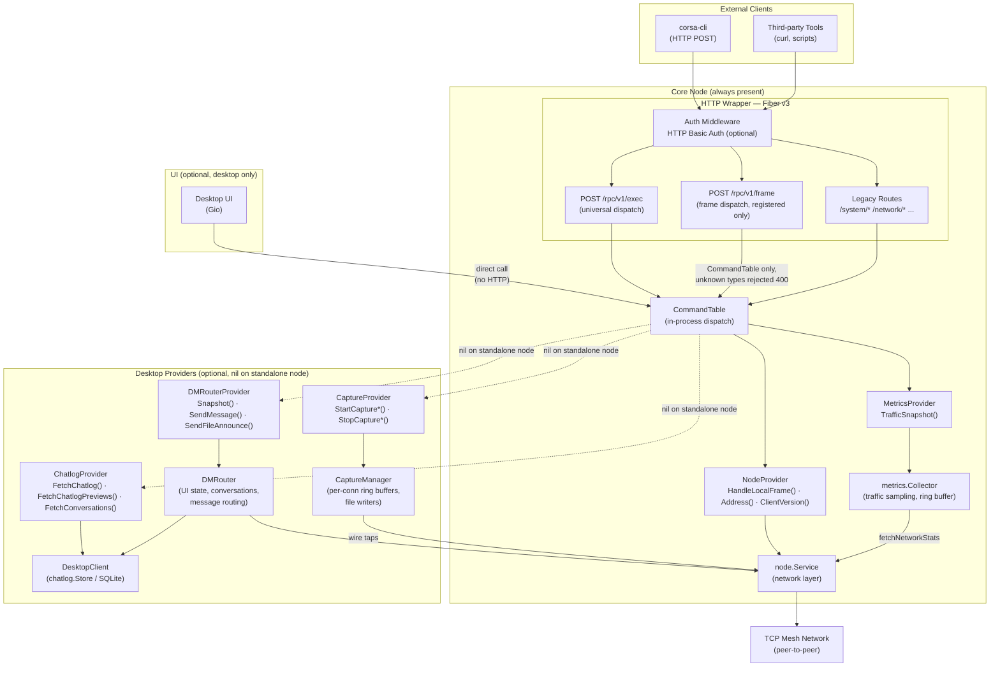
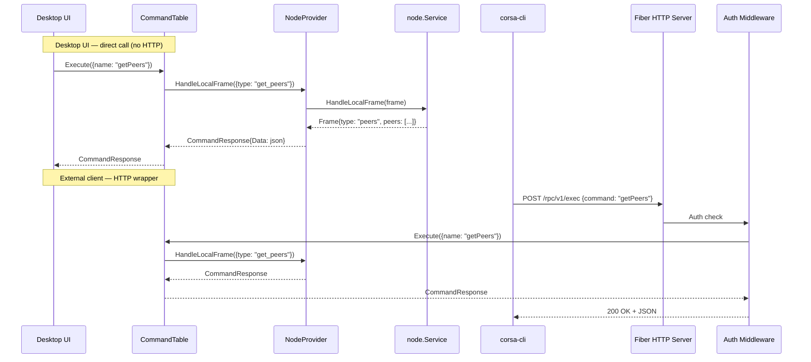
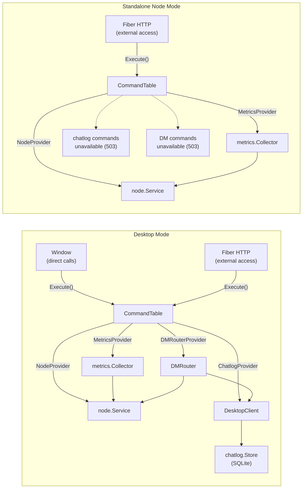
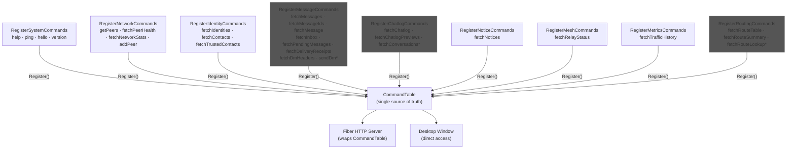
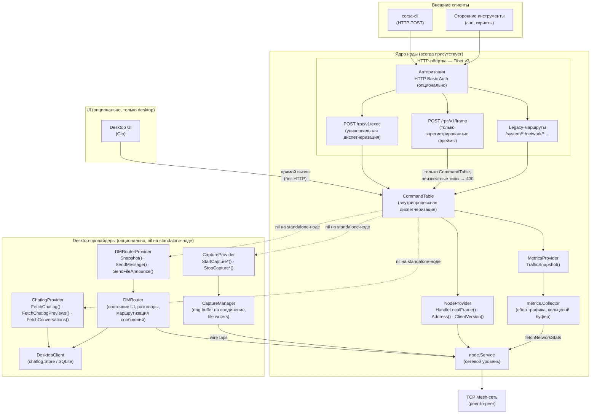
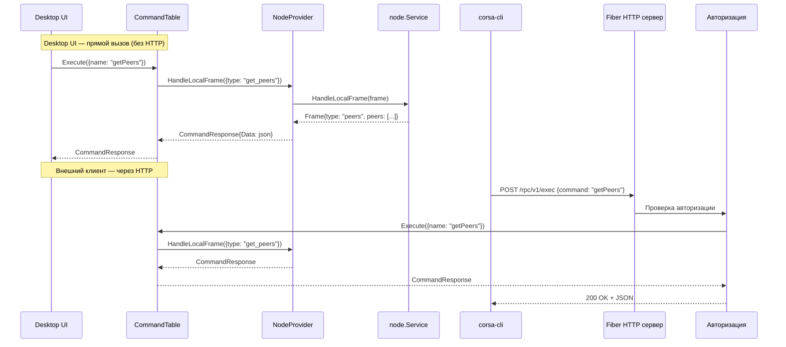
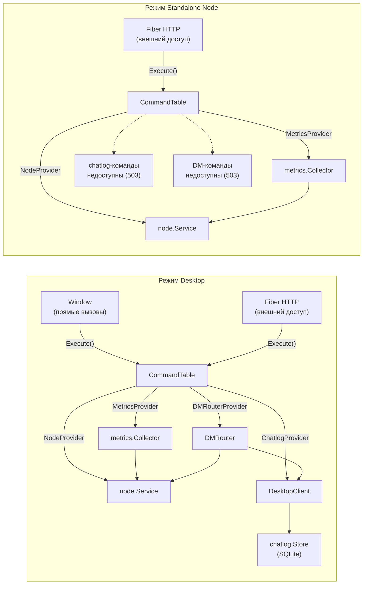
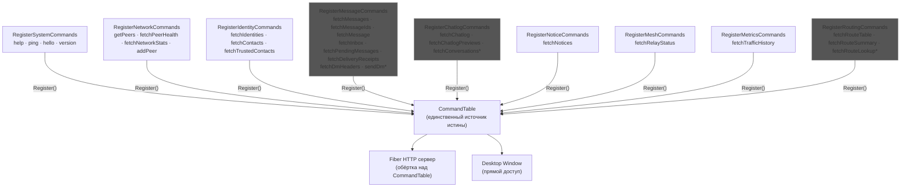

# RPC Layer

## English

### Overview

The RPC layer provides command dispatch for managing a CORSA node. All commands are registered in a `CommandTable` — a pure in-process function dispatch table with no HTTP dependency.

The desktop UI calls `CommandTable` directly (no HTTP round-trip). External clients (`corsa-cli`, third-party tools) access commands through a thin Fiber v3 HTTP wrapper that delegates to the same `CommandTable`. This ensures identical behavior for all callers.

The HTTP RPC server listens on `127.0.0.1:46464` by default. The server is only started when authentication credentials are configured via `CORSA_RPC_USERNAME` and `CORSA_RPC_PASSWORD` environment variables. Without credentials, the RPC server is not created — this prevents port conflicts when running multiple instances and avoids exposing an unauthenticated control plane. When credentials are set, all requests require HTTP Basic authentication.

### Interaction Diagram

#### Overall Architecture


*Diagram 1 — Overall architecture.*

Core Node layer is always present and includes CommandTable, NodeProvider, MetricsProvider, and HTTP wrapper. Desktop Providers (ChatlogProvider, DMRouterProvider, CaptureProvider) are optional — on standalone node they are nil, their commands return 503 and are hidden from help. MetricsProvider (metrics.Collector) collects traffic samples from node.Service via `fetchNetworkStats` and stores them in a ring buffer for `fetchTrafficHistory`. CaptureProvider (CaptureManager) manages per-connection wire traffic recording via three tap points in the network I/O path (see [debug.md](debug.md) for the capture architecture diagram).

#### Request Processing Flow


*Diagram 2 — Request processing flow.*

Desktop UI calls CommandTable directly without HTTP. External clients (corsa-cli, third-party tools) go through Fiber HTTP server with optional Basic Auth, then delegate to the same CommandTable.

#### Operating Modes: Desktop and Node


*Diagram 3 — Operating modes.*

In Desktop mode, all providers are available: NodeProvider, MetricsProvider, ChatlogProvider, DMRouterProvider. In Standalone Node mode, MetricsProvider and NodeProvider are active, while chatlog and DM commands return 503.

#### Command Registration


*Diagram 4 — Command registration.*

Commands marked with `*` are mode-gated: when their provider is nil (standalone node), they are registered as unavailable via `RegisterUnavailable()` — returning 503 and hidden from help. `sendDm` requires DMRouterProvider; chatlog commands require ChatlogProvider; `fetchTrafficHistory` requires MetricsProvider; routing commands require RoutingProvider.

### Configuration

#### Environment Variables

| Variable | Default | Description |
|---|---|---|
| `CORSA_RPC_HOST` | `127.0.0.1` | RPC server listen address |
| `CORSA_RPC_PORT` | `46464` | RPC server port |
| `CORSA_RPC_USERNAME` | _(empty)_ | HTTP Basic Auth username |
| `CORSA_RPC_PASSWORD` | _(empty)_ | HTTP Basic Auth password |

If `CORSA_RPC_USERNAME` and `CORSA_RPC_PASSWORD` are not set — access without authentication. Setting only one of them is a configuration error — `NewServer` returns an error before Fiber is created, so no port is ever bound. When auth is enabled, all 401 responses include a `WWW-Authenticate: Basic realm="corsa-rpc"` header per RFC 7235, so clients can discover the required auth scheme programmatically.

### Architecture

#### Two-Layer Design

The architecture separates command execution from transport:

**Layer 1 — CommandTable (in-process):** Pure function dispatch. Each command is a `CommandHandler func(req CommandRequest) CommandResponse`. No HTTP, no network — just a map of command names to handler functions. Desktop UI calls this directly.

**Layer 2 — Fiber HTTP Server (external):** Thin HTTP wrapper around `CommandTable`. Adds auth middleware, URL routing, JSON serialization. Only used by external clients (`corsa-cli`, `curl`).

```go
// CommandTable — single source of truth for all commands.
// RegisterAllCommands is the single registration point — both bootstrap and tests use it.
table := rpc.NewCommandTable()
rpc.RegisterAllCommands(table, nodeService, chatlogProvider, dmRouter, metricsCollector)

// Desktop: register hello override with desktop identity (Client: "desktop").
// Accepts DiagnosticProvider + NodeProvider; nil diag is a safe no-op.
rpc.RegisterDesktopOverrides(table, desktopClient, nodeService)

// Desktop UI calls directly — no HTTP
resp := table.Execute(rpc.CommandRequest{Name: "ping"})

// HTTP server wraps the same table for external access.
// Pass nodeService to enable /rpc/v1/frame (registered frame types only).
server, _ := rpc.NewServer(cfg, table, nodeService)
```

#### Command Taxonomy: Raw, View, and UI-Formatting

Every command in the system belongs to exactly one of three layers. This classification determines what the command may do, how it is named, and where its logic lives.

**Layer 1 — Raw commands.** Source-of-truth commands that expose node/network state. A raw command must have the same semantic contract regardless of transport (HTTP RPC, in-process desktop, SDK). Raw commands are suitable for debugging node and wire behavior. Examples: `getPeers`, `fetchPeerHealth`, `fetchNetworkStats`, `hello`, `version`.

**Layer 2 — View commands.** Convenience commands that aggregate data from one or more raw commands, add categorization, merge health status, or build UI-oriented snapshots. View commands must have explicit names that distinguish them from raw commands. A view command must never reuse a raw command name. View commands have their own documented contracts. Currently no view commands are registered — the layer exists as an architectural guideline for future needs.

**Layer 3 — UI-formatting.** Pure presentation logic: sorting for render, grouping, badge mapping, human-readable labels. This logic must not exist inside command handlers — it belongs to the UI layer above `CommandTable`. It does not change the command contract.

**Rules:**

- One command name = one semantic contract, regardless of transport.
- `CommandTable` owns the semantic contract of a command. No caller (desktop, HTTP, SDK) may silently change it.
- Desktop console and Desktop UI are **in-process transports** for RPC semantics, not a separate semantic layer.
- Silent semantic overrides of existing raw commands are prohibited. If a desktop-enriched payload is needed, it must be registered as a separate view command with a distinct name.
- A new RPC command registered in `CommandTable` must be automatically available in the desktop console without separate manual UI registration.
- `CommandTable.Commands()` is the single source of truth for help, autocomplete, and dispatch in all transports including desktop console.

> **Current state:** `RegisterDesktopOverrides` registers a transport-level `hello` override (`Client: "desktop"`). Raw commands `ping` and `getPeers` are not overridden — they return the same semantic result regardless of transport. The `hello` override changes only identity metadata (`Client` + `ClientVersion`), not the semantic contract — this is why it does not violate the taxonomy.

#### Command Categories

| Category | Commands | Condition |
|---|---|---|
| **system** | help, ping, hello, version | Always registered |
| **network** | getPeers, fetchPeerHealth, fetchNetworkStats, addPeer, fetchReachableIds | Always registered |
| **identity** | fetchIdentities, fetchContacts, fetchTrustedContacts, deleteTrustedContact, importContacts | Always registered |
| **message** | fetchMessages, fetchMessageIds, fetchMessage, fetchInbox, fetchPendingMessages, fetchDeliveryReceipts, fetchDmHeaders, sendMessage, importMessage, sendDeliveryReceipt | Always registered |
| **message** | sendDm | Always registered; unavailable (503, hidden from help) when DMRouter is nil |
| **chatlog** | fetchChatlog, fetchChatlogPreviews, fetchConversations | Always registered; unavailable (503, hidden from help) when ChatlogProvider is nil |
| **notice** | fetchNotices, publishNotice | Always registered |
| **mesh** | fetchRelayStatus | Always registered |
| **metrics** | fetchTrafficHistory | Always registered; unavailable (503, hidden from help) when MetricsProvider is nil |
| **routing** | fetchRouteTable, fetchRouteSummary, fetchRouteLookup | Always registered; unavailable (503, hidden from help) when RoutingProvider is nil |
**Backward compatibility:** snake_case aliases (e.g., `get_peers`, `send_dm`) remain active for 2 releases. New integrations should use camelCase names exclusively.


#### Dependency Injection

Commands receive dependencies through provider interfaces:

```go
// NodeProvider — implemented by node.Service
type NodeProvider interface {
    HandleLocalFrame(frame protocol.Frame) protocol.Frame
    Address() string
    ClientVersion() string
}

// ChatlogProvider — implemented by DesktopClient (nil for standalone node)
type ChatlogProvider interface {
    FetchChatlog(topic, peerAddress string) (string, error)
    FetchChatlogPreviews() (string, error)
    FetchConversations() (string, error)
}
```

#### Error Model

`CommandResponse` carries a typed `ErrorKind` so the HTTP layer can map errors to correct status codes without inspecting error messages.

| ErrorKind | HTTP Status | When |
|---|---|---|
| `ErrValidation` | 400 Bad Request | Missing or invalid arguments from caller |
| `ErrNotFound` | 404 Not Found | Truly unknown command (not in CommandTable at all) |
| `ErrUnavailable` | 503 Service Unavailable | Command exists but not available in this mode (e.g. chatlog on standalone node) |
| `ErrInternal` | 500 Internal Server Error | Provider failure, serialization error |

Mode-gated commands are registered via `RegisterUnavailable()` — they exist in the table (so `Has()` returns true and `/exec` returns 503 instead of 404), but don't appear in `Commands()` (help, autocomplete). This ensures `/rpc/v1/exec` and legacy routes return identical status codes for the same command.

Command handlers use `validationError()` for input problems and `internalError()` for provider/system failures. The HTTP layer calls `resp.ErrorKind.HTTPStatus()` uniformly across all dispatch paths.

Malformed JSON body on legacy arg routes returns 400 immediately, before command dispatch. Empty body is accepted — commands with optional arguments use defaults.

### API Reference

Per-command documentation is in the [rpc/](rpc/) folder. See [rpc/README.md](rpc/README.md) for the full command index with dispatch endpoints.

| Group | Commands | File |
|---|---|---|
| [System](rpc/system.md) | `help`, `ping`, `hello`, `version` | [rpc/system.md](rpc/system.md) |
| [Network](rpc/network.md) | `getPeers`, `fetchPeerHealth`, `fetchNetworkStats`, `addPeer` | [rpc/network.md](rpc/network.md) |
| [Identity](rpc/identity.md) | `fetchIdentities`, `fetchContacts`, `fetchTrustedContacts` | [rpc/identity.md](rpc/identity.md) |
| [Message](rpc/message.md) | `fetchMessages`, `fetchMessageIds`, `fetchMessage`, `fetchInbox`, `fetchPendingMessages`, `fetchDeliveryReceipts`, `fetchDmHeaders`, `sendDm` | [rpc/message.md](rpc/message.md) |
| [Chatlog](rpc/chatlog.md) | `fetchChatlog`, `fetchChatlogPreviews`, `fetchConversations` | [rpc/chatlog.md](rpc/chatlog.md) |
| [Notice](rpc/notice.md) | `fetchNotices` | [rpc/notice.md](rpc/notice.md) |
| [Mesh](rpc/mesh.md) | `fetchRelayStatus` | [rpc/mesh.md](rpc/mesh.md) |
| [Metrics](rpc/metrics.md) | `fetchTrafficHistory` | [rpc/metrics.md](rpc/metrics.md) |
| [Routing](rpc/routing.md) | `fetchRouteTable`, `fetchRouteSummary`, `fetchRouteLookup` | [rpc/routing.md](rpc/routing.md) |
### corsa-cli

Thin console client for the RPC server. No local command table — positional arguments are parsed via the shared `ParseConsoleInput`, which normalizes command names to canonical camelCase before sending `{command, args}` to `POST /rpc/v1/exec`. The server is the single source of truth. `corsa-cli help` fetches the command list from the server. Both camelCase and snake_case input are accepted (normalization is transparent).

#### Build

```bash
make build-cli-all
```

#### Usage

```bash
# List available commands (fetched from server)
corsa-cli help

# Simple commands (no arguments)
corsa-cli ping
corsa-cli version
corsa-cli getPeers
corsa-cli fetchPeerHealth

# Positional arguments (matches help output syntax)
corsa-cli addPeer 1.2.3.4:8080
corsa-cli sendDm peer-addr hello world
corsa-cli fetchChatlog dm abc123

# Named arguments (key=value)
corsa-cli addPeer address=1.2.3.4:8080
corsa-cli sendDm to=peer-addr body="hello world"
corsa-cli fetchMessages topic=dm
corsa-cli fetchChatlog topic=dm peer_address=abc123

# JSON argument (single quoted JSON object)
corsa-cli addPeer '{"address": "1.2.3.4:8080"}'
corsa-cli sendDm '{"to": "peer-addr", "body": "hello world"}'

# With -named flag (explicit key=value mode)
corsa-cli -named fetchInbox topic=dm recipient=peer-addr

# Authentication
corsa-cli --username admin --password secret getPeers

# Remote host
corsa-cli --host 192.168.1.100 --port 46464 getPeers
```

#### Flags

| Flag | Default | Description |
|---|---|---|
| `--host` | `127.0.0.1` | RPC server host |
| `--port` | `46464` | RPC server port |
| `--username` | _(empty)_ | Username |
| `--password` | _(empty)_ | Password |
| `--named` | `false` | Interpret arguments as key=value pairs |

### Integration

#### Registration

`RegisterAllCommands(table, node, chatlog, dmRouter, metricsProvider)` is the single registration point for all command groups. Both the application bootstrap and tests call this function to populate a `CommandTable`. Pass `nil` for `chatlog`, `dmRouter`, or `metricsProvider` to simulate standalone node mode — those commands are registered as unavailable (503).

#### Desktop Application

The desktop application creates a `CommandTable`, calls `RegisterAllCommands` with all providers, then calls `RegisterDesktopOverrides(table, client, nodeService)` to register the transport-level `hello` override. The first provider argument (`client`) implements `DiagnosticProvider`, the second (`nodeService`) implements `NodeProvider`. Raw commands `ping` and `getPeers` are not overridden — they return the same semantic result as through HTTP RPC. The `hello` override identifies as `Client: "desktop"` with the desktop application version instead of the generic `Client: "rpc"` — this is a transport-level identity change, not a semantic fork. Passing `nil` for `DiagnosticProvider` is a safe no-op. The resulting table is passed to both the Fiber HTTP server (for external access) and the Window (for direct UI access). All command categories are registered, including chatlog and DM commands.

> **Architectural rule (see Command Taxonomy above):** `RegisterDesktopOverrides` must only register transport-level overrides. Silent semantic overrides of existing raw commands are prohibited. If a desktop-enriched payload is ever needed, it must be a new view command with a distinct name (e.g. `getSomethingView`), not an override of an existing raw command. Currently `RegisterDesktopOverrides` contains only the `hello` override — no view commands are registered. Enriched data for the Desktop UI is available through the service-level `ProbeNode()` function, which bypasses the CommandTable entirely.

#### Standalone Node (corsa-node)

The standalone node creates a `CommandTable` and calls `RegisterAllCommands` with nil providers for chatlog, DMRouter, and metricsProvider. Commands that require unavailable providers (`fetchChatlog`, `fetchChatlogPreviews`, `fetchConversations`, `sendDm`, `fetchTrafficHistory`) are registered as unavailable — they return 503 via both `/rpc/v1/exec` and legacy endpoints, but do not appear in help output. Note: `fetchDmHeaders` is always registered because it uses only `NodeProvider`.

#### Go Client (rpc.Client)

`rpc.Client` is the exported HTTP client for the RPC server. `ExecuteCommand(input)` routes input based on format: raw JSON frames (starting with `{`) are sent to `POST /rpc/v1/frame` where the server applies CommandTable dispatch (registered commands may normalize or rebuild the frame; unregistered types are rejected with 400 Bad Request); named commands are parsed via `ParseConsoleInput` into `{command, args}` and sent to `POST /rpc/v1/exec`. No legacy route logic — `ParseConsoleInput` is the single source of truth for positional-to-named arg mapping.

#### ParseConsoleInput

`ParseConsoleInput` accepts three input formats: positional commands (`sendDm addr hello world`), key=value pairs (`sendDm to=addr body=hello reply_to=e4a7c391-5f02-4b8a-9d1e-0f3a6b7c8d2e`), and raw JSON frames (`{"type":"ping"}`). Key=value mode is auto-detected when every token after the command contains `=` with a non-empty key; otherwise input is treated as positional. Command names are case-insensitive. For JSON input, the `type` field becomes the command name and all fields are passed as args. Used by both the UI console (in-process) and `rpc.Client` (over HTTP).

**Frame field normalization.** Protocol wire frames use different field names than RPC handlers. `normalizeFrameArgs` bridges the gap so pasting real wire frames into the console works. Aliases are applied only when the RPC-expected field is absent; if both are present, the RPC field wins.

| Command | Wire field | RPC field | Transformation |
|---|---|---|---|
| `addPeer` | `peers` (array) | `address` (string) | `peers[0]` → `address` |
| `sendDm` | `recipient` | `to` | rename |
| `fetchChatlog` | `address` | `peer_address` | rename |
| *(pagination)* | `count` | `offset` | rename (all commands) |

#### UI Console

The UI console executes commands directly through `CommandTable` — no HTTP round-trip. Command suggestions are loaded synchronously from `CommandTable.Commands()` at initialization. One behavior differs from the API path: `help` renders a human-readable categorized text (with defaults and self-address) instead of machine JSON. Unknown commands return an error — there is no fallback to `ExecuteConsoleCommand` or `HandleLocalFrame`.

### Testing

```bash
# Run all RPC tests
go test ./internal/core/rpc/... -v

# Run CLI tests (parseArgs, execRPC)
go test ./cmd/corsa-cli/... -v

# Run tests for specific command categories
go test ./internal/core/rpc/... -run TestSystem -v
go test ./internal/core/rpc/... -run TestNetwork -v

# Run CommandTable unit tests
go test ./internal/core/rpc/... -run TestCommandTable -v

# Run console parser tests
go test ./internal/core/rpc/... -run TestParseConsole -v

# Run Go client tests
go test ./internal/core/rpc/... -run TestClient -v
```

Tests use Fiber `app.Test()` for HTTP-layer tests. CommandTable can be tested directly without HTTP. CLI tests cover `parseArgs` (JSON, key=value, positional) and `execRPC` (endpoint, auth). Client tests use `httptest.NewServer` to verify routing: named commands → `/rpc/v1/exec`, raw JSON frames → `/rpc/v1/frame`.

#### Data Port Isolation: Mandatory Test for New Commands

RPC commands and TCP data port commands have separate dispatchers (`CommandTable`/`handleLocalFrameDispatch` vs `dispatchNetworkFrame`), but this separation alone does not guarantee that a new command won't accidentally appear on the TCP data port. To prevent regression, every new RPC/data-only command **must** be covered by the data port isolation test suite in `internal/core/node/command_scope_integration_test.go`.

The test suite has three layers, all required:

1. **Protocol oracle** (`requiredP2PWireCommands` in `command_scope_test.go`): a hardcoded list of every P2P wire command that the protocol specification requires on the TCP data port. `TestRequiredP2PCommandsPresent` asserts each oracle entry has a case in `dispatchNetworkFrame` and an entry in `p2pWireCommands`. This is the only layer that catches accidental removal of a wire command — the AST-derived tests below validate the implementation against itself and silently reclassify removed commands as data-only.

2. **AST-derived invariants** (`TestP2PWireCommandsMatchesDispatch`, `TestNoDataCommandsInNetworkDispatch`): automatically detect new commands and verify structural consistency between `dispatchNetworkFrame`, `handleLocalFrameDispatch`, and `p2pWireCommands`. These catch accidental additions (a data-only command leaking onto the wire) but cannot catch accidental removals.

3. **Integration tests** (`TestDataCommandViaTCP_UnknownCommand_*`, `TestAuthPeerCan*`, `TestUnauthPeerCannot*`): end-to-end confirmation over real TCP connections that the data port rejects data-only commands and accepts P2P wire commands with correct auth gating.

When adding a new command:

1. **Data-only command** (RPC/local only, e.g. `fetch_messages`, `send_message`): add the command to `handleLocalFrameDispatch` in `service.go`. The AST-based tests will automatically detect it. Additionally, add the command's snake_case, camelCase, and kebab-case forms to the test lists in `TestDataCommandViaTCP_UnknownCommand_SnakeCase`, `TestDataCommandViaTCP_UnknownCommand_CamelCase`, and `TestDataCommandViaTCP_UnknownCommand_KebabCase`.

2. **P2P wire command** (used between peers, e.g. `push_message`, `get_peers`): add the command to `dispatchNetworkFrame`, the `p2pWireCommands` map, **and** the `requiredP2PWireCommands` oracle in `command_scope_test.go`. Add an unauthenticated peer test (expect `auth_required`) and an authenticated peer test (expect success) in `command_scope_integration_test.go`. Omitting the oracle entry means `TestRequiredP2PCommandsPresent` will flag the new command as unregistered.

See `docs/command-isolation.md` section 10 for the full test specification.

---

## Русский

### Обзор

RPC слой обеспечивает диспетчеризацию команд для управления нодой CORSA. Все команды регистрируются в `CommandTable` — чисто внутрипроцессной таблице диспетчеризации функций без зависимости от HTTP.

Desktop UI вызывает `CommandTable` напрямую (без HTTP round-trip). Внешние клиенты (`corsa-cli`, сторонние инструменты) обращаются к командам через тонкую HTTP-обёртку на Fiber v3, которая делегирует в тот же `CommandTable`. Это гарантирует идентичное поведение для всех вызывающих.

HTTP RPC сервер по умолчанию слушает `127.0.0.1:46464`. Сервер запускается только при наличии учётных данных аутентификации через переменные окружения `CORSA_RPC_USERNAME` и `CORSA_RPC_PASSWORD`. Без учётных данных RPC сервер не создаётся — это предотвращает конфликты портов при запуске нескольких экземпляров и исключает открытый неаутентифицированный control plane. Когда учётные данные заданы, все запросы требуют HTTP Basic аутентификации.

### Диаграмма взаимодействия

#### Общая архитектура


*Диаграмма 1 — Общая архитектура.*

Слой ядра ноды всегда присутствует и включает CommandTable, NodeProvider, MetricsProvider и HTTP-обёртку. Desktop-провайдеры (ChatlogProvider, DMRouterProvider, CaptureProvider) опциональны — на standalone-ноде они равны nil, их команды возвращают 503 и скрыты из help. MetricsProvider (metrics.Collector) собирает сэмплы трафика от node.Service через `fetchNetworkStats` и хранит их в кольцевом буфере для `fetchTrafficHistory`. CaptureProvider (CaptureManager) управляет записью wire-трафика по соединениям через три tap-точки в сетевом I/O (подробности — [debug.md](debug.md)).

#### Поток обработки запроса


*Диаграмма 2 — Поток обработки запроса.*

Desktop UI вызывает CommandTable напрямую без HTTP. Внешние клиенты (corsa-cli, сторонние инструменты) проходят через Fiber HTTP сервер с опциональной Basic Auth, затем делегируют в тот же CommandTable.

#### Режимы работы: Desktop и Node


*Диаграмма 3 — Режимы работы.*

В режиме Desktop доступны все провайдеры: NodeProvider, MetricsProvider, ChatlogProvider, DMRouterProvider. В режиме Standalone Node активны MetricsProvider и NodeProvider, а chatlog- и DM-команды возвращают 503.

#### Регистрация команд


*Диаграмма 4 — Регистрация команд.*

Команды с `*` являются mode-gated: при nil-провайдере (standalone нода) они регистрируются как недоступные через `RegisterUnavailable()` — возвращают 503 и скрыты из help. `sendDm` требует DMRouterProvider; chatlog-команды требуют ChatlogProvider; `fetchTrafficHistory` требует MetricsProvider; routing-команды требуют RoutingProvider.

### Конфигурация

#### Переменные окружения

| Переменная | По умолчанию | Описание |
|---|---|---|
| `CORSA_RPC_HOST` | `127.0.0.1` | Адрес прослушивания RPC сервера |
| `CORSA_RPC_PORT` | `46464` | Порт RPC сервера |
| `CORSA_RPC_USERNAME` | _(пусто)_ | Имя пользователя для HTTP Basic Auth |
| `CORSA_RPC_PASSWORD` | _(пусто)_ | Пароль для HTTP Basic Auth |

Если `CORSA_RPC_USERNAME` и `CORSA_RPC_PASSWORD` не указаны — доступ без авторизации. Указание только одного из них — ошибка конфигурации: `NewServer` возвращает ошибку до создания Fiber, порт не занимается. Когда авторизация включена, все 401-ответы содержат заголовок `WWW-Authenticate: Basic realm="corsa-rpc"` по RFC 7235, позволяя клиентам программно определить требуемую схему авторизации.

### Архитектура

#### Двухслойный дизайн

Архитектура разделяет выполнение команд и транспорт:

**Слой 1 — CommandTable (внутрипроцессный):** Чистая диспетчеризация функций. Каждая команда — это `CommandHandler func(req CommandRequest) CommandResponse`. Без HTTP, без сети — просто map имён команд на функции-обработчики. Desktop UI вызывает напрямую.

**Слой 2 — Fiber HTTP сервер (внешний):** Тонкая HTTP-обёртка над `CommandTable`. Добавляет middleware авторизации, URL-маршрутизацию, JSON-сериализацию. Используется только внешними клиентами (`corsa-cli`, `curl`).

```go
// CommandTable — единственный источник истины для всех команд.
// RegisterAllCommands — единая точка регистрации, используемая и bootstrap, и тестами.
table := rpc.NewCommandTable()
rpc.RegisterAllCommands(table, nodeService, chatlogProvider, dmRouter, metricsCollector)

// Desktop: регистрация hello override с desktop-идентификацией (Client: "desktop").
// Принимает DiagnosticProvider + NodeProvider; nil diag — безопасный no-op.
rpc.RegisterDesktopOverrides(table, desktopClient, nodeService)

// Desktop UI вызывает напрямую — без HTTP
resp := table.Execute(rpc.CommandRequest{Name: "ping"})

// HTTP сервер оборачивает ту же таблицу для внешнего доступа.
// nodeService включает /rpc/v1/frame (только зарегистрированные типы фреймов).
server, _ := rpc.NewServer(cfg, table, nodeService)
```

#### Таксономия команд: Raw, View и UI-Formatting

Каждая команда в системе принадлежит ровно одному из трёх слоёв. Эта классификация определяет, что команда может делать, как она именуется и где живёт её логика.

**Слой 1 — Raw-команды.** Команды-источники истины, раскрывающие состояние ноды/сети. Raw-команда должна иметь одинаковый семантический контракт вне зависимости от транспорта (HTTP RPC, in-process desktop, SDK). Raw-команды пригодны для отладки node и wire поведения. Примеры: `getPeers`, `fetchPeerHealth`, `fetchNetworkStats`, `hello`, `version`.

**Слой 2 — View-команды.** Удобные команды, агрегирующие данные из одной или нескольких raw-команд, добавляющие категоризацию, merge health-статусов или собирающие UI-ориентированные снимки. View-команды должны иметь явные имена, отличающие их от raw-команд. View-команда не может переиспользовать имя raw-команды. У view-команд свой документированный контракт. В настоящее время view-команды не зарегистрированы — слой существует как архитектурное руководство для будущих потребностей.

**Слой 3 — UI-formatting.** Чистая логика отображения: сортировка для рендера, группировка, badge mapping, человекочитаемые labels. Эта логика не должна существовать внутри обработчиков команд — она принадлежит UI-слою выше `CommandTable`. Она не меняет контракт команды.

**Правила:**

- Одно имя команды = один семантический контракт, вне зависимости от транспорта.
- `CommandTable` владеет семантическим контрактом команды. Ни один вызывающий (desktop, HTTP, SDK) не может тихо его менять.
- Desktop console и Desktop UI — это **in-process транспорты** для RPC-семантики, а не отдельный семантический слой.
- Тихие семантические override'ы существующих raw-команд запрещены. Если нужен desktop-обогащённый payload, он должен быть зарегистрирован как отдельная view-команда с другим именем.
- Новая RPC-команда, зарегистрированная в `CommandTable`, должна автоматически быть доступна в desktop console без отдельной ручной правки UI.
- `CommandTable.Commands()` — единственный источник истины для help, autocomplete и dispatch во всех транспортах, включая desktop console.

> **Текущее состояние:** `RegisterDesktopOverrides` регистрирует transport-level override `hello` (`Client: "desktop"`). Raw-команды `ping` и `getPeers` не подменяются — они возвращают одинаковый семантический результат вне зависимости от транспорта. Override `hello` меняет только identity metadata (`Client` + `ClientVersion`), а не семантический контракт — поэтому он не нарушает таксономию.

#### Категории команд

| Категория | Команды | Условие |
|---|---|---|
| **system** | help, ping, hello, version | Всегда зарегистрированы |
| **network** | getPeers, fetchPeerHealth, fetchNetworkStats, addPeer, fetchReachableIds | Всегда зарегистрированы |
| **identity** | fetchIdentities, fetchContacts, fetchTrustedContacts, deleteTrustedContact, importContacts | Всегда зарегистрированы |
| **message** | fetchMessages, fetchMessageIds, fetchMessage, fetchInbox, fetchPendingMessages, fetchDeliveryReceipts, fetchDmHeaders, sendMessage, importMessage, sendDeliveryReceipt | Всегда зарегистрированы |
| **message** | sendDm | Всегда зарегистрирована; недоступна (503, скрыта из help) при DMRouter = nil |
| **chatlog** | fetchChatlog, fetchChatlogPreviews, fetchConversations | Всегда зарегистрированы; недоступны (503, скрыты из help) при ChatlogProvider = nil |
| **notice** | fetchNotices, publishNotice | Всегда зарегистрированы |
| **mesh** | fetchRelayStatus | Всегда зарегистрированы |
| **metrics** | fetchTrafficHistory | Всегда зарегистрирована; недоступна (503, скрыта из help) при MetricsProvider = nil |
| **routing** | fetchRouteTable, fetchRouteSummary, fetchRouteLookup | Всегда зарегистрированы; недоступны (503, скрыты из help) при RoutingProvider = nil |
**Обратная совместимость:** алиасы snake_case (например, `get_peers`, `send_dm`) остаются активными в течение 2 релизов. Новые интеграции должны использовать исключительно имена в стиле camelCase.


#### Внедрение зависимостей

Команды получают зависимости через интерфейсы провайдеров:

```go
// NodeProvider — реализуется node.Service
type NodeProvider interface {
    HandleLocalFrame(frame protocol.Frame) protocol.Frame
    Address() string
    ClientVersion() string
}

// ChatlogProvider — реализуется DesktopClient (nil для standalone ноды)
type ChatlogProvider interface {
    FetchChatlog(topic, peerAddress string) (string, error)
    FetchChatlogPreviews() (string, error)
    FetchConversations() (string, error)
}
```

#### Модель ошибок

`CommandResponse` содержит типизированный `ErrorKind`, чтобы HTTP-слой мог корректно маппить ошибки на статус-коды без анализа текста сообщений.

| ErrorKind | HTTP статус | Когда |
|---|---|---|
| `ErrValidation` | 400 Bad Request | Отсутствующие или невалидные аргументы от вызывающей стороны |
| `ErrNotFound` | 404 Not Found | Команда полностью неизвестна (не в CommandTable) |
| `ErrUnavailable` | 503 Service Unavailable | Команда существует, но недоступна в этом режиме (например chatlog на standalone-ноде) |
| `ErrInternal` | 500 Internal Server Error | Ошибка провайдера, ошибка сериализации |

Mode-gated команды регистрируются через `RegisterUnavailable()` — они присутствуют в таблице (поэтому `Has()` возвращает true, а `/exec` возвращает 503 вместо 404), но не появляются в `Commands()` (help, autocomplete). Это гарантирует, что `/rpc/v1/exec` и legacy routes возвращают одинаковые статус-коды для одной и той же команды.

Обработчики команд используют `validationError()` для ошибок ввода и `internalError()` для ошибок провайдеров/системы. HTTP-слой единообразно вызывает `resp.ErrorKind.HTTPStatus()` во всех путях диспетчеризации.

Некорректный JSON body на legacy arg routes возвращает 400 немедленно, до диспетчеризации команды. Пустое тело запроса допускается — команды с опциональными аргументами используют значения по умолчанию.

### Справочник API

Документация по командам вынесена в папку [rpc/](rpc/). Полный индекс с dispatch-эндпоинтами: [rpc/README.md](rpc/README.md).

| Группа | Команды | Файл |
|---|---|---|
| [Системные](rpc/system.md) | `help`, `ping`, `hello`, `version` | [rpc/system.md](rpc/system.md) |
| [Сеть](rpc/network.md) | `getPeers`, `fetchPeerHealth`, `fetchNetworkStats`, `addPeer` | [rpc/network.md](rpc/network.md) |
| [Идентификация](rpc/identity.md) | `fetchIdentities`, `fetchContacts`, `fetchTrustedContacts` | [rpc/identity.md](rpc/identity.md) |
| [Сообщения](rpc/message.md) | `fetchMessages`, `fetchMessageIds`, `fetchMessage`, `fetchInbox`, `fetchPendingMessages`, `fetchDeliveryReceipts`, `fetchDmHeaders`, `sendDm` | [rpc/message.md](rpc/message.md) |
| [История чатов](rpc/chatlog.md) | `fetchChatlog`, `fetchChatlogPreviews`, `fetchConversations` | [rpc/chatlog.md](rpc/chatlog.md) |
| [Уведомления](rpc/notice.md) | `fetchNotices` | [rpc/notice.md](rpc/notice.md) |
| [Mesh](rpc/mesh.md) | `fetchRelayStatus` | [rpc/mesh.md](rpc/mesh.md) |
| [Метрики](rpc/metrics.md) | `fetchTrafficHistory` | [rpc/metrics.md](rpc/metrics.md) |
| [Маршрутизация](rpc/routing.md) | `fetchRouteTable`, `fetchRouteSummary`, `fetchRouteLookup` | [rpc/routing.md](rpc/routing.md) |
### corsa-cli

Тонкий консольный клиент RPC сервера. Без локальной таблицы команд — позиционные аргументы разбираются через общий `ParseConsoleInput`, который нормализует имена команд в каноническое camelCase перед отправкой `{command, args}` в `POST /rpc/v1/exec`. Сервер является единственным источником истины. `corsa-cli help` получает список команд с сервера. Принимается как camelCase, так и snake_case ввод (нормализация прозрачна).

#### Сборка

```bash
make build-cli-all
```

#### Использование

```bash
# Список доступных команд (с сервера)
corsa-cli help

# Простые команды (без аргументов)
corsa-cli ping
corsa-cli version
corsa-cli getPeers
corsa-cli fetchPeerHealth

# Позиционные аргументы (совпадают с синтаксисом help)
corsa-cli addPeer 1.2.3.4:8080
corsa-cli sendDm peer-addr hello world
corsa-cli fetchChatlog dm abc123

# Именованные аргументы (key=value)
corsa-cli addPeer address=1.2.3.4:8080
corsa-cli sendDm to=peer-addr body="hello world"
corsa-cli fetchMessages topic=dm
corsa-cli fetchChatlog topic=dm peer_address=abc123

# JSON аргумент (один JSON-объект в кавычках)
corsa-cli addPeer '{"address": "1.2.3.4:8080"}'
corsa-cli sendDm '{"to": "peer-addr", "body": "hello world"}'

# С флагом -named (явный режим key=value)
corsa-cli -named fetchInbox topic=dm recipient=peer-addr

# Авторизация
corsa-cli --username admin --password secret getPeers

# Удалённый хост
corsa-cli --host 192.168.1.100 --port 46464 getPeers
```

#### Флаги

| Флаг | По умолчанию | Описание |
|---|---|---|
| `--host` | `127.0.0.1` | Хост RPC сервера |
| `--port` | `46464` | Порт RPC сервера |
| `--username` | _(пусто)_ | Имя пользователя |
| `--password` | _(пусто)_ | Пароль |
| `--named` | `false` | Интерпретировать аргументы как key=value пары |

### Интеграция

#### Регистрация

`RegisterAllCommands(table, node, chatlog, dmRouter, metricsProvider)` — единая точка регистрации всех групп команд. И bootstrap приложения, и тесты вызывают эту функцию для заполнения `CommandTable`. Передайте `nil` для `chatlog`, `dmRouter` или `metricsProvider` для режима standalone ноды — эти команды будут зарегистрированы как недоступные (503).

#### Desktop приложение

Desktop приложение создаёт `CommandTable`, вызывает `RegisterAllCommands` со всеми провайдерами, затем вызывает `RegisterDesktopOverrides(table, client, nodeService)` для регистрации transport-level override `hello`. Первый аргумент-провайдер (`client`) реализует `DiagnosticProvider`, второй (`nodeService`) реализует `NodeProvider`. Raw-команды `ping` и `getPeers` не подменяются — они возвращают тот же семантический результат, что и через HTTP RPC. Override `hello` идентифицируется как `Client: "desktop"` с версией desktop-приложения вместо генерического `Client: "rpc"` — это transport-level identity, а не семантический форк. Передача `nil` для `DiagnosticProvider` — безопасный no-op. Результирующая таблица передаётся и Fiber HTTP серверу (для внешнего доступа), и Window (для прямого доступа UI). Все категории команд регистрируются, включая chatlog и DM.

> **Архитектурное правило (см. Таксономия команд выше):** `RegisterDesktopOverrides` должен регистрировать только transport-level override'ы. Тихие семантические override'ы существующих raw-команд запрещены. Если когда-либо понадобится desktop-обогащённый payload, он должен быть отдельной view-командой с отдельным именем (например, `getSomethingView`), а не override'ом существующей raw-команды. Сейчас `RegisterDesktopOverrides` содержит только override `hello` — view-команды не зарегистрированы. Обогащённые данные для Desktop UI доступны через service-level функцию `ProbeNode()`, которая обходит CommandTable.

#### Standalone нода (corsa-node)

Standalone нода создаёт `CommandTable` и вызывает `RegisterAllCommands` с nil-провайдерами для chatlog, DMRouter и metricsProvider. Команды, требующие недоступных провайдеров (`fetchChatlog`, `fetchChatlogPreviews`, `fetchConversations`, `sendDm`, `fetchTrafficHistory`), регистрируются как недоступные — возвращают 503 через `/rpc/v1/exec` и legacy эндпоинты, но не отображаются в help. Примечание: `fetchDmHeaders` всегда зарегистрирована, т.к. использует только `NodeProvider`.

#### Go-клиент (rpc.Client)

`rpc.Client` — экспортируемый HTTP-клиент RPC сервера. `ExecuteCommand(input)` маршрутизирует ввод по формату: сырые JSON-фреймы (начинающиеся с `{`) отправляются на `POST /rpc/v1/frame`, где сервер применяет dispatch через CommandTable (зарегистрированные команды могут нормализовать или пересобрать фрейм; незарегистрированные типы отклоняются с 400 Bad Request); именованные команды разбираются через `ParseConsoleInput` в `{command, args}` и отправляются на `POST /rpc/v1/exec`. Никакой логики legacy-маршрутов — `ParseConsoleInput` является единственным источником истины для маппинга позиционных аргументов в именованные.

#### ParseConsoleInput

`ParseConsoleInput` принимает три формата ввода: позиционные команды (`sendDm addr hello world`), пары key=value (`sendDm to=addr body=hello reply_to=e4a7c391-5f02-4b8a-9d1e-0f3a6b7c8d2e`) и сырые JSON-фреймы (`{"type":"ping"}`). Режим key=value определяется автоматически — если все токены после команды содержат `=` с непустым ключом; иначе ввод обрабатывается как позиционный. Имена команд регистронезависимы. Для JSON-ввода поле `type` становится именем команды, все поля передаются как args. Используется и UI-консолью (in-process), и `rpc.Client` (через HTTP).

**Нормализация полей фрейма.** Проводные фреймы протокола используют другие имена полей, чем RPC-обработчики. `normalizeFrameArgs` устраняет разрыв, чтобы вставка реальных wire-фреймов в консоль работала. Алиасы применяются только если RPC-поле отсутствует; если присутствуют оба — RPC-поле имеет приоритет.

| Команда | Wire-поле | RPC-поле | Трансформация |
|---|---|---|---|
| `addPeer` | `peers` (массив) | `address` (строка) | `peers[0]` → `address` |
| `sendDm` | `recipient` | `to` | переименование |
| `fetchChatlog` | `address` | `peer_address` | переименование |
| *(пагинация)* | `count` | `offset` | переименование (все команды) |

#### UI консоль

UI консоль выполняет команды напрямую через `CommandTable` — без HTTP round-trip. Подсказки команд загружаются синхронно из `CommandTable.Commands()` при инициализации. Одно поведение отличается от API-пути: `help` рендерит человекочитаемый категоризированный текст (с дефолтами и self-address) вместо машинного JSON. Неизвестные команды возвращают ошибку — fallback на `ExecuteConsoleCommand` или `HandleLocalFrame` отсутствует.

### Тестирование

```bash
# Запуск всех RPC тестов
go test ./internal/core/rpc/... -v

# Запуск тестов CLI (parseArgs, execRPC)
go test ./cmd/corsa-cli/... -v

# Запуск тестов конкретных категорий команд
go test ./internal/core/rpc/... -run TestSystem -v
go test ./internal/core/rpc/... -run TestNetwork -v

# Запуск unit-тестов CommandTable
go test ./internal/core/rpc/... -run TestCommandTable -v

# Запуск тестов парсера консоли
go test ./internal/core/rpc/... -run TestParseConsole -v

# Запуск тестов Go-клиента
go test ./internal/core/rpc/... -run TestClient -v
```

Тесты используют Fiber `app.Test()` для тестирования HTTP-слоя. CommandTable можно тестировать напрямую без HTTP. CLI-тесты покрывают `parseArgs` (JSON, key=value, positional) и `execRPC` (эндпоинт, авторизация). Тесты клиента используют `httptest.NewServer` для проверки маршрутизации: именованные команды → `/rpc/v1/exec`, сырые JSON-фреймы → `/rpc/v1/frame`.

#### Изоляция data port: обязательный тест для новых команд

Хотя RPC-команды и TCP data port используют раздельные диспетчеры (`CommandTable`/`handleLocalFrameDispatch` vs `dispatchNetworkFrame`), одного лишь разделения кода недостаточно для гарантии, что новая команда не попадёт случайно на TCP data port. Для предотвращения регрессии каждая новая RPC/data-only команда **обязана** быть покрыта тестами изоляции в `internal/core/node/command_scope_integration_test.go`.

Тестовая система имеет три уровня, все обязательны:

1. **Протокольный оракул** (`requiredP2PWireCommands` в `command_scope_test.go`): захардкоженный список всех P2P wire-команд, которые спецификация протокола требует на TCP data port. `TestRequiredP2PCommandsPresent` проверяет, что каждая запись оракула имеет case в `dispatchNetworkFrame` и запись в `p2pWireCommands`. Это единственный уровень, который ловит случайное удаление wire-команды — AST-тесты ниже валидируют реализацию саму о себе и молча переклассифицируют удалённые команды как data-only.

2. **AST-инварианты** (`TestP2PWireCommandsMatchesDispatch`, `TestNoDataCommandsInNetworkDispatch`): автоматически обнаруживают новые команды и проверяют структурную согласованность между `dispatchNetworkFrame`, `handleLocalFrameDispatch` и `p2pWireCommands`. Ловят случайные добавления (data-only команда утекла на wire), но не ловят случайные удаления.

3. **Интеграционные тесты** (`TestDataCommandViaTCP_UnknownCommand_*`, `TestAuthPeerCan*`, `TestUnauthPeerCannot*`): сквозное подтверждение через реальные TCP-соединения, что data port отклоняет data-only команды и принимает P2P wire-команды с правильной проверкой аутентификации.

При добавлении новой команды:

1. **Data-only команда** (только RPC/local, например `fetch_messages`, `send_message`): добавить команду в `handleLocalFrameDispatch` в `service.go`. AST-тесты автоматически обнаружат её. Дополнительно добавить snake_case, camelCase и kebab-case формы в тестовые списки `TestDataCommandViaTCP_UnknownCommand_SnakeCase`, `TestDataCommandViaTCP_UnknownCommand_CamelCase` и `TestDataCommandViaTCP_UnknownCommand_KebabCase`.

2. **P2P wire команда** (используется между пирами, например `push_message`, `get_peers`): добавить команду в `dispatchNetworkFrame`, в map `p2pWireCommands` **и** в оракул `requiredP2PWireCommands` в `command_scope_test.go`. Добавить тест для неаутентифицированного пира (ожидать `auth_required`) и тест для аутентифицированного пира (ожидать успех) в `command_scope_integration_test.go`. Если запись в оракул не добавлена, `TestRequiredP2PCommandsPresent` отметит новую команду как незарегистрированную.

См. `docs/command-isolation.md` секция 10 для полной спецификации тестов.
