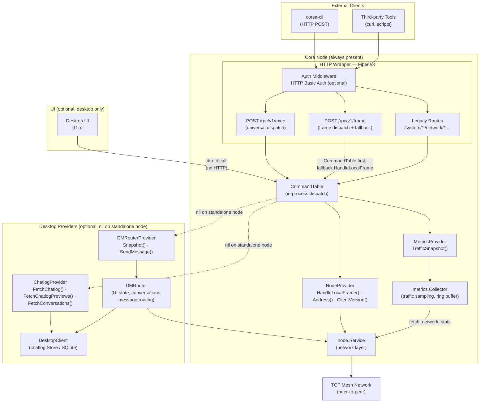
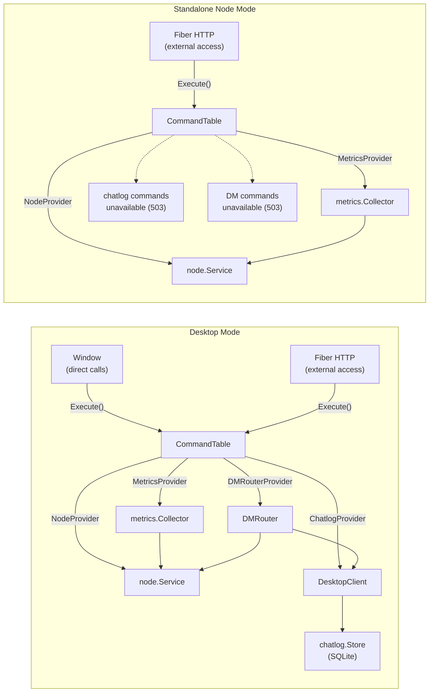
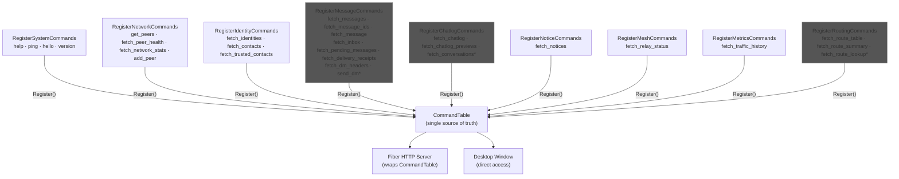
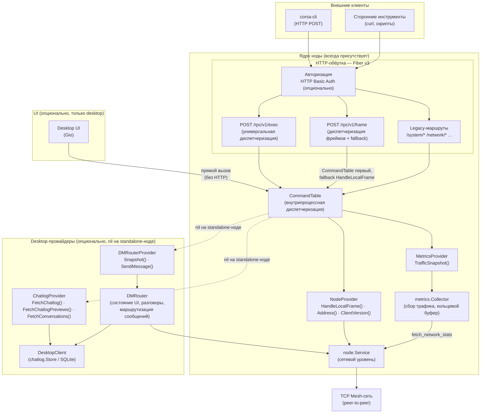
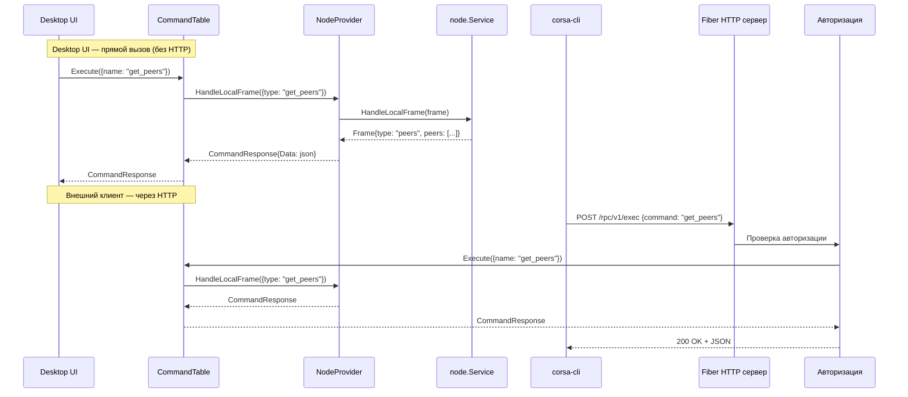
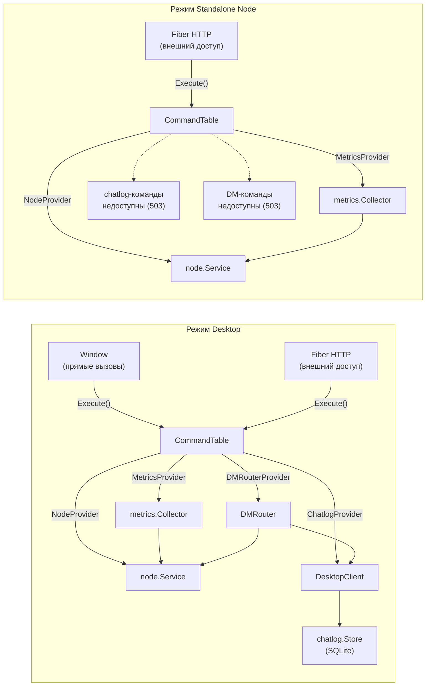
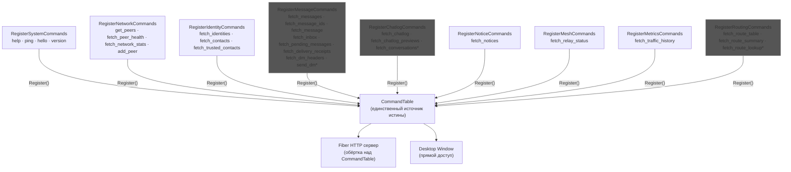

# RPC Layer

## English

### Overview

The RPC layer provides command dispatch for managing a CORSA node. All commands are registered in a `CommandTable` — a pure in-process function dispatch table with no HTTP dependency.

The desktop UI calls `CommandTable` directly (no HTTP round-trip). External clients (`corsa-cli`, third-party tools) access commands through a thin Fiber v3 HTTP wrapper that delegates to the same `CommandTable`. This ensures identical behavior for all callers.

The HTTP RPC server listens on `127.0.0.1:46464` by default. If username and password are not configured, access is granted without authentication.

### Interaction Diagram

#### Overall Architecture


*Diagram 1 — Overall architecture.*

Core Node layer is always present and includes CommandTable, NodeProvider, MetricsProvider, and HTTP wrapper. Desktop Providers (ChatlogProvider, DMRouterProvider) are optional — on standalone node they are nil, their commands return 503 and are hidden from help. MetricsProvider (metrics.Collector) collects traffic samples from node.Service via `fetch_network_stats` and stores them in a ring buffer for `fetch_traffic_history`.

#### Request Processing Flow


*Diagram 2 — Request processing flow.*

Desktop UI calls CommandTable directly without HTTP. External clients (corsa-cli, third-party tools) go through Fiber HTTP server with optional Basic Auth, then delegate to the same CommandTable.

#### Operating Modes: Desktop and Node


*Diagram 3 — Operating modes.*

In Desktop mode, all providers are available: NodeProvider, MetricsProvider, ChatlogProvider, DMRouterProvider. In Standalone Node mode, MetricsProvider and NodeProvider are active, while chatlog and DM commands return 503.

#### Command Registration


*Diagram 4 — Command registration.*

Commands marked with `*` are mode-gated: when their provider is nil (standalone node), they are registered as unavailable via `RegisterUnavailable()` — returning 503 and hidden from help. `send_dm` requires DMRouterProvider; chatlog commands require ChatlogProvider; `fetch_traffic_history` requires MetricsProvider; routing commands require RoutingProvider.

### Configuration

#### Environment Variables

| Variable | Default | Description |
|---|---|---|
| `CORSA_RPC_HOST` | `127.0.0.1` | RPC server listen address |
| `CORSA_RPC_PORT` | `46464` | RPC server port |
| `CORSA_RPC_USERNAME` | _(empty)_ | HTTP Basic Auth username |
| `CORSA_RPC_PASSWORD` | _(empty)_ | HTTP Basic Auth password |

If `CORSA_RPC_USERNAME` and `CORSA_RPC_PASSWORD` are not set — access without authentication. Setting only one of them is a configuration error — `NewServer` returns an error before Fiber is created, so no port is ever bound. When auth is enabled, all 401 responses include a `WWW-Authenticate: Basic realm="corsa-rpc"` header per RFC 7235, so clients can discover the required auth scheme programmatically.

### Architecture

#### Two-Layer Design

The architecture separates command execution from transport:

**Layer 1 — CommandTable (in-process):** Pure function dispatch. Each command is a `CommandHandler func(req CommandRequest) CommandResponse`. No HTTP, no network — just a map of command names to handler functions. Desktop UI calls this directly.

**Layer 2 — Fiber HTTP Server (external):** Thin HTTP wrapper around `CommandTable`. Adds auth middleware, URL routing, JSON serialization. Only used by external clients (`corsa-cli`, `curl`).

```go
// CommandTable — single source of truth for all commands.
// RegisterAllCommands is the single registration point — both bootstrap and tests use it.
table := rpc.NewCommandTable()
rpc.RegisterAllCommands(table, nodeService, chatlogProvider, dmRouter, metricsCollector, routingProvider)

// Desktop: replace base ping/get_peers with diagnostic-enriched versions,
// and hello with desktop identity (Client: "desktop").
// Accepts DiagnosticProvider + NodeProvider; nil diag is a safe no-op.
rpc.RegisterDesktopOverrides(table, desktopClient, nodeService)

// Desktop UI calls directly — no HTTP
resp := table.Execute(rpc.CommandRequest{Name: "ping"})

// HTTP server wraps the same table for external access.
// Pass nodeService to enable /rpc/v1/frame (frame dispatch + fallback).
server, _ := rpc.NewServer(cfg, table, nodeService)
```

#### Command Categories

| Category | Commands | Condition |
|---|---|---|
| **system** | help, ping, hello, version | Always registered |
| **network** | get_peers, fetch_peer_health, fetch_network_stats, add_peer | Always registered |
| **identity** | fetch_identities, fetch_contacts, fetch_trusted_contacts | Always registered |
| **message** | fetch_messages, fetch_message_ids, fetch_message, fetch_inbox, fetch_pending_messages, fetch_delivery_receipts, fetch_dm_headers | Always registered |
| **message** | send_dm | Always registered; unavailable (503, hidden from help) when DMRouter is nil |
| **chatlog** | fetch_chatlog, fetch_chatlog_previews, fetch_conversations | Always registered; unavailable (503, hidden from help) when ChatlogProvider is nil |
| **notice** | fetch_notices | Always registered |
| **mesh** | fetch_relay_status | Always registered |
| **metrics** | fetch_traffic_history | Always registered; unavailable (503, hidden from help) when MetricsProvider is nil |
| **routing** | fetch_route_table, fetch_route_summary, fetch_route_lookup | Always registered; unavailable (503, hidden from help) when RoutingProvider is nil |

#### Dependency Injection

Commands receive dependencies through provider interfaces:

```go
// NodeProvider — implemented by node.Service
type NodeProvider interface {
    HandleLocalFrame(frame protocol.Frame) protocol.Frame
    Address() string
    ClientVersion() string
}

// ChatlogProvider — implemented by DesktopClient (nil for standalone node)
type ChatlogProvider interface {
    FetchChatlog(topic, peerAddress string) (string, error)
    FetchChatlogPreviews() (string, error)
    FetchConversations() (string, error)
}
```

#### Error Model

`CommandResponse` carries a typed `ErrorKind` so the HTTP layer can map errors to correct status codes without inspecting error messages.

| ErrorKind | HTTP Status | When |
|---|---|---|
| `ErrValidation` | 400 Bad Request | Missing or invalid arguments from caller |
| `ErrNotFound` | 404 Not Found | Truly unknown command (not in CommandTable at all) |
| `ErrUnavailable` | 503 Service Unavailable | Command exists but not available in this mode (e.g. chatlog on standalone node) |
| `ErrInternal` | 500 Internal Server Error | Provider failure, serialization error |

Mode-gated commands are registered via `RegisterUnavailable()` — they exist in the table (so `Has()` returns true and `/exec` returns 503 instead of 404), but don't appear in `Commands()` (help, autocomplete). This ensures `/rpc/v1/exec` and legacy routes return identical status codes for the same command.

Command handlers use `validationError()` for input problems and `internalError()` for provider/system failures. The HTTP layer calls `resp.ErrorKind.HTTPStatus()` uniformly across all dispatch paths.

Malformed JSON body on legacy arg routes returns 400 immediately, before command dispatch. Empty body is accepted — commands with optional arguments use defaults.

### API Reference

Per-command documentation is in the [rpc/](rpc/) folder. See [rpc/README.md](rpc/README.md) for the full command index with dispatch endpoints.

| Group | Commands | File |
|---|---|---|
| [System](rpc/system.md) | `help`, `ping`, `hello`, `version` | [rpc/system.md](rpc/system.md) |
| [Network](rpc/network.md) | `get_peers`, `fetch_peer_health`, `fetch_network_stats`, `add_peer` | [rpc/network.md](rpc/network.md) |
| [Identity](rpc/identity.md) | `fetch_identities`, `fetch_contacts`, `fetch_trusted_contacts` | [rpc/identity.md](rpc/identity.md) |
| [Message](rpc/message.md) | `fetch_messages`, `fetch_message_ids`, `fetch_message`, `fetch_inbox`, `fetch_pending_messages`, `fetch_delivery_receipts`, `fetch_dm_headers`, `send_dm` | [rpc/message.md](rpc/message.md) |
| [Chatlog](rpc/chatlog.md) | `fetch_chatlog`, `fetch_chatlog_previews`, `fetch_conversations` | [rpc/chatlog.md](rpc/chatlog.md) |
| [Notice](rpc/notice.md) | `fetch_notices` | [rpc/notice.md](rpc/notice.md) |
| [Mesh](rpc/mesh.md) | `fetch_relay_status` | [rpc/mesh.md](rpc/mesh.md) |
| [Metrics](rpc/metrics.md) | `fetch_traffic_history` | [rpc/metrics.md](rpc/metrics.md) |
| [Routing](rpc/routing.md) | `fetch_route_table`, `fetch_route_summary`, `fetch_route_lookup` | [rpc/routing.md](rpc/routing.md) |

### corsa-cli

Thin console client for the RPC server. No local command table, no aliases — passes the command name and arguments directly to `POST /rpc/v1/exec`. The server is the single source of truth. `corsa-cli help` fetches the command list from the server.

#### Build

```bash
make build-cli-all
```

#### Usage

```bash
# List available commands (fetched from server)
corsa-cli help

# Simple commands (no arguments)
corsa-cli ping
corsa-cli version
corsa-cli get_peers
corsa-cli fetch_peer_health

# Positional arguments (matches help output syntax)
corsa-cli add_peer 1.2.3.4:8080
corsa-cli send_dm peer-addr hello world
corsa-cli fetch_chatlog dm abc123

# Named arguments (key=value)
corsa-cli add_peer address=1.2.3.4:8080
corsa-cli send_dm to=peer-addr body="hello world"
corsa-cli fetch_messages topic=dm
corsa-cli fetch_chatlog topic=dm peer_address=abc123

# JSON argument (single quoted JSON object)
corsa-cli add_peer '{"address": "1.2.3.4:8080"}'
corsa-cli send_dm '{"to": "peer-addr", "body": "hello world"}'

# With -named flag (explicit key=value mode)
corsa-cli -named fetch_inbox topic=dm recipient=peer-addr

# Authentication
corsa-cli --username admin --password secret get_peers

# Remote host
corsa-cli --host 192.168.1.100 --port 46464 get_peers
```

#### Flags

| Flag | Default | Description |
|---|---|---|
| `--host` | `127.0.0.1` | RPC server host |
| `--port` | `46464` | RPC server port |
| `--username` | _(empty)_ | Username |
| `--password` | _(empty)_ | Password |
| `--named` | `false` | Interpret arguments as key=value pairs |

### Integration

#### Registration

`RegisterAllCommands(table, node, chatlog, dmRouter, metricsProvider)` is the single registration point for all command groups. Both the application bootstrap and tests call this function to populate a `CommandTable`. Pass `nil` for `chatlog`, `dmRouter`, or `metricsProvider` to simulate standalone node mode — those commands are registered as unavailable (503).

#### Desktop Application

The desktop application creates a `CommandTable`, calls `RegisterAllCommands` with all providers, then calls `RegisterDesktopOverrides(table, client, client)` to replace base `ping`, `get_peers`, and `hello` handlers with desktop-enriched versions. The enriched `ping` opens TCP sessions to every connected peer and reports per-peer status. The enriched `get_peers` merges the raw peer list with health data and categorizes peers into connected/pending/known_only. The enriched `hello` identifies as `Client: "desktop"` with the desktop application version instead of the generic `Client: "rpc"`. `RegisterDesktopOverrides` accepts a `DiagnosticProvider` and a `NodeProvider` — passing `nil` diag is a no-op. The resulting table is passed to both the Fiber HTTP server (for external access) and the Window (for direct UI access). All 6 command categories are registered, including chatlog and DM commands.

#### Standalone Node (corsa-node)

The standalone node creates a `CommandTable` and calls `RegisterAllCommands` with nil providers for chatlog, DMRouter, and metricsProvider. Commands that require unavailable providers (`fetch_chatlog`, `fetch_chatlog_previews`, `fetch_conversations`, `send_dm`, `fetch_traffic_history`) are registered as unavailable — they return 503 via both `/rpc/v1/exec` and legacy endpoints, but do not appear in help output. Note: `fetch_dm_headers` is always registered because it uses only `NodeProvider`.

#### Go Client (rpc.Client)

`rpc.Client` is the exported HTTP client for the RPC server. `ExecuteCommand(input)` routes input based on format: raw JSON frames (starting with `{`) are sent to `POST /rpc/v1/frame` where the server applies CommandTable dispatch (registered commands may normalize or rebuild the frame; only unregistered types preserve all wire fields via HandleLocalFrame fallback); named commands are parsed via `ParseConsoleInput` into `{command, args}` and sent to `POST /rpc/v1/exec`. No legacy route logic — `ParseConsoleInput` is the single source of truth for positional-to-named arg mapping.

#### ParseConsoleInput

`ParseConsoleInput` accepts two input formats: named commands (`send_dm addr hello world`) and raw JSON frames (`{"type":"ping"}`). Command names are case-insensitive. For JSON input, the `type` field becomes the command name and all fields are passed as args. Used by both the UI console (in-process) and `rpc.Client` (over HTTP).

**Frame field normalization.** Protocol wire frames use different field names than RPC handlers. `normalizeFrameArgs` bridges the gap so pasting real wire frames into the console works. Aliases are applied only when the RPC-expected field is absent; if both are present, the RPC field wins.

| Command | Wire field | RPC field | Transformation |
|---|---|---|---|
| `add_peer` | `peers` (array) | `address` (string) | `peers[0]` → `address` |
| `send_dm` | `recipient` | `to` | rename |
| `fetch_chatlog` | `address` | `peer_address` | rename |
| *(pagination)* | `count` | `offset` | rename (all commands) |

#### UI Console

The UI console executes commands directly through `CommandTable` — no HTTP round-trip. Command suggestions are loaded synchronously from `CommandTable.Commands()` at initialization. Two special behaviors differ from the API path: `help` renders a human-readable categorized text (with defaults and self-address) instead of machine JSON, and unknown commands fall back to `ExecuteConsoleCommand` for raw protocol frame passthrough to `HandleLocalFrame`.

### Testing

```bash
# Run all RPC tests
go test ./internal/core/rpc/... -v

# Run CLI tests (parseArgs, execRPC)
go test ./cmd/corsa-cli/... -v

# Run tests for specific command categories
go test ./internal/core/rpc/... -run TestSystem -v
go test ./internal/core/rpc/... -run TestNetwork -v

# Run CommandTable unit tests
go test ./internal/core/rpc/... -run TestCommandTable -v

# Run console parser tests
go test ./internal/core/rpc/... -run TestParseConsole -v

# Run Go client tests
go test ./internal/core/rpc/... -run TestClient -v
```

Tests use Fiber `app.Test()` for HTTP-layer tests. CommandTable can be tested directly without HTTP. CLI tests cover `parseArgs` (JSON, key=value, positional) and `execRPC` (endpoint, auth). Client tests use `httptest.NewServer` to verify routing: named commands → `/rpc/v1/exec`, raw JSON frames → `/rpc/v1/frame`.

---

## Русский

### Обзор

RPC слой обеспечивает диспетчеризацию команд для управления нодой CORSA. Все команды регистрируются в `CommandTable` — чисто внутрипроцессной таблице диспетчеризации функций без зависимости от HTTP.

Desktop UI вызывает `CommandTable` напрямую (без HTTP round-trip). Внешние клиенты (`corsa-cli`, сторонние инструменты) обращаются к командам через тонкую HTTP-обёртку на Fiber v3, которая делегирует в тот же `CommandTable`. Это гарантирует идентичное поведение для всех вызывающих.

HTTP RPC сервер по умолчанию слушает `127.0.0.1:46464`. Если username и password не указаны — доступ без авторизации.

### Диаграмма взаимодействия

#### Общая архитектура


*Диаграмма 1 — Общая архитектура.*

Слой ядра ноды всегда присутствует и включает CommandTable, NodeProvider, MetricsProvider и HTTP-обёртку. Desktop-провайдеры (ChatlogProvider, DMRouterProvider) опциональны — на standalone-ноде они равны nil, их команды возвращают 503 и скрыты из help. MetricsProvider (metrics.Collector) собирает сэмплы трафика от node.Service через `fetch_network_stats` и хранит их в кольцевом буфере для `fetch_traffic_history`.

#### Поток обработки запроса


*Диаграмма 2 — Поток обработки запроса.*

Desktop UI вызывает CommandTable напрямую без HTTP. Внешние клиенты (corsa-cli, сторонние инструменты) проходят через Fiber HTTP сервер с опциональной Basic Auth, затем делегируют в тот же CommandTable.

#### Режимы работы: Desktop и Node


*Диаграмма 3 — Режимы работы.*

В режиме Desktop доступны все провайдеры: NodeProvider, MetricsProvider, ChatlogProvider, DMRouterProvider. В режиме Standalone Node активны MetricsProvider и NodeProvider, а chatlog- и DM-команды возвращают 503.

#### Регистрация команд


*Диаграмма 4 — Регистрация команд.*

Команды с `*` являются mode-gated: при nil-провайдере (standalone нода) они регистрируются как недоступные через `RegisterUnavailable()` — возвращают 503 и скрыты из help. `send_dm` требует DMRouterProvider; chatlog-команды требуют ChatlogProvider; `fetch_traffic_history` требует MetricsProvider; routing-команды требуют RoutingProvider.

### Конфигурация

#### Переменные окружения

| Переменная | По умолчанию | Описание |
|---|---|---|
| `CORSA_RPC_HOST` | `127.0.0.1` | Адрес прослушивания RPC сервера |
| `CORSA_RPC_PORT` | `46464` | Порт RPC сервера |
| `CORSA_RPC_USERNAME` | _(пусто)_ | Имя пользователя для HTTP Basic Auth |
| `CORSA_RPC_PASSWORD` | _(пусто)_ | Пароль для HTTP Basic Auth |

Если `CORSA_RPC_USERNAME` и `CORSA_RPC_PASSWORD` не указаны — доступ без авторизации. Указание только одного из них — ошибка конфигурации: `NewServer` возвращает ошибку до создания Fiber, порт не занимается. Когда авторизация включена, все 401-ответы содержат заголовок `WWW-Authenticate: Basic realm="corsa-rpc"` по RFC 7235, позволяя клиентам программно определить требуемую схему авторизации.

### Архитектура

#### Двухслойный дизайн

Архитектура разделяет выполнение команд и транспорт:

**Слой 1 — CommandTable (внутрипроцессный):** Чистая диспетчеризация функций. Каждая команда — это `CommandHandler func(req CommandRequest) CommandResponse`. Без HTTP, без сети — просто map имён команд на функции-обработчики. Desktop UI вызывает напрямую.

**Слой 2 — Fiber HTTP сервер (внешний):** Тонкая HTTP-обёртка над `CommandTable`. Добавляет middleware авторизации, URL-маршрутизацию, JSON-сериализацию. Используется только внешними клиентами (`corsa-cli`, `curl`).

```go
// CommandTable — единственный источник истины для всех команд.
// RegisterAllCommands — единая точка регистрации, используемая и bootstrap, и тестами.
table := rpc.NewCommandTable()
rpc.RegisterAllCommands(table, nodeService, chatlogProvider, dmRouter, metricsCollector, routingProvider)

// Desktop: замена базовых ping/get_peers на диагностически обогащённые версии,
// а также hello на desktop-идентификацию (Client: "desktop").
// Принимает DiagnosticProvider + NodeProvider; nil diag — безопасный no-op.
rpc.RegisterDesktopOverrides(table, desktopClient, nodeService)

// Desktop UI вызывает напрямую — без HTTP
resp := table.Execute(rpc.CommandRequest{Name: "ping"})

// HTTP сервер оборачивает ту же таблицу для внешнего доступа.
// nodeService включает /rpc/v1/frame (диспетчеризация фреймов + fallback).
server, _ := rpc.NewServer(cfg, table, nodeService)
```

#### Категории команд

| Категория | Команды | Условие |
|---|---|---|
| **system** | help, ping, hello, version | Всегда зарегистрированы |
| **network** | get_peers, fetch_peer_health, fetch_network_stats, add_peer | Всегда зарегистрированы |
| **identity** | fetch_identities, fetch_contacts, fetch_trusted_contacts | Всегда зарегистрированы |
| **message** | fetch_messages, fetch_message_ids, fetch_message, fetch_inbox, fetch_pending_messages, fetch_delivery_receipts, fetch_dm_headers | Всегда зарегистрированы |
| **message** | send_dm | Всегда зарегистрирована; недоступна (503, скрыта из help) при DMRouter = nil |
| **chatlog** | fetch_chatlog, fetch_chatlog_previews, fetch_conversations | Всегда зарегистрированы; недоступны (503, скрыты из help) при ChatlogProvider = nil |
| **notice** | fetch_notices | Всегда зарегистрированы |
| **mesh** | fetch_relay_status | Всегда зарегистрированы |
| **metrics** | fetch_traffic_history | Всегда зарегистрирована; недоступна (503, скрыта из help) при MetricsProvider = nil |
| **routing** | fetch_route_table, fetch_route_summary, fetch_route_lookup | Всегда зарегистрированы; недоступны (503, скрыты из help) при RoutingProvider = nil |

#### Внедрение зависимостей

Команды получают зависимости через интерфейсы провайдеров:

```go
// NodeProvider — реализуется node.Service
type NodeProvider interface {
    HandleLocalFrame(frame protocol.Frame) protocol.Frame
    Address() string
    ClientVersion() string
}

// ChatlogProvider — реализуется DesktopClient (nil для standalone ноды)
type ChatlogProvider interface {
    FetchChatlog(topic, peerAddress string) (string, error)
    FetchChatlogPreviews() (string, error)
    FetchConversations() (string, error)
}
```

#### Модель ошибок

`CommandResponse` содержит типизированный `ErrorKind`, чтобы HTTP-слой мог корректно маппить ошибки на статус-коды без анализа текста сообщений.

| ErrorKind | HTTP статус | Когда |
|---|---|---|
| `ErrValidation` | 400 Bad Request | Отсутствующие или невалидные аргументы от вызывающей стороны |
| `ErrNotFound` | 404 Not Found | Команда полностью неизвестна (не в CommandTable) |
| `ErrUnavailable` | 503 Service Unavailable | Команда существует, но недоступна в этом режиме (например chatlog на standalone-ноде) |
| `ErrInternal` | 500 Internal Server Error | Ошибка провайдера, ошибка сериализации |

Mode-gated команды регистрируются через `RegisterUnavailable()` — они присутствуют в таблице (поэтому `Has()` возвращает true, а `/exec` возвращает 503 вместо 404), но не появляются в `Commands()` (help, autocomplete). Это гарантирует, что `/rpc/v1/exec` и legacy routes возвращают одинаковые статус-коды для одной и той же команды.

Обработчики команд используют `validationError()` для ошибок ввода и `internalError()` для ошибок провайдеров/системы. HTTP-слой единообразно вызывает `resp.ErrorKind.HTTPStatus()` во всех путях диспетчеризации.

Некорректный JSON body на legacy arg routes возвращает 400 немедленно, до диспетчеризации команды. Пустое тело запроса допускается — команды с опциональными аргументами используют значения по умолчанию.

### Справочник API

Документация по командам вынесена в папку [rpc/](rpc/). Полный индекс с dispatch-эндпоинтами: [rpc/README.md](rpc/README.md).

| Группа | Команды | Файл |
|---|---|---|
| [Системные](rpc/system.md) | `help`, `ping`, `hello`, `version` | [rpc/system.md](rpc/system.md) |
| [Сеть](rpc/network.md) | `get_peers`, `fetch_peer_health`, `fetch_network_stats`, `add_peer` | [rpc/network.md](rpc/network.md) |
| [Идентификация](rpc/identity.md) | `fetch_identities`, `fetch_contacts`, `fetch_trusted_contacts` | [rpc/identity.md](rpc/identity.md) |
| [Сообщения](rpc/message.md) | `fetch_messages`, `fetch_message_ids`, `fetch_message`, `fetch_inbox`, `fetch_pending_messages`, `fetch_delivery_receipts`, `fetch_dm_headers`, `send_dm` | [rpc/message.md](rpc/message.md) |
| [История чатов](rpc/chatlog.md) | `fetch_chatlog`, `fetch_chatlog_previews`, `fetch_conversations` | [rpc/chatlog.md](rpc/chatlog.md) |
| [Уведомления](rpc/notice.md) | `fetch_notices` | [rpc/notice.md](rpc/notice.md) |
| [Mesh](rpc/mesh.md) | `fetch_relay_status` | [rpc/mesh.md](rpc/mesh.md) |
| [Метрики](rpc/metrics.md) | `fetch_traffic_history` | [rpc/metrics.md](rpc/metrics.md) |
| [Маршрутизация](rpc/routing.md) | `fetch_route_table`, `fetch_route_summary`, `fetch_route_lookup` | [rpc/routing.md](rpc/routing.md) |

### corsa-cli

Тонкий консольный клиент RPC сервера. Без локальной таблицы команд, без алиасов — передаёт имя команды и аргументы напрямую в `POST /rpc/v1/exec`. Сервер является единственным источником истины. `corsa-cli help` получает список команд с сервера.

#### Сборка

```bash
make build-cli-all
```

#### Использование

```bash
# Список доступных команд (с сервера)
corsa-cli help

# Простые команды (без аргументов)
corsa-cli ping
corsa-cli version
corsa-cli get_peers
corsa-cli fetch_peer_health

# Позиционные аргументы (совпадают с синтаксисом help)
corsa-cli add_peer 1.2.3.4:8080
corsa-cli send_dm peer-addr hello world
corsa-cli fetch_chatlog dm abc123

# Именованные аргументы (key=value)
corsa-cli add_peer address=1.2.3.4:8080
corsa-cli send_dm to=peer-addr body="hello world"
corsa-cli fetch_messages topic=dm
corsa-cli fetch_chatlog topic=dm peer_address=abc123

# JSON аргумент (один JSON-объект в кавычках)
corsa-cli add_peer '{"address": "1.2.3.4:8080"}'
corsa-cli send_dm '{"to": "peer-addr", "body": "hello world"}'

# С флагом -named (явный режим key=value)
corsa-cli -named fetch_inbox topic=dm recipient=peer-addr

# Авторизация
corsa-cli --username admin --password secret get_peers

# Удалённый хост
corsa-cli --host 192.168.1.100 --port 46464 get_peers
```

#### Флаги

| Флаг | По умолчанию | Описание |
|---|---|---|
| `--host` | `127.0.0.1` | Хост RPC сервера |
| `--port` | `46464` | Порт RPC сервера |
| `--username` | _(пусто)_ | Имя пользователя |
| `--password` | _(пусто)_ | Пароль |
| `--named` | `false` | Интерпретировать аргументы как key=value пары |

### Интеграция

#### Регистрация

`RegisterAllCommands(table, node, chatlog, dmRouter, metricsProvider)` — единая точка регистрации всех групп команд. И bootstrap приложения, и тесты вызывают эту функцию для заполнения `CommandTable`. Передайте `nil` для `chatlog`, `dmRouter` или `metricsProvider` для режима standalone ноды — эти команды будут зарегистрированы как недоступные (503).

#### Desktop приложение

Desktop приложение создаёт `CommandTable`, вызывает `RegisterAllCommands` со всеми провайдерами, затем вызывает `RegisterDesktopOverrides(table, client, client)` для замены базовых обработчиков `ping`, `get_peers` и `hello` на desktop-обогащённые версии. Обогащённый `ping` открывает TCP-сессии ко всем подключённым пирам и сообщает статус по каждому. Обогащённый `get_peers` объединяет список пиров с данными о здоровье и категоризирует пиров на connected/pending/known_only. Обогащённый `hello` идентифицируется как `Client: "desktop"` с версией desktop-приложения вместо генерического `Client: "rpc"`. `RegisterDesktopOverrides` принимает `DiagnosticProvider` и `NodeProvider` — передача `nil` diag является no-op. Результирующая таблица передаётся и Fiber HTTP серверу (для внешнего доступа), и Window (для прямого доступа UI). Все 6 категорий команд регистрируются, включая chatlog и DM.

#### Standalone нода (corsa-node)

Standalone нода создаёт `CommandTable` и вызывает `RegisterAllCommands` с nil-провайдерами для chatlog, DMRouter и metricsProvider. Команды, требующие недоступных провайдеров (`fetch_chatlog`, `fetch_chatlog_previews`, `fetch_conversations`, `send_dm`, `fetch_traffic_history`), регистрируются как недоступные — возвращают 503 через `/rpc/v1/exec` и legacy эндпоинты, но не отображаются в help. Примечание: `fetch_dm_headers` всегда зарегистрирована, т.к. использует только `NodeProvider`.

#### Go-клиент (rpc.Client)

`rpc.Client` — экспортируемый HTTP-клиент RPC сервера. `ExecuteCommand(input)` маршрутизирует ввод по формату: сырые JSON-фреймы (начинающиеся с `{`) отправляются на `POST /rpc/v1/frame`, где сервер применяет dispatch через CommandTable (зарегистрированные команды могут нормализовать или пересобрать фрейм; только незарегистрированные типы сохраняют все wire-поля через fallback в HandleLocalFrame); именованные команды разбираются через `ParseConsoleInput` в `{command, args}` и отправляются на `POST /rpc/v1/exec`. Никакой логики legacy-маршрутов — `ParseConsoleInput` является единственным источником истины для маппинга позиционных аргументов в именованные.

#### ParseConsoleInput

`ParseConsoleInput` принимает два формата ввода: именованные команды (`send_dm addr hello world`) и сырые JSON-фреймы (`{"type":"ping"}`). Имена команд регистронезависимы. Для JSON-ввода поле `type` становится именем команды, все поля передаются как args. Используется и UI-консолью (in-process), и `rpc.Client` (через HTTP).

**Нормализация полей фрейма.** Проводные фреймы протокола используют другие имена полей, чем RPC-обработчики. `normalizeFrameArgs` устраняет разрыв, чтобы вставка реальных wire-фреймов в консоль работала. Алиасы применяются только если RPC-поле отсутствует; если присутствуют оба — RPC-поле имеет приоритет.

| Команда | Wire-поле | RPC-поле | Трансформация |
|---|---|---|---|
| `add_peer` | `peers` (массив) | `address` (строка) | `peers[0]` → `address` |
| `send_dm` | `recipient` | `to` | переименование |
| `fetch_chatlog` | `address` | `peer_address` | переименование |
| *(пагинация)* | `count` | `offset` | переименование (все команды) |

#### UI консоль

UI консоль выполняет команды напрямую через `CommandTable` — без HTTP round-trip. Подсказки команд загружаются синхронно из `CommandTable.Commands()` при инициализации. Два поведения отличаются от API-пути: `help` рендерит человекочитаемый категоризированный текст (с дефолтами и self-address) вместо машинного JSON, а неизвестные команды делают fallback на `ExecuteConsoleCommand` для passthrough сырых протокольных фреймов в `HandleLocalFrame`.

### Тестирование

```bash
# Запуск всех RPC тестов
go test ./internal/core/rpc/... -v

# Запуск тестов CLI (parseArgs, execRPC)
go test ./cmd/corsa-cli/... -v

# Запуск тестов конкретных категорий команд
go test ./internal/core/rpc/... -run TestSystem -v
go test ./internal/core/rpc/... -run TestNetwork -v

# Запуск unit-тестов CommandTable
go test ./internal/core/rpc/... -run TestCommandTable -v

# Запуск тестов парсера консоли
go test ./internal/core/rpc/... -run TestParseConsole -v

# Запуск тестов Go-клиента
go test ./internal/core/rpc/... -run TestClient -v
```

Тесты используют Fiber `app.Test()` для тестирования HTTP-слоя. CommandTable можно тестировать напрямую без HTTP. CLI-тесты покрывают `parseArgs` (JSON, key=value, positional) и `execRPC` (эндпоинт, авторизация). Тесты клиента используют `httptest.NewServer` для проверки маршрутизации: именованные команды → `/rpc/v1/exec`, сырые JSON-фреймы → `/rpc/v1/frame`.
